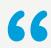
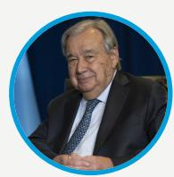
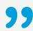
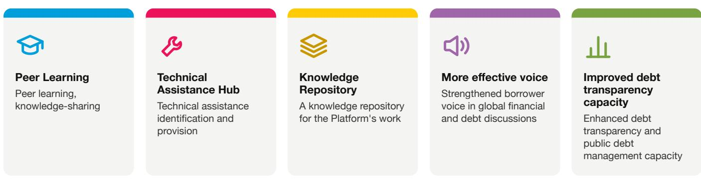
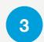

Towards a more equitable international financial architecture system

A Member State-led initiative, through the UN Supported by UN Trade and Development (UNCTAD) as Secretariat

The Borrowers' Platform is a dedicated space for developing countries to share knowledge, exchange experiences, and speak collectively and with authority on debt challenges of borrowers. While creditor-led forums have proliferated in response to the growing complexity of the global debt landscape, an institutionalized, borrower-led space has been missing. This gap in the global financial architecture constrains the ability of borrower countries to address systemic and evolving debt vulnerabilities effectively— until now.

I believe the creation of the Borrowers Platform is an essential instrument in order for a change in power relations to be possible in the future, and that changing power relations is absolutely essential to have a fair international financial architecture

UN Secretary-General António Guterres
April 2026, Washington DC

>120 Eligible countries

## tiers of governance

Mandatory fees

## Mandate

The establishment of the Borrowers' Platform was agreed under the Compromiso de Sevilla, the outcome document of the 4th International Conference on Financing for Development (FfD4), held in Seville, Spain in July 2025.

Paragraph 48(i) mandates Member States to establish a borrower platform supported by a UN entity as Secretariat. UNCTAD is supporting the Platform as a Secretariat.

## How does it work?

The Platform is governed at ministerial level by participating countries, supported by senior technical officials responsible for debt. It operates on a voluntary and non-binding basis, open to all net-borrower developing countries regardless of size, income level, or debt profile.

As countries learn from each other and share experiences, they will be able to identify common impediments and solutions to debt sustainability.

## Benefits of membership

Peer Learning
Peer learning,
knowledge-sharing

Technical Assistance Hub
Technical assistance identification and provision

Knowledge Repository
A knowledge repository for the Platform's work

More effective voice
Strengthened borrower
voice in global financial
and debt discussions

The Platform is not a crisis coordination mechanism, nor a forum for collective debt restructuring, nor a standard-setting body.

Improved debt transparency capacity
Enhanced debt transparency and public debt management capacity

## Governance structure

The Platform operates through two complementary tiers. One country chairs both tiers over the course of an annual term.

<table><tr><td></td><td>Governing Council</td><td>Steering Committee</td></tr><tr><td>WHAT</td><td>Political tierSets annual and multi-year prioritiesProvides political guidance for the work</td><td>Technical tierRegular exchanges on debt and development financeLeads technical work of the Platform</td></tr><tr><td>WHO</td><td>Ministers of finance, economy or central bank governors</td><td>Senior officials from ministries of finance, central banks, debt management offices, and/or specialized national institutions</td></tr><tr><td>WHEN</td><td>Meets twice annually</td><td>Regular virtual meetings, plus at least twice annually in person</td></tr></table>

The governance structure is agreed in the Platform's Modalities document to be adopted in October 2026

## - Where are we now? Interim Phase (April – October 2026)

<table><tr><td>APRIL 2026</td><td>NOW</td><td>OCTOBER 2026</td></tr><tr><td>Launch of the Borrowers&#x27; Platform at the IMF-World Bank Spring Meetings in Washington, D.C., with 30+ developing countries.</td><td>The Interim Steering Committee meets regularly to finalize the Platform&#x27;s Modalities, governance framework, and financing arrangements. Egypt serves as Interim Chair.</td><td>First annual cycle (2026/2027) launches on the sidelines of the IMF-World Bank Annual Meetings in Thailand.First Governing Council convenesAdoption of modalitiesElection of the first country Chair and TroikaAdoption of workplan 2026/27</td></tr></table>

## How to join

The Platform is open to all net-borrower developing countries, over 120 eligible countries are eligible. Countries that wish to confirm their eligibility are encouraged to contact UNCTAD: borrowers.platform@unctad.org

## STEPS TO JOIN

Submit a Letter of Intent to the Secretariat (template available on request)

Membership is voluntary and non-binding

No mandatory membership fees at this stage; financial contributions are entirely voluntary

## ELIGIBILITY CRITERIA

\- Developing country

\- UN Member State

\- Net borrowers

\- Not permanent or full members of a creditor association or grouping