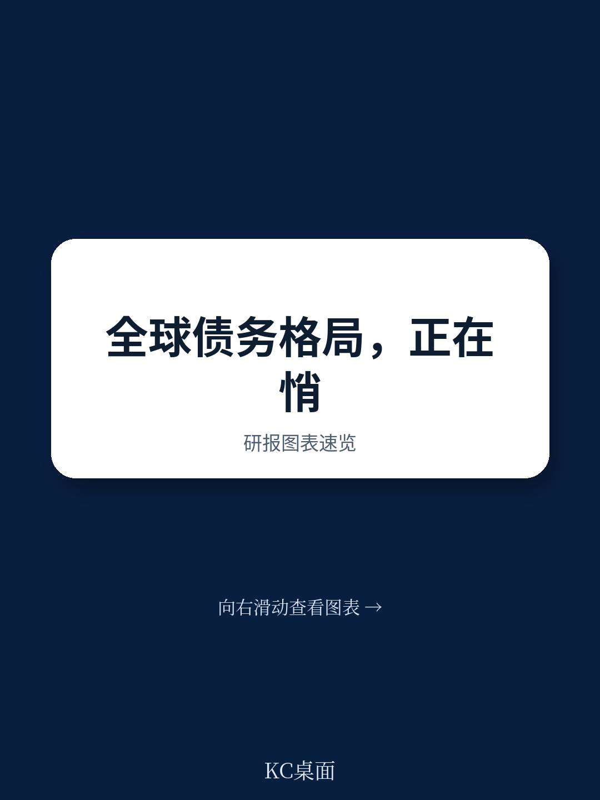
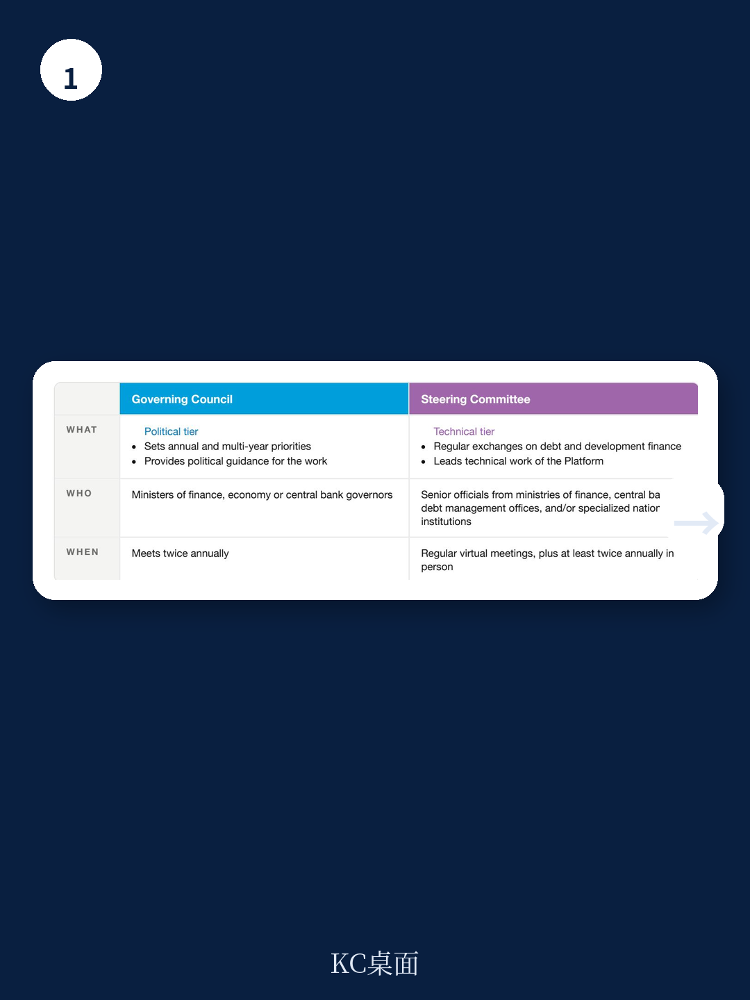
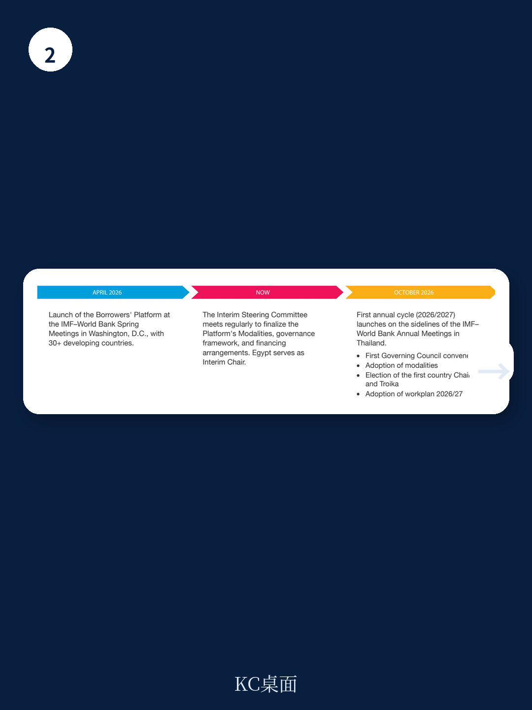

# 联合国贸发会议：不是债权人俱乐部，而是120国主导的债务治理新平台

全球金融架构正在经历一次罕见的权力再平衡。2026年4月，在华盛顿IMF-世界银行春季会议上，一个名为“借款人平台”的新机制正式启动。这不是又一个债权人俱乐部，也不是债务重组的临时协调小组——它是由120多个发展中国家共同发起、由联合国贸发会议担任秘书处的常设性机构。对于长期在主权债务谈判中处于弱势的借款国而言，这意味着它们第一次拥有了一个制度化的、由自己主导的集体发声空间。

这份报告的发布时机并非偶然。过去五年，全球债务格局发生了深刻变化：新兴市场和发展中经济体的外债规模持续攀升，而债权人结构从传统的巴黎俱乐部和商业银行，转向了包括中国、私人债权人和多边开发银行在内的多元化组合。这种复杂性使得债务谈判更加碎片化，借款国往往面临信息不对称、议价能力不足、条款不透明等系统性困境。借款人平台的成立，正是对这一结构性缺口的制度回应。

> **KC评论：** 理解这个平台的意义，关键不在于它今天能做什么，而在于它改变了什么。过去，债务治理的规则、节奏和话语权几乎完全掌握在债权人一方。借款人平台的出现，意味着借款国开始尝试从“被动接受者”变成“规则参与者”。这不仅是外交层面的姿态变化，更可能在未来十年重塑主权债务市场的博弈结构。

## 1. 全球金融治理的制度性缺口，正在被一个借款国主导的新机构填补

报告的核心判断是：现有的国际金融架构中，债权人主导的论坛已经足够多——巴黎俱乐部、G20共同框架、各类双边债权人委员会——但一个制度化、由借款国集体运作的空间却长期缺失。这个缺口并非偶然，而是反映了全球金融治理中权力结构的失衡。

借款人平台的成立，直接源于2025年7月在西班牙塞维利亚举行的第四届发展筹资国际会议(FfD4)的成果文件《塞维利亚承诺》。该文件第48(i)段明确要求成员国建立一个由联合国实体作为秘书处的借款人平台。联合国贸发会议被指定为秘书处，负责平台的日常运作和知识管理。

从治理结构看，平台设计了两层互补的架构：部长级参与的“理事会”负责设定年度和多年期优先事项，提供政治指导；由财政部、央行、债务管理办公室高级官员组成的“指导委员会”则负责技术层面的定期交流和实际工作推进。这种设计既保证了政治层面的权威性，又确保了技术层面的可操作性。

## 2. 120个国家的集体议价权，正在从“自愿参与”走向“制度化表达”

截至2026年4月，已有超过30个发展中国家在华盛顿加入平台。但报告明确，平台对所有净借款发展中国家开放，符合条件的国家超过120个。参与完全是自愿和非约束性的，目前也没有强制性会费——财务贡献完全自愿。

这种设计看似松散，实则精准。历史上，发展中国家在债务谈判中最大的劣势之一就是“单打独斗”——每个国家面对多个债权人，信息不对称、法律资源有限、谈判经验不足。借款人平台的核心价值，不是代替各国进行债务重组谈判，而是通过同行学习、知识共享、技术援助和集体发声，提升每个成员国的谈判能力和债务管理能力。

> **KC评论：** 不要低估“集体发声”的力量。当120个国家在同一个平台上共享债务合同条款、法律风险点、谈判策略时，信息不对称的天平会开始倾斜。这并不意味着债权人会立刻让步，但借款国的“信息优势”和“协调成本”将发生结构性变化。完整报告中对平台知识库和技术援助中心的设计，值得仔细研读——那里藏着真正的制度创新。

## 3. 这个平台刻意避免成为“债务重组论坛”，但它可能改变债务重组的底层逻辑

报告特别强调：借款人平台不是一个危机协调机制，也不是集体债务重组的论坛，更不是一个标准制定机构。这三个“不是”划定了平台的边界，也体现了其设计的务实性。

为什么刻意避免这些功能？原因可能有三。第一，债务重组涉及复杂的法律和主权问题，由借款国单边主导的平台难以获得债权人的信任和参与。第二，现有债务重组机制虽然碎片化，但仍有其存在的合理性，借款人平台的目标是“补充”而非“替代”。第三，平台的核心任务是“预防”而非“治疗”——通过提升债务透明度和公共债务管理能力，帮助成员国避免陷入需要重组的危机。

但这里有一个值得追问的问题：当120个借款国通过平台形成常态化的信息交流和策略协调后，它们在未来债务重组谈判中的议价能力会不会自然提升？报告没有直接回答这个问题，但给出了一个清晰的观察框架——平台的四个核心功能（同行学习、技术援助、知识库、集体发声）都在指向同一个方向：让借款国变得更“聪明”。

## 4. 报告尚未完全回答的关键问题：这个平台如何应对中国的债权人角色

作为全球最大的官方债权人之一，中国在借款人平台中的角色和定位，是报告没有充分展开但读者最关心的问题之一。报告在资格标准中提到，成员必须是“非永久性或非正式成员国的债权人协会或集团”。这个条件如何界定？中国是否被排除在外？如果中国作为债权人不参与，借款国平台如何有效处理涉及中国贷款的债务问题？

另一个未解问题是平台的融资机制。目前没有强制性会费，但一个服务于120个国家的机构需要持续的运营资金。自愿捐款的机制能否保证平台的独立性和可持续性？如果资金主要来自少数大国，平台的中立性是否会受到影响？

这些问题不是报告的缺陷，而是这个新机构本身面临的现实挑战。理解这些挑战，恰恰是读懂这份报告价值的关键。

## 5. 读者可以建立自己的观察框架：从三个维度跟踪借款人平台的演进

对于关注全球金融治理和新兴市场债务风险的读者，可以从以下三个维度建立观察框架

第一，治理有效性。2026年10月，平台将在泰国举行的IMF-世界银行年会上召开首届理事会，通过运营模式文件，选举首任主席和三人小组。届时，平台的实际治理能力将接受第一次检验。

第二，知识产出的质量。平台的知识库和技术援助中心能否真正帮助成员国提升债务管理能力，取决于其产出的专业性和实用性。如果平台能够发布系统性的债务合同分析、法律风险提示和最佳实践指南，其影响力将远超外交层面的声明。

第三，与现有机制的互动。借款人平台如何与巴黎俱乐部、G20共同框架、IMF和世界银行等现有机构协作？是形成互补关系，还是竞争关系？这种互动将决定平台是成为全球金融治理的新支柱，还是沦为又一个国际会议场所。

> **KC评论：** 对于关注新兴市场债务和全球金融架构变化的读者，这份报告的价值不在于它给出了多少结论，而在于它提供了一个新的分析框架。借款人平台的成立，意味着未来在分析主权债务风险时，不能只看债权人的动作，还要关注借款国的集体行动。完整报告中关于平台治理结构、资格标准和运营模式的细节图表，是理解这个新机构运作逻辑的关键。

---

借款人平台的成立，是一个信号。它表明，经过多年的债务危机和治理僵局，发展中国家开始从“抱怨规则不公平”转向“参与规则制定”。这个过程不会很快，也不会很顺利，但它正在发生。

更多国际信源汇编与评论，每日更新，汇总国际主流叙事、数据和图表，观测边际变化。我们会把这份报告的完整内容放回当天的全球金融治理主线中，整理成中文摘要、KC评论和图表合集，便于喂给AI，也便于人工快速扫描市场动态。目前社群已汇聚了头部券商、PE/VC、投行、并购、hedge fund、资管机构、战略咨询和智库的朋友，期待与你交流。

Personal reading notes and learning share only. Not investment advice.
