2024

# Economic development in Africa report

Unlocking Africa's trade potential
Boosting regional markets and
reducing risks

OVERVIEW

# © 2025, United Nations

This work is available through open access, by complying with the Creative Commons licence created for intergovernmental organizations, at http://creativecommons.org/licenses/by/3.0/igo/.

The designations employed and the presentation of material on any map in this work do not imply the expression of any opinion whatsoever on the part of the United Nations concerning the legal status of any country, territory, city or area or of its authorities, or concerning the delimitation of its frontiers or boundaries.

Photocopies and reproductions of excerpts are allowed with proper credits.

United Nations publication issued by the United Nations Conference on Trade and Development

UNCTAD/ALDC/AFRICA/2024 (Overview)

## Content

Foreword Page iv
Introduction Page vii

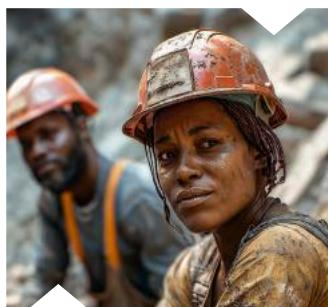  
Page 1
Shocks exposure and vulnerability dynamics across countries in Africa

  
Page 7
The economic
vulnerabilities to monitor
when trading and
investing across Africa

  
Page 13
Maximizing trade resilience and regional market benefits in Africa

  
Page 21
Building resilience in businesses and cross-border transactions in Africa

  
Page 27
Policy
recommendations

# Foreword

The world is in polycrisis, and Africa is on the front line of exposure. The same global shock has very different impacts depending on the location. Resilience is the difference between the shock and the impact; how to build resilience in Africa is the focus of this report. Recent crises have hit the continent disproportionately. Building resilience will allow the continent to reap the many opportunities offered by its future.

Though exposure varies by country, African economies are persistently exposed to a range of external shocks due to commodity-dependency, high levels of debt and limited technological infrastructure and connectivity. About half of all African countries relied on oil, gas or minerals for over 60 per cent of their export earnings in 2023. Global trade route disruptions have exposed them to significantly higher shipping and trade costs. In 2024, African shipping rates were 115 per cent above pre-COVID-19 (coronavirus disease) pandemic levels and double the 2023 average costs. At the same time, official development assistance to Africa declined by 4.1 per cent in 2022, while Africa's average borrowing cost increased to 11.6 per cent, 8.5 percentage points higher than the risk-free rate of the benchmark of the United States.

This year's Economic Development in Africa Report 2024: Unlocking Africa's Trade Potential – Boosting Regional Markets and Reducing Risks presents some important tools in this context. This includes a comprehensive framework to help African countries analyse the nature of their own exposure to shocks, with a particular focus on trade and investment. We also provide an evidence-based analysis that highlights how regional trade can increase the continent's resilience. There are five takeaways from this report.

First, the argument that economic diversification serves as a strong buffer against economic shocks remains relevant. This is particularly true for African economies that depend on a limited number of trade partners. Africa has five main trading partners accounting for over 50 per cent of all its imports and exports.

Second, despite six decades of growth in gross exports, Africa's integration into high value added segments of global supply chains remains low. Only 16 of 54 African countries source more than 0.5 per cent of their intermediate inputs from within the continent. Better infrastructure and leveraging the African Continental Free Trade Area can improve regional market participation and drive positive outcomes.

Third, improving the operational environment is vital for African businesses, particularly microenterprises and small and medium-sized enterprises. Less than 50 per cent of the population has reliable electricity access, which raises costs and limits value chain integration. Reliance on fossil fuels, over 50 per cent of the energy supply, heightens risks amid global energy transitions. Recent growth in renewable energy investment in Africa (estimated at \$15 billion in 2023) remain direly low compared to global renewable energy investment, at about 2.3 per cent of the total.

Fourth, polycrisis creates economic uncertainty and discourages trade and investment, thus hampering long-term development prospects. In 2023, flows of foreign direct investment to Africa declined by 3 per cent, to a total stock of \$53 billion. Deeper regional integration can help reverse the trend. Last year, between 13 and 20 per cent of international projects financed in Africa were funded by African investors themselves.

Finally, the report provides some key policy recommendations to African Governments. This includes enhancing the legal and regulatory environment, leveraging robust risk management tools, regional cooperation and strategic investments in infrastructure and technology to ensure smooth trade and improved connectivity.

I hope that this edition of the Economic Development in Africa Report will serve as a valuable tool for policymakers and inspire urgent action in these urgent times.

Rebeca Grynspan
Secretary-General of UNCTAD

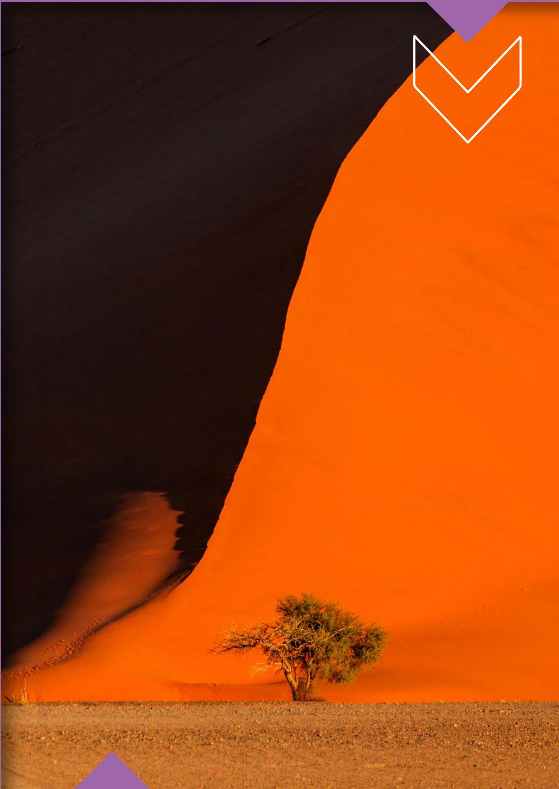

## Introduction

Africa is facing a complex global polycrisis that encompasses climate-related, economic, political and technological challenges. The interconnectedness of vulnerabilities, intensified by geopolitical tensions and climate change, poses significant risks to the continent. However, Africa also possesses unique strengths, such as a young population, significant natural resources and growing regional markets and investment opportunities.

UNCTAD, in Economic Development in Africa Report 2024: Unlocking Africa's Trade Potential – Boosting Regional Markets and Reducing Risks, emphasizes the need to balance these opportunities and systemic vulnerabilities, to enhance resilience and promote sustainable development. UNCTAD examines how the complex interplay of crises in 2000–2022 impacted economic development in Africa and exacerbated trade and financial risks, particularly for firms. Six categories of shocks that pose significant threats to African trade and development are identified, namely, political, economic, demographic, energy-related, technological and climate-related. Vulnerability to these shocks is analysed across the following six domains: economic, governance-related, connectivity, social, energy-related and climate.

To navigate the challenges of the global polycrisis, UNCTAD highlights the critical need for regional cooperation, robust risk management and strategic investments in infrastructure and technology. The African Continental Free Trade Area serves as a pivotal mechanism for fostering intra-African trade, reducing dependency on external markets and building more resilient trade networks. By leveraging regional integration and collaborative policies, countries in Africa can mitigate vulnerabilities and capitalize on growth opportunities.

© 2024 UNCTAD. Image created by humans with the assistance of artificial intelligence

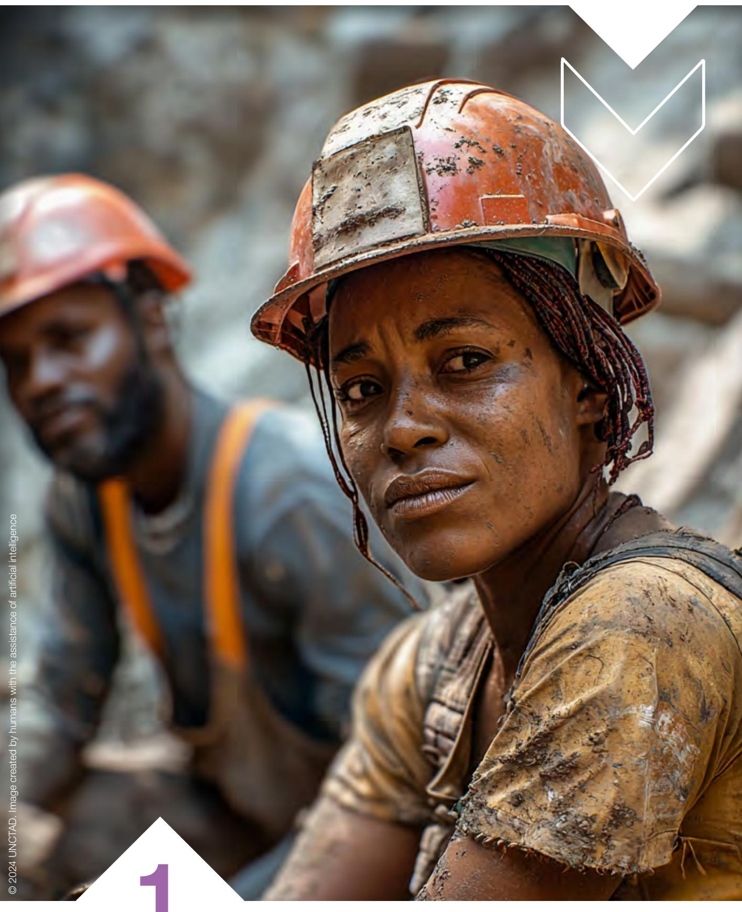  
Shocks exposure and vulnerability dynamics across countries in Africa

A variety of interconnected external shocks, such as geopolitical conflicts, the global coronavirus disease (COVID-19) pandemic and inflationary pressures, have disrupted supply chains, increased costs and magnified socioeconomic vulnerabilities worldwide. These shocks interact with the vulnerable socioeconomic and political structures in Africa, creating unique challenges to sustainable development. During recent episodes of global crises, such as the oil price shock in 2014–2016 and the pandemic in 2019–2020, countries in Africa, as were many other countries worldwide, were subject to higher levels of uncertain economic and political situations (figure 1).

Figure 1
World uncertainty index: Africa and global averages (Index)  
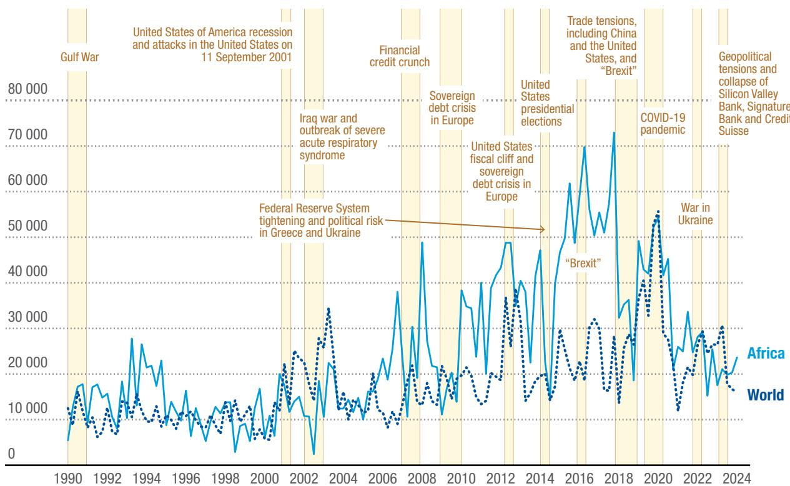  
Source: UNCTAD calculations, based on data from the world uncertainty index, 2024. Abbreviation: GDP, gross domestic product.

Heightened political risks due to conflicts, frequent governance disruptions and instability experienced on the continent affect economic resilience and hinder recovery efforts in countries in Africa. Of the 492 attempted or successful coups recorded globally since 1950, 220 have taken place in Africa. This has contributed to low levels of investment and a challenging business environment in many countries. With 46 per cent of countries in Africa having debt-to-GDP ratios exceeding the sustainable level of 60 per cent, the continent is particularly exposed to high borrowing costs and high inflation rates driven by economic crises and supply chain disruptions.

The vulnerability of Africa stems from exposure to the following six categories of shocks:

(a) Political: Coups d'état, governance challenges and the erosion of democratic institutions;

(b) Economic: Debt burdens, trade imbalances and inflation;

(c) Demographic: Rapid population growth and migration pressures;

(d) Energy-related: Dependency on fossil fuels and limited renewable infrastructure;

(e) Technological: Digital gaps and exposure to disruptive innovations;

(f) Climate-related: Severe weather events and agricultural dependency.

The extent to which these shocks pose risks to trade and investment depends on the vulnerability of countries to being harmed by such shocks if they occur. Less vulnerable and hence more resilient countries will be less harmed and trade and investment will be less at risk. There are six domains across which countries in Africa are particularly vulnerable to the effects of the polycrisis, namely, economic, governance, connectivity, social, energy and climate (figure 2).

## Figure 2

Africa: Interconnected exposure to polycrisis shocks and vulnerability across different domains that can threaten trade and capital flows

## Exposure to shocks

• Political

• Economic

• Demographic

\- Energy-related

\- Technology

## Domains of vulnerability

• Climate-related

• Economic

\- Governance

\- Connectivity

\- Social

\- Energy

\- Climate

# Economic Development in Africa Report 2024 Unlocking Africa's trade potential: Boosting regional markets and reducing risks Overview

For instance, in 2022, climate-related hazards in Africa caused \$8.5 billion in damages, affecting over 110 million people. Climate change poses existential risks, particularly in agriculture-dependent economies. Severe weather events and environmental degradation threaten food security, livelihoods and economic stability. Countries with inadequate climate adaptation policies face intensified challenges from extreme weather and environmental degradation, which limits the ability to cope with crises.

In addition, in Africa, with less than 50 per cent of the population having reliable access to electricity and given a reliance on fossil fuels and the significant barriers faced in the energy transition, vulnerability to global energy price shocks is intensified. Most countries in Africa lack the infrastructure to harness hydro, solar or wind power. Building renewable energy capacity in order to reduce the reliance on fossil fuels and securing international funding for sustainable energy projects are critical for transformation and resilience in Africa; \$190 billion is needed annually for energy investment, equal to 6.1 per cent of GDP of Africa.

Exposure to polycrisis shocks does not necessarily mean that Africa is at risk. The extent of risk depends on how vulnerable a country is to harm by the occurrence of such shocks and whether it can deal with them. Connectivity vulnerability and economic vulnerability are two of the main domains in which countries in Africa are most vulnerable in the current context of polycrisis shocks (see table).

Addressing the sources of vulnerability in Africa requires the following actions:

(a) Encourage diversification away from resource dependency, to reduce vulnerability to market shocks;

(b) Increase trade within Africa, particularly through mechanisms such as the African Continental Free Trade Area, to reduce dependence on global markets;

(c) Implement sound fiscal policies, to reduce debt dependency, and improve access to financing, to sustain economic resilience;

(d) Enhance transportation networks and digital connectivity, to reduce trade costs and support efficient logistics;

(e) Invest in renewable energy and build infrastructure for reliable energy access, to reduce exposure to global energy market fluctuations.

Major areas of vulnerability to polycrisis shocks, by country: Africa is most vulnerable across the connectivity and economic domains

<table><tr><td></td><td>Top two vulnerability domains</td><td></td><td>Top two vulnerability domains</td></tr><tr><td>Algeria</td><td>Connectivity + Economic</td><td>Libya</td><td>Governance + Connectivity</td></tr><tr><td>Angola</td><td>Connectivity + Economic</td><td>Madagascar</td><td>Connectivity + Economic</td></tr><tr><td>Benin</td><td>Economic + Connectivity</td><td>Malawi</td><td>Energy + Connectivity</td></tr><tr><td>Burkina Faso</td><td>Economic + Energy</td><td>Mali</td><td>Economic + Connectivity</td></tr><tr><td>Burundi</td><td>Energy + Economic</td><td>Mauritania</td><td>Connectivity + Economic</td></tr><tr><td>Cabo Verde</td><td>Connectivity + Economic</td><td>Mauritius</td><td>Connectivity + Economic</td></tr><tr><td>Cameroon</td><td>Connectivity + Economic</td><td>Morocco</td><td>Economic + Connectivity</td></tr><tr><td>Central African Republic</td><td>Social + Economic</td><td>Mozambique</td><td>Connectivity + Energy</td></tr><tr><td>Chad</td><td>Energy + Social</td><td>Namibia</td><td>Connectivity + Economic</td></tr><tr><td>Comoros</td><td>Connectivity + Economic</td><td>Niger</td><td>Connectivity + Economic</td></tr><tr><td>Congo</td><td>Connectivity + Social</td><td>Nigeria</td><td>Economic + Connectivity</td></tr><tr><td>Côte d’Ivoire</td><td>Economic + Connectivity</td><td>Rwanda</td><td>Economic + Connectivity</td></tr><tr><td>Democratic Republic of the Congo</td><td>Connectivity + Energy</td><td>Sao Tome and Principe</td><td>Connectivity + Economic</td></tr><tr><td>Djibouti</td><td>Governance + Connectivity</td><td>Senegal</td><td>Connectivity + Economic</td></tr><tr><td>Egypt</td><td>Governance + Economic</td><td>Seychelles</td><td>Climate + Governance</td></tr><tr><td>Equatorial Guinea</td><td>Governance + Connectivity</td><td>Sierra Leone</td><td>Connectivity + Economic</td></tr><tr><td>Eritrea</td><td>Connectivity + Governance</td><td>Somalia</td><td>Governance + Connectivity</td></tr><tr><td>Eswatini</td><td>Connectivity + Social</td><td>South Africa</td><td>Governance + Connectivity</td></tr><tr><td>Ethiopia</td><td>Economic + Connectivity</td><td>South Sudan</td><td>Social + Energy</td></tr><tr><td>Gabon</td><td>Connectivity + Governance</td><td>Sudan</td><td>Connectivity + Governance</td></tr><tr><td>Gambia</td><td>Connectivity + Economic</td><td>United Republic of Tanzania</td><td>Economic + Connectivity</td></tr><tr><td>Ghana</td><td>Economic + Connectivity</td><td>Togo</td><td>Economic + Connectivity</td></tr><tr><td>Guinea</td><td>Economic + Connectivity</td><td>Tunisia</td><td>Connectivity + Economic</td></tr><tr><td>Guinea-Bissau</td><td>Economic + Connectivity</td><td>Uganda</td><td>Economic + Connectivity</td></tr><tr><td>Kenya</td><td>Economic + Connectivity</td><td>Zambia</td><td>Economic + Connectivity</td></tr><tr><td>Lesotho</td><td>Connectivity + Economic</td><td>Zimbabwe</td><td>Economic + Connectivity</td></tr><tr><td>Liberia</td><td>Connectivity + Energy</td><td></td><td></td></tr></table>

Source: UNCTAD.

Note: The 2023 social progress index score used to measure the vulnerability of countries in Africa to polycrisis shocks in the social domain is not available for Seychelles; the social domain is therefore not taken into account when identifying the top two domains for Seychelles.

The economic vulnerabilities to monitor when trading and investing across Africa

In 2002–2023, Africa emerged as a prominent and attractive destination for trade and investment, given above-average levels of economic performance. However, economies in Africa experienced upsets that had adverse effects on economic growth and sustainable development. A major risk to trade in Africa is the lack of economic diversification, since countries are therefore poorly buffered in times of economic and other crises that have an impact on output.

One approach to assessing the performance of economies in Africa during periods of shock involves two main perspectives on exposure to shocks, namely, effects due to macroeconomic and structural vulnerabilities and effects due to a particular crisis, according to vulnerability by country grouping. A key variable, often regarded as an indicator of interest for trade and investment, is GDP growth. In 2000–2010, the economy of Africa grew by an annual 4.8 per cent on average, which was 1.7 percentage points higher than the global average of 3.1 per cent. Similarly, in 2011–2020, the average GDP growth of Africa was 3.1 per cent, compared with the global average of 2.4 per cent. Growth rates varied substantially, as the continent was exposed to numerous shocks, affecting economic growth in various ways (figure 3).

Figure 3
Economy of Africa: Average growth of 4.9 per cent, underpinned by commodity price booms
(Annual percentage change)  
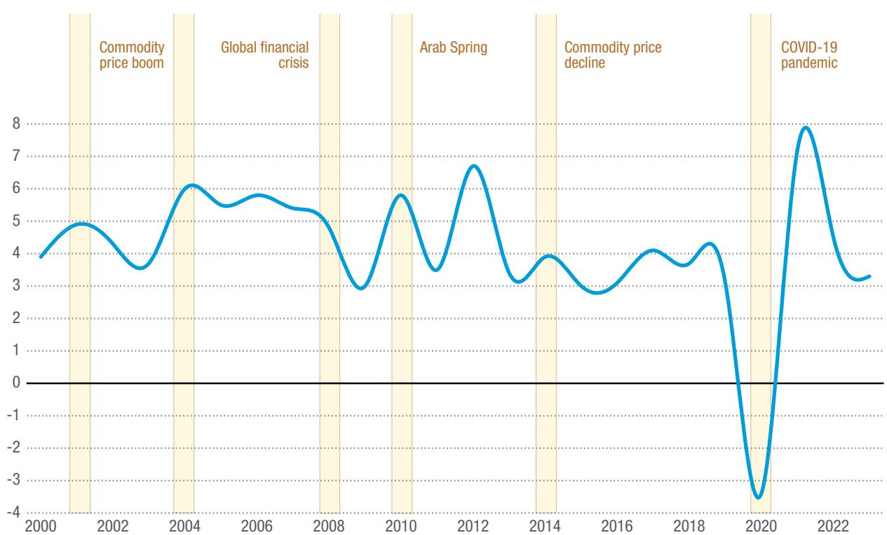  
Source: UNCTAD calculations, based on data from the World Development Indicators database (World Bank).

(Annual percentage change)

About 16 per cent of the global population lives in Africa. Trade volumes are, however, disproportionately small, representing less than 2.9 per cent of world trade in 2022. The low trade volume reflects the challenging economic placement of Africa in the world economy, in which it is relatively weak and dependent on stronger economic regions, while also particularly vulnerable to external shocks. Generally, the investment growth trajectory in Africa is adversely impacted by shocks (figure 4). For instance, in tandem with commodity price shocks in 2014, gross fixed capital formation growth declined from 11.4 per cent in 2014 to 4.8 per cent in 2015. Similarly, in 2020, the effects of the pandemic saw gross fixed capital formation contract by 4.1 per cent.

## Figure 4

Economy of Africa: Average gross fixed capital formation growth rate – investment trajectory adversely affected by commodity price shocks and the pandemic  
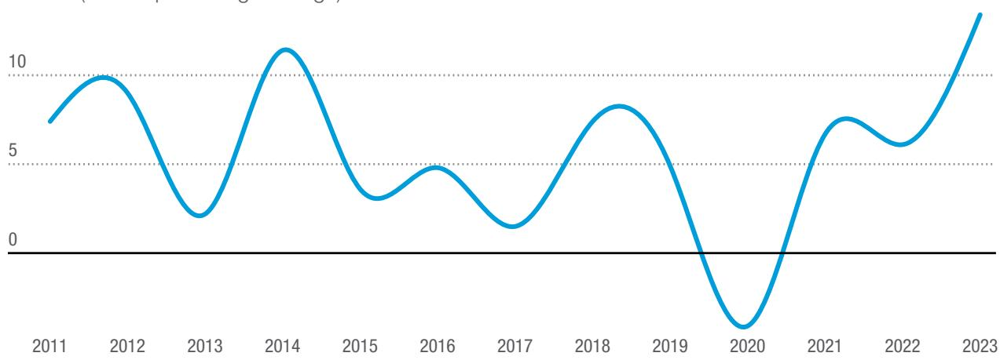  
Source: UNCTAD calculations, based on data from the World Development Indicators database (World Bank).

Macroeconomic variables affect trading in an economy and can be used to assess trade performance in the short to medium terms. In addition, a well-managed macroeconomy strengthens trade performance. Two main variables in assessing macroeconomic risk are fiscal balance and inflation, whereby sound fiscal policies ensure macroeconomic stability and an overreliance on one source of revenue, underpinned by the lack of diversification, leads to risks to longer-term macroeconomic sustainability.

In Africa, in 2010–2019, the average fiscal balance deviation, defined as the difference between planned or forecast fiscal balance and actual fiscal balance, was a deficit of 0.1 per cent of GDP, with the highest deficit in 2014, at 2 per cent of GDP, due to a drop in commodity prices (figure 5). In 2020, the fiscal balance deviation was a deficit of 3.4 per cent of GDP, due to increased spending related to the pandemic. Such deviations demonstrate the impact of shocks on the ability of African Governments to manage revenues, react to emergencies such as the pandemic and mitigate risks.

## Figure 5

Economy of Africa: Average fiscal balance deviations – adjustments during growth periods often leave little room for adjustments during periods of shock, posing risks for macroeconomic stability
(Percentage of gross domestic product)

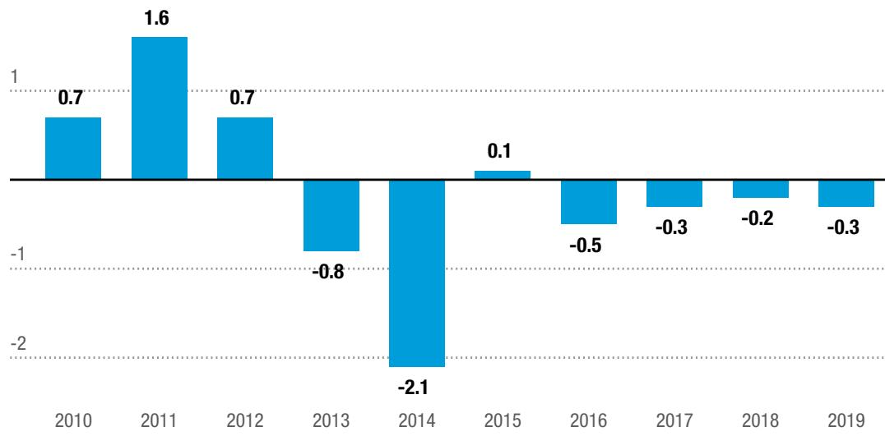  
Source: UNCTAD calculations, based on data from the World Economic Outlook database (International Monetary Fund).

In the past two decades, the pandemic may be the most significant risk to economies in Africa to have materialized. The pandemic had far-reaching economic implications for all economies globally, with particularly adverse effects on services-exporting economies. In Africa, in 2019–2021, the leading five exporters of trade in services in absolute terms on average were Egypt (\$20.6 billion), Morocco (\$16.2 billion), South Africa (\$11.2 billion), Ghana (\$8.9 billion) and Ethiopia (\$4.9 billion). Other countries with trade in services exports of over \$1 billion were Kenya, Nigeria, Tunisia, the United Republic of Tanzania and Algeria (figure 6). In 2019–2021, of the 10 countries with the highest average trade in services exports, Algeria, Kenya, Morocco, Nigeria, South Africa and Tunisia had GDP unfavourably impacted during the pandemic.

Macroeconomic stability and fiscal policy reforms are essential in managing vulnerabilities in economies in Africa, particularly given exposure to external shocks, high debt levels and economic reliance on a limited range of exports. To achieve macroeconomic stability and sustainable fiscal policy, African Governments need to balance growth-oriented spending with disciplined fiscal and debt management. Reducing reliance on external borrowing, diversifying revenue sources and promoting transparency are vital steps. By instituting sound fiscal frameworks and strengthening institutional capacities, countries can better withstand economic shocks, attract investment and create a stable environment conducive to long-term economic growth and resilience.

  
Economy of Africa: Trade-in-services exports average, 2019–2021 – 6 out of 10 countries with highest average trade-in-services exports affected by global economic and social shocks
(Millions of dollars)

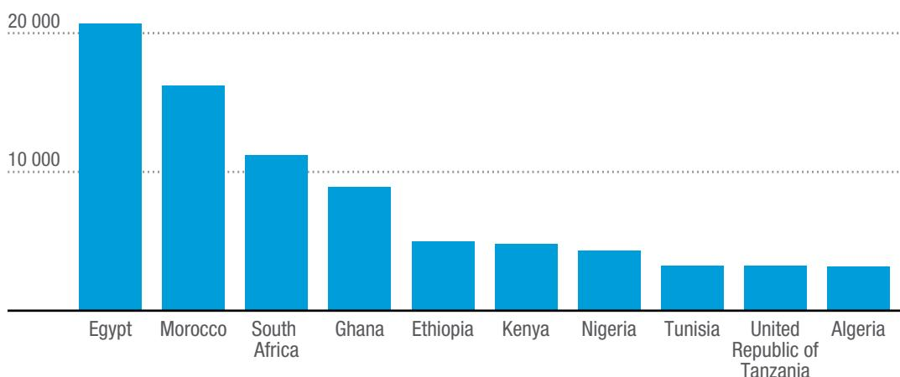  
Source: UNCTAD calculations, based on data from the UNCTADstat database.

  
Maximizing trade resilience and regional market benefits in Africa

Economically vulnerable countries often fall into an instability trap when affected by polycrisis shocks, which further weaken productive and trading capabilities and limit prospects for equitable and sustainable development. Such shocks, including global economic downturns, health crises, such as the pandemic, and geopolitical disruptions, such as the war in Ukraine, reveal the fragility of markets in Africa, particularly due to dependence on a narrow range of primary export commodities and minimal backward integration within value chains.

Modest progress has been made in intra-African trade, yet overall integration within Africa remains low. Most countries in Africa export primarily unprocessed or semi-processed goods to non-African markets, missing opportunities to build value added production networks within the continent. Only 16 countries in Africa receive a small percentage of intermediate inputs from other countries on the continent and few countries serve as core suppliers in regional trade networks. This means that regional markets are underutilized and there is untapped potential for countries in Africa to provide intermediate goods to one another. The trade networks of Africa are currently highly concentrated among a few countries, including a limited number of global partners such as China, France, India and the United States (figure 7).

Only 16 of 54 countries in Africa source 0.5–6 per cent of total intermediate inputs from other countries on the continent. A network analysis shows that a small number of countries, including Kenya, Nigeria and South Africa, act as major suppliers and users of value added goods. As a result, these countries are central to trade networks in Africa and disruptions in these economies can have an outsized effect on other economies. That is, if a shock, such as economic disruption or political instability, affects one of these central nodes, the effects can spread quickly, impacting production and trade throughout the continent. The countries that anchor the trade network form chokepoints in value and supply chains in Africa and have the greatest potential to disrupt production and output across many economies by amplifying the effects of various shocks. As a result, countries have limited options in adjusting to shocks and protecting businesses from their impacts through trade. By diversifying trade partnerships and reducing overreliance on a few core economies, Africa can enhance the resilience of value chains and reduce vulnerability to localized disruptions.

Countries in Africa have significant potential for upgrading and diversifying exports and improving the likelihood of better integration into global markets by leveraging the opportunities of deeper regional integration. Most exports from Africa to the rest of the world are either raw or semi-processed, yet processed and semi-processed goods account for 61 per cent of intra-African exports and are more diversified. More viable and well-integrated regional supply chains are generally expected with deeper integration, as they enhance the odds of more profitable engagement in the global production and supply networks for the countries concerned. High transitivity coefficients, that is, the extent to which a group of nodes is densely connected within a network, suggest a strong concentration of traded value added among regional economic communities (figure 8), possibly in line with progress made in such communities in reducing non-tariff trade costs through improvements in trade logistics and facilitation. Enhancing regional trade integration, such as through the African Continental Free Trade Area, could support the diversification of value added supply chains and help build resilience by allowing countries in Africa to source more goods regionally, spreading out production and reducing reliance on global suppliers.

## Figure 7

Africa: Principal global partners in value added trade network, 2022 – trade networks are concentrated in a few countries, increasing risk of disruptions if shocks impact core nodes

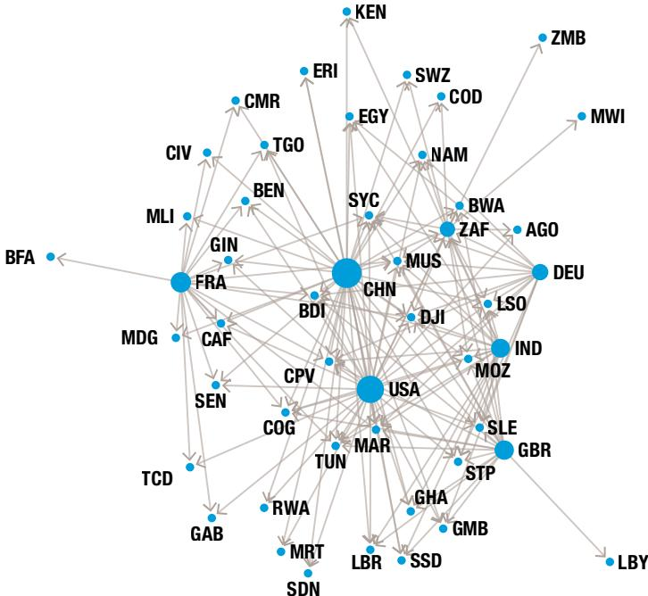

Source: UNCTAD calculations, based on data from the UNCTAD–Eora Global Value Chain database. Notes: The arrows representing the edges point towards the importer of the value added whose imported share of foreign value added is at least 0.5 per cent of its exported value added. The size of each node is proportional to its total degree; the larger the node, the more important a country as a supplier of foreign value added. Users are depicted by the smallest nodes regardless of their relative weight as users. Abbreviations: AGO, Angola; BDI, Burundi; BEN, Benin; BFA, Burkina Faso; BWA, Botswana; CAF, Central African Republic; CHN, China; CIV, Côte d'Ivoire; CMR, Cameroon; COD, Democratic Republic of the Congo; COG, Congo; CPV, Cabo Verde; DEU, Germany; DJI, Djibouti; EGY, Egypt; ERI, Eritrea; FRA, France; GAB, Gabon; GBR, United Kingdom of Great Britain and Northern Ireland; GHA, Ghana; GIN, Guinea; GMB, Gambia; IND, India; KEN, Kenya; LBR, Liberia; LBY, Libya; LSO, Lesotho; MAR, Morocco; MDG, Madagascar; MLI, Mali; MOZ, Mozambique; MRT, Mauritania; MUS, Mauritius; MWI, Malawi; NAM, Namibia; RWA, Rwanda; SDN, Sudan; SEN, Senegal; SLE, Sierra Leone; SSD, South Sudan; STP, Sao Tome and Principe; SWZ, Eswatini; SYC, Seychelles; TCD, Chad; TGO, Togo; TUN, Tunisia; USA, United States; ZAF, South Africa; ZMB, Zambia.

## Figure 8

Common Market for Eastern and Southern Africa value added trade network, manufacturing sector, 2022: Deeper integration within the Common Market reveals diversified and resilient trade networks

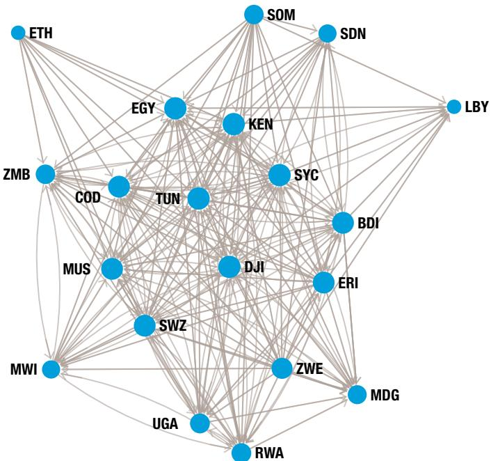  
Source: UNCTAD calculations, based on data from the UNCTAD–Eora Global Value Chain database. Notes: The arrows representing the edges point towards the importer of the value added whose imported share of foreign value added is at least 0.01 per cent of its exported value added in the manufacturing sector. The size of each node is mapped to the eigenvector centrality, which reflects a country's relative importance as both a supplier and user of foreign value added, accounting for the relative importance of its key partners in the network. The larger the node, the more important a country as a supplier and/or user of foreign value added in Africa. The curved edges highlight reciprocal trade ties. Data are not available for the Comoros. Abbreviations: BDI, Burundi; COD, Democratic Republic of the Congo; DJI, Djibouti; EGY, Egypt; ERI, Eritrea; ETH, Ethiopia; KEN, Kenya; LBY, Libya; MDG, Madagascar; MUS, Mauritius; MWI, Malawi; RWA, Rwanda; SDN, Sudan; SOM, Somalia; SWZ, Eswatini; SYC, Seychelles; TUN, Tunisia; UGA, Uganda; ZMB, Zambia; ZWE, Zimbabwe.

The development in Africa of more interconnected and resilient regional value and supply chains may, however, be hindered by infrastructure deficits and high trade costs. Infrastructure gaps, particularly in transport, information and communications technology and energy, present significant barriers to industrial output and growth and remain one of the major risks undermining the development of regional value and supply chains on the continent. Good infrastructure is essential for efficient production, distribution and access to markets; however, such systems are underdeveloped in most countries in Africa. Both information and communications technology infrastructure and transport infrastructure remain underdeveloped in the region, notwithstanding significant improvements in the former since 2010 (figure 9). Transport costs in Africa are among the highest globally, often due to underdeveloped road networks and logistical inefficiencies. Landlocked countries, in particular, face significantly higher transport costs, which can reach up to 50 per cent above those in coastal countries. Intra-African transport costs, measured as the share of trade value per 10,000 km, are much higher than extra-African transport costs, undermining the development of intra-African value and supply chains. Despite general improvements made in trade facilitation, there remains a need for further improvements in most countries, to ensure efficiency and less costly processes in the movement of intermediate inputs, final goods and persons within and across regions in Africa. Key challenges across countries remain in border-agency management and, mainly, process automation, largely due to the high cost of establishing and managing automation systems.

## Figure 9

Africa: Evolution of connectivity – infrastructure development has improved but missing links in transport and electricity persist  
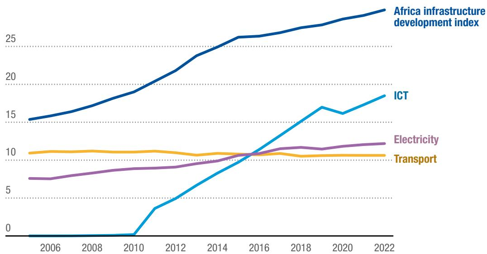  
Source: UNCTAD calculations, based on data from the Africa infrastructure development index. Abbreviation: ICT, information and communications technology.

Pertinent gaps are also observed across different indicators in trade logistics. Of countries in Africa, only Egypt and South Africa exceed the global average score in the overall logistics performance index. Other countries with high scores include Botswana, Côte d'Ivoire, Kenya, Malawi, Morocco, Namibia, Rwanda, Tunisia and Uganda. In this regard, non-tariff trade barriers remain a major challenge to trade within and among regional economic communities in Africa. Non-tariff measures are trade rules and regulations that can affect prices and quantities traded through a range of technical and non-technical requirements such as sanitary and phytosanitary measures; non-tariff measures are estimated to restrict intra-African trade three times more than regular customs tariffs.

There are large variations in non-tariff trade costs within and across regional economic communities. Intra-community non-tariff trade costs range from 135 per cent in the East African Community to 283 per cent in the Common Market for Eastern and Southern Africa (figure 10). Such costs are even higher when trading across regional economic communities, ranging from 254 per cent for trade between the East African Community and the Common Market for Eastern and Southern Africa to over 400 per cent for trade between the East African Community and the Economic Community of West African States. This serves to highlight that goods traded across regional economic communities are subjected to additional ad valorem equivalent trade costs of at least 100 per cent; and partly underscores the high transitivity coefficient, which suggests a higher concentration of value added trade within regional economic communities. Addressing infrastructure deficits, high non-tariff costs and concentrated trade networks could position Africa to capitalize on significant market potential, reduce reliance on external suppliers and build stronger economic resilience against future shocks. Such an approach could support sustainable growth and increase the competitiveness of Africa in global markets.

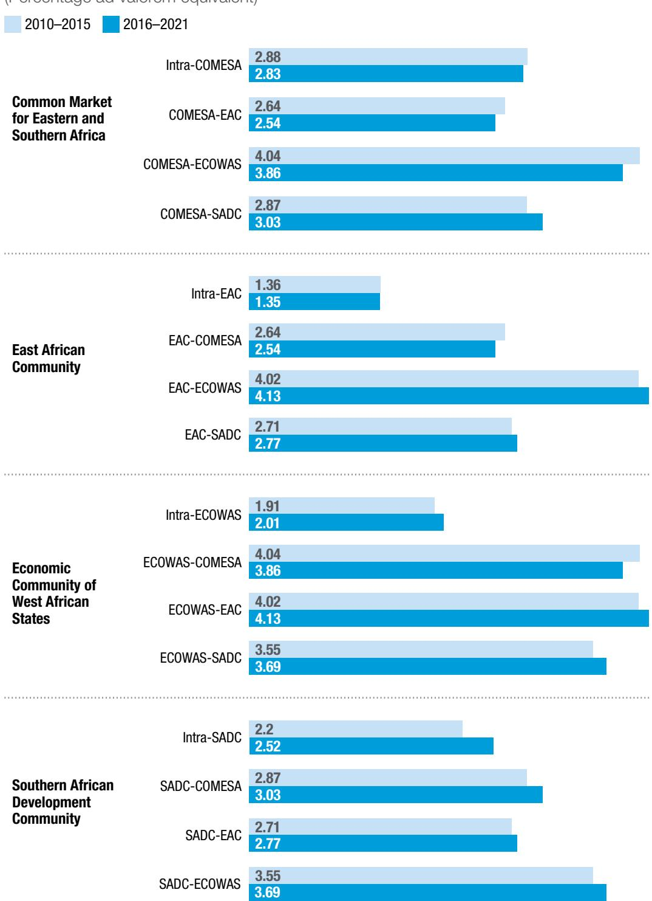

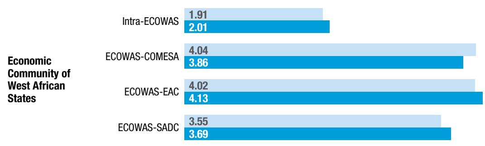

## Figure 10

Africa: Average non-tariff trade costs among and between regional economic communities – intra-community non-tariff trade costs are lower than inter-community costs

(Percentage ad valorem equivalent)

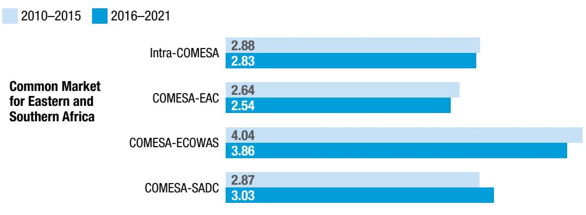

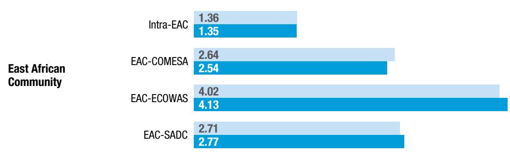  
Source: UNCTAD calculations, based on data from the Trade Cost database (Economic and Social Commission for Asia and the Pacific–World Bank).  
Note: Non-tariff trade costs capture all additional costs other than tariff costs involved in trading goods bilaterally rather than domestically, including, but not limited to, transportation costs and direct and indirect costs associated with currencies and languages and import and export procedures.  
Abbreviations: COMESA, Common Market for Eastern and Southern Africa; EAC, East African Community; ECOWAS, Economic Community of West African States; SADC, Southern African Development Community.

Building resilience in businesses and cross-border transactions in Africa

Situations of vulnerability to polycrisis shocks that prevail in the connectivity and economic domains, such as high non-tariff trade costs, weak infrastructure connectivity, low levels of participation in trade networks, a high concentration of exports and a low degree or lack of economic complexity can contribute to a shrinking appetite for business operations and capital flows to countries in Africa and further undermine the already challenging business and investment environments on the continent. The potential of the private sector to leverage regional market advantages such as through the African Continental Free Trade Area is offset by deficits in the financial system; scarcity in the factors of production, such as capital and entrepreneurship; challenges in regulatory compliance; and insufficient infrastructure integration in most countries in Africa.

Firms in Africa are vulnerable to multiple risks, including currency volatility, regulatory unpredictability, political instability and logistics challenges. This exposure affects trade flows, operational costs and investor confidence. Despite these risks, Africa offers high returns, growing markets and trade benefits. Firms need to adapt by improving compliance and the understanding of local markets. Countries with stronger regulatory environments, connectivity, climate adaptability, economic diversification and political stability, such as Botswana, Cabo Verde, Mauritius, Morocco and South Africa, demonstrate better resilience to such challenges (figure 11).

However, this is not the case for many other countries in Africa, in which the regulatory landscape is often complex and unpredictable. In such environments, businesses, particularly small and medium-sized enterprises, face challenges with regard to regulatory requirements, tax compliance and bureaucratic obstacles, which increase operational costs and reduce competitiveness. For instance, some firms lack clarity on sector-specific legal standards, which can hinder compliance and discourage foreign direct investment. Bilateral investment treaties are among the key instruments used globally to minimize investment risks associated with factors such as trade and investment disputes, employment and wages, ownership and control of businesses, expropriations and transfers. Africa is a signatory to several bilateral and international trade and investment agreements that help minimize the risks of trading and investing in the region. Egypt leads the region in this regard, with 100 treaties signed, 72 of which are in force with countries in Africa and elsewhere (figure 12). Morocco follows with 76; Tunisia, with 55; Algeria, with 45; Mauritius, with 45; and South Africa, with 38.

## Figure 11

Botswana, Cabo Verde, Mauritius, Morocco, South Africa: Resilience to polycrisis shocks and low levels of vulnerability, an attribute sought by businesses and investors

## (a) Botswana

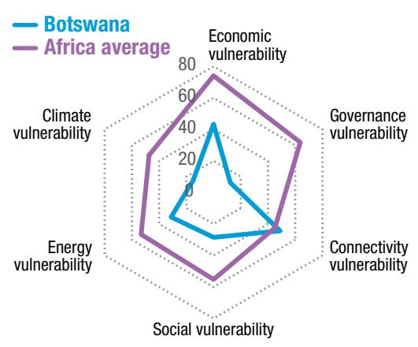  
(b) Cabo Verde

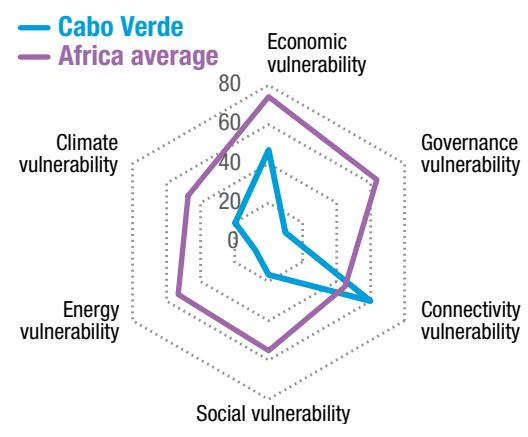

## (c) Mauritius

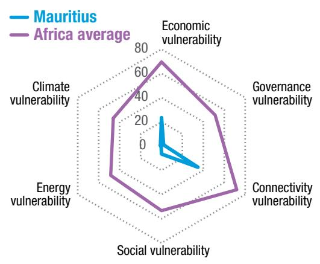

## (d) Morocco

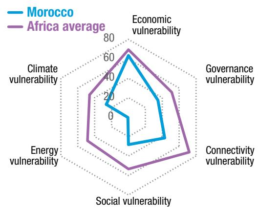  
(e) South Africa

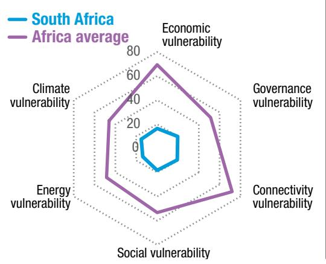  
Source: UNCTAD.  
Note: Values represent a score out of 100 in 2022 or 2023, depending on the domain.

## Figure 12

Bilateral investment treaties and treaties with investment provisions signed by countries in Africa: Realm of treaties shows efforts by countries to protect foreign and African investments

Total bilateral investment treaties
Bilateral investment treaties in force
Total treaties with investment provisions
Treaties with investment provisions in force

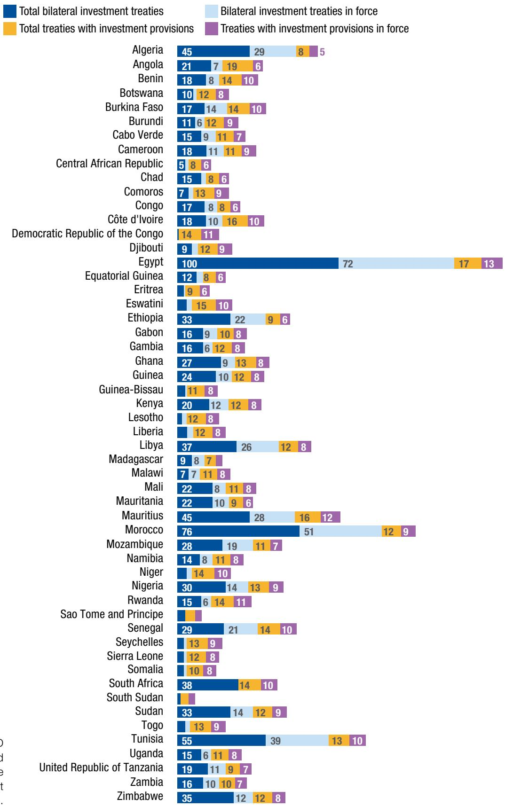

Progress achieved with the adoption in 2023 of the Protocol on Investment to the Agreement Establishing the African Continental Free Trade Area provides renewed opportunities to expand intra-African investment, with a wider geographical spread across the continent. In 2023, of the \$64 billion in international projects financed in Africa, 20 per cent of the projects in the services sector and selected manufacturing industries and 13 per cent of the projects in resource-based processing industries were funded by investors from Africa. This indicates the market attractiveness of countries in Africa and intra-African investment opportunities for African investors.

Notwithstanding growing regional markets and investment opportunities, many small and medium-sized enterprises in Africa are particularly vulnerable because of the lack of access to affordable financing options, which constrains ability to expand, innovate and invest in risk-mitigation measures. Limited financial infrastructure and high transaction costs related to banking and lending make it difficult for such businesses to secure credit or capital, leaving them vulnerable to external shocks. In 2023, 32 per cent of firms in Africa surveyed identified finance and investment opportunities as a major challenge to financial, operational and trading performance (figure 13).

## Figure 13

Africa: Business environment obstacles faced by firms, 2023 – more accessible and affordable financing instruments have emerged but access to finance remains a major challenge
(Percentage)

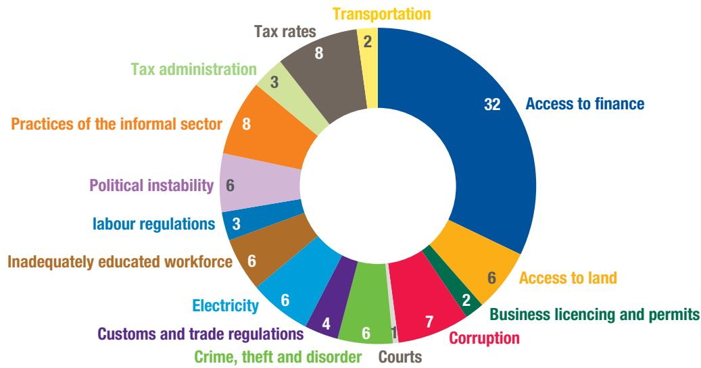  
Source: UNCTAD calculations, based on data from the Enterprise Survey database (World Bank). Note: The latest available data for the 13 countries covered are from 2023.

Firms in Africa are significantly exposed to currency fluctuations due to the prevalence of foreign currency-denominated transactions, debts and trade. Such volatility disrupts trade flows, increase operational costs and makes firms in Africa less competitive internationally. For instance, recent global economic disruptions have impacted the stability of local currencies, affecting the profit margins of firms and increasing debt-service costs. About 56 per cent of limited partners perceive currency risk as a key challenge when investing in the private equity market in Africa and 44 per cent of general partners consider macroeconomic risk, particularly currency volatility and political instability, a key challenge when managing the operations of a private equity fund on the continent.

Financial risk-management instruments such as derivatives may be used by firms in Africa, particularly those involved in cross-border trade, to lower exposure to volatility in exchange rates. Derivatives are financial instruments that banks, investors and businesses use to insure against potential risks in portfolios; firms use derivatives to manage risks associated with cash-flow volatility arising from adverse changes in interest rates, exchange rates and commodity prices. An increasing number of financial markets and institutions in Africa (e.g. Nairobi Securities Exchange, Kenya; Central Bank of Nigeria; Johannesburg Stock Exchange, South Africa) offer facilities for using bond, commodity, currency, equity and interest rate derivatives.

Another factor that can exacerbate the exposure of firms in Africa to shocks and market uncertainties is the current state of energy infrastructure and access to affordable energy, which leaves the growth prospects of economies and firms in Africa vulnerable to adverse global and domestic events. Firms experience significant losses from power outages, an issue that has persisted for decades, significantly impacting businesses and hindering private sector employment growth. Leveraging the strength of the energy, infrastructure and trade nexus can form a bulwark against the risks that the polycrisis holds for economies and businesses in Africa.

Small and medium-sized enterprises in Africa often lack the financial resources and expertise required to conduct regular risk assessments, develop contingency plans or access insurance and hedging products. This leaves them vulnerable to unexpected disruptions, such as currency fluctuations, political instability and supply chain disruptions. Small and medium-sized enterprises can enhance resilience to shocks and build trust with investors by adopting effective risk-management practices, including not only financial risk management but also operational planning and crisis preparedness. Adopting effective risk-management frameworks could help empower firms in Africa to integrate risk management into operations and business processes, thereby improving stability and fostering growth. Developing enterprise risk-management capacities across all sectors or departments of a company is critical in raising awareness, understanding and prioritizing risks and reducing overall exposure to threats from imminent or future events.

Addressing financial, regulatory and structural barriers, to create a more resilient business environment across Africa, requires both regional collaboration and significant investment in infrastructure, financial systems and regulatory reform in order to support businesses in Africa in mitigating risks and achieving sustainable growth.

  
Policy recommendations

Africa faces risks from political, economic, demographic, energy-related, technological and climate-related shocks. Related vulnerabilities, compounded by weak infrastructure and a reliance on primary commodities, leave economies in Africa susceptible to external disturbances. Many countries in Africa are highly vulnerable across the connectivity and economic domains and vulnerable economic and infrastructure systems increase exposure to shocks. Therefore, there is a need for a multidimensional approach to risk management in Africa that addresses particular vulnerabilities across domains, to build resilience in the context of a complex and interconnected global risk landscape. In addition, collaborative, resilient and adaptive policies are critical in order to protect and advance economic and social development in Africa and help strengthen resilience to the polycrisis.

The potential of regional economic integration in setting the pace of industrial growth and development in Africa should be taken into account. It is important to broaden the capabilities of countries in Africa to effectively leverage the opportunities accorded by regional trade agreements, such as the Agreement Establishing the African Continental Free Trade Area. Current regional market dynamics in Africa signal a broader narrative about opportunities to foster stronger trade networks aimed at promoting value added production and the supply of goods and services; and to enhance capabilities in the mitigation of trade risks. To navigate the complex challenges posed by structural vulnerabilities, polycrisis shocks and global market fluctuations, there is an urgent need for small and medium-sized enterprises in Africa to mitigate financial, operational and regulatory risks, to bolster resilience and capitalize on opportunities in an increasingly competitive environment. For instance, access to financial instruments, such as derivatives and risk-management tools at the enterprise level, is essential in order for firms in Africa to manage risks effectively and enhance stability in volatile market conditions. Enterprise risk management can help guarantee a safer and more reliable future for small and medium-sized enterprises in Africa.

UNCTAD concludes Economic Development in Africa Report 2024 by proposing short-term, medium-term and long-term actionable policy recommendations for key stakeholders, namely Governments, the private sector and trading partners and international organizations, as follows:

(a) African Governments are encouraged to adopt policy measures that help enhance crisis preparedness and foster resilience to polycrisis shocks;

(b) Private firms in Africa are invited to develop stronger productive and trade capabilities by leveraging cost-effective risk-management strategies and other useful mechanisms that reduce potential vulnerability in navigating uncertain economic environments;

(c) The trading partners of Africa and international organizations are urged to support and share knowledge about best practices, to foster resilience to polycrisis shocks.

The proposed policy actions could help enhance macroeconomic stability in countries in Africa, optimize the resilience potential of regional trade markets, strengthen financial markets to facilitate hedging instruments and encourage small and medium-sized enterprises to manage risk and improve performance in a proactive manner.

Highlights of proposed policy actions

(a) Apply a vulnerability lens to public financial management, monitoring and reporting, in particular when designing fiscal monitoring and reporting templates to keep track of targets compared with the actual revenue and expenditure of development plans, to help African Governments better understand and assess how vulnerability to particular shocks or crises can impact public finances and fiscal management processes;

(b) Facilitate optimal monetary policy by tailoring capital and liquidity requirements to risks and vulnerability to shocks: Adopting financial stability tools to address stresses in the banking system while ensuring monetary policy stability can help promote a resilient financial system and lessen the probability of systemic risks and the potential costs of a shock hitting the financial system;

(c) Offer incentives that aim to promote industrialization and local manufacturing and the sourcing or supply of goods and services targeted at regional markets: African Governments could offer reduced corporate tax rates for companies that invest in manufacturing or industrial projects, while financial institutions could offer low-interest loans or credits on income tax for capital investments in machinery, technology and facilities that boost production capacity;

(d) Develop regional mechanisms to manage trade-related risks by creating a regional fund or pooling public and private resources to build early warning systems, develop contingency plans and provide insurance to manage trade-related risks and challenges in order to contribute to the better alignment of national and regional strategies and facilitate the active participation of the private sector in interconnected value and supply chains;

(e) Set up emergency or crisis-response trade finance and supply chain finance facilities, to support businesses in Africa affected by global demand shocks, helping them pivot to regional markets; such financing mechanisms could help stabilize businesses that depend on exports and prevent job losses in key industries and could also provide insurance in order to manage trade-related risks and challenges when implementing African Continental Free Trade Area strategies;

(f) Create a supportive environment for the use of sophisticated financial instruments and stability in cross-border financial transactions: Doing so entails supportive actions through which derivatives and other risk-mitigation financial instruments could best be deployed and used by traders and investors when engaging in cross-border activities in Africa; and setting up innovation and digital technology units within regulatory authorities (e.g. central banks), which also contributes to greater and better processing of regulatory data and the supervision of sophisticated financial instruments;

(g) Safeguard stability in cross-border capital flows by establishing public-private support platforms that can facilitate access by businesses in Africa to risk-management resources and support the building of a comprehensive financial market infrastructure that includes derivatives exchanges, clearing houses and robust settlement systems across Africa in order to help create the necessary conditions to attract both domestic and international investors and improve financing opportunities in intra-African trade;

(h) Institutionalize enterprise risk-management practices by developing policies and practical guidelines at the small and medium-sized enterprise level, including risk-management standards tailored to the African context and better adapted to the resource capacity of small and medium-sized enterprises in Africa;

(i) Align enterprise risk-management strategy and regulatory frameworks with regional trade agreements, such as the Agreement Establishing the African Continental Free Trade Area, to ensure that cross-border risks are adequately identified and managed, based on the level or type of vulnerability to shocks.

Risk management strategies and practices are pivotal approaches that can help African SMEs ensure against market uncertainties

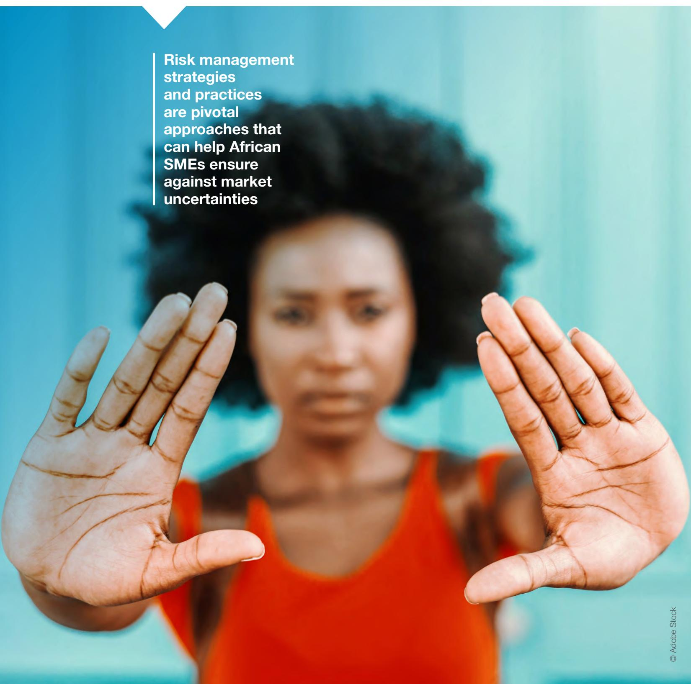