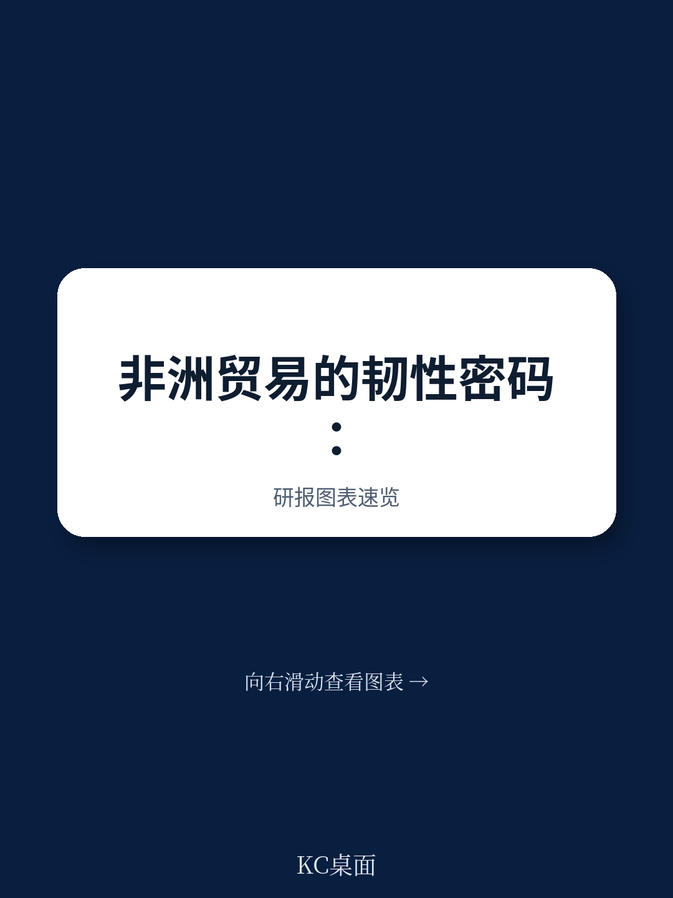
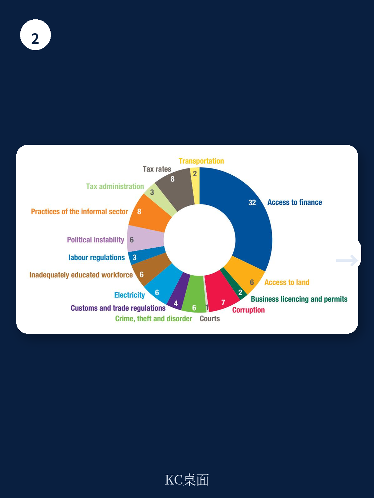

# 联合国贸发会议：非洲最大风险不是冲击本身，而是缺乏吸收冲击的贸易骨架

非洲正在经历一场全球性的“复合危机”——气候、地缘、能源、技术、政治多重冲击叠加。但联合国贸发会议（UNCTAD）在《2024年非洲经济发展报告：释放非洲贸易潜力——提升区域市场并降低风险》中给出的核心判断，并非简单的“非洲很脆弱”，而是：**非洲最大的风险不是冲击本身，而是缺乏一套能够吸收冲击的贸易和投资骨架。**

这份报告提供了一套完整的分析框架，帮助理解为什么同样面对全球波动，非洲的受伤程度系统性高于其他地区，以及区域贸易——尤其是非洲大陆自由贸易区（AfCFTA）——为何不是理想主义蓝图，而是当前最现实的韧性工具。

报告覆盖了从国家层面的脆弱性评估，到企业层面的风险管理工具，再到跨境金融基础设施的建设路径。以下是我们提炼的五个核心洞察。

> **KC评论：** 这份报告的价值不在于告诉你“非洲有风险”，而在于它建立了一个可复用的分析框架：把冲击来源（6类）和脆弱性领域（6个维度）拆开，然后交叉定位每个国家的软肋。对于在非洲做贸易或投资的决策者，这个框架比任何宏观预测都更实用。完整报告中有详细的国别表格和脆弱性排序，值得对照自己的业务布局仔细看。

继续看原文，真正有价值的是图表、假设和验证路径；完整报告与KC评论在每日汇编。

## 1. 非洲的脆弱性并非均匀分布，连通性和经济是两个最突出的短板

报告将冲击分为政治、经济、人口、能源、技术、气候六类，再将脆弱性分为经济、治理、连通性、社会、能源、气候六个领域。交叉分析后发现，**连通性（Connectivity）和经济（Economic）是非洲国家被提及频率最高的两个脆弱性领域。**

在54个非洲国家中，有超过30个国家的首要脆弱性来自连通性——包括交通基础设施不足、物流成本高企、数字连接薄弱。经济脆弱性紧随其后，表现为出口集中度高、债务负担重、外汇储备有限。

这意味着，对于在非洲开展业务的企业而言，供应链中断和支付结算风险是比政治动荡更普遍、更可预测的挑战。2024年，非洲航运费用比疫情前高出115%，是2023年平均水平的两倍——这背后不是单纯的运费上涨，而是连通性脆弱性在危机中的集中释放。

## 2. 非洲出口结构没有本质改变，约半数国家仍靠油气矿产换取超过60%的外汇

报告指出，2023年约有半数非洲国家的出口收入中，石油、天然气或矿产占比超过60%。这种高度集中的出口结构，使得非洲经济在面对全球大宗商品价格波动时几乎没有缓冲。

更值得关注的是，**尽管过去60年非洲的总出口规模持续增长，但其在全球高附加值供应链中的嵌入程度几乎没有提升。** 54个非洲国家中，只有16个从非洲内部采购超过0.5%的中间投入品。这意味着，非洲的出口增长更多是“量”的扩张，而非“质”的提升——没有形成区域内的上下游分工，也就无法通过内部贸易对冲外部需求波动。

> **KC评论：** 这个0.5%的数字非常刺眼。它说明非洲各国之间的经济联系远弱于各自与外部市场的联系。当全球需求收缩时，非洲各国几乎同时受到冲击，没有任何一个区域市场能充当“减震器”。报告对AfCFTA的推崇，正是基于这个结构性缺陷。完整报告中有详细的中间品贸易数据和对AfCFTA潜力的量化估算，值得仔细读。

## 3. 能源基础设施缺口是区域贸易的最大物理障碍，但可再生能源投资仍严重不足

报告指出，非洲只有不到50%的人口能够获得可靠的电力供应。超过50%的能源供应来自化石燃料，这使得非洲在全球能源转型过程中面临双重压力：既要应对化石燃料价格波动，又要筹措资金建设新能源基础设施。

非洲每年需要约1900亿美元的能源投资，相当于其GDP的6.1%。但2023年非洲可再生能源投资估计仅为150亿美元，仅占全球可再生能源投资总额的2.3%。**这个缺口不是简单的资金问题，而是能源基础设施与贸易竞争力之间的恶性循环：电力不可靠导致制造成本高企，制造成本高企又削弱了区域贸易的吸引力。**

报告建议，投资可再生能源和建设可靠的能源基础设施是提升韧性的关键。但这里有一个尚未完全回答的问题：谁来承担这个投资的风险？非洲主权信用评级偏低，借贷成本高达11.6%，比美国无风险利率高出8.5个百分点。

## 4. 非洲内部融资正在崛起，但规模仍不足以对冲外部资本流出

2023年，非洲的外国直接投资（FDI）流入下降了3%，至530亿美元。与此同时，官方发展援助在2022年下降了4.1%。外部资本流入的收缩，正在倒逼非洲寻找内部融资渠道。

报告提到一个值得关注的数据：**去年非洲国际项目中，13%至20%是由非洲投资者自己融资的。** 这个比例虽然不高，但趋势值得跟踪。如果非洲内部投资者能够通过区域合作、多边开发银行和风险分担机制逐渐扩大融资规模，那么对外部资本的依赖就能逐步降低。

但这里也存在一个结构性矛盾：非洲内部金融市场深度不足，衍生品、对冲工具和清算结算体系不完善，使得企业很难在本地市场管理汇率和利率风险。报告因此提出了一系列政策建议，包括建立区域基金、设立应急贸易融资机制、推动衍生品交易所和清算所建设。

> **KC评论：** 报告对“非洲内部融资”的强调，实际上是在回答一个更根本的问题：当外部资本因为全球风险偏好收缩而撤离时，非洲能否依靠自己的资本完成贸易和投资循环？目前的数据显示，答案是“还不行，但方向是对的”。完整报告中有关于非洲金融市场基础设施的详细分析，以及对AfCFTA如何催化内部资本流动的推演。

## 5. 报告尚未完全回答的关键问题：AfCFTA的落地速度能否赶上脆弱性恶化的速度

报告的结论非常明确：非洲大陆自由贸易区是提升韧性的核心工具。通过降低区域内关税和非关税壁垒，扩大内部市场规模，减少对外部市场的依赖，AfCFTA理论上可以显著降低非洲的连通性和经济脆弱性。

但报告也隐含了一个尚未充分展开的问题：**AfCFTA的推进速度，是否能够赶上脆弱性恶化的速度？** 2023年非洲FDI下降、债务成本上升、航运费用高企——这些趋势都在恶化非洲的贸易环境。而AfCFTA从谈判到落地，再到真正产生贸易创造效应，需要数年甚至十年的时间。

这个时间差，恰恰是当前非洲企业和投资者需要重点管理的风险。报告提出的企业级风险管理工具、应急贸易融资机制和区域风险共担基金，本质上都是“在AfCFTA全面生效之前，如何先活下来”的过渡方案。

---

这份报告的价值，不在于给出一个“非洲值得投资”或“非洲风险太大”的简单结论，而在于提供了一套分析框架和一组可操作的行动建议。对于在非洲有业务布局或正在评估非洲机会的决策者，理解每个国家在“冲击-脆弱性”矩阵中的位置，比盯住GDP增速或FDI总量更有意义。

更多国际信源汇编与评论，欢迎扫码交流。每日更新，汇总国际主流叙事、数据与图表，观测边际变化。每日汇编会把单篇报告放回当天主线，整理成中文摘要、KC评论和图表合集，便于喂给AI，也便于人工快速扫市场动态。汇聚了头部券商、PE/VC、投行、并购、hedge fund、资管机构、战略咨询、智库等朋友，期待交流。

Personal reading notes and learning share only. Not investment advice.
