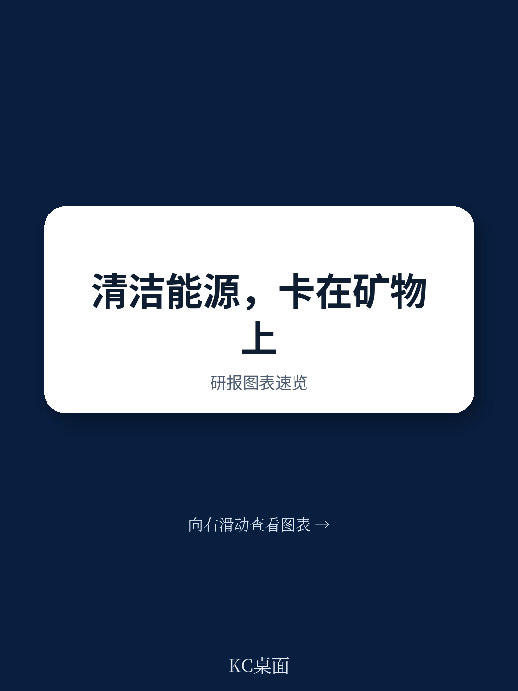
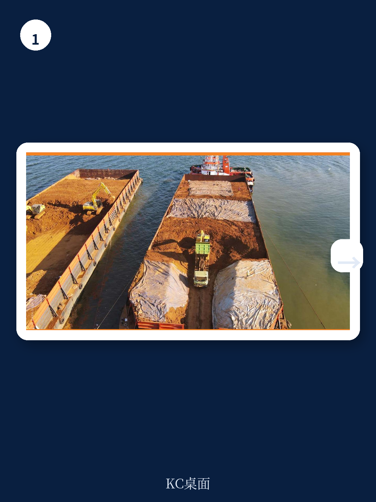
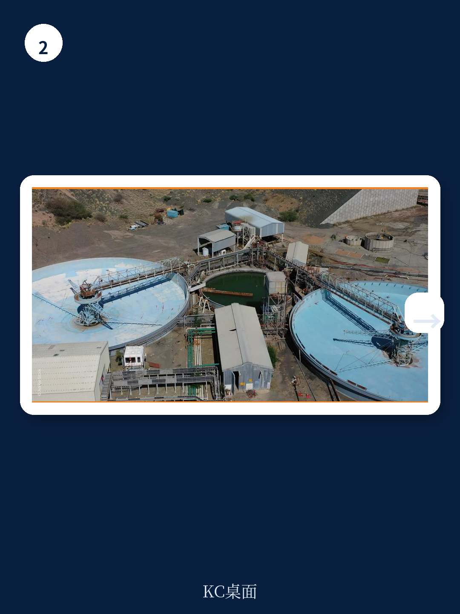

# 联合国贸发会议：中国主导精炼却遇出口限制，关键矿产供应链集中度超预期

全球清洁能源转型正在制造一场前所未有的资源争夺战。锂、钴、镍、铜、稀土——这些支撑电动车、风电、数据中心、半导体和国防工业的关键矿产，其贸易规则正在被快速改写。

联合国贸发会议最新发布的政策洞察报告《关键矿产贸易的动态变化》给出了一个清晰的判断：过去十年，关键矿产的贸易主要由成本效率和市场供需驱动；而未来十年，贸易政策正在成为主导力量。出口国用许可证、关税和禁令来争取价值链向上游移动，进口国则用双边协议、补贴和战略储备来锁定供应安全。两条力量交织的结果，是传统意义上的“自由贸易”正在被一种更复杂、更具战略性的“管理型贸易”所取代。

这份报告的核心价值不在于罗列数据，而在于它揭示了一个正在发生的结构性转变：关键矿产的全球供应链，正在从“谁成本低谁生产”转向“谁联盟强谁获益”。对于产业决策者和投资者而言，这意味着过去基于全球化假设的估值框架和供应链布局，需要被重新审视。

> **KC评论：** 报告的核心洞察是，贸易政策工具正在从“辅助角色”变成“主导角色”。如果你只看价格和供需来评估锂、钴、稀土等品种的未来，可能会错过一个更大的变量——地缘政治联盟如何通过贸易协议重新分配价值链上的利润。报告中的图5和图6值得仔细看，它们展示了出口限制措施和双边协议的爆发式增长，这些才是理解未来两年市场格局的关键。

继续看原文，真正有价值的是图表、假设和验证路径；完整报告与KC评论在每日汇编。

## 1. 需求侧的结构性变化比想象中更剧烈，清洁技术正在重塑矿产消费版图

报告明确指出，关键能源转型矿产的需求正在经历一个“量变到质变”的过程。国际能源署的预测显示，从2024年到2040年，锂和石墨的需求增长将最为强劲。但比总量增长更重要的是需求结构的变化。

以镍为例，2024年清洁技术领域只占镍需求的17%，但到2040年这一比例将跃升至42%。稀土永磁材料的需求结构同样在变化，清洁技术占比将从21%上升到31%。这意味着，未来镍和稀土的价格波动将越来越不取决于传统的不锈钢或消费电子需求，而是取决于电动车、风电和储能这些政策驱动型行业。

这个转变对行业有两点关键含义。第一，矿产需求的价格弹性在降低。清洁技术领域的矿产需求由政策目标和能源转型路径驱动，对短期价格波动的敏感度远低于传统工业需求。第二，需求的波动性在增加。政策变化、补贴退坡或技术路线切换（例如电池化学的演变）可能引发需求预测的大幅修正，这对上游矿企的资本开支决策提出了更高要求。

## 2. 供应链的集中度远超市场认知，加工环节才是真正的瓶颈

报告的第二个核心判断是，关键矿产供应链的集中度不仅体现在资源储量上，更集中在加工和精炼环节，而后者才是真正的战略瓶颈。

从储量看，刚果（金）占全球钴储量的50%，印尼占全球镍矿产量的67%。但更值得关注的是加工端：中国主导了稀土、锂和钴的全球精炼产能，印尼则控制了43%的镍精炼产能。这意味着，即使一个国家的资源储量丰富，如果缺乏加工能力，它在价值链中的议价权仍然有限。

报告特别点出了一个容易被忽略的事实：精炼环节的高壁垒——包括长期资本投入、先进技术、专业基础设施和规模经济——使得新进入者很难在短期内打破现有格局。这解释了为什么即使许多国家在推动供应链多元化，实际进展依然缓慢。

> **KC评论：** 市场经常讨论“供应链去中国化”，但报告的数据表明，加工环节的集中度比矿业更高、更难改变。中国在稀土精炼领域的主导地位（超过80%）不是短期政策能撼动的。对于投资者来说，关注点应该从“哪里在开采”转向“哪里在加工”，因为后者决定了实际的可替代性和议价能力。报告中的图3和图4直观展示了这种集中度差异。

## 3. 出口限制措施正在成为资源国的“新常态”，政策工具箱已经打开

报告统计了一个关键数据：从2020年到2026年5月，全球针对关键能源转型矿产的出口限制措施接近100项。这不再是偶发事件，而是一种系统性的政策转向。

这些措施可以分为三类：许可证要求（用于监控和保障国家安全）、出口税（用于增加财政收入和鼓励本地加工）、以及出口禁令（用于强制推动下游产业发展）。其中，许可证和出口税是最常用的工具，但近年来出口禁令的使用频率明显上升。

从实施国来看，刚果（金）引入了18项措施，中国16项，印尼12项。值得注意的是，这些国家的政策动机截然不同。中国的措施以许可证为主，强调国家安全和国际义务；印尼偏向出口禁令，旨在推动国内镍加工产业；刚果（金）则以出口税为主，兼顾财政收入和价格稳定。

这种分化意味着，未来关键矿产的贸易环境将更加碎片化。每个资源国都在根据自身禀赋和战略目标设计不同的政策组合，企业面临的不再是统一的全球市场规则，而是数十个互不相同的国别监管体系。这无疑会增加供应链管理的复杂性和合规成本。

## 4. 进口国正在用“协议+补贴+储备”三管齐下，双边合作正在取代多边规则

面对供应集中的风险，主要进口国——欧盟、日本和美国——正在采取一套组合拳：多元化进口来源、发展国内产能、推动回收利用，以及签署战略合作协议。

报告特别分析了这些国家的策略差异。欧盟通过《关键原材料法案》设定了2030年国内开采、加工和回收的量化目标，并签署了15项战略伙伴协议。日本依托2022年《经济安全促进法》，通过JOGMEC提供覆盖项目成本50%的补贴。美国则采取了更综合的手段，包括12亿美元的公共-私人储备计划“Project Vault”，以及通过双边协议网络构建“关键矿产优惠贸易区”的构想。

但最值得关注的是报告对双边合作协议的深入分析。截至2026年，联合国贸发会议追踪了73项关键矿产合作协议，其中27项在发达国家与发展中国家之间，26项在发达国家之间，20项在发展中国家之间。这些协议的覆盖范围正在从上游开采向下游加工延伸，但一个显著的不对称现象是：发达国家之间的协议越来越多地涉及中游和下游合作，而涉及发展中国家的协议仍主要集中在开采环节。

> **KC评论：** 报告没有明说但隐含的判断是，大多数双边协议在帮助发展中国家实现价值链升级方面的效果有限。美国-刚果（金）-赞比亚的电动车电池价值链倡议是少数例外。这意味着，资源丰富的低收入国家面临被锁定在原材料供应者角色的风险。如果你想了解自己的投资标的（无论是矿企还是加工企业）在多大程度上受益于这些协议，报告中的图6和相关的协议条款分析是关键。

## 5. 报告尚未完全回答的关键问题：这些协议与WTO规则的兼容性

这份报告在分析大量双边协议后，提出了一个尚未完全展开但极为重要的问题：这些新型贸易安排与WTO规则的兼容性如何？

报告指出，许多协议不仅包含传统的贸易措施，还融合了工业政策工具，如补贴、价格协调机制、价格下限等。这些“混合型”安排是否违反WTO的非歧视原则、关税约束和补贴规则，目前仍处于“未完全检验”的状态。许多条款还停留在框架或协调阶段，具体设计和实施仍在发展中。

这个问题之所以关键，是因为它决定了当前这波“管理型贸易”模式的可持续性。如果这些协议被WTO裁定违规，整个供应链重构的逻辑基础可能被动摇。反之，如果它们被默许或通过某种方式合法化，那么关键矿产的贸易规则将彻底从多边框架转向双边或区域框架。

报告在结论部分暗示了一种风险：如果各国继续各自为政，关键矿产贸易可能分裂成相互竞争的阵营，最终提高所有人的成本并降低效率。但如何避免这一结局，报告给出的答案——“更强有力的国际合作和政策协调”——更像是一个期望而非具体路径。

## 6. 一个值得关注的观察框架：从“谁拥有资源”转向“谁控制加工”

综合报告的全部分析，我们可以提炼出一个对产业决策者有用的观察框架：判断一个企业在关键矿产领域的竞争优势，应该从三个维度叠加来看。

第一个维度是资源控制力。拥有储量不等于拥有议价权，但如果同时拥有加工能力，议价权会显著增强。中国在稀土领域的地位就是资源+加工的双重控制。

第二个维度是政策参与度。企业所在国是否与主要消费国签署了合作协议？协议是否覆盖了企业所处的价值链环节？在“管理型贸易”模式下，政策关系正在变成一种竞争优势。

第三个维度是替代弹性。企业生产的产品在加工环节的技术壁垒有多高？如果下游客户能在6个月内找到替代来源，那企业的议价权就很弱；如果需要3年才能建立替代产能，那企业就拥有定价权。

报告没有给出这个框架，但它提供的所有数据和案例都指向同一个方向：在未来的关键矿产竞争中，纯粹的矿业公司可能越来越难以获得超额利润，而拥有加工技术和政策关系双重优势的企业，将占据价值链的制高点。

---

这份报告最值得反复看的，不是它的结论，而是那些图表背后隐含的假设和未展开的讨论。例如，印尼的镍出口禁令到底在多大程度上推动了国内加工产业的发展？中国的稀土出口许可证制度对全球价格产生了什么影响？美国提出的“关键矿产优惠贸易区”具体如何运作？这些问题在报告中只是点到为止，但它们的答案将直接影响未来几年的行业格局。

更多国际信源汇编和评论，欢迎扫码交流。每日更新，汇总国际主流叙事、数据和图表，便于你快速观测市场边际变化。我们的交流群汇聚了头部券商、PE/VC、投行、并购、hedge fund、资管机构、战略咨询和智库的朋友，期待与你一起讨论这些未解问题。每日汇编会把单篇报告放回当天主线，整理成中文摘要、KC评论和图表合集，既适合喂给AI分析，也适合人工快速扫描市场动态。

Personal reading notes and learning share only. Not investment advice.
