## UNITED NATIONS CONFERENCE ON TRADE AND DEVELOPMENT

Technical and statistical report

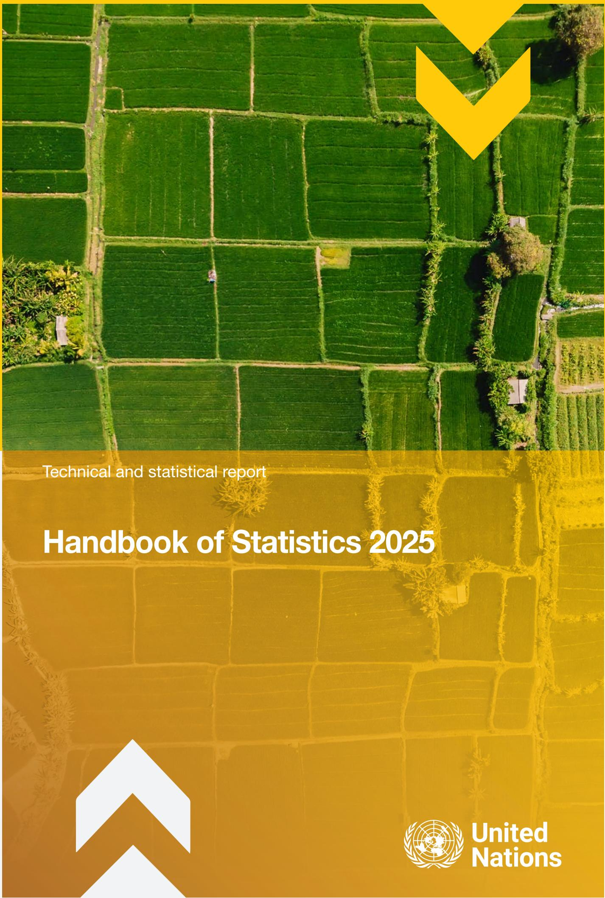

Handbook of Statistics 2025

## UNITED NATIONS CONFERENCE ON TRADE AND DEVELOPMENT

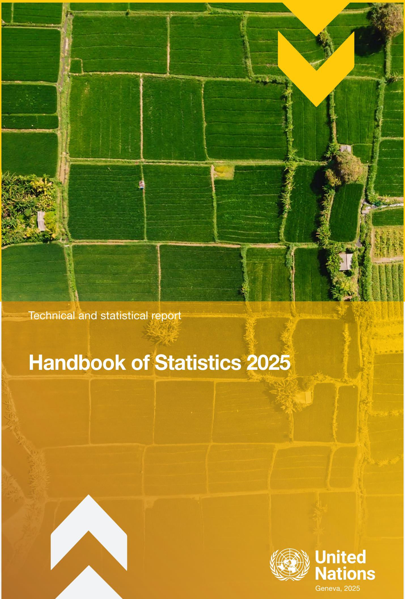

Technical and statistical report

Handbook of Statistics 2025

© 2025, United Nations
All rights reserved worldwide

Requests to reproduce excerpts or to photocopy should be addressed to the Copyright Clearance Center at copyright.com. All other queries on rights and licences, including subsidiary rights, should be addressed to:

United Nations Publications

405 East 42nd Street

New York, New York 10017

United States of America

Email: publications@un.org

Website: https://shop.un.org/

The findings, interpretations and conclusions expressed herein are those of the authors and do not necessarily reflect the views of the United Nations or its officials or Member States.

The designations employed and the presentation of material on any map in this work do not imply the expression of any opinion whatsoever on the part of the United Nations concerning the legal status of any country, territory, city or area or of its authorities, or concerning the delimitation of its frontiers or boundaries.

A dispute exists between the Governments of Argentina and the United Kingdom of Great Britain and Northern Ireland concerning sovereignty over the Falkland Islands (Malvinas).

The final boundary between the Sudan and South Sudan has not yet been determined.

The final status of Jammu and Kashmir has not yet been agreed upon by the parties.

The final status of the following territories has not yet been agreed or determined: Abyei area, Aksai Chin, Arunachal Pradesh, Bi'r Tawil, Hala'ib Triangle, Ilemi Triangle, Kuril Islands, Paracel Islands, Scarborough Shoal, Senkaku Islands and Spratly Islands.

Mention of any firm or licensed process does not imply the endorsement of the United Nations.

This publication has not been formally edited.

United Nations publication issued by the United Nations Conference on Trade and Development
TD/STAT.50

ISBN: 978-92-1-159585-7

eISBN: 978-92-1-154580-7

ISSN: 1992-8408

elSSN: 2225-3270

Sales No. E.25.II.D.45

## Abbreviations

<table><tr><td>BPM6</td><td>Balance of Payments and International Investment Position Manual, Sixth Edition</td></tr><tr><td>BRICS</td><td>Brazil, Russia, India, China and South Africa</td></tr><tr><td>CIF</td><td>cost, insurance and freight</td></tr><tr><td>CPI</td><td>consumer price index</td></tr><tr><td>Dem. Rep.</td><td>Democratic Republic</td></tr><tr><td>dwt</td><td>dead weight tons</td></tr><tr><td>EBOPS 2010</td><td>2010 Extended Balance of Payments Services Classification</td></tr><tr><td>FDI</td><td>foreign direct investment</td></tr><tr><td>FOB</td><td>free on board</td></tr><tr><td>GDP</td><td>gross domestic product</td></tr><tr><td>GFCF</td><td>gross fixed capital formation</td></tr><tr><td>gt</td><td>gross tons</td></tr><tr><td>HS</td><td>Harmonized Commodity Description and Coding System</td></tr><tr><td>IMF</td><td>International Monetary Fund</td></tr><tr><td>ISIC</td><td>International Standard Industrial Classification of All Economic Activities</td></tr><tr><td>LDCs</td><td>Least Developed Countries</td></tr><tr><td>LLDCs</td><td>Landlocked Developing Countries</td></tr><tr><td>LNG</td><td>liquefied natural gas</td></tr><tr><td>LPG</td><td>liquefied petroleum gas</td></tr><tr><td>LSCI</td><td>liner shipping connectivity index</td></tr><tr><td>Rep.</td><td>Republic</td></tr><tr><td>SAR</td><td>Special Administrative Region</td></tr><tr><td>SIDS</td><td>Small Island Developing States</td></tr><tr><td>SITC</td><td>Standard International Trade Classification</td></tr><tr><td>TEU</td><td>twenty-foot equivalent unit</td></tr><tr><td>UCPI</td><td>UNCTAD Commodity Price Index</td></tr><tr><td>UN-OHRLLS</td><td>United Nations Office of the High Representative for the Least Developed Countries, Landlocked Developing Countries and Small Island Developing States</td></tr><tr><td>WTO</td><td>World Trade Organization</td></tr></table>

# HANDBOOK OF STATISTICS 2025

## Notes

The figures, maps and tables in this handbook represent extractions from or analytical summaries of datasets contained in the UNCTADstat Data Centre, which was upgraded in 2023 to enable faster and easier browsing and downloading of the data. The new UNCTADstat Data Centre is available at: https://unctadstat.unctad.org/datacentre.

The contents of the UNCTADstat Data Centre and the new UNCTAD Data Insights are continuously updated and enhanced, thus providing users with the latest available statistics. Consequently, the figures from this PDF handbook present statistics at a point in time, and for the latest figures you may consult UNCTADstat and the UNCTAD Data Insights.

Basic information on concepts and definitions of the presented statistics are provided in the boxes titled “Concepts and definitions” in each section. More detailed information on the sources and methods used for production of data available in UNCTADstat can be found in the documentation attached to the respective UNCTADstat dataset.

Where the designation “economy” appears, it refers to a country, territory or area. The assignment of economies to specific groups is done for statistical convenience and does not imply any assumption regarding the political or other affiliation of these economies by the United Nations. Likewise, the designations “developing” and “developed” are intended for statistical convenience and do not necessarily express a judgement about the stage reached by a particular economy in the development process. For more details concerning the grouping of economies, see Classifications page of this handbook and the Data Hub Classifications webpage.

Unless otherwise specified, the values of groups of economies represent the sums of the values of the individual economies included in the group. Calculation of these aggregates may take into account data estimated by the UNCTAD secretariat that are not necessarily reported separately. When data coverage is insufficient within a group of economies, no aggregation is undertaken and the symbol (-) is assigned.

Due to rounding, values do not necessarily add up exactly to their corresponding totals.

United States dollars (\$) are expressed in current United States dollars of the year to which they refer, unless otherwise specified. “Ton” means metric ton (1 000 kg).

Due to space constraints, the names of the following countries may appear in abbreviated form: the Plurinational State of Bolivia, the Democratic People's Republic of Korea, the Democratic Republic of the Congo, the Islamic Republic of Iran, Lao People's Democratic Republic, the Federated States of Micronesia, the United Kingdom of Great Britain and Northern Ireland, and the Bolivarian Republic of Venezuela.

The UNCTAD Handbook of Statistics 2025 is available in PDF format from the UNCTAD website, at https://unctad.org/HandbookOfStatistics.

## Table of contents

Abbreviations ....iii
Notes ....iv
Introduction ....vii

Chapter 1 International trade....1
a. Merchandise trade....3
1. Total merchandise trade....3
2. Trade structure by partner....5
3. Trade structure by product....8
4. Trade indicators....10
5. Import tariff rates....13
b. Trade in services....14
1. Total trade in services....14
2. Trade in services by category....17
3. Quarterly trade in services....20
c. Creative goods and services....22
1. Global exports of creative goods and services....22

Chapter 2 Economy, investment and finance.... 25
a. National accounts.... 27
1. Gross domestic product.... 27
b. Investment and balance of payments.... 29
1. Current account.... 29
2. Foreign direct investment.... 31
c. Commodity prices.... 34
1. UNCTAD Commodity Price Index.... 34

Chapter 3 Maritime and other transport .... 37
a. Merchant fleet .... 39
1. World merchant fleet .... 39
b. Freight volumes by sea .... 42
1. Containerized port traffic .... 42
2. World seaborne trade .... 43
c. Maritime connectivity .... 46
1. Liner shipping connectivity .... 46
2. Port liner shipping connectivity .... 48
d. Global transport of merchandise trade .... 50
1. Transport costs of the delivery of merchandise trade .... 50
Chapter 4 Population .... 53
a. Total and urban population .... 55
b. Age structure .... 58
Annexes .... 61
a. Classifications .... 63
1. Classification of economies .... 63
2. Classification of goods .... 64
3. Classification of services .... 64
4. Classification of economic activities .... 64

## Introduction

The UNCTAD Handbook of Statistics 2025 provides a wide range of statistics and indicators relevant to the analysis of international trade, economy, investment, maritime transport, and development overall. In these uncertain times, reliable statistical information becomes even more indispensable for effective policy responses and decisions, aiding countries to recover from different crises and build a more just, inclusive, and sustainable economy.

The UNCTAD Handbook of Statistics, its live version in UNCTAD Data Insights, and the UNCTADstat Data Centre make internationally comparable statistics available to policymakers, specialists, researchers, officials of national Governments, representatives of international organizations, journalists, academia, the private sector, and experts of non-governmental organizations. These statistics underpin all UNCTAD activities. Whether for research, policy advice or technical cooperation, UNCTAD needs reliable and internationally comparable trade, financial and macroeconomic data with global coverage, spanning several decades.

In 2024, global economic activity showed some momentum, with GDP growth reaching 2.8 per cent, supported by relatively strong international trade flows. According to UNCTAD's AI-powered nowcast (as of 14 October 2025), global GDP growth is estimated to accelerate to 3.4 per cent in 2025.

Merchandise trade rebounded in 2024, with the value of world exports increasing by 2.4 per cent, recovering from a 4 per cent decline in 2023. For 2025, UNCTAD nowcasts a robust 7.1 per cent growth in merchandise exports, signaling renewed dynamism in global trade.

Services trade also performed strongly. The value of global services exports rose by 10 per cent in 2024, driven by a surge in international travel, transport, and other services. UNCTAD's nowcast anticipates a continued expansion of 6.2 per cent in 2025. In 2024, digitally deliverable services now account for 56 per cent of total services exports, reflecting the growing digitalization of the global economy.

However, disparities persist. Least Developed Countries (LDCs), for instance, remain underrepresented in the digital economy, with digitally deliverable services comprising only 16 per cent of their total services exports.

The 2025 nowcasts on global merchandise and services trade values and GDP included in this handbook are updated weekly in a dedicated dashboard on the UNCTAD Data Hub, which allows tracking the development of the nowcast outcomes and their drivers in almost real time; see https://unctadstat.unctad.org/EN/Nowcasts.html.

Chapter 1
International trade

## a. Merchandise trade

## 1. Total merchandise trade

## Differing trends in merchandise exports growth Merchandise exports growth rate, percentage, 2024

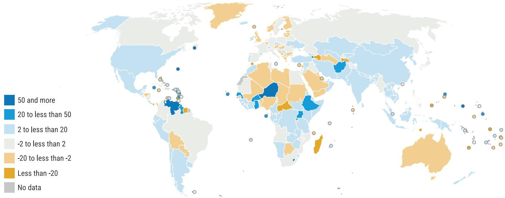  
Source: UNCTAD, UNCTADstat and World Trade Organization.

Developing economies' exports growth in 2024 (5.3 per cent) was led by the performance of large developing economies in Asia such as China (5.8 per cent), Hong Kong, China (12.5 per cent) and Viet Nam (14.4 per cent).

The North exported more merchandise than the South in 2024: developed economies contributed \$13.3 trillion and developing economies \$11.1 trillion to the value of world total exports.

## Global export value grew by 2.4 per cent in 2024, approaching the 2022 peak World merchandise exports, trillions of dollars

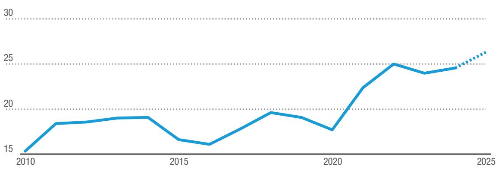  
Source: UNCTAD, UNCTADstat and World Trade Organization.  
Note: The dotted line indicates UNCTAD nowcasts (as of 14 October 2025). Nowcasts are constantly revised as new source data become available. For the weekly update of the nowcast and its methodology, see the Data Hub Nowcasts page.

In 2024, the value of world merchandise exports increased by 2.4 per cent after having fallen in 2023. Global exports amounted to \$24.5 trillion, remaining \$447 billion less than the value in 2022. But they are nowcast to reach a new high of \$26.2 trillion in 2025.

Developing countries' share of total exports was 46 per cent in 2024, having grown steadily from 29 per cent in 2000. LDC's share, meanwhile, was just 1.1 per cent in 2024, barely moving from the 1 per cent seen in 2010.

## Trade growth in 2024 led by developing Asia and Oceania, with developed economies stagnant

Merchandise trade annual growth rates, percentage, 2024

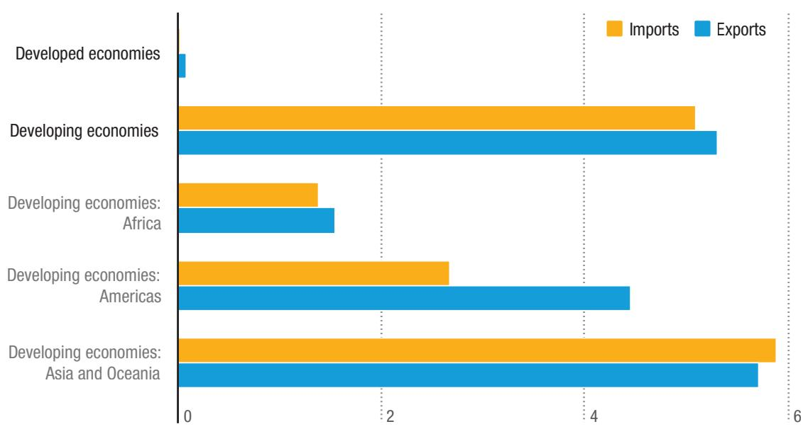  
Source: UNCTAD, UNCTADstat and World Trade Organization.  
In 2024, developing economies led trade growth, in particular Asia and Oceania whose exports grew by 5.7 per cent and imports by 5.9 per cent. Developing Americas' exports grew by 4.5 per cent, developing  
Africa's by 1.5 per cent, while developed economies' merchandise trade stayed flat. On the imports side, developed economies saw an increase of 0.1 per cent.

## Developing economies' trade surplus slightly up Merchandise trade balance, billions of dollars

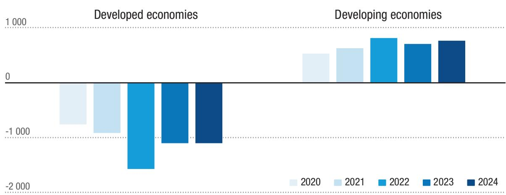  
Source: UNCTAD, UNCTADstat and World Trade Organization.  
Note: Trade balances do not add up to zero at world level due to transport and insurance costs included in imports and cross-country differences in compilation methods.

Developing economies saw a slightly increased trade surplus in 2024 compared to the previous year. Their trade balance stood at \$778 billion in

2024, still below the \$819 billion seen in 2022. At the same time, developed economies saw a largely flat merchandise trade deficit in 2024 of \$1.1 trillion.

# HANDBOOK OF STATISTICS 2025

## Metadata

The figures on international merchandise trade in this chapter measure the value of goods which add or subtract from the stock of material resources of an economy by entering or leaving its territory. His definition is slightly different from the definition of trade in goods in the balance-of-payments framework.

The value of exports is mostly recorded as the free-on-board (FOB) value, whereas the value of imports includes cost, insurance and freight (CIF).

The trade balance is calculated as the difference between the values of exports and imports.

## 2. Trade structure by partner

The world's largest bilateral flows of merchandise trade run between China and the United States of America Main world import flows, billions of dollars, 2024

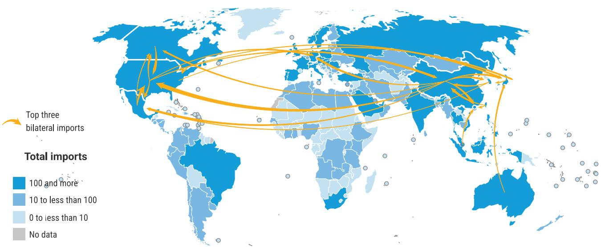  
Source: UNCTAD, UNCTADstat.  
Note: Economies with one bilateral import higher than \$125 billion are shown in the default selection.

The world's largest bilateral flows of merchandise trade run between China and the United States of America, and between their respective neighbouring economies. In 2024, goods worth \$463 billion were imported by the United States from China, 3 per cent more than the previous year but still more than 20 per cent less than in

2022, and \$165 billion were imported by China from the United States (around 0.3 per cent less than in 2023). China's trade – exports and imports – with Hong Kong (China), Japan, Taiwan Province of China, and the Republic of Korea totalled \$1.23 trillion. The United States' trade with Mexico and Canada was worth \$1.61 trillion.

Europe and Asia see the most intra-regional trade
Intra- and extra-regional exports, percentage of total exports, 2024  
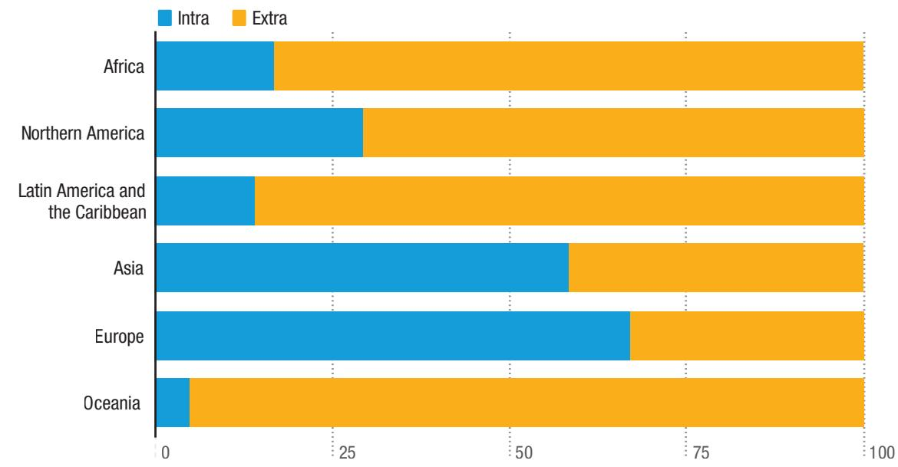  
Source: UNCTAD, UNCTADstat.  
By contrast, in Oceania, Latin America and the Caribbean, Africa, and Northern America, the main trade partners were extra-regional representing between 70 and 95 per cent of their total exports.

Intra-regional trade was most pronounced in Europe and Asia. In 2024, 67 per cent of all European exports went to trading partners in Europe. In Asia, this rate reached 59 per cent.

## In 2024, developing economies' main markets were the United States of America and China

Developing economies' main export destinations, billions of dollars, 2024

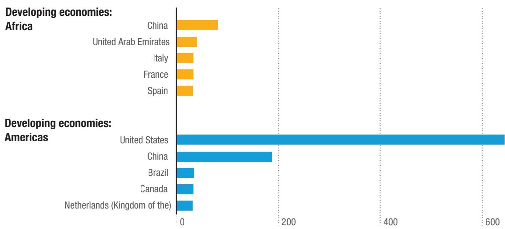  
Source: UNCTAD, UNCTADstat.

In 2024, developing economies shipped most of their exports to the United States of America (\$1.8 trillion), followed by China (\$1.3 trillion). In terms of imports, China ranked number one (\$1.9 trillion) and was followed by the United States of America (\$989 billion) and Republic of Korea (\$483 billion). Exports from American developing

economies were mainly oriented towards the United States of America (\$644 billion). China came second (\$189 billion) at some distance. For African developing economies, the main export market was China (\$82 billion) with United Arab Emirates (\$41 billion), Italy (\$35 billion) and France (\$35 billion) the other main destinations.

In 2024, South-South trade was \$6.2 trillion, a 7 per cent increase on 2023 Global trade exports, 2000-2024  
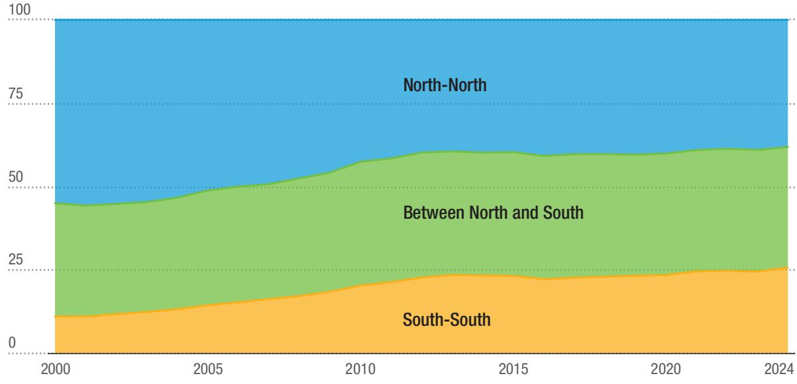  
Source: UNCTAD, UNCTADstat.  
Note: North refers to developed economies, South to developing economies. Trade is measured from the export side. Deliveries to ship stores and bunkers as well as minor and special-category exports with unspecified destination are not included.

In 2024, goods worth \$9.2 trillion were exchanged between developed economies (North-North trade), whereas merchandise trade among developing economies (South-South trade) amounted to \$6.2 trillion. Exports from developed to developing economies and vice-versa (North-South, and South-North trade) totalled \$8.7 trillion and thus, for developed economies, trade with developing economies was slightly less important than trade within their own group. Over time, South-South trade has increased its share of total merchandise trade from 11 per cent in 2000 to reach 26 per cent in 2024.

## Metadata

Intra-trade is the trade between economies belonging to the same group. Extra-trade is the trade of economies of the same group with all economies outside the group. It represents the difference between a group's total trade and intra-trade.

The exports from an economy A to an economy B, recorded FOB, do not exactly equal the imports of economy B from economy A, recorded CIF. The reasons for these trade asymmetries include: a conceptual difference between exporting economy and country of origin; different times of recording for exports and imports; different treatment of transit trade; underreporting; measurement errors; mispricing and mis-invoicing.

The exports to (imports from) all economies of the world do not always exactly add up to total exports (imports). The difference is caused by ship stores, bunkers and other exports of minor importance.

## 3. Trade structure by product

African and South American exports dominated by primary goods, in contrast to most developed economies and much of Asia
Main export products, value basis, 2024

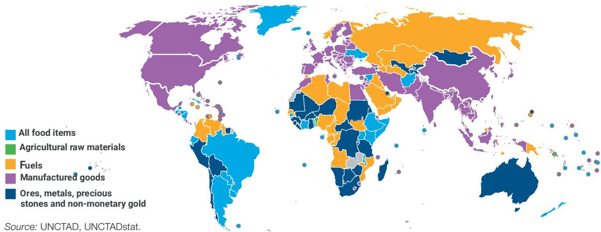  
Source: UNCTAD, UNCTADstat.

The supply of goods to the world market has a regional pattern. In 2024, economies in Northern and Central America, Europe, and Southern, Eastern and South-eastern Asia exported

mainly manufactured goods. Economies primarily exporting fuels were located along the northern coast of South America, in Middle and Northern Africa, and Western and Central Asia.

## 76.8 per cent of Africa's exports were primary goods

Export structure of developing economies by product group, percentage, value basis, 2024

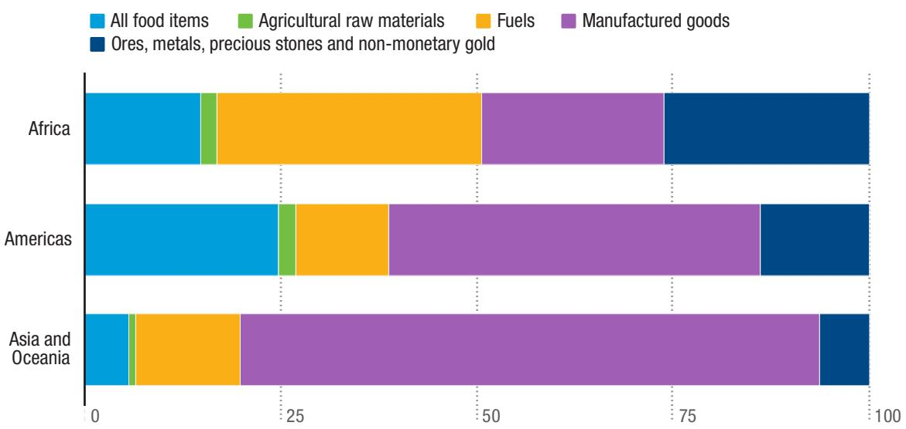  
Source: UNCTAD, UNCTADstat.  
Note: Non-allocated products are not considered.

In Africa, primary goods (defined as everything except manufactured products) accounted for 76.8 per cent of merchandise exports in 2024, with fuels making up 33.7 per cent of this. Developing Americas relied less on primary goods exports (52.6 per cent) and

Developing Asia and Oceania even less (26.0 per cent). Among these three developing regions, developing Asia and Oceania recorded the lowest proportion of food exports (5.7 per cent), far behind developing Americas (24.7 per cent) and developing Africa (14.8 per cent).

## Upswing in most product groups

Global annual growth rate of exports by product group, value basis, 2024

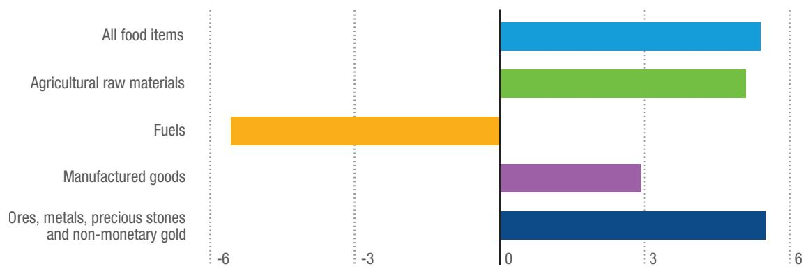  
Source: UNCTAD, UNCTADstat.  
Note: Non-allocated products are not considered.

In 2024, the rise in the value of world merchandise exports was driven by positive growth in all product groups except fuels. Growth rates of above 5 per cent were seen for the following groups: ores, metals, precious stones and non-monetary gold; all foods; and agricultural raw materials. The manufactured goods group grew by 2.9 per cent, while in contrast fuels declined by 5.6 per cent.

In 2024, Africa imported almost 4 times more manufactured goods than it exported. Developing economies' extra-trade structure, percentage of exports, 2024  
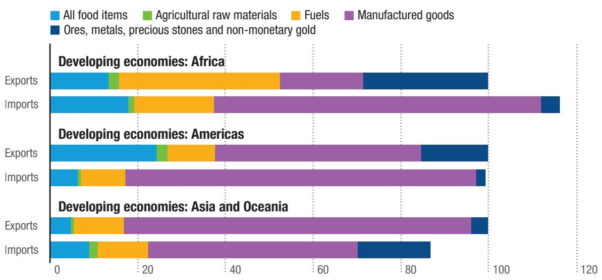  
Source: UNCTAD, UNCTADstat.  
Note: Non-allocated products are not considered.

In 2024, developing economies in Asia and Oceania recorded a merchandise trade surplus of over 13 per cent of the value of exports, driven by high exports of manufactured goods. For the group of developing economies of the Americas, positive trade balances in food, agricultural raw materials, and ores, metals, precious stones and non-monetary gold largely

offset the negative trade balance in manufacturing, leading to a trade surplus of 0.6 per cent. However, in Africa, high imports of manufactured products and a negative balance in food and agricultural raw materials could not be offset by trade surpluses in fuels and in ores, metals, precious stones and non-monetary gold, resulting in a negative 16.4 per cent trade balance.

World export growth stalls in the second quarter of 2025
Volume of merchandise exports, Q1 2005=100, seasonally adjusted

# HANDBOOK OF STATISTICS 2025

## Metadata

The breakdown of merchandise trade by product group is based on the entries in the customs declarations that are coded in accordance with a globally harmonized classification system, called the Harmonized Commodity Description and Coding System (HS). The values of the individual customs declarations have been summed up to the level of product group, error-checked and submitted to the United Nations Statistics Division for integration in the UN Comtrade database.

The UN Comtrade database contains product breakdowns based on the Standard International Trade Classification (SITC). These have been obtained by conversion of the raw data coded in HS and constitute the main source of the figures presented in this section.

## 4. Trade indicators

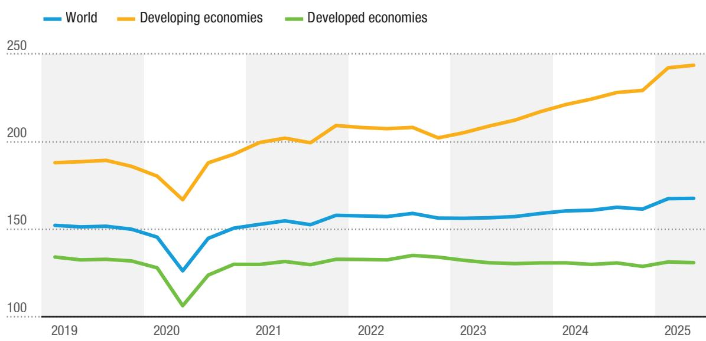  
Source: UNCTAD, UNCTADstat.  
Note: This index indicates the change in exports, adjusted for the movement of prices, relative to the base year. Seasonal adjustment is based on X-12-ARIMA.

Seasonally adjusted world export volumes grew by only 0.1 per cent in the second quarter of 2025, after a strong 3.7 per cent expansion in Q1. They are nowcasted to grow by 1 per cent and 1.2 per cent in the third and fourth quarters, respectively.

Developing economies recorded export growth of 0.6 per cent, compared to 5.7 per cent in the previous quarter. Exports from developed economies declined by 0.3 per cent, following a 2.0 per cent increase in the first quarter of 2025.

The Western Asia and Northern Africa region has the highest export concentration ratio
Product concentration index of exports, 2024  
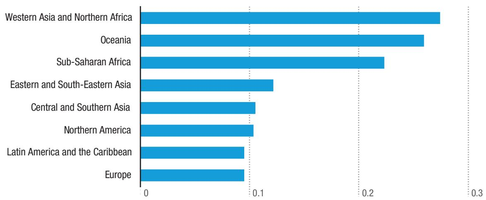  
Source: UNCTAD, UNCTADstat.  
Note: This index measures the extent to which a large share of exports is accounted for by a small number of product groups. The index has a value of 1 when an economy exports only one group of products and a value of 0 if all product groups are equally represented.

In 2024, the regions with the most diversified exports over products were Europe, and Latin America and the Caribbean, as indicated by a product concentration index of exports of around 0.10. Western Asia and Northern Africa (0.27) was the region in which exports were most concentrated on few products, and Oceania (0.26) and Sub-Saharan Africa (0.22) were also relatively less diverse exporters. On a country basis, the top five least diversified exporters were (Micronesia (0.90), Marshall Islands (0.88), Iraq (0.87), Libya (0.86) and Nauru (0.84).

  
Food exports have been the most diversified product group over the last decade Market concentration index of exports

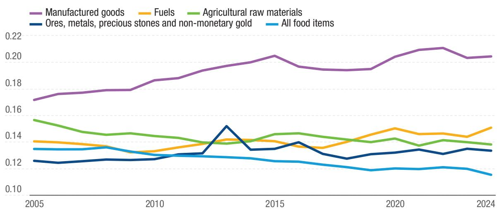  
Source: UNCTAD, UNCTADstat.

Note: This index measures the extent to which a high proportion of exports is delivered by a small number of economies. It has a value of 1 if all exports originate from a single economy.

Looking at the geographic distribution of exports by product group, manufactured products have the highest concentration of global supply from a few exporting economies since 2005. In 2024, its market concentration index stood at 0.20. Fuels (0.15) and agricultural raw materials (0.14)

ranked second and third, respectively.
The index of ores, metals, precious stones and non-monetary gold has averaged 0.13 over the last 10 years. Food is the product group whose exports have been the most diversified over the last decade, showing an index score of 0.12 in 2024.

## How important is trade in goods and services for economies? Trade openness index, 2024, percentage

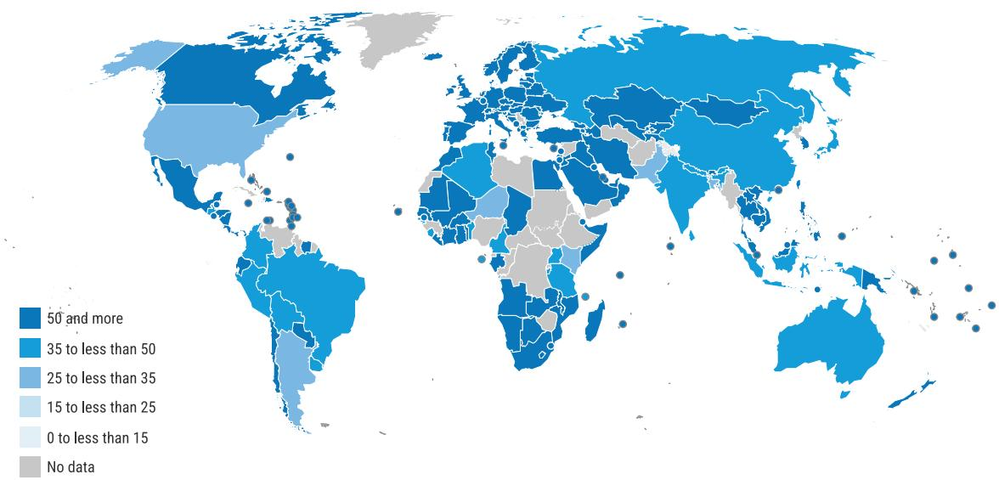  
Source: UNCTAD, UNCTADstat.

Note: This index reflects the degree of trade openness by comparing the combined value of exports and imports of goods and services to GDP.

In 2024, trade openness, defined as the sum of exports and imports of goods and services relative to GDP, was highest in small, highly integrated economies, reflecting their dependence on international markets. Luxembourg led at around 400 per cent of GDP, followed by Hong Kong (China) at 372 per cent and Singapore at 327 per cent. By contrast, major economies recorded much lower ratios: China at 39 per cent, Japan at 47 per cent, and the United States at just 25 per cent, highlighting the larger role of domestic demand in their output.

## Metadata

This insight presents different indices that can be used to analyze trade flows and trade patterns over time from the perspective of, for example, relative competitiveness, structure of global exports and imports markets, or the importance of trade for the economy, both for individual economies and for groups of economies.

Further guidance on their interpretation can be obtained from “Indicators “Indicators Explained”.

## 5. Import tariff rates

Least Developed Countries' exports faced 0–7 per cent tariffs from major trading partners in 2023

Effectively applied tariffs imposed by top 5 partners on exports of manufactured goods and ores and metals, weighted average, percentage, 2023

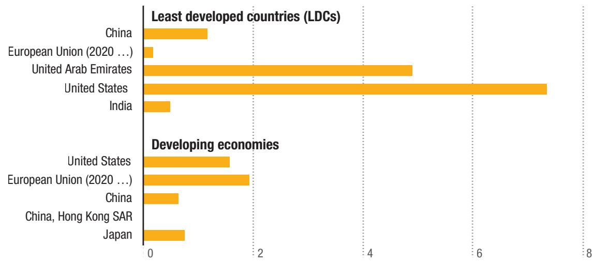  
Source: UNCTAD, UNCTADstat.  
In 2023, the weighted average of effectively applied tariffs on exports of manufactured goods and ores and metals from LDCs ranged between 0 per cent and 7.36 per cent  
among their main trading partners - namely the European Union, China, the United States, the United Arab Emirates, and India.

## Latin American countries imposed highest tariffs on Least Developed Countries' exports, led by Colombia at 35 per cent

Highest effectively applied tariffs on exports of manufactured goods and ores and metals, weighted average, percentage, 2023

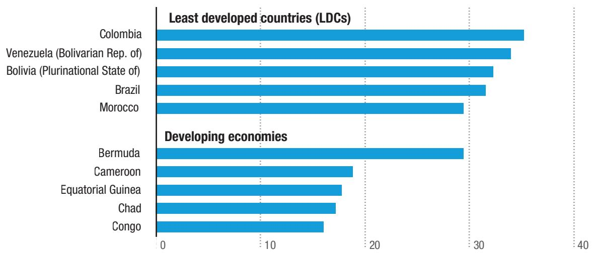  
Source: UNCTAD, UNCTADstat.  
In contrast, the highest weighted average tariffs on exports of these product groups from developing economies were applied by Bermuda (29 per cent), Cameroon (19 per cent), and Equatorial Guinea (18 per cent).

The highest import duties to exports from LDCs were imposed by Latin American countries: Colombia (35 per cent), Venezuela (34 per cent), Bolivia (32 per cent), and Brazil (32 per cent), followed by Morocco (30 per cent).

# HANDBOOK OF STATISTICS 2025

## Metadata

Average tariff of a market country for an origin group is calculated by taking those products (at HS 6-digit level) that are imported by the market country from each country included in the origin group. i.e., tariff rates for those products that are not traded are not included in the calculation. Product categories are defined in terms of SITC Revision 3 and all corresponding Harmonized System (HS) 6-digit codes have been aggregated for each category.

## b. Trade in services

## 1. Total trade in services

## Continued high growth of services trade in 2024 World services exports, trillions of dollars

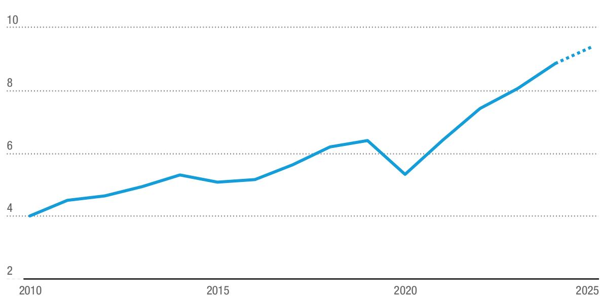  
Source: UNCTAD, UNCTADstat and World Trade Organization.  
Note: The dotted line indicates UNCTAD nowcasts (as of 14 October 2025). Nowcasts are constantly revised as new source data become available. For the weekly update of the nowcast and its methodology, see the Data Hub Nowcasts page.

In another year of solid growth, global services exports reached \$8.9 trillion in 2024, marking an annual increase of 10 per cent. Among the regions, the highest growth was recorded in Asia (11.5 per cent), partly reflecting a recovery of international transport and travel and partly a continued expansion of other services trade.

After the slowdown during the COVID-19 pandemic, in most other regions international travel receipts had already recovered before 2024, so in 2024

their growth in services exports was more based on service categories such as financial and insurance services, computer, telecommunications, business, professional, and technical services and intellectual property related charges, most of which can be digitally delivered. Their international trade continued booming in 2024 across the globe, with the highest growth rates registered for Africa (+16 per cent).

Growth in 2025 is nowcasted at 6 per cent, the slowest rate since 2020.

Top five services exporters by group of economy, billions of dollars

In developing economies, the top five services exporters took 57 per cent of the market share in 2024

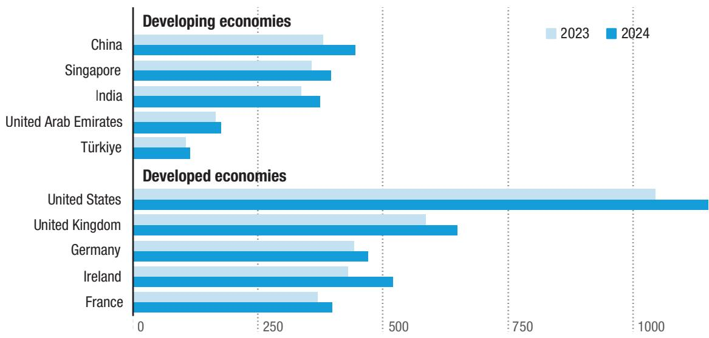  
Source: UNCTAD, UNCTADstat and World Trade Organization.

With almost \$1.2 trillion worth of services exported in 2024, the United States of America remained the world leading services exporter by a large margin, capturing some 13 per cent of the global market. They were followed, at some distance, by the United Kingdom (\$649 billion). Ireland (\$520 billion) made it to the top three for the first time.

China, the leading exporter among developing economies, ranked fifth globally (\$446 billion). All top five services exporters from the developing world were Asian. It is estimated they captured 17 per cent of the global market in 2024 and accounted for 57 per cent of the developing economies' total services exports.

The world leading importers remained the United States of America (\$841 billion) and China (\$611 billion).

## Strong growth of services imports in Africa, contrasted by moderate growth of services exports

Services trade annual growth rates, percentage, 2024

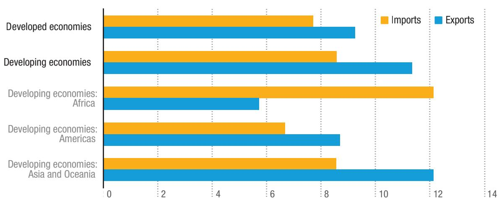  
Source: UNCTAD, UNCTADstat and World Trade Organization.

The strong growth of international trade in services in 2024 was shaped by increasing exports and imports across regions. African economies recorded a 5.7 per cent rise in services exports, while their imports went up by 12.2 per cent. American developing economies' exports rose by 8.7 per cent and their imports by 6.7 per cent.
The strongest rise in services exports

(+12.1 per cent) was registered in Asian developing economies, while their services imports grew more moderately (+8.6 per cent). Asian developing economies account for 83 per cent of developing economies' total services exports and for 80 per cent of their imports.

## Global services exports surpassed 8 per cent of world GDP in 2024. Exports of services as a proportion of gross domestic product, percentage 2024

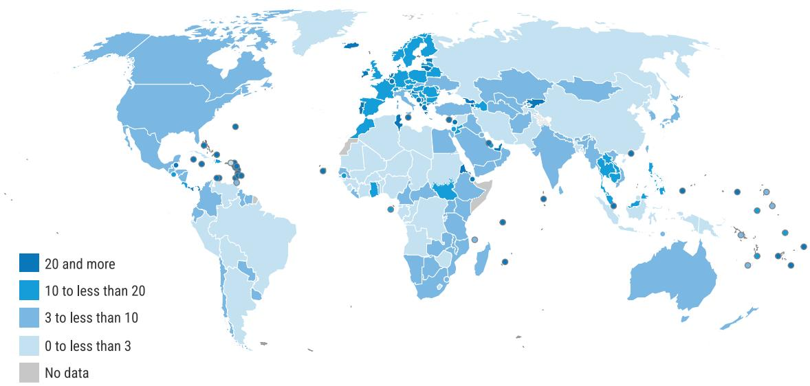  
Source: UNCTAD, UNCTADstat and World Trade Organization.

Economies rely on services exports as a source of domestic supply to different degrees. In 2024, the highest rates of services exports over gross domestic product (GDP) were observed in Luxembourg, Turks and Caicos Islands, and Malta (189 per cent, 117 per cent and 102 per cent respectively). In another 14 economies – all Small Island Developing States (SIDS) except Ireland and Macao (China) - the rate exceeded 50 per cent. About one half of the economies in the world recorded services exports value

below 10 per cent of their GDP in 2024. A high proportion of services exports in GDP mostly reflects a strong reliance on tourism exports or specialization in financial and business services.

At the global scale, in 2024, services exports surpassed 8 per cent of world GDP for the first time. This rate has been steadily rising over the last decades. In 2005, it had amounted to 5.5 per cent.

## Metadata

In accordance with the concepts of the balance of payments and national accounts, services are understood as the result of a production activity that changes the conditions of the consuming units, or facilitates the exchange of products or financial assets.

## 2. Trade in services by category

Telecommunications and computer services trade continued their strong rise in 2024, while travel and transport exports recovered Annual growth rate of services exports, percentage, 2024

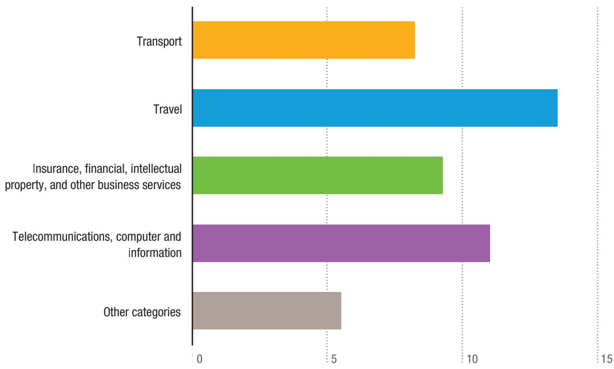  
Source: UNCTAD, UNCTADstat and World Trade Organization.

All main service categories witnessed a solid expansion in 2024 compared to the previous year. Still recovering from the consequences of the COVID-19 pandemic, travel registered the highest annual growth rate among the main categories of services exported (+13.6 per cent). International transport sales recovered from the previous year's slowdown (+8.3 per cent in 2024). Telecommunications, computer, and information services experienced another year of genuine strong growth (11.1 per cent), riding on rising demand for new technologies. Exports of financial, insurance, and intellectual-property-related services and of other business services gained 9.3 per cent in 2024, as digitally tradable products corresponding to these service categories have become ever more demanded globally.

## HANDBOOK OF STATISTICS 2025

## Exports of digitally deliverable products growing faster in developed than in developing economies

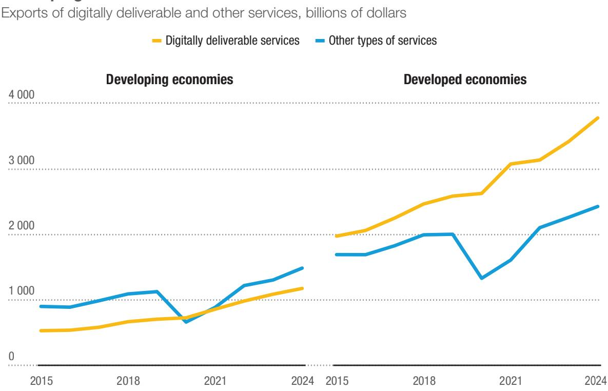  
Source: UNCTAD, UNCTADstat.  
Note: Digitally deliverable products include: insurance and financial services, telecommunications, computer and information services, intellectual property charges, research-and-development services, trade-related, technical, managerial, consultancy, engineering, scientific and architectural services, audiovisual services, as well as health and education personal services, and cultural heritage and recreational services.

## In 2024, international trade in digitally

deliverable products continued increasing strongly, marking a 10 per cent annual rise. Three quarters of their exports, worth about \$3 779 billion, originated from developed economies, while the developing world exported an estimated \$1 169 billion in 2024. Developed economies' exports rose by 10.5 per cent, while those of developing economies registered somewhat slower albeit still significant growth of 8.2 per cent. Among developing economies, the gap between a relatively small

number of more successful exporters and others that struggle to increase their market share has widened.

Digitally delivered international trade has been on a sustained rise since 2010, further boosted by the COVID-19 pandemic. Digitally deliverable trade covers products that can be delivered remotely over computer networks. All digitally delivered products are services, according to international trade measurement standards.

## Developing economies in Africa and the Americas primarily export travel and transports

Structure of services exports, percentage, 2024

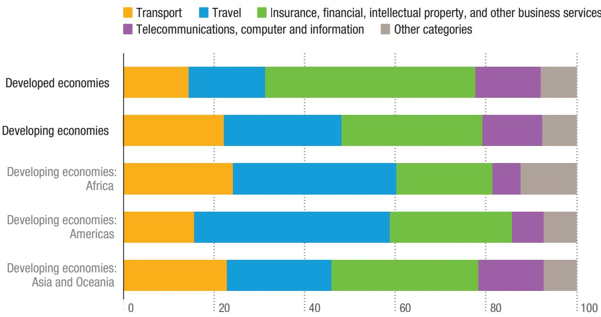  
Source: UNCTAD, UNCTADstat and World Trade Organization.

Travel and transport remain the categories of services exported most by African and American developing economies, accounting for 60 per cent and 59 per cent of their services sold abroad, respectively. Developing economies in Asia are diversifying their services trade expanding especially into knowledge-intensive services, in 2024 already accounting for almost a half of their services exports. Knowledge-intensive services comprise insurance, financial, telecommunication, computer, information, and other business services, as well as intellectual

property charges. These - mostly digitally tradable - products represent over 60 per cent of services exported from developed economies.

UNCTAD's statistics indicate that developing economies captured 30 per cent global services exports in 2024, a significant improvement compared to 21 per cent recorded for 2005. Most of these additional market shares were won by Asian exporters.

## Metadata

The breakdown by service category in this section has been built from the division of services in the balance of payments statistics, known as the 2010 Extended Balance of Payments Services Classification (EBOPS 2010).

Digitally deliverable services comprise services that can be delivered remotely over computer networks. The value of trade in digitally deliverable services therefore provides the upper threshold for the value of digitally delivered trade.

The presented trade-in-services figures are jointly compiled by UNCTAD and WTO, except for the digitally deliverable services, which are estimated by UNCTAD on the basis of the joint UNCTAD-WTO services trade data set.

## 3. Quarterly trade in services

Annual growth of world services exports slowed down in the first quarter of 2025
Global services exports growth rate, year-on-year, percentage

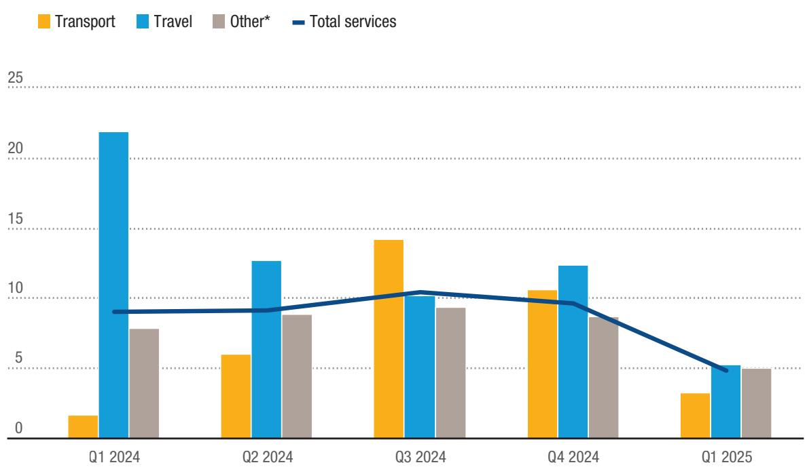  
Source: UNCTAD, UNCTADstat and the World Trade Organization.

World services exports increased by 4.8 per cent year-on-year in the first quarter of 2025, at a slower pace than in the quarters before. This slowdown affected all main service categories. In the first quarter of 2025, travel exports increased by 5.3 per cent and transport services by 3.3 per cent, and other services exports recorded a 5 per cent rise. The relatively high

growth rates witnessed during 2023 and 2024 had partly been a reflection of the recovery from the decline during the COVID-19 pandemic.

As UNCTADstat data show, the quarter-on-quarter seasonally adjusted growth rate of services exports was estimated at -1.6 per cent in the first quarter of 2025, indicating a decrease in comparison to the last quarter of 2024.

Asian services exports increased strongly in the first quarter of 2025; travel exports declined in Northern America

Growth of services exports by region, Q1 2025 versus Q1 2024, percentage

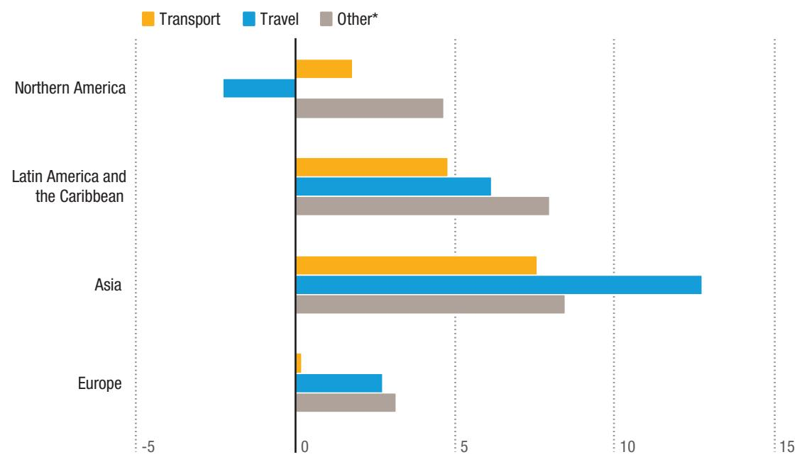  
Source: UNCTAD, UNCTADstat and the World Trade Organization.  
Note: Figures for Africa and Oceania are not presented, due to insufficient data coverage.

Asia recorded the highest relative growth of services exports in the first quarter of 2025, year-on-year. The 12.8 per cent increase in travel exports may still reflect some recovery from the decline of international tourism during the COVID-19 pandemic, from 2021 to 2023. The rise in transport exports (+7.6 per cent) was the highest among all continents. Other services - most of which can be digitally traded - also recorded a strong increase, of 8.4 per cent.

Exports of those other services grew relatively strongly in the first quarter, also in Latin America and the Caribbean (+8.0 per cent). Both transport and travel exports showed a dynamic development in the region, marking a 4.8 per cent and 6.2 per cent increase, respectively.

Europe, accounting for almost half (49 per cent) of global services exports, witnessed a relatively slow year-on-year growth in the first quarter of 2025. Its exports of ‘other’ services were up 3.2 per cent, travel 2.7 per cent, while transport exports recorded a modest 0.2 per cent rise.

In Northern America, services other than transport and travel led the growth, rising by 4.7 per cent. Transport exports increased by 1.8 per cent. International travel receipts, by contrast, recorded a 2.3 per cent drop in the first quarter of 2025.

## Metadata

The presented trade in services statistics follow the IMF Balance of Payments Manual 6 (BPM6, 2009) classification.

Quarterly estimates are based on the statistics available in national and international sources for some 150 economies, representing over 85 per cent of total international services trade.

\* Other represents a heterogeneous group of products dominated by various business services, telecommunications and computer services, intellectual-property, insurance and financial services. They are further comprised of construction, personal, cultural and recreational services, and government goods and services (n.i.e.). For this presentation, manufacturing, processing and repair services are also included under other.Creative goods and services.

## c. Creative goods and services

## 1. Global exports of creative goods and services

## Exports of creative services more than double those of creative goods for the first time

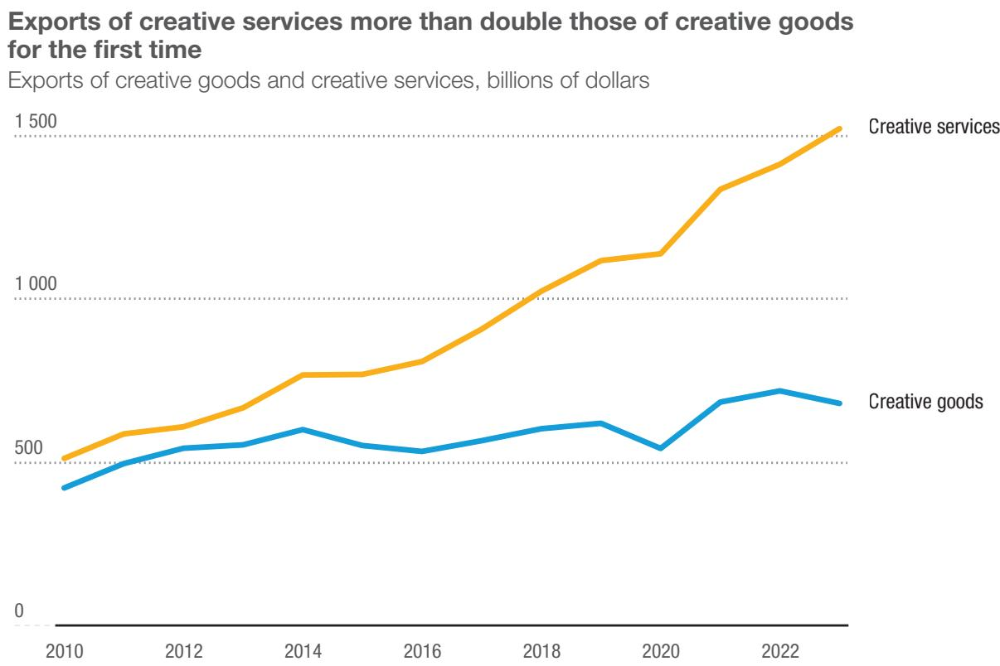  
Source: UNCTAD, UNCTADstat.  
Note: These figures were calculated by UNCTAD based on the identification of goods and services with a significant creative component. The estimates for services are based on the Extended Balance of Payments Services (EBOPS) classification (experimental estimation), while those for goods are based on the Harmonized System (HS) classification.

In 2023, UNCTAD estimates that global exports of creative services reached a record of \$1.5 trillion—more than twice the \$677 billion recorded for creative goods exports. While creative services exports grew by 7.7 per cent year-on-year, exports of creative goods declined by 5.4 per cent. Creative services represented a significant share of total services exports, accounting for 19 per cent in 2023, whereas creative goods made up 3 per cent of total merchandise exports. Over the past decade, creative services have

consistently outperformed creative goods in terms of export value. While creative goods exports remained relatively stable, with only modest growth between 2010 and 2023, creative services exports followed a strong upward trajectory, more than doubling in value over the same period. This trend underscores the increasing global demand for creative services — including software, research and development, and digital content and media — compared with the slower growth of physical creative goods.

Developed economies lead creative services exports, but India, China and Singapore emerge as key players
Top five creative service exporters (by development status), billions of dollars

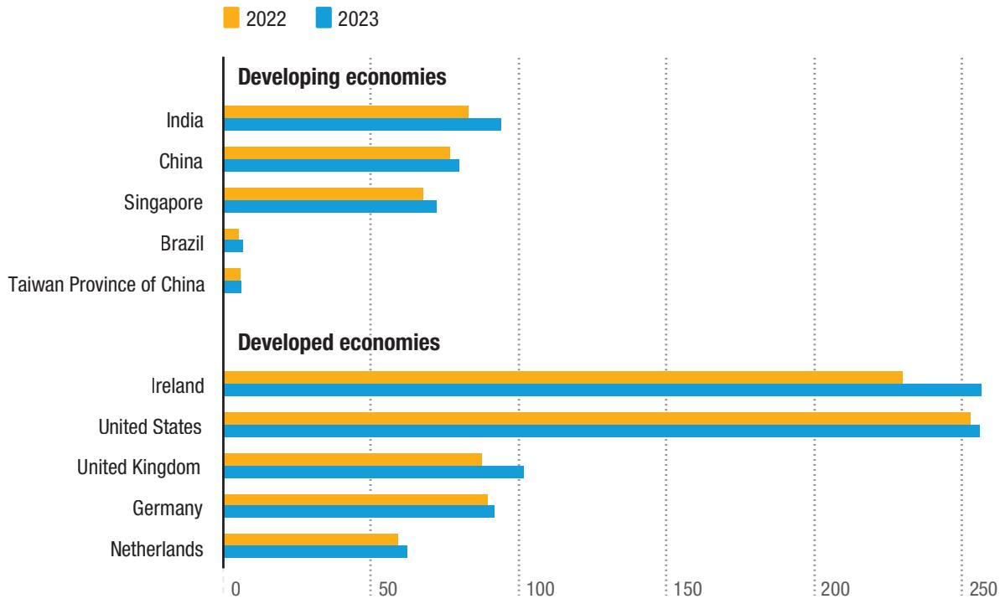  
Source: UNCTAD, UNCTADstat.

Creative services exports are concentrated among a small number of mainly developed economies. The ten largest exporters accounted for 73 per cent of global creative services exports in 2023. Ireland and the United States remained the world's leading exporters, each generating approximately \$250 billion in creative services exports and capturing nearly 17 per cent of the global market. The United Kingdom followed with \$102 billion in exports, trailed by India (\$94 billion) and Germany (\$92 billion).

In recent years, some developing economies — particularly India, China and Singapore — have become important exporters of creative services. Among the top five creative services exporters from the developing world, all were in Asia except for Brazil.

While developed economies continue to dominate in terms of absolute export values, the increasing presence of developing economies in creative services trade highlights their growing but uneven participation in the global market.

## China remains the leading exporter of creative goods, accounting for one third of global exports

Top five creative goods exporters (by development status), billions of dollars

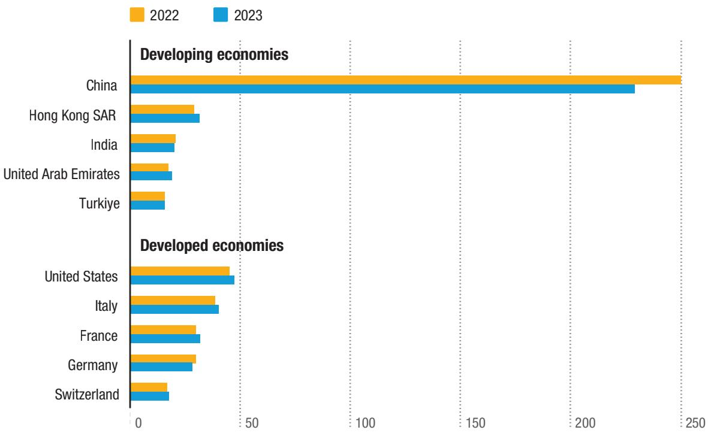  
Source: UNCTAD, UNCTADstat.

A small group of economies continues to dominate global creative goods exports, accounting for more than 71 per cent of the total. In 2023, China remained the world's largest exporter of creative goods by a significant margin,

recording \$230 billion in exports despite an 8 per cent decline compared with 2022. The United States ranked second with \$47 billion in exports, followed by Italy (\$41 billion), France (\$32 billion) and Hong Kong SAR (\$31 billion).

## Metadata

The creative economy has no single definition. It is an evolving concept which builds on the interplay between human creativity and ideas and intellectual property, knowledge and technology. Essentially it is the knowledge-based economic activities upon which the ‘creative industries’ are based.

The creative industries – which include advertising, architecture, arts and crafts, design, fashion, film, video, photography, music, performing arts, publishing, research & development, software, computer games, electronic publishing, and TV/radio – are the lifeblood of the creative economy. They are also considered an important source of commercial and cultural value.

Chapter 2

## Economy, investment and finance

## a. National accounts

## 1. Gross domestic product

Most developed economies have per capita gross domestic product more than ten times that of poorest countries
Gross domestic product per capita, current prices, dollars, 2024

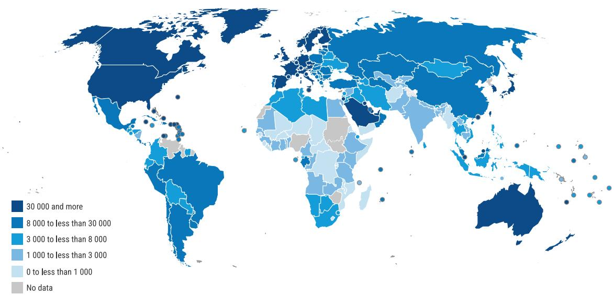  
Source: UNCTAD, UNCTADstat.

Significant disparities in GDP per capita persist throughout the world. In 2024, in the majority of developed economies, GDP per capita is greater than \$30 000, with economies in Eastern and Southern Europe as the main exception. By contrast, almost 40 per cent

of developing economies in Africa recorded a per capita GDP of less than \$1 000. In most developing economies in the Americas, Asia and Oceania, GDP per capita is greater than \$3 000.

## In 2024, global economic growth was stable at a rate of 2.8 per cent   World real gross domestic product, annual growth rate, percentage

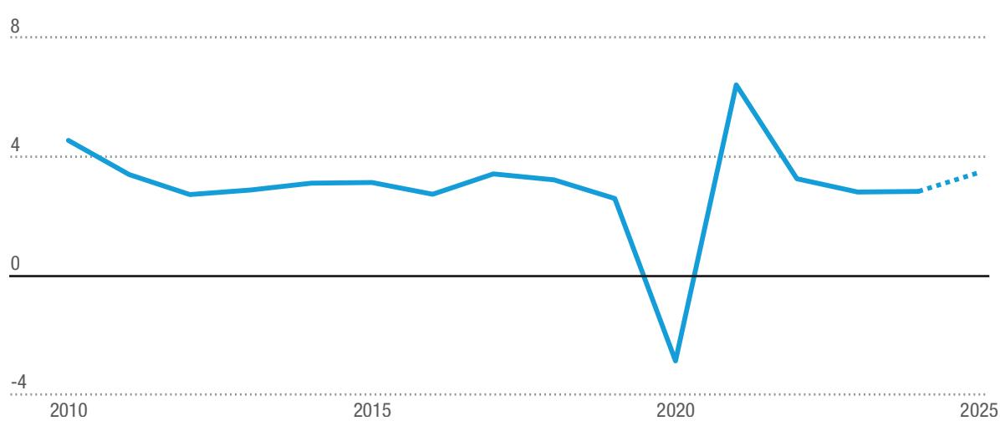  
Source: UNCTAD, UNCTADstat and World Trade Organization.

Note: In constant 2015 United States dollars. The dotted line indicates UNCTAD nowcasts (as of 14 October 2025). Nowcasts are constantly revised as new source data become available. For the weekly update of the nowcast and its methodology, see the Data Hub Nowcasts page.

In 2024, global real GDP grew by 2.8 per cent - at the same rate as in 2023. It is below the

2015-2019 average growth rate of 3 per cent. For 2025, it is nowcast to increase to 3.4 per cent.

## Gross domestic product growth was moderate in developing and developed economies in 2024

Growth of real gross domestic product by group of economies, percentage, 2024

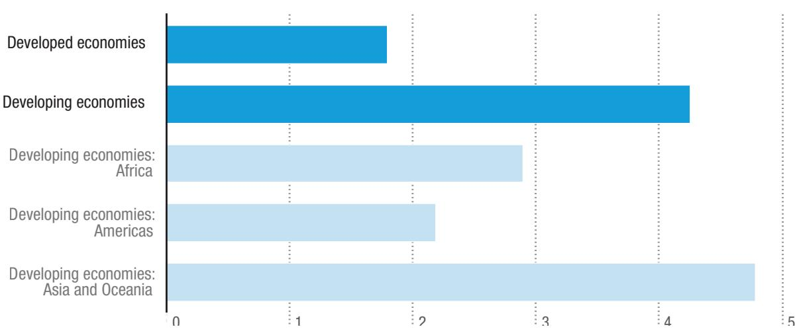  
Source: UNCTAD, UNCTADstat.

## Economic growth was moderate in 2024.

GDP growth in developed economies grew by 1.8 per cent, up from 1.7 per cent in 2023. Developing economies' growth remained stable at 4.3 per cent. Economic growth in developing Africa slowed to 2.9 per cent in 2024 from 3.1 per cent in 2023. Developing Americas maintained the same growth rate of 2.2 per cent in 2024.

Growth in developing Asia reached 4.8 per cent in 2024, slightly lower than 4.9 per cent in 2023.

In LDCs, GDP grew by 3.4 per cent in 2024 but still well below the 7 per cent growth target set by the 2030 Agenda for Sustainable Development. LDCs growth per capita was 1.1 per cent.

## Metadata

Gross domestic product (GDP) is an aggregate measure of production, income and expenditure of an economy. The GDP figures presented in this section are usually calculated from the expenditure side. As an expenditure measure, it depicts the sum of expenditure on final consumption, gross capital formation (i.e., investment, changes in inventories, and acquisitions less disposals of valuables) and exports after deduction of imports.

All GDP growth is expressed in real terms.

# b. Investment and balance of payments

## 1. Current account

Many African and American economies have current account deficits Current account balance as a ratio to gross domestic product, percentage, 2024

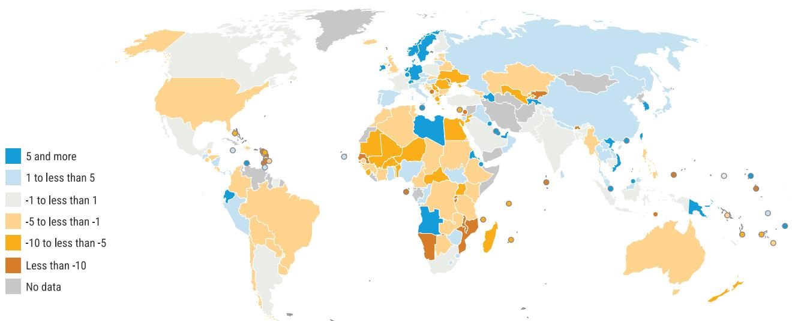  
Source: UNCTAD, UNCTADstat.

In 2024, for many economies in the Americas, Africa, and South and South-Eastern Europe, payments made for transactions with other economies exceeded their receipts earned, leading to negative current account balances.

Most economies in Asia recorded current account surpluses or relatively small deficits.

The highest current account surplus relative to GDP, 29 per cent in 2024, was recorded in Kuwait. Macao (China) ranked second, marking a surplus at 28 per cent of its GDP. Thereafter, Singapore

recorded an 18 per cent surplus, followed by Qatar and Ireland with 17 per cent. The highest current account deficits in proportion to GDP were observed in Kyrgyzstan, Palau and Timor-Leste.

In absolute terms, the United States of America (\$1 185 billion), the United Kingdom (\$97 billion), the United Kingdom (\$97 billion), and Brazil (\$61 billion) ran the world's largest current account deficits in 2024. China recorded the largest absolute surplus (\$424 billion), followed by Germany (\$264 billion), and Japan (\$194 billion).

Developing economies' goods surplus widens as services deficit narrows
Balances in trade of goods and services, billions of dollars  
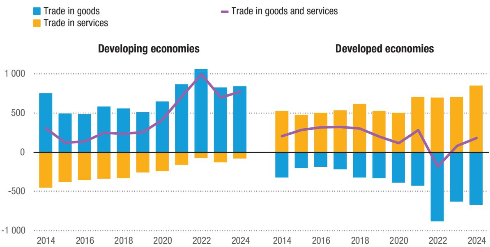  
Source: UNCTAD, UNCTADstat.

In 2024, developing economies maintained a substantial trade surplus in goods and services, rising to \$772 billion from \$696 billion in 2023. This increase was driven by a higher goods surplus, which grew from \$831 billion to \$853 billion, while their services trade deficit narrowed to \$81 billion.

In contrast, developed economies posted a trade surplus of \$179 billion, more than double the \$79 billion recorded in 2023. This improvement reflected a robust services surplus of \$854 billion, offsetting a persistent goods deficit of \$675 billion.

## Metadata

The current account, within the balance of payments, displays the transactions between residents and non-residents of a reporting economy, involving economic values, namely the cross-national exchange of goods and services as well as cross-national transfers of primary and secondary income.

The current account balance shows the difference between the sum of exports and income receivable, and the sum of imports and income payable, where exports and imports refer to both goods and services, while income refers to both primary and secondary income. A surplus in the current account is recorded when receipts exceed payments; a deficit is recorded when payments exceed receipts. The current account data in this section correspond to the latest reporting standard, known as BPM6, defined by the IMF (2009).

## 2. Foreign direct investment

Foreign direct investment remains concentrated among a few developing countries; 10 recipient countries account for three quarters of developing countries' inflows as a group

Foreign direct investment inflows, billions of dollars, 2024

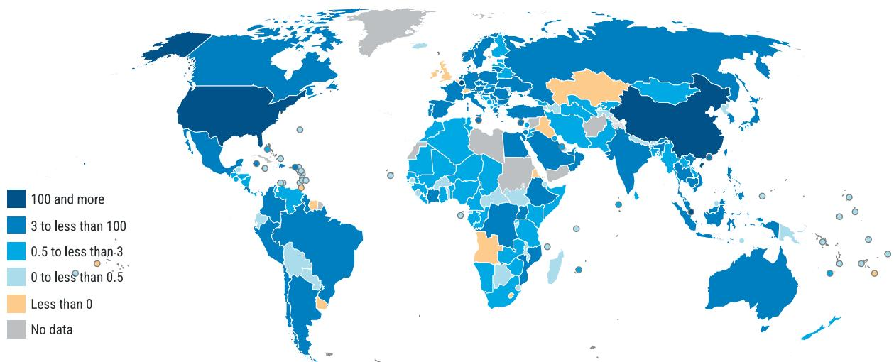  
Source: UNCTAD, UNCTADstat.  
It was followed by Singapore, Hong Kong (China), China and Luxembourg.

In 2024, the United States of America remained the largest destination economy for foreign direct investment (FDI).

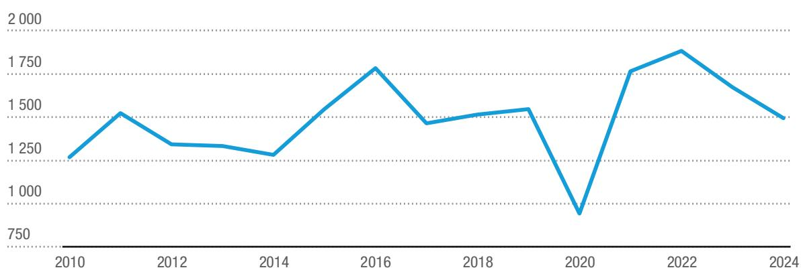  
Source: UNCTAD, UNCTADstat.  
Note: Excluding financial centers in the Caribbean. The data excludes financial transactions through several European economies with high levels of conduit flows.

In 2024, global FDI flows were reported 4 per cent higher. However, this figure was inflated by volatile flows through conduit economies. Excluding these, global flows fell by 11 per cent, a second year of decline.

There was wide differences in performance across economies. Developed countries experienced a 22 per cent contraction, while flows to developing economies were stable at \$867 billion. Developing Asia saw only a slight decline of 3 per cent. Developing Americas experienced a 12 per cent decline. Developing Africa recorded a 75 per cent growth, a record for FDI inflows to the region. FDI inflows to the LDCs increased by 9 per cent, reflecting a modest recovery from previous years.

## Despite a 3 per cent dip in value from the year before, developing Asia remained the largest foreign direct investment recipient globally, attracting 40 per cent of global inflows

Foreign direct investment inflows and outflows, billions of dollars, 2024

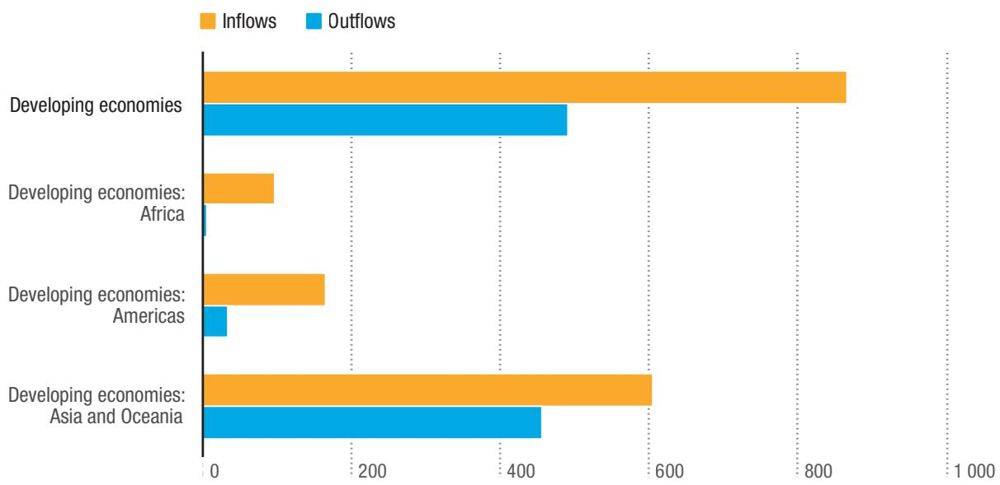  
Source: UNCTAD, UNCTADstat.  
Note: Excluding financial centers in the Caribbean. The data excludes financial transactions through several European economies with high levels of conduit flows.

In 2024, FDI outflows from developing economies declined by 5 per cent, totaling \$491 billion. The drop was particularly pronounced in developing Americas, where outflows fell by 33 per cent. In developing Asia, FDI outflows decreased slightly by 3 per cent. FDI outflows from developed economies increased by

8 per cent. However when European conduit economies are excluded, FDI outflows from developed economies declined by 24 per cent.

The top 5 economies for FDI outflows in 2024 were the United States of America, Japan, China, Luxembourg and Hong Kong (China).

In 2024, developing economies accounted for 57 per cent of global foreign direct investment inflows

Selected foreign direct investment flows, percentage of world total

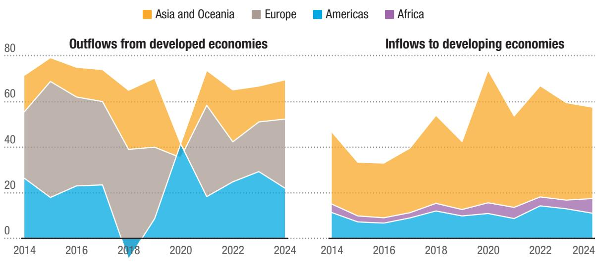  
Source: UNCTAD, UNCTADstat.  
Note: Excluding financial centers in the Caribbean.

In 2024, FDI inflows to Africa accounted for 6 per cent of global FDI inflows, up from 4 per cent the previous year, and 11 per cent of total FDI to developing economies, compared with 6 per cent in 2023. Developing Asia remained the recipient of the largest amount of FDI globally, attracting 70 per cent of total FDI to developing economies

and 40 per cent of global inflows. Developing Americas accounted for 19 per cent of total FDI to developing economies and 11 per cent of global inflows. LDCs continued to attract only a small share of global FDI, approximately 2 per cent.

## Metadata

Foreign direct investment (FDI) is defined as an investment reflecting a lasting interest and control by a foreign direct investor (parent enterprise), resident in one economy (home economy), in a foreign affiliate resident in another economy (recipient or host economy).

FDI flows comprise capital provided by a foreign direct investor to a foreign affiliate, or capital received by a foreign direct investor from a foreign affiliate. FDI has three components: equity capital, reinvested earnings and intracompany loans.

FDI stock is the value of the share of their capital and reserves attributable to the parent enterprise, plus the net indebtedness of foreign affiliates to the parent enterprise.

FDI are on a net basis (capital transactions' credits less debits between direct investors and their foreign affiliates). Thus FDI might be recorded as negative.

## c. Commodity prices

## 1. UNCTAD Commodity Price Index

Year-on-year change in UNCTAD Commodity Price Index by commodity group, percentage

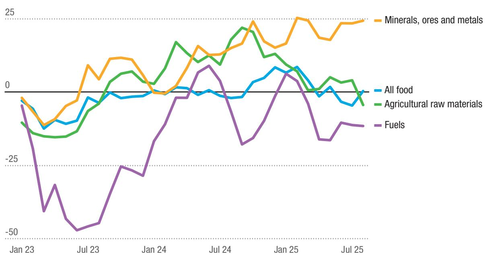  
Source: UNCTAD, UNCTADstat.  
Note: The index has been modified in September 2025 to now only take data from automated sources, leading to (in general) small changes. Please read the methodology note for more information. The tables of individual prices have been discontinued.

The UNCTAD Commodity Price Index dipped 1.1 per cent in August 2025, led by falls in fuels (-11.7 per cent) and agricultural raw materials (-4.7 per cent) groups, but strong gains were seen in the minerals, ores and metals (24.2 per cent)

group, while the food group nudged up by 0.2 per cent (all comparisons on a year-on-year basis).

The fuels sub-index's fall left it around 45 per cent of the value of its August 2022 peak, while the minerals, ores and metals sub-index hit a new high (on an absolute value basis).

  
Commodity prices dip 0.9 per cent in 2024; the index excluding fuels hit a new high UNCTAD Commodity Price Index, 2015=100

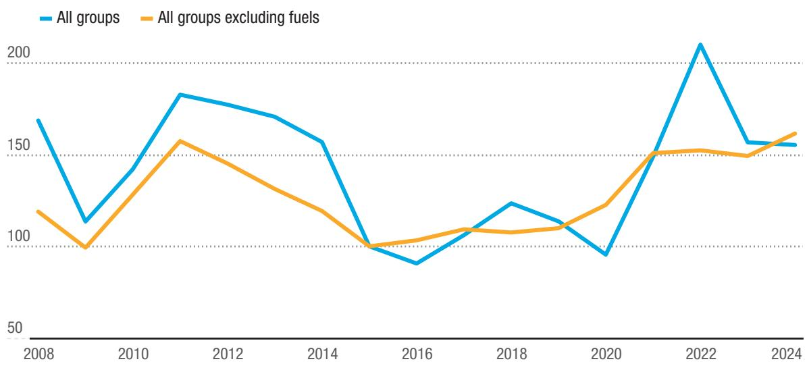  
Source: UNCTAD, UNCTADstat.  
Note: The index has been modified in September 2025 to now only take data from automated sources, leading to (in general) small changes. Please read the methodology note for more information. The tables of individual prices have been discontinued.

Commodity prices dipped slightly by 0.9 per cent in 2024, after having dropped sharply the previous year from their 2022 peak.
This drop was again dominated by fuel prices (-6.1 per cent), while prices for minerals, ores and metals group (11.4 per cent) and agricultural raw materials groups (13 per cent) both increased.

Excluding fuels, the index saw its highest ever value in 2024.

## Chapter 3 Maritime and other transport

## a. Merchant fleet

## 1. World merchant fleet

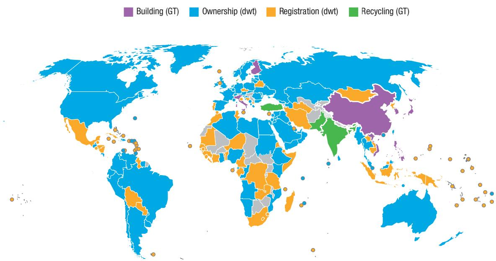  
Source: UNCTAD, UNCTADstat and Clarkson's research.  
Note: Building and recycling are estimated deliveries and demolitions during 2024. Registration and ownership figures refer to the beginning of the year 2025.

At the start of 2025, the global merchant fleet comprised around 112 500 vessels (including cargo and non-cargo carrying ships) of at least 100 gross tons (GT), including 60 300 which were over 1 000 GT.

Ownership is spread over the whole globe, with 41 per cent of carrying capacity held by entities in Greece, China and Japan. Several economies play specific roles for the global fleet. Liberia, Panama, and the Marshall Islands host the largest ship registries.

While China and Japan are major shipowners, these economies (together with the Republic of Korea) play an even bigger role in ship building. Bangladesh and India alone accounted for 77 per cent of ships recycled.

World fleet capacity to carry goods growing steadily
World fleet by principal vessel type, millions of dead weight tons (dwt)  
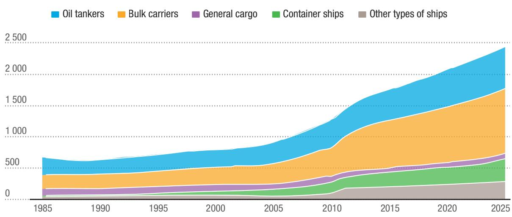  
Source: UNCTAD, UNCTADstat and Clarkson's research.  
Note: Commercial ships of 100 GT and above. Beginning-of-year figures. The data source changes in 2011.

As of 1 January 2025, the world fleet's carrying capacity reached 2.44 billion dead weight tons (dwt), an increase of 79 million dwt from the previous year. Oil tankers and bulk carriers made up 70 per cent of total capacity. Fleet growth

averaged 7.1 per cent annually from 2005 to 2010 but slowed to 3.6 per cent per year since 2011. The capacity to transport cargo has increased primarily for ships built for a given purpose: oil tankers, bulk carriers and container ships.

  
93 per cent of world ship carrying capacity owned in Asia and Europe
Fleet market by region of beneficial ownership, millions of dead weight tons, 2025

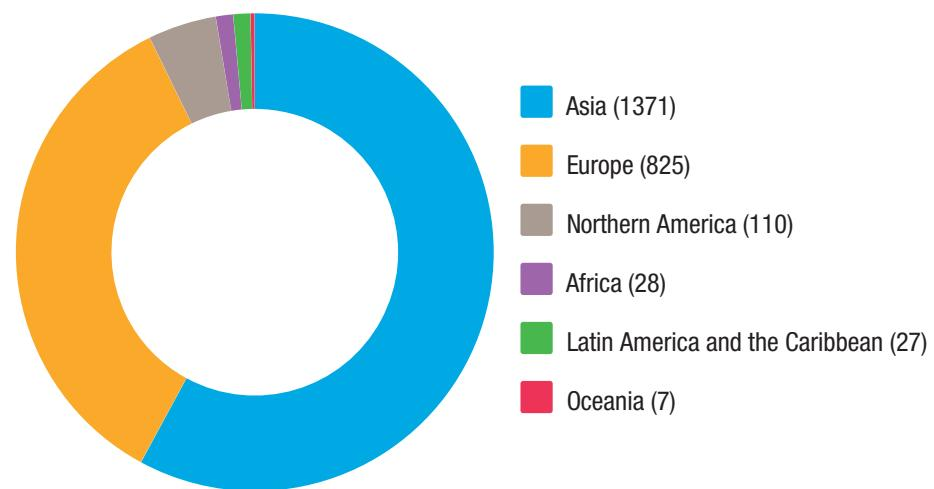  
Source: UNCTAD, UNCTADstat and Clarkson's research. Note: Commercial ships of 1000 GT and above. Beginning-of-year figures.

Over half of the world's tonnage is owned by Asian companies, with China (347 million dwt) and Japan (241 million dwt) holding significant shares. The individual economy with most ship capacity owned is Greece (398 million dwt). In total,

European companies own 35 per cent of the global carrying capacity, while 5 per cent is owned in North America. Other geographical regions have small shares. Excluding China, only 30 per cent of the beneficial ownership is in developing economies.

## Liberia the world's largest ship registry in terms of capacity Ship carrying capacity in top five registries, millions of dead weight tons (dwt)

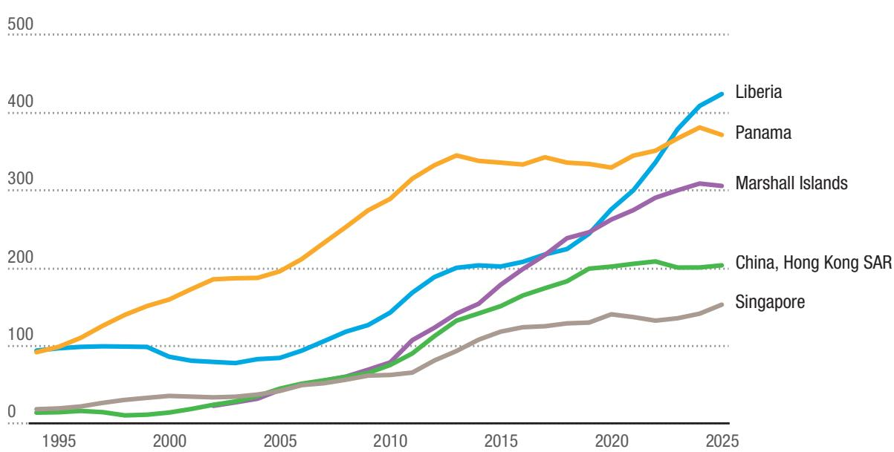  
Source: UNCTAD, UNCTADstat and Clarkson's research.  
Note: Commercial ships of 100 gross tonnage (GT) and above. Beginning-of-year figures. Ranked by values as of 1 January 2025. The data source changes in 2011.

The flag a ship flies is often unrelated to the owner's nationality. For example, at the start of 2025, 88 per cent of Greek-owned tonnage and 84 per cent of Japanese-owned tonnage were registered under foreign flags.

Liberia (424 million dwt), Panama (371 million dwt) and the Marshall Islands (305 million dwt) led in ship registration. While Panama's register has remained stable, the Marshall Islands and Liberia have surged, with Liberia seeing rapid growth since 2018.

## Metadata

The unit dead weight tons (dwt) is used to indicate the cargo carrying capacity of a ship, while gross tons (GT) reflects its size. The latter is relevant to measure shipbuilding and recycling activity, while the former is used to capture the capacity to transport cargo.

The presented statistics on fleet registration (the flag of a ship), shipbuilding and recycling cover all commercial ships of 100 GT and more. The market shares for ownership only cover larger ships of 1 000 GT and above, as the true ownership is not always known for smaller vessels.

For in-depth analysis on the world shipping fleet and related topics see the Review of Maritime Transport.

## b. Freight volumes by sea

## 1. Containerized port traffic

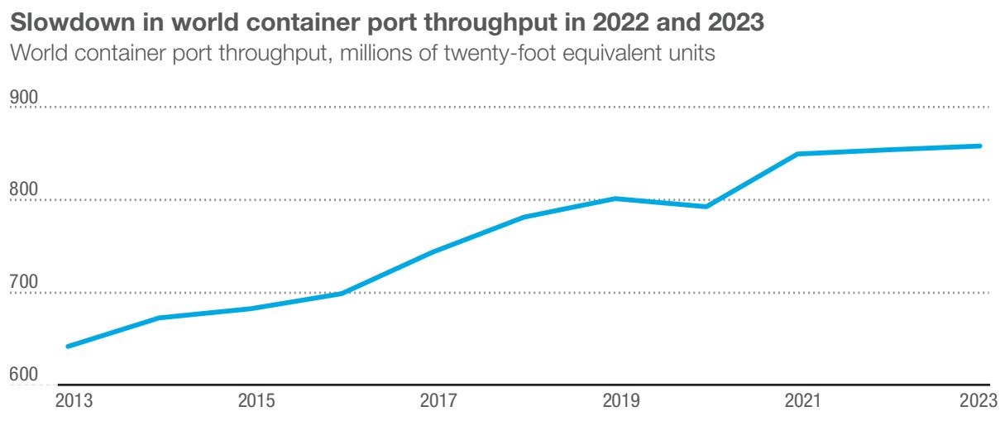  
Source: UNCTAD, UNCTADstat.

In 2023, 858 million twenty-foot equivalent units (TEUs) of containers were handled in ports worldwide. In both 2022 and 2023, world container port throughput increased by about half a per cent. This is the slowest growth for more than a decade, except for the year of the outbreak of

the COVID-19 pandemic, 2020. The long-term trend shows growth, and over the last decade, world container port throughput increased by 33 per cent, up from 641 million TEUs in 2013. The added 217 million TEUs equals more than all container traffic in developed economies in 2013.

## In 2023, ports in developing economies of Asia handled the majority of world port container traffic

Containerized port traffic by group of economies, millions of twenty-foot equivalent units, 2023

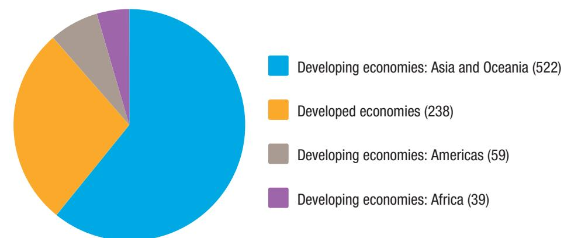  
Source: UNCTAD, UNCTADstat.

Asia's prominent contribution to global containerized port throughput reflects the region's leading role as a global loading and discharging centre for maritime trade and its top position as the best-connected region, whether at port or country level. In 2023, ports in developing economies of Asia handled

61 per cent of world port container traffic. Less than 0.1 per cent was handled in Developing Oceania. The shares of Developing America and Developing Africa were significantly lower, at 7 per cent and 5 per cent, respectively.

## Metadata

Port container traffic is measured in twenty-foot equivalent units (TEUs). One TEU represents the volume of a standard 20-feet long intermodal container. Full metadata are available in our Data Centre for Container port throughput.

For in-depth analysis on the world shipping fleet and related topics see the Review of Maritime Transport.

## 2. World seaborne trade

China discharges the most seaborne cargo; Australia loads the most Tonnage loaded and discharged, billions of tons (SDG 9.1.2), 2023

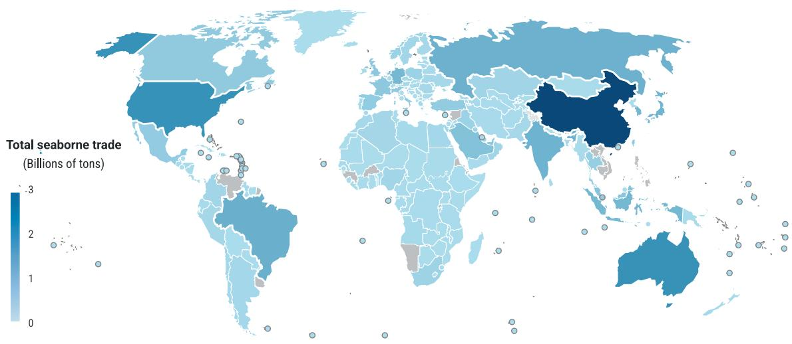  
Source: UNCTAD, UNCTADstat.  
Note: Reported as Sustainable Development Goal Indicator 9.1.2: "Freight loaded and unloaded, maritime transport (metric tons)".

In 2023, China remained the world's leading maritime-freight economy, loading around 570 million metric tons and discharging close to 2.7 billion metric tons—equivalent to 5 per cent of global loading volume and 23 per cent of global discharging volume, respectively. However, Australia, United States and the Russian Federation loaded more cargo for international maritime transport than China.

Since 2011, China, Australia and the United States have ranked as the top three economies in total seaborne trade. That year, Australia overtook Japan—notable for its large discharge volumes—in total volume. In 2023, India recorded the second-largest discharge volume.

## Maritime trade volumes have been levelling out Goods loaded worldwide, billions of tons

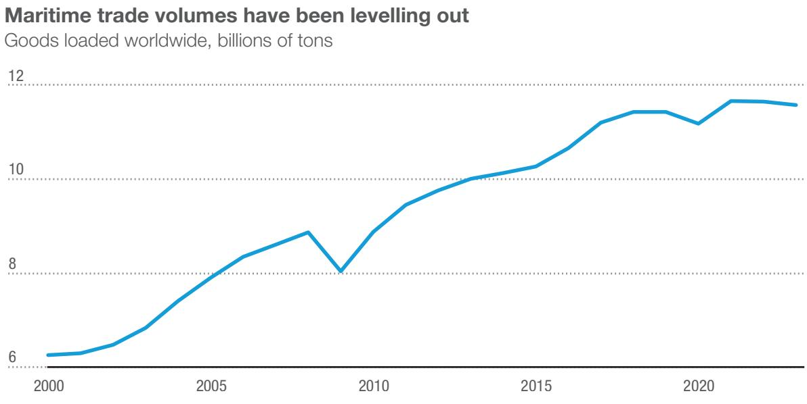

In 2023, 11.6 billion metric tons of goods were loaded for international maritime trade worldwide. This represents a slight decrease of 0.6 per cent from 2022 and is only 1.3 per cent higher than in 2018. Since the start of the millennium, goods loaded for international trade have increased significantly and still grew by 14.2 per cent in the five-year period 2013–2018.

Since 2000, the share of seaborne cargo shipped by tankers has declined. Although tanker shipments of crude oil and other tanker transports rose by about 50 per cent, shipments of dry cargo (containers, dry bulk and general cargo) more than doubled over the same period. In 2000, crude oil accounted for 29 per cent of loaded volume; by 2023, its share had fallen to 18 per cent.

  
Heavy goods shipped to developing economies have increased over the last two decades

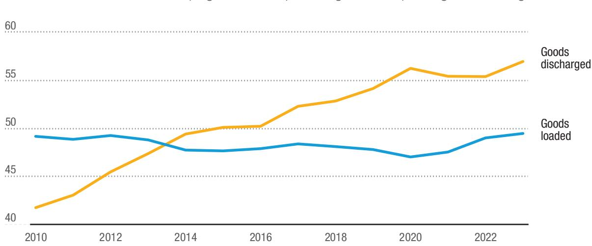  
Source: UNCTAD, UNCTADstat.

In 2023, developing economies still accounted for the majority of global seaborne trade: Asian developing economies alone discharged 47 per cent and loaded 32 per cent of the world's total volume.

Over the past 20 years, the volume of goods discharged in developing economies has overtaken the volume loaded. This shift can be attributed to growing deliveries of dry bulk cargo—such as iron ore and coal—and by crude oil shipments, especially to China.

## Developing economies' seaborne imports exceeded exports by 868 million tons in 2023

Difference between volume loaded and volume discharged for seaborne trade, millions of tons

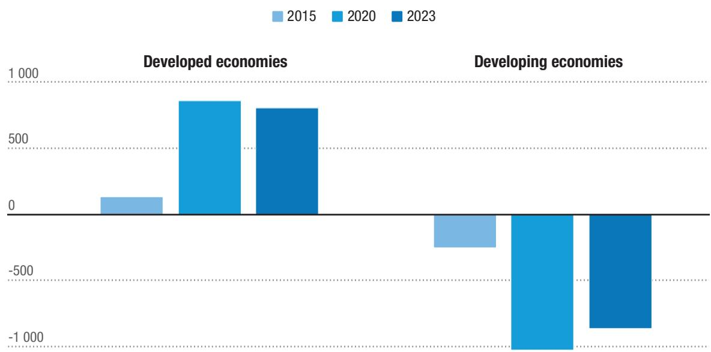

## Source: UNCTAD, UNCTADstat.

Note: “Volume discharged” refers to imports of internationally traded goods transported by sea, while “volume loaded” refers to exports. The difference represents the net imbalance in volume.

Overall, ships carrying internationally traded goods to developing economies departed with 868 million metric tons less cargo than they had on arrival. The opposite was true for developed economies. This imbalance was slightly less pronounced in 2023 than in 2020, but considerably more pronounced than in 2015.

Large dry cargo shipments—including both bulk and containerized goods—have driven developing economies’ sea imports to outpace their exports. This trend is particularly pronounced in Asian economies.

## Metadata

Goods loaded for international shipment represent exports, while goods discharged from ships represent imports.

Dry cargo refers to cargo that is usually not carried in tankers, such as dry bulks (e.g., coal, ores, grains), pallets, bags, crates, and containers. “Other” tanker trade refers to tanker trade, excluding crude oil. It includes refined petroleum products, gas and chemicals.

For in-depth analysis on the world shipping fleet and related topics see the UNCTAD Review of Maritime Transport.

## c. Maritime connectivity

## 1. Liner shipping connectivity

Ukraine, Bahrain, and Cameroon saw the largest annual connectivity increases in the third quarter of 2025
Annual change in liner shipping connectivity, percentage

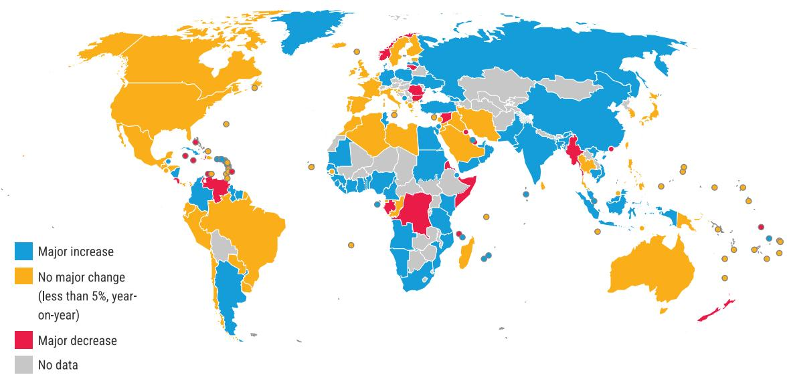  
Source: UNCTAD, UNCTADstat and MDS Transmodal.  
Note: Change year-on-year in the Liner Shipping Connectivity Index from the third quarter of 2024 to the third quarter of 2025.

Liner shipping connectivity improved in more economies than it declined in the third quarter of 2025 compared to the same period in 2024. Ukraine recorded the highest growth globally, with an increase of 118.7 per cent. Other major increases were observed in Bahrain with +60.3 per cent, Cameroon with +51.3 per cent, Namibia with +46.0 per cent, and Sierra Leone with +38.6 per cent.

The sharpest decreases were recorded in Bahamas (-22.4 per cent), Bonaire/Sint Eustatius/Saba (-20.0 per cent), and New Zealand (-18.5 per cent).

## Global shipping networks rely on strong regional anchors

Top maritime connectivity performer by region (Liner shipping connectivity index, third quarter of 2025)

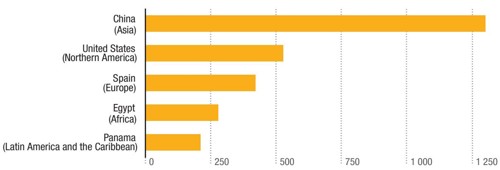  
Source: UNCTAD, UNCTADstat and MDS Transmodal.  
Note: The reference is the average economy in the first quarter of 2023. No economy has this value; 100 is the value for a theoretical economy having the average value on each index component. A value 130 for the Liner Shipping Connectivity Index thus means 30 per cent above the (theoretical) average economy in the first quarter of 2023. Liner shipping connectivity index (LSCI) measures how well a country is connected to global container shipping networks.

China remains the top maritime connectivity performer in Asia, with its major ports anchoring global shipping networks. Seven Asian economies feature among the top 15 globally—Republic of Korea, Singapore, Malaysia, Viet Nam, Japan, India, and Hong Kong SAR (China)—highlighting the region's central role in global liner shipping networks.

The United States leads in Northern America, supported by its broad port infrastructure and service coverage. Spain tops the European rankings, benefiting from strong connections within the region and beyond. Egypt is Africa's most connected country, with key ports on the Mediterranean and Red Sea routes. Panama leads in Latin America and the Caribbean, leveraging its strategic canal position for global trade flows.

## Monthly liner shipping connectivity index (LSCI) shows large differences among top economies

Monthly evolution of the top 5 economies with the highest LSCI in September 2025

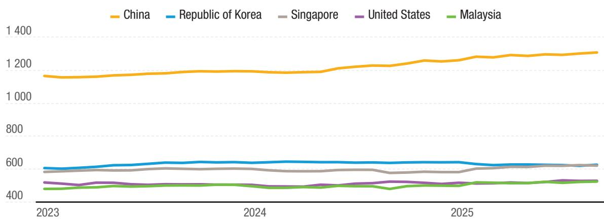  
Source: UNCTAD, UNCTADstat.  
Note: Liner shipping connectivity index (LSCI) measures how well a country is connected to global container shipping networks.

Top-performer countries further enhanced their liner shipping connectivity during the last twelve months from September 2024 to September 2025. China maintained robust growth, while the Republic of Korea experienced moderate fluctuations from September 2024 to September 2025 and

Singapore showed steady upward momentum over the period. Malaysia recorded consistent gains in liner shipping connectivity, reaching a high in September 2025. The United States posted gradual improvement over the period till September 2025.

# HANDBOOK OF STATISTICS 2025

## Metadata

The liner shipping connectivity index (LSCI) indicates an economy's position within global liner shipping networks. It is calculated from the number of ship calls, the container handling capacity of ports, the number of services and companies, the size of the largest ship, and the number of countries connected through direct liner shipping services. Full metadata are available in our Data Centre for LSCI, as well as this blogpost detailing the index's update.

UNCTAD also publishes the Port Liner Shipping Connectivity Index (PLSCI) which measures connectivity and reflects the level of integration into the global liner shipping network on a port-by-port basis. The data and metadata can be accessed in our Data Centre.

For in-depth analysis on port performance and related topics see the Review of Maritime Transport.

## 2. Port liner shipping connectivity

Asia's leading ports retain connectivity dominance over two decades
Top 5 ports in the port liner shipping connectivity index, from the first quarter of 2006 to the second quarter of 2025

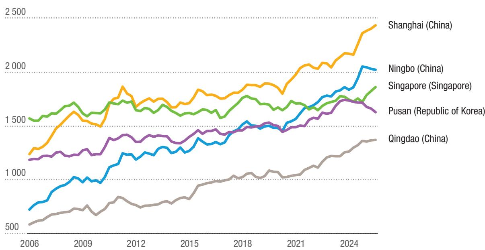  
Source: UNCTAD, UNCTADstat.

Asian ports dominate global rankings, with Shanghai (2 403), Ningbo-Zhoushan (2 028), and Singapore (1 822) leading in the second quarter of 2025. All three have shown sustained growth between 2006 and 2025. Pusan (1 659) and Qingdao (1 364) complete the top five, reaffirming the region's stronghold in global port liner shipping connectivity.

Despite disruptions—including port congestion, the COVID-19 pandemic, and evolving trade patterns—these ports have steadily improved their performance over time. Their resilience reflects sustained investment in port infrastructure, digital systems, and intermodal integration, which has strengthened their role in global maritime networks and enabled continued growth in liner shipping connectivity.

## Ports with the fastest connectivity growth over the last decade

Top 10 ports with the highest growth in the port liner shipping connectivity index, from the second quarter of 2015 to the second quarter of 2025

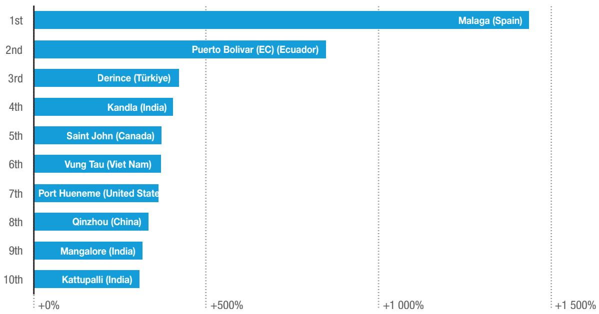  
Source: UNCTAD, UNCTADstat.

The chart shows the top 10 ports with the highest percentage growth in connectivity between the second quarter of 2015 and the second quarter of 2025, based on their Port Liner Shipping Connectivity Index (PLSCI). The percentage values reflect how much each port's connectivity increased relative to its 2015 level.

Malaga (Spain) tops the list with growing about 15 times bigger in a decade, followed by Yangpu and Qinzhou (China), each now about 10 times bigger than in 2015. Within the same period, Puerto Bolivar (Ecuador) grew about 9 times bigger.

The rest of the Top 10 includes Kandla (India), Saint John (Canada), Port Hueneme (United States), Vung Tau (Viet Nam), Mangalore (India), and Archangel (Russian Federation)—all of which saw their connectivity grow by more than 300 per cent over the decade.

# d. Global transport of merchandise trade

## 1. Transport costs of the delivery of merchandise trade

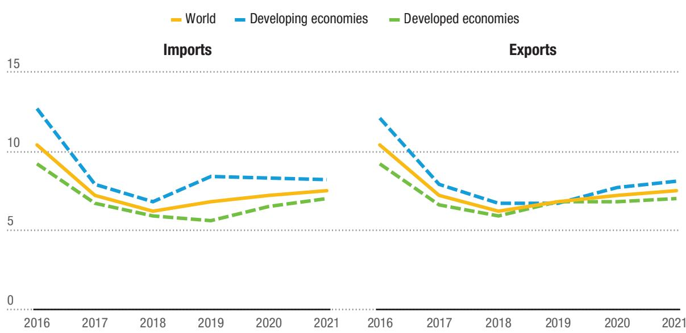  
Source: UNCTAD, UNCTADstat.
Note: Free On Board (FOB) type value.

International transport costs per dollar value of merchandise trade increased over three years, reaching 8.1 per cent in 2021, after a decline from 10.4 per cent to 6.2 per cent between 2016 and 2018. These novel estimates are derived from the Cost Insurance and Freight (CIF) and Free On Board (FOB) values of imported goods recorded in customs declarations, During the six years, developing economies paid up to one third more transport costs per dollar for their imports and exports than developed economies, except in 2019 when their ad-valorem costs were about equally high for exports but 50 per cent more for imports.

## Less advanced economies facing higher international transport costs for imports than others

International transport costs as percentage of the value of internationally traded goods, 2021

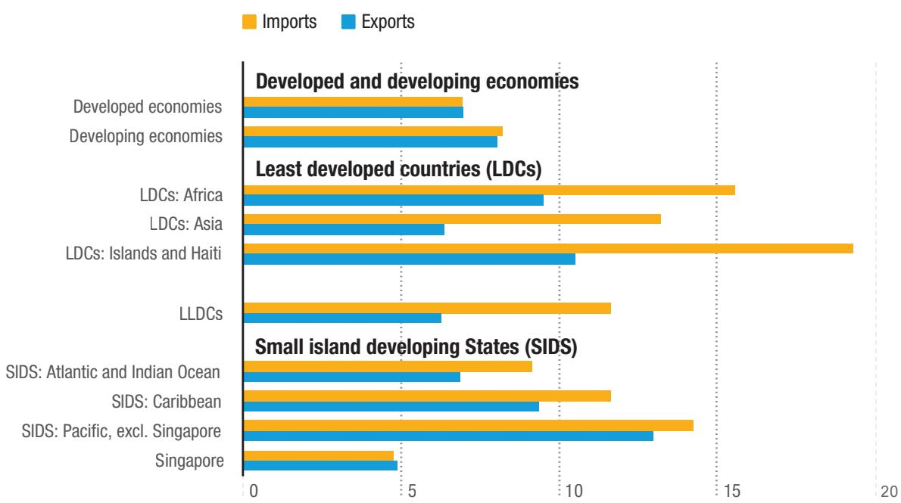  
Source: UNCTAD, UNCTADstat.  
Note: Free On Board (FOB) type value.

In 2021, international transport costs for LDCs imports amounted to 14.8 per cent relative to the goods' value, more than twice the rate of imports to developed economies. In island LDCs, including Haiti, the rate even came to 19.3 per cent. Lower rates, albeit significantly above average, were recorded for imports

to LLDCs (11.7 per cent) and SIDS excluding Singapore (11.0 per cent), with considerable variation among SIDS across regions. LDCs, LLDCs and SIDS pay on average less transport costs per dollar for exports than imports.

## Metadata

The FOB-type value covers the transaction value of the traded goods and the value of the services for their delivery up to the border of the exporting country. The CIF-type value covers additionally the value of the services performed to deliver the goods from the border of the exporting country to the border of the importing country (United Nations, 2011, International Merchandise Trade Statistics: Concepts and definitions 2010).

International transport costs represent the – usually invoiced – costs for the services performed to deliver internationally traded goods from the border of the origin to the border of the importing economy, including their shipping and the procurement of insurance against the risk of loss or damage during carriage. For the figures above, they have been derived as the difference between the CIF-type and the FOB-type value, as reported in the UN Comtrade database.

Chapter 4
Population

# a. Total and urban population

Population growth robust in Africa, while Europe stagnates Annual population growth, percentage, 2023

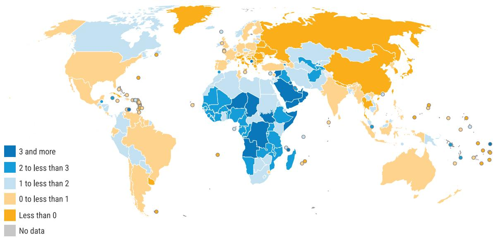  
Source: UNCTAD, UNCTADstat.

The latest estimates for population from the UN Department of Economic and Social Affairs cover population up to 2023 and projections after that. In 2023, India became the most populous country in the world, followed by China. Population was estimated to fall in 46 economies in 2023 with Ukraine as the country with the steepest population decline of 8.4 per cent. On the other end of the spectrum, Oman recorded the highest population growth with 6.5 per cent. The number of economies with negative growth rates for population is projected to have increased to 64 in 2025.

At the regional level, Europe experienced a population decline of 0.2 per cent, which is projected to continue to 2050. Africa remained the fastest growing region with 2.3 per cent growth in 2023 and will remain so until 2050 though at a more moderate pace. The populations of the remaining regions, America, Asia and Oceania will continue to grow until 2050 with growth rates comprised between 0.4 and 0.9 per cent.

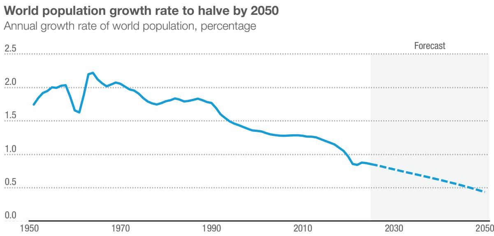  
Source: UNCTAD, UNCTADstat.  
The world population grew by 0.9 per cent in 2023 and is projected to decrease by 0.01 per cent by 2025. Growth is projected to halve by 2050. Since the late 1980s, population growth has gradually slowed down. This slowdown was especially  
accentuated during the COVID-19 pandemic in 2020. As a result, the world population is expected to pass the 9 billion mark by 2037.

Developing economies experience fastest population growth
World population by group of economies, billions  
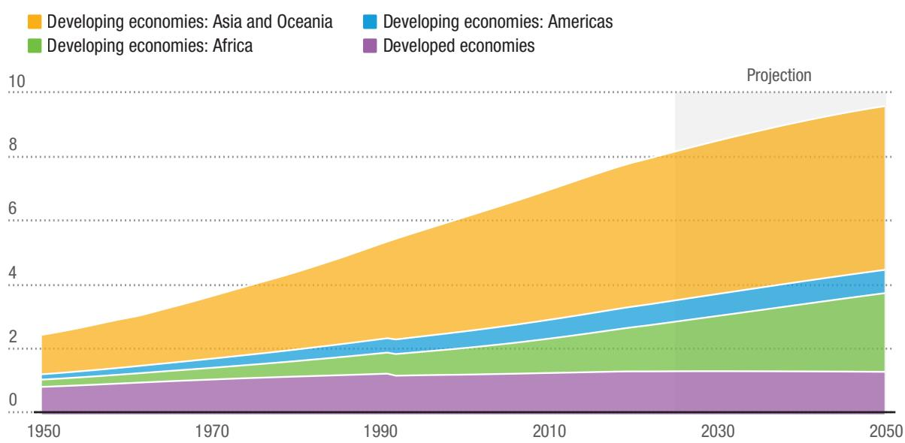  
Source: UNCTAD, UNCTADstat.

Over the last 25 years, the world population has increased by 2.1 billion people. Almost all this growth has occurred in developing economies, mainly in Asia and Oceania (1.1 billion) and Africa (0.7 billion). In 2023, five in six people in the world lived in a developing economy. 68 per cent of the population in the developing world lives in Asia and Oceania, 10 per cent in America and 22 per cent in Africa.

In the coming 25 years, Africa's share of the global population should increase to 29 per cent, mostly at the expense of Asia and Oceania, while the share of America should remain stable at 9 per cent. In 2050, six in seven people in the world will live in developing countries.

## Urbanization is fastest in developing economies

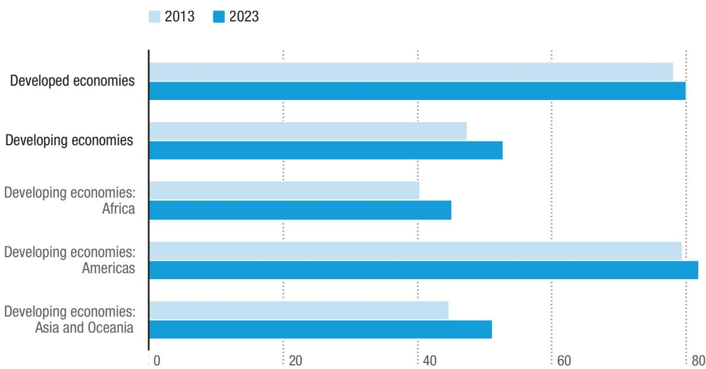  
Source: UNCTAD, UNCTADstat.

All over the world, a growing proportion of the population lives in cities. In 2013, 52.9 per cent lived in urban areas. The share of urban population was projected to have increased to 57.3 per cent in 2023 and 58.1 per cent in 2025. It is generally higher in the developed (79.9 per cent in 2023) than in the developing world (52.8 per cent). In LDCs, the people living in urban areas are in the minority (36.4 per cent).

Over the last ten years, urbanization has been most pronounced in developing economies, especially developing Asia and Oceania, which saw the urban rate increase from 44.6 in 2013 to 51.1 per cent in 2023. Developing Africa has seen a 4.7 percentage point increase in the same period. By contrast, the share of people living in urban areas was already high in developing economies of the Americas and further urbanization has been relatively modest.

## Metadata

Total population from 1950 to 2023 are estimates and data from 2024 to 2050 are projections (medium fertility variant). For urbanization figures, the projections start from 2019.

Based on total de facto population in a country, area or region as of 1 July of the indicated year. The annual average growth rate is defined as the average exponential rate of growth of the population over a given period, expressed as a percentage. It is calculated as $100^{*}\ln (\mathrm{Pt} / \mathrm{P0}) / n$ where P is the total population and n stands for the length of the period.

# b. Age structure

Dependency ratios are highest in Africa
Dependency ratio, percentage, 2023

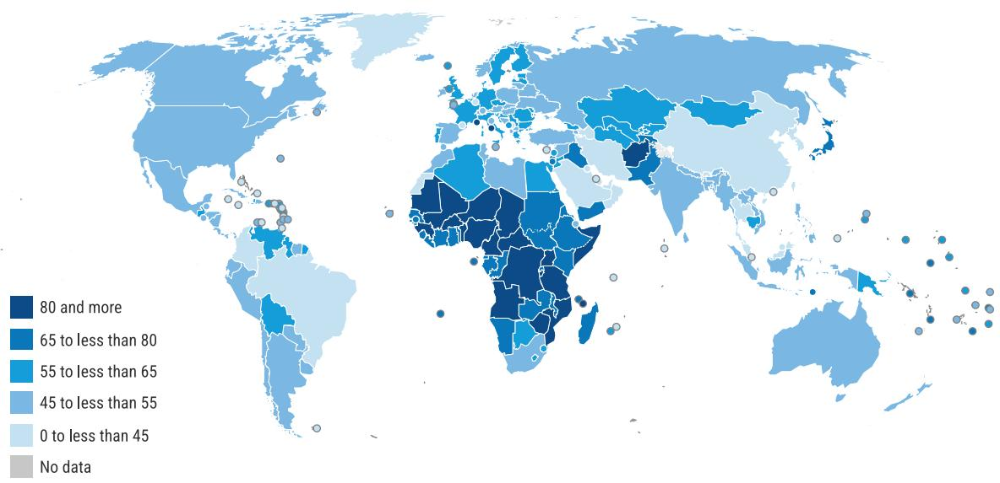

Source: UNCTAD, UNCTADstat.

In 2023, for every 100 persons of working age in the world there were 54 children or older people. Among the thirty economies with the highest dependency ratio, most of them were in Africa with some notable exceptions like the Holy See, Monaco, Afghanistan and Yemen. Except for the Holy See and Monaco, the high ratios were a result of an extraordinarily high child dependency. In Africa as a whole, the child dependency ratio alone was 69 per cent, and it was projected to decrease to 67 per cent by 2025. By contrast, the lowest dependency ratios were found in high income developing economies (45 per cent). Several developed economies, most notably Japan, show rising dependency ratios due to increasing old-age dependency.

## Children's share in world population continues to decline World population by age group, percentage

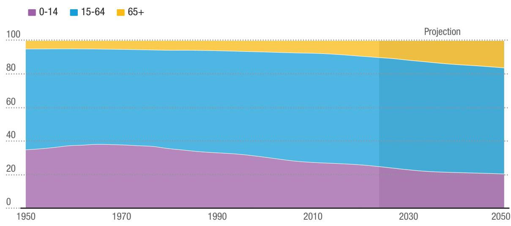  
Source: UNCTAD, UNCTADstat.  
Note: The figures from 2025 to 2050 are based on the medium fertility variant projection.

Globally, 65 per cent of people were of working age in 2023. Fifty years ago, this number was 57 per cent. Notably, the proportion of children has decreased from 37 per cent in 1973 to

## Developed economies' population keeps ageing Population pyramids, percentage, 2023

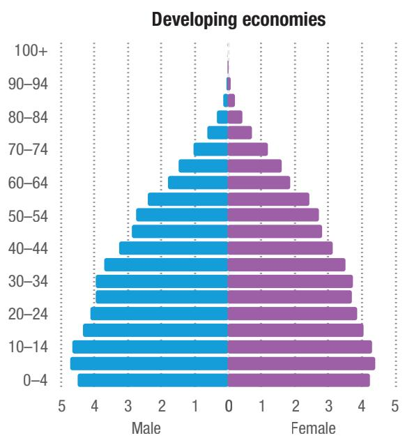  
Source: UNCTAD, UNCTADstat.

The age structure in developing economies is pyramid-shaped with older age classes successively smaller than younger classes. By contrast, in developed economies, the biggest age groups are 35 to 64 years old. A temporarily accelerated decrease in births worldwide during the COVID-19

25 per cent while the proportion of older persons has increased from 5 to 10 per cent. People above the age of 64 are projected to make up 16 per cent of the global population by 2050.

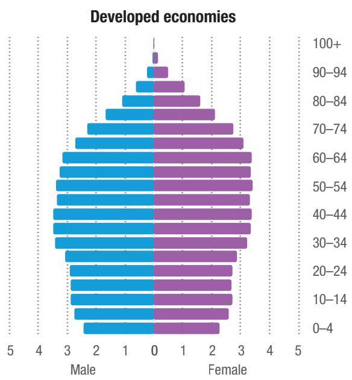

pandemic is reflected by less children under 5 than in the next higher age group for both developing and developed economies. Globally in 2023, 59 per cent of people over 75 years were women, while 49 per cent of children were girls. This imbalance can be seen in both developed and developing economies.

Dependency ratio set to decrease in Africa by 2050
Dependency ratio by age structure, percentage, 2023

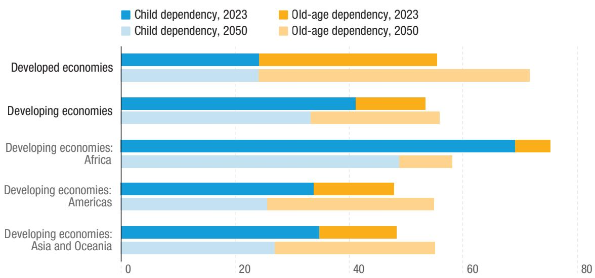  
Source: UNCTAD, UNCTADstat.

In most economies, the age structure has seen a trajectory over time where dependency ratios first decrease, due to shrinking proportions of children, and later increase, as more people reach an age over 64.

In most regions of the world, the bulk of the dependency ratio decrease has already taken place. Further decreases in the child dependency ratio are projected to be more than offset by increases

in the old-age dependency ratio. In Africa, however, the decline of the dependency ratio is expected to continue beyond 2050, and by then, the indicator is projected to fall to 58 per cent from 75 per cent in 2023. In developed economies, dependency ratios are already increasing and are projected to reach 72 per cent by 2050.

## Metadata

The term “persons of working age” refers to persons aged from 15 to 64 years. The term “children” refers to persons under the age of 15. The term “older persons” refers to persons over the age of 64. The dependency ratio is defined as the number of children and older persons per hundred persons of working age. It can be expressed as the sum of the child dependency ratio and the old-age dependency ratio.

The child dependency ratio is defined as the number of children per hundred persons of working age. The old-age dependency ratio is defined as the number of older persons per hundred persons of working age.

## a. Classifications

## 1. Classification of economies

UNCTAD's classification of economies into developing and developed is intended for statistical convenience and does not express judgement about the stage reached by a particular country or area in the development process. It is based on the classification applied in the “Standard Country or Area Codes for Statistical Use”, known as “M49”, maintained by the United Nations Statistics Division. For details, see UNCTADstat. Other international organisations may group economies by development status in slightly different ways. For a comparison of the various groupings in use and their underlying rationales, see Development status as a measure of development.

Throughout the handbook, the group of developing economies is further broken down into the following three regions: “Africa”, “Americas” and “Asia and Oceania”, where the group of African developing economies coincides with Africa, and the group of American developing economies coincides with Latin America and the Caribbean in UNCTADstat. Apart from these five groups of economies, whenever possible data are also presented for the following groups:

• Developing economies excluding China,

• Developing economies excluding LDCs,

• LDCs, according to the United Nations Office of the High Representative for the Least Developed Countries, Landlocked Developing

\- Countries and the Small Island Developing States according to UN-OHRLLS,

\- Landlocked Developing Countries (LLDCs), according to UN-OHRLLS,

• SIDS according to UN-OHRLLS,

\- Brazil, Russia, India, China and South Africa (BRICS),

• Group of Twenty (G20), South Africa (2025).

For SIDS, as for developing and developed economies, different groupings are also applied by international organisations. The definition of SIDS by the UN-OHRLLS, used in the present handbook, is relatively broad. For a comparison and discussion of the different groupings in use, see Constructing a criteria-based classification for Small Island Developing States: an investigation.

The UNCTADstat classification page provides the lists of the economies included in the different groups of economies above.

## Disclaimer

The designations employed and the presentation of material in this work do not imply the expression of any opinion whatsoever on the part of the United Nations concerning the legal status of any country, territory, city or area or of its authorities, or concerning the delimitation of its frontiers or boundaries. The Chagos Archipelago appears without prejudice to the question of sovereignty. A dispute exists between the Governments of Argentina and the United Kingdom of Great Britain and Northern Ireland concerning sovereignty over the Falkland Islands (Malvinas). The final boundary between the Sudan and South Sudan has not yet been determined. The final status of the following territories has not yet been agreed or determined: Abyei area, Aksai Chin, Arunachal Pradesh, Bi'r Tawil, Hala'ib Triangle, Ilemi Triangle, Jammu and Kashmir, Kuril Islands, Paracel Islands, Scarborough Shoal, Senkaku Islands and Spratly Islands. Dashed lines represent undefined borders. Dotted line represents approximately the Line of Control in Jammu and Kashmir agreed upon by India and Pakistan.

## 2. Classification of goods

For breakdowns of international merchandise trade by product, UNCTADstat applies the UNSD SITC, Revision 3, and various aggregates compiled on the basis of that classification. In chapter International merchandise trade of this handbook, reference is made to the following five product groups:

\- All food items (SITC codes 0, 1, 22 and 4),

• Agricultural raw materials (SITC code 2 except 22, 27 and 28),

\- Ores, metals, precious stones and non-monetary gold (SITC codes 27, 28, 68, 667 and 971),

\- Fuels (SITC code 3), • Manufactured goods (SITC codes 5, 6, 7 and 8 except 667 and 68).

where the first four groups are referred to as primary commodities.

For the measurement of movements in commodity prices, the UCPI is disaggregated by commodity groups constructed from World Customs Organization HS 2007. For the correspondence between these commodity groups and HS headings and for the individual price quotations represented therein, see UNCTAD Commodity Price Index - Methodological note.

## 3. Classification of services

The breakdown by service category in the Trade in services by category page is based on EBOPS

2010. The EBOPS 2010 main categories have been grouped as shown in table 1 below.

<table><tr><td>EBOPS 2010</td><td>Trade in services by category page</td></tr><tr><td>Transport</td><td>Transport</td></tr><tr><td>Travel</td><td>Travel</td></tr><tr><td>Insurance and pension services</td><td></td></tr><tr><td>Financial services</td><td rowspan="2">Insurance, financial, intellectual property, and other business services</td></tr><tr><td>Charges for the use of intellectual property n.i.e.</td></tr><tr><td>Other business services</td><td></td></tr><tr><td>Telecommunications, computer and information services</td><td>Telecommunications, computer and information</td></tr><tr><td>Personal, cultural and recreational services</td><td></td></tr><tr><td>Government goods and services n.i.e.</td><td></td></tr><tr><td>Construction</td><td>Other categories</td></tr><tr><td>Services not allocated</td><td></td></tr><tr><td>Manufacturing services on physical inputs owned by others</td><td></td></tr></table>

## 4. Classification of economic activities

In the Gross domestic product page, gross value added is broken down by the three broad groups of economic activities below, in accordance with the International Standard Industrial Classification of All Economic Activities (ISIC), Revision 3:

\- Agriculture, comprising: agriculture, hunting, forestry and fishing (ISIC divisions 01 to 05), - Industry, comprising: mining and quarrying, manufacturing, electricity, gas and water supply, construction (ISIC divisions 10 to 45),

• Services, comprising all other economic activities (ISIC divisions 50 to 99).

unctad.org