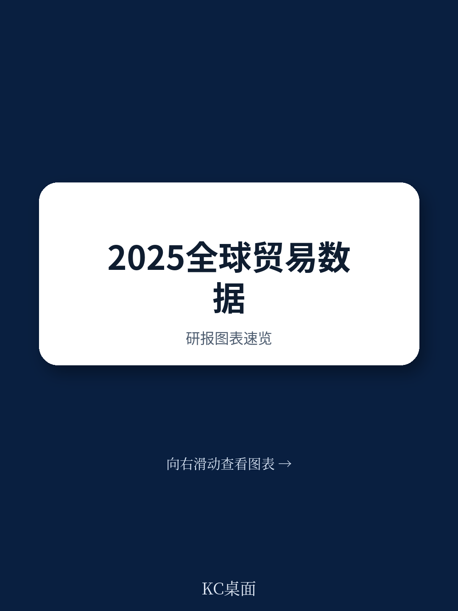
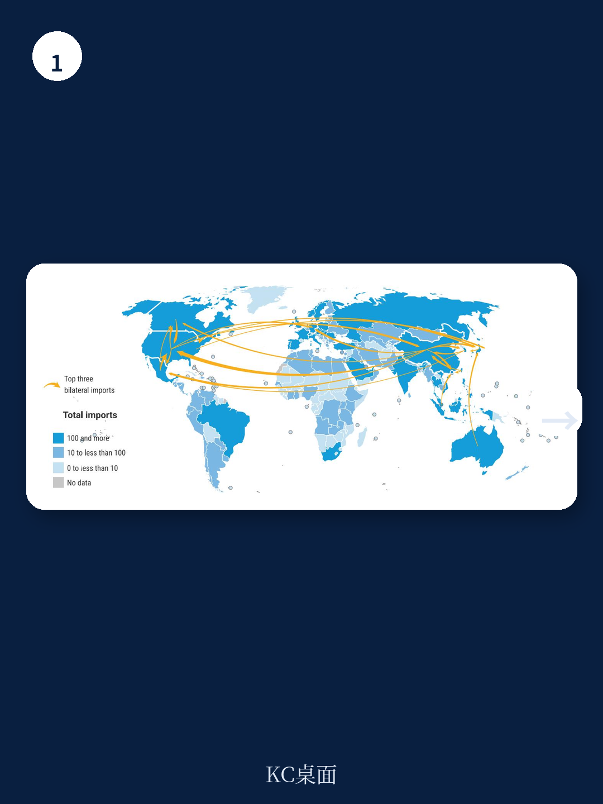
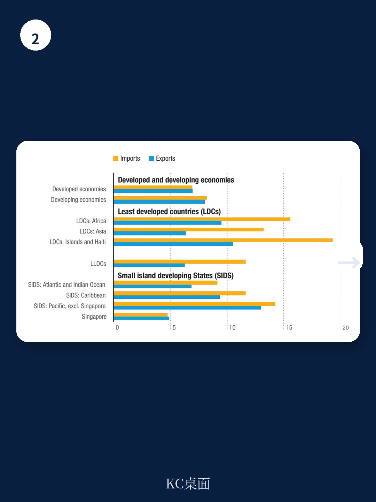

# 联合国贸发会议：2025年贸易增长非普惠，亚洲生产全球消费格局加剧

全球商品出口额在2024年增长了2.4%，达到24.5万亿美元，接近2022年的峰值。而联合国贸发会议（UNCTAD）基于AI的即时预测显示，2025年这一数字将再增长7.1%，达到创纪录的26.2万亿美元。全球经济增速也从2024年的2.8%加快至2025年的3.4%。这些数字本身令人振奋，但真正值得产业决策者关注的，不是增长本身，而是增长的结构：谁在增长，谁被落下，以及这种分化对未来供应链布局和资产定价意味着什么。

这份由联合国贸发会议发布的《2025年统计手册》并非一份常规的经济预测报告。它是一份基于2024年全年数据、叠加AI即时预测模型的统计汇编，覆盖国际贸易、经济、投资、海运和人口五大维度。其核心价值不在于给出一个乐观的2025年展望，而在于用数据揭示了全球贸易复苏中一条被忽视的分界线——发展中国家与发达国家之间的“数字鸿沟”正在转化为“增长鸿沟”。

报告最值得关注的判断是：2025年的贸易再加速主要由发展中国家中的亚洲经济体驱动，而发达经济体的商品贸易量基本停滞。同时，最不发达国家在数字经济中的份额几乎可以忽略不计。这意味着，全球贸易的“水位”确实在上升，但并非所有船只都能浮起来。

> **KC评论：** 这份报告最值得看的部分不是宏观预测数字，而是那些被聚光灯忽略的“结构性断层”：比如最不发达国家的数字化服务出口仅占其服务出口的16%，而全球平均水平是56%。完整报告中有大量类似的图表，展示了贸易流、海运连接度和人口结构的细节拆分，这些才是判断“增长是否可持续”的关键。

继续看原文，真正有价值的是图表、假设和验证路径；完整报告与KC评论在每日汇编。

## 1. 2025年7.1%的贸易增长并非普惠，驱动力高度集中于亚洲

报告的即时预测显示，2025年全球商品贸易将增长7.1%，服务贸易增长6.2%。但这一预测的“底层发动机”非常集中：2024年，发展中国家出口增长了5.3%，其中亚洲和大洋洲贡献了5.7%的增速，而发达经济体的商品贸易量基本为零增长。

具体来看，中国2024年出口增长5.8%，中国香港增长12.5%，越南增长14.4%。这些经济体构成了全球贸易增量的主体。与之形成对比的是，发达经济体在2024年的商品贸易几乎原地踏步，其贸易逆差维持在1.1万亿美元的高位。

这意味着什么？全球贸易的再加速，本质上是“亚洲制造”的再加速。发达经济体的需求端并未显著扩张，其进口仅增长0.1%。全球贸易的供需两端，正在形成一种新的“单向依赖”：亚洲生产、全球消费，而发达国家自身的生产和出口能力并未同步恢复。

## 2. 发展中经济体贸易顺差扩大，但“数字鸿沟”正在成为新的增长瓶颈

2024年，发展中经济体的贸易顺差从2023年的水平小幅增加至7780亿美元，但仍低于2022年的8190亿美元。与此同时，发达经济体的贸易逆差保持稳定。表面上看，发展中经济体在国际贸易中处于“盈余方”，但这掩盖了一个更深层的问题：盈余的构成正在发生变化。

报告特别指出，2024年全球可数字化交付服务已占服务出口总额的56%。然而，最不发达国家的这一比例仅为16%。换句话说，当全球服务贸易越来越依赖数字基础设施和数字技能时，最不发达国家几乎被排除在了增长最快的贸易板块之外。

> **KC评论：** “可数字化交付服务”这个词听起来技术化，但它直接对应的是远程办公、在线教育、云计算、数字内容等产业。当一个经济体只有16%的服务出口能数字化时，它实际上错过了全球服务贸易增长中最具活力的部分。报告中有大量关于“南南贸易”和“区域贸易结构”的图表，可以帮助读者判断哪些经济体正在跨越数字鸿沟，哪些仍在原地踏步。

## 3. 中国与美国依然是全球贸易的“双核”，但双边贸易的“再平衡”已现端倪

报告显示，2024年全球最大的双边贸易流依然是中国与美国。美国从中国进口了4630亿美元的商品，同比增长3%，但比2022年仍低20%以上。中国从美国进口了1650亿美元的商品，同比基本持平。

更值得关注的不是绝对值，而是结构性变化。中国与美国之间的贸易正在经历一种“量的修复、质的调整”。美国从中国的进口虽有所回升，但远未回到2022年的峰值水平。与此同时，中国与香港、日本、台湾地区和韩国的贸易总额达到1.23万亿美元，而美国与墨西哥、加拿大的贸易总额为1.61万亿美元。北美自由贸易区的内部贸易规模已经超过了中美双边贸易。

这意味着，全球供应链的“去中心化”并非空谈，而是在贸易数据中得到了验证。中国正在从“世界工厂”转向“亚洲工厂”，而美国则在强化其与北美邻国的经济纽带。对于产业决策者而言，这不仅是贸易流的再分配，更是供应链风险敞口的重新评估。

## 4. 报告尚未完全回答的关键问题：贸易增长能否转化为发展质量的提升

报告提供了大量令人振奋的预测数据，但它也坦诚地指出了几个尚未被充分回答的问题。

第一，2025年7.1%的商品贸易增长能否持续？报告的即时预测是基于AI模型对当前数据的推演，但模型本身并未考虑地缘政治冲击、关税政策变化或自然灾害等外生变量。第二，服务贸易中“可数字化交付”部分的增长，是否真的能惠及最不发达国家？目前的数据显示，这些国家在数字基础设施和人力资本上的短板，可能使其无法参与这一轮增长。第三，发展中经济体的贸易顺差扩大，是否意味着其在全球价值链中的地位上升？还是仅仅因为大宗商品价格上涨或出口量增加？

这些问题并非报告的缺陷，而是其价值的延伸——它提供了足够多的数据点，让读者自己去追问“所以呢”。

## 5. 给决策者的观察框架：关注三条“断点线”

基于这份报告的数据，我们认为产业决策者和投资者应建立三条观察线

第一，关注“数字连接度”而非单纯的贸易额。一个经济体能否参与未来贸易增长，关键取决于其可数字化交付服务的占比。那些数字化比例低于20%的经济体，即使商品出口增长，其长期竞争力也可能被侵蚀。

第二，关注“区域贸易密度”而非全球份额。报告显示，欧洲67%的出口在区域内完成，亚洲这一比例为59%。而非洲、拉丁美洲和加勒比地区的出口主要依赖区外市场。区域贸易密度越高的经济体，对全球供应链波动的抗冲击能力越强。

第三，关注“海运连接度”而非贸易量本身。报告第三章专门讨论了海运连接指数（LSCI），这是衡量一个经济体与全球海运网络连接程度的关键指标。对于那些连接度较低的经济体，即使有贸易增长需求，也可能受限于物流瓶颈而无法兑现。

> **KC评论：** 海运连接指数是这份报告中被大多数人忽略的“隐藏指标”。它直接决定了贸易增长的物理天花板。报告中有一个专门章节展示了不同经济体的港口连接度和全球船队结构，这些数据对于判断“哪些国家能承接下一轮贸易增长”至关重要。完整报告里还有更多类似的“硬指标”，值得逐一拆解。

## 6. 顺着这些未解问题，继续读完整报告

这份联合国贸发会议的手册，其价值不在于给出一个“买或卖”的结论，而在于提供了判断全球贸易格局变化的底层数据框架。我们从中看到的是：2025年的贸易再加速是真实的，但它并非普惠；数字鸿沟正在成为新的增长分界线；区域贸易密度和海运连接度将决定谁能真正受益。

这些判断的验证，需要回到报告中的图表、假设和细分数据里去。比如，哪些亚洲经济体的数字化服务出口正在快速提升？哪些非洲国家的海运连接度在过去一年显著改善？这些细节，只有完整报告才能提供。

更多国际信源汇编与评论，扫码交流，每日更新。我们汇总国际主流叙事、数据和图表，观测边际变化。每日汇编会把单篇报告放回当天主线，整理成中文摘要、KC评论和图表合集，便于喂给AI，也便于人工快速扫市场动态。目前已汇聚头部券商、PE/VC、投行、并购、hedge fund、资管机构、战略咨询、智库等朋友，期待交流。

Personal reading notes and learning share only. Not investment advice.
