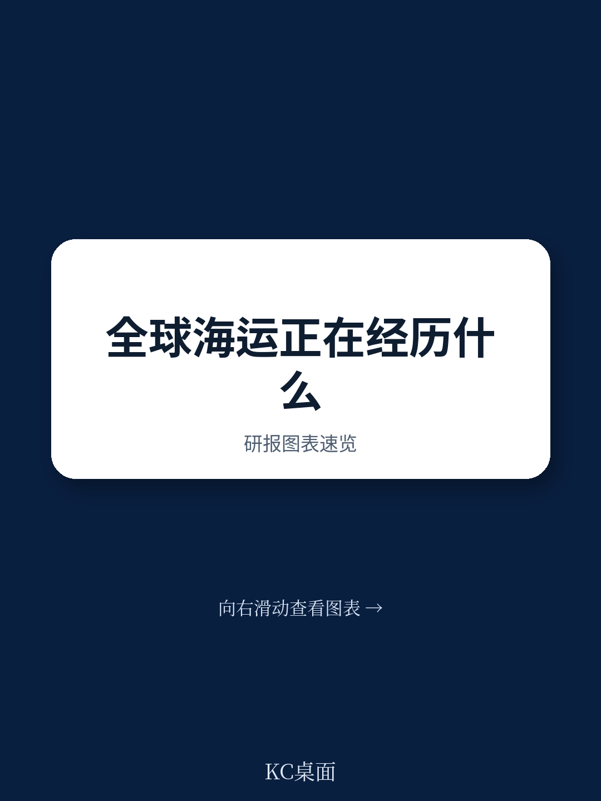

# 联合国贸发会议：不是量增而是距增，联合国贸发报告拆解全球海运新逻辑

2025年，全球海运业看似在红海危机、关税冲击和船队扩张中找到了新的平衡。但联合国贸发会议（UNCTAD）最新发布的《2025年海运回顾》揭示了一个更深刻的信号：全球海运量的增长逻辑正在发生结构性转变。传统上，我们习惯用“吨”来衡量贸易规模，但这份报告指出，真正决定航运需求和运价走势的，是“吨海里”——即货物运输的距离。2024年，全球海运吨海里增长创下历史新高，而这一数字的背后，是地缘政治重塑贸易路线、关键矿产改写大宗商品版图、以及碳减排法规倒逼船队更新的三重力量。对于产业决策者和投资者而言，理解这轮“吨海里”的扩张，远比关注短期运价波动更为重要。

报告的核心判断是：全球海运市场正从“量增”转向“距增”。这意味着，即使未来货物贸易量增速放缓，由于绕行、资源远距离运输和供应链分散化，航运总需求仍将维持高位。但与此同时，船队供给的扩张速度也在加快，供需博弈的烈度正在上升。以下是我们从这份近200页的权威报告中提炼出的五个关键洞察。

> **KC评论：** 这份报告最值得反复咀嚼的，不是那些宏观增速数字，而是它对“吨海里”的强调。很多投资者习惯用集装箱吞吐量或干散货运量来判断行业景气度，但忽略了“距离”这个变量。红海危机导致船舶绕行好望角，单次航程增加数千海里，这直接推高了有效运力需求。如果你只看贸易量，你会低估航运市场的紧张程度。

继续看原文，真正有价值的是报告中对不同船型、不同航线的吨海里变化拆解，以及背后地缘政治和能源转型的驱动逻辑。完整报告与KC评论在每日汇编中都有详细呈现。

## 1. 红海危机和苏伊士运河流量腰斩，正在永久性改变全球航线网络

报告中最直观的数据是苏伊士运河的船舶通行量。2024年，受红海地区局势影响，每月通过苏伊士运河的船舶数量较危机前下降了约50%，而绕行好望角的船舶数量则激增。这一变化不仅延长了亚欧航线的运输时间，更直接推高了全球集装箱船队的有效运力需求。UNCTAD指出，2024年全球集装箱贸易量增长了约4%，但调整距离后的增长则显著更高，这意味着航运公司实际上需要投入更多船舶才能完成同等规模的贸易。

这一结构性变化的影响是深远的。首先，它加速了班轮联盟的重组。报告详细分析了马士基、地中海航运等头部运营商在联盟调整中的航线布局变化，其核心逻辑是：在绕行常态化背景下，如何通过优化挂靠港网络来平衡成本与时效。其次，它暴露了全球航运对少数关键航道的过度依赖。报告引用了对霍尔木兹海峡、马六甲海峡等咽喉要道的分析，指出任何进一步的扰动都可能引发连锁反应。

## 2. 美国港口费提案和中国造船业份额，正在重塑全球船舶供给格局

报告用一个专门的章节讨论了美国针对中国海事、物流和造船业的相关提案。这些措施的核心，是通过对停靠美国港口的中国制造或中国运营船舶征收高额费用，来抑制中国在全球造船和航运市场的影响力。UNCTAD的分析显示，中国目前在全球商船建造中的份额已超过50%，而在全球前15大班轮运营商的船队中，中国建造船舶的比例也相当可观。

这一政策的潜在影响是双重的。短期看，它增加了航运公司的运营成本和不确定性，可能导致部分航线运力重新配置。长期看，它可能加速全球造船产能的“去中心化”趋势。报告提到，日本、韩国以及部分欧美国家正在重拾造船业复兴计划，试图减少对中国造船产能的依赖。但问题在于，全球活跃的造船设施数量有限，且在短期内难以大幅扩张。这意味着，即使有政策驱动，全球船队更新的节奏仍将受制于产能瓶颈。

> **KC评论：** 这里的关键不是美国港口费提案本身能否落地，而是它揭示了一个趋势：航运业正在成为大国博弈的角力场。过去，航运公司主要关注商业周期和运价波动；未来，它们必须将地缘政治风险纳入核心决策框架。这份报告没有给出明确的答案，但它提供了一套完整的分析框架，包括如何评估不同船型、不同航线的风险敞口。如果你在关注航运资产配置，这套框架值得仔细研究。

## 3. 集装箱运价波动加剧，但真正的压力来自供给端而非需求端

2024年，集装箱运价经历了剧烈波动。红海危机推动上海出口集装箱运价指数（SCFI）在年中大幅攀升，随后在年底有所回落。进入2025年，运价在关税冲击和船队扩张的双重影响下继续震荡。UNCTAD的报告指出，2024年全球集装箱船队运力增速创下2008年以来的最高水平，而需求增速虽然有所恢复，但仍低于供给增速。

这意味着，即使红海危机吸收了部分过剩运力，市场供需平衡依然脆弱。报告特别提到，班轮联盟通过协同运力管理来稳定市场，但这种策略的可持续性存疑。一旦绕行结束或需求超预期下滑，运价可能面临更大的下行压力。对于货主和贸易商而言，这意味着需要更加灵活地管理长协和即期运价的比例，而不是简单地押注某一方向。

## 4. 关键矿产正在成为海运贸易的新增长极，但贸易格局高度集中

报告首次用一个完整的章节分析了关键矿产对海运贸易的影响，重点关注了铜和钴。数据显示，全球铜和钴的海运贸易量在过去几年持续增长，且呈现出明显的“加工阶段”特征：原材料（矿石和精矿）的贸易量增长较快，而精炼产品的贸易量则相对稳定。这表明，全球关键矿产的供应链正在经历从“资源地直供”到“加工地集中”的转变。

以铜为例，智利和秘鲁是最大的铜矿出口国，而中国则是最大的精炼铜进口国和加工国。这种贸易格局意味着，海运需求不仅取决于矿产的开采量，还取决于冶炼产能的地理分布。报告指出，随着各国加大对关键矿产供应链的重视，未来可能出现更多“近岸外包”或“友岸外包”的趋势，从而改变现有的贸易流向和运输距离。

> **KC评论：** 关键矿产是这份报告里最容易被忽视的亮点。大部分投资者关注航运时，只会看集装箱和干散货。但铜和钴的海运贸易量正在快速增长，而且它们的贸易路线和航运模式与传统大宗商品完全不同。比如，铜精矿通常用散货船运输，而精炼铜则更多地通过集装箱运输。这意味着，关键矿产的崛起可能会对不同类型的船型需求产生结构性影响。报告里有一张非常清晰的图表，展示了不同加工阶段铜和钴的贸易流向，这张图值得反复看。

## 5. 碳减排法规进入倒计时，船东面临“新船太贵、旧船不敢拆”的两难

2025年，国际海事组织（IMO）通过了“净零框架”的中期减排措施，标志着航运业碳减排从“讨论阶段”正式进入“执行阶段”。报告详细分析了这一框架的核心要素，包括燃料标准、碳定价机制等。对于船东而言，这意味着未来每艘船的运营成本都将与碳排放挂钩。

然而，报告揭示了一个棘手的问题：尽管新船订单中替代燃料船舶的比例在上升，但全球船队的老化速度也在加快。2024年，船舶拆解量跌至历史低点，原因包括市场收益尚可、新船造价高昂以及部分国家拆解能力受限。这导致的结果是，大量老旧、高排放船舶仍在运营，而船东对投资新船持谨慎态度。这种“新旧交替”的停滞，可能会在未来几年导致运力供给的硬约束，尤其是在环保法规趋严的背景下。

## 报告尚未完全回答的关键问题：关税冲击的量化影响有多大？

报告的技术附件尝试模拟了额外关税对海运贸易的影响，但UNCTAD自己也承认，这是一个高度不确定的领域。模型显示，额外关税将导致全球实际海运出口下降，但下降幅度因地区和商品而异。其中，对发展中国家和劳动密集型产品的冲击可能最大。

这里的关键问题是：关税导致的贸易量下降，是否会被“绕行”和“供应链重构”带来的吨海里增长所抵消？报告给出了初步的分析框架，但没有给出确定的答案。这恰恰是读者需要深入阅读完整报告的理由——因为答案隐藏在那些具体的图表、假设和敏感性分析中。

## 如何利用这份报告建立自己的观察框架

对于决策者而言，与其试图预测下一个季度的运价，不如建立一套基于结构性变量的观察框架。我们建议关注以下三个维度

第一，吨海里的增速与船队运力增速的差值。这是判断市场供需紧张程度的核心指标。如果前者持续高于后者，意味着运价有支撑；反之则面临下行压力。

第二，关键航道的通行效率。苏伊士运河、巴拿马运河、霍尔木兹海峡的通行数据，是判断地缘政治风险是否转化为实际运力约束的领先指标。

第三，新船订单的结构。不仅看订单总量，更要看替代燃料船舶的占比、不同船型的订单分布。这决定了未来3-5年船队供给的质量和弹性。

这份报告的价值，不在于给出了多少确定的预测，而在于它系统性地梳理了影响全球海运的变量，并提供了大量一手数据和图表。对于希望深入理解这一领域的读者，原文中的技术附件、分船型分析以及国别数据，都是不可多得的资源。

更多国际信源汇编和评论，欢迎扫码交流。我们每日更新，汇总国际主流叙事、数据和图表，帮助观测边际变化。每日汇编会把单篇报告放回当天主线，整理成中文摘要、KC评论和图表合集，便于喂给AI，也便于人工快速扫市场dynamics。目前已经汇聚了头部券商、PE/VC、投行、并购、hedge fund、资管机构、战略咨询、智库等朋友，期待交流。

Personal reading notes and learning share only. Not investment advice.
