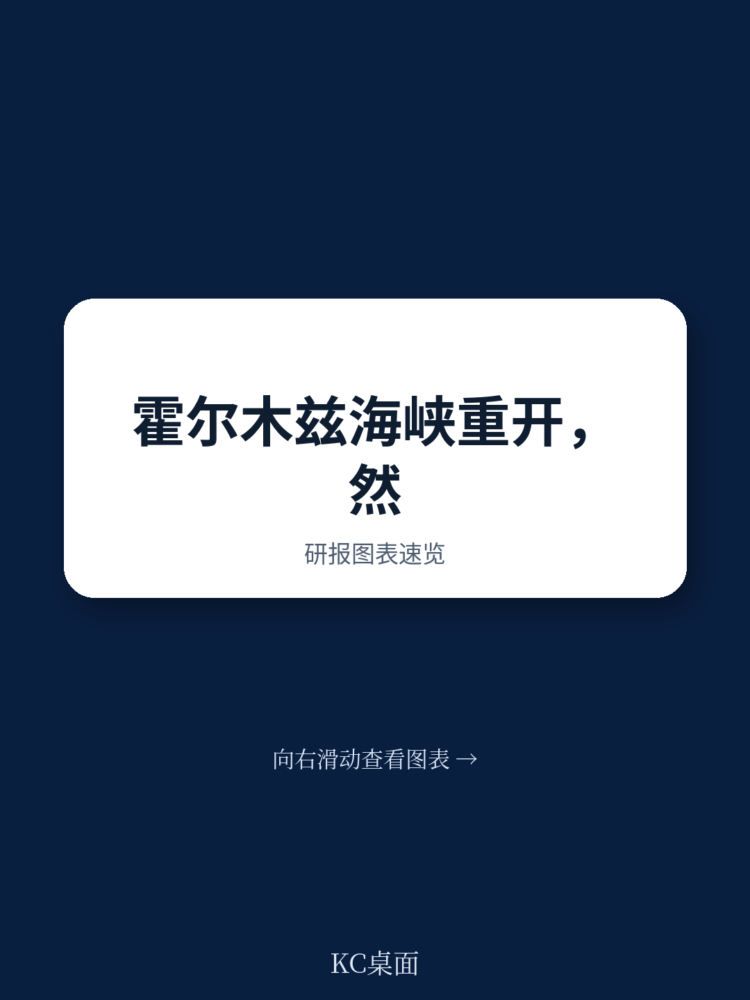
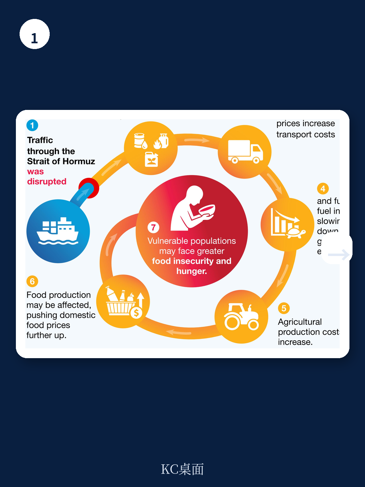
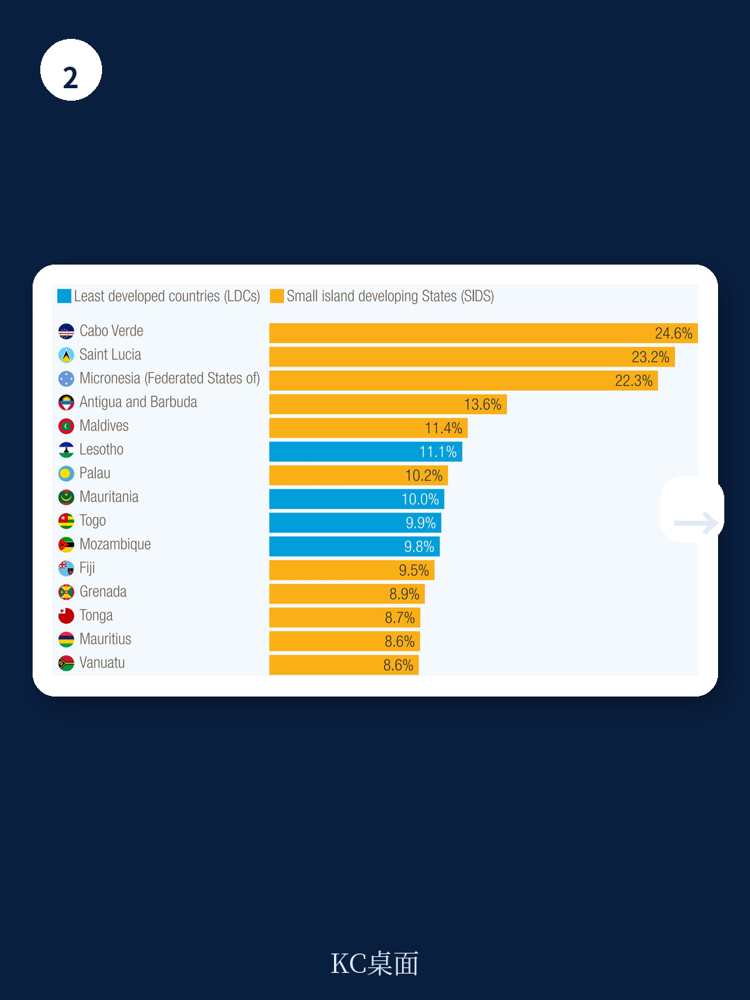

# 联合国贸发会议：中国关注，全球供应链修复需数月，脆弱经济体债务承压

霍尔木兹海峡在中断超过100天后即将恢复通航，原油价格应声回落，全球能源市场似乎看到了曙光。但联合国贸发会议（UNCTAD）的最新报告给出一个更冷静的判断：复航只是第一步，过去三个多月积累的输入性价格冲击，尤其是化肥和粮食成本的滞后传导，正在对最脆弱的经济体形成持久伤害。这些伤害不会因为海峡复航而自动消失。

这份报告的价值在于，它没有停留在“地缘风险解除”的乐观叙事中，而是拆解了冲击传导的完整链条——从能源价格到运输成本，从化肥供应到粮食生产，从进口账单到财政空间，最终落到儿童营养不良等不可逆的社会后果。对于关注全球通胀、供应链韧性和新兴市场债务的读者而言，这是一份值得逐图细读的预警。

> **KC评论：** 报告的核心判断可以概括为一句话：能源冲击的即时价格修复很快，但输入性通胀的滞后效应和结构性脆弱不会同步修复。读者在关注油价回落的同时，更应关注化肥价格和粮食运输成本的变化——这些才是决定未来6-12个月发展中国家通胀走势的关键变量。

继续看原文，真正有价值的是报告中的传导路径图、分国别暴露度数据和通胀弹性估算。完整报告与KC评论在每日汇编。

## 1. 复航信号已反映在油价中，但运输成本和化肥价格仍在高位运行

报告数据显示，自2026年2月28日军事升级至6月14日达成复航协议期间，布伦特、WTI、迪拜和乌拉尔四种基准原油均价经历了剧烈波动。随着协议宣布，油价已开始回落，市场情绪正在修复。但报告同时指出了容易被忽视的滞后项：国际谷物理事会的谷物和油籽运费指数（GOFI）在同期并未同步下降。

这意味着，即使原油供应链恢复，过去三个多月积累的运输成本溢价仍需数周甚至数月才能完全消化。对于依赖进口粮食的发展中国家而言，运费传导到终端食品价格的时间差，恰恰是政策制定者最需要警惕的窗口。

## 2. 脆弱经济体面临“双重暴露”：既缺油，又缺粮

报告的暴露度分析是理解冲击不对称性的关键。在最不发达国家（LDCs）和小岛屿发展中国家（SIDS）中，大量经济体同时是石油和谷物的净进口国。报告特别列出了几个高暴露度国家：部分SIDS的石油净进口额占GDP比重超过15%，而一些LDCs的谷物净进口占GDP比重同样惊人。

这种“双重暴露”意味着，能源冲击和粮食冲击会叠加作用，而非简单相加。当能源价格上涨推高运输成本和化肥价格，进而推高国内粮食生产成本时，这些经济体的进口账单和国内通胀会同时承压。而它们恰恰是财政空间最有限、债务负担最重、国际援助正在减少的经济体。

> **KC评论：** 这里有一个容易被忽略的细节：报告强调的是“净进口”概念，而非绝对进口量。对于GDP规模极小的岛国或最不发达国家，即使绝对进口量不大，但占GDP比重极高意味着外部冲击会直接转化为国内价格波动和财政压力。完整报告中的分国别图表值得仔细看。

## 3. 能源价格对通胀的传导弹性：并非所有国家都一样

报告引用了一项基于70个发达和新兴经济体的实证研究，量化了能源价格变动对通胀的影响。结果显示，能源价格每上涨1%，通胀的累积响应在不同经济体之间存在显著差异。新兴市场和发展中经济体的传导系数普遍高于发达经济体。

这一差异的根源在于：发达经济体的能源成本在消费篮子中占比相对较低，且有更成熟的对冲机制和补贴政策；而脆弱经济体不仅能源权重更高，且缺乏缓冲工具。更关键的是，报告指出这种传导并非一次性完成，而是具有持续性——即使能源价格回落，此前累积的成本压力仍会通过生产和运输链条逐步释放。

## 4. 食品通胀的滞后效应可能持续更久，后果不可逆

报告展示的食品价格通胀路径图显示，发展中国家在2022-2024年期间经历了多轮食品价格飙升，而2026年的冲击正在形成新的上升曲线。最令人担忧的是，报告引用了Headey和Ruel（2023）的研究：实际食品价格每上涨5%，儿童消瘦风险（低体重身高比，急性营养不良的关键指标）显著上升。

这意味着，即使海峡复航后食品价格企稳，过去三个多月的高价窗口已经对最脆弱人群造成了不可逆的营养损害。对于国际发展机构和援助国而言，这不仅是经济问题，更是人道主义问题。报告明确呼吁国际支持，但同时也指出官方发展援助正在下降，债务偿还压力正在上升——脆弱经济体正处于“需要更多帮助但能获得的帮助更少”的困境。

> **KC评论：** 报告的潜台词是：市场参与者可以关注油价和运费的短期修复，但政策制定者必须关注化肥价格和粮价的滞后影响。这些影响不会出现在每日的能源市场简报中，但会出现在未来几个月的通胀数据和营养不良统计中。完整报告中的传导机制图和暴露度矩阵，是理解这一链条的最佳工具。

## 5. 报告尚未完全回答的关键问题：复苏的节奏和分化路径

报告明确指出“贸易正常化需要时间”，但对于“需要多长时间”以及“哪些经济体能够更快恢复”并没有给出精确的时间表。这是一个合理的研究边界，因为复苏速度取决于多个变量：全球航运网络的重新配置速度、化肥供应链的恢复情况、各国财政刺激空间、以及El Niño等气候因素的叠加影响。

此外，报告虽然强调了脆弱经济体的暴露度，但并未深入讨论这些经济体自身的应对能力差异。例如，部分LDCs可能通过区域贸易协定或替代进口来源缓解冲击，而另一些则完全依赖单一通道。这种结构性差异意味着，即使整体冲击相似，不同经济体的恢复路径也会高度分化。

## 6. 给读者的观察框架：从三个维度追踪冲击的滞后效应

基于报告的框架，可以建立一个简洁的追踪清单

- **维度一：价格传导链**。关注原油价格的同时，更应关注化肥价格指数（尤其是氮肥）和谷物运费指数。化肥价格是连接能源冲击和粮食供应的关键中间变量，它的走势决定了未来两个季度的粮食生产成本。

- **维度二：暴露度与缓冲空间**。对照报告中的国别暴露度数据，重点关注“双重净进口”且债务负担高、国际援助下降的经济体。这些国家可能最先出现支付危机或社会不稳定信号。

- **维度三：滞后效应的拐点信号**。食品通胀通常滞后能源价格3-6个月。如果未来两个月内化肥和运费没有明显回落，那么三季度末到四季度初的食品通胀数据将是一个重要的验证节点。

---

以上是基于UNCTAD报告的初步解读。报告中包含大量分国别图表、通胀弹性估算和传导路径图，这些细节无法在一篇文章中完全展开。每日汇编会把单篇报告放回当天主线，整理成中文摘要、KC评论和图表合集，便于喂给AI，也便于人工快速扫描市场dynamics。汇聚了头部券商、PE/VC、投行、并购、hedge fund、资管机构、战略咨询、智库等朋友，期待交流。

Personal reading notes and learning share only. Not investment advice.
