2025

Technology and Innovation Report

Inclusive Artificial Intelligence for Development

# © 2025, United Nations All rights reserved worldwide

Requests to reproduce excerpts or to photocopy should be addressed to the Copyright Clearance Centre at copyright.com.

All other queries on rights and licences, including subsidiary rights, should be addressed to:

United Nations Publications

405 East 42nd Street

New York, New York 10017

United States of America

Email: publications@un.org

Website: https://shop.un.org

The designations employed and the presentation of material on any map in this work do not imply the expression of any opinion whatsoever on the part of the United Nations concerning the legal status of any country, territory, city or area or of its authorities, or concerning the delimitation of its frontiers or boundaries.

Mention of any firm or licensed process does not imply the endorsement of the United Nations.

This publication has been edited externally.

United Nations publication issued by the United Nations Conference on Trade and Development

UNCTAD/TIR/2025

ISBN: 978-92-1-003283-4

eISBN: 978-92-1-106801-6

ePub ISBN 978-92-1-106802-3

ISSN: 2076-2917

elSSN: 2224-882X

Sales No. E.25.II.D.1

# Acknowledgements

The Technology and Innovation Report 2025: Inclusive Artificial Intelligence for Development was prepared by Wai Kit (Jackie) Si Tou and Antonio Vezzani, under the supervision of Angel González Sanz, Head of Technology, Innovation and Knowledge Development Branch of UNCTAD. The report was initiated under the guidance of Shamika N. Sirimane, Director of the Division on Technology and Logistics.

Kenny Shui and Alex Mak (Our Hong Kong Foundation) provided substantive inputs, and Daniel Vertesy (International Telecommunication Union) and Uma Rani (International Labour Organization) made additional contributions.

Research support was provided by Claire Hodges, Ivan Napoli, Shubhika Tagore, Sichen Zhou and Tao Zou during their internship at UNCTAD, and Dmitry Plekhanov of UNCTAD provided further contributions.

UNCTAD gratefully acknowledges the valuable comments and suggestions received from experts who attended informal expert consultations and external peer review meetings. The experts included: Andrea Filippetti (National Research Council of Italy), Carlo Pietrobelli (Roma Tre University), Carsten Fink (World Intellectual Property Organization), Fernando Santiago (United Nations Industrial Development Organization), Francesco Rentocchini (Joint Research Centre, European Commission), Hélène Dernis (Organisation for Economic Co-operation and Development), Hiwot Tesfaye (Microsoft), Jacob Rubæk Holm (Aalborg University), Joanna Bryson (Hertie School of Governance), Juana Rosa Kuramoto Huamán (Technological Institute of Production of Peru), Kevin Kohler (Simon Institute for Longterm Governance), Ludovico Alcorta and Nanditha Mathew (United Nations University–Maastricht Economic and Social Research Institute on Innovation and Technology), Sandro Montresor (University of Trento), Virginia Dignum (Umeå University) and Xiaolan Fu (Oxford University). Written comments from Andreas Krause (Federal Institute of Technology Zurich) and Dame Wendy Hall (University of Southampton) are acknowledged with appreciation.

The report also benefited from comments provided by different UNCTAD divisions, as part of an internal peer review process, as well as contributions and comments from the Office of the Secretary-General of UNCTAD.

The manuscript was edited by Peter Stalker. Cover design and desktop publishing were undertaken by Magali Studer, under the coordination of the UNCTAD Communication and External Relations team led by Amalia Navarro. Overall production at UNCTAD was overseen by Maritza Ascencios of the Intergovernmental Outreach and Support Service. Malou Pasinos provided administrative support.

## Table of contents

Acknowledgements ....iii
Foreword ....xi
Abbreviations ....xii
Notes....xiii

## Chapter I

AI at the technology frontier .... 1
A. Rapid expansion of frontier technologies.... 5
The market potential for frontier technologies.... 5
The market dominance of tech giants.... 7
B. Concentration of research and development.... 8
C. Asymmetries in knowledge creation.... 10
D. Evolution of AI.... 12
E. Synergy between AI and other technologies.... 17
A fifth industrial revolution.... 19
F. The AI divide.... 21
Supercomputers and data centres.... 21
Services providers.... 22
Investment.... 22
Knowledge creation.... 23
G. Navigating the report.... 24
Annex I.... 25
References.... 30

## Chapter II

Leveraging AI for productivity and workers' empowerment ..... 33
A. AI can transform production ..... 36
B. Key channels for impacting productivity and the workforce ..... 37
C. Measuring the impacts..... 38
Will AI increase productivity?..... 38
Many more occupations are exposed to AI ..... 42
D. Working with uncertainties..... 45
Uncertainty 1 – Easy and difficult tasks ..... 45
Uncertainty 2 – Long-term structural changes in the labour market..... 46
Uncertainty 3 – AI adoption in developing countries ..... 47

E. Case studies of AI adoption in developing countries....48
Agriculture....48
Pest and disease control....48
Yield prediction....50
Precision irrigation....50
Manufacturing....51
Production automation....52
Predictive maintenance....53
Smart factories....53
Healthcare....54
Improving diagnoses....54
Extending healthcare coverage....55
Pandemic management and control....56
F. Good practices and lessons learned....57
Takeaway 1: Adapting to local digital infrastructure....58
Takeaway 2: Utilizing new sources of data....58
Takeaway 3: Making AI easy to use....58
Takeaway 4: Building strategic partnerships....59
G. Workers throughout the AI life cycle....60
H. A worker-centric approach to AI....62
Annex II....64
References....66

## Chapter III

Preparing to seize AI opportunities....71
A. The frontier technologies readiness index....74
B. Key factors in the adoption and development of AI....78
Adoption....78
Development....79
C. Three critical leverage points for AI adoption and development....79
Infrastructure....80
Data....82
Skills....83
D. Assessing preparedness for AI adoption and development....84
AI infrastructure preparedness....85
AI data preparedness....87
AI skills preparedness....89
E. Strategic positioning for AI....93
Annex III....96
A. Frontier technologies readiness index results....96
B. Frontier technologies readiness index results for selected groupings...101
C. Technical note on methodology....106
References....108

Chapter IV
Designing national policies for AI....111
A. AI as part of industrial and innovation policies....114
B. The revival of industrial policy....114
Industrial policies on the rise....116
A changing mix of policy interventions....116
C. Policies at the technological frontier....118
D. Policies for AI....121
Policies for adopting and developing AI....124
E. Case studies of AI-related policies....125
Setting overarching approaches and strategies....126
China....126
European Union....127
United States....128
Strengthening infrastructure to power AI....129
Building data for responsible AI....131
Reskilling and upskilling for AI....133
F. A whole-of-government approach to AI policy....135
Annex IV....136
References....138
Chapter V
Global collaboration for inclusive and equitable AI....141
A. The need for global AI governance....144
B. Aligning AI with social objectives....145
The dominance of multinational tech giants....145
The importance of a multi-stakeholder approach....146
The need to include consumer views....147
Protecting intellectual property....148
C. AI governance initiatives from international forums....149
A fragmented political process....149
Emerging common principles....150
D. The United Nations contribution to AI governance....154
E. Ensuring accountability....155
F. International cooperation for infrastructure, data and skills....157
Developing digital public infrastructure for AI....158
Promoting AI through open innovation....161
Strengthening capacity-building and research collaboration....162
G. Guiding AI for shared prosperity....165
References....166

## Figures

Figure I.1 Three broad categories of frontier technologies....5
Figure I.2 Rapid expansion of frontier technologies....6
Figure I.3 Market dominance of technology giants....7
Figure I.4 Significant concentration of research and development in a few countries....9
Figure I.5 The share of R&D in software and computer services has increased sharply....10
Figure I.6 Number of frontier technology patents, 2000–2023....11
Figure I.8 The three waves of AI....13
Figure I.9 Evolution of language and image recognition capabilities of AI systems....16
Figure I.10 Synergies among three key leverage points can accelerate AI progress....17
Figure I.11 AI augments other frontier technologies....18
Figure I.12 Industrial revolutions and their transformative changes....19
Figure I.13 Amortized hardware and energy cost to train frontier AI models....22
Figure I.14 AI-related publications and patents are rising....23
Figure II.1 Four channels through which AI impacts productivity and the workforce....37
Figure II.2 Use of AI can improve a firm's productivity....39
Figure II.3 Developed countries have greater likelihoods of AI automation but also greater opportunities for augmentation....42
Figure II.4 Four takeaways for promoting AI adoption in developing countries....58
Figure II.5 A simplified AI life cycle....60
Figure III.1 Frontier technologies readiness subindices score, selected country groupings....75
Figure III.2 Brazil, China, India and the Philippines are developing countries outperforming in technology readiness....76
Figure III.3 Correlation between index score and knowledge generation in AI....77
Figure III.4 Key components of AI infrastructure....81
Figure III.5 Data requirements for AI....82
Figure III.6 Skills for adopting and developing AI....83
Figure III.7 Classification of countries according to capacity for AI adoption and development....84

Figure III.8 AI infrastructure preparedness....85
Figure III.9 Number of cloud infrastructure services, mid-2024....87
Figure III.10 AI data preparedness....88
Figure III.11 Internet exchange point traffic and membership, mid-2024....89
Figure III.12 AI skills preparedness....90
Figure III.13 Economies with at least 2 million GitHub developers, 2023....91
Figure III.14 Economies with the fastest growth in number of developers....92
Figure IV.1 Developed countries drive most new policy interventions....116
Figure IV.2 Interventions have become more targeted toward specific firms....118
Figure IV.3 The share of services exports is increasing in total world trade exports....119
Figure IV.4 Industrial policies increasingly focus on STI-related interventions....119
Figure IV.5 Most AI policies have been produced by developed countries....122
Figure IV.6 National strategies, agendas and plans are the most common AI policy instrument....123
Figure IV.7 Countries with higher GDP per capita are more prepared for AI governance....124
Figure IV.8 Overarching policy approaches of China, the European Union and the United States....129
Figure V.1 Opinions on AI and personal data....147
Figure V.2 International AI governance initiatives are largely driven by G7 members....150
Figure V.3 Key United Nations efforts in global AI governance....154
Figure V.4 Establishing an AI public disclosure mechanism to ensure accountability....156
Figure V.5 Developing digital public infrastructure for AI....159
Figure V.6 Open innovation in AI....162
Figure V.7 AI capacity-building partnerships....164

## Tables

Table I.1 Revealed technology advantage of selected countries based on filed patent, 2000–2023....12
Table I.2 Overview of the report, areas of focus, recommendations and related Sustainable Development Goals....24
Table II.1 Selected micro-level studies on GenAI productivity impacts....40
Table II.2 Case studies of AI applications in agriculture....48
Table II.3 Case studies of AI applications in manufacturing....51
Table II.4 Case studies of AI applications in healthcare....54
Table III.1 Readiness for frontier technologies, selected countries....74
Table III.2 Key elements of AI adoption and development....80
Table IV.1 A shift from trade protection to direct support for productive sectors....117
Table IV.2 Examples of AI policies for adoption and development....125
Table IV.3 Examples of policies to strengthen digital infrastructure....130
Table IV.4 Examples of policies to build data....132
Table IV.5 Examples of policies to reskill and upskill....134
Table V.1 Summary of the seven major international AI governance initiatives....151

## Boxes

Box I.1 Is AI a general-purpose technology? .....15
Box I.2 Key features of the fifth industrial revolution .....20
Box II.1 Using AI in business process outsourcing .....41
Box II.2 Evidence from knowledge-intensive activities .....44
Box III.1 The five As framework for AI adoption and development.....94
Box IV.1 Rationales for industrial policies .....115
Box IV.2 Key issues for policies at the technological frontier .....120
Box V.1 Different approaches to AI regulation.....152

Rebeca Grynspan

Secretary-General of UNCTAD

Frontier technologies, particularly artificial intelligence, are reshaping the functioning of economies and societies. However, their rapid and widespread diffusion is often outpacing the ability of many Governments to respond. The Technology and Innovation Report 2025: Inclusive Artificial Intelligence for Development surveys the complex artificial intelligence landscape, aiming to help decision makers design science, technology and innovation policies that foster inclusive technological progress.

The use of artificial intelligence has the potential to accelerate progress towards achieving the Sustainable Development Goals, but if unevenly distributed and not guided by ethical oversight and transparency, its diffusion can exacerbate existing inequalities. The report analyses the requirements and policies needed at all stages, from development to adoption, to foster inclusive technological progress for sustainable development.

This requires a multidimensional and evidence-based approach. For this purpose, three key leverage points – infrastructure, data and skills – are identified, offering a broad socioeconomic perspective and highlighting the need to build resilient infrastructure and promote inclusive and sustainable industrialization and innovation.

The report starts by documenting the significant concentration in artificial intelligence development in a few companies and countries and identifies extensive gaps in digital infrastructure that risk widening inequalities both within and among countries. Then it explores productivity and workforce dynamics focusing on economic growth and decent work. From a national perspective, the report analyses the requirements and policies needed to support adoption, adaptation and development of artificial intelligence. From an international perspective, it considers the need for global artificial intelligence governance to steer artificial intelligence towards inclusive and equitable development, emphasizing the importance of international collaboration.

History has shown that while technological progress drives economic growth, it does not on its own ensure equitable income distribution or promote inclusive human development. Stronger international cooperation can shift the focus from technology to people, enabling countries to co-create a global artificial intelligence framework. Such a framework should prioritize shared prosperity, create public goods and place humanity at the heart of artificial intelligence development.

## Abbreviations

<table><tr><td>AI</td><td>artificial intelligence</td></tr><tr><td>CSTD</td><td>Commission on Science and Technology for Development</td></tr><tr><td>DPI</td><td>digital public infrastructure</td></tr><tr><td>ESG</td><td>environmental, social and governance</td></tr><tr><td>FAO</td><td>Food and Agriculture Organization of the United Nations</td></tr><tr><td>G7</td><td>Group of Seven</td></tr><tr><td>G20</td><td>Group of 20</td></tr><tr><td>GDP</td><td>gross domestic product</td></tr><tr><td>GenAI</td><td>generative artificial intelligence</td></tr><tr><td>GVCs</td><td>global value chains</td></tr><tr><td>ICT</td><td>information and communications technology</td></tr><tr><td>IEA</td><td>International Energy Agency</td></tr><tr><td>ILO</td><td>International Labour Organization</td></tr><tr><td>IoT</td><td>Internet of things</td></tr><tr><td>ITU</td><td>International Telecommunication Union</td></tr><tr><td>LDCs</td><td>least developed countries</td></tr><tr><td>OECD</td><td>Organisation for Economic Co-operation and Development</td></tr><tr><td>R&amp;D</td><td>research and development</td></tr><tr><td>SMEs</td><td>small and medium-sized enterprises</td></tr><tr><td>STEM</td><td>science, technology, engineering and mathematics</td></tr><tr><td>STI</td><td>science, technology and innovation</td></tr><tr><td>STI Forum</td><td>Multi-stakeholder Forum on Science, Technology and Innovation for the Sustainable Development Goals</td></tr><tr><td>UNDP</td><td>United Nations Development Programme</td></tr><tr><td>UNESCO</td><td>United Nations Educational, Scientific and Cultural Organization</td></tr><tr><td>UNHCR</td><td>Office of the United Nations High Commissioner for Refugees</td></tr><tr><td>UNIDO</td><td>United Nations Industrial Development Organization</td></tr><tr><td>WHO</td><td>World Health Organization</td></tr><tr><td>WIPO</td><td>World Intellectual Property Organization</td></tr></table>

## Notes

Within the UNCTAD Division on Technology and Logistics, the Technology and Innovation Policy Research Section carries out policy-oriented analytical work on the impact of innovation and new and emerging technologies on sustainable development, with a particular focus on the opportunities and challenges for developing countries. It is responsible for the Technology and Innovation Report, which seeks to address issues in science, technology and innovation that are topical and important for developing countries, and does so comprehensively, with an emphasis on policy-relevant analysis and conclusions. The Technology and Innovation Policy Research Section supports the integration of STI in national development strategies and in building up STI policymaking capacity in developing countries; a major instrument in this area is the programme of science, technology and innovation policy reviews.

In this report, the terms country/economy refer, as appropriate, to territories or areas. The designations of country groups are intended solely for statistical or analytical convenience and do not necessarily express a judgement about the stage of development reached by a particular country or area in the development process. Unless otherwise indicated, the major country groupings used in this report follow the classification of the United Nations Statistical Office. A file with the main country groupings used can be downloaded from the UNCTADstat database at http://unctadstat.unctad.org/EN/Classifications.html.

For statistical purposes, the data for China do not include those for Hong Kong Special Administrative Region (Hong Kong SAR), Macao Special Administrative Region (Macao SAR) or Taiwan Province of China.

References in the text to the United States are to the United States of America and those to the United Kingdom are to the United Kingdom of Great Britain and Northern Ireland.

The term “dollar” (\$) refers to United States dollar, unless otherwise stated.

The term “billion” signifies 1,000 million.

Annual rates of growth and change refer to compound rates.

Decimals and percentages do not necessarily add up to totals because of rounding.

The following symbols may have been used in the tables:

\- Use of a dash (−) between dates representing years, such as 1988–1990, signifies the full period involved, including the initial and final years.

\- A slash (/) between two years, such as 2000/01, signifies a fiscal or crop year.

\- A dot (.) in a table indicates that the item is not applicable.

\- Two dots (..) in a table indicate that the data are not available or are not separately reported.

\- A dash (−) or a zero (0) in a table indicates that the amount is nil or negligible.

Chapter I

AI at the
technology
frontier

Frontier technologies are advancing rapidly, with a market size projected to grow sixfold by 2033, to \$16.4 trillion. Market power, research and development (R&D) investment, knowledge creation and the development and deployment of these technologies are dominated by technology giants from developed countries. Only 100 companies account for over 40 per cent of the world's business investment in R&D.

China and the United States of America dominate knowledge generation in frontier technologies, with around one third of peer-reviewed articles and two thirds of patents. Similarly, there is a significant AI-related divide between developed and developing countries. This could widen existing inequalities and hinder efforts by developing countries to catch up.

As a general-purpose technology, AI can enhance other technologies and enable effective human-machine collaboration. The use of AI offers significant opportunities for businesses and countries to grow and to progress towards the achievement of the Sustainable Development Goals. However, it also presents various risks and ethical concerns. Decision makers need to know more about AI if they are to navigate its promises and perils, for sustainable and inclusive development.

# Key policy takeaways

Leading technology companies are gaining control over the technology's future, and their commercial motives do not always align with the public interest. Governments need to explore policies and regulations that can incentivize and guide technological development along a path that promotes inclusivity and benefits everyone.

Frontier technologies are capital intensive and could be labour-saving. In many developing countries, this could erode the comparative advantage of low labour costs, putting at risk the gains of recent decades. When properly directed, AI could help reverse this trend by augmenting rather than substituting for human capabilities.

The rapid progress of AI involves three key leverage points that could trigger transformational cascades: infrastructure, data and skills. These provide a framework to assess a country's preparedness for AI, develop effective industrial and innovation policies and strengthen global AI governance and collaboration.

Catching
up requires
aligning
industrial and
STI policies
to keep pace
with rapidly
evolving digital
technologies

Frontier technologies, and AI in particular, are having a profound impact, reshaping not just production processes and labour markets but also the structure of societies. Their rapid and widespread diffusion has outpaced the ability of Governments to respond effectively. The present report aims to guide policymakers through the complex AI landscape and help them design science, technology and innovation (STI) policies that foster inclusive technological progress.

This chapter presents the current state of frontier technologies and the global AI landscape, revealing significant disparities in countries' capacity to adopt, adapt and develop AI. This sets the stage for the rest of the report, which delves into the impact of AI on productivity and the workforce, and examines the promises and perils of AI applications for developing countries, through case studies in different sectors.

For a new technology to reach its full potential, a number of conditions must be fulfilled. The spread of electricity, for example, relied on national power grids, and the success of the Internet depended on fibre-optic networks with cables crossing continents and ocean beds. The transformations brought by new technologies also depend on the willingness and capacity to redesign factories and business processes worldwide.

Taking advantage of AI systems requires even more robust broadband infrastructure that can carry massive flows of data, and building essential programming and other skills. This report assesses national AI readiness and capacity based on the three critical leverage points: infrastructure, data and skills.

With regard to AI adoption and development, many developing countries are still in the early stages and lack dedicated strategies or instruments to address AI-specific needs. The report shows how Governments can strengthen their AI capabilities, steer AI adoption and development and seize opportunities, by presenting good practices and lessons learned of national efforts. Catching up requires the alignment of industrial and STI policies, to keep pace with the constant redefinition of competitiveness due to digital technologies and innovation.

AI also poses challenges at the transnational level, with the potential to exacerbate existing inequalities between and within countries and to undermine global efforts towards achieving the Sustainable Development Goals. As this report shows, international governance of AI is still fragmented. Strengthening and harmonizing it requires deeper international cooperation. Working together, Governments can co-create an inclusive global framework that fosters accountability, international collaboration and capacity-building. Only an inclusive approach to AI governance can ensure shared prosperity.

# A. Rapid expansion of frontier technologies

Frontier technologies are those advanced and emerging technologies – from AI to green hydrogen and gene editing – that have strong transformative potential and offer new opportunities for economic development, sustainability and governance (UNCTAD, 2018). These technologies help solve complex problems, allow time-consuming undertakings to be carried out more efficiently and offer potential for scalability and fast diffusion. In this way, frontier technologies play a key role in creating and implementing global solutions to address the challenges of the twenty-first century.

This section provides an update of the status of 17 frontier technologies presented in the previous edition of the Technology and Innovation Report (UNCTAD, 2023). As in that report, they can be divided into three broad categories: industry 4.0, green and renewable energy technologies and other frontier technologies (figure I.1).

## The market potential for frontier technologies

One measure by which to assess frontier technologies is their market size, namely, the total revenue generated from the sales of products and services in the market. Frontier technologies represented a \$2.5 trillion market in 2023 and are estimated to increase sixfold in the next decade, reaching \$16.4 trillion by 2033 (figure I.2). This translates into a compound annual growth rate of around 20 per cent, in line with the projection in the previous edition of the Technology and Innovation Report that covers the period between 2020 and 2030. Different frontier technologies often overlap and interact with each other, and it is therefore difficult to make clear distinctions for their markets and there may be some double counting. Nevertheless, these technologies are already being deployed on a substantial scale and present strong market potential.

Frontier technologies may increase sixfold in the next decade, reaching \$16.4 trillion in value

Figure I.1 Three broad categories of frontier technologies  
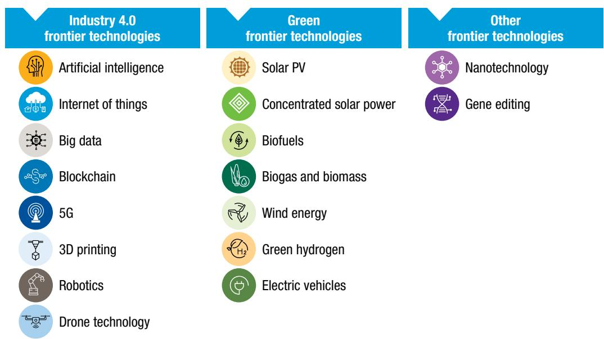  
Source: UNCTAD.  
Abbreviations: 5G, fifth-generation; 3D, three-dimensional; PV, photovoltaics.

Figure I.2 Rapid expansion of frontier technologies (Market size estimates, billions of dollars)  
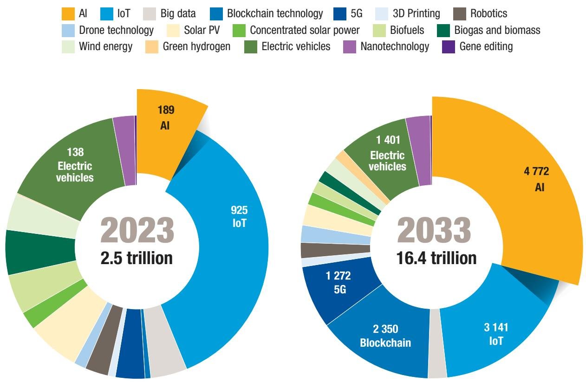  
Source: UNCTAD based on various online market research reports (see annex I).
Note: Market size data capture the revenue generated by the sales of products and services.  
By 2033, AI will have the largest share, almost one third of the frontier technologies market

By 2033, the frontier technology with the largest market size is likely to be AI, at around \$4.8 trillion, accounting for 30 per cent of the overall market. Continuous breakthroughs are making AI more powerful and efficient, favouring its adoption in many sectors and business functions (Facts and Factors, 2024). Since 2022, there has been for example, a surge in interest in Generative AI (GenAI), with organizations across different countries and industries experimenting with its use in a wide range of tasks, including content creation, product development, automated coding and personalized customer service (Accenture, 2023; McKinsey & Company, 2023).

Another major market is the Internet of Things (IoT). By 2033, this growing network of physical devices connecting and exchanging data could contribute \$3.1 trillion to the global economy (Global Data, 2024).

IoT, coupled with other Industry 4.0 technologies and AI, will accelerate the digital transformation of agriculture, manufacturing and services, increasing productivity and product quality while potentially reducing costs and carbon emissions (Kumar et al., 2021; Matin et al., 2023). These technologies can also benefit consumers if enhanced human-machine interactions lead to more efficient and customized solutions.

## The market dominance of tech giants

The leading frontier technology providers are now among the largest corporations in the world by market capitalization. Apple, Nvidia and Microsoft each have a market capitalization of more than \$3 trillion, close to the gross domestic product (GDP) of the African continent, or that of the United Kingdom of Great Britain and Northern Ireland, the world's sixth largest economy. Not far behind are Alphabet (Google) and Amazon, with market capitalizations of above \$2 trillion, greater than the GDP of Canada. $^{1}$ The top five companies are from the United States, and three leading chipmakers – Nvidia, Broadcom and TSMC $^{2}$ – are among the world's top 10 listed companies; almost all are focused on frontier technologies and invest substantially in AI (figure I.3).

The main providers of frontier technologies are from the United States, developed countries in Western Europe, China, Japan and the Republic of Korea. Collecting globally comparable data on frontier technology markets is challenging, but some trends can be identified. $^{3}$ Companies in the United States have an edge in digital technologies and computing platforms, such as AI, IoT, big data, blockchain and 3D printing. Companies from Japan lead in robotics development and those from the Republic of Korea are more active in 5G and nanotechnologies. Companies in Western Europe cover a wide spectrum of frontier technologies. Among developing countries, the dominant player is China, which leads technological development in 5G, drones and solar photovoltaics (solar PV). There are only a few top frontier technology providers from other developing countries, for example, Brazil (e.g. some biofuels companies).

## Figure I.3

## Market dominance of technology giants

Top 10 listed companies in the world by market capitalization

(Trillions of dollars)

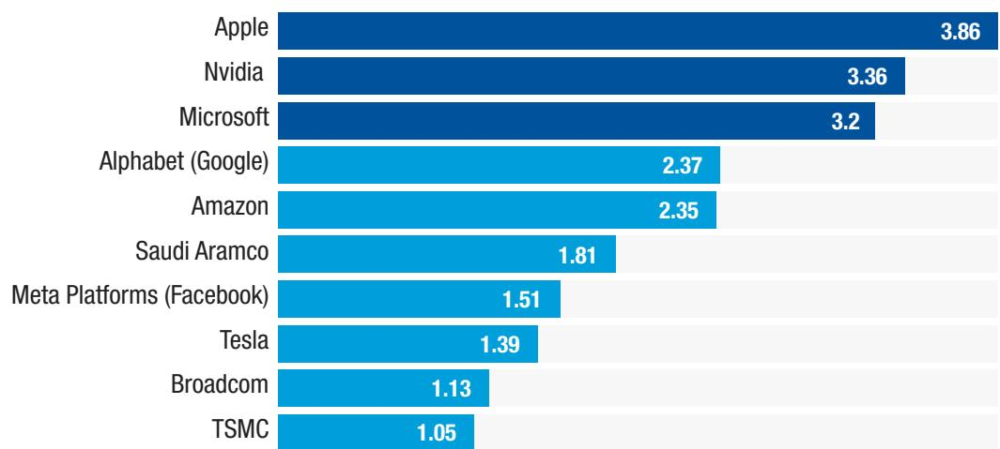  
Source: UNCTAD, based on data from Companies Market Cap.  
Note: The ranking shows the most valuable listed companies worldwide, as at end-2024.

$^{2}$ Nvidia and Broadcom, United States; TSMC, Taiwan Province of China.

3 There is no structured, reliable information about market share or company profit readily available for frontier technologies. The top frontier technology providers were identified through an online search of companies most commonly referred to as top providers. Since the search was conducted in English, more favourable results may have been returned for companies from English-speaking countries.

While there are substantial innovation activities among small and medium-sized enterprises (SMEs) and startups, most leading frontier technology providers are large multinational corporations. Some have developed the technology in-house and most stay at the frontier by investing in startups or acquiring highly innovative firms that offer cutting-edge technology and expertise. For example, in 2014, Alphabet acquired DeepMind, a leading United Kingdom-based research lab pioneering the field of deep reinforcement learning that developed the programme ‘AlphaGo’ that defeated the world Go champion in 2016. Another major player is Microsoft that, in 2019, forged a partnership with OpenAI, which developed ChatGPT (GPT stands for generative pre-trained transformer), and in 2022, made a record acquisition, for more than \$18 billion, of Nuance Communications, a company that specializes in large-scale speech applications and is behind the Siri voice assistant of Apple. $^{4}$

Market dominance is worrying, particularly in winner-takes-all markets, because the top players reap most of the rewards and have the resources to eliminate potential competition or even control the flows of information and revenue (UNCTAD, 2021). Leading technology companies are gaining control over our technology future, but their commercial motives may not always align with the public interest and could put societies on a suboptimal development trajectory (Ahmed et al., 2023; Oxfam International, 2024). For instance, studies suggest that companies generally direct AI development towards substituting for human labour rather than augmenting human capabilities (Acemoglu and Johnson, 2023). Labour-saving and capital-intensive frontier technologies could undermine the comparative advantage of low labour costs in many developing countries, threatening much of the gains they have made in recent decades (Korinek et al., 2021).

For these reasons, it is essential to explore policies and regulations that incentivize and guide technology firms towards a path that promotes inclusivity and benefits for everyone. Chapter IV presents an overview of STI and industrial policies for AI at the national level. Chapter V focuses on global AI governance.

## B. Concentration of research and development

The potential of frontier technologies has attracted significant research and development investments. For example, between 2022 and 2025, AI-related investment was expected to double to \$200 billion (Goldman Sachs, 2023). By comparison, this is about three times the global spending on climate change adaptation. By 2030, AI-related investment could represent 2 per cent of GDP in countries leading in AI (Goldman Sachs, 2023).

While many companies undertake various forms of R&D, the bulk of investment is by a small number of enterprises. In 2022, more than 80 per cent of business-funded R&D worldwide was carried out by 2,500 companies, which invested €1.25 trillion; 40 per cent of such investment was by only 100 companies (European Commission, Joint Research Centre, 2023).

Among the largest 100 corporate R&D investors, around half are headquartered in the United States, led by Alphabet, Meta, Microsoft and Apple. Around 13 per cent are headquartered in China, led by Huawei and Tencent, up from 2 per cent 10 years ago and overtaking traditional R&D leaders such as Germany, Japan, the Republic of Korea, Switzerland and the United Kingdom (figure I.4). Other than China, none of the top 100 corporate R&D investors are from developing countries.

The software and computer services industry, in which most AI, big data and blockchain technologies are developed, accounted for around one quarter of the total R&D investment of the top 100 corporate R&D investors in 2022, more than doubling their share from a decade ago and overtaking the pharmaceuticals and biotechnology industry (figure I.5).

Other leading companies operate in the technology hardware and equipment industry, which includes IoT, 5G networks, 3D printing, robotics, drone technology and green frontier technologies, and accounts for one fifth of the R&D investment. The automobile and parts industry, which includes electric vehicles, still represents a considerable share of R&D investment despite a gradual decrease over the past decade.

The software and computer services, technology hardware and equipment and pharmaceuticals and biotechnology industries are largely headquartered in the United States, which accounts for more than 80 per cent of the corporate R&D investment in software and computer services. Germany and Japan lead in such investment in automobiles and parts and the Republic of Korea is strong in electronic and electrical equipment.

## Significant concentration of research and development in a few countries

(Share of investment by global top 100 corporate R&D investors, by country; percentage)

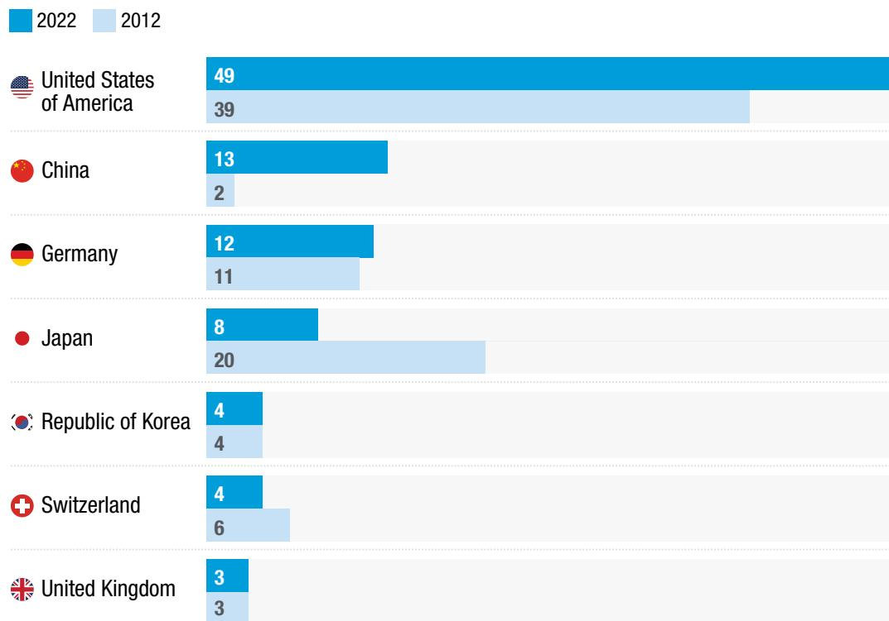  
Source: European Commission, Joint Research Centre, 2023.

## Figure I.5 The share of R&D in software and computer services has increased sharply

(Share of investment by global top 100 corporate R&D investors, by industry; percentage)

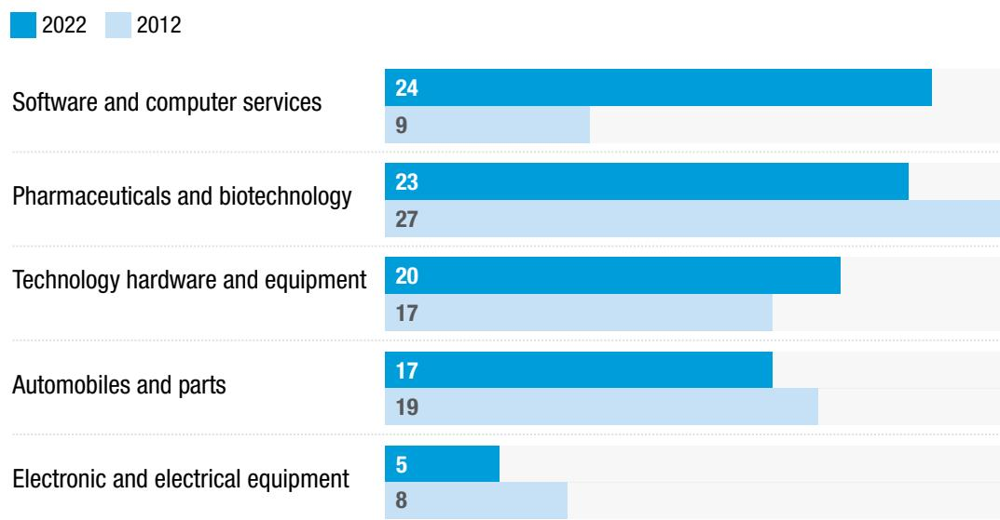  
Source: European Commission, Joint Research Centre, 2023.

## C. Asymmetries in knowledge creation

Knowledge creation in frontier technologies has been gathering pace, with a rapid rise in research publications and patents. Over the period 2000–2023, for AI alone, more than 713,000 peer-reviewed scientific articles were published and 338,000 patents were filed, with a sharp increase since 2020. Other industry 4.0 technologies, such as IoT, robotics and big data, also generated a large number of publications and patents. Among green technologies, knowledge creation was more significant in biogas and biomass (274,000 patents) and in electric vehicles (243,000 patents) (figure I.6).

As with R&D investments, knowledge creation in frontier technologies is dominated by China and the United States, which together are responsible for around one third of global peer-reviewed articles and two thirds of patents. These countries are more dominant in patents than scientific articles.

Different countries often specialize in particular fields. This is evident in the revealed technology advantage of a country, that is defined as its share of patents in a particular technology field divided by its share in all fields (table I.1). A value above 1 indicates specialization. For example, Germany is highly specialized in wind energy, India in nanotechnology, Japan in electric vehicles, and the Republic of Korea in 5G technology. Certain countries or regions may become global hubs for particular types of knowledge, attracting investment and talent, and giving them an edge in shaping the technological trajectory.

Figure I.6
Number of frontier technology patents, 2000–2023  
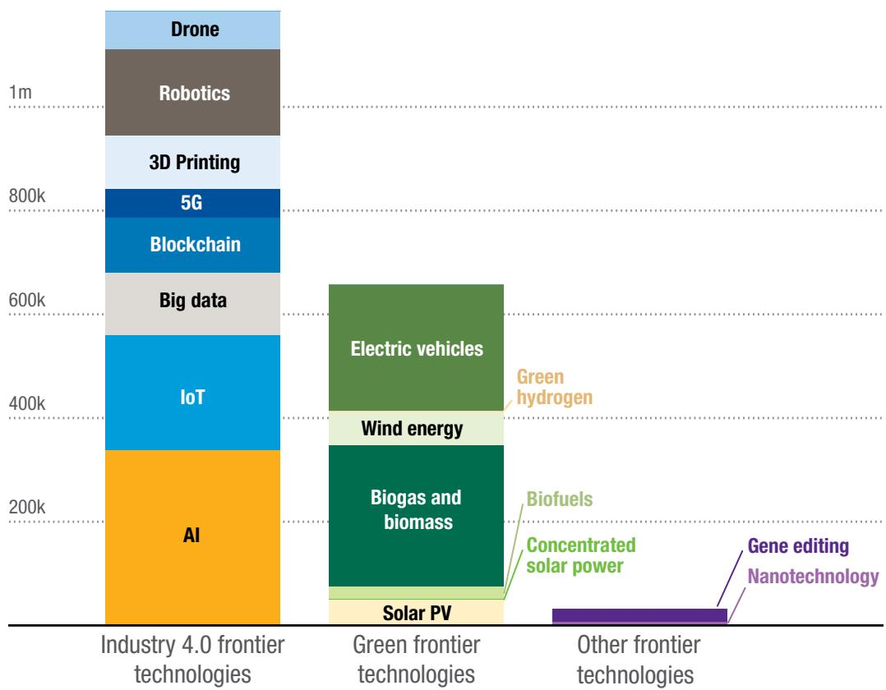  
Source: UNCTAD calculations, based on data from PatSeer.

Market dominance, at both the corporate and national levels, risks widening global technological divides, making it even more difficult for latecomers to catch up, particularly when coupled with the slowdown in technology diffusion observed in recent decades (Andrews et al., 2016).

The growing complexity of technologies and innovations requires increasing investments in physical and human capital, to find new ideas, as well as greater adjustment and learning costs for effective implementation. In addition, modern technologies need to be integrated with multiple components within increasingly interconnected systems, further raising entry barriers and limiting technology and knowledge diffusion.

The gap in productivity growth between firms at the global frontier and laggards is particularly marked in digital and skill-intensive industries (Berlingieri et al., 2020).

These challenges, along with structural barriers such as inadequate infrastructure and a lack of technical expertise, make it difficult for lagging firms and countries to keep pace with technological advances. The slowdown in technology diffusion also limits aggregate productivity growth. Technology development and innovation in developing countries can also be hindered by data and intellectual property policies in developed countries, with the risk of the diffusion of AI technology further widening existing gaps.

Table 1.1 Revealed technology advantage of selected countries based on filed patent, 2000–2023

<table><tr><td rowspan="2" colspan="2"></td><td colspan="6">Patents</td></tr><tr><td>USA</td><td>China</td><td>Germany</td><td>India</td><td>Korea</td><td>Japan</td></tr><tr><td rowspan="8">Industry 4.0 frontier technologies</td><td>AI</td><td>1.2</td><td>0.8</td><td>1.3</td><td>1.7</td><td>1.1</td><td>1.4</td></tr><tr><td>IoT</td><td>0.6</td><td>1.3</td><td>0.2</td><td>2.3</td><td>1.4</td><td>0.3</td></tr><tr><td>Big data</td><td>0.1</td><td>1.7</td><td>0.0</td><td>0.4</td><td>0.9</td><td>0.1</td></tr><tr><td>Blockchain</td><td>1.2</td><td>1.0</td><td>0.4</td><td>0.8</td><td>1.0</td><td>0.6</td></tr><tr><td>5G</td><td>0.4</td><td>1.0</td><td>0.1</td><td>0.2</td><td>4.4</td><td>0.2</td></tr><tr><td>3D printing</td><td>0.8</td><td>1.2</td><td>1.5</td><td>0.2</td><td>0.5</td><td>0.2</td></tr><tr><td>Robotics</td><td>2.5</td><td>0.5</td><td>0.9</td><td>0.9</td><td>0.3</td><td>1.0</td></tr><tr><td>Drone</td><td>1.0</td><td>1.0</td><td>0.8</td><td>0.7</td><td>1.6</td><td>0.7</td></tr><tr><td rowspan="7">Green frontier technologies</td><td>Solar PV</td><td>0.2</td><td>1.6</td><td>0.0</td><td>0.8</td><td>0.5</td><td>0.4</td></tr><tr><td>Concentrated solar power</td><td>2.8</td><td>0.1</td><td>1.5</td><td>1.7</td><td>0.2</td><td>1.8</td></tr><tr><td>Biofuels</td><td>2.1</td><td>0.3</td><td>0.8</td><td>0.9</td><td>0.5</td><td>0.7</td></tr><tr><td>Biogas and biomass</td><td>1.0</td><td>0.9</td><td>1.2</td><td>0.6</td><td>0.3</td><td>0.9</td></tr><tr><td>Wind energy</td><td>0.3</td><td>1.2</td><td>4.3</td><td>0.5</td><td>0.2</td><td>0.2</td></tr><tr><td>Green hydrogen</td><td>0.7</td><td>1.1</td><td>1.0</td><td>1.5</td><td>0.8</td><td>0.4</td></tr><tr><td>Electric vehicles</td><td>0.7</td><td>1.0</td><td>1.3</td><td>0.4</td><td>1.5</td><td>3.0</td></tr><tr><td rowspan="2">Other frontier technologies</td><td>Nanotechnology</td><td>1.3</td><td>0.5</td><td>0.9</td><td>3.0</td><td>0.4</td><td>0.3</td></tr><tr><td>Gene editing</td><td>2.9</td><td>0.6</td><td>0.6</td><td>0.0</td><td>0.3</td><td>0.6</td></tr></table>

Source: UNCTAD calculations, based on data from PatSeer.  
Note: The revealed technology advantage gives an indication of the relative specialization of a given country in a technology. It is calculated as the country's share of patents in a particular technology field divided by its share in all fields, potentially ranging from zero to infinity. The figure is equal to 1 when a country's share in a technology equals its share in all frontier technologies; a figure above 1 indicates a specialization and a figure below 1 indicates “no specialization”.

## D. Evolution of AI

To help in understanding the promises and perils of AI, the following sections discuss different waves of AI and the intersection of AI with other technologies.

There is no universal definition of AI, but it is generally considered to be the capability of a machine to engage in cognitive activities similar to those performed by the human brain, such as reasoning, learning and problem-solving (Collins et al., 2021).

The notion originated in the 1940s as part of the concept of machine intelligence by Alan Turing, who suggested that machines could simulate both mathematical deduction and formal reasoning. $^{5}$ The term artificial intelligence was coined in 1956 for the Dartmouth Summer Research Project on Artificial Intelligence (McCarthy et al., 2006).

Since then, progress has been uneven and can be considered to have taken place in three waves (figure I.8). The first was in the 1950s and the 1960s, when AI developed rapidly as a rule-based system that used a set of predetermined “rules of choices” to make decisions and solve problems. Progress slowed in the 1970s due to a lack of computational power and scalability, the first “AI winter”. There was a brief thaw in the 1980s, when expert systems mimicking the human decision-making process became popular. However, as these systems showed the same limitations as earlier systems, interest and funding in AI diminished once again.

The second wave started in the 1990s, based on statistical learning. By analysing large quantities of data, machines could revise rules and provide more flexibility. The resurgence in AI research and application was driven by three major forces, namely, increasing computational power at low cost, unprecedented data volumes and more sophisticated and efficient algorithms. $^{6}$ One landmark was the launch in 2007 of ImageNet, a large-scale system for image recognition based on millions of human-annotated images (Deng et al., 2009). A second was the creation of the digital assistant Siri in 2011. A third, in 2016, was the defeat of the world Go champion by a computer programme.

## Figure I.8 The three waves of AI

Data generated (zettabytes)

GPU performance (billion flops/s/\$)

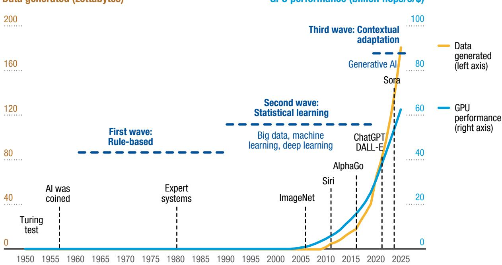  
Source: UNCTAD, based on various estimates (see note below).

Note: Graphics processing units (GPUs) were initially designed for computer graphics and image processing but later became useful in non-graphic calculations and have been widely used in training AI models. GPU performance is expressed in terms of floating-point operations (flops) per second per dollar, adjusted for inflation. The curve represents the best fitted line based on data from 2000 to 2020 and extrapolated figures between 2020 and 2025 (Hobbhahn and Besiroglu, 2022). For the amount of data generated, figures for before 2010 are extrapolated based on the estimates from 2010 to 2025 (Taylor, 2023).

$^{6}$ For example, machine learning emerged as a subset of AI that use statistical techniques to detect patterns and make predictions based on the data. Big data and the rise of deep learning further propelled significant advancements.

Nevertheless, at this stage, AI was largely confined to specific tasks within limited domains and did not possess human-like intelligence. This is considered narrow artificial intelligence, or weak AI (Collins et al., 2021).

The third and current wave gathered momentum in the 2020s, with the use of significant computer power for systems not only based on rules but seeking contextual adaptation or factoring in contexts and explaining decisions. Recent years have seen the emergence of GenAI, driven by advances in natural language processing and large language models, along with exponential growth in computational power and data. This differs from discriminative or predictive AI, which typically analyses and classifies data for particular outcomes such as pattern recognition. GenAI instead mostly identifies relationships in large amounts of data and uses these to create new content. However, this is at the cost of explainability, as it may be difficult to understand the decision-making logic behind a model's results because it is probabilistic, and the same conditions or inputs might subsequently produce different outputs.

GenAI is trained on huge data sets and uses complex algorithms to generate statistically probable outputs, as well as new content that resembles existing data, whether in the form of texts, images or videos. $^{7}$ Public interest in AI was fuelled by the launch of the online application ChatGPT in 2022 by OpenAI. Other examples are DALL-E, which creates images from text, and Sora, which has been conceived for video creation. The growing capabilities and adaptability of AI represent a paradigm shift that is transforming it into a general-purpose technology configurable for different uses (Dhar, 2023; box I.1).

Between 2024 and 2030, the GenAI market is predicted to grow from \$137 billion to \$900 billion, a compound annual growth rate of 37 per cent (Bloomberg, 2023). Expectations are high, comparable to the enthusiasm in the late 1990s that boosted investment during the initial diffusion of the Internet. Nevertheless, there are still high levels of uncertainty. Evidence of the impact of GenAI applications and how they could be best utilized remains limited, particularly in developing countries, and further research and observation is required. Moreover, AI applications are valuable but not infallible. If the training data are incomplete or biased, the model may learn incorrect patterns, make inaccurate predictions or hallucinate to offer information that is not present in the training data or that contradicts a user's prompt.

The rapid development of GenAI has reignited the expectation of developing artificial general intelligence or "strong AI" that could even surpass human intelligence and operate autonomously. AI has already outperformed humans in handwriting, speech and image recognition, as well as in reading comprehension and language understanding (figure I.9). However, human intelligence is complex and multifaceted; it may be more challenging than expected to achieve artificial general intelligence.

The driving forces behind the rapid progress of AI in recent decades involve three key leverage points, that can trigger transformational cascades for AI, namely, infrastructure, data and skills; infrastructure in the form of increasing computational power and cost-effective information transfers; data, with regard to the massive and diverse amounts of quality data produced at accelerating speeds; and skills in the form of advanced expertise in developing and applying sophisticated AI models. The present report provides evidence with regard to these three key leverage points.

## Box I.1 Is AI a general-purpose technology?

General-purpose technologies lead to new methods of production and innovation, transform industries and create new markets over decades. Such technologies are characterized by:

\- Pervasiveness – They offer applications across various industries and economic activities.

\- Dynamicity – They offer room for continuous technical improvements that create new opportunities for applications.

\- Innovational complementarities – They enable innovations in application sectors and new complementary technologies developed around them.

AI is considered a general-purpose technology because it can impact a wide range of tasks and jobs. AI is continuously evolving, with growing functionality, and may affect around half of human jobs in the future.

Moreover, AI is already transforming the way research and innovation are conducted. While it can speed up processes, it is unclear whether the use of AI can help address the increasing difficulties in discovering new ideas and the decreasing rate of the emergence of disruptive ideas.

In any case, as with previous general-purpose technologies, it will take time and effort for the full potential of AI to be realized. For example, the introduction of electric motors in manufacturing initially boosted productivity by reducing energy costs, but the most significant impacts did not emerge until companies began to redesign factories and business processes to take advantage of the flexibilities offered by the new source of energy.

Rather than being final solutions, general-purpose technologies open up new opportunities and feedback loops throughout the economy. However, the complementary productive and innovative activities are usually widely dispersed, making it difficult to coordinate efforts and provide incentives within both the technology and the application sectors.

Source: Bresnahan and Trajtenberg, 1995; Bloom et al., 2020; Krenn et al., 2022; Park et al., 2023; Eloundou et al., 2024.

Figure I.9
Evolution of language and image recognition capabilities of AI systems  
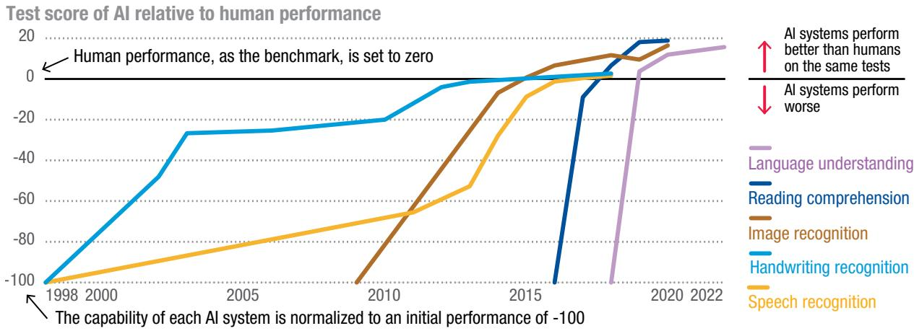  
Source: Roser, 2022.

Infrastructure – Infrastructure requirements go beyond the basic provision of electricity and the Internet. They also comprise computing power and server capabilities, such as significant storage, network connectivity, security and backup systems. These are needed to process huge amounts of data, run algorithms, execute models and transmit results worldwide.

Data – Data are the primary input for the training, validation and testing of algorithms, thereby enabling AI models to classify inputs, generate outputs and make predictions. Data are therefore a critical socioeconomic asset in decision-making processes. High-quality, diverse and unbiased data are essential in building effective and trustworthy AI systems. Data and AI systems interact dynamically, whereby more data provide more training for an AI model, making it more popular and thus capable of collecting (and generating) more data. $^{8}$ This dynamic and scale effects could widen existing data-related and technological gaps, creating higher entry barriers for latecomers.

Skills – Skills range from basic data literacy to the use or development of appropriate techniques, algorithms and models, and from proficiency in data analysis to a combination of technical expertise and domain knowledge. Such skills empower the workforce to use AI to solve complex problems and increase productivity.

These three leverage points create synergistic, positive feedback loops. More affordable and powerful computational resources enable the processing of vast and complex data sets, allowing sophisticated algorithms to analyse and learn from data more effectively, which in turn accelerates the adoption and development of AI, thereby generating more data. The abundance of diverse data provides a rich foundation for training AI models, enhancing their ability to generalize and perform well in different scenarios and across different tasks. At the same time, advanced algorithms optimize the use of computational power and data, leading to more rapid and efficient AI development. This dynamic interaction fosters continuous improvement and innovation in AI technologies (figure I.10).

Figure I.10
Synergies among three key leverage points can accelerate AI progress

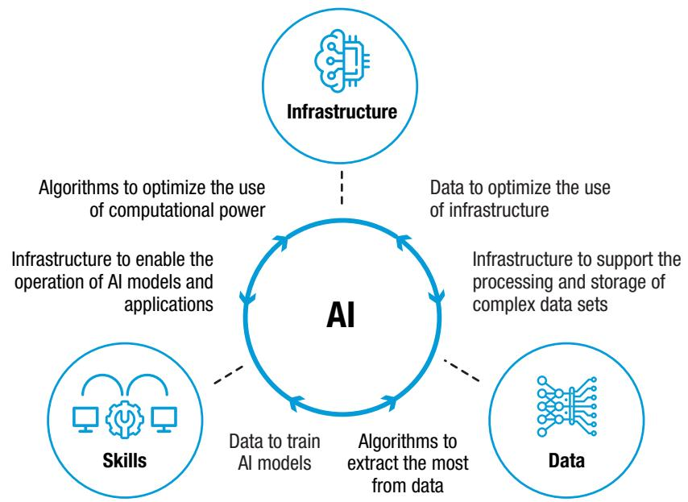  
Source: UNCTAD.

# E. Synergy between AI and other technologies

Compared with earlier AI waves, the current AI surge has greater depth and breadth of penetration, with AI technology having a wide range of potential applications in different fields. AI is already embedded in our daily life and serves as a general-purpose technology that augments other technologies (Damioli et al., 2024). The intersection of AI with other frontier technologies opens up opportunities for innovation, including the following (figure I.11):

IoT – Connected devices, given a further boost by AI, can analyse data, make decisions and take actions with minimal human intervention, to create an artificial intelligence of things. This is becoming the basis of smart factories.

Combined with the 5G networks that support higher-speed connections with lower latency, this can lead to intelligent connectivity (Yarali, 2021). Smart transportation, for example, enables vehicles to communicate in real time on road conditions and accidents, for better traffic control and management.

Big data – There is a strong synergy between AI and big data. AI can improve data analysis and pattern recognition, while big data can be used in training models. Video surveillance systems, for example, can process large amounts of video and sensor data, to identify anomalies or patterns of interest.

AI can
augment other
technologies

## Figure I.11 AI augments other frontier technologies

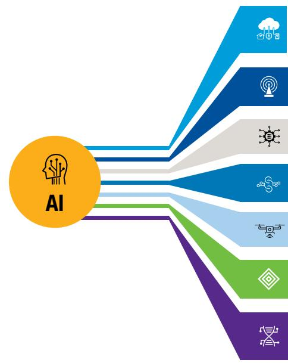  
Source: UNCTAD.

Blockchain – AI is increasingly being used with blockchain, particularly in the fields of cybersecurity, financial services and supply chain management. AI provides better data analytics to improve or develop new solutions, for example, detecting threats and fraudulent activities and optimizing inventory levels and routing. Blockchain augments AI-based security measures with linked cryptographic authentication and decentralized computing power and data processing (Ekramifard et al., 2020).

3D printing – Human designers can explore feasible options for 3D printing by running many different design scenarios and carrying out virtual stress tests. Less experienced designers can also benefit from GenAI-driven tools, such as Style2Fab and 3D-GPT that facilitate design and development processes (Zewe, 2023; Sun et al., 2023).

AI empowers IoT devices to analyse data, make decisions and take actions autonomously
AI combined with 5G enables intelligent connectivity with higher speeds and lower latency
AI enhances data analysis and pattern recognition, while big data supports model training
AI improves data analytics for detecting threats, while blockchain augments security measures
AI supports design and stress testing for 3D printing, enhances robotics decision-making and enables autonomous drone operation
AI advances green frontier technologies by optimizing renewable energy management
AI improves the precision and modelling of nanotechnology and gene editing

Robotics and drones – AI can reinforce the capacity of robots to learn and make decisions and execute tasks in dynamic conditions. AI-powered industrial robots are widely used in manufacturing. AI also helps with crop-harvesting in agriculture (Birrell et al., 2020). Similarly, AI enables drones to operate autonomously and adapt to changing scenarios, making them more efficient and versatile. $^{9}$

Green frontier technologies – The use of AI models can consume significant amounts of energy, but can also help unlock the potential of clean energy and accelerate decarbonization. $^{10}$ For example, the use of AI can optimize the use and management of renewable energy through smart grids and the storage and distribution of energy from renewable sources (Rozite et al., 2023).

## Nanotechnology and gene editing

– AI is widely used in nanotechnology and gene editing, including in autonomous nanorobots, for material design and discovery, and AI-driven genetic research (Dixit et al., 2024).

The salient features of AI, from data analytics, natural language processing and automation to the latest breakthroughs in content generation and contextual adaptation, make it a general-purpose technology that can also augment mature technologies and be configured to dedicated uses. $^{11}$ A compelling capability of AI is its ability to learn and adapt. It is also possible to have a smaller (and less capable) model supervising a more complex and capable one, known as “weak to strong generalization”. This offers a scalable way for humans to guide and control complex AI models by using more easily understandable AI models (Burns et al., 2023).

Figure I.12
Industrial revolutions and their transformative changes  
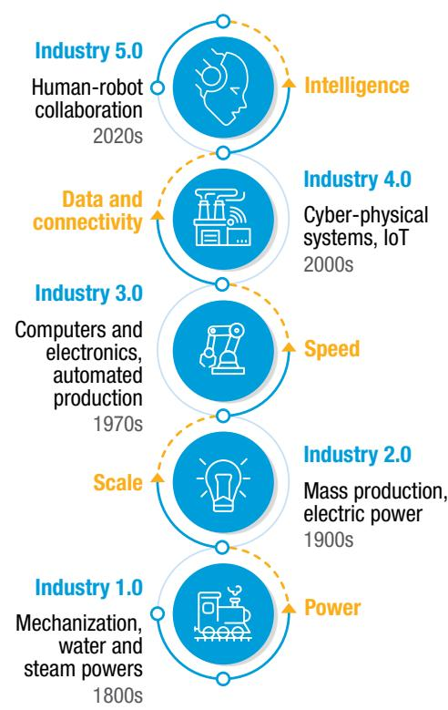  
Source: UNCTAD.

## A fifth industrial revolution

AI may be considered the latest in a sequence of industrial revolutions, all of which have reshaped production systems (figure I.12). In the 1800s, during the first industrial revolution, the power of human labour was expanded by the spread of a range of new technologies, including spinning machinery and the steam engine. The second industrial revolution in the 1900s was driven by the diffusion of electrical power and standardization of machine tools, which led to mass production.

The third industrial revolution began in the 1970s with the introduction of computers and electronics, which increased the speed of information processing, for the further automation of production processes and the advent of the service economy. The fourth industrial revolution, since the 2000s, often referred to as Industry 4.0, has leveraged the diffusion of the Internet and mobile devices to integrate cyber and physical systems, multiplying the quantity of information produced and its potential uses.

A distinctive feature of AI is its ability to amplify human intelligence. Intelligent machines allow for more effective human and robot collaboration that may spark a fifth industrial revolution (box I.2). A new wave of technological transformation will reshape the economy and society. For example, there is the risk that the use of AI will replace many workers while not creating enough new jobs, and may also widen job polarization and increase income inequality. Chapter II discusses the importance of inclusive AI adoption that puts workers at the centre of technological development.

## Key features of the fifth industrial revolution

The concept of the fifth industrial revolution is still evolving, but it can be distinguished from the fourth industrial revolution by three key features, namely, human–machine collaboration, sustainability and personalization. These elements point to a future that can be more inclusive and sustainable, but achieving this vision requires deliberate effort and action.

\- Human–machine collaboration – As opposed to the automation focus of the fourth industrial revolution, it focuses on human–machine collaboration, or human-centric co-creation. This involves redirecting technological advances towards serving humanity, prioritizing collaboration and co-creation between humans and machines. Rather than focusing solely on efficiency it aims to promote dynamic and inclusive production systems that enhance human well-being. Rather than asking which new technological solution is feasible, the question should be why such a solution is being developed; what human and societal needs does it address and how does it help solve them?

\- Sustainability – While prioritizing worker well-being and competitiveness, in the fifth industrial revolution, sustainability is also considered, with industry playing an increasing role in providing solutions to societal challenges. This aligns with a shift toward digitalization, to create more sustainable and environmentally friendly business and consumer practices.

\- Personalized products and services – The fifth industrial revolution can use the advanced capacity of AI to analyse vast amounts of data on individual preferences and behaviours to create highly personalized products and services. Innovations such as GenAI and chatbots have transformed marketing practices, allowing companies to deliver tailored experiences in near real-time. The impact of personalization extends beyond improving consumer satisfaction; it can also be a way to enhance the well-being of workers, communities and the planet.

Source: Adel, 2022; Noble et al., 2022; UNCTAD, 2023; Van Erp et al., 2024.

## F. The AI divide

History shows that technological shifts generally begin with upgrades in hardware and infrastructure, for example, from mainframes to personal computers, from landlines to mobile devices and from intranets to the Internet. This enables additional capabilities, including software and services, and facilitates the adoption and further development of technologies. The different phases are not linear; they usually overlap and create feedback loops that take years to mature and for society to realize their full potential.

Currently, the diffusion of AI applications is associated with investment to upgrade critical AI infrastructure components such as semiconductors, data centres and supercomputers. These support high-speed processing, significant data-handling and advanced computation. $^{12}$ During a gold rush, the most likely winners are often those who sell shovels. In the AI boom, one of the main winners has been Nvidia, the world's largest semiconductor company. In 2023, based on high expectations of revenue growth, its market capitalization more than tripled to \$1.2 trillion, and it nearly tripled again in 2024. $^{13}$ The surge in AI has also benefited other top semiconductor companies, which have experienced significant growth since 2023, notably, Advanced Micro Devices, ASML, Broadcom, Samsung and TSMC.

## Supercomputers and data centres

Most of the leading semiconductor companies are from the United States and other developed economies, and there is a remarkable divide between developing and developed countries in other components of AI infrastructure. The United States has around one third of the top 500 supercomputers and more than half of overall computational performance (TOP500, 2024). China ranks second, with 80 of the top 500 supercomputers, although its total computational performance is less than one tenth that of the United States. $^{14}$ A similar situation is seen with regard to data centres, with most of them located in the United States (Data Center Map, 2024).

Few developing countries have powerful supercomputers or large data centres, apart from Brazil, China, India and the Russian Federation. Most developing countries have limited capacities in AI hardware and infrastructure, which hinder their adoption and development of AI. Chapter III presents an assessment of countries' preparedness for AI.

## Services providers

The market of AI services providers is also dominated by companies based in the United States, for example, Amazon, Alphabet, IBM, Microsoft and OpenAI, and by those based in China, including Baidu and Tencent. The private sector is responsible for most frontier AI research and produces most machine-learning models, leaving Governments and academia some way behind, with less than half combined (Maslej et al., 2024).

This is partly because of escalating costs. Since 2016, the cost of training frontier AI models has increased 2.4 times per year (figure I.13). More than half of the development cost is directed to hardware, making frontier AI model training unaffordable for all but the most well-funded organizations. Most SMEs, particularly those in developing countries, are unlikely to develop new AI models from scratch. Instead, they can adopt and adapt existing AI technologies to meet their particular business needs.

Through interactions with numerous users and devices, companies are building up valuable data sets, enabling them to extend their advantages from hardware to data and beyond. This concentration of computing power and services in a few countries has raised concerns about their impacts on the national interests of other countries, particularly because of supply chain vulnerabilities and the interest of Governments to achieve autonomy in the development of technologies that are crucial for advancing national developmental goals.

## Investment

The United States leads the world in terms of private investment in AI, at \$67 billion in 2023, or 70 per cent of global AI private investment. The only developing countries with significant investments were China in the second position, with \$7.8 billion, and India in the tenth position, with \$1.4 billion. In 2023, the United States also continued to lead in terms of the total number of newly funded AI companies, around seven times the number in the next highest country, China (Maslej et al., 2024).

## Figure I.13 Amortized hardware and energy cost to train frontier AI models

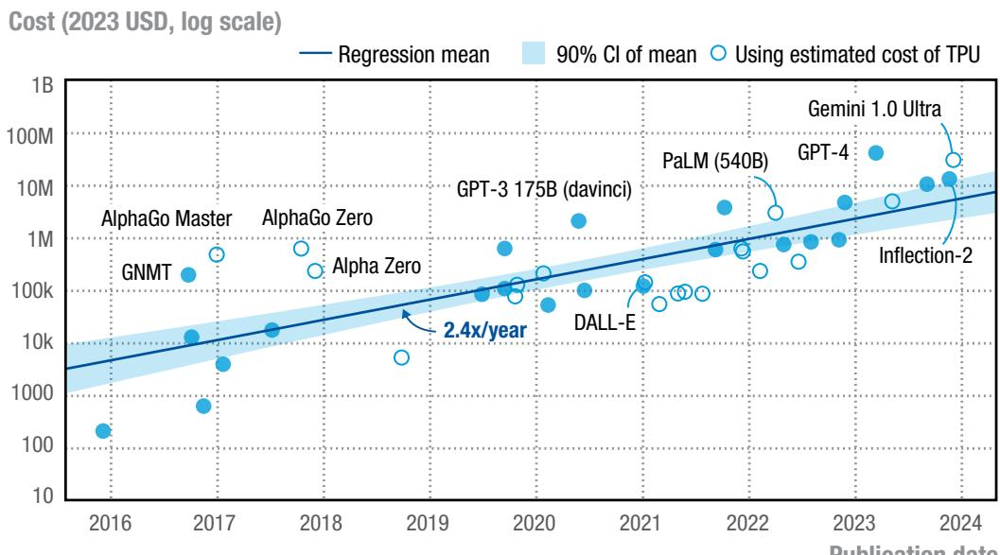  
Source: Cottier et al., 2024.

Startups are key drivers of technological developments and the most valuable AI startups are primarily located in the United States and China (OxValue.AI, 2024).

## Knowledge creation

Over the period 2000–2023, China and the United States were responsible for around one third of global publications in AI and 60 per cent of patents (figure I.14). Apart from China and India, most developing countries have had limited progress, and the distance from developed countries has increased. The situation is similar with regard to GenAI, with most such technologies invented in China and the United States (WIPO, 2024). There is a corresponding gap in AI talent distribution; around half of the world's top-tier researchers in AI originate from China, followed by 18 per cent from the United States and 12 per cent from Europe (MacroPolo, 2024).

The AI-related breakthroughs in recent years could mark the beginning of a new industrial revolution. AI has emerged as a general-purpose technology that can revolutionize processes in various areas powered by highly connected and intelligent production systems that can augment rather than replace humans through improved human–machine interaction. In principle, the use of AI could also help accelerate progress towards the achievement of the Sustainable Development Goals. Yet there are risks and ethical concerns arising from the use of biased training data and the invasion of privacy, as well as security threats, cyberattacks or autonomous weapons. If AI is unevenly distributed and lacks ethical oversight and transparency, its use may exacerbate existing inequalities, hindering sustainable human development (Vinuesa et al., 2020).

In addition, with high computational demands, AI consumes significant amounts of electricity and water, with significant implications for climate change. This highlights the need for environmentally sustainable and inclusive digitalization strategies (UNCTAD, 2024). Developing countries urgently need to strategically position themselves to harness the benefits of the AI era, while addressing potential risks and promoting equitable and inclusive AI development.

Figure I.14
AI-related publications and patents are rising
(Number of publications and patents)  
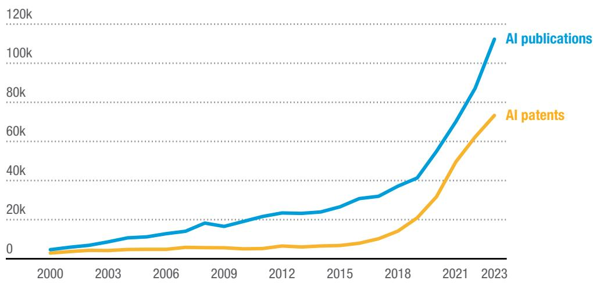  
Source: UNCTAD calculations, based on data from PatSeer and Scopus.

## G. Navigating the report

To shape a future in which AI contributes positively to achieving the Sustainable Development Goals, a multidimensional and evidence-based approach is required. To that end, this report focuses on the need to build resilient infrastructure and promote inclusive and sustainable industrialization and innovation (Goal 9). Concentrated AI development coupled with existing gaps in digital infrastructure risks widening inequalities both within and among countries (Goal 10).

The following chapters analyse and provide recommendations on the far-reaching implications of AI, gradually zooming the focus out from its effects on productivity and the workforce to encompass aspects related to global governance (table I.2).

Chapter II explores productivity and workforce dynamics from a microeconomic perspective, focusing on economic growth and decent work (Goal 8). Chapters III and IV adopt a national perspective, addressing requirements and policies to support AI adoption, adaptation and development (Goal 9). Chapter V concludes by addressing AI governance from a global perspective, emphasizing the importance of international collaboration, to steer AI towards inclusive and equitable development (Goal 17).

## Table I.2

Overview of the report, areas of focus, recommendations and related Sustainable Development Goals

<table><tr><td></td><td colspan="2">Focus</td><td>Recommendations</td><td>Main SDGs</td></tr><tr><td>AI adoption Ch. II</td><td>AI, productivity and workforce</td><td>Case studies: AI applications in developing countries</td><td>Adapting to local infrastructureNew sources of dataWorker-centric approachPartnerships</td><td>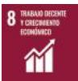</td></tr><tr><td>AI preparedness Ch. III</td><td>Requirements for AI adoption and development</td><td>AI preparedness assessment along infrastructure, data and skills</td><td>Country-level gap analysisStrategic positioningCatch-up trajectories</td><td>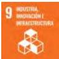</td></tr><tr><td>AI policies Ch. IV</td><td>Evolution of industrial and STI policies</td><td>Examples: AI policies and strategies across countries</td><td>Overarching approachesICT infrastructure upgradeData policiesStrengthening digital skills</td><td></td></tr><tr><td>AI global governance Ch. V</td><td>Fragmented AI governance landscape</td><td>Emerging common approaches</td><td>AccountabilityDigital public infrastructureOpen innovationCapacity building for AI and STI</td><td>17 ALIANTAS PARA LOGRAR LOS OBJECTIVOS</td></tr></table>

Source: UNCTAD.

Annex I

# Technical note on frontier technologies

This annex provides a brief description of the 17 frontier technologies covered in the report. It presents the search queries used in obtaining publication and patent data and the sources of market-size data.

Frontier technologies covered in the report

<table><tr><td>Artificial intelligence (AI)</td><td>Generally defined as the capability of a machine to engage in cognitive activities typically performed by the human brain. AI implementations that focus on narrow tasks are widely available and used, for example, in recommending purchases online, for virtual assistants in smartphones and for detecting spam or credit card fraud. New implementations of AI are based on machine learning and harness big data.</td></tr><tr><td>Internet of things (IoT)</td><td>The myriad Internet-enabled physical devices that collect and share data. There are many potential applications. Typical fields include wearable devices, smart homes, healthcare, smart cities and industrial automation.</td></tr><tr><td>Big data</td><td>Data sets whose size or type is beyond the ability of traditional database structures to capture, manage and process, allowing computers to tap into data that have traditionally been inaccessible or unusable.</td></tr><tr><td>Blockchain</td><td>An immutable time-stamped series of data records supervised by a cluster of computers not owned by any single entity. Blockchain serves as the base technology for cryptocurrencies, enabling peer-to-peer transactions that are open, secure and fast.</td></tr><tr><td>5G</td><td>The next generation of mobile Internet connectivity, offering download speeds of around 1 to 10 gigabits per second (4G speeds are around 100 Mbps), as well as more reliable connections on smartphones and other devices.</td></tr><tr><td>3D printing</td><td>3D printing, also known as additive manufacturing, produces three-dimensional objects based on a digital file, and can create complex objects using less material than traditional manufacturing.</td></tr><tr><td>Robotics</td><td>Programmable machines that can carry out actions and interact with the environment via sensors and actuators, either autonomously or semi-autonomously. They can take many forms, including disaster response robots, consumer robots, industrial robots, military and/or security robots and autonomous vehicles.</td></tr><tr><td>Drone technology</td><td>Also known as Unmanned aerial vehicles (UAV) or unmanned aircraft systems (UAS). A flying robot that can be remotely controlled or fly autonomously using software with sensors and a global positioning system. Drones have often been used for military purposes, but also have civilian uses such as in videography, agriculture and delivery services.</td></tr><tr><td>Solar photovoltaics (Solar PV)</td><td>The technology transforms sunlight into direct current electricity using semiconductors in photovoltaic cells. In addition to being a renewable energy technology, solar PV can be used in off-grid energy systems, potentially reducing electricity costs and increasing access.</td></tr><tr><td>Concentrated solar power</td><td>Concentrated solar power plants use mirrors to concentrate the sun's rays and produce heat for electricity generation via a conventional thermodynamic cycle. Unlike solar (PV), these plants use only the direct component of sunlight and can provide carbon-free heat and power only in regions with high direct normal irradiance.</td></tr><tr><td>Biofuels</td><td>Liquid fuels derived from biomass and used as an alternative to fossil fuel-based liquid transportation fuels such as gasoline, diesel and aviation fuels.</td></tr><tr><td>Biogas and biomass</td><td>A mixture of carbon dioxide, methane and small quantities of other gases produced by the anaerobic digestion of organic matter in an oxygen-free environment. Biomass is renewable organic material that comes from trees, other plants and agricultural and urban waste. It can be used for heating, electricity generation and transport fuels.</td></tr><tr><td>Wind energy</td><td>The kinetic energy created by air in motion, transformed into electrical energy using wind turbines. Many parts of the world have strong wind speeds, but the best locations for generating wind power are sometimes remote and offshore ones.</td></tr><tr><td>Green hydrogen</td><td>Hydrogen generated entirely by renewable energy sources or from low-carbon power. The most fully established technology for producing green hydrogen is water electrolysis fuelled by renewable electricity. Compared with electricity, green hydrogen can be stored more easily. Excess renewable capacity from solar and wind power can be used to power electrolysers that use this energy to create hydrogen, which can be stored as fuel in tanks.</td></tr><tr><td>Electric vehicles</td><td>Vehicles that use one or more electric motors for propulsion. They can be powered by a collector system, with electricity from extravehicular sources, or autonomously, by a battery. As energy-consuming technologies, electric vehicles create new demand for electricity that can be supplied by renewable sources. In addition to the benefits of this shift, such as reducing carbon dioxide emissions and air pollution, electric mobility also creates significant efficiency gains and could become an important source of storage for variable sources of renewable electricity.</td></tr><tr><td>Nanotechnology</td><td>A field of applied science and technology dealing with the manufacturing of objects in scales smaller than 1 micrometre. Nanotechnology is used to produce a wide range of products such as pharmaceuticals, commercial polymers and protective coatings. It can also be used to design computer chip layouts.</td></tr><tr><td>Gene editing</td><td>Also known as genome editing. A genetic engineering tool to insert, delete or modify genomes in organisms. Potential applications include drought-tolerant crops or new antibiotics.</td></tr></table>

Source: UNCTAD.

## Table 2 Publications search conducted for the report

<table><tr><td>Technology</td><td>Search query</td></tr><tr><td>AI</td><td>TITLE-ABS-KEY (ai OR «artificial intelligence») AND PUBYEAR &gt; 2000 AND PUBYEAR &lt; 2024</td></tr><tr><td>IoT</td><td>TITLE-ABS-KEY (iot OR «internet of things») AND PUBYEAR &gt; 2000 AND PUBYEAR &lt; 2024</td></tr><tr><td>Big data</td><td>TITLE-ABS-KEY («big data») AND PUBYEAR &gt; 2000 AND PUBYEAR &lt; 2024</td></tr><tr><td>Blockchain</td><td>TITLE-ABS-KEY (blockchain) AND PUBYEAR &gt; 2000 AND PUBYEAR &lt; 2024</td></tr><tr><td>5G</td><td>TITLE-ABS-KEY («5g communication» OR «5g system» OR «5g network») AND PUBYEAR &gt; 2000 AND PUBYEAR &lt; 2024</td></tr><tr><td>3D printing</td><td>TITLE-ABS-KEY («3D printing») AND PUBYEAR &gt; 2000 AND PUBYEAR &lt; 2024</td></tr><tr><td>Robotics</td><td>TITLE-ABS-KEY (robotics) AND PUBYEAR &gt; 2000 AND PUBYEAR &lt; 2024</td></tr><tr><td>Drone technology</td><td>TITLE-ABS-KEY (drone) AND PUBYEAR &gt; 2000 AND PUBYEAR &lt; 2024</td></tr><tr><td>Solar PV</td><td>TITLE-ABS-KEY («solar photovoltaic» OR «solar pv») AND PUBYEAR &gt; 2000 AND PUBYEAR &lt; 2024</td></tr><tr><td>Concentrated solar power</td><td>TITLE-ABS-KEY («concentrated solar power») AND PUBYEAR &gt; 2000 AND PUBYEAR &lt; 2024</td></tr><tr><td>Biofuels</td><td>TITLE-ABS-KEY («biofuel») AND PUBYEAR &gt; 2000 AND PUBYEAR &lt; 2024</td></tr><tr><td>Biogas and biomass</td><td>TITLE-ABS-KEY («biogas» OR «biomass») AND PUBYEAR &gt; 2000 AND PUBYEAR &lt; 2024</td></tr><tr><td>Wind energy</td><td>TITLE-ABS-KEY («wind energy») AND PUBYEAR &gt; 2000 AND PUBYEAR &lt; 2024</td></tr><tr><td>Green hydrogen</td><td>TITLE-ABS-KEY («green hydrogen») AND PUBYEAR &gt; 2000 AND PUBYEAR &lt; 2024</td></tr><tr><td>Electric vehicles</td><td>TITLE-ABS-KEY («electric vehicle») AND PUBYEAR &gt; 2000 AND PUBYEAR &lt; 2024</td></tr><tr><td>Nanotechnology</td><td>TITLE-ABS-KEY (nanotechnology) AND PUBYEAR &gt; 2000 AND PUBYEAR &lt; 2024</td></tr><tr><td>Gene editing</td><td>TITLE-ABS-KEY (gene-editing OR genome-editing OR «gene editing» OR «genome editing») AND PUBYEAR &gt; 2000 AND PUBYEAR &lt; 2024</td></tr></table>

Source: UNCTAD.

Notes: Publication data were retrieved from the Elsevier Scopus database of academic publications for the period 2000–2023 since, according to Elsevier, the data on papers published after 1995 are more reliable. The Scopus system is updated retroactively and, as a result, the number of publications for a given query may increase over time. The search was conducted using keywords alongside the title, abstract and author keywords.

<table><tr><td>Technology</td><td>Search query</td></tr><tr><td>AI</td><td>TAC:(ai OR «artificial intelligence») AND PBY:[2000 TO 2023]</td></tr><tr><td>IoT</td><td>TAC:(iot OR «internet of things») AND PBY:[2000 TO 2023]</td></tr><tr><td>Big data</td><td>TAC:(«big data») AND PBY:[2000 TO 2023]</td></tr><tr><td>Blockchain</td><td>TAC:(blockchain) AND PBY:[2000 TO 2023]</td></tr><tr><td>5G</td><td>TAC:(«5g communication» OR «5g system» OR «5g network») AND PBY:[2000 TO 2023]</td></tr><tr><td>3D printing</td><td>TAC:(«3D printing») AND PBY:[2000 TO 2023]</td></tr><tr><td>Robotics</td><td>TAC:(robotics) AND PBY:[2000 TO 2023]</td></tr><tr><td>Drone technology</td><td>TAC:(drone) AND PBY:[2000 TO 2023]</td></tr><tr><td>Solar PV</td><td>TAC:(«solar photovoltaic» OR «solar pv») AND PBY:[2000 TO 2023]</td></tr><tr><td>Concentrated solar power</td><td>TAC:(«concentrated solar power») AND PBY:[2000 TO 2023]</td></tr><tr><td>Biofuels</td><td>TAC:(«biofuel») AND PBY:[2000 TO 2023]</td></tr><tr><td>Biogas and biomass</td><td>TAC:(«biogas» OR «biomass») AND PBY:[2000 TO 2023]</td></tr><tr><td>Wind energy</td><td>TAC:(«wind energy») AND PBY:[2000 TO 2023]</td></tr><tr><td>Green hydrogen</td><td>TAC:(«green hydrogen») AND PBY:[2000 TO 2023]</td></tr><tr><td>Electric vehicles</td><td>TAC:(«electric vehicle») AND PBY:[2000 TO 2023]</td></tr><tr><td>Nanotechnology</td><td>TAC:(nanotechnology) AND PBY:[2000 TO 2023]</td></tr><tr><td>Gene editing</td><td>TAC:(gene-editing OR genome-editing OR «gene editing» OR «genome editing») AND PBY:[2000 TO 2023]</td></tr></table>

Source: UNCTAD.

Notes: Patent-related data were retrieved from the PatSeer software for patent research and analysis. To align with the publication data, the search period was set to 2000–2023. The patent search was conducted using keywords alongside the title, abstract and claims.

Table 4
Market-size data search conducted for the report

<table><tr><td>Technology</td><td>Source</td></tr><tr><td>AI</td><td>https://www.fnfresearch.com/artificial-intelligence-ai-market</td></tr><tr><td>IoT</td><td>https://www.globaldata.com/store/report/iot-market-analysis/</td></tr><tr><td>Big data</td><td>https://www.globaldata.com/store/report/data-and-analytics-technology-market-analysis</td></tr><tr><td>Blockchain</td><td>https://www.globaldata.com/store/report/blockchain-market-analysis/</td></tr><tr><td>5G</td><td>https://www.polarismarketresearch.com/industry-analysis/5g-services-market</td></tr><tr><td>3D printing</td><td>https://www.globaldata.com/store/report/3d-printing-market-analysis/</td></tr><tr><td>Robotics</td><td>https://www.globaldata.com/media/thematic-research/robotics-market-will-worth-218-billion-2030-forecasts-globaldata/</td></tr><tr><td>Drone technology</td><td>https://www.factmr.com/report/62/drone-market</td></tr><tr><td>Solar PV</td><td>https://www.precedenceresearch.com/solar-photovoltaic-market</td></tr><tr><td>Concentrated solar power</td><td>https://www.fortunebusinessinsights.com/industry-reports/concentrated-solar-power-market-100751</td></tr><tr><td>Biofuels</td><td>https://www.precedenceresearch.com/biofuels-market</td></tr><tr><td>Biogas and biomass</td><td>https://www.precedenceresearch.com/biomass-power-market</td></tr><tr><td>Wind energy</td><td>https://www.thebusinessresearchcompany.com/report/wind-energy-global-market-report</td></tr><tr><td>Green hydrogen</td><td>https://www.alliedmarketresearch.com/green-hydrogen-market-A11310</td></tr><tr><td>Electric vehicles</td><td>https://www.marketsandmarkets.com/Market-Reports/electric-vehicle-market-209371461.html</td></tr><tr><td>Nanotechnology</td><td>https://www.gii research.com/report/bc1361105-global-nanotechnology-market.html</td></tr><tr><td>Gene editing</td><td>https://www.grandviewresearch.com/press-release/global-genome-editing-market</td></tr></table>

Source: UNCTAD.

Notes: Market size data, as measured by the revenue generated in the market is based on market research reports available online. Each report covers a different base year and prediction year; the reported figures therefore use 2023 as the base year and 2033 as the prediction year and apply the compound annual growth rate presented in each report.

## References

Accenture (2023). Technology Vision 2023. Available at https://www.accenture.com/us-en/insights/technology/technology-trends-2023.

Acemoglu D and Johnson S (2023). Power and Progress: Our Thousand-Year Struggle over Technology and Prosperity. PublicAffairs. New York.

Adel A (2022). Future of industry 5.0 in society: human-centric solutions, challenges and prospective research areas. Journal of Cloud Computing. 11(1):40.

Ahmed N, Wahed M and Thompson NC (2023). The growing influence of industry in AI research. Science. 379(6635):884–886.

Andrews D, Criscuolo C, and Gal PN (2016). The best versus the rest. Available at https://www.oecd.org/en/publications/the-best-versus-the-rest\_63629cc9-en.html.

Berlingieri G, Calligaris S, Criscuolo C and Verlhac R (2020). Laggard firms, technology diffusion and its structural and policy determinants. OECD Science, Technology and Industry Policy Papers No. 86.

Birrell S, Hughes J, Cai JY and Iida F (2020). A field-tested robotic harvesting system for iceberg lettuce. Journal of Field Robotics. 37(2):225–245.

Bloom N, Jones Cl, Van Reenen J and Webb M (2020). Are ideas getting harder to find? American Economic Review. 110(4):1104–1144.

Bloomberg (2023). Generative AI to become a \$1.3 trillion market by 2032. Available at https://www.bloomberg.com/company/press/generative-ai-to-become-a-1-3-trillion-market-by-2032-research-finds/.

Bratton L (2024). The biggest AI acquisitions by Apple and other big tech firms. Available at https://gz.com/ai-deals-apple-microsoft-meta-google-1851382919.

Bresnahan TF and Trajtenberg M (1995). General purpose technologies "Engines of growth"? Journal of Econometrics. 65(1):83–108.

Burns C, Leike J, Aschenbrenner L, Wu J, Izmailov P, Gao L, Baker B and Kirchner JH (2023). Weak-to-strong generalization. Available at https://openai.com/index/weak-to-strong-generalization/.

Sun C et al. (2023). 3D-GPT: Procedural 3D modeling with large language models. Available at https://chuny1.github.io/3DGPT/3dgpt.html.

Collins C, Dennehy D, Conboy K and Mikalef P (2021). Artificial intelligence in information systems research: A systematic literature review and research agenda. International Journal of Information Management. 60:102383.

Companies Market Cap (2024). Largest companies by market capitalization. Available at https://companiesmarketcap.com/.

Cottier B, Rahman R, Fattorini L, Maslej N and Owen D (2024). The rising costs of training frontier AI models. Available at https://arxiv.org/abs/2405.21015.

Damioli G, Van Roy V, Vertesy D and Vivarelli M (2024). Is artificial intelligence generating a new paradigm? Evidence from the emerging phase. Available at https://papers.ssrn.com/abstract=4921726.

Data Center Map (2024). Data centers. Available at https://www.datacentermap.com/datacenters/.

Deng J et al. (2009). ImageNet: A large-scale hierarchical image database. 2009 IEEE Conference on Computer Vision and Pattern Recognition. 248–255.

Dhar V (2023). The Paradigm Shifts in Artificial Intelligence. Available at https://arxiv.org/abs/2308.02558.

Dixit S, Kumar A, Srinivasan K, Vincent PMDR and Ramu Krishnan N (2024). Advancing genome editing with artificial intelligence: opportunities, challenges, and future directions. Frontiers in Bioengineering and Biotechnology. 11:1335901.

Ekramifard A, Amintoosi H, Seno AH, Dehghantanha A and Parizi RM (2020). A Systematic Literature Review of Integration of Blockchain and Artificial Intelligence. In: Choo K-K R,, Dehghantanha A, and Parizi R M, eds. Blockchain Cybersecurity, Trust and Privacy. Springer International Publishing. Cham: 147–160.

Eloundou T, Manning S, Mishkin P and Rock D (2024). GPTs are GPTs: Labor market impact potential of LLMs. Science. 384(6702):1306–1308.

European Commission, Joint Research Centre. (2023). The 2023 EU Industrial R&D Investment Scoreboard.

Facts and Factors (2024). Artificial Intelligence market size, trends, growth, forecast report to 2030. Available at https://www.fnfresearch.com/artificial-intelligence-ai-market.

Global Data (2024). IoT market trends and analysis by end-user, product, enterprise size, vertical, region, and segment forecast to 2027. Available at https://www.globaldata.com/store/report/iot-market-analysis/.

Goldman Sachs (2023). AI investment forecast to approach \$200 billion globally by 2025. Available at https://www.goldmansachs.com/intelligence/pages/ai-investment-forecast-to-approach-200-billion-globally-by-2025.html.

Heaven WD (2023). GPT-4 is bigger and better than ChatGPT—but OpenAI won't say why. Available at https://www.technologyreview.com/2023/03/14/1069823/gpt-4-is-bigger-and-better-chatgpt-openai/.

Hobbhahn M and Besiroglu T (2022). Trends in GPU price-performance. Available at https://epoch.ai/blog/trends-in-gpu-price-performance.

Korinek A, Schindler M and Stiglitz JE (2021). Technological progress, artificial intelligence, and inclusive growth. IMF working paper, No. WP/21, 166.

Krenn M, Pollice R, Guo SY, Aldeghi M, Cervera-Lierta A, Friederich P, dos Passos Gomes G, Häse F, Jinich A, Nigam AK, Yao Z and Aspuru-Guzik A (2022). On scientific understanding with artificial intelligence. Nature Reviews Physics. 4(12):761–769.

Kumar N, Dahiya AK, Kumar K and Tanwar S (2021). Application of IoT in Agriculture. 2021 9th International Conference on Reliability, Infocom Technologies and Optimization (Trends and Future Directions). IEEE. Noida, India: 1–4.

MacroPolo (2024). The Global AI Talent Tracker 2.0. Available at https://macropolo.org/interactive/digital-projects/the-global-ai-talent-tracker/.

Maslej N, Fattorini L, Perrault R, Parli V, Reuel A, Brynjolfsson E, Etchemendy J, Ligett K, Lyons T, Manyika J, Niebles JC, Shoham Y, Wald R and Clark J (2024). The AI index report 2024. AI Index Steering Committee, Institute for Human-Centered Artificial Intelligence, Stanford University, United States.

Matin A, Islam MR, Wang X, Huo H and Xu G (2023). AloT for sustainable manufacturing: Overview, challenges, and opportunities. Internet of Things. 24:100901.

McCarthy J, Minsky ML, Rochester N and Shannon CE (2006). A proposal for the dartmouth summer research project on artificial intelligence. August 31, 1955. AI Magazine. 27(4):12–12.

McKinsey & Company (2023). The state of AI in 2023: Generative AI's breakout year. Available at https://www.mckinsey.com/capabilities/quantumblack/our-insights/the-state-of-ai-in-2023-generative-ais-breakout-year.

Microsoft (2024). BlackRock, Global Infrastructure Partners, Microsoft and MGX launch new AI partnership to invest in data centers and supporting power infrastructure. Available at https://news.microsoft.com/2024/09/17/blackrock-global-infrastructure-partners-microsoft-and-mgx-launch-new-ai-partnership-to-invest-in-data-centers-and-supporting-power-infrastructure/.

Noble SM, Mende M, Grewal D and Parasuraman A (2022). The fifth industrial revolution: How harmonious human–machine collaboration is triggering a retail and service [r]evolution. Journal of Retailing. 98(2):199–208.

Oxfam International (2024). Inequality Inc. How corporate power divides our world and the need for a new era of public action.

OxValue.AI (2024). Available at https://www.oxvalue.ai/.

Park M, Leahey E and Funk RJ (2023). Papers and patents are becoming less disruptive over time. Nature. 613(7942):138–144.

Roser M (2022). The brief history of artificial intelligence: the world has changed fast — what might be next? Available at https://ourworldindata.org/brief-history-of-ai#article-citation.

Rozite V, Miller J and Oh S (2023). Why AI and energy are the new power couple. Available at https://www.iea.org/commentaries/why-ai-and-energy-are-the-new-power-couple.

Swissinfo (2023). University of Zurich AI drone beats humans for the first time. Available at https://www.swissinfo.ch/eng/business/university-of-zurich-ai-drone-beats-humans-for-the-first-time/48778294.

Taylor P (2023). Volume of data/information created, captured, copied, and consumed worldwide from 2010 to 2020, with forecasts from 2021 to 2025. Available at https://www.statista.com/statistics/871513/worldwide-data-created/.

The United Nations Economic and Social Council (2024). High-level political forum on sustainable development Convened under the auspices of the Economic and Social Council.

TOP500 (2024). The 63 $^{rd}$ edition of the TOP500. Available at https://top500.org/lists/top500/2024/06/.

Turing AM (1950). Computing machinery and intelligence. Mind. (236):433–460.

UNCTAD (2018). Technology and Innovation Report 2018: Harnessing Frontier Technologies for Sustainable Development (United Nations publication. Sales No. E.18.II.D.3. Geneva).

UNCTAD (2021). Digital Economy Report 2021: Cross-Border Data Flows and Development – For Whom the Data Flow (United Nations publication. Sales No. E.21.II.D.18. New York).

UNCTAD (2023). Technology and Innovation Report 2023: Opening Green Windows - Technological Opportunities for a Low-Carbon World (United Nations publication. Sales No. E.22.II.D.53. Geneva).

UNCTAD (2024). Digital Economy Report 2024: Shaping an Environmentally Sustainable and Inclusive Digital Future (United Nations publication. Sales No. E.24.II.D.12. New York).

Van Erp T et al. (2024). Industry 5.0: A new strategy framework for sustainability management and beyond. Journal of Cleaner Production. 461:142271.

Vinuesa R et al. (2020). The role of artificial intelligence in achieving the Sustainable Development Goals. Nature Communications. 11(1):233.

WIPO (2024). Top Generative AI trends from the patent landscape report. Available at https://www.wipo.int/web/patent-analytics/generative-ai.

Xinhua News Agency (2024). China to formulate over 50 standards for AI sector by 2026. Available at https://english.news.cn/20240702/25fb658bb37c435099ed5b3fcb389060/c.html.

Yarali A (2021). Intelligent Connectivity: AI, IoT, and 5G. Wiley.

Zewe A (2023). AI-driven tool makes it easy to personalize 3D-printable models. Available at https://news.mit.edu/2023/ai-driven-tool-personalize-3d-printable-models-0915.

Chapter II

Leveraging AI for productivity and workers' empowerment

Compared with previous technological waves, AI can perform cognitive tasks and impact a far wider range of activities, conceivably affecting 40 per cent of global employment, transforming production processes and business operations.

AI can bring productivity gains and increase the income of some workers, but also cause others to lose their jobs, reshaping workplace dynamics and labour demand. Moreover, technological advancements are driving automation, shifting value towards capital.

However, the use of AI offers significant potential to augment worker capabilities, potentially reversing this trend and empowering workers, if supported by effective policies and strategic implementation.

Through case studies, this chapter illustrates how developing countries can overcome obstacles in AI adoption to reap its benefits. It also highlights the need to place workers at the centre of technological transformation, for the inclusive adoption of AI.

# Key policy takeaways

The impact of AI on work depends on a complex interplay of automation, augmentation and the creation of new roles. Policymakers should understand these dynamics to ensure the equitable distribution of AI's benefits and to support smooth workforce transitions.

The adoption of AI in developing countries can be accelerated by redesigning AI solutions around locally available infrastructure; utilizing and combining new sources of data; lowering skill barriers for AI with simple interfaces; and building strategic partnerships to access essential resources for AI.

Inclusive AI requires a strong emphasis on workers and their professional growth. This includes empowering them with digital literacy, supporting those transiting to new jobs with reskilling training and enhancing overall capabilities through upskilling programmes. Workers should also be involved in the design and implementation of AI tools for an integration into workspaces that addresses their needs and preserves meaningful human roles.

Governments should promote human-complementary AI technologies through increased R&D funding, strategic public procurement and targeted tax incentives. Improving labour market opportunities and establishing clear career development pathways can mitigate the risk of brain drain.

# A. AI can transform production

Previous automation technologies, including the introduction of computers and robotics, and early AI expert systems, relied on predefined conditional logic to guide them step-by-step from input to output. This limited them to routines and structured tasks that could readily be broken down and codified (Autor et al., 2003). AI technologies can go further by using machine learning to identify patterns and relationships from huge amounts of data, improve performance over time and adapt to changing circumstances without explicit reprogramming (Brynjolfsson et al., 2017).

The economic significance of this is twofold. First, AI can outperform conventional digital systems and in certain areas surpass human performance (Maslej et al., 2024). Second, unlike previous technological waves that mostly automated routine and low-skill functions, AI can take on tasks that were previously too expensive or difficult to automate, and can be extended to functions that require recognition, classification and prediction that once were thought to be exclusive to highly skilled workers (Brynjolfsson et al., 2017; 2018). In banking, for example, AI systems are being used to predict loan default rates (Turiel and Aste, 2020). In healthcare, AI image classifiers are being used to help doctors in interpreting scans and images, leading to faster and more reliable prognoses (Zhang et al., 2022).

AI primarily affects cognitive work, but when combined with other technologies, such as robotics or IoT sensors, it can also control physical production. In manufacturing, AI systems, through a network of smart sensors, can exercise real-time control of energy and water usage, for example (Henry Bristol et al., 2024).

In agriculture, AI and machine vision can be paired with robots to automate crop harvesting.

The potential of AI applications has been further extended by generative AI (GenAI). In traditional machine learning, each model performs one specialized task, largely reproducing or representing existing knowledge. GenAI can be much more versatile, performing multiple tasks and adapting to the operating context and generating new content. GenAI can write texts, produce images and videos, write computer code and identify complex patterns in data, for knowledge-based services such as finance, education, law and healthcare (Bommasani et al., 2021). For example, GPT-4, the model that powers the chatbot ChatGPT, has been applied as a customer-support agent, a research assistant for lawyers and a medical research assistant for pharmaceutical discovery and development. $^{1}$

As performance improves and costs decrease, AI can be integrated into many more production processes. In the best cases, this will augment human labour and improve the quality and speed of work. However, there is also the risk that it could replace workers altogether, increasing unemployment, depressing wages and degrading the work experience (Rotman, 2024). If AI is to bring about productive and inclusive economic transformations and reduce inequalities, Governments and companies need to put workers at the centre of AI adoption and development.

# B. Key channels for impacting productivity and the workforce

AI can affect human labour and productivity in four main ways (figure II.1), often simultaneously (Acemoglu, 2024b; Acemoglu and Restrepo, 2019), through the following channels:

Substitute for human labour – AI can replace human workers in activities where machines are more efficient, extending the number of tasks in which machines have comparative advantages over humans and thereby displacing labour in favour of capital. For example, in the banking sector, instead of transactions being read manually, AI can monitor thousands of transactions simultaneously and detect anomalies and signs of fraud.

Complement human labour – AI can augment human skills, to improve quality, efficiency and productivity, and provide advanced data analysis to support decision-making. In day-to-day business, AI can automate routine tasks such as proofreading documents, scheduling meetings and suggesting replies to emails. This can free up workers for tasks that benefit more from human attention. In medicine, the use of AI can help diagnose cancers and other diseases by analysing electrocardiograms and computed radiography scans and finding abnormalities that might be undetectable by human staff. AI therefore serves as a useful tool that enhances human productivity while freeing workers to employ softer skills. Its use can also affect how people interact with and perceive one another, in both pro-social and anti-social ways (Hohenstein et al., 2023).

Figure II.1 Four channels through which AI impacts productivity and the workforce  
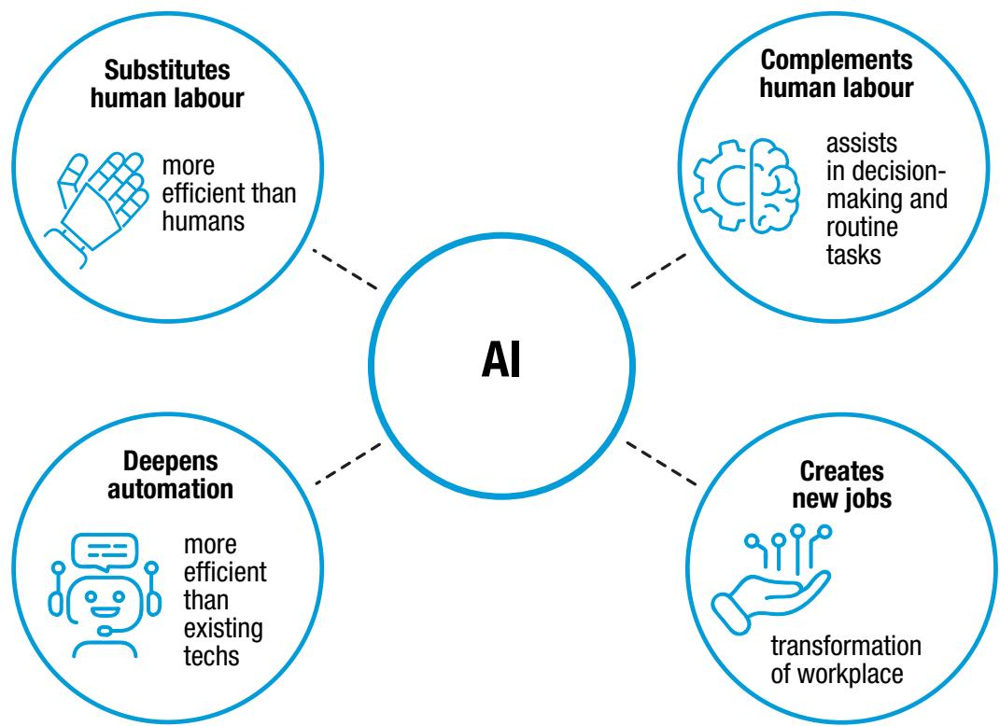  
Source: UNCTAD.

Deepen automation – AI can replace less-efficient technologies and deepen automation. For example, in customer service, GenAI chatbots can replace conventional rule-based chatbots, offering more personalized and accurate responses to inquiries, thereby improving a firm's overall operating efficiency – total factor productivity – without undermining the workforce.

Create new jobs – The use of AI can create new jobs, including roles in AI research and development, as well as in its deployment and maintenance. Its use can also create employment in emerging industries related to or created by AI. For example, one study identifies three emerging occupations, namely, AI trainers, who develop and upgrade AI models; AI explainers, who tailor AI models to particular use cases, such as AI-specific user experience designers; and AI sustainers, who monitor and refine AI uses, such as AI ethics experts (Shine, 2023).

# C. Measuring the impacts

To assess the impact of AI on productivity and the workforce, economists generally use two metrics. One focuses on the associated increases in productivity, that is, the amount of goods and services produced for given inputs such as labour and capital. The other considers workforce exposure, that is, the degree to which their tasks can be performed by AI systems; the higher the exposure, the greater the potential for complementation or substitution.

## Will AI increase productivity?

The use of AI can bring substantial productivity gains

To date, research that employs systematic applied methods on data sets with good coverage and adequate scale is mostly based on micro-level studies on early adopters in developed countries. It is far from conclusive, yet suggests that firms using AI can make substantial productivity gains, particularly those employing skilled workers and those in service industries. A summary of recent firm-level studies indicates that AI can increase both labour productivity and total factor productivity, although the range of the estimates is wide, reflecting the differing capacities of firms to benefit from AI (figure II.2).

For example, in some firms in Germany, sales achieved per worker increased substantially with higher levels of AI use (Czarnitzki et al., 2023). In some firms in Italy, total factor productivity increased by 2.2 per cent with the adoption of AI. A study of large firms from a range of countries showed that the accumulated stock of AI knowledge increased total factor productivity by 6.7 per cent (Benassi et al., 2022).

The impact may also depend on firm characteristics, such as size, although the evidence is mixed (see annex II). Some studies showed higher productivity gains in larger firms that could benefit from scale effects and greater financial resources (Zhai and Liu, 2023; Yang, 2022). Other studies showed advantages for smaller firms that could integrate new technologies more rapidly within existing production systems (Nucci et al., 2023; Damioli et al., 2021).

Most of the literature concentrates on developed countries, for which there is more detailed firm-level data. However, similar benefits could also arise in developing countries, as indicated by an analysis of listed firms in China (Zhai and Liu, 2023).

The early evidence thus suggests that the use of AI can enhance productivity, yet does not clarify the exact drivers.

The ambiguities may be clarified once AI has been more widely adopted and there are more firm-level data, particularly from developing countries. Nevertheless, many companies have yet to implement AI on a significant scale, and it may be too early to draw definitive conclusions.

A new strand of research has emerged on the impact of GenAI tools, focused on particular tasks performed by workers within firms, to assess the impact of such tools on high-skill-related tasks.

While not directly comparable with studies that consider impacts at the firm level, these studies offer a glimpse of how the new technology may impact the workplace. $^{2}$

Some studies indicate that GenAI is capable of markedly improving worker performance in a range of tasks (table II.1). For example, at a leading software company, when customer service staff used GenAI chat assistants, there was a 14 per cent increase in the number of issues resolved per hour (Brynjolfsson et al., 2023).

## Figure II.2

## Use of AI can improve a firm's productivity Change in productivity, percentage

a) Labour productivity  
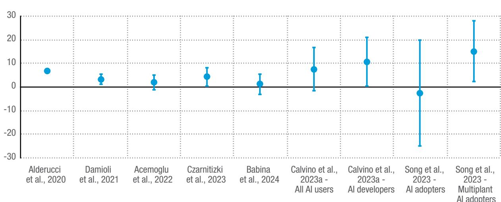

b) Total factor productivity  
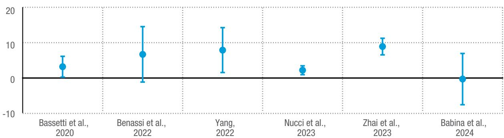  
Source: UNCTAD, based on cited sources.  
Note: Data points are the estimated average effects from listed articles, displayed as percentage changes through log-approximation; the tails represent the 95 per cent confidence intervals (see annex II).

Similarly, at a business consultancy, consultants supported by ChatGPT were 12 per cent more efficient and had a 40 per cent increase in work quality (Dell'Acqua et al., 2023). Other studies demonstrate notable productivity enhancements in professional writing and computer coding (Noy and Zhang, 2023).

These micro-level studies used experimental or quasi-experimental designs to infer causal links between the use of GenAI tools and gains in labour productivity. They showed significant differences between workers at different skill levels, and it is therefore not clear from the studies whether the use of AI can reduce or increase inequality across workers.

For example, one study found that the largest productivity improvements in a customer service centre were from the least-skilled and least-experienced workers, who used an AI assistant to learn the good practices of the highest-skilled workers (Brynjolfsson et al., 2023). On the other hand, another study, on science material researchers, showed much higher productivity gains for leading researchers (Toner-Rodgers, 2024).

This may be because the most experienced scientists were able to take advantage of their knowledge to prioritize the most promising AI suggestions, while the 30 per cent of least-productive researchers spent time on testing less promising options. Most of the evidence to date comes from early adopters, and whether similar productivity gains apply to latecomers, particularly from developing countries far from the technological frontier, remains to be ascertained.

Overall, the impact of AI, particularly the use of GenAI, tends to be greater for particular service-related tasks. Yet the benefits can also extend indirectly to other firms. Therefore, it is important to foster inter-industry synergies and complementarities between knowledge-based services and manufacturing and the primary sector in order to transmit productivity gains through the economy and drive an AI-powered industrial transformation.

More comprehensive studies that consider complex tasks that are more difficult for AI to learn can help better understand the impact of AI across the economy. Nonetheless, the early evidence on GenAI complements the findings from firm-level studies that show that the use of AI can increase productivity (box II.1).

## Table II.1

Selected micro-level studies on GenAI productivity impacts

<table><tr><td>Study</td><td>Sample</td><td>GenAI used</td><td>Identification strategy</td><td>Measurement</td><td>Impact</td></tr><tr><td>Brynjolfsson et al., 2023</td><td>Call centre workers in a Fortune 500 company, 2020–2021</td><td>Customized ChatGPT</td><td>Difference-in-difference</td><td>Number of resolutions per hour</td><td>14 per cent increase</td></tr><tr><td>Dell’Acqua et al., 2023</td><td>Consultants in leading consulting firm, 2023</td><td>ChatGPT</td><td>Experiment</td><td>Number of tasks completed in given time</td><td>12.2 per cent increase</td></tr><tr><td>Noy et al., 2023</td><td>Working professionals, 2022</td><td>ChatGPT</td><td>Experiment</td><td>Completion time of writing tasks</td><td>37 per cent improvement</td></tr><tr><td>Peng et al., 2023</td><td>Professional freelance programmers, 2022</td><td>GitHub Copilot</td><td>Experiment</td><td>Completion time of programming tasks</td><td>55.8 per cent improvement</td></tr></table>

Source: UNCTAD, based on cited sources.

## Box II.1 Using AI in business process outsourcing

One study examined the impact of GenAI on customer service agents at a United States-based business process outsourcing company, focused on the staggered deployment of a GPT-powered chat assistant firm serving SMEs, with some of the agents based in the Philippines and others in the United States and elsewhere.

The study showed that AI significantly improved worker productivity across three key metrics, namely, reduced handling time per chat, increased chats handled per hour and successful chat resolution rates. Yet these benefits were not uniformly distributed; the most significant improvements were among less-skilled and newer agents while highly skilled and experienced workers showed minimal gains. This finding is particularly significant given the steep learning curve and initial lower productivity often associated with newer hires in the business process outsourcing sector.

Interestingly, agents who adhered closely to AI recommendations demonstrated greater productivity gains, suggesting a link between AI engagement and learning. The agents sustained higher productivity even during software outages when AI assistance was unavailable, indicating a lasting impact on skill development.

The study also considered the impact of AI on workers. Contact centre work often involves demanding overnight shifts and challenging interactions with customers, but the study showed that, when the workers were supported by AI, customers were impressed, less likely to question their competence and generally treated them better. This helped reduce employee attrition, particularly among newer hires. The researchers attributed these positive effects in part to the ability of the AI system to capture and disseminate best practices from high-performing agents. However, customer satisfaction can also be reduced if using AI makes interactions feel overly scripted and inauthentic.

The study concluded that while AI assistance can enhance productivity and improve worker experience, it also creates incentives for firms to deskill positions and hire lower-skilled workers at lower wages. Companies could also eventually deploy even more advanced AI systems capable of entirely replacing human agents.

While offering significant potential for companies, the long-term implications for workers remain uncertain and may depend on the strength of workers' voices in workplace consultations or collective agreements. The findings are corroborated by another study involving 300 call-centre operators that showed that AI that automated repetitive tasks and provided real-time support could reduce stress levels among agents.

Source: Brynjolfsson et al., 2023; Abdikaparov, 2024; United Nations and ILO, 2024.

## Many more occupations are exposed to AI

Previous waves of technology primarily impacted blue-collar occupations, but those most exposed by AI are in knowledge-intensive sectors (Nedelkoska and Quintini, 2018). $^{3}$ A recent OECD survey on job markets in Europe and North America listed the top industries prone to AI automation as those in finance, advertising, consulting and information technology (OECD, 2024). Similarly, a study in India based on online job postings between 2016 and 2019 found that AI-related skills requirements were concentrated in information technology, finance and professional services (Copestake et al., 2023). A recent global survey found that GenAI was being adopted least in manufacturing and more commonly in marketing and sales, product and services development and information technology functions (Singla et al., 2024).

One study estimated that AI would affect 40 per cent of global employment, showing that one third of jobs in developed countries had high potential for AI automation and around 27 per cent were exposed to AI augmentation (Cazzaniga et al., 2024; figure II.3). Workforces in advanced economies are at greater risk since more of their jobs involve cognitive tasks. However, these economies are also better positioned than emerging and low-income economies to capitalize on the benefits of AI.

For individual countries, the impacts depend on their occupational structures. For example, the United Kingdom has a significant share of employment in professional and managerial occupations that are highly exposed to AI augmentation, as well as in clerical support and technician occupations that could be exposed to AI-related automation (Cazzaniga et al., 2024). Developed countries are in general more likely than developing countries to face more immediate labour market adjustments and an increase in wage inequality.

## Figure II.3

Developed countries have greater likelihoods of AI automation but also greater opportunities for augmentation
(Employment share exposed to AI, by country grouping; percentage)

(a) Employment share by AI exposure

(b) Employment share by GenAI exposure  
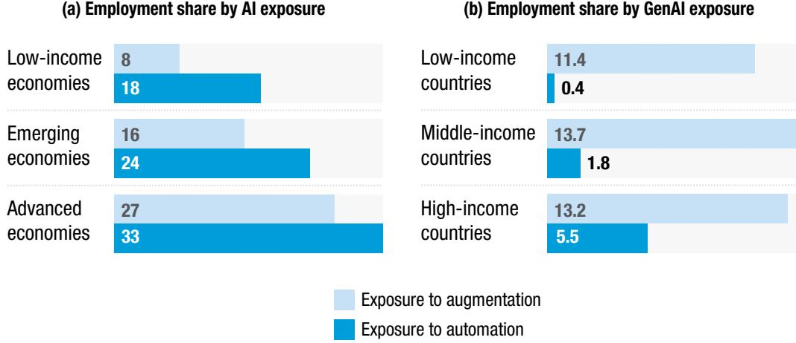  
Source: UNCTAD calculations, based on Cazzaniga et al., 2024 and Gymrek et al., 2024.
Note: Data from 125 countries in panel (a) and from 59 countries in panel (b); middle-income countries are the average of upper middle-income countries and lower middle-income countries, weighted by the number of countries in the sample.

In contrast, in India, for example, most workers are agricultural workers and craftspeople, who are less exposed. Developing countries might, therefore, have time to gain insights from the experiences in developed countries.

A similar picture is seen when considering the impact of GenAI. Workers with higher levels of education are more exposed but also more likely to benefit. Overall, GenAI offers greater potential for labour augmentation than automation, particularly in low- and middle-income countries (figure II.3). Technicians and associate professionals can gain from augmentation while clerical support workers are highly exposed to automation. Exposure to GenAI within job categories is relatively balanced from a gender perspective (Gmyrek et al., 2024), but the over-representation of women among clerical support workers makes them more exposed to automation, particularly in the United States and Europe (United Nations and ILO, 2024).

A study in Latin America showed that GenAI was more likely to lead to augmentation than automation and to favour urban,

educated and higher-income workers in formal occupations, with the benefits fairly evenly distributed across gender and age (Gmyrek et al., 2024). The study highlighted that nearly half of the occupations that could benefit from augmentation faced digital barriers. In addition, there is a significant gender-related imbalance in automation, largely because women are more likely to perform the most exposed jobs; the proportion of women-held jobs that are exposed to automation can be up to twice that of men. This, combined with the gender divide in digital skills and access to ICTs, can limit the benefits of AI adoption for women, thus widening existing inequalities (UNESCO et al., 2022).

It should be emphasized that the impact of AI on the labour market depends on the rate of technology adoption, as well as on other non-technological factors, such as the relative prices of capital and labour, economic structures and the social acceptance of new technology. These factors amplify or reduce expected AI-related impacts between sectors and countries (Brynjolfsson et al., 2017; Cazzaniga et al., 2024; UNCTAD, 2021).

GenAI offers greater potential for labour augmentation than automation

The use of AI can magnify existing gender disparities

The impact of AI will depend on the rate of technology adoption

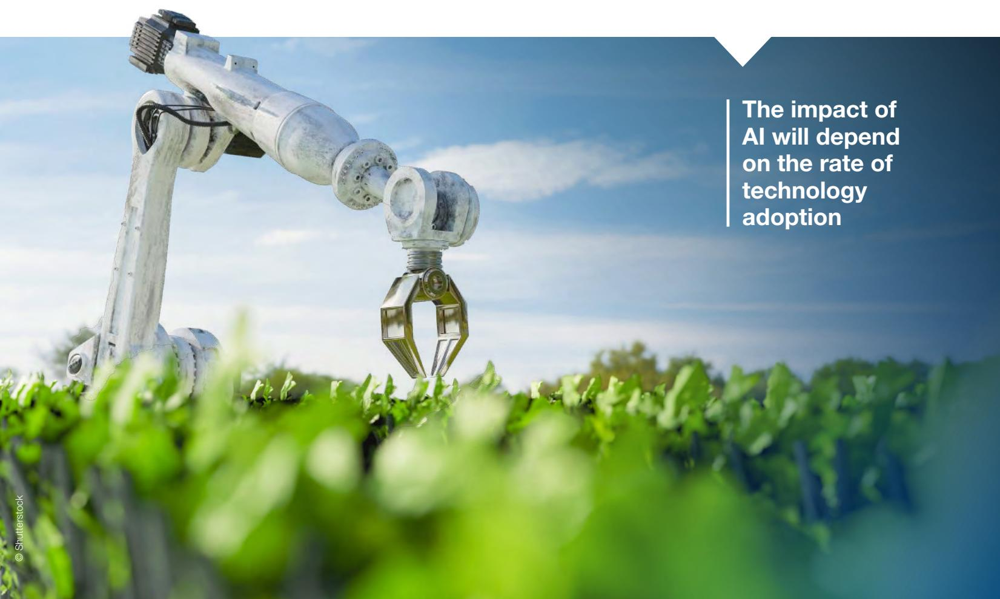

Despite concerns about widespread job losses, the pace of automation has been slower than initially predicted (World Economic Forum, 2023a). In one survey conducted in 2020, employers expected that 42 per cent of their business tasks would be automated by 2027 but, subsequently, employers have reduced their estimates. As in previous waves of technological innovation, the use of AI has also created new jobs. One study of seven high-income countries found that while the use of AI had automated some tasks in finance and manufacturing, it had also introduced new tasks, and most employers reported higher productivity but no overall impact on employment (Lane et al., 2023). Box II.2 provides further discussion on the impact of AI in knowledge-intensive sectors.

## Box II.2

## Evidence from knowledge-intensive activities

The impact of AI in knowledge-intensive sectors varies by task. One study at a multinational energy firm, for example, found that while algorithms proved beneficial for tasks with clearly defined outcomes, they were less effective in areas requiring creativity, social intelligence or complex decision-making.

The study identified two distinct approaches to integrating algorithms. The first was task automation, replacing humans with algorithms on a task-by-task basis, and the second was process re-engineering, redesigning entire workflows around algorithmic solutions. The latter approach is potentially more transformative because it may require new skills in process-mapping, data analysis and software development. Making improvements and benefiting from AI therefore depends on the capacity of firms to adjust workplaces and job tasks. In this way, the use of AI can lead to structural changes; new teams can be dedicated to automation-as-a-service and new forms of hybrid workflows can blur traditional boundaries both within firms and with respect to external agents.

The introduction of algorithmic solutions in the firm also changed how knowledge was valued and acquired. Previously, the firm had greater regard for expert judgment, but the introduction of AI focused management more on quantifiable outputs, fostering a culture of metric-driven evaluation. This extended the use of AI beyond algorithmic recommendations, to encompass expert suggestions, leading some workers to question their own expertise.

The study also found a shift in learning practices. Faced with complex and often opaque algorithmic recommendations, knowledge workers prioritized the perceived safety and adequacy of these recommendations, even if they did not understand the underlying logic. They thus felt increasingly unfamiliar with their own area of expertise, also known as knowledge self-alienation.

Source: Amaya and Holweg, 2024.

Current evidence suggests that the future scenario is likely to be a complex interplay of automation, augmentation and the emergence of new roles. Automation is likely to reduce the labour share in value added in favour of capital, which will result in slower growth in wages than productivity and increasing wealth concentration. However, this tendency can be counterbalanced by the benefits of augmentation and of generating new tasks for workers (Acemoglu and Restrepo, 2019).

It is important to understand and plan for all eventualities. Increasing inequalities have already been stirring social discontent and weakening trust in public institutions, while increasing political polarization and undermining democratic governance (Qureshi, 2023). Policymakers and businesses need to understand these dynamics to ensure that the benefits of AI are distributed equitably and to facilitate smooth transitions.

Automation shifts value toward capital, but worker-augmenting technologies can reverse this trend

## D. Working with uncertainties

If the history of past general-purpose technologies is any indication, it could take years or even decades for the full extent of the impacts of AI to materialize (Brynjolfsson et al., 2017). It will take time to acquire a substantial stock of AI technology across a wide range of industries and in firms of different sizes. It will also take time to build complementary assets in AI infrastructure, data and skills. In addition, firms need time to discover new productive uses for AI and integrate them within production activities. The aggregate economic outcome of AI in the long term is thus highly uncertain.

In advanced economies, such as Japan and the United States, optimistic projections place long-term annual productivity gains over a 10 to 20-year horizon at between 1 and 2 per cent (Hatzius et al., 2023). With less sectoral exposure to AI, most emerging economies are expected to experience lower levels but still substantial annual growth, at between 0.7 and 1.3 per cent (Hatzius et al., 2023). To put these numbers into perspective, in the past two decades, annual productivity growth in advanced economies has averaged at around 1 per cent and in emerging markets and developing economies, at around 4 per cent (Dieppe, 2021).

However, these expectations may be overstated. For instance, one estimate for the United States puts the annual AI-induced productivity boost over the next 10 years at less than 0.1 per cent. This is because AI systems may find it difficult to cope with certain tasks and, while the use of AI may generate new tasks that increase revenue, it may also generate others that are more malign, such as cyberattacks. Moreover, AI may harm consumers through manipulation or addiction. The impact of AI on welfare may be lower than its effect on productivity (Acemoglu, 2024b).

To shed light on the conditions needed for the use of AI to generate large and long-term aggregate benefits, three sources of uncertainty should be considered.

## Uncertainty 1 – Easy and difficult tasks

Part of the disagreement over the long-term aggregate effects of AI originates from uncertainties about the rate of development of the technology and how well and quickly it can be integrated into future economic production. Optimistic observers state that AI will have ever-broadening applications and will spawn adjacent innovations, leading to major productivity improvements (Brynjolfsson et al., 2017).

The full
impacts of AI
could take
years to fully
materialize

How far can AI go in substituting humans?

Advances in AI-powered machine vision for example, have increased the potential of self-driving cars and of autonomous drones. However, the current rapid success of AI may be misleading, since it has largely been accomplished through easy tasks that can be readily learned. In the near future, AI may be faced with increasingly difficult tasks of a more complex and context-dependent nature that cannot be automated with similar efficiency (Acemoglu, 2024a). In such cases, there may be no straightforward mapping between actions and defined outcomes of success and not enough data to teach machines about hidden relationships (Brynjolfsson and Mitchell, 2017). An example is in the diagnosis and treatment of psychiatric illnesses, which tend to have complex and historical causes that are difficult to capture in data. For such tasks, AI may be no more productive than existing technologies or human workers. $^{4}$

At the same time, AI is also likely to create new “bad” tasks that can harm overall productivity and well-being (Korinek and Stiglitz, 2021). Examples are deepfakes, misinformation and AI-powered surveillance, which raises social, ethical and privacy-related concerns.

It is too early to predict with any degree of confidence how AI systems will transform production in the long term, but it seems that AI technology, as in previous waves of technological innovation, may bring a welcome boost to economic growth, although it may be less impressive than some might have hoped. Moreover, maximizing the positive effects on societies depends on proper guidance and policy measures. $^{5}$

Chapter IV focuses on national policies, to seize the opportunities brought by AI and chapter V considers AI policies and governance from an international perspective.

## Uncertainty 2 – Long-term structural changes in the labour market

Productivity gains depend on the long-term structural adjustments in the labour market, as AI can augment or displace labour. If AI is designed and used primarily as a labour-substituting technology, in the long term, the declining employment share in sectors that are more AI intensive can diminish the overall economic effect of productivity gains (Aghion et al., 2017; OECD, 2024). While workers displaced from AI-impacted sectors may be partially absorbed by sectors with lower productivity, this could result in job polarization and widening income inequality (UNCTAD, 2021). Thus, although productivity can increase in AI-intensive sectors, the aggregate productivity impact could be limited by slower productivity growth in labour-intensive sectors.

This outcome resembles a scenario of Baumol's cost disease, in which aggregate productivity growth is defined less by the sectors at the forefront of technological change than by those that are slower to improve (Aghion et al., 2017; OECD, 2024). The actual outcome depends on future interactions between AI adoption and the labour market. If AI acts as a labour-complementing rather than labour-displacing technology in a sufficient number of sectors, it can raise aggregate productivity. $^{6}$

Another mitigating factor is the extent and nature of job creation. In the past, automation technologies initially caused job losses that were offset in the long term by the appearance of new jobs (Autor, 2015; Bessen, 2019). This reinstatement effect can be strong if AI spawns many complementary industries, particularly in areas in which humans retain a comparative advantage over machines. Yet this could take time. Due to skill mismatches and frictions in the labour market, the transition of workers into these new industries could be slow and costly, and fail to keep pace with rapid changes in AI (UNCTAD, 2021; Bessen et al., 2022; Edin et al., 2023).

## Uncertainty 3 – AI adoption in developing countries

The adoption of AI in many developing countries may be hindered by constraints involving the three leverage points of infrastructure, data and skills, creating uncertainty about how these countries can fully exploit the potential of AI.

Developing countries have a higher proportion of occupations concentrated in primary and non-knowledge-intensive sectors and, in general, fewer opportunities for AI applications, but large countries can leverage their size and critical mass (see chapter III). More importantly, developing countries may be weaker with regard to critical digital infrastructure and complementary assets such as data and skills. The low level of penetration of reliable electricity and high-speed Internet limits the deployment of AI services, particularly in rural areas. A further impediment is the availability of relevant data. AI models need to be trained on large amounts of high-quality data, but the best data sets are often controlled by global corporations (UNCTAD, 2019).

This can significantly hinder the capacity of developing countries to tailor AI systems to local needs. In addition, with regard to skills, in developing countries in particular, only a small portion of the population has general digital literacy or specialized technical know-how, which hinders the adoption of AI.

The need for long-term and significant adjustments does not imply that AI is less relevant in developing countries. With careful and targeted implementation, the use of AI can generate immediate and positive changes. However, developing countries need to create the right conditions in order to seize the gains of AI and ensure that they are not left behind.

In addition to boosting productivity for workers and firms, the use of AI offers distinct benefits for sustainable development. It can, for example, help decision makers optimize the distribution of scarce resources. Using advanced analytics, they can draw insights from new sources of unstructured data. GenAI systems can also offer support for individuals who would otherwise not have access to specialized knowledge, for instance in education and agriculture (Björkegren, 2023; Björkegren and Blumenstock, 2023; Okolo, 2023).

To help fill the gap of systematic evidence about AI, section E showcases AI applications in developing countries that can deliver improvements in productivity and human welfare across three key sectors. The case studies also show how limitations in infrastructure, data and skills can be addressed through careful implementation and collaboration among stakeholders, to fit local contexts.

# E. Case studies of AI adoption in developing countries

## Agriculture

Agriculture is the primary source of sustenance for billions of people around the world and, in many developing countries, employs more than half the working population (World Bank, 2024). Agriculture is well suited for AI-powered productivity improvements because of its high volumes of unstructured data, reliance on labour and complex supply chain logistics, as well as the significant number of farmers who would value customized services that are not locally available.

Rural agricultural areas are typically short of the prerequisites for AI adoption (e.g. electricity, Internet access and digital literacy). Despite these challenges, the following case studies demonstrate how AI can be used in three main agricultural applications in developing countries, with significant impacts on the yield and quality of crops, as well as the livelihoods of farmers (table II.2).

## Pest and disease control

Globally each year, pests and diseases decimate up to 40 per cent of the world's crops, causing substantial detriment to farmers (FAO, 2024a). Effectively addressing such problems requires specialist knowledge; it can take years of experience to diagnose infestations in a timely fashion and apply appropriate treatments. Such expertise is generally in short supply, particularly in areas in which smallholding farmers do not receive agricultural extension services.

With the use of AI, however, expert information can be made instantly available to any farmer who has a mobile telephone. In Colombia, the International Centre for Tropical Agriculture, for example, has developed a mobile application that helps farmers diagnose infestations of banana plants using photos of crops, called Tumaini, which means “hope” in Swahili (Salian, 2019).

## Table II.2

Case studies of AI applications in agriculture

<table><tr><td>Application</td><td>Case study</td><td>Technology</td><td>Outcomes</td></tr><tr><td rowspan="2">Pest and disease control</td><td>Tumaini(International Centre for Tropical Agriculture, Colombia)</td><td>AI(deep learning)</td><td>Accessible diagnostic tool for banana farmers</td></tr><tr><td>MkulimaGPT(university, United Republic of Tanzania, in collaboration with the Bill and Melinda Gates Foundation)</td><td>GenAI(large language model)</td><td>Accessible diagnostic tool and chatbot assistant for maize farmers</td></tr><tr><td rowspan="2">Yield prediction</td><td>Beijing Normal University</td><td>AI(deep learning)</td><td>Accurate yield prediction with open-source remote-sensing data</td></tr><tr><td>South China Agriculture University</td><td>AI(deep learning)</td><td>Accurate yield prediction on smallholdings with imagery data from drones</td></tr><tr><td>Precision irrigation</td><td>Phyt&#x27;Eau(start-up, Tunisia, in collaboration with IBM)</td><td>AI and IoT</td><td>Optimized irrigation and reduction of water consumption on farms</td></tr></table>

Source: UNCTAD.

Tumaini uses a deep-learning-based computer vision system that has been trained on thousands of images of banana plants, both healthy and infected, and labelled by agricultural experts, providing the algorithm with comprehensive visual references in order to identify unique patterns indicative of crop diseases, which are often too subtle for untrained eyes to detect. A farmer uploads a photo of the plant and the application provides an instant diagnosis and suggests dedicated countermeasures. Tumaini can detect five diseases and one pest with an accuracy of above 90 per cent, giving farmers a diagnostic capacity comparable to that of highly trained experts (Selvaraj et al., 2019).

The application is also available in offline mode, although there may be some loss of accuracy, and can therefore be widely used even in rural areas that lack reliable Internet access. To date, Tumaini has been downloaded over 10,000 times in 15 countries across Africa, Latin America and South-East Asia (Tumaini, 2024).

Crop diseases in developing countries can also be addressed with the use of GenAI-powered chatbots.

MkulimaGPT, for example, created for farmers in the United Republic of Tanzania, is a large language model that has an elaborate sensor-based disease-detection system for maize (Math Works News and Stories, 2024). The chatbot is delivered through a commonly used mobile messaging app, to facilitate diffusion among local farmers. A farmer uploads a photo of the crop, which is cross-referenced with an internal database and, if the application detects an abnormality, it initiates a chat session, offers a diagnosis and guides the user through the appropriate action, thereby significantly lowering the skill barrier for the average maize farmer (Mkulimagpt, 2024).

One limitation of deploying large language models in developing countries is a lack of training data in local languages. To address this with regard to MkulimaGPT, the developers have obtained funding from a private charitable foundation, to collect high-quality local data and build a chatbot that speaks Swahili, to ensure that the chatbot is tailored to local needs.

## The Tumaini diagnostic application

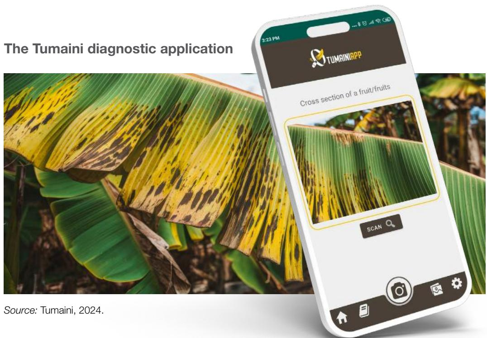  
Source: Tumaini, 2024.  
Diagnosing a suspected infection on banana

AI-managed
agricultural
systems help
optimize
production
processes

## Yield prediction

Another common application of AI in agriculture is in predicting local crop yields in order to allow farmers to make informed financial and management decisions about their crops. Such use also offers Governments accurate data needed in monitoring and ensuring food security.

Conventional data collection methods for crop yields, such as field surveys and aerial imagery, are costly and difficult to scale. In addition, traditional statistical methods struggle to capture the many complex factors that contribute to yields, such as climate and soil conditions and crop genotypes.

The ability of AI technology to jointly analyse different data from unconventional data sources can help unlock new opportunities. Drawing upon and analysing free open-source data, AI can generate reliable crop yield predictions. Researchers at Beijing Normal University, for example, have used AI techniques with three open-source data sets to estimate the yield of rice crops (Cao et al., 2021). Their model relies on climate and soil data from Google Earth Engine, historical crop yield data from official publications and open-access satellite imagery, all of which are readily accessible on the Internet; open-source data can thus help fill gaps when local data are sparse.

Once models have been calibrated and key information pre-processed, AI can offer an accessible and effective solution. Compared with traditional regression models, the deep neural network proved more efficient in extracting crop-yield-related features from the data, with up to 88 per cent accuracy compared with only 42 per cent when using traditional regression models. When used with data from China, the new model enabled accurate predictions of rice yields at the county level, covering 94 per cent of the rice cultivation area (Cao et al., 2021). This case study shows that the use of AI can open new ways to use data for accurate crop-yield prediction in low-resource conditions.

In addition, in China, researchers from the South China Agriculture University have applied machine-learning techniques to images from unmanned aerial vehicles, to predict yields of cotton (Xu et al., 2021). Compared with satellite imagery, imagery from such vehicles offers higher resolutions and can thus facilitate yield predictions at a much more granular level, even individual fields. As in the previous study, the deep-learning model achieved significantly higher accuracy than one based on linear regression, namely, 80 per cent compared with 66 per cent. Such a model may be particularly helpful for smallholding farming communities that need to plan harvests and choose which crops or activities to invest in.

## Precision irrigation

One of the most important resources for agriculture is water, which is often scarce. According to the Food and Agriculture Organization (FAO), 1.2 billion people live in agricultural areas with very high levels of water stress, mostly in developing countries (FAO, 2020). In recent years, the problem has been exacerbated by climate change, with the increasing intensity and frequency of droughts (World Bank, 2023).

These impacts can be alleviated by a combination of AI and other technologies. In Tunisia, for example, there have been regular severe droughts, the impacts of which are aggravated by intense agricultural production (Frost, 2024). Agriculture accounts for over 70 per cent of the country's freshwater withdrawal; it is therefore both the main cause and a casualty of water shortages (FAO, 2024b).

The issue is being addressed, for example, by ifarming, a startup founded in Tunisia in 2017 to reduce water consumption through more accurate farming. The main service of the startup is Phyt'Eau, an AI-based programme that can analyse data on water use collected in real time through an array of IoT sensors on farms (Agritech, 2024). The sensors collect information that measures water stress on crops, including on temperature, soil humidity and wind. Based on the data, Phyt'Eau prescribes an optimal irrigation management plan for the plot that, when connected to an irrigation system, can be administered automatically. In initial trials, the prototype reduced water use by 20 per cent and increased crop production by 20 per cent (Galtier, 2017). IBM offered access to advanced AI and IoT platforms, and this collaboration boosted the water-saving capability of Phyt'Eau to 40 per cent and productivity by up to 30 per cent (IBM, 2024).

AI is also used in precision agriculture in Malaysia, for example, where drones equipped with AI vision systems are being deployed in palm-oil plantations to spray nutrients and pesticides with speed and precision (Chu, 2022). In Fiji and Samoa, an AI-based system developed in Australia is being used for automatic weeding and pesticide spraying (ITU, 2024). These and other projects are leveraging AI with other automation technologies to achieve more sustainable and productive farming.

## Manufacturing

Manufacturing plays a key role in economic development, stimulating growth in different upstream and downstream sectors and generating significant employment opportunities (Haraguchi et al., 2017; Lautier, 2024). Examples from developing countries such as Brazil, China and India show how industrialization can reduce poverty and accelerate economic growth. Manufacturing has been subject to successive waves of technological innovation, the latest of which is Industry 4.0 technologies. $^{7}$ Developing countries that have applied these technologies have boosted productivity and growth rates in manufacturing value added and GDP (UNIDO, 2019).

The following case studies show how developing countries can use AI to cut costs, create better working environments and increase efficiency (table II.3).

## Table II.3

## Case studies of AI applications in manufacturing

<table><tr><td>Application</td><td>Case study</td><td>Technology</td><td>Outcomes</td></tr><tr><td>Production automation</td><td>Smart welding robot (technology company, China)</td><td>AI (deep learning)</td><td>Accurate and adaptive robot for welding automation</td></tr><tr><td>Predictive maintenance</td><td>Predictive maintenance for plastic injection mould machine (industry–university partnership, Türkiye)</td><td>AI and IoT</td><td>Effective estimation of remaining useful life in manufacturing equipment</td></tr><tr><td rowspan="2">Smart factories</td><td>Tata Steel (manufacturer, India)</td><td>AI, robotics, IoT, systems integration</td><td>Factory-wide productivity increase and profit increase</td></tr><tr><td>Unilever (United Kingdom manufacturer, Brazil)</td><td>AI, digital twins</td><td>Cost optimization, agility to the market and minimized environmental footprint</td></tr></table>

Source: UNCTAD.

## Production automation

A major domain for AI applications in manufacturing is robotics. Over recent decades, industrial robots have automated many repetitive processes and replaced human workers in hazardous and physically demanding environments (Wang et al., 2023). One disadvantage is that they can be fairly rigid, generally built and programmed for particular tasks, and it is costly to adapt them to new tasks.

The use of AI enables robots to be more versatile and adaptive. In China, for instance, a technology company has developed a fully automated AI-driven robot for welding (Doubao, 2019). Its deep-learning algorithm uses three-dimensional laser sensors to recognize objects in real time and distinguish between various metal parts and weld joints and it can guide the robotic arm to perform accurate welding operations. An advantage of the technology is that it can weld on shiny metal surfaces, whereas previous robots could not make the necessary distinctions due to reflections.

More importantly, while traditional welding robots need to be reprogrammed for each new product, an AI-powered welding robot can quickly adapt to different functions and the new dimensions of incoming parts while requiring minimal human intervention. This can significantly reduce retraining costs and shorten downtimes.

Within the field of AI-guided industrial robots, an emerging trend is the use of collaborative robots, or cobots. These are unlike ordinary robots in that they are designed to work in close interaction with humans. Typically, they are smaller and less expensive and have built-in mechanisms that reduce the need for additional safety fencing. Due to these features, cobots can be more readily integrated into small-scale production lines or labour-intensive manufacturing settings. $^{8}$ AI enhances the collaborative qualities of cobots by improving safety and by enabling them to work in more dynamic environments (Mohammadi Amin et al., 2020).

## AI-powered smart welding robot

  
Source: Adobe Stock.

## Predictive maintenance

Addressing equipment breakdowns can be costly. Breakdowns cause delays in production and require expensive replacements of parts. They are particularly burdensome for manufacturers in developing countries where skilled technicians and stocks of specialized spare parts may be in short supply.

Many of these problems can be prevented by using AI for predictive maintenance. In traditional machine maintenance, technicians carry out inspections and repairs manually, either when scheduled, or when a machine breaks down. In predictive maintenance, machinery is constantly monitored for signs of failure using IoT sensors, with data analysed by AI processors. By cross-referencing with past data, an AI processor detects patterns indicative of a future malfunction and alerts plant operators ahead of time.

In Türkiye, for example, Vestel Electronics, a home appliances manufacturer, has collaborated with a university to apply machine learning to predict the remaining useful life – the expected amount of time until a machine's next breakdown – of plastic injection moulding machines. The algorithm is trained on historical sensor data, including the clamping force of a machine, oil temperature and injection time, then analyses real-time sensor data in the factory. According to a study by the company, the algorithm correctly predicted the remaining useful life of the machines 98 per cent of the time (Aslantaş et al., 2022). Equipped with this information, managers can schedule maintenance and purchase spare parts in advance, thereby lowering costs and downtimes.

Predictive maintenance only requires AI data processors and a set of IoT sensors attached to machines. It is thus versatile and adaptable to different industrial environments.

In Chile, for example, large mining companies such as Codelco are using the technology to monitor the fleet of autonomous mining trucks (Jamasmie, 2019). Smaller manufacturers can also use the technology given the increasing availability of less-expensive, standardized packages.

## Smart factories

In large-scale manufacturing, multiple AI-enabled systems can be integrated within a single plant, to provide significant gains in production, savings in energy and greater profits. The synergistic effects of AI and other frontier technologies may also enable manufacturers in developing countries to catch up with counterparts in developed countries.

In India, Tata Steel, one of the country's largest steel manufacturers, has implemented more than 250 machine-learning systems across various production processes (Harichandan, 2023). One such application assesses the quality of welds on steel tubes. A machine-learning algorithm can automatically detect a faulty weld with more than 80 per cent accuracy and thereby significantly lower the number of defective products (Gujre and Anand, 2020). The use of Al can also help optimize the chemical mix in steel furnaces and speed up the transportation of materials within and between plants. Such improvements, combined with other digital technology upgrades, have increased the corporation's pre-tax profits (Das, 2021).

Another example is Unilever, who has built the world's largest laundry detergent powder factory in Indaiatuba, a municipality in the state of São Paulo, Brazil. The company has made the factory more agile and cost efficient while minimizing its environmental footprint by using technologies such as AI and digital twins, that is, virtual representations of physical objects.

AI enables
efficient
preventive
maintenance

Systematic integration of AI with other technologies can accelerate industrialization

A digital twin is used with machine learning to establish the optimal process parameters for new formulations of laundry powder. Reducing the need for physical trials has accelerated the launch of innovations while cutting energy consumption (Unilever, 2023). Between 2018 and 2023, the company also used AI-driven predictive maintenance to halve the cost of life cycle management for pneumatic devices. Other key use cases include a biomass-powered machine-learning spray-drying tower that has achieved a 96 per cent reduction in carbon dioxide emissions and a digitally enabled sealing solution that has eliminated chronic defects, reducing customer complaints about leakage by 94 per cent. As a result, the technologies have reduced innovation lead times by 33 per cent and production costs per ton by 23 per cent, while also reducing carbon dioxide emissions. In 2022, in recognition of its achievements in the field of advanced manufacturing, the Indaiatuba site was listed by the World Economic Forum as one of the 29 new “lighthouse” factories worldwide (World Economic Forum, 2023b).

## Healthcare

The use of AI offers significant opportunities for improving access to and the quality of healthcare services in both developed and developing countries. Many developing regions lack medical services and infrastructure, which challenges citizen well-being and poverty reduction goals. With regard to healthcare services, the use of AI can improve both access and quality. The following case studies illustrate how AI has been implemented in developing countries to provide expert diagnoses of diseases, extend the coverage of healthcare services and manage pandemic outbreaks (table II.4).

## Improving diagnoses

The timely and accurate treatment of diseases requires high-quality diagnostics, which are often unavailable to patients in developing countries, particularly in rural areas, due to a lack of skilled medical professionals, laboratory facilities and infrastructure. AI offers the prospect of new and cost-effective diagnostic methods and equipment in low-resource settings.

## Table II.4

Case studies of AI applications in healthcare

<table><tr><td>Application</td><td>Case study</td><td>Technology</td><td>Outcomes</td></tr><tr><td rowspan="2">Improving diagnoses</td><td>Ubenwa(university startup, Nigeria)</td><td>AI(deep learning)</td><td>Accessible tool for quick and accurate perinatal asphyxia diagnosis</td></tr><tr><td>AI-assisted portable X-ray machine(United Nations Development Programme and local health authorities, South Sudan and Tajikistan)</td><td>AI</td><td>Reliable tuberculosis diagnosis in remote and resource-constrained areas</td></tr><tr><td rowspan="2">Extending healthcare coverage</td><td>mMitra (non-profit organization, India)</td><td>AI</td><td>Targeted intervention for women with high dropout risk from programme</td></tr><tr><td>mDaktari (healthcare company, Kenya, in collaboration with the Bill and Melinda Gates Foundation)</td><td>GenAI(large language model)</td><td>Preliminary clinical screening tool for low-resource areas</td></tr><tr><td>Assisting pandemic management and control</td><td>Refugee population modelling at the border of Brazil and the Bolivarian Republic of Venezuela (United Nations High Commissioner for Refugees and Government of Brazil)</td><td>AI</td><td>Accurate prediction of refugee inflows, for resource allocation in pandemic conditions</td></tr></table>

Source: UNCTAD.

AI can, for example, be used to diagnose perinatal asphyxia, a birth complication that leaves infants unable to breathe properly and, in developing countries, is one of the top three causes of newborn deaths (WHO, 2024). Most cases can be treated if quickly diagnosed; in developed countries, this is commonly done by sending a sample of an infant's blood to a laboratory, for analysis of signs of low blood oxygen, a service that may be out of reach in rural areas.

In Nigeria, a team of AI researchers has offered a novel, simple and inexpensive alternative involving analysing an infant's cries. Crying and breathing rely on the same set of muscles, and irregular vocal sounds in an infant's cry are a reliable indicator of asphyxia. Such minute differences may not be heard by human ears, but can be readily detected by a machine-learning algorithm trained on a data set of infant cries. The researchers developed Ubenwa – meaning “cry of a baby” in lgbo – an AI-driven mobile application that analyses a short audio clip of a newborn’s cry and can detect perinatal asphyxia with an accuracy of 86 per cent, securing valuable time for treatment (Onu et al., 2019).

Another example of an AI system that can enhance traditional diagnostics is a battery-powered X-ray machine with an embedded

AI-driven tuberculosis screener. In countries with few expert radiologists, this can serve as a valuable tool for doctors. Unlike traditional X-ray machines, the battery-powered machines are portable and can be deployed in remote areas that may have limited electricity connections. For example, such machines are being used by health authorities in South Sudan and Tajikistan, with support from the United Nations Development Programme. In Tajikistan, 15 machines have already been used to screen 120,000 people in 2023, covering 15 per cent of the country's total diagnosed cases of tuberculosis (UNDP, 2024).

## Extending healthcare coverage

A common problem among developing countries is the inadequate coverage of medical services. The World Health Organization recommends at least 45 skilled medical professionals for every 10,000 people. In many developing countries, this figure is not reached, making it difficult to extend life-saving resources. It takes time for countries to build up their healthcare systems, but the use of AI can help allocate existing resources to those in greatest need (WHO, 2016).

## An AI-enhanced X-ray machine being deployed in Rudaki, Tajikistan

  
Source: UNDP.  
AI offers new and cost-effective diagnostic methods

Around 800 women died from preventable causes related to pregnancy and childbirth every day in 2020 (WHO, 2025). These could be avoided with better health information and access to medical care during pregnancy. Armman, a non-profit organization, helps provide maternal and child health services in urban slums using mMitra, a free mobile messaging service (Armaan, 2024). The service covers 3.6 million vulnerable women in India, sending curated voice messages about preventative care measures during different stages of pregnancy, to raise medical awareness and promote the health of both mothers and infants. Studies show that enrolment in the service enhances women's maternal knowledge, enhances their voice within their families regarding their pregnancies and increases their likelihood of seeking professional medical services (Murthy et al., 2019; Murthy et al., 2020).

However, about 40 per cent of enrolled women eventually stop listening to the messages and drop out. Due to limited resources, Armman staff cannot reach out to re-engage all of them, but are collaborating with Google India on an AI model that helps find and target the pregnant mothers at greatest risk of dropping out (Taneja and Tambe, 2022; Mate et al., 2021). The model analyses each woman's socioeconomic information, such as family size, income and age, as well as their call history, including call duration and missed calls, to predict those at highest risk of discontinuing and, of these, who would benefit most from the outreach service. Armman staff then allocate limited human resources more effectively and attempt to keep more women in the programme. After the introduction of the AI algorithm, engagement by subscribers rose by 30 per cent (Mate et al., 2021). This type of personalized messaging could be used in other sectors besides healthcare and help optimize the distribution of limited resources.

There is also limited healthcare outreach in Kenya; for every 10,000 people, there are only 23 available medical doctors (Our World in Data, 2024).

Access Afya, a social enterprise, operates 12 small clinics using a telemedicine platform, mDaktari, that provides low-cost virtual doctor consultations (Philips Foundation Team, 2023). Using GenAI, the enterprise aims to reach more people. In a pilot programme, ChatGPT is integrated with mDaktari, to provide a chatbot that can be used as a preliminary screening tool (The Economist, 2024). The chatbot receives patients' inquiries, gathers information about symptoms and suggests that the patient should visit a clinic or collect medication at a pharmacy. This service saves clinics time on gathering patient information and, when appropriate, diverts individuals with mild conditions from the use of clinical services.

AI chatbots are not foolproof; they cannot tell what is real and what is fake and can be prone to fabrications (Alkaissi and McFarlane, 2023). Access Afya addresses the fallibility of chatbots by ensuring that human clinicians review and approve chatbot suggestions before they are sent to patients, in order to protect against mistakes. Use of the triage performed by AI allows human clinicians to focus on those patients in greatest need. The early success of the programme shows the potential of using GenAI as an effective triage tool, to improve efficiency and extend the reach of existing medical services. With financial support from a private charitable foundation, Access Afya plans to expand the service to accommodate multiple languages and have a greater role in supporting clinician diagnoses (Bill and Melinda Gates Foundation, 2024).

## Pandemic management and control

As shown during the COVID-19 pandemic, managing outbreaks of infectious diseases requires providing public health administrators with accurate and up-to-date information, for example, about demographic movements, transmission patterns and healthcare capacity.

Equipped with such information, authorities may be better able to target interventions and bring an outbreak under control.

In developing countries, structured healthcare data are often not available, particularly with regard to minority and vulnerable populations. As an alternative, the use of AI can unlock the potential of significant amounts of unstructured data. In Brazil, for example, during the COVID-19 pandemic, in 2021, the Office of the United Nations High Commissioner for Refugees (UNHCR) worked with the Government on a machine-learning tool for predicting the inflow of refugees from the Bolivarian Republic of Venezuela and for coordinating resources to protect them from the coronavirus (Smith, 2021). The tool was used to predict future border crossings based on historical patterns.

Since the pandemic had disrupted data collection, researchers used unconventional open-source data.

These included Internet search activity on migration and border-related topics, complemented by data on COVID-19 cases and news reports on local unrest in the Bolivarian Republic of Venezuela (de Rubalcava et al., 2023). Sources also included bus timetables in border regions and schedules for salary payments, as an indicator of when people might have additional funds for travel. By triangulating between these sources of data, the AI model predicted the inflow of refugees one month in advance with a high degree of confidence. This helped UNHCR and local partners plan for the number of migrants that arrived when borders reopened in June 2021 (UNHCR, 2022).

By combining and analysing significant and different data sets, AI can help inform key decisions during infectious outbreaks, using population movement models, such as in Brazil, or algorithms that forecast disease transmission (Jin et al., 2022) or enable rapid diagnosis and contact tracing (Huang et al., 2021).

## F. Good practices and lessons learned

The case studies considered are often limited in scale or in the pilot stage, but serve to illustrate the potential of AI in developing countries and how difficulties can be overcome through careful implementation and cooperation among stakeholders. There are no one-size-fits-all solutions, but a good starting point in each country is to assess local conditions and technological capacities and adopt AI strategically. This may mean, for example, supporting startups and industry–university collaborations, as well as non-profit organizations that help deploy AI solutions to serve local needs.

Governments should favour the emergence of AI ecosystems with investments supporting business development and

networking. By showcasing successful experiences of AI adoption, they can raise awareness and diffusion and favour the accumulation of complementary assets and experience. It is also useful to engage with large companies or international organizations that can support promising local businesses with emerging technologies and connect them with international markets. This allows developing countries to accumulate relevant complementary assets and experience for the extensive and impactful diffusion of AI.

There are four main takeaways from the case studies along the key leverage points of infrastructure, data and skills, as well as partnerships (figure II.4).

  
Infrastructure

  
Data

Redesign AI
solutions around
locally available
digital infrastructure

Utilize new sources of data combined with appropriate AI techniques

Source: UNCTAD.

## Takeaway 1: Adapting to local digital infrastructure

AI adoption should be designed according to the available digital infrastructure. In Colombia, for example, the banana disease detection application Tumaini has an offline mode that retains most of the diagnostic functions in the absence of an Internet connection, thereby remaining accessible and useful to farmers in rural areas where Internet connectivity is limited.

Similarly, AI adoption should take into account unstable supplies of electricity. The AI-assisted X-ray machines in South Sudan and Tajikistan, for example, operate on battery power and can therefore reach remote areas. Other case studies highlight different uses of AI applications based on mobile telephones, which offer a scalable platform for AI applications.

## Takeaway 2: Utilizing new sources of data

AI depends on high-quality, relevant and interoperable data sets. In developing countries, such data sets may be limited, difficult to access or expensive to pay for, and innovative ways of collecting and using new forms of data are therefore key in ensuring AI capabilities and effective adoption.

  
Skills

  
Partnerships

Lower the skill barriers for AI solutions with simple interfaces

Build international partnerships to access vital resources and technical capabilities

In Brazil, for example, in modelling refugee flows at the border during the COVID-19 pandemic, UNHCR researchers relied on an unconventional nowcast data set, which included indicators scraped from local sources, then integrated, to produce accurate predictions of refugee movements.

Alternative data sources become viable and help overcome data limitations if the right AI techniques are applied. As shown by the case studies, in China, for example, deep neural network techniques enabled the use of open-access data in rice yield predictions and, in Nigeria, the Ubenwa application used deep-learning algorithms to employ anomalies in infant cries as a reliable indicator of a health complication after birth.

## Takeaway 3: Making AI easy to use

One of the main impediments to technology adoption in developing countries is a low level of digital literacy. Governments need to build greater digital capacity. In addition, designers need to consider current standards of digital capacity and build applications that are attractive and simple to use, particularly on mobile telephones. Simple interfaces help facilitate interactions by novice users with new technology solutions and thereby help promote widespread and inclusive diffusion.

For example, in the United Republic of Tanzania, a chatbot for maize diseases allows users to access diagnostic information and make queries in a manner similar to messaging family or friends.

Application-based AI tools and visual aids such as icons and illustrations allow for an intuitive understanding of available functions. Such designs smooth the experience for those who may be unfamiliar with new technology and are critical in AI adoption in developing countries.

## Takeaway 4: Building strategic partnerships

Developing countries aiming to accelerate the adoption of AI can benefit from strategic partnerships. A cross-country study by the World Bank showed that firms in developing countries that adopted more sophisticated technologies tended to be those with more external collaborations, through universities, foreign trade partners or large multinational corporations (Cirera et al., 2022).

Building strategic partnerships enables aspiring AI adopters to overcome barriers to adoption. In addition, Governments can overcome limitations of size through regional collaboration. For example, in many countries in East Africa, Swahili is a common language; a group of countries could collaborate to pool data in Swahili and jointly engage with technology companies to address common linguistic challenges.

Strategic partnerships can also provide essential resources for AI. Global Grand Challenges, under the Bill and Melinda Gates Foundation, for example, currently supports the development of AI models in local languages. The AI model for predicting the risk of dropping out among subscribers of a service provided by Armman was developed with technical assistance from Google India. In addition, in Tunisia, ifarming has a partnership with IBM to use high-performance AI platforms and receive funding to expand its operations. Chapter V further discusses the importance of international cooperation in global AI governance and suggests policies for ensuring that AI works for all.

## Facilitating understanding with easy-to-read and intuitive icons

  
Source: Tumaini and Ubenwa.

## G. Workers throughout the AI life cycle

A growing body of research shows the crucial yet frequently forgotten role of human labour in AI. Each stage of an AI product life cycle, from development and production to maintenance, relies on human labour, often through digital platforms and business process outsourcing companies dispersed around the world (Rani and Dhir, 2024; Viana Braz et al., 2023; Tubaro and Casilli, 2019). An AI life cycle requires human labour at three stages, namely, data preparation, modelling and evaluation (figure II.5). Data preparation and AI evaluation may require different levels of content-specific expertise, while modelling generally requires higher competences in computer science.

The initial stage, data preparation, involves data collection and annotation. Despite the increase of unsupervised learning from unstructured data, AI systems rely on annotation by humans to label and mark data in order to add meaning (Tubaro et al., 2020). Computer vision models, for example, rely on semantic segmentation, a time-consuming process requiring each pixel in an image to be assigned a relevant label. Similarly, autonomous vehicles rely on databases of images annotated by humans through classification, object tagging and landmark detection (Wang et al., 2023; Schmidt et al., 2019).

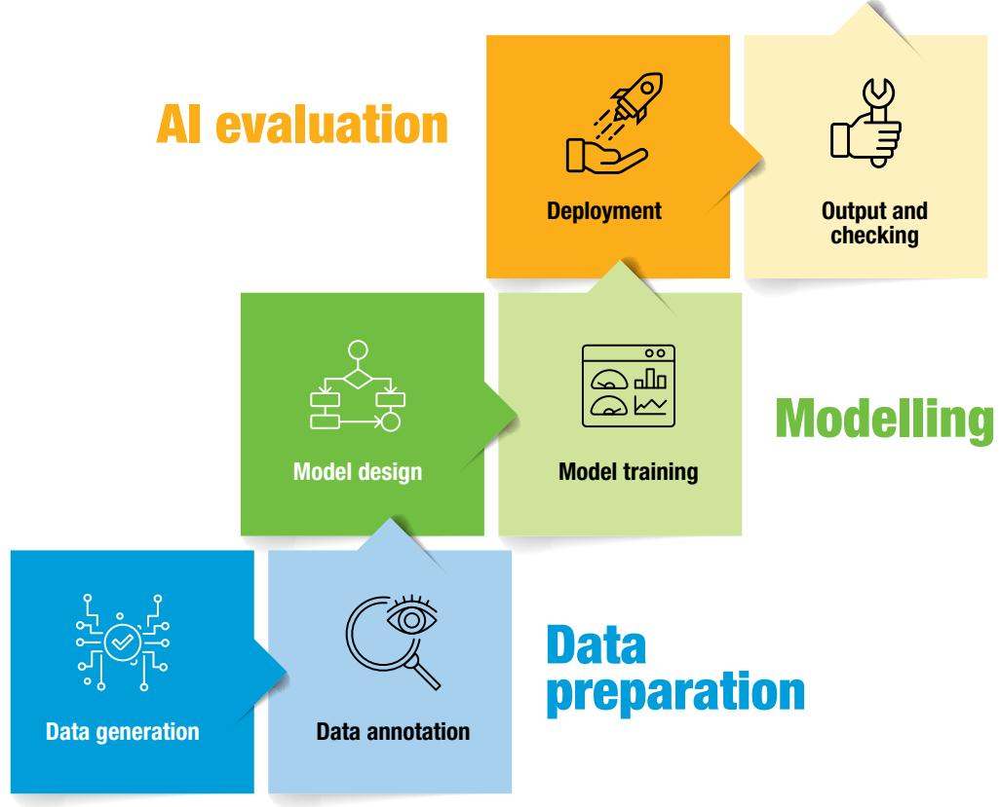

One source of such annotation is the use of a captcha [Completely Automated Public Turing test to tell Computers and Humans Apart] (Agarwal, 2023).

While some aspects of data preparation can be automated, many tasks still require human judgment. For ChatGPT, for example, the initial model training involved human trainers who engaged in conversations, posing as both users and AI assistants. To optimize its performance, the model's parameters and settings often need to be adjusted by machine-learning experts.

Creating training data for specialized fields such as translation or transcription requires workers with high levels of skill (Kenny, 2022). Medical systems require professionally trained workers to label and tag images and videos; common annotation tasks include the pixel-level segmentation of surgical images, bounding box annotations around organs and the plotting of characteristics within data. Such tasks can be time-consuming; an hour of video footage may require approximately 800 hours of human annotation.

The second stage, modelling, is more complex and technical and requires significant human expertise and decision-making. Developers and data scientists need to select the appropriate model architecture and algorithms and therefore require an understanding of the advantages and limitations of different models and algorithms, as well as expertise in a particular domain, such as medicine or transportation. During the model training, when an AI model learns patterns from data, human operators manage, optimize and guide the process. Engineers, for example, need to troubleshoot model errors or issues, check for signs of overfitting or underfitting $^{9}$ and adjust the model’s hyperparameters.

In the final stage, evaluation, humans need to review the outputs in order to maintain quality control and feed information back into further model training. With regard to translation, for example, human experts assess the accuracy of machine translations and diagnose errors, providing feedback for improvement (Kenny, 2022).

This interplay between humans and machines extends to large language models such as ChatGPT. Humans are needed to evaluate performance both qualitatively and quantitatively and to ensure a model meets quality standards and avoids biases related to gender, race, religion or other attributes. $^{10}$ Human labellers rank model answers from best to worst, a process known as reinforcement learning from human feedback, which helps align systems with human values and preferences and to more closely match complex metrics of human quality (Teubner et al., 2023).

AI systems require continuous adaptation and, as they are employed to address new challenges, the demand for workers for their development will likely persist. AI systems can thus provide new forms of employment, but this is not necessarily “decent” work. In the data preparation stage, for example, employment can involve exploitative, often-precarious working conditions. Data annotators in developing countries often experience difficult conditions, including up to 10 hours of work per day at wages of less than \$2 per hour, engaged in repetitive tasks, and with limited opportunities for career advancement, for example in Kenya and Uganda (ILO, 2024a; Muldoon et al., 2024).

With regard to content moderation (e.g. of social media posts), algorithms or machine-learning systems can help flag data for human attention. This process may be harmful for workers.

A mismatch
between
qualifications
and tasks
could result in
the deskilling
of highly
educated
workers

Translating
technological
progress
into shared
prosperity
requires
labour-
friendly
policies

That is, in monitoring content online, workers may be exposed to disturbing or objectionable material that could negatively affect mental health (Ahmed et al., 2023).

There is also a risk of deskilling and dissatisfaction due to mismatches between qualifications and tasks. Workers annotating or deleting images, that is, carrying out repetitive low-skill tasks, may be highly educated. In India and Kenya, for example, a survey conducted in 2022 on microtask platforms and business process outsourcing companies showed that highly educated workers, with graduate degrees or specialized educations in science, technology, engineering or mathematics, were often relegated to relatively low-skill tasks such as text and image annotation and content moderation. Such significant wastes of human capital may be exacerbated in increasingly connected job markets, in which tasks are outsourced globally (ILO, 2024a; 2024b).

## H. A worker-centric approach to AI

Achieving more inclusive and equitable technological development requires placing greater emphasis on workers and their professional growth. This involves broadening the focus of traditional goals of maximizing productivity and efficiency, to foster skill development and empower workers to adapt to and thrive in a rapidly evolving technological landscape. Increased automation in recent decades has contributed to higher productivity and lower prices, but the distribution of benefits has been largely in favour of capital. A worker-centric approach can contribute to an economic model that is socially and politically sustainable.

Translating technological progress into shared prosperity requires labour-friendly policies in three stages: investments in education and skills, in pre-production; labour protection and worker empowerment, in production; and progressive taxation, in post-production. For example, such policies were implemented in the United States and Western Europe during the technological transitions in the early twentieth century and in the post-World War II era (Acemoglu and Johnson, 2023).

A basic step is to empower the workforce with digital literacy, reinforced through all stages of education and lifelong training systems that incorporate digital skills in curricula and are tailored to different occupations, to prepare for possible future transformations.

Technological advances continually perpetuate and amplify inequalities, and it is important to directly target inequality that arises during production (Rodrik and Stantcheva, 2021). With regard to jobs that are highly exposed to AI automation, Governments need to help workers transitioning to new occupations and tasks, through reskilling training and tailored social protection measures, for a smooth transition process. Workers whose jobs are subject to AI augmentation can also benefit from upskilling programmes to acquire new complementary competences, in order to make use of the latest technologies, and enhance their roles to include high-value tasks (United Nations and ILO, 2024).

To build trust and acceptance, workers should be actively involved in the design and implementation of AI tools. Job workflows and tasks should be rearranged to integrate AI effectively while addressing workers' needs and maintaining meaningful human roles.

Collaborative AI systems should empower rather than replace workers, foster job satisfaction and create opportunities for personal and professional growth.

Labour unions and worker representatives can play a key role in shaping such collaboration. During previous industrial revolutions, for example, unions helped set wages, working hours and safety standards. Similarly, they can provide a voice to workers worldwide, to direct AI towards a worker-centric transformation with a more equitable distribution of productivity gains between firms and workers (Oxfam International, 2024). Global union federations, such as UNI Global Union, are active in safeguarding workers' interests and human rights in the age of AI. For example, UNI Global Union has issued top 10 principles for ethical AI and negotiated over 50 global agreements with companies, to secure and enforce the rights of workers (UNI Global Union, 2017).

Setting a course for AI systems that enhance and complement human skills also depends on robust public policy. This should include increased R&D funding, strategic public procurement and targeted tax incentives for human-complementary AI technologies. Some countries have lower taxes for capital than for labour, thus encouraging technology for automation rather than for labour augmentation (Acemoglu et al., 2020). Consideration should be given to whether and how existing measures, such as tax rates, tax credits or deductions and accelerated depreciation, might incentivize technology and business development that is more labour-friendly and guide enterprises towards human-complementary AI technologies (Autor et al., 2022).

To prevent deskilling and mitigate the risk of brain drain to developed countries, it is essential for developing countries to improve labour market opportunities, provide continuous upskilling training and establish clear career development pathways. The private sector plays a leading role in AI, due to the concentration of resources, expertise and substantial financial investments within large multinational enterprises. Yet such companies can collaborate with Governments and academia on capacity-building initiatives that foster quality employment, such as placement programmes, apprenticeships and industry–academia research partnerships. Smaller developing countries may have less power to negotiate for socially beneficial public–private partnerships, but can still aim to maintain or improve standards and avoid a dangerous race to the bottom.

A worker-centric approach is part of a more general strategy to prepare for advances in AI, which is addressed in chapter III.

# Firm-level studies on AI productivity gains

Table 1
Summary of firm-level studies on AI productivity gains

<table><tr><td>Study</td><td>Economy (year)</td><td>Method</td><td>Measurement</td><td>Effect sizes and standard error</td><td>Remarks</td></tr><tr><td>Acemoglu et al. (2022)</td><td>United States (2019)</td><td>Controls for use of other technologies</td><td>Labour productivity</td><td>0.020 (0.016)</td><td>Adopters have higher labour productivity and lower labour shares</td></tr><tr><td>Alderucci et al. (2020)</td><td>United States (1997–2016)</td><td>Difference in difference</td><td>Labour productivity (revenue per worker)</td><td>0.068 (0.004)</td><td>Positive productivity effect in sales, negative in manufacturing</td></tr><tr><td rowspan="2">Babina et al. (2024)</td><td rowspan="2">United States (2010–2018)</td><td rowspan="2">Controls for firm and industry characteristics</td><td>Labour productivity</td><td>0.013 (0.022)</td><td rowspan="2">AI use linked to increased total sales, product innovation for large firms</td></tr><tr><td>Total Factor Productivity (TFP)</td><td>0.003 (0.037)</td></tr><tr><td>Bassetti et al. (2020)</td><td>Firms worldwide (2010–2016)</td><td>Generalized Methods of Moments (GMM)</td><td>TFP</td><td>0.032 (0.015)</td><td>Fintech and e-commerce firms</td></tr><tr><td>Benassi et al. (2022)</td><td>13 developed countries and China (2009–2014)</td><td>Fixed effects, controls for intangible assets and R&amp;D among others</td><td>TFP</td><td>0.067 (0.040)</td><td>Panel of large manufacturing and services firms; AI development measured with patent stock.</td></tr><tr><td rowspan="2">Calvino and Fontanelli (2023a)</td><td rowspan="2">France (2019)</td><td rowspan="2">Controls for existing digitalization</td><td rowspan="2">Labour productivity (value added per worker)</td><td>All AI users: 0.074 (0.047)</td><td rowspan="2">Larger and younger firms tend to adopt AI more, but size gives no clear productivity advantage in using AI</td></tr><tr><td>AI developers: 0.11 (0.053)</td></tr><tr><td>Calvino and Fontanelli (2023b)</td><td>9 OECD countries (2017–2020)</td><td>Controls for existing digitalization and firm characteristics</td><td>Labour productivity</td><td>0.021 (0.052) (median effect in nine countries)</td><td>Productivity effect is greater for larger firms</td></tr><tr><td>Czarnitizki et al. (2023)</td><td>Germany (2018)</td><td>Controls for existing digitalization and instrumental variables</td><td>Labour productivity (sales per worker)</td><td>0.044 (0.02)</td><td>Sales and valued added of firms increase with greater use of AI</td></tr><tr><td>Damioli et al. (2021)</td><td>Firms worldwide (2000–2016)</td><td>GMM</td><td>Labour productivity</td><td>0.032 (0.011)</td><td>Productivity effect stronger in SMEs than large firms</td></tr><tr><td>Nucci et al. (2023)</td><td>Italy (2015–2018)</td><td>Propensity score matching with difference in difference</td><td>TFP</td><td>0.022 (0.006)</td><td>Productivity effect slightly stronger in small firms than large firms</td></tr><tr><td>Song and Cho (2023)</td><td>Republic of Korea (2017–2018)</td><td>Controls for existing digitalization and IV</td><td>Labour productivity (value added per worker)</td><td>All AI users: -0.026 (0.114)Multi-plant AI users: 0.151 (0.065)</td><td>Productivity effect comes from reducing performance gap between plants</td></tr><tr><td rowspan="2">Yang (2022)</td><td rowspan="2">Taiwan Province of China (2002–2018)</td><td rowspan="2">GMM and controls for firm characteristics</td><td>Labour productivity</td><td>0.079 (0.032)</td><td rowspan="2">Productivity effect greater for larger firms</td></tr><tr><td>TFP</td><td>0.080 (0.024)</td></tr><tr><td>Zhai and Liu (2023)</td><td>China (2006–2020)</td><td>Controls for firm and industry characteristics</td><td>TFP</td><td>0.089 (0.012)</td><td>Productivity effect greater for larger firms</td></tr></table>

Source: UNCTAD, based on cited sources.

Notes: Due to limitations in research design, most studies do not fully isolate AI productivity effects from firms' self-selection into AI use, that is, they cannot infer direct causality between AI use and firms' productivity increases and part of the reported productivity gains is likely driven by unobserved confounding firm characteristics, such as prior levels of productivity and willingness to adopt new technology. Many of the studies do not establish a statistically significant link between AI adoption in firms and productivity increases, for example Acemoglu et al. (2020) and Babina et al. (2024); some studies find no significant productivity effects for firms on average, but strong effects for particular types of firms, such as Song and Cho (2023), who identify zero productivity gains for the average firm in the Republic of Korea that uses AI, but find a productivity gain of 15 per cent for firms that use AI and own multiple plants. For the firms identified in this study and others, their uniquely large productivity gains may suggest within-firm mechanisms that are conducive to AI productivity effects; for example, Song and Cho (2023) show that the productivity increase in multi-plant firms originates from the creation of inter-plant channels that enable the narrowing of performance gaps between plants.

## References

Abdikaparov N (2024). Reducing operator stress with AI assistants: Development and evaluation of AI systems that aid call center operators by automating routine tasks and providing real-time information. Scientific Collection InterConf. (203):354–365.

Acemoglu D (2024a). The simple macroeconomics of AI. National Bureau of Economic Research. Cambridge, United States.

Acemoglu D (2024b). Harms of Al. In: Bullock JB, Chen Y-C, Himmelreich J, Hudson VM, Korinek A, Young MM and Zhang B (eds.). The Oxford Handbook of AI Governance. Oxford University Press, United Kingdom.

Acemoglu D, Anderson G, Beede D, Buffington C, Childress E, Dinlersoz E, Foster L, Goldschlag N, Haltiwanger J, Kroff Z, Restrepo P and Zolas N (2022). Automation and the Workforce: A Firm-Level View from the 2019 Annual Business Survey. National Bureau of Economic Research. Cambridge, United States.

Acemoglu D and Johnson S (2023). Power and Progress: Our Thousand-Year Struggle over Technology and Prosperity. PublicAffairs. New York.

Acemoglu D, Manera A and Restrepo P (2020). Does the United States tax code favour automation? Brookings Papers on Economic Activity. 231–285.

Acemoglu D and Restrepo P (2019). Automation and new tasks: how technology displaces and reinstates labour. Journal of Economic Perspectives. 33(2):3–30.

Agarwal S (2023). Death to captchas. Available at https://www.technologyreview.com/2023/10/24/1081139/captchas-ai-websites-computing/.

Aghion P, Jones B and Jones C (2017). Artificial intelligence and economic growth. National Bureau of Economic Research. Cambridge, United States.

Ahmed N, Wahed M and Thompson NC (2023). The growing influence of industry in AI research. Science. 379(6635):884–886.

Alderucci D, Branstetter L, Hovy E, Runge A and Zolas N (2020). Quantifying the Impact of AI on Productivity and Labor Demand: Evidence from U.S. Census Microdata. Available at https://www.aeaweb.org/conference/2020/preliminary/paper/Tz2HdRna.

Alkaissi H and McFarlane SI (2023). Artificial hallucinations in ChatGPT: Implications in scientific writing. Cureus. 15(2):e35179.

Amaya J and Holweg M (2024). Using algorithms to improve knowledge work. Journal of Operations Management. 70(3):482–513.

Armaan (2024). Leveraging technology to create scalable solutions to empower mothers and enable the nurturing of healthy children. Available at https://armman.org/.

Aslantaş G et al. (2022). Prediction of remaining useful life for plastic injection molding machines using artificial intelligence methods. Journal of Artificial Intelligence and Data Science. 2(1):8–15.

Autor D, Basu K, Qureshi Z and Rodrik D (2022). An inclusive future? Technology, new dynamics and policy challenges. Brookings.

Autor DH (2015). Why are there still so many Jobs? The history and future of workplace automation. Journal of Economic Perspectives. 29(3):3–30.

Autor DH, Levy F and Murnane RJ (2003). The skill content of recent technological change: An empirical exploration. The Quarterly Journal of Economics. 118(4):1279–1333.

Babina T, Fedyk A, He A X and Hodson J (2024). Artificial intelligence, firm growth, and product innovation. Journal of Financial Economics. (115):103745

Bassetti T, Borbon Galvez Y, Del Sorbo M and Pavesi F (2020). Artificial intelligence – impact on total factor productivity, e-commerce and fintech. JRC Technical Report.

Benassi M, Grinza E, Rentocchini F and Rondi L (2022). Patenting in 4IR technologies and firm performance. Industrial and Corporate Change. 31(1):112–136.

Bessen J (2019). Automation and jobs: When technology boosts employment. Economic Policy. 34(100):589–626.

Bessen J, Impink SM, Reichensperger L and Seamans R (2022). The role of data for AI startup growth. Research Policy. 51(5):104513.

Bill and Melinda Gates Foundation (2024). mDaktari health access initiative. Available at https://gcgh.grandchallenges.org/grant/mdaktari-health-access-initiative.

Björkegren D (2023). Artificial intelligence for the poor: How to harness the power of AI in the developing world. Foreign Affairs.

Björkegren D and Blumenstock J (2023). Technology for development. IMF Finance and Development Magazine.

Bommasani R et al. (2021). On the opportunities and risks of foundation models. Available at https://arxiv.org/abs/2108.07258.

Brynjolfsson E, Li D and Raymond L (2023). Generative AI at work. National Bureau of Economic Research. Cambridge, United States.

Brynjolfsson E and Mitchell T (2017). What can machine learning do? Workforce implications. Science. 358(6370):1530–1534.

Brynjolfsson E, Mitchell T and Rock D (2018). What can machines learn and what does it mean for occupations and the economy? AEA Papers and Proceedings. (108):43-47.

Brynjolfsson E, Rock D and Syverson C (2017). Artificial Intelligence and the modern productivity paradox: A clash of expectations and statistics. National Bureau of Economic Research. Cambridge, United States.

Calvino F and Fontanelli L (2023a). A portrait of AI adopters across countries: Firm characteristics, assets' complementarities and productivity. OECD Science, Technology and Industry Working Papers. No. 2023/02.

Calvino F and Fontanelli L (2023b). Artificial intelligence, complementary assets and productivity: Evidence from French firms. LEM Working Paper Series 2023/35.

Cao J et al. (2021). Integrating multi-source data for rice yield prediction across China using machine learning and deep learning approaches. Agricultural and Forest Meteorology. 297.

Cazzaniga M, Jaumotte F, Li L, Melina G, Panton AJ, Pizzinelli C, Rockall EJ and Tavares MM (2024). Gen-AI: Artificial Intelligence and the Future of Work. Staff Discussion Notes. International Monetary Fund.

Chu MM (2022). Malaysia's palm planters eye robots, drones to combat labour crunch. Reuters.

Cirera X, Comin D and Cruz M (2022). Bridging the Technological Divide: Technology Adoption by Firms in Developing Countries. World Bank.

Copestake A, Marczinek M, Pople A and Stapleton K (2023). AI and services-led growth: Evidence from Indian job adverts. Available at: https://thedocs.worldbank.org/en/doc/79e00908bd79275e6c22be34483dd91b-0050022023/original/akai.pdf

Czarnitzki D, Fernández GP and Rammer C (2023). Artificial intelligence and firm-level productivity. Journal of Economic Behavior and Organization. (211):188–205.

Damioli G, Van Roy V and Vertesy D (2021). The impact of artificial intelligence on labour productivity. Eurasian Business Review. 11(1):1–25.

Das S (2021). How Tata Steel uses AI: A case study. Analytics India Magazine. Available at: https://analyticsindiamag.com/it-services/how-tata-steel-uses-ai-a-case-study/.

Dell'Acqua F, McFowland III E, Mollick ER, Lifshitz-Assaf H, Kellogg K, Rajendran S, Krayer L, Candelon F and Lakhani KR (2023). Navigating the jagged technological frontier: Field experimental evidence of the effects of AI on knowledge worker productivity and quality. Harvard Business School Technology and Operations Management Unit. Working Paper.

Dieppe A (2021). Global Productivity: Trends, Drivers, and Policies. World Bank.

Doubao X (2019). AI-equipped robots active in precision: Welding Chinese company Minyue Tech offers “eyes and brains” solution. Available at: https://asia.nikkei.com/Business/Startups/AI-equipped-robots-active-in-precision-welding.

Edin P-A, Evans T, Graetz G, Hernnäs S and Michaels G (2023). Individual consequences of occupational decline. The Economic Journal. 133(654):2178–2209.

Frost R (2024). Water restrictions, increased prices and imprisonment: How is Tunisia battling 5 years of drought? Available at: https://www.euronews.com/green/2024/03/04/water-restrictions-increased-prices-and-imprisonment-how-is-tunisia-battling-5-years-of-dr.

FAO (2020). The State of Food and Agriculture 2020: Overcoming water challenges in agriculture.

FAO (2024a). Plant production and protection. Available at https://www.fao.org/plant-production-protection/about/en.

FAO (2024b). Water efficiency, productivity and sustainability in the NENA regions. Available at https://www.fao.org/in-action/water-efficiency-nena/countries/tunisia/ru/#:\~:text=About%2077.4%20%25%20of%20the%20total,in%20Africa%20(0.45%20ha).

Gmyrek P, Winkler H and Garganta S (2024). Buffer or bottleneck?: Employment exposure to generative AI and the digital divide in Latin America. ILO Working Paper 121.

Google (2023). European Union Digital Services Act Biannual VLOSE/VLOP Transparency Report.

Gordon R (2014). The demise of U.S. economic growth: Restatement, rebuttal, and reflections. National Bureau of Economic Research. Cambridge, United States.

Gujre VS and Anand R (2020). Machine learning algorithms for failure prediction and yield improvement during electric resistance welded tube manufacturing. Journal of Experimental and Theoretical Artificial Intelligence. 32(4):601–622.

Haraguchi N, Cheng CFC and Smeets E (2017). The importance of manufacturing in economic development: Has this changed? World Development. (93):293–315.

Harichandan A (2023). How digital transformation is aiding Tata Steel's growth in India. Available at: https://www.forbesindia.com/article/leadership/how-digital-transformation-is-aiding-tata-steels-growth-in-india/85665/1.

Hatzius J, Briggs J, Kodnani D and Pierdomenico G (2023). Upgrading our longer-run global growth forecasts to reflect the impact of Generative AI. Goldman Sachs.

Bristol H, de Boer E, de Kroon D, Hou F, Shahani R and Torti F (2024). How manufacturing's lighthouses are capturing the full value of Al. McKinsey and Company Operations Practice.

Hohenstein J, Kizilcec RF, DiFranzo D, Aghajari Z, Mieczkowski H, Levy K, Naaman M, Hancock J and Jung MF (2023). Artificial intelligence in communication impacts language and social relationships. Scientific Reports. 13(1):5487.

Huang S, Yang J, Fong S and Zhao Q (2021). Artificial intelligence in the diagnosis of COVID-19: challenges and perspectives. International Journal of Biological Sciences. 17(6):1581–1587.

IBM (2024). iFarming. Available at: https://www.ibm.com/case-studies/ifarming-watson-cloud

iFarming (2024). Agritech. Available at https://www.agri-tech.tn/ifarming/.

ILO (2024a). Digital labour platforms in Kenya: Exploring women's opportunities and challenges across various sectors.

ILO (2024b). Expansion of the gig and platform economy in India: Opportunities for employer and business member organizations.

ITU (2024). Internet traffic. Available at https://www.itu.int/itu-d/reports/statistics/2023/10/10/ff23-internet-traffic/.

Jin W, Dong S, Yu C and Luo Q (2022). A data-driven hybrid ensemble AI model for COVID-19 infection forecast using multiple neural networks and reinforced learning. Computers in Biology and Medicine. (146):105560.

Kenny D (2022). Machine translation for everyone: Empowering users in the age of artificial intelligence. Available at https://zenodo.org/record/6653406.

Korinek A and Stiglitz J (2021). Artificial intelligence, globalization, and strategies for economic development. INET Working Paper Series No. 146:1–53.

Lane M, Williams M and Broecke S (2023). The impact of AI on the workplace: main findings from the OECD AI surveys of employers and workers. OECD Social, Employment and Migration Working Papers No. 288.

Lautier M (2024). Manufacturing still matters for developing countries. Structural Change and Economic Dynamics. (70):168–177.

Marcus G (2018). Deep learning: A critical appraisal January. Available at http://arxiv.org/abs/1801.00631.

Maslej N, Fattorini L, Perrault R, Parli V, Reuel A, Brynjolfsson E, Etchemendy J, Ligett K, Lyons T, Manyika J, Niebles JC, Shoham Y, Wald R and Clark J (2024). The AI index report 2024. AI Index Steering Committee, Institute for Human-Centered Artificial Intelligence, Stanford University, United States.

Mate A, Madaan L, Taneja A, Madhiwalla N, Verma S, Singh G, Hegde A, Varakantham P and Tambe M (2021). Field study in deploying restless multi-armed bandits: Assisting non-profits in improving maternal and child health. Available at http://arxiv.org/abs/2109.08075.

MathWorks News and Stories (2024). Fighting crop diseases with AI and Internet of Things. Available at https://www.mathworks.com/company/mathworks-stories/ai-and-iot-sensors-spot-diseases-and-boost-crop-production.html.

Jamasmie (2019). World's largest copper producer brings AI to its mines. Available at: https://www.mining.com/worlds-largest-copper-producer-codelco-brings-ai-mines/.

Mkulimagpt (2024). Available at https://mkulimagpt.com/about-1.

Mohammadi Amin F, Rezayati M, Van De Venn HW and Karimpour H (2020). A mixed-perception approach for safe human–robot collaboration in Industrial automation. Sensors. 20(21):6347.

Muldoon J, Cant C, Wu B and Graham M (2024). A typology of artificial intelligence data work. Big Data and Society. 11(1).

Murthy N, Chandrasekharan S, Prakash MP, Kaonga N, Peter J, Ganju A and Mechael P (2019). The impact of an mHealth voice message service (mMitra) on infant care knowledge, and practices among low-income women in India: Findings from a pseudo-randomized controlled trial. Maternal and Child Health Journal. 23(12):1658–1669.

Murthy N, Chandrasekharan S, Prakash MP, Ganju A, Peter J, Kaonga N and Mechael P (2020). Effects of an mHealth voice message service (mMitra) on maternal health knowledge and practices of low-income women in India: findings from a pseudo-randomized controlled trial. BMC Public Health. 20(1):820.

Nedelkoska L and Quintini G (2018). Automation, skills use and training. OECD Social, Employment and Migration Working Papers No. 202.

Noy S and Zhang W (2023). Experimental evidence on the productivity effects of generative artificial intelligence. Science. 381(6654):187–192.

Nucci F, Puccioni C and Ricchi O (2023). Digital technologies and productivity: A firm-level investigation. Economic Modelling. (128):106524.

OECD (2024). Framework for anticipatory governance of emerging technologies. OECD Science, Technology and Industry Policy Papers No. 165.

Okolo CT (2023). AI in the Global South: Opportunities and challenges towards more inclusive governance. Brookings.

Onu CC, Lebensold J, Hamilton WL and Precup D (2019). Neural transfer learning for cry-based diagnosis of perinatal asphyxia. Interspeech 2019. ISCA: 3053–3057.

Our World in Data (2024). Medical doctors per 1,000 people. Available at https://ourworldindata.org/grapher/physicians-per-1000-people?tab=chart&country=\~KEN.

Peng S, Kalliamvakou E, Cihon P and Demirer M (2023). The Impact of AI on developer productivity: Evidence from GitHub copilot. Available at http://arxiv.org/abs/2302.06590.

Philips Foundation team (2023). Access Afya: A healthcare operating system for emerging economies. Philips Foundation.

Qureshi Z (2023). Rising inequality: A major issue of our time. Brookings.

Rani U and Dhir RK (2024). AI-enabled business model and human-in-the-loop (deceptive AI): implications for labour.

Oxfam International (2024). Inequality Inc. How corporate power divides our world and the need for a new era of public action.

Rodrik D and Stantcheva S (2021). A policy matrix for inclusive prosperity. National Bureau of Economic Research. Cambridge, United States.

Rotman D (2024). People are worried that AI will take everyone's jobs. We've been here before. Available at https://www.technologyreview.com/2024/01/27/1087041/technological-unemployment-elon-musk-jobs-ai/.

de Rubalcava A de NG, Sanchez Piñeiro O, Moreno Jiménez R, Aylett-Bullock J, Ismail A, Kyriazi S, Schneider C, Sekidde F, del Panta G, Huang C, Maigné V, Luengo-Oroz M and Hoffmann Pham K (2023). Modeling population movements under uncertainty at the border in humanitarian crises: A situational analysis tool. https://arxiv.org/abs/2303.15614.

Salian I (2019). AI with appeal: Banana farmers spot crop disease, pests with deep Learning.

Schmidt O, Melchior S, Hawkes A and Staffell I (2019). Projecting the future levelized cost of electricity storage technologies. Joule. 3(1):81–100.

Selvaraj MG, Vergara A, Ruiz H, Safari N, Elayabalan S, Ocimati W and Blomme G (2019). AI-powered banana diseases and pest detection. Plant Methods. 15:92.

Shine I (2023). We often hear that AI will take our jobs. But what jobs will it create? Available at https://www.weforum.org/stories/2023/09/jobs-ai-will-create/.

Singla A, Sukharevsky A, Yee L and Chui M (2024). The state of AI in early 2024: Gen AI adoption spikes and starts to generate value. McKinsey and Company.

Smith AL (2021). Predicting the unpredictable: Preparing for potential future scenarios. UNHCR Innovation Service.

Song D and Cho J (2023). AI adoption and firm productivity. Conference paper in IMF Artificial Intelligence, Big Data and Policy.

Taneja A and Tambe M (2022). Using ML to boost engagement with a maternal and child health program in India. Available at https://research.google/blog/using-ml-to-boost-engagement-with-a-maternal-and-child-health-program-in-india/.

Teubner T, Flath CM, Weinhardt C, Van Der Aalst W and Hinz O (2023). Welcome to the era of ChatGPT et al.: The prospects of large language models. Business and Information Systems Engineering. 65(2):95–101.

The Economist (2024). Could AI transform life in developing countries? Available at https://www.economist.com/briefing/2024/01/25/could-ai-transform-life-in-developing-countries.

Toner-Rodgers A (2024). Artificial intelligence, scientific discovery, and product innovation. Available at https://aidantr.github.io/files/Al\_innovation.pdf.

Tubaro P and Casilli AA (2019). Micro-work, artificial intelligence and the automotive industry. Journal of Industrial and Business Economics. 46(3):333–345.

Tubaro P, Casilli AA and Coville M (2020). The trainer, the verifier, the imitator: Three ways in which human platform workers support artificial intelligence. Big Data and Society. 7(1).

Tumaini (2024). Ai-driven solutions for identifying and mapping diseases. Available at https://www.tumainiaiapp.org/.

Turiel JD and Aste T (2020). Peer-to-peer loan acceptance and default prediction with artificial intelligence. Royal Society Open Science. 7(6):191649.

UNCTAD (2019). Digital Economy Report 2019: Value Creation and Capture: Implications for Developing Countries (United Nations publication. Sales No. E.19.II.D.17. New York).

UNCTAD (2021). Digital Economy Report 2021: Cross-Border Data Flows and Development – For Whom the Data Flow (United Nations publication. Sales No. E.21.II.D.18. New York).

UNDP (2024). Harnessing artificial intelligence for health. Available at https://www.undp.org/stories/harnessing-artificial-intelligence-health.

UNESCO, OECD and IDB (2022). The Effects of AI on the Working Lives of Women.

UNHCR (2022). UNHCR Brazil arrival trends snapshot, June 2021 - September 2022.

UNI Global Union (2017). Top 10 principles for ethical artificial intelligence.

UNIDO (2019). Industrial Development Report 2020: Industrializing in the Digital Age.

Unilever (2023). Unilever sites join network of world's most digitally advanced factories. Available at: https://www.unilever.com/news/news-search/2023/unilever-sites-join-network-of-worlds-most-digitally-advanced-factories/.

United Nations and ILO (2024). Mind the AI divide: Shaping a global perspective on the future of work.

Viana Braz M, Tubaro P and Casilli AA (2023). Microwork in Brazil. Who are the workers behind artificial intelligence? Doctoral dissertation, DiPLab; LATRAPS.

Wang T, Gihleb R, Giuntella O and Stella L (2023). Keeping workers safe in the automation revolution. Brookings Institution.

Wang W, Gao G and Agarwal R (2023). Friend or foe? Teaming between artificial intelligence and workers with variation in experience. Management Science. 70(9):5753-5775.

Webb M (2020). The impact of artificial intelligence on the labour market. SSRN 3482150.

WHO (2016). Health Workforce Requirements for Universal Health Coverage and the Sustainable Development Goals. Human Resources for Health Observer, 17. Geneva.

WHO (2024). Newborn mortality. Available at https://www.who.int/news-room/fact-sheets/detail/newborn-mortality

WHO (2025). Maternal mortality. Available at https://www.who.int/news-room/fact-sheets/detail/maternal-mortality.

World Bank (2023). Generative Artificial Intelligence. Available at https://openknowledge.worldbank.org/entities/publication/4f623641-ba34-4f0d-9a7d-105f02a5ee00

World Bank (2024). Côte d'Ivoire E-agriculture project.

World Economic Forum (2023a). Future of Jobs Report 2023.

World Economic Forum (2023b). Global lighthouse network: Shaping the next chapter of the fourth industrial revolution. White Paper.

Xu W, Chen P, Zhan Y, Chen S, Zhang L and Lan Y (2021). Cotton yield estimation model based on machine learning using time series UAV remote sensing data. International Journal of Applied Earth Observation and Geoinformation. (104):102511.

Yang CH (2022). How artificial intelligence technology affects productivity and employment: Firm-level evidence from Taiwan Province of China. Research Policy. 51(6):104536.

Zhai S and Liu Z (2023). Artificial intelligence technology innovation and firm productivity: Evidence from China. Finance Research Letters. (58):104437.

Zhang D, Clark J and Perrault R (2022). The 2022 AI index: Industrialization of AI and mounting ethical concerns. Institute for Human-Centered AI, Stanford University, United States.

Chapter III

Preparing
to seize AI
opportunities

Developing countries need to prepare themselves for a world that is rapidly being reshaped by AI and other frontier technologies. A useful measure in assessing national preparedness to use, adopt and adapt frontier technologies is the UNCTAD frontier technologies readiness index.

Developed countries lead the ranking, but some developing countries, notably Singapore, China, and India, hold prominent positions. Moreover, some countries perform better than their levels of income may suggest, demonstrating strong potential to seize opportunities offered by frontier technologies and boost economic development.

This chapter further examines the key factors in AI adoption and development, highlighting the urgent need for improved infrastructure, data and skills in developing countries. Assessing readiness and identifying relative strengths and weaknesses in AI can guide the development of strategic plans and catch-up pathways.

# Key policy takeaways

Governments should strategically position themselves to seize the opportunities offered by AI. This involves assessing national AI capacities across the three leverage points of infrastructure, data and skills; and identifying gaps to pinpoint areas of action. Different catch-up trajectories can steer the transition from current technological and productive capacities towards desired targets.

Evaluating AI opportunities and challenges, through technology assessment and foresight exercises, helps identify actions to strengthen the innovation system. UNCTAD assists developing countries in technology assessment, and its Science, Technology and Innovation (STI) Policy Review Programme supports the development of STI policies.

A successful structural transformation requires cooperation among public authorities and ministries, such as those for STI, industry and education. Stakeholder engagement is crucial to identify AI solutions for sustainable development and to formulate STI plans that align with national objectives.

Source: UNCTAD.

# A. The frontier technologies readiness index

To offer a comprehensive measure of each country's preparedness for frontier technologies, UNCTAD has devised the frontier technologies readiness index (UNCTAD, 2021). This combines indicators for ICT deployment, skills, research and development (R&D) activity, industrial capacity and access to finance. First launched along with the Technology and Innovation Report 2021, the index covers 170 countries, including 124 developing countries (see annex III).

As in previous years, the index rankings are dominated by developed countries in Europe and North America (table III.1). Developing countries generally rank lower, but Singapore stands out in fifth position and performs well across all the index's dimensions. Some BRICS countries also have good ranking positions, notably China, at 21; the Russian Federation, at 33; India, at 36; Brazil, at 38; and South Africa, at 52. $^{1}$

Table III.1 also shows the rankings for five subindices. Among developing countries,

## Table III.1

Readiness for frontier technologies, selected countries

<table><tr><td>Country name</td><td>Rank in 2024</td><td>Rank in 2022</td><td>Movement in rank</td><td>ICT ranking</td><td>Skills ranking</td><td>R&amp;D ranking</td><td>Industry ranking</td><td>Finance ranking</td></tr><tr><td colspan="9">Top 10</td></tr><tr><td>United States</td><td>1</td><td>1</td><td>=</td><td>4</td><td>17</td><td>2</td><td>17</td><td>2</td></tr><tr><td>Sweden</td><td>2</td><td>2</td><td>=</td><td>17</td><td>2</td><td>15</td><td>7</td><td>14</td></tr><tr><td>United Kingdom</td><td>3</td><td>3</td><td>=</td><td>18</td><td>12</td><td>6</td><td>14</td><td>17</td></tr><tr><td>Netherlands (Kingdom of the)</td><td>4</td><td>5</td><td>↑</td><td>3</td><td>6</td><td>13</td><td>11</td><td>31</td></tr><tr><td>Singapore</td><td>5</td><td>4</td><td>↓</td><td>12</td><td>5</td><td>20</td><td>4</td><td>11</td></tr><tr><td>Switzerland</td><td>6</td><td>6</td><td>=</td><td>25</td><td>14</td><td>11</td><td>3</td><td>7</td></tr><tr><td>Republic of Korea</td><td>7</td><td>9</td><td>↑</td><td>14</td><td>32</td><td>4</td><td>13</td><td>5</td></tr><tr><td>Germany</td><td>8</td><td>7</td><td>↓</td><td>26</td><td>18</td><td>5</td><td>12</td><td>34</td></tr><tr><td>Ireland</td><td>9</td><td>12</td><td>↑</td><td>27</td><td>11</td><td>28</td><td>1</td><td>116</td></tr><tr><td>France</td><td>10</td><td>14</td><td>↑</td><td>7</td><td>21</td><td>8</td><td>24</td><td>19</td></tr><tr><td colspan="9">Selected economies</td></tr><tr><td>China</td><td>21</td><td>28</td><td>↑</td><td>101</td><td>64</td><td>1</td><td>6</td><td>3</td></tr><tr><td>Russian Federation</td><td>33</td><td>33</td><td>=</td><td>41</td><td>29</td><td>17</td><td>72</td><td>63</td></tr><tr><td>India</td><td>36</td><td>48</td><td>↑</td><td>99</td><td>113</td><td>3</td><td>10</td><td>70</td></tr><tr><td>Brazil</td><td>38</td><td>40</td><td>↑</td><td>38</td><td>59</td><td>18</td><td>50</td><td>41</td></tr><tr><td>South Africa</td><td>52</td><td>51</td><td>↓</td><td>76</td><td>71</td><td>41</td><td>55</td><td>27</td></tr></table>

Note: Due to data updates and changes in weighting factors and numbers of countries, the rankings should not be compared with those calculated in previous years (see annex III for the complete table).

China ranks first in R&D, third in finance and sixth in industry, and India ranks third in R&D. The countries least prepared for frontier technologies are predominantly in Africa and Latin America and the Caribbean.

Between 2022 and 2024, the index shows that many developing countries experienced notable improvements. Argentina, Chile, China, North Macedonia and Uruguay, for example, increased their positions in ICT, thanks to significant rises in mean download speeds. Meanwhile, Bhutan, India, Morocco, the Republic of Moldova and Timor-Leste improved their positions in human capital, due to more years of schooling and a greater share of high-skill employment in their working populations. Angola and Barbados made progress in the R&D subindex, with more scientific publications and patents filed on frontier technologies. Armenia, Bahamas, Chad and Maldives moved up in the industry subindex due to higher shares of high-technology manufacturing exports. Trade data fluctuate and short-term changes should therefore be interpreted with caution.

Burundi and Timor-Leste registered improvements in the finance subindex, with a higher share of domestic credit going to the private sector as a proportion of GDP that, if channelled toward productive investments, can support the adoption or development of frontier technologies.

The frontier technologies readiness index highlights areas for improvement, to enable the development, adoption and adaptation of these technologies. It also shows the strengths and weaknesses of country groups. It is important to emphasize that differences in rankings may not accurately reflect the disparities in underlying capacities. Actual levels of readiness are better indicated by countries' scores.

Figure III.1 presents the average scores across the subindices for developed countries, developing countries and least developed countries (LDCs). As expected, developed countries consistently outperform in all dimensions of the readiness index. However, differences vary across subindices.

  
Figure III.1  
Frontier technologies readiness subindices score, selected country groupings  
Developed countries Developing countries LDCs  
Average score by country grouping

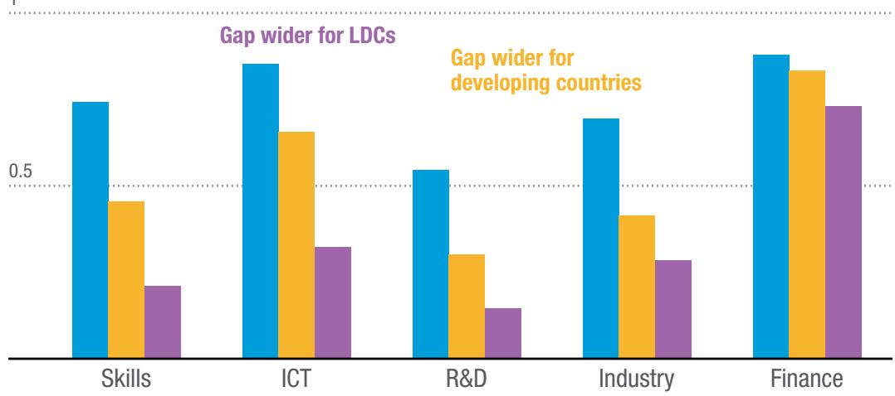  
Source: UNCTAD.

There are wide disparities between developed and developing countries in the R&D and industry subindices

The skills subindex reveals significant differences between country groups. On average, LDCs register scores that are less than half of those of developing countries and less than one third of those of developed countries. The difference between developed and developing countries is narrower on the ICT subindex, although LDCs remain some way behind developing countries.

A similar pattern is observed in the R&D and industry subindices, with wide disparities between developed and developing countries, but narrower disparities between developing countries and LDCs. With regard to finance, differences among country groupings are less marked.

It might be expected that countries with higher per capita GDP are better prepared for frontier technologies. Overall this is true but, as shown in figure III.2, some countries perform far better than their levels of income may suggest, as indicated by their distance from the regression line of the index score on GDP per capita. Among developing countries, outperformers are Brazil, China, India and the Philippines; among developed countries, outperformers are the Republic of Korea, Sweden, the United Kingdom and the United States. There are correspondingly large differences in their rankings for GDP per capita and their rankings for the overall index; for India, 76 places; for China and the Philippines, 49 places; and for Brazil, 41 places.

## Figure III.2

Brazil, China, India and the Philippines are developing countries outperforming in technology readiness
Correlation between index score and GDP per capita

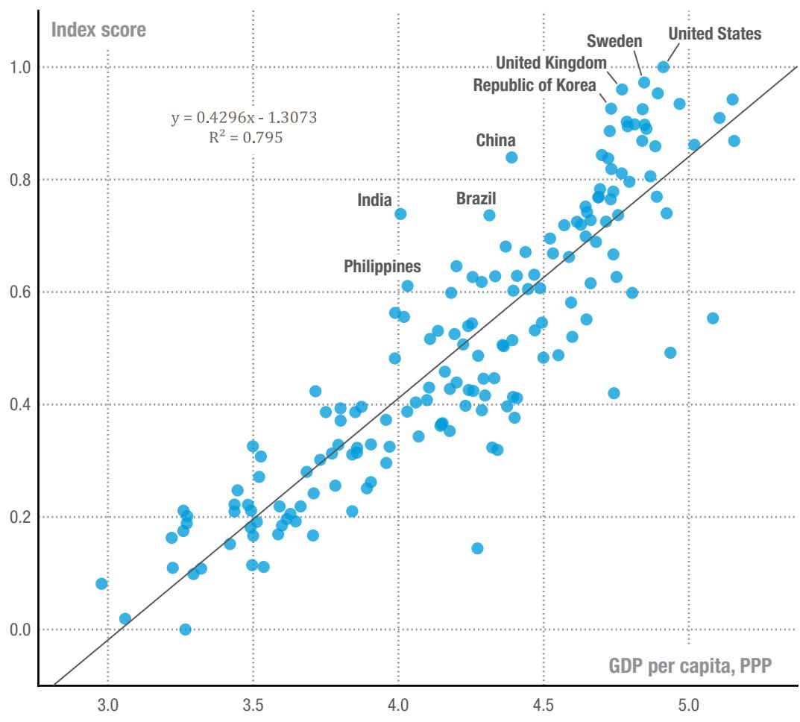  
Source: UNCTAD.  
Note: GDP per capita is in current international dollars, purchasing power parity (logarithm)

These contrasts show that many countries have strong potential to seize the opportunities offered by frontier technologies and boost economic growth and overall development.

A common feature of the better performing countries is greater R&D activity and stronger industry capacities, which enable them to keep pace with technological development and eventually lead in some frontier technologies. $^{2}$ This highlights the importance of making efforts to improve a country's innovation ecosystem. Chapter IV discusses policy efforts that support the adoption and development of AI.

It is also notable that the readiness index correlates positively with the number of AI publications (figure III.3). AI publications are among the variables of the R&D subindex and some correlation is expected. Nevertheless, the components contributing the most to the index score are those related to skills and industry and all of the subindices correlate positively with AI publications even when controlling for GDP per capita, population size and regional factors.

Countries above the regression line produce more scientific knowledge than might be expected by their index score. For example, China, Germany, India, the United Kingdom and the United States show scientific strength in the field of AI.

## Figure III.3

Correlation between index score and knowledge generation in AI  
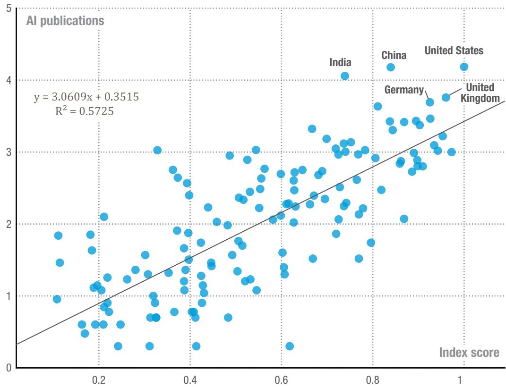  
Source: UNCTAD calculations, based on data from Scopus.
Note: Number of AI-related scientific articles in 2023 (logarithm).

SMEs face limiting factors that hinder widespread AI adoption

# B. Key factors in the adoption and development of AI

The information offered in the frontier technologies readiness index can be complemented by a detailed assessment of each country's strengths and weaknesses in the adoption and development of AI.

A technological wave unfolds in several phases. The initial development phase involving conceptualization or invention is often lengthy and costly. The adoption phase occurs when the technology begins to gain traction and early adopters start applying it to real-world problems. Finally, as the technology is diffused, it becomes more accessible and affordable and is more widely integrated into economies and societies. Widespread adoption often drives further innovation, which can lead to a renewed development phase.

The initial development of new technologies is typically driven by developed countries. Developing countries mostly only adopt frontier technologies, although some of the more technologically advanced developing countries may soon start adapting the technologies to their own conditions, which contributes to further development. This mirrors the classic company dilemma of whether to adopt innovations or to develop them, a choice that depends on contextual factors and own capabilities.

Moving from AI proof-of-concept to large-scale roll-out may be more challenging than expected, and it is important to identify areas in which AI can be strategically deployed to make a real impact (Cohen and Levinthal, 1989; Teece, 1986; Teece et al., 1997). The rate of diffusion of AI among citizens and society depends on basic factors, including access to the Internet, electricity and digital devices, as well as basic and AI-relevant digital skills.

While adoption leverages those technologies that best align with existing socioeconomic structures and needs, development involves a more active role in shaping the direction of technological change.

Adoption

AI adoption involves using existing AI technologies to improve tasks and business processes, as well as adapting AI systems to particular sectoral needs. Most of the evidence on AI adoption comes from advanced economies in which large businesses are increasingly integrating AI into their practices and services. In 2024, a global survey showed that 72 per cent of large businesses used AI in some capacity. To date, they are largely using generative AI (GenAI) for the marketing and product development of information technology functions and less in manufacturing or supply-chain management (Singla et al., 2024).

Most of this activity is by larger firms that have the greatest resources, and the share of AI users in firms with more than 250 persons is generally double that of small and medium enterprises (SMEs) (OECD, 2023a). In some countries, differences may be even greater. In Italy, for example, one study showed that the probability of investing in AI could be more than five times higher for larger firms than smaller ones (Montresor and Vezzani, 2023).

It should be noted that a comprehensive understanding of AI adoption is generally hindered by a shortage of systematic evidence, particularly from developing countries, which may constrain the capacity to design effective policies and interventions.

## Development

AI development includes all aspects related to the creation of new AI solutions, which includes the development of new models or algorithms and the improvement of existing ones, as well as all of the necessary resources and infrastructure to sustain the AI industry, such as computing power or the assembly of a cohort of developers trained to use new types of algorithms and data.

AI development is scaling up quickly. The number of AI publications and patents is growing exponentially (see chapter I). The number of English-language AI study programmes globally has almost tripled since 2017, and the proportion of computer science students specializing in AI has doubled since 2015 (Maslej et al., 2024).

In general, compared with adoption, development requires more advanced infrastructure, robust data systems and greater technological capabilities and skills, which are more likely to be found in developed countries. Developing countries may be able to take advantage of open-source models, which can help diffuse AI capacities worldwide. However, AI development requires building up robust infrastructure and innovation ecosystems and for some developing countries, it may be more viable to first prioritize adoption and adaptation.

Developing a domestic AI industry from scratch can be an expensive and lengthy endeavour. Creating AI models requires highly educated and skilled developers and engineers, who need professional and industrial opportunities to gain experience. Moreover, the AI industry is being driven by relatively young firms leveraging knowledge and software rather than physical assets, for whom attracting financing is based less on past performance and more on long-term market potential.

# C. Three critical leverage points for AI adoption and development

The adoption and development of AI critically depends on the three leverage points of infrastructure, data and skills.

Infrastructure refers to digital connectivity and computing power, and the associated networks, architecture and resources necessary to create, train and use AI solutions across a community or country.

Data are necessary for training AI models, with dedicated data for applying models to different use cases. Data are not only an input but are also generated through AI systems.

Skills include basic digital and advanced AI-specific skills, as well as the complementary skills needed for a cohesive workforce that can effectively create and use AI.

The elements of infrastructure, data and skills are needed in both adoption and development (table III.2). Although some elements may be relevant to both processes, it helps to identify particular AI requirements for more detailed analyses. Each element contributes to technological progress, but only together can they fully catalyse AI diffusion. Such interactions have led to breakthroughs such as deep learning and GenAI that have redefined the technology landscape. By supporting development in these critical leverage points, decision makers can trigger transformational economic cascades.

Lack of
systematic
evidence from
developing
countries limits
their capacity
to design
effective
interventions

Developing countries can catalyze transformative changes by focusing on the three key leverage points for AI

<table><tr><td></td><td>Infrastructure</td><td>Data</td><td>Skills</td><td>Policy and governance</td></tr><tr><td>Adoption</td><td>ElectricityICT infrastructureDigital devices</td><td>Access to domain-specific dataData storage and processing power</td><td>Basic digital skills (e.g. data literacy)Awareness and understanding of AITechnical knowledge</td><td rowspan="2">PrinciplesGovernancePolicies (e.g. industrial, innovation)Strategies</td></tr><tr><td>Development</td><td>International connectivityData centres and high-speed networks</td><td>Large and diverse datasetsHigh quality, standardized, and interoperable dataPrivacy, security and anonymization</td><td>Advanced digital skills (e.g. data science, machine learning)AI-specific skills and experiencesCognitive skills (e.g. problem solving)</td></tr></table>

Source: UNCTAD.

Policy and governance for AI can serve to determine the overall direction, setting institutional or cultural guardrails, and creating a socioeconomic and structural context favourable to the development of AI ecosystems. Chapter IV further elaborates on domestic policies involving AI and chapter V reviews the state of global AI governance and how it can support efforts to guarantee that AI will benefit all.

## Infrastructure

One third of the world's population is still offline and many lack last-mile infrastructure

The adoption of AI relies on basic infrastructure such as electricity and the Internet. While over 90 per cent of the world's population has access to electricity (IEA et al., 2023), about 2.6 billion people are still offline and most of them are in rural areas (ITU, 2023).

AI infrastructure can be divided into two broad categories, namely, digital connectivity, which is largely related to information and communications technology (ICT); and computing power, often referred to as AI compute. They provide foundational support and linkages between actors and systems (figure III.4). Both require reliable and affordable energy and water resources.

Digital connectivity is often categorized into three segments. First, cross-border terrestrial and submarine cables and satellite linkages which provide access to global networks. Second, middle-mile networks are responsible for the distribution of traffic within countries, including content delivery networks and backbone networks. Third, last-mile or access networks are responsible for providing connectivity to individuals, households and businesses, typically consisting of fixed or mobile cellular networks. The increased use of AI systems and complementary technologies puts pressure on all digital connectivity segments (World Bank, 2021; ITU, 2022).

Although most countries have ICT networks, these often do not extend much beyond densely populated areas. They may be partially complemented by mobile connectivity for small-scale businesses and private users, but AI adoption is likely to be constrained, particularly for industrial uses (Bentley et al., 2024). As well as connections, end users also need affordable digital devices to connect to ICT networks and any associated hardware, as well as basic computing power. The last-mile limitations of telecommunications infrastructure in many developing countries indicate that, to close digital divides, one of the priorities should be universal digital connectivity.

  
Figure III.4 Key components of AI infrastructure

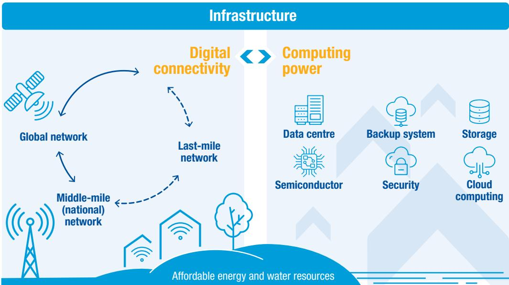  
Source: UNCTAD.

The infrastructure demands are even greater for AI development, particularly for AI compute, that is, the computing power necessary to train and execute AI models. The increasing computational requirements for creating and training AI algorithms are being driven by an industry oriented towards multitasking and complex models. Handling large amounts of data and reducing operating times requires efficient data centres, high-speed networks and supercomputers.

AI compute requires increasingly complex semiconductors to address AI and big data requirements. $^{3}$ Most are produced by a handful of firms worldwide; when supplies are limited due to demand spikes or shocks, developing countries may therefore be last in line. $^{4}$ Computing resources and elements also include

storage, security, backup systems, data centres and cloud computing. These core elements are often already available in many countries but need to be continuously upgraded or replaced to support the application and development of AI. $^{5}$

Much of digital and cloud computing operates across national borders, relying on interoperable infrastructure and protocols. GenAI in particular requires accurate and increasing amounts of data, generally through large bandwidth and international connectivity. Efforts to reduce latency times and data transit costs have spurred the deployment of data centres closer to users (Richins et al., 2020). This trend can be accelerated by requirements to locate data in a particular territory or by setting standards for privacy or cybersecurity (UNCTAD, 2021).

## Data

Since 2010, the average size of training data sets for language models has tripled each year (Sevilla and Roldán, 2024). Too complex to be effectively processed by traditional processing approaches and platforms, huge and diverse data sets are better addressed by machine-learning and deep-learning algorithms, to produce new and transformative insights (Philip Chen and Zhang, 2014). The ability of AI models to analyse and learn from data is determined by their quantity, quality and accessibility (figure III.5).

However, online data stocks are growing more slowly than the demands from AI, with the risk of shortages that can lead to data bottlenecks (Villalobos et al., 2024). An emerging challenge is how to train and operate AI models more efficiently, to produce trustworthy results from more limited data (Muennighoff et al., 2023).

AI adoption and customization require access to domain-specific data (e.g. geographical, industrial, cultural) that matches the use-case of AI models and solutions. Increasingly, data requirements overlap with infrastructure needs (e.g. data storage and processing), particularly for SMEs in traditional sectors, for which the costs of setting up and handling information technology systems can be prohibitive. The sectoral rollout of AI thus needs fine-tuning, with consideration given to field-specific needs.

Compared with adoption, AI development requires larger and more diverse data, to create, train and test foundation models that are generalizable and can be applied to a variety of use cases. Yet the concentration of control over large data sets by a few platform companies may limit opportunities for value generation based on data, including through AI development. This can hinder efforts to catch up, particularly for firms from developing countries.

Moreover, AI does not solve the “garbage in, garbage out” problem. If the data sets do not, for example, fully represent different groups or cultures, by gender, by underserved communities or by language, then algorithms are likely to produce biased, incomplete or misleading results. Biases, fabrications or hallucinations (i.e. incorrect or misleading results) can be exacerbated when data produced by AI are used as inputs to train other AI models.

## Figure III.5 Data requirements for AI

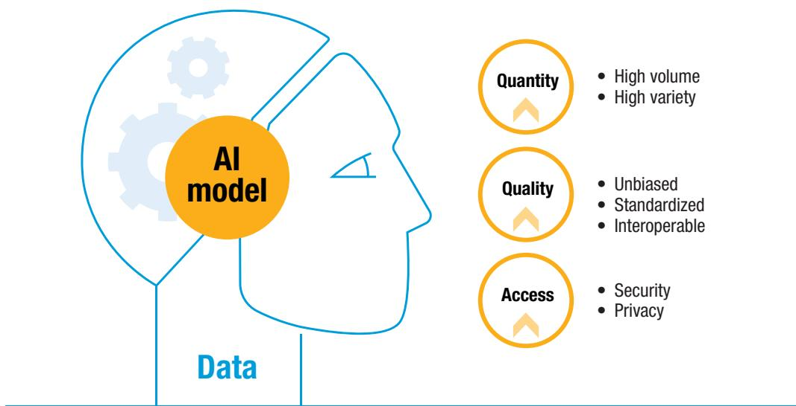  
Source: UNCTAD.

Data should be easily available and affordable for developers and users, and standardized and interoperable for quality assurance and efficient processing. At the same time, it is important to respect property rights, as well as privacy and security. The acquisition, processing and use of data should comply with legal and ethical norms and requirements with regard to privacy and data ownership, with security and anonymization procedures used to protect personal information. The importance of global data governance is discussed in chapter V.

## Skills

The adoption and development of AI depends on human efforts and skills. Engineers and computer scientists are needed in designing and producing computer chips and coding algorithms. At the same time, end-users require both digital skills and industry-specific knowledge to adopt and adapt AI.

Even if an economy has access, awareness and sufficient funds to adopt AI, this may still not suffice unless there are skilled workers

who can use AI or identify opportunities for its use throughout the economy (Chui and Malhotra, 2018). Universal digital literacy provides a foundation for the inclusive use of frontier technologies and AI systems (figure III.6). However, adopting AI also requires the applied technical knowledge of AI in practice and transversal supporting skills (El-Adaileh and Foster, 2019). Furthermore, the adoption and development of AI requires constant flows of data from different industries and domains, along with experts on particular subjects, who can integrate AI systems with their domains.

Workers and the public need to learn how to participate in the AI ecosystem and develop their skill sets, for which reskilling is as important as formal education. For example, to employ GenAI effectively, users need to learn how to structure instructions that can be understood by GenAI, called prompt engineering. One study shows that many AI users enjoy using AI in the workplace and elsewhere but are concerned about potential job losses and that AI will decrease wages (Lane et al., 2023).

  
Figure III.6
Skills for adopting and developing AI

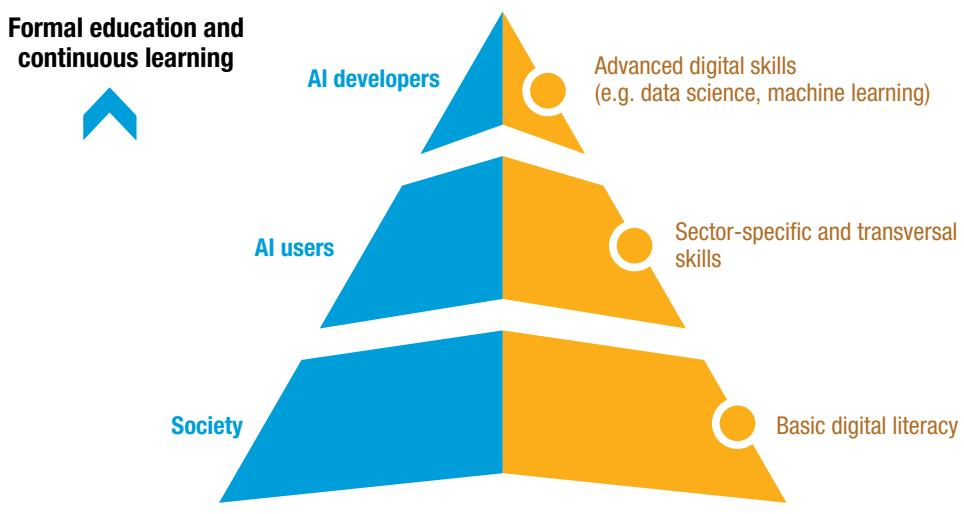  
Source: UNCTAD.

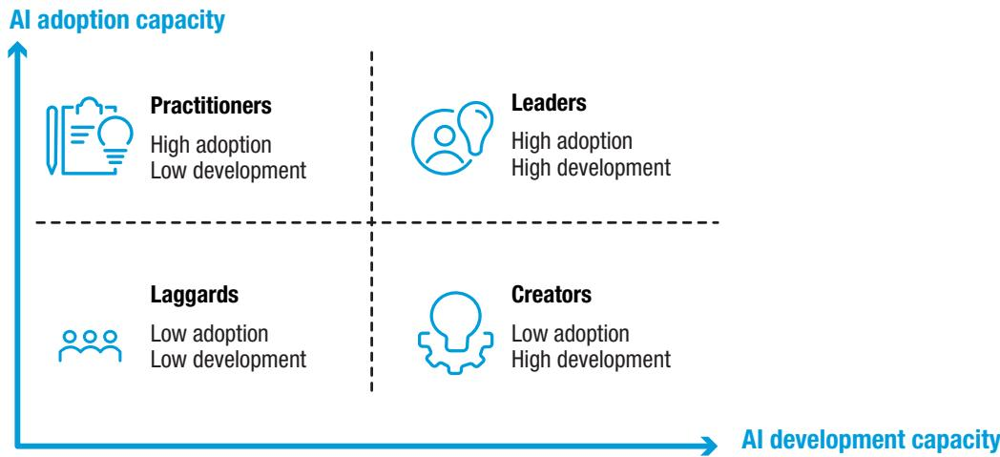  
AI development capacity  
Source: UNCTAD.

Creating and training new AI models requires developers who are highly skilled and have acquired technical knowledge, often through tertiary education in mathematics and computer science. The foundation for this is formal education, followed by regular training. All developers need foundational

data science and computing skills, as well as AI-specific training, and research and development opportunities across industry and academia. The development of AI also requires non-technical cognitive skills for creative problem-solving (OECD, 2023b).

## D. Assessing preparedness for AI adoption and development

With regard to national preparedness for AI, countries may be considered under the following four categories according to adoption and development capacities, as shown in figure III.7:

a) Leaders – High capacities for both AI adoption and development.

b) Creators – High capacity for AI development, but relatively low capacity for adoption.

c) Practitioners – Low capacity for AI development but high capacity for adoption.

d) Laggards – Low capacities for both AI adoption and development.

The four categories of AI preparedness help assess a country's current position, illustrating its relative strengths and weaknesses as well as its potential catch-up trajectories (e.g. from laggards to practitioners, then to leaders). The following overview of country preparedness uses proxy indicators that have wide country coverage for infrastructure, data and skills. These can be complemented by insights from the frontier technologies readiness index and refined through detailed reviews of STI ecosystems.

The analysis uses indicators for intensity and level, to capture different mechanisms influencing AI adoption and development.

Classification of countries according to capacity for AI adoption and development

AI adoption capacity

Source: UNCTAD calculations, based on data from the ITU DataHub.

For instance, the proportion of the population with Internet access reflects the potential extent of AI adoption within an economy. Higher levels of data creation and transmission proxy instead a country's potential for AI development. In assessing national preparedness, comparisons of intensity and level illustrate how the strategic options for AI can be determined by country size.

## AI infrastructure preparedness

On average, developed countries have the highest incidence of Internet penetration and LDCs have less than half of the incidence in developing countries (figure III.8). Similarly, investments in telecommunications services are the lowest among LDCs. Both developing countries and LDCs show high variability in the two indicators.

In the top right quadrant, the leaders are largely developed countries in Europe and North America, but also some middle- and high-income economies in Asia. In the bottom right, the creators include India and Nigeria, which have high levels of investments in telecommunications services, although less than half their populations have stable Internet access.

## Figure III.8 AI infrastructure preparedness

\- Developed countries
- Developing countries
- Least developed countries

Percentage of Internet users in the population  
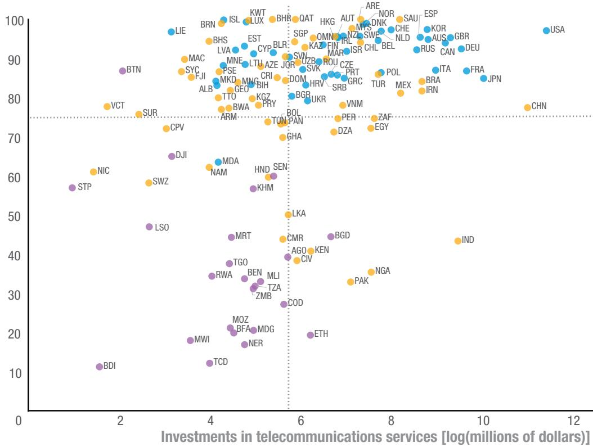

Notes: The proportion of the population using the Internet is a proxy for capacity to adopt AI and investments in telecommunications services is a proxy for AI development capacity. The dotted lines, at the global averages of the two indicators, divide the countries into four groups. Data labels use International Organization for Standardization economy codes. Data are for 2023 or the latest available year. Log transformation is used for investments in telecommunications services, to minimize the effect of outliers and smooth the effect of country size. An average from 2020 to 2023 is used in order to reduce fluctuation.

In the top left quadrant, the practitioners have a high capacity for adoption but low capacity for development, and include small upper middle-income and high-income countries such as Seychelles. In the bottom left quadrant, the laggards include several countries in Africa, such as Burundi and Chad, which have low levels of Internet penetration and investments in telecommunications services, and risk being excluded from the development opportunities offered by Al.

Some middle-income developing countries show high capacities for both AI adoption and development. In Africa, for instance, Egypt and Morocco exceed the global averages in both indicators. This is partly due to the submarine cables under the Mediterranean that connect them to the European continent and beyond. Egypt, for example, due to its geographical position, and links to more than 160 global submarine cable operators, can become a hub connecting three continents. Between 2009 and 2020, the number of submarine cables to Egypt increased from 6 to 13 and after 2025, is expected to exceed 18 (Telecom Egypt, 2024).

In Asia, the better performers include Malaysia, Singapore and Viet Nam, which have been improving their digital infrastructure. In Malaysia, for example, the Ministry of Digital created the Malaysia Digital Economy Corporation in 1996, aiming to establish the country as a digital hub in the Association of Southeast Asian Nations (Malaysia Digital Economy Corporation, 2022). In 2023, the Government introduced the digital ecosystem acceleration scheme, to further strengthen digital infrastructure through a series of incentives, such as investment tax credits on capital expenditure (Malaysian Investment Development Authority, 2023).

Countries in South-East Asia have generally attracted significant investment from major technology companies.

In 2024, to advance new cloud and AI infrastructure, Microsoft announced an investment of \$1.7 billion in Indonesia and \$2.2 billion in Malaysia (Microsoft, 2024a, 2024b). In 2024, Google planned to invest \$2 billion in Malaysia, to develop a data centre and cloud hub (Cyrill, 2024). In 2025, Amazon Web Services aims to launch a new hub in Thailand and invest \$5 billion by 2037 (Amazon, 2024).

A core element of such investment is cloud infrastructure, which offers computing capabilities and storage with flexible access and at a relatively low cost, thereby supporting AI diffusion among SMEs. Cross-country comparisons are hindered by a lack of internationally comparable statistics, yet it may be noted that cloud computing is strongly concentrated among a few large providers; an indicator of availability is therefore the number of services (UNCTAD, 2024a). With regard to the top 10 economies in terms of cloud infrastructure services from major providers, China and the United States have more services than the rest of the world combined; India and Brazil are two developing countries on the list along with Singapore, and four of the top 10 countries in terms of cloud infrastructure are thus from the Global South (figure III.9).

With regard to cloud services by region, it may be noted that even if China is not included, Asia stands out. In addition to China, Japan, the Republic of Korea and Singapore, there are several cloud infrastructure services in South-East Asia. Africa is some way behind.

At the end of 2023, eight companies controlled about 80 per cent of the worldwide market share, led by Amazon, Microsoft and Google (Synergy, 2024). These companies may have limited interest in countries that do not generate enough data traffic and profits, which could contribute to deepening digital and AI divides between countries.

Figure III.9
Number of cloud infrastructure services, mid-2024  
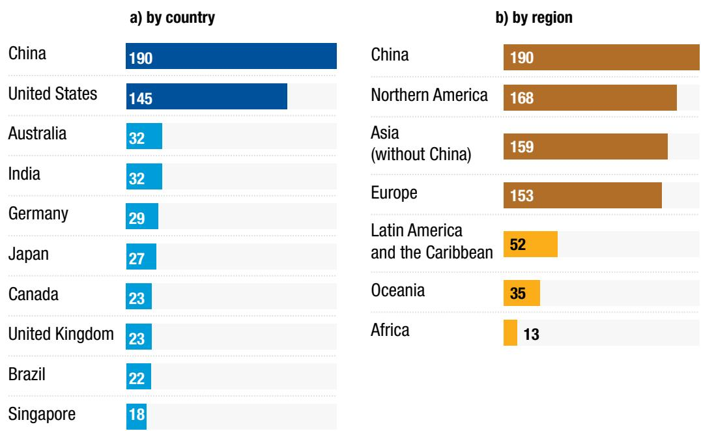  
Source: UNCTAD calculations, based on data from Cloud Infrastructure Map.  
Note: Figures based on Amazon Web Services, Google Cloud, IBM Cloud, Microsoft Azure, Oracle Cloud, Alibaba Cloud, Tencent Cloud, and Huawei Cloud.

## AI data preparedness

ITU has set the affordability target for fixed broadband at 2 per cent of gross national income per capita. On average, developed countries score better in data affordability, with many developing countries and LDCs still far from the ITU target (figure III.10). The gap between developed and developing countries for data traffic is narrower, with LDCs lagging behind. $^{6}$

Among the leaders, China performs well in both affordability and data quantity. A number of high-income economies, such as Hong Kong (China), Germany, the Russian Federation, the United Kingdom and the United States, also have a wealth of data that can be used to train and develop AI systems. Creators include Pakistan and the Bolivarian Republic of Venezuela, which have low levels of adoption but a high development potential.

Practitioners include smaller economies such as Eswatini, Kuwait and Monaco that have high levels of AI adoption but a relatively low development potential; their small populations limit the data available for local AI models. Laggards, which show low potential in both AI adoption and development, are mostly developing countries in Africa and Latin America and the Caribbean.

China has reduced fixed broadband prices, to favour digital uptake

China has the world's greatest fixed-broadband traffic, due to its large population and because it has significantly reduced fixed-broadband prices, from around 5 per cent of gross national income a decade prior to 0.5 per cent at present, which is about one sixth of the global median (ITU, 2024). The Government has put in place regulatory reforms to increase competition among Internet service providers while encouraging new market entrants. The fibre-optic network has been upgraded and expanded to enhance connectivity in rural and underserved areas.

\- Developed countries
- Developing countries
- Least developed countries

Source: UNCTAD calculations, based on data from the ITU DataHub.  
Fixed-broadband affordability (log scale)  
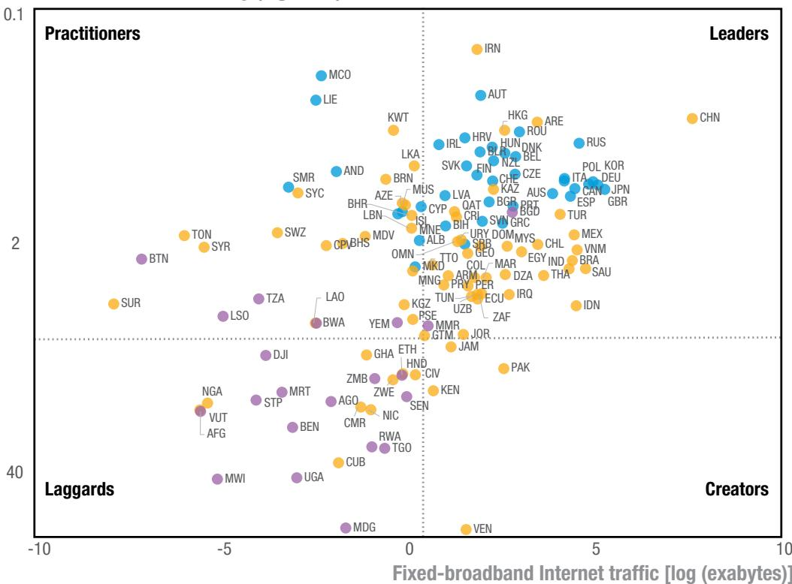  
Notes: The average cost of fixed broadband connection as a proportion of gross national income per capita and the fixed broadband internet traffic are proxies for data preparedness. The dotted lines, at the global averages of the two indicators, divide the countries into four groups. Data labels use International Organization for Standardization economy codes. Data are for 2023 or the latest available year. Log transformation is used for fixed-broadband Internet traffic, to minimize the effect of outliers and smooth the effect of country size. An inverted scale is used in the y-axis, as lower values mean better affordability. Comparable data on fixed-broadband Internet traffic are not available for the United States in recent years.

Financial incentives to Internet service providers have lowered costs for consumers, and fair pricing has been promoted by consumer protection measures and price caps (China, State Council, 2013, 2017).

Additional information on data preparedness is available by analysing the number of Internet exchange points. These are physical locations where Internet service providers connect and exchange traffic between their networks and are a crucial element of middle-mile digital connectivity.

Traffic per Internet exchange point is highest in high-income countries, although the average number of members per point is highest in upper middle-income economies, partly because they host some of the world's largest Internet exchange points, such as Ponto de Troca de Tráfego Metro São Paulo in Brazil, Qianhai New-Type Internet Exchange in China and Moscow Internet Exchange in the Russian Federation. Low middle income and low-income economies show low values for both Internet exchange point traffic and membership (figure III.11).

Internet exchange point traffic and membership, mid-2024  
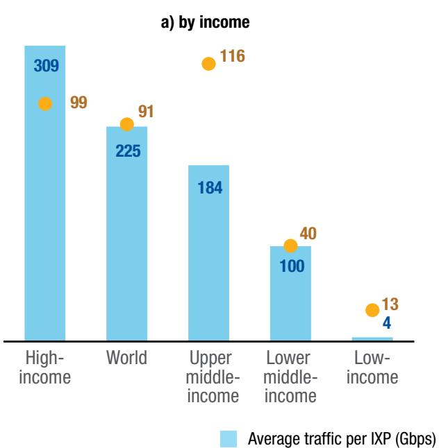  
Average traffic per IXP (Gbps)

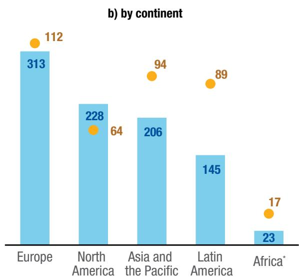  
● Average number of members per IXP  
Source: UNCTAD calculations, based on data from Packet Clearing House.
Notes: Gbps, gigabits per second; IXP, Internet exchange point. Data for Africa excludes South Africa because it has almost as many members (about 1,300) as all of the other Internet exchange points in the rest of Africa combined, which distorts the regional figure.

European Internet exchange points are well-established with many years of experience; they generate the highest traffic volume and have the highest number of members per Internet exchange points. In contrast, Africa is far behind, with limited participation and data flows.

## AI skills preparedness

GitHub is a major platform through which developers can collaborate, and hosts a large number of open-source projects. $^{7}$ Country groupings illustrate the differences in AI skills preparedness, with LDCs scoring rather low in both GitHub developers as a share of the working-age population and the proportion of the working-age population with tertiary education. With some noticeable exceptions, developed countries rank better than developing countries in both indicators (figure III.12).

The leaders in the top-right quadrant are mainly developed economies, such as Canada, Ireland, the Republic of Korea, and the United States. Hong Kong (China) and Singapore have particularly high numbers of GitHub developers. Countries in the bottom-right quadrant have low AI adoption but high development potential and include developed economies in Europe, such as Romania, and some island countries such as Maldives and Seychelles.

There are relatively few economies with high potential in AI adoption but low development capacity. In fact, most developing economies display relatively low skills capacity for both adoption and development.

The proportion of developers in the population does not tell the whole story. Large countries may have a low proportion of developers, but this could still represent a substantial body of developers on which to build AI development advantages.

\- Developed countries
- Developing countries
- Least developed countries

Working-age population with advanced degree  
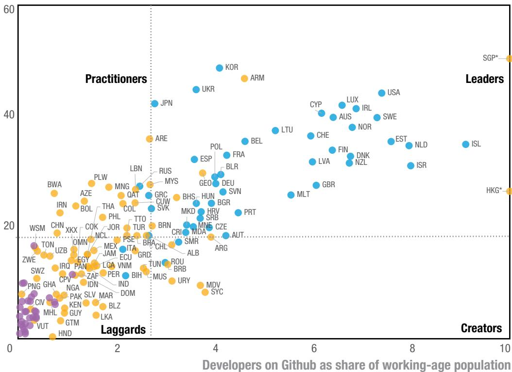  
Source: UNCTAD calculations, based on data from GitHub and the International Labour Organization. Notes: The share of the working-age population with an advanced degree is a proxy for AI adoption capacity and developers on GitHub as a share of the working-age population is a proxy for AI development capacity. Dotted lines at the global averages of the two indicators, divide the countries into four groups. Data labels use International Organization for Standardization economy codes. Data from GitHub are for 2023 and data from the International Labour Organization are for 2023 or the latest available year. \* Hong Kong (China) and Singapore have high shares of GitHub developers with respect to working-age population, at 25 and 27 per cent respectively; values have been truncated at 10 per cent, to clarify the presentation.

The United States has the most GitHub developers, followed by India and China (figure III.13). China and India have the world's largest populations and, despite relatively low shares, can leverage a significant mass of AI developers, which puts them in favourable positions with respect to AI development and the production of AI-related scientific knowledge.

Many developing countries have achieved rapid growth in the number of developers (figure III.14).

The fastest increase, at 40 per cent, was in Nigeria, Ghana and Kenya, which have become promising hubs for technology companies (Daigle, 2023). The growth in developer numbers is also notable in Latin America and the Caribbean, for example in Argentina, the Plurinational State of Bolivia, Colombia and Brazil. In Asia and the Pacific, India, Viet Nam, Indonesia and the Philippines already had a significant number of developers but had increases of more than 30 per cent.

Figure III.13
Economies with at least 2 million GitHub developers, 2023  
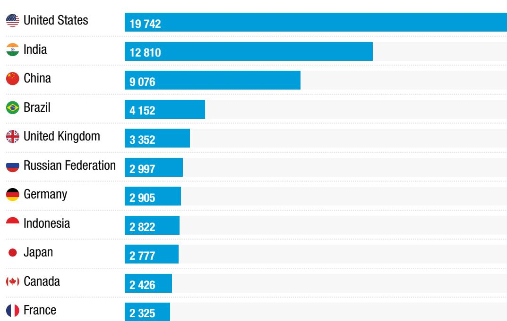  
Source: UNCTAD calculations, based on data from GitHub.  
Note: The figure shows the number of developer accounts located in a given economy based on mode daily location, excluding users that are bots or otherwise flagged as spam within internal systems. Yearly figures are obtained by averaging quarterly data.

Many students in Asia perform well in the Programme for International Student Assessment, particularly in science and mathematics, signifying a strong potential for both AI adoption and development (OECD, 2024).

There are large talent pools in India, with around 13 million developers, and in Brazil, with 4 million. These two countries are also among the leading countries in creating GenAI projects on GitHub, and are significant contributors to advances in AI. The lead of India partly reflects government policy. The Government has closely collaborated over the years with the private sector and academia to build centres of excellence, such as the Indian

Institute of Technology Hyderabad and the Indian Institute of Technology Kharagpur in AI, the Kotak Indian Institute of Science Artificial Intelligence–Machine Learning Centre and the National Association of Software and Service Companies centre of excellence in data science and AI. In 2024, the Cabinet approved the India AI mission to strengthen the AI innovation ecosystem, aimed at, for example, reducing barriers to entry into AI programmes and increasing the number of AI courses in tertiary education, focusing on small and medium-sized cities (India, Competition Commission, 2024).

Figure III.14
Economies with the fastest growth in number of developers  
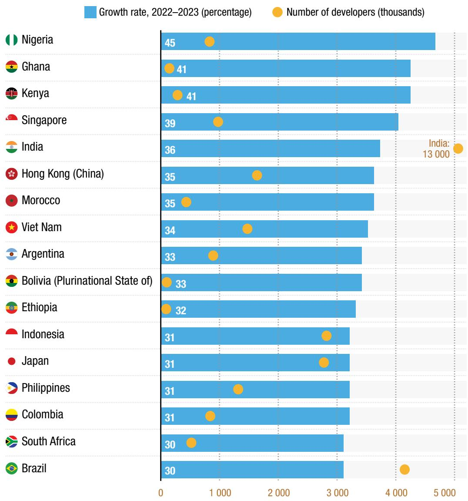  
Source: UNCTAD calculations, based on data from GitHub.

Brazil has also been cultivating AI talent, at both the federal and state levels. For example, through strategic partnerships between public and private institutions, the Research Foundation of the state of São Paulo has created a network of applied research centres (Brazil, Ministry of Science, Technology and Innovations, 2021).

The initiative is also aimed at creating scholarships to attract researchers and further boost performance in terms of AI publications (Brandão, 2024).

These approaches highlight the importance of training AI specialists to sustain the development of a strong and diffused AI ecosystem and attract and cultivate AI talent.

# E. Strategic positioning for AI

To seize the opportunities offered by AI, developing countries need to strategically position themselves for structural transformation and provide a fertile environment in which AI-empowered businesses can thrive. Key to this is close cooperation among public authorities and ministries, such as those for STI, industry and education. These ministries can also work with stakeholders to identify and sustain AI applications for sustainable development, particularly those that incorporate social, economic and environmental considerations, such as creating and augmenting jobs and encouraging the green transition.

Strategic positioning to leverage AI for sustainable development can be coupled with a gap analysis to link the vision with actual actions, to make it a reality. The frontier technologies readiness index helps identify areas in which countries need to improve. This chapter offers country snapshots and Governments should carry out more comprehensive assessments of strengths and weaknesses and of capabilities and gaps along the three critical leverage points of infrastructure, data and skills. The key elements shown in table III.2 can be used as starting points for actions to empower agents, who can operate along the five As framework (box III.1).

In addition, a thorough assessment of AI-related opportunities and challenges, along with foresight exercises on longer-term science and technology scenarios, can help identify actions to direct an economy towards preferred futures.

Technology assessment should include stakeholder engagements to map the STI ecosystem and formulate STI plans that align with national objectives and the opportunities and challenges posed by frontier technologies. UNCTAD helps developing countries in technology assessment and its STI Policy Review programme supports STI system policies and plans (UNCTAD, 2019). $^{8}$

Based on a gap analysis, countries can establish their own catch-up trajectories, to move from current technological and productive capacities to the desired targets. Some developing countries in Africa and South-East Asia have strengthened their infrastructure to support Internet usage and cross-border connectivity. China has established a strong advantage in data affordability and quantity. China, Brazil and India have produced a large pool of AI developers. These illustrate different catch-up trajectories and highlight the importance of policy efforts in order to enhance preparedness in the light of the rapid evolution of AI.

Technological catch-up is closely tied to a country's readiness to embrace new technological waves. The adoption and development of AI hinge on the necessary digital infrastructure, capacity for data collection and transmission and a mix of sector-specific and digital skills, which can be strengthened by dynamic interactions between users and producers.

Close
cooperation
across public
bodies is key
in triggering a
technology-
led structural
transformation

Strategic
positioning
starts with
a thorough
assessment
of the AI
opportunities
and
challenges

## Box III.1

The diffusion of technologies and innovations is shaped by communications and interaction among economic agents and the way the innovation system works. Frontier technologies need to be taken up by agents – entrepreneurs, citizens and policymakers – who can be empowered through a combination of the 5 As, namely, availability, affordability, awareness, ability and agency.

## Availability

AI adoption requires accessible and stable digital infrastructure to enable broader participation

## Affordability

Lowering costs of connection and AI services favours access and use across large parts of the population

## Awareness

Knowing of the existence of AI applications and understanding their functions, potential uses, risks and limitations is crucial

## Ability

Make effective use of AI in different contexts and being able to develop it is crucial

## Agency

Power is required to create change and active engagement is necessary to direct AI towards serving human needs

## Source: UNCTAD.

Availability and affordability are critical in the widespread adoption of AI, providing equitable opportunities across diverse groups and communities. Limited digital infrastructure and data, combined with challenges in affordability, risk widening the gap between leading and lagging countries.

Awareness about frontier technologies and successful implementation examples empowers agents to leverage AI for economic progress. Understanding AI applications, potential uses, risks and limitations is key in their beneficial diffusion, as well as for policymakers facing different options to guide progress and development.

Ability and agency drive meaningful change. Laggard countries may lack the scientific and technological expertise of countries leading in AI but should aim to customize technology to local needs while addressing potential social, cultural and institutional barriers. Achieving inclusive and equitable AI development hinges on fostering knowledge, active engagement and the power to direct AI towards serving human development.

For instance, computing power is central to both AI adoption and development. Its availability enables users to implement and scale AI solutions and to experiment with new algorithms and applications. Affordable computing power can reduce barriers to AI research and development and deployment. Key factors such as data storage capacities, processing speeds and cloud computing capacities determine the performance and efficiency of AI algorithms and models.

Public awareness, ability and agency are essential in seizing business opportunities and addressing potential concerns while fostering the societal acceptance of AI. The benefits of computing power can be fully realized by users equipped with strong technical knowledge and digital skills, while agency over computing power allows them to customize digital environments for AI, to meet particular requirements, optimize performance and ensure efficiency.

Source: UNCTAD.

Currently, AI technology development is largely controlled by a handful of companies and countries. Yet smaller firms in other countries can adopt and adapt the technologies, fostering market niches in different industries and enhancing their competitiveness in both domestic and international markets (Lee and Malerba, 2017).

Cumulative effects play an important role in the AI innovation ecosystem, making it difficult for latecomers to catch up in innovation capacities. This requires a careful consideration of the characteristics of new digital technologies. In general, hardware development is associated with product innovation and is typically organized along with formal R&D and strong industry and university linkages (Lema et al., 2021). The software segment is linked to processes and service innovations, which rely on widely dispersed informal activities and interactions among developers, users and global actors. Such interactions require a rethinking of industrial and innovation policies that is discussed in the next chapter.

  
© Adobe Stock

## Frontier technologies readiness index

## A. Frontier technologies readiness index results

The index is calculated using the methodology in Technology and Innovation Report 2021 (see section C). The index gives results for 170 economies, with the United States, Sweden and the United Kingdom receiving the highest scores in 2024 on a scale of 0 to 1 (table 1). Based on their rankings, economies are placed within one of the following four 25-percentile score groups: low; lower middle; upper middle; and high.

Frontier technologies readiness index score ranking

<table><tr><td>Economy</td><td>Total score</td><td>2024 rank</td><td>2022 rank</td><td>Change in rank</td><td>Score group</td><td>ICT rank</td><td>Skills rank</td><td>R&amp;D rank</td><td>Industry rank</td><td>Finance rank</td></tr><tr><td>United States</td><td>1.00</td><td>1</td><td>1</td><td>=</td><td>High</td><td>4</td><td>17</td><td>2</td><td>17</td><td>2</td></tr><tr><td>Sweden</td><td>0.97</td><td>2</td><td>2</td><td>=</td><td>High</td><td>17</td><td>2</td><td>15</td><td>7</td><td>14</td></tr><tr><td>United Kingdom</td><td>0.96</td><td>3</td><td>3</td><td>=</td><td>High</td><td>18</td><td>12</td><td>6</td><td>14</td><td>17</td></tr><tr><td>Netherlands (Kingdom of the)</td><td>0.95</td><td>4</td><td>5</td><td>↑</td><td>High</td><td>3</td><td>6</td><td>13</td><td>11</td><td>31</td></tr><tr><td>Singapore</td><td>0.94</td><td>5</td><td>4</td><td>↓</td><td>High</td><td>12</td><td>5</td><td>20</td><td>4</td><td>11</td></tr><tr><td>Switzerland</td><td>0.93</td><td>6</td><td>6</td><td>=</td><td>High</td><td>25</td><td>14</td><td>11</td><td>3</td><td>7</td></tr><tr><td>Republic of Korea</td><td>0.93</td><td>7</td><td>9</td><td>↑</td><td>High</td><td>14</td><td>32</td><td>4</td><td>13</td><td>5</td></tr><tr><td>Germany</td><td>0.93</td><td>8</td><td>7</td><td>↓</td><td>High</td><td>26</td><td>18</td><td>5</td><td>12</td><td>34</td></tr><tr><td>Ireland</td><td>0.91</td><td>9</td><td>12</td><td>↑</td><td>High</td><td>27</td><td>11</td><td>28</td><td>1</td><td>116</td></tr><tr><td>France</td><td>0.90</td><td>10</td><td>14</td><td>↑</td><td>High</td><td>7</td><td>21</td><td>8</td><td>24</td><td>19</td></tr><tr><td>Finland</td><td>0.90</td><td>11</td><td>8</td><td>↓</td><td>High</td><td>33</td><td>8</td><td>23</td><td>16</td><td>29</td></tr><tr><td>Belgium</td><td>0.90</td><td>12</td><td>11</td><td>↓</td><td>High</td><td>11</td><td>9</td><td>24</td><td>22</td><td>42</td></tr><tr><td>Canada</td><td>0.89</td><td>13</td><td>13</td><td>=</td><td>High</td><td>6</td><td>24</td><td>9</td><td>32</td><td>16</td></tr><tr><td>Hong Kong, China</td><td>0.89</td><td>14</td><td>10</td><td>↓</td><td>High</td><td>22</td><td>20</td><td>29</td><td>2</td><td>1</td></tr><tr><td>Israel</td><td>0.89</td><td>15</td><td>18</td><td>↑</td><td>High</td><td>31</td><td>16</td><td>21</td><td>5</td><td>43</td></tr><tr><td>Australia</td><td>0.87</td><td>16</td><td>15</td><td>↓</td><td>High</td><td>44</td><td>1</td><td>12</td><td>70</td><td>12</td></tr><tr><td>Luxembourg</td><td>0.87</td><td>17</td><td>19</td><td>↑</td><td>High</td><td>2</td><td>13</td><td>47</td><td>29</td><td>25</td></tr><tr><td>Norway</td><td>0.86</td><td>18</td><td>16</td><td>↓</td><td>High</td><td>10</td><td>7</td><td>27</td><td>54</td><td>13</td></tr><tr><td>Denmark</td><td>0.86</td><td>19</td><td>17</td><td>↓</td><td>High</td><td>42</td><td>10</td><td>22</td><td>30</td><td>9</td></tr><tr><td>Japan</td><td>0.84</td><td>20</td><td>20</td><td>=</td><td>High</td><td>16</td><td>62</td><td>7</td><td>19</td><td>4</td></tr><tr><td>China</td><td>0.84</td><td>21</td><td>28</td><td>↑</td><td>High</td><td>101</td><td>64</td><td>1</td><td>6</td><td>3</td></tr><tr><td>Spain</td><td>0.84</td><td>22</td><td>22</td><td>=</td><td>High</td><td>5</td><td>30</td><td>14</td><td>41</td><td>37</td></tr><tr><td>New Zealand</td><td>0.82</td><td>23</td><td>21</td><td>↓</td><td>High</td><td>15</td><td>3</td><td>43</td><td>61</td><td>10</td></tr><tr><td>Italy</td><td>0.81</td><td>24</td><td>24</td><td>=</td><td>High</td><td>46</td><td>39</td><td>10</td><td>27</td><td>50</td></tr><tr><td>Austria</td><td>0.81</td><td>25</td><td>23</td><td>↓</td><td>High</td><td>39</td><td>26</td><td>25</td><td>28</td><td>32</td></tr><tr><td>Malta</td><td>0.80</td><td>26</td><td>26</td><td>=</td><td>High</td><td>8</td><td>28</td><td>73</td><td>8</td><td>44</td></tr><tr><td>Poland</td><td>0.78</td><td>27</td><td>27</td><td>=</td><td>High</td><td>28</td><td>34</td><td>26</td><td>33</td><td>97</td></tr><tr><td>Slovenia</td><td>0.78</td><td>28</td><td>30</td><td>↑</td><td>High</td><td>20</td><td>15</td><td>64</td><td>18</td><td>92</td></tr><tr><td>Iceland</td><td>0.77</td><td>29</td><td>25</td><td>↓</td><td>High</td><td>1</td><td>4</td><td>75</td><td>85</td><td>30</td></tr><tr><td>Estonia</td><td>0.77</td><td>30</td><td>29</td><td>↓</td><td>High</td><td>24</td><td>25</td><td>59</td><td>25</td><td>57</td></tr><tr><td>Portugal</td><td>0.77</td><td>31</td><td>32</td><td>↑</td><td>High</td><td>21</td><td>27</td><td>32</td><td>51</td><td>36</td></tr><tr><td>Czechia</td><td>0.76</td><td>32</td><td>31</td><td>↓</td><td>High</td><td>55</td><td>33</td><td>33</td><td>20</td><td>71</td></tr><tr><td>Russian Federation</td><td>0.75</td><td>33</td><td>33</td><td>=</td><td>High</td><td>41</td><td>29</td><td>17</td><td>72</td><td>63</td></tr><tr><td>Slovakia</td><td>0.74</td><td>34</td><td>39</td><td>↑</td><td>High</td><td>9</td><td>49</td><td>53</td><td>26</td><td>53</td></tr><tr><td>United Arab Emirates</td><td>0.74</td><td>35</td><td>34</td><td>↓</td><td>High</td><td>45</td><td>35</td><td>31</td><td>42</td><td>51</td></tr><tr><td>India</td><td>0.74</td><td>36</td><td>48</td><td>↑</td><td>High</td><td>99</td><td>113</td><td>3</td><td>10</td><td>70</td></tr><tr><td>Cyprus</td><td>0.74</td><td>37</td><td>37</td><td>=</td><td>High</td><td>53</td><td>36</td><td>52</td><td>36</td><td>49</td></tr><tr><td>Brazil</td><td>0.74</td><td>38</td><td>40</td><td>↑</td><td>High</td><td>38</td><td>59</td><td>18</td><td>50</td><td>41</td></tr><tr><td>Hungary</td><td>0.73</td><td>39</td><td>36</td><td>↓</td><td>High</td><td>35</td><td>42</td><td>46</td><td>21</td><td>99</td></tr><tr><td>Lithuania</td><td>0.73</td><td>40</td><td>42</td><td>↑</td><td>High</td><td>30</td><td>22</td><td>66</td><td>43</td><td>96</td></tr><tr><td>Greece</td><td>0.72</td><td>41</td><td>41</td><td>=</td><td>High</td><td>50</td><td>19</td><td>36</td><td>59</td><td>69</td></tr><tr><td>Latvia</td><td>0.72</td><td>42</td><td>38</td><td>↓</td><td>High</td><td>32</td><td>23</td><td>69</td><td>39</td><td>113</td></tr><tr><td>Malaysia</td><td>0.72</td><td>43</td><td>35</td><td>↓</td><td>Upper middle</td><td>49</td><td>74</td><td>30</td><td>15</td><td>18</td></tr><tr><td>Türkiye</td><td>0.70</td><td>44</td><td>46</td><td>↑</td><td>Upper middle</td><td>79</td><td>31</td><td>16</td><td>73</td><td>68</td></tr><tr><td>Chile</td><td>0.70</td><td>45</td><td>50</td><td>↑</td><td>Upper middle</td><td>23</td><td>40</td><td>40</td><td>105</td><td>21</td></tr><tr><td>Romania</td><td>0.69</td><td>46</td><td>47</td><td>↑</td><td>Upper middle</td><td>19</td><td>66</td><td>38</td><td>38</td><td>122</td></tr><tr><td>Thailand</td><td>0.68</td><td>47</td><td>43</td><td>↓</td><td>Upper middle</td><td>40</td><td>77</td><td>37</td><td>40</td><td>8</td></tr><tr><td>Serbia</td><td>0.67</td><td>48</td><td>52</td><td>↑</td><td>Upper middle</td><td>47</td><td>60</td><td>65</td><td>31</td><td>95</td></tr><tr><td>Uruguay</td><td>0.67</td><td>49</td><td>56</td><td>↑</td><td>Upper middle</td><td>13</td><td>47</td><td>77</td><td>45</td><td>112</td></tr><tr><td>Saudi Arabia</td><td>0.67</td><td>50</td><td>45</td><td>↓</td><td>Upper middle</td><td>58</td><td>38</td><td>19</td><td>120</td><td>66</td></tr><tr><td>Bulgaria</td><td>0.66</td><td>51</td><td>44</td><td>↓</td><td>Upper middle</td><td>67</td><td>57</td><td>50</td><td>35</td><td>79</td></tr><tr><td>South Africa</td><td>0.65</td><td>52</td><td>51</td><td>↓</td><td>Upper middle</td><td>76</td><td>71</td><td>41</td><td>55</td><td>27</td></tr><tr><td>Argentina</td><td>0.63</td><td>53</td><td>61</td><td>↑</td><td>Upper middle</td><td>57</td><td>37</td><td>60</td><td>79</td><td>152</td></tr><tr><td>Mexico</td><td>0.63</td><td>54</td><td>54</td><td>=</td><td>Upper middle</td><td>73</td><td>75</td><td>34</td><td>37</td><td>98</td></tr><tr><td>Colombia</td><td>0.63</td><td>55</td><td>60</td><td>↑</td><td>Upper middle</td><td>72</td><td>48</td><td>39</td><td>92</td><td>82</td></tr><tr><td>Kuwait</td><td>0.63</td><td>56</td><td>63</td><td>↑</td><td>Upper middle</td><td>48</td><td>54</td><td>84</td><td>49</td><td>26</td></tr><tr><td>Ukraine</td><td>0.63</td><td>57</td><td>55</td><td>↓</td><td>Upper middle</td><td>71</td><td>52</td><td>48</td><td>60</td><td>120</td></tr><tr><td>Barbados</td><td>0.62</td><td>58</td><td>62</td><td>↑</td><td>Upper middle</td><td>34</td><td>41</td><td>79</td><td>80</td><td>47</td></tr><tr><td>Croatia</td><td>0.62</td><td>59</td><td>49</td><td>↓</td><td>Upper middle</td><td>80</td><td>43</td><td>70</td><td>52</td><td>77</td></tr><tr><td>Philippines</td><td>0.61</td><td>60</td><td>58</td><td>↓</td><td>Upper middle</td><td>69</td><td>107</td><td>68</td><td>9</td><td>75</td></tr><tr><td>Belarus</td><td>0.61</td><td>61</td><td>59</td><td>↓</td><td>Upper middle</td><td>65</td><td>46</td><td>81</td><td>46</td><td>110</td></tr><tr><td>Costa Rica</td><td>0.61</td><td>62</td><td>57</td><td>↓</td><td>Upper middle</td><td>61</td><td>55</td><td>98</td><td>34</td><td>67</td></tr><tr><td>North Macedonia</td><td>0.60</td><td>63</td><td>75</td><td>↑</td><td>Upper middle</td><td>29</td><td>67</td><td>99</td><td>44</td><td>59</td></tr><tr><td>Viet Nam</td><td>0.60</td><td>64</td><td>53</td><td>↓</td><td>Upper middle</td><td>81</td><td>120</td><td>51</td><td>23</td><td>15</td></tr><tr><td>Bahrain</td><td>0.60</td><td>65</td><td>64</td><td>↓</td><td>Upper middle</td><td>43</td><td>53</td><td>87</td><td>63</td><td>40</td></tr><tr><td>Kazakhstan</td><td>0.58</td><td>66</td><td>71</td><td>↑</td><td>Upper middle</td><td>91</td><td>44</td><td>72</td><td>53</td><td>117</td></tr><tr><td>Morocco</td><td>0.56</td><td>67</td><td>67</td><td>=</td><td>Upper middle</td><td>88</td><td>111</td><td>42</td><td>58</td><td>33</td></tr><tr><td>Jordan</td><td>0.56</td><td>68</td><td>77</td><td>↑</td><td>Upper middle</td><td>66</td><td>95</td><td>56</td><td>74</td><td>35</td></tr><tr><td>Qatar</td><td>0.55</td><td>69</td><td>69</td><td>=</td><td>Upper middle</td><td>37</td><td>91</td><td>63</td><td>124</td><td>23</td></tr><tr><td>Oman</td><td>0.55</td><td>70</td><td>68</td><td>↓</td><td>Upper middle</td><td>64</td><td>99</td><td>55</td><td>90</td><td>58</td></tr><tr><td>Montenegro</td><td>0.55</td><td>71</td><td>65</td><td>↓</td><td>Upper middle</td><td>51</td><td>45</td><td>127</td><td>82</td><td>81</td></tr><tr><td>Iran (Islamic Republic of)</td><td>0.54</td><td>72</td><td>73</td><td>↑</td><td>Upper middle</td><td>94</td><td>82</td><td>35</td><td>94</td><td>56</td></tr><tr><td>Republic of Moldova</td><td>0.54</td><td>73</td><td>76</td><td>↑</td><td>Upper middle</td><td>52</td><td>76</td><td>80</td><td>69</td><td>118</td></tr><tr><td>Mauritius</td><td>0.53</td><td>74</td><td>66</td><td>↓</td><td>Upper middle</td><td>84</td><td>70</td><td>82</td><td>83</td><td>45</td></tr><tr><td>Tunisia</td><td>0.53</td><td>75</td><td>70</td><td>↓</td><td>Upper middle</td><td>113</td><td>72</td><td>67</td><td>56</td><td>52</td></tr><tr><td>Indonesia</td><td>0.53</td><td>76</td><td>72</td><td>↓</td><td>Upper middle</td><td>104</td><td>109</td><td>49</td><td>48</td><td>93</td></tr><tr><td>Panama</td><td>0.52</td><td>77</td><td>74</td><td>↓</td><td>Upper middle</td><td>63</td><td>87</td><td>89</td><td>86</td><td>24</td></tr><tr><td>Lebanon</td><td>0.52</td><td>78</td><td>80</td><td>↑</td><td>Upper middle</td><td>112</td><td>88</td><td>71</td><td>64</td><td>22</td></tr><tr><td>Georgia</td><td>0.51</td><td>79</td><td>78</td><td>↓</td><td>Upper middle</td><td>89</td><td>51</td><td>103</td><td>91</td><td>48</td></tr><tr><td>Peru</td><td>0.51</td><td>80</td><td>89</td><td>↑</td><td>Upper middle</td><td>75</td><td>90</td><td>58</td><td>140</td><td>80</td></tr><tr><td>Bosnia and Herzegovina</td><td>0.51</td><td>81</td><td>79</td><td>↓</td><td>Upper middle</td><td>62</td><td>78</td><td>96</td><td>77</td><td>76</td></tr><tr><td>Armenia</td><td>0.50</td><td>82</td><td>84</td><td>↑</td><td>Upper middle</td><td>77</td><td>81</td><td>112</td><td>57</td><td>61</td></tr><tr><td>Brunei Darussalam</td><td>0.49</td><td>83</td><td>83</td><td>=</td><td>Upper middle</td><td>60</td><td>58</td><td>91</td><td>126</td><td>91</td></tr><tr><td>Bahamas</td><td>0.49</td><td>84</td><td>86</td><td>↑</td><td>Upper middle</td><td>36</td><td>61</td><td>129</td><td>119</td><td>83</td></tr><tr><td>Egypt</td><td>0.49</td><td>85</td><td>82</td><td>↓</td><td>Upper middle</td><td>115</td><td>92</td><td>45</td><td>89</td><td>109</td></tr><tr><td>Trinidad and Tobago</td><td>0.48</td><td>86</td><td>81</td><td>↓</td><td>Lower middle</td><td>54</td><td>56</td><td>130</td><td>122</td><td>84</td></tr><tr><td>Uzbekistan</td><td>0.48</td><td>87</td><td>90</td><td>↑</td><td>Lower middle</td><td>83</td><td>106</td><td>74</td><td>95</td><td>88</td></tr><tr><td>Sri Lanka</td><td>0.46</td><td>88</td><td>85</td><td>↓</td><td>Lower middle</td><td>114</td><td>83</td><td>83</td><td>84</td><td>78</td></tr><tr><td>Albania</td><td>0.45</td><td>89</td><td>88</td><td>↓</td><td>Lower middle</td><td>82</td><td>80</td><td>108</td><td>97</td><td>104</td></tr><tr><td>Libya</td><td>0.45</td><td>90</td><td>96</td><td>↑</td><td>Lower middle</td><td>116</td><td>68</td><td>97</td><td>110</td><td>156</td></tr><tr><td>Ecuador</td><td>0.44</td><td>91</td><td>94</td><td>↑</td><td>Lower middle</td><td>87</td><td>94</td><td>78</td><td>138</td><td>60</td></tr><tr><td>Namibia</td><td>0.43</td><td>92</td><td>92</td><td>=</td><td>Lower middle</td><td>120</td><td>114</td><td>111</td><td>47</td><td>55</td></tr><tr><td>Fiji</td><td>0.43</td><td>93</td><td>87</td><td>↓</td><td>Lower middle</td><td>93</td><td>84</td><td>114</td><td>117</td><td>20</td></tr><tr><td>Paraguay</td><td>0.43</td><td>94</td><td>95</td><td>↑</td><td>Lower middle</td><td>68</td><td>85</td><td>133</td><td>131</td><td>65</td></tr><tr><td>Mongolia</td><td>0.42</td><td>95</td><td>91</td><td>↓</td><td>Lower middle</td><td>90</td><td>65</td><td>106</td><td>146</td><td>86</td></tr><tr><td>Nepal</td><td>0.42</td><td>96</td><td>105</td><td>↑</td><td>Lower middle</td><td>117</td><td>116</td><td>92</td><td>98</td><td>28</td></tr><tr><td>Guyana</td><td>0.42</td><td>97</td><td>104</td><td>↑</td><td>Lower middle</td><td>74</td><td>102</td><td>153</td><td>111</td><td>131</td></tr><tr><td>Saint Vincent and the Grenadines</td><td>0.42</td><td>98</td><td>97</td><td>↓</td><td>Lower middle</td><td>56</td><td>50</td><td>166</td><td>165</td><td>85</td></tr><tr><td>Maldives</td><td>0.41</td><td>99</td><td>114</td><td>↑</td><td>Lower middle</td><td>97</td><td>63</td><td>147</td><td>100</td><td>94</td></tr><tr><td>Dominican Republic</td><td>0.41</td><td>100</td><td>93</td><td>↓</td><td>Lower middle</td><td>86</td><td>105</td><td>136</td><td>75</td><td>105</td></tr><tr><td>El Salvador</td><td>0.41</td><td>101</td><td>103</td><td>↑</td><td>Lower middle</td><td>96</td><td>123</td><td>131</td><td>66</td><td>54</td></tr><tr><td>Jamaica</td><td>0.40</td><td>102</td><td>99</td><td>↓</td><td>Lower middle</td><td>59</td><td>98</td><td>138</td><td>156</td><td>72</td></tr><tr><td>Algeria</td><td>0.40</td><td>103</td><td>111</td><td>↑</td><td>Lower middle</td><td>122</td><td>69</td><td>76</td><td>149</td><td>132</td></tr><tr><td>Azerbaijan</td><td>0.40</td><td>104</td><td>101</td><td>↓</td><td>Lower middle</td><td>100</td><td>93</td><td>88</td><td>135</td><td>121</td></tr><tr><td>Ghana</td><td>0.40</td><td>105</td><td>102</td><td>↓</td><td>Lower middle</td><td>107</td><td>128</td><td>85</td><td>93</td><td>157</td></tr><tr><td>Nigeria</td><td>0.39</td><td>106</td><td>116</td><td>↑</td><td>Lower middle</td><td>126</td><td>101</td><td>54</td><td>158</td><td>149</td></tr><tr><td>Botswana</td><td>0.39</td><td>107</td><td>108</td><td>↑</td><td>Lower middle</td><td>111</td><td>110</td><td>104</td><td>104</td><td>106</td></tr><tr><td>Bolivia (Plurinational State of)</td><td>0.39</td><td>108</td><td>107</td><td>↓</td><td>Lower middle</td><td>98</td><td>89</td><td>124</td><td>152</td><td>39</td></tr><tr><td>Kyrgyzstan</td><td>0.39</td><td>109</td><td>110</td><td>↑</td><td>Lower middle</td><td>92</td><td>104</td><td>122</td><td>107</td><td>127</td></tr><tr><td>Cambodia</td><td>0.39</td><td>110</td><td>106</td><td>↓</td><td>Lower middle</td><td>118</td><td>143</td><td>106</td><td>67</td><td>6</td></tr><tr><td>Saint Lucia</td><td>0.38</td><td>111</td><td>109</td><td>↓</td><td>Lower middle</td><td>70</td><td>100</td><td>166</td><td>123</td><td>73</td></tr><tr><td>Bangladesh</td><td>0.37</td><td>112</td><td>121</td><td>↑</td><td>Lower middle</td><td>140</td><td>132</td><td>61</td><td>108</td><td>90</td></tr><tr><td>Kenya</td><td>0.37</td><td>113</td><td>113</td><td>=</td><td>Lower middle</td><td>129</td><td>130</td><td>86</td><td>71</td><td>101</td></tr><tr><td>Belize</td><td>0.37</td><td>114</td><td>98</td><td>↓</td><td>Lower middle</td><td>78</td><td>108</td><td>158</td><td>139</td><td>87</td></tr><tr><td>Guatemala</td><td>0.37</td><td>115</td><td>118</td><td>↑</td><td>Lower middle</td><td>105</td><td>140</td><td>133</td><td>78</td><td>89</td></tr><tr><td>Iraq</td><td>0.36</td><td>116</td><td>115</td><td>↓</td><td>Lower middle</td><td>109</td><td>103</td><td>62</td><td>169</td><td>146</td></tr><tr><td>Bhutan</td><td>0.35</td><td>117</td><td>100</td><td>↓</td><td>Lower middle</td><td>85</td><td>96</td><td>143</td><td>170</td><td>46</td></tr><tr><td>Venezuela (Bolivarian Republic of)</td><td>0.35</td><td>118</td><td>122</td><td>↑</td><td>Lower middle</td><td>121</td><td>79</td><td>109</td><td>157</td><td>108</td></tr><tr><td>Eswatini</td><td>0.34</td><td>119</td><td>112</td><td>↓</td><td>Lower middle</td><td>131</td><td>73</td><td>156</td><td>96</td><td>128</td></tr><tr><td>Nicaragua</td><td>0.33</td><td>120</td><td>123</td><td>↑</td><td>Lower middle</td><td>95</td><td>117</td><td>166</td><td>113</td><td>107</td></tr><tr><td>Pakistan</td><td>0.33</td><td>121</td><td>130</td><td>↑</td><td>Lower middle</td><td>153</td><td>164</td><td>44</td><td>76</td><td>153</td></tr><tr><td>Togo</td><td>0.33</td><td>122</td><td>129</td><td>↑</td><td>Lower middle</td><td>142</td><td>112</td><td>134</td><td>99</td><td>114</td></tr><tr><td>Lao People's Democratic Republic</td><td>0.33</td><td>123</td><td>117</td><td>↓</td><td>Lower middle</td><td>102</td><td>137</td><td>150</td><td>81</td><td>129</td></tr><tr><td>Suriname</td><td>0.32</td><td>124</td><td>119</td><td>↓</td><td>Lower middle</td><td>103</td><td>97</td><td>166</td><td>121</td><td>140</td></tr><tr><td>Honduras</td><td>0.32</td><td>125</td><td>126</td><td>↑</td><td>Lower middle</td><td>110</td><td>145</td><td>117</td><td>133</td><td>38</td></tr><tr><td>Gabon</td><td>0.32</td><td>126</td><td>128</td><td>↑</td><td>Lower middle</td><td>106</td><td>119</td><td>125</td><td>130</td><td>147</td></tr><tr><td>Djibouti</td><td>0.31</td><td>127</td><td>134</td><td>↑</td><td>Lower middle</td><td>130</td><td>126</td><td>143</td><td>65</td><td>130</td></tr><tr><td>Myanmar</td><td>0.31</td><td>128</td><td>125</td><td>↓</td><td>Lower middle</td><td>135</td><td>138</td><td>119</td><td>68</td><td>111</td></tr><tr><td>Congo</td><td>0.31</td><td>129</td><td>127</td><td>↓</td><td>Low</td><td>133</td><td>125</td><td>143</td><td>88</td><td>145</td></tr><tr><td>Rwanda</td><td>0.31</td><td>130</td><td>137</td><td>↑</td><td>Low</td><td>119</td><td>144</td><td>100</td><td>115</td><td>123</td></tr><tr><td>Cameroon</td><td>0.30</td><td>131</td><td>131</td><td>=</td><td>Low</td><td>151</td><td>115</td><td>90</td><td>102</td><td>144</td></tr><tr><td>Cabo Verde</td><td>0.30</td><td>132</td><td>120</td><td>↓</td><td>Low</td><td>108</td><td>122</td><td>158</td><td>160</td><td>62</td></tr><tr><td>Senegal</td><td>0.28</td><td>133</td><td>132</td><td>↓</td><td>Low</td><td>123</td><td>163</td><td>101</td><td>125</td><td>103</td></tr><tr><td>Vanuatu</td><td>0.27</td><td>134</td><td>124</td><td>↓</td><td>Low</td><td>124</td><td>121</td><td>166</td><td>147</td><td>64</td></tr><tr><td>Angola</td><td>0.26</td><td>135</td><td>139</td><td>↑</td><td>Low</td><td>137</td><td>133</td><td>120</td><td>128</td><td>161</td></tr><tr><td>Sao Tome and Principe</td><td>0.26</td><td>136</td><td>135</td><td>↓</td><td>Low</td><td>128</td><td>118</td><td>166</td><td>101</td><td>150</td></tr><tr><td>Côte d’Ivoire</td><td>0.25</td><td>137</td><td>136</td><td>↓</td><td>Low</td><td>127</td><td>152</td><td>119</td><td>142</td><td>125</td></tr><tr><td>Lesotho</td><td>0.25</td><td>138</td><td>133</td><td>↓</td><td>Low</td><td>125</td><td>134</td><td>150</td><td>153</td><td>119</td></tr><tr><td>Timor-Leste</td><td>0.24</td><td>139</td><td>146</td><td>↑</td><td>Low</td><td>157</td><td>86</td><td>154</td><td>132</td><td>126</td></tr><tr><td>Burkina Faso</td><td>0.22</td><td>140</td><td>150</td><td>↑</td><td>Low</td><td>139</td><td>168</td><td>114</td><td>127</td><td>102</td></tr><tr><td>Solomon Islands</td><td>0.22</td><td>141</td><td>138</td><td>↓</td><td>Low</td><td>132</td><td>135</td><td>166</td><td>143</td><td>100</td></tr><tr><td>Papua New Guinea</td><td>0.22</td><td>142</td><td>140</td><td>↓</td><td>Low</td><td>152</td><td>131</td><td>127</td><td>144</td><td>138</td></tr><tr><td>Zimbabwe</td><td>0.22</td><td>143</td><td>142</td><td>↓</td><td>Low</td><td>146</td><td>139</td><td>107</td><td>148</td><td>160</td></tr><tr><td>Ethiopia</td><td>0.21</td><td>144</td><td>148</td><td>↑</td><td>Low</td><td>164</td><td>157</td><td>57</td><td>129</td><td>136</td></tr><tr><td>Liberia</td><td>0.21</td><td>145</td><td>145</td><td>-</td><td>Low</td><td>155</td><td>141</td><td>135</td><td>150</td><td>141</td></tr><tr><td>Mauritania</td><td>0.21</td><td>146</td><td>156</td><td>↑</td><td>Low</td><td>134</td><td>159</td><td>146</td><td>136</td><td>124</td></tr><tr><td>Mali</td><td>0.21</td><td>147</td><td>147</td><td>=</td><td>Low</td><td>147</td><td>169</td><td>141</td><td>87</td><td>115</td></tr><tr><td>Benin</td><td>0.21</td><td>148</td><td>155</td><td>↑</td><td>Low</td><td>144</td><td>153</td><td>115</td><td>151</td><td>134</td></tr><tr><td>Madagascar</td><td>0.20</td><td>149</td><td>141</td><td>↓</td><td>Low</td><td>148</td><td>165</td><td>141</td><td>112</td><td>137</td></tr><tr><td>Zambia</td><td>0.20</td><td>150</td><td>149</td><td>↓</td><td>Low</td><td>150</td><td>136</td><td>110</td><td>161</td><td>148</td></tr><tr><td>Guinea</td><td>0.19</td><td>151</td><td>160</td><td>↑</td><td>Low</td><td>145</td><td>150</td><td>138</td><td>145</td><td>158</td></tr><tr><td>Haiti</td><td>0.19</td><td>152</td><td>143</td><td>↓</td><td>Low</td><td>136</td><td>142</td><td>160</td><td>118</td><td>168</td></tr><tr><td>Malawi</td><td>0.19</td><td>153</td><td>144</td><td>↓</td><td>Low</td><td>162</td><td>146</td><td>123</td><td>109</td><td>162</td></tr><tr><td>United Republic of Tanzania</td><td>0.18</td><td>154</td><td>151</td><td>↓</td><td>Low</td><td>143</td><td>166</td><td>94</td><td>162</td><td>139</td></tr><tr><td>Uganda</td><td>0.18</td><td>155</td><td>152</td><td>↓</td><td>Low</td><td>165</td><td>147</td><td>93</td><td>114</td><td>143</td></tr><tr><td>Niger</td><td>0.18</td><td>156</td><td>158</td><td>↑</td><td>Low</td><td>163</td><td>162</td><td>146</td><td>62</td><td>155</td></tr><tr><td>Comoros</td><td>0.17</td><td>157</td><td>154</td><td>↓</td><td>Low</td><td>161</td><td>124</td><td>156</td><td>159</td><td>135</td></tr><tr><td>Tajikistan</td><td>0.17</td><td>158</td><td>159</td><td>↑</td><td>Low</td><td>159</td><td>127</td><td>148</td><td>164</td><td>151</td></tr><tr><td>Gambia</td><td>0.17</td><td>159</td><td>161</td><td>↑</td><td>Low</td><td>138</td><td>156</td><td>150</td><td>141</td><td>159</td></tr><tr><td>Mozambique</td><td>0.16</td><td>160</td><td>157</td><td>↓</td><td>Low</td><td>156</td><td>154</td><td>128</td><td>163</td><td>133</td></tr><tr><td>Guinea-Bissau</td><td>0.15</td><td>161</td><td>162</td><td>↑</td><td>Low</td><td>154</td><td>149</td><td>166</td><td>155</td><td>142</td></tr><tr><td>Equatorial Guinea</td><td>0.14</td><td>162</td><td>153</td><td>↓</td><td>Low</td><td>141</td><td>129</td><td>166</td><td>168</td><td>164</td></tr><tr><td>Sudan</td><td>0.11</td><td>163</td><td>165</td><td>↑</td><td>Low</td><td>158</td><td>155</td><td>102</td><td>166</td><td>165</td></tr><tr><td>Yemen</td><td>0.11</td><td>164</td><td>166</td><td>↑</td><td>Low</td><td>168</td><td>161</td><td>95</td><td>116</td><td>166</td></tr><tr><td>Democratic Republic of the Congo</td><td>0.11</td><td>165</td><td>163</td><td>↓</td><td>Low</td><td>160</td><td>151</td><td>122</td><td>167</td><td>163</td></tr><tr><td>Afghanistan</td><td>0.11</td><td>166</td><td>164</td><td>↓</td><td>Low</td><td>167</td><td>148</td><td>116</td><td>134</td><td>169</td></tr><tr><td>Chad</td><td>0.10</td><td>167</td><td>168</td><td>↑</td><td>Low</td><td>166</td><td>167</td><td>139</td><td>106</td><td>154</td></tr><tr><td>Burundi</td><td>0.08</td><td>168</td><td>167</td><td>↓</td><td>Low</td><td>170</td><td>160</td><td>160</td><td>154</td><td>74</td></tr><tr><td>South Sudan</td><td>0.02</td><td>169</td><td>169</td><td>=</td><td>Low</td><td>169</td><td>170</td><td>166</td><td>137</td><td>167</td></tr><tr><td>Sierra Leone</td><td>0.00</td><td>170</td><td>170</td><td>=</td><td>Low</td><td>149</td><td>158</td><td>153</td><td>103</td><td>170</td></tr></table>

Source: UNCTAD.

# B. Frontier technologies readiness index results for selected groupings

Table 2
Small island developing states

<table><tr><td>Economy</td><td>Total score</td><td>2022 rank</td><td>2021 rank</td><td>Change in rank</td><td>Score group</td><td>ICT rank</td><td>Skills rank</td><td>R&amp;D rank</td><td>Industry rank</td><td>Finance rank</td></tr><tr><td>Bahamas</td><td>0.49</td><td>84</td><td>86</td><td>↑</td><td>Upper middle</td><td>36</td><td>61</td><td>129</td><td>119</td><td>83</td></tr><tr><td>Bahrain</td><td>0.60</td><td>65</td><td>64</td><td>↓</td><td>Upper middle</td><td>43</td><td>53</td><td>87</td><td>63</td><td>40</td></tr><tr><td>Barbados</td><td>0.62</td><td>58</td><td>62</td><td>↑</td><td>Upper middle</td><td>34</td><td>41</td><td>79</td><td>80</td><td>47</td></tr><tr><td>Belize</td><td>0.37</td><td>114</td><td>98</td><td>↓</td><td>Lower middle</td><td>78</td><td>108</td><td>158</td><td>139</td><td>87</td></tr><tr><td>Cabo Verde</td><td>0.30</td><td>132</td><td>120</td><td>↓</td><td>Low</td><td>108</td><td>122</td><td>158</td><td>160</td><td>62</td></tr><tr><td>Comoros</td><td>0.17</td><td>157</td><td>154</td><td>↓</td><td>Low</td><td>161</td><td>124</td><td>156</td><td>159</td><td>135</td></tr><tr><td>Dominican Republic</td><td>0.41</td><td>100</td><td>93</td><td>↓</td><td>Lower middle</td><td>86</td><td>105</td><td>136</td><td>75</td><td>105</td></tr><tr><td>Fiji</td><td>0.43</td><td>93</td><td>87</td><td>↓</td><td>Lower middle</td><td>93</td><td>84</td><td>114</td><td>117</td><td>20</td></tr><tr><td>Guinea-Bissau</td><td>0.15</td><td>161</td><td>162</td><td>↑</td><td>Low</td><td>154</td><td>149</td><td>166</td><td>155</td><td>142</td></tr><tr><td>Guyana</td><td>0.42</td><td>97</td><td>104</td><td>↑</td><td>Lower middle</td><td>74</td><td>102</td><td>153</td><td>111</td><td>131</td></tr><tr><td>Haiti</td><td>0.19</td><td>152</td><td>143</td><td>↓</td><td>Low</td><td>136</td><td>142</td><td>160</td><td>118</td><td>168</td></tr><tr><td>Jamaica</td><td>0.40</td><td>102</td><td>99</td><td>↓</td><td>Lower middle</td><td>59</td><td>98</td><td>138</td><td>156</td><td>72</td></tr><tr><td>Maldives</td><td>0.41</td><td>99</td><td>114</td><td>↑</td><td>Lower middle</td><td>97</td><td>63</td><td>147</td><td>100</td><td>94</td></tr><tr><td>Mauritius</td><td>0.53</td><td>74</td><td>66</td><td>↓</td><td>Upper middle</td><td>84</td><td>70</td><td>82</td><td>83</td><td>45</td></tr><tr><td>Papua New Guinea</td><td>0.22</td><td>142</td><td>140</td><td>↓</td><td>Low</td><td>152</td><td>131</td><td>127</td><td>144</td><td>138</td></tr><tr><td>Saint Lucia</td><td>0.38</td><td>111</td><td>109</td><td>↓</td><td>Lower middle</td><td>70</td><td>100</td><td>166</td><td>123</td><td>73</td></tr><tr><td>Saint Vincent and the Grenadines</td><td>0.42</td><td>98</td><td>97</td><td>↓</td><td>Lower middle</td><td>56</td><td>50</td><td>166</td><td>165</td><td>85</td></tr><tr><td>Sao Tome and Principe</td><td>0.26</td><td>136</td><td>135</td><td>↓</td><td>Low</td><td>128</td><td>118</td><td>166</td><td>101</td><td>150</td></tr><tr><td>Singapore</td><td>0.94</td><td>5</td><td>4</td><td>↓</td><td>High</td><td>12</td><td>5</td><td>20</td><td>4</td><td>11</td></tr><tr><td>Solomon Islands</td><td>0.22</td><td>141</td><td>138</td><td>↓</td><td>Low</td><td>132</td><td>135</td><td>166</td><td>143</td><td>100</td></tr><tr><td>Suriname</td><td>0.32</td><td>124</td><td>119</td><td>↓</td><td>Lower middle</td><td>103</td><td>97</td><td>166</td><td>121</td><td>140</td></tr><tr><td>Timor-Leste</td><td>0.24</td><td>139</td><td>146</td><td>↑</td><td>Low</td><td>157</td><td>86</td><td>154</td><td>132</td><td>126</td></tr><tr><td>Trinidad and Tobago</td><td>0.48</td><td>86</td><td>81</td><td>↓</td><td>Lower middle</td><td>54</td><td>56</td><td>130</td><td>122</td><td>84</td></tr><tr><td>Vanuatu</td><td>0.27</td><td>134</td><td>124</td><td>↓</td><td>Low</td><td>124</td><td>121</td><td>166</td><td>147</td><td>64</td></tr><tr><td>Average score</td><td>0.38</td><td>109</td><td>106</td><td></td><td></td><td>93</td><td>93</td><td>137</td><td>118</td><td>92</td></tr></table>

Source: UNCTAD.

<table><tr><td>Economy</td><td>Total score</td><td>2022 rank</td><td>2021 rank</td><td>Change in rank</td><td>Score group</td><td>ICT rank</td><td>Skills rank</td><td>R&amp;D rank</td><td>Industry rank</td><td>Finance rank</td></tr><tr><td>Afghanistan</td><td>0.11</td><td>166</td><td>164</td><td>↓</td><td>Low</td><td>167</td><td>148</td><td>116</td><td>134</td><td>169</td></tr><tr><td>Angola</td><td>0.26</td><td>135</td><td>139</td><td>↑</td><td>Low</td><td>137</td><td>133</td><td>120</td><td>128</td><td>161</td></tr><tr><td>Bangladesh</td><td>0.37</td><td>112</td><td>121</td><td>↑</td><td>Lower middle</td><td>140</td><td>132</td><td>61</td><td>108</td><td>90</td></tr><tr><td>Benin</td><td>0.21</td><td>148</td><td>155</td><td>↑</td><td>Low</td><td>144</td><td>153</td><td>115</td><td>151</td><td>134</td></tr><tr><td>Burkina Faso</td><td>0.22</td><td>140</td><td>150</td><td>↑</td><td>Low</td><td>139</td><td>168</td><td>114</td><td>127</td><td>102</td></tr><tr><td>Burundi</td><td>0.08</td><td>168</td><td>167</td><td>↓</td><td>Low</td><td>170</td><td>160</td><td>160</td><td>154</td><td>74</td></tr><tr><td>Cambodia</td><td>0.39</td><td>110</td><td>106</td><td>↓</td><td>Lower middle</td><td>118</td><td>143</td><td>106</td><td>67</td><td>6</td></tr><tr><td>Chad</td><td>0.10</td><td>167</td><td>168</td><td>↑</td><td>Low</td><td>166</td><td>167</td><td>139</td><td>106</td><td>154</td></tr><tr><td>Comoros</td><td>0.17</td><td>157</td><td>154</td><td>↓</td><td>Low</td><td>161</td><td>124</td><td>156</td><td>159</td><td>135</td></tr><tr><td>Democratic Republic of the Congo</td><td>0.11</td><td>165</td><td>163</td><td>↓</td><td>Low</td><td>160</td><td>151</td><td>122</td><td>167</td><td>163</td></tr><tr><td>Djibouti</td><td>0.31</td><td>127</td><td>134</td><td>↑</td><td>Lower middle</td><td>130</td><td>126</td><td>143</td><td>65</td><td>130</td></tr><tr><td>Ethiopia</td><td>0.21</td><td>144</td><td>148</td><td>↑</td><td>Low</td><td>164</td><td>157</td><td>57</td><td>129</td><td>136</td></tr><tr><td>Gambia</td><td>0.17</td><td>159</td><td>161</td><td>↑</td><td>Low</td><td>138</td><td>156</td><td>150</td><td>141</td><td>159</td></tr><tr><td>Guinea</td><td>0.19</td><td>151</td><td>160</td><td>↑</td><td>Low</td><td>145</td><td>150</td><td>138</td><td>145</td><td>158</td></tr><tr><td>Guinea-Bissau</td><td>0.15</td><td>161</td><td>162</td><td>↑</td><td>Low</td><td>154</td><td>149</td><td>166</td><td>155</td><td>142</td></tr><tr><td>Haiti</td><td>0.19</td><td>152</td><td>143</td><td>↓</td><td>Low</td><td>136</td><td>142</td><td>160</td><td>118</td><td>168</td></tr><tr><td>Lao People's Democratic Republic</td><td>0.33</td><td>123</td><td>117</td><td>↓</td><td>Lower middle</td><td>102</td><td>137</td><td>150</td><td>81</td><td>129</td></tr><tr><td>Lesotho</td><td>0.25</td><td>138</td><td>133</td><td>↓</td><td>Low</td><td>125</td><td>134</td><td>150</td><td>153</td><td>119</td></tr><tr><td>Liberia</td><td>0.21</td><td>145</td><td>145</td><td>=</td><td>Low</td><td>155</td><td>141</td><td>135</td><td>150</td><td>141</td></tr><tr><td>Madagascar</td><td>0.20</td><td>149</td><td>141</td><td>↓</td><td>Low</td><td>148</td><td>165</td><td>141</td><td>112</td><td>137</td></tr><tr><td>Malawi</td><td>0.19</td><td>153</td><td>144</td><td>↓</td><td>Low</td><td>162</td><td>146</td><td>123</td><td>109</td><td>162</td></tr><tr><td>Mali</td><td>0.21</td><td>147</td><td>147</td><td>=</td><td>Low</td><td>147</td><td>169</td><td>141</td><td>87</td><td>115</td></tr><tr><td>Mauritania</td><td>0.21</td><td>146</td><td>156</td><td>↑</td><td>Low</td><td>134</td><td>159</td><td>146</td><td>136</td><td>124</td></tr><tr><td>Mozambique</td><td>0.16</td><td>160</td><td>157</td><td>↓</td><td>Low</td><td>156</td><td>154</td><td>128</td><td>163</td><td>133</td></tr><tr><td>Myanmar</td><td>0.31</td><td>128</td><td>125</td><td>↓</td><td>Lower middle</td><td>135</td><td>138</td><td>119</td><td>68</td><td>111</td></tr><tr><td>Nepal</td><td>0.42</td><td>96</td><td>105</td><td>↑</td><td>Lower middle</td><td>117</td><td>116</td><td>92</td><td>98</td><td>28</td></tr><tr><td>Niger</td><td>0.18</td><td>156</td><td>158</td><td>↑</td><td>Low</td><td>163</td><td>162</td><td>146</td><td>62</td><td>155</td></tr><tr><td>Rwanda</td><td>0.31</td><td>130</td><td>137</td><td>↑</td><td>Low</td><td>119</td><td>144</td><td>100</td><td>115</td><td>123</td></tr><tr><td>Senegal</td><td>0.28</td><td>133</td><td>132</td><td>↓</td><td>Low</td><td>123</td><td>163</td><td>101</td><td>125</td><td>103</td></tr><tr><td>Sierra Leone</td><td>0.00</td><td>170</td><td>170</td><td>=</td><td>Low</td><td>149</td><td>158</td><td>153</td><td>103</td><td>170</td></tr><tr><td>Solomon Islands</td><td>0.22</td><td>141</td><td>138</td><td>↓</td><td>Low</td><td>132</td><td>135</td><td>166</td><td>143</td><td>100</td></tr><tr><td>South Sudan</td><td>0.02</td><td>169</td><td>169</td><td>=</td><td>Low</td><td>169</td><td>170</td><td>166</td><td>137</td><td>167</td></tr><tr><td>Sudan</td><td>0.11</td><td>163</td><td>165</td><td>↑</td><td>Low</td><td>158</td><td>155</td><td>102</td><td>166</td><td>165</td></tr><tr><td>Timor-Leste</td><td>0.24</td><td>139</td><td>146</td><td>↑</td><td>Low</td><td>157</td><td>86</td><td>154</td><td>132</td><td>126</td></tr><tr><td>Togo</td><td>0.33</td><td>122</td><td>129</td><td>↑</td><td>Lower middle</td><td>142</td><td>112</td><td>134</td><td>99</td><td>114</td></tr><tr><td>Uganda</td><td>0.18</td><td>155</td><td>152</td><td>↓</td><td>Low</td><td>165</td><td>147</td><td>93</td><td>114</td><td>143</td></tr><tr><td>United Republic of Tanzania</td><td>0.18</td><td>154</td><td>151</td><td>↓</td><td>Low</td><td>143</td><td>166</td><td>94</td><td>162</td><td>139</td></tr><tr><td>Yemen</td><td>0.11</td><td>164</td><td>166</td><td>↑</td><td>Low</td><td>168</td><td>161</td><td>95</td><td>116</td><td>166</td></tr><tr><td>Zambia</td><td>0.20</td><td>150</td><td>149</td><td>↓</td><td>Low</td><td>150</td><td>136</td><td>110</td><td>161</td><td>148</td></tr><tr><td>Average score</td><td>0.21</td><td>146</td><td>147</td><td></td><td></td><td>146</td><td>146</td><td>127</td><td>124</td><td>131</td></tr></table>

Source: UNCTAD.

## Table 4 Landlocked developing countries

<table><tr><td>Economy</td><td>Total score</td><td>2022 rank</td><td>2021 rank</td><td>Change in rank</td><td>Score group</td><td>ICT rank</td><td>Skills rank</td><td>R&amp;D rank</td><td>Industry rank</td><td>Finance rank</td></tr><tr><td>Afghanistan</td><td>0.11</td><td>166</td><td>164</td><td>↓</td><td>Low</td><td>167</td><td>148</td><td>116</td><td>134</td><td>169</td></tr><tr><td>Armenia</td><td>0.50</td><td>82</td><td>84</td><td>↑</td><td>Upper middle</td><td>77</td><td>81</td><td>112</td><td>57</td><td>61</td></tr><tr><td>Azerbaijan</td><td>0.40</td><td>104</td><td>101</td><td>↓</td><td>Lower middle</td><td>100</td><td>93</td><td>88</td><td>135</td><td>121</td></tr><tr><td>Bhutan</td><td>0.35</td><td>117</td><td>100</td><td>↓</td><td>Lower middle</td><td>85</td><td>96</td><td>143</td><td>170</td><td>46</td></tr><tr><td>Bolivia (Plurinational State of)</td><td>0.39</td><td>108</td><td>107</td><td>↓</td><td>Lower middle</td><td>98</td><td>89</td><td>124</td><td>152</td><td>39</td></tr><tr><td>Botswana</td><td>0.39</td><td>107</td><td>108</td><td>↑</td><td>Lower middle</td><td>111</td><td>110</td><td>104</td><td>104</td><td>106</td></tr><tr><td>Burkina Faso</td><td>0.22</td><td>140</td><td>150</td><td>↑</td><td>Low</td><td>139</td><td>168</td><td>114</td><td>127</td><td>102</td></tr><tr><td>Burundi</td><td>0.08</td><td>168</td><td>167</td><td>↓</td><td>Low</td><td>170</td><td>160</td><td>160</td><td>154</td><td>74</td></tr><tr><td>Chad</td><td>0.10</td><td>167</td><td>168</td><td>↑</td><td>Low</td><td>166</td><td>167</td><td>139</td><td>106</td><td>154</td></tr><tr><td>Eswatini</td><td>0.34</td><td>119</td><td>112</td><td>↓</td><td>Lower middle</td><td>131</td><td>73</td><td>156</td><td>96</td><td>128</td></tr><tr><td>Ethiopia</td><td>0.21</td><td>144</td><td>148</td><td>↑</td><td>Low</td><td>164</td><td>157</td><td>57</td><td>129</td><td>136</td></tr><tr><td>Kazakhstan</td><td>0.58</td><td>66</td><td>71</td><td>↑</td><td>Upper middle</td><td>91</td><td>44</td><td>72</td><td>53</td><td>117</td></tr><tr><td>Kyrgyzstan</td><td>0.39</td><td>109</td><td>110</td><td>↑</td><td>Lower middle</td><td>92</td><td>104</td><td>122</td><td>107</td><td>127</td></tr><tr><td>Lao People&#x27;s Democratic Republic</td><td>0.33</td><td>123</td><td>117</td><td>↓</td><td>Lower middle</td><td>102</td><td>137</td><td>150</td><td>81</td><td>129</td></tr><tr><td>Lesotho</td><td>0.25</td><td>138</td><td>133</td><td>↓</td><td>Low</td><td>125</td><td>134</td><td>150</td><td>153</td><td>119</td></tr><tr><td>Malawi</td><td>0.19</td><td>153</td><td>144</td><td>↓</td><td>Low</td><td>162</td><td>146</td><td>123</td><td>109</td><td>162</td></tr><tr><td>Mali</td><td>0.21</td><td>147</td><td>147</td><td>=</td><td>Low</td><td>147</td><td>169</td><td>141</td><td>87</td><td>115</td></tr><tr><td>Mongolia</td><td>0.42</td><td>95</td><td>91</td><td>↓</td><td>Lower middle</td><td>90</td><td>65</td><td>106</td><td>146</td><td>86</td></tr><tr><td>Nepal</td><td>0.42</td><td>96</td><td>105</td><td>↑</td><td>Lower middle</td><td>117</td><td>116</td><td>92</td><td>98</td><td>28</td></tr><tr><td>Niger</td><td>0.18</td><td>156</td><td>158</td><td>↑</td><td>Low</td><td>163</td><td>162</td><td>146</td><td>62</td><td>155</td></tr><tr><td>North Macedonia</td><td>0.60</td><td>63</td><td>75</td><td>↑</td><td>Upper middle</td><td>29</td><td>67</td><td>99</td><td>44</td><td>59</td></tr><tr><td>Paraguay</td><td>0.43</td><td>94</td><td>95</td><td>↑</td><td>Lower middle</td><td>68</td><td>85</td><td>133</td><td>131</td><td>65</td></tr><tr><td>Republic of Moldova</td><td>0.54</td><td>73</td><td>76</td><td>↑</td><td>Upper middle</td><td>52</td><td>76</td><td>80</td><td>69</td><td>118</td></tr></table>

<table><tr><td>Economy</td><td>Total score</td><td>2022 rank</td><td>2021 rank</td><td>Change in rank</td><td>Score group</td><td>ICT rank</td><td>Skills rank</td><td>R&amp;D rank</td><td>Industry rank</td><td>Finance rank</td></tr><tr><td>Rwanda</td><td>0.31</td><td>130</td><td>137</td><td>↑</td><td>Low</td><td>119</td><td>144</td><td>100</td><td>115</td><td>123</td></tr><tr><td>South Sudan</td><td>0.02</td><td>169</td><td>169</td><td>=</td><td>Low</td><td>169</td><td>170</td><td>166</td><td>137</td><td>167</td></tr><tr><td>Tajikistan</td><td>0.17</td><td>158</td><td>159</td><td>↑</td><td>Low</td><td>159</td><td>127</td><td>148</td><td>164</td><td>151</td></tr><tr><td>Uganda</td><td>0.18</td><td>155</td><td>152</td><td>↓</td><td>Low</td><td>165</td><td>147</td><td>93</td><td>114</td><td>143</td></tr><tr><td>Uzbekistan</td><td>0.48</td><td>87</td><td>90</td><td>↑</td><td>Lower middle</td><td>83</td><td>106</td><td>74</td><td>95</td><td>88</td></tr><tr><td>Zambia</td><td>0.20</td><td>150</td><td>149</td><td>↓</td><td>Low</td><td>150</td><td>136</td><td>110</td><td>161</td><td>148</td></tr><tr><td>Zimbabwe</td><td>0.22</td><td>143</td><td>142</td><td>↓</td><td>Low</td><td>146</td><td>139</td><td>107</td><td>148</td><td>160</td></tr><tr><td>Average score</td><td>0.31</td><td>124</td><td>124</td><td></td><td></td><td>121</td><td>121</td><td>118</td><td>115</td><td>113</td></tr></table>

Source: UNCTAD.

Table 5
Sub-Saharan Africa

<table><tr><td>Economy</td><td>Total score</td><td>2022 rank</td><td>2021 rank</td><td>Change in rank</td><td>Score group</td><td>ICT rank</td><td>Skills rank</td><td>R&amp;D rank</td><td>Industry rank</td><td>Finance rank</td></tr><tr><td>Angola</td><td>0.26</td><td>135</td><td>139</td><td>↑</td><td>Low</td><td>137</td><td>133</td><td>120</td><td>128</td><td>161</td></tr><tr><td>Benin</td><td>0.21</td><td>148</td><td>155</td><td>↑</td><td>Low</td><td>144</td><td>153</td><td>115</td><td>151</td><td>134</td></tr><tr><td>Botswana</td><td>0.39</td><td>107</td><td>108</td><td>↑</td><td>Lower middle</td><td>111</td><td>110</td><td>104</td><td>104</td><td>106</td></tr><tr><td>Burkina Faso</td><td>0.22</td><td>140</td><td>150</td><td>↑</td><td>Low</td><td>139</td><td>168</td><td>114</td><td>127</td><td>102</td></tr><tr><td>Burundi</td><td>0.08</td><td>168</td><td>167</td><td>↓</td><td>Low</td><td>170</td><td>160</td><td>160</td><td>154</td><td>74</td></tr><tr><td>Cabo Verde</td><td>0.30</td><td>132</td><td>120</td><td>↓</td><td>Low</td><td>108</td><td>122</td><td>158</td><td>160</td><td>62</td></tr><tr><td>Cameroon</td><td>0.30</td><td>131</td><td>131</td><td>=</td><td>Low</td><td>151</td><td>115</td><td>90</td><td>102</td><td>144</td></tr><tr><td>Chad</td><td>0.10</td><td>167</td><td>168</td><td>↑</td><td>Low</td><td>166</td><td>167</td><td>139</td><td>106</td><td>154</td></tr><tr><td>Comoros</td><td>0.17</td><td>157</td><td>154</td><td>↓</td><td>Low</td><td>161</td><td>124</td><td>156</td><td>159</td><td>135</td></tr><tr><td>Congo</td><td>0.31</td><td>129</td><td>127</td><td>↓</td><td>Low</td><td>133</td><td>125</td><td>143</td><td>88</td><td>145</td></tr><tr><td>Côte d’Ivoire</td><td>0.25</td><td>137</td><td>136</td><td>↓</td><td>Low</td><td>127</td><td>152</td><td>119</td><td>142</td><td>125</td></tr><tr><td>Democratic Republic of the Congo</td><td>0.11</td><td>165</td><td>163</td><td>↓</td><td>Low</td><td>160</td><td>151</td><td>122</td><td>167</td><td>163</td></tr><tr><td>Djibouti</td><td>0.31</td><td>127</td><td>134</td><td>↑</td><td>Lower middle</td><td>130</td><td>126</td><td>143</td><td>65</td><td>130</td></tr><tr><td>Equatorial Guinea</td><td>0.14</td><td>162</td><td>153</td><td>↓</td><td>Low</td><td>141</td><td>129</td><td>166</td><td>168</td><td>164</td></tr><tr><td>Eswatini</td><td>0.34</td><td>119</td><td>112</td><td>↓</td><td>Lower middle</td><td>131</td><td>73</td><td>156</td><td>96</td><td>128</td></tr><tr><td>Ethiopia</td><td>0.21</td><td>144</td><td>148</td><td>↑</td><td>Low</td><td>164</td><td>157</td><td>57</td><td>129</td><td>136</td></tr><tr><td>Gabon</td><td>0.32</td><td>126</td><td>128</td><td>↑</td><td>Lower middle</td><td>106</td><td>119</td><td>125</td><td>130</td><td>147</td></tr><tr><td>Gambia</td><td>0.17</td><td>159</td><td>161</td><td>↑</td><td>Low</td><td>138</td><td>156</td><td>150</td><td>141</td><td>159</td></tr><tr><td>Ghana</td><td>0.40</td><td>105</td><td>102</td><td>↓</td><td>Lower middle</td><td>107</td><td>128</td><td>85</td><td>93</td><td>157</td></tr><tr><td>Guinea</td><td>0.19</td><td>151</td><td>160</td><td>↑</td><td>Low</td><td>145</td><td>150</td><td>138</td><td>145</td><td>158</td></tr><tr><td>Guinea-Bissau</td><td>0.15</td><td>161</td><td>162</td><td>↑</td><td>Low</td><td>154</td><td>149</td><td>166</td><td>155</td><td>142</td></tr><tr><td>Kenya</td><td>0.37</td><td>113</td><td>113</td><td>=</td><td>Lower middle</td><td>129</td><td>130</td><td>86</td><td>71</td><td>101</td></tr><tr><td>Lesotho</td><td>0.25</td><td>138</td><td>133</td><td>↓</td><td>Low</td><td>125</td><td>134</td><td>150</td><td>153</td><td>119</td></tr><tr><td>Liberia</td><td>0.21</td><td>145</td><td>145</td><td>=</td><td>Low</td><td>155</td><td>141</td><td>135</td><td>150</td><td>141</td></tr><tr><td>Madagascar</td><td>0.20</td><td>149</td><td>141</td><td>↓</td><td>Low</td><td>148</td><td>165</td><td>141</td><td>112</td><td>137</td></tr><tr><td>Malawi</td><td>0.19</td><td>153</td><td>144</td><td>↓</td><td>Low</td><td>162</td><td>146</td><td>123</td><td>109</td><td>162</td></tr><tr><td>Mali</td><td>0.21</td><td>147</td><td>147</td><td>=</td><td>Low</td><td>147</td><td>169</td><td>141</td><td>87</td><td>115</td></tr><tr><td>Mauritania</td><td>0.21</td><td>146</td><td>156</td><td>↑</td><td>Low</td><td>134</td><td>159</td><td>146</td><td>136</td><td>124</td></tr><tr><td>Mauritius</td><td>0.53</td><td>74</td><td>66</td><td>↓</td><td>Upper middle</td><td>84</td><td>70</td><td>82</td><td>83</td><td>45</td></tr><tr><td>Mozambique</td><td>0.16</td><td>160</td><td>157</td><td>↓</td><td>Low</td><td>156</td><td>154</td><td>128</td><td>163</td><td>133</td></tr><tr><td>Namibia</td><td>0.43</td><td>92</td><td>92</td><td>=</td><td>Lower middle</td><td>120</td><td>114</td><td>111</td><td>47</td><td>55</td></tr><tr><td>Niger</td><td>0.18</td><td>156</td><td>158</td><td>↑</td><td>Low</td><td>163</td><td>162</td><td>146</td><td>62</td><td>155</td></tr><tr><td>Nigeria</td><td>0.39</td><td>106</td><td>116</td><td>↑</td><td>Lower middle</td><td>126</td><td>101</td><td>54</td><td>158</td><td>149</td></tr><tr><td>Rwanda</td><td>0.31</td><td>130</td><td>137</td><td>↑</td><td>Low</td><td>119</td><td>144</td><td>100</td><td>115</td><td>123</td></tr><tr><td>Sao Tome and Principe</td><td>0.26</td><td>136</td><td>135</td><td>↓</td><td>Low</td><td>128</td><td>118</td><td>166</td><td>101</td><td>150</td></tr><tr><td>Senegal</td><td>0.28</td><td>133</td><td>132</td><td>↓</td><td>Low</td><td>123</td><td>163</td><td>101</td><td>125</td><td>103</td></tr><tr><td>Sierra Leone</td><td>0.00</td><td>170</td><td>170</td><td>=</td><td>Low</td><td>149</td><td>158</td><td>153</td><td>103</td><td>170</td></tr><tr><td>South Africa</td><td>0.65</td><td>52</td><td>51</td><td>↓</td><td>Upper middle</td><td>76</td><td>71</td><td>41</td><td>55</td><td>27</td></tr><tr><td>South Sudan</td><td>0.02</td><td>169</td><td>169</td><td>=</td><td>Low</td><td>169</td><td>170</td><td>166</td><td>137</td><td>167</td></tr><tr><td>Togo</td><td>0.33</td><td>122</td><td>129</td><td>↑</td><td>Lower middle</td><td>142</td><td>112</td><td>134</td><td>99</td><td>114</td></tr><tr><td>Uganda</td><td>0.18</td><td>155</td><td>152</td><td>↓</td><td>Low</td><td>165</td><td>147</td><td>93</td><td>114</td><td>143</td></tr><tr><td>United Republic of Tanzania</td><td>0.18</td><td>154</td><td>151</td><td>↓</td><td>Low</td><td>143</td><td>166</td><td>94</td><td>162</td><td>139</td></tr><tr><td>Zambia</td><td>0.20</td><td>150</td><td>149</td><td>↓</td><td>Low</td><td>150</td><td>136</td><td>110</td><td>161</td><td>148</td></tr><tr><td>Zimbabwe</td><td>0.22</td><td>143</td><td>142</td><td>↓</td><td>Low</td><td>146</td><td>139</td><td>107</td><td>148</td><td>160</td></tr><tr><td>Average score</td><td>0.25</td><td>138</td><td>138</td><td></td><td></td><td>138</td><td>137</td><td>124</td><td>122</td><td>130</td></tr></table>

Source: UNCTAD.

## C. Technical note on methodology

The frontier technologies readiness index is calculated following the methodology in Technology and Innovation Report 2021. The indicators that compose the index are listed in table 6.

## Table 6

## Frontier technologies readiness index: Indicators

<table><tr><td>Category</td><td>Indicator (measure)</td><td>Source of data</td></tr><tr><td>ICT deployment</td><td>Internet users (share of population)</td><td>ITU</td></tr><tr><td>ICT deployment</td><td>Mean download speed (megabits per second)</td><td>M-Lab</td></tr><tr><td>Skills</td><td>Expected years of schooling</td><td>UNDP</td></tr><tr><td>Skills</td><td>High-skill employment (share of working population)</td><td>ILO</td></tr><tr><td>R&amp;D activity</td><td>Number of scientific publications on frontier technologies</td><td>Scopus</td></tr><tr><td>R&amp;D activity</td><td>Number of patents filed on frontier technologies</td><td>PatSeer</td></tr><tr><td>Industry activity</td><td>High-technology manufactures exports (share of total merchandise trade)</td><td>UNCTAD</td></tr><tr><td>Industry activity</td><td>Digitally deliverable services exports (share of total services trade)</td><td>UNCTAD</td></tr><tr><td>Access to finance</td><td>Domestic credit to private sector (share of GDP)</td><td>World Bank, IMF, OECD</td></tr></table>

Source: UNCTAD.

The underlying indicator data are statistically manipulated to form the index. First, the data are imputed using the cold deck imputation method, retroactively filling in the missing values with the latest values available from the same country. Second, the Z-score standardization is conducted, using the following formula:

$$
X _ {s t a n d a r d i z e d} = (x - \mu) / \sigma
$$

where x is a value to be standardized; $\mu$ is the mean of the population; and $\sigma$ is the standard deviation of the population.

The standardized value of each indicator is then normalized to fall between the range of 0 to 1 using the following formula:

$$
X _ {\text { normalized }} = (x - \text { Min }) / (\text { Max } - \text { Min })
$$

where x is a Z-score standardized score to be normalized; Max is the largest score in the population; and Min is the smallest score in the population.

A principal component analysis (PCA) is then conducted, to remove correlated features among indicators and reduce overfitting. Based on the variance explained criteria method, the PCA finds that three principal components can retain over 80 per cent of the variation. The final index is therefore derived by assigning the weights generated by PCA with varimax rotation to the three principal components, then standardized and normalized to fall within the range of 0 to 1.

Frontier technologies readiness index =

$$
\left((0. 4 / 0. 8) * (\mathrm{PC} 1) + (0. 2 8 / 0. 8) * (\mathrm{PC} 2) + (0. 1 2 / 0. 8) * (\mathrm{PC} 3)\right) _ {\text { standardized } \& \text { normalized }}
$$

Separately, PCA is conducted on each building block of the index, to derive the score and country ranking. The minimum number of principal components that could retain over 80 per cent of the variation is used. The analysis is not conducted on “access to finance”, since it has only one indicator.

ICT deployment = (PC1) $_{standardized and normalized}$

Skills = (PC1) $_{standardized and normalized}$

R&D activity = (PC1) $_{standardized and normalized}$

Industry activity = $\left((0.7)*(PC1)+(0.3)*(PC2)\right)_{\text{standardized and normalized}}$

## References

Amazon (2024). New AWS region in Thailand to launch by early 2025. Available at https://www.aboutamazon.sg/news/job-creation-and-investment/new-aws-region-in-thailand-to-launch-by-early-2025.

Bentley SV, Naughtin CK, McGrath MJ, Irons JL and Cooper PS (2024). The digital divide in action: how experiences of digital technology shape future relationships with artificial intelligence. AI and Ethics. (4):901–915.

Brandão R (2024). The current scenario of artificial intelligence development in Brazil. Internet Sectoral Overview. Regional Center for Studies for the Development of the Information Society.

Brazil, Ministry of Science, Technology and Innovations (2021). Summary of the Brazilian Artificial Intelligence Strategy: EBIA.

Burkacky O, Deichmann J, Pfingstag P and Werra J (2022). Semiconductor shortage: How the automotive industry can succeed. McKinsey & Company.

China, State Council (2013). The Broadband China Strategy and its Implementation Plan.

China, State Council (2017). Guiding Opinions of the State Council on Further Expanding and Upgrading Information Consumption and Continuously Unleashing the Potential of Domestic Demand.

Chui M and Malhotra S (2018). AI adoption advances, but foundational barriers remain. Available at https://www.mckinsey.com/featured-insights/artificial-intelligence/ai-adoption-advances-but-foundational-barriers-remain.

Cohen WM and Levinthal DA (1989). Innovation and learning: the two faces of R&D. The Economic Journal. 99(397):569–596.

Cyrill M (2024). Google to Invest US\$2 Billion in Malaysia's data center and cloud market. Available at https://www.aseanbriefing.com/news/google-to-invest-us2-billion-in-malaysia-data-center-and-cloud-market/.

Daigle K (2023). Octiverse: The state of open source and rise of AI in 2023. Available at https://github.blog/2023-11-08-the-state-of-open-source-and-ai/.

El-Adaileh NA and Foster S (2019). Successful business intelligence implementation: a systematic literature review. Journal of Work-Applied Management. 11(2):121–132.

IEA, IRENA, UNSD, World Bank, and WHO (2023). Tracking SDG7: The energy progress report. Washington, D.C.

India, Competition Commission (2024). Competition Commission of India (CCI) invites proposal for launching market study on artificial intelligence and competition in India April. Available at https://pib.gov.in/PressReleasePage.aspx?PRID=2018466.

ITU (2022). The Global Connectivity Report 2022.

ITU (2023). Measuring digital development: Facts and figures 2023. Available at https://www.itu.int/itu-d/reports/statistics/facts-figures-2023/.

ITU (2024). Internet traffic. Available at https://www.itu.int/itu-d/reports/statistics/2023/10/10/ff23-internet-traffic/.

Lane M, Williams M and Broecke S (2023). The impact of AI on the workplace: main findings from the OECD AI surveys of employers and workers. OECD Social, Employment and Migration Working Papers No. 288.

Lee K and Malerba F (2017). Catch-up cycles and changes in industrial leadership: Windows of opportunity and responses of firms and countries in the evolution of sectoral systems. Research Policy. 46(2):338–351.

Lema R, Pietrobelli C, Rabellotti R and Vezzani A (2021). Deepening or delinking? Innovative capacity and global value chain participation in the IT industry. Industrial and Corporate Change. 30(4):1065–1083.

Lundvall B-Å (2016). The Learning Economy and the Economics of Hope. Anthem Press. London; New York.

Malaysia Digital Economy Corporation (2022). About MDEC. Available at https://mdec.my/about-mdec.

Malaysian Investment Development Authority (2023). Digital infrastructure: The driving force behind digital transformation. Available at https://www.mida.gov.my/digital-infrastructure-the-driving-force-behind-digital-transformation/.

Maslej N, Fattorini L, Perrault R, Parli V, Reuel A, Brynjolfsson E, Etchemendy J, Ligett K, Lyons T, Manyika J, Niebles JC, Shoham Y, Wald R and Clark J (2024). The AI Index 2024 Annual Report. AI Index Steering Committee, Institute for Human-Centered AI, Stanford University, United States.

Microsoft (2024a). Microsoft announces US\$1.7 billion investment to advance Indonesia's cloud and AI ambitions. Available at https://news.microsoft.com/apac/2024/04/30/microsoft-announces-us1-7-billion-investment-to-advance-indonesias-cloud-and-ai-ambitions/.

Microsoft (2024b). Microsoft announces US\$2.2 billion investment to fuel Malaysia's cloud and AI transformation. Available at https://news.microsoft.com/apac/2024/05/02/microsoft-announces-us2-2-billion-investment-to-fuel-malaysia-s-cloud-and-ai-transformation/.

Montresor S and Vezzani A (2023). Digital technologies and eco-innovation. Evidence of the twin transition from Italian firms. Industry and Innovation. 30(7):766–800.

Muennighoff N, Rush AM, Barak B, Le Scao T, Piktus A, Tazi N, Pyysalo S, Wolf T, Raffel C (2023). Scaling data-constrained language models. Available at http://arxiv.org/abs/2305.16264.

OECD (2023a). Artificial Intelligence in Science: Challenges, Opportunities and the Future of Research (OECD Publishing, Paris).

OECD (2023b). OECD Employment Outlook 2023: Artificial Intelligence and the Labour Market (OECD Publishing, Paris).

OECD (2024). Programme for International Student Assessment (PISA). Available at https://www.oecd.org/en/about/programmes/pisa.html.

Philip Chen CL and Zhang C-Y (2014). Data-intensive applications, challenges, techniques and technologies: A survey on Big Data. Information Sciences. (275):314–347.

Ramani V, Ghosh D and Sodhi MS (2022). Understanding systemic disruption from the Covid-19-induced semiconductor shortage for the auto industry. Omega. (113):102720.

Richins D et al. (2020). Missing the forest for the trees: end-to-end AI application performance in edge data centers. 2020 IEEE International Symposium on High Performance Computer Architecture (HPCA). San Diego.

Sevilla J, Heim L, Ho A, Besiroglu T, Hobbhahn M and Villalobos P (2022). Compute trends across three eras of machine learning. Available at https://arxiv.org/abs/2202.05924.

Sevilla J and Roldán E (2024). Training compute of frontier AI models grows by 4-5x per year. Available at https://epoch.ai/blog/training-compute-of-frontier-ai-models-grows-by-4-5x-per-year.

Singla A, Sukharevsky A, Yee L and Chui M (2024). The state of AI in early 2024: Gen AI adoption spikes and starts to generate value. QuantumBlack AI by McKinsey.

Synergy (2024). Cloud market gets its mojo back; AI helps push Q4 increase in cloud spending to new highs. Available at https://www.srgresearch.com/articles/cloud-market-gets-its-mojo-back-q4-increase-in-cloud-spending-reaches-new-highs.

Teece DJ (1986). Profiting from technological innovation: Implications for integration, collaboration, licensing and public policy. Research Policy. 15(6):285–305.

Teece DJ, Pisano G and Shuen A (1997). Dynamic capabilities and strategic management. Strategic Management Journal. 18(7):509–533.

Telecom Egypt (2024). The digital hub. Available at https://www.te.eg/interactiveemap/#/the-digital-hub.

Thompson NC, Greenewald K, Lee K and Manso GF (2022). The computational limits of deep learning. Available at http://arxiv.org/abs/2007.05558.

UNCTAD (2019). Digital Economy Report 2019: Value Creation and Capture: Implications for Developing Countries (United Nations publication. Sales No. E.19.II.D.17. New York).

UNCTAD (2021). Digital Economy Report 2021: Cross-Border Data Flows and Development – For Whom the Data Flow (United Nations publication. Sales No. E.21.II.D.18. New York).

UNCTAD (2024a). Digital Economy Report 2024: Shaping an Environmentally Sustainable and Inclusive Digital Future (United Nations publication. Sales No. E.24.II.D.12. New York).

UNCTAD (2024b). Technology assessment in the energy and agricultural sectors in Africa to accelerate progress on science, technology and innovation. Available at https://unctad.org/project/technology-assessment-energy-and-agricultural-sectors-africa-accelerate-progress-science.

Villalobos P, Ho A, Sevilla J, Besiroglu T, Heim L and Hobbhahn M (2024). Will we run out of data? Limits of LLM scaling based on human-generated data. Available at https://arxiv.org/abs/2211.04325.

World Bank (2021). World Development Report 2021: Data for Better Lives. Washington, D.C.

Chapter IV

## Designing national policies for AI

National competitiveness increasingly relies on science, technology and innovation (STI) and knowledge-intensive services. Developing countries therefore need to design strategies and industrial policies, taking into account the role of knowledge-intensive services and the uncertainties around research and development (R&D). They should also consider the diffusion, direction and impact of frontier technologies in the economy to adapt catch-up strategies accordingly.

To date, most AI policies have come from developed countries. By the end of 2023, about two thirds of developed countries had a national AI strategy, while only six out of the 89 national AI strategies were from least developed countries (LDCs). AI policies implemented by major economies can have significant spillovers, influencing the policy options of other countries.

Developing countries should quickly set and implement AI strategies that align with their national development goals and agendas. While it may be more immediately feasible to support AI adoption for particular sectoral needs, developing countries should also make long-term strategic plans to steer their own AI development; otherwise, as latecomers, they may be left with few options.

This chapter focuses on a new wave of industrial policies for AI and frontier technologies to strengthen national capacities and drive inclusive, innovation-led growth. It highlights good practices and lessons learned, with an emphasis on infrastructure, data and skills.

# Key policy takeaways

New industrial policies – Accelerated digitalization and the rise of AI call for new industrial policies. As value in the global economy shifts toward knowledge-intensive activities, decision makers need to support the adoption and development of new technologies, as well as the creation, dissemination and absorption of productive knowledge.

Coordination – National strategies should coordinate across domains, including STI, industry, education, infrastructure and trade. Moreover, AI policies should go beyond incentives such as tax deductions and include regulations, such as on consumer protection, digital platforms and data protection, along with governance and enforcement to orient the direction of technological change.

## Policies should address the three leverage points:

Infrastructure – It is vital to ensure equitable access to enablers such as electricity and the Internet that facilitate AI adoption and reduce inequalities. This can be achieved by fostering a conducive business environment with incentives for private-sector investment. Distributed networks and computing power can also enable AI development, but it is important to ensure interoperability and harmonization between infrastructures and systems.

Data – Open data and data-sharing enhance data integration, storage, access and collaboration. AI adoption and development rely on good practices in data collection, with interoperability and accessibility across the innovation ecosystem. Privacy, accountability and intellectual property aspects should also be addressed, to foster innovation while safeguarding human rights.

Skills – Population-wide AI literacy promotes widespread AI adoption and can be achieved by integrating science, technology, engineering and mathematics (STEM) and AI subjects, from early education to continuous learning. Partnerships between academia and the private sector can help build AI talent to meet particular industry needs and drive AI development.

# A. AI as part of industrial and innovation policies

AI policies
concern the
development
and adoption
of AI to
improve
productivity
and living
standards

AI policies
can promote
structural
transformation
and help
seize new
opportunities

AI policies can be seen as part of industrial and innovation policies. They foster the development of AI algorithms and applications to build new activities in the digital domain. At the same time, they encourage AI adoption to improve businesses, diversify the economy and improve productivity and living standards. These dual goals — development and adoption — can guide policymakers in integrating frontier technologies into existing industries.

Around one third of the world's population lacks Internet access (ITU, 2022), creating a digital divide that slows digital literacy and hinders full participation in AI use and development. Developing countries with weak digital infrastructure may not perceive AI as a national priority and simply react to rapid AI proliferation as it happens. Instead, they need to plan proactive AI policies.

Some are concerned that greater regulation in developing countries might stifle AI innovation (Mwenda et al., 2024). However, industrial policies can foster innovation by coordinating other policy areas to create supportive environments (Välilä, 2008).

Effective AI policies can also address public concerns about data protection and privacy, and raise awareness about AI's risks and opportunities, to build trust and promote adoption (Agrawal et al., 2019).

Traditionally, industrial policies have focused more narrowly on established industries and emphasized structural shifts, such as transitioning from agriculture to manufacturing or shifting within sectors to higher-productivity activities. A broader definition should encompass any government intervention aimed at improving the business environment or restructuring economic activity toward sectors, technologies or tasks that have better growth or societal welfare prospects (Warwick, 2013). From this perspective, structural change is an innovation-driven transformation in how a country, industry or market operates.

Efforts to transform sectors and economies should support technological learning and skill upgrading, prioritize supportive infrastructure, anticipate future needs and build capabilities that foster positive spillovers. This is more difficult near the technological frontier, which demands more knowledge and skills, and where there is greater uncertainty, with higher risk of failure or unintended consequences.

## B. The revival of industrial policy

Traditionally, industrial policies respond to market failures. These failures can arise from multiple factors, for example, information asymmetries, conflicting interests or excessive market power, that lead to an inefficient allocation of resources across the economy and can hinder development.

Governments may also decide that certain goods and services can be best delivered by public provision as natural monopolies. The economic rationales typically associated with industrial policies are outlined in box IV.1.

## Box IV.1 Rationales for industrial policies

Markets, left to their own dynamics, are unlikely to drive balanced structural change and the associated infrastructural investments. Therefore, Governments can intervene to explicitly target the structural transformation of economic activity in pursuit of public goals. Commonly discussed rationales for industrial policies can be classified under three broad categories:

\- Externalities – Economic activities can affect societies in ways not reflected in company accounts. Pollution is a classic example of a negative externality, damaging the environment but not considered as a cost by businesses. Innovation, on the other hand, produces positive externalities in the form of learning and knowledge, from which inventors may gain only a small part of the overall value, reducing their incentives to innovate.

\- Coordination failures – The emergence of new activities is often related to the existence of complementary assets. Producers’ profits typically depend on economic activities by others who create complementary knowledge, competences and skills. AI technology also requires complementary activities on a sufficient scale to support a successful digital transition, in the absence of which governments may need to step in to offer coordination and support.

\- Activity-specific public inputs – Private production relies on public goods such as regulations, education and infrastructure. Horizontal policies are aimed at providing such goods universally but may not do so sufficiently for particular needs. Frontier technologies, for example, require funding for infrastructure, STEM education and digital skill development, along with coordination among various ministries, to leverage synergies across interventions.

Source: Juhász et al., 2024; Pisano and Shih, 2009; UNCTAD, 2024a; 2024b.

Over recent decades, industrial policies have to some extent been set aside, as Governments have liberalized economies and exposed them more to market forces. At present, industrial policy is moving back to centre stage, for example, to foster productive transformation, to protect the economy against external shocks, to guarantee the availability of key products and inputs, or to defend national enterprises from foreign competition (Gereffi, 2020).

The global financial crisis of 2008/09, for example, and the COVID-19 pandemic, prompted Governments to support and direct national industrial development. Industrial policy has returned explicitly to the agenda of advanced economies, particularly in the United States (UNCTAD, 2024a), and with a focus on high-technology sectors. However, at the global level, this can limit positive spillovers, reducing the growth of public knowledge that contributes to the development of human capital.

## Industrial policies on the rise

According to data from Global Trade Alert, the number of new policy interventions remained fairly constant between 2010 and 2019, then increased sharply after the pandemic and peaked in 2022 (figure IV.1). $^{1}$ Around two thirds were from developed countries and only around 1.3 per cent were from LDCs. $^{2}$ These interventions influence the treatment of foreign versus domestic commercial interests, affecting trade in goods and services, investment and labour migration.

Because they are mostly linked to sectors and products, these interventions provide a proxy for the broad definition of industrial policies used in this report. New interventions do not necessarily substitute for existing interventions, and the number of policies therefore tends to increase, creating a complex environment in which less advanced countries or

small- and medium-enterprises (SMEs) with more limited resources find it more difficult to overcome barriers or identify opportunities (Evenett, 2019). Some countries have greater institutional capacity than others to design and implement industrial policies, an imbalance that could further widen gaps between developed and developing countries.

## A changing mix of policy interventions

Over the past decade, there has also been a significant change in the types of interventions (table IV.1). The emphasis has shifted from measures to protect domestic industries, such as import tariffs and quotas and anti-dumping measures, to more direct support for productive sectors through financial grants, State loans and capital injections or production subsidies. Interventions have also become much more diversified.

Figure IV.1
Developed countries drive most new policy interventions
(Number of interventions)  
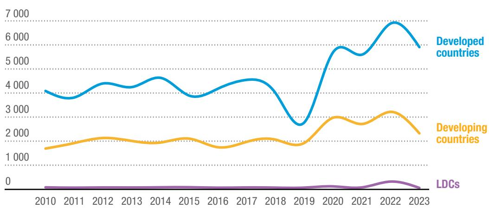  
Source: UNCTAD calculations, based on data from Global Trade Alert.
Note: The developing countries grouping does not include LDCs.

## Table IV.1

A shift from trade protection to direct support for productive sectors (Most frequent types of interventions, percentage)

<table><tr><td colspan="2">2010-2011</td><td colspan="2">2022-2023</td></tr><tr><td colspan="2">Intervention type</td><td colspan="2">Intervention type</td></tr><tr><td>Import tariff</td><td>22.4</td><td>Financial grant</td><td>13.6</td></tr><tr><td>Anti-dumping</td><td>10.9</td><td>Import tariff</td><td>12.9</td></tr><tr><td>Price stabilization</td><td>10.7</td><td>State loan</td><td>9.3</td></tr><tr><td>State loan</td><td>9.7</td><td>Controls on commercial transactions and investment instruments</td><td>7.7</td></tr><tr><td>Trade finance</td><td>8.8</td><td>Export ban</td><td>5.9</td></tr><tr><td>Import tariff quota</td><td>7.8</td><td>Capital injection and equity stakes</td><td>3.6</td></tr><tr><td>Financial grant</td><td>6.9</td><td>Trade finance</td><td>3.6</td></tr><tr><td>Local content incentive</td><td>4.7</td><td>State aid, unspecified</td><td>3.5</td></tr><tr><td>Export tax</td><td>2.0</td><td>Import ban</td><td>3.5</td></tr><tr><td>Anti-subsidy</td><td>1.4</td><td>Production subsidy</td><td>3.0</td></tr><tr><td>Share of top 10 types of interventions</td><td>85.2</td><td>Share of top 10 types of interventions</td><td>66.6</td></tr></table>

Source: UNCTAD calculations, based on data from Global Trade Alert.

In 2022–2023, the types of interventions differed by country grouping (see annex IV), as follows:

\- Developed countries – Aimed more at controlling commercial transactions and investment instruments, or at limiting or prohibiting imports.

\- Developing countries – Introduced more targeted financial subsidies for production or consumption, as well as tariff measures.

\- Least developed countries – Offered more support for exports or applied taxes on imports to match local taxes and made much less use of subsidies than developed or other developing countries.

Policy interventions may target sectors or particular types of firms such as SMEs, or be confined to certain locations (figure IV.2). Over the last decade, interventions have become more targeted. Governments seem to have aimed at picking winners or favoured incumbent firms and established markets rather than targeting failures in emerging ones.

Industrial
policies have
been shifting
towards
direct
interventions
in productive
sectors

Figure IV.2
Interventions have become more targeted toward specific firms
(Types of firms targeted by policy measures, percentage)  
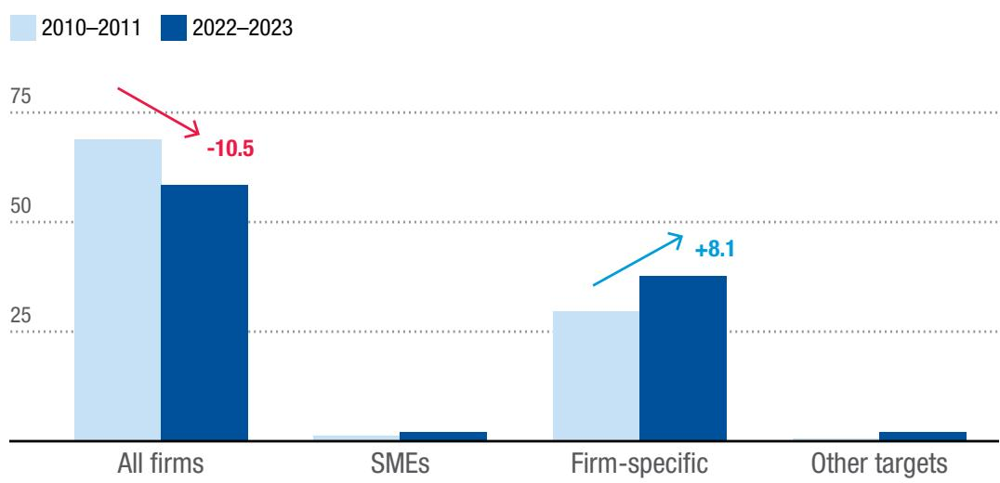  
Source: UNCTAD calculations, based on data from Global Trade Alert.

## C. Policies at the technological frontier

In recent decades, the rise of information and communication technologies (ICTs) has revolutionized telecommunications, reducing costs and improving reliability, while enabling advanced information management. This, coupled with falling transport costs and further trade and financial liberalization, along with more stringent intellectual property regimes, has favoured the emergence of global value chains (GVCs).

Participating in GVCs has been viewed as a driver of economic growth, offering firms opportunities for learning and upgrading. Yet a country's benefits from GVCs may be limited if these only offer a country low value added activities that do not encourage skill-building or moving up the value chain (Pietrobelli, 2021; UNCTAD, 2013).

Moreover, the low-cost labour comparative advantages of low-income economies has been undermined by capital-based technological change (Rodrik, 2016). In addition, the increasing globalization of the world economy and the diffusion of ICTs have swung the balance toward knowledge economies – based less on physical capital and more on intangible capital (Foray, 2004). $^{3}$

Innovation and value creation have increasingly been taking place in the knowledge-intensive service sectors. Since the 1970s, this has been accompanied by a rise in the share of service exports (figure IV.3). In recent years, the rapid diffusion of the Internet and ICTs has fuelled the emergence of digital platforms and the transition to digital economies based on the dematerialization of production and data monetization (UNCTAD, 2019).

## Figure IV.3

The share of services exports is increasing in total world trade exports (Percentage)

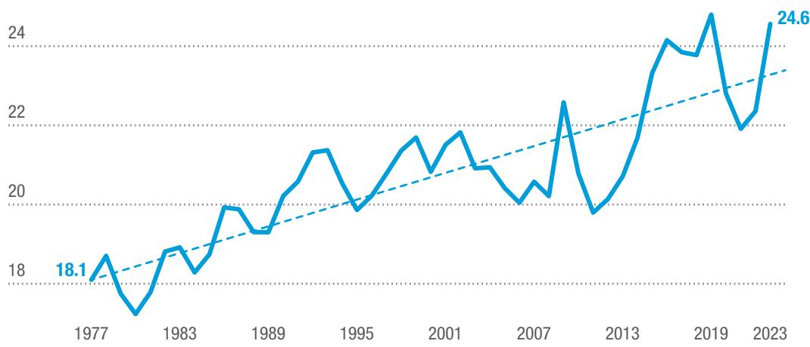  
Source: UNCTAD calculations, based on data from the World Bank.

Since 2010, industrial policies have seen an increasing share of interventions linked to STI-related aspects (figure IV.4). Moreover, in most advanced economies, there has been a general increase in R&D expenditure as a percentage of GDP.

This has been largely driven by the private sector, but some countries have also greatly expanded public R&D allocations, such as China (Filippetti and Vezzani, 2022). In most developing countries, however, R&D figures remain too low.

## Figure IV.4

Industrial policies increasingly focus on STI-related interventions (Number and share of STI-related policy instruments)  
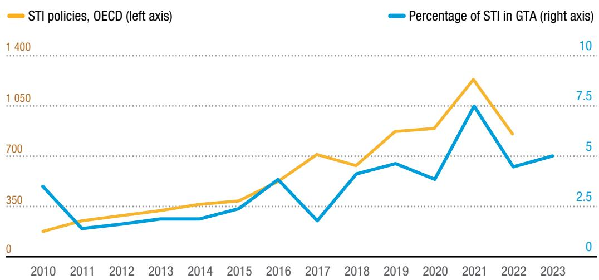  
Source: UNCTAD calculations, based on data from Global Trade Alert and the OECD STIP compass. $^{4}$

STI policies, particularly for frontier technologies, introduce additional rationales for intervention beyond those for traditional industrial policies. These stem from two key sources of uncertainty, namely, one related to the results of R&D and one related to

the diffusion and socioeconomic impact of new technologies (box IV.2). Given the uncertain outcomes and long-term horizons at the technological frontier, Governments need to learn partly by trial and error.

## Box IV.2

## Key issues for policies at the technological frontier

## Uncertainty and cumulativeness

R&D and frontier technology development are highly uncertain and long-term endeavours. Transforming scientific knowledge into innovative products and services is expensive and risky, often leading to failure. At the early stages, frontier technologies can involve multiple technical solutions and business models, of which only a few survive. Moreover, science and technology are complex and cumulative, so staying ahead requires continuous investment. Leading technological firms rely heavily on their R&D but also on skilled actors outside their boundaries.

## The timing dilemma

Governments may wish to support emerging technologies with public goods, but this involves difficult choices. It may be easier and cheaper to intervene early, but at this stage, the best bets might not yet be evident and the need to intervene might not be apparent. However, by the time dominant technologies have emerged and diffused in the economy, the corrections needed may be more costly and require more time to enact. Governments therefore need an anticipatory approach to policies at the technological frontier that balances uncertainty and costs and relies on strategic planning.

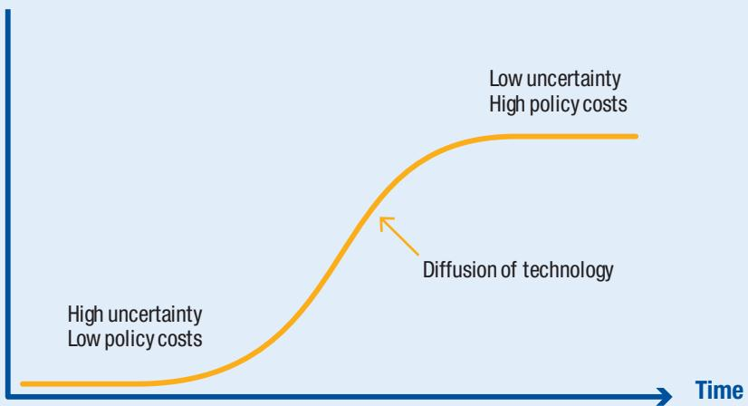  
Sources: UNCTAD; Collingridge, 1982; OECD, 2024.

Science and technology include basic and applied research, as well as experimental or incremental development, and can be performed by universities and research institutions or by firms. Innovation is, however, predominantly performed by firms, and is related to production processes, new goods and services, marketing strategies and overall business models. However, firms do not operate in silos, and their innovative capacities also rely on their industrial and institutional contexts (Morrison et al., 2008).

Project grants to fund basic research are often provided through higher education or research institutions. Grants for business R&D and innovation are usually for particular

## D. Policies for AI

AI technology has been theorized and developed since the middle of the last century, but has only recently entered everyday life and the policy realm (Haenlein and Kaplan, 2019). In 2017, Canada became the first country to officially issue a national AI strategy. Since then, AI has attracted significant attention from policymakers, with at least 1,900 new policy instruments (OECD, 2024a), and 89 national strategies (Maslej et al., 2024). Despite this rapid rise, AI policy is still a relatively new field of action, with profound uncertainties about what is needed and what works and what does not.

With the integration of AI into an increasing number of activities (see chapter II), Governments need to respond as a matter of both public concern and economic development. Increasing public awareness and concern about issues such as labour protection, human rights, unethical use, personal autonomy, data privacy and bias and discrimination have amplified attention paid to AI.

challenges or to help the outputs of science and new technologies become marketable products. Both are typically provided through competitive processes that favour the emergence of new ideas and strengthen a country's innovation potential.

Interactions between academia, research institutes, industry and Government lead to policy actions that are better tailored to the needs and potential of the innovation ecosystem. With regard to meeting societal needs, the engagement of civil society helps direct technology and innovation, and can point out potential unintended consequences.

While uncertainty and risks of failure are significant, inaction could result in even greater costs. Traditional policy and regulatory models struggle to match the speed, autonomy and opacity of AI systems, posing challenges for Governments, businesses and the international community (United Nations, AI Advisory Body, 2024). Policies for frontier technologies and AI need to be flexible and regularly updated (UNCTAD, 2023).

To date, most AI policies have been produced by developed countries. At the end of 2023, about two thirds of developed countries had a national AI strategy. Only 6 of the 89 national AI strategies were from LDCs (figure IV.5). Bangladesh and Sierra Leone took the lead in 2019 and were joined by four other LDCs in 2023, an uptick that may signal the beginning of greater LDCs participation in AI policymaking discourse, although these six countries form only around one eighth of LDCs. LDCs and developing countries need to move quickly to align AI adoption and development with their national development goals and agendas. Following the path set by others may not fulfil their needs and priorities.

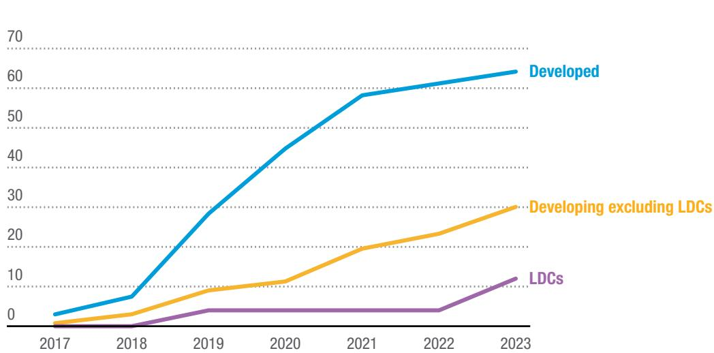  
Source: UNCTAD calculation based on Maslej et al., 2024.

Figure IV.6 shows the most common policy instruments. More than one third are related to national strategies and agendas, AI-related regulations or public consultations. This includes gathering information on technological trajectories, addressing social concerns and anticipating possible opportunities and downsides. Although around one third of developing countries have strategies and plans, these may not go beyond the declarative stage if they are not complemented by sufficient resources and instruments for implementation.

Policy instruments also support early-stage science and technology efforts, including networking and collaboration, public awareness campaigns and outreach activities to engage civil society. It is important to connect diverse actors in the AI innovation ecosystem, enabling idea exchanges, resource-sharing and collaboration, in order to identify gaps, promote best practices, prevent duplication and ensure efficient resource use.

To support the development and diffusion of AI, developed countries are more likely to use financial instruments, such as competitive grants for public research and for business R&D and innovation, as well as student fellowships, along with policies to support the development and uptake of AI through computing and research infrastructures. A greater proportion of instruments directly funding STI and AI infrastructure can be related to the larger budgets dedicated to R&D in developed countries.

In contrast, developing countries are more likely to target the use of AI in the public sector. Incorporating AI into e-government practices can expedite government processes, help overcome limited resources or bureaucratic backlogs and help learn about AI through its use (United Nations, 2022). However, this should not be at the cost of direct and practical interventions to support STI related to AI and create a supportive environment for business innovation that turns declarations into reality.

## Figure IV.6

## National strategies, agendas and plans are the most common AI policy instrument

(Most-used AI policy instruments, developed and developing countries; percentage)

Developing countries

Developed countries

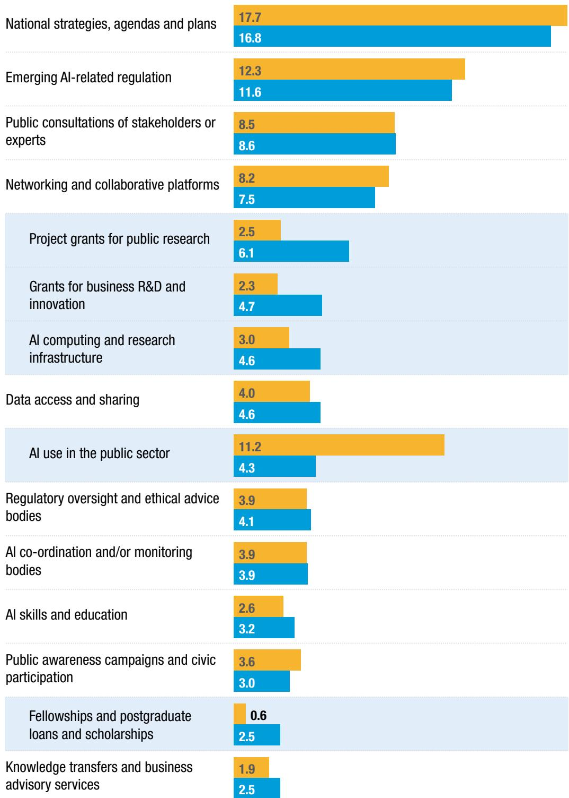  
Source: UNCTAD calculations, based on data from the OECD AI Policy Observatory.  
Note: The data are from OECD member States and only cover a few developing countries. Instruments for which developed and developing countries showing differences of 1 percentage point or more are highlighted.

The rise of digital technologies has made timely information and research results more easily accessible, helping diffuse new ideas and enabling a more participatory approach. In figure IV.6, this is reflected in the number of instruments targeting networking and collaborative platforms or public awareness campaigns to reach civil society. These platforms can also help address gaps in the AI ecosystem, helping to share best practices and reduce the duplication of efforts.

Typically, the countries more prepared for AI governance are developed countries with higher per capita GDP (figure IV.7). Readiness rises with GDP per capita and less advanced countries are in general unprepared to capitalize on AI opportunities and deal with risks, leaving them exposed to technological paths and regulations set by others.

However, some countries at the same levels of income are achieving more. For example, Rwanda, which issued a national AI strategy in 2023, has a much higher AI governance score than other countries with similar GDP per capita. Other “overperforming” developing countries include Brazil, China, India and Singapore, which have policies and strategies that could offer useful lessons for other countries.

## Policies for adopting and developing AI

Adopting – Policies targeting AI adoption should support the uptake and diffusion of AI products and solutions in the economy and provide upskilling and reskilling training to the workforce exposed to AI. By upgrading existing activities or enabling new ones, the diffusion of AI could move an economy towards the technological frontier.

## Figure IV.7 Countries with higher GDP per capita are more prepared for AI governance

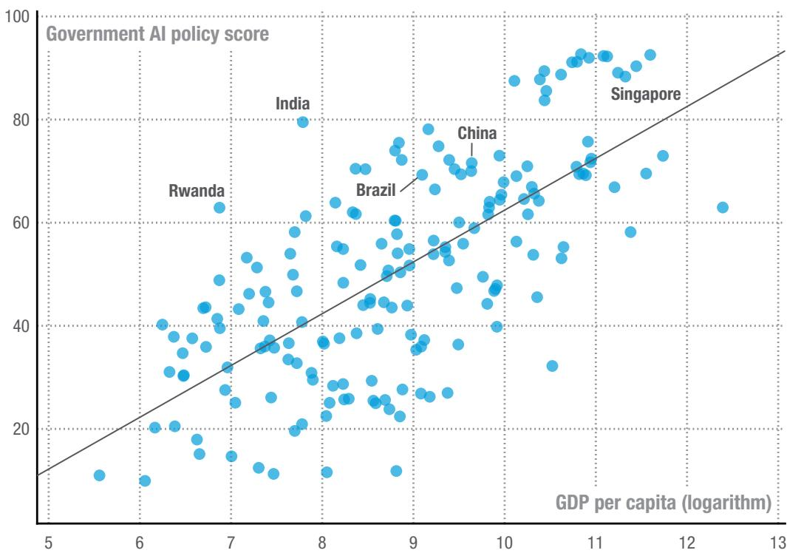  
Source: UNCTAD calculations, based on data on governance and ethics scores from Oxford Insights (Maslej et al., 2024), and on GDP per capita in 2022 from the World Bank Development Indicators database. Note: The index includes metrics related to data protection and privacy laws, cybersecurity measures, regulatory quality, ethical principles and accountability.

Many developing countries, however, are still in the policy design phase, partly because they lack AI ecosystems that can provide the necessary expertise on bottlenecks, opportunities and the measures that favour AI uptake. While developing countries may prefer to initially grasp only the low-hanging fruit of AI adoption, this could limit their capacity to catch up. In the long term, their opportunities for learning through imitation are likely to be hindered by the rapid evolution of technology.

Developing – Policies targeting AI development should expand the capabilities required to generate new knowledge, and create new prototypes, systems and applications.

These could include networking and distributing computing power across a country. Developed countries have done so in order to keep pushing the technological frontiers.

The two approaches are not, however, mutually exclusive and countries need to strike a balance between them. Developing countries may find it less challenging to support adoption by responding to particular sectoral needs, while taking a targeted approach to trigger positive dynamics and improved innovative capabilities. Yet they also need to make long-term strategic plans to support AI development; otherwise, as latecomers, they may end up with few options.

## E. Case studies of AI-related policies

This section discusses overarching approaches and strategies of the three main global markets:

China, the European Union and the United States, then presents instruments that address bottlenecks at the three leverage points of infrastructure, data and skills (table IV.2).

## Table IV.2

Examples of AI policies for adoption and development

<table><tr><td></td><td>Adoption(supporting the uptake and diffusion of AI)</td><td>Development(cultivating the capacity to generate new AI)</td></tr><tr><td>Overarching approaches</td><td colspan="2">Measures for the Administration of Generative Artificial Intelligence Services (China)AI Act (European Union)CHIPS [Creating Helpful Incentives to Produce Semiconductors] and Science Act (United States)</td></tr><tr><td>Infrastructure</td><td>Digital inclusion and connectivity (Brazil)e-Agriculture (Côte d’Ivoire)</td><td>High-performance computing infrastructure (Japan)K-Chips Act (the Republic of Korea)</td></tr><tr><td>Data</td><td>Data Observatory (Chile)Mobility Data Space (Germany)Ethical Guidelines for Application of AI in Biomedical Research and Healthcare (India)</td><td>Sandbox on privacy by design and by default in AI projects (Colombia)Computational data analysis provision (Singapore)</td></tr><tr><td>Skills</td><td>Digital Workforce Competitiveness Act (Philippines)National Plan for Digital Skills (Spain)</td><td>National Junior High School Computing Curriculum (Ghana)Al Research Scheme (Nigeria)</td></tr></table>

Source: UNCTAD.

## Setting overarching approaches and strategies

For the digital economy, there are three main regulatory approaches (UNCTAD, 2021). One option, as favoured in China, is direct intervention in support of national political goals using strict regulations. A second, as in the European Union, is strong regulations aimed at protecting fundamental rights and values. A third approach, favoured in the United States, involves a light regulatory framework. Recently, the development of AI and its wide-ranging societal and economic effects have influenced country strategies, with emerging similarities in approaches.

The first step of a national AI strategy is to identify and address coordination failures and weaknesses in the innovation system. Governments can, for example, support applied research through project grants for AI-related business activities. Pilot AI use cases in particular sectors and knowledge and technology transfer mechanisms can contribute to accelerate the adoption of AI. Countries can consider a multistep approach, as in China, first incentivizing the private sector to adopt, adapt and develop AI, and subsequently supervising and regulating the AI industry.

Governments need to promote good practices and enforce rules and standards, while revising regulations and policies to adapt to changing circumstances. $^{5}$ For example, the European Union provides a coherent framework integrating new legislation as it emerges, to address issues such as consumer protection, and regulating platforms to counterbalance concentration and ensure data protection.

Policy formulation and implementation are interactive and iterative processes that require continuous evaluation, and expectations need to be aligned with feasibility.

Failures should be accepted, as they are with regard to new ventures in the private sector, but evaluation mechanisms should be put in place to improve design and implementation (Rodrik, 2004). Currently, only about 10 per cent of the AI policies surveyed by OECD have been evaluated, based on data from the AI Policy Observatory.

## China

The Government of China has taken an increasingly active role in AI. In 2017, it set out a long-term strategic plan to transform China by 2030 from an AI contributor to a primary AI innovator (China, Ministry of Science and Technology, 2017). The plan is:

\- Technology-led – deploying forward-looking R&D in key frontier domains and achieving transformational and disruptive breakthroughs.

\- Systemic – formulating targeted strategies for different technologies and industries.

\- Market-oriented – fostering commercialization of AI and creating competitive advantages in related technologies.

\- Open – advocating open-source approaches to enable industry, academia and research collaborations.

China is now formulating industry standards and expanding regulatory oversight, and has recently moved to a more direct supervision of AI, introducing some of the world's first binding national regulations, defining requirements for how algorithms are built and deployed and establishing the information that developers must disclose to the Government and the public.

In 2023, the Cyberspace Administration introduced Interim Measures for the Administration of Generative Artificial Intelligence Services, for regulating research, development and the use of GenAI (Cyberspace Administration of China, 2023).

The measures impose various obligations on GenAI providers to ensure that models, contents and services comply with national requirements and uphold “core socialist values” and national security. They also aim to ensure the transparency of GenAI services and the accuracy and reliability of generated content, to prevent discrimination and respect intellectual property and individual rights. In this last aspect, the measures echo earlier provisions targeting deepfakes and fake news. In 2024, the Government launched a National Data Bureau to coordinate and support the development of foundational data systems, and to integrate, share, develop and apply data resources.

China relies on a series of technical and administrative tools, such as disclosure requirements, model auditing mechanisms and technical performance standards, as well as measures to ensure that public bodies are responsive to technological development. Focusing on particular emerging issues and technologies reduces the burden of generalization but demands a high level of responsiveness to technological advances and strong coordination among public bodies.

## European Union

In 2024, the European Union passed the AI Act, which defines rules according to the associated level of risk, namely, unacceptable, high, limited or minimal (European Parliament and Council of the European Union, 2024; O'Shaughnessy and Sheehan, 2023). Most applications, such as video games or spam filters, fall in the minimal risk category, and companies are only advised to adopt voluntary codes of conduct. The Act allows high-risk AI systems but says that these should include complete, clear and accessible instructions, which should be stored in an open database maintained by the European Commission in collaboration with member states.

The Act bans uses that present unacceptable risks, such as cognitive behavioural manipulation, social scoring, biometric identification and categorization, as well as remote biometric identification systems such as facial recognition. This is known as a risk-based approach.

The AI Act builds on previous legislation such as the General Data Protection Regulation of 2016, which guarantees privacy and respect for human rights (European Parliament and Council of the European Union, 2016). The Digital Service Act of 2022 is aimed at establishing a level playing field, to promote innovation and competitiveness in information services, from websites to digital platforms, and stop large providers from imposing unfair conditions that damage other businesses or limit consumer choice.

The European Union has also revised its industrial strategy to address external dependences on critical technologies. Strategic areas related to the AI value chain are critical raw materials, semiconductors, quantum technologies and cloud computing. In these areas, the European Union is building industrial, research and trade policies, fostering co-investment across member states and bringing together stakeholders in industrial alliances (European Commission, 2021). In 2023, to strengthen competitiveness and resilience in semiconductor technologies and applications, the European Union passed the European Chips Act, aiming to mobilize more than €43 billion of public and private investments and setting out measures to prepare for, anticipate and respond to possible supply chain disruptions, while strengthening its technological leadership. The European Union has also allocated funds for AI research and innovation. The European Research Executive Agency manages more than 1,000 research projects, with pioneering projects in AI and quantum technologies (European Commission, 2024).

The European
Union is
coupling its
regulatory
approach
with stronger
support for
industry and
research

AI policies
of major
economies
influence policy
options for
others and
could hinder
catch-up
efforts

## United States

In 2022, the United States Congress passed the CHIPS [Creating Helpful Incentives to Produce Semiconductors] and Science Act to boost scientific research and advanced semiconductor manufacturing capacity. The act was motivated by increasing dependency in chips manufacturing and the fact that federal R&D spending had neared its lowest point in 60 years, $^{6}$ and targets frontier technologies, including AI. Of the \$250 billion budgeted, 80 per cent are allocated to research activities and the rest to tax credits for chip manufacturers.

The Act exemplifies key aspects of policies for emerging technologies. It adopts an anticipatory approach, supporting technologies that could shape future industries. It addresses coordination failures, and leverages complementarities through a supply chain approach, supporting activities from hardware production to computing infrastructure, research, and skill development.

New talent will be trained through a national network for microelectronics education, as well as cybersecurity workforce development programmes. To retain talent, an AI scholarship programme has been set up for students who committed to a period of government service. The Act also promotes safe and trustworthy AI systems and the collection of best practices for artificial intelligence and data science. Finally, it envisages public–private partnerships that would establish virtual testbeds to examine potential vulnerabilities to failure, malfunction or cyberattack (Zhang et al., 2022).

The Blueprint for an AI Bill of Rights noted that AI and automated decision systems should not advance at the cost of civil rights, democratic values or foundational

American principles, and set out principles to guide the design, use and deployment of automated systems to protect the public (United States, 2022). Action is also being taken by individual states. In California, for example, an AI bill in 2024, required firms to commit to model testing and the disclosure of safety protocols and made compulsory a series of requirements that were previously only voluntary. This could represent a major shift in the way emerging and potentially disruptive technologies are dealt with in the United States (The Guardian, 2024; The Washington Post, 2024).

Figure IV.8 summarizes the main elements of AI policies deployed by China, the European Union and the United States. All are taking a cautious approach to regulating AI development, alongside substantial public investments across the AI supply chain, from semiconductors to data centres, and in research and development, to foster the emergence of new industries. Moreover, they aim for the inclusive integration of AI into both economies and societies, to benefit a wide range of stakeholders. These commonalities highlight key elements to consider in both national and global AI policy strategies.

AI policies in major economies can create significant spillover effects, shaping the policy choices of other countries. As leading countries set higher benchmarks, particularly in boosting competition and prioritizing R&D, not all countries are equally positioned to keep up. Many may struggle to match increasing R&D budgets, and the focus on future technologies can deepen disparities, widening the gaps between advanced economies and those working to catch up. This highlights the challenges faced by smaller or less advanced countries in keeping pace with global innovation leaders.

Overarching policy approaches of China, the European Union and the United States

Despite traditional differences, China, EU, and the United States show increasingly commonalities

<table><tr><td></td><td>China</td><td>European Union</td><td>United States</td></tr><tr><td>Regulatory framework aligned with social values</td><td>New Gen AI regulationAlignment with socialist values, well-being and national security</td><td>Artificial Intelligence ActRules based on AI risk to protect privacy and human rights</td><td>AI Bill of RightsCivil rights, democratic values and American principles</td></tr><tr><td>Industrial strategies targeting specific technologies and sectors</td><td>Long-term strategy to become leader in AI, tailored to industry specificities</td><td>Build capabilities in AI-related technologies, industrial alliances and co-investment in EU</td><td>Target semiconductors and frontier technologies to shape the future industry</td></tr><tr><td>Focus on STI</td><td>Technology-led approach based on forward-looking R&amp;D and open-source models to foster collaboration and networking</td><td>Additional support to pioneering research projects in AI and quantum technologies</td><td>Substantial public funding to R&amp;D in frontier technologies</td></tr></table>

Source: UNCTAD.

## Strengthening infrastructure to power AI

AI infrastructure can be classified under the two broad categories of digital connectivity and computing power. Relatively few policies aiming at improving digital infrastructure can be deemed AI-specific and, particularly when targeting connectivity, are often within the portfolio of the ministry of telecommunications or of infrastructure.

Gaps in digital infrastructure and inclusion are likely to be replicated in AI uptake (Bentley et al., 2024). Developing countries that lack universal digital access need to install and enhance national ICT and energy infrastructure and establish new forms of connectivity to reach underserved areas.

Working directly with communities, industrial representatives and individuals can help pinpoint specific business or geographical issues and the need for partnerships with private actors.

Improvements in wireless technologies and devices can facilitate small-scale AI adoption, but scaling up is much more demanding. Without adequate computing power and digital skills, connectivity alone risks turning an economy into a data exporter and missing opportunities to generate local benefits. The rise of cloud computing is a response to the increasing dependence of AI on data and computing power. When enhancing infrastructure systems, countries should prioritize connectivity, interoperability and standardization across systems, sectors, actors, users and providers, including across regional and national boundaries (table IV.3).

Gaps in
digital
connectivity
and
computing
power can
lead to unequal
distribution
of AI benefits
across places

<table><tr><td>BrazilDigital Inclusion and Connectivity</td><td>Côte d’Ivoiree-Agriculture</td><td>JapanHigh Performance Computing Infrastructure</td><td>Republic of KoreaK-Chips Act</td></tr><tr><td>Promote AI adoption by improving digital connectivity and involving public and private actors</td><td>Facilitate AI adoption in specific fields and sectors with targeted infrastructure development</td><td>Support AI development by strengthening national computing capacity</td><td>Foster the development of hardware components necessary to AI development</td></tr><tr><td>Key Actions</td><td>Key Actions</td><td>Key Actions</td><td>Key Actions</td></tr><tr><td>Reinforce backbone ICT infrastructure and 4G/5G networksUpgrade connectivity for all basic public schools and health care unitsInvolve private actors in the investment plan</td><td>Develop large-scale digital platformsAdopt sustainable digital services for e-agricultureIntegrate both physical infrastructure and digital services</td><td>Connect existing supercomputer with major universities and national laboratoriesStrengthen high-speed network across the country to distribute computing powerEncourage participation and innovation and in computing-intense sectors</td><td>Supporting facility investments in semiconductor and strategic technologiesStreamline regulation and standardization in microchipsFocus on SMEs</td></tr></table>

Source: UNCTAD.

Brazil – In 2023, the New Growth Acceleration Programme planned a \$5.7 billion investment to foster the transition to a digital economy through public–private partnerships for digital infrastructure; the federal Government would contribute about 44 per cent of the overall budget, State owned companies, 20 per cent, and private companies, 36 per cent. The plan is to expand 4G networks across the country, deploy new 5G networks and reinforce infrastructure with fibre-optic cables, such as the 587 km-long cables that will connect the capitals of two northern states, Amapá and Paraná, on opposite sides of the Amazon delta. This connectivity upgrade is aimed at reaching all public schools and healthcare units, contributing to the modernization of the public sector (Brazil, Federal Government, 2024).

Côte d'Ivoire – Targeted infrastructure can support the adoption of AI in particular sectors. For example, the e-Agriculture project is aimed at increasing the use of digital technologies and improving farm productivity and access to markets.

This is being pursued by improving Internet coverage and adoption, fostering the use of large-scale digital platforms, rehabilitating rural access roads and adopting sustainable digital services to diffuse e-agriculture. Focusing on both physical infrastructure and digital services, the project represents a value-chain approach that can respond to community needs (World Bank, 2024).

Japan – The High Performance Computing Infrastructure project strengthens national computing capacity for AI development. The project uses an existing supercomputer and connects major universities and national laboratories via a high-speed network (Research Organization for Information Science and Technology, 2024). By decentralizing access and networking institutions the project increases computing power availability and supports innovation in computing-intense sectors, increasing the number of new actors in the AI ecosystem. Decentralized organizational systems and distributed networks are crucial aspects of the digital revolution and a cornerstone of advanced AI ecosystems.

Republic of Korea – The K-Chips Act increases tax credits for investments in semiconductor enterprises and other national strategic technologies, with a focus on SMEs (Pan, 2023). The policy supports the development and production of essential hardware components of the AI value chain by streamlining regulation and standardization in the field of microchips, to provide a common and clear playing field for business development.

## Building data for responsible AI

Data is a key production factor in the knowledge economy. Many countries already had data policies in place before the advent of AI, but will need to update them, while others still lack national data frameworks. Data policies should ensure that databases are interoperable and available across the economy, with privacy protection for both inputs and outputs, relying on consent and taking account of possible biases (UNCTAD, 2024c).

AI systems add concerns related to ownership, while also raising questions of intellectual property or fairness and accountability when generating data and decisions. Supporting AI development may require rethinking intellectual property provisions and creating mechanisms to facilitate public-private collaboration. Such efforts should promote AI innovation while safeguarding human rights and addressing potential vulnerabilities and malfunctions.

Policies should also respond to the international and transboundary nature of AI. Using cloud computing available from international markets can reduce costs, but it is important to avoid increasing data and information dependency and stifling the future development of a domestic service market.

Countries need to consider all levels of the data value chain. Policies should clearly define which types of data can be made publicly available, and how they should be handled, and favour standards for data and metadata. Countries can also collect and provide open data, $^{7}$ either through AI-specific programmes or through open-data initiatives and hubs, to streamline data integration, storage, access and collaboration. $^{8}$ This could improve transparency, promote innovation and encourage public engagement in the adoption and development of AI.

Governments can also rely on industrial players to leverage existing strengths by supporting platforms for data exchange and aggregation and for data monetization and the development of AI for particular uses. Different types of data have their own requirements. In particular, for data on humans, or AI applications making decisions for humans, there should be higher standards for privacy and responsibility, and accountability in case of errors. Policies and standards can be developed through public consultations and open forums, to incorporate the views and concerns of different stakeholders, increase accountability and transparency and foster trust (table IV.4).

Data can have broad social value because they are non-rival, namely, the use of a data set does not preclude its availability for other uses. However, the strong market power of large digital corporations may limit the capacity of developing countries to maximize benefits (UNCTAD, 2021). UNCTAD, in a recent study, analysed the relationships between data and sustainable development (UNCTAD, 2024d). Chapter V discusses the implications and challenges for data at the international level.

<table><tr><td>ChileData Observatory</td><td>GermanyMobility Data Space</td><td>IndiaEthical Guidelines for AI in Biomedical Research and Healthcare</td><td>ColombiaSandbox on privacy by design and by default in AI projects</td><td>SingaporeComputational Data Analysis Provision</td></tr><tr><td>Facilitate AI adoption by supporting data availability</td><td>Apply AI systems to specific industries through sectoral data marketplace</td><td>Ensure privacy, safety and security in data and algorithmic decisions</td><td>Support AI solutions that respect personal information and rights</td><td>Revise copyright law to support AI development with data accessibility and security</td></tr><tr><td>Key Actions</td><td>Key Actions</td><td>Key Actions</td><td>Key Actions</td><td>Key Actions</td></tr><tr><td>Open data platforms leveraging public-private-academia collaborationsProvide data-based services and analyses across fields</td><td>Launch a market-based platform to exchange data for the mobility sectorIncentivize participation with financial remuneration</td><td>Prioritize human data privacy and securitySet processes to ensure representativeness and accountability in development and deployment of AI in health</td><td>Create a secure environment for the experimentation of AlPromote public-private collaboration to foster mutual learning</td><td>Introduce exceptions and favor computational data analysis and machine learningImplement safeguards to protect the commercial interests of copyright owners</td></tr></table>

Source: UNCTAD.

Chile – The Ministry of Science, Technology, Knowledge and Innovation, and the Ministry of Economy, Development and Tourism have set up the Data Observatory (Data Observatory, 2024), a public-private-academia collaboration that seeks to maximize the benefits from data for science, research and productive development. As a multi-stakeholder organization, the Observatory leverages the competences and resources of a variety of actors for developing STI and data-based services and analyses in different fields, from natural science to urban planning. It uses open-data platforms that facilitate the participation of small providers and supports projects and initiatives related to data analysis for social impact.

Germany – The Federal Ministry of Digital Affairs and Transport has launched Mobility Data Space, which brings together automobile companies, organizations and institutions that wish to monetize

their data, seek data exchanges that bring mutual benefits or need data for innovative AI mobility solutions (Mobility Data Space, 2024). A market-based platform, it incentivizes participation by offering the potential for financial remuneration – representing a model that leverages existing industrial strengths to support the diffusion of AI (for a presentation on the rationales and design principles, see acatech, 2024).

India – The Council of Medical Research has issued Ethical Guidelines for Application of Artificial Intelligence in Biomedical Research and Healthcare, to direct AI adoption and development involving humans or their data (INDIAai, 2023). These recognize the importance of processes for safety and minimizing risk to prevent unintended or deliberate misuses that can harm patients. Data sets used by AI should avoid biases by adequately representing the population and guaranteeing the highest privacy and security standards for patient data.

Colombia – The Data Protection Authority has created a Sandbox on Privacy by Design and by Default in Artificial Intelligence Projects (Ibero-American Data Protection Network, 2021). This is an experimental space where AI companies can collaborate on solutions that respect personal information and rights, by design and in compliance with national data-processing regulations. The Authority accompanies the process and gathers information about possible regulatory adaptations, to keep pace with technological advances, thereby also making the sandbox a tool for policy learning.

Singapore – In the Copyright Act 2021, Singapore redesigned the copyright regime to take account of how copyrighted works are created, distributed, accessed and used (Singapore, The law revision commission, 2021). The Act is aimed at making available large and diverse data sets for algorithmic training. The Act introduces an exception to the current regime that permits the copying of copyrighted works for the purpose of computational data analysis such as text and data mining and the training of machine-learning algorithms. It also introduces conditions and safeguards to protect the commercial interests of copyright owners (Singapore, Intellectual Property Office, 2022).

## Reskilling and upskilling for AI

AI has the potential to transform many industries in the near future, reshaping labour markets, altering tasks and changing required skill sets. Demand is increasing for skilled workers who can adopt and develop AI, including technical expertise in data science and AI skills for particular business operations.

Countries need population-wide digital literacy, to ensure that everyone can take advantage of AI for work and personal life, and to have highly trained individuals who can develop AI systems and adapt them to particular needs.

This should start with the inclusion of STEM and AI subjects at multiple levels within the national education system, from early education to adult learning. Introducing foundational data science and AI-related subjects in the early phases of education can help develop technology-savvy generations ready for AI-based businesses.

Governments can also introduce or encourage programmes for retraining upskilled or displaced workers, with particular attention paid to women, who are underrepresented in both STEM and AI (Green and Lamby, 2023), and to older workers with low levels of digital skills, who are less likely to engage in such training (OECD, 2023). Policymakers can address concerns about diversity and inclusivity by empowering all demographic groups with the necessary skill sets to benefit or contribute to AI. By partnering with private institutions, Governments can also target particular sectors or industries.

Philippines – In 2023, the National Economic and Development Authority published the Digital Workforce Competitiveness Act. The legislation puts human development at the forefront, aiming for equitable access and the provision of digital skills and competences that meet global quality standards to accelerate innovation and entrepreneurship. The Act targets particular digital skills, such as data analytics and AI or engineering and cloud computing, through upskilling, reskilling and training programmes, offering a variety of incentives to foster digital careers (Philippines, National Economic and Development Authority, 2023). The Act takes an anticipatory approach, envisaging the mapping of digital skills and technologies as the basis for formulating a road map that considers the evolution of jobs and skills. It also establishes an inter-agency council, including different state departments and agencies, which raises awareness about digital upskilling opportunities and coordinates actions, leverages complementarities, rationalizes policy interventions and provides a single-entry point for training, certification and scholarships.

Spain – The National Plan for Digital Skills provides a list of actions and objectives to address gender bias in digital technologies (Spain, Ministry for Economic Affairs and Digital Transformation, 2021) and to increase the readiness of girls and women for AI (Jākobsone, 2021; La Moncloa, 2021). To direct girls toward these disciplines, it introduces STEM subjects in primary education and includes programmes aimed at orienting women towards digital professions. The plan involves an analysis of the strengths and weaknesses of, opportunities for and threats to women's participation in digital and technology careers (Spain, Government, 2021).

Ghana – To enable the younger generation to keep pace with a continuously evolving field, the Government has introduced coding and programming to the national education system and begun to train educators in how to teach them (Ghana, Ministry of Education, 2021). Moreover, subjects go beyond coding skills, to cover the fundamentals of how AI works, and concepts related to human, animal, robot and artificial intelligences, as well as weak and strong AI. The programme is gender responsive and is aligned with other initiatives such as the Girls-in-ICT programme (Ghana, Ministry of Communication, Digital Technology and Innovations, 2024), which has provisions similar to the National Plan for Digital Skills in Spain.

## Table IV.5 Examples of policies to reskill and upskill

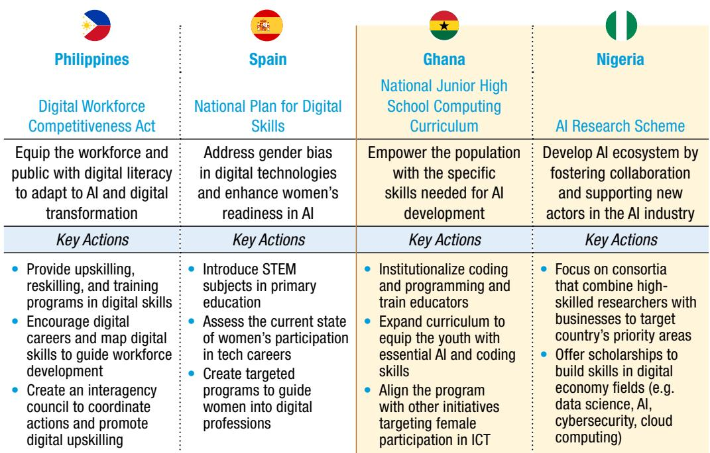

Source: UNCTAD.

Nigeria – To foster the development of the AI ecosystem, the Federal Ministry of Communications, Innovation and Digital Economy launched the Nigeria Artificial Intelligence Research Scheme, aimed at providing financial support and facilitating knowledge-sharing and collaboration among individuals and organizations, to nurture new actors in the AI industry (Nigeria, National Information Technology Development Agency, 2024). The scheme provides scholarships to develop skills related to the digital economy, such as data science, AI and cloud computing. By fostering partnerships between high-skill AI researchers and businesses, the scheme is part of a broader strategy to build the workforce of the future. $^{9}$

## F. A whole-of-government approach to AI policy

The resurgence of industrial and STI policies, coupled with the rapid advancement of AI, has placed AI policies at the forefront of policymaking. AI policies are crucial in driving structural transformation, boosting productivity and tackling social, ethical and environmental challenges. As the global economy transits towards services and digitalization, Governments should adapt industrial and STI policies, to support the adoption and development of new technologies, as well as the dissemination and absorption of knowledge.

Adapting to changing global conditions and harnessing frontier technologies requires swift and purpose-driven policy interventions. However, setting AI policies is not easy. When Governments need to provide public goods for these technologies, they have broad decision-making authority, but this is tempered by uncertainty regarding the trajectories and outcomes of policy decisions. Nevertheless, an anticipatory approach can help avoid the need to make corrections after most opportunities have passed.

The unique characteristics of data-driven AI highlight the need for policy changes, with robust data governance, including regulations and standards for data-sharing and privacy protection. Additionally, the ability of AI to generate new data and concerns about deepfakes and misinformation require frameworks that regulate AI not only as a product but also within decision-making processes, ensuring transparency, explainability, ethics and accountability. However, considering the high level of concentration of AI markets, enforcement and regulation can be challenging for smaller economies. In this respect, chapter V discusses AI policy efforts at the international level, offering suggestions of how the international community can support inclusive AI development that benefits all.

AI is a pervasive technology that requires a whole-of-government approach, to align AI strategies with policies across sectors, including industry, education, infrastructure and trade. Doing so requires enhanced coordination, to leverage synergies among action plans. AI policies should go beyond incentives such as tax deductions, and incorporate regulation, governance and enforcement, to direct technological change and provide collective solutions to the major challenges of this century. Collaboration among stakeholders is essential to maximize societal benefits. To ensure effective adoption and development, successful AI strategies should also focus on the key leverage points of infrastructure, data and skills.

# Policy interventions

This annex provides information on industrial policies derived from Global Trade Alert. $^{10}$

## Table 1

Top 10 countries with highest number of policy interventions, 2010–2011 and 2022–2023

<table><tr><td colspan="2">2010–2011</td><td colspan="2">2022–2023</td><td>Change in ranking</td></tr><tr><td>Implementing jurisdiction</td><td>Number of interventions</td><td>Implementing jurisdiction</td><td>Number of interventions</td><td>2022–2023 compared with 2010–2011</td></tr><tr><td>United States</td><td>1 399</td><td>United States</td><td>1 562</td><td>No change in rank</td></tr><tr><td>Brazil</td><td>1 194</td><td>China</td><td>1 552</td><td>↑</td></tr><tr><td>China</td><td>553</td><td>Brazil</td><td>843 ↓</td><td></td></tr><tr><td>Germany</td><td>433</td><td>Australia</td><td>797</td><td>↑ ↑</td></tr><tr><td>United Kingdom</td><td>364</td><td>Italy</td><td>712</td><td>↑</td></tr><tr><td>India</td><td>305</td><td>Germany</td><td>685 ↓</td><td></td></tr><tr><td>Italy</td><td>273</td><td>Canada</td><td>599</td><td>↑ ↑</td></tr><tr><td>Spain</td><td>237</td><td>India</td><td>558 ↓</td><td></td></tr><tr><td>Argentina</td><td>224</td><td>Russian Federation</td><td>543</td><td>↑ ↑</td></tr><tr><td>Poland</td><td>216</td><td>France</td><td>485</td><td>↑</td></tr></table>

Source: UNCTAD calculations, based on data from Global Trade Alert.
Note: Two arrows indicate a move in the ranking of 10 positions or more.

Distribution of new policy interventions by main category, 2022–2023 (Percentage)

<table><tr><td>MAST taxonomy</td><td>Developed countries</td><td>Developing countries</td><td>LDCs</td><td>All countries</td></tr><tr><td>C4 Import monitoring, surveillance and automatic licencing measures</td><td>0.00</td><td>0.04</td><td>0.27</td><td>0.02</td></tr><tr><td>Capital control measures</td><td>11.75</td><td>0.18</td><td>0.00</td><td>8.09</td></tr><tr><td>D1 Antidumping</td><td>2.50</td><td>1.97</td><td>1.88</td><td>2.33</td></tr><tr><td>D2 Countervailing measures</td><td>0.55</td><td>0.04</td><td>0.00</td><td>0.38</td></tr><tr><td>D31 General (multilateral) safeguards</td><td>0.00</td><td>0.09</td><td>0.27</td><td>0.03</td></tr><tr><td>D32 Special agricultural safeguards</td><td>0.84</td><td>0.00</td><td>0.00</td><td>0.58</td></tr><tr><td>E1 Non-automatic import-licencing procedures (excluding sanitary and phytosanitary measures)</td><td>0.05</td><td>2.47</td><td>0.54</td><td>0.77</td></tr><tr><td>E2 Quotas</td><td>1.33</td><td>0.67</td><td>0.54</td><td>1.12</td></tr><tr><td>E3 Prohibitions</td><td>4.56</td><td>1.21</td><td>2.69</td><td>3.53</td></tr><tr><td>E6 Tariff-rate quotas</td><td>3.09</td><td>2.94</td><td>0.54</td><td>2.99</td></tr><tr><td>F7 Internal taxes and charges levied on imports</td><td>0.40</td><td>3.52</td><td>4.30</td><td>1.40</td></tr><tr><td>Foreign direct investment measures</td><td>1.99</td><td>1.30</td><td>1.08</td><td>1.77</td></tr><tr><td>G Finance measures</td><td>0.05</td><td>0.40</td><td>2.96</td><td>0.21</td></tr><tr><td>I1 Local content measures</td><td>2.23</td><td>5.11</td><td>0.54</td><td>3.05</td></tr><tr><td>Instrument unclear</td><td>1.42</td><td>0.29</td><td>0.00</td><td>1.06</td></tr><tr><td>Subsidies</td><td>37.58</td><td>47.78</td><td>19.09</td><td>40.23</td></tr><tr><td>M1 Market access restrictions</td><td>0.30</td><td>0.16</td><td>0.27</td><td>0.26</td></tr><tr><td>M2 Domestic price preferences</td><td>0.01</td><td>0.16</td><td>0.00</td><td>0.05</td></tr><tr><td>M3 Offsets</td><td>2.03</td><td>1.01</td><td>0.27</td><td>1.69</td></tr><tr><td>M5 Conduct of procurement</td><td>1.37</td><td>0.09</td><td>0.00</td><td>0.96</td></tr><tr><td>Migration measures</td><td>0.13</td><td>0.47</td><td>0.00</td><td>0.23</td></tr><tr><td>N Intellectual property</td><td>0.02</td><td>0.00</td><td>0.00</td><td>0.01</td></tr><tr><td>P3 Export licences, quotas, prohibitions and others (excluding sanitary and phytosanitary measures)</td><td>8.72</td><td>5.32</td><td>7.53</td><td>7.69</td></tr><tr><td>P4 Export price-control measures</td><td>1.63</td><td>3.25</td><td>0.81</td><td>2.10</td></tr><tr><td>P6 Export-support measures</td><td>4.42</td><td>3.07</td><td>34.41</td><td>4.62</td></tr><tr><td>P9 Export measures not elsewhere specified</td><td>2.28</td><td>0.99</td><td>8.87</td><td>2.03</td></tr><tr><td>Tariff measures</td><td>10.75</td><td>17.47</td><td>13.17</td><td>12.79</td></tr><tr><td>Total</td><td>100.00</td><td>100.00</td><td>100.00</td><td>100.00</td></tr></table>

Source: UNCTAD calculations, based on data from Global Trade Alert.

Notes: The Multi-Agency Support Team was established by UNCTAD in 2006 to develop a taxonomy of non-tariff measures; the resulting taxonomy took the MAST acronym. The categorization of policy interventions uses the international classification of non-tariff measures with the addition of other categories to classify other types of interventions (e.g. tariff measures and capital control measures). For information on the classification, see https://unctad.org/publication/international-classification-non-tariff-measures-2019-version.

## References

acatech (2024). Fact sheet: data spaces. National Academy of Science and Engineering. Germany.

Agrawal A, Gans J and Goldfarb A (2019). Prediction, judgment, and complexity: a theory of decision-making and artificial intelligence. In: Agrawal A, Gans J, and Goldfarb A (eds). The Economics of Artificial Intelligence: an Agenda. University of Chicago Press: 89–110.

Bentley SV, Naughtin CK, McGrath MJ, Irons JL and Cooper PS (2024). The digital divide in action: how experiences of digital technology shape future relationships with artificial intelligence. AI and Ethics. 4901–915.

Brazil, Federal Government (2024). The New Growth Acceleration Programme. Available at https://www.gov.br/casacivil/pt-br/novopac.

Brazil National Data Protection Authority (2024). Decision order No. 20/2024/PR/ANPD. Available at https://www.in.gov.br/en/web/dou/-/despacho-decisorio-n-20/2024/pr/anpd-569297245.

China, Ministry of Science and Technology (2017). Next generation artificial intelligence development plan issued by state council. China science & technology newsletter. Department of International Cooperation, Ministry of science and technology, P.R. China.

Collingridge D (1982). The Social Control of Technology. St. Martin's Press. New York.

Corrado C, Haskel J, Jona-Lasinio C and Iommi M (2022). Intangible capital and modern economies. Journal of Economic Perspectives. 36(3):3–28.

Cyberspace Administration of China (2023). Interim Measures for the Administration of Generative Artificial Intelligence Services. Available at https://www.cac.gov.cn/2023-07/13/c\_1690898327029107.htm.

Data Observatory (2024). We have open data platforms and resources for reuse, distribution and analysis. Available at https://dataobservatory.net/.

European Commission (2021). Strategic dependencies and capacities. Commission Staff Working Document, European Commission. Brussels.

European Commission (2024). New Horizon Europe funding boosts European research in AI and quantum technologies. Available at https://digital-strategy.ec.europa.eu/en/news/new-horizon-europe-funding-boosts-european-research-ai-and-quantum-technologies.

European Parliament and Council of the European Union (2024). European Union Artificial Intelligence Act.

European Parliament and Council of the European Union (2016). Regulation (EU) 2016/679 of the European Parliament and of the Council of 27 April 2016 - on the Protection of Natural Persons with Regard to the Processing of Personal Data and on the Free Movement of Such Data, and Repealing Directive 95/46/EC (General Data Protection Regulation).

Evenett SJ (2019). Protectionism, state discrimination, and international business since the onset of the global financial crisis. Journal of International Business Policy. 2(1):9–36.

Filippetti A and Vezzani A (2022). The political economy of public research, or why some governments commit to research more than others. Technological Forecasting and Social Change. 176:121482.

Foray D (2004). The Economics of Knowledge. The MIT Press.

Gereffi G (2020). What does the COVID-19 pandemic teach us about global value chains? The case of medical supplies. Journal of International Business Policy. 3(3):287–301.

Ghana, Ministry of Communication, Digital Technology and Innovations (2024). Girls-In-ICT. Empowering girls or women through ICT. Available at https://moc.gov.gh/girls-in-ict-2024/.

Ghana Ministry of Education (2021). Computing Common Core Programme (CCP): Curriculum for JHS1 (B7) - JHS3 (B9). National Council for Curriculum & Assessment, Ministry of Education.

# Chapter IV Designing national policies for AI

Green A and Lamby L (2023). The supply, demand and characteristics of the AI workforce across OECD countries. OECD Social, Employment and Migration Working Papers No. 287.

Haenlein M and Kaplan A (2019). A brief history of artificial intelligence: On the past, present, and future of artificial intelligence. California Management Review. 61(4):5–14.

Ibero-American Data Protection Network (2021). Colombia Data Protection Authority launches innovative regulatory Sandbox on privacy by design and by default in artificial intelligence projects. Available at https://www.redipd.org/en/news/colombia-data-protection-authority-launches-innovative-regulatory-sandbox-privacy-design-and.

INDIAai (2023). ICMR (Indian Council of Medical Research) releases ethical guidelines for AI in biomedical research and healthcare. Available at https://indiaai.gov.in/news/icmr-releases-ethical-guidelines-for-ai-in-biomedical-research-and-healthcare.

ITU (2022). The Global Connectivity Report 2022. Geneva.

Jäkobsone M (2021). Spain National Plan for Digital Skills. Available at https://digital-skills-jobs.europa.eu/en/actions/national-initiatives/national-strategies/spain-national-plan-digital-skills.

Juhász R, Lane N and Rodrik D (2024). The new economics of industrial policy. No. w31538. National Bureau of Economic Research. Cambridge, United States.

La Moncloa (2021). Spain accelerates digital transformation and places itself on the European connectivity podium. Available at https://www.lamoncloa.gob.es/lang/en/gobierno/news/paginas/2021/20211202\_spain-digital-day.aspx.

Maslej N, Fattorini L, Perrault R, Parli V, Reuel A, Brynjolfsson E, Etchemendy J, Ligett K, Lyons T, Manyika J, Niebles JC, Shoham Y, Wald R and Clark J (2024). The AI index report 2024. AI Index Steering Committee, Institute for Human-Centered Artificial Intelligence, Stanford University, United States.

Mobility Data Space (2024). Solutions and features of the mobility data space. Available at https://mobility-dataspace.eu/.

Morrison A, Pietrobelli C and Rabellotti R (2008). Global value chains and technological capabilities: a framework to study learning and innovation in developing countries. Oxford Development Studies. 36(1):39–58.

Mwenda T, Baru J, Chege B, Kitonga K, Lemayian D, Powers W, Mburu W, Ngaruiya N, Gitau S (2024). Made in Africa: An African perspective to the design, deployment and governance of Al. Qubit Hub.

Nigeria National Information Technology Development Agency (2024). Nigeria Artificial Intelligence Research Scheme. Available at https://airg.nitda.gov.ng/.

OECD (2023). OECD Employment Outlook 2023: Artificial Intelligence and the Labour Market. (OECD Publishing, Paris).

OECD (2024a). OECD.AI policy observatory. Available at https://oecd.ai/en/dashboards/overview.

OECD (2024b). Framework for anticipatory governance of emerging technologies. OECD Science, Technology and Industry Policy Papers No. 165.

O'Shaughnessy M and Sheehan M (2023). Lessons from the world's two experiments in AI governance. Available at https://carnegieendowment.org/posts/2023/02/lessons-from-the-worlds-two-experiments-in-ai-governance?lang=en.

Pan C (2023). The South Korean K-Chips Act and its impact on international companies and investors. Available at https://www.goodwinlaw.com/en/insights/publications/2023/06/alerts-privateequity-the-south-korean-k-chips-act.

Philippines, National Economic and Development Authority (2023). Philippine Digital Workforce Competitiveness Act.

Pietrobelli C (2021). New industrial innovation policies in a world of global value chains. In: Lee J-D, Lee K, Meissner D, Radosevic S, and Vonortas N (eds.) The challenges of technology and economic catch-up in emerging economies. Oxford University Press.

Pisano GP and Shih WC (2009). Restoring American competitiveness. Harvard Business Review. 87(7/8):114–125.

Research Organization for Information Science and Technology (2024). Overview of high performance computing infrastructure. Available at https://www.hpci-office.jp/en/about\_hpci/what\_is\_hpci.

Rodrik D (2004). Industrial policy for the twenty-first century. Harvard University, United States.

Rodrik D (2016). Premature deindustrialization. Journal of Economic Growth. 21(1):1–33.

Singapore, Intellectual Property Office (2022). Factsheet on copyright act 2021. Intellectual Property Office of Singapore.

Singapore, The law revision commission (2021). Copyright Act 2021.

Spain, Government (2021). Plan Nacional de Compentencias Digitales.

Spain, Ministry for Economic Affairs and Digital Transformation (2021). Digital transformation and IT strategy toolkit.

The Guardian (2024). California advances landmark legislation to regulate large AI models.

The Washington Post (2024). California AI bill passes State Assembly, pushing AI fight to Newsom.

UNCTAD (2013). World Investment Report 2013: Global Value Chains - Investment and Trade for Development. (United Nations publication. Sales No. E.13.II.D.5. New York).

UNCTAD (2019). Digital Economy Report 2019: Value Creation and Capture: Implications for Developing Countries. (United Nations publication. Sales No. E.19.II.D.17. New York).

UNCTAD (2021). Digital Economy Report 2021: Cross-Border Data Flows and Development – For Whom the Data Flow. (United Nations publication. Sales No. E.21.II.D.18. New York).

UNCTAD (2023). Technology and Innovation Report 2023: Opening Green Windows - Technological Opportunities for a Low-Carbon World. (United Nations publication. Sales No. E.22.II.D.53. Geneva).

UNCTAD (2024a). Trade and Development Report 2024: Rethinking Development in the Age of Discontent. (United Nations publication. Sales No. E.24.II.D.23. New York).

UNCTAD (2024b). Economic Development in Africa 2024: Unlocking Africa's Trade Potential – Boosting Regional Markets and Reducing Risks. (United Nations publication. Sales No. E.25.II.D.5. New York).

UNCTAD (2024c). Global cooperation in science, technology and innovation for development.

UNCTAD (2024d). Data for development. Technical and statistical report No. UNCTAD/DTL/TIKD/2024/2. United Nations. New York.

United Nations (2022). E-Government survey 2022: the future of digital government. United Nations. New York.

United Nations, AI Advisory Body (2024). Governing AI for Humanity: Final Report. High-level Advisory Body on Artificial Intelligence. Available at https://www.un.org/en/ai-advisory-body.

United States (2022). Blueprint for an AI bill of rights. The White House.

United States, Senate Committee on Commerce, Science, and Transportation (2022). CHIPS and ORAN investment division: a summary. HR 4346, the CHIPS and Science Act of 2022.

Välilä T (2008). ‘No policy is an island’ – on the interaction between industrial and other policies. Policy Studies. 29(1):101–118.

Warwick K (2013). Beyond industrial policy: emerging issues and new trends. OECD Science, Technology and Industry Policy Papers No. 2.

World Bank (2024). Côte d'Ivoire - E-Agriculture Project. Washington, D.C.

Zhang D, Clark J and Perrault R (2022). The 2022 AI index: industrialization of AI and mounting ethical concerns. Institute for Human-Centered Artificial Intelligence, Stanford University, United States.

Chapter V

Global
collaboration
for inclusive and
equitable AI

International AI governance initiatives are highly fragmented and dominated by developed countries. AI technology is largely controlled by a few technology giants, which are likely to prioritize profits over societal benefits, and it can be deployed virtually anywhere, extending its influence beyond borders.

Therefore, Governments should act to establish international guidance on AI development that favours public interest and promotes AI as a public good. Most developing countries have significant stakes in the future of AI but have limited influence over the direction it takes, which may result in a failure of global AI governance.

This requires multi-stakeholder cooperation to make AI accessible and beneficial for everyone and foster inclusive innovation in tackling global challenges. A comprehensive global framework for AI should incorporate accountability mechanisms for companies, Governments and institutions. UNCTAD, in this report, advocates an AI-for-all approach, addressing infrastructure, data and skills, to steer the technology towards shared goals and values.

# Key policy takeaways

A framework for industry commitment – Public disclosure of AI systems can improve transparency and accountability. One possible model is the environmental, social and governance (ESG) framework. An AI equivalent could involve impact assessments throughout the AI life cycle and detailed explanations by developers of how AI systems function. Once shared standards have been established, certification could shift from voluntary to mandatory reporting, supported by measures to oversee compliance.

Shared digital public infrastructure – A global shared facility, for example following the CERN model, can provide equitable access to AI infrastructure. Governments can also collaborate with the private sector through public–private partnerships to expedite the development of digital public infrastructure (DPI) for AI in local innovation ecosystems. Tailored DPI systems can offer essential resources and services to support AI adoption and development.

Open innovation – Open innovation models, such as open data and open source, can democratize knowledge and resources to foster inclusive AI innovation. The international community can benefit from coordinating and harmonizing the valuable but fragmented open-source AI resources worldwide. Connected and interoperable repositories with common standards can enhance the global knowledge base and improve access through trusted hubs that ensure quality and security.

A global hub – An AI-focused centre and network modelled, for example, on the United Nations Climate Technology Centre and Network, can function as a global hub for building AI capacity, facilitating technology transfer and coordinating technical assistance to developing countries.

South–South collaboration – Strengthening South–South cooperation in science and technology, through building regional innovation hubs and expert networks, can contribute to enhancing the capacity of developing countries to address common AI challenges. Provisions for AI technology and services could be included in existing trade agreements, while regional institutions can assist in sharing best practices and developing coherent AI policies.

# A. The need for global AI governance

Many AI-related issues can be addressed at the national level through well-designed policies. However, as AI encompasses intangible goods and services that can be replicated and deployed virtually anywhere, its influence extends beyond borders, necessitating international collaboration. Ensuring AI as a public good requires a collective multi-stakeholder effort to make it accessible, equitable and beneficial for all, driving inclusive innovation to tackle global challenges.

AI is set to change the technological, economic and social landscape, presenting new opportunities and risks while requiring stronger global collaboration, including the following:

\- Reshaped economic opportunities – AI shifts innovation and value creation towards knowledge-intensive sectors, reshaping economic opportunities and power relationships in a multipolar world. It is also transforming traditional sectors and businesses, leading to greater servicification across economies. This can energize economic activities and open new opportunities, but it can also displace workers and undermine the comparative advantage of developing countries in low-cost labour.

\- Dominant companies – AI development and deployment are led by a handful of large multinational companies. Private enterprises are driven by profit motives for shareholders, but their decisions can affect the whole of society. Larger countries can seek to regulate these companies but smaller countries, particularly less developed ones, may lack institutional capacity and economic strength. They may, therefore, be subject to decisions made elsewhere unless consistent international cooperation and common principles on AI are established.

\- Rapid diffusion – New foundation models and AI applications can be diffused virtually everywhere in a short period of time. They can therefore impact economies and business worldwide before policymakers become aware of their existence. For example, Facebook took about 10 months to reach 1 million users and the platform known at the time as Twitter, about two years; in contrast, ChatGPT reached 100 million users in only two months (Hu, 2023). Such rapid diffusion requires international coordination in regulation and monitoring, aiming for broader societal goals that benefit the global community (Cihon, 2019).

\- Slow regulatory adaptation – Technological advances often outstrip the pace at which current regulatory frameworks can adapt, particularly in countries with lower levels of development. This means that hundreds of millions of people in developing countries cannot influence the direction of technological change but are nevertheless exposed to possible negative consequences. This includes different types of bias, as AI technologies trained on skewed or discriminatory data are likely to ignore particular social, economic, environmental and cultural contexts, with the risk of deepening existing data divides (UNCTAD, 2024a). Regulatory mechanisms that differ from one country to another may result in inconsistent or contradictory impacts across countries, sectors or parts of society, distributing benefits and costs in an uneven and unfair manner.

\- Cross-border flows of data and skills – AI applications are spread across digital infrastructures and rely on digital skills and vast amounts of data that flow through international hubs. Cross-border flows are growing rapidly in digital trade, international commerce and Internet platforms and services. This digital economy shows increasing returns to scale, which can trigger a self-reinforcing dynamic whereby more data translates into value that in turn enables the collection of even more data (UNCTAD, 2024a). Moreover, certain categories of workers are increasingly able to participate in the global labour market either through online freelance and virtual work or by relocating to countries with more or better job opportunities. Such labour flows are typically from developing to developed countries.

## B. Aligning AI with social objectives

## The dominance of multinational tech giants

Technology leadership by the private sector is not new. What is new to AI is the unprecedented level of control and understanding that private companies have over the technology, an imbalance that limits the ability of Governments to steer AI development in the public interest.

The current AI boom relies on decades of academic work, such as in machine learning and natural-language processing, but most of the latest cutting-edge and high-profile research is carried out by private companies and is not published in peer-reviewed scientific journals. In 2023, researchers in corporations contributed only 3.8 per cent of AI-related academic papers. Most knowledge is being created behind closed doors, limiting the potential for learning and idea spillovers (Owens, 2024; Oxfam International, 2024).

The dominance of multinational technology corporations in AI is pronounced and can be considered an oligopoly due to their market power. For example, Alphabet, Amazon and Microsoft control over two thirds of the global cloud market through their computing services and storage capacities (Lynn et al., 2023).

For the graphics processing units that are critical for large-scale computation, there is a virtual monopoly, with Nvidia having a 90 per cent market share in the third quarter of 2024 (Jon Peddie Research, 2024).

Private companies correspondingly dominate investment in AI. In 2021, the industry worldwide spent over \$340 billion, compared with \$1.5 billion spent by United States Government agencies (excluding the Department of Defense) and \$1.1 billion spent by the European Commission (Owens, 2024; UNCTAD, 2021a). The Government of China has increased support to AI-related firms through various State-backed initiatives that have amounted to \$210 billion over the past decade (Beraja et al., 2024). In general, private companies have the resources to attract and retain high-skill employees. Between 2004 and 2020, the proportion of graduates from universities in North America with PhDs in AI-related fields working in the industry increased from 21 to 70 per cent (Ahmed et al., 2023). Multinational technology corporations also draw talent and resources from domestic firms, which can hamper knowledge spillovers within economies (Holm et al., 2020).

The dominance of a few private companies in AI is creating new security risks. One programming error can have rapidly diffused effects around the world.

An AI oligopoly could create vulnerabilities for countries

Industry AI
governance
initiatives
lack broad
representation,
potentially
overrepresenting
the needs and
interests of large
companies

For example, in July 2024, a faulty update of security software distributed by CrowdStrike crashed about 8.5 million Microsoft-operated systems, causing widespread global disruptions, and affecting business operations, as well as public and critical infrastructure (Oldager, 2024; Philstar, 2024; Weston, 2024).

Without external oversight, businesses are unlikely to prioritize ethics and societal impacts in their development processes or address potential issues such as biases or misinformation, on the grounds that this might make them less competitive, with lower returns for investors.

Even AI projects aimed at social impact may feel the pressures of the profit motive and capital markets. OpenAI, for example, was initially founded as a non-profit organization, but to secure the necessary capital it later established a for-profit subsidiary. At the time of writing, to make the company more attractive to investors, OpenAI is planning to restructure its core business into a for-profit benefit corporation that will no longer be controlled by its non-profit board (Hu and Cai, 2024).

Under the pressure of substantial profit-related incentives, self-regulation is likely to be ineffective. Rather than influence from public policy, control is often in the opposite direction, with companies putting pressure on Governments. Many technology companies have been influencing regulations and public policies (UNCTAD, 2021b). Moreover, while they may have an incentive to collaborate with Governments in large markets, they have less need to establish mutually beneficial relationships with smaller countries.

In response to the increasing concerns about market dominance that can stifle competition, a number of jurisdictions have opened antitrust investigations, for example, Germany, India, Japan, the Republic of Korea, the United Kingdom, the United States and the European Union (Chu, 2022; Gil, 2023; Milmo, 2024; Kim and Kim, 2024; The Yomiuri Shimbun, 2024; White, 2024).

## The importance of a multi-stakeholder approach

If AI governance is to align the incentives of the private sector with societal development goals and the public interest, it should take a multi-stakeholder approach. The technology needs to be fair, namely, findable, accessible, interoperable and reusable (GO FAIR, 2016). It also needs to be care, namely, with collective benefits, authority to control, responsibility and ethics, and to prioritize people and purpose (GIDA, 2020).

International cooperation can use more accessible open-source technologies not only as cornerstones of science but also to accelerate innovation. Open innovation strengthens international cooperation in science, technology and innovation (STI) and favours knowledge diffusion and the creation of a common pool of capacities that can allow less endowed countries to benefit from AI development.

Currently, there are several industry bodies working on guiding and self-regulating the responsible development of AI. For example, the AI Alliance brings together technology developers, researchers, and industry leaders to advance safe and responsible AI rooted in open innovation. The AI Governance Alliance focuses on integrating AI technologies responsibly across industries and advancing technical standards for safe and advanced AI systems. The Frontier Model Forum advances AI safety research and identifies best practices for AI development and deployment.

These initiatives are important but lack broad representation. The Frontier Model Forum, for example, involves only a handful of large technology corporations. The more inclusive bodies involve at most a few hundred entities, mainly from developed countries. Only large companies have the resources to participate in different discussions and assert their perspectives across various forums.

## The need to include consumer views

International AI governance should incorporate public opinions, aspirations and concerns.

Figure V.1 shows the results from a multi-country survey on how people feel about AI, highlighting concerns about personal data protection and consumer interactions with AI products and services (Ipsos, 2023).

## Figure V.1

## Opinions on AI and personal data

(Share of respondents answering NO; percentage)

Do you know which types of products and services use AI?

Do you trust that companies that use AI will protect personal data?

<table><tr><td>Sweden</td><td>64</td><td>70</td></tr><tr><td>United States</td><td>65</td><td>68</td></tr><tr><td>France</td><td>63</td><td>68</td></tr><tr><td>Japan</td><td>62</td><td>68</td></tr><tr><td>Italy</td><td>50</td><td>68</td></tr><tr><td>Canada</td><td>62</td><td>66</td></tr><tr><td>Australia</td><td>65</td><td>62</td></tr><tr><td>Ireland</td><td>64</td><td>62</td></tr><tr><td>Republic of Korea</td><td>32</td><td>60</td></tr><tr><td>Belgium</td><td>65</td><td>59</td></tr><tr><td>New Zealand</td><td>65</td><td>58</td></tr><tr><td>United Kingdom</td><td>57</td><td>58</td></tr><tr><td>Germany</td><td>61</td><td>56</td></tr><tr><td>Argentina</td><td>56</td><td>55</td></tr><tr><td>Netherlands (Kingdom of the)</td><td>58</td><td>53</td></tr><tr><td>Spain</td><td>54</td><td>51</td></tr><tr><td>Poland</td><td>54</td><td>45</td></tr><tr><td>Hungary</td><td>63</td><td>40</td></tr><tr><td>India</td><td>38</td><td>36</td></tr></table>

Source: UNCTAD calculations, based on Ipsos, 2023.  
Note: Excludes countries for which the sample may not reflect the view of the average citizen.

Consumers
lack trust
about
personal data
protection

The survey shows that most respondents do not believe that companies using AI will protect their privacy. In Canada, France, Italy, Japan, Sweden and the United States, only 3 out of 10 respondents trust companies to make respectful use of their data. In addition, most respondents do not know which types of products and services make use of AI, exposing them to possible misuse. Some companies, for example, created databases by mining social media websites and the Internet for photographs without obtaining permission to index individuals' faces (Candelon et al., 2022).

In developing a set of internationally agreed principles for safeguarding consumer rights, an important reference point is the United Nations guidelines for consumer protection (UNCTAD, 2016). The guidelines can assist countries, particularly those with weaker institutions, in designing protection systems responsive to consumer needs and desires, favouring market differentiation and international cooperation.

A key concern related to consumer protection is the GenAI-driven creation of digital replicas, including deepfakes such as recreations of musical performances, impersonations of political and other public figures and the blending of real and artificial images to form disturbing images and explicit content. These pose risks to everyone, spreading misinformation and damaging reputations, and even undermining elections (United Nations, Secretary General, 2023). In a recent report, the United States Copyright Office identified the risks of digital replicas and the problems of privacy violation, unfair competition, consumer protection and potential fraud. Current legislation might not be well designed to address issues related to digital replicas.

Legislation should protect all individuals independent of their fame or commercial exposure, and tie liability to the making or distribution of unauthorized digital replicas (United States, Copyright Office, 2024).

## Protecting intellectual property

The use of AI is also introducing new uncertainties with regard to the protection of intellectual property. It is not always clear how AI-assisted or AI-generated inventions should be treated under current intellectual property law (Cuntz et al., 2024). In general, AI algorithms themselves cannot be patented unless they take the form of software and only then in a few jurisdictions such as the United States. However, due to the statistical nature of AI, which relies on probabilistic models, the issue of how patents for computer software apply in this case has not yet been settled (WIPO, 2024). In most jurisdictions, patent protection can apply only to applications that amount to new inventions and are connected to some technological device, such as control systems for autonomous driving.

Regarding AI-generated inventions, the Supreme Court of the United Kingdom ruled in 2021 that AI cannot be named as a patent inventor because a machine cannot hold (and transmit) property rights and has not devised any relevant invention (United Kingdom, The Supreme Court, 2021). Similar conclusions have been reached by the United States Patent and Trademark Office and the European Patent Office. $^{1}$ A notable exception is in South Africa, where a patent naming an AI system as inventor was granted in 2021 (IPWatchdog, 2021). $^{2}$

Another challenge for intellectual property policy is how to balance the need to train AI models with real-world data while protecting existing copyrights.

In many instances, it is not clear whether training data fall under current exceptions to copyright protection. On these and other issues, it is important to ensure clarity, coherence and consistency.

# C. AI governance initiatives from international forums

## A fragmented political process

Recent multilateral forums have created a variety of initiatives and frameworks, including the following:

\- OECD – In 2019, OECD approved the Recommendation of the Council on Artificial Intelligence, setting the first intergovernmental standards to foster innovation and trust in AI.

\- Group of 20 (G20) – In 2019, the G20 AI principles called for AI stakeholders to ensure accountability and beneficial outcomes for people and the planet.

\- Global Partnership on AI – In 2023, a ministerial declaration by the Global Partnership on AI underscored the need for ethical considerations to be woven into AI.

\- Group of Seven (G7) – In 2023, the G7 launched the Hiroshima Process, defining a risk-based code of conduct for advanced AI systems but leaving different jurisdictions to choose their own approaches.

\- AI Safety Summit – The Bletchley Declaration in 2023 called for reinforced cooperation for risk-based policies.

\- AI Seoul Summit – In 2024, the Seoul Declaration highlighted potential risks posed by advanced AI and proposed the creation of an international network of AI safety institutes.

\- Council of Europe – In 2024, the Council of Europe issued the first international legally binding treaty in the field of AI, namely, The Framework Convention on Artificial Intelligence and Human Rights, Democracy and the Rule of Law. $^{3}$

However, none of these initiatives can be considered comprehensive. Figure V.2 shows that these seven major international initiatives are largely driven by members of the G7, whereas 118 countries, mostly from the Global South, are party to none (United Nations, AI Advisory Body, 2024). Existing international initiatives may lack coordination or alignment, risking gaps and incompatibilities that could lead to a patchwork of fragmented regimes worldwide.

Many countries in the Global South provide essential services and resources fundamental to the functioning of AI systems, from content moderation to rare-earth metals (UNCTAD, 2024b), yet they have limited representation with regard to AI governance. Their absence may prevent governance frameworks from effectively addressing key challenges and priorities in developing countries, such as environmental degradation from AI-related mining and poor labour conditions in AI hardware manufacturing and the AI life cycle (see chapter II), as well as the socioeconomic impacts of AI-driven data work in vulnerable areas.

International AI governance initiatives are largely driven by G7 members
Country involvement, from 0 to 7 initiatives
(Box size proportional to number of countries in each category)

118 countries, primarily in the global South, are not parties to any of the sampled initiatives or instruments

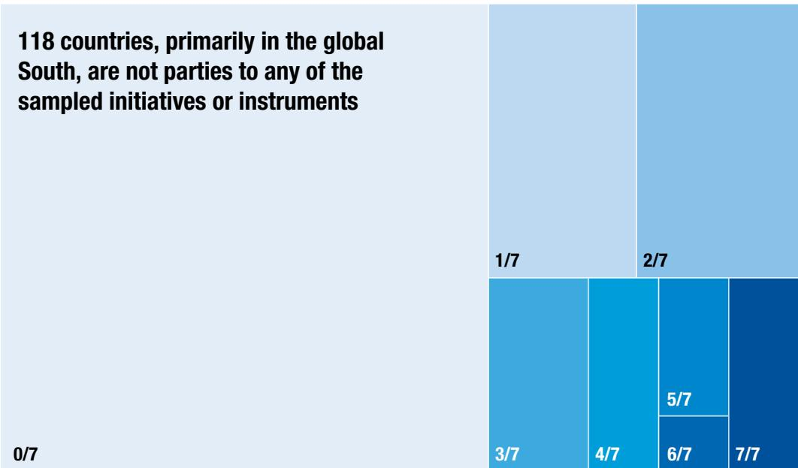  
Source: UNCTAD, based on United Nations, High-Level Advisory Body on Artificial Intelligence, 2024.
Note: The following initiatives are considered: OECD AI Principles, 2019; G20 AI principles, 2019; Council of Europe AI Convention drafting group, 2022–2024; Global Partnership on AI Ministerial Declaration, 2022; G7 Leaders' Statement on the Hiroshima AI Process, 2023; Bletchley Declaration, 2023; and Seoul Ministerial Statement for advancing AI safety, innovation and inclusivity, 2024.

Global AI governance should involve more inclusive engagement with the Global South and with marginalized and vulnerable communities, who have largely been excluded despite the significant impact on their lives (United Nations, 2020).

## Emerging common principles

The evolution of the seven major international AI governance initiatives reveals a notable shift in approach from one based on principles to one based on risks (table V.1).

This has been accompanied by calls for industry stakeholders to guarantee the development of safe and trustworthy AI systems, paying greater attention to transparency and accountability along the AI life cycle. Box V.1 discusses the shift of approaches to AI regulation, from outlining principles to addressing the risks.

## Table V.1

Summary of the seven major international AI governance initiatives

<table><tr><td>Initiative</td><td>Description</td><td>Focus</td><td>Specificity</td></tr><tr><td>OECD AI Principles (2019)</td><td>Offers foundation for international cooperation and interoperability for accountable AI systems.</td><td>AI that maximizes benefits and minimizes risks for economic growth and sustainability.</td><td>Inclusive growth, human-centred values, transparency, security, safety and accountability.</td></tr><tr><td>G20 AI Principles (2019)</td><td>Addresses interface between trade and the digital economy. Calls for an evidence-based policy approach.</td><td>Principles for responsible stewardship of trustworthy AI. Reference to need for national policies and international cooperation.</td><td>Accountability and inclusive and safe digitalization (follows up on OECD recommendation on AI).</td></tr><tr><td>Global Partnership on AI (2020)</td><td>Integrated partnership focusing on responsible development of AI with respect for human rights.</td><td>Expert collaboration on research and pilot projects on responsible AI, data governance, future of work, innovation and commercialization.</td><td>Human rights and democratic values fostering international cooperation (integrated partnership with OECD).</td></tr><tr><td>Hiroshima AI Process Friends Group (2023)</td><td>Aims to promote safe, secure and trustworthy AI systems for all actors, including emerging economies, the private sector and academia.</td><td>Actions and principles calling for a risk-based approach, but leaving different jurisdictions to choose own forms of implementation.</td><td>Considers AI life cycle, aiming for safe, trustworthy and secure AI in line with risk-based approach (formed after G7 Summit).</td></tr><tr><td>Bletchley Declaration on AI Safety (2023)</td><td>Establishes shared responsibility for risks and opportunities of frontier AI.</td><td>Cooperation calling for actions to identify AI safety risks and build respective risk-based policies.</td><td>Considers need for cross-country policies and to develop relevant capabilities to mitigate potential risks of frontier AI.</td></tr><tr><td>Seoul Declaration (2024)</td><td>Recognizes risks posed by AI and calls for international cooperation for inclusive and safe AI.</td><td>Pointing to risk-based approaches to ensure safe, secure and trustworthy design, development, deployment and use of AI.</td><td>Prioritizes international cooperation to address risks posed by AI and a human-centred vision (follows up on Bletchley Declaration).</td></tr><tr><td>Council of Europe Committee on AI (2024)</td><td>First legally binding international treaty on AI, covering life cycle of AI systems.</td><td>Standards for a human-centred approach through human rights, democracy and rule of law impact assessment methodology.</td><td>Human rights, transparency and democratic values in life cycle of AI, stakeholder engagement and responsible innovation based on a risk-based approach (life cycle as under Hiroshima Process).</td></tr></table>

Source: UNCTAD.

# Box V.1 Different approaches to AI regulation

AI regulation seeks to balance innovation, ethical considerations and safety. This is an evolving field, and different countries are exploring or implementing regulations that reflect their diverse cultural, legal and political contexts. There are three common approaches, as follows:

## Principles-based

A notable example is the set of OECD AI Principles adopted in 2019. Such principles offer flexibility and adaptability, based on broad guidelines that evolve with technological change. However, this approach has notable drawbacks. It is voluntary, which can lead to inconsistent adherence and a lack of accountability, and organizations may selectively follow or ignore the principles, prioritizing profits over ethics, potentially causing harm. Additionally, broad principles often lack the specificity needed in addressing complex technical and legal challenges such as privacy breaches, bias in AI algorithms and accountability in autonomous systems.

To address these issues, regulatory frameworks need to be more precise. A possible solution is a comprehensive licencing regime that spans the entire AI life cycle, from hardware acquisition to model development and deployment. Entities would need to obtain licences at different stages, ensuring compliance with dedicated standards aimed at mitigating risks. By enforcing clear, preventive compliance rules, such a licencing system could help manage AI-related risks, safeguard public interests and build trust in AI technologies.

## Risk-based

AI systems often function as black boxes with little indication of what is taking place inside. A risk-based approach identifies and mitigates potential harms before these technologies are deployed. In 2019, the Beijing Academy of Artificial Intelligence issued the Beijing AI Principles, calling for continuous improvements in AI systems in terms of maturity, reliability and controllability. Similarly, the European Union AI Act classifies AI applications by levels of risk, namely, unacceptable, high, limited and minimal. High-risk applications, such as biometric identification, involve strict regulations aimed at preventing harm before applications reach the market.

The risk-based approach addresses the complexity and unpredictability of AI systems. With the use of pre-emptive regulation, companies can only deploy AI systems that meet compliance standards. Such regulation eases the burdens on low-risk AI while applying strict oversight to high-risk applications. Additionally, it encourages safety and ethics from the outset, reducing collective harms. However, this approach also has limitations. Categorizing AI technologies can be highly subjective and challenging, particularly self-modifying AI systems that evolve over time. While this approach aims to prevent harm, it lacks provisions for corrective justice, meaning that affected individuals seeking compensation may need supplementary liability frameworks.

# Chapter V Global collaboration for inclusive and equitable AI

## Liability-based

The emerging liability-based approach to AI governance creates legal avenues for individuals to seek compensation for AI-related harms, promoting fairness and predictability by applying uniform rules and standards. By holding developers and deployers accountable for their AI systems, this approach encourages companies to prioritize safety, reliability and ethics from the outset. This can ensure more trustworthy and robust AI, benefiting both consumers and society. However, this might slow innovation if AI companies, concerned about legal repercussions from, for example, unintended misuse of their AI models, become overly cautious.

In the United States, in 2024, the Senate of California passed the Safe and Secure Innovation for Frontier Artificial Intelligence Models Act. Among other requirements, the act mandated developers to fulfil several obligations prior to model training, including a separate, written safety and security protocol and the capability to promptly enact a full shutdown. However, the act was vetoed by the Governor as not being “informed by an empirical trajectory analysis of AI systems and capabilities” and because it focused only on the most expensive and large-scale models.

Source: Beijing Academy of Artificial Intelligence, 2019; Botero Arcila, 2024; California, Senate, 2024; California, Office of the Governor, 2024; Carpenter and Ezell, 2024; Li, 2024; OECD, 2024.

# D. The United Nations contribution to AI governance

Over the years, the United Nations has made a significant contribution to the global discourse on AI governance (figure V.3). For example, since 2017, ITU has organized sessions of the AI for Good Global Summit, a key platform that identifies AI applications to advance on the Sustainable Development Goals and scale such applications for global impacts. Other important United Nations-based platforms for advancing understanding on science and technology are the Commission on Science and Technology for Development (CSTD) and the Multi-stakeholder Forum on Science, Technology and Innovation for the Sustainable Development Goals (STI Forum).

In 2021, member States adopted the first global standard on AI ethics. The UNESCO Recommendation on the Ethics of Artificial Intelligence provides a shared framework of values, principles and actions for shaping legislation and policies (UNESCO, 2022).

A key policy area is gender, including to protect girls and women and ensure that AI systems do not violate their human rights or fundamental freedoms; the recommendation also calls for investment in girls' and women's participation in STEM and ICT disciplines, to improve their employability and help ensure equal career development. The recommendation is accompanied by a readiness assessment methodology that helps countries measure their preparedness for applying AI and an ethical impact assessment for evaluating the benefits and risks of AI systems (UNESCO, 2023).

In 2024, the United Nations General Assembly adopted two resolutions, one on seizing the opportunities of safe, secure and trustworthy AI systems for sustainable development (United Nations General Assembly, 2024a) and one on enhancing international cooperation on capacity-building of AI (United Nations General Assembly, 2024b).

Figure V.3 Key United Nations efforts in global AI governance  
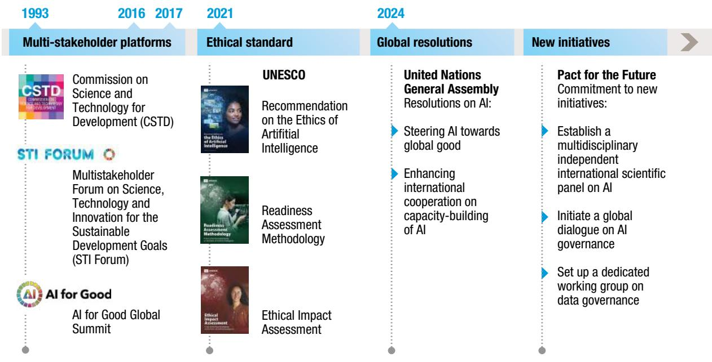

The resolutions serve to help strengthen international and multi-stakeholder collaboration and support the effective, equitable and meaningful participation of developing countries.

In September 2024, United Nations Member States adopted the Pact for the Future. This highlights the importance of international cooperation in harnessing STI while bridging the growing divide within and between countries. This was accompanied by a Global Digital Compact that sets a series of commitments for enhancing international AI governance for the benefit of humanity (United Nations General Assembly, 2024c). $^{4}$

The development of AI is intrinsically connected to the collection, processing, storage and use of digital data. The CSTD has been requested to establish a dedicated working group to engage in a comprehensive and inclusive multi-stakeholder dialogue on data governance at all levels as relevant for development, which will report on its progress to the General Assembly in 2026. The group will consider equitable and interoperable data governance arrangements, such as fundamental principles of data governance for development, proposals to support interoperability between national, regional and international data systems, with considerations of sharing the benefits of data and options to facilitate safe,

secure and trusted data flows (United Nations General Assembly, 2024c).

Following on the recommendations of the High-Level Advisory Body on Artificial Intelligence, in the Global Digital Compact, Member States committed to the establishment of a multidisciplinary Independent International Scientific Panel on AI and a Global Dialogue on AI Governance. These initiatives aim to promote reliable scientific AI understanding through evidence-based impact, risk and opportunity assessments. By sharing best practices, they also support interoperability and compatible approaches to AI governance.

Other United Nations agencies and bodies have been leveraging AI for the Sustainable Development Goals, as well as informing and shaping global AI governance. For example, UNESCO has developed Guidance for Generative AI in Education and Research, UNICEF has developed Policy Guidance on AI for Children and WHO has developed Guidance on the Ethics and Governance of Artificial Intelligence for Health.

In coordinating efforts across various domains, international law offers a shared normative foundation that can support coherent global AI governance and avoid the proliferation of fragmented initiatives and institutions.

International law can provide a foundation in coordinating AI-related efforts across different domains

## E. Ensuring accountability

All players in the AI life cycle should have well-defined roles, namely, developers need to ensure the fairness and safety of their systems and users need to ensure ethical AI deployment.

All should be accountable, through frameworks that define responsibilities, foster transparency and ensure responsible use.

Given the growing influence of technology giants, companies, particularly those deploying large-scale AI systems, should be required to make public disclosures of their activities. This would help anticipate and address potential impacts of AI, increase systemic resilience and enhance transparency and accountability.

One possible model is the ESG framework. An AI equivalent could involve impact assessments across stakeholders throughout the AI life cycle, measuring the effects on the environment, employment, human rights, safety and inclusivity (figure V.4). Companies can use international guidelines and standards as a basis for impact assessments. Carried out before and after deployment, these can shed light on how AI systems affect jobs, wages and working conditions, for example, and ensure that companies have mitigation strategies to support workers. $^{5}$

Public disclosure measures should also detail how AI systems work, including algorithmic decision-making processes; the collection, use and management of data; and efforts to ensure fairness and accountability. Auditing impact assessments and public reports helps ensure compliance with established guidelines, identify potential risks and certify that AI systems meet standards for fairness, transparency and safety.

The evolution of ESG reporting provides valuable lessons for engaging the private sector in developing AI accountability mechanisms. A certification system can attest that a company meets AI-related ethical and transparency criteria. Once the standards are well developed with clear reporting frameworks and regulations, reporting can become mandatory to ensure comprehensive, standardized and transparent disclosures.

Figure V.4
Establishing an AI public disclosure mechanism to ensure accountability

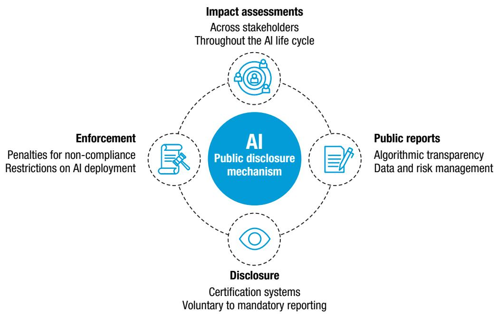

Source: UNCTAD.

At present, many stock exchanges mandate ESG reporting or require listed companies to provide explanations if they are unable to comply; the “comply or explain” approach. Mandatory reporting for AI can be supported by similar oversight measures. For enterprises that fail to comply with established standards and regulations, fines may be imposed or restrictions set on the deployment of particular AI systems.

Public disclosure of AI systems should:

Balance innovation and safety –
Policymakers need to strike a balance between fostering innovation and ensuring public safety and trust. Overregulation may hinder technological progress, while underregulation could pose significant risks and make it difficult to hold companies accountable. It is also important to consider the regulatory burden on SMEs. Larger firms may find it easier to meet stringent AI regulations, since they have the resources to manage legal risks and deal with complex regulatory requirements (Kretschmer et al., 2023). In contrast, SMEs may lack the skills or resources required to achieve compliance, potentially diverting funds from innovation and making them less competitive. SMEs may therefore need support, particularly in developing countries, where AI ecosystems are less developed.

Incorporate flexibility – The requirements should be flexible and capable of adapting to rapidly evolving technologies.

Regulations need to be regularly updated to address emerging ethical dilemmas and incorporate technological breakthroughs and unforeseen impacts that appear with the diffusion of AI.

Involve different stakeholders – Policies and requirements need to reflect diverse perspectives, interests and expertise; it is therefore important to take a multi-stakeholder approach, involving the private sector, civil society and academia. Particular attention should be given to vulnerable populations, who are less likely to benefit from AI advances but more likely to experience AI-related harms. For example, AI can exacerbate existing gender inequality and amplify biases. It is also critical to encourage workers to participate in the design and implementation of AI systems, guaranteeing that new AI tools complement their work and are aligned with their needs and interests.

To ensure fairness and positive outcomes across societies and jurisdictions, existing platforms, such as the AI for Good Global Summit, the CSTD, the STI Forum and Global Dialogue on AI Governance, can serve as venues to discuss common AI public disclosure requirements and accountability in AI governance. These platforms can also help strengthen data governance cooperation at all levels and unlock the full potential of digital and emerging technologies.

## F. International cooperation for infrastructure, data and skills

Harnessing the benefits of AI inclusively requires international actions at each of the three leverage points of infrastructure, data and skills. International collaboration can enable countries to develop consistent approaches and actions, as well as pool resources and expertise for directing AI development towards the

benefit of humanity. Such collaboration is critical in order to avoid fragmentation, duplication of efforts and the risks of AI use amplifying inequality across borders.

For effective global collaboration on infrastructure, data and skills, the following sections outline three propositions,

A modular approach allows digital public infrastructure to be tailored to particular AI needs namely, digital public infrastructure, open innovation and capacity-building and research collaboration.

## Developing digital public infrastructure for AI

To address the increasing demands for connectivity and computing power, DPI models can offer an equitable approach to provide the necessary access and services to stakeholders of the AI ecosystem.

DPI is a set of shared, secure and interoperable digital systems and applications that can be used flexibly in different activities and sectors. It can be built on open standards to provide societies with equitable access to public and private services (G20, 2023a). DPI connects people, businesses and Governments through secure and reliable online systems, and it is often referred to as the infrastructure of the digital era.

Building on foundational physical infrastructure, such as networks, data centres and storage systems, DPI offers a shared means to many ends, including e-government services, digital identity systems and digital payment systems. There are many successful experiences across countries. For example, in Estonia, a DPI platform facilitated the secure exchange of data across consumers, energy distributors and producers, to enhance decision-making in the energy sector. In India, a DPI approach led the way for identification provision to over 1 billion people. In Togo, during the pandemic, social assistance to about 450,000 people was distributed within one week through a DPI platform (UNDP, 2023a).

It is estimated that low- and middle-income countries can achieve the equivalent of two to three years of growth by implementing DPI in the financial sector. In the climate sector, DPI is expected to bring benefits to carbon offsetting and trading, accelerating emissions control

efforts by 5–10 years (UNDP, 2023a). The Secretary-General has selected DPI as one of the high-impact initiatives that can accelerate progress on achieving the Sustainable Development Goals.

Developing countries can provide resources to build flexible DPI systems and support AI adoption and development. For example, Governments, alone or with private partners, can establish high-speed networks for reliable, fast Internet access, enabling data transfer and real-time AI applications. Data centres can ensure secure, efficient storage and easy access to information, and support platforms such as cloud services and government databases for seamless data exchanges. Interoperable frameworks can unlock data exchanges and open data platforms, enhancing the use of AI models across sectors. Combining high-speed networks and data centres, high-performance computing provides scalable computing power for AI training, applications and data management. These modular components can address particular challenges and needs in developing countries, offering resources that can enable collaboration, innovation and responsible AI deployment at scale (figure V.5).

Despite the potential of DPI for AI, developing countries face significant challenges in its design and implementation. The international community can support developing countries by providing a combination of guidelines and principles, $^{6}$ financial resources and technical expertise. In 2023, for example, the G20 Digital Economy Ministers reached a consensus on how to leverage DPI for digital inclusion and innovation. The framework includes a list of key components and principles (G20, 2023a), as well as a playbook with practical guidelines and a design checklist (UNDP, 2023b). In addition, to address the existing knowledge gaps in practices for designing, building and deploying population-scale DPI, the G20 has created a Global Digital Public Infrastructure Repository (G20, 2023b).

  
Figure V.5
Developing digital public infrastructure for AI

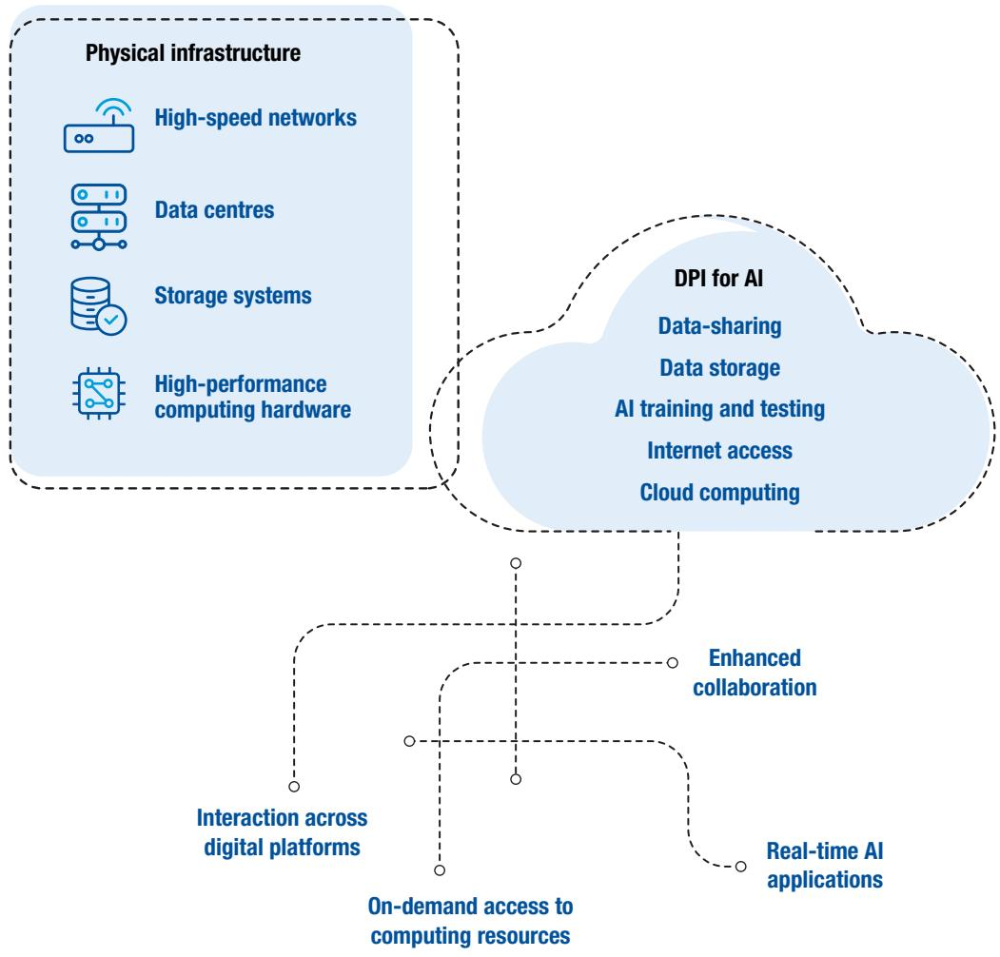  
Source: UNCTAD.

Other international programmes and initiatives are emerging, including the following:

\- The United Nations High Impact Initiative on DPI – Aimed at unlocking targeted support for DPI in 100 countries by 2030 (ITU, 2023).

\- Identification for Development and Digitizing Government-to-Person Payments – These World Bank initiatives aim to help over 60 countries issue digital identification to 550 million people (World Bank, 2023).

\- The Universal Safeguards for DPI initiative – Launched in 2023 by the Office of the Secretary-General's Envoy on Technology and UNDP, this initiative is aimed at co-creating a pragmatic framework designed to mitigate risks, advance on the Sustainable Development Goals and foster trust and equity (Universal DPI Safeguards, 2023).

\- The 50-in-5 campaign – Aimed at helping 50 countries design, launch and scale components for open, secure and resilient DPI within five years (50 in 5, 2024).

\- The Global Digital Compact – The Compact represents the latest landmark, with countries committed to increasing investment and funding towards the development of DPI to advance solutions for the Sustainable Development Goals (United Nations General Assembly, 2024c).

Efforts from the international community can help scale up and tailor DPIs for AI, providing developing countries with the foundational systems needed for digital inclusion and technological innovation. The international community could provide developing countries with financial support or access to existing DPIs (Gottschalk, 2019).

DPI for AI can rely on two service models that, compared with traditional infrastructure, provide greater flexibility, scalability and global accessibility. The first is infrastructure as a service, which provides virtualized computing resources on the cloud on an as-needed basis, including servers, storage and networking. The second is data as a service, which provides data on demand, through application programming interfaces, or cloud-based platforms, enabling users to access, manage and analyse data sets without owning the underlying infrastructure. Cloud and data resources from infrastructure as a service and data as a service providers can be leveraged to develop packaged, cloud deployable and interoperable AI services.

Infrastructure as a service and data as a service are mainly owned and operated by private companies on a commercial basis. However, governments can collaborate with these companies to offer services within the local AI ecosystem.

Public-private partnerships can expedite the development of DPI for AI. To increase their collective negotiating power and strike equitable terms, developing countries could pool resources through regional or multi-country partnerships. In addition, multi-stakeholder collaborations could foster innovation in the digital ecosystem and facilitate the exchange of best practices (UNDP, 2023b). These partnerships can also help set international standards, governance principles and regulatory frameworks, to foster an inclusive and sustainable AI development and adoption framework.

DPI for AI services requires high-performance computing hardware, data centres and other complex and expensive physical infrastructure that few individual institutions or countries can afford. To provide affordable and distributed AI infrastructure, one model is that of CERN, the intergovernmental organization that operates the world's largest particle physics laboratory, including the Large Hadron Collider, in France and Switzerland. This shared resource is used by researchers globally. A CERN for AI model can be based on the principles of international cooperation, open science, open access and the pooling of resources and expertise. $^{7}$

A similar shared facility for AI research and development would enable countries and organizations to engage in cutting-edge research, counterbalancing the power of technology giants and promoting equitable access to AI resources. $^{8}$ Compared to the Large Hadron Collider, computational resources for AI can be more easily spatially distributed.

A shared AI infrastructure could be developed as a distributed public infrastructure across institutions and countries in multiple centres using high-speed networks, with system interoperability and security protocols. $^{9}$ A key element for success is the involvement and openness of various stakeholders, including Governments, businesses, academia and civil society, which could use the shared facility as a virtual space for interaction, experimentation and co-creation.

## Promoting AI through open innovation

Open innovation provides a way of managing the innovation process and enabling collaboration and knowledge-sharing among independent innovators, companies, institutions and countries. Compared with the traditional model of innovation where each company relies on its own resources, open innovation encourages firms, public organizations and other actors to tap into the large pool of innovative resources available among external actors, including customers and citizens. Open innovation can speed up research and development, lower costs and enhance the quality or relevance of innovation outcomes, $^{10}$ which is particularly beneficial for developing countries and SMEs, to compensate for limited resources and skills.

Open innovation has gained significant traction in recent years and is widely recognized as a key driver of technological opportunities, enabling risk and cost-sharing and the championing of transparency while democratizing access to diverse, technically advanced resources. For example, through the Global Digital Compact, United Nations Member States have committed to developing safe and secure open-source software, open data, open AI models and

open standards, also referred to as digital public goods (United Nations General Assembly, 2024c). Another important effort is the Manaus package issued under the Presidency of Brazil by the G20 Research and Innovation Working Group. This includes an open innovation strategy to foster international collaboration on STI, and puts forward principles, approaches and tools for inclusive and equitable open innovation initiatives (G20, 2024).

Concepts and approaches for open innovation are still evolving, but they generally involve open data, that is, making data freely available. This can facilitate the training and testing of AI models and foster innovation by allowing researchers and developers to experiment with data and create new AI solutions. Open data can also improve transparency and facilitate the assessment of new AI models and applications.

Prominent examples of open data initiatives include the Human Genome Project, the COVID-19 Open Research Data Set and the Human Connectome Project. Most emerging open data platforms for AI are from the private sector, such as the Kaggle data sets, the OpenAI data sets, the Microsoft Azure open data sets and the registry of open data on Amazon Web Services. They vary in their operation, data management approaches and open data standards. Common international definitions and standards for open data are essential to give both the public and private sectors access to high quality and diverse data and make them digital public goods. Further important aspects include privacy, security and the prevention of data misuse and misinterpretation.

Another important instrument is open source, largely diffused in software development.

This is a model wherein the source code, design or blueprint of a software package or a project is made freely available through public platforms. Well-known open-source operating systems include Android and Linux, which power critical infrastructure and digital devices. By providing free and open tools, libraries and frameworks, the use of open source democratizes knowledge and resources, enables global collaboration and innovation and improves transparency and trust.

Since the emergence of GenAI, there has been a surge in open-source AI and GenAI projects. These include commercial large language models, as well as applications developed by academic institutions and individual developers (Daigle and GitHub staff, 2023). The code is communally maintained on open-source platforms such as GitHub and others, which offer diverse use cases and readily accessible AI models, with community engagement for discussion and mutual support.

The international community can benefit from coordinating and harmonizing the important but fragmented open AI resources worldwide. Successful open innovation for AI relies on connected and interoperable open repositories of global knowledge, using open data and open source in a global innovators network with standardized protocols. Such a repository can strengthen the global knowledge base, foster inclusiveness, improve access through trusted hubs that ensure quality and security, mitigate potential risks and accelerate AI-driven innovation (figure V.6).

## Strengthening capacity-building and research collaboration

Both DPI and open innovation provide accessible resources for businesses, academia and the general public to engage in the adoption and development of AI.

## Figure V.6 Open innovation in AI

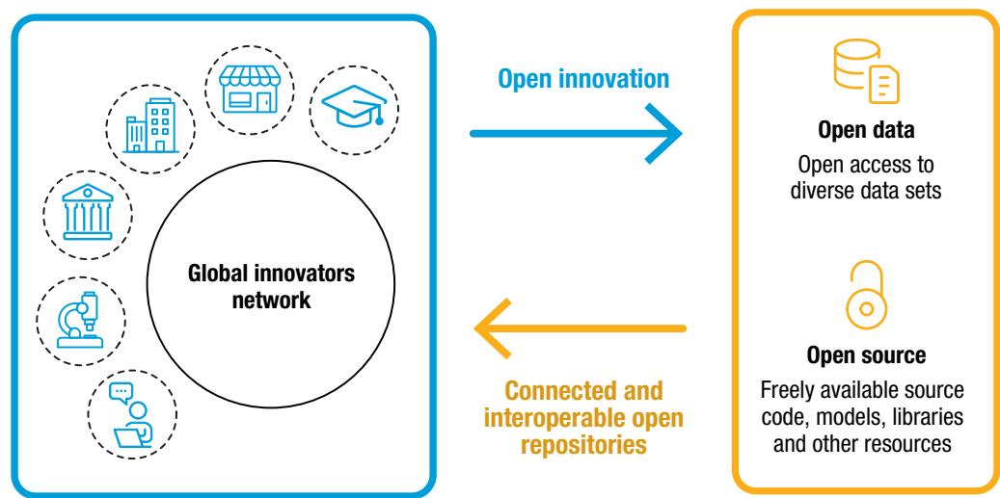  
Source: UNCTAD.

However, using these resources requires technical knowledge and skills, such as statistical knowledge, programming skills, familiarity with open-source platforms and protocols and knowledge of machine learning algorithms, as well as an understanding of the domain for which an application is to be used.

These capacities are often highly concentrated in technology companies and developed countries, an imbalance that the international community should address through the transfer of knowledge and technology to developing countries, as well as assistance for capacity-building.

The CSTD has been advancing international STI collaboration through knowledge and experience-sharing, and capacity-building. The Commission can further strengthen international AI collaboration by sharing good practices, facilitating coordination and contributing to enhanced trust, transparency and inclusivity.

Multi-stakeholder engagement and knowledge-sharing on AI, through international dialogues or global networks of exchange, for example, could build on existing platforms such as the CSTD, the STI Forum, the Internet Governance Forum and the AI for Good Global Summit. It is also important to have technical assistance and tailored solutions based on local needs and the limited absorptive capacities of many developing countries. This can help effective transfers of technical knowledge and reduce the risk of misuse due to a lack of resources or expertise.

Knowledge and technology transfer typically focus on particular information, skills or activities. Capacity-building is critical in adopting and developing rapidly evolving frontier technologies, and encompasses a broad set of capabilities that enable individuals or countries to innovate continuously. It can take place through training workshops that enable policymakers to develop STI policies or tailored educational programmes on AI and data literacy.

Capacity-building can also take place through AI incubators and research hubs and R&D partnerships. Special attention should be given to the adoption and development of human-complementary AI technologies. This can be achieved by allocating dedicated funding to AI solutions that augment rather than replace workers, and setting up international AI research networks or partnerships that prioritize human-centred AI.

These activities align with the resolution adopted by the General Assembly on enhancing international cooperation on capacity-building of artificial intelligence, particularly in developing countries, as well as the Global Digital Compact, which encourages the development of international partnerships on AI capacity-building.

To create global hubs for AI capacity-building or an AI-focused centre and network, a useful model and reference point is the United Nations Climate Technology Centre and Network. This is the implementation arm of the Technology Mechanism of the United Nations Framework Convention on Climate Change, which supports developing countries through technical assistance and access to information and knowledge on technologies, including capacity-building and policy advice, as well as fosters collaboration among stakeholders via its network of regional and sectoral experts. While the CERN model focuses on shared infrastructure, the Climate Technology Centre and Network approach is aimed at providing technical assistance to developing countries and building capacity through knowledge and technology transfer.

An AI-focused centre and network could help developing countries in adopting, adapting and developing AI. This could build on existing efforts such as the International Research Centre on Artificial Intelligence under UNESCO auspices, which promotes ethical AI solutions for the Sustainable Development Goals, and the Global Partnership on Artificial Intelligence, which advances the implementation of human-centric, safe, secure and trustworthy AI solutions.

An international AI centre can provide technical assistance, build capacity and foster collaboration

Furthermore, collaboration in AI research and innovation can help scale up South–South cooperation in science and technology to address common challenges (United Nations General Assembly, 2019). For this purpose, the more technologically advanced developing countries can collaborate with other countries, for example, through regional partnerships, to create critical mass in AI, favouring knowledge and technology transfer, and overcoming the resource constraints that may hamper the establishment of thriving AI ecosystems in less-endowed countries.

In recent years, there have been numerous instances of new South–South cooperation in the field of AI. The BRICS member countries, for example, have formed an AI study group aimed at catalysing AI innovation. China has expanded cooperation with Africa in various areas, including AI, as outlined in the Forum on China-Africa Cooperation Beijing Action Plan (China, Ministry of Foreign Affairs, 2024). In 2024, the launch of the ASEAN Committee on Science, Technology and Innovation Tracks on AI aimed at expanding regional capacity development initiatives in AI (ASEAN, 2024).

Figure V.7
AI capacity-building partnerships

These initiatives represent promising starting points for South–South cooperation, and the Global South can also make use of other mechanisms for exchanging AI technologies, data and services. The Global South can, for example, incorporate provisions for AI technology and services in trade agreements and engage regional institutions such as the African Union or ASEAN for sharing best practices and developing coherent AI policies.

In addition, developing countries can build regional innovation hubs and expert networks for addressing AI challenges. In Africa, for instance, the Artificial Intelligence for Development programme scales AI innovations through the creation of four pan-African Innovation Research Networks and supports policy research by funding two research-to-policy and think-and-do tanks in East Africa and a policy network in West Africa. It also engages African talent and skills through two multidisciplinary university labs. Other ways in which countries in the Global South can work together are mobility programmes, human capital development initiatives and joint research and technical projects in the field of AI and other frontier technologies.

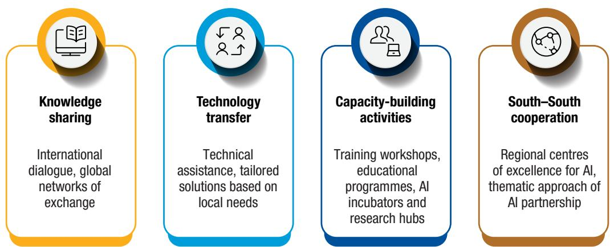  
Source: UNCTAD.

Countries can cooperate on particular themes or in sectors in which AI brings sustainable and scalable change. One of the most important areas is agriculture, for which a major resource is the Consultative Group on International Agricultural Research (CGIAR), the largest global partnership focusing on agricultural research for development, which can integrate AI as a tool to create and diffuse new solutions

for climate-smart, innovative and socially inclusive agriculture, while addressing challenges such as crop disease and pest detection, yield prediction and precision irrigation. A thematic approach of AI partnership can help coordinate and target efforts in key areas that are most relevant to the socioeconomic and developmental needs of the Global South.

# G. Guiding AI for shared prosperity

Technology does not have intrinsic moral or ethical qualities. Whether its impact is positive or negative depends on how humans develop and use it. At first glance, AI technologies are no different; their use can enhance various aspects of our lives, but can also deepen inequalities and further concentrate economic power (Korinek and Stiglitz, 2021). Nevertheless, AI is beginning to challenge the notion of technological neutrality. This is the first technology in history capable of making decisions and generating ideas by recombining existing knowledge, and which could evolve into an active agent. As AI grows faster and more powerful, the potential response times shorten and the room for error may become smaller (AI Action Summit, 2025).

History shows that technological progress brings economic growth but does not guarantee that the benefits will be broadly distributed, nor does it necessarily lead to inclusive and equitable human development. Driven forward by new technologies, markets may make efficient economic decisions in the short term, but do not assume responsibility for distributive consequences or automatically maximize social value.

Technological advances have typically fostered the rise of technology giants and favoured the owners of capital at the expense of labour, leading to greater concentration of wealth (Acemoglu and Restrepo, 2019; Korinek et al., 2021). There is an urgent need to guide AI advances.

Responsible design, conscientious use and ethical oversight of AI depends on effective global AI governance, along with international support for developing countries through DPI, open innovation and capacity-building. Equally important is building a common vision to guide AI progress towards promoting shared prosperity and fostering an inclusive economic future for all of humanity.

UNCTAD, in this report, calls for a shift of focus from technology to people, putting humans at the centre of AI development. AI technologies should complement rather than displace human workers, and the transformation of production processes should bring benefits that are shared fairly among countries, firms and workers. Inclusion and equity are central to an AI-for-all approach, supported by policies, incentives and regulations driven by a global agenda that promotes international multi-stakeholder collaboration.

Humans
should be at
the centre of AI
development

Inclusion and equity should be at the forefront of AI for all

## References

50 in 5 (2024). Implementing digital public infrastructure, safely and inclusively. Available at https://50in5.net/.

Acemoglu D and Restrepo P (2019). Automation and new tasks: How technology displaces and reinstates labour. Journal of Economic Perspectives. 33(2):3–30.

Ahmed N, Wahed M and Thompson NC (2023). The growing influence of industry in AI research. Science. 379(6635):884–886.

AI Action Summit (2025). International AI safety report. The International Scientific Report on the Safety of Advanced AI. United Kingdom.

ASEAN (2024). Statement on Artificial Intelligence. ASEAN Ministerial Meeting on Science, Technology and Innovation.

Beijing Academy of Artificial Intelligence (2019). Beijing AI principles. Springer.

Beraja M, Peng W, Yang DY and Yuchtman N (2024). Government as venture capitalists in Al. National Bureau of Economic Research.

Botero Arcila B (2024). AI liability in Europe: How does it complement risk regulation and deal with the problem of human oversight? Computer Law and Security Review. (54):106012.

California, Office of the Governor (2024). I am returning Senate Bill 1047 without my signature. Available at https://www.gov.ca.gov/wp-content/uploads/2024/09/SB-1047-Veto-Message.pdf.

California, Senate (2024). Safe and Secure Innovation for Frontier Artificial Intelligence Models Act. No. 1047.

Candelon F, Carlo RC and Mills SD (2022). AI-at-scale hinges on gaining a “social license”. The Rise of AI-Powered Companies. 89–94.

Carpenter D and Ezell C (2024). An FDA for AI? Pitfalls and plausibility of approval regulation for frontier artificial intelligence. Available at http://arxiv.org/abs/2408.00821.

China, Ministry of Foreign Affairs (2024). Forum on China-Africa Cooperation Beijing Action Plan (2025-2027). Available at https://www.mfa.gov.cn/eng/xw/zyxw/202409/t20240905\_11485719.html.

Chu MM (2022). Malaysia's palm planters eye robots, drones to combat labour crunch. Available at https://www.reuters.com/technology/malaysia-s Palm-planters-eye-robots-drones-combat-labour-crunch-2022-10-07/.

Cihon P (2019). Standards for AI governance: International standards to enable global coordination in AI research & development. Future of Humanity Institute. University of Oxford. 40(3):340–342.

Cuntz A, Fink C and Stamm H (2024). Artificial intelligence and intellectual property: An economic perspective. Economic Research Working Paper No. 77/2024.

Daigle K and GitHub staff (2023). Octaverse: The state of open source and rise of AI in 2023. Available at https://github.blog/news-insights/research/the-state-of-open-source-and-ai/.

European Commission (2016). Open innovation, open science, open to the world - a vision for Europe. Directorate-General for Research and Innovation.

European Parliament and European Council (2024). The EU Artificial Intelligence Act. Regulation (EU) 2024/1689.

G20 (2023a). Digital Economy Ministers Meeting. Outcome Document and Chair Summary. Presidency: India. Bengaluru.

G20 (2023b). Global DPI Repository (GDPIR). Available at https://www.dpi.global/.

G20 (2024). The G20 Strategy to promote open innovation cooperation. Manaus.

GIDA (2020). CARE principles for indigenous data governance. Global Indigenous Data Alliance. Available at https://www.gida-global.org/.

Gil T (2023). Watch out for AI cooperation agreements that are really mergers, Germany's Mundt warns. Available at https://mlexmarketinsight.com/news/insight/watch-out-for-ai-cooperation-agreements-that-are-really-mergers-germany-s-mundt-warns.

GO FAIR (2016). FAIR principles. Available at https://www.go-fair.org/fair-principles/.

Gottschalk R (2019). Financing regional digital infrastructures in the South: Development banks, funds and other policy options. Research Paper No. 38. UNCTAD.

Holm JR, Timmermans B, ∅stergaard CR, Coad A, Grassano N and Vezzani A (2020). Labor mobility from R&D-intensive multinational companies: implications for knowledge and technology transfer. The Journal of Technology Transfer. 45(5):1562–1584.

Hu K (2023). ChatGPT sets record for fastest-growing user base - analyst note. Available at https://www.reuters.com/technology/chatgpt-sets-record-fastest-growing-user-base-analyst-note-2023-02-01/.

Hu K and Cai K (2024). Exclusive: OpenAI to remove non-profit control and give Sam Altman equity. Available at https://www.reuters.com/technology/artificial-intelligence/openai-remove-non-profit-control-give-sam-altman-equity-sources-say-2024-09-25/.

Ipsos (2023). Global views on AI in 2023. Paris.

IPWatchdog (2021). DABUS gets its first patent in South Africa under formalities examination. Available at https://ipwatchdog.com/2021/07/29/dabus-gets-first-patent-south-africa-formalities-examination/id=136116/.

ITU (2023). UN High Impact Initiative: Digital Public Infrastructure. Available at https://www.itu.int/initiatives/sdgdigital/digital-public-infrastructure/.

Jon Peddie Research (2024). Q3'24 PC graphics add-in board shipments decreased -14.5% from last quarter. Available at https://www.jonpeddie.com/news/q324-pc-graphics-add-in-board-shipments-decreased-14-5-from-last-quarter/.

Kaminski ME (2023). Regulating the risks of Al. Boston University Law Review. (103):1347–1411.

Kim MJ and Kim MG (2024). Republic of Korea Government to investigate monopolistic practices by foreign AI firms. Available at https://www.chosun.com/english/national-en/2024/04/08/L5EPMOINVZBFZOKWGIRC6EFNUQ/.

Korinek A, Schindler M and Stiglitz JE (2021). Technological progress, artificial intelligence, and inclusive growth. Working paper, No. WP/21, 166. International Monetary Fund. Washington, D.C.

Korinek A and Stiglitz J (2021). Artificial intelligence, globalization, and strategies for economic development. INET Working Paper Series No. 146. 1–53.

Kretschmer M, Kretschmer T, Peukert A and Peukert C (2023). The risks of risk-based AI regulation: Taking liability seriously. CEPR Discussion Paper No. 18517.

Li FF (2024). 'The Godmother of AI' says California's well-intended AI bill will harm the U.S. ecosystem. Available at https://fortune.com/2024/08/06/godmother-of-ai-says-californias-ai-bill-will-harm-us-ecosystem-tech-politics/.

Lynn B, Thun M von and Montoya K (2023). AI in the public interest: Confronting the monopoly threat. Open Markets Institute.

Milmo D (2024). Microsoft, OpenAI and Nvidia investigated over monopoly laws. Available at https://www.theguardian.com/business/article/2024/jun/06/microsoft-openai-and-nvidia-investigated-over-possible-breach-of-antitrust-laws.

OECD (2024). AI principles. Available at https://www.oecd.org/en/topics/sub-issues/ai-principles.html.

Oldager M (2024). IT outage blocks automatic fire alarms in Copenhagen. Available at https://www.dr.dk/nyheder/seneste/it-nedbrud-blokerer-automatiske-brandalarmer-i-koebenhavn.

Owens B (2024). Rage against machine learning driven by profit. Nature. 633(8030):S6–S9.

Oxfam International (2024). Inequality Inc. How corporate power divides our world and the need for a new era of public action.

Philstar (2024). House of Representatives' website down during global IT outage. Available at https://www.philstar.com/headlines/2024/07/19/2371414/house-representatives-website-down-during-global-it-outage.

The Yomiuri Shimbun (2024). Japan fair trade commission to investigate AI market to ensure healthy competition; Investigation to include Microsoft, Google, other tech giants. Available at https://japannews.yomiuri.co.jp/society/general-news/20240718-199163/.

UNCTAD (2016). Guidelines for consumer protection. New York and Geneva.

UNCTAD (2021a). Technology and Innovation Report 2021: Catching Technological Waves - Innovation with Equity (United Nations publication. Sales No. E.21.II.D.8. New York).

UNCTAD (2021b). Digital Economy Report 2021: Cross-Border Data Flows and Development – For Whom the Data Flow (United Nations publication. Sales No. E.21.II.D.18. New York).

UNCTAD (2024a). Data for Development. Technical and statistical report (United Nations publication. Sales No. E.24.II.D.17. New York).

UNCTAD (2024b). Digital Economy Report 2024: Shaping an Environmentally Sustainable and Inclusive Digital Future (United Nations publication. Sales No. E.24.II.D.12. New York).

UNDP (2023a). Accelerating the Sustainable Development Goals through Digital Public Infrastructure.

UNDP (2023b). The DPI approach. A playbook.

UNESCO (2022). Recommendation on the ethics of artificial intelligence.

UNESCO (2023). Ethical impact assessment: a tool of the recommendation on the ethics of artificial intelligence.

United Kingdom, The Supreme Court (2021). Thaler (Appellant) v Comptroller-General of Patents, Designs and Trademarks (Respondent). Case UKSC/2021/0201. Available at https://www.supremecourt.uk/cases/uksc-2021-0201.

United Nations (2020). Report of the Secretary-General. Road Map for Digital Cooperation: Implementation of the Recommendations of the High-Level Panel on Digital Cooperation.

United Nations General Assembly (2019). Buenos Aires outcome document of the second High-level United Nations Conference on South-South Cooperation. A/RES/73/291. New York. 15 April.

United Nations General Assembly (2024a). Seizing the opportunities of safe, secure and trustworthy artificial intelligence systems for sustainable development. A/RES/78/265. New York. 11 March.

United Nations General Assembly (2024b). Enhancing International Cooperation on Capacity-Building of Artificial Intelligence. A/RES/78/311. New York. 1 July.

United Nations General Assembly (2024c). The Pact for the Future. A/RES/79/1. New York. 22 September.

United Nations, AI Advisory Body (2024). Governing AI for Humanity: Final Report. High-level Advisory Body on Artificial Intelligence. Available at https://www.un.org/en/ai-advisory-body.

United Nations, Secretary General (2023). Secretary-General urges security council to ensure transparency, accountability, oversight, in first debate on artificial intelligence. Available at https://press.un.org/en/2023/sqsm21880.doc.htm.

United States, Copyright Office (2024). Copyright and artificial intelligence part 1: Digital replicas. A report of the register of copyrights.

Universal DPI Safeguards (2023). About the universal DPI safeguards initiative. Available at https://safedpi.gitbook.io/safeguards.

Weston D (2024). Helping our customers through the CrowdStrike outage. Available at https://blogs.microsoft.com/blog/2024/07/20/helping-our-customers-through-the-crowdstrike-outage/.

White A (2024). Microsoft and Google AI deals get European Union antitrust scrutiny, Vestager says. Available at https://www.politico.eu/article/microsoft-google-tech-deal-antitrust-security-open-ai-eu-margrethe-vestager/.

WIPO (2024). Getting the innovation ecosystem ready for AI. An IP policy toolkit.

World Bank (2023). Creating digital public infrastructure for empowerment, inclusion, and resilience. Available at https://www.worldbank.org/en/results/2023/10/12/creating-digital-public-infrastructure-for-empowerment-inclusion-and-resilience.

The United Nations Conference on Trade and Development – UNCTAD – is the leading body of the United Nations focused on trade and development.

UNCTAD works to ensure developing countries benefit more fairly from a globalized economy by providing research and analysis on trade and development issues, offering technical assistance and facilitating intergovernmental consensus-building.

Standing at 195 countries, its membership is one of the largest in the United Nations system.

Technology and Innovation Report 2025