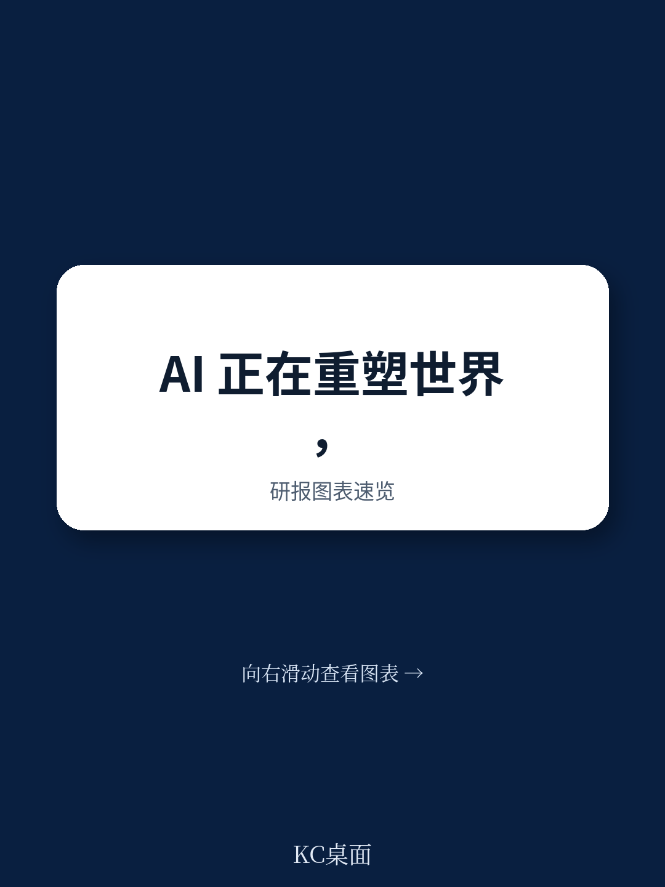
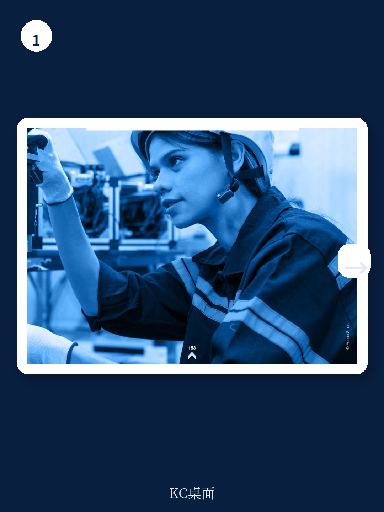
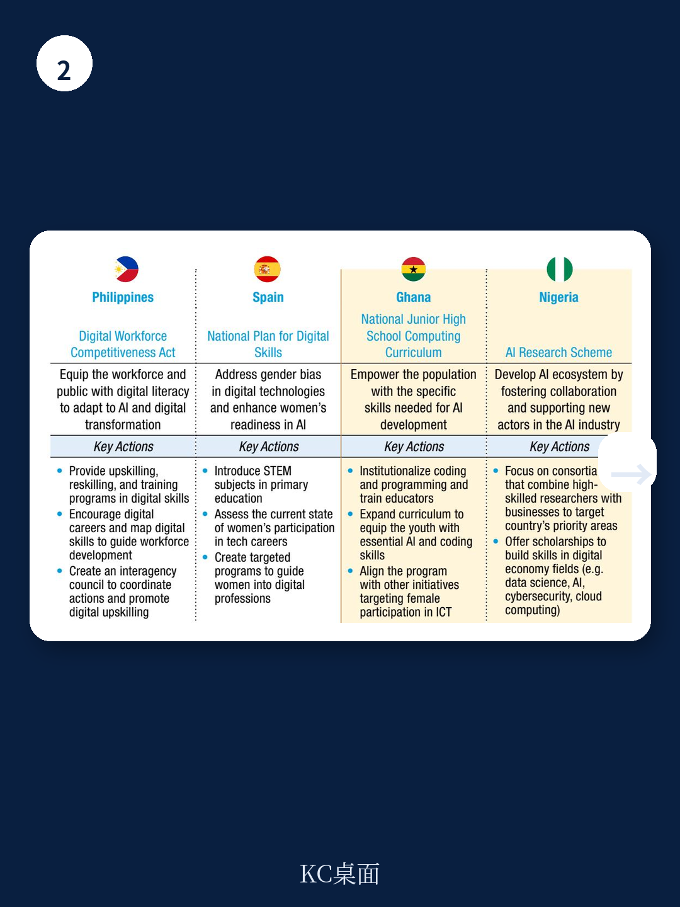

# 联合国贸发会议：不是技术竞赛而是生存差距，联合国报告拆解AI鸿沟三大杠杆

全球人工智能竞赛的叙事，通常聚焦于中美两国的技术突破、大模型的参数竞赛、以及科技巨头之间的算力军备竞赛。但联合国贸易和发展会议（UNCTAD）最新发布的《2025年技术与创新报告：包容性人工智能促进发展》提供了一个截然不同的观察视角。

这份报告的核心判断并非关于技术领先者的速度，而是关于落后者被甩开的深度。报告明确指出，AI的开发与部署呈现出前所未有的地理与市场集中度。少数几家公司控制着算力基础设施、前沿模型和核心数据，而全球大多数发展中国家，尤其是最不发达国家，在数字基础设施、数据资源和AI技能三个关键杠杆点上均处于严重劣势。这种不对称格局如果得不到系统性纠正，AI非但不会成为普惠发展的引擎，反而可能加剧全球南北差距，形成一种新型的“数字殖民”。

对于长期跟踪科技产业与全球化的读者而言，这份报告的价值不在于提供新的技术预测，而在于它用联合国系统的权威数据，系统性地拆解了“AI鸿沟”的结构性成因，并提出了从国家政策到全球治理的干预框架。以下是我们从报告中提炼出的五个核心洞察。

## 1. AI的“赢家通吃”效应远超以往任何一代技术，其集中度已达到危险水平

报告开篇便用数据揭示了一个令人不安的事实：AI领域的研发投入、专利产出和市场规模，其集中度远超互联网、生物技术或可再生能源等上一代前沿技术。全球超过70%的AI相关研发支出来自少数几个发达国家，而美国和中国两国合计占据了全球AI专利总量的绝大部分。更值得关注的是，科技巨头（如微软、谷歌、亚马逊、英伟达等）不仅在市场层面占据主导，更通过控制云计算服务、专用芯片设计和基础模型平台，构建了难以逾越的生态壁垒。

> **KC评论：** 这份报告将AI的集中度问题提升到了“系统性风险”的高度。以往的技术扩散，落后国家可以通过引进设备、模仿生产、融入全球价值链来逐步追赶。但AI的“基础设施-数据-技能”三位一体门槛，使得后来者即使想“买”都难以买到完整的能力。这意味着，对于大多数发展中国家，AI带来的不是“弯道超车”的机会，而是“被锁定在价值链低端”的风险。完整报告中关于“技术巨头的市场支配力如何影响全球竞争”的图表和分析，值得每一位产业政策制定者仔细研读。

继续看原文，真正有价值的是报告中对各国研发投入、专利布局与市场规模之间关联性的量化分析，以及这些数据背后的假设和验证路径。完整报告与KC评论在每日汇编。

## 2. 三个关键杠杆——基础设施、数据与技能——决定了AI发展的“起跑线”差异

报告提出了一个简洁而有力的分析框架：AI的采纳与发展能力，取决于三个相互强化的杠杆点。第一是基础设施，包括高速宽带、云计算节点、数据中心和超级计算机。第二是数据，包括可获取、高质量、本地化的训练数据集。第三是技能，涵盖从基础数字素养到高级AI研发的全链条人才储备。

报告通过构建“前沿技术准备指数”，对全球各国进行了系统评分。结果显示，发达国家与最不发达国家之间的差距是数量级的。例如，在云计算基础设施方面，北美和欧洲拥有全球绝大多数超大规模数据中心，而非洲大陆的云计算节点数量屈指可数。在数据准备度上，许多发展中国家缺乏结构化、标准化的公共数据，甚至缺乏基本的互联网接入数据。在技能层面，全球AI人才高度集中在少数几个创新中心，发展中国家面临严重的人才外流。

> **KC评论：** 这个框架的价值在于，它把抽象的“数字鸿沟”拆解成了可衡量、可干预的具体维度。对于企业而言，这意味着在评估新兴市场AI机会时，不能只看人口红利或政策口号，而必须实地验证这三个杠杆的成熟度。对于投资者而言，那些能够帮助发展中国家跨越基础设施门槛（如边缘计算、低功耗AI芯片、开源模型）的企业，可能具备真正的长期价值。报告中对各国在三个维度上的详细评分排名，是这份报告最硬核的资产。

## 3. 发展中国家的AI应用案例证明：场景适配比技术领先更重要

报告并未停留在对问题的诊断上，它用大量篇幅展示了发展中国家在农业、制造业和医疗健康领域的AI应用案例。这些案例的共同特征是：不追求通用大模型的先进性，而是聚焦于解决本地最紧迫的问题。例如，在非洲，AI被用于通过手机摄像头识别农作物病虫害；在印度，AI辅助诊断系统被部署在基层医疗中心，弥补放射科医生短缺的短板；在东南亚，AI驱动的预测性维护系统帮助中小制造企业降低设备停机率。

这些案例揭示了一个重要逻辑：AI的普惠价值，不在于其模型参数的大小，而在于其能否以可负担的成本、适配本地基础设施的方式，解决真实世界的具体问题。报告总结了四条成功经验：适配本地数字基础设施、利用新型数据源（如卫星图像、移动通信数据）、降低使用门槛（如通过语音界面或简单的APP）、以及建立战略伙伴关系（如与本地大学、非政府组织或国际机构合作）。

## 4. 国家AI政策正在从“鼓励创新”转向“争夺主导权”，但多数国家尚未准备好

报告第四章对全球AI政策格局进行了扫描，发现一个显著趋势：各国政府正在从早期的“制定国家战略”阶段，转向更具干预色彩的“产业政策”阶段。美国通过《芯片与科学法案》直接补贴本土芯片制造和AI研发，欧盟通过《人工智能法案》建立基于风险的监管框架，中国则通过“新型举国体制”整合资源。报告指出，这些政策的核心目的，已经从“促进AI发展”演变为“确保本国在AI价值链中的战略自主”。

然而，报告也尖锐地指出，大多数发展中国家尚未建立起有效的AI政策体系。它们既缺乏制定前瞻性战略的研究能力，也缺乏执行产业政策的财政资源和行政能力。这种政策能力的差距，可能比技术差距更难弥合。报告呼吁，国际社会应帮助发展中国家建立“全政府”的AI政策协调机制，而不是仅仅停留在提供技术援助的层面。

## 5. 全球AI治理面临“碎片化”困境，真正的合作框架尚未形成

报告的最后一部分将视野提升至全球治理层面。它梳理了当前主要的国际AI治理倡议，包括G7的广岛AI进程、OECD的AI原则、以及联合国自身框架下的多项努力。结论是：尽管各方都认同需要全球合作，但实际进展高度碎片化，缺乏约束力和执行力。

报告特别强调了几个尚未完全回答的关键问题：如何确保AI发展不侵犯知识产权和消费者权益？如何对跨国科技巨头的AI行为进行有效问责？如何建立公平的全球数据治理规则，避免数据殖民主义？如何为发展中国家提供可持续的AI能力建设资金？这些问题，任何一个都足以决定未来十年全球AI发展的公平性。

> **KC评论：** 报告没有回避一个尴尬的现实：当前推动全球AI治理最积极的，恰恰是那些在AI领域占据主导地位的国家。这自然引发了一个问题：这些治理倡议，究竟是出于对全人类福祉的真诚关切，还是为了巩固现有优势而设置的新壁垒？报告呼吁建立“多利益攸关方”的治理模式，但如何平衡大国利益与小国诉求，仍是悬而未决的难题。

---

这份联合国贸发会议的报告，没有给出简单的乐观答案。它更像是一份冷静的风险提示书，提醒我们：技术本身是中性的，但其发展路径和成果分配，完全取决于我们如何设计制度、分配资源和定义公平。

报告的完整版包含了大量支撑上述判断的图表、国别数据和政策案例，尤其是关于“前沿技术准备指数”的详细方法论和各维度评分，对于从事国际发展、产业研究和投资决策的读者而言，是不可多得的参考工具。

更多国际信源汇编与KC评论，欢迎扫码交流。每日更新，汇总国际主流叙事、数据与图表，观测边际变化。每日汇编会将单篇报告放回当天的主线中，整理成中文摘要、KC评论和图表合集，便于喂给AI，也便于人工快速扫描市场动态。目前社群已汇聚了头部券商、PE/VC、投行、并购、对冲基金、资管机构、战略咨询、智库等领域的朋友，期待交流。

Personal reading notes and learning share only. Not investment advice.
