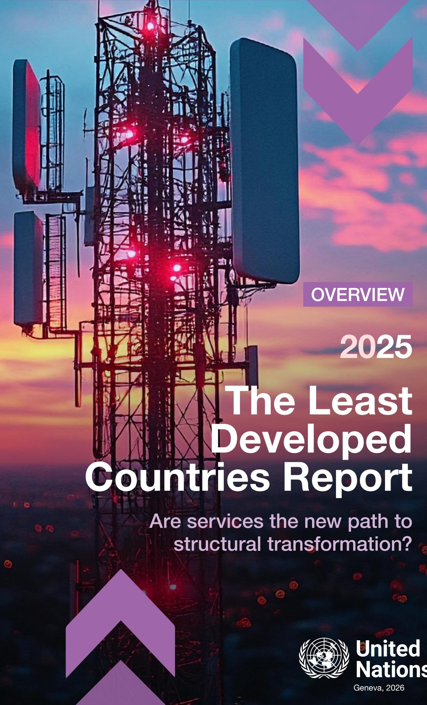

OVERVIEW

2025

Are services the new path to structural transformation?

## © 2026, United Nations

This work is available through open access, by complying with the Creative Commons licence created for intergovernmental organizations, at http://creativecommons.org/licenses/by/3.0/igo/.

The findings, interpretations and conclusions expressed herein are those of the authors and do not necessarily reflect the views of the United Nations or its officials or Member States.

The designations employed and the presentation of material on any map in this work do not imply the expression of any opinion whatsoever on the part of the United Nations concerning the legal status of any country, territory, city or area or of its authorities, or concerning the delimitation of its frontiers or boundaries.

Photocopies and reproductions of excerpts are allowed with proper credits.

This publication has been edited externally.

United Nations publication issued by the United Nations Conference on Trade and Development

UNCTAD/LDC/2025 (Overview)

## Content

Foreword Page iv

  
Page 1
Services are increasingly presented as an alternative path to development

  
Page 16 Countries are targeting specific services sectors to leverage their development

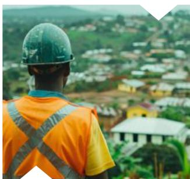  
The services sector in least developed countries: Growing importance, but limited developmental contribution

  
Page 20
The need to integrate services policies into broader development strategies

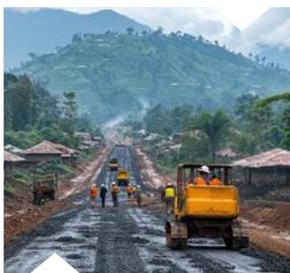  
Page 9
The uneven trajectory of the services trade

  
Page 23
Concluding message

Foreword

©2024\_UNCTAD

The global economy is undergoing a profound transformation, characterized by the growing dominance of services in both employment and value creation. For the least developed countries, this shift offers new opportunities to diversify and modernize their economies. Yet it also raises a pivotal question: can a dynamic services sector become a driver of structural transformation – or will existing global asymmetries deepen their marginalization?

This is the central question of The Least Developed Countries Report 2025: Are Services the New Path to Structural Transformation? The report examines the growing weight of services in least developed country economies, their expanding role in trade and the conditions under which services can – and cannot – deliver development results.

The findings are sobering. Services currently account for nearly half of the gross domestic product of the average least developed country. Yet services-led growth has not translated into broad-based development. Average per capita growth in the least developed countries was just 1 per cent last year. Too much of employment remains concentrated in low-productivity, informal activities – work that sustains survival but does not build prosperity. The least developed countries must absorb 13.2 million new job seekers every year until 2050. Working poverty remains widespread. The challenge is not just more jobs, but also better ones.

The gaps are stark. Labour productivity in the median least developed country is 11 times lower than in the median developed economy. Tourism accounts for a third of least developed country services exports, yet elevated revenues often fail to translate into substantial employment, local value addition or transformative structural change. And in digitally deliverable services – the most dynamic segment of global trade – the least developed countries account for just 0.16 per cent, the lowest share since records began. The digital economy is booming, but largely outside the least developed countries.

The report is clear: services can reinforce industrialization, expand trade and enhance competitiveness, but only when supported by coherent national strategies and an enabling global environment. Without both, the same forces that create opportunity will deepen exclusion.

# The Least Developed Countries Report 2025 Are services the new path to structural transformation? OVERVIEW

For services to become an engine of transformation, the least developed countries need integrated strategies that combine investments in physical and digital infrastructure with human capital development, regulatory reform and targeted support for high-value sectors. Policies must deepen linkages between services, manufacturing and agriculture, fostering synergies that drive productivity and innovation. And measures to upgrade traditional services and improve job quality are essential to ensure inclusivity.

Global cooperation will be decisive. Enhanced trade preferences, technology transfer, concessional finance and capacity-building can help the least developed countries to overcome structural constraints. Regional integration, through the African Continental Free Trade Area and similar initiatives, offers platforms to scale trade in services. At the multilateral level, UNCTAD can ensure that rules governing services trade, electronic commerce and the digital economy preserve the policy space these countries need.

As we reach the midpoint of the Doha Programme of Action, the imperative is clear: services must become part of a broader agenda for structural transformation. This is not only a national priority for the least developed countries; it is a test of the global trading system's capacity to deliver broad-based development.

UNCTAD stands ready to support the least developed countries and their partners in turning this vision into reality.

Rebeca Grynspan
Secretary-General of UNCTAD

# Services are increasingly presented as an alternative path to development

From the start of the twenty-first century, the discourse on development has increasingly emphasized services as the main leverage for developing countries – including least developed countries (LDCs) – to accelerate their growth and development. It holds that a focus on strengthening different services sectors and expanding their exports allows LDCs to transform the structure of their economies, modernize their productive activities, accelerate economic growth, and thereby achieve considerably higher levels of well-being. Such reasoning has intensified, especially with the expansion of the digital economy. In this discourse, services are presented as an alternative to the traditional route of industrialization-led development and structural transformation.

A major objection to this development approach is that it often takes developments in advanced economies and transfers them to LDCs. It fails to take into account the actual structural challenges that beset the services sector of LDCs in terms of productivity, knowledge intensity, informality and sluggishness, which are reflected in the patterns of these countries' foreign trade in services. The Least Developed Countries Report 2025: Are services the new path to structural transformation? provides an in-depth analysis of the actual situation of the tertiary sector of LDCs and their trade in services, to critically assess the applicability of such new development reasoning to these countries. It offers an evidence-based approach to the complementary role that services can play in the structural transformation of LDCs.

# The services sector in least developed countries: Growing importance, but limited developmental contribution

LDCs face a dual challenge: creating many more – and better – jobs for their rapidly expanding working-age populations, while accelerating growth to reduce poverty (figure 1). LDCs will need to absorb about 13.2 million new job seekers every year from 2025 to 2050. Urbanization adds pressure, as the urban share of the population has tripled since 1970, and will exceed half by mid-century. Yet cities too often generate informal, low-productivity work, with youths and women facing especially high unemployment. Working poverty remains widespread (table 1), underscoring that the challenge is not just more jobs, but better ones.

A second key challenge for LDCs is to accelerate economic growth to address widespread poverty and meet development objectives. Growth performance has been insufficient to meet the Sustainable Development Goals. In 2024, only 2 out of the 44 LDCs met the target of annual growth rate of 7 per cent, and the average per capita growth rate in LDCs was just 1 per cent.

## Figure 1

The least developed countries face demographic pressures

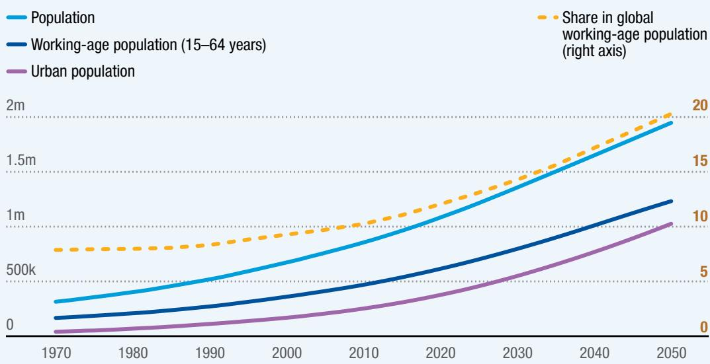  
Source: UNCTAD calculations based on the UNCTADstat database (accessed 10 March 2025).

## Table 1

Millions work yet remain poor in the least developed countries
Percentage of employed people living below \$2.15 purchasing power parity (PPP) per day, 2024

<table><tr><td>Country</td><td>Working poverty rate</td></tr><tr><td>Angola</td><td>31.5</td></tr><tr><td>Bangladesh</td><td>2.6</td></tr><tr><td>Benin</td><td>9.2</td></tr><tr><td>Burkina Faso</td><td>23.9</td></tr><tr><td>Burundi</td><td>58.1</td></tr><tr><td>Cambodia</td><td>14.1</td></tr><tr><td>Central African Republic (the)</td><td>65.7</td></tr><tr><td>Chad</td><td>29.2</td></tr><tr><td>Comoros (the)</td><td>14.8</td></tr><tr><td>Democratic Republic of the Congo (the)</td><td>72.8</td></tr><tr><td>Eritrea</td><td>31.2</td></tr><tr><td>Ethiopia</td><td>14.3</td></tr><tr><td>Gambia (the)</td><td>12.3</td></tr><tr><td>Guinea</td><td>12.6</td></tr><tr><td>Guinea-Bissau</td><td>21.6</td></tr><tr><td>Haiti</td><td>31.2</td></tr><tr><td>Lao People&#x27;s Democratic Republic (the)</td><td>6.0</td></tr><tr><td>Lesotho</td><td>25.1</td></tr><tr><td>Liberia</td><td>27.5</td></tr></table>

<table><tr><td>Country</td><td>Working poverty rate</td></tr><tr><td>Madagascar</td><td>77.6</td></tr><tr><td>Malawi</td><td>67.9</td></tr><tr><td>Mali</td><td>22.0</td></tr><tr><td>Mauritania</td><td>3.0</td></tr><tr><td>Mozambique</td><td>70.2</td></tr><tr><td>Myanmar</td><td>2.8</td></tr><tr><td>Nepal</td><td>0.2</td></tr><tr><td>Niger (the)</td><td>42.0</td></tr><tr><td>Rwanda</td><td>32.5</td></tr><tr><td>Senegal</td><td>10.4</td></tr><tr><td>Sierra Leone</td><td>27.3</td></tr><tr><td>Solomon Islands</td><td>30.7</td></tr><tr><td>Somalia</td><td>63.2</td></tr><tr><td>Timor-Leste</td><td>16.0</td></tr><tr><td>Togo</td><td>14.9</td></tr><tr><td>Uganda</td><td>35.3</td></tr><tr><td>United Republic of Tanzania (the)</td><td>39.8</td></tr><tr><td>Yemen</td><td>48.2</td></tr><tr><td>Zambia</td><td>59.9</td></tr><tr><td>LDC average</td><td>30.7</td></tr></table>

Source: UNCTAD based on ILOSTAT modelled estimates (accessed 18 July 2025).
Note: Data for Afghanistan, Djibouti, Kiribati, South Sudan, the Sudan and Tuvalu are missing.

Structural change in LDCs since 1970 has featured shrinking agricultural shares in production and employment and rising services, while the share of manufacturing has largely stagnated. By 2023, services contributed 48.9 per cent of gross domestic product (GDP) on average, agriculture 24.4 per cent, and manufacturing 10.9 per cent. There are exceptions – Bangladesh, Cambodia, Haiti and Myanmar have manufacturing shares of around one quarter (concentrated in garments) – but in most LDCs, services dominate value added (figure 2). Employment shares in LDCs have mirrored the trend in value added, with a consistent decrease of the share of agriculture accompanied by an increase of the share of services, while the share of manufacturing has stagnated. A major contrast with the evolution of output is that, despite this shift, agriculture remains the largest employer in the average LDC, accounting for 48.6 per cent of employment in 2023. The services sector follows with 38.4 per cent, and manufacturing with 7.4 per cent. Average employment shares mask substantial differences between individual LDCs. In 2023, the share of services in total employment in LDCs ranged from 11.9 per cent in Burundi to 92.9 per cent in Djibouti (figure 3).

  
Figure 2

Services make up the largest share of gross domestic product in most least developed countries

Value added by economic activity, 2023 (Percentage of GDP)

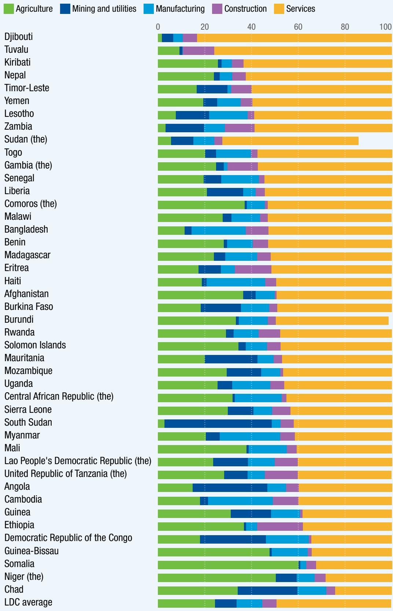  
Source: UNCTAD calculations based on the UNCTADstat database (accessed 22 July 2025).

## Figure 3

Agriculture remains a larger employer than services in the majority of least developed countries

Employment by economic activity, 2023 (Percentage of total employment)

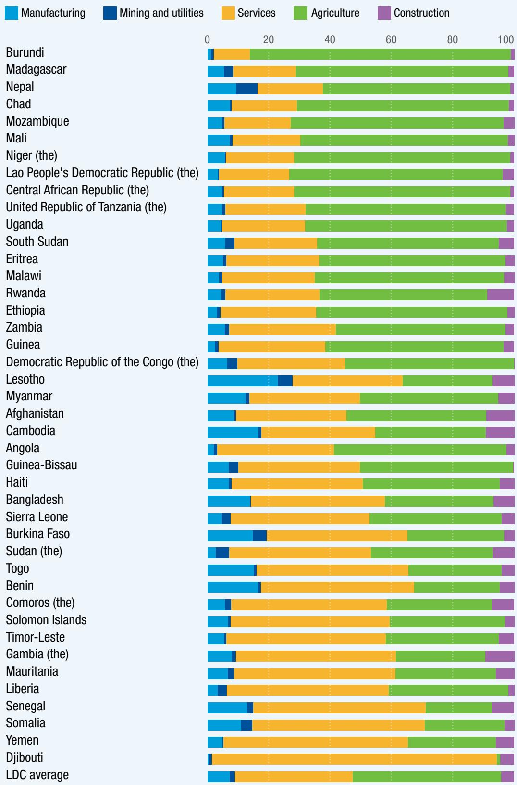  
Source: UNCTAD based on ILOSTAT database (accessed 24 March 2025).  
Note: Data for Kiribati and Tuvalu are missing. Data for the Sudan are for 2022.

# The Least Developed Countries Report 2025 Are services the new path to structural transformation? OVERVIEW

Services employment in LDCs is highly concentrated in lower-productivity segments – especially trade services (such as wholesale and retail trade, and repair of motor vehicles and motorcycles) and the broad “other services” category (figure 4). Trade services alone accounted for an average share of 38.9 per cent of services employment in 2023. This subsector is classified as less knowledge-intensive, and is characterized by low education levels: 77.1 per cent of its workers have only basic or less-than-basic education. The subsector is also highly gendered – in 2023, 45.5 per cent of all female services workers in LDCs were concentrated in trade services, compared with 32.6 per cent of men.

## Figure 4

The services sector is highly concentrated in least developed countries Employment by services subsector, 2023 (Percentage of total services employment)

Other developing economies

Developed economies

Least developed countries

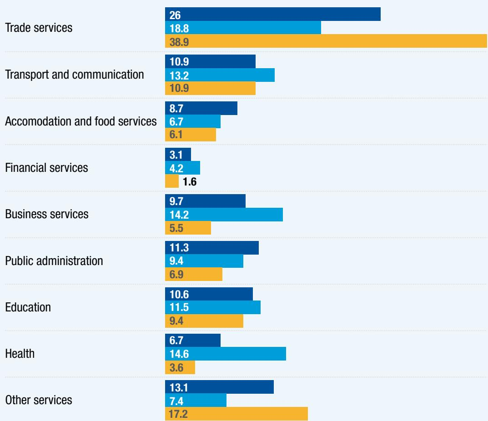  
Source: UNCTAD calculations based on ILOSTAT database (accessed 24 March 2025).  
Note: Simple group averages.

Enhancing labour productivity is crucial for economic growth and the improvement of living standards in LDCs. However, over the past three decades, labour productivity in LDCs has not increased at the speed required to drive meaningful GDP per capita growth and development. In the period 1991–2024, the median real labour productivity in LDCs increased from \$5,430 to \$8,579 – a compound annual growth rate of 1.4 per cent (figure 5). In 2024, the labour productivity level in the median other developed economy was more than 5 times higher (\$45,134), while it was more than 11 times higher in the median developed economy (\$100,487).

  
Labour productivity is not growing at the required speed in least developed countries

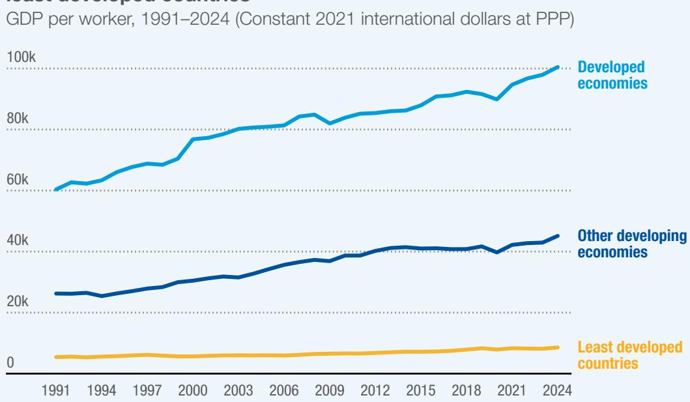  
Source: UNCTAD calculations based on ILOSTAT modelled estimates. Note: Group medians. Data for Kiribati and Tuvalu are missing.

The persistence of low productivity across large segments of the services sector in LDCs points to a structural challenge: while the sector absorbs labour, it does so largely in low-value, informal and non-tradable activities. Therefore, a core challenge of structural transformation in LDCs is that, while the share of employment in services has increased, it has not been accompanied by commensurate improvements in productivity or job quality.

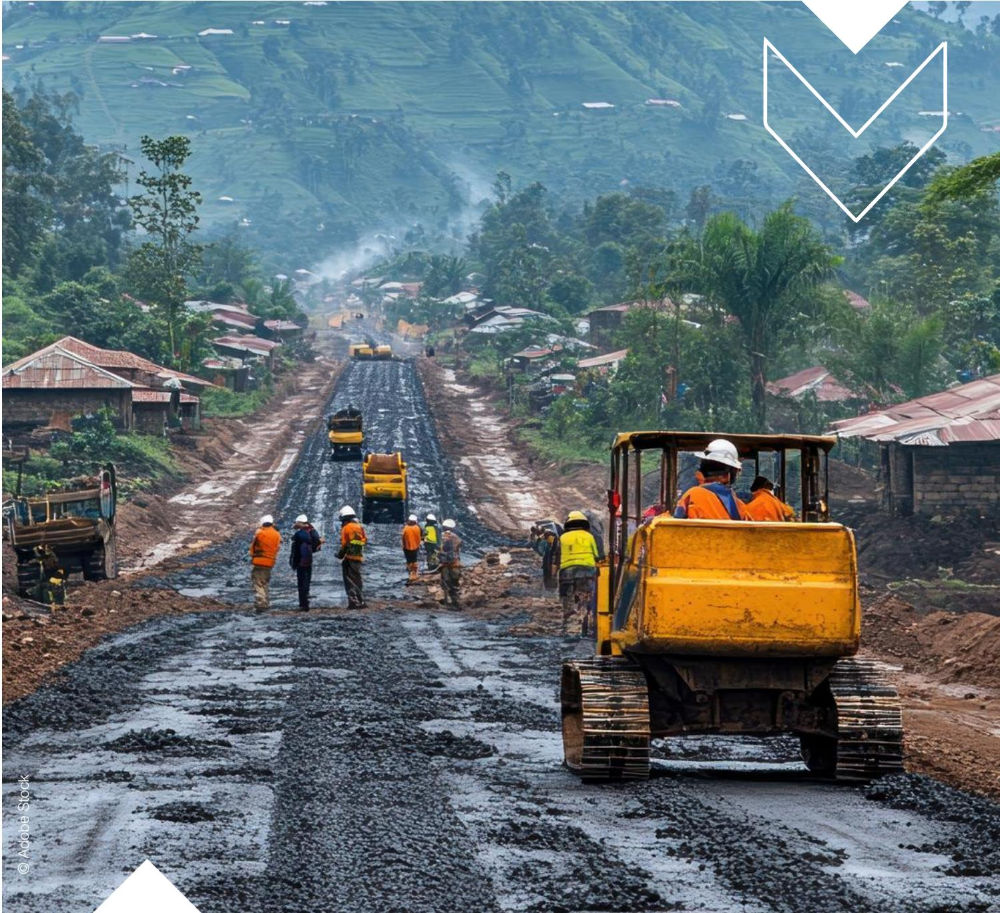

## The uneven trajectory of the services trade

Services are increasingly central to global trade, yet the growth trajectory remains markedly uneven between developed and developing economies. Between 2021 and 2024, global services exports grew by an average of 13.7 per cent, outpacing goods, which expanded by 9.1 per cent. Consistent with this global trend, LDCs' services exports grew by an average of 12.5 per cent in 2021–2024, slightly ahead of goods exports, which expanded by 10.6 per cent during the period. Services contributed 16 per cent of LDCs' total exports in 2024 (figure 6).

## Figure 6

Services are gradually contributing a larger share to total exports of least developed countries

\- Services exports (Billion dollars, left axis)
- Merchandise exports (Billion dollars, left axis)

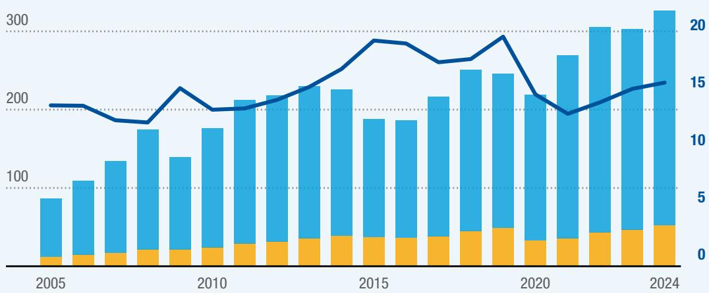  
Source: UNCTAD secretariat calculations based on data from the WTO–UNCTAD Trade in Services Data Set (accessed October 2025).

LDC services exports are strongly concentrated on a few countries, as the five largest exporters – Ethiopia, Bangladesh, the United Republic of Tanzania, Cambodia and Uganda – generated more than one fourth of the LDC total (figure 7).

## Figure 7

Services exports were concentrated on a few least developed countries in 2023

Services exports in billions of dollars

Services exports as a percentage of GDP

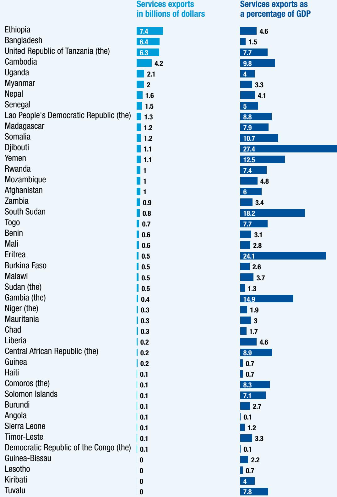  
Source: UNCTAD secretariat calculations based on data from the WTO–UNCTAD Trade in Services Data Set (accessed March 2025).

# The Least Developed Countries Report 2025 Are services the new path to structural transformation? OVERVIEW

The LDC exports of services are also concentrated on a few sectors. Travel (tourism) has traditionally been the main export sector, accounting at present for one third of LDC services exports, a share well ahead of that in other country groups (figure 8). LDCs have developed this sector thanks to comparative advantages and low entry barriers. The second most important services export sector for LDCs is transport, following efforts made by some LDCs to establish themselves as transport hubs (figure 8).

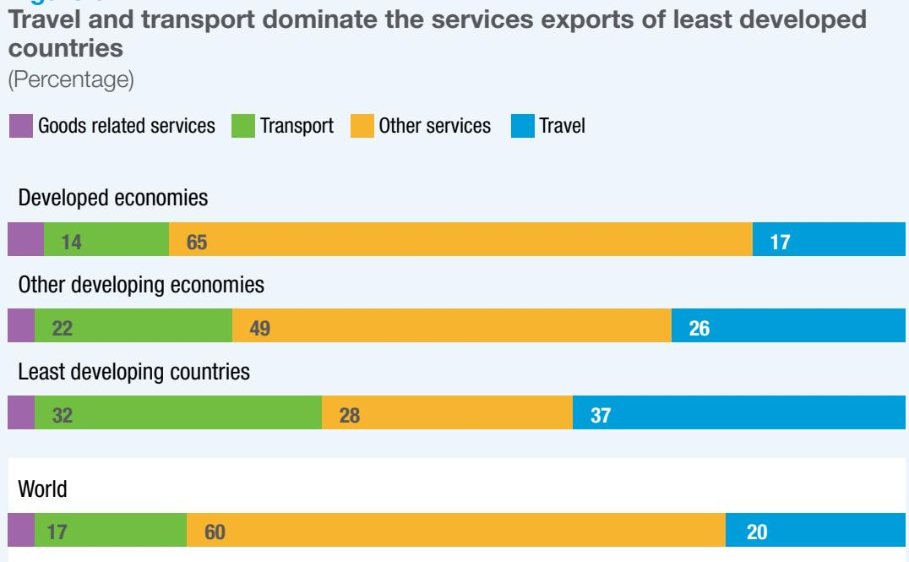  
Source: UNCTAD secretariat calculations based on data from the WTO–UNCTAD Trade in Services Data Set (accessed October 2025).

Given the importance of travel and transport to total services exports of LDCs, the dominant modes of international supply of services are mode 1 (cross-border supply) and mode 2 (movement of natural persons), according to the classification of the General Agreement on Trade in Services (GATS) (figure 9). They account for 95 per cent of total LDC services exports, in sharp contrast with global patterns of trade in services, where more than half is performed through mode 3 (commercial presence abroad).

## Figure 9

Cross-border supply is the most important mode of services export for least developed countries, followed by consumption abroad (Percentage of total services exports by mode of supply)

<table><tr><td></td><td>Mode 1</td><td>Mode 2</td><td>Mode 3</td><td>Mode 4</td></tr><tr><td>Least developed countries</td><td>63</td><td>32</td><td>0</td><td>0</td></tr><tr><td>Bangladesh</td><td>61</td><td>28</td><td>9</td><td>0</td></tr><tr><td>Sudan (the)</td><td>73</td><td>0</td><td>17</td><td>0</td></tr><tr><td>Angola</td><td>90</td><td>0</td><td>0</td><td>0</td></tr><tr><td>Myanmar</td><td>52</td><td>37</td><td>0</td><td>0</td></tr><tr><td>Senegal</td><td>64</td><td>28</td><td>0</td><td>0</td></tr><tr><td>Ethiopia</td><td>73</td><td>26</td><td>0</td><td>0</td></tr><tr><td>United Republic of Tanzania (the)</td><td>58</td><td>41</td><td>0</td><td>0</td></tr><tr><td>Nepal</td><td>74</td><td>19</td><td>0</td><td>0</td></tr><tr><td>Zambia</td><td>46</td><td>50</td><td>0</td><td>0</td></tr><tr><td>Burkina Faso</td><td>77</td><td>0</td><td>0</td><td>0</td></tr><tr><td>Cambodia</td><td>56</td><td>42</td><td>0</td><td>0</td></tr><tr><td>Uganda</td><td>40</td><td>57</td><td>0</td><td>0</td></tr><tr><td>Yemen</td><td>64</td><td>28</td><td>0</td><td>0</td></tr><tr><td>Afghanistan</td><td>59</td><td>33</td><td>0</td><td>0</td></tr><tr><td>Lao People&#x27;s Democratic Republic (the)</td><td>53</td><td>43</td><td>0</td><td>0</td></tr><tr><td>Eritrea</td><td>70</td><td>26</td><td>0</td><td>0</td></tr><tr><td>Mali</td><td>75</td><td>22</td><td>0</td><td>0</td></tr><tr><td>Democratic Republic of the Congo (the)</td><td>93</td><td>0</td><td>0</td><td>0</td></tr><tr><td>Chad</td><td>80</td><td>12</td><td>0</td><td>0</td></tr><tr><td>Mauritania</td><td>62</td><td>33</td><td>0</td><td>0</td></tr><tr><td>Madagascar</td><td>53</td><td>45</td><td>0</td><td>0</td></tr><tr><td>Rwanda</td><td>58</td><td>41</td><td>0</td><td>0</td></tr><tr><td>Guinea</td><td>79</td><td>18</td><td>0</td><td>0</td></tr><tr><td>Malawi</td><td>73</td><td>23</td><td>0</td><td>0</td></tr><tr><td>Djibouti</td><td>96</td><td>0</td><td>0</td><td>0</td></tr><tr><td>Togo</td><td>63</td><td>35</td><td>0</td><td>0</td></tr><tr><td>Niger (the)</td><td>62</td><td>37</td><td>0</td><td>0</td></tr><tr><td>Benin</td><td>68</td><td>31</td><td>0</td><td>0</td></tr><tr><td>Lesotho</td><td>79</td><td>15</td><td>0</td><td>0</td></tr><tr><td>Solomon Islands</td><td>62</td><td>34</td><td>0</td><td>0</td></tr><tr><td>Sierra Leone</td><td>70</td><td>27</td><td>0</td><td>0</td></tr><tr><td>Liberia</td><td>93</td><td>0</td><td>0</td><td>0</td></tr><tr><td>Comoros (the)</td><td>24</td><td>74</td><td>0</td><td>0</td></tr><tr><td>Central African Republic (the)</td><td>25</td><td>71</td><td>0</td><td>0</td></tr><tr><td>Gambia (the)</td><td>39</td><td>61</td><td>0</td><td>0</td></tr><tr><td>Burundi</td><td>92</td><td>0</td><td>0</td><td>0</td></tr><tr><td>Kiribati</td><td>22</td><td>61</td><td>17</td><td>0</td></tr><tr><td>Guinea-Bissau</td><td>68</td><td>30</td><td>0</td><td>0</td></tr><tr><td>Mozambique</td><td>42</td><td>58</td><td>0</td><td>0</td></tr><tr><td>Somalia</td><td>47</td><td>53</td><td>0</td><td>0</td></tr><tr><td>South Sudan</td><td>96</td><td>0</td><td>0</td><td>0</td></tr><tr><td>Timor-Leste</td><td>67</td><td>33</td><td>0</td><td>0</td></tr><tr><td>Haiti</td><td>53</td><td>47</td><td>0</td><td>0</td></tr><tr><td>Tuvalu</td><td>69</td><td>30</td><td>0</td><td>0</td></tr></table>

Source: UNCTAD secretariat calculations based on data from WTO, TISMOS data set (accessed May 2025).

## Marginal role in the most dynamic modality of services trade

LDCs play a very marginal role in world exports of knowledge-intensive and digitally-deliverable services (DDS). The latter have become a crucial component of the world trade in services, accounting for 62 per cent of services trade in 2023. Developed economies dominate, generating 76 per cent (\$3.8 trillion) of global DDS exports in 2024, while other developing economies have been gaining market share to reach 23 per cent of the global total in 2024 (\$1.1 trillion). The DDS exports of LDCs have been growing continuously since 2020 – but at a slower pace than those of other country groups – to reach \$8 billion in 2024. Therefore, LDCs have continued to play a minor role in world DDS trade. In 2024, they accounted for just 0.16 per cent, the lowest share since the beginning of the series in 2010 (figure 10). As a result, LDCs have been participating only very marginally in the most dynamic segment of worldwide services trade.

Figure 10
Developed economies and other developing economies are major players in digitally-deliverable services trade

Developed economies Other developing economies

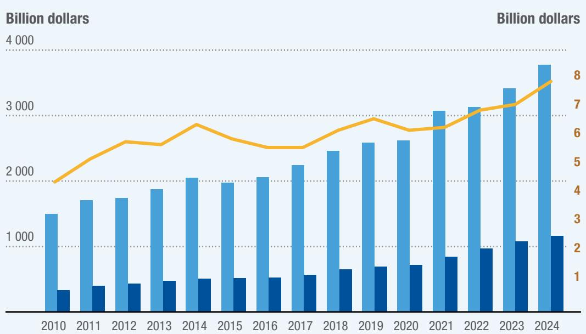  
Source: UNCTAD secretariat calculations based on data from the WTO–UNCTAD Trade in Services Data Set (accessed October 2025).

# The Least Developed Countries Report 2025 Are services the new path to structural transformation? OVERVIEW

The growth of DDS in services trade is propelled by rapid technological advancements, particularly in telecommunications, computer and information services. Previously non-tradable sectors – such as real-time consulting, e-learning and telemedicine – have become accessible through various modes of services supply. Digital platforms and digital infrastructure are playing a crucial role in altering the tradability of services, reducing the costs of trade and ushering in more players into the market. With a focus on DDS, LDCs can now more easily engage in mode 1 of trade in services. For example, among the top five DDS-exporting LDCs in 2022, telecommunications, computer and information services were prominent in the DDS exports of Bangladesh (34 per cent) and Madagascar (59.6 per cent), while professional and management consulting services were dominant in the DDS exports of South Sudan (65.2 per cent) and Nepal (44.4 per cent). However, LDCs face significant obstacles due to gaps in physical infrastructure for telecommunications and ICT services, as well as limitations in institutional, regulatory and policy capacities, alongside a dearth of skilled workforce.

## Shortcomings in the digital economy

Reversing this unfavourable scenario requires massive investment in digital infrastructure, and development of productive capacities in the digital sphere and institutional frameworks. In 2024, however, just \$9 billion foreign direct investment went into ICT infrastructure in developing countries, and these flows were highly concentrated on other developing economies. Ten countries account for almost 80 per cent of digital economy greenfield investment in the Global South, none of which are LDCs. Until they bridge the gaps in these areas, LDCs are expected to primarily be technology end users in consumer goods and services, with limited productive application of these technologies.

The low and declining share of knowledge- and technology-intensive services of LDCs may mask an underlying problem. These countries face the highest outflow of skilled human capital. From 2019 to 2024, LDCs experienced a net emigration of 9.5 million people. However, the potential contributions of the LDC diaspora stemming from high-skilled labour exports are not automatically realized, as there has been limited bridging of opportunities for professional collaboration, skills transfer and investment by the diaspora in their home countries.

## Countries are targeting specific services sectors to leverage their development

LDCs increasingly adopt hub-oriented approaches to development. Some countries embrace more than one hub framework. Hub frameworks lend impetus to the rise of services sectors, especially business processing services, financial services, logistics, technology, tourism and transportation.

Logistics and transport infrastructure is gaining strategic prominence in LDCs seeking to position themselves as regional hubs, with location advantages and regional integration shaping modernization efforts. Concession-based upgrades not only improve competitiveness and trade efficiency, but also contribute to fiscal revenue generation. Despite significant investments, multimodal transport networks in LDCs often encounter congestion and operational inefficiencies, resulting in uneven impacts on trade performance.

Tourism hubs generate revenue, but poor infrastructure prevents strong employment and value creation

Moreover, capital-intensive logistics infrastructure tends to generate limited direct employment.

Tourism is a traditional lead services export sector in many LDCs, which seek to establish themselves as tourism hubs. However, persistent and pervasive infrastructure constraints – including poor quality of domestic road networks and tourism accommodation; limited health and safety services; geographical isolation (weak air connectivity and marketing), with its associated high concentration in tourist source markets – continue to limit the maximization of value retention across the tourism value chain. Consequently, elevated tourism export revenues in many LDCs often do not translate into substantial employment gains, meaningful local value addition or transformative structural change (figure 11).

## Figure 11

Tourism earnings and job opportunities show a complex relationship in least developed countries

(Percentage)

(a) Tourism contribution to GDP, 2023 and 2024

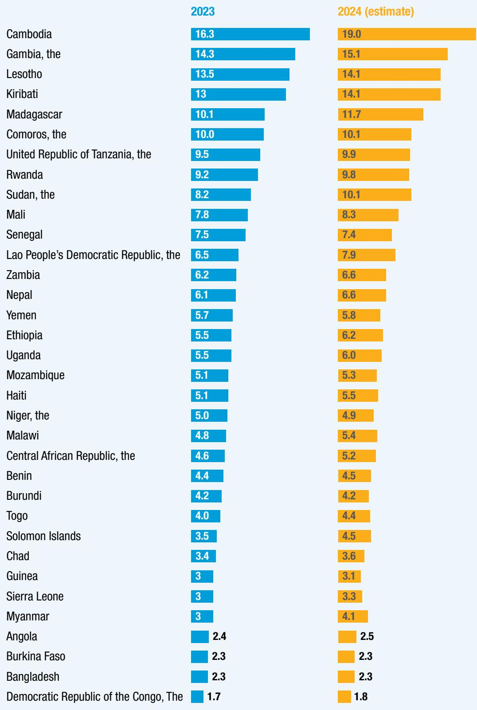

(b) Share of tourism and travel jobs in total employment, 2023 and 2024

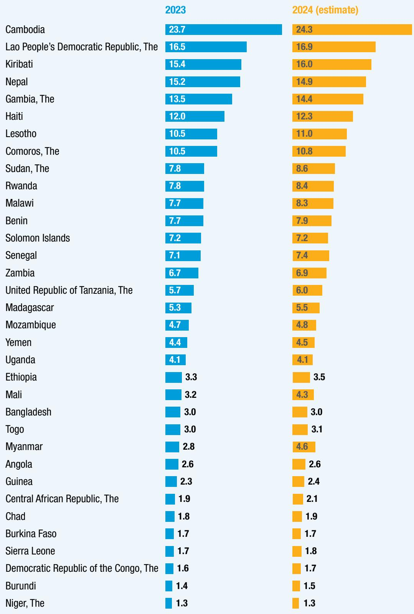  
Source: World Travel and Tourism Council, 2024 Annual Research country factsheets.  
Note: Information unavailable for Afghanistan, Djibouti, Eritrea, Guinea-Bissau, Liberia, Mauritania, Somalia,  
South Sudan, Timor-Leste and Tuvalu.

# The Least Developed Countries Report 2025 Are services the new path to structural transformation? OVERVIEW

The integration of financial technology (fintech) and ICT advancements is prompting policymakers in some LDCs to reframe financial services and digital business solutions as strategic pillars of modern services sector development. For example, while many LDCs focus on financial inclusion primarily as a poverty alleviation tool, Rwanda has emerged as a frontrunner in developing a financial services hub strategy. The country has established its capital city, Kigali, as a regional financial hub by leveraging a combined strategy of legal, regulatory and tax incentives; talent development; and investments in ICT infrastructure, financial inclusion and fintech integration. Rwanda has realized strategic gains in deepening its financial sector, and earned global financial centre and fintech ecosystem rankings.

A limited pool of talent threatens to constrain sustained sectoral expansion in Rwanda, though. Widespread poverty continues to hinder the uptake of financial services, and the lack of diverse financial products has constrained the sector's ability to catalyse transformative growth among small and medium-sized enterprises, and particularly the scaling up of micro and small firms into medium and large enterprises.

A significant number of LDCs show a presence of local digitally-enabled business process outsourcing services providers. However, the dearth of data makes it difficult to determine whether this signifies the definitive emergence of formal local industries, or just a services subsector driven mainly by freelancers, who often operate informally or at the borders of informality. Experience in some LDCs shows the potential of the sector to contribute to job creation, foreign exchange earnings and structural transformation, with its potential for positive ripple effects on ancillary industries (telecommunications, education, real estate, etc.). It also holds potential for youth and women's employment, especially through flexible work arrangements.

The emergence of such services is intricately linked to and supported by the national implementation of digitalization policies and ICT capacity-building and expanded global Internet connectivity. Affordable access and reliable digital suppliers compete, which likely helps explain why the industry is stronger in some LDCs than in others. Bangladesh has established itself as a business process outsourcing powerhouse through significant and sustained investments in digital infrastructure. National policies supportive of the rise of the formal industry include mainstreaming digital skills in the economy, and in public services provision, tax exemptions and the establishment of high-tech and information technology parks to attract foreign investment. The emergence of the industry helps mitigate the reliance of Bangladesh on garment exports.

## Risks and trade-offs in services sector development

Services are increasingly shaping LDC economies, though their growth trajectory is accompanied by nuanced risks that must be proactively addressed. Building modern services sectors in LDCs typically demands simultaneous investments in infrastructure and institutional capacity which, when combined with high-cost policy interventions, can exacerbate debt vulnerabilities. In addition, multiple LDCs are pursuing similar hub strategies, risking overcapacity and regional competition. Success depends on identifying country-specific niches and maintaining efficiency and cost advantages.

Hub strategies in LDCs do not signal a full shift to services-led economies, but reflect efforts to diversify, modernize infrastructure and boost fiscal revenues. Homegrown LDC champion firms have the potential to scale through innovation, strategic partnerships and visionary leadership. It will be important for LDCs to blend market-driven and policy-driven growth. Market-driven growth often signals entrepreneurial dynamism and drives local ownership. Policy support can help scale such market-emerging sectors and ensure inclusivity. Despite the emerging sectoral diversification and innovation, many LDCs lack systematic monitoring and evaluation of hub impacts (such as job creation and productivity).

# The need to integrate services policies into broader development strategies

LDC policymakers – with the backing and support of their development partners – need to implement policies that address the root causes of the underperformance of the services sector and its limited contribution to structural transformation. For the tertiary sector to fulfil the high expectations that it will become a driver of growth-enhancing structural transformation of LDCs, a coherent set of policies and strategies is required.

## Domestic policies

LDCs may consider the following aspects to enhance the contribution of services sectors to the structural transformation of their economies:

\- Services as part of strategies for growth-enhancing structural transformation: For the tertiary sector to transition from operating mainly as a buffer sector of absorption of excess labour to a decisive contributor to structural transformation, it has to strengthen its forward and backward linkage and flows with other sectors (such as industry and agriculture), but also among services subsectors. These are strong relationships and efficient inter-industry connections in terms of information, trade and resources, which can be nudged and strengthened through policy action of intrasectoral coordination and advice.

# The Least Developed Countries Report 2025 Are services the new path to structural transformation? OVERVIEW

\- Services development and industrialization: Most LDCs can still reap the positive economic and social side effects of industrialization. This transformation will be strongly complemented by these countries' successful expanding and modernizing their tertiary sectors. Services sectors can contribute to manufacturing inputs such as transport, logistics, engineering, research and development, business services and finance. The increasing interconnection between services and manufacturing offers significant opportunities for productivity growth, economic diversification and job creation in LDCs.

\- Strategic investment in physical and digital infrastructure: These investment programmes, funded both domestically and internationally, lift one of the major constraints to the development of different services sectors: poor infrastructure. In most cases, investments will have to be targeted according to sectoral policies.

\- Comprehensive strategies and policies for the tertiary sector: Given the very strong heterogeneity of the tertiary sector in LDCs, policies to foster the development and upgrading of services activities and firms in LDCs need to be differentiated according to the structural characteristics of each (sub)segment of the tertiary sector, including, among others: types of firms and enterprises; their degree of formalization; and their flows (of products, knowledge, technology, finance, etc.) with the international economy. Policymakers have to balance the need to cater for the traditional low end of the services sector – where the bulk of the services labour force is active – with the need to focus on “modern” / higher value added services.

\- Selection of (sub)sectors to be targeted: When selecting modern services (sub)sectors to promote, LDC Governments are advised to give preference to those with the potential to contribute to structural transformation; deepen their own value added, knowledge intensity and labour productivity; develop deep forward and backward linkages with the domestic economy; generate exports; and address gender issues, inclusivity and sustainability (to avoid deepening existing inequalities).

\- Deliberate human capital development aligned with target sectors: Training for skills required by targeted services (sub)sectors is complementary to overall education policies.

\- Setting up adequate regulatory frameworks: Given the very high heterogeneity of services (sub)sectors, regulation has to be very specific to each (sub)sector. Still, some elements that most regulatory frameworks for different services (sub)sectors should have in common include consumer protection; respect for workers' rights (in both formal and informal activities, but also in work for digital platforms); measures to combat illegal activities; data governance; security and protection; and measures to minimize risks (including systemic ones) or downside effects of the sector's activities.

\- Diaspora engagement: Active LDC policies to strengthen the links between their diasporas and the domestic economy – through instruments such as partnering with foreign firms, regional services providers, diaspora entrepreneurs and training of the home country workforce – can bring in not only capital, but also operational know-how, skills and platforms, and thereby result in technology transfer to the home economy of LDC migrants. It is advisable that this be complemented by targeted policies such as skills matching platforms, diaspora investment schemes and mutual recognition of qualifications to facilitate cross-border professional services trade.

LDCs need coherent strategies to make services a true driver of growth and transformation

In terms of different types of services sectors, the weight of low value added services activities in generating a large number of jobs requires policymakers to enact measures to build the skills of these workers through training policies, link their (mostly informal) firms with formal companies, promote jobs search, foster the adoption of technologies that complement rather than replace low-skilled workers, implement entrepreneurship policies of the few companies that have the potential for growth, create jobs and upgrade technologically, as well as incentivize formalization. This is in line with the third aspect mentioned above.

The development of digitally-enabled services in LDCs requires policy action, especially to: (a) ensure access to efficient Internet at affordable prices, through a mixture of regulatory and competition policy measures that incentivize the necessary investment; (b) implement e-commerce and digital trade laws and regulatory frameworks; (c) enact data protection and cybersecurity legislation; and (d) adopt online consumer protection measures.

## International policies

The increasing international tradability of services and the dynamism of international trade in services have meant that international markets exert a strong influence over developments in domestic services sectors. Therefore, the domestic policies outlined above need to be implemented coherently with trade policies for services, to ensure synergies between domestic and international policies, and provide clear signals to both domestic and international investors.

In developing their export strategies, LDCs are advised focus on their comparative advantages, including: (a) labour abundance and cost competitiveness, (b) natural and cultural assets, (c) geographic and strategic position, (d) strategic and policy support to sectoral development, and (e) leveraging the potential presented by digitally-deliverable services.

Taking advantage of the possibilities offered by regional and continental integration schemes such as the African Continental Free Trade Area, the Association of Southeast Asian Nations or the Regional Comprehensive Economic Partnership, LDCs can: (a) deepen regional services trade liberalization; (b) develop regional infrastructure, including digital and transport (e.g. through development corridors); (c) establish regional digital platforms and payments; and (d) pursue mutual recognition of qualifications to facilitate the mobility of professionals.

At the multilateral level, the priorities for LDCs' consideration includes:

\- Mode 4 (movement of natural persons) liberalization, e.g. through the negotiation of the renewal of the LDC services waiver, while striving to make preferences more adjusted to their supply capacity and export interests and potential;

\- Effective implementation of existing commitments and special provisions for LDCs;

• Technical assistance and capacity-building;

\- Regulatory flexibility: Preservation of policy space to regulate services sectors in accordance with development objectives.

## Concluding message

While the expansion of services in LDCs has created much-needed employment opportunities, it has yet to deliver the productivity gains and broad-based improvements in living standards that many expect. The large number of low-skilled workers employed in traditional services needs to be supported through better skills, productivity and working conditions. At the same time, LDCs need to transition towards promoting the diversification, growth and upgrading of tertiary companies. Assisted by their development partners, they have to assist in moving the sector into a new phase of growth – one that deepens linkages across the economy and strengthens the capacity to export services competitively. Such upgrading will allow services to become a hub of technology and knowledge spillover, by building dynamic linkages with other sectors and activities, including manufacturing. Strengthening complementarities between different sectors (e.g. services and industry) boosts their combined role in structural transformation. Revamping the services sector so that it effectively contributes to the structural transformation of LDC economies requires a coherent set of policies, ranging from broad policies aiming to dissolve bottlenecks to growth, to much more targeted measures that aim at developing or creating comparative advantages for specific services (sub)sectors. It also requires active trade policies. Access to international markets is being facilitated by the implementation of regional integration schemes, and by technological developments, while stronger action is necessary at the multilateral level. Business development for international markets should be complementary to that for domestic markets.

Services expansion creates jobs, but upgrading skills and sectors is key for broad transformation

The United Nations Conference on Trade and Development – UNCTAD – is the leading body of the United Nations focused on trade and development.

UNCTAD works to ensure developing countries benefit more fairly from a globalized economy by providing research and analysis on trade and development issues, offering technical assistance and facilitating intergovernmental consensus-building.

Standing at 195 countries, its membership is one of the largest in the United Nations system.

  
The Least Developed Countries Report 2025