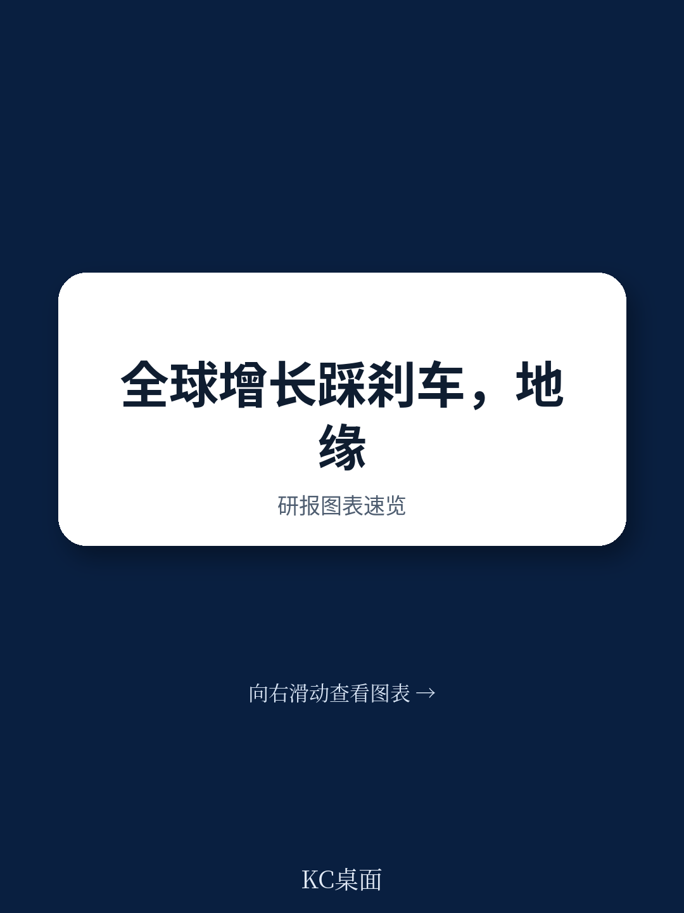
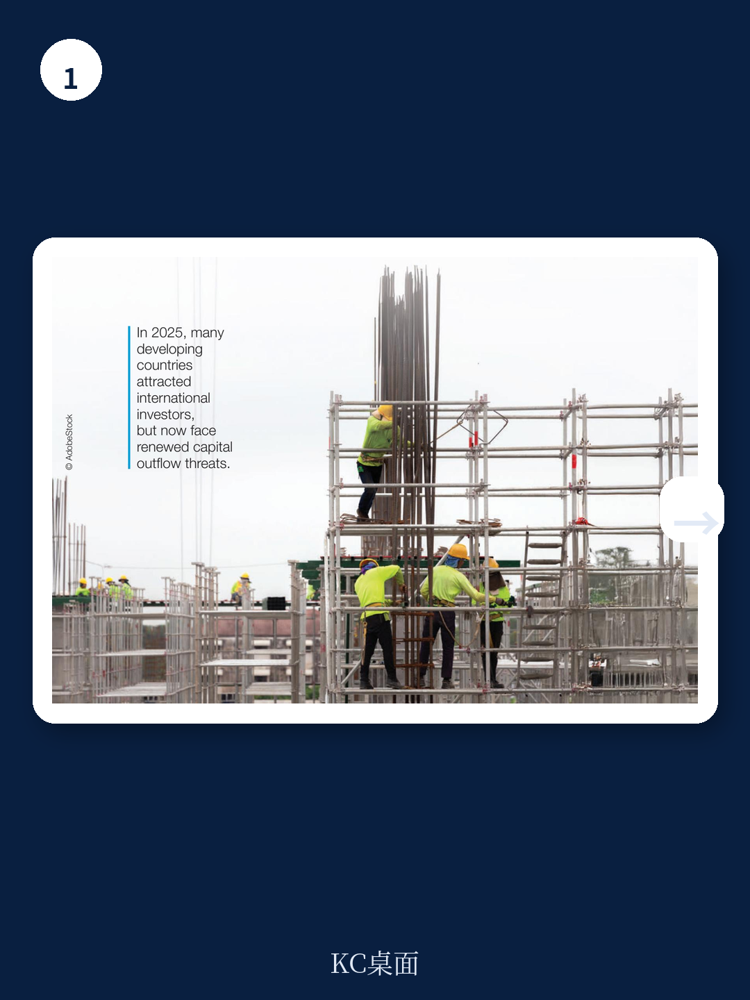

# 联合国贸发会议：AI硬件曾是贸易最大亮点，但2026年全球经济增速放缓

2025年全球经济以2.9%的增速平稳收官，工业产出在发展中国家持续扩张，AI相关投资成为重要支撑。但进入2026年2月底，中东局势的骤然升级，使全球经济面临的风险结构发生了根本性切换。

联合国贸发会议在最新发布的《贸易与发展前瞻2026》中明确指出，地缘政治风险已取代贸易政策不确定性，成为全球经济面临的首要挑战。这份报告的核心判断是：全球增长将从2025年的2.9%放缓至2026年的2.6%，而真正值得关注的不是增速降幅本身，而是传导机制的改变——能源市场、航运通道和金融条件正在同时承压，形成一种更难以对冲的多重冲击。

---

## 1. 地缘政治取代贸易政策成为首要风险，全球经济的脆弱性来源已经转移

2025年全年，市场的主要焦虑集中在关税升级、供应链重组和贸易摩擦。但进入2026年，局势发生了戏剧性转变。联合国贸发会议基于媒体文本分析的指数显示，贸易政策不确定性指数在2026年3月已经回落，而地缘政治风险指数则飙升至历史高位。

这一切换的意义在于，贸易风险在一定程度上是可预测、可对冲的——企业可以通过库存调整、区域转移和合同条款来管理。但地缘政治冲击的特点是突发性、非线性且具有自我放大效应。报告特别指出，当前全球冲突数量已创下历史纪录，这并非单一事件，而是长期结构性趋势的加速。

> **KC评论：** 理解这一风险切换，是读懂2026年全球资产定价和产业布局的前提。贸易摩擦的冲击是“慢变量”，企业有时间调整；地缘冲突的冲击是“快变量”，市场反应往往过度且不对称。完整报告中的图2和图3清晰展示了这两类风险的此消彼长，以及冲突数量与经济增长之间的负相关关系，值得仔细研究。

继续看原文，真正有价值的是这些指数的构建方法、历史对比区间以及不同经济体对两类风险的敏感度差异。完整报告与KC评论在每日汇编中汇总。

---

## 2. 能源价格飙升是短期最直接的冲击，但中长期影响在于金融条件的连锁反应

中东冲突爆发后，国际油价在数日内飙升超过60%，天然气价格翻倍以上。这一冲击对全球经济的短期影响已经清晰可见。但联合国贸发报告的分析重点在于，能源价格上涨的传导机制在不同经济体之间存在显著差异。

对于石油净进口国，尤其是发展中国家的影响更为严重。报告列举了孟加拉国、巴西、埃及、印度、印尼、墨西哥、巴基斯坦、菲律宾、斯里兰卡、泰国、越南等十多个国家，已经在采取措施——包括延长供应、增加燃料补贴或实施价格上限——来应对能源涨价。这些措施在缓解社会压力的同时，也带来了显著的财政成本。

一个值得关注的例外是中国。报告指出，中国的石油储备能够承受短期国际价格上涨。但即便如此，全球能源市场的持续波动仍将通过贸易渠道和金融渠道传导至中国。

> **KC评论：** 能源冲击的“第一轮效应”是通胀和贸易条件恶化，但“第二轮效应”才是真正决定经济走向的关键——即各国央行如何应对、财政空间是否足够、以及资本流动的方向是否会逆转。报告中对债券市场、汇率和资本流动的分析（图5至图11）揭示了这第二轮效应的完整图景。

---

## 3. 金融市场出现“非典型避险”，发达国家国债收益率上升与资本流向变化令人警惕

报告中最具洞察力的部分之一，是对金融市场反应的剖析。通常在地缘冲突爆发时，资金会涌入发达国家国债等安全资产，导致其收益率下降。但这次的情况不同——长期政府债券收益率反而上升了。

联合国贸发会议将这一现象称为“非典型的避险质量流动”。背后的逻辑是：冲突推高了通胀预期和财政赤字担忧，投资者要求更高的风险溢价，即使是在传统安全资产上。这对全球资产定价具有深远含义——如果“无风险利率”本身变得不再安全，整个金融体系的定价锚点将发生位移。

与此同时，发展中国家货币在冲突后遭受了显著冲击。新兴市场的股票和债券市场在2026年3月经历了自2022年以来最大规模的同步抛售。报告特别指出，此前在2025年形成的“新兴市场投资热潮”——大量资金涌入发展中国家股票市场——正面临逆转风险。

---

## 4. 全球贸易的早期强势难以持续，AI硬件曾是最大亮点但难以独撑

2025年全球商品贸易表现强劲，AI相关硬件贡献了巨大增量。报告指出，AI相关硬件在2025年全球商品贸易中占据了显著份额，这一领域的技术驱动型制造业，尤其是在亚洲，成为全球贸易增长的核心引擎。

但进入2026年，这一势头面临多重压力。中东冲突导致的航运通道风险——尤其是霍尔木兹海峡的潜在中断——已经推高了能源运输的运费。报告中的图14显示，能源相关的海运运费已经显著上升。同时，全球贸易增长预期正在下调，报告图15的预测显示2026年商品贸易增速将明显放缓。

值得关注的是，报告还提及了区域和行业层面的新贸易伙伴关系倡议（框2），这些结构性变化可能在中长期重塑贸易格局。但短期内，贸易增长的主要驱动因素——AI硬件需求——能否独立支撑全球贸易，仍是一个悬而未决的问题。

---

## 5. 报告尚未完全回答的关键问题：新能源投资能否成为宏观稳定的新锚点

联合国贸发报告在结论部分提出了一个重要的政策方向：可再生能源投资对宏观经济稳定和安全至关重要。报告中的框1专门分析了可再生能源经济学的积极变化，指出清洁能源的成本竞争力正在改善。

但报告也坦承，全球可再生能源投资仍然极不平衡，发展中国家处于不利地位。这一判断引出了一个悬而未决的问题：在当前地缘政治风险高企、能源价格剧烈波动的环境下，发展中国家如何筹集资金进行能源转型？传统的融资渠道——国际资本市场——正在收紧，而多边机构的资金规模又远远不够。

报告提出了三个政策方向：设计绿色转型的政策框架、缓解未来危机、加强全球稳定。但这些方向缺乏具体的实施路径和资金安排。这可能是报告有意留给读者思考的空间——毕竟，任何宏观判断的价值，最终取决于能否转化为可操作的决策框架。

---

## 6. 对读者的观察框架：从三个维度追踪风险演化

基于联合国贸发报告的框架，我们建议从以下三个维度持续观察2026年全球经济走势

**第一，能源市场的定价逻辑是否发生永久性变化。** 如果中东冲突导致霍尔木兹海峡长期中断或保险费永久性上升，能源的“安全溢价”将被重新定价。这不仅是石油价格的问题，更关系到全球通胀中枢和货币政策的路径。

**第二，发展中国家的外部融资条件是否持续恶化。** 报告已经指出资本外逃和借贷成本上升的风险。如果这一趋势持续，部分高负债发展中国家可能面临债务危机。联合国贸发会议此前发布的《发展中国家主权债务脆弱性》报告（2025年）提供了更详细的背景分析。

**第三，全球贸易的区域化重组是否加速。** 在贸易摩擦和地缘冲突的双重压力下，全球供应链正在加速区域化。报告提到了中国在非洲的绿色采矿倡议和美国对非洲增长与机会法案的重新授权，这些看似分散的事件，实际上都在指向同一个趋势：贸易正在从“效率优先”转向“安全优先”。

---

以上判断均基于联合国贸发会议《贸易与发展前瞻2026》的公开内容。但真正有价值的——那些细分图表、假设条件和验证路径——在完整报告中。

这篇报告中的图9A和9B（全球金融市场与新兴市场金融波动性）、图12（全球投资者对新兴市场股票的兴趣变化）、以及表1（分地区和国家的详细增长预测），每一张图表背后都有更细致的拆解和更深刻的洞察。

我们每日汇编会将这份报告放回2026年全球宏观主线中，整理成中文摘要、KC评论和图表合集。这不仅便于喂给AI进行进一步分析，也便于人工快速扫描市场动态。我们的交流群汇聚了头部券商、PE/VC、投行、并购、hedge fund、资管机构、战略咨询、智库等领域的专业人士，期待与各位一起追踪这些边际变化。

更多国际信源汇编和评论，扫码交流，每日更新，汇总国际主流叙事、数据和图表，观测边际变化。

Personal reading notes and learning share only. Not investment advice.
