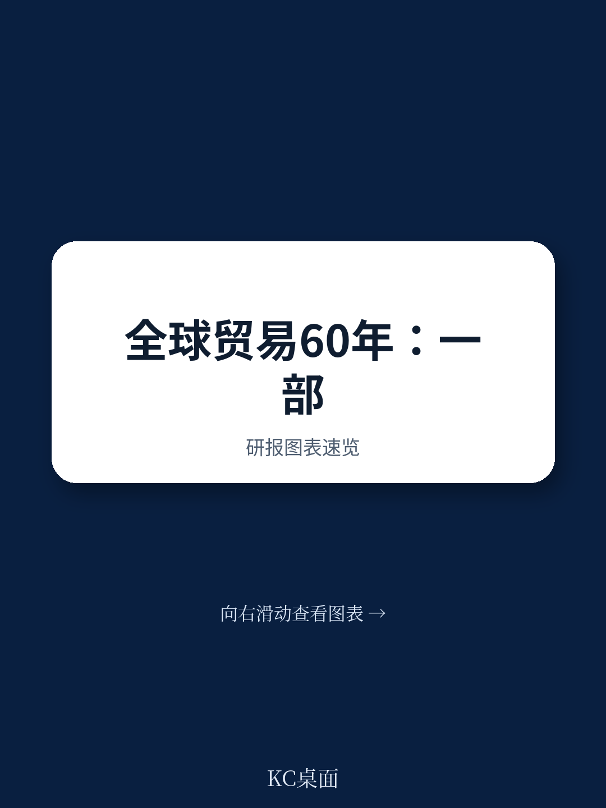
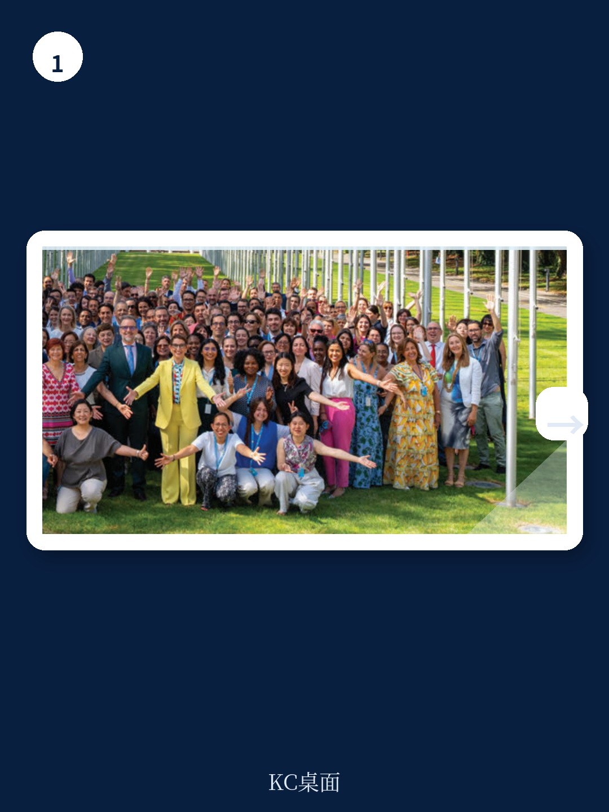
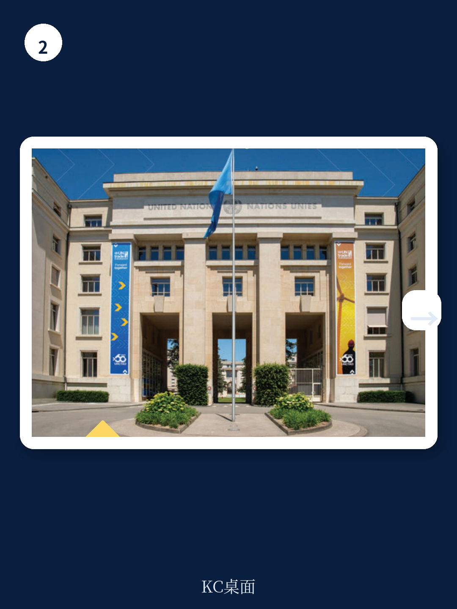

# 联合国贸发会议：全球贸易不是收缩，而是结构性碎片化

全球贸易在2024年呈现出一个令许多人困惑的图景：货物贸易总量仍在增长，服务贸易更是表现强劲，但与此同时，从黑海到红海再到巴拿马运河的关键航道频频受阻，供应链脆弱性暴露无遗，发展中国家面临的债务压力与气候冲击叠加。这不是一个简单的“好”或“坏”的故事。

联合国贸发会议在2024年度报告中给出的核心判断是：当前全球贸易面临的根本挑战不是周期性收缩，而是一场深层次的结构性碎片化。贸易的“量”在增长，但贸易的“质”——即其作为发展引擎、稳定器和公平分配机制的功能——正在被侵蚀。这意味着，对于产业决策者和投资者而言，关注点应当从“贸易总量何时恢复”转向“贸易格局如何重塑以及谁能在碎片化中占据有利位置”。

这份报告的价值在于，它不只是在描述问题，而是提供了一个分析框架：将航运中断、地缘竞争、数字转型、气候政策和金融体系割裂这五大力量放在一起观察，揭示它们如何共同改变全球贸易的底层逻辑。

> **KC评论：** 联合国贸发会议这份报告最值得读的部分不是结论本身，而是它如何把看似孤立的事件——红海危机、COP29的Baku倡议、数字经济的碳足迹——串联成一个系统性判断。完整报告的图表和假设路径才是真正的洞察来源。继续看原文，真正有价值的是图表、假设和验证路径；完整报告与KC评论在每日汇编。

## 1. 贸易增长的表象之下，三大“断点”正在重塑全球供应链的地理版图

2024年全球贸易确实在增长，服务贸易尤其活跃。但联合国贸发会议提醒我们，真正值得关注的是那些“断点”——关键航道的持续受阻正在永久性地改变贸易路线和成本结构。

红海危机、黑海局势紧张、巴拿马运河因气候干旱导致的通航能力下降，这三条全球最繁忙的海上贸易通道同时出现问题，这在现代贸易史上极为罕见。报告明确指出，这些不仅仅是临时性扰动，而是暴露了全球供应链对少数“咽喉点”的过度依赖。当这些咽喉点同时成为地缘政治博弈的焦点和气候变化的牺牲品时，贸易的“可预测性”这一核心价值正在被侵蚀。

对于依赖海运的企业而言，这意味着成本结构的永久性上升——不仅仅是运费，还包括保险、库存缓冲和路线冗余。那些能够将供应链从单一航道依赖中解放出来的国家或企业，将获得显著的竞争优势。

## 2. 发展中国家正在承受“三重挤压”：债务、气候与贸易条件恶化

报告最令人警醒的部分，是它对发展中国家处境的系统性描述。这些国家同时面临三个方向的挤压。

第一是债务。全球债务水平持续攀升，而发展中国家的偿债成本因利率环境变化而急剧上升。联合国贸发会议一直呼吁改革国际金融架构，但进展缓慢。第二是气候冲击。从巴拿马运河的干旱到小岛屿发展中国家的生存威胁，气候风险正在从“未来风险”变成“当前成本”。第三是贸易条件恶化。当发达国家推动“近岸外包”和“友岸外包”时，许多发展中国家发现自己被排除在新的贸易网络之外。

这三重挤压形成了一种恶性循环：债务压力迫使发展中国家削减气候适应投资，而气候冲击又进一步削弱其出口能力，最终导致贸易条件进一步恶化。联合国贸发会议在报告中强调，现有的国际金融工具不足以应对这种复合型冲击，需要系统性改革。

## 3. 数字经济的“环境账单”正在成为贸易政策的新变量，但报告尚未完全回答谁将买单

联合国贸发会议的《数字经济报告2024》聚焦于数字转型的环境可持续性，这是一个被严重低估的议题。报告指出，数字经济的快速发展——从数据中心到加密货币挖矿到人工智能训练——正在产生巨大的环境足迹，包括能源消耗、电子废弃物和关键矿产的开采压力。

这是一个典型的“发展悖论”：发展中国家需要数字经济来实现跨越式发展，但数字经济的碳足迹和资源需求可能加剧其环境脆弱性。联合国贸发会议提出了一个关键问题：数字转型的环境成本如何在全球范围内公平分担？

> **KC评论：** 报告点出了“谁买单”这个核心矛盾，但没有给出明确的分配机制。这正是需要读者回到完整报告中寻找线索的地方——它包含了对碳市场、关键矿产治理和数字税等具体工具的讨论。这些图表和假设路径，比任何摘要都更有价值。

## 4. 碳市场与最不发达国家：一个尚未被充分开发的“发展杠杆”

联合国贸发会议2024年发布的《最不发达国家报告》聚焦于碳市场。这是一个值得高度关注的领域。对于最不发达国家而言，碳市场可能提供一种前所未有的发展融资渠道——通过保护森林、发展可再生能源或采用低碳农业，这些国家可以获得碳信用收入。

但报告同时警告，碳市场的设计至关重要。如果缺乏透明度和公平的定价机制，碳市场可能变成发达国家以低成本获取环境抵消的“新殖民主义”工具。最不发达国家需要的是技术支持和制度建设，而不是简单的碳信用买卖。

这一议题对投资者同样有意义：碳市场的规范化将催生新的资产类别和交易机制，而最先建立可信碳信用体系的国家或项目，将获得定价权和先发优势。

## 5. 南南贸易正在成为新的增长引擎，但其稳定性取决于治理能力

联合国贸发会议在2024年多次强调南南贸易的重要性。报告数据显示，发展中国家之间的贸易增速超过了全球贸易平均水平，尤其是在服务贸易和数字贸易领域。这一趋势的背后是新兴经济体的崛起——东南亚、非洲和拉美之间的产业链联系正在加深。

但南南贸易的增长也带来新的治理挑战。这些贸易走廊往往缺乏成熟的制度框架、争端解决机制和金融基础设施。报告提出，南南贸易的可持续增长取决于参与国能否建立有效的贸易便利化机制和投资保护体系。

对于企业而言，这意味着南南贸易的高增长伴随着更高的操作风险。那些能够帮助降低这些风险的服务——贸易融资、物流保险、法律咨询——将迎来结构性需求增长。

## 6. 报告未完全回答的关键问题：全球贸易治理的“真空地带”如何填补

联合国贸发会议在报告中多次提到多边主义的重要性，但一个未被充分回答的问题是：当WTO的争端解决机制基本停摆、区域贸易协定日益碎片化时，全球贸易治理的“真空地带”由谁来填补？

报告提到了UNCTAD16（第16届四年一度大会）的筹备工作，以及联合国贸发会议在G20和COP29等平台上的参与。但这些努力能否转化为可执行的规则和机制，仍然是一个巨大的问号。

另一个未解问题是：关键矿产的治理框架。联合国贸发会议参与了联合国秘书长关键能源转型矿产小组的工作，但报告没有给出明确的治理蓝图。对于拥有锂、钴、稀土等资源的国家而言，如何在资源开发、环境保护和产业升级之间取得平衡，是一个尚未解决的难题。

> **KC评论：** 这些未解问题恰恰是这份报告最值得深读的原因。它不是一份“答案之书”，而是一份“问题地图”——它告诉你哪些变量正在变化，哪些假设需要验证，哪些风险尚未被定价。完整报告中的图表、假设和验证路径，才是真正值得花时间研究的材料。

---

这份报告揭示了一个核心事实：全球贸易正在经历的不是简单的“增长放缓”，而是底层逻辑的重构。对于决策者而言，理解这种重构的方向——而不是纠结于短期数据波动——才是制定战略的前提。

报告中的许多判断——从数字经济的碳足迹到南南贸易的治理挑战——都指向同一个方向：未来五年的赢家，将是那些能够同时驾驭贸易、技术、气候和金融这四股力量，并找到自身定位的经济体或企业。

更多国际信源汇编与评论，欢迎扫码交流。每日更新，汇总国际主流叙事、数据和图表，观测边际变化。每日汇编把单篇报告放回当天主线，整理成中文摘要、KC评论和图表合集，便于喂给AI，也便于人工快速扫描市场dynamics。这里汇聚了头部券商、PE/VC、投行、并购、hedge fund、资管机构、战略咨询、智库等朋友，期待交流。

Personal reading notes and learning share only. Not investment advice.
