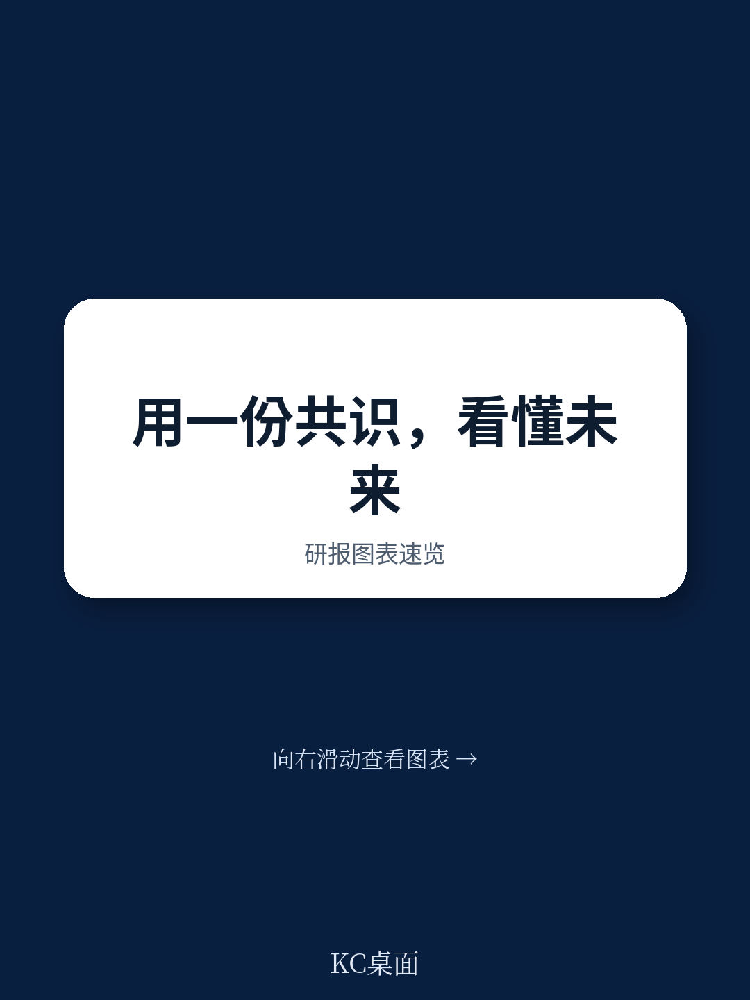

# 联合国贸发会议：不是关税而是规则，联合国报告揭示中国出口企业真正挑战

2025年10月，联合国贸发会议第十六届大会在日内瓦万国宫落幕。这份名为《日内瓦共识》的政治宣言，看似是国际组织惯常的原则性文件，但如果我们把它放在过去四年全球贸易格局的剧烈变动中审视，会发现它释放的信号远比表面文字更值得产业决策者关注。

这份报告的核心判断是：全球贸易体系正在从一个“规则相对稳定、竞争围绕效率”的阶段，转向一个“规则本身成为竞争变量、发展权与环境责任必须平衡”的新阶段。对于中国企业而言，这意味着过去依赖规模、成本和供应链效率建立的竞争优势，其底层逻辑正在被重新定义。

这不是一份关于关税或制裁的短期分析，而是对贸易与发展之间关系的结构性重估。报告提出的“公正且可持续的经济秩序”，本质上是在回答一个根本问题：当全球化从效率优先转向安全与公平并重时，贸易规则应该为谁服务？

> **KC评论：** 很多企业主看到联合国文件会觉得“太宏观、离自己太远”。但恰恰是这种多边共识文件，往往预示着未来3-5年监管、合规和市场准入的走向。比如2015年《巴黎协定》之后，欧盟的碳边境调节机制从概念到落地只用了不到8年。这份《日内瓦共识》同样值得仔细读——它可能成为下一轮贸易规则修订的“思想源头”。继续看原文，真正有价值的是报告中对“规则重构”的路径假设、各国立场差异和验证时间表。完整报告与KC评论在每日汇编。

## 1. 过去61年的发展叙事已经走到尽头，新共识的核心是“平衡”

报告开篇做了一个重要的历史定位：自1964年联合国贸发会议成立至今61年，全球经济取得了显著成就，但“繁荣、社会发展和福祉在国家和人民之间公平分享”的共同目标仍未实现。

这不是一个客气的开场白，而是一个根本性的判断——过去以“贸易自由化+资本流动”为核心的发展模式，虽然创造了巨大的财富增量，但在分配上存在系统性缺陷。报告用“重大冲击和危机”来描述当前全球经济秩序的状态，并指出它已进入一个“既充满不稳定不确定性、又蕴含机遇的过渡阶段”。

这意味着，未来贸易规则的设计将不再单纯追求效率最大化，而是要在效率、公平、可持续性三者之间寻找新的均衡点。对于企业来说，这意味着“低成本”不再是唯一竞争力，“合规成本”“ESG成本”“供应链韧性成本”正在成为新的竞争维度。

## 2. 贸易和投资仍是发展引擎，但前提是“有框架的规则”

报告第8条明确写道：“贸易和投资是经济发展和繁荣的强大驱动力，前提是它们在一个建立并得到尊重的框架内进行。”接着，报告强调了一个“基于规则的、公平、开放、透明、可预测、包容、非歧视和公平的多边贸易体制比以往任何时候都更加不可或缺”。

这里的关键词是“建立并得到尊重的框架”。它暗示了一个重要转变：过去，贸易规则更多是“减少壁垒、促进流动”，未来则更强调“规则本身的质量和执行”。换句话说，“有规则”比“少规则”更重要。

对于中国企业而言，这意味着出海战略需要从“市场准入”思维转向“规则适配”思维。比如，欧盟的碳边境调节机制、数字服务税、供应链尽责调查指令，这些都不是临时性措施，而是新规则框架的组成部分。企业如果只关注关税和配额，而忽视这些非关税壁垒背后的规则逻辑，可能会在合规成本上付出更大代价。

> **KC评论：** 这份报告最值得关注的部分，其实是它没有明说的“潜台词”——当发展中国家和发达国家都同意“规则需要改革”时，分歧在于改革的方向。发展中国家希望更多“特殊与差别待遇”，发达国家则强调“环境和社会标准”。中国作为最大的发展中国家和最大的贸易国，在这个博弈中的位置非常微妙。完整报告里有详细的各方立场对比和谈判路线图，这些图表和假设才是决策者真正需要看的。

## 3. 多边主义需要“改革”而非“放弃”，这是对单边主义的明确回应

报告第9条是全文最具政策指向性的段落之一：“我们强烈呼吁加强以联合国为核心的多边体系。”同时，报告承认“全球商定的框架，如2030年可持续发展议程，必须加倍努力继续实施”，并承诺“共同努力改革多边主义，使其能够应对当前和未来的挑战”。

这段话的背景是近年来单边主义和区域化趋势的抬头。报告没有点名任何国家，但“改革多边主义”这一表述本身就意味着：现有体系已经不足以应对挑战，但解决方案不是放弃多边框架，而是让它更有效。

这对企业的战略启示是：未来全球贸易环境不会走向“无规则”的丛林状态，也不会回到过去的“统一规则”时代，而是会形成“多层次、多速度”的规则体系。企业需要具备在不同规则层级之间灵活切换的能力，比如同时适应WTO框架、区域贸易协定（如RCEP、CPTPP）以及双边安排。

## 4. 环境责任从“可选项”变为“硬约束”，企业需要重新定义竞争力

报告第7条明确将“经济发展必须尊重地球的自然极限”列为共享价值之一，并呼吁各国政府“确保有效执行法规，为私营举措的部署创造有利条件，并开展国际合作以促进创新、经济增长、社会发展和环境保护”。

这段表述的力度在于：它把环境责任从“企业自愿行为”提升到了“政府监管和跨国合作”的层面。这意味着，未来企业的环保表现将不再是营销噱头，而是市场准入的基本门槛。

对于中国制造业企业来说，这是一个需要认真对待的信号。过去几年，欧盟的碳边境调节机制已经让出口企业感受到了压力，而这份共识文件表明，类似机制可能会在更多领域和更大范围推广。企业现在就需要开始建立碳核算能力、绿色供应链管理体系，以及应对不同市场环境标准的合规团队。

## 5. 报告尚未完全回答的关键问题：谁来承担转型成本？

尽管《日内瓦共识》在原则层面达成了广泛一致，但它留下了一个核心问题没有解决：公正转型的成本由谁承担？

报告提到了“不让任何人掉队”的承诺，也提到了“为私营举措创造有利条件”，但对于发达国家和发展中国家之间在技术转移、资金支持、能力建设等方面的具体安排，文件保持了原则性表述，缺乏量化承诺和约束机制。

这个问题恰恰是未来贸易规则谈判中最棘手的部分。比如，欧盟要求进口产品符合其碳标准，但发展中国家缺乏相应的技术和资金来改造生产线。如果规则制定者不解决成本分担问题，所谓的“公正转型”可能变成一种新的贸易壁垒，反而加剧南北差距。

## 6. 给决策者的观察框架：从“成本效率”转向“规则适配”和“合规韧性”

基于这份报告的逻辑，我们可以提炼出一个新的企业竞争力分析框架

- **第一层：规则识别能力。** 企业需要建立专门的团队或机制，持续跟踪主要市场的贸易规则变化，尤其是非关税壁垒、环境标准、数字贸易规则等新兴领域。
- **第二层：合规执行能力。** 这不仅仅是法务部门的事，而是需要贯穿产品设计、供应链管理、生产流程和市场营销的全链条合规能力。
- **第三层：战略预判能力。** 企业需要基于多边共识文件（如这份《日内瓦共识》）和主要经济体的政策动向，提前3-5年布局产品标准、供应链结构和市场选择。

对于已经在出海或计划出海的中国企业，现在最需要做的不是观望，而是建立一套“规则敏感度”更高的决策体系。因为当规则本身成为竞争变量时，谁能更快适应新规则，谁就能在下一轮全球竞争中占据先机。

---

这份《日内瓦共识》只是联合国贸发会议第十六届大会成果的一部分。完整报告中还包含了各国在关键议题上的立场文件、谈判记录、数据图表以及未来四年的工作计划。这些内容对于理解全球贸易规则的演变方向、预判主要经济体的政策选择，以及制定企业出海战略，都有直接的参考价值。

更多国际信源汇编与评论，扫码交流。每日更新，汇总国际主流叙事、数据与图表，观测边际变化。每日汇编会把单篇报告放回当天主线，整理成中文摘要、KC评论和图表合集，便于喂给AI，也便于人工快速扫描市场动态。这里汇聚了头部券商、PE/VC、投行、并购、hedge fund、资管机构、战略咨询、智库等朋友，期待交流。

Personal reading notes and learning share only. Not investment advice.
