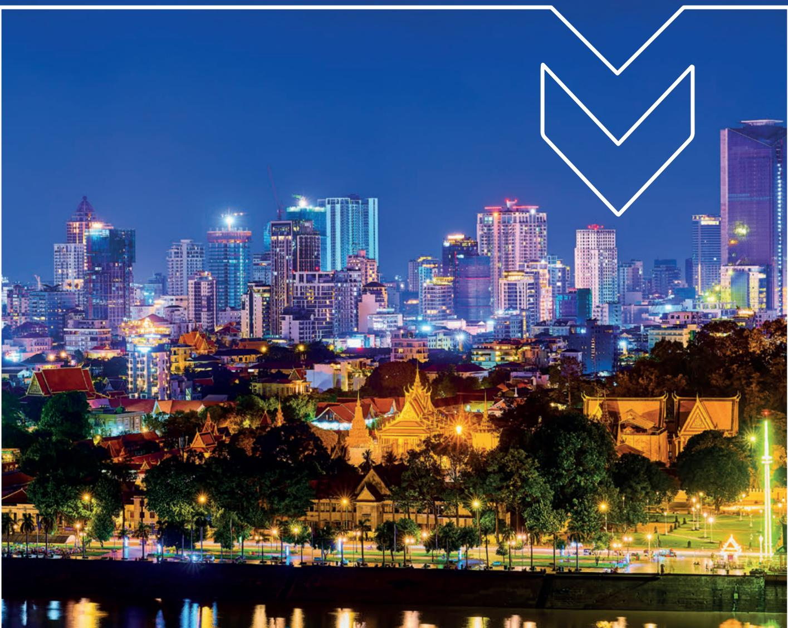

Cambodia

## Vulnerability Profile

## © 2026, United Nations Conference on Trade and Development

The findings, interpretations and conclusions expressed herein are those of the authors and do not necessarily reflect the views of the United Nations or its officials or Member States.

The designations employed and the presentation of material on any map in this work do not imply the expression of any opinion whatsoever on the part of the United Nations concerning the legal status of any country, territory, city or area or of its authorities, or concerning the delimitation of its frontiers or boundaries.

Mention of any firm or licensed process does not imply the endorsement of the United Nations.

This publication has been edited externally.

UNCTAD/ALDC/VP/INF/2025/2

Prepared by UNCTAD in anticipation of the 2024 review by the Committee for Development Policy of the United Nations list of Least Developed Countries.
This profile was prepared in accordance with resolution 59/209 of the General Assembly, which decided that «after a country has met the criteria for graduation for the first time, the Secretary-General of the United Nations will invite the Secretary-General of the United Nations Conference on Trade and Development to prepare a vulnerability profile on the identified country to be taken into account by the Committee for Development Policy at its subsequent triennial review».

## Acknowledgements

The vulnerability profile of Cambodia was undertaken by the Division for Africa, Least Developed Countries and Special Programmes of UNCTAD, under the guidance of Junior Davis, Head of the Branch and supervision of Rolf Traeger. The report was prepared by Matfobhi Riba. Sine Tepe provided statistical support on the economic and environmental vulnerability index and human development index. Anja Slany contributed analysis on the export potential and product space of Cambodia. Lamar Crombach, Prachi Sharma and Bohan Yang (UNCTAD interns) provided extensive research assistance and inputs.

High-level officials of the Government of Cambodia supported the preparation and validation of the report. UNCTAD gratefully acknowledges the collaboration of Poch Bunnak (Secretary of State, Ministry of Planning and Permanent Vice-Chair of the National Committee for the Graduation of Cambodia), Bun Chanty (Secretary of State, Ministry of Commerce) and Chea Chantum (Secretary-General of the General Secretariat for Population and Development, Ministry of Planning). The participation and valuable inputs from Arunabha Ghosh (Committee for Development Policy Rapporteur for Cambodia) are also gratefully acknowledged.

UNCTAD extends appreciation and further gratefully acknowledges the valuable contributions of the government officials, private sector representatives, nongovernmental organizations and individuals who participated in the validation workshop held in Phnom Penh from 30 May to 1 June 2023,.

Analysis from this report formed the basis of UNCTAD contributions to the graduation assessment document prepared jointly with the secretariat of the Committee for Development Policy, and which informed the deliberations of the Committee for Development Policy at its 2024 Triennial Review of the list of LDCs.

David Einhorn edited the text. Rostand Ngadjie Siani of UNCTAD and Gilles Maury undertook the overall layout, graphics and desktop publishing.

## Notes

Material in this publication may be freely quoted or reprinted, but full acknowledgement is requested. A copy of the publication containing the quotation or reprint should be sent to the UNCTAD secretariat at: Palais des Nations, CH-1211 Geneva 10, Switzerland.

## Explanatory notes

The term “dollars” (\$) refers to United States dollars unless otherwise specified.

The term “billion” signifies 1,000 million.

Annual rates of growth and change refer to compound rates.

Exports are valued “free on board” and imports, on a “cost, insurance, freight” basis, unless otherwise specified.

Use of a dash (−) between dates representing years, e.g. 1981–1990, signifies the full period involved, including the initial and final years. A slash (/) between two years, e.g. 1991/92, signifies a fiscal or crop year.

Throughout the profile, the term “least developed country” refers to a country included in the United Nations list of least developed countries.

The terms “country” and “economy”, as appropriate, also refer to territories or areas.

## Tables

Two dots (..) indicate that the data are not available or are not separately reported.

One dot (.) indicates that the data are not applicable.

A dash (−) indicates that the amount is nil or negligible.

Percentages do not necessarily add up to totals because of rounding.

## Tables of contents

1. Introduction....1   
2. Situation analysis....5   
2.1 Development trajectory and structural transformation....5   
2.2 Dynamics of structural transformation....25   
2.3 Social development....36   
2.4 Domestic resource mobilization and external development finance....59   
3. Key vulnerabilities: Progress on the 5 Ps of the Sustainable Development Goals....69   
3.1 Prosperity....69   
3.2 People....72   
3.3 Planet....73   
3.4 Peace....74   
3.5 Partnerships....75   
4. Addressing vulnerabilities....79   
4.1 Reigniting and deepening structural transformation in a radically altered development context....79   
4.2 Activating a more robust approach to entrepreneurship development...81   
4.3 Mobilizing additional development finance....82

## Figures

Figure 1 Cambodia: Gross domestic product and gross domestic product per capita growth rate .... 10
Figure 2 Cambodia: International arrivals and tourism receipts, 1995–2020 .... 16
Figure 3 Cambodia: International tourism receipts as a share of exports, 1995–2020 .... 16
Figure 4 Cambodia's trade openness compared to ASEAN countries, 2022 .... 17
Figure 5 Cambodia: Exports and imports of goods and services, 2005–2022 .... 19
Figure 6 Cambodia: Share of merchandise exports by product group (SITC Rev. 3), 1999–2001 versus 2019–2022 .... 19
Figure 7 Cambodia: Share of merchandise imports by product group (SITC Rev. 3), 1999–2001 versus 2019–2022 .... 21
Figure 8 Cambodian exports by trading partner, 1995–2022 .... 23
Figure 9 Cambodian imports by trading partner, 1995–2022 .... 23
Figure 10 Cambodian exports and imports, by sector and trading partner, 1995–2022 .... 24
Figure 11 Value added by sector in Cambodia and comparator economies, 2000, 2020 and 2021 .... 24
Figure 12 Cambodia: Gross value added per worker, 1997–2012 and 2012–2019 .... 25
Figure 13 Cambodia: Labour productivity and labour share of employment in selected sectors, 2019.... 26
Figure 14 Cambodia: Sectoral employment, 1997, 2007, 2012 and 2019 .... 26
Figure 15 Cambodia: Net emigration and personal remittances received, 1997–2021 .... 27
Figure 16 Cambodia: Composition of total consumption 2009–2021 .... 28
Figure 17 Evolution of productive capacity in Cambodia and comparator countries, 2000–2022 .... 29
Figure 18 Annual growth rate of output per worker, 2012–2022 .... 30
Figure 19 Gross capital formation in Cambodia and comparator countries, 2010–2022 .... 30
Figure 20 Foreign direct investment flows as a per cent of gross fixed capital formation and GDP, 2017–2022 .... 31

Figure 21 Aggregated Logistics Performance Index scores for Cambodia and comparator countries, 2012–2023 .... 35
Figure 22 Decomposition of Cambodia's performance on the Human Assets Index, 2003–2024 .... 37
Figure 23 Cambodia's Human Development Index scores by subregion, 2000 and 2021.... 38
Figure 24 Cambodia's dependency ratios by subregion, 2020 and 2014 .... 38
Figure 25 Cambodia: Decomposition of government expenditures on education, 2016–2021 .... 41
Figure 26 Cambodia has lower secondary completion rates than comparator countries, 2000–2021 .... 42
Figure 27 Cambodia: Gender Parity Index scores for education, 2000, 2020 and 2021 .... 42
Figure 28 Cambodia: Public expenditure on health care, 2000–2020 .... 45
Figure 29 Cambodia: Number of public health personnel, 2010–2018 .... 45
Figure 30 Poverty rate nationwide and by region in Cambodia, 2009 and 2019/2020 .... 48
Figure 31 Cambodia's Gini coefficient of disposable income, 2002–2020.... 49
Figure 32 Cambodia's labour force participation rates, ages 15-64, 2000–2021 .... 50
Figure 33 Labour force participation rate for females, ages 15-64, in Cambodia and global comparators, 2000–2021 .... 51
Figure 34 Labour force participation rates for females ages 15-64 in ASEAN countries, 2000–2021 .... 51
Figure 35 Cambodia: Type of employment in urban versus rural areas, 2012 and 2019 .... 52
Figure 36 Cambodia's workforce by occupational group, 2019 .... 53
Figure 37 Cambodia: Employed population by educational attainment, 2012 and 2019 .... 53
Figure 38 Cambodia's economic losses from disasters, 2000–2020 .... 55
Figure 39 Cambodia: Frequency of natural disasters, 1990–2023 .... 56
Figure 40 Cambodia: Number of people affected by natural disasters, 1991–2023 .... 56

Figure 41 Cambodia: Distribution of greenhouse emissions by sector and gases, 2016 ....57
Figure 42 Total tax revenues in Cambodia and ASEAN comparator countries, 2000–2022 ....60
Figure 43 Cambodia: Share of central government expenditures funded by domestic taxes, 2000–2021 ....61
Figure 44 Cambodia: Breakdown of tax revenue by type of tax, 2002–2021 ....62
Figure 45 Cambodia's overall fiscal balance, 2002–2028 ....62
Figure 46 Cambodia's total external debt stock, 2000–2021 ....63
Figure 47 Cambodia's general government gross debt, 1995–2022 ....63
Figure 48 Cambodia: External solvency, 2000–2021 ....64
Figure 49 Cambodia: Grants and other revenue, 2011–2021 ....65
Figure 50 Net official development assistance received by Cambodia as a share of government expenditure, 2003–2021 ....65
Figure 51 Disbursements of official development assistance to Cambodia, 2012–2021 ....66
Figure 52 Cambodia and comparator countries: Personal remittances received, 1995–2022 ....66
Figure 53 Decomposition of Cambodia's performance on the Economic and Environmental Vulnerability Index, 2003–2024 ....69
Figure 54 Public disorder by type of event in Cambodia, 2010–2023 ....74

## Tables

Table 1 Pre-eligibility of Cambodia for graduation from least developed country status....2
Table 2 Cambodia's overarching economic policy agendas, 1998–2028....5
Table 3 Evolution of Cambodia's post-war development policy....7
Table 4 Annual average gross domestic product growth rate of ASEAN economies....9
Table 5 Average price of one litre of fuel as of 30 October 2023....32
Table 6 Cambodia: Sectoral reliance on modal transport....33
Table 7 Selected information and communications technology (ICT) indicators for Cambodia and comparator countries....34
Table 8 Cambodia: Enrolment and completion by level of education, 2020–2021....40
Table 9 Cambodia: Poverty headcount ratio, 2003–2019....47
Table 10 Cambodia's Public Financial Management Reform Programme phases, 2004–2025....60

## Boxes

Box 1 Key findings from Cambodia's participation in the Programme for International Student Assessment for Development (PISA-D) 43   
Box 2 Export potential and product space assessment of Cambodia 84

## Abbreviations

ACLED Armed Conflict Location and Event Data Project  
ADB Asian Development Bank  
ASEAN Association of Southeast Asian Nations  
CDP Committee for Development Policy  
CMDGs Cambodian Millennium Development Goals  
COVID-19 coronavirus disease  
CRDB Cambodian Rehabilitation and Development Board  
EBA Everything but Arms  
FDI foreign direct investment  
FTA free trade agreement  
GDP gross domestic product  
GVA gross value added  
HAI Human Assets Index  
HDI Human Development Index  
ICT information and communications technology  
ILO International Labour Organization  
IMF International Monetary Fund  
ISIC International Standard Industrial Classification  
ITC International Trade Centre  
LDC least developed country  
LPI Logistics Performance Index  
MAFF Ministry of Agriculture, Forestry and Fisheries  
MDGs Millennium Development Goals  
MISTI Ministry of Industry, Science, Technology & Innovation  
MoE Ministry of Environment  
MoEYS Ministry of Education, Youth and Sport  
MoP Ministry of Planning  
MRC Mekong River Commission  
MSME micro, small and medium-sized enterprise  
NBC National Bank of Cambodia  
NDC Nationally Determined Contribution  
NPRD National Programme to Rehabilitate and Develop Cambodia  
NSDP National Strategic Development Plan  
ODA official development assistance  
OECD Organization for Economic Cooperation and Development  
PCI Productive Capacities Index  
PFMRP Public Financial Management Reform Programme  
PISA-D Programme for International Student Assessment for Development  
RCEP Regional Cooperation Economic Partnership  
SDG Sustainable Development Goal  
SEDP Socio-Economic Development Plan  
SEZ special economic zone  
SITC Standard International Trade Classification  
SME small and medium-sized enterprise  
TVET technical and vocational education and training  
UNCTAD United Nations Conference on Trade and Development  
UNESCO United Nations Educational, Scientific and Cultural Organization  
UNFPA United Nations Population Fund  
UNIDO United Nations Industrial Development Organization  
VP vulnerability profile  
WHO World Health Organization  
WTO World Trade Organization

## Cambodia in brief

<table><tr><td>Land area: 181,035 km2</td><td>Population: 16.94 million</td></tr><tr><td>Population growth rate (2020–2025): +1.3 per cent</td><td>Urban population: 25 per cent (2021)</td></tr><tr><td>Density: 93.4 people/km2</td><td>Main ethnicities: Khmer, 95 per cent</td></tr><tr><td>GDP: $32,008 million</td><td>≈ 0.85 per cent of GDP of ASEAN≈ 0.084 per cent of GDP of Asia</td></tr><tr><td>Annual average real GDP growth (1995–2023): +7.19 per cent</td><td>Annual average real GDP per capita growth (1995–2023): +5.54 per cent</td></tr><tr><td>Real GDP per capita: $1.552</td><td>≈ 28.22 per cent of real GDP per capita of ASEAN≈ 20.04 per cent of real GDP per capita of Asia</td></tr><tr><td>Exports of goods and services: $27.772 billion</td><td>Imports of goods and services: $34.405 billion</td></tr><tr><td>Trade-to-GDP ratio: 194.25 per cent (2022)</td><td>Foreign direct investment inflows: $3.959 billion (12.37 per cent of GDP)</td></tr><tr><td>Cambodia score CDP 2024 Triennial Review</td><td>LDC graduation threshold</td></tr><tr><td>Gross national income per capita: $1 590</td><td>above $1 306</td></tr><tr><td>Human Assets Index: 77.8</td><td>above 66</td></tr><tr><td>Economic and Environmental Vulnerability Index: 24.1</td><td>below 32</td></tr></table>

Notes: Data is for 2023, unless otherwise indicated.  
Source: UNCTAD secretariat based on data from UNCTADstat, CDP and UNDESA (2024) and the World Bank's World Development Indicators.

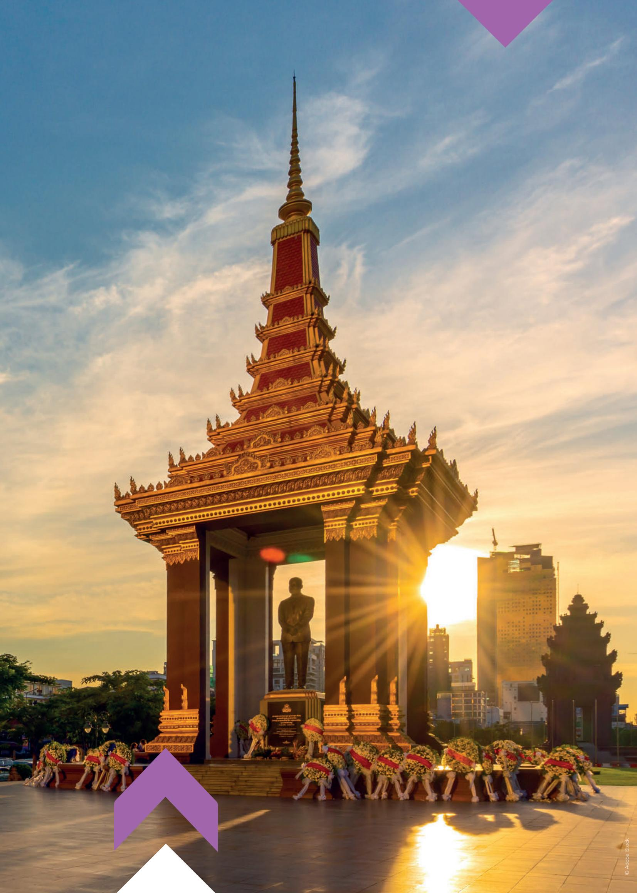

## 1. Introduction

The Kingdom of Cambodia (hereafter Cambodia) currently has a population of approximately 16 million, of which over 95 per cent are of Khmer ethnicity. According to two decennial censuses, the population increased from 11.4 million in 1998 to 15.4 million in 2019, with an average annual growth rate of 1.5 per cent during that period (NIS, 2020a). An estimated 57 per cent of Cambodians are under age 25, with the demographic boom forecast to continue in the coming decades. $^{1}$ The United Nations Population Fund (UNFPA) projects an average annual increase in the population rate of 1.3 per cent over 2020–2025. In 2021, 25 per cent of Cambodia's population resided in urban areas, $^{2}$ mainly in the capital city of Phnom Penh.

Administratively, Cambodia is divided into 25 provinces spanning 181,035 square kms of low-lying plains, the Mekong Delta, mountains, and 443 kms of coastline. $^{3}$ The country shares borders with Viet Nam to the east, Lao People's Democratic Republic to the northeast, and Thailand to the west and northwest. The country is in proximity to the regional economic heavyweights, China and India.

The Vulnerability Profile (VP) for Cambodia is mandated by General Assembly Resolution 59/209 of 20 December 2004, which states that “after a country has fulfilled the criteria for graduation for the first time, UNCTAD is mandated to prepare a vulnerability profile on the identified country to be considered by the Committee for Development (CDP) at its following triennial review” (para 3 (b)). The VP process and document constitute a vital path to identify the key vulnerabilities that impede Cambodia from amassing the critical momentum needed to sustain development progress up to and beyond graduation from least developed country (LDC) status.

Grounded in a whole-of-economy approach, the VP provides essential direction for strategic development planning, while also serving as a tool to prepare a country for graduation. Through a critical review and analysis of the economy's main vulnerabilities benchmarked by the “5 Ps” of the United Nations Sustainable Development Goals – prosperity, people, planet, peace and partnership – the VP identifies internal structural weaknesses in the country’s path to sustainable development. It also seeks to uncover opportunities to target and accelerate meaningful economic transformation to infuse dynamism and resilience in the economy, with a view to achieving irreversible momentum in development progress. Since the structural weaknesses present in LDCs will endure beyond graduation, the VPs typically underpin graduating countries’ transition strategies, but also serve as perennial guidance for development policy independent of graduation criteria and the outcome of the graduation process.

Cambodia was first included on the United Nations list of LDCs in 1991. The country was found to be pre-eligible for graduation by the CDP in its 2021 triennial review. Cambodia met all three graduation criteria in terms of gross national income, human assets, and economic and environmental vulnerability criteria (the Economic and

Environmental Vulnerability Index) (table 1). $^{4}$ At its 2024 triennial review, the CDP recommended the country for graduation.

Pre-eligibility of Cambodia for graduation from least developed country status

<table><tr><td colspan="4">Criteria</td></tr><tr><td>To pre-qualify for graduation from the least developed country list, a country must meet at least two graduation criteria</td><td>Gross national income per capita</td><td>Human Assets Index (three-year average)</td><td>Economic and Environmental Vulnerability Index (three-year average)</td></tr><tr><td>Cambodia score (threshold for graduation)</td><td>$1 377 ($1 222 or above)</td><td>74.3 (66 or above)</td><td>30.6 (32 or below)</td></tr></table>

Source: Prepared by the author.

The remainder of this report is structured as follows. Section 2 presents a situation analysis of Cambodia's growth and social development performance and structural transformation trajectory since the early 1990s, including a comparison of its productive capacity with other LDCs and with regional peers in the Association of Southeast Asian Nations (ASEAN). Section 3 analyses key areas of vulnerability along the 5 Ps. Section 4 outlines the main strategies and opportunities to address the identified vulnerabilities.

## 2. Situation analysis

## 2.1 Development trajectory and structural transformation

## 2.1.1 Progression of development policy

Cambodia's post-war economy is relatively young, having been established after the signing of the Paris Peace Accord in late 1991, following more than two decades of war and an economic embargo imposed in 1979. During that period, the country's physical and human resources were devastated and its economy crippled. General elections in 1993 led to the resumption of official development assistance (ODA) and foreign direct investment (FDI) flows, thus setting the country on the path to rehabilitation and economic reconstruction.

Cambodia's post-war development policy is defined by a series of economic agendas (table 2) and development plans (table 3) that have collectively delivered a development model that overwhelmingly targets export growth, with high utilization of trade preferences and efforts to attract high levels of FDI flows through generous incentives. Development policy has undergone three significant phases, starting with the stabilization and rehabilitation phase from 1993–1998, followed by the reconstruction phase from 1999–2003. Development policy since 2004 has been marked by a general shift in focus to growth and economic take-off. Key enduring features of Cambodia's development policy have been structural reform, poverty reduction and growth acceleration.

Cambodia's overarching economic policy agendas, 1998–2028

<table><tr><td>Political platform</td><td>Period</td><td>Policy thrust</td></tr><tr><td rowspan="3">Triangular Strategy</td><td rowspan="3">1998–2003</td><td>Angle 1: Building peace, restoring stability and maintaining security</td></tr><tr><td>Angle 2: Integration of Cambodia into the region, and normalization of relationships with the international community</td></tr><tr><td>Angle 3: Promoting economic and social development</td></tr><tr><td rowspan="4">Rectangular Strategy</td><td rowspan="4">2004–2023</td><td>Rectangle 1: Enhancement of the agricultural sector</td></tr><tr><td>Rectangle 2: Private sector growth and employment</td></tr><tr><td>Rectangle 3: Continued rehabilitation and construction of infrastructure</td></tr><tr><td>Rectangle 4: Capacity-building and human resource development</td></tr><tr><td rowspan="5">Pentagonal Strategy</td><td rowspan="5">2024–2028</td><td>Pentagon 1: Human capital development</td></tr><tr><td>Pentagon 2: Economic diversification and competitiveness enhancement</td></tr><tr><td>Pentagon 3: Development of private sector and employment</td></tr><tr><td>Pentagon 4: Resilient, sustainable and inclusive development</td></tr><tr><td>Pentagon 5: Development of digital economy and society</td></tr></table>

Source: Vulnerability Profile inception mission consultations; various development plans; and the Prime Minister's statements.

The rehabilitation phase was guided by the National Programme to Rehabilitate and Develop Cambodia (NPRD), adopted in 1994. Its main objectives were to re-establish the rule of law, ensure economic stabilization and structural reform, strengthen human capital, rehabilitate and expand public physical infrastructure and services, integrate Cambodia's economy into the region and the world, and foster rural development and sound environmental management centred on the optimal use of natural resources. Underpinning the NPRD was a transition from a communist to a market economy (expressed in goals for economy-wide liberalization and promotion of the private sector). From the outset, the post-war development vision prioritized the capital city of Phnom Penh and the port city of Sihanoukville as investment hubs. Rice cultivation and tourism were identified among the key drivers to achieve the goal of doubling growth in output by 2004.

Cambodia is currently implementing its sixth development plan. From 1998 to 2023, five-year development plans – which fuse priority sectoral strategies – were guided by the overarching economic agendas. The fifth and sixth plans also benefited from the longer-term guidance of the country's Vision 2030 and 2050, which outline Cambodia's goals to attain upper-middle-income status by 2030 and developed country status by 2050. Cambodia attained World Bank lower-middle-income status in 2015. Since the launch of the Rectangular Strategy in 2004, development plans have ranked second in importance after the economic policy agenda in the hierarchy of national policy documents.

The third development plan launched Cambodia's implementation of Phase I of the

Rectangular Strategy adopted in 2004 and overlapping the final years of implementation of SEDP II. $^{5}$ The plan was renamed the National Strategic Development Plan (NSDP) to reflect a shift to an indicative planning approach. Subsequent development plans have fine-tuned and sharpened the prioritized policies of the Rectangular Strategy in line with external developments, achievements realized, and challenges encountered during plan implementation. Among the persistent challenges identified by various development plans are the lack of economic diversification, deficiencies in human capital, and constraints to efficient policy execution as a result of dysfunctions in coordination among line ministries and departments. The seventh development plan will be the first NSDP under the new Pentagonal Strategy, with Phase I of its implementation launched in 2024. The objectives of the strategy are growth, employment, equity, efficiency and sustainability. Similar to the Rectangular Strategy, the Pentagonal Strategy also adopts the key strategic priorities of people, road, water, electricity, and technology – with the latter a new priority area.

## 2.1.2 Economic growth

Since 1995, Cambodia has established a remarkable track record of economic growth. With real GDP growth rates averaging above 6 per cent over 1995–2021 (figure 1, panel b), the country is among the fastest growing ASEAN economies (table 4). Cambodia's impressive growth performance saw GDP per capita increase more than fourfold from \$379 in 1995 to \$1,488 n 2022, with the country attaining lower-middle-income status in 2015. $^{6}$

Evolution of Cambodia's post-war development policy

<table><tr><td>Socioeconomic policy agenda</td><td>Series</td><td>Plan title</td><td>Years</td><td>Key complementary visions/plans/ strategies</td><td>Key performance target/ indicators/setbacks/milestones</td><td>Notes</td></tr><tr><td>Peace, stability, structural reform, rehabilitation and reconstruction</td><td>Rehabilitation phase</td><td>National Programme to Rehabilitate and Develop Cambodia (NPRD)</td><td>1994–1995</td><td>Implemented the NPRD (1995)</td><td>Doubled GDP by 2004. Joined Greater Mekong Subregion (1995)</td><td>Moved towards free market economy; established rule of law; reintegrated into regional and international economies; developed rural primary economy</td></tr><tr><td rowspan="2">Triangular Strategy (1998-2003)</td><td>1st Plan (Reconstruction phase)</td><td>Socio-Economic Development Plan (SEDP I)</td><td>1996–2000</td><td>First Strategic Plan of the Ministry of Agriculture, Forestry and Fisheries (MAFF): 1997–2001Public Investment Programme: 1996–1998</td><td>Access to US (1996) and EU markets (1997); zero-tariff trade with the United States under the Generalized System of Preferences (GSP) (1997); Regained seat at United Nations (1998); joined Association of Southeast Asian Nations (ASEAN) (1999) and ACMECS (2003)</td><td>Enhanced focus on macroeconomic growth, social development and poverty alleviation</td></tr><tr><td>2nd Plan</td><td>Socio-Economic Development Plan (SEDP II)</td><td>2001–2005</td><td>Cambodian Millennium Development Goals (CMDGs)* (formulated 2003; updated 2005); Trade Integration Strategy (2003); National Poverty Reduction Strategy: 2003–2005; Public Financial Management Reform Programme (2004); MAFF: 2001–2005; Governance Action Plan (2001); Strategic Framework for Decentralization and Deconcentration Reforms (2005)</td><td>Joined Everything but Arms (EBA) initiative (2001); World Trade Organization (2004)Annual growth of 6-7 per cent; inflation below 4 per centGross official reserves at three months of import coverage</td><td>Enhanced focus on economic growth and poverty reduction, especially via the private sectorDeveloped vision to eradicate poverty, illiteracy and disease</td></tr><tr><td>Rectangular Strategy Phase I</td><td>3rd Plan (Economic growth phase)</td><td>National Strategic Development Plan (NSDP)</td><td>2006–2010</td><td>Trade Integration Strategy (2007); Subnational Democratic Development (2010–2019, later extended to 2020); Cambodia National Adaptation Programme of Action (NAPA) (2006)</td><td>Annual GDP growth of 6 per cent; inflation below 5 per cent; 60 per cent of resources channelled to rural areas to maximize poverty alleviation gains</td><td>Synthesized and prioritized goals of CMDGs and National Poverty Reduction Strategy to provide first single overarching development strategy</td></tr><tr><td>Rectangular Strategy Phase II</td><td>4th Plan</td><td>National Strategic Development Plan Update</td><td>2009–2013</td><td>Policy on the Promotion of Paddy Production and Export of Milled Rice (2010)Financial Sector Development Strategy: 2011–2020</td><td>Annual growth in manufacturing of 7.2 per centAnnual GDP growth of 6-7 per cent</td><td>First plan synchronized with timeframe of legislature. Updates NSDP: 2006–2010 to limit impact of 2008/2009 global financial crisis and targets development (commercialization) of agriculture sector at new pace and scale</td></tr></table>

<table><tr><td>Socioeconomic policy agenda</td><td>Series</td><td>Plan title</td><td>Years</td><td>Key complementary visions/plans/ strategies</td><td>Key performance target/ indicators/setbacks/milestones</td><td>Notes</td></tr><tr><td>Rectangular Strategy Phase III</td><td>5th Plan</td><td>National Strategic Development Plan</td><td>2014–2018</td><td>Cambodia Vision 2030 and 2050; Cambodia Industrial Development Policy: 2015–2025; Trade Integration Strategy: 2014–2018; Decentralization and Deconcentration Programme: 2014–2018; Cambodia Sustainable Development Goals: 2016–2030; Climate Change Strategic Plan: 2014–2023; Nationally Determined Contribution (2016; updated 2020); National Adaptation Plan process initiated 2014; Development Cooperation and Partnership Strategy 2014–2018</td><td>Integration into ASEAN Economic Community (2015)Annual GDP growth of 7 per cent; &gt;1 percentage point annual reduction in poverty incidenceAchievement of lower-middle-income-country status (2015)</td><td>Enhanced focus on agricultural diversification, development of labour markets, industrialization and human capital, natural resources management, de-dollarization, private sector growth, shifting from official development assistance to foreign direct investment and growth in domestic public revenues, improving institutional capacity and governance</td></tr><tr><td>Rectangular Strategy Phase IV</td><td>6th Plan</td><td>National Strategic Development Plan</td><td>2019–2023</td><td>Cambodia Vision 2030 and 2050; Trade Integration Strategy: 2019–2023; National Action Plan for Public Administration Reform: 2019–2030; Law on Investment 2021; Economic Diplomacy Strategy: 2021–2023; Strategic Framework and Programmes for Economic Recovery in the Context of Living with COVID-19 in a New Normal 2021–2023</td><td>Regional Cooperation Economic Partnership (RCEP) (2022)Annual GDP growth of 7 per centPoverty reduction of below 10 per centChina-Cambodia Free Trade Agreement (2022)Partial exclusion from the EU&#x27;s EBA (2020)Non-continuance of US Generalized System of Preferences (2020)</td><td>Enhanced focus on human resource development, economic diversification, private sector development and employment, inclusive and sustainable development, including resilience to climate change</td></tr><tr><td>Pentagonal Strategy Phase I</td><td>7th Plan</td><td>National Strategic Development Plan (under development)</td><td>2024–2028</td><td></td><td>Average annual GDP growth of 7 per centMaintaining poverty rate at below 10 per cent</td><td>Focus on growth, employment, equity, efficiency and sustainability</td></tr></table>

\* The CMDGs incorporate added goals on de-mining and the removal of explosive remnants of war, and specify a larger number of targets (under several goals) to provide greater granularity and reflect national priorities.

Annual average gross domestic product growth rate of ASEAN economies (Percentage)

<table><tr><td>Country/Period</td><td>1992–1995</td><td>1995–2000</td><td>2000–2005</td><td>2005–2010</td><td>2010–2015</td><td>2015–2020</td><td>2020–2022</td></tr><tr><td>Brunei Darussalam</td><td>2.7</td><td>1.0</td><td>2.2</td><td>0.1</td><td>-0.5</td><td>1.0</td><td>-1.7</td></tr><tr><td>Cambodia</td><td>6.1</td><td>7.2</td><td>9.1</td><td>6.4</td><td>7.2</td><td>5.6</td><td>4.0</td></tr><tr><td>Indonesia</td><td>-</td><td>-</td><td>-</td><td>5.7</td><td>5.5</td><td>4.0</td><td>4.4</td></tr><tr><td>Lao People&#x27;s Democratic Republic</td><td>7.1</td><td>6.1</td><td>6.6</td><td>8.8</td><td>7.8</td><td>5.9</td><td>2.8</td></tr><tr><td>Malaysia</td><td>9.6</td><td>3.7</td><td>5.1</td><td>4.1</td><td>5.3</td><td>3.3</td><td>5.9</td></tr><tr><td>Myanmar</td><td>6.9</td><td>8.7</td><td>13.2</td><td>10.5</td><td>7.5</td><td>3.8</td><td>-9.2</td></tr><tr><td>Philippines</td><td>3.8</td><td>3.3</td><td>4.8</td><td>4.7</td><td>6.2</td><td>4.1</td><td>6.7</td></tr><tr><td>Singapore</td><td>10</td><td>4.9</td><td>5.1</td><td>5.8</td><td>4.5</td><td>2.1</td><td>5.6</td></tr><tr><td>Thailand</td><td>8.2</td><td>-0.2</td><td>5.8</td><td>3.3</td><td>3.1</td><td>2.1</td><td>2.4</td></tr><tr><td>Viet Nam</td><td>8.8</td><td>6.7</td><td>7.3</td><td>11.4</td><td>6.1</td><td>6.5</td><td>4.8</td></tr></table>

Source: UNCTAD Secretariat calculations based on data from the UNCTADStat database, available at https://unctadstat.unctad.org/datacentre/dataviewer/US.GDPTotal (accessed in October 2023).  
Note: ASEAN - Association of Southeast Asian Nations.

Economic growth has been driven by four main sectors: agriculture, manufacturing (chiefly garments) construction and tourism. Economic growth and the inflow of FDI is largely concentrated in the capital city, Phnom Penh, the tourism hub Siem Reap, and the port hub Sihanouk Province. Exceptional growth in 2005 (figure 1, panel a), was largely due to a strong agricultural performance following the drought in 2004, and to continued growth in garment exports, tourism and construction. The economy was severely affected by the 1997–1998 Asian financial crisis. Cambodia experienced an estimated 45 per cent drop in investment flows in 1997, along with a decrease in new investment commitments of roughly 35 per cent (Okonjo-Iweala et al., 1999). Similarly, GDP growth crashed from 6.7 per cent in 2008 to 0.1 per cent in 2009 due to the 2008–2009 global financial crisis. Since the Cambodian riel is pegged to the United States dollar, the appreciation of the dollar during the height of the 2008–2009 global financial crisis contributed to a loss of export competitiveness. The pace of growth had already slowed prior to 2008 due to rising inflationary pressures from high oil prices

and surging food price inflation. Following the crisis, Cambodia's recovery was relatively rapid and maintained a trajectory of 7 per cent annual growth until the COVID-19 pandemic in 2020 (figure 1, panel a). More recently, the pandemic has led to a sharp contraction in growth by 3.1 per cent – deeper than what was experienced in 2009 – with average growth falling by an estimated 10.1 percentage points. Three of the four main drivers of growth — garments, tourism and construction — experienced significant contractions. The re-tightening of pandemic restrictions in the latter part of 2021 interrupted the recovery momentum in ASEAN economies, dragging regional growth significantly below the global average in 2021. $^{7}$

According to the World Bank (2022, 2023), traditional growth drivers, especially manufacturing and agricultural commodity exports, had fully recovered by the end of 2022. However, travel and tourism were slower to improve. Rising domestic activity and increasing international arrivals, while initially sluggish, were approaching pre-pandemic levels by the first two months

of 2023 (World Bank, 2023). Recovery in the construction and real estate sector, another important pre-pandemic growth driver, remained slow, although signs of an uptick emerged in the first months of 2023.

## Figure 1

Cambodia: Gross domestic product and gross domestic product per capita growth rate (Percentage)

a. Nominal, 1995–2024

GDP growth (annual percentage) GDP per capita growth (annual percentage)

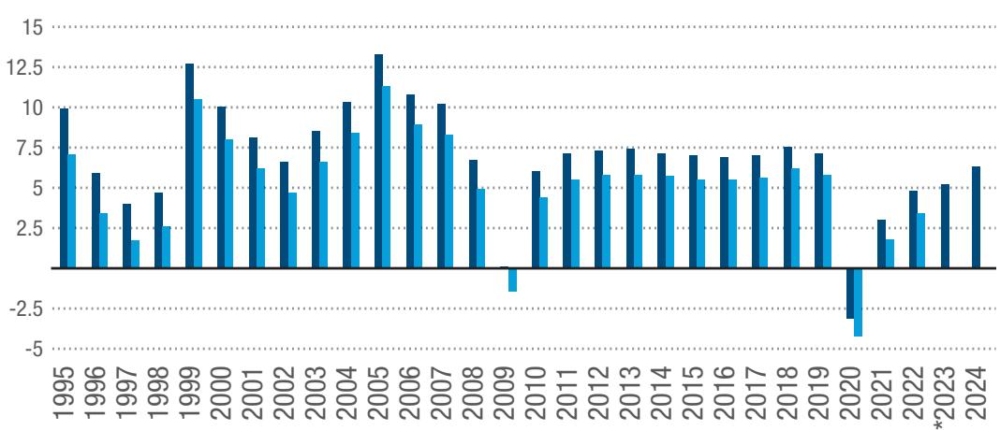

b. In constant 2015 US\$, 1995–2022

GDP growth (annual percentage) GDP per capita growth (annual percentage)

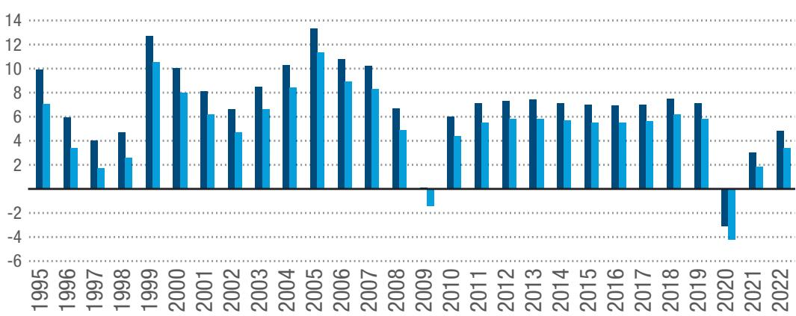

Source: UNCTAD secretariat calculations based on data from the World Bank, World Development Indicators available at https://databank.worldbank.org/source/world-development-indicators (accessed in September 2023) and World Bank (2022).

\*Growth rates for 2023 and 2024 in panel a are projections.

Among ASEAN members, Cambodia is among the countries considered to have transitioned quickly to economic recovery, having been ranked in the top 10 of the Nikkei COVID-19 Recovery

Index in October 2022. $^{8}$ Economy-wide modelling suggests that the cash transfer programme launched to support the poor in June 2020 contributed 0.55 per cent

and 0.45 per cent to GDP growth in 2020 and 2021, respectively (UNDP, 2022).

As a net importer of energy and food, Cambodia is vulnerable to inflationary pressures from the Ukraine crisis. While global trade was expected to pick up in the second half of 2023 on the back of positive factors – such as the prospects of an averted recession in the European Union and the United States, as well as a weaker United States dollar (which fell by almost 7 per cent between November 2022 and February 2023) – the full recovery of Cambodia's economy may still prove significantly slower than in 2010 after the global financial crisis. The country saw a 14.5 per cent decline in exports to the United States and European Union markets during the first two months of 2023, with garment exports accounting for the largest share of that decline at 11.8 percentage points (World Bank, 2023). UNCTAD forecasts global economic growth to slow to 2.6 per cent in 2024, just above the 2.5 per cent threshold commonly associated with a recession. This marks the third consecutive year of growth below the pre-pandemic rate, which averaged 3.2 per cent between 2015 and 2019. $^{9}$

The World Bank estimated GDP growth for Cambodia in 2022 at 4.8 per cent, on the back of strong merchandise exports and FDI flows. Growth was projected at 5.2 and 6.3 per cent in 2023 and 2024, respectively (World Bank, 2022; IMF, 2022).

## 2.1.3 Sectoral overviews

## Agriculture

In 2019, agriculture, forestry and fishing accounted for the largest proportion of Cambodia's employed population, at 33.1 per cent, with 98.6 per cent of those workers informal (NIS, 2020b). The value-added share of agriculture in GDP remained above the ASEAN median in 2020. The total value of agricultural exports has more than tripled since 2010. Within the sector, crop production has the largest output share, followed by fisheries, livestock and forestry. One of the main reasons for the sector's underperformance is poor production infrastructure, which severely limits cropping intensity and crop diversification. Of the 3.98 million hectares of agricultural land, only about 1.3 million hectares are irrigated. In 2015, 90 per cent of irrigation systems were either underperforming or dysfunctional.

The combined total manufacturing value of agricultural-based products amounted to 3.4 per cent of GDP in 2019. Other than rice milling and the basic processing of rubber and pepper, the agroprocessing sector is largely underdeveloped. According to information shared by the Ministry of Agriculture during VP consultations, the key priorities are to increase the uptake of technology and promote producer cooperatives and linkage/integration in agriculture value chains, including by providing business development, credit and extension services. A strategy to manage animal waste and a carbon credit programme are guiding the sectoral contribution to climate action.

Traditionally, the agriculture sector has experienced low capital investment and has not been the focus of large-scale foreign investments, unlike sectors such as manufacturing, construction and tourism. The fall in international commodity prices since 2014 and adverse weather conditions (rain and drought) in 2015 and 2016 negatively affected agricultural output. Annual sector growth over 2013–2019 slowed to an average 0.85 per cent because of low labour productivity, resulting in a preponderance of unprocessed rice production.

Since the 1995/1996 harvest, Cambodia has attained self-sufficiency in rice production and is among the top 10 largest rice exporters globally. As a strategic crop sector for agricultural modernization, rural development and export promotion, rice cultivation has been a major beneficiary of targeted government support across successive economic policy agendas and five-year development plans. Industrial crops include sugar cane and tobacco. Subsidiary crops include non-rice cereals and grain crops, root, tubers and legumes. Permanent or perennial crops include bananas, cashew nuts, coconut, coffee, durian, oil palm, pepper, mangoes, oranges and other fruits. Thanks to the rapid expansion of cassava cultivation, that crop has become the second most important in the country after rice, involving 90,000 rural households in 13 provinces (RGC, 2010, 2020; ADB, 2021). In 2020, the government issued the National Cassava Policy 2020–2025 to leverage the crop's potential as a source of economic diversification and industrial development through agroprocessing and regional value chain integration (RGC, 2020).

The agriculture sector was largely shielded from the impact of the COVID-19 pandemic, with the exception of the aquaculture subsector, which saw a -13 per cent decline in growth due to the fall in domestic demand and import competition. While Cambodia imposed a ban on rice exports in April 2020, the short duration of the ban, the minimal restrictions on the movement of agricultural inputs and products nationwide, and a good harvest in 2020 resulted in the country actually increasing agricultural exports during the pandemic. The sector benefited from increased availability of labour, as more exposed sectors were forced to shed workers. Among the sector-specific support measures introduced by the government were the allocation of \$50 million in the form of low-interest loans to help small and medium-sized enterprises (SMEs) in the

agriculture and production sectors, and the launch of a special \$50 million financing scheme through the Rural Development and Agriculture Bank to support agroprocessing firms (NBC, 2020; ADB, 2021).

## Construction and real estate

Increasing demand for productive infrastructure and a rising middle class have secured the position of the construction and real estate sector among the leading drivers of the Cambodian economy. $^{10}$ In 2019, the sector was estimated to account for 10 per cent of total employment, with 97.2 per cent of those workers informal (NIS, 2020b). The sector also provides significant opportunities for female employment – some estimates suggest that about 35 per cent of employees are women. $^{11}$ The sector has been boosted by regional cooperation and the influence of China's Belt and Road Initiative, which have helped drive infrastructure connectivity projects. Other construction projects within the real estate sector, including some linked to tourism services and business travel, have also seen growth. Foreign investments in the Cambodian real estate market have been liberalized since 2010. The Law on Commercial Enterprise permits foreign ownership of non-ground floor property, and foreign companies can acquire up to a 49 per cent share in Cambodian companies that own land. Among the 10 largest greenfield investments announced in LDCs in 2015 was a real estate investment in Cambodia. At the regional level, the country benefits from strong growth in FDI from China, Japan and other ASEAN members. For example, in 2016 regional inflows hit a record of \$1.9 billion (+13 per cent), bolstered by projects in electricity, construction and non-garment manufacturing. Of note,

within the LDC group, Cambodia has long been the largest single recipient of Chinese greenfield investments, many of which boost the construction sector (UNCTAD, 2016a, 2019, 2020a, 2022b; ASEAN, 2017).

As a result of the COVID-19 pandemic, implementation of announced projects became increasingly uncertain and growth in the construction and real estate sector stalled. According to the country's central bank, the National Bank of Cambodia (NBC), in 2020, FDI to the construction and real estate sector (17 per cent share of total FDI) decreased by -10.6 per cent, but recovered somewhat at 1.1 per cent in 2021 (NBC, 2021). In addition to FDI, the sector is dependent on construction material and equipment imports, which were both adversely affected by the pandemic. However, not all projects were affected. Most of the large construction projects of Chinese firms continued despite the crisis. For example, the 190 km Phnom Penh–Sihanoukville Expressway, a \$1.9 billion project, was nearly 40 per cent complete in 2020, and a large greenfield construction investment project led by a Japanese investor was announced (UNCTAD, 2021a). Nevertheless, the outlook for the sector remains subdued. $^{12}$ During VP consultations, the Chamber of Commerce of Cambodia expressed the view that the slowdown in construction occasioned by the COVID-19 pandemic would likely linger given the impact of inflationary pressures on disposal incomes.

## Garments, textiles and footwear

Cambodia employs special economic zones (SEZs) extensively (though not exclusively) in its strategy to attract FDI and as the main vehicle for economic diversification and

industrial development. $^{13}$ Existing SEZs mainly specialize in the manufacturing of garments, footwear, travel goods, electronics, vehicle parts, plastics and other consumer products. Most production is export-oriented. SEZs are mostly developed in Phnom Penh and near border corridors with neighbouring countries to promote cross-border trade and investment. The exact number of SEZs in Cambodia varies by source, but according to information shared by the Council for the Development of Cambodia during VP consultations, Cambodia has 23 SEZs that account for only 70,000 jobs. The council thus anticipates that the forthcoming Rectangular Strategy V will accordingly maintain a focus on employment, equity and efficiency. Cambodia permits the employment of foreign managers, technicians or experts, provided that the number of foreign staff does not exceed 10 per cent of total personnel. Firms within SEZs are eligible for generous tax incentives, in addition to access to infrastructure and streamlined administrative and regulatory treatment (UNCTAD, 2019; Brussevich, 2020). Among the insights gleaned from consultations during the VP inception mission was that there is room for improvement in the implementation of SEZs in order to unlock their potential for greater job creation.

The manufacturing sector in Cambodia is dominated by the garment, textile and footwear industry, which is the largest formal employer in the country (TAFTAC and EuroCham Cambodia, 2023). According to The Economist, research suggests that each worker in factories supports three other people. $^{14}$ Nearly all of the factories in the Cambodian garment, footwear and travel bag industries are owned by foreign

investors, especially from China, with only 6 per cent owned by domestic investors. Over 75 per cent work mainly on contract from their headquarters, parent companies or agents (WTO et al., 2022). As the garment, textile and footwear sector accounts for the highest employment share in the country – mainly for the female labour force – it also fuels significant rural-urban migration.

Many companies in Cambodia operate as contract manufacturers for major multinational brands, such as Adidas, Gap, H&M, Marks & Spencer and Uniqlo. Even though the garment industry was only established in the mid-1990s, it has come to dominate Cambodia's FDI, exports and foreign exchange earnings. Foreign investors are particularly attracted to the country's low-cost labour, preferential market access in terms of duty- and quota-free access to the United States and European Union markets, and proximity to ASEAN markets as well as to source countries of FDI in garments, such as Hong Kong SAR, Indonesia, Malaysia, Singapore and Taiwan Province of China.

The rapid expansion of the industry in the 1990s was largely due to Cambodia's quota-free access to US markets, as opposed to the restricted trade regime under which most Asian garments exporters, particularly China, had to operate. With the abolition of the Multi-Fibre Arrangement in 2004, the export quotas imposed on Asian producers were eliminated, thereby intensifying competition in the industry. However, far fewer garment categories were subject to quotas in Cambodia than in other Asian exporters, such as China, Bangladesh and Sri Lanka.

Furthermore, the quota growth rate for Cambodia, which was linked to improvements in labour standards, was much higher than for other Asian competitors (UNCTAD, 2013). Cambodia suffered a partial loss of preferences under the European Union's Everything but Arms (EBA) trade preferences in August 2020 as a result of the country's alleged poor human rights record. $^{15}$ However, it was expected that the decision by the United Kingdom to maintain EBA terms for Cambodia and apply a revamped Generalized System of Preferences as of 2023 would offset the partial withdrawal of the EBA. $^{16}$ Prior to the pandemic, the United Kingdom represented about 20 per cent of total exports to the European Union under the EBA.

In the wake of the COVID-19 pandemic, the manufacturing sector's share of GDP declined -0.6 per cent in 2020. Manufactured goods exports, including garments and footwear, fell 9.9 per cent, while exports of non-garment products grew, particularly electrical parts, vehicle spare parts, bicycles, and other agriculture products. Input supply constraints and lower demand in export markets resulted in significant contractions of -9.7 per cent and -11.6 per cent in Cambodia's garment and footwear exports, respectively. Notably, exports to the European Union, United Kingdom and Japan decreased by -15.8 per cent, -15.4 per cent, and -7.7 per cent, respectively. In contrast, exports to the United States (30.5 per cent of total exports) increased by 18.2 per cent, while exports to ASEAN countries (21.6 per cent of total exports) rose by 270 per cent (NBC, 2020). Manufacturing exports recovered in 2021 on the back of increased exports of electrical parts (52 per cent), bicycles (18.7 per cent) and rubber (46.7 per cent). Garment, textile and footwear exports also increased (15.4 per cent), but lagged behind other manufactured exports. At the peak of the pandemic, it is estimated that 148 Cambodian factories closed. However, some 168 factories are reported to have opened, resulting in an overall net expansion of the manufacturing sector. $^{17}$

Among the support measures introduced by the government specific to the garment, textile and footwear sector were tax holidays of six months to one year for factories severely affected by the COVID-19 outbreak and the EBA suspension; wage subsidies of 40 per month for garment workers; $^{18}$ retraining and upskilling programmes for laid-off garment workers; and expanded scope and size of the cash-for-work programme to accommodate workers who lost their jobs at factories. In terms of graduation-linked prospects, Cambodian garment, textile and footwear manufacturers surveyed in 2021 still saw the European Union and United States as their top export priorities in the years to come and expected LDC graduation to negatively affect their exports (WTO et al., 2022).

In anticipation of graduation, the government issued a new garment, footwear and travel goods development strategy in 2022 with a focus on environmentally sustainable and high-value products. $^{19}$ Among the measures envisaged are skill development to enable workers to adapt to important trends, such as automation and digitalization. The strategy also envisages providing opportunities in tertiary education on textiles, design, industrial engineering, order sourcing, and logistics and supply chain management, as well as promoting the expansion of the number of local full-package apparel manufacturers (free on board order processing) that can handle product development, sampling, production and shipping to the port (in the case of export orders) through the promotion of foreign investment and enhancement of access to credit for local factories.

## Tourism and accommodation

As is the case in other LDCs, tourism dominates the services sector in Cambodia. While in 1995 international tourist arrivals amounted to some 220,000, that number increased substantially to reach more than 13 million in 2020 (figure 2). Accordingly, revenue from tourism rose from \$71 million in 1995 to \$6.6 billion in 2019. During the 2014–2020 period, the tourism sector in Cambodia was dominated by holiday and leisure travel. From 2016–2020, the number of tourists from China topped the number of regional visitors, accounting for 27.3 per cent of the total, followed by visitors from Cambodia's immediate neighbours. Since 2016, there has been strong growth in visitors travelling for business and professional purposes.

Tourism was hit particularly hard by the COVID-19 pandemic, with the share of international tourism receipts in exports in 2020 falling sharply to below 1995 levels (figure 3). Travel restrictions at both the domestic and international levels obliged tourism and tourism-related service providers to close or scale down operations during 2020 and 2021, devastating hotels, restaurants and travel-related businesses. It is the nature of the tourism industry to be the first affected by such crises and the last to recover from them. International tourist arrivals (including domestic tourists) collapsed from around 7 million in December 2019 to under 1 million by April 2020, and remained at just over 1 million through December 2020. According to the NBC, there were only 200,000 visitors to Cambodia in 2021, and the services sector saw a \$2.4 billion deficit that year. Overall, international visitors declined by 80.2 per cent in 2020 and 85 per cent in 2021, a shortfall that could not be offset by domestic tourists. However, the success of Cambodia's COVID-19 vaccine programme underpinned a revival of domestic and regional arrivals, and

allowed for lifting restrictions on international visitors in November 2021. Visitors from Thailand (41.7 per cent) accounted for the largest share of regional tourists in 2021.

## Figure 2 Cambodia: International arrivals and tourism receipts, 1995–2020

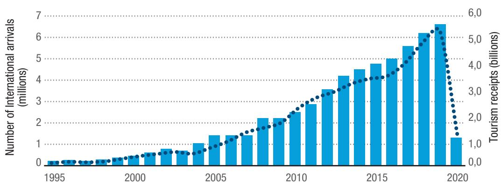

Source: UNCTAD secretariat calculations based on data from the World Bank, World Development Indicators, available at https://databank.worldbank.org/source/world-development-indicators (accessed in September 2023).

## Figure 3

## Cambodia: International tourism receipts as a share of exports, 1995–2020 (Percentage)

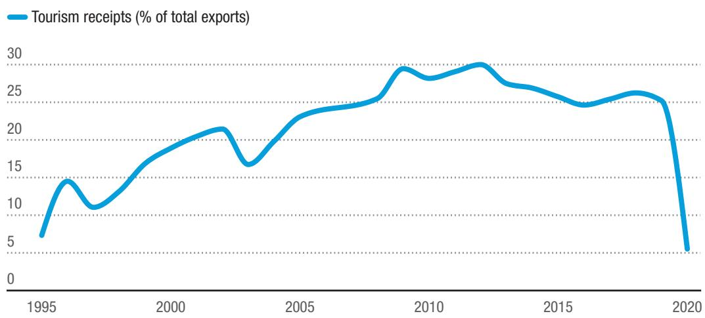

Source: UNCTAD secretariat calculations based on data from the World Bank, World Development Indicators, available at https://databank.worldbank.org/source/world-development-indicators (accessed in September 2023).

Among the tourism-sector-specific support measures introduced by the government were exemptions from all license fees up to the end of 2021; tax exemptions and delayed tax audits during 2020 for hotels and guesthouses located in Siem Reap province; an exemption from the minimum monthly tax duties for Cambodia Airlines; deferred civil aviation fees until the end of

2021; an exemption from monthly taxes for hotels, guesthouses, restaurants and travel agents; exemptions from licensing fees during 2021; wage subsidies of \$40 a month to employees in the tourism sector (hotels, guesthouses, restaurants and travel agencies) up to the end of 2021; and retraining and upskilling programmes for laid-off workers. According to consultations with the Ministry of Tourism, many professionals left the tourism industry during the pandemic downturn and moved into either the informal or construction sectors, or returned to rural areas. The government has launched a tourism roadmap to promote and accelerate the recovery and resilience of the sector, including vocational programmes and digital upskilling (Ministry of Tourism, 2021), as well as special programmes aimed at empowering/ upskilling women in the tourism sector, especially those in the leisure subsectors. A study centre was established to improve knowledge of Chinese visitors' needs and preferences, in addition to promotional campaigns that target the influx of visitors from Australia, Canada and Europe.

## 2.1.4 Trade performance

Cambodia's trade openness increased from 136.5 per cent in 2005 to 192.96 per cent in 2022. $^{20}$ As Cambodia is a small

economy, economic theory envisages that trade will play a key role for the country (Rodrik, 1998). However, Cambodia's trade openness is much higher than what a simple model would predict solely based on GDP. Figure 4 plots the logarithms of trade openness against GDP for all countries with data availability in 2021. Cambodia is highlighted in red (KHM), while other ASEAN countries are highlighted in green. The plot shows that, within a group of comparably sized economies, Cambodia has one of the highest levels of openness. Dutyfree export access under the Generalized System of Preferences to major developed countries, including the European Union, the United States and Japan, is one of the key advantages of exportoriented manufacturing in Cambodia. Cambodia's investment environment is attracting a growing number of foreign investors, particularly from China, Hong Kong SAR, Japan and other ASEAN countries.

## Figure 4

Cambodia's trade openness compared to ASEAN countries, 2022  
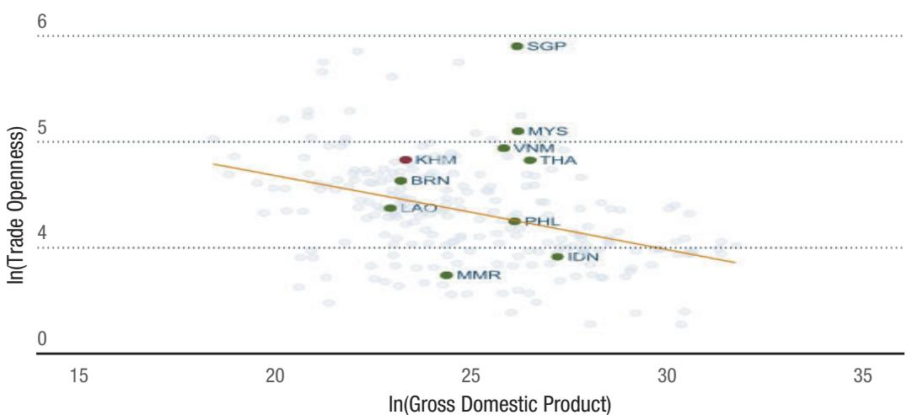  
Source: UNCTAD secretariat calculations based on national accounts data from the World Bank and Organization for Economic Cooperation and Development.  
Note: The y-axis denotes the log of trade openness and the x-axis denotes the log of GDP. The basic measure of openness is the trade intensity ratio: exports plus imports divided by GDP. ASEAN: Association of Southeast Asian Nations; RN: Brunei Darussalam; KHM: Cambodia; IDN: Indonesia; LAO: Lao People's Democratic Republic; MYS: Malaysia; MMR: Myanmar; PHL: Philippines; SGP: Singapore; THA: Thailand; VNM: Viet Nam.

In the last decade, Cambodia has targeted regional markets. The country aims to pursue a series of bilateral free trade agreements (FTAs) aimed at securing broader markets for its export products, $^{21}$ which could herald further changes in the diversification of Cambodia's top exports in the years ahead. Bilateral FTAs with China and the Republic of Korea came into force in January and December 2022, respectively. Cambodia is also a member of the Regional Cooperation Economic Partnership (RCEP), which entered into force simultaneously with the China-Cambodia FTA in 2022. The RCEP is comprised of 15 Asia Pacific countries, including the ASEAN member states. These bilateral agreements, alongside Cambodia's new investment law (October 2021), are contributing to an influx of FDI into export sectors. Reports attribute the 32 per cent jump in exports in the first quarter of 2022 to implementation of the RCEP and China-Cambodia FTA. $^{22}$ During the VP consultations, the Chamber of Commerce of Cambodia expressed favourable views on the government's policy to increase the number of bilateral and regional FTAs.

The merchandise sector contributes the lion's share of total trade in Cambodia, especially in terms of imports. Merchandise imports, which make up the largest segment of international trade, rose from \$3.9 billion in 2005 to \$29.8 billion in 2022 (figure 5). Concurrently, merchandise exports rose from \$3.1 billion in 2005 to \$22.5 billion in 2022.

The services sector gained relative importance in terms of exports up to 2019. In 2005, services exports accounted for 36 per cent of total exports (\$1.1 billion),

rising to 41 per cent in 2019 (\$6.1 billion), but then plummeted to 4 per cent (\$700 million) due to the dramatic impact of COVID-19 on travel (96 per cent decline) and transport (76 per cent decline). Services imports have increased by a much smaller margin than merchandise imports, from \$600 million in 2005 to \$2.1 billion in 2021. Provisional estimates by the government in January 2023 suggest that year-over-year (January 2022–January 2023), overall imports fell 37.5 per cent compared to overall exports, which fell 13.9 per cent in 2022. $^{23}$ The subdued performance during the pandemic, combined with the 40 per cent increase in merchandise imports, has worsened the country's trade deficit, which ballooned from \$2.6 billion in 2019 to \$12.5 billion in 2021 (figure 5). The general recovery of global tourism in 2022, including the belated lifting of travel restrictions in China, which accounts for an increasing share of tourist arrivals in Cambodia, is expected to ameliorate Cambodia's trade deficit to some degree in the near future.

A closer look at the composition of Cambodian merchandise trade reveals that the garment sector dominates. From 1999–2001, apparel and clothing accessories and footwear accounted for 84 per cent of all exports (figure 6). Cambodian exports have since diversified significantly. Cambodia's Herfindahl-Hirschman Index score for exports declined from 0.62 over 1999–2001 to 0.24 over 2019–2022. $^{24}$ However, garments and footwear exports, together with travel goods, handbags etc., still accounted for 53 per cent of all exports over 2019–2022. Notably, non-monetary gold has become an important export,

representing 9 per cent of total exports from 2019–2022. Provisional estimates by the government in January 2023 indicate a 114 per cent increase in exports of electrical machinery and equipment and parts thereof (HS 85), year-over-year.

## Figure 5

Cambodia: Exports and imports of goods and services, 2005–2022 (Billions of US dollars)

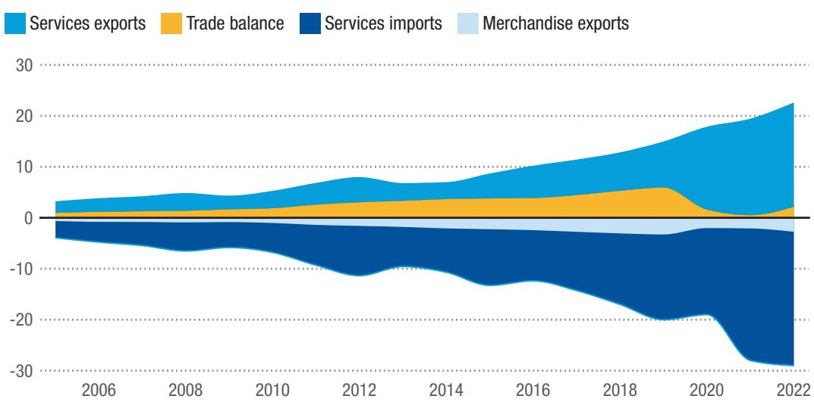  
Source: UNCTAD secretariat calculations based on data from the UNCTADStat database, available at https://unctadstat.unctad.org (accessed in September 2023).

## Figure 6

Cambodia: Share of merchandise exports by product group (SITC Rev. 3), 1999–2001 versus 2019–2022

(Percentage)

1999-2001

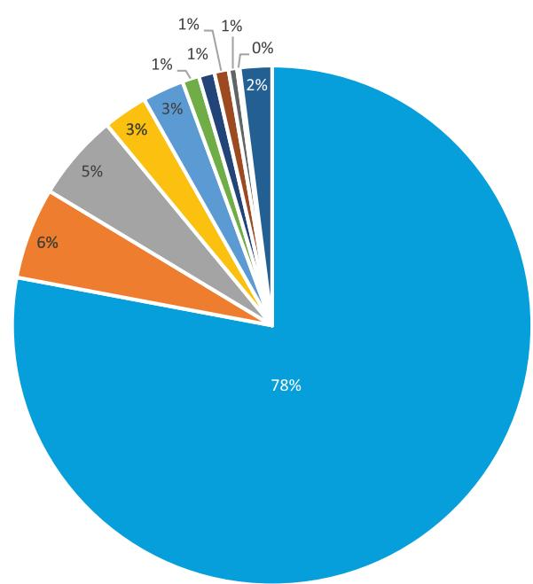

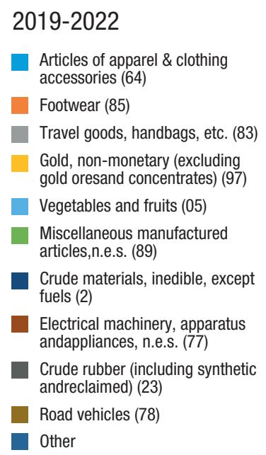

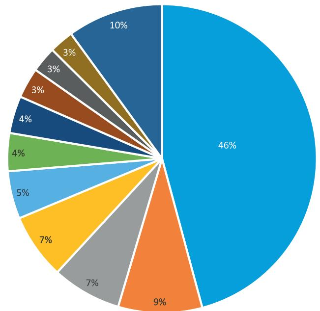  
Source: UNCTAD secretariat calculations based on data from the UNCTADStat database, available at https://unctadstat.unctad.org (accessed in September 2023).  
Note: n.e.s.: not elsewhere classified; SITC: Standard International Trade Classification.

The dominance of garments and apparel sector exports is mirrored in the composition of imports. In 1999–2001, textile yarn and petroleum (products) represented 43 per cent of imports, key inputs for (synthetic) fibres for garments. By 2019–2022, the share of those imports had declined to 27 per cent (figure 7). However, Cambodian merchandise imports have become less diverse despite the relative decline of the dominant sectors in imports. Cambodia's score on the Herfindahl-Hirschman Index for imports saw a decline from 0.11 over 1999–2001 to 0.07 over 2019–2022. The ascendancy of gold in the composition of exports is also reflected in imports, representing 11 per cent of total imports in 2019–2022.

The appearance of gold as a high-ranking import and export product begs the question to what extent export diversification in Cambodian trade is simply the result of diverse re-exports, which captures minimal value for the local economy. $^{25}$ While net imports (excluding net exports) show a picture similar to regular imports,

net exports (excluding net imports) reveal that concentration remains high. The Herfindahl-Hirschman Index of net exports was 0.76 over 1999–2001 and 0.48 over 2019–2022, a change that is 26 per cent smaller than that for overall exports.

The composition of trading partners reveals that the United States rapidly became the largest export market for Cambodia by 2006 (figure 8), growing exponentially from a little under 2 per cent of Cambodian exports in 1995 to 56.5 per cent in 2006. The United States share of Cambodian exports in 2022 was 39 per cent. While ASEAN markets were the largest for Cambodian exports in 1995 (62 per cent), by 1998 their share had shrunk to 14 per cent, falling to third place among export destinations. ASEAN markets represented 13 per cent of Cambodian exports in 2022. Despite some rebounds in ASEAN-destined exports – notably, overtaking the European Union as the second most important export destination in 2020 – the ASEAN share of Cambodian exports shows an overall declining trend as other markets progressively gain importance.

## Figure 7

Figure 7
Cambodia: Share of merchandise imports by product group (SITC Rev. 3), 1999–2001 versus 2019–2022
(Percentage)

## 1999-2001

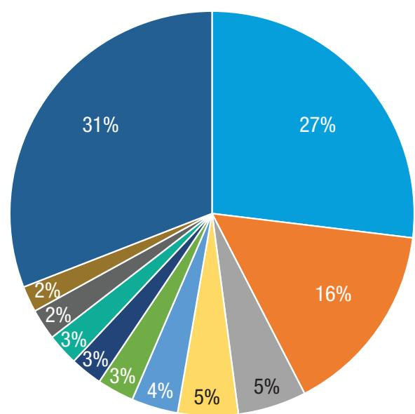

## 2019-2022

\- Textile yarn and related products (65)
- Petroleum, petroleum products and related materials (33)
- Gold, non-monetary (excluding gold ores and concentrates) (97)
- Road vehicles (78)
- Iron and steel (67)
- Electrical machinery, apparatus and appliances, n.e.s. (77)
- Miscellaneous manufactured articles, n.e.s. (89)
- Manufactures of metal, n.e.s. (69)
- Specialised machinery (72)
- Non metallic mineral manufactures, n.e.s. (66)

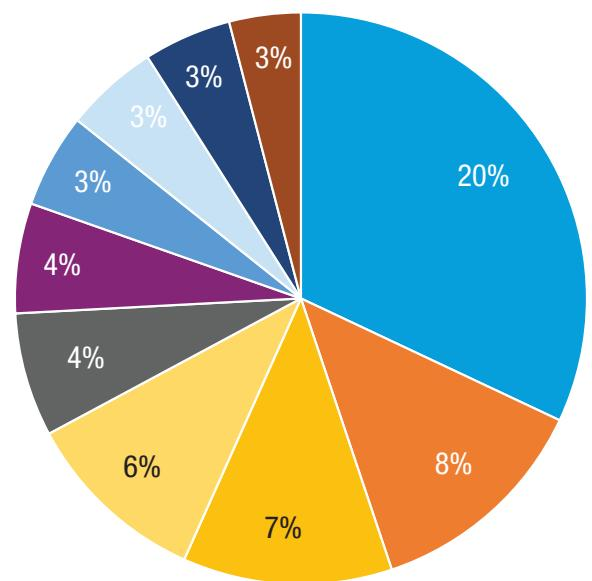

Source: UNCTAD secretariat calculations based on data from the UNCTADStat database, available at https://unctadstat.unctad.org (accessed in September 2023).

Note: n.e.s.: not elsewhere classified; SITC: Standard International Trade Classification.

Since 2014, exports to China and Japan have expanded. However, barriers to trade, such as Cambodia's difficulties in meeting sanitary and phytosanitary

regulations on agricultural exports and the general economic slowdown following the pandemic, have resulted in exports

remaining lower than expected under existing FTAs with these countries. $^{26}$

In 2021, the United States restricted exports and re-exports to Cambodia (and transfers within) for items subject to the Export Administration Regulations. $^{27}$ Similarly, in 2020, Cambodia suffered partial loss of duty-free access to the European market under the EBA arrangement due to continuing concerns over political, human, labour and land rights. $^{28}$ Consequently, about \$1 billion in exports from Cambodia to the European Union became subject to regular tariffs, including exports from the pivotal garment and travel goods sectors. $^{29}$ Concurrently, a new FTA with China in 2022 led to zero tariffs for over 90 per cent of tariff lines in trade in goods. $^{30}$ This may partially absorb the effects of restrictions elsewhere, as will expanded access under the United Kingdom's revamped Generalized System of Preferences scheme. In addition, the RCEP came into full effect in 2022. However, completely replacing the European Union and United States markets as the main drivers of the Cambodian economy with regional FTAs is unlikely to be achievable in the short term (Crivelli and Inama, 2022; UNCTAD, 2020b) although some studies have highlighted their considerable potential (Thangavelu and Hing, 2023; Chheang, 2023).

Cambodian imports are concentrated in ASEAN and China (figure 9). This pattern remained stable throughout the 1995–2022 period, with an increasing concentration of imports from China of inputs for

garment sector production processes. In 1995, 7 per cent of imports originated from China (including Hong Kong SAR), compared to 38 per cent in 2022.

The composition of trade with key export and import partners shows that Cambodia's exports to China, the European Union and the United States are predominantly focused on manufacturing goods – mostly clothing, footwear and travel goods. From 2019–2022, those partners accounted for 67, 96 and 98 per cent of total exports, respectively (figure 10). Exports to ASEAN countries are more diverse, with the predominant export being non-monetary gold (34 per cent). The second largest export category to the ASEAN market is all food items (32 per cent), followed by manufactured goods (15 per cent) and agricultural raw materials (15 per cent). Imports from China, the European Union and the United States are also predominantly in manufactured goods sectors. They accounted for 95, 52 and 73 per cent of total imports from those partners, respectively. The imports mostly represent textile yarn and related products in the case of China, and machinery from the European Union and the United States. Agricultural raw materials are also a key import from the European Union (28 per cent). ASEAN imports once again are more diverse. The largest import category from the ASEAN market is manufactured goods (42 per cent, consisting mostly of petroleum and machinery), followed by fuels (23 per cent), all food items (14 per cent) and non-monetary gold (20 per cent).

Figure 8
Cambodian exports by trading partner, 1995–2022
(Percentage)  
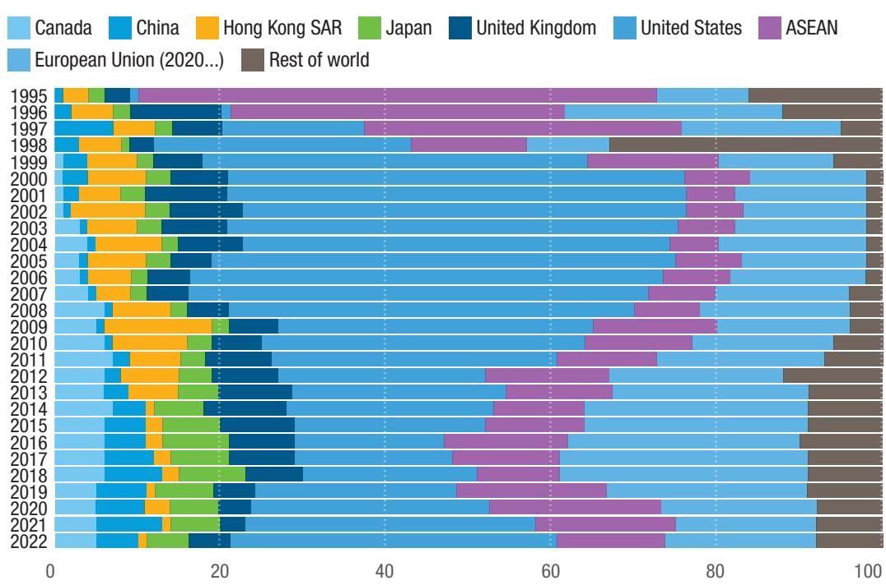  
Source: UNCTAD secretariat calculations based on data from the UNCTADStat database, available at https://unctadstat.unctad.org (accessed in October 2023).  
Note: ASEAN: Association of Southeast Asian Nations. The label European Union (2020...) highlights that data are post-Brexit, i.e. the United Kingdom is not included in the series.

  
Figure 9

Cambodian imports by trading partner, 1995–2022 (Percentage)  
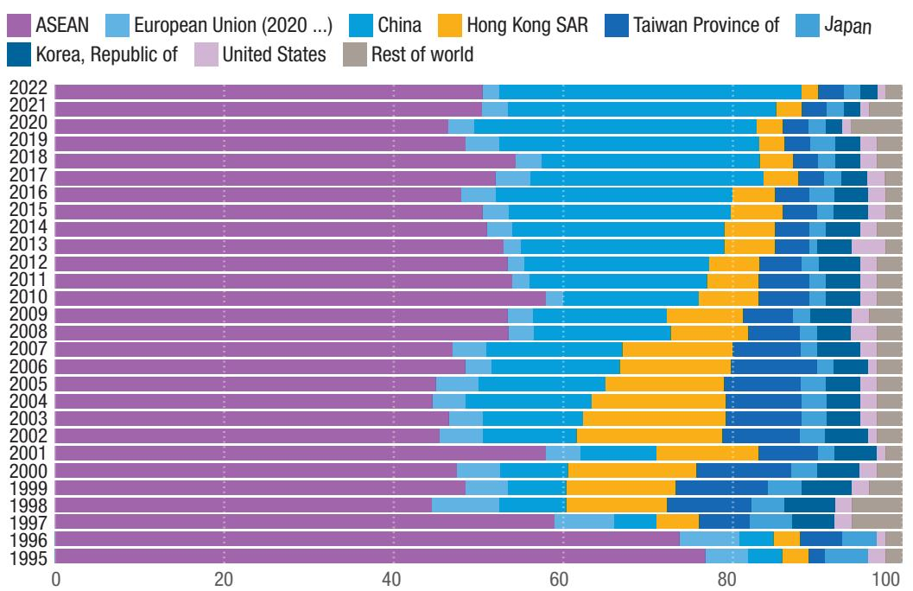  
Source: UNCTAD secretariat calculations based on data from the UNCTADStat database, available at https://unctadstat.unctad.org (accessed in October 2023).  
Note: ASEAN: Association of Southeast Asian Nations. The label European Union (2020...) highlights that data are post-Brexit, i.e. the United Kingdom is not included in the series.

## Figure 10

Cambodian exports and imports, by sector and trading partner, 1995–2022 (Percentage)

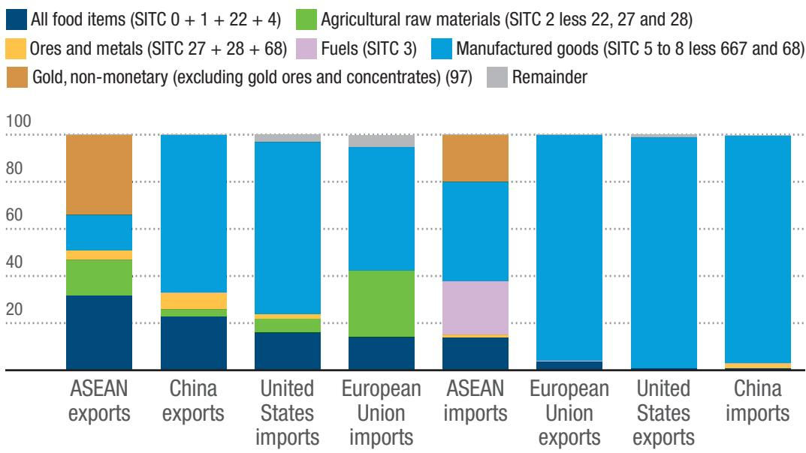  
Source: UNCTAD secretariat calculations based on data from the UNCTADStat database, available at https://unctadstat.unctad.org (accessed in September 2023).  
Note: ASEAN: Association of Southeast Asian Nations; SITC: Standard International Trade Classification.

## Figure 11

Value added by sector in Cambodia and comparator economies, 2000, 2020 and 2021

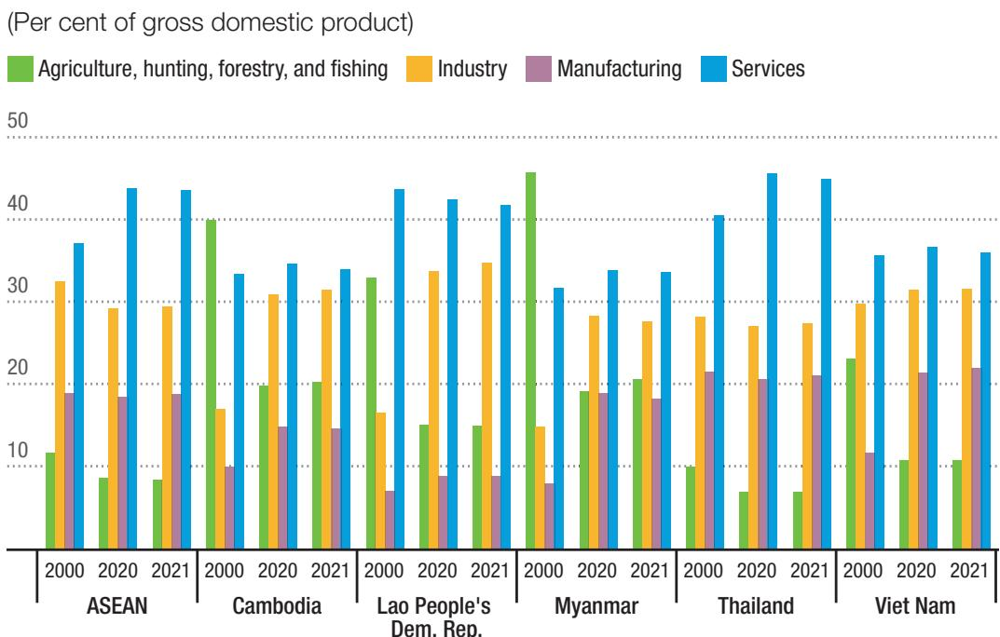  
Source: UNCTAD secretariat calculations based on data from the UNCTADStat database, available at https://unctadstat.unctad.org (accessed in September 2023).  
Note: ASEAN: Association of Southeast Asian Nations.

## 2.2 Dynamics of structural transformation

The Cambodian economy underwent a structural change over the 2000–2021 period (figure 11). While agriculture was the largest sector in terms of value added in 2000, the services sector accounted for the highest value-added share in 2021. The decline in the agricultural sector's value-added share (from 40 to 20 per cent) was accompanied by a marked increase in the manufacturing sector (from almost 10 to 14.5 per cent), while the share of services hovered under 34 per cent. Compared to the ASEAN average and the performance of its neighbours (aside from Lao People's Democratic Republic),

Cambodia's share of manufacturing significantly lags, and the country remains highly dependent on agriculture.

Labour productivity growth, in terms of gross value added per worker, remained stable at 4 per cent over 1997–2019 (figure 12). Between-sector productivity growth accounted for most growth (2.8 per cent over 1997–2012), and its share in total growth increased (3.2 per cent over 2012–2019). This indicates that the Cambodian economy mostly experiences labour productivity gains from the reallocation of labour from low-productivity sectors, such as agriculture, to higher-productivity sectors, such as manufacturing.

Cambodia: Gross value added per worker, 1997–2012 and 2012–2019 (Annual, in per cent)  
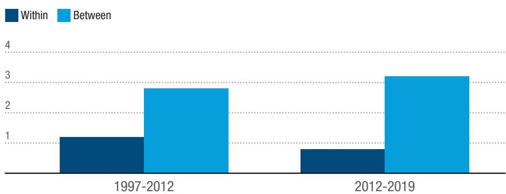  
Source: UNCTAD secretariat calculations based on the International Labour Organization's database on employment by sector and the United Nations Statistics Division database on gross value added by industries at current prices.

However, although the agricultural sector recorded the lowest level of labour productivity as measured in gross value added per worker, the labour share of the agricultural sector in the total labour force remained high at 40 per cent in 2019 (figure 13). Given the clear negative association between the labour share and labour productivity, opportunities remain for the Cambodian economy to increase labour productivity by reallocation. For instance, in 2019 the labour productivity of a worker in the construction sector was \$4,497, while the share of labour in construction in the total labour force was only 9 per cent. The government aims to achieve reallocation by (i) mobilizing and attracting foreign and domestic investment in large industries, (ii) developing and modernizing SMEs, (iii) improving the regulatory environment to enhance competitiveness, and (iv) coordinating supporting policies such as the development of human resources and support infrastructure (RGC, 2015).

Cambodia: Labour productivity and labour share of employment in selected sectors, 2019  
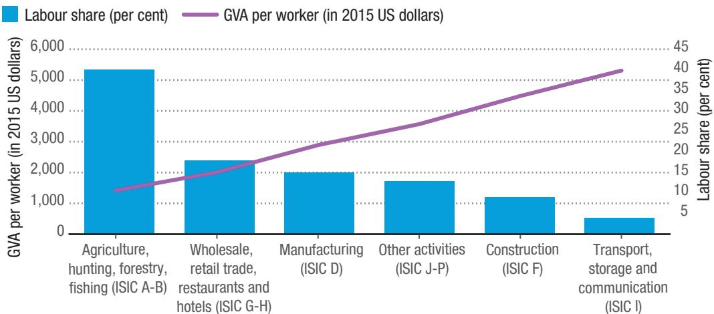  
Source: UNCTAD calculations based on the International Labour Organization's database on employment by sector and the United Nations Statistics Division database on gross value added (GVA) by industry at current prices, available at https://data.un.org/ (accessed in February 2023).  
Note: The analysis excludes the mining sector, which obscures other sectors because of its elevated level of value added alongside a low share of employment. ISIC: International Standard Industrial Classification.

## Figure 14

## Cambodia: Sectoral employment, 1997, 2007, 2012 and 2019 (Percentage)

Mining, utilities (ISIC C and E) ■ Transport, storage and communication (ISIC I) ■ Construction (ISICF)
Manufacturing (ISIC D) ■ Other activities (ISIC J-P) ■ Wholesale, retail trade, restaurants and hotels (ISIC G-H) ■ Agriculture, hunting, forestry, fishing (ISIC A-B)

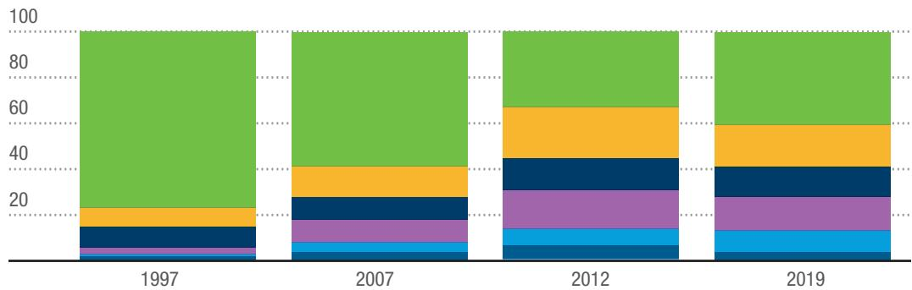  
Source: UNCTAD calculations based on the International Labour Organization's database on employment by sector, available at https://ilostat.ilo.org/topics/employment/ (accessed in February 2023).  
Note: ISIC: International Standard Industrial Classification.

Of note is the evidence that the Cambodian economy has experienced an increase in the labour share of agriculture since 2012 (figure 14). After a remarkable decline from 77 per cent in 1997 to 33 per cent in 2012, the share of labour in agriculture in the total labour force increased to 40 per cent in 2019. This was at the expense of the labour share of the wholesale, retail

trade, restaurants and hotels sector, which shrank from 22 per cent in 2012 to 18 per cent in 2019, and the manufacturing sector, which shrank from 17 to 15 per cent during the same period. This premature de-industrialization may have serious implications for future growth. Overall, the most notable structural shifts occurred in the manufacturing sector (3

per cent in 1997 to 15 per cent in 2019), the wholesale, retail trade, restaurants and hotels sector (8 per cent in 1997 to 18 per cent in 2019) and the construction sector (1 per cent in 1997 to 9 per cent in 2019).

There are two factors potentially related to the increase in the agricultural employment share. The first is low productivity growth in the agricultural sector (27.1 per cent decline over 2012–2019). Sector-biased technological progress pushes labour to the least-growing sector, as the goods it produces become relatively more valuable (Baumol, 1967). The second is the large rise of net emigration since 2008. From 2008–2021, net emigration was equal to about 4 per cent of the population, up from near-zero levels prior to 2007 (figure 15). A likely cause was the opening of Thai borders for legal Cambodian migrant workers starting in 2003, though effectively legal Cambodian migrant workers could only enter as of 2006 (OECD and Cambodia Development Resource Institute, 2017). In 2015, there were 1,187,142 Cambodian emigrants, 68 per cent of whom moved to Thailand. Most were men working in manufacturing and services (OECD

and Cambodia Development Resource Institute, 2017). Such sector-biased migration outflows may be affecting the domestic employment share in agriculture. Concurrently, personal remittances have increased substantially, rising to a mammoth 6.6 per cent of GDP in 2013. As such, while Cambodia is losing able workers in higher-value-added sectors, it is also receiving large amounts of remittances, allowing for domestic spending and savings. Whether the net effect is positive or negative will depend on many factors such as the persistence of remittances, the likelihood of return migration, and other noneconomic factors, such as the effect of a missing parent on children.

For example, although there have been noticeable gains in the past 30 years, the per capita GDPs of Cambodia and Myanmar remain only about a fifth of that of Thailand. Given that per capita GDP correlates with the level of wages and the number of economic opportunities, this means Thailand's economic pull will continue to be strong in the short and long term (ASEAN Secretariat, 2022).

## Figure 15

## Cambodia: Net emigration and personal remittances received, 1997–2021 (Percentage)

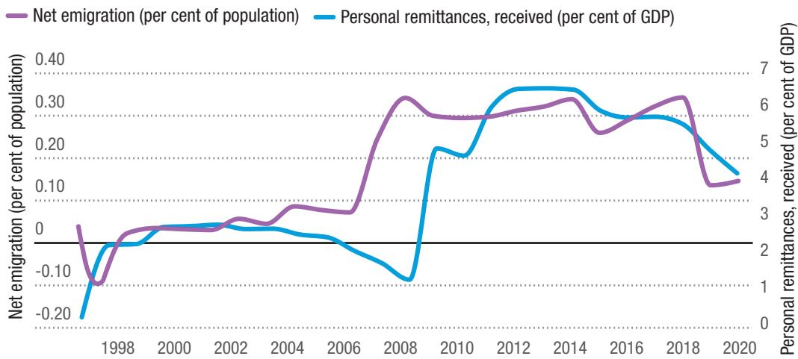  
Source: World Bank, World Development Indicators, available at https://databank.worldbank.org/source/world-development-indicators (accessed in September 2023).

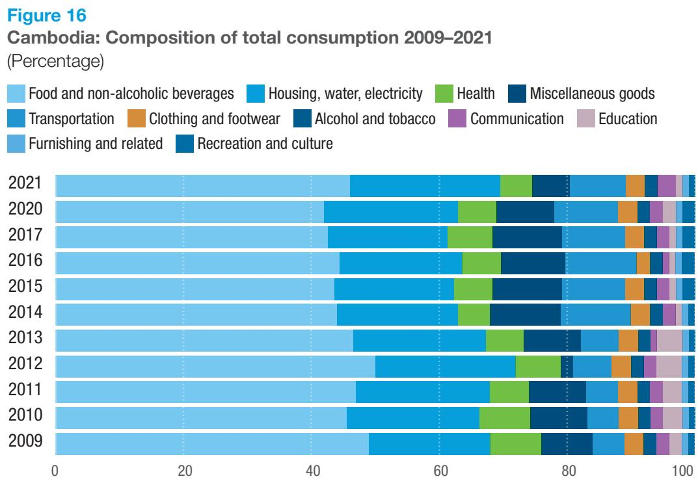  
Source: Cambodia Socio-Economic Surveys, 2009–2017, 2019–2020, 2021.

In terms of demand-induced structural transformation, there was little change over 2009–2021 (figure 16). Most consumption continued to be in the food and non-alcoholic beverages sector and the housing, water, and electricity sectors. Spending on services remained low, with important sectors such as health and education lagging. In 2021, total spending on education and health amounted to 1 and 5 per cent, respectively, compared to 2 and 8 per cent in 2009. Overall, these figures highlight that the structural transformation of Cambodia is not yet driven by the economy's demand side and is instead driven by foreign demand for its manufactured goods, predominantly from the garment export sector. This export-driven growth strategy puts Cambodia at risk of global negative shocks. This may change in the future once disposable income starts to rise as subsistence needs are assured.

## 2.2.1 Evolution of productive capacity

Productive capacity defines the ability of an economy to produce goods and services. A higher score on UNCTAD's Productive Capacities Index (PCI) is often associated with greater GDP per capita and a more diversified export base. This section examines Cambodia's performance against LDC peers and middle-income comparator countries in ASEAN. $^{31}$

Figure 17 shows the trend in Cambodia's overall PCI score compared to regional peers over 2000–2022. During this period, Cambodia's performance closely tracks that of the Lao People's Democratic Republic. The overall PCI score for Cambodia in 2022 was 35.9, having risen from 21.9 in 2000. Cambodia outperformed Myanmar (31.8) and was only slightly below Lao People's Democratic Republic (36). Cambodia's overall score remained significantly below that of Viet Nam (46.9) and the ASEAN median score (49.3), indicative of room for improvement in strengthening productive capacity as a pathway to greater prosperity.

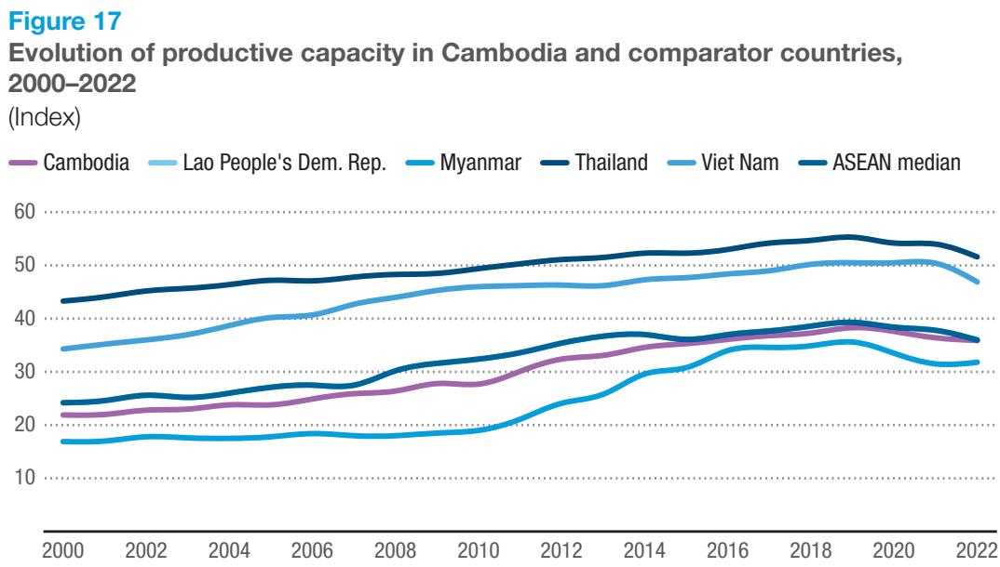  
Source: UNCTADStat database, available at https://unctadstat.unctad.org (accessed September 2023).  
Note: The Productive Capacities Index (PCI) score ranks a country's performance against that of other countries. A comparatively low index score would be considered different enough from the average of its peers or competitors to warrant special policy attention. ASEAN: Association of Southeast Asian Nations.

Cambodia faces a shortage of skilled human resources even for low- and medium-skill intensive industries (MISTI, 2021). Productive capacity expands when domestic economic actors create new products or raise the intensity of use of existing capacity. According to the World Bank (2021), Cambodia's inability to increase capacity utilization and diversify is explained by low labour productivity (output per worker), which lags most comparator countries and was below the ASEAN median during the Cambodian economy's boom years (figure 18).

The most important contributor to low labour productivity is low within-firm productivity growth, explained in part by poor access to finance, inefficient business regulations, and prevalent informality, which all add up to low and declining total factor productivity. Cambodia's

experience to date shows that SEZ firms are not closely linked to the domestic Cambodian economy and are significantly less so when compared to forward and backward linkages established by firms operating outside the zones (Warr and Menon, 2015; Brussevich, 2020). $^{32}$ In this context, the combination of the low quality of FDI (whereby FDI firms neither create backward linkages nor share knowledge) and low worker capability creates a vicious circle and underlines the interdependence between industrial policy, FDI policy and policies targeting human capital.

Results from a survey of 400 registered SMEs across Cambodia undertaken by the International Trade Centre (ITC) between December 2019 and August 2020 confirm that skills gaps are a major constraint, with only 12 per cent of surveyed firms reporting an abundance of skilled workers meeting their needs (DESA, 2020). $^{33}$ Of the companies surveyed by ITC, only 28 per cent exported, with 70 per cent engaged

Figure 18
Annual growth rate of output per worker, 2012–2022
(In constant GDP 2017 purchasing power parity dollars)  
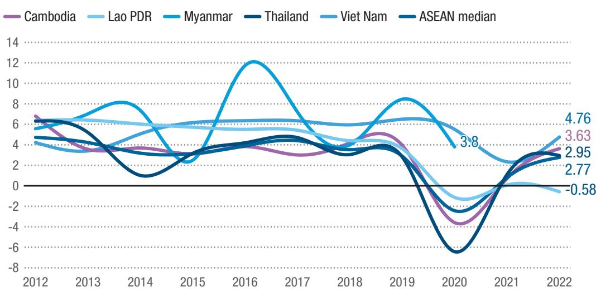  
Source: ILOStat modelled estimates, available at https://ilostat.ilo.org (accessed in September 2023).
Note: ASEAN: Association of Southeast Asian Nations.

## Figure 19

Gross capital formation in Cambodia and comparator countries, 2010–2022 (Per cent of gross domestic product)  
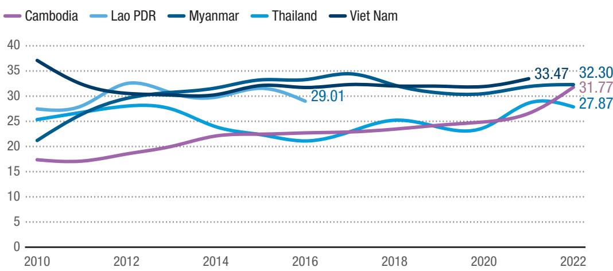  
Source: World Bank, World Development Indicators, available at https://databank.worldbank.org/source/world-development-indicators (accessed in September 2023).

in international trade only as importers. Foreign investors also reported difficulties in sourcing locally produced raw materials, with Cambodian producers' general lack of technology and know-how for semi-processing symptomatic of the challenge of adding value. Labour productivity gains have been lower than in other rapidly growing economies such as Viet Nam and Thailand during their boom years (Sok et al., 2020,

2021; World Bank, 2017), partly due to lower capital intensity. Since 2010, gross capital formation as a percentage of GDP averaged less than 21 per cent, much lower than most comparator countries (figure 19), confirming a persistent picture of low capital intensity. $^{34}$ The ITC survey also revealed that SMEs vary in their access to and use of water, electricity, and the Internet.

Cambodia relies on a predominantly FDI-led growth model (figure 20), which shows signs of diminishing returns manifesting in low capital intensity. Although contributing significantly to female empowerment, most jobs in light manufacturing (led by garments, footwear and travel goods) and tourism are concentrated in low-skill and labour-intensive occupations, and have absorbed mostly women and young people from rural areas. Low levels of structural change are evidenced by a production base that remains undiversified and the previously mentioned relatively slow change in labour productivity. As a result, although productivity in manufacturing remained higher than in agriculture, by 2019 the gap had narrowed (World Bank, 2019).

In the case of labour force capabilities, education, which together with capital is a critical factor for gains in productivity and value addition, has not improved sufficiently to ensure economic diversification or

strengthened resilience to consolidate and sustain human and long-term development. Cambodia's efforts regarding human development have arguably shown more results in changes in enrolment rather than in educational attainment and quality. Under the Rectangular Strategy, policy changes have emphasized flexibility, autonomy and fewer restrictions as part of a drive to increase the role of the private sector in education, with private-public partnerships viewed as important contributors to the expansion of access to education.

Energy consumption in Cambodia has increased rapidly as a result of improved living standards, urbanization, and industrialization. For example, under Phase IV of the Rectangular Strategy, SEZs have been identified as a principal sector for further development. A rapid increase in the number of construction projects linked to SEZs contributed to national disruptions or shortages of supply in 2019, as well

## Figure 20

Foreign direct investment flows as a per cent of gross fixed capital formation and GDP, 2017–2022

A. As a share of gross capital formation  
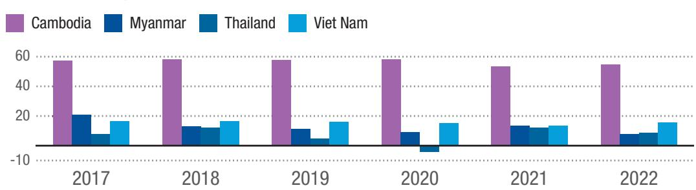  
B. As a share of GDP

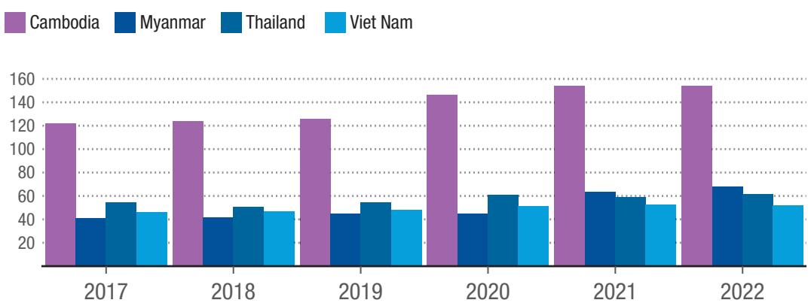  
Source: UNCTADStat database, available at https://unctadstat.unctad.org (accessed in September 2023).

as challenges in the management and treatment of municipal waste (MoE and UNIDO, 2019). The reliance on energy imports with attendant exposure to imported inflation poses an additional challenge. In 2015, electricity accounted for an average of around one-fourth of variable costs, depending on the industry. At that time, SEZ firms were already increasingly reliant on diesel-powered backup generators to mitigate the effects of frequent power interruptions, and in some locations, water

quality and waste disposal were also a problem (Warr and Menon, 2015). In 2022, 25 per cent of electricity supply was imported, which contributed to high costs of doing business. This places Cambodia's exports at a competitive disadvantage. Cambodia also imports petroleum and has the third most expensive fuel prices among comparator ASEAN countries (table 5). Soaring prices in the wake of the Ukraine crisis are a significant source of inflationary pressure in the domestic economy.

## Table 5

Average price of one litre of fuel as of 30 October 2023 (In euros)

<table><tr><td>Country</td><td>Average price</td></tr><tr><td>Cambodia</td><td>1.21</td></tr><tr><td>Indonesia</td><td>0.91</td></tr><tr><td>Lao People’s Democratic Republic</td><td>1.36</td></tr><tr><td>Malaysia</td><td>0.99</td></tr><tr><td>Myanmar</td><td>0.41</td></tr><tr><td>Philippines</td><td>1.17</td></tr><tr><td>Singapore</td><td>1.99</td></tr><tr><td>Thailand</td><td>1.01</td></tr><tr><td>Viet Nam</td><td>0.90</td></tr></table>

Source: See Toll.eu, Fuel Prices in Asia, available at https://www.tolls.eu/fuel-prices-asia (accessed in October 2023).

Cambodia has made progress as a result of successive infrastructure projects under the Triangular and Rectangular Strategies aimed at restoring, reconstructing and modernizing the country's core transport system. Successive transport infrastructure investments have prioritized trade facilitation, while at the same time advancing goals on health and education and rural development. The Ministry of Works and Public Transport reported during VP consultations that trade facilitation measures implemented include increased port infrastructure, and upgrading of the Sihanoukville port to a deep sea port, with construction and restoration/expansion of several private ports and the rail network also under way. Notable road infrastructure projects include the Phnom Penh-Sihanoukville Expressway, which opened in November 2022 and is expected to significantly reduce trade

logistics costs. The Phnom Penh-Bavet Expressway, scheduled for completion in 2027, is expected to significantly reduce congestion along major national road networks and facilitate tourism to several provinces, as well boost cross-border flows between Cambodia and Viet Nam and thereby other ASEAN markets. The Ministry of Public Works and Transportation also reported strong interest from China, Japan and others as financing partners. For example, the ministry has signed an agreement with the China Road and Bridge Corporation for construction of the Phnom Penh-Siem Reap-Poi Pet Expressway, which is expected to commence in 2024.

The Cambodian government has also promoted private sector participation in infrastructure development and management. However, sustained economic development has put increased pressure

on transport infrastructure, with current levels of investment insufficient to keep up with needs and close widening gaps in maintenance, safety, urban congestion and climate resilience. Slow infrastructure project implementation is also a challenge. For example, realization of targets on paving rural roads has ranged from 3 to 7 per cent implementation since 2018, with similarly persistent underspending on maintenance. $^{35}$ In addition, the Ministry of Rural Development faces a shortage of development finance, $^{36}$ with 70 per cent of needs met by ODA. Its mandate also sometimes faces potential tensions with siloed non-governmental organization initiatives.

Road transportation is by far Cambodia's largest subsector, with an estimated

modal share of more than 90 per cent for passenger and freight (table 6). $^{37}$ As of 2022, total road length in Cambodia was estimated at more than 66,045 kms of various road hierarchies, up from 39,500 km in in 2006 (JICA, 2006). The paved highway road network connecting the country to neighbouring countries represented about 3 per cent of the total in 2022. The inland national road network, of which 76 per cent was paved, accounted for about 8 per cent of the total. About 40 per cent of provincial networks were paved, representing about 14 per cent of the total. The rural road network, by far the largest (74 per cent), made up only 5 per cent of paved roads. Railway transport, considered eco-friendly, has a negligible modal share for passenger and freight.

## Table 6

Cambodia: Sectoral reliance on modal transport

<table><tr><td>Modal sector</td><td>Agriculture</td><td>Construction</td><td>Manufacturing</td><td>Tourism</td></tr><tr><td>Road</td><td>X</td><td>X</td><td>X</td><td>X</td></tr><tr><td>Maritime</td><td>X</td><td>X</td><td>X</td><td></td></tr><tr><td>International air carriers</td><td></td><td></td><td></td><td>X</td></tr><tr><td>Water</td><td></td><td>X</td><td>X</td><td></td></tr></table>

Source: ADB (2019) and written submissions from the Ministry of Public Works and Transportation.

Cambodia has made significant progress since 2000 on information and communications technology (ICT), albeit from a very low base. For example, to address ever-increasing demand for data services, the Ministry of Post and Telecommunications is currently taking steps to improve the management of spectrum to ensure equitable access and an interference-free environment for different users and

services. $^{38}$ The ministry is helping to prepare the economy for digitalization through implementation of the Digital Economy and Society Policy Framework 2021–2035 and is also preparing the Digital Development Policy. However, the ministry is constrained by capacity gaps on digitalization.

With a rising urban middle class, and with the under 25 age group accounting for

Sources: International Telecommunications Union, Digital Development Dashboard, available at https://www.itu.int/en/ITU-D/Statistics/Dashboards/Pages/Digital-Development.aspx; and “Skills Development Remains Crucial to Connect the Unconnected,” available at https://www.itu.int/itu-d/reports/statistics/2021/11/15/ict-skills/ (both sites accessed in November 2023).

60 per cent of the population, Cambodia has significant potential for e-commerce development. In 2017, demand for e-commerce was limited to products that customers could not buy in physical retail outlets. However, the COVID-19 pandemic spawned a budding e-commerce sector, helping blunt the impact of the pandemic on the country's economy. $^{39}$ The Cambodian government has stepped up efforts to strengthen the country's e-commerce ecosystem in line with recommendations of an eTrade Readiness Assessment by UNCTAD in 2017, including taking steps to ease the registration of e-commerce

businesses, and passing the e-commerce law and consumer protection law in 2019. $^{40}$ However, UNCTAD's assessment revealed that the lack of trained ICT service professionals is a constraint to the development of e-commerce in Cambodia, with just 3 per cent of professionals in 2017 equipped with standard skills, according to the International Telecommunications Union. Compared to countries for which data are available, Cambodia significantly lags on access to and the cost of broadband Internet, as well as the availability of individuals with standard ICT skills (table 7).

Table 7
Selected information and communications technology (ICT) indicators for Cambodia and comparator countries
(Percentage)

<table><tr><td>Indicator</td><td>Cambodia</td><td>Lao People&#x27;s Democratic Republic</td><td>Myanmar</td><td>Thailand</td><td>Viet Nam</td></tr><tr><td>Households with Internet access (urban/rural)</td><td>50(50/30)</td><td>72</td><td>N/A</td><td>89(89/82)</td><td>81(80/70)</td></tr><tr><td>Individuals owning a mobile phone (male/female)</td><td>72(72/71)</td><td>N/A</td><td>62(68/57)</td><td>87(87/86)</td><td>77(78/77)</td></tr><tr><td>Individuals using the Internet (male/female) $^{a}$ </td><td>60(53/52)</td><td>62</td><td>44(29/19)</td><td>85(86/84)</td><td>74(77/72)</td></tr><tr><td>Individuals with standard ICT skills (basic skills)</td><td>5(32)</td><td>N/A</td><td>N/A</td><td>10(17)</td><td>8(17)</td></tr><tr><td>Fixed broadband basket as a per cent of gross national income per capita in 2023</td><td>12.7</td><td>6.1</td><td>6.3</td><td>3.3</td><td>2.3</td></tr><tr><td>Population covered by at least 4G mobile network</td><td>92</td><td>52</td><td>94</td><td>98</td><td>100</td></tr></table>

a Latest available data by country, with the oldest reported data being for 2017 and the most recent for 2022.

Corruption in Cambodia is generally viewed as a factor in the weakening of the quality and stability of governance that affects the environment for business and the well-being and trust of citizens in public institutions. In 2023, Transparency International gave the country a score of 22 out of 100 (down from 23 in 2021) on public sector corruption and ranked Cambodia

158 $^{th}$ out of 180 countries covered by its index (Transparency International, 2024). In addition, Cambodian authorities are perceived as hostile to press freedoms. This has led to the loss of trade preferences.

Cambodia has shown steady gains in progress on cross-border trade, time to export, and time to import. According to

Note: \* Data only available for 2018.

the World Bank's Ease of Doing Business indicators, time to export declined from 22 days in 2010 to 7.5 days in 2020. Similarly, time to import declined from 29 days to 5.8 days during the same period. $^{41}$ Cambodia also attained a high score (80) on access to credit. In terms of logistics capabilities measured by the World Bank's Logistics Performance Index (LPI) across the 2012, 2014, 2016 and 2018 LPI surveys Cambodia ranks $89^{\text{th}}$ out of 167 countries, and for most dimensions of the index was outperformed by all comparators except Myanmar (figure 21).

Aggregated Logistics Performance Index scores for Cambodia and comparator countries, 2012–2023  
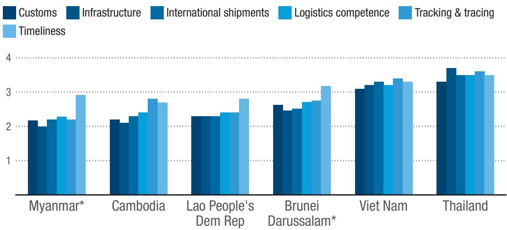  
Source: World Bank, Logistics Performance Index, available at https://lpi.worldbank.org/international/aggregated-ranking (accessed in September 2023).

Cambodia's overall LPI score increased from 2.37 in 2010 to 2.8 in 2016 but declined to 2.4 in 2023. The country ranked among the bottom 12 LPI scorers in 2023, registering steep declines in performance, especially in timeliness and international shipments (Arvis et al., 2023). Only in the dimension of tracking and tracing of shipments did Cambodia show consistent improvements on 2010 and 2016 scores. At 2.2, the customs score in 2023 shows only a marginal improvement from 2010 and represents a decline from 2016 (2.62), suggestive of a decline in the efficiency of customs processes. Similarly, infrastructure performance scores declined from 2010 to 2016, signaling concerns about the quality of logistics infrastructure. Although the score for international shipments has improved marginally since 2010, it declined considerably from 3.11 in 2016 to 2.3 in

2023, pointing to constraints in ensuring competitively priced shipments. The logistics competence score also declined from 2.6 in 2016 to 2.4 in 2023, which points to the need to improve the competence of logistics services providers. Finally, the timeliness score, after improving from 2.84 in 2010 to 3.3 in 2016, fell to 2.7 in 2023, reflecting more frequent delays and challenges in maintaining improvements in delivery times.

Cambodia's deteriorated performance on the LPI in 2023 can be partly attributed to the COVID-19 pandemic. The shortage of truck drivers, warehouse staff, and seagoing personnel meant that the country was confronted with logistical bottlenecks compounded by unfavourable global demand shifts (World Bank, 2023). However, Cambodia's scores reveal significant underlying vulnerabilities in

its trade logistics capacity that require attention to ensure trade competitiveness.

## 2.3 Social development

Robust economic growth in Cambodia has been accompanied by sustained gains in per capita incomes (figure 1), which have driven improvements in living standards and helped Cambodia improve access to basic services. The government is implementing a decentralization policy to boost access to public services (inclusivity) and improve subnational governance and accountability for citizens, including through digital e-government services at the commune/Sangkat, district, municipal/Khan, and capital and provincial levels. $^{42}$ Funding equivalent to 1 per cent of the total national budget is allocated to improving local infrastructure and providing social security support. $^{43}$ In its interventions to reduce gender disparities, the government aims for each of the country’s line ministries to develop and implement strategies on women’s empowerment. Line ministries contribute to various gender equity programmes according to their mandates, including those aimed at discouraging female students from dropping out of school. Another example is the “Good Man” Programme aimed at changing detrimental male perceptions about gendered roles and preventing domestic violence. The Ministry of Women provides training on financial literacy and other support to women’s business associations.

The proportion of households with access to electricity more than tripled from 26 to 86 per cent in the 2009–2019 period, with rural households seeing a seven-fold increase. Access to improved water almost doubled from 44 to 74 per cent, and access to improved sanitation more than doubled from 35 to 83 per

cent over the same period (Karamba et al., 2022; NIS, 2020a; RGC, 2018).

Cambodia's achievements in socioeconomic development are captured by the country's performance under the graduation criteria. Through a decomposition of the Human Assets Index (HAI), figure 22 illustrates that, since 2015, significant improvements in gender parity in education and reductions in the under 5 mortality rate contributed most to Cambodia's improved HAI performance. It is of concern, however, that since 2018 improvements in the performance of most HAI subcomponents are occurring at a slower pace, especially in the case of stunting.

Overall, Cambodia has also dramatically improved its scores on the Human Development Index (HDI), signalling it as a country emerging from conflict to one that has attained lower-middle-income status. Between 1990 and 2022, Cambodia's HDI value improved from 0.379 to 0.600, a change of 58.3 per cent, placing the country in the medium classification of human development. $^{44}$ The main driver of Cambodia's striking rate of improvement in human development has included dramatic increases in life expectancy, especially in remote and highly challenged areas (UNDP, 2019). Rising income has also contributed, reflecting ongoing economic growth. Dramatic improvements in human capital in Cambodia are attributable to a combination of policies aimed at improving health and education, including policies that contributed to a sustained decline in fertility from 5.3 to 2.4 births per woman over 1993–2020, and a shift in the level of ODA channelled to human resource development since the early 1990s. From 2002–2011, 55 per cent of ODA flows went to the social sector.

However, it is noteworthy that there is substantial subregional variation on Cambodia's HDI scores, both in terms

Note: The Human Assets Index is a measure of the level of human capital. Index scores range from 0 to 100. Low levels represent lower development of human capital. Since 2015 the Committee on Development Policy has used absolute thresholds to determine inclusion and graduation of eligible countries in the category of least developed countries. The inclusion threshold has been set at 60 and the graduation threshold at 10 per cent above the inclusion threshold (66).

Figure 22
Decomposition of Cambodia's performance on the Human Assets Index, 2003–2024  
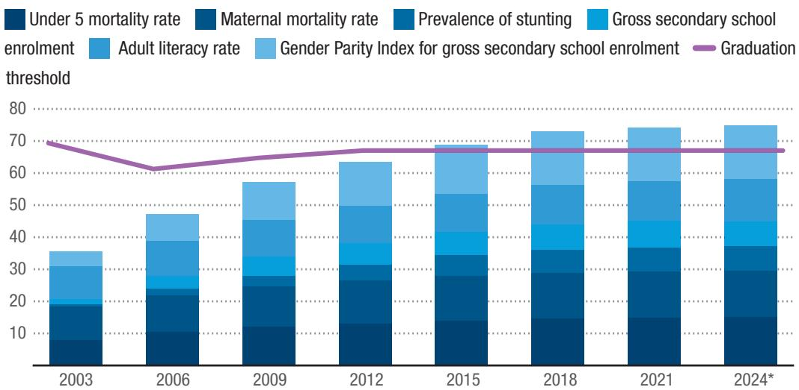  
Source: UNCTAD secretariat calculations based on data from the World Bank's World Development Indicators, available at https://databank.worldbank.org/source/world-development-indicators; the Committee for Development Policy secretariat's triennial review dataset 2000–2021, and time series estimates of the least developed country criteria. available at https://www.un.org/development/desa/dpad/least-developed-country-category/ldc-criteria.html (accessed in March 2023).

of the level and pace of progress. The capital region of Phnom Penh (Region 8) consistently outperforms other subregions. There was a process of gradual convergence between 2000 and 2021 – on average, all subregions narrowed the HDI gap with Phnom Penh by 12 per cent – but differences across subregions remain stark in some cases. For example, in 2000, the HDI score for Phnom Penh was 59.9, 38 per cent higher than the second-highest score, which was for Bat Dambang-Krong Pailin (Region 13), with a score of 43.4. In 2021, Phnom Penh's HDI improved to 72.9, 17 per cent higher than the second-highest score of 62.2 for Takaev (Region 12). The most notable convergence was achieved by Mondol Kiri-Rotanak Kiri (Region 16), which moved from an HDI score of 31 in 2000 to 52 in 2021, equivalent to a 21

percentage point convergence with Phnom Penh. Preah Vihear-Stueng Traeng-Kracheh (Region 15) had the least convergence with Phnom Penh, moving from an HDI score of 40 in 2000 to 52 in 2021. This represents only a 4 percentage point convergence with Phnom Penh (figure 23).

Dependency ratios across Cambodia's subregions show a similar uneven trend (figure 24). A low dependency ratio is desirable because it corresponds to a lower financial burden of a dependent population and is suggestive of greater availability of savings to invest in development. At the national level, Cambodia's dependency ratio – defined as the share of the population age 15 and younger and 65 and older, divided by the share of working-age individuals – declined by 22 percentage points from 76 in 2000 to 54 in 2014. $^{45}$ The capital region

Sources: UNCTAD calculations based on the Global Data Lab Area Database V4.2.1; and World Bank, World Development Indicators, available at https://databank.worldbank.org/source/world-development-indicators (accessed 12 April 2024).
Note: Index values range between 0 and 100. A low dependency ratio indicates that there is a sufficient number of people in the workforce that can support the dependent population.  

Figure 23 Cambodia's Human Development Index scores by subregion, 2000 and 2021  
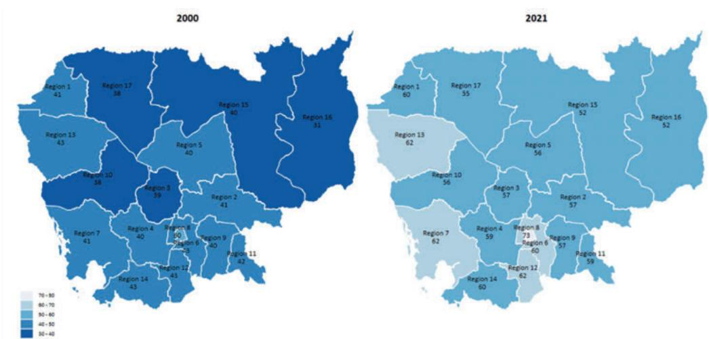  
Sources: Global Data Lab, Subnational HDI Database V7.0; and Smits and Permanyer (2019).  
Note: Index values range between 0 and 100. The better a country's human development, the higher its human development index value.

## Figure 24

## Cambodia's dependency ratios by subregion, 2020 and 2014

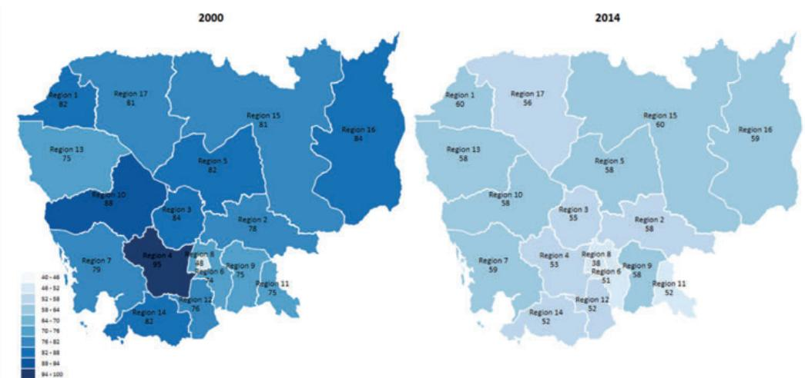

of Phnom Penh (Region 8) consistently outperformed other subregions, although there was a marked convergence between 2000 and 2014, with all subregions narrowing the gap with Phnom Penh by 20 percentage points, on average. In 2000, the dependency ratio in Phnom Penh was 47.6, 36 per cent lower than Kandal (Region 6), which had the second lowest dependency ratio of 74.2. In 2014, Phnom Penh's dependency ratio declined to 37.7, 26 per cent lower than Kandal's ratio of 51. The most notable improvement was in Kampong Spueu (Region 4), which moved from a dependency ratio of 94.8 in 2000 to 53.1 in 2014. This represents a 59 percentage point convergence with Phnom Penh. Prey Veaeng (Region 9) had only a 3 percentage point convergence with Phnom Penh, moving from a ratio of 74.2 in 2000 to 51 in 2014.

During VP consultations, a concern was raised that rural-to-urban and external migration influence subnational disparities and complicate strategies to encourage more even developmental progress across Cambodia's provinces, including efforts to locate new industries across provinces, because of the problem of a shrinking rural labour force.

## 2.2.1 Education

Education and training are the foundation for personal development and well-being. The benefits from effective education go well beyond individuals. By boosting employability, education lowers poverty and inequality, increasing individuals' resilience and freeing up more fiscal resources for other developmental investments. It also increases the capabilities of the workforce to absorb technologies and strengthens the innovation capabilities needed to support long-term developmental progress, including economic diversification. Rectangular Strategy Phase III recognized the education sector's important role in Cambodia's transition from a lower-middle-income country to a middle-income country by 2030 and a high-income country by 2050.

SEDP I specified the goal of increasing education's share to a minimum of 15 per cent of the total government budget, with 66.7 per cent earmarked for basic education (indicating an increase of public expenditure on basic education from 1.4 per cent to at least 2.5 per cent of GDP by 2000). Since SEDP I, Cambodia's expenditure on education has continued to be heavily weighted in favour of primary education (figure 25). In 2000, primary schooling received an estimated 89.9 per cent of government education expenditure (MoEYS, 2000).

Despite the educational backlog created by decades of war, which burdens the education system with overage enrolments, Cambodia has achieved significant progress on many fronts in the education sector but especially in enrolment, gender parity and primary school completion. Based on data from UNESCO, $^{46}$ the completion rate at the primary level increased from 80 per cent in 2015 to 86 per cent in 2018. However, estimates by the World Bank and UNESCO in 2019 suggested that education expenditure per child of primary education age in Cambodia was 92.5 per cent below the average for the East Asia and Pacific region and 67.7 per cent below the average for lower-middle-income countries (World Bank and UIS, 2019). Factoring in what children actually learn, the HDI shows that expected years of schooling improved from 7 years in 1990 to 11.5 years in 2021, with the mean years of schooling rising from 2.7 to 5.1 years over the same period. $^{47}$ Learning poverty in Cambodia is 55.5 percentage points higher than the average for the East Asia and Pacific region and 29.6 percentage points higher than the average for lower-middle-income countries (World Bank and UIS, 2022).

The number of adults with upper and post-secondary education doubled between 2013 and 2017 because of the implementation of the Education Strategic Plan 2014–2018. $^{48}$ However, participation in post-primary levels continues to be a challenge. Participation rates have improved slowly or stagnated in the past decade, with progress at the national level masking disparities at the urban and rural levels (figure 22; table 8).

<table><tr><td></td><td></td><td colspan="2">Pre-primary</td><td colspan="2">Primary Total</td><td colspan="2">Lower Secondary</td><td colspan="2">Upper Secondary</td><td></td></tr><tr><td>Enrolment</td><td>Number of schools</td><td>Total</td><td>Girls</td><td>Total</td><td>Girls</td><td>Total</td><td>Girls</td><td>Total</td><td>Girls</td><td>Total</td></tr><tr><td>National private</td><td>1 307</td><td>37 701</td><td>18 824</td><td>118 436</td><td>58 478</td><td>37 719</td><td>19 011</td><td>25 962</td><td>13 112</td><td>219 818</td></tr><tr><td>National public</td><td>13 82</td><td>233 132</td><td>116 096</td><td>2 023 473</td><td>970 053</td><td>618 968</td><td>325 504</td><td>334 712</td><td>183 394</td><td>3 210 285</td></tr><tr><td>Urban private</td><td>1 007</td><td>30 568</td><td>15 168</td><td>9 6297</td><td>4 7753</td><td>31 644</td><td>16 022</td><td>23 314</td><td>11 763</td><td>1818 23</td></tr><tr><td>Urban public</td><td>1 448</td><td>40 817</td><td>19 983</td><td>344 598</td><td>164 706</td><td>126 725</td><td>64 530</td><td>99 660</td><td>52 884</td><td>611 800</td></tr><tr><td>Rural private</td><td>300</td><td>7 133</td><td>3 656</td><td>22 139</td><td>10 725</td><td>6 075</td><td>2 989</td><td>2 648</td><td>1 349</td><td>37 995</td></tr><tr><td>Rural public</td><td>12 034</td><td>192 315</td><td>96 113</td><td>1 678 875</td><td>805 347</td><td>492 243</td><td>260 974</td><td>235 052</td><td>130 510</td><td>2 598 485</td></tr><tr><td>Completion rate (per cent)</td><td></td><td></td><td></td><td></td><td></td><td></td><td></td><td></td><td></td><td></td></tr><tr><td>National private</td><td></td><td></td><td></td><td>4.3</td><td></td><td>3.0</td><td></td><td>1.9</td><td></td><td></td></tr><tr><td>National public</td><td></td><td></td><td></td><td>83.0</td><td></td><td>45.1</td><td></td><td>25.3</td><td></td><td></td></tr><tr><td>Urban private</td><td></td><td></td><td></td><td>18.6</td><td></td><td>12.1</td><td></td><td>11.9</td><td></td><td></td></tr><tr><td>Urban public</td><td></td><td></td><td></td><td>75.3</td><td></td><td>47.6</td><td></td><td>34.9</td><td></td><td></td></tr><tr><td>Rural private</td><td></td><td></td><td></td><td>0.8</td><td></td><td>0.6</td><td></td><td>0.2</td><td></td><td></td></tr><tr><td>Rural public</td><td></td><td></td><td></td><td>84.9</td><td></td><td>44.4</td><td></td><td>22.5</td><td></td><td></td></tr></table>

Cambodia: Enrolment and completion by level of education, 2020–2021

A child's expected years of schooling (the number of years a child of school entrance age is expected to spend at school) is 7.5 years. While the dropout rate for lower secondary school declined significantly from 21.2 per cent in the 2013/2014 school year to 15.4 per cent in the 2017/2018 school year, transition rates from primary to lower secondary school were still low,

dropout rates at lower and higher secondary remained high, and educational quality was problematic (MoEYS, 2019). $^{49}$ Progress in secondary school attendance is also faster among children from more educated and richer households, leaving those who are already struggling to catch up yet further behind (United Nations, 2021).

## Figure 25

Cambodia: Decomposition of government expenditures on education, 2016–2021  
(Per cent of gross domestic product)  
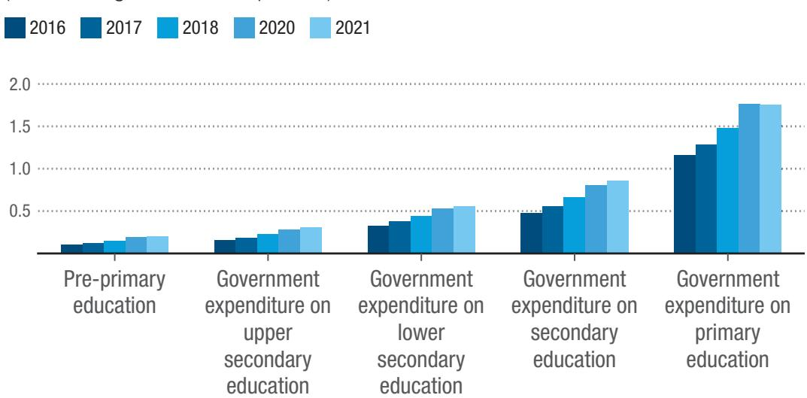  
Source: UIS.Stat (accessed in September 2023).

Investment in secondary education provides a clear boost to economic development, much more than can be achieved by universal primary education alone (Grant, 2017). Accordingly, the Sustainable Development Goals (SDGs) incorporate more awareness of the importance of secondary education than did the Millennium Development Goals (MDGs). Cambodia's achievements, particularly in terms of lower secondary completion rates, continue to significantly lag ASEAN comparator countries (figure 26). Achievements also vary across genders, with educational outcomes tending to be better for girls. Cambodia has achieved gender parity in education, which by 2021 tilted in favour of girls (figure 27). In recent years, outcomes for boys have deteriorated. Lower secondary education reveals a degree of gender inequality for boys, who seem to be disadvantaged in relation to student access and achievement. In the 2018/2019 school year, the average national dropout rate in grades 7–9 was over 15 per cent. On average, the dropout rate for boys was 17.5 per cent, nearly 3 percentage points higher than for girls. The ratio of female-to-male mean years of

Figure 26
Cambodia has lower secondary completion rates than comparator countries, 2000–2021 education received improved from 51.1 in 2000 to 72.4 in 2019 (ESWG, 2021; Sachs et al., 2022; MoEYS, 2021c; RGC, 2019b; Hamilton and Jhaj, 2020; MoEYS, 2018).

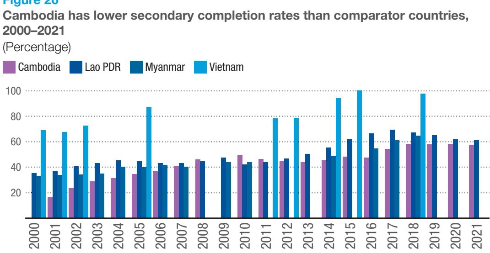

Source: The Sustainable Development Report dashboard, available at https://dashboards.sdgindex.org/ (accessed in September 2023).

## Figure 27

Cambodia: Gender Parity Index scores for education, 2000, 2020 and 2021

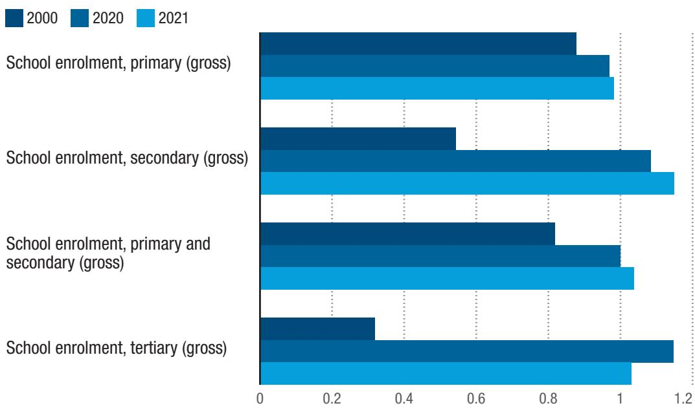  
Source: World Bank, World Development Indicators, available at https://databank.worldbank.org/source/world-development-indicators (accessed September 2023).

The Education Strategic Plan 2014–2018 has an enhanced focus on improving the quality of educational outcomes, with an emphasis on completion rates,

teacher qualifications, school inspections, decreasing dropout rates, upgrading school infrastructure (including availability of ICT facilities), and strengthening

technical education. $^{50}$ In December 2017, Cambodia participated in the Programme for International Student Assessment for Development (PISA-D), $^{51}$ the lessons from which highlighted key weaknesses that future sector strategies need to address (box 1). The statistics on enrolment and completion in 2020–2021 suggest that addressing low enrolment and completion rates, as well as poor education outcomes at the lower secondary level (both public and private), requires continuous and strengthened efforts by the government to improve the efficiency and quality of

the national education system (table 8). Up to the upper secondary level, public education still caters to most learners in Cambodia. However, most tertiary institutions are private. Quality assurance of private education is not yet standardized by the Ministry of Education, Youth and Sport (MoEYS). The rapid increase in private tertiary enrolment since 2005, against a backdrop of shortages of qualified teachers and insufficient state supervision, raised concerns about the quality of university education and its relevance to meeting labour market needs (CES, 2022).

## Box 1

## Key findings from Cambodia's participation in the Programme for International Student Assessment for Development (PISA-D)

Key findings from the PISA-D conducted in Cambodia in 2017 showed that:

\- 28 per cent of all 15-year-olds had attained at least grade 7 by age 15 in 2017, compared to Thailand (73 per cent) and Viet Nam (86 per cent). The remaining 72 per cent were either in lower grades or out of school.

• Over 20 per cent of 15-year-old students in grades 11 and 12 were one or two years ahead of track. $^{1}$

\- 29.1 per cent of students reported having repeated a grade at least once in primary, lower secondary or upper secondary school, compared to an average of 13 per cent in Association of Southeast Asian Nations countries.

\- Boys were more than 1.4 times more likely than girls to have repeated a grade.

\- 8 per cent of students achieved the minimum level of proficiency in reading and 10 per cent achieved the minimum level of proficiency in mathematics

Within the PISA-D sample:

\- In reading, girls outperformed boys by 17 points and students at urban schools outperformed students at rural schools by 42 points, the equivalent of more than a year of schooling.

\- On average, the top 10 per cent best-performing students in Cambodia were comparable to the top 10 per cent best-performing students in PISA-D mathematics. $^{2}$

Some of the developmental and strategic policy implementation gains in the education sector have likely been lost due the COVID-19 pandemic, with persistently high repetition rates anticipated to increase and linger into the near future and retention rates expected to worsen as one consequence of school closures and losses of income. Cambodia's current cohort of students stands to lose 1.5 learning-adjusted years of schooling. Between 2020 and 2021, cumulative school closures totalled 13 months. Before the pandemic, 91 per cent of Cambodian households with school-age children (ages 6–17) participated in education. This proportion fell to 62 per cent when schools closed for the first time in May 2020. Net enrolments at the primary level dropped substantially between the 2019/2020 and 2020/2021 school years across many provinces. Although remote alternatives were launched, unequal access to and effectiveness of remote learning likely will increase the gap in learning outcomes between the rich and poor. One report suggests that one impact of the reduction of household income on children enrolled in secondary grade levels was that up to 20 per cent were pushed into full- or part-time work (ESWG, 2021; Karamba et al., 2022). However, as noted by The Sustainable Development Report 2022, while moderate improvements have been achieved, significant challenges remain, making it unlikely that the country will achieve SDG 4 on quality education (Sachs et al., 2022). Female-to-male mean years of education received has more or less stagnated since 2014 or is increasing at less than 50 per cent of the rate required to meet the SDG target by 2030.

## 2.3.2 Health

The main driver of Cambodia's striking improvement in health has been dramatic rises in life expectancy, especially in remote and highly challenged areas (UNDP, 2019). Between 1990 and 2021, Cambodia's life expectancy at birth improved by 14.1 years. Cambodia has also sustained steady improvements in mortality for children under 5 years old (figure 22). Government per capita expenditure on health care based on purchasing power parity increased more than fourfold from around \$70 in 2000 to \$332 in 2020, equivalent to 7.5 per cent of GDP – by far exceeding the LDC average (\$130) for the same period (figure 28). This has contributed to overall improved health outcomes. The number of public health personnel also increased, though growth peaked in 2017 (figure 29). However, the number of medical doctors stagnated in earlier decades and, despite an uptick in 2016, has increased only marginally in recent years, with much of the increase in health personnel driven by increases in nursing staff, including midwives. This may to a significant extent explain the improved performance on under age 5 and maternal mortality indicators. Data on the number of medical physicians (i.e. general practitioners and specialist doctors) by country are scarce. Data from Cambodia's most recent Demographic and Health Survey indicate that there were 0.2 physicians per 1,000 population in 2014, compared to 0.8 and 0.5 (0.4 in 2020) per 1,000 population in Viet Nam and Lao People's Democratic Republic, respectively.

## Figure 28

Cambodia: Public expenditure on health care, 2000–2020

Cambodia: Current health expenditure per capita, PPP (current international US dollars)
LDCs: Current health expenditure per capita, PPP (current international US dollars)
Cambodia: Current health expenditure (per cent of GDP), right axis

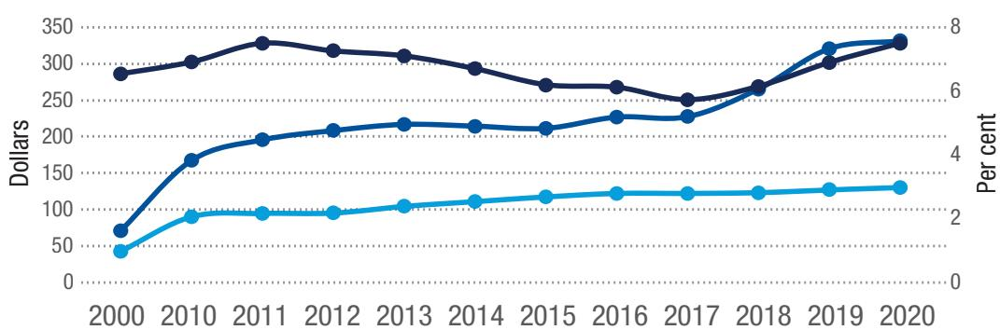

Source: World Bank, World Development Indicators, available at https://databank.worldbank.org/source/world-development-indicators (accessed in September 2023).

Note: LDCs: least developed countries; PPP: purchasing power parity.

## Figure 29

Cambodia: Number of public health personnel, 2010–2018

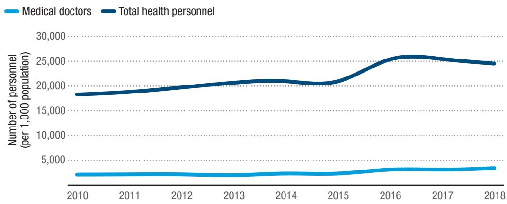

## Source: NIS (2021).

The prevalence of stunting, a persistent and longstanding health challenge in Cambodia, also improved from 2015 to 2018, although the improvement has not yet reached the objective set by the CMDGs (RGC, 2018). Cambodia has successfully reduced stunting rates and improved its maternal and child nutrition and health indicators through effective health and nutrition policies and rapid economic growth. However, a United Nations (2021) report showed that the urban-rural gap has been widening for stunting even as other markers show decreasing trends. Data from Cambodia's 2021–2022 Demographic and Health

Survey show that while childhood stunting decreased from 50 to 22 per cent between 2000 and 2021, childhood wasting has remained unchanged at 10 per cent since 2005: 22 per cent of children under age 5 are stunted, 10 per cent are wasted, and 16 per cent are underweight (NIS et al., 2022). Stunting in Cambodia has previously been estimated to have a significant cost of 1.7 per cent of the country's GDP (SPRI, 2018).

Cambodia was among the first countries to receive the COVID-19 vaccine under the COVAX facility, getting a sizable donation of vaccines from China, with the first vaccinations rolled out domestically in

February 2021. $^{52}$ By the end of October 2022, about 88 per cent of the population had received two doses of the COVID-19 vaccine and 61.4 per cent had received booster doses. The success of the Cambodian vaccination campaign was due to political leadership that paved the way to widespread acceptance of vaccination safety, readily available and free vaccines for all residents, and access through mobile medical teams for rural residents, complemented by communication campaigns run by village health support groups and local health centres (The Asia Foundation, 2022). However, although Cambodia has had one of the lowest numbers of deaths from the pandemic in Asia, its national health system was initially overwhelmed, with the country forced to turn hotels into hospitals to address overflows due to the lack of hospital beds. In 2016, the availability of hospital beds per 1,000 people in Cambodia was 0.9.

According to the WHO Coronavirus (COVID-19) Dashboard, $^{53}$ as of 20 January 2023, 45,612,652 vaccine doses had been administered and as of 6 February 2023, Cambodia had recorded 138,698 confirmed COVID-19 cases and 3,056 deaths.

With data on health expenditures only available up to 2019, the actual impact of COVID-19 on government health expenditure remains uncertain. In response to spreading infections and deaths

from the pandemic, the government locked down the capital Phnom Penh and forbade travel across the country's provinces, large-scale gatherings, and all social events from February to November 2021. According to surveys in August 2020 and March 2021, access to health services and medicine did not show signs of disruption, although fear of COVID-19 infection increasingly affected the use of health services (UNICEF and WFP, 2021).

An estimated 30 per cent of the Cambodian population is covered by social health insurance schemes. The main providers – the Health Equity Fund, which targets the bottom quintile, $^{54}$ and the National Social Security Fund $^{55}$ – account for just a small fraction of total health expenditure, while out-of-pocket household spending accounts for the lion's share at over 60 per cent. This exposes households to the risk of catastrophic spending for medical emergencies, a major cause of impoverishment. $^{56}$

## 2.2.3 Poverty and inequality

The government continues to implement various policies and guidelines to tackle poverty, including the Cambodia-adapted MDGs and SDGs as well as successive poverty reduction strategies (table 3). Cambodia halved its Multidimensional Poverty Index score in the 7.5 years from 2014–2021/2022 (UNDP and OPHI, 2022).

Notable initiatives on poverty include the cash transfer programme for poor pregnant women and children, implemented since 2016 through the poverty identification and registration system (known as the “ID Poor” system), and the scholarship programme for disadvantaged children in primary and secondary schools. According to consultations with MoEYS, the government currently provides 20,000 high school scholarships (out of 300,000 identified needy students) and 80,000 lower secondary scholarships, and supports 20 per cent of university students.

Rapid and sustained economic growth has also contributed to lifting a large proportion of the population out of poverty. Estimated at 60 per cent in 2004 (RGC, 2018), the proportion of Cambodians living below the poverty line declined from 33.8 per cent in 2009 to 17.8 per cent in 2019/2020 under the Ministry of Planning's revised poverty line (table 9). $^{57}$ The depth of poverty (or poverty gap) and severity of poverty (which gives an indication of inequality among those living in poverty) correspondingly declined from 8.2 to 3.5 per cent and 2.8 to 1.1 per cent, respectively (Karamba et al., 2022).

## Table 9

Cambodia: Poverty headcount ratio, 2003–2019

<table><tr><td>Year</td><td>World Bank</td><td>Old poverty line</td><td>Revised poverty line</td></tr><tr><td>2003</td><td>50.2</td><td>-</td><td>-</td></tr><tr><td>2004</td><td>-</td><td>60.0</td><td>-</td></tr><tr><td>2006</td><td>45.0</td><td>-</td><td>-</td></tr><tr><td>2007</td><td>-</td><td>47.8</td><td>-</td></tr><tr><td>2008</td><td>34.0</td><td>29.9</td><td>-</td></tr><tr><td>2009</td><td>23.9</td><td>22.9</td><td>33.8</td></tr><tr><td>2010</td><td>22.1</td><td>24.4</td><td>-</td></tr><tr><td>2011</td><td>20.5</td><td>19.8</td><td>-</td></tr><tr><td>2012</td><td>17.7</td><td>18.9</td><td>-</td></tr><tr><td>2014</td><td>-</td><td>13.5</td><td>26.3</td></tr><tr><td>2019</td><td>-</td><td>-</td><td>17.8</td></tr></table>

Sources: World Bank, World Development Indicators; and MoP (2013, 2021).  
Note: The revised poverty line was developed in 2021 to reflect the changes in prices of past years. The data in the column labelled World Bank are from the World Development Indicators database. The source of data under the old poverty line is MoP (2013) and under the revised poverty line is MoP (2021). Data are not available for years marked (-).

Over the 2009–2019/2020 period, $^{58}$ poverty rates declined by 1.6 percentage points a year, driven by rising non-farm labour earnings (Karamba et al., 2022). The pace of poverty reduction was most rapid in Cambodia’s rural areas and coastal region, but urban and rural disparities remain, with the poverty headcount lowest in Phnom Penh and other urban areas (figure 30).

The COVID-19 pandemic resulted in widespread job suspensions and losses

as well as substantial reductions of income for workers and their families. A significant proportion of households, especially in rural areas, rely to some extent on the remittances sent by family members to meet basic needs. It is estimated that in August 2020, two thirds of returning migrant worker households suffered a severe drop in income, and more than half were in debt (UNICEF and WFP, 2019, 2021; ASEAN Secretariat, 2022).

The scale-up of social assistance to the poor through the COVID-19 cash transfer programme launched in June 2020 moderated income losses. $^{59}$ As a result, the increase in the poverty rate in 2020 is projected to have been limited to 2.8 percentage points. Overall, the contribution of the monthly cash transfers to reducing the poverty rate is estimated at 2.7 per cent and 3.4 per cent in 2020 and 2021, respectively. It is estimated that by December 2021, the programme had reached 700,000 households and disbursed a total of \$3 million by September of that year (Ly and Rastogi, 2022; Karamba et al., 2022; Chhoeung et al., 2022; UNDP, 2022).

Figure 30
Poverty rate nationwide and by region in Cambodia, 2009 and 2019/2020 (Percentage)  
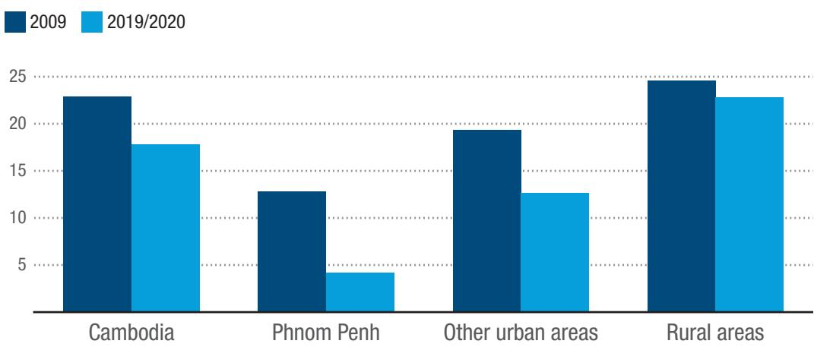  
Source: MoP (2021, 2013).

The socioeconomic dislocation of Cambodian migrant workers eligible for ID Poor benefits was somewhat mitigated by the cash transfer programme. In addition, the government provided other support, including livelihood and skills training programmes through technical and vocational education and training (TVET) institutions and job opportunity information disseminated via the National Employment Agency for migrant returnees (ASEAN Secretariat, 2022).

In addition to helping vulnerable households, the government also provided suspension allowances to factory workers in the garment, footwear, and travel goods sector. Nearly half (49 per cent) of workers surveyed in July 2020 earned no income apart from the suspension allowance of \$40 to \$70 per month, while 6 per cent of workers earned nothing at all.

Cambodia's achievements in reducing poverty are complemented by decreases in inequality. The country's Gini Index coefficient in 2002 was 36.9. Available data suggest there might have been an accelerated decline over 2014–2019 to 32.3 in 2019 (figure 31). However, the difference in disposable income per capita between the top and bottom quintiles widened from 9.9 times in 2017 to 16.2 times in 2020. $^{60}$ The Gini Index coefficient was initially projected to rise by 0.4 percentage points in 2020 due to the impact of the pandemic, but the introduction of the cash transfers is estimated to have checked the rise to 0.2 percentage points. The per capita consumption of households receiving cash transfers declined by 25 per cent (Karamba et al., 2022).

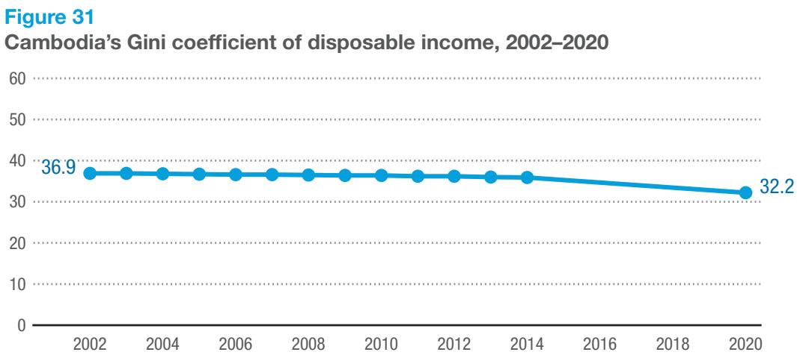  
Source: Committee for Development Policy Secretariat, Supplementary Graduation Indicators Dataset 2002–2022, available at https://www.un.org/development/desa/dpad/wp-content/uploads/sites/45/SGI-dataset.xlsx (accessed in September 2023). Data for 2020 are from MoP (2021).

In January 2023 the government signalled improvements to social protection as part of the strategic goals for 2023–2028. Strengthening the social protection system is in line with the desire to revitalize the agriculture sector, where workers are largely engaged in informal work and thus excluded from the country's formal sector social protection scheme.

On the inflation front, Cambodia's Food Price Index decreased by 0.2 per cent month-over-month but was still 3.8 per cent higher year-over-year in December 2022. Fuel prices also decreased substantially in December 2022 (WFP, 2022). However, considerable uncertainty around price stability and predictability lingered in 2023.

## 2.2.4 Employment

According to the Cambodian government, SMEs represent 70 per cent of employment, account for around 98 per cent of all businesses and 73 per cent of total jobs, and contribute 58 per cent to GDP. $^{61}$ It is estimated that during the pandemic, SMEs reduced their numbers of employees by

around 30 per cent and reduced employees' working hours and salaries by 25 to 28 per cent. $^{62}$ According to the Cambodia Women Entrepreneurs Association, 65 per cent of all SMEs in the country are owned by women. $^{63}$

Thy (2021) found that SMEs account for 10 per cent of Cambodia's exports and that their challenges include access to finance, technical skills and knowledge, insufficient facilitation and support, competition in national and global markets, and informality. The Ministry of Industry, Science, Technology and Innovation, in collaboration with the private sector and development partners, is reviewing the challenges of SMEs, particularly to study the opportunities for SME clusters. The digitization of business registration is the first stage in the development of Cambodia's One-Roof-Service digital platform. Prior to the launching of the initiative in June 2020, it was estimated that only 3.5 per cent of Cambodian enterprises were registered with the Ministry of Commerce. Cambodia's Industrial Development Policy 2015–2025 targets registering 80 to 90 per cent of all

SMEs and having 50 to 70 per cent of them meeting minimum accounting standards by 2025 (DESA, 2020; ESCAP, 2022).

The Cambodian economy has sustained consistently high levels of labour force participation, averaging above 70 per cent since 2000 (figure 32). $^{64}$ The minimum allowable age for regular employment in

the country is 15. With an export-driven economy dominated by feminized sectors (i.e. garments and tourism), the country has also achieved among the highest rates of female labour participation globally, across ASEAN countries, and across the LDCs as a group (figures 33 and 34).

## Figure 32

## Cambodia's labour force participation rates, ages 15-64, 2000–2021 (Percentage)

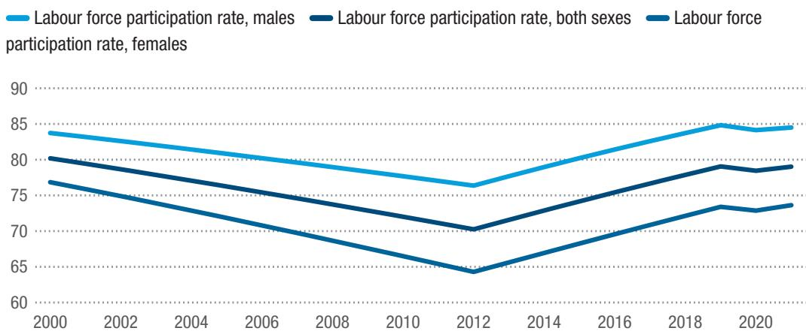  
Source: World Bank, World Development Indicators available at https://databank.worldbank.org/source/world-development-indicators (accessed September 2023).  
Note: Data are based on the International Labour Organization's modelled estimates series, which provides a complete set of internationally comparable labour statistics, including both nationally reported observations and imputed data for countries with missing data.

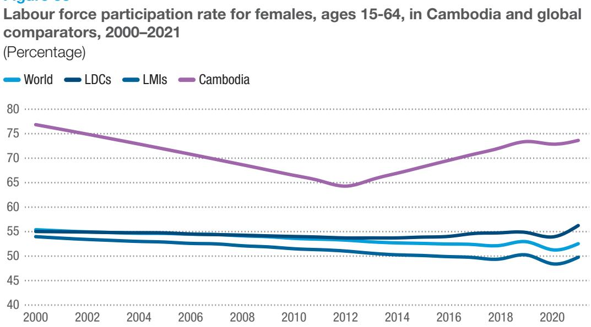  
Source: World Bank, World Development Indicators, available at https://databank.worldbank.org/source/world-development-indicators (accessed in September 2023).  
Note: Data is based on the International Labour Organization's modelled estimates series, which provides a complete set of internationally comparable labour statistics, including both nationally reported observations and imputed data for countries with missing data. LDCs: least developed countries; LMIs: low-middle-income countries.

  
Figure 34
Labour force participation rates for females ages 15-64 in ASEAN countries, 2000–2021

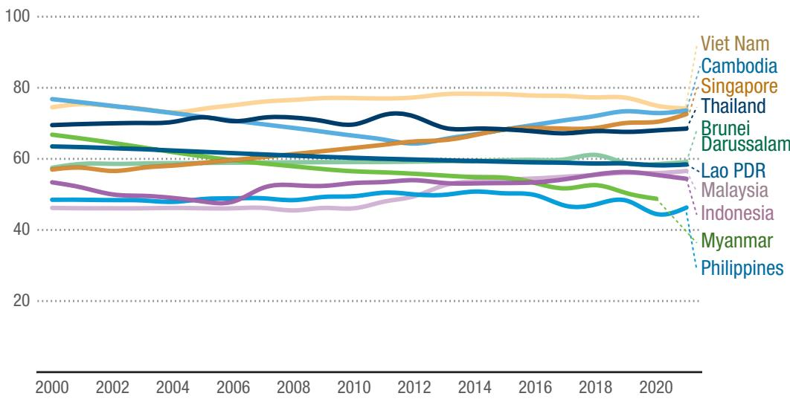  
Source: World Bank, World Development Indicators, available at https://databank.worldbank.org/source/world-development-indicators (accessed in September 2023).  
Note: Data are based on the International Labour Organization's modelled estimates series, which provides a complete set of internationally comparable labour statistics, including both nationally reported observations and imputed data for countries with missing data. ASEAN: Association of Southeast Asian Nations.

Data on labour market conditions in Cambodia are available through labour force surveys conducted for the period prior to the COVID-19 pandemic. Labour force surveys provide structural information on the number and characteristics of the

employed, their jobs, and their working conditions. The comparability of labour force surveys is influenced by differences in the sampling strategy used, representativeness, and unusual trends in certain outcomes over time. Accordingly, the surveys should

be understood to generally provide a snapshot of the labour market at a given point in time or over a given period.

According to the Cambodia Labour Force Survey 2019, the informal sector represents an important segment of the economy, accounting for 88.3 per cent of all employment (about 7.9 million jobs) in that year (NIS, 2020b). This suggests that the Cambodian economy is constrained in generating adequate formal jobs. The preponderance of informal employment is high in both urban and rural areas for both 2012 and 2019, the survey years shown in figure 35. In 2019, informal employment in rural areas was 1.7 percentage points higher than the national average.

## Figure 35

Cambodia: Type of employment in urban versus rural areas, 2012 and 2019 (Percentage)

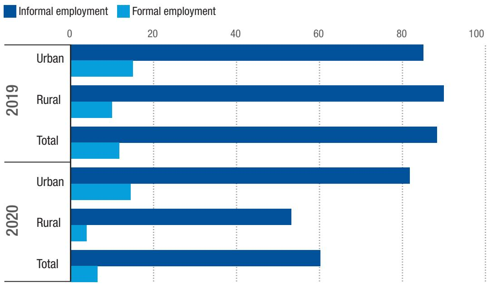  
Sources: For 2012, IPEC (2013, table 7.2); and author's calculations. For 2019, NIS (2019, figure 6.2).

The 2012 labour survey showed that informal employment was highest in craft and related trades (98.3 per cent), followed by machine operations (95.7 per cent) and services and sales (94.4 per cent). In 2012, females were also most likely to be informally employed in all occupations, except in professional and elementary occupations and in the armed forces. Across the various industry groups, the percentage of informally employed persons in total employment was very high in all sectors except health and social work, public administration and education.

According to the Cambodia General Population Census 2019 (NIS, 2020c), the occupational profile of the Cambodian population in that year was dominated

by work related to agricultural, forestry and fishing activities (figure 36). In terms of informal employment, the 2019 labour survey reported it to be highest among workers in that same sector (98.6 per cent) and in construction (97.2 per cent), followed by elementary occupations (94.8 per cent), service and sales workers (92.6 per cent), and machine operators (92.1 per cent). The number of workers paid monthly was 14.4 per cent in 2012 and 6.4 per cent in 2019. A higher number of monthly paid workers is indicative of an increased likelihood that workers receive more in the way of employee benefits.

## Figure 36

Cambodia's workforce by occupational group, 2019 (Percentage)

Managers (1%)
Professionals (4%)
Technicians and associated professions (1%)
Clerical support workers (3%)
Services and sales workers (13%)
Plant and machine operators and assemblers (2%)
Craft and related workers (17%)
Elementary occupations (6%)
Agricultural, forestry and fishing (53%)

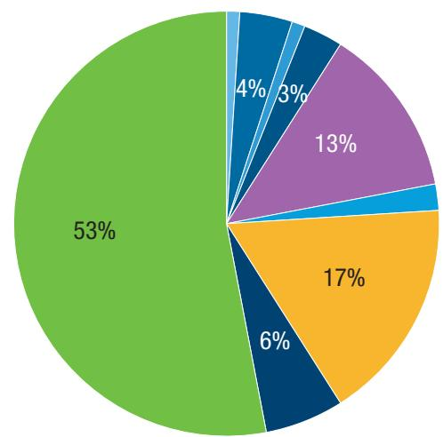

Source: Cambodia General Population Census 2019.

The data from the labour surveys reveal no dramatic trends in terms of the educational profile of Cambodia's labour force between 2012 and 2019 (figure 37). The 2012

survey does not report disaggregated data for secondary school completion, but in 2019, 15.7 per cent of those reporting had completed upper secondary education.

## Figure 37

Cambodia: Employed population by educational attainment, 2012 and 2019 (Percentage)

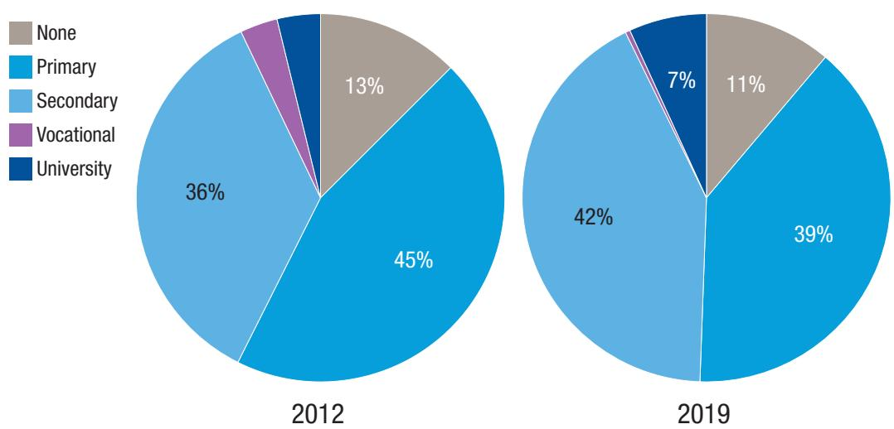  
Source: Cambodia Labour Force Survey, 2012 and 2019.

Cambodia is marked by significant internal population movement. A growing young population, gains from widened access to education, and expansion of productive activities in services and manufacturing have resulted in a rising swell of rural-to-urban migration. In 2013, internal migration was rural-urban (24.5 per cent), urban-

urban (12 per cent) and rural-rural (58.6 per cent). In 2019, that same breakdown was 34 per cent, 30 per cent and 29 per cent, respectively. Phnom Penh is the preferred destination for internal migrants, as they are more likely to improve their financial situation there than when migrating elsewhere. External migration flows,

primarily to seek better job opportunities and higher wages, are also significant, with long-term and seasonal migration to Thailand the highest (UNESCO et al., 2017; NIS, 2020c; WFP, 2019). As of mid-2020, an estimated 1.1 million Cambodians lived abroad, up from 355,000 in 1990. $^{65}$ As a result of job losses and restrictions associated with COVID-19, by December 2021, 260,000 migrants were estimated to have returned (mainly from Thailand), but many reported that they would be returning to their jobs when restrictions were lifted (ASEAN Secretariat, 2022). According to information shared by the Ministry of Labour during the VP consultations, there are some 300,000 new entrants into Cambodia's labour market per year, which is part of the reason the government implements a formal policy to promote migration to alleviate unemployment pressures. The government is also implementing the National TVET Policy 2017–2025, which includes objectives to:

\- Improve the quality of labour market entrants to align with market demand

\- Increase the TVET target to 100,000 within next three years, including by absorbing school system dropouts

\- Expand enrolment in TVET

• Strengthen private partnerships in TVET, which are currently small in number

The government has accordingly increased investment in TVET institutions. There are currently 37 public TVET institutions that produce 60,000 graduates per year for which the national employment agency provides job and internship matching services. The TVET institutions also provide upskilling/reskilling of the incumbent labour force. However, the public generally has a negative perception of TVET certification, which is perceived as inferior to university education and thus a subordinate alternative to immediate employment.

In 2020, a joint modelling exercise between the Asian Development Bank and the Ministry of Economy and Finance forecast job losses resulting from the COVID-19 pandemic at between 390,000 and 570,000. The Cambodia Women Entrepreneurs Association estimates that 17 per cent of women-owned businesses closed during the pandemic.

## 2.3.5 Environmental sustainability

According to information collected during the VP inception mission consultations, Cambodia's key priorities on climate change include reversing deteriorating biodiversity, promoting a circular economy, enhancing chemical waste management, and promoting urban waste reduction and recycling. A green public procurement roadmap is in place, and a roadmap and circular economy engagement with the private sector have been launched. Cambodia has also promulgated an environmental code, although the capacity to monitor all aspects of the code is limited. A gender working group to integrate gender into environmental policy has also been established. In addition, Cambodia is targeting the development of smart cities (putting conditions on urban licenses for land use) through urban master plans that address issues of energy efficiency (including reducing heat islands), population growth, recycling, and local and international investment. Provincial, district, city and commune master plans are also under development, and 13 priority actions have been submitted through the country's Nationally Determined Contribution (NDC) (funding yet to be secured) under the Paris Agreement. A total of 10 per cent of the national budget (increased from 5 per cent) is earmarked as climate financing. As a further example of climate action, the Ministry of Public Works and Transport reported during VP consultations that steps to upgrade the quality of the national road network included climate proofing, with the use of “cold” rubber

Cambodia's economic losses from disasters, 2000–2020 in place of traditional (noxious) “hot” rubber (i.e. bitumen) already piloted.

Yale University's 2022 Environmental Performance Index ranks Cambodia $154^{\text{th}}$ (6 $^{\text{th}}$ in ASEAN, 7 $^{\text{th}}$ in Southeast Asia, and 32 $^{\text{nd}}$ among LDCs) out of 180 countries – representing a jump of five spots globally in the ranking the past 10 years. $^{66}$ Globally, Cambodia lags in the areas of acid rain (175 $^{\text{th}}$ ), ecosystem services (168 $^{\text{th}}$ ) and water resources (141 $^{st}$ ), but ranks relatively high (45 $^{th}$ ) on biodiversity and habitat. At the regional level, Cambodia outperforms peers in agriculture (ranking 45 $^{th}$ globally and 2 $^{nd}$ in the Asia Pacific region). At the level of LDC peers, Cambodia ranks relatively high (7 $^{th}$ ) only on environmental health, ranking 34 $^{th}$ and 24 $^{th}$ on climate change and ecosystem vitality, respectively (Wolf et al., 2022).

## Figure 38

Damage from disaster (Thousands of US dollars) ● Per cent of GDP (constant 2015 US dollars)  
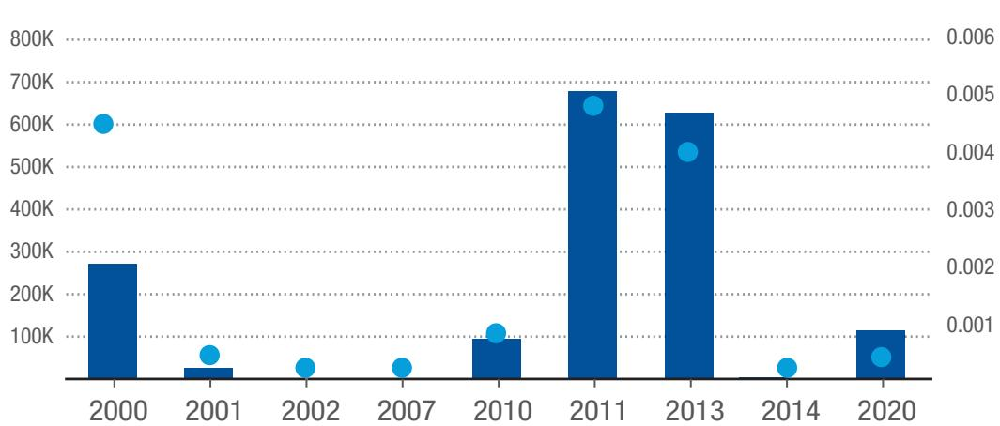  
Sources: Emergency Events Database/Centre for Research on the Epidemiology of Disasters, available at https://www.emdat.be/ (accessed in September 2023); and World Bank, World Development Indicators, available at https://databank.worldbank.org/source/world-development-indicators (accessed in September 2023).

Cambodia's economic losses from disasters have mainly been a result of riverine flooding, and more recently in 2020 from a tropical cyclone (figure 38). The country has in the past also suffered damage from drought (2002). In addition to floods and drought, Cambodia is also known to be susceptible to outbreaks of dengue. The most frequent natural disasters are floods, which are a way of life in the Mekong Delta, followed by epidemics and storms (figure 39). $^{67}$ The number of people affected by natural disasters is highest in times of flooding but has continued to decline over the decades, although storms have increased in frequency since 2016 (figure 40). Natural hazards can be expected to increase in the context of climate change, which will likely increase air temperatures as well as the frequency and intensity of extreme weather events such as droughts and floods. It is also expected to cause alterations in rainfall patterns and the flow of the Mekong River and its tributaries, including associated detrimental effects on human health.

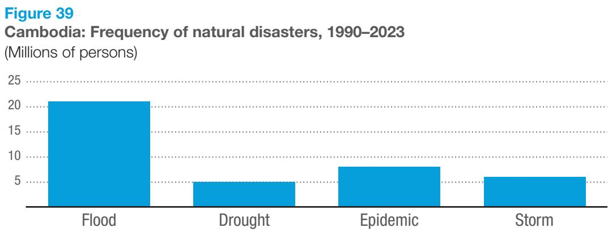  
Source: Emergency Events Database/Centre for Research on the Epidemiology of Disasters, available at https://www.emdat.be/ (accessed in September 2023).

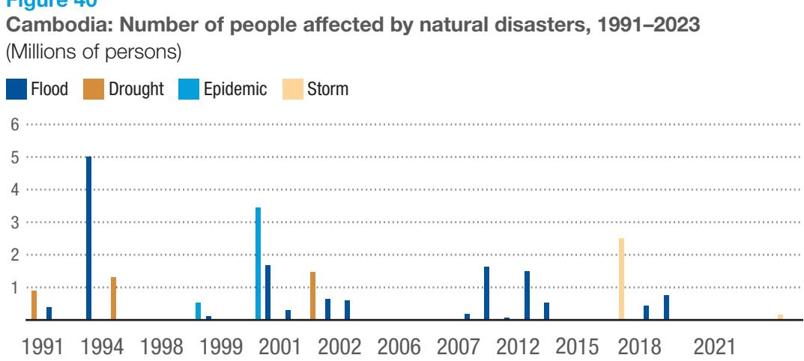  
Source: Emergency Events Database/Centre for Research on the Epidemiology of Disasters, available at https://www.emdat.be/ (accessed in September 2023).

The Notre Dame Global Adaptation Index ranks Cambodia's climate adaptation performance as low. Cambodia's score has shown uneven improvement from 37 in 1995 to 38.7 in 2020. $^{68}$ The country was ranked $149^{\text{th}}$ out of 182 countries in 2020, though its ranking was higher than half of its LDC peers. In contrast, Thailand and Viet Nam were ranked $68^{\text{th}}$ and $97^{\text{th}}$ , with scores of 52.4 and 47.1, respectively. In terms of economic readiness, Thailand and Viet Nam scored 43 per cent and 37 per cent, respectively, compared to Cambodia at 23 per cent. However, Cambodia's scores for governance and social readiness were higher than for both Thailand and Viet Nam. This is in part due to the country's National Climate Change

Committee, which was established in 2006 with a mandate to prepare, coordinate and monitor implementation of the government's policies, strategies, legal instruments, plans and programmes. Through international fora, Cambodia has committed to sustainable use of natural resources, green growth principles, and taking action to improve the country's resilience to climate change. The government developed the Cambodia Climate Change Strategic Plan 2014–2023 in 2013 and its NDC in 2015, which was updated in 2020 (table 3). Relevant ministries have developed action plans associated with the strategic plan and Cambodia has advanced on mainstreaming climate change into planning and budgetary processes, including tracking climate

financing. As part of its efforts to scale up adaptation, Cambodia also undertook a year-long awareness-raising campaign with farmers and authorities in target districts. This focus on “scaling deep” to promote greater awareness and attention to values was carried out alongside other projects to strengthen policy and science in vulnerable regions and build adaptive capacity with various climate-resilient agricultural practices (UNCTAD, 2021b). The importance of awareness-raising is evidenced by the fact that energy management is not yet a standard practice among Cambodia’s industries. Energy assessments suggest that the industrial sector consumes about 22 per cent of total electricity in Cambodia, but waste is widespread despite the elevated costs of electricity (UNDP, 2020).

The most recent estimates available on Cambodia's emissions are for 2016. The forest and land-use sector accounts for the bulk of greenhouse gas emissions and receives the greatest attention in Cambodia's NDC (figure 41). Accordingly, the main mitigation instrument developed is the National REDD+ Strategy 2017–2026. $^{69}$ The estimated emissions reduction by 2030 under the updated NDC will be

approximately 64.6 million tCO2e/year (a 41.7 per cent reduction, of which 59.1 per cent is from the forest and land-use sector). Based on the approved climate change action plans prepared by 14 ministries and agencies for the period 2014–2018, Cambodia estimates that the support needed from the international community amounts to some 692 billion KHR, with 93 per cent of that allocated to adaptation and cross-cutting activities (MoE, 2020a). Cambodia's modelled climate impact analysis suggests the country could achieve carbon neutrality in 2050, with the forest and land-use sector providing a total carbon sink of 50 megatons of carbon dioxide equivalent (MtCO $_{2}$ e). The energy sector is expected to be the highest emitter in 2050 at 28 MtCO2e, followed by the agriculture sector at 19 MtCO $_{2}$ e. The waste and industrial processes and product use sectors are projected to emit 1.6 and 1.2 MtCO $_{2}$ e, respectively. After 2030, the energy sector is expected to be the main source of emissions reductions as a result of more stringent energy efficiency standards and continued fuel switching to low-carbon sources (RGC, 2021b).

## Figure 41

Cambodia: Distribution of greenhouse emissions by sector and gases, 2016 (Percentage)

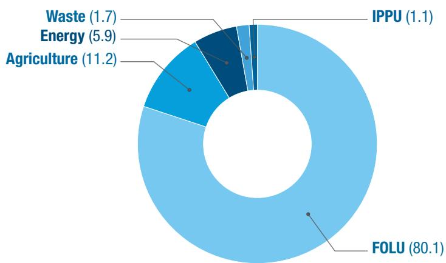

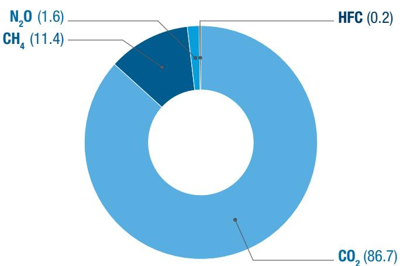

Source: MoE (2020a).

Note: FOLU: forest and land use; IPPU: industrial processes and product use.

Cambodia's land-based ecosystems and natural capital are under pressure from continuing rapid economic development, including agricultural activities. Cambodia's agriculture, fisheries, and forestry sector has experienced positive trends in altering production towards more profitable crops, but this success has come at the price of the degradation of land quality. For example, Cambodia's total fertilizer use increased from 38,693 tons in 2005 to 134,053 in 2018. Fertilizer use per hectare of cropland increased from 10 kg in 2005 to 33 kg in 2018. Cambodia increased imports of fertilizers from about 850,000 tons in 2016 to 1,149,615 tons in 2019. Similarly, since 2015, pesticide use has increased, especially in dry-season rice cultivation and the vegetable sector. More than 3.2 million litres of 100 types of pesticides are used each year. Informal pesticides trade is prevalent, with up to 90 per cent of imports allegedly either poorly regulated or unregulated, implying elevated potential for misuse and overuse (ADB, 2021). However, Cambodia is among the LDCs that have begun employing aquaponics as an adaptation measure in agriculture (UNCTAD, 2022a).

Cambodia has about 4.45 million hectares of land classified as highly erodible, and about 60 per cent of its population resides in these hotspot areas (MAFF,

2018; ADB, 2021). The drivers of land degradation have been attributed mainly to deforestation, $^{70}$ expansion of agricultural lands, climate change, pests and diseases, unsustainable land management, and infrastructure development. Cambodia's forest cover fell from 10.83 million hectares (59.64 per cent) in 2006 to 8.22 million hectares (45.26 per cent) in 2016. Over the same period, croplands increased by about 2.69 million hectares. Cambodia's updated NDC sets the target to halve the deforestation rate by 2030 (MoE, 2020b).

The country's land degradation neutrality targets, issued in 2018 and set to be achieved by 2030, include gaining an additional forest cover area of about 3,157 square kilometres; raising the soil organic carbon stock in forest and cropland by 1.2 per cent per year from 2015 levels; establishing 23,500 square kms of protected forest; and restoring at least 8 per cent of degraded and depressed protected areas, conservation areas, agroecosystems and forest ecosystems, including mangroves (MAFF, 2018). It will take time for these remedial actions to bear fruit. Mangroves and coral reefs along the country's 440 km coastline have in the past also been under pressure from over-exploitation of marine fishing and from uncontrolled tourism and recreational development. Private fishing lots on Cambodia's Tonle

Sap Lake, which had covered nearly 600 square kms, were abolished in 2012 to enhance community access. However, open access without adequate regulation, as well as climate change and hydropower development, reportedly threaten a collapse of the ecosystem (MRC, 2022).

Although the Ministry of Environment developed Cambodia's interpretation of the 3R Strategy (Reduce, Reuse, Recycle) supported by the United Nations Environment Programme in 2005, solid waste generation in Cambodia has increased over past decades and challenges are increasing at each stage of waste management. Lack of monitoring and implementation capacity remains the major challenge. This is exacerbated by largely unplanned and unregulated urbanization, albeit the urbanization rate remains low (UNFPA, 2015). Solid waste and refuse are disposed mostly in open pit landfills/dumpsites and subjected to open-air burning. Waste management was decentralized to local levels in 1999, but some local authorities were still struggling to satisfactorily carry out this task in 2019. At that time, the recycling sector was also largely underdeveloped. Many factories do not conduct proactive waste segregation at source, and hazardous waste often ends up in open dump sites (GBN, 2019).

## 2.4 Domestic resource mobilization and external development finance

Cambodia's rapid economic growth has taken place in an environment of macroeconomic stability and prudent fiscal management, buttressed by a pegged exchange rate and a dollarized economy. Cambodian authorities have pursued fiscal consolidation and prudent management of public finances since 2004 (table 10), when the government launched a sequenced Public Financial Management Reform Programme (PFMRP) to install high standards of management and accountability in the mobilization of government resources and ensure the effective and efficient use of those resources (World Bank, 2018a). Though the PFMRP was initially intended to be completed in 2015, further actions were deemed necessary to stabilize and strengthen the macroeconomic environment as part of the key priorities of Rectangular Strategy Phase 3, including in the context of additional public spending to support Visions 2030 and 2050, and anticipated declines in concessional funding following attainment of lower-middle income status.

Cambodia is currently implementing the fourth platform of the PFMRP, with a target completion date of 2025. The PFMRP has brought significant gains in line with SDG Target 17.1 in terms of modernization of the tax system, including introducing e-filing, e-payment, and better taxpayer services. $^{71}$ Efforts have also been made to eliminate loopholes in the Law on Taxation and to harmonize the legal framework to prevent fiscal evasion, transfer pricing abuses, and double taxation.

## Table 10

Cambodia's Public Financial Management Reform Programme phases, 2004-2025

<table><tr><td>Phase</td><td>Years</td><td>Goals</td></tr><tr><td>Platform 1</td><td>2004–2008</td><td>Increase budget credibility by strengthening (i) collection and management of revenues, (ii) financial management, and (iii) budget implementation</td></tr><tr><td>Platform 2</td><td>2009–2015</td><td>Increase financial accountability by (i) refining and consolidating records and accounting and financial reporting, and (ii) increasing accuracy and alignment of projected income and expenses.</td></tr><tr><td>Platform 3</td><td>2016–2020</td><td>Transition from an input and centralized budget system to a results-based budgeting system and decentralization.</td></tr><tr><td>Platform 4</td><td>2021–2025</td><td>Achieve performance accountability by consolidating budget accountability.</td></tr></table>

Source: Ministry of Public Finance, Public Financial Management Reform Programme, available at https://www.pfm.gov.kh/index.php/en/ (accessed 14 April 2024).

As a result of implementation of the PFMRP, tax morale and tax compliance have markedly improved, driving remarkable increases in domestic tax revenue mobilization. Total tax revenue as a share of GDP rose from about 7 per cent in 2000 to 20 per cent in 2019, surpassing all other ASEAN member countries (figure 42). In 2020, this share dipped to 17.9 per cent as a result of the negative impact of the COVID-19 pandemic (World Bank, 2022)

but remained above the 15 per cent tipping point. $^{72}$ Similarly, fiscal space improved, with the proportion of the domestic budget funded by domestic taxes expanding from a low of about 8.2 per cent in 2000 to 19.7 per cent by 2019 (figure 43). This is in line with SDG Target 17.1 and opens up the possibility for greater developmental spending by the government, including on redistribution, as demonstrated during the COVID-19 pandemic.

## Figure 42

Total tax revenues in Cambodia and ASEAN comparator countries, 2000–2022 (Per cent of gross domestic product)  
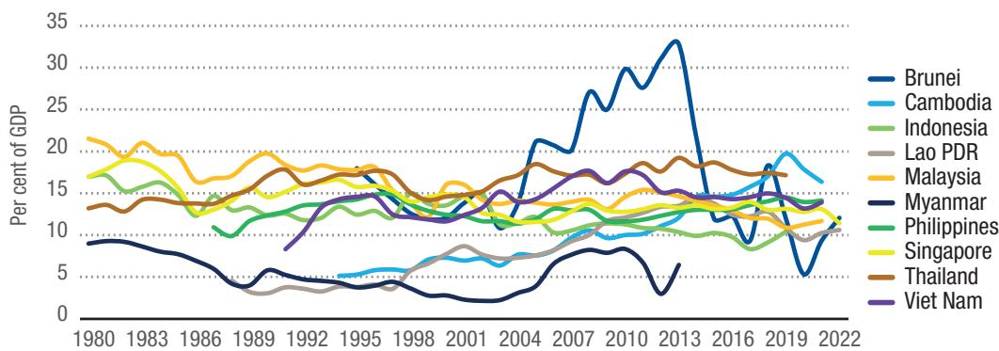  
Source: Our World in Data, available at https://ourworldindata.org/ (accessed in March 2023).  
Note: Total revenue from social contributions, direct and indirect taxes as a share of GDP. ASEAN: Association of Southeast Asian Nations.

Since accession to the World Trade Organization (WTO) in 2004, Cambodia has progressively reduced dependence on taxes on international trade from a high of almost 40 per cent in 2002 to about

12 per cent in 2020 (figure 44). This trend may continue as Cambodia continues to pursue entering into more regional FTAs in line with its export-oriented development model. Taxes on goods and services

(mainly value-added and excise taxes) have remained the dominant source of government revenue. $^{73}$ Tax revenue from the value-added tax, although stable, was surpassed by taxes on profits in 2022 (World Bank, 2022), $^{74}$ with domestic revenue growth fully recovered to pre-COVID-19 levels. The share of direct taxes showed an overall upward trajectory and rose to 40.4 per cent during the first eight months of 2022, up from 27.1 per cent during the same period in 2019. This performance was propelled by a rapid expansion of profit taxes, which grew by 25.9 per cent on the back of improved tax collection and good corporate governance (World Bank, 2022).

Over the past two decades, overall increases in government expenditure have reflected the need to expand the coverage and quality of basic services and productive infrastructure. Cambodia implemented a robust response to the COVID-19 pandemic, which accelerated government expenditure in 2020 and 2021 (figure 45). According to information from the NBC shared during VP consultations, the financial impact of the COVID-19 pandemic was low, resulting in only a 1 per cent drop in reserves. Since 2019, government expenditure has exceeded revenue growth, with increased expenditures to support vulnerable groups during the COVID-19 pandemic expected to endure in the medium term amid elevated costs of living following the Ukraine crisis. Lower-than-expected revenues during the pandemic have widened public deficits, which are expected to remain elevated.

## Figure 43

Cambodia: Share of central government expenditures funded by domestic taxes, 2000–2021  
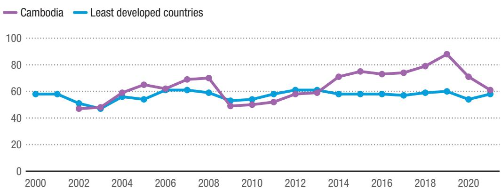  
Source: Our World in Data, available at https://ourworldindata.org/grapher/share-of-central-government-expenditures-funded-by-taxes (accessed in November 2023).  
Note: Compulsory transfers such as fines, penalties, and most social security contributions are excluded.

  
- Taxes on income, profits and capital gains
- Taxes on international trade
- Taxes on goods and services
- Other taxes
- Tax revenue (per cent of GDP)

## Figure 44

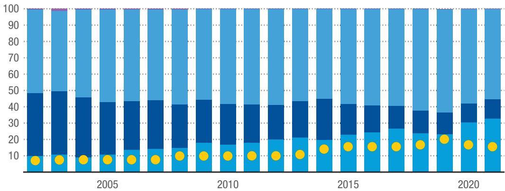  
Source: World Bank, World Development indicators, available at https://databank.worldbank.org/source/world-development-indicators (accessed in September 2023).

## Figure 45

## Cambodia's overall fiscal balance, 2002–2028

(Billions, national currency)

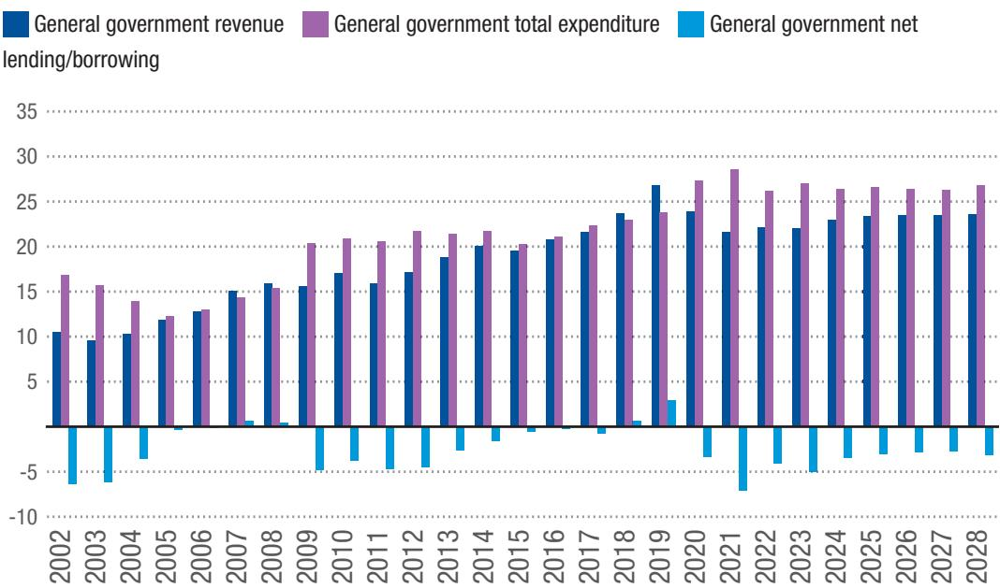  
Source: International Monetary Fund, World Economic Outlook database, available at https://www.imf.org/en/Publications/WEO/weo-database/2023/October (accessed in October 2023).  
Note: Figures starting in 2020 are estimates.

Since 2012, Cambodia's external debt stock has been on an upward trend as the country has sought to address infrastructure gaps, increase regional connectivity, and finance other development spending to address still large development needs,

with the trend accelerating sharply from 2017 onward (figure 46). The Public Debt Management Strategy 2019–2023 sets a 40 per cent limit on public external borrowing as a share of GDP, which the government had not surpassed as of 2022 (figure 47). According to the International Monetary Fund, risks of public debt distress in Cambodia remain low, although debt sustainability is vulnerable to further shocks to exports and growth (IMF, 2022). However, a fuller picture of the external solvency of the economy, as a whole, reveals a debt-to-

GDP ratio of 74 per cent in 2021, compared to almost 68 per cent in 2020 (figure 48).

Accelerated accumulation of private non-guaranteed debt and still-elevated levels of publicly guaranteed debt (figure 48) represent worrisome sources of vulnerability, with both having the potential to introduce macroeconomic instability. $^{75}$

## Figure 46

Cambodia's total external debt stock, 2000–2021 (Disbursed and outstanding debt)

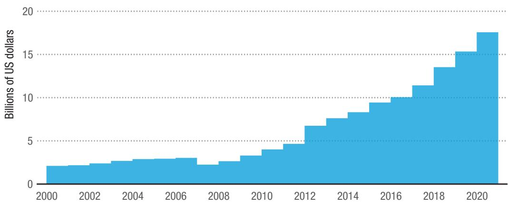  
Source: UNCTAD secretariat calculations based on World Bank, International Monetary Fund (IMF) and national sources.
Note: Total debt stocks include long-term debt, short-term debt and use of IMF credit.

## Figure 47

## Cambodia's general government gross debt, 1995–2022

(Per cent of gross domestic product)

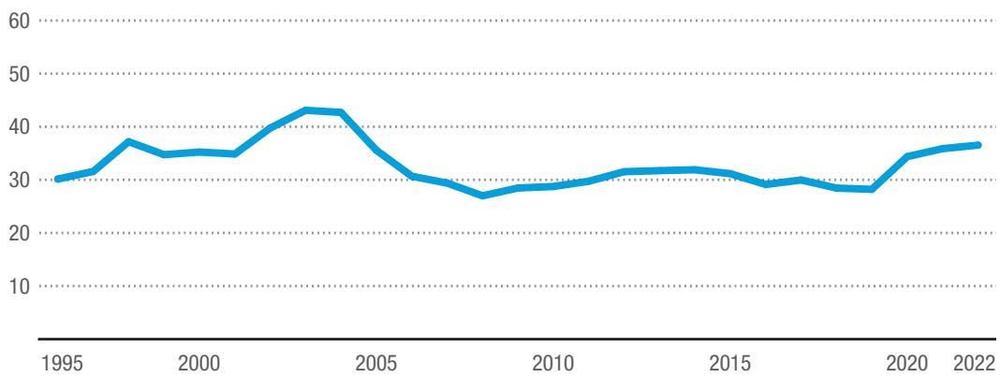

Source: International Monetary Fund, World Economic Outlook database, available at https://www.imf.org/external/datamapper/GG\_DEBT\_GDP@GDD/KHM (accessed in September 2023).

## ......

75 Public and publicly guaranteed debt are driven by Cambodia's intensive use of public-private partnerships, whereas private non-guaranteed debt is mainly associated with borrowings in the real estate sector (IMF, 2022). Cambodia remains a highly dollarized economy: the dollar is used in almost all economic and financial transactions, especially import-export invoicing. Cambodia's banking sector also relies mainly on foreign borrowing. Stability is thus impacted by current changes in global financial conditions under ongoing aggressive monetary tightening (especially in the United States). During 2022, the National Bank of Cambodia was compelled to intervene in the market to stabilize the local currency, which had depreciated following the outbreak of the COVID-19 pandemic in 2020 (NBC, 2023).

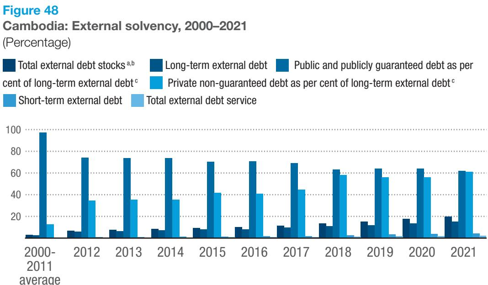  
Sources: UNCTAD secretariat calculations based on World Bank, International Monetary Fund (IMF) and national sources. $^{a}$ Total debt stock includes long-term debt, short-term debt, and use of IMF credit.  
$^{b}$ Debt stock is in billions of current dollars.  
$^{c}$ 100 per cent.

Since Cambodia's graduation to lower-middle-income status in 2015, successive Rectangular Strategies have recognized the need to mitigate the progressive loss of access to concessional financing. Since 2011, the share of grants in government revenue and the share of net ODA in government expenditure have fallen (figures 49 and 50), but the government has continued mobilizing significant development cooperation resources (figure 51). The Cambodian Rehabilitation and Development Board (CRDB) is the one-stop-shop for investors and a focal point for ODA and for dialogue with development assistance partners. The CRDB orients partnerships via five-year development cooperation partnership frameworks. Under Rectangular Strategy IV, priorities include infrastructure, digitalization and agro-industry. The CRDB maintains an ODA database, which allows for direct uploading of data by development partners and enables the tracking of the Busan indicators on aid effectiveness. Cambodia regularly participates in the monitoring processes of the Paris and Busan Global Partnership.

In September 2022, faced with lower-than-anticipated tax revenues in the wake of the pandemic, the NBC issued the first local currency government bond of 100 billion rriels (about \$24.3 million) to raise funds to further national development. The issuance of government bonds contributes to the deepening of the local financial sector, which is dominated by retail banking. $^{76}$ Investors in sovereign bonds enjoy a 50 per cent deduction on withholding taxes and a three-year tax exemption on capital gains. $^{77}$ Subsequent bond issues are planned in 2023.

In terms of boosting its regulatory capacity and positioning the domestic financial sector, the NBC reported its intention to upgrade capacity in Fintech and pursue the establishment of Cambodia as financial hub.

## Figure 49

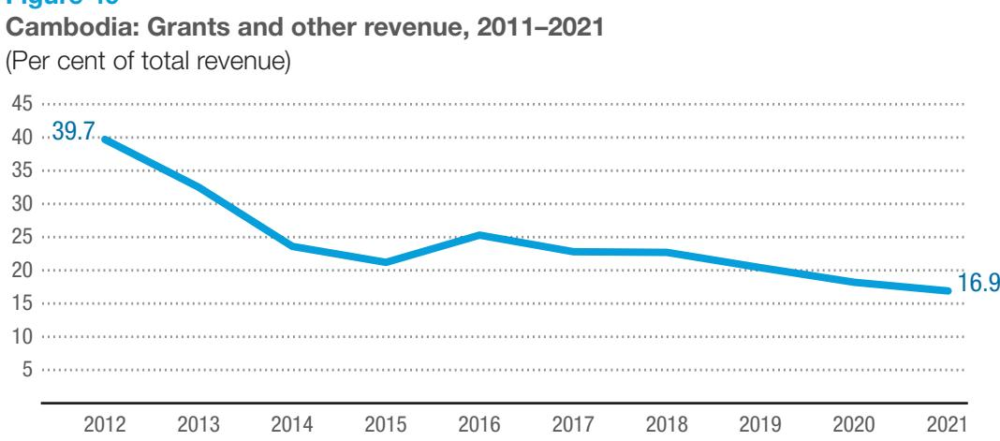  
Source: World Bank, World Development Indicators, available at https://databank.worldbank.org/source/world-development-indicators (accessed in March 2023).

## Figure 50

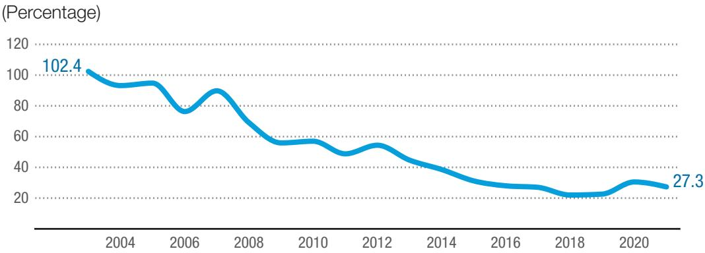  
Source: World Bank, World Development Indicators, available at https://databank.worldbank.org/source/world-development-indicators (accessed in September 2023).

Cambodia's corporate bond market is also still at a nascent stage. In 2018, the financing gap for micro-, small- and medium-sized enterprises (MSMEs) was estimated at up to 21 per cent of GDP, with the dominance of the US dollar in the economy serving to exclude much of the rural sector. Dollar deposits accounted for 91.4 per cent of total banking deposits in 2021 (NBC, 2023). The NBC has deployed a variety of tools in favour of local currency, including making loans available in local currency at a cheaper rate to banks for onward lending. The largest microlender in Cambodia was the first firm to issue and list a local-currency-denominated corporate bond in 2018. $^{78}$

On the demand side, the domestic corporate bond market lacks a sound and diversified base of domestic institutional investors. Although commercial banks are reported to have become major investors in this market, other institutional investors are largely absent. Most pension and insurance premium receipts in Cambodia are in dollars, making it difficult for the country to develop a local currency bond market. On the supply side, bond issuers are enticed through the government's tax incentive programme,

which in February 2022 was renewed for the third time up to February 2025. Such incentives became effective for the first time in 2019. The package of incentives includes special incentives for investments in green, sustainable and governments bonds. $^{79}$

## Figure 51

Disbursements of official development assistance to Cambodia, 2012–2021 (Millions of US dollars, in 2020 constant prices)  
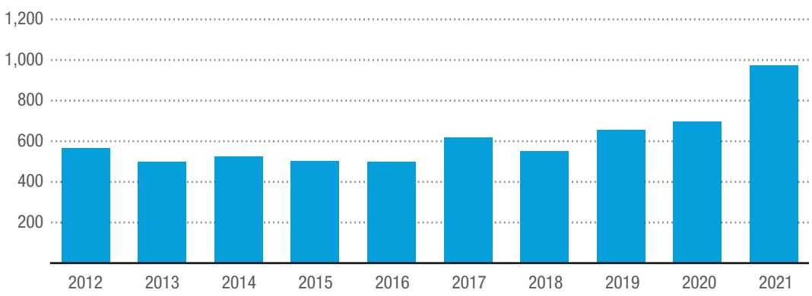  
Source: Organization for Economic Cooperation and Development, International Development Statistics, available at https://www.oecd.org/dac/financing-sustainable-development/development-finance-data/idsonline.htm (accessed March 2023).

Remittances typically are used to increase and buffer household consumption, so they can play a critical role in mitigating adverse macroeconomic shocks. However, a decrease in remittances can be particularly damaging when the recipient country's economy undergoes a negative economic shock. In the case of Cambodia, these

transfers appear to have increased in 2009 (at the peak of the global financial crisis) and 2019–2020, during the COVID-19 pandemic impact years (figure 52). The increase in remittances in Cambodia is higher than for LDCs as a group and opposite the experience of comparator countries such as Viet Nam and Thailand.

## Figure 52

Cambodia and comparator countries: Personal remittances received, 1995–2022 (Per cent of gross domestic product)  
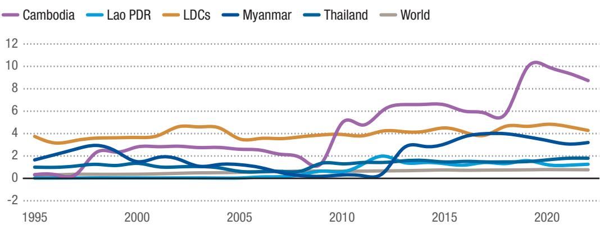  
Source: World Bank, World Development Indicators, available at https://databank.worldbank.org/source/world-development-indicators (accessed in April 2023).  
Note: LDCs: least developed countries.

## ......

79 See Kosintr Puongsophol, 2022, “How Cambodia’s Capital Market Can Support Sustainable Investments - Kosintr Puongsophol, Shu Tian and Benita Ainabe,” Asian Development Bank op-ed (20 January), available at https://www.adb.org/news/op-ed/how-cambodia-s-capital-market-can-support-sustainable-investments-kosintr-puongsophol-shu; and May Kunmakara, 2022, “Three More Years of Tax Incentives for Companies that List Domestically,” Phnom Penh Post (2 March), available at https://www.phnompenhpost.com/business/three-more-years-tax-incentives-companies-list-domestically.

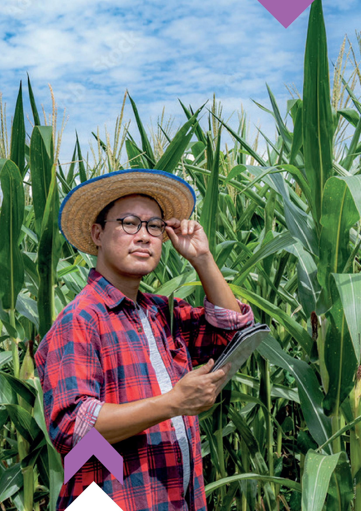

## 3.

# Key vulnerabilities: Progress on the 5 Ps of the Sustainable Development Goals

## 3.1 Prosperity

Cambodia has propelled an economy ravaged by war to prosperity on the back of an export-led development model. This is evidenced by the substantial progress captured by Cambodia's performance on the Economic and Environmental Vulnerability Index driven by the rapid decline in export instability and the share of agriculture in GDP in recent years (figure 53).

  
Decomposition of Cambodia's performance on the Economic and Environmental Vulnerability Index, 2003–2024

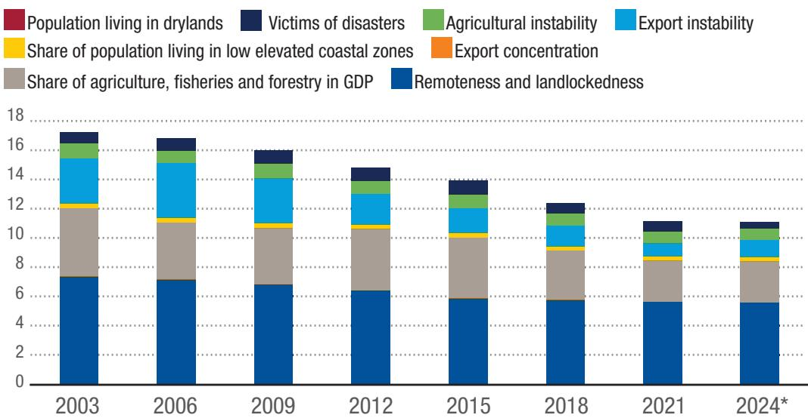  
Source: UNCTAD secretariat calculations based on data from World Bank, World Development Indicators, available at https://databank.worldbank.org/source/world-development-indicators; the Emergency Events Database/Centre for Research on the Epidemiology of Disasters (https://www.emdat.be/) and the Committee for Development Policy secretariat's triennial review dataset 2000–2021 and time series estimates of the LDC criteria (https://www.un.org/development/desa/dpad/least-developed-country-category/ldc-criteria.html) (accessed in March 2023).  
Note: The EVI is a measure of structural vulnerability to economic and environmental shocks. A higher score represents a higher economic vulnerability. Since 2015, the Committee for Development Policy uses absolute thresholds to determine inclusion and graduation of eligible countries in the category of least developed countries. The inclusion threshold is set at 36 and the graduation threshold at 10 per cent below the inclusion threshold (32).

However, the COVID-19 pandemic has highlighted the strategic importance of deepening the transformation of Cambodia's economy and diversifying its drivers. While external demand for Cambodia's exports continues to deliver benefits, the ability of this main driver to further enhance

socioeconomic progress will increasingly come under strain for several reasons. Cambodia's export-led development model is based on high-preference use and inflows of FDI. This renders the country's development trajectory very exposed to potentially debilitating external demand

shocks, as evidenced by the collapse of GDP growth during the Asian financial crisis, the 2008–2009 global financial crisis, and, more recently, the COVID-19 pandemic. Moreover, Cambodia is increasingly vulnerable to fluctuations in the trade policies of major trading partners, including instabilities associated with shifting geopolitical interests. Cambodia's reliance on the European Union and United States' markets has only marginally decreased over the past decade. $^{80}$ At the same time, these trading partners have begun to reassess their trade relations with Cambodia. Such developments could put Cambodia at risk of a slowdown in growth and structural transformation if they lead to more and unpredictable trade restrictions in the lead-up to graduation and beyond. $^{81}$ While the government has proactively taken steps to secure access to new regional markets, $^{82}$ the climate of uncertainty around traditional markets may still be damaging to investor interests – and eventually Cambodia's future economic prospects – especially if exports to new regional markets do not prove to be additional (i.e. more than offset eventual losses of traditional markets). At present, neither Chinese nor Eurasian markets are a substitute for the European Union and United States markets as far as exports of Cambodian garments and bicycles are concerned (UNCTAD, 2020b). Recent analysis by UNCTAD and the Asian Development Bank on Cambodia's use of preferences linked to its regional trade

agreements shows that the mere existence of a trade agreement does not presuppose a high degree of trade liberalization or use of preferences. Accordingly, the incremental value of Cambodia's overlapping FTAs boils down to an assessment of the ease of concurrent implementation of the different rules of origin and the extent to which WTO-plus provisions unlock the country's trading opportunities. $^{83}$

A further challenge is that despite notable progress in product diversification, the Cambodian economy continues to be highly dependent on a few major export products and markets, combined with low levels of sophistication, especially in agricultural and manufacturing activities. For example, only about 10 per cent of agricultural output is processed, and, as of 2020, no operational SEZs were located in the provinces specialized in agricultural production (Brussevich, 2020). A deterioration of structural transformation and economic diversification drivers is evident not only in that Cambodia's labour productivity gains lag those of comparator countries, but also in the recent narrowing of the productivity gap between agriculture and manufacturing. This represents backsliding in structural transformation. Furthermore, dividends from Cambodia's diligent implementation of SEZs as a means of boosting industrial development and diversification have so far fallen short of desirable. The evidence suggests that firms located within Cambodian SEZs are significantly less likely than non-SEZ firms to source inputs domestically. This is consistent with specialization in the assembly of imported inputs and re-exporting of final goods and can in part be explained by low productivity of domestic firms and proximity of foreign firms to their existing suppliers predominantly from parent companies (Brussevich, 2020). It is also consistent with the finding of the Organization for Economic Cooperation and Development (OECD) that FDI is associated with higher labour productivity and innovation than the national average in OECD countries, and relatively lower productivity and innovation in developing countries (OECD, 2019). An important conclusion to be drawn from this analysis is that the performance of FDI cannot be divorced from the structural conditions in the host country that receives it, and that changing those conditions is the key to unlocking greater benefits from FDI (UNCTAD, 2018). As Cambodia increasingly benefits from regional investors drawn by the country's policy push to secure more regional trade agreements, a concomitant rise in forces favouring the entrenchment of such specialization is probable, given that the new regional FTAs have yielded access to sources of cheaper inputs and thus reinforce the profitability of Cambodia's current specializations.

Cambodia also faces an elevated threat of the erosion of trade preferences. In the current global context, export-led growth has become more difficult because of the fallacy of composition and weak productive linkages of export-oriented SEZs and their activities linked to global value chains (UNCTAD, 2016b, 2018). For instance, Cambodia's LDC neighbours, China and ASEAN compete on the same products exported to the European Union and United States. In addition, the ASEAN LDCs' trade policy development responses are also similar to those of Cambodia (UNCTAD, 2020b).

At the root of Cambodia's struggle to accelerate economic diversification are challenges linked to expanding the country's productive capacity. For example, the country is struggling to catch up with the growth in energy demand. Cambodia's ambitious goals under Vision 2030 and 2050 already imply ramped-up expenditure across a broad and expanding range of policies and strategies spanning the economic, social and environmental arenas (table 3). Most implementation processes for these policies are currently supported by donor partners. The processes also demand enhanced coordination within government, which successive Rectangular Strategies have highlighted as needing improvement. Cambodia faces a shortage of a range of productive capacity, including human capital and skills, and a backlog of productive infrastructure development and technology, including in digitalization and innovation capabilities. In the case of urbanization, high levels of rural-to-urban migration put pressure on limited social and economic infrastructure and resources – for example, 40 per cent of Cambodia's urban population is affected by housing poverty. COVID-19 severely jolted the economy, exposing deficits in public expenditure on health, education, social security and infrastructure, and necessitated public support to workers, households and business. At the same time, the pandemic had potentially negative consequences for public financing. A slow recovery will likely keep tax revenues depressed, reducing domestic budget resources in the short and medium terms. Constrained public spending and institutional capacity could make it more difficult for Cambodia to realize its ambitions for prosperity. As the fiscal deficit widened in the wake of the pandemic, the government debuted its first local currency sovereign bond issue. A slow uptake by investors meant that the government had to raise the one-year coupon rate to attract investors. $^{84}$ It remains to be seen how the market will further develop.

In this context, Cambodia may be hard pressed to maintain tight fiscal restraints.

## 3.2 People

Cambodia has made tremendous progress on indicators of human and social development, including poverty. Key vulnerabilities for this SDG are linked to Cambodia's prospects to consolidate social development gains and maintain upward momentum. The evidence suggests that COVID-19 has dented momentum in a context whereby diminishing returns will set in as life expectancy and school enrolment gaps close (UNDP, 2019). An evaluation of Cambodia's efforts on SDG 4 concluded that they will be insufficient to attain the goal by 2030 (Sachs et al., 2022). This underscores the need to address weaker components of human development, specifically education, which may also drive gains and longer-term improvements in productivity and incomes. This situation is worrisome because the effects of education are deep, long-term, and run from one generation to the next. This is serious not only because Cambodia already faces a shortage of skilled human resources even for low- and medium-skill-intensive industries, but because new technologies can have severe downsides if they outpace a society's ability to adapt (UNDP, 2019; World Bank and UIS, 2022; UNCTAD, 2021c). These dynamics make skill diversification in Cambodia more complex. Moreover, there is little evidence that SEZ firms provide more than basic training to workers, and Cambodia's TVET system struggles to deepen engagement with the private sector. The Chamber of Commerce also reported that investors in Cambodia tended to adopt a reactive stance to matters of upgrading and LDC graduation – that is, they were likely to

upgrade only if the buyer market demanded it, and there was no discernible indication that issues of climate change featured strongly in investors' strategies. This result is perhaps not wholly unexpected, since investment in raising educational standards is a necessary complement to realizing the effectiveness of any FDI-driven strategy. It is a precondition not only to attract foreign investment in industries requiring higher skills, but also to encourage investors to provide upgraded worker training, transfer of skills, and investments in innovation.

Informal employment in Cambodia is widespread. Informal workers lack social protection and enjoy fewer rights at work, so most remain highly vulnerable to negative income shocks. Furthermore, Cambodia's FDI and export-driven growth has had a weak influence on shrinking the country's preponderant informality and boosting dynamic local entrepreneurship that would drive high-quality job growth. Rapid economic growth has delivered uneven benefits across Cambodia's provinces, as evidenced by subregional differences in HDI outcomes and dependency ratios. The impact of the COVID-19 pandemic showed that, despite Cambodia's laudable advancements in reducing poverty and inequality, a significant proportion of the employed are not able to accumulate resources to cushion themselves in the event of wage shocks. In 2015, the World Bank had already estimated that the loss of only \$0.30 cents per day in income in the agriculture sector could bring Cambodia's poverty rate back up to 40 per cent. $^{85}$ A 2023 study by the World Bank estimated that without proper adaptation and mitigation measures, climate change could cost up to 9 per cent of Cambodia's GDP by 2050 while increasing the poverty rate by up to 6 percentage points by 2040. $^{86}$

It is estimated that almost 2.2 million Cambodian adults have an outstanding microcredit loan, with an average debt of \$3,320 – roughly twice the country's annual GDP per capita – and that credit is growing by 40 per cent a year. $^{87}$ Even prior to the pandemic, Cambodia's population demonstrated a large appetite for microcredit, with the average loan size growing more than 10-fold in the five years up to 2020. Selling assets (including land) was a notable coping strategy before and during COVID-19 to overcome indebtedness and loss of livelihoods in Cambodia. Internal migrants also halted sending remittances to families as a coping strategy. While the pandemic could be viewed as a special case, it can also be viewed as a precursor to the kinds of shocks that may arise because of climate change and the low-carbon transition, demanding sector-wide reskilling, redeployment, placement and temporary income support.

## 3.3 Planet

As an LDC, Cambodia is among the lowest contributors to the causes of climate change but also among those most vulnerable to its effects. The country is grappling with addressing the cross-cutting issues associated with the low-carbon transition and has embarked on designing policies and strategies as well as advancing implementation of programmes to address deforestation. The National Energy Efficiency Policy, approved by the government in November 2022, targets a 19 per cent reduction in energy consumption by boosting energy efficiency.

As evidenced by Cambodia's performance on the Economic and Environmental

Vulnerability Index and the situation analysis, the proportion of the population that is affected by natural disasters remains low and has even gradually decreased in recent years. The impact of climate change on Mekong River Basin countries is difficult to forecast, but according to the Mekong River Commission, climate change is expected to negatively impact natural ecosystems and agriculture throughout the basin, mainly because of increased rainfall, flooding and temperatures. $^{88}$ Agricultural yields are likely to be affected, requiring changes in agricultural practices, recourse to more widespread irrigation, and technological improvements to offset the effects. These climate change effects are already being felt. For example, increased seasonal variability in rainfall is devastating livelihoods in Cambodia's coastal regions. $^{89}$ In terms of water resources, agriculture is the biggest user in Cambodia, meaning that the efficient, effective, and sustainable management of the country's water resources depends largely on the performance of irrigation systems – which is currently suboptimal – with implications for agricultural productivity and climate change adaptation. The government has recognized this challenge and in December 2019 began implementing the Irrigated Agriculture Improvement Project through loan and grant assistance from the Asian Development Bank. $^{90}$

Hydropower production, which is Cambodia's main source of electricity generation, is at risk from increased droughts, with implications for the country's plans to further leverage this resource and, eventually, for prosperity and industrial development. Hydropower is Cambodia's largest and cleanest source of electricity, amounting to a total installed capacity

of 1,331.7 megawatts in 2022. More hydropower projects are envisaged in line with Cambodia's Power Development Plan 2022–2040. Cambodia expanded solar power from 10 megawatts in 2017 to 356.8 megawatts in 2021. $^{91}$ In addition, the government has approved a 60 megawatt solar farm in Kampong Chhnang Province, the first part of a 100-megawatt national solar park, as well as a 60 megawatt farm in Pursat Province (UNCTAD, 2023). High on the government's agenda is achieving universal access by 2030 (the year of graduation to upper-middle-income-country status), improving grid reliability, and reducing energy imports and the cost of electricity for consumers. According to the Ministry of Mines and Energy, rural access to electricity in Cambodia increased from 34.11 per cent in 2010 to 97.39 per cent in 2020. However, nearly two thirds of the households connected

to the grid experience frequent power shortages. $^{92}$ Electricity access for low-income segments of population, students and night-time farming is subsidized. $^{93}$

## 3.4 Peace

According to data from the Armed Conflict Location and Event Data Project (ACLED), the number of disorderly public events each year in Cambodia is quite high, averaging 179 demonstrations per year over 2010–2016 and 83 over 2017–2022 (figure 54). Among these, labour union actions or wage protests account for the majority. Demonstrations involving protests by groups such as farmers and communities about land disputes are also frequent. According to the data from ACLED, most demonstrations have tended to be peaceful. $^{94}$

Figure 54
Public disorder by type of event in Cambodia, 2010–2023  
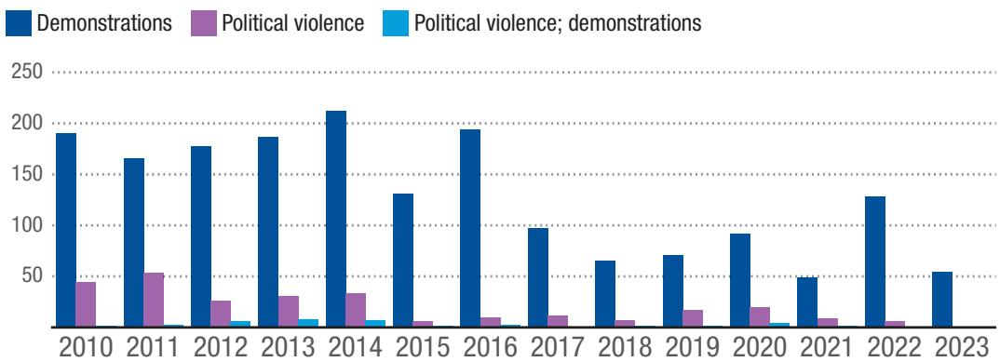  
Source: Armed Conflict Location and Event Data Project, available at https://acleddata.com/ (accessed in September 2023).

The high number of labour-related demonstrations implies production disruptions and lost wages for employees, and this puts a drag on the economy. Compared to the garment, textile and footwear sector, which has high levels of union representation and is influenced by requirements to access the US market, other sectors are less unionized and have not been able to secure the same degree of protections and benefits availed to garment, textile and footwear employees, who are subject to sector-specific legislation. $^{95}$ Nevertheless, strike action by workers in the sector is not uncommon, which suggests that much more could be done to enforce existing labour protection. The high level of informality in the economy generally, constrains workers' bargaining power. A focus on FDI-led growth means that Cambodia is also under pressure to emulate regional competitors for FDI. Cambodia's neighbours (Myanmar, Lao People's Democratic Republic, Viet Nam and Thailand) steadily reduced their number of public holidays from 28 days in 2018 to 21 days in 2021. In 2021, Cambodia amended several articles of the 1997 Labour Law such that workers are no longer entitled to compensation for public holidays that fall on Sundays. $^{96}$ This will probably be unpopular with workers. The amendments also expanded the jurisdiction of the Labour Arbitration Council to individual labour disputes, but it is still unclear what the impact might be.

There are strong synergies between actions needed to address vulnerabilities related to peace and those that address people and partnerships. Boosting the quality of education and entrepreneurship will contribute to tackling the problems of low productivity and high informality. Similarly, improving Cambodia's image abroad could lead to sustained and expanded partnerships.

## 3.5 Partnerships

Cambodia maintains strong partnerships with major development assistance

Like all developing countries, Cambodia is also vulnerable to the proliferation of new barriers linked to environmental and climate change action by trading partners. Examples include the European Union's recently announced cross-border adjustment mechanism and new law to fight global deforestation. For now, UNCTAD has assessed Cambodia's exposure to negative effects from the cross-border adjustment mechanism as relatively low (UNCTAD, 2022a). However, given that deforestation is identified as a main driver of land degradation in Cambodia, the impact of the new European Union law could be significant, especially as it employs a wider definition of forest degradation that includes the conversion of primary forests or naturally regenerating forests into plantation forests or into other wooded land. The law bans products grown on recently cleared land. The products covered by the new legislation are cattle, cocoa, coffee, palm-oil, soya, and wood, including products that contain, have been fed with, or have been made using these commodities (such as leather, chocolate and furniture). Additional products committee donors, and net ODA receipts were 28.9 per cent of government expenditure in 2020. However, the country's trade preference programmes and relations with its major trading partners (the European Union, United Kingdom and United States) are vulnerable to criteria related to labour and human rights that could trigger the suspension of Cambodia's access to these trading partner markets. As previously mentioned, the European Union partially suspended Cambodia's trade preferences in 2020. The United Kingdom's new Developing Countries Trading Scheme retains provisions such as the European Union's EBA, allowing the United Kingdom to suspend privileges upon determination of serious human rights violations.

include rubber, charcoal, printed paper products, and several palm oil derivatives. $^{97}$

As existing trade agreements come up for renewal, and looking beyond Cambodia's graduation, the country can also expect to face other types of challenging restrictions. For example, the recently ratified agreement between the European Union and the Southern Cone Common Market (MERCOSUR) restricts the ability of MERCOSUR countries to use public procurement to favour domestic industry.

Cambodia has consistently demonstrated a commitment to engage with the international community in a proactive and systematic manner to address development goals and common challenges in line with its national interests. This puts the country in good standing. Cambodia can continue to leverage these achievements for the benefit of its image abroad. For example, Cambodia contextualized the MDGs into the CMDGs to better reflect the realities within the country itself and is implementing and reporting on the Cambodian SDGs. $^{98}$ Cambodia is also an active participant in international forums addressing biodiversity, climate change and forestry. Pilot activities to address REDD+ started in 2008, demonstrating the country's readiness to engage with environmental and climate action. Under the United Nations Framework Convention on Climate Change, Cambodia has submitted its updated

NDC and long-term strategy for carbon neutrality. Globally, Cambodia is among the first countries to have established green policies such as the National Green Growth Roadmap (2010), National Green Growth Policy (2013–2030), National Green Growth Strategic Plan (2013–2030), and Cambodian Climate Change Strategic Plan (2014–2023). This demonstrates the country's desire for green growth in achieving its development objectives. As part of its Women's Economic Empowerment Strategy, the Ministry of Women's Affairs aims to use its network of women's development centres to introduce innovative models for cooperation with the private sector, particularly in developing “green” and social enterprises. Cambodia has also partnered with the International Labour Organization (ILO) on the Better Factories Programme targeting the garment industry, which improves worker conditions in accordance with national and international standards and addresses consumers' concerns in export markets. $^{99}$ At the level of ASEAN, Cambodia champions the protection and promotion of the rights of migrant workers by strengthening the governance of labour migration. $^{100}$ The country has partnered with the ILO and the Safe and Fair Project funded by UN Women and the European Union to ensure that labour migration is safe and fair for all women in the ASEAN region.

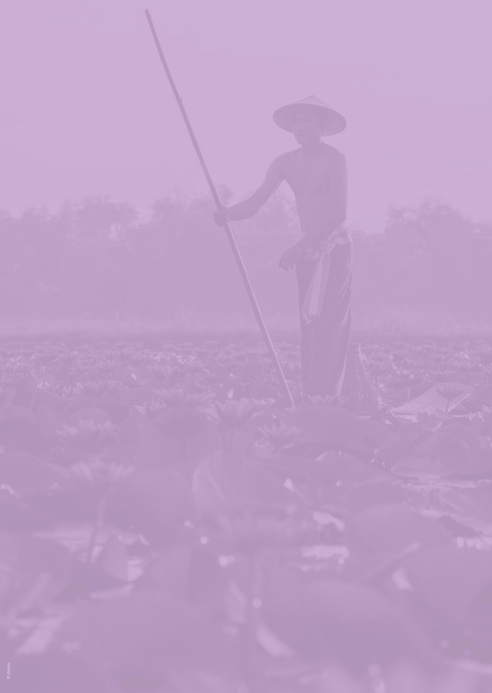

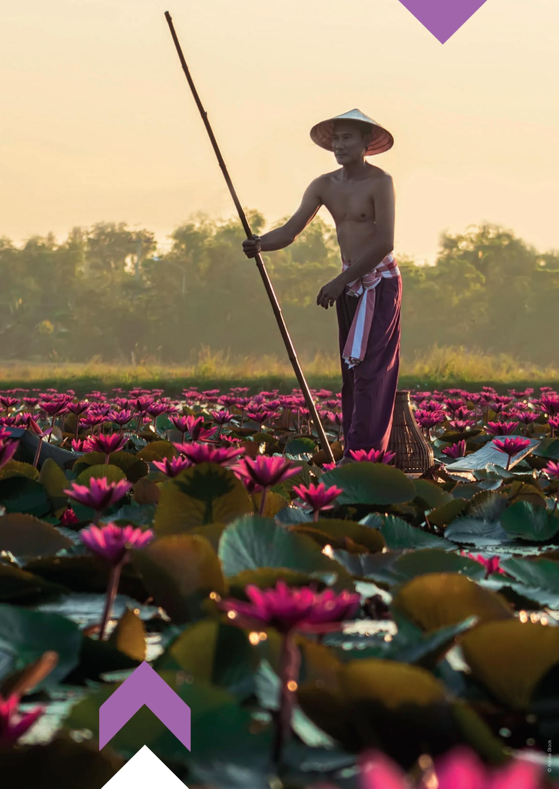

# Addressing vulnerabilities

The situation analysis suggests that structural transformation in Cambodia risks losing steam as the country reaches the limits of a socioeconomic development policy path that has leveraged the opportunities for low hanging fruit to the greatest benefits of its people. Action must be taken to prevent backsliding on structural transformation in order to ensure graduation with sufficient developmental momentum. The impact of the COVID-19 pandemic has only introduced an added complication in an economy that is rapidly approaching a critical crossroad of transformation. Post-pandemic recovery presents the government with new opportunities to consolidate the remarkable achievements realized through the post-war rehabilitation and take-off of Cambodia's economy, and to engineer a meaningful change in the economy's renovation in line with Cambodia's Visions 2030 and 2050. It is important that Cambodia's response to identified vulnerabilities:

(i) Recognizes that while policymakers have an inherent preference to focus scarce public resources on interventions that bring about the highest impact in the shortest time, building economic resilience and developmental momentum requires an equal focus on transformations that yield medium- to longer-term gains.

(ii) Refines and build's on existing efforts to avoid creating a “spaghetti bowl” effect, which refers to the multiplication of FTAs supplanting multilateral WTO negotiations.

(iii) Is accompanied by a careful assessment of the areas for urgent institutional investment that will be critical to advancing goals to address key vulnerabilities. Accordingly, institutional

capacity needs to be viewed broadly to encompass partnerships between the public and private sectors, as deficits are not confined to the public sector, especially with regard to the need to address issues around technological and innovation capabilities.

Critically, the needed change is conditional on achieving synergistic alignment between appropriate human capital development policies and shaping of the developmental role of FDI to confront a radically altered development context. The change also needs to synthesize Cambodia's ambitions on green growth and confront the rapid technological advancement epitomized by the fourth industrial revolution. Among other things, this will require a number of steps, as outlined below.

## 4.1 Reigniting and deepening structural transformation in a radically altered development context

\- Review and update existing policies relevant to green growth, human capital and FDI to build or address synergy deficits. It is notable that implementation of past Triangular and Rectangular Strategies has to varying degrees attempted to address many of the same structural vulnerabilities highlighted in this report. The recently issued Pentagonal Strategy will essentially tread the same ground. Indeed, over the past three decades Cambodia has amassed a formidable array of policies, plans and strategies aimed at guiding developmental interventions across the entire economy. While many of these

policy guidance instruments have been developed through extensive consultations and participation across the government, concerns remain over the potential that synergy gaps and fragmented implementation might lead to a dissipated impact over time. An additional challenge confirmed through consultations with various ministries and departments during the VP inception mission is the scarcity of institutional capacity to maintain coordination and collective ownership in the implementation of many of these policy instruments. The VP consultations also uncovered concerns around the eventual loss of access to institutional capacity-building because of the loss of LDC status. The government may need to consider whether existing plans on institutional capacity-building adequately address current and future needs.

\- Make meaningful investments in human capital on all fronts, as developing human capital is the critical enabler to meet current and future demand for skills in the labour market. The primary responsibility for skill development in a country rests with the national education system. Moreover, raising the quality of human capital is the precondition for absorbing and deploying technologies across a range of indicators that underpin successful improvements in productivity needed to make progress on socioeconomic development and structural transformation, as well as on the mitigation of and adaptation to climate change. Transformation of the TVET institutions is fundamental. For example, consultations with the Ministry of Education during the VP inception mission revealed that while many policies may be in place to address quality improvements in the

national education system, bottlenecks persist in implementation at all levels.

\- Achieve synergistic alignment between educational outcomes and Cambodia's export-oriented FDI-driven industrial policy. This will require reassessing the education system based on recognition of the symbiotic relationship between the quality of public and private education and the quality and benefits of the FDI attracted. Crucially, raising the quality of the education system and the human capital it produces will lower the costs for FDI to upgrade skills and incentivize the transition to higher-value-added activities (UNCTAD, 2011). While Cambodia has to date relied on introducing private education as the main catalyst to boost the quality of education, there is no discernible impact of this strategy on closing the gap on market needs. Realigning human capital development with Cambodia's FDI policy will require a reinforced and continued focus not only on improving the quality of public education, but also on instituting and monitoring corresponding quality targets on private education. This would be in line with mounting evidence that points to a symbiotic relationship between the quality of public and private education, the risks of exacerbating inequalities through recourse to private education, and the importance of increased and appropriately balanced public spending and oversight over the national education system as a whole. For instance, an increasing number of studies question the belief that private schools, regardless of the family background of students, determine how well educated students will be. Studies also confirm that concerns about the consequences of the negative impact of expanding the private education sector

on inequalities are justified (de Talancé, 2020; OECD, 2011; Altbach et al., 2021; Larsen et al., 2023; UNESCO, 2021). $^{101}$

## 4.2 Activating a more robust approach to entrepreneurship development

\- Promote a domestic culture of dynamic entrepreneurship and a supporting ecosystem. Expanding quality entrepreneurship will be the key to boosting domestic drivers of structural transformation. The VP situation analysis, complemented by a recent evaluation (World Bank, 2018b), reveal entrepreneurship policy to be a nascent but critical area requiring urgent intervention in Cambodia. UNCTAD research emphasizes, as a first step, the importance for governments to know and understand their economy's entrepreneurs, since entrepreneurship takes many forms and has different motivations. These factors have critical implications for the contribution that different types of entrepreneurship can realistically make in terms of the growth of quality jobs and employment, the deepening of structural transformation, and the infusion of innovation dynamism into an economy. Crucially, an expanding number of entrepreneurs cannot be taken for granted to measure developmental progress or economic resilience (UNCTAD, 2018). Cambodia needs to develop a database on entrepreneurship activity

and institute systematic monitoring and evaluation of the status and health of entrepreneurship in the economy. Like other countries, Cambodia has rolled out programmes to address SMEs' access to credit. The provision of credit to entrepreneurs can often prove a blunt instrument, $^{102}$ but evaluation of the performance of Cambodia's ongoing programmes and tracking of beneficiaries has the potential to reveal important clues about the country's entrepreneurs and represents low hanging fruit for intelligence gathering. It is only based on such entrepreneurship intelligence that robust and effective entrepreneurship policies and strategies can be crafted – and government capacity to implement entrepreneurship policy built.

\- Strengthen opportunities to better align FDI promotion, entrepreneurship and industrial policy goals. Trade preferences and a generous investment incentive regime are the cornerstones of Cambodia's FDI promotion and development model. The government could explore ways to reinforce the link between FDI and the growth and quality of domestic entrepreneurship. Given the evidence that the job-creating power of attracted FDI falls short of expectations, Cambodia needs to take steps to make this link more explicit, especially given the revenue implications of the generous investment incentive regime. There is no single model for how this can be achieved, and as already highlighted, Cambodia's existing skills base and other contextual factors will shape the options available

(UNCTAD, 2011). Building local SME and entrepreneurship ecosystems around FDI is one option. Cambodia's investment promotion agency (Cambodia Council for the Development of Cambodia) has developed a supplier database that highlights SDG-related information about potential suppliers to promote linkages between investors and the local economy. $^{103}$ It will be necessary to build synergies with needed transformations in related policy areas. Because transition requires across-the-spectrum skills, clarity is needed on what types of skills must be prioritized, the related curricula design transformations for educational institutions where skill development will take place, and how this process can be funded. Effective linkages and feedback loops need to be established with the work of, for example, the National Council for Sustainable Development, which is the primary government institution responsible for the coordination of green growth; TVET programmes under the Ministry of Education; and Ministry of Industry, Science, Technology and Innovation suppliers, which are charged with strengthening the MSME sector. It is also necessary to ensure gender-responsiveness by including feedback loops with programmes targeting women entrepreneurs. Female entrepreneurship is reported to be significant in Cambodia, and a study by UNIDO (2021) suggests there is a strong base of optimism among women entrepreneurs about green industry. Better alignment between FDI, entrepreneurship and industrial policy is increasingly important in a global context, in which international tax reforms reduce the scope of fiscal incentives, and long-term stagnation of international investment in productive capacity continues.

\- Maximize export diversification opportunities by targeting nearby complex products. Box 2 examines ways to discern how Cambodia's current productive capabilities could potentially benefit from the diversification of exports.

\- Link a set of specific performance indicators on industrial policy to those of the investment promotion agency, establishing key performance indicators to measure and monitor those indicators beyond a traditional focus on investment volume or the number of jobs created or suppliers introduced. Cambodia's new investment law aligns incentives with the (monetary) size of investment and the destination sector (in line with the designation of priority sectors). It also provides for reductions in customs taxes for SMEs engaged in agriculture and tourism.

## 4.3 Mobilizing additional development finance

Devising an effective resource mobilization strategy is likely to be the deciding factor for realizing Cambodia's ambitions in Visons 2030 and 2050, including on green growth. Cambodia rightly anticipates an imminent fall in concessional development finance now that the country has attained lower middle-income status and because of graduation from LDC status. The stakes are even higher post-pandemic. The government's response has been to conscientiously improve revenue mobilization and tax collection by transforming the domestic tax culture of compliance and registration. However, such high-impact/short-term interventions encounter diminishing returns as compliance rises. To mobilize more resources, strategies will need to shift to more complex reforms, which are susceptible to constraints linked to economic structure, revenue administrative capacity and policy choices. The options discussed in sections 4.1 and 4.2 do not typically yield immediate benefits because the process of transformation in economic structure takes place over an extended period of time. The situation analysis in section 2.4

detailed the government's current approach to public financial management and fiscal prudence, which can also yield short- to medium-term benefits. This suggests that reassessing policy choices could be a remaining area where the government could still explore the scope for quick wins, albeit this is an area fraught with political economy considerations. Among other things, such a reassessment could entail:

\- A review of activities currently exempted from taxation, including a rationalization of investment incentives to eliminate tax leakage and wastage. In this context, actions to better measure the development impact of Cambodia's investment incentive framework proposed in section 4.2 could provide valuable insight into determining which incentives lead to a net loss in tax revenues.

\- A review and reform of bilateral tax treaties, as appropriate. Tax treaties can be a source of revenue losses for a country, and taking action to assess the size of potential losses is prudent policy. UNCTAD (2021d) shows that international investment agreements do not exclude taxation from their scope, and that they open the door to challenges from investors on tax-related measures that might be implemented by host countries in their own national interest, including regulatory action in the field of taxes aimed at raising revenue. As of April 2023, UNCTAD's International Investment Agreements Navigator listed a total of 26 bilateral investment agreements signed by Cambodia with other countries, 10 of which are not yet in force. $^{104}$

\- Redoubling efforts to strengthen the role of the domestic financial sector in financing and incentivizing development, including green growth and the low-carbon transition.

## Box 2 Export potential and product space assessment of Cambodia

## Export diversification opportunities

Using data and information from the Harvard Growth Lab's Atlas of Economic Complexity, complemented by an export potential assessment by the International Trade Centre (ITC), it is possible to discern how Cambodia's current productive capabilities could potentially benefit from the diversification of exports. Cambodia's export growth is currently driven by textiles and apparel, which have lower economic complexity, indicative of limited benefits for structural transformation.

In 2019, Cambodia exported under 2,164 product lines out of a potential of 5,018 export lines at the six-digit Harmonized System (HS) classification. Despite representing a steady increase from 1,369 export lines in 2000, this remains lower than the Asian average of 2,677 export lines (box figure 2.1).

## Box figure 2.1

Number of active export lines at the HS six-digit level, Cambodia and Asia average, 2000–2019  
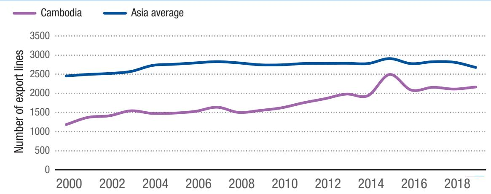  
Source: UNCTAD calculations based on BACI CEPII data.  
Note: HS: harmonized system.

Cambodia scores -0.50 in overall complexity on the Economic Complexity Index, which is an indicator of knowledge availability and a measure of productive capabilities for a given product. $^{105}$ This score is lower than those of Viet Nam (0.05) and Thailand (1.15), but higher than that of Lao People's Democratic Republic (-0.65). Policy choices are best based on which products to actively promote to drive export diversification in terms of (i) the feasibility of producing them, and (ii) their expected profitability or economic gain. $^{106}$ In line with the logic that economic growth is driven by products that are more complex because they provide higher income opportunities, it becomes worthwhile to devote more effort to diversifying into such products, even if doing so implies covering a larger distance in the product space or requires mobilizing significant investments to foster technological progress and building the necessary knowledge to succeed. The promise of stronger economic gains embodied in such products justifies these efforts because the economic gains are closely correlated with the level of the product's sophistication (Hidalgo et al., 2007).

Analysis based on the ITC's export potential map shows that Cambodia's largest untapped export potential lies in markets in the United States (\$1.8 billion), Germany (\$878 million) and China (\$1.3 billion). $^{107}$ Untapped export potential to the neighboring countries of Viet Nam and Thailand amounts to \$236 million and \$134 million, respectively. Cambodian products with the greatest potential to export to the rest of the world are knit/crochet jerseys and similar products in cotton; knit/crochet jerseys and similar products of man-made fibres; and women's trousers and shorts made of cotton. Export potential to Asia is greatest in apparel (untapped export potential of \$1.2 billion), skins, leather and products thereof (\$381 million) and footwear (\$361 million).

As shown in box figure 2.2, a mapping of Cambodia's product space confirms that textile products (in green) are Cambodia's main export sector but, as evidenced by the limited linkages between the green dots with other colour-coded nodes representing new and more sophisticated sectors, the know-how required to produce these leading exports endows Cambodia with only limited leverage capacity.

## Box figure 2.2

Cambodia product space, 2019

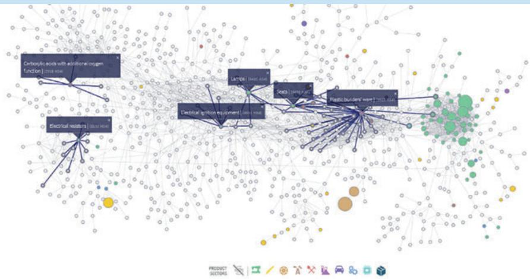  
Source: Harvard Growth Lab, Atlas of Economic Complexity, available at https://atlas.cid.harvard.edu/ (accessed June 2022).  
Note: Each node corresponds to a product at the HS 4 level and its size is proportional to a country's trade. Grey nodes correspond to products that are not exported by Cambodia. Other nodes are colour-coded according to whether Cambodia has a revealed comparative advantage of >1. Green signifies textiles; yellow, agriculture; beige, stone; brown, minerals; red, metals; purple, chemicals; violet, vehicles; blue, machinery; and light blue, electronics. Sectors selected for their high proximity to new sectors are highlighted.

Based on the product space analysis, Cambodia's potential to diversify toward more sophisticated products is largest in machinery, electronics, and chemicals, including plastics. Selected products exhibiting nearby distance, positive demand growth, and high product complexity are listed in box table 2.1.

## Box table 2.1

New product potential of “nearby” products, by industry

<table><tr><td>Industry</td><td>Product group</td><td>“Nearby” distance</td><td>Global growth in five years (per cent)</td></tr><tr><td rowspan="4">Electronics</td><td>Electric heaters (HS 8516)</td><td>4.0</td><td>14.1</td></tr><tr><td>Electric apparatus for &lt;1k volts (HS 8536)</td><td>3.5</td><td>5.6</td></tr><tr><td>Electrical transformers (HS 8504)</td><td>3.5</td><td>4.2</td></tr><tr><td>Electronic printed circuits (HS 8534)</td><td>4.0</td><td>3.7</td></tr><tr><td rowspan="2">Machinery</td><td>Cash registers, calculators (HS 8470)</td><td>4.5</td><td>20.3</td></tr><tr><td>Refrigerators, freezers (HS 8418)</td><td>4.0</td><td>4.5</td></tr><tr><td rowspan="2">Chemicals</td><td>Other articles of plastics (HS 3926)</td><td>3.5</td><td>14.3</td></tr><tr><td>Vulcanized rubber tubes (HS 4009)</td><td>3.5</td><td>2.4</td></tr></table>

Source: See Harvard Growth Lab, Atlas of Economic Complexity, available at https://atlas.cid.harvard.edu/countries/123/growth-opportunities (accessed 14 April 2024).

Note: This is a selection of products having growth potential at a “nearby” distance of >3. The full scope of new product opportunities is available at https://atlas.cid.harvard.edu/countries/118/product-table (accessed 14 April 2024).

1 The theory being that higher economic complexity as compared to a country's income level drives economic development.

2 Countries grow by diversifying into new products of increasing complexity. Strategic new products aim to balance (i) distance to existing capabilities, with less distance (closer to 0) signifying a product is “nearby” to existing know-how; (ii) complexity, with more complex products tending to support higher wages; and (iii) opportunity gain for future diversification, with higher values having stronger linkages with other high-complexity products, opening more opportunities for continued diversification.

3 See ITC, Export Potential Map, available at https://exportpotential.intracen.org/en/ (accessed 12 April 2024).

## References

ADB (2019). Cambodia Transport Sector Assessment, Strategy, and Road Map. Asian Development Bank. Manila.

ADB (2021). Cambodia Agriculture, Natural Resources, and Rural Development Sector Assessment, Strategy, and Road Map. Asian Development Bank. Manila.

ADB (2022a). The Regional Comprehensive Economic Partnership Agreement: A New Paradigm in Asian Regional Cooperation? Asian Development Bank. Manila.

ADB (2022b). Aid for Trade in Asia and the Pacific: Leveraging Trade and Digital Agreements for Sustainable Development. Asian Development Bank. Bangkok.

Altbach PG, de Wit H and Woldegiyorgis AA (2021). Public vs. Private Participation in Higher Education: Realities and Debates. Global Education Monitoring Report. UNESCO. Paris.

Arvis, J-F, Ojala L, Shepherd B, Ulybina D and Wiederer C (2023). Connecting to Compete: Trade Logistics in the Global Economy. World Bank. Washington, DC. Available at https://lpi.worldbank.org/sites/default/files/2023-04/LPI\_2023\_report.pdf.

ASEAN (2017). A Historic Milestone for FDI and MNEs in ASEAN. Association of Southeast Asian Nations Secretariat. Jakarta. Available at https://asean.org/wp-content/uploads/2017/11/ASEAN\_50\_Milestone-1.pdf.

ASEAN Secretariat (2022). ASEAN Migration Outlook. Association of Southeast Asian Nations. Jakarta. Available at https://asean.org/book/asean-migration-outlook/.

Baumol WJ (1967). Macroeconomics of Unbalanced Growth: The Anatomy of Urban Crisis. The American Economic Review. 57(3):415–426.

Brussevich M (2020). The Socio-economic Impact of Special Economic Zones: Evidence from Cambodia. IMF Working Paper No. 20/170. International Monetary Fund. Washington, D.C.

CES (2022). Factbook Education System: Cambodia. ETH Zurich, Chair of Education Systems. Zurich.

Chheang V (2023). Cambodia-China Free Trade Agreement: A Cambodian Perspective. ISEAS Perspective. (46).

Chhoeung N, Chrea S and Nguyen N (2022). Cambodia's Cash Transfer Program during COVID-19. ADBI Development Case Study No. 2022–5. Asian Development Bank Institute. Tokyo.

Crivelli P and Inama S (2022). A Preliminary Assessment of the Regional Comprehensive Economic Partnership. ADB Brief No. 206. Asian Development Bank. Manila.

DESA (2020). Supporting Micro-, Small and Medium-sized Enterprises (MSMEs) to Achieve the Sustainable Development Goals (SDGs) in Cambodia through Streamlining Business Registration Policies. Department of Economic and Social Affairs, United Nations. New York.

de Talancé M (2020). Private and Public Education: Do Parents Care About School Quality? Annals of Economics and Statistics. 137 (March):117–144.

ESCAP (2022). Policy Guidelines on Increasing Business Registration and Access to One-Roof-Service for Women-led MSME: Supporting Women-owned and Managed Micro, Small and Medium Enterprises (MSMEs) in Cambodia. Economic and Social Commission for Asia and the Pacific. Bangkok.

ESWG (2021). Cambodia COVID-19 Joint Education Needs Assessment. Education Sector Working Group. Save the Children International. Cambodia.

GBN (2019). Partnership Ready Cambodia: Waste Management. Global Business Network Programme. November. Available at https://www.giz.de/en/downloads/GBN\_Sector%20Brief\_Kambodscha\_Waste\_E\_WEB.pdf.

Grant C (2017). The Contribution of Education to Economic Growth. K4D Helpdesk Report. Institute of Development Studies.

Hamilton I and Jhaj S (2020). Why Are Boys Leaving Lower Secondary School Early in Cambodia? Research report. UNICEF Cambodia. Phnom Penh.

Hidalgo CA, Klinger B, Barabási A-L and Hausmann R (2007). The Product Space Conditions the Development of Nations. Science. 317(5837):482–487.

Human Rights Watch (2015). World Report 2012. New York. Human Rights Watch.

ILO and IFC (2020). Guide to the Cambodian Labour Law for the Garment Industry 2019. Better Factories Cambodia. International Labour Organization and International Finance Corporation.

IMF (2006). Cambodia: Poverty Reduction Strategy Paper—Joint Staff Advisory Note. IMF Country Report No. 06/267. International Monetary Fund. Washington, D.C. Available at https://www.imf.org/external/pubs/ft/scr/2006/cr06267.pdf.

IMF (2022). Cambodia: 2022 Article IV Consultation IMF Staff Report. Country Report No. 2022/371. International Monetary Fund (IMF). Washington, D.C.

IPEC (2013). Cambodia Labour Force and Child Labour Survey, 2012. International Programme on the Elimination of Child Labour (November). Available at https://www.ilo.org/wcmsp5/groups/public/---asia/---ro-bangkok/---sro-bangkok/documents/publication/wcms\_230721.pdf.

JICA (2006). The Study on the Road Network Development in the Kingdom of Cambodia. Final Report. Volume II (October). Japan International Cooperation Agency. Available at https://openjicareport.jica.go.jp/pdf/11838760\_01.pdf.

Karamba W, Tong K and Salcher I (2022). Cambodia Poverty Assessment: Toward a More Inclusive and Resilient Cambodia. World Bank. Washington, D.C.

Larsen SA, Forbes AQ, Little CW, Alaba SH and Coventry WL (2023). The Public–Private Debate: School Sector Differences in Academic Achievement from Year 3 to Year 9? The Australian Educational Researcher. 50(2):275–306.

Ly S and Rastogi C (2022). Cambodia Economic Update - Weathering the Oil Priceshock : Special Focus - Post-Pandemic Supply Chain Disruptions: Strategies to Reduce Logistics Costs. World Bank. Phnom Penh.

MAFF (2018). Land Degradation Neutrality Targets. Ministry of Agriculture and Fisheries. Phnom Penh. Available at https://www.unccd.int/sites/default/files/ldn\_targets/Cambodia%20LDN%20Country%20Commitments.pdf.

Ministry of Tourism (2021). Roadmap for Recovery of Cambodia Tourism during and post-COVID-19. Available at https://data.opendevelopmentcambodia.net/en/dataset/925c31b7-c07c-4abd-9d95-d7eb0fc99bc0/resource/2122a598-9592-4182-be8e-7765bf80392e/download/eng\_roadmap\_translation-final-1.pdf.

MISTI (2021). Cambodia Science, Technology & Innovation 2020. Ministry of Industry, Science, Technology & Innovation. Phnom Penh.

MoE (2020a). First Biennial Update Report of the Kingdom of Cambodia. National Council for Sustainable Development, Ministry of Environment. Phnom Penh.

MoE (2020b). Cambodia's Updated Nationally Determined Contribution. National Council for Sustainable Development, Ministry of Environment. Phnom Penh.

MoE and UNIDO (2019). Readiness Proposal with United Nations Industrial Development Organization for Kingdom of Cambodia. Ministry of Environment and UNIDO.

MoEYS (2018). Education in Cambodia: Findings from Cambodia's Experience in PISA for Development. Ministry of Education, Youth and Sport. Phnom Penh.

MoEYS (2019). Education Strategic Plan 2019–2023. Ministry of Education, Youth and Sport. Phnom Penh.

MoEYS (2021a). Public Education Statistics & Indicators 2020 - 2021. Ministry of Education, Youth and Sport. Phnom Penh.

MoEYS (2021b). Private Education Statistics & Indicators 2020 - 2021. Ministry of Education, Youth and Sport, Royal Government of Cambodia (RGC). Phnom Penh.

MoEYS (2021c). Mid-Term Review Report in 2021 of the Education Strategic Plan 2019-2023 and Projection to 2025. Ministry of Education, Youth and Sport. Phnom Penh.

MoP (2013). Poverty in Cambodia - A New Approach: Redefining the Poverty Line. Ministry of Planning. Phnom Penh.

MoP (2021). Poverty in Cambodia: Setting the New Poverty Line. Ministry of Planning. Phnom Penh.

MRC (2022). Mekong Low Flow and Drought Conditions in 2019–2021: Hydrological Conditions in the Lower Mekong River Basin. Technical Report. Mekong River Commission Secretariat.

NBC (2020). Financial Stability Review 2020. National Bank of Cambodia. Phnom Penh.

NBC (2021). Financial Stability Review 2021. National Bank of Cambodia. Phnom Penh.

NBC (2023). Annual Report 2021. National Bank of Cambodia. Phnom Penh.

NCSD/MoE (2020). A Third Study on Understanding Public Perceptions of Climate Change in Cambodia: Knowledge, Attitudes, and Practices. National Council for Sustainable Development/Ministry of Environment. Phnom Penh. Available at https://ncsd.moe.gov.kh/sites/default/files/2021-06/KAP3\_Flnal%20Designed%20Report.pdf.

NIS (2019). Report on the Cambodia Labor Force Survey 2019. National Institute of Statistics, Ministry of Planning. Phnom Penh. Available at https://www.ilo.org/wcmsp5/groups/public/---asia/---ro-bangkok/documents/publication/wcms\_821320.pdf.

NIS (2020a). Report of Cambodia Socio-Economic Survey 2019/20. National Institute of Statistics, Ministry of Planning. Phnom Penh.

NIS (2020b). Cambodia Labour Force Survey 2019. National Institute of Statistics, Ministry of Planning. Phnom Penh.

NIS (2020c). General Population Census of the Kingdom of Cambodia 2019: National Report on the Final Census Results. National Institute of Statistics, Ministry of Planning. Phnom Penh.

NIS (2021). Statistical Yearbook of Cambodia 2021. National Institute of Statistics, Ministry of Planning. Phnom Penh.

NIS, MoH and ICF (2022). Cambodia Demographic and Health Survey 2021–22: Key Indicator Report. National Institute of Statistics, Ministry of Health, and ICF. Phnom Penh, Cambodia, and Rockville, MD, USA.

Noirhomme M, Meessen B, Griffiths F, Ir P, Jacobs B, Thor R, Criel B and Van Damme W (2007). Improving Access to Hospital Care for the Poor: Comparative Analysis of Four Health Equity Funds in Cambodia. Health Policy and Planning. 22(4):246–262.

OECD (2011). Private Schools: Who Benefits? PISA in Focus No. 7. Organization for Economic Cooperation and Development. Paris.

OECD (2019). FDI Qualities Indicators: Measuring the Sustainable Development Impacts of Investment. Organization for Economic Cooperation and Development. Paris.

OECD and Cambodia Development Resource Institute (2017). Interrelations between Public Policies, Migration and Development in Cambodia. OECD Development Pathways. Organization for Economic Cooperation and Development. Paris.

Okonjo-Iweala N, Kwakwa V, Beckwith A and Ahmed Z (1999). Impact of Asia's Financial Crisis on Cambodia and the Lao PDR. Finance & Development. 36(3).

RGC (2010). Policy Paper on the Promotion of Paddy Production and Rice Export. Royal Government of Cambodia. Phnom Penh.

RGC (2015). Cambodia Industrial Development Policy 2015–2025: Market Orientation and Enabling Environment for Industrial Development. Royal Government of Cambodia. Phnom Penh. Available at https://www.eurocham-cambodia.org/uploads/97dae-idp\_19may15\_com\_official.pdf.

RGC (2018). Cambodian Sustainable Development Goals Framework 2016–2030. Royal Government of Cambodia. Phnom Penh.

RGC (2019b). Policy on Labour Migration for Cambodia 2019–2023. Royal Government of Cambodia. Phnom Penh.

RGC (2020). National Cassava Policy 2020–2025. Royal Government of Cambodia. Phnom Penh.

RGC (2021a). Economic Diplomacy Strategy 2021-2023. Royal Government of Cambodia. Phnom Penh.

RGC (2021b). Long-term Strategy for Carbon Neutrality. Royal Government of Cambodia. Phnom Penh.

Rodrik D (1998). Why Do More Open Economies Have Bigger Governments? Journal of Political Economy. 106(5):997–1032.

Sachs J, Kroll C, Lafortune G, Fuller G and Woelm F (2022). Sustainable Development Report 2022. Cambridge, UK. Cambridge University Press.

Smits J and Permanyer I (2019). The Subnational Human Development Database. Scientific Data. 6(1):190038.

Sok K, Phim R, Keo S and Kim V (2020). Connecting Cambodia's SMEs to Regional Value Chains: The “Bridging Gap” and “Missing Link.” ADBI Working Paper No. 1150. Asian Development Bank Institute. Tokyo.

Sok P, Yang M and Houn T (2021). Cambodia's Agri-Food Trade: Structure, New Emerging Potentials, Challenges & Impacts of Covid-19. Research Paper No. 5. Feed the Future Innovation Lab for Food Security Policy Research, Capacity, and Influence (PRCI), Michigan State University.

SPRI (2018). Child Poverty in Cambodia. Social Policy Research Institute, Ministry of Planning and UNICEF. Phnom Penh.

TAFTAC and EuroCham Cambodia (2023). Cambodia: Garment Footwear and Travel Goods (GFT). Sector Brief Issue No. 2. Textile, Apparel, Footwear and Travel Goods Association in Cambodia. Phnom Penh. Available at https://commerce-cambodia.com/wp-content/uploads/2023/09/GFT-BULLETIN-ISSUE-2\_FA.pdf.

Thangavelu SM and Hing V (2023). Structural Transformation and the Global Production Value Chain: Potential Impact of the Cambodia-Republic of Korea FTA on Cambodia. Policy Brief No. 2022–12. Economic Research Institute for ASEAN and East Asia. Jakarta.

The Asia Foundation (2022). Rollout: Reflections on COVID-19 Vaccination Programs in Lower Middle-income Asia. GovAsia No. Issue 2.1. The Asia Foundation. San Francisco.

Thy S (2021). Roles of SMEs in Cambodian Economic Development and Their Challenges. National Bank of Cambodia. Phnom Penh.

Transparency International (2024). Corruption Perceptions Index 2023. Transparency International. Berlin.

UNCTAD (2011). Best Practices in Investment for Development: How to Integrate FDI and Skill Development Lessons from Canada and Singapore. Investment Advisory Series B, No. 5. UNCTAD. Geneva.

UNCTAD (2013). Cambodia Sector-specific Investment Strategy and Action Plan: G20 Indicators for Measuring and Maximizing Economic Value Added and Job Creation from Private Investment in Specific Value Chains. UNCTAD. Geneva.

UNCTAD (2016a). World Investment Report 2016: Investor Nationality: Policy Challenges (United Nations publication, Sales No. E.16.II.D.4. New York and Geneva).

UNCTAD (2016b). Trade and Development Report 2016: Structural Transformation for Inclusive and Sustained Growth (United Nations publication, Sales No. E.16.II.D.5. New York and Geneva).

UNCTAD (2018). The Least Developed Countries Report 2018: Entrepreneurship for Structural Transformation: Beyond Business as Usual (United Nations publication, Sales No. E.18.II.D.6. New York and Geneva).

UNCTAD (2019). World Investment Report 2019: Special Economic Zones (United Nations publication, Sales No. E.19.II.D.12. New York and Geneva).

UNCTAD (2020a). World Investment Report 2020: International Production Beyond the Pandemic (United Nations publication, Sales No. E.20.II.D.23. New York and Geneva).

UNCTAD (2020b). Towards a New Trade Policy on Market Access for Cambodia: Identifying a Positive Agenda among Challenges and Opportunities. Cambodia Diagnostic Trade Integration Study 2019-2023. United Nations. New York.

UNCTAD (2021a). World Investment Report 2021: Investing in Sustainable Recovery Geneva.

UNCTAD (2021b). Trade and Development Report 2021. From Recovery to Resilience: The Development Dimension (United Nations publication, Sales No. E.22.II.D.1. New York and Geneva).

UNCTAD (2021c). Technology and Innovation Report 2021. Catching Technological Waves: Innovation with Equity. New York Geneva. United Nations.

UNCTAD (2021d). International Investment Agreements and Their Implications for Tax Measures: What Tax Policymakers Need to Know. UNCTAD. Geneva.

UNCTAD (2022a). The Least Developed Countries Report 2022: The Low-Carbon Transition and Its Daunting Implications for Structural Transformation (United Nations publication, Sales No. UNCTAD/LDC/2022. New York and Geneva).

UNCTAD (2022b). World Investment Report 2022: International Tax Reforms and Sustainable Investment. (United Nations publication, Sales No. E.22.II.D.20. New York and Geneva).

UNCTAD (2023a). Trade and Development Report 2022. Development Prospects in a Fractured World: Global Disorder and Regional Responses (United Nations publication, Sales No. E.22.II.D.44. New York and Geneva).

UNDP (2010). Human Development Report 2010: The Real Wealth of Nations: Pathways to Human Development. New York. United Nations Development Programme.

UNDP (2019). Human Development Report Cambodia 2019: Sustaining Natural Resources for All. Phnom Penh. United Nations Development Programme.

UNDP (2020). Energy Efficiency: The Key Pillar of Cambodia's Energy Future. United Nations Development Programme. Phnom Penh.

UNDP (2022). Socioeconomic Impacts of the COVID-19 Cash Transfer Programme in Cambodia: Micro and Macro-Level Evaluations. United Nations Development Programme. Phnom Penh.

UNESCO (2000). Education for All 2000 Assessment: Country Report: Cambodia. UNESCO Principal Regional Office for Asia and the Pacific. Bangkok. Available at https://unesdoc.unesco.org/ark:/48223/pf0000121540.

UNESCO (2021). Global Education Monitoring Report 2021/2: Non-State Actors in Education: Who Chooses? Who Loses? Paris. UNESCO.

UNESCO, UNDP, IOM and UN-Habitat (2017). Overview of Internal Migration in Cambodia. Policy Brief. UNESCO. Bangkok.

UNFPA (2015). Urbanization and Its Linkage to Socio-economic and Environmental Issues. United Nations Population Fund. Phnom Penh.

UNICEF and WFP (2021). COVID-19 Socio-Economic Impact Assessment. UNICEF and World Food Programme. Phnom Penh.

UNIDO (2021). Policy Assessment for the Economic Empowerment of Women in Green Industry. Synthesis Report of the Country Assessments in Cambodia, Peru, Senegal and South Africa. United Nations Industrial Development Organization.

United Nations (2021). Reconsidering Rural Development: World Social Report 2021 (United Nations Department of Economic Affairs publication, Sales no. E.21.IV.2. New York).

Warr P and Menon J (2015). Cambodia's Special Economic Zones. ADB Economics Working Paper No. 459. Asian Development Bank. Manila.

WFP (2019). Vulnerability and Migration in Cambodia. Cambodia Country Office, World Food Programme. Phnom Penh.

WFP (2022). Market and Seasonal Monitoring Update. World Food Programme. (December). Available at https://docs.wfp.org/api/documents/WFP-0000145934/download/.

Wolf MJ, Emerson JW, Esty D, de Sherbinin A, Wendling ZA, et al. (2022). 2022 Environmental Performance Index. Center for Environmental Law & Policy, Yale University. New Haven.

World Bank (2017). Cambodia Sustaining Strong Growth for the Benefit of All. Systematic Country Diagnostic. No. 115189-KH. World Bank Group. Washington, D.C.

World Bank (2018a). Cambodia's Cross-Cutting Reforms. World Bank. Washington, D.C.

World Bank (2018b). Entrepreneurial Cambodia: Cambodia Policy Note. World Bank. Washington, DC. (accessed 10 April 2023).

World Bank (2019). Cambodia's Future Jobs: Linking to the Economy of Tomorrow. World Bank Cambodia Country Office. Phnom Penh.

World Bank (2021). Resilient Development - A Strategy to Diversify Cambodia's Growth Model : Cambodia Country Economic Memorandum. World Bank. Phnom Penh.

World Bank (2022). Navigating Global Economic Headwinds. Cambodia Economic Update (December) World Bank Cambodia Country Office. Phnom Penh.

World Bank (2023). Post-COVID-19 Economic Recovery. Cambodia Economic Update (May). World Bank Cambodia Country Office. Phnom Penh.

World Bank and UIS (2022). Cambodia Learning Poverty Brief. World Bank and UNESCO Institute of Statistics.

WTO, DESA, ITC and UNCTAD (2022). Textiles and Clothing in Asian Graduating LDCs: Challenges and Options. Synthesis Report. World Trade Organization, United Nations Department of Social Affairs, International Trade Centre and United Nations Conference on Trade and Development. Geneva.

# The image provided is a QR code. It does not contain any text, mathematical formulas, tables, or figures that can be processed according to the OCR instructions. Therefore, no textual content can be extracted from this image.

## unctad.org