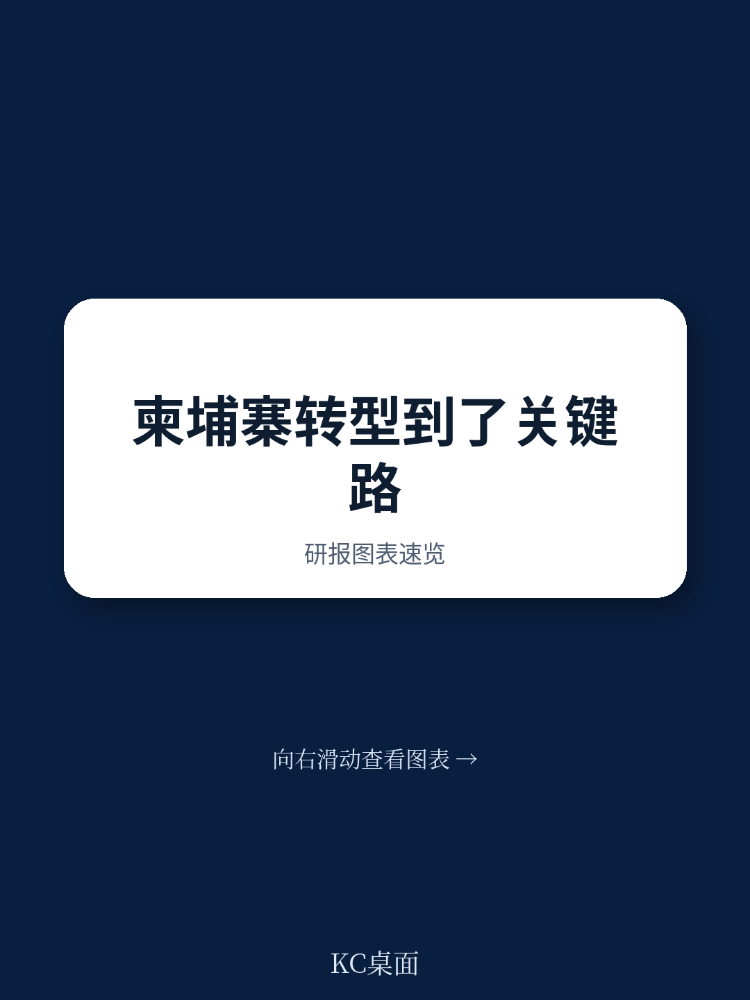
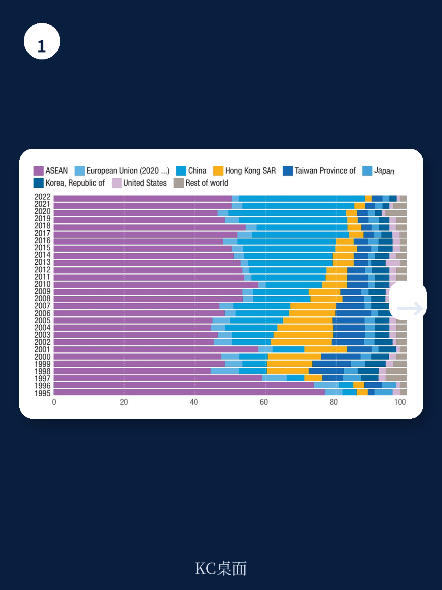
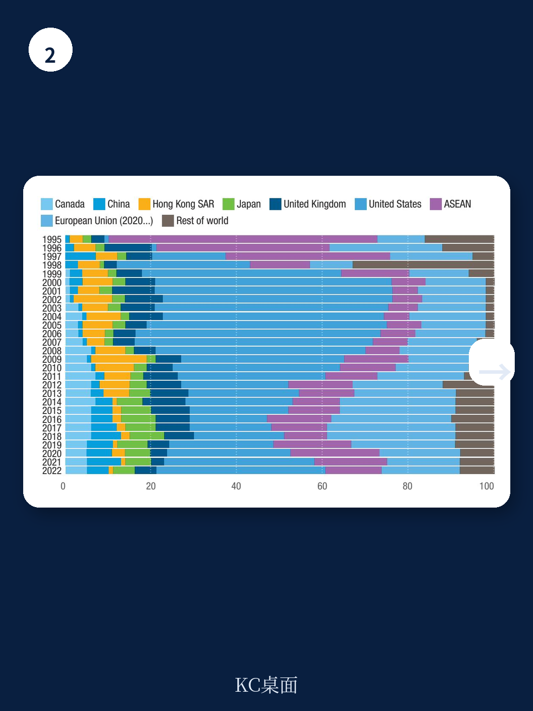

# 联合国贸发会议：柬埔寨毕业后的真正挑战，不是增长，而是如何构建经济韧性

柬埔寨正在经历一个标志性时刻。2024年，联合国发展政策委员会正式提到这个东南亚国家从最不发达国家名单中“毕业”。从1991年列入名单到如今达标，柬埔寨用三十多年时间完成了人均收入、人力资产和经济环境脆弱性三项核心指标的跨越。但联合国贸发会议最新发布的《柬埔寨脆弱性评估报告》传递了一个更值得关注的信号：毕业不是终点，脆弱性不会因为达标而自动消失。

这份报告的核心判断是：柬埔寨的增长模式高度依赖外部需求、外资流入和少数几个行业，真正的结构性转型尚未完成。毕业之后的挑战，不是如何维持GDP增速，而是如何在不依赖外部优惠待遇的前提下，构建自身的经济韧性。

报告使用的分析框架是联合国可持续发展目标的“5P”——繁荣、人民、地球、和平与伙伴关系。这五个维度共同指向一个核心问题：柬埔寨在毕业后的过渡期，能否把过去三十年积累的增长动能转化为不可逆的发展势能。

---

## 1. 柬埔寨的增长奇迹背后，是“高开放度、低复杂度”的结构性风险

1995年至2023年，柬埔寨年均实际GDP增速达到7.19%，人均GDP增速为5.54%。这一增速在东盟经济体中名列前茅，甚至超过了许多东亚新兴市场。但报告揭示了一个关键问题：这种增长高度依赖贸易和外资，而贸易和外资又高度集中在少数几个行业。

2022年，柬埔寨的贸易依存度达到194.25%，远高于东盟平均水平。这意味着柬埔寨经济的波动几乎完全取决于外部需求的变化。出口结构更加令人担忧：服装、鞋类和旅行用品占商品出口的绝大部分。报告中的数据显示，1999至2001年间与2019至2022年间相比，柬埔寨的出口产品组合同样高度集中在劳动密集型制造品，几乎没有向更高附加值领域移动。

进口结构同样反映出产业基础的薄弱。柬埔寨大量进口机械、设备和中间品，说明其制造业的本地化程度极低，本质上是一个“来料加工”模式。这种模式下，附加值的大部分留在了上游供应商和下游品牌方手中，柬埔寨获取的只是劳动力成本套利的空间。

> **KC评论：** 柬埔寨的增长模式很像一个“外包车间”——外部订单来了就开工，订单走了就闲置。这不是说增长不真实，而是说这种增长的根基是脆弱的。报告里有一张图展示了柬埔寨的出口产品空间，值得仔细看：它揭示的不是“我们卖什么”，而是“我们还能卖什么”。那些图中没有出现的产品类别，恰恰是判断未来转型空间的关键。

继续看原文，真正有价值的是报告中关于出口潜力和产品空间的评估图表。它们不是简单的贸易数据罗列，而是用网络分析法展示了柬埔寨当前的产品能力与潜在可进入产品之间的距离。完整报告与KC评论在每日汇编中。

---

## 2. 劳动力转移红利正在消退，生产率增长才是下一阶段的关键

柬埔寨过去三十年的增长，很大程度上来自劳动力从农业向制造业和服务业的转移。报告显示，1997年至2019年间，农业就业占比从超过70%下降到约35%，而制造业和服务业的就业占比持续上升。这种结构性转移本身就是生产率提升的来源——因为非农部门的劳动生产率远高于农业。

但报告也指出，这种转移红利正在接近尾声。2012年至2019年间，柬埔寨人均产出增长率已经出现放缓迹象。更关键的是，柬埔寨的劳动生产率水平与东盟其他经济体相比仍有较大差距。2022年，柬埔寨的产出增长率虽然保持在较高水平，但基数较低意味着追赶空间依然巨大，同时也意味着如果不能实现技术升级和产业深化，增长将面临天花板。

报告还特别关注了人力资本质量的问题。柬埔寨的人力资产指数虽然在2024年达到了77.8分，超过了毕业门槛的66分，但细看分解数据会发现，教育领域的表现是拖后腿的。中等教育完成率低于东盟多数国家，学习成果评估（PISA-D）显示柬埔寨学生在阅读、数学和科学方面的表现远低于国际平均水平。

> **KC评论：** 人力资本是“慢变量”——今天投入的教育资源，十年后才能体现在劳动生产率上。柬埔寨现在面临的问题是：劳动力转移红利还没完全耗尽，但新增长动力的培育窗口已经打开。如果不能在下一个五年内显著提升教育质量和技能培训的针对性，毕业后的经济增长可能会面临“青黄不接”的局面。报告里关于教育支出分解和PISA-D评估结果的两张图表，是理解这个问题的核心材料。

---

## 3. 财政空间和外部融资的脆弱性，限制了柬埔寨的政策回旋余地

一个容易被忽视但极其重要的问题是：毕业意味着柬埔寨将逐步失去最不发达国家身份带来的特殊优惠待遇。这包括贸易优惠（如欧盟的“除武器外一切商品”安排）、优惠融资（如国际开发协会的软贷款）以及技术援助等。

报告详细分析了柬埔寨的财政状况。2022年，柬埔寨的税收收入占GDP比重约为20%，在东盟国家中处于中等水平。但问题在于，政府支出中仍有相当比例依赖外部赠款和优惠贷款。随着毕业进程推进，这些外部资源将逐步减少甚至取消。报告中的图49和图50清晰地展示了这一趋势：赠款和其他收入占政府收入的比例在2010年代后期已经开始下降，官方发展援助占政府支出的比例也在持续走低。

与此同时，柬埔寨的外债存量在2000年至2021年间持续增长。虽然目前的债务指标尚在可控范围内，但考虑到未来融资条件可能恶化，财政空间将进一步收窄。报告还指出，柬埔寨的国内资源动员能力仍有提升空间——尤其是所得税和增值税的征收效率、非税收入的规范化等方面。

> **KC评论：** 毕业对柬埔寨最直接的冲击不是贸易优惠，而是融资条件的变化。当国际开发协会的软贷款变成世界银行IBRD的半商业贷款，当欧盟的EBA优惠被部分取消或附加条件，柬埔寨的财政空间会被压缩。报告里关于政府债务和外部偿债能力的图表，建议重点关注时间序列的变化趋势——它比单一时间点的绝对值更能说明问题。

---

## 4. 环境脆弱性与气候风险，是报告尚未完全展开的长期变量

报告专门设置了“Planet”维度来讨论环境脆弱性。数据显示，2000年至2020年间，柬埔寨因自然灾害造成的经济损失呈现上升趋势。洪水是最主要的灾害类型，且频率和强度都在增加。考虑到柬埔寨的经济活动高度集中在湄公河三角洲和低洼平原地区，气候变化的物理风险对农业、基础设施和人口聚居区的威胁是真实且迫切的。

但报告在环境脆弱性分析上有一个明显的未解问题：它没有充分量化气候风险对经济增长的长期影响路径。报告提供了灾害频率和经济损失的历史数据，也列出了柬埔寨的温室气体排放结构（能源和农业是主要排放源），但缺少一个完整的“风险传导机制”分析——比如极端天气事件如何通过农业减产、基础设施损毁、外资撤离等渠道，最终影响GDP增长和财政可持续性。

这也是报告留给读者继续深入阅读的价值所在。完整报告中的环境脆弱性指数分解、灾害经济损失的时间序列，以及柬埔寨的国家自主贡献目标与当前排放趋势之间的差距，都是值得进一步研究的材料。

---

## 5. 对观察者的框架：关注三个“毕业悖论”

从这份报告中可以提炼出一个观察框架，用于评估柬埔寨以及类似国家的毕业过渡质量。这个框架可以概括为三个“毕业悖论”

第一，增长与转型的悖论。毕业的门槛是人均收入、人力资产和脆弱性指数，但毕业后的可持续性取决于结构性转型。柬埔寨的增长数据很漂亮，但转型指标——产业复杂度、劳动生产率增速、出口多样性——才是真正的“健康指标”。

第二，开放与韧性的悖论。高贸易依存度是柬埔寨增长的动力，也是脆弱性的来源。毕业后的政策挑战在于：如何在维持开放的同时，通过产业多元化、区域供应链嵌入和国内市场培育来增强经济韧性。

第三，外部依赖与自主性的悖论。毕业意味着外部优惠减少，但也意味着政策空间扩大。柬埔寨不再受最不发达国家身份带来的某些政策约束，可以更灵活地制定产业政策、贸易政策和财政政策。问题是：这个自主性能否被有效利用，还是会被既得利益和路径依赖所消解。

---

报告的结论部分提出了几个具体的政策路径：重新激活和深化结构性转型、激活更积极的创业发展路径、动员更多发展融资。但这些路径都面临一个共同的约束条件——时间。毕业过渡期通常为三到五年，在这段窗口期内，柬埔寨需要完成从“外需驱动”到“内需与竞争力并重”的增长模式切换。

这不仅仅是柬埔寨的问题。全球有十几个国家正处于或即将进入毕业过渡期，它们的经验教训将直接影响联合国最不发达国家名单制度的有效性，以及全球发展融资体系的运作逻辑。

更多国际信源汇编与评论，扫码交流，每日更新，汇总国际主流叙事、数据与图表，观测边际变化。每日汇编会将单篇报告放回当天的主线中，整理成中文摘要、KC评论和图表合集，便于喂给AI，也便于人工快速扫描市场动态。目前已汇聚了头部券商、PE/VC、投行、并购、对冲基金、资管机构、战略咨询、智库等领域的从业者，期待交流。

Personal reading notes and learning share only. Not investment advice.
