Zambia

## Vulnerability Profile

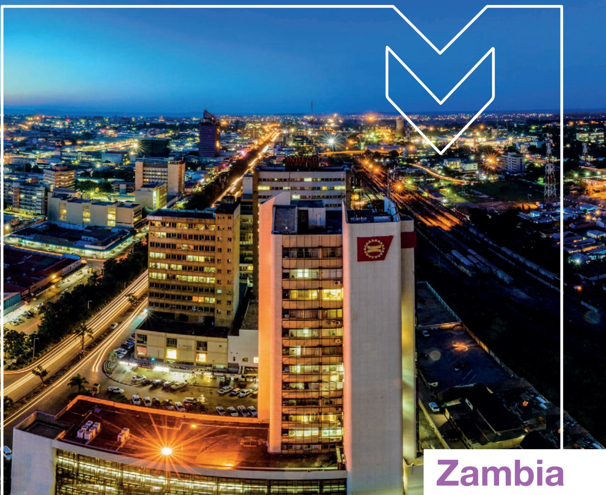

Zambia

## Vulnerability Profile

## © 2026, United Nations Conference on Trade and Development

The findings, interpretations and conclusions expressed herein are those of the authors and do not necessarily reflect the views of the United Nations or its officials or Member States.

The designations employed and the presentation of material on any map in this work do not imply the expression of any opinion whatsoever on the part of the United Nations concerning the legal status of any country, territory, city or area or of its authorities, or concerning the delimitation of its frontiers or boundaries.

Mention of any firm or licensed process does not imply the endorsement of the United Nations.

This publication has been edited externally.

UNCTAD/ALDC/VP/INF/2025/1

## Acknowledgements

The vulnerability profile of Zambia was undertaken by the Division for Africa, Least Developed Countries and Special Programmes of UNCTAD, under the guidance of Junior Davis, Head of the Branch and supervision of Rolf Traeger. The report was prepared by Benjamin Banda. Statistical support was provided by Kalimanshi Nsakaza, Bohan Yang (UNCTAD interns) and Stefanie West.

UNCTAD gratefully acknowledges the inputs by Samuel Bwalya (UNCTAD consultant) are gratefully appreciated.

The report was validated by government officials and national stakeholders at a validation workshop held on 10–11 October 2023 in Lusaka. UNCTAD also gratefully acknowledges the valuable contributions of the government officials, particularly Mwila Daka, Acting Director, and Tresford Musonda, Acting Assistant Director, from the Division of National Planning and Monitoring and Evaluation at the Ministry of Finance and National Planning; private sector representatives; non-governmental organizations and individuals who participated in the workshop.

Analysis from this report formed the basis of UNCTAD contributions to the graduation assessment document prepared jointly with the secretariat of the Committee for Development Policy, and which informed the deliberations of the Committee for Development Policy at its 2024 Triennial Review of the list of LDCs.

David Einhorn edited the text. Rostand Ngadjie Siani of UNCTAD and Gilles Maury undertook the overall layout, graphics and desktop publishing.

## Notes

Material in this publication may be freely quoted or reprinted, but full acknowledgement is requested. A copy of the publication containing the quotation or reprint should be sent to the UNCTAD secretariat at:

Palais des Nations, CH-1211 Geneva 10, Switzerland.

## 1.1.1. Explanatory notes

The term “dollars” (\$) refers to United States dollars unless otherwise specified.

The term “billion” signifies 1,000 million.

Annual rates of growth and change refer to compound rates.

Exports are valued “free on board” and imports, on a “cost, insurance, freight” basis, unless otherwise specified.

Use of a dash (−) between dates representing years, e.g. 1981–1990, signifies the full period involved, including the initial and final years. A slash (/) between two years, e.g. 1991/92, signifies a fiscal or crop year.

Throughout the profile, the term “least developed country” refers to a country included in the United Nations list of least developed countries.

The terms “country” and “economy”, as appropriate, also refer to territories or areas.

## 1.1.2. Tables

Two dots (..) indicate that the data are not available or are not separately reported.

One dot (.) indicates that the data are not applicable.

A dash (−) indicates that the amount is nil or negligible.

Percentages do not necessarily add up to totals, because of rounding.

## Tables of contents

1. Introduction .... 1
2. Situation analysis .... 5
2.1. Macroeconomic performance and development trajectory .... 5
2.2. Social development and related challenges .... 24
2.3. International trade .... 27
3. Addressing lingering vulnerabilities .... 61
3.1. Accelerate structural change and strengthen competitiveness .... 61
3.2. Invest in human capital for productive employment creation .... 66
3.3. Chart an inclusive low-carbon transition path .... 67
3.4. Accelerate economic recovery and build resilience .... 69
3.5. Mobilize financial resources for sustainable development .... 70
4. Towards a policy agenda for graduation with momentum .... 75
4.1. Achieve agricultural transformation and growth .... 76
4.2. Build manufacturing capabilities and strengthen export competitiveness .... 77
4.3. Leverage mineral wealth for economic transformation .... 78
4.4. Address spatial hydropower deficits .... 78
4.5. Address the effects of climate change .... 79
4.6. Invest in human capital development .... 79
4.7. Ensure policy coherence and consistency .... 80

## Figures

Figure 1 Zambia: Annual gross domestic product growth rate and gross national income per capita, 2000–2023 ....8
Figure 2 Zambia: Sector shares in gross domestic product, 1970–2022 ....14
Figure 3 Trends in mineral rents and copper prices, 1980–2021....18
Figure 4 Productive Capacities Index scores for Zambia and the Southern African Development Community, median in 2022 ....22
Figure 5 Productive Capacities Index scores for selected African countries, 2000, 2011, 2022 ....23
Figure 6 Zambia: Youth unemployment rate by age group, 2021 ....25
Figure 7 Zambia: Labour productivity by sector, 1994–2006 ....26
Figure 8 Zambia: Distribution of employment by sector, 2014 and 2020 ....27
Figure 9 Zambia: Trends in merchandise exports and imports, 1990–2022 ....28
Figure 10 Zambia: Commodity exports by product as a percentage of total merchandise exports, 1995–2022....28
Figure 11 Top 10 destinations of Zambia's merchandise exports by value, 2016 and 2022 ....29
Figure 12 Top 10 sources of Zambia's merchandise imports by value, 2016 and 2022 ....30
Figure 13 Zambia: Trends in exports of copper and non-traditional exports relative to total imports, 2000–2023\*.31
Figure 14 Intra-COMESA exports by product category, 2012 and 2022 ....33
Figure 15 Refugee population in Zambia, 1990–2022 ....35
Figure 16 Zambia: Gross national income per capita, 2002–2022 ....35
Figure 17 Zambia: Poverty headcounts and severity of poverty ....38
Figure 18 Zambia: Trends in poverty by sector of employment, 2005, 2010 and 2015 ....39

Figure 19 Zambia: Estimates of growth-poverty elasticity in selected sectors, 2005, 2010, and 2015 ....40
Figure 20 Zambia: Human Assets Index and selected components, 2000–2024 ....42
Figure 21 Zambia: Trends in infant and under 5 mortality rates and life expectancy at birth, 2000–2021 ....45
Figure 22 Zambia's scores on the Worldwide Governance Indicators, 1996–2021 ....48
Figure 23 Zambia's rankings on the Worldwide Governance Indicators, 1996–2021 ....49
Figure 24 Foreign direct investment inflows in Zambia, 1970–2022 ....50
Figure 25 Zambia: Gross value added per sector, 2018:Q1–2023:Q3 ....52
Figure 26 Zambia: External-debt-to-gross domestic product ratios, 2000–2021 ....54
Figure 27 Zambia: Public and publicly guaranteed debt and components, 1990–2021 ....56
Figure 28 Zambia: The share of interest payments by creditor type, 2000–2021 ....57
Figure 29 Zambia: Net transfers of all public and publicly guaranteed debt, official and private, 2000–2021 ....58
Figure 30 Zambia: Export product shares, 2021 ....64
Figure 31 Zambia: Tax revenue as a share of GDP and total revenue, 1990–2021 ....71

## Tables

Table 1 Zambia's performance against the least developed country graduation criteria, 2021 and 2024 .... 1
Table 2 Zambia: Selected macroeconomic indicators, 2010–2021 .... 7
Table 3 Zambia: Real growth rates and sector contributions to gross domestic product, 2014–2021 .... 10
Table 4 Mineral production in Zambia, 2015–2023 .... 17
Table 5 Average growth in industrial value-added, selected countries, 1981–2019 .... 21
Table 6 Zambia: Annual change in imports from major sources, 2017–2022 .... 53
Table 7 Zambia: Annual change in exports to top 20 destinations, 2018-2022 .... 53
Table 8 Zambia: External debt position as of 2021 .... 55
Table 9 Zambia: Public and publicly guaranteed stock of debt by creditor, 2021 .... 59
Table 10 Zambia: Export product shares in 2021 .... 62

## Boxes

Box 1 Farmer Input Support Programme 16

## Abbreviations

<table><tr><td>8NDP</td><td>Eighth National Development Plan</td></tr><tr><td>AfCFTA</td><td>African Continental Free Trade Area</td></tr><tr><td>CDP</td><td>Committee for Development Policy</td></tr><tr><td>COMESA</td><td>Common Market for Eastern and Southern Africa</td></tr><tr><td>FDI</td><td>foreign direct investment</td></tr><tr><td>FISP</td><td>Farmer Input Support Programme</td></tr><tr><td>GDP</td><td>gross domestic product</td></tr><tr><td>GNI</td><td>gross national income</td></tr><tr><td>GSP</td><td>Generalized System of Preferences</td></tr><tr><td>HAI</td><td>Human Assets Index</td></tr><tr><td>HIPC</td><td>Heavily Indebted Poor Country (Initiative)</td></tr><tr><td>ICT</td><td>information and communications technology</td></tr><tr><td>IFRS</td><td>International Financial Reporting Standard</td></tr><tr><td>IMF</td><td>International Monetary Fund</td></tr><tr><td>ISIC</td><td>International Standard Industrial Classification</td></tr><tr><td>LDC</td><td>least developed country</td></tr><tr><td>ODA</td><td>official development assistance</td></tr><tr><td>PCI</td><td>Productive Capacities Index</td></tr><tr><td>SADC</td><td>Southern African Development Community</td></tr><tr><td>SITC</td><td>Standard International Trade Classification</td></tr><tr><td>UNCTAD</td><td>United Nations Conference on Trade and Development</td></tr><tr><td>UNDP</td><td>United Nations Development Programme</td></tr><tr><td>UNESCO</td><td>United Nations Educational, Scientific and Cultural Organization</td></tr><tr><td>UNIDO</td><td>United Nations Industrial Development Organization</td></tr><tr><td>VP</td><td>Vulnerability Profile</td></tr></table>

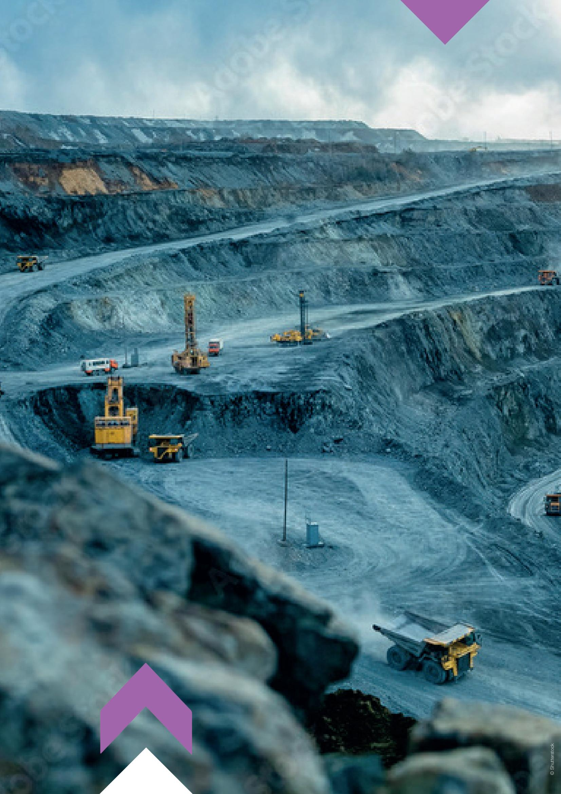

## 1. Introduction

The least developed country (LDC) category was established by the United Nations General Assembly in 1971 in response to development challenges faced by the “least developed among developing countries” (UNCTAD, 2021c). Zambia was officially included in the LDC category in 1991 following recommendations from the United Nations Economic and Social Council (ECOSOC) (United Nations, 1987, 1988, 1991). The country met the LDC graduation criteria for the first time 30 years later at the 2021 triennial review of the LDC criteria by the Committee for Development Policy (CDP).

A country may be recommended for graduation from the LDC category if it meets at least two thresholds of the LDC graduation criteria set by the CDP at its triennial reviews. Exceptionally, a country may be considered eligible for graduation if its gross national income (GNI) per capita is sustainably above the “income-only” graduation benchmark of \$3,918 set at three times the graduation threshold. Zambia met two of the LDC graduation criteria in 2021 — a GNI per capita of \$1,403 and a Human Assets Index (HAI) score of 68 (table 1). The country failed to meet the threshold for the Economic and Environmental Vulnerability Index, which is the third criterion. Further, the GNI per capita trend did not improve sufficiently after the COVID-19 pandemic crisis, such that the average GNI per capita for 2020–2022 (\$1,111) falls below the graduation threshold.1 As a result, Zambia did not meet the LDC graduation criteria at the 2024 triennial review.

## Table 1

Zambia's performance against the least developed country graduation criteria, 2021 and 2024

<table><tr><td></td><td>Gross national income per capita</td><td>Human Assets Index</td><td>Economic and Environmental Vulnerability Index</td></tr><tr><td>Zambia&#x27;s score in 2021</td><td>$1 403</td><td>68</td><td>41.7</td></tr><tr><td>(2021 threshold for graduation)</td><td>($1 222 or above)</td><td>(66 or above)</td><td>(32 or below)</td></tr><tr><td rowspan="2">Zambia&#x27;s score in 2024 (2024 threshold for graduation)</td><td>$1 111</td><td>71.4</td><td>39.8</td></tr><tr><td>($1 306 or above)</td><td>(66 or above)</td><td>(32 or below)</td></tr></table>

Source: UNCTAD secretariat calculations based on United Nations (2022).

Graduation from the LDC category is an important milestone because it implies that a country has made progress towards sustainable development — especially in the economic and social dimensions — and in addressing binding constraints and vulnerabilities. The long-term development goal for Zambia is captured in its 2030

Vision, which has as its overarching objective that the country become a middle-income country by 2030 (Government of Zambia, 2006). This will be achieved by harnessing renewable natural resources and using them to stimulate rapid economic growth, create job opportunities and reduce poverty and inequality. These priorities are further articulated in the country's Eighth National Development Plan (8NDP) (Government of Zambia, 2022a).

This Vulnerability Profile (VP) serves as a technical input to the process mandated by the United Nations General Assembly and led by the CDP to monitor and assess the readiness of countries that have met the LDC graduation requirements to exit the LDC category. It offers a forward-looking view of the main economic, social and structural vulnerabilities that the country faces on the path to graduation and examines the challenge of maintaining momentum after LDC graduation. The aim is to assist policymakers in Zambia in preparing for the graduation process to achieve sufficient development momentum in the face of risks that the country would be exposed to post-graduation.

In preparing the report, UNCTAD organized a national validation workshop where Zambian national stakeholders discussed potential transition pathways as well as strategies to address the identified vulnerabilities. The outcome of that stakeholder engagement and the VP should enable policymakers to put in place a comprehensive action plan to address the lingering vulnerabilities, and to

mobilize LDC-specific international support measures while they are still accessible.

Section 2 provides a snapshot of Zambia's economic and social development status. It reviews the dynamics of structural transformation and provides insights into why the copper economy is considered structurally weak. Highlights of major social developments and related challenges are also presented. The section then discusses Zambia's performance with respect to the LDC graduation criteria and the main vulnerabilities defined around what are called the “5 Ps” of the 2030 Agenda for Sustainable Development: people, prosperity, planet, peace and partnerships. Section 3 outlines proposals to address the vulnerabilities identified. Specifically, it offers suggestions for accelerating structural change and strengthening competitiveness, investing in human capital for productive employment creation, charting an inclusive low-carbon transition path, accelerating economic recovery and building resilience, and mobilizing financial resources for sustainable development. Section 4 concludes the report with practical recommendations to attain graduation with momentum, including by achieving agricultural transformation and growth, building manufacturing capabilities and export competitiveness, leveraging mineral wealth for economic transformation, addressing spatial hydropower deficits and the effects of climate change, investing in human capital development, and ensuring policy coherence and consistency.

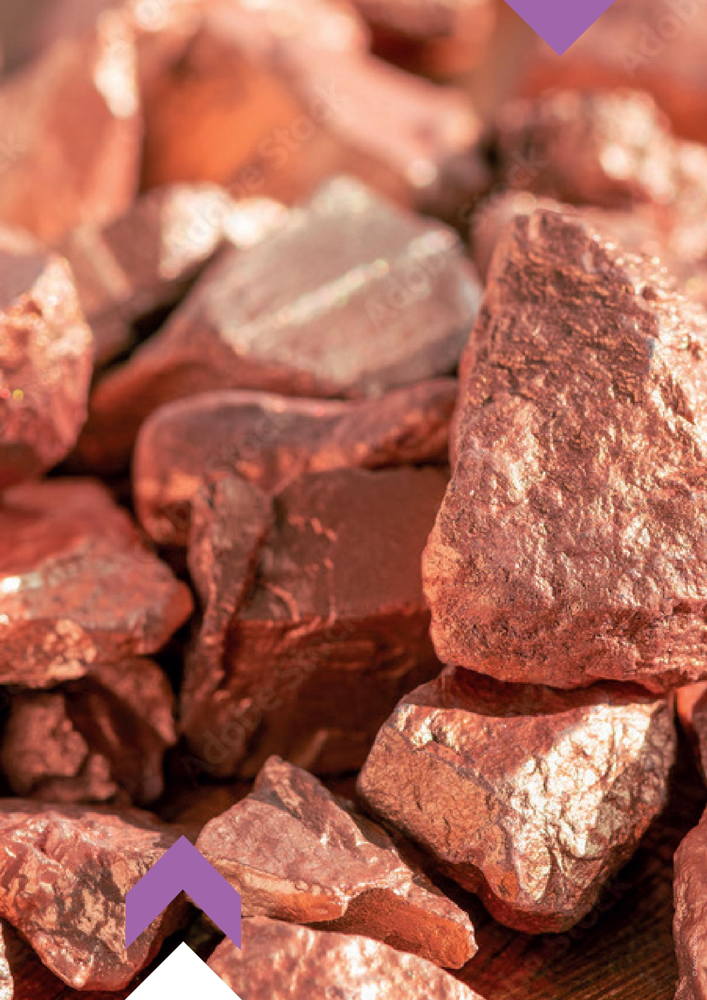

# 2. Situation analysis

Zambia was the seventh fastest growing economy in Africa from 2000 to 2010, and the third fastest among non-oil exporters, after Ethiopia and Rwanda. Gross domestic product (GDP) growth rates averaged 7.5 per cent per annum from 2003–2013, bolstered by gains in the price of copper. The 2008–2009 global financial crisis put a halt to this trend, as commodity prices slumped from 2012 to 2015. Despite the downturn, the macroeconomic environment remained relatively stable, as headline inflation stayed within the single-digit range over 2010–2019, and only rose to double digits at the height of the COVID-19 pandemic in 2020. However, international risks remained elevated after the global financial crisis as the nominal kwacha exchange rate to the US dollar rose by 12.3 per cent annually between 2010 and 2019, resulting in inflationary pressures.

Zambia's situation took a sharp turn for the worst with the surge in world prices of energy, food and agricultural inputs at the peak of the pandemic, coupled with inflationary expectations from exchange rate depreciation and uncertainties arising from the sovereign default on the country's external debt obligations (Eurobonds) in 2020. The inflation rate soared to 16 per cent in 2020 and to 22 per cent in 2021 from single digits in 2017–2019. However, the Extended Credit Facility agreed upon with the International Monetary Fund (IMF) in August 2022, and the government's commitment to restore macroeconomic stability, have contributed to bringing down inflation (IMF, 2022). Most macroeconomic indicators, which had deteriorated before COVID-19, have started to recover. Inflation eased to 9.5 per cent in October 2022, and the year-end average came down to 11 per cent, while the exchange rate strengthened in 2022.

Critically, mid-year revisions of the national accounts data show that economic growth rebounded strongly from -2.8 per cent in 2020 to 6.2 per cent in 2021 and 5.2 per cent in 2022. This trend is expected to be sustained with the implementation of macroeconomic policy reforms over the medium term, although the growth projection for 2023 was revised down to 2.7 per cent due to global headwinds affecting copper prices and operational challenges affecting production at some mines. Nevertheless, the 2024 budget adopted in October 2023, aims to achieve real GDP growth of at least 4.8 per cent and reduce inflation by 6–8 per cent, while cutting the fiscal deficit to 4.8 per cent of GDP (Government of Zambia, 2023f).

## 2.1. Macroeconomic performance and development trajectory

The structure and dynamics of the Zambian economy are linked to developments in the mining sector, particularly copper production. The share of copper in exports largely fluctuates with the price of copper, but in the last quarter of 2022 and the beginning of 2023, the decline in copper output was attributed to low ore grade, operational challenges, and routine maintenance closures at some mines (Bank of Zambia, 2023). Copper continued to dominate exports even as the price fluctuated significantly. For instance, while the price continuously fell from \$8,828 per metric ton in 2011 to \$4,868 per metric ton in 2016, production increased by 2 per cent over 2013–2021. However, there were large production volume cutbacks of 4 per cent and 7.5 per cent in 2015 and 2019, respectively, attributed to mining concession issues. The share of copper in exports initially rose from 63 per cent in 2013 to 72 per cent in 2018 before receding to 65 per cent in 2022, as world trade recovered after the pandemic. The price of copper reached \$9,317 per metric ton in 2021, before sliding down to \$8,822 in 2022 when global demand decreased as a result of the cost-of-living crisis, geopolitical tensions and wider fears of a global recession.

During global economic crises, base metals are usually among the first commodities to be affected and the first to recover as economic activities return to normal. For instance, after the global financial crisis, global demand for base metals including copper bounced back quickly as industrial production recovered (Arezki and Matsumoto, 2015). As copper prices soared, Zambia adopted an expansionary fiscal policy, headlined by government investment especially in infrastructure, thereby increasing government final consumption from just over 9 per cent of GDP in 2010 to an average of 15 per cent of GDP over 2016–2021 (table 2). Although a large portion of public expenditure was financed from domestic resources, most of the infrastructure spending was externally financed through foreign borrowing. The external debt stock increased from 21 per cent of GDP in 2010 to 117 per cent in 2019, reaching 147 per cent in 2020. Official development assistance (ODA) inflows remained low, $^{2}$ averaging 4.2 per cent of GDP over 2011–2020, and only rose to 5.6 per cent during the COVID-19 pandemic in 2020.

Despite the increase in government expenditure, the declining share of final consumption in GDP since the global financial crisis may be indicative of eroded incomes as interest rates and inflation

pressures mounted. Household and government final consumption expenditure declined from an average of 65 per cent of GDP in 2010–2015 to 58 per cent in 2016–2021 and 49.9 per cent in 2021. $^{3}$ A boost in net inflows of personal remittances from 0.2 per cent of GDP in 2016 to 1.1 per cent of GDP in 2021 may have supported household final consumption expenditure and savings, but a general decline in final consumption expenditure over the period negatively affected GDP growth.

Gross capital formation also declined over 2017–2021 from 38.8 per cent of GDP in 2017 to 28.9 per cent of GDP in 2021. However, positive foreign direct investment (FDI) net inflows over 2010–2021 enhanced investment and, subsequently, gross capital formation in the economy, though Zambia experienced capital outflow in 2020. With the exception of 2015 and 2017, the external balance in goods and services remained positive over 2010–2022 and climbed from an average of 1.4 per cent of GDP in 2010–2015 to 4.8 per cent in 2016–2020 and 14.6 per cent in 2020–2022.

Tax revenue rose steadily from \$2.6 billion (13 per cent of GDP) in 2010 to \$4.3 billion in 2014 (16 per cent of GDP), before declining to \$2.8 billion in 2016. Tax revenue recovered briefly to \$4.4 billion in 2018, only to slide back in subsequent years as economic growth faltered. As the primary fiscal surplus narrowed over 2010–2014, sustained spending on infrastructure development could only be matched by an increase in public debt from both domestic and international sources. Excessive domestic borrowing, in turn, reduced liquidity and final consumption expenditure, further slowing GDP growth. Rising fiscal deficits and external debt service obligations hovered at levels that could trigger a sovereign default in 2019-2021. This prompted the need for the IMF programme in 2022 to stabilize the

Zambia: Selected macroeconomic indicators, 2010–2021 (Percentage of gross domestic product)

<table><tr><td></td><td>2010</td><td>2011</td><td>2012</td><td>2013</td><td>2014</td><td>2015</td><td>2016</td><td>2017</td><td>2018</td><td>2019</td><td>2020</td><td>2021</td></tr><tr><td>Household final consumption expenditure, including expenditures of non-profit institutions serving households</td><td>54.6</td><td>55.8</td><td>52.7</td><td>52.2</td><td>52.2</td><td>50.6</td><td>51.4</td><td>47.0</td><td>45.0</td><td>42.2</td><td>38.5</td><td>32.8</td></tr><tr><td>General government final consumption expenditure</td><td>9.4</td><td>10.2</td><td>11.9</td><td>12.2</td><td>14.5</td><td>14.8</td><td>16.1</td><td>13.7</td><td>12.7</td><td>17.7</td><td>14.7</td><td>17.1</td></tr><tr><td>Gross fixed capital expenditure</td><td>25.9</td><td>28.7</td><td>24.1</td><td>26.0</td><td>31.0</td><td>38.5</td><td>36.4</td><td>38.8</td><td>35.1</td><td>35.8</td><td>29.9</td><td>28.9</td></tr><tr><td>Gross domestic savings</td><td>36.0</td><td>34.0</td><td>35.4</td><td>35.6</td><td>33.2</td><td>34.6</td><td>32.5</td><td>39.3</td><td>42.3</td><td>40.1</td><td>46.8</td><td>50.1</td></tr><tr><td>Exports of goods and services</td><td>37.0</td><td>40.5</td><td>40.1</td><td>40.5</td><td>38.8</td><td>37.1</td><td>35.3</td><td>35.0</td><td>38.0</td><td>34.6</td><td>46.8</td><td>52.1</td></tr><tr><td>Imports of goods and services</td><td>30.9</td><td>35.7</td><td>39.0</td><td>40.0</td><td>37.4</td><td>42.7</td><td>38.6</td><td>36.6</td><td>36.9</td><td>34.2</td><td>32.5</td><td>33.9</td></tr><tr><td>External balance on goods and services</td><td>6.2</td><td>4.7</td><td>1.1</td><td>0.5</td><td>1.5</td><td>-5.6</td><td>-3.3</td><td>-1.6</td><td>1.0</td><td>0.5</td><td>14.3</td><td>18.2</td></tr><tr><td>Net official development assistance received</td><td>4.5</td><td>4.4</td><td>3.8</td><td>4.1</td><td>3.7</td><td>3.8</td><td>4.6</td><td>4.0</td><td>3.8</td><td>4.1</td><td>5.6</td><td>4.8</td></tr><tr><td>Foreign direct investment, net inflows</td><td>8.5</td><td>4.7</td><td>6.8</td><td>7.5</td><td>5.6</td><td>7.4</td><td>3.2</td><td>4.3</td><td>1.6</td><td>2.4</td><td>1.4</td><td>-1.6</td></tr><tr><td>Foreign direct investment, net outflows</td><td>5.4</td><td>0.0</td><td>-2.8</td><td>1.5</td><td>-3.6</td><td>-0.7</td><td>0.8</td><td>-0.3</td><td>0.2</td><td>3.0</td><td>0.4</td><td>-2.3</td></tr><tr><td>Personal remittances</td><td>0.2</td><td>0.2</td><td>0.3</td><td>0.2</td><td>0.2</td><td>0.2</td><td>0.2</td><td>0.4</td><td>0.4</td><td>0.4</td><td>0.7</td><td>1.1</td></tr><tr><td>External debt</td><td>21.0</td><td>21.2</td><td>22.4</td><td>22.4</td><td>33.9</td><td>55.4</td><td>72.6</td><td>88.7</td><td>89.4</td><td>116.9</td><td>147.4</td><td>108.6</td></tr><tr><td colspan="13">Prices, nominal</td></tr><tr><td>Inflation, consumer prices</td><td>8.5</td><td>6.4</td><td>6.6</td><td>7.0</td><td>7.8</td><td>10.1</td><td>17.9</td><td>6.6</td><td>7.5</td><td>9.2</td><td>15.7</td><td>22.0</td></tr><tr><td>Nominal exchange rate</td><td>4.8</td><td>4.9</td><td>5.1</td><td>5.4</td><td>6.2</td><td>8.6</td><td>10.3</td><td>9.5</td><td>10.5</td><td>12.9</td><td>18.3</td><td>20.0</td></tr></table>

Source: UNCTAD calculations, based on World Bank, World Development Indicators database.

economy and pave the way for credible debt restructuring negotiations with external creditors. In principle, a debt restructuring is under way, as the main partners represented in Zambia's creditors committee have signed a memorandum of understanding for the process (Government of Zambia, 2023f). This will involve at least \$8 billion of the public and publicly guaranteed external debt owed to main creditors. $^{4}$ An agreement has also been reached with commercial bond holders to restructure \$3.3 billion of commercial debt, bringing the total debt

under consideration for restructuring to \$13.4 billion, including official bilateral debt. $^{5}$

## 2.1.1. Economic growth patterns GDP growth trend

The phenomenal revival of copper in the early 2000s was responsible for boosting Zambia's GNI per capita, which more than trebled from \$420 in 2003 to \$1,760 in 2014. However, the subsequent downturn pulled GNI per capita down, particularly from 2015 to 2020 (figure 1). The economic slowdown, which had started in 2013, continued into the pandemic in 2020. Before the pandemic, the GDP growth rate remained positive but weak, and a slight recovery in 2016–2018 did not last, as growth receded to 1.4 per cent in 2019. The pandemic recession in 2020 was deep but brief as copper prices remained buoyant through the pandemic until 2021. The drop in the price of copper in 2021 and 2022 was countered by the general recovery in international trade, the rise in the price of agricultural commodities, and gains in non-traditional exports. However, the medium-term GNI per capita growth projections will need to consider that Zambia met the LDC income graduation threshold in 2021 only because the income assessed did not take into account the impact of COVID-19 and that post-pandemic prospects depend on the global economic outlook remaining positive in the medium to long term. In fact, Zambia did not meet the income graduation criterion at the 2024 triennial review, as its GNI per capita of \$1,111 was less than the graduation threshold of \$1,306.

Overall, the decline in per capita GNI during 2015–2022 is attributed to three key factors. First, the average GDP growth rate was matched by population growth of about 3 per cent over 2013–2022. Second, the fertility rate only declined by a small margin, from 5.9 births per woman in 2000 to 4.3 births per woman in 2021, and it remained higher than the LDC average of 4 births per woman in 2021. $^{6}$ Finally, the rapid depreciation of the kwacha further eroded GNI per capita valued in dollars terms. The nominal kwacha-dollar exchange rate increased by a staggering 19.5 per cent per year, from ZMW 6.15 per dollar in 2014 to ZMW 20.02 per dollar in 2021. Further slippage of the nominal exchange rate could erode GNI per capita, particularly if economic growth decelerates. Ensuring macroeconomic stability and diversifying the economic base as well as exports would be important to sustaining growth in per capita income.

## Growth decomposition

Growth decomposition by sector shows a dismal and erratic growth performance of the agriculture sector during the 2014–2021

## Figure 1

Zambia: Annual gross domestic product growth rate and gross national income per capita, 2000–2023  
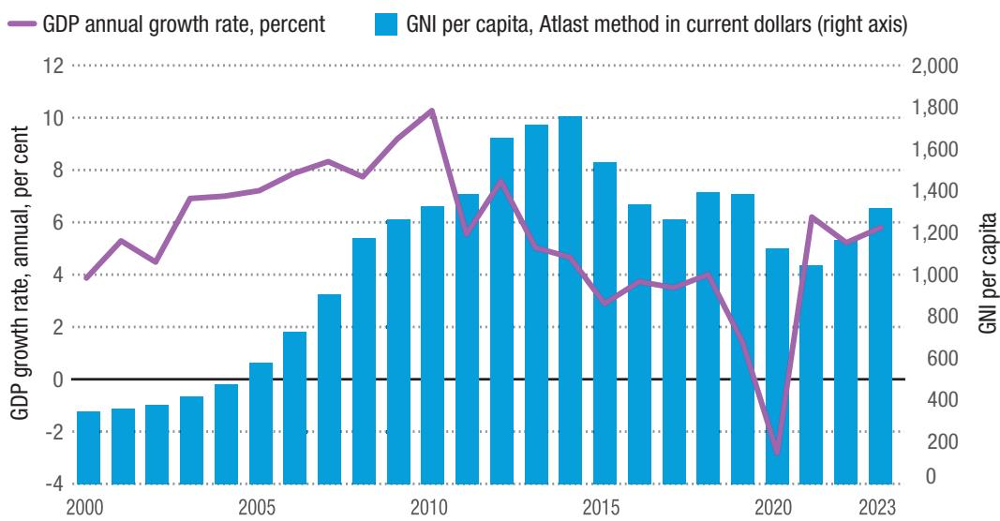  
Source: UNCTAD calculations, based on World Bank, World Development Indicators database.

$^{6}$ The World Bank's World Development Indicators database defines the total fertility rate as the number of children that would be born to a woman if she were to live to the end of her childbearing years and bear children in accordance with age-specific fertility rates of the specified year.

period, yet this is the sector in which over 85 per cent of the rural poor work. It is therefore the most critical sector for generating inclusive growth and shared prosperity. The share of the primary sector in the economy has declined to 20 per cent of GDP from a high of 35 per cent in the 1970s and from 26 per cent in 1991. Because of the nature of vulnerabilities and risks surrounding the agriculture sector, urgent policy measures are needed to address the sector's growth and infrastructure development deficits in the coming years. It is for the latter reason that the sector receives the largest disbursement of public subsidies annually through the Farmer Input Support Programme (FISP) and direct aid from the Food Reserve Agency. However, these subsidies have been criticized for not addressing key challenges in the sector – particularly productivity, infrastructure and technology gaps (Kuntashula and Mwelwa-Zgambo, 2022; Andrews, 2021).

In contrast, the mining sector posted impressive growth rates in 2016–2018, but slowed in 2019–2021. This has been attributed to a fall in production at two of the largest copper mines, Konkola and Mopani. Production of copper declined from 838,000 metric tons in 2020 to 800,000 tons in 2021, partly due to a long-running dispute over management of the mines, $^{7}$ as well as to the effects of the COVID-19 pandemic. Despite fluctuations, average copper prices remain high on international markets. The government projects that production will significantly increase to 1.5 million tons over the medium to long term. The government has since identified an equity partner for the Konkola copper mine, and the selection process for the Mopani mine is also advancing (Government of Zambia, 2023f).

The industrial sector, consisting of manufacturing and construction, was robust and growing at an average of 6.6 per cent a year between 2014 and 2018 before experiencing a downturn in 2019 and 2020. Construction contributed the most to industrial growth, registering 18 per cent growth in 2015 and remaining robust into 2017. Manufacturing growth has been increasing since 2004 and should be strengthened further as a result of efforts to diversify the economy and enhance future growth prospects. Sustaining high rates of growth in the industrial sector spurs growth in other sectors of the economy, creates sustainable job opportunities, and helps to build economic resilience through diversification and export competitiveness. Overall, the industrial sector increased its contribution to GDP from 18.3 per cent in 2014 to 27.3 per cent in 2021. However, the manufacturing share was far below the 15 per cent last recorded in 1991 before the sector was decimated by structural adjustment policies and programmes. $^{8}$ Diversifying production and exports would require exploiting the potential of manufacturing to boost industrial growth and transformation over the medium to long term. New construction projects, both public and privately funded, are expected to foster job creation and income growth. The rapid growth of the construction sector creates job opportunities for young people in both rural and urban areas, and the sector has been shown to generate the second largest positive impact on reducing poverty and inequality in Zambia after agriculture (Mphuka et al., 2017, 2021).

Zambia: Real growth rates and sector contributions to gross domestic product, 2014–2021
(Percentage)

<table><tr><td>Industry</td><td>2014</td><td>2015</td><td>2016</td><td>2017</td><td>2018</td><td>2019</td><td>2020</td><td>2021</td></tr><tr><td colspan="9">Real growth rates</td></tr><tr><td>Primary sector</td><td>0.9</td><td>-3.3</td><td>5.8</td><td>5.8</td><td>-5.4</td><td>-0.1</td><td>1.9</td><td>-0.8</td></tr><tr><td>Agriculture, forestry &amp; fishing</td><td>1.1</td><td>-7.7</td><td>3.7</td><td>9.8</td><td>-21.2</td><td>0.5</td><td>1.1</td><td>-0.1</td></tr><tr><td>Mining and quarrying</td><td>-2.3</td><td>0.2</td><td>7.3</td><td>3.0</td><td>6.3</td><td>-0.5</td><td>0.8</td><td>-0.7</td></tr><tr><td>Secondary sector</td><td>7.7</td><td>10.5</td><td>4.7</td><td>6.7</td><td>3.4</td><td>-0.5</td><td>-0.4</td><td>1.7</td></tr><tr><td>Manufacturing</td><td>6.5</td><td>5.4</td><td>1.9</td><td>4.4</td><td>4.1</td><td>0.2</td><td>0.1</td><td>0.4</td></tr><tr><td>Construction</td><td>10.6</td><td>18.0</td><td>10.2</td><td>6.4</td><td>1.6</td><td>-0.5</td><td>-0.6</td><td>1.1</td></tr><tr><td>Tertiary sector</td><td>5.6</td><td>2.2</td><td>2.8</td><td>1.7</td><td>6.8</td><td>2.0</td><td>-3.5</td><td>2.6</td></tr><tr><td>Wholesale and retail trade</td><td>3.4</td><td>1.5</td><td>-0.1</td><td>0.7</td><td>3.3</td><td>0.1</td><td>-2.7</td><td>0.4</td></tr><tr><td>Transportation and storage</td><td>6.6</td><td>0.6</td><td>-2.2</td><td>7.8</td><td>0.9</td><td>-0.1</td><td>0.5</td><td>0.3</td></tr><tr><td>Financial and insurance</td><td>15.1</td><td>12.1</td><td>-2.4</td><td>-5.8</td><td>23.7</td><td>0.3</td><td>0.6</td><td>0.3</td></tr><tr><td>GDP at market prices</td><td>4.7</td><td>2.9</td><td>3.8</td><td>3.5</td><td>4.0</td><td>1.4</td><td>-2.79</td><td>3.6</td></tr><tr><td colspan="9">Sector shares in GDP</td></tr><tr><td>Primary sector</td><td>21.4</td><td>17.7</td><td>19.4</td><td>19.9</td><td>17.9</td><td>17.1</td><td>18.3</td><td>22.3</td></tr><tr><td>Agriculture, forest &amp; fishing</td><td>6.8</td><td>5.0</td><td>6.2</td><td>4.0</td><td>3.5</td><td>2.9</td><td>3.0</td><td>3.0</td></tr><tr><td>Mining and quarrying</td><td>14.6</td><td>12.7</td><td>13.2</td><td>15.8</td><td>15.1</td><td>14.2</td><td>15.3</td><td>19.4</td></tr><tr><td>Secondary sector</td><td>18.3</td><td>21.0</td><td>23.1</td><td>21.5</td><td>20.3</td><td>27.4</td><td>25.0</td><td>27.3</td></tr><tr><td>Manufacturing</td><td>6.8</td><td>7.5</td><td>7.7</td><td>8.1</td><td>7.8</td><td>6.8</td><td>7.7</td><td>8.9</td></tr><tr><td>Construction</td><td>8.9</td><td>10.2</td><td>10.3</td><td>9.5</td><td>9.1</td><td>11.0</td><td>14.7</td><td>16.2</td></tr><tr><td>Tertiary sector</td><td>53.5</td><td>56.2</td><td>54.2</td><td>52.1</td><td>54.0</td><td>54.6</td><td>53.6</td><td>48.1</td></tr><tr><td>Wholesale and retail trade</td><td>21.8</td><td>22.3</td><td>20.9</td><td>19.0</td><td>21.0</td><td>20.1</td><td>17.4</td><td>17.3</td></tr><tr><td>Transportation and storage</td><td>3.6</td><td>4.0</td><td>4.4</td><td>5.7</td><td>7.2</td><td>8.3</td><td>9.9</td><td>7.3</td></tr><tr><td>Finance and insurance</td><td>3.2</td><td>3.9</td><td>4.5</td><td>5.2</td><td>5.1</td><td>7.1</td><td>7.8</td><td>7.1</td></tr><tr><td>GDP at constant 2010 prices</td><td>100</td><td>100</td><td>100</td><td>100</td><td>100</td><td>100</td><td>100</td><td>100</td></tr></table>

Source: Government of Zambia (2020b, 2021).

There has also been rapid growth and strong performance in the services sector, despite its unique challenges. Between 2014 and 2019, overall growth in the sector ranged between 2 and 6.8 per cent, before contracting by 3.5 per cent in 2020 because of the pandemic. However, services recovered quickly, with growth of 2.6 per cent in 2021, sustained by the wholesale and retail, transport and financial services subsectors. Growth in these subsectors had rallied after 2020 as the recovery from the pandemic gathered pace and consumption rebounded to pre-pandemic levels.

The services sector accounted for 53.6 per cent of GDP in 2020. The sector absorbs the largest share of the labour force and, consequently, helps to reduce poverty, especially among urban households. $^{9}$ According to the 2021 labour force survey, construction employed 5 per cent of the labour force, but the activities with the highest share of the employed population (25 per cent) were wholesale and retail trade, and repair of motor vehicles and motorcycles, with agriculture, forestry and fishing the second most important sector for employment (24 per cent) (Government of Zambia, 2022c). Labour productivity in the services sector is lowest among the productive sectors, however, with the only sectors with positive productivity growth in 2019-2021 being electricity supply, mining and quarrying, water supply, sewerage and waste management, real estate, and information and communication. Over the medium to long term, there is a need to enhance technological capacity to facilitate growth and development in the real sector of the economy and to raise productivity and expand delivery of cost-effective services linked to economic sectors. The services sector is expected to continue to play a facilitative role in the country's overall development process (Government of Zambia, 2022a).

## 2.1.2. The dynamics of structural transformation

From independence to the present, Zambia has implemented a number of reforms that have affected the progress of structural changes and overcoming certain entrenched trends. The first decade after independence was considerably successful despite major challenges in education and social infrastructure, which were largely neglected during the colonial era, as well as huge wage and income inequalities. As fiscal imbalances and balance-of-payment challenges emerged, structural adjustment programmes were adopted in the 1980s and 1990s, but they were structurally inconsistent and erratically implemented. At the same time, the domestic policy space remained constrained due to overexposure to external debt and limited availability of foreign exchange. Reforms implemented after 1994 mainly coincided with the political calendar, with national development planning cycles coming more into focus.

## Post-independence Zambia: 1964–1980

At independence in 1964, Zambia inherited a dualistic economy heavily dependent on two primary sectors: agriculture, which was largely neglected with the exception of a small capital-intensive farming settler community; and mining, which was critical for foreign exchange earnings and government revenue (Fincham, 1980). The mining sector retained the largest share of GDP (57 per cent), with copper mining alone accounting for 41 per cent of GDP. The secondary and tertiary sectors accounted for only 13 per cent and 30 per cent of GDP, respectively. In the first decade after independence, copper production increased massively following a boom in international prices. Government revenue from mining ranged from 15 to 19 per cent of GDP, allowing the new government to invest in infrastructure, including rail and road networks, health facilities, schools and public buildings (Whitworth, 2023). Although many public infrastructure investments were realized, some of the projects were too costly. For example, while the Tanzania-Zambia railways and the Tanzania-Zambia crude oil pipeline were needed due to sanctions in Southern Rhodesia (now Zimbabwe), a key trade route to the south, these investments did not immediately spur private sector growth and, despite being commercial in nature, were non-viable economically (Whitworth, 2023; Fincham, 1980).

The nationalization policy pursued through the Matero Reforms of 1968/1969 helped consolidate all strategic assets under state control, thereby expanding the role of the state in mining, manufacturing, construction, agriculture, and wholesale and retail trade, among other sectors. As the role of the state expanded, so did the pressure on local management of nationalized enterprises to improve competitiveness and profitability (Whitworth, 2023). The reforms also gave indigenous Zambians the opportunity to control wholesale and retail trade in rural and urban areas, but it is unclear whether the indigenization of the sector achieved any positive results for the local private sector (Beveridge, 1974). However, the Matero reforms are credited for the rapid expansion of public investments through the acquisition of private enterprises and creation of new state-owned enterprises, and the reforms eventually led to the

government holding controlling stakes in both mining and industry during the 1980s (Makuyana and Odhiambo, 2014).

Parastatal losses in the mid-1970s marked a turning point for state expansion in commercial ventures (Makuyana and Odhiambo, 2014). A precipitous fall in copper prices on the international market in the 1970s and 1980s curtailed growth in copper export revenues and reduced the public finances needed to sustain expansionary public service delivery to under-served rural areas. Between 1975 and 1978, copper prices were below production costs, further stretching the state's financial losses (Southall, 1980). At the time, the decrease in copper prices and revenues was perceived as temporary, so the government resorted to foreign borrowing to bridge the fiscal financing gap in hope that prices would rebound in the foreseeable future and replenish the public coffers and repay the loans (Thurlow and Wobst, 2006). However, no such rebound occurred for a long time, and by the middle of the 1980s the need for fiscal realignment had become apparent.

## Market reforms: 1980–1990

As copper prices remained low, at less than a dollar per pound through the 1980s, Zambia's economic crises deepened. The government had to make difficult choices to restrain unsustainable consumption expenditures by abolishing subsidies on essential commodities, including food subsidies. Structural adjustment policies were first introduced in 1978, with a focus on revamping private investment through liberalization and reduced public investment. This marked a major shift from a welfare-oriented policy towards market-oriented policies encouraged by the IMF and World Bank. The second phase of the structural adjustment programmes in 1983 introduced wider reforms of state-owned enterprises, including removal of subsidies to them, liberalization of markets, and removal of state controls over interest rates and prices (Makuyana and Odhiambo, 2014). The reforms also placed limits on wage increases ( $= < 5$ per cent) in the

civil service and removed subsidies on essential commodities, including maize and fertilizers. Further measures in 1985 expanded market liberalization in agriculture and introduced foreign exchange auctions to abolish foreign exchange quotas. The reforms were abandoned in 1987 due to widespread dissatisfaction with increased production costs for manufacturing and other sectors, which soared due to interest rates hikes, devaluation of the kwacha, and a foreign currency crunch. There was also widespread social discontent with rising consumer prices, the limit on wage increases, rising investment risk due to negative real interest rates, and a general economic slowdown (Simutanyi, 1996).

The Interim New Economic Recovery Programme announced in 1987 was a significant reversal of the IMF structural adjustment programme in that it brought back price controls, fixed the exchange rate, and nationalized strategic food marketing chains (Simutanyi, 1996). The government then backtracked with the Fourth National Development Plan 1989–1993, which reverted to the IMF programme of deregulating markets, except for maize. Further, it aligned fiscal and monetary policies with the goal of stabilizing the economy and restoring confidence in the market system. Reforms to the civil service and parastatal reforms were carried out, but the government remained firmly opposed to the complete removal of subsidies on maize and fertilizers, while some privatizations were put on hold. As the tension grew over budget overruns, missed programme targets and misaligned priorities, donor support was withdrawn in 1991 (Andersson et al., 2000).

The frequent reversals in policies between 1980 and 1991 reflected deep opposition to ideological intrusion in development planning, and a divergence of views over results of the structural adjustment programmes. Privatization of parastatals was in direct contrast to nationalization policies of the 1970s and disregarded the fact that the private sector was not ready to undertake market functions (IMF, 2007). It was also

felt that the economy was unresponsive to reforms because it was unbalanced, with the extractive industry and agriculture not providing backward and forward linkages for structural change to occur. However, there was a broad consensus that subsidies on food, fertilizer and other goods were unsustainable, and that some forms of privatization and economic reform were necessary (Gubser, 2023).

## The return of an orthodox structural transformation programme: 1990–1996

In 1990, the government agreed to a World Bank reform package to remove price controls on all goods except maize. The package also adjusted interest rates and foreign exchange rates, removed foreign exchange restrictions, and introduced fiscal austerity measures as well as trade liberalization, among other measures (Simutanyi, 1996). In the same year, political reforms were agreed upon that triggered multi-party elections, which ushered in a pro-liberal government in the 1991 elections. The new government made structural adjustment reforms a priority to address internal and external imbalances, and to build up foreign exchange reserves. To curtail shortages of essential commodities, the government liberalized trade, finance and investment. By 1993, the new government had fully embraced an orthodox structural adjustment programme with full liberalization of prices, removal of subsidies on maize and fertilizers, liberalization of the foreign exchange market, and privation of state-owned enterprises, including mines, Zambia Airways, and Industrial Development Corporations, among others. The difference this time was that the government was more committed to reforms despite their devastating impact on social infrastructure (Simutanyi, 1996; Gubser, 2023).

These cycles of reforms show that Zambians sounded rejected externally imposed measures to reduce the role of the state in the economy. The contentious issues revolved around the distribution of the costs and benefits of structural reforms, with

the rural population and the urban poor, who are in the majority, benefitting from price controls and subsidies in agriculture. It may also be argued that patronage played a role in negating the impact of privatization, particularly in the main sectors of the economy (mining and agriculture). This is evidenced in the reform agenda implemented from 1997 to 2006, which saw more than 200 entities privatized, including large assets in mining such as the Konkola, Nchanga, Nkana and Mufulira Divisions mines, as well as the Ndola Lime Company (IMF and World Bank, 1999).

## Consolidation of national development planning: 1997–to date

After 1996, the government re-established donor relations with debt relief and economic recovery as the main considerations. After three cycles of multiparty elections in 1991, 1996 and 2001, it was evident that the success of economic reforms depended on balancing domestic expectations as well as external demands (Rakner, 2003). Within the constrained domestic policy space, the government embarked on an industrial revival in 1994 through the Commercial Trade and Industrial Policy aimed at boosting local content, value addition, and non-traditional exports such as food products, wood products, textiles, clothing and leather. The policy was further revised in 2005 to provide more support to private investments and facilitate the development of productive capacity to enhance competitiveness (Mudenda, 2009).

## 2.1.3. Evidence of structural changes: 1970–2020

In response to the economic and political reforms implemented since independence, the structure of the Zambian economy has changed from one dominated by primary sectors (mining and agriculture) to one dominated by services. The share of agriculture, hunting, forestry, fishing (ISIC A-B) and mining and utilities (ISIC C-E, less ISIC D) dropped to 31 per cent of GDP in 1975 from more than 57 per cent in 1964, whereas the services sector increased its share to 45 per cent. $^{10}$ Apart from mining, the share of agriculture and services in GDP expanded from 1968 to 1990, with the share of manufacturing growing more rapidly as a result of the import-substitution strategy and the nascent protectionist trade regime for industry. The dominance of the services sector occurred at a time when public administration had expanded rapidly to cover almost all services sectors — ranging from trade to transport, finance, insurance, and transport, among others — through the creation of state-owned enterprises. This trend is evident in the expansion of wholesale, retail trade, restaurants and

hotels, as well as other activities from the mid-1990s to 2020 (figure 2).

Major policy changes have taken place since independence, especially during the years of state-led development (1970s and 1980s,) the structural adjustment era (1990s), and the years following the Highly Indebted Poor Country (HIPC) initiative (2000–present). To understand these dynamics, this section presents a sectoral trend analysis of agriculture, industry (manufacturing and construction) and mining with the aim of clarifying the economic dynamics that could spur structural transformation.

## Figure 2

## Zambia: Sector shares in gross domestic product, 1970–2022 (Percentage)

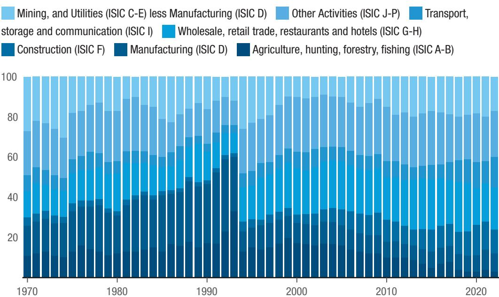  
Source: UNCTAD calculations, based on data from UNStats.

## Agricultural and industrial development

Zambia adopted an import-substitution industrial strategy in 1965 to promote the value addition of manufacturing. The policy was instrumental later in reducing the import bill following a sustained fall in copper export revenues, as copper prices remained depressed throughout the 1970s and 1980s. High import tariffs and other quantitative

measures were imposed on competing imports to protect local manufacturing industries dominated by state-owned enterprises. As a result, the manufacturing sector grew rapidly throughout the 1970s and 1980s, increasing its share of GDP to 20 per cent in 1975 from 5 per cent at independence in 1964, and reaching 30 per cent of GDP in 1988–1989. In 1987, the share of manufacturing valued added in GDP for Zambia had surpassed that of the

Republic of Korea, and that continued up until the eventual collapse of manufacturing in 1993, when the sector was decimated by cheap imports following trade liberalization measures. The manufacturing sector in Zambia has never recovered to its levels prior to the structural adjustment reform.

The second set of structural adjustment measures liberalized agricultural marketing, abolished agricultural subsidies, and closed state-run agricultural entities, except those responsible for managing strategic food reserves. These policy measures were intense, with far-reaching adverse effects on agricultural production, rural livelihoods and poverty reduction. The government was overly optimistic that the private sector was going to step in to fill the void left by the government's withdrawal from agricultural marketing and financing. Agricultural markets were expected to emerge rapidly on the back of market forces to promote efficiency and competitiveness in the sector. However, public policy distortions in agricultural output and input markets remained even after agricultural marketing was liberalized. $^{11}$ The timing of the removal of subsidies was also misjudged, as it coincided with a rise in world oil prices and a deep fall in copper prices, both of which adversely destabilized domestic prices and increased costs for farmers. As risks and vulnerability to shocks persisted, the private sector's response remained sluggish, and private investment did not expand as envisaged.

The distortions created by an expensive system of subsidies, price controls and taxation in agriculture benefitted consumers, but at the expense of low agricultural productivity, high production costs, and entrenched dependency of rural, smallholder and subsistence farmers (Wichern et al.,

1999). In addition, the import-substitution policies pursued during various phases of economic reforms did not induce industrial-led agricultural growth. Instead, subsistence employment in agriculture increased as the social impact of the structural reforms deepened. Agriculture's contribution to GDP declined to below 10 per cent by 2020. Growth was subdued throughout the 1990s, and in recent years the sector has been in a recession, averaging -0.9 per cent growth between 2011 and 2019. By 2021, the contribution of agriculture, forestry, and fishing (excluding hunting) to GDP collapsed to 2.96 per cent (table 3).

Government expenditure on agricultural subsidies accounted for about 1.8 per cent of GDP (about \$350 million) annually over 2011–2019, and the FISP alone absorbed 73 per cent of the agriculture budget in 2022 (Teschemacher et al., 2023). While well intended and critical for reducing poverty and inequality, these subsidies deliver limited benefits, aside from political exigencies, and do so at the expense of innovation, productivity and other sectoral goals. If these resources had been spent on long-term productive investments such as agricultural infrastructure, extension services, technology development, mechanization and market development, they would have substantially increased output and transformed the agriculture sector (McPherson, 2004). At its launch in 2002, the FISP targeted only 120,000 farmers, but the number of beneficiaries has multiplied to over a million farmers (box 1), and the cost is considerable at 73 per cent of the agriculture budget in 2022. The effectiveness of the FISP is also questioned because relatively well-off farmers also benefit from the programme, raising concerns about its distributional effect (Teschemacher et al., 2023).

## Box 1 Farmer Input Support Programme

Zambia launched a Fertilizer Support Programme in 2002 that was renamed the Farmer Input Support Programme (FISP) in 2009. The programme has two main objectives: (i) increase access to agricultural inputs by small-scale farmers at an affordable cost, and (ii) increase the participation and competitiveness of the private sector in the supply and distribution of agricultural inputs. The number of FISP beneficiaries is reviewed annually, and selection is based on criteria determined by the Ministry of Agriculture. The number of beneficiaries in the 2017/2018 farming season was 1,024,434, a number that has remained static in the years since, including the 2023/2024 season.

## Source: Government of Zambia (2023a).

In its current form, the FISP poses two clear contradictions that impede agricultural development policies. Price controls and subsidies serve to guarantee low food prices as opposed to improving incentives to farmers through higher prices for their produce, which could have positive effects on longer-term investment and on capital-output ratios to drive productivity growth in the sector. On the other hand, the choice between concentrating government programmes and scarce resources on commercial and emergent farmers or on the rural, smallholder subsistence farmers, who constitute the majority of farmers, is a trade-off that successive governing regimes have found challenging. There may be a need for broader sectoral policy reforms, including of the FISP, to spur agricultural growth, reduce food price volatility, and increase the competitiveness of agricultural exports.

## Mining and mineral development

The mining sector has gone through three intense phases of structural and policy reforms. The first phase ran from pre-independence until the nationalization of mining assets in 1968. During this period, the mining sector accounted for 60 per cent of GDP and was the mainstay of the post-independence economy. During the second phase, the post-nationalization era starting in the 1970s, mining assets were brought under state control. Despite the government prioritizing the mining sector, revenues from copper declined as copper prices fell to less than a dollar per pound. The share of

mining in GDP declined from a high of 60 per cent at independence in 1964 to 13 per cent in 1975, stagnating at this level until dropping to 4.5 per cent in 1990. The last phase relates to the post-privatization era after 1995. It is also during this phase that copper prices declined sharply from \$1.40 per pound in June 1995 to \$0.62 per pound in February 1999. Initially, the share of mining in GDP rose again to 14.4 per cent in 1995, but then steadily declined to 3.76 per cent in 1999 and stayed on average at that level until a final dip to 1.25 per cent in 2009. As copper prices recovered after the global financial crisis, mining companies increased production from 710,860 metric tons in 2015 to 837,997 metric tons in 2020 (table 4), before declining to 800,696 metric tons in 2021 due to disruptions to production as a result of persistent disputes between the government and some of the mine owners. In contrast, coal production increased six times over as demand for the product increased over 2015–2021.

Manganese production also increased over 2015–2021. Other minerals, such as emeralds and gold, showed minimal growth. It is hoped that a recent investment in a new nickel mine, which is projected to produce 360,000 metric tons annually over 2024–2033, will bolster efforts to diversify mining production away from copper. Depending on the import partner, the price of a metric ton of nickel in 2022 ranged from \$23,729 to \$50,259, and if that price range were to remain throughout the life of the mine Zambia could generate over \$8 billion in export revenues annually. This is over 40 per cent more than what the country earned from copper exports in 2022, and it could boost tax revenues from mineral exports. Given that the average tax-to-mining GDP ratio is 13.5 per cent (2015–2021), at an annual production level of 360,000 metric tons, the new nickel mine could substantially raise tax revenues for Zambia. However, there would be a need to avoid unproductive tax policies – such as hefty tax concessions/holidays – for new investments to avoid repeating past oversights in the mineral development agreements offered to investors during the privatization of copper mines in 1993.

Table 4
Mineral production in Zambia, 2015–2023

<table><tr><td></td><td>Copper (metric tons)</td><td>Gold (kilograms)</td><td>Cobalt (metric tons)</td><td>Nickel (metric tons)</td><td>Coal (metric tons)</td><td>Emeralds (kilograms)</td><td>Manganese (metric tons)</td></tr><tr><td>2015</td><td>710 860</td><td>4 807</td><td>..</td><td>..</td><td>103 439</td><td>..</td><td>..</td></tr><tr><td>2016</td><td>770 588</td><td>4 514</td><td>..</td><td>..</td><td>129 470</td><td>..</td><td>..</td></tr><tr><td>2017</td><td>797 266</td><td>4 564</td><td>420</td><td>..</td><td>208 608</td><td>..</td><td>..</td></tr><tr><td>2018</td><td>868 908</td><td>6 381</td><td>835</td><td>..</td><td>344 717</td><td>18 869</td><td>..</td></tr><tr><td>2019</td><td>789 942</td><td>9 424</td><td>379</td><td>1 110</td><td>361 648</td><td>23 705</td><td>15 904</td></tr><tr><td>2020</td><td>837 996</td><td>6 381</td><td>316</td><td>3 226</td><td>446 153</td><td>9 783</td><td>46 515</td></tr><tr><td>2021</td><td>803 747</td><td>3 599</td><td>247</td><td>3 834</td><td>663 345</td><td>12 871</td><td>132 241</td></tr><tr><td>2022</td><td>763 550</td><td>3 526</td><td>251</td><td>4 059</td><td>691 288</td><td>22 381</td><td>158 675</td></tr><tr><td>2023</td><td>698 566</td><td>2 237</td><td>207</td><td>7 980</td><td>706 115</td><td>14 813</td><td>171 066</td></tr></table>

Source: Various economic reports, Ministry of Finance and National Planning.

Once the envisaged investment materializes in the Konkola Deep mine and Mopani projects (estimated at \$1.8 billion) and the other three new copper mines come on board, annual copper output is forecast to increase to 1.5 million tons by 2030. If the current upswings in copper and nickel prices are sustained, a buoyant mining sector will drive robust growth and potentially unlock opportunities in other sectors. From experience, however, mining-led economic growth does not automatically trigger structural economic transformation unless accompanied by targeted sectoral policies in the medium to long term. A stable and predictable fiscal regime is also needed to ensure that the country gets optimal returns from its mineral wealth. In the past, several policy approaches were pursued, all aimed at putting in place a mining tax regime that would adequately balance profit incentives to attract investment, on the one hand, and secure a decent economic return, on the other. However, tax policymaking for the mining sector is always a highly contested and interest-laden political process. The political economy issues obscure efforts to select an optimal fiscal regime, even when the policy regime is known with certainty. Ultimately, the rebalancing of contested interests has led to frequent tinkering with the fiscal regime, causing oscillations between suboptimal alternatives. Strengthening tax audit capacity and independence of the tax collection body could help Zambia achieve optimal revenue from minerals. In this regard, the Zambia Revenue Authority set up a Transfer Pricing Unit in March 2016 that has been instrumental in exposing complex tax evasion cases, including a landmark \$13 million ruling against Mopani Copper Mines (OECD, 2020).

The current fiscal regime is not robust enough to optimally capture revenues from mining operations under varying economic circumstances (Mwaba and Kayizzi-Mugerwa, 2021). A predictable fiscal regime is needed to promote investments and increase the benefits from the sector. Following the privatization of mines in 1995, tax revenues from mining as a share of mining in GDP dropped from 8.55 per cent to 0.74 per cent by 2004. Thereafter, copper prices started to rise, boosting mining tax revenues, which grew rapidly from 4.17 per cent of GDP in 2005 and 13.58 per cent of GDP in 2006, before jumping to 45 per cent and 80.8 per cent of GDP in 2008 and 2009, respectively. These high proportions were driven by the collection of back taxes, which were originally disputed by mining companies.

Figure 3 presents data on mineral rents as a proxy for tax collected from mining in Chile, South Africa and Zambia. $^{12}$ The analysis reveals that Zambia collects just as much in mineral revenues as Chile. It also reveals that mineral revenues are highly correlated with copper prices on the international market. These observations are consistent with trends in mineral rents for South Africa, where mineral revenues are dominated by non-copper extractions, but follow commodity price trends. The analysis also indicates that the mining tax regime in Zambia is not far off from international practices. Once an optimal regime is in place and stabilized, shortfalls in revenue outturns can only arise from lapses in tax administration and changes in cost/price structures. Restoring trust between mine owners and the government, on the one hand, and the citizenry, on the other, is of utmost importance to attracting investment and bringing stability to the mining sector. A predictable mineral tax policy regime is also critical to ensure a stable operational environment for mining to preserve a robust level of output amid copper price booms and busts and shifting domestic politics.

## Figure 3

Trends in mineral rents and copper prices, 1980–2021  
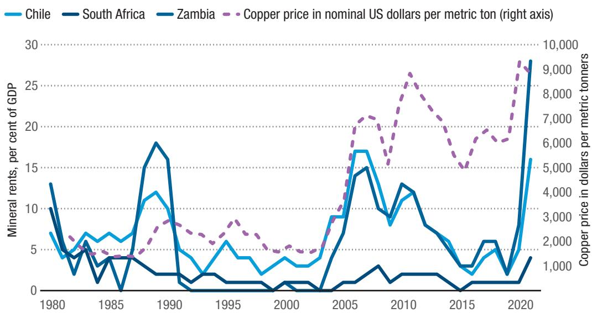  
Source: UNCTAD calculations, based on World Bank, World Development Indicators database.  
$^{12}$ Mineral rents are calculated as the difference between the value of production for a stock of minerals at world prices and their total costs of production. Minerals included in the calculation are tin, gold, lead, zinc, iron, copper, nickel, silver, bauxite and phosphate.

## The services sector

Alongside the primary and secondary sectors, the services sector has the potential to drive structural change and development in the Zambian economy, as was already the case from 2011–2021. The privatization of state assets and trade liberalization reforms opened the sector to foreign investment, leading to a significant rebound in services. Wholesale, retail trade, restaurants, and hotels (ISIC G-H) grew from an average of 15 per cent of GDP (1970–1990) to 17 per cent of GDP (1991–1999), and subsequently to 23 per cent of GDP between 2000 and 2020 (figure 2). Employment and productivity also increased in similar proportions. And whereas the share of agricultural employment declined by more than 50 per cent to 22.5 per cent of GDP between 2014 and 2020, and that of mining stagnated at 2 per cent, employment in the manufacturing, construction and trade sectors more than doubled to 26.1 per cent, with the retail and wholesale subsector accounting for an average of 20 per cent of GDP over 2015–2020. The overall share of the services sector in GDP rose to a record high of 54 per cent between 2015 and 2020 before marginally declining to about 48 per cent in 2021 due to COVID-19. Similarly, jobs in the services sector increased in 2020 to 61 per cent of total employment in the economy.

Banking and financial services contributed to growth in the services sector, although some of the gains are spinoffs from the mining sector. $^{13}$ Financial liberalization and the privatization of government equity stakes in selected banks and non-bank financial institutions opened opportunities for growth and innovation in the financial sector. Prior to these reforms, the share of the financial sector in GDP averaged 3 per cent, before dropping to 1.4 per cent in 1990. Thereafter, the sector posted steady growth, increasing its share of GDP to an average of 7.6 per cent throughout the 1990s and 2000s. Financial sector jobs grew modestly, accounting for no more than 1 per cent of total employment in the economy.

The transport and construction sectors, which were least adversely affected by structural adjustment reforms, grew from the mid-1990s to 2020, but not enough to contribute to structural change in the economy (figure 2). It is important to note that the dominance of the services sector in GDP started in the late 1980s, when government entered and dominated the provision of wholesale, retail, transport (road, rail, and air) and insurance services, among other areas. The recent dominance of the services sector in GDP and employment is slightly different, as it was driven by private investments in retail and wholesale, transport and communication, financial services, and real estate subsectors after the liberalization of these sectors in 1992/1993 and beyond. The strong performance of the mining sector following an upswing in copper prices in 2003 provided additional impetus for growth in this sector. With a positive macroeconomic outlook, buoyant growth in the mining sector and a strong external sector will drive growth in the services sector. These developments should be leveraged to spur growth in agriculture and manufacturing, thereby diversifying the sources of growth and building resilience to shocks over the medium term.

## Fostering linkages

Industrial progress in Zambia has not moved in line with its potential or with development opportunities. Overall industrial production and growth stagnated in the 1990s, only picking up and exceeding the sub-Saharan average from 2000 and beyond (table 5). This was mainly driven by growth in the construction and energy sectors, and less by manufacturing. The mining sector, largely classified as a primary sector, does contribute to industrial growth through the further processing of the extracted materials other than supplementary activities aimed at preparing the crude materials for marketing. However, manufacturing growth was minimal because of the weak link between mining and industry (manufacturing). There has been some expansion in coal production since the privatization of Maamba Colliers and the construction of a coal-fired electricity generation plant. Coal production rose to 663,345 metric tons in 2021 from 103,439 metric tons in 2015.

The medium-term goal to use mineral wealth to push forward Zambia's industrialization and export diversification agenda envisioned in the Seventh National Development Plan did not materialize (Government of Zambia, 2017a). There could be opportunities to use manganese and nickel deposits to intensify manufacturing activity and diversify exports. Minerals and metallurgical knowledge have the potential to spur industrial and manufacturing capabilities, which could help boost the export of manufactures to regional and global markets (Collier, 2014). This is in line with the Southern African Development Community (SADC) industrialization strategy, which underscores the need to harness natural resource endowments to promote export-oriented industrialization and ultimately contribute to growth and employment creation. However, this requires aggressive mobilization of investment in value-addition activities.

In addition to promoting manufacturing value addition by using Zambia's rich mineral assets, industrial capabilities can be built around agroprocessing, with a focus on export-oriented food, textiles, leather and garments, and timber and wood processing industries. Abundant and unexploited industrial minerals could be used to develop industrial, pharmaceutical and agrochemical manufacturing subsectors to produce for domestic and export markets. Some of these initiatives

could be implemented through existing economic or export processing zones, and by leveraging regional and continental market access initiatives under the Common Market for Eastern and Southern Africa (COMESA), SADC and the African Continental Free Trade Area (AfCFTA). In this context, there is a need to focus policy efforts on building productive capacity and capturing current and emerging market access opportunities to move the industrialization and diversification agenda forward. Building industrial capabilities is critical for Zambia's eventual graduation from the LDC category and to achieve the 2030 Vision of middle-income status. In addition, deployment of such productive capacity would be key to building a green and climate-resilient industrial structure where agricultural, manufacturing, mining and energy become bedrocks for industrial growth and structural transformation.

Although recent growth in industrial value added is above the average for sub-Saharan Africa (table 5), much of that growth came from construction and, to some extent, mineral processing, with very little coming from manufacturing. A durable approach to industrialization needs to be propelled by growth in manufacturing value added and export diversification, as this sector generates strong backward and forward linkages in the economy and beyond. For Zambia, the manufacturing sector's backward linkages within the SADC region increased to 0.44 per cent in 2015 from 0.36 per cent in 2000 (UNIDO, 2020; Ncube and Tregenna, 2022). $^{14}$ Zambia should align its industrial strategy with the SADC regional industrialization policy and roadmap (2015–2063), which seeks to develop regional value chains in agroprocessing and minerals (SADC, 2015). These are sectors where Zambia has both an absolute and competitive advantage.

Average growth in industrial value-added, selected countries, 1981–2019 (Percentage)

<table><tr><td></td><td>1981–1989</td><td>1990–1999</td><td>2000–2009</td><td>2010–2019</td></tr><tr><td>Sub-Saharan Africa</td><td>0.5</td><td>0.5</td><td>3.9</td><td>1.5</td></tr><tr><td>South Africa</td><td>-0.4</td><td>0.9</td><td>3.1</td><td>0.1</td></tr><tr><td>United Republic of Tanzania</td><td>..</td><td>3.2</td><td>5.8</td><td>3.5</td></tr><tr><td>Kenya</td><td>4.0</td><td>0.9</td><td>7.2</td><td>6.3</td></tr><tr><td>Zambia</td><td>1.1</td><td>-1.2</td><td>7.5</td><td>3.7</td></tr><tr><td>Uganda</td><td>5.0</td><td>11.5</td><td>9.4</td><td>4.3</td></tr><tr><td>Namibia</td><td>0.6</td><td>2.5</td><td>7.0</td><td>2.7</td></tr></table>

Source: UNCTAD calculations, based on data from World Bank, World Development Indicators database.

Zambia could also boost its industrial growth, exports and employment by exploiting SADC market opportunities, as only 20 per cent of total SADC trade in 2018 came from within the SADC region. Currently, Zambia's market share in SADC is only 2 per cent, compared to 55 per cent for South Africa and 4 per cent for Kenya. Zambia needs to double its market share by investing in growing and diversifying its industrial production. The country has a good starting point for accomplishing this goal. Of all its exports to the region in 2018, 27 per cent were medium-high-tech products, which is just about the average for lower-middle-income countries (UNIDO, 2020). For Zambia, the challenge is that the overall market share in SADC is very small at 2 per cent, and only 9 per cent of that comes from technologically intensive sectors. Deliberate efforts are needed to increase the exports of manufacturers by incentivizing industrial production and trade. In addition, research and development and innovation activities in Zambia are very limited, as demonstrated by the small number of patent registration applications — a total of 3 in 2010 and 12 in 2018. In contrast, South Africa had 656 patent applications in 2010 and 728 in 2018. Zambia should intensify its research and development and innovation activities to promote continuous improvement of its production processes, which cover a wide range of goods and services. In terms of global value chain positioning, manufacturing backward linkages are

weak. The foreign value added in exports is only 12 per cent, which is very low by global standards. Forward linkages are a little more developed, with value addition in other countries' exports estimated at 34 per cent. This figure is driven by the fact that exports are dominated by copper, and most of the exports undergo minimal value addition. Developing copper value chains by creating copper-based industrial processing zones could attract investment and dramatically change this picture.

The manufacturing sector's carbon footprint is small. Zambia generates only 0.24 kg of carbon for every dollar value of manufactured exports, far below the average for lower-middle-income countries (UNIDO, 2020). The country needs to keep this carbon footprint low by investing in carbon-efficient production processes so that over time its carbon emissions per dollar value of manufactured exports will either remain constant or even decrease. The advantage is that Zambia already has 88 per cent of its manufacturing processes powered by renewable energy sources, mainly hydropower. Hydropower generation capacity increased from 3,011 megawatts in 2020 to 3,625 megawatts in 2022, when the Kafue Lower and Lusiwasi power plants came into full production. Current energy demand in Zambia is estimated at 2,310 megawatts, which is below its installed supply capacity. However, hydropower generation is sometimes scaled down below market demand due to low water levels in

reservoirs, when water recharge flows at below-average levels due to poor rainfall patterns (ERB, 2021). Even when electricity generation is sufficient, serious spatial electricity deficits exist in outlying areas, as most electric-powered production facilities and transmission infrastructure are built along rail lines. These spatial hydropower deficits need to be addressed by scaling up investments in off-grid and mini-hydropower plants in underserviced parts of the country to promote rural industrialization.

## 2.1.4. Productive Capacities Index

Zambia has gone through a number of development phases characterized by episodes of rapid economic growth, stagnation and recessions. The episodes were driven by several internal and external factors, the effects of which were further exacerbated by existing economic and social vulnerabilities. These vulnerabilities erode or limit the country's current and future production and prospects to pursue robust and sustainable green growth pathways. It is important to assess the current productive capacity of Zambia and benchmark it against comparators from within the SADC region. The Productive Capacities Index (PCI) developed by UNCTAD captures three broadly defined capacity areas that countries critically need: productive resources, entrepreneurial capabilities, and production linkages (UNCTAD, 2006). These three dimensions are measured by eight key attendant components from which the PCI is constructed: human capital, natural capital, energy, transport, information and communications technology (ICT), institutions, private sector, and structural change.

Scores on the overall PCI and its subindices range between 0 and 100 (boundaries not included), with higher scores indicating better performance. The PCI as a benchmark places Zambia close to the median for the SADC subregion (figure 4). The top five frontrunners on the PCI in the SADC are South Africa, Seychelles, Mauritius, Botswana and Namibia. Except for South Africa, these are small countries in terms of population and geography, while Seychelles is also a small island developing state. On account of their small population and size, these countries tend to score better on the PCI (UNCTAD, 2020).

## Figure 4

Productive Capacities Index scores for Zambia and the Southern African Development Community, median in 2022

Southern African Development Community Zambia

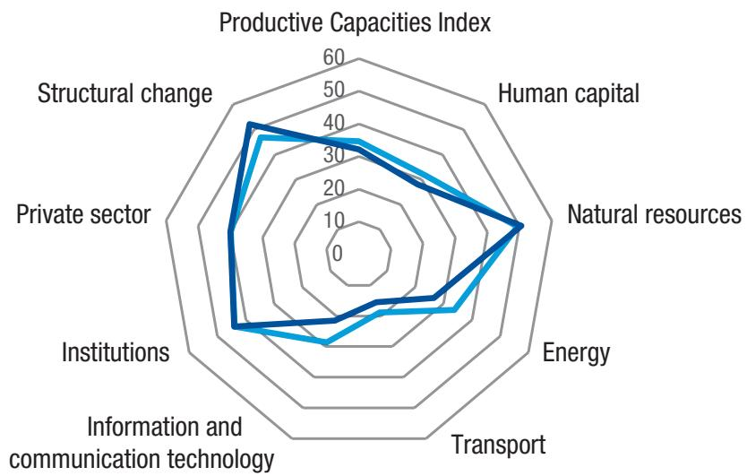  
Source: UNCTAD calculations, based on data from UNCTADStat.

Zambia's productive capacity as measured by the PCI increased modestly from a score of 23 in 2000 to 27 in 2011, and from 27 to 32 between 2011 and 2022. But the 2022 score was still very low compared to 52 for South Africa, which is a middle-income economy (figure 5). Overall, human capital, energy, transport, ICT and lack of structural change are some of the major constraints to enhancing productive capacity in Zambia. Energy indicators declined by 40 per cent between 2000 and 2008 but recovered well to the 2000 level by 2017 and remained there in 2022. The transport sector also declined by 45 per cent over 2000–2008, but unlike the energy sector, the transport sector, while initially recovering to reach a new high in 2015, then slid back by close to 39 per cent to finish 31 per cent below its 2000 level in 2022. As Zambia is

a landlocked country, expanding the road network and upgrading critical roads from gravel to bituminous standards will be critical to boosting production capacity and trade, and should be prioritized in the coming years. With respect to energy, there have been improvements in electricity generation capacity (hydropower), and hydropower generation capacity and supply increased from 2,410.66 megawatts in 2015 to 3,316.4 megawatts in 2021 (ERB, 2015, 2021). However, hydroelectricity generation depends on stable and favourable rainfall patterns, which are frequently adversely affected by climate-change-induced droughts. Annual electricity demand was estimated at 2,310 megawatts in 2020, but that demand is often not met because of generation constraints imposed by low water levels in hydropower dams.

  
Figure 5

Productive Capacities Index scores for selected African countries, 2000, 2011, 2022  
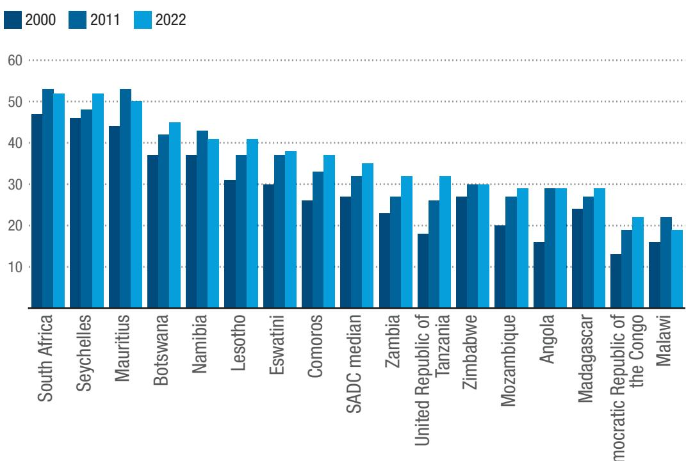  
Source: UNCTAD calculations, based on data from UNCTADStat.
Note: SADC: Southern African Development Community.

There was substantial improvement in Zambia's ICT indicators from 2000–2022, as measured by the PCI. Despite starting from a very low base, ICT indicators more than

quadrupled from 5 in 2000 to 22 in 2022 (a 336 per cent increase). Mobile coverage increased, with mobile subscription rates increasing threefold, from 5.4 million in

2010 to 20.2 million active subscribers in 2021. This translates into 50 percentage point growth in mobile phone penetration rates per 100 inhabitants, from 41.6 per cent in 2010 to 91.6 per cent and 110 per cent in 2019 and 2021, respectively. Notwithstanding this improvement, there is a need to improve the overall contribution of ICT services to the PCI score. The policy priority in this regard should involve scaling up investments in physical ICT infrastructure to enhance the coverage, usage and quality of ICT service across the country and, in turn, reduce the cost of ICT service.

Compared to the SADC median score on the PCI, Zambia also lags on human capital. The country's human capital subindex score increased at 4.5 per cent annually over 2000–2011, but during the 2012–2022 period it declined to 3.2 per cent annually. In contrast, scores for the natural capital and institutions subindices were relatively better in 2000 and improved slightly over 2000–2022. The country needs to sustain rapid growth in these areas to accelerate growth and enhance global competitiveness. Increasing private investment, enabling public investments, promoting export diversification and boosting manufacturing value-addition capabilities will be critical to reducing structural vulnerabilities and will ultimately contribute to rapid structural transformation of the Zambian economy going forward.

## 2.2. Social development and related challenges

The population of Zambia continued to grow at a faster rate (3.1 per cent) than the world average (1.1 per cent) over 2012–2022. Zambia's population is estimated to have risen to 20 million in 2022 from 14.7 million in 2012. This represents an increase of 522,896 people annually during that period. Between 1960 and 1980, fertility rates averaged 7.3 children per woman. While that rate declined to 4.3 children

per woman in 2021, the fertility rate is still high, at almost twice the world average of 2.3 children per woman. With large proportions of the population in child-bearing age, the population is expected to grow rapidly over the next decade, which will increase the demand for decent jobs and social services such as housing, health, education and other social amenities.

The youth population accounted for 55 per cent of the labour force in 2020, marginally decreasing from 60 per cent in 2014. $^{15}$ However, there has been a dramatic movement of labour from rural to urban areas, mainly in search of employment and better livelihood options. The proportion of the labour force in rural areas dropped to 34 per cent in 2020 from 56 per cent in 2014. This pattern also reflects the urban development bias in Zambia and the lack of growth in the agriculture sector since 2011. As a result, the share of agricultural employment in total employment decreased by more than 50 percentage points to 22.5 per cent in 2020 from 88.9 per cent in 2014 (Government of Zambia, 2014, 2020b). In contrast, the share of employment in the tertiary and secondary sectors doubled during that period, reinforcing the urban development bias. Overall, unemployment rates almost doubled from 7.4 per cent in 2014 to 13.8 per cent in 2020, while the youth unemployment rate rose sharply to 20 per cent over 2014-2020.

Investing public resources to harness demographic dividends would foster rapid and inclusive sustainable development and should be prioritized. The level of total youth unemployment fell to 17 per cent in 2021 on account of lower unemployment for those above 30 years of age (figure 6). The youth unemployment rate was highest (25 per cent) among youth between the ages of 15 and 24. Spatially, North Western (33.5), Luapula (27.7), Southern (21.3) and Muchinga (20.7) provinces have very high youth unemployment rates (Government of Zambia, 2022c). It is estimated that

Figure 6
Zambia: Youth unemployment rate by age group, 2021 (Percentage)

harnessing demographic dividends by investing in human capital development (health, education and skills development)

would increase per capita income by as much as \$611 by 2030 and \$7,393 by 2053 (Government of Zambia, 2015a).

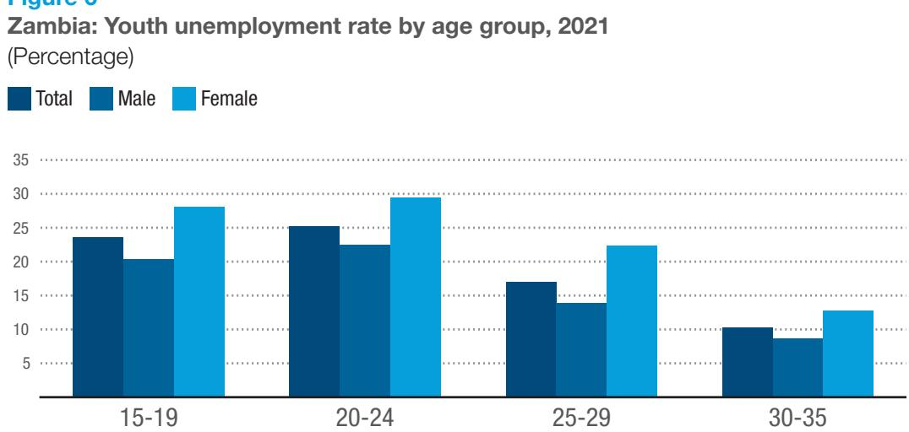  
Source: Government of Zambia (2022c).

According to the Zambia Statistical Agency, the total labour force grew by 2 per cent between 2017 and 2020, reaching 3.46 million in 2020 (Government of Zambia, 2020b). Annual GDP growth over this period averaged 3.5 per cent, but this growth did not lead to job creation of any significant proportion. As a result, employment grew by a meagre 0.5 per cent between 2017 and 2020, and the unemployment rate rose by 12.6 per cent in 2017 and 13.8 per cent in 2020. The employment structure in Zambia has also changed remarkably over the last decade. The share of formal employment in total employment, which accounted for 37 per cent in 2017, declined to 26 per cent in 2020. There was a matching upswing in informal sector employment to 45.5 per cent in 2020 from 31 per cent in 2017, and a corresponding fall in rural jobs. Job creation in the services sector expanded more rapidly, reflecting the robust growth of the sector over the last decade. Labour force participation rates remained low at 38 per cent, and combined unemployment rates (i.e. unemployed plus under-employment) reached 48 per cent in 2020. Further, whereas gender disparities in unemployment rates significantly decreased to 0.98 in 2020 from 0.48 in 2017, gender disparities in wage differentials persisted in most sectors of the economy. $^{16}$ This means that the unemployment rates for women and men were almost similar in 2020, but wage differences remained.

Construction and electricity consistently had higher labour productivity than other sectors, including agriculture, manufacturing and mining during the 1994–2006 period (figure 7). Recent growth in output and per capita income has largely been driven by growth in the tertiary sector, which increased its share of GDP from 30 per cent at independence in 1964 to 56 per cent in 1995 following trade liberalization reforms. These levels have since been maintained, with growth in output and employment rising by 10.4 per cent and 4.7 per cent, respectively, from 2017 to 2020. Over this period, labour shifted from agriculture to the tertiary sector, where wages were relatively high. This ultimately dampened labour productivity growth in the services sectors, where there are few capital-based technological changes to sustain growth in labour productivity.

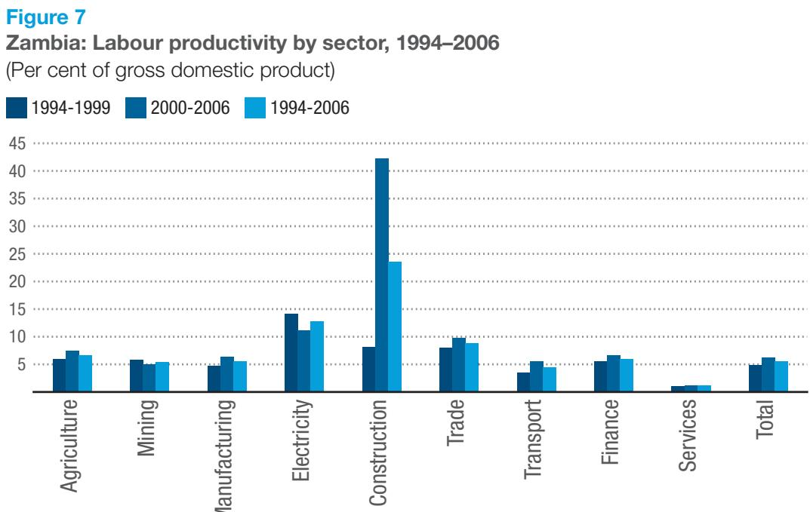  
Source: Government of Zambia (2014, 2020b).

Between 2014 and 2020, growth in output, employment and productivity declined in the agriculture and mining sectors. These sectors hold the greatest potential for igniting growth and enhancing competitiveness and economic diversification in Zambia. For their part, secondary sectors – manufacturing, energy, and construction – experienced some growth, but it was not significant enough to bring about structural change in employment. Secondary sector output and employment rose by 19.5 per cent and 7.6 per cent, respectively, from 2017 to 2020. In the 1970s and 1980s, growth in manufacturing was more dominant than in the construction and energy subsectors. However, from 2011 to 2020, growth in the construction sector was quite robust, driving most of the positive changes in the secondary sector. Output and employment in the construction sector grew by 58.9 per cent and 10.7 per cent, respectively, in 2017–2020. Between 2014 and 2020, the share of construction in GDP and employment more than doubled, but labour productivity declined by 30.3 per cent. This suggests a diversion between the rate of capital

accumulation in the construction sector and labour productivity over this period.

Wholesale and retail (trade) has surpassed agriculture as the main sector for employment. Industry, including manufacturing, accounted for 22.9 per cent of total employment in 2020, while mining had the least employment at 2 per cent (figure 8). Manufacturing employment and productivity growth increased marginally over 2011–2020, although the positive trend in output was a little sluggish, with frequent episodes of volatility. The energy sector, dominated by electricity and petroleum, registered little growth in output, employment and productivity during 2011–2020. The sector accounted for only 2 per cent of real GDP and 0.2 per cent of employment in 2020, less than half the level in 2017. In addition, energy sector policies have not encouraged or attracted long-term private investments, especially in renewable energy technologies. The energy sector needs holistic reforms and measures to attract long-term investment and technology to boost supply and address spatial energy supply deficits across the country.

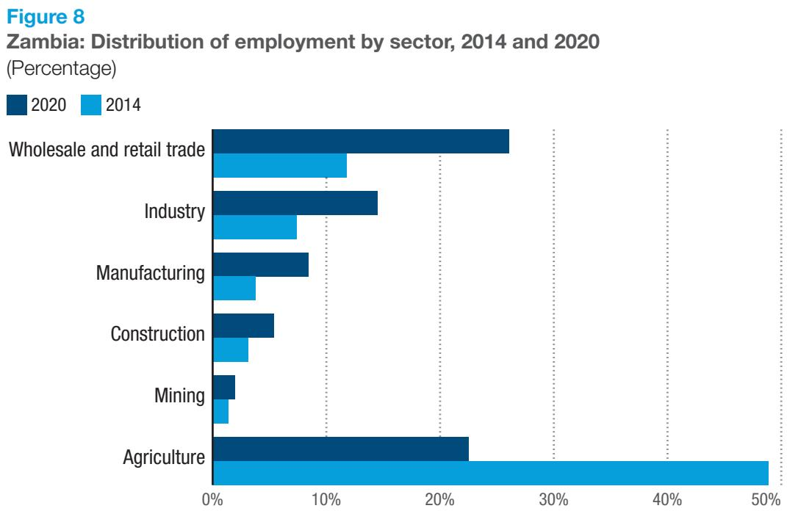  
Source: Government of Zambia (2014, 2020b).

## 2.3. International trade

## 2.3.1. Export structure and trade patterns

Zambia's merchandise exports grew rapidly from \$888 million in 2000 to \$1.8 billion in 2005 (figure 9). By 2013, exports exceeded \$10 billion, with significant positive trade balances posted over 2006–2013. Although trade was affected by declining commodity prices in 2015–2017, the setback was brief, as merchandise exports recovered to \$9 billion in 2018 and reached \$11.7 billion in 2022. However, the export potential of services in Zambia remains underexploited. The trade balance in services has been negative and deteriorated by 10 per cent to a deficit of \$493.8 million in 2020 and later to \$971 million following the relaxation of COVID-19 restrictions on trade in 2021. The overall current account balances remained positive, with an annual average balance of \$578.4 million between 2015 and 2020. However, this was a decrease from an annual average current account surplus of \$773 million over 2000–2014.

Copper is Zambia's main export, and the structure of exports has remained virtually unchanged over the years. In 1995, copper accounted for 76.6 per cent of merchandise exports, while manufactured goods accounted for only 6.1 per cent (figure 10). The share of copper fell sharply to 37.7 per cent of merchandise exports in 1999 as mining reforms that began in the 1990s continued. But as the international price of copper rose, so did the export share of copper from 2000 onward. The share of copper in exports averaged 55.9 per cent of merchandise exports over 2000–2010 and rose to 69.1 per cent over 2011–2020. In 2022, it accounted for two thirds of the country's merchandise exports (65.3 per cent) as prices of copper remained buoyant. In contrast, exports of manufactured goods stagnated, with their share declining slightly from 11.8 per cent over 2000–2010 to 11.5 per cent over 2011–2020. Food items (SITC 0+1+22+4) also maintained a significant share (10 per cent) of merchandise exports from 2011–2020 and averaged 8.4 per cent from 2020–2022, underlining the potential of non-traditional exports. $^{17}$

## Figure 9

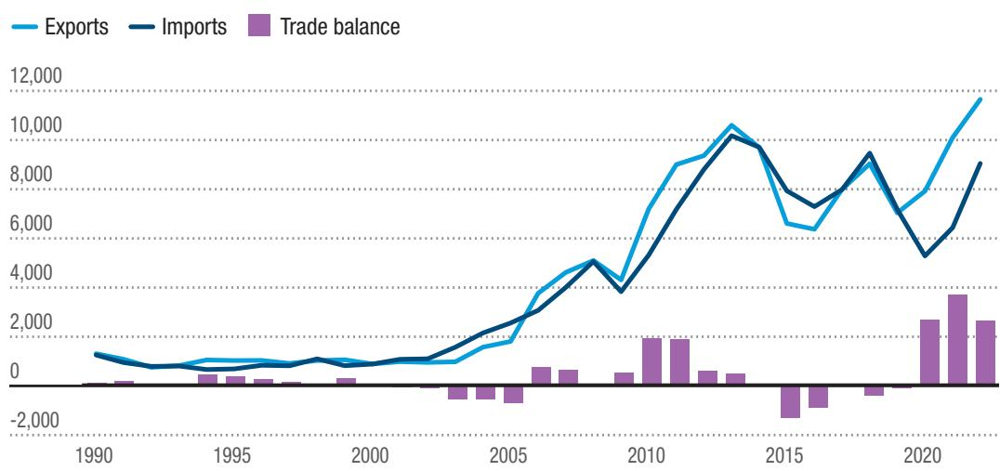  
Source: UNCTAD secretariat, calculations based on data from UNCTADStat.

## Figure 10

Zambia: Commodity exports by product as a percentage of total merchandise exports, 1995–2022

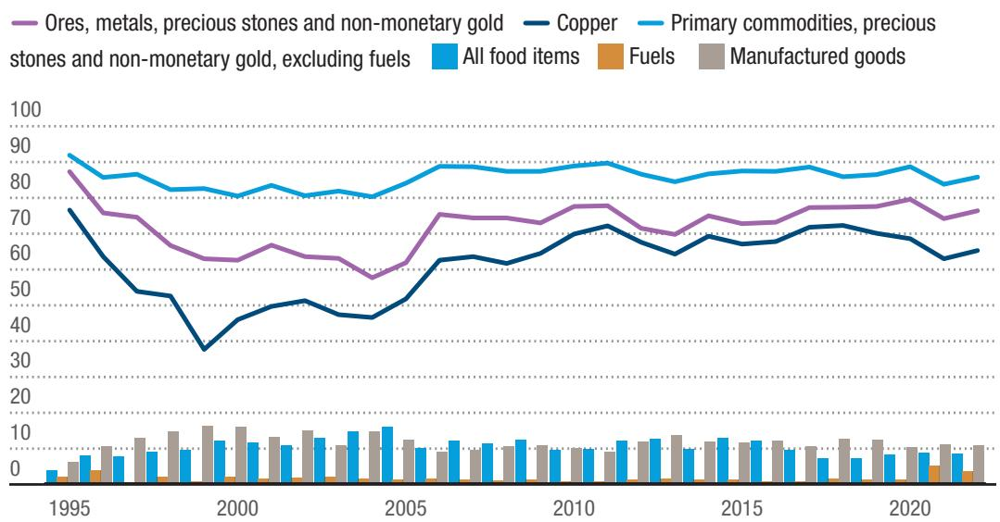  
Source: UNCTAD secretariat calculations based on data from UNCTADStat.

For Zambia, the top five destinations of merchandise exports in 2022 – China (30 per cent of the total), Switzerland and Liechtenstein (22 per cent), the Democratic Republic of the Congo (9 per cent), Singapore (7), and Namibia (7 per cent) – collectively accounted for 74 per cent of the country's merchandise exports (figure

11). The other countries among the top 10 destinations in 2022 were the United Arab Emirates (4 per cent), Zimbabwe (4 per cent), South Africa (2 per cent), India (2 per cent), and Malawi (1 per cent), bringing the share of exports absorbed by the top 10 export destinations in 2022 to 88 per cent. The concentration of the export

market in a few countries reflects Zambia's export structure, with copper uptake by China, Switzerland and to some extent Singapore sustaining the mining sector in the presence of low capacity in mineral processing and manufacturing linked to the mines. In contrast, most agricultural and manufactured exports are destined for the COMESA and SADC markets, with the Democratic Republic of the Congo, Malawi and South Africa as the major destinations.

The high dependence on a single primary export for export revenue is a major source of economic vulnerability that is

exacerbated by growing consolidation of the export market among a few export destinations, which can elevate trade and geopolitical risks for Zambia. In the SADC subregion, the Democratic Republic of the Congo, Namibia, South Africa, Zimbabwe and Malawi are among the top 10 export destinations, and they accounted for 23 per cent of Zambia's exports in 2022 (\$3 billion). Zambia's neighbouring countries among that group — Namibia, Zimbabwe and Malawi — accounted for 12 per cent (\$1.5 billion) of exports in 2022.

## Figure 11

Top 10 destinations of Zambia's merchandise exports by value, 2016 and 2022 (Millions of dollars)

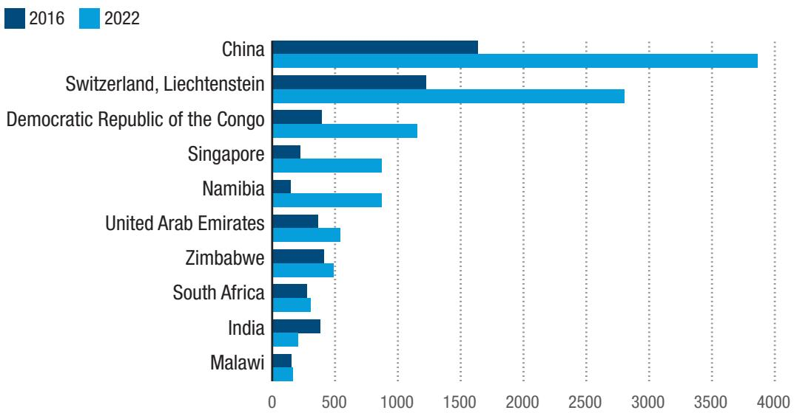  
Source: UNCTAD secretariat calculations based on data from UNCTADStat.

The value of Zambia’s exports to regional markets increased from \$831 million in 2015 to \$1.44 billion in 2020 (73 per cent growth) among the top 10 African export destinations, and from \$941 million to \$1.44 billion (53 per cent growth) among the top 20 African export destinations. The Democratic Republic of the Congo dominated, mainly importing sulphur, earth and stone products, beverages, and processed food items, while South Africa imported natural/cultured pearls and precious stones, copper and articles thereof, iron and steel, boilers, machinery, and cotton (Government of Zambia, 2021).

Zambia’s merchandise imports declined from \$7.2 billion in 2019 to \$5.3 billion in 2020, mainly because of trade logistics constraints during the COVID-19 pandemic. Merchandise imports increased to \$9.98 billion in 2022 as trade normalized with SADC countries and the rest of the world. The top 10 exporters to Zambia (figure 13) accounted for 82 per cent of the country’s merchandise import bill in 2022, with South Africa (33 per cent of total imports), China (13 per cent), the Democratic Republic of the Congo (12 per cent), United Arab Emirates (10 per cent), and India (5 per cent) as the top five. Namibia (3 per cent),

the United States (2 per cent), Japan (2 per cent), the United Kingdom (1 per cent) and the Netherlands (1 per cent) completed the list. The next 10 countries only added 8.8 per cent to Zambia's merchandise imports in 2022, bringing the total share among the top 20 import partners to 90 per cent. $^{18}$

Figure 12 Top 10 sources of Zambia's merchandise imports by value, 2016 and 2022 (Millions of dollars)  
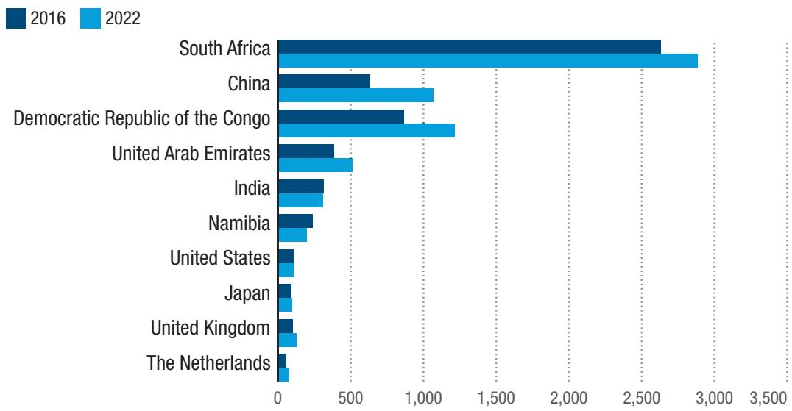  
Source: UNCTAD secretariat calculations based on data from UNCTADStat.

South Africa, China, United Arab Emirates, India and the Democratic Republic of the Congo are the major sources of Zambia's machinery and raw materials imports, while the Democratic Republic of the Congo also exports copper concentrates to Zambia for smelting. Of the total merchandise imports from the top 20 countries, which amounted to \$9 billion in 2022, SADC countries contributed 51 per cent — further demonstrating the importance of the regional market to Zambia's prospects in the AfCFTA. Merchandise imports from SADC countries increased from \$4.2 billion in 2016 to just over \$5 billion in 2022, although imports from Mozambique and the United Republic of Tanzania declined.

All the top five import partners increased their exports to Zambia in 2022 compared to 2016. The total value of imports from developing countries was \$2.27 billion

more in 2022 than in 2016, but imports from developed countries increased by only \$420 million. In aggregate terms, the year-over-year increment in imports was in double digits over 2017–2022, but the period average dropped to 9 per cent when the sharp drop in imports in 2019 and 2020 are considered. Import demand was also moderated by a weaker kwacha, but as the economic recovery is consolidated in the short to medium term, and as copper production steadies, higher demand for consumer goods, raw materials, machinery and equipment may further boost imports.

The potential for Zambia's non-traditional exports remains underexploited, and the sectors that produce such exports could anchor structural change. The share of non-traditional exports in total exports generally declined compared to copper exports over 2000–2021. As the share of

copper in exports increased from 64.5 per cent in 2000 to 81.1 per cent in 2010, the share of non-traditional exports declined from 34.1 per cent to 16.8 per cent over the same period (figure 13). Non-traditional exports recovered slightly in 2015 and 2021, boosted by an increase in exports of electricity, lime, cement and fabricated construction materials, and pearls, precious stones, and non-monetary gold (SITC 667+971) from a total of \$300 million in 2016 to \$1.6 billion in 2022. However, the export value of textile fibres, yarn, fabrics and clothing (SITC 26 + 65 + 84) declined from \$79.4 million in 2016 to \$51.6 million in 2022. The regional market presence in these sectors would need to be strengthened to unlock growth opportunities in the context of the AfCFTA.

## Figure 13

Zambia: Trends in exports of copper and non-traditional exports relative to total imports, 2000–2023\*  
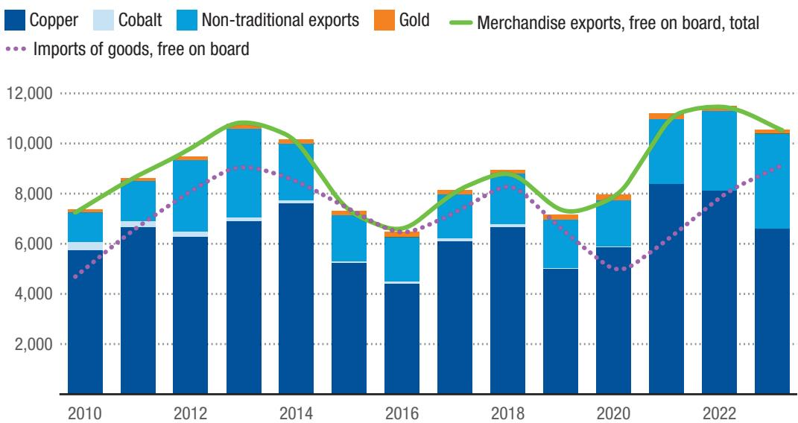  
Source: UNCTAD secretariat calculations based on data from the Bank of Zambia.  
Note: \* Preliminary estimates.

## 2.3.2. Regional integration and the African Continental Free Trade Area

Zambia is a member of regional and international economic groupings within and outside Africa. Zambia is a founding member of COMESA and SADC, and a long-standing member of the African Union. It is also a member of global development networks, including the United Nations, the Commonwealth, and the African, Caribbean, Pacific-European Union Partnership, among others.

Zambia can leverage opportunities in these regional groupings to foster growth and development while contributing to regional and international development aspirations. For example, Zambia should take advantage of these regional opportunities and continental platforms to attract investment, promote trade, and foster growth and prosperity to eventually graduate from the LDC category. However, the potential gains for Zambia in these regional markets will depend strongly on its economy and export structures, which are conditioned by the country's level of development.

## Regional trade and investment opportunities

As it is bordered by eight other nations, Zambia enjoys strategic location advantages that can be exploited to boost trade

and investment by fostering bilateral and regional cooperation. On the other hand, this means that regional economic and geopolitical dynamics can generate adverse spillover effects on Zambia. In this context, Zambia has an inherent interest in assessing and internalizing regional dynamics in its development process and investing in regional efforts to address regional risks and vulnerabilities. There are also regional economic growth opportunities that Zambia should be tapping into to spur economic growth and boost employment opportunities for its citizens.

Zambia's trade and export promotion policy aims to increase exports to regional markets as a steppingstone to global export markets. This section analyses subregional economic and geopolitical dynamics and identifies trade and investment opportunities that Zambia can harness to foster trade and investment within the subregion, in line with its industry and trade policy.

After the launch of the COMESA Free Trade Area in 2000, intra-COMESA trade expanded from \$2.1 billion in 2001 to \$16.2 billion in 2022. However, this accounts for a small share of the total exports of COMESA – estimated at 6.3 per cent in 2001, and 8.6 per cent in 2022. The potential intra-COMESA trade that can be realized was estimated at \$101.1 billion in 2021 (COMESA, 2021). The export share of Zambia in the intra-COMESA market also increased from \$124.5 million (6 per cent of total intra-COMESA exports) in 2001 to \$2.2 billion (13.4 per cent) in 2022.

The COVID-19 pandemic disrupted trade, leading to a contraction in intra-COMESA trade by 11 per cent in 2020, very much the same reduction recorded for sub-Saharan

Africa (COMESA, 2021). The main products boosting intra-COMESA exports in 2022 were manufactured goods; food; ores, metals, precious stones, and non-monetary gold; and fuels (figure 14, panel a). $^{19}$ Manufactured goods and food accounted for 42 per cent and 32 per cent of intra-COMESA exports, respectively, in 2022. Textiles (3.1 per cent, \$496 million) and agricultural raw materials (1.1 per cent, \$179 million) played a minor role in those exports that paled in comparison to COMESA's total exports of these product categories, valued at \$10.4 billion and \$3.5 billion, respectively, in 2022. The COMESA market provides Zambia with a quite diversified export structure with a higher share of manufactures than manufacturing exports to the rest of the world, which are mostly commodity-based (figure 14, panel b).

Inadequate productive capacity in COMESA/SADC countries is a major constraint to intra-COMESA trade and investment. Zambia can exploit opportunities in the COMESA and SADC region through the goods and services it can produce competitively for trade within the region. But this requires deliberate efforts to foster investment in cutting-edge production facilities, quality assurance measures, and efficient transport and logistics to satisfy both the regional and African markets through the recently launched AfCFTA. Even then, just providing an enabling environment that attracts investment in such ventures may not be sufficient. Rather, the government may have to play a role in facilitating such undertakings through, for example, public investment in these ventures, thereby de-risking private investments in industries targeted for this purpose.

Figure 14
Intra-COMESA exports by product category, 2012 and 2022 (Millions of dollars)  
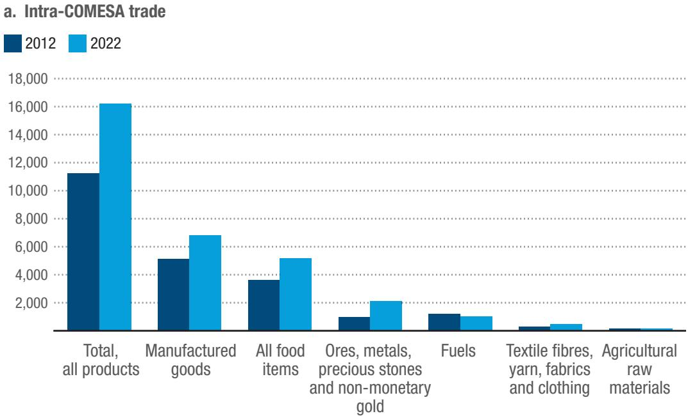

b. Zambia's exports to COMESA member states  
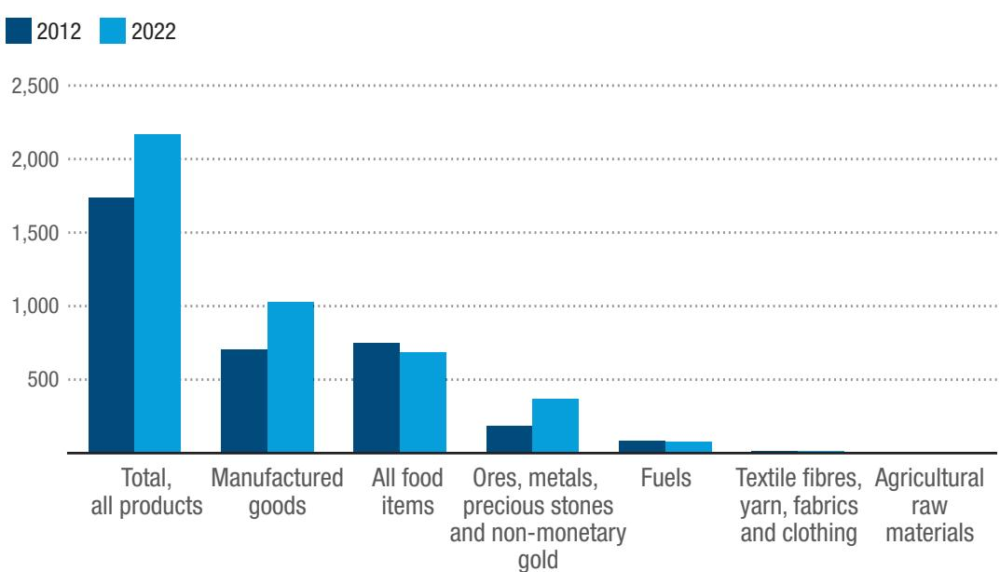  
Source: UNCTAD secretariat calculations based on data from UNCTADStat.  
Note: COMESA: Common Market for Eastern and Southern Africa.

According to the World Bank's World Development Indicators, FDI inflows to Zambia increased from \$122 million in 2000 to \$1.3 billion in 2007, then fell consecutively to \$939 million in 2008 and \$635 million in 2009. Inflows improved over 2010–2015, averaging \$1.6 billion, with most of the investments targeting the minerals sector. However, FDI inflows declined sharply to an average of \$594 million over 2016–2020 as the Zambian economy faltered. The country registered net inflows of -\$271 million in 2021, but a modest \$11 million recovery followed in 2022. Prospects for a rebound in FDI and portfolio flows to the subregion have been dampened by the spillover effects of the war in Ukraine, and earlier by the adverse effects of COVID-19. The regional capital inflows are likely to remain subdued in the short to medium term as the global economy recovers from these shocks.

Capital flight in the natural resources sector is the single most important risk to economic growth, as the mining sector anchors the Zambian economy. A fall in capital inflows to the mining sector also affects capital formation in other sectors, thereby slowing growth and employment. This in turn could reduce prospects for a quick economic turnaround and growth in per capita income. The AfCFTA Investment Protocol, which promises to harmonize the investment policy landscape in Africa, may pose a risk for countries whose investments are hinged on bilateral trade agreements. For Zambia, for instance, the source countries for FDI are limited, consisting mainly of China, the Democratic Republic of the Congo, France, Nigeria, Singapore and Switzerland (Jere et al., 2017). To mitigate potential shortfalls in investments required to diversify the economy, Zambia needs to strengthen domestic capital markets and use institutional funds more productively to spur economic growth and promote regional export competitiveness of its goods and services. There is also a need to unlock investment in non-traditional sectors, as conventional approaches to investment promotion in those sectors are unlikely to yield returns without deliberate efforts to enhance competitiveness.

## Fostering regional peace and stability

Since 1990, southern African countries have made important strides in consolidating their democratic credentials, holding peaceful elections and facilitating peaceful transitions. Despite this progress, pockets of political instability remain that pose some concerns to regional peace and stability. There were concerns about escalating civil unrest in the eastern part of the Democratic Republic of the Congo and flare-ups of armed conflicts in Mozambique from 2018–2021. Key drivers of political instability and fragility in the region include structural imbalances, the bulging youth population, development inequalities, and the types of regimes, explained in terms of the number of countries with democratic versus autocratic rule and the depth and extent of horizontal inequalities (Bello-Schünemann and Moyer, 2018). $^{20}$ Efforts to de-escalate these tensions and conflicts should take into account the underlying causes in order to find a lasting solution through peaceful means.

Zambia is not entirely immune to these political and civil risks. The risks need to be understood within each country's socio-political context and contemporary regional and global dynamics. Specific measures need to be identified and taken into account in each particular context to internalize risks and address current and future vulnerabilities. Zambia has been a host to thousands of refugees from all over the world, but mostly it is the conflicts in neighbouring countries that trigger an inflow of refugees. Flare-ups of conflicts in these countries tend to have a direct impact through a decline in cross-border trade and social tensions associated with the movement of people across borders. The refugee population in Zambia declined from just over 284,000 in 2001 to around 24,000 in 2013, primarily because of the return of peace in Angola and the Democratic Republic of the Congo (figure 15). Stability in the Democratic Republic of the Congo and other countries of origin is the key to reducing the number of refugees living in Zambia. However, spates of violence over the past decade have resulted in an increase in Zambia's refugee population from 23,584 in 2013 to 75,154 in 2021. Likewise, the number of asylum seekers rose during that period from about 2,217 in 2013 to 5,067 in 2019, though that number then declined to 2,774 in 2022.

Figure 15
Refugee population in Zambia, 1990–2022  
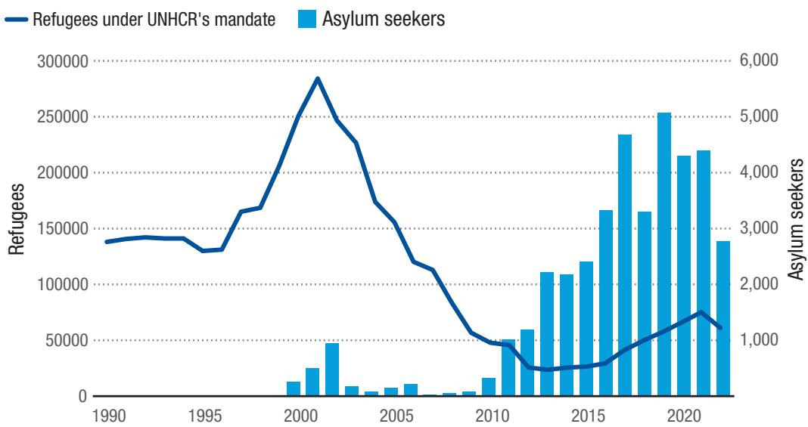  
Source: UNCTAD secretariat calculations based on UNHCR refugee statistics.  
Note: UNHCR: United Nations High Commissioner for Refugees.

## Figure 16

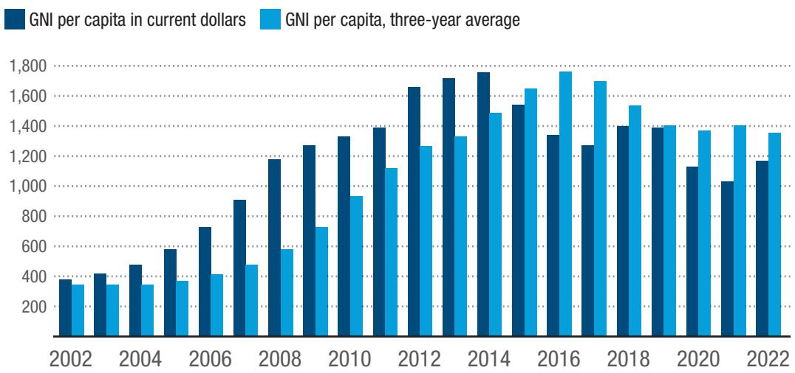  
Source: UNCTAD secretariat calculations based on data from United Nations (2022) and the World Bank, World Development Indicators database.

The growing radicalization of young people is of particular concern to global leaders. $^{21}$ It creates new sources of vulnerabilities for security, peace and stability in Africa and beyond. These risks and vulnerabilities should receive equal policy attention (UNDP, 2017). While the risks of an escalation

of political and civil instability remain low in the southern African region, Zambia's location as a landlocked country leaves it highly exposed and vulnerable to political, civil and economic instability involving its neighbours. It is therefore critical for Zambia to forge effective international cooperation, including in the fight against terrorism, organized crime and radicalization. In 2023, Zambia chaired the SADC Organ on Politics, Defence and Security Cooperation and also chaired the COMESA Authority, roles which were important in strengthening regional ties and galvanizing peace efforts in Africa.

## 2.3.3. Prosperity

Promoting shared prosperity calls for measures to grow the economy to generate wealth that equitably improves the living standards of all citizens today and in the future. Growth should be sufficiently robust to reduce poverty and vulnerability and to generate lasting prosperity for all. This has been the developmental aspiration of Zambia from its independence to date.

Propelled by rising international prices of copper and the fast growth of activities linked to the mining sector, Zambia's economy grew rapidly between 2002 and 2015. GNI per capita in current dollars more than trebled from \$380 in 2002 to \$1,330 in 2010 and reached a record \$1,760 in 2014 (figure 16). However, this progress is tethered to buoyancy of the mining sector, which suffers frequent shocks. For instance, GNI per capita in current dollars has been declining since 2015 and fell to \$1,170 in 2022. As a result, the three-year average of GNI per capita, which is one of the criteria for graduation, also declined significantly.

Several factors contributed to the precipitous decline in per capita income during 2015–2021. First, rapid depreciation of the local currency by an average of 31.9 per cent annually against major international currencies eroded GNI per capita, which declined by an average of 5.8 per cent over the period as the exchange rate with the dollar depreciated by an average of 19.5 per cent annually. Second, Zambia's high fertility rate did not slow significantly over this period. The population grew at a much faster rate over 2015–2021 — 3 per cent annually — than the economy, which grew at an average rate of 2.3 per cent annually during the same period. These factors pulled the GNI per capita trend downward to \$1,030 in 2021 from \$1,540 in 2015. With the return to growth in 2021–2022, GNI per capita increased slightly in 2022 to \$1,170. These ups and downs in per capita income point to the urgency to build resilience to maintain growth momentum.

Zambia's earlier growth episodes were exogenous and therefore not grounded in economic structural changes that would sustain future growth and prosperity. While favourable copper prices increased copper revenues, tax revenue was inadequate for the government to invest in economic transformation that would have shaped the country's economic fortunes and sustained future growth and prosperity. In addition, the debt cancellation for Zambia under the HIPC initiative did not ignite the fiscal reforms that would have placed fiscal limits on how much the government could borrow to prevent the country from plunging into debt distress. As a result, growth was not diversified, and vulnerabilities to changes in copper prices have persisted, while at the same time there has been disinvestment in the sectors that could spark economic diversification, such as agriculture, manufacturing, energy and tourism.

It is critical that Zambia put in place measures to accelerate economic structural reforms to strengthen its economic base and not rely on exogenously driven growth and income expansion. In this regard, there is a need to galvanize efforts to achieve economic and export diversification, as well as the international competitiveness of non-traditional exports. There is also a need to foster sectoral interlinkages and build the economy's resilience to external shocks. In that way, continuous growth in per capita incomes could be guaranteed and the country's development trajectory would be strengthened to ensure that the progress achieved in what was a challenging environment over 2016–2022 is not reversed in the future. Although Zambia did not qualify for graduation at the 2024 triennial review, the country can return to the graduation pipeline by fast-tracking economic diversification (from

mining) and raising export competitiveness within SADC and COMESA.

## Poverty and inequality

As prospects for resuscitating the Zambian economy were further weakened by the COVID-19 pandemic, the World Bank reclassified Zambia as a low-income country in 2022. There are prospects that the easing of the debt situation might boost growth and enhance chances of stabilizing the economy in the short and medium term. Long-term prospects, particularly structural conditions, will largely depend on state capacity to mobilize domestic resources and foster private sector investment in strategic sectors identified for economic diversification in the 8NDP.

Addressing the glaring levels of poverty and inequality should form part of the government's policy priorities. Poverty and inequality decline when a country's new wealth is increasingly being earned by or distributed to the poor, rather than the rich. In this case, an increase in the share of income (proxied by wealth) for the bottom half of the population measures the country's progress toward attaining shared prosperity. This requires economic growth to be broad-based and inclusive, and to lead to significant reductions in poverty and inequality.

The 2022 Living Conditions Survey shows that inequality as measured by the per capita expenditure Gini coefficient only improved slightly from 0.546 in 2015 to 0.507 in 2022 (Zambia Statistics Agency, 2023). $^{22}$ Data from the 2018 Demographic and Health

Survey also showed that 64 per cent of the rural population fell within the two poorest quintiles, compared to only 3 per cent of the urban population. Conversely, 84.4 per cent of the urban population fell within the fourth and fifth quintile (richest quintiles), compared to only 11 per cent of the rural population. And while the proportion of the rural population falling in the two richest quintiles remained unchanged in 2018 compared to 2007, the proportion of those in the two poorest quintiles slightly increased from 61.8 per cent in 2007 to 64.4 per cent in 2018 (Government of Zambia, 2007, 2018a). In 2022, most of the poor (60 per cent) lived in rural areas, and the poverty headcount was highest among the rural population at 79 per cent, compared to 32 per cent in urban areas. The severity of poverty also worsened between 2015 and 2022, with the proportion of the extremely poor rising from 41 to 48 per cent in that period (figure 17).

Inequality and rural poverty have been among the key social development challenges for the government. The Gini coefficient among rural households (0.41) was double that of urban households (0.19) in 2018 and was only slightly below the national average of 0.44 (Government of Zambia, 2017b). In other words, robust economic growth rates in 2007–2018 did not reduce poverty, but rather deepened and widened income inequalities. These stark rural-urban disparities persisted in 2022, but there were similar levels of inequalities in both rural and urban areas, with both maintaining a per capita expenditure Gini coefficient of 0.44 in 2022 (Zambia Statistics Agency, 2023).

a. Poverty headcount by location, 2010, 2015 and 2022

  
Zambia: Poverty headcounts and severity of poverty (Percentage)

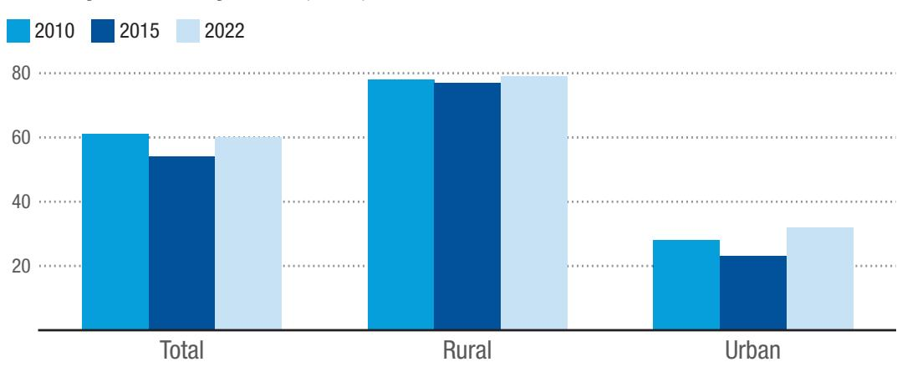

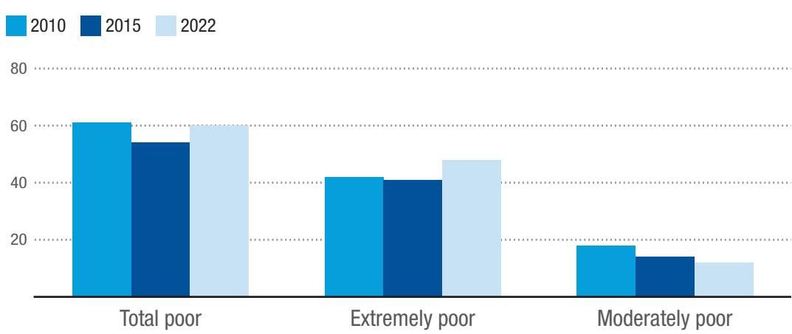

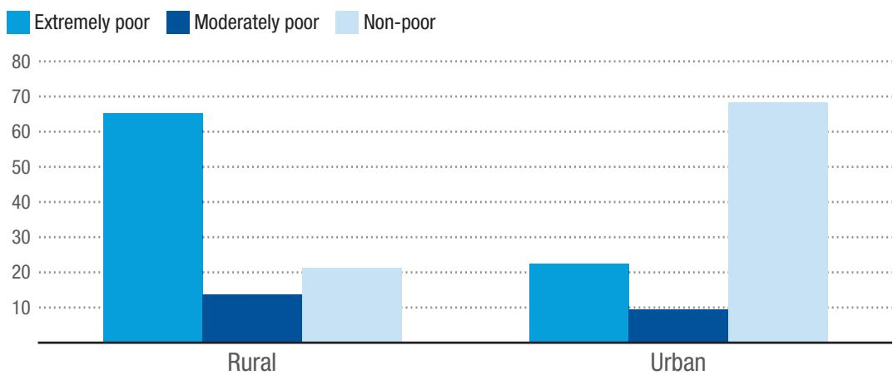  
Source: Zambia Statistics Agency (2023).

As shown in figure 17, the poverty headcount for Zambia increased from 54 per cent in 2015 to 60 per cent in 2022 (Zambia Statistics Agency, 2023). Poverty is more prevalent and intense among households

employed in the agricultural sector. In 2005, about 83 per cent of households employed in the agriculture sector were poor, and of those, 30 per cent were extremely poor (figure 18). The distribution of poverty and

## Others

Construction

the growth-poverty nexus shows that the structure did not change much between 2005 and 2015, except that the construction sector emerged as a key sector where

Agriculture  

the poverty headcount and the severity of poverty declined substantively, followed by manufacturing and wholesale and retail. $^{23}$

## Figure 18

Poverty gap Poverty headcount Poverty severity

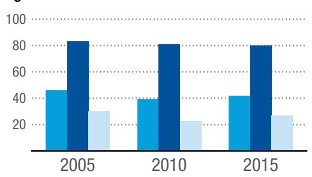

Mining and quarrying  
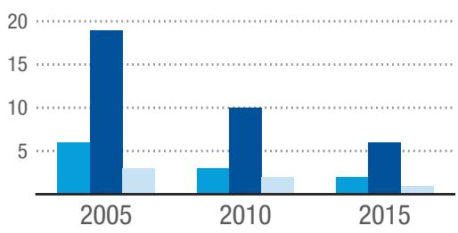

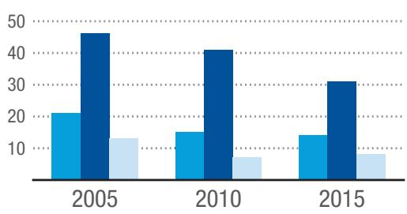  
Wholesale and retail

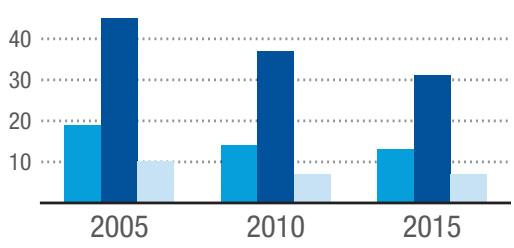  
Manufacturing

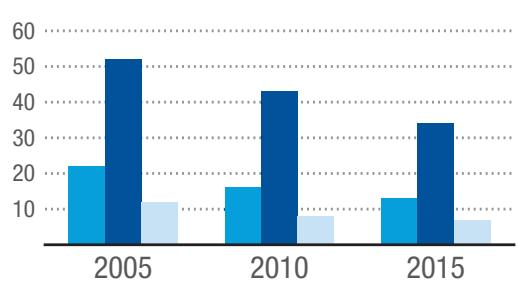  
Source: Based on data from Mphuka et al. (2021).

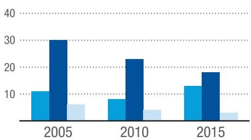

The poverty gap, which measures the amount of income needed to move people out of poverty, is very responsive to income changes in the agriculture sector, where growth-poverty elasticity is highest (-1.11 in 2005 and -1.48 in 2010) (figure 19). This implies that agriculture has the largest effect on reducing extreme poverty in Zambia, followed by manufacturing, construction, and the wholesale and retail sectors.

Growth in mining and the other sectors category has the lowest impact on poverty reduction and, therefore, reliance on these sectors will not by reduce poverty unless accompanied by an income redistribution programme. However, redistribution may be less effective than spending money on growing the economy. Mphuka et al. (2021) show that growth-enhancing expenditures reduce poverty by at least 61 per cent,

Others

compared to a 44 per cent reduction as a result of redistributive expenditures. This raises questions about the effectiveness of the FISP. The programme consumes as much as \$350 million annually in seed and fertilizer support to farmers, yet

growth and the share of agriculture in GDP have not improved during its tenure. The programme may have to be reformed to focus on financing growth-enhancing interventions in the agricultural sector and to eliminate the distortions it causes.

## Figure 19

Zambia: Estimates of growth-poverty elasticity in selected sectors, 2005, 2010, and 2015

2005 2010 2015

Agriculture

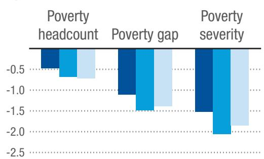  
Mining and quarrying

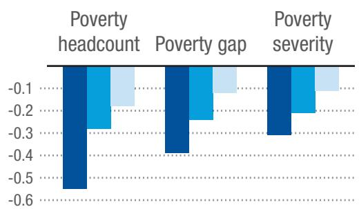  
Construction

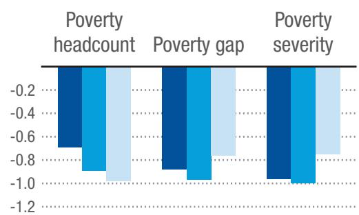  
Wholesale and retail

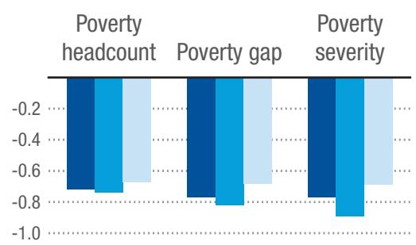  
Manufacturing

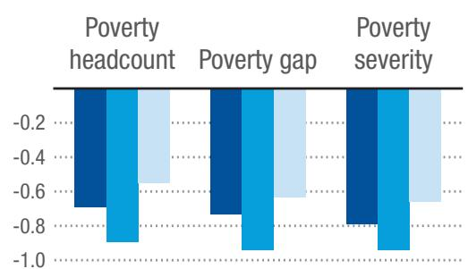

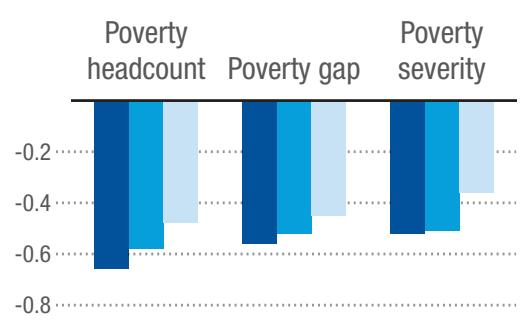  
Source: Based on data from Mphuka et al. (2021).

Note: The elasticities measure the percentage change in the relevant indicator (poverty headcount, poverty gap or poverty severity) for a 1 per cent change in the GDP of the sector.

The opportunity to substantially reduce poverty lies in stimulating growth in the manufacturing and agriculture sectors, followed by the construction and the wholesale and retail sectors. These sectors also account for larger shares of employment, as they are relatively more labour-intensive than the mining sector, for example, which accounts for only 2 per cent of total employment. This explains the low impact of the mining sector on reducing poverty and inequality. Mining

has the lowest growth-poverty elasticity of -0.11, meaning that a 1 per cent increase in growth in the sector only reduces poverty by 0.11 per cent. This explains why rapid economic growth in Zambia has not translated into significant reductions in the levels and intensity of poverty. It also shows where future development policy should be directed in order to move people out of poverty by expanding their incomes, choices and freedoms. The question that remains is how this goal can be accomplished more cost-effectively in the Zambian context.

## 2.3.4. People

Human capital, especially when augmented with other forms of capital – natural and produced – is essential to stimulating and sustaining economic growth and creating employment opportunities. Investing in the acquisition of knowledge and skills, and in the good health and nutrition of the population, improves the productivity of the labour force and enhances human capabilities, choices and freedoms.
Improvements in these dimensions of human capabilities are some of the factors that define a prosperous country. The Human Assets Index is a composite index that is used to measure the contribution of education and health to human capital development. A high HAI score indicates high levels of human capital, and vice versa.

The health indicators used to compute the health subindex of the HAI are the under 5 mortality rate, the prevalence of stunting (which captures nutritional status), and the maternal mortality ratio. The education subindex is computed using three education indicators: the lower secondary school education completion rate, adult literacy rates, and the Gender Parity Index score for lower secondary education completion. $^{24}$

Figure 20 shows Zambia's progress based on the LDC criteria in 2024.

Zambia made significant strides in improving its human capital over 2002–2022. Its HAI score rose from 39 in 2002 to 69 in 2021 and eventually reached 71 in 2024, thereby meeting the minimum graduation threshold of 66 in both 2021 and 2024 (figure 20, panel a). The HAI score continued to improve over 2021–2024 despite the huge health-related impact of COVID-19 in 2020 and 2021. Reductions in under 5 mortality rates (from 99 per 1,000 live births in 2006 to 56 in 2022) and increases in adult literacy rates (from 63 per cent in 2006 to 88 per cent in 2020) had the most profound effect on the HAI. The maternal mortality ratio was more than halved from 306 in 2006 to 135 in 2020. $^{25}$ The prevalence of stunting also declined from more than 50 per cent in 2002 to 31 per cent in 2022 (figure 20, panel b). These outcomes could have resulted from improvement in adult literacy, which contributes to the capacity of adults to obtain, understand and interpret information on health and nutrition (Schrauben and Wiebe, 2017). However, the prevalence of moderate or severe food insecurity among the population increased from 52 per cent in 2017 to 69.5 per cent in 2020, and 32.6 per cent of the population faced severe food insecurity in 2020 as the effects of the economic downturn deepened with the pandemic. $^{26}$ These socioeconomic indicators could improve as the recovery from the COVID-19 pandemic continues, but there may be a need to expand social grants and direct cash transfers to vulnerable populations, and to transform the FISP into a more productivity-enhancing programme (Mphuka et al., 2021).

## Figure 20

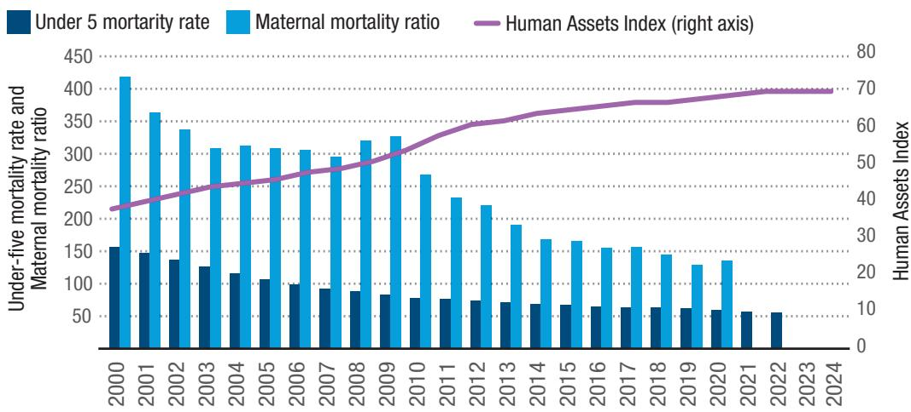  
b. Selected components of the Human Assets Index  
- Prevalence of stunting
- Lower secondary school education completion rate
- Adult literacy rate
- Gender Parity Index of lower secondary school completion (LSEC) (right axis)

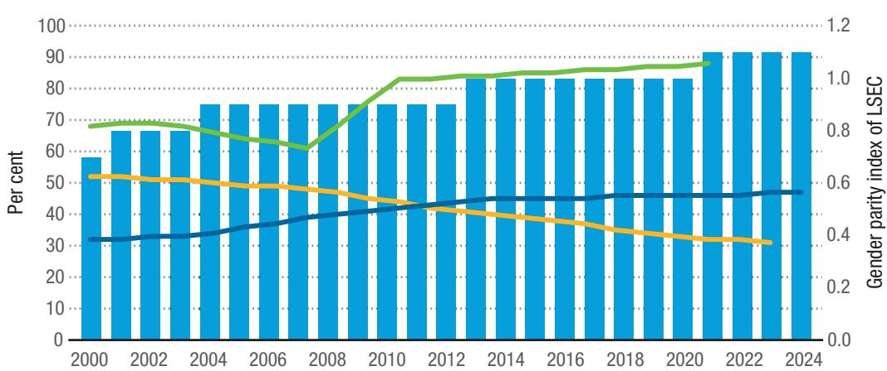  
Source: UNCTAD secretariat calculations based on United Nations (2022).

## Education and skills development

With regard to education outcomes, Zambia's performance has been below the global average for most key indicators. For example, although the lower secondary school completion rate was 47 per cent in 2023 compared to 32 per cent in 2000, this rate is wholly inadequate in the context of a low gross secondary school enrolment ratio, which stood at 46.4 per cent in 2021 and was as low as 27 per cent in 2002. This basically means that less than half of the youth of secondary school age transition from primary to secondary school, and of those who transition, only

a handful successfully complete lower secondary education. The situation is disparate when rural-urban and gender dynamics are considered. For instance, UNESCO statistics show that in 2018 the upper secondary school completion rate in rural Zambia was 13 per cent, compared to 46 per cent in urban areas, and that 43 per cent of female students successfully completed upper secondary school compared to 51 per cent of males.

The government's policy on education is to achieve universal access by 2030 (Government of Zambia, 2006). Although school enrolment has increased, it still falls short of achieving the universal access target, as only 11.2 per cent of the targeted school-going population enrolled in school in 2020 (Government of Zambia, 2022a). The recently introduced free education policy for primary and secondary school levels, and the scaling up of teacher recruitment and investments in school infrastructure in 2022, may improve the education scorecard for Zambia going forward. In 2022, the government recruited 30,000 teachers, and enrolment in both primary and secondary schools improved tremendously in some areas. This is evidence that school fees kept children from poorer households out of the education system and kept secondary school enrolment low. Some of the policy gains in the education sector include the reduction in the share of youth not in education, employment, or training from 42.8 per cent in 2017 to 31.4 per cent in 2021. However, access to vocational and tertiary education remains severely limited.

The free education policy at the primary and secondary levels is therefore a major step in the right direction. It will improve educational progress and attainment for both boys and girls at the primary and secondary levels and, by implication, the tertiary level as well. Investing in the education and health of the population is essential to develop the necessary human capital needed to raise and sustain high levels of economic growth, productivity and competitiveness. In 2021, gross enrolment at the primary school level was 104 per cent, but only 46 per cent at the secondary level, highlighting the challenges faced by youth in accessing secondary education, a problem compounded by inadequate physical infrastructure in terms of classrooms and teaching aids.

Another dimension of education is the completion rate at the lower secondary education level and above. At present, completion rates are slightly lower among female learners than males, and steps are being taken to address these disparities (Government of Zambia, 2019a). It is important to emphasize that although

enrolment ratios improved from 2015–2020, learning outcomes have not improved much. Based on various assessments (including of grades 7, 9 and 12), national assessment surveys and other international assessment exercises, learning outcomes should be the focus of interventions in the education sector from the primary to secondary level (Government of Zambia, 2017b). This situation is poised to change as the government scales up the recruitment of teachers and the provision of teaching aids and other materials, and as it expands and upgrades school infrastructure going forward.

Despite the shortcomings mentioned above, Zambia has fared well among its African peers in terms of education expenditures. Spending on education was 5.2 per cent of GDP in 2014, before declining to 3.5 per cent of GDP in 2021. However, from 2011 to 2020, Zambia made little progress in expanding access to and improving the quality of education at all levels. The quality of training delivered in both private and public tertiary training institutions has deteriorated, adversely affecting labour productivity and lifelong earnings of workers in the economy. Technical and vocational training institutions are not providing learners with cutting-edge knowledge and skills to meet market demands. Budgetary shortfalls have hampered efforts to replace, rehabilitate and modernize obsolete and dilapidated infrastructure and systems required to provide quality and market-driven skills training to learners. Sixteen per cent of technical education, vocational and entrepreneurship training institutions in Zambia have been rated low in terms of their capacity to produce quality learning outcomes, especially in the science, technology and innovation fields (Government of Zambia, 2017b).

There is a need to increase private and public investment to improve the quality of training outcomes in private and public tertiary institutions. Education authorities also need to create a stricter licensing regime for tertiary training institutions,

and regularly monitor and enforce clear quality-control standards to improve and standardize training outcomes in public and private institutions. Zambia may also need to harmonize qualification frameworks and skill accreditation programmes and expand cross-country skill development programmes, especially for regional value chains. Finally, Zambia needs to facilitate the flow of high-skilled labour to neighbouring African countries through skill mobility and exchange programmes.

## Health and well-being

The government embarked on comprehensive health sector reforms in 1992, with a vision of ensuring equity of access to cost-effective health services as close to the family as possible. This reform garnered a lot of support from a broad spectrum of development partners. Later, Vision 2030 built on this momentum in the health sector, recognizing that investing in people's health and well-being helps build the human capital needed to sustain robust economic growth and shared prosperity for all Zambians.

Zambia has a three-tier health-care provision system delivered through a network of 1,956 facilities, including district-level facilities with 1,926 health posts, health centres and district hospitals that deliver primary health-care services across the country. There are 24 provincial referral hospitals providing curative care and six tertiary-level referral or central hospitals providing specialized and sub-specialized care (Government of Zambia, 2017c). There is also a network of private health-care facilities, mostly located in urban and peri-urban centres, that provide health care at a fee. The biggest challenge in health-care provision is the availability of essential drugs, medical equipment,

infrastructure and supplies to enable quality care, $^{27}$ especially for the poor, who cannot afford access to such care from private providers. Zambia also has a huge human resource gap in the health sector, with a doctor-patient ratio of 1:12,000 and a nurse-patient ratio of 1:14,960 (Government of Zambia, 2023b). This has adversely affected delivery and access to health care and, as a result, health services have not improved much over the last two decades. The government has adopted a policy to recruit and train nurses and non-physician clinicians in order to reduce the human resources gap in the health sector, while the private sector is promoting telemedicine to cope with demand.

Zambia has a high disease burden, with morbidity and mortality caused by preventable communicable (infections) diseases (malaria, HIV/AIDS and tuberculosis), and a rapidly growing non-communicable disease burden — mainly in the form of cancers, heart disease and diabetes. Of those disease burdens, the HIV pandemic — until quite recently when antiretroviral therapies helped improve quality of life and reduce mortality — has had the most debilitating effects on human capital and productivity. $^{28}$ The antiretroviral therapies have also helped improve child health outcomes, with infant mortality and under 5 mortality declining after a period of acceleration due to HIV/AIDS in the 1980s and 1990s (figure 21). During 2011–2020, gains in child health outcomes included declines in infant mortality and under 5 mortality from 43 and 68 per 1,000 live births in 2015, respectively, to 38 and 59 per 1,000 live births in 2020. Similarly, nutrition outcomes have improved. Stunting among children under age 5 fell from 40.1 per cent in 2014 to 35 per cent

in 2018, while children being underweight and wasting decreased from 14.8 per cent and 6 per cent in 2014 to 12 per cent and 4 per cent in 2018, respectively (Government of Zambia, 2017c).

It is important to note that access to safe and clean water and sanitation services has improved, especially in the rural areas, from 64.7 per cent coverage of the population in 2013/2014 to 72.3 per cent in 2018 for water, and from 40.5 per cent of the population to 55 per cent for sanitation. While the improvement has been more pronounced in rural areas (Government of Zambia, 2022a), it is far below what is needed to bridge the inequality in health outcomes between the rich and the poor, especially between rural and urban households where social inequalities are most pronounced. Pursuant to the National Health Insurance Act Number 2 of 2018, the government introduced a national health insurance scheme and established the National Health Insurance Authority (Government of Zambia, 2018e). Public health insurance coverage has since risen from 3.9 per cent in 2016 to 35 per cent in 2022. This represents 1,350,000 members enrolled in the programme, which extends health-care benefits to their families, thereby extending coverage to around 7 million beneficiaries. This is against the target of 7 million principal members that need to be registered in the programme in order to achieve universal health insurance coverage. It is expected that this expansion in public health insurance coverage will improve health-care financing, enhance delivery, improve access to quality health care, and ultimately reduce disparities in health outcomes between rural and urban households. Progress already achieved in these areas may have contributed to improving Zambia's score on the HAI. Progress will continue if the policy measures are sustained over the medium to long term.

Improvements in education and youth skills development could also enhance the prospects for Zambia to revert to the LDC graduation pipeline and achieve its vision of attaining middle-income status. Zambia already matched the sub-Saharan Africa average on life expectancy at birth, and the continued reduction in under 5 and infant mortality rates are moving in the right direction (figure 21).

## Figure 21

a. Trends in infant and under 5 mortality rates

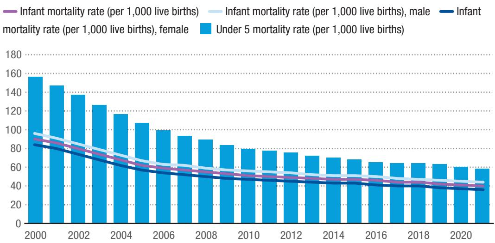

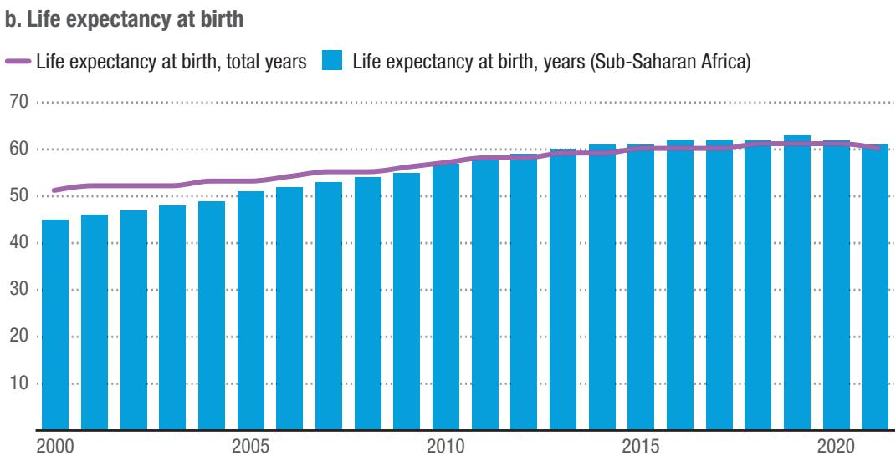  
Source: UNCTAD secretariat calculations based on data from the World Bank, World Development Indicators.

## 2.3.5. Planet

The 2030 Agenda for Sustainable Development has set goals to achieve sustainable development while protecting the planet. In particular, Sustainable Development Goal 13 calls for urgent action to combat climate change and its impact. As a party to this global compact, Zambia launched its national climate change policy in 2017 to steer national efforts to promote climate-resilient and low-carbon growth strategies, as the adverse effects of climate change weigh heavily on Zambia (World Bank, 2019). The country emitted 54.7 tons of carbon equivalent in 2000, a 6.2 per cent rise from 1994. Most of these emissions come from land-use change and forestry (73.7 per cent), agriculture (18.9 per cent), energy (4.8 per cent), industry (1.8 per cent) and waste (0.8 per cent) (Government of Zambia, 2016a). Most of these emissions are sequestered locally in forests and wetlands. It is estimated that about 66 per cent of the country's land area, which totals about 50 million hectares, is still under good forest cover, and that 6 per cent of this is in protected forests (Government of Zambia and FAO, 2008). It is further estimated that 2.62 billion tons of carbon are stored in Zambian forests, and a great deal more is sequestered in these forests and woodlands and wetlands annually. Despite this, threats to biodiversity are

significant, as deforestation rates have risen mainly due to high demand for commercial agricultural lands, mining (i.e. in national parks) and urban development. A well-designed and implemented climate-resilient green growth and development strategy is needed and should be backed by strong regulatory capacity, policies and institutions to protect biodiversity, and ultimately to protect the public interest in environmental conservation and management.

Environmental risks and vulnerabilities can no longer be ignored and should be a prominent feature of Zambia's development agenda. The costs of the impact of climate change are high and often occasioned by floods, droughts, infestations and diseases that reduce agricultural productivity. Low flow of water as well as flooding affect hydropower generation and inflict destruction on the urban environment and infrastructure through several community-level effects. For Zambia, these costs were estimated in 2011 at \$5 billion over a 10- to 20-year period (Government of Zambia, 2016a). Rainfall patterns have also changed, and drought episodes in the southern half of the country have become more frequent, extensive and overlapping (Kaluba et al., 2017). Data from the World Bank's World Development Indicators database shows that there were 22,700 cases of people

displaced due to climate-related disasters in 2019–2023. High cases of displacements were also recorded in 2009 (54,000) and 2014 (26,000) due to floods. These climate-related disasters disproportionately affect the poor, who are less likely to move when disasters and slow-onset of climate change affect their areas (Nawrotzki and DeWaard, 2018). This shows that disaster risk management, especially of climate-induced disasters, is an important element of a climate change strategy, especially as the effects of climate change intensify and become more widespread. Zambia's disaster management budget increased from \$1.4 million in 2017 to \$5.2 million in 2018, but it is still low in absolute terms.

Zambia's total wealth was estimated at \$644 billion in 2019, and of this, \$258 billion (or 40 per cent) is natural capital in the form of protected lands, pasturelands, cropland, forests and minerals, among other elements, with 73 per cent of this being renewable natural capital. The latter is estimated at \$11,970 in per capita terms (World Bank, 2019). $^{29}$ This resource needs to be harnessed to improve the real incomes and welfare of the people in ways that ensure that the same income streams will be available to future generations. Zambia should use its natural assets, including both renewable and non-renewable resources, sustainably.

In 2019, forests contributed about 5 per cent to GDP, while nature-based tourism contributed 3.1 per cent, with inbound tourist receipts reaching \$742.2 million. However, the tourism sector is still recovering from the COVID-19 pandemic, which significantly reduced its contribution to 1.6 per cent of GDP in 2021. The pace at which forests are cleared to pave the way for agricultural and other commercial land uses, as well as for firewood and charcoal, results in indiscriminate loss of forest cover biodiversity and watersheds. It is estimated that about 2.5 million hectares of forests,

representing 6 per cent of forest cover, was lost between 2001 and 2017 (Government of Zambia, 2023c). In turn, Zambia faces reduced water flow, increased siltation, soil impoverishment, and other biodiversity and ecosystem service losses along the way. Forest losses alone were estimated at ZMW14.7 billion between 2000 and 2015 (Government of Zambia, 2020c). $^{30}$ These forest losses adversely impact socioeconomic and cultural development and exemplify the challenges involved in managing development and conservation trade-offs at the ecosystem/watershed level (Government of Zambia, 2020e). Further degradation of forests will ultimately reduce agricultural production and productivity and increase food and human insecurity as resilience and forest-based safety nets are adversely affected. This in turn will deepen poverty and inequality, especially among the rural poor, for whom these forest resources and safety nets are most critical. Community forest management interventions are expected to contribute to reducing deforestation from 172,000 hectares a year in 2021 to 120,000 hectares a year by 2026 (Government of Zambia, 2023c).

The interlinkages between climate change, the environment and the economy will remain important for Zambia because of its natural-resource-based economy. However, overreliance on traditional farming methods poses a risk because of increasing climate change and climate variability. In addition, these practices contribute to land degradation, which cost \$1.8 billion annually or about 13 per cent of GDP (Government of Zambia, 2023d). Investing in environmental and natural resource protection is therefore a sine qua non for Zambia to achieve its aspiration of modernizing agriculture and diversifying the economy.

## 2.3.6. Peace

Zambia has been peaceful and stable and is a model of successful multi-party-political transitions in Africa. It has lived harmoniously with its neighbours since its independence and has supported democratic political transitions and peacekeeping efforts in Africa. However, sustaining peace and stability requires addressing emerging and pre-existing economic, social and environmental vulnerabilities. First and foremost, the focus should be on enhancing good governance, transparency and accountability, and on ensuring that people are actively involved in making decisions that affect them and their communities.

The World Bank's Worldwide Governance Indicators show that from 2000–2013, Zambia improved in the areas of control of corruption; political stability and absence of violence or terrorism; the rule of law; regulatory quality; government effectiveness; and voice and accountability.

The governance record, as measured by these six indicators, started at a very low base, particularly government effectiveness, control of corruption and regulatory quality, but improved significantly over 2000–2013, reaching their respective highs around 2012. However, governance indicators were less satisfactory over 2014–2020, when some indicators deteriorated due to increased dissatisfaction with the status quo before the 2021 elections (Bertelsmann Stiftung, 2024) (figure 22). In 2021, Zambia ranked above the world average on indicators of political stability and the absence of violence or terrorism, voice and accountability, and the control of corruption. These scores place Zambia between the 40 $^{th}$ and 60 $^{th}$ percentile (figure 23). Zambia also improved slightly on the rule of law indicator in 2021 compared to 2020.

Figure 22
Zambia's scores on the Worldwide Governance Indicators, 1996–2021  
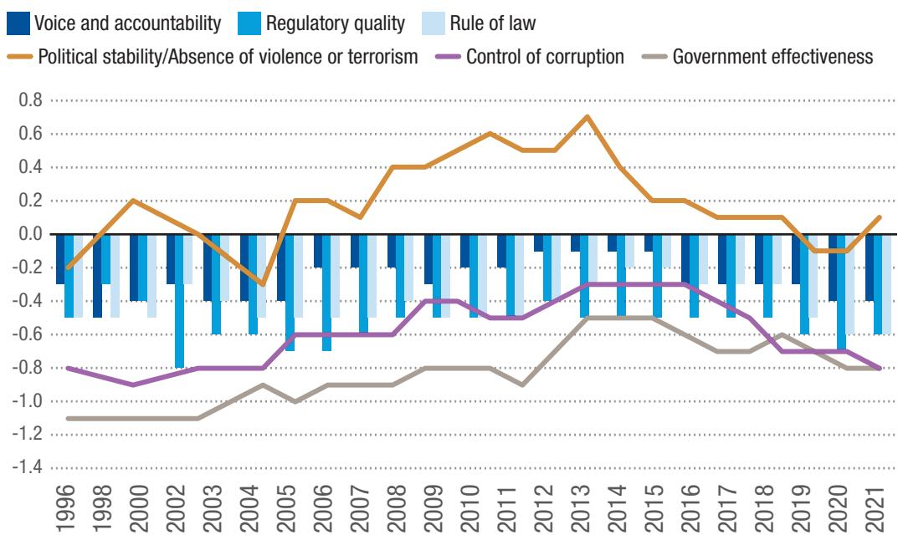

Source: UNCTAD secretariat calculations based on data from the World Bank, World Development Indicators.

Note: The Worldwide Governance Indicators are generated using an unobserved components model (UCM) to construct a weighted average of the individual indicators for each source, with weights reflecting the pattern of correlation among data sources. The UCM is in units of standard normal distribution with a zero mean and standard deviation of one, and the units run from approximately -2.5 to 2.5, with the higher values corresponding to better governance (Kaufmann et al., 2010).

There is a need for Zambia to improve on all of its World Governance Indicators, as further performance slippages pose significant risks to sustaining peace and stability and to securing development

dividends that the country has already achieved. For Zambia, there is a high correlation between the scores for voice and accountability, government effectiveness, control of corruption, and political stability

and absence of violence or terrorism, as all these indicators moved in the same direction during 2000–2020. Building a peaceful and cohesive society depends on improving these governance indicators, with the control of corruption, government effectiveness, and political stability and

absence of violence or terrorism being key. Addressing governance risks and vulnerabilities is of great importance, not only over the envisaged transition period, but also after graduation, as quality governance is a prerequisite for sustainable human progress.

Zambia's rankings on the Worldwide Governance Indicators, 1996–2021 (Percentage)  
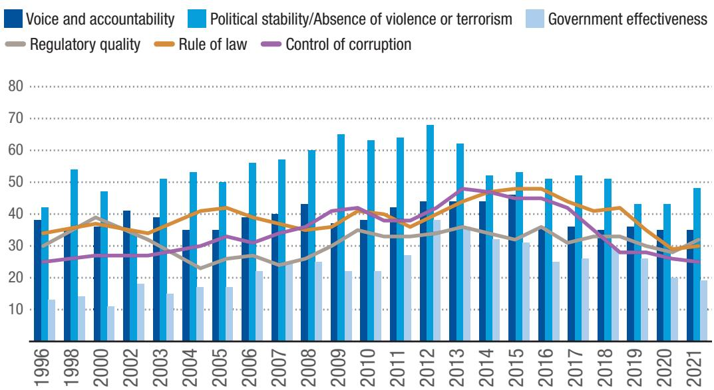  
Source: UNCTAD secretariat calculations based on data from the World Bank, World Development Indicators.

## 2.3.7. Partnerships

Zambia enjoys strategic location advantages that can be exploited to boost trade and investment by fostering bilateral and regional cooperation. As the host country for COMESA, Zambia plays a strategic role in Africa's trade and investment and is among the key destinations for FDI linked to the mining and other natural resource sectors.

## Trends in official development assistance and foreign direct investment

When sustained and properly used, FDI can generate sizable productivity and economic benefits in recipient countries, including through positive productivity spillovers to local firms (Bwalya, 2006). Since 1990, Zambia has received positive inflows of FDI, initially targeted towards the acquisition

of public assets during the privatization of state-owned enterprises in the early 1990s. Receipts from cross-border mergers and acquisitions of public assets rose from \$18 million at the beginning of the privatization programme in 1995 to \$543 million in 2003. In 2015, FDI net inflows increased to \$1,582.7 million, mainly attributed to renewable energy projects (UNCTAD, 2023) before declining to negative \$172.8 million in 2020, as outflows outstripped inflows for the first time since 1980 (a 132 per cent decline from \$548 million in 2019 (figure 24). The FDI outflows were mainly due to debt repayments attributed to the mining sector, ICT and the energy sector (Bank of Zambia et al., 2022).

ODA inflows also declined from 18 per cent of GDP in 2004 to an average of 4 per cent between 2014 and 2020. The decline in ODA flows was also consistent with recent trends in global aid flows, $^{31}$ which declined by 35 per cent to 1 trillion in 2020 (the lowest in 15 years), while outflows fell by 62 per cent in the same year. The decline in outflows is also attributed to the COVID-19 pandemic. Zambia received an average of 5.4 per cent of total FDI inflows to southern Africa over 2018–2022. However, the share declined from 13.4 per cent in 2018 to

0.2 per cent in 2022, mainly due to global trends, as investors took precautionary positions during the COVID-19 pandemic, and to the ongoing realignment of interest rates in major economies. Therefore, to attract consistent inflows and limit capital outflows, Zambia needs to address policy uncertainties, particularly in the extractives and manufacturing sectors.

## Figure 24

## Foreign direct investment inflows in Zambia, 1970–2022

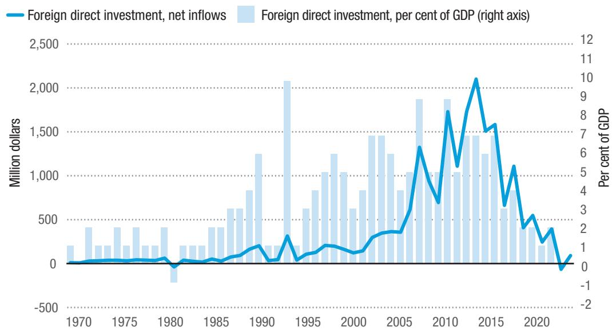  
Source: UNCTAD secretariat calculations based on data from the World Bank, World Development Indicators.

## The impact of the COVID-19 pandemic

Zambia's economic challenges began well before the onset of the COVID-19 pandemic in 2019. Between 2015 and 2019, the economy posted almost no growth, and per capita incomes had been declining since 2015. The pandemic only exacerbated the situation, with growth in real GDP plunging to -5.7 per cent in 2020 from -1.6 per cent in 2019. The real effects of the pandemic were largely temporal and expected to dissipate within two years. The adverse immediate growth effects of COVID-19 emanated from the loss of

human capital and productivity due to disruptions to business and service delivery.

The COVID-19 Vulnerability and Resilience Indexes developed by Diop et al. (2021) rated Zambia 67 $^{th}$ out of 150 countries in terms of vulnerability. The resilience portion of the index shows a country's resilience to the pandemic: the higher the index score, the more resilient a country is to COVID-19. Zambia scored relatively poorly when compared to its vulnerability rating, with a score of 0.356 against the 0.39 average for Africa. It was rated 135 $^{th}$ out of the 150 countries sampled. Somehow, Zambia was less resilient to the pandemic, while at the same time, relatively less vulnerable. The

country's economic vulnerability to COVID-19-induced shocks is examined below.

According to national accounts data from 2018:Q1 to 2023:Q1, the sectors that were most affected by the COVID-19 pandemic were transportation and storage, construction, and wholesale and retail trade (including the repair of motor vehicles and motorcycles) (figure 25). However, in terms of effects on people, the education sector was the hardest hit, as the government-imposed lockdowns and closures of all learning institutions across the country in a bid to contain the pandemic. The sector slowed in the first and second quarters of 2020, but quickly recovered and resumed its growth trajectory by the third and fourth quarters. Overall, the impact of the pandemic was more pronounced in the fourth quarter of 2020, when growth slowed compared to the third quarter. The recession was more widespread and affected almost all economic sectors except mining and quarrying, which benefitted from a positive price shock resulting from a disrupted commodity market. The recession lasted until the first quarter of 2021, when restrictions were lifted both domestically and in major trading partner countries.

Based on quarterly value-added data, wholesale and retail trade (including the repair of motor vehicles and motorcycles) was barely affected by the frequent lockdowns. However, wholesale and retail trade did face some distress in its growth trend between the first quarter of 2019 and the last quarter of 2020 before returning strongly at the end of the second quarter of 2021 (figure 25). The construction sector finished 2022:Q1 weak compared to the peak period of the pandemic in 2020 and 2021, but the resumption of government infrastructure projects, which were halted during the pandemic, will boost the sector. The government earmarked ZMW 8.9 billion (5 per cent) in 2022 budget projects, including for school and health infrastructure, rehabilitation of 4,500 km of rural roads that are critical for connectivity to markets, irrigation infrastructure, and industrial yards. Road infrastructure projects alone were allocated over ZMW 8 billion in the 2024 budget (Government of Zambia, 2023f; National Assembly of Zambia, 2021).

The health sector stood in sharp contrast to the rest of the economy, recording a significant boost in public resource allocations to fight the pandemic, as well as donor pledges of support. $^{32}$ As a result, the health sector registered growth during the pandemic, but only in relative terms, as the sector's value-added contribution is among the lowest. This shift, however, affected budget execution and expenditures in other sectors. The increase in resource allocation in response to the pandemic was largely financed by a COVID-19 bond issued by the Ministry of Finance and National Planning. This invariably increased net domestic financing to ZMW 47.7 billion against the 2020 budget target of ZMW 16.1 billion (161.4 per cent over target). This in turn increased the budget deficit from 9.1 per cent of GDP in 2019 to 14.4 per cent of GDP in 2020, although the overall fiscal balance remained on target at 9.3 per cent in 2021 (Government of Zambia, 2019b, 2020a, 2021). Therefore, the COVID-19 pandemic generated some adverse fiscal effects in 2020, which had spillover effects in 2021–2022. Domestic revenues also declined in 2020 by 8.6 per cent on account of the slowdown in economic activity, although tax revenue collections were only below target by 3.1 per cent.

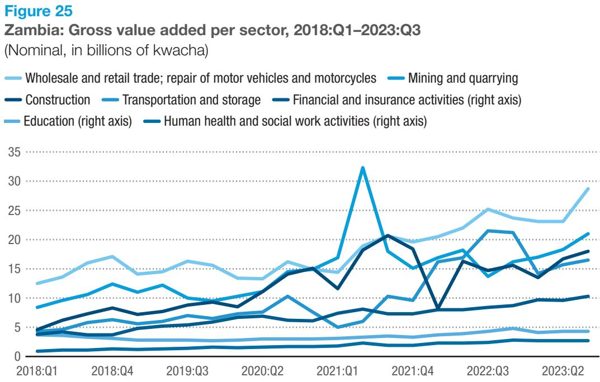  
Source: UNCTAD secretariat calculations based on National Accounts data from the Zambia Statistics Agency.

As noted in the analysis on trade dynamics, COVID-19 resulted in a decline in merchandise imports, mostly because of trade logistics and lockdowns in source countries. The total merchandise imports of Zambia fell by \$2.2 billion and \$1.9 billion in 2019 and 2020, respectively, but recovered strongly in 2021 and 2022 as global trade normalized (table 6). The decline in imports in 2019 was more dramatic from the top source countries, with the Democratic Republic of the Congo experiencing the largest contraction of \$662 million that year. China, Japan, India, Germany and Seychelles, in that order, also experienced significant declines in their exports to Zambia in 2020.

Merchandise exports from Zambia also fell drastically by \$2 billion in 2019, though a positive price shock to ores and metals resulted in a quick turnaround in 2020 and 2021 as total exports rebounded by \$776 million and \$3.3 billion, respectively (table 7). The impact of COVID-19 on exports was mitigated through trade diversions to destinations that remained open to trade during the pandemic. A case in point was trade diversion to Luxembourg, where exports increased by \$21 million and \$76 million in 2020 and 2021, respectively.

There were also substantial gains in exports to China, Singapore, the Democratic Republic of the Congo and Pakistan in 2020 and 2021. Exports to South Africa, which is an important export destination in the subregion, initially declined by \$60 million in 2020 as lockdowns in the country stifled trade, but then recovered strongly in 2021 as the country reopened its borders. The COVID-19 crisis also revealed the importance of regional trade partners for Zambian exports, particularly Namibia, and Malawi, in that order, as exports to these countries increased throughout the pandemic.

Trade prospects remain positive for Zambia, although the drying up of resources in FDI source countries may slow growth in the minerals sector. The other concern is the tightening of monetary measures by central banks to counteract growing inflationary pressures due to the cost-of-living crisis since COVID-19, as well as the effects of the ongoing war in Ukraine, which may raise the cost of borrowing. The contagion effects of the global headwinds include the depreciation of the Zambian kwacha and inflation. The IMF programme to which Zambia has committed obliges the country to maintain fiscal discipline,

Zambia: Annual change in imports from major sources, 2017–2022 (Millions of dollars)

<table><tr><td></td><td>2017</td><td>2018</td><td>2019</td><td>2020</td><td>2021</td><td>2022</td></tr><tr><td>World</td><td>1 488</td><td>689</td><td>-2 241</td><td>-1 907</td><td>1 782</td><td>2 880</td></tr><tr><td>China</td><td>437</td><td>224</td><td>-272</td><td>-271</td><td>100</td><td>436</td></tr><tr><td>Democratic Republic of the Congo</td><td>346</td><td>73</td><td>-662</td><td>22</td><td>157</td><td>364</td></tr><tr><td>India</td><td>-4</td><td>129</td><td>-132</td><td>-49</td><td>124</td><td>133</td></tr><tr><td>Namibia</td><td>-38</td><td>-31</td><td>12</td><td>-15</td><td>45</td><td>92</td></tr><tr><td>Netherlands</td><td>17</td><td>-8</td><td>-2</td><td>5</td><td>4</td><td>41</td></tr><tr><td>Seychelles</td><td>0</td><td>0</td><td>86</td><td>-29</td><td>5</td><td>34</td></tr><tr><td>Germany</td><td>10</td><td>23</td><td>-15</td><td>-35</td><td>14</td><td>31</td></tr><tr><td>Japan</td><td>8</td><td>19</td><td>-5</td><td>-50</td><td>75</td><td>24</td></tr><tr><td>Ireland</td><td>9</td><td>-2</td><td>4</td><td>4</td><td>26</td><td>21</td></tr><tr><td>Kenya</td><td>-16</td><td>15</td><td>-17</td><td>0</td><td>24</td><td>21</td></tr></table>

  
Source: UNCTAD secretariat calculations based on data from UNCTADStat.

## Table 7

Zambia: Annual change in exports to top 20 destinations, 2018-2022 (Millions of dollars)

<table><tr><td></td><td>2018</td><td>2019</td><td>2020</td><td>2021</td><td>2022</td></tr><tr><td>World</td><td>886</td><td>-2 014</td><td>776</td><td>3 336</td><td>1 709</td></tr><tr><td>China</td><td>430</td><td>-588</td><td>261</td><td>996</td><td>517</td></tr><tr><td>Namibia</td><td>283</td><td>87</td><td>116</td><td>-36</td><td>246</td></tr><tr><td>Democratic Republic of the Congo</td><td>315</td><td>-98</td><td>86</td><td>187</td><td>210</td></tr><tr><td>India</td><td>-163</td><td>-59</td><td>-165</td><td>-65</td><td>87</td></tr><tr><td>Singapore</td><td>94</td><td>-75</td><td>148</td><td>365</td><td>46</td></tr><tr><td>Malawi</td><td>-23</td><td>6</td><td>17</td><td>26</td><td>30</td></tr><tr><td>South Africa</td><td>-1</td><td>-129</td><td>-60</td><td>115</td><td>22</td></tr><tr><td>Germany</td><td>7</td><td>2</td><td>6</td><td>5</td><td>13</td></tr><tr><td>Canada</td><td>-1</td><td>19</td><td>21</td><td>19</td><td>8</td></tr><tr><td>Egypt</td><td>45</td><td>-31</td><td>-23</td><td>68</td><td>6</td></tr><tr><td>Kenya</td><td>-12</td><td>-7</td><td>-21</td><td>21</td><td>6</td></tr><tr><td>Hong Kong SAR</td><td>-2</td><td>-26</td><td>-21</td><td>32</td><td>2</td></tr><tr><td>Netherlands</td><td>17</td><td>-18</td><td>-2</td><td>23</td><td>2</td></tr><tr><td>Italy</td><td>-6</td><td>-6</td><td>-3</td><td>39</td><td>-4</td></tr><tr><td>Botswana</td><td>1</td><td>12</td><td>-18</td><td>37</td><td>-5</td></tr><tr><td>Taiwan Province of China</td><td>-5</td><td>-9</td><td>2</td><td>42</td><td>-7</td></tr><tr><td>Kuwait</td><td>12</td><td>-24</td><td>-16</td><td>40</td><td>-7</td></tr><tr><td>Luxembourg</td><td>11</td><td>-9</td><td>21</td><td>76</td><td>-7</td></tr><tr><td>Pakistan</td><td>1</td><td>-7</td><td>13</td><td>39</td><td>-7</td></tr><tr><td>Korea, Republic of</td><td>-39</td><td>-30</td><td>-16</td><td>45</td><td>-12</td></tr></table>

Source: UNCTAD secretariat calculations based on data from UNCTADStat.

which could affect the growth target in the short to medium term. The burden of the policy adjustments will largely be shouldered by the poor, for whom social protection programmes can no longer be guaranteed and safeguarded during the fiscal adjustment process. In fact, the removal of subsidies on agriculture, petroleum products and electricity are critical elements of Zambia's fiscal adjustment and consolidation programme. As necessary as these measures are, they will disproportionately harm the rural and urban poor more than the rich and will certainly increase income inequality.

## Development finance and the foreign debt situation

Zambia is experiencing unsustainable debt levels for the second time — the first time having been the period preceding qualification for the HIPC initiative in 2004. The rapid debt accumulation started in 2009 and has been evolving up to the present. The debt reached distress levels from 2015 onward, when the total-external-debt-to-GDP ratio exceeded the country's prudential limit of 35 per cent of GDP. The ratio then doubled in 2016. By 2018, the total external debt stock had reached 90 per cent of GDP, and in 2020 it exceeded 100 per cent. The public and publicly guaranteed component of the external debt rose rapidly from 12 per cent of GDP in 2012 to 68 per cent in 2020, then dropped to 57 per cent in 2021 (figure 26). The country defaulted on its debt service obligations in 2020 and accumulated debt service arrears to the tune of \$1.9 billion in 2021 (table 8).

## Figure 26

## Zambia: External-debt-to-gross domestic product ratios, 2000–2021 (Percentage)

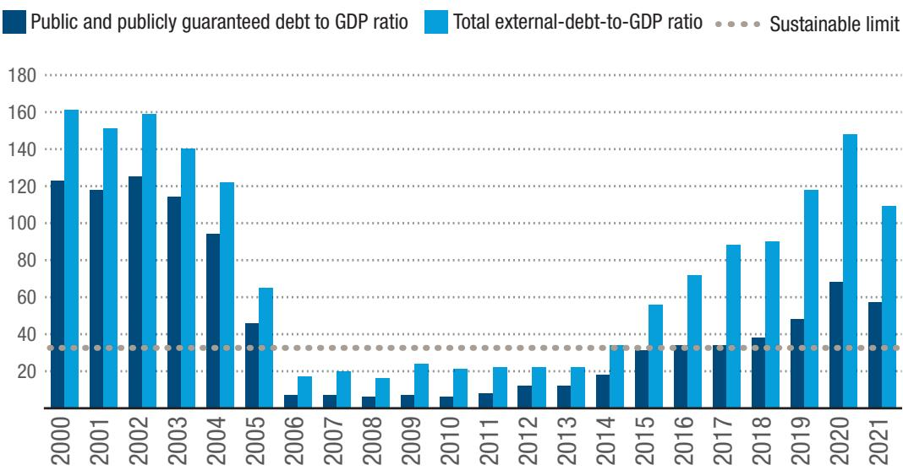  
Source: UNCTAD secretariat calculations based on data from the World Bank, International Debt Statistics.

The structure of the pre-HIPC debt is markedly different from the current debt structure, which has a very low share of multilateral lenders and a higher share of private lenders (table 8). From 1990–2005, the main components of Zambia's public and publicly guaranteed external debt were bilateral and multilateral in almost equal shares (figure 27). Bonds, commercial banks and other private creditors were

barely featured. From 2011 onward, public and publicly guaranteed debt in the form of bonds and commercial bank credit increased markedly, while the share of multilateral debt declined. In 2021, the multilateral share of public and publicly guaranteed debt was 21 per cent, having declined from 57 per cent in 2004, while the other components in 2021 were split between bonds (24 per cent), commercial banks (19 per cent), and bilateral debt (34 per cent). Hence, it is more costly and challenging for Zambia to finance its development through external borrowing. In addition, protracted negotiations are normal for debt restructurings. For instance, the country reached a deal in June 2023 with

  
Table 8

bilateral creditors to reschedule \$6.3 billion of its public debt, but it was only in March 2024 that a deal was reached with a group of private commercial bond holders, Western asset managers and hedge funds to reschedule \$3 billion of bonds outstanding. $^{33}$

Zambia: External debt position as of 2021 (In million Zambian kwacha)

<table><tr><td rowspan="2"></td><td rowspan="2">Stock present value at 5 per cent discount factor in millions of dollars</td><td rowspan="2">Arrears in millions of dollars</td><td rowspan="2">Per cent of external debt</td><td rowspan="2">Per cent of arrears</td><td colspan="9">Aggregate debt servicein million dollars</td></tr><tr><td>2022</td><td>2023</td><td>2024</td><td>2025</td><td>2026</td><td>2027</td><td>2028</td><td>2029</td><td>2030</td></tr><tr><td>Bilateral official creditors</td><td>4 759</td><td>588.3</td><td>26.2</td><td>30.4</td><td>613</td><td>753</td><td>734</td><td>707</td><td>657</td><td>495</td><td>450</td><td>438</td><td>425</td></tr><tr><td>Eco-backed commercial credit</td><td>2 346</td><td>553.6</td><td>12.9</td><td>28.6</td><td>502</td><td>493</td><td>471</td><td>398</td><td>342</td><td>200</td><td>119</td><td>115</td><td>83</td></tr><tr><td>Non-insured commercial banks</td><td>1 579</td><td>544.8</td><td>8.7</td><td>28.2</td><td>479</td><td>381</td><td>337</td><td>292</td><td>185</td><td>54</td><td>52</td><td>27</td><td>2</td></tr><tr><td>Euro bonds</td><td>3 518</td><td>242.4</td><td>19.4</td><td>12.5</td><td>1 043</td><td>253</td><td>1 211</td><td>585</td><td>547</td><td>454</td><td>..</td><td>..</td><td>..</td></tr><tr><td>Multilaterals</td><td>1 463</td><td>0.8</td><td>8.1</td><td>0</td><td>97</td><td>108</td><td>113</td><td>117</td><td>114</td><td>106</td><td>105</td><td>104</td><td>98</td></tr><tr><td>Plurilateral lending</td><td>200</td><td>5.0</td><td>1.1</td><td>0.3</td><td>22</td><td>17</td><td>18</td><td>21</td><td>21</td><td>21</td><td>20</td><td>19</td><td>19</td></tr><tr><td>Fuel and contractors</td><td>896</td><td>..</td><td>4.9</td><td>0</td><td>116</td><td>116</td><td>116</td><td>116</td><td>116</td><td>116</td><td>116</td><td>116</td><td>116</td></tr><tr><td>Independent power producers</td><td>124</td><td>..</td><td>0.7</td><td>0</td><td>16</td><td>16</td><td>16</td><td>16</td><td>16</td><td>16</td><td>16</td><td>16</td><td>16</td></tr><tr><td>Non-residents holder of letters of credit</td><td>3 246.5*</td><td>..</td><td>17.9</td><td>0</td><td>..</td><td>..</td><td>..</td><td>..</td><td>..</td><td>..</td><td>..</td><td>..</td><td>..</td></tr><tr><td>Non-residents holder of letters of local currency debt</td><td>..</td><td>..</td><td>..</td><td>..</td><td>10 333</td><td>12 655</td><td>8 691</td><td>8 270</td><td>17 882</td><td>5 600</td><td>6 757</td><td>3 169</td><td>3 178</td></tr><tr><td>Resident holding of local currency debt</td><td>..</td><td>..</td><td>..</td><td>..</td><td>58 785</td><td>23 483</td><td>23 149</td><td>16 360</td><td>20 928</td><td>9 440</td><td>5 961</td><td>10 873</td><td>3 810</td></tr><tr><td>Total</td><td>18 130.50</td><td>1 934.9</td><td>100</td><td>100</td><td colspan="9"></td></tr></table>

Source: Government of Zambia (2022b).  
Note: \* Stock, face value.

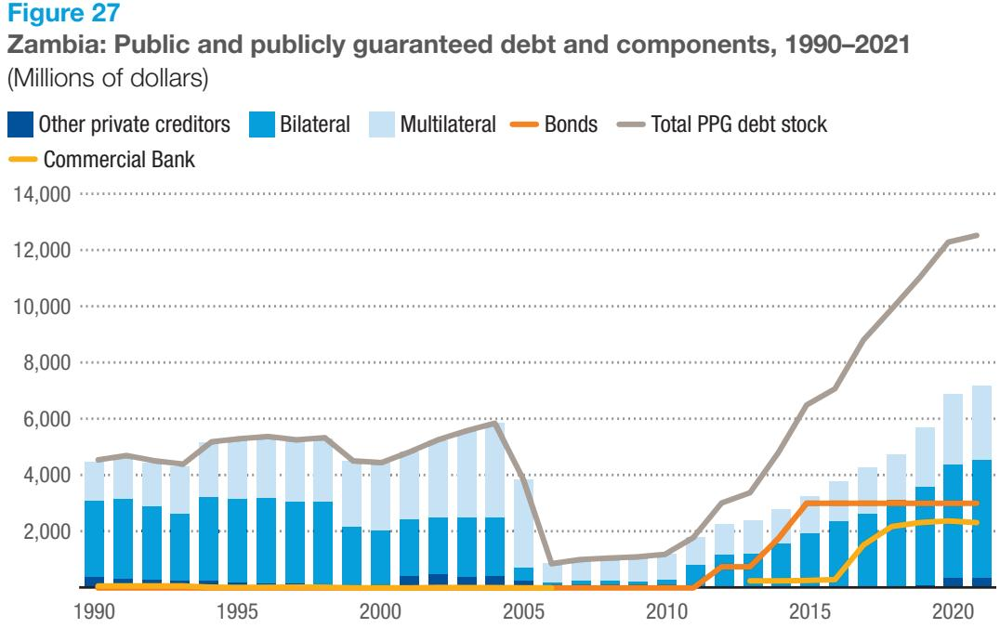  
Source: UNCTAD secretariat calculations based on data from the World Bank, International Debt Statistics.  
Note: PPG: public and publicly guaranteed.

Addressing Zambia's debt vulnerabilities requires a combination of measures to bring debt down to sustainable levels. Such measures would invariably include taking fiscal adjustments to front-load debt repayments in 2022 through 2026, which in turn requires a commitment by the government to boost domestic resource mobilization. There is also a need to raise export earnings to provide the resources needed to service external debt and contain it at sustainable levels. In addition, there may be a need to slow down and even cancel public projects that have not yet been funded or have not commenced in order to create room for fiscal consolidation and adjustments, including by removing and rationalizing public subsidies. Some of these steps have already been taken satisfactorily. As negotiations with creditors on debt restructuring enter the implementation phase, the government should seek new debt, preferably on concessional and longer maturity terms, in order to roll over maturing debt repayment obligations and ease fiscal liquidity constraints. This is the

rationale behind the \$1.3 billion IMF bailout package (IMF, 2022). Further steps need to be taken to secure the commitment of private creditors to the debt restructuring process that has already been agreed upon with the main official bilateral lender, China. $^{34}$

Zambia's debt sustainability scenarios recently published by the Ministry of Finance and National Planning show that the government will front-load most of its debt repayments between 2022 and 2030, disbursing a total of \$15.7 billion in debt repayments to its creditors (Government of Zambia, 2022b). This amount does not include payments to non-resident holders of letters of credit. The process should aim to contain debt within sustainability limits by 2030, and to restore confidence in the short to medium term by easing borrowing conditions, building up sufficient foreign reserves, and sustaining growth rates at or above pre-2015 levels. The attendant factors that have exacerbated debt vulnerabilities include reduced international financial net inflows of FDI, which fell from 5.4 per cent of GDP in 2010 to less than

1 per cent over 2015–2020, while ODA plateaued at only 4 per cent of GDP. Export revenue instabilities also added to the debt crisis, so any perturbation to international trade affecting exports over the medium to long term might exacerbate debt vulnerabilities even further. It is therefore important that efforts to address export risks and vulnerabilities be prioritized. There may also be a need for better reporting of public finance statistics, including projections of revenue and debt finance, in order to improve country risk assessments, which are often unfavourable because of data opacity and policy uncertainties.

Rebalancing the debt stock distribution by creditor and the interest cost elements will also be critical to the process of re-establishing debt sustainability. As of 2021, Zambia's main bilateral creditor was China, which accounted for about a quarter of the country's total public and publicly guaranteed external debt, while the United Kingdom, China and Israel, in that order, are Zambia's main creditors through commercial bank loans (table 9). Rationalizing the risks and costs by source of funds would also be critical even as the external debt architecture and the prevailing global economic outlook may prevent a smooth transition for countries seeking to optimally restructure their long-term debt to reduce vulnerabilities and the likelihood of defaulting. Zambia's debt service on public and publicly guaranteed debt rose from \$923 million in 2019 to \$2.9 billion in 2022, as arrears accumulated in 2020 and 2021 became due. The trend also shows that although most interest payments are to multilateral debt, the share of interest paid on bonds and loans from commercial banks and other creditors increased over 2011–2021 (figure 28). Yet in terms of disbursements, official flows (bilateral and multilateral) remain the most significant (figure 29). This therefore implies that reducing debt obligations, particularly of private and non-concessional loans, will lift the debt burden off the economy and ease liquidity constraints and their impact on the economy.

## Figure 28

Zambia: The share of interest payments by creditor type, 2000–2021 (Percentage)  
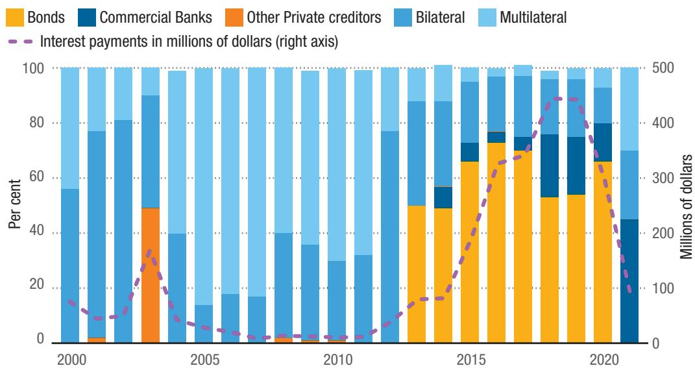  
Source: UNCTAD secretariat calculations based on data from the World Bank, International Debt Statistics.

Figure 29  
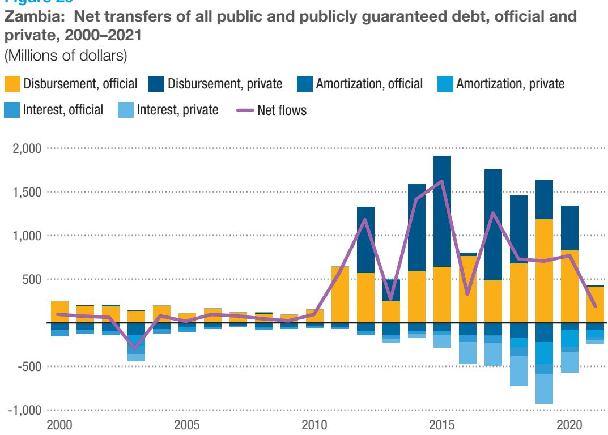  
Source: UNCTAD secretariat calculations based on data from the World Bank, International Debt Statistics.  
Note: In the key, net flows refers to disbursement-amortization-interest.

Table 9
Zambia: Public and publicly guaranteed stock of debt by creditor, 2021

<table><tr><td>Counterpart</td><td>Debt stock in millions of US dollars</td><td>Percentage of creditor type total</td><td>Percentage of total public and public guaranteed debt stock</td></tr><tr><td colspan="4">Bilateral</td></tr><tr><td>Bulgaria</td><td>1.73</td><td>0</td><td>0</td></tr><tr><td>China</td><td>3 293.75</td><td>78.2</td><td>26.4</td></tr><tr><td>France</td><td>51.12</td><td>1.2</td><td>0.4</td></tr><tr><td>India</td><td>292.3</td><td>6.9</td><td>2.3</td></tr><tr><td>Iraq</td><td>0.01</td><td>0</td><td>0</td></tr><tr><td>Japan</td><td>49.85</td><td>1.2</td><td>0.4</td></tr><tr><td>Republic of Korea</td><td>0</td><td>0</td><td>0</td></tr><tr><td>Kuwait</td><td>0.93</td><td>0</td><td>0</td></tr><tr><td>Russian Federation</td><td>143.57</td><td>3.4</td><td>1.1</td></tr><tr><td>Saudi Arabia</td><td>53.13</td><td>1.3</td><td>0.4</td></tr><tr><td>South Africa</td><td>151.67</td><td>3.6</td><td>1.2</td></tr><tr><td>United Arab Emirates</td><td>0</td><td>0</td><td>0</td></tr><tr><td>United Kingdom</td><td>175.07</td><td>4.2</td><td>1.4</td></tr><tr><td>Total (bilateral)</td><td>4 213.13</td><td></td><td>33.7</td></tr><tr><td colspan="4">Multilateral</td></tr><tr><td>World Bank- International Development Association</td><td>1 377.31</td><td>52.5</td><td>11</td></tr><tr><td>OPEC Fund for International Development</td><td>46.19</td><td>1.8</td><td>0.4</td></tr><tr><td>Nordic Development Fund</td><td>28.19</td><td>1.1</td><td>0.2</td></tr><tr><td>International Fund for Agricultural Development</td><td>118.44</td><td>4.5</td><td>0.9</td></tr><tr><td>European Investment Bank</td><td>139.55</td><td>5.3</td><td>1.1</td></tr><tr><td>Eastern and Southern African Trade and Development Bank</td><td>95.04</td><td>3.6</td><td>0.8</td></tr><tr><td>Arab Bank for Economic Development in Africa</td><td>21.28</td><td>0.8</td><td>0.2</td></tr><tr><td>African Development Bank</td><td>799.67</td><td>30.5</td><td>6.4</td></tr><tr><td>Total (multilateral)</td><td>2 625.66</td><td></td><td>21.0</td></tr><tr><td colspan="4">Commercial Banks</td></tr><tr><td>United Kingdom</td><td>1 230.88</td><td>53.2</td><td>9.8</td></tr><tr><td>China</td><td>513.82</td><td>22.2</td><td>4.1</td></tr><tr><td>Israel</td><td>354.2</td><td>15.3</td><td>2.8</td></tr><tr><td>Italy</td><td>88.74</td><td>3.8</td><td>0.7</td></tr><tr><td>Denmark</td><td>49.66</td><td>2.1</td><td>0.4</td></tr><tr><td>United States</td><td>45.36</td><td>2.0</td><td>0.4</td></tr><tr><td>South Africa</td><td>32.89</td><td>1.4</td><td>0.3</td></tr><tr><td>Total (commercial banks)</td><td>2 315.55</td><td></td><td>18.5</td></tr><tr><td>Bonds</td><td>3 000</td><td></td><td>24.0</td></tr><tr><td>Other private creditors</td><td>343.31</td><td></td><td>2.8</td></tr><tr><td>Grand total public and publicly guaranteed debt stock</td><td>12 497.65</td><td></td><td>100</td></tr></table>

Source: UNCTAD secretariat calculations based on data from the World Bank, International Debt Statistics.

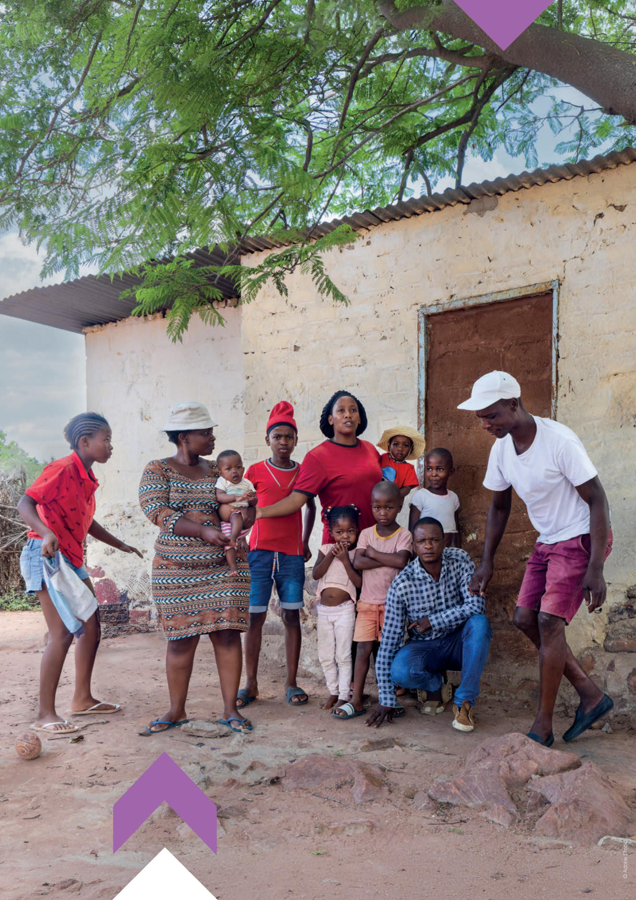

# Addressing lingering vulnerabilities

Zambia is exposed to multiple concurrent shocks that have been hindering its progress towards graduation from the LDC category and its 2030 Vision of becoming a middle-income country. The economy bore the brunt of commodity price fluctuations during the 1990s and early 2000s and remains highly exposed due to the concentration of primary commodities and the domination of copper in its export basket. The performance of the mining sector is key to Zambia meeting the GNI per capita income graduation criteria, but without a broader economic base and deeper social development, the country remains vulnerable to shocks. The investment climate remains fluid given uncertainties over the future direction of the price of copper, so the pace of reforms towards structural transformation is critical. In addition, in 2020 Zambia's credit rating was downgraded to C from CC following its much-publicized sovereign debt default (Fitch Ratings, 2020). The downgrade affects premiums on interest rates and pushes the cost of capital higher for both public and private debt. There are several other factors that increase Zambia's vulnerabilities or exacerbate the effects of major shocks to the economy. This section discusses how Zambia's key vulnerabilities could be addressed in order to build resilience and strengthen the economy.

## 3.1. Accelerate structural change and strengthen competitiveness

Zambia's economic vulnerabilities are structural, and they are acutely exacerbated by trade and terms-of-trade shocks arising from the country's underdeveloped and highly concentrated export structure. Since independence, Zambia has failed to diversify its export base away from copper. As a small producer that supplied just 800,838 metric tons of copper in 2021 — compared to 5.6 million tons produced by Chile in that same year — Zambia cannot influence copper prices on the international market. As a result, whenever international copper prices plunge, the Zambian economy is immediately thrown into disarray. The transmission of such a shock to the rest of the economy is instantaneous and the impact is prolonged. Reduced export earnings adversely affect macroeconomic stability, generating secondary economic effects on employment, income and welfare.

The slow growth of exports is more of a structural problem and less of a trade policy failure. Export growth and diversification are inhibited by the dominance of a single primary commodity export in total exports and the inability of the country to build industrial capabilities to produce technologically superior goods and services that are competitive on the international market. It is therefore important to address trade-related economic vulnerabilities to secure robust and sustainable growth, particularly during the 2024–2030 period. Based on the product space methodology, which uses the value of products that Zambia exported in a particular year (2021), there is potential for diversification and growth in the areas of travel and tourism, transport services, solid soybean residues, electricity, cements, flavoured or sweetened waters, chemicals, cereal meals, confectionery sugar, ICT services, sugarcane and sucrose, and wood — both in the rough and sawn (table 10).

Zambia ranked $105^{\text{th}}$ (out of 133 countries) on the Harvard Growth Lab's Economic

Complexity Index in 2021, three places worse than its 2011 ranking. This is mainly due to the lack of diversification of exports and a static pattern of export growth dominated by copper. From 2006–2021, Zambia added only 17 new products to its product space, earning about \$610 million. It is practically impossible to foresee Zambia making greater progress in structural change based on its existing productive capacity and export potential. However, there are growth opportunities in more sophisticated products, including industrial machinery, plastics, and textiles and wearing apparels. Further, Zambia has feasible opportunities

  
Table 10
Zambia: Export product shares in 2021

for the manufacture of electronic integrated circuits, motor vehicle parts, and serum and vaccines, as well as medicines. It is imperative for Zambia to gradually diversify into these complex products to improve its export performance and growth prospects. Typically, this process is path-dependent and contingent on existing capabilities, as it takes place through discrete jumps from existing products to newer and more complex products/activities. Factors such as technology, innovation, knowledge, research, infrastructure, industrial linkages and finance play a significant role in the transformation process (UNCTAD, 2021a).

<table><tr><td>Product</td><td>Share 
(per cent)</td><td>Gross export value 
(millions of dollars)</td></tr><tr><td>Unrefined copper</td><td>46.85</td><td>4 973</td></tr><tr><td>Refined copper and copper alloys</td><td>18.04</td><td>1 915</td></tr><tr><td>Gold</td><td>5.99</td><td>636</td></tr><tr><td>Travel and tourism</td><td>3.70</td><td>393</td></tr><tr><td>Precious stones</td><td>2.17</td><td>230</td></tr><tr><td>Copper ore</td><td>2.02</td><td>215</td></tr><tr><td>Ferroalloys</td><td>1.32</td><td>140</td></tr><tr><td>Unmanufactured tobacco</td><td>1.27</td><td>135</td></tr><tr><td>Electrical energy</td><td>1.01</td><td>107</td></tr><tr><td>Cements</td><td>0.95</td><td>101</td></tr><tr><td>Waters, flavored or sweetened</td><td>0.91</td><td>97</td></tr><tr><td>Articles of stone or of other mineral substances</td><td>0.70</td><td>75</td></tr><tr><td>Transport</td><td>0.63</td><td>67</td></tr><tr><td>Solid soybean residues</td><td>0.63</td><td>67</td></tr><tr><td>Copper wire</td><td>0.61</td><td>65</td></tr><tr><td>Nickel ore</td><td>0.55</td><td>58</td></tr><tr><td>Sulfuric acid, oleum</td><td>0.50</td><td>53</td></tr><tr><td>Cobalt</td><td>0.49</td><td>52</td></tr><tr><td>Sugarcane and sucrose</td><td>0.43</td><td>46</td></tr><tr><td>Corn</td><td>0.41</td><td>44</td></tr><tr><td>ICT</td><td>0.39</td><td>42</td></tr><tr><td>Quicklime</td><td>0.38</td><td>40</td></tr><tr><td>Sulphur, crude</td><td>0.35</td><td>37</td></tr><tr><td>Scrap of precious metal</td><td>0.31</td><td>33</td></tr><tr><td>Industrial monocarboxylic fatty acids</td><td>0.28</td><td>30</td></tr><tr><td>Wood sawn lengthwise</td><td>0.28</td><td>29</td></tr><tr><td>Cleaning products</td><td>0.27</td><td>28</td></tr><tr><td>Manganese &gt; 47% by weight</td><td>0.25</td><td>27</td></tr><tr><td>Other bars of iron, not further worked than forged</td><td>0.25</td><td>26</td></tr><tr><td>Copper mattes</td><td>0.24</td><td>25</td></tr><tr><td>Raw cotton</td><td>0.23</td><td>25</td></tr><tr><td>Insulated electrical wire</td><td>0.22</td><td>24</td></tr><tr><td>Cereal meals</td><td>0.22</td><td>23</td></tr><tr><td>Confectionery sugar</td><td>0.19</td><td>20</td></tr><tr><td>Bakery products</td><td>0.17</td><td>18</td></tr><tr><td>Wood in the rough</td><td>0.17</td><td>18</td></tr><tr><td>Prepared explosives, except gunpowder</td><td>0.17</td><td>18</td></tr><tr><td>Soya beans</td><td>0.15</td><td>15</td></tr><tr><td>Nitrogenous fertilizers</td><td>0.15</td><td>15</td></tr><tr><td>Unused stamps</td><td>0.14</td><td>15</td></tr><tr><td>Self-propelled bulldozers, excavators and road rollers</td><td>0.13</td><td>13</td></tr><tr><td>Other tubes, pipes and hollow profiles of iron or steel</td><td>0.12</td><td>13</td></tr><tr><td>Insurance and finance</td><td>0.12</td><td>13</td></tr><tr><td>Coffee</td><td>0.11</td><td>12</td></tr><tr><td>Fermented milk products</td><td>0.11</td><td>11</td></tr><tr><td>Flours of oil seeds</td><td>0.10</td><td>11</td></tr><tr><td>Parts for use with hoists and excavation machinery</td><td>0.10</td><td>11</td></tr><tr><td>Angles of iron or nonalloy steel</td><td>0.10</td><td>10</td></tr><tr><td>Cereal residues</td><td>0.10</td><td>10</td></tr><tr><td>Cut flowers</td><td>0.10</td><td>10</td></tr><tr><td>Motor vehicles for transporting goods</td><td>0.09</td><td>10</td></tr><tr><td>Lead refined unwrought</td><td>0.09</td><td>10</td></tr></table>

Source: UNCTAD calculations based on data from the Harvard Growth Lab, The Atlas of Economic Complexity. Available at https://atlas.cid.harvard.edu/explore?country=247&queryLevel=location&product=undefined&year=2021&productClass=HS&target=Product&partner=undefined&startYear=undefined (accessed 20 January 2022).  
Note: Products whose value is less than \$10 million have been excluded.

A further analysis of the product space for Zambia reveals that the country has revealed comparative advantages in ores and metals (copper, nickel, ferroalloys and cobalt), precious stones and non-monetary gold. $^{35}$ Peanuts, cut flowers, sugarcane and sucrose, soybean, corn and bovine leather are some of the main exports with sizable, revealed comparative advantages among agricultural products. Chemicals and light manufactures such as sulfuric acid, sulphur, cleaning detergents and soaps were also competitively exported in 2021 (figure 30).

Figure 30
Zambia: Export product shares, 2021  
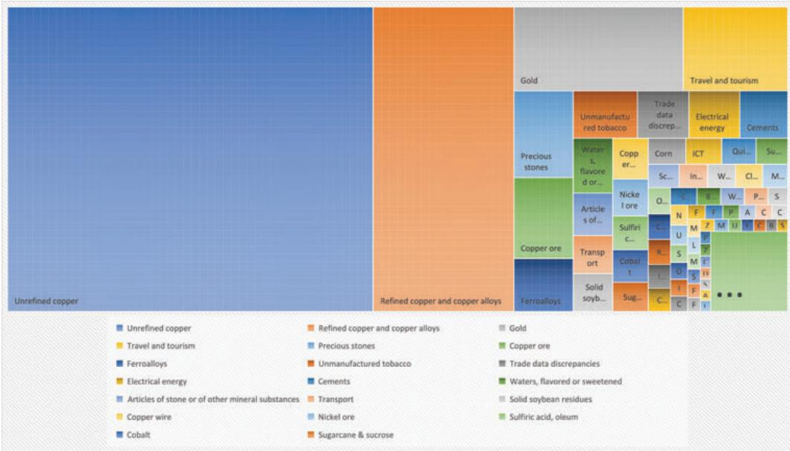  
Source: UNCTAD calculations based on data from the Harvard Growth Lab, The Atlas of Economic Complexity.

## 3.1.1. Address barriers to export growth

Zambia does not have problems accessing global markets for its traditional exports, which are dominated by a few minerals, as these go to standard markets with few non-tariff impediments and where tariffs are zero-rated based on the Most Favoured Nation criterion. Zambia had access to the European Union quota-free, duty-free arrangement under the Cotonou Partnership agreement, which expired in 2020. Quota-free, duty-free market access to the European Union has been extended through the Samoa agreement (“post-Cotonou”) between the European Union and sub-Saharan African, Caribbean and Pacific states signed on 15 November 2023 in Apia (Samoa); provisional application of the agreement began on 1 January 2024. $^{36}$

Zambia also enjoys free and non-reciprocal market access under the Everything but Arms agreement, and duty-free

non-reciprocal access to the United States market under the Africa Growth Opportunity Act. In addition, the country has LDC-specific Generalized System of Preferences (GSP) access to Canadian and Japanese markets. As the analysis of export partners revealed, most of these market access opportunities have not been exploited to grow and diversify Zambia's export base. This is often attributed to domestic (supply) capacity constraints, non-tariff barriers and tariff escalations in major markets, as well as an inadequate long-term vision of these markets as being of national strategic importance.

Zambia has not used the European Union (quota-free/duty-free) preferences to develop and grow its non-traditional exports base, which averaged \$635,000 between 2015 and 2020, to the European Union. In 2022, the main recipients of the GSP, based on their export value and GSP utilization rates, respectively, were iron and steel

(103.3 million, 93.1 per cent), tobacco and manufactured tobacco substitutes (62.4 million, 99.1 per cent), live tree and other plant/ bulb, root/cut flowers (10.8 million; 99.7 per cent), edible fruit and nuts/ peel of citrus fruit or melons (3.9 million, 100 per cent), and edible vegetables and certain roots and tubers (2.7 million, 99.9 per cent) Although the GSP utilization rate for exports to the European Union averaged 81 per cent during 2015–2022, the European Union is not the main destination for Zambia's traditional and non-traditional exports. The main partners for non-traditional exports are SADC and COMESA, and the policy orientation is to increase exports to these markets. $^{37}$

It is important to recognize the strategic opportunities that these regional trade preferences present to Zambia. All other exports from Zambia are mostly intra-regional, except for its traditional exports dominated by semi-processed copper. In this case, Zambia can use multilateral agreements to attract FDI and other official flows to develop its productive capabilities, especially in manufacturing of tradable goods. This can be achieved by strategically conditioning trade relations with some form of investment inflows aimed at boosting Zambia's productive and export capacity, including in horticultural products, cotton, coffee and sugar, that can benefit from the Everything but Arms agreement. The LDC-specific treatment from countries issuing the Generalized System of Preferences is broad and covers most of Zambia's current exports, hence tariff peaks and tariff escalation might not be of immediate relevance. However, exclusions of certain products, rules of origin, tariff escalation and selective non-tariff barriers in some export destinations, as well as the state of productive capacity and trade infrastructure, are limiting factors for Zambia to fully exploit market access opportunities. Hence, the focus of the intervention in

trade should be on resolving productive capacity constraints and addressing trade barriers in potential and existing markets to boost and diversify exports.

## 3.1.2. Make the most of trade and industrial policy linkages

Both trade policy and industrial policy are essential for structural transformation and should be synchronized. There is a relationship between export diversification and manufacturing value added, and having higher manufacturing value added as a share of GDP is critical for export diversification (Osakwe and Kilolo, 2018). Turning Zambia into a manufacturing hub would depend on how the country uses its national resource wealth to enhance its manufacturing capacity. Zambia and other countries that are highly dependent on a single primary commodity for exports are often trapped by low export diversification and low product sophistication. Zambia and Chile, for example, are among the world's four largest copper producers, but both have made limited progress in upgrading their export structures. Zambia's Export Sophistication Index score was 26.89 in 1998 and regressed 10 years later to 26.14 in 2008. Similarly, Chile's score was 31.70 in 1998 and declined to 30.69 in 2008. In contrast, Costa Rica used its natural resource wealth prudently to build its industrial base and significantly diversify its exports, thereby doubling its Export Sophistication Index score from 31.56 in 1998 to 61.34 in 2008 (Fortunato and Razo, 2014).

The immediate export diversification and growth opportunities for Zambia lie in exploiting regional markets for manufactures, including in the context of the AfCFTA. The process should leverage the country's raw material endowments, as well as its productive capacity and market knowledge of the metals and minerals sector, to develop its manufacturing capacity and venture

into more complex and sophisticated value chains. Achieving this would require nurturing new investments and existing industries, building better interlinkages and fostering policy coherence and consistency in support of export diversification and structural change. Conversely, trying to launch new products in which Zambia has little accumulated knowledge capabilities is likely to fail. In this context, the export diversification and industrialization strategy should be derived from the country's current productive capabilities and product lines, focusing more on the technology and processes that could enhance product quality and sophistication.

In this regard, building industrial capabilities to develop copper and manganese value chains would be more feasible than concentrating on hydrocarbons, for example, where Zambia has scant experience. In fact, most studies on export sophistication processes suggest that countries are more able to move from products they already produce to those that are similar in terms of the knowledge and capabilities required to produce them (Hausmann et al., 2014). This same reasoning justifies why Zambia should prioritize mineral processing, agroprocessing and tourism development to boost its export base. The current industrial and trade policies and strategies should be reviewed, enriched and realigned with this development logic of building and harnessing existing knowledge capabilities to drive export growth and product sophistication. This would put the economy in a strong position to graduate from the LDC category. Systematically pursuing this goal would help Zambia transition to higher levels of export complexity, which in turn could help bring about tangible progress towards structural transformation and an inclusive economy that can sustain moderate economic growth momentum over the medium to long term after graduation.

The country will also need to make an investment effort to bypass the commodity dependence trap to attain middle-income status. Such an undertaking needs a policy shift and must be pursued as a long-term national endeavour that is backed by consistency and commitment beyond reasonable political business cycles.

## 3.2. Invest in human capital for productive employment creation

The population of Zambia has continued to grow rapidly compared to the world average, increasing from 14.9 million in 2014 to 17.9 million in 2020, adding almost 600,000 people annually. The youth population accounted for 60 per cent and 55 per cent of the labour force in 2014 and 2020, respectively. The proportion of the labour force in rural areas dropped from 56 per cent in 2014 to 34 per cent in 2020, reflecting a continued urban development bias compounded by lack of growth in the agricultural sector. Although there has been substantial improvement in human capital development, measured by the HAI, Zambia faces a large deficit in the human capital needed to spearhead its transformation agenda. Most Zambian youth do not transition from primary school to secondary education. The gross secondary school enrolment rate increased only marginally from 40.5 per cent in 2015 to 46.4 per cent in 2021.

Gross secondary school enrolment is constrained by inadequate physical infrastructure in terms of classrooms and other teaching aids. To improve learning outcomes and skill acquisition, the government abolished tuition fees in public secondary schools in 2022 and raised the education budget by 31 per cent, from ZMW 13.8 billion to ZMW 18 billion. $^{38}$ Government measures to boost the recruitment and training of teachers are also expected to

improve learning outcomes at both the primary and secondary school levels.

Improvements in health services have contributed to population growth and improved the wellbeing of citizens. Significant reductions in the under 5 mortality rate (from 87 per 1,000 births in 2015 to 61.7 per 1,000 in 2021) and the increase in literacy rates (from 61 per cent in 2016 to 86.7 per cent in 2021) had the most favourable impact on human capital development over 2002-2022. Additional improvements came from improved nutrition, as stunting rates declined from 45 per cent in 2018 to 32.9 per cent in 2021.

Investing in the education and health of the population will help raise and sustain economic growth, productivity and competitiveness. There is therefore scope for government policy to intervene to increase investment in human capital, with health, education, and vocational training among the avenues to improve lives, particularly the lives of youth. However, the economy's demand for skilled labour remains unmet, so efforts to address the labour gap may have to focus on keeping youth in school, improving completion rates, providing entrepreneurial and vocational training, adult literacy and training programmes, and improving access to tertiary education.

The youth population represents an advantage if properly nurtured, but if neglected it could become a source of risk to political stability. While the government endeavours to demonstrate its commitment to ensuring the equitable distribution of national wealth, there may be a need for a youth-focused approach to level up incomes and employment opportunities. Combined youth unemployment in 2020 of 47 per cent — including unemployment (17 per cent) and underemployment (30 per cent) — was at its highest level ever (Government of Zambia, 2014, 2015b, 2016b, 2017d, 2018c, 2019c, 2020b). Thus, there is a

need to ensure that young people are fully engaged in productive activities, not only to harness the demographic dividend but also to avert possible youth-led civil strife. If not addressed, the desperation for jobs could breed instability that could erode institutional capabilities to deliver development dividends.

## 3.3. Chart an inclusive low-carbon transition path

Zambia is vulnerable to climate change shocks. The country has a score of 51.8 on the Physical Vulnerability to Climate Change Index (PVCCI) developed by FERDI, $^{39}$ which puts it at $96^{\text{th}}$ among the 191 countries in the database. The University of Notre Dame's ND-GAIN Index, $^{40}$ which measures a country's ability to leverage investments and convert them to adaptation actions, ranks Zambia $132^{\text{nd}}$ (out of 185 countries) with a score of 42. Localized flooding, water and heat stress regularly weaken agriculture and disrupt energy generation. The country is also particularly sensitive to recurrent climate shocks (Puloc'h, 2020). Environmental vulnerabilities induced by adverse climate change effects have the potential to create resource-based conflicts and need to be addressed. The country has only seen a few community clashes over land and pastures in the recent past, but such conflicts have the potential to intensify in the future if efforts to address climate change vulnerabilities are not prioritized. Such efforts are important and should form part of the broader development agenda and commitment to ensure human security and dignity for all citizens, irrespective of ethnicity or political or economic status. This is the minimum precondition for building social cohesion at the community level and engendering lasting peace and stability for the country.

Besides their ecological impact, climate shocks have widespread cultural, social and economic effects. Droughts and flash floods denude the environment and its capacity to generate flows of goods and services on which livelihoods and commercial activities depend, leading to losses in employment, income and welfare. The macroeconomic effects are far and wide, ranging from the fiscal cost of responding to the impact of climate change (including humanitarian, early recovery, and post-recovery investments), and to repairing damaged social and economic infrastructure. High fiscal imbalances, ongoing measures for fiscal realignment, consolidation of external imbalances, and the effects of COVID-19 have all contributed to eroding the government's capacity to adequately respond to climate disasters. This capacity needs to be strengthened as part of the overall economic recovery effort. The COVID-19 and debt crises have already created income and employment losses, and the economy is yet to recover from these effects.

Any climate-change-induced shock adversely affects the poor disproportionately in almost all dimensions of human endeavour, exacerbating poverty and inequality. Zambia needs a systematic, well-coordinated and climate-resilient green economy strategy to help direct both private and public investment to build a robust and resilient economy over the medium term. Such a strategy should be accompanied by an operational medium-term investment plan and the development of the capacity to oversee its implementation. Both the strategy and investment plan must deliver inclusivity, engender shared prosperity, and promote sustainable development. Financing of these priorities would have to take into account Zambia's domestic resource and debt scenarios, as well as the potential to leverage substantive natural resources, including forest resources, to access bonds linked to green, social and sustainability bonds and carbon credits.

A key sector for the low-carbon transition is energy. Over 70 per cent of the energy supply in Zambia comes from

renewable sources, mainly hydropower. Hydroelectricity generation depends on rainfall to recharge the dams and ensure sufficient water resources to sustain and ensure a smooth supply of hydropower both for domestic use and surplus for export through the international grid. In 2019, just over 80 per cent (2,981.23 megawatts) of Zambia's energy supply comes from hydropower stations, while the remainder comes from coal, solar and heavy fuel oil. Approximately 51 per cent of all the hydropower was consumed by mining companies, while 33 per cent was consumed by households and 5 per cent by manufacturing sectors (ERB, 2019). The rest of the sectors combined consumed 11 per cent. In times of good rainfall patterns, the country generates enough hydropower and exports its surpluses to neighbouring countries to earn foreign exchange.

However, there are spatial hydropower deficits that constrain the location of production and processing facilities, especially in rural and peri-urban areas of the country. As a result, all industrial and commercial farming facilities that require reliable electricity supply are located along the rail line. This has slowed rural sector development, further deepening the rural-urban divide and ultimately regional inequalities. Therefore, when climate-induced droughts reduce power generation and supply, the economic effects on production, income and employment are almost immediate, as cuts in supply affect the most growth-oriented sectors of mining, manufacturing, agriculture and energy. The Nationally Determined Contribution implementation framework for Zambia under the Paris Agreement projects that there will be investments in renewable energy from 2023 to 2030 to raise the share of renewable energy and improve energy supply. Initially, it is expected that installed capacity will rise from 3,307.43 megawatts in 2023 to 4,457 megawatts by 2026 as a result of an additional 1,400 megawatts of hydroelectricity, and that capacity will be further increased from 15 renewable energy off-grid projects

consisting of 720 megawatts of solar energy, 300 megawatts of wind energy, and 17.7 megawatts of geothermal energy (Government of Zambia, 2023c).

## 3.4. Accelerate economic recovery and build resilience

Zambia needs to build systems to strengthen its response to disasters from natural, environmental and climatic sources, including pandemics. Future policy challenges will involve activating measures to deal with these shocks and their macroeconomic and social impact. If such measures curtail redistribution programmes and subsidies, they have the potential to increase poverty and inequality if nothing is done to offset the impact on vulnerable populations. Given its debt distress and severely weakened public treasury, Zambia's ability to deal with persistent shocks will be boosted by new financing arrangements, including the IMF Extended Credit Facility, restructured debt, and additional tax revenue the government is expected to collect if the economy remains on a growth trajectory.

There may be a need to replicate the stimulus package for the productive sector, modelled on the measures that the Bank of Zambia implemented during the pandemic to help firms and households cope and to ensure financial sector stability. $^{414}$ Essentially, this could be in the form of an extension to the Targeted Medium-Term Refinancing Facility, which when launched was valued at ZMW 10 billion (approximately 550 million) with a three-to-five-year facility tenor. The measures were complemented by five other administrative measures aimed at easing liquidity and regulatory burdens on banks and nonbanking financial institutions during the crisis. They also included a two-year extension of the regulatory capital day-one impact of International Financial Reporting Standard 9 (IFRS 9) implementation, $^{42}$ partial use of capital instruments, restructuring of loan facilities, and relaxing of collateralization rules. These measures enhanced the resilience of the financial sector and, by implication, combatted the adverse economic effects of the pandemic on the economy. The stimulus for productive activities could be targeted to support sectors earmarked for diversification and export promotion, as well as to support the financial institutions that could host the loan facilities.

Industrial and manufacturing sector growth could be key to diversifying and enhancing export competitiveness. The electric vehicle battery value chain, solar and wind power projects, pharmaceuticals, and electric motorcycle assembly have been boosted by pledges of investments valued at \$5 billion (Government of Zambia, 2023f). These investment projects could be enhanced by expanded multi-modal transport and logistics services linking the multi-facility economic zones and industrial yards to urban centres and export markets. As the economy and population of Zambia are growing, sustainable transport systems and mass transit infrastructure are critical to decongest urban roads and reduce vehicle emissions, especially in Lusaka and the copper belt. Vehicular sources of emissions are increasing rapidly. For instance, the number of registered light-load vehicles and light passenger vehicles combined averaged 51,747 a year over 2012–2017 (Government of Zambia, 2018d). In general, population growth, the level of economic activities, and technological development are important drivers of environmental pressures such as pollution, resource extraction

and carbon emissions (Hashmi and Alam, 2019). For Zambia's rapidly urbanizing towns and cities, the lack of modern mass transport systems may be the single most important factor contributing to the rise in vehicular traffic and carbon emissions.

## 3.5. Mobilize financial resources for sustainable development

## 3.5.1. Strengthen domestic resource mobilization

Since the HIPC period, Zambia has demonstrated a commitment to pursue prudent economic policies that improve economic performance. As noted earlier, growth in 2006–2015 was underpinned by favourable copper prices, rapid expansion in the construction sector as public infrastructure investments increased, and government support to subsistence agriculture through the FISP. The external sector was strong because debt vulnerabilities had been addressed after reaching the HIPC completion point, which also helped boost investor confidence in the economy. However, the pattern of growth was not reassuring in terms of its resilience to internal and external shocks. More importantly, the benefits of growth did not trickle down to the poor, few job opportunities were created, and both poverty and inequality increased much more during the periods of robust economic growth than before. Moreover, the growth was not accompanied by strong structural change, manufacturing capabilities remained weak, agriculture was predominately rain-fed, and energy generation was constrained by insufficient water in reservoirs due to climate-induced droughts.

These structural challenges were compounded by systematic policy mistakes, including a fiscal stance that maintained a tax-to-GDP ratio virtually unresponsive to GDP growth (less than 20 per cent of GDP from 2001–2020) (figure 31). Suboptimal and inconsistent policies destabilized

the mining sector, and imprudent fiscal management led to debt accumulation beyond sustainable levels, putting the country into debt distress in 2021. It is important to learn from past policy mistakes and address economic vulnerabilities by investing in building resilience to achieve sustainable development.

Zambia is also among the top 10 countries worldwide that lose revenue to illicit financial flows. UNCTAD has estimated that the loss in illicit flows from Zambia was at least 8 per cent of its total trade with advanced economies in 2015 (UNCTAD, 2019). There is a need therefore to close loopholes in public finance, and to strengthen the tax administration system and improve policy coherence to mobilize additional resources that would allow the government to implement its priorities. The country may also have to review bilateral tax treaties in line with best practices and other measures to avoid base erosion and profit-shifting practices by multinational corporations and other foreign investors that inflict substantial revenue losses on host countries.

Remittances to Zambia are generally low and accounted for only to 1.1 per cent of GDP in 2021 as a result of the COVID-19 pandemic. According to statistics from the International Organization for Migration, 200,700 people emigrated from Zambia in 2020, and about 2.5 per cent of the adult population plans to emigrate every year. The government adopted a diaspora policy in 2019 to maximize remittances from the diaspora through the promotion and implementation of policies to boost flows of financial resources, information and technology, among other measures. There is a need for bold diaspora policies, as only a small share of the inflows accounts for direct investment. The options could include launching special investment vehicles such as diaspora bonds, aggressively marketing investment opportunities in Zambia, and raising the profile and skill level of exported labour, which at the moment is mostly destined for five African countries (Angola, South Africa, Sudan, the Democratic

  
Figure 31
Zambia: Tax revenue as a share of GDP and total revenue, 1990–2021 (Percentage)

\- Taxes on income, profits and capital gains (per cent of revenue)
- Taxes on international trade (per cent of revenue)
- Other taxes (per cent of revenue)
- Tax revenue (per cent of GDP)

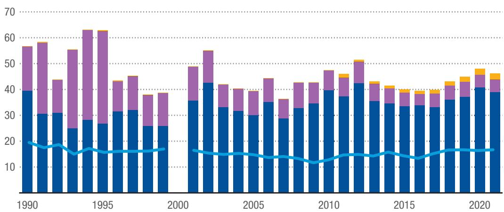  
Source: UNCTAD secretariat calculations based on data from the World Bank, World Development Indicators.
Note: There are no data for 2000.

Republic of the Congo and Malawi). There may also be a need to review the capacity to absorb regional investment opportunities from Zambia's strategic role in SADC, COMESA and the Africa region as a whole. The government already announced plans to roll out public-private partnerships in large infrastructure projects to tap into private financial flows, including institutional investor funds (Vandome, 2023; Government of Zambia, 2023f). Engaging impact investors across various sectors and mobilizing private sector entrepreneurs, particularly in non-mineral sectors, would be critical for economic diversification.

## 3.5.2. Address debt vulnerabilities

Zambia's external debt levels escalated to distress levels before the COVID-19 pandemic, rising from 36.1 per cent of GDP in 2015 to 123 per cent of GDP in 2021. The country defaulted on its loans and is now implementing an IMF Extended Credit Facility to help address the fiscal imbalances (IMF, 2022). This is a major

source of vulnerability, as it complicates macroeconomic management and will slow growth in incomes over the medium term. The country's fiscal position is currently precarious, as recourse to additional debt and non-debt financing will become difficult as it completes negotiations with creditors on a debt restructuring deal. In principle, Zambia reached an agreement with China and other major creditors in June 2023 to restructure its external public and publicly guaranteed debt amounting to \$6.3 billion, subject to further negotiations. $^{43}$ However, debt restructuring is a protracted process, as demonstrated already by the nature of details still to be worked out, including the scope of the debt to be restructured, the treatment of debt from other official bilateral creditors and private sector creditors, and the participation of various stakeholders in the debt restructuring negotiations.

The initial agreement is with China and France, the co-chairs of Zambia's official creditors committee, but it is up to Zambian authorities and the official creditors to define the terms of the debt treatment. Zambia

initially sought to restructure at least \$8 billion guided by the Group of 20 (G20) Common Framework. $^{44}$ Zambia's experience reflects many of the challenges that LDCs face in dealing with their diverse creditors. Reaching consensus with multiple creditor partners that have different views on debt treatment, including commercial banks and private lenders, is extremely complicated. The role of multilateral development banks in debt restructuring is also critical, as they are significant lenders to Zambia.

The stock of debt owed to China carries more weight because a significant share of the debt will be treated as commercial debt, including debt owed to the Industrial and Commercial Bank of China. Only \$4.1 billion of debt owed to the Export-Import Bank of China is categorized as bilateral debt. $^{45}$ The negotiations should seek equal treatment from private lenders, in line with the G20 Common Framework, as well as better terms. An ideal situation would be to lower interest rates to a range comparable to those prevailing in developed countries with similar public debt, cap interest rates on new debt, and extend maturity on restructured debt to at least 20 years. The situation has evolved since some private bondholders joined the negotiations in March 2024 with a deal to reschedule \$3.3 billion of commercial debt, which has the potential to increase the total debt to be restructured to over \$13 billion. $^{46}$

Growth and prosperity moving forward could be subdued by low inflow of private investment (i.e. FDI) and official flows (i.e. ODA) during the fiscal adjustment period. The 2011–2020 period was characterized by slow growth and rapid external debt build-up. Gross fixed capital formation as a per cent of GDP declined from 42.8 per cent in 2015 to 31.57 per cent in 2022, while gross savings and remittances remained stagnant over the same period. Hence, apart from resolving its debt situation, Zambia needs to broaden its investment profile to attract diverse flows into the economy. The procyclical nature of FDI poses additional challenges, particularly during economic crises, as the mining sector where investors are concentrated is prone to speculative and non-resident ownership stakes that increase the risk of capital flight.

Zambia will also have to make large fiscal adjustments to contain external debt vulnerabilities and subsequently gradually restore macroeconomic stability and growth. Such adjustments invariably involve cutting social spending, removing subsidies on energy and agriculture, and raising consumption taxes. This will not only exacerbate inequality, but also deepen poverty and destitution. To stem external debt vulnerabilities, the government needs to develop a holistic and coherent policy framework with sufficient safeguards to protect the poor from the effects of fiscal adjustment and consolidation as the country builds back its debt-carrying capacity. Rebalancing and recalibrating debt by credit type, debt service costs, and maturity and retirement schedules could help ease the pressure on the country's fiscal situation.

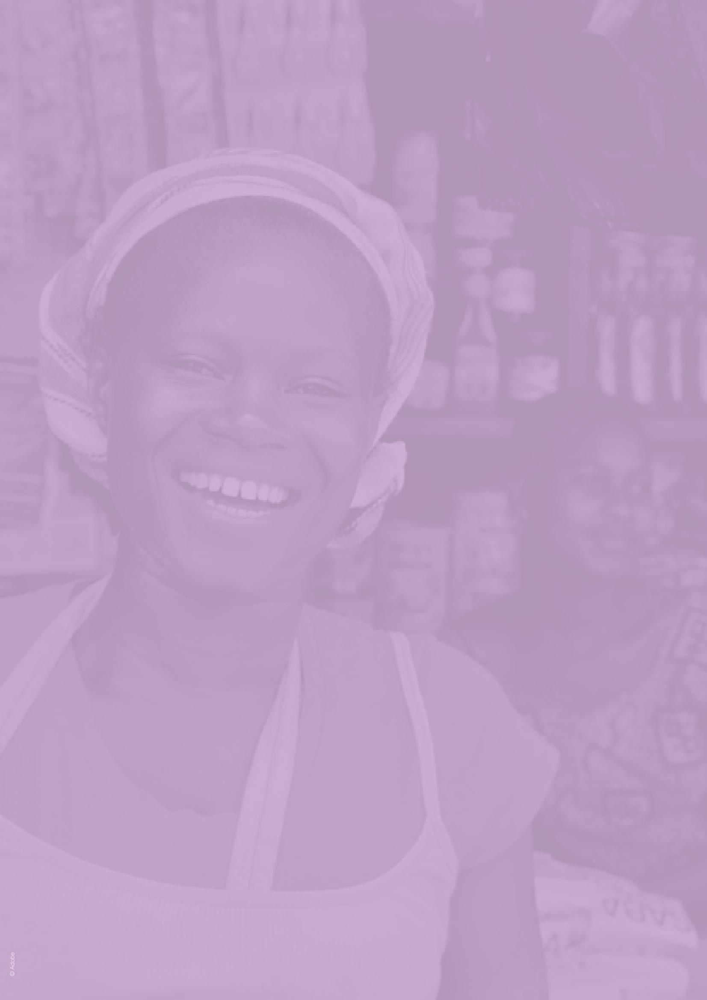

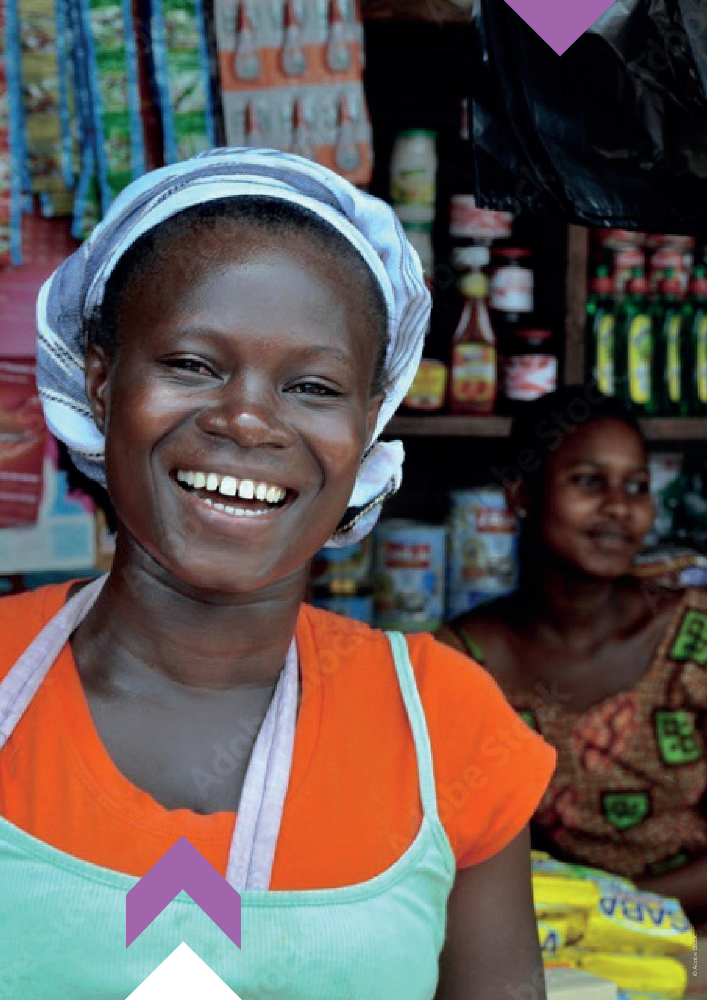

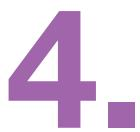

# Towards a policy agenda for graduation with momentum

To advance towards the goal of attaining middle-income status expressed in the 2030 Vision, the government of Zambia is faced with important policy choices at a time when the global economy is facing compounding shocks, including the lingering impact of the COVID-19 pandemic, the effects of the war in Ukraine, and the conflict in the Middle East. These factors are pushing global prices up and creating pressures for many countries to pursue fiscal and monetary policies that, while addressing their internal adjustment requirements, create adverse fiscal adjustment conditions for countries like Zambia. The situation for Zambia is precarious because headwinds affecting its main export (copper) could aggravate debt vulnerabilities and fiscal adjustment challenges. Therefore, while the recovery from the pandemic is on track and confidence in the economy is slowly returning, the policy focus should be firmly on comprehensively addressing the lingering vulnerabilities.

The immediate socioeconomic challenge is youth unemployment. The youth population should be transformed into an advantage by addressing the gaps in education and training, and in the provision of public services. The other challenge is poverty, and the inequalities associated with it. With prices of essential commodities rising, the government is faced with a decision regarding the FISP and social cash transfers at a time when it is expected to commit to a stringent fiscal regime to address debt vulnerabilities. Nevertheless, public infrastructure should be scaled up and public service delivery improved to enhance living standards, particularly for those living in rural areas. Structural weakness will continue to impose limitations and present economic vulnerabilities. However, there is optimism that the country will continue to meet the HAI threshold. In fact, Zambia's performance on this indicator has improved as the lower secondary school completion rate and school enrolment have increased since the introduction of free education for public primary and secondary schools. There is also a strong expectation that Zambia will bridge the performance gap on several subcomponents of the HAI, and potentially on the Economic and Environmental Vulnerability Index (EVI) as well, as the country was relatively unscathed by recent weather-related events that affected neighbouring countries. However, disaster preparedness and investments in climate adaptation should be enhanced to prepare for shocks that might affect the agriculture and natural resource sectors.

Efforts to address the debt overhang are on track with the opening of negotiations with major creditors and the government's commitment to implement aggressive fiscal adjustments to bring debt to sustainable levels. The short-to-medium-term policy focus also aims to address the dependence on copper for exports and revenues by increasing and diversifying mineral exports, in addition to promoting non-traditional exports. Diversifying production, exports and markets will help build economic resilience and cushion the economy from shocks linked to commodities. In the same vein, the pattern and sources of growth need to be made more inclusive by stimulating rapid and sustainable agricultural growth,

as that sector has been identified as key to addressing poverty and promoting inclusive growth. However, there is a need for a new development approach that focuses on improving productivity, upgrading quality and enhancing market linkages, which implies making critical changes to the FISP and prioritizing investment in transformational initiatives in productive sectors. Apart from agriculture, manufacturing and mining are also critical for structural transformation, with key enablers including energy, transport, and technology and innovation. Therefore, fostering linkages and policy coordination around these sectors will be critical to stimulate and sustain rapid economic growth rates over the medium to long term.

Promoting environmental sustainability and addressing climate change vulnerabilities should be a central feature of Zambia's development strategy. Expanding investment in renewable energy for productive uses, transport infrastructure, and logistics — and ensuring that the resulting growth is green and climate-resilient — should be the key development policy focus in the coming years. Zambia's greatest asset is its renewable and non-renewable natural resources, and the country's future prosperity depends largely on how well it manages its natural resource wealth.

Although Zambia has good democratic credentials, there is still a need to strengthen its public governance systems, promote transparency and accountability, and sustain the peace and stability the country currently enjoys. Such efforts bring development dividends to the country and could be key to avoiding any reversal to the progress achieved so far. The other dimensions of governance that should be highlighted are government effectiveness, which reflects the quality of institutions, and the absence of violence or terrorism, which reflects the character of a cohesive and progressive society. Zambia's aspiration to move up on the development ladder should therefore consider the enormous demands that would be placed on the institutions responsible for policy formulation and

implementation of government programmes, as well as the quality of the private sector, which is the engine of the economy.

As pointed out in this Vulnerability Profile, Zambia's vulnerabilities are mostly structural. The guidelines outlined in the sections that follow should be considered in designing policies to mitigate the impact of Zambia's vulnerabilities.

## 4.1. Achieve agricultural transformation and growth

Although Zambia is one of the fastest growing economies in sub-Saharan Africa (UNDP, 2020), its economic base is narrow and lacks the depth to reduce poverty and inequality. For example, the agriculture sector, which once accounted for nearly half of total employment, experienced significant reductions in its share of output and employment from 2014 to 2020. As earnings fell and labour began to migrate out of the sector, agricultural labour productivity rose by 15 per cent, marginally pushing up wages in local currency by about 10 per cent annually, from ZMW 1,368 (\$222.44) in 2014 to about ZMW 2,340 (\$127.59) in 2020. This dismal performance came despite huge public subsidies from the government through the FISP (nearly 1.8 per cent of GDP).

To reduce poverty and inequality, there is a need to overhaul agricultural policies and strategies. This includes redeploying the farmer input subsidies towards a carefully crafted agricultural transformation programme to boost the productivity of smallholder farmers through mechanization and technology adoption, improved agronomic practices, input and output measures, market support and commercialization, development of agricultural values chains, and strengthening of extension services, research, and monitoring and evaluation systems. Such programmes improve agricultural productivity and food security, and have the potential to reduce poverty. The nearly \$350 million in resources allocated to the FISP

annually could finance a targeted agricultural transformation programme to address recurring challenges in the sector, particularly doubling agricultural output, incomes and employment, and ultimately eliminating extreme poverty and inequality by 2030.

In the 2024 budget, the government announced a Comprehensive Agriculture Transformation Support Programme that will support extension services, provide access to finance, develop irrigation systems, and support value addition and trade logistics (Government of Zambia, 2023f). The programme will need to be complemented by measures to boost commercial agricultural production and build linkages between smallholder producers, large integrated commercial farms, agroprocessors and manufacturers, and exporters. Although the government intends to develop farm blocks where high technology agriculture will be deployed to produce large stocks for domestic consumption and for processing into exports, that segment of agricultural development may not effectively address rural poverty, as it does not directly respond to the productivity and knowledge gaps of smallholder farmers. However, the infrastructure investments planned for 2024, including road connectivity covering 300 km in the Nansanga, Luena and Shikabeta farm blocks as well as 200 km of powerlines in the same areas (Government of Zambia, 2023f), could improve livelihoods and agricultural market linkages for smallholder farmers, helping them benefit from the agricultural transformation programme.

The transformation of agriculture would be incomplete without improving the livestock value chain. Livestock contributes approximately 42 per cent of agricultural GDP in Zambia and directly contributes to increased agricultural production in general and food security in particular. Supporting smallholder farmers offers the potential to improve milk and beef production in the country, since those farmers own the largest number of cattle (ECA, 2020). The government is already committed to supporting the livestock subsector through programmes to improve animal health, such as animal identification, traceability and enhanced veterinary services. Breeding, forage and pasture production, as well as strengthened legal reforms to support animal identification and traceability, have become priorities to improve livestock productivity and competitiveness (Government of Zambia, 2023f).

## 4.2. Build manufacturing capabilities and strengthen export competitiveness

Zambia's impressive growth in GDP and GNI per capita incomes in the early part of the 2000s neither boosted employment opportunities nor led to structural transformation. Growth emanated from the services sectors and construction, mainly because of the government's increased focus on infrastructure development. There may be a need to adopt more progressive trade and industrial policies to foster manufacturing and industrial growth.

The manufacturing blueprint should also include efforts to develop copper processing industries and investments in sophisticated mineral processing of copper and other mineral-based derivatives for export to regional and global markets. This is not an agenda that can be left to the private sector; it must be inspired by significant public investment in strategic and anchor industries and productive sectors. Since these industries are expected to be mega-processing factories producing large quantities of goods for export to advanced countries, joint ventures between the public and private sectors should be explored to secure the public interest. This is what could build back the country's manufacturing and industrial capabilities lost through structural adjustment, begin the process of diversifying the country's export structure, and improve export competitiveness. Zambia's progress towards attaining middle-income status will depend on the country implementing this structural change and sustaining the development trajectory over the medium to long term. Such an approach would resemble the structural transformation achieved by Costa Rica and the Republic of Korea, which were once at the same level of development as Zambia.

## 4.3. Leverage mineral wealth for economic transformation

Mining sector output and employment grew rapidly between 2003 and 2013, but plateaued at an average annual growth level of 3.2 per cent between 2014 and 2020. Employment and productivity remained modest over this period, while export earnings fluctuated in typical fashion for a commodity-dependent country that relies on undiversified exports. The dominant value of copper exports and associated tax revenues are the main benefits from the mining-led economic model. However, the structural attributes of the sector, particularly its enclave nature, and weak interlinkages with other sectors such as agriculture and manufacturing, are a hindrance to structural change, productivity and employment growth. The sector consumes 55 per cent of the country's total hydropower at a time when the country regularly suffers from electricity outages and shortages. Sustaining industrial growth and diversifying the economy will therefore require massive investments in industrial power generation and distribution infrastructure.

Zambia has missed out on decades of development progress by failing to put in place an optimal regime for the mining sector to capture and use mining revenues in boom periods to invest in structural transformation and export diversification. As it stands now, the sector remains a great source of economic vulnerability for Zambia and is the major constraint to moving towards overall structural transformation and sustainable development. Mining sector policies should be reoriented to building private sector confidence and stability and ensuring that maximum returns from the sector are realized and re-invested in projects aimed at spurring structural transformation and national development. As an example, Costa Rica has moved from trading mainly bananas and coffee to exporting services and medical instruments (UNCTAD, 2016, 2023), a shift that offers inspirational lessons for Zambia. $^{47}$ Strengthening regulations and oversight institutions is also important to prevent state capture and suboptimal policy changes whenever there is a change of government.

## 4.4. Address spatial hydropower deficits

Zambia is highly endowed with renewable resources that must be harnessed to improve access to clean energy for all. From 2016 to 2021, the country experienced some of its worst disruptions to hydropower generation and supply because of insufficient water recharge due to poor rainfall patterns. And while the government scaled up investment in hydropower generation capacity over that period, vulnerabilities remain because power generation is dependent on good rainfall patterns. Moreover, even when power generation is at full capacity, there are still severe electricity deficits in outlying areas due to the location of electricity-powered production facilities, which inhibits prospects for rural industrialization and growth. It is therefore critical that investments in off-grid installation and mini-hydropower plants be incentivized to address spatial power deficits, especially in rural districts. Efforts to mobilize climate finance to complement public investments in renewable energy will enhance resilience and secure stable supply and energy self-sufficiency.

Energy lubricates the wheels of economic activities, so building resilience in the energy sector should be the first step

in addressing vulnerabilities and risks to long-term growth and prosperity (UNCTAD, 2017). It is also important to address institutional challenges in the energy sector to enhance efficiency. For example, the industrial structure for energy needs to be de-coupled, and energy value chains de-concentrated, through deep but needed policy and institutional reforms to incentivize and attract long-term private capital in renewable energy projects (hydroelectric, wind and solar), and by streamlining and upgrading the oil refinery to promote value addition and growth of petrochemical subsectors. It is also important to streamline petroleum procurement and pricing to reduce perceived inefficiencies, uncertainties, risks and vulnerabilities. These efforts should consider international trends that are likely to affect fossil-fuel-based economies, particularly the rising demand for electric vehicles and related parts, including batteries. Efforts should also take into account the energy sector transformation being spearheaded by leading fossil fuel exporters.

## 4.5. Address the effects of climate change

Zambia is currently a net carbon sink, meaning it sequestrates more carbon than it generates. However, the country is susceptible to the adverse effects of climate change, with those effects weighing heavily on the poor and most vulnerable populations. The frequency of droughts, flash floods and extreme weather is affecting the productivity of ecosystems, destroying social and economic infrastructure, and creating conditions for disease outbreaks and infestations that destroy lives and crops. Zambia mainstreamed climate change in its development policies and has recently established a Ministry of Green Economy and Environment. It is important to enhance the capacity of the ministry to effectively respond to the effects of climate change and, more importantly, to help in fully conceptualizing the green economy

agenda in order to enhance the green transformation across all economic sectors.

Building resilience to mitigate the adverse effects of climate change is more cost-effective than merely responding to climate change disasters as and when they occur. As these effects become more frequent, Zambia needs to hasten its mitigation and adaptation measures, and develop and implement a comprehensive climate-resilient green strategy with a clear and targeted investment plan and a resource and partnership strategy. The country should prioritize efforts to build its capacity to mobilize international climate finance and invest these funds to strengthen the resilience of production and livelihoods of people who have been adversely affected or are at risk of being adversely affected by climate-induced disasters. It is also essential to invest in climate disaster risk management and preparedness, and to ensure that people are sensitized to climate impact and how to prepare for and guard against it.

## 4.6. Invest in human capital development

An immediate policy priority for the Zambian government is to address the staggering levels of poverty, youth unemployment and inequality, and to scale up investment in human capital development. Access to quality health care also remains limited, particularly in rural areas. Health delivery systems and mechanisms need to be improved to ensure access to quality health-care services that enable people to live productive and healthy lives, and these services should be affordable to all.

Bridging glaring health inequalities will enhance productivity and advance social welfare for all. The government has scaled up the construction of health centres and maternity annexes to improve the quality of health-care services. To date, 111 mini-hospitals and 62 maternity annexes have been completed, and a further 135 mini-hospitals are scheduled for construction in 2024 (Government of Zambia, 2023f).

Similarly, while the introduction of free education at the primary level in 2002 and the abolition of tuition fees at the secondary level in 2022 have significantly improved enrolment ratios, school infrastructure, materials and other teaching requirements are inadequate to ensure the delivery of quality education. The government plans to build 202 secondary schools, 82 of which are scheduled to be completed in 2024. The expansion of the Constituency Development Fund in 2021 unlocked ZMW 27 million per constituency of public resources to support infrastructure such as roads, rural health centres and schools that fall under provincial administrations. The 2024 budget has further increased Constituency Development Fund spending to ZMW 30.8 million per constituency. $^{48}$ In addition, the government has budgeted for the recruitment of 4,200 teachers and 1,200 non-teaching staff in 2024 (Government of Zambia, 2023f). These efforts will reduce the gap in teaching staff and infrastructure, particularly in rural areas.

Education policy needs to address early childhood development and the learning-outcome approach to enhance retention of pupils in primary and lower secondary schools. Post-secondary skill development and employability training through colleges and universities also need to be enhanced, with particular emphasis on life skills and entrepreneurship training for youth, as well as adult literacy and vocational training to improve the employability of youth out of school. Creating opportunities for trainees to make use of the skills they have acquired and to fully participate in the development process will transform the youth bulge into demographic dividends. Failing to address the issues of youth unemployment could create conditions for civil instability and conflicts and endanger the peace and stability that is a prerequisite for human development.

## 4.7. Ensure policy coherence and consistency

Prudent macroeconomic management is important to sustain growth and development over time. The recent World Bank decision to reclassify Zambia as a low-income country was prompted by poor economic management in the country that led to deep exchange rate depreciation and instability, as well as an over-accumulation of external debt beyond the country's carrying capacity that led to debt distress. Mining policy inconsistencies brought that sector to a standstill, deprived the country of its fair share of current and future returns from the sector, and put the mining jobs of thousands of workers at risk. Agricultural subsidies have not ignited growth and productivity and have left farmers more impoverished and dependent on FISP handouts, while suboptimal energy policies have left the Treasury without funds for critical welfare and development programmes. Zambia's aspiration to move up the development ladder demands that the institutions responsible for formulating and implementing government programmes ensure policy consistency and coherence across all sectors. Bringing back prudential macroeconomic management is essential to build economic resilience, facilitate fiscal adjustments, and respond to internal and external imbalances. Zambia's strategy for graduation with momentum should, at a minimum, aim to address policy inconsistencies and ensure overall policy coherence and coordination across sectors to shore up and sustain high economic growth rates going forward.

## References

Andersson PÅ, Bigsten A and Persson H (2000). Foreign aid, debt and growth in Zambia. Research Report No. 112. United Nations publication. Uppsala.

Andrews M (2021). The Farmer-Input Subsidy Programme (FISP) does not service the poor. Development (Society for International Development). 64(3–4):288–291.

Arezki R and Matsumoto A (2015). Metals and oil: A tale of two commodities. IMF Blog (14 September). International Monetary Fund. Washington. Available at https://www.imf.org/en/Blogs/Articles/2015/09/14/metals-and-oil-a-tale-of-two-commodities.

Bank of Zambia (2023). Direction of Trade Report, First Quarter 2023. Bank of Zambia. Lusaka.

Bank of Zambia, Zambia Statistics Agency and Zambia Development Agency (2022). 2022 Survey on Private Sector Foreign Investment in Zambia: Promoting Investment to Stimulate Value Addition for Improved Livelihoods.

Bello-Schünemann J and Moyer JD (2018). Structural pressures and political instability: Trajectories for Sub-Saharan Africa. Africa Report No. 9. Institute for Security Studies.

Bertelsmann Stiftung (2024). BTI 2024 Zambia Country Report. Bertelsmann Stiftung. Gütersloh.

Beveridge AA (1974). Economic independence, indigenization, and the African businessman: Some effects of Zambia's economic reforms. African Studies Review. 17(3):477–490.

Bwalya SM (2006). Foreign direct investment and technology spillovers: Evidence from panel data analysis of manufacturing firms in Zambia. Journal of Development Economics. 81(2):514–526.

Collier P (2014). Zambia: A time of big opportunities and tough decisions. In: Adam C, Collier P and Gondwe M, eds. Zambia: Building Prosperity from Resource Wealth. Oxford University Press. Oxford.

COMESA (2021). Export potential of intra-COMESA trade: Reaping the benefits of COMESA integration. Common Market for Eastern and Southern Africa. Lusaka.

Diop S, Asongu SA and Nnanna J (2021). COVID-19 economic vulnerability and resilience indexes: Global evidence. International Social Science Journal. 71(S1):37–50.

ECA (2020). Fostering the sustainable transformation of agriculture in Africa through an inclusive green economy: The case of the livestock value chain in Zambia. Economic Commission for Africa. Addis Ababa.

ERB (2015). Energy Sector Report 2015. Energy Regulation Board. Lusaka.

ERB (2019). Energy Sector Report 2019. Energy Regulation Board. Lusaka.

ERB (2021). Energy Sector Report 2021. Energy Regulation Board. Lusaka.

European Parliament (2024). Samoa Agreement (“Post-Cotonou”) between the EU and the Organisation of African, Caribbean and Pacific States (OACPS). Available at https://www.europarl.europa.eu/legislative-train/theme-a-stronger-europe-in-the-world/file-signature-of-the-new-eu-acp-agreement-(%E2%80%98-post-cotonou-%E2%80%98) (accessed 9 April 2024).

Evagorou C (2022). The impact of IFRS 9 on capital and regulatory reporting. Deloitte. Available at https://www2.deloitte.com/cy/en/pages/financial-services/articles/the-impact-of-ifrs-9-on-capital-and-regulatory-reporting.html.

Fincham R (1980). Economic dependence and the development of industry in Zambia. The Journal of Modern African Studies. 18(2):297–313.

Fitch Ratings (2020). Fitch downgrades Zambia to “C.” Rating action commentary (24 September). Available at https://www.fitchratings.com/research/sovereigns/fitch-downgrades-zambia-to-c-24-09-2020.

Fortunato P and Razo C (2014). Export sophistication, growth and the middle-income trap. In: Salazar-Xirinachs JM, Nübler I, and Kozul-Wright R, eds. Transforming Economies: Making Industrial Policy Work for Growth, Jobs and Development. International Labour Organization. Geneva.

Government of Zambia (2006). The national long-term vision 2030: A prosperous middle-income nation by 2030. December. Available at https://www.zambiaembassy.org/sites/default/files/documents/Vision\_2030.pdf.

Government of Zambia (2007). Zambia Demographic and Health Survey 2007. Zambia Statistical Agency, Ministry of Finance and National Planning. Available at https://www.dhsprogram.com/pubs/pdf/FR211/FR211[revised-05-12-2009].pdf.

Government of Zambia (2014). Labour Force Survey Report. Zambia Statistical Agency, Ministry of Finance and National Planning.

Government of Zambia (2015a). Harnessing demographic dividends, and the future we want for Zambia. Ministry of Finance and National Planning.

Government of Zambia (2015b). Labour Force Survey Report. Zambia Statistical Agency, Ministry of Finance and National Planning.

Government of Zambia (2016a). National policy on climate change. Available at https://faolex.fao.org/docs/pdf/zam174957.pdf.

Government of Zambia (2016b). Labour Force Survey Report. Zambia Statistical Agency, Ministry of Finance and National Planning.

Government of Zambia (2017a). The Seventh National Development Plan 2017-2021. Available at https://www.mcti.gov.zm/?wpfb\_dl=34.

Government of Zambia (2017b). Education and Skills Sector Plan 2017-2021. Available at https://planipolis.iiep.unesco.org/sites/default/files/ressources/zambia\_-\_education-and-skills-sector-plan-2017-2021.pdf.

Government of Zambia (2017c). Health financing strategy: 2017 – 2027: Towards universal health coverage for Zambia. Available at https://www.afro.who.int/sites/default/files/2020-09/Health%20Care%20Financing%20Strategy.pdf.

Government of Zambia (2017d). Labour Force Survey Report. Zambia Statistical Agency, Ministry of Finance and National Planning.

Government of Zambia (2018a). Zambia Demographic and Health Survey 2018. Zambia Statistical Agency, Ministry of Finance and National Planning. Available at https://dhsprogram.com/pubs/pdf/FR361/FR361.pdf.

Government of Zambia (2018b). National Export Strategy (NEST). Available at https://www.mcti.gov.zm/wp-content/uploads/2024/01/National-Export-Strategy.pdf.

Government of Zambia (2018c). Labour Force Survey Report. Zambia Statistical Agency, Ministry of Finance and National Planning.

Government of Zambia (2018d). Zambia transport data portal. Available at https://zambiamtc.opendataforafrica.org/ZMRTASA2016/road-transport-and-safety-agency-of-zambia (accessed 20 November 2023).

Government of Zambia (2018e). The National Health Insurance Act, No.2 of 2018. Available at https://www.parliament.gov.zm/node/7517.

Government of Zambia (2019a). Education Statistical Bulletin 2019. Ministry of Education, Directorate of Planning and Information.

Government of Zambia (2019b). Annual Economic Report 2019. Ministry of Finance and National Planning. Available at https://www.mofnp.gov.zm/?wpdmpro=2019-annual-economic-report.

Government of Zambia (2019c). Labour Force Survey Report. Zambia Statistical Agency, Ministry of Finance and National Planning.

Government of Zambia (2020a). Annual Economic Report 2020. Ministry of Finance and National Planning. Available at https://www.mofnp.gov.zm/?wpdmpro=2020-annual-economic-report.

Government of Zambia (2020b). Labour Force Survey Report. Zambia Statistical Agency, Ministry of Finance and National Planning.

Government of Zambia (2020c). Natural Capital Accounts for Forests. Technical Report 2016-2020. Ministry of Green Economy and Environment Forest Department. Available at https://www.wavespartnership.org/sites/waves/files/kc/Zambia%20Natural%20Capital%20Accounts%20for%20Forests\_Technical%20Report%202016-2020%20FINAL%20FOR%20WEB.pdf.

Government of Zambia (2020d). Interim Report of The Auditor General on the Audit of Utilization of COVID-19 Resources as of 31st July 2020. Available at https://acazambia.org/wp-content/uploads/2020/11/COVID-Report-Submitted-to-Shorthorn-on-29.10.2020-CG.pdf.

Government of Zambia (2020e). Third National Communication to the United Nations Framework Convention on Climate Change. September. Available at https://www4.unfccc.int/sites/SubmissionsStaging/NationalReports/Documents/1678320\_Zambia-NC3-1-Third%20National%20Communication%20-%20Zambia.pdf.

Government of Zambia (2021). Annual Economic Report 2021. Ministry of Finance and National Planning. Available at https://www.mofnp.gov.zm/?wpdmpro=2021-annual-economic-report.

Government of Zambia (2022a). Eighth National Development Plan (8NDP) 2022-2026: Socio-economic Transformation for Improved Livelihoods. Available at https://www.sh.gov.zm/wp-content/uploads/2022/09/EIGHTH-NATIONAL-DEVELOPMENT-PLAN-2022-2026-05-07-2022.pdf.

Government of Zambia (2022b). Assumptions relating to Zambia's debt sustainability analysis. November. Available at https://www.mofnp.gov.zm/wp-content/uploads/2022/11/Certain-Assumptions-Relating-to-Zambias-DSA.pdf.

Government of Zambia (2022c). 2021 Labour Force Survey Report. Ministry of Labour and Social Security; Zambia Statistics Agency. Lusaka, Zambia.

Government of Zambia (2023a). Farmer Input Support Programme (FISP): Direct Input Supply & Electronic Voucher Implementation Handbook. Ministry of Agriculture.

Government of Zambia (2023b). 2022-2026 National Health Strategic Plan: Towards attainment of quality universal health coverage through decentralisation. Available at https://www.moh.gov.zm/wp-content/uploads/2023/02/National-Health-Strategic-Plan-for-Zambia-2022-to-2026-revised-February-2023-lower-resolution.pdf (accessed 8 April 2024).

Government of Zambia (2023c). The Nationally Determined Contributions Implementation Framework for Zambia 2023-2030. Ministry of Green Economy and Environment.

Government of Zambia (2023d). Great Green Wall Initiative: National Action Plan. November. Available at https://www.mgee.gov.zm/wp-content/uploads/2023/11/23.11.17-NAP-ZAMBIA-shared-after-validation-workshop.pdf.

Government of Zambia (2023e). Statement by the Minister of Mines and Minerals Development, Hon. Paul Kabuswe, on the Reinstatement of Vendanta resources to Run Konkola Copper Mines (KCM). September. Available at https://www.mmmd.gov.zm/?p=2606 (accessed 8 March 2024).

Government of Zambia (2023f). 2024 budget address by Honourable Dr. Situmbeko Musokotwane, M.P., Minister of Finance and National Planning. September.

Government of Zambia and Food and Agriculture Organization (FAO) (2008). Integrated Land Use Assessment (ILUA): 2005-2008. Available at https://www.fao.org/forestry/36264-08c7545f2349615e80a6551745f-51f62f.pdf (accessed 5 February 2023).

Gubser M (2023). Zambia's missing narrative of structural adjustment. Zambia Social Science Journal. 9(1): Article 4.

Hasell J (2023). Measuring inequality: What is the Gini coefficient? OurWorldInData.org. Available at https://ourworldindata.org/what-is-the-gini-coefficient.

Hashmi R and Alam K (2019). Dynamic relationship among environmental regulation, innovation, $CO_{2}$ emissions, population, and economic growth in OECD Countries: A panel investigation. Journal of Cleaner Production. 231: 1100–1109.

Hausmann R, Hidalgo CA, Bustos S, Coscia M, Simoes A and Yildirim MA (2014). The Atlas of Economic Complexity: Mapping Paths to Prosperity. MIT Press. Cambridge.

IMF (2007). Zambia: Poverty reduction strategy paper, 1999-2001. IMF Staff Country Report No. 07(276). International Monetary Fund. Washington, D.C.

IMF (2022). IMF Executive Board approves new Extended Credit Facility (ECF) arrangement for Zambia. IMF Press Release 22/297 (31 August). International Monetary Fund. Washington. Available at https://www.imf.org/en/News/Articles/2022/08/31/pr22297-imf-executive-board-approves-new-extended-credit-facility-arrangement-for-zambia.

IMF and World Bank (1999). Enhanced structural adjustment facility policy framework paper, 1999-2001. 10 March. Available at https://www.imf.org/external/np/pfp/1999/zambia/.

Jere S, Kasense B and Chilyabanyama O (2017). Forecasting foreign direct investment to Zambia: A time series analysis. Open Journal of Statistics. 7(1):122–131.

Kaluba P, Verbist KMJ, Cornelis WM and Van Ranst E (2017). Spatial mapping of drought in Zambia using regional frequency analysis. Hydrological Sciences Journal. 62(11):1825–1839.

Kaufmann D, Kraay A and Mastruzzi M (2010). The Worldwide Governance Indicators: Methodology and Analytical Issues September. Available at https://papers.ssrn.com/abstract=1682130.

Kuntashula E and Mwelwa-Zgambo L (2022). Impact of the Farmer Input Support Policy on agricultural production diversity and dietary diversity in Zambia. Food Policy. 113:102329.

Loxley J (1990). Structural adjustment in Africa: Reflections on Ghana and Zambia. Review of African Political Economy. 17(47):8–27.

Makuyana G and Odhiambo NM (2014). Public investment versus private investment: The case of Zambia. Journal of Governance and Regulation. 3(2):23–31.

McPherson MF (2004). The role of agriculture and mining in sustaining growth and development in Zambia. In: Hill CB and McPherson MF, eds., Promoting and Sustaining Economic Reform in Zambia. Harvard University Press. Cambridge.

Mphuka C, Kaonga O and Tembo M (2017). Economic growth, inequality and poverty: Estimating the growth elasticity of poverty in Zambia, 2006-2015. International Growth Centre Paper No. F-41302-ZMB-1. London School of Economic and Political Science. London.

Mphuka C, Kaonga O and Tembo MA (2021). Economic growth, inequality, and poverty. In: Cheelo C, Hinfelaar M and Ndular M (eds.), Inequality in Zambia. Routledge: 83–119. London.

Mudenda D (2009). Trade and industrialisation policies experienced from Zambia. Trade and Industrial Policy Strategies. Southern African Development Research Network.

Muuka GN (1997). Wrong-footing MNCs and local manufacturing: Zambia's 1992–1994 Structural Adjustment Program. International Business Review. 6(6):667–687.

Mwaba A and Kayizzi-Mugerwa S (2021). Boosting mineral revenues in Zambia – Policy options for a sustainable fiscal regime. Policy Brief No. 1/22. UN-WIDER.

National Assembly of Zambia (2019). Ministerial Statement on the Status of Konkola Cooper Mines PLC by the Minister of Mines and Minerals, Mr. Musukwa, MP. Available at https://www.parliament.gov.zm/sites/default/files/images/publication\_docs/Ministerial%20Statement%20on%20the%20Status%20of%20KCM.pdf.

National Assembly of Zambia (2021). 2022 Budget Address by Honourable Dr. Situmbeko Musokotwane, M.P., Minister of Finance and National Planning November. Available at https://www.parliament.gov.zm/sites/default/files/images/publication\_docs/BUDGET%20SPEECH%20\_%202022.pdf.

Nawrotzki RJ and DeWaard J (2018). Putting trapped populations into place: Climate change and inter-district migration flows in Zambia. Regional Environmental Change. 18(2):533–546.

Ncube P and Tregenna F (2022). Input-output linkages and interdependence between countries in Southern Africa. Development Southern Africa. 39(6):1021–1035.

OECD (2020). Building capacity to prevent profit shifting by large companies in Zambia: From forming a transfer pricing unit to success in a landmark Supreme Court victory. Organization for Economic Cooperation and Development. Paris. Available at https://issuu.com/oecd.publishing/docs/building-capacity-to-prevent-profit-shifting-by-la.

Osakwe PN and Kilolo J (2018). What drives export diversification? new evidence from a panel of developing countries. UNCTAD Research Paper No. 3. United Nations.

Puloc'h M (2020). Zambia: Resource-rich but vulnerable to shocks. Working Paper. Agence française de développement.

Rakner L (2003). Political and Economic Liberalisation in Zambia, 1991-2001. Nordic Africa Institute. Uppsala.

Robinson P, Govereh J and Ndlela D (2007). Distortions to agricultural incentives in Zambia. Agricultural Distortions Working Paper No. 40. World Bank. Washington, D.C.

SADC (2015). SADC Industrialisation Strategy and Roadmap 2015-2063. Southern African Development Community. Available at https://www.sadc.int/document/sadc-industrialisation-strategy-and-roadmap-english.

Schrauben SJ and Wiebe, DJ (2017) Health literacy assessment in developing countries: A case study of Zambia. Health Promotion International. 32(3): 475-481.

Simutanyi N (1996). The politics of structural adjustment in Zambia. Third World Quarterly. 17(4):825–839.

Southall T (1980). Zambia: Class formation and government policy in the 1970s. Journal of Southern African Studies. 7(1):91–108.

Teschemacher C, Ng'ombe T, Fajardo-Steinhäuser M and Wani S (2023). What constrains agricultural productivity in Zambia? International Growth Centre Policy Framing Paper. London School of Economic and Political Science. London.

Thurlow J and Wobst P (2006). Not all growth is equally good for the poor: The case of Zambia. Journal of African Economies. 15(4):603–625.

UNCTAD (2006). The Least Developed Countries Report 2006: Developing Productive Capacities. (United Nations publication, Sales No. E.06.II.D.9. New York and Geneva).

UNCTAD (2016). Virtual Institute Teaching Material on Structural Transformation and Industrial Policy. UNCTAD/GDS/2016/1. New York and Geneva. Available at https://unctad.org/system/files/non-official-document/in-dpolfull\_UNCTAD\_material.pdf.

UNCTAD (2017). The Least Developed Countries Report 2017: Transformational Energy Access (United Nations publication, Sales No. E.17.II.D.6. New York and Geneva).

UNCTAD (2019). The Least Developed Countries Report: The Present and Future of External Development Finance – Old Dependence, New Challenges (United Nations publication, Sales No. E.20.II.D.2. New York and Geneva).

UNCTAD (2020). UNCTAD Productive Capacities Index: Methodological Approach and Results. United Nations Conference on Trade and Development.

UNCTAD (2021a). Commodities and Development Report: Escaping from the Commodity Dependence Trap through Technology and Innovation. United Nations publication, Sales No.: E.21.II.D.14. New York and Geneva).

UNCTAD (2021b). World Investment Report 2021: Investing in Sustainable Recovery/ New York (United Nations publication, Sales No. E.21.II.D.13. New York and Geneva).

UNCTAD (2021c). The Least Developed Countries Report 2021: The Least Developed Countries in the Post-COVID World: Learning from 50 Years of Experience. (United Nations publication, Sales No. E.21.II.D.4. Geneva and New York).

UNCTAD (2023). World Investment Report 2023: Investing in Sustainable Energy for All. (United Nations publication, Sales No. E.23.II.D.17. Geneva and New York).

UNDP (2017). Journey To Extremism in Africa – Drivers, Incentives and the Tipping Point for Recruitment. United Nations Development Programme Regional Bureau for Africa. New York.

UNDP (2020). Human Development Report 2020: The Next Frontier: Human Development and the Anthropocene. United Nations Development Programme. New York.

UNIDO (2020). Industrial Diagnostic Study Zambia 2020. Programme for Country Partnership. United Nations Industrial Development Organization.

United Nations (1987). Report on the Twenty-Third Session of the Committee for Development Policy. ECOSOC Official Records, Supplement No. 10. (United Nations publication, Sales No. E/1991/32, New York).

United Nations (1988). Report on the Twenty-Fourth Session of the Committee for Development Policy. ECOSOC Official Records, Supplement No.6. (United Nations publication. Sales No. E/1988/16, New York).

United Nations (1991). Report on the Twenty-Seventh Session of the Committee for Development Policy. ECO-SOC Official Records, Supplement No. 11. Economic and Social Council of the United Nations.

United Nations (2004). Zambia. UN Geospatial, Location Data for a Better World. Available at https://www.un.org/geospatial/file/2378/download?token=WTKqHhZ9.

United Nations (2022). Time Series Estimates of the LDC Criteria, 2002-2022. United Nations Committee for Development Policy Secretariat (accessed 4 May 2024).

Vandome C (2023). Zambia's developing international relations: Positive neutrality and global partnerships. Research Paper. Chatham House, the Royal Institute of International Affairs. London.

Whitworth A (2023). Learning from Zambia's economic policy reversals. Southern African Journal of Policy and Development. 7(1):31–45.

Wichern R, Hausner U and Chiwele DK (1999). Impediments to agricultural growth in Zambia. Trade and Macroeconomic Division Discussion Paper No. 47. International Food Policy Research Institute. Washington, D.C.

World Bank (2019). Wealth beyond mining - Leveraging renewable natural capital. Zambia Economic Brief No. 12. World Bank. Washington, D.C.

Zambia Statistics Agency (2023). Key Poverty Highlights of the 2022 Living Conditions Monitoring Survey Results. Paper presented at the launch of the National Strategy for Development of Statistics (NSDS2) and SDG Baseline Report, Lusaka, 22 September.

# The image provided is a QR code. It does not contain any text, mathematical formulas, tables, or figures that can be processed according to the OCR instructions. Therefore, no textual content can be extracted from this image.

## unctad.org