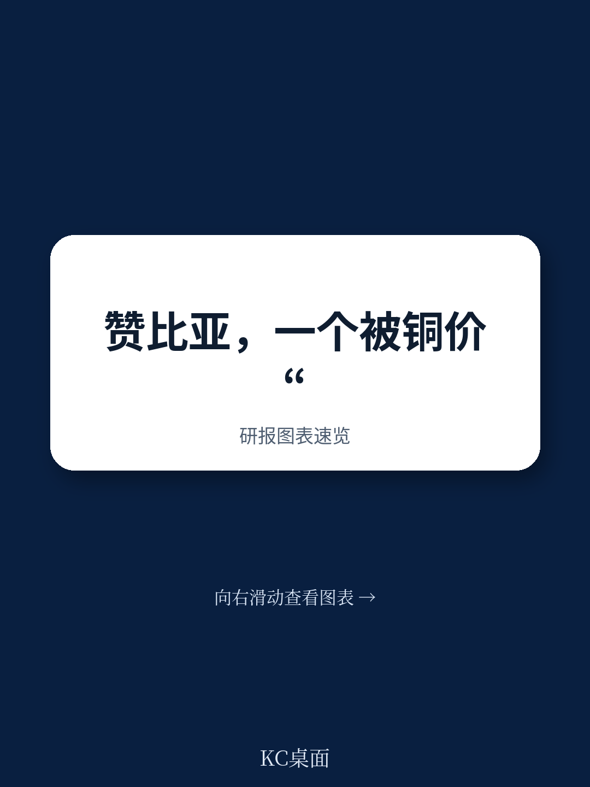
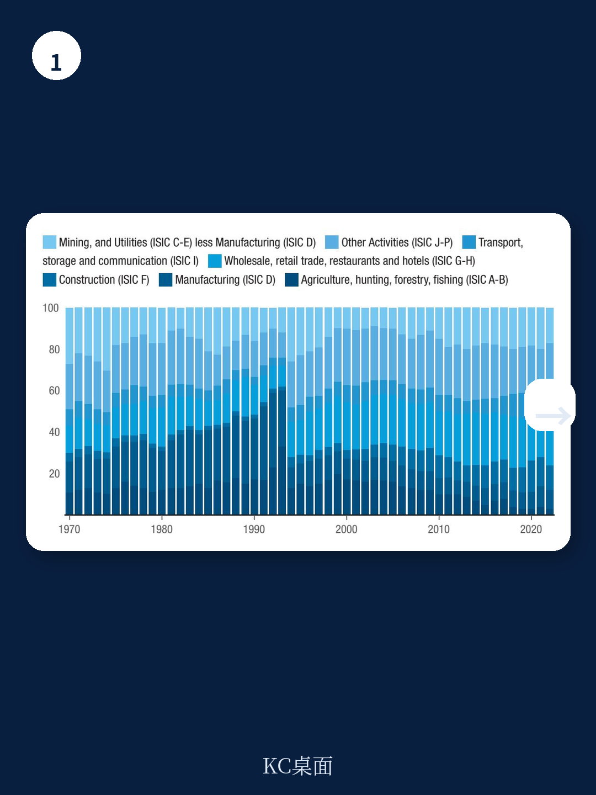
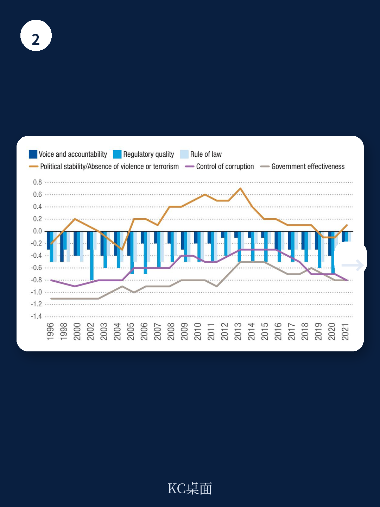

# 联合国贸发会议：联合国报告，赞比亚增长靠铜价，但定价权与就业双缺位

当一个国家被联合国从“最不发达国家”名单中移除，这通常被视作经济发展的里程碑。但对于非洲第二大铜生产国赞比亚而言，2021年首次达标、2024年又因疫情冲击而倒退的“毕业”历程，揭示了一个更深层的结构性困境：依赖单一大宗商品的经济增长，其韧性远比纸面数据脆弱。

这份由联合国贸发会议发布的赞比亚脆弱性评估报告，并非一份简单的成绩单。它更像是一份手术前的详细诊断书——明确指出赞比亚已经站在了“毕业”的门槛上，但身体内部仍有几处致命的结构性病灶未被根治。报告的核心判断是：赞比亚的“毕业”进程并非线性，其最大的风险不是能否达标，而是在脱离国际支持措施后，经济能否摆脱对铜价的周期性依赖，实现真正的结构性转型。

> **KC评论：** 大部分对非洲的宏观分析停留在GDP增速和债务率上，但这张报告的价值在于它拆解了“为什么增长没有带来结构变化”。对于关注新兴市场主权信用、大宗商品贸易以及非洲工业化进程的读者来说，这份报告的图表和假设路径，比结论本身更具参考价值。继续看原文，真正有价值的是关于“铜矿租金与人力资本投资错配”的图表，以及“农业转型作为缓冲垫”的验证路径；完整报告与KC评论在每日汇编。

## 1. 赞比亚的“毕业”之路被疫情打断，但根源在于增长模式的内生脆弱性

赞比亚在2021年首次同时满足了两项毕业标准：人均国民收入达到1403美元，人类资产指数得分68分。然而，2024年的复评中，其人均GNI因疫情和债务危机回落至1111美元，再次跌出阈值。这并非一次偶然的挫折。

报告指出，赞比亚在2003至2013年间曾享有年均7.5%的高速增长，这完全得益于铜价超级周期。但这一增长模式有两个致命缺陷：第一，增长高度依赖外部定价，国内并无定价权；第二，铜矿开采是资本密集型产业，对就业和人力资本提升的溢出效应极低。当2015年铜价暴跌、2020年疫情叠加主权违约时，经济增长的根基便迅速动摇。

这意味着，赞比亚过去十年的“达标”更像是一种外生红利，而非内生能力的质变。真正决定其能否顺利“毕业”的，不是下一轮铜价反弹的幅度，而是经济体系对价格波动的免疫力。

## 2. 铜矿租金并未转化为人力资本，这是最核心的“结构赤字”

报告的第二章详细拆解了赞比亚的生产能力指数，并将其与南部非洲发展共同体中位数进行对比。结果显示，赞比亚在“自然资本”维度得分极高，但在“人力资本”、“科技创新”和“制度”维度全面落后。

这一错配在财政层面表现得尤为明显。赞比亚的税收收入占GDP比重长期在15%-18%之间徘徊，远低于中等收入国家水平。更关键的是，铜矿租金收入并未被有效投入到教育、医疗和基础设施中。报告数据显示，赞比亚的人类资产指数虽然从2000年的低点持续上升，但婴儿死亡率、营养不良率和识字率等关键指标仍远低于毕业后的可持续水平。

> **KC评论：** 这解释了为什么赞比亚在2021年达标后，很多观察者并不乐观。一个国家的“毕业”不应只看人均收入门槛，更要看其是否具备脱离外部援助后自主发展的能力。赞比亚的“人力资本赤字”意味着，即使它名义上毕业了，其劳动力素质和公共卫生体系仍停留在最不发达国家水平。这张“人类资产指数与矿业租金对比图”值得反复看，它揭示了资源诅咒在21世纪的最新表现形式。

## 3. 出口结构单一化在加剧，而非缓解：铜占出口比重不降反升

报告中最令人警觉的图表之一是“赞比亚出口产品份额”的变化。2021年，铜及铜制品占赞比亚商品出口的比重高达70%以上，较2016年不降反升。与此同时，非传统出口产品（如农产品、加工制造品）的份额持续萎缩。

这种“再商品化”趋势意味着，赞比亚经济在面对外部冲击时的缓冲垫正在变薄。报告特别指出，赞比亚的出口目的地高度集中在中国和瑞士（后者多为精炼铜的转口贸易），这种双边依赖使得其在贸易谈判和定价博弈中处于被动地位。一旦全球绿色能源转型导致铜需求结构变化，或主要贸易伙伴的经济放缓，赞比亚将面临不成比例的冲击。

对于关注全球供应链重构的读者而言，赞比亚的案例提供了一个反面教材：资源富集国如果不能在本土建立前向或后向关联产业（如铜加工、设备制造），那么资源繁荣反而会抑制经济多元化，形成“增长陷阱”。

## 4. 报告尚未完全回答的关键问题：绿色转型是机遇还是新陷阱？

报告在第四章提出了一个积极的愿景：赞比亚可以“利用矿产财富实现经济转型”，特别是在全球对铜、钴等绿色能源金属需求激增的背景下。这是一个诱人的叙事，但报告本身并未完全回答一个关键问题：赞比亚是否有能力从“原料供应者”转变为“价值链参与者”？

当前，赞比亚的铜矿大多由外资控制，冶炼和加工环节也多集中在境外。简单增加开采量，只会加剧对资源的依赖，而不会自动带来技术转移或产业升级。报告提到了“建设制造能力和加强出口竞争力”的必要性，但并未提供具体的、可操作的路径——比如，如何通过本地化采购政策、技术合作协定或经济特区来改变这一局面。

> **KC评论：** 这是整份报告最值得追问的地方。很多分析师在谈论“铜的新超级周期”时，默认所有产铜国都会受益。但赞比亚的案例提醒我们，资源民族主义如果不能与产业政策结合，最终可能只是换了一种形式的“输血”。完整报告里关于“农业转型作为就业缓冲”和“水电赤字与气候风险”的章节，恰恰是回答“如何避免新陷阱”的关键拼图。

## 5. 对观察者的框架：判断赞比亚能否“毕业有动量”的三个信号

与其等待下一次联合国复评，不如从以下三个维度跟踪赞比亚的转型进程，这些信号比人均GDP数据更具前瞻性

第一，财政支出结构的转变。如果赞比亚能够将矿税收入中用于教育和基础设施的比例持续提升，并减少对消费性补贴的依赖，说明其正在为“毕业”后的自主发展储备人力资本。

第二，非铜出口的增速。关注农业加工品（如烟草、糖、园艺产品）和轻工业品出口是否出现连续两年以上的增长。这是衡量经济多元化最直接的指标。

第三，电力供应的稳定性。报告专门用一节讨论了“空间水电赤字”——赞比亚的电力高度依赖卡里巴水电站，而气候变化正在加剧旱涝风险。如果赞比亚能在太阳能、风能等分布式能源上取得突破，其工业化的能源瓶颈将显著缓解。

这三个信号，本质上是在回答同一个问题：赞比亚是在“被动等待毕业”，还是在“主动创造毕业的条件”？

## 6. 尾声：毕业不是终点，是下一场考试的入场券

赞比亚的脆弱性评估报告，表面上是为联合国委员会准备的决策文件，实际上为所有关注新兴市场、资源型经济体和主权债务的读者提供了一个经典的分析框架。它告诉我们，一个国家的“毕业”与否，不应只看它是否跨过了几个数字门槛，而要看它是否构建了能够抵御外部冲击、持续创造就业和提升生产力的内生能力。

赞比亚的故事远未结束。它的债务重组刚刚完成，IMF的援助计划正在执行，新政府也在推动改革。但正如报告所暗示的，真正的考验不在今天，而在明天——当铜价再次下跌、当国际援助逐步退出、当气候变化带来的冲击超出预期时，赞比亚能否依靠今天种下的“结构性转型种子”活下去？

这些未解的问题，恰恰是继续深入阅读这份完整报告的最大动力。报告中包含的数十张图表、详细的部门拆解以及政策建议的优先级排序，是任何摘要都无法替代的。

更多国际信源汇编与评论，欢迎扫码交流。每日更新，汇总国际主流叙事、数据与图表，观测边际变化。每日汇编会将单篇报告放回当天主线，整理成中文摘要、KC评论和图表合集，便于喂给AI，也便于人工快速扫描市场动态。目前已汇聚头部券商、PE/VC、投行、并购、对冲基金、资管机构、战略咨询、智库等朋友，期待与你交流。

Personal reading notes and learning share only. Not investment advice.
