# Plastic Pollution and Biodiversity: a Global Overview

INSIGHT REPORT

JUNE 2026

## Contents

Preface 3
Executive summary 4
Introduction 6
1 Biodiversity and the impact of plastic pollution 8
1.1 Scale and scope of the challenge 9
1.2 Global governance – progressing but still patchy 10
1.3 Pathways for the impact of plastic pollution on biodiversity 11
1.4 Value of biodiverse ecosystems to societies and economies 14
2 The geography of impact 20
2.1 Geographic approach breaks silos and broadens stakeholder cooperation 21
2.2 Mapping where biodiversity is at greatest risk from plastic pollution 22
3 Risks to businesses and opportunities for engagement 27
3.1 Risks to businesses from exposure to plastic pollution 28
3.2 Upstream opportunities for private sector engagement 31
3.3 Downstream opportunities for private sector engagement 34
4 Opportunities for public sector engagement 39
4.1 Communities and civil society organizations 40
4.2 Cities and urban areas 44
4.3 Governments and municipalities 45
5 The case for joint action on biodiversity loss and plastic pollution 51
5.1 Five reasons to tackle plastic waste and biodiversity loss together 52
Conclusion and priority actions 55
Contributors 57
Endnotes 59

## Disclaimer

This document is published by the World Economic Forum as a contribution to a project, insight area or interaction. The findings, interpretations and conclusions expressed herein are a result of a collaborative process facilitated and endorsed by the World Economic Forum but whose results do not necessarily represent the views of the World Economic Forum, nor the entirety of its Members, Partners or other stakeholders.
© 2026 World Economic Forum. All rights reserved. No part of this publication may be reproduced or transmitted in any form or by any means, including photocopying and recording, or by any information storage and retrieval system.

## Preface

  
Clémence Schmid  
Director, Global Plastic  
Action Partnership  
World Economic Forum

When plastic waste is unmanaged or improperly discarded – as an estimated 130 million tonnes is every year – it can become a major source of pollution.

As awareness of this challenge has grown, action has expanded at all levels. Significant efforts have been made to tackle the mounting challenge of plastic waste, from negotiations towards a global plastics treaty to a growing range of international, regional and national initiatives aimed at addressing plastic pollution and advancing circular economy solutions.

However, much less attention has been given to understanding how plastic pollution affects biodiversity and the ecosystem services that underpin economies and human well-being.

This report aims to address that gap. It draws on field assessments conducted across nine geographies on three continents – developed by the World Economic Forum's Global Plastic Action Partnership (GPAP), with support from the Government of Canada. Together, this body of work presents one of the most detailed multi-country evidence bases to date on the interconnections between plastic pollution and biodiversity.

The impacts of plastic pollution are particularly severe for sectors such as fisheries, agriculture and tourism that depend directly on healthy natural systems. More broadly, the findings reinforce that biodiversity loss and plastic pollution are not

only environmental challenges, but increasingly economic and resilience challenges as well. More than half of global GDP is moderately or highly dependent on nature. The degradation of ecosystems therefore creates growing risks for communities, industries and economies at a time when they are already under pressure from climate change and geopolitical uncertainty.

Examining plastic pollution and biodiversity loss as a shared economic, environmental and social challenge also reveals important opportunities. It helps make the value of biodiversity more tangible to people who may feel disconnected from nature or unaware of the impacts of plastic pollution. It encourages collaboration across sectors and jurisdictions, reflecting the cross-border and interconnected nature of plastic pollution.

Perhaps most importantly, a joint focus on plastic pollution and biodiversity helps identify where action is needed most, enabling investments to deliver stronger outcomes for both pollution reduction and nature protection. This in turn reframes metrics of success that highlight outcomes for biodiversity, ecosystems and national economies – not tonnes of waste collected.

Above all, this report demonstrates that tackling plastic pollution and biodiversity loss together creates new opportunities for collaboration, investment and impact. The priority now is to translate this evidence into coordinated efforts that deliver measurable benefits for nature, people and economies.

# Executive summary

By tackling plastic pollution and biodiversity loss as an interconnected challenge, we can conserve the critical ecosystems that underpin the viability of human societies and economies.

Rates of extinction among animal and plant species are now tens to hundreds of times higher than the historical average. Plastic pollution is among the top five drivers of this biodiversity loss. Since 1950, annual plastic production has surged from 2 million to nearly 500 million tonnes, yet only 10% of all plastic ever made has been recycled. Every year, 130 million tonnes of plastic waste pollutes the planet's air, land and water. Without urgent action, that figure could more than double by 2040 – equivalent to dumping a lorry-load of plastic on nature every second.

Plastic waste harms biodiversity in three ways. Through physical harm – entanglement and ingestion – it affects over 4,000 species, from zooplankton to whales. It degrades habitats, suffocating mangrove roots, elevating disease risk in coral reefs and contaminating nesting sites for sea turtles. And through chemical pollution, it disrupts reproductive systems and compromises soil fertility and crop yields.

The economic stakes are huge. One peer-reviewed study concluded that the 75-150 million tonnes of plastic in the world's oceans have led to losses of between \$500 billion and \$2.5 trillion in marine ecosystem services every year. Plastic pollution is eroding fisheries, coastal tourism, agricultural productivity and the carbon sequestration capacity of ecosystems such as mangroves, which store four times more carbon per hectare than tropical forests. Plastic's greenhouse gas emissions of 2.7 billion tonnes a year are on course to exceed every country's in the world, bar China and the US, by 2040.

## Mapping the geography of impact broadens stakeholder cooperation

This synthesis report draws on field assessments conducted across nine geographies on three continents – Colombia, Costa Rica, Ecuador, Indonesia, Nigeria, Peru, the Philippines, Viet Nam and the Indian state of Maharashtra – commissioned by the World Economic Forum's Global Plastic Action Partnership (GPAP), with support from the Government of Canada.

One important contribution from this research is a map-based approach to pinpoint where plastic pollution and biodiversity loss converge most acutely. Instead of a waste management approach, researchers for GPAP's nine reports developed national risk maps that overlay plastic pollution pathways with biodiversity data – identifying the hotspots where interventions will deliver the greatest returns.

This geographic lens yields powerful insights. In Colombia, plastic generated in highland cities travels 1,000 kilometres down the Magdalena River to damage coral reefs and mangroves on the Caribbean coast – a connection invisible to the separate agencies responsible for urban waste and coastal biodiversity. In Costa Rica, more than 35% of Key Biodiversity Areas display ecological damage related to plastic pollution.

Mapping plastic's journey unites stakeholders who may not normally work together: inland cities and coastal settlements, farmers and fishers, corporates and traditional leaders such as the guardians of Nigeria's Osun-Oshogbo sacred groves. It creates a “source-to-sea” logic for governance and action that cuts across administrative boundaries and focuses effort where it can do most good.

## Businesses face mounting risks – but also opportunities for engagement

Businesses face rapidly escalating risks from their exposure to plastic pollution and its impact on biodiversity. The Forum's Global Risks Report 2026 ranks biodiversity loss and ecosystem collapse as the second most severe global risk over the next decade. Corporate liability cases linked to plastic pollution could reach \$100 billion per year by 2030; mandatory extended producer responsibility (EPR) schemes could add another \$100 billion to that bill. Reputational risks from association with high-polluting supply chains are already tangible. Yet only 12% of companies have set targets to halt biodiversity loss – compared with 78% that have climate targets – and fewer than 1% disclose their biodiversity impacts.

The opportunities, however, are equally significant. Some 91% of plastic waste is currently burned, buried or thrown away – representing \$80-120 billion a year in packaging value lost after a single use. Upstream, companies that spend \$570 billion manufacturing single-use plastic could nearly halve plastic pollution by 2040, through shifting towards reusable and compostable packaging, creating 8.6 million jobs in the process. Downstream, better product design could raise the share of economically recyclable plastic from 22% to 54%.

Companies across the plastics value chain – from producers and packagers to consumer brands that rely on them – are encouraged to embed biodiversity into their core strategies, disclose plastic-related impacts, and include EPR and biodiversity in their risk registers.

## Communities, cities and governments all have a role to play

Communities are on the frontlines of this crisis – and often its most effective responders. Informal networks – such as the women waste pickers of Ambujwadi near Mumbai – collect and sort nearly two-thirds of all recycled plastic globally, yet receive no formal recognition, stable wages or legal protection. Indigenous Peoples and local communities have long served as guardians of biodiversity: in Raja Ampat, Indonesia, they restrict fishing to allow ecosystems to regenerate; in Colombia’s Amazon, they turned waste sorting into an income once they recognised the threat to the rivers and forests on which their livelihoods depend. Incentive programmes, such as cash-for-plastic in the Philippines, have proved more effective at changing behaviour than regulation or penalties.

Cities are critical actors. Urban plastic waste degrades the biodiversity that underpins cities' drinking water, food supply chains and flood protection. Innovative municipal solutions range from motorbike-and-sidecar waste collection in narrow Philippine streets to AI-powered plastic-flow monitoring in Viet Nam.

National governments face a more structural challenge: plastic waste management and biodiversity conservation are governed by different ministries using different metrics. Priorities include breaking policy silos, connecting EPR targets to

ecological outcomes rather than tonnes collected, and ensuring sufficient resources reach local level to back up enforcement.

Global governance is evolving but incomplete. The Kunming-Montréal Global Biodiversity Framework sets ambitious targets for reducing pollution – yet most national biodiversity action plans fail to identify plastic as a primary threat. Meanwhile, negotiations on a global plastics treaty have stalled.

## Joint action on biodiversity and plastic pollution multiplies benefits

One of the most distinctive contributions of this research is the case for tackling plastic pollution and biodiversity loss together as a single, interconnected challenge. There are five compelling reasons:

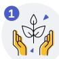

Makes biodiversity's value tangible: tracing plastic waste's journey from disposal to the ecosystems it damages connects consumers and companies to the natural systems on which they depend.

Engages diverse stakeholders: city dwellers, businesses, ministries, fishers, farmers and communities are more likely to engage when the framing is not just waste management but protection of ecosystems on which shared livelihoods and economies depend.

Maximizes return on investment: mapping plastic waste's impact on biodiversity highlights hotspots where scarce resources will deliver the greatest good.

Breaks governance silos, by connecting upstream and downstream authorities, urban and rural municipalities, environment and economy ministries along shared ecological pathways.

Builds resilience: tackling plastic pollution's impact on biodiversity increases nature's resilience to cope with climate change, habitat degradation and overexploitation.

## Introduction

This report synthesizes and builds on two years of research in nine geographies across three continents, which assessed the impacts of plastic pollution on biodiversity and the most effective ways in which communities, cities and countries can respond.

The nine studies were commissioned by the Global Plastic Action Partnership (GPAP), the World Economic Forum's multi-stakeholder platform tackling plastic pollution, and supported by the Government of Canada (see Box 1).

This research contributes new insights into an important but still underexamined aspect of plastic waste. Conducted in Colombia, Costa Rica, Ecuador, Indonesia, Nigeria, Peru, the Philippines, Viet Nam and the Indian state of Maharashtra, this body of work represents the first detailed multi-country baseline of evidence for the biodiversity losses caused by plastic pollution and the consequent damage to ecosystem services and the economic sectors that depend on them.

While the country studies share a common framework, their methodologies, data availability and analytical depth vary across contexts, which may affect comparability. As the research was conducted within the GPAP network, the findings reflect the scope and priorities of these partnerships' geographic specificities. The insights presented should therefore be understood as indicative of emerging patterns and promising practices rather than definitive or universally generalizable conclusions.

This synthesis report captures the insights and best practices from these country studies and presents them in the context of the latest global research on plastic pollution's impact on biodiversity.

The GPAP Plastic Pollution and Biodiversity series of studies referenced by this report can be found here.

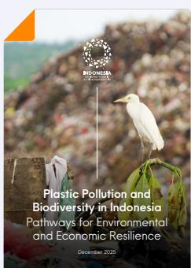  
Plastic Pollution and Biodiversity in Indonesia

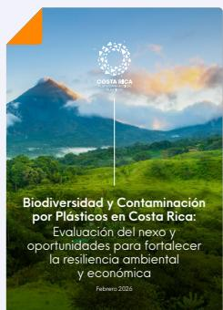  
Plastic Pollution and Biodiversity in Costa Rica

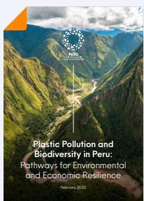  
Plastic Pollution and Biodiversity in Peru

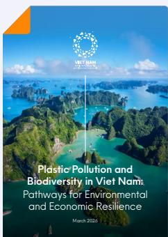  
Plastic Pollution and Biodiversity in Viet Nam

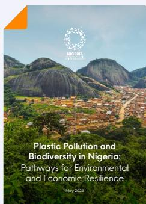  
Plastic Pollution and Biodiversity in Nigeria  
Plastic Pollution and Biodiversity in Ecuador

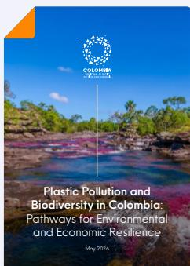

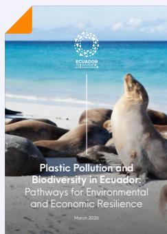  
Plastic Pollution and Biodiversity in Colombia

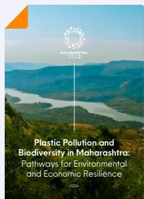  
Plastic Pollution and Biodiversity in Maharashtra

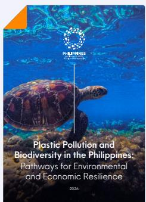  
Plastic Pollution and Biodiversity in the Philippines

## Global Plastic Action Partnership (GPAP)

Founded in 2018 by partners across the public and private sectors, the World Economic Forum's Global Plastic Action Partnership (GPAP) is the world's largest multi-stakeholder initiative dedicated to ending plastic pollution and advancing a circular economy. Through its network of 25 National Plastic Action Partnerships (NPAPs), collectively reaching $20\%$ of the global population, it brings together governments, businesses and civil society to accelerate coordinated action tailored to national contexts. By aligning national priorities

25 + 7

National Plastic Action Partnerships (NPAPs)

>8,000 people benefited from the Inclusive Plastic Action Programme, which has now reached a total of

20,413 people

\$200 million mobilized by partners on initiatives and programmes tackling plastic pollution, bringing the total to

\$3.34 billion with global collaboration, GPAP helps advance circular solutions that reduce plastic pollution, strengthen resilience and support sustainable economic growth.

From 2023-2025, GPAP commissioned nine country studies across three continents on the impacts of plastic pollution on biodiversity – the first of their kind – which form the foundation of the research found in this synthesis report. Achievements reported in the GPAP Annual Report 2025 are highlighted below.

Worldwide, NPAPs now drive change for

1 in 5 people

2,219 + 336 community members

11 + 7

National Plastic Action
Roadmaps launched

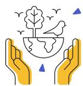

14,000

people reached through 20 projects under the Biodiversity Small Funds Initiative

# Biodiversity and the impact of plastic pollution

Plastic waste directly degrades biodiversity, while emissions from plastic production fuel climate change which further destroys habitats.

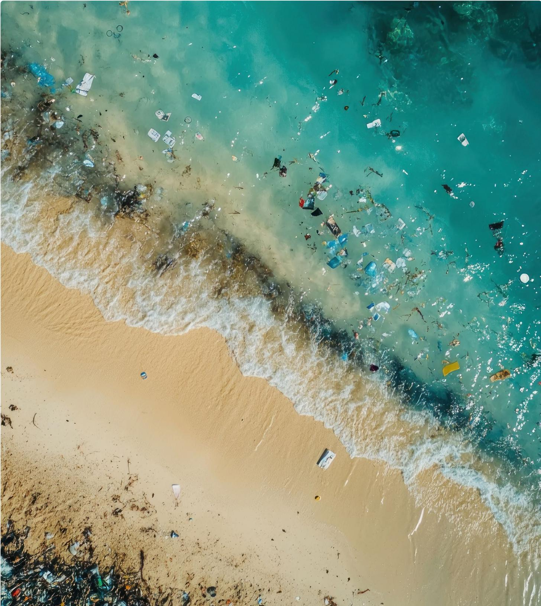

# 1.1 | Scale and scope of the challenge

“Without urgent, ambitious action, plastic waste could more than double to 280 Mt per year by 2040 – equivalent to dumping a garbage truck into the environment every second.

Natural systems that sustain human civilisation are increasingly being disrupted by human pressures. Around one million of an estimated seven million animal and plant species are threatened with extinction – a rate tens to hundreds times higher than the average over the past 10 million years. $^{1}$ Freshwater species populations have declined globally by 85% since 1970; terrestrial populations have fallen by two-thirds and marine populations have more than halved. $^{2}$ Forests continue to be cleared at the rate of almost 11 million hectares a year. $^{3}$ Many scientists refer to the current period as a sixth mass extinction; $^{4}$ but for the first time it is driven by a single species – humans – rather than by asteroid impacts or geophysical forces.

Plastic pollution is one of the key factors driving biodiversity loss, along with destruction of both terrestrial and oceanic habitats, overexploitation of organisms, climate change and disruption through invasive species. $^{5}$ Plastic production exploded from 2 million tonnes (Mt) in 1950 to 460 Mt in 2019. $^{6}$ Just 10% of all plastic ever produced has been recycled – the rest ends up in landfills, rubbish dumps or the natural environment. $^{7}$ Every year, 130 Mt of plastic waste pollutes the planet's land, air and water. Without urgent, ambitious action, plastic waste could more than double to 280 Mt per year by 2040 – equivalent to dumping a garbage truck of plastic waste into the environment every second. This threatens to overwhelm waste management capacity, which is expected to grow at only half the speed of plastic production. $^{8}$

The impact of plastic pollution on biodiversity is serious and accelerating: the International Union for Conservation of Nature has termed it “a major driver of biodiversity loss and ecosystem degradation”, affecting all marine, freshwater and land ecosystems. $^{9}$ Since 1980, marine plastic pollution has increased tenfold, according to the Intergovernmental Science-Policy Platform on Biodiversity and Ecosystem Services (IPBES), “affecting at least 267 species, including 86%

of marine turtles, 44% of seabirds and 43% of marine mammals". $^{10}$

The global plastic value chain is also driving the climate crisis, emitting 2.7 billion tonnes of carbon dioxide-equivalent (GtCO $_{2}$ e) in 2025. Under business as usual, plastic's emissions are projected to rise by nearly 60% to 4.2 GtCO $_{2}$ e by 2040 – equivalent to 1 billion internal combustion engine cars. If plastic were a country, this would make the industry the world's third-largest emitter after China and the United States. $^{11}$

According to analysis by The Pew Charitable Trusts and Systemiq, cumulative emissions from the global plastic system from 2025 to 2040 would equal 42% of the remaining carbon budget required to limit global warming to 1.5°C, making “business as usual” (BAU) for the plastics industry incompatible with the climate goals of the Paris Agreement. $^{12}$

This matters for biodiversity, because climate change is having a significant impact on nature, from genes to ecosystems. Shifting temperature and precipitation patterns, ocean acidification and extreme weather events are altering and destroying habitats, pushing species beyond their tolerance ranges. Climate change has negatively affected almost half of threatened terrestrial mammals and a quarter of threatened birds – “many species are unable to cope locally with the rapid pace of climate change, through either evolutionary or behavioural processes,” according to IPBES. $^{13}$

Meanwhile, biodiverse ecosystems from the Arctic tundra to tropical islands and coastlines are under threat from the compound impacts of plastic pollution and climate-driven rising tides and warmer seas. Coral reefs, for example, are predicted to decline to less than 1% of their former cover at $2^{\circ}$ C of atmospheric warming – and their chances of resisting or recovering are hampered by plastic waste, which can multiply their risk of developing disease by 20 times.

## BOX 2

## Fast facts: the plastic waste + climate change + biodiversity nexus at a glance

\- Plastic waste is among the top-5 drivers of biodiversity loss and ecosystem degradation.

\- 130 million tonnes of new plastic waste pollutes the environment each year, projected to hit 280 million tonnes/year by 2040 under BAU. $^{14}$

\- Of the 7 billion tonnes of plastic waste generated globally to date, less than 10% has been recycled. $^{15}$

\- Since 1980, marine plastic pollution has increased 10x, affecting 86% of marine turtles, 44% of seabirds and 43% of marine mammals. $^{16}$

\- 2,220 species have interacted with marine litter resulting in mortality in \~12% of cases reported. $^{17}$

\- Corals suffer a 20x higher risk of developing disease when entangled with plastic waste. $^{18}$

\- Plastic emitted 2.7 billion tonnes CO $_{2}$ e in 2025; at current rates, emissions from plastic by 2040 will exceed those from every country in the world, except China and the US. $^{19}$

\- Plastic pollution exacerbates impacts on all nine planetary boundaries, including climate change, ocean acidification and biodiversity loss. $^{20}$

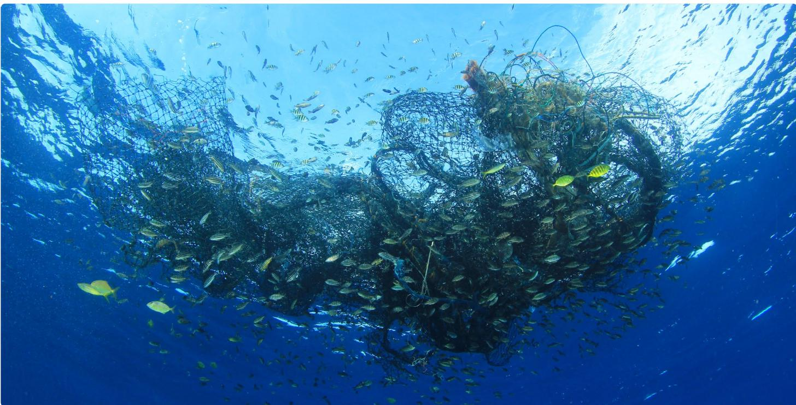

# 1.2 | Global governance – progressing but still patchy

Global governance of biodiversity has evolved significantly in recent decades. The Kunming-Montreal Global Biodiversity Framework (GBF), adopted at the UN's Biodiversity Conference (COP15) in December 2022, framed a historic set of global targets for biodiversity conservation and sustainable use (see Box 3). The GBF is ambitious and comprehensive, but its implementation pathways – National Biodiversity Strategies and Action Plans (NBSAPs) – are nationally determined. Many NBSAPs have not been updated since the GBF was launched or omit to address plastic pollution directly as a primary threat to biodiversity.

## Global Biodiversity Framework (GBF) – most relevant targets

Target 7:

Reduce pollution to levels that are not harmful to biodiversity – including plastic pollution

Target 15:

Businesses assess, disclose and reduce biodiversity-related risks and negative impacts

The global plastics treaty, mandated by the UN Environment Assembly in March 2022, offers the prospect of binding international obligations across the full lifecycle of plastic. However, the fifth intergovernmental negotiating session in Geneva in August 2025 ended in deadlock. $^{21}$ The treaty's future remains uncertain. Whether its final text will include explicit biodiversity protection objectives is still contested. The nine country studies in this report make a compelling empirical case for why it should (see Chapter 5).

Ocean governance adds a third strand. In January 2026, the world's first global treaty to

## Target 16:

Enable sustainable consumption choices to reduce waste and overconsumption

protect ocean life in international waters entered into force. Known as the Biodiversity Beyond National Jurisdiction (BBNJ) Agreement, its measures include establishing marine protected areas (MPAs), conducting environmental impact assessments and capacity building. $^{22}$ Other ocean-based agreements include the International Convention for the Prevention of Pollution by Ships (MARPOL), various regional seas agreements, and the commitment made at the 2022 UN Ocean Conference by more than 150 countries to conserve or protect at least 30% of the global ocean within MPAs by 2030. $^{23}$

Over 4,000 species of microbes, plants and animals have been documented interacting with plastic through ingestion or entanglement.

# 1.3 Pathways for the impact of plastic pollution on biodiversity

Plastic pollution principally impacts biodiversity through three direct pathways:

\- Physical harm: entanglement and ingestion

\- Habitat degradation

\- Chemical contamination

To design interventions that maximize effectiveness and efficiency, it is essential to understand not only how these pathways work, but also the ways in which biodiversity and plastic pollution interact in different urban, rural, riparian, coastal and marine geographies (see Chapter 3).

## Physical harm: entanglement and ingestion

The most visible pathway is direct physical interaction between plastic and wildlife. Globally, over 4,000 species of microbes, plants and animals have been documented interacting with plastic through ingestion or entanglement, mostly in the marine realm but also in estuarine and freshwater ecosystems. $^{24}$

“

## We have seen seagulls trapped in bags and boobies with ropes tangled around their legs.

Fisherman, Ancón, Peru

Abandoned, lost or discarded fishing gear (ALDFG) represents a chronic entanglement risk for marine megafauna, with tens of thousands of square kilometres of fishing nets lost at sea annually. $^{25}$ Meanwhile, the marine aquaculture industry in Indonesia alone dumps over 80,000 tonnes of plastic ropes, buoys, harvest bins and feed sacks into its oceans every year, according to the World Bank. $^{26}$ In Indonesian Borneo, the critically endangered Mahakam Irrawaddy dolphin – a population of approximately 60 individuals – has been regularly reported entangled in fishing nets, while saltwater crocodiles in Sulawesi have been found strangled by discarded tyres. $^{27}$

Plastic disrupts food webs through ingestion by organisms from zooplankton to megafauna. In Indonesian waters, filter-feeders such as manta rays and whale sharks ingest more than 100 plastic particles per hour, resulting in toxic exposure. $^{28}$ In Indonesia's Raja Ampat – an MPA and designated UNESCO Biosphere Reserve – sperm whales and dugong have been found dead with large amounts of plastic debris in their stomachs. $^{29}$ Crabs deliberately ingest waterborne microplastics, mistaking the particles for prey – studies have found that the accumulation of microplastics in crabs clogs digestive tracts, disrupts energy metabolism and increases mortality rates. $^{30}$

Sea turtles suffer from both entanglement and ingestion – bringing socio-economic consequences to local communities who earn a living from the sea (see Box 4).

## BOX 4

## Sea turtle mortality linked to plastic ingestion

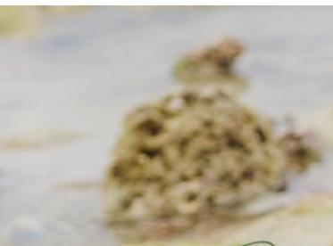

An estimated 52% of sea turtles worldwide have eaten plastic. $^{31}$ Research in Viet Nam reveals high-risk convergence zones, where floating plastics accumulate, leading to turtles confusing plastic bags or film with jellyfish or algae. In Lapu-Lapu, Philippines, turtle deaths were recorded almost monthly during 2024 – autopsies revealed plastics in their digestive tracts.

Ingested plastics lead to gut obstruction and impaired feeding. Even a small volume of plastic can substantially increase mortality risk. $^{32}$ Discarded fishing nets present entanglement risks, restricting mobility, causing injuries and impairing turtles from surfacing for air.

Sea turtles are keystone species important for maintaining ecological balance. They control prey and facilitate nutrient cycling, supporting systems on which local fishers depend. Turtles also attract tourists, providing income to local businesses. When turtles suffer or die from plastic pollution, coastal income streams suffer too.

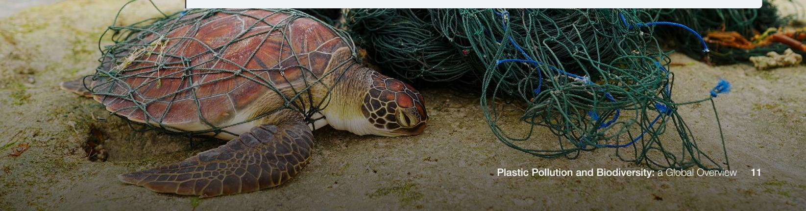

Research finding from a landmark study of 159 reefs across Asia-Pacific conducted in 2018.

## Habitat degradation

Plastic pollution modifies habitats in ways that reduce their carrying capacity for native species, often without causing immediately visible mortality. Plastic waste can contaminate sediments and root systems, while floating plastics serve as vectors for invasive species to reach vulnerable habitats. $^{33}$ This mobile “plastisphere” also introduces bacterial pathogens such as Aeromonas caviae, which pose a risk of transmission to humans through contaminated seafood.

## A day of dirty sea is almost a lost day; the nets come out with trash instead of fish.

Fisherman, Ancón, Peru

## Mangroves

Mangrove forests are critical ecosystems that are particularly vulnerable to plastic pollution. Their dense root systems – so important in protecting juvenile marine species such as shrimps, crabs and finfish – are also ideal for trapping plastics and the toxins they contain. Plastic debris clogs waterways, altering hydrodynamics, the physical properties of sediments and aeration of soil. $^{34}$ This in turn affects gas exchange in roots and the habitat structure for associated biota; it also fosters the growth of harmful microbes that disrupt the decomposition of organic matter and key biogeochemical cycles, negatively affecting molluscs and crustaceans living on mangrove roots. $^{35}$

“

During the monsoon, high tide gets more plastic waste trapped in mangroves.

Respondent, Thane Creek, Maharashtra, India

Research in Colombia, which hosts 7,500 km $^{2}$ of mangroves on both its Pacific and Caribbean coasts, shows that, by altering soil structure, root dynamics and bottom-dwelling fauna, plastics reduce mangrove forests' ability to perform key ecological functions $^{36}$ and recover from disturbances, weakening their role as a natural coastal buffer. $^{37}$

## Coral reefs

Coral reefs face a different but equally serious form of habitat modification. A landmark study in 2018 of 159 reefs across Asia-Pacific estimated that over 11 billion plastic items were entangled on the region's reefs. The study assessed the role of plastic waste in promoting microbial colonization by pathogens and found that the likelihood of disease increased from 4% to 89% when corals were in contact with plastic. This is because plastic surfaces concentrate pathogenic microbes and abrade coral tissue, creating infection entry points. $^{38}$

Structurally complex corals – such as the branching Acropora species that provide the habitat diversity on which reef fish communities depend – are eight times more likely to be impacted than simpler, more robust forms. This in turn has a disproportionate impact on food chains for valuable fisheries.

## Beaches

Plastic pollution is widely recognized as causing significant stress to beach ecosystems. In Viet Nam, plastic waste on beaches has been identified as a factor contributing to declines in sea turtle nesting activity and hatching success, alongside egg collection and coastal infrastructure.

Monitoring by IUCN Viet Nam from 2019 to 2021 assessed marine debris on 33 beaches, including in 10 MPAs, and classified 73.5% of beach segments as polluted or heavily polluted with plastic waste.

BOX 5

Plastic waste entering oceans will triple in 20 years without urgent action

23-37

million tonnes

of new plastic waste will pollute the ocean every year by 2040, under BAU

Source: UN Environment Programme. $^{39}$

50kg

Equivalent to 50 kg of plastic per metre of coastline worldwide

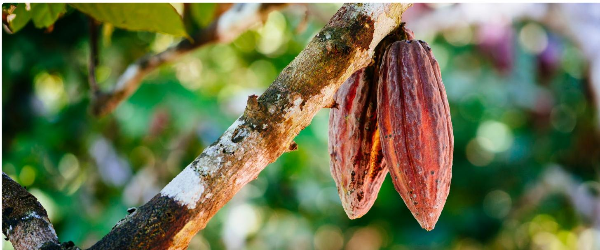

Soils may harbour 4-23 times more microplastic particles than ocean water, and farmland soils could cumulatively store more microplastics than all ocean basins.

Research finding from a scientific study conducted in Pakistan, published in 2025.

## Agricultural systems

Roughly one-third of plastic refuse is estimated to enter soils or inland waters, where natural weather breaks it down into microplastics (fragments of <5mm). Farming across the world makes extensive use of plastic products, such as mulch sheets, drip irrigation pipes, tarpaulins and laminated packaging. In India's Maharashtra state, for example, fertiliser and pesticide packaging (classified as hazardous waste) is commonly dumped in ditches or burned at field corners. As a result, plastic waste frequently becomes embedded in soils.

Sewage sludge – used widely by farmers as fertilizer – is another important and underappreciated pathway by which plastic finds its way into soils and aquatic ecosystems. Treatment plants, which process both sewage and wastewater from drains, are highly efficient at removing microplastics from water. However, rather than eliminating it, this process concentrates microplastics, many of which come from textiles and car tyres. Sewage sludge has been found to contain on average 14,750 particles per kilogram, leading to high concentrations of microplastics in topsoils fertilized with sludge. $^{40}$

Although oceans have attracted far more scientific attention than land-based ecosystems, “mounting evidence shows that agricultural fields and other terrestrial systems now receive enormous microplastic loads”, according to research by scientists in Pakistan published in 2025. $^{41}$ They add that “soils may harbour 4-23 times more microplastic particles than ocean water, and farmland soils could cumulatively store more microplastics than all ocean basins”.

This matters because microplastics impair crop growth and could contribute to a “projected 5-15% decline in crop yields in the coming decades”. In turn, these particles infiltrate the global food web and pose a rising threat both to agricultural

productivity and food security. Farmers have also noticed the quality of their soil declining when plastic waste blocks water flows and increases stagnation, damaging soil structure and fertility. This in turn affects soil biota, water infiltration and crop resilience. $^{42}$

## Being organic also means keeping plastic out of our land.

Community leader and organic chestnut and cacao farmer, Madre de Dios, Peru

## Chemical contamination

Plastics are not chemically inert; they contain additives – such as plasticizers, flame retardants, stabilizers or pigments – which can interfere with hormone systems in exposed organisms, reducing fertility and hatch success in fish and invertebrates. $^{43}$ In Indonesia’s Benoa Bay, Bali, sea urchins and seagrass have been found contaminated with both heavy metals and microplastic fibres. $^{44}$

Plastic surfaces attract hydrophobic pollutants and metals, often concentrating them above surrounding water levels. In Viet Nam's Ho Chi Minh City, microplastics in surface waters combine with chemical compounds at concentrations posing risks for fish and invertebrates in the Sai Gon River and the downstream Can Gio mangrove estuary. $^{45}$

The pathway from chemical contamination to population-level biodiversity impact is less well understood than physical harm, but accumulating evidence suggests it is real. Field observations in North Sulawesi show that plastic debris deters mud crabs from laying eggs, in line with research finding that microplastics and their chemical additives can disrupt the endocrine system, impairing reproductive success. $^{46}$

# 1.4 | Value of biodiverse ecosystems to societies and economies

Biodiversity is essential to our very existence, supporting our water and food supplies, our health and the stability of the climate.

Intergovernmental Science-Policy Platform on Biodiversity and Ecosystem Services (IPBES)

## Ecosystem services provided by healthy biodiversity

Healthy, biodiverse ecosystems deliver a vast range of “ecosystem services” on which human societies and economies directly depend – including goods, services and gifts that IPBES has termed “nature’s contributions to people”. $^{47}$ More than half of global GDP – equivalent to 58 trillion – is estimated to be moderately or highly dependent on nature – although more broadly, humanity’s very existence depends on the food and water systems underpinned by biodiverse ecosystems. $^{48}$

These services are often presented under four functional types:

Provisioning: Food, fresh water, raw materials, medicines.

Regulating: Climate regulation, water purification, flood and erosion control, pest control, disease regulation, pollination.

Supporting: Soil formation, photosynthesis, nutrient cycling, water cycle, habitat provision.

Cultural: Recreation, tourism, cultural and spiritual value, aesthetic appreciation, education.

Our gods belong to nature. The forest gives us oxygen, rain, medicine, and life. Member of the Mahadeo Koli community, Bhimashankar, Maharashtra, India

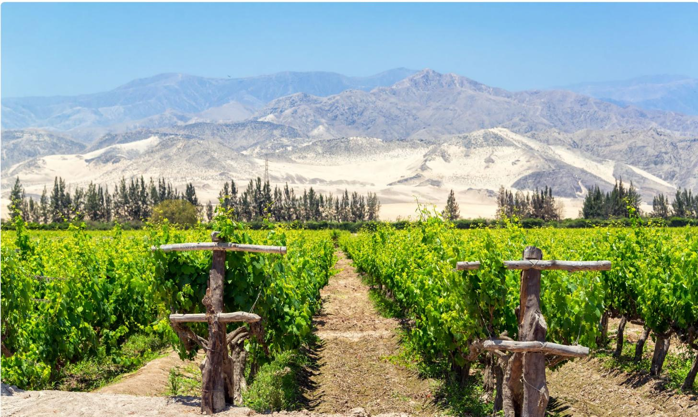

The following sections highlight research findings that provide estimates of the value of ecosystem services that healthy, biodiverse oceans, soils and freshwater systems provide, with icons to denote the functional services noted above (see Table 1).

TABLE 1 High-value habitats and ecosystem services affected by plastic pollution

<table><tr><td>Ecosystem serviceHabitat</td><td>Provisioning (food, freshwater)</td><td>Regulating (climate, water purity, flood control, pollination)</td><td>Supporting (soil formation, nutrient cycling, habitats)</td><td>Cultural and economic (recreation, tourism, wildlife, livelihoods)</td></tr><tr><td>Marine habitats (fisheries, coral reefs, seagrass beds)</td><td>- Coral reefs &amp; seagrass beds are nursery grounds for 40-70% of commercial coastal fish species in Viet Nam</td><td>- Coral reefs protect coastlines from storm surges</td><td>- Corals in contact with plastic face 20x higher risk from disease in Asia-Pacific</td><td>- 38% drop in income due to plastic-related operational costs among Jakarta fishers in Indonesia- Marine plastic pollution leads to $450 million of losses per year in Indonesia (63% tourism, 32% fisheries)</td></tr><tr><td>Coastal habitats (mangroves, beaches)</td><td>- Mangroves provide critical nurseries for crustaceans &amp; finfish</td><td>- Mangroves protect coastlines from storm surges &amp; sea-level rise- Mangroves store 4x more carbon and sequester 10x more CO2 than tropical forests</td><td>- 14% (510,000 ha) of Indonesia&#x27;s mangroves are exposed to high plastic waste leakage- Plastic smothering root systems can lead to mangrove mortality</td><td>- 64-81% potential loss in coastal tourism revenue from plastic- affected beaches in Indonesia- 52% of sea turtles worldwide have ingested plastic; many die from gut obstruction</td></tr><tr><td>Freshwater habitats (rivers, wetlands)</td><td>- Microplastics contaminate 100% of freshwater fish sampled in Iquitos region of Peruvian Amazon.- Java&#x27;s Brantas River lost 65% of native fish species in 10 years, partly due to microplastic pollution in Indonesia</td><td>- Microplastics contaminate 98% of Indonesia&#x27;s 68 national strategic rivers</td><td>- Microplastic densities reach 4,200 items/kg of floodplain sediments in Ecuadorian Amazon</td><td>- Critically endangered Mahakam Irrawaddy dolphins regularly entangled in fishing nets in Indonesian Borneo- Estuarine crocodiles strangled by discarded tyres in Sulawesi, Indonesia</td></tr><tr><td>Terrestrial habitats (soils, forests)</td><td>- Microplastics found in over 75% of grazing ruminants&#x27; stomachs in Ecuador- Microplastics reduce rice root growth, shoot height &amp; fresh weight in Indonesia- Declining earthworm populations, soil fertility &amp; crop yields due to plastic residues in Maharashtra, India</td><td>- Plastic pollution can weaken root development and soil structure, making soils more vulnerable to erosion and ecosystems less resilient to extreme weather events</td><td>- Microplastic pollution is 4-23x higher in farmland soils than in marine environments in Pakistan- Microplastics reduce soil porosity, water-holding capacity &amp; nutrient cycling in Costa Rica- Plastics affect soil sediment texture, water filtration &amp; seedling recruitment in Nigeria</td><td>- Mortality reported in elephants, zebras, camels- Behavioural change in endangered Indonesian macaques</td></tr></table>

Note: Data is specific to research locations and is not exhaustive.

## \$500 billion – \$2.5 trillion

Estimate of the value of marine ecosystem services lost due to plastic waste every year.

## Marine ecosystems – the value at risk from plastic pollution

Estimates of the value to societies and economies of marine ecosystems go way beyond simply the market value of fisheries or tourism sectors and run into the tens of trillions of dollars. This is an emerging area of research and data aggregated at a global level should be interpreted as indicative of orders of magnitude rather than precise values. The same can be said for estimates of the impact of plastic pollution.

One peer-reviewed and widely cited study published in 2019 concluded that the total stock of marine plastic in the world's oceans in 2011 – estimated at 75-150 million tonnes – had led to a 1-5% decline in delivery of marine ecosystem services, which equated to an annual loss of between \$500 billion and \$2.5 trillion in the value of benefits derived from those services. $^{49}$ The authors added that this estimate “represents a ‘lower bound’ of the full economic costs of marine plastic”.

## Fisheries

Fishing is critical for many emerging economies. India, for example, ranks as the second-largest producer of fish globally, with the sector providing livelihoods for around 28 million people across inland and coastal fisheries; 92% of these people come from traditional fisher communities. $^{50}$

## Earlier three nets were enough for the day. Now half comes back with waste.

Fisherman, Versova, Maharashtra, India

In Viet Nam, fisheries and aquaculture contribute 3.2% of GDP, employing 4 million people directly and supporting 300,000 processing and export jobs. Coral reefs and seagrass beds serve as nursery grounds for 40-70% of coastal commercial fish species. $^{51}$

Similarly, mangrove forests – degraded by plastic pollution from Colombia to Indonesia – support high levels of biodiversity, improve water quality and serve as nursery grounds for the majority of commercially important coastal crustacean and finfish species. $^{52}$

## BOX 6

## Asia-Pacific – value of marine-based industries lost to plastic pollution

Marine debris in Asia-Pacific – over 80% of which is typically plastic – cost regional economies \$10.8 billion in 2015, according to a report commissioned by the Asia-Pacific Economic Cooperation (APEC) organization. $^{53}$ This figure comprised direct costs to:

\- Tourism (\$6.41 billion)

These losses do not include clean-up costs or the wider costs to the environment. $^{54}$ At current estimated rates of marine debris leaking into oceans, the cumulative damage to these industry sectors in APEC's 21 countries is expected to total \$216 billion by 2050.

\- Shipping and transport (\$2.94 billion)

– Fisheries and aquaculture (\$1.47 billion)

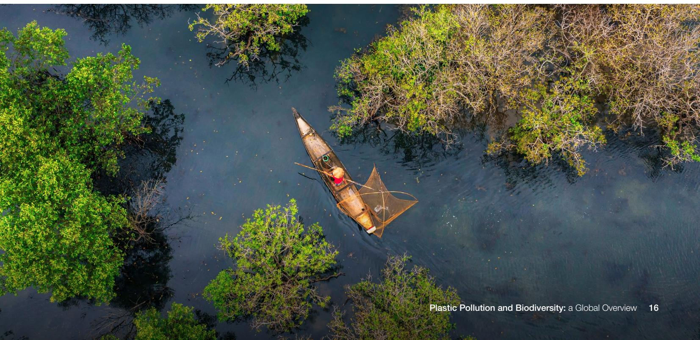

“ Biodiversity is our strongest natural defence against climate change. Without intact, biodiverse ecosystems, net-zero targets become unachievable.

## Carbon sequestration

Globally, the planet's oceans and land absorb over half of all anthropogenic CO $_2$ emissions. The UN has termed biodiversity “our strongest natural defence against climate change”. Without intact, biodiverse ecosystems, net-zero targets become significantly harder to achieve. $^{55}$

Ecosystems that are functioning and resilient can buffer extreme weather events, act as carbon sinks and better absorb climate-driven feedbacks. However, when biodiversity is degraded, this reduces the resilience of both marine and terrestrial ecosystems and their ability to sequester carbon; this in turn increases greenhouse gas concentrations and accelerates climate change. $^{56}$

Mangroves are critical allies in fighting climate change. They store up to four times more carbon per hectare than most mature tropical forests $^{57}$ and sequester $CO_{2}$ from the atmosphere at a rate 10 times greater than tropical forests. $^{58}$ Yet, as GPAP's report on Indonesia highlighted, they are particularly vulnerable to plastic waste: "Plastic accumulation can block mangrove roots, stunting growth and causing restoration failures. While mangroves may withstand partial root coverage, complete suffocation by plastic debris is fatal. Plastics can persist in sediments for up to a century, posing long-term risks to mangrove survival and the ecological services they provide."

## Coastal risk reduction

Biodiverse, healthy ecosystems also function as the world's most cost-effective risk management. Degrading this “green infrastructure” – whether through plastic pollution, conversion or overexploitation – converts natural buffers into sources of systemic risk for governments, businesses and communities alike. Equally, actions to protect and restore ecosystems reduces exposure to a broad spectrum of hazards.

The UN Environment Programme identifies the degradation of both marine and terrestrial ecosystems as “a major driver of disaster risk”. $^{59}$ Mangroves and coral reefs provide coastlines with protection from climate-driven sea-level rise and storm surges worth hundreds of billions of dollars a year. Re-establishing coral reefs significantly reduces coastal flooding risk, while investment in restoring saltmarshes and dykes can protect coastal communities at a lower cost than engineered alternatives. $^{60}$

The degradation of ecosystems – such as forests, wetlands, drylands, and coastal and marine systems – is a major driver of disaster risk and a key component of communities’ vulnerability to disasters.

United Nations Environment Programme

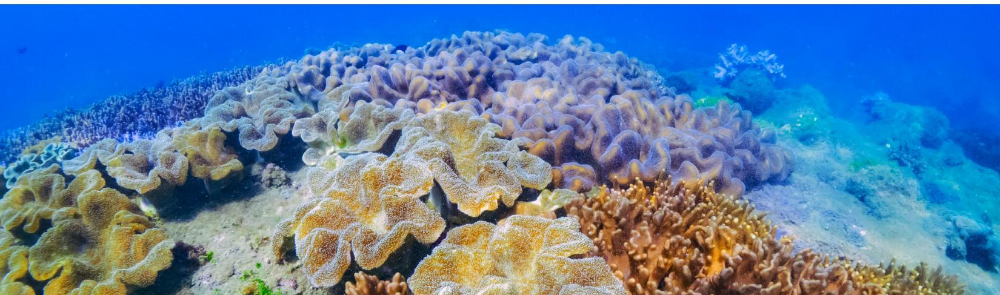

## Freshwater ecosystems – economic value and impacts of plastic waste

Plastic pollution in freshwater ecosystems has been less well-documented than in marine environments. In 2022, the Organisation for Economic Co-operation and Development (OECD) found that stocks of accumulated plastic waste in rivers totalled 109 Mt (see Figure 4). $^{61}$ OECD reported: "The build-up of plastics in rivers implies that leakage into the ocean will continue for decades to come even if mismanaged plastic waste was significantly reduced. Furthermore, cleaning up

these plastics is becoming more difficult and costly as plastics fragment into ever smaller particles."

A key finding of this report is the need for further research into the impacts of plastic pollution on biodiversity in freshwater environments.

We often observe dead fishes now more than before due to increasing plastic waste in the river.

Fisherman, Nworie and Otammiri river ecosystem, Imo State, Nigeria

By preventing the leakage of plastic waste entering the Tonle Sap Basin – the largest freshwater lake-river system in South East Asia – Cambodia could prevent losses worth at least \$4.8 billion up to 2030.

## Watersheds, river systems and lakes

Research published in 2021 on freshwater plastic pollution in South East Asia noted that the impact of plastic pollution on freshwater aquatic systems remains critically understudied and most research has focused on the marine environment. Their analysis showed that, by preventing the leakage of plastic waste entering the Tonle Sap Basin – the largest freshwater lake-river system in South East Asia – Cambodia could prevent losses in natural capital, material value and degradation worth at least \$4.8 billion up to 2030, with additional benefits for the Mekong River and South China Sea. $^{62}$

In Colombia, the Magdalena-Cauca river basin hosts more than 1,200 endemic freshwater species, but is also one of the main sources of plastic pollution, conveying \~18,000 tonnes of plastic waste every year down to the Caribbean Sea. $^{63}$

One of the key roles of rivers and watersheds is to regulate and purify fresh water. Wetlands, forests and riparian ecosystems regulate water flows, filter pollutants and maintain the quality of freshwater systems on which agriculture and human health depend. Research shows a clear link between biodiversity loss and declining water regulation services, with negative impacts cascading into food security and public health. $^{64}$

For example, Colombia's Páramos alpine tundra – an ecosystem of exceptional biodiversity – supplies drinking water and irrigation for millions. $^{65}$ When these ecosystems are degraded, the cost of water treatment rises and agricultural productivity falls.

## Terrestrial ecosystems – economic value and impacts of plastic waste

Agriculture

Biodiversity underpins the stability of global food systems. Declining agrobiodiversity – including genetic resources for agriculture – reduces food systems resilience, food security and nutrition. $^{66}$ Given the economic and societal importance of agriculture and its interdependencies with ecosystem services, further research into the impacts of plastic pollution on soil health and terrestrial biodiversity is required.

“

## Women are mostly affected because they usually farm in the site. But waste has taken a good portion of the land and even the soil fertility is affected too.

Farmer, Umuanunu forest, Imo State, Nigeria

IPBES has found that “75% of our food crops… depend at least to some extent on animal pollination”, while “a high diversity of wild pollinators is critical to pollination”. $^{67}$ The Taskforce on Nature-related Financial Disclosures (TNFD) identifies fertile soils, diverse wild pollinator species and agrobiodiversity as critical for the long-term productivity of agricultural land. $^{68}$ Diverse ecosystems maintain pollinator populations; simplified, degraded landscapes do not.

A landmark report by the UN's Food and Agriculture Organization (FAO) on agricultural plastics published in 2021 found that agricultural yields fall when soils are polluted by residue from plastics such as mulching film. A growing concern is how microplastics, generated by waste agricultural plastic products, can potentially transfer along trophic levels and adversely affect human health. The report added that “research on the harm caused by plastics to terrestrial and freshwater ecosystems currently falls far behind that of the marine environment”. $^{69}$

## √ Recommendation

Governments and academia: conduct further research into the impacts of plastic pollution on soil health and terrestrial biodiversity as well as on freshwater ecosystems.

A global assessment of microplastic pollution's impact on food security, published in March 2025, found that the reduction in photosynthesis caused by microplastics in terrestrial plants, as well as marine and freshwater algae, resulted in estimated annual losses of 110-361 Mt in crop production and between 1 and 24 Mt in seafood production. $^{70}$ The researchers calculated that a 13% reduction in current environmental microplastic levels could decrease losses in photosynthesis by \~30%, in turn avoiding crop losses of up to 115 Mt per year and seafood losses of up to 7 Mt per year.

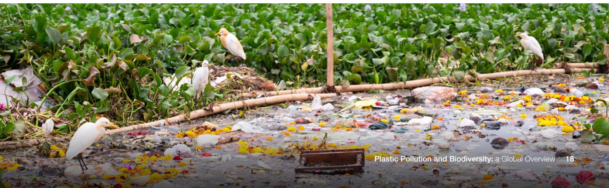

## Coastal

tourism generates \$1.5 trillion a year in revenues and supports 52 million jobs worldwide.

## Tourism – economic value and impacts of plastic waste

Despite the importance of the global tourism sector, research into the value of tourism to areas of high biodiversity – whether marine, coastal or terrestrial – is limited. One academic study from 2015 found that terrestrial protected areas globally receive approximately 8 billion visits per year, generating annual revenues of around \$600 billion (2014 prices). $^{71}$ Commenting on this study, UNEP noted that the economic benefit of these protected areas “vastly exceeds the less than \$10 billion spent safeguarding these sites each year”. $^{72}$

The World Travel and Tourism Council calls coastal tourism the “jewel in the crown of the travel and tourism sector”, as it generates \$1.5 trillion a year in revenues and supports 52 million jobs worldwide. Coastal tourism is completely dependent on

flourishing, clean marine and coastal environments – and for some island nations, it is the largest driver of GDP. $^{73}$ A peer-reviewed study of coral reef tourism published in 2017 found that coral reefs generated around 70 million tourist visits and revenues of \~36 billion in over 100 countries and territories. $^{74}$

Plastic pollution threatens the tourist value of these destinations, which depend for their appeal on maintaining pristine, biodiverse ecosystems. For Indonesia, tourism is the country's second-largest source of foreign exchange after palm oil, generating \$10-17 billion per year. However, the government's National Research and Innovation Agency (BRIN) reported that the country dumps an annual average of 484,000 tonnes of plastic waste into the oceans, leading to economic losses of between IDR 125 and 225 trillion every year (\$8-16 billion). Impacts on the country's tourism sector are potentially very significant (see Box 7). $^{75}$

## Paradise under pressure – plastic pollution threatens tourist revenues in Indonesia

Raja Ampat in the east of the archipelago is a globally significant UNESCO Biosphere Reserve that hosts 537 coral species and approximately $75\%$ of the world's known coral species. This exceptional biodiversity not only makes Raja Ampat a tourism hotspot, but also heightens its vulnerability to environmental threats.

However, in a recent survey of visitors, 75% said they would avoid plastic-affected beaches. With

Raja Ampat increasingly threatened by plastic-related degradation, this “last paradise” faces potential tourism revenue losses of 64-81%.

The study authors recommended that a transparent and accountable portion of tourism-related levies should be allocated to waste management at high-value tourism sites, to reduce the economic burden of plastic pollution management on tourism operators.

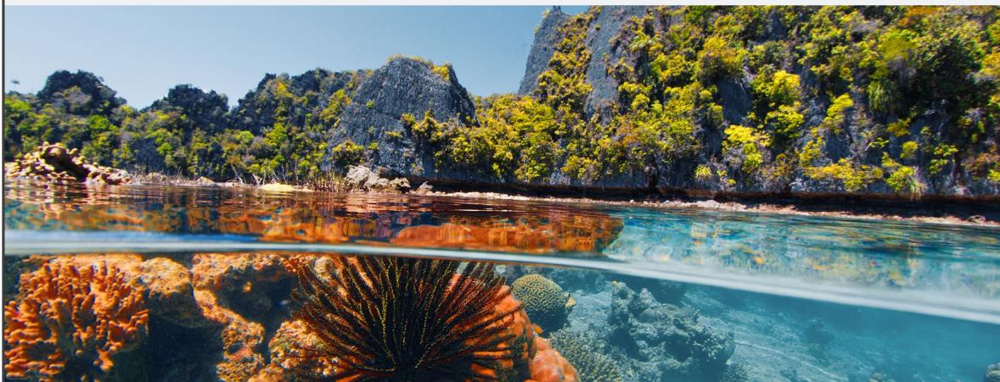  
Source: World Economic Forum/GPAP.

Recent research in the Galápagos Islands – which received a record 330,000 visitors in 2023 – analysed the willingness of tourists to return given plastic-related environmental degradation. Based on visitor surveys and modelling of different pollution scenarios, the researchers estimated top-end annual losses ranging from \$300-450 million with visitor numbers declining by up to 70%. $^{76}$

Tourism in Peru is worth \$4.8 billion to the national economy, representing nearly 3% of GDP; but pressures from plastic waste accumulation are driving a double crisis, as clean-up costs rise while revenues fall. GPAP researchers estimate

the financial impact could total \$477 million per year, or 10% of tourism revenues. $^{77}$

Meanwhile, IPBES has noted that the non-market cultural value of nature – including a sense of identity, spiritual connection and aesthetic experience – is systematically undervalued in policy decisions, despite being central to the well-being of billions. $^{78}$ GPAP’s report on Nigeria, for example, highlighted the value of the Osun-Oshogbo sacred grove, a UNESCO World Heritage Site, to the spiritual identities of local people, and its vulnerability to plastic pollution and biodiversity loss. $^{79}$

## 2 The geography of impact

Mapping of locations where plastic pollution and biodiversity loss converge boosts the rationale and effectiveness of tackling both challenges together in space and time.

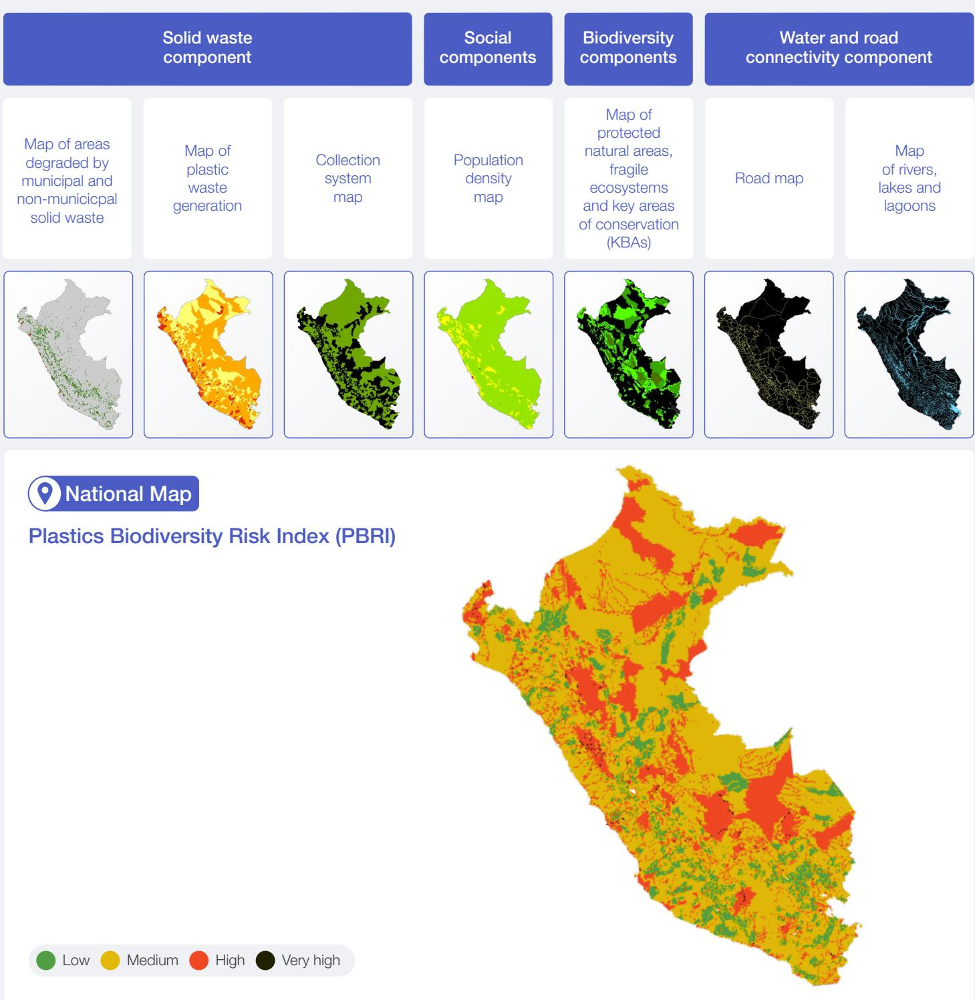

## 2.1 Geographic approach breaks silos and broadens stakeholder cooperation

Common to all nine of the GPAP country studies is a map-based approach which analyses the impact of plastic pollution on biodiversity within specific geographies. In Peru, for example, researchers developed a Plastic Biodiversity Risk Index (PBRI), which integrates variables such as biodiversity, solid waste, water connectivity and population density to visualize the multiple pressures that converge in the same territory. This reveals hotspots – where sensitive ecosystems overlap with high plastic pollution impacts – that require urgent management and mitigation efforts (see Figure 1).

FIGURE 1

## Mapping the geography of impact – Peru's Plastic Biodiversity Risk Index

Solid waste component

Social components

Biodiversity components

Water and road connectivity component

Map of areas degraded by municipal and non-municipal solid waste

Map of plastic waste generation

Collection system map

Population density map

Map of protected natural areas, fragile ecosystems and key areas of conservation (KBAs)

Road map

Map of rivers, lakes and lagoons

National Map

Plastics Biodiversity Risk Index (PBRI)

This geographic approach supports a key finding of this synthesis report – that joint action to map and tackle the nexus of plastic pollution and biodiversity loss brings multiple advantages that separate approaches to each issue do not (see also Chapter 5). For example, by mapping the geographies where plastic pollution has the highest impact on biodiversity, governments are able to target scarce resources to locations and priorities that will deliver the most cost-effective outcomes.

Equally, mapping plastic waste's impact on biodiversity offers a way to unite, perhaps for the first time, disparate actors along pathways of plastic pollution: from the coastal communities whose fishing nets catch nearly as much waste as food, upriver to the municipalities responsible for ensuring waste stays out of waterways, then upstream further to the companies responsible for designing and manufacturing the plastic packaging that enters economies in the first place. It unites stakeholders from different ecosystems and sectors to act along plastic waste pathways, rather than along political, administrative or social lines.

The same logic applies to breaking government silos. Mapping the nexus reveals how plastic waste often goes on a long journey from where it is dumped to where it has most impact. In Colombia, for example, plastic generated in highland Bogotá and Medellín reaches Caribbean coral reefs and mangroves via the Magdalena River; so waste management in inland cities is a biodiversity protection measure for coastal communities 1,000 kilometres away. However, separate administrative systems for urban waste governance and coastal biodiversity governance make this connection invisible. A mapping-based approach enables governments to adopt an integrated “source-to-sea” approach to the governance of plastic waste, aligning disparate authorities along ecological pathways rather than administrative or political boundaries.

## 2.2 Mapping where biodiversity is at greatest risk from plastic pollution

## Plastic pathways forged by the flow of water

Ecuador and Costa Rica have taken a similar approach to Peru in mapping the pathways that plastic pollution follows and identifying the zones

## BOX 8

## Ecuador's Plastic Exposure Risk Index (PERI)

of highest risk to biodiversity, in order to help focus priority action.

In Ecuador, researchers generated a national Plastic Exposure Risk Index (PERI) to highlight geographies at greatest risk from plastic pollution (see Box 8).

In Ecuador, GPAP researchers generated a national Plastic Exposure Risk Index (PERI), by combining spatial information from three equally weighted indices indicating plastic waste:

\- Human pressure index, reflecting population density, waste generation and poverty. $^{80}$

\- Waste management index, capturing the performance of local waste management systems. $^{81}$

\- Litter flow index, which accounts for environmental pathways that facilitate plastic transport.

The index showed that plastic pollution hotspots are concentrated along Ecuador's coastal provinces, where dense populations, poor waste infrastructure and significant river networks accelerate leakage toward estuaries and mangroves. Secondary hotspots occur in Amazonian urban centres and Andean cities with limited landfill capacity.

Then researchers overlayed the PERI map onto a biodiversity importance index, to establish the most critical intersections of plastic and biodiversity.

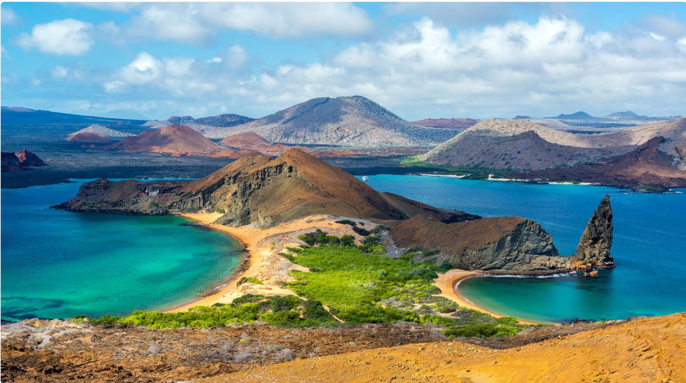

The mapping in Ecuador highlights the extent to which plastic pathways are forged by the flow of water. In urban areas, rainfall-driven runoff transports waste into drains and ravines, where it fragments into microplastics. River basins become key vectors of plastic pollution, conveying waste downstream where it becomes trapped in biodiversity-rich wetlands, floodplains, back channels and flooded soils. Seasonal rains increase the discharge volumes of rivers, propelling plastic

waste downstream towards coastlines, where it pollutes estuaries, beaches and mangrove roots.

Plastic waste not snagged by coastlines unites in tidal convergence zones with oceanic waste, such as discarded buoys, ropes and fishing nets. This detritus can be conveyed thousands of kilometres by ocean currents, to wash up on once-pristine islands such as the Galápagos, which generate almost none of their own waste (see Box 9).

## BOX 9

\- Seasonal flood pulses that connect the Amazon’s forests, rivers and floodplains – supporting nutrient exchange, food webs and fisheries – are the same flows that convey plastic contamination.

## Transboundary plastic waste washes up on the Galápagos Islands

Plastic is accumulating in the UNESCO-protected Galápagos Islands, which receive a continual influx of plastic carried by regional currents and international shipping routes. Ocean-borne debris, including bottles, cutlery, labels, ropes, buoys and fishing gear components arrive from distant locations to accumulate on shorelines and

Having established the plastic waste pathways, researchers combined their PERI map with a biodiversity overlay to identify areas of rich biodiversity at greatest risk from plastic pollution, where conservation action must be prioritized.

Inland, the most at-risk areas include floodplains of exceptional biological richness along the upper Ecuadorian Amazon, where microplastics have reached densities in soil sediments of 4,200 particles/kg. In a disturbing inversion of natural processes, the seasonal flood pulses that connect the forests, rivers and floodplains of the Amazon's dynamic freshwater system – facilitating nutrient exchange and sustaining vital food webs and fisheries – are the same flows that convey plastic contamination.

sensitive breeding and feeding areas, underscoring the transboundary nature of marine pollution. Barely visible microplastics find their way into the sediments, food webs and marine organisms of the Galápagos, showing how plastic waste presents an emerging risk for wildlife, even in one of the world's most protected marine environments.

Downstream hotspots include the Gulf of Guayaquil, the largest estuarine system on the Pacific coast of South America, whose waters support key nursery habitats for fish, crustaceans and marine megafauna, underpinning Ecuador's most important artisanal fisheries and coastal food webs. $^{82}$ The Gulf is a major convergence zone where Andean river flows meet marine currents, forming delta plains, estuarine fronts and mangrove islands that are among the most productive coastal ecosystems in the Eastern Pacific. In a similar irony to the river pulses of the Amazon, the same hydrodynamic processes that benefit the fishing industry also concentrate plastic pollution.

## Impacts per ecosystem in Ecuador

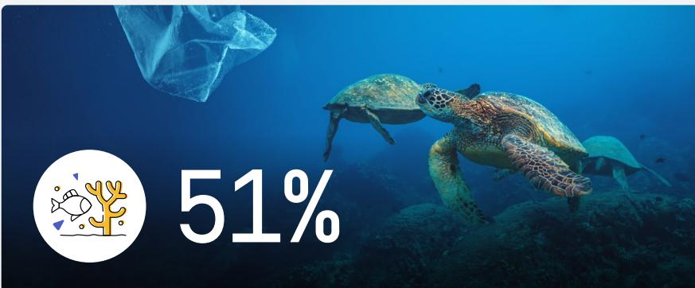

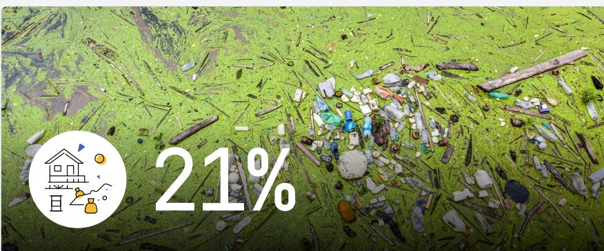

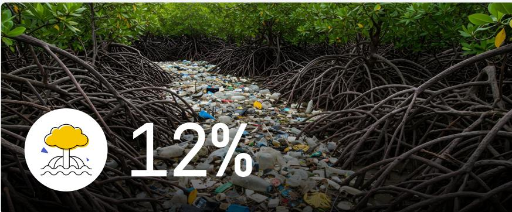

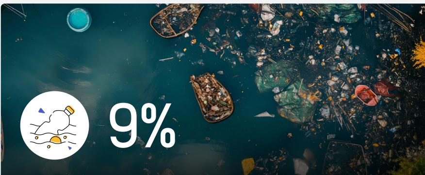

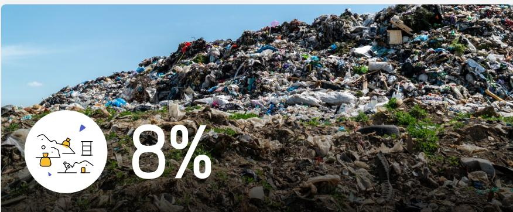  
Note: Percentages do not total 100% due to rounding.
Source: World Economic Forum/GPAP.

## Coastal-marine

Coastal and marine ecosystems are the most affected by plastic pollution in Ecuador. Abandoned fishing gear, tourism waste and urban runoff accumulate in beaches, mangroves and reefs, threatening wildlife such as turtles, seabirds and marine mammals.

## Urban

Urban rivers and drainage systems act as conduits for plastics. In Quito and Guayaquil, microplastics have been detected in 100% of sampled waters, indicating that waste mismanagement and stormwater overflow are major entry points of plastics into aquatic systems.

## Estuarine / mangroves

Mangroves trap floating plastics in their dense root systems, functioning as natural filters but also as long-term sinks. Entangled debris damages roots and affects juvenile fish and crustacean habitats, compromising coastal protection services.

## Freshwater

River systems in the Andes and Amazon transport plastics from inland cities toward coastal areas. Microplastics in sediments disrupt microbial communities essential for water purification and nutrient cycling.

## Terrestrial

Agricultural soils and grazing areas are increasingly contaminated. Studies in Cotopaxi found microplastics in over 75% of livestock digestive contents, indicating pervasive contamination that threatens soil fertility, water retention and food security.

Source: World Economic Forum/GPAP.

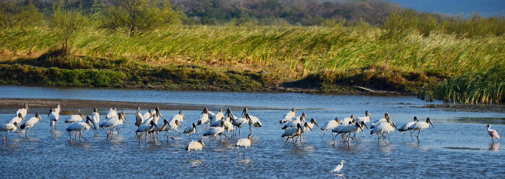

## Zoning of high-risk areas reveals extent of threat to KBAs

Costa Rica hosts a richness of biodiversity that far outweighs its geographic size: its 220,000+ recorded species represent over 11% of all known global species. However, its terrestrial, riverine and coastal-marine ecosystems are all under siege from plastic waste.

As in Peru and Ecuador, GPAP researchers assessed the impact of unmanaged plastic waste on biodiversity by cross-referencing a plastic pollution risk map for each river basin with the Biodiversity Habitat Index (BHI), an international benchmark developed by the Commonwealth Scientific and Industrial Research Organisation (CSIRO) to quantify the capacity of natural ecosystems to sustain biodiversity over time. This tool enabled researchers to classify territories into four categories (see Table 2).

Prioritizing high-risk zones in Costa Rica by combining ecological condition with plastic pollution pressure

<table><tr><td>Biodiversity risk category</td><td>Ecological condition (BHI) $^1$ </td><td>Anthropogenic pressure (plastic pollution risk)</td><td>Ecological interpretation</td></tr><tr><td>A Biodiversity clusters</td><td>Good ( $\geq 0.75$ )</td><td>Low ( $\leq 0.25$ )</td><td>Ecosystems with high capacity to sustain biodiversity and with minimal pollution pressure.</td></tr><tr><td>B Ecological conflict zones</td><td>Good ( $\geq 0.75$ )</td><td>High ( $\geq 0.75$ )</td><td>Valuable areas under threat from plastic pollution. Risk of loss of functional integrity.</td></tr><tr><td>C Stable degraded areas</td><td>Poor ( $\leq 0.25$ )</td><td>Low ( $\leq 0.25$ )</td><td>Altered ecosystems but with low additional pressure.</td></tr><tr><td>D Critical areas of ecological collapse</td><td>Poor ( $\leq 0.25$ )</td><td>High ( $\geq 0.75$ )</td><td>Highly degraded and polluted ecosystems with low ecological resilience.</td></tr></table>

Notes: 1. BHI = Biodiversity Habitat Index.

More than 35% of Costa Rica's Key Biodiversity Areas show some level of ecological conflict potentially related to plastic pollution.

The analysis revealed that more than 35% of Costa Rica's Key Biodiversity Areas (KBAs) show some level of ecological conflict potentially related to plastic pollution, including areas inside legally protected wilderness areas. Forest reserves appear to fare better than wetlands, a high proportion of which include critical areas of ecological collapse. KBAs are particularly valuable in concentrating threatened, endemic or restricted-distribution species and play a key role in maintaining the integrity, connectivity and resilience of ecosystems. $^{83}$

Transferring this data onto a single map, researchers are able to highlight territories where the progressive loss of ecological integrity compromises the capacity of ecosystems to generate social and economic benefits. River basins along the country's Central and Northern Pacific coast are particularly at risk (see Figure 3). This mapping approach, write the authors, "makes it easier to identify and prioritize areas where better conservation and reduced pollution would not only strengthen biological resilience but also contribute to mitigating future economic costs and safeguarding human well-being by providing clear targeting for public policy and investment decisions".

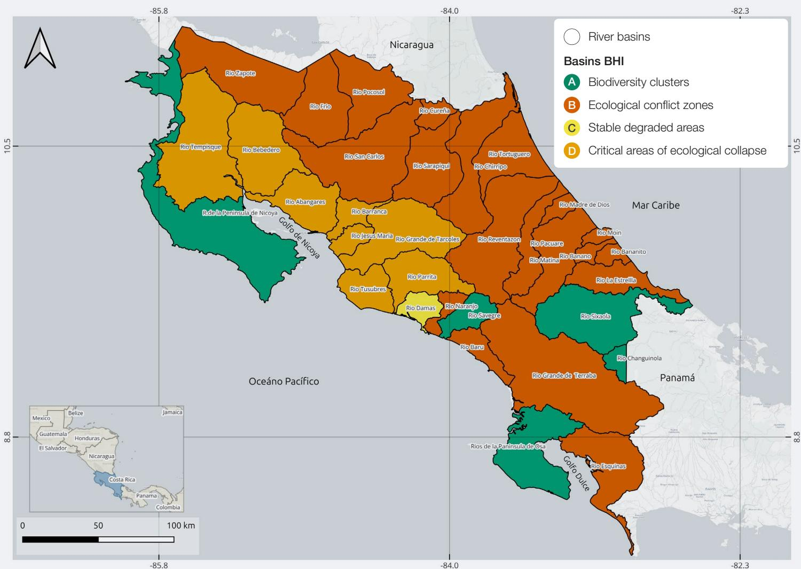  
Note: The map presents the spatial distribution of the different levels of ecological degradation, potentially associated with plastic pollution, analysed at the scale of river basins.
Source: World Economic Forum/GPAP.

The mapping approach outlined above maps plastic pollution's impacts on biodiversity hotspots. Future research could focus on adding a third layer of data, which identifies the ecosystem services threatened in these highly affected hotspots.

## √ Recommendation

Governments: integrate mapping approaches at national and municipal levels that combine and overlay plastic waste flows, zones of high-value biodiversity and vital ecosystem services – to highlight areas of greatest risk and highest potential returns on investment.

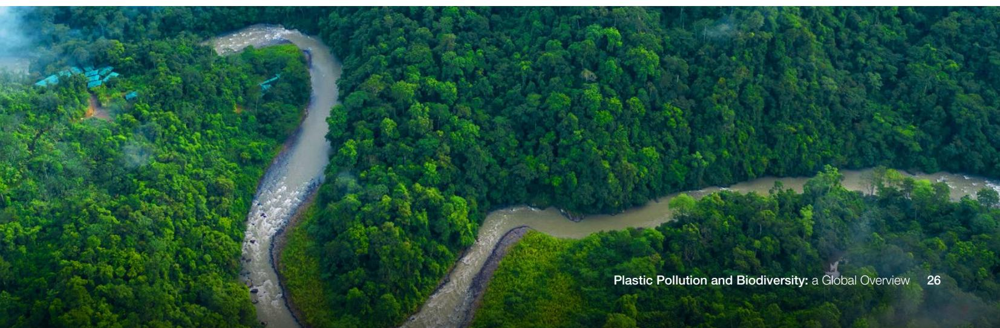

# Risks to businesses and opportunities for engagement

91% of plastic waste is burned, buried or thrown away. This waste – worth \$120 billion a year – is also a business opportunity.

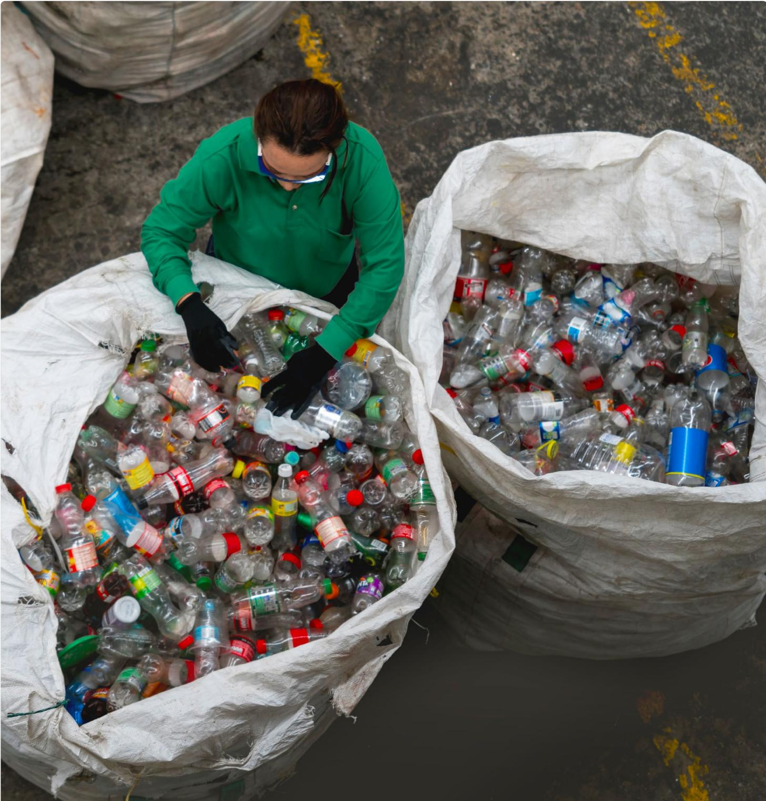

\$7.3
trillion

Global finance flows in 2023 with directly negative impacts on nature.

Businesses are exposed to a range of economic, legal and reputational risks due to unmanaged plastic waste and its impacts on biodiversity and ecosystem functions. At the same time, addressing these risks can create strong incentives for innovation and unlock new sources of value, from cost savings to new markets and revenue streams.

The linear model of single-use plastics represents billions of dollars of value literally thrown away after one short lifecycle. $^{84}$ The cost that plastic waste imposes on marine ecosystems alone – estimated at between 500 billion and 2.5 trillion per year – far outweighs the estimated 140 billion per year for effective waste management by 2040. $^{85}$ Meanwhile, the value of a healthy ecosystem in supporting the resilience of economies and societies is almost incalculable.

This level of waste and cost offers valuable opportunities for businesses to engage in finding solutions. There are both upstream and downstream value chain opportunities for companies to reduce plastic waste's impact on biodiversity:

\- Upstream: improved product and packaging design can help optimize plastic use, reduce unnecessary applications, expand reuse models and enhance recyclability, while exploring alternative materials where appropriate.

\- Downstream: opportunities include committing to targets for both recycling and recycled content, cooperating with civil society on more effective waste avoidance and recovery, and voluntary disclosure of plastic pollution-related risks and impacts.

While the business debate on addressing the challenge of plastic waste has to date revolved largely around the cost-benefit analysis of recycling and circularity, the impact of plastic pollution on biodiversity offers a critical new angle for businesses to consider. As this report has made clear, not only are important nature-dependent economic sectors directly impacted by plastic pollution; but in addition, viewing the challenge through a biodiversity lens focuses the awareness of all stakeholders – including businesses – on where efforts to reduce the impacts of plastic pollution can be most cost-effective and valuable.

## 3.1 Risks to businesses from exposure to plastic pollution

## Pervasive systemic risk to financial stability

In its February 2026 report, Business and Biodiversity Assessment, $^{86}$ IPBES reported that in 2023, \$7.3 trillion in global public and private finance flows had directly negative impacts on nature, while just 3% of this total – \$220 billion – was directed to nature conservation and restoration. Natural capital declined nearly 40% between 1992 and 2022, while human-produced capital doubled. $^{87}$ This immense cost to the planet's biodiversity is posing systemic risks to global financial stability, warns IPBES.

The growth of the global economy has been at the cost of immense biodiversity loss, which now poses a critical and pervasive systemic risk to the economy, financial stability and human wellbeing.

Intergovernmental Science-Policy Platform on Biodiversity and Ecosystem Services

## Investor, corporate and supply chain risks

This ongoing pattern of collective harm inflicted on nature and biodiversity brings enormous long-term risks to the private sector. In relation to plastic pollution and biodiversity, these risks affect not only the producers and consumers of plastic within the value chain, but also their lenders, investors and insurers.

These risks are not lost on the roughly 1,500 global business, government and civil society leaders, surveyed by the World Economic Forum for its Global Risks Report 2026: they ranked biodiversity loss and ecosystem collapse as the second most severe global risk over the next 10 years after extreme weather events, but ahead of the adverse outcomes of AI technology or cyber warfare. $^{88}$

Biodiversity loss and ecosystem collapse is the second most severe global risk over the next 10 years.

World Economic Forum,
Global Risks Report 2026

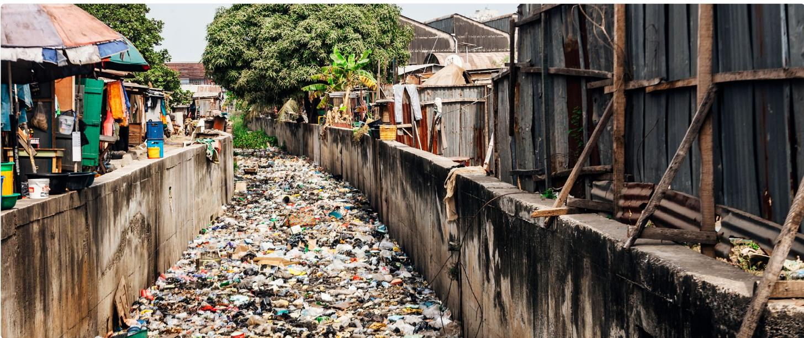

What has achieved less attention is the direct link between biodiversity loss and plastic pollution. However, this is changing. Between 2012 and 2022, 731 plastic pollution policies were introduced worldwide, according to the NGO Planet Tracker. $^{89}$ The organization warned that “investors in the plastic value chain are ignoring this rising regulatory threat”. With plastic production anticipated to almost triple by 2060, risks to both corporates and investors can be summarized under four categories:

\- Physical risks, related to the plastic sector's $1.8\mathrm{GtCO}_2\mathrm{e}$ of emissions, accounting for $3.4\%$ of global emissions and a figure projected to more than double by 2060, under BAU.

\- Legal risks, such as corporate liability cases linked to plastic pollution that could reach up to \$100 billion per year by 2030.

\- Reputational risks, from greenwashing claims or from transacting with businesses seen as major plastic polluters.

\- Transition risks, given the estimated \$100 billion bill for companies if mandatory plastic waste management, under extended producer responsibility (EPR) legislation, becomes universal by 2040.

As awareness of the extensive damage to biodiversity from plastic pollution becomes more widespread, these risks will only increase.

Planet Tracker has called on companies to include in their risk registers any rising harm to people and nature through exposure to plastic-based $CO_{2}$ emissions, harmful toxic or chemical discharges, and plastic pollution across oceans, land and air.

Within the plastics value chain, upstream single-use plastic producers are perceived as the riskiest segment for investors, followed by packaging and container companies (midstream), then “consumer staples" – the downstream brands that rely on plastic packaging to sell their goods.

In a report published in October 2025, Planet Tracker analysed over 450 global companies and found that firms in the bottom quintile for packaging risk management are “more than twice as likely as their peers to experience share price declines of 70% or more”. $^{90}$

## √ Recommendation

Corporates and investors: strengthen risk assessments by considering exposure to EPR legislation and the biodiversity impacts associated with plastic pollution.

Beyond individual ecosystem services and specific risk categories, biodiversity underpins the systemic resilience of supply chains, economies and societies – the capacity not merely to avoid shocks but to absorb them, adapt and recover. Resilience of this depth cannot be purchased through engineering alone; it requires functional, biodiverse natural systems.

Research by SwissRe found that natural catastrophes, driven largely by extreme weather, caused \$318 billion in losses in 2024; meanwhile, “a collapse in select services such as wild pollination, provision of food from marine fisheries and timber from native forests, could result in a significant decline in global GDP: \$2.7 trillion in 2030”, according to the World Bank. $^{91}$

When ecosystems fail, supply chains stall. Water scarcity pushes up production costs. Deforestation triggers reputational crises. Invasive species and pollinator collapse disrupt the raw material flows on which global manufacturing depends.
British NGO Climate Action $^{92}$

## \$80 billion to \$120

billion a year

Value of plastic packaging lost to the economy after a short single-use cycle.

FIGURE 4

## Economic opportunity – waste as value

## Global opportunities

While plastic waste's impact on ecosystems presents itself as an enormous challenge, it is also a huge commercial opportunity. Seen from a different angle, plastic waste is lost value. As the Pew/Systemiq report points out, such waste is “a by-product of fundamental flaws in an essentially linear plastic system in which 95 per cent of aggregate plastic packaging value – \$80 billion to \$120 billion a year – is lost to the economy following a short one-use cycle”. $^{93}$

The wastefulness of this linear value chain is vividly brought to life by the OECD's Global Plastics Outlook report, which found that only 33 Mt – just 9% – of the 353 Mt of plastic waste generated in 2019 was recycled (see Figure 4). Meanwhile 19% was incinerated while almost 50% went to sanitary landfills. The remaining 22% of plastic waste was dumped in uncontrolled rubbish sites, burned in open pits or leaked into the environment. $^{94}$

I'll be honest — we burn the plastic because there's no other option. Community leader, Madre de Dios, Peru

Plastic waste – 320 million tonnes of wasted opportunity  
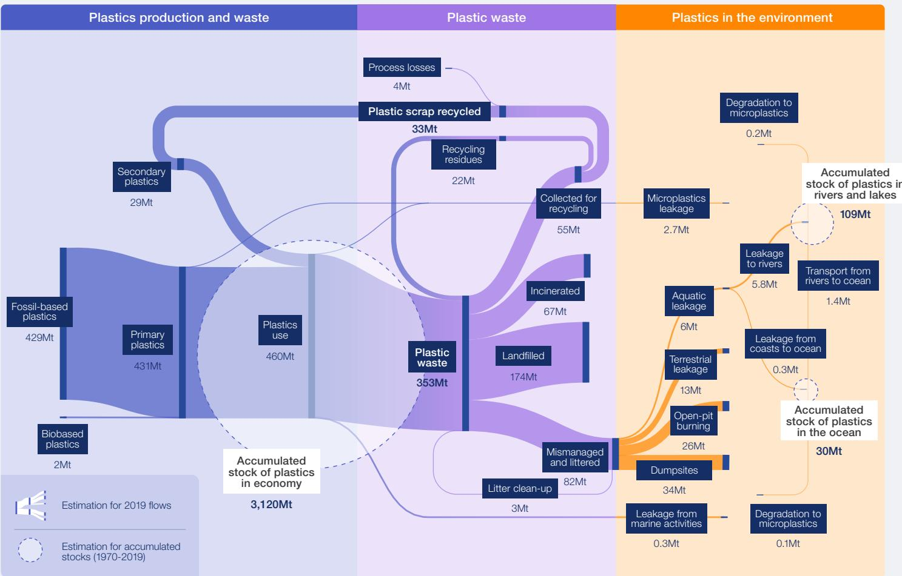  
Source: OECD, Global Plastics Outlook, 2022. https://doi.org/10.1787/c0821f81-en.

## National opportunities

Indonesia is a good example at the national level of the value that can be unlocked by effective waste management. As reported in Chapter 1, the National Research and Innovation Agency (BRIN) estimated annual losses due to marine plastic leakage at \$8-16 billion per year. Compare this to the total price tag of \$18 billion from now through to 2040 required to build a national integrated waste management system covering collection, sorting, recycling, waste-to-energy facilities and sanitary landfills. This system, which would cost around \$1 billion per year by 2040 to operate, could in turn unlock up to \$10 billion annually in circular economy value by 2040. $^{95}$

## √ Recommendation

Governments and companies: conduct more research into the financial impacts of plastic pollution on critical nature-dependent economic sectors and the cost-savings and value-creating opportunities that can come from tackling the issue.

## 3.2 Upstream opportunities for private sector engagement

Under Pew/Systemiq's System Change scenario, upstream and downstream solutions could collectively reduce annual plastic leakage into the world's oceans by \~80% by 2040, with reduced use/production accounting for 30%, substitution 17% and recycling 20% (see Figure 5). $^{96}$

FIGURE 5

Plastic fate in Pew/Systemiq's System Change scenario: a “wedges” analysis

There is a credible path to significantly reduce plastic leakage into the ocean but only if all solutions are implemented concurrently, ambitiously and starting immediately

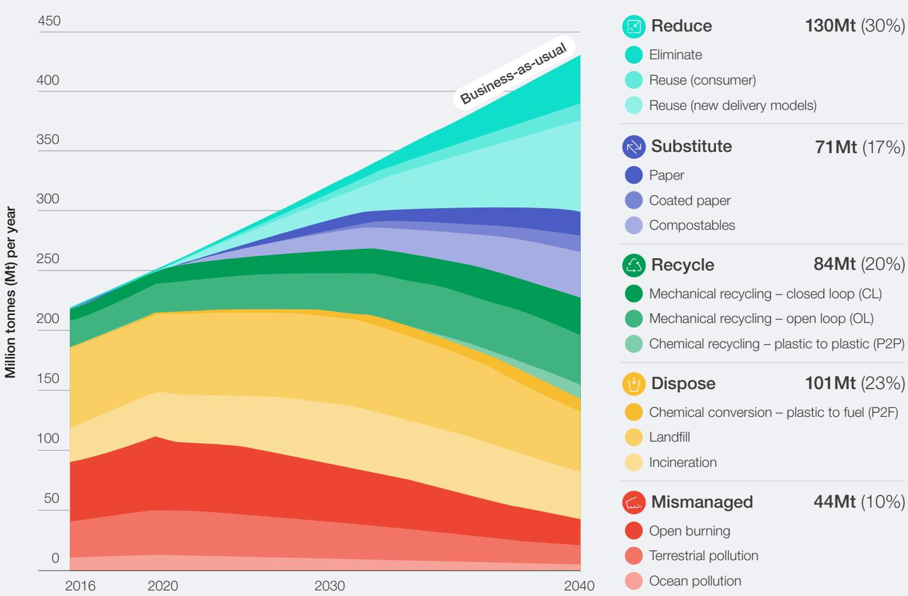  
Note: This “wedges” figure shows the share of treatment options for the plastic that enters the system over time under the System Change Scenario. Any plastic that enters the system has a single fate, or a single “wedge”. The numbers include macroplastic and microplastic.
Source: The Pew Charitable Trusts (CC-BY-NC 4.0). $^{97}$

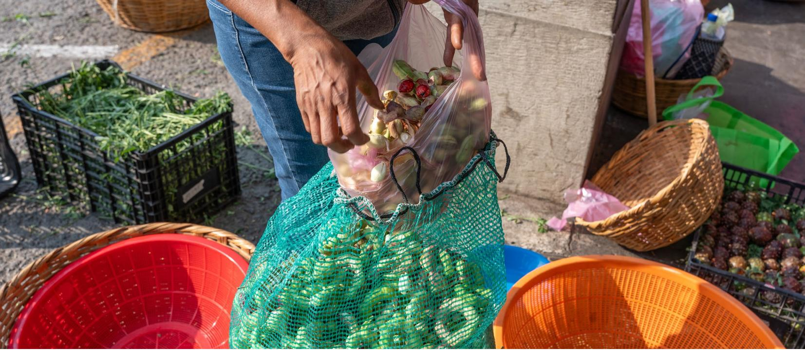

In Viet Nam, per-capita plastic consumption grew from 3.8 kg in 1990 to 81 kg in 2019 – a 21-fold increase driven almost entirely by single-use plastic packaging.

## Redesign

Smart product and packaging design can play an important role in addressing plastic waste, by reducing unnecessary use, expanding reuse models and exploring alternative materials such as paper or compostables where appropriate.

Product design offers a significant upstream opportunity to mitigate the impact of unmanaged plastic waste on biodiversity, since every item designed for substitution, reuse or recyclability reduces the potential volume of plastic entering ecosystems. By contrast, any plastic product designed for single use in locations with poor collection infrastructure is highly likely to become waste.

Redesign also gives communities living on the frontline of plastic pollution the choices they need to change behaviour. In the Indian city of Pune, for example, despite 99% of residents recognising the global threat of plastic, actual behavioural change remains stagnant due to the lack of affordable alternatives to the cheap, single-use plastics used by consumer food and fashion industries, and the inconsistent enforcement of bans. $^{98}$

## BOX 10

## Private sector innovation – reimagining vehicle tyres

Microplastics (<5mm) accounted for 1.3 million tonnes of plastic waste entering the ocean in 2016 – 78% of which comes from tyre wear. This figure is projected to double by 2040, under BAU. Microplastics are also a problem in terrestrial environments, where they affect soil health and nutrient cycling.

Leading companies are experimenting with innovative alternatives to rubber. For example,

Source: World Economic Forum/GPAP, Pew/Systemiq. $^{99}$

Continental Tyres has produced and tested the first tyres with treads made from 100% dandelion-derived rubber polymers.

To accelerate this agenda, WBCSD's Tire Industry Project is addressing the potential human health and environmental impacts associated with tyres. Meanwhile, tyre companies Pirelli and Michelin aim to use 30%-40% of reused, repaired, recycled or renewable materials in their products by 2030.

## √ Recommendations

Plastic packaging companies: work collaboratively with food and beverage companies and recycling companies to develop new designs that can increase reuse and recyclability.

Plastics supply chain companies: strengthen long-term strategies by integrating biodiversity considerations more explicitly into decision-making processes, rather than treating them solely as indirect co-benefits.

## Reduce

In Nigeria, PET bottles, sachet packaging, plastic bags, food wrappers and takeaway containers are the predominate source of plastic waste, reflecting a consumer market in which food and drink are sold in single-use containers because refrigeration and clean water are unreliable. $^{100}$ In Viet Nam, per-capita plastic consumption grew from 3.8 kg in 1990 to 81 kg in 2019 – a 21-fold increase driven almost entirely by single-use plastic packaging. $^{101}$

A shift of \$570 billion in annual private sector spending away from single-use plastics towards bringing reuse systems to scale would support local economies and create 8.6 million new jobs.

These types of plastic are practically impossible to collect and recycle in the waste management contexts that prevail across all nine countries studied by GPAP researchers. Upstream action is therefore critical, because modelling shows that even improved recycling could only contribute around 20% of the reduction in plastic waste needed by 2040, under Pew/Systemiq's System Change scenario (see Figure 3).

Under this scenario, two critical upstream interventions could together nearly halve overall plastic waste generation by 2040, compared to BAU:

\- 30% by reducing demand for plastic, through elimination of avoidable, low-utility plastic and replacement of single-use products by reusable items, either owned by the consumer or provided by the supplier.

\- 17% by substituting plastic packaging with alternatives, such as paper or compostable materials.

These solutions represent important pathways for reducing plastic pollution and its impacts on biodiversity, while also contributing to emissions reductions and potential economic benefits.

reuse which, if scaled up, could unlock significant environmental and economic benefits by improving resource efficiency and reducing reliance on single-use applications. $^{103}$

\- Refill at home: the consumer buys a concentrated refill and adds it to a durable container they already own (e.g. concentrated cleaning products).

\- Refill on the go: The consumer brings their durable container to a store for a refill (e.g. drinking water refill stations in Viet Nam, Indonesia, Philippines).

\- Return from home: Products are delivered to the consumer in durable packaging and the empty containers are collected, cleaned and refilled (e.g. glass milk bottle deliveries in UK, South Korea's "Zero Restaurant" project using returnable stainless steel containers for food deliveries).

\- Return on the go: The consumer returns durable packaging at a designated drop-off point or reverse vending machine (e.g. deposit return schemes for bottles and cans, mandatory in Scotland, Germany, Norway and being introduced in Indonesia and Viet Nam).

## Reuse

Designing products from the start with reuse in mind is preferable to simply substituting plastic with another single-use material; it is also preferable to recycling. Governments currently spend \$670 billion a year on managing plastic waste – but reuse can slash this bill as well as huge volumes of plastic waste. According to Pew/Systemiq's System Change scenario, a shift of \$570 billion in annual private sector spending away from single-use plastics towards bringing reuse systems to scale would support local economies and create 8.6 million new jobs. $^{102}$

Meanwhile, the Ellen MacArthur Foundation has identified four business-to-consumer models of

## √ Recommendation

Companies: embrace the \$570 billion reuse opportunity to replace single-use plastic packaging with reusable alternatives, in turn helping to support local economies and create 8.6 million new jobs.

“

Women often collect plastics and repurpose them as containers for drinks such as kunu and zobo, or as bottles for liquid soap sold locally – it also serves as a source of livelihood for some community members.

Respondent, Lagos State, Nigeria

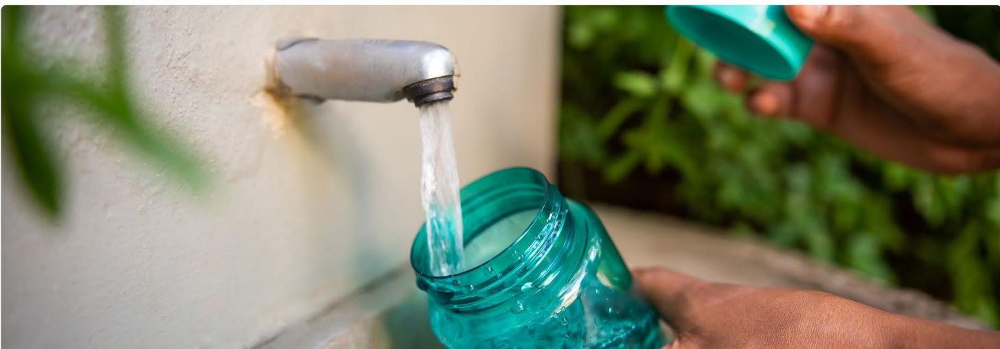

# 3.3 Downstream opportunities for private sector engagement

While optimizing plastic use is an important lever, plastic remains a critical material for many applications – particularly in low- and middle-income countries where it provides a cost-effective and hygienic way to deliver food and drink. With global production capacity expected to grow significantly by 2040, strengthening downstream waste management and recycling systems will be essential to protect biodiversity and all the ecosystem services that depend on it.

## Recycle

At a global level, as seen in OECD's graphic in Figure 4, although 55 Mt of waste was collected for recycling in 2019, 22 Mt ended up as a residue that needed further disposal; so just 33 Mt or 9% of plastic waste was ultimately recycled.

A key reason is that many plastic items are designed in ways that make recycling uneconomical or impossible in many local waste management systems. Better design of products and packaging for recyclability could expand the share of economically recyclable plastic from \~22% today to 54% by 2040. More efficient recycling – driven by better design for recyclability along with more efficient waste collection – could reduce plastic pollution by a further 20%. $^{104}$ High-tech plastic sorting and recycling have been identified in a recent World Economic Forum report as among 50 investible opportunities for a new nature-positive economy (see Box 11).

## BOX 11

## Opportunities in tech-based plastic sorting, recycling and compostables

The World Economic Forum's March 2026 report 50 Investible Opportunities for a New Nature Economy, includes two business opportunities in circular models for plastics with an estimated value of \$68 billion by 2030:

\- Advanced and AI-based plastic sorting techniques: Uses AI, computer vision and advanced sensors to identify and separate complex plastics at high purity and speed; enhanced sorting accuracy raises purity of recyclable plastics, reducing landfill; higher-purity plastics command increased bale values for recyclers.

However, no single measure, such as recycling, will be sufficient to tackle the plastic waste challenge – a systemic solution is required. Strong policy interventions are needed to drive systemic change – such as design standards, targets for both recycling and minimum recycled content, taxes on use of virgin plastic and regulations governing chemical additives. Top of many lists comes extended producer responsibility (EPR) schemes.

“

## We will not recycle our way out of the plastic pollution crisis: we need a systemic transformation to achieve the transition to a circular economy.

Inger Andersen, Executive Director, UN Environment Programme

Sustainable plastic conversion processes for recycling and re-use: Uses selective chemical methods to turn hard-to-recycle plastics into high-quality useable materials; reduces plastic pollution and waste from landfill and incineration; fuels a growing market for recycled content polymers with premium pricing.

The report also highlights production of biodegradable and compostable textiles as an important business opportunity, which can reduce long-term waste and plastic pollution, while responding to a growing market for manufacturers appealing to sustainability-orientated consumers.

## Extended producer responsibility

All nine of the GPAP study countries have some form of mandatory extended producer responsibility (EPR) framework in place or under development, requiring producers to finance the collection and recycling of their packaging.

In Indonesia, GPAP researchers refer to EPR as a mechanism to shift responsibility for waste management upstream to producers, adding that “fast-moving consumer goods (FMCG) companies were highlighted as particularly influential actors because of their control over upstream production, strong lobbying capacity, and ability to influence regulatory outcomes”. By contrast, recycling industries operating downstream, often with limited funding, “were perceived as less supportive of stringent policy measures”.

billion/year

Estimated cost to companies of mandatory plastic waste management by 2040.

EPR implementation quality varies dramatically, however. The Indonesian government's Waste Reduction Roadmap requires producers to redesign products for circularity, phase out single-use plastics and implement waste take-back mechanisms, but enforcement is incomplete. $^{105}$ The Philippines' EPR Act, passed in 2022, is undermined by non-compliance of plastic producers – driven by a perceived lack of economic benefits – along with weak enforcement, high compliance costs and inadequate recycling infrastructure. $^{106}$ Viet Nam's Law on Environmental Protection (LEP, 2020), among the most advanced frameworks in the region, introduced EPR and a phase-out of single-use plastics in tourism and commerce from 2025 and from the entire economy by 2030. $^{107}$ Yet EPR and economic instruments are only partly operational.

Meanwhile, agricultural plastics remain largely unaddressed by EPR frameworks across all nine countries, which focus mainly on consumer packaging – despite agricultural soils being a primary global sink for plastic pollution. As a result, agricultural plastic waste is routinely burned or dumped in fields and watercourses across Indonesia, Maharashtra and other GPAP study countries.

## √ Recommendation

Governments: improve enforcement of EPR laws and include agricultural plastics in EPR legislation.

## Connect EPR compliance targets to ecological outcomes

One critical EPR reform to emerge from GPAP's country studies is to connect EPR compliance targets to ecological outcomes rather than to volumes of waste recovery. A tonne of PET bottles collected in Hanoi, for example, does not deliver the same biodiversity benefit as a tonne of ghost nets removed from a coral reef in Viet Nam's Con Dao marine protected area.

Directing a greater share of EPR compliance towards areas of high biodiversity value at greatest risk of plastic pollution – rather than exclusively towards urban collection systems where recovery is cheapest – would substantially improve the biodiversity return on EPR investment. Mapping solutions described in Chapter 2, such as Peru's Plastic Biodiversity Risk Index, provide ready-made spatial targeting tools for directing EPR investment towards the ecosystems whose biodiversity is under the greatest pressure from plastic waste.

GPAP's Nigeria report calls for producer responsibility organizations (PROs) – paid by plastic producers and retailers to coordinate their plastic waste management and recycling obligations under EPR – to be engaged through regulation and partnerships to ensure that EPR investments target riverine, mangrove, wetland and coastal hotspots.

## √ Recommendation

Governments: connect EPR compliance targets to ecological outcomes rather than to volumes of waste recovery, using mapping that highlights biodiversity at risk from plastic to maximize the biodiversity value of EPR action by companies and PROs.

There is also a risk to corporate inaction on plastic waste. If governments were to require all companies to cover the costs of their plastic waste management, for example under mandatory EPR schemes, the global corporate price tag could reach \$100 billion per year by 2040, according to the UN. $^{108}$

## Voluntary corporate disclosures

A common principle in business is that “you can’t manage what you don’t measure”. Corporate environmental disclosure initiatives – such as CDP, the IFRS Foundation’s International Sustainability Standards Board (ISSB), and the twin taskforces on nature-related and climate-related financial disclosures (TNFD and TCFD) – have transformed how the corporate world measures and discloses its impacts and dependencies on climate and nature. However, fewer than 1% of publicly reporting companies disclose their biodiversity impacts (see Box 11).

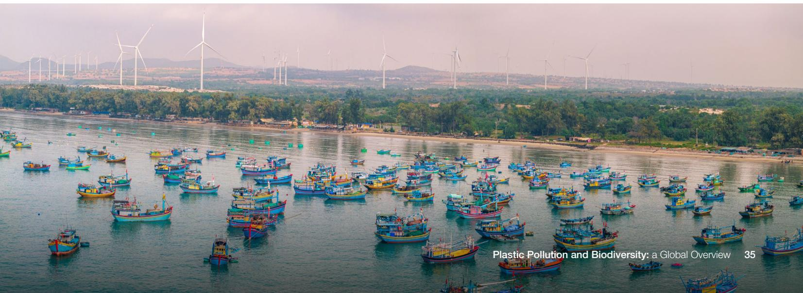

have voluntarily
disclosed their plastic
risks and impacts.

The global plastics industry is no exception: it currently lacks transparency across the value chain, which makes it hard for governments, NGOs or consumers to understand how much plastic is being produced, the chemicals that plastic contains and any negative impacts on environment and health. The transition to a circular economy needs comparable, consistent and detailed data.

CDP calls disclosure a “catalyst for change”. The organization highlights one example: over 16,000 chemicals used in plastic products are potentially harmful to human health – with data on the chemical makeup of say a bottle or toy, it would be possible to redesign it to make it safer.

In 2023, CDP – in partnership with the Pew Charitable Trusts, Ellen MacArthur Foundation (EMF), Minderoo Foundation and WWF – launched its Scaling Plastics Disclosure initiative. By 2025, 4,262 companies had voluntarily disclosed their plastic risks and impacts, providing data from value chain mapping, production and consumption to recyclability, reusability and waste management. $^{109}$

## BOX 12

## Despite trillions at stake, corporate strategies, targets and disclosures are missing in action

GPAP's nine country assessments provide one of the most detailed multi-country analyses to date on how plastic pollution is degrading the ecosystems on which value chains depend. Yet this direct relationship between plastic waste and biodiversity loss is still not consistently reflected in many corporate risk assessments and strategic planning processes.

Recent research published by the World Economic Forum shows that investing in a nature-positive economy could generate \$10.1 trillion of business value annually and create 395 million jobs by 2030.

A wide range of corporate actors can contribute through creating more transparent supply chains demonstrating a lighter impact on nature. $^{110}$

Yet only 12% of companies have set targets to halt or reverse biodiversity loss, compared to 78% with climate targets. $^{111}$ Meanwhile, fewer than 1% of publicly reporting companies disclose their biodiversity impacts. $^{112}$

Recent analysis of 450 global companies found that 88% lack clear strategies for mitigating the impacts of packaging waste and microplastic pollution. $^{113}$

## Standardizing metrics on biodiversity impacts to accelerate investment

The investment gap to finance the transition to a circular economy for plastics has been estimated at between 426 billion and 1.2 trillion by 2040, globally. $^{114}$ Greater transparency and comparability of data related to plastic pollution and biodiversity impacts would help mobilize private finance to play an important role in supporting this transition.

Ongoing international and national discussions on plastic pollution provide an opportunity to advance globally consistent policy frameworks, reporting approaches and metrics. Greater alignment in these areas could help:

\- Companies improve the consistency and comparability of disclosures related to plastic pollution and biodiversity impacts, while supporting risk assessment and reporting processes.

\- Financial institutions better assess corporate exposure, performance and transition-related risks, helping inform capital allocation decisions.

## √ Recommendations

Companies: frame strategies and targets to reduce the impacts of plastic pollution on biodiversity.

Financial institutions: agree on common metrics and methodologies for evaluating corporate performance on biodiversity and integrate plastic-related risks and opportunities into valuation models.

“

Regulations defining clear plastic disclosures are an important catalyst for financial markets to unlock capital and scale investment for the transition.

World Business Council on Sustainable Development and Earth Action.

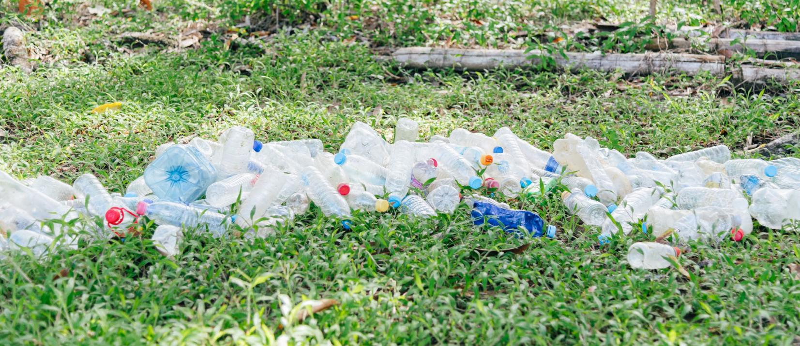

## Corporate-led partnerships to recycle plastic waste and boost reuse

In Costa Rica, it was corporate partnerships three decades ago that established the country's remarkable culture for recycling, which sees business, NGOs and communities cooperating to raise public awareness of responsible waste management (see Box 13). This small country now has more than 3,000 authorized waste management enterprises registered with the Ministry of Health, in addition to an informal sector engaged in waste recovery.

## Corporate sector's pioneering role in Costa Rica's 30 years of recycling

Costa Rica's private sector became involved in recycling in the mid-1990s. Pioneering programmes included those led by food and beverage company FIFCO, which established its post-consumer packaging recycling programme in 1995, and FEMSA Coca-Cola – the world's largest Coca-Cola franchise bottler – whose Misión Planeta programme began in 1997. Such initiatives engage civil society by establishing recovery processes through community collection centres.

## Source: World Economic Forum/GPAP.

In Viet Nam, Unilever's The Plastic Reborn programme aims to build a community of more than 12,000 scrap collectors and a recycling capacity of 80,000 tonnes per year. Recognising the role of the informal sector – which collects over 60% of recyclable plastic waste in Viet Nam – and integrating it into the wider recycling ecosystem is critical to ensuring effective compliance with EPR legislation.

Recycling has proved a commercially viable approach for companies in emerging economies. In July 2020, HSBC Vietnam and Duy Tan Plastics Corporation signed a green credit agreement to finance a \$60 million plastics recycling factory in Long An province. The loan was the first green credit arranged by HSBC for a Vietnamese company. The

Strong corporate partnerships with communities also lie at the heart of business initiatives such as Recyplast. Established in 1993 through a partnership between Dole, Del Monte and Grupo Montecristo, Recyplast manages plastic waste from banana, pineapple and melon production across 150 farms in the Costa Rican Caribbean, utilizing 22 collection centres managed by small groups composed mainly of women. This initiative ensures that agricultural plastics (e.g. films, bags and irrigation materials not covered under EPR legislation) do not reach the coral reefs and turtle nesting sites of the Caribbean coast.

factory has a planned capacity of up to 100,000 tonnes per year and is the first in Viet Nam to apply a “bottles to bottles” process, recycling used plastic bottles into plastic raw materials for new bottle production. In 2022, the factory recycled over 1.3 billion plastic bottles collected domestically, applying the “Three-No” criteria of zero waste, zero emissions and zero waste water. $^{115}$

## √ Recommendation

Companies: integrate the informal sector into the wider recycling ecosystem to ensure effective compliance with EPR legislation, with a focus on areas of high biodiversity value.

## Multi-stakeholder partnerships

Global multi-stakeholder partnerships (MSPs) offer companies, organizations and countries the opportunity to coordinate with other regional peers as well as with international supply chain actors. The challenge is to ensure that these MSPs include a specific focus on the impacts of plastic pollution on biodiversity.

International corporates and local companies are among the 2,000+ stakeholders engaged through the World Economic Forum's Global Plastic Action Partnership (GPAP) – the world's largest multi-stakeholder initiative dedicated to ending plastic pollution and advancing a circular economy. GPAP's recently published country studies on the impacts of plastic pollution on biodiversity form the foundation of the research found in this synthesis report (see Box 1).

Another major partnership is the Global Commitment 2030, launched in 2018 by the Ellen MacArthur Foundation and UNEP. Businesses representing 20% of the plastic packaging market have set 2030 targets and publicly committed to report on their progress. To date the initiative's 1,200+ signatories have avoided using 14 Mt of virgin plastic and avoided emitting 7.8 Mt of CO $_{2}$ per year. $^{116}$

## √ Recommendation

Governments and private sector: find ways to mainstream biodiversity impacts into multi-stakeholder partnerships focused on creating a circular economy for the global plastics industry.

## Global initiatives: UNEP-FI, GBF and TNFD

Ahead of negotiations in April 2024 on a new global plastics treaty (see Chapter 4), 180 financial institutions signed the UNEP-FI-sponsored Finance Statement on Plastic Pollution which referenced the goals of the Global Biodiversity Framework (GBF) and called on governments to negotiate an ambitious treaty to end plastic pollution. Signatories represented \$17.2 trillion in combined assets and featured commitments from many OECD countries as well as from India, Indonesia, Singapore, Japan and South Korea. $^{117}$

Target 15 of the GBF aims to reduce the private sector's negative impacts on biodiversity and increase its positive impacts. $^{118}$ It calls on all companies, especially “large and transnational companies and financial institutions” to “regularly monitor, assess and transparently disclose their risks, dependencies and impacts.”

Over 500 companies and financial institutions with \$17.7 trillion of assets under management have now adopted a TNFD-aligned reporting framework, created specifically to help companies identify, assess and manage nature-related risks before they escalate into operational crises. $^{119}$ This reflects a growing recognition that ecosystem services underpin long-term portfolio value. The GBF recognises disclosure via TNFD as a key component indicator.

## √ Recommendation

Corporates and investors: commit to proactively disclose plastic-related impacts on biodiversity in line with CDP and TNFD guidelines.

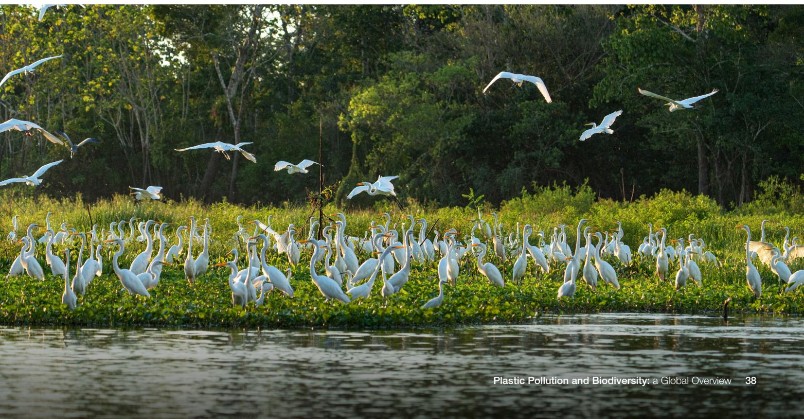

# Opportunities for public sector engagement

Protecting biodiversity by turning the tide on plastic pollution is an all-of-society effort that brings together communities, civil society organizations, municipalities and national governments.

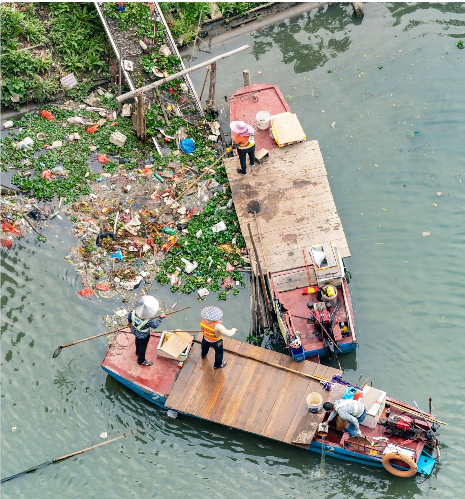

# 4.1 Communities and civil society organizations

Communities – whether urban or rural, coastal or inland – are on the frontlines of plastic pollution and the damage it is wreaking on ecosystems. Often, their livelihoods fall victim to forces beyond their control. In central Viet Nam, a study of fisheries found that marine litter constitutes around 20% of trawl catch, increasing production risks and reducing incomes. Fishers told GPAP researchers that they identify tourism and urban waste as the major sources of plastic waste in fishing grounds, implying that they believe they have limited control over the underlying causes.

## Informal waste pickers carry a huge burden for scant recognition or reward

Communities are also engaged in solutions, but often for minimal returns. Informal waste pickers collect and sort nearly two-thirds of all recycled plastic, acting as the hidden backbone of global downstream plastic management.

In Viet Nam, informal workers – including waste pickers, itinerant buyers and small-scale recyclers – recover one-third of all recyclable plastic. By reducing government collection and treatment costs, these waste workers, mostly women, are central to the country’s plastics economy. But they often work unsafely with hazardous materials and mixed waste in areas of open burning, without social protection, formal recognition or contracts.

The Viet Nam report authors maintain: “A just transition in the plastic value chain is essential for social equity and environmental cleanliness.” This view applies across all countries where such informal workers operate, but perhaps for none more so than the waste workers of Ambujwadi, in India’s Maharashtra state (see Box 14).

11 million waste pickers were responsible for 60% of global plastic recycling in 2016. Pew/Systemiq.

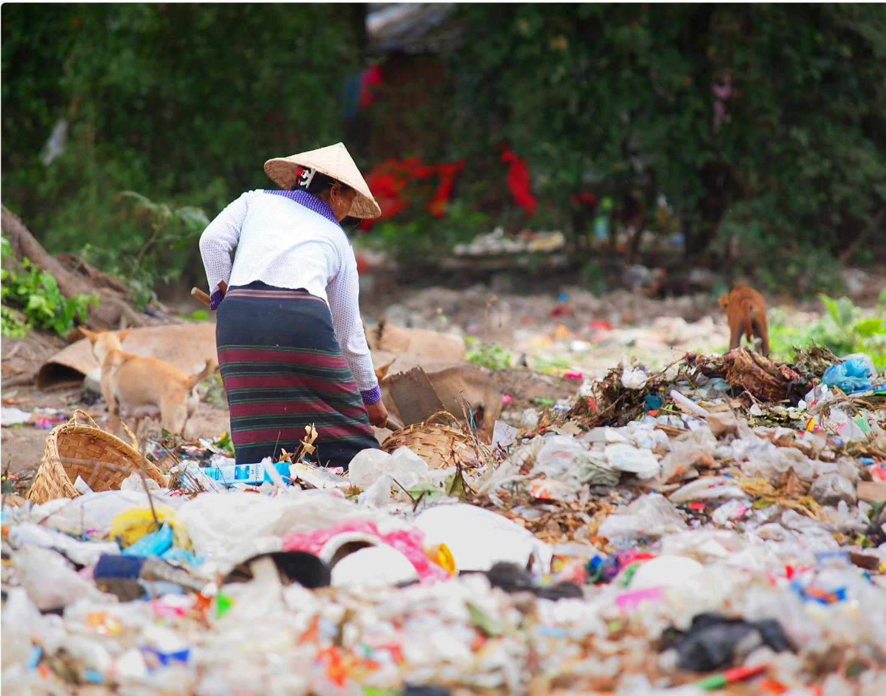

Ambujwadi is a neighbourhood of 35 acres and home to 58,000 people on the edge of Mumbai, India's second largest city. Located on land that was once a dense mangrove and mudflat ecosystem bordering the creek, today Ambujwadi is dominated by small scrapyards, informal waste-sorting units and narrow residential clusters. Plastic forms the dominant character of this landscape. The nullah (drainage ditch) that channels inflow from upstream urban settlements carries a visible layer of floating debris, along with untreated sewage. The ground is saturated with plastic items in various stages of disintegration. The air hangs heavy with the smell of decomposing waste and plastic dust. Biodiversity is a pale shadow of what it once was, dominated by rodents, crows and flies.

Health troubles for the community follow closely. The waste pickers who sort plastic in Ambujwadi – 80% of them women – describe constant cuts from glass, persistent skin infections, fevers and headaches that never quite go away, and cases of tuberculosis and cancer that strike fear into the community. The smell, the flies and the suffocating smoke from burning plastic add to the dangers they face.

These informal workers divert plastic waste from the nullahs that flow directly into the city's mangrove-lined coastal creeks, but receive no formal recognition or payment for this biodiversity conservation service. Their livelihoods are bound tightly to the same waste that endangers their health. The connection is not a choice but a circumstance shaped by limited opportunities and generations of families caught in the same line of work.

For most, escape remains out of reach. Some manage to earn a small income by selling plastic, although pollution and health risks overshadow these gains. Yet the fear of losing even this fragile income is constant. As one picker put it simply: "We earn our livelihood from plastics, so if the government bans them, how will we earn?"

Ambujwadi illustrates the most acute expression of the plastic-biodiversity-community nexus, where plastic simultaneously erodes ecological functioning, threatens public health and sustains a fragile informal economy. The near-total loss of local biodiversity, coupled with chronic health risks faced by waste pickers, demonstrates how unmanaged plastic pollution can lock communities into cycles of environmental exposure and economic vulnerability.

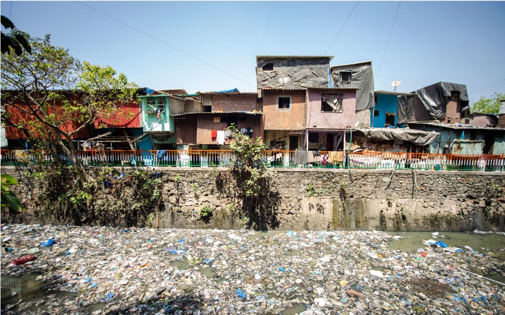

Source: World Economic Forum/GPAP.

GPAP's report on Colombia recognises waste picker organizations as essential contributors to the effectiveness of the EPR system, both in terms of environmental outcomes and social and environmental inclusion. It calls for measures to strengthen the role of these grassroots recyclers as strategic actors in the EPR system through formal inclusion, traceability and dignified working conditions.

## Recommendation

Governments and municipalities: engage more closely with informal waste pickers – especially in areas of high-risk to biodiversity – by offering formal recognition, stable wages and fair contracts – including through EPR legislation.

\- Incentive-based models to promote plastic waste recovery among coastal communities change behaviours more effectively than regulation or penalty-based approaches.

## Indigenous Peoples and local communities are guardians of biodiversity

The IPBES Nexus Report found that “governance regimes led by IPLC (Indigenous Peoples and local communities) have effectively prevented deforestation and forest degradation, often more successfully than other policy instrument types (e.g. protected areas)”. $^{120}$

Communities and Indigenous People are consistently identified as frontline responders, often acting long before formal institutions arrive and in places where government services cannot reach. For example: $^{121}$

\- Indonesia: In the Raja Ampat coastal biosphere, Sasi and Egek traditions restrict fishing of coastal waters to protect marine life and allow ecosystems time to regenerate, indirectly minimizing marine plastic pollution.

\- Nigeria: In the sacred groves of Osun-Oshogbo, whose cultural and spiritual value is at risk from plastic pollution, traditional belief systems, taboos and community custodianship contribute to ecosystem protection.

\- Colombia: In the Lagos de Yahuarcaca region, Indigenous and community-led governance enhances waste management, stewardship and monitoring activities around sacred

lakes, keeping plastics out of carbon-rich sediments and supporting water provision and subsistence fishing.

Women lead the majority of community-level plastic collection, sorting and recovery – including Costa Rica's RED-CONCERVA waste recovery network, waste banks in Indonesia, cooperatives in Nigeria and informal waste pickers in Mumbai. Despite their frontline role, however, women are systematically excluded from formal decision-making, EPR financing and livelihood protection in countries studied by GPAP researchers.

## Incentives work better than penalties

Meanwhile, research in the Philippines concluded that innovative incentive-based models to promote plastic waste recovery among coastal communities change behaviours more effectively than regulation or penalty-based approaches (see Box 15).

## √ Recommendation

Governments and municipalities: formally recognise the critical role of Indigenous Peoples and local communities – especially women – in biodiversity conservation and plastic waste recovery, increase their participation in decision-making and channel resources to support their environmental stewardship.

## BOX 15

## Basurahero Trashbank – cash-for-plastic scheme, Olango Island, Philippines

The Basurahero Trashbank programme on Olango Island, near the Philippines' city of Cebu, incentivizes fishing-dependent coastal residents to deposit sorted plastic bottles and waste for cash rewards, promoting proper disposal among fishing-dependent coastal communities. PET bottles are labelled with household numbers for traceability.

The scheme transforms waste disposal from a cost into a community benefit for low-income households whose livelihoods depend on the Olango Island Wildlife Sanctuary's pollution-free ecosystems. This scheme exemplifies how cash-based positive reinforcement can effectively change waste management behaviour in coastal communities, while complementing national policies for resilient coastal governance.

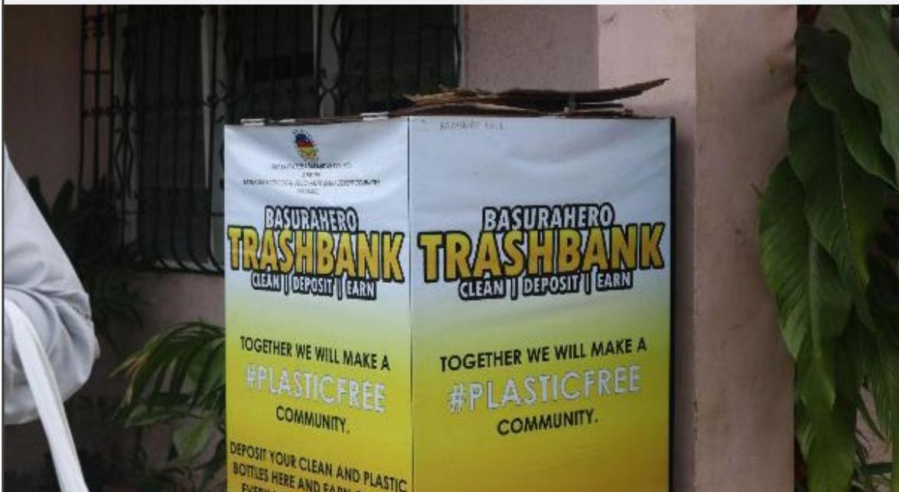  
Source: World Economic Forum/GPAP.

## Awareness-building needed to plug knowledge gaps

In interviews for the country studies by GPAP researchers, local communities are well aware of the threat that plastic pollution poses to the specific habitats or organisms, such as fish, that their livelihoods directly rely on. However, they are less

aware of the causal chain that links the use and abuse of plastic products with observed negative impacts on biodiversity. For example, fishers in the Philippines did not recognise that fishing nets and lines are plastic-based – a conceptual gap that prevents them from identifying plastic waste as a key driver in degrading the ecosystems on which they depend for a living (see Box 16).

## Unseen plastic – when nets don't count as plastic

During interviews with GPAP researchers in the Philippines, fishers often did not recognize their fishing gear as plastic. They claimed plastic is only used in selling their catch, when peddlers and traders purchase their fish. This suggests their

understanding of plastics may be limited to single-use materials, such as bags and bottles. Nets – which are made of synthetic fibres including nylon, polypropylene and polyethylene – were not considered as plastics by interviewees.

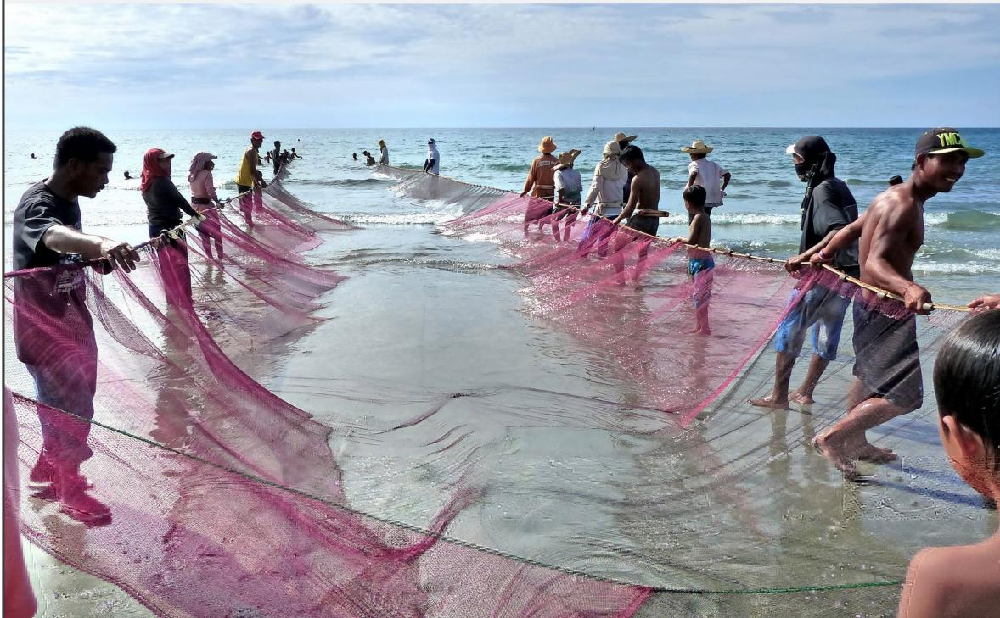

Image: Greising, C. (n.d.). Fishing in the Philippines. Dive Scotty.

In a survey of 100 community members on the Caribbean island of San Andrés, Colombia, half the residents reported coral reefs and seagrass beds tangled with plastic, while 44% had directly witnessed animals tangled in plastic – yet 74% were unaware of where their waste ends up. Results were similar in Puerto Carreño, a town on the confluence of three rivers in the east of Colombia, where over two-thirds of respondents reported that wildlife is threatened by plastic pollution, but three-quarters do not separate their waste and a majority do not know where it goes.

It is therefore critical to build understanding at a local level around what constitutes plastic waste, the pathways by which it finds its way into the

environment, and how it degrades wildlife, habitats and ecosystems. This will enable communities to make the causal link that connects waste management with impacts on biodiversity – a link that is critical to driving changes in behaviour.

## √ Recommendation

Governments, companies and NGOs: create information, education and communication (IEC) campaigns in local languages, to improve awareness among all communities – coastal, inland, rural and urban – of different types of plastic, their impacts on biodiversity and the need to modify public behaviour, especially in disposing of waste properly.

## 4.2 | Cities and urban areas

Biodiversity is often associated with rural or wilderness areas. However, the nine GPAP country studies dismantle this assumption. Cities are not biodiversity deserts – they can contain significant ecological value of their own. Urban economies and populations also depend directly and indirectly on multiple ecosystem services. However, the plastic pollution that cities generate degrades the biodiversity on which they depend, as well as threatening the health of their residents.

## Jakarta, Indonesia

Plastic pollution poses multiple health risks to city residents. In Jakarta, a 2025 UI/Greenpeace study detected microplastics in up to 95% of Jakarta residents, clear evidence that biodiversity degraded by plastic pollution has become not only an ecological concern but a direct public health challenge for urban populations.

GPAP's Biodiversity Small Funds Initiative, backed by the Government of Canada, offers funding opportunities to empower local non-profit organizations and community initiatives tackling the dual challenges of plastic pollution and biodiversity loss. One of the winners is a non-profit reducing urban plastic pollution in Jakarta (see Box 17).

## BOX 17

## Enviu Indonesia – an innovative winner of GPAP's Biodiversity Small Funds initiative

Enviu Indonesia is a small non-profit organization focused on scaling-up reusable food and beverage systems, particularly in Jakarta, which contributes to the reduction of marine litter and the protection of marine biodiversity from plastic pollution.

Indonesia generates 7.8 million tonnes of plastic waste annually. Nearly half of this is disposed of through open burning, less than $20\%$ is recycled and the rest is dumped in landfills, water bodies and the sea. Around 800,000 tonnes of plastic waste enter Indonesia's marine ecosystems each

Source: World Economic Forum/GPAP, Enviu. $^{122}$

## Lapu-Lapu City, Philippines

Single-use plastic bags are a dominant source of plastic pollution in Philippine coastal communities. Unmanaged plastic waste in Lapu-Lapu City, Cebu province, rapidly finds its way into the waters of Olango Island Wildlife Sanctuary, a designated Ramsar wetland site, and the Mactan, Kalawisan and Cansaga Bays Key Biodiversity Area – highly valued for its mangrove swamps, intertidal mudflats and coral reefs, as well as for its role in providing nurseries and feeding grounds for the region's fisheries economy.

Lapu-Lapu City's “3-day no sando bag policy” prohibits use of single-use plastic bags on designated days, enforced at the barangay level. The ordinance demonstrates how municipal regulatory action can reduce plastic generation at source and reduce the volume of lightweight plastics entering coastal ecosystems – provided enforcement and awareness are sustained. This measure is part of

year, accounting for \~10% of all global marine plastic waste.

Enviu tackles the growing problem of unrecyclable, single-use plastic (SUP) packaging by developing reusable containers in compact formats. Since 2019, the organization has collaborated with over 6,000 direct customers, 40+ hotels, restaurants and cafés, and 10 FMCG companies to create more than 650 community-base reuse hubs that have prevented \~25 million SUPs from leaking into the environment.

a broader suite of Lapu-Lapu plastic reduction measures, including Basurahero Trashbank (see Chapter 4.1) and the city's innovative motorbike and sidecar waste collection system (see Chapter 4.3).

## Urban initiatives in Peru and Viet Nam

Other examples of innovative urban action include an AI-enabled reverse vending machine system for PET bottle recovery in urban public spaces in Lima, Peru, and the use of AI monitoring tools to track plastic waste flows through the drainage systems of Da Nang city, Viet Nam. Both cities are close to sensitive coastal ecosystems.

Meanwhile, in Da Nang and neighbouring Hue City, WWF's Plastic Smart Cities project aims to intercept plastic waste before it pollutes nearby rivers, wetlands and coastal areas. $^{123}$ The initiative's smart waste management systems and public awareness campaigns provide a model for other cities to tackle plastic's impact on biodiversity (see Figure 6).

F&B: FOOD AND BEVERAGE INDUSTRY

PUBLICATION OF TEACHING AND TRAINING MATERIALS:

TRASH BINS FOR 295 DROP-OFFS OF SEGREGATED WASTE

12 HOTELS DEVELOPED AND IMPLEMENTED THEIR PLASTIC REDUCTION ACTION PLAN

APPLY SOPS TO PRACTICE PLASTIC REDUCTION

01 PLASTIC REDUCTION TOURISM DESTINATION THUY BIEU WITH 16 PIONEERING BUSINESSES

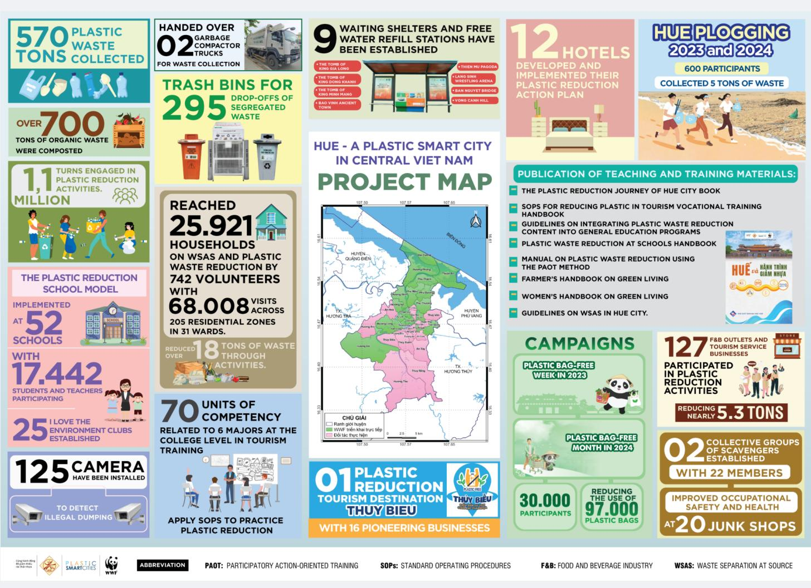

HUE PLOGGING
2023 and 2024
600 PARTICIPANTS
COLLECTED 5 TONS OF WASTE

GUIDELINES ON WSAS IN HUE CITY.

IMPROVED OCCUPATIONAL SAFETY AND HEALTH

AT20 JUNK SHOPS

WSAS: WASTE SEPARATION AT SOURCE

## Indonesia's joined-up governance breaks policy silos and accelerates cooperative action

Indonesia's government has passed a suite of policies in which plastic waste and biodiversity are tackled jointly. The country's National Action Plan for Handling Marine Debris (RANPSL, 2018) and National Plastic Action Partnership (NPAP, 2020) proposed reducing marine plastic waste by $70\%$ by 2025, en route to a circular economy for plastics by 2040.

Beyond this near-term target, the country's 2025-2029 National Medium-Term Development Plan (RPJMN) sets the target of achieving $100\%$ waste management coverage by 2029. By 2024, Indonesia had achieved a $42\%$ reduction in marine plastic waste.

## Source: World Economic Forum/GPAP.

The report on Maharashtra provides the most operationally precise model in the nine studies for how government can embed plastic-biodiversity integration across existing planning instruments without new legislation. The report's recommendations specify embedding plastic-related indicators within biodiversity action plans, wetland management frameworks, forest working plans and river basin strategies; aligning EPR compliance with ecological outcome metrics (not just material recovery volumes); and linking plastic mitigation explicitly with climate adaptation and disaster risk reduction plans, while aligning with GBF Targets.

Unless plastic governance and biodiversity law are formally cross-referenced – for example in

Indonesia's more recent Biodiversity Strategy and Action Plan (IBSAP) 2025-2045 builds on the earlier policies and is the only government plan among the nine study countries that addresses prevention, mitigation and remediation of plastic pollution for biodiversity outcomes simultaneously.

GPAP researchers found that research on the impacts of plastic pollution, particularly on biodiversity, remains limited and highlighted that IBSAP seeks to fill this gap by mandating the Ministry of Environment to conduct studies on marine debris ecosystem impacts and develop geospatial risk maps integrating plastic pollution with species richness data to support more evidence-based policy formulation.

international frameworks such as the GBF and the global plastics treaty – these silos will remain. As a start, updating NBSAPs to explicitly designate plastic pollution as a driver of biodiversity loss, with quantitative indicators, is a powerful lever available to all governments, which can unlock cooperative action on data gathering, strategic planning and coordinated responses to the issue.

## √ Recommendation

Governments: integrate policies to tackle plastic pollution into legislation governing nature, environment and biodiversity – especially NBSAPs.

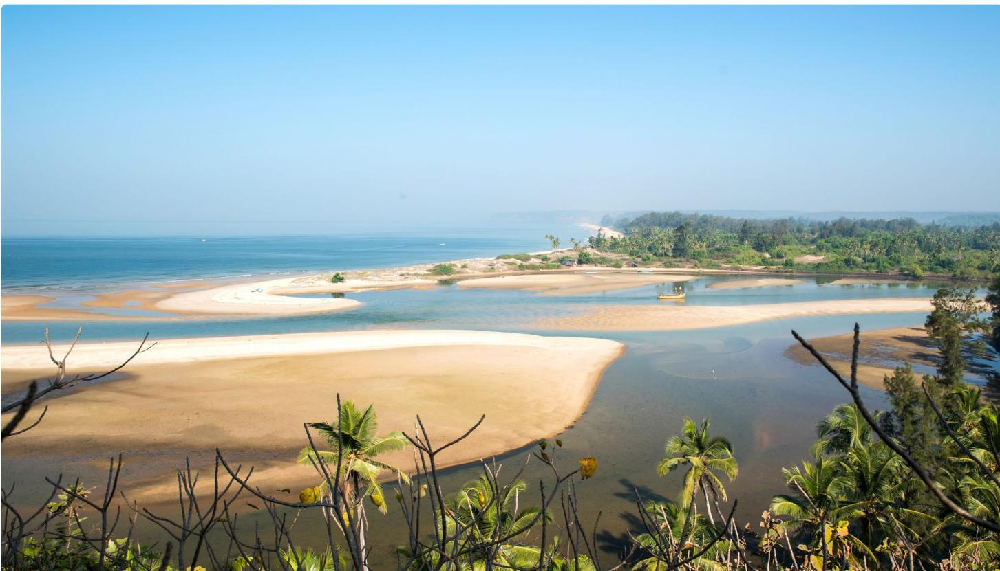

## 2 Training and resources to implement and enforce existing laws are critical

Each of the country studies commissioned by GPAP documents a gap between regulations on paper and implementation in practice. Costa Rica, for example, has a robust regulatory framework consistent with international standards, yet more than 90% of municipalities do not currently achieve adequate recycling levels. Nigeria's national plastic waste management policy has faced implementation challenges at state level. In the Philippines,

implementation in remote areas is constrained by limited training and resources to support execution (see Box 19). A key conclusion across all nine studies is the importance of investing in the training, resources and institutional capacity needed to effectively implement and enforce existing laws.

## Recommendation

Governments: ensure policies are backed up by the skills training and resources needed to ensure implementation, accountability and enforcement at local levels.

## Recommendations from the Philippines to close the gap between policy and action

The Philippine government has adopted a number of policies that tie plastic pollution to biodiversity conservation; for example, the authority to formulate and implement solid waste management (SWM) plans tailored to specific local environmental concerns has been devolved to local government units (LGUs). However, implementation and enforcement remain challenging in some areas due to knowledge gaps, limited technical capacity and resource constraints at a local level.

In the Palawan archipelago, for example, researchers heard that policies often fail because they are expressed in technical language without adequate translation into local concepts, preventing communities from meaningfully engaging with them. As a result, policies are mostly seen as symbolic rather than operational as they instruct actors without providing the

necessary resources or assistance for execution, thereby weakening accountability.

To tackle these challenges, the Philippine report authors propose that the National Ecology Centre should establish a mandatory, accredited technical training and certification programme for LGU staff and Department of Environment and Natural Resources (DENR) personnel. The programme should focus on environmental data management, a standardized methodology for waste analysis and use of KPIs to measure and assess policy outcomes.

In addition, policies should be amended to institutionalize dedicated law enforcement and monitoring units within every LGU, supported by technical teams from DENR that conduct regular capacity-building and training sessions.

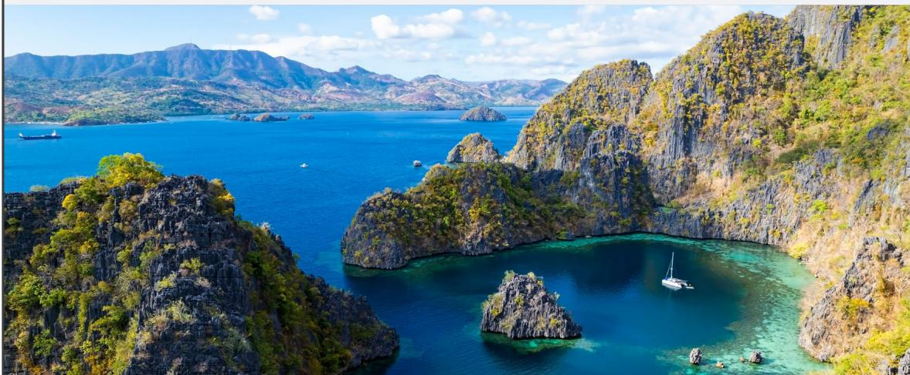

Source: World Economic Forum/GPAP.

In Indonesia, an average of just 0.6% of subnational budgets is allocated to waste management.

## 3 Municipal capacity is the operational entry point but also the primary bottleneck – focused action is required

Across the nine country studies, the local and municipal government level emerged as simultaneously the most critical and the most under-resourced tier of governance. As the Costa Rica authors write: “Municipal management consistently emerges as both the main strategic point of entry and the primary system bottleneck.” In Indonesia, an average of just 0.6% of subnational budgets is allocated to waste management.

In India's Maharashtra state, farmers have reported how plastic waste accumulates in fields and irrigation channels, causing waterlogging

and contaminated soils, especially during the monsoon. This in turn reduces crop yields and economic returns for farmers. However, farmers also highlighted challenges related to waste collection services and infrastructure in these areas. So, in the absence of formal waste management systems, they rely on burning or manually removing plastic from fields – actions that fail to address the root causes of pollution and may contribute to secondary environmental stress.

Even where community awareness of plastic-related impacts exists, without structural interventions such as reliable waste management and support for sustainable agricultural practices, plastic pollution will remain embedded in local farming systems, amplifying long-term soil degradation, ecological vulnerability and economic risk.

Given the limited resources available at a municipal level, one of the key conclusions of the Costa Rica report is that territorial and operational prioritization are the key to turning intent into impact. Approaches with excessively broad scopes, in terms of territory, number of actors or quantity of objectives, tend to face governance and implementation constraints. The most effective interventions are those that define specific geographic areas, prioritize a limited number of strategic actors and define two or three clearly established environmental objectives with measurable targets and verifiable metrics.

## 4 Responses must be adapted to local geography, not standardized

The most effective municipal interventions match responses to the specific pathways which plastic waste takes from source to ecosystem in each context. The country studies are full of creative solutions that local governments have deployed to meet the specific needs of their localities, for example:

\- Viet Nam: In 2025, around 186 tonnes of plastic waste entered Viet Nam's aquatic ecosystems every day. Kien Giang Province has deployed "trash traps" at river mouths to intercept some of this plastic waste before it reaches Phu Quoc's seagrass beds, which provide highly important turtle and dugong habitats.

Municipalities: focus resources for plastic waste management on tightly defined areas and objectives, with a limited set of actors.

## √ Recommendation

\- Philippines: In Lapu-Lapu City, large trucks used for hauling waste often struggle to access and collect garbage from households located along narrow streets. In response, the municipality distributed motorbikes with sidecars to every barangay (smallest administrative division) to enable residents to dispose of their waste properly. The solution has lightened the burden of waste on households and reduced plastic leakage downstream to the Olango Island Wildlife Sanctuary – a critical Ramsar site of high biodiversity.

## √ Recommendation

Governments: provide local government units with the freedom and resources to respond to plastic waste challenges in locally relevant ways.

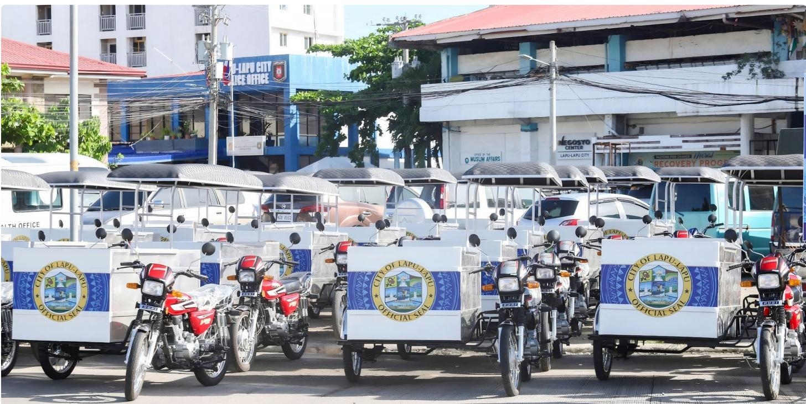  
Image: Lapu-Lapu City Information Office. (2025). Mayor Cindi King-Chan spearheaded the turnover of 28 motorcycles with sidecars for garbage collection to various barangays.

## 5 Transboundary plastic flows require transboundary governance

The country studies highlight how the flow of plastic waste can cross borders – a problem that demands regional, transboundary solutions. For example: Bataraza, a coastal town on the southern tip of Palawan in the Philippines, suffers from an abundance of foreign-labelled plastics, swept in from Malaysian Borneo by monsoon winds from the south. The Mekong River carries waste from upstream countries down through Viet Nam to the sea. The Galápagos receives plastic debris borne on ocean currents from international shipping and neighbouring countries. No single municipal or national government can solve this challenge alone.

Some recommendations for regional cooperation from both Latin America and Asia include the following:

\- Peru, Ecuador and Colombia: These three countries share Andean, Amazonian and

marine-coastal ecosystems through which plastic flows across national boundaries. The Peru report authors recommend a formal mechanism for annual knowledge exchange between the three countries' public and private sectors, academia, civil society and communities, to help promote regional cooperation, harmonize monitoring criteria and strengthen joint responses to plastic pollution that affects shared ecosystems.

\- Viet Nam-ASEAN: Given the transboundary nature of waterborne plastic pollution, the Viet Nam report authors recommend the government should align its national responses more closely with the ASEAN Regional Action Plan on Marine Plastic Waste (2021-2025). A key priority is regional harmonization of monitoring methods, standards and data, with Viet Nam's National Plastic Action Partnership (NPAP) serving as a national data node linked to the ASEAN Regional Knowledge Platform. Achieving this also requires coordination with the Mekong River Commission to monitor floating transboundary waste.

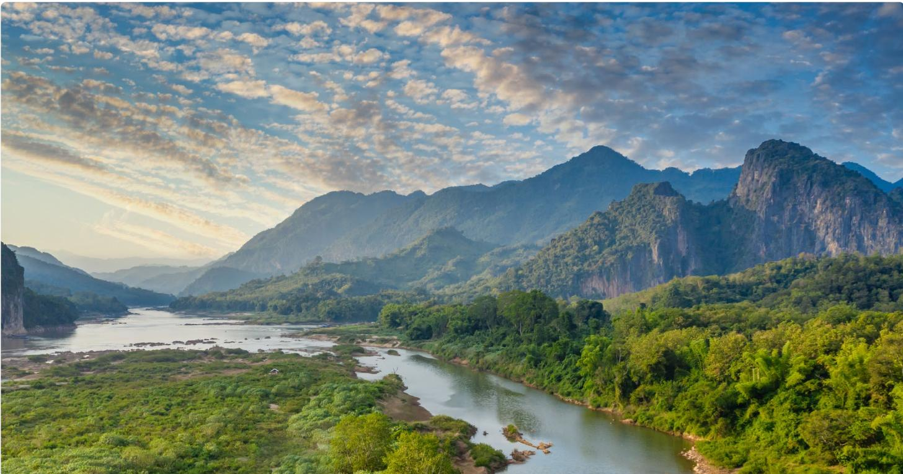

## Negotiations towards a global plastics treaty

Negotiations are underway to develop a global legally binding instrument on plastic pollution. Mandated by the UN Environment Assembly in 2022, the process brings together UN member states and stakeholders to agree on a treaty. While the initial aim was to conclude negotiations by the end of 2024, discussions are ongoing following recent negotiation rounds, including in Busan, Korea (2024) and Geneva, Switzerland

(2025). The next round of negotiations is expected to take place late 2026 or early 2027.

Disagreements persist over the scope and ambition of the treaty, including whether it should limit plastic production or focus mainly on waste management, whether it should take a full lifecycle approach covering chemicals and product design or concentrate mainly on recycling, and how legally binding its provisions should be. $^{125}$ It also remains uncertain whether explicit references to biodiversity conservation will be included in the final agreement. $^{126}$

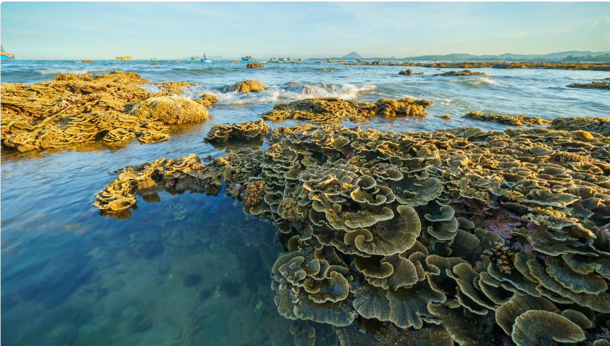

As international discussions on plastic pollution continue, the nine GPAP country studies contribute further evidence on the links between the plastics value chain, biodiversity and ecosystem impacts, helping inform future policy and collaboration efforts. The GPAP studies found that some of the most significant leakage pathways identified include plastic types often difficult to collect or recycle through existing waste management systems. Examples include:

\- Single-use sachets: a significant source of leakage in countries such as Nigeria, Indonesia and the Philippines, particularly in coastal and freshwater environments.

\- Agricultural plastics, including mulching films, banana bags and pesticide packaging, documented in Costa Rica, Colombia and Maharashtra as important leakage pathways into terrestrial and riparian ecosystems.

These findings illustrate the importance of considering a broad range of plastic applications, materials and local contexts when designing and implementing policies and measures related to plastic pollution.

Several organizations, including IUCN, have highlighted the importance of considering biodiversity impacts within ongoing international discussions on plastic pollution. $^{127}$ Areas highlighted in these discussions include monitoring and evaluation frameworks, biodiversity-related indicators and approaches to waste management and pollution reduction.

“

Regulations defining clear plastic disclosures are an important catalyst for financial markets to unlock capital and scale investment for the transition.

World Business Council on Sustainable Development and Earth Action.

# The case for joint action on biodiversity loss and plastic pollution

Addressing plastic pollution and biodiversity loss together strengthens the case for action and broadens shared responsibility.

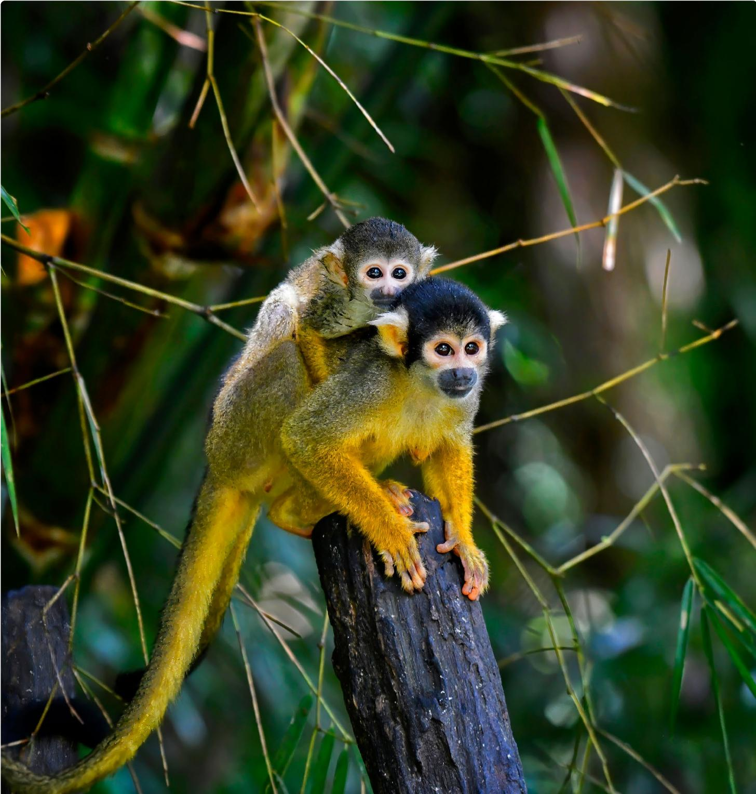

This chapter outlines why a more integrated approach to both these challenges can strengthen action across sectors and stakeholders. Viewing plastic pollution through a biodiversity lens highlights the broader ecological, economic and societal impacts of unmanaged plastic waste,

beyond waste management and circularity considerations alone. Connecting biodiversity and plastic pollution can also help make nature loss more tangible and relevant to a wider range of stakeholders, including businesses, cities, communities and consumers.

## 5.1 Five reasons to tackle plastic waste and biodiversity loss together

## 1 Sharpens the focus on biodiversity's vulnerability – as well as its value – to societies and economies

As the world increasingly urbanizes, many global societies are more familiar with the value of plastic in their daily lives than with the value of biodiversity. Tracing the journey of plastic waste – from the

moment it is thrown away, downstream through drains, rivers and ravines, to the impacts it has on the ecosystems where it comes to rest – makes these often unseen connections visible. By linking plastic pollution to biodiversity loss, this analysis provides pathways of understanding for a wider range of people, especially urban populations living far from nature, to appreciate both the vulnerability of biodiverse ecosystems and the vital services they provide to societies and economies.

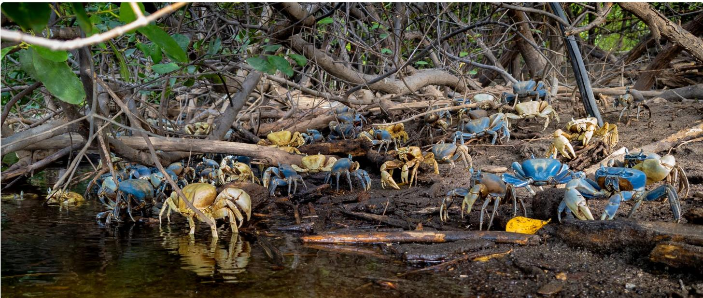

## 2 Engages new sets of stakeholders to cooperate in powerful, interconnected ways

Plastic is an essential part of daily life for almost every individual, company or organization. Joint action on plastic pollution and biodiversity loss can engage a diverse mix of stakeholders around shared challenges and solutions. The degradation of ecosystems is no longer a distant problem, to be solved by governments or international organizations: it is within the hands of every individual and every company in every sector of the economy to play a role.

This joint approach to plastic pollution and biodiversity is already inspiring the custodians of biodiversity – such as fishers, farmers, Indigenous Peoples and local communities – to take action on plastic waste; similarly, it is encouraging cities and companies of all sizes in the global plastic supply chain to engage more actively in conserving biodiversity (see Box 20). By framing plastic pollution as a threat to biodiversity and, importantly, to nature-based livelihoods, new stakeholders can be engaged in ways that may be less likely through a purely waste management approach.

This report has shown how a geographic approach that maps the nexus between plastic pollution and biodiversity offers a way to unite disparate sets of stakeholders along the pathways of impact, such as river basins (see Chapter 2).

## Findings from the field highlight emergence of new stakeholders tackling plastic pollution

Colombia/Coastal | Women shell-fishers: the Guardianas del Manglar (Mangrove Guardians) in Buenaventura are a group of women that traditionally gather shellfish and crabs, who are now also engaged in plastic waste recovery from mangrove ecosystems. Framing the issue around stewardship of biodiversity-dependent livelihoods has created a group of local activists that standard circular economy or waste management approaches would not reach.

Colombia/Amazon | Indigenous Peoples: Indigenous and NARP $^{128}$ communities in the Amazon, traditional guardians of the forest, have transformed waste sorting into an income stream, after they identified plastic pollution as a threat to

Source: World Economic Forum/GPAP.

## 3 Highlights areas of greatest risk and greatest return on investment

Not all plastic waste creates the same environmental impacts: a waste management approach that measures impact mainly in terms of volume or tonnes collected may be less efficient than approaches focused on areas where plastic waste has the greatest environmental impacts. Mapping the impacts of plastic pollution where it the rivers, lakes and forests on which their cultural identity and livelihoods depend. These groups only mobilized when the issue was framed as a biodiversity and territorial concern, not a waste management one.

Costa Rica | Corporate engagement: A partnership between Dole, Del Monte and Grupo Montecristo created Recyplast, a company that processes plastic waste from 150 fruit farms using 22 collection centres managed by mainly by women. This initiative ensures that agricultural plastics (e.g. films, bags and irrigation materials not covered under EPR legislation) do not reach the coral reefs and turtle nesting sites of the Caribbean coast.

hits biodiversity hardest offers vital insights into where interventions to manage plastic waste will deliver the most cost-effective results.

This includes ecosystems at risk in legally protected areas (e.g. KBAs, MPAs), where conservation law may protect biodiversity from land-use change or overexploitation, but may be less equipped to address plastic pollution. Viewing the risks to ecosystems through a plastic pollution lens can help governments and companies steer scarce resources towards high-risk, high-value biodiversity hotspots.

## Findings from the field demonstrate biodiversity at risk in protected areas

Costa Rica | Areas of ecological collapse: Researchers assessed the impact of plastic waste on biodiversity by cross-referencing a plastic pollution risk map for river basins with an international Biodiversity Habitat Index tool (see Chapter 2). This revealed that wetlands, estuaries, mangroves and marine areas function as sinks for

## 4 Breaks governance silos and unifies approaches along ecological pathways

Researchers across GPAP's nine study countries reported on the siloed nature of government policies and agencies, leading to plastic waste management and biodiversity conservation often being addressed separately, despite their strong ecological relationship.

Viewing plastic pollution through a biodiversity lens can encourage joint action between government waste and microplastics, as they are located in the lower parts of river basins, where waste from agriculture, urban areas and tourism converges. Some high-value ecosystems are already close to collapse – more than 35% of Costa Rica's Key Biodiversity Areas (KBAs) show some level of ecological conflict related to plastic pollution.

departments with otherwise divergent mandates (e.g. upstream/downstream authorities, urban/rural municipalities, environment/economy ministries) in ways that support ecosystem services and the economic sectors that depend on them.

Equally, a mapping-based approach that tracks the impacts of unmanaged plastic waste on ecosystems from “source-to-sea”, as described in Chapter 2, can help connect government, municipal and community approaches along ecological and plastic waste pathways that extend beyond administrative or political boundaries.

## Findings from the field highlight policy silos and breakthroughs

Viet Nam | Siloed legislation: Viet Nam has a plethora of laws and policies on plastic waste and biodiversity, but no instrument systematically links the two together as an integrated problem. The Law on Biodiversity (2008) addresses poaching, over-exploitation and land encroachment, but does not recognise plastic as a biological threat. As a result, nature reserve managers can legally arrest poachers but lack legal authority to tackle plastic waste that is harming habitats.

Governance is improving: the country's Law on Environmental Protection (2020) introduced EPR and phased restrictions on single-use plastics; but it still treats plastic waste management as an environmental sanitation and urban waste management problem, rather than a threat to biodiversity.

Nigeria | Integrated approach: Nigeria ranks 9 $^{th}$ globally for mismanaged plastic waste, with less than 12% of its 2.5 Mt of annual waste recycled. In 2021, the urgency of the crisis prompted the government to issue the National Policy on Plastic Waste Management. The policy aims to transition Nigeria to a circular economy that views plastic waste as a valuable resource to be recycled and reused. It includes a phased ban on single-use plastics and enforces EPR schemes.

Importantly, the policy recognises the impacts of plastic pollution on biodiversity. It delegates responsibility to states to target key pollution sources and engage informal waste workers and local communities in implementing solutions to reduce plastic pollution in vulnerable ecosystems.

Sources: World Economic Forum/GPAP, The Conversation. $^{129}$

## 5 Increases the resilience of ecosystems, economies and societies to future shocks

Plastic waste compounds the effects of other stressors – such as global warming, land-use change, overexploitation, ocean acidification and pollution – and can reduce the resilience not just of ecosystems, but also of economies and societies that depend on them. For example, by reducing soil fertility,

crop yields and the carbon sequestration capacity of mangroves, plastic pollution can compound the vulnerability of those systems (see Box 23).

Taking integrated action on plastic waste and biodiversity can therefore help mitigate the impacts of multiple drivers of degradation and increase the resilience of natural systems to future shocks. This in turn may help reduce the risk of reaching ecological tipping points and lower the future economic cost of lost ecosystem services.

## BOX 23

## Findings from the field demonstrate how plastic pollution compounds other ecosystem stressors

Costa Rica | Freshwater ecosystems: plastic pollution in river basins not only accumulates on the water surface, but also creates cumulative effects on water quality, sediment dynamics, aquatic biodiversity and ecosystem services. Microplastics in waterways and estuaries act as vectors of chemical pollutants, altering food chains and – critically – reducing the capacity of freshwater ecosystems to adapt to climate change.

accumulation of plastics in oceans can reduce the availability of dissolved oxygen, allowing harmful algal blooms to proliferate and altering the structure and function of microbial communities, which in turn compromises the resilience of marine ecosystems to climate change. $^{130}$

Sources: World Economic Forum/GPAP.

Viet Nam | Corals and seagrass: the impacts of plastic pollution interact with other pressures on marine ecosystems – such as climate change, overfishing and nutrient pollution – to reduce ecosystem resilience to future shocks. Coral reefs and seagrass are the systems most at risk from reaching tipping points when multiple stressors combine. $^{131}$

Indonesia | Mangroves: mangroves absorb $CO_{2}$ up to four times more efficiently than tropical forests; but plastic accumulation in mangroves can block roots and stunt growth, while complete suffocation by plastic debris is fatal. Plastics can persist in sediments for up to a century, posing long-term risks to mangrove survival and the ecological services they provide. Research suggests that ecological restoration of mangroves will fail without simultaneous action to reduce plastic waste.

# Conclusion and priority actions

# An all-of-society effort is needed to safeguard biodiversity from plastic waste.

This synthesis report collates conclusions and best practice from two years of research into biodiversity and plastic pollution across three continents, conducted by researchers working for the World Economic Forum's Global Plastic Action Partnership and supported by the Government of Canada. Their work is published in nine studies covering Colombia, Costa Rica, Ecuador, Indonesia, Nigeria, Peru, the Philippines, Viet Nam and Maharashtra state in India.

This body of work has for the first time established a baseline of evidence revealing the damage plastic is causing to ecosystems. Most visibly, macroplastics and discarded fishing nets are killing iconic species of turtle, dolphin and dugong through entanglement and ingestion. Less visibly, plastic waste is wrapping itself around corals, seagrass beds and the roots

of mangroves, hampering their capacity to harbour seafood nurseries or sequester carbon. Most insidious of all is the infiltration of microplastics into agricultural land, reducing soil fertility and crop yields – an area that urgently needs more research.

The damage caused by plastic pollution on biodiversity is in turn having a growing impact on productive sectors on which millions of livelihoods depend, including agriculture, fisheries and tourism. Tackling this challenge can not only help conserve biodiversity, it can also bring new economic opportunities for communities, companies and countries.

Some of the key opportunities and priority actions arising from the nine country studies are presented below.

## Priority actions

## 1 Academia

\- Conduct more research into the financial impacts of plastic pollution on critical nature-dependent economic sectors, and on the cost-savings and value-creation opportunities that can come from tackling the challenge.

\- Integrate mapping approaches at national and municipal levels that combine plastic waste flows, zones of high-value biodiversity and vital ecosystem services – to highlight areas of greatest risk and highest potential returns on investment.

\- Conduct more research into the harm caused by plastic waste to terrestrial and freshwater ecosystems.

## 2 Businesses

\- Embed biodiversity into core strategy, using it as a guiding principle for decision-making rather than as an indirect co-benefit – especially for businesses in the plastics supply chain.

\- Frame strategies and targets to reduce the impacts on biodiversity of plastic pollution arising from corporate operations.

\- Commit to disclose plastic-related impacts on biodiversity in line with CDP, TNFD and other relevant reporting frameworks.

\- Include exposure to EPR legislation and plastic-related impacts on biodiversity in risk registers.

\- Integrate the informal sector into the wider recycling ecosystem to ensure effective compliance with EPR legislation, with a focus on areas of high biodiversity value.

## 3 Financial institutions

\- Frame strategies and targets to reduce the impacts on biodiversity of plastic pollution arising from portfolio companies.

\- Agree on common metrics and methodologies for evaluating corporate performance on biodiversity and integrate plastic waste-related risks and opportunities into valuation models.

## 4 Governments and municipalities

\- Integrate policies to tackle plastic pollution within legislation governing nature, environment and biodiversity – especially NBSAPs.

\- Find ways to mainstream biodiversity impacts into multi-stakeholder partnerships focused on creating a circular economy for the global plastics industry.

\- Connect EPR compliance targets to ecological outcomes rather than volumes/tonnes of waste recovered, using mapping that highlights biodiversity at risk from plastic to maximize the value to ecosystems of EPR investments made by companies and PROs.

\- Engage more closely with informal waste pickers – especially in areas of high-risk to biodiversity – by offering formal recognition, stable wages and fair contracts – including through EPR legislation.

\- Formally recognise the critical role of Indigenous Peoples and local communities – especially women – in biodiversity conservation and plastic waste recovery, increase their participation in decision-making and channel resources to support their environmental stewardship.

\- Create information, education and communication (IEC) campaigns in local languages, to improve awareness among all communities – coastal, inland, rural and urban – of different types of plastic, their impacts on biodiversity and the need to modify behaviour, especially in disposing of waste responsibly.

## Contributors

World Economic Forum

Jonathan Walter
Lead Author

Andreas Obrecht
Policy Lead, Nature Action Agenda

Shreya Anand

Circularity Programming and

Engagement Specialist

Audrey Helstroffer

Communications Lead

## Acknowledgements

The World Economic Forum's Global Plastic Action Partnership (GPAP) is grateful for the support of Global Affairs Canada, whose contribution made GPAP's work on biodiversity and plastic pollution possible.

We also thank the National Plastic Action Partnerships (NPAPs) for their engagement in the nine country assessments that form the basis of this report. Special thanks go to the authors and contributors to the assessments, as well as to the institutions, organizations, companies, community members, researchers and stakeholders who contributed their expertise and insights. This list is not exhaustive.

Ecuador: María Inés Rivadeneira; Andrés Silva; Valeria Salazar; Ariana Byun; Daniela Alarcón; Juan Pablo Muñoz; Stephanie Galán; Jacob Pastor; África Berdonces; Johanna Castañeda.

## Country assessment authors and principal contributors

Colombia: Maria Paula Arango Gonzalez; Maria Alejandra Gonzalez; Maria Isabel Criales Hernandez; Mario Muñoz; Jessica Pinilla; Jonathan David Sanchez Rippe; Juliana Sintura Arango.

Indonesia: Carolina Astri; Robby Butarbutar; Novel Gofur; Khairunisa Khairunisa; Herlin Puspita; Ahwansah Putra; Windy Putri; Nabilah Luthfatur Rohmah; Pande K. Trimayuni; Bunga Karnisa Goib; Rocky Pairunan.

Costa Rica: Carlos Borge; Cristian Brenes; Lenin Corrales; Sandra Esquivel; Roxana Salazar; Sofía Pérez Jiménez.

Maharashtra, India: Meghna Chakraborty; Tabeer Riaz.

Nigeria: Joshua Dazi; Joseph Ohnaja; Ademola Ogunsean; Esther Fagbo.

Peru: Nadia Balducci; Adriana Lisette Ghersi Burga; Winnie Diam Romero Fuchs; Diana Ita Nagy; Evelyn Estefany Melgar Támara; Sebastián Guillén Chávez.

Philippines: Hernando P. Bacosa; Axl Fitzgerald Bulawan; Marian Joselli Castillo; Atty. Jacqueline Joyce F. Espenilla; Norchel Corcia F. Gomez; Dan Robert T. Lumilan; Raiza Mae Mallari; Lovely Marie Ontuca; Deo Florence L. Onda; Jeanie Orate; Ma. Kristina O. Paler; Marieta Bañez Sumagaysay.

Viet Nam: Chu The Cuong; Do Minh Phuong; Nguyen Thi; Nguyen Thi Thu Trang; Tran Thi Diem Phuc; Dang Nguyet Anh; Le Hoai Linh.

## Global Plastic Action Partnership

Marcela Bustillo Sanchez
Community Specialist, Public Sector

Enrica De Pasquale
Operations and Fundraising Lead

Roisin Greene
Head of Regional Strategy and Community

Margherita Pucino
Lead, Strategic Insights and Roadmaps

Aayushi Rawat
Operations and Impact Measurement Specialist

Clémence Schmid
Director, Global Plastic Action Partnership

Hao-Wen Tung
Communications Specialist

## Production

Phoebe Barker
Designer, Studio Miko

Laurence Denmark
Creative Director, Studio Miko

Charlotte Ivany
Designer, Studio Miko

## World Economic Forum Public Engagement

Maxwell Hall
Creative Editorial Lead

Floris Landi
Design Lead

Gayle Markovitz

Head, Written and Audio Content

Sybile Penhirin

Head, Video and Design

## Endnotes

Intergovernmental Science-Policy Platform on Biodiversity and Ecosystem Services (IPBES). (2019). Global Assessment Report on Biodiversity and Ecosystem Services of the Intergovernmental Science-Policy Platform on Biodiversity and Ecosystem Services. E. S. Brondizio, J. Settele, S. Díaz, & H. T. Ngo (Eds.). https://doi.org/10.5281/zenodo.3831673

2. WWF International. (2024). Living Planet Report 2024: A System in Peril. https://www.wwf.org.uk/sites/default/files/2024-10/living-planet-report-2024.pdf

3. Food and Agriculture Organization of the United Nations (FAO). (2025, 21 October). Global Forest Resources Assessment 2025: Global deforestation slows, but forests remain under pressure [Press release]. https://www.fao.org/newsroom/detail/global-deforestation-slows--but-forests-remain-under-pressure--fao-report-shows/en

4. World Wildlife Fund. (n.d.). What is the sixth mass extinction and what can we do about it? https://www.worldwildlife.org/resources/explainers/what-is-the-sixth-mass-extinction-and-what-can-we-do-about-it/

5. Intergovernmental Science-Policy Platform on Biodiversity and Ecosystem Services (IPBES). (2019). Global Assessment Report on Biodiversity and Ecosystem Services. https://www.ipbes.net/global-assessment

6. Organisation for Economic Co-operation and Development (OECD). (2022). Global Plastics Outlook: Economic Drivers, Environmental Impacts and Policy Options. OECD Publishing. https://www.oecd.org/content/dam/oecd/en/publications/reports/2022/02/global-plastics-outlook\_a653d1c9/de747aef-en.pdf

7. Walker, T. (2025). Recycling alone cannot end the plastic pollution crisis. Cell Reports Sustainability, Volume 2, Issue 9, 100521. https://www.sciencedirect.com/science/article/pii/S2949790625002174

8. The Pew Charitable Trusts. (2025). Breaking the Plastic Wave 2025: An Assessment of the Global System and Strategies for Transformative Change. https://www.pew.org/en/research-and-analysis/reports/2025/12/breaking-the-plastic-wave-2025

9. International Union for Conservation of Nature (IUCN). (2024). Plastic Pollution [Issues Brief]. https://iucn.org/sites/default/files/2024-05/plastic-pollution-issues-brief-may-2024-update.pdf

10. Intergovernmental Science-Policy Platform on Biodiversity and Ecosystem Services (IPBES). (2019). Summary for Policymakers of the Global Assessment Report on Biodiversity and Ecosystem Services. https://files.ipbes.net/ipbes-web-prod-public-files/inline/files/ipbes\_global\_assessment\_report\_summary\_for\_policymakers.pdf

11. The Pew Charitable Trusts. (2025). Breaking the Plastic Wave 2025: An Assessment of the Global System and Strategies for Transformative Change. https://www.pew.org/en/research-and-analysis/reports/2025/12/breaking-the-plastic-wave-2025

12. The Pew Charitable Trusts. (2025). Breaking the Plastic Wave 2025: An Assessment of the Global System and Strategies for Transformative Change. https://www.pew.org/en/research-and-analysis/reports/2025/12/breaking-the-plastic-wave-2025

13. Intergovernmental Science-Policy Platform on Biodiversity and Ecosystem Services (IPBES). (2019). Summary for Policymakers of the Global Assessment Report on Biodiversity and Ecosystem Services. https://files.ipbes.net/ipbes-web-prod-public-files/inline/files/ipbes\_global\_assessment\_report\_summary\_for\_policymakers.pdf

14. The Pew Charitable Trusts. (2025). Breaking the Plastic Wave 2025: An Assessment of the Global System and Strategies for Transformative Change. https://www.pew.org/en/research-and-analysis/reports/2025/12/breaking-the-plastic-wave-2025

15. United Nations Climate Change. (n.d.). Plastics and climate change. https://www.un.org/en/climatechange/science/climate-issues/plastics

16. Intergovernmental Science-Policy Platform on Biodiversity and Ecosystem Services (IPBES). (2019). Summary for Policymakers of the Global Assessment Report on Biodiversity and Ecosystem Services. https://files.ipbes.net/ipbes-web-prod-public-files/inline/files/ipbes\_global\_assessment\_report\_summary\_for\_policymakers.pdf

17. Alfred Wegener Institute Helmholtz Centre for Polar and Marine Research. (2019). Litterbase: Online Portal for Marine Litter. https://epic.awi.de/id/eprint/50581/

18. Lamb, J. B., Willis, B. L., Fiorenza, E. A., Couch, C. S., Howard, R., Rader, D. N., True, J. D., Kelly, L. A., Ahmad, A., Jompa, J., & Harvell, C. D. (2018). Plastic waste associated with disease on coral reefs. Science, 359(6374), 460–462. https://www.science.org/doi/10.1126/science.aar3320

19. The Pew Charitable Trusts. (2025). Breaking the Plastic Wave 2025: An Assessment of the Global System and Strategies for Transformative Change. https://www.pew.org/en/research-and-analysis/reports/2025/12/breaking-the-plastic-wave-2025

20. Villarrubia-Gómez, P., Carney Almroth, B., Eriksen, M., Ryberg, M., & Cornell, S. E. (2024). Plastics pollution exacerbates the impacts of all planetary boundaries. One Earth. https://www.stockholmresilience.org/research/research-stories/2024-11-08-new-study-plastic-pollution-worsens-the-impacts-of-all-planetary-boundaries.html

21. World Resources Institute. (n.d.). Plastic pollution and the global plastics treaty, explained. https://www.wri.org/insights/plastic-pollution-global-plastics-treaty-explained

22. International Maritime Organization (IMO). (2026, 17 January). IMO welcomes entry into force of the BBNJ Agreement [Press briefing]. https://www.imo.org/en/mediacentre/pressbriefings/pages/imo-welcomes-entry-into-force-bbnj.aspx

23. UN News. (2022, 29 July). Nations commit to end plastic pollution by 2040 with historic United Nations resolution [Press release]. https://news.un.org/en/story/2022/07/1121802

24. Alfred Wegener Institute Helmholtz Centre for Polar and Marine Research. (2024). Litterbase. https://litterbase.awi.de/interaction\_detail

Authors of the peer-reviewed study cited beneath estimate that “nearly 2% of all fishing gear, comprising 2963 km $^{2}$ of gillnets, 75,049 km $^{2}$ of purse seine nets, 218 km $^{2}$ of trawl nets, 739,583 km of longline mainlines, and more than 25 million pots and traps are lost to the ocean annually”.

Richardson, K., Hardesty, B.D., Vince, J. & Wilcox, C. (2022). Global estimates of fishing gear lost to the ocean each year. Science Advances. Vol. 8, Issue 41. https://www.science.org/doi/10.1126/sciadv.abq0135

26. World Bank. (n.d.). Key messages from the following reports: Options for Reducing Plastic Leakage to the Marine Environment from Capture Fisheries and Aquaculture and Management, Retrieval and Recycling of End-of-Life and Abandoned, Lost and Discarded Fishing Gear. https://documents1.worldbank.org/curated/en/099081623034555328/pdf/P1691320163dff0a9085ed0df102de597ba.pdf

27. World Economic Forum and Global Plastic Action Partnership. (2026). Plastic Pollution and Biodiversity in Indonesia: Pathways for Environmental and Economic Resilience. https://www.globalplasticaction.org/case-study-details/plastic-pollution-and-biodiversity-in-indonesia/aJYTG00000018mj4AA

28. World Economic Forum and Global Plastic Action Partnership. (2026). Plastic Pollution and Biodiversity in Indonesia: Pathways for Environmental and Economic Resilience. https://www.globalplasticaction.org/case-study-details/plastic-pollution-and-biodiversity-in-indonesia/aJYTG00000018mj4AA

29. World Economic Forum and Global Plastic Action Partnership. (2026). Plastic Pollution and Biodiversity in Indonesia: Pathways for Environmental and Economic Resilience. https://www.globalplasticaction.org/case-study-details/plastic-pollution-and-biodiversity-in-indonesia/aJYTG00000018mj4AA

30. Santana, R. R., Fonseca, J. C. L., & Correia, T. G. (2024). Feces and molting as microplastic sinks in a mangrove crab. Environmental Pollution. https://www.researchgate.net/publication/380196615\_Feces\_and\_molting\_as\_microplastic\_sinks\_in\_a\_mangrove\_crab

31. Schuyler, Q. A., Wilcox, C., Townsend, K. A., Wedemeyer-Strombel, K. R., Balazs, G., van Sebille, E., & Hardesty, B. D. (2016). Risk analysis reveals global hotspots for marine debris ingestion by sea turtles. Global Change Biology, 22(2), 567–576. https://doi.org/10.1111/GCB.13078

32. Schuyler, Q., Hardesty, B. D., Wilcox, C., & Townsend, K. (2014). Global analysis of anthropogenic debris ingestion by sea turtles. Conservation Biology, 28(1), 129–139. https://pmc.ncbi.nlm.nih.gov/articles/PMC4204513/

33. Gracia C., A., & Rangel-Buitrago, N. (2020). The invasive species Perna viridis (Linnaeus, 1758 – Bivalvia: Mytilidae) on artificial substrates: A baseline assessment for the Colombian Caribbean Sea. Marine Pollution Bulletin, 152, 110926. https://doi.org/10.1016/j.marpolbul.2020.110926

34. Garcés Ordóñez, O., & Bayona Arenas, M. R. (2019). Impactos de la contaminación por basura marina en el ecosistema de manglar de la Ciénaga Grande de Santa Marta, Caribe colombiano. Revista Ciencias Marinas y Costeras, 11(2), 145–165. https://doi.org/10.15359/revmar.11-2.8

35. Bolívar-Anillo, H. J., Asensio-Montesinos, F., Reyes Almeida, G., Solano Llanos, N., Sánchez Moreno, H., Orozco-Sánchez, C. J., Villate Daza, D. A., Iglesias-Navas, M. A., & Anfuso, G. (2023). Litter content of Colombian beaches and mangrove forests: Results from the Caribbean and Pacific coasts. Journal of Marine Science and Engineering, 11(2), 250. https://doi.org/10.3390/jmse11020250

36. Vélez-Mendoza, A. (2022). Marine litter in mangroves: Composition, magnitude, and impacts. Boletín de Ciencias de la Tierra, (51), 50–60. https://doi.org/10.15446/rbct.101510

37. Garcés Ordóñez, O., & Bayona Arenas, M. R. (2019). Impactos de la contaminación por basura marina en el ecosistema de manglar de la Ciénaga Grande de Santa Marta, Caribe colombiano. Revista Ciencias Marinas y Costeras, 11(2), 145–165. https://doi.org/10.15359/revmar.11-2.8

38. Lamb, J. B., Willis, B. L., Fiorenza, E. A., Couch, C. S., Howard, R., Rader, D. N., True, J. D., Kelly, L. A., Ahmad, A., Jompa, J., & Harvell, C. D. (2018). Plastic waste associated with disease on coral reefs. Science, 359(6374), 460–462. https://www.science.org/doi/10.1126/science.aar3320

39. United Nations Environment Programme (UNEP). (n.d.). From Pollution to Solution: A Global Assessment of Marine Litter and Plastic Pollution. https://www.unep.org/interactives/pollution-to-solution/

40. Weber, C. J., Santowski, A., & Chifflard, P. (2022). Investigating the dispersal of macro- and microplastics on agricultural fields 30 years after sewage sludge application. Scientific Reports, 12, 6401. https://www.nature.com/articles/s41598-022-10294-w

41. Khan, H.U., Munim, A., Farooq, M.U. & Ishaq, N. (2025). Impacts of microplastic pollution on soil ecosystems and agricultural productivity. International Journal of Scientific Research in Science Engineering and Technology. https://www.researchgate.net/publication/394786977\_Impacts\_of\_Microplastic\_Pollution\_on\_Soil\_Ecosystems\_and\_Agricultural\_Productivity

42. World Economic Forum and Global Plastic Action Partnership. (2026, unpublished). Plastic Pollution and Biodiversity in Maharashtra: Pathways for Environmental and Economic Resilience.

43. Liu, J., Zhang, L., Lu, G., Jiang, R., Yan, Z., & Li, Y. (2021). Occurrence, toxicity and ecological risk of Bisphenol A analogues in aquatic environment – A review. Ecotoxicology and Environmental Safety, 208, 111481. https://doi.org/10.1016/J.ECOENV.2020.111481

44. Sari, N. R., Pangesty, A. I., Chalid, M., & Zuas, O. (2022). Concentration, distribution, and characteristics of microplastic in estuary, coast and marine organisms in Indonesia: A preliminary review. Akuatikisle: Jurnal Akuakultur, Pesisir dan Pulau-Pulau Kecil, 6(1), 57–64. https://doi.org/10.29239/j.akuatikisle.6.1.57-64

45. World Economic Forum and Global Plastic Action Partnership. (2026). Plastic Pollution and Biodiversity in Viet Nam: Pathways for Environmental and Economic Resilience. https://www.globalplasticaction.org/case-study-details/plastic-pollution-and-biodiversity-in-viet-nam:-pathways-for-environmental-and-economic-resilience/aJYTG00000019dx4AA#topicsContext=a1G0X0000057NQgUAM&sortBy=date&orderBy=desc&itemIndex=7

46. Park, K., Jo, H., Kim, D.-K., & Kwak, I.-S. (2019). Environmental pollutants impair transcriptional regulation of the vitellogenin gene in the burrowing mud crab (Macrophthalmus japonicus). Applied Sciences, 9(7), 1401. https://doi.org/10.3390/app9071401

47. "Nature's contributions to people (NCP) refers to all contributions – beneficial and detrimental – that people, individually or collectively at various scales, derive or endure from nature. The concept of NCP offers a pluralistic way of understanding how the status and trends of nature (including biodiversity and ecological processes) link with people's lives, livelihoods and quality of life, while at the same time acknowledging manifold perspectives and world-views about human-nature relations." Source: Intergovernmental Science-Policy Platform on Biodiversity and Ecosystem Services (IPBES). (n.d.). Information Note on Applying "Nature's Contributions to People". https://files.ipbes.net/ipbes-web-prod-public-files/inline-files/ipbes\_mep\_note%20on%20NCP%20by%20MEP.pdf

48. Intergovernmental Science-Policy Platform on Biodiversity and Ecosystem Services (IPBES). (2024, 16 December). The Assessment Report on the Interlinkages Among Biodiversity, Water, Food and Health (Nexus Report) [Media release]. https://www.ipbes.net/nexus/media-release

49. Beaumont, N. J., Aanesen, M., Austen, M. C., Börger, T., Clark, J. R., Cole, M., Hooper, T., Lindeque, P. K., Pascoe, C., & Wyles, K. J. (2019). Global ecological, social and economic impacts of marine plastic. Marine Pollution Bulletin, 142, 189–195. https://doi.org/10.1016/j.marpolbul.2019.03.022

50. World Economic Forum and Global Plastic Action Partnership. (2026, unpublished). Plastic Pollution and Biodiversity in Maharashtra: Pathways for Environmental and Economic Resilience.

51. World Economic Forum and Global Plastic Action Partnership. (2026). Plastic Pollution and Biodiversity in Viet Nam: Pathways for Environmental and Economic Resilience. https://www.globalplasticaction.org/case-study-details/plastic-pollution-and-biodiversity-in-viet-nam:-pathways-for-environmental-and-economic-resilience/aJYTG00000019dx4AA#topicsContext=a1G0X0000057NQgUAM&sortBy=date&orderBy=desc&itemIndex=7

52. Siddique, A., Al Disi, Z., Al-Ghouti, M. A., & Zouari, N. (2025). Role of mineral-forming bacteria in mangrove rhizosphere in enhancing coastal soil stability, carbon sequestration, and heavy metals removal. Earth-Science Reviews, 266, 105151. https://www.researchgate.net/publication/391303951\_Role\_of\_mineral-forming\_bacteria\_in\_mangrove\_rhizosphere\_in\_enhancing\_coastal\_soil\_stability\_carbon\_sequestration\_and\_heavy\_metals\_removal

53. Mcllgorm, A., Raubenheimer, K., Mcllgorm, D.E., Nichols, R. et al. (2022). The cost of marine litter damage to the global marine economy: Insights from the Asia-Pacific into prevention and the cost of inaction. Marine Pollution Bulletin. https://www.sciencedirect.com/science/article/abs/pii/S0025326X21012017

54. Long, B. (2020). Marine debris costs Asia-Pacific economies US\$108b annually. University of Wollongong Australia. https://www.uow.edu.au/media/2020/marine-debris-costs-asia-pacific-economies-us108b-annually-report-.php

55. United Nations Climate Change. (n.d.). Biodiversity: Our Strongest Natural Defence Against Climate Change. https://www.un.org/en/climatechange/science/climate-issues/biodiversity

56. Intergovernmental Science-Policy Platform on Biodiversity and Ecosystem Services (IPBES). (2024, 16 December). The Assessment Report on the Interlinkages Among Biodiversity, Water, Food and Health (Nexus Report) [Media release]. https://www.ipbes.net/nexus/media-release

57. Donato, D. C., Kauffman, J. B., Murdiyarso, D., Kurnianto, S., Stidham, M., & Kanninen, M. (2011). Mangroves among the most carbon-rich forests in the tropics. Nature Geoscience, 4, 293–297. https://www.nature.com/articles/ngeo1123

58. National Oceanic and Atmospheric Administration (NOAA). (n.d.). Coastal Blue Carbon. https://oceanservice.noaa.gov/ecosystems/coastal-blue-carbon/

59. United Nations Environment Programme (UNEP). (n.d.). Ecosystem-Based Disaster Risk Reduction. https://www.unep.org/topics/disasters-and-conflicts/disaster-risk-reduction/ecosystem-based-disaster-risk-reduction

60. Organisation for Economic Co-operation and Development (OECD). (2024). Nature-Based Solutions for Flood Management in Asia and the Pacific. https://www.oecd.org/content/dam/oecd/en/publications/reports/2024/03/nature-based-solutions-for-flood-management-in-asia-and-the-pacific\_da08c7b0/f4c7bcbe-en.pdf

61. Organisation for Economic Co-operation and Development (OECD). (2022). Global Plastics Outlook: Economic Drivers, Environmental Impacts and Policy Options. OECD Publishing. https://www.oecd.org/content/dam/oecd/en/publications/reports/2022/02/global-plastics-outlook\_a653d1c9/de747aef-en.pdf

62. Finnegan, A.M.D. & Gouramanis, C. (2021). Projected plastic waste loss scenarios between 2000 and 2030 into the largest freshwater-lake system in Southeast Asia. Scientific Reports. 11, 3897 (2021). https://www.nature.com/articles/s41598-021-83064-9

63. Rangel-Buitrago, N., Galgani, F. et al. (2026). Plastic pollution along the Caribbean coast of Colombia. Marine Pollution Bulletin. https://www.sciencedirect.com/science/article/abs/pii/S0025326X25013402

64. Intergovernmental Science-Policy Platform on Biodiversity and Ecosystem Services (IPBES). (2024, 16 December). The Assessment Report on the Interlinkages Among Biodiversity, Water, Food and Health (Nexus Report) [Media release]. https://www.ipbes.net/nexus/media-release

65. World Economic Forum and Global Plastic Action Partnership. (2026). Plastic Pollution and Biodiversity in Colombia: Pathways for Environmental and Economic Resilience [Spanish version]. https://weforum.ent.box.com/s/h1c6zo3l5qqy63h1c1willat49drbarb

66. Intergovernmental Science-Policy Platform on Biodiversity and Ecosystem Services (IPBES). (2024, 16 December). The Assessment Report on the Interlinkages Among Biodiversity, Water, Food and Health (Nexus Report) [Media release]. https://www.ipbes.net/nexus/media-release

67. Intergovernmental Science-Policy Platform on Biodiversity and Ecosystem Services (IPBES). (2016). Summary for Policymakers of the Assessment Report of the Intergovernmental Science-Policy Platform on Biodiversity and Ecosystem Services on Pollinators, Pollination and Food Production. https://files.ipbes.net/ipbes-web-prod-public-files/spm\_deliverable\_3a\_pollination\_20170222.pdf

68. Taskforce on Nature-related Financial Disclosures (TNFD). (2023). Draft Sector Guidance: Food and Agriculture. https://tnfd.global/wp-content/uploads/2023/12/Draft\_Sector-Guidance\_Food-and-agriculture\_Dec\_2023.pdf

69. Food and Agriculture Organization of the United Nations (FAO). (2021). Assessment of agricultural plastics and their sustainability: A call for action. https://openknowledge.fao.org/items/94eb5786-232a-496f-8fcf-215a59ebb4e3

70. Zhu, R., Zhang, Z., Zhang, N. & Xing, B. A global estimate of multiecosystem photosynthesis losses under microplastic pollution. Proceedings of the National Academy of Sciences of the United States of America. https://www.pnas.org/doi/10.1073/pnas.2423957122

71. Balmford, A., Green, J., Anderson, M., Beresford, J., Huang, C., Naidoo, R., Walpole, M., Namica, A. (2015). Walk on the Wild Side: Estimating the Global Magnitude of Visits to Protected Areas. PLoS Biology. 13(2): e1002074. https://doi.org/10.1371/journal.pbio.1002074

72. United Nations Environment Programme World Conservation Monitoring Centre (UNEP-WCMC). (n.d.). World's Protected Natural Areas Receive Eight Billion Visits a Year. https://www.unep-wcmc.org/en/news/worlds-protected-natural-areas-receive-eight-billion-visits-a-year

73. World Travel and Tourism Council (WTTC). (n.d.). Tourism as a Force for Ocean Conservation. https://wttc.org/blog/tourism-force-for-ocean-conservation

74. Spalding, M., Burke, L., Wood, S., Ashpole, J., Hutchison, J., zu Ermgassen, P. (2017). Mapping the global value and distribution of coral reef tourism. Marine Policy. https://www.sciencedirect.com/science/article/pii/S0308597X17300635

75. World Economic Forum and Global Plastic Action Partnership. (2026). Plastic Pollution and Biodiversity in Indonesia: Pathways for Environmental and Economic Resilience. https://www.globalplasticaction.org/case-study-details/plastic-pollution-and-biodiversity-in-indonesia/aJYTG00000018mj4AA

76. Llerena, P., Cárdenas-Campoverde, H., Mena, C., Cárdenas, S. (2025). How marine plastic debris shapes tourist behavior: Willingness to return and economic losses in Galapagos. Environmental Challenges. https://www.sciencedirect.com/science/article/pii/S2667010025002604

77. World Economic Forum and Global Plastic Action Partnership. (2026). Plastic Pollution and Biodiversity in Peru: Pathways for Environmental and Economic Resilience. https://www.globalplasticaction.org/case-study-details/plastic-pollution-and-biodiversity-in-peru:-pathways-for-environmental-and-economic-resilience/aJYTG00000018oL4AQ#topicsContext=a1G0X0000057NQgUAM&sortBy=date&orderBy=desc&itemIndex=11

78. Intergovernmental Science-Policy Platform on Biodiversity and Ecosystem Services (IPBES). (2022, 10 July). Methodological Assessment Report on the Diverse Values and Valuation of Nature of the Intergovernmental Science-Policy Platform on Biodiversity and Ecosystem Services [Media release]. https://www.ipbes.net/media\_release/Values\_Assessment\_Published

79. World Economic Forum and Global Plastic Action Partnership. (2026). Plastic Pollution and Biodiversity in Nigeria: Pathways for Environmental and Economic Resilience. https://www.globalplasticaction.org/case-study-details/plastic-pollution-and-biodiversity-in-nigeria:-pathways-for-environmental-and-economic-resilience/aJYTG0000001EvN4AU

80. Roy, A., Dutta, T., Li, Y., et al. (2023). Human development at the cost of the environment: An application of planetary pressures-adjusted human development index in the lens of planetary boundaries. Environmental Science and Pollution Research, 30, 32383–32405. https://doi.org/10.1007/s11356-022-24399-2

81. Singh, D., Dikshit, A. K., & Kumar, S. (2023). Quantifying the impact of municipal solid waste litter using environmental status index in urban areas. Journal of Cleaner Production, 430, 139653. https://doi.org/10.1016/j.jclepro.2023.139653

82. Velástegui-Montoya, A., Brito-Matamoros, R., Jaya-Montalvo, M., Caiza-Morales, L., Adami, M., Morante-Carballo, F., & Carrión-Mero, P. (2025). Land use change and mangrove conservation strategies in the Gulf of Guayaquil, Ecuador through spatial and Delphi-based analysis. Discover Applied Sciences, 7, 1121. https://doi.org/10.1007/s42452-025-07761-0

83. World Economic Forum and Global Plastic Action Partnership. (2026). Plastic Pollution and Biodiversity in Costa Rica: Pathways to Environmental and Economic Resilience [Spanish version]. https://www.globalplasticaction.org/case-study-details/biodiversidad-y-contaminaci%C3%B3n-por-pl%C3%A1sticos-en-costa-rica/aJYTG00000018l74AA#topicsContext=a1G0X0000057NQgUAM&sortBy=date&orderBy=desc&itemIndex=12

84. Ellen MacArthur Foundation. (2016). The New Plastics Economy: Rethinking the Future of Plastics. https://content.ellenmacarthurfoundation.org/m/1775fbba280fa21/original/The-New-Plastics-Economy-Rethinking-the-future-of-plastics.pdf

85. The Pew Charitable Trusts. (2025). Breaking the Plastic Wave 2025: An Assessment of the Global System and Strategies for Transformative Change. https://www.pew.org/en/research-and-analysis/reports/2025/12/breaking-the-plastic-wave-2025

Intergovernmental Science-Policy Platform on Biodiversity and Ecosystem Services (IPBES). (2026). Business and Biodiversity Assessment. https://ict.ipbes.net/ipbes-ict-guide/data-and-knowledge-management/citations-of-ipbes-assessments/business-and-biodiversity-assessment

87. Intergovernmental Science-Policy Platform on Biodiversity and Ecosystem Services (IPBES). (2026, 9 February). Business and Biodiversity Assessment: \$7.3 trillion harmful finance flows vs \$220 billion for conservation; natural capital declined 40% (1992–2022) [Media release]. https://www.ipbes.net/bba-report/media-release

88. World Economic Forum. (2026). Global Risks Report 2026. https://reports.weforum.org/docs/WEF\_Global\_Risks\_Report\_2026.pdf

89. Planet Tracker. (2023). Plastic Risk: Why Investors Cannot Ignore Plastic Pollution. https://planet-tracker.org/wp-content/uploads/2023/05/Plastic-Risk.pdf

90. Planet Tracker. (n.d.). Companies Mismanaging Plastic Waste Face Acute Financial and Reputational Risks. https://planet-tracker.org/companies-mismanaging-plastic-waste-face-acute-financial-and-reputational-risks/

91. Sources:

\- Swiss Re Institute. (2025). sigma No. 1/2025: Natural catastrophes: insured losses on trend to USD 145 Billion in 2025. https://www.swissre.com/institute/research/sigma-research/sigma-2025-01-natural-catastrophes-trend.html

– Johnson, J. A. et al. (2021). The Economic Case for Nature: A Global Earth-economy model to assess development policy pathways. World Bank. https://www.worldbank.org/en/topic/environment/publication/the-economic-case-for-nature

Climate Action. (n.d.). Nature at the heart of economic resilience: Why the Nature Stage is the most important stage at CIF26. https://www.climateaction.org/news/nature-at-the-heart-of-economic-resilience-why-the-nature-stage-is-the-most

93. Ellen MacArthur Foundation. (2016). The New Plastics Economy: Rethinking the Future of Plastics. https://content.ellenmacarthurfoundation.org/m/1775fbba280fa21/original/The-New-Plastics-Economy-Rethinking-the-future-of-plastics.pdf

94. Organisation for Economic Co-operation and Development (OECD). (2022). Global Plastics Outlook: Economic Drivers, Environmental Impacts and Policy Options. OECD Publishing. https://www.oecd.org/content/dam/oecd/en/publications/reports/2022/02/global-plastics-outlook\_a653d1c9/de747aef-en.pdf

95. Sources:

\- Badan Riset dan Inovasi Nasional [National Research and Innovation Agency of Indonesia]. (2024). BRIN Sebut Potensi Kerugian Akibat Kebocoran Sampah Plastik di Laut Hingga Rp 225 T per Tahun. https://www.brin.go.id/news/120601/brin-sebut-potensi-kerugian-akibat-kebocoran-sampah-plastik-di-laut-hingga-225-t-per-tahun

\- Platform for Accelerating the Circular Economy (PACE). (2021). NPAP Indonesia Financing Roadmap. https://pacecircular.org/sites/default/files/2021-03/NPAP-Indonesia-Financing-Roadmap%20%281%29.pdf

\- Green Investment Group, Macquarie Group. (2020). Financing Waste Infrastructure in Indonesia. https://www.greeninvestmentgroup.com/assets/gig/what-we-do/climate-finance-advisory/Waste-in-Indonesia\_A4.pdf

The Pew Charitable Trusts. (2025). Breaking the Plastic Wave 2025: An Assessment of the Global System and Strategies for Transformative Change. https://www.pew.org/en/research-and-analysis/reports/2025/12/breaking-the-plastic-wave-2025

97. The Pew Charitable Trusts. (2025). Breaking the Plastic Wave 2025: An Assessment of the Global System and Strategies for Transformative Change. https://www.pew.org/en/research-and-analysis/reports/2025/12/breaking-the-plastic-wave-2025

98. Renny, R. J., Gupta, J., Kumar, A., & Pandya, K. (2026). Plastic realities: Unpacking public awareness, attitudes and practices regarding plastic usage among residents of diverse backgrounds in Western Maharashtra. International Journal of Community Medicine and Public Health, 13(3), 1363–1371. https://doi.org/10.18203/2394-6040.ijcmph\_0260694

99. Sources:

– World Economic Forum. (2025). Nature Positive: Role of the Automotive Sector. https://reports.weforum.org/docs/WEF\_Nature\_Positive\_Role\_of\_the\_Automotive\_Sector.pdf

\- The Pew Charitable Trusts. (2025). Breaking the Plastic Wave 2025: An Assessment of the Global System and Strategies for Transformative Change. https://www.pew.org/en/research-and-analysis/reports/2025/12/breaking-the-plastic-wave-2025

100. World Economic Forum and Global Plastic Action Partnership. (2026). Plastic Pollution and Biodiversity in Nigeria: Pathways for Environmental and Economic Resilience. https://www.globalplasticaction.org/case-study-details/plastic-pollution-and-biodiversity-in-nigeria:-pathways-for-environmental-and-economic-resilience/aJYTG0000001EvN4AU

101. World Economic Forum and Global Plastic Action Partnership. (2026). Plastic Pollution and Biodiversity in Viet Nam: Pathways for Environmental and Economic Resilience. https://www.globalplasticaction.org/case-study-details/plastic-pollution-and-biodiversity-in-viet-nam:-pathways-for-environmental-and-economic-resilience/aJYTG00000019dx4AA#topicsContext=a1G0X0000057NQgUAM&sortBy=date&orderBy=desc&itemIndex=7

102. The Pew Charitable Trusts. (2025). Breaking the Plastic Wave 2025: An Assessment of the Global System and Strategies for Transformative Change. https://www.pew.org/en/research-and-analysis/reports/2025/12/breaking-the-plastic-wave-2025

103. Ellen MacArthur Foundation. (n.d.). Reusable Packaging Business Models. https://www.ellenmacarthurfoundation.org/reusable-packaging-business-models

104. The Pew Charitable Trusts. (2025). Breaking the Plastic Wave 2025: An Assessment of the Global System and Strategies for Transformative Change. https://www.pew.org/en/research-and-analysis/reports/2025/12/breaking-the-plastic-wave-2025

105. World Economic Forum and Global Plastic Action Partnership. (2026). Plastic Pollution and Biodiversity in Indonesia: Pathways for Environmental and Economic Resilience. https://www.globalplasticaction.org/case-study-details/plastic-pollution-and-biodiversity-in-indonesia/aJYTG00000018mj4AA

106. World Economic Forum and Global Plastic Action Partnership. (2026, unpublished). Plastic Pollution and Biodiversity in the Philippines: Pathways for Environmental and Economic Resilience.

107. World Economic Forum and Global Plastic Action Partnership. (2026). Plastic Pollution and Biodiversity in Viet Nam: Pathways for Environmental and Economic Resilience. https://www.globalplasticaction.org/case-study-details/plastic-pollution-and-biodiversity-in-viet-nam:-pathways-for-environmental-and-economic-resilience/aJYTG00000019dx4AA#topicsContext=a1G0X0000057NQgUAM&sortBy=date&orderBy=desc&itemIndex=7

108. UN News. (2021, 21 October). Plastic pollution on course to double by 2030 [Press release]. https://news.un.org/en/story/2021/10/1103692

109. CDP. (2026). Breaking the Plastic Wave: Why Transparency is Key to Turning the Tide. https://www.cdp.net/en/insights/breaking-the-plastic-wave

110. Fisher, L. (2025). Building a pipeline of 50 investible opportunities for a nature-positive economy. World Economic Forum. https://www.weforum.org/stories/2025/11/50-investible-opportunities-for-a-new-nature-economy/

111. World Economic Forum. (2025, 16 January). New Reports Chart Pathways for Nature-Positive Transformation Across Key Industries and Cities [Press release]. https://www.weforum.org/press/2025/01/new-reports-chart-pathways-for-nature-positive-transformation-across-key-industries-and-cities/

112. Intergovernmental Science-Policy Platform on Biodiversity and Ecosystem Services (IPBES). (2026, 9 February). Summary for Policymakers of the Methodological Assessment Report on the Impact and Dependence of Business on Biodiversity and Nature's Contributions to People. Jones, M., Polasky, S., Rueda, X., Brooks, S., Carter Ingram, J., & Egoh, B. (Eds.). https://www.ipbes.net/bba-report/media-release

113. Planet Tracker. (2025). Companies Mismanaging Plastic Waste Face Acute Financial and Reputational Risks. https://planet-tracker.org/companies-mismanaging-plastic-waste-face-acute-financial-and-reputational-risks/

114. World Bank. (2024). Unlocking Financing to Combat the Plastics Crisis: Opportunities, Risks, and Recommendations for Plastic Credits. https://www.worldbank.org/en/programs/problue/publication/unlocking-financing-to-combat-the-plastics-crisis

115. Duy Tan Recycling. (2017). HSBC VN Sponsors DuyTan Plastic Recycling Factory. https://duytanrecycling.com/en/hsbc-viet-nam-tai-tro-tin-dung-xanh-cho-nha-may-tai-che-nhua-duy-tan/

116. Ellen MacArthur Foundation. (n.d.). The Global Commitment: a common vision for a circular economy. https://www.ellenmacarthurfoundation.org/global-commitment/overview

117. United Nations Environment Programme Finance Initiative (UNEP FI). (2024). The Finance Statement on Plastic Pollution. https://www.unepfi.org/pollution-and-circular-economy/pollution/the-finance-statement-on-plastic-pollution/

118. Convention on Biological Diversity (CBD). (n.d.). Kunming-Montreal Global Biodiversity Framework: Target 15. https://www.cbd.int/gbf/targets/15

119. California Management Review. (2025). Aligning Business Strategy with Nature: The Role of Taskforce on Nature-Related Financial Disclosures (TNFD) https://cmr.berkeley.edu/2025/03/aligning-business-strategy-with-nature-the-role-of-taskforce-on-nature-related-financial-disclosures-tnfd/

120. Intergovernmental Science-Policy Platform on Biodiversity and Ecosystem Services (IPBES). (2024, 16 December). The Assessment Report on the Interlinkages Among Biodiversity, Water, Food and Health (Nexus Report) [Media release]. https://www.ipbes.net/nexus/media-release

121. World Economic Forum and Global Plastic Action Partnership. (2026). Plastic Pollution and Biodiversity Report Series, (Indonesia, Nigeria, Ecuador and Colombia)

122. Sources:
- Global Plastic Action Partnership. (n.d.). Biodiversity Small Funds Initiative. https://www.globalplasticaction.org/biodiversity-small-funds-initiative

- Enviu. (2023). Enviu Indonesia Impact Report 2023. https://enviu.org/wp-content/uploads/Updated\_Enviu-Indonesia-Impact-Report-2023-5-1.pdf

123. Plastic Smart Cities. (2024). The Plastic Reduction Journey of Hue City. https://plasticsmartcities.org/the-plastic-reduction-journey-of-hue-city/

124. Plastic Smart Cities. (2024). The Plastic Reduction Journey of Hue City. https://plasticsmartcities.org/the-plastic-reduction-journey-of-hue-city/

125. World Resources Institute. (2025). How Can We Solve The Plastic Pollution Crisis? https://www.wri.org/insights/plastic-pollution-global-plastics-treaty-explained

126. International Union for Conservation of Nature (IUCN). (2025, 14 August). Global Plastics Treaty talks hit setback: more than a plastic pollution crisis, latest Chair's Text draft sparks dismay – yet there is still hope with one day left. https://iucn.org/story/202508/global-plastics-treaty-talks-hit-setback-more-plastic-pollution-crisis-latest-chairs

127. International Union for Conservation of Nature (IUCN), Zoological Society of London (ZSL), Fauna & Flora, & World Commission on Environmental Law (WCEL). (2024). Reinforcing Commitments to Nature and Communities: Options to Include Biodiversity in the Future Global Plastics Treaty [Information brief]. https://iucn.org/sites/default/files/2024-10/final-full-pdf-biodiversity-brief-zsl-ff-iucn-wcel\_1.pdf

128. NARP is an acronym for Negro, Afro-Colombian, Raizal, and Palenquero. These communities, along with Indigenous groups, are recognised by the Colombian Ministry of Interior as ethnic groups requiring specific protections, particularly in rural development and safety contexts.

129. Sogbanmu, T.O. (2022). Plastic pollution in Nigeria is poorly studied but enough is known to urge action. The Conversation. https://theconversation.com/plastic-pollution-in-nigeria-is-poorly-studied-but-enough-is-known-to-urge-action-184591

130. World Economic Forum and Global Plastic Action Partnership. (2026). Plastic Pollution and Biodiversity in Costa Rica: Pathways to Environmental and Economic Resilience [Spanish version]. https://www.globalplasticaction.org/case-study-details/biodiversidad-y-contaminaci%C3%B3n-por-pl%C3%A1sticos-en-costa-rica/aJYTG00000018I74AA#topicsContext=a1G0X0000057NQgUAM&sortBy=date&orderBy=desc&itemIndex=12

131. World Economic Forum and Global Plastic Action Partnership. (2026). Plastic Pollution and Biodiversity in Viet Nam: Pathways for Environmental and Economic Resilience. https://www.globalplasticaction.org/case-study-details/plastic-pollution-and-biodiversity-in-viet-nam:-pathways-for-environmental-and-economic-resilience/aJYTG00000019dx4AA#topicsContext=a1G0X0000057NQgUAM&sortBy=date&orderBy=desc&itemIndex=7

WORLD ECONOMIC FORUM

COMMITTED TO IMPROVING THE STATE OF THE WORLD

The World Economic Forum, committed to improving the state of the world, is the International Organization for Public-Private Cooperation.

The Forum engages the foremost political, business and other leaders of society to shape global, regional and industry agendas.

World Economic Forum
91–93 route de la Capite
CH-1223 Cologny/Geneva
Switzerland