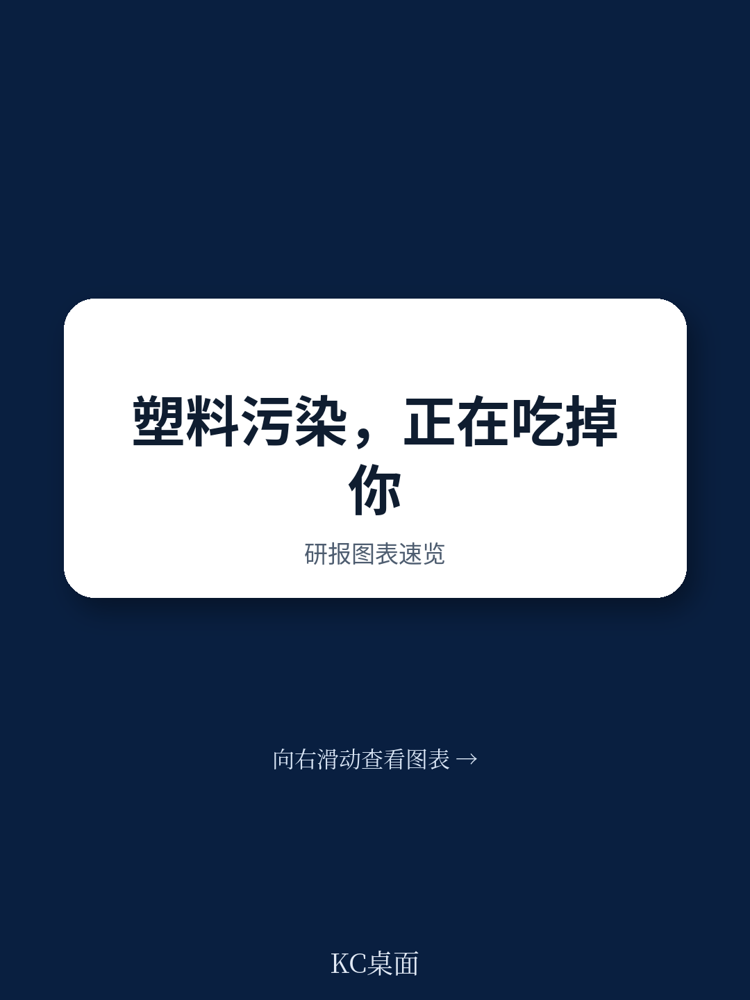
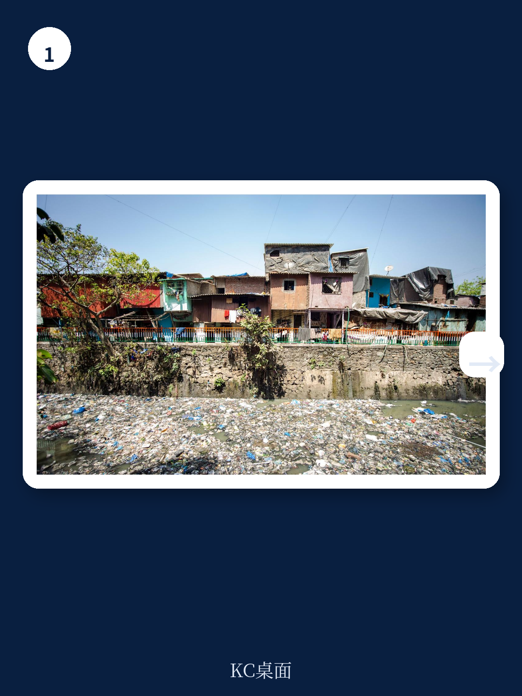
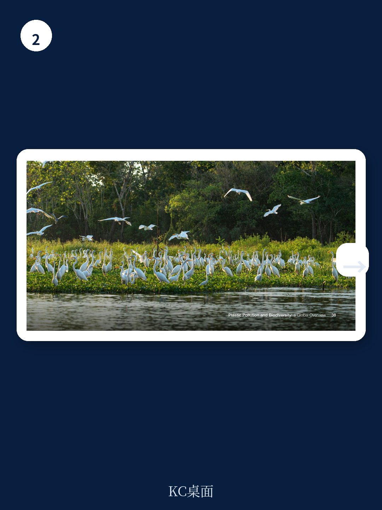

# 世界经济论坛：不是垃圾问题而是经济风险，世界经济论坛报告链接塑料与生物多样性

每年1.3亿吨塑料垃圾未被妥善处理，它们不仅填埋土地、污染海洋，还在系统性地侵蚀生物多样性——而后者支撑着全球超过一半的GDP。世界经济论坛（World Economic Forum）最新发布的《塑料污染与生物多样性：全球概览》报告，基于三大洲九个地理区域的实地评估，揭示了一个被严重低估的连锁反应：塑料污染正在通过物理伤害、栖息地退化和化学污染三条路径，破坏渔业、农业和旅游业的生态基础，并最终威胁到国家经济的韧性。

这份报告的核心判断是：**将塑料污染与生物多样性丧失视为一个相互关联的挑战来应对，而非两个独立的环保议题，才能最大化投资回报、打破治理孤岛，并让更多利益相关方参与行动。**

这不是一份传统的“垃圾管理”报告。它没有停留在“我们产生了多少塑料”的统计层面，而是追问：这些塑料最终去了哪里？它们对生态系统造成了多大损失？这些损失又如何反噬企业和政府的资产负债表？

> **KC评论：** 如果你只关注塑料回收率或禁塑令，你可能错过了更大的风险图景。这份报告的价值在于，它把塑料污染的终点——生态系统退化和生物多样性丧失——与经济产出直接挂钩。完整报告提供了九个国家的风险地图和具体数据，值得仔细阅读。

继续看原文，真正有价值的是图表、假设和验证路径；完整报告与KC评论在每日汇编。

## 1. 塑料污染对生物多样性的伤害，已经有明确的量化路径

报告将塑料污染对生物多样性的影响归纳为三条清晰的路径

**物理伤害**：超过4000个物种受到塑料缠绕和摄食的影响，从浮游动物到鲸鱼，几乎所有海洋食物链环节都未能幸免。这不仅是动物个体的死亡，更是整个食物网结构的破坏。

**栖息地退化**：塑料垃圾窒息红树林根系、增加珊瑚礁疾病风险、污染海龟筑巢地。红树林每公顷储存的碳是热带森林的四倍——塑料污染正在削弱地球最重要的自然碳汇。

**化学污染**：塑料添加剂和降解产生的微塑料，正在扰乱生物繁殖系统，降低土壤肥力和作物产量。这意味着农业这个最依赖自然基础的行业，正在被自己生产的塑料包装反噬。

报告引用了一项同行评审研究的结论：全球海洋中7500万至1.5亿吨塑料，每年导致海洋生态系统服务损失5000亿至2.5万亿美元。这个数字的跨度本身就说明，我们对损失的量化能力还很粗糙，但即使按下限计算，这也已经超过绝大多数国家的GDP。

> **KC评论：** 注意报告的措辞——“生态系统服务”不是一个环保口号，而是一个经济概念。渔业、旅游业、农业、碳汇，这些都有明确的市场价值。当塑料污染侵蚀这些服务时，它不是在“伤害环境”，而是在“摧毁资产”。完整报告对每个路径都有详细的案例支撑。

## 2. 地理视角打破治理孤岛：塑料从内陆城市漂流1000公里，摧毁的是海岸珊瑚礁

这份报告最独特的贡献之一，是它采用的“地理影响映射”方法。

传统上，塑料污染由城市环卫部门管理，生物多样性由环保部门负责，两者几乎不交流。但报告通过九个国家的实地研究，绘制了“塑料污染路径与生物多样性热点”的重叠地图，揭示了大量跨部门、跨地域的隐性联系。

以哥伦比亚为例：高海拔城市产生的塑料垃圾，沿着马格达莱纳河漂流1000公里，最终破坏加勒比海岸的珊瑚礁和红树林。负责城市垃圾的部门和负责海岸生态的部门，此前从未意识到彼此的工作有交集。

在哥斯达黎加，超过35%的关键生物多样性区域已经显示出与塑料污染相关的生态损害。

这个“从源头到海洋”（source-to-sea）的视角，直接改变了治理逻辑。它意味着：**内陆城市的垃圾管理政策，直接决定了沿海生态系统的健康程度。** 渔业部门有理由关注城市垃圾分类；旅游部门有动力投资河流清污。原本互不相关的利益相关方，因为一张地图而被拉到了同一张谈判桌上。

> **KC评论：** 报告没有点明的隐含结论是：现有的政府组织架构——按行政区域和职能部门划分——可能天然不适应应对这种跨域环境问题。如果你是企业，这意味着你的环境风险敞口可能比想象中更大，因为你无法依赖单一部门或地区的治理能力。完整报告对每个国家的风险地图都有详细拆解。

## 3. 企业面临的风险正在快速证券化：到2030年，塑料污染相关企业责任可能每年达到2000亿美元

报告引用了两个令人震惊的预测数字

第一，到2030年，与塑料污染相关的企业责任案件可能达到每年1000亿美元。这不是环保组织的恐吓，而是基于全球诉讼趋势和监管变化的合理推演。

第二，强制性生产者延伸责任（EPR）计划，可能再增加1000亿美元的成本。这意味着，如果企业不主动调整，到2030年仅塑料污染相关的法律责任和合规成本就可能达到2000亿美元/年。

然而，目前只有12%的企业设定了阻止生物多样性丧失的目标，而78%的企业有气候目标。披露生物多样性影响的企业不到1%。

这种不对称性本身就是风险信号：**当监管和诉讼浪潮到来时，绝大多数企业都处于毫无准备的状态。**

但报告同时指出了巨大的商业机会：目前91%的塑料垃圾被焚烧、填埋或丢弃，这相当于每年800-1200亿美元的单次使用包装价值被浪费。通过向可重复使用和可堆肥包装转型，到2040年可以将塑料污染减少近一半，同时创造860万个就业岗位。更好的产品设计可以将经济上可回收的塑料比例从22%提高到54%。

> **KC评论：** 报告没有展开的一个关键问题是：这些机会的捕获门槛很高。转向可重复使用包装意味着供应链重构；提高回收比例需要基础设施投资和消费者行为改变。真正能抓住机会的企业，不是那些最“环保”的企业，而是那些最擅长把规模转化为议价权的企业。完整报告对上游和下游机会都有细分拆解。

## 4. 报告尚未完全回答的关键问题：治理碎片化如何真正被打破？

报告坦诚地指出了一个结构性难题：塑料垃圾管理和生物多样性保护，由不同的政府部门管理，使用不同的指标。将EPR目标与生态结果挂钩，而不是与收集吨数挂钩——这个理念很好，但实际操作中，如何设计一个跨部门的问责机制？

报告提到了全球治理的进展和不完整：《昆明-蒙特利尔全球生物多样性框架》设定了减少污染的雄心目标，但大多数国家生物多样性行动计划并未将塑料列为主要威胁。全球塑料条约谈判已经陷入停滞。

这里存在一个明显的张力：**报告呼吁的“联合行动”，在现有的治理架构下缺乏制度抓手。** 谁负责协调？谁提供资金？谁承担失败的责任？报告没有给出明确的答案，而是将这个问题留给了读者——或者说，留给了那些愿意深入阅读完整报告并参与讨论的人。

## 5. 对读者的观察框架：从“塑料问题”到“生态系统韧性”的视角转换

基于这份报告，我们可以提炼出一个更通用的分析框架，用于评估任何企业或行业面临的塑料污染相关风险

第一层：你的供应链是否依赖健康的生态系统？渔业、农业、旅游业是直接暴露的行业，但更广泛的制造业——从纺织到电子——也越来越依赖稳定的原材料供应和可预测的运营环境。

第二层：你的塑料足迹是否与生物多样性热点重叠？报告的地理映射方法可以推广到企业层面：你的工厂、仓库、配送中心是否位于塑料污染路径上？你的废弃物最终流向哪里？

第三层：你的治理结构是否打破了“部门孤岛”？企业内部的环境、供应链、法务、投资者关系部门是否在共享风险信息？如果没有，企业层面的风险感知可能严重滞后于实际暴露。

第四层：你是否在等待“塑料条约”或“生物多样性框架”给出明确规则，还是已经在构建自己的韧性？报告的数据表明，等待监管可能意味着被动承担成本。

> **KC评论：** 这份报告最值得反复咀嚼的不是它的结论，而是它的方法。它证明了一件事：当你把两个“次要问题”放在一起看时，它们会变成一个“主要问题”。塑料污染和生物多样性丧失，单独看都比气候变化“小”，但合在一起，它们的经济影响已经可以挑战气候变化。完整报告提供了九个国家的具体案例和量化数据，这些细节无法在一篇导读中穷尽。

---

如果你对以下问题感兴趣——哥伦比亚的塑料如何从安第斯山脉漂流到加勒比海？印尼的社区如何用传统知识管理塑料废物？企业如何量化其塑料足迹对生物多样性的影响？全球塑料条约谈判的最新进展和卡点在哪里？——那么完整报告和九份国家研究值得你花时间阅读。

更多国际信源汇编与评论，扫码交流，每日更新。我们将单篇报告放回当天主线，整理成中文摘要、KC评论和图表合集，便于喂给AI，也便于人工快速扫描市场动态。这里汇聚了头部券商、PE/VC、投行、并购、hedge fund、资管机构、战略咨询、智库等朋友，期待与你交流。

Personal reading notes and learning share only. Not investment advice.
