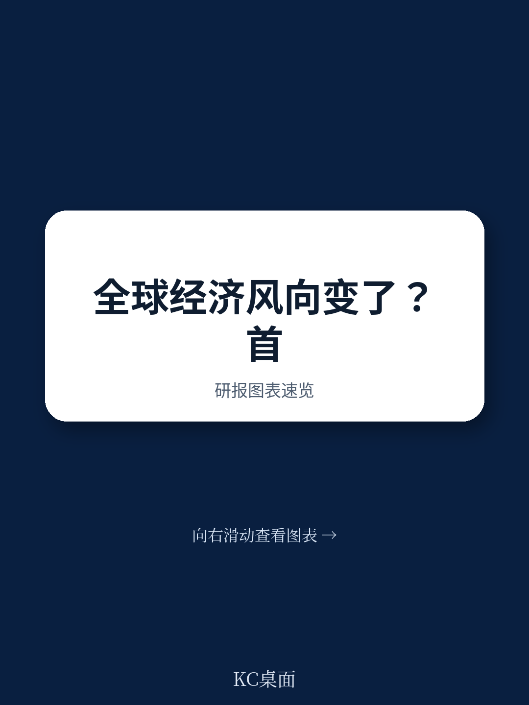
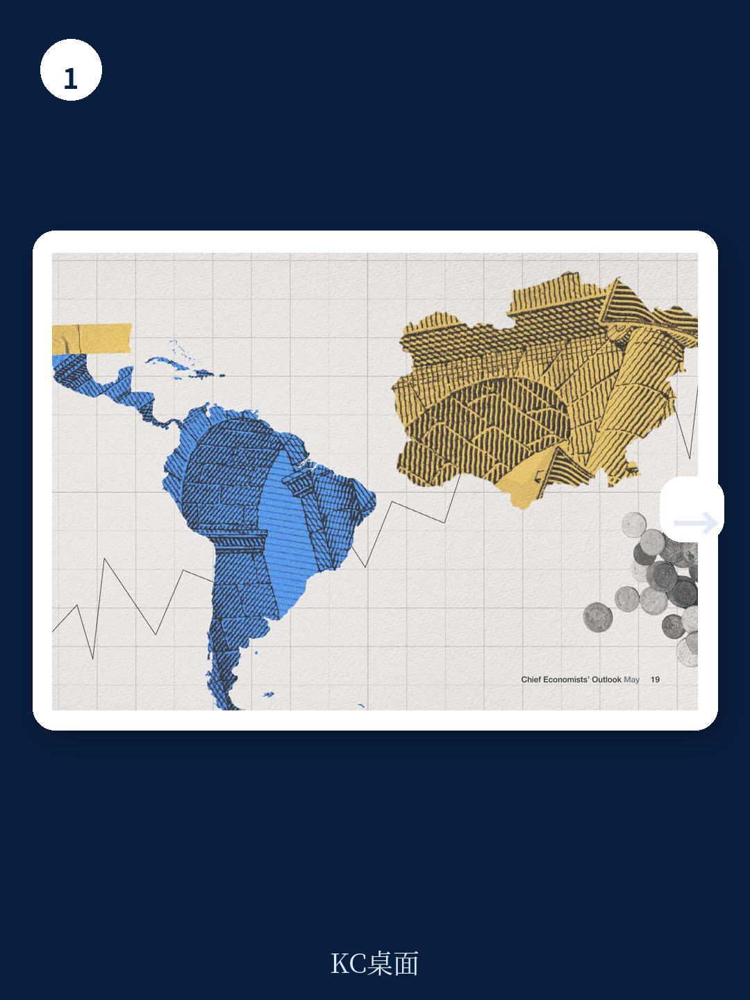

# 世界经济论坛：美元走强共识从78%骤降至53%，人民币汇率框架需调整

2026年5月，世界经济论坛发布了最新一期《首席经济学家展望》。这份基于4月6日至17日调研的报告，传递了一个清晰且冷峻的信号：全球经济的短期叙事已经从“能否软着陆”转向“如何应对供给冲击”。

89%的受访首席经济学家预计未来12个月全球增长将走弱，其中21%认为将显著走弱。94%预计全球通胀将上升。这不是一个温和的修正，而是一次系统性的预期重置。

但真正值得关注的，不是这些数字本身，而是数字背后的结构变化——为什么大多数经济学家仍不认为全球衰退迫在眉睫？为什么对AI的乐观情绪在冷却？为什么美元走弱的共识正在瓦解？这些问题的答案，决定了资产定价、供应链布局和产业战略的下一个锚点。

> **KC评论：** 这份报告的核心价值不在于“坏消息”，而在于它揭示了全球经济的“韧性幻觉”——供应链在调整，但需要时间；AI在落地，但生产率红利被高估；美元在走强，但那是避险而非基本面。读懂这些矛盾，才能理解未来12个月的政策和产业博弈。

继续看原文，真正有价值的是图表、假设和验证路径；完整报告与KC评论在每日汇编。

## 1. 供给冲击正在改写通胀叙事：能源和食品是新的核心矛盾

报告中最具冲击力的判断来自对通胀来源的重新定义。此前市场讨论通胀时，焦点是服务业粘性、工资螺旋或关税传导。但这份报告指出，当前通胀压力的主要驱动力是能源和食品价格——这正是供给冲击而不是需求过热的典型特征。

霍尔木兹海峡的关闭直接导致了全球约10%的海运贸易中断，布伦特原油一度突破125美元/桶。更关键的是，3月18日对卡塔尔Ras Laffan工业综合体的打击，使全球约五分之一的液化天然气供应面临长达3-5年的修复期。这不是一次性的价格脉冲，而是供给能力的永久性损失。

这意味着，即使各国央行维持紧缩立场，也无法通过加息来“解决”能源短缺带来的通胀。货币政策在这里的有效性大打折扣。对投资者和产业决策者而言，需要重新评估通胀的持续时间和结构，而不是简单地套用“通胀见顶回落”的旧框架。

## 2. 全球衰退概率被低估了：为什么58%的经济学家说“不”

报告显示，58%的受访首席经济学家不同意“全球衰退将在12个月内发生”的说法。乍看之下，这似乎是乐观信号。但结合报告的上下文，这个数字需要被重新解读。

首先，这一判断是在4月初调研时做出的，当时霍尔木兹海峡刚刚关闭两周，市场尚未充分定价二次冲击。其次，报告明确指出，6成受访者不认为全球经济韧性会在未来12个月内改善——这意味着“不衰退”的预期建立在“现状不发生重大恶化”的前提上，而不是建立在修复能力上。

报告引用了社区讨论的细节：供应链调整和能源系统重构需要时间，长期韧性可能改善，但短期无法体现。换句话说，当前对衰退的否定，本质上是“还没有看到衰退的证据”，而不是“有理由相信衰退不会发生”。

> **KC评论：** 这类似于2022年美联储的“通胀暂时论”——不是错误，而是基于有限信息的合理判断，但后续数据会持续修正。报告中的图表和假设值得细看，尤其是对霍尔木兹海峡持续关闭情景下的压力测试。

完整报告包含了更详细的情景分析和区域传导机制，这些在每日汇编中有完整呈现。

## 3. 美元走强共识的瓦解：从78%到53%意味着什么

这是一个被许多读者忽视但极具信号意义的变化。在2025年9月的调研中，78%的首席经济学家预期美元将走弱。到了2026年5月，这一比例骤降至53%。

报告给出的解释是：冲突初期美元因避险需求而飙升，但随着冲突持续、美国自身经济前景恶化，市场对美元的信心开始动摇。但更底层的逻辑是，当全球供给冲击同时打击所有主要经济体时，美元的“避风港”属性会受到侵蚀——因为美国也无法独善其身。

对于中国企业而言，这意味着汇率风险管理的框架需要调整。过去两年的核心假设是“美元走弱、人民币有压力”，但新的情景可能是“美元波动加大、人民币跟随全球风险情绪摆动”。这不是一个简单的方向判断，而是一个波动率判断。

## 4. AI生产率红利的“延迟交付”：为什么最乐观的经济学家也在降温

报告中最引人深思的部分，是对AI预期的修正。超过90%的受访者仍预计AI采用率将上升，但对生产率改善的时间表在显著拉长。

从行业分布看，IT和数字通信是唯一两个预期改善的行业——这符合直觉，因为AI在这些领域的反馈回路最短。但金融、专业服务、房地产等行业的预期时间都在推迟。报告指出，“通用技术的回报通常需要多年的互补性投资”，当前AI红利仍集中在大型企业和知识密集型服务业。

这意味着，对许多产业投资者而言，AI的“第二波”红利——即广泛的生产率提升——可能比市场定价的要晚12-24个月。这一判断对估值逻辑有直接影响：如果AI不能在未来2-3年内显著改善利润表，那么当前AI相关资产的溢价就需要被重新审视。

> **KC评论：** 报告没有展开的是，AI部署的瓶颈正在从技术转向基础设施——电力、数据中心、人才。这些约束条件的变化节奏，决定了AI叙事的下一个拐点。完整报告中的行业细项图表和区域分布数据，可以帮你建立更精确的跟踪框架。

## 5. 报告尚未完全回答的关键问题：韧性从何而来

尽管报告提供了丰富的判断，但有几个关键问题仍悬而未决。

第一，全球贸易的韧性是否可持续？报告提到2025年全球贸易增长7.5%至35万亿美元，但2026年初的增长主要来自价格而非数量。如果能源价格持续高企，贸易量的实际萎缩可能比预期更严重。

第二，区域分化是否在加速？美国、印度仍被看好，欧洲前景恶化，中国预期改善但面临竞争加剧。但报告没有深入讨论的是，这种分化是否会导致资本流动的重新配置——例如，资金是否正从欧洲和日本流向美国和印度？

第三，债务市场的压力测试何时到来？79%的首席经济学家预计私人债务市场波动率上升，74%预计公共债务市场波动率上升。但报告没有量化这些波动可能引发的系统性风险，尤其是在私人信贷领域，信用违约互换市场刚刚诞生，缺乏历史数据来校准风险。

这些未解问题，恰恰是持续跟踪和讨论的价值所在。

## 6. 给读者的观察框架：三个需要持续跟踪的边际变量

基于这份报告，可以建立一个简洁的跟踪框架

第一个变量是霍尔木兹海峡的状态。这是当前全球经济的“单点故障”。如果海峡持续关闭，所有基于“温和衰退”的预测都需要上调风险权重。如果局势缓和，通胀预期回落的速度可能快于市场预期。

第二个变量是各国央行的反应函数。当供给冲击而非需求过热驱动通胀时，央行面临两难：加息无法解决能源短缺，但降息又可能加剧通胀预期。各国央行如何“走钢丝”，将决定利率曲线的形态和资产定价的锚。

第三个变量是AI投资的实际回报率。如果2026年下半年企业财报显示AI投入没有带来预期的利润改善，市场对AI的叙事将从“生产率革命”转向“资本错配”。这个转折点的信号，包括资本开支指引的下调、AI相关业务的亏损扩大等。

---

这份报告的完整版本包含更多图表、区域细项数据和情景分析。我们每日汇编会将这份报告放回当天的主线，整理成中文摘要、KC评论和图表合集，便于喂给AI，也便于人工快速扫描市场动态。汇编汇聚了头部券商、PE/VC、投行、并购、对冲基金、资管机构、战略咨询、智库等朋友，期待交流。

Personal reading notes and learning share only. Not investment advice.
