# Deepening Divides: The Cost of a More Fragmented Financial System

INSIGHT REPORT

JUNE 2026

## Contents

Foreword 3
Executive summary 5
1 The evolution of global financial system fragmentation 6
1.1. Fragmentation in 2025 and 2026: A turning point 7
1.2. Breaking from precedent in trade and finance 7
1.3. Norms under pressure 10
2 The economic costs of fragmentation 14
2.1. Four modelled scenarios capture the cost of existing fragmentation and potential escalation 14
2.2. Existing trade and financial policies will reduce GDP growth and raise inflation, and the damage could worsen 17
2.3. Recommendations to mitigate fragmentation 21
3 Risks and resilience in Africa 23
3.1. African EMDEs face outsized fragmentation-related risks 24
3.2. Fragmentation is unfolding via multiple channels across African economies, exacerbating challenges 24
3.3. Opportunities for African economies amid global turbulence 28
Conclusion 31
Appendix: Quantitative analysis output 32
Contributors 36
Endnotes 38

## Disclaimer

This document is published by the World Economic Forum as a contribution to a project, insight area or interaction. The findings, interpretations and conclusions expressed herein are a result of a collaborative process facilitated and endorsed by the World Economic Forum but whose results do not necessarily represent the views of the World Economic Forum, nor the entirety of its Members, Partners or other stakeholders.
© 2026 World Economic Forum. All rights reserved. No part of this publication may be reproduced or transmitted in any form or by any means, including photocopying and recording, or by any information storage and retrieval system.

# Foreword

  
Matthew Blake
Managing Director;
Head, Centre for Financial
and Monetary Systems,
World Economic Forum

The global financial system has never been more interconnected, nor more exposed to geopolitical rupture.

In 2025, global trade reached a record high. $^{1}$ Cross-border bank credit surpassed its pre-2008 global financial crisis peak, $^{2}$ remittances hit an all-time high in real terms $^{3}$ and foreign holdings of US Treasuries rose to new levels. $^{4}$ This interconnectedness is decades in the making and has been a core engine of global growth. Cross-border capital flows, trade integration and financial innovation have expanded opportunity and lifted hundreds of millions out of poverty.

Yet in recent years, political leaders around the world have prioritized national resilience and economic security over integration. The result is a system that remains deeply connected in practice but increasingly contested in principle and at growing risk of fracture.

In 2025 and 2026, the United States attempted to fundamentally rewire the global trade and financial systems, deploying tariffs, sanctions, investment restrictions and fiscal measures to advance certain geopolitical and domestic priorities. These measures targeted China in particular, which proved more resilient than anticipated.

While the tools deployed were not new or unique to the US, the scale, speed and breadth of their application were. Previous analysis by the Navigating Global Financial System Fragmentation initiative assumed that even in a worst-case scenario, trade and financial linkages between the US and its geopolitical allies would remain untouched. In practice, tariffs were extended to Europe, Canada, Japan, South Korea and other

  
Anders Nemeth  
Managing Partner and Global Head of Banking and Financial Services, Oliver Wyman, a Marsh business

partners. By March 2026, foreign central bank holdings of US Treasuries at the New York Federal Reserve dropped to their lowest levels since 2012. $^{5}$

These developments and more challenged the Principles to Safeguard the Global Financial System from Fragmentation and the Rules of Engagement for Responsible Economic Statecraft proposed by this initiative, including independent fiscal and monetary policy-making, clearly defined and impartially enforced laws and international coordination on issues of financial stability and geoeconomic consensus. Additional factors not previously in focus, such as the integrity of government data, have also come under strain.

The policy turbulence of 2025 was a stark reminder that the institutional architecture underpinning cross-border finance cannot be taken for granted. Businesses and investors rely on these guardrails not only for efficiency but for confidence that commitments will endure beyond electoral cycles and despite geopolitical tensions. This allows them to conduct business across borders and provide functional capital markets worldwide.

Today, fragmentation and the expanded use of financial and trade levers as instruments of statecraft pose material and systemic risks to growth. New quantitative analysis in this report suggests that today's trade and financial policies are already costing the global economy roughly \$300 billion, which is the size of the economies of Finland or Chile. The potential for a worst-case scenario, one that costs the world more than \$6 trillion, is also increasing; such a scenario surpasses the impact of the global financial crisis and is larger than the economies of Germany or Japan.

The effects are particularly acute in emerging markets and developing economies because, with shallower domestic capital markets and greater reliance on external trade and investment, they are disproportionately exposed to fragmentation in the global system. The perspectives from African business leaders and policy-makers outlined here are instructive, offering practical insight into how smaller, open economies navigate heightened geoeconomic uncertainty while balancing resilience, growth and strategic autonomy.

Against this backdrop, it is incumbent upon private-sector leaders to articulate the economic cost of fragmentation. Security and resilience are legitimate policy objectives, but, without clear norms, proportionality and predictability in the use of economic statecraft, even well-intended measures can impose lasting costs on growth, investment and financial stability. National security and resilience need not come at the cost of the stability, interoperability and trust on which economic progress relies.

To that end, the Navigating Global Financial System Fragmentation initiative will continue to convene more than 25 chief executives, chairpersons and other global finance leaders to reassess assumptions about the trajectory of fragmentation, examine regional dynamics and consider the implications for long-term prosperity.

This insight report renews the private sector's call to preserve the core elements of the global financial system that enable growth. The world's long-term prosperity demands it.

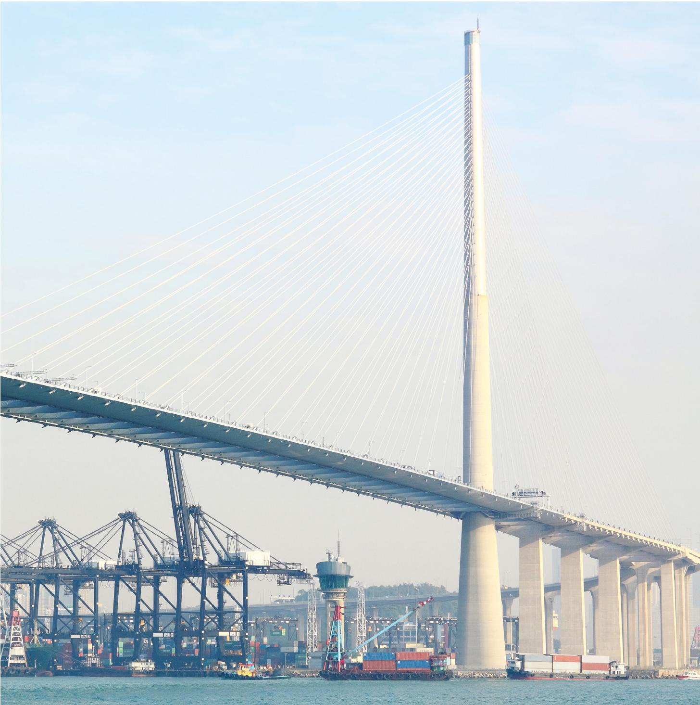

# Executive summary

## This insight report revises estimates of fragmentation's economic cost to account for recent geopolitical developments, and analyses concrete regional implications of global trends.

## \$6.9 trillion

Potential lost GDP in an increasingly plausible worst-case escalation in fragmentation

## The period spanning 2025 and early 2026 marked a turning point in the acceleration of financial system fragmentation

In 2025 and 2026, the global policy environment shifted significantly, with finance, trade and economic policy becoming more intertwined. Countries not only raised barriers, but did so in unanticipated ways that have increased risks for firms and countries across the globe.

This period represents a turning point in the course of fragmentation, as the United States set out to fundamentally rewire the global financial and trade systems using tariffs and other measures. China was a major target of these efforts and retaliated, leveraging its control over critical minerals supply chains to force a détente $^{6}$ and redirecting its exports to reach a record trade surplus in 2025. $^{7}$ The US increased tariffs and enacted restrictions not only on geopolitical adversaries but also on allied countries, some of which responded by retaliating or by pushing for diversification in their geoeconomic partnerships.

These changes and others have further fragmented the global financial system by making it harder for firms to operate across borders and for capital to move freely. In addition to their current drag on economic growth, they sharply increase the likelihood of economically damaging escalation.

Challenges to long-recognized norms – such as central bank independence – as well as principles whose salience has only become clear in recent years – including the reliability of government data – emphasize the growing urgency to align on guardrails around the use of economic statecraft. As leaders seek to safeguard the security and resilience of their national economies, private-sector voices can articulate the importance of doing so in ways that minimize economic damage. The proposed Principles to Safeguard the Global Financial System from Fragmentation and the Rules of Engagement for Responsible Economic Statecraft articulated here can serve as a starting point for these efforts.

## Current trade policy is already reducing growth, and the impact could increase to \$6.9 trillion in lost gross domestic product worldwide

The evolving geopolitical backdrop requires an understanding of how the economic costs of fragmentation have changed in 2025 and 2026. Accordingly, new quantitative analysis in this report incorporates updated assumptions to estimate that fragmentation is already reducing gross domestic product (GDP) growth by between \$213 billion and \$307 billion and raising inflation by 0.2–0.3 percentage points (pp). The impact of existing policy varies by bloc: the costs are more substantial in the West, where growth is set to be reduced by 0.3–0.4 pp, than they are in the East or Neutrals, each with more modest reductions of approximately 0.1 pp, respectively. Further, the likelihood of scenarios in which fragmentation might escalate has increased over the same period. In a hypothetical worst-case scenario, a full economic decoupling between East and West, the negative impact to worldwide GDP could be up to \$6.9 trillion.

Updated features of the analysis include both qualitative assessments of how the year's fragmentation has impacted the global economy and quantitative measures of how such policies have affected markets around the world. It addresses new real-world considerations, including the impact of US tariffs on its allies, countermeasures by those allies against the US, updated tariff pass-through rates to consumers and restrictions on services trade that vary by industry.

## Regional manifestations of global trends are evident in Africa

Emerging markets and developing economies (EMDEs) are expected to experience the most severe impacts of fragmentation through reduced access to capital, which will reshape the realities, risks and opportunities facing policy-makers, businesses and households on the ground.

Insights drawn from interviews with African policy-makers and leaders of Africa's large financial institutions illustrate that while recent developments exacerbate existing challenges, they also present an opportunity to pursue new avenues of growth and regional collaboration. The experience of navigating the geoeconomic turbulence of recent years offers valuable lessons for leaders across the world.

# 1 The evolution of global financial system fragmentation

## Fragmentation accelerated in 2025, marking a shift towards a more divided global financial system.

The global financial system – an interconnected network of financial institutions, markets and instruments that facilitate the flow of capital within and across borders – has underpinned economic growth for more than half a century. In the five decades since the 1970s and the end of the gold standard-backed Bretton Woods system, economic integration has driven an unprecedented rise in prosperity, lifting swathes of humanity out of poverty. The share of people living in extreme poverty declined from approximately 48% of the world's population in 1970 to 10% in 2015. $^{8}$

While policy-makers embraced increasing integration for decades, in the 21st century this trend was interrupted by events that spurred actors to develop new ways to leverage the system to achieve geopolitical objectives. The 11 September 2001 attacks on the United States proved to be an early catalyst where, amid worthy efforts to halt terrorist financing, major powers began to use global payment networks to limit certain actors' access to international finance. While most countries supported these efforts, the tools developed would go on to be used in a broader set of cases.

For example, the full-scale Russian invasion of Ukraine in 2022, and subsequent sanctions by the Group of Seven (G7), a bloc of leading industrialized countries including the United States and Japan, fully severed direct ties between a sizeable economy and international financial institutions and markets. Similarly, events such as the global financial crisis and the COVID-19 pandemic destabilized the system and eroded trust in financial institutions and regulators. These shocks triggered a rise in regulatory divergence among countries, which fuelled a shift towards regionalization. More countries have since taken actions in the name of security and resilience that further fragment financial markets.

At its 2025 Annual Meeting, the World Economic Forum, in collaboration with Oliver Wyman, a Marsh business, published the Navigating Global Financial System Fragmentation report. It modelled four hypothetical scenarios and found that the potential economic costs of financial system fragmentation were severe for financial institutions and the global economy, with EMDEs expected to sustain the heaviest economic consequences.

## 1.1 Fragmentation in 2025 and 2026: A turning point

Countries have long used economic statecraft measures to protect national security, economic stability and resilience. For example, even since its economic liberalization in the 1980s and exchange rate liberalization in the 2000s, the People's Republic of China has continued to use tight capital controls to manage outflows and limit foreign investment and still intervenes in foreign exchange markets to constrain currency movement. $^{9}$

Elsewhere, the European Union employs non-tariff measures (NTMs) that act as barriers to trade, such as technical regulations and licensing rules, at a higher rate than the US across most sectors. $^{10}$

While the use of restrictive measures and economic statecraft had already escalated in recent years, 2025 and early 2026 represented a turning point:

The United States set out to rewire the global trade and financial systems with a wide range of tariffs and other measures seeking to reduce bilateral deficits and eliminate other countries' barriers to US exports. $^{11}$

China was a major target of these efforts and retaliated, turning away from integration with the United States and implementing its own restrictive policies. For a brief period, tariffs between the US and China exceeded 100%, which would have effectively cut off trade between the world's two largest economies. China temporarily imposed first-of-their-kind export controls on rare earths $^{12}$ – with economic ramifications for all countries – and responded to heightened US regulatory pressure by tightening rules for Chinese companies listing in the US, $^{13}$ continuing a trend which in 2022 saw major Chinese firms delist from US exchanges.

When the Navigating Global Financial System Fragmentation initiative published its first estimate of fragmentation's potential economic cost in January 2025, there was little prospect of substantial tariff increases between the US and its allies. In practice, the United States levied tariffs against its geopolitical allies. Countries have in some cases erected their own barriers to align more with US policy but have also enacted or planned retaliatory restrictions on the US and accelerated efforts to diversify. Recent examples include Canada's strategic partnership with China $^{14}$ and a Danish pension fund's divestment from US Treasury securities. $^{15}$

Fragmentation that was theoretical only one year ago has become today's reality. Even assuming no further escalation, the financial system is projected to be more fractured, with more barriers to the free flow of capital than previously anticipated. These new barriers are already impeding economic growth, and they increase the risk of a self-reinforcing cycle of retaliation and escalation that could have severe implications for national economies. As companies restructure their supply chains and operations to adapt to this more restrictive policy environment, it may become entrenched, making it more difficult to reverse course quickly.

Tariffs, once they are put on, are hard to take off ... no one wants to be the American president accused of letting down the American worker.

Gina Raimondo, US Secretary of Commerce (2021–2025)

## 1.2 | Breaking from precedent in trade and finance

While the higher tariffs announced by the US on 2 April 2025 were a major escalation in fragmentation, Table 1 indicates that this was not an isolated event but rather one of many steps taken by policy-makers in a long-running trend towards greater barriers to cross-border trade and investment. Policy changes and market and trade movements have become interdependent, as markets influenced policy-maker action or inaction (see Case study 1) and geopolitical volatility climbed up the list of priorities for business leaders. These policy changes represent a paradigm shift in trade and finance, signalling a new era of higher fragmentation.

# CASE STUDY 1 Bond market volatility restrains policy movement

US Treasury securities are a cornerstone of the global financial system. They are nearly as liquid as cash and serve as a safe haven asset that investors and central banks historically turn to during volatile periods. Because they have been regarded as a virtually risk-free store of value in dollars and are widely held by foreign investors and institutions, demand for Treasury securities and demand for dollars reinforce one another and sustain the dollar's role as the global reserve currency.

In early 2025, prominent figures were already voicing concern about the sustainability of public debt levels, $^{16}$ as many countries ran large deficits despite robust economic growth. Following a brief influx of investors into US Treasuries after “Liberation Day”, $^{17}$ stock and bond prices began falling simultaneously, a rare movement indicating that investors were not moving into US dollar-denominated assets for safety as usual. $^{18}$ While the bond market recovered following de-escalation in trade policy shifts, and even perhaps triggered those shifts, uncertainty remained regarding the extent to which foreign investors still viewed Treasuries as safe-haven assets. $^{19}$

TABLE 1 | Major events in trade and finance in 2025 and 2026

<table><tr><td colspan="2">Date</td><td>Event</td></tr><tr><td rowspan="18">2025</td><td>2 January</td><td>The US implemented Executive Order 14105 restricting outbound investments in sensitive sectors: semiconductors and microelectronics, quantum information technologies and AI. $^{20}$ </td></tr><tr><td>1 February</td><td>The US imposed tariffs on imports from Canada, China and Mexico. $^{21}$ </td></tr><tr><td>10 February</td><td>China imposed retaliatory tariffs on US goods. $^{22}$ </td></tr><tr><td>21 February</td><td>The US released a memorandum outlining policy changes towards foreign direct investment (FDI), including a “fast track” policy for certain partners. $^{23}$ </td></tr><tr><td>12 March</td><td>The US imposed a 25% tariff on steel and aluminium; the EU and Canada announced retaliatory measures. $^{24}$ </td></tr><tr><td>19 March</td><td>The European Commission launched the Savings and Investments Union (SIU), an initiative designed to deepen and strengthen Europe’s capital markets to domestically support the bloc’s growth and competitiveness. $^{25}$ </td></tr><tr><td>25 March</td><td>The US announced secondary tariffs on countries importing Venezuelan oil. $^{26}$ </td></tr><tr><td>2 April</td><td>“Liberation Day”: The US announced major tariff policy modifications, including a universal 10% tariff and higher rates on certain countries based on bilateral trade deficits (“reciprocal” tariffs). $^{27}$ </td></tr><tr><td>4 April</td><td>China announced 34% tariffs on the US and restrictions on rare earth exports, the first in a series of tit-for-tat escalations. $^{28}$ </td></tr><tr><td>9 April</td><td>After outflows from the US bond market, the US announced a 90-day pause in the implementation of “reciprocal” tariffs, with the exception of those against China, to allow for trade negotiations. $^{29}$ </td></tr><tr><td>14–15 April</td><td>The US identified imports of critical minerals, semiconductors and pharmaceuticals as national security threats. $^{30}$ </td></tr><tr><td>21 April</td><td>Chinese state-backed funds, including China Investment Corporation, pulled back from investments in the funds of US-headquartered private capital firms. $^{31}$ </td></tr><tr><td>12 May</td><td>A month of escalation led the US and China to briefly impose tariffs of 145% and 125% (respectively) on one another, which would have caused virtually all US–China trade to cease. $^{32}$ </td></tr><tr><td>12 June</td><td>China extended zero-tariff access to most African economies. $^{33}$ </td></tr><tr><td>3 July</td><td>Viet Nam and the US reached an outline of an agreement to lower US tariffs. A Vietnamese government document signalled that it would apply stricter penalties on illegal trans-shipment of goods from China. $^{34}$ </td></tr><tr><td>7 July</td><td>The Pan-African Payment and Settlement System (PAPSS) and Interstellar launched the PAPSS African Currency Marketplace (PACM) to enable the direct exchange of African currencies without the use of hard currencies. $^{35}$ </td></tr><tr><td>10 August</td><td>Nvidia and AMD agreed to pay 15% of revenues from AI chip sales in China to the US government to secure export licences. $^{36}$ </td></tr><tr><td>27 August</td><td>The US imposed a tariff rate of 50% on India in response to continued purchases of Russian oil. $^{37}$ </td></tr><tr><td rowspan="7">2025</td><td>28 August</td><td>The US Department of Defense (DoD) issued a final rule prohibiting firms with DoD contracts from holding contracts with certain covered foreign entities related to the governments of China, Russia and some other countries. $^{38}$ </td></tr><tr><td>3 September</td><td>Nasdaq announced tighter listing rules and trading standards for small-cap companies primarily operating in China. $^{39}$  This continued a trend that previously intensified in 2022, when major Chinese firms, including China Life Insurance Company and PetroChina, delisted from the New York Stock Exchange.</td></tr><tr><td>30 September</td><td>The African Growth and Opportunity Act (AGOA) was allowed to expire by the US Congress, raising costs and uncertainty for African exporters. $^{40}$ </td></tr><tr><td>9 October</td><td>China tightened export controls for rare earths and related technologies. $^{41}$ </td></tr><tr><td>22 October</td><td>The US sanctioned Russian oil companies Rosneft and Lukoil over Russia's failure to commit to a process to end the war in Ukraine. $^{42}$ </td></tr><tr><td>1 November</td><td>The US and China agreed to a one-year trade truce, including mutual lowering of tariffs, pausing of Chinese rare earth export curbs and other issues. $^{43}$ </td></tr><tr><td>12–18 December</td><td>EU leaders froze €210 billion in Russian sovereign assets indefinitely, $^{44}$  then agreed to lend €90 billion against the bloc's shared budget to Ukraine after failing to strike a deal to lend against the frozen assets. $^{45}$ </td></tr><tr><td rowspan="8">2026</td><td>8 January</td><td>China announced a reduction in value-added tax rebates for exports of solar panels, batteries and other products as a part of government efforts to address domestic overcapacity and improve profitability. $^{46}$ </td></tr><tr><td>11 January</td><td>US Federal Reserve Chair Jerome Powell revealed that the US Department of Justice had opened a criminal investigation into his earlier testimony to Congress, which he linked to the Fed's refusal to cut interest rates. $^{47}$  A federal judge would eventually rule that subpoenas issued to the Federal Reserve were improper. $^{48}$ </td></tr><tr><td>17 January</td><td>The EU and the South American trade bloc Mercosur signed a free trade agreement that could create one of the largest free trade blocs in the world. $^{49}$ </td></tr><tr><td>20 January</td><td>AkademikerPension, a Danish pension fund, announced that it would exit its position in US Treasury securities, valued at approximately $100 million. $^{50}$ </td></tr><tr><td>20 February</td><td>The US Supreme Court determined that the International Emergency Economic Powers Act (IEEPA) does not authorize US presidents to impose tariffs, $^{51}$  reducing the effective average to 9.1% from 16%. The US administration used an alternative authority to impose new tariffs, which brought the average effective rate to 12.1%. $^{52}$ </td></tr><tr><td>28 February</td><td>The US and Israel struck Iran, which retaliated with strikes around the region and effectively closed the Strait of Hormuz, leading to a surge in the prices of oil, gas and other commodities. $^{53}$ </td></tr><tr><td>6 March</td><td>The US International Development Finance Corporation announced that it would partner with US insurance companies to provide political risk insurance to support shipping through the Strait of Hormuz. $^{54}$ </td></tr><tr><td>11–12 March</td><td>The Office of the US Trade Representative announced Section 301 investigations of dozens of countries for unfair trade practices, including policies that result in structural excess capacity $^{55}$  and forced labour. $^{56}$ </td></tr></table>

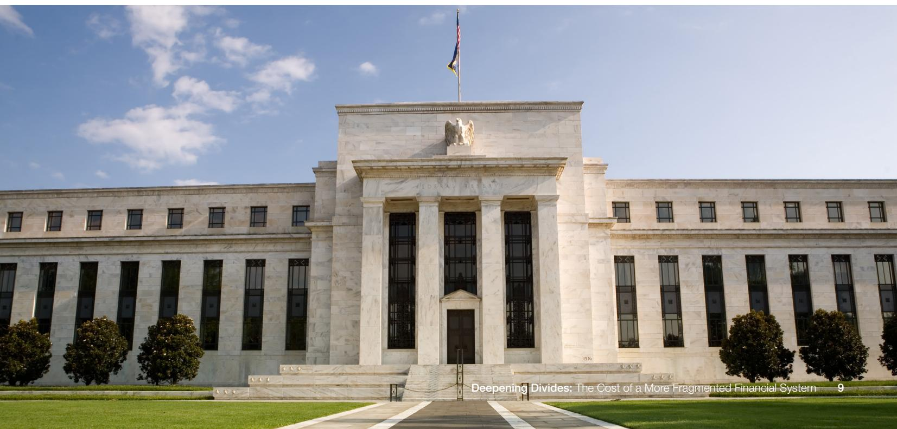

## 1.3 Norms under pressure

It seems that every day we're reminded that we live in an era of great power rivalry. That the rules-based order is fading. That the strong can do what they can, and the weak must suffer what they must.

Mark Carney, Prime Minister of Canada, at the 2026 Annual Meeting of the World Economic Forum

As Table 1 makes clear, recent developments mark the current moment as one of substantial change. In some cases, the system is evolving in a way that will strengthen domestic capital markets and regional interconnectedness. Two recent examples are EU efforts to integrate the region's capital and financial markets through the Savings and Investments Union (SIU) and the ongoing roll-out of the Pan-African Payment and Settlement System (PAPSS). But other shifts have tested the pillars upon which the global financial system rests, thereby risking its fragmentation into discrete geopolitically aligned blocs, increasing the cost of capital and threatening economic growth.

The January 2025 Navigating Global Financial System Fragmentation report proposed two frameworks for safeguarding the traditional pillars of the global financial system. The Principles to Safeguard the Global Financial System from Fragmentation (Figure 1) identify the conditions that enable financial services companies to conduct business across jurisdictions and preserve the integrity of the global financial system. The Rules of Engagement for Responsible Economic Statecraft (Figure 3) operationalize these principles and outline how policy-makers can use economic statecraft and safeguard their national interests without compromising global prosperity. $^{57}$

The events of 2025 and 2026 have not only challenged the norms articulated in these two frameworks but have also called attention to additional essential norms: the integrity of data and comparable regulatory treatment of functionally equivalent financial activities (Figure 2).

## FIGURE 1

## The Principles to Safeguard the Global Financial System from Fragmentation

## Principle 1

Clearly define and uphold the rule of law to ensure impartial enforcement and predictability across the financial system

## Principle 2

Respect financial and physical property ownership rights, to maintain trust and encourage investment, thereby fostering financial stability

## Principle 3

Avoid unilaterally expropriating sovereign assets even during times of heightened tensions or conflict

## Principle 4

Safeguard independence and bolster the capabilities of international institutions, to preserve their role in global financial governance

## Principle 5

Regulate and manage critical financial market infrastructures, but avoid politicizing or severing financial rails given that these systems are essential for maintaining the integrity, functionality and efficiency of the financial system

## Principle 6

Ensure parallel financial market infrastructures are interoperable to facilitate optimal transactions and market efficiency

## Principle 7

Structure domestic and multilateral policies and financial regulations to support financial stability of capital, data, goods, people and ideas

## Principle 8

Shield the independence of fiscal and monetary policy to promote financial stability, reduce the risk of competitive interference and increase opportunities for transparent decision-making

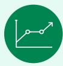

## Principle 9

Safeguard the integrity and reliability of data to support sound decision-making by policy-makers and private-sector actors

## Principle 10

Ensure that functionally similar financial activities are subject to comparable regulatory standards to deliver stability and fairness

FIGURE 3

## The Rules of Engagement for Responsible Economic Statecraft

## Rule 1

Design and implement targeted and well-aligned statecraft measures to minimize the risk of unintended consequences and reduce the private sector's administrative burden (e.g. carry out cost–benefit analyses, provide clear implementation guidance, and assess and reinforce existing regimes)

## Rule 2

Establish public-private consultation mechanisms to promote transparency in decision-making regarding the impact of economic statecraft measures on the financial system

## Rule 3

Protect populations, sectors, industries and supply chains for humanitarian purposes through exemptions and carve-outs to avoid collateral damage and ensure their continued access to the global financial system

## Rule 4

Prioritize the use of economic inducements including trade agreements compliant with international law, and other financial instruments that foster mutual gain and cooperation over those designed to cause economic pain

## Rule 5

Collaborate on areas of
geoeconomic consensus,
including combatting financial
crime, terrorist financing
and the energy transition,
recognizing the need for
collective action to address
these global financial challenges

## Rule 6

Promote global financial stability through heightened coordination among major financial powers via transparent data sharing and inclusive decision-making to minimize negative spillovers and prevent system fragmentation

## Rule 7

Reform the global financial system to reflect 21st-century geopolitical and macroeconomic dynamics and provide greater benefits to EMDEs, promoting inclusive economic growth and stability

## Rule 8

Protect the ability of firms to engage with actors across the geopolitical spectrum by structuring statecraft measures, standards and regulations on a multilateral basis, whenever possible

## Challenges to the Principles to Safeguard the Global Financial System from Fragmentation

The following principles are under particular strain.

law (Principle 1): A trend towards lower adherence to the rule of law, comprising impartial enforcement, clarity and stability in the law as well as accountability of government and private-sector actors, has accelerated. $^{58}$ Businesses rely on adherence to the rule of law so that leaders can properly weigh decisions on cross-border investment. In 2025 and 2026, severe swings in policy and enforcement by countries reduced certainty and affected decisions on investing and hiring. $^{59}$

## - Safeguard independence and bolster the capabilities of international institutions

(Principle 4): Resurgent nationalism, geopolitical tensions and declining institutional legitimacy have undermined the capacity of key institutions, including the International Monetary Fund (IMF), the World Bank and the World Trade Organization (WTO). For example, the competing interests of global powers

have reduced the WTO's capacity to play its traditional role in mediating trade disputes. As a result, the world has shifted towards bilateral agreements, $^{60}$ which increase the use of local currencies to settle transactions, thereby reducing economic efficiency and putting financial stability at risk. $^{61}$

\- Shield the independence of fiscal and monetary policy (Principle 8): Pressure on the independence of central banks is increasing as policy-makers attempt, via rhetoric and action, to influence monetary policy decisions. Attempts to undermine independence have been bolstered by central banks' struggles to maintain stable low inflation, as well as expanded institutional mandates and perceived illegitimacy. $^{62}$ Recent events have, for example, led to concerns about the independence of the US Federal Reserve. While any erosion would take time, and policymakers across the political spectrum in the US continue to support Fed independence, $^{63}$ threats may weaken the central bank's ability to ensure price stability and full employment, risking lower growth and higher inflation. $^{64}$

## Recent developments have highlighted a critical need for new norms

When the Navigating Global Financial System Fragmentation initiative published its flagship report, stakeholders identified the eight principles based upon their understanding of key pillars underpinning the globally integrated financial system. Subsequent developments have illustrated additional core elements that were not reflected in the original principles (Figure 2).

Proposed Principle 9: Safeguard the integrity and reliability of data to support sound decision-making by policy-makers and private-sector actors: To maintain confidence in published data, governments should protect the independence and resourcing of statistical bodies, invest in modern methodologies that can adapt to changing participation patterns and promote transparency around data collection, revisions and limitations. By treating high-quality, depoliticized data as a public good, policy-makers and market participants can continue to rely on a shared factual foundation for assessing risks and allocating capital.

Reliable and trusted data is integral to sound monetary policy, private-sector forecasting, academic and private-sector research and decision-making across all sectors of the economy. This important source of information is subject to increasing pressure, challenging the confidence of public- and private-sector leaders.

Survey response rates across advanced economies, including European countries, the US and Canada, have been in decline for decades, accelerated by pandemic-related disruptions. $^{65}$ More recently, the risk to reliable data has been compounded by the prospect of political considerations interfering with the operation of the institutions that collect, synthesize and produce data. $^{66}$

Proposed Principle 10: Ensure that functionally similar financial activities are subject to comparable regulatory standards to deliver stability and fairness: To limit regulatory arbitrage, preserve a level playing field and reduce systemic risk, regulators should ensure that there is no disparity in their treatment of banks, non-bank financial institutions (NBFIs) or new financial technology firms.

These new entrants, including digital assets firms, are entering the market, challenging the business model and position of traditional financial institutions and disrupting the market for functions such as money transfers and lending that banks have traditionally performed. $^{67}$ New entrants are innovating, forcing legacy institutions to adopt new technology and change their own business models.

Amid this healthy competition, analysts have observed that these new entrants do not face the same regulatory scrutiny as banks, insurers and other financial institutions. $^{68}$ As a result, rising market share by financial technology companies has been partially attributed to regulatory arbitrage, $^{69}$ in which activity migrates from the more-regulated banking sector to lightly regulated NBFIs. This differential treatment also potentially increases systemic risk. $^{70}$

## Challenges to the Rules of Engagement for Responsible Economic Statecraft

The private-sector call to action by policy-makers is operationalized via the Rules of Engagement for Responsible Economic Statecraft (Figure 3), which articulate policy implementation methods that advance geopolitical aims while minimizing the hit to economic growth. In a challenging environment for private-sector advocacy, it remains important to focus policy-makers' attention on how best to design policy to mitigate unintended consequences.

\- Design and implement targeted and well-aligned statecraft measures (Rule 1): Countries implemented policy measures in 2025 and 2026 that affected broad swathes of economic activity. Well-targeted measures and an alignment between declared goals and on-the-ground execution could have minimized unintended consequences and reduced private-sector administrative burden (see Case study 2 for analysis of the execution of US trade policy shifts). Measures imposed without clear, consistent objectives increase uncertainty and potentially raise borrowing costs, lead companies to delay investments and encourage households to defer spending. $^{71}$

## CASE STUDY 2 The doctrine behind US trade policy shifts?

Shortly after the re-election of Donald Trump in November 2024, Stephen Miran, chair of the Council of Economic Advisers early in the second Trump administration, $^{72}$ released a short paper entitled A User's Guide to Restructuring the Global Trading System. $^{73}$

Miran argued that the US dollar's reserve currency status comes with benefits but is also a burden: the dollar's role as a safe haven creates inelastic demand and inflates its value, thereby reducing the competitiveness of US exports, depressing manufacturing and increasing the US fiscal deficit. He outlined tools available to the incoming president to restructure the international trade and financial systems to address this issue and to compensate the US for the related burden of shouldering the cost of the US security umbrella. These tools included unilateral approaches to tariffs and currency policy (for example, a user fee on holders of Treasuries), which could be used to reallocate aggregate

demand to the US and increase revenue to the US Treasury. Miran also outlined a multilateral approach, a hypothetical “Mar-a-Lago Accord”, through which major powers could deliberately lower the value of the dollar by selling US dollar reserves. To keep interest rates down while selling reserves, countries could simultaneously convert their remaining reserve holdings into longer-dated securities, hypothetically including US century bonds.

The extent to which Miran's paper informed US trade policy changes is debatable; implementation deviated from the paper's guidance on the speed of tariff enactment, transparent communication and collaboration with geopolitical allies. As governments pursue their goals, clear, consistent objectives and implementation guidance can help reduce the administrative burden of policy changes on the private sector and encourage growth.

\- Collaborate on areas of geoeconomic consensus (Rule 5): The world has entered a period of rising geopolitical conflict, with global competition fundamentally shifting from a drive towards market optimization to a competition for strategic advantage. $^{74}$ Policy-makers can nonetheless focus on areas in which competing powers can agree, such as profitable infrastructure investment, combatting financial crime and harmonizing regulations. While these areas were not the focus of the agenda for the Group of Twenty (G20) in 2025, the US has signalled that related topics, particularly around regulation, will be prioritized during its 2026 presidency. $^{75}$

\- Protect the ability of firms to engage with actors across the geopolitical spectrum (Rule 8): It is ideal if statecraft measures are crafted on a multilateral basis to minimize the administrative cost to multinational firms of complying with different countries' regulations. In recent years, by contrast, regional and bilateral trade agreements proliferated at a rapid pace, meaning that global companies must navigate five times as many trade agreements as they did in 2000. $^{76}$

# The economic costs of fragmentation

## Existing fragmentation could lower global GDP by between \$213 billion and \$307 billion; an increasingly likely escalation could raise the economic cost to \$6.9 trillion.

The developments outlined in Section 1 have reinforced the possibility of extreme outcomes and challenged some of the assumptions underlying the initiative's January 2025 quantitative analysis of the economic costs of fragmentation.

While the initial analysis anticipated the general trajectories of fragmentation, recent geopolitical developments have implications for the model and necessitate updated analysis.

First, some degree of fragmentation is already dragging on economic growth and needs to be measured. Second, US tariff practices vis-à-vis its allies in 2025 and 2026 demonstrate that trade frictions within geopolitically aligned blocs can also be substantial. Third, the likelihood of escalation that results in a severely fragmented global economy has increased. Finally, actual economic data confirmed that 2025's hypothetical “low fragmentation” scenario correctly predicted the directionality of key economic indicators that year, but underestimated the resilience of the Chinese economy. This updated analysis incorporates these nuances.

## 2.1 Four modelled scenarios capture the cost of existing fragmentation and potential escalation

The analysis outlined in this section establishes a new baseline estimate of the economic cost of current trade and financial policies. It also models the costs the world might face should trends accelerate further.

Table 2 shows the four scenarios used to model the potential economic costs of fragmentation. The following are key features of the revised scenarios to ensure that estimates incorporate learnings from 2025 and 2026.

## New assumptions about how fragmentation will proceed

Intra-West fragmentation: The model now incorporates restrictions among Western countries to reflect that the US has raised tariffs not only on its geopolitical rivals but also on European countries, Canada, Japan, South Korea and other allies. Retaliation from these countries has been limited, but some restrictions were imposed and

more were readied, particularly the EU's Anti-Coercion Instrument, which allows EU countries to take unified countermeasures against countries that attempt to pressure the bloc or its member states. $^{77}$ Further US escalation would likely engender a reaction from more allies.

Varied services restrictions: Restrictive measures on services are now assumed to escalate at different rates from restrictions on goods. Because services restrictions are more difficult to implement and vary by industry, restrictiveness in services trade is modelled to lag that in goods trade and varies by industry. For example, trade in professional services is easier to restrict than trade in hotel and restaurant services.

Pass-through rates: Tariffs are not assumed to pass fully through to consumers and domestic producers in the short run (one year). In keeping with the literature, the pass-through rate is expected to increase over time. $^{78}$

## Assumptions from the January 2025 Navigating Global Financial System Fragmentation report that have been retained

East-West fragmentation: Restrictive measures on trade between the US, the EU, other European countries, Japan and allies on the one hand and China, Russia and aligned countries on the other are assumed to drive fragmentation.

East-West sensitive technology trade: While the US and China still permit some trade in sensitive sectors such as semiconductors, AI, quantum computing and biotechnology at the time of publication, it is assumed this will cease if tensions escalate.

Retaliatory measures: To align projections with the reality of how escalation played out in 2025 and 2026, retaliatory measures against the US were assumed in each scenario to be less severe than the US measures that precipitated them.

## Extraterritorial enforcement of national trade

policy: Given the growing strategic significance of great power conflict, the analysis assumes that the West and East leverage the size of their markets to force those Neutral countries with which they have closer economic ties to increase restrictions on the rival bloc as tensions escalate.

## BOX 1

## Model details

The analysis employs the same widely cited multicountry, multisector model used in the January 2025 Navigating Global Financial System Fragmentation report. Fragmentation's economic impact is measured using direct shocks such as tariffs and indirect shocks such as negative productivity changes, which could reflect inefficiencies from investment restrictions or expulsion from payment systems.

Economic impacts are measured at one year (short term) and five years (long term) after fragmentation begins and reflect annualized changes in economic output. This five-year period is chosen because academic research has found that most of the trade adjustments to shocks are completed by year five, and trade elasticity estimates are much more accurate at five years than at 10 years. $^{79}$ The model shows that a short-run import price shock, caused by a tariff or financial frictions that reduce productivity, can raise prices of imported and domestic goods, leading to inflation. However, reallocation of production across countries can offset this potential one-time inflationary effect.

The model includes 40 countries, with the remaining financial and production linkages aggregated into a composite “rest of the world” category. For the purposes of the analysis, the model assumes that three economic blocs emerge based on today's geopolitical environment: the "West" (the US, the EU, Australia, Canada, Japan, South Korea and the UK), the "East" (China and Russia) and "Neutrals" (Brazil, India, Indonesia, Mexico, Taiwan, Türkiye and a composite of additional remaining countries).

In the current fragmentation scenario, the model uses effective tariff rates, or the actual average tariff revenue collected by the US government divided by the total value of imports, rather than statutory tariff rates, which refer to the officially announced tax rates on imports. Effective rates tend to be lower than statutory rates due to factors including legacy exemptions and administrative implementation frictions such as delays in enforcement. Over time, the gap is expected to narrow as importers adjust to new rules, exemptions expire and any implementation issues are resolved.

Four scenarios of increasing severity and decreasing probability are used to show how different levels of fragmentation will affect the global financial system and economy. Tariffs in place before 2025 are incorporated into baseline economic growth projections. Accordingly, the economic impact of fragmentation is modelled using the increase in the effective US tariffs resulting from the 2025 and 2026 policy shocks.\*

TABLE 2 | Revised fragmentation scenarios reflecting geopolitical changes in 2025 and 2026

<table><tr><td rowspan="3">Scenario</td><td>Cost of current fragmentation</td><td colspan="3">Cost of hypothetical fragmentation</td></tr><tr><td>Scenario 1</td><td>Scenario 2</td><td>Scenario 3</td><td>Scenario 4</td></tr><tr><td>Existing fragmentation</td><td>Moderate fragmentation</td><td>High fragmentation</td><td>Very high fragmentation</td></tr><tr><td>Scenario summary</td><td>The economic cost of current trade and financial policies. Assumes a global 15% Section 122 tariff rate to reflect signalling from the US83</td><td>Modest escalation in global restrictions, including a higher degree of retaliation by countries against the US</td><td>Escalation in East-West tensions. Neutrals continue to have ties to both sides, but partially align with the bloc of their largest trading partner</td><td>Division of the world into two fully severed blocs, with Neutrals forced to choose a bloc</td></tr><tr><td>East-West fragmentation</td><td>Restrictions match those currently in place</td><td>Measures escalate moderately</td><td>East-West goods trade ceases</td><td>Identical to Scenario 3</td></tr><tr><td>East-West sensitive technology trade</td><td>Trade in sensitive technology continues, with restrictions</td><td>Trade ceases</td><td>Identical to Scenario 2</td><td>Identical to Scenario 2</td></tr><tr><td>Intra-West fragmentation</td><td>Measures match those currently in place</td><td>Measures escalate moderately</td><td>Identical to Scenario 2</td><td>Identical to Scenario 2</td></tr><tr><td>Retaliatory measures</td><td>Countries retaliate at low rates</td><td>Countries retaliate at moderate rates</td><td>Identical to Scenario 2</td><td>Identical to Scenario 2</td></tr><tr><td>Extraterritorial enforcement of trade policy</td><td>No extraterritorial enforcement, matching current-state restrictions</td><td>The West and East induce Neutral countries to partially match their restrictive measures</td><td>The West and East press Neutral countries to match their restrictive measures more closely</td><td>The East and West force all aligned Neutrals to cease trade with the opposing bloc</td></tr><tr><td>Restrictive measures on services</td><td>No restrictions on services trade, matching current-state restrictions</td><td>Services trade in vulnerable sectors is restricted at moderate rates</td><td>Services trade in vulnerable sectors is restricted at high rates</td><td>Services trade is restricted at high rates in all sectors where feasible</td></tr></table>

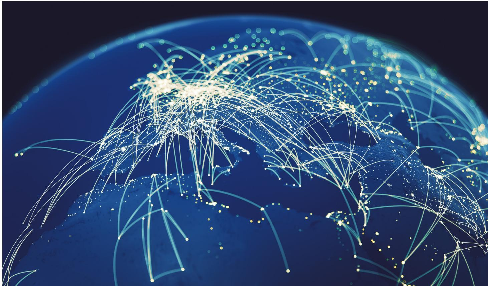

# Existing trade and financial policies will reduce GDP growth and raise inflation, and the damage could worsen

The analysis in this section describes the potential macroeconomic implications of the scenarios outlined in Section 2.1, with the resulting key findings:

\- Trade policy already in place at the time of publication will, in the short run, reduce global economic output by between \$213 billion and \$307 billion and further raise inflation by 0.2–0.3 pp relative to projections at the outset of 2025. The lower bound reflects estimates made using current effective tariff rates, while the upper bound reflects estimates based on (higher) signalled statutory tariff rates. The impact of existing policy varies substantially by country, reflecting different degrees of exposure to policy shifts. For example, US output growth is expected to be 0.4–0.6 pp lower than projected, whereas some Neutral countries are less affected, including Indonesia, with a projected 0.1 pp hit to output growth. The impact of the Iran war is not included in these figures, and estimates of the potential impact are presented separately in Case study 3.

Further escalation could severely worsen the economic cost of fragmentation, with one-year economic output losses of up to \$6.9 trillion. Additional fragmentation lowers economic output and drives up inflation for all blocs, causing macroeconomic output growth to shrink by up to 6.4 pp and inflation to increase by up to 6.1 pp in the worst case. The escalation of trade conflict in 2025, which briefly pushed tariff rates between the world's two largest economies above 100%, $^{84}$ reinforced the need to model edge cases. Fragmentation of this degree, which effectively halts trade between the major blocs, would have a substantial impact on the global economy. Figure 4 illustrates the severe economic cost of a complete decoupling, with the most affected countries being Neutrals such as Brazil and India. In aggregate, such countries would see a 10.7 pp hit to economic growth. In the long run (five years), firms adapt to the policy changes by rerouting supply chains, mitigating the damage. The impact on global GDP thus eases over time, moving from 6.4 pp in year one to 4.8 pp by year five as trade patterns adjust.

FIGURE 4 | Marginal change in output (deviation from baseline)  
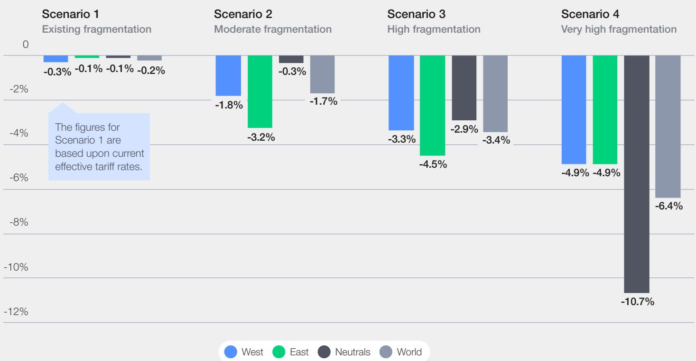

Sources (for all figures): NERA analysis based on the multicountry, multisector model of Baqaee and Farhi (2024). $^{85}$ Data from 2024 World Input–Output Database and Asian Development Bank's 2024 Input–Output Tables. Short-run impact is defined as one year after the initial shock and is based on applying the one-year to 10-year trade elasticity ratio found in Boehm et al. (2023) $^{86}$ to the elasticities in Baqaee and Farhi (2024), $^{87}$ as in Bolhuis et al. (2023). $^{88}$ The model assumes a 50% pass-through rate to domestic business based upon estimates from the Boston Fed $^{89}$ and a 20% pass-through to final consumption goods per Cavallo et al. (2025). $^{90}$ These pass-through rates serve as key model calibration parameters, determining how restrictive measures are split between tariff-driven price effects and productivity-related impacts on trade profitability. Using survey results from the Boston Fed, $^{91}$ both rates are assumed to increase by a factor of 1.5 after two years.

CASE STUDY 3

# The economic impact of the 2026 Iran war

The estimated economic cost of existing fragmentation (Scenario 1) outlined at the outset of Section 2.2 does not include the impact of one-off events, which are incremental to this report's modelled cost. There are several economic chokepoints in the global economy, $^{92}$ and leaders may choose to leverage their control over them in ways that further damage the global economy.

On 28 February 2026, the US and Israel struck Iran, which responded with attacks on neighbouring countries that host US military assets and effectively closed the Strait of Hormuz. At the time of publication, the conflict continues to evolve. But because roughly $25\%$ of the world's seaborne crude oil and $19\%$ of liquefied natural gas (LNG) pass through the strait, along with other commodities such as fertilizer, the economic implications are significant.

Iran used its ability to stop shipping through the Strait of Hormuz as an economic weapon in an attempt to compel de-escalation. $^{93}$ The economic impact of the Strait's closure varies based on the energy mix for each economy and relative dependence on commodities from the Middle East. For example, the US shale-oil boom has brought its petroleum trade balance close to equilibrium, $^{94}$ making it relatively less affected. In contrast, EMDEs are expected to be more vulnerable to these price fluctuations, given their reliance on imported energy. $^{95}$

To quantify these effects, the authors used an empirical model from the academic literature with four variables – oil production, real economic activity, the real price of oil, and oil inventories – to identify exogenous oil supply shocks over time. $^{96}$ Then they estimated how these structural shocks affect global oil prices and country-level GDP and inflation, and used these relationships to calculate GDP–oil price and inflation–oil price dynamic multipliers, using a standard approach in the literature. $^{97}$ These multipliers show the trajectory of GDP and inflation following a 1% increase in oil prices.

The analysis considered two illustrative scenarios: (1) de-escalation, where oil prices average around \$100 for two quarters (about 40% higher) before returning to pre-war levels; and (2) a protracted conflict, in which oil prices remain near \$100 for longer. In the de-escalation case, US inflation rises 1.0 pp after one year and GDP growth falls 0.2 pp, in line with academic estimates $^{98}$ and estimates by policy institutions for global GDP.\* Countries with lower energy intensity of production, such as the UK, see smaller effects (GDP growth -0.1 pp; inflation +0.6 pp), while more import-dependent, energy-intensive Asia-Pacific economies are hit harder (South Korea: GDP growth -0.3 pp; inflation +0.7 pp). Under the protracted conflict scenario, with oil prices remaining about 40% higher throughout the year, GDP and inflation impacts would at least double across countries.

FIGURE 5  
Marginal impact on global inflation (deviation from baseline)  
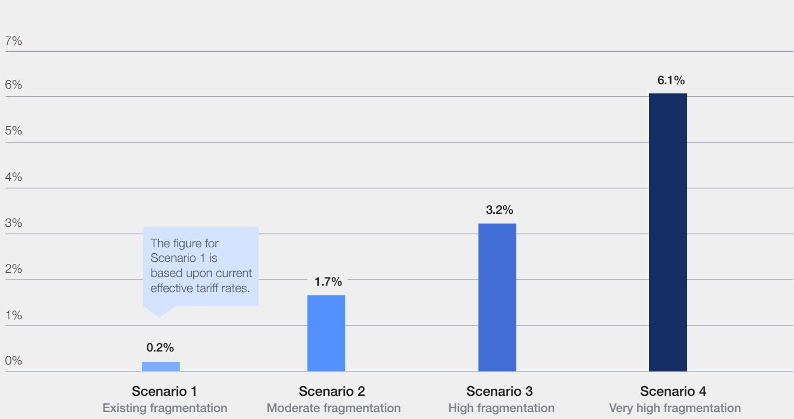

Figures 6 and 7 illustrate that fragmentation would change trading relationships, resulting in a less efficient global trade system that reduces economic output in aggregate and for each bloc. The results point to three key changes in trade:

\- Current policies are already reshaping trade patterns: Trade policies are projected to contribute to mutual declines in imports between the West and Neutral countries, while West-aligned Neutrals begin to import more from the East. These tariff-driven shifts in trade patterns also reroute supply chains and reallocate production, raising US manufacturing output while lowering it elsewhere, but depressing real low-skill wages across the world.

Fragmentation boosts some trade corridors but reduces them overall: Restrictive measures shift trade flows, increasing exchanges among geopolitically aligned or geographically proximate countries. These select gains are offset by larger declines in cross-bloc trade, resulting in lower overall trade volumes and weakened output growth.

\- Escalation disproportionately damages Neutral economies: In a high-fragmentation scenario, Neutral countries experience larger declines than the West or the East in economic output. This is because trade represents a larger share of the economic output of Neutral countries, which are therefore more impacted even though declines in imports are similar across blocs.

FIGURE 6 | Marginal impact on imports in the existing fragmentation scenario (deviation from baseline)  
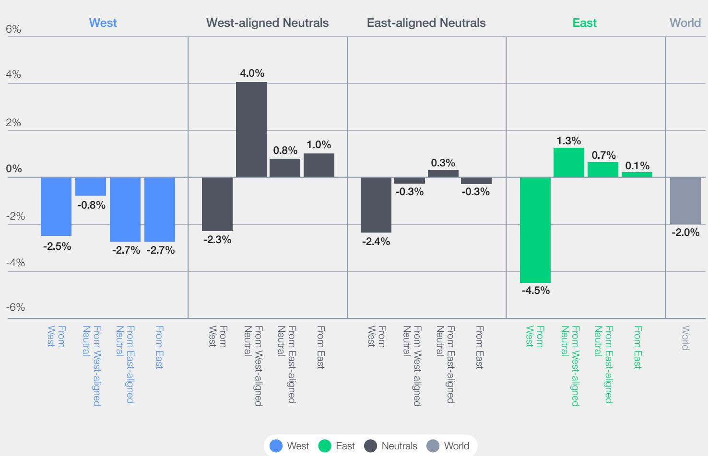

Marginal impact on imports in a high fragmentation scenario (deviation from baseline)  

# 2.3 | Recommendations to mitigate fragmentation

As this report has illustrated, fragmentation has material economic costs and increases uncertainty. However, current geopolitical turbulence can simultaneously serve as a forcing mechanism that leaders can use to move forward on long-standing initiatives to counter fragmentation.

Policy-makers can take concrete steps to align with the principles and rules outlined in this report, thereby mitigating unintended harm to the global economy. In addition, private-sector firms can take action to prepare their businesses to thrive amid ongoing volatility.

## Operationalize guardrails to mitigate the unintended consequences of economic statecraft

The preceding quantitative analysis demonstrates that fragmentation is not a distant concern, but already having a tangible drag on growth and risks entrenching a higher-cost, lower-growth equilibrium.

Building on the Principles to Safeguard the Global Financial System from Fragmentation and the Rules of Engagement for Responsible Economic Statecraft, policy-makers can take action to strengthen support for these norms. These frameworks provide a common reference point for private- and public-sector actors seeking to protect national security and resilience while preserving the predictability, interoperability and trust on which cross-border finance depends.

Over time, adopting best practices on the use of economic statecraft can help reduce policy uncertainty, lower the risk of abrupt or uncoordinated actions and create a more stable environment for long-term investment and innovation. Policy-makers can take the following steps:

\- Align on a common set of guardrails that appeal to the widest group of global policymakers. The principles and rules outlined in Section 1 can serve as a starting point for bilateral and multilateral talks.

\- Operationalize the guardrails by identifying concrete next steps that can be taken to encourage policy-makers to design effective economic statecraft measures that achieve national security objectives without causing unwanted economic damage. The G20 and other multilateral fora can serve as venues for effective collaboration on these efforts.

## Maintain the interoperability of underlying payments rails

The US dollar remains the world's reserve currency, accounting for the majority of global foreign currency reserve holdings, export invoices and foreign exchange transactions. $^{102}$ Recent events have not altered this dominance, but there are increasing signs of multipolarity in the global currency system, with currencies such as the renminbi making inroads in some areas. This change is being driven by an increase in trade transactions in which the US is not a party, and by government efforts to reduce reliance on the US dollar and associated exposure to Western sanctions. $^{103}$

The Chinese government, for example, has taken steps to increase the use of renminbi in international trade. Chinese regulators have set targets for renminbi use in trade, the country's banks have increasingly conducted overseas lending in renminbi rather than dollars, the People's Bank of China has extended swap lines to create a global financial safety net rivalling the scale of the International Monetary Fund's $^{104}$ and the Chinese government has encouraged domestic banks to limit exposure to US Treasury securities. $^{105}$

China's deepening trade ties have been accompanied by expanded use of its Cross-Border Interbank Payment System (CIPS) for payment settlement. $^{106}$ CIPS is currently interoperable with existing systems, $^{107}$ but as more banks become connected to its infrastructure, there is increased potential for countries to bypass the existing payments system and Western clearing houses.

Similarly, the rise of digital finance complicates not just the regulatory landscape for payments but also the role of the US dollar in global finance. On the one hand, the introduction of stablecoins will increase the demand for dollar reserves, as the vast majority of stablecoins are pegged to US dollars; $^{108}$ conversely, stablecoins could reduce the ability of the US to maintain oversight over cross-border payments as stablecoins pegged to the US dollar are issued outside the country. $^{109}$

Policy-makers can take the following approaches to maintaining interoperability:

\- Encourage the adoption of common standards: Such measures include adopting ISO 20022 data requirements to promote consistent data quality, $^{110}$ implementing the G20 Roadmap for Enhancing Cross-Border Payments $^{111}$ and pursuing a global regulatory framework for digital assets.

\- Implement measures to mitigate the cost of diverging standards: One such area is anti-money laundering and countering the financing of terrorism (AML/CFT), where countries can provide clear guidance on data required to comply with local regulations. $^{112}$

## Prepare businesses for ongoing geopolitical volatility

There is uncertainty in the policy landscape and macroeconomic outlook stemming from ongoing trade negotiations.

East-West geoeconomic conflict will continue to drive fragmentation, with a high likelihood of ongoing moderate to severe restrictions on East-West trade, including tariffs and investment restrictions such as those on US stock listings for Chinese companies $^{113}$ and on Chinese investment in US private equity. $^{114}$

Escalating tensions and fragmentation between geoeconomic blocs are keenly felt by leaders of private financial institutions, who must account for elevated volatility as they make business decisions. Despite the challenges inherent in planning for the future in an uncertain environment with higher baseline fragmentation, there are steps they can take to weather the uncertainty and hedge against potential worst-case outcomes:

Build a geopolitical risk-management capacity to understand exposure to geopolitical risk via clients, counterparties, business locations and contractual relationships. This can inform later efforts to adjust strategic positioning.

\- Conduct enterprise scenario analysis to assess the reliability of the existing enterprise risk management framework and associated risk models. Use the results of the analysis to map out opportunities for optimization and to highlight risk areas.

## To understand the concrete impact of fragmentation, a more granular perspective is necessary

While it is important to align on a set of commonsense guardrails on the use of economic statecraft at a global level, the challenges posed by fragmentation vary substantially by region and country. The fragmented state of European capital markets makes the continent's financial institutions and corporates less competitive amid geopolitical volatility. $^{115}$ East-West competition threatens the economic model of countries in South-East Asia, $^{116}$ which are tightly integrated into China-centred supply chains but also have substantial trade ties with the US and the West. The small, open economies of Africa are vulnerable to shifts in capital and trade flows. $^{117}$

Because African countries share many features with EMDEs in other regions, it is instructive for leaders across the world to turn to the experience of leaders on the continent for a case study of concrete ways in which fragmentation increases many dimensions of risk while also opening up new opportunities. Section 3 explores insights on this topic drawn from interviews with policy-makers and private-sector leaders.

# Risks and resilience in Africa

# Fragmentation poses disproportionate risks to EMDEs, including many African countries, but leaders on the continent see opportunities to pursue initiatives that boost growth.

Sections 1 and 2 highlighted that financial system fragmentation accelerated in 2025 and 2026, raising the baseline economic cost and disproportionately harming Neutral countries and EMDEs. These high-level findings mask the variety of ways in which fragmentation manifests itself in individual economies.

This section explores the concrete impact of fragmentation on countries in Africa, a continent that is home to five out of the top 10 fastest-

growing economies in the world, $^{118}$ and the youngest and fastest-growing population. $^{119}$ Understanding the risks posed by fragmentation is made more urgent by the fact that Africa's high concentration of small, open economies increases its exposure to changes in supply chains and investment flows. Policy-makers and businesses operating in EMDEs around the world can learn from how African leaders have managed this increasingly volatile geopolitical landscape.

## 3.1 African EMDEs face outsized fragmentation-related risks

Africa experienced a robust recovery from the pandemic, buoyed by public investment, a surge in commodity exports and ongoing diversification efforts. $^{120}$ But developments in 2025 and 2026 challenged economic growth on the continent. Official development assistance from Western countries fell at a historic pace, $^{121}$ while US tariffs on African countries reached their highest levels in recent decades $^{122}$ and the US boycotted South Africa's G20 presidency after a sharp deterioration in relations. $^{123}$ African nations collectively sent more money to China than they received, as debt payments for previous loans increased and fewer new loans were originated. $^{124}$

Although global financial system fragmentation negatively affects the citizens of all countries, it has a disparate impact on EMDEs. The quantitative analysis discussed in Section 2 indicates that in the worst case, fragmentation could shrink GDP for Neutrals (mostly EMDEs) by as much as 10.7 pp.

Economies in Africa exhibit many of the features of EMDEs that make them vulnerable to fragmentation. They have shallow capital markets and are thus reliant on foreign investment and volatile commodity exports; they also have high debt, weak infrastructure and a paucity of data that exacerbate their vulnerability to the health of the global economy. $^{125}$

## 3.2 Fragmentation is unfolding via multiple channels across African economies, exacerbating challenges

Growth in Africa is proving resilient in the near term despite challenges. Late in 2025, the IMF issued relatively strong regional GDP growth estimates, $^{126}$ an upward revision of earlier forecasts made in the wake of “Liberation Day”. $^{127}$ Sub-Saharan Africa’s goods trade grew by 9.7% in 2025, $^{128}$ one of the highest regional growth rates, but uncertainty remains in the medium and longer term.

This section explores how fragmentation manifests itself in Africa, aiming to provide a more granular understanding of the challenges faced by both the private and public sectors. These include disinvestment related to trade policy shocks, the high cost of capital, complications to sustainable debt relief, fragmentation in cross-border payments, the growing regulatory burden and broader global regulatory divergence.

## Trade policy shocks increase the risk of disinvestment

Over the past five decades, developing countries have been able to rely on two pillars to support their growth: a productive investment environment with low and falling tariff rates, and multilateral mechanisms for resolving trade disputes. In recent years, and particularly in 2025, both pillars have been weakened.

For decades, tariff rates across the globe have been on a downward trajectory, stabilizing at low levels in the 2000s and early 2010s. $^{129}$ From 2000 until 2025 the US provided duty-free access for certain goods from eligible African countries under the African Growth and Opportunity Act (AGOA). China made massive investments in the continent in the 2010s as part of its Belt and Road Initiative. $^{130}$

More recently, shifts in the trade-and-investment environment brought the era of low tariffs within a predictable framework to a close. Chinese investments as part of the Belt and Road Initiative have fallen sharply in recent years, and Africa now sees net outflows to China as countries pay more to service existing debt obligations than they receive in fresh investments. $^{131}$ AGOA lapsed for a period starting in 2025, threatening to undermine industries that rely on low US tariffs such as the East and Southern African apparel and textile industries. $^{132}$ The US Congress later extended AGOA, but the short-term nature of the extension and imminent renegotiation of its terms stand to discourage investment. $^{133}$

Alongside low tariffs, the Appellate Body of the WTO had, from 1994 to 2019, provided all countries with a mechanism for resolving disputes. The existence of this mechanism gave countries an alternative to unilateral retaliation, providing an avenue for predictable, measured settlements that reduced uncertainty and risk for businesses operating global supply chains. $^{134}$ In 2019, however, the US paralysed the Appellate Body of the WTO by declining to appoint members (see Box 2). $^{135}$

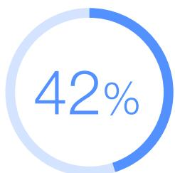  
Decline in FDI in Africa in the first half of 2025 amid a much less severe 3% global slowdown

The US refusal to appoint members to the Appellate Body of the WTO was driven by objections to the way the body functioned, including that it disregarded mandatory 90-day deadlines for appeals, allowed members whose terms had expired to continue serving on appeals

Together, these shifts threaten FDI in Africa. In 2024, before the recent escalation in geopolitical volatility, Africa saw a record 75% increase in FDI relative to the year prior. This outsized growth was primarily driven by a major infrastructure project in Egypt, but stood at 12% even excluding that project. $^{137}$ FDI had been rising for many years, with Europe accounting for a plurality of FDI stock but losing share to Asia, and the US maintaining a steady, lower share. $^{138}$

Trade policy shocks over the ensuing year have already started to weigh on growth, however. FDI in Africa declined in the first half of 2025 by 42% amid a much less severe worldwide slowdown of 3%, with the United Nations Economic Commission for Africa (UNECA) attributing the global decline to caution among investors stemming from geopolitical tensions. $^{139}$

## The cost of capital is high and worsened by fragmentation

A key factor holding back business activity and foreign investment in African countries is the high cost of capital, which has been exacerbated by recent events.

Of the 54 countries in Africa, only a few maintain investment-grade ratings from one or more of S&P, Moody's and Fitch at any given time (for example, the sovereign debt of Botswana and Mauritius are regularly rated as investment grade). International investors are guided by the ratings produced by these agencies, and African countries' reliance on international finance means that downgrades frequently precede and even trigger market sell-offs, amplifying risk rather than merely reflecting it. $^{140}$

As described further in Section 3.3, efforts are under way to increase African expertise at the international credit ratings agencies and bolster the continent's capacity to improve data collection to better inform ratings. These initiatives are urgently needed to mitigate the impact of artificially low ratings on private business, which in most cases cannot have credit ratings above those of their home countries. $^{141}$ The United Nations Development Programme (UNDP) has found that African countries pay more in interest than countries and went beyond the text of WTO agreements in many areas. $^{136}$ Both major US parties have since maintained this blockade, which means that the near-term prospects for reviving the Appellate Body are limited.

outside the continent with otherwise similar economic characteristics, and could save up to \$74.5 billion if the situation were rectified. $^{142}$

Recent policy turbulence affected the cost of capital in Africa by increasing sovereign and country risk premia, the extra return investors demand to compensate for a higher risk investment. With the “Africa risk premium” estimated to rise markedly during periods of global stress, a prolonged episode of uncertainty and tighter financial conditions could quickly translate into higher default rates and increased difficulties in repaying debts. In such a scenario, liquidity pressures risk morphing into outright solvency challenges, especially for lower-income and fragile states with limited buffers. $^{143}$

## Developments in international lending make sustainable debt relief more difficult

With solvency challenges on the horizon for many countries, the ability to restructure debt obligations will be integral to longer-term efforts to recover and grow. This will be particularly important in the event of a global economic downturn.

Lenders to African countries have traditionally been part of the Paris Club, an informal grouping of creditors that aims to find coordinated solutions to payment difficulties experienced by debtor countries, allowing such countries to negotiate with Paris Club creditors as a group. Creditors collectively arrive at a consensus-based decision that defines minimum debt relief conditions that are honoured in bilateral negotiations, $^{144}$ simplifying what would otherwise be a complicated series of individual negotiations.

Investments by China as part of its Belt and Road Initiative have decreased, and repayment terms mean that payments are currently at very high levels relative to new inflows. $^{145}$ Lending by China and its state-connected banks disrupts established multilateral processes of debt renegotiation, reducing the effectiveness of and borrowing countries' demand for Paris Club relief while simultaneously reducing Western governments' willingness to offer such relief. $^{146}$

## Existing fragmentation in cross-border payments was exacerbated

Cross-border payments in Africa have historically been complicated by a lack of affordable common payment infrastructure. The Society for Worldwide Interbank Financial Telecommunication (SWIFT) is a global interbank payment instruction messaging network that does not settle funds. This role has been filled in Africa by regional initiatives that have focused on intra-African payment integration: members of the Southern African Development Community (SADC) have relied on the South African rand as a regional settlement currency for cross-border transactions, $^{147}$ while the East African Payments System (EAPS) provides a multicurrency platform designed to settle payments within East Africa. $^{148}$ More recently, the African Union established the PAPSS to allow countries across the continent to transact in local currencies.

The global currency order has become increasingly multipolar, with the emergence of alternatives to the Western-led payment system and a moderate but significant shift away from the dollar as the currency used in cross-border transactions, with implications for policy-makers and business leaders in Africa.

In 2015, amid Western sanctions on Iran and Russia, the People's Bank of China launched CIPS to create an alternative to existing payments infrastructures. CIPS has since expanded despite China's tight capital controls, with several African institutions becoming direct participants in 2025. $^{149}$

As CIPS expands alongside a rise in the volume of trade between China and African countries, the use of renminbi in cross-border payments has also expanded rapidly, albeit from a low base. $^{150}$ The modest nature of the global increase belies a more dramatic change in a subset of payments. Many countries, including Algeria, Kenya, Morocco and

Nigeria, now conduct a majority of cross-border transactions with China in renminbi, $^{151}$ whereas transactions had previously been settled almost exclusively in US dollars.

On one hand, the expansion of local currency settlement facilitated by the roll-out of PAPSS, described in greater detail in Section 3.3, further boosts resilience by encouraging growth in new regional trade relationships; on the other, this shift increases certain risks. Countries may be forced to exclusively use one bloc's payment infrastructure, losing access to vital investor bases, while businesses face the risk of increasing transaction costs and other inefficiencies if emergent systems are not interoperable with legacy systems. $^{152}$

## Africa is affected by regulation that it does not have a substantial role in shaping

Regulatory compliance is a substantial part of the cost of doing business across borders, and in recent years actions by major powers have altered the regulatory landscape in which the rest of the world must operate. Regulatory action has increased, with a notable example being the expansion of grey-listing and sanctions. African countries are substantially affected by this trend but do not have the ability to shape it.

In the early 2020s the Financial Action Task Force (FATF) added many African countries, including South Africa, $^{153}$ to its grey list of countries under increased scrutiny for anti-money laundering compliance. This has economic consequences, including reductions in FDI and payments received. $^{154}$ While South Africa and other countries were removed from the grey list in late 2025, $^{155}$ many other African countries remain on the list, undermining the predictability required for long-term investment.

## Grey-listing

The Financial Action Task Force (FATF) publishes two lists identifying countries with weak measures to combat money laundering and terrorist financing. The “black list” identifies countries whose regulations are severely deficient, and the “grey list” identifies countries that are subject to increased monitoring but have made commitments to address deficiencies. $^{156}$ Both

## Diverging regulation raises the cost of doing business in Africa

The risks posed by an increasing regulatory burden are compounded by the fact that global regulations in key sectors are diverging. A prominent recent case is the difference in approaches that the EU and the US have taken to regulating digital finance.

The EU's Markets in Crypto Assets (MiCA) legislation, implemented in 2024, establishes a broad framework that prioritizes financial stability and consumer protection. The US Guiding and Establishing National Innovation for US Stablecoins (GENIUS) Act, passed in 2025, provides a regulatory framework for dollar-backed designations result in significant reductions in FDI and payments due to increased scrutiny by global financial firms and other companies, as well as potential sanctions from other countries. $^{157}$ Of the 54 countries in Africa, eight are currently on the “grey list” at the time of publication, posing a substantial challenge to their economies.

stablecoins. $^{158}$ From the perspective of a digital services firm seeking to issue a US dollar-pegged stablecoin, the US framework is relatively flexible, with more favourable reserve options, disclosure requirements and permitted issuer types.

Regulatory divergence manifests itself as a real operational cost for which private-sector businesses must account. For example, US–EU regulatory differences drive up costs by requiring operators in Africa seeking investment in both regions to run parallel infrastructures. $^{159}$ As costs for businesses operating in Africa increase, fewer projects on the continent are investable to institutions in the parts of the world with the deepest capital markets, including the US and the EU.

# Opportunities for African economies amid global turbulence

As illustrated in Section 3.2, the risks that African economies already face are magnified by fragmentation. These challenges are, however, balanced by opportunity, driven both by Africa's structural advantages and by the fact that acute challenges can provide an impetus for African leaders to pursue initiatives to boost growth.

## Structural features position African economies to thrive in the current geopolitical context

Many countries in Africa share natural advantages that position them to capitalize on global trends, including a growing and urbanizing population as well as ample reserves of strategic resources such as critical minerals, renewable energy generation potential and oil and gas.

African countries will lead the world in population growth in the coming decades, $^{160}$ and are at the same time urbanizing at a higher rate than any other region. $^{161}$ This growth is coming at a time when slowing population growth elsewhere is posing challenges not only to the economies of developed countries but also in developing countries such as China and Malaysia. With targeted investments, Africa could reap significant gains from a large demographic dividend. $^{162}$ As countries seek to

diversify their supply chains, countries in Africa are positioned to host new manufacturing hubs, which could be further boosted by increased consumption from a growing middle class.

Africa has a significant endowment of strategic resources that position the region's economies to benefit from the efforts of other countries and multinational firms to push for resilience and supply chain diversity:

\- The continent is home to some of the world's largest deposits of critical minerals needed for advanced manufacturing, including the majority of the world's reserves of platinum and cobalt. $^{163}$ As demand for critical minerals accelerates and many countries seek to diversify their supplies, African economies stand to benefit $^{164}$ and could begin refining and processing minerals, moving up the value chain.

\- Africa is also the continent with the greatest potential for solar energy generation, with 60% of the best solar resources globally, $^{165}$ and many countries are well suited to serving as providers of renewable energy to Europe. $^{166}$

\- The conflict between the US, Israel and Iran illustrates the value of Africa as a potential alternative supplier of oil and gas for countries in East Asia and Europe that rely on imports.

## Through the AfCFTA we have an opportunity to reconfigure our supply chains to reduce reliance on others and to expedite the establishment of regional value chains that will boost intra-Africa trade and secure Africa's productive capacity for generations to come.

Wamkele Mene, Secretary-General, AfCFTA Secretariat

## \$1.4

trillion

Potential boost to GDP from full implementation of the African Continental Free Trade Area (AfCFTA)

## The African Continental Free Trade Area (AfCFTA) and Pan-African Payment and Settlement System (PAPSS) can position Africa to leverage its advantages fully

As Africa enters a period in which its growing workforce and resource endowments position it to prosper, integration of the continent's economies through trade and payments will be essential to unlocking the scale necessary for growth. $^{167}$

African countries trade far more with countries outside the continent than within, with intra-African trade fluctuating between 15% and 21% of the continent's total trade. $^{168}$ This figure is much lower than equivalent figures for other regions; among Asian and European countries, intraregional trade stands at 59% and 68%, respectively. $^{169}$ UNECA estimates that full implementation of AfCFTA could raise Africa's GDP by a cumulative \$1.4 trillion between 2021 and 2045, driven by increases in intra-African trade across manufacturing, agro-processing and services. $^{170}$

PAPSS, a financial market infrastructure that enables cross-border payments across Africa in local currencies, has emerged as the backbone of AfCFTA implementation. It serves as a connector between existing regional systems, such as the EAPS and the Common Market for Eastern and Southern Africa Regional Payment and Settlement System (REPSS).

While most countries in Africa have ratified the AfCFTA, and PAPSS is expanding rapidly, progress on AfCFTA implementation – including lowering tariffs, harmonizing regulations and investing in physical and digital infrastructure – has been sluggish. $^{171}$ Policy-makers should:

\- Pursue full implementation of AfCFTA's protocols, focusing on addressing the root causes of inaction and aligning divergent national interests.

\- Encourage the integration of additional African central banks into PAPSS, allowing commercial banks across the continent to settle transactions in local currencies.

## The accuracy of African credit ratings can be improved by expanding African expertise at global credit rating agencies and by improving data collection

Low African credit ratings stem partly from a lack of data as well as international credit rating agencies' shortage of on-the-ground expertise. These issues force agencies to rely heavily upon subjective factors that are vulnerable to bias. $^{172}$

Private-sector leaders and policy-makers can support two promising solutions:

\- Expand expertise on Africa among credit rating agencies: The African Union is in the final stages of launching an Africa Credit Rating Agency (AfCRA), which promises to deliver more context-intelligent credit assessments to complement those of the international agencies. $^{173}$ This initiative has the potential to expand the degree to which international and local investors understand risks on the continent. Given that in the short term it will be challenging for AfCRA or similar initiatives to shift international perceptions of risk, $^{174}$ another avenue for improvement is an increase in the on-the-ground presence of global agencies in Africa. A recent example of this is Moody's acquisition of Africa's largest credit ratings agency, Global Credit Rating (GCR). $^{175}$

\- Improve data collection: The Africa Credit Ratings Initiative, a partnership between the

UNDP and global development advisory firm AfriCatalyst, seeks to support African sovereigns in collecting and reporting data (including by more accurately reflecting the GDP estimates that feed into credit ratings), $^{176}$ thereby reducing reliance on subjective assessments. This approach is an actionable way to improve the accuracy of credit ratings that does not require waiting for international reforms.

## Policy-makers can take steps to deepen African capital markets

Most African countries are considered frontier markets, characterized by shallow capital markets with debt issuance that is heavily weighted towards sovereigns, $^{177}$ providing relatively few opportunities to invest in stocks or corporate debt. This means that to build infrastructure or expand a business, leaders must rely on international sources of capital, from Eurobond markets to multilateral development banks.

Domestic financial systems are dominated by banks with limited long-term lending capacity, while institutional investors such as pension funds and insurers are still emerging as major players. $^{178}$ At the same time, the structure and liquidity of African markets constrain local and international investors (see Case study 4). Secondary markets for sovereign and corporate securities are thin, encouraging buy-and-hold behaviour and keeping transaction costs high. $^{179}$ This in turn feeds into higher required returns, reinforcing a perception that African assets are riskier than the fundamentals would otherwise justify.

Policy-makers can take concrete steps to deepen capital markets in Africa, thereby improving the environment for local firms:

\- Integrate the capital markets of separate African nations, including via initiatives by the African Stock Exchange Association and UNECA that aim to enable integration and dual listings between regional exchanges. $^{180}$

\- Increase allocation by Africa's pension and sovereign wealth funds to local equities, tapping a source of wealth that has grown substantially. Pension funds are now the largest institutional investors on the continent and could lead the way by increasing their allocations to local equities. $^{181}$

## CASE STUDY 4 The Liquidity and Sustainability Facility

Many African economies face liquidity challenges, as chronic shortages of foreign currency and shallow domestic financial markets add friction to trade and complicate debt servicing. This leads to elevated liquidity premia and higher borrowing costs for African sovereigns.

The Liquidity and Sustainability Facility (LSF) was launched at the 2021 United Nations Climate Change Conference (COP26) by UNECA, in partnership with Afreximbank, to address this issue by creating a repurchase agreement (repo) market for African sovereign bonds. This would facilitate the creation of additional stable funding sources for African governments, thereby reducing liquidity premia and lowering borrowing costs.

Beyond its initial mandate, the LSF has evolved into broader liquidity infrastructure. By creating a repo facility designed to operate to the standards of global markets, building an all-Africa sovereign bond index and working with partners to develop exchange-traded funds (ETFs), the LSF seeks to shift African sovereign debt from a largely buy-and-hold asset class into a more tradable one. This market infrastructure is designed to crowd in private investors and ultimately align pricing more closely with African sovereigns' actual default and recovery experience.

## Policy-makers can boost the pipeline of investable infrastructure projects

Expanding the scope of investable infrastructure projects in Africa is another promising path to boost growth by addressing the infrastructure gap on the continent. The African Union Development Agency – New Partnership for Africa's Development (AUDA-NEPAD) estimates that while annual investment needs are between \$130 and \$170 billion, only \$80 billion is invested, of which 40% comes from African governments, 35% from donors and 25% from the private sector. $^{182}$

Underinvestment in transportation infrastructure is a key factor holding back full implementation of the AfCFTA. $^{183}$ B20 South Africa, the business engagement group for South Africa's G20 presidency, recommended a targeted approach to improving infrastructure on the continent: $^{184}$

\- Provide targeted support for infrastructure projects by assisting early project development, streamlining regulatory and permitting processes and encouraging increased visibility and use of project pipelines to help coordinate and fund projects.

\- Prioritize the provision of critical infrastructure by focusing on digital and energy infrastructure and promoting coordination among infrastructure programmes.

# Conclusion

The events of 2025 and 2026 moved global financial system fragmentation from a plausible risk to an operating reality. A step change in trade and investment restrictions has raised the baseline level of friction in cross-border commerce and challenged foundational norms that have supported growth for decades. The analysis in this report underscores that the economic costs are no longer hypothetical; policies already in place are expected to reduce global output and push inflation higher, while plausible escalation pathways could amplify the damage.

Africa sits at the sharp end of these dynamics. African countries face outsized exposure to trade shocks, shifts in capital flows and regulatory divergence, but the continent's recent experience navigating turbulence highlights a central lesson for the wider world: resilience can be built by diligently pursuing new and expanded relationships with willing partners.

There is a clear need for an executable agenda to guard against the worst potential outcomes of fragmentation. The Principles to Safeguard the Global Financial System from Fragmentation and Rules of Engagement for Responsible Economic Statecraft provide a framework to mitigate unintended damage from economic statecraft. These principles and rules, which have been informed by input from dozens of financial sector leaders, can serve as a starting point for future efforts to operationalize guardrails in collaboration with policy-makers.

Regionally, African leaders can use pressure from today's geopolitical volatility to their advantage, accelerating AfCFTA implementation and scaling PAPSS, strengthening data-gathering capabilities to reduce unjustified risk premia, deepening capital markets to mobilize domestic savings and expanding the pipeline of investable infrastructure projects. These steps stand to keep the continent connected to regional and global opportunity even as volatility continues.

Ultimately, the course that fragmentation takes cannot be determined in a single year and can still be shaped in the years to come. The choices leaders make now can shift the trajectory of the global economy.

The world could drift towards a costly equilibrium of raised barriers, duplicated systems and muted growth, in which the aspirations of entrepreneurs in rich and developing countries alike are constrained by higher borrowing costs and families must pay more for food and basic necessities. A more prosperous path is available, however, in which renewed norms, interoperable infrastructure and regional integration anchor a new, more resilient global financial system.

# Appendix: Quantitative analysis output

FIGURE A1

Marginal change in output (deviation from baseline)

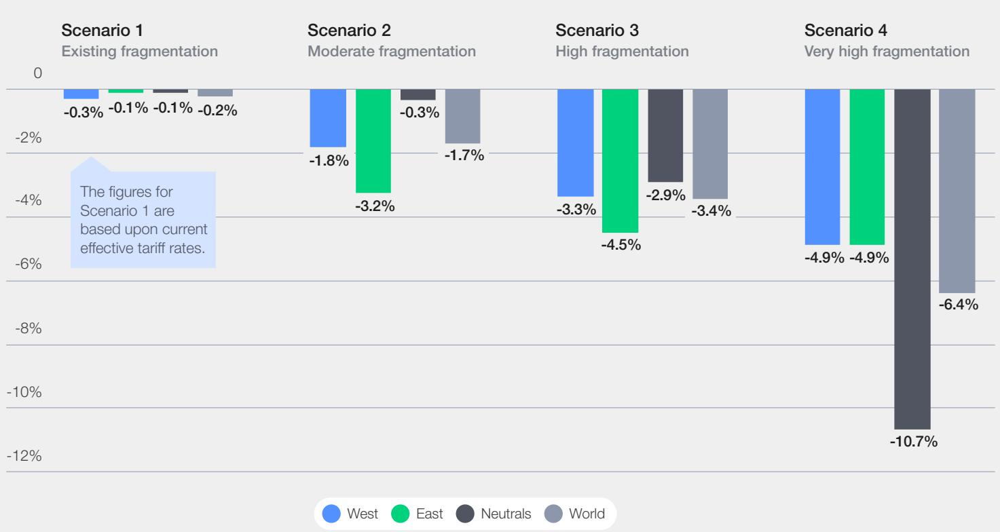

Marginal impact on global inflation (deviation from baseline)  

FIGURE A3 | Marginal impact on imports in the existing fragmentation scenario (deviation from baseline)  

FIGURE A4 Marginal impact on imports in a high fragmentation scenario (deviation from baseline)  
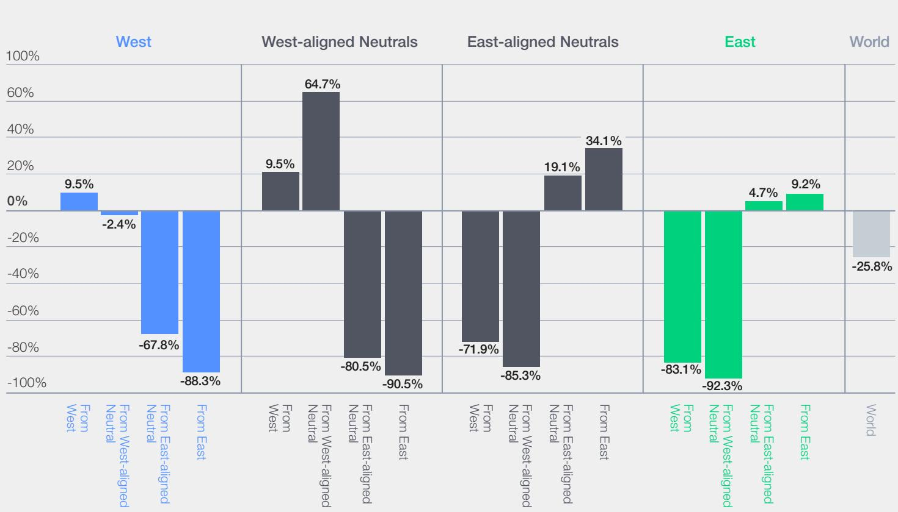

FIGURE A5 Long-run real production change by country group and sector group in the existing fragmentation scenario (deviation from baseline at 5 years)  
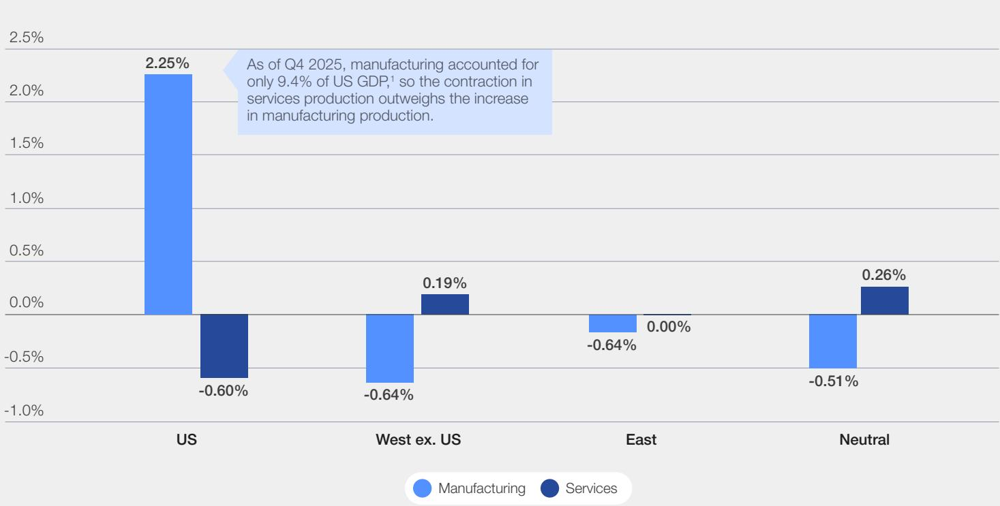  
Note: 1. US Bureau of Economic Analysis. (n.d.). Value added by industry: Manufacturing as a percentage of gross domestic product (VAPGDPMA). Retrieved April 20, 2026, from Federal Reserve Bank of St. Louis, FRED. https://fred.stlouisfed.org/series/VAPGDPMA

Sectoral wage differentials in the existing fragmentation scenario (deviation from baseline, relative to medium-skilled labour)  
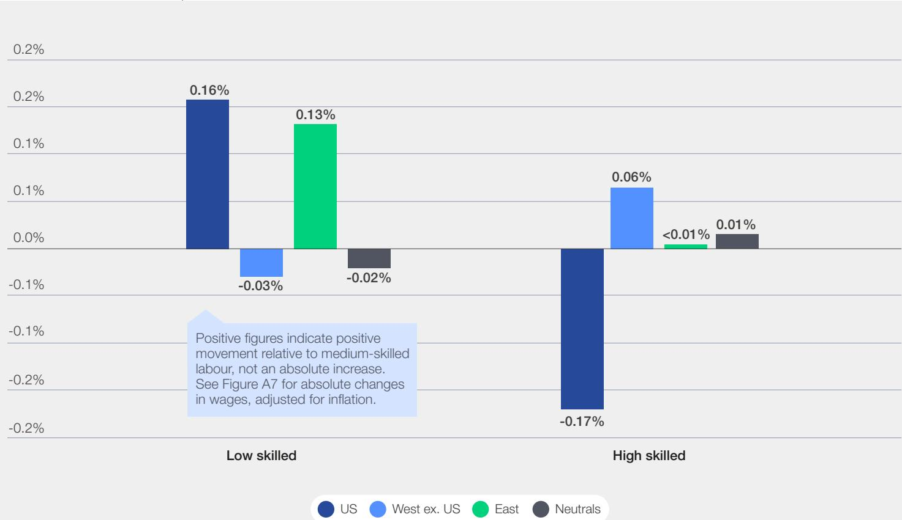

Lead authors

World Economic Forum

Matt Strahan
Lead, Private Markets Initiatives

Oliver Wyman, a Marsh business

Seth Borden

Associate

Daniel Tannebaum
Partner, Global Anti-Financial Crime Practice Leader

## Co-author and economist, Section 2

Dick Oosthuizen

Consultant, NERA Economic Consulting, a Marsh business

## Acknowledgements

Jorge Baez
Managing Director, NERA Economic Consulting, a Marsh business

Mary Bridges
Ernest May Fellow in History and Policy, Belfer Center, Harvard University

Paul Calvey
Partner, South Africa Lead, Oliver Wyman, a Marsh business

## Patrick Conroy

Senior Managing Director, NERA Economic Consulting, a Marsh business

## Douglas Elliott

Partner, Finance and Risk, Americas, Oliver Wyman, a Marsh business

## Natalya Guseva

Head, Financial Markets and Resilience Initiatives, World Economic Forum

## Madeleine Hillyer

Lead, Centre Programming and Public Engagement, World Economic Forum

## Jordan Milev

Managing Director, NERA Economic Consulting, a Marsh business

Ben Simpfendorfer
Head, Oliver Wyman Forum, Asia-Pacific, Oliver Wyman, a Marsh business

## Harry Yeung

Specialist, Financial Markets and Resilience Initiatives, World Economic Forum

# Subject-matter expert interviews

## Shekhar Aiyar

Director and Chief Executive, Indian Council for Research on International Economic Relations (ICRIER)

Anthony Costa
Head of B20 Secretariat, Business Unity South Africa (BUSA)

Alejo Czerwonko
Chief Investment Officer, Emerging Markets Americas, UBS Global Wealth Management

Thierry Déau
Founder and Chief Executive Officer, Meridiam

Kenny Fihla
Group Chief Executive Officer, Absa Group

Kirston Greenop
Head, Corporate Citizenship, Standard Bank Group

Johanna Hill
Deputy Director-General, World Trade Organization (WTO)

Gert Kruger
Chief Risk Officer, FirstRand Group

## Stéphane Le Bouder

Partner and Chief Operating Officer, MiDA Advisors

## Christopher Loewald

Head of Economic Research, South African Reserve Bank (SARB)

Daniel Mminele
Chairman, Nedbank

Vera Songwe
Founder and Chair, Liquidity and Sustainability Facility (LSF)

## Clete Willems

Chief Global Affairs Officer, Netflix

## Rama Yade

Senior Director, Africa Center, Atlantic Council

## Samaila Zubairu

President and Chief Executive Officer, Africa Finance Corporation (AFC)

## Production

## Michela Liberale Dorbolò

Designer, World Economic Forum

## Simon Smith

Editor, Astra Content

## Endnotes

United Nations Conference on Trade and Development (UNCTAD). (2025, December). Global trade update: Facts and figures. https://unctad.org/system/files/official-document/ditcinf2025d10\_en.pdf

2. Bank for International Settlements (BIS). (2025, July 31). Statistical release: BIS international banking statistics and global liquidity indicators at end-March 2025. https://www.bis.org/statistics/gli2507.pdf

3. Monterroso, O., & Vilán, D. (2025, February 27). Global remittances cycle. FEDS notes. Board of Governors of the Federal Reserve System. https://federalreserve.gov/econres/notes/feds-notes/global-remittances-cycle-20250227.html

4. Federal Reserve Bank of St. Louis. (n.d.). Federal debt held by foreign and international investors (FDHBFIN) (FRED series). Retrieved April 17, 2026, from https://fred.stlouisfed.org/series/FDHBFIN

5. Duguid, K., Chan, M., & Smith, I. (2026, March 31). Foreign central banks reduce US Treasury holdings to lowest level since 2012. Financial Times. https://www.ft.com/content/1c4189e9-36af-4779-b862-d868cf2aff76?shareType=nongift&syn-25a6b1a6=1

6. Swanson, A., & Tobin, M. (2025, October 16). China's rare earth restrictions aim to beat US at its own game. New York Times. https://www.nytimes.com/2025/10/16/business/economy/china-rare-earths-supply-chain.html

7. The Economist. (2026, April 21). Why China's exports will keep on rising. https://www.economist.com/china/2026/04/21/why-chinas-exports-will-keep-on-rising

8. Hasell, J., & Moser, M. (2019, February 5). How do we know the history of extreme poverty? Our World in Data. https://ourworldindata.org/extreme-history-methods

9. Wright, L. (2025, July 23). 20 years of missed opportunities in China's exchange rate policy. Rhodium Group. https://rhg.com/research/20-years-of-missed-opportunities-in-chinas-exchange-rate-policy/

10. Federal Reserve Bank of St. Louis. (2025, April 10). Nontariff trade barriers in the US and EU. On the Economy. https://www.stlouisfed.org/on-the-economy/2025/apr/nontariff-trade-barriers-us-eu

11. York, E., & Kraschel, E. (2025, November 24). IEEPA tariffs are down from April threats. Tax Foundation. https://taxfoundation.org/blog/ieepa-tariffs-rates-down-april-threats/

12. Baskaran, G. (2025, October 9). China's new rare earth and magnet restrictions threaten US defense supply chains. Center for Strategic and International Studies. https://www.csis.org/analysis/chinas-new-rare-earth-and-magnet-restrictions-threaten-us-defense-supply-chains

13. Steer, G. (2025, September 4). Nasdaq to tighten rules on small stocks after suspected “pump and dump” scams. Financial Times. https://www.ft.com/content/955a8008-6657-4049-b190-4a92c5ad9fcc?syn-25a6b1a6=1

14. Prime Minister of Canada. (2026, January 16). Prime Minister Carney forges new strategic partnership with People's Republic of China focused on energy, agri-food and trade [Press release]. https://www.pm.gc.ca/en/news/news-releases/2026/01/16/prime-minister-carney-forges-new-strategic-partnership-peoples

15. Harring, A. (2026, January 20). Danish pension fund to sell \$100 million in Treasurys, citing 'poor' US government finances. CNBC. https://www.cnbc.com/2026/01/20/akademikerpension-us-treasury-greenland-trump.html

16. Letzing, J. (2025, January 23). Soaring public debt is worrying experts at Davos 2025. Here's why most of us didn't see it coming. World Economic Forum. https://www.weforum.org/stories/2025/01/public-debt-problem-davos-global/

17. Gilfedder, N. (2025, May 28). What happens when you doubt the power of bonds? Edelman Financial Engines. https://www.edelmanfinancialengines.com/education/market-insights/june-2025-market-insights/

18. Domm, P. (2025, December 23). A nervous bond market prepares for a new year: What to expect. Barron's. https://www.barrons.com/articles/a-nervous-bond-market-prepares-for-a-new-year-what-to-expect-5108cfac

19. Goldman Sachs. (2023, April 17). Why US Treasuries sold off when market volatility jumped. https://www.goldmansachs.com/insights/articles/why-us-treasuries-sold-off-when-market-volatility-jumped

20. Kirkland & Ellis. (2025, February 21). US Department of the Treasury releases final rule implementing executive order on outbound foreign investments into China. https://www.kirkland.com/publications/kirkland-alert/2025/02/us-department-of-the-treasury-releases-final-rule-implementing-executive-order-on-outbound-foreign#:\~:text=On%20October%2028%2C%202024%20(the.the%20%E2%80%9CTargeted%20Sectors%E2%80%9D)

21. Bown, C. P. (2026, April 24). Trump's trade war timeline 2.0: An up-to-date guide. Peterson Institute for International Economics (PIIE). https://www.piie.com/blogs/realtime-economics/2025/trumps-trade-warTimeline-20-date-guide
22. Ibid.

23. Daya, C., et al. (2025, February 26). Trump administration issues America First investment policy memorandum. DLA Piper. https://www.dlapiper.com/en-us/insights/publications/2025/02/trump-administration-issues-america-first-investment-policy-memorandum

24. Bown, C. P. (2026, April 24). Trump's trade war timeline 2.0: An up-to-date guide. PIIE. https://www.piie.com/blogs/realtime-economics/2025/trumps-trade-war-timeline-20-date-guide

25. European Parliament. (2025, November 14). Savings and investments union: Overview and state of play. https://www.europarl.europa.eu/thinktank/en/document/EPRS\_BRI(2025)779187

26. | Council on Foreign Relations. (2026, January 1). Trade and tariff calendar 2025. http://cfr.org/articles/trade-calendar-2025

27. Harithas, B., et al. (2025, April 3). "Liberation Day" tariffs explained. Center for Strategic and International Studies (CSIS). https://www.csis.org/analysis/liberation-day-tariffs-explained

28. Chu, M. M., et al. (2025, April 4). China imposes 34% tariffs on all US goods. Reuters. https://www.reuters.com/world/china-impose-tariffs-34-all-us-goods-april-10-2025-04-04/

29. Picchi, A. (2025, April 10). Why did Trump pause the tariffs? The bond market rebelled – here's what that means. CBS News. https://www.cbsnews.com/news/trump-tariff-pause-bond-market-bond-yield-treasury-bill/#:\~:text=Even%20as%20stocks%20plunged%20in,%22getting%20a%20little%20queasy.%22

30. Bown, C. P. (2026, April 24). Trump's trade war timeline 2.0: An up-to-date guide. PIIE. https://www.piie.com/blogs/realtime-economics/2025/trumps-trade-war-timeline-20-date-guide

31. Agnew, H., et al. China pulls back from US private equity investments. Financial Times. https://www.ft.com/content/478c1c64-8923-4ec2-858d-670b30ae44f9?syn-25a6b1a6=1

32. LaRocca, L. A. (2025, April 12). Trump tariffs on China will soon bring “irreversible” damage to most American businesses. CNBC. https://www.cnbc.com/2025/04/12/trump-tariffs-on-china-mean-irreversible-damage-for-most-businesses.html

33. Sadden, E. (2025, June 12). China offers zero tariffs to 53 African nations amid US trade tensions. S&P Global. https://www.spglobal.com/energy/en/news-research/latest-news/agriculture/061225-china-offers-zero-tariffs-to-53-african-nations-amid-us-trade-tensions

34. Guarascio, F. (2025, July 10). Vietnam plans new penalties for illegal transshipments after Trump deal, documents show. Reuters. https://www.reuters.com/world/china/vietnam-plans-new-penalties-illegal-transshipments-after-trump-deal-documents-2025-07-10/

35. Afreximbank. (2025, July 7). PAPSS and Interstellar unveil African currency marketplace eliminating \$5 billion trade bottleneck [Press release]. https://www.afreximbank.com/papss-and-interstellar-unveil-african-currency-marketplace-eliminating-5-billion-trade-bottleneck/

36. Hancock, A., & Hoskins, P. (2025, August 11). Nvidia and AMD to pay 15% of China chip sales to US. BBC. https://www.bbc.com/news/articles/cvgvnx8y19o

37. Roy, R. (2025, August 27). Trump's $50\%$ tariffs on India over Russian oil purchases take effect. AP News. https://apnews.com/article/india-us-tariff-exports-trade-tension-48ac6d5e172df04832c75d2a57d0a860

38. Wiley. (2025, August 28). DOD issues final rule addressing conflicts of interest in certain consulting contracts. https://www.wiley.law/alert-DOD-Issues-Final-Rule-Addressing-Conflicts-of-Interest-in-Certain-Consulting-Contracts

39. Steer, G. (2025, September 4). Nasdaq to tighten rules on small stocks after suspected “pump and dump” scams. Financial Times. https://www.ft.com/content/955a8008-6657-4049-b190-4a92c5ad9fcc?syn-25a6b1a6=1

40. Council on Foreign Relations. (2026, January 1). Trade and tariff calendar 2025. http://cfr.org/articles/trade-calendar-2025
41. Ibid.

42. Vladimirov, M. (2025, December 10). Trump sanctions on Lukoil, Rosneft could reshuffle global oil map. Reuters. https://www.reuters.com/business/energy/trump-sanctions-lukoil-rosneft-could-reshuffle-global-oil-map-2025-12-10/

43. Bown, C. P. (2026, April 24). Trump's trade war timeline 2.0: An up-to-date guide. PIIE. https://www.piie.com/blogs/realtime-economics/2025/trumps-trade-war-timeline-20-date-guide

44. Smialek, J. (2025, December 18). Europe to lend \$105 billion to Ukraine without touching Russian funds. New York Times. https://www.nytimes.com/2025/12/18/world/europe/russia-eu-ukraine-frozen-assets.html

45. Foy, H., et al. (2025, December 18). EU agrees €90bn loan to Ukraine after frozen Russian asset plan fails. Financial Times. https://www.ft.com/content/e5691048-696b-44cd-8a0a-50b917e3d62a

46. Tan, Z. Y., & Shah, D. (2026, January 12). China to eliminate VAT rebate for PVC exports from April 1. S&P Global. https://www.spglobal.com/energy/en/news-research/latest-news/chemicals/011226-china-to-eliminate-vat-rebate-for-pvc-exports-from-april-1

47. Faguy, A., & Chia, O. (2026, January 12). Fed chair Powell hits out at “unprecedented” probe by US justice department. BBC News. https://www.bbc.com/news/articles/c801k7rkkd7o

48. Timiraos, N., & Barber, C. R. (2025, December 18). Judge throws out Justice Department subpoenas to Federal Reserve. The Wall Street Journal. https://www.wsj.com/economy/central-banking/judge-throws-out-justice-department-subpoenas-to-federal-reserve-7d90addf

49. Desantis, D., & Blenkinsop, P. (2026, January 17). EU-Mercosur sign trade deal after 25 years of negotiations. Reuters. https://www.reuters.com/world/americas/eu-mercosur-sign-trade-deal-after-25-years-negotiations-2026-01-17/

50. Harring, A. (2026, January 20). Danish pension fund to sell \$100 million in Treasurys, citing ‘poor’ US government finances. CNBC. https://www.cnbc.com/2026/01/20/akademikerpension-us-treasury-greenland-trump.html

51. Supreme Court of the United States. (2026, February 20). Learning Resources, Inc. v. Trump. https://www.supremecourt.gov/opinions/25pdf/24-1287\_4gcj.pdf

52. Budget Lab at Yale. (2026, March 9). State of US tariffs. https://budgetlab.yale.edu/research/state-tariffs-march-9-2026

53. Council on Foreign Relations. (2026, March 17). How the Iran War ignited a geoeconomic firestorm. https://www.cfr.org/articles/how-the-iran-war-ignited-a-geoeconomic-firestorm

54. US International Development Finance Corporation (DFC). (2025, March 11). DFC announces Chubb lead insurance partner maritime reinsurance plan [Press release]. https://www.dfc.gov/media/press-releases/dfc-announces-chubb-lead-insurance-partner-maritime-reinsurance-plan

55. Brownstein Hyatt Farber Schreck (BHFS). (2026, March 12). USTR initiates Section 301 probe into structural excess capacity and production in manufacturing sectors. https://www.bhfs.com/insight/ustr-initiates-section-301-probe-into-structural-excess-capacity-and-production-in-manufacturing-sectors/

56. Brownstein Hyatt Farber Schreck (BHFS). (2026, March 16). USTR initiates Section 301 investigations into 60 countries' forced labor policies. https://www.bhfs.com/insight/ustr-initiates-section-301-investigations-into-60-countries-forced-labor-policies/

57. World Economic Forum. (2025, January). Navigating global financial system fragmentation. https://reports.weforum.org/docs/WEF\_Navigating\_Global\_Financial\_System\_Fragmentation\_2025.pdf

58. World Justice Project. (2024). Rule of Law Index 2024. http://worldjusticeproject.org/rule-of-law-index/downloads/WJPIndex2024.pdf

59. Fanarakis, K. (2025, August 14). The cost of policy uncertainty. Milken Institute. https://milkeninstitute.org/content-hub/insights/cost-policy-uncertainty

60. Dadush, U., & Prost, E. D. (2023, May 9). The problem with preferential trade agreements. Brookings Institution. https://www.bruegel.org/analysis/problem-preferential-trade-agreements

61. Tran, H. (2023, August 25). Understanding the growing use of local currencies in cross-border payments. Atlantic Council Econographics. https://www.atlanticcouncil.org/blogs/econographics/understanding-the-growing-use-of-localcurrencies-in-cross-border-payments/

62. Gonzalez-Paramo, J. M. (2025, January 24). In an era of populism, central bank independence is at risk. IESE Business School. https://www.iese.edu/insight/articles/central-bank-independence-populism/

63. Dennis, S. T. (2026, January 12). Powell probe stirs GOP concern, threat to stop Trump nominee. Bloomberg. https://www.bloomberg.com/news/articles/2026-01-12/trump-faces-fed-roadblock-as-key-republican-blasts-justice-probe

64. McKibbin, W. J., Hogan, M., & Noland, M. (2025). Erosion of Fed independence would slow US economic growth and boost inflation over time. PIIE. https://www.piie.com/research/piie-charts/2025/erosion-fed-independence-would-slow-us-economic-growth-and-boost

65. Flodberg, C., & Wasén, P. (2024, June 10). Economic commentary: Lower response rates implies challenges for monetary policy in several countries. Sveriges Riksbank. https://www.riksbank.se/globalassets/media/rapporter/ekonomiska-kommentarer/engelska/2024/economic-commentary---lower-response-rates-implies-challenges-for-monetary-policy-in-several-countries.pdf

66. Harris, B., & Dews, F. (2025, September 24). Is the credibility of US government data at risk? Why it matters to everyone. Brookings Institution. https://www.brookings.edu/articles/is-the-credibility-of-us-government-data-at-risk-why-it-matters-to-everyone/

67. Farrokhnia, R. A. (2026, January 23). Disrupting the finance world: How fintech is changing the game for businesses. Columbia Business School. https://execed.business.columbia.edu/disrupting-the-finance-world-how-fintech-is-changing-the-game-for-businesses

68. Krainer, J., Vaghefi, F., & Wang, T. (2024, September 5). Bank lending to nonbanks: A robust channel fueled by constrained capital? Federal Deposit Insurance Corporation. https://www.fdic.gov/media/168226

69. Buchak, G., Matvos, G., Piskorski, T., & Seru, A. (2017, May). Fintech, regulatory arbitrage, and the rise of shadow banks. https://www.fdic.gov/analysis/cfr/bank-research-conference/annual-17th/papers/15-piskorski.pdf

70. Fitch Ratings. (2019, May 21). Global Shadow Banking Growth Increases Systemic Risks. https://www.fitchratings.com/research/non-bank-financial-institutions/global-shadow-banking-growth-increases-systemic-risks-21-05-2019

71. European Commission. (2024, November 15). The cost of uncertainty – new estimates. https://economy-finance.ec.europa.eu/economic-forecast-and-surveys/economic-forecasts/autumn-2024-economic-forecast-gradual-rebound-adverse-environment/cost-uncertainty-new-estimates\_en

72. Miran formally held the role of chair of the Council of Economic Advisers between 13 March 2025 and his resignation on 3 February 2026 but was on leave from September 2025 after his initial appointment to the Federal Reserve Board of Governors.

73. Miran, S. (2024, November). A user's guide to restructuring the global trading system. Hudson Bay Capital. https://www.hudsonbaycapital.com/documents/FG/hudsonbay/research/638199\_A\_Users\_Guide\_to\_Restructuring\_the\_Global\_Trading\_System.pdf

74. Mohieldin, M., & Songwe, V. (2025, November 20). How emerging economies can survive and thrive in an era of geopolitical competition. World Economic Forum. https://www.weforum.org/stories/2025/11/emerging-economies-industrial-policy-competition/

75. Mukherjee, A. (2025). The United States' new G20 priorities. Observer Research Foundation America. https://orfamerica.org/orf-america-comments/the-united-states-new-g20-priorities

76. Levy, C., et al. (2025, December 10). Beyond the headlines: How trade agreements are reshaping business. McKinsey and Company. https://www.mckinsey.com/capabilities/geopolitics/our-insights/beyond-the-headlines-how-trade-agreements-are-reshaping-business

77. Sidley. (2026, January 20). The EU's “trade bazooka”: Key considerations on the Anti-Coercion Instrument. https://www.sidley.com/en/insights/newsupdates/2026/01/the-eus-trade-bazooka-key-considerations-on-the-anti-coercion-instrument

78. Andrade, P., et al. (2025, September 29). Who will pay for tariffs? Businesses' expectations about costs and prices. Federal Reserve Bank of Boston. https://www.bostonfed.org/publications/current-policy-perspectives/2025/who-pays-for-tariffs.aspx

79. Boehm, C. E., Levchenko, A. A., & Pandalai-Nayar, N. (2023). The long and short (run) of trade elasticities. American Economic Review, 113(4), 861–905. https://doi.org/10.1257/aer.20210225

80. Heerman, K., and Pitt, A. (2026, April 2). Tracking trade amid uncertain and changing tariff policies. https://www.brookings.edu/articles/tracking-trade-amid-uncertain-and-changing-tariff-policies/

81. Penn Wharton Budget Model. (n.d.). Tariff simulator: Revenue and prices. Retrieved April 20, 2026, from https://budgetmodel.wharton.upenn.edu/data-interactive/sTariff-simulator.md/

82. Budget Lab at Yale. (2026, March 9). State of US tariffs. https://budgetlab.yale.edu/research/state-tariffs-march-9-2026

83. Rappeport, A. (2026, March 4). Trump's 15 percent tariffs: What you need to know. New York Times. https://www.nytimes.com/2026/03/04/business/economy/bessent-trump-tariffs-15-percent.html

84. Bown, C. P. (2025, November 14). US–China trade war tariffs: An up-to-date chart. PIIE. https://www.piie.com/research/piie-charts/2019/us-china-trade-war-tariffs-date-chart

85. Baqaee, D. R., & Farhi, E. (2024). Networks, barriers and trade. Econometrica, 92(2), 505–541. https://doi.org/10.3982/ecta17513

86. Boehm, C. E., Levchenko, A. A., & Pandalai-Nayar, N. (2023). The long and short (run) of trade elasticities. American Economic Review, 113(4), 861–905. https://doi.org/10.1257/aer.20210225

87. Baqaee, D. R., & Farhi, E. (2024). Networks, barriers and trade. Econometrica, 92(2), 505–541. https://doi.org/10.3982/ecta17513

88. Bolhuis, M. A., Chen, J., & Kett, B. R. (2023). Fragmentation in global trade: Accounting for commodities. International Monetary Fund Working Papers, 2023(73). https://doi.org/10.5089/9798400236563.001

89. Andrade, P., et al. (2025, September 29). Who will pay for tariffs? Businesses' expectations about costs and prices. Federal Reserve Bank of Boston. https://www.bostonfed.org/publications/current-policy-perspectives/2025/who-pays-for-tariffs.aspx

90. Cavallo, A., Llamas, P., & Vazquez, F. M. (2026, January 30). Tracking the short-run price impact of US tariffs. https://www.pricinglab.org/files/TrackingTariffs\_Cavallo\_Llamas\_Vazquez.pdf

91. Andrade, P., et al. (2025, September 29). Who will pay for tariffs? Businesses' expectations about costs and prices. Federal Reserve Bank of Boston. https://www.bostonfed.org/publications/current-policy-perspectives/2025/who-pays-for-tariffs.aspx

92. Fishman, E. (2023). Chokepoints: American power in the age of economic warfare. Penguin Press.

93. Mulder, N. (2026, March 17). The era of US dominance in economic warfare is over. Financial Times. https://www.ft.com/content/ae458591-5941-45f1-bf7b-7110bc35eb88?desktop=true&segmentId=d8d3e364-5197-20eb-17cf-2437841d178a

94. Kilian, L., Plante, M., & Richter, A. W. (2026, March 20). What the closure of the Strait of Hormuz means for the global economy. Federal Reserve Bank of Dallas. https://www.dallasfed.org/research/economics/2026/0320

95. Organisation for Economic Co-operation and Development (OECD). (2026, March). Testing resilience: OECD economic outlook interim report. https://www.oecd.org/content/dam/oecd/en/publications/reports/2026/03/oecd-economic-outlook-interim-report-march-2026\_254a8d56/d4623013-en.pdf

96. Baumeister, C., & Hamilton, J. D. (2019, May). Structural interpretation of vector autoregressions with incomplete identification: Revisiting the role of oil supply and demand shocks. American Economic Review, 109(5), 1873–1910. https://www.aeaweb.org/articles?id=10.1257/aer.20151569

97. Herrera, A. M., & Rangaraju, S. K. (2019, August 6). The effect of oil supply shocks on US economic activity: What have we learned? Journal of Applied Econometrics, 35(2), 141–159. https://onlinelibrary.wiley.com/doi/abs/10.1002/jae.2735
98. Ibid.

99. Georgieva, K. (2026, March 9). Coping and thriving in a fluid world. Keynote address by International Monetary Fund Managing Director to Japan Ministry of Finance. https://www.imf.org/en/news/articles/2026/03/09/sp030926-coping-and-thriving-in-a-fluid-world

100. Kilian, L., Plante, M., & Richter, A. W. (2026, March 20). What the closure of the Strait of Hormuz means for the global economy. Federal Reserve Bank of Dallas. https://www.dallasfed.org/research/economics/2026/0320

101. OECD. (2026, March). Testing resilience: OECD economic outlook interim report. https://www.oecd.org/content/dam/oecd/en/publications/reports/2026/03/oecd-economic-outlook-interim-report-march-2026\_254a8d56/d4623013-en.pdf

102. Atlantic Council. (n.d.). Dollar dominance monitor. Retrieved April 20, 2026, from https://www.atlanticcouncil.org/programs/geoeconomics-center/dollar-dominance-monitor

103. Mooradian, M. G. (2024, January 18). China's challenge to the international economic order. Foreign Policy Research Institute (FPRI). https://www.fpri.org/article/2024/01/chinas-challenge-to-the-international-economic-order/

104. The Economist. (2025, September 10). China is ditching the dollar fast. https://www.economist.com/china/2025/09/10/china-is-ditching-the-dollar-fast

105. Bloomberg. (2026, February 9). China urges banks to curb exposure to US Treasuries. https://www.bloomberg.com/news/articles/2026-02-09/china-urges-banks-to-limit-holdings-of-us-treasuries-citing-market-volatility

106. Nanyang Technological University. (2025, June 26). Yuan payments system makes inroads in Africa. https://www.ntu.edu.sg/cas/news-events/news/details/yuan-payments-system-makes-inroads-in-africa

107. Eichengreen, B. (2022, May 20). Sanctions, SWIFT, and China's cross-border interbank payments system. Center for Strategic & International Studies (CSIS). https://www.csis.org/analysis/sanctions-swift-and-chinas-cross-border-interbank-payments-system

108. Lipsky, J. (2025, June 3). For dollar-backed stablecoins to be truly stable, the US needs to set international standards. Atlantic Council New Atlanticist. https://www.atlanticcouncil.org/blogs/new-atlanticist/dollar-backed-stablecoins-international-standards/

109. Sachdeva, M., & Saravelos, G. (2025, September 10). What do stablecoins mean for dollar dominance? Deutsche Bank Research Institute. https://www.dbresearch.com/PROD/RI-PROD/PDFVIEWER.calias?pdfViewerPdfUrl=PROD0000000000602780

110. Bank for International Settlements. (2023, October 17). Harmonised ISO 20022 data requirements for enhancing cross-border payments – original report. https://www.bis.org/cpmi/publ/d218.htm

111. Financial Stability Board. (2025, October 9). G20 roadmap for enhancing cross-border payments: Consolidated progress report for 2025. https://www.fsb.org/uploads/P091025-1.pdf

112. Financial Stability Board. (2024, December 12). Recommendations to promote alignment and interoperability across data frameworks related to cross-border payments: Final report. https://www.fsb.org/uploads/P121224-1.pdf

113. Office of Foreign Assets Control. (n.d.). Chinese military companies sanctions. OFAC FAQs: Topic 5671. Retrieved April 20, 2026, from https://ofac.treasury.gov/faqs/topic/5671

114. Agnew, H., et al. (2025, April 21). China pulls back from US private equity investments. Financial Times. https://www.ft.com/content/478c1c64-8923-4ec2-858d-670b30ae44f9?segmentId=2c1df321-36a4-1206-2c08-112c059dd69d

115. Cerdeiro, D. A., & Rotunno, L. (2026, February 3). EU barriers to scaling up: The case of fragmented product markets. Centre for Economic Policy Research (CEPR) VoxEU. https://cepr.org/voxeu/columns/eu-barriers-scaling-case-fragmented-product-markets

116. Medina, A. F. (2025, October 20). ASEAN transshipment and US tariffs – Balancing opportunity and risk. ASEAN Briefing. https://www.aseanbriefing.com/news/asean-transshipment-and-us-tariffs-balancing-opportunity-and-risk/

117. UNCTAD. (2025, February 10). Africa's vulnerability to global shocks highlights the need for stronger regional trade. https://unctad.org/news/africas-vulnerability-global-shocks-highlights-need-stronger-regional-trade

118. IMF. (n.d.). GDP growth rates for selected countries. Retrieved April 20, 2026, from https://www.imf.org/external/datamapper/NGDP\_RPCH@WEO/OEMDC/ADVEC/WEOWORLD/GUY/SSD/BTN/BEN/RWA/ETH/GIN

119. Walsh, D. (2023, October 28). The world is becoming more African. New York Times. https://www.nytimes.com/interactive/2023/10/28/world/africa/africa-youth-population.html

120. African Development Bank. (2022, May 25). Africa's economic performance and outlook 2022. https://www.afdb.org/sites/default/files/2022/05/25/aeo22\_chapter1\_eng.pdf

121. OECD. (2025, June 26). Cuts in official development assistance. https://www.oecd.org/en/publications/2025/06/cuts-in-official-development-assistance\_e161f0c5/full-report.html

122. Kugler, K., & Washington, T. (2025, June 5). How African countries are responding to the new US reciprocal tariffs. Carnegie Endowment for International Peace. https://carnegieendowment.org/research/2025/06/africa-us-tariff-economy-agoa?lang=en

123. Tran, H. (2025, November 25). After a lackluster G20 in South Africa, Trump can take the group back to basics in 2026. Atlantic Council. https://www.atlanticcouncil.org/blogs/new-atlanticist/after-a-lackluster-g20-in-south-africa-trump-can-take-the-group-back-to-basics-in-2026/

124. Goko, C. (2026, January 27). African nations now send more money to China than they receive new loans. Reuters. https://www.reuters.com/business/finance/african-nations-now-send-more-money-china-than-they-receive-new-loans-2026-01-27/

125. Miriri, D. (2025, February 25). Low savings, shallow markets stymie African leaders' push to mobilise local cash. Reuters. https://www.reuters.com/world/africa/low-savings-shallow-markets-stymie-african-leaders-push-mobilise-local-cash-2025-02-25/

126. IMF. (2025, October 16). Regional economic outlook for sub-Saharan Africa, October 2025. https://www.imf.org/en/publications/reo/ssa/issues/2025/10/16/regional-economic-outlook-for-sub-saharan-africa-october-2025

127. IMF. (2025, April 25). Regional economic outlook for sub-Saharan Africa, April 2025. https://www.imf.org/en/publications/reo/ssa/issues/2025/04/25/regional-economic-outlook-for-sub-saharan-africa-april-2025

128. Thomas, D. (2025, October 1). Sub-Saharan Africa trade value up 9% but tariffs to hit growth. African Business. https://african.business/2025/10/trade-investment/sub-saharan-africa-trade-value-up-9-but-tariffs-to-hit-growth

129. World Bank. (n.d.). World integrated trade solution (WITS): Country profile for World — MFN weighted average tariff (import), all products, 1988–2022. Retrieved April 20, 2026, from https://wits.worldbank.org/CountryProfile/en/Country/WLD/StartYear/1988/EndYear/2022/TradeFlow/Import/Indicator/MFN-WGHTD-AVRG/Partner/WLD/Product/Total

130. Shen, W., Fornino, M., & Rawlings, H. (2024, February 23). Navigating the evolving landscape between China and Africa's economic engagements. IMF Working Paper No. 2024/037. https://www.elibrary.imf.org/view/journals/001/2024/037/article-A001-en.xml

131. Hill, M. (2026, January 27). China shifts from Africa funder to debt collector. Bloomberg News. https://www.bloomberg.com/news/articles/2026-01-27/china-shifts-from-africa-funder-to-debt-collector-study-finds?embedded-checkout=true

132. Thomas, D. (2025, October 1). African industries face shock as Trump ends tariff-free AGOA. African Business. https://african.business/2025/10/trade-investment/african-industries-face-shock-as-trump-ends-tariff-free-agoa

133. Thomas, D. (2026, February 4). Trump extends AGOA by a year – but wants more US benefits. African Business. https://african.business/2026/02/trade-investment/trump-extends-agoa-by-a-year-but-wants-more-us-benefits

134. Caporal, J., et al. (2019, September 18). The WTO at a crossroad. CSIS. https://csis-website-prod.s3.amazonaws.com/s3fs-public/publication/190918\_Caporal%20et%20al\_WTOCrossroad\_WEB\_v2.pdf

135. Hillman, J. (2020, January). A reset of the World Trade Organization's Appellate Body. Council on Foreign Relations. https://www.cfr.org/report/reset-world-trade-organizations-appellate-body

136. Galbraith, J. (2019, October). United States continues to block new Appellate Body members for the World Trade Organization: Risking the collapse of the appellate process. The American Journal of International Law 113, No. 4:822–31. https://www.jstor.org/stable/26818017

137. UNCTAD. (2025, June 19). World investment report 2025. https://unctad.org/publication/world-investment-report-2025

138. Morgan, S., Farris, J., & Johnson, M. E. (2022, October). Foreign direct investment in Africa: Recent trends leading up to the African Continental Free Trade Area (AfCFTA). Economic Research Service Economic Information Bulletin No. 242. United States Department of Agriculture. https://ers.usda.gov/sites/default/files/laserfiche/publications/104996/EIB-242.pdf

139. Owino, V. (2025, November 7). Africa hit the hardest by global investment slump. Zawya. https://www.zawya.com/en/economy/africa/africa-hit-the-hardest-by-global-investment-slump-x9p37grp

140. Mutize, M. (2025, October 30). The Africa Credit Rating Agency is on its way. African Business. https://african.business/2025/10/african-banker/the-africa-credit-ratingagency-is-on-its-way

141. Gillum, L. (2017, September 1). The real effects of credit ratings: The sovereign ceiling channel. CFA Institute. https://rpc.cfainstitute.org/research/cfa-digest/2017/09/dig-v47-n9-3

142. UNDP. (2023, April 17). More objective credit ratings could save billions for African countries' development [Press release]. https://www.undp.org/press-releases/more-objective-credit-ratings-could-save-billions-african-countries-development

143. IMF. (2025, April 25). Regional economic outlook for sub-Saharan Africa, April 2025. https://www.imf.org/en/publications/reo/ssa/issues/2025/04/25/regional-economic-outlook-for-sub-saharan-africa-april-2025

144. Cheng, G., Diaz-Cassou, J., & Erce, A. (2017, January). From debt collection to relief provision: 60 years of official debt restructurings through the Paris Club. Inter-American Development Bank. https://publications.iadb.org/publications/english/document/From-Debt-Collection-to-Relief-Provision-60-Years-of-Official-Debt-Restructurings-through-the-Paris-Club.pdf

145. Duke, R. (2025, May 27). Peak repayment: China and global lending. Lowy Institute. https://interactives.lowyinstitute.org/features/peak-repayment-china-global-lending/

146. Ballard-Rosa, C., Mosley, L., & Rosendorff, B. P. (2025, November). Paris Club restructuring and the rise of China. https://psfl.princeton.edu/document/111

147. South African Reserve Bank. (n.d.). Regional settlement services. Retrieved April 20, 2026, from https://www.resbank.co.za/en/home/what-we-do/payments-and-settlements/SADC-RTGS

148. Cipriani, M., Goldberg, L. S., & La Spada, G. (2023, January). Financial sanctions, SWIFT, and the architecture of the international payments system. Federal Reserve Bank of New York Staff reports. https://www.newyorkfed.org/medialibrary/media/research/staff\_reports/sr1047.pdf

149. Nanyang Technological University. (2025, June 26). Yuan payments system makes inroads in Africa. https://www.ntu.edu.sg/cas/news-events/news/details/yuan-payments-system-makes-inroads-in-africa

150. Baertaut, C., von Beschwitz, B., & Curcuru, S. (2025, July 18). The international role of the US dollar, 2025 edition. Board of Governors of the Federal Reserve System. https://www.federalreserve.gov/econres/notes/feds-notes/the-international-role-of-the-u-s-dollar-2025-edition-20250718.html

151. Perez-Saiz, H., & Zhang, L. (2023, March 31). Renminbi usage in cross-border payments: Regional patterns and the role of swaps lines and offshore clearing banks. IMF. https://www.elibrary.imf.org/view/journals/001/2023/077/article-A001-en.xml

152. Aiyar, S., Presbitero, A. F., & Ruta, M. (2023). Geoeconomic fragmentation: The economic risks from a fractured world economy. CEPR. https://cepr.org/system/files/publication-files/190366-geoeconomic\_fragmentation\_the\_economic\_risks\_from\_a\_fractured\_world\_economy.pdf

153. Hummel, T., Acharya, B. & Winning, A. (2023, February 24). Financial crime watchdog adds South Africa, Nigeria to grey list. Reuters. https://www.reuters.com/world/africa/financial-crime-watchdog-adds-south-africa-nigeria-grey-list-2023-02-24/

154. Anderson, A., & Cohen, J. M. (2023, October 30). The economic impact of FATF grey-listing. White & Case. https://www.whitecase.com/insight-alert/economic-impact-fatf-grey-listing

155. Al Jazeera. (2025, October 24). Four African countries taken off global money-laundering grey list. https://www.aljazeera.com/news/2025/10/24/four-african-countries-taken-off-global-money-laundering-grey-list

156. Financial Action Task Force (FATF). (n.d.). “Black and grey” lists. Retrieved April 20, 2026, from https://www.fatf-gafi.org/en/countries/black-and-grey-lists.html

157. Anderson, A., & Cohen, J. M. (2023, October 30). The economic impact of FATF grey-listing. White & Case. https://www.whitecase.com/insight-alert/economic-impact-fatf-grey-listing

158. Jacques, F. (2025, August 14). Coming of age: Digital assets policy, regulatory, and legal aspects. American Bar Association. https://www.americanbar.org/groups/business\_law/resources/business-law-today/2025-august/coming-of-age-digital-assets-policy-regulatory-legal/

159. BNY Mellon. (2026). Payment in EMEA in 2026: Competing in a multi-rail, always-on, world. http://bny.com/corporate/global/en/insights/emea-payment-trends-2026.html

160. Sinha, S., & Getachew, M. (2024, July 12). As Africa's population crosses 1.5 billion, the demographic window is opening. United Nations Economic Commission for Africa (UNECA). https://www.uneca.org/stories/(blog)-as-africa%E2%80%99s-population-crosses-1.5-billion%2C-the-demographic-window-is-opening-getting

161. Africa Center for Strategic Studies. (2025, May 12). Africa's unprecedented urbanization is shifting the security landscape. https://africacenter.org/spotlight/africa-urban-growth-security/

162. Canning, D. J., Jobanputra, S. R., & Yazbeck, A. S. (2015, October 1). Africa's demographic transition: Dividend or disaster? World Bank. https://documents.worldbank.org/en/publication/documents-reports/documentdetail/802811468187135148

163. B20 South Africa. (2025, November). Africa at the core of critical minerals. https://www.b20southafrica.org/wp-content/uploads/2025/11/Africa-at-the-Core-of-Critical-Minerals.pdf

164. Ijjasz-Vasquez, E., Signé, L., & Songwe, V. (2026, January 14). Unlocking Africa's critical minerals for broad-based prosperity and global competitiveness. Brookings Institution. https://www.brookings.edu/articles/unlocking-africas-critical-minerals-for-broad-based-prosperity-and-global-competitiveness/

165. Cozzi, L., Wetzel, D., & Bouckaert, S. (2022, June). Africa energy outlook 2022: Key findings. International Energy Agency (IEA). https://www.iea.org/reports/africa-energy-outlook-2022/key-findings

166. European Commission. (n.d.). Scaling up renewables in Africa: A global campaign to mobilise investments in accelerating renewable energy projects in Africa. Global Gateway. Retrieved April 20, 2026, from http://commission.europa.eu/topics/international-partnerships/global-gateway/energy-africa\_en

167. Ijjasz-Vasquez, E., Signé, L., & Songwe, V. (2026, January 14). Unlocking Africa's critical minerals for broad-based prosperity and global competitiveness. Brookings Institution. https://www.brookings.edu/articles/unlocking-africas-critical-minerals-for-broad-based-prosperity-and-global-competitiveness/

168. Mathekga, R. (2025, September 30). Intra-Africa trade under AfCFTA. https://www.gisreportsonline.com/r/africa-trade-afcfta/

169. Economist Impact. (2025). Africa: Navigating regional ambitions and global realities. https://impact.economist.com/projects/trade-in-transition/pdfs/Trade\_in\_Transition\_Regional\_Insights\_Africa\_2025.pdf

170. United Nations Economic Commission for Africa. (2025). Advancing the implementation of the African Continental Free Trade Area: Proposing transformative strategic actions. https://repository.uneca.org/server/api/core/bitstreams/54bc10d2-c84e-421f-9e49-4470709bb318/content

171. Mathekga, R. (2025, September 30). Intra-Africa trade under AfCFTA. https://www.gisreportsonline.com/r/africa-trade-afcfta/

172. Gilpin, R., et al. (2024, May 29). Making Africa's credit ratings more objective. Brookings Institution. https://www.brookings.edu/articles/making-africas-credit-ratings-more-objective/

173. Mutize, M. (2025, October 30). The Africa Credit Rating Agency is on its way. African Business. https://african.business/2025/10/african-banker/the-africa-credit-ratingagency-is-on-its-way

174. Lubin, D. (2025, November 25). Why an African credit rating agency isn't a good idea for the region's borrowers. Chatham House. https://www.chathamhouse.org/2025/11/why-african-credit-rating-agency-isnt-good-idea-regions-borrowers

175. UNDP. (2024, August 7.). What does Moody's acquisition of GCR mean for Africa? https://www.undp.org/africa/credit-ratings-resource-platform/blog/what-does-moodys-acquisition-gcr-mean-africa

176. Simons, B. (2024, November 13). “Give credit where it is due”: Africa’s fight with the Big Three rating agencies is overblown. ODI Global. https://odi.org/en/insights/give-credit-where-it-is-due-africas-fight-with-the-big-three-rating-agencies-is-overblown/

177. S&P Global Ratings. (n.d.). How we rate emerging and frontier markets. Retrieved April 20, 2026, from https://www.spglobal.com/ratings/en/credit-ratings/about/how-we-rate-emerging-frontier-markets

178. Beck, T., et al. (n.d.). Financing Africa: Through the crisis and beyond. African Development Bank Group. Retrieved April 20, 2026, from https://www.afdb.org/fileadmin/uploads/afdb/Documents/Generic-Documents/Executive%20Summary%20English.pdf

179. Nzebo, M., Fodop, I., & Ndri, S. (2021, December 16). Liquidity, the key to the development of the bond market in West and Central Africa? Société Générale. https://www.securities-services.societegenerale.com/en/insights/views/news/liquidity-key-development-bond-market-west-central-africa/

180. | CFA Institute. (2024, December 2). How capital market development can help shape Africa's future. https://www.cfainstitute.org/insights/articles/capital-market-development-africa-future

181. The Economist. (2021, October 2). African pension funds have grown impressively. https://www.economist.com/middle-east-and-africa/2021/10/02/african-pension-funds-have-grown-impressively

182. African Union Development Agency – New Partnership for Africa’s Development. (2025, February 28). The missing connection – unlocking sustainable infrastructure financing in Africa. https://www.nepad.org/publication/technical-white-paper-missing-connection-unlocking-sustainable-infrastructure

183. Anami, L. (2025, December 19). Why Africa's free trade dream remains stalled, five years on. The East African. https://www.theeastafrican.co.ke/tea/business-tech/why-africa-free-trade-dream-remains-stalled-five-years-on-5302040

184. B20 South Africa. (2025, November 26). The B20 South Africa final communique. https://www.b20southafrica.org/wp-content/uploads/2025/11/B20-Final-Communique-2025\_VM\_26Nov\_A.pdf

WORLD ECONOMIC FORUM

COMMITTED TO IMPROVING THE STATE OF THE WORLD

The World Economic Forum, committed to improving the state of the world, is the International Organization for Public-Private Cooperation.

The Forum engages the foremost political, business and other leaders of society to shape global, regional and industry agendas.

World Economic Forum
91–93 route de la Capite
CH-1223 Cologny/Geneva
Switzerland