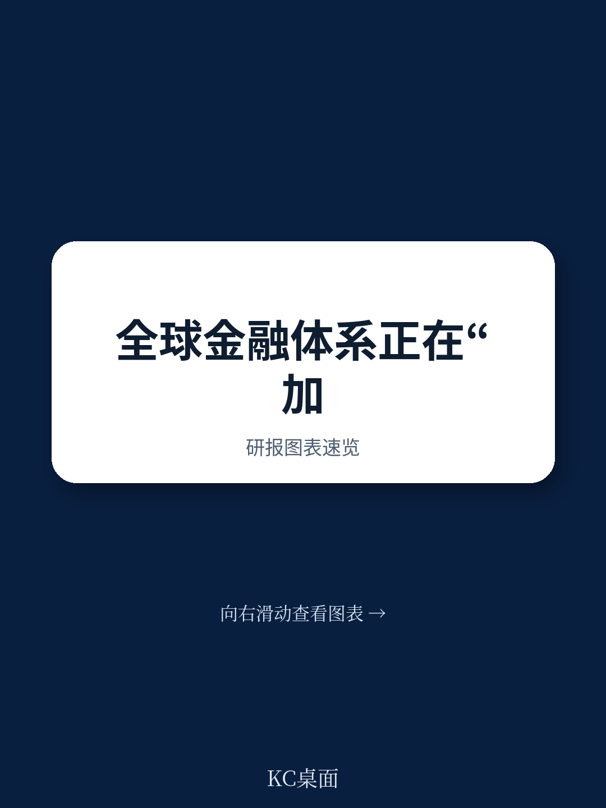
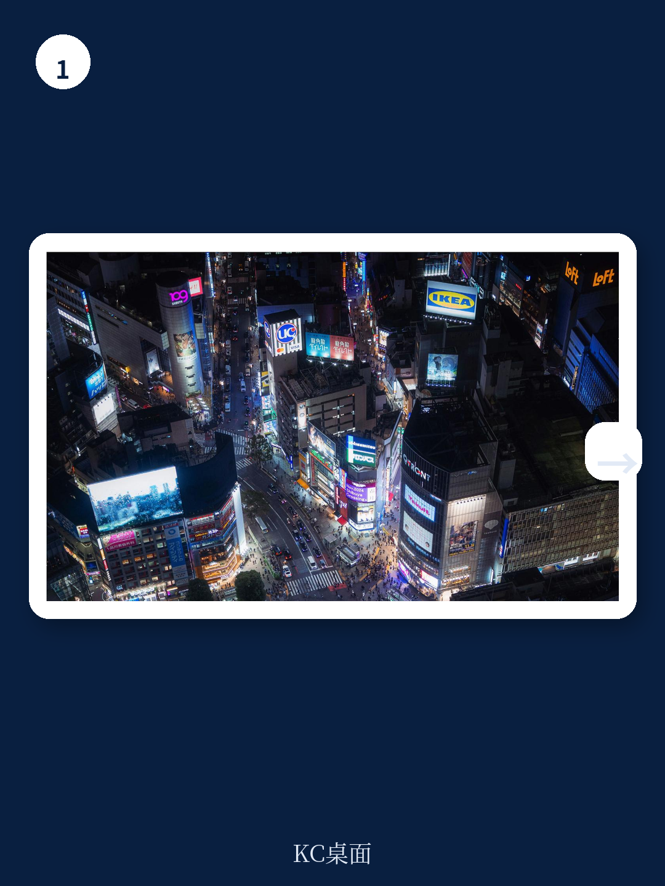

# 世界经济论坛：美国关税波及盟友，全球GDP每年损失超3000亿美元

全球金融体系从未像今天这样既深度互联，又高度脆弱。2025年全球贸易创下历史新高，跨境银行信贷超越2008年金融危机前峰值，侨汇收入达到实际历史最高水平，外国持有的美国国债也升至新的纪录。但与此同时，世界经济论坛最新发布的《日益加深的分裂：金融体系碎片化的成本》报告提出了一个严肃的判断：当前的贸易与金融政策已使全球每年损失约3000亿美元的GDP，相当于芬兰或智利整个经济体的规模。而更令人警惕的是，一个可能造成超过6万亿美元损失的极端情景——比全球金融危机的影响还要大——其发生概率正在上升。

这份由世界经济论坛与奥纬咨询联合发布的报告，是对2025年初发布的《全球金融体系碎片化导航》报告的更新。过去一年，碎片化从理论上的可能性变成了现实中的日常。美国不仅对中国加征关税，还将其盟友纳入目标范围；中国则以关键矿产供应链为筹码进行反击；各国之间的报复与反报复措施形成了自我强化的循环。报告的核心结论是：碎片化已经不再是风险情景，而是正在发生的成本。

> **KC评论：** 世界经济论坛这份报告的价值不在于它告诉我们碎片化存在风险——这已经是共识。真正值得关注的是它给出了量化框架：碎片化已经造成了多少损失，最坏情况下会损失多少，以及这些损失在不同地区和情景下如何分布。完整报告中的图表、假设条件和情景参数，才是值得仔细研究的核心内容。继续看原文，真正有价值的是图表、假设和验证路径；完整报告与KC评论在每日汇编。

## 1. 2025-2026年是碎片化从量变到质变的转折点

报告明确指出，2025年至2026年初的这段时间，代表了全球金融体系碎片化的一个关键转折。虽然各国长期以来都在使用经济治国术来保护国家安全和经济稳定，但2025年发生的变化在规模、速度和广度上都是前所未有的。

美国试图用关税、制裁、投资限制和财政措施来重塑全球贸易和金融体系。这些工具本身并不新鲜，但应用的广度令人震惊。2025年1月报告首次发布时，分析假设即使在最坏情景下，美国与其地缘政治盟友之间的贸易和金融联系也不会受到实质性影响。但现实是，关税被扩展到欧洲、加拿大、日本、韩国等传统盟友。到2026年3月，外国中央银行在纽约联储持有的美国国债降至2012年以来的最低水平。

这种变化带来的不仅是经济成本，更是制度信任的侵蚀。企业和投资者依赖的不仅是效率，更是对承诺持续性的信心——承诺能够跨越选举周期和地缘政治紧张局势持续有效。当这种信任被破坏时，跨境经营和资本配置的成本将系统性上升。

## 2. 碎片化已使全球GDP损失3000亿美元，通胀上升0.2-0.3个百分点

报告通过四种情景模拟了碎片化的经济影响。基于2025年已实施的政策，碎片化已经使全球GDP增长减少2130亿至3070亿美元，并推高通胀0.2-0.3个百分点。这一影响在不同地区存在显著差异：西方经济体的增长损失最为严重（0.3-0.4个百分点），而东方和中立经济体的损失相对较小（约0.1个百分点）。

报告更新了分析框架的关键特征，包括：美国对其盟友征收关税的影响、盟友对美国采取的反制措施、关税传导至消费者的更新比率、以及按行业划分的服务贸易限制。这些更新使得分析更贴近现实——碎片化的影响不再仅限于中美之间，而是波及整个全球贸易体系。

在假设的最坏情景下，即东西方经济完全脱钩，全球GDP损失可能高达6.9万亿美元。这一数字超过了德国或日本的经济规模，也超过了2008年全球金融危机的冲击。报告特别指出，这种极端情景的发生概率正在上升，因为各国已经建立的贸易壁垒可能变得根深蒂固，难以逆转。

> **KC评论：** 6.9万亿美元这个数字本身很重要，但更关键的是理解这个数字背后的假设路径。报告构建了四种情景，每种情景对应不同的政策假设和传导机制。完整报告中的情景参数表、假设说明和敏感性分析，是理解这个数字可信度的关键。此外，报告没有完全展开的是：不同情景之间的转换概率，以及哪些政策信号可能触发情景升级。

## 3. 规范正在被侵蚀，央行独立性和数据可靠性受到挑战

报告提出了一个值得深思的观察：碎片化不仅是经济壁垒的升高，更是制度规范的瓦解。长期以来被认可的原则——如央行独立性、法律规则的明确和公正执行——正在受到压力。而一些过去未被充分关注的规范，如政府数据的可靠性，也面临挑战。

2025年债券市场的波动案例尤为典型。美国国债是全球金融体系的基石，但2025年4月，债券市场出现了罕见的剧烈波动，收益率在短时间内大幅上升。这种波动部分源于市场对政策不确定性的反应，部分源于外国持有者调整头寸。报告指出，市场波动影响政策制定者的行动或不行动，形成了政策与市场之间的反馈循环。

当政府和央行数据受到质疑时，整个金融体系的定价基础就会动摇。企业和投资者无法准确评估风险，资本配置效率下降，金融稳定性减弱。报告提出的《保护全球金融体系免受碎片化影响的原则》和《负责任经济治国术的参与规则》，正是试图为这些规范的恢复提供框架。

## 4. 新兴市场承受最严重冲击，非洲经济体面临多重挑战

报告特别关注了碎片化对新兴市场和发展中经济体的影响。这些经济体由于国内资本市场较浅、更依赖外部贸易和投资，对碎片化的暴露程度不成比例地高。非洲的情况尤其具有代表性。

非洲经济体面临的碎片化风险通过多个渠道传导：资本流入减少、贸易条件恶化、侨汇收入波动、以及国际金融体系接入受限。报告通过与非洲政策制定者和大型金融机构领导人的访谈，揭示了这些挑战如何在实际层面重塑非洲经济的现实。

但报告也指出，碎片化并非只有负面影响。对于非洲经济体而言，全球动荡也创造了新的机遇：区域贸易一体化（如非洲大陆自由贸易区）可能加速推进；关键矿产供应链的重组可能使非洲资源国获得更多议价权；本地金融市场的发展可能获得更多政策关注和资源投入。

> **KC评论：** 报告对非洲的分析提供了一个重要的观察框架：碎片化对不同经济体的影响是不对称的，但应对策略也有共性。非洲经济体在应对碎片化过程中积累的经验——如何在保持战略自主的同时实现增长——对其他新兴市场具有参考价值。完整报告中的非洲案例研究和具体政策建议，值得仔细阅读。

## 5. 报告尚未完全回答的关键问题：碎片化的持久性与可逆性

尽管报告提供了丰富的量化分析和情景模拟，但有一个核心问题尚未完全解答：当前碎片化的持久性如何？关税一旦加征，就很难取消。供应链一旦重组，就很难逆转。政策一旦形成路径依赖，就很难回到过去。

报告提到了“自我强化的报复和升级循环”，但没有深入分析这种循环何时可能停止，或者什么条件下可能逆转。历史上，贸易壁垒的上升往往伴随着战争或经济危机后的制度重建。但今天的碎片化发生在和平时期，缺乏明确的终止机制。

另一个未充分展开的问题是：碎片化对金融创新的长期影响。当跨境资本流动受到限制，当技术标准出现分歧，当数据流动被阻断，金融科技和绿色金融等领域的创新可能受到抑制。这些影响可能不会立即体现在GDP数据中，但会逐渐侵蚀全球金融体系的活力和适应性。

## 6. 一个值得关注的观察框架：从“效率优先”到“韧性优先”的范式转换

报告的核心洞察可以概括为一个范式转换：全球经济和金融体系正在从“效率优先”转向“韧性优先”。过去几十年，全球化的逻辑是追求最低成本和最高效率，供应链、资本流动和技术标准都围绕这一逻辑展开。但现在，各国开始将国家安全和经济韧性置于效率之上。

这一转换的影响是深远的。对于企业而言，这意味着需要重新评估供应链布局、资本配置策略和风险管理框架。对于投资者而言，这意味着传统的资产定价模型可能需要调整——地缘政治风险不再是尾部风险，而是系统性因素。对于政策制定者而言，这意味着需要在国家安全和经济效率之间找到新的平衡点，而这需要新的制度框架和协调机制。

报告提出的《保护全球金融体系免受碎片化影响的原则》提供了一个起点，但这些原则的实施需要各国之间的协调和信任。在碎片化加速的背景下，这种协调本身就是一个挑战。

> **KC评论：** 范式转换的观察框架是理解碎片化影响的关键。但报告没有深入讨论的是：不同国家和行业对“韧性”的定义和优先序存在差异。对于依赖出口的经济体，韧性可能意味着供应链多元化；对于资源型经济体，韧性可能意味着价格稳定和需求保障；对于金融中心，韧性可能意味着资本流动的连续性和规则的可预测性。这些差异如何影响碎片化的演进路径，是值得进一步探讨的问题。

---

碎片化正在重塑全球经济和金融格局，其影响已经超出理论讨论的范畴，变成了可量化的经济成本。世界经济论坛这份报告的价值，不仅在于它提供了更新的数据和情景分析，更在于它提出了一个框架性思考：如何在追求安全与韧性的同时，避免对增长、投资和金融稳定造成不可逆的损害。

报告留下的问题——碎片化的持久性、可逆性、以及对金融创新的长期影响——值得持续关注。这些问题没有简单的答案，但理解它们对于企业和投资者的决策至关重要。

更多国际信源汇编与评论，欢迎扫码交流。每日更新，汇总国际主流叙事、数据和图表，观测边际变化。每日汇编将单篇报告放回当天的主线，整理成中文摘要、KC评论和图表合集，便于喂给AI也便于人工快速扫描市场动态。这里汇聚了头部券商、PE/VC、投行、并购、hedge fund、资管机构、战略咨询、智库等朋友，期待交流。

Personal reading notes and learning share only. Not investment advice.
