# Energy Transition Index 2026

INSIGHT REPORT
JUNE 2026

## Contents

Foreword 3  
Executive summary 4  
Introduction 5  
1 Framework 7  
2 Overall results 11  
2.1 Transition scores 12  
3 Sub-index and dimension trends 27  
3.1 System performance 28  
3.2 Transition readiness 37  
4 Energy security 43  
4.1 Transition under system pressure 44  
4.2 Security shaping the transition and competitiveness 52  
Looking ahead: top three actions 57  
Appendices 59  
Contributors 74  
Endnotes 76

## Disclaimer

This document is published by the World Economic Forum as a contribution to a project, insight area or interaction. The findings, interpretations and conclusions expressed herein are a result of a collaborative process facilitated and endorsed by the World Economic Forum but whose results do not necessarily represent the views of the World Economic Forum, nor the entirety of its Members, Partners or other stakeholders.
© 2026 World Economic Forum. All rights reserved. No part of this publication may be reproduced or transmitted in any form or by any means, including photocopying and recording, or by any information storage and retrieval system.

# Foreword

  
Muqsit Ashraf
Global Lead for Industry and Enterprise, Accenture

Over the past decade, the transition towards more secure, sustainable and affordable energy systems has seen measurable progress driven by long-term ambition, declining technology costs, strengthening policy commitments and growing investment. These forces remain essential. Yet the pace and direction of the transition has been defined not by ambition alone, but by short-term realities: economic conditions, geopolitical shocks and the capacity of systems to absorb change.

In 2026, rising geopolitical tensions, trade fragmentation and surging demand are reshaping priorities; energy security, affordability and system resilience are more visibly central design principles. This reflects not a departure from transition goals, but a recognition that progress cannot be sustained without stronger foundations.

Recent energy market disruptions have exposed longstanding energy security vulnerabilities: supply concentration, high import dependence and infrastructure constraints. The impacts are uneven; emerging economies face the sharpest trade-offs, where limited fiscal space and restricted access to capital narrow the room to act. At the same time, the enabling conditions that underpinned progress in recent years, supportive policy environments, accessible capital and strong innovation momentum, can no longer be assumed.

In its sixteenth year, the Energy Transition Index (ETI) tracks energy systems across 120 countries using 44 indicators. It assesses both current system performance – across security, sustainability and affordability – and transition readiness, including

  
Roberto Bocca
Head, Centre for Energy and Materials; Member of the Executive Committee, World Economic Forum

the policy, financial, infrastructural and innovation conditions required to sustain progress over time.

This year's ETI highlights three defining signals.

First, a pause. Overall progress has flatlined, and transition readiness has declined for the first time in over a decade, signalling a weakening of the foundations needed for future gains – one that we hope proves temporary, rather than the start of a more prolonged period of stagnation.

Second, rising pressure. The transition is shaped by compounding stresses: geopolitical fragmentation, supply and price volatility, accelerating demand and capital concentrating in a limited number of markets while high-growth economies remain underserved.

Third, a shifting priority. Energy security is emerging as a core determinant of competitiveness. Countries that integrate resilience into system design are better positioned to attract investment and sustain deployment, but at the risk of widening regional divergence.

The energy transition is not reversing, but it is fracturing and becoming more uneven. This means that decisions made by government and business leaders are all the more important and complex. The ETI aims to provide a consistent, evidence-based view of how energy systems are performing, how prepared they are for the future, and where the gaps between ambition and delivery are widening, supporting more informed decision-making at a time when both urgency and uncertainty are high.

# Executive summary

# The 2026 ETI shows a transition under strain, with continued energy growth increasingly challenged by external shocks and structural constraints.

Energy transition progress is fragmenting and becoming increasingly uneven. In this year's Energy Transition Index (ETI), only $24\%$ of countries improved simultaneously across security, affordability and sustainability, while the enabling conditions that drive future progress, policy, finance, innovation and infrastructure have weakened for the first time in over a decade.

The headline numbers still impress. Global energy investment reached \$3.3 trillion in 2025, renewables and nuclear generated 42% of electricity, and renewable energy capacity increased by nearly 800 gigawatts (GW). $^{1}$ Yet these gains sit alongside mounting constraints. Grid congestion, permitting delays, capital concentration and chronic underinvestment in emerging economies continue to slow delivery. Newer pressures are compounding these challenges: by late 2025 and early 2026, trade restrictions affected \$2.6 trillion of global commerce, while export controls covered more than half of critical transition minerals. At the same time, finance, regulation and innovation weakened simultaneously, pointing to broader erosion in readiness.

The 2026 disruption to energy flows through the Strait of Hormuz brought these vulnerabilities into focus, triggering one of the most acute energy price shocks since 2022 and forcing import-dependent emerging economies into harder trade-offs between energy access, affordability and transition investment. The shock underscored a wider shift: energy security is no longer only about fuel supply, but also about grids, minerals, infrastructure, reliability and resilience.

System performance continued to advance, but security is holding it back. Sustainability advanced at a slower pace, however, with energy efficiency improving in 92 economies. Security was the only system performance dimension to decline (-0.9%), driven by weaker reliability and supply conditions. These declines predate the Hormuz disruption, which has demonstrated how quickly affordability gains can be reversed and has amplified systemic vulnerabilities that require structural remedies, not merely cyclical ones. Demand is also rising quickly, driven by

electrification, cooling, digital infrastructure, AI-enabled data centres and economic growth. Energy systems are being asked to deliver more, more reliably and cleanly, while already under strain.

Sweden leads the 2026 rankings for the third consecutive year, with Nordic and European economies anchoring the top 20. China, Brazil, the US, Germany and France also feature, showing that consequential transition countries span regions and income levels.

Transition readiness shows where the transition is heading, and in 2026, that trajectory turned negative. Finance and investment recorded the sharpest fall (-1.8%). The issue is not capital volume, but the conditions that determine where and at what cost it is deployed: 75% of clean energy investment still flows to a few economies, while countries expected to drive 80% of future electricity demand growth face financing costs two to three times higher.

Regulation and political commitment declined (-1.2%) as policy uncertainty rose and ambition outpaced delivery. Innovation also weakened (-1.1%), with slower diffusion in carbon capture, hydrogen and long-duration storage. This has widened the gap between what is being built and what systems can absorb: more than 2,500 GW of projects are awaiting grid connections worldwide. Record deployment alone cannot compensate when policy, finance, innovation and infrastructure weaken together.

## Three priorities define the path forward:

① Strengthen security, affordability and resilience

② Unblock delivery by expanding infrastructure

③ Increase investability through stable policy, credible regulation and better risk-sharing

The window to strengthen foundations remains open, but it is narrowing, and the gap between those who act on it and those who do not is already visible in the data.

# Introduction

# Rising geopolitical tensions, accelerating demand and growing system constraints are reshaping the energy transition. Security, resilience, affordability and delivery are central to sustaining progress.

The energy transition was once driven primarily by falling technology costs and emissions targets. Over the past year, that landscape has shifted, becoming more fragmented, security-driven and infrastructure-constrained. Energy systems are increasingly shaped by geopolitics, trade and financial conditions. In 2025, geoeconomic confrontation ranked as the most severe short-term global risk. $^{2}$ Trade restrictions expanded sharply, affecting \$2.6 trillion of global commerce, three times the 2024 levels, while export controls now cover more than half of critical transition minerals.

Events in early 2026 reinforced these pressures. Disruptions to flows through the Strait of Hormuz, which carries roughly a quarter of global seaborne oil trade and a significant share of liquefied natural gas (LNG), $^{3}$ triggered one of the most significant energy security shocks. Brent crude oil prices rose, LNG flows were curtailed and gas prices surged, particularly in Europe. The effects extended beyond fuels, exposing vulnerabilities across supply chains, infrastructure and system reliability. The impact was most acute in emerging economies, where higher import dependence, limited emergency stocks of crude oil and refined products, and limited fiscal space meant that affordability, reliable access and investment in the transition could not all be pursued.

At the same time, critical mineral supply chains, which are important for several energy technologies, are tightening. For copper, lithium, nickel, cobalt, graphite and rare earth elements, the top three producers account for around 86% of supply, with over half of key materials subject to export controls. $^{4}$ As a result, security concerns now extend beyond fuels to encompass grids, minerals and system resilience.

Demand is growing faster than the systems built to deliver it can keep up. Global primary energy demand grew by 1.3% in 2025, down from 2.2% in 2024, but electricity demand grew much faster, increasing by 4.4% in 2024 and a further 3.0% in 2025. Growth is increasingly driven by electrification, cooling, digital infrastructure and artificial intelligence (AI). Global AI investment

reached \$1.5 trillion in 2025, while data centre electricity consumption was around 486 terawatt-hours (TWh). The latter is projected to reach approximately 945 TWh by 2030 and could exceed 1,700 TWh in the high case by 2035. $^{5}$ Around 80% of electricity demand growth comes from emerging and developing economies, although advanced economies are also seeing rising loads from data centres, electric vehicles (EVs) and heat pumps.

This surge in demand is colliding with system constraints. More than 2,500 gigawatts (GW) of projects, spanning renewables, storage and large new loads such as data centres, are waiting in grid connection queues. This highlights a structural shift: the challenge has shifted from building capacity to integrating it into increasingly complex systems. Addressing this will require major upgrades to grids, increased system flexibility, expanded storage and continued emission-reduction measures applied to existing energy systems through carbon capture, cleaner fuels and fuel switching.

Clean energy deployment continues to accelerate, but emissions have yet to decline. Renewables and nuclear accounted for 42% of global electricity generation in 2025, up from 40% in 2024. However, energy-related carbon dioxide ( $CO_{2}$ ) emissions remained broadly flat at around 38 gigatonnes (Gt), while total greenhouse gas (GHG) emissions rose slightly to a record 60.6 Gt $CO_{2}$ equivalent ( $CO_{2}e$ ). Rising demand and continued reliance on fossil fuels are offsetting gains from clean energy expansion. This reflects a structural condition, not a temporary lag; the global energy system is currently undergoing addition rather than substitution, with fossil fuel demand remaining at or near record levels even as clean capacity scales. $^{6}$ Addressing the resulting emissions gap requires not just expanding renewables, but also carbon management technologies – carbon capture, utilization and sequestration (CCUS), methane abatement and low-carbon fuels – to be treated as integral components of the transition architecture, not as secondary instruments deployed only where clean alternatives are unavailable.

Investment has reached record levels but remains uneven. Global energy investment exceeded 3.3 trillion in 2025, $^{7}$ with 2.3 trillion directed to clean energy. $^{8}$ However, around 75% of this investment is concentrated in a small number of markets. Emerging and developing economies, where most future demand growth will occur, continue to attract only a fraction of the capital required, facing financing costs two to three times higher than those in advanced economies.

The Energy Transition Index 2026 reflects these dynamics. Overall progress has nearly stalled, with total scores increasing by just 0.03%. Gains in system performance (+0.43%), the greater in weight of the two sub-indices, were offset by the first decline in transition readiness in over a decade (-0.76%), signalling a weakening of the enabling conditions needed to sustain progress. This divergence points to a growing gap between short-term system improvements and long-term preparedness.

Country performance highlights a multi-speed transition. Advanced economies dominate the top rankings, with Sweden, Finland and Denmark maintaining leading positions. At the same time, countries such as China, Brazil and India continue to shape global system dynamics, while others, including Singapore, Saudi Arabia, India and Kenya recorded strong year-on-year (YoY) gains. Overall,

56% of countries improved their Energy Transition Index (ETI) scores, but only 24% advanced across all performance dimensions, underscoring the increasing difficulty of balancing sustainability, security and equity simultaneously.

Three priorities will define the next phase of the transition. The first is strengthening security, affordability and resilience as foundations of progress, extending across fuels, grids and supply chains. The second is unblocking delivery by streamlining permitting and closing the gap between deployment and system integration. The third is increasing investability through stable policy, credible regulation and better risk-sharing to direct capital where it is most needed.

Sustaining progress will depend as much on strengthening enabling conditions as on scaling technology. Stable policy frameworks, credible delivery pathways and stronger institutions will be critical to mobilize capital, accelerate infrastructure development and support innovation. Execution, including grid access, permitting, supply chains and affordability, is becoming as important as technology and capital. Countries that can align policy, investment and system capability, while embedding resilience and maintaining affordability, will be best positioned to sustain momentum.

## 1 Framework

The 2026 Energy Transition Index provides a comparative framework for a holistic assessment of national energy systems and tracking energy transition progress.

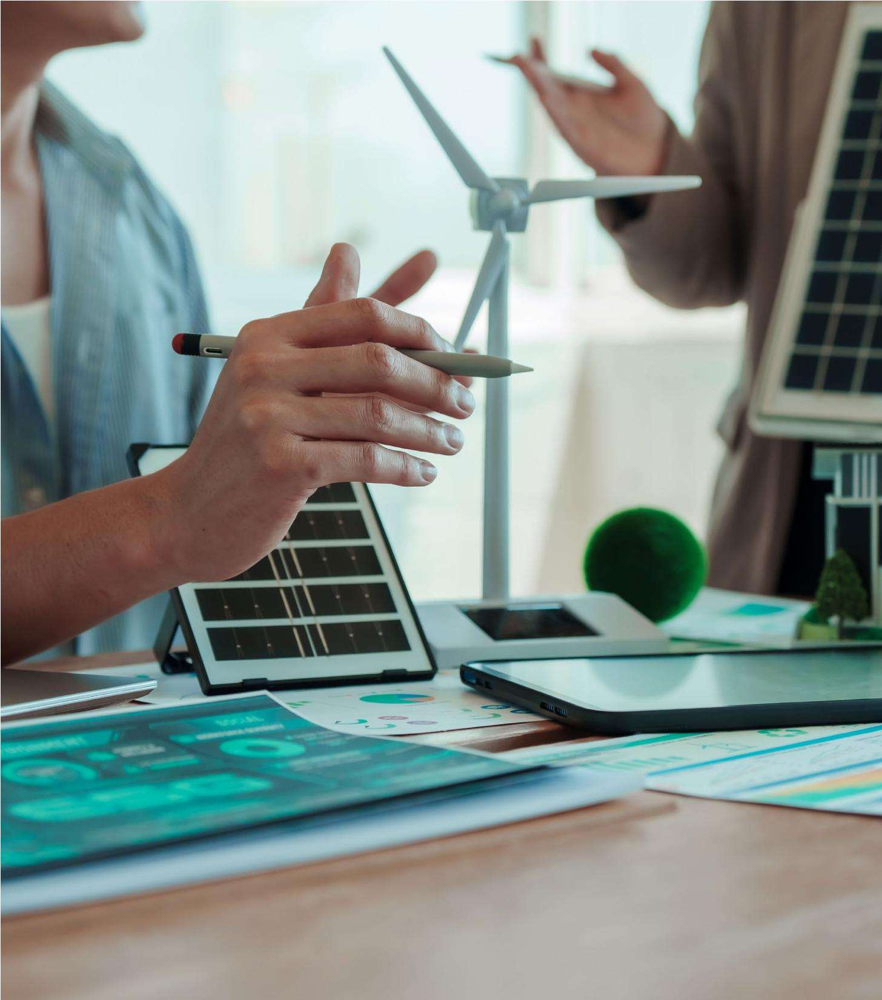

The global energy landscape is increasingly complex and uncertain. Heightened geopolitical tensions, supply shocks, evolving trade dynamics and persistent economic pressures are reshaping national priorities, with countries recalibrating their approach to energy security, equity and sustainability. As these forces intensify, the direction and pace of the energy transition are becoming more complex and uneven across regions and systems. It is precisely because the landscape is shifting that a consistent, multi-dimensional framework becomes even more valuable. A stable analytical lens makes it possible to distinguish structural trends from short-term volatility and compare progress across different national contexts.

The ETI provides a structured, data-driven view of the energy transition, designed to remain relevant across changing conditions by measuring both system outcomes and the enabling factors shaping them. The ETI builds on over 15 years of tracking and comparing countries' performance at the World Economic Forum. It offers a data-driven framework using 44 indicators to assess both how energy systems perform today and how prepared they are for the future. Covering 120 countries, the ETI evaluates current energy system performance across equity, sustainability and security, as well as five readiness factors (Figure 1).

By spanning both what energy systems deliver today and the conditions that will determine future progress, the framework captures shifts in the transition environment as they materialize, even when the nature of the pressures changes from one year to the next. The ETI captures the inherent trade-offs within energy systems and highlights the extent to which countries can balance competing priorities. It provides a consistent and comparable lens through which decision-makers can assess performance, identify gaps and better understand the conditions required to deliver a resilient, inclusive and sustainable energy transition.

A country's ETI score is a weighted composite of two sub-indices: system performance (60%) and transition readiness (40%). System performance is evenly distributed across equity, security and sustainability, while transition readiness is divided into two categories: core enablers and enabling factors. Core enablers include regulation and political commitment as well as finance and investment, while enabling factors encompass innovation, infrastructure, and education and human capital.

## ETI framework

FIGURE 1  
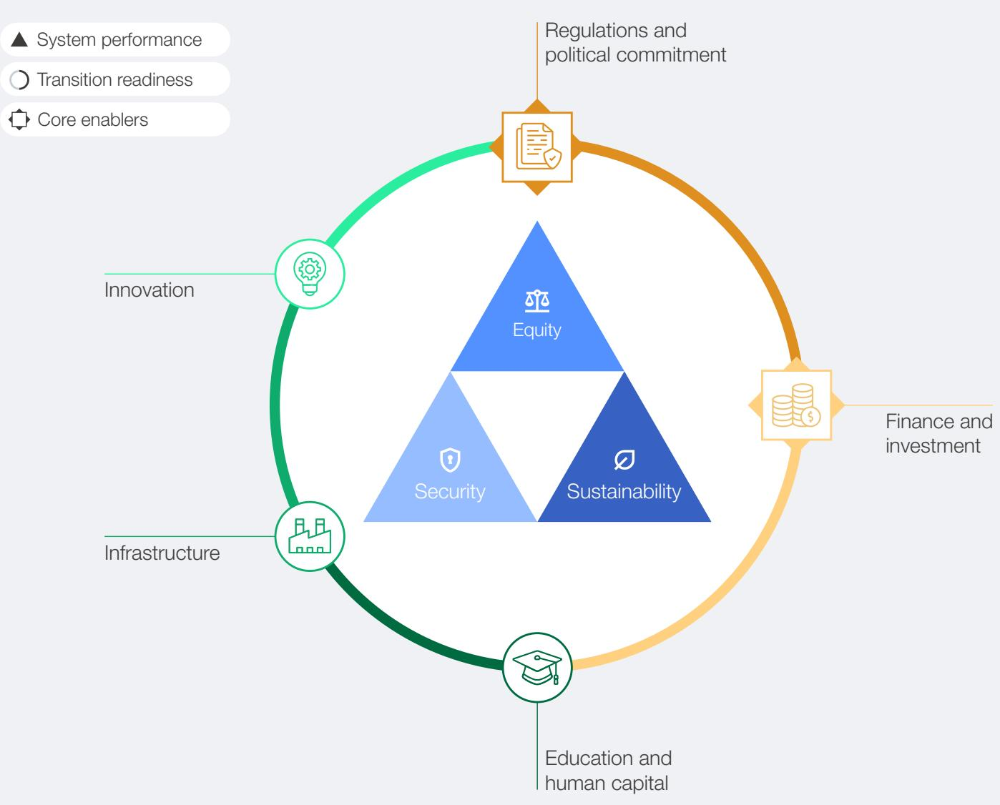

The evaluation of a country's energy system performance is centred on three key imperatives that form the basis of how this report views energy transition:

\- Security: Ensuring a stable and resilient energy supply through diversification (across the energy mix, trade partners and electricity generation sources), grid and power supply reliability, and robust infrastructure to enhance adaptability to external shocks

\- Equity: Providing access to energy for all (consumers and industries), energy affordability and price stability while supporting economic growth and development

\- Sustainability: Advancing the environmental performance of energy systems to support a low-emissions, resource-efficient and clean energy future – this is achieved by reducing $\mathrm{CO}_{2}$ and methane intensity, lowering energy per capita and emissions footprints, and increasing the share of clean energy in final demand through balanced demand- and supply-side measures

These dimensions are inherently interdependent, and progress in one may result in both win-win and trade-off outcomes in others. The ETI framework

emphasizes the importance of achieving balanced outcomes across all three.

A country's energy transition progress also depends on its transition readiness – the strength of the enabling environment that supports long-term transformation. Transition readiness is driven by the following five core enablers:

\- Regulations and political commitment: Creating robust and stable policies and regulations that are essential for promoting a competitive energy market

\- Infrastructure: Ensuring the physical and digital infrastructure is robust and flexible enough to support the transition to a low-carbon economy

\- Education and human capital: Developing a skilled workforce capable of meeting the emerging clean energy sector's demands

\- Innovation: Developing cutting-edge technologies in energy systems, essential for sustainability and security

– Finance and investment: Ensuring a sustainable financial ecosystem that can attract investments at scale to support energy transformation

The framework has been further strengthened through the addition of two new indicators, "AI readiness" and "clean technology minerals supply chain exposure".

Together, these factors largely determine a country's ability to translate ambition into implementation and sustain progress over time.

In the 2026 edition, the framework has been further strengthened through the addition of two new indicators, “AI readiness” and “clean technology minerals supply chain exposure”, reflecting the growing importance of digital capabilities and strategic resources in shaping the transition. The ETI now evaluates countries using 44 indicators that capture key aspects of the energy transition. The data was sourced from many different organizations, with an emphasis on ensuring data quality through the relevance, coverage, comparability, recency and quality of sources.

Results reflect the latest available data at the time of collection. The addition of two new indicators had a negligible impact on the 2026 overall results (-0.03% reduction), keeping the overall trajectory broadly unchanged. Moreover, while no index can fully capture all the factors and complex realities

impacting energy systems and transitions, the ETI's breadth provides a solid basis for comparing countries, identifying gaps and tracking trends over time. It spans critical system performance outcomes alongside key enabling conditions.

The ETI offers a comprehensive framework, but it is important to note that external factors can influence outcomes. These include commodity market fluctuations, geopolitical developments, international climate action, financial market conditions, as well as supply chain constraints and technological progress, which are reflected in the index only as they materialize in the underlying data. As such, scores should be interpreted as reflecting both performance outcomes and enabling conditions, in the context of each country's structural characteristics and development pathway, rather than as a real-time measure of short-term performance (Box 1).

For more information, see the annex for an overview of ETI methodology, indicators and country coverage.

## BOX 1 | Key terms of the ETI methodology

## Score reference

All scores in this report (from individual indicators to the overall index) are based on a 0 to 100 scale, with 100 being the highest possible value. Scores reflect the most recent data and updates available at the time of production.

## System performance score

This score reflects how a country's energy system performs based on the latest statistical data in terms of sustainability, security and equity, using 22 indicators to provide an overall picture.

## Transition readiness score

This score reflects how prepared a country is to support future energy transition needs, using 22 indicators that assess enabling factors such as regulation, infrastructure, the capital and investment environment, human capital and innovation capacity.

## Global and regional averages

References to global, regional or overall scores for the index or its components refer to the simple average of all country scores, not adjusted for size, gross domestic product (GDP) or population unless noted.

## 2 Overall results

The ETI signals that global energy transition progress has lost momentum, not because deployment is slowing, but because the conditions sustaining it are eroding.

## 2.1 | Transition scores

## BOX 2 Transition scores – key takeaways

Overall ETI progress has flattened in 2026, with average ETI scores broadly unchanged (+0.03%). This signals that transition progress is slowing as security risks, investment constraints and infrastructure bottlenecks intensify.

System performance improved, driven by gains in equity and continued progress in sustainability, although the pace of sustainability improvements slowed. Average system performance rose by 0.43%, showing continued gains in current energy system outcomes, but at a more moderate pace.

Transition readiness declined in 2026 for the first time in over a decade, reversing recent gains. Average readiness fell by 0.76%, weakening the enabling environment needed to sustain progress.

The gap between ambition and delivery is widening. Despite record energy investment, factors such as tighter financial conditions, policy uncertainty and infrastructure constraints are limiting its impact on readiness.

## FIGURE 2 | Global average ETI and sub-index scores, 2017–2026

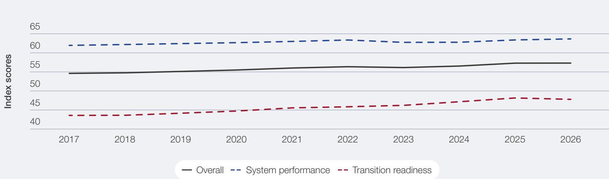

The 2026 ETI points to a stall in global transition momentum after the 2025 rebound. The overall score remained broadly flat (+0.03%), as continued gains in system performance (+0.43%) were offset by a decline in transition readiness (-0.76%). This divergence points to a key finding: energy systems are still delivering incremental improvements today, but the enabling conditions that shape progress are weakening. Higher financing costs,

policy uncertainty, geopolitical fragmentation and delivery bottlenecks are making it harder to convert ambition into investment and execution. Four of the five readiness sub-dimensions deteriorated, with investment conditions and regulatory commitment declining most sharply. Countries that stabilize these enabling conditions while sustaining deployment will be better positioned to maintain transition progress.

## FIGURE 3

## ETI change decomposition: system performance and transition readiness

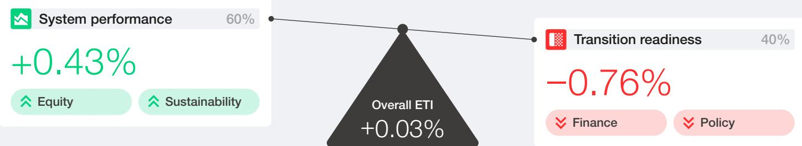

Overall ETI +0.03%

Note: System performance contributes to 60% of the overall ETI score, and transition readiness contributes to the remaining 40%.

Transition readiness saw the first decline in over a decade. Finance and investment saw the sharpest decline (-1.8%).

Energy system performance improved, driven primarily by gains in equity (+1.6%). Sustainability also improved (+0.6%), though at a slower pace, reflecting steady but gradual progress towards cleaner outcomes. In contrast, security declined (-0.9%), making it the only dimension to deteriorate. Although affordability pressures appear to have eased, geopolitical and macroeconomic tensions mean pressures on energy prices and household costs remain elevated. This suggests that recent affordability improvements are fragile and could reverse if external shocks persist or intensify. The immediate implications of the Middle East conflict underscored this risk, with sharp rises in gasoline (up 50% in the US in April since the start of the conflict $^{9}$ ), diesel and natural gas prices (which surged up to 60% in Europe in March $^{10}$ ) across major markets within weeks of the disruption. Energy security remains a key constraint on overall progress. Without stronger advancements, these system gains will be difficult to sustain, reinforcing security as a critical bottleneck to durable performance.

Transition readiness saw the first decline in over a decade. Finance and investment saw the sharpest decline (-1.8%). Although total clean energy investment reached a record \$2.3 trillion, the ETI score fell as renewable investment dropped by 9.5%. Regulation and political commitment also weakened (-1.2%), primarily driven by rising policy instability. The decline was heavily present in advanced economies, including the US, the United Kingdom and the Netherlands, seeing reduced policy momentum, although some countries, including India, strengthened their support, largely in response to energy security and affordability concerns. Innovation declined (-1.1%), as a deterioration in green technology development and diffusion outweighed modest improvements in research and development (R&D) intensity and the broader business innovation environment. The diffusion of environment-related technologies – the primary structural driver of the score – has now fallen for a decade, raising concerns about the pace of future advancement. Infrastructure declined slightly (-0.2%), masking a more significant issue: despite record capacity additions, grid investment is lagging, with more than 2,500 GW of projects stalled in connection queues. Education and human capital was the only readiness dimension to improve (+2.0%), but these gains were not enough to offset broader declines across the system. These declines reflect an operating environment in which geopolitical fragmentation, supply chain concentration and rising execution complexity are eroding the conditions under which capital deploys, infrastructure delivers and policy holds.

FIGURE 4  
Global average sub-index and overall growth rates, 2017–2026  
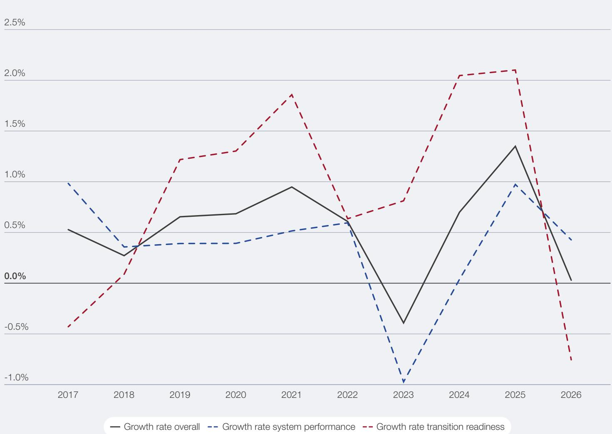

The 2025–2026 period marked a clear shift in the energy transition.

Several defining trends emerged in the last year:

\- Energy security has reemerged as a dominant strategic priority. In 2025, geoeconomic confrontation overtook climate as the most severe short-term global risk. $^{11}$ Trade restrictions, industrial rivalry and strategic fragmentation increasingly dictate policy, reinforcing supply resilience and domestic capability as core goals. By mid-2025, trade affected by these restrictions reached \$2.64 trillion (triple 2024 levels), highlighting massive global economic fragmentation. $^{12}$ Developments in early 2026 further entrenched this, as the Middle East conflict disrupted flows through the Strait of Hormuz. This critical chokepoint handles approximately 20 million barrels of oil per day (roughly a quarter of global seaborne oil) alongside one-fifth of global LNG trade. $^{13}$ The resulting shock triggered the International Energy Agency's (IEA) largest coordinated reserve release, pushing Brent crude oil past \$100 per barrel to a historic multi-year peak, the highest since 2022, and surging gas prices. $^{14}$ These disruptions caused economic knock-on effects and localized energy rationing. These exposed vulnerabilities are compelling governments and the private sector to rethink how to affordably bolster security and resilience.

\- Electricity demand remains the energy system's main pressure point. Growing by 3.0% in 2025, it outpaced overall energy demand. $^{15}$ Emerging and developing economies drove roughly 80% of this growth, with China exceeding half. $^{16}$ Meanwhile, advanced economies accounted for nearly 20% of global electricity demand, driven primarily by cooling, data centres, AI and EVs. $^{17}$ Rising demand is clearly no longer just a developing-market story; meeting it is now a defining constraint on the transition.

\- Clean energy continues scaling, but fossil fuel displacement remains uneven. Renewable generation grew by 9% in 2025, outpacing the past decade's 6.4% average, as global low-emissions sources virtually matched coal power. US coal consumption rose, but was offset by declines in India and China, marking the latter's first drop in five decades. $^{18}$ From a sustainability perspective, this underscores that progress is no longer just about adding clean capacity; it equally depends on actively reducing fossil fuel reliance and improving energy efficiency.

\- Despite clean energy expansion, global GHG emissions hit a record 60.63 billion tons of $\mathrm{CO}_{2}\mathrm{e}^{19}$ in 2025, even as electricity $\mathrm{CO}_{2}$ intensity fell by $3\%$ and power-sector emissions remained flat. Rising demand, increased fossil-fuel use and weather-driven consumption offset these clean energy gains. This underscores that, while clean energy is scaling, it remains too slow to drive sustained declines in absolute emissions.

\- Critical minerals now anchor energy and industrial strategies. Yet supply remains concentrated, with

China holding roughly 70% of key transition mineral refining capacity. $^{20}$ By mid-2025, over half of energy-related minerals faced export controls, prompting over 20 countries to adopt formal strategies using public funding, domestic policies and international partnerships. $^{21}$ Consequently, critical minerals are not mere transition inputs, but strategic assets shaped by geopolitics and supply-chain resilience.

\- Capital remained available, but confidence became more selective. Global investment in the energy transition hit a record 2.3 trillion in 2025 (+8% increase YoY). $^{22}$ However, 75% of this investment was concentrated in the US, China and Europe, highlighting persistent geographic imbalances. Mature technologies dominated, but hydrogen (8 billion, +80% YoY) and CCUS (over 5 billion) also gained traction. Ultimately, capital deployment is increasingly dictated by risk, policy certainty and bankability. $^{23}$

AI and digitalization became material drivers of infrastructure demand. Global AI spending hit \$1.5 trillion in 2025 (+50% YoY), with AI-optimized infrastructure investments nearly doubling. $^{24}$ This translates into rapidly growing electricity demand from data centres, reinforcing digitalization as both a key demand driver and a source of system stress. The scale and reliability requirements of this demand are accelerating the urgency around deploying flexibility solutions, storage, demand response and grid-enhancing technologies while also reviving interest in nuclear energy as a source of firm, clean baseload power. Microsoft, $^{25}$ Google $^{26}$ and Amazon $^{27}$ have all signed advanced nuclear partnerships to secure firm, clean electricity for AI growth. This signals that large consumers are increasingly shaping generation and infrastructure investment to meet their own reliability needs, rather than waiting for system-wide solutions to catch up.

\- Innovation is shifting from technology development to system deployment. Solar photovoltaic (PV), wind turbine and battery costs have fallen to record lows, with the IEA's price index down 60% over the past decade, $^{28}$ and electrification is now anchoring the next phase of system transformation, with energy technology patent volumes and investment both rising steadily. $^{29}$ AI applications, from predictive maintenance to advanced forecasting and grid optimization, alongside new business models, market mechanisms and financing tools, are starting to deliver system value across diverse contexts. $^{30}$ The frontier has moved from generation technology to system integration, flexibility and grid management. Progress now depends less on invention than on scaling proven approaches more widely, supported by coherent market, regulatory and financing frameworks that reward adoption at pace.

\- Emerging economies are central to future transition outcomes. Driving roughly 80% of demand growth, these markets will shape the transition's next phase. $^{31}$ Their capacity to mobilize capital, expand infrastructure and scale clean energy will dictate whether or not global progress broadens, shifting focus from technology costs to financing, delivery and industrial capability.

  
BOX 4 | Country trends and regional insights – key takeaways

Country progress is increasingly mixed as sustaining transition momentum becomes more challenging. In 2026, 56% of countries improved their ETI scores, reflecting slower and uneven progress amid rising pressures on energy systems. Only 24% advanced in all three system performance areas, and very few improved across all five transition readiness parameters.

The transition remains multi-speed and shaped by regional strengths. Advanced economies show strong performance overall and conditions that enable transition readiness, supported by equity and sustainability gains and overall higher readiness (infrastructure) baselines. Other regions are progressing through distinct advantages; the Middle East, North Africa and Pakistan excel in equity due to abundant domestic resources and pricing policies that ensure high affordability. Meanwhile, Latin America and Sub-Saharan Africa score highly in sustainability, benefiting from extensive hydropower infrastructure and lower baseline carbon intensity. Substantial differences within groupings underline that no single pathway exists.

Transition readiness is emerging as the main constraint on future progress. With transition readiness declining in 43% of the countries, sustaining progress depends on strong policy frameworks, infrastructure, skills and investment conditions.

Top performers remain resilient, but leadership is increasingly contested. Advanced economies and Nordic countries are still anchored in the top rankings, underscoring the value of institutional strength, policy consistency and system readiness. Meanwhile, a growing number of emerging and developing economies are improving through targeted gains in infrastructure, investment and enabling conditions, proving rapid progress is possible beyond the traditional leaders.

Table 1 outlines the 2026 ETI rankings. Advanced European economies anchor the top 20, alongside China (14th), the US (19th) and Brazil (17th). Their outsized impact on global demand, investments and emissions makes their transitions critically important.

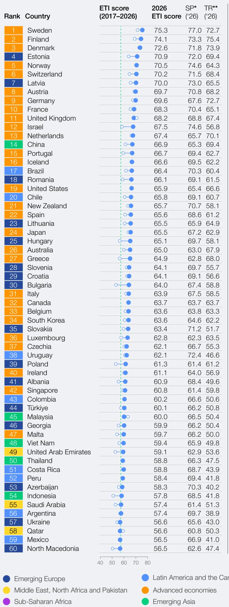

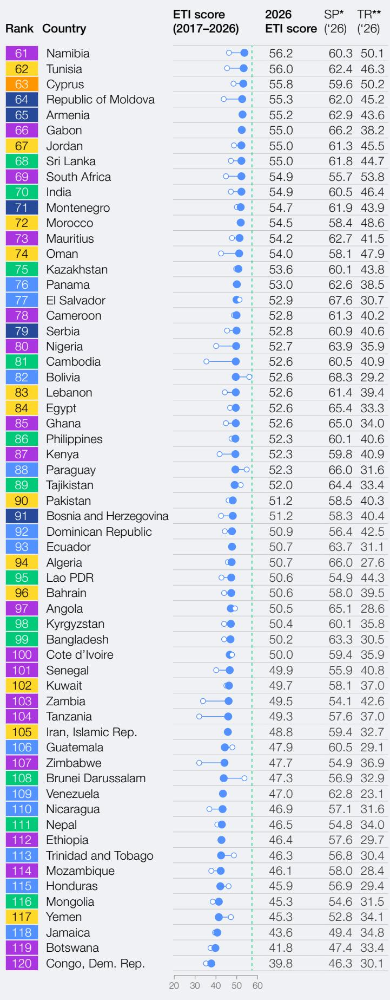

  
Sub-Saharan Africa

YoY ranking changes should be interpreted with caution given that the ETI is a relative index, with many countries separated by small score differences. Consequently, rank shifts may reflect marginal indicator changes or faster peer progress, rather than fundamental changes in a country's transition performance.

Therefore, a country's long-term score trajectory provides a more reliable view of underlying progress than short-term rank movements:

China has strengthened its position over the longer term, with its ETI score rising from 61.1 in 2017 to 66.9 in 2026. China improved across every dimension of the energy system; energy intensity fell sharply, clean energy's share of generation nearly doubled, and affordability strengthened. This was supported by sustained industrial policy, tightening efficiency standards $^{32}$ and clean energy investment that grew to \$800 billion over the decade. $^{33}$

Portugal recorded strong multi-year progress, with its ETI score rising from 59.2 in 2017 to 66.7 in 2026. This was anchored in deliberate policy sequencing, such as a binding coal phase-out (completed 2021), competitive renewable auctions that have driven solar energy capacity up by 440% since 2017 $^{34}$ and an updated National Energy and Climate Plan (NECP) that raised the renewable electricity target to 93% by 2030 and brought forward the climate neutrality deadline to 2045. $^{35}$ Renewables rose from 51% to 71% of electricity over the decade.

Lithuania has also made steady long-term progress, with its ETI score rising from 60.5 in 2017 to 65.5 in 2026. This transformation was driven by its National Energy Independence Strategy, which prioritized domestic energy generation, efficient permitting reforms that cut renewable approval timelines and a net-metering system that rapidly scaled the amount of distributed solar energy. $^{36}$ Wind and solar went from negligible to 65% of electricity in under a decade. $^{37}$

In 2026, the pace of country-level energy transition has become more uneven. A total of 67 countries (56%) improved their overall ETI scores, while 53 (44%) declined. Countries that improved did so by an average of 2.8%, partly offset by an average decline of 1.7% among those that moved backwards. Only 34 countries (28%) improved by more than 1 point, while 18 (15%) declined by more than one point, showing that score changes were relatively concentrated rather than broadly distributed. The introduction of two new indicators of “AI readiness” and “critical minerals supply chain exposure” had a negligible effect on country scores, reducing the global average by just 0.03%.

Advanced economies continued to dominate the rankings, accounting for 14 of the top 20 performers, with overall scores rising modestly (+0.2%). Gains in equity, sustainability, education and human capital, and infrastructure helped offset weaker security, financial investments and policy commitment. Nordic countries remained prominent, with Sweden, Finland and Denmark holding the top three positions. Progress within the top tier was mixed, with some countries improving while others saw slight declines due to weaker readiness. Singapore was a standout, rising 10 places on stronger policy signals, while the US slipped slightly despite a strong performance in security. Japan improved marginally, and Germany maintained its position with steady gains.

Latin America and the Caribbean saw a 0.5% decline in overall ETI scores, driven by weakening transition readiness, particularly in infrastructure, regulation and innovation. Brazil remained the regional leader, supported by its structurally clean power mix, strong biofuels sector and expanding renewable pipeline. Its established approach to transmission investment, using competitive auctions and long-term contracts, has helped attract private capital and address grid constraints.

Emerging Asia remained broadly flat, with a slight 0.1% decline, as gains in infrastructure and education were offset by weaker security, innovation and financial investment. China remained the region's top performer, investing \$627 billion in clean energy in 2025 and continuing to expand renewable capacity at scale. Improvements in affordability, energy intensity and infrastructure were partially offset by a more challenging regulatory and investment environment. India also stood out, recording one of the greatest improvements in readiness, driven by significant gains in infrastructure and human capital, positioning it as a key player in the next phase of the transition.

Emerging Europe strengthened, with overall ETI scores rising by 0.7%; Estonia, Latvia and Romania all placed in the top 20. The improvement was driven by stronger system performance, particularly in equity and sustainability, even as readiness stagnated, with gains in education and human capital offset by declines in innovation. Estonia led the region, with gains across both performance and readiness, supported by improvements in equity and finance and investment.

Sub-Saharan Africa recorded the greatest regional improvement, with ETI scores rising by 1.2%. Progress was supported by gains across both system performance and readiness, particularly in education, innovation and financial investment. Namibia contributed to this trend, with its score rising on the back of improved readiness.

The Middle East, North Africa and Pakistan declined by 0.9%, reflecting weakening performance and readiness. Despite this, Saudi Arabia stood out, improving its ranking through stronger financial backing, accelerated renewable deployment and investments in large-scale battery storage.

Regional trajectories are diverging; progress depends on matching system gains with readiness. Still, diverse countries can drive rapid gains through targeted, context-specific efforts. Figure 6 highlights illustrative cases chosen to reflect a mix of top performers, major economies, strong movers and regional shapers.

## Advanced economies

## Emerging Europe

## Emerging Asia

Overall

66.02 (0.11, 0.2%)

Overall

60.59 (0.45, 0.7%)

Overall

TR

63.45 (-0.43, -0.7%)

TR

51.14 (0.03, 0.06%)

53.75 (-0.07, -0.1%)

SP

TR

SP

67.74 (0.46, 0.7%)

42.21 (-0.43, -1%)

66.22 (0.73, 1.1%)

SP

Equity

Equity

71.57 (1.34, 1.9%)

61.45 (0.17, 0.3%)

70.95 (1.55, 2.2%)

Equity

Security

72.44 (-0.66, -0.9%)

Security

65.54 (0.59, 0.9%)

68.28 (0.01, 0.0%)

Sustainability

Security

Sustainability

59.20 (0.71, 1.2%)

59.45 (0.62, 1.1%)

63.82 (-0.69, -1.1%)

Sustainability

54.97 (0.61, 1.1%)

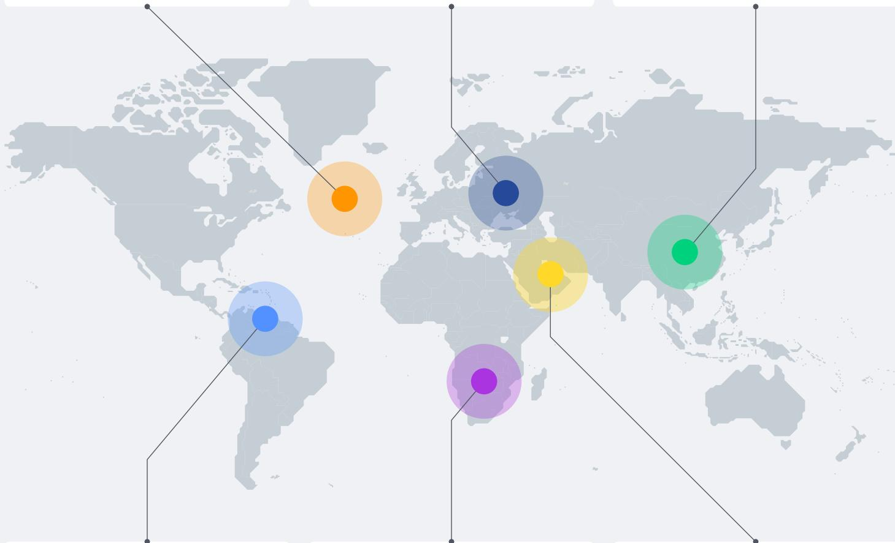

## Latin America and the Caribbean

## Sub-Saharan Africa

## Middle East, North Africa and Pakistan

Overall

53.77 (-0.29, -0.5%)

Overall

Overall

50.10 (0.62, 1.2%)

52.93 (-0.47, -0.9%)

TR

38.31 (-0.99, -2.52%)

TR

37.66 (1.21, 3.3%)

TR

41.83 (-0.78, -1.82%)

SP

64.07 (0.18, 0.3%)

SP

58.40 (0.22, 0.4%)

SP

60.34 (-0.27, -0.4%)

Equity

65.35 (0.92, 1.4%)

Equity

50.65 (1.02, 2.0%)

Equity

73.73 (0.16, 0.2%)

Security

66.13 (-0.25, -0.4%)

Security

Sustainability

60.74 (-0.14, -0.2%)

Sustainability

62.28 (-0.54, -0.9%)

Security

62.26 (0.19, 0.3%)

65.85 (-1.48, -2.2%)

Sustainability

41.44 (0.5, 1.2%)

Arrow direction represents 2025–2026 overall ETI score change:

North = upward trend, more than 0.5%

South-east = low downward trend, [-0.5% to -0.2%)

East = stagnant trend, [-0.2% to 0.2%]

South = downward trend, less than -0.5%

Progress has improved through stronger transition enablers, despite a mixed performance picture across energy system outcomes.

+2.7%

Overall ETI score

System performance: +0.6%

Transition readiness: +5.8%

## Key improvement areas

Finance and investment

+24.5%

Infrastructure

↑ +5.7%

Renewable energy investments rose from \$1.1 billion in 2024 to \$2.8 billion in 2025. Driven by Business Finland's €2.3 billion clean transition tax credit, $^{38}$ and shifts in hydrogen and storage, Finland is positioned as a 2035 carbon neutrality hub.

↑ +3.8%

## Key highlight

Sustainability

## Planned strategic priorities

Translating clean-industry ambition into delivery through major grid reinforcement $^{39}$ and continued support for hydrogen, electrification and low-carbon industrial projects $^{40}$

## Germany

Infrastructure and system sustainability are supporting progress, despite less momentum in investment conditions.

+0.4%

Overall ETI score

System performance: +0.8%

Transition readiness: -0.1%

ETI 2026 score: 69.6

## Key improvement areas

Infrastructure

Sustainability

$\uparrow +3.0\%$

1.9%

Equity

$\uparrow +0.8\%$

## Key highlight

Renewable capacity grew from 17.0 GW in 2023 to 18.8 GW in 2024. A 2% $^{41}$ land mandate and streamlined permitting helped new wind and solar installations nearly double between 2022 and 2024. $^{42}$

## France

Advancing large-scale grid and hydrogen infrastructure to support industrial electrification and the next phase of the energy transition $^{43}$

France advanced through broad-based system improvement, with gains across equity, security and sustainability reinforcing a more balanced transition profile.

+2.4%

Overall ETI score

System performance: +2.9%

Transition readiness: +1.6%

## Planned strategic priorities

ETI 2026 score: 68.3

## Key improvement areas

Equity

↑ +8.8%

Education and human capital

$\uparrow +5.5\%$

Infrastructure

$\uparrow +3.7\%$

## Key highlight

Industrial electricity prices fell 34.4% in 2025, boosting equity. This was driven by nuclear fleet recovery reaching 373 TWh output $^{44}$ alongside expanded renewable capacity and lower gas prices.

## Planned strategic priorities

Delivering the new third multi-year energy plan (PPE 3) $^{45}$

China remained Asia's top performer through stronger equity, sustainability and infrastructure, underpinned by gains in clean energy share and energy intensity.

-1.2%

Overall ETI score

System performance: +0.6%

Transition readiness: -3.5%

$\uparrow +1.7\%$

## Key improvement areas

Wholesale gas prices fell 17.9% in 2025; 2024 emission intensity dropped 3.8%. $^{46}$

## Key highlight

Sustainability

$\uparrow +1.7\%$

China's readiness score decline reflects the first renewable energy investment drop in a decade.

Infrastructure

## Planned strategic priorities

Strengthening new power-system construction, grid integration and renewable consumption as China advances high-quality energy development

## Saudi Arabia

Stronger transition enablers drove progress, even as system performance remained mixed.

+1.5%

Overall ETI score

System performance: -0.6%

ETI 2026 score: 57.4

Transition readiness: +5.3%

## Key improvement areas

Finance and investment

+28.4%

Sustainability

$\uparrow +1.0\%$

## Key highlight

Renewable investments rose from \$6.6 billion in 2024 to \$11.9 billion in 2025. Driven by the NREP, 20.6 GW $^{47}$ was tendered by 2025, achieving world-leading low solar tariffs through competitive auctions.

## Australia

Stronger readiness fundamentals have guided performance, with infrastructure gains offsetting a softer system performance trend.

+1.2%

Overall ETI score

System performance: -0.2%

Transition readiness: +3.1%

## Key highlight

The quality of transport infrastructure improved by 9.2% from 2024 to 2025, driving up infrastructure.

## Planned strategic priorities

Scaling renewables, carbon capture and storage (CCS) and hydrogen to advance the Saudi Green Initiative and the next phase of low-carbon industrial development

ETI 2026 score: 65.0

## Key improvement areas

Infrastructure

↑ +15.8%

Sustainability

^ +4.2%

Innovation

$\uparrow +2.3\%$

## Planned strategic priorities

Expanding transmission and dispatchable capacity through the Rewiring the Nation programme and the Capacity Investment Scheme, supporting the next phase of renewable integration $^{48}$

Progress has advanced through stronger system outcomes, with gains in equity and sustainability helping to offset largely flat readiness.

+1.1%

Overall ETI score

System performance: +1.7%

Transition readiness: +0.1%

## Key highlight

Flexibility in electricity system improved by 8.2% in 2025, backed by significant investments to modernize transmission and distribution (T&D) networks. $^{49}$

Driven by stronger readiness, Kenya has seen gains in innovation and investment capacity, outweighing weaker infrastructure momentum.

+2.8%

Overall ETI score

System performance: +0.3%

Transition readiness: +8.7%

Key highlight

R&D expenditure (percentage of GDP) increased from 0.4% to 0.8% from 2022 to 2023.

Chile

Stronger readiness is driving Chile's progress, with a sharp improvement in investment capacity offsetting weaker momentum in system performance.

+1.3%

Overall ETI score

System performance: -1.1%

Transition readiness: +5.7%

## Key highlight

Proportion of renewable energy in the final energy consumption increased from 15.5% in 2023 to 17.5% in 2024.

## Key improvement areas

Sustainability

^ +3.7%

Education and human capital

$\uparrow +2.9\%$

Infrastructure

$\uparrow +1.9\%$

## Planned strategic priorities

Advancing and updating NECP through a dual focus on nuclear expansion, renewables and energy security $^{50}$

ETI 2026 score: 52.3

## Key improvement areas

Finance and investment

+58.7%

Innovation

+19.9%

Education and human capital

$\uparrow +10.0\%$

## Planned strategic priorities

Expanding renewable power, transmission, clean cooking and green hydrogen under the National Energy Policy 2025 – 2034 and the Kenya Energy Transition & Investment Plan 2023 – 2050 $^{51}$

ETI 2026 score: 65.8

## Key improvement areas

Finance and investment

↑ +24.5%

Education and human capital

$\uparrow +2.6\%$

Innovation

$\uparrow +1\%$

## Planned strategic priorities

Advancing the new decarbonization plan, Plan de Descarbonización Chile, while scaling transmission and green hydrogen to support the next phase of clean-power and industrial transition $^{52}$

The US has continued to stand out on security and innovation while strengthening infrastructure through gains in renewable capacity and transport.

-2.6%

Overall ETI score

System performance: -0.4%

## Key improvement areas

Infrastructure

^ +4.1%

Transition readiness: -5.6%

Sustainability

$\uparrow +0.3\%$

$\uparrow +0.2\%$

## Key highlight

Equity

T&D losses as share of domestic supply improved 2.5% YoY between 2023 and 2024, and 8.6% over the past decade. Infrastructure score increased by 19.4% over the past decade, reflecting sustained investment in the energy grid.

Expanding transmission, grid modernization and domestic clean-energy manufacturing to meet rising electricity demand and strengthen system resilience $^{53}$

## Planned strategic priorities

## Japan

Japan improved by three places through broad-based system gains, with improvements across equity, security and sustainability, along with industrial affordability and financial investment.

+0.8%

Overall ETI score

System performance: +1.8%

Transition readiness: -0.8%

Equity

$\uparrow +4.6\%$

ETI 2026 score: 65.5

Finance and investment

+3.0%

## Key highlight

## Key improvement areas

Wholesale gas prices fell 55.9% in 2025, significantly improving Japan's equity dimension. Driven by a global LNG surplus from record US and Qatari capacity, $^{54}$ alongside accelerated nuclear restarts, $^{55}$ this reduced reliance on high-cost spot gas and lowered systemic power costs for industry.

Sustainability

$\uparrow +0.6\%$

India

Implementing The 7th Strategic Energy Plan and GX2040 Vision initiatives to secure sufficient decarbonized electricity at competitive prices as demand rises $^{56}$

System performance: +0.8%

## Planned strategic priorities

India advanced two places through stronger readiness and broad-based system gains, driven by a sharp rise in infrastructure, alongside improvements in equity, sustainability and financial investment.

+1.9%

Overall ETI score

Transition readiness: +4.1%

ETI 2026 score: 54.9

## Key improvement areas

+12.3%

Infrastructure

Education and human capital

+12.8%

## Key highlight

Finance and investment

The proportion of low-carbon jobs increased by 24% in 2024. Renewable energy jobs reached 1.3 million $^{57}$ (up 25% over 2023), with hydropower being the largest employment source.

+4.5%

## Planned strategic priorities

Scaling renewable capacity, grid expansion and green hydrogen under its infrastructure-led clean-energy strategy $^{58}$

# -0.8% Overall ETI score

System performance: +1.2%

Transition readiness: -4.03%

## Key highlight

T&D losses declined significantly over 2024, reflecting the impact of Brazil's sustained grid investment programme. $^{59}$ This also improved system efficiency and reinforced delivery capacity across Latin America's largest interconnected power system.

## Key improvement areas

Equity

$\uparrow +6.3\%$

Infrastructure

$\uparrow +0.86\%$

Sustainability

$\uparrow +0.44\%$

## Planned strategic priorities

Scaling solar and wind energy while reinforcing the capacity of grid delivery through competitive transmission auctions with long-term contracts; $^{60}$ advancing the national biofuels strategy and sustainable aviation fuels while shifting transport and industry towards electrification $^{61}$

## These diverse pathways illustrate that progress is possible from many different starting points, but sustaining it will depend on how well countries

navigate the shifting pressures ahead. Box 6 outlines the forces that will shape whether current momentum holds or erodes.

## Middle East conflict: implications for the energy transition

## BOX 6

The Middle East conflict that began in early 2026 affects the energy transition in phases, with the earliest impacts already visible in traded fuel markets and later effects expected to feed through to prices, investment and system structure.

Short-term impact (within the first two months

from the onset of the conflict)

Aspects with direct exposure to traded fuel markets, shipping routes and supply risk, including wholesale gas prices, net fuel imports and diversification of import counterparts experienced immediate and pronounced volatility.

Medium-term impact (three to six months from the onset of the conflict – impacts materializing across energy markets)

As higher energy costs have fed through the system, their effects are becoming more visible across affordability, fiscal and investment areas.

\- Household and industry electricity prices: Increasing as higher feedstock and operating costs put pressure on electricity prices

\- Energy subsidies: Coming under pressure as governments intervene to cap price increase, shielding households and industry from the direct impact of the supply shock

\- Investment in renewable energy: Becoming more selective as risk perception increases and the cost of capital rises (though this could be region-dependent, as some markets see electrification as a solution to dependence on fossil fuel import)

\- Demand disruption and consumption patterns: Shifting as fuel rationing and emergency demand-management measures in exposed markets temporarily reshape energy use, fuel mix and load profiles

Long-term impact (post six months from the conflict's onset)

In the event of continued energy price volatility and market disruptions, impacts are likely to increasingly reshape structural aspects of energy systems as countries adapt to strengthen security.

\- Diversity of total primary energy supply: Likely to improve over time as countries diversify fuel sources and reduce dependence on concentrated supply routes

\- Renewable capacity build-out: May strengthen as countries accelerate renewables and electrification as a security response to reduce import dependence

Short-term

Within 2 months

Direct market shock

Wholesale gas prices

Net fuel imports

Import diversification

©

Medium-term

Broadening across affordability and investment

3–6 months

Household electricity prices

Industry electricity prices

Energy subsidies

Renewable investment

Long-term

Post 6 months

Structural resilience and diversification

Diversity of energy supply

Renewable capacity buildout

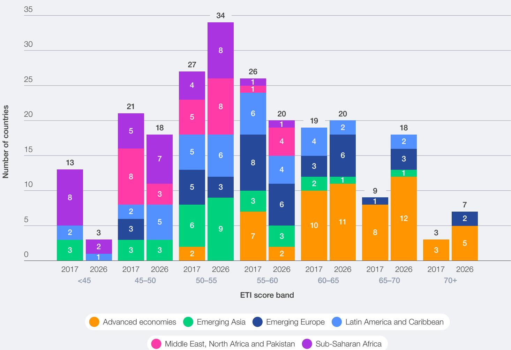

The decade-long view suggests that regions with stronger policy coordination and shared regulatory frameworks, such as the EU-aligned economies, tended to converge, with laggards narrowing the gap over time. Sub-Saharan Africa rose broadly from a low base, driven primarily by strengthening regulatory environments and improved equity through expanding energy access and affordability.

Latin America's spread widened; declining investment conditions and weakening energy security weighed on the region overall, while a few countries with stable frameworks and resource advantages continued to advance. This suggests that without coordinating mechanisms, transition progress tends to concentrate rather than diffuse.

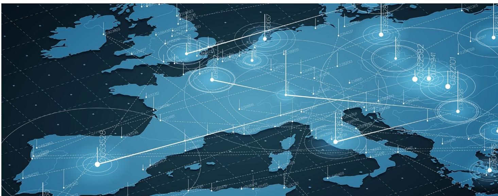

## 66.02

## Advanced economies

Average ETI score

<table><tr><td>Security</td><td>72.44</td></tr><tr><td>Equity</td><td>71.57</td></tr><tr><td>Sustainability</td><td>59.20</td></tr></table>

14.5%

14.5%
Advanced economies remain clear ETI leaders, underpinned by strong institutions and system performance, but their transition is becoming harder to accelerate. With high baselines already achieved, future gains will depend less on ambition and more on overcoming delivery and sustainability constraints.

Percentage of global population

Percentage of global total energy supply

Percentage of global $\mathrm{CO}_{2}$ emissions

## 53.77

## Latin America

Average ETI score

<table><tr><td>Security</td><td>66.13</td></tr><tr><td>Equity</td><td>65.35</td></tr><tr><td>Sustainability</td><td>60.74</td></tr></table>

8.7%

8.7% Latin America continues to benefit from strong renewable penetration, supporting relatively solid sustainability and equity outcomes. However, weaker transition readiness and limited momentum suggest that institutional and financing constraints remain a drag on broader progress.

4.9%

## 60.59

Average ETI score

3.4%

## Emerging Europe

3.6%

<table><tr><td>Security</td><td>68.28</td></tr><tr><td>Equity</td><td>70.95</td></tr><tr><td>Sustainability</td><td>59.45</td></tr></table>

3.6%

Emerging Europe is showing strong transition momentum, supported by gains in infrastructure, human capital and improving system outcomes. The region is consolidating progress from a lower base, with balanced improvements across performance and readiness.

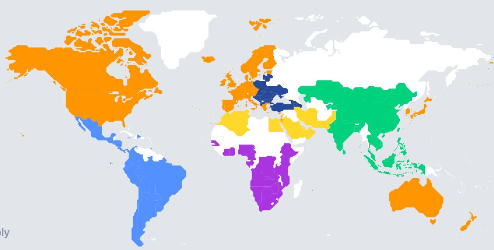

50.10 Average ETI score

12.3%

3.4%

## Sub-Saharan Africa

2.1%

<table><tr><td>Security</td><td>62.28</td></tr><tr><td>Equity</td><td>50.65</td></tr><tr><td>Sustainability</td><td>62.26</td></tr></table>

Sub-Saharan Africa continues to build momentum, with gradual gains in readiness and system performance supported by electrification efforts and policy progress. However, the transition remains uneven, held back by low access, underinvestment and persistent structural constraints.

## 53.75

Average ETI score

51.8%

44.5%

52.93

<table><tr><td>Security</td><td>63.82</td></tr><tr><td>Equity</td><td>65.54</td></tr><tr><td>Sustainability</td><td>54.97</td></tr></table>

Average ETI score

Emerging Asia has shown continued momentum in transition readiness, supported by progress in investment, regulation and enabling conditions. However, overall scores remain broadly flat, with persistent energy security and diversification challenges continuing to weigh on the pace of transition.

9.3%

## Emerging Asia

8.3%

8.0%

## Middle East, North Africa and Pakistan

Security 64.85
Equity 74.73
Sustainability 41.44

The region is sustaining momentum through investment and policy support, while strong equity outcomes continue to underpin overall performance. However, overall progress remains uneven, as fossil fuel dependence, weaker readiness and limited system flexibility continue to constrain the transition.

## 3 Sub-index and dimension trends

Declining security and a decade-first reversal in transition readiness signal a widening gap between current delivery and future preparedness.

# 3.1 | System performance

BOX 7 | System performance key takeaways

System performance improved only marginally. 2026 saw gains in equity and sustainability, but a decline in security limited overall progress and highlighted uneven movement across dimensions.

Structural vulnerabilities continued to weigh on delivery. Reliability pressures, weaker supply fundamentals and uneven infrastructure readiness exposed energy systems to growing operational and geopolitical stress.

System performance measures how effectively energy systems deliver across three core dimensions: equity, security and sustainability. In 2026, global system performance improved only marginally (+0.4%), signalling a slowdown in progress. Around 60% of countries improved their overall system performance scores, yet only 29 out of 120 recorded gains across all three dimensions,

Balanced progress is becoming harder to sustain. Rising electrification, grid constraints, volatile market conditions and external shocks are making it more difficult for countries to advance equity, security and sustainability.

underscoring the growing difficulty of advancing equity, security and sustainability simultaneously. These trends point to a more complex phase of the energy transition, where progress in one dimension is increasingly accompanied by declines or trade-offs in others, making balanced system performance harder to achieve and sustain.

## FIGURE 9

## System performance: what drove the changes

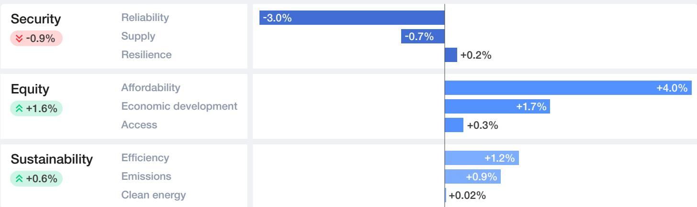  
Note: These changes are YoY.

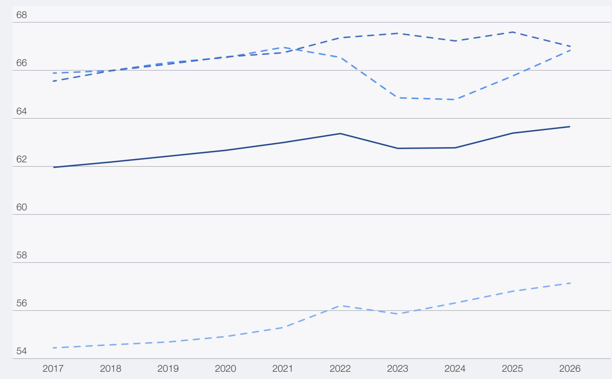

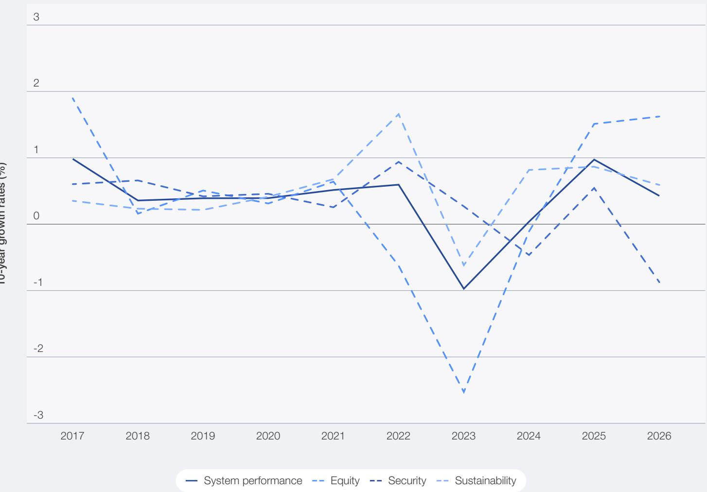

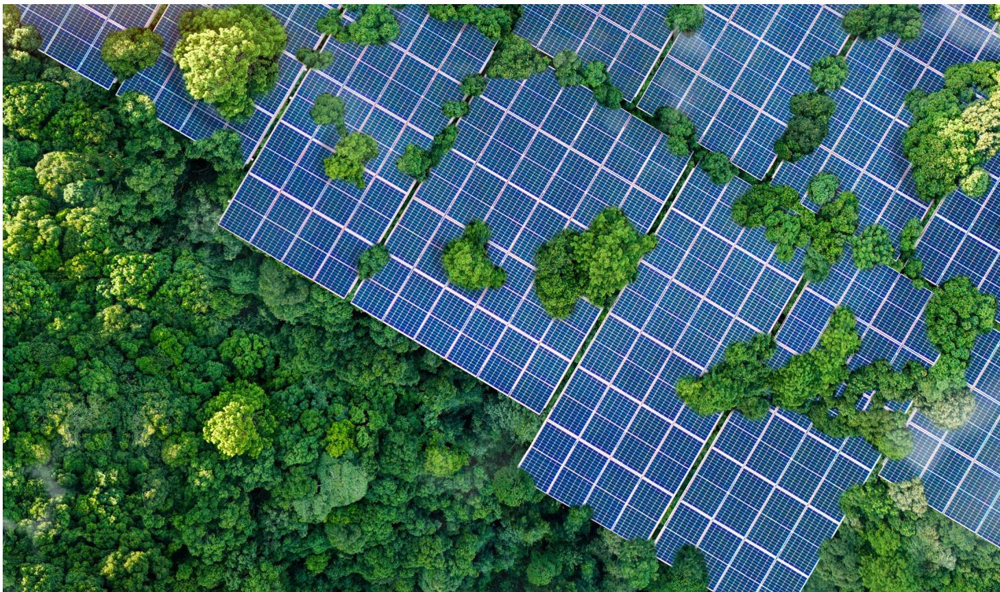

## Security

Security in the ETI is measured across three sub-dimensions: supply adequacy and diversification, system resilience, and grid reliability. Together, these sub-dimensions capture whether countries can source, absorb and deliver energy dependably. Energy security is re-emerging as a central priority – yet it is the only dimension of system performance to have declined in the 2026 ETI. The global average score fell by 0.9%, with 74 economies recording deterioration.

This predates the acute geopolitical shocks of early 2026; the underlying data points to structural vulnerabilities in energy system reliability, supply diversification and system resilience that had been building well before the Strait of Hormuz crisis began in early 2026. The unrest in the Middle East may deepen these vulnerabilities further.

Advanced economies such as the US and Iceland continue to lead in absolute performance, but their scores also declined, highlighting that even mature systems are increasingly being exposed to new and evolving risks.

FIGURE 11  
Security dimension trend 2017–2026  
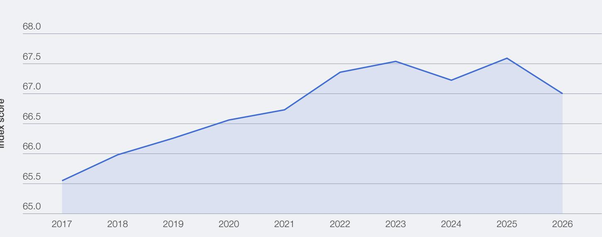

TABLE 2 | Driving factors for the 2026 decline in security

<table><tr><td>Security sub-dimension</td><td>2025 average score</td><td>2026 average score</td><td>One-year change (%)</td><td>Share of countries improving</td><td>Key takeaways</td></tr><tr><td>Supply</td><td>68.4</td><td>68.0</td><td>-0.7%</td><td>44%</td><td>Supply conditions remained broadly stable, but gains were not strong enough to offset pressure elsewhere.</td></tr><tr><td>Resilience</td><td>65.9</td><td>66.0</td><td>0.2%</td><td>35%</td><td>Resilience was largely flat, suggesting limited progress in strengthening system flexibility and shock absorption.</td></tr><tr><td>Reliability</td><td>67.8</td><td>65.8</td><td>-3.0%</td><td>26%</td><td>Reliability was the main drag on security in 2026, with the broadest deterioration across countries.</td></tr><tr><td>Overall security</td><td>67.6</td><td>67.0</td><td>-0.9%</td><td>37%</td><td>The decline in security was primarily driven by weaker reliability rather than a sharp deterioration in supply fundamentals.</td></tr></table>

## Reliability: increasing stress on power system stability

Reliability (-3.0%) was the main contributor to the decline in security, with only around one-quarter of economies improving YoY.

\- The introduction of a broader reliability indicator (reliability of electricity supply $^{62}$ ), which has replaced the System Average Interruption Duration Index (SAIDI) and System Average Interruption Frequency Index (SAIFI) indicators in this year's ETI framework, contributes to the observed decline, but the underlying trends also point to a real deterioration in system reliability. The legacy SAIDI and SAIFI indicator data was outdated, while the new indicator provides a more current and comprehensive view of reliability conditions. The decline should therefore be interpreted as a signal that more recent measurements are revealing reliability pressures that were previously under-captured.

\- Power system stress is increasing as electricity demand grows by 3–4% annually, driven by the accelerating electrification of transport, industrial heat, cooling and data centres. $^{63}$

Declining network performance, as seen in higher transmission and distribution (T&D) losses – e.g. France (-2.2%), Italy (-3.5%) and Australia (-3.3%) – signals growing inefficiency and strain in energy systems, even in advanced infrastructures. $^{64}$

## Supply: rising exposure and concentration risks

Supply-side security is also weakening (-0.7%), with all three underlying indicators – diversification of import partners, diversity of the energy mix and net energy imports – declining in 2026. Together, these trends lead to increased risks of supply partner concentration, reduced diversification in the energy mix and greater exposure to external supply shocks.

\- Rising net energy import dependence – the Netherlands (-15.4%), the United Kingdom (-6.3%) and Spain (-6.1%) – and declining diversification of import partners are increasing exposure to external supply shocks.

\- Geopolitical risks will continue to amplify these pressures. The Strait of Hormuz, through which approximately 20 million barrels per day of oil $^{65}$ and 20% of global LNG flows, $^{66}$ exemplifies the kind of systemic chokepoint risk faced by import-dependent economies.

\- Diversification must go beyond the traditional fuel mix and import counterparts to encompass infrastructure pathways, technology suppliers, critical mineral sources and strategic energy partnerships. This will require building resilience across multiple fronts simultaneously, not just securing alternative barrels.

\- Biofuels are an often-overlooked diversification lever beyond their traditional sustainability role. They provide domestically produced liquid fuel alternatives that reduce import dependence and strengthen supply chain resilience. This is particularly important as geopolitical tensions refocus attention on the vulnerability of seaborne fuel trade routes.

## Resilience: system flexibility struggling to keep pace

Resilience remains broadly flat (0.2%), but underlying indicators point to a growing strain. Declines in the flexibility of electricity systems and marginal growth in the diversity of electricity supply suggest that the capabilities required to manage increasing system complexity – including storage, demand response and grid responsiveness – are not keeping pace.

\- Lower system flexibility results (-0.31% YoY) point to growing difficulty in balancing supply and demand as systems integrate higher shares of variable renewable energy.

\- Similarly, advanced systems also witnessed a decline in resilience – such as Belgium (-3.0%) and Finland (-3.6%) – highlighting constraints in adapting to rising volatility and system complexity.

TABLE 3 | Security profiles in ETI 2026

<table><tr><td>Profile category</td><td>Description</td><td>Illustrative countries</td><td>ETI 2026 signal</td></tr><tr><td>Balanced security leaders</td><td>Strong and balanced performance across supply, resilience and reliability</td><td>Latvia, Canada</td><td>These systems combine high reliability with relatively diversified and resilient security structures.</td></tr><tr><td>Vulnerable improvers</td><td>Security scores improved, but weaknesses remain in one or more sub-dimensions</td><td>Türkiye, Gabon</td><td>Recent gains show that progress is possible, but uneven sub-dimension performance still leaves systems exposed.</td></tr><tr><td>Supply-led performers</td><td>Adequate or strong supply position, but weaker power-system reliability weighs on security outcomes</td><td>Brazil, Ghana</td><td>Security cannot be sustained by supply strength alone when power systems&#x27; reliability remains constrained.</td></tr><tr><td>Adaptive importers</td><td>Dependence on imports offset by stronger resilience and system management capabilities</td><td>Japan, Italy</td><td>Import dependence does not automatically translate into weak security when supported by resilient infrastructure and stronger system balancing.</td></tr><tr><td></td><td colspan="2">Together, these trends signal a fundamental shift in energy security from a focus on resource availability to a broader challenge of managing system complexity in a volatile and interconnected world in a way that safeguards energy security. As geopolitical risks intensify and demand continues to grow, strengthening reliability, diversifying supply and enhancing system resilience through physical hardening and deployment of innovative system optimization digital tools will be critical not only to energy security but to sustaining the broader energy transition.EquityEquity in the ETI is measured across three sub-dimensions: energy access, affordability, and economic development and growth. Together, these</td><td>sub-dimensions capture whether the benefits of energy systems reach populations broadly and at a manageable cost. Although energy prices have partially eased from their 2022–2023 crisis peak – driving the affordability rebound captured in the ETI scores – they remain above pre-crisis levels in most markets, and the renewed price pressures from the 2026 Middle East conflict are not yet reflected in these scores.Equity was the strongest-moving dimension (1.6%) of system performance in ETI 2026, continuing the recovery from the sharp deterioration observed in 2023 and 2024. The rebound was broad-based, with 89 countries improving. The Middle East, North Africa and Pakistan retained the highest average equity performance. Emerging Europe recorded the largest YoY gains, reflecting a geographically diverse recovery driven by different underlying dynamics.</td></tr><tr><td>FIGURE 12</td><td colspan="3">Equity dimension trend, 2017–2026</td></tr></table>

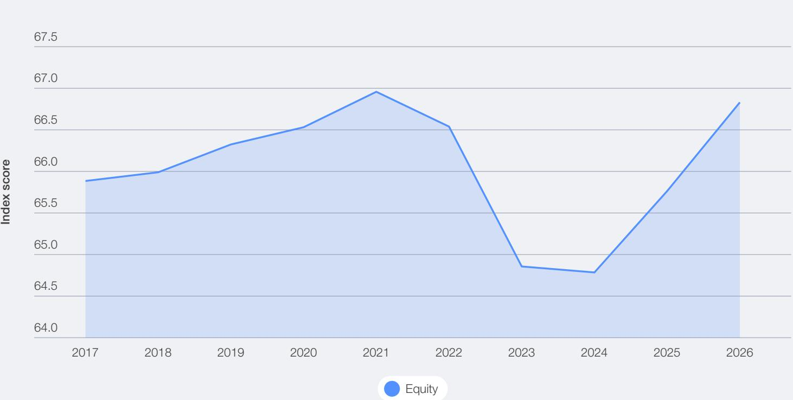

TABLE 4 | Driving factors for 2026 improvement in equity

<table><tr><td>Equity sub-dimension</td><td>2025 average score</td><td>2026 average score</td><td>One-year change (%)</td><td>Share of countries improving</td><td>Key takeaways</td></tr><tr><td>Energy access</td><td>87.9</td><td>88.2</td><td>0.3%</td><td>47%</td><td>Access continued to improve, but gains remained gradual and concentrated in lower-access markets.</td></tr><tr><td>Energy affordability</td><td>65.3</td><td>68.0</td><td>4.0%</td><td>57%</td><td>Affordability was the main driver of the equity rebound, reflecting partial easing of household energy prices from their 2022–2023 crisis peak – though prices in most markets remain above pre-crisis levels and the 2026 supply disruption is not yet reflected in these scores.</td></tr><tr><td>Economic development</td><td>45.7</td><td>46.5</td><td>1.7%</td><td>75%</td><td>Equity gains linked to economic development were broader-based, supporting improvement across a wider set of economies.</td></tr><tr><td>Equity overall</td><td>65.8</td><td>66.8</td><td>1.6%</td><td>77%</td><td>Equity improved materially in 2026, but the rebound remained more cyclical than fully structural.</td></tr><tr><td></td><td colspan="4">Energy access: progress continued,but remained unevenEnergy access remained the most stable component of equity and continued to improve gradually, with gains concentrated on lower-access economies.- The greatest improvements happened in countries that are still addressing structural deficits, including the Democratic Republic of the Congo (+19.1%), Cambodia (+6.0%), Senegal (+7.3%) and Ghana (+4.9%).- At the same time, setbacks in several economies, such as Panama (-2.1%) and Colombia (-1.2%), underscore the uneven nature of this progress, driven by slower improvements in rural access and clean cooking coverage.- Although access is increasing, progress is too slow and uneven to close the gap by 2030, especially in Sub-Saharan Africa and developing Asia.Energy affordability: relief returned,but remains fragileAffordability posted the strongest equity improvement (4.0%), but this must be interpreted with caution.- Markets most exposed to the 2021–2023 energy crisis – Belgium, the Netherlands and France (up approximately 39%) and Latvia, Poland and Hungary (up approximately 25%) – recorded the sharpest reversals, but prices in most regions remain above pre-COVID-19 pandemic levels.- Persistent structural cost drivers, network charges, carbon costs, system investment requirements and higher gas feedstock costs suggest this recovery is cyclical rather than</td><td>structural. The disruption of the Strait of Hormuz reinforces this assessment, with energy price pressures already visible across major markets in early 2026.- Switzerland (-12.4%), Portugal (-9.9%), Spain (-8.3%) and Canada (-5.9%) recorded affordability declines in 2026, underscoring that price pressures persist even in well-functioning systems.- Since 2019, household electricity prices have risen faster than incomes and inflation in many countries, reducing purchasing power and accentuating the fragility of affordability gains.Economic development: broader-based gains,but weaker structural foundations remainGains in economic development were more moderate than in affordability, but were more widely distributed, with nearly three-quarters of economies improving.- The strongest increases were observed in Lao PDR (+27.9%), Trinidad and Tobago (+23.3%), Bahrain (+15.5%), Georgia (+10.2%) and the United Kingdom (+6.9%).- These improvements point to stronger energy-linked economic conditions, including trade balances and the ability to translate energy availability into broader economic value.- At the same time, notable declines in Chile (-18.8%), Mongolia (-7.9%) and Azerbaijan (-5.6%) highlight the uneven nature of progress.- These results show that improvements in access and affordability do not automatically translate into stronger economic outcomes. In turn, this indicates a persistent gap between energy systems’ performance and broader economic inclusion.</td></tr></table>

TABLE 5 | Equity profiles in ETI 2026

<table><tr><td>Profile category</td><td>Description</td><td>Illustrative countries</td><td>ETI 2026 signal</td></tr><tr><td>High-access, high-affordability leaders</td><td>Near-universal access combined with very strong affordability outcomes</td><td>Iceland, Trinidad and Tobago</td><td>These systems lead on equity through broad access and comparatively low-cost energy, often supported by strong domestic resource positions.</td></tr><tr><td>Balanced advanced-economy performers</td><td>Universal access reinforced by stronger economic-development outcomes</td><td>US, Norway</td><td>Equity can remain strong even where affordability is less exceptional, if economic development and institutional capacity are stronger.</td></tr><tr><td>Affordability-supported performers beyond advanced economies</td><td>Strong overall equity supported by broad access and favourable affordability conditions</td><td>Argentina, China</td><td>Strong equity outcomes are not confined to advanced economies when wide access is paired with relatively supportive cost conditions.</td></tr><tr><td>Access progressing, but still constrained</td><td>Energy access is improving, but affordability and economic opportunity continue to weigh on overall equity</td><td>Ghana, Senegal</td><td>In lower-scoring systems, access gains remain essential but are not sufficient on their own to deliver stronger overall equity outcomes.</td></tr></table>

These profiles show that equity is increasingly multidimensional. Iceland and Trinidad and Tobago lead through a combination of universal access and very high affordability, while the US and Sweden pair universal access with stronger economic-development outcomes. Argentina and China show that strong equity performance can also emerge beyond advanced economies where broad access is matched by relatively supportive affordability conditions.

Overall, equity in the 2026 ETI shows meaningful improvement, but not yet on a fully durable basis. The rebound has been driven primarily by cyclical affordability relief, supported by continued gains in access and more moderate improvements in economic development. However, these gains remain fragile as underlying pressures continue to rise.

## Sustainability

ETI sustainability assesses the environmental performance of energy systems through emissions intensity, energy efficiency and the share of clean energy. Energy sustainability remains a long-term anchor of the energy transition, but sustaining its progress is becoming increasingly complex. In 2025, clean energy deployment accelerated further, with renewable capacity additions reaching a record 800 GW $^{67}$ and low-carbon sources supplying 42% of global electricity – the highest share ever – yet global energy-related CO $_{2}$ emissions rose by approximately 0.4%, reaching a record high of 38.4 billion tonnes in 2025 $^{68}$ due to rising electricity demand, heat-related consumption spikes and continued fossil fuel use.

The ETI's sustainability index continued to improve (0.6%) in 2026, primarily driven by improvement in energy efficiency and lower emission intensity, but at a measured and slowing pace. This represents less than one-third of the gains recorded in the previous two years, a signal that momentum is moderating as the structural challenges of demand growth and emissions management re-emerge.

In several major economies, sustainability mandates and corporate commitments have been scaled back, policy signals have become less consistent and the political consensus around accelerated decarbonization has narrowed. This has reduced the policy pull that drove faster progress in previous years. The sustainability challenge is compounded by the reality that the global energy system is currently undergoing addition rather than substitution.

Oil demand continued to grow in 2025 (albeit at its slowest pace in years), with EV uptake keeping road transport demand in check but not yet bending the overall curve. $^{69}$ Gas demand rose by around 1%, and coal consumption remained near its 2024 record. $^{70}$ Renewable energy generation reached historic highs, yet total fossil fuel volumes have not declined in absolute terms. This trajectory underscores the importance of carbon management technologies, including CCUS, methane abatement and low-carbon fuels, not as alternatives to deployment but as necessary complements in sectors and regions where substitution cannot happen fast enough. Rising methane emissions from fossil fuel production underscore the need for methane abatement to remain a core component of emissions-reduction strategies, especially where fossil fuels continue to play a material role in energy supply. Overall, the improvement was broad-based, with 87 economies improving. Sub-Saharan Africa retained the highest average sustainability score, driven by strong emissions performance, however, advanced economies recorded the largest YoY improvement, followed closely by emerging Europe. This suggests that sustainability is advancing across a wide set of country contexts, but through different underlying pathways.

FIGURE 13 | ETI sustainability dimension trend, 2017–2026  
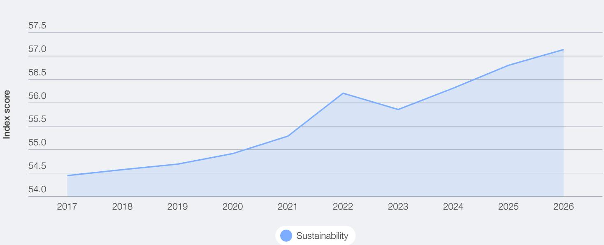

TABLE 6 Driving factors for 2026 improvement in sustainability

<table><tr><td>Sustainability sub-dimension</td><td>2025 average score</td><td>2026 average score</td><td>One-year change (%)</td><td>Share of countries improving</td><td>Key takeaways</td></tr><tr><td>Energy efficiency</td><td>78.0</td><td>78.9</td><td>1.2%</td><td>78%</td><td>Efficiency gains were the most broad-based, pointing to gradual improvement in how energy is used across economies.</td></tr><tr><td>Emissions</td><td>57.3</td><td>57.8</td><td>0.9%</td><td>35%</td><td>Emissions performance improved more narrowly, with many countries flat YoY and gains concentrated in a smaller group.</td></tr><tr><td>Clean energy</td><td>35.1</td><td>35.1</td><td>0.02%</td><td>64%</td><td>Clean energy remained relatively flat YoY, with mixed country-level movement.</td></tr><tr><td>Sustainability overall</td><td>56.8</td><td>57.1</td><td>0.6%</td><td>74%</td><td>Sustainability advanced further in 2026, but progress remained uneven across sub-dimensions and country groups.</td></tr></table>

## Energy efficiency: broad-based improvement, but still off pace

Energy efficiency recorded the most broad-based gains in 2026, with 92 economies improving. However, progress remains insufficient to offset the rising demand growth and the shift towards more electricity-intensive consumption.

\- Some of the strongest gains were in Estonia (+7.3%) and Finland (+7.5%) – due to reduced reliance on energy-intensive fuels and, in some cases, lower industrial activity – while improvements in Australia (+3.8%) and Zambia (+3.5%) were supported by lower per-capita energy use.

\- By contrast, Kuwait (-10.0%), the Republic of Moldova (-2.0%) and Mexico (-1.0%) recorded declines, driven mainly by weaker energy-intensity performance. In Iceland, fluctuations in energy-intensive industries such as aluminium production can significantly affect intensity metrics, while in Kuwait, high per-capita consumption and subsidized energy pricing continue to limit efficiency gains.

Recent estimates suggest that global progress in energy efficiency continues to improve but remains well below the pace required to meet international targets set at COP28 (the 28th Conference of the Parties for the United Nations Framework Convention on Climate Change). The energy crisis in early 2026 could draw attention to energy efficiency and ways to improve it, as it can benefit security, affordability and sustainability.

## Emissions: continued progress, but less evenly distributed

The emissions dimension improved (0.9%), yet was concentrated in a smaller group of economies, while many remained flat YoY. Lower emissions intensity was the main driver of progress rather than absolute emissions reductions, underscoring the growing gap between relative efficiency gains and real-world emissions outcomes.

\- Sub-Saharan Africa retained the highest average emissions score, but remained broadly flat YoY, while advanced economies and emerging Europe recorded the greatest improvements. Coal emissions alone increased by 0.9% globally, largely driven by demand growth in Asia. $^{71}$

\- Country-level improvements in Montenegro (+6.9%) and Luxembourg (+7.4%) were partly driven by favourable hydropower conditions and demand shifts, while Germany (+5.7%) benefited from reduced coal use, strong renewable expansion and lower industrial activity.

\- At the same time, declines in countries such as Estonia (-3.2%), Sweden (-2.2%) and Slovenia (-2.5%) highlight how emissions performance remains sensitive to shifts in generation mix, weather conditions and production levels.

Rising methane $\left(\mathrm{CH}_{4}\right)$ emissions from fossil fuel production add to this pressure, with $CH_{4}$ emissions from the energy sector (the only indicator declining with the sustainability dimensions) highlighting the continued environmental impact of energy extraction even as systems become more efficient.

## Clean energy: progress continued from a low base, but remains uneven

Clean energy marginally improved (+0.02%) in 2026, and was the least-improving driver of sustainability gains.

\- Paraguay (+13.4%) and Colombia (+13.9%) saw the largest gains, supported by strong hydropower performance and expanding renewable capacity, along with North Macedonia (+14.5%), Singapore (+13.6%) and Slovakia (+6.2%).

\- Simultaneously, Albania (-10.2%), Bosnia and Herzegovina (-9.2%) and Panama (-20.7%) recorded declines, illustrating that progress is not always linear, particularly in systems that rely on hydropower or are exposed to climate variability.

\- Leadership remains concentrated in a relatively small group of economies. Iceland, Sweden, Finland, Norway, France and Switzerland continue to record the strongest clean energy performance, while Costa Rica remains the leading performer outside advanced economies. These results reflect strong structural advantages, including resource endowment and long-term policy support.

Increasingly, energy security and competitiveness considerations are driving the deployment of clean energy. However, the ETI 2026 results suggest that progress in this area remains uneven across countries and has not yet translated into stronger sustainability outcomes everywhere.

TABLE 7 Sustainability profiles in ETI 2026

<table><tr><td>Profile category</td><td>Description</td><td>Illustrative countries</td><td>ETI 2026 signal</td></tr><tr><td>Balanced sustainability leaders</td><td>Strong and relatively balanced performance across efficiency, emissions and clean energy</td><td>Costa Rica, France</td><td>These systems combine broad-based sustainability strength, rather than relying on a single area of outperformance.</td></tr><tr><td>Low-emissions, renewable-rich performers</td><td>Strong sustainability outcomes supported by cleaner power systems and lower emissions intensity</td><td>Uruguay, Namibia</td><td>High sustainability can be achieved where low-emission power systems are paired with relatively strong efficiency performance.</td></tr><tr><td>Advanced clean-energy frontrunners</td><td>Very strong clean energy performance supported by broader system maturity</td><td>Finland, Estonia</td><td>These systems lead in clean energy but still need continued progress in efficiency and emissions to sustain broader gains.</td></tr><tr><td>Lower-emissions emerging performers</td><td>Strong emissions outcomes, but lower clean energy penetration continues to limit overall sustainability</td><td>Nepal, Kenya</td><td>Strong emissions scores alone are not sufficient; deeper clean energy progress is needed to lift overall sustainability performance.</td></tr></table>

These profiles show that, even as clean energy deployment becomes more important, it is not the only determinant of strong performance. Countries can lead by prioritizing lower emissions, efficient

energy use and cleaner electricity supply, but long-term leadership increasingly depends on progress across all of these areas.

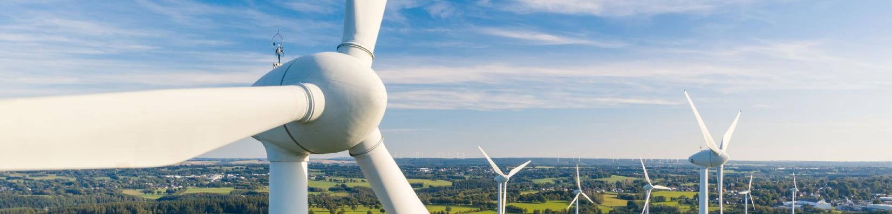

## 3.2 Transition readiness

BOX 8 | Transition readiness key takeaways

From the engine of growth to an emerging bottleneck. After a decade of steady gains, transition readiness has recorded its first decline – a fundamental shift in the structure of ETI progress.

Core enablers weaken simultaneously. Declines in regulation and political commitment, financial investment and innovation signal a broad-based erosion of the conditions that make deployment possible at scale.

A growing disconnect between capital and conditions. Investment is at record levels, but its momentum is slowing. Total clean energy investment reached \$2.3 trillion, yet renewable energy investment fell by 9.5% as electrified transport overtook renewables as the largest category. This signals a structural rebalancing of transition capital.

Regional divergence is deepening. Except for Sub-Saharan Africa and emerging Europe, transition readiness scores declined for all regions.

FIGURE 14 | Transition readiness: first decline in a decade  
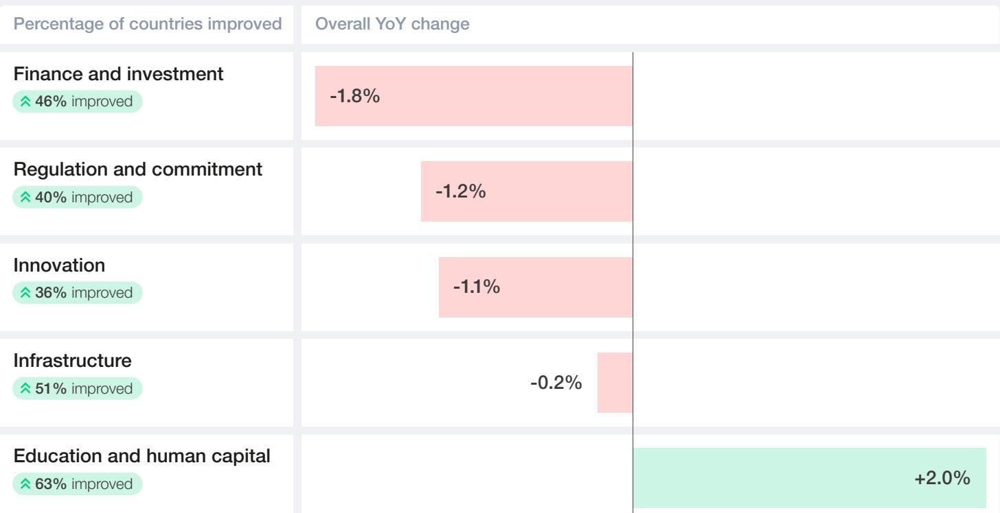

The ETI's transition readiness sub-index measures key factors for the energy transition, including policy stability, political commitment, investment climate, capital access, consumer involvement and technology adoption. These aspects determine how effectively a country can advance its energy transition. Elements such as skills and transport infrastructure, though broader than the energy system, are included because of their impact on transition success.

In this edition, the transition readiness sub-index has been enhanced by the inclusion of two new indicators. The first is AI readiness, which assesses how countries can harness AI to support and accelerate the energy transition. The second is clean technology mineral import exposure, which illustrates how well countries are positioned to develop the required infrastructure and secure critical supply chains that are essential for the transition.

Together, these enhancements provide a more comprehensive and forward-looking view of readiness, better reflecting emerging signals that will shape how energy transitions unfold.

After a decade of steady progress, transition readiness has recorded its first contraction. This is a meaningful structural signal; for most of the ETI's history, readiness improvements in policy, investment, innovation and infrastructure have been the primary drivers of overall gains. A simultaneous decline across four of five readiness dimensions suggests this engine is stalling.

ETI transition readiness trend, 2017–2026  
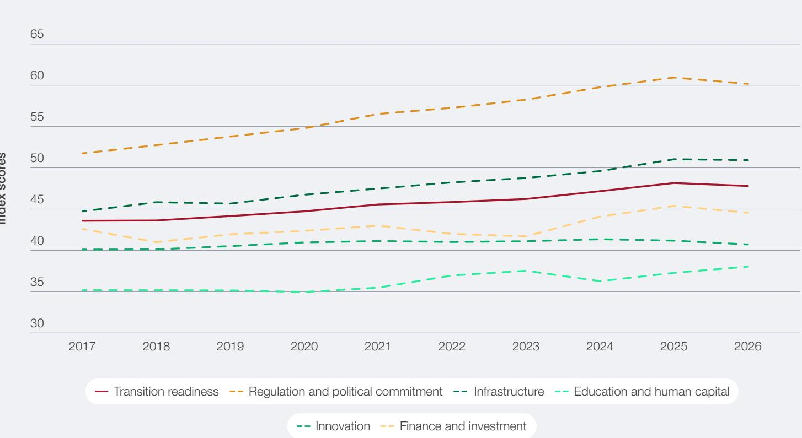

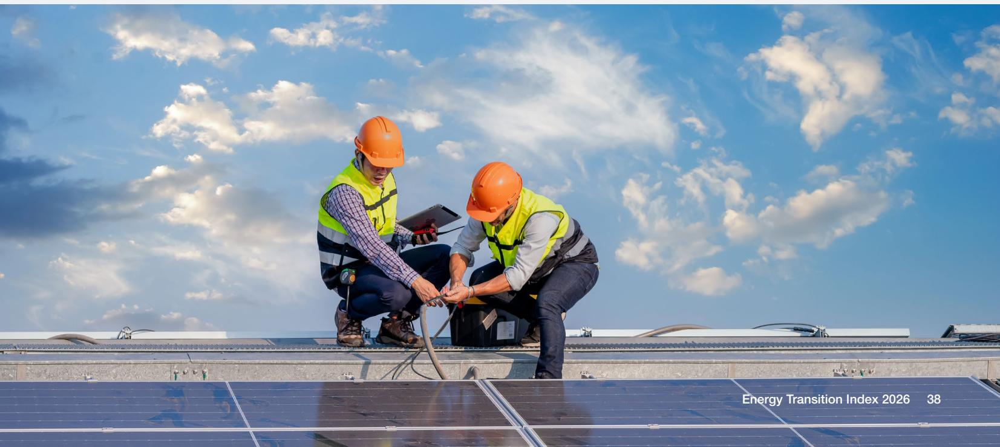

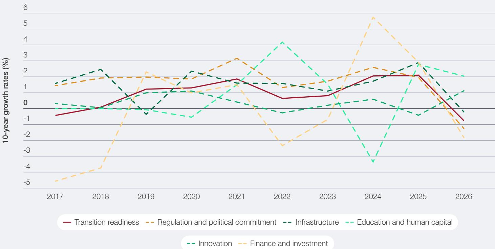

TABLE 8 Driving factors for 2026 decline in transition readiness

<table><tr><td>Transition readiness</td><td>2025 average score</td><td>2026 average score</td><td>One-year change (%)</td><td>Share of countries improving</td><td>Key takeaways</td></tr><tr><td>Regulation and political commitment</td><td>60.9</td><td>60.2</td><td>-1.2%</td><td>40%</td><td>Policy uncertainty is rising, weakening near-term credibility despite continued long-term ambition.</td></tr><tr><td>Finance and investment</td><td>45.4</td><td>44.6</td><td>-1.8%</td><td>46%</td><td>Capital conditions tightened, exposing a widening gap between record investment and transition financing needs.</td></tr><tr><td>Innovation</td><td>41.2</td><td>40.7</td><td>-1.1%</td><td>36%</td><td>General innovation capacity improved, but clean technology development and diffusion lost momentum.</td></tr><tr><td>Infrastructure</td><td>51.0</td><td>50.9</td><td>-0.2%</td><td>51%</td><td>Future-facing capabilities advanced, but gaps in core digital and transport infrastructure persisted.</td></tr><tr><td>Education and human capital</td><td>37.3</td><td>38.0</td><td>2.0%</td><td>63%</td><td>Human capital improved modestly, supported by stronger talent competitiveness and workforce capabilities.</td></tr><tr><td>Transition readiness overall</td><td>48.2</td><td>47.8</td><td>-0.8%</td><td>51%</td><td>Weakening enablers threaten the pace and durability of future gains in the energy transition.</td></tr></table>

## Erosion in transition readiness

The 2026 results confirm that the decline in transition readiness is not due to a single cause. Some of the deterioration reflects near-term macroeconomic pressures – elevated interest rates, fiscal tightening and short-term policy uncertainty – that are likely to ease as financial conditions normalize and policy cycles stabilize, reducing their drag on clean energy investment and readiness scores. However, the breadth and persistence of the decline across innovation, institutional delivery and investment pipeline depth point to structural erosion that will not self-correct.

The slowdown in regulation and political commitment (-1.2%) reflects a broad-based and consistent decline across six of its seven underlying indicators, most notably policy stability (-2.1%) and economic freedom (-1.6%). This pattern is visible across both advanced (Netherlands, United Kingdom, France) and emerging economies (Colombia, Armenia, Georgia). In 2025, several countries delayed or weakened updates to their Nationally Determined Contributions (NDCs),

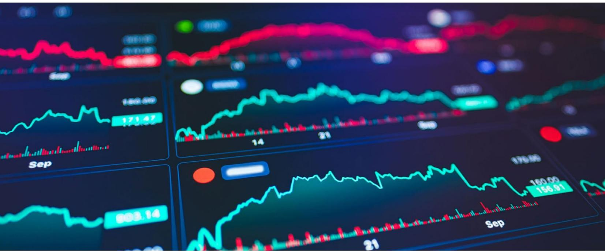

Total clean energy investment reached a record \$2.3 trillion in 2025, up 8% YoY, though the pace of growth has slowed steadily from 27% in 2021 (11% in 2024).

signalling slower near-term climate action and reduced international coordination. At the same time, policy realignments in major economies including the US have weakened policy clarity by prioritizing fossil fuel development. Similarly, several elements of the European Green Deal have been delayed, withdrawn or simplified, indicating that the gap between long-term ambition and near-term policy delivery is widening. However, the regulatory landscape is not uniformly weakening. In some areas, it is also becoming more enforceable and trade-relevant. For example, the EU Methane Regulation will require equivalent monitoring standards for energy imports from 2027 and introduce maximum methane intensity limits by 2030, $^{72}$ making upstream emissions performance a factor in compliance, trade exposure and market access. Italy also updated its NECP in 2024, raising the renewable electricity target to 63.4% by 2030, $^{73}$ and introduced streamlined permitting through designated “suitable areas” for renewables. India tightened renewable purchase obligations, expanded manufacturing incentives under the Production-Linked Incentives (PLI) scheme and mandated grid expansion through the Green Energy Corridor – anchored in energy security and industrial competitiveness. In both cases, the strengthening of regulations was tied to concrete instruments with implementation timelines, not ambition alone.

The drop in finance and investment (-1.8%) was the sharpest across all readiness enablers, yet it does not reflect a retreat from transition investment overall. The decline is driven primarily by a fall in renewable energy investment and weakening domestic credit conditions (both of which the ETI directly measures), even as broader clean energy spending reached new highs in categories such as electrified transport and grids. Total clean energy investment reached a record \$2.3 trillion in 2025, up 8% YoY, though the pace of growth has slowed steadily from 27% in 2021 (11% in 2024), suggesting that while volumes continue to rise, momentum is moderating. Electrified transport (\$893 billion) has overtaken renewables as the

largest category, and grid spending (\$483 billion) continued to rise. This reflects a natural broadening of transition capital as energy systems mature and the investment frontier shifts from generation towards delivery and electrification. The decline was concentrated in renewable energy investment, which fell 9.5\% to \$690 billion. This shift was driven largely by China, which, despite maintaining overall clean energy investment leadership (around \$800 billion), recorded its first drop in renewable energy funding since 2013 as changing power market regulations introduced new uncertainties. In contrast, markets such as India (+15\% to \$68 billion) continued to expand. $^{74}$ Moreover, declining domestic credit to the private sector reinforced this trend, suggesting that tighter liquidity and higher capital costs are further constraining the financial environment, particularly in emerging economies where the gap between capital needs and capital access is widening.

The decline in innovation (-1.1%) reflects a contrast between improvements in the broader enabling ecosystem and weakening market pull for clean technology. The innovative business environment and R&D intensity as a share of GDP have both improved modestly over the past decade. However, the diffusion of environment-related technologies – measured as the share of the global pool of inventions seeking patent protection in a given market – has declined by 29.2% over the past decade and a further 9.6% in 2026. This makes it the primary driver of the innovation score's near-flat 10-year trajectory. The pattern is visible across a broad set of countries, including Croatia, Uruguay, Viet Nam, Costa Rica, Namibia, Jordan and Serbia, suggesting that the weakening market signal for clean technology commercialization is widespread. The global clean technology pipeline continues to grow, with energy technology patents rising steadily over the past decade, driven by strong growth in solar, wind (which more than doubled between 2008 and 2023) and related fields. $^{75}$ The challenge is not a shortage of innovation but its diffusion: fewer markets

Strengthening the resilience of critical mineral trade flows is now a prerequisite for translating general innovation into scalable green infrastructure.

are attracting inventions at the pace needed to sustain the next phase of the transition. For technologies still maturing, including long-duration storage, industrial decarbonization and advanced grid systems, this raises concerns about whether sufficient market pull and R&D support will be available to bring them to commercial scale. For the many solutions that are already proven, the more pressing challenge is deploying them widely, supported by market structures, regulatory frameworks and financing conditions that reward adoption at pace.

Infrastructure also recorded a slight decline (-0.2%). Although it was not a primary driver of the overall drop in transition readiness, it did reveal an important shift in the nature of readiness. The 2026 ETI expands this sub-dimension through two new indicators: AI readiness and clean tech minerals import exposure, broadening the assessment of future-facing transition capabilities. Performance in critical minerals was strongest in countries such as China, South Africa, Australia, Indonesia, Chile, Canada, the US and Brazil, while AI readiness aligned with established technology leaders, including the US, France, the United Kingdom, China and the Netherlands. However, these gains were offset by weaker performance in digital (-1.0%) and transport (-1.1%) infrastructure, with declines seen across both advanced and emerging economies. This is due to higher borrowing costs, declining domestic credit and slowing investment momentum, which are affecting the pace of infrastructure development globally. Furthermore, the widespread diffusion of clean tech is increasingly constrained by supply chain vulnerabilities. Strengthening the resilience of critical mineral trade flows is now a prerequisite for translating general innovation into scalable green infrastructure. This suggests that, while countries are building new strategic capabilities, foundational infrastructure is improving more slowly.

## Education and human capital was the only transition readiness enabler to improve

(2.0% YoY), mainly due to higher global talent competitiveness (5.4%) and growth in jobs in clean tech (2.5%). Biofuels represent a particularly significant source of clean-sector employment, especially in agricultural and rural economies, where they combine decarbonization with broad-based job creation and economic inclusion. The ETI observed progress across a diverse group of countries, including Algeria, Brazil, Cameroon, Ghana, Panama, Israel, Kyrgyzstan, Oman and Pakistan, likely driven by continued recovery in labour markets, increased investment in skills development and education, and a focus on building human capital for economic resilience. These gains remain modest, but they stand in contrast to the broader slowdown across other enablers.

The results of the 2026 ETI point to a clear shift in the dynamics of the energy transition. The recent COP30 outcome, which announced a \$1.3 trillion climate finance pledge without fossil-fuel phase-out language, represents a mixed signal that reinforces the readiness warning. Restoring readiness momentum will require both near-term stabilization of the enabling environment and longer-term rebuilding of the foundational conditions – innovation capacity, institutional credibility and diversified capital access – that the transition depends on at scale.

## Diverging regional pathways in transition readiness

2026 marks a clear inflection point, with readiness slowing or declining across most regions. This shift highlights growing divergence not only in performance levels but in the underlying capacity to sustain progress.

Advanced economies (-0.67% YoY) saw a modest decline in transition readiness, primarily driven by weakening finance and investment (-3.0%), innovation (-1.6%) and regulatory commitments (-0.7%). Despite maintaining strong institutional frameworks, these economies are increasingly facing constraints linked to tighter financial conditions, policy fatigue and slower innovation diffusion. At the same time, the decline in clean energy infrastructure reflects a combination of maturity effects and emerging system constraints (grid capacity bottlenecks, permitting delays and variable renewable integration). This is occurring despite continued growth in investment, with the European Union increasing clean energy investment by 18% to \$455 billion and the US by 3.5% to \$378 billion in 2025, $^{76}$ underscoring a disconnect between capital deployment and improvements in enabling conditions. Gains in education and human capital were not sufficient to offset these pressures, signalling an inflection point in readiness in mature systems.

Emerging Asia (-1.0% YoY) recorded a notable slowdown. The decline was driven by sharp contractions in finance and investment (-7.7%) and innovation (-3.4%). The region continues to benefit from relatively strong regulatory frameworks and long-term gains in clean energy deployment, infrastructure expansion and energy access. However, recent volatility has begun to weigh on investment flows and overall readiness. More broadly, Asia remained the largest destination for clean energy investment globally, primarily driven by China, highlighting its continued centrality to the global transition.

Emerging Europe (0.06% YoY) remained largely flat, reflecting a mixed trajectory. Continued improvements in education and human capital (2.0%) and infrastructure (0.2%) were offset by persistent declines in innovation (-1.0%), finance and investment (-0.3%) and regulatory performance (-0.3%). The region has made steady gains over the past decade, yet structural gaps, particularly in innovation capacity and financial investments, continue to constrain stronger progress.

Latin America and the Caribbean (-2.5% YoY) recorded one of the sharpest regional declines, driven by contractions across infrastructure (-6.1%), regulation (-2.3%), innovation (-3.0%) and finance and investment (-1.2%). Declines in infrastructure in countries such as Uruguay, Costa Rica, Peru and El Salvador reflect a combination of high baseline performance in energy systems, particularly in renewables, and slower momentum in transport and digital infrastructure investment, compounded by tighter fiscal and financing conditions. More broadly, structural challenges in investment mobilization, policy stability and infrastructure delivery continue to weigh on readiness across the region.

Middle East, North Africa and Pakistan (-1.8 YoY) also saw a notable decline, with sharp drops in regulation and political commitment (-3.8%) and infrastructure (-2.4%) outweighing gains in education and innovation. Declines in countries such as Tunisia, Jordan, Lebanon, Egypt and Pakistan largely reflect macroeconomic pressures, institutional constraints and delays in policy implementation rather than a reversal of long-term ambitions. In several cases, fiscal stress and energy security concerns have slowed reform momentum and weakened policy consistency, highlighting a growing gap between stated targets and execution.

Sub-Saharan Africa (3.3% YoY) stands out as the only region showing strong improvement, driven by gains across multiple enablers, particularly finance and investment (8.6%), education (5.6%) and innovation (5.0%). Despite starting from a lower base, this progress reflects increasing momentum in capital inflows, innovation activity and human capital development. However, persistent challenges in infrastructure and regulatory frameworks point to an uneven but gradually improving readiness landscape.

The global context for the energy transition is becoming increasingly complex, shaped by geopolitical tensions, shifting trade dynamics and tighter economic conditions as countries rebalance priorities. After a decade of steady gains, transition readiness is beginning to slow, reflecting growing pressures across key enablers, primarily investments and regulation. At the same time, evolving dynamics are redefining readiness itself, with greater emphasis on technological capability and supply chain resilience. Going forward, sustaining progress will depend on countries' ability to navigate complexity and adapt to an increasingly uncertain environment – treating current pressures as catalysts for building more resilient and innovative energy systems.

FIGURE 17 Transition readiness pulse check by region

<table><tr><td></td><td>Regulation</td><td>Infrastructure</td><td>Education</td><td>Innovation</td><td>Finance</td></tr><tr><td>Advanced economies</td><td>79.7</td><td>65.6</td><td>51.2</td><td>60.5</td><td>55.9</td></tr><tr><td>Emerging Asia</td><td>53.9</td><td>48.8</td><td>30.2</td><td>34.6</td><td>39.2</td></tr><tr><td>Emerging Europe</td><td>59.4</td><td>54.5</td><td>48.1</td><td>36.0</td><td>56.7</td></tr><tr><td>Latin America</td><td>52.1</td><td>43.9</td><td>30.3</td><td>32.4</td><td>30.0</td></tr><tr><td>Middle East and North Africa and Pakistan</td><td>53.6</td><td>38.5</td><td>36.0</td><td>34.3</td><td>41.3</td></tr><tr><td>Sub-Saharan Africa</td><td>48.8</td><td>42.8</td><td>22.5</td><td>33.3</td><td>36.2</td></tr></table>

↑ Upward trend ↓ Downward trend

## 4 Energy security

Energy security has emerged as a defining force and a source of competitive advantage in the global energy landscape.

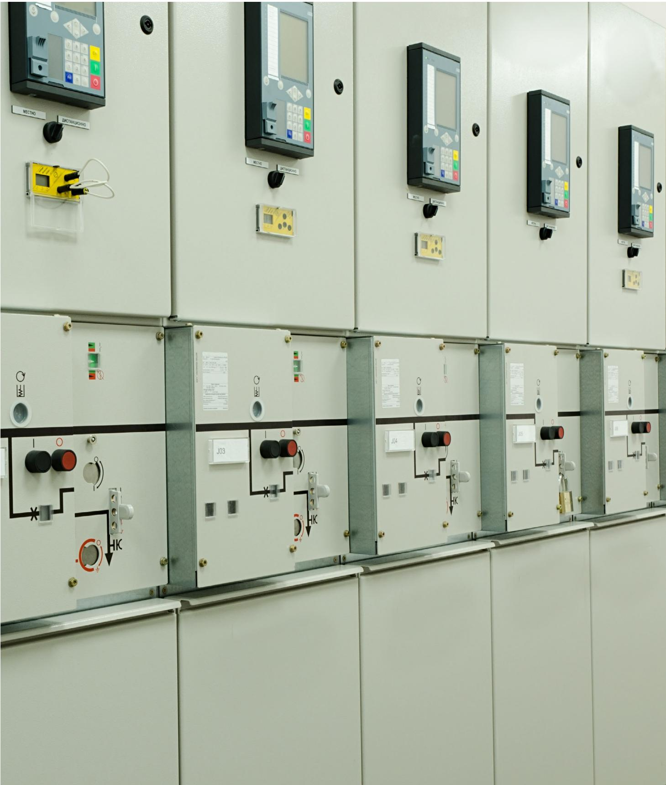

# 4.1 Transition under system pressure

## BOX 9 Transition under system pressure – key takeaways

The transition is constrained by systems and shaped by fragmentation. Despite gains in sustainability, weak enabling conditions like investment, infrastructure, innovation and regulation are slowing progress, while geopolitical tensions and supply chain concentration are driving regionalization and making systems harder to integrate at scale.

## !

Energy security risks are expanding and intensifying. Security concerns extend beyond fuels and electricity to include critical minerals, supply chains, infrastructure resilience and exposure to climate and geopolitical shocks making resilience a central pillar of the transition.

The global energy transition has entered a more complex phase. What was once widely framed as a relatively linear process of technology substitution from fossil fuels to cleaner alternatives is now unfolding under mounting systemic pressures. Rising energy demand, intensifying geopolitical fragmentation, infrastructure bottlenecks and increasingly selective capital allocation are reshaping both the pace and nature of the transition. The result is a widening gap between ambition and delivery, as system readiness struggles to keep pace with deployment momentum.

This shift is also reflected in the ETI results. Sustainability indicators continue to improve (+0.60%), but the pace of progress has slowed

Capital is becoming more selective and risk-driven. Higher financing costs and uncertainty are concentrating investment in low-risk, mature technologies and stable markets, while emerging economies face persistent barriers to attracting capital.

markedly (falling to less than one-third of gains seen in the previous two years), while enabling dimensions – particularly investment (-1.8%), infrastructure expansion (-0.2%), innovation (-1.1%) and regulatory coherence (-1.2%) – continue to lag. This divergence signals a transition that is no longer constrained primarily by technology availability, but by the ability of systems to deploy, integrate and finance solutions at scale.

These pressures are multifaceted and interconnected, spanning geopolitics, infrastructure, demand, finance and market dynamics. Together, they are influencing the operating environment for the energy transition (Figure 18).

## FIGURE 18

## Energy transition system pressures

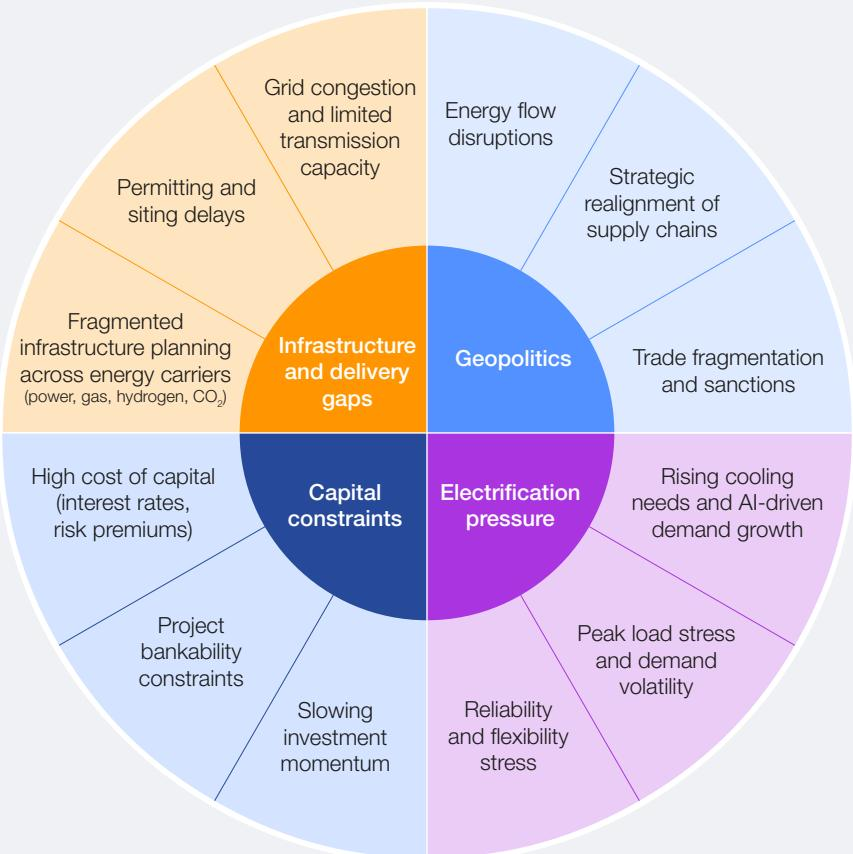

## Geopolitical fragmentation and disrupted energy flows

Geopolitical dynamics have re-emerged as the primary driver of global energy system performance, fragmenting markets through intensifying trade tensions, industrial policy competition and the localization of supply chains. This shift is reflected in a 1.2% decline in regulatory and policy readiness, as countries adopt more divergent and protectionist frameworks to secure strategic industries. The scale of this fragmentation is quantifiable: global trade

restrictions tripled to 2.64 trillion by mid-2025 – three times their 2024 levels $^{77}$ – a development that directly constrains cross-border investment flows and contributes to the decline observed in the finance and investment dimension of the ETI.

These system pressures are unfolding within a broader context of rising global risks. According to the World Economic Forum's Global Risks Report 2026, geopolitical tensions, conflict and economic instability rank among the most significant risks facing the global economy in 2026.

FIGURE 19 Current global risk landscape  
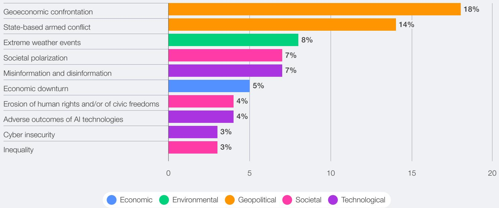  
Source: World Economic Forum. (2026). The Global Risks Report 2026.

Recent years have seen a proliferation of national industrial strategies targeting clean energy technologies, including subsidies for domestic manufacturing of PV, batteries and hydrogen. These policies can accelerate local deployment, but may also risk inefficiencies at the global level and rising costs.

Clean energy supply chains are becoming increasingly concentrated and geopolitically sensitive. Over 50% of critical transition minerals are now subject to export controls, $^{78}$ up from near-zero in 2020, representing the single most consequential supply chain development of the current transition period. This is compounded by growing market concentration: for copper, lithium, nickel, cobalt, graphite and rare earth elements, the combined market share of the top three producers increased from about 82% in 2020 to 86% in 2024. $^{79}$ Nearly all new supply came from the leading producer in each case – Indonesia for nickel and China for the remaining minerals. The expansion of export controls in 2025 has further exposed vulnerabilities, contributing to higher prices, manufacturing bottlenecks and a decline in energy security of 0.9% captured in the ETI, driven by weaker supply diversification (-0.7%) and a sharp fall in reliability (-3.0%). Together, these dynamics risk delaying decarbonization, increasing costs and weakening supply security, as energy systems become more regional, less efficient and more exposed to disruption.

At the same time, disruptions to traditional energy flows, particularly through chokepoints such as the Strait of Hormuz, are increasing price volatility and uncertainty. Around 25% of the world's seaborne oil trade passes through the Strait of Hormuz – 80% destined for Asia, along with 19% of global LNG trade, $^{80}$ making it one of the most critical routes in the global energy system.

This disruption has triggered one of the most severe energy supply shocks in recent history, affecting more than 11 million barrels per day of oil supply. This led to Brent crude oil prices surging alongside

Where wealthier importing nations can absorb higher costs, lower-income import-dependent economies face a harder tradeoff between energy access, fiscal stability and transition investment.

similarly sharp increases in gas prices, highlighting the speed and scale at which physical disruptions can be transmitted into global energy markets. $^{81}$

Critically, the impacts of this shock are not uniform. Import-dependent economies face asymmetric vulnerability – not only through price exposure but also through supply uncertainty and fiscal stress. Where wealthier importing nations can absorb higher costs through strategic reserves or fiscal cushioning, lower-income import-dependent economies face a harder trade-off between energy access, fiscal stability and transition investment. This asymmetry should be understood as both an equity issue and a security issue: it shapes which countries can sustain transition momentum and which are forced into regressive energy choices under pressure. $^{82}$

These disruptions are already producing differentiated regional impacts. In Asia, where economies are highly reliant on LNG imports and acutely exposed to Hormuz transit risk, volatile gas prices and supply uncertainty have triggered a renewed reliance on coal. Countries including China, India, Bangladesh and Thailand are increasing coal use or curtailing gas consumption to secure supply, as coal becomes a more accessible and stable alternative under current conditions.

This highlights a growing divergence in transition pathways. For many import-dependent economies, exposure to volatile import fuel markets strengthens the strategic case for domestic energy production, whether coal or renewables, as well as demand-side measures like electrification and efficiency as tools to reduce import dependence and reinforce energy sovereignty. In this sense, security pressures can accelerate parts of the transition if governments prioritize clean energy. Yet, the same disruptions can also raise interest in domestic coal supplies, raise shipping costs for clean energy equipment, tighten supply chains and increase perceived risk for large infrastructure projects, directly testing the bankability of renewable, grid and storage

investments. The result is not a single direction of travel; while some regions accelerate clean energy deployment, others reinforce reliance on incumbent fuels, leaving parts of the global system more carbon-intensive for longer. $^{83}$ Whether security shocks become a net accelerant or constraint will depend on countries' ability to convert security concerns into investable domestic clean energy deployment, resilient supply chains and credible delivery pathways.

Rising oil prices have broad ripple effects across the global economy. Higher energy costs tend to fuel inflation, weaken household purchasing power and place additional pressure on industrial activity. Sectors such as aviation, logistics and manufacturing are particularly exposed, given their high reliance on fuel inputs. Governments face mounting pressure to respond through strategic reserve releases, price support mechanisms or fiscal interventions – all of which divert public resources from longer-term transition investment. $^{84}$

These developments are expected to have time-varying effects across ETI indicators. Rather than producing immediate structural change, disruptions propagate in stages – from fuel markets to prices and fiscal responses, and ultimately to system structure and investment. Early impacts are already visible in increased volatility in fuel prices, shipping costs and supply reliability, with broader implications for the energy transition (Box 6).

Together, these dynamics illustrate how geopolitical fragmentation and energy security concerns are increasingly shaping transition pathways. Countries are prioritizing supply security and resilience – even where this raises costs, slows technology diffusion or, at least in the short term, delays decarbonization. The result is a more regionalized and uneven transition: more robust in some respects, but slower, costlier and increasingly shaped by structural inequalities that determine which economies can sustain momentum.

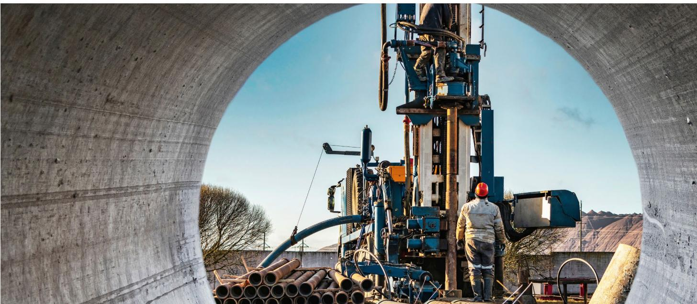

## Infrastructure and delivery gaps hindering momentum

Despite these challenges, momentum in clean energy deployment remains strong. Renewable capacity additions continue to reach record levels, with solar and wind leading growth. Globally, renewable power capacity is projected to increase by almost 4,600 GW between 2025 and 2030 – double the deployment of the previous five years (2019–2024). $^{85}$

However, this deployment momentum is increasingly outpacing system readiness. As indicated by the ETI results, infrastructure expansion remains limited (-0.2%), and investment signals are weakening (-1.8%), suggesting a widening delivery gap. Global grid spending runs at approximately \$400 billion per year, compared with \$1 trillion in generation assets – a structural imbalance that cannot be closed by deployment ambition alone. $^{86}$

This gap extends beyond electricity systems. Progress across molecule-based pathways, including hydrogen, sustainable fuels and carbon capture, remains more uneven and at an earlier stage of development. Deployment is lagging, despite its importance for hard-to-abate sectors, system flexibility and supply diversification. As of 2025, only around 10–15% of announced low-emissions hydrogen projects have reached final investment decision (FID), reflecting persistent challenges in cost, infrastructure and demand. $^{87}$ In parallel, CCUS capacity, while expanding, is still far below levels required for net-zero pathways, with investment and project pipelines concentrated in a limited number of regions. $^{88}$ Gaps in transport and storage infrastructure for hydrogen and $CO_{2}$ , the absence of mature market frameworks and a lack of bankable business models and risk-sharing mechanisms continue to constrain scale-up and system integration.

In other words, while technologies are being installed at scale, the systems required to support them – across electricity and molecules (grids, storage, hydrogen and $CO_{2}$ infrastructure) – are not keeping pace. Enabling infrastructure investment continues to lag system integration needs. Global energy transition investment hit a record 2.3 trillion in 2025 (+8% YoY), yet grid investment remains far below required levels. $^{89}$ This imbalance creates bottlenecks that limit the effective use of new capacity. In many markets, renewable projects are delayed or curtailed due to insufficient grid connections. The transition is increasingly not capacity-constrained; it is integration-constrained. The pace of power demand growth is outpacing grid availability in ways that investment alone is unlikely to resolve. Even long-duration storage and AI-driven grid optimization are unlikely to fully bridge the gap. Flexibility, including behind-the-meter generation, is emerging as a structural requirement rather than a supplementary option.

This apparent contradiction – record investment volumes alongside declining ETI investment conditions (-1.8%) – reflects worsening financing environments: higher interest rates, policy uncertainty and elevated risk perception, rather than a lack of capital availability. This growing mismatch between deployment and system readiness is illustrated in Figure 20, highlighting the extent to which infrastructure constraints are delaying deployment. Even projects at advanced stages of the grid connection process are waiting in connection queues globally.

Renewable and storage capacity in grid connection queues by project stage  
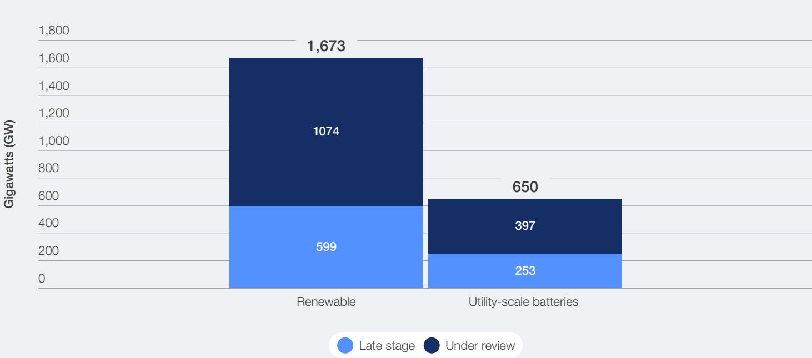  
Source: International Energy Agency (IEA). (2026). Renewable energy and utility-scale battery capacity in advanced stages waiting in connection queues globally, by project stage, 2025. https://www.iea.org/data-and-statistics/charts/renewable-energy-and-utility-scale-battery-capacity-in-advanced-stages-waiting-in-connection-queues-globally-by-project-stage-2025.

Currently, over 2,500 GW of renewable energy, large-load and storage projects are estimated to be waiting in grid connection queues globally.

Currently, over 2,500 GW of renewable energy, large-load and storage projects are estimated to be waiting in grid connection queues globally, $^{90}$ highlighting the scale of infrastructure constraints. With grid investment lagging generation, systems are experiencing rising congestion and curtailment, while transmission infrastructure in many regions remains outdated or ill-suited to variable renewables. Interconnection capacity is another constraint. Limited cross-border links reduce system flexibility and the ability to balance variable generation. Integration challenges increasingly extend beyond infrastructure to digitalization, system optimization and market reform.

Permitting delays further exacerbate these challenges. Large-scale projects often face multi-year approval timelines, with regulatory complexity remaining a key bottleneck to deployment. Taken together, these dynamics indicate that the transition is entering an “infrastructure-limited” phase. The World Economic Forum’s Innovation Playbook for Future Power Systems catalogues over 80 deployment-ready solutions across power assets and flexibility enablers, grid infrastructure, and data and digital technologies – providing a practical reference for countries and companies seeking to accelerate system integration at scale. $^{91}$ Without parallel investment in integration and enabling systems, and without regulatory and system innovation to accelerate delivery, additional capacity will not translate into improved system performance.

## Electrification and rising system integration challenges

Global electricity demand is rising rapidly, driven by EVs, cooling, heat pumps, industrial electrification and digital infrastructure such as data centres. Global electricity demand grew by 3.0% in 2025, $^{92}$ with renewables, natural gas and nuclear expanding to meet rising demand. Studies forecast that demand will accelerate further – averaging 3.6% annual growth through 2030, as recent events reduce the perceived risk of fuel-supply dependence – marking what it calls the “Age of Electricity”. $^{93}$

Electrification delivers major benefits. It is central to decarbonization, given the strong potential to scale clean electricity sources such as solar, wind and nuclear, and it also enhances energy efficiency. Electrified systems often lower lifetime energy costs and increase resilience by limiting exposure to fossil fuel price volatility. These shifts support cleaner growth and long-term energy security, particularly as renewables become a larger share of the power mix.

At the same time, rapid electrification creates system integration challenges that must be managed. The surge in electricity demand is placing pressure on grids and transmission infrastructure, not only generation. Electrification is advancing across multiple end-use sectors simultaneously. Transport electrification is scaling rapidly, with EV adoption driving significant new loads and charging infrastructure requirements. Industrial electrification, particularly for process heat, faces greater technical and cost barriers, with high-temperature applications remaining difficult to electrify at scale. Meanwhile, cooling demand is growing fastest in emerging economies, adding substantial seasonal and peak load pressure. Power systems must balance rising demand with more variable renewable supply, requiring greater flexibility through storage, demand response and network reinforcement. Proven solutions across all three are already being deployed – from large-scale battery systems and AI-driven demand response to digital twin grid monitoring and cybersecure control centres – yet scaling these innovations and strengthening the enabling conditions for their broader adoption remains the central challenge. More complex, digitalized systems must also cope with risks from extreme weather, cyberattacks and supply chain disruptions.

As electrification deepens, it is also reshaping the power generation mix. Greater reliance on electricity increases the stakes of the generation mix. If the additional electricity demand is met primarily by gas and coal in the near term, as current projections suggest for data centre demand, electrification risks locking in emissions rather than reducing them. The composition of the power mix, therefore, becomes as important as the pace of electrification itself.

The shift is also transforming how energy systems operate. More interconnected and distributed networks are emerging, increasing both resilience and operational complexity. This transformation is driving the deployment of smart grids, enhanced interconnections, digital management tools and flexible market structures, with the priority now being to accelerate their scale-up and embed the enabling conditions for system-wide adoption. These measures can turn reliability risks into opportunities for innovation and improved efficiency.

Electrification is transforming labour markets as well. Expanding power and digital infrastructure increases demand for engineers, system operators and manufacturing specialists, even as employment declines in fossil-based sectors. $^{94}$ Targeted reskilling and workforce mobility will be vital to ensure a just and efficient transition.

AI has emerged as a structural force reshaping electricity demand at a speed that consistently outpaces forecasts. Global electricity demand from data centres is projected to double by 2030, reaching around 945 TWh – roughly equal to Japan’s current total electricity consumption – driven in large part by AI workloads. AI-optimized data centre demand is projected to increase more than fourfold by 2030. In advanced economies,

data centres are expected to account for more than 20% of electricity demand growth through 2030. $^{95}$ Clean energy sources are unlikely to meet this demand alone. Additional electricity demand from data centres through 2030 $^{96}$ is expected to rely in part on fossil-based generation – a supply profile that sits in direct tension with net-zero commitments and is rarely foregrounded in discussions of AI's transformative potential. Under an accelerated adoption pathway, global data centre electricity demand by 2035 could be around 45% higher than the baseline case, exceeding 1,700 TWh and approaching 4.4% of total global electricity consumption. $^{97}$ This is a reminder that current projections may significantly understate the eventual scale of the challenge.

These trends show that, while electrification increases system complexity, it also opens opportunities for innovation and resilience. With adequate investment in grids, storage and flexibility – supported by market and business model innovation that rewards flexibility, reduces investment risk and aligns incentives across the system – electrification can strengthen, not strain, energy systems, supporting both stability and decarbonization.

FIGURE 21 Global electricity consumption from data centres (2020–2030)  
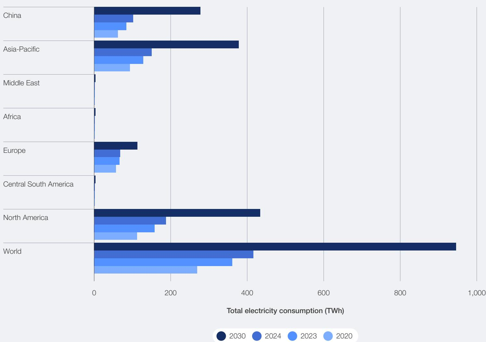  
Source: International Energy Agency (IEA). (2025). Energy and AI. https://www.iea.org/reports/energy-and-ai.

## Capital intensity and execution constraints

The transition is also becoming more capital-intensive and more selective. Capital is available and at record levels, but increasingly concentrated in low-risk markets and mature technologies. Investment growth has slowed steadily, from 27% in 2021 to 8% in 2025, and the ETI's finance sub-index declined (-1.8%) as renewable energy investment fell 9.5% and domestic credit conditions weakened. The cost of capital in emerging economies remains two to three times higher than in advanced markets, making otherwise viable projects unbankable.

Emerging markets have accounted for only around 18% of global clean energy investment over the

past decade. In contrast, advanced economies and China captured approximately 42% and 40% of total funding, respectively. $^{98}$ This disparity highlights a structural mismatch: regions that are expected to drive the majority of future energy demand are attracting a disproportionately small share of investment. $^{99}$

This imbalance reflects persistent structural barriers, including political risk, currency volatility and high cost of capital, which continue to constrain financing flows into emerging markets, even as technology costs decline and demand for clean energy rises. Financing costs are emerging as a primary constraint on clean energy deployment, particularly in emerging markets where the cost of capital remains significantly higher than in advanced economies. $^{100}$

FIGURE 22 Energy investment across regions and sectors, 2015 and 2025  
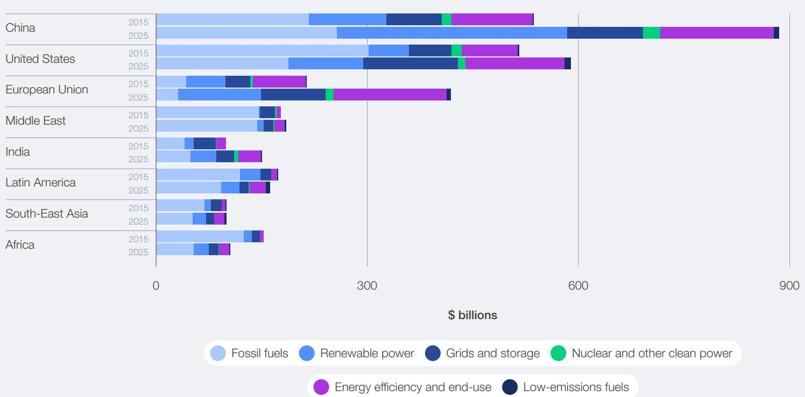  
Source: International Energy Agency (IEA). (2025). World Energy Investment 2025. https://www.iea.org/reports/world-energy-investment-2025/executive-summary.

Investment patterns are also increasingly concentrated in mature, commercially proven technologies. The bulk of capital continues to flow towards renewables, grids, storage and electrification, which together account for the majority of the roughly 2.3 trillion in global clean energy investment in 2025. $^{101}$ Solar PV alone is expected to attract around 450 billion, making it the single largest investment category globally. $^{102}$

The consequence is a self-reinforcing dynamic: markets with stronger systems, infrastructure and institutions deploy faster, attract more capital and widen their advantage. Accelerating the transition will depend less on the availability of capital globally and more on the ability to reduce risk, improve

project bankability and mobilize concessional and blended finance – particularly in Sub-Saharan Africa and parts of South and South-East Asia.

## From technology transition to system transformation

These system pressures point to a transition that is increasingly constrained by system-level bottlenecks. Addressing these challenges requires a shift from incremental, sector-specific interventions to more coordinated, systemic responses. This includes rethinking how energy systems are planned, financed and governed to better manage emerging risks and interdependencies.

<table><tr><td>System pressure</td><td>Key challenge</td><td>Strategic response</td></tr><tr><td>Geopolitical fragmentation</td><td>Increasing supply risk, price volatility and fragmentation of energy flows</td><td>- Diversify supply chains and trade partners- Build strategic reserves and redundancy- Strengthen regional cooperation and diplomacy- Develop domestic manufacturing capacity</td></tr><tr><td>Infrastructure and delivery gap</td><td>Infrastructure and system integration constraints limiting effective deployment</td><td>- Invest in digitalization and smart grid technologies- Streamline permitting and approvals- Scale integrated system planning- Expand interconnections and regional markets</td></tr><tr><td>Electrification and system stress</td><td>Growing pressure on system flexibility, stability and reliability</td><td>- Scale flexibility solutions (storage, demand response)- Invest in grid resilience and climate adaptation- Strengthen cybersecurity frameworks- Align electrification with system planning</td></tr><tr><td>Capital intensity and execution</td><td>Mismatch between capital availability and deployable, de-risked investment</td><td>- De-risk through stable policy frameworks- Expand blended finance and public-private partnerships- Strengthen project pipelines and bankability- Mobilize concessional finance for emerging markets and developing economies (EMDEs)</td></tr></table>

Figure 23 outlines how different system pressures are reshaping the transition and the key actions needed to address them.

\- Geopolitical fragmentation is increasing supply risks and volatility, requiring countries to diversify supply chains, localize capabilities and strengthen regional cooperation.

\- This is directly reflected in the ETI: energy security declined $(-0.9\%)$ , driven by a sharp fall in reliability $(-3.0\%)$ , weaker supply diversification $(-0.7\%)$ and a decline in regulatory readiness $(-1.2\%)$ . Together, these signal growing fragmentation and volatility in energy flows.

\- The gap between deployment and system readiness, especially grid and infrastructure constraints, means the focus needs to shift to scaling grid investment, improving planning and streamlining permitting and integration.

\- The ETI captures this clearly: transition readiness declined (-0.8%), with weakening across infrastructure (-0.2%), investment (-1.8%) and regulation (-1.2%), highlighting a growing gap between deployment ambition and system integration capacity.

## – Electrification is accelerating emissions

Electrification is accelerating of efficiencies reductions and improving efficiency, but it is placing growing strain on electricity grids and power systems that were not designed for this pace of change. Meeting rising demand requires urgent investment in grid modernization, flexibility and demand-side solutions, and a much closer alignment between the speed of electrification and the capacity of systems to absorb it.

\- The ETI data underscores this: reliability declined sharply (-3.0%) while resilience remained broadly flat (+0.2%), indicating that flexibility and stability are not keeping pace with the speed of electrification.

\- Finally, rising capital intensity and execution challenges mean that accelerating the transition will depend on de-risking investment, improving project bankability and mobilizing finance, especially in emerging markets.

– Finance and investment conditions declined (-1.8%), with a more pronounced drop in Emerging Asia (-7.7%), indicating growing regional disparities in capital flows. Declines in regulation and political commitment (-1.2%) and innovation (-1.1%) further highlight a growing disconnect between capital availability and effective deployment. This marks a broad-based weakening of the enabling conditions on which future transition progress depends.

Collectively, these pressures point to a transition that is fundamentally changing. It is not a linear process of replacing fossil fuels with cleaner alternatives, but a system transformation that must balance security, affordability and sustainability under increasing stress.

The transition is becoming:

– More fragmented (geopolitics)

\- More infrastructure-constrained (grids, integration)

\- More demand-driven (electrification)

– More capital-sensitive (risk, cost of capital)

Taken together, these pressures point to a transition that is increasingly shaped by the need to deliver secure, reliable and affordable energy under stress. How countries navigate these pressures – and whether they can turn security imperatives into structural advantage – is the subject of section 4.2.

# Security shaping the transition and competitiveness

4.2

BOX 10 | Security shaping the transition and competitiveness – key takeaways

Energy security now extends beyond fuels. Security increasingly depends on grids, infrastructure, critical minerals and supply chains, reflecting a shift towards more complex and interconnected energy systems.

## \$

Capital and competitiveness are increasingly shaped by security.
Investment is becoming more selective and risk-driven, concentrating in stable markets and reinforcing a multi-speed transition across regions.

Security appears to be evolving from a constraint on the transition to a condition for it. The transition is increasingly looking not just multi-speed but structurally divergent across regions where countries that align short-term stability with long-term resilience will shape the pace of the transition.

Security appears to be evolving into the condition under which the transition is financed, designed and executed.

ETI results point to a development that goes beyond the headline figure. Overall progress has stalled (+0.03%), but this aggregate may mask a more consequential divergence: system performance improved (+0.4%) while transition readiness declined (-0.8%). This marks the first time these two dimensions appear to have moved in opposite directions. This may reflect an emerging structural gap between what energy systems are currently delivering and the enabling conditions – investment, infrastructure, regulation, innovation – required to sustain that delivery over time.

This divergence is unfolding against a backdrop of compound stress. The transition is simultaneously navigating geopolitical fragmentation, prompting the largest International Energy Agency (IEA) emergency reserve release in history; sharp Brent crude and gas price rises in early 2026; an AI-driven demand surge that could significantly increase data centre electricity consumption; and a financing environment that continues to leave emerging markets underserved. These pressures are interconnected and appear to be reinforcing one another, reshaping the operating environment for the transition in ways that aggregate indicators alone may not fully capture.

Energy security is doing more than influencing how energy systems are designed. It is reshaping where capital flows, how industrial strategies are formed and which countries will lead the next phase of the transition. Rather than simply a constraint to be managed alongside decarbonization, security appears to be evolving into the condition under which the transition is financed, designed and executed. This points towards a global transition that is increasingly not merely multi-speed but structurally divergent. Energy security is reshaping the transition across two interconnected dimensions:

1. How energy systems are designed and integrated to ensure reliability and resilience

2. How capital is allocated under rising security risks, shaping competitive advantage through system resilience

## Security as a source of competitive advantage

Countries that can ensure reliable energy supply, resilient infrastructure and investable market conditions appear better positioned to attract capital and scale deployment. By contrast, those that cannot may face a compounding disadvantage: higher cost of capital, slower deployment and reduced industrial competitiveness. In this environment, energy security is not only a constraint but also a source of competitive advantage.

Not all security measures are equal in cost; efficiency gains, renewables deployment and import diversification strengthen security while also supporting affordability and decarbonization. Whereas, approaches such as full supply-chain onshoring involve real trade-offs that warrant more careful assessment.

This shift is reflected in declining investment conditions (-1.8%), with higher financing costs and policy uncertainty raising the cost of capital – particularly in emerging markets. As a result, investment is concentrating in markets with stable regulatory frameworks and lower perceived risk.

This concentration is reinforcing a transition that may be structurally divergent – countries with stronger systems and institutions appear to scale faster, attracting further capital in a potentially self-reinforcing dynamic, while the risk of widening gaps between well-positioned and structurally constrained economies grows.

These security-driven dynamics can be understood across three dimensions: how competitive advantage is formed, how it evolves over time and how it differs across regions.

TABLE 9 | Security as a source of competitive advantage

<table><tr><td>Dimension</td><td>What is changing</td><td>Implication for competitiveness</td></tr><tr><td>Investability and capital allocation</td><td>Capital is becoming more sensitive to policy stability, system reliability and geopolitical risk – shifting towards markets with stronger security fundamentals and away from more volatile or exposed ones</td><td>Investment concentration in stable markets creates a self-reinforcing advantage; emerging markets face structural underinvestment despite higher growth needs; widening competitiveness gaps</td></tr><tr><td>System readiness</td><td>Grids, infrastructure and flexibility are becoming critical to reliable energy delivery under stress</td><td>Competitive advantage shifts from technology access to system integration capability – countries that can coordinate planning, grids and markets scale faster</td></tr><tr><td>System design</td><td>The transition is moving towards integrated hybrid systems (electrons and molecules) to balance reliability, flexibility and emissions reduction</td><td>Countries able to integrate multiple energy carriers gain a structural advantage in system stability and long-term competitiveness</td></tr><tr><td>Industrial and supply chain capacity</td><td>Supply chains are localizing in response to security concerns; critical mineral access is increasingly shaped by geopolitical competition</td><td>Value creation shifts upstream – advantage accrues to countries controlling manufacturing ecosystems and processing capacity, not just deployment</td></tr><tr><td>Efficiency and demand management</td><td>Efficiency and flexibility are gaining importance as tools to reduce system stress and enhance resilience</td><td>Moves from a supporting role to a core competitiveness lever, reducing system costs and improving resilience under demand and price volatility</td></tr></table>

In short, Table 9 illustrates how competitive advantage in the transition is becoming inseparable from security: the ability to attract capital, deploy at scale and innovate is increasingly determined by the stability, resilience and integration of a country's energy system – not merely by technology access or policy ambition. The slowdown in innovation (-1.1%) is a particular concern in this regard, suggesting a potential weakening of the longer-term foundations of competitiveness.

This dynamic is reinforced by regulatory mechanisms that convert carbon intensity into a direct commercial variable. The EU's Carbon Border Adjustment Mechanism, covering steel, aluminium, cement, fertilizers, electricity and hydrogen, prices embedded carbon at the point of import. This makes product-level emissions intensity a determinant of market access and cost competitiveness. Combined with the EU Methane

Regulation, these mechanisms mean that the ETI's emissions intensity indicators increasingly function as forward-looking competitiveness signals: countries that can reduce emissions are better positioned in a trading environment where carbon costs are being embedded at the border.

The sources of competitive advantage in a security-led transition also evolve over time, shifting from immediate system stability towards longer-term structural resilience and industrial leadership.

The trajectory in Table 10 outlines a clear imperative: countries that can align short-term security responses with long-term transition strategies will be best positioned to capture enduring advantage. Yet, the ability to do so varies significantly across regions, as countries respond to security pressures based on their system structure, resource endowments and institutional capacity.

TABLE 10 Evolution of competitiveness in a security-led energy transition

<table><tr><td>Time horizon</td><td>Primary security focus</td><td>Key actions</td><td>Competitive advantage</td></tr><tr><td>Short term (0–3 years)</td><td>Energy availability, affordability and system stability</td><td>– Diversify import partners; manage price volatility and subsidies through targeted support for vulnerable households and critical industries– Strengthen emergency response and reserves– System stress-testing (fuel adequacy, storage, firm capacity, interconnections, demand response)– Demand-side management and protection of critical infrastructure</td><td>Ability to withstand shocks, stabilize prices and maintain economic activity</td></tr><tr><td>Medium term (3–10 years)</td><td>System resilience and infrastructure readiness</td><td>– Scale grid investment and interconnections– Deploy storage, flexibility and demand response– Build domestic manufacturing capacity and industrial value chains– Strengthening of regulatory frameworks, market design and investment conditions</td><td>Faster deployment, lower system costs and increased attractiveness for investment</td></tr><tr><td>Long term (10+ years)</td><td>Structural resilience and strategic autonomy</td><td>– Secure critical minerals and supply chains through long-term partnerships and domestic capacity– Invest in innovation and new emissions reduction technologies– Develop hybrid systems (electrons and molecules) to support flexibility, storage and sector coupling– Integration of efficiency, digitalization and system optimization to enhance resilience and reduce system costs</td><td>Leadership in clean energy value chains and sustained competitive advantage</td></tr></table>

TABLE 11 | Regional pathways to competitiveness in a security-led energy transition

<table><tr><td>Geographic group</td><td>Primary security driver</td><td>System pressure/ constraint</td><td>Strategic pathway to competitiveness</td><td>Illustrative examples (policy/strategy)</td></tr><tr><td>Advanced economies</td><td>System resilience and industrial competitiveness</td><td>Grid constraints, demand growth, supply chain exposure</td><td>Accelerate grid modernization, flexibility and storage; strengthen domestic manufacturing and secure supply chains</td><td>EU Net-Zero Industry Act (2024): expands domestic clean tech manufacturing to reduce external dependencies103</td></tr><tr><td>Emerging Asia</td><td>Energy security and demand growth</td><td>Coal dependence, import exposure, infrastructure gaps</td><td>Diversify energy mix (renewables, hydrogen); scale grids and domestic manufacturing capacity</td><td>India National Green Hydrogen Mission (2023-ongoing): targets energy import reduction and industrial leadership in hydrogen104</td></tr><tr><td>Emerging Europe</td><td>Energy independence and price stability</td><td>External supply shocks, affordability pressures</td><td>Expand renewables, interconnections and storage; deepen regional market integration</td><td>Poland Energy Policy 2040: accelerates renewables, offshore wind and grid expansion to reduce fossil fuel dependence105</td></tr><tr><td>Latin America and the Caribbean</td><td>Resource resilience and system diversification</td><td>Climate exposure (hydropower variability), infrastructure limitations</td><td>Diversify energy mix, strengthen grid resilience and scale clean technology innovation</td><td>Chile National Green Hydrogen Strategy (updated implementation phase): harnesses renewables to develop export-oriented hydrogen hubs106</td></tr><tr><td>Middle East, North Africa and Pakistan</td><td>Economic diversification and domestic resilience</td><td>Fossil fuel dependence, rising domestic demand</td><td>Balance exports with domestic transition; invest in renewables, hydrogen and grid infrastructure</td><td>Saudi Green Initiative: expands renewables, emissions reduction and land restoration to strengthen long-term system resilience107</td></tr><tr><td>Sub-Saharan Africa</td><td>Energy access and system expansion</td><td>Limited infrastructure, high cost of capital, low investment</td><td>Scale decentralized systems, expand grids and interconnections; mobilize concessional and blended finance</td><td>Kenya Energy Transition and Investment Plan (2023): prioritizes distributed renewables and grid expansion to increase access108</td></tr></table>

Table 11 illustrates how the structurally divergent nature of the transition plays out in practice. Advanced economies are largely in optimization mode: managing demand growth, integrating renewables and reducing supply chain exposure, with competitiveness hinging on grid upgrades and system flexibility. Emerging Asia faces a dual challenge of growth and emissions reduction, navigating coal dependence and import exposure while scaling clean energy without compromising affordability. Emerging Europe is undergoing a security-driven acceleration, with geopolitical shocks directly catalysing diversification and faster deployment of renewables. Latin America and the Caribbean face a resilience and diversification challenge, particularly given climate exposure in hydropower-dependent systems. The Middle East, North Africa and Pakistan are navigating economic restructuring – balancing legacy fossil fuel systems with new clean energy investments. In Sub-Saharan Africa, the transition remains fundamentally about system expansion, with energy access, infrastructure gaps and financing constraints defining the pace of progress.

Across all regions, the pattern is consistent: security pressures are accelerating divergence, with each group responding according to its structural conditions rather than converging on a common pathway. These differentiated pathways are underpinned by deeper transformations in how energy systems are designed and operated.

## System transformations underpinning competitiveness in a security-led transition

The competitive dynamics described previously ultimately stem from how energy systems are being redesigned under security pressure. Four transformations are particularly consequential.

1. Hybrid systems – electrons and molecules: Balancing short-term security with long-term emissions reduction is accelerating the shift towards integrated, hybrid energy systems. Electrification remains central but is increasingly complemented by fuels and molecules – such as hydrogen, bioenergy and natural gas – that provide flexibility, storage and system balancing. Fossil fuels continue to play a role in maintaining system adequacy, particularly in power generation and industry, reflecting the complexity of this balance. The ability to integrate multiple energy carriers is emerging as a key determinant of system resilience and competitiveness.

2. Grid resilience, flexibility and firm capacity: The increasing share of variable renewable energy is raising the importance of grid resilience and

Countries and regions that invest in systemic foundations now are likely to shape the pace and geography of the transition in the decade ahead.

firm capacity. Maintaining reliability increasingly depends not only on expanding generation, but on strengthening grids, flexibility and system integration. Investment in these enabling components is not keeping pace, creating bottlenecks that increase congestion, curtailment and reliability risks. Firm capacity remains essential to ensure system stability, while storage and emerging long-duration solutions play a key role in balancing variability. Countries that can scale grid resilience, flexibility and firm capacity more rapidly will be better positioned to attract investment and deploy clean energy at scale.

3. Critical minerals and supply chain security: Energy security is increasingly shaped by access to critical minerals and clean technology supply chains. The transition is more material-intensive, increasing dependence on minerals such as lithium, cobalt, nickel and rare earth elements. Supply chains remain highly concentrated, creating vulnerabilities linked to disruption, price volatility and geopolitical influence. In response, countries are pursuing diversification strategies, domestic processing and manufacturing, and international partnerships. Recycling and circular economy approaches are also emerging as important levers to reduce dependence on primary supply. Securing access to critical minerals is becoming a defining factor in industrial competitiveness and supply chain control.

4. Reliability under climate and geopolitical stress: Energy systems are facing increasing stress from both climate change and geopolitical instability. Extreme weather events are affecting infrastructure reliability and increasing the variability of supply and demand, while geopolitical tensions are disrupting trade flows and heightening price volatility.

In this context, resilience (the ability of energy systems to absorb, adapt to and recover from shocks) is becoming a central pillar of energy security. This requires infrastructure hardening, diversified supply, greater flexibility and improved system-level risk management. Resilience to climate and geopolitical shocks is increasingly shaping the attractiveness of energy systems for investment and long-term competitiveness.

What these four transformations share is a common implication: the next phase of the transition will be won or lost at the systems level. The question is no longer primarily whether clean technologies are available or affordable – increasingly, it is whether the infrastructure, institutions and supply chains exist to deploy them at scale, under stress and across diverse national contexts, amid existing security pressures. Countries and regions that invest in these systemic foundations now are likely to shape the pace and geography of the transition in the decade ahead.

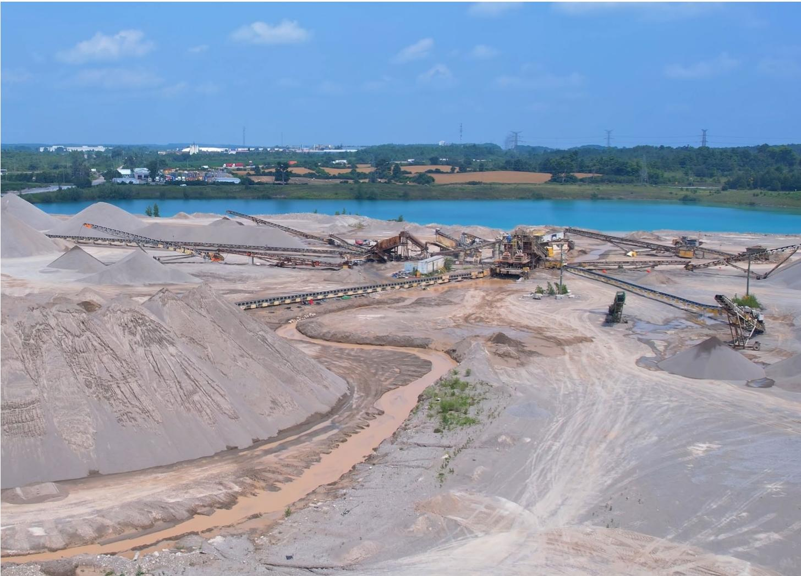

## For government leaders

\- Is energy security embedded in the long-term system design, or managed reactively? The compound pressures point to the value of building security into the foundation of energy planning – rather than responding to it as crises emerge. Countries that treat current security pressures as a detour from the transition may find themselves at a structural disadvantage relative to those that use them as a catalyst to build more resilient, integrated systems. Beyond governments, which actors play a vital role in delivering energy security and how can their combined actions strengthen it while keeping costs affordable?

\- Are the most vulnerable economies and households adequately protected from asymmetric shock exposure? Import-dependent lower-income economies face a harder trade-off between energy access, fiscal stability and transition investment under current conditions. Targeted support mechanisms and strategic reserve frameworks may be worth revisiting in light of current market conditions.

\- Are regulatory stability and industrial strategy being designed as transition assets? Declining investment conditions partly reflect policy uncertainty rather than market fundamentals – stable, credible, long-horizon frameworks can directly reduce the cost of capital and attract a greater share of global transition investment. At the same time, the shift towards localized supply chains, domestic processing capacity and clean technology manufacturing is reshaping competitive positioning across regions. Governments may want to consider how well energy policy and industrial strategy are currently coordinated and whether both are being treated with the same strategic weight.

## For business leaders

\- Has the full energy value chain exposure been mapped and stress-tested against compound stresses? The vulnerabilities surfaced in this section – mineral supply concentration, grid connection queues, capital cost divergence, geopolitical fragmentation – affect operational continuity and long-term competitiveness in ways that may not yet be fully reflected in standard risk frameworks and corporate strategies. These stresses are unlikely to be temporary, and companies may want to consider whether their operational architecture has been assessed with the same rigour as financial and regulatory risk.

\- Is system integration capability receiving sufficient strategic investment? Grid access, regulatory navigation and supply chain management are becoming the differentiating factors in the next phase of the transition – less about access to technology or capital, and more about the ability to execute under complex and constrained conditions. Grid connection timelines, permitting complexity and infrastructure constraints are worsening in most major markets and can materially affect project returns even where capital and technology are available.

\- Are critical mineral and clean technology supply chain risks being treated as structural rather than cyclical? The concentration risks identified – including China's dominant refining position and the rapid expansion of export controls – are not temporary market conditions. Energy security, supply chain concentration and grid reliability are increasingly material to business performance and competitive strategy, not merely operational risk. Early action on supply diversification, strategic inventory and circular economy approaches may offer a more durable advantage than waiting for market conditions to stabilize.

# Looking ahead: top three actions

The 2026 ETI shows that, while current system performance continues to improve, the conditions required to sustain progress are becoming less supportive. Energy systems must deliver clean, secure and affordable energy in a more volatile and constrained environment. The following three priorities provide a practical path to strengthen resilience, unblock delivery and restore investability.

## 1. Build resilience and security into energy transition strategies

Security is the foundation of transition progress and should be woven into energy system strategies. Embed energy security as a core design principle of the transition, not just a response to shocks.

\- Diversify across fuels, import partners, supply chains and critical minerals. Reduce single-source dependencies, build strategic reserves and secure alternative routes for essential inputs.

## Stress-test energy systems against

compound disruptions. Assess fuel adequacy, storage cover, firm capacity and demand-response readiness under scenarios that include simultaneous supply disruptions and extreme weather, and address the gaps.

\- Fast-track grid resilience and flexibility investments. Prioritize grid upgrades, storage at congested nodes, cross-border interconnections and digital system management to strengthen both physical and operational resilience.

\- Design generation portfolios for reliability. Pair variable renewables with firm dispatchable capacity to maintain system adequacy under rising demand.

\- Protect vulnerable consumers and manage demand. Deploy efficiency measures and demand-response programmes for large consumers to ease system pressure, alongside targeted support for vulnerable households that preserves price signals.

## BOX 12

## Examples of building security and resilience

Example 1: The European Union's REPowerEU $^{109}$ plan links energy security with lower import dependence, faster clean energy deployment, stronger energy efficiency and investment in infrastructure and interconnections, showing how a security response can also reinforce long-term transition readiness. Since its launch, REPowerEU has reduced the EU's single-supplier gas dependence from 45% to below 12% and increased installed solar capacity by 50%, $^{110}$ demonstrating that security-driven policy frameworks can accelerate deployment at scale.

## 2. Prioritize grids, flexibility and delivery capability to scale secure and clean energy

Delivery is the binding constraint for progress with streamlined planning and processes, unlocking significant potential. Rebalance the transition towards system delivery and integration to eliminate backlogs and streamline new interconnections.

\- Expand grids and fast-track connections. Triage connection queues by project readiness and system value and implement “connect and manage” approaches where curtailment risk is acceptable.

\- Streamline planning and permitting. Digitize application processes, coordinate environmental review and pre-designate infrastructure corridors to compress timelines.

Example 2: The Japan Organization for Metals and Energy Security (JOGMEC) demonstrates what sustained critical minerals resilience looks like in practice. Over a decade of government-backed stockpiling, upstream equity investments and bilateral supply agreements has made Japan one of the few advanced economies with strategic reserves across cobalt, nickel, lithium and rare earth elements. $^{111}$ One partnership, Lynas, supplies $90\%$ of Japan's rare earth element needs. $^{112}$ The ETI identifies this model of supply chain diversification as increasingly urgent.

\- Optimize existing infrastructure. Use dynamic line rating, advanced power flow controllers and other digital tools to increase transmission capacity without new construction.

\- Deploy flexibility at scale. Accelerate storage, demand response and flexible generation to stabilize systems under variable supply and rising demand.

\- Adapt market design to bridge gaps. Where grid expansion cannot keep pace, use locational pricing and flexibility mechanisms to allow clean energy investment to proceed ahead of full build-out.

\- Build the workforce. Scale training and recruitment of grid engineers, project managers and skilled technicians to match the infrastructure pipeline.

## BOX 13 | Examples of system delivery

Example 1: India's Green Energy Corridor $^{113}$ programme was designed to strengthen transmission infrastructure and interregional connectivity to integrate renewable power at scale, illustrating how grid development becomes a precondition for clean energy expansion. Phase one has delivered over 9,100 kilometres of transmission lines connecting 20 GW of renewable capacity to the grid across eight states, $^{114}$ with phase two now extending the network to integrate a further 13 GW. $^{115}$

Example 2: The EU's Clean Industrial Deal mobilizes over €100 billion for accelerating clean tech investment, with a €1.5 billion package to strengthen European grid components manufacturing and streamlined permitting for renewables, storage and grid infrastructure $^{116}$ to address delivery and competitiveness simultaneously.

## 3. Restore investability, policy stability and direct capital to transition bottlenecks

Capital follows credibility, and without stable policy, regulatory consistency and bankable project pipelines, record global investment totals will not reach the markets where they are most needed. Reinforce the enabling environment for sustained progress.

\- Provide long-term regulatory visibility. Establish predictable frameworks for tariffs, procurement and grid access, with forward-looking auction calendars that give investors multi-year certainty.

\- De-risk underserved markets. Deploy public guarantees and blended finance to absorb early-stage risk where the cost of capital remains two to three times higher than in advanced economies.

\- Strengthen project pipelines. Standardize contracts, streamline approvals and invest in project preparation so viable projects reach financial close faster.

\- Sustain innovation funding. Scale R&D support for next-generation technologies, including long-duration storage, grid digitalization and industrial decarbonization, where the pipeline is slowing.

## BOX 14

## Example of investability and readiness

Example: South Africa's Just Energy Transition Investment Plan $^{117}$ illustrates how domestic planning, international support and sector-

These three priorities are not separate agendas; they are one. Security shapes what gets built, delivery determines whether it works and investability decides where capital goes.

level investment priorities can be combined to crowd in broader capital and support a more managed and investable transition pathway.

Aligning all three is the central challenge of the next phase of the transition. Those who recognize this will sustain momentum.

## Appendices

## A1.1 | ETI methodology

This section provides details about the methodology of the 2026 edition of the ETI. It comprises the following parts:

– Index design, composition and calculation

\- Coverage and indicator selection criteria

\- Comparability and updates in the 2026 energy transition

Index design, composition and calculation

The ETI framework is structured to ensure:

\- Balanced perspective on current performance and future readiness

– Diversity in energy transition pathways, accounting for context-specific challenges - Alignment with international frameworks and energy goals

\- Comparability across time with data going back to 2017 $^{118}$

\- Contextualized, data-driven analysis for meaningful insights

\- Forward-looking orientation, enabling actionable outcomes

The ETI score is calculated as a weighted average of two sub-indices. Each sub-index is the arithmetic average of its component dimensions, which in turn are the arithmetic averages of their respective sub-dimensions, based on the index's 44 underlying indicators (Figure 24). ETI 2026 results reflect the latest available data at the time of collection.

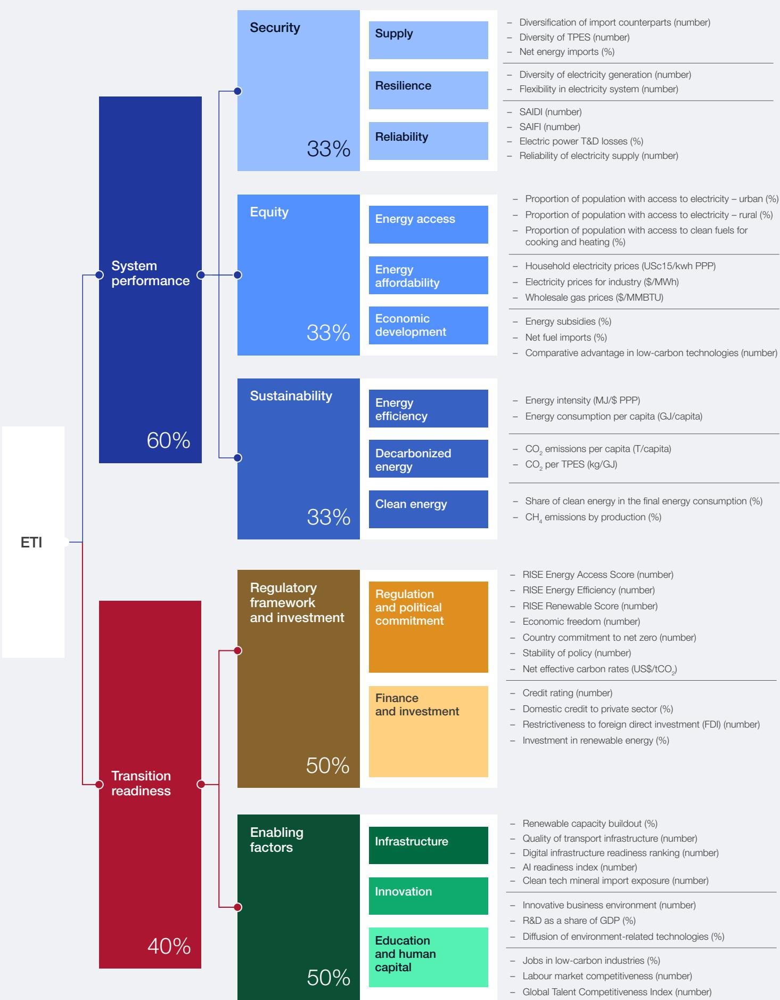  
Note: USc15/kwh = 15 US cents per kilowatt-hour; PPP = purchasing power parity; MMBTU = metric million British thermal unit; TPES = total primary energy supply; MtCO $_{2}$ e = million tonnes of carbon dioxide equivalent; T = tonnes; MWh = megawatt-hour; GJ = gigajoule.

The ETI score uses a 0–100 scale, where 100 represents the best possible value and 0 the worst. To allow comparability and aggregation, each indicator is normalized to the 0–100 scale using a minimum-maximum formula.

## 100 x $\left(\frac{\text{country value} - \text{sample minimum}}{\text{sample maximum} - \text{sample minimum}}\right)$

The sample minimum and sample maximum are the lowest and highest value for countries covered by the ETI. For those indicators for which a higher value indicates a worse outcome (e.g. wholesale gas prices), the study relies on a normalization formula that, in addition to converting the series to a 0–100 scale, reverses it, so that 0 and 100 still correspond to the worst and best, respectively.

In many cases, however, adjustments are made to the sample minimum and maximum to account for issues such as outliers, with winsorization being the most common technique.

## Coverage and indicator selection criteria

The ETI 2026 assesses 120 countries. To be covered in the index, a country needs to have data for most of the index's 44 indicators, including sufficient coverage for each dimension.

The following principles guide the selection of indicators:

1. Relevance: alignment of parameters with core aspects of the energy transition

2. Recency and comparability: use of the most recent and cross-country comparable data

3. Source quality and objectivity: reliance on credible, widely recognized and independent data sources

Comparability and updates in the ETI 2026: The ETI is a dynamic benchmark, with structural and indicator-level refinements introduced annually to reflect evolving transition priorities and improvements in data availability. Rankings are based on country performance as measured by the most up-to-date data; however, underlying data sources may

periodically revise their datasets, including historical values. These revisions can lead to changes in previously reported results and, consequently, may impact country scores and rankings.

For example, selected IEA data series used in the ETI (see Table 12 for indicators based on IEA data) are subject to routine updates, including retrospective revisions. This is part of the IEA's standard process of replacing preliminary estimates with more comprehensive demand-side data as they become available. As a result, changes in ETI results over time may reflect both methodological enhancements and updates to underlying data, rather than shifts in country performance alone.

## The following updates have been made to the 2026 ETI:

## 1. Indicator exclusions and replacement

The SAIDI and SAIFI have been excluded from the ETI 2026 score, yet they have been used as part of the methodology for calculating ETI for the period 2017–2025. This change reflects the discontinuation of these datasets by the original source. To maintain coverage of system reliability, the reliability of electricity supply indicator has been introduced as a replacement for assessments from 2026 onward.

## 2. New indicator additions

The reliability of electricity supply indicator has been incorporated under the reliability sub-dimension to ensure continuity in measuring system reliability. For historical years, SAIDI and SAIFI continue to serve as the relevant proxies, given data availability constraints.

In addition, two new indicators, AI readiness and clean tech minerals import exposure, have been introduced under the infrastructure sub-index. These additions strengthen the framework's coverage of strategic supply chains and technology-enabling infrastructure critical to the energy transition.

Further details on the new (and all) indicators' definitions and data sources can be found within Table 12.

## A1.2 | Indicator definitions and sources

TABLE 12 Energy Transition Index (ETI) model framework

<table><tr><td colspan="2">Sub-dimension</td><td>Indicator</td><td>Definition</td><td>Data sources</td></tr><tr><td rowspan="9">Equitable</td><td rowspan="3">Energy access</td><td>Proportion of population with access to electricity - urban (%)</td><td>Population with electricity access in urban areas as a ratio of total urban population</td><td>World Bank</td></tr><tr><td>Proportion of population with access to electricity - rural (%)</td><td>Population with electricity access in rural areas as a ratio of total rural population</td><td>World Bank</td></tr><tr><td>Proportion of population with access to clean fuels for cooking and heating (%)</td><td>Percentage of a country's population primarily using clean cooking fuels like gaseous fuels, electricity etc. (excluding kerosene)</td><td>World Bank</td></tr><tr><td rowspan="3">Energy affordability</td><td>Household electricity prices (USc15/kwh PPP)</td><td>Average price of electricity paid by a country's household (including taxes) in 2015 US cents per kilowatt hour adjusted for purchasing power parity</td><td>Enerdata, World Bank</td></tr><tr><td>Electricity prices for industry (US$/MWh)</td><td>Average cost of electricity per megawatt hour for a country's industrial consumers in US dollars</td><td>Enerdata, International Energy Agency (IEA*)</td></tr><tr><td>Wholesale gas prices (US$/MMBTU)</td><td>Cost of average natural gas in bulk transactions in US dollar per metric million British thermal units, influenced by diverse price formation mechanisms</td><td>International Gas Union</td></tr><tr><td rowspan="3">Economic development</td><td>Energy subsidies (%)</td><td>Spending on fossil fuel subsidies, including subsidies for coal, petroleum, natural gas and electricity, as a percentage of GDP</td><td>Organisation for Economic Co-operation and Development (OECD), International Energy Agency (IEA),* International Monetary Fund (IMF), World Bank</td></tr><tr><td>Net fuel imports (%)</td><td>Net fuel imports, as a percentage of GDP, measuring a country's reliance on imported fuels relative to its economic output</td><td>World Trade Organization</td></tr><tr><td>Comparative advantage in low-carbon technologies (number)</td><td>Proportion of a country's exports that are low-carbon technologies (e.g. wind turbines, solar panels, biomass systems and carbon capture equipment) to the proportion of global exports that are low-carbon technology products</td><td>International Monetary Fund (IMF)</td></tr><tr><td rowspan="5">Secure</td><td rowspan="3">Supply</td><td>Diversification of import counterparts (number)</td><td>Index for diversity of energy (e.g. oil, gas and coal) imports among trade partners</td><td>United Nations Conference on Trade and Development (UNCTAD) Stats</td></tr><tr><td>Diversity of TPES (number)</td><td>Index for diversity of the total primary energy supply (TPES), based on the relative contributions of different energy types</td><td>International Energy Agency (IEA) World Energy Balances*</td></tr><tr><td>Net energy imports (%)</td><td>Net energy imports, expressed as a percentage of total energy use</td><td>International Energy Agency (IEA) World Energy Balances*</td></tr><tr><td rowspan="2">Resilience</td><td>Diversity of electricity generation (number)</td><td>Index of diversity of energy sources (bioenergy, coal, gas, hydro, nuclear, solar, wind) contributing to total electricity generation</td><td>EMBER Climate</td></tr><tr><td>Flexibility in electricity system (number)</td><td>Measure of ability of a power system to cope with the variability and uncertainty of renewable generation by modifying electricity production or consumption - calculated as the square root of the sum of electricity generated from fossil fuels, hydro, bioenergy and other renewables divided by total electricity generated</td><td>EMBER Climate</td></tr><tr><td rowspan="5">Secure</td><td rowspan="5">Reliability</td><td>Electric power T&amp;D losses (%)</td><td>Electricity lost during the T&amp;D process, expressed as a percentage of the total electricity output</td><td>International Energy Agency (IEA) World Energy Statistics*</td></tr><tr><td rowspan="4">Reliability of electricity supply (number)</td><td>System reliability as an indexed score (from World Bank B-READY) based on enterprise survey data for number and average duration of outages, economic losses from outages and percentage of firms using/owning generators</td><td rowspan="4">World Bank</td></tr><tr><td>Reliability of electricity supply historical data (2025 and older) is supplemented with World Bank legacy SAIDI/SAIFI reports</td></tr><tr><td>Country coverage for the 2026 reliability of electricity supply has been enhanced by establishing a correlation between historical SAIDI values and observed reliability scores for countries with overlapping data</td></tr><tr><td>The resulting correlation model is subsequently applied to estimate reliability of electricity supply for countries using their latest available SAIDI values</td></tr><tr><td rowspan="6">Sustainable</td><td rowspan="2">Energy efficiency</td><td>Energy intensity (MJ/$ PPP)</td><td>Amount of energy consumed, expressed in megajoules per unit of GDP ($, PPP), indicating the energy efficiency of the economy</td><td>International Energy Agency (IEA) World Energy Balances*</td></tr><tr><td>Energy consumption per capita (GJ/capita)</td><td>Total energy - gigajoules (GJ) - consumption as a ratio of total population, reflecting the average energy use per individual</td><td>International Energy Agency (IEA) World Energy Statistics*</td></tr><tr><td rowspan="3">Emissions</td><td>CO2 emissions per capita (tons/capita)</td><td>Tons of CO2 emissions from fuel combustion as a ratio of total population, showing the average carbon footprint per person</td><td>International Energy Agency (IEA) Greenhouse Gas Emissions*</td></tr><tr><td>CO2 per TPES (kg/GJ)</td><td>CO2 emissions per unit of TPES, expressed in kilograms of CO2 per GJ, indicating the carbon intensity of the energy mix</td><td>International Energy Agency (IEA) Greenhouse Gas Emissions*</td></tr><tr><td>Methane emissions by production - (MtCO2e/GJ)</td><td>Methane (CH4) emissions from the energy sector per unit of TPES</td><td>ClimateWatch</td></tr><tr><td>Clean energy</td><td>Share of clean energy in the final energy consumption (%)</td><td>Percentage of clean energy (renewables, nuclear or other low-carbon sources) consumption in total energy consumption</td><td>U.S. Energy Information Administration</td></tr><tr><td rowspan="5">Regular framework and investment</td><td rowspan="5">Regulation and political commitment</td><td>Regulatory Indicators for Sustainable Energy (RISE) access score (number)</td><td>RISE index score for the electricity pillar, which measures the strength and effectiveness of a country's regulatory framework in promoting universal access to electricity</td><td>Regulatory Indicators for Sustainable Energy (RISE)</td></tr><tr><td>RISE energy efficiency (number)</td><td>RISE index score for the energy efficiency pillar, which measures the strength and effectiveness of a country's regulatory framework in promoting energy conservation and energy efficiency</td><td>Regulatory Indicators for Sustainable Energy (RISE)</td></tr><tr><td>RISE renewables score (number)</td><td>RISE index score for the renewable energy pillar, which measures the strength and effectiveness of a country's regulatory framework in promoting the development, deployment and integration of renewable energy</td><td>Regulatory Indicators for Sustainable Energy (RISE)</td></tr><tr><td>Economic freedom (number)</td><td>Average score of the rule of law (property rights, government integrity, judicial effectiveness), regulatory efficiency (business, labour, monetary freedom) and open market (trade, investment, and financial freedom) pillars of the Index of Economic Freedom</td><td>Heritage Foundation</td></tr><tr><td>Country commitment (number)</td><td>Assessment of a country's commitment to energy transition and emissions reduction, based on presence, scope and implementation of its net-zero target</td><td>ClimateWatch</td></tr><tr><td rowspan="6">Regular framework and investment</td><td rowspan="2">Regulation and political commitment</td><td>Stability of policy (number)</td><td>Response to the survey scale question “In your country, to what extent does the government ensure a stable policy environment for doing business?” in the World Economic Forum's Executive Opinion Survey</td><td>World Economic Forum, Executive Opinion Survey</td></tr><tr><td>Net effective carbon rates ($/tCO2)</td><td>Total carbon pricing through fuel excise taxes, carbon taxes and tradeable permits, reflecting the extent of explicit emission pricing in a country</td><td>Organisation for Economic Co-operation and Development (OECD)</td></tr><tr><td rowspan="4">Finance and investment</td><td>Credit rating (number)</td><td>Average sovereign debt credit rating scores from Moody's, S&amp;P and Fitch</td><td>S&amp;P Global, Fitch, Moody's</td></tr><tr><td>Domestic credit to private sector (%)</td><td>Total credit provided to the private sector by financial institutions including loans, securities, trade credit and other repayment claims as a proportion of GDP</td><td>World Bank</td></tr><tr><td>Restrictiveness to foreign direct investment (FDI) (number)</td><td>Score for the FDI Regulatory Restrictiveness Index, which measures statutory restrictions on foreign direct investment in 22 economic sectorsIt captures four main types of restrictions: foreign equity limits, screening and approval mechanisms, restrictions on key foreign personnel and other restrictions faced by foreign investors, such as restrictions on the acquisition of land and real estate for business purposes</td><td>Organisation for Economic Co-operation and Development (OECD)</td></tr><tr><td>Investment in clean energy (%)</td><td>Clean energy investment ($) as a share of GDP, covering renewables, nuclear, hydrogen, carbon capture, electrified transport and related sectors</td><td>BloombergNEF</td></tr><tr><td rowspan="6">Enabling factors</td><td rowspan="6">Infrastructure</td><td>Renewable capacity buildout (%)</td><td>Renewable energy electricity capacity buildout measured as an average of renewable energy's share of total capacity at the start of the year and new renewable energy's share of total capacity at end of the year</td><td>International Renewable Energy Agency</td></tr><tr><td>Quality of transportation infrastructure (number)</td><td>Average score of scaled survey questions assessing the quality of road infrastructure and the efficiency of train, air transport and seaport services</td><td>World Economic Forum, Executive Opinion Survey</td></tr><tr><td>Digital infrastructure readiness (number)</td><td>Score for the Network Readiness Index, which measures the performance of a country's national digital readiness across technology, people, governance and impact</td><td>Network Readiness Index</td></tr><tr><td>AI readiness (number)</td><td>Score for Government AI Readiness Index, which measures the capability to harness AI as a strategic differentiator to unlock economic value, accelerate innovation and enable growth through performance against AI policy, governance, infrastructure, adoption, development, and diffusion and resilience</td><td>Oxford Insights</td></tr><tr><td>Clean tech minerals imports exposure (number)</td><td>Exposure to critical mineral global supply chain by assessing share of global exports in both raw and midstream transition-minerals basket (nickel, lithium, manganese, cobalt, graphite, rare earth) normalized by the supplier import concentration ratio of the same mineral basket, capturing both market positioning and supplier concentration risk</td><td>UN Comtrade</td></tr><tr><td>Innovative business environment (number)</td><td>Average scores for survey scale questions assessing the degree to which companies adapt their business models to embrace risky or disruptive business ideas, the extent to which they participate in mutually beneficial collaboration on R&amp;D, the extent to which new companies with innovative ideas grow and can disrupt established firms and the extent to which there is a culture of taking risks to pursue entrepreneurial projects</td><td>World Economic Forum, Executive Opinion Survey</td></tr><tr><td rowspan="5">Enabling factors</td><td rowspan="2">Innovation</td><td>R&amp;D as a share of GDP (%)</td><td>R&amp;D spend, as a percentage of GDP, across business enterprises, government, higher education and private non-profit sectors</td><td>World Bank</td></tr><tr><td>Diffusion of environment-related technologies (%)</td><td>Ability to convert R&amp;D investment into environmental innovationCaptures a country's capability to generate targeted environmental technologies from R&amp;D effortsIt is measured as the number of patents in a defined set of environmental technology areas (e.g. GHG capture, clean energy, green transport) as a share of total environment-related inventions, normalized by total R&amp;D spending</td><td>Organisation for Economic Co-operation and Development (OECD)</td></tr><tr><td rowspan="3">Education and human capital</td><td>Jobs in low-carbon industries (%)</td><td>Share of industrial employment in low-carbon jobs relative to total population, indicating workforce shift to sustainable sectorsLow-carbon sectors include: solar PV, wind, biogas, biofuels, geothermal, hydropower, ocean energy, waste-to-energy, concentrated solar power (CSP) and solar heating/cooling</td><td>International Renewable Energy Agency, World Bank</td></tr><tr><td>Labour market competitiveness (number)</td><td>Average score of scaled survey questions on local skilled labour availability, education system quality and systems' ability to teach digital and technological skills</td><td>World Economic Forum, Executive Opinion Survey</td></tr><tr><td>Global Talent Competitiveness Index (number)</td><td>A country's ability to attract, develop and retain talent. as measured by the Global Talent Competitiveness Index average scores for mid-level and high-level skills</td><td>INSEAD</td></tr></table>

\*Historical data may change across ETI editions due to the IEA's raw data collection methodology, which revises earlier provisional estimates once more complete underlying data become available.

<table><tr><td>Advanced economies</td><td>Emerging Asia</td><td>Emerging Europe</td><td>Latin America and the Caribbean</td><td>Middle East, North Africa and Pakistan</td><td>Sub-Saharan Africa</td></tr><tr><td>Australia</td><td>Bangladesh</td><td>Albania</td><td>Argentina</td><td>Algeria</td><td>Angola</td></tr><tr><td>Austria</td><td>Brunei Darussalam</td><td>Armenia</td><td>Bolivia</td><td>Bahrain</td><td>Botswana</td></tr><tr><td>Belgium</td><td>Cambodia</td><td>Azerbaijan</td><td>Brazil</td><td>Egypt</td><td>Cameroon</td></tr><tr><td>Canada</td><td>China</td><td>Bosnia and Herzegovina</td><td>Chile</td><td>Iran, Islamic Rep.</td><td>Congo, Dem. Rep.</td></tr><tr><td>Cyprus</td><td>India</td><td>Bulgaria</td><td>Colombia</td><td>Jordan</td><td>Côte d’Ivoire</td></tr><tr><td>Czechia</td><td>Indonesia</td><td>Croatia</td><td>Costa Rica</td><td>Kuwait</td><td>Ethiopia</td></tr><tr><td>Denmark</td><td>Kazakhstan</td><td>Estonia</td><td>Dominican Republic</td><td>Lebanon</td><td>Gabon</td></tr><tr><td>Finland</td><td>Kyrgyz Republic</td><td>Georgia</td><td>Ecuador</td><td>Morocco</td><td>Ghana</td></tr><tr><td>France</td><td>Lao PDR</td><td>Hungary</td><td>El Salvador</td><td>Oman</td><td>Kenya</td></tr><tr><td>Germany</td><td>Malaysia</td><td>Latvia</td><td>Guatemala</td><td>Pakistan</td><td>Mauritius</td></tr><tr><td>Greece</td><td>Mongolia</td><td>Lithuania</td><td>Honduras</td><td>Qatar</td><td>Mozambique</td></tr><tr><td>Iceland</td><td>Nepal</td><td>North Macedonia</td><td>Jamaica</td><td>Saudi Arabia</td><td>Namibia</td></tr><tr><td>Ireland</td><td>Philippines</td><td>Montenegro</td><td>Mexico</td><td>Tunisia</td><td>Nigeria</td></tr><tr><td>Israel</td><td>Sri Lanka</td><td>Poland</td><td>Nicaragua</td><td>United Arab Emirates</td><td>Senegal</td></tr><tr><td>Italy</td><td>Tajikistan</td><td>Republic of Moldova</td><td>Panama</td><td>Yemen</td><td>South Africa</td></tr><tr><td>Japan</td><td>Thailand</td><td>Romania</td><td>Paraguay</td><td></td><td>Tanzania</td></tr><tr><td>Luxembourg</td><td>Viet Nam</td><td>Serbia</td><td>Peru</td><td></td><td>Zambia</td></tr><tr><td>Malta</td><td></td><td>Slovakia</td><td>Trinidad and Tobago</td><td></td><td>Zimbabwe</td></tr><tr><td>Netherlands</td><td></td><td>Türkiye</td><td>Uruguay</td><td></td><td></td></tr><tr><td>New Zealand</td><td></td><td>Ukraine</td><td>Venezuela</td><td></td><td></td></tr><tr><td>Norway</td><td></td><td></td><td></td><td></td><td></td></tr><tr><td>Portugal</td><td></td><td></td><td></td><td></td><td></td></tr><tr><td>South Korea</td><td></td><td></td><td></td><td></td><td></td></tr><tr><td>Singapore</td><td></td><td></td><td></td><td></td><td></td></tr><tr><td>Slovenia</td><td></td><td></td><td></td><td></td><td></td></tr><tr><td>Spain</td><td></td><td></td><td></td><td></td><td></td></tr><tr><td>Sweden</td><td></td><td></td><td></td><td></td><td></td></tr><tr><td>Switzerland</td><td></td><td></td><td></td><td></td><td></td></tr><tr><td>United Kingdom</td><td></td><td></td><td></td><td></td><td></td></tr><tr><td>US</td><td></td><td></td><td></td><td></td><td></td></tr></table>

TABLE 13 Country group classifications

## A1.3 | Country group classifications

The following country group classifications were used for the index and report:

# A2.1 Equity leaders: top five

Key macroeconomic and ETI data

<table><tr><td>Average population (millions)</td><td>72.17</td></tr><tr><td>Average GDP ($ trillions)</td><td>5.93</td></tr><tr><td>Average net energy imports (% of energy use)</td><td>-158%</td></tr></table>

Note: MJ = megajoule; PPP = purchasing power parity.
Source: International Energy Agency (IEA); US Energy Information Administration (EIA); World Bank.

<table><tr><td>Average share of clean energy (%)</td><td>5.5%</td></tr><tr><td>Average energy intensity (MJ/$ 2017, PPP GDP)</td><td>5.67</td></tr><tr><td>Average CO2 intensity (CO2/TES)</td><td>52.25</td></tr></table>

Top five equity leaders 2026: Bahrain, Oman, Qatar, United Arab Emirates and the US

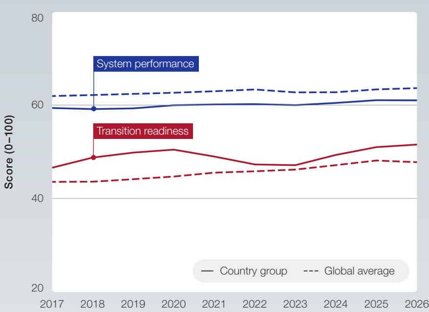

## Overall narrative

Access and affordability at the core: Equity leaders continue to stand out through strong consumer affordability and near-universal access, reinforcing equity as a function of both availability and cost.

Domestic resource advantage shapes outcomes: Several of these countries benefit from strong domestic energy supply, which supports low-cost and reliable energy access, but can also reinforce dependence on legacy energy structures.

Transition readiness will determine durability: Sustaining equity leadership will increasingly depend on stronger infrastructure, investment and policy support that can preserve affordability while preparing systems for long-term transition.

Risk of imbalance: While these countries lead on equity, weaker sustainability performance suggests that affordability gains are not yet consistently translating into cleaner and more balanced energy systems.

System performance  
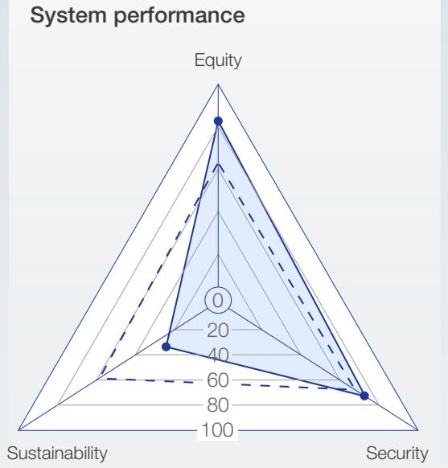  
Transition readiness

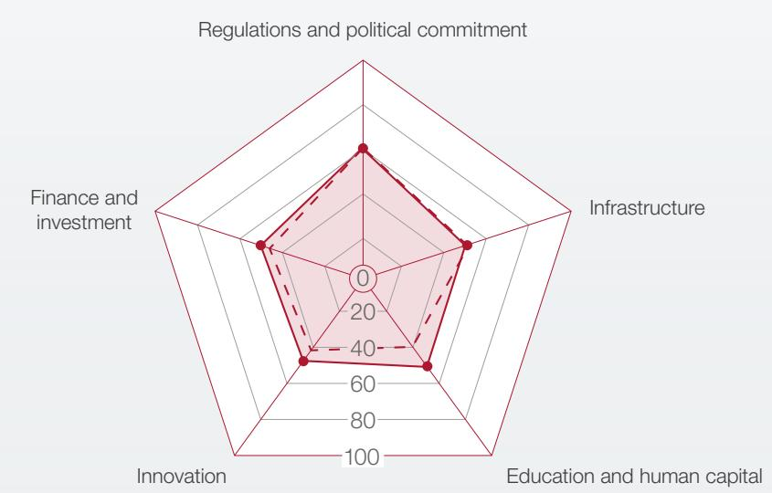  
— Country group --- Global average

# A2.2 Security leaders: top five

Key macroeconomic and ETI data

<table><tr><td>Average population (millions)</td><td>72.3</td></tr><tr><td>Average GDP ($ trillions)</td><td>5.98</td></tr><tr><td>Average net energy imports (% of energy use)</td><td>21%</td></tr></table>

Note: MJ = megajoule; PPP = purchasing power parity.
Source: International Energy Agency (IEA); US Energy Information Administration (EIA); World Bank.

<table><tr><td>Average share of clean energy (%)</td><td>23.5%</td></tr><tr><td>Average energy intensity (MJ/$ 2017, PPP GDP)</td><td>4.1</td></tr><tr><td>Average CO2 intensity (CO2/TES)</td><td>37.1</td></tr></table>

Top five security leaders 2026: Austria, Iceland, Israel, Latvia and the US

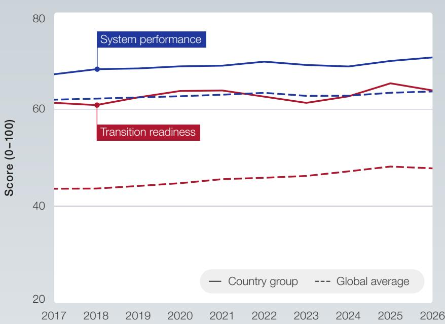

## Overall narrative

Diversified supply at the core: Security leaders combine diversified energy systems with broad optionality across fuels, electricity sources and import channels, reducing exposure to concentrated supply risks.

Grid reliability as the key differentiator: Their strongest advantage lies in highly reliable power systems, with strong outage performance and network stability underpinning overall security leadership.

Flexibility is the next frontier: Beyond secure supply, future advantage will depend on improving system flexibility to manage rising electrification, variable renewables and new demand pressures.

Risk of imbalance: While these countries lead on security, sustainability continues to lag behind, highlighting the need to convert system resilience into a more balanced long-term transition.

System performance  
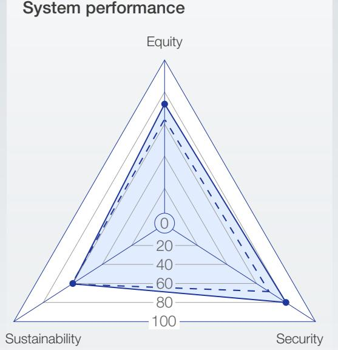  
Transition readiness

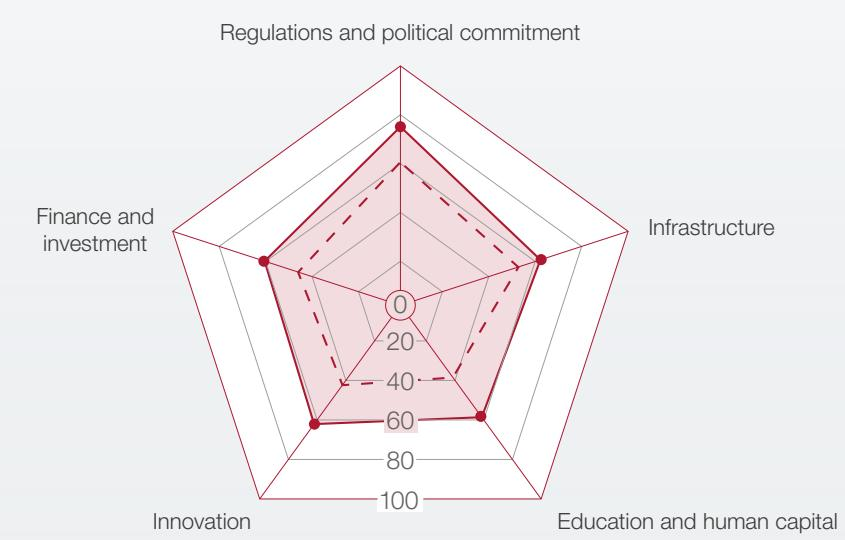  
— Country group --- Global average

# Sustainability leaders: top five

Key macroeconomic and ETI data

<table><tr><td>Average population (millions)</td><td>6.80</td></tr><tr><td>Average GDP ($ trillions)</td><td>0.34</td></tr><tr><td>Average net energy imports (% of energy use)</td><td>33%</td></tr></table>

Note: MJ = megajoule; PPP = purchasing power parity.
Source: International Energy Agency (IEA); US Energy Information Administration (EIA); World Bank.

<table><tr><td>Average share of clean energy (%)</td><td>40%</td></tr><tr><td>Average energy intensity (MJ/$ 2017, PPP GDP)</td><td>2.1</td></tr><tr><td>Average CO2 intensity (CO2/TES)</td><td>30.2</td></tr></table>

Top five sustainability leaders 2026: Albania, Costa Rica, Paraguay, Sweden and Switzerland

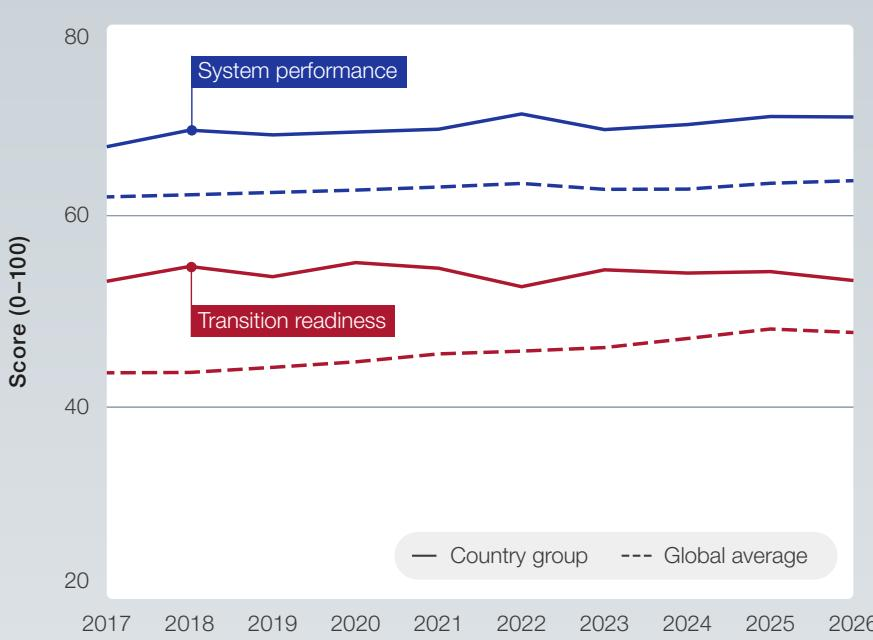

## Overall narrative

Clean electricity at the core: Sustainability leaders are defined by power systems anchored in renewables and other low-carbon sources, giving them a structural advantage in reducing emissions.

Efficiency reinforces clean outcomes: Their advantage is not only cleaner supply, but also stronger energy efficiency and lower carbon intensity across the broader system.

Policy credibility supports momentum: Long-term regulatory stability and clear decarbonization signals continue to support cleaner technologies, emissions reduction and sustained transition progress.

The next challenge is system-wide decarbonization: While these countries lead on sustainability, future progress will depend on extending clean gains beyond power into transport, industry and end-use energy demand.

System performance  
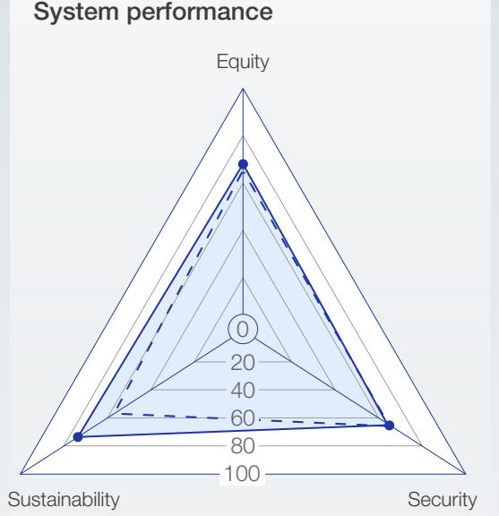  
Transition readiness

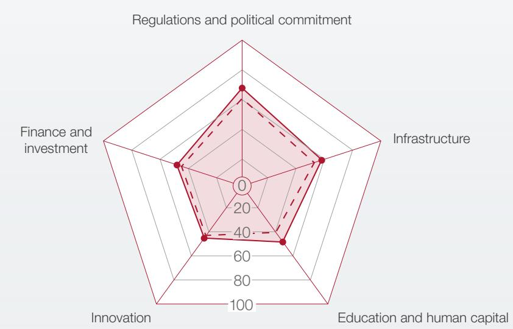  
— Country group --- Global average

## A2.4 G20 nations

Key macroeconomic and ETI data

<table><tr><td>Average population (millions)</td><td>254.5</td><td>Average share of clean energy (%)</td><td>13.1%</td></tr><tr><td>Average GDP ($ trillions)</td><td>4.68</td><td>Average energy intensity (MJ/$ 2017, PPP GDP)</td><td>3.3</td></tr><tr><td>Average net energy imports (% of energy use)</td><td>-2.6%</td><td>Average CO2 intensity (CO2/TES)</td><td>52</td></tr></table>

Note: MJ = megajoule; PPP = purchasing power parity.
Source: International Energy Agency (IEA); US Energy Information Administration (EIA); World Bank.  
G20 nations: Argentina, Australia, Brazil, Canada, China, France, Germany, India, Indonesia, Italy, Japan, South Korea, Mexico, Saudi Arabia, South Africa, Türkiye, the UK and the US) and two regional bodies: the European Union and the African Union.

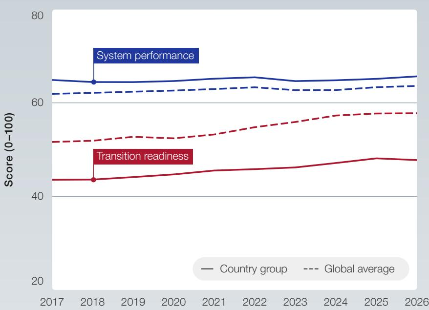

## Overall narrative

Continued reliance on fossil fuels despite clean energy investment: Clean energy spending in 2025 is set to reach a record \$2.2 trillion, but the IEA still expects overall energy investment to remain shaped by legacy fuel systems, underscoring how difficult it is for large G20 economies to shift quickly away from fossil-fuel dependence.

Security is increasingly about grids, flexibility and resilience: For the G20, energy security is no longer defined only by fuel supply. The IEA's 2025 electricity outlook emphasizes that rapidly rising electricity demand, expanding weather-dependent generation and resource adequacy challenges are making grid resilience, storage and system flexibility more central to security performance.

Readiness is improving, but execution capacity remains uneven: Policy support and capital flows remain strong enough for energy sector investment to keep rising in 2025 despite geopolitical and economic uncertainty. But the same 2025 investment outlook shows that countries still differ sharply in their ability to translate regulation and capital into infrastructure, innovation and delivery at scale.

Capital is still concentrated, creating an uneven G20 transition: In 2025, advanced economies and China continue to dominate clean energy capital flows, while many emerging markets still face tighter financing conditions and weaker implementation capacity. That leaves the G20 transition structurally uneven, with a small set of members pulling ahead on delivery.

System performance  
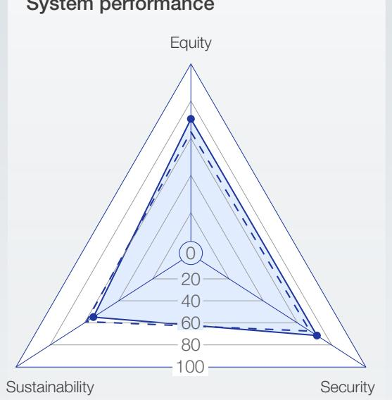  
Transition readiness

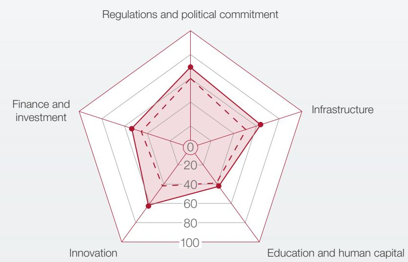  
— Country group --- Global average

# A2.5 Transition readiness leaders: top five

Key macroeconomic and ETI data

<table><tr><td>Average population (millions)</td><td>24.74</td></tr><tr><td>Average GDP ($ trillions)</td><td>1.45</td></tr><tr><td>Average net energy imports (% of energy use)</td><td>53%</td></tr></table>

Note: MJ = megajoule; PPP = purchasing power parity.
Source: International Energy Agency (IEA); US Energy Information Administration (EIA); World Bank.

<table><tr><td>Average share of clean energy (%)</td><td>32.1%</td></tr><tr><td>Average energy intensity (MJ/$ 2017, PPP GDP)</td><td>2.49</td></tr><tr><td>Average CO2 intensity (CO2/TES)</td><td>34.28</td></tr></table>

Top five transition readiness leaders 2026: Sweden, Netherlands, Denmark, Germany and Finland

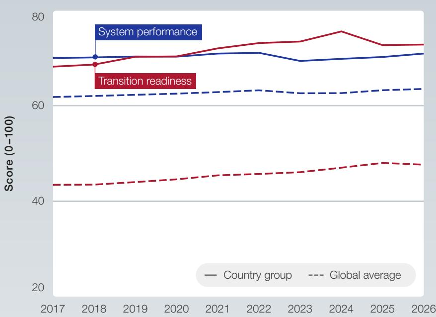

## Overall narrative

Strong policy frameworks anchor readiness: These countries lead through stable regulatory environments, long-term climate targets and clear transition roadmaps that convert ambition into investable delivery pathways – most visibly across Nordic leaders and in Germany and the Netherlands, where long-term planning continues to shape system transformation.

Infrastructure and system integration drive execution: Readiness is reinforced by advanced grid modernization, strong transport and digital infrastructure, and a growing focus on linking renewables, electrification and hydrogen. In the Netherlands and Germany, infrastructure readiness is increasingly defined by grid expansion, congestion management and offshore wind integration.

Human capital and innovation underpin competitive advantage: Strong skills bases are becoming more critical as clean energy scales and labour shortages emerge. These countries are simultaneously strengthening innovation ecosystems to commercialize emerging technologies, turning readiness into broader industrial leadership in hydrogen, electrification and energy efficiency.

Finance credibility and delivery capacity will determine durability: The ability to attract capital under stable policy conditions remains a defining strength. The next phase depends less on ambition and more on translating strong policy, infrastructure and innovation foundations into faster system-wide implementation – readiness is increasingly about execution at scale.

System performance  
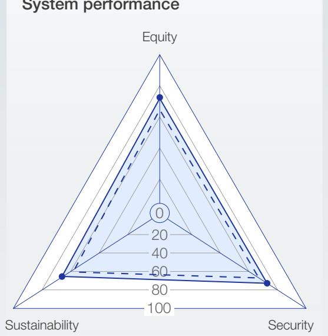  
Transition readiness

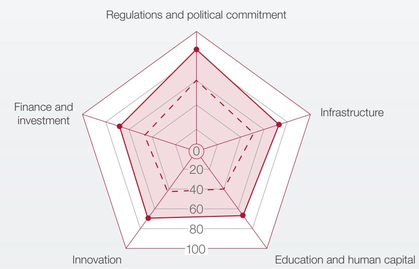  
— Country group --- Global average

## Key macroeconomic and ETI data

<table><tr><td>Average population (millions)</td><td>403.9</td><td>Average share of clean energy (%)</td><td>11.1%</td></tr><tr><td>Average GDP ($ trillions)</td><td>6.48</td><td>Average energy intensity (MJ/$ 2017, PPP GDP)</td><td>4.3</td></tr><tr><td>Average net energy imports (% of energy use)</td><td>-16%</td><td>Average CO2 intensity (CO2/TES)</td><td>52</td></tr></table>

Note: MJ = megajoule; PPP = purchasing power parity.
Source: International Energy Agency (IEA); US Energy Information Administration (EIA); World Bank.  
Top ten energy consumers 2026: Brazil, Canada, China, India, Indonesia, Iran, Japan, South Korea, Saudi Arabia and the US

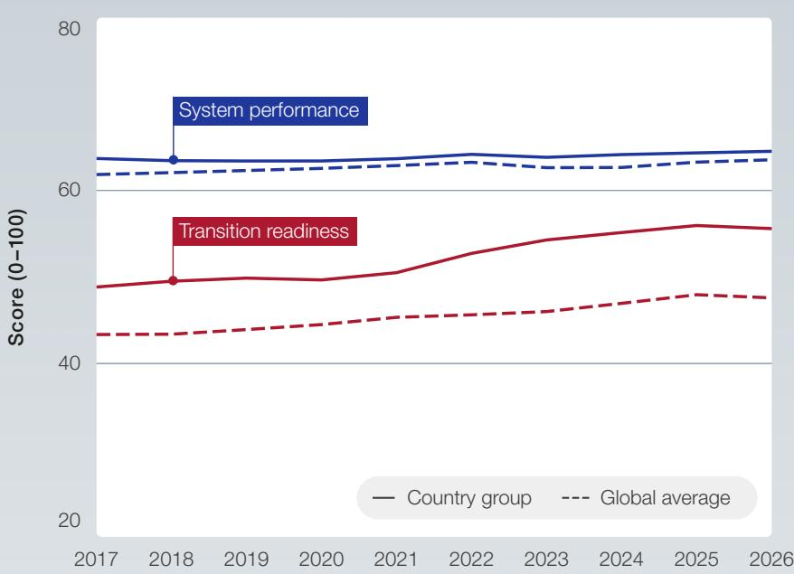

## Overall narrative

System performance remains resilient, but sustainability is the pressure point: The group continues to outperform the global average on overall system performance, led by strong equity and security outcomes. But sustainability remains the weakest dimension, underscoring how the world's largest energy consumers still carry the hardest decarbonization burden.

Readiness is improving faster than performance: Transition readiness has strengthened steadily and now sits well above the global average, with regulation, infrastructure and innovation emerging as the clearest areas of relative advantage. That matters as electricity demand is expected to keep rising strongly through 2026, increasing the premium on execution capacity, grid investment and system flexibility.

Scale makes this group system-critical: These countries will shape the pace of the global transition because demand growth, electrification and infrastructure needs are increasingly concentrated in large economies. In 2025, global energy investment is set to reach a record \$3.3 trillion, with clean energy attracting roughly twice as much capital as fossil fuels, making delivery in major consuming economies especially consequential.

The next challenge is turning readiness into cleaner outcomes: The central task for this group is no longer only securing supply, but converting stronger readiness into deeper sustainability gains. That challenge is becoming more urgent as clean sources are expected to meet all global electricity demand growth through 2027, raising the bar for large consuming nations to accelerate system-wide implementation.

System performance  
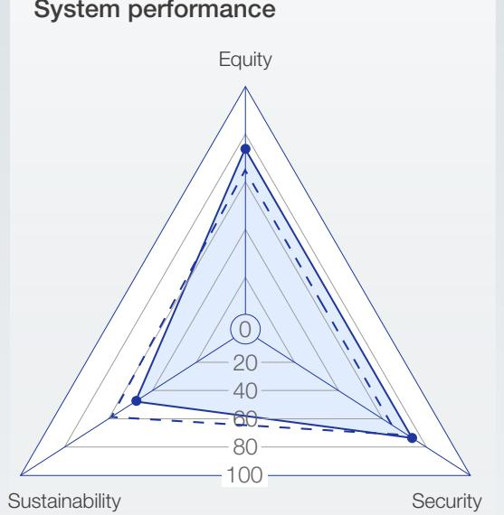

Transition readiness  
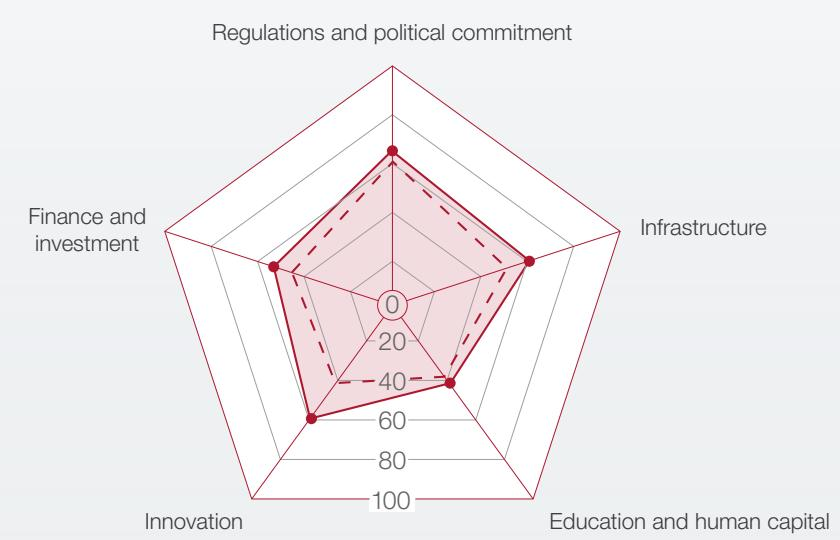  
— Country group --- Global average

Key macroeconomic and ETI data

<table><tr><td>Average population (millions)</td><td>152.19</td></tr><tr><td>Average GDP ($ trillions)</td><td>1.21</td></tr><tr><td>Average net energy imports (% of energy use)</td><td>-227.4</td></tr></table>

Note: MJ = megajoule; PPP = purchasing power parity.
Source: International Energy Agency (IEA); US Energy Information Administration (EIA); World Bank.

<table><tr><td>Average share of clean energy (%)</td><td>15.5%</td></tr><tr><td>Average energy intensity (MJ/$ 2017, PPP GDP)</td><td>2.63</td></tr><tr><td>Average CO2 intensity (CO2/TES)</td><td>43.25</td></tr></table>

Top five energy supply leaders 2026: Australia, Brazil, Indonesia, Nigeria and Norway

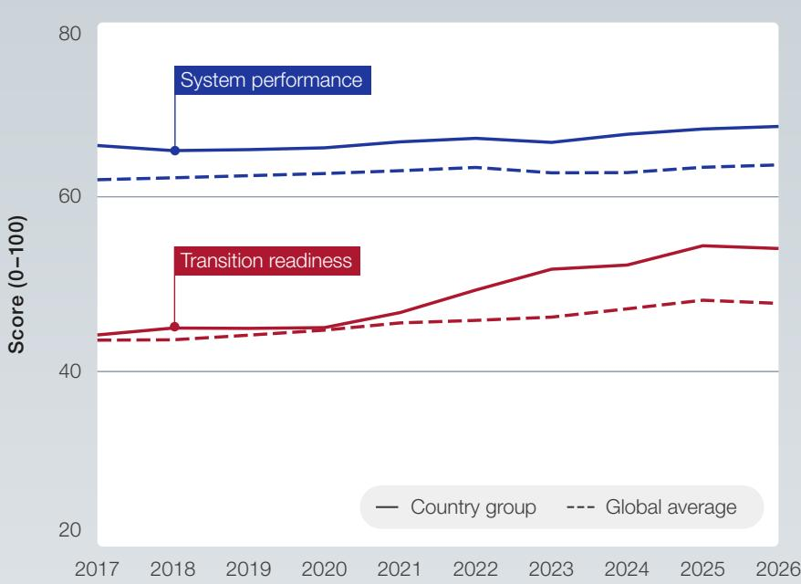

## Overall narrative

Resource depth is the core advantage: Supply leaders combine abundant domestic resources with export strength, but through different models – Australia is a leading exporter of coal, LNG and uranium, Indonesia remains the world's top coal exporter, Norway is one of the world's largest energy exporters, Brazil combines strong domestic supply with a highly renewable system, and Nigeria remains Africa's richest oil resource centre and the largest gas producer in West Africa.

Supply strength lifts system performance, but not all of security: Based on the ETI 2026 data provided, this group outperforms the global average on system performance, with supply as the clearest advantage. But resilience and reliability are less dominant, reinforcing that future security leadership depends not only on resource availability, but also on grids, flexibility and system robustness. Energy security is increasingly shaped by “choices, consequences and contingencies” across the whole energy system, not fuel supply alone.

The next differentiator is turning resource strength into transition capacity: The ETI 2026 charts show transition readiness improving steadily, but still below system performance, suggesting that infrastructure, investment and delivery capability are now the main areas to watch.

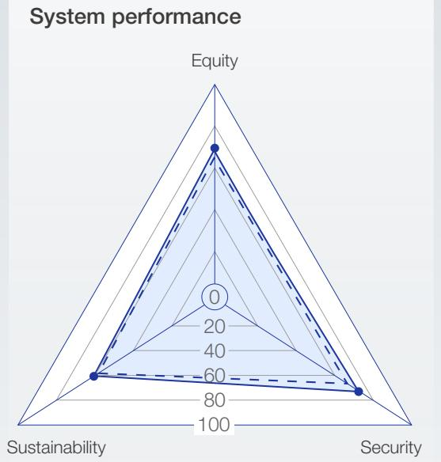  
Transition readiness

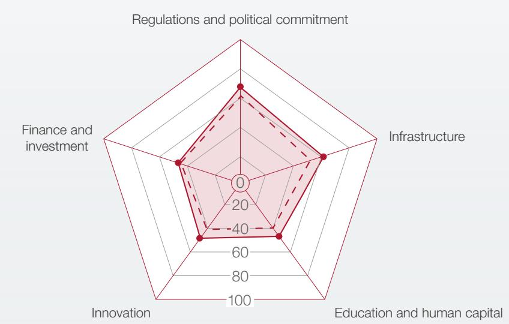  
— Country group --- Global average

Project team

## World Economic Forum

Ojasvee Arora
Specialist, Energy Initiatives,
Centre for Energy and Materials

Sacha Bazin
Specialist, Energy Initiatives,
Centre for Energy and Materials

Roberto Bocca
Head, Centre for Energy and Materials;
Member of the Executive Committee

Espen Mehlum
Head, Energy, Centre for Energy and Materials

Nicholas Wagner
Manager, Energy Initiatives,
Centre for Energy and Materials

## Accenture

Muqsit Ashraf
Global Lead for Industry and Enterprise, Accenture

Ganvendra Singh Chahar
Consultant, Strategy and Consulting, Energy

Ahmad El-Labban
Senior Manager, Strategy and Consulting, Energy

Aditya Prajapati
Analyst, Strategy and Consulting, Strategy

David Rabley
Managing Director and Global Energy Transition Lead, Energy

## Acknowledgements

## Data sources

The World Economic Forum acknowledges and thanks all data contributors: BloombergNEF, ClimateWatch, Ember, Enerdata, Heritage Foundation, INSEAD, International Energy Agency, International Gas Union, International Monetary Fund, International Renewable Energy Agency, Organisation for Economic Co-operation and Development (OECD), United Nations Conference on Trade and Development (UNCTAD), UN Comtrade, World Bank Group, World Economic Forum, World Trade Organization, Network Readiness Index (NRI), U.S. Energy Information Administration (EIA), Oxford Insights, the Regulatory Indicators for Sustainable Energy (RISE), S&P Global, Moody's and Fitch Ratings.

## Chief expert advisers

The World Economic Forum acknowledges and thanks the individuals and experts of the Energy Transition Intelligence Advisory Board, without whose support this report would not have been possible:

Prasoon Agarwal
Deputy Head, Clean Energy Ministerial (CEM)

Rigoberto Ariel Yepez-Garcia
Economics Principal Advisor; Vice-President of Sectors and Knowledge, Inter-American Development Bank

Professor of Public Policy and Director of the Payne Institute for Public Policy, Colorado School of Mines

Member of the Administrative Board,
United Nations Sustainability for All (SEforALL)

Michaela Cappanelli
Head, Climate Strategy, Risk Mitigation and Disclosure, Eni

Lucy Craig
Director of Growth, Innovation and Digitalization, DNV

Brian Efird
Executive Director, Strategic Partnerships,
King Abdullah Petroleum Studies and Research
Centre (KAPSARC)

Lin Boqiang
Dean, China Institute for Studies in Energy Policy,
Xiamen University

Clarissa Lins
Founding Partner, Catavento

Bertrand Magne
Senior Economist, European Investment Bank (EIB)

Sandra Melki
Vice-President Marketing and Sustainability,
Technip Energies

Deputy Head of Energy Economics, Energy Research Office (EPE)

Frank Peter
Deputy Executive Director, Agora Think Tanks

Davide Puglielli
Head, Strategy and Group Positioning, Enel

Samar Saad Al-Hameedi
Vice-President, Sustainability and Environmental,
Social and Governance, ADNOC

John Scott
Independent Advisory Board Member

Fabby Tumiwa
Executive Director, Institute for Essential Services
Reform (IESR)

Fridtjof Unander
Senior Advisor, Aker Solutions

David Victor
Professor, University of California,
San Diego (UCSD)

Zhou Changchun
Vice-President, Economic and Technology Institute, Global Energy Interconnection Development and Cooperation (GEIDCO)

## Production

Rose Chilvers
Designer, Studio Miko

Laurence Denmark
Creative Director, Studio Miko

Will Liley
Editor, Studio Miko

## World Economic Forum Digital

Data Intelligence & Visualization Lead, Infrastructure, Data Ops and IT Security

Ella Yutong Lin
Lead, Programme and Stakeholder Engagement.
Centre for Energy and Materials

Sekela Ombura
Specialist, Content and Engagement,
Centre for Energy and Materials

## World Economic Forum Public Engagement

Maxwell Hall
Creative Editorial Lead

Design Lead

Gayle Markovitz
Head, Written and Audio Content

## Sybile Penhirin

Head, Video and Design

## Endnotes

International Energy Agency (IEA). (2026). Global Energy Review 2026. https://www.iea.org/reports/global-energy-review-2026.

2. World Economic Forum. (2026). Global Risks Report 2026. https://www.weforum.org/publications/global-risks-report-2026/.

3. International Energy Agency (IEA). (n.d.). Strait of Hormuz Factsheet. https://www.iea.org/about/oil-security-and-emergency-response/strait-of-hormuz.

4. International Energy Agency (IEA). (2025). Global Critical Minerals Outlook 2025. https://www.iea.org/reports/global-critical-minerals-outlook-2025.

5. International Energy Agency (IEA). (2025). Energy and AI. https://www.iea.org/reports/energy-and-ai.

6. International Energy Agency (IEA). (2025). Global Energy Review 2025: Key findings. https://www.iea.org/reports/global-energy-review-2025/key-findings.

7. International Energy Agency (IEA). (2025). World Energy Investment 2025. https://www.iea.org/reports/world-energy-investment-2025.

8. BloombergNEF. (2026). BloombergNEF Finds Global Energy Transition Investment Reached Record \$2.3 Trillion in 2025, Up 8% from 2024. https://about.bnef.com/insights/clean-energy/bloombergnef-finds-global-energy-transition-investment-reached-record-2-3-trillion-in-2025-up-8-from-2024/.

9. Bussewitz, C. (2026). U.S. gasoline prices rise 50% since the start of the Iran war. PBS News. https://www.pbs.org/newshour/economy/u-s-gasoline-prices-rise-50-since-the-start-of-the-iran-war.

10. Maturana, J. (2026). Europe's response to the relentless surge in energy and fuel costs from the war in Iran. Euro News. https://www.euronews.com/2026/03/22/europes-response-to-the-relentless-surge-in-energy-and-fuel-costs-from-the-war-in-iran.

11. World Economic Forums. (2026). These are the top 10 risks in 2026: Geoeconomic confrontation ranks highest in ‘age of competition’. https://www.weforum.org/stories/2026/01/global-risks-2026-top-10-two-and-ten-year-horizon/.

12. World Trade Organization (WTO). (2025). Large increase in new tariffs but also measures to ease global trade, WTO report shows. https://www.wto.org/english/news\_e/news25\_e/trdev\_02dec25\_225\_e.htm.

13. International Energy Agency (IEA). (n.d.). Strait of Hormuz Factsheet. https://www.iea.org/about/oil-security-and-emergency-response/strait-of-hormuz.

14. International Energy Agency (IEA). (2026). The Middle East and Global Energy Markets. https://www.iea.org/topics/the-middle-east-and-global-energy-markets.

15. International Energy Agency (IEA). (2026). Electricity 2026: Analysis and forecast to 2030. https://iea.blob.core.windows.net/assets/b73798cb-e452-42b9-9d8a-07542de7a041/Electricity\_2026.pdf.

16. Ibid.

17. Ibid.

18. International Energy Agency (IEA). (2026). Electricity demand is set to grow strongly through 2030 as the Age of Electricity takes hold. https://www.iea.org/reports/electricity-2026/executive-summary.

19. Climate TRACE. (2026). Climate TRACE Data Show Global Greenhouse Gas Emissions Hit a New Record High in 2025. https://climatetrace.org/news/climate-trace-data-show-global-greenhouse-gas-emissions-hit-a-new-record-high-in-2025.

20. World Energy Outlook. (2025). In a volatile world, energy security takes centre stage. https://www.iea.org/reports/world-energy-outlook-2025/executive-summary.

21. International Energy Agency (IEA). (2025). Global Critical Minerals Outlook 2025: Executive summary. https://www.iea.org/reports/global-critical-minerals-outlook-2025/executive-summary.

22. BloombergNEF. (2026). BloombergNEF Finds Global Energy Transition Investment Reached Record \$2.3 Trillion in 2025, Up 8% from 2024. https://about.bnef.com/insights/clean-energy/bloombergnef-finds-global-energy-transition-investment-reached-record-2-3-trillion-in-2025-up-8-from-2024/.

23. BloombergNEF. (n.d.). Energy Transition Investment Trends. https://about.bnef.com/insights/finance/energy-transition-investment-trends/.

24. Gartner. (2025). Gartner Says Worldwide AI Spending Will Total \$1.5 Trillion in 2025. https://www.gartner.com/en/newsroom/press-releases/2025-09-17-gartner-says-worldwide-ai-spending-will-total-1-point-5-trillion-in-2025.

25. Microsoft. (2024). Accelerating the addition of carbon-free energy. https://www.microsoft.com/en-us/microsoft-cloud/blog/2024/09/20/accelerating-the-addition-of-carbon-free-energy-an-update-on-progress/.

26. Google: The Keyword. (2024). New nuclear clean energy agreement with Kairos Power. https://blog.google/company-news/outreach-and-initiatives/sustainability/google-kairos-power-nuclear-energy-agreement/.

27. Amazon News. (2024). Amazon signs agreements for innovative nuclear energy projects to address growing energy demands. https://www.aboutamazon.com/news/sustainability/amazon-nuclear-small-modular-reactor-net-carbon-zero.

28. International Energy Agency (IEA). (2025). World Energy Investment 2025. https://www.iea.org/reports/world-energy-investment-2025.

29. World Economic Forum. (2026). Electricity Reinvented: How Innovation is Transforming the Future of Power Systems. https://reports.weforum.org/docs/WEF\_Electricity\_Reinvented\_2026.pdf.

30. International Energy Agency (IEA). (n.d.). China. https://www.iea.org/countries/china.

31. International Energy Agency (IEA). (2025). World Energy Outlook 2025: Executive summary. https://www.iea.org/reports/world-energy-outlook-2025/executive-summary.

32. International Energy Agency (IEA). (n.d.). China. https://www.iea.org/countries/china.

33. BloombergNEF. (2026). BloombergNEF Finds Global Energy Transition Investment Reached Record \$2.3 Trillion in 2025, Up 8% from 2024. https://about.bnef.com/insights/clean-energy/bloombergnef-finds-global-energy-transition-investment-reached-record-2-3-trillion-in-2025-up-8-from-2024/.

34. Institute for Energy Economics and Financial Analysis. (2024). Portugal needs more wind capacity to replace rising Spanish electricity imports. https://ieefa.org/resources/portugal-needs-more-wind-capacity-replace-rising-spanish-electricity-imports.

35. Government of Portugal. (2019). National Energy and Climate Plan 2021-2030. https://energy.ec.europa.eu/system/files/2020-06/pt\_final\_necp\_main\_en\_0.pdf.

36. International Energy Agency (IEA). (2025). Lithuania 2025. https://www.iea.org/reports/lithuania-2025/executive-summary.

37. The Progress Playbook. (2025). Free from Russia's grid, Lithuania advances towards 100% renewable power by 2030. https://theprogressplaybook.com/2025/02/11/free-from-russias-grid-lithuania-advances-towards-100-renewable-power-by-2030/.

38. Business Finland. (2026). Finland's Q4 2025 business snapshot: Energy transition and tech innovation leap ahead. https://www.businessfinland.com/news/2026/finlands-q4-2025-business-snapshot-energy-transition-and-tech-innovation-leap-ahead/.

39. Fingrid. (2025). Main grid development plan updated: reinforcing the grid creates growth opportunities across the country. https://www.fingrid.fi/en/news/news/2025/main-grid-development-plan-updated-reinforcing-the-grid-creates-growth-opportunities-across-the-country/.

40. Ministry of Economic Affairs and Employment of Finland. (2025). Sustainable Growth Programme in the MEAE. 5. RRF energy investment aid projects granted aid. https://tem.fi/en/rrf-energy-investment-aid-projects-granted-aid.

41. World Economic Forum. (2025). Case Studies from Around the World: Responsible Renewables Infrastructure. https://initiatives.weforum.org/responsible-renewables-infrastructure/case-studies.

42. YaleEnvironment360. (2024). As Germany Cuts Red Tape, Renewable Installations Boom. https://e360.yale.edu/digest/germany-wind-solar-permitting-reform.

43. The Federal Government of Germany. (2024). Green hydrogen for the energy transition. https://www.bundesregierung.de/breg-en/service/archive/green-hydrogen-2312332.

44. Réseau de Transport d'Électricité (RTE). (2025). 2025 Electricity Review. https://assets.rte-france.com/prod/public/2026-04/2026-04-15-annual-electricity-review-2025-full-report.pdf.

45. Government of France. (n.d.). Multi-year energy plan. https://www.economie.gouv.fr/ppe-3-programmation-pluriannuelle-de-lenergie.

46. S&P Global. (2025). China can meet most 2025 climate targets, except carbon intensity goal: report. https://www.spglobal.com/energy/en/news-research/latest-news/energy-transition/042425-china-can-meet-most-2025-climate-targets-except-carbon-intensity-goal-report#:\~:text=Energy%20intensity%20controversies,lifecycle%20emissions%20in%20cleantech%20sectors.

47. Zawya. (2026). Saudi renewable energy projects total 64 GW. https://www.zawya.com/en/projects/utilities/saudi-renewable-energy-projects-total-64-gw-c0a95gnr.

48. Australian Government: Department of Climate Change, Energy, the Environment and Water. (2025). Rewiring the Nation. https://www.dcceew.gov.au/energy/renewable/rewiring-the-nation.

49. International Energy Agency (IEA). (2025). Czechia 2025. https://www.iea.org/reports/czechia-2025.

50. Ministry of Industry and Trade of the Czech Republic. (2024). The Government has approved the update of the National Energy Plan. It lays emphasis on the development of nuclear energy and renewables. https://mpo.gov.cz/en/guidepost/for-the-media/press-releases/the-government-has-approved-the-update-of-the-national-energy-plan--it-lays-emphasis-on-the-development-of-nuclear-energy-and-renewables--285287/.

51. Republic of Kenya: Ministry of Energy & Petroleum State Department for Energy. (2024). National Energy Policy 2025 – 2034. https://www.energy.go.ke/sites/default/files/Final%20Draft\_National%20Energy%20Policy%202025\_November%202025.pdf; Republic of Kenya. (2023). Kenya Energy Transition & Investment Plan 2023 - 2050. https://www.seforall.org/system/files/2025-05/Kenya-ETIP.pdf.

52. Concha, A. B. (2025). Energy transition in Chile: decarbonization plans with a just transition approach. Ministerio de Energia. https://www.egnret.ewg.apec.org/Upload/202505221731095499fa1.pdf.

53. U.S. Department of Energy. (n.d.). Grid Deployment and Transmission. https://www.energy.gov/topics/grid-deployment-and-transmission.

54. International Energy Agency (IEA). Gas 2025. https://www.iea.org/reports/gas-2025.
55. Miyamoto, M. (2026). Japan's energy security response is creating a renewables blind spot. Institute for Energy Economics and Financial Analysis. https://ieefa.org/resources/japans-energy-security-response-creating-renewables-blind-spot.

56. Agency of Natural Resources and Energy Japan. (2025). 7th Strategic Energy Plan. https://www.enecho.meti.go.jp/en/category/others/basic\_plan/pdf/7th\_outline.pdf.

57. International Renewable Energy Agency (IRENA). (2025). Renewable Energy and Jobs: Annual Review 2025. https://www.irena.org/-/media/Files/IRENA/Agency/Publication/2026/Jan/IRENA\_SOC\_RE\_and\_jobs\_2026.pdf.

58. Government of India, Ministry of New and Renewable Energy. (2023). National Green Hydrogen Mission. https://mnre.gov.in/en/national-green-hydrogen-mission/.

59. REGLOBAL. (2024). Brazil's Transmission Outlook: Strategic plan for expanding grid over next decade. https://reglobal.org/bazils-transmission-outlook-strategic-plan-for-expanding-grid-over-next-decade/.

60. Fucuchima, L. (2025). Brazilian energy auction for hydro plants to generate \$1 billion in investments. Reuters. https://www.reuters.com/sustainability/boards-policy-regulation/brazilian-energy-auction-hydro-plants-generate-1-billion-investments-2025-08-22/.

61. Ministry of Energy Brazil. (2025). National Energy Transition Policy. https://www.gov.br/mme/pt-br/brazil-world-leader-in-energy-transition/energy-transition/national-energy-transition-policy.

62. Methodological note: In the 2026 ETI, the reliability sub-dimension was updated by replacing the legacy SAIDI and SAIFI indicators with the World Bank's B-READY Reliability of Electricity Supply measure. The legacy SAIDI and SAIFI data used in the ETI model had last been updated for the ETI 2022 edition; in subsequent editions (ETI 2023–2025), those values were carried forward because no newer globally comparable updates were available. The adoption of the B-READY measure in the 2026 ETI improves data recency and provides a more current basis for assessing reliability performance across countries. As a result, YoY movements in the reliability sub-dimension and the broader security dimension in ETI 2026 should be interpreted with some caution, as part of the change may reflect a data-source transition rather than underlying system change alone.

63. International Energy Agency (IEA). (2026). Electricity 2026: Analysis and forecast to 2030. https://iea.blob.core.windows.net/assets/b73798cb-e452-42b9-9d8a-07542de7a041/Electricity\_2026.pdf.

64. International Energy Agency (IEA). (2025). World Energy Statistics – July 2025 edition. https://iea.blob.core.windows.net/assets/2144706e-a521-4353-a9c0-2ff3b170669f/WORLDBES\_Documentation\_July2025.pdf.

65. U.S. Energy Information Administration. (2025). Amid regional conflict, the Strait of Hormuz remains critical oil chokepoint. https://www.eia.gov/todayinenergy/detail.php?id=65504&utm.

66. Silvestre, I. (2025). Around 20% of global LNG flows through Strait of Hormuz: EIA. Energy Analytics Institute (EAI). https://energy-analytics-institute.org/2025/06/24/around-20-of-global-lng-flows-through-strait-of-hormuz-eia/?utm.

67. International Energy Agency (IEA). (2026). Global Energy Review 2026. https://www.iea.org/reports/global-energy-review-2026.

71. International Energy Agency (IEA). (2025). Global Energy Review 2025: CO $_{2}$ Emissions. https://www.iea.org/reports/global-energy-review-2025/co $_{2}$ -emissions.

72. European Commission. (n.d.). Methane emissions. https://energy.ec.europa.eu/topics/carbon-management-and-fossil-fuels/methane-emissions\_en.

73. European Commission. (2024). Italy – Final updated NECP 2021-2030 (submitted in 2024). https://commission.europa.eu/publications/italy-final-updated-necp-2021-2030-submitted-2024\_en.

74. BloombergNEF. (2026). BloombergNEF Finds Global Energy Transition Investment Reached Record \$2.3 Trillion in 2025, Up 8% from 2024 [Press release]. https://about.bnef.com/insights/clean-energy/bloombergnef-finds-global-energy-transition-investment-reached-record-2-3-trillion-in-2025-up-8-from-2024/.

75. World Economic Forum. (2026). Electricity Reinvented: How Innovation is Transforming the Future of Power Systems. https://reports.weforum.org/docs/WEF\_Electricity\_Reinvented\_2026.pdf.

76. BloombergNEF. (2026). BloombergNEF Finds Global Energy Transition Investment Reached Record \$2.3 Trillion in 2025, Up 8% from 2024. https://about.bnef.com/insights/clean-energy/bloombergnef-finds-global-energy-transition-investment-reached-record-2-3-trillion-in-2025-up-8-from-2024/.

77. World Trade Organization. (2025). Large increase in new tariffs but also measures to ease global trade, WTO report shows. https://www.wto.org/english/news\_e/news25\_e/trdev\_02dec25\_225\_e.htm.

78. International Energy Agency (IEA). (2025). Global Critical Minerals Outlook 2025. https://www.iea.org/reports/global-critical-minerals-outlook-2025.

79. Ibid.
80. International Energy Agency (IEA). (2026). Strait of Hormuz Factsheet. https://www.iea.org/about/oil-security-and-emergency-response/strait-of-hormuz.

81. Shukla, P. (2026). What's happening with Brent crude and African crude prices, and why physical oil hits \$150 as Europe pays record premiums amid Strait of Hormuz disruption and global supply shock fears. The Economic Times. https://economictimes.indiatimes.com/news/international/us/whats-happening-with-brent-crude-and-african-crude-prices-and-why-physical-oil-hits-150-as-europe-pays-record-premiums-amid-strait-of-hormuz-disruption-and-global-supply-shock-fears/articleshow/130243265.cms?from=mdr.

82. International Energy Agency (IEA). (2026). Sheltering From Oil Shocks. https://www.iea.org/reports/sheltering-from-oil-shocks.

83. Dempsey, H. and Fildes, N. (2025). Asia turns to coal as Iran war chokes off gas supplies. Financial Times. https://www.ft.com/content/f33e75a0-e64d-4736-867f-e08c741de6ab.

84. Shukla, P. (2026). What's happening with Brent crude and African crude prices, and why physical oil hits \$150 as Europe pays record premiums amid Strait of Hormuz disruption and global supply shock fears. The Economic Times. https://economictimes.indiatimes.com/news/international/us/whats-happening-with-brent-crude-and-african-crude-prices-and-why-physical-oil-hits-150-as-europe-pays-record-premiums-amid-strait-of-hormuz-disruption-and-global-supply-shock-fears/articleshow/130243265.cms?from=mdr.

85. International Energy Agency (IEA). (2025). Renewables 2025: Renewable electricity. https://www.iea.org/reports/renewables-2025/renewable-electricity.

86. International Energy Agency (IEA). (2025). World Energy Investment 2025. https://www.iea.org/reports/world-energy-investment-2025.

87. International Energy Agency (IEA). (2025). Global Hydrogen Review 2025. https://www.iea.org/reports/global-hydrogen-review-2025.

88. International Energy Agency (IEA). (2025). World Energy Investment 2025. https://www.iea.org/reports/world-energy-investment-2025.

89. BloombergNEF. (2025, 3 November). A Decade After the Paris Agreement, Clean Energy Is Making Strides in Emerging Markets but Investment Gaps Persist, BloombergNEF's Climatescope Finds. https://about.bnef.com/insights/clean-energy/a-decade-after-the-paris-agreement-clean-energy-is-making-strides-in-emerging-markets-but-investment-gaps-persist-bloombergnefs-climatescope-finds/#:\~:text=Despite%20this%20progress%2C%20however%2C%20developing,favorable%20policies%20for%20distributed%20generation.

90. International Energy Agency (IEA). Electricity 2026. https://www.iea.org/reports/electricity-2026.

91. World Economic Forum. (n.d.). Innovation Playbook for Future Power Systems. https://initiatives.weforum.org/future-power-system/innovation-playbook.

92. International Energy Agency (IEA). (2026). Electricity 2026: Analysis and forecast to 2030. https://iea.blob.core.windows.net/assets/b73798cb-e452-42b9-9d8a-07542de7a041/Electricity\_2026.pdf.

94. International Energy Agency (IEA). (2025). World Energy Investment 2025. https://www.iea.org/reports/world-energy-investment-2025.

95. International Energy Agency (IEA). (2025). AI is set to drive surging electricity demand from data centres while offering the potential to transform how the energy sector works. https://www.iea.org/news/ai-is-set-to-drive-surging-electricity-demand-from-data-centres-while-offering-the-potential-to-transform-how-the-energy-sector-works.

98. BloombergNEF. (2025, 3 November). A Decade After the Paris Agreement, Clean Energy Is Making Strides in Emerging Markets but Investment Gaps Persist, BloombergNEF's Climatescope Finds. https://about.bnef.com/insights/clean-energy/a-decade-after-the-paris-agreement-clean-energy-is-making-strides-in-emerging-markets-but-investment-gaps-persist-bloombergnefs-climatescope-finds/.

99. International Energy Agency (IEA). (2025). World Energy Investment 2025: Executive summary. https://www.iea.org/reports/world-energy-investment-2025/executive-summary.

101. BloombergNEF. (2026). Energy Transition Investment Trends. https://about.bnef.com/insights/finance/energy-transition-investment-trends/.

102. International Energy Agency (IEA). (2025). World Energy Investments 2025: Executive summary. https://www.iea.org/reports/world-energy-investment-2025/executive-summary.

103. European Commission. (2024). Net-Zero Industry Act. https://commission.europa.eu/topics/competitiveness/green-deal-industrial-plan/net-zero-industry-act\_en.

104. Government of India, Ministry of New and Renewable Energy. (2023). National Green Hydrogen Mission. https://mnre.gov.in/en/national-green-hydrogen-mission/.

105. Government of Poland, Ministry of Climate and Environment. (2021). Energy Policy of Poland until 2040 (PEP2040). https://www.gov.pl/web/climate/energy-policy-of-poland-until-2040-epp2040.

106. International Energy Agency (IEA). (2025). National Green Hydrogen Strategy. https://www.iea.org/policies/12973-national-strategy-for-green-hydrogen.

107. | Saudi Arabia, Vision 2030. (n.d.). Saudi Green Initiative. https://www.vision2030.gov.sa/en/explore/projects/saudi-green-initiative.

108. Government of Kenya, Ministry of Energy & Petroleum. (2023). Energy Transition and Investment Plan (ETIP). https://www.energy.go.ke.

109. Council of the European Union. (n.d.). REPowerEU plan: energy policy in EU countries' recovery and resilience plans. https://www.consilium.europa.eu/en/policies/repowereu-plan/.

110. European Commission. (n.d.). REPowerEU – 4 years on. https://energy.ec.europa.eu/strategy/repowereu-phase-out-russian-energy-imports/repowereu-4-years\_en.

111. International Energy Agency. (2025). International Resource Strategy – National stockpiling system. https://www.iea.org/policies/16639-international-resource-strategy-national-stockpiling-system.

112. Bakshi, P. (2025). Japan's resource security path may hold answers to trade turmoil. The Japan Times. https://www.japantimes.co.jp/commentary/2025/05/05/japan/japan-critical-minerals-supply-chain-strategy/.

113. Impact and Policy Research Institute. (2025). Advancing Renewables Integration Through India's Green Energy Corridor 2015. https://www.impriindia.com/insights/green-energy-corridor/.

114. Government of India, Ministry of Power. (n.d.). Green Energy Corridor. https://powermin.gov.in/en/content/green-energy-corridor#:\~:text=Intra%2DState%20Transmission%20System%20Green,extension%20up%20to%20June%202025.
115. Ibid.

116. European Commission. (n.d.). Clean Industrial Deal. https://commission.europa.eu/topics/competitiveness/clean-industrial-deal\_en.

117. The Presidency of the Republic of South Africa. (2023). South Africa's Just Energy Transition Investment Plan (JET IP). https://justenergytransition.co.za/wp-content/uploads/2024/10/South-Africas-Just-Energy-Transition-Investment-Plan-JET-IP-2023-2027-FINAL-1.pdf.

118. Historical data may change across ETI editions due to the IEA's raw data collection methodology, which revises earlier provisional estimates once more complete underlying data become available.

WORLD ECONOMIC FORUM

COMMITTED TO IMPROVING THE STATE OF THE WORLD

The World Economic Forum, committed to improving the state of the world, is the International Organization for Public-Private Cooperation.

The Forum engages the foremost political, business and other leaders of society to shape global, regional and industry agendas.

World Economic Forum
91–93 route de la Capite
CH-1223 Cologny/Geneva
Switzerland