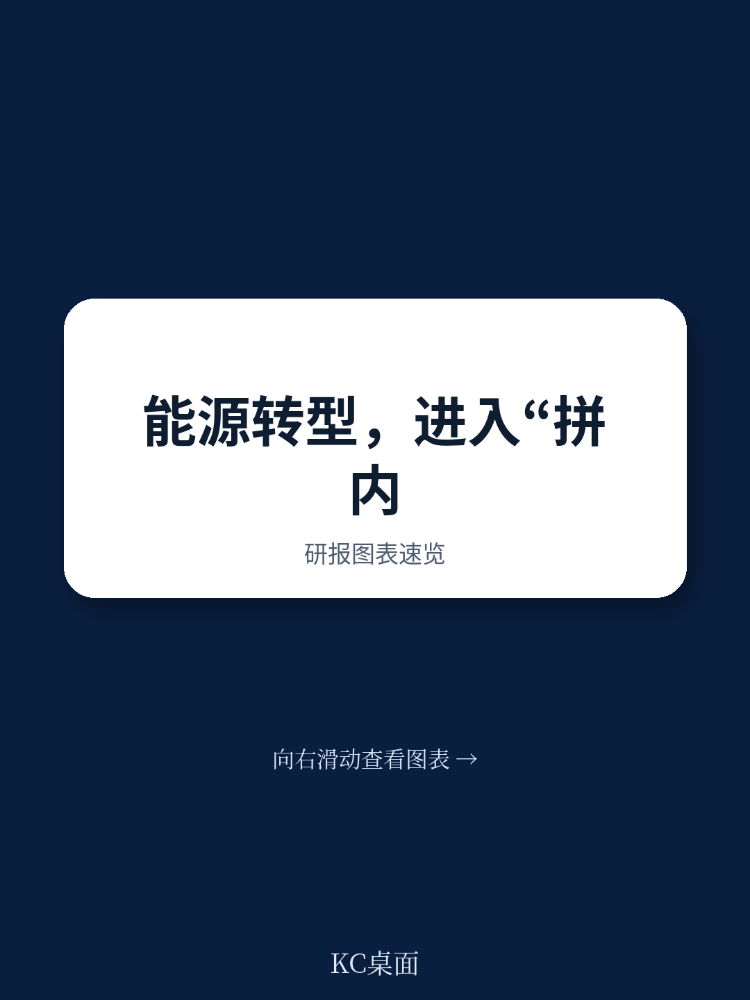
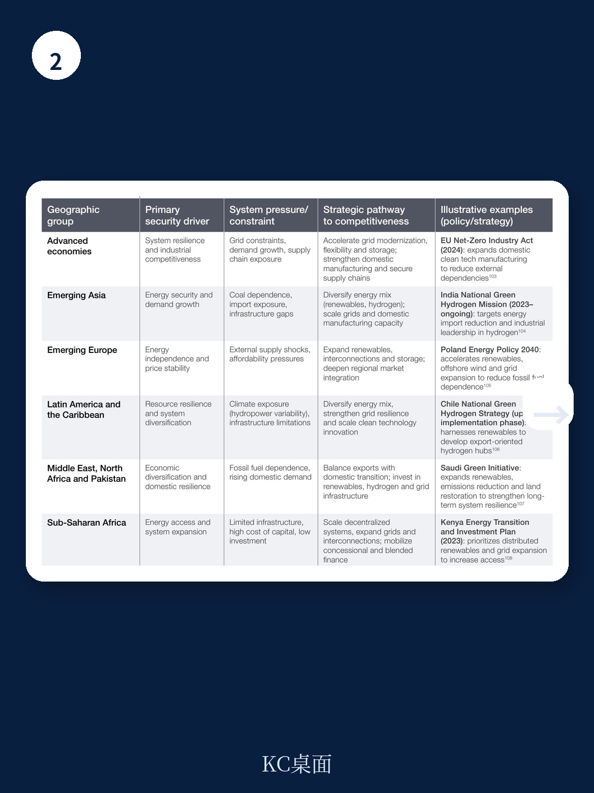

# 世界经济论坛：不是装机不足，而是电网瓶颈拖慢能源转型步伐

全球能源转型的步伐从未像今天这样充满张力。一方面，2025年全球能源投资达到3.3万亿美元，可再生能源与核电贡献了42%的电力，新增可再生能源装机容量接近800吉瓦。另一方面，世界经济论坛最新发布的《2026年能源转型指数》揭示了一个令人警惕的信号：全球能源转型的整体进展几乎停滞，总得分仅微增0.03%，而衡量未来动能的“转型准备度”指标，在过去十余年来首次出现下滑。

这不仅仅是节奏放缓。报告的核心判断是：能源转型正在“断裂”——变得日益不均衡，不同国家之间的差距正在拉大。只有24%的国家能够在能源安全、可负担性和可持续性三个维度上同时取得进步。这背后，是地缘政治碎片化、贸易壁垒激增、基础设施瓶颈与资本错配共同作用的结果。

对于产业决策者和投资者而言，理解这一“断裂”的性质，比关注任何单一的装机数据都更为关键。能源转型的方向没有逆转，但其路径、速度和赢家格局正在被重新定义。

> **KC评论：** 这份报告最有价值的地方，不是告诉你哪些国家排在前列，而是揭示了“转型准备度”首次下降这一结构性信号。它意味着，即便清洁能源装机在增长，支撑未来十年持续转型的政策、资本、创新和基础设施基础，正在被侵蚀。完整报告中包含的44项指标拆解、各国对比图表和情景假设，才是真正值得细读的部分。

---

## 1. 转型准备度首次下降：资本、政策与创新同时“失速”

2026年ETI的框架由两大子指数构成：系统绩效（权重60%）和转型准备度（权重40%）。系统绩效衡量的是当前能源体系在公平性、安全性和可持续性上的表现；转型准备度则衡量政策、资本、创新和基础设施等“未来驱动因素”的强弱。

2026年的核心变化在于，系统绩效虽然微增0.43%，但转型准备度却下降了0.76%。其中，金融与投资维度跌幅最大，达到1.8%；监管与政治承诺维度下降1.2%；创新维度也下滑1.1%。

这不是一个偶然的波动。报告明确指出，资本总量并不短缺，问题在于资本配置的条件和方向。全球75%的清洁能源投资仍然集中在少数几个经济体，而预计将贡献未来80%电力需求增长的新兴市场，其融资成本是发达经济体的2到3倍。这种资本错配，正在固化而非弥合全球能源转型的鸿沟。

与此同时，政策不确定性上升，雄心与执行之间的差距在拉大。碳捕集、氢能和长时储能等关键技术的扩散速度放缓，导致技术储备不足以支撑下一阶段的深度脱碳。

> **KC评论：** 这里有一个容易被忽略的关键点：报告将“准备度”的下降描述为“希望是暂时的，而非长期停滞的开始”。但投资者需要警惕的是，如果准备度连续两年下滑，系统绩效的改善将不可持续。完整报告中的“准备度”子指数拆解，包含了各国在监管框架、资本可得性和创新生态上的具体评分和变化趋势，这部分图表对于判断哪些市场存在“隐性风险”非常有价值。

## 2. 能源安全成为竞争力的新轴心，但代价由新兴市场承担

2026年初的霍尔木兹海峡事件，是贯穿整份报告的暗线。这一事件导致布伦特原油价格飙升、液化天然气供应中断，在欧洲引发气价暴涨。但报告的核心洞察在于：能源安全的脆弱性并非突发事件所致，而是长期结构性问题的集中暴露。

在霍尔木兹事件发生之前，ETI数据已经显示，能源安全是系统绩效中唯一出现下滑的维度（下降0.9%），原因在于可靠性和供应条件的持续弱化。这意味着，即使没有地缘政治冲击，能源系统的韧性本身就在下降。

更深刻的判断在于：能源安全已不再仅仅关乎燃料供应。它正在延伸至电网、关键矿产、基础设施和系统可靠性。报告数据显示，全球超过2500吉瓦的项目（包括可再生能源、储能和数据中心等大型新负荷）正在排队等待电网接入。这反映了一个结构性的转变：挑战已从“建设产能”转向“将产能整合到日益复杂的系统中”。

对于新兴市场而言，这种压力尤为严峻。更高的进口依赖度、有限的应急库存、狭窄的财政空间，迫使它们在能源可及性、可负担性和转型投资之间做出更艰难的取舍。报告指出，这些国家面临的不是单一维度的挑战，而是“三重压力”：能源价格冲击、融资成本高企和基础设施瓶颈。

> **KC评论：** 报告的潜台词是：能源安全正在从“成本项”变为“竞争力来源”。那些能够将韧性嵌入系统设计的国家，将更有可能吸引资本并维持部署节奏。但反过来，这也意味着全球能源转型的区域分化将进一步加剧。完整报告中关于“能源安全”的专门章节，包含了对各国脆弱性指标的详细对比，以及不同情景下安全与转型之间的权衡分析，对于理解国别风险至关重要。

## 3. 需求增长撞上系统瓶颈：电网成为最大短板

全球一次能源需求在2025年增长1.3%，但电力需求增速更快，2024年增长4.4%，2025年仍达3.0%。驱动这一增长的因素包括电气化、制冷需求、数字基础设施和人工智能。

报告给出了一个惊人的数据：2025年全球AI投资达到1.5万亿美元，数据中心电力消费约为486太瓦时，预计到2030年将增至约945太瓦时，在乐观情景下2035年可能超过1700太瓦时。约80%的电力需求增长来自新兴和发展中经济体，但发达经济体同样面临数据中心、电动汽车和热泵带来的负荷增长。

需求激增与系统约束的碰撞，使得电网成为整个转型链条中最脆弱的环节。超过2500吉瓦的项目在排队等待并网，这一数字本身就是对“清洁能源部署在加速”这一叙事的反讽。报告直言：挑战已经从“建设产能”转向“整合产能”。

与此同时，能源相关的二氧化碳排放仍维持在约380亿吨的水平，温室气体总排放量则微升至创纪录的606亿吨二氧化碳当量。报告指出，全球能源系统目前处于“增量而非替代”的阶段——化石燃料需求仍处于或接近历史高位，即便清洁产能持续扩张。这意味着，仅靠扩大可再生能源无法解决排放问题，碳捕集、甲烷减排和低碳燃料必须被视为转型架构的组成部分，而非清洁能源不可用时的备选方案。

## 4. 报告尚未完全回答的关键问题：准备度下滑是周期性的还是结构性的？

这是阅读完这份报告后最值得追问的问题。

报告将准备度的首次下降描述为“希望是暂时的”，但这更像是一个谨慎的表述，而非一个经过验证的判断。三个维度的同时下滑——金融、政策、创新——是否意味着支撑转型的制度性条件正在系统性退化？如果贸易摩擦持续、地缘政治紧张加剧，准备度能否在2027年恢复增长？

报告没有给出明确的答案，但提供了一些值得关注的线索。例如，它指出“稳定的政策框架、可信的交付路径和更强的制度能力”将是动员资本、加速基础设施建设和支持创新的关键。但问题在于，在当前的全球政治经济环境下，这些条件是否能够被重建？

另一个悬而未决的问题是：资本错配能否被纠正。报告提到，新兴市场面临2到3倍的融资成本溢价，但并未深入探讨可行的风险分担机制或创新融资工具。对于投资者而言，这意味着“转型融资”本身可能成为一个值得深入研究的独立主题。

## 5. 给决策者和投资者的观察框架：从“谁在加速”转向“谁在筑基”

基于这份报告，一个更具操作性的观察框架是：不要仅仅关注各国在清洁能源装机上的增速，而要更加关注它们在“转型准备度”上的变化。

具体而言，可以关注三个维度

第一，政策稳定性。报告指出，监管与政治承诺维度下降了1.2%，这背后是政策不确定性的上升。那些能够维持清晰、连贯能源政策的国家，将更具投资吸引力。

第二，资本可得性。75%的清洁能源投资集中在少数市场，而未来需求增长最大的地区资本成本最高。任何能够降低新兴市场融资成本的政策创新或金融工具，都可能带来结构性机会。

第三，基础设施瓶颈的突破速度。超过2500吉瓦的项目在等待并网，这意味着电网投资和许可改革的速度，将直接决定清洁能源部署的真正上限。那些在电网升级和许可流程上取得突破的国家，将成为下一阶段的赢家。

---

这份报告的完整价值，远不止于上述摘要。它包含了120个国家的详细评分、44项指标的底层数据、以及针对不同区域和收入水平国家的深度分析。真正有价值的，是那些图表背后的假设、各国之间的比较、以及报告对“未来三年优先行动”的推导逻辑。

继续阅读原文，你会发现更多尚未被广泛讨论的细节：哪些国家在“系统绩效”和“准备度”之间出现了最大背离？霍尔木兹事件对不同类型经济体的影响路径有何差异？报告提出的“三大优先行动”在具体国别背景下如何落地？

这些内容，连同每日更新的国际主流叙事、数据和图表汇编，以及更深入的KC评论，都会在每日的汇编中呈现。我们汇聚了头部券商、PE/VC、投行、并购、对冲基金、资管机构、战略咨询和智库的朋友，期待在社群中与你交流，共同观测全球能源转型的边际变化。

Personal reading notes and learning share only. Not investment advice.
