WORLD ECONOMIC FORUM

# Global Cybersecurity Outlook 2026

INSIGHT REPORT
JANUARY 2026

## Contents

Foreword 3
Executive summary 4
1 Five years of the Global Cybersecurity Outlook 9
2 The view from the top: CEOs' priorities in a shifting cyber landscape 10
3 The trends reshaping cybersecurity 17
3.1 AI is reshaping risk, accelerating both offence and defence 18
3.2 Geopolitics is a defining feature of cybersecurity 24
3.3 The evolving landscape of cybercrime: AI, fraud and the global response 30
3.4 Cyber resilience is the key to safeguarding economic value 34
3.5 Securing supply chains amid opacity and concentration risks 45
3.6 Drivers of cyber inequity in 2026 48
3.7 Future threat vectors are emerging in silence 54
Conclusion 56
Appendix: Methodology 57
Contributors 58
Endnotes 61

## Disclaimer

This document is published by the World Economic Forum as a contribution to a project, insight area or interaction. The findings, interpretations and conclusions expressed herein are a result of a collaborative process facilitated and endorsed by the World Economic Forum but whose results do not necessarily represent the views of the World Economic Forum, nor the entirety of its Members, Partners or other stakeholders.
© 2026 World Economic Forum. All rights reserved. No part of this publication may be reproduced or transmitted in any form or by any means, including photocopying and recording, or by any information storage and retrieval system.

# Foreword

  
Jeremy Jurgens
Managing Director,
World Economic Forum

In an era defined by accelerating technological change, persistent geopolitical volatility and widening capability gaps, the cyber landscape has become both a catalyst for progress and a vector of profound risk.

Cybersecurity risk in 2026 is accelerating, fuelled by advances in AI, deepening geopolitical fragmentation and the complexity of supply chains. These shifts are compounded by the enduring sovereignty dilemma and widespread cyber inequity, two factors that expose systemic vulnerabilities. The result is a threat environment where the speed and scale of attacks are testing the limits of traditional defences.

  
Paolo Dal Cin
Global Cybersecurity
Lead, Accenture

Now in its fifth year, the Global Cybersecurity Outlook has become an authoritative reference, empowering leaders with the insights they need to navigate cyber challenges, as well as an important instrument with which to redefine business strategy, enterprise investments and government initiatives and seize the opportunities of today's cybersecurity landscape.

By examining leaders' perspectives and highlighting the priorities that drive success, this report delivers a clear message: cybersecurity is not predetermined. Its future depends on the choices we make today. By investing in foresight, capability and innovation, and by strengthening collaboration across industries, sectors and national boundaries, we can transform volatility into momentum and build a safer, more resilient digital future together.

# Executive summary

## Cybersecurity is a frontier where collaboration remains not only possible, but powerful.

Cybersecurity in 2026 is accelerating amid growing threats, geopolitical fragmentation and a widening technological divide. Artificial intelligence (AI) is transforming cyber on both sides of the fight – strengthening defence while enabling more sophisticated attacks. Organizations are striving to balance innovation with security – embracing AI and automation at scale, even as governance frameworks and human expertise struggle to keep pace. The result is a fast-paced, metamorphic landscape where disruptions move swiftly across borders, even as technology offers new potential for resilience.

This year's report examines the intersection of AI adoption and cyber readiness, and the emerging disparities that innovation creates. On the geopolitical front, fragmentation and sovereignty concerns are reshaping cooperation and trust among nations. Hybrid threats and escalating cyberattacks reflect the increasing volatility of the global environment. From an economic perspective, unequal access to resources and expertise continues to widen cyber inequity.

Ultimately, strengthening collective cyber resilience has become both an economic and a societal imperative. Cybersecurity is a frontier where collaboration remains not only possible, but powerful – a reminder that, even amid fragmentation, economic strain and uncertainty, collective action can drive progress for all.

These are three key trends that executives will need to navigate in cybersecurity in 2026:

## 1. AI is supercharging the cyber arms race

AI is anticipated to be the most significant driver of change in cybersecurity in the year ahead, according to 94% of survey respondents (see Appendix: Methodology for more information about the survey).

This growing recognition is translating into concrete action across organizations. The percentage of respondents assessing the security of AI tools has nearly doubled from the previous year, from 37% in 2025 to 64% in 2026.

## FIGURE A

## Percentage of organizations with processes in place to assess AI security

Does your organization have a process in place to assess the security of AI tools before deploying them?

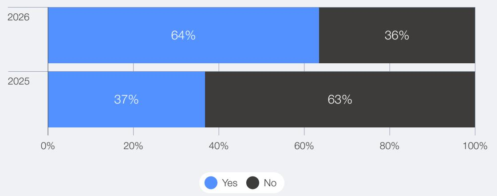

At the same time, AI vulnerabilities are accelerating at an unprecedented pace: 87% of respondents identified AI-related vulnerabilities as the fastest-growing cyber risk over the course of 2025.

## Perception of increase or decrease in cyber risks over the past year

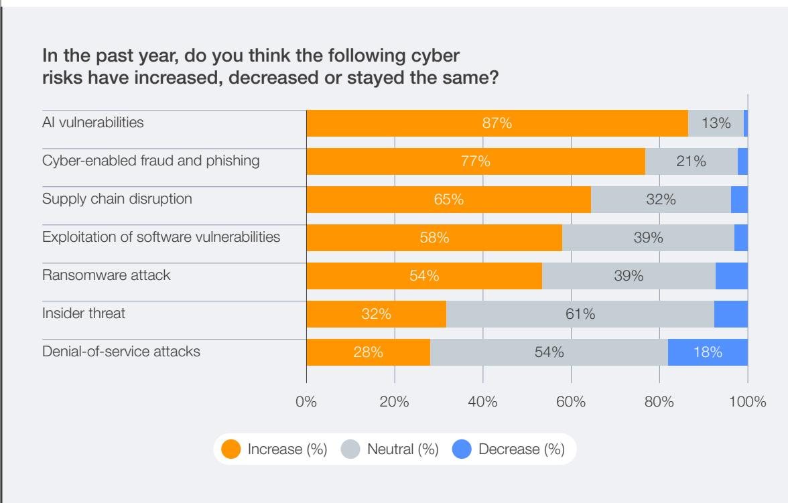

## 2. Geopolitics is a defining feature of cybersecurity

In 2026, geopolitics remains the top factor influencing overall cyber risk mitigation strategies. Some 64% of organizations are accounting for geopolitically motivated cyberattacks – such as disruption of critical infrastructure or espionage.

## Top considerations for cyber risk mitigation strategies

Which of the following does your organization consider in its overall cyber risk mitigation strategy? (select all that apply)

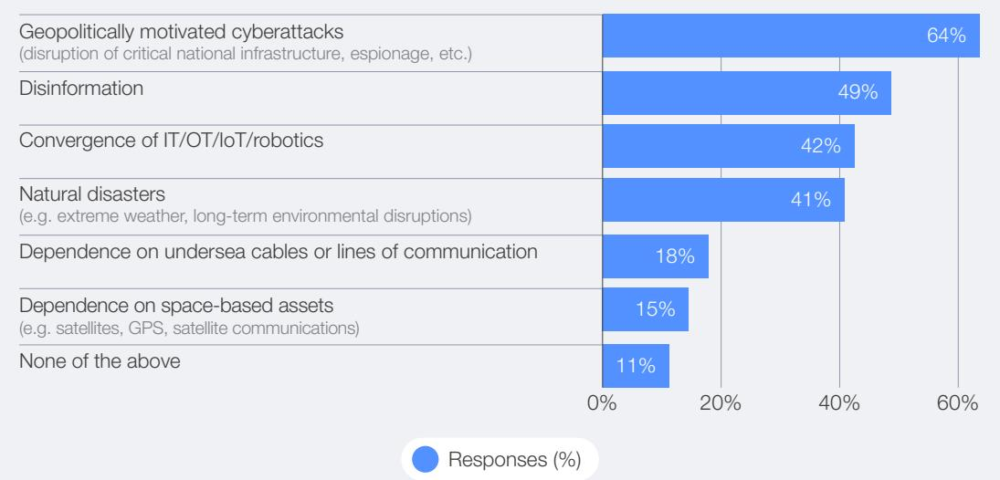

Notably, 91% of the largest organizations $^{1}$ have changed their cybersecurity strategies due to geopolitical volatility.

## How organizations have adapted cybersecurity strategies amid geopolitical volatility

Has your organization's cybersecurity strategy evolved because of geopolitical volatility?

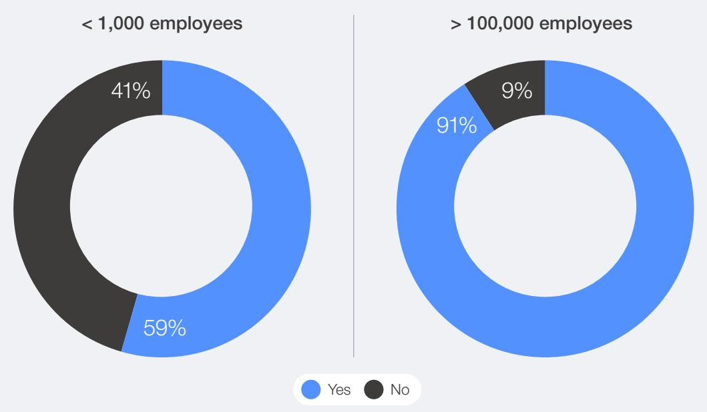

In the context of geopolitical volatility, confidence in national cyber preparedness continues to erode, with $31\%$ of survey respondents reporting low confidence in their nation's ability to respond to major cyber incidents, up from $26\%$ last year. Confidence levels vary greatly across regions.

Respondents from the Middle East and North Africa express a high degree of confidence in their country's ability to protect critical infrastructure (84%), while confidence is lower among respondents in Latin America and the Caribbean (13%).

## FIGURE E

## Regional overview: Confidence in national cyber response to critical infrastructure attacks

How confident are you in the preparedness of the country in which you are based to respond to major cyber incidents targeting critical infrastructure?

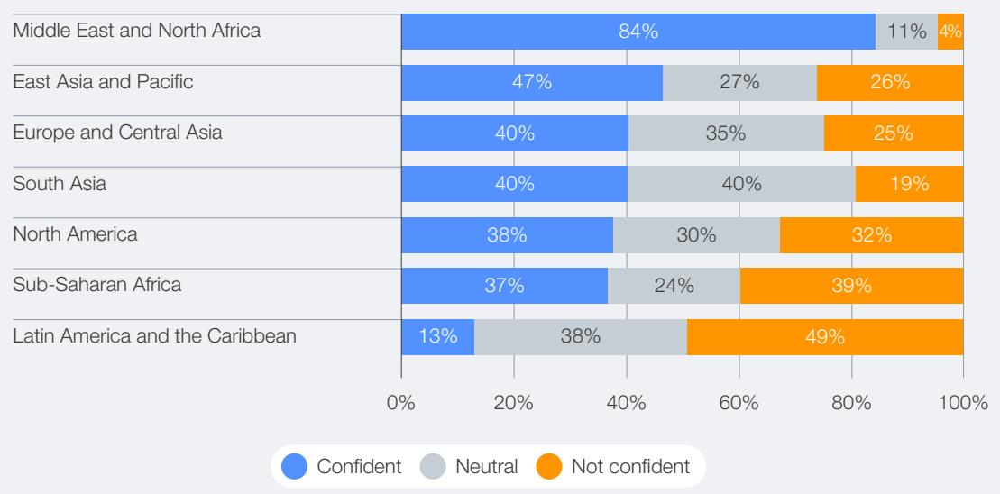

Recent incidents affecting key infrastructure, such as airports and hydroelectric facilities, continue to call attention to these concerns. Despite its central role in safeguarding critical infrastructure, the public sector reports markedly lower confidence in national preparedness.

Some 23% of public-sector organizations reported having insufficient cyber-resilience capabilities.

## FIGURE F

## Perception of insufficient cyber resilience by sector

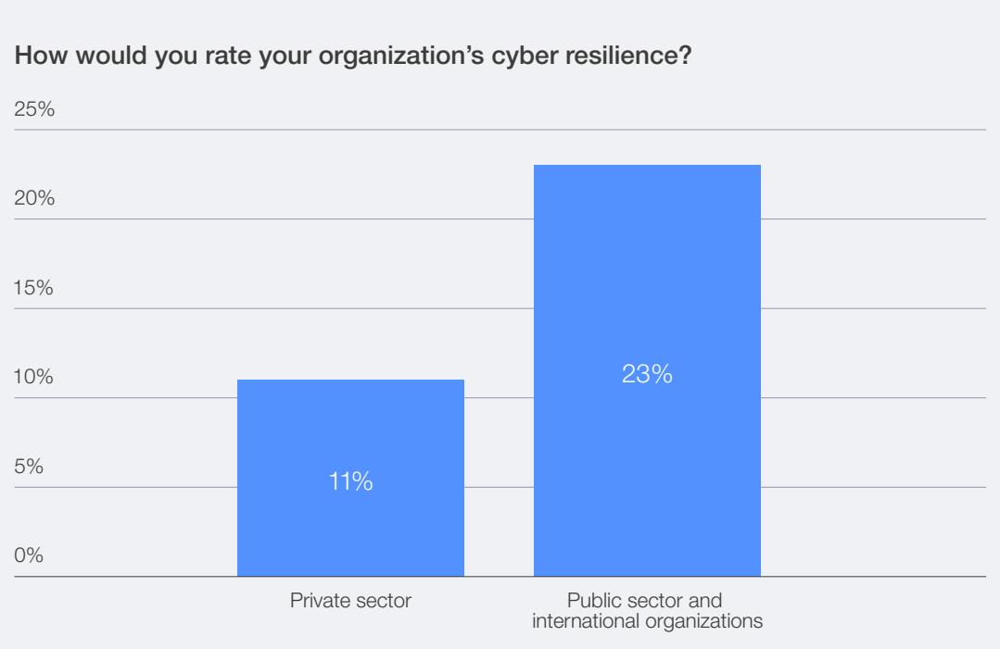  
Our cyber resilience is insufficient

# 3. Cyber-enabled fraud is threatening CEOs and households alike

In the survey, 73% of respondents reported that they or someone in their network had been personally affected by cyber-enabled fraud over the course of 2025.

## Prevalence of cyber-enabled fraud (all respondents)

## Have you or anyone in your professional/personal network been affected by cyber-enabled fraud in the past 12 months? (select all that apply)

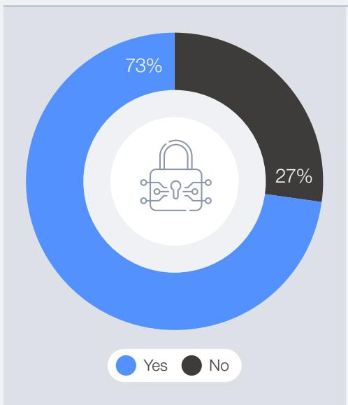

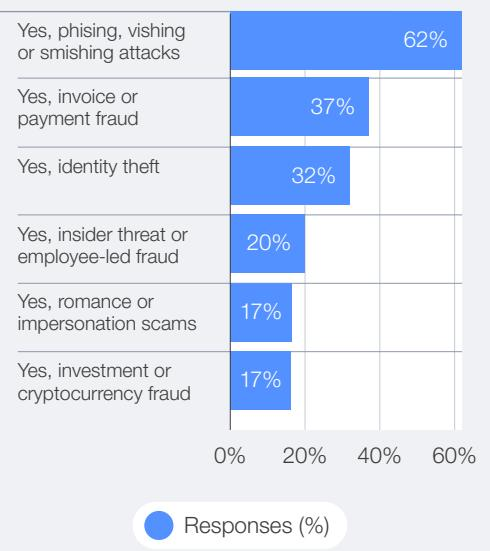

Chief executive officers (CEOs) rate cyber-enabled fraud as their top concern, shifting focus from ransomware to emerging risks such as cyber-enabled fraud and AI vulnerabilities. Chief information security officers (CISOs), by contrast, remain concerned about ransomware and supply chain resilience. This reflects how cybersecurity priorities diverge between the boardroom and the front line.

TABLE 1  
Ranking of CEOs' and CISOs' cyber risk concerns for their organizations

<table><tr><td colspan="5">Which cyber risks concern you most for your organization?</td></tr><tr><td>Rank</td><td colspan="2">Chief executive officer (CEO)</td><td colspan="2">Chief information security officer (CISO)</td></tr><tr><td></td><td>2025</td><td>2026</td><td>2025</td><td>2026</td></tr><tr><td>1</td><td>Ransomware attack</td><td>Cyber-enabled fraud and phishing</td><td>Ransomware attack</td><td>Ransomware attack</td></tr><tr><td>2</td><td>Cyber-enabled fraud and phishing</td><td>AI vulnerabilities</td><td>Supply chain disruption</td><td>Supply chain disruption</td></tr><tr><td>3</td><td>Supply chain disruption</td><td>Exploitation of software vulnerabilities</td><td>Cyber-enabled fraud and phishing</td><td>Exploitation of software vulnerabilities</td></tr></table>

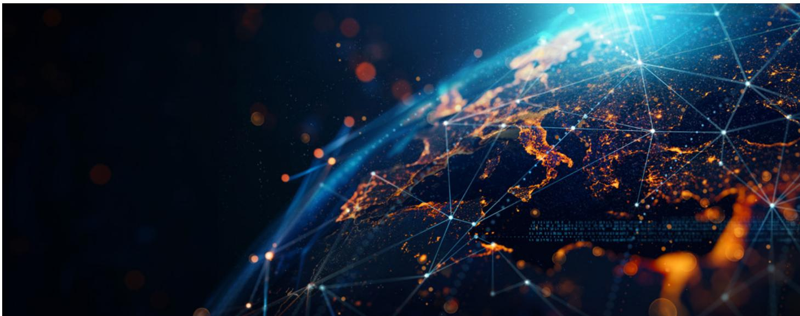

# ① Five years of the Global Cybersecurity Outlook

In 2026, cybersecurity will continue to evolve across technological, geopolitical, economic and strategic dimensions.

Over the past year, cyberspace has become deeply intertwined with geopolitics, the global economy and the daily lives of individuals and institutions alike. A new generation of cyber incidents has exposed the fragility of these connections: disruptions in retail and manufacturing chains, aviation slowdowns, intrusions into public-sector systems and hyperscale cloud outages. Each event underscored how tightly interlinked the digital ecosystem has become – where a single local fault or targeted attack can rapidly cascade into global-scale consequences.

In 2026, cybersecurity will continue to evolve across technological, geopolitical, economic and strategic dimensions. In this landscape, cybersecurity is no longer a backroom technical function; it is a core strategic concern for governments, businesses and societies. The coming year will test not only global technological preparedness but also the capacity to align policy, ethics and collaboration in defending an increasingly digital world.

Over the past five years, the Global Cybersecurity Outlook has traced the developments in risks related to the digital landscape – from the urgency of the pandemic-driven digitalization to today's environment of accelerating complexity, fragmentation and technological transformation.

The 2022 edition captured a world adapting to unprecedented connectivity. As organizations raced to digitize operations during the COVID-19 pandemic, the report warned of widening capability gaps that left smaller institutions and nations struggling to defend their increasingly digital infrastructure.

By 2023, cyber risk had become inseparable from geopolitics. The report documented how escalating geopolitical instability and supply chain interdependencies reshaped corporate priorities.

The 2024 edition described a world of polarization and uneven progress. The cybersecurity economy grew faster than the global economy, but this growth masked deepening cyber inequity between resilient, well-resourced organizations and those falling behind.

In 2025, the fourth edition found that a series of compounding factors – geopolitical tension, intricate supply chains, regulatory proliferation and rapid technological adoption – were creating an era of escalating complexity and unpredictability.

Across these four years and leading into the fifth, one theme stands out: collaboration has become indispensable in a fragmented world facing rising threats, a widening tech divide and growing inequity that risk deepening the cyber resilience gap.

# 2 The view from the top: CEOs' priorities in a shifting cyber landscape

The Global Cybersecurity Outlook 2026 survey gathered insights from more than 100 CEOs across industries and regions. Their responses offer a unique lens into how leaders perceive the evolving cyber landscape.

TABLE 3  

## Threat landscape

Cyber-enabled fraud is CEOs' top concern, while ransomware remains the primary concern for CISOs

In 2025, CEOs were most concerned about ransomware attacks, followed by cyber-enabled fraud. In 2026, their priorities shifted, with cyber-enabled fraud and phishing taking the top spot and AI vulnerabilities emerging second. For CISOs, the top risks showed strong continuity, with ransomware attacks remaining the leading concern and supply chain disruption consistently holding second place across both years. This suggests CEOs are prioritizing financial loss prevention and preparing for new threats, while CISOs remain focused on operational resilience.

TABLE 2  
Ranking of CEOs' and CISOs' cyber risk concerns for their organizations

<table><tr><td colspan="5">Which cyber risks concern you most for your organization?</td></tr><tr><td>Rank</td><td colspan="2">Chief executive officer (CEO)</td><td colspan="2">Chief information security officer (CISO)</td></tr><tr><td></td><td>2025</td><td>2026</td><td>2025</td><td>2026</td></tr><tr><td>1</td><td>Ransomware attack</td><td>Cyber-enabled fraud and phishing</td><td>Ransomware attack</td><td>Ransomware attack</td></tr><tr><td>2</td><td>Cyber-enabled fraud and phishing</td><td>AI vulnerabilities</td><td>Supply chain disruption</td><td>Supply chain disruption</td></tr><tr><td>3</td><td>Supply chain disruption</td><td>Exploitation of software vulnerabilities</td><td>Cyber-enabled fraud and phishing</td><td>Exploitation of software vulnerabilities</td></tr></table>

CEOs of highly resilient companies are concerned about AI vulnerabilities

Cyber-enabled fraud and phishing remain the top cybersecurity concerns for CEOs of insufficiently resilient organizations. However, as resilience

strengthens, risk perception shifts towards emerging threats: among CEOs of highly resilient organizations, AI-related vulnerabilities rise to the top. This suggests that resilient organizations are more attuned to the evolving risks posed by advanced technologies.

CEO survey responses, segmented by organizational resilience level

<table><tr><td>Which cyber risks concern you most for your organization?</td><td>High resilience (rank)</td><td>Insufficient resilience (rank)</td></tr><tr><td>AI vulnerabilities</td><td>1</td><td>4</td></tr><tr><td>Cyber-enabled fraud and phishing</td><td>2</td><td>1</td></tr><tr><td>Supply chain disruption</td><td>3</td><td>7</td></tr><tr><td>Exploitation of software vulnerabilities</td><td>4</td><td>3</td></tr><tr><td>Ransomware attack</td><td>5</td><td>2</td></tr><tr><td>Insider threat</td><td>6</td><td>6</td></tr><tr><td>Denial-of-service attacks</td><td>7</td><td>5</td></tr></table>

## AI risks

Data leaks and advancement of adversarial capabilities dominate CEOs' concerns about generative AI

CEOs identify data leaks (30%) and the advancement of adversarial capabilities (28%) as the most significant security concerns related to generative AI (genAI). These two risks stand out clearly above others, indicating that exposure of proprietary data through genAI and the growing sophistication of cyber attackers are the primary issues on CEOs' radars for 2026.

## FIGURE 1

## CEOs' perception of key AI security risks

Which cybersecurity issue related to genAI concerns you the most?

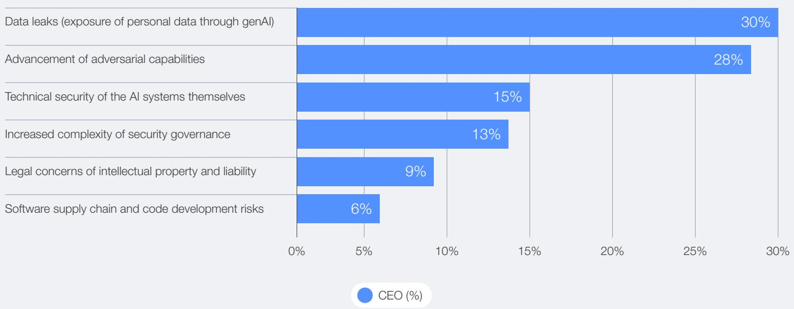

## Geopolitics

Private-sector CEOs question national readiness for major cyberattacks on critical infrastructure

Less than $45\%$ of all CEOs from the private sector are confident in their country's ability to respond to major cyber incidents targeting critical infrastructure.

## FIGURE 2

CEOs' confidence in national responses to cyberattacks on critical infrastructure

How confident are you in the preparedness of the country in which you are based to respond to major cyber incidents targeting critical infrastructure?

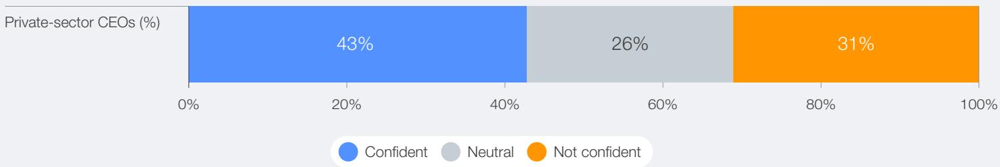

Has your organization's cybersecurity strategy evolved because of geopolitical volatility? (select all that apply)

Cybersecurity is the foundation for our digital world. It is at the heart of trust and will allow society to fully benefit from the transformations enabled by new technologies like AI and quantum. But it's not something one can do on their own. We have to come together, share intelligence globally and develop the skills equal to emerging risks. Society knows what's at stake if we get this wrong. It's critical that we get it right. If we do, we'll be able to deliver on the many possibilities for so many people around the world.

Michael Miebach, Chief Executive Officer, Mastercard

CEOs of highly resilient organizations prioritize threat intelligence and information sharing to address geopolitical volatility

Some 52% of CEOs of highly resilient organizations are prioritizing threat intelligence on nation-state actors, compared to 13% of CEOs of insufficiently resilient organizations.

Similarly, 48% of CEOs of highly resilient organizations are increasing collaboration with government agencies and information-sharing groups, whereas only 6% of CEOs of insufficiently resilient organizations report doing so. This indicates that resilience is no longer built in isolation. It is achieved through shared intelligence and partnerships.

FIGURE 3 CEOs' views on the evolution of cybersecurity strategy amid geopolitical volatility, by organizational resilience level

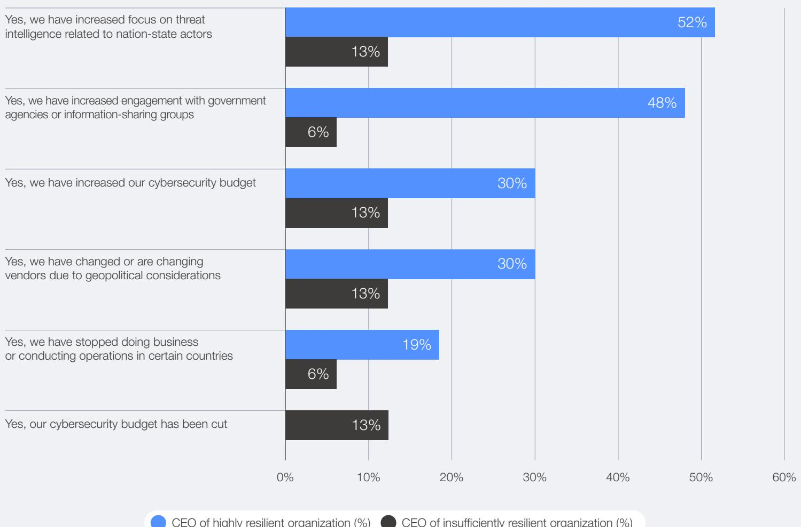

## Resilience

CEOs of highly resilient organizations cite external ecosystem risks as the top challenge to cyber resilience, while less resilient peers point to funding and skills shortages

As organizational resilience improves, CEOs increasingly shift their attention from internal resource constraints, such as funding or skills shortages, to broader ecosystem risks. In the survey, 78% of CEOs of highly resilient organizations identify supply chain and third-party dependencies as the most significant challenge to further strengthening resilience. On the other hand, cybersecurity skills shortage (56%) and lack of funds (63%) were the top challenges identified by CEOs of insufficiently resilient organizations to improve their cyber resilience.

## CEOs' greatest challenge to becoming cyber resilient, by organizational resilience level

What is your organization's greatest challenge to becoming cyber resilient?

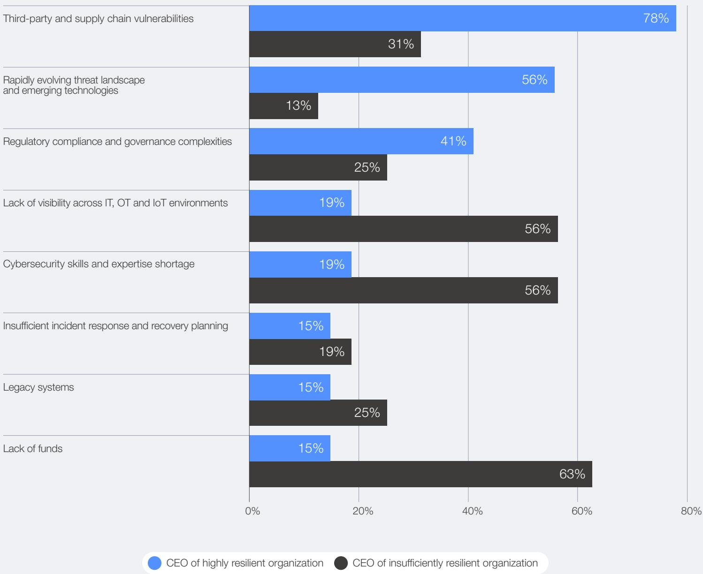

## Supply chain

CEOs of highly resilient organizations integrate security into their procurement process to address supply chain risk

CEOs of highly resilient organizations integrate security into their procurement process (70%) and prioritize supplier-maturity assessments (59%) to address supply chain risk.

How does your organization address supply chain cyber risk? (select all that apply)

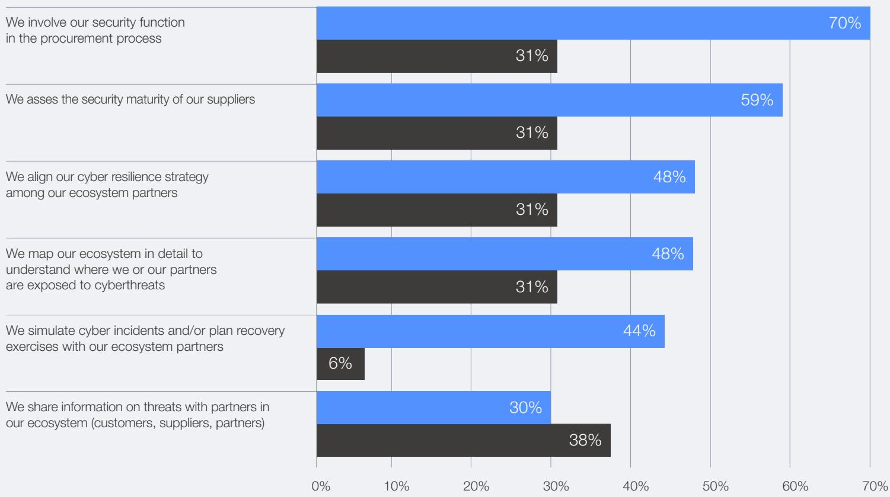

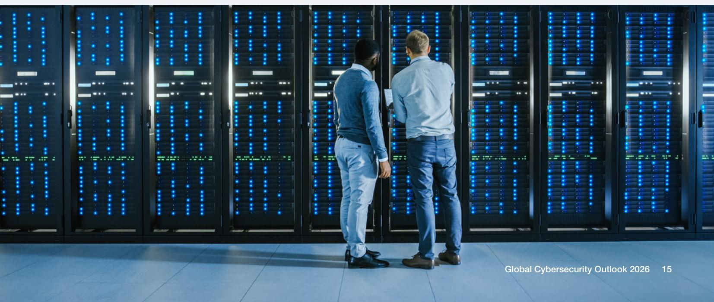

## Inequity

CEOs from sub-Saharan Africa, Latin America and the Caribbean face the greatest cyber skills shortages

Outside of Europe and North America, more than half of CEOs admit lacking the skills to achieve current cybersecurity goals, with sub-Saharan Africa (70%) and Latin America and the Caribbean (69%) facing the greatest gaps.

FIGURE 6

## CEOs' views on whether their organization's workforce has the skills for current cybersecurity objectives, by region

Does your organization's workforce have the skills needed to achieve its current cybersecurity objectives?

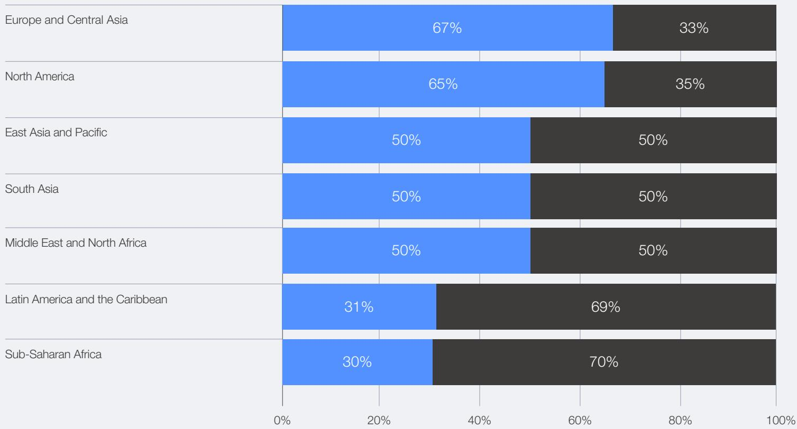

  
Yes, we have the people and skills we need today

  
No, we are missing critical people and skills

# The trends reshaping cybersecurity

As organizations confront AI threats, geopolitical volatility and supply chain vulnerabilities, the need for resilience has never been clearer.

Wider attack surface and cyber harms to enterprise
New attack surface and propagation of risks across businesses

# 3.1 AI is reshaping risk, accelerating both offence and defence

Developments in AI are reshaping multiple domains, including cybersecurity. Implemented well, these technologies can assist and support human operators in detecting, defending and responding to cyberthreats. However, they can also pose serious risks such as data leaks, cyberattacks and online harms if they malfunction, or are misused. Governments must take a forward-looking, practical and collaborative approach to developing and using emerging technologies safely, as their capabilities and risks continue to evolve. The risks transcend borders, and the challenge is to maximize AI's benefits, including to strengthen our cyber resilience, while minimizing its risks.

Josephine Teo, Minister for Digital Development and Information and Minister-in-Charge of Cybersecurity and Smart Nation Group, Singapore

AI is anticipated to be the most significant driver of change in cybersecurity in the year ahead, according to 94% of survey respondents. AI is reshaping the cybersecurity landscape across three interconnected dimensions. First, the widespread integration of AI systems introduces an expanded attack surface, creating novel vulnerabilities that traditional controls were not designed to address. Second, defenders are harnessing AI to strengthen their cyber capabilities – augmenting detection, accelerating incident response and automating high-volume analytical tasks. Third, threat actors

are leveraging AI to enhance the scale, speed, sophistication and precision of their attacks, driving a new generation of automated exploitation and targeted social engineering (see Section 3.3).

Together, these dynamics illustrate the dual-use nature of AI, both as a force multiplier for defence and as a catalyst for attackers. As this technological competition intensifies, organizations are shifting from reactive to proactive security, while reassessing governance, validation and oversight at every stage of AI adoption.

## FIGURE 7

Impacts of AI on cybersecurity

## Impacts of AI on cybersecurity

New attack surface offers new targets and attack vectors, which will need to be defended

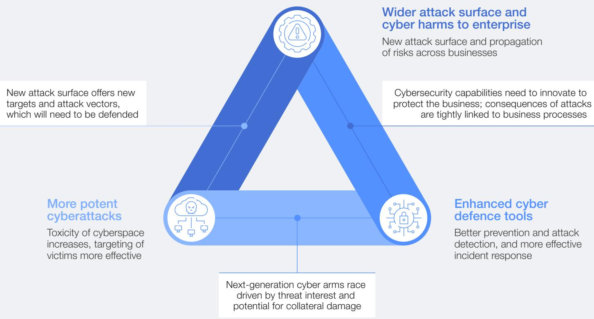

Cybersecurity capabilities need to innovate to protect the business; consequences of attacks are tightly linked to business processes

More potent cyberattacks
Toxicity of cyberspace increases, targeting of victims more effective

Next-generation cyber arms race driven by threat interest and potential for collateral damage

## Enhanced cyber defence tools

Better prevention and attack detection, and more effective incident response

AI's benefits are contingent on disciplined execution. Poorly implemented solutions can introduce new risks – misconfiguration, biased decision-making, over-reliance on automation and susceptibility to adversarial manipulation – unless organizations embed robust guardrails, security-by-design practices and continuous monitoring. The implication is clear: AI can improve cybersecurity, but only when deployed within sound governance frameworks that keep human

judgement at the centre. At the same time, too many controls can create friction, so it is essential to strike a careful balance.

## Security of AI: from awareness to action

According to the Global Cybersecurity Outlook 2026 survey, 87% of respondents identified AI-related vulnerabilities as the fastest-growing cyber risk over the course of 2025.

## Perception of increase or decrease in cyber risks over the past year

In the past year, do you think the following cyber risks have increased, decreased or stayed the same?

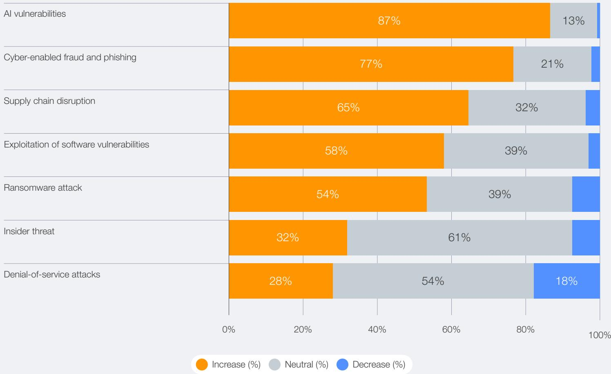

Data leaks associated with genAI (34%) and the advancement of adversarial capabilities (29%) stand out as leading concerns for 2026. This marks a striking reversal from previous years – in 2025, advancement of adversarial capabilities topped the list at 47% compared to only 22% for data leaks associated with genAI. The shift underscores a turning point in the AI risk landscape for the upcoming year: while the “AI arms race” between attackers and defenders continues to intensify, attention is pivoting from purely offensive innovation with AI towards the unintended exposure and misuse of sensitive data through generative and agentic systems.

Which cybersecurity issues related to generative AI concern you the most?  
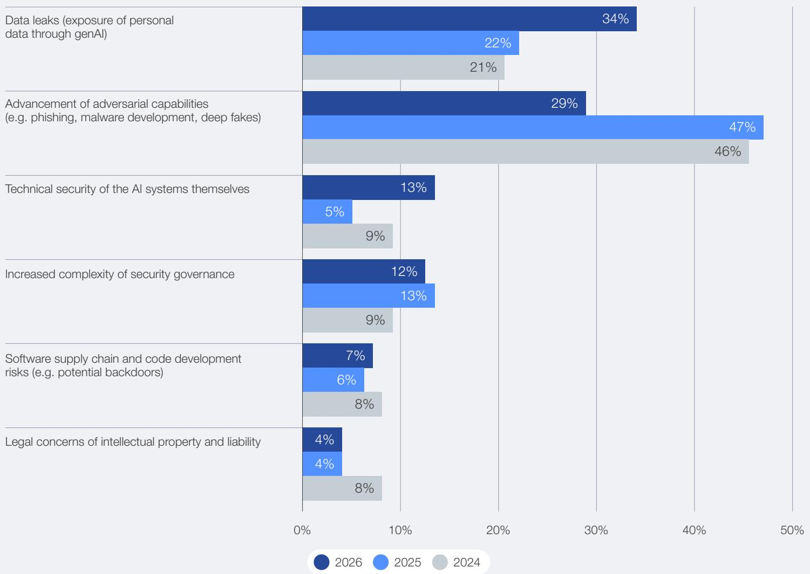

Growing awareness of AI-related cybersecurity risks is reflected in the increasing focus on the secure use of AI. The Global Cybersecurity Outlook 2025 highlighted a significant gap between the widespread recognition of AI-driven risks and the rapid adoption of AI technologies without adequate safeguards. By

2026, however, this picture is changing: the share of organizations assessing the security of their AI tools has nearly doubled – from 37% in 2025 to 64% in 2026 – indicating that more organizations are introducing structured processes and governance models to manage AI securely and responsibly.

## Percentage of organizations with processes in place to assess AI security

Does your organization have a process in place to assess the security of AI tools before deploying them?  
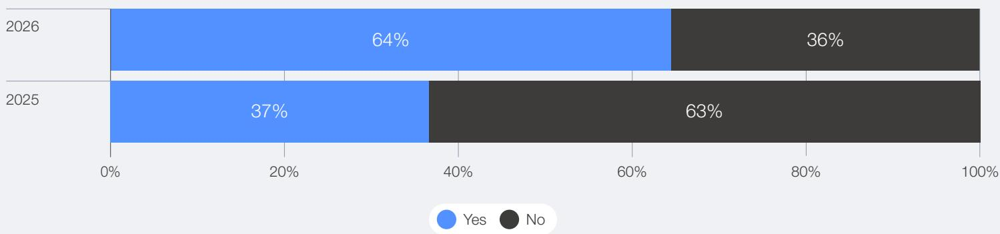

Does your organization have a process in place to assess the security of AI tools before deploying them?

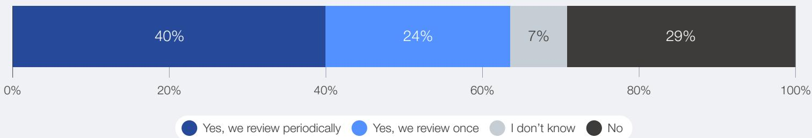

In the 2026 survey, 40% of organizations reported conducting periodic reviews of their AI tools before deploying them, rather than only doing a one-time assessment (24%) – a clear sign of progress towards continuous assurance. However, roughly one-third still lack any process to validate AI security before deployment, leaving systemic exposures even as the race to adopt AI in cyber defences accelerates.

The market's drive to adopt new AI features often outpaces security readiness, creating exploitable vulnerabilities. $^{3}$ In response to these emerging

risks, a number of fundamental measures should be prioritized to secure AI at the infrastructure level. This includes protecting the data used in the training and customization of AI models from breaches and unauthorized access. AI systems should be developed with security as a core principle, incorporating regular updates and patches to address potential vulnerabilities. It is also critical for organizations to deploy robust authentication and encryption protocols to ensure the protection of customer interactions and data. $^{4}$

## BOX 1

## The widespread adoption of AI agents

As AI agents become more widely adopted, they are poised to transform how digital systems are designed and developed. AI agents can enhance efficiency, responsiveness and scalability by automating complex or repetitive activities with speed and consistency, but their integration can challenge traditional security frameworks, redefining roles and processes, while raising fundamental questions about decision-making and the prioritization of alerts.

The multiplication of identities and connections makes managing their credentials, permissions and interactions just as critical – and likely even more complex – as managing those of human users. As outlined in the World Economic Forum's report AI Agents in Action: Foundations for Evaluation and Governance, without strong governance, agents can accumulate excessive privileges, be manipulated through design flaws or prompt injections, or inadvertently propagate errors and vulnerabilities at scale. Their speed and persistence amplify these risks, underscoring the need for continuous verification, audit trails and robust accountability structures grounded in zero-trust principles that treat every interaction as untrusted by default. $^{5}$

## AI for cybersecurity

AI is fundamentally transforming security operations – accelerating detection, triage and response while automating labour-intensive tasks such as log analysis and compliance reporting. AI's ability to process vast datasets and identify patterns at

speed positions it as a competitive advantage for organizations seeking to stay ahead of increasingly sophisticated cyberthreats. The survey data reveals that 77% of organizations have adopted AI for cybersecurity, primarily to enhance phishing detection (52%), intrusion and anomaly response (46%) and user-behaviour analytics (40%).

FIGURE 12

## How organizations are implementing AI for cybersecurity

## Has your organization implemented any AI-enabled tools to fulfil its cybersecurity objectives? (select up to three)

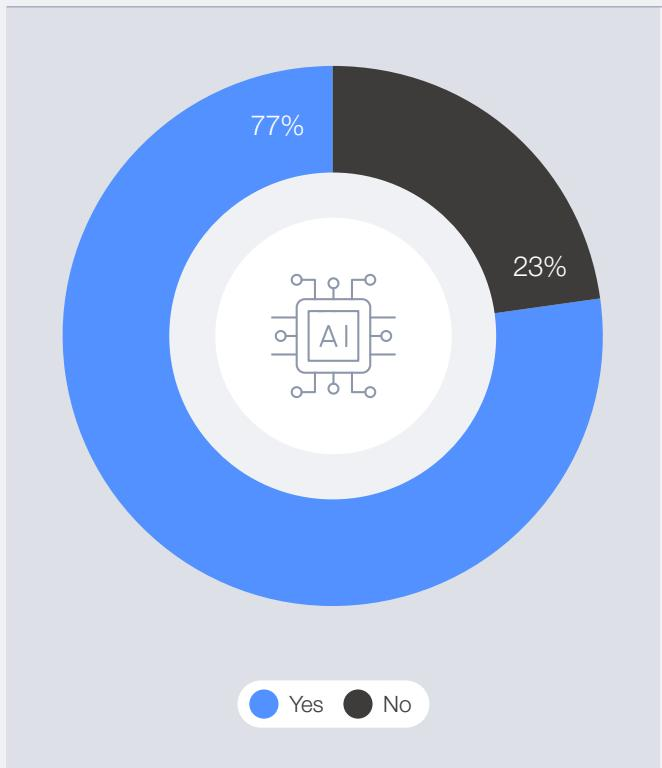

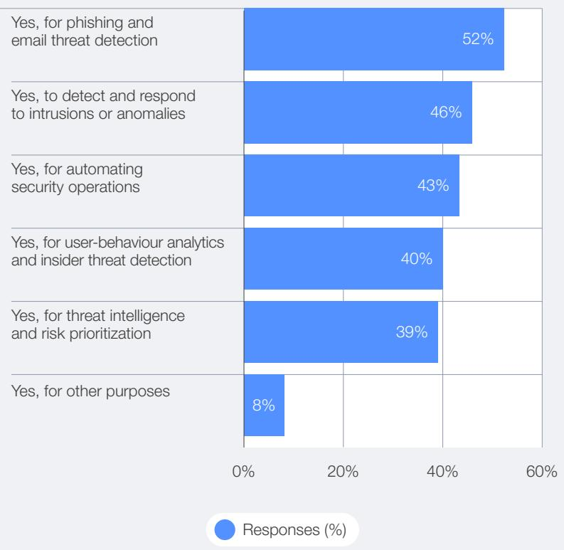

Addressing the practical challenges of AI adoption in cybersecurity, organizations consistently identify insufficient knowledge and/or skills (54%) to deploy AI for cybersecurity, the need for human oversight (41%) and uncertainty about risk (39%) as the main hurdles. These findings indicate that trust is still a barrier to widespread AI adoption.

Criminals are always willing to use all possible ways to get access to value, much of which is contained in the cyber infrastructure. Consequently, to stay ahead, those of us who defend must use every tool at our disposal – which now includes agentic AI.

Arvind Krishna, Chief Executive Officer, IBM

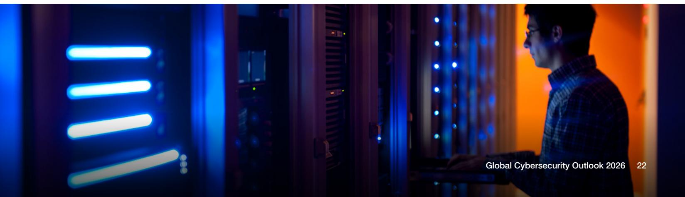

What implementation hurdles does your organization face in embracing AI for cybersecurity? (select all that apply)

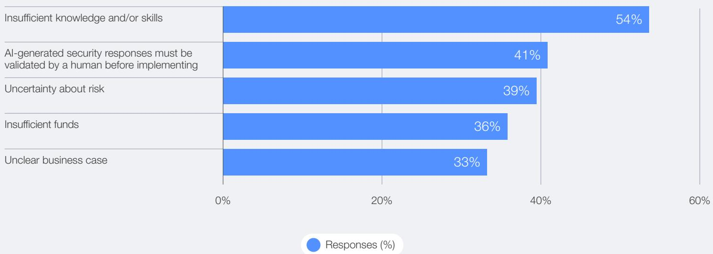

As organizations navigate the integration of AI into their security operations, the balance between automation and human judgement becomes increasingly critical. While AI excels at automating repetitive, high-volume tasks, its current limitations in contextual judgement and strategic decision-making remain clear. Over-reliance on ungoverned automation risks creating blind spots that adversaries may exploit.

This evolving dynamic is reshaping the role of cybersecurity professionals, highlighting the importance of adapting skill sets to meet new demands. According to the World Economic Forum's The Future of Jobs Report 2025, “networks and cybersecurity” are among the top three fastest-growing skills projected for 2030 – alongside AI and big data and technological literacy – reinforcing the urgency for targeted upskilling and continuous learning. $^{6}$

Rather than replacing human expertise, AI is enabling specialists to shift their focus towards strategic oversight, governance and policy while delegating routine operational tasks to automation. This transition demands new skill sets, blending technical proficiency with strategic and ethical considerations, and underscores the growing importance of AI literacy across security teams.

The priorities for organizations are clear: invest in AI literacy and secure-use skills, and embed governance and validation, without creating new single points of failure. A collaborative model, anchored in security-by-design principles, emerges as the recommended path forward – enabling organizations to harness AI's advantages while mitigating vulnerabilities and ensuring innovation strengthens, rather than compromises, cybersecurity.

## How industries are adopting AI for cybersecurity

The adoption of AI tools to augment cybersecurity capabilities varies across industries, reflecting sector-specific risk profiles and operational needs. The energy sector emphasizes intrusion and anomaly detection (according to 69% of respondents who have implemented AI for cybersecurity); the materials and infrastructure sector prioritizes phishing protection (80%); and the manufacturing, supply chain and transportation sector reports greater use of automated security operations (59%). These differences not only reflect sectoral risk profiles and operating constraints but also collectively point to a maturing portfolio of AI-enabled cyber defence capabilities that spans detection, intelligence, analytics and orchestrated cyber defence.

The differences in AI adoption for cybersecurity will be analysed in Section 3.6.

Has your organization implemented any AI-enabled tools to fulfil its cybersecurity objectives?

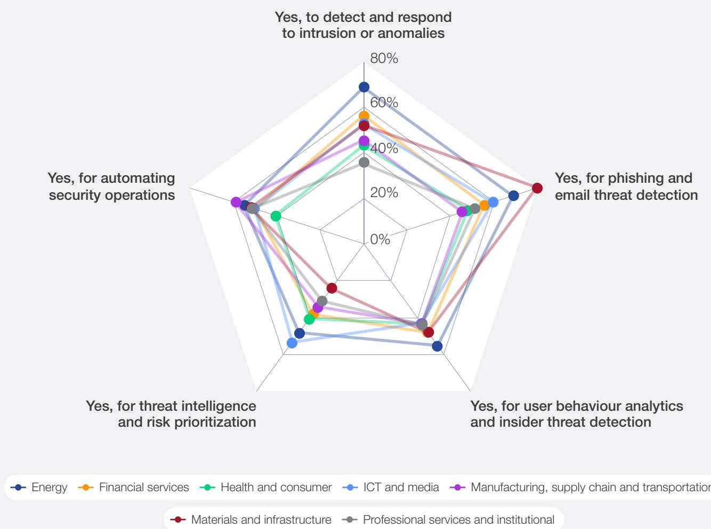

## 3.2 | Geopolitics is a defining feature of cybersecurity

In an increasingly fragmented global environment – marked by conflicts, geoeconomic tensions, trade wars, sanctions and growing technological competition – geopolitics has become a defining force shaping cybersecurity.

The Global Cybersecurity Outlook 2026 survey data reveals that, although the percentage of organizations changing their cybersecurity strategy due to geopolitics has declined from 93% in 2023 to 66% in 2026, geopolitics remains the top factor influencing overall cyber risk mitigation strategies. This suggests that the initial wave of adaptations following the geopolitical turmoil that dominated the headlines in 2022 and 2023 has passed, and that geopolitical risk is now a major factor shaping cyber defence.

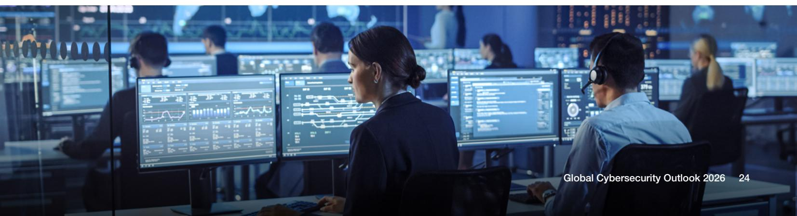

Has your organization's cybersecurity strategy evolved because of geopolitical volatility?

FIGURE 16 Top considerations for cyber risk mitigation strategies  
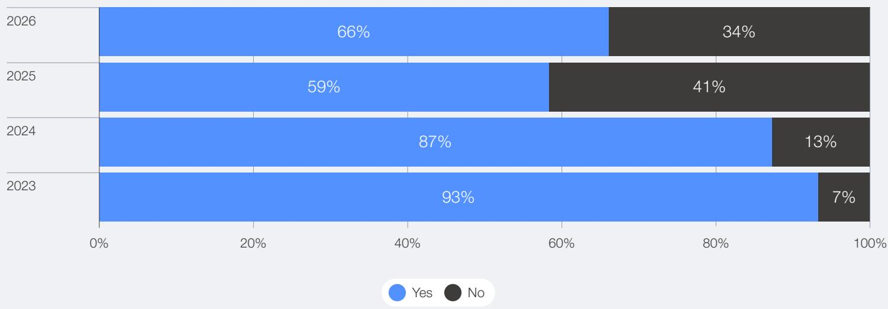

Which of the following does your organization consider in its overall cyber risk mitigation strategy? (select all that apply)

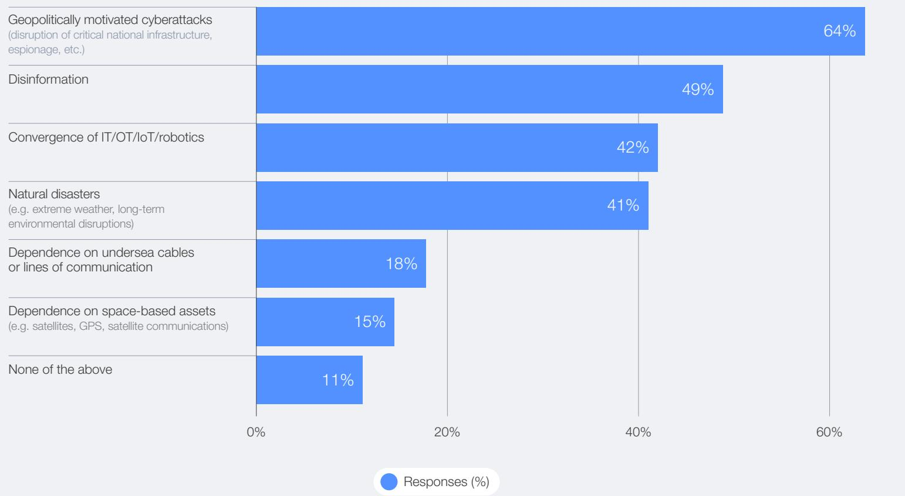

Organizations are increasingly shifting from isolated defence to intelligence-driven collaboration. In response to geopolitical volatility, survey respondents identified a stronger focus on threat intelligence and deeper engagement with

government agencies as the top two drivers of change in their cybersecurity strategies. This trend indicates a growing recognition that navigating an uncertain geopolitical landscape demands collaboration and shared situational awareness.

Has your organization's cybersecurity strategy evolved because of geopolitical volatility? (select all that apply)

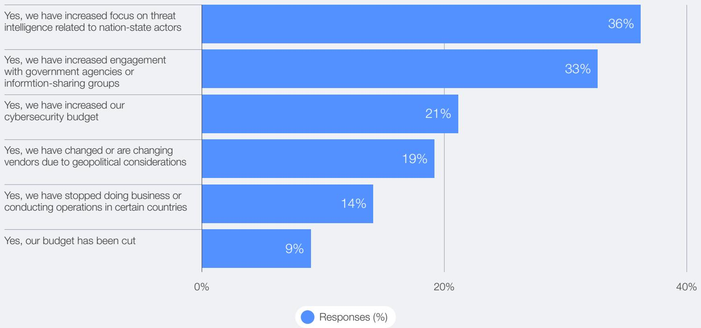

The shift towards intelligence-driven collaboration is being led primarily by global organizations with a larger number of employees, which are inherently more exposed to geopolitical volatility due to their global operations. These large employers are proactively seeking greater collaboration to manage this heightened exposure – leveraging their scale and resources to strengthen resilience.

Data shows that 70% of the largest employers (those with more than 100,000 employees) have increased their focus on threat intelligence, compared to

only 30% of small employers (those with 1,000 employees or fewer). $^{7}$ Similarly, 49% of these large employers have deepened their engagement with government agencies or information-sharing groups, versus 26% of small employers. In contrast, those smaller organizations, with limited staff and narrower geographic footprints, appear to be less aware of direct geopolitical pressures and often have less capacity to participate in collective security efforts. This may mean relying more frequently on risk acceptance rather than active mitigation in response to geopolitical volatility.

Strategy shifts due to geopolitical volatility among small and very large employers (by headcount)

Has your organization's cybersecurity strategy evolved because of geopolitical volatility?  
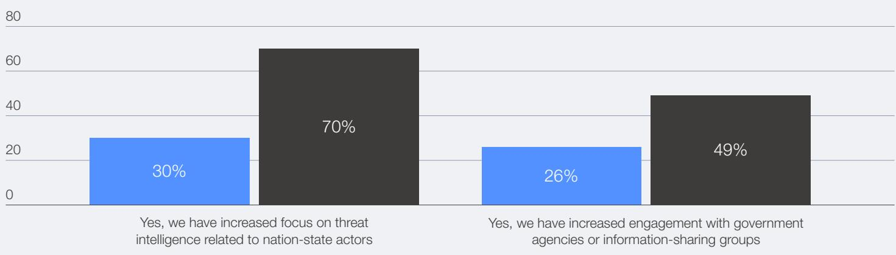

Geopolitical tensions particularly expose threats and vulnerabilities in the critical national infrastructure that supports society and underpins the operations of countless organizations.

## Local events – global impact

Geopolitical instability and armed conflicts are reshaping the cyberthreat landscape, creating complex and unpredictable conditions for organizations. As global fragmentation deepens – driven by conflicts, sanctions and technological rivalry – cybersecurity is emerging as a critical extension of geopolitical competition.

The large-scale power outage experienced in the Iberian Peninsula, while not in itself the result of a cyberattack, highlighted the impact a cyberattack could have on such critical national infrastructure. Ongoing instability in the wake of the war in Ukraine has coincided with a rise in hybrid attacks, using drones to target European airports and other critical infrastructure, along with the spread of disinformation, which have further destabilized the regional security landscape. $^{8}$ Beyond Europe, escalating geopolitical rivalries and conflicts across the Indo-Pacific, Middle East and Africa require organizations to maintain heightened vigilance as risks intensify across regions and industries. Of particular concern to participants in focus groups for this report was the use of advanced offensive cyber capabilities by nation-state actors to hack telecommunications networks in the United States. $^{9,10,11}$

The shift to a paradigm of more global confrontation – for example, by using trade policies, including tariffs and export restrictions – is reshaping alliances and technology dependencies. Political tensions are contributing to a growing fragmentation of global technology ecosystems, as countries diversify their partnerships and supply chains. Political and economic tensions are also driving countries and corporations to reconfigure supply chains, reshore manufacturing and cultivate “trusted” regional partners. The rush to establish alternative suppliers, logistics channels or data-hosting arrangements often outpaces cyber due diligence, expanding the attack surface across less-secure networks and third parties. As tariffs and policy shifts ripple through industries, cybersecurity risk management must evolve in tandem – treating trade disruptions as triggers for renewed threat modelling and vendor-risk reassessment. $^{12}$

In this volatile environment, cyber operations have become tools of diplomacy and influence – used to shape political outcomes and disrupt trade – further reinforcing the link between geopolitical uncertainty and organizational cyber risk exposure. Although geopolitical volatility continues to weigh on strategic decision-making, a concerning trend has emerged: reductions in cybersecurity budgets that may constrain organizational capacity to manage growing threats. Survey data shows that 12% of organizations based in North America and 13% of organizations based in Latin America and the Caribbean have reported cutting cybersecurity budgets due to geopolitical volatility.

As state-sponsored attacks and espionage campaigns intensify, organizations face mounting challenges in forecasting cyber risks and aligning strategies with shifting global conditions. Participants in focus group interviews for this report warn that these pressures will persist, reinforcing the need for adaptive, resilient cyber strategies despite constrained budgets.

## Geopolitical tensions driving critical infrastructure vulnerabilities

Geopolitical tensions particularly expose threats and vulnerabilities in the critical national infrastructure that supports society and underpins the operations of countless organizations. Sectors such as energy, water and transportation are increasingly targeted in cyber warfare campaigns, where the interconnected nature of systems amplifies the impact of disruptions. A striking illustration came in April 2025 when a Norwegian hydropower dam was hacked, opening a floodgate and releasing 500 litres of water per second for four hours, in what officials described as a deliberate act of sabotage. $^{13}$

Alarmingly, $31\%$ of the Global Cybersecurity Outlook survey participants express lack of confidence in their nation's ability to respond effectively to major cyber incidents, which is up from $26\%$ last year. This indicates a growing sense of uncertainty and heightened exposure.

FIGURE 19

## Overall confidence in national cyber response to critical infrastructure attacks

How confident are you in the preparedness of the country in which you are based to respond to major cyber incidents targeting critical infrastructure?

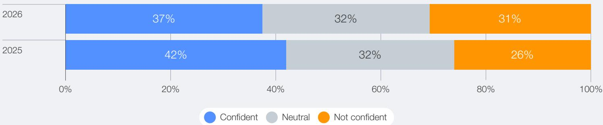

Respondents' perceptions of their country's ability to protect critical national infrastructure vary significantly across regions. While a high degree of confidence is expressed by respondents from the Middle East and North Africa (84% of respondents), far less confidence is expressed by respondents based in Latin America and the Caribbean (13%).

## FIGURE 20

## Regional overview: Confidence in national cyber response to critical infrastructure attacks

How confident are you in the preparedness of the country in which you are based to respond to major cyber incidents targeting critical infrastructure?

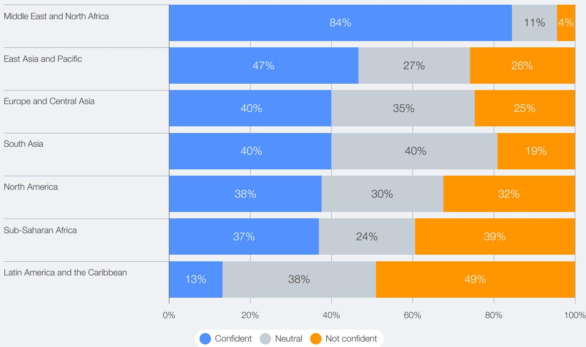

## BOX 2 Strengthening cyber readiness through coordinated national action

Saudi Arabia's cybersecurity resilience is built on a clear national principle: strength begins with people. When individuals, organizations and sectors are equipped with the right awareness and skills, they form a unified shield that reinforces the nation's digital security and resilience.

Rooted in this principle, the National Cybersecurity Authority (NCA) has established a whole-of-nation model that elevates readiness at every level of society. The NCA sets strategic direction and is supported by the Saudi Information Technology Company (SITE), which translates these priorities into actionable, high-impact programmes.

Through its cyber drills, SITE delivers high-fidelity simulations that enhance preparedness for evolving cybersecurity threats. During major events such as Hajj, these exercises stress-test containment, crisis management and cross-sector coordination, ensuring that readiness is both operational and proven.

In parallel, nationwide awareness initiatives distil technical insights into accessible, culturally attuned guidance that strengthens daily vigilance. These campaigns extend from national programmes to individual engagement, aligning stakeholders across sectors to address risks such as phishing and AI-driven misinformation.

Together, NCA and SITE are shaping a cybersecurity culture where awareness, preparedness and coordinated action are embedded across the entire nation.

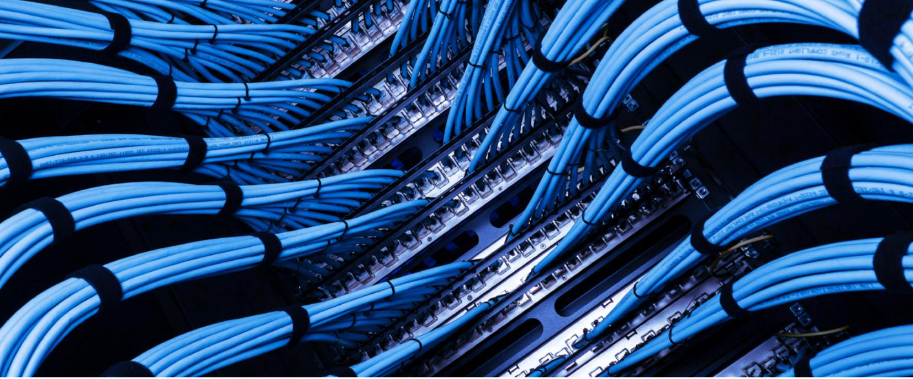

## Cybersecurity in the sovereignty era

The uneven confidence across regions points to a broader shift in how nations perceive cyber resilience – from a technical challenge to a question of sovereignty and self-reliance. As nations seek to protect critical infrastructure, many are re-evaluating their dependencies on foreign technology providers and global supply chains. This connection between infrastructure protection and digital autonomy has become a defining feature of modern cybersecurity policy.

Over the course of 2025, economic uncertainty and geopolitical instability have become deeply intertwined, amplifying global cyber risk and complicating organizations' ability to anticipate and mitigate emerging threats. As political tensions and trade disputes reshape alliances and technology dependencies, the world is witnessing growing fragmentation across digital and technological ecosystems. This renewed focus on digital sovereignty reflects an urgent drive by states and organizations to safeguard autonomy, control critical assets and reduce exposure to external shocks.

The term “cyber sovereignty” is often used to mean the application of traditional state sovereignty rights and obligations (i.e. control of territory, non-intervention, jurisdiction) to the domain of cyberspace. $^{14}$ The concept is complicated by the fact that cyberspace doesn’t map neatly onto physical territory (servers, cables, data flows cross jurisdictions), so applying conventional sovereignty (which is territory-based) becomes challenging.

At the organizational level, concerns over sovereignty have become increasingly tangible. Governments, public institutions and private enterprises alike are reassessing dependencies on foreign technology providers and global cloud infrastructure, in light of geopolitical tensions and supply chain vulnerabilities. For instance, several European actors – including municipalities such as Copenhagen, in Denmark, and federal agencies in Germany – have begun shifting towards sovereign or regionally managed cloud solutions to ensure compliance with national data-protection mandates and to mitigate perceived risks associated with extraterritorial control of data. $^{15}$ Similar debates are unfolding elsewhere as organizations weigh the benefits of global interoperability against the imperative of maintaining control over critical digital assets and sensitive information.

This trend illuminates a broader recalibration of trust – not only in systems and technologies, but in the geopolitical reliability of the ecosystems that underpin them. The growing attention to sovereignty emphasizes the tension between preserving openness and interoperability and safeguarding national autonomy, control and resilience against external disruptions.

As the threat landscape evolves and AI increasingly powers offensive operations in cyberspace, we must step up our work on the resilience of our critical infrastructure and connectivity. The EU stands ready to work with like-minded partners to protect what is today the digital backbone of our economy and society. Looking ahead, our priority is to boost investments in cyber to strengthen Europe's industrial capabilities and harness deep tech for better detection and anticipation, invest in people to close the cyber skills gap, and deepen intelligence sharing so that we can spot and address vulnerabilities faster.

Henna Virkkunen, Executive Vice-President for Tech Sovereignty, Security and Democracy, European Commission

# 3.3 The evolving landscape of cybercrime: AI, fraud and the global response

Over the course of 2025, several high-profile cybercrime cases have dominated the headlines, with cyberattacks disrupting retail, businesses and manufacturing operations – and even targeting nurseries. $^{16}$

Ransomware continues to be the leading concern for CISOs; by contrast, CEOs tend to be more concerned on the broader business impacts of frauds. For CISOs this concern reflects the significant operational disruption a successful ransomware attack can inflict on the availability of critical information technology (IT) and operational technology (OT) systems. Many of the major cyber incidents that made the headlines in 2025 were, in fact, driven by ransomware demands. As one

of the most lucrative tactics for cybercriminals, ransomware remains a persistent threat, and the increasing integration of AI into attack methods is expected to make these attacks even more effective.

Cyber-enabled fraud continues to grow in scale, taking a heavy toll on individuals and organizations around the world. According to the Global Cybersecurity Outlook survey data, 77% of respondents reported an increase in cyber-enabled fraud and phishing overall, while 73% claimed that they or someone in their network had been personally affected by cyber-enabled fraud. The three most common types of attacks reported are phishing (including vishing and smishing), payment fraud and identity theft.

Prevalence of cyber-enabled fraud (all respondents)

Have you or anyone in your professional/personal network been affected by cyber-enabled fraud in the past 12 months? (select all that apply)  
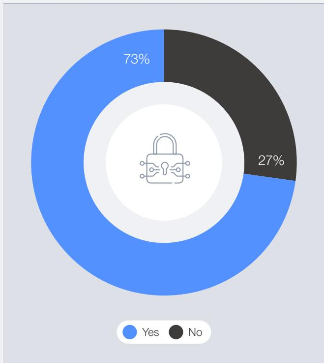

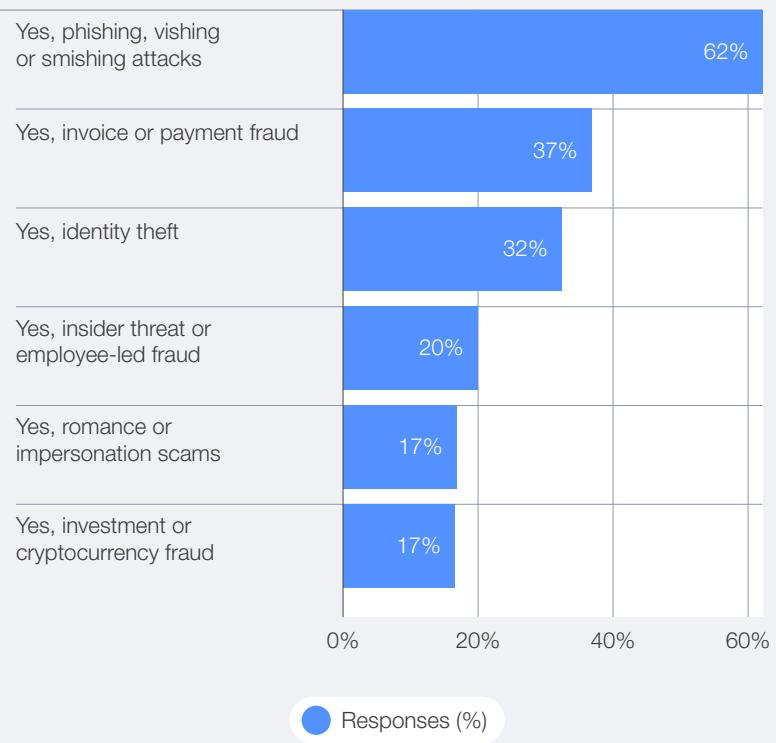

Globally, cyber-enabled fraud is reaching record highs, and sub-Saharan Africa leads the trend, with 82% of respondents reporting exposure to digital scams, followed by North America, with

79% of respondents. Cyber-enabled fraud poses a pervasive societal threat, undermining trust and security across all demographics – from corporate leaders to households and vulnerable populations.

FIGURE 22

## Prevalence of cyber-enabled fraud across regions

Have you or anyone in your professional/personal network been affected by cyber-enabled fraud in the past 12 months?

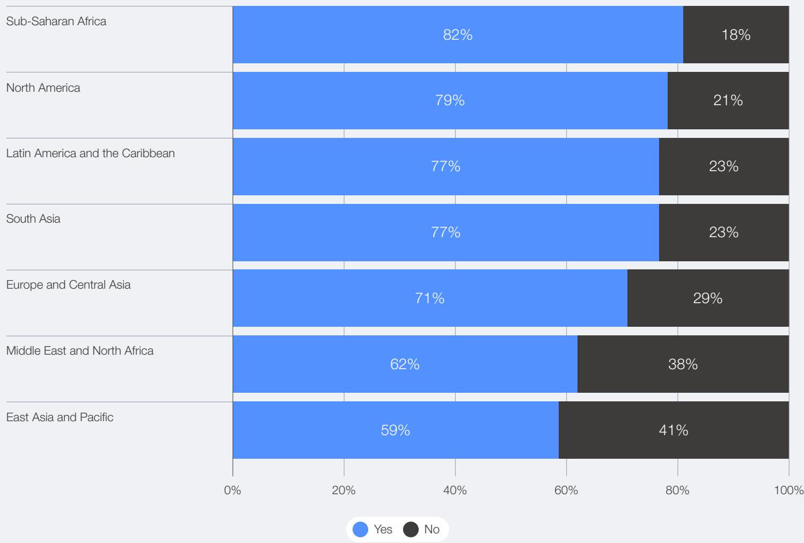

## Global efforts to combat cyber-enabled fraud

To tackle fraud, global efforts to combat cyber-enabled crime are gaining momentum. The United Nations Office on Drugs and Crime (UNODC) and the International Criminal Police Organization (INTERPOL) are co-organizing the Global Fraud Summit in March 2026. The summit will serve as a platform to galvanize international action by fostering high-level dialogue, political and law enforcement commitments, and effective cross-sector collaboration. $^{17}$ This high-level discussion comes after several significant operational disruptions of cybercrime networks across South-East Asia, Africa and Europe in 2025. Civil society and the private sector are also coordinating efforts. The Global Anti-Scam Alliance (GASA), for instance, is leveraging the Global Signal Exchange to enhance real-time insights into the supply chains that enable scams. $^{18}$

In parallel, the World Economic Forum's Partnership Against Cybercrime (PAC), in collaboration with the Institute for Security and Technology (IST), has published the white paper $Fighting \ Cyber-Enabled \ Fraud: A \ Systemic \ Defence \ Approach.$ $^{19}$ The paper calls on stakeholders to act across three pillars – prevention (structurally reducing abuse before it occurs), protection (embedding user safety by default) and mitigation (enabling rapid, collective response) – outlining a shared responsibility model designed to disrupt cyber-enabled fraud at scale (see Figure 23).

Together, these initiatives reflect a growing international commitment to strengthen systemic defences and address cyber-enabled fraud through coordinated global action.

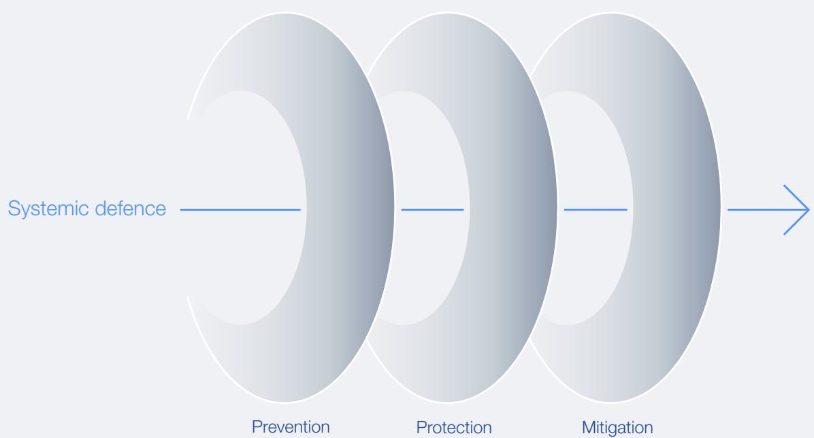  
Source: Fighting Cyber-Enabled Fraud: A Systemic Defence Approach. (2025). World Economic Forum

While genAI is currently used primarily to enhance social engineering and reconnaissance, the emergence of autonomous AI agents capable of executing full-scale attacks signals a potential turning point.

## AI-enabled cybercrime

Recent developments in genAI are lowering the barriers to executing phishing attacks while simultaneously increasing their sophistication and credibility. Criminal actors are exploiting genAI to automate and scale social engineering efforts, producing realistic phishing emails, deepfake audio and video, and falsified documentation capable of evading conventional detection systems and human scrutiny.

Furthermore, AI models trained on compromised or breached datasets are being weaponized to enhance targeting precision, replicate authentic communication styles and manipulate human trust with greater effectiveness. These capabilities represent a substantial evolution in the threat landscape, requiring more advanced and adaptive defence mechanisms. As such, this also amplifies digital safety risks for vulnerable groups, including children and women, who are increasingly targeted through impersonation, grooming and synthetic intimate-image abuse.

By enabling the translation and localization of social engineering tactics, these tools make impersonations more culturally authentic and convincing – helping attackers gain initial access to victims’ systems or earn their trust. As a result, criminal networks that once focused primarily on speakers of widely used languages can now effectively target new populations in regions that were previously less vulnerable to such scams. This expansion also accelerates the spread of AI-assisted mis/disinformation, complicating efforts by platforms and regulators to maintain

information integrity and safeguard users from coordinated manipulation.

The rapid rise of deepfake technology is creating new challenges for organizations, governments and societies. In Indonesia, a wave of deepfake scams, featuring fabricated videos of President Prabowo Subianto promising financial aid, has swindled Indonesians across 20 provinces. $^{20}$ In Ireland, a malicious deepfake video falsely depicting presidential candidate Catherine Connolly announcing her withdrawal from the race sparked outrage and an official complaint to the Electoral Commission. $^{21}$

As AI accelerates the scale and sophistication of cyber-enabled harm, increasing the cybersecurity and safety of users becomes a core pillar of resilience, requiring stronger verification standards, cross-platform coordination, safeguards for vulnerable groups and tools that help users navigate an increasingly challenging information environment. $^{22}$

While genAI is currently used primarily to enhance social engineering and reconnaissance, the emergence of autonomous AI agents capable of executing full-scale attacks signals a potential turning point. In November 2025, Anthropic disclosed a cyber espionage operation that demonstrated the unprecedented use of AI across the entire attack life cycle – from reconnaissance and exploitation to data exfiltration. The incident showed how AI-enabled threat campaigns are rapidly evolving towards greater automation and independence. It also represented the first confirmed case of agentic AI gaining access to high-value targets, including major technology companies and government agencies. $^{23}$

<table><tr><td>The changing architecture of cybercrimeThe Global Cybersecurity Outlook 2025 highlighted the growing convergence between cybercrime and organized crime groups, noting that the cybercrime landscape has evolved from opportunistic activities to highly organized operations that increasingly mirror legitimate business practices. The commercialization of cybercrime, via cybercrime-as-a-service (CaaS) platforms, continues to lower entry barriers and expand the scale, sophistication and impact of cyberattacks.Over the course of 2025, a new shift has emerged in the structure and behaviour of cybercrime collectives. An increasing number of cybercriminals – particularly younger actors – are actively pursuing business disruption, along with visibility and status within the cybercriminal ecosystem. $^{24}$  These groups frequently publicize their activities by announcing attacks,</td><td>leaking stolen data or sharing screenshots on social media to showcase their capabilities. This culture of exposure has blurred the traditional boundaries between hacktivism, cybercrime and influence operations. Increasingly, groups frame their actions as activism to claim moral legitimacy and expand their online following, further complicating attribution and response efforts.A persistent trend is the blurring of lines between cybercrime and nation-state activity. Cybercriminals often adopt and adapt the tools, tactics and procedures of state actors, once these become publicly known. Conversely, some nation-states mask their involvement by collaborating with or attributing operations to criminal groups, to maintain plausible deniability – or leverage the capabilities of these actors to advance their own strategic objectives, often in exchange for turning a blind eye to their illicit activities.</td></tr><tr><td colspan="2">Facing rapid innovation in tech combined with the transformative impact of AI, law enforcement cannot fight cybercrime in isolation. Protecting communities now depends on true multistakeholder cooperation. Only together can we stay ahead of criminals and uphold safety, rights and resilience for a secure digital future.Valdecy Urquiza, Secretary-General, INTERPOL</td></tr><tr><td>Collaboration against cybercrimeIn 2025, there have been several developments in the fight against cybercrime, including the signing of the Convention against Cybercrime, adopted by the United Nations General Assembly in December 2024 after five years of negotiation. $^{25}$  The Convention</td><td>establishes the first universal framework for investigating and prosecuting offences committed online – from ransomware and financial fraud to the non-consensual sharing of intimate images. Additionally, public–private collaboration has enabled law enforcement agencies to carry out several successful cybercrime takedowns (see Box 3).</td></tr><tr><td colspan="2">Disrupting cybercrime through multistakeholder collaboration</td></tr><tr><td>Law enforcement agencies are enhancing their cross-border coordination and intelligence-sharing capabilities, increasingly supported by expert insights from the private sector and international partnerships.Some notable operations in 2025 include:– Operation Serengeti 2.0: INTERPOL coordinated this operation with 18 African countries and the United Kingdom to tackle ransomware, online scams and business email compromise; it led to 1,209 arrests and the recovery of $97.4 million. The operation was strengthened by collaboration with the private sector and non-governmental collaborations, such as the World Economic Forum-hosted Cybercrime Atlas. $^{26}$ – Operation Secure: Led by INTERPOL, in coordination with law enforcement agencies across 26 countries and private-sector</td><td>partners, the operation, focused on infostealer malware, dismantled 20,000 malicious IP addresses and domains, seized 41 servers and resulted in 32 arrests. These INTERPOL operations were conducted under the umbrella of projects funded by the United Kingdom’s Foreign, Commonwealth and Development Office. $^{27}$ – Operation Endgame: Coordinated by Europol and Eurojust, with the support of international public and private partners, Operation Endgame dismantled malware infrastructure consisting of hundreds of thousands of infected computers containing several million stolen credentials. $^{28}$ – Lumma Infostealer Disruption: Europol and Microsoft disrupted the Lumma malware ecosystem, affecting 394,000 infected machines and seizing 1,300+ domains. $^{29}$ </td></tr></table>

## BOX 3

# 3.4 Cyber resilience is the key to safeguarding economic value

Cyber resilience underpins an organization's ability to minimize the impact of significant cyber incidents on its primary business goals and objectives. $^{30}$ Survey data shows increasing confidence in organizational cyber resilience. While 64% of organization report having met their minimum cyber resilience requirements, regardless of regional or sectorial variation (as further detailed in Section 3.6), only 19% claimed that cyber resilience exceeds their requirements. This is, however, a double-digit increase compared to 2025, when only 9% reported exceeding resilience requirements.

FIGURE 24

## Year-over-year perception of cyber resilience

How would you rate your organization's cyber resilience?  
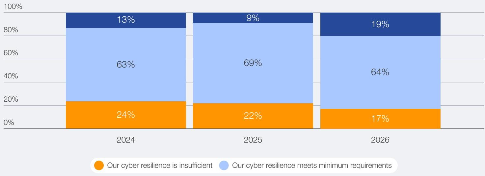

Nevertheless, cyber resilience remains under pressure. In 2025, a wave of cyberattacks struck organizations at every level – for example, in the United Kingdom alone, prominent retailers such as Marks & Spencer, Harrods and Co-op all suffered major operational disruptions and data losses due to ransomware attacks. $^{31}$ These incidents underscore that, despite expressing growing confidence in cyber resilience, organizations are still facing major operational and reputational impacts from adversaries that are adapting rapidly.

Against this backdrop, the top three reported challenges to strengthening cyber resilience, according to survey data, include: the rapidly evolving threat landscape and emerging technologies (61%); third-party and supply chain vulnerabilities (46%); and cyber skills and expertise shortages (45%).

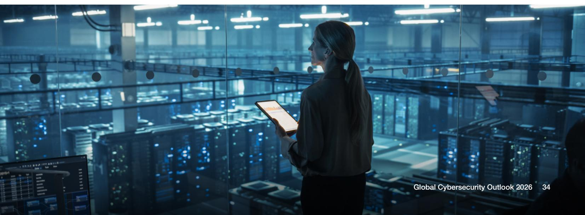

What is your organization's greatest challenge to becoming cyber resilient? (select up to three)  
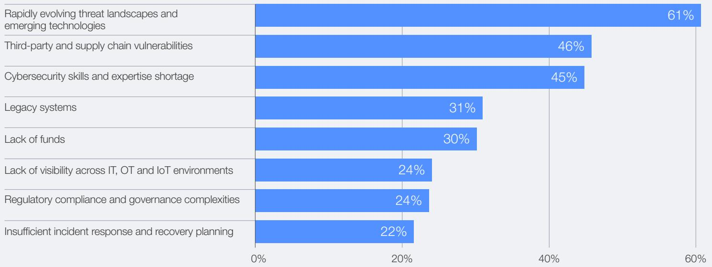

## Legacy risks in a rapidly evolving landscape

Organizations are under pressure to adopt and prepare for new technologies while still struggling to secure legacy systems – 31% of respondents identified legacy infrastructure as one of their greatest challenges to achieving cyber resilience. Where technological innovation outpaces an organization’s capacity to adopt and upgrade its existing infrastructure, additional security controls often become necessary. While such measures support safe and secure operations across the organization, staying current in today’s rapidly evolving technological landscape inevitably involves accepting some residual risk.

Over the years, successive waves of innovation cycles have caused organizations to accumulate a significant security debt, as speed and innovation were often prioritized over robust security measures. Indicative of this dynamic is the fact that survey respondents have ranked cloud technologies as the second-most significant technology expected to affect cybersecurity in the next 12 months. While many organizations are well advanced on their cloud journeys, this observation underscores that many of them are still deeply engaged with placing this topic high on their agenda.

## Technologies with the greatest cybersecurity impacts in next 12 months

In your view, which of the following technologies will most significantly affect cybersecurity in the next 12 months? (select up to three)  
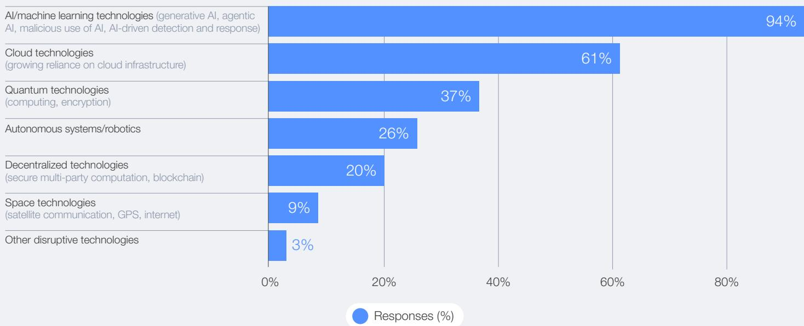

## From legacy to resilience: Enabling cyber-physical security

In today's digital-industrial era, the boundary between IT and OT has all but disappeared. While strict air-gapped segregation of IT and OT systems used to be the norm in OT governance frameworks for years, contemporary advances in technology and expectations of connectivity between systems is making such practices untenable. Sectors such as manufacturing, energy, transportation and critical infrastructure systems now see IT and OT systems increasingly converge, driving efficiencies and innovation but also needing to apply more advanced segmentation to control risk exposure.

Many industrial environments remain ill-equipped for the speed and complexity of modern threats. OT systems are typically averse to rapid modernization due to their close integration with core business functions and their typically long investment horizons. Survey data reveals that, despite growing awareness, governance practices around OT remain inconsistent and often siloed within operational teams.

## FIGURE 27

## Best practices in OT governance

With regard to OT security, the following statements apply to our organization:

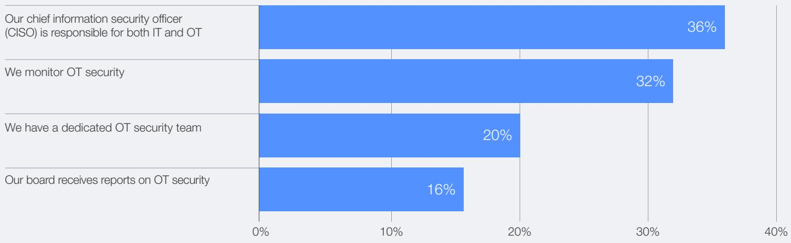  
Responses (%) from those respondents with OT in their organization

Only 16% of organizations with industrial environments report OT security issues to their boards, and just 20% maintain dedicated security teams. Meanwhile, 32% of organizations actively monitor OT systems with specific security tooling, yet in only 36% of the cases is the CISO directly responsible for OT security.

These findings indicate that OT protection is still mainly a priority for industrial environment specialists, and that bridging cultural gaps between IT and OT environments is paramount to mitigating the increasing cybersecurity risks. The lack of board-level oversight not only delays investment but also limits enterprise-wide understanding of risk exposure. This governance gap poses systemic implications: as is the case with IT, when disruptions in industrial systems similarly occur their effects cascade far beyond a single organization – to suppliers, partners and even national economies.

## Cyber regulations in an era of fragmentation

As nations strive to limit the exposure of their (digital) economies to global cyber challenges, the variation of approaches has added a new layer of complexity to the organizations that try to navigate a patchwork of regulations. The proliferation of cybersecurity and technology regulations globally reflects an accelerating effort to codify trust and accountability in the digital domain. However, these developments also highlight how regions are advancing at different speeds and with differing priorities, leading to a patchwork of obligations that can be difficult for multinational organizations to reconcile. Security leaders globally continue to recognize the value of regulatory frameworks in strengthening the cybersecurity ecosystem. This year's survey found that $74\%$ of respondents hold a positive view of the effectiveness of cyber-related regulations.

What is your view about the effectiveness of cyber-related regulations?

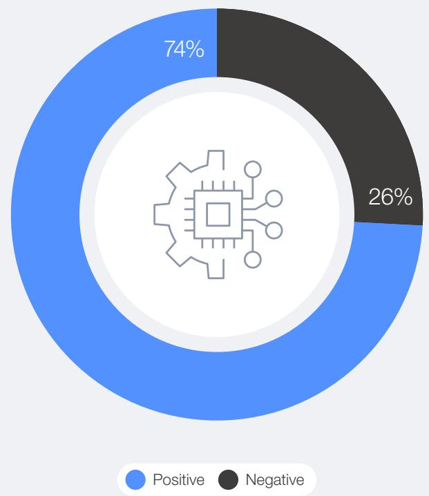

Practitioners most frequently note that these regulations help CISOs raise cybersecurity awareness at the board level (58%) and drive tangible improvements in overall security posture (55%). At the same time, 18% of respondents cited challenges in ensuring that third-party vendors comply with diverse requirements, while others pointed to difficulties in fully understanding the applicability of regulations across business units and to limited internal resources and expertise (16%).

FIGURE 29

## Sentiment towards cybersecurity regulations

What is your view about the effectiveness of cyber-related regulations? (select up to three)  
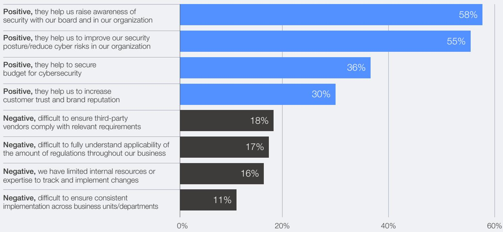

While the overall view on the benefits of regulations is largely positive, respondents based in markets where such regulations are more mature, such as Europe and North America, face greater difficulty in applying them consistently across borders. This is reflected in the fact that survey results reveal a slightly lower perception of the actual effectiveness of cyber-related regulations – 30% in Europe and 29% in North America – possibly reflecting the

fact that more advanced regulatory environments can also introduce greater complexity and compliance burdens.

In a context of heightened geopolitical volatility and digital fragmentation, regulation thus serves as both a stabilizing force and a shared language for resilience – even as the contours of sovereignty and coordination continue to evolve.

FIGURE 30

## Sentiment towards cybersecurity regulations, by region

What is your view about the effectiveness of cyber-related regulations?  
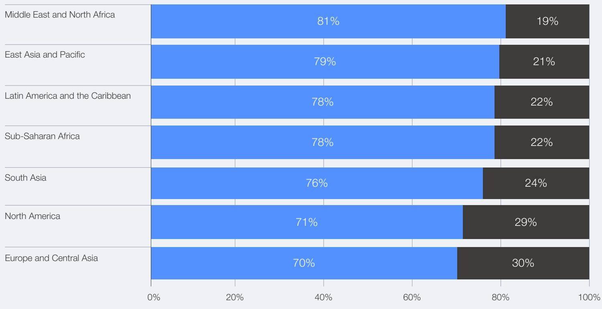

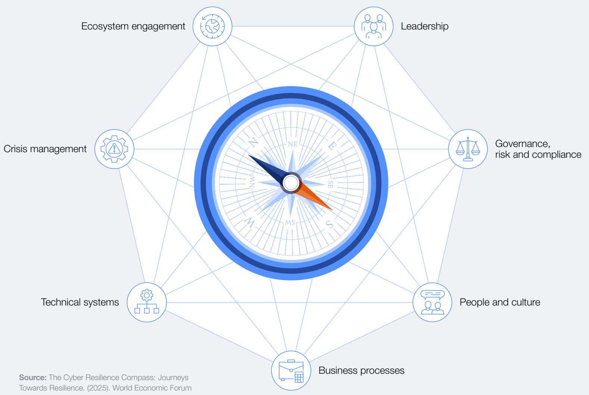  
Source: The Cyber Resilience Compass: Journeys Towards Resilience. (2025). World Economic Forum

The Cyber Resilience Compass $^{32}$ is a collaborative framework that captures and shares proven frontline practices to help organizations strengthen their cyber resilience. It structures these practices into seven interrelated categories – leadership; governance, risk and compliance; people and

culture; business processes; technical systems; crisis management; and ecosystem engagement.

The Global Cybersecurity Outlook 2026 survey data demonstrates that highly resilient organizations exemplify these front-line practices:

TABLE 4 Hallmarks of cyber-resilient companies

<table><tr><td>Compass category</td><td>Hallmark</td><td>High resilience</td><td>Insufficient resilience</td></tr><tr><td>Leadership</td><td>Board members hold personal liability in the event of cyber breaches</td><td>30%</td><td>9%</td></tr><tr><td>Governance, risk and compliance</td><td>Hold a positive view on effectiveness of cyber-related regulations</td><td>79%</td><td>62%</td></tr><tr><td>People and culture</td><td>Have the skills needed to achieve current cybersecurity objectives</td><td>78%</td><td>15%</td></tr><tr><td>Business processes</td><td>Involve security function in the procurement process</td><td>76%</td><td>53%</td></tr><tr><td>Technical systems</td><td>Assess the security of AI tools before deploying them</td><td>83%</td><td>39%</td></tr><tr><td>Crisis management</td><td>Simulate cyber incidents and/or plan recovery exercises with ecosystem partners</td><td>44%</td><td>16%</td></tr><tr><td>Ecosystem engagement</td><td>Assess the security maturity of suppliers</td><td>74%</td><td>48%</td></tr></table>

FIGURE 32

## Leadership

Resilient organizations demonstrate strong board engagement in cybersecurity. Some 99% of respondents from highly resilient organizations report board involvement in this area. Among

these, 52% indicate that board members receive regular cybersecurity updates, 48% report that board members are actively engaged with the cybersecurity function, and 45% state that their board has a clearly defined role in overseeing cybersecurity.

## Board engagement gaps, across organizational resilience levels

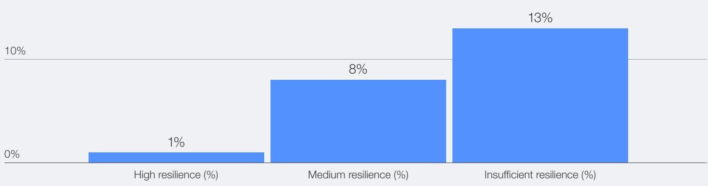  
Board is not engaged in cybersecurity

The World Economic Forum Centre for Cybersecurity's latest white paper, Elevating Cybersecurity: Ensuring Strategic and Sustainable Impact for CISOs, $^{33}$ explains that in order to strengthen resilience in an era of systemic cyber risk, organizations must empower CISOs and senior leaders to translate cybersecurity priorities into strategic business action.

## Governance, risk and compliance

When viewing governance, risk and compliance from a regulatory perspective, survey data shows that those organizations reporting high levels of resilience tend to express more favourable views on the effectiveness of regulations. Some 44% of highly resilient organizations underscore that regulations help them increase customer trust and brand reputation, compared to 20% of those that classify themselves as being insufficiently resilient. Conversely, insufficiently resilient organizations are more likely to report limited resources to track and implement changes to regulations (34%).

What is your view about the effectiveness of cyber-related regulations?  
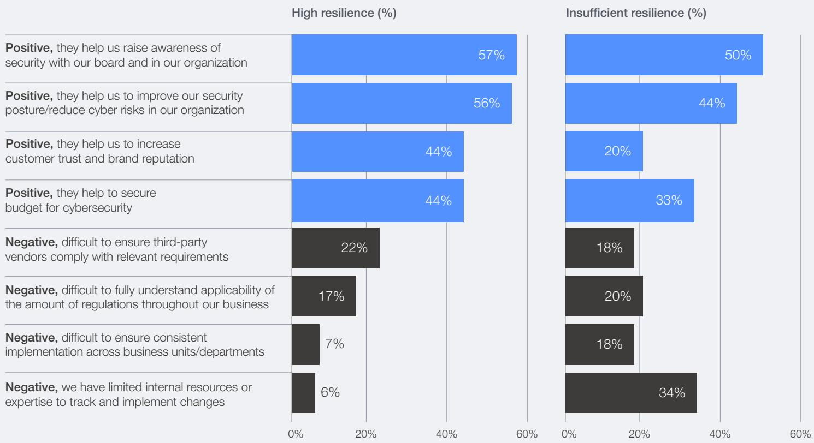

## People and culture

Only 22% of highly resilient organizations report lacking the necessary workforce to achieve their cybersecurity objectives – a stark contrast to the 85% of insufficiently resilient organizations that face this challenge.

## Business processes

Defined business processes that support cybersecurity posture are a key characteristic of resilient organizations. Survey data indicates that 76% of highly resilient organizations involve their security function in the procurement process, compared to just 53% in insufficiently resilient organizations.

## Technical systems

Resilient organizations take a structured approach to designing, deploying and maintaining technical or digital systems: 44% of highly resilient organizations monitor OT security, compared to only 9% of insufficiently resilient ones. Additionally, 71% of highly resilient organizations regularly review the security of their AI tools, compared to only 20% of insufficiently resilient organizations.

## FIGURE 34

## AI security assessment, by organizational resilience level

Does your organization have a process in place to assess the security of AI tools before deploying them? (select all that apply)  
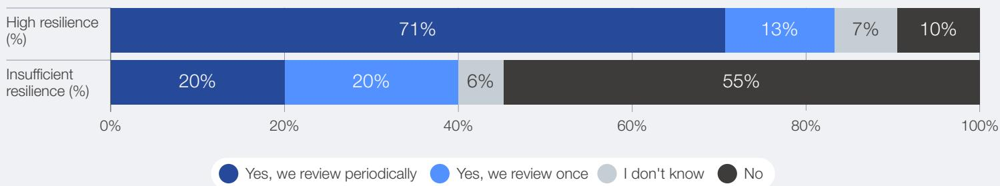

## Crisis management

Resilient organizations have crisis plans and playbooks in place and regularly conduct ecosystem-wide exercises. According to survey data, 44% of highly resilient organizations simulate cyber incidents with their ecosystem partners, compared to only 16% of insufficiently resilient ones. They are also significantly better prepared for incident response and recovery – only 15% of highly resilient organizations report insufficient planning in this area, versus 37% of less resilient organizations.

## Ecosystem engagement

Highly resilient organizations are more proactive in engaging their entire ecosystem: 53% share cybersecurity information with partners (compared to 31% of insufficiently resilient organizations); 74% assess the security of their suppliers (versus 48%); and 44% map their ecosystem and evaluate partners' exposure to risk (versus 23%).

## FIGURE 35 Organizational supply chain risk, by resilience level

How does your organization address supply chain cyber risk? (select all that apply)  
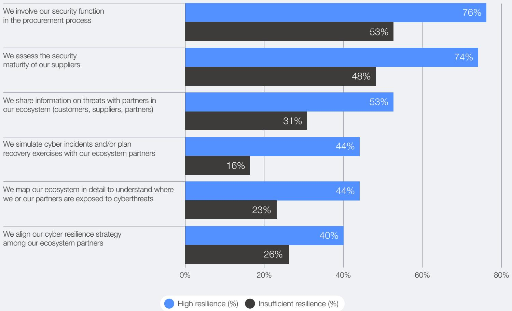

Moreover, highly resilient organizations demonstrate a broader risk perspective, focusing not only on their internal posture but also on external dependencies across their ecosystem. Survey data shows that supply chain exposure ranks as the top cyber risk concern among high-resilience

organizations, whereas moderately resilient and insufficiently resilient organizations ranked it only fifth (see Table 5). This suggests that more mature organizations are increasingly recognizing that their resilience depends as much on the strength of their partners as on their own defences.

What is your organization's greatest challenge to becoming cyber resilient? (select up to three)

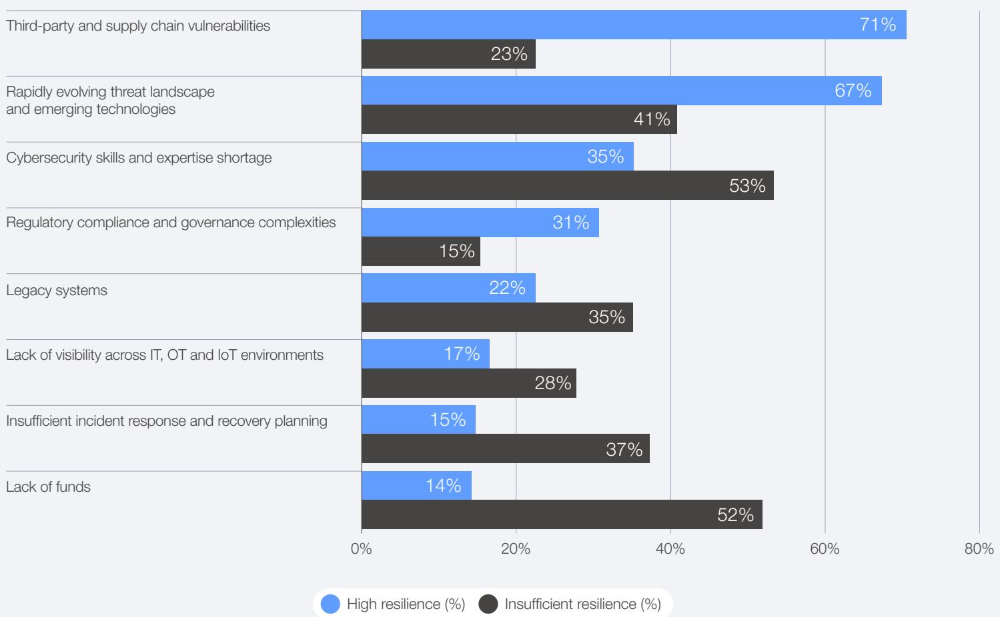

TABLE 5 Ranking of cyber risk concerns, by organizational resilience level

<table><tr><td>Rank</td><td>Insufficient resilience</td><td>Medium resilience</td><td>High resilience</td></tr><tr><td>1</td><td>Ransomware attack</td><td>Ransomware attack</td><td>Supply chain disruption</td></tr><tr><td>2</td><td>Cyber-enabled fraud and phishing</td><td>Cyber-enabled fraud and phishing</td><td>Exploitation of software vulnerabilities</td></tr><tr><td>3</td><td>Exploitation of software vulnerabilities</td><td>Exploitation of software vulnerabilities</td><td>Cyber-enabled fraud and phishing</td></tr><tr><td>4</td><td>AI vulnerabilities</td><td>AI vulnerabilities</td><td>Ransomware attack</td></tr><tr><td>5</td><td>Supply chain disruption</td><td>Supply chain disruption</td><td>AI vulnerabilities</td></tr></table>

With AI doubling in compute every three months or so, the risks of technology-enabled sophisticated cybercrimes have never been greater in human history. No matter how high your walls, every business faces an elevated risk of being breached. As perpetually adaptive enterprises, our focus has to be on building strong resilience and recovery frameworks, so that we can get our businesses, societies and economies up and running rapidly after an incident has taken place. The businesses that thrive in the future will not be those that have never been hit by cyber hacks or crimes, but those which have built the strongest capability to recover from them.

K. Krithivasan, Chief Executive Officer and Managing Director, Tata Consultancy Services

## The economic dimension of cybersecurity

Cybersecurity is no longer just a technical issue; it is increasingly becoming a strategic economic priority. Decisions about how much to invest in protecting digital assets have become financial choices that shape an organization's resilience, competitiveness and growth trajectory.

Recent cyberattacks have underscored how deeply cybersecurity is intertwined with the broader economic landscape, inflicting tangible financial damage on businesses and national economies alike. According to United Kingdom government research, the average significant cyberattack costs businesses nearly £195,000 (\$250,000). Scaled nationally, this equates to an estimated £14.7 billion (\$19.4 billion) in annual economic losses. $^{34}$ Additionally, the World Bank notes that reducing major cyber incidents could boost gross domestic product (GDP) per capita by 1.5% in developing economies. $^{35}$ Such figures illustrate why the financial drivers and consequences of cyber incidents are increasingly commanding the attention of leaders across both the public and private sectors.

In August 2025, Jaguar Land Rover – the United Kingdom’s largest automotive manufacturer – suffered a devastating cyberattack that brought production across its global operations to a halt for five weeks and affected more than 5,000 suppliers. $^{36}$ The company faced direct financial repercussions, including £196 million (260 million) in cyber-related costs and a nearly 25% drop in revenues to £4.9 billion (6.5 billion). $^{37}$ However, the wider UK economy absorbed an even greater shock, with an estimated £1.9 billion (2.5 billion) in losses resulting from the disruption. $^{38}$

This incident underscores several critical insights into the economics of cybersecurity. First, it highlights the importance of quantifying cyber risk and scenario-building to model the potential impact of cyberthreats, to drive adequate investments towards resilience. Second, it demonstrates the interdependence of supply chains, where disruptions in one actor can propagate across industries, amplifying risk and underscoring the need for sector-wide resilience strategies. Finally, it reinforces the vital role of public-private collaboration. The UK government's £1.5 billion (\$2 billion) loan guarantee to stabilize the supply chain exemplifies how coordinated responses and appropriate financial incentives are essential for managing systemic cyber risk and avoiding the need for such costly bailouts. $^{39}$

Cybersecurity is not merely an IT function – it is a strategic business imperative and a cornerstone of national economic resilience. Beyond mitigating risk and preventing losses, it also serves as a driver of economic growth, fuelling innovation, job creation and competitiveness across industries. Investing in robust cyber risk management and resilience strategies not only safeguards corporate value and national stability but also strengthens the foundations of a secure and dynamic digital economy.

## To explore this economic dimension of

To explore this economic dimension of cybersecurity and inform policy and industry practices, in May 2025, the World Economic Forum and the Global Cybersecurity Forum established the Centre for Cyber Economics (CCE). $^{40}$ The CCE aims to empower stakeholders with the knowledge, tools and capabilities needed to ensure that cybersecurity remains an integral pillar of economic growth.

## BOX 4

## Advancing understanding of the economic dimension of cybersecurity

Recognizing the growing imperative to address the economic dimension of cybersecurity, the World Economic Forum has partnered with the Global Cybersecurity Forum (GCF) to establish a new Centre for Cyber Economics (CCE) in Riyadh, as part of the Forum's Fourth Industrial Revolution Network. Launched in May 2025, the centre is dedicated to advancing global understanding of the economic challenges and opportunities arising from an increasingly complex cyber landscape. Through cutting-edge research, cross-sector

collaboration and evidence-based frameworks, the CCE aims to empower stakeholders with the knowledge, tools and capabilities to ensure cybersecurity remains an integral tenet of advancing economic growth. To that end, some of the core areas of the CCE will include the macroeconomic impact of cyberattacks and the quantification of cybercrime, as well as the implications of cybersecurity workforce shortages and skills gaps on economic growth.

# 3.5 Securing supply chains amid opacity and concentration risks

The digital supply chain is highly interconnected, with dependencies within and across industries that are often not clearly mapped. A breach or disruption of one supplier can cascade through the entire ecosystem, affecting production, operations and even other suppliers or customers. This complexity makes it difficult to assess and manage cyber risk effectively. Attacks on widely used software or service providers can have global and systemic impacts.

Such critical interdependencies were highlighted by the cyberattack affecting airports across Europe in September 2025, where a relatively minor breach targeting the check-in and boarding systems used by several major airport hubs caused a cascading disruption to airport operations, with flight delays and cancellations. $^{41}$ Though the immediate damage was contained, the incident exposed the fragility of interconnected digital supply chains, leaving participants in focus groups for this report to reflect on how devastating a similar attack could be if directed at hospitals or other critical infrastructure.

Concerns about the resilience of supply chains against cyberattacks are continuing to worry business and cyber executives. This year's survey data shows that 65% of large companies by revenue indicate third-party and supply chain vulnerabilities are their greatest challenge, which has risen from 54% in 2025. $^{42}$

## Large companies' greatest barriers to cyber resilience, 2025–2026

What is your organization's greatest challenge to becoming cyber resilient? (select up to three)  
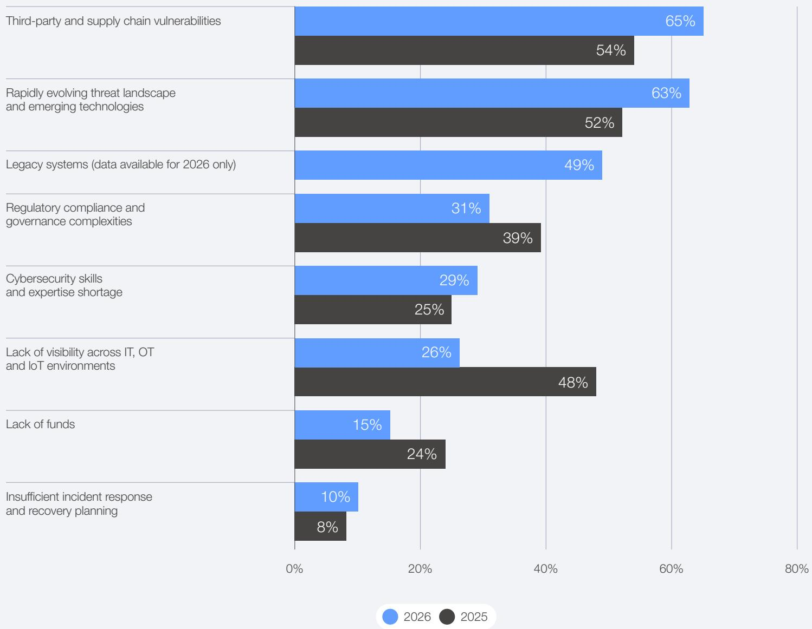

While supply chain vulnerabilities are worrying both business and cyber executives, Global Cybersecurity Outlook survey data shows that among a variety of concerns, CISOs tend to be more worried about the integrity of their external dependencies than CEOs.

Among cyber risks, supply chain vulnerabilities have ranked as the second-most concerning issue for CISOs for two consecutive years. CISOs are deeply attuned to the technological interdependencies that have evolved as organizations adopt new systems to support both operations and resilience, making them more sensitive to potential disruptions in business continuity.

## The top supply chain risks in 2026

Organizations often lack direct control over the security practices of third-party vendors and suppliers. The Global Cybersecurity Outlook

survey shows that inheritance risk – the inability to assure the integrity of third-party software, hardware and services – is the top supply chain risk, followed by visibility. Even when strong internal controls are in place, the weakest link is frequently a supplier or partner with lower cybersecurity maturity. This is especially acute with smaller suppliers, who may lack the resources or incentives to implement robust security measures.

Supply chain risks differ across industries. Overall, limited visibility emerges as the primary risk across industry clusters – especially for energy; financial services; manufacturing, supply chain and transportation; and materials and infrastructure – followed by inheritance risk.

TABLE 6 | Ranking of top supply chain cyber risk

<table><tr><td>Rank</td><td>What do you see as the main supply chain cyber risk for your organization?</td></tr><tr><td>1</td><td>Inheritance risk: Unable to assure integrity of third-party software, hardware and services</td></tr><tr><td>2</td><td>Visibility: Lack of visibility into extended supply chain</td></tr><tr><td>3</td><td>Concentration risk: Too great dependence on critical third-party suppliers</td></tr><tr><td>4</td><td>Procurement risk: Unable to apply security controls to third-party suppliers</td></tr><tr><td>5</td><td>External factors: Uncertainty of impact of external factors</td></tr></table>

TABLE 7 Top supply chain risk, by industry

<table><tr><td>Industry</td><td>Top supply chain risk</td><td>Second supply chain risk</td></tr><tr><td>Energy</td><td>Visibility: Lack of visibility into extended supply chain</td><td>Inheritance risk: Unable to assure integrity of third-party software, hardware and services</td></tr><tr><td>Financial services</td><td>Visibility: Lack of visibility into extended supply chain</td><td>Concentration risk: Too great dependence on critical third-party suppliers</td></tr><tr><td>Health and consumer</td><td>Inheritance risk: Unable to assure integrity of third-party software, hardware and services</td><td>Visibility: Lack of visibility into extended supply chain</td></tr><tr><td>ICT and media</td><td>Inheritance risk: Unable to assure integrity of third-party software, hardware and services</td><td>Visibility: Lack of visibility into extended supply chain</td></tr><tr><td>Manufacturing, supply chain and transportation</td><td>Visibility: Lack of visibility into extended supply chain</td><td>Concentration risk: Too great dependence on critical third-party suppliers</td></tr><tr><td>Materials and infrastructure</td><td>Visibility: Lack of visibility into extended supply chain</td><td>Concentration risk: Too great dependence on critical third-party suppliers</td></tr><tr><td>Professional services and institutional</td><td>Inheritance risk: Unable to assure integrity of third-party software, hardware and services</td><td>Visibility: Lack of visibility into extended supply chain</td></tr></table>

While the majority of organizations across industries evaluate the security maturity of their suppliers (66%) and involve the security function in procurement processes (65%), significantly fewer adopt more advanced resilience measures. Only 27% simulate cyber incidents or conduct recovery exercises, and a mere 33% comprehensively map their supply chain ecosystems to gain a deeper understanding of cyberthreat exposure and interdependencies. These survey results denote that supply chain risk management is often treated as a compliance checklist rather than as a dynamic, continuous process.

Existing regulations typically establish only a minimum-security baseline, which may be insufficient to address rapidly evolving threats. A key challenge lies in incentivizing both organizations and their suppliers to strengthen cyber resilience. Smaller vendors frequently lack the resources to implement robust security measures, while buyers may still prioritize cost and efficiency over security when choosing partners. This imbalance creates persistent exposures, as attackers tend to exploit the weakest links within the supply chain.

Cyber resilience is no longer confined to individual organizations; it depends on the strength of our entire ecosystem. By embedding cybersecurity across supply chains, sharing intelligence transparently and aligning public-private efforts, we can build a trusted digital foundation that supports innovation, stability and sustainable economic growth.

Mohamed Al Kuwaiti, Head of Cybersecurity, United Arab Emirates Government

## FIGURE 38

## How organizations address supply chain risk

How does your organization address supply chain cyber risk? (select all that apply)  
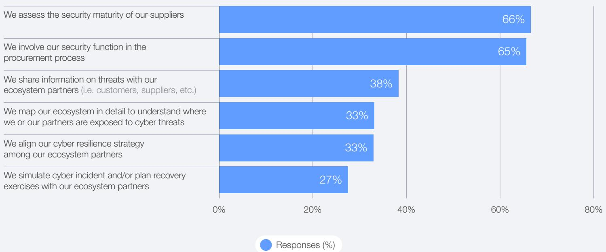

Adequate crisis management and recovery planning is essential to limit the impact of a cyber breach when it happens. For example, in the aftermath of the attack on Japanese beer manufacturer Asahi in October 2025, essential IT services were brought down, forcing staff to revert to pen and paper to maintain critical operations such as inventory tracking and manual checks of control data. $^{43}$

## Concentration of risk

The growing dependency on a small number of critical digital providers remains a concern for cyber leaders, as it amplifies concentration risk across the ecosystem. A single vulnerability in a critical service provider may cause cascading impacts felt across the globe. The increasing use of internet of things (IoT) devices and cloud-based services is expanding the attack surface and introducing new vulnerabilities, especially when these technologies are integrated into supply chains or vendor ecosystems without adequate security controls. Survey data highlights this risk: cloud technologies are identified as the second most impactful technology for cybersecurity in 2026, after AI.

In your view, which of the following technologies will most significantly affect cybersecurity in the next 12 months? (select up to three)

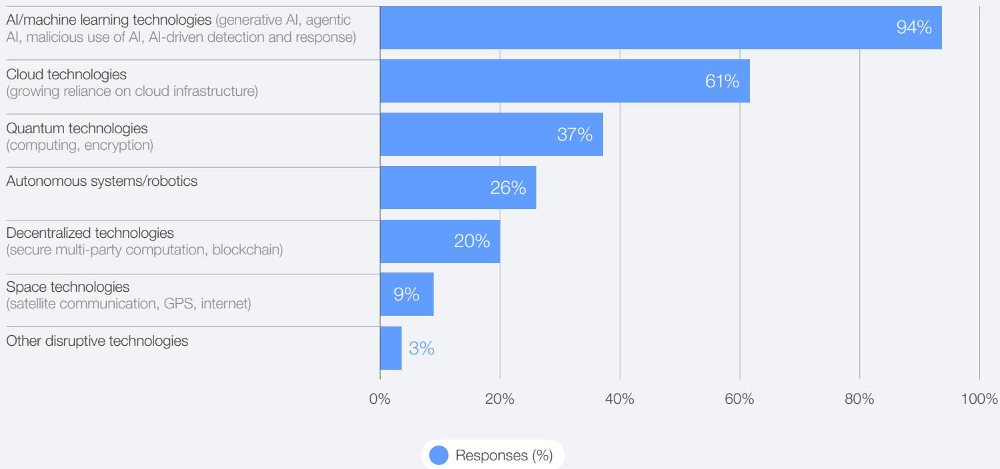

Cloud providers have become critical enablers of modern ecosystems, yet they also represent concentrated points of dependency across organizations' ecosystems. As digital supply chains rely more on an interconnected cloud environment, the boundaries become increasingly complex, creating governance and resilience challenges. While these platforms strengthen efficiency and connectivity, a single disruption or misconfiguration can cascade through the entire organization ecosystem, exposing how cloud and IoT Integration increase overall exposure.

In October 2025, a disruption occurred due to a misconfiguration in a Domain Name System (DNS) operated by Amazon Web Services (AWS), affecting thousands of organizations worldwide. Microsoft Azure cloud platform also experienced a global outage during the same month. $^{44}$ Shortly after, in November 2025, Cloudflare also experienced an outage, disrupting many online services. $^{45}$ While not cybersecurity issues, these events illustrate how provider-level incidents can generate broad downstream impacts across interconnected digital ecosystems. $^{46}$

## 3.6 Drivers of cyber inequity in 2026

Cyber capacity across the global ecosystem remains uneven across industries and regions, influenced by differences in skills, resources and available digital infrastructure and governance frameworks. While certain organizations continue to invest in security, many others face challenges in sustaining even a baseline level of cybersecurity. This imbalance – described as cyber inequity – creates vulnerabilities that extend beyond individual entities, exposing entire interconnected supply chains to risk. The Global Cybersecurity Outlook 2025 examined this inequity through three key dimensions: small versus large organizations; developed versus emerging economies; and disparities across sectors.

The 2026 survey data reveals that perceptions of resilience levels still vary across regions. High degrees of confidence in resilience levels are expressed by respondents based in the Middle East and North Africa, while lower levels of resilience are expressed in Latin America and the Caribbean and sub-Saharan Africa. Despite rising confidence in cyber resilience overall, inequities persist between smaller and larger organizations. $^{47}$ Survey data indicates that small organizations (by revenue) are twice as likely to experience insufficient resilience levels as large organizations. Similarly, across sectors, survey data reveals that the divide remains: NGOs report 37% insufficient resilience, and the public sector 23%, compared with just 11% in the private sector.

How would you rate your organization's cyber resilience?  
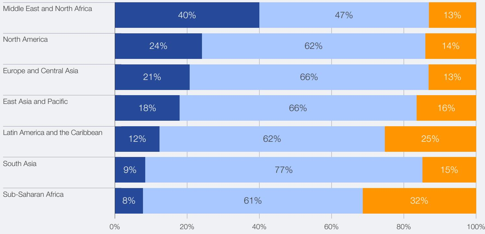  
Our cyber resilience exceeds our requirements Our cyber resilience meets minimum requirements Our cyber resilience is insufficient

## FIGURE 41 Cyber inequity across the public sector, private sector and NGOs

## How would you rate your organization's cyber resilience?

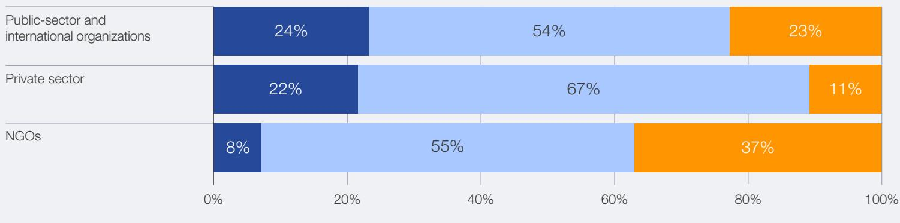  
Our cyber resilience exceeds our requirements Our cyber resilience meets minimum requirements Our cyber resilience is insufficient

## Cyber skills shortages as a key driver of inequity

Cyber inequity is a multifaceted challenge, shaped by disparities in resources, capabilities and access across countries, sectors and organizations. While gaps in security governance frameworks, limited financial resources and unequal access to digital infrastructure all contribute to this imbalance, one factor stands out for its pervasive impact: the shortage of cybersecurity skills.

While the evolving threat landscape remains the foremost concern, the lack of cybersecurity expertise ranks as the second-most significant challenge – NGOs (51%) and the public sector (57%). When comparing small and large organizations, the data reveals a persistent divide: 46% of small organizations report a lack of cybersecurity skills and expertise, compared with 29% of large organizations.

What is your organization's greatest challenge to becoming cyber resilient? (select up to three)

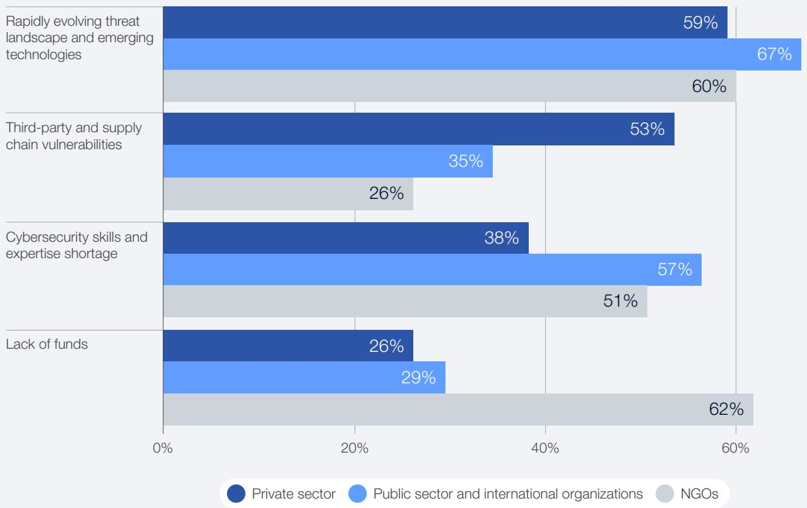

Having adequate cybersecurity skills has emerged as a key differentiator between highly resilient and insufficiently resilient organizations. Among those reporting insufficient levels of cyber resilience, 85% also cited missing critical skills and people to fulfil cybersecurity objectives. By comparison, only 22% of highly resilient organizations viewed skills gaps as a significant challenge. According to the survey, the top three cybersecurity roles experiencing shortages are threat intelligence analysts, DevSecOps engineers, and identity and access management specialists.

## Perceived resilience levels and cyber skills shortages

Does your organization's workforce have the skills needed to achieve its current cybersecurity objectives?

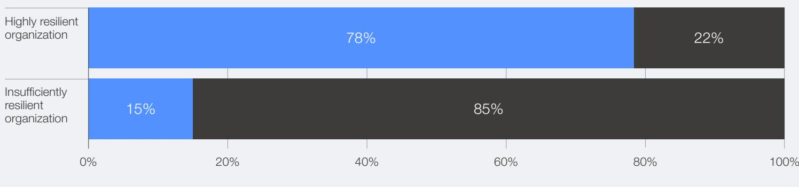  
Yes, we have the people and skills we need today No, we are missing critical people and skills

When viewed through a regional lens, cybersecurity talent shortages are most acute in Latin America and the Caribbean, where 65% of organizations

reported lacking critical people and skills to meet cybersecurity objectives, and in sub-Saharan Africa (63%).

  
FIGURE 44 | Regional perspectives on cyber skills shortages

Does your organization's workforce have the skills needed to achieve its current cybersecurity objectives?  
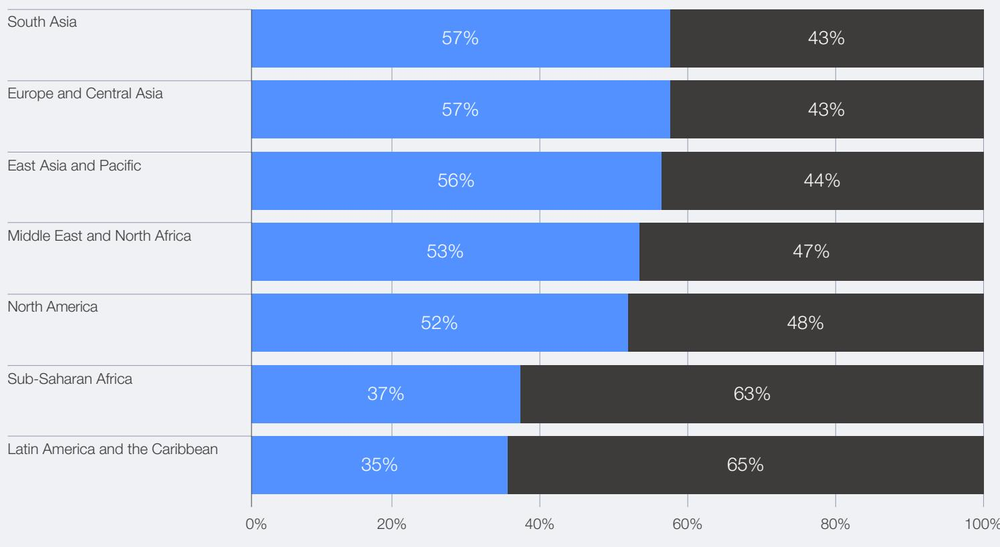  
Yes, we have the people and skills we need today No, we are missing critical people and skills

Encouragingly, some organizations acknowledge this imbalance and are taking steps to address it. Among experts surveyed during the Annual Meeting of the Global Future Councils and Cybersecurity 2025, 34% reported that their

organizations provide formal, structured guidance or support – such as programmes, training or services – to smaller or less resourced partners. A further 31% said their organizations offer informal or ad hoc assistance.

Does your organization currently provide cybersecurity guidance or support to smaller or less resourced organizations?

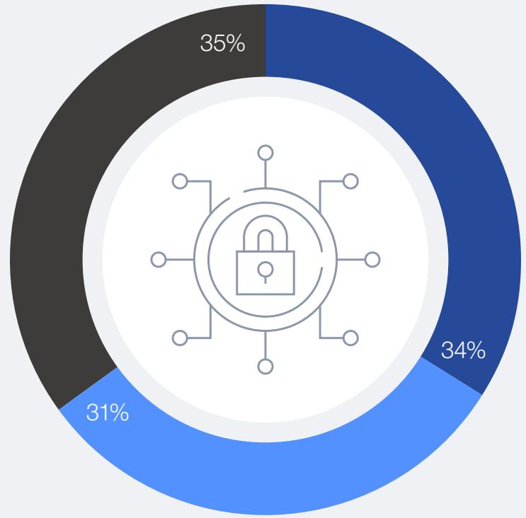

Provide formal, structured guidance or support (e.g. programmes, training, services)

Provide informal or ad-hoc guidance (e.g. advice, one-off support)

No

## BOX 5

## Addressing cyber inequity to ensure that cyber resilience is accessible to all

As cyber inequity deepens, the work of public-interest cybersecurity actors has become essential to closing capability gaps for underserved organizations. The approach of CyberPeace Builders, $^{48}$ for example, demonstrates how targeted, mission-driven support can shift resilience outcomes: by mobilizing skilled volunteers and providing tailored guidance, it helps NGOs strengthen their defences and maintain the continuity of their vital services. This model shows that when expertise is made accessible, organizations facing resource constraints can meaningfully improve their resilience.

However, no single initiative can meet global demand. Addressing cyber inequity at scale requires a sustainable ecosystem of cyber defenders – researchers, trainers, incident responders, tool builders and volunteer

communities – working in coordination to maintain the infrastructure that underserved organizations rely on but cannot afford, and to provide tools and services where the market fails.

To support this ecosystem, broader efforts have emerged through Common Good Cyber $^{49}$ to map what these organizations do, identify shared needs, strengthen capacity and enable deeper collaboration. A coordinated funding mechanism has also been launched to ensure that public-interest cyber services can grow sustainably rather than depend on short-term, fragmented support.

By investing in and connecting these initiatives in the public interest, the global community can help address cyber inequity and ensure that cyber resilience is accessible to all, not just to those with resources.

## Advances in AI are further deepening existing inequity

AI is emerging as both a transformative tool and a new source of inequity in cybersecurity. As AI capabilities become central to defence and detection strategies, unequal access to advanced technologies, data and expertise risks deepening the divide between well-resourced and resource-constrained organizations. At the same time, AI is often embedded into updates and released as new features, making it harder for organizations with limited resources to fully understand, govern or control its introduction. $^{50}$

More than half of all respondents (54%) identified limited knowledge and skills as a key obstacle to adopting AI-driven solutions for cybersecurity.

Larger organizations (by revenue) are emerging as early leaders in leveraging AI-driven threat detection and automation. As the Global Cybersecurity Outlook survey data highlights, companies with higher balance sheets report higher AI adoption rates, while smaller entities (by revenue), governments and NGOs tend to lag behind. Beyond these findings, expert interviewees noted that some industries progress more rapidly due to greater technical maturity and investment capacity, while others remain constrained by financial, regulatory or procedural barriers – further reinforcing existing disparities in cybersecurity preparedness.

FIGURE 46

## Use of AI-enabled cybersecurity tools, by company size and sector (revenue)

Has your organization implemented any AI-enabled tools to fulfil its cybersecurity objectives?  
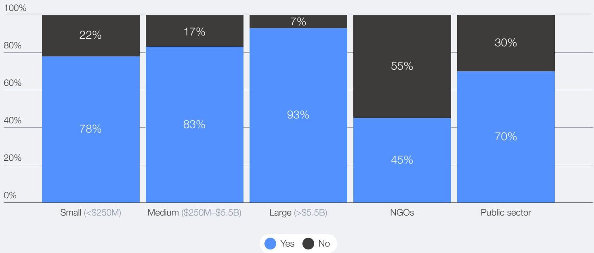

Within interconnected supply chains, these differences in capabilities significantly increase systemic exposure: adversaries can target less-protected partners to infiltrate high-value organizations downstream. A vulnerability in one supplier today may become another organization's breach tomorrow. This shift underscores the growing importance of viewing security through an ecosystem lens, where the resilience of one actor depends on the vigilance of all.

Cyber inequity isn't simply a matter of different budgets or geographies – it is the invisible fault-line where those lacking access to security skills, resources and awareness are perennially targeted by countless bad actors. The actual capability gap lies not just in technologies, but in people: in the professionals needing more training and support, and in the underfunded small- to medium-sized businesses and other similarly positioned entities that make up 90% of our global ecosystem, which cannot keep pace with evolving threats. Bridging this divide requires more than well-meaning intentions that habitually fail to garner holistic, top-down, organization-wide support. It demands vendor-neutral education/credentialing, mentorship and a receptive, global mindset powered by diverse, inclusive collaboration.

Illena Armstrong, President, Cloud Security Alliance

## 3.7 | Future threat vectors are emerging in silence

While AI continues to dominate the cybersecurity landscape, several other technologies and threat vectors are quietly gaining traction in the background and are expected to affect cybersecurity by 2030.

Drawing on a focus group session with members of the Global Future Councils – including Artificial

General Intelligence, Clean Air, Cybersecurity, Data Frontiers, Decentralized Finance, Energy Technology Frontiers, Generative Biology, Geopolitics, Information Integrity, and Next-Generation Computing – it is possible to integrate their forward-looking perspectives with data from the Global Cybersecurity Outlook 2026 survey to reveal the emerging risks likely to define cybersecurity in the coming years.

Our digital world runs through cables lying deep beneath the ocean's surface. With 99% of international data traffic flowing through them, these undersea systems are the unseen lifelines of our global economy – and they are also uniquely vulnerable. A single break can disrupt essential services and daily life for billions. Building true resilience means moving from awareness to action: faster repairs, more diverse routes, and international cooperation that matches the critical nature of these assets.

Doreen Bogdan-Martin, Secretary-General, ITU

## Autonomous systems and robotics

Some 26% of survey respondents indicated that autonomous systems and robotics will affect cybersecurity in 2026, and according to experts in the Global Future Councils, this proportion is expected to rise by 2030. By the end of the decade, autonomous systems will be a near-term factor, from AI assisting analysis to directing physical actions in factories, logistics, healthcare and public spaces. This evolution could create a new cyber-physical risk profile, where machine-executed decisions can alter safety and service quality within seconds, compressing detection and response windows. Interdependencies are likely to deepen as autonomous workflows lean on shared cloud platforms, models and data, meaning disruptions or errors could propagate rapidly across operations and supply chains. Physical AI is becoming a security concern, as intelligent robots – such as those now used for order-picking in warehouses or moving containers in ports – evolve from simple machines to adaptive systems, making their behaviour less predictable and more vulnerable to compromised learning processes or control software. Securing these systems requires embedded cybersecurity by design, strong access controls for human–robot interaction and continuous monitoring to maintain operational integrity.

## Digital currencies

By 2030, digital currencies are expected to play a growing role in daily economic activity, with broader adoption across retail payments, payroll systems and selected public and cross-border services. $^{51}$ This ubiquity makes them

both foundational and fragile. Cyberattacks targeting exchanges, wallets and smart-contract infrastructure have already caused multibillion-dollar losses, and by 2030 such incidents could have systemic consequences, triggering potential liquidity shocks or eroding confidence in national and corporate digital assets. $^{52}$ In 2025, for instance, a major crypto-exchange breach attributed to a state-linked threat group resulted in losses exceeding \$1.5 billion, with investigators estimating that nearly a fifth of the stolen funds were rapidly converted into unrecoverable assets – a stark reminder of how quickly digital liquidity can vanish in emerging regulatory contexts. $^{53}$ As synthetic identities and AI-driven fraud evolve, real-time verification and resilience of settlement networks will define trust in the financial system. Interdependencies among decentralized finance, central-bank digital currencies and autonomous payment agents mean that disruption in one layer can quickly ripple through others. In this environment, digital currencies have become critical infrastructure whose security underpins economic and societal stability.

## Space technologies and undersea cables

Space and seabed infrastructure remain comparatively overlooked in cyber risk planning, despite enabling core functions of critical infrastructure. In 2026, 9% of respondents indicated that space technologies will most significantly impact cybersecurity. Looking ahead to 2030, satellite-based positioning, navigation and timing will be even more essential for aviation, maritime activities, power-grid coordination and financial transactions. At the same time, satellite communications and undersea cables will form the backbone for emergency services, cloud infrastructure and international data exchange. $^{54}$

Despite this, only 15% of respondents consider space assets, and 18% account for undersea cables, in cyber risk mitigation. With the growth of AI-driven operations, cloud services and autonomous systems, organizations will increasingly rely on precise timing, navigation and robust data connections. This heightened dependence means that even small disruptions in satellite or undersea cable infrastructure could trigger widespread impacts across entire digital ecosystems.

## Natural disasters and climate change

By 2030, the convergence of climate volatility and digital dependency will have transformed natural disasters into complex cyber-physical crises. Extreme weather, prolonged droughts and heatwaves routinely disrupt power, data and logistics networks, while AI-driven coordination systems for energy grids, water and emergency response introduce new attack surfaces. As renewable energy and storage infrastructures expand, their dense networks of inverters, sensors and cloud-linked controllers multiply points of cyber exposure. Climate-related shocks increasingly coincide with misinformation and organized influence operations that capitalize on confusion during emergencies, eroding confidence in institutions. Cross-border impacts – such as satellite degradation from solar storms or undersea-cable damage from seabed shifts – underscore how physical events cascade through digital infrastructure. By 2030, climate may not just be a background stressor but a persistent amplifier of cyber risk, extending recovery times and blurring

the line between environmental and digital resilience as emerging technologies combine and create cumulative risks that can compound the effect of climate-driven disruptions.

## Quantum technologies

In 2026, 37% of Global Cybersecurity Outlook survey respondents believe quantum technologies will affect cybersecurity within the next 12 months. This reflects expectations of greater investment, stronger regulatory momentum and a faster pace of digital transformation in the year ahead. By 2030, quantum will have evolved from a theoretical disruptor into a selective but material threat to cryptography. State-level or well-resourced actors may be capable of quantum-accelerated attacks on high-value targets, even as full-scale code breaking remains rare. At the same time, defenders will harness quantum-enhanced analytics and sensing for anomaly detection, creating a dynamic attacker-defender race. The greatest systemic exposure will come from legacy encryption in embedded and industrial systems that cannot easily migrate. Driven by increased timelines and awareness – including the availability of National Institute of Standards and Technology (NIST) standards and guidance introduced in 2024, as well as tight migration deadlines set by national cybersecurity agencies – regulations are taking more decisive action and providing clearer guidelines for the transition to post-quantum cryptography.55 The window for proactive migration to these new cryptographic standards is closing fast. Those who delay will find that quantum readiness has become the next frontier of systemic cyber risk.

# Conclusion

The evolving cyber landscape of 2026 is defined by accelerating technological change, deepening interdependencies and persistent inequities. As organizations confront a surge in AI-driven threats, geopolitical volatility and supply chain vulnerabilities, the imperative for resilience has never been clearer. This year's findings underscore that cyber risk is no longer a technical issue alone – it is a strategic, economic and societal concern that demands coordinated action across sectors and borders.

While adversaries leverage automation and advanced tactics to exploit systemic weaknesses, the challenge for defenders lies in keeping pace – not only through technological innovation but by strengthening governance, investing in skills and fostering a culture of trust and collaboration. The gap between highly resilient organizations and those falling behind remains stark, with skills shortages and resource constraints amplifying systemic risk.

Nevertheless, there are reasons for optimism. Organizations that embed resilience into leadership agendas, proactively manage supply chain and AI risks, and engage their broader ecosystems are better positioned to withstand shocks and adapt to uncertainty. The shift towards intelligence-driven collaboration, scenario-based testing and regulatory harmonization signals a maturing approach to collective defence.

Ultimately, building a secure digital future requires more than technical solutions. It calls for decisive leadership, shared accountability and a commitment to lifting the collective baseline – ensuring that resilience is accessible to all, not just the most well-resourced. As the boundaries between digital and physical worlds continue to blur, the organizations that thrive will be those that recognize cyber resilience as a shared, strategic responsibility – one that underpins trust, enables innovation and safeguards the interconnected foundations of global society.

# Appendix: Methodology

The Global Cybersecurity Outlook (GCO) 2026 survey was the primary dataset used as the foundational research for this report, with 19 questions for all respondents (plus two questions specifically for private-sector respondents) and an additional eight demographic questions. The survey was launched on 25 August 2025 and ran until 1 October 2025. Respondents to the survey include C-suite executives, academics, civil society and public-sector cybersecurity leaders. The World Economic Forum received responses from 873 survey participants from 99 countries. Once the dataset was normalized using the eight demographic questions to determine the qualifications of participants, the dataset was left with 804 qualified participants from 92 countries. Of the C-suite respondents, the survey was completed by 316 CISOs, 105 CEOs and 123 other C-suite executives – e.g. chief risk officers (CROs) or chief technology officers (CTOs).

Some graphs may depict percentages that add up to more than 100%, which is due to those questions being formulated as multiple-choice questions. To provide additional qualitative data, 52 participants, including C-suite executives, industry leaders and academics, took part in expert focus-group interviews. In these small focus-group discussions, adjacent or supplementary questions were asked, to probe further into the survey data collected.

In July 2025, a 90-minute workshop was held with members of the Global Future Council on Cybersecurity, where thought leaders from academia, government, international organizations, business and civil society focused on themes featured in the GCO survey. Additionally, in October 2025, a 60-minute workshop was held with 21 executives from the World Economic Forum's Centre for Cybersecurity's CISO Community, focused on themes identified within this report. Additional quantitative data was collected in the form of short polls posed to attendees of the Forum's Annual Meeting of the Global Future Councils and Cybersecurity, which took place on 14–16 October 2025. Several sessions were held, and qualitative data was gathered from the 130-plus cybersecurity executives and additional Global Future Council members who attended the event. During the event, a workshop session with 35 attendees from various Global Future Councils explored the cybersecurity landscape and its potential impacts on the 2030 horizon, looking through various lenses, such as next-generation computing, space technologies and data frontiers.

The World Economic Forum used genAI to support this research. Custom generative pre-trained transformers (GPTs) were used for blind-spot detection in the drafting stage and for extracting key themes across qualitative data collection methods. Additionally, the Forum used genAI to translate the GCO 2026 survey into five languages other than English, with human revision.

## Contributors

## Lead authors

## World Economic Forum

Giulia Moschetta
Initiatives Lead, Centre for Cybersecurity,
World Economic Forum

Ellie Winslow
Coordinator, Centre for Cybersecurity,
World Economic Forum

Willem Buys
Security Manager, Accenture

Kilian Hayat
Security Consultant, Accenture

## Accenture

## Acknowledgements

## World Economic Forum

Frédéric Calbert
Data Intelligence and Visualisation Lead

Akshay Joshi
Head of the Centre for Cybersecurity,
Member of the Executive Committee

## Accenture

Toms Bernhards Callahan
Research Specialist

Jacky Fox
Global Cyber Strategy Lead

Shachi Jain
Research Manager

Elian Manev
Technical Specialist

Yusof Seedat
Research Manager

## Additional acknowledgements

## World Economic Forum

Chiara Barbeschi
Specialist, Cyber Resilience,
Centre for Cybersecurity

Filipe Beato
Manager, Cyber Resilience, Centre for Cybersecurity

Joanna Bouckaert
Community Lead, Centre for Cybersecurity

Seán Doyle
Lead, Cybercrime Atlas Initiative,
Centre for Cybersecurity

Tal Goldstein
Head of Strategy, Centre for Cybersecurity

Isabella Kaplan
Community Specialist, Centre for Cybersecurity

Nataša Perucica
Project Lead, Centre for Cybersecurity

Luna Rohland
Specialist, Cyber Resilience, Centre for Cybersecurity

Apisada Suwansukroj
Lead, Programming and Communications,
Centre for Cybersecurity

Natalia Umansky
Project Specialist, Cybercrime Atlas Initiative,
Centre for Cybersecurity

The World Economic Forum would like to acknowledge the following organizations for their contributions to the Global Cybersecurity Outlook 2026 survey: Cloud Security Alliance, Cyber Threat Alliance, CyberPeace Institute, Data Security Council of India (DSCI), Digi Americas Alliance, Ecole Polytechnique Fédérale de Lausanne (EPFL), European Cyber Security Organisation (ECSO), ISC2, National Cybersecurity Authority of Saudi Arabia, NUS-ISS, Observer Research Foundation (ORF), Oxford University, Smart Africa, Western Balkans Cyber Capacity Centre (WB3C).

The Centre for Cybersecurity would like to thank the Centre Partners: Accenture, Aramco, Fortinet, IBM, Palo Alto Networks and Salesforce.

Michael Daniel
Cyber Threat Alliance

The World Economic Forum would like to thank the following individuals who shared their insights and knowledge in focus group interviews or community meetings.

Miguel de Bruycker
Centre for Cybersecurity, Belgium

Fabio di Franco
European Union Agency for Cyber Security

Paige Adams
Zurich Insurance

Sabrina Feng
London Stock Exchange Group

Bushra AlBlooshi
Dubai Electronic Security Center

Frank Fischer
DHL Group

Hoda Al Khazimi
New York University Abu Dhabi

Janus Friis Bindslev
PensionDanmark

Hessah Almajhad
Saudi Institute Technology Company (SITE)

Javier Garcia Quintela
Repsol

Yasser N. Alswailem
Saudi Telecom Company

Michael Goodman
Hitachi

Mandy Andress
Elastic

Carlo Hopstaken
EFG International

Hadi Anwar
CPX

Öykü Işık
IMD Business School

Brad Arkin
Salesforce

Terje Jensen
Telenor

Illena Armstrong
Cloud Security Alliance

Shaun Khalfan
PayPal

Nik Bartholomew
Occidental Petroleum Corporation

Chan Meng Khoong
National University of Singapore

Federico Blasiotti
Adecco Group

Sami Khoury
Communications Security Establishment, Canada

Christophe Blassiau
Schneider-Electric

Motoyoshi Kurokawa
RIKEN

Erik Blomberg
Handelsbanken

Sebastian Lange
SAP

Stefan Braun
Henkel

Kris Lovejoy
Kyndryl

Cristina Camacho
Global Forum on Cyber Expertise Foundation

Derek Manky
Fortinet

Ann Cleaveland
University of California, Berkeley

Luigi Martino
University of Florence

Anna Collard
KnowBe4

Michael Mestrovich
Rubrik

Belisario Contreras
Digi Americas

Karolina Czarkowska
Carlsberg Group

Deryck Mitchelson
Check Point Software Technologies

Paulo Moniz
EDP

Luis Filipe Morais
Galp Energia

Leslie Nielsen
Mimecast

Sameer Patil
Observer Research Foundation

Cezary Piekarski
Standard Chartered

Thelma Quaye
Smart Africa Secretariat

Jim Reavis
Cloud Security Alliance

Humberto Luiz Ribeiro da Silva
Ciberlab at University of Brasilia

Robert Rodger
Admiral Insurance

Christian Rossow
CISPA Helmholtz Center for Information Security

Jason Ruger
Lenovo

Mehzad Sahar
Engro Corporation

Jamie Saunders
University of Oxford

Chua Kuan Seah
Cyber Security Agency of Singapore

Shlomo Serfaty
Israel National Cyber Directorate

Sachit Singh
OakNorth

Despina Spanou
European Commission

Confidence Staveley
CyberSafe Foundation

Diego Subero
Organization of American States (OAS)

Yann Sweeney
Springer Nature

Satoshi Takeda
Mitsubishi Electric Corporation

Kemba Walden
Paladin Capital Group

Wendi Whitmore
Palo Alto Networks

Carl Windsor
Fortinet

The authors are grateful to Shuyao Li, Cosima Piepenbrock, Aletta Steynberg, Jakub Tyrakowski and Kesang Tashi Ukyab for their contributions to the Global Cybersecurity Outlook 2026.

The World Economic Forum would like to acknowledge the following communities for their contributions to the Global Cybersecurity Outlook 2026: the Chief Information Security Officer (CISO) Community, the Partnership Against Cybercrime community, the Cyber Resilience in Industries community, the Global Future Council on Cybersecurity, the Global Future Council on Artificial General Intelligence, the Global Future Council on Clean Air, the Global Future Council on Data Frontiers, the Global Future Council on Decentralized Finance, the Global Future Council on Energy Technology Frontiers, the Global Future Council on Generative Biology, the Global Future Council on Geopolitics, the Global Future Council on Information Integrity, and the Global Future Council on Next Generation Computing.

## Production

Laurence Denmark
Creative Director, Studio Miko

Craig Hillsley
Editor, Astra Content

Alison Moore
Editor, Astra Content

Cat Slaymaker
Designer, Studio Miko

## Endnotes

For the purposes of this report, small employers are defined as organizations with 1,000 employees or fewer. Medium employers are defined as organizations with 1,001–10,000 employees. Large employers are defined as organizations with 10,001–100,000 employees. Very large employers (the largest organizations) are defined as organizations with more than 100,000 employees.

2. World Economic Forum. (2025). Artificial intelligence and cybersecurity: Balancing risks and rewards.

3. McDougald, D. (2025, February 26). Empowering a secure autonomous AI future. Accenture. https://www.accenture.com/gb-en/blogs/security/empowering-secure-autonomous-ai-future

4. World Economic Forum. (2025). Artificial intelligence and cybersecurity: Balancing risks and rewards.

5. World Economic Forum. (2025). AI agents in action: Foundations for evaluation and governance.

6. World Economic Forum. (2025). The future of jobs report 2025.

7. For the purposes of this report, small employers are defined as organizations with 1,000 employees or fewer. Medium employers are defined as organizations with 1,001–10,000 employees. Large employers are defined as organizations with 10,001–100,000 employees. Very large employers (the largest organizations) are defined as organizations with more than 100,000 employees.

8. Gross, J. (2025, October 22). What we know about the drone sightings in Europe. The New York Times. https://www.nytimes.com/2025/10/22/world/europe/drone-sightings-airports.html

10. INTERPOL. (2025, June 23). New INTERPOL report warns of sharp rise in cybercrime in Africa. https://www.interpol.int/News-and-Events/News/2025/New-INTERPOL-report-warns-of-sharp-rise-in-cybercrime-in-Africa?utm

11. Wendling, M. (2024, December 31). What to know about string of US hacks blamed on China. BBC. https://www.bbc.com/news/articles/c86w2evj05do

12. Durbin, S. (2025, May 20). How trade policies are expanding supply chain cyber risks. World Economic Forum. https://www.weforum.org/stories/2025/05/how-trade-policies-are-expanding-supply-chain-cyber-risks/

13. Adomaitis, N. (2025, August 13). Norway spy chief blames Russian hackers for dam sabotage in April. Reuters. https://www.reuters.com/technology/norway-spy-chief-blames-russian-hackers-dam-sabotage-april-2025-08-13/

14. Baezner, M., & Robini, P. (2018). Cyber sovereignty and data sovereignty. ETH Zurich Research Collection. https://www.research-collection.ethz.ch/server/api/core/bitstreams/83de5b9d-6f49-4a1f-aa3e-14df25460e60/content

15. The Local. (2025, June 3). Danish cities drop Microsoft over Trump policies and financial concerns. https://www.thelocal.dk/20250603/danish-cities-drop-microsoft-over-trump-policies-and-financial-concerns

16. Tidy, J. (2025, September 25). Children's names, pictures and addresses stolen in nursery chain hack. BBC. https://www.bbc.co.uk/news/articles/c62ldyvpwv9o

17. United Nations Office on Drugs and Crime. (n.d.). Global Fraud Summit. Retrieved November 25, 2025, from https://www.unodc.org/unodc/organized-crime/global-fraud-summit.html

18. Global Anti Scam Alliance. (2025, May 1). Update on the Global Signal Exchange | Global Anti-Scam Summit London 2025. https://www.gasa.org/post/update-on-the-global-signal-exchange-global-anti-scam-summit-london-2025

19. World Economic Forum. (2025) Fighting cyber-enabled fraud: A systemic defence approach. https://www.weforum.org/publications/fighting-cyber-enabled-fraud-a-systemic-defence-approach/

20. France24. (2025, March 2). Indonesians swindled by scams using President Prabowo deepfakes. https://www.france24.com/en/live-news/20250302-indonesians-swindled-by-scams-using-president-prabowo-deepfakes

21. Liggett, J. (2025, October 22). 'Disgraceful' deep-fake AI video condemned by presidential candidate. BBC. https://www.bbc.com/news/articles/czxkn504lqpo

22. World Economic Forum. (2025). The intervention journey: A roadmap to effective digital safety measures. https://reports.weforum.org/docs/WEF\_The\_Intervention\_Journey\_A\_Roadmap\_to\_Effective\_Digital\_Safety\_Measures\_2025.pdf

23. Anthropic. (2025, November 13). Disrupting the first reported AI-orchestrated cyber espionage campaign. https://www.anthropic.com/news/disrupting-AI-espionage

24. Federal Bureau of Investigation. (2025, July 23). Hacker Com: Cyber criminal subset of The Community (Com) is a rising threat to youth online. https://www.ic3.gov/PSA/2025/PSA250723

25. Mishra, V. (2025, October 25). Sixty-five nations sign first UN treaty to fight cybercrime, in milestone for digital cooperation. UN News. https://news.un.org/en/story/2025/10/1166182

26. INTERPOL. (2025, June 11). 20,000 malicious IPs and domains taken down in INTERPOL infostealer crackdown. https://www.interpol.int/en/News-and-Events/News/2025/20-000-malicious-IPs-and-domains-taken-down-in-INTERPOL-infostealer-crackdown

27. INTERPOL. (2025, August 22). African authorities dismantle massive cybercrime and fraud networks, recover millions. https://www.interpol.int/en/News-and-Events/News/2025/African-authorities-dismantle-massive-cybercrime-and-fraud-networks-recover-millions

28. Europol. (2025, November 13). End of the game for cybercrime infrastructure: 1025 servers taken down. https://www.europol.europa.eu/media-press/newsroom/news/end-of-game-for-cybercrime-infrastructure-1025-servers-taken-down

29. Europol. (2025, May 21). Europol and Microsoft disrupt world's largest infostealer Lumma. https://www.europol.europa.eu/media-press/newsroom/news/europol-and-microsoft-disrupt-world%E2%80%99s-largest-infostealer-lumma

30. World Economic Forum. (2025). The Cyber Resilience Compass: Journeys towards resilience. https://www.weforum.org/publications/the-cyber-resilience-compass-journeys-towards-resilience/

31. Milmo, D. (2025, May 21). Scattered Spider is focus of NCA inquiry into cyber-attacks against UK retailers. The Guardian. https://www.theguardian.com/technology/2025/may/21/scattered-spider-national-crime-agency-inquiry-cyber-attacks-uk-retailers

32. World Economic Forum. (2025). The Cyber Resilience Compass: Journeys towards resilience. https://www.weforum.org/publications/the-cyber-resilience-compass-journeys-towards-resilience/

33. World Economic Forum. (2025). Elevating cybersecurity: Ensuring strategic and sustainable impact for CISOs. https://www.weforum.org/publications/elevating-cybersecurity-ensuring-strategic-and-sustainable-impact-for-cisos/

34. United Kingdom Department for Science, Innovation & Technology. (2025, November 12). Summary of research on the economic impact of cyber attacks. https://www.gov.uk/government/publications/independent-research-on-the-economic-impact-of-cyber-attacks-on-the-uk/summary-of-research-on-the-economic-impact-of-cyber-attacks

35. Cakir, S., & Vergara Cobos, E. B. (2024). A review of the economic costs of cyber incidents. World Bank. https://documents.worldbank.org/en/publication/documents-reports/documentdetail/099092324164536687

36. Taaffe-Maguire, S. (2025, November 14). Direct cost of Jaguar Land Rover cyber attack which impacted UK economic growth revealed. Sky News. https://news.sky.com/story/direct-cost-of-jaguar-land-rover-cyber-attack-which-impacted-uk-economic-growth-revealed-13470193

37. Jaguar Land Rover Automotive. (2025, November 14). JLR performance impacted in challenging quarter [Press release]. https://media.jaguarlandrover.com/news/2025/11/jlr-performance-impacted-challenging-quarter

38. Pearson, J. (2025, October 22). Jaguar Land Rover hack cost UK economy \$2.5 billion, report says. Reuters. https://www.reuters.com/sustainability/boards-policy-regulation/jaguar-land-rover-hack-cost-uk-economy-25-billion-report-says-2025-10-22/

39. United Kingdom Government. (2025, September 28). Government backs Jaguar Land Rover with £1.5 billion loan guarantee. https://www.gov.uk/government/news/government-backs-jaguar-land-rover-with-15-billion-loan-guarantee

40. World Economic Forum. (n.d.). Centre for Cyber Economics. Retrieved November 25, 2025, from https://initiatives.weforum.org/4ir-network/centreforcybereconomics

41. Tidy, J., & Wilson, T. (2025, September 22). EU cyber agency says airport software held to ransom by criminals. BBC. https://www.bbc.com/news/articles/cqjeej85452o

42. The category of smallest organizations by annual revenue in the Global Cybersecurity Outlook 2026 data is <\$250 million; the category of medium is between \$250 million and \$5.5 billion; and the category of large is > \$5.5 billion.

43. Tewari, S., & Hoskins, P. (2025, October 11). How hackers forced brewing giant Asahi back to pen and paper. BBC. https://www.bbc.com/news/articles/cly64g5y744o

44. Reuters. (2025, October 30). Microsoft Azure's services restored after global outage. https://www.reuters.com/technology/microsoft-azure-down-thousands-users-downdetector-shows-2025-10-29/

45. Burgess, M., & Newman, L. H. (2025, October 25). Security news this week: Amazon explains how its AWS outage took down the web. WIRED. https://www.wired.com/story/amazon-explains-how-its-aws-outage-took-down-the-web/

46. Prince, M. (2025, November 18). Cloudflare outage on November 18, 2025. Cloudflare. https://blog.cloudflare.com/18-november-2025-outage/

47. The category of smallest organizations by annual revenue in the Global Cybersecurity Outlook 2026 data is <\$250 million; the category of medium is between \$250 million and \$5.5 billion; and the category of large is > \$5.5 billion.

48. CyberPeace Builders. (n.d.). CyberPeace Builders. Retrieved November 25, 2025, from https://cpb.ngo/

49. Common Good Cyber. (n.d.). Common Good Cyber. Retrieved November 25, 2025, from https://commongoodcyber.org/

50. World Economic Forum. (2025). Artificial intelligence and cybersecurity: Balancing risks and rewards. https://reports.weforum.org/docs/WEF\_Artificial\_Intelligence\_and\_Cybersecurity\_Balancing\_Risks\_and\_Rewards\_2025.pdf

51. Strohecker, K. (2023, July 10). Twenty-four central banks will have digital currencies by 2030, survey shows. Reuters. https://www.reuters.com/markets/currencies/twenty-four-central-banks-will-have-digital-currencies-by-2030-bissurvey-2023-07-10/

52. Siripurapu, A., & Berman, N. (2024, January 17). The crypto question: Bitcoin, digital dollars, and the future of money. Council on Foreign Relations. https://www.cfr.org/backgrounder/crypto-question-bitcoin-digital-dollars-and-future-money

53. Tidy, J. (2025, March 10). North Korean hackers cash out hundreds of millions from \$1.5 billion ByBit hack. BBC. https://www.bbc.com/news/articles/c2kgndwwd7lo

54. International Telecommunication Union. (2024, November 29). Launch of international advisory body to support resilience of submarine telecom cables: Strengthening resilience of submarine cable networks is key to digital connectivity and economies [Press release]. https://www.itu.int/en/mediacentre/Pages/PR-2024-11-29-advisory-body-submarine-cable-resilience.aspx

55. National Institute of Standards & Technology. (2024, August 13). NIST releases first 3 finalized post-quantum encryption standards. https://www.nist.gov/news-events/news/2024/08/nist-releases-first-3-finalized-post-quantum-encryption-standards

WORLD ECONOMIC FORUM

COMMITTED TO IMPROVING THE STATE OF THE WORLD

The World Economic Forum, committed to improving the state of the world, is the International Organization for Public-Private Cooperation.

The Forum engages the foremost political, business and other leaders of society to shape global, regional and industry agendas.

World Economic Forum
91–93 route de la Capite
CH-1223 Cologny/Geneva
Switzerland