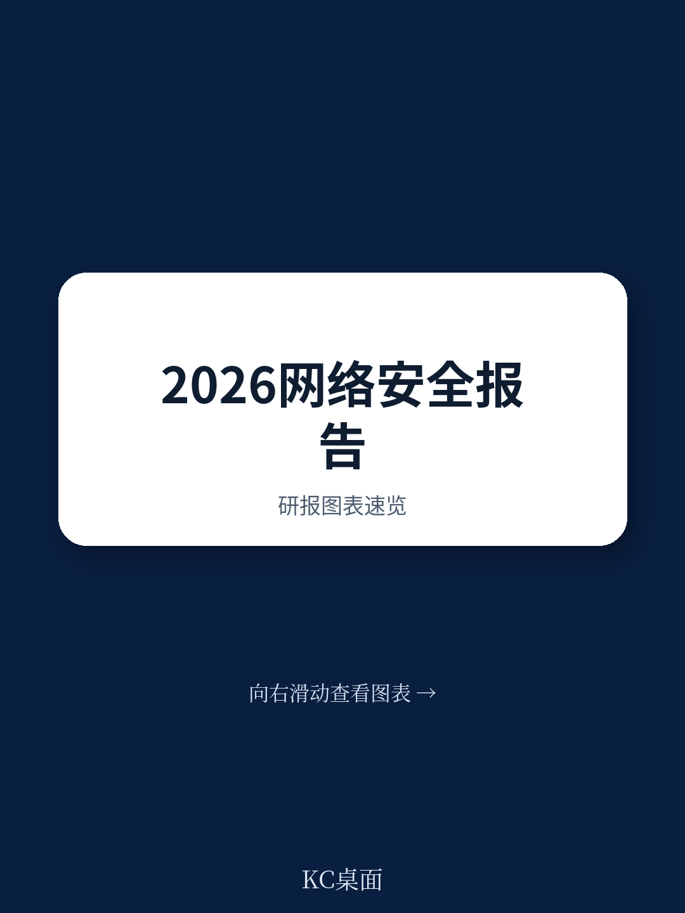
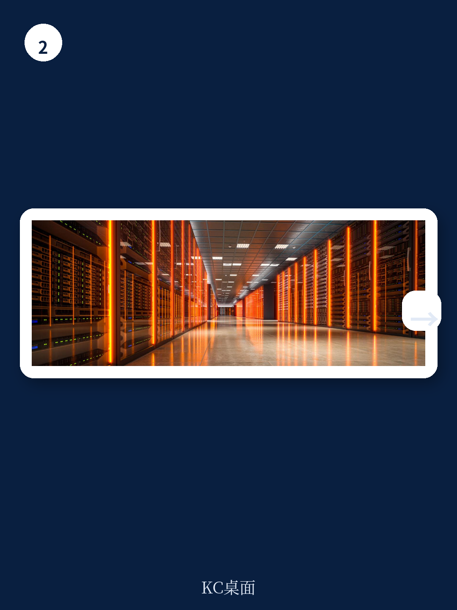

# 世界经济论坛：CEO将网络头号威胁从勒索软件换成AI

当网络安全不再只是IT部门的技术问题，而是董事会必须亲自面对的战略课题时，企业高管的焦虑清单正在发生一次值得关注的位移。

世界经济论坛在2026年1月发布的《全球网络安全展望2026》报告，基于对超过100位CEO和数百位首席信息安全官的调研，揭示了一个关键信号：CEO们对网络风险的优先级排序正在从“已知威胁”转向“未知威胁”，而这一转变背后，是AI正在从根本上重塑风险的性质和分布。

这份报告的核心判断可以概括为一句话：网络安全正在从一场“防御战”变成一场“认知战”，而AI既是武器，也是战场本身。

## 1. CEO与CISO的风险排序正在脱钩，这本身就是风险

报告中最引人注目的数据之一是CEO和CISO对前三大网络风险的排序差异。

2025年，CEO最担心的是勒索软件攻击，其次是网络欺诈和供应链中断。到了2026年，CEO的头号担忧变成了网络欺诈和钓鱼攻击，AI漏洞跃升至第二位。而CISO的排序几乎没有变化：勒索软件始终是第一，供应链中断始终是第二。

这意味着什么？CEO正在将注意力从“能否恢复运营”转向“能否保护收入和信任”，而CISO仍然聚焦在“系统是否还在运行”。这种脱钩本身就是一个管理风险：当董事会和高管团队开始对一种风险产生焦虑，而执行层仍然在应对另一种风险时，资源分配、汇报重点和决策节奏都可能出现错位。

> **KC评论：** 这不是谁对谁错的问题。CEO关注欺诈和AI漏洞，是因为这些威胁直接触及商业模式和客户信任；CISO关注勒索软件和供应链，是因为这些威胁直接决定明天系统能不能开机。但问题在于，如果两种认知不能对齐，企业可能在错误的地方过度投资，而在真正需要防御的方向上留下缺口。完整报告中有按企业韧性水平分层的CEO风险排序数据，值得细看——韧性越高的企业，CEO对AI漏洞的担忧排名越靠前，这本身就是一个反向指标。

继续看原文，真正有价值的是图表、假设和验证路径；完整报告与KC评论在每日汇编。

## 2. AI正在同时加速攻击和防御，但速度差才是关键

94%的受访者认为AI将是未来一年网络安全领域最重要的变革驱动力。这个数字本身不令人意外，但报告提供了几个更具体的刻度。

第一，企业对AI工具的安全性评估比例从2025年的37%跃升至2026年的64%。这意味着大多数企业已经意识到“用AI之前先要管好AI”，但仍有超过三分之一的企业在部署AI工具时没有安全评估流程。

第二，87%的受访者认为AI相关漏洞是2025年增长最快的网络风险。这个数字几乎覆盖了整个样本，说明这不是少数企业的感受，而是行业共识。

第三，CEO对生成式AI最担心的两个问题是数据泄露（30%）和对手能力增强（28%）。这两个问题本质上是同一枚硬币的两面：企业担心自己的数据通过AI工具流出去，也担心攻击者利用AI工具变得更聪明。

> **KC评论：** AI的安全问题不是一个技术问题，而是一个速度问题。攻击者使用AI的速度可能比防御者更快，因为攻击者只需要找到一个漏洞，而防御者需要堵住所有漏洞。报告中的图A展示了AI安全评估流程的普及率变化，但更值得关注的是不同规模企业之间的差距——大型企业的普及率远高于中小型，这种“AI安全鸿沟”可能在未来几年内转化为新的系统性风险。

## 3. 地缘政治正在成为网络安全的底层操作系统

报告明确指出，地缘政治是2026年影响网络风险缓解策略的首要因素。64%的企业已将地缘政治动机的网络攻击纳入风险考量，91%的大型企业因地缘政治波动调整了网络安全策略。

这个数据点的含义非常直接：网络安全不再是纯粹的技术对抗，而是国家间博弈的延伸。企业需要同时应对来自国家级攻击者的威胁和来自监管合规的压力，而这两者之间的边界正在模糊。

更值得关注的是，31%的受访者对本国应对重大网络事件的能力信心不足，这一比例高于去年的26%。区域差异巨大：中东和北非地区84%的受访者对本国保护关键基础设施的能力有信心，而拉丁美洲和加勒比地区这一比例只有13%。

> **KC评论：** 地缘政治对网络安全的影响不是线性的。它意味着企业不能只考虑技术防御，还要考虑供应链的地理分布、数据存储的主权要求、以及不同司法管辖区的合规冲突。报告中的图E展示了区域信心差异，但完整报告还讨论了“主权困境”这一概念——当国家要求数据本地化时，企业的全球安全架构如何设计？这是一个没有简单答案的问题。

## 4. 网络欺诈正在从“企业问题”变成“社会问题”

73%的受访者表示，他们自己或身边的人在过去12个月内遭受过网络欺诈。这个数字的冲击力在于，它几乎覆盖了所有人。

更值得关注的是，CEO将网络欺诈列为头号担忧，而CISO仍然将其排在第三位。这种认知差异的背后，是CEO更直接地感受到欺诈对品牌、客户信任和财务业绩的冲击。当欺诈手段借助AI变得更加逼真、更具规模化时，企业面临的不仅是直接的财务损失，还有声誉风险和监管处罚。

报告还提到，网络欺诈正在从针对企业转向针对个人，从大规模的“撒网式”攻击转向高度个性化的“精准钓鱼”。这种趋势意味着，企业的防御边界必须延伸到员工和客户的行为层面。

> **KC评论：** 网络欺诈的“个人化”趋势有一个被低估的含义：企业的保险和风险管理框架可能完全不适应这种新风险。传统的网络安全保险覆盖的是数据泄露和系统中断，但针对CEO的精准欺诈、针对财务人员的深度伪造诈骗，这些损失的归因和量化都非常困难。完整报告中对欺诈的讨论涉及了新的攻击手法和防御框架，但没有深入讨论保险和风险转移机制的变化——这可能是下一个需要关注的领域。

## 5. 报告没有完全回答的关键问题：韧性差距如何量化

报告反复提到“网络韧性”这个概念，并将其作为衡量企业应对能力的关键指标。但报告本身没有给出一个清晰的韧性量化框架。韧性被定义为“组织预测、抵御、恢复和适应网络事件的能力”，但如何测量、如何比较、如何设定基准，这些问题在报告中只是初步触及。

这不仅是学术问题，而是直接影响企业决策。如果一家企业无法判断自己的韧性水平，就无法确定应该投资多少、投资在哪里。报告提供了按韧性水平分层的CEO风险排序数据，但没有给出一个可操作的韧性评估工具。这可能是未来研究和实践中需要填补的空白。

## 6. 给读者的观察框架：三个信号值得持续跟踪

基于这份报告，以下三个信号可以帮助读者持续观察网络安全格局的变化

第一，CEO和CISO的风险排序是否进一步分化。如果CEO越来越关注AI和欺诈，而CISO仍然聚焦在勒索软件和供应链，这种脱钩可能意味着企业内部的风险沟通机制需要重建。

第二，AI安全评估流程的普及率是否继续上升。如果2027年的报告显示这一比例从64%上升到80%以上，说明行业正在形成共识；如果增速放缓，则说明存在结构性障碍。

第三，区域间的网络韧性差距是否扩大。报告已经显示了中东和拉美之间的巨大差距，如果这种差距在未来几年内继续扩大，可能会引发地缘经济层面的连锁反应——资本和人才将向网络韧性更高的区域集中。

---

网络安全的未来不是由技术决定的，而是由企业家的选择决定的。这份报告的价值不在于它提供了多少数据，而在于它提出了一个值得每个决策者认真思考的问题：你的企业是在被动应对风险，还是在主动构建韧性？

更多国际信源汇编与评论，扫码交流，每日更新，汇总国际主流叙事、数据与图表，观测边际变化。每日汇编会将单篇报告放回当天主线，整理成中文摘要、KC评论和图表合集，便于喂给AI，也便于人工快速扫描市场动态。已汇聚头部券商、PE/VC、投行、并购、对冲基金、资管机构、战略咨询、智库等机构的朋友，期待交流。

Personal reading notes and learning share only. Not investment advice.
