# Technology Convergence: The New Logic for Competitive Advantage

INSIGHT REPORT

APRIL 2026

## Contents

Foreword 3  
Executive summary 4  
Section 1 The 3C Framework as an interconnected system 5  
1.1 Identifying combinations revisited 7  
Section 2 From combinations to convergence dynamics 9  
2.1 Patterns of value creation 10  
2.2 Signals from the field 12  
Cognitive robotic systems in healthcare 12  
Digital twin ecosystems in advanced manufacturing 17  
Intelligent grid systems in energy 22  
Autonomous labs in life sciences 27  
Non-invasive brain-computer interfaces 32  
Section 3 The value of orchestration 37  
3.1 Monetization pathways 39  
The race to compounding advantage 42  
Contributors 43  
Endnotes 46

## Disclaimer

This document is published by the World Economic Forum as a contribution to a project, insight area or interaction. The findings, interpretations and conclusions expressed herein are a result of a collaborative process facilitated and endorsed by the World Economic Forum but whose results do not necessarily represent the views of the World Economic Forum, nor the entirety of its Members, Partners or other stakeholders.
© 2026 World Economic Forum. All rights reserved. No part of this publication may be reproduced or transmitted in any form or by any means, including photocopying and recording, or by any information storage and retrieval system.

# Foreword

  
Aiman Ezzat
Chief Executive Officer,
Capgemini

  
Jeremy Jurgens
Managing Director, Centre for
Frontier Technologies and Innovation,
World Economic Forum  
Cathy Li
Head, Centre for AI Excellence;
Member of the Executive Committee,
World Economic Forum

In the first year of the Technology Convergence Report, we brought to the fore a foundational phenomenon of this era, highlighting the breakthrough innovation increasingly arising from the meeting of multiple technological domains rather than from advances within any single field. Its Tech Maturity Index illustrated how today's eight most-impactful technology domains follow their own development trajectories, eventually reaching inflection points where meaningful combinations become possible. Artificial intelligence (AI) begins to augment robotics in new ways, biotechnology draws power from computational modelling, and advances in materials science open pathways for next-generation energy systems.

This insight, while valuable, leaves the most consequential question unanswered: how do organizations scale convergent technology into widespread adoption and impact?

Creating a novel combination of technologies is an important milestone, yet history reminds us that technical achievement alone does not guarantee real-world impact. Electric vehicles (EVs) emerged as early as the late 19th century, but their adoption stalled for decades. This was not only due to immature battery technology, but also the fact that there was no ecosystem to support manufacturing, charging and maintenance for everyday use.

The pressure to scale EVs has risen in recent decades, as fuel prices and concerns about energy security and emissions have grown. The companies that finally broke through were the ones that learned how to orchestrate the ecosystem, building charging networks, securing materials supply, partnering with battery innovators and leveraging government incentives. The difference was not due to technical brilliance alone, but to coordination of the ecosystem so that key constraints were removed without creating new ones that were just as severe. As a technology scales, it pulls a new ecosystem into place, and the sources of value shift with that change. Today, the source of value for vehicles has expanded beyond traditional combustion to include software, energy services and connected capabilities.

This understanding of innovation, enriched by the World Economic Forum's global multistakeholder perspective and Capgemini's practical experience, shaped this year's technology convergence report. What you hold is not a static report but a working system. The 3C Framework and Maturity Index continue to pinpoint where meaningful technology intersections emerge. Five industry examples reveal how these combinations reconfigure value chains and redistribute competitive advantage. This report translates insight into operational practice. Each component reinforces the others. Together, they show how organizations have harnessed convergence to move from promising solutions to durable impact.

Using this guide well demands adaptation to the context, commitment over long time horizons and resilience when conditions shift. Convergent innovation does not unfold on a predictable schedule. It rewards those who stay the course.

This is one point in an ongoing conversation. Technologies will mature. Examples will evolve. The mental models captured here are meant to remain relevant. We invite you to engage with these ideas, test them against your experience and contribute to the shared work of scaling the innovations that will shape what comes next.

# Executive summary

# Orchestrating people, data and workflows is critical to scaling technology combinations and ensuring they deliver real impact.

Technology combinations have been shaping industries for years, but the pace and breadth of possibilities have expanded. Eight powerful domains – artificial intelligence (AI), omni computing, engineering biology, robotics, advanced materials, spatial intelligence, quantum and next-generation energy – are combining to create an opportunity no singular innovation could. Convergence isn’t just a shopping list of accumulating domains; it’s a cohesive operating model. Combinatorial technologies need to be coordinated effectively to unlock capabilities that feel like step changes, not increments.

This report outlines how organizations scale technology combinations from technical promise to operational impact. Building on the 3C Framework, it analyses how organizations navigate convergence in practice to create new solutions. Drawing on cross-industry research across healthcare, manufacturing, energy, life sciences and human-machine interaction, the report identifies recurring scaling patterns and translates them into operational practice. The aim is to assist stakeholders in using combinatorial technologies as a source of competitive advantage.

## A selection of the report's key insights:

\- Industry winners are not the most technically advanced, but the most ready to integrate. Their advantage comes from their ability to integrate new systems into existing workflows, coordinate cross-functional teams and scale solutions in real operating conditions.

For example, the adoption of surgical robots accelerated when designed to fit existing hospital operating rooms (Section 2.2).

\- Advantage is moving away from owning technology assets to coordinating capabilities across partners. Partnerships are often critical in developing combinatorial technology as they accelerate innovation by leveraging the maturity of surrounding ecosystems. Successful providers often offer service-based delivery models to offset the costs of large capital investments and system maintenance, giving their customers the freedom to focus on existing assets and core strengths (Section 3.1).

\- Convergence reshapes entire value chains, not just products. When technologies combine, they shift bottlenecks and change where value, power and risk sit across the ecosystem. Combinatorial technology can often help alleviate strain on critical assets such as surgeon availability, production sources or manufacturing sites. A common pattern is that, with the introduction of combinatorial technology, new bottlenecks emerge at the physical–digital interface.

Convergence is now a leadership and operational issue, not solely a technological one. Organizations that build the ability to integrate technologies, align teams and work effectively with partners are the ones that achieve scale. When that happens, solutions improve with use, adoption accelerates and convergence becomes a source of advantage.

# The 3C Framework as an interconnected system

Combination, convergence and compounding are always active in parallel cycles, shaping how organizations approach scaling and value creation.

The 2025 Technology Convergence Report introduced the 3C Framework: combination, convergence and compounding. A natural reading treats these as sequential stages. Technologies

combine, value chains converge around them and capabilities compound through adoption. This reading is intuitive but incomplete. The 3Cs operate as an interconnected system, not a linear sequence.

## The 3C Framework

## Technologies combine

Complementary capabilities come together to solve a key problem or create new solutions

Market adoption increases with high-priority applications starting to be built.

Specific technologies come together

When technologies converge, they drive each other's evolution and maturity.

  
Value creation is driven by performance multiplication, cost optimization and/or new market potential via market overlap.

As specific subdomains mature and advance, application costs decrease.

## Value chains converge

Functional merge of overlapping capabilities

Value chains converge

  
Network effects and market expansion potential drive unit cost economies and top-line growth.

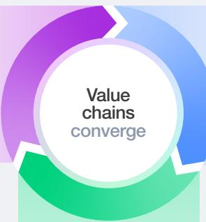  
Integration with other tech subdomains – via application programming interfaces (APIs), platforms – leads to new solutions being built. Plug-and-play capabilities are seen.

New standards begin to be established (data format and availability, integration frameworks, quality metrics, tech-stack protocols). Commercial readiness (partnerships, capital flow and investment, scalable business model).

Actors searching for competitive advantage respond by investing in R&D, leading to genesis of new subdomains and/or pushing existing subdomains further down the custom-to-product-to-commodity maturity level.

This creates new demands from existing technologies and their subdomains.

## Compound capabilities emerge

Multiplicative enhancement that can create exponential impact

Ecosystem begins to align with partner networks, accelerating adoption and competition.

Ecosystems evolve

Upstream impacts affect supplier operations, costs, practices, skill demands and input needs, influencing pricing, resources and economic conditions.

Growth in competition and adoption creates new demands from the market.

The complexity for organizations is navigating multiple time horizons of change at once, as all three dimensions of combination, convergence and compounding reinforce each other.

Today's ecosystem is already a result of historical compounding. For example, over the last decade, cloud and internet of things (IoT) edge have combined to make industrial connectivity economically viable at scale, fuelling a proliferation of enterprise and industrial operating systems that integrate, standardize and operationalize machine and process data. As these platforms have spread, their benefits have compounded and connecting assets have increasingly become a commodity. Now, the competitive frontier is shifting to the extraction of intelligence, which is pulling the ecosystem back into a new combinatorial phase where domain-specific models enter as a new capability. Copilots and agents are set to translate fragmented operational data into decisions, instructions and automated actions across engineering, maintenance and procurement to shift differentiation from possession of data in the cloud to how an enterprise actions it.

The last “C” is never an endpoint, but the start of a new cycle. Thus, the complexity for organizations is navigating multiple time horizons of change at once, as all three dimensions of combination, convergence and compounding reinforce each other. Stalling occurs when any of these combinations encounter value chain resistance or ecosystem fragmentation. Neglecting any dimension creates vulnerabilities that complicate over time.

## 1.1 Identifying combinations revisited

High-potential combinations happen when pairing mature technologies that are stable and widely deployable with earlier-stage technologies that can unlock differentiated breakthrough innovations. $^{1}$

FIGURE 2

Simon Wardley's four-stage classification framework

<table><tr><td></td><td>1 Genesis</td><td>2 Custom-built</td><td>3 Product</td><td>4 Commodity</td></tr><tr><td>Adoption</td><td>Emerging, experimental phase</td><td>Early adoption, bespoke solutions</td><td>Standardization and defined performance metrics</td><td>Mature, widely available, plateau in core performance metrics</td></tr><tr><td>Market</td><td>High variability in implementation</td><td>Growing but fragmented market</td><td>Clear market leaders in established market</td><td>Price-based competition</td></tr><tr><td>Standards</td><td>Limited standardization</td><td>Early standardization attempts, emerging best practices</td><td>Established standards</td><td>Universal standards</td></tr><tr><td>Cost</td><td>High cost per unit</td><td>Declining (but still high) costs</td><td>Predictable cost structure</td><td>Optimized costs</td></tr><tr><td>Value creation</td><td>Value proposition under exploration</td><td>Clear value for specific applications</td><td>Strong value proposition</td><td>Optimized value delivery</td></tr><tr><td>Implementation</td><td>Requires highly specialized expertise</td><td>Requires highly specialized expertise</td><td>Standard skill sets application</td><td>Common skill sets sufficient</td></tr></table>

Note: This figure was inspired by Simon Wardley's Value Chain Mapping methodology.

Looking back, combinations of novel technologies (stage 1–2) layered on to mature and commoditized foundations (stage 3–4) have propelled every major computing wave and commoditized foundations (stage 3–4), though the underlying components shift from generation to generation.

Eight advanced technology domains underpin the analysis and are colour-coded throughout the report.

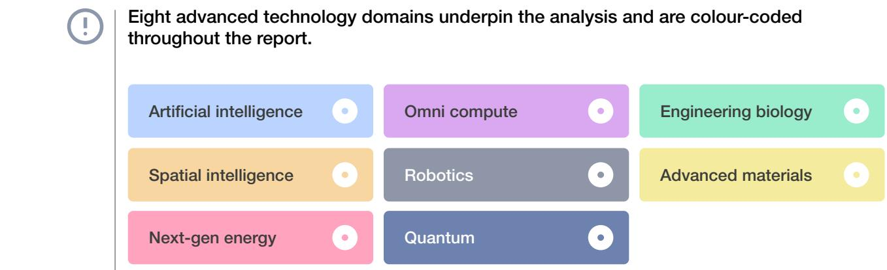  
FIGURE 3 Technology combination over different compute generations

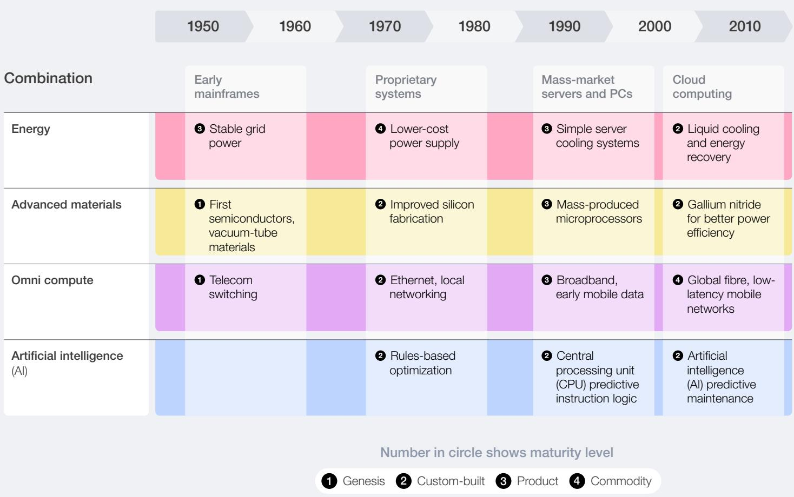

Today, convergence is taking place across eight advanced technology domains. Charting their developments can help organizations layer the possibilities against their own technological infrastructure or identify where peers or adjacent organizations may innovate.

What is the maturity level of the technologies across the organization?

(Use the World Economic Forum's Tech Maturity Index for guidance)

Can novel technologies (stages 1–2) be combined with mature technologies (stages 3–4)?

Can these new combinations compound in capabilities and improve over time?

# From combinations to convergence dynamics

Technology convergence is creating the same outcomes across industries.

# 2.1 Patterns of value creation

The relevant question is no longer which technologies are present, but what new capabilities they set in motion as they scale.

Meaningful convergence begins with a value gap, whether it is a constraint that limits performance or an opportunity created by new capabilities. Technology combinations are the enabling move. Sometimes they arrive as an integrated bundle, but more often they form through incremental layering inside enterprise operating environments, as organizations add complementary technologies over time until a new capability becomes material. At that point, the relevant question is no longer which technologies are present, but what new capabilities they set in motion as they scale.

The research followed five technology combinations across five diverse industries to observe what changes as they scale. Despite the differences between sectors, a consistent set of mechanisms occurred. Bottlenecks shift, often from singular constraints to hybrid digital-physical choke points. Integration becomes the limiting factor across teams, processes and ecosystems. Value expands, reconfiguring where advantage concentrates along the value chain. This yields a diagnostic that helps organizations assess what must be true for a combination to scale and where advantage is likely to concentrate if it does.

## 1 Shifting bottlenecks

Every economic system is shaped by its constraints, such as what is scarce, what feels risky, what is hard to coordinate or what takes time. These constraints shape where value accumulates and how competitive dynamics unfold. In practice, they often manifest in cost, talent availability and time. Businesses and markets organize themselves around these limitations, and strategies emerge to manage or exploit them.

When technologies enter a system, those constraints can shift, easing some bottlenecks but creating others in different parts of the process. This shifting becomes more noticeable when technologies are combined. When technologies build on one another, several limits can move at once and they tend to move faster. Each combination opens up new possibilities, which then become inputs for further innovation, creating a chain reaction of progress.

For example, battery performance was historically constrained by the use of heavy materials and inefficient chemistries. That bottleneck was relieved when advances in lightweight materials combined with improved battery chemistry, making lithium-ion batteries practical. This shift unlocked an explosion of innovation in small devices, from smartphones to wearables, because designers could suddenly rely on compact energy-dense power sources that enabled new product categories. As the old constraints fell away, new ones emerged, including challenges in thermal management, charging speed and critical material supply chains.

Understanding constraint dynamics is critical for opportunity assessment because it predicts which technologies will scale or stall. Technology scales when it removes a key bottleneck without creating a new problem that is just as limiting. In the case of combinatorial technologies, this is often about digital and physical integrations, and managing their implications across people, processes and partners. If these orchestrations prove just as limiting as previous constraints, scaling becomes less likely.

## Considerations

Which constraints define my industry today?

How could emerging technologies reshape these constraints?

## 2 Integrating technologies

If a new technology combination becomes feasible, what new challenges could emerge, and how severe might they become under different scenarios?

Successful adoption increasingly depends on how well a company integrates the technology across its people, processes and ecosystem. Unlike single technologies, technology combinations create change all at once, cutting across old and new systems, spanning multiple teams and demanding diverse skills. Companies can't modernize end-to-end chronologically but instead layer new coordination tools on to existing assets, processes and governance, adapting workflows where new capabilities change system logic.

The smartphone illustrates this. The problem it addressed was fragmented mobile capabilities: computing, communication, navigation and media each required a separate device, each with its own interface, data plan and charging cable. Solving that problem meant combining technologies from industries that had never coordinated before. The smartphone didn't just plug into new systems –

it had to run on top of existing telecom networks while layering in new capabilities such as camera support, app ecosystems and new screen technologies. This shift forced an industry-wide change. Network operators had to change how they managed capacity and priced data. Phone

## Considerations

How can the technology be adapted to better fit the organization?

How could the organization evolve to take full advantage of the technology?

## 3 Expanding value

As combinatorial technologies solve problems that individual technologies could not, they do more than shift where value accumulates – they increase the total value available to the market. This expansion can occur in different ways, including higher production or throughput of services and improved accuracy, resource allocation and workforce efficiencies, all of which increase the total value the market can realize.

In this shift, companies that build and supply convergent technologies tend to broaden their participation in the market, while the organizations that adopt and apply these technologies gain access to capabilities that continuously improve, strengthening their position. This pattern often

What new skills, roles or partnerships are required to deliver the technology combination?

makers had to add software teams to hardware-led organizations. New roles, such as app developers, emerged, and existing teams had to coordinate with them. The device was widely adopted not only because of its features, but also because companies orchestrated the systems around it.

emerges as vertically integrated offerings mature and begin to rely on partnerships. For example, in e-commerce, the shift to external logistics providers allowed sellers to access a wider customer base, while delivery companies captured a share of the value created.

One consequence of this shift is that value moves from owning and managing all capabilities to orchestrating capabilities between the organizations supplying these technologies and the organizations adopting them. As a result, scale and long-term advantage depend less on control and more on how effectively an organization connects technologies, operations and partners into a dependable system. Section 3 examines the theme of orchestration in more detail.

## Considerations

Does the value created by the technology clearly outweigh the cost and effort required to implement it?

What does partnering for this capability allow the organization to achieve that it could not do as effectively on its own?

## 2.2 Signals from the field

Cognitive robotic systems in healthcare

Robotic intelligence

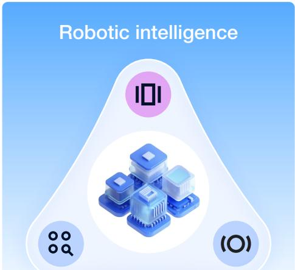

Small/efficient models

IDI Edge AI inference

(O) Object detection and segmentation

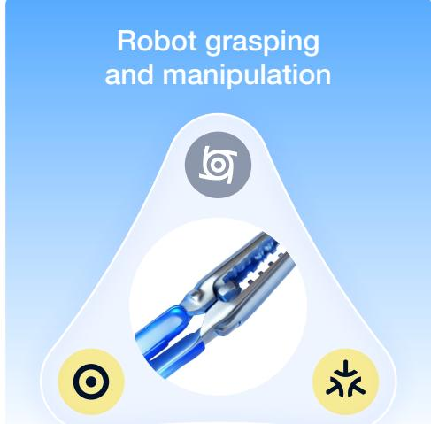

Shape memory alloys

Electric motors

Advanced alloys

## Physical–digital interface

Augmented reality

Spatial sound/haptics

Artificial intelligence

Robotics

Spatial intelligence

Omni compute

Advanced materials

Cognitive robotic systems in healthcare integrate intelligent perception, reasoning, adaptive decision-making and task execution to support clinicians and enhance patient care in a more context-aware and efficient way.

## The industry problem

Surgical demand is growing faster than clinician time can cover, placing natural limits on access and consistency.

## Why combination is possible today

Historically, surgical robots were costly and bulky, used mostly in specialist centres, while overall adoption stayed under 20% of procedures in the US, $^{2}$ with even lower rates globally. In recent years, progress that once unfolded in separate technological domains has increasingly begun to converge, as shown in Figure 4.

Robots became more affordable and capable while new materials enabled smaller and safer instruments, allowing precise manipulation even

Technology domain

Robotics

Artificial intelligence

Spatial intelligence

Advanced materials

Omni compute

in confined spaces. At the same time, artificial intelligence (AI) and spatial computing provided a richer understanding of the operative field by identifying anatomy, tracking instruments, flagging anomalies and revealing subsurface structures before the first incision. These improvements were supported by expanding omni compute capacity that made real-time guidance – and even telesurgery – technically feasible where infrastructure allowed. Taken together, the combined progress across these domains signalled a shift from isolated innovations towards integrated and intelligent surgical solutions.

FIGURE 4 | Subcomponents propelling cognitive robotic systems to their current maturity  
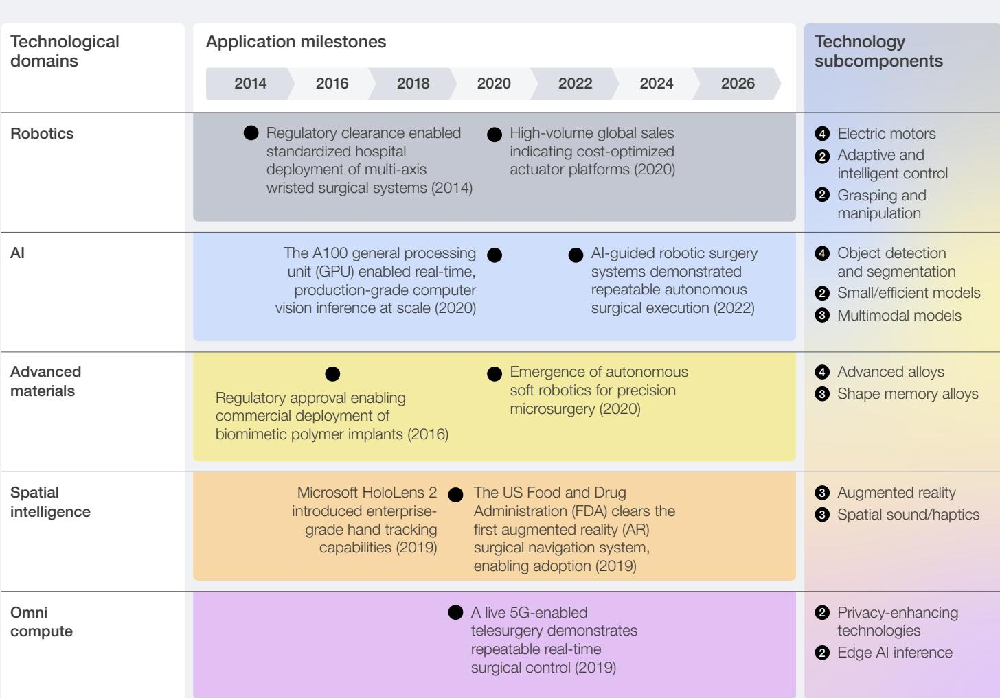

Sources: Intuitive Surgical. (2014). Intuitive Surgical announces new da Vinci® Xi™ surgical system. https://isrg.intuitive.com/news-releases/news-release-details/intuitive-surgical-announces-new-da-vincir-xitm-surgical-system; Universal Robots. (2020). Universal Robots reaches industry milestone with 50,000 collaborative robots sold. https://www.universal-robots.com/news-and-media/news-center/universal-robots-reaches-industry-milestone-with-50-000-collaborative-robots-sold/; NVIDIA. (2020). NVIDIA's new Ampere data center GPU in full production. https://nvidianews.nvidia.com/news/nvidias-new-ampere-data-center-gpu-in-full-production; Saeidi, H., J. D. Opfermann, Kam, M., Wei, S., et al. (2022). Autonomous robotic laparoscopic surgery for intestinal anastomosis. Science Robotics, vol. 7, issue 62. https://www.science.org/doi/10.1126/scirobotics.abj2908; U.S. Food and Drug Administration (FDA). (2016). PMA P150023: Summary of Safety and Effectiveness Data (SSED). https://www.accessdata.fda.gov/cdrh\_docs/pdf15/P150023B.pdf; Omiyale, B. O., Akinsola, O. F., Ashraf, M. A., Olaiva, N. G., et al. (2026). The rapid rise of soft robotics in surgical operations: Trends, challenges, and future directions. Robotics and Autonomous Systems, vol. 198. https://www.sciencedirect.com/science/article/pii/S092188902500421X; Microsoft. (2019). Microsoft at MWC Barcelona: Introducing Microsoft HoloLens 2. Microsoft Blog. https://blogs.microsoft.com/blog/2019/02/24/microsoft-at-mwc-barcelona-introducing-microsoft-hololens-2/; iData Research. (2020). First Augmented Reality Spinal Surgery Completed in U.S. with Augmedics XVision Spine System. iData Research. https://idataresearch.com/first-augmented-reality-spinal-surgery-completed-in-u-s-with-augmedics-xvision-spine-system/; Yun, G., Zhaoyi, P. and Qingqing, C. (2019). China performs first 5G-based remote surgery on human brain. CGTN. https://news.cgtn.com/news/3d3d774d7945444e33457a6333566d54/index.html.

## Shifting bottlenecks

The traditional surgery value chain is organized around time as the primary constraint. Surgeons' training and skill accounted for a disproportionate share of value creation, evidenced by the fact that high-volume surgeons deliver significantly better outcomes in 74% of studies, and specialist surgeons outperform generalists in 91% of cases. $^{3}$ However, skilled surgeons are rare, their training requires a decade or more, and their working capacity is limited by human endurance. Hospital design, staffing models, scheduling systems and reimbursement structures are all organized around these scarcities.

Traditional surgery value chain  
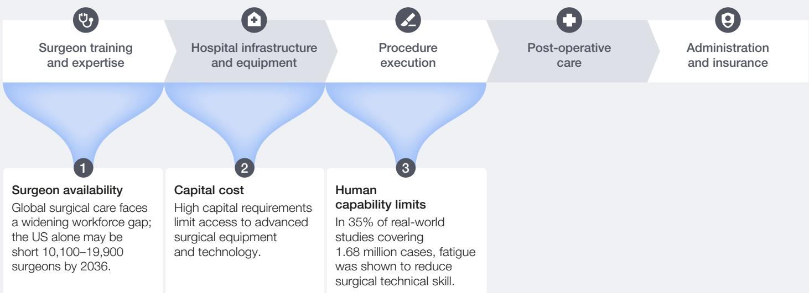

## Primary bottlenecks

Sources: Association of American Medical Colleges (AAMC). (2024). The Complexities of Physician Supply and Demand: Projections From 2021 to 2036. https://www.aamc.org/media/75231/download?attachment; Reijmerink, I. M., van der Laan, M. J., Wietasch, J. K. G., Hooft, L., et al. (2024). Impact of fatigue in surgeons on performance and patient outcome: systematic review. British Journal of Surgery (BJS), vol. 111, issue 1. https://academic.oup.com/bjs/article/111/1/znad397/7473433.

## The development and adoption of surgical robots aim to overcome these bottlenecks:

\- Surgeon availability: Robots support teleoperation and automation, allowing surgeons to work across multiple locations, spend less time physically present and complete procedures more efficiently.

\- Capital cost: Many surgical robots adopt a robot-as-a-service (RaaS) business model, eliminating the need for large upfront investments in advanced systems. High robot use enables high-volume, high-precision procedures, reducing long-term costs per surgery.

\- Human error limits: Robotic systems support precision, stability and endurance, performing tasks that extend human physicality.

Surgical robotics' performance increasingly hinges on resolving technology access barriers, building trust in robotic systems and achieving seamless workflow integration.

## FIGURE 6

## Adoption of surgical robotics reshapes the traditional surgery value chain

Traditional surgery value chain  
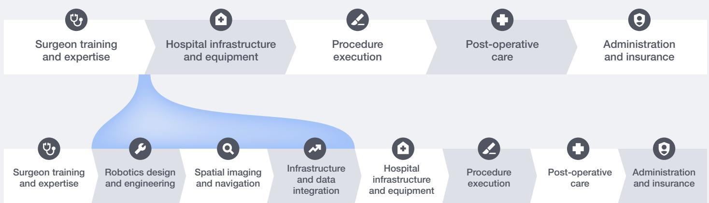  
Surgical robot value chain

# CMR Surgical designed its surgical robots to fit within existing processes

The problem: Robotic systems are traditionally difficult to integrate into highly customized hospital settings due to multiple surgical specialities and limited time for ancillary training and activities.

The action: CMR Surgical designed its Versius system to work within existing operating rooms and established surgical routines. The system's modular design, with individual arm units that can be positioned flexibly, adapts to different room layouts rather than requiring facilities to reconfigure around the robot.

The outcome: Surgeons keep their usual team setup, move easily between robotic and traditional procedures and communicate face-to-face during operations. This avoids the need for surgeon retraining and significant behavioural change, while preserving workflow continuity. CMR Surgical's experience illustrates how a combinatorial system gains traction not by forcing change, but by strengthening the ways people already work.

## Expanding value

The introduction of surgical robots helps hospitals perform more procedures and achieve higher accuracy. Surgical robots do not reduce the value surgeons create; instead, they use surgeons' time more effectively by allowing them to focus on decisions that require human judgement,

supporting them for highly dexterous tasks and, in some cases, allowing them to carry out procedures remotely, dramatically lowering the potential travel time required. Hospitals will continue to face a strategic choice about whether to develop these capabilities internally or to coordinate parts of the new value chain with external partners and suppliers.

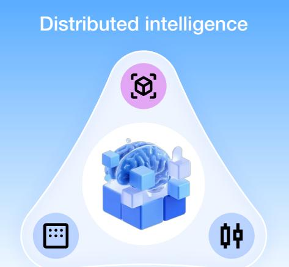

Federated learning on edge devices

Edge analytics

Domain-specific models

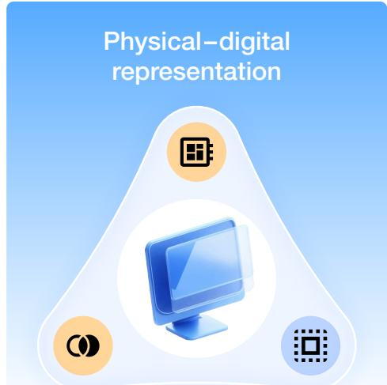

(1) Physical–digital integration

Virtual prototyping

Predictive modelling

## Sensing and connectivity

Industrial IoT

Wireless sensor networks

Artificial intelligence

Omni compute

Spatial intelligence

Digital twin ecosystems in manufacturing are real-time virtual representations of assets and processes that mirror physical operations to optimize operations, predict failures and improve efficiency.

## The industry problem

Organizations face limits on how effectively they can explore design possibilities, foresee challenges and refine manufacturing solutions.

## Why combination is possible today

Earlier digital twins were limited by fragmented data, immature spatial models and experimental AI, limiting them to basic visualization and planning rather than cohesive operational systems. Today, multiple capabilities are advancing in parallel and beginning to converge, as shown in Figure 7.

Advances in omni compute deliver dense, real-time production data, giving twins a live view of what

is happening on the floor. Improvements in spatial intelligence are then layered on rich, interactive context, making these models intuitive for operators, engineers and planners to engage with directly. At the same time, rapid advances in AI unlocked the ability to simulate thousands of scenarios, learn from real-world conditions and automatically optimize design and process decisions. Together, these advancements have transformed digital twins from passive models into fluid, real-time systems that actively guide and improve manufacturing operations.

## FIGURE 7

Subcomponents propelling digital twin ecosystems to their current maturity  
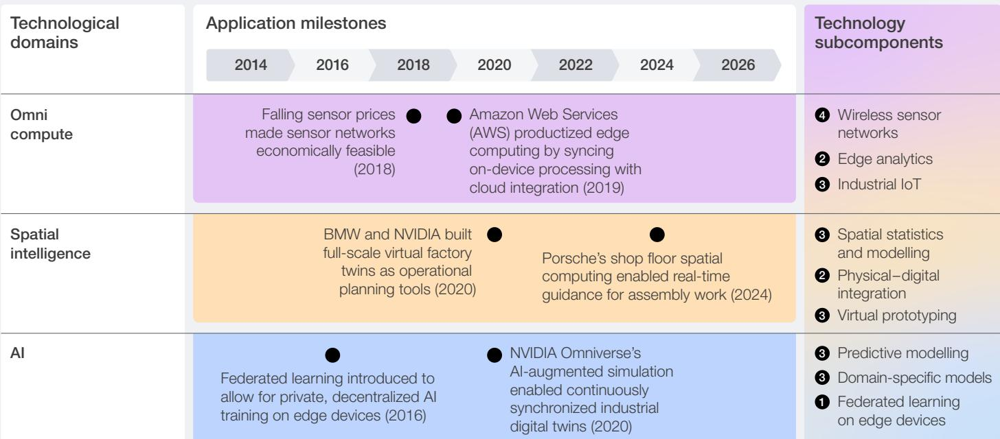

Sources: Leonard, M. (2019). Declining price of IoT sensors means greater use in manufacturing. Supply Chain Dive. https://www.supplychaindive.com/news/ declining-price-iot-sensors-manufacturing/564980/; Canonical. (2019). AWS IoT Greengrass released as a snap. Canonical Blog. https://canonical.com/blog/aws- iot-greengrass-released-as-a-snap; Venables, M. (n.d.). AI in automotive manufacturing. Illuminaire. https://illuminaire.io/ai-in\_automotive-manufacturing/; Porsche Newsroom. (2024). Porsche is exploring spatial computing with Apple Vision Pro. https://newsroom.porsche.com/en/2024/innovation/porsche-spatial-computing- apple-vision-pro-37760.html; He, K., Zhang, X., Ren, S. and Sun, J. (2015). Deep residual learning for image recognition. Computer Vision Foundation. https:// arxiv.org/abs/1602.05629; Rolls-Royce. (n.d.). IntelligentEngine: our vision for the future of aircraft power. https://www.rolls-royce.com/products-and-services/civil- aerospace/intelligentengine-explainer.aspx.

## Shifting bottlenecks

In manufacturing, value creation has long been constrained by the cost and speed of physical iteration. Product design, testing and production have historically progressed through linear, hardware-intensive stages, resulting in expensive prototyping, lengthy testing cycles and repeated rework.

## FIGURE 8

## Traditional manufacturing value chain constraints

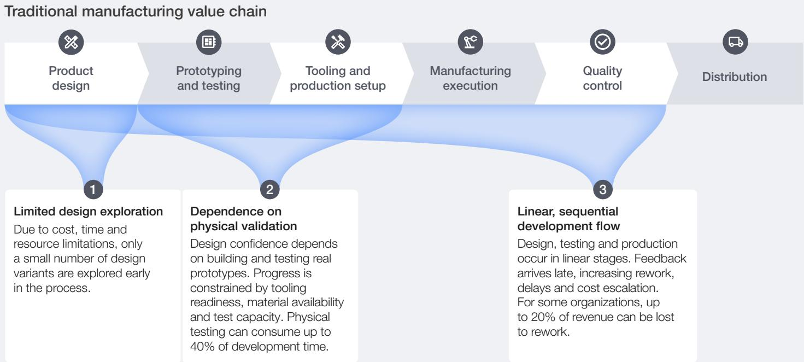

## Primary constraints

Sources: MECAD. (n.d.). When Physical Testing Becomes Your Bottleneck: The Strategic Shift to Virtual Validation. https://mecad.co.za/when-physical-testing-becomes-your-bottleneck-the-strategic-shift-to-virtual-validation/; Frady, L. (2025). Too Many Defects, Too Little Time? How Lean Six Sigma Slashes Rework in Manufacturing. ISIXSIGMA. https://www.isixsigma.com/lean-methodology/too-many-defects-too-little-time-how-lean-six-sigma-slashes-rework-in-manufacturing/.

The development and adoption of digital twin ecosystems aim to overcome these constraints:

\- Limited design exploration: Generative design and high-fidelity simulation enable thousands of digital variants before hardware is involved, expanding the design space without proportional cost or time.

\- Dependence on physical validation: Multi-physics models, continuously calibrated with sensor and operational data, build confidence early. Physical tests shift from discovery to targeted confirmation.

\- Linear, sequential development flow: Digital twins connect design, testing and production through shared models and real-time data. Linear handoffs are replaced by iterative, parallel workflows that shorten cycles and reduce late-stage risk.

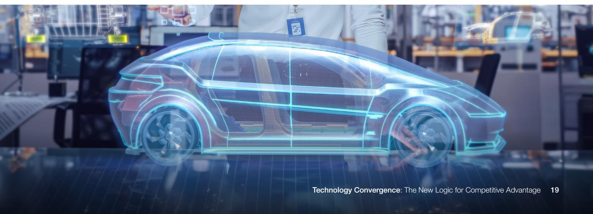

Digital-twin-led manufacturing value chain

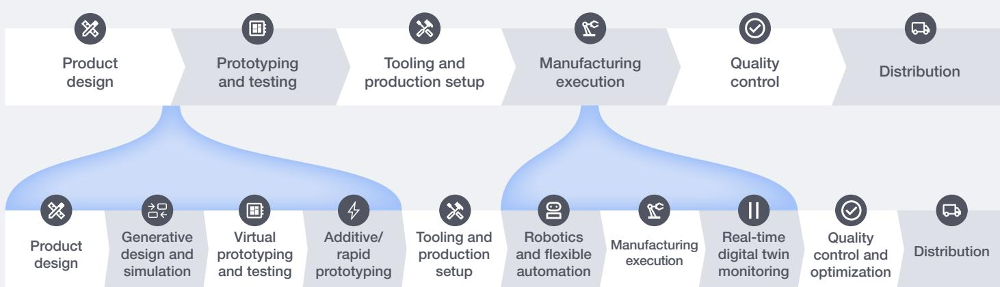

Digital-twin-led manufacturing performance largely depends on the fidelity of the simulation model, tight digital-physical integration and the organization's capacity to adapt talent.

## Integrating technologies

## CASE STUDY 2

## Siemens orchestrated scalable industrial ecosystems for a connected digital twin future

The problem: Digital twins require multiple industrial tools to work together, but most industrial environments use disconnected software and custom point-to-point integrations. The result is inconsistent data, redundant workflows and digital twins that are costly and inefficient to update or scale.

The action: Siemens made interoperability the foundation of its digital twin execution. Its digital business platform Xcelerator offers a curated portfolio of modularized interoperable software and hardware with standardized interfaces, certification frameworks and streamlined integration pathways. This ensures that shared data structures, spanning computer-aided design (CAD) models, automation logic, equipment telemetry and life cycle management tools, are already embedded across the Siemens ecosystem. As a result, different industrial software packages, from simulation engines to manufacturing execution systems (MESs) and product life cycle management (PLM) systems, can plug into the same environment without rebuilding integrations, and updates in one tool flow reliably across the entire digital twin.

The outcome: Digital twins become tightly integrated, continuously synchronized systems. Data remains consistent across the life cycle, industrial software works together without friction and integration costs drop. Customers and partners can customize and scale digital twin solutions faster and with greater reliability, unlocking higher operational value across the ecosystem. For example, with its shop-floor material-flow digital twin, Siemens simulated the movement of automated guided vehicles to optimize routes and cycle times, reducing material circulation by about 40% and boosting overall efficiency.

# Gecko Robotics helps manufacturers generate high-quality physical data that strengthens simulation model fidelity

The problem: Manufacturers increasingly rely on digital twin ecosystems to accelerate design and testing, but often lack the physical data needed to calibrate and validate simulation models.

The action: Manufacturers partner with physical data providers like Gecko Robotics, which deploys robotic inspection systems equipped with advanced sensors and edge AI, purpose-built for extreme industrial environments to collect high-fidelity data on corrosion or structural integrity, which is directly integrated into clients' digital twin systems.

## Expanding value

Digital twins add new layers of insight that help manufacturers use equipment more effectively and skilled teams focus on high-priority tasks. They enable continuous monitoring, simulation

Gecko operates across a wide range of manufacturing clients and therefore benefits from scale and learning effects that improve data quality and consistency. When integrated into manufacturers' digital twin workflows, this data directly enhances simulation accuracy and model reliability.

The outcome: Manufacturers remove a key challenge around digital twin performance, improving asset management, predictive maintenance and operational optimization without duplicating capital investment or building specialized capabilities.

and adjustment of production systems, increasing throughput and reducing downtime. This increases the overall revenue while also minimizing unexpected equipment costs. Manufacturers will continue to decide whether to develop digital twins internally or work with partners.

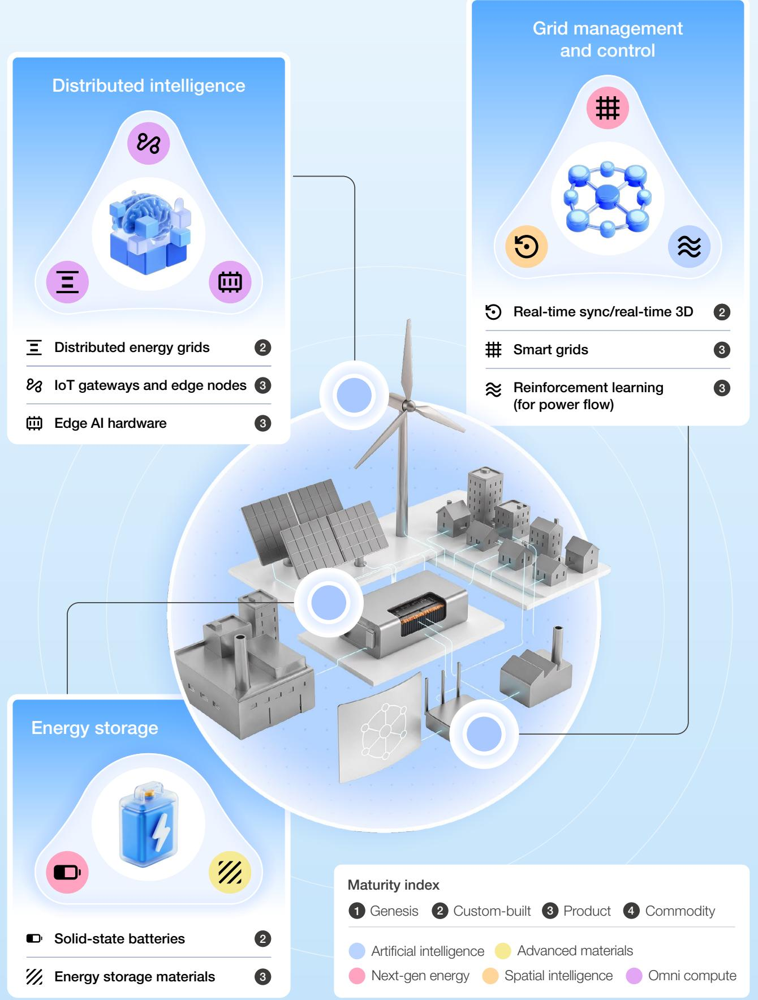

## Distributed intelligence

## Grid management and control

三 Distributed energy grids

Edge AI hardware

IoT gateways and edge nodes

Real-time sync/real-time 3D

\# Smart grids

≈ Reinforcement learning (for power flow)

## Energy storage

Solid-state batteries

Energy storage materials

## Maturity index

Custom-built

Artificial intelligence

Next-gen energy

Commodity

Advanced materials

Spatial intelligence

Omni compute

An intelligent grid system enables a flexible, self-coordinating energy network that monitors, balances and optimizes power flows across distributed resources in real time.

## The industry problem

Energy systems face growing difficulty balancing supply and demand as patterns shift faster than traditional grid infrastructure can respond.

## Why combination is possible today

For years, batteries were too costly for commercial use, renewable generation lacked scale and grid infrastructure was built for centralized control. The landscape has shifted as a stack of technologies has matured together, as shown in Figure 10.

Today, advances in advanced materials and next-gen energy have made grid-scale storage both economically viable and operationally capable, allowing assets to absorb and inject

## Technology domain

Next-gen energy

AI

Spatial intelligence

Omni compute

Advanced materials

power with stability and flexibility. Progress in omni compute and AI now gives operators real-time visibility into grid conditions and the ability to optimize charge, discharge and power flows across multiple value streams. Spatial intelligence enables the simulation of infrastructure impacts and the strategic placement of assets to deliver the greatest system benefit. Together, these advances are shifting the grid from a reactive, centralized system into an adaptive, real-time network that continuously balances energy across distributed resources.

FIGURE 10 | Subcomponents propelling intelligent grid systems to their current maturity  
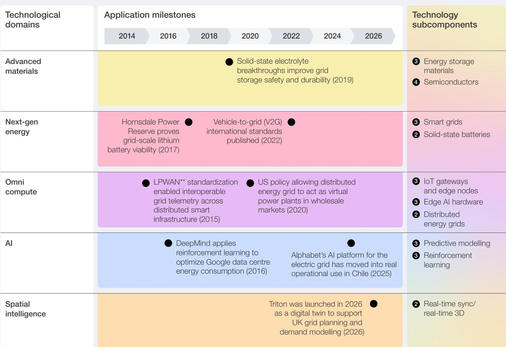  
Note: \*Contemporary Amperex Technology; \*\*Low-power wide-area network.

Sources: Sarfraz, N., Kanwal, N., Ali, M., Ali, K., et al. (2024). Materials advancements in solid-state inorganic electrolytes for highly anticipated all solid Li-ion batteries. Energy Storage Materials, vol, 71. https://www.sciencedirect.com/science/article/pii/S2405829724004458; Colthorpe, A. (2018). 'Undeniable success': South Australia's 129MWh Tesla battery. Energy Storage News. https://www.energy-storage.news/undeniable-success-south-australias-129mwh-tesla-battery/; U.S. Department of Energy (DOE). (2025). Charting the Path: An Energy Earthshots Initiative Report. https://www.energy.gov/sites/default/files/2025-01/doe-energyearthshots-initiativereport.pdf; Monta. (n.d.). ISO 15118: Definition, key features, benefits, adoption, and compliance. https://monta.com/en/blog/iso-15118/; OrbiWise. (n.d.). The Evolution of LPWAN Technologies. https://orbiwise.com/news/the-evolution-of-lpwan-technologies/; Federal Energy Regulatory Commission (FERC). (n.d.). FERC Order No. 2222 explainer: Facilitating Participation in Electricity Markets by Distributed Energy Resources. https://www.ferc.gov/ferc-order-no-2222-explainer-facilitating-participation-electricity-markets-distributed-energy; Allsup, M. (n.d.). In Chile, Google X is taking AI-powered grid tools out of pilot purgatory. Latitude Media. https://www.latitudemedia.com/news/in-chile-google-x-is-taking-ai-powered-grid-tools-out-of-pilot-purgatory/; Evans, R. and Gao, J. (n.d.). DeepMind AI Reduces Google Data Centre Cooling Bill by 40%. Google Deepmind. https://deepmind.google/blog/deepmind-ai-reduces-google-data-centre-cooling-bill-by-40/; National Grid. (2026, 29 January). National Grid unveils award-winning new Digital Twin and Data Visualisation Tool, Triton, to accelerate network planning. https://www.nationalgrid.com/national-grid-unveils-award-winning-new-digital-twin-and-data-visualisation-tool-triton-accelerate.

## Shifting bottlenecks

In energy systems, value creation has long been constrained by centralized generation and linear power flows. Grid design and operating models evolved around large, scarce assets and predictable, one-directional demand.

Traditional energy value chain  
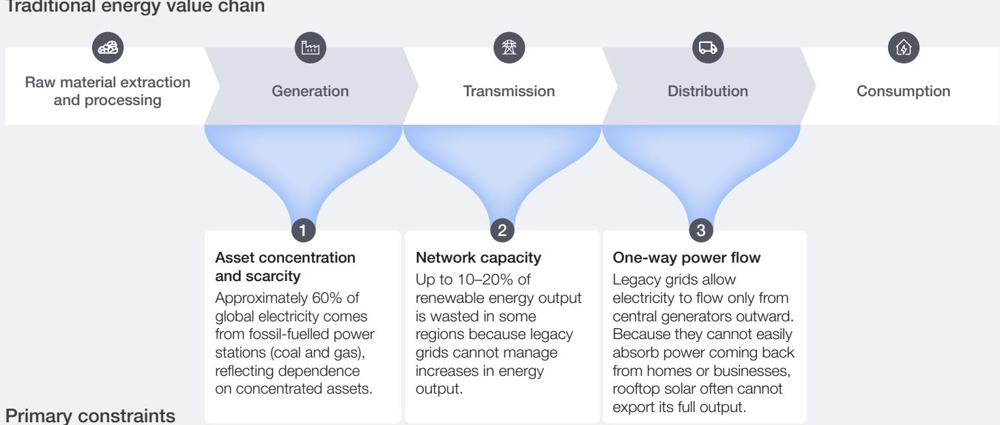

Sources: Statista. (n.d.). Electricity generation worldwide from 1990 to 2024. https://www.statista.com/statistics/270281/electricity-generation-worldwide/; Inter-American Development Bank (IDB). (2025). The Challenge of Renewable Energy Curtailment. https://www.iadb.org/en/blog/energy/challenge-renewable-energy-curtailment.

The development and adoption of intelligent grid systems aim to overcome these constraints:

\- Asset concentration and scarcity: Advanced batteries, distributed generation and power electronics decentralize supply, breaking the reliance on a small number of centralized assets.

\- Network capacity: IoT sensing, AI optimization and digital twins provide real-time visibility into grid conditions, enabling adaptive load balancing, predictive congestion management and more efficient use of existing infrastructure.

One way power flow intelligent control systems enable bidirectional power flows, integrating storage, electric vehicles (EVs), microgrids and flexible demand. Consumers increasingly become participants in grid balancing, rather than passive endpoints.

Intelligent grid performance increasingly depends on the duration of energy storage, the coordination of distributed assets across households, vehicles and storage systems, and the regulatory framework.

## FIGURE 12

Adoption of intelligent grid reshapes the traditional energy value chain

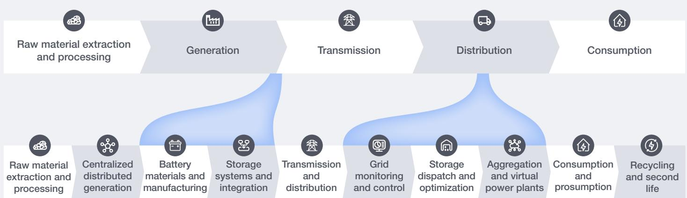  
Intelligent grid systems value chain

CASE STUDY 4

# Octopus Energy optimizes distributed assets to enhance grid flexibility and reduce costs for consumers

The problem: Costly and slow grid build-out is becoming a global policy priority to meet the growing peak demands of the electricity system, driven by intermittent energy generation and increasing electrification. Traditional energy systems were, however, not designed to manage this level of decentralized flexibility.

The action: Octopus Energy, a technology-led energy supplier, operates a software platform that coordinates distributed consumption and generation as a single system. It aggregates household assets, EVs, home batteries and solar panels, and coordinates when they consume, store or export electricity in a way that reduces costs for consumers and helps to reduce peak demand. This coordination is enabled through a hardware-agnostic application programming interface (API) architecture. Octopus's digital

## Expanding value

Intelligent grid systems help operators use generation, storage and distributed resources more effectively, reducing strain on infrastructure and improving the availability of energy. This enables the system to make better use of the resources

platform translates the proprietary languages of different EV chargers, heat pumps and batteries into a unified operational stream. This digital bridge allows Octopus to treat dispersed household equipment as a single virtual power plant. AI-driven optimization then automatically dispatches power or triggers charging based on price signals, network constraints and customer preferences.

The outcome: Octopus now coordinates over 400,000 controllable assets in UK households, integrating more than 1.2 terawatt-hours (TWh) of distributed solar generation annually into grid and market operations. $^{4}$ Research from the Centre for Net Zero found that using this technology for EV charging cut consumers' bills by £343 per year on average and reduced peak household demand by 42%. $^{5}$ It also shifted all EV charging to off-peak times, easing pressure on the grid.

already in place and deliver a more reliable supply. For organizations, competitive advantage comes less from owning generation assets or controlling fuel supplies, and more from orchestrating flexibility by coordinating storage, software, markets and distributed resources into systems that balance supply and demand across time and location.

## Biological manipulation

Organoids

Nanoparticle delivery

CRISPR systems

## Autonomous experimental systems

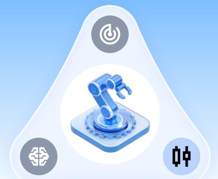

## Perception and monitoring

Adaptive and intelligent control

Multi-robot coordination

Domain-specific models

Computer vision

Object recognition and manipulation

## Maturity index

Custom-built

Artificial intelligence

Engineering biology

Commodity

Advanced materials

Robotics

Spatial intelligence

Precision bio production and cognitive robotics in life sciences, also known as autonomous labs, enable the design, execution and optimization of biological workflows with minimal human intervention.

## The industry problem

AI is accelerating biological predictability, but the industry lacks coordinated, scalable data infrastructure. Lab data generation remains slow, fragmented and human-dependent, creating a chokepoint that constrains the process of turning predictions into results.

## Why combination is possible today

Autonomous labs were not viable in earlier years because the technical foundations were not yet in place. Biological systems were too variable, so automation was mostly limited to experiments requiring lots of repetition, such as screening. Today, a maturing stack of technologies is combining more broadly across lab environments, as shown in Figure 13.

Dense, real-time data from bio-engineering processes now feeds continuously into digital models, while new materials enable the simulation of biological conditions and safely support diverse reactions and workflows. AI systems can then

## Technology domain

Engineering biology

AI

Advanced materials

Robotics

Spatial intelligence

generate high-confidence, in-silico designs before synthesis, which robotics can execute by performing production tasks and adjusting to simulation-driven changes. Spatial intelligence further enables robots to operate effectively in retrofitted lab spaces rather than purpose-built facilities.

These advances no longer sit in isolation. They can now be connected into coordinated, end-to-end workflows, enabling both greenfield autonomous labs designed around an AI-first technology stack and brownfield labs retrofitted to support increasingly automated operation. Together, these capabilities are transforming traditional laboratories into integrated, adaptive systems capable of increasingly autonomous operation.

FIGURE 13 | Subcomponents propelling autonomous labs to their current maturity  
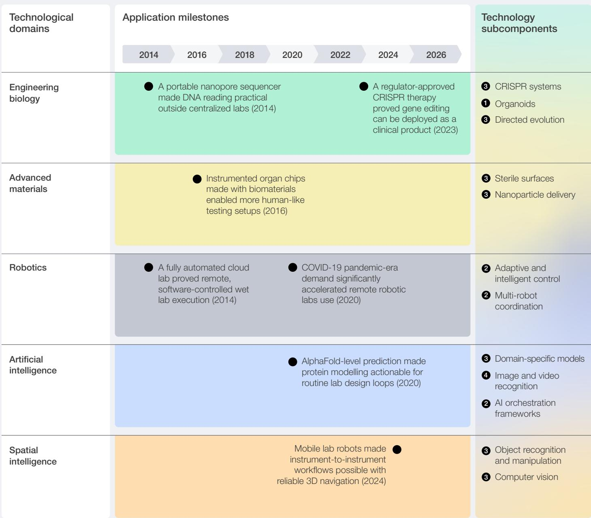

Sources: Henderson, H. (2024). CRISPR clinical trials: 2024. Innovative Genomics Institute (IGI). https://innovativegenomics.org/news/crispr-clinical-trials-2024/; Burrows, L. (2016). 3D-printed heart chip with integrated sensors. Harvard John A. Paulson School of Engineering and Applied Sciences. https://seas.harvard.edu/news/3d-printed-heart-chip-integrated-sensors; Proffitt, A. (2014). Robots for Hire: Emerald Launches Robotic Laboratories for Life Sciences. Bio-IT World. https://www.bio-itworld.com/news/2014/07/01/robots-for-hire-emerald-launches-robotic-laboratories-for-life-sciences; Bertoline, L. M., Lima, A. N., Krieger, J. E. and Teizeria, S. K.. (2023). Before and after AlphaFold2: An overview of protein structure prediction. Frontiers in Bioinformatics, vol. 3. https://pmc.ncbi.nlm.nih.gov/articles/PMC10011655/; Huang, J., Liu, H., Junginger, S. and Thurow, K. (2025). Mobile robots in automated laboratory workflows. SLAS Technology, vol. 30. https://www.sciencedirect.com/science/article/pii/S2472630324001225.

## Shifting bottlenecks

Life sciences labs have made significant progress in digitization and automation, yet many workflows still depend on people to bridge gaps between systems. While tasks such as pipetting or plate handling have been automated for decades, these tools typically operate as stand-alone instruments rather than as part of an integrated workflow. As a result, technicians often set up hardware and run instruments, but many steps remain manual, limiting throughput and contributing to reproducibility issues stemming from human-executed science.

Manual processes also introduce avoidable variation and delays. Even routine tasks can affect analytical accuracy, triggering additional investigations and cost down the line. Fragmented systems make this worse, requiring scientists to manually retrieve, clean and combine data, which further slows decision-making and reduces overall productivity.

Autonomous labs value chain  
Traditional life science experimental lab value chain  
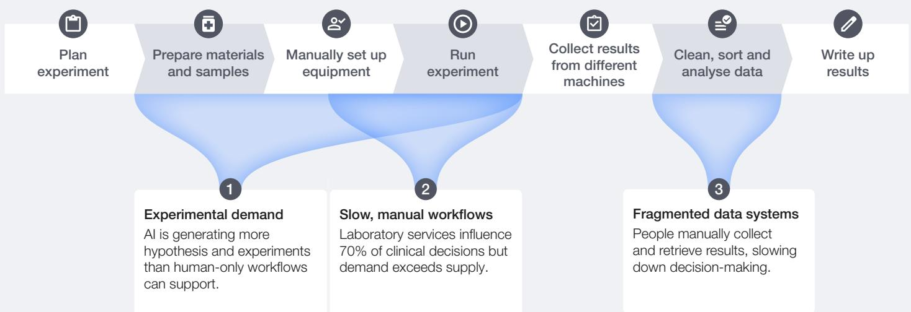

## Primary bottlenecks

Sources: Sikaris, K. A. (2017). Enhancing the Clinical Value of Medical Laboratory Testing. Clinical Biochemist Reviews. https://pmc.ncbi.nlm.nih.gov/articles/PMC5759162/.

The development and adoption of autonomous labs aim to overcome these constraints:

\- Experimental demand: Autonomous systems take on routine tasks to expand scientific capacity, enabling smaller teams to direct large automated workflows and focus on higher-value analytical and clinical work.

\- Slow, manual workflows: Robots can run many steps automatically and keep working through the day and night. This makes experiments faster and helps labs handle more work without needing more people.

\- Fragmented data system: Today, results often come from different machines and must be collected and combined by hand. Autonomous labs automatically bring these data streams together. This reduces errors, speeds up reporting and gives scientists a clearer picture of what's happening in real time.

Autonomous labs are reshaping traditional drug discovery value chains, increasingly relying on integrated digital and physical infrastructure, secure data systems and talent prepared to manage end-to-end automation.

## FIGURE 15

Adoption of autonomous labs reshapes the traditional life science lab value chain

Traditional life science experimental lab value chain  
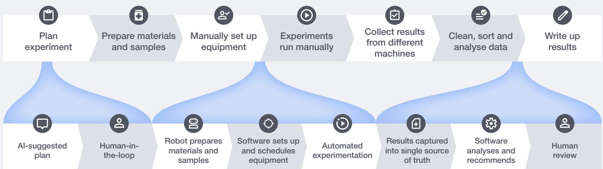

## CASE STUDY 5

# Deep Principle integrates autonomy to scale materials discovery

The problem: Advanced materials R&D is slow, expensive and constrained largely because experiments, data capture and analysis occur in fragmented, manual workflows. This limits the ability of AI models to iterate quickly and learn from experiments.

The action: Deep Principle redesigned how discovery work fits into existing labs, so adoption didn't require a structural overhaul. They standardized experiment formats, data schemas and review steps so labs could connect their workflows into an automated discovery loop. Their partnership with XtalPi added flexible robotic modules that slot into current bench routines rather than replacing them.

They also shifted customer payments away from large, upfront projects towards simple, use-based access and small proof-of-concept sprints to reduce adoption barriers.

The outcome: This integration-first model enabled autonomous experimentation in real lab environments, delivering up to 80% cost reductions in real projects while making it easy for teams to try the system, learn it and expand use naturally over time. By fitting into how labs already work and removing the operational burden of adoption, Deep Principle turned autonomous discovery into a scalable, self-reinforcing part of the R&D workflow.

## CASE STUDY 6

## SandboxAQ works with companies to adopt hybrid data strategies for speed, scale and precision in molecular discovery

The problem: AI-driven molecular discovery relies on high-fidelity physical data that captures real molecular behaviour. Producing ground-truth physics data, such as quantum-mechanical energies, forces and reaction pathways, requires hours or days of high-performance computation per simulation, making full internal industrialization impractical.

The action: Leading firms adopt hybrid data strategies that pair their proprietary data with tailored, high-volume, computationally intensive data to drive model accuracy at scale. They retain internal control over the proprietary signals that drive differentiation while partnering with specialized providers such as SandboxAQ to externalize ground-truth physics data generation via validated large quantitative model (LQM) pipelines that combine physics-based simulation, cloud-scale computing and machine learning (ML). $^{6}$

The outcome: Companies scale and accelerate AI-driven discovery with a strategic focus on core R&D priorities.

## Expanding value

Autonomous lab systems help labs run experiments faster and with greater consistency by automating routine tasks and coordinating work across instruments. This expands scientific capacity, reduces variation and enables scientists to focus on the parts of research that need expert judgement.

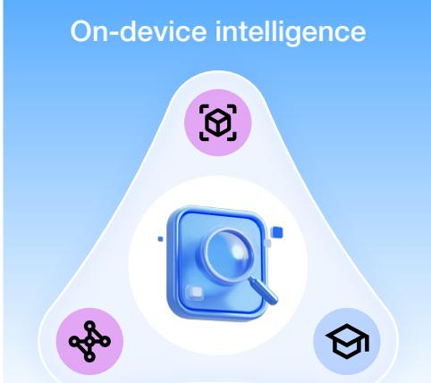

Edge AI inference

Edge analytics

Supervised learning

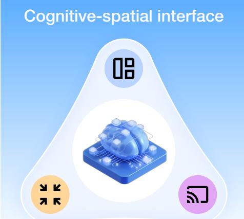

Real-time 3D spatial mapping

Multimodal AI

Smart devices and wearables

## Neural sensing

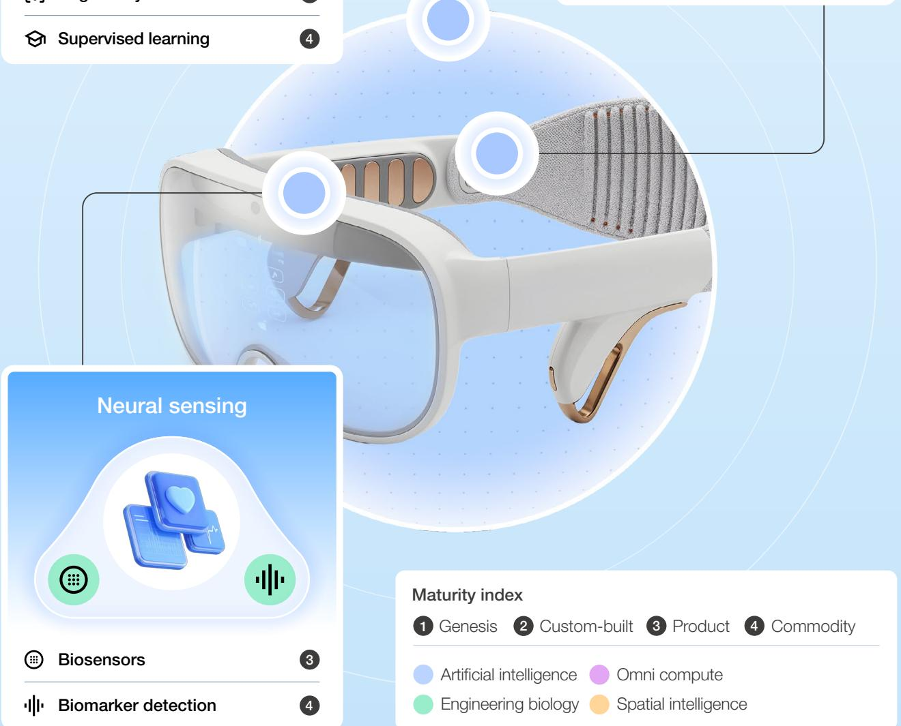

Biosensors

Biomarker detection

Commodity

Artificial intelligence

Engineering biology

Omni compute
Spatial intelligence

New devices are embedding intelligence into the environment through ambient, screenless systems that interpret voice, presence and, increasingly, physiological signals.

## The opportunity

Complex, high-stress environments place a high cognitive load on decision-makers. Non-invasive BCIs could translate signals from users into adaptive, personalized information for on-the-spot decisions, learning and hands-free control.

## Technology domain

AI

Omni compute

Engineering biology

Spatial intelligence

## Why combination is possible today

“ BCIs can now interpret brain signals reliably enough to be useful, in form factors light enough to wear and robust enough to function in uncontrolled, real-world settings.

Wearable technology has expanded well beyond fitness trackers and smartwatches. Today's devices monitor heart rate variability, blood oxygen, skin conductance, sleep architecture and movement patterns. Non-invasive brain-computer interfaces (BCIs) represent a distinct subset of this broader category: wearables designed specifically to measure and interact with brain signals. Where most wearables read peripheral physiological signals that infer health states, non-invasive BCIs can more accurately and directly measure attentional states, expanding the capacity for human-machine interaction.

Five years ago, non-invasive BCIs were largely confined to controlled environments where electroencephalogram (EEG) systems required gel electrodes and lengthy calibration sessions to work. Even so, signal quality was too low and inconsistent for any applications beyond basic research. What has changed is not any single breakthrough, but the simultaneous maturation of a stack of technologies, as shown in Figure 16.

Engineering biology and omni compute advancements have enabled hands-free, wearable headsets that capture more consistent brain signals and transmit them safely and securely to other devices. AI has improved how those signals are interpreted and cleaned, reducing noise and variability. Meanwhile, spatial intelligence now enables more precise tracking and environment mapping, so brain activity can be accurately correlated with where people are looking or acting. Building on this, advancements in robotics now allow these interpreted brain signals to drive physical systems, where continuous closed-loop correction stabilizes movement even when brain inputs are imperfect.

Altogether, it means non-invasive BCIs can now interpret brain signals reliably enough to be useful, in form factors light enough to wear and robust enough to function in uncontrolled, real-world settings. Over time, non-invasive BCIs are likely to move beyond standalone devices and become an embedded sensing layer within broader wearable and ambient computing systems.

FIGURE 16 | Subcomponents propelling non-invasive BCIs to their current maturity  
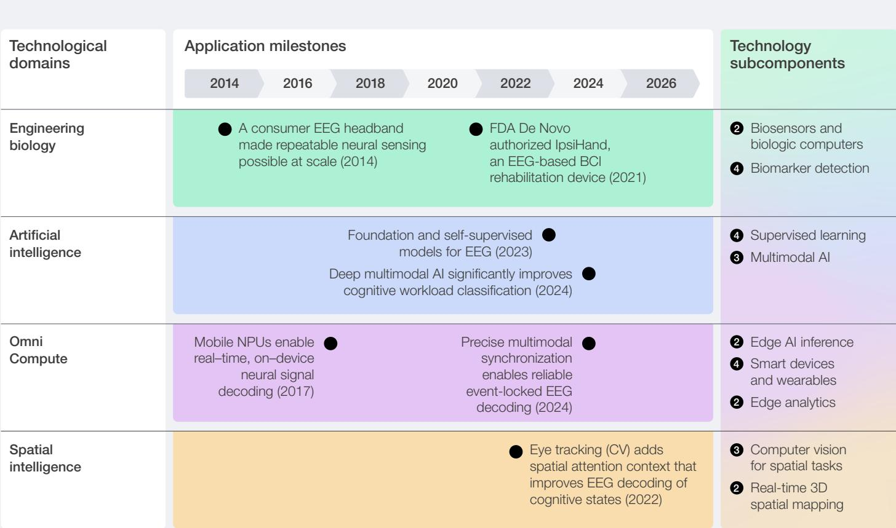

## Note: \*Neural processing units.

Sources: Cui, W., Jeong, W., Thölke, P., Medani, T., et al. (2024). Neuro–GPT: Towards a Foundation Model for EEG. Institute of Electrical and Electronics (IEEE) International Symposium on Biomedical Imaging (ISBI). https://arxiv.org/abs/2311.03764?; Tang, J., LeBel, A., Jain, S. and Huth, A. G. (2023). Semantic reconstruction of continuous language from non-invasive brain recordings. Nature Neuroscience, vol. 26, pp. 858–866. https://www.nature.com/articles/s41593-023-01304-9?; Hawsawi, O. and Semwal, S. S. (2014). EEG headset supporting mobility impaired gamers with game accessibility. Institute of Electrical and Electronics Engineers (IEEE). https://ieeexplore.ieee.org/document/6974015; The Things Network. (n.d.). What are LoRa and LoRaWAN? https://www.thethingsnetwork.org/docs/lorawan/what-is-lorawan/; Meta. (2018). Introducing Oculus Quest, Our Fist 6DOF All-in-One VR System, Launching Spring 2019. https://www.meta.com/en-gb/blog/introducing-oculus-quest-our-first-6dof-all-in-one-vr-system-launching-spring-2019/.

Non-invasive BCI technology is evolving in two main directions of use. One focuses on letting people control devices by translating brain signals into commands. The other focuses on sensing brain patterns to understand a person's state, such as focus, stress, fatigue or engagement, and adjusting devices or interfaces in response. The sensing direction is particularly relevant in high-stakes operational environments where cognitive load, situational awareness and decision quality are critical constraints.

## Shifting bottlenecks

Aviation represents a useful test case for non-invasive BCIs because its constraints are well documented, its training protocols are already heavily instrumented and its safety requirements demand objective, real-time measurement of the operator's cognitive state. Although applications are expanding across consumer electronics, healthcare, gaming, automotive and other sectors, the following analysis focuses specifically on the use of non-invasive BCIs for pilot cognitive assessment and adaptive support within this sector.

## Traditional pilot cognitive assessment

Pilot training

Medical screening

In-flight
qualitative observation

Post-flight debriefing

## Inefficient training procedure for cognitive needs

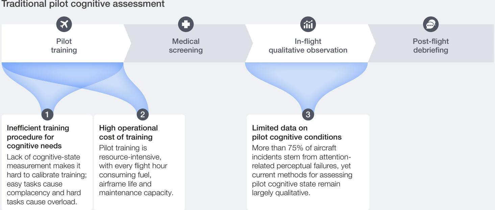

## High operational cost of training

Lack of cognitive-state measurement makes it hard to calibrate training; easy tasks cause complacency and hard tasks cause overload.

Pilot training is resource-intensive, with every flight hour consuming fuel, airframe life and maintenance capacity.

## Limited data on pilot cognitive conditions

More than 75% of aircraft incidents stem from attention-related perceptual failures, yet current methods for assessing pilot cognitive state remain largely qualitative.

## Primary improvement opportunities

The development and adoption of non-invasive BCIs bring new advancements to these opportunities:

\- Boost cognitive understanding: BCIs enable more granular, real-time interpretation of cognitive states, enabling systems to adapt to individual physiological needs. This deeper understanding enhances human-machine collaboration and strengthens decision-making environments where cognitive load and attention are critical constraints.

\- Adaptive access: Non-invasive BCIs can provide reliable communication pathways for individuals with complex motor or speech impairments, expanding access to digital services and assistive technologies. By translating neural activity into actionable commands, these tools unlock new forms of autonomy, inclusion and participation in social, professional and care environments. While this application extends beyond aviation, it illustrates how the same underlying technology stack serves fundamentally different use cases depending on which constraint it targets.

## - Novel interfaces: BCIs enable more

natural interaction by allowing users to issue commands directly through neural sensing rather than relying on explicit, repetitive actions. In augmented reality (AR)/extended reality (XR) and busy environments, this can support more seamless and context-aware interaction.

## Non-invasive, BCI-adapted pilot cognitive

assessment faces emerging challenges in learning efficiency, cognitive-load maintenance and limited real-time cognitive-state measurement.

Traditional pilot cognitive assessment  
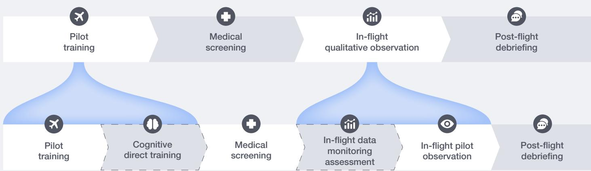  
Non-invasive BCI-adapted pilot cognitive assessment

Disclaimer: This new process represents a possible future scenario, as the technology has not yet been commercially deployed.

## Integrating technologies

While full-scale deployment remains limited, several advanced pilots and research programmes demonstrate real momentum. The following use case shows how non-invasive BCIs have been integrated in practice:

## CASE STUDY 7

## Maintaining optimal cognitive load in flight simulation

The problem: To optimize training outcomes, the key is maintaining an optimal cognitive load range, balancing easy and difficult tasks to maximize learning efficiency. Achieving this requires real-time, objective measures of each trainee's cognitive state to adjust training difficulty accordingly. A Dutch initiative led by the Royal Netherlands Aerospace Centre in Amsterdam $^{7}$ is exploring whether real-time brain data can support adaptive training that responds to a pilot's cognitive state.

The action: The system uses non-invasive BCI to monitor EEG and estimate cognitive workload while pilots fly virtual reality (VR) missions. When the AI detects an overload, it reduces the mission's difficulty. When the workload drops, it increases

## Expanding value

Non-invasive BCIs help redesign pilot training and in-flight observation. The result is higher training

the challenge to keep the pilot within an optimal learning zone. A related line of research has demonstrated non-invasive BCIs for cockpit alert monitoring, using EEG to infer whether pilots have consciously registered warning signals.

The outcome: One simulated flight study integrating passive BCI with cognitive modelling reported 87% accuracy in identifying whether pilots had processed cockpit alerts, $^{8}$ a capability relevant to reducing out-of-the-loop risk on the flight deck. This capability has applications beyond aerospace. The same constraint, learning efficiency under cognitive load, applies to any high-intensity, safety-critical profession that requires structured training, from surgical residency programmes to air traffic control.

throughput, more accurate cognitive-readiness assessment and more efficient use of instructors, simulators and training hours, all of which maximize learning efficiency for trainees.

## The value of orchestration

Competitive advantage increasingly belongs to organizations that can integrate across technologies, ecosystems and processes.

Competitive advantage is increasingly shaped by how effectively organizations orchestrate multiple technology stacks, partners and corresponding processes into coherent systems.

Section 2 examined how, when technology combinations scale, value is shifted from isolated assets and individual expertise towards coordinated systems that integrate technology, data and human judgement. As these systems expand, the need for effective coordination becomes more relevant than ever.

Competitive advantage in a convergence context is increasingly shaped by how effectively organizations orchestrate multiple technology stacks, partners and corresponding processes into coherent systems that can operate together at scale. Moving from technical mastery to integration across domains becomes an organizational imperative, whether for convergence-native technology providers or technology customers with legacy systems. These imperatives are not new, but as convergence accelerates, they are becoming much more relevant and urgent for organizations.

## Working across boundaries

No single organization can build or own the full stack of combinatorial technologies. The goal, therefore, is to reduce friction within the organization and across partners, so collaboration becomes smooth, predictable and mutually reinforcing. This requires two forms of orchestration: internal orchestration that aligns an organization's own technology, data and people into a single coordinated system; and external orchestration that connects the organization to capabilities across an ecosystem beyond traditional technologies and domains.

The most successful organizations build a culture where advantage comes from connectivity and the speed at which expertise and ideas flow across domains. They do so by establishing ways of working and rituals that make cross-domain exchange a structural habit rather than an occasional event, and by bringing together talent with depth in one area and breadth across multiple domains to enable cross-domain thinking. For

instance, Starcloud brings together interdisciplinary expertise spanning data centres, satellite design and software engineering through intentional moments of cross-domain friction, working through problems together from the co-founder level. This interdisciplinary approach allows them to compress their engineering cycles and produce a unique product at the intersection of AI and robotics to build next-generation orbital data centres.

Strategically engaging the ecosystem reinforces learning loops, speeds communication and strengthens collaboration between organizations. As convergent systems increasingly integrate physical and digital technologies, choices about geographic location and ecosystem participation become more important because they shape how quickly coordination, learning and adoption can occur between providers and customers. Starcloud illustrates how these factors reinforce one another. By locating in Redmond, Washington, near major tech R&D centres like Amazon Web Services (AWS), Microsoft and Google, and aerospace companies such as SpaceX and Airbus, the company positioned itself within a dense ecosystem of cross-domain talent, aerospace fabrication and space-ready logistics. $^{9}$ This ecosystem enabled tighter collaboration, faster feedback loops and shorter iteration cycles with AWS, integrating the AWS Outposts system into Starcloud satellites. $^{10}$

## Setting a common language

Technology convergence demands trust, transparency and adaptability across stakeholders. As systems become more interconnected, the absence of shared protocols and standards creates friction that slows integration and limits adoption. A common language, both technical and operational, is what makes orchestration possible at scale.

First movers can gain a strong advantage by introducing new orchestration processes; they can ensure their offering is adopted by the wider market and that others adopt their language.

“Capability development does not always require bespoke solutions. Many of the capabilities needed to advance frontier systems can be transferred, adapted or repurposed from adjacent industries.”

By setting standards that enable tools, data and partners to work together, an orchestrator becomes the default pathway through which innovation flows. This role increases influence, encourages others to build around the orchestrator's environment and embeds the organization as a structural pillar of the ecosystem.

This dynamic is not new. Google open-sourced Kubernetes, which allows companies to move applications across cloud providers and made it easier for more customers to adopt Google's cloud services. Anthropic released the Model Context Protocol (MCP) as an open standard, which made it easier for AI agents to connect to tools and data and encouraged more organizations to build around Anthropic's ecosystem. What is new is that technology convergence makes this logic more relevant than ever.

Commonwealth Fusion Systems (CFS) demonstrates how first-mover orchestration can define an entirely new supply chain. When CFS began developing its breakthrough high-temperature superconducting (HTS) magnets, the specialized tape required had no reliable commercial source. CFS placed orders consuming roughly 10% of global HTS supply, working closely with major suppliers to scale production to the volumes required. By guaranteeing high-volume demand, CFS established the global specification standard for HTS tape, driving down costs, increasing

reliability to CFS specifications and creating a stable market whose standards now extend to adjacent industries, including data centre infrastructure. $^{11}$

## Transferring strength across industries

Combinatorial technology compounds complexity and extends development cycles. The strategic question is how to accelerate progress and reduce risk while capturing early economic value. For many organizations, the answer is to transfer what already works rather than develop everything from first principles. In a convergence context, capability development does not always require bespoke solutions. Many of the capabilities needed to advance frontier systems can be transferred, adapted or repurposed from adjacent industries. This provides an opportunity to reconsider what needs to be built from scratch; not every capability requires reinvention.

Again, CFS illustrates this approach precisely. Rather than inventing new manufacturing processes for its fusion magnets, CFS adapted proven technologies from adjacent industries. It repurposed EV chips to modulate radio frequency waves to heat plasma in tokamak systems. This deliberate transference of adjacent capabilities accelerated magnet development and contributed to a 30-fold improvement in production speed, reducing assembly and testing time from 30 days to one magnet every two days. $^{12}$

## 3.1 Monetization pathways

Orchestration creates the conditions for monetization. Without it, technology combinations remain bespoke projects sold on a per-engagement basis, unable to generate the recurring revenue or fleet-level economics that sustain scaling. The monetization models that follow are not alternatives to orchestration; they are its economic expression.

## Three monetization patterns of convergence

While no single model fits every convergent outcome, three patterns appear consistently across the domains examined in Section 2. Importantly, several companies operate across more than one pattern simultaneously; the boundaries are practical, not rigid.

1 Service-based delivery: This represents the most common pattern. Traditional ownership models force customers to absorb heavy financial and operational burdens. A surgical robot requires a million-dollar investment and specialist staff. Factory automation systems need constant tuning and integration. AI platforms demand ongoing model improvements and complex data engineering. Most organizations cannot reach the utilization levels or maintain the specialist teams needed to operate these systems effectively, which makes ownership economically unattractive. Service-based models correct this mismatch by shifting capital requirements, operational risk and system complexity to providers who can distribute these demands to many customers. Adoption becomes much easier for customers, who no longer need to make large upfront commitments or make assumptions about their long-term use on day one. Providers benefit as well because they accumulate learning from every deployment across their fleet or platform. Performance improves faster than any single customer could manage alone, and the basis of competition moves away from initial product features towards sustained excellence in delivery and operation.

# CASE STUDY 8

# Formic: Expanding automation access through RaaS

Formic is an automation provider that supplies robotic systems to help manufacturers take over repetitive production tasks and increase throughput. Instead of selling robots, Formic offers them through a RaaS model, combining the hardware, software, data systems and day-to-day operational support into one package. $^{13}$ Its clients, often mid-sized manufacturers, pay a fixed monthly fee with no upfront capital, $^{14}$ full maintenance coverage and guaranteed performance levels, effectively gaining access to turnkey automation without the cost and complexity of ownership.

This service-based model allows Formic to generate recurring revenue by keeping use high across its robotic fleet, with operations and performance managed centrally. By taking on the capital burden of deployment and maintenance

itself, Formic makes automation accessible for mid-sized manufacturers that previously could not justify buying equipment, expanding the addressable market beyond large enterprises. Each deployment contributes operational data that improves fleet-wide performance over time, creating a compounding advantage as service quality and unit economics strengthen with scale.

The company reports more than 500,000 production hours $^{15}$ across over 120 factories in the US, where it operates one of the largest independent robot fleets in the country. $^{16}$ To date, its systems have moved over 1.2 billion items with an uptime of 99.3%. Deployment pace increased fivefold from 2024 to 2025, and the company maintains a 97% customer renewal rate, indicating consistent use and satisfaction.

2 Platform and marketplace models: Where service-based delivery monetizes the provider's own operational capability, platform models monetize the connections between participants. Black Lake illustrates this clearly: the company does not own factories or produce goods but earns a coordination fee on every transaction that flows through its

network. The more participants the platform connects, the more valuable it becomes to each of them. This pattern tends to emerge when convergence creates a fragmented ecosystem with many small providers and many varied demand signals, and the orchestrator's role is to match, translate and coordinate between them.

# Black Lake: Monetizing coordination across a fragmented factory network

Black Lake began as an enterprise software provider for large manufacturers such as Tesla, Foxconn, Contemporary Amperex Technology (CATL), Austron and Weben, building tools to improve operational visibility. While serving these clients, the company identified a much larger gap in the long tail of small factories across China, where sites with fewer than 100 workers still relied on manual planning and had almost no digital visibility. To address this, Black Lake developed a mobile product tailored to these smaller factories. It spread quickly, reaching tens of thousands of sites, placing Black Lake at the centre of a previously disconnected network of small manufacturers.

As this network expanded, creators began asking for help with very small production runs. Large factories did not accept this work, and small factories struggled to engage because creators' ideas were too general while factory

requirements were too technical. Attempts to collaborate broke down, so Black Lake stepped in to coordinate the exchange. The company used its cloud systems to identify where capacity was available and integrated generative AI to turn creative intent into manufacturable files, cutting costs, time and the expertise required to move from idea to manufacturable output. Black Lake monetizes this opportunity through a marketplace coordination model, earning a fee on each transaction by enabling the translation of intent into executable manufacturing solutions across its industrial network, matching demand to available supply – an approach made viable only because orchestration solves the fragmentation barrier. With the marketplace model in place, creators could produce small batches, reducing minimum order requirements, and small factories could earn more by using idle capacity. More than 230 small-batch orders have now been completed.

Ecosystem standards and licensing: Some organizations monetize orchestration indirectly by setting standards that make the broader ecosystem depend on their capabilities. Intel's USB standard, Google's Kubernetes and Anthropic's MCP were all discussed in Section 3 as orchestration moves, but they were also monetization moves that increased demand for the sponsor's core products by making the surrounding ecosystem easier to use. In convergence, where multiple technologies must interoperate, the organization that defines how they connect gains structural pricing power even without charging for the standard itself.

The common thread across all three patterns is that monetization follows orchestration capability. The organizations generating the most durable revenue from convergence are not those with the most advanced technology in isolation, but those that have built the coordination infrastructure to deliver integrated performance and structured it into a revenue model that scales with use.

# The race to compounding advantage

Combinations emerge constantly. Systems that scale do not. What separates impact from ambition is the capacity to scale a combination into a system that works, relieving the right constraints, integrating across people, processes and ecosystems, and capturing value through monetization models that match how systems are delivered and used.

These are interconnected choices: where to play, how to integrate, and how to sustain progress as markets, regulations and technology maturity shift, all within an ecosystem where technologies combine, converge and compound.

The advantages organizations can accrue with effective orchestration are not in single product features but in the learning and delivery systems that improve with use. An enterprise workflow platform does not pull ahead by shipping one breakthrough capability. It compounds through deployment, where each implementation generates use signals and operational learning that refine the product, strengthen integration patterns and sharpen delivery in the next cycle. Adoption expands the partner and complements the ecosystem, which drives more deployments and the next cycle of learning, reuse and improvement.

This is what the 3C looks like: the ecosystem learning together through shared routines, standards and operational experience across providers, partners, regulators and standards bodies.

The practical test is not whether a technology is promising. It is whether you can participate in, or help create, the scale and feedback loops where compounding begins: repeatable deployment, measurable outcomes, trusted governance and the ability of each implementation to make the next one faster, safer and cheaper. The best technology that remains bespoke will often lose to “good-enough” technology that compounds through adoption, interoperability and learning.

In convergent systems, control is rarely the point. What matters is position and contribution: the ability to help coordinate interfaces, provide assurance and establish repeatable patterns so that many actors can move together. Value tends to accrue for those who enable reliability and integration across the ecosystem, not only to those who try to own every layer.

Organizations that internalize the combine-converge-compound dynamic will be better positioned to shape emerging convergence opportunities, accelerate ecosystem development and expand what becomes possible across industries.

## Contributors

This report is a combined effort based on numerous interviews, discussions, workshops and research. The opinions expressed herein do not necessarily reflect the views of the individuals or organizations involved in the project or listed below. Sincere thanks are extended to those who contributed their insights via interviews and workshops, as well as those not captured below.

## Lead authors

## World Economic Forum

Mattia Damati
ECP Fall, Technology Convergence Initiative

## Connie Kuang

Lead, Technology Convergence Initiative

## Antoine Tillette de Mautort

## Acknowledgements

Partner; Head of Gaming and Interactive Media, Lightspeed Venture Partners

Sincere appreciation is extended to the following working group members, who spent numerous hours providing critical input and feedback to the drafts. Their diverse insights are fundamental to the success of this work.

## Moritz Baier-Lentz

Head, AI Applications and Impact, World Economic Forum

## Pete Bernard

Chief Executive Officer, EDGE AI FOUNDATION

## Maria Basso

## Jehangir Byramji

Managing Consultant, frog, Capgemini

Emerging Technology and Innovation, Lloyds Banking Group

Brian Berzin
Chief Executive Officer, Thea Energy

Principal Analyst, Cambridge Consultants, Capgemini

Consultant, frog, Capgemini

Vice-President and Chief Technology and Innovation Officer (CTIO), Capgemini

Frincy Clement
Head, North America Region, Women in AI

## Technology Convergence Project Fellows

## Kary Bheemaiah

## Mylo Kidwell

Ena Cratsenburg
Chief Business Officer, Ginkgo Bioworks

## Simone Xinyi Qiu

## John Cumbers

Founder and Chief Executive Officer, SynBioBeta

Santanu Dasgupta
Honorary Professor, Amity University

## Umeshwar Dayal

Senior Fellow and Senior Vice-President; Corporate Chief Scientist, Hitachi

## Allison Dring

Co-Founder and Chief Executive Officer,
Made of Air

Felix Ejeckam
Chief Executive Officer, Akash Systems

## Liv Erickson

Senior Product Lead, Mozilla Data Collective, Mozilla

## Mark Esposito

Faculty Associate,
Harvard Kennedy School of Government

## Edwina Fitzmaurice

Corporate Vice-President, Industry Solutions Delivery, Microsoft

Andreas Forsland
Founder and Chief Executive Officer, Cognixion

Heike Freund
Managing Director and Chief Operating Officer,
Marvel Fusion

## Arti Garg

Executive Vice-President and Chief Technologist, AVEVA

Kian Gohar
Founder and Chief Executive Officer, Geolab

## Valentin Golovtchenko

Lead, Planetary Solutions Strategy, World Economic Forum

## Olaf Groth

Professional Faculty, Haas School of Business, University of California, Berkeley

Ylva Hansdotter
Founder and Chief Strategy Officer, Flowtropolis

Cortney Harding
Chief Executive Officer, Friends with Holograms

## Guy Harmelin

Chief Investment Officer, Advanced Technology, MGX Fund Management

Amy Hebert
Chief Executive Officer, Arcadia eFuels

## Roberto G. Hernandez

Chief Innovation Officer,
Customer Transformation, PwC

## Greg Jackson

Founder and Chief Executive Officer,
Octopus Energy

## Haojun Jia

Founder and Chief Executive Officer,
Deep Principle

Ralph Jodice
General Manager of North America;
Global Head of Partnerships and Publicity, Xreal

Philip Johnston
Founder and Chief Executive Officer, Starcloud

Alex Joseph
Chief Technology Officer, Microsure

Anthony Jules
Co-Founder and Chief Executive Officer, Robust.AI

Gaurav Kakati
Chief Technology Officer, Artificial Intelligence,
KPIT Technologies

## Jose Jacob Kalayil

Director and Curator, Future ICT Forum for Sustainable Cities

## Peter Koerte

Member of the Managing Board; Chief Technology Officer; Chief Strategy Officer, Siemens

Fabio La Franca
Founding Partner, Blueverse Ventures

Alan Ka Ming Lau
Chief Business Officer, Animoca Brands

Stefan Leichenauer
Vice-President, Engineering, SandboxAQ

## Jake Loosararian

Co-Founder and Chief Executive Officer, Gecko Robotics

Alok Medikepura Anil
Managing Director, Next Big Innovation Labs

## Konstantinos Meichanetzidis

Head of Scientific Product Development, Quantinuum

Julien Mialaret
Operating Partner, Eurazeo

Amy Peck
Founder and Chief Executive Officer, EndeavorXR

## Susan Persky

Director, Immersive Simulation Program, National Human Genome Research Institute (NHGRI), National Institutes of Health (NIH)

## Gerald Podobnik

Chief Financial Officer, Corporate Bank, Deutsche Bank

## Vijay Ravindran

Chief Executive Officer, Floreo

## Yonatan Raz-Fridman

Chief Executive Officer, Supersocial

## Nayat Sanchez-Pi

Executive Director and Director, Binational Franco-Chilean Center on Artificial Intelligence (INRIA)

## Roland Scharrer

Partner and Managing Director; European Data and AI Leader, Kearney

## Francesco Scibilia

Head of Technology Foresight and Intelligence, Equinor

## Francesco Sciortino

Co-Founder and Chief Executive Officer, Proxima Fusion

Himanshu Shrivastava
Chief Technology Officer, Al-Futtaim Group

Landry Signé
Senior Fellow, Global Economy and Development Program; Editor-in-Chief, Foresight Africa 2025-2030, The Brookings Institution

Lewis Smithingham
Principal Product Manager, Media2, NVIDIA

Chief Science Officer,
Commonwealth Fusion Systems

## Araz Taeihagh

Assistant Professor,
Lee Kuan Yew School of Public Policy,
National University of Singapore (NUS)

Anna Tunkel
Chief Executive Officer,
Sustainable Impact

Dustin Tyler
Arthur S. Holden Jr. Professor of Biomedical Engineering, Case Western Reserve University

Fumiko Uraki
Director, Frontier and Open Innovation Division,
Mitsubishi Chemical Group Corporation

Jeremy Utley
Adjunct Professor,
Stanford University

Milo Werner
General Partner,
DCVC Management

Samantha G. Wolfe
Adjunct Professor, Steinhardt School,
New York University

Reena Dayal Yadav
Founder and Chief Executive Officer, Quantum Ecosystems and Technology Council of India

Qasar Younis
Co-Founder and Chief Executive Officer,
Applied Intuition

Co-Founder and Chief Executive Officer, Black Lake Technologies

## Production

Laurence Denmark
Creative Director, Studio Miko

Charlotte Ivany
Designer, Studio Miko

Jay Kelly
Designer, Studio Miko

Will Liley
Editor, Studio Miko

Oliver Turner
Designer, Studio Miko

## World Economic Forum Public Engagement

Maxwell Hall
Creative Editorial Lead

Floris Landi
Design Lead

Gayle Markovitz
Head, Written and Audio Content

Sybile Penhirin
Head, Video and Design

## Endnotes

Refer to page 11 of World Economic Forum. (2025). Technology Convergence Report. https://www.weforum.org/publications/technology-convergence-report-2025/.

2. University of California San Francisco (UCSF). (2025). Future of robotic surgery: These students get a front-row seat. https://www.ucsf.edu/news/2025/08/430581/future-robotic-surgery-these-students-get-front-row-seat.

3. Chowdhury, M. M., Dagash, H. and Pierro, A. (2007). A systematic review of the impact of volume of surgery and specialization on patient outcome. National Library of Medicine. https://pubmed.ncbi.nlm.nih.gov/17256810/.

4. Derrick, M. (2024). How has Octopus Become the UK's Biggest Energy Provider? Energy Digital. https://energydigital.com/articles/how-has-octopus-become-the-ups-biggest-energy-provider.

5. Metcalfe, R. D., Schein, A. R., Simpson, C. R. and Sun, Y. (2025). AI in Charge: Large-Scale Experimental Evidence on Electric Vehicle Charging Demand. Becker Friedman Institute for Economics at University of Chicago. https://bfi.uchicago.edu/wp-content/uploads/2025/10/AI-in-Charge.pdf.

6. SandboxAQ. (2025). SandboxAQ Releases AQCAT25 Dataset, Accelerating Next-Generation Catalysis and Materials Discovery with AI. https://www.sandboxaq.com/press/sandboxaq-releases-aqcat25-dataset-accelerating-next-generation-catalysis-and-materials-discovery-with-ai.

7. ePlaneAI. (2026). Royal Netherlands Air Force trials AI to Monitor Fighter Pilots' Brain Activity. https://www.eplaneai.com/news/royal-netherlands-air-force-trials-ai-to-monitor-fighter-pilots-brain-activity.

8. Klaproth, O. W., Vernaleken, C., Krol, L. R., Halbruegge, M., et al. (2020). Tracing Pilots' Situation Assessment by Neuroadaptive Cognitive Modeling. Frontiers in Neuroscience, vol. 14. https://www.frontiersin.org/journals/neuroscience/articles/10.3389/fnins.2020.00795/full.

9. OneRedmond. (n.d.). Redmond Space District. OneRedmond. https://oneredmond.org/redmond-space-district/.

10. Butler, G. (2026). Starcloud to launch AWS Outposts hardware in space, aims to deploy fleet of 88,000 satellites. Data Center Dynamics (DCD). https://www.datacenterdynamics.com/en/news/starcloud-to-launch-aws-outposts-hardware-in-space-aims-to-deploy-fleet-of-88000-satellites/.

11. Calma, J. (2026). Microsoft wants to rewire data centers to save space. The Verge. https://www.theverge.com/science/876083/microsoft-ai-data-center-superconductor.

12. Shankland, S. (2025). How CFS is building a fusion factory, not just a single fusion machine. Commonwealth Fusion Systems. https://blog.cfs.energy/how-cfs-is-building-a-fusion-factory-not-just-a-single-fusion-machine/.

13. Kerr, M. (2021). What is “Robotics-as-a-Service,” and How Is It Different From the Traditional Approach? Formic. https://formic.co/resources/articles/robots-as-a-service-raas/what-is-robotics-as-a-service-and-how-is-it-different-from-the-traditional-approach.

14. Formic. (n.d.). Automation for Snack Food Manufacturers. https://formic.co/automation-for-snack-food-manufacturers.

15. Business Wire. (2025). Formic Fleet Surpasses 400,000 Production Hours, Backed by Expanded Product Portfolio. https://www.businesswire.com/news/home/20250925880827/en/Formic-Fleet-Surpasses-400000-Production-Hours-Backed-by-Expanded-Product-Portfolio.

16. Stone, M. (2025). Trump's tariffs are putting the robots to work. Business Insider. https://www.businessinsider.com/robots-boost-productivity-as-trumps-tariffs-disrupt-global-trade-2025-4.

WORLD ECONOMIC FORUM

COMMITTED TO IMPROVING THE STATE OF THE WORLD

The World Economic Forum, committed to improving the state of the world, is the International Organization for Public-Private Cooperation.

The Forum engages the foremost political, business and other leaders of society to shape global, regional and industry agendas.

World Economic Forum
91–93 route de la Capite
CH-1223 Cologny/Geneva
Switzerland