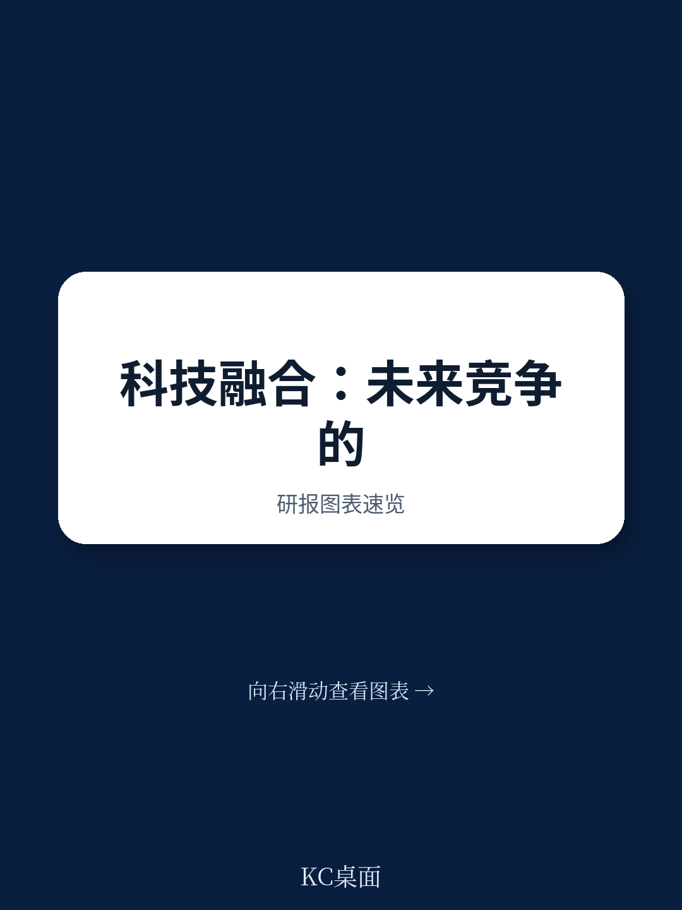
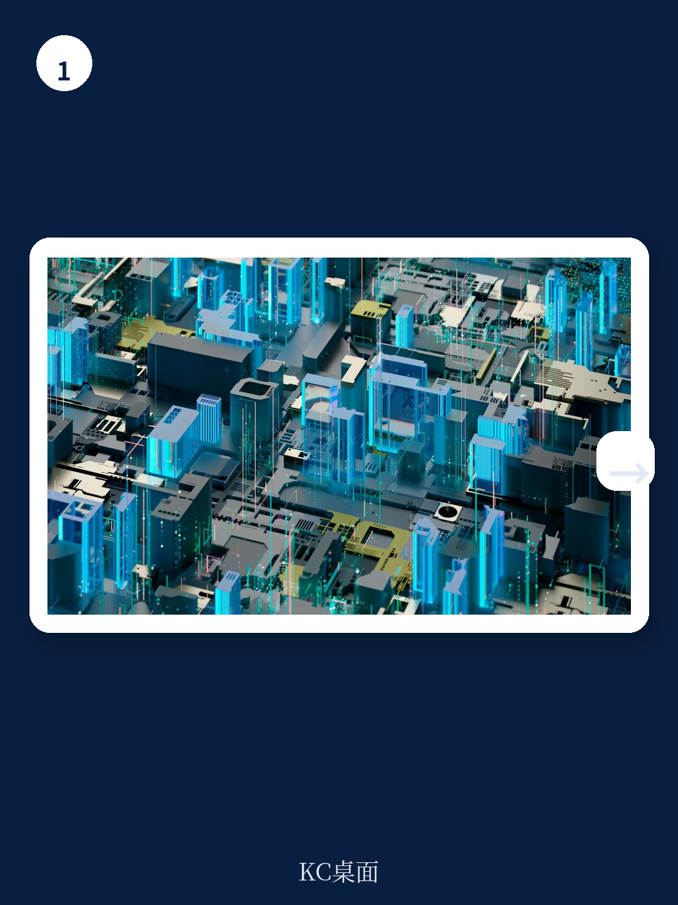
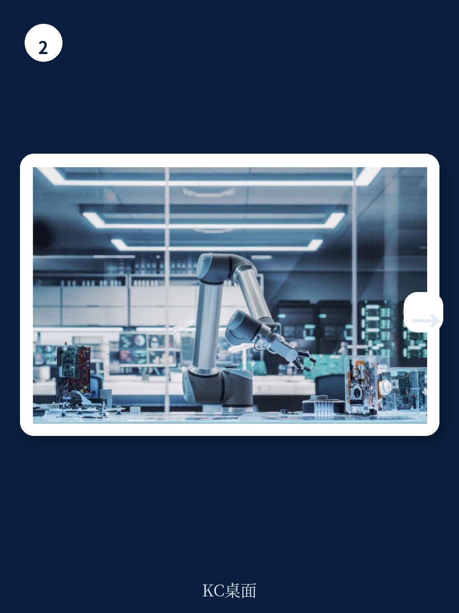

# 世界经济论坛：技术融合新报告，汽车、AI、机器人如何组合才能规模化落地

技术融合正在重塑全球产业竞争格局。但世界经济论坛（WEF）与凯捷联合发布的最新报告《技术融合：竞争优势的新逻辑》给出了一个反直觉的核心判断：行业赢家不是技术上最先进的公司，而是最善于整合的公司。它们的优势来自于将新技术融入现有工作流、协调跨职能团队、并在真实运营环境中规模化落地的能力。

这份报告发布于2026年4月，是WEF技术融合系列的第二份年度报告。2025年的首份报告提出了“技术成熟度指数”，揭示了AI、全计算、工程生物学、机器人、先进材料、空间智能、量子计算和下一代能源八大领域各自的发展轨迹与交汇点。今年的报告则向前推进了一步：从“技术组合的可能性”转向“如何规模化落地”。

报告的核心贡献在于提出了一个可操作的诊断框架，帮助企业判断：哪些技术组合值得投入，规模化过程中瓶颈会如何转移，以及价值将沿着价值链向何处集中。以下是报告中最值得关注的五个洞察。

> **KC评论：** 这不是一篇关于“哪些技术会改变世界”的预测文章，而是一篇关于“如何让技术组合真正产生商业影响”的实操指南。真正有价值的是报告中的行业案例和验证路径——它们揭示了从实验室到规模化的关键节点和常见陷阱。完整报告在每日汇编中提供了这些案例的详细拆解和图表。

## 1. 3C框架不是线性流程，而是并行循环系统

报告重申并深化了2025年提出的3C框架：组合（Combination）、融合（Convergence）、复利（Compounding）。一个自然的理解是将其视为顺序阶段——技术先组合，价值链随之融合，能力通过采用而复利增长。但报告明确指出，这种理解虽然直观，却不完整。3C实际上是一个相互连接的系统，而非线性序列。

这一修正具有重要的实践意义。许多企业将技术融合视为一个“先选技术、再推市场”的线性过程，结果往往在某个环节卡住。报告指出，停滞发生在组合遇到价值链阻力或生态系统碎片化时。忽视任何一个维度都会埋下随时间累积的隐患。

报告用了一个生动的历史例子来说明：电动汽车在19世纪末就已出现，但规模化停滞了几十年。原因不仅是电池技术不成熟，更是因为没有支撑制造、充电和日常使用的生态系统。最终突破的公司是那些学会了协调生态系统——建设充电网络、保障材料供应、与电池创新者合作、利用政府激励。差异不在于技术 brilliance，而在于生态系统的协调能力。

**所以呢：** 企业在评估技术融合战略时，不能只看技术成熟度，还要同步评估组织整合能力和生态系统协调能力。任何单一维度的短板都可能成为规模化的致命瓶颈。

## 2. 高潜力组合的配方：成熟技术 + 前沿技术

报告引入了一个简洁但有力的判断框架：高潜力技术组合发生在将“成熟且可广泛部署的技术”与“能解锁差异化突破创新的早期技术”配对时。

这里借鉴了Simon Wardley的四阶段分类：从“创生期”（Genesis）到“定制期”（Custom-built）到“产品期”（Product）到“商品期”（Commodity）。关键洞察是，回顾历史上每一次重大计算浪潮，它们都遵循同一模式——将新颖技术（阶段1-2）叠加在成熟且商品化的基础（阶段3-4）之上。

这一模式在当前的技术融合中同样适用。AI、机器人、先进材料等八大领域各自处于不同的成熟阶段。企业需要绘制自己的技术基础设施图谱，识别哪些是已经商品化的基础层，哪些是可能带来差异化优势的前沿层。

**所以呢：** 企业不应追求在所有技术领域都做“最早采用者”，而应在成熟技术层选择标准化方案以控制成本，在差异化技术层做有选择的早期投入。这种“成熟+前沿”的配对策略能平衡风险与回报。

> **KC评论：** 报告提供的Tech Maturity Index可以帮助企业评估自身技术基础设施的成熟度。但真正值得细看的是报告中对五个行业案例（医疗、制造、能源、生命科学、人机交互）的详细分析——它们展示了同一框架在不同产业中的具体应用。这些案例的图表和假设条件在完整报告中有更详细的展开。

## 3. 瓶颈转移：从单一约束到数字-物理混合瓶颈

报告通过五个跨行业案例研究，发现了技术融合规模化过程中的一个普遍模式：瓶颈会转移，而且往往从单一约束转向数字-物理混合瓶颈。

以手术机器人为例。传统上，手术能力的瓶颈是外科医生的稀缺性和手术量。研究表明，高手术量的专科医生能带来更好的患者预后。手术机器人的引入初衷是让更多医生能执行复杂手术，从而缓解这一瓶颈。但报告发现，随着手术机器人的普及，新的瓶颈出现了：如何将机器人无缝集成到现有的医院手术室流程中？如何培训团队？如何协调跨部门的协作？

那些设计时考虑到了现有医院工作流程的手术机器人，其采用速度显著快于那些追求技术极致但忽视集成问题的方案。这一模式在制造业的数字孪生生态系统和能源领域的智能电网系统中同样出现。

**所以呢：** 企业在评估技术组合时，不能只问“这项技术能解决什么瓶颈”，还要追问“它会创造什么新瓶颈”。新瓶颈往往出现在物理-数字接口处——数据格式不统一、团队协作流程不匹配、跨系统集成缺乏标准。这些软性约束往往比技术本身更难突破。

## 4. 竞争优势从拥有资产转向协调能力

报告提出了一个对传统竞争优势理论的修正：优势正在从“拥有技术资产”转向“协调跨伙伴的能力”。技术融合的复杂性使得没有任何一家公司能独自掌握所有必要能力。成功的组织往往是那些能有效协调合作伙伴网络的公司。

报告特别指出了“服务化交付模式”的重要性。在技术融合的早期阶段，资本投入和系统维护成本高昂。通过提供基于服务的交付模式（如机器人即服务RaaS），供应商可以帮助客户分摊成本，让客户专注于自身核心资产和优势。报告引用了Formic公司的案例——其机器人车队已累计超过40万生产小时，通过RaaS模式降低了中小制造企业的自动化门槛。

报告还观察到，随着融合技术的规模化，新的标准开始建立——数据格式、集成框架、质量指标、技术栈协议。这些标准的确立过程本身就是竞争焦点。那些能影响标准制定方向的企业，往往能在后续的复利增长阶段获得结构性优势。

**所以呢：** 企业的战略关注点应从“我们拥有什么技术”转向“我们能协调什么能力”。这需要重新评估组织能力：合作管理能力、生态系统构建能力、标准影响力——这些软能力正在成为硬竞争力的核心。

> **KC评论：** 报告对“协调能力”的强调值得深思。但这里有一个报告没有完全展开的问题：协调能力本身如何构建？是内部培养还是外部并购？不同行业的最佳实践有何差异？完整报告中对五个行业的对比分析提供了部分答案，但更深入的讨论需要在社群中继续。

## 5. 复利不是终点，而是新组合的起点

报告最引人深思的洞察或许在于：3C框架中的最后一个C（复利）从来不是终点，而是新周期的起点。

报告用云计算和物联网的演进历史来阐述这一观点。过去十年，云和IoT边缘结合使工业连接在经济上变得可行，催生了企业级和工业级操作系统的繁荣。随着这些平台普及，连接资产逐渐商品化。现在，竞争前沿正在转向“智能提取”——将碎片化的运营数据转化为决策、指令和自动化行动。这意味着生态系统正在进入一个新的组合阶段，领域专用模型作为新能力加入，Copilot和Agent正在将差异化从“拥有云中的数据”转向“企业如何行动化数据”。

这一洞察揭示了技术融合的非线性本质：每一次复利增长都会创造新的组合机会，从而启动新的周期。企业不能认为“完成一次技术融合就一劳永逸”，而需要建立持续扫描和重新组合的能力。

**所以呢：** 技术战略需要从“项目制”转向“持续演进制”。企业应该建立内部的技术雷达机制，定期重新评估技术成熟度和组合机会。更重要的是，组织架构需要支持跨周期的协作——因为每一次新周期都可能打破既有的部门边界和能力配置。

## 报告尚未完全回答的关键问题

尽管报告提供了丰富的框架和案例，但仍有几个关键问题值得进一步探讨

第一，报告强调了“协调能力”的重要性，但没有深入讨论这种能力如何系统性地构建。是依赖少数“整合型人才”，还是需要组织架构的根本变革？不同规模和行业的企业可能有不同路径。

第二，报告对“瓶颈转移”的描述非常精彩，但对如何预测新瓶颈的定位着墨不多。企业能否建立一种前瞻性的瓶颈诊断方法？

第三，报告引用的案例主要集中在欧美市场，对新兴市场的适用性需要进一步验证。不同制度环境和基础设施条件下，技术融合的路径和瓶颈可能有所不同。

这些未解问题恰恰构成了继续深入阅读和讨论的价值。完整报告中对五个行业案例的详细拆解、技术成熟度指数的应用方法、以及更多跨行业的对比分析，都在每日汇编中有更完整的呈现。

---

本文基于世界经济论坛与凯捷联合发布的《Technology Convergence:The New Logic for Competitive Advantage》（2026年4月）撰写。更多国际信源汇编与评论，每日更新，汇总国际主流叙事、数据与图表，观测边际变化。每日汇编将单篇报告放回当天主线，整理为中文摘要、KC评论和图表合集，便于喂给AI，也便于人工快速扫描市场动态。目前汇聚了头部券商、PE/VC、投行、并购、hedge fund、资管机构、战略咨询、智库等朋友，期待交流。

Personal reading notes and learning share only. Not investment advice.
