# The Global Cooperation Barometer 2026 Third Edition

INSIGHT REPORT

JANUARY 2026

## Contents

Foreword 3  
Executive summary 4  
About the Global Cooperation Barometer 5  
Introduction: The evolution of global cooperation 7  
The views of experts and executives on cooperation 10  
1 The five pillars of the Global Cooperation Barometer 11  
Pillar 1: Trade and capital 11  
Pillar 2: Innovation and technology 15  
Pillar 3: Climate and natural capital 18  
Pillar 4: Health and wellness 21  
Pillar 5: Peace and security 24  
Recommendations: Strategies for new forms of cooperation 27  
Appendix 28  
Contributors 31  
Endnotes 32

## Disclaimer

This document is published by the World Economic Forum as a contribution to a project, insight area or interaction. The findings, interpretations and conclusions expressed herein are a result of a collaborative process facilitated and endorsed by the World Economic Forum but whose results do not necessarily represent the views of the World Economic Forum, nor the entirety of its Members, Partners or other stakeholders.
© 2026 World Economic Forum. All rights reserved. No part of this publication may be reproduced or transmitted in any form or by any means, including photocopying and recording, or by any information storage and retrieval system.

# Foreword

  
Børge Brende
President and CEO,
World Economic Forum

It is a pleasure to release this year's edition of the Global Cooperation Barometer.

This third edition comes at a time of consequential global transformation, when leaders around the world are not only looking to stay on top of rapid global developments but better understand their implications and anticipate and shape what may take place next.

Uncertainty and unpredictability are being fuelled by historic changes across several fronts. Economic architectures are transforming as political and geostrategic considerations increasingly inform new dynamics of trade. Similarly, the formula for stability is under revision, as new power dynamics are affecting security calculations in several regions. Further, technology systems are poised to reshape labour markets and societies, offering possibilities but also new risks. These dynamics are leading many countries to look inward and reconsider their global outlook through a domestic prism.

Within this complex context, one certainty remains – cooperative approaches are vital for advancing corporate, national and global interests.

This year's Global Cooperation Barometer shows what cooperation looks like in today's ever-changing landscape: more bespoke, more interestbased and, most importantly, still present. It is this last point that is worth underlining. Namely, the barometer finds that, in the face of strong headwinds, cooperation is still taking place, albeit in different forms than in the past. The resiliency of cooperation, even if not at needed levels, is likely based on shared assessments around the world that it makes sense. The only way to deliver widespread economic growth, capture the opportunities of artificial intelligence (AI) and advance global security is through aligned action.

  
Bob Sternfels
Global Managing Partner,
McKinsey & Company

The paradox is that, at a time of such rapid change, developing new and innovative approaches to cooperation requires refocusing on some of the basics – notably, doubling down on dialogue. This building block of collaboration (open, honest, constructive engagement) is in danger of degradation, replaced by one-way positioning statements meant to hold ground and entrench positions rather than advance progress. Taking steps forward to address global priorities can only happen if parties first talk with one another to find commonality.

With this in mind, the World Economic Forum and McKinsey & Company present this edition of the Global Cooperation Barometer. The report offers stakeholders insight both into how cooperation is taking place and what leaders can do to advance collaboration in a more uncertain era.

# Executive summary

## Global cooperation holds steady, but its shape is evolving.

The 2026 Global Cooperation Barometer's level of overall cooperation was largely unchanged from previous years, but the composition of cooperation appears to be changing. Metrics relating to multilateralism weakened most. Metrics in which more flexible and smaller arrangements of cooperation can operate – in data flows, services trade and select capital flows, for example – have continued to grow, including in 2025.

These dynamics are visible in each of the five pillars of the barometer:

## – Trade and capital cooperation flattened.

Cooperation remained above 2019 values, but its makeup is shifting. Goods volumes grew, albeit slower than the global economy, and flows are shifting to more aligned partners. Services and select capital flows show momentum, particularly among aligned economies, especially where they can contribute to bolstering domestic capabilities. While the global multilateral trade system faces rising barriers, smaller coalitions of countries are cooperating through initiatives such as the Future of Investment and Trade (FIT) Partnership.

## – Innovation and technology cooperation

rose to unlock new capabilities even amid tighter controls. IT services and talent flows are up, and international bandwidth is now four times larger than before the COVID-19 pandemic. Restrictions on flows of critical resources, technologies and knowledge expanded – especially, but not only, between the US and China. However, new cooperation formats are rising, with instances of cooperation on artificial intelligence (AI), 5G infrastructure and other cutting-edge technologies among aligned countries.

\- Climate and natural capital cooperation grew, but is still short of global goals. Increased financing and global supply chains stimulated

deployment of clean technologies, which reached record levels in mid-2025. While China accounted for two-thirds of additions of solar, wind and electric vehicles, other developing economies stepped up. As multilateral negotiations become more challenging, groups of nations – for example, the European Union (EU) and ASEAN (Association of Southeast Asian Nations) – are combining decarbonization with energy security goals.

## – Health and wellness cooperation held

steady, with outcomes resilient for now, but aid is under severe pressure. Topline cooperation in this pillar did not fall, in part because health outcomes continued to improve after the end of the COVID-19 pandemic. Although health outcomes have stayed resilient, the stability masks growing fragility. Pressures on multilateral organizations have eroded support flows, and development assistance for health (DAH) contracted sharply – with further tightening in 2025 – affecting low and middle-income countries most acutely.

## – Peace and security cooperation continued

to decrease, as every tracked metric fell below pre-COVID-19 pandemic levels. Conflicts escalated, military spending rose and global multilateral resolution mechanisms struggled to de-escalate crises. By the end of 2024, the number of forcibly displaced people reached a record 123 million globally. $^{1}$ Still, growing pressures are creating an impetus for increased cooperation – including through regional peacekeeping mechanisms.

Since key challenges and important opportunities cannot be addressed by individual countries alone, leaders should anticipate shifts and move proactively to “re-map” international engagement; strengthen resilience by building new capabilities; and find new forums to cooperate – matching the right format to the right issue.

# About the Global Cooperation Barometer

The Global Cooperation Barometer is structured along five dimensions of global connection: trade and capital, innovation and technology, climate and natural capital, health and wellness, and peace and security.

These five pillars were chosen because of their impact on global development and their explicit dependence on cooperative efforts among nations and economies. As a guiding element in the analysis, the barometer identified goals that actors are working towards in each of these themes. In doing so, the barometer draws inspiration from the United Nations Sustainable Development Goals (SDGs) and the efforts of other global institutions.

To quantify change in these pillars, 41 indicators were identified that research suggests are either cooperative actions that advance progress towards the goals of the pillars or demonstrate a broad outcome from those actions. Cooperative action metrics measure actions that provide evidence of cooperation; these indicators (such as flows of goods and exchange of intellectual property) are evidence of real, manifested cooperation and do not include “on paper” commitments. Outcome metrics (such as life expectancy) measure the progress of cooperation but are typically influenced by additional factors beyond cooperation.

The metrics span countries in all geographies and at all levels of development. The barometer examines the period from 2012 to 2024 to establish a trend line of cooperation. It indexes data to 2020 for the following reason: as the COVID-19 pandemic (hereafter referred to as “the pandemic”) took hold, it accelerated many existing trends in business and society and set many new ones in motion. Indexing the time series to 2020 highlights the trends in place before the pandemic and those that emerged from it. Note that some metrics have been inverted so that any increase represents a positive development. Though this tool is imperfect and necessarily incomplete, it offers an overview of global cooperation that both captures broad trends and identifies important nuances.

This year's report includes the results of two surveys. The Global Cooperation Barometer survey collected responses from 1 September to 26 September 2025 from the World Economic Forum's Network of Global Future Councils through a Qualtrics electronic platform. Current members of the network (those who are part of the 2025–2026 term) and those who served on a council during the previous term (2023–2024) received a link to take part in the survey. Out of a total of 224

responses received, 171 were used based on completeness. A second survey was conducted online using McKinsey's proprietary global survey panel of industry executives and was in the field from 27 August to 5 September 2025. It garnered responses from 799 participants in 81 economies representing the full range of regions, industries, company sizes, functional specialities and tenures.

The methodology used for the metrics of the Global Cooperation Barometer is below. Details on the sourcing of individual metrics are in the Appendix.

## Data coverage

Geography: Across all metrics, the barometer aims to collect global data. In most cases, an aggregate global weighted average is available. When a global weighted average is not available, the most comprehensive data is used – such as Organisation for Economic Co-operation and Development (OECD) member countries, or a sample set of countries where data is available for all years.

Years: While the barometer measures cooperation from 2012 through 2024, some metrics do not have data for all years. All metrics have 2020 data to ensure the indexed trendline can be calculated.

## Index calculation

To evaluate global cooperation fairly and compare trendlines of the action and outcome metrics across the five pillars, the Global Cooperation Barometer applies the following methodology:

## - Indexed trendlines

Data from 2020 serves as the base year to develop comparable trendlines, with all values in 2020 equal to one (2020 = 1). This base year standardization is the basis of the score calculation, enabling a uniform reference point for all metrics and comparability, despite different units and datasets.

## – Data normalization

Where possible, metrics are normalized to ensure that trendlines can be assessed independently of the effects of economic growth or population changes. For example, trade, capital and other financial flows are normalized to global GDP (gross domestic product) while migration metrics are normalized to global population levels.

## - Weighting

Each pillar comprises two indices: an action index and an outcome index. To arrive at each, the metrics within are weighted equally (i.e. the action index is a simple average of metrics measuring cooperative actions). The overall index for a pillar is calculated as an average of the action and outcome metrics. Aggregate indices across pillars are also calculated as a simple average of pillar indices (i.e. equal weighting across pillars).

## A note on the analytical approach

In line with previous editions of the Global Cooperation Barometer, this edition uses data from two years prior to publication, as it is the most recent year for which comprehensive data are available. Given rapid developments across all the areas the barometer covers, this year's report complements the 2024 findings with more recent 2025 data where available, through partial-year data or projections.

FIGURE 1

## The Global Cooperation Barometer's five pillars of global cooperation

## Trade and capital

Promote global development and resilience
Focus of analysis is on 1) development and resilient outcomes; through 2) presence of global economic flows that promote likely opportunities for these outcomes

Innovation and technology
Accelerate innovation and beneficial technological progress
Focus of analysis is on 1) global progress in innovation and technology; through 2) presence of the global sharing of underlying knowledge that contributes to these outcomes by fostering collaboration across global talent

Climate and natural capital
Support the resolution of climate and natural capital challenges
Focus of analysis is on 1) lowering of emissions, preservation of natural capital, and preparedness for likely impact of climate change; through, 2) shared global goals/commitments that increase humanity's ability to limit and adapt to the dynamics of a changing climate

Health and wellness
Enable global population to lead longer and better lives
Focus of analysis is on 1) impact of the burden of disease on duration and quality of life; through 2) commitment to global public health standards and collaboration through flows of goods, R&D/IP and health financing

Peace and security

Prevent and resolve conflicts

Focus of analysis is on 1) prevention of death and long-term negative implications of conflict; through, 2) commitment to multilateral peacekeeping operations and international stabilization efforts

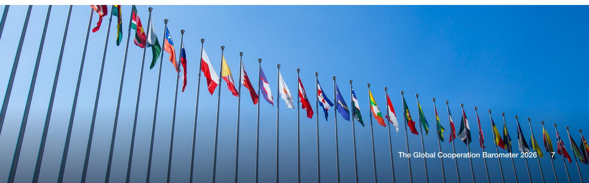

# Introduction: The evolution of global cooperation

With global multilateral cooperation confronting challenges, smaller and more adaptive cooperative coalitions are emerging.

Cooperation among smaller groups of countries has persisted as economies continue to find value in working with each other through pragmatic, interest-based partnerships.

As a new global era takes shape, multilateralism is under strain, even as global cooperation continues to deliver in some key areas. The world has seen continued fragmentation, as trade barriers have escalated, levels of mistrust have remained high and geopolitical tensions have been an ever-present overhang. Conflicts have intensified across several regions and forced displacement reached record levels. $^{2}$

In this sobering context, the Global Cooperation Barometer's measurement of overall cooperation has held steady (Figure 2). While stress to the global cooperative system may not be surprising, the resilience of overall cooperation may be. Although cooperation tied to global multilateralism (which relies on common goals and actions often advanced through international institutions) has largely declined, cooperation through alternative, often flexible and purpose-built coalitions has continued. Most notably, cooperation among smaller groups of countries has persisted as economies continue to find value in working with each other through pragmatic, agile, interest-based partnerships. $^{3}$ This dynamic is often dubbed “minilateralism” or sometimes “plurilateralism”. $^{4}$

The result is that cooperation is far from dead. In tracking 41 individual metrics, the barometer shows how cooperation is adapting to a new context. Most cooperation metrics remain above their 2019 levels, and all pillars except peace and security show strong positive momentum in at least some areas. Evidence signals these trends have persisted through 2025.

Looking more closely, the barometer shows increasing levels of cooperation for the innovation and technology and climate and natural capital pillars (Figure 3), often in areas where domestic interest or economic incentives are converging with global goals. In the case of innovation and technology, cross-border data flows and digital services fuelled collaboration as countries race to expand their capabilities for a new era of technology-driven economies; while in climate and natural capital, advancements in financing and global trade enabled more clean power and electric transport, especially in places where goals of emissions reduction, increased affordability and increased energy security converged.

The trade and capital pillar shows a flattening of cooperation; while it remains above the 2019 level, with momentum in services and capital flows, goods trade has been hit by protectionist headwinds. Still, it is notable that trade is not meaningfully retreating but rather reconfiguring across different partners. The flattening of cooperation in health and wellness also encompasses distinct dynamics. Most health outcomes stand above pre-COVID-19 pandemic (hereafter referred to as “the pandemic”) levels. However, these outcomes are a function of long-run developments, which could reverse in the future. Pressure on multilateral organizations has eroded development assistance, materially increasing the load on domestic budgets and creating challenges for the future of health in the most vulnerable places.

The peace and security pillar stands out as experiencing the greatest decline, as every metric is below pre-pandemic levels. This pillar exhibits sharp deterioration, as global tensions escalate and multilateral mechanisms are not addressing conflicts.

## Global Cooperation Barometer over time

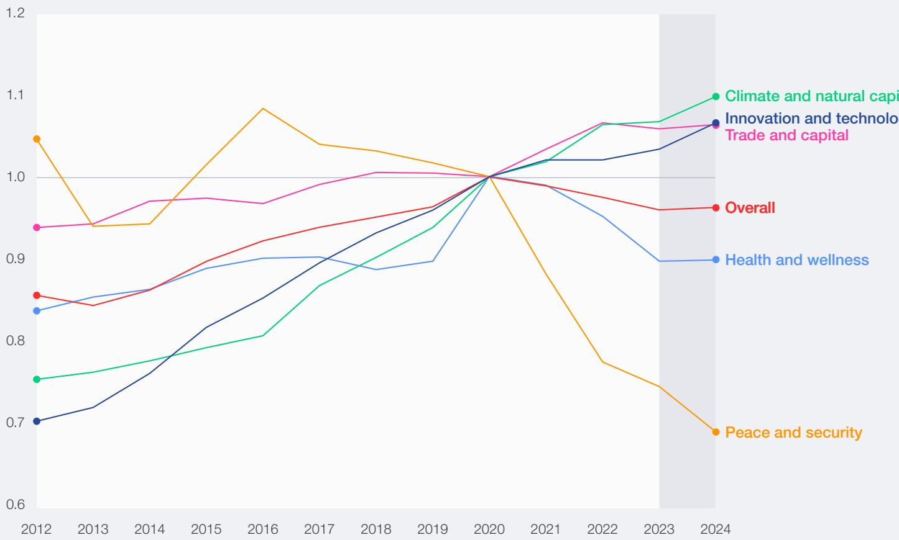  
Source: Aggregation of 41 metrics, McKinsey & Company analysis.

## Why cooperation is evolving

Five years on from the start of the pandemic, a new, nuanced picture of cooperation is starting to emerge.

Pressure on institutions and arrangements that support global multilateral cooperation has been building for over a decade and a half. The aftermath of the 2008 Global Financial Crisis was marked by a long tail of growing dissatisfaction in the globalized international system, with a slowdown in the growth of the shares of trade and cross-border finance in the global economy. $^{5}$

If the years immediately following the Global Financial Crisis were a period of brewing cooperative malaise, the most recent five years delivered a series of acute shocks that tested the very construct of global multilateralism. The pandemic, the Russia–Ukraine conflict and resulting energy shock, escalating conflict in many regions and more interventionist trade policies all rattled long-held norms and systems underpinning cooperation. These shocks have sharpened debates over how to balance domestic imperatives with shared objectives – from emissions cuts and security to competitiveness and development – and they have prompted the system's own stewards to call for renewal and reform, including the World Trade Organization (WTO), the United Nations (UN) and the World Bank. $^{4}$

As these shocks have rippled around the world, they have reshaped, rather than shattered, the contours of cooperation. To be sure, cooperation has receded in many areas (notably, as mentioned, regarding global multilateralism and global security and trade). Yet five years on from the start of the pandemic, a new, nuanced picture of cooperation is starting to emerge – one in which cooperation is adapting to a more multipolar reality, and where economies are still pursuing global objectives, but focusing on where and when they see it as a viable pathway to advance their respective priorities.

The Global Cooperation Barometer reflects the retreat from global multilateralism, as metrics tied to multilateral mechanisms have dropped (Figure 3). For example, by the end of 2024, peacekeeping activity, multilateral resolutions and health aid had all dropped by more than 20% since the pre-pandemic level of 2019, despite the number of conflicts and the need for humanitarian assistance increasing in the same period. In 2024 alone, foreign aid dropped by 11%, a trend that has been exacerbated in 2025.

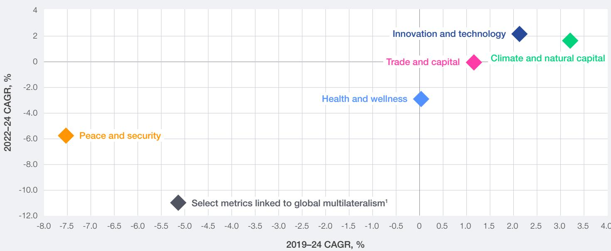  
1. Average across official development assistance (ODA), development assistance for health (DAH), International Health Regulations (IHR) score, ratio of UN Security Council resolutions to conflicts, ratio of multilateral peacekeeping operations to conflicts.
Source: Aggregation of 41 metrics, McKinsey & Company analysis.  
Across all pillars, cooperation is highest where there are clear national interests – often economic – binding countries.

As multilateral approaches become more fraught, new, smaller and more agile coalitions – both at the inter- and intra-regional levels – are filling the gaps. In the case of trade, amid increased tensions among the world's largest economies, smaller, trade-dependent economies are taking greater agency to safeguard the benefits of economic integration. The Future of Investment and Trade (FIT) Partnership, launched in September 2025 and co-convened by New Zealand, Singapore, the United Arab Emirates and Switzerland, brings together 14 economies to pilot practical cooperation. Even in the case of the most sensitive flows of technology and resources, aligned partners are deepening cooperation, such as the US reinforcing ties in critical minerals $^{7}$ with countries including Australia, Canada and Japan; or artificial intelligence (AI) cooperation among India, the Gulf, Japan and Europe. $^{8}$

On climate action, the European Union (EU) aims to combine competitiveness with decarbonization through the Net-Zero Industry Act and the Clean Industrial Deal, while implementing the Critical Raw Materials Act to shore up strategic inputs. At the intra-regional level in South-East Asia, the LTMS-PIP (Laos PDR–Thailand–Malaysia–Singapore Power Integration Project) cross-border power-trading scheme is an early step towards an integrated Association of Southeast Asian Nations (ASEAN) Power Grid – bolstering energy security and enabling more clean-power deployment. $^{9}$

Similarly, on health, several emerging economies are strengthening regional bloc-level access to medicines. Notable 2025 moves include

the launch of the African Medicines Agency in October and the Accra Compact on African health sovereignty, as well as the Organisation of Eastern Caribbean States scaling a model to reduce the price of insulin throughout the region. $^{10}$

As a general rule, across all pillars, cooperation is highest where there are clear national interests – often economic – binding countries. This may reflect what UN Secretary-General António Guterres called “hard-headed pragmatism” – the notion that cooperation makes sense when doing so yields meaningful mutual benefit. $^{11}$

Importantly, while the pressure on global multilateralism has increased, the story is not one of a system in full collapse. In May 2025, World Health Organization (WHO) member states adopted the world's first Pandemic Agreement after three years of challenging negotiations. On digital cooperation, 65 UN Member States convened in Viet Nam in October 2025 for the signing ceremony of the United Nations Convention against Cybercrime, which will facilitate cooperative approaches to combating cybercrime. On the environment, after two decades of negotiations, the UN High Seas Treaty has reached the required 60 ratifications and will enter into force in January 2026, unlocking the world's first legally binding framework for protecting two-thirds of the oceans beyond national jurisdiction. While these instances offer an indication that cooperation at the global level has continued even in a more contested landscape, it is notable that the world's largest economy, the US, is not party to the health and cyber agreements and did not participate in the G20 Summit in South Africa.

# The views of experts and executives on cooperation

## BOX 1 Perceptions of global cooperation

To gain insight into how developments over the past year impact the perception of cooperation, this year's Global Cooperation Barometer report includes the results of two surveys – one of about 800 executives and one of approximately 170 experts who are current or former members of the World Economic Forum's Network of Global Future Councils.

Council members broadly perceive global cooperation across each pillar is waning, with 85% describing the state of global cooperation in 2025 as “less cooperative” or “much less cooperative”, compared to 2024. The perception of deterioration in cooperation was particularly large in the case of trade and capital and innovation and technology.

When asked about how changes in cooperation affect their businesses, the sample of executives also, on average, had a negative sentiment, with more executives saying it became harder to do business across borders than easier. In this case, however, peace and security was identified as the challenge that had worsened the most.

Notably, across each of these pillars – with a notable exception of issues of peace and security – executives still see opportunity for cooperation in the current state, and 57% of them do not perceive overall conditions to have worsened relative to 2024.

## 2025 survey results – Forum council members and executives

## Surveyed Forum council members $^{1}$

How would you describe the state of global cooperation in each of the following areas in 2025 compared to 2024?

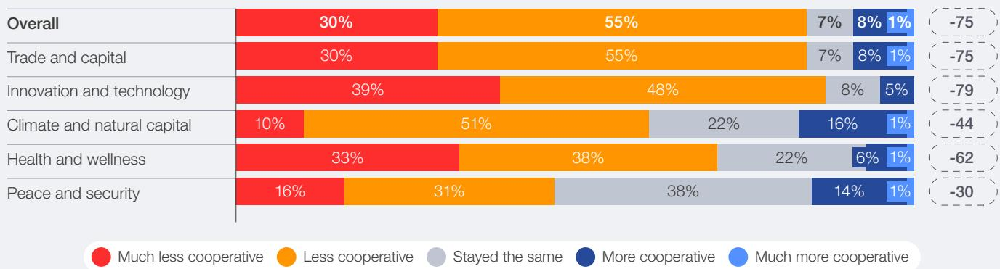

## Surveyed executives $^{1}$

How has your company's ability to conduct business been affected, if at all, by changes in global cooperation in 2025 compared to 2024 in each of the following areas?

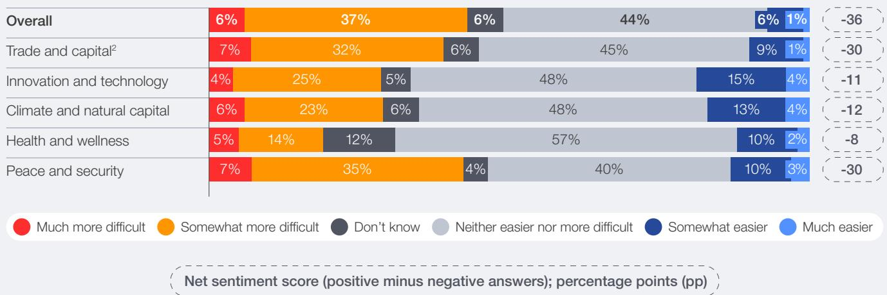

1. Percentages indicate share of responses by category.

2. Weighted average of “trade”, “corporate cross-border investment”, “talent mobility”.

Sources: August 2025 Global Councils Survey, N=171 (finished responses); August 2025 Executive Survey N=799.

# The five pillars of the Global Cooperation Barometer

# Cooperation is strongest in areas where agile coalitions are emerging.

The Global Cooperation Barometer measures global cooperation across five areas, or pillars: trade and capital, innovation and technology, climate and natural capital, health and wellness, and peace and security. In each pillar, the barometer examines evidence of cooperative actions and their outcomes to determine an overall level of global cooperation in that area.

## Trade and capital

Cooperation refocused on intangible flows, often driven by a desire to reshape interdependencies, while 2025 brought uncertainty about trade barriers as well as decreased labour flows.

The trade and capital pillar looks at cooperation through flows of goods and services, trade, capital and people. It includes metrics about the magnitude of flows – such as foreign direct investment (FDI) or labour migration – and the distribution of flows across different economies.

The latest barometer reading indicates cooperation in trade and capital stayed broadly flat (Figure 4), but beneath the surface, changes are evident. Flows of services and capital continued to rise. However, overall trade volumes experienced headwinds. While they have nearly kept pace with the overall economy – including in 2025 – material changes in trade ties are unfolding.

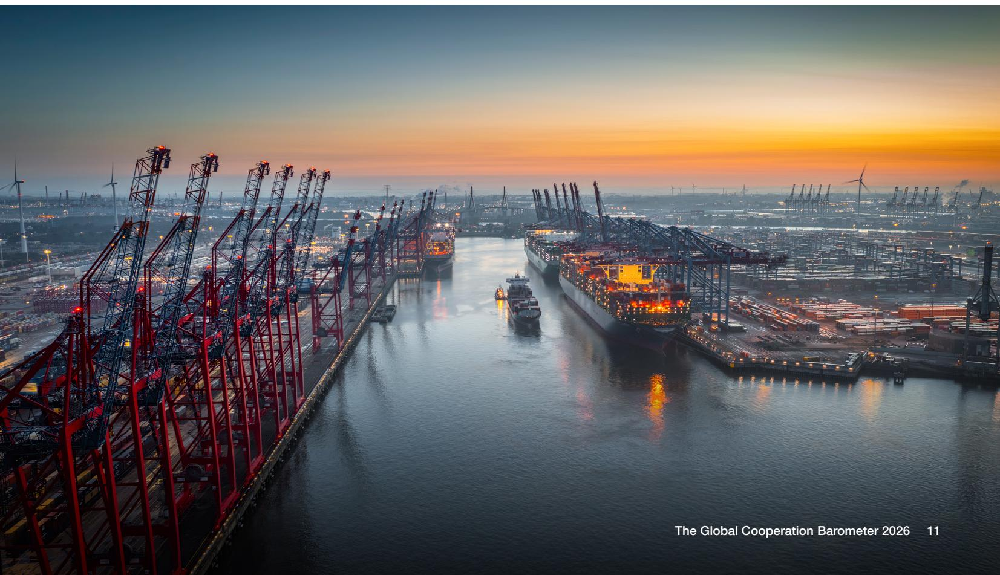

## Compound annual growth rate (CAGR), %

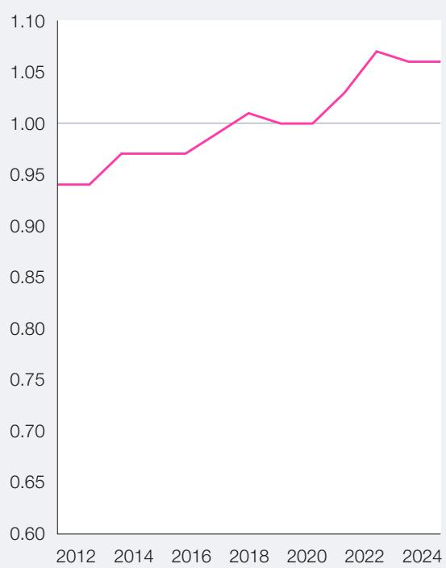  
1. Metrics were inverted given negative connotation; \*outcome metrics.  
Sources: World Bank; UN Trade and Development (UNCTAD); UN Comtrade; International Monetary Fund (IMF); Organisation for Economic Co-operation and Development (OECD); International Labour Organization (ILO); McKinsey & Company analysis.

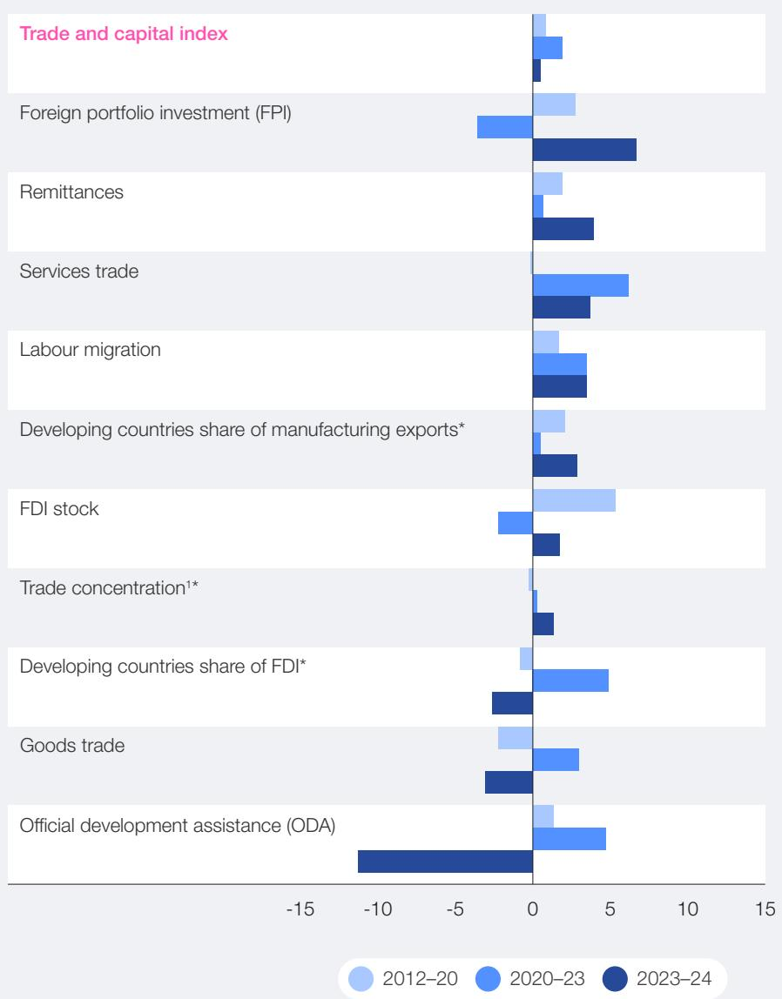

Goods trade, the historical core of this pillar, grew slightly slower than overall GDP (gross domestic product), leading to a slight decline in this metric. More notable than the overall value of trade is its composition. As the global multilateral system sees pressures, a large reconfiguration in trading partners is playing out: McKinsey Global Institute research finds goods trade is falling between countries that are geopolitically distant (less aligned), and instead shifting towards more geopolitically proximate partners. The average geopolitical distance of global goods trade has fallen by about 7% between 2017 and 2024. $^{12}$

Developing countries and China have gained a larger share of manufacturing exports: in 2024, their exports rose by \$276 billion, or 5 percentage points, of which China represented more than half the total growth. Overall trade relationships slightly diversified, as the trade concentration metric fell by about 1%. $^{13}$ Taken together, these shifts suggest that global trade is redistributing within aligned networks while diversifying across partners.

Undeniably, a series of US tariff announcements in 2025 raised questions about the future of trade. Early indicators suggest that rather than leading to a contraction, these announcements have fuelled a reconfiguration. Trade volumes are estimated to have grown in 2025 (by about 2.4%), though slightly below the pace of real GDP growth (3.2%). $^{14,15}$ However, reconfiguration intensified – US imports from China fell by about 20% in the first seven months of 2025, compared to the same period in 2024, while imports from geopolitically closer partners in Europe and Asia increased. $^{16}$

Flows of capital and services, on the other hand, trended upward. $^{17}$ This was often motivated

The challenge will be for companies and countries to navigate a spectrum of preferences and market access arrangements – and what this will eventually mean for global commercial flows.

by countries seeking to attract know-how and capital from overseas to boost their own domestic capabilities. Cross-border capital flows have increased continually since 2022, with growth in metrics that track foreign portfolio flows and direct investment stock. In the case of FDI, newly announced greenfield projects have surged in future-shaping industries and the resources that power them – semiconductors, data centres/AI, electric vehicle (EV) batteries, and critical minerals – as nations work with their close partners to build capacity in strategically sensitive areas. Compared to trade, the geopolitical distance of greenfield FDI has fallen about twice as fast. $^{18}$ Much of this pipeline is heading to advanced economies – particularly the US – as they invest more in one another and reduce FDI announcements into China, whose share fell from 9% of total announced FDI inflows in 2015–19 to only 3% in 2022–25. $^{19}$ These trends further intensified in 2025.

Services trade also ratcheted higher, continuing its five-year run of growth since the low point of 2020. Gains were mostly driven by digitally delivered services (such as IT services), travel and other business services (professional, technical, R&D/engineering). $^{20}$ In 2025, WTO estimates point to moderating but still positive growth in services trade, with digitally delivered services remaining firm as travel and transport normalize under lingering policy uncertainty. $^{21}$

As in most pillars, metrics closely associated with global multilateral cooperation fell the most. Official development assistance (ODA) had the largest decline in this pillar, 10.8% in 2024, marked by lower aid to Ukraine, reduced humanitarian aid and weakened refugee spending. Only four countries exceeded the UN target of 0.7% GNI (gross national income), as countries adjusted their priorities amid a more fragmented global landscape. For 2025, the Organisation for Economic Co-operation and Development (OECD) estimated another 9–17% fall in ODA, reflecting multi-year reductions across several top donors. $^{22}$

Finally, after growing uninterruptedly since 2020, international labour migration may be approaching an inflection point. The global stock of labour

migrants grew in 2024, but signs of a slowdown emerged; for example, new migration flows to OECD countries weakened by 4% in 2024. $^{23}$ In 2025, a sharp contraction played out. Net migration inflows into the US and Germany fell by an estimated 65% and 39% compared to 2024, respectively (Figure 5). $^{24}$

While 2025 certainly introduced new tensions, the direction of travel was often consistent with previous years. The goods trade share of the global economy declined slightly, capital flows increased and labour migration restrictions intensified. In this landscape, about 85% of the council members surveyed perceived cooperation to be broadly declining. Forty percent of surveyed executives pointed to growing barriers in trade, talent and cross-border capital flows as hampering their ability to do business. Notably, though, the remaining 60% said the effects were not substantially negative, at least to date. This may illustrate the fact that many organizations have found ways to readjust their strategies to navigate increased turbulence in the world of trade. $^{25}$

Looking ahead, there are many fast-moving currents under the surface – such as opportunities to rearrange trade between new partners, and participate in fast-growing corridors such as those between emerging economies. $^{26,27}$ Recent examples of increased cooperation – from major players and coalitions of smaller economies – include the September 2025 launch of the Future of Investment and Trade (FIT) Partnership that is bringing together 14 small and medium-sized economies in trade; the graduation of the EU–Mercosur accord into the adoption phase; the conclusion of the EU–Indonesia deal after a decade; the conclusion of a Digital Economy Framework Agreement (DEFA) among ASEAN nations; and the US striking bilateral deals for critical minerals with close partners (e.g. Australia in October 2025 $^{28}$ ). Of course, the idea of smaller trade coalitions is not new – more than 370 regional trade agreements have been signed since 1995. $^{29}$ The challenge moving forward will be for companies and countries to navigate a spectrum of preferences and market access arrangements – and what this will eventually mean for global commercial flows.

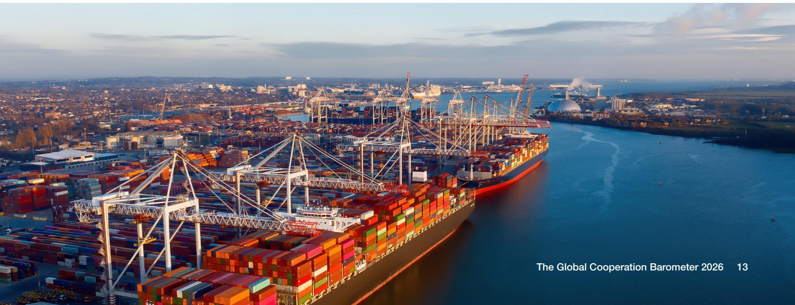

Global greenfield FDI announcements, $^{1}$ percentage of GDP (indexed to 2020)

## 2025 indicators

2025 global goods trade volume vs. GDP, percentage of year-on-year (YoY) growth

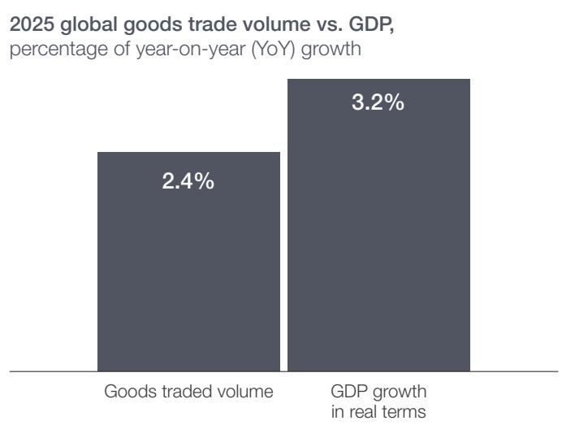

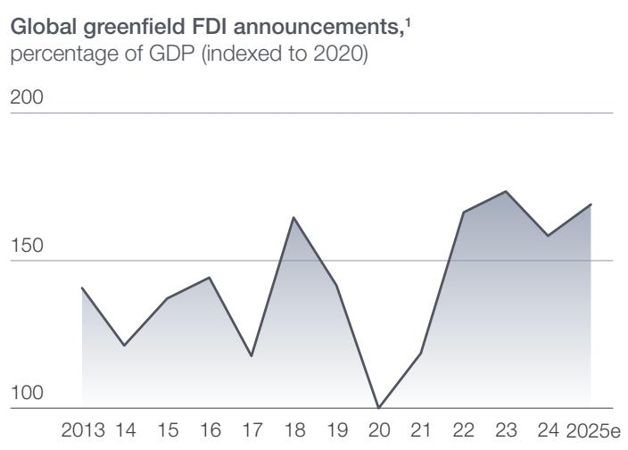  
Portfolio investment, percentage of national GDP (indexed to 2020)

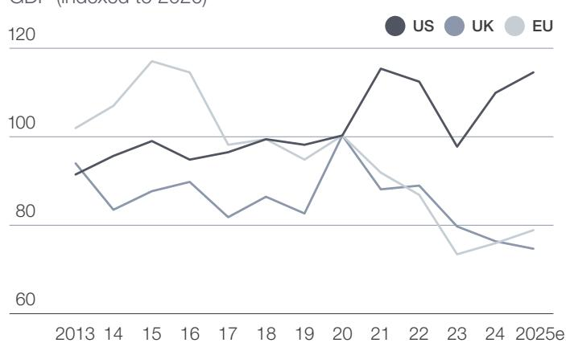  
Net international migration, percentage of national population

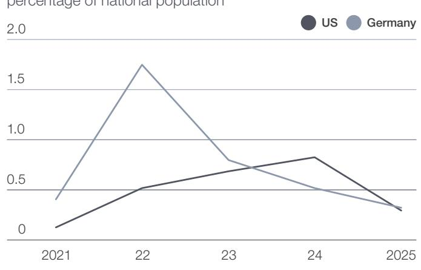

## 2025 survey results

Forum council members: How would you describe the state of global cooperation in trade and capital in 2025 compared to 2024?

Executives: How has your company's ability to conduct business been affected, if at all, by changes in global cooperation in 2025 compared to 2024 in trade and capital?

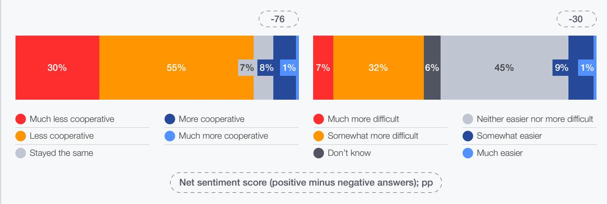  
1. First 5 months of 2025 data annualized to obtain 2025 figure.

Sources: World Trade Organization (WTO); International Monetary Fund (IMF); fDi Markets; Federal Reserve Economic Data (FRED); UK Office for National Statistics; European Central Bank (ECB); National statistics accounts (US Census Bureau, Destatis); August 2025 Global Councils Survey, N=171 (finished responses); August 2025 Executive Survey N=799; McKinsey & Company analysis.

Cooperation in this pillar increased, propelled by investment to spur advances in AI deployment, while 2025 brought new uncertainties, such as increasing restrictions.

The innovation and technology pillar examines elements of global cooperation that can accelerate innovation and create beneficial technological progress.

The topline measurement of cooperation in this pillar rose approximately 3% year-on-year (YoY), propelled by increases in data flows and IT trade of goods and services (Figure 6). While some metrics returned to growth after earlier declines, there are signs of uncertainty ahead. Cooperation on cross-border research is down. Collaboration deteriorated in the trade of components of frontier technologies, whose flows are increasingly tied to geostrategic considerations. This has manifested, for example, in tighter controls on certain leading-edge technologies, resources and associated intellectual property, especially between the US and China. Perhaps because of this, respondents to the Global Cooperation Barometer survey said this pillar was the least likely to see improved cooperation.

## FIGURE 6

## Most innovation and technology metrics rose in 2024

## Compound annual growth rate (CAGR), %

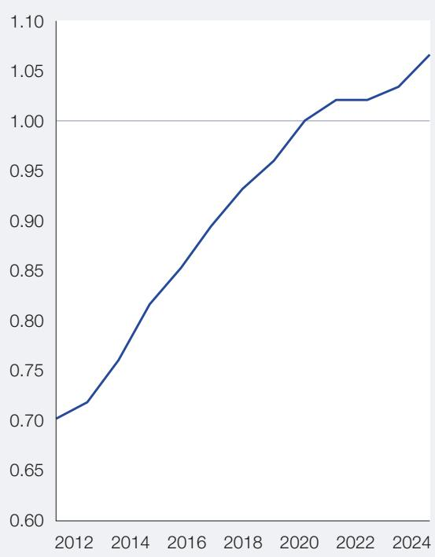  
1. Metrics were inverted given negative connotation; \*outcome metrics.

Notes: Partial extrapolation of 2024 data from 2023 data for the following metrics: cross-border data flows, cross-border R&D, IT goods/intermediates trade.

Sources: The Conference Board; International Telecommunications Union; BloombergNEF; Cisco; United Nations Trade and Development (UNCTAD); PATSTAT; Institute of International Education; Organisation for Economic Co-operation and Development (OECD); McKinsey & Company analysis.

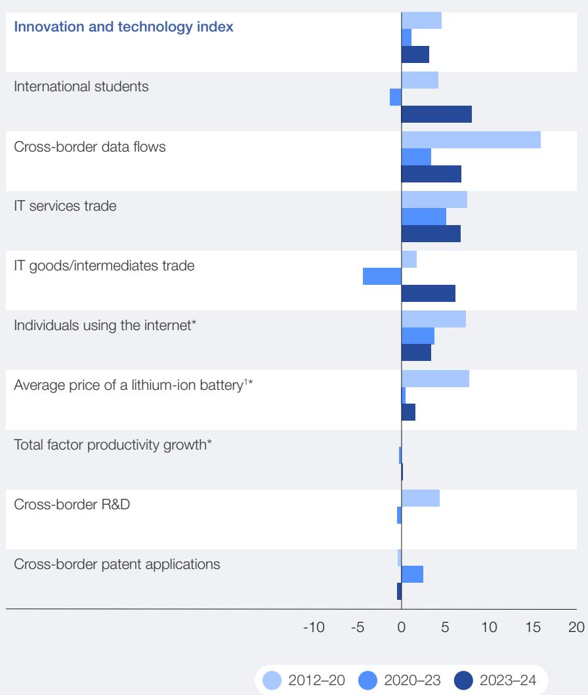

  
③ Ultimately, even in a more fragmented landscape, pragmatic cooperation will continue wherever shared incentives are clear.

Advances in digitization continued to underpin growth in global connectivity, through rising data flows and IT trade, a 25% YoY increase in international bandwidth (which is now four times larger than in 2019), and continued investments in digital infrastructure – often driven by national agendas and the quest to secure advantages in the AI digital race. In parallel, IT services continued to show growth – an uninterrupted run since before the pandemic – and IT goods trade reverted to growth after contracting in 2023. In doing so, IT goods bucked the larger trend in goods trade, consistent with countries channelling investment into AI capabilities, as cooperation incentives align with furthering technological progress.

In 2025, the AI race led to even more increases in cross-border activity. Greenfield FDI announcements in data centres $^{30}$ reached record highs, estimated at about 370 billion globally in 2025, $^{31}$ up from about 190 billion in 2024. These new projects may drive corresponding increases in cross-border flows of IT goods – chips, electronic components, communications equipment and IT services over the near to medium term (Figure 7).

These developments also have the potential to boost productivity, after many years of the barometer showing total factor productivity stuck in neutral. For example, recent McKinsey Global Institute estimates suggest generative AI could increase global productivity growth by 0.1 to 0.6 percentage points annually until 2040. $^{32}$

Still, growing barriers and restrictions create uncertainty about the future. Although the flow of international students grew more than any other metric in this pillar in 2024, rising by 8% and surpassing pre-pandemic levels, this momentum may soon moderate as restrictions on talent mobility increase. Early indicators point to a contraction in 2025: new US F-1 and M-1 student visas declined by 11% in Q1 2025, and similar declines occurred in other countries, including Australia $^{33}$ and Canada. $^{34}$

Perhaps no barrier has been more salient than expanded controls on frontier technologies and resources, especially but not limited to those deployed by the US and China. $^{35}$ Elsewhere, however, collaboration in critical technologies such as AI data centres, semiconductor fabrication and 5G infrastructure persists among small groups of countries, including new partnerships between the US and partners in Europe, the Gulf and India; and China's new partnerships with the Middle East, South-East Asia and Africa. $^{36}$

These headwinds are perhaps why surveyed council members expressed considerable pessimism regarding the future of cooperation in this pillar. Eighty-seven percent of the surveyed experts felt that 2025 would be “less cooperative” or “much less cooperative” when it comes to innovation and technology, making survey responses for innovation and technology the most pessimistic among the five pillars.

Ultimately, even in a more fragmented landscape, pragmatic cooperation will continue wherever shared incentives are clear, such as in standards bodies, cloud and data arrangements and applied AI deployments, even as controls tighten. Leaders can keep innovation moving by separating sensitive intellectual property (IP) from scalable interfaces, investing in cross-certification and benchmarking and using regional agreements to deploy at speed where rules and incentives already line up.

## 2025 indicators

Study visas granted, $^{1}$ thousands  
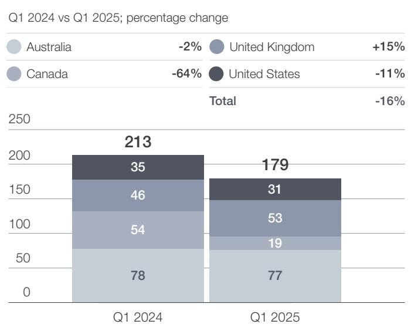

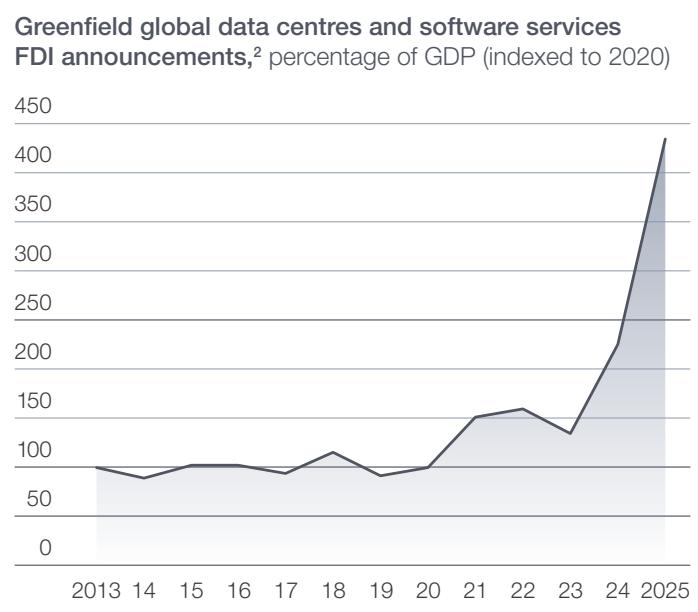

## 2025 survey results

Forum council members: How would you describe the state of global cooperation in innovation and technology in 2025 compared to 2024?

Executives: How has your company's ability to conduct business been affected, if at all, by changes in global cooperation in 2025 compared to 2024 in innovation and technology?

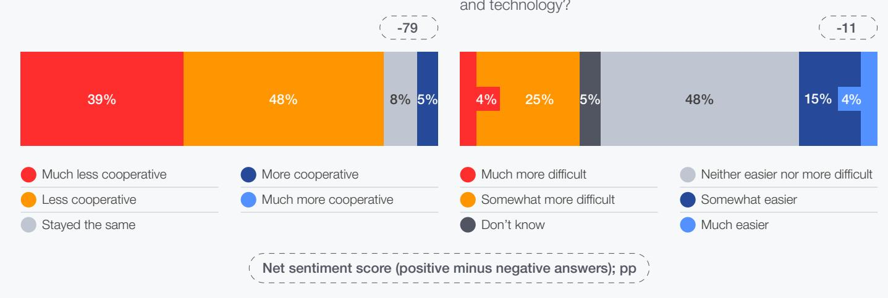

1. Study visas are defined as visa classifications where the primary purpose is educational or study-related activities (e.g. F-1, M-1 visas in the US).
2. Greenfield FDI announcements for global data centres and software services. Calculations for 2025 are an annualized estimate using data from January to May of 2025.

Sources: US Department of State; Government of Canada Immigration and Citizenship; Gov.uk; Australian Government Department of Education; fDi Markets; August 2025 Global Councils Survey, N=171 (finished responses); August 2025 Executive Survey N=799; McKinsey & Company analysis.

## Cooperation in climate continued to rise as trade and finance enabled more deployment of clean energy, but remained insufficient to make material progress on climate outcomes.

The climate and natural capital pillar looks at global cooperation on lowering emissions, preserving natural capital and preparing for the likely effects of climate change through a combination of cooperation on finance flows and global supply chains.

The latest barometer reading shows cooperation in this pillar rose, but with two contrasting dynamics. Cooperation increased in cross-border trade and global climate financing – the largest increases in this pillar – which enabled the continued rise

in deployment of clean technologies (Figure 8). Solar and wind capacity additions in 2024 doubled compared to 2022 – from 300 to 600 gigawatts (GW), $^{37}$ and were 60% higher in the first half of 2025 compared to the same period of 2024. $^{38}$ In fact, in the last 18 months, the world installed more solar capacity than in the previous three years combined. Yet, these increases were not enough. Outcomes related to natural capital and climate deteriorated, as deployment remains below the level needed to meet climate objectives aligned with the Paris Agreement.

## FIGURE 8

## Climate cooperation grew, spurred by climate finance and low-carbon goods trade

## Compound annual growth rate (CAGR), %

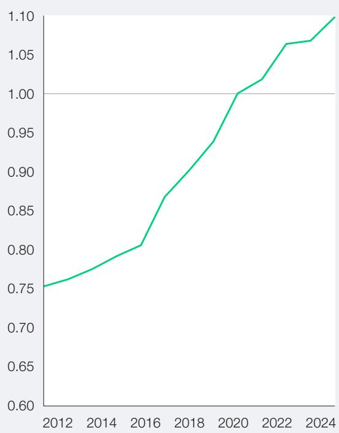  
1. Metrics were inverted given negative connotation; \*outcome metrics.

Note: Partial extrapolation of 2024 data from 2023 data for the following metrics: global trade in low-carbon technology products, finance: global climate mitigation, finance: global climate adaptation.

Sources: International Monetary Fund (IMF); Climate Policy Initiative (CPI); Ocean Health Initiative (OHI); Protected Planet; United Nations Environment Program (UNEP); McKinsey & Company analysis.

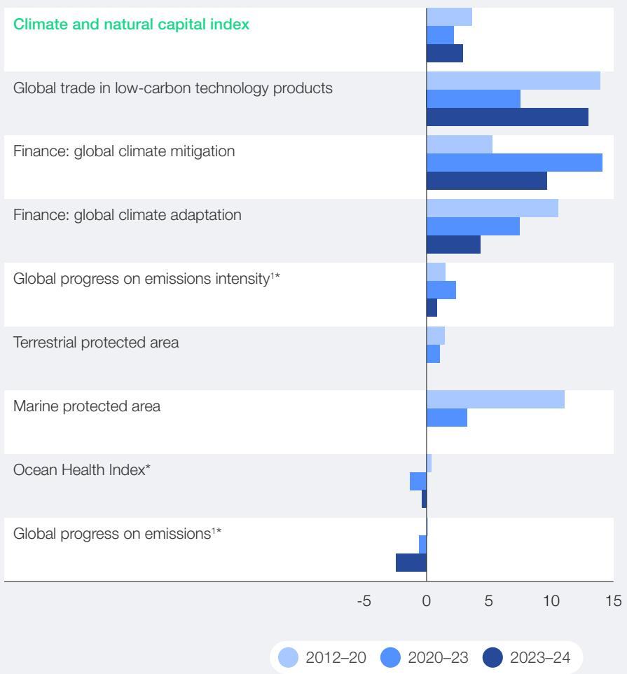

It may appear surprising that green financing and trade of green goods rose, given the pressures on multilateral mechanisms that traditionally support the flows of these components of climate action. One way to understand the growth of cooperation in clean technologies is as a convergence of global goals (such as emissions reductions) with domestic priorities. Many of these technologies have become more affordable, contributing to energy security by reducing dependence on foreign sources of energy and even expanding access to populations that previously lacked it. For example, the deployment of increasingly affordable EVs has contributed not only to emissions reductions, but has also displaced oil consumption in China and Europe – two regions that rely on oil imports. In Pakistan, imports of increasingly affordable solar panels have enabled local populations to increase access to energy. $^{39}$

Financing for climate technologies, which includes international and domestic funding, was a key aspect of rising global cooperation. Mitigation finance continued its five-year run of growth, rising to approximately double its pre-pandemic value by 2024. Particularly important are funds flowing to emerging economies, which almost doubled from 2018 to 2023, and were further boosted in 2024 by multilateral development banks (MDBs). $^{40,41}$ Adaptation finance is also estimated to have grown – and could be further propelled by a new deal struck at COP30 to triple adaptation finance by 2035. $^{42}$

Yet the landscape of climate cooperation remains complex. Cooperation in mitigation finance grew by just 10% in 2024, the slowest since 2020. Cuts in ODA have multiplied, and international partnerships have fallen short of expectations. The Just Energy Transition Partnerships – an international financing mechanism that assists emerging economies’ transition towards low-emission energy sources – delivered only \$7 billion by June 2025, against a \$50 billion commitment.

Trade in low-carbon goods was the other large growth engine of global cooperation. Global supply chains helped manufacturers reach scale and lowered prices. That in turn allowed their deployment in many emerging economies. For example, India – which added the second-most solar in 2025 after China – and Brazil gained access to affordable solar modules and stepped up installations. $^{43}$ In 2025, solar, wind and EV sales in emerging economies outpaced those of the US and parts of Europe, where momentum declined. Nonetheless, there are concerns that the supply of these goods is overly concentrated in China, which accounts for the vast majority (up to 70% or even 80%) of the manufacturing of many clean technologies. $^{44}$

Despite the growth in investment, trade and deployment, environmental outcomes continued to deteriorate. Research from the McKinsey Global Institute finds that deployment in the energy transition is progressing at half the speed needed to meet stated climate goals. $^{45}$ Emissions continued to rise in 2024, as they have done steadily for most of the past few decades. $^{46}$ There is one bright spot in the story: emissions intensity (measured as emissions/GDP) is dropping, signalling the world's ability to continue delivering economic growth while making headway in managing emissions.

The story for natural capital is equally sobering: after several years of steady progress, cooperation has lost momentum. Ocean health is declining. Growth in terrestrial and marine protected areas stalled during 2023–24, marking a reversal from the moderate growth experienced since 2020. Growth could renew soon, as projects such as the announced expansion of French Polynesia's marine protected area take hold, and COP30 in Brazil saw the launch of a new vehicle to boost investment in terrestrial protected areas. $^{47}$

In 2025, some indicators showed that the dynamics of previous years persisted. Investment in renewable energy and newly installed solar and wind capacity, and trade in low-carbon goods, continued to increase. Yet emissions from the energy system continue to grow, and there are signs that growth in climate finance is starting to weaken. $^{48}$ The mixed state of climate cooperation is reflected in the two surveys presented in this report. Almost two-thirds of experts think cooperation in climate and natural capital was “much less cooperative” or “less cooperative” in 2025. A significantly smaller fraction of executives pointed to this area as one that harmed their ability to conduct business across borders. Importantly, though, many found reasons for optimism. Seventeen percent of surveyed council members expected 2025 would be “more cooperative” or “much more cooperative” – the highest number across the pillars.

Achieving sustained progress on climate outcomes may require new forms of cooperation. Multilateral efforts still play a role, as recent advances such as the High Seas Treaty show. However, as seen in failed efforts to craft a Global Plastics Treaty in 2025 and delays in securing final adoption for net-zero international shipping emissions, $^{49}$ the current environment remains challenging for turning aspirations into international agreements.

Instead, states are advancing climate goals through smaller intra- and inter-regional coalitions. The EU and Central Asia forged a hydrogen partnership in September 2025 at the second Central Asian Regional Forum on Decarbonization Diplomacy in Astana. $^{50}$ At the regional level, the European Commission put forward the Clean Industrial Deal plan in February 2025, aiming to make decarbonization efforts a driver of industrial growth across the continent. In ASEAN, the LTMS-PIP cross-border power-trading partnership among Laos, Thailand, Malaysia and Singapore is an early step towards integrating renewable energy in the region.

## 2025 indicators

Global new investment in renewable energy, $^{1}$ \$ trillions  
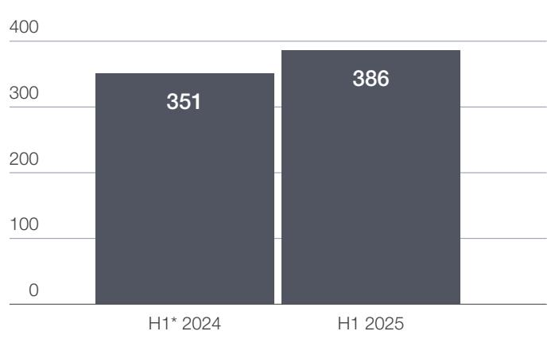  
Global electric vehicle sales, millions of units

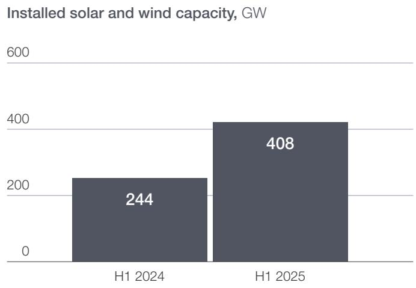

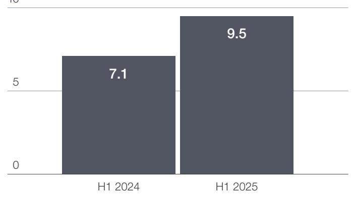  
Energy system $CO_{2}$ emissions, $^{2}$ billions of $CO_{2}$ tons per year

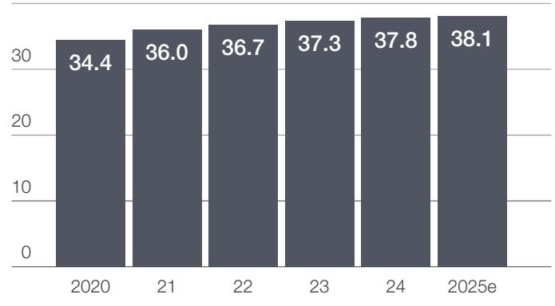

## 2025 survey results

Forum council members: How would you describe the state of global cooperation in climate and natural capital in 2025 compared to 2024?  
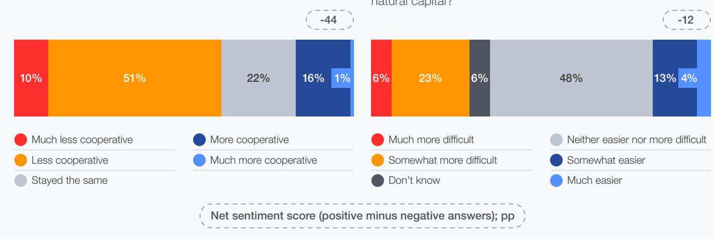  
\*H1 = first half.

1. Measured in nominal terms, composed of the following categories: small scale solar, utility scale solar, onshore wind, offshore wind, collocated and others.
2. Estimated annual emissions from fossil fuels (i.e. from energy systems), based on the Global Carbon Project, which integrates energy statistics, atmospheric observations and land-use information to estimate global $CO_{2}$ fluxes.

Sources: BloombergNEF; Ember Energy Wind and Solar Capacity Data; Friedlingstein et al. Earth System Science Data; August 2025 Global Councils Survey N=171 (finished responses); August 2025 Executive Survey N=799; McKinsey & Company analysis.

Overall cooperation remained steady, as health outcomes held, but flows of global aid eroded sharply, signalling potential challenges ahead.

The barometer shows that topline cooperation in the health and wellness pillar held steady, supported by resilient health outcomes, which may reflect a gradual “normalization” after having dropped during the pandemic. This stability, however, masks a growing fragility. Pressures

on multilateral organizations have eroded aid support, and development assistance for health (DAH) has contracted sharply. The result is that costs are shifting to lower-income countries, potentially endangering health outcomes in the future.

## FIGURE 10

## Health outcomes continued to improve, but development assistance for health declined

## Compound annual growth rate (CAGR), %

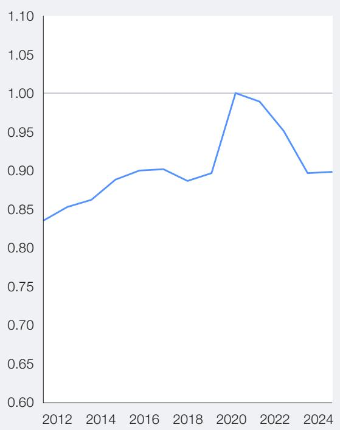  
1. Metrics were inverted given negative connotation; \*outcome metrics.  
Note: Partial extrapolation of 2024 data from 2023 data for the following metrics: health-related goods trade, cross-border pharma R&D.  
Sources: UN; Institute for Health Metrics and Evaluation (IHME); Policy Cures Research; World Health Organization (WHO); UN Comtrade; McKinsey & Company analysis.

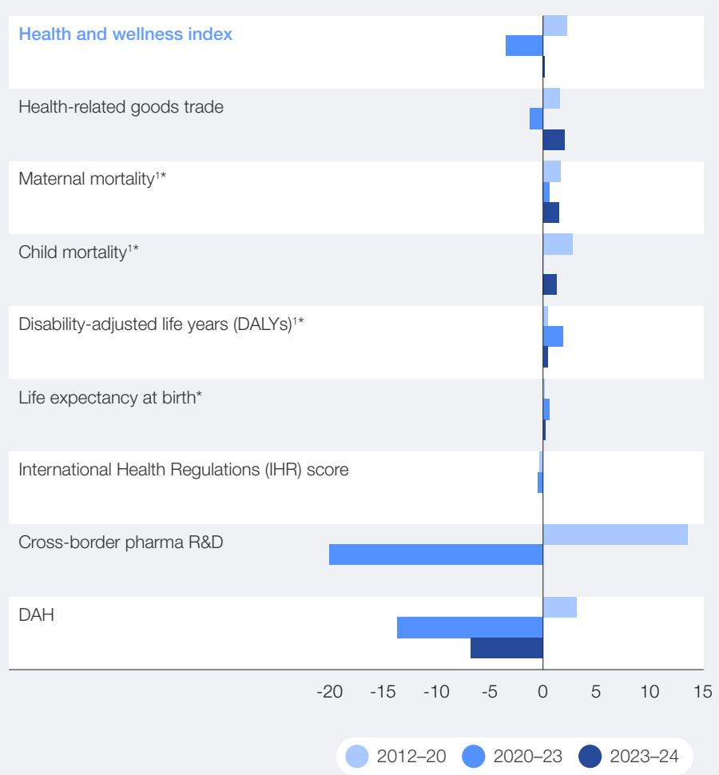

The heaviest pressure on this pillar was the drop in DAH, which fell 6% to \$50 billion in 2024, continuing its erosion since 2021. Key donors, including Germany, the United Kingdom and the US, cut funding.

Donations through multilateral channels pulled back more than those in bilateral channels; their funding fell by about 20%, while country-to-country funding contracted by 3%. $^{51}$ This may suggest that the aid landscape is increasingly tilting towards bilateral arrangements, which can prioritize medicines, diagnostics and front-line delivery. While helpful at the point of care, these arrangements could impose more pressure on recipient governments, as they typically leave system costs uncovered, shifting those on to domestic budgets. For example, the new US guidance for its HIV programme aims for services to be managed by domestic actors

As global financial flows weaken and the remaining support flows limit their coverage to treatment and delivery, pressures on domestic health budgets will rise.

(PEPFAR COP25 Strategic Guidance), and similarly, the United States Agency for International Development (USAID) tightened cost-sharing rules for recipient governments. $^{52}$

Estimates for 2025 indicate further worsening, with global DAH declining by an additional \$11 billion, $^{53}$ largely because US funding agencies are expected to cut about \$9 billion. $^{54}$ As a result, it is not surprising that many council members and executives expect cooperation in this pillar to deteriorate further (Figure 10).

Health outcomes have not yet started to reflect the potential impacts of the shift taking place. In 2024, all health outcomes – including disability-adjusted life years (DALYs), life expectancy, child mortality and maternal mortality – showed progress. However, health outcomes often lag their drivers significantly, and these improvements might be capturing a post-pandemic rebound, and perhaps also the results of longer-term cooperation. Although these indicators reflect positive outcomes, other evidence points to a widening gap between “healthspan” and lifespan, $^{55}$ as health-adjusted life expectancy lags gains in life expectancy. Put simply, this means people are living more years with illness.

Despite a slowdown in overall goods trade (as discussed in the trade and capital pillar), trade in health goods increased in 2024. This increase was propelled by innovation-led demand in pharmaceuticals – most visibly a rise in GLP-1 therapies, and exports from hubs such as Ireland, Denmark and Switzerland feeding US/EU demand. The WTO's “zero-for-zero” deal also kept pharmaceuticals tariffs near zero. $^{56}$

Recent global multilateral efforts – such as WHO's Pandemic Agreement (though not yet ratified and without US participation $^{57}$ ) and the UN General Assembly's declaration on non-communicable diseases and mental health – signal continued commitment to coordination in global health governance. Meanwhile, regional cooperation is gaining definition, exemplified by the Organisation of Eastern Caribbean States scaling a model to reduce the price of insulin throughout the region, the launch of the African Medicine Agency, as well as the Accra consensus, with African governments aligning on shared priorities and execution. $^{58}$

Looking ahead, the critical question is the extent to which fading global multilateral efforts could translate into worse health outcomes. As global financial flows weaken and the remaining support flows limit their coverage to treatment and delivery, pressures on domestic health budgets will rise. Many domestic economies will be unable to make up for the shortfall, and the test ahead will be whether progress on health outcomes can be sustained.

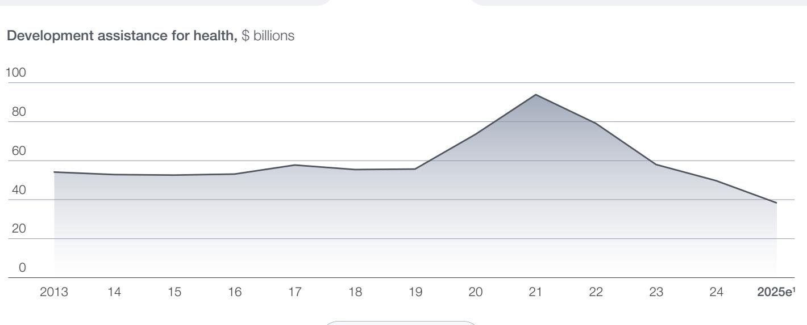

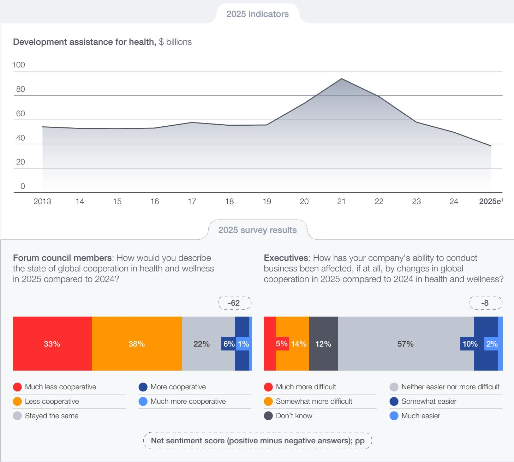

## 1. 2025 estimate.

Sources: Institute for Health Metrics and Evaluation (IHME), August 2025 Global Councils Survey, N=171 (finished responses), August 2025 Executive Survey N=799, McKinsey & Company analysis.

## Global cooperation declined sharply, as conflicts escalated in many parts of the world.

The peace and security pillar examines the impact of global cooperation in preventing and resolving conflicts. The focus is on preventing death and ameliorating the long-term negative implications of conflict through the commitment to multilateral peacekeeping operations and international stabilization efforts.

The barometer shows peace and security cooperation is under the greatest strain of all five pillars, with almost every metric in 2024 below pre-pandemic levels (Figure 12). The decline of this pillar since the late 2010s reflects an intensification of conflict and attendant harm to individuals. Global multilateralism has struggled in its role as peacekeeper, although regional formats of cooperation have picked up the mantle in some cases.

FIGURE 12

## Peace and security eroded with declines across most metrics

## Compound annual growth rate (CAGR), %

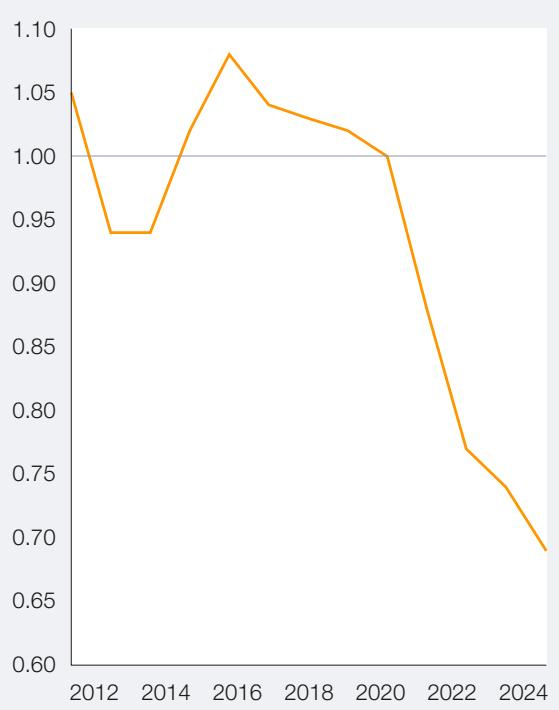  
1. Metrics were inverted given negative connotation; \*outcome metrics.  
Note: Fatalities from conflicts, conflicts are lagging metrics.
Sources: United Nations High Commission on Refugees (UNHCR); UPPSALA; Center for Strategic and International Studies (CSIS); Stockholm International Peace Research Institute (SIPRI); United Nations Security Council (UNSC); McKinsey & Company analysis.

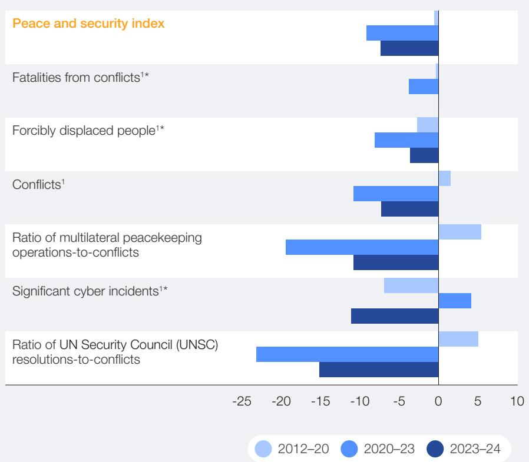

In 2024, the number of conflicts continued to increase, $^{59}$ marked by, among others, the ongoing Russia–Ukraine conflict, the Israel–Hamas war in Gaza, hostilities between Israel and Hezbollah, intensified fighting in eastern Democratic Republic of Congo and civil wars in Sudan and Myanmar. Reported battle-related deaths stayed near 2023 levels, with the Russia–Ukraine conflict making

up over 40% of the total. The number of forcibly displaced people likewise continued its growth, reaching a record 123 million. $^{60}$ The war in Sudan alone displaced approximately 11.5 million people. $^{61}$

Beyond the kinetic sphere of conflict, other dimensions also worsened. Cyberattacks intensified, with incidents surging across Asia, $^{62}$ the Middle East $^{63}$ and Europe – including high-profile attacks affecting large organizations across both the public and private sectors. $^{64}$ “Grey-zone” activity and infrastructure disruptions across digital and energy infrastructure also intensified, especially in 2025. Europe experienced gas-pipeline sabotage and damage to sub-sea cables, while three major multi-cable outages occurred in the Red Sea and West Africa. $^{65}$

  
About half of surveyed executives pointed to developments in peace and security as affecting their ability to conduct business.

The sharpest decline in this pillar was the deterioration in global multilateral actions, namely resolutions and peacekeeping missions, which have not kept pace with the growth of conflicts. The number of UN Security Council (UNSC) resolutions fell from 50 in 2023 to 46 in 2024, and the ratio of multilateral peace operations to conflicts declined by about 11% YoY. This reflects heightened geopolitical tensions, which have made conditions difficult for UN intervention. Until the UNSC vote in November 2025 authorizing an international stabilization force for the Gaza Strip, the UNSC had not mandated a new peacekeeping operation since 2014. $^{66}$ Furthermore, budget cuts have put pressure on existing missions – personnel deployed to multilateral peace operations fell by more than 40% between 2015 and 2024, and a budgetary crunch disrupted a mission’s function in 2024. $^{67}$ In this context, the role of the UN’s engagement has evolved, leaning more on special political missions and special envoys, concurrent with a rise in regionally led frameworks. $^{68}$

Given the pressures on peace and security, it is perhaps not surprising that perceptions of cooperation are pessimistic. About half of surveyed council members expected cooperation to deteriorate, and about half of surveyed executives pointed to developments in peace and security as affecting their ability to conduct business.

This was the highest of any pillar after trade and capital (Figure 13).

These tensions are also manifesting in how economies prepare for the future; many have responded by increasing defence spending, including China, India, the EU, Japan and Australia. In parallel, all 32 NATO member states met the defence spending target of 2% of GDP in 2025, whereas more than 10 fell short the year before. $^{69}$ With NATO raising its spending target to 5% of GDP for 2035, $^{70}$ national defence spending is set to rise further.

Still, there are some sources of hope. Survey respondents noted that major powers have so far managed their rivalries with restraint, preventing competition from evolving into escalation. $^{71}$ A panel of geopolitical experts interviewed for this report highlights the rise of “patchwork resilience”, where cooperation is succeeding in regional initiatives despite receding in global multilateral arrangements.

Indeed, successful cooperation in this pillar has been achieved through smaller coalitions. Several regional bodies have stepped up to stabilize or manage crises (such as the African Union-led security transition in Somalia, and Southern African Development Community deployments in Mozambique and the eastern Democratic Republic of Congo). Beyond formal frameworks, minilateral diplomacy also contributed to de-escalation in 2025. Türkiye mediated talks between Ethiopia and Somalia under the Ankara Declaration, leading to a de-escalation of tensions. $^{72}$ Armenia and Azerbaijan agreed on the text of a peace treaty and steps to keep third-country forces off their borders – with EU/US facilitation. $^{73}$ These examples underscore how, even as large UN troop deployments recede, tailored coalitions can still reduce risks and open channels for political settlement.

## 2025 indicators

2024–25 growth in defence spending, $^{1}$ percentage of YoY increase in nominal terms

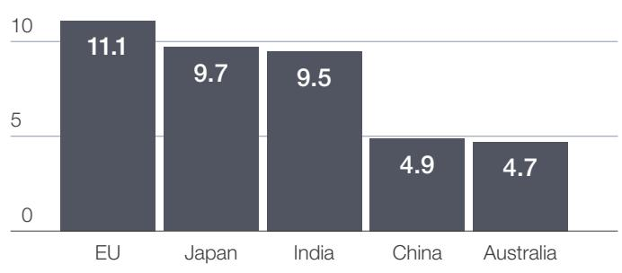  
Approved UN Peacekeeping budget, \$ billions

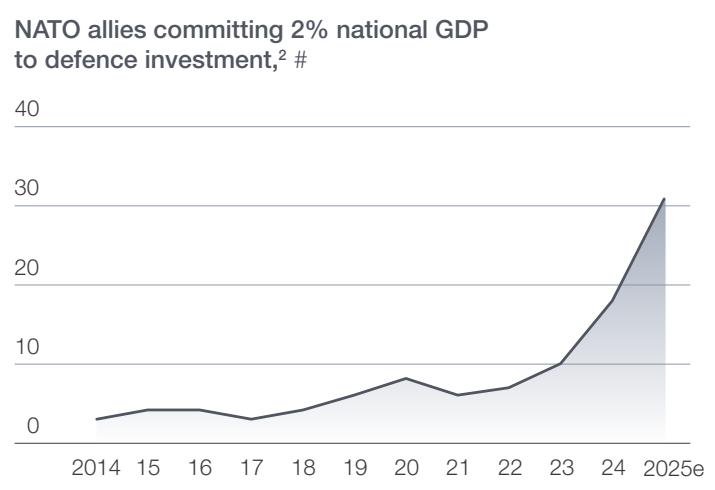

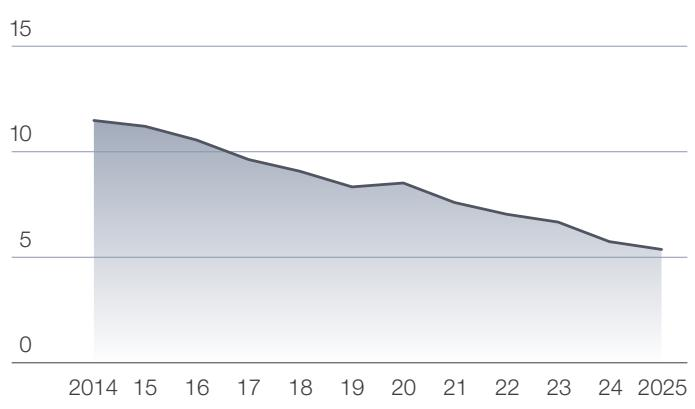  
Number of forcefully displaced people, millions

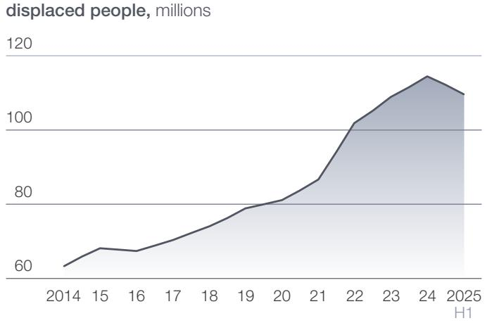  
2025 survey results  
Forum council members: How would you describe the state of global cooperation in peace and security in 2025 compared to 2024?  
Executives: How has your company's ability to conduct business been affected, if at all, by changes in global cooperation in 2025 compared to 2024 in peace and security?

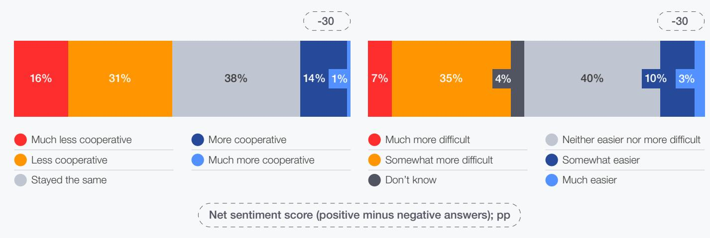

1. India defence spending represents local fiscal year, where the 2025 figure corresponds to April 2025–March 2026. 2. Data for 2024 and 2025 corresponds to NATO estimates, based on existing 2% target for NATO allies.

Sources: European Defence Agency; Japan Defense Ministry; India PRS Legislative Research, Australia Parliament House; China Power Project (CSIS); UN Peacekeeping; United Nations High Commissioner for Refugees (UNHCR); August 2025 Global Councils Survey, N=171 (finished responses); August 2025 Executive Survey N=799; McKinsey & Company analysis.

# Recommendations: Strategies for new forms of cooperation

Cooperation remains crucial to strengthening economies at a time of muted growth, bolstering security during an increasingly unstable and conflict-prone period and capitalizing on new opportunities emerging in the AI era. Yet, so long as sovereign politics remain a dominant feature in many countries, headwinds to cooperation will likely persist.

In this context, dialogue is essential to advancing cooperation and understanding where there is potential for agreement. Yet, dialogue is often not practised effectively, with parties using engagement with one another not to identify areas of mutual interest, exchange insight or advance shared agendas but to deliver one-way positioning statements. In this way, dialogue can divide, rather than unite. Parties should therefore approach discussions constructively, as confidence-building mechanisms attempting to identify common interests.

Public- and private-sector leaders who are deliberate in strengthening dialogue will be poised to identify cooperative pathways forward that can be based on key capabilities and strategies:

\- Proactively match the right cooperation format to the right issue. The forms of cooperation opportunities emerging from dialogue will be varied. Leaders should play offence – meaning adopt a proactive and agile mindset to “re-map” international engagement. This will require collaborating at multiple levels – global, regional and in various pragmatic and interest-based minilateral constellations. In this way, partnerships and alignments take place at multiple layers and are fortified at a time of greater unpredictability. Respondents to the Global Cooperation Barometer Survey recommended this type of collaboration, with some advocating to “invest in multistakeholder coalitions”, to “focus on regional or sectoral cooperation” and to “use newer and agile groupings”.

\- Strengthen resilience and cooperation through new organizational capabilities. Public and private entities will need to build cooperative capabilities that can strengthen resilience in an era of continuous disruption. In practice, this means keeping a live

view of the cooperation landscape – the platforms, partners, incentives and financing mechanisms that are the focus of discussion. Institutions are establishing small, cross-functional intelligence teams to track new avenues – trade agreements, corridor initiatives, standards alliances and public-finance facilities – and surface pilot opportunities with both governmental bodies and industry partners. Many private entities are also upgrading their corporate affairs capabilities to more effectively engage with public institutions and stakeholders. $^{74}$ In parallel, leaders can establish clear decision mechanisms, set escalation thresholds and pre-authorizations for pilots, agree information-sharing protocols, and cultivate liaisons with counterpart ministries and industry bodies – such that multi-party initiatives can move at speed when opportunities arise. $^{75}$

\- Advance shared interests through new public-private and private-private coalitions. Businesses can be engines for global cooperation by engaging in different ways. Public-private dialogue has always been an important mechanism for advancing crucial global priorities. It is now even more important to advance economic security in a rapidly shifting global climate. An example is the Minerals Security Partnership struck between governments and leading companies to move a pipeline of critical-mineral projects towards investment. $^{76}$ In addition, because public policy can take more time than desired, private-private engagement can become a force multiplier as the private sector focuses on specific issues where shared interests allow rapid coordination. For example, the Resilience Consortium, convened by the World Economic Forum and McKinsey & Company, aims to bring together businesses' agility, the public sector's long-term views, and multilateral development banks' ability to mobilize private capital. $^{77}$

Addressing today's challenges and opportunities necessitates collaborative action. The question is not whether to cooperate but how. Uniform approaches might be too brittle to withstand the pressures of a fast-changing landscape. Instead, leaders will need to be decisive in pursuing cooperation but flexible in the approaches they take for the collaboration to meet today's moment.

## Appendix

## Sources and methodology

This section highlights two important features of the 41 indicators included in the barometer: their sources and the methodology used to construct global trend lines (if a transformation was applied), organized by pillar.

## Trade and capital

## Developing countries share of foreign direct investment (FDI)

Source: UN Trade and Development (UNCTAD) Methodological notes: FDI is defined as inward stock. Calculation uses the categorization of developing and developed countries as defined by the UN Statistics Division.

## Developing countries share

of manufacturing exports
Source: World Bank
Methodological notes: Calculation uses categorization of developing and developed countries as defined by the UN Statistics Division.

FDI stock (as a percentage of GDP – gross domestic product)
Source: UNCTAD

Source: International Monetary Fund (IMF)
Methodological notes: End-December holdings used for 2012; end-June holdings used for 2013–24 (due to data availability).

Goods trade (as a percentage of GDP)
Source: World Bank

only the “grant portion” of the loan – that is, the amount “given” by lending below market rates – counts as ODA.

Source: International Labour Organization (ILO) Methodological notes: For countries where 2024 data were unavailable, international migrant data were extrapolated using a 5-year compound annual growth rate (CAGR).

## Official development assistance (ODA) (as a percentage of national income)

Source: Organisation for Economic Co-operation and Development (OECD)

Methodological notes: According to OECD, prior to 2018, the ODA flows basis methodology covered loans expressed on a “cash basis”, meaning their full face value was included; then repayments were subtracted as they came in. From 2018, the ODA grant-equivalent methodology is used, whereby

Remittances (as a percentage of GDP)
Source: World Bank

Services trade (as a percentage of GDP)
Source: UNCTAD

## Trade concentration

Methodological notes: Concentration is defined in this instance as the total value of concentrated imports as a share of total imports. First, the Herfindahl-Hirschman Index (HHI) is computed for imports across all products for all countries. Then each country's imported product is categorized as "high concentration" (HHI greater than 3,000) or "low concentration" (HHI less than 3,000). Finally, the total value of trade for both concentration categories is aggregated over time to calculate the value share of high- and low-concentration products globally. The 2024 figure was extrapolated by applying the rate of change found from the partially reported 2024 data to the corresponding 2023 data and applying that to the balance of the 2023 data.

## Innovation and technology

## Average price of a lithium-ion battery

Methodological notes: Two published series were used to construct the decade trend line: one presenting data from 2010–18 and one presenting data from 2013–24. Data from the former series were used for years 2012–18, and 2019–24 data were extrapolated using the year-on-year growth rates from the latter chart.

## Cross-border data flows (as a percentage of total internet traffic)

Source: International Telecommunication Union (international bandwidth usage); Cisco (IP traffic), TeleGeography

Methodological notes: The 2023-2024 figure was extrapolated using the growth rate from the TeleGeography report.

Cross-border patent applications (as a percentage of total patent applications)
Source: European Patent Office, PATSTAT

Cross-border R&D (as a percentage of GDP)
Source: OECD
Methodological notes: GERD (gross domestic expenditure on R&D) financed by the rest

of the world is used to measure cross-border R&D. Since 2024 was not available this metric was kept constant.

## Individuals using the internet

Source: International Telecommunication Union

## International students

## (as a percentage of the population)

Source: Institute of International Education Methodological notes: Due to data availability, destination countries included are Australia, Canada, China, France, Germany, Japan, New Zealand, Norway, Spain, the United Kingdom and the US. The 2021 values were linearly interpolated for China and Norway.

## IT goods/intermediates trade

Source: UNCTAD
Methodological notes: The 2024 figure was extrapolated from the partially reported 2024 data to the corresponding 2023 data and applied to the balance of the 2023 data.

## IT services trade

(as a percentage of GDP)
Source: UNCTAD

## Total factor productivity growth

Source: The Conference Board

## Climate and natural capital

## Finance: Global climate adaptation

(as a percentage of GDP)
Source: Climate Policy Initiative (CPI)
Methodological notes: 2024 figures were extrapolated based on the 2013–23 CAGR.

## Greenhouse gas

(GHG) emissions
Source: UN Environment Programme (UNEP)

## GHG emissions intensity

(ratio of emissions to GDP)
Source: UNEP and World Bank

## Global trade in low-carbon technology products (as a percentage of GDP)

Source: IMF, International Energy Agency (IEA) Methodological notes: The 2024 figure was extrapolated from the partially reported 2024 data to the corresponding 2023 data and applied to the balance of the 2023 data. Adjusted values using the IEA clean energy equipment price index to isolate price variations.

## Marine protected area

Source: Protected Planet

## Finance: Global climate mitigation (as a percentage of GDP)

Source: CPI
Methodological notes: Mitigation finance includes dual-use finance, as it is assumed to be total climate finance minus adaptation finance. The 2024 figure for total climate finance was extrapolated based on the 2013–23 CAGR.

## Ocean Health Index

Source: Ocean Health Index

## Terrestrial protected area

Source: Protected Planet

## Health and wellness

## Cross-border pharma R&D

(as a percentage of GDP)
Source: Policy Cures Research
Methodological notes: Since 2024 data were not available, this metric was kept constant.

## Development assistance for health (DAH)

## (as a percentage of GDP)

Source: Institute for Health Metrics and Evaluation (IHME)

## Disability-adjusted life years (DALYs)

Source: IHME
Methodological notes: IHME's forecasted values were used for the 2020–24 figures.

## Health-related goods trade

## (as a percentage of GDP)

Source: UN Comtrade
Methodological notes: The 2024 figure was extrapolated by applying the rate of change found in the reported data between 2023 and 2024 to the 2023 figure.

## International Health Regulations (IHR) score

Source: World Health Organization (WHO) Methodological notes: All capacities average score used.

Life expectancy at birth
Source: UN

## Maternal mortality

Source: IHME

Child mortality (under-five mortality)
Source: IHME

## Peace and security

Conflicts
Source: Uppsala Conflict Data Program (UCDP)

Fatalities from conflicts
Source: UCDP

Forcibly displaced people
Source: UN Refugee Agency (UNHCR)

Ratio of multilateral peacekeeping operations to conflicts
Source: Stockholm International Peace Research Institute (SIPRI)

Significant cyber incidents
Source: Center for Strategic and International Studies (CSIS), Verizon
Methodological notes: Significant cyber incidents are defined by CSIS as cyberattacks on government agencies, defence and high-tech companies, or economic crimes with losses of more than \$1 million. The 2024 figure was extrapolated using Verizon's Data Breach Investigation reports.

Ratio of UN Security Council resolutions to conflicts
Source: UN

## Contributors

World Economic Forum

Maroun Kairouz
Managing Director

Ariel Kastner
Head, Geopolitical Agenda and Communications

Miriam Schive
Deputy Head, Geopolitical Agenda

## McKinsey & Company

Jeffrey Condon
Senior Knowledge Expert

Tiago Devesa
Senior Fellow, McKinsey Global Institute

Ziad Haider
Partner and Global Director of Geopolitics

Daniel Pacthod
Senior Partner

Joaquín Rebled
Engagement Manager

Matt Watters
Partner

Olivia White
Senior Partner and Director,
McKinsey Global Institute

## Acknowledgements

Special thanks go to Sofia Balestrin and Jessica Margolis at the World Economic Forum for their contributions.

Thank you to Kimberley Botwright, Sean Doherty, Karis Everhart, Spencer Feingold, Kateryna Gordiychuk, Maxwell Hall, Rasha Hasbini, Gayle Markovitz, Sybile Penhirin, Emily Poyser, Anais Rassat, Vesselina Stefanova Ratcheva and Aditi Sara Verghese with the World Economic Forum and Taylor Burns at McKinsey & Company for assistance in developing and launching the report. Thank you to Masud Ally, Udai Bhardwaj, Jordan Lydon, Shreyangi Prasad, Mario Rojas and Editorial Director Mark Staples of McKinsey Global Publishing. This project benefited from the perspectives of individuals at McKinsey & Company, including Michael Chui, Matt Craven, Max Gleischman, Mekala Krishnan, Brad Herbig and Carlo Tanghetti. The report benefited from the insights of the McKinsey Geopolitics Advisory Council as well as current and former members of the Global Future Council Network who participated in the Global Cooperation Barometer survey. We are grateful for their contributions and to Leandro Loss at the World Economic Forum for facilitating the survey.

## Production

Laurence Denmark

Creative Director, Studio Miko

Martha Howlett

Editor, Studio Miko

Jay Kelly

Designer, Studio Miko

## Endnotes

United Nations High Commissioner for Refugees (UNHCR). (2025). Global Trends. https://www.unhcr.org/global-trends.

2. Fernández-Villaverde, et al. (2025, 4 February). Are We Fragmented Yet? Measuring Geopolitical Fragmentation and Its Causal Effects; United Nations. (2025, 25 April). New UN report warns of global social crisis driven by insecurity, inequality, and distrust. https://www.un.org/en/desa/new-un-report-warns-global-social-crisis-driven-insecurity-inequality-and-distrust; United Nations High Commissioner for Refugees (UNHRC). (2025). Global Trends. https://www.unhcr.org/global-trends.

3. See here for minilateralism: Sarah Teo, Lowy Institute. (2024, December 27). The rise and endurance of minilaterals in the Indo-Pacific. https://www.lowyinstitute.org/the-interpreter/rise-endurance-minilaterals-indo-pacific; Mladenov, N. (2023, 14 April). Minilateralism: A concept for a changing world order. The Washington Institute for Near East Policy. https://www.washingtoninstitute.org/policy-analysis/minilateralism-concept-changing-world-order.

4. Plurilateralism is sometimes used interchangeably with minilateralism, but the two can also be used in slightly different contexts. Minilateralism often refers to a few countries working together. Plurilateralism often refers to a larger number, but not all, working together.

5. Aiyar, S. & Ilyina, A. (2023, 8 February). Charting Globalization's Turn to Slowbalization After Global Financial Crisis. International Monetary Fund. https://www.imf.org/en/blogs/articles/2023/02/08/charting-globalizations-turn-to-slowbalization-after-global-financial-crisis.

6. Banga, A. (2024, 25 October). Remarks by World Bank Group President Ajay Banga at the 2024 Annual Meetings Plenary. World Bank Group. https://www.worldbank.org/en/news/speech/2024/10/25/remarks-by-world-bank-group-president-ajay-banga-at-the-2024-annual-meetings-plenary; United Nations. (2025, 24 October). Reform 'Imperative', Secretary-General Tells Security Council, Calling for Expansion of Membership, Renewed Commitment to 'We the People' [Press release]. https://press.un.org/en/2025/sc16201.doc.htm; Reuters. (2025, 28 October). WTO Chief Calls for Reform of Consensus Rule Amid Trade Disruption. https://www.reuters.com/world/china/wto-chief-calls-reform-consensus-rule-amid-trade-disruption-2025-10-28/.

7. Australian Government Department of Industry, Science and Resources. (2025, 21 October). United States-Australia Framework for Securing of Supply in the Mining and Processing of Critical Minerals and Rare Earths. https://www.industry.gov.au/publications/united-states-australia-framework-securing-supply-mining-and-processing-critical-minerals-and-rare-earths.

8. United Kingdom. (2025, 18 September). Memorandum of Understanding Between the Government of the United States of America and the Government of the United Kingdom of Great Britain and Northern Ireland [Press release]. https://www.gov.uk/government/news/memorandum-of-understanding-between-the-government-of-the-united-states-of-america-and-the-government-of-the-united-kingdom-of-great-britain-and-north; United States Trade Representative. (2024, 8 April). U.S.-EU Joint Statement of the Trade and Technology Council [Press release]. https://ustr.gov/about-us/policy-offices/press-office/press-releases/2024/april/us-eu-joint-statement-trade-and-technology-council; The White House. (2024, 17 June). Joint Fact Sheet: The United States and India Continue to Chart an Ambitious Course for the Initiative on Critical and Emerging Technology [Press release]. https://bidenwhitehouse.archives.gov/briefing-room/statements-releases/2024/06/17/joint-fact-sheet-the-united-states-and-india-continue-to-chart-an-ambitious-course-for-the-initiative-on-critical-and-emerging-technology/; United States Department of Commerce. (2025, 15 May). UAE/US Framework on Advanced Technology Cooperation [Press release]. https://www.commerce.gov/news/press-releases/2025/05/uae/us-framework-advanced-technology-cooperation; The White House. (2024, 10 April). United States-Japan Joint Leaders' Statement [Press release]. https://bidenwhitehouse.archives.gov/briefing-room/statements-releases/2024/04/10/united-states-japan-joint-leaders-statement/.

9. Including through the ASEAN Community Vision 2025, the Initiative for ASEAN Integration and the Master Plan on ASEAN Connectivity (MPAC) 2025, all of which had target dates in 2025.

10. African Union (AU). (2025). African Medicines Agency (AMA) to Hold Second Ordinary Session of the Conference of State Parties in Kigali. https://au.int/en/newsevents/20250602/african-medicines-agency-ama-hold-second-ordinary-session-conference-state; Forum for Agricultural Research in Africa (FARA). (2014). The Accra Consensus. https://library.faraafrica.org/wp-content/uploads/2019/11/The-Accra-Consensus.pdf; Mikey Live. (2025, 27 October). OECS Member States To Benefit From Lower Insulin Prices Following Grenada Health Meetings. https://www.mikeylive.com/featured/oecs-member-states-to-benefit-from-lower-insulin-prices-following-grenada-health-meetings/.

11. Guterres, A. (2025, 23 Sept). Secretary-General's address to the Opening of the General Debate of the 80th Session of the General Assembly. https://www.un.org/sg/en/content/sg/statements/2025-09-23/secretary-generals-address-the-opening-of-the-general-debate-of-the-80th-session-of-the-general-assembly-trilingual-delivered-scroll-down-for-all-english-and-all.

12. Seong, J., et al. (2025, 27 January). Geopolitics and the Geometry of Global Trade: 2025 Update. McKinsey Global Institute. https://www.mckinsey.com/mgi/our-research/geopolitics-and-the-geometry-of-global-trade-2025-update.

13. Concentration is calculated as the global share of import value in products deemed “high concentration” – country–product import Herfindahl–Hirschman Index (HHI) more than 3,000 – computed each on a yearly basis.

14. World Trade Organization. (2025, 7 October). AI goods and frontloading lift world trade in 2025 but outlook dims for 2026. https://www.wto.org/english/news\_e/news25\_e/stat\_07oct25\_e.htm#:\~:text=World%20merchandise%20trade%20volume%20growth,2025%20and%202.6%25%20for%202026.

15. Organisation for Economic Co-operation and Development (OECD). (2025). OECD Economic Outlook, Interim Report September 2025: Finding the Right Balance in Uncertain Times. https://www.oecd.org/en/publications/oecd-economic-outlook-interim-report-september-2025\_67b10c01-en.html.

16. Analysis of US customs data reported by the US Census Bureau.

17. Note that there are several ways to measure FDI trends. This report uses a measure of stocks, to evaluate the deepening of total investment positions. This is complemented with an analysis of announcements of greenfield FDI – net new productive capacity. Both these measures have trended upwards in 2024. Other measures, such as FDI inflows, have not – although these are influenced by meaningful factors that do not reflect the nature of global cooperation – such as phantom FDI. See, for example: International Monetary Fund (IMF). (2019). The Rise of Phantom FDI in Global Tax Havens.

18. Devesa, T. et al. (2025, 22 September). The FDI Shake-up: How Foreign Direct Investment Today May Shape Industry and Trade Tomorrow. McKinsey Global Institute. https://www.mckinsey.com/mgi/our-research/the-fdi-shake-up-how-foreign-direct-investment-today-may-shape-industry-and-trade-tomorrow.

19. Ibid.

20. World Trade Organization (WTO). (2025, 7 October). AI goods and frontloading lift world trade in 2025 but outlook dims for 2026. https://www.wto.org/english/news\_e/news25\_e/stat\_07oct25\_e.htm#:\~:text=World%20merchandise%20trade%20volume%20growth,2025%20and%202.6%25%20for%202026.

21. World Trade Organization (WTO). (2025). Global Trade Outlook and Statistics. https://www.wto.org/english/res\_e/booksp\_e/trade\_outlook25\_e.pdf.

22. Organisation for Economic Co-operation and Development (OECD). (2025, 26 June). Cuts in official development assistance: OECD projections for 2025 and the near term. https://www.oecd.org/en/publications/cuts-in-official-development-assistance\_8c530629-en/full-report.html.

23. Organisation for Economic Co-operation and Development (OECD). (2025, 3 November). International Migration Outlook 2025. https://www.oecd.org/en/publications/international-migration-outlook-2025\_ae26c893-en.html.

24. United Kingdom Home Office. (2025, 1 July). Statement of Changes to the Immigration Rules: HC 997, 1 July 2025. https://www.gov.uk/government/publications/statement-of-changes-to-the-immigration-rules-hc-997-1-july-2025; Krishna, A. (ed.). (2025, 30 October). Saudi Arabia Makes Health Insurance Mandatory for Issuance of Temporary Work Visas. The Economic Times. https://economictimes.indiatimes.com/nri/work/saudi-arabia-makes-health-insurance-mandatory-for-issuance-of-temporary-work-visas/articleshow/124942621.cms; Government of Canada, Immigration, Refugees and Citizenship Canada. (2025, 27 February). Canada Announces 2025 Express Entry Category-Based Draws, Plans for More In-Canada Draws to Reduce Labour Shortages. https://www.canada.ca/en/immigration-refugees-citizenship/news/2025/02/canada-announces-2025-express-entry-category-based-draws-plans-for-more-in-canada-draws-to-reduce-labour-shortages.html; The White House. (2025, 19 September). Restriction on Entry of Certain Nonimmigrant Workers. https://www.whitehouse.gov/presidential-actions/2025/09/restriction-on-entry-of-certain-nonimmigrant-workers/.

25. Levy, C., Mysore, M., Singhal S., & Marya, V. (2025, 11 April). Navigating tariffs with a geopolitical nerve center. https://www.mckinsey.com/capabilities/geopolitics/our-insights/navigating-tariffs-with-a-geopolitical-nerve-center.

26. White, O. et al. (2025, 25 June). The Great Trade Rearrangement. McKinsey Global Institute. https://www.mckinsey.com/mgi/our-research/the-great-trade-rearrangement.

27. Seong, J., et al. (2025, 18 June). A New Trade Paradigm: How Shifts in Trade Corridors Could Affect Business. McKinsey & Company. https://www.mckinsey.com/capabilities/geopolitics/our-insights/a-new-trade-paradigm-how-shifts-in-trade-corridors-could-affect-business.

28. Australian Government Department of Industry, Science and Resources. (2025, 21 October). United States-Australia Framework for Securing of Supply in the Mining and Processing of Critical Minerals and Rare Earths. https://www.industry.gov.au/publications/united-states-australia-framework-securing-supply-mining-and-processing-critical-minerals-and-rare-earths.

29. World Trade Organization (WTO) Regional Trade Agreements Database. (2025). RTA Tracker. https://rtais.wto.org/UI/PublicMaintainRTAHome.aspx.

30. Devesa, T. et al. (2025, 22 September). The FDI Shake-up: How Foreign Direct Investment Today May Shape Industry and Trade Tomorrow. McKinsey Global Institute. https://www.mckinsey.com/mgi/our-research/the-fdi-shake-up-how-foreign-direct-investment-today-may-shape-industry-and-trade-tomorrow.mckinsey.com.

31. fDi Markets (Financial Times). (n.d). The cross-border investment monitor. https://www.fdimarkets.com/.

32. McKinsey & Company. (2023, 14 June). The economic potential of generative AI: The next productivity frontier. https://www.mckinsey.com/capabilities/tech-and-ai/our-insights/the-economic-potential-of-generative-ai-the-next-productivity-frontier.

33. Australian Government Department of Education. (2025). Other international education data and research. https://www.education.gov.au/international-education-data-and-research/other-international-education-data-and-research.

34. Government of Canada, Immigration, Refugees and Citizenship Canada. (2025). Understanding Student and Temporary Worker Numbers in Canada. https://www.canada.ca/en/immigration-refugees-citizenship/corporate/reports-statistics/statistics-open-data/immigration-stats/students-workers.html.

35. Levy, C. et al. (2025, 3 April). Restricted: How export controls are reshaping markets. McKinsey & Company. https://www.mckinsey.com/capabilities/geopolitics/our-insights/restricted-how-export-controls-are-reshaping-markets.

The White House. (2024, 17 June). Joint Fact Sheet: The United States and India Continue to Chart an Ambitious Course for the Initiative on Critical and Emerging Technology. https://bidenwhitehouse.archives.gov/briefing-room/statements-releases/2024/06/17/joint-fact-sheet-the-united-states-and-india-continue-to-chart-an-ambitious-course-for-the-initiative-on-critical-and-emerging-technology/; US Department of State. (2024, 28 February). Joint Statement Endorsing Principles for 6G: Secure, Open, and Resilient by Design. https://2021-2025.state.gov/joint-statement-endorsing-principles-for-6g-secure-open-and-resilient-by-design/; Hashmi, S. (2025, 31 July). The Gulf bets big on AI as it seeks the 'new oil'. BBC. https://www.bbc.com/news/articles/cvg8z2mx508o; Pillai, R. (2025, 13 August). du launches region's first live 5G-Advanced network in UAE with Huawei. Gulf Business. https://gulfbusiness.com/du-launches-regions-first-live-5g-advanced-network-in-uae-with-huawei/; Reuters. (2025, 15 April) Malaysia telco U Mobile to partner with China's Huawei and ZTE for 5G network. https://www.reuters.com/business/media-telecom/malaysia-telco-u-mobile-partner-with-chinas-huawei-zte-5g-network-2025-04-15/; Reuters. (2024, 26 November). S. Africa's MTN teams up with China Telecom, Huawei on 5G, AI. https://www.reuters.com/business/media-telecom/safricas-mtn-teams-up-with-china-telecom-huawei-5g-ai-2024-11-26/.

37. International Renewable Energy Agency (IRENA). (2025). Renewable Capacity Statistics 2025. https://www.irena.org/Publications/2025/Mar/Renewable-capacity-statistics-2025.

38. Ember. (2025). Yearly Electricity Data. https://www.ember-energy.org/data/yearly-electricity-data/.

39. International Energy Agency (IEA). (2025). Global EV Outlook 2025. https://www.iea.org/reports/global-ev-outlook-2025; International Energy Agency (IEA). (2025). World Energy Investment 2025. https://www.iea.org/reports/world-energy-investment-2025.

40. Baysa, N. et al. (2025, 27 October). Global Landscape of Climate Finance 2025: EMDE Spotlight. Climate Policy Initiative. https://www.climatepolicyinitiative.org/publication/global-landscape-of-climate-finance-2025-emde-spotlight/.

41. Bitsadze, R. (2025, 9 September). Multilateral Development Banks Hit Record \$137 Billion in Climate Finance to Drive Sustainable Development Worldwide. European Bank for Reconstruction and Development (EBRD). https://www.ebrd.com/home/news-and-events/news/2025/multilateral-development-banks-hit-record--137-billion-in-climat.html.

42. Projections expect adaptation finance to grow in 2024, albeit the metric remains difficult to track and is sensitive to changes in methodology and funding from large individual projects: COP30. (2025, 22 November). COP30 approves Belém Package. https://cop30.br/en/news-about-cop30/cop30-approves-belem-package1.

43. Krishnan, M., et al. (2025, 6 November). The Hard Stuff 2025: Taking Stock of Progress on the Physical Challenges of the Energy Transition. McKinsey Global Institute. https://www.mckinsey.com/mgi/our-research/the-hard-stuff-2025-taking-stock-of-progress-on-the-physical-challenges-of-the-energy-transition.

44. China accounts for 40–80% of the manufacturing capacity for five key clean technologies (solar power, wind, batteries, electrolysers and heat pumps), with an especially large role in solar power and batteries. See: International Energy Agency (IEA). (2023). The State of Clean Technology Manufacturing. https://www.iea.org/reports/the-state-of-clean-technology-manufacturing.

45. Krishnan, M. et al. (2025, 6 November). The Hard Stuff 2025: Taking Stock of Progress on the Physical Challenges of the Energy Transition. McKinsey Global Institute. https://www.mckinsey.com/mgi/our-research/the-hard-stuff-2025-taking-stock-of-progress-on-the-physical-challenges-of-the-energy-transition.

46. Global emissions have generally risen almost every year in the past five decades with a few exceptional years including 2009, 2015 and 2020. See: European Commission. (2025). GHG emissions of all world countries. https://edgar.jrc.ec.europa.eu/report\_2025.

47. World Resources Institute (WRI). (2025, 6 November). STATEMENT: Brazil Launches Tropical Forests Forever Facility [Press release]. https://www.wri.org/news/statement-brazil-launches-tropical-forests-forever-facility.

48. Note emissions due to land-use changes are projected to decline; while emissions from fossil-fuel use (i.e. from the energy system) continue to trend up: Global Carbon Project. (2025, 13 November). Fossil Fuel CO $_{2}$ Emissions Hit Record High in 2025. https://globalcarbonbudget.org/fossil-fuel-co $_{2}$ -emissions-hit-record-high-in-2025/.

49. Mooney, A. & Foster, P. (2025, 17 October). Historic shipping climate agreement delayed after Trump attack. Financial Times. https://www.ft.com/content/02936596-a403-4d02-aef6-1ed89deee984.

50. Abuova, N. (2025, 16 September). Central Asia, EU Forge Hydrogen Path for Green Transition. The Astana Times. https://astanatimes.com/2025/09/central-asia-eu-forge-hydrogen-path-for-green-transition/#:\~:text=%E2%80%9CGreen%20hydrogen%20has%20emerged%20as,lsetov%20at%20the%20opening%20session.

51. 2023–24 analysis on year-on-year DAH evolution by channel source – multilateral channels include Global Funds and funds channelled through multilateral institutions (e.g. WHO, UN, multilateral development banks). Similarly, 2021–24 shows an approximate 60% total decrease from multilateral channels vs. 30% decrease from bilateral channels.

52. US Department of State. (2024). U.S. President's Emergency Plan for AIDS Relief (PEPFAR) 2025 Country Operational Plan (COP25) Strategic Guidance. https://2021-2025.state.gov/wp-content/uploads/2024/12/20241223-COP25-Strategic-Guidance-Final-to-post\_508\_mjm.pdf?safe=1; Electronic Code of Federal Regulations (eCFR). (2025). 2 CFR 200.306. https://www.ecfr.gov/current/title-2/subtitle-A/chapter-II/part-200/subpart-D/section-200.306.

53. Institute for Health Metrics and Evaluation. (2025, 15 July). FGH Report 2025. https://www.healthdata.org/sites/default/files/2025-07/FGHReport\_2025\_2025.07.15\_0.pdf.

54. Krugman, A. (2025, 31 July). The State of Global Health Funding: August 2025. Think Global Health. https://www.thinkglobalhealth.org/article/state-global-health-funding-august-2025.

Garmany, A. & Terzic, A. (2024, 11 December). Global Healthspan-Lifespan Gaps Among 183 World Health Organization Member States. JAMA Network Open. https://www.jamanetwork.com/journals/jamanetworkopen/fullarticle/2827753-jamanetwork.com.

56. US International Trade Commission (USITC). (2017). Changes in the U.S. Pharmaceutical Import Mix under the Agreement on Trade in Pharmaceutical Products. https://www.usitc.gov/publications/332/executive\_briefings/nesbitt-pharma-ebot-08-15-2017.pdf; WTO “zero-for-zero” 1995 agreement eliminated import duties on most pharmaceutical products, which remained in force through 2024 and most of 2025. 100% import tariffs were announced by the US on September 2025, then paused while the US government negotiated domestic manufacturing deals with individual companies: The White House. (2025, 30 September). Fact Sheet: President Donald J. Trump Announces First Deal to Bring Most-Favored-Nation Pricing to American Patients. https://www.whitehouse.gov/fact-sheets/2025/09/fact-sheet-president-donald-j-trump-announces-first-deal-to-bring-most-favored-nation-pricing-to-american-patients/#:\~:text=President%20Donald%20J.-,Trump%20Announces%20First%20Deal%20to%20Bring%20Most%2DFavored%2DNation%20Pricing,selling%20directly%20to%20American%20patients.

57. Reuters. (2025, 20 May). Landmark global pandemic agreement adopted by World Health Organization members. https://www.reuters.com/business/healthcare-pharmaceuticals/landmark-global-pandemic-agreement-adopted-by-world-health-organization-members-2025-05-20/.

58. African Union (AU). (2025). African Medicines Agency (AMA) to Hold Second Ordinary Session of the Conference of State Parties in Kigali. https://au.int/en/newsevents/20250602/african-medicines-agency-ama-hold-second-ordinary-session-conference-state; Forum for Agricultural Research in Africa (FARA). (2014). The Accra Consensus. https://library.faraafrica.org/wp-content/uploads/2019/11/The-Accra-Consensus.pdf; Mikey Live. (2025, 27 October). OECS Member States To Benefit From Lower Insulin Prices Following Grenada Health Meetings. https://www.mikeylive.com/featured/oecs-member-states-to-benefit-from-lower-insulin-prices-following-grenada-health-meetings/.

59. Uppsala University. (2025, 11 June). UCDP: Sharp increase in conflicts and wars. https://www.uu.se/en/press/press-releases/2025/2025-06-11-ucdp-sharp-increase-in-conflicts-and-wars.

60. United Nations High Commissioner for Refugees. (2025, 12 June). Global Trends 2024. https://www.unhcr.org/global-trends.

61. Reliefweb. (2025, 5 January). A Year in Review: Displacement in Sudan (2024). https://reliefweb.int/report/sudan/year-review-displacement-sudan-2024#:\~:text=The%20number%20of%20internally%20displaced,11%2C532%2C822%20IDPs%20in%20December%202024.

62. Verizon Business. (2025, 23 April). 2025 Data Breach Investigations Report. https://www.verizon.com/business/resources/T163/reports/2025-dbir-data-breach-investigations-report.pdf.

63. IBM. (2025). IBM X-Force 2025 Threat Intelligence Index. https://www.ibm.com/reports/threat-intelligence.

64. Reuters. (2025, 29 September). Tata Motors-owned JLR begins phased manufacturing restart post cyber attack. https://www.reuters.com/en/tata-motors-jlr-return-manufacturing-after-cyber-attack-2025-09-29/; Onita, L. (2025, 21 May). Marks & Spencer faces up to £300 million hit from cyber attack. Financial Times. https://www.ft.com/content/fa80b540-c836-4c45-a77f-38aa1693c656; Cyber Management Alliance. (2025, 20 January). Top 10 Biggest Cyber Attacks of 2024 & 25 Other Attacks to Know About! https://www.cm-alliance.com/cybersecurity-blog/top-10-biggest-cyber-attacks-of-2024-25-other-attacks-to-know-about.

65. Reuters. (2025, 8 September). Red Sea cable cuts disrupt internet across Asia and the Middle East. https://www.reuters.com/world/middle-east/red-sea-cable-cuts-disrupt-internet-across-asia-middle-east-2025-09-07/; https://www.iss.europa.eu/publications/commentary/navigating-grey-zone-readiness-solidarity-and-resolve.

66. The United Nations Multidimensional Integrated Stabilization Mission in the Central African Republic (MINUSCA). See: Yohannes, D., et al. (2024). A New Approach to United Nations Peace Operations: Pathways for Demand-Driven Interventions. NYU Center on International Cooperation and Institute for Security Studies, https://cic.nyu.edu/wp-content/uploads/2024/02/A-New-Approach-to-United-Nations-Peace-Operations-February-2024.pdf; United Nations Palestine. (2025, 18 November). UN Security Council authorizes temporary international force for Gaza. https://palestine.un.org/en/305520-un-security-council-authorizes-temporary-international-force-gaza.

67. Stockholm International Peace Research Institute (SIPRI). (2025). Deployments Fall More Than 40% in a Decade, as Geopolitical Tensions and Funding Cuts Increase Pressure on Multilateral Peace Operations. https://www.sipri.org/media/press-release/2025/peace-operation-deployments-fall-40-per-cent.

68. United Nations. (2025, 9 May). UN Peacekeeping Budgets (2013-14 - 2024-25). https://psdata.un.org/dataset/DPO-TOTALPKBUDGET.

69. Ford, M. (2025, 28 August). NATO members all hit 2% target, but only 3 meet new goal. Deutsche Welle (DW). https://www.dw.com/en/nato-members-all-hit-2-target-but-only-3-meet-new-goal/a-73789663.

70. NATO. (2025, 25 June). The Hague Summit Declaration. https://www.nato.int/cps/en/natohq/official\_texts\_236705.htm.

71. Interviews to McKinsey's Geopolitics Advisory Council members.

72. The Associated Press (AP). (2025, 18 February). Ethiopia and Somalia hold a first round of technical talks in Turkey toward resolving their dispute. https://apnews.com/article/ethiopia-somalia-turkey-talks-dispute-72097d9b183709197300baa3e080dc0d; European External Action Service. (2024, 12 December). Ethiopia/Somalia: Statement by the Spokesperson on the Ankara Declaration. https://www.eeas.europa.eu/eeas/ethiopiasomalia-statement-spokesperson-ankara-declaration\_en.

73. Delegation of the European Union to Armenia. (2024, 17 May). Armenia/Azerbaijan: Statement by the Spokesperson on the progress in the border delimitation. https://www.eeas.europa.eu/eeas/armeniaazerbaijan-statement-spokesperson-progress-border-delimitation\_en?s=216; Reuters. (2024, 11 April). Kenya proposes maritime treaty to defuse Ethiopia-Somalia tensions. https://www.reuters.com/world/africa/kenya-proposes-maritime-treaty-diffuse-ethiopia-somalia-tensions-2024-04-11/; United Nations. (2024, 27 December). Adopting Resolution 2767 (2024), Security Council Endorses New African Union Support Mission in Somalia. https://press.un.org/en/2024/sc15955.doc.htm; Reuters. (2025, 15 January). Israel, Hamas reach ceasefire deal designed to end 15-month Gaza war. https://www.reuters.com/world/middle-east/israel-hamas-reach-ceasefire-agreement-designed-end-15-month-gaza-war-official-2025-01-15/.

74. Nuttall, R. & Haider, Z. (2025, 8 October). Upgrading corporate affairs for a new geopolitical era. McKinsey & Company. https://www.mckinsey.com/capabilities/geopolitics/our-insights/upgrading-corporate-affairs-for-a-new-geopolitical-era.

75. Haider, Z. (2024, 17 December). Building Geopolitical Resilience: The People Agenda. McKinsey & Company. https://www.mckinsey.com/capabilities/geopolitics/our-insights/building-geopolitical-resilience-the-people-agenda.

76. European Commission. (n.d.). Minerals Security Partnership Forum. https://policy.trade.ec.europa.eu/help-exporters-and-importers/accessing-markets/raw-materials/minerals-security-partnership-forum\_en.

77. World Economic Forum. (2024, 24 September). World Economic Forum's EDISON Alliance Impacts Over 1 Billion Lives, Accelerating Global Digital Inclusion. https://www.weforum.org/press/2024/09/world-economic-forum-s-edison-alliance-impacts-over-1-billion-lives-accelerating-global-digital-inclusion/.

WORLD ECONOMIC FORUM

COMMITTED TO IMPROVING THE STATE OF THE WORLD

The World Economic Forum, committed to improving the state of the world, is the International Organization for Public-Private Cooperation.

The Forum engages the foremost political, business and other leaders of society to shape global, regional and industry agendas.

World Economic Forum
91–93 route de la Capite
CH-1223 Cologny/Geneva
Switzerland