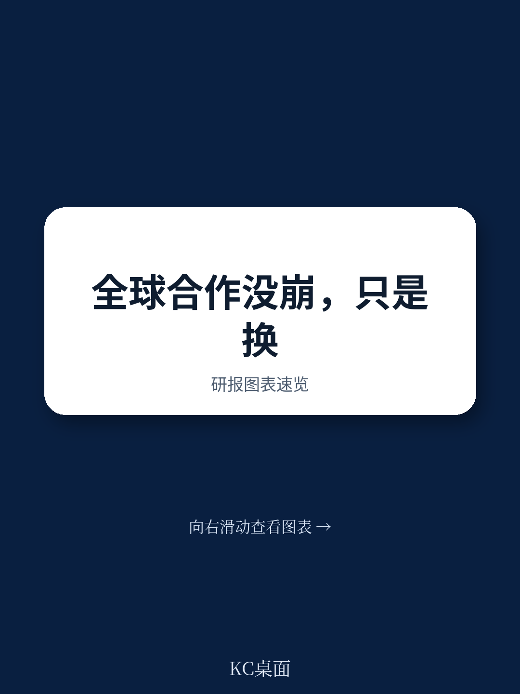
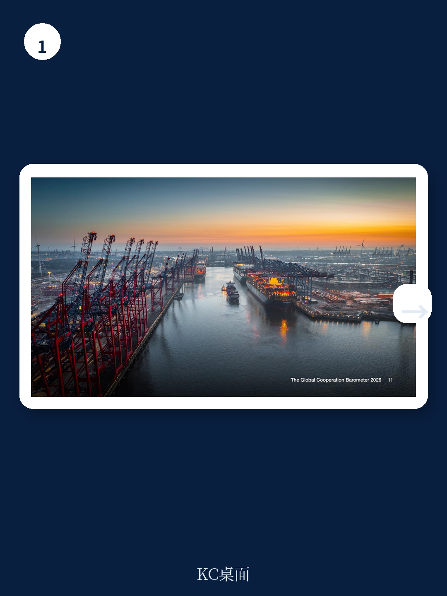

# 世界经济论坛：不是多边主义终结，而是合作形态转向小而精联盟

全球合作正在经历一场静默但深刻的转型。2026年1月，世界经济论坛与麦肯锡联合发布的《全球合作晴雨表2026》给出了一个反直觉的核心判断：尽管地缘冲突升级、贸易壁垒高筑、多边机制承压，全球合作的总体水平在过去一年并未下降，而是保持平稳。但这份平稳不是好消息，它掩盖了一个更重要的结构性变化——合作的形态正在从“大而全的多边主义”转向“小而精的利益联盟”。对于产业决策者和投资者而言，理解这种形态变化，比盯着贸易战或制裁清单更重要。

报告追踪了41项指标，覆盖贸易与资本、创新与技术、气候与自然资本、健康与福祉、和平与安全五大支柱。结果显示，与多边机制相关的指标普遍走弱，而与数据流、服务贸易、选择性资本流动相关的指标持续增长，甚至创下新高。这意味着，全球化并未终结，但它的运行逻辑已经从“规则驱动”转向了“利益驱动”。

## 1. 贸易并未脱钩，但流向正在重新配置

贸易与资本合作支柱整体持平，仍高于2019年水平，但内部构成正在剧烈调整。商品贸易量的增长已慢于全球经济增速，且贸易流向正在向“更对齐的伙伴”集中。服务贸易和选择性资本流动则展现出强劲动能，尤其是在价值观和经济利益趋同的经济体之间。

报告特别指出，全球多边贸易体系面临越来越高的壁垒，但小型国家联盟正在通过“未来投资与贸易伙伴关系”等倡议推进合作。这意味着，企业供应链的“去风险”操作不能简单理解为从中国转移到越南或墨西哥，而是要同时考虑政策对齐、技术标准和金融通道的兼容性。

> **KC评论：** 贸易数据告诉我们，全球化没有死，但它的地理版图在重新绘制。对读者来说，真正需要关注的不是关税税率的变化，而是哪些国家和行业正在形成新的“贸易小圈子”——这些圈子内部的合作深度可能远超传统多边框架。完整报告中的图表展示了不同区域间贸易流量的变化路径，值得细看。

继续看原文，真正有价值的是图表、假设和验证路径；完整报告与KC评论在每日汇编。

## 2. 技术与数据领域的合作逆势上升，但控制也在加码

创新与技术合作支柱是五大支柱中增长最明显的之一。IT服务和人才流动显著增加，国际带宽已升至疫情前的四倍。但与此同时，对关键技术、知识和资源的流动限制也在扩大——尤其集中在中美之间。

这里的关键洞察是：技术领域的合作并未因“脱钩”而消失，而是改变了形式。报告显示，在人工智能、5G基础设施等前沿技术领域，价值观相近的国家之间正在形成新的合作框架。这种“技术联盟化”意味着，企业不能再用全球统一的技术标准来规划研发和产品路线，而是需要同时管理多套技术生态。

“国际带宽增长四倍”这一数据尤其值得注意。它说明，尽管物理商品和直接投资在碎片化，数据和数字服务的全球化仍在加速。这种“数字全球化”与“实体碎片化”的并存，是当前全球经济最独特的结构特征。

## 3. 气候合作在“去多边化”中找到了新动力

气候与自然资本支柱的增长是另一个亮点。清洁技术的部署在2025年中期达到创纪录水平，融资和全球供应链在其中发挥了关键作用。中国贡献了太阳能、风能和电动汽车增量的三分之二，但其他发展中经济体的参与也在加速。

报告特别指出，随着多边气候谈判变得越来越困难，国家集团——如欧盟和东盟——正在将脱碳与能源安全目标结合起来。这意味着，气候合作正在从“全球共识驱动”转向“国家利益驱动”。对于清洁能源企业来说，未来的增长机会不在于等待全球碳定价统一，而在于识别哪些区域的国家利益与清洁技术部署高度重合。

> **KC评论：** 气候合作的数据看似乐观，但读者需要问一个更尖锐的问题：这些增长有多少是政策补贴驱动的，有多少是真正的经济竞争力驱动的？完整报告对各国清洁技术部署的融资结构和成本曲线有更详细的拆解，这是判断可持续性的关键。

## 4. 健康合作表面稳定，但援助体系正在崩塌

健康与福祉支柱的总体合作水平保持稳定，部分原因是疫情后健康指标的持续改善。但这种稳定性掩盖了日益增长的脆弱性。最关键的信号是：发展健康援助在2025年急剧收缩，对中低收入国家的影响最为直接。

这一趋势的含义是双重的。短期看，全球公共卫生的底线正在被侵蚀，未来可能出现更多跨境健康危机的隐患。长期看，健康领域的国际合作正在从“多边援助”模式转向“双边交易”模式——这意味着资金流向将更受地缘政治关系的影响，而非纯粹的公共卫生需求。

## 5. 和平与安全合作持续恶化，但压力也在催生新机制

和平与安全支柱是五大支柱中唯一全面恶化的领域。所有追踪指标均低于疫情前水平。冲突升级，军费开支上升，全球多边解决机制在危机降级方面力不从心。到2024年底，全球被迫流离失所的人数达到创纪录的1.23亿。

但报告也指出，不断增长的压力正在创造新的合作动力——包括通过区域维和机制。这里的关键问题是：在联合国等多边框架功能弱化的背景下，区域性的安全合作机制能否填补空白？报告没有给出明确的答案，但这恰恰是读者需要持续观察的变量。

## 报告尚未完全回答的关键问题

尽管《全球合作晴雨表2026》提供了丰富的框架和数据，但有几个关键问题它并未充分展开。

第一，新形态的“小多边合作”是否具有可持续性？当利益基础发生变化时，这些灵活联盟的解体速度可能和建立速度一样快。报告没有给出衡量这些新合作机制韧性的指标。

第二，数据和服务贸易的增长是否真正反映了合作深度的提升，还是仅仅是统计口径的产物？数字贸易的计量本身存在巨大争议，部分增长可能只是数字化的“名义效应”。

第三，气候合作中中国的“三分之二占比”是否意味着其他地区的能力建设仍然不足？如果中国的清洁技术出口受到地缘政治限制，全球气候目标将面临多大风险？

这些问题，正是读者需要带着完整报告去思考和验证的。更多国际信源汇编与评论，每日更新，汇总国际主流叙事、数据和图表，观测边际变化。每日汇编将单篇报告放回当天主线，整理成中文摘要、KC评论和图表合集，便于喂给AI，也便于人工快速扫描市场动态。这里汇聚了头部券商、PE/VC、投行、并购、对冲基金、资管机构、战略咨询、智库等朋友，期待交流。

Personal reading notes and learning share only. Not investment advice.
