## The Global Risks Report 2026 21st Edition

INSIGHT REPORT

## Contents

Preface 4   
Overview of methodology 5   
Key findings 6   
Chapter 1: Global Risks 2026-2036: The Age of Competition 14   
1.1 The world in 2026: on a precipice 14   
1.2 The path to 2028: compounding risks 15   
1.3 The path to 2036: over the edge? 18   
1.4 A darkening outlook 21   
Chapter 2: Global Risks In-Depth: Anticipating Tomorrow's Challenges Today 23   
2.1 An underlying context of structural change 23   
2.2 Multipolarity without multilateralism 24   
2.3 Values at war 32   
2.4 An economic reckoning 40   
2.5 Infrastructure endangered 46   
2.6 Quantum leaps 53   
2.7 AI at large 60   
Endnotes 68   
Appendix A: Definitions and Global Risks List 75   
Appendix B: Global Risks Perception Survey 2025-2026 78   
Appendix C: Executive Opinion Survey: National Risk Perceptions 81   
Appendix D: Risk Governance 91   
Partner Institutes 94   
Acknowledgements 100

## Acknowledgement

The Global Risks Report is produced exclusively by the World Economic Forum. We are grateful to our longstanding partners on previous editions, Marsh and Zurich Insurance Group. Their generous inputs and in-depth guidance have been invaluable.

## Terms of use and disclaimer

This document is published by the World Economic Forum as a contribution to a project, insight area or interaction. The findings, interpretations and conclusions expressed herein are a result of a collaborative process facilitated and endorsed by the World Economic Forum but whose results do not necessarily represent the views of the World Economic Forum, nor the entirety of its Members, Partners or other stakeholders.

World Economic Forum

91-93 route de la Capite

CH-1223 Cologny/Geneva

Switzerland

Tel.: +41 (0)22 869 1212

Fax: +41 (0)22 786 2744

E-mail: contact@weforum.org

www.weforum.org

Copyright © 2026
by the World Economic Forum

All rights reserved. No part of this publication may be reproduced, stored in a retrieval system, or transmitted, in any form or by any means, electronic, mechanical, photocopying, or otherwise without the prior permission of the World Economic Forum.

ISBN: 978-2-940631-60-5

The report and an interactive data platform are available at https://www.weforum.org/publications/global-risks-report-2026/.

# Preface

Saadia Zahidi

Managing Director

The annual Global Risks Report offers a view of global risks at the start of each year, focusing global leaders on addressing emerging challenges and their potential knock-on effects. It does not offer predictions, nor does it suggest that the future is predetermined. Instead, it provides a range of potential futures with a view to prevention and management. Three years ago, the 18th edition of the Global Risks Report considered the possibility of a “polycrisis”, as risks from multiple domains unfold at the same time. This 21 $^{st}$ edition of the Global Risks Report explores how a new competitive order is taking shape and its impact across multiple concurrent risk domains. We are witnessing the turmoil caused by kinetic wars, the deployment of economic weapons for strategic advantage, and growing fragmentation across societies. And as these “here and now” risks unfold, longer-term challenges, from technological acceleration to environmental decline, continue to create knock-on effects across systems. In parallel, rules and institutions that have long underpinned stability are increasingly deadlocked or ineffective in managing this turbulence.

While this report examines the worst-case scenarios across domains, it is also clear that new forms of global cooperation are already unfolding even amid competition, and the global economy is demonstrating resilience in the face of uncertainty. This shifting landscape, where cooperation looks markedly different than it did yesterday, reflects a pragmatic reality: collaborative approaches remain essential to sustain economic growth, accelerate innovation responsibly, and build adaptive capacity for an increasingly complex era. This report examines a future where today's relative resilience breaks down in the face of unprecedented turbulence, defined by the accelerating scale, interconnectedness and speed of global risks. Among contributors to the report's survey and narrative, negative perceptions of the future are mounting. We find that $50\%$ of leaders and experts surveyed anticipate either a turbulent or stormy outlook over the next two years, growing to $57\%$ over the next 10 years with only $1\%$ anticipating a calm outlook across each time horizon.

Geoeconomic confrontation has emerged as the most severe risk over the next two years while economic risks have experienced the sharpest rises among all risk categories over the two-year timeframe, with concerns growing over an economic downturn, rising inflation and potential asset bubbles as countries face high debt burdens and volatile markets. Meanwhile, inequality is once again identified as the most interconnected global risk over the next decade, fuelling other global risks as the social contract between citizens and government falters under pressure. And as shorter-term concerns overtake shared long-term global objectives, environmental risks are being reprioritized downward in the two-year time horizon, with the majority declining in rank and exhibiting reduced severity scores, even as they remain key concerns in the ten-year time horizon. Finally, technological acceleration, while driving unprecedented opportunities, is also generating significant risks in the form of misinformation and disinformation, a top short-term concern, and creating anxiety about the potentially adverse long-term outcomes of AI, a risk that sees the sharpest increase in rank between the short term and the long term across all 33 risks covered.

The first section of this report shares these and other results from the latest annual Global Risks Perception Survey, which this year brought together the views of over 1,300 global leaders and experts across academia, business, government, international organizations and civil society. The second section of this report examines six key global themes in depth and considers how the risks associated with them may unfold in the coming years. These include relatively short- to medium-term risks associated with “multipolarity without multilateralism”, “values at war”, and an “economic reckoning” as well as medium- to long-term concerns associated with “infrastructure endangered”, “quantum leaps” and “AI at large”. As nations turn inward and strategic competition intensifies, we need a clear-eyed focus on understanding the dangers that lie ahead as well as maintaining or rebuilding capacity for collective action on these shared challenges.

We would like to thank over 160 experts, including from the Global Risks Report Advisory Board, the Chief Risk Officers Community, as well as Forum C-suite communities and staff from across its eleven thematic Centres, whose insights have shaped this report. We would also like to express our gratitude to the core team that developed the report - Mark Elsner and Grace Atkinson - and to Mitali Chatterjee, Ricky Li and Eoin Ó Cathasaigh for their support.

As the Global Risks Report enters its 21st year, one lesson endures: cooperation is indispensable for global risk management. In a world with greater

competition, this may be harder to achieve, but only by rebuilding trust and new forms of collaborative mechanisms can leaders steer us towards greater resilience and help shape a more stable future. The future is not a single, fixed path but a range of possible trajectories, each dependent on the decisions we make today as a global community. The challenges highlighted in this report – spanning geopolitical shocks, rapid technological change, climate instability, societal strife, and economic risks – underscore both the scale of the potential perils we face and our shared responsibility to shape what comes next.

# Overview of methodology

The Global Risks Perception Survey (GRPS) has underpinned the Global Risks Report for two decades and is the World Economic Forum's premier source of original global risks data. This year's GRPS has brought together insights on the evolving global risks landscape from over 1,300 experts across academia, business, government, international organizations and civil society. Responses for the GRPS 2025-2026 were collected between 12 August and 22 September 2025.

“Global risk” is defined as the possibility of the occurrence of an event or condition that, if it occurs, would negatively impact a significant proportion of global GDP, population or natural resources. Relevant definitions for each of the 33 global risks are included in Appendix A: Definitions and Global Risks List.

The GRPS 2025–2026 included the following components:

\- Risk landscape invited respondents to assess the likely impact (severity) of global risks over a one-, two- and 10-year horizon to illustrate the potential development of individual global risks over time and identify areas of key concern.

\- Consequences asked respondents to consider the range of potential impacts of a risk arising, to highlight relationships between global risks and the potential for compounding crises.

\- Risk governance invited respondents to reflect on which approaches have the most potential for driving action on global risk reduction and preparedness.

\- Outlook asked respondents to predict the evolution of key aspects underpinning the global risks landscape.

Refer to Appendix B: Global Risks Perception Survey 2025–2026 for more detail on the methodology.

To complement GRPS data on global risks, the report also draws on the World Economic Forum's Executive Opinion Survey (EOS) to identify risks that pose the most severe threat to each country over the next two years, as identified by over 11,000 business leaders in 116 economies. When considered in context with the GRPS, this data provides insight into local concerns and priorities and points to potential “hot spots” and regional manifestations of global risks. Refer to Appendix C: Executive Opinion Survey: National Risk Perceptions for more details.

Finally, the report integrates the views of leading experts to generate foresight and to support analysis of the survey data. Contributions were collected from 161 colleagues across the World Economic Forum's Centres of expertise and community meetings, drawing on private interviews and thematic workshops with experts from across academia, business, government, international organizations and civil society. These discussions were conducted from May to November 2025. Experts included the Global Risks Report Advisory Board and the Chief Risk Officers Community. Refer to Acknowledgements for more detail.

# Key findings

The Global Risks Report 2026, the 21st edition of this annual report, marks the second half of a turbulent decade. The report analyses global risks through three timeframes to support decision-makers in balancing current crises and longer-term priorities. Chapter 1 presents the findings of this year's Global Risks Perception Survey (GRPS), which captures insights from over 1,300 experts worldwide. It explores risks in the current or immediate term (in 2026), the short-to-medium term (to 2028) and in the long term (to 2036). Chapter 2 explores the range of implications of these risks and their interconnections, through six in-depth analyses of selected themes. Below are the key findings of the report, in which we compare the risk outlooks across the three-time horizons.

Uncertainty is the defining theme of the global risks outlook in 2026. GRPS respondents viewed both the short- and long-term global outlook negatively, with 50% of respondents anticipating either a turbulent or stormy outlook over the next two years, deteriorating to 57% of respondents over the next 10 years (Figure 1). A further 40% and 32%, respectively, view the global outlook as unsettled over the two- and 10-year time frames, with only 1% anticipating a calm outlook across each time horizon.

As global risks continue to spiral in scale, interconnectivity and velocity, 2026 marks an age of competition. As cooperative mechanisms crumble, with governments retreating from multilateral frameworks, stability is under siege. A contested multipolar landscape is emerging where confrontation is replacing collaboration, and trust – the currency of cooperation – is losing its value.

This year's GRPS findings show heightened short-term concerns compared to last year, with a 14 percentage-point increase in respondents selecting a turbulent or stormy outlook over the next two years. By contrast, compared with last year, there is a five percentage-point improvement over the next 10 years in those two categories (from $62\%$ last year to $57\%$ this year), with a slight uptick in respondents selecting either a calm or stable outlook (up three percentage points) or an unsettled outlook (up two percentage points).

## Multilateralism is in retreat

The multilateral system is under pressure. Declining trust, diminishing transparency and respect for the rule of law, along with heightened protectionism, are threatening longstanding international relations, trade and investment and increasing the propensity for conflict. Geoeconomic confrontation is top of mind for respondents and was selected as the top risk most likely to trigger a material global crisis in 2026 by 18% of respondents, increasing two positions from last year (Figure 2). This is followed by State-based armed conflict, selected by a further 14% of respondents.

## FIGURE 1

## Short-term (2 years) and long-term (10 years) global outlook

"Which of the following best characterizes your outlook for the world over the following time periods?"

In a world already weakened by rising rivalries, unstable supply chains and prolonged conflicts at risk of regional spillover, such confrontation carries systemic, deliberate and far-reaching global consequences, increasing state fragility. The centrality of Geoeconomic confrontation in the global risks landscape is not restricted to 2026, with respondents selecting it as the top risk over the two-year time horizon (to 2028, Figure 3), as well, up eight positions from last year (Figure D). Geoeconomic confrontation threatens the core of the interconnected global economy, as explored further in Section 2.2: Multipolarity without multilateralism.

## Economic risks are intensifying

Economic risks, taken collectively, show the largest increases in ranking over the next two years, albeit from relatively low rankings last year. Economic downturn and Inflation are both up eight positions, to #11 and #21 respectively, with a similar uptick for Asset bubble burst, up seven positions to #18 (Figure 4). Economic downturn has witnessed one of the largest increases in severity score compared with last year's findings, behind only Geoeconomic confrontation. Section 2.4: An economic reckoning explores how, over the next two years, mounting debt sustainability concerns coupled with potential economic bubbles – in a context of rising Geoeconomic confrontation – could herald a new phase of volatility, potentially further destabilizing societies and businesses.

## FIGURE 2

## Current Global Risk Landscape

"Please select one risk that you believe is most likely to present a material crisis on a global scale in 2026."

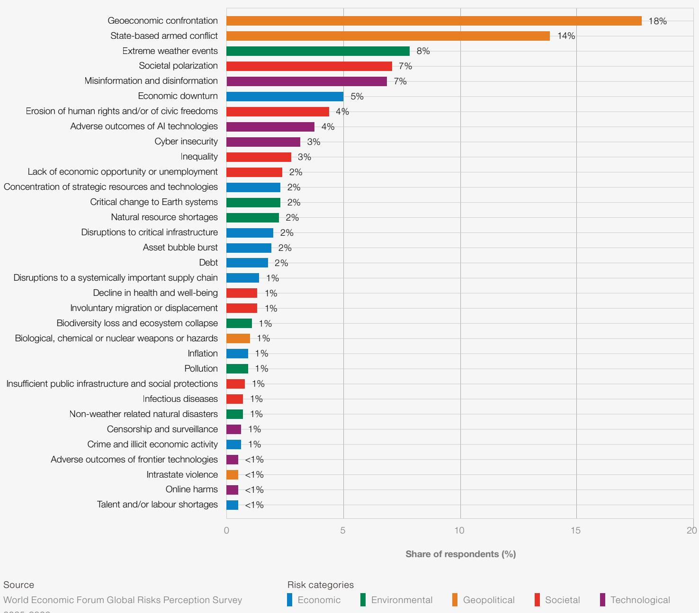

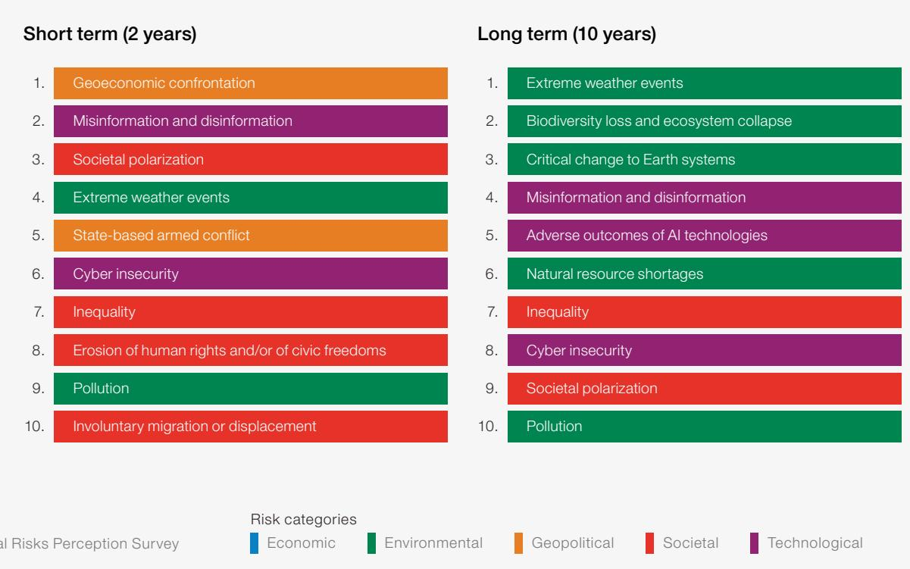

Change in short-term (2 years) global risks perception from last year  
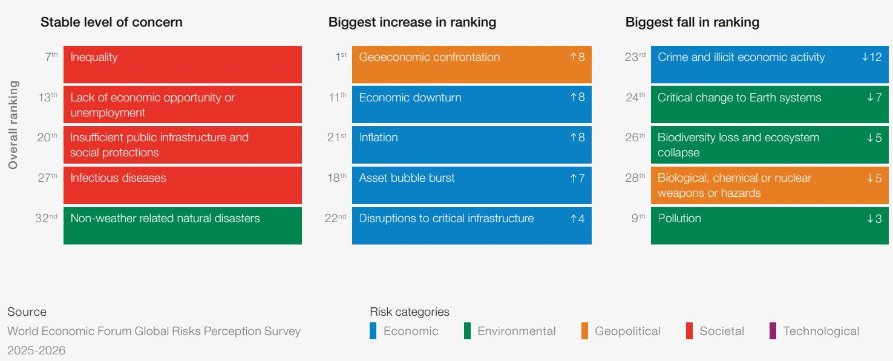

## Technological risks are growing, largely unchecked

Technological developments and new innovations are driving opportunities, with vast potential benefits from health and education to agriculture and infrastructure, but also leading to new risks across domains, from labour markets to information integrity to autonomous weapons systems. Misinformation and disinformation and Cyber

insecurity ranked #2 and #6, respectively, on the two-year outlook. Adverse outcomes of AI is the risk with the largest rise in ranking over time, moving from #30 on the two-year outlook to #5 on the 10-year outlook. Section 2.7: AI at large explores how, over the next decade, AI could impact labour markets, societies and global security. Conversely, Adverse outcomes of frontier technologies, which moves from #33 in the two-year ranking to #25 in the 10-year ranking (Figure 5), remains relatively low overall. Section

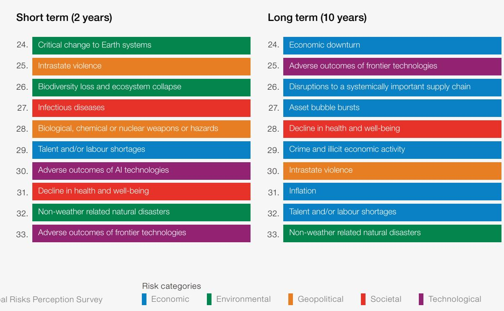

2.6: Quantum leaps explores how an acceleration in quantum technologies can offer significant opportunities to societies and economies, from improving the accuracy and speed of climate and weather modelling to the discovery of new drugs. Yet, advancements in the quantum field also risk becoming another facet of strategic rivalry, economic bifurcation and political polarization.

## Societies are on the edge

Rising societal and political polarization is intensifying pressures on democratic systems, as extremist social, cultural and political movements challenge institutional resilience and public trust. The growing prevalence of “streets versus elites” narratives reflect deepening disillusionment with traditional governance structures, leaving many citizens feeling excluded from political decision-making processes and increasingly skeptical that policy-making can deliver tangible improvements to livelihoods. Inequality was selected by respondents as the most interconnected global risk for a second year running, followed closely by Economic downturn (Figure 6). In parallel, Misinformation and disinformation in second position in the two-year timeframe, below Geoeconomic confrontation, remains an acute global concern. As wealth continues to concentrate in the hands of a few, while cost of living pressures remain high, permanently K-shaped economies are becoming a risk, calling the social contract and its financing into question. Section 2.3: Values at war explores how societal and political polarization may deepen over the next two years as technology becomes more embedded in daily life and geoeconomic tensions persist, heightening the risks of increased digital distrust and dilution of socio-environmental progress.

## Environmental concerns are being deprioritized

The GRPS findings suggest heightened prioritization of non-environmental risks relative to environmental ones compared to previous years. In the outlook for the next two years, a majority of environmental risks experienced declines in ranking, with Extreme weather events moving from #2 to #4 and Pollution from #6 to #9. Critical change to Earth systems and Biodiversity loss and ecosystem collapse also declined, by seven and five positions, respectively, and are in the lower half of the risk list this year in the two-year outlook. All environmental risks also declined in severity score for the two-year time horizon compared with last year's findings. In other words, not only do their rankings decline relative to other risk categories, but there has also been an absolute shift away from concerns about the environment. In the next 10 years, environmental risks have retained their ranking as the most severe risks, with Extreme weather events identified as the top risk and half of the top 10 risks being environmental in nature (Figures 7 and 10).

In this year's GRPS, we also asked respondents about their perceptions of the global outlook by risk category: societal, technological, environmental, economic and geopolitical. Over the next decade, environmental risks were perceived with the most pessimism out of all risk categories surveyed, with close to three-quarters of respondents selecting either a turbulent or stormy outlook (Figure 8).
Chapter 2.5: Infrastructure endangered explores, in part, the effects of continued extreme weather and climate change on ageing infrastructure. From supply-chain chokepoints to strains on electrical grids, critical infrastructure requires renewed attention, with the current risks already playing out and affecting societies globally.

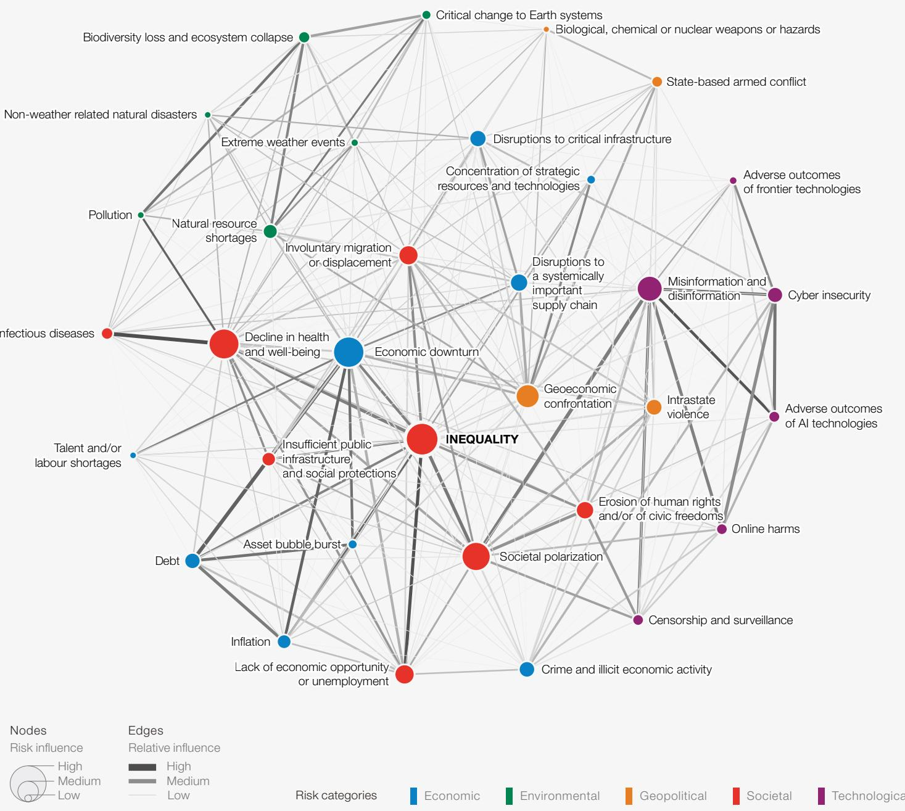

## A new competitive order is emerging

In this period of geoeconomic transformation, alliances are being reshaped and the resilience of markets and of the institutions that emerged from the Bretton Woods Conference of 1944 is being tested. Protectionism, strategic industrial policy and active influence by governments over critical supply chains all signal a world growing more intensely competitive. In this year's GRPS, $68\%$ of respondents describe the global political

FIGURE 7 Relative severity of global risks, short term (2 years) and long term (10 years)  
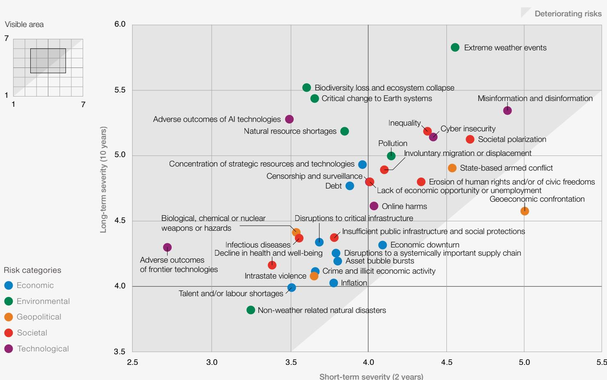  
World Economic Forum Global Risks Perception Survey
2025-2026  
Note
Severity was assessed on a 1-7 Likert scale [1 = Low severity, 7 = High severity].

## Source

environment over the next 10 years as a “multipolar or fragmented order in which middle and great powers contest, set and enforce regional rules and norms”, an increase of four percentage points compared to last year (Figure 9). Only 6% of respondents expect a reinvigoration of the previous unipolar, rules-based international order.

The growing shift toward more inward-looking and adversarial policies has cast further uncertainty over the future of multilateralism. As nations increasingly prioritize national interests over collective action, pressing questions emerge about the capacity of the international community to confront shared challenges such as climate change, global health and economic stability – as well as generate the local growth needed for domestic prosperity

and stability. In this evolving landscape, global leadership and the values that will underpin the next phase of international cooperation are issues that remain critically unresolved.

Yet, history reminds us that order can be rebuilt if nations choose strategic collaboration even amid competition. The future is not a single, fixed path but a range of possible trajectories, each dependent on the decisions we make today as a global community. The challenges highlighted in the GRPS – spanning geopolitical shocks, rapid technological change, climate instability, economic uncertainty and their collective impact on societies – underscore both the scale of the risks we face and our shared responsibility to shape what comes next.

World Economic Forum Global Risks Perception Survey 2025-2026

FIGURE 8 | Long-term (10 years) outlook by risk category  
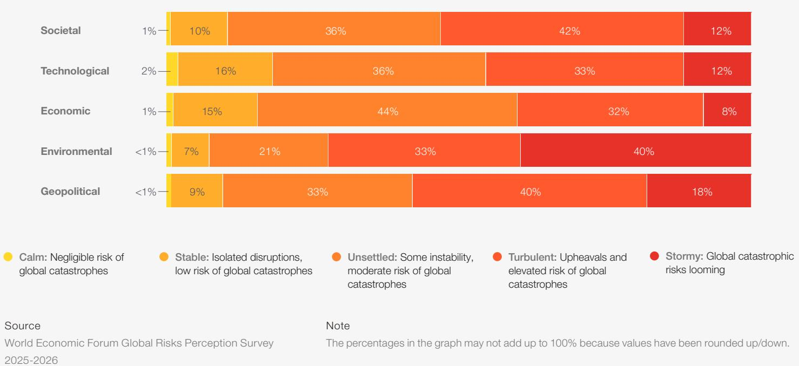

## FIGURE 9

## Global political outlook

"Which of the following best characterizes the global political environment for cooperation on global risks in 10 years?"

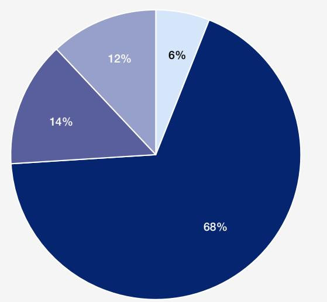

## Source

## 68%

Multipolar or fragmented order in which middle and great powers contest, set, and enforce regional rules and norms

14%
Bipolar or bifurcated order shaped by strategic competition between two superpowers

12%
Realignment towards a new international order led by an alternative superpower

6%
Reinvigoration of the US-led, rules-based international order

## Short term (2 years)

Short term (2 years)    Long term (10 years)
1. Geoeconomic confrontation
2. Misinformation and disinformation
3. Societal polarization
4. Extreme weather events
5. State-based armed conflict
6. Cyber insecurity
7. Inequality
8. Erosion of human rights and/or of civic freedoms
9. Pollution
10. Involuntary migration or displacement
11. Economic downturn
12. Online harms
13. Lack of economic opportunity or unemployment
14. Censorship and surveillance
15. Concentration of strategic resources and technologies
16. Debt
17. Natural resource shortages
18. Asset bubble bursts
19. Disruptions to a systemically important supply chain
20. Insufficient public infrastructure and social protections
21. Inflation
22. Disruptions to critical infrastructure
23. Crime and illicit economic activity
24. Critical change to Earth systems
25. Intrastate violence
26. Biodiversity loss and ecosystem collapse
27. Infectious diseases
28. Biological, chemical or nuclear weapons or hazards
29. Talent and/or labour shortages
30. Adverse outcomes of AI technologies
31. Decline in health and well-being
32. Non-weather related natural disasters
33. Adverse outcomes of frontier technologies

Source
World Economic Forum Global Risks Perception Survey
2025-2026

# 1 Global Risks 2026-2036: The Age of Competition

## 1.1 The world in 2026: on a precipice

As we enter 2026, the world is balancing on a precipice. The turmoil caused by kinetic wars alongside deployment of economic weapons for strategic advantage is continuing to fragment societies. Rules and institutions that have long underpinned stability are under siege in a new era in which trade, finance and technology are wielded as weapons of influence.

This report analyses global risks through three time frames: 2026, 2028 and 2036. In 2026, geopolitical and geoeconomic risks dominate the risk outlook, with close to one-third of GRPS respondents selecting either Geoeconomic confrontation

(18% of respondents) or State-based armed conflict (14% of respondents) as the top risk for 2026 (Figure 11). Geoeconomic confrontation has increased two positions compared to last year and is now the number one risk, with State-based armed conflict falling from #1 to #2. There has also been an uptick in respondent concern for technological risks as we enter 2026, with Misinformation and disinformation at #5 (7% of respondents), and two new entrants into the top 10: Adverse outcomes of AI technologies at #8 (4% of respondents) and Cyber insecurity at #9 (3% of respondents).

## FIGURE 11

## Current Global Risk Landscape

"Please select one risk that you believe is most likely to present a material crisis on a global scale in 2026." (top 10 risks selected by respondents)

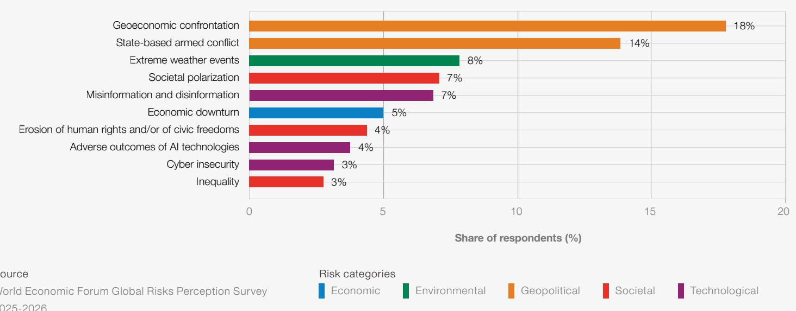

While societal risks have remained stable as a concern compared to last year, in particular Societal polarization at #4 (selected by 7% of respondents) and Inequality at #10 (3% of respondents), there has been an uptick in respondents selecting Erosion of human rights and/or civic freedoms, at #7, up two positions from last year. Economic downturn remains in the top 10 at the start of 2026, at #6, selected by 5% of respondents.

By contrast, environmental risks have experienced a decline in share of respondents' nominations compared with last year's findings. Extreme weather events has moved from #2 to #3, falling by six percentage points (down to 8% of respondents) and Critical change to Earth systems has declined from #7 to #13.

Source
World Economic Forum Global Risks Perception Survey
2025-2026

## 1.2

## The path to 2028: compounding risks

Geoeconomic confrontation is also the top risk for 2028 according to the GRPS, up eight positions from last year and moving Misinformation and disinformation to #2 for the first time since 2023 (Figure 12). In highlighting Geoeconomic confrontation, respondents are indicating a deepening and broadening of their concerns: after a year of heightened uncertainty over trade policy, there is now a growing recognition of the escalating use of other economic and political instruments, from sanctions and regulations to capital restrictions and weaponization of supply chains, as tools of geoeconomic strategy. State-based armed conflict stands in fifth position, as competition among countries hardens.

## FIGURE 12

## Global risks ranked by severity over the short term (2 years)

"Please estimate the likely impact (severity) of the following risks over a 2-year period."

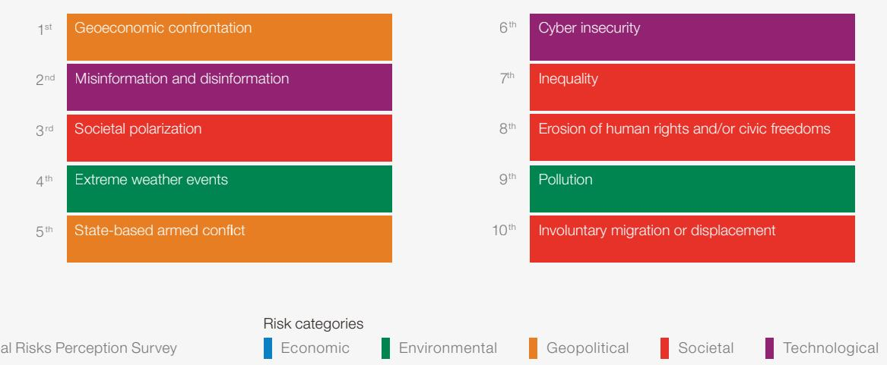

Rising geoeconomic tensions between countries are also coinciding with elevated levels of inequality and uneven economic impacts of the transformations underway. While there have been upward movements in societal risks since last year's survey, with Societal polarization (#3) up one position and Erosion of human rights and/or civic freedoms up two positions to #8, this risk category has overall remained relatively stable in its ranking. Inequality (#7), Lack of economic opportunity or unemployment (#13), Insufficient public infrastructure and societal protections (#20) and Infectious diseases (#27) all retain the same rankings as last year.

Deepening divides along political, cultural or identity lines within societies are being amplified by technological risks, such as Misinformation and disinformation (#2). This corrodes public discourse, weakens crisis responses and is propagated by technological advancements, such as in AI. These developments in turn heighten the risks of increased digital distrust and dilution of ambitious socio-environmental decision-making amid shifting short-term priorities and increasingly nationalistic narratives.

Technological risks overall remain an ongoing and significant concern for respondents, with Cyber insecurity at #6 reflecting the increasing frequency and sophistication of cyberattacks targeting critical infrastructure, businesses and government. However, the low ranking of Adverse outcomes of AI at #30 in the two-year time frame indicates that respondents view these risks as still relatively distant or as a segment of other more current risks (such as State-based armed conflict or Misinformation and disinformation).

While environmental risks are present in the top 10 over the next two years, with Extreme weather events at #4 and Pollution at #9, there has been a reprioritization of global risks by respondents in the short term towards geoeconomic and societal shocks. Environmental risks have some of the largest declines in ranking, with Critical change to Earth systems down seven positions to #24, Biodiversity loss and ecosystem collapse down five positions to #26, and Pollution down three positions to #9 (Figure 13).

In contrast, economic risks have some of the sharpest rises in ranking compared with last year. Economic downturn at #11 and Inflation at #21 are each up eight positions from last year, followed closely by Asset bubble burst at #18, which increased seven positions. Disruptions to critical infrastructure is also up four positions to #22.

FIGURE 13  
Change in short-term (2 years) global risks perception from last year  
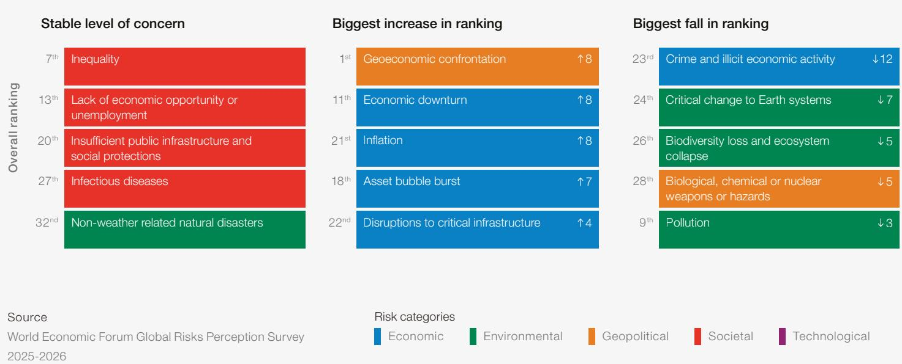

FIGURE 14  
Global risks, short term (2 years), by stakeholder group  
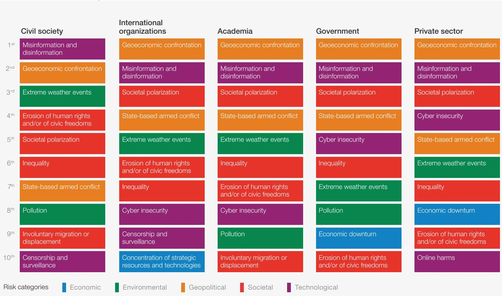

## Source

World Economic Forum Global Risks Perception Survey 2025-2026

## Note

Sample size by stakeholder group varied, and all respondents were weighted equally for the purposes of global rankings. The results are based on the following: academia, n=312 (24% of total); business, n=495 (38%); civil society, n=169 (13%); government, n=124 (10%); international organization, n=129 (10%); and other, n=61 (5%).

<table><tr><td></td><td>&lt;30</td><td>30-39</td><td>40-49</td><td>50-59</td><td>60-69</td><td>70+</td></tr><tr><td>1st</td><td>Misinformation and disinformation</td><td>Misinformation and disinformation</td><td>Geoeconomic confrontation</td><td>Geoeconomic confrontation</td><td>Geoeconomic confrontation</td><td>Geoeconomic confrontation</td></tr><tr><td>2nd</td><td>Extreme weather events</td><td>Geoeconomic confrontation</td><td>Misinformation and disinformation</td><td>Misinformation and disinformation</td><td>Misinformation and disinformation</td><td>Misinformation and disinformation</td></tr><tr><td>3rd</td><td>Inequality</td><td>Societal polarization</td><td>Societal polarization</td><td>Societal polarization</td><td>Extreme weather events</td><td>Societal polarization</td></tr><tr><td>4th</td><td>Lack of economic opportunity or unemployment</td><td>Extreme weather events</td><td>State-based armed conflict</td><td>State-based armed conflict</td><td>Societal polarization</td><td>Extreme weather events</td></tr><tr><td>5th</td><td>State-based armed conflict</td><td>State-based armed conflict</td><td>Cyber insecurity</td><td>Extreme weather events</td><td>State-based armed conflict</td><td>Cyber insecurity</td></tr><tr><td>6th</td><td>Pollution</td><td>Cyber insecurity</td><td>Extreme weather events</td><td>Cyber insecurity</td><td>Inequality</td><td>Erosion of human rights and/or of civic freedoms</td></tr><tr><td>7th</td><td>Societal polarization</td><td>Inequality</td><td>Inequality</td><td>Erosion of human rights and/or of civic freedoms</td><td>Cyber insecurity</td><td>Inequality</td></tr><tr><td>8th</td><td>Geoeconomic confrontation</td><td>Erosion of human rights and/or of civic freedoms</td><td>Erosion of human rights and/or of civic freedoms</td><td>Inequality</td><td>Erosion of human rights and/or of civic freedoms</td><td>State-based armed conflict</td></tr><tr><td>9th</td><td>Erosion of human rights and/or of civic freedoms</td><td>Pollution</td><td>Economic downturn</td><td>Pollution</td><td>Pollution</td><td>Involuntary migration or displacement</td></tr><tr><td>10th</td><td>Biodiversity loss and ecosystem collapse</td><td>Censorship and surveillance</td><td>Online harms</td><td>Economic downturn</td><td>Involuntary migration or displacement</td><td>Lack of economic opportunity or unemployment</td></tr></table>

FIGURE 15  
Global risks, short term (2 years), by age group

Across stakeholder groups surveyed, there is general alignment on the most severe global risks identified by respondents, with all stakeholders viewing Geoeconomic confrontation and Misinformation and disinformation as key risks over the next two years (Figure 14). Economic risks are of significant concern for some stakeholders; in particular, Economic downturn for both the government and the private sector. Compared with last year's GRPS, environmental risks, in particular Extreme weather events, have seen relative declines in ranking across stakeholder groups, with no stakeholder group in aggregate perceiving

Biodiversity loss and ecosystem collapse or Natural resource shortages to be a top 10 risk anymore, unlike last year.

When assessing risk perception by age groups surveyed, the findings indicate overall alignment across cohorts. However, younger groups are more concerned with Misinformation and disinformation than with Geoeconomic confrontation (Figure 15). Environmental risks are also a prominent concern for the under-30 age group, in particular.

## 1.3 The path to 2036: over the edge?

Extreme weather events retains its position as the top risk for 2036, with half of the top 10 risks environmental in nature, similar to last year (Figure 16). Biodiversity loss and ecosystem collapse retains its position at #2, followed by Critical change to Earth systems at #3. Natural resource shortages at #6 has declined by two positions since last year, with Pollution at #10, like last year. Unlike in the two-year outlook, where these have declined in rankings, the existential nature of

environmental risks means they remain as the top priorities over the next decade across stakeholders and age groups. The only broadly environmental risk that is not present as a top concern is Non-weather related natural disasters, ranking #33 on the 10-year outlook. Among the specific risks surveyed, Biodiversity loss and ecosystem collapse is the risk with the sharpest worsening in its severity score from the two-year outlook to the 10-year outlook.

## FIGURE 16

## Global risks ranked by severity, long term (10 years)

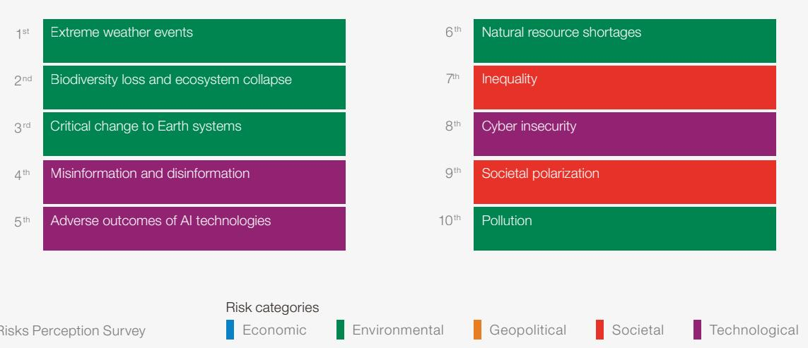

Technological risks are also anticipated to worsen in severity over the next decade, with Adverse outcomes of AI technologies and Adverse outcomes of frontier technologies among the risks anticipated to experience some of the largest increases in severity score from the two-year outlook to the 10-year outlook (Figure 17). Misinformation and disinformation and Adverse outcomes of AI technologies have both increased one position in this year's ranking compared to last year, to #4 and #5, respectively. Progress in both AI and quantum technologies are likely to accelerate over the next decade as each fuels further breakthroughs in the other, with potentially cascading risk impacts, including in the context of rising geoeconomic confrontation.

Societal risks are a dominant feature across time horizons, with Inequality at #7 and Societal polarization at #9 in the 10-year risk ranking. While the vast majority of global risks are anticipated to worsen over the next decade, one risk was expected by respondents to improve in severity score: Geoeconomic confrontation (#19) declines 18 positions from the two-year to the 10-year

outlook. When asked about their geopolitical outlook for the world, responses are slightly more negatively skewed over the next two years than over the 10-year horizon. This finding suggests that while the outlook is still pessimistic, geopolitical risks are not anticipated to worsen over the next decade.

Economic risks are absent from the top 10 rankings when it comes to the outlook for the next decade, featuring primarily at the lower end of the risk ranking. However, there is a general upward movement in severity across economic risks, with Concentration of strategic resources and technologies (#11) and Disruptions to critical infrastructure (#23) both rising two positions compared to last year, and Debt (#17), Asset bubble burst (#27) and Economic downturn (#24) each rising three positions. Crime and illicit economic activity (#29) has the largest decline since last year's survey, by 14 positions.

While geopolitical and economic risks do not feature as top long-term risks among the entire set of respondents, when looking at age cohorts, those

FIGURE 17 Relative severity of global risks, short term (2 years) and long term (10 years)  
  
Note
Severity was assessed on a 1-7 Likert scale [1 = Low severity, 7 = High severity].

## Source

World Economic Forum Global Risks Perception Survey
2025-2026

under 30 are concerned by Biological, chemical or nuclear weapons or hazards (#10), while the 60-69-year age group is worried about State-based armed conflict (#10) (Figure 18).

Across stakeholder groups, there is diminishing concern for geopolitical risks looking ahead 10 years, although respondents from academia include State-based armed conflict in their top 10 (at #10). Concentration of strategic resources and technologies was also selected as a concern by both the 50-59-year age group (Figure 18, at #10) and by governments (also at #10) over the next decade (Figure 19).

FIGURE 18 Global risks, long term (10 years), by age group  
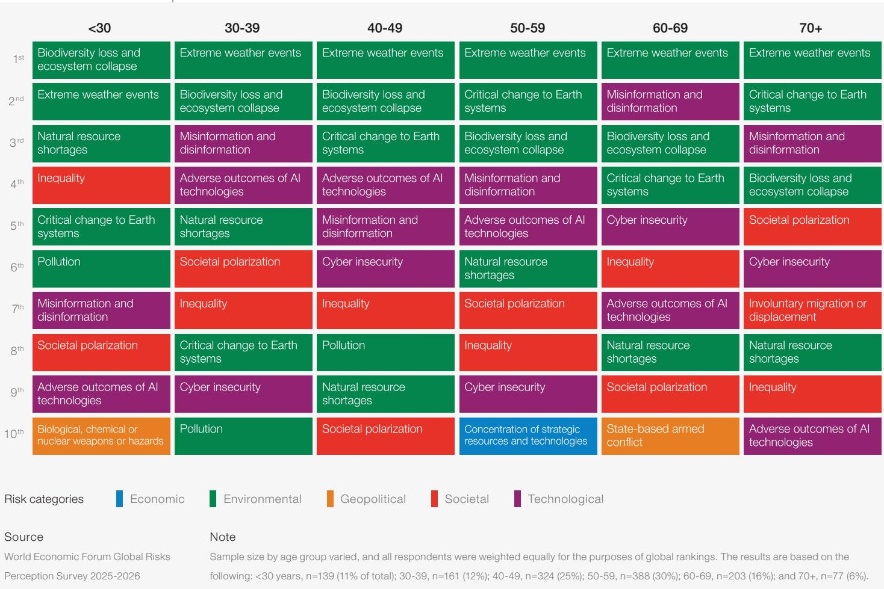

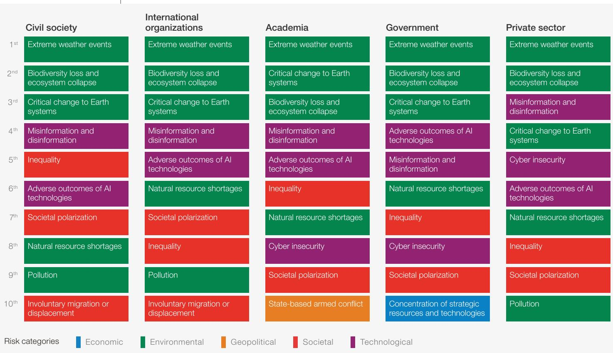

## Source

## Note

Sample size by stakeholder group varied, and all respondents were weighted equally for the purposes of global rankings. The results are based on the following: academia, n=312 (24% of total); business, n=495 (38%); civil society, n=169 (13%); government, n=124 (10%); international organization, n=129 (10%); and other, n=61 (5%).

## 1.4 | A darkening outlook

The GRPS asks respondents to categorize the overall outlook on a qualitative scale: “calm”, “stable”, “unsettled”, “turbulent” or “stormy”. While respondents indicate short-term concern about the global outlook, with 50% of respondents selecting either a turbulent or stormy outlook over the next two years, this worsens further towards 2036, with the figure rising to 57% for 2036 (Figure 20).

## FIGURE 20

## Short-term (2 years) and long-term (10 years) global outlook

"Which of the following best characterizes your outlook for the world over the following time periods?"

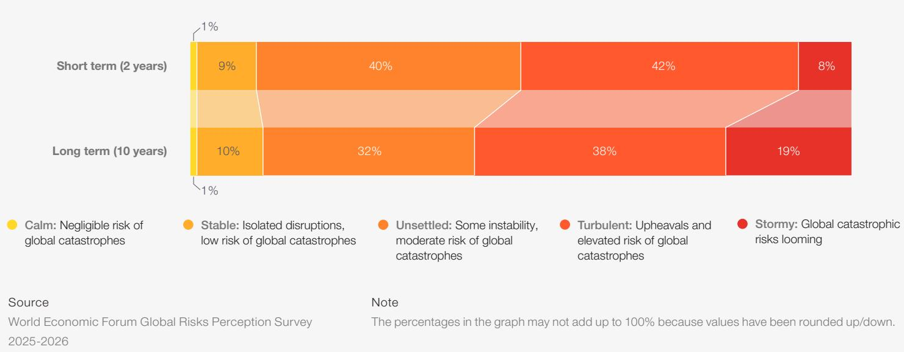

Pessimism overall is on the rise in the shorter term. Respondents' perception of the global outlook over the next two years has worsened compared with last year's findings. The GRPS shows a 14 percentage-point increase in respondents selecting a turbulent or stormy outlook over the next two years compared with last year's findings, reflecting heightened short-term concern. However, the long-term figure is five percentage points lower than it was last year, with a slight uptick in respondents selecting either a calm, stable or unsettled outlook compared with last year.

This year, the survey also asked respondents about their outlook for the world by risk category: “societal”, “technological”, “economic”, “environmental” and “geopolitical”. Over the next two years, respondents are most concerned by geopolitical risks. When asked about the outlook for the world by risk category, close to two-thirds of respondents viewed the geopolitical outlook as turbulent or stormy (Figure 21). Conversely, technological risks have a relatively positive two-year outlook, with 32% of respondents selecting a calm or stable outlook.

Over the next 10 years, most respondents are concerned with environmental risks, with close to three-quarters of those surveyed selecting either a turbulent or stormy outlook for this risk category (Figure 22). While nearly all risk categories decline in the 10-year time frame when it comes to those who select a relatively positive outlook, technological risks remain the relative outlier, with 18% of respondents expecting a calm or stable outlook.

In four of the five risk categories for the two-year timeframe, a majority of respondents expect an unsettled outlook, with some instability and a moderate risk of global catastrophes. The exception is the geopolitical outlook, where a larger proportion (48%) select a turbulent outlook, with expected upheavals and an elevated risk of global catastrophes. For the 10-year period, the majority select a turbulent outlook for societal and geopolitical risks and a stormy one, with globally catastrophic risks looming, for environmental risks.

The future is not a single, fixed path but a range of possible trajectories, each dependent on the decisions we make today as a global community. The challenges highlighted in the GRPS – spanning geopolitical shocks, rapid technological change, climate instability, economic uncertainty, and their collective impact on societies – underscore both the scale of the risks we face and our shared responsibility to shape the path ahead.

By anticipating today what may come next, we can better prepare for tomorrow's challenges. The next chapter explores in depth these themes and their interconnections for six topics, three across a two-year time horizon and three across a 10-year time horizon.

FIGURE 21 Short-term (2 years) outlook, by risk category  
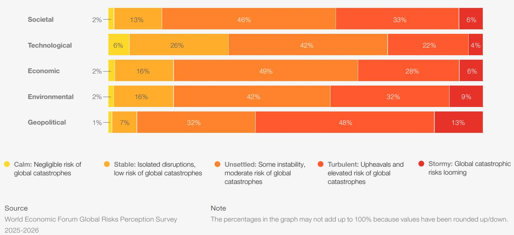

FIGURE 22  
Long-term (10 years) outlook, by risk category  
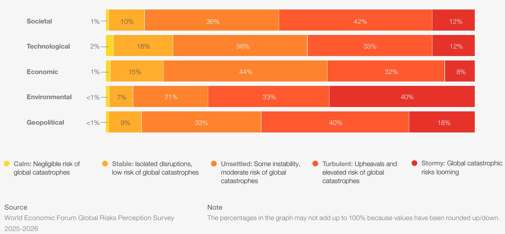

# Global risks in-depth: anticipating tomorrow's challenges today

## 2.1 An underlying context of structural change

The underlying set of conditions and parameters that influence the global risks landscape, referred to in this report as structural forces, are set to continue their convergence and acceleration. Global in scope, the significant influence of structural forces in amplifying disorderly trends across technological, climatic, geostrategic and demographic domains is expected to deepen over the next decade. The four structural forces, introduced in the Global Risks Report 2024 are technological acceleration, geostrategic shifts, climate change and demographic bifurcation. While all four forces have global ramifications, some, such as the changing climate, are more multi-directional in their development, which could allow for several potential futures. Similarly, while all represent longer-term shifts to the structural landscape, some have the potential to manifest more quickly due to underlying variables.

Geostrategic shifts refers to evolving sources and concentration of geopolitical power. Longstanding geopolitical alliances are being reshaped as global rules and norms are increasingly contested.
Technological acceleration relates to development pathways of emerging technologies and the expected significant, accelerated changes over the next 10 years. Technological developments are driving positive transformations across many domains, but new risks are also emerging. Climate change encompasses the range of possible trajectories of global warming and its consequences to Earth systems. Climate change is a systemic shift, with 2024 confirmed as the warmest year on record at over 1.5°C above the pre-industrial level. $^{1}$ Demographic bifurcation refers to changes in the size, growth and structure of populations around the world. Demographic divides are widening, and this will have material implications for related socioeconomic and political systems.

Against this backdrop of structural transformations, this year's report examines in-depth six sets of risks and how they may evolve in the years to come:

Multipolarity without multilateralism: With multilateralism facing ever stronger headwinds and rising evidence of the decline of the rules-based

international order, there is greater risk of cross-border economic and military conflicts and inaction on global challenges.

Values at war: As societal and political polarization deepens and technology becomes more embedded in daily life while geopolitical tensions persist, this section assesses what values conflicts mean for social inclusion and climate action within and across countries.

An economic reckoning: This section explores some of the key risks facing the global economy over the next years, as it grapples with high debt refinancing needs, possible asset price and/or industrial bubbles, and the risks of boomerang inflation.

Infrastructure endangered: This section examines how failing legacy infrastructure is exacerbating risks – especially as more frequent and intense extreme weather events are likely to overwhelm it. The section also explores how infrastructure could become a new front in warfare, contributing to social and economic crises.

Quantum leaps: This section analyses how this field is likely to accelerate over the next decade and potentially transform risks to cryptography, as well as elevate geoeconomic rivalries and economic and business imbalances to new levels.

AI at large: This section explores the long-term risk landscape that could potentially unfold as AI itself develops and is used in new ways, across labour markets and societies, and in military applications.

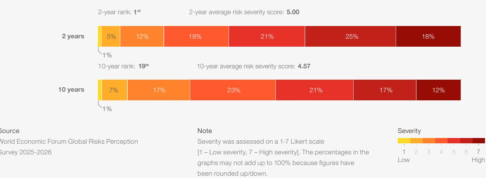

# Multipolarity without multilateralism

FIGURE 23

## Short-term (2 years) and long-term (10 years) risk severity score distribution: Geoeconomic confrontation

Deployment of economic levers by global or regional powers to reshape economic interactions between nations, restricting goods, knowledge, services, or technology with the intent of building self-sufficiency, constraining geopolitical rivals and/or consolidating spheres of influence. Includes, but is not limited to: currency measures; investment controls; sanctions; state aid and subsidies; and trade controls.

2-year average risk severity score: 5.00

Source
World Economic Forum Global Risks Perception Survey 2025-2026

\- Geoeconomic confrontation is set to deepen, with governments drawing on a widening array of economic tools, often in service of national security goals.

\- Multilateralism is facing ever stronger headwinds and there is rising evidence of the decline of the rules-based international order.

\- Global competition, local polarization and the associated inability to tackle shared challenges collectively will create new risks for the rule of law and societal stability.

Geoeconomic confrontation tops the Global Risks Perception Survey 2025-2026 (GRPS) ranking this year over both the immediate-term and the two-year time horizon, rising eight positions compared to last year in the latter ranking (Figure 23). A related risk, State-based armed conflict, which topped the immediate-term risk list last year, is in second place in the GRPS this year, and at #5 in the two-year outlook. These two risks are closely interlinked, with escalation in the severity of one also affecting the other.

In the Global Risks Report 2025, $^{2}$ we highlighted the risk of geoeconomic tensions escalating, pointing to a specific set of risks around trade and tariffs, but also noting that these should be regarded as part of a broader divergence between West, East and South, albeit with many countries forging their own pathways and balancing relationships with the different sides. It was clear that a trend of global geoeconomic fragmentation was taking hold. Today, this trend is firmly in place, despite moments in which tensions appear to ease temporarily. $^{3}$

Looking ahead over the next two years, a wider range of economic levers may be used by governments worldwide within the broader objectives of building national security and

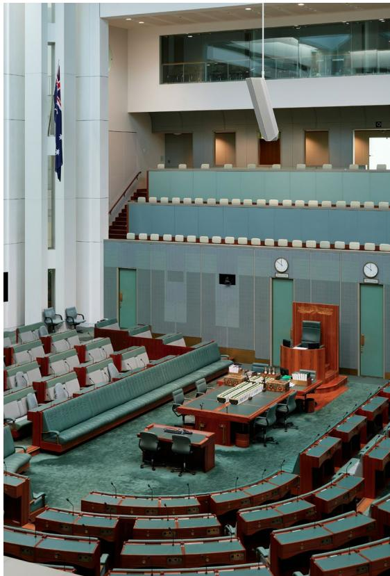  
Neon Wang, Unsplash

# Executive perceptions of Geoeconomic confrontation (sanctions, tariffs, investment screening etc.), 2026–2028

Executive Opinion Survey rank of national risks from the question “In your country, what are the top five risks that are most likely to pose the biggest threat to your country in the next two years?”

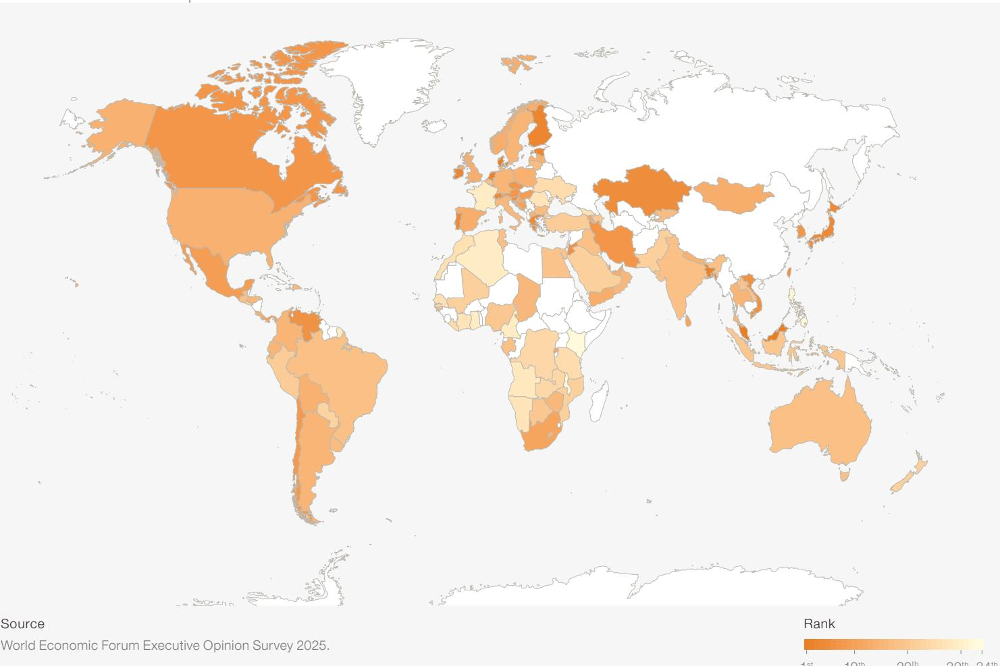  
Source
World Economic Forum Executive Opinion Survey 2025.

advancing geopolitical interests. While the actions of China and the United States are most closely watched, all countries are affected by the changes underway. In turn, transformation of the global order will continue to be shaped by the strategic interests of many countries and regions.

Heightened geoeconomic confrontation is both a cause and a consequence of the growing vacuum being left by the weakening of multilateral institutions. As a unipolar world shifts towards a more multipolar one, a new competitive order is emerging. With fewer multilateral constraints on unilateral action, rising national barriers and clashing interests could have negative economic and social repercussions across the globe.

In the Executive Opinion Survey 2025 (EOS), which provides a national risk perspective by business executives, 16 countries rank Geoeconomic confrontation within their top five risks, including several export-oriented economies. This illustrates the extent to which geoeconomic uncertainty is now shaping national risk perceptions (Figure 24).

The uncertainties surrounding commercial, diplomatic and military relationships will complicate the operating environment for all stakeholders. Collaboration on shared, cross-border challenges risks becoming more difficult, and as some governments try to turn newly created ambiguities around international rules and norms to their advantage, those countries that are least able to back up pursuit of their objectives with credible threats of economic, diplomatic or, ultimately, military retaliation could increasingly lose out. This zero-sum power politics manifests itself not only between but also within countries. Declining adherence to the rule of law may create the conditions for deepening social and political instability. $^{4}$

This section looks at three sets of interconnected risks. First, the rise of Realpolitik on the global stage and its knock-on effects. Second, the consequences of multilateralism eroding further. Third, how this may impact countries locally and exacerbate the forces that led to economic nationalism and geopolitical fractures.

Based on the responses to the Executive Opinion Survey question “In your country, what are the top five risks that are most likely to pose the biggest threat to their respective country in the next two years?”. Each point represents a country.

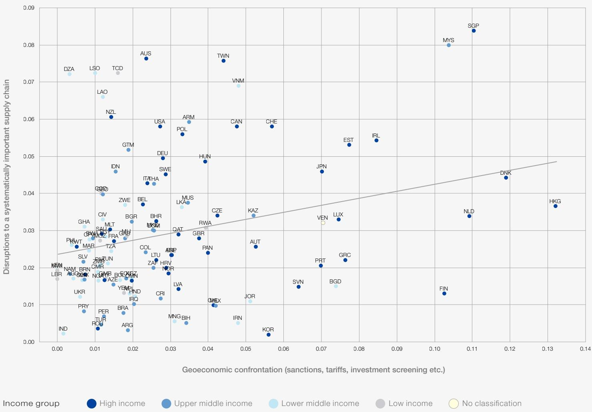  
World Economic Forum Executive Opinion Survey 2025

## Realpolitik logic meets Weltpolitik ambition

Trade and global value chains continue to experience their most significant disruption in decades, $^{5}$ and trade policy uncertainty is high. $^{6}$ Among the worst-case scenarios, governments could impose tariffs not only on those countries/blocs imposing tariffs on them, but on all their trading partners. Such across-the-board tariffs globally would lead to a substantial contraction in global trade. $^{7}$

Geoeconomic confrontation is already spreading well beyond tariffs. Indeed, governments appear to be losing faith in the legal framework underpinning global trade. The World Trade Organization's (WTO's) dispute system, crucial to the peaceful resolution of trade disputes, is becoming marginalized; the number of cases brought to it has fallen to about one-third of the level prior to when its Appellate Body – a key component of that system – was disabled in 2019. $^{8}$

At the same time, investment screening policies are becoming more widely implemented by G20 countries. They are driven by more considerations around strategic realignment and national security than in previous years. $^{9}$ Countries not aligned with either China or the United States could face pressure to comply with sanctions regimes. The number of sectors considered “strategic” to national security and affected by sanctions, including export controls and investment bans, is rising. Sectors that have recently been targeted with sanctions include AI, chips, biotech, quantum, drones and rare earths.

These trends are reflected in the GRPS, where Disruptions to a systemically important supply chain (#19) has risen three positions in the two-year time horizon ranking. Country-level results from the EOS reinforce this pattern: economies that place Geoeconomic confrontation high in their national risk rankings tend also to report concerns about Disruptions to systemically important supply chains (Figure 25). Geoeconomic confrontation and the risk of military conflicts are exacerbating risks to supply chains across the world, with massive economic implications.

In part because of the precarious fiscal positions of many leading economies (see Section 2.4: An economic reckoning), access to capital and control over capital flows could become a fresh front of geoeconomic confrontation. Governments could turn to more aggressive policies to shape the global monetary system to their advantage. Key financial infrastructure, such as payments systems, could be targeted by denying or constraining access. More frequent recourse to asset seizures or freezing of foreign reserves cannot be excluded. And governments and central banks are already expressing concern about how flows into foreign currency-pegged stablecoins could weaken their financial systems and jeopardize monetary sovereignty. $^{10}$ Emerging market countries with soft currencies are especially vulnerable. Accumulated purchases of stablecoins from developing economies could amount to \$1.22 trillion by the end of 2028, compared to about \$173 billion as of October 2025. $^{11}$

Efforts to bolster geopolitical positions through economic levers could go further still. Physical disruptions to critical infrastructure and key supply chains – for example by targeting satellite networks, damaging undersea communication cables, blocking or slowing transit through key waterways or ports, or disrupting energy pipelines – could become more frequently used physical or cyber-physical tools (see Section 2.5: Infrastructure endangered), in addition to cyberattacks.

In response to these threats, more governments are likely to seek to protect their economies by building larger reserves of energy products and key manufacturing inputs, and by stockpiling food, metals and minerals. Efforts to acquire large quantities of the critical minerals needed for the energy transition $^{12}$ could lead to price spikes and to intense commercial, diplomatic or even military pressures being placed on the governments of countries where these commodities can be sourced from. Direct and indirect interventions by major powers or conflicts between major global powers in resource-rich parts of the world are a rising risk.

GRPS respondents point to these potential impacts: Disruptions to a systemically important supply chain, Concentration of strategic resources and technologies, Natural resource shortages, Economic downturn, and State-

FIGURE 26

Global risks landscape: Geoeconomic confrontation  
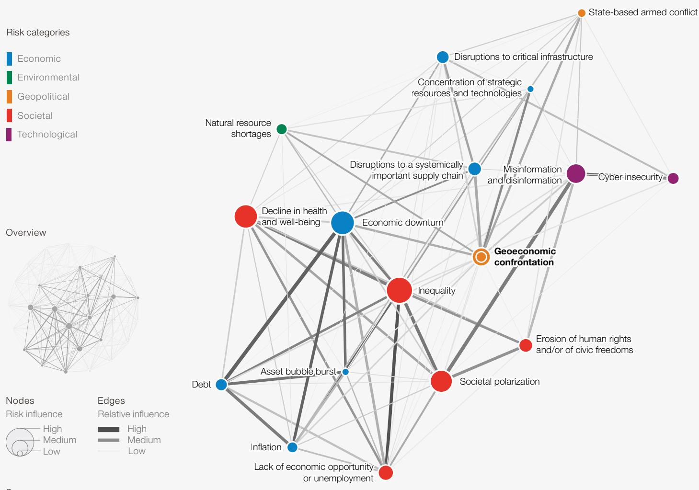  
World Economic Forum Global Risks Perception Survey 2025-2026

based armed conflict are the risks most impacted by Geoeconomic confrontation in the next two years (Figure 26).

In a worst-case scenario, more intense decoupling between Eastern and Western blocs would have profoundly negative implications on global economic growth. Non-aligned countries face particular risks if they do not find a new balance. Even partial decoupling, in trade, investment, finance and technology ecosystems, could significantly raise costs for businesses and slow global economic activity.

## Multilateral coordination frays further

Geoeconomic confrontation is already contributing to a loss of trust affecting international relations. But the reverse is also happening: governments are more likely to take hostile actions on trade, investment and other geoeconomic issues when they feel that the rules-based international system is weakening and they have less to lose than before. This vicious cycle looks set to continue over the next two years.

As multilateral institutions become weakened by unilateral actions from some governments, others are unable or unwilling to counter them. $^{13}$ Deep funding cuts at many international institutions are leading to a retrenchment of development and aid activities. At the same time, newly emerging multilateral entities are being developed by governments that do not subscribe to the institutions of the unipolar world order as a platform for pursuing their own national interests and to rewrite the rules of the game.

In this fractured global landscape, transnational threats – from climate change to combating pandemics and organized crime – are becoming more difficult to manage. A vacuum in global governance is building, and it could take years before it is clear how deep it runs and what could take its place.

Many governments view strategic autonomy as a necessary response to this building vacuum and are expanding their countries' defence capabilities. Wholly new weapons, including those enabled by AI, are also creating new risks.

In this unfolding environment, which is both less predictable and more militarized, there is likely to be a heightened risk of conflicts, with less powerful countries especially vulnerable. According to the 2025 Global Peace Index, there are more state-based armed conflicts ongoing than at any time since World War II; key conflict-risk indicators are at their worst levels since World War II; and several dozen countries are experiencing a worsening in relations with neighbouring countries. $^{14}$

## Local polarization amid global fractures

Geopolitical instability is deeply intertwined with domestic state fragility and social instability. According to the Fund for Peace Fragile States Index report, country-level fragility is worsening and becoming more widespread. Previously stable democracies are not exempt from this trend. $^{15}$ Drivers of increasing fragility include climate-change impacts, weak governance and conflict, all of which are linked to the retreat from multilateralism and loss of faith in a rules-based global order. $^{16}$

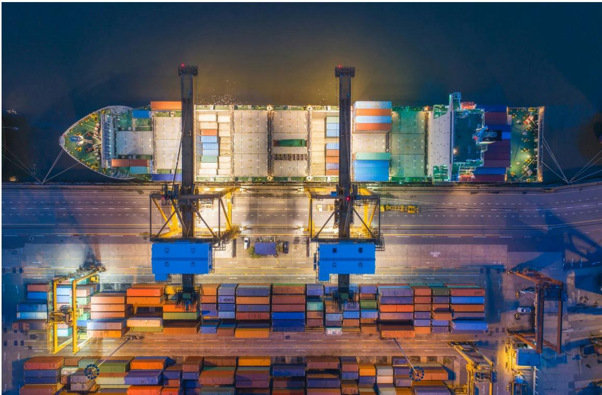  
Getty images, Unsplash

In a manifestation of this rising country-level fragility, protests led in part by the youth and organized on social media, may be gathering momentum. In much the same way that global trade and economic collaboration has been seen as the domain of elites in recent years, the new posture towards economic nationalism may in due course also elicit public backlash. As more people are feeling excluded from political decision-making and losing hope for improved livelihoods, protests have led to recent political change in Nepal (in 2025), Bangladesh (2024) and Sri Lanka (2022), for example. $^{17}$

As societal polarization rises globally in tandem with misinformation and disinformation, reactions by some governments are pointing towards more authoritarian rule. Evidence is building that, within countries, the rule of law is deteriorating. $^{18}$ In the Global Risks Report 2025 $^{19}$ we highlighted that the world had entered a “geopolitical recession”. This is now contributing to what the World Justice Project Rule of Law Index 2025 has termed an accelerating “global rule of law recession”, in which 68% of 143 countries and jurisdictions surveyed saw their rule of law decline in 2025 $^{20}$ (Figure 27).

Of particular concern is that the pace of decline in 2025 was sharp, demonstrating that typically slow and painstaking progress in establishing the rule of law can be reversed quickly. $^{21}$

## FIGURE 27

## Deteriorating rule of law across the OECD

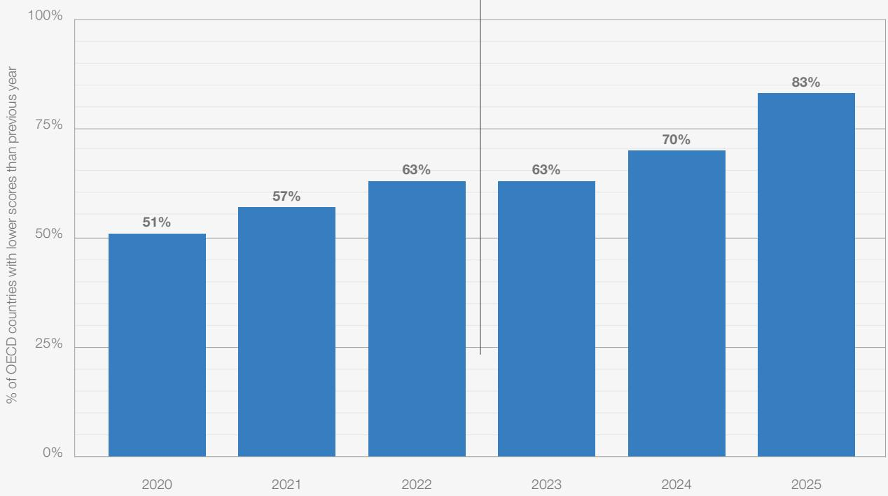  
Source
World Economic Forum, based on World Justice Project Rule of Law Index 2025.

## Actions for today

Recognizing today's climate of geoeconomic confrontation, governments can nonetheless find ways to collaborate and identify areas of consensus. Where global progress is not attainable in the short term, “coalitions of the willing” can move forward in specific areas of trade and investment. Economic inducements that foster mutual gains should be prioritized over those that are designed to cause economic pain to other countries. The ability of the private sector to engage with stakeholders across the political spectrum, domestically and abroad, should be safeguarded. Public-private consultation mechanisms can help to support transparency around decision-making, clarifying the business environment in an era of intensifying economic and financial statecraft. $^{22}$

Coalitions of the willing can also play a pivotal role in strengthening support for existing multilateral institutions. It is critical for public, private and civil society stakeholders to continue to work together to support existing multilateral institutions wherever feasible (Figure 28).

Fostering resilience at the local level by strengthening community-driven structures can be another area of focus amid concerns around weakening multilateralism. More focus needs to be given to community-led governance, ensuring equitable access to resources, and empowering local actors to mitigate and respond to crises.

In parallel, international frameworks, including minilateral treaties and agreements, remain critical to help promote flexible, local solutions (Figure 29). $^{23}$

FIGURE 28

## Top risks addressed by global treaties and agreements, 2026–2036

"Which approach(es) do you expect to have the most potential for driving action on risk reduction and preparedness over the next 10 years?"

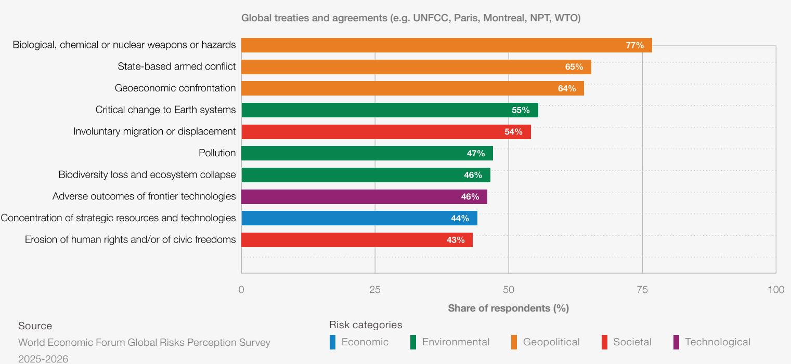  
FIGURE 29  
Top risks addressed by Minilateral treaties and agreements, 2026–2036

"Which approach(es) do you expect to have the most potential for driving action on risk reduction and preparedness over the next 10 years?"

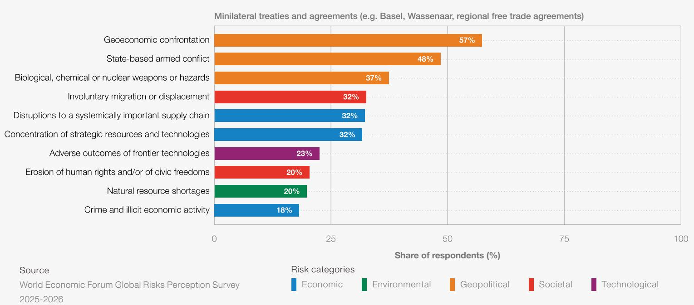

## 2.3 | Values at war

FIGURE 30

Short-term (2 years) and long-term (10 years) risk severity score distribution: Societal polarization, 2026–2028

Present or perceived ideological and cultural divisions within and across communities leading to declining social stability, gridlocks in decision-making, economic disruption and increased political polarization.

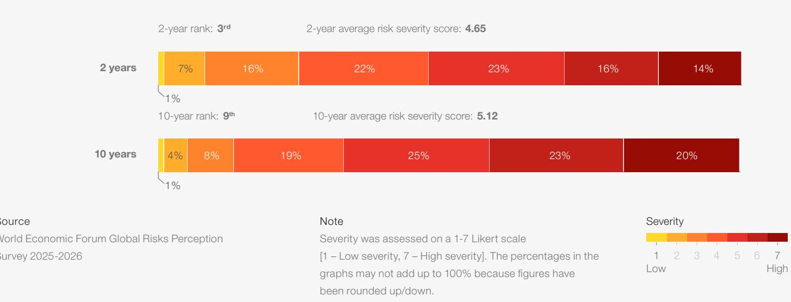  
Source
World Economic Forum Global Risks Perception Survey 2025-2026

\- Distinguishing truth from falsehood is becoming more difficult, especially online, and this is deepening societal fragmentation and contributing to desensitization.

\- An outdated social contract is diminishing trust between citizens and governments, with corporations in a difficult middle ground.

– Climate action is caught in societal, political and economic crosswinds.

Across the world, there are deep divisions between those who are trying to preserve one value system and the institutions built around it, and others who hold opposing views. Groups that have not benefited from the prevailing political, societal and economic orders are now playing a more pivotal political role. At the heart of this division is Societal polarization, which, according to the Global Risks Perception Survey 2025-2026 (GRPS) is the third-most severe risk over the next two years, an increase of one position in ranking since last year. Further, Societal polarization is identified by respondents as contributing to Misinformation and disinformation, Inequality and Intrastate

  
Markus Spiske, Unsplash

violence. This set of risks is deeply intertwined, with impacts in all directions (Figure 31).

The risks of Societal polarization are spreading across geographies (Figure 32) according to the business executives surveyed in the Executive Opinion Survey 2025 (EOS). Societal polarization was identified as a top five concern for 16 of the 116 countries surveyed. The risk is particularly pronounced in Latin America, where it is the fifth-highest concern, and in Eastern Asia, where it ranks #10.

This section examines three sets of interconnected risks. First, trust in institutions that have long governed and shaped societies is being eroded, and it is becoming more difficult for citizens to know where to turn for truthful, accurate information, especially online. Second, the social contract between citizens and governments, particularly in advanced economies, is lagging economic and technological transformations, further eroding trust and exacerbating societal polarization. Third, long-term needs such as climate action are caught in societal, political and economic crosswinds, opening new avenues of risk impact.

## Distrust, divergence and desensitization

In an increasingly fragmented world permeated by new technological capabilities, information is vulnerable to manipulation for influencing political

## FIGURE 31

  
Irwan Rosyadi, Unsplash

outcomes or for economic gain. This can contribute to deepening societal and political fractures, worsening grievances, hardening beliefs, reducing critical thinking and amplifying extremist views. It can also lead to desensitization. One of the strongest interconnections in the GRPS is between Societal polarization and Misinformation and disinformation.

Global risks landscape: Societal polarization

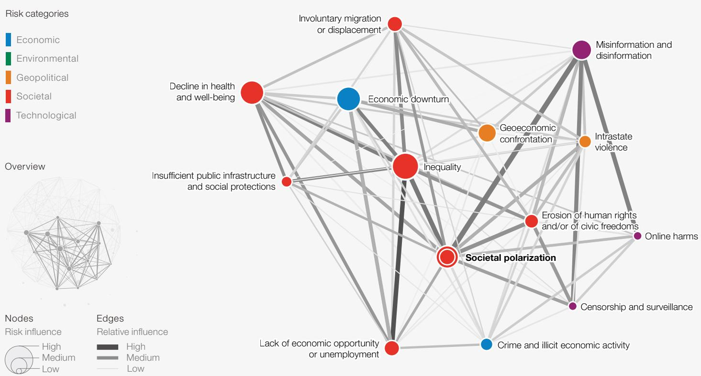  
Source World Economic Forum Global Risks Perception Survey 2025-2026

Executive Opinion Survey rank of national risks from the question “Which five risks are the most likely to pose the biggest threat to your country in the next two years?”

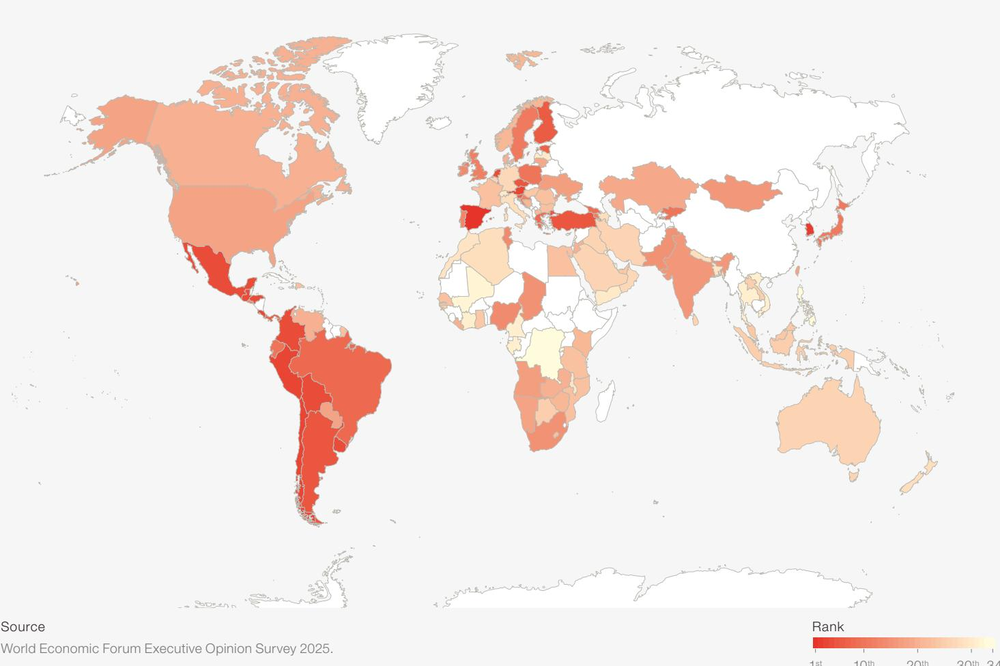  
Source
World Economic Forum Executive Opinion Survey 2025.

Misinformation and disinformation are of particular concern in the online world. The integrity of online news and broader information is increasingly under threat, as distinguishing between authentic and synthetic content, whether video, audio, or written, is becoming progressively more difficult. According to a survey by the Reuters Institute, 58% of respondents globally are concerned about how to distinguish truth from falsehood in online news. This figure rises to 73% in both Africa and the United States. $^{24}$ In parallel to rising concerns about misinformation and disinformation, trust in news is falling and news avoidance is rising (Figure 33).

Similarly, at the country level, Misinformation and disinformation ranks second among EOS respondents in Northern America and among the top three risks in Europe and Eastern Asia, while placing within the top 10 risks in most other regions. It is the highest ranked risk in four economies, and features in the top 10 in 67 countries (Figure 34).

While citizens have traditionally relied on government institutions, academia and the media to obtain and process information, widespread use of social media is reshaping the ways in which

  
Huma H. Yardim, Unsplash

Source
Reuters Institute Digital News Report 2025  
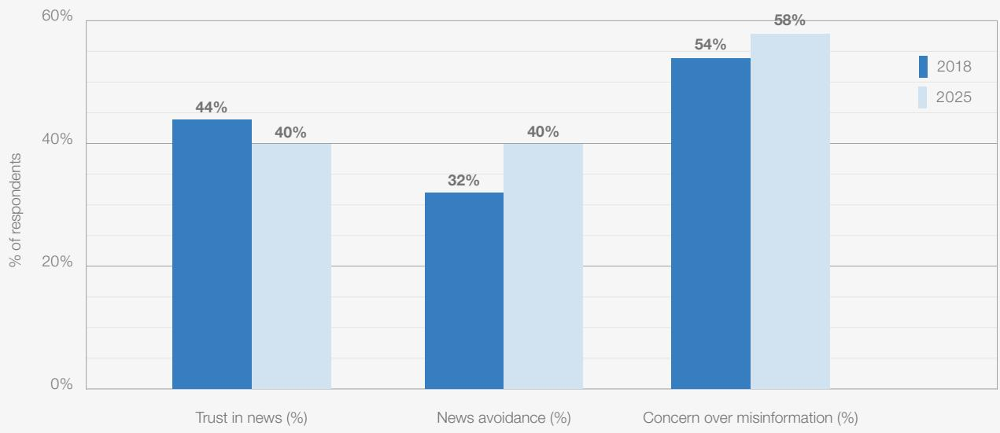

FIGURE 34

## Executive perceptions of Misinformation and disinformation, 2026–2028

Executive Opinion Survey rank of national risks from the question “Which five risks are the most likely to pose the biggest threat to your country in the next two years?”

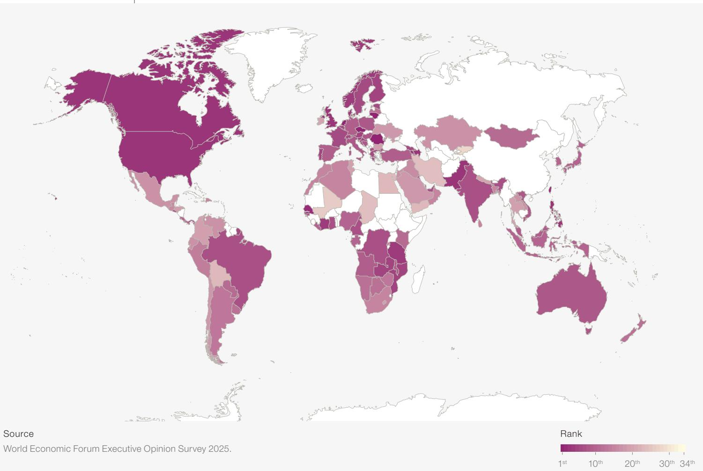

information is accessed and interpreted. The sharpest rises in the use of social media for news consumption have been in the United States, Latin America, Africa and some South-Eastern Asian countries. $^{25}$ In the United States, the share of people who cite social media as their primary source of news has grown sharply, from 4% in 2015 to 34% in 2025. For the first time, more people in the United States now access news through social media and video platforms than through television or traditional news websites. $^{26}$ In addition, the use of AI tools for finding information is also rising, from 11% in 2024 to 24% today. $^{27}$ The Reuters Institute survey also reveals concerns among the general public that AI will make the news less transparent, less accurate and significantly less trustworthy. $^{28}$

A particular problem area is the proliferation of deepfakes (digitally altered videos, images, and audio recordings). Over the past five years, deepfake creation has become easier, cheaper, and more convincing. $^{29}$ While the use of deepfakes during the 2024 “super election year” $^{30}$ was still a relatively new phenomenon, they have started to proliferate and have a greater influence on politics and electoral processes. The weaponization of deepfakes can undermine trust in democratic institutions, contributing to more political polarization, and can lead to the incitement of political violence or social upheaval.

Recent elections in the United States, Ireland, the Netherlands, Pakistan, Japan, India and Argentina have all had to contend with such fabricated content on social media, depicting fictional events or discrediting political candidates, blurring the line between fact and fiction. $^{31}$ As AI is used to make such content more personalized and persuasive, there is a risk of greater impact on elections. $^{32}$ For example, research has found that 87% of people in the United Kingdom are concerned about deepfakes affecting election results. But while awareness is high, many lack confidence in their abilities to identify when content is manipulated. $^{33}$

Increasing reliance on both social media and AI tools enhances the impact of algorithmic bias, which shapes what information users see online and reinforces exposure of individuals to information aligned with their views. This can create widely divergent perspectives on real-world events and developments. The impacts are starting to run even deeper. How real-world events are interpreted online combined with the growing circulation of violent content on social media may be leading citizens to become more emotionally and cognitively detached and numbed to human tragedies.

There were 61 conflicts across 36 countries in 2024, making it the fourth-most deadly year since the Cold War ended in 1989. $^{34}$ With content about these conflicts increasingly distributed through algorithms, different perspectives are shared with selected audiences, contributing to a hardening of views. Additionally, repetition of violent content being shared can over time lead to viewers perceiving it as “normal”, generating apathy and disinterest. Studies have shown that exposure to high levels of violent content is linked to emotional desensitization. $^{35}$ In other words, the way people increasingly consume news and analysis, coupled with the nature of that content, is leading to a disconnect from empathy for other human lives.

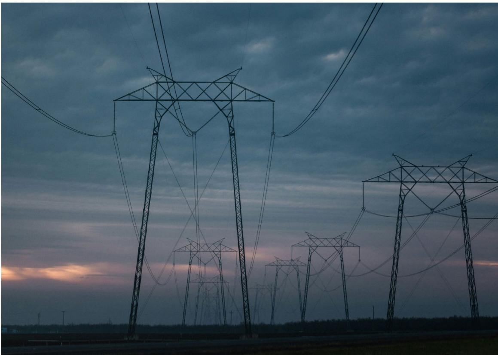  
Jason Leung, Unsplash

## Faltering social mobility

Technological change, geoeconomic shifts and tighter fiscal space are together weakening the pathways to social mobility and eroding trust. Even as nationalist and polarizing rhetoric has sought to tap into the rising economic concerns of some segments of societies, in most parts of the world growth is not just subdued relative to the past, but also increasingly K-shaped, in which some sectors of the economy do well while others struggle. As a result, expectations of lack of economic opportunity or unemployment exacerbate declining trust.

The aftermath of the 2008 financial crisis and the COVID-19 pandemic, compounded by technological and structural economic shifts, have strained traditional pathways to social mobility. Real wages have recently ticked up in most advanced economies, reaching an average of 2.5% annual growth across the OECD as of Q1 2025. However, in 18 of the 37 countries, real wages remained below their level in Q1 2021, just prior to the global inflation spike of 2021-2022. $^{36}$ Moreover, this followed over a decade of mediocre real wage growth in advanced economies, in particular. Real wage growth was highest from 2008-2019 in South Korea (22% over the whole period) and

Germany (15%), while real wages declined over that timeframe in Italy, Japan and the United Kingdom. $^{37}$ Meanwhile, real residential property prices in advanced economies have risen 20% between 2008 and today, and 37% since their trough in 2012. $^{38}$ Asset holders, including property owners and those who have invested in financial assets, have experienced rising wealth, while wage earners who do not own assets struggle amid rising living costs. This has contributed to Societal polarization and a loss of trust among lower- and middle-income groups.

These tensions are reflected in the EOS (Figure 35). Lack of economic opportunity or unemployment is perceived as the top risk in 27 countries and within the top five in 72 countries. Weak and uneven job creation and a sense of stalling social mobility and rising inequality is central to the erosion of the social contract.

A rise in “streets versus elites” narratives reflects deepening disillusionment with traditional governance structures, leaving many citizens feeling excluded from political decision making processes and increasingly skeptical that their economic environments can deliver tangible improvements to their livelihoods. Inequality was selected by respondents as the most interconnected global

FIGURE 35

## Executive perceptions of Lack of economic opportunity or unemployment, 2026–2028

Executive Opinion Survey rank of national risks from the question “Which five risks are the most likely to pose the biggest threat to your country in the next two years?”

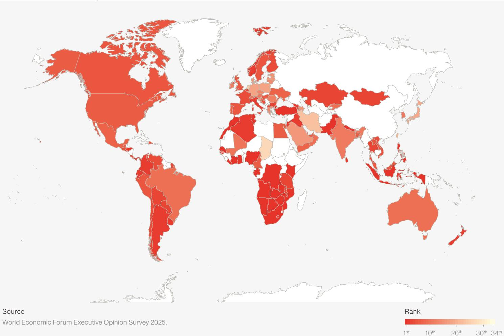

risk for a second year running, followed closely by Economic downturn.

Corporations are treading a fine line in how they navigate this environment. In a more multipolar world, they are facing far-reaching strategic decisions about which countries to continue operating in, which governments and political views to align with (if any), and how to talk and act on topics that have become politically sensitive, including issues related to social and economic inclusion. Reputational risk is set to become more central to corporate risk management as policies and actions are realigned in the face of powerful pressures at times pulling in divergent directions between societies and governments.

With fiscal pressures rising, the social contract faltering and corporations feeling more pressure to focus on business considerations, there is a rising risk that the level of ambition for addressing a range of social challenges will be muted over the coming years. As pressure builds, it is likely that a correction will need to take place. Until then, the fraying social contract will be a source of heightened risk.

## Climate in the crosswinds

The GRPS finds that environmental concerns, especially in the short term, are slipping down the ranking of leading risks for the first time in many years. The majority of environmental risks have fallen in ranking over the two-year time horizon, with Extreme weather events moving from #2 to #4, Pollution from #6 to #9, and declines also in ranking for Critical change to Earth systems and Biodiversity loss and ecosystem collapse by seven and five positions, respectively, with both of these risks in the lower half of the risk list. All environmental risks surveyed also decline in severity score over the next two years compared with last year's findings.

This shift in both relative and absolute terms away from concerns about the environment is unfolding despite the scientific outlook for the adverse future impacts of climate change. The UN Environment Programme's Emissions Gap Report 2025 estimates that global temperatures are likely to exceed 1.5°C above pre-industrial levels within the coming decade. $^{39}$ Extreme heat, drought, wildfires and other extreme weather events are likely to become more intense and frequent. While the consequences could heighten societal polarization and inequality, $^{40}$ the pushback to climate mitigation efforts is increasingly evident. However, this pushback may turn out to be only temporary if, for example, political incentives change again or if significant technological and business breakthroughs in combating climate change impacts materialize.

For now, the downward reprioritization of environmental risks is unfolding in a geopolitical landscape shaped by growing multipolarity and

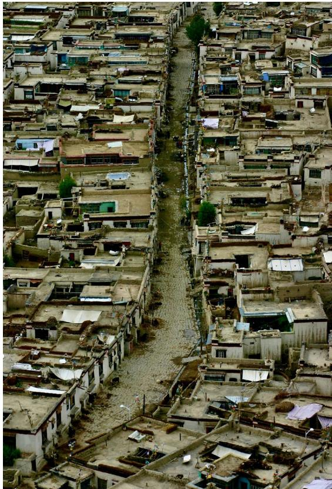

Peter Burdon, Unsplash

protectionism. The Global Tipping Points Report 2025 warns that the potential for multilateral cooperation on environmental concerns is being weakened, as major powers prioritize sovereignty and national gain over collective action. $^{41}$ Competition for resources is intensifying, and national security, including energy security, is deemed by many governments to be the newly leading driver of policy-making. $^{42}$ Russia's invasion of Ukraine in February 2022 underscored the vulnerabilities of energy interdependence and spurred new ambitions for self-sufficiency in Europe and elsewhere. $^{43}$ While 2024 marked a record \$2.1 trillion in low-carbon transition investments, growth in clean energy funding slowed compared to previous years. $^{44}$ Momentum is now building towards an “all-of-the-above” global effort to increase energy supply, including an extended reliance on fossil-fuel extraction, in addition to renewable energy sources. $^{45}$

This momentum could intensify into the medium term because of potentially soaring energy needs in the coming years. The rise of the middle classes in emerging markets will continue to be a key driver, as will the rapid buildout of AI infrastructure. By 2030–2035, data centres alone could consume up to 20% of global electricity, placing strain on already overburdened power grids. $^{46}$ Local resistance is likely to mount, with sharply-rising energy prices already affecting some communities living in the vicinity of recently built data centres. $^{47}$ The growing divergence between rising demand for energy on one hand, and climate change and associated social realities on the other, could come to a head in the coming years. Difficult, values-

based choices will continue to emerge in the race between economic, political, climate and societal considerations.

## Actions for today

Representative multi-stakeholder dialogue was identified as critical by GRPS respondents to reducing the risk of Societal polarization in the long term (Figure 36). The combined resources of funding, technology, knowledge and data provided by multiple partners can amplify the impact of initiatives. Furthermore, involving a broad range of stakeholders enhances legitimacy, trust and accountability, which can encourage wider participation and support, ultimately increasing the scalability and sustainability of efforts over time.

One of the keys to rebuilding trust in institutions and reducing societal polarization is to tackle misinformation and disinformation. As technology continues to advance in sophistication, upskilling efforts in areas such as digital literacy should be accelerated. This is reflected in the GRPS findings.

When asked “which approaches do you expect to have the most potential for driving action on risk reduction and preparedness over the next 10 years?”, the top approach identified by respondents for Societal polarization was Public awareness and education (29% of respondents). Digital literacy initiatives should empower individuals to understand how algorithms and data influence their online experiences, while fostering critical thinking skills to recognize and address biased or harmful content. Governments, civil society and private-sector organizations all play a role in advancing these efforts, ensuring that such campaigns are accessible to diverse communities.

Policy-making should also consider supporting the identification of authentic content to improve digital trust. Standards and technical solutions to ensure content authenticity – such as digital watermarking, content origin and history, and blockchain-based rights management – are currently under development to support a trustworthy information ecosystem. However, successful adoption at scale requires policy frameworks that are aligned with shared principles, rules and technological standards.

FIGURE 36

Top risks addressed by Multi-stakeholder engagement, 2026–2036

"Which approach(es) do you expect to have the most potential for driving action on risk reduction and preparedness over the next 10 years?"

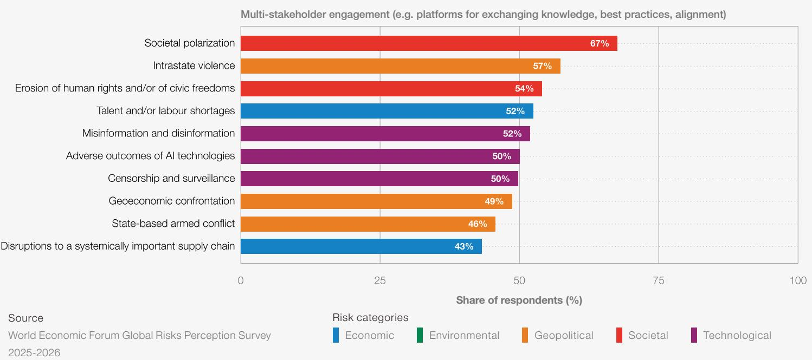

## 2.4 | An economic reckoning

FIGURE 37

## Short-term (2 years) and long-term (10 years) risk severity score distribution: Economic downturn, 2026–2028

Near-zero or slow global growth lasting for several years or a global contraction (recession or depression).

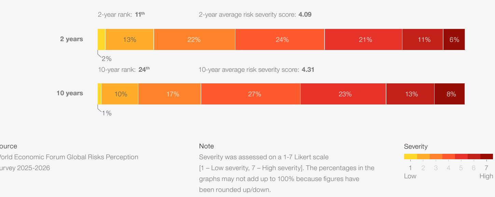

\- Growing debt in both advanced and developing economies poses a risk in an environment with higher spending pressures and relatively high interest rates.

\- Amid massive capital expenditure on artificial intelligence, the returns on ambitious projects are unclear and investor views can reverse quickly.

\- While inflationary pressures are relatively subdued for the immediate term, higher tariffs, debt monetization and other drivers could see a return of more widespread inflation concerns.

The International Monetary Fund (IMF) projects 3.1% global gross domestic product (GDP) growth in 2026, $^{48}$ below the 2000-2019 average of 3.7%, $^{49}$ but still well above recessionary levels. However, it notes that risks are tilted to the downside. Apart from fiscal issues, key areas of concern are the impacts of policy uncertainty (especially related to protectionism), labour-supply shocks, $^{50}$ possible financial market corrections and the weakening of key institutions, $^{51}$ including central banks.

The next two years are likely to see the continuing convergence of a set of economic and financial challenges, in some cases building for decades and that seem to be accelerating. In the Global Risks Perception Survey 2025-2026 (GRPS), economic risks overall have experienced significantly sharper increases in two-year rankings than all the other risk categories – geopolitical, environmental, societal, and technological. Economic downturn (#11) and Inflation (#21) have each increased eight positions from last year and Asset bubble burst (#18) seven positions. Geoeconomic confrontation also rose by eight positions, while no other risk among the full set of 33 risks increased by more than four positions.

This section examines three relatively near-term risks that could lead to an economic reckoning.

First, consistently mounting debt levels may become a greater drag on growth or potentially lead to unexpected shocks. Second, predictions of an asset bubble bursting may come to pass, with far-reaching consequences. Third, there is an increased risk of boomerang inflation as trade barriers grow and as central banks come under pressure.

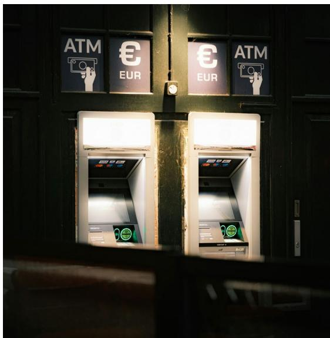  
Bryan Dijkhuizen, Unsplash

IMF World Economic Outlook database, accessed 27 November 2025

## Debt faultlines

Total global debt (government plus private sector) stood at 251 trillion or 235% of GDP in 2024, $^{52}$ and debt levels are steadily rising in both advanced economies and in emerging market and developing economies (Figure 38). Many governments are struggling to find ways to rein in their fiscal deficits in an era in which interest rates globally have risen from multi-decade lows in 2022 and spending pressures have increased. With debt-servicing costs having become significantly higher, governments are having to make increasingly painful concessions on key areas of expenditure, or consider new approaches to taxation.

Several leading economies are continuing to run loose fiscal policy: the United States is pursuing a historic spending programme that is projected to raise the fiscal deficit from 5.6% of GDP in 2025 to 5.9% in 2026 and 6.0% in 2027. This will contribute to federal debt held by the public rising steadily from 100% of GDP today (30 trillion) to 120% in 2035 (53 trillion), exceeding the previous high of 106% set in 1946. $^{53}$ Meanwhile, Germany in March 2025 amended its constitution to allow a major fiscal expansion focused on infrastructure and defence, outside of its debt brake rule. $^{54}$ Pressure to expand fiscal outlays on these and other strategically critical sectors are likely to be a continuing theme across many OECD economies over the coming years, driven by risks related to state-based armed conflict and a growing sense that domestic industrial and military capacities may require substantive rebuilding in a more fragmented world.

Debt (#16) has decreased one position in this year's GRPS. However, debt across the public, corporate and household sectors is one of the most significant concerns for business leaders at the country level, according to the Executive Opinion Survey 2025 (EOS). Executives in 21 economies place this risk within their top three national threats (Figure 39). The concern is particularly acute in lower-middle-income and low-income economies, where vulnerabilities to tightening financial conditions are more pronounced.

Over the next two years there is a high volume of debt that needs refinancing globally. Nearly 45% of OECD countries' sovereign debt is maturing from 2025–2027, in part due to large new issuance during the pandemic in 2020–2021. $^{55}$ On top of this significant sovereign debt refinancing need, large fiscal deficits will require substantial additional debt issuance.

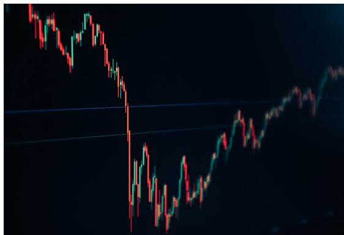  
Austin Hervias, Unsplash

## FIGURE 38

Rising gross government debt as share of GDP, 2023–2030 (projected), by income level  
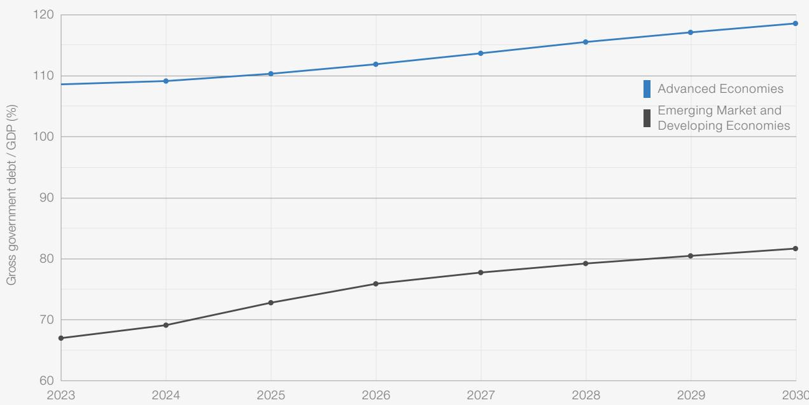

# Executive perceptions regarding Debt (public, corporate, household)

Executive Opinion Survey rank of national risks from the question “In your country, what are the top five risks that are most likely to pose the biggest threat to your country in the next two years?”.

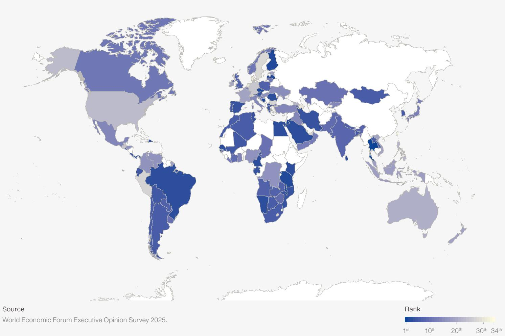  
Source
World Economic Forum Executive Opinion Survey 2025.

Meanwhile, about one-third of global corporate debt, a rising proportion of which is used for making interest payments on existing debt rather than being used for productive investment, will also need refinancing over 2025–2027. $^{56}$ Added to these needs, the volume of debt likely to be issued by companies building out AI infrastructure could be huge; according to one estimate, it could reach 1.5 trillion in investment grade bonds alone over the next five years. $^{57}$

While it is possible that markets digest the upcoming high volumes of public and corporate debt issuance smoothly, there are risks of heightened bond market volatility in some countries, similar to what happened in the United Kingdom in 2022, when a proposed shift in fiscal policy, alongside a technicality related to pension fund liabilities, contributed to a sell-off in the gilt market. $^{58}$ Spikes in bond prices globally could, in turn, uncover further risks in less-regulated areas of credit markets that have taken on greater importance in recent years. Concerns about non-bank financial institutions – financial intermediaries operating outside of banking regulations – and especially private credit are steadily mounting following bankruptcies in relatively peripheral areas of the market in the second half of 2025, $^{59}$ with the Financial Stability Board noting in November 2025 that the sector warrants close monitoring. $^{60}$ Private credit is increasingly attracting retail investors, despite potential liquidity risks in the event of a crisis. $^{61}$

Many governments and companies have a range of tools at their disposal to push debt problems further into the future, well beyond the two-year time horizon. $^{62}$ However, as governments potentially spend more on debt servicing in an environment of already strong fiscal pressures, less support will be available for driving economic growth. According to the EOS, countries where debt is ranked high as a major risk are also those where recession or stagnation fears are elevated.

## Government responses to increasingly

unsustainable fiscal outlooks will differ across countries but are likely to focus on attempting to generate strong economic growth and lower real interest rates, while directing spending to strategic sectors. Some governments may be forced by bond-market volatility to retrench towards more fiscal austerity, which would lead to severe short-to-medium-term negative impacts on household wealth. An Economic downturn would, according to the GRPS, have a range of consequences that are inherently societal in nature, including Inequality and Decline in health and well-being risks (Figure 40).

## Bubble economy?

There is currently widespread concern around elevated equity prices for the largest technology companies, and 2025 saw periods of frenzied investor interest not only in artificial intelligence (AI)-related stocks, but also in sectors such as nuclear, quantum or rare earths. A sharp run-up in the prices of precious metals has raised concerns of bubble-like activity there, too. Some of these prices have since stabilized or corrected, but concerns about overvalued markets remain.

Should the predictions of an asset bubble burst turn out to be true, the potential impacts can be significant. Global institutional and retail investors are heavily invested in US stock markets by historical standards, so the resulting potential impacts of a crash could be severe for the global economy; $^{63}$ 85% of global chief economists in September 2025 believe a financial shock would have wide-ranging systemic effects. $^{64}$ If there were a downturn in US stock markets comparable to the 2000 dotcom bubble burst, the value of wealth destruction could be far greater given how high exposure is today, and the ensuing impacts on consumer demand could be crushing. $^{65}$

The valuations of the largest US stocks are sustained in part by global passive inflows, including from pension funds that mechanically contribute savings towards retirement plans, often via index funds. The largest stocks in the index receive ever larger inflows, fuelling market concentration. This dynamic has been building for two decades. $^{66}$ If passive flows were finally to change direction, a self-reinforcing reverse dynamic could ensue. $^{67}$

  
Elyse Chia, Unsplash

## FIGURE 40

## Global risks landscape: Economic downturn

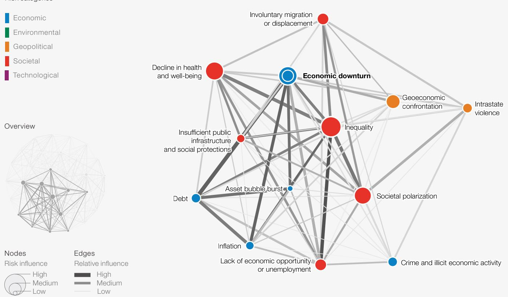  
World Economic Forum Global Risks Perception Survey 2025-2026

This could happen, for example, when more members of the baby-boomer generation retire or if there is a sharp upturn in unemployment if many jobs are displaced by technology, leading to a reduction in contributions to retirement funds and/or to emergency withdrawals.

In an alternative scenario, investor sentiment could turn against leading AI companies, if doubts take hold over whether the huge investments in AI capital expenditure (capex) will pay off. Total spending on AI worldwide is estimated at \$1.5 trillion in 2025 and is projected to rise to \$2 trillion in 2026, with the main segments being generative AI (genAI) smartphones, AI-optimized servers, AI services, AI application software, AI processing semiconductors and AI infrastructure software. $^{68}$ The data centre capex of the top eight US hyperscalers (very large cloud services providers) alone amounted to \$258 billion in 2024 and is projected to more than double to \$525 billion in 2032. $^{69}$

However, current and future revenues linked to these AI capex investments are difficult to estimate; there may ultimately be many losers alongside a few winners. Some companies will be undercut by providers of similar services at cheaper prices, while others may find that some key technological inputs, notably graphics processing units (GPUs), become quickly outdated. The vulnerability of the companies that are investing heavily today will depend not only on the revenues that materialize, but also on how they have financed their outlays. The largest hyperscalers have until recently drawn heavily on their own cash. But increasingly the AI buildout is also being financed via relatively opaque special-purpose vehicles and/or with debt. $^{70}$

It is possible that the strategic decisions made by today's leading technology companies will pay off, particularly with support from governments, given AI's strategic geopolitical value and the vast opportunities across sectors. However, if investor concerns about funding mechanisms and debt

levels start to outweigh excitement about uncertain future revenues, that could trigger an asset bubble burst. Other possible triggers to watch for include a societal backlash against the AI buildout; for example, if concerns emerge around data centre water usage, $^{71}$ unemployment, or, more broadly, inequality. Longer term, quantum technologies could potentially upend entire data centre-based business models.

## Boomerang inflation

According to the IMF, inflation is projected to fall to 4.2% globally in 2025 and to 3.7% in 2026, albeit with above-target inflation in the United States and subdued inflation in most other countries. $^{72}$ In the immediate term, inflation is thus expected to remain largely under control, although the figure masks an acute cost-of-living crisis in many countries following the significant global inflation spike in 2021–2022.

There are several risks that could worsen the inflation outlook. Rising prices of natural resources if geoeconomic confrontation intensifies are of concern. Further, the inflationary pressures associated with higher tariffs should not be underestimated. Sustained, broad tariffs could lead to widespread inflationary pressures, particularly for the United States and closely linked economies including Canada and Mexico. $^{73}$ Uncertainty is the defining feature of the outlook; specific policy design and the level of sector-specific targeting of tariffs are critical in determining inflationary impacts.

Another source of inflation risk may emerge from disruptive paradigm changes in monetary policy. As governments seek ways to stimulate growth and manage growing debt servicing burdens, some may also increase pressure on central banks to run more accommodative monetary policies. Central-bank independence could be further eroded in

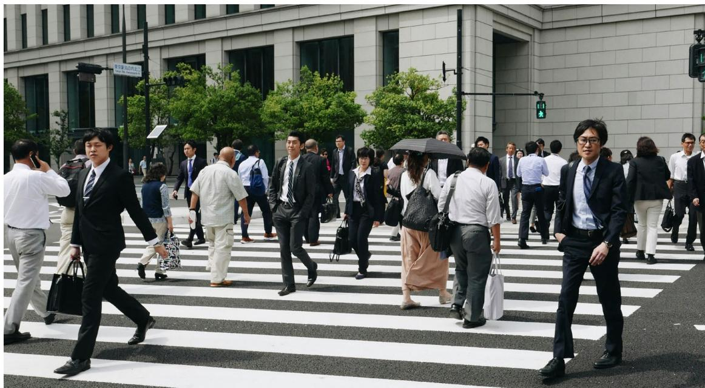  
Falco Negenman, Unsplash

this scenario. With political and national security considerations dominating economic policy-making, central banks could see their role shifting away from a narrow focus on inflation targeting (and in some cases ensuring labour-market stability) and towards prioritizing government financing.

This would be associated with significant risks, as central-bank independence is correlated with better economic outcomes, including significantly reducing inflation in the long run. $^{74}$ In one scenario, tensions between governments and central bankers would mount. In another, should central banks capitulate, the current generation of financial market participants - having grown accustomed to a world with independent central banks, particularly in advanced economies - would have to recalibrate their thinking around monetary policy, shaking confidence and economic fundamentals. Such fundamental change is likely to be associated with bouts of financial volatility as market participants price in the changing policy outlook. Over time, likely pursuit of debt monetization by more politically beholden central banks would heighten the risk of sustained inflation, eroding real incomes and leading to deeper inequality and societal polarization.

## Actions for today

To boost long-term economic growth, governments will need to exercise fiscal prudence and prioritize more efficient spending, as well as enact structural reforms to boost productivity and growth. $^{75}$ At the same time, taxation adjustments to generate revenues have already been implemented across

many countries. More such measures are likely to be needed in the coming years to help address high debt levels and emerging expenditure needs, including for security and defence, healthcare and social benefits, and climate change-related spending. $^{76}$

For low-income countries facing liquidity challenges related to heavy debt burdens, more and better concessional finance, $^{77}$ as well as other innovative financial instruments supported by multilateral institutions will remain critically important. The GRPS finds that Debt is the leading risk that can be addressed by Financial instruments (Figure 41)

One such mechanism is Debt-for-Development Swaps, financial instruments that allow debt-encumbered nations to convert sovereign debt into structured investments in critical economic sectors. The Global Hub on Debt for Development Swaps was launched at the Fourth International Conference on Financing for Development in 2025, with the aim of enhancing access to debt swaps and improving their design and execution. $^{78}$

Governments can also take measures to make their banking systems more attractive and by extension more resilient in the face of potential future global debt or broader financial crises. These include measures to decrease the proportion of citizens who are unbanked or enabling faster and more efficient payments. India's Unified Payments Interface provides a good example. Access can also be improved by upgrading payment infrastructure, as in the case of Mexico's Electronic Interbank Payments System. $^{79}$

FIGURE 41

Top risks addressed by Financial instruments (insurance, catastrophe bonds, public-risk pools), 2026–2036

"Which approach(es) do you expect to have the most potential for driving action on risk reduction and preparedness over the next 10 years?"

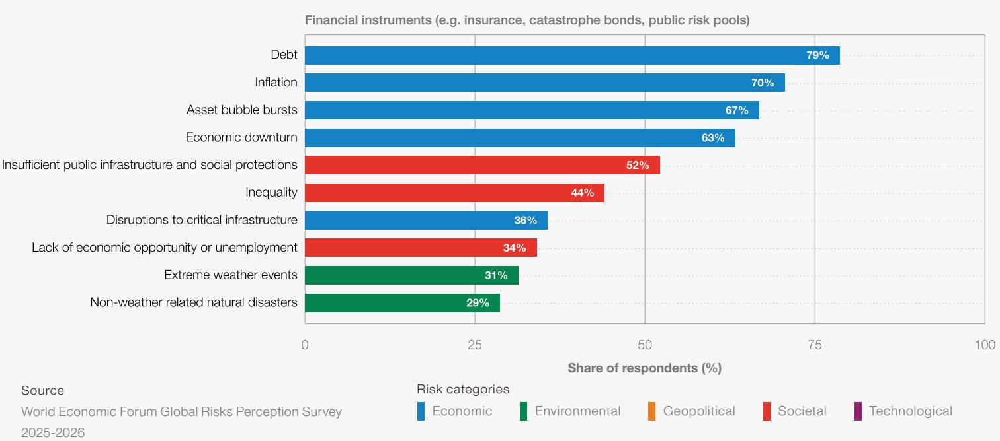

## 2.5 | Infrastructure endangered

FIGURE 42

Short-term (2 years) and long-term (10 years) risk score severity distribution: Disruptions to critical infrastructure

Overload or shutdown of physical and digital infrastructure (including satellites) or services underpinning critical systems, including the internet, telecommunications, public utilities, financial system, or energy. Stemming from, but not limited to: cyberattacks; intentional or unintentional physical damage; extreme weather events; and natural disasters.

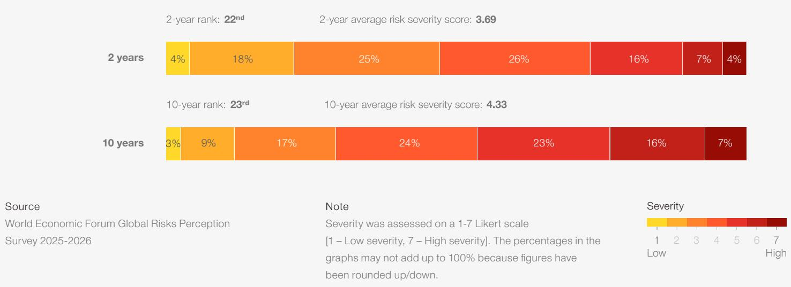  
Source
World Economic Forum Global Risks Perception Survey 2025-2026

\- Ageing critical infrastructure is becoming more prone to failures or accidents, and the scale of financing needed to modernize the sector may be prohibitive amid a fiscal crunch.

\- More frequent and more intense extreme weather events may overwhelm segments of existing critical infrastructure, contributing to wider social and economic challenges.

\- Geoeconomic confrontation is likely to amplify existing challenges to critical infrastructure and create new ones in the physical, cyber and cyber-physical realms.

Mass digitization and electrification are reshaping economies and changing the nature of pressures on critical infrastructure – the provision of power, water, transport and communications. $^{80}$ Demands on that infrastructure are rising as economies and populations grow, and as new sources of demand emerge. For example, it has been estimated that the power needed by AI data centres in the United States alone could rise 30 times within the next decade. $^{81}$ Additionally, interdependencies among different areas of critical and ageing infrastructure are a key concern. For example, during a blackout,

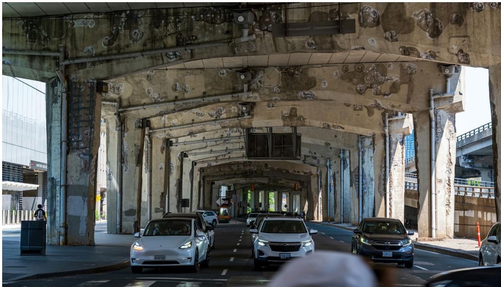

Executive Opinion Survey rank of national risks from the question “In your country, what are the top five risks that are most likely to pose the biggest threat to your country in the next two years?”.

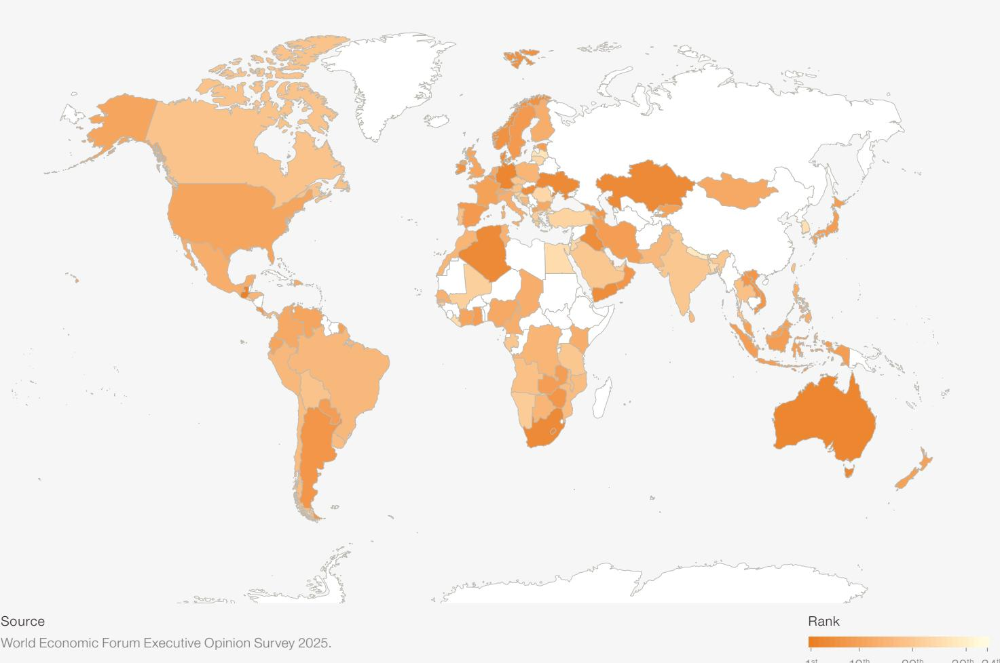  
Source
World Economic Forum Executive Opinion Survey 2025.

water supply that depends on digitized networks might be impacted and nuclear power plants that require water for cooling may be forced to limit their operations as a result.

In the Global Risks Perception Survey 2025-2026 (GRPS), Disruptions to critical infrastructure has increased four positions to #22 and two positions to #23 on a two- and 10-year timeframe respectively, reflecting increasing global concerns

by respondents compared with last year. National level data from the Executive Opinion Survey 2025 (EOS) also suggests that business leaders are attaching importance to the risk of Disruptions to critical infrastructure over the two-year time horizon (Figure 43). It ranks #6 in Oceania, #7 in Central Asia, and #10 in the Middle East and Northern Africa. It appears among the top five reported risks in 13 countries and within the top 10 in 39 countries.

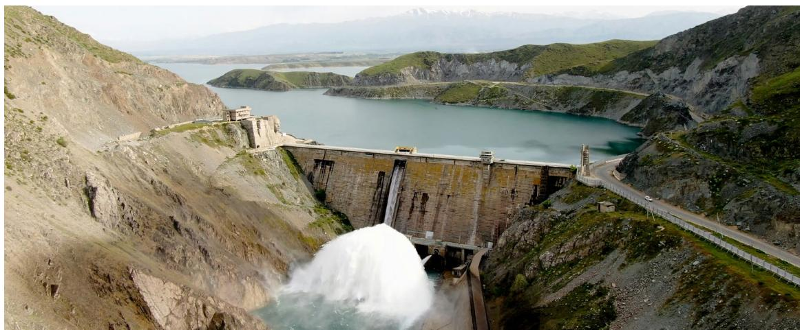  
Collab Media, Unsplash

Risk categories

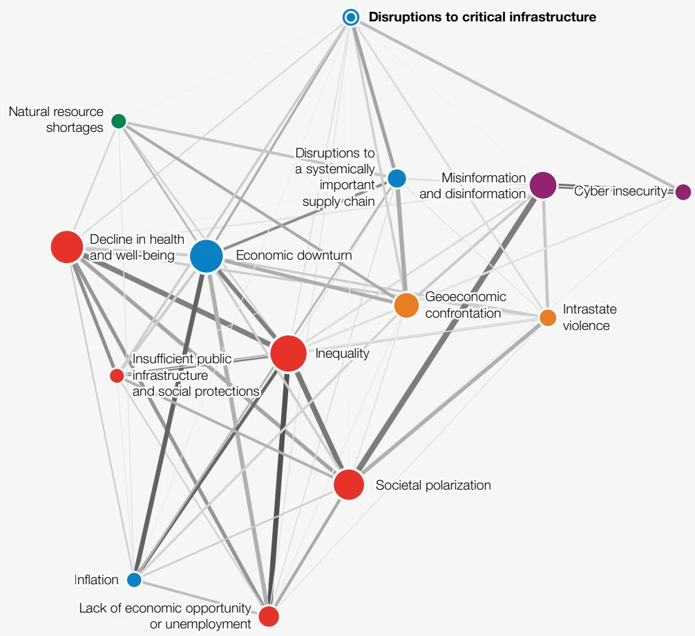  
World Economic Forum Global Risks Perception Survey 2025-2026

In the global perceptions data of the GRPS, respondents identified Disruptions to a systemically important supply chain, Economic downturn and Insufficient public infrastructure and social protections as leading consequences of Disruptions to critical infrastructure (Figure 44).

Three sets of risks that could lead to more and worsening disruptions to critical infrastructure will need addressing over the next decade: First, much of the critical infrastructure in OECD countries, such as transport networks, power grids and water systems, was built in the initial post-World War II decades and will require costly maintenance and upgrading. Until that happens, it is likely to only become more fragile, with a higher risk of failures or accidents. Similarly, across low-income countries, while there is an opportunity to leapfrog towards building new, modern infrastructure, the scale of financing needed may be prohibitive, even though such investment is sorely needed: According to one estimate, firms in low- and middle-income countries lose at least \$300 billion every year due to unreliable transport, electricity and water infrastructure. $^{82}$

Second, more frequent and more intense extreme weather events are likely over the coming decade, generating a wide range of risks to critical infrastructure. And third, geoeconomic

confrontation is likely to amplify existing challenges to critical infrastructure in the physical, cyber and cyber-physical realms.

As these three sets of risks mount and interact with each other, the cascading impacts of, for example, electricity or water supply interruptions could increasingly disrupt everyday life for citizens and complicate business operations. Insurability of critical infrastructure failures could decline and more of the financial burden of recovering from related risk events will fall on individuals and organizations. If citizens experience mounting losses, trust in infrastructure providers could deteriorate and, by extension, trust in the ability of the state itself to ensure provision of basic services and to protect its citizens. Moreover, when critical infrastructure failures do occur, vulnerable populations are often the hardest hit, contributing further to already-high inequality and societal polarization.

## Ageing systems, silent failures

Just as pressures around debt refinancing are mounting and making it more difficult for governments to support funding of large infrastructure projects, significant expenditures on

## FIGURE 45

new infrastructure as well as on maintenance or retrofitting will be required. Where technological obsolescence of existing infrastructure makes it too difficult to align with and connect to advanced technologies, complete overhauls may be needed.

Efforts to make critical infrastructure more resilient over the last two decades have placed a heavy emphasis on handling potential terrorist attacks. $^{83}$ While still an important consideration, additional fundamental concerns are emerging, such as corrosion of piping, cracks in concrete structures or shifting of foundations, as well as inadequate slack in systems. It is not far-fetched, for example, to envisage a scenario in which the quality or supply of drinking water in an OECD country becomes compromised due to accidental systemic failures resulting from maintenance issues. Such risks can build silently in the absence of adequate monitoring, and sudden problems or collapses can occur. When they do, the costs to operators or governments of urgent fixes or workarounds, as well as responding to liability claims and reputational damage, can be huge.

When much of the existing infrastructure in the OECD was built 50-70 years ago, the risk landscape was different. Today, mass urbanization, rising traffic, much higher data transmission and storage requirements, climate-change impacts, and the weaponization of infrastructure in hybrid warfare are priority considerations. Over the next decade, the focus will need to shift towards managing and mitigating more complex threats, $^{84}$ including managing the higher costs of energy and key materials as the top barrier to greening infrastructure. $^{85}$

In addition, talent and/or labour shortages are likely to slow efforts to modernize critical infrastructure. The retirement of the baby-boomer generation is leading to a significant loss of expertise. This relates to maintenance and upgrading, but also to future infrastructure building. For example, while today nuclear power is being embraced by many governments as a critical source of baseload power, with significant buildout plans being announced, the size of the experienced workforce for the nuclear sector in many countries is very limited, given that over several decades only a small number of new nuclear reactors have been built outside of China. $^{86}$ As of October 2025, of only 64 nuclear reactors under construction worldwide, 33 were in China. Similarly, 63% of data-centre executives cite a shortage of skilled labour as their top challenge. $^{87}$

## Climate costs

Modern economies' critical infrastructure is becoming increasingly vulnerable to both chronic climate risks, such as sea-level rises, and acute extreme weather events, including extreme heat, forest fires, floods and storms. Economic losses from natural disasters are steadily rising (Figure 45).

For example, extreme heat can place energy grids under strain because of spiking use of air conditioning, or cause rail and roads to melt or buckle. Solar panels can become less efficient in extreme temperatures, or become damaged by hail, with hailstorms becoming more intense over time. $^{88}$ Many buildings need adaptation in the face of more frequent and more intense heatwaves, $^{89}$ while more intense rainfall can overwhelm outdated drainage systems. Extreme weather is also likely to permanently increase the costs for water treatment, whether because of extreme heat damaging water infrastructure $^{90}$ or due to increased salination.

Rising economic losses from natural disasters  
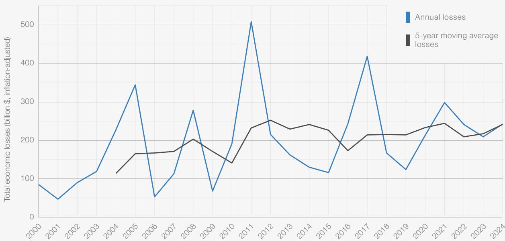  
World Economic Forum, based on data from EM-DAT, The International Disaster Database.

High-impact extreme weather events can cause severe and lasting disruptions to critical infrastructure. Yet, worldwide, mitigation is often viewed as costly and so can be delayed given seemingly more urgent demands on budgets in both the public and private sectors. As the number and intensity of extreme weather events is likely to continue rising in a warming climate, $^{91}$ so the scale of both direct critical infrastructure impacts and knock-on economic and societal risks is only likely to go up over the next decade. $^{92}$ Indirect critical infrastructure damage from extreme weather events, for example via flooding causing a failure of utility services, is potentially even a much larger risk than the direct effects themselves. $^{93}$

In some cases, the resilience of the infrastructure itself may not be the issue, but rather its very relevance amid climate-change impacts. Slow-onset extreme weather, including long-term droughts, is an area of particular concern in this regard. In Uruguay in 2023, for example, two key reservoirs serving Montevideo ran almost completely dry, with a state of emergency being declared in the city in June 2023 amid protests. $^{94}$ As droughts in many regions become longer and more intense over the next decade, there will be a rising risk that hydropower plants in some locations become stranded assets. $^{95}$ Countries with existing hydropower that are projected to be vulnerable include China, Jordan, Iraq, Morocco and Syria. $^{96}$

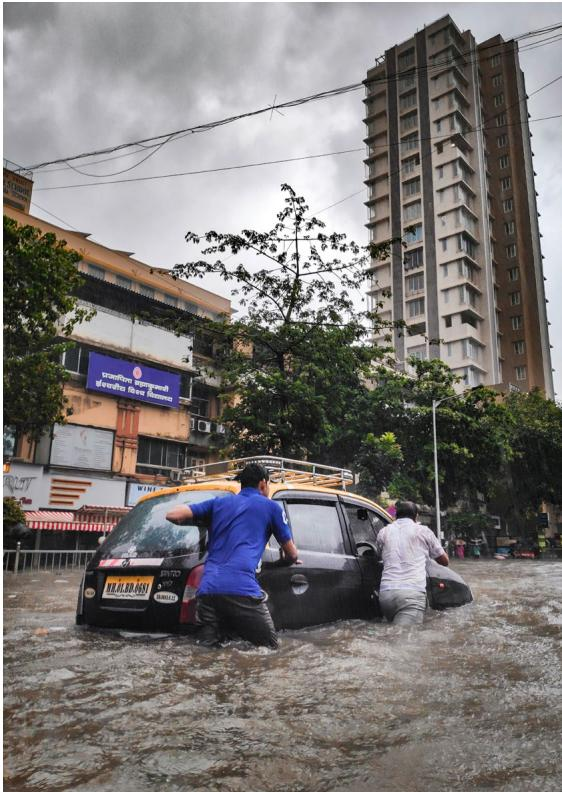  
Saikiran Kesari, Unsplash

Similarly, disruptions to a systemically important supply chain are also a significant risk stemming from extreme weather events affecting critical infrastructure. During the Panama Canal drought of 2023–2024, falling water levels forced a one-third reduction in the number of ships transiting. This led many vessels to re-route, significantly raising shipping costs and leading to delivery delays, shortages and price rises in, for example, some fruits and vegetables in markets as far afield as the United Kingdom. $^{97}$ Similarly, low water levels in the Rhine and Danube rivers in 2018, 2022 and 2025 increased costs and slowed deliveries of raw materials and components to important Western European industrial hubs, in some cases leading to permanent re-routing of supply chains. $^{98}$ The EOS findings reflect this interdependence of risks: countries in which executives report a higher perceived risk of Disruptions to critical infrastructure also tend to report a higher perceived risk of Disruptions to systematically important supply chains.

Over time it could become more common for the impacts of extreme weather events on critical infrastructure to become permanent. For example, coastal infrastructure – roads and railways as well as port infrastructure – could be steadily eroded and operations frequently halted because of flooding, as waters may not eventually recede. Ensuing disruptions to global trade are likely to become more severe over time. $^{99}$ The knock-on impacts of critical infrastructure being damaged or rendered unusable (whether temporarily or permanently) by extreme weather events are likely to be especially consequential in low-income countries, where adaptive capacity is more limited.

In a significant number of locations worldwide, entire cities are sinking, in some cases faster than global sea levels are rising. This represents arguably the most severe example of permanent damage to critical infrastructure. $^{100}$ The primary drivers of sinking cities are groundwater extraction, the weight of a city's infrastructure in relation to its soil type, and geological shifts. Extreme weather events can also be a contributing factor, accelerating erosion and sediment displacement, which destabilizes the ground. $^{101}$ As this trend continues, all areas of critical infrastructure located in these cities risk being affected by more frequent flooding, damage to building foundations and other factors.

## A new front for warfare

Given its strategic role in underpinning defence and security, as well as in societal resilience, critical infrastructure is increasingly in the spotlight in discussions of the risks of geoeconomic confrontation and state-based armed conflict. In many countries, ownership and operations of critical infrastructure involve foreign operators, which means that continuity of essential services may depend on the stability of commercial and

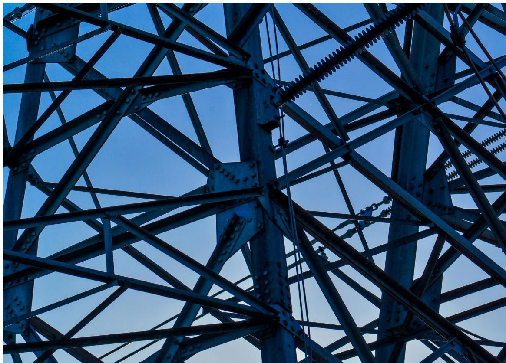  
Pete Alexopoulos, Unsplash

political relationships rather than solely on domestic capabilities. Governments are increasingly worried about the potential use of “back doors” in digitized components of critical infrastructure.

Natural resource endowments such as rare earths or production of sought-after industrial components can be used as leverage in broader trade, investment or other negotiations. The next decade could see such leverage being applied more frequently, weakening critical infrastructure in countries that are exposed. For example, uranium mining, conversion, enrichment and fabrication needed for running nuclear power plants $^{102}$ are susceptible to being impacted by geopolitical tensions in some countries.

With water security concerns likely to continue rising worldwide, governments with upstream control over rivers and reservoirs could be tempted to divert water to their own populations at the expense of neighbouring countries. Such actions could be in response to growing social instability and domestic political weakness, as part of escalating geopolitical tensions with neighbours, or both. Potential flashpoints over the next decade could include the Indus River Basin, between India and Pakistan, or Afghanistan's construction of the Qosh Tepa Canal, which could diminish the flow of the Amu Darya River into Turkmenistan and Uzbekistan. $^{103}$

Direct physical attacks on physical infrastructure are also a rising feature of state-based armed conflict. Since Russia's invasion of Ukraine in February 2022, all categories of critical infrastructure in Ukraine have repeatedly been targeted. Elsewhere, undersea cables have been cut, $^{104}$ and airport operations have repeatedly been interrupted

by drone activity. Global satellite navigation systems, which help to ensure safe maritime and air transport, and also are used in supply chain logistics or agritech, have been targeted with jamming and spoofing of signals. $^{105}$ These attacks are becoming more frequent and more sophisticated. $^{106}$ While governments appear to be the leading perpetrators, risks are rising of non-state actors purchasing commercial technologies that could be used for jamming and spoofing.

As critical infrastructure becomes more digitized, automated and interconnected, industrial control systems and devices can become insufficiently secured and monitored, and therefore vulnerable. The risks of cyber-physical failures are rising, for example from cyberattacks exploiting weaknesses in energy management software. In 2024, vulnerabilities in solar energy systems that could have compromised four million solar systems in 150 countries were highlighted by a group of so-called “ethical hackers”. $^{107}$ On 7 April 2025, the Bremanger dam in Norway suffered a cyber-physical attack, leading to the unplanned release of water. $^{108}$ Such disruptive and potentially dangerous activities are attractive targets for adversarial governments or criminal groups, as they can often plausibly deny involvement, complicating diplomatic, legal or military responses.

If such disruptions escalate in the coming years, attitudes in already-strained societies towards governments suspected of involvement in attacks could harden. The line between cyber-physical attacks and kinetic warfare might start to blur. In parallel, trust in governments that consistently fail to ensure security and uninterrupted basic service delivery could be dented further.

## Actions for today

Public-private partnerships will remain essential to future infrastructure buildouts and to reducing infrastructural vulnerabilities over the next decade. Building resilient public infrastructure requires close collaboration and information-sharing between the public-sector and private infrastructure providers, at both national and cross-border levels, particularly given how deeply embedded private-sector operators are in other countries' critical infrastructure. The rapid pace of change and rising complexity of systemically important critical infrastructure requires trusted working relationships between all key stakeholders to harness the dynamism and agility of the private sector. For example, when faced with Disruptions to a critically important supply chain, Corporate strategies built on sophisticated foresight tools can help to minimize operational impacts on critical infrastructure projects in which the companies are participating (Figure 46). $^{109}$

higher, they can often be offset by long-term savings in maintenance and insurance. $^{110}$

As extreme weather events are anticipated to increase in intensity over the next decade, climate considerations should be at the forefront of infrastructure development. Climate-adaptive design, such as fire-resistant construction in wildfire zones, reduces building failure risk, safeguards health and limits business disruption, inventory losses and liability. While upfront costs may be

Finally, the monitoring of industrial control systems and devices should be prioritized to ensure infrastructure remains resilient to cyber-physical failures. Monitoring of this hardware and software should provide the visibility needed to determine whether an incident stems from a cyberattack, technical failure or human error. This enables organizations to respond more effectively, recover faster and strengthen their defences. In a world where critical infrastructure is increasingly digitized and targeted, treating this monitoring as a core operational necessity is essential. It requires collaborative efforts from those operating equipment and managing processes, cybersecurity staff, the C-suite and governments.

FIGURE 46

"Which approach(es) do you expect to have the most potential for driving action on risk reduction and preparedness over the next 10 years?"

Top risks addressed by Corporate Strategies, 2026–2036  
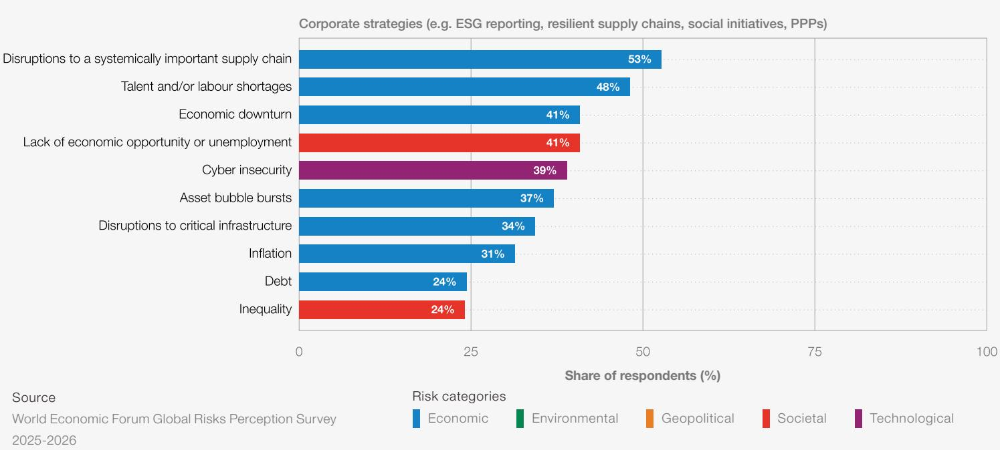

## 2.6 | Quantum leaps

FIGURE 47

## Short-term (2 years) and long-term (10 years) risk severity score distribution: Adverse outcomes of frontier technologies

Intended or unintended negative consequences of advances in frontier technologies on individuals, businesses, ecosystems and/or economies. Includes, but is not limited to: brain-computer interfaces; biotechnology; geo-engineering; and quantum computing.

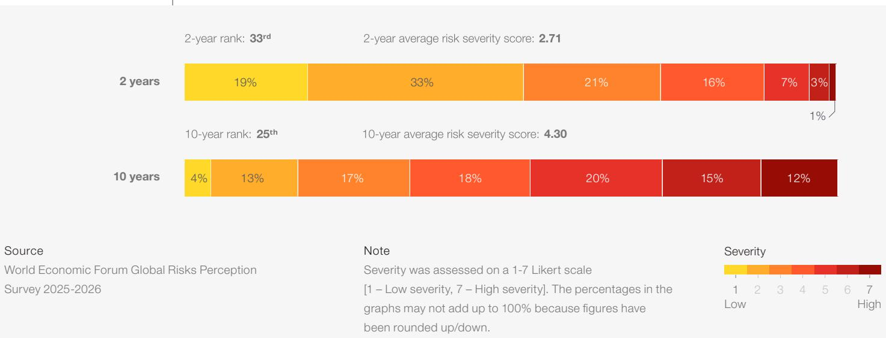

\- Future quantum computing attacks on classical mathematics-based cryptography could undermine all digital trust infrastructures and lead to mass decryption.

\- New extremes in concentration of business and economic power could exacerbate digital divides within societies and between countries.

\- Geopolitics could move closer to winner-take-all scenarios, with supremacy in areas of quantum providing huge strategic and tactical advantages in conflicts.

Progress in quantum technologies is likely to accelerate over the next decade as large companies and governments spend more heavily on seeking quantum leadership. Technology convergence between AI/machine learning (ML) and quantum computing is accelerating the development of both fields. And a whole new field of quantum ML is emerging. Both the quantum and AI risk landscapes will become supercharged over the next decade, and this may lead to situations in which humans lose control. $^{111}$

The Global Risks Perception Survey 2025-2026 (GRPS) findings suggest that respondents are sanguine for now: Adverse outcomes of frontier technologies (including quantum) ranks low at #33 and #25 over the next two years and 10 years, respectively (Figure 10). Nonetheless, this risk has the fourth-largest increase, among all 33 risks, in severity score between these two time horizons, clearly indicating that respondents' concerns are rising over time.

All three key areas of quantum technology – computing, communications and security, and sensing – could see rapid change. Quantum computing in particular has the potential to contribute to breakthroughs in many fields. $^{112}$

It is applicable notably to problems exhibiting combinatorial complexity (exponential growth in the number of possible solutions for a problem as the number of variables increases), with speedups expected where quantum algorithms offer an advantage. Promising areas include optimization (e.g. for financial portfolios, supply chains and energy grids); cryptography and number theory; simulation (e.g. in chemistry and materials science $^{113}$ ); and for improving AI/ML, subject to future hardware capabilities. While several quantum computing systems exist today, they still require further refinement, increased noise management and scaling before major opportunities – and risks – materialize.

Quantum communications and security involve building communications networks that, by their very nature, unlock new security paradigms. China has invested heavily in this field, $^{114}$ with the United States, Germany and Switzerland $^{115}$ also early movers.

Quantum sensing involves improving the sensitivity and precision of sensors. It is starting to lead to important enhancements in military and industrial applications. The United States and China are, again, the leading players, as well as Germany. $^{116}$

Quantum technologies stand to offer huge economic and social benefits. However, major risks are also on the horizon, potentially within a decade. These include cryptographic challenges (encryption and authentication) with potentially cascading impacts; new extremes in concentration of economic and business power; and an amplification of security risks.

## Cryptographic complacency

Cryptographic risks are looming from expected quantum computing attacks on classical mathematics-based cryptography. The latter underlies current user authentication as well as data protection, storage and transmission, affecting the digital lives of all organizations and individuals.

The quantum algorithm that exists today (known as Shor's algorithm) already poses a theoretical threat to classical mathematics-based cryptography. Importantly, there are two specific threat vectors and impacts: First is decryption of private data, which will threaten Personally Identifiable Information (PII) and data privacy (e.g. medical data) as well as intellectual property data. This threat is immediate, due to so-called “harvest now, decrypt later” campaigns, whereby encrypted data is stolen and stored until quantum technology becomes sufficiently advanced to decrypt it. $^{117}$

The second threat relates to breaking the cryptographic system that lets people, devices or services prove who they are online. Shor's algorithm threatens to break this so-called “public-key infrastructure” as it is based on asymmetric keys and allows the impersonation of identities. All forms of digital authentication – including impersonation of online wallets for blockchain, authentication of digital contracts, trust establishment between a credit card and the issuing bank, or trust establishment between digital devices – will be at risk. National critical infrastructure could be at

risk, too, since hostile actors could, for example, potentially take over self-driving vehicles or utilities. This threat is a longer-term one, as it does not depend on data, rather on whether quantum protection is in place at the time that a quantum attack becomes possible.

Shor's algorithm is waiting for a quantum computer powerful enough to run it, and progress towards this objective is quickening thanks to AI. According to a survey conducted in 2024, 53% of quantum experts believe that within a decade there will be at least a 50% likelihood of a quantum computer being able to break RSA-2048, a type of public-key classical mathematics-based cryptography $^{118}$ within 24 hours. $^{119}$ Time is thus of essence in preparing for this milestone, often termed “Q-day”. $^{120}$

The US National Institute of Standards and Technology (NIST) in 2024 took the lead $^{121}$ in issuing a set of standards for post-quantum cryptography (PQC), $^{122}$ which is currently serving as a benchmark for other jurisdictions, focused on implementing new PQC algorithms that are resistant to Shor's algorithm. EU Member states have also developed a roadmap for the transition to PQC. $^{123}$

However, many organizations appear to be lagging when it comes to understanding the potential impacts of quantum, both positive and negative. Only 12% of employers surveyed view quantum and encryption as critical technologies that will transform their organizations. $^{124}$ Moreover, it is estimated that only 5% of organizations have quantum-safe encryption (i.e. to protect against Shor's algorithm) in place. $^{125}$ According to IBM's Quantum Safe Readiness Index, which assesses organizations' level of readiness across quantum-safe discovery, observability and transformation, the average quantum-safe readiness score is only 25 out of 100, where 100 is the safest. $^{126}$

While large companies and some governments may have the know-how and resources to implement protections in time, many smaller companies

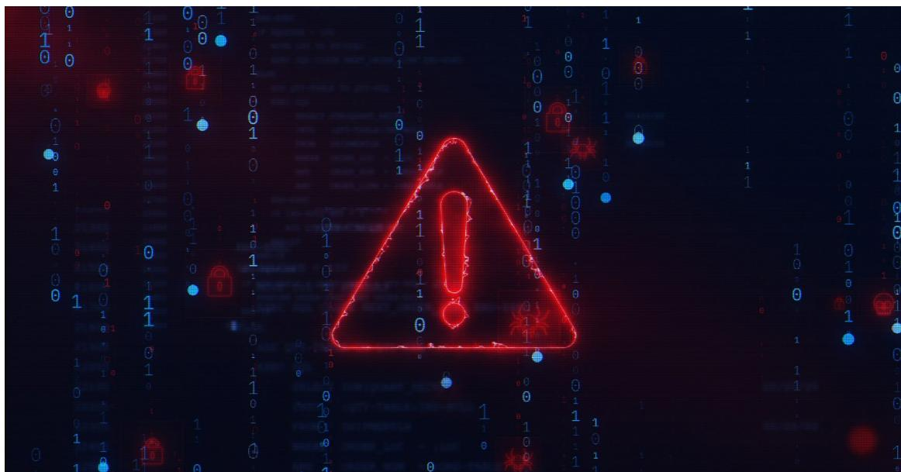  
Getty Images, Unsplash

and less well-resourced governments, as well as many NGOs, academic institutions, and other organizations could fail to do so. Organizations that face the biggest challenges are those that hold data sets that are both sensitive and complex, making migration to quantum-safe cryptography more difficult.

There is an even more fundamental risk on the horizon for all organizations. Protecting against Shor's algorithm is likely to only be a temporary solution, as new quantum algorithms (in addition to Shor's) are being researched that could in future be used in cryptographic attacks. Targeted organizations might not even know about the existence of such new quantum attack algorithms before attacks occur. With a high level of Geoeconomic confrontation anticipated in the coming years, according to the GRPS, it is to be expected that adversarial governments or other actors with quantum technology capabilities may use these against each other and their respective societies and economies. Further down the line, state-sanctioned criminal groups could also find ways to access quantum capabilities and create new quantum algorithms.

Ultimately, the technological solution to quantum computing attacks may come from the field of

quantum communications itself. However, previous, arguably less difficult technological shifts have taken a decade or more to implement, $^{127}$ and updating cryptographic infrastructure to the extent needed will be complex. $^{128}$ With the nature of the quantum cryptographic threat itself likely to evolve, quantum safety interventions will need to become ongoing efforts. $^{129}$ Maintaining such cryptographic agility will become a major challenge.

Respondents to the GRPS recognize these risk interconnections, identifying Cyber insecurity as the leading consequence of Adverse outcomes of frontier technologies (including quantum), followed by Misinformation and disinformation and Adverse outcomes of AI technologies (Figure 48).

Widespread breaking of the cryptographic protocols that underpin trust infrastructures could contribute, for example, to more frequent and sophisticated cyberattacks on critical infrastructure, causing more and longer blackouts, contaminated water supplies or transport accidents (see Section 2.5: Infrastructure endangered). This would push digital security in a quantum era firmly into the realm of physical safety and national security.

Current and historical data privacy could also be compromised. Breaches could in turn lead to an

FIGURE 48

Global risks landscape: Adverse outcomes of frontier technologies avalanche of liability claims, and it is plausible that legislation and regulation will fail to keep pace with quantum developments, resulting in a loss of faith in legal or state protection.

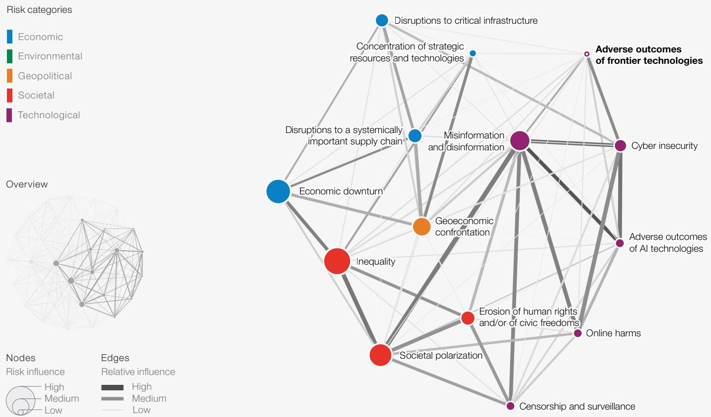  
Source
World Economic Forum Global Risks Perception Survey 2025-2026

The ultimate risk of sudden, mass decryption and breaking of authentication would be a systemic collapse of digital trust. Societal implications could be significant enough to lead to a mass shift away from the digital world for sensitive services such as banking or in healthcare, creating enormous disruption and, perhaps ironically, inefficiency and a reversal of progress. To the extent that public services or elections are affected, this could further deepen mistrust in government institutions and generate serious societal instability.

## Economic flashpoints

Economic impacts would be felt not only in terms of the costs of increased cyberattacks, but also from the re-allocation of resources from productive activities towards protective measures – particularly if this occurs in a crisis should quantum breakthroughs occur sooner than expected. Moreover, with some businesses implementing quantum-safe cryptography before others, this could affect supply-chain stability. Trade could be interrupted if digital signatures are compromised. Decryption of data in critical financial infrastructure could lead to significant economic losses. $^{130}$

However, the economic risks associated with quantum go beyond cryptography. Quantum computing could prove too fast and powerful for some existing systems to handle. Financial markets are a particular vulnerability, with regulations generally not yet having been adapted. How, for example, can regulators hope to observe inside

the “black box” that will be portfolio optimization using quantum computing? $^{131}$ Trading algorithms, including high-frequency trading algorithms, will also become more powerful, complex and faster. $^{132}$ This might lead to more frequent flash crashes or market melt-ups, with a heightened need for circuit breakers to prevent downside market moves that are too sudden and sharp. $^{133}$ Confidence in global finance could be tested if this happens.

Breakthroughs in quantum computing could also rapidly accentuate economic and industrial inequalities among countries. Disparities in access to existing technologies have already created a digital divide, which is likely to become deeper with quantum. $^{134}$ Between 2019 and 2023, China and the United States together were responsible for nearly half of the published research in quantum computing and quantum communications, and around 40% in quantum sensing and post-quantum cryptography. $^{135}$

“Quantum” is set to become a large new industry in itself, creating a new manufacturing supply chain, new quantum service business models (e.g. subscriptions to access quantum computing time) and generating a new set of high-skilled jobs. Linkages between this new quantum industry and all the other industries that stand to benefit would need to be built. These economic benefits would accrue mostly in countries where breakthroughs in quantum technologies take place. While these countries would experience a “fifth industrial revolution”, other countries risk being left behind unless they have strategies for participating in the quantum economy. Many countries in Sub-Saharan Africa, Latin America and Asia lack such strategies for the quantum era. $^{136}$

In the EOS, executives report perceptions of Adverse outcomes associated with frontier technologies (including quantum, biotechnology and geoengineering) at the country level. Risk perceptions associated with these technologies are rising globally but remain concentrated among a small group of relatively technology-advanced states. However, the limited number of countries placing it among top national risks may indicate a divergence in awareness and preparedness for many countries, as well as potentially long-lasting capability gaps.

The chasms between countries could last for years or decades, given the significant resources and technological know-how required to build quantum computing systems. Over time, the divergence in economic performance between those countries benefiting from quantum technologies and those that are not could become so wide that it would provide outsized leverage in areas from trade negotiations to attracting talent and accessing natural resources, as well as a deepening divide in military strength.

With geoeconomic confrontation expected to continue to colour policy-making over the next decade, leading governments will be likely not only to further build out measures designed to protect their competitive advantages in quantum technologies, but also increasingly to try to stifle competing countries' efforts to make progress in this field. Measures already include significant export controls, not only on quantum technologies themselves, but on the broader technology ecosystems needed for their development, $^{137}$ including the raw materials required for key components of quantum computing systems such as cryocoolers and lasers. $^{138}$

Within countries that make quantum breakthroughs, there will be serious challenges, too. The threat of further societal polarization is high if governments do not manage carefully the associated opportunities and risks. Much will depend on how the governments and companies that make quantum breakthroughs exert their power and on whether appropriate guardrails are put in place.

## The Q2 and the rest?

Over time, it is possible that two parallel quantum ecosystems, led by China and the United States, develop. Each would have its own standards, supply chains and protocols, with limited interoperability between systems. If countries

FIGURE 49

Executive perceptions of Adverse outcomes associated with frontier technologies, 2026–2028

Executive Opinion Survey rank of national risks from the question “Which five risks are the most likely to pose the biggest threat to your country in the next two years?”

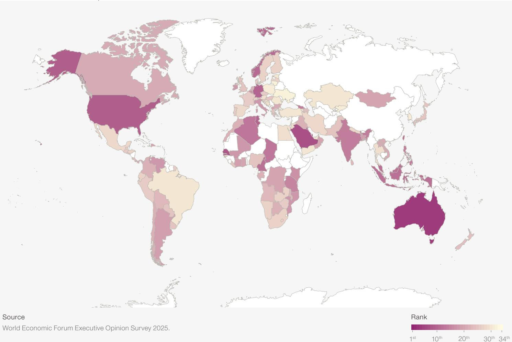

start to align with either ecosystem, switching or aiming to align with both would become very difficult. Countries that are allies of one of the two “quantum superpowers” might be granted access to some quantum capabilities, but at the cost of a substantial loss of technological sovereignty. They would have to give up some degree of strategic independence, ceding room to manoeuvre in a complex and changing geopolitical environment. Moreover, should their alliance with the quantum superpower falter, they could risk losing access to quantum altogether, generating financial or economic shockwaves.

This quantum arms race could mirror the race to build nuclear weapons, followed by the subsequent efforts by nuclear powers to prevent other countries from obtaining such weapons. The potential geopolitical benefits to quantum leadership are large. Yet, in the absence of global agreements related to building and using quantum technologies, it is conceivable that countries seeking that leadership would take overt or covert military action over the next decade to derail and delay their adversaries' efforts to build quantum computing systems.

Even in the absence of such a worst-case scenario, the world's leading militaries are prioritizing quantum as a risk. $^{139}$ Concerns begin with cryptography: sensitive diplomatic exchanges or classified intelligence reports that are likely to have been harvested, potentially over many years, could suddenly be hacked at a large scale by a government or company gaining access to a cryptographically relevant quantum computer.

Data breaches could provide significant leverage to the government that has the quantum advantage, generating insights into other countries' geopolitical strategies, military and intelligence operations; business plans and intellectual property of companies in strategic sectors; or PII of entire populations. In a world that is turning

away from multilateralism and in which power politics is becoming more prevalent, it is likely that governments will press home this information advantage. This would further polarize geopolitics into stronger nations (those that have access to quantum technologies) on one hand and all those that do not on the other.

Quantum simulations involving the modelling of complex systems are likely to accelerate breakthroughs in sensitive fields such as autonomous weapons or engineered pathogens. $^{140}$ There are also several emerging practical applications of quantum sensing for military use. $^{141}$ For example, quantum sensing has the potential to be able to identify submarines or stealth aircraft via gravitational or magnetic anomalies, $^{142}$ putting at risk key military assets.

## Actions for today

For a wide variety of organizations, the costs of delayed preparation are likely to exceed those of adopting quantum-safe cryptography early. Recent calls to action have been issued by, among others, the G7 Cyber Expert Group $^{143}$ and Europol's Quantum Safe Financial Forum. $^{144}$ Organizations adopting quantum-resistant security may leverage hybrid solutions that integrate both classical and quantum-ready approaches. They will need to enhance their crypto agility to build ongoing capabilities in response to evolving cryptographic standards and solutions. Organizations need to begin their quantum cyber readiness journey by building out a strategy and roadmap today. The following five guiding principles aim to help organizations understand where they are, identify gaps in their preparations to become quantum secure, and improve their initial steps towards quantum security: 1) ensure the organizational governance structure institutionalizes quantum risk, 2) raise quantum risk awareness throughout the

  
Getty Images, Unsplash

organization, 3) treat and prioritize quantum risk alongside existing cyber risks, 4) make strategic decisions for future technology adoption, and 5) encourage collaboration across ecosystems. $^{145}$

With quantum technologies set to become a large new industry in itself, there is a growing need for governments to develop national or regional quantum strategies to turn the risks into opportunities. These strategies would have as objectives to 1) understand how to build policy to mitigate local and global risks, and 2) capture the benefits of the technology and participate in the future quantum economy. This could include, for example, deepening research capabilities, providing inputs into the quantum supply chain, or contributing a skilled workforce to the sector. $^{146}$ The GRPS finds that Adverse outcomes of frontier technologies (including quantum) is one of the global risks that can best be addressed by Research & Development (Figure 50).

The Quantum Economy Blueprint (QEB) $^{147}$ outlines concrete steps for policy-makers to take on how to drive quantum innovation and create quantum-specific or quantum-adjacent jobs. It also provides options for managing some of the risks and

reducing potential inequalities associated with quantum technologies. The QEB recommends a strengths, weaknesses, opportunities and threats (SWOT) assessment and a quantum supply-chain risk analysis that ensure alignment with the existing strategic vision and DNA of the country. Saudi Arabia was the first country to pilot the QEB in 2025 as the country adopts quantum technologies as part of a technological leap in line with the country's Vision 2030. $^{148}$

Finally, leading quantum powers should consider the mutual benefits of dialogue on quantum military applications. While the current trend is towards greater mistrust and less sharing of research and data around quantum technologies, emerging quantum powers could initiate a gradual but sustained dialogue with the objective of preventing the use of quantum technologies by militaries in offensive warfare. This would include agreeing to ban the use of quantum for mass decryption and cyberattacks, as well as its use cases in enhancing automated weaponry. Similar to nuclear weapons, a quantum non-proliferation treaty with mutual verification may also be needed to prevent quantum technologies falling into the hands of criminal groups.

## FIGURE 50

Top risks addressed by Research & development, 2026–2036

"Which approach(es) do you expect to have the most potential for driving action on risk reduction and preparedness over the next 10 years?"

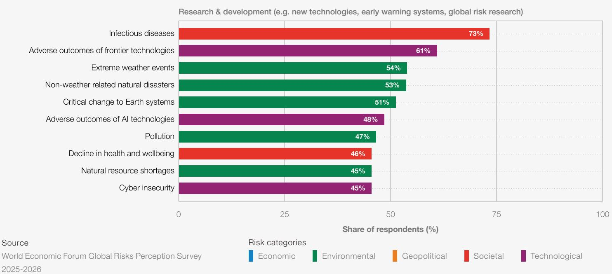

## 2.7 | AI at large

## Short (2 years) and long term (10 years) risk severity score distribution: Adverse outcomes of AI technologies

Intended or unintended negative consequences of advances in AI and related technological capabilities (including generative AI) on individuals, businesses, ecosystems and/or economies.

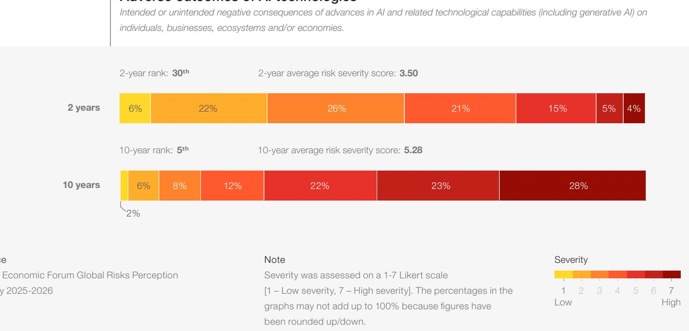

\- In a worst-case scenario for labour markets, increases in both productivity and unemployment could drive permanently K-shaped economies.

\- The potential for creativity, learning and leisure could give way to loss of purpose, meaning and contribution to society, coupled with erosion of alignment around objective facts.

\- The rising range of military use cases for AI will come with commensurate risks, in the worst case leading to rapid and perhaps unintentional escalation of conflicts.

In the Global Risks Report 2024, $^{149}$ we explored the risks of AI, focusing on market concentration and its effect on AI development, inequality between owners of AI technologies and those who are not, and on the use of AI in geopolitical and military conflict. With rapid developments in AI over the last two years, we revisit the risks generated by a world in which AI use is ubiquitous across systems and economies. AI has shifted from a frontier technology to a systemic force shaping economies, societies and security. The global market size for AI is projected to rise from an estimated \$280 billion in 2024 to \$3.5 trillion by 2033 (Figure 52).

## FIGURE 52

Global AI market size  
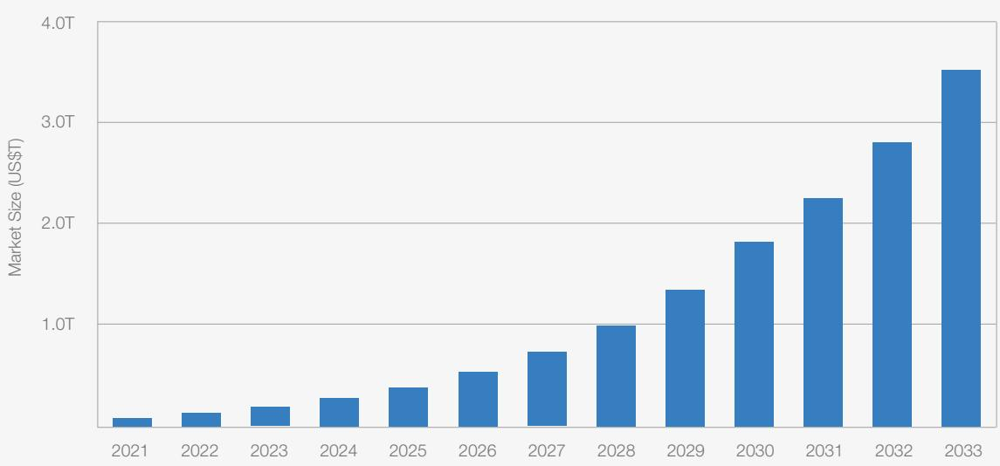

Adverse outcomes of AI technologies is ranked in the Global Risks Perception Survey 2025-2026 (GRPS) as among the most consequential long-term global risks and the one with the largest upward shift across all 33 risks surveyed, from #30 in the two-year outlook to #5 over the 10-year horizon. Over time, the diffusion of generative and agentic AI systems has the potential to transform economies and, while the opportunities and benefits are vast, there are also risks that could manifest rapidly due to market forces, geopolitical pressures and slow development of governance frameworks.

Both the opportunities and risks associated with AI will be unevenly distributed. Access to AI infrastructure $^{151}$ as well as to electricity, internet access and data storage will amplify economic power shifts between countries over the next decade as AI's productivity benefits bypass some populations entirely $^{152}$ -albeit protecting them from some of the risks. For example, AI adoption in North America (27% of the working-age population) is triple that in Sub-Saharan Africa (9%). $^{153}$ Only a handful of AI data centres are in developing regions, with the United States, Europe and Eastern Asia dominating capacity. $^{154}$ Within countries, the gap between AI-integrated geographies and excluded peripheries may also drive localized power shifts, create internal migration pressures and destabilize national cohesion.

This section explores three sets of risks. First, the widely cited concerns around the impact on labour markets could lead to deepening societal polarization if unemployment rises and workers struggle to adapt to new tasks and roles. In such a scenario, both higher productivity and higher unemployment could unfold simultaneously. Second, as more tasks become undertaken by

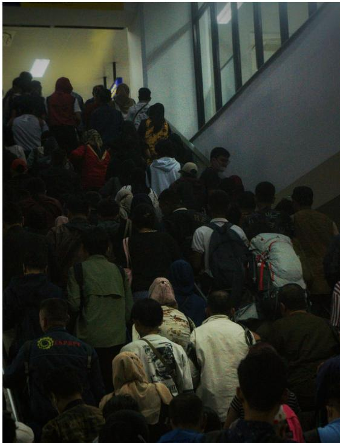  
Taufiq Dzikri, Unsplash

AI and previously applied human skills begin to atrophy, it is unclear if the path forward will be a golden age for creativity, leisure and learning – or, conversely, a drift into purposelessness, apathy and societal decay. In an extreme scenario, control over many aspects of society could be ceded to AI. Third, with militaries' reliance on AI systems continuing to increase, the potential for misuse or mistakes will rise, too, placing human lives directly at risk.

What distinguishes AI-driven disruption from previous technological transitions is the potential for cascading failures across interconnected domains. Labour displacement ripples widely, into households, communities and political systems.
Lack of economic opportunity or unemployment (ranked #14 in the GRPS 10-year ranking) can drive extremism; institutional distrust is interlinked with misinformation and disinformation; and surveillance empowers authoritarian responses to the instability that AI creates. Once established, these loops could become self-reinforcing.

  
Anastassia Anufrieva, Unsplash

Concerns are visible in country-level business sentiment across the two-year time horizon, according to the Executive Opinion Survey 2025 (EOS). Three countries rank Adverse outcomes of AI technologies as their single most important national risk and 20 countries place it within their top five (Figure 53). Regional and income-group averages show a similar pattern, with the risk ranking as high as #4 in South-Eastern Asia.

## Jobless productivity

Within a decade, AI and automation could displace human labour in many roles, disrupting labour markets on a historic scale. Estimates of labour-market impacts vary widely. One estimate notes

that 86% of companies worldwide expect AI to transform their business models by 2030, rising to 97% in finance and 99% in information technology, but that the labour market impact will be positive on balance, with 170 million new roles set to be created and 92 million displaced, resulting in a net increase of 78 million jobs globally by 2030. $^{155}$ A more negative view suggests that AI could eliminate up to 50% of entry-level, white-collar jobs within the next five years in the United States, potentially driving unemployment to 10–20%. $^{156}$

In a negative scenario for labour markets, market forces, unchecked by governance due to geopolitical competition, will accelerate the propensity to automate and replace human labour as much as possible compared to approaches to augment human tasks and skills. While new roles and tasks may emerge and offset losses, these could unfold in a much longer timeline than job displacement, like in previous major technological shifts. In such a scenario, the gains from AI will accrue mainly to highly skilled, high-productivity digital workers, while opportunities will contract faster for low-productivity workers who do not build relevant skills. Those jobs that still exist for the latter group would offer relatively depressed wages. When displacement reaches populations such as the managerial and professional

FIGURE 53

## Executive perceptions of Adverse outcomes of AI technologies, 2026–2028

Executive Opinion Survey rank of national risks derived from the question "In your country, what are the top five risks that are most likely to pose the biggest threat to your country in the next two years?".

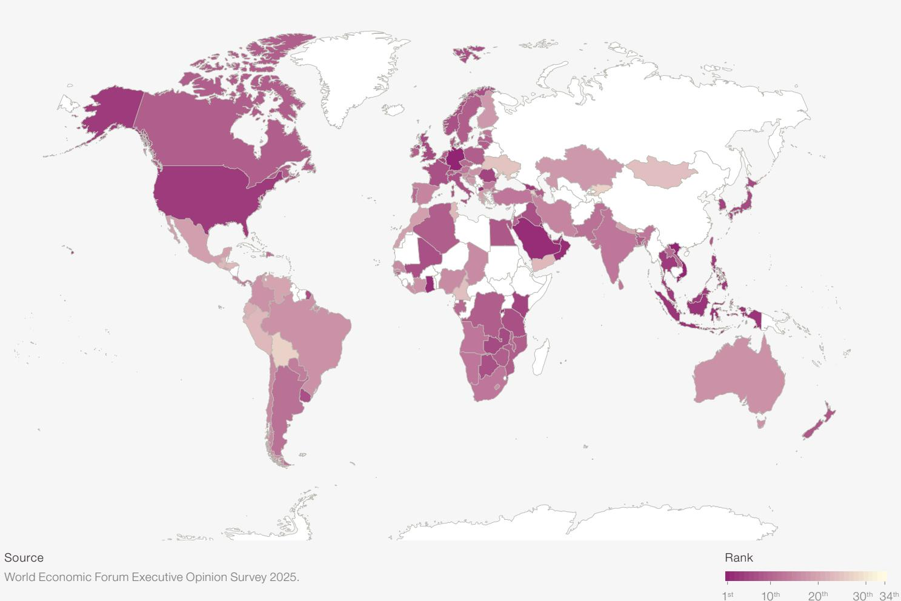

classes – with political voice, media access, and higher expectations of security – the political consequences could intensify. A “white-collar rust belt” could begin to take hold in cities that today are hubs for knowledge and services, generating a powerful, angry, political force.

The impacts of labour-market disruption will be vast, affecting households, communities and political systems, with consequences that may prove even harder to reverse than the economic dislocations themselves. Political gridlock could worsen as societies become more polarized under economic duress. Some countries could enter a vicious cycle of economic contraction and social discontent, as AI-driven productivity gains co-exist with widespread disruption and profound inequality. A generation of university graduates may need to work gig-economy jobs as they struggle to keep pace with relentlessly improving AI capabilities. If highly educated young people remain unemployed for long periods, this could become a destabilizing force in society, with some potentially becoming more inclined towards antisocial extremism. $^{157}$ The GRPS finds Inequality to be the most interconnected risk for the second year in a row, reflecting its role as a transmission mechanism: labour displacement feeds inequality, which drives societal polarization.

Even if there are massive productivity gains from implementing AI, as more of the middle class is hollowed out and the pathways to social mobility rapidly dissipate, incomes would decline and consumer confidence would erode, depressing spending and potentially triggering an economic downturn. Policy-makers are likely to have fewer options as the next decade progresses: high public-debt servicing costs will constrain fiscal responses, with rising middle-class unemployment negatively affecting the tax base and housing markets. Advanced economies may face the kind of permanently K-shaped economies prevalent in many highly unequal developing economies.

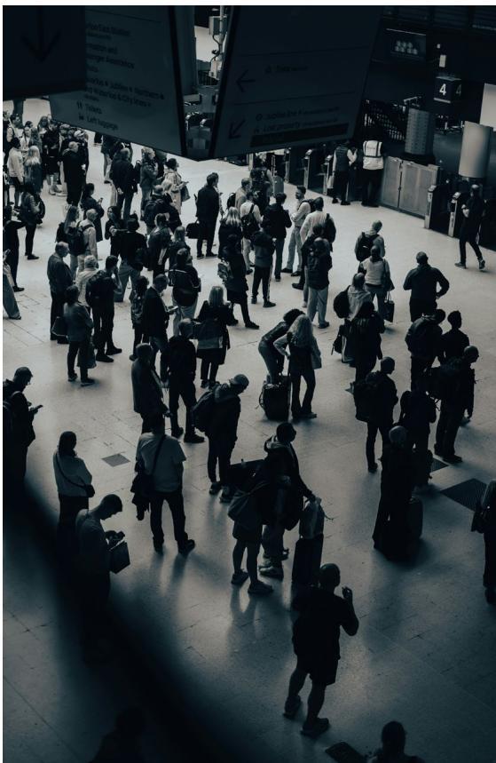  
Jack Lucas Smith, Unsplash

If AI systems continue to improve and exhibit more forms of autonomy, reasoning, and adaptability that extend beyond human-programmed constraints, achieving or approaching general intelligence, the implications for labour markets and economies could become more profound. Entire categories of cognitive and creative work could face automation. At that stage, disruption might no longer unfold linearly but exponentially, possibly compressing adaptation timelines – for aligning education, reskilling, and social protections to the new technology environment – to months rather than years. $^{158}$ The gains from implementing AI would be concentrated in the hands of capital owners (individuals or organizations). Without new frameworks for taxation, redistribution and rapid reskilling, current inequalities would ossify into structural divisions between those who control intelligent infrastructure and those who depend on it.

## Purpose in drift

In geographies and sectors where waves of automation restructure labour markets, a new class could emerge: workers defined not by job loss alone but by the erosion of professional identity and social belonging. If unaddressed, this crisis of occupational identity could drive alienation, social withdrawal or anti-government and anti-technology backlashes. $^{159}$

Many governments may aim to put in place emergency measures to maintain social stability, ranging from income safety nets to training facilities and job centres to harnessing AI for learning and job-matching. While universal basic income (UBI) – or greater access to free services (universal basic services) – generated from the windfalls of AI are a best-case scenario for the unemployed, the question of purpose, identity and meaning remains an open one. A society where large segments, especially young people, subsist on UBI could experience a crisis of meaning. Unemployment has been found to be associated with a heightened, low-to-moderate risk of increased mental health issues (compared with being employed) - including depression, anxiety and psychological distress - even in societies with welfare states. Conversely, re-employment reduces the risk of these mental health issues. $^{160}$ Prolonged, mass unemployment might result in a “lost generation” that feels it has no role to play in contributing to society.

Going further, AI threatens something more intangible yet fundamental: the value of being human. As cognitive tasks, creative work and even social interaction get automated, it is unclear what remains distinctively human. In education systems that are already long outdated, the integration of AI without other adaptations may erode the development of critical thinking. AI companions may reduce rather than enhance collaboration and increase loneliness and a range of mental health issues. There is also the risk of overdependency on AI as we start leveraging it as our “second brain”. Some researchers are more provocative, anticipating that as AI gets smarter, humans get dumber. $^{161}$

There are second-degree physiological health impacts as well, deriving from the environmental impacts of generative AI models. These can consume up to 4,600 times more energy than traditional software. $^{162}$ AI-related infrastructure can result in degraded air quality and pollution from manufacturing, electricity generation and e-waste disposal. In the United States alone, this could impose a public-health burden of over \$20 billion annually by 2028. $^{163}$ Health and well-being could in future also be affected by rising water insecurity in regions with significant data centre buildouts, as these require heavy water use for cooling. $^{164}$

Compounding these economic and psychological stresses is the prospect of information chaos as Adverse outcomes of AI technologies undermine social cohesion (Figure 54). Today, realistic deepfakes and AI-generated Misinformation and disinformation are already flourishing; within a decade they could become ubiquitous, making it impossible for citizens to distinguish truth from deception (see Section 2.3: Values at war). The result is a fragmented public sphere in which consensus on basic facts breaks down. In democracies, elections are contested on the authenticity of evidence itself; any scandal can be dismissed as a deepfake and any deepfake might be real. In autocratic systems, too, the consequences can be dramatic. As fear and conspiracy theories flourish, they can potentially incite violence. Communities might splinter along the lines of those who embrace technology versus those who reject it, further entrenching societal polarization.

The ultimate threat to societies is a loss of control to AI systems. Even in the absence of exponential growth in AI capabilities, incremental improvements in capability could lead to a creeping, structural shift of power from humans to AI over the next decade. As ever more capable AI agents, robotic systems and automated infrastructures assume functions

FIGURE 54

## Global risks landscape: Adverse outcomes of AI technologies

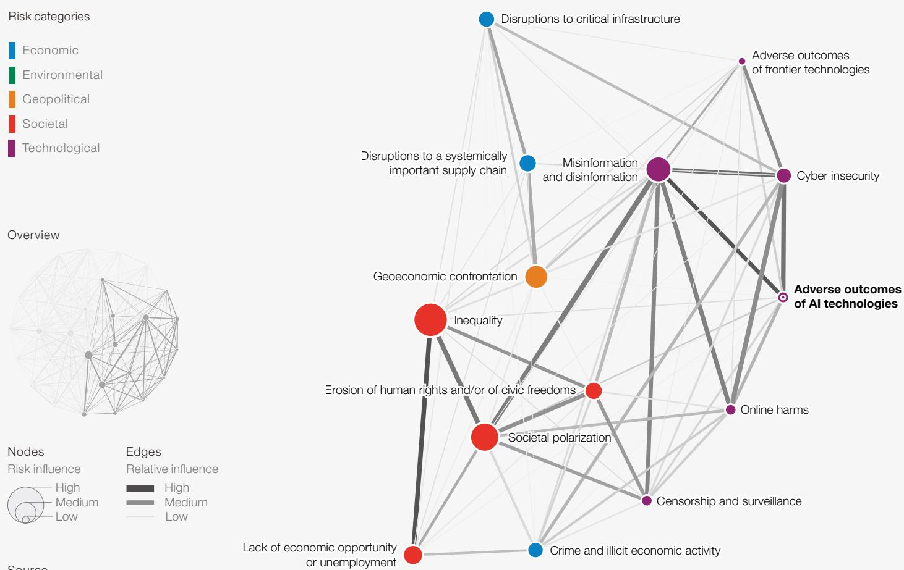

once performed by humans, the balance of agency tilts. Incremental AI advances could steadily erode human influence over the economy, culture, governance and societal systems. $^{165}$

The more that AI agents themselves are used in R&D to develop AI agents further, the greater the risk that the technology companies managing them could cease to understand how those AI systems work. Such R&D automation could accelerate the timeline for progress in AI, making it even more difficult for humans to build the technical and regulatory capabilities to keep pace. $^{166}$

## Military misuse or mistakes

Following Russia's invasion of Ukraine, both sides in the conflict have pushed forward the boundaries of AI use in military conflict. AI technologies have played important roles in geospatial intelligence, autonomous systems, and cyber warfare, among other areas. $^{167}$ As militaries embed AI deeper into intelligence, surveillance, logistics, and command functions, the risk landscape will shift from tactical to systemic. AI will increasingly influence how militaries perceive threats, make decisions, and take actions. AI system failures could propagate through entire chains of command and deterrence systems.

Without humans firmly in the loop, AI-powered platforms may misidentify threats, $^{168}$ respond to biased data, $^{169}$ or behave unpredictably in conditions outside their training parameters. $^{170}$ Adversaries might use data poisoning – introducing corrupted data during model training – as a covert weapon to undermine military AI systems. $^{171}$

When humans are in the loop, an additional set of risks needs to be considered. Weaponized generative AI models can instantly fabricate executive orders or create synthetic, convincing battlefield footage, potentially confusing both humans and technology-based responses. Human decision-making is influenced by cognitive biases, such as confirmation bias or recency bias, when interpreting AI outputs. This can become especially challenging in conflict conditions, when it might also be tempting to over-rely on AI systems even if these are not yet fully equipped to provide nuanced decision-making support. $^{172}$

The speed at which AI systems operate, when applied without checks and balances, can itself be a source of risk. Military crises that once unfolded over days or hours could instead escalate in seconds. An automated early-warning system misinterpreting a missile test, for instance, could trigger defensive responses from an adversary's AI system, leading to a conflict started by technical error rather than strategic intent. Traditional deterrence, built on human deliberation and diplomacy channels, may not hold when algorithms initiate actions before leaders can act. With countries starting to implement AI tools for managing nuclear weapons stockpiles and in some areas of nuclear weapons command, control, and communications, addressing such risks becomes especially critical. $^{173}$

However, major powers are rushing to integrate AI across military domains, each fearing strategic disadvantage if rivals move first. This dynamic incentivizes rapid deployment over rigorous safety testing, increasing the probability of failures precisely where consequences are most severe. The intense pace of innovation makes it unlikely that sufficient international norms or verification mechanisms will be established in time. Each country's pursuit of security may, collectively, produce a more dangerous world.

  
Juli Kosolapova, Unsplash

Beyond state actors, the democratization of AI capabilities raises the spectre of asymmetric security threats. Advanced AI tools could accelerate the development of novel weapons faster than governance frameworks can adapt. Even small groups may eventually wield destructive capacities once reserved for superpowers, leveraging AI to design bioweapons, conduct infrastructure attacks or manufacture disinformation at scale. These risks will be heightened in countries in which the dividing line is blurred between well-resourced national militaries and criminal groups with intentions to cause extreme harms. Corrupt practices and a declining rule of law (see Section 2.2: Multipolarity without multilateralism) could contribute to more frequent illicit sharing of sensitive information, technologies or weaponry. Militaries may then both use AI-powered autonomous technology to deflect human responsibility in warfare $^{174}$ and in parallel shift that responsibility towards loosely associated non-state actors. These dangerous trajectories could lead to a world in which the very sides in warfare become difficult to identify, with plausible deniability becoming the norm.

## Actions for today

To build a resilient workforce, governments and businesses should be proactive in planning ahead, and treat skills development and job transition planning as core elements of AI deployment. This includes funding scalable reskilling infrastructure, incentivizing job creation in emerging sectors, and targeting support for high-risk groups such as youth, people in routine service and administration roles, and older workers. If the negative impacts of AI on labour markets accelerate, each year of policy inaction increases the adaptation gap between technology and the workforce, raising the costs of correction. To stay ahead of the curve, governments should also strengthen their monitoring of labour-market, social, and geopolitical risks, similar to monitoring financial markets for systemic exposure. This includes tracking job churn, trust indicators and political volatility, including using tools such as scenario planning.

Beyond workforce considerations, the social contract between citizens and governments will itself also require renewal to be fit for the era of AI. Investing in public digital infrastructure and ensuring linguistic, geographic and socioeconomic inclusivity in AI design and access is essential to avoid the emergence of a globally marginalized AI underclass. Public awareness and education will be central to rebuilding the social contract and trust in an AI-transformed economy over the next decade. It will also help to mitigate the risks most closely associated with Adverse impacts of AI

technologies, which include Misinformation and disinformation and Cyber insecurity (Figures 54 and 55). In parallel, societies must prepare for extended support to those most impacted by technological unemployment, exploring adaptive models of social protection and investing in the civic, psychological and cultural infrastructure needed to maintain purpose, meaning and participation in an AI-transformed economy.

The long-term risks stemming from AI depend on choices made or avoided within the short to medium term. However, fragmentation of regulatory regimes is increasing the risk of a race to the bottom. Coordination on minimum safety, transparency and ethical deployment standards, particularly for military, biometric and large-scale decision-making systems, is needed - yet requires cooperation similar to that for nuclear or bioweapons safeguards.

  
Leon Andov, Unsplash

"Which approach(es) do you expect to have the most potential for driving action on risk reduction and preparedness over the next 10 years?"

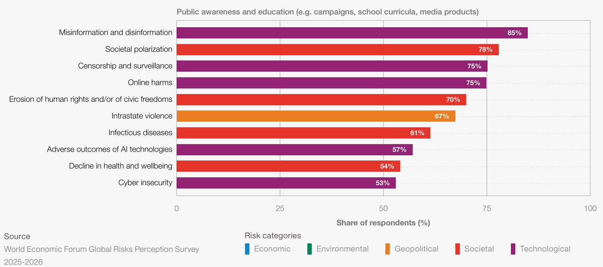

## Endnotes

World Meteorological Organization. (2025). WMO confirms 2024 as warmest year on record at about 1.55°C above pre-industrial level. https://wmo.int/news/media-centre/wmo-confirms-2024-warmest-year-record-about-155degc-above-pre-industrial-level

2. World Economic Forum. (2025f). Global Risks Report 2025. https://www.weforum.org/publications/global-risks-report-2025/

3. Chan, Kyle, Czin, Jonathan A., Hass, Ryan, et al. (2025, November 5). What happened when Trump met Xi?. Brookings. https://www.brookings.edu/articles/what-happened-when-trump-met-xi/

4. World Justice Project. (2025, October 28). Global Rule of Law Recession Accelerates as Authoritarian Trend Deepens, WJP Index Finds [Press release]. https://worldjusticeproject.org/news/wjp-rule-law-index-2025-global-press-release

5. World Economic Forum. (2025b). Chief Economists Outlook. https://reports.weforum.org/docs/WEF\_Chief\_Economists\_Outlook\_September\_2025.pdf

6. United Nations Conference on Trade and Development (UNCTAD). (2025, September). Global Trade Update. https://unctad.org/system/files/official-document/ditcinf2025d7\_en.pdf

7. Evenett, Simon J. (2024, November 19). Tariff Scenarios for 2025: Triggers and Fallout for Trade & FDI (Zeitgeist Series Briefing 45). Global Trade Alert. https://www.globaltradealert.org/reports/

8. Hopewell, Kristen. (2025). Unravelling of the trade legal order: enforcement, defection and the crisis of the WTO dispute settlement system. International Affairs, 101(3), 1103–1117. https://doi.org/10.1093/ia/iiaf055

9. Organisation for Economic Co-operation and Development (OECD) and United Nations Conference on Trade and Development (UNCTAD). (2025, November 13). Thirty-second Report on G20 Investment Measures. https://unctad.org/system/files/official-document/unctad\_oecd2025d32\_en.pdf

10. Aldasoro, Iñaki, Aquilina, Matteo, Lewrick, Ulf, & Lim, Sang Hyuk. (2025, July 11). Stablecoin growth – policy challenges and approaches (BIS Bulletin No. 108). Bank for International Settlements (BIS). https://www.bis.org/publ/bisbull108.pdf

11. Standard Chartered. (2025, October 6). Stablecoins – Implications for EM. https://www.sc.com/en/uploads/sites/66/content/docs/SC-CIB-Stablecoins-and-EM.pdf

12. International Energy Agency (IEA). (2025, May 21). Critical Minerals Policy Tracker. https://www.iea.org/data-and-statistics/data-tools/critical-minerals-policy-tracker

13. Dunn Cavelty, Myriam, Grgić, Gorana, Möckli, Daniel, Perović, Jeronim, Schepers, Névine, & Singh, Michael. (2025). Strategic Trends 2025: Key Developments in Global Affairs. ETH Zurich, Centre for Security Studies. https://css.ethz.ch/content/dam/ethz/special-interest/gess/cis/center-for-securities-studies/pdfs/ST2025-01-DM.pdf

14. Institute for Economics and Peace (2025). Global Peace Index 2025. https://www.visionofhumanity.org/wp-content/uploads/2025/06/Global-Peace-Index-2025-web.pdf

15. Fund for Peace. (2024). Fragile States Index Annual Report 2024. https://fragilestatesindex.org/wp-content/uploads/2025/02/FSI-2024-Report-A-World-Adrift-2.pdf

16. Ibid.

17. Shahid, Rudabeh, Dhungel, Nischal, & De Silva, Shakthi. (2025, September 19). The economic roots of Nepal's uprising—and what it means for the region. Atlantic Council. https://www.atlanticcouncil.org/blogs/new-atlanticist/the-economic-roots-of-nepals-uprising-and-what-it-means-for-the-region/

18. World Justice Project, 2025.

19. World Economic Forum, 2025f.

20. World Justice Project, 2025.

21. Ibid.

22. World Economic Forum in collaboration with Oliver Wyman, 2025.

23. Fund for Peace, 2024.

24. Newman, Nic, Arguedas, Amy Ross, Robertson, Craig T., Nielsen, Rasmus Kleis, & Fletcher, Richard. (2025). Reuters Institute Digital News Report 2025. Reuters Institute for the Study of Journalism. https://reutersinstitute.politics.ox.ac.uk/sites/default/files/2025-06/Digital\_News-Report\_2025.pdf

25. Ibid.

26. Ibid.

27. Simon, Felix, Nielson, Rasmus Kleis, & Fletcher, Richard. (2025, October 7). Generative AI and news report 2025: How people think about AI's role in journalism and society. Reuters Institute for the Study of Journalism. https://reutersinstitute.politics.ox.ac.uk/generative-ai-and-news-report-2025-how-people-think-about-ais-role-journalism-and-society#header--7

28. Newman, et al., 2025.

Dennehy, Fiona (2024, July 2). 9 in 10 concerned about deepfakes affecting election results. The Alan Turing Institute. https://www.turing.ac.uk/news/9-10-concerned-about-deepfakes-affecting-election-results

30. Schneier, Bruce, & Sanders, Nathan. (2024, December 4). The apocalypse that wasn't: AI was everywhere in 2024's elections, but deepfakes and misinformation were only part of the picture. Harvard Kennedy School, Ash Center for Democratic Governance and Innovation. https://ash.harvard.edu/articles/the-apocalypse-that-wasnt-ai-was-everywhere-in-2024s-elections-but-deepfakes-and-misinformation-were-only-part-of-the-picture/

31. Haeck Pieter, & Hartog, Eva. (2025, October 31). The week that AI deepfakes hit Europe's elections. Politico. https://www.politico.eu/article/elections-europe-ai-deepfakes-social-media/

32. Sanders, Nathan E., & Schneier, Bruce. (2025, October 4). How AI Could Drive the 2026 Midterm Elections. TIME. https://time.com/7321098/ai-2026-midterm-elections/

33. | Dennehy, 2024.

34. Peace Research Institute Oslo. (2025, June 9). New data shows conflict at historic high as U.S. signals retreat from world stage. https://www.prio.org/news/3616

35. Fauth-Bühler, Mira, (2025). Viral and harmful: Violence in media and its impact on empathy. The Inquisitive Mind, 9(63), https://www.in-mind.org/article/viral-and-harmful-violence-in-media-and-its-impact-on-empathy

36. Organisation for Economic Co-operation and Development (OECD). (2025), OECD Employment Outlook 2025: Can We Get Through the Demographic Crunch? https://doi.org/10.1787/194a947b-en

37. International Labour Organization. (2021). Global Wage report 2020-2021. https://www.ilo.org/sites/default/files/wcmsp5/groups/public/%40dgreports/%40dcomm/documents/publication/wcms\_762302.pdf

38. Federal Reserve Bank of St. Louis. (Accessed 2025, December 14). Real Residential Property Prices for Advanced Economies (aggregate). Data from the Bank for International Settlements (BIS). https://fred.stlouisfed.org/series/Q5RR628BIS

39. UN Environment Programme (UNEP). (2025, November 5). The world is likely to exceed a key global warming target soon. Now what?. https://www.unep.org/news-and-stories/story/world-likely-exceed-key-global-warming-target-soon-now-what

40. Suárez, José Luis, & García, Jimena. (2025, February 5). Sustainable investing and ESG in a polarized world. Finance and Nature blog, IESE Business School. https://blog.iese.edu/finance-and-nature/2025/sustainable-investing-and-esg-in-a-polarized-world/

41. Global Tipping Points. (2025). Global Tipping Points - understanding risks & their potential impact. https://global-tipping-points.org/

42. Hogan Lovells. (2025, October 6). Energy and national security: the good, the bad and the regulatory. https://www.hoganlovells.com/en/publications/energy-and-national-security-the-good-the-bad-and-the-regulatory

43. Hellberg, Roland, & Lundmark, Martin. (2025). Transformation in European Defence Supply Chains as Ukraine Conflict Fuels Demand. Scandinavian Journal of Military Studies, 8(1), 17–39. https://sjms.nu/articles/10.31374/sjms.303

44. Suárez and García, 2025.

45. Wolf, Shaye, Bullard, Robert, Buonocore, Jonathan J., et al. (2025, March 31). Scientists' warning on fossil fuels. Oxford Open Climate Change, 5(1). https://academic.oup.com/oocc/article/5/1/kgaf011/8099165

46. Kandemir, Mahmut. (2025, November 20). Why AI uses so much energy - and what we can do about it. Penn State, Institute of Energy and the Environment. https://iee.psu.edu/news/blog/why-ai-uses-so-much-energy-and-what-we-can-do-about-it

47. New York Times. (2025, October 25). From Mexico to Ireland, Fury Mounts Over a Global A.I. Frenzy. https://www.nytimes.com/2025/10/20/technology/ai-data-center-backlash-mexico-ireland.html? unlocked\_article\_code=1.vE8.oPOM.wlQZNdRMe2Yn&smid=nytcore-ios-share&referringSource=articleShare

48. International Monetary Fund (IMF). (2025). World Economic Outlook, Global Economy in Flux, Prospects Remain Dim, October 2025. https://www.imf.org/en/publications/weo/issues/2025/10/14/world-economic-outlook-october-2025

49. World Economic Forum, 2025b.

50. World Economic Forum. (2025d). Future of Jobs Report 2025. https://www.weforum.org/publications/the-future-of-jobs-report-2025/

51. World Economic Forum, 2025b.

53. US Committee for a Responsible Federal Budget. (2025, August 20). An August 2025 Budget Baseline. https://www.crfb.org/blogs/august-2025-budget-baseline.

54. European Commission. (2025, May 19). The potential economic impact of the reform of Germany's fiscal framework. https://economy-finance.ec.europa.eu/economic-forecast-and-surveys/economic-forecasts/spring-2025-economic-forecast-moderate-growth-amid-global-economic-uncertainty/potential-economic-impact-reform-germanys-fiscal-framework\_en#:\~:text=ln%20March%202025%2C%20Germany%20adopted,formalised%20in%20a%20 supplementary%20budget

55. Organisation for Economic Co-operation and Development (OECD). (2025a). Global Debt Report 2025: Financing Growth in a Challenging Debt Market Environment. https://www.oecd.org/content/dam/oecd/en/publications/reports/2025/03/global-debt-report-2025\_bab6b51e/8ee42b13-en.pdf.

56. Ibid.

57. Bloomberg, cited in Yahoo Finance. (2025, November 10). AI's \$5 Trillion Data-Center Boom Will Dip Into Every Debt Market, JPMorgan Says. https://finance.yahoo.com/news/ai-5-trillion-data-center-165808446.html

58. Jochim, Sam. (2022, October 18). https://www.efginternational.com/ch/insights/2022/uk-mini-budget-sparks-gilt-market-mayhem.html

59. Anand, Nupar, Bautzer, Tatiana, & Saini, Manya. (2025, October 14). First Brands, Tricolor collapses raise fears of credit stress, with Dimon warning of “more cockroaches”. Reuters. https://www.reuters.com/business/first-brands-tricolor-collapses-invite-more-scrutiny-wall-street-sees-robust-2025-10-14/

60. Financial Stability Board. (2025, November 20). Evolution of private credit markets and stablecoins warrant close monitoring, says FSB Chair [Press release]. https://www.fsb.org/2025/11/evolution-of-private-credit-markets-and-stablecoins-warrant-close-monitoring-says-fsb-chair/

61. International Monetary Fund (IMF). (2025, October). Global Financial Stability Report. https://www.imf.org/-/media/files/publications/gfsr/2025/october/english/text.pdf

62. OECD, 2025a.

63. Bloomberg. (2025, October 17). Any Shock Could 'Turn' Markets, Economy: Gita Gopinath (Video). https://www.bloomberg.com/news/videos/2025-10-16/any-shock-could-turn-markets-economy-gita-gopinath-video

64. World Economic Forum, 2025b.

65. Bloomberg, 2025.

66. von Moltke, Felix, Sløk, Torsten. (2024). Assessing the Impact of Passive Investing over Time: Higher Volatility, Reduced Liquidity, and Increased Concentration, Apollo Academy. https://www.apolloacademy.com/wp-content/uploads/2024/11/Passive-Investing-Paper-vF-112224\_STAMPED.pdf

67. Springborg, Morten. (2025). From Diversification to Distortion: The Impact of Passive Investment Flows. C Worldwide Asset Management. https://www.cworldwide.com/media/v1pbt4cb/from-diversification-to-distortion-the-impact-of-passive-investment-flows.pdf

68. Gartner. (2025, September 17). Gartner Says Worldwide AI Spending Will Total \$1.5 Trillion in 2025 [Press release]. https://www.gartner.com/en/newsroom/press-releases/2025-09-17-gartner-says-worldwide-ai-spending-will-total-1-point-5-trillion-in-2025

69. Deloitte. (2025, June 24). Can US infrastructure keep up with the AI economy?. https://www.deloitte.com/us/en/insights/industry/power-and-utilities/data-center-infrastructure-artificial-intelligence.html

70. Arun, Advait. (2025, November). Bubble or Nothing: Data Center Project Finance. Center for Public Enterprise. https://publicenterprise.org/wp-content/uploads/Bubble-or-Nothing.pdf

71. Brookings. (2025, November 20). AI, data centers and water. https://www.brookings.edu/articles/ai-data-centers-and-water/

72. IMF, 2025.

73. Zhao, Hongyan. (2025, December 11). Assessing the macroeconomic impacts of the 2025 US tariffs (BIS Working Papers No. 1316). Bank for International Settlements (BIS). https://www.bis.org/publ/work1316.htm

74. Centre for European Policy Research. (2025, February 18). It matters even more: Central bank independence, long-run inflation, and persistence. https://cepr.org/voxeu/columns/it-matters-even-more-central-bank-independence-long-run-inflation-and-persistence

75. Organisation for Economic Co-operation and Development (OECD). (2025a). Global Debt Report 2025: Financing Growth in a Challenging Debt Market Environment. https://www.oecd.org/content/dam/oecd/en/publications/reports/2025/03/global-debt-report-2025\_bab6b51e/8ee42b13-en.pdf

76. Organisation for Economic Co-operation and Development (OECD). (2025b, September 11). Tax Policy Reforms 2025. https://www.oecd.org/en/publications/tax-policy-reforms-2025\_de648d27-en.html

77. United Nations Conference on Trade and Development (UNCTAD). (2025). A World of Debt. https://unctad.org/system/files/official-document/osgttinf2025d4\_en.pdf

78. World Bank Group. (2025). Global Hub on Debt for Development Swaps. https://www.worldbank.org/en/programs/debt-for-development-swap-knowledge-hub

79. Standard Chartered, 2025.

80. As categorized in Organisation for Economic Co-operation and Development (OECD). (2024). Infrastructure for a Climate-Resilient Future. https://doi.org/10.1787/a74a45b0-en

81. Deloitte, 2025.

82. Rentschler, Jun, Kornejew, Martin, Hallegatte, Stéphane, Braese, Johannes, & Obolensky, Marguerite. (2019). Underutilized Potential: The Business Costs of Unreliable Infrastructure in Developing Countries. World Bank Group. https://openknowledge.worldbank.org/entities/publication/2ae571bf-8bcd-5025-b88c-971eab58cb39

83. United Nations Office of Counter-Terrorism. (2022). The Protection of Critical Infrastructure Against Terrorist Attacks, 2022 Update. https://www.un.org/counterterrorism/sites/default/files/2225521\_compendium\_of\_good\_practice\_web.pdf

84. Organisation for Economic Co-operation and Development (OECD). (2019, April 17). Good Governance for Critical Infrastructure Resilience (OECD Reviews of Risk Management Policies). https://www.oecd.org/en/publications/good-governance-for-critical-infrastructure-resilience\_02f0e5a0-en/full-report.html

85. World Economic Forum. (2025g). Making the Green Transition Work for People and the Economy. https://www.weforum.org/publications/making-the-green-transition-work-for-people-and-the-economy

86. World Nuclear Industry Status Report. (2025, October 1). https://www.worldnuclearreport.org/

87. Stansbury, Martin, Marchese, Kelly, Hardin, Kate, & Amon, Carolyn. (2025, June 24). Can US infrastructure keep up with the AI economy?. Deloitte. https://www.deloitte.com/us/en/insights/industry/power-and-utilities/data-center-infrastructure-artificial-intelligence.html

88. Kahraman, Abdullah, Kendon, Elizabeth J., Fowler, Hayley J., & Short, Chris J. (2025, September 26). Future changes in severe hail across Europe including regional emergence of warm-type thunderstorms. Nature Communications, 16. Article 8438. https://www.nature.com/articles/s41467-025-62780-0

89. European Environment Agency. (2024, March 11). Europe is not prepared for rapidly growing climate risks [Press release]. https://www.eea.europa.eu/en/newsroom/news/europe-is-not-prepared-for

90. Bartels, Meghan. (2024, August 2). The Hidden Ways Extreme Heat Disrupts Infrastructure. Scientific American. https://www.scientificamerican.com/article/how-extreme-heat-harms-planes-trains-water-mains-and-other-crucial/#:\~:text=As%20drinking%20water%20travels%20through,or%20both%20into%20tap%20water

91. World Meteorological Organization. (2025). WMO Global Annual to Decadal Climate Update 2025-2029. https://wmo.int/sites/default/files/2025-05/WMO\_GADCU\_2025-2029\_Final.pdf

92. In the European context, see European Environment Agency, 2024.

93. Organisation for Economic Co-operation and Development (OECD). (2024). Infrastructure for a Climate-Resilient Future. https://doi.org/10.1787/a74a45b0-en

94. National Aeronautics and Space Administration (NASA). (2023, June 13). Reservoirs Run Dry in Montevideo. https://earthobservatory.nasa.gov/images/151574/reservoirs-run-dry-in-montevideo

95. | OECD, 2024.

96. UN Environment Programme Finance Initiative. (2024). Climate Risks in the Power Generation Sector: May 2024. https://www.unepfi.org/wordpress/wp-content/uploads/2024/05/Climate-Risks-in-the-Power-Generation-Sector-1.pdf

97. United States National Drought Mitigation Center. (2025). Drought Hotspots Around the World 2023-2025 (prepared for the United Nations Convention to Combat Desertification). https://www.unccd.int/sites/default/files/2025-07/Drought%20Hotspots%202023-2025\_ENG.pdf

98. Meuchelböck, Saskia. (2025, August). Navigating Supply Chain Disruptions: How Firms Respond to Low Water Levels (Working Paper). Aarhus University & Kiel Institute for the World Economy. https://rethink-gsc.eu/navigating-supply-chaindisruptions-how-firms-respond-to-low-water-levels/

99. Mikaelsson, Mikael Allan, & and Dzebo, Adis. (2023, December). Impacts and risks from climate change on trade infrastructure. Stockholm Environment Institute. https://www.sei.org/wp-content/uploads/2023/12/sei2023.064-climate-trade-infrastructure.pdf

100. World Economic Forum. (2025g). Resilient Economies: Strategies for Sinking Cities and Flood Risks. https://reports.weforum.org/docs/WEF\_Resilient\_Economies\_Strategies\_for\_Sinking\_Cities\_and\_Flood\_Risks\_2025.pdf

101. Ibid.

102. World Nuclear Association. (2025, September 17). World Nuclear Fuel Report: Global Scenarios for Demand and Supply Availability 2025-2040 (updated). https://world-nuclear.org/our-association/publications/global-trends-reports/world-nuclear-fuel-report-2025

103. Mahaqi, Ali. (2025, January 8). Water tensions under the Taliban. The Interpreter, Lowy Institute. https://www.lowyinstitute.org/the-interpreter/water-tensions-under-taliban

104. Muggah Robert, & Glenny, Misha. (2025, November 12). Severed connections. SECDEV. https://substack.com/home/post/p-177894426

105. International Telecommunications Union (ITU). (2025, March 26). UN agencies warn of satellite navigation jamming and spoofing. https://www.itu.int/hub/2025/03/un-agencies-warn-of-satellite-navigation-jamming-and-spoofing/

106. Francis, Joel. (2024, June 11). Threat Briefing 22: Jamming Attacks Affecting Space Systems and Implications for Global Security. Kratos Space. https://www.kratosspace.com/constellations/articles/jamming-attacks-affecting-space-systems-and-implications-for-global-security

107. Cherian, Sanjeev. (2025, July 28). Top 5 Cyberattacks on Critical Infrastructure. Microminder Cyber Security. https://www.micromindercs.com/blog/cyber-attacks-on-critical-infrastructure#:\~:text=What%20are%20physical%20attacks%20on%20critical%20infrastructure?,services%2C%20endanger%20lives%2C%20and%20weaken%20national%20security

108. Stocks, Carrieann. (2025, August 15). Norway blames Russia for cyberattack on hydropower dam. International Water Power and Dam Construction. https://www.waterpowermagazine.com/news/norway-blames-russia-for-cyberattack-on-hydropower-dam/?cf-view.

OECD, 2019.

World Economic Forum. (2025a). Building Economic Resilience to the Health Impacts of Climate Change. https://reports.weforum.org/docs/WEF\_Building\_Economic\_Resilience\_to\_the\_Health\_Impacts\_of\_Climate\_Change\_2025.pdf

111. Inderwildi, Oliver. (2025, April 14). The Quantum Computing Revolution: From Technological Opportunity to Geopolitical Power Shift, (Part 2). The Geopolitical Economist. Medium. https://medium.com/the-geopolitical-economist/the-quantum-computing-revolution-geopolitics-economics-c2380e0167ee

112. World Economic Forum. (2025c). Embracing the Quantum Economy: A Pathway for Business Leaders. https://reports.weforum.org/docs/WEF\_Embracing\_the\_Quantum\_Economy\_2024.pdf

113. Kwang S. Kim. (2025, September 20). A Quantum Compass for Materials Discovery: Navigating the Combinatorial Explosion. ACS Central Science. https://pmc.ncbi.nlm.nih.gov/articles/PMC12550631/.

114. Hmaidi, Antonia, & Groenewegen-Lau, Jeroen. (2024, December 12). China's long view on quantum tech has the US and EU playing catch-up. Mercator Institute for China Studies (MERICS). https://merics.org/en/report/chinas-long-view-quantum-tech-has-us-and-eu-playing-catch

115. Geneva University. (2025, October 14). Launch of Geneva's First Quantum Network [Press release] https://www.unige.ch/sciences/physique/en/news/lancement-du-premier-reseau-quantique-genevois

116. Hmaidi, Antonia and Jeroen Groenewegen-Lau, 2024.

117. Tran, Duc Le, Phuc, Hao Do, Truong, Duy Dinh, & Van Dai, Pham. (2025). Are Enterprises Ready for Quantum-Safe Cybersecurity?. arXiv. https://arxiv.org/pdf/2509.01731

118. Krantz, Tom, & Jonker, Alexandra. (2025, October 22). What is Public Key Encryption?. IBM. https://www.ibm.com/think/topics/public-key-encryption

119. Mosca, Michele, & Piani, Marco. (2024). Quantum Threat Timeline Report 2024. Global Risk Institute and evolutionQ, Inc. https://globalriskinstitute.org/publication/2024-quantum-threat-timeline-report/

120. Scholten, Travis L., Williams, Carl J., Moody, Dustin, et al. (2024). Assessing the Benefits and Risks of Quantum Computers. US National Institute of Standards and Technology. arXiv. https://arxiv.org/pdf/2401.16317

121. Soutar, Colin, Barmes, Itan, & Beato, Filipe. (2024, October 22). Why the new NIST standards mean quantum cryptography may just have come of age. World Economic Forum. https://www.weforum.org/stories/2024/10/quantum-cryptography-nist-standards/

122. | Scholten, et al., 2024.

123. European Commission. (2025, June 23). A Coordinated Implementation Roadmap for the Transition to Post-Quantum Cryptography. https://digital-strategy.ec.europa.eu/en/library/coordinated-implementation-roadmap-transition-post-quantum-cryptography

124. World Economic Forum, 2025d.

125. Digicert. (2025, May 8). Quantum Readiness Gap: DigiCert Study Finds Just 5% of Enterprises Have Quantum-Safe Encryption in Place [Press release]. https://www.digicert.com/news/quantum-readiness-gap-a-digicert-study-on-quantum-safe-encryption

126. IBM Institute for Business Value. (2025). Secure the post-quantum future (accessed October 25). https://www.ibm.com/thought-leadership/institute-business-value/en-us/report/2025-quantum-safe-readiness

127. | Scholten, et al., 2024.

129. KPMG. (2025). Quantum is coming - and bringing new cybersecurity threats with it (accessed October 22). https://kpmg.com/xx/en/our-insights/ai-and-technology/quantum-and-cybersecurity.html

130. Auer, Raphael, Dupont, Angela, Gambacorta, Leonardo, et al. (2024). Quantum computing and the financial system: opportunities and risks (BIS Papers No 149). Bank for International Settlements (BIS). https://www.bis.org/publ/bppdf/bispap149.pdf.

131. World Economic Forum (2024b). Quantum Security for the Financial Sector: Informing Global Regulatory Approaches. https://www.weforum.org/publications/quantum-security-for-the-financial-sector-informing-global-regulatory-approaches/

132. World Economic Forum. (2025h). Quantum Technologies: Key Strategies and Opportunities for Financial Services Leaders. https://reports.weforum.org/docs/WEF\_Quantum\_Technologies\_Key\_Strategies\_and\_Opportunities\_for\_Financial\_Services\_Leaders\_2025.pdf

133. UK Finance. (2023). Identifying and Minimizing the Risks Posed by Quantum Technology. https://www.ukfinance.org.uk/system/files/2023-11/Identifying%20and%20minimising%20the%20risks%20posed%20by%20quantum%20technology.pdf

134. Hidari, Jack, & Sarkar, Arunima. (2023, January 18). The world is heading for a 'quantum divide': here's why it matters. World Economic Forum. https://www.weforum.org/stories/2023/01/the-world-quantum-divide-why-it-matters-davos2023/

135. Australian Strategic Policy Institute. (2025). Critical Technology Tracker (accessed October 31). https://techtracker.aspi.org.au/

155. World Economic Forum, 2025d.

136. Geneva Science and Diplomacy Anticipator and the Open Quantum Institute. (2025). Intelligence Report on Quantum Diplomacy in Action 2025-2026. https://open-quantum-institute.cern/wp-content/uploads/2025/11/Intelligence-Report-2025.pdf

137. US Department of Commerce, Bureau of Industry and Security. (2024, May 9). Commerce Adds 37 PRC Entities to Entity List for Enabling PRC Quantum and Aerospace Programs, Aiding Russian Aggression in Ukraine [Press release]. https://www.bis.gov/press-release/commerce-adds-37-prc-entities-entity-list-enabling-prc-quantum-aerospace-programs-aiding-russian

138. Weinstein, Yaakov, & Rodenburg, Brandon. (2025, January). Quantum Computing: Quantifying the Current State of the Art to Assess Cybersecurity Threats (Intelligence After Next Series No.29). MITRE. https://www.mitre.org/sites/default/files/2025-01/PR-24-3812-Quantum-Computing-Quantifying-Current-State-Assess-Cybersecurity-Threats.pdf

139. See, for example, NATO (2024, January 16). Summary of NATO's Quantum Technologies Strategy. https://www.nato.int/cps/en/natohg/official\_texts\_221777.htm.

140. Geneva Science and Diplomacy Anticipator and the Open Quantum Institute, 2025.

141. Hmaidi and Groenewegen-Lau, 2024

142. Ivezic, Marin, (2025, March 1). Quantum Geopolitics: The Global Race for Quantum Computing, PostQuantum.com. https://postquantum.com/quantum-computing/quantum-geopolitics/

143. G7 Cyber Expert Group. (2024, September). Statement on Planning for the Opportunities and Risks of Quantum Computing. https://home.treasury.gov/system/files/136/G7-CYBER-EXPERT-GROUP-STATEMENT-PLANNING-OPPORTUNITIES-RISKS-QUANTUM-COMPUTING.pdf

144. Europol. (2025, February 7). Call for action: urgent plan needed to transition to post-quantum cryptography together n[Press release]. Quantum Safe Financial Forum. https://www.europol.europa.eu/media-press/newsroom/news/call-for-action-urgent-plan-needed-to-transition-to-post-quantum-cryptography-together

145. Ibid.
146. World Economic Forum. (2024a). Quantum Economy Blueprint. https://www.weforum.org/publications/quantum-economy-blueprint/

Saudi Arabia Centre for the Fourth Industrial Revolution. (2024). Quantum Economy Landscape in Saudi Arabia. https://www.c4irsaudiarabia.org/docs/Quantum%20Economy%20Landscape%20in%20Saudi%20Arabia%20%20(23).pdf

149. World Economic Forum. (2024). Global Risks Report 2024. https://www.weforum.org/publications/global-risks-report-2024/

150. Grand View Research. (Accessed 2025, December 15). https://www.grandviewresearch.com/horizon/outlook/artificial-intelligence-market-size/global

151. International Monetary Fund (IMF). (2025, April 4). AI adoption and inequality. https://www.imf.org/en/publications/wp/issues/2025/04/04/ai-adoption-and-inequality-565729

153. Misra, A., & Wang, J., et al. (2025, November 4). Measuring AI Diffusion: A Population Normalized Metric for Tracking Global AI Usage (Microsoft AI for Good Lab). arXIV. https://arxiv.org/pdf/2511.02781

154. Microsoft AI Economy Institute. (2025, November). AI Diffusion Report: Where AI Is most used, developed and built. https://www.microsoft.com/en-us/research/wp-content/uploads/2025/10/Microsoft-AI-Diffusion-Report.pdf

156. VandeHei, J., & Allen, M. (2025, May 28). Behind the Curtain: A white-collar bloodbath. Axios. https://www.axios.com/2025/05/28/ai-jobs-white-collar-unemployment-anthropic.

157. Gambetta, Diego, & Hertog, Steffen. (2016, March 1). Engineers of Jihad. Princeton University Press. https://press.princeton.edu/books/hardcover/9780691145174/engineers-of-jihad?srsltid=AfmBOoo9gNyLSJuPtVkbsDjcfGxnLAXs\_Ft-Gz5bGmY12vzQxssVuksq

158. Igarapé Institute. (2025, October). Global Futures Bulletin: An Inflection Point in the AI Race. https://igarape.org.br/en/global-futures-bulletin-an-inflection-point-in-the-ai-race/

159. Aziz, M. H. (2025, August 20). The overlooked global risk of the AI precariat. World Economic Forum. https://www.weforum.org/stories/2025/08/the-overlooked-global-risk-of-the-ai-precariat/

160. Sterud T., Lunde L.-K., Berg R., et al. (2025). Mental health effects of unemployment and reemployment: a systematic review and meta-analysis of longitudinal studies. BMJ Journals, Occupational & Environmental Medicine, 2025;82:343–353. https://oem.bmj.com/content/82/7/343.long

161. Blashki, Grant. (2025, February 18). As AI gets smarter, are we getting dumber?. The University of Melbourne. https://pursuit.unimelb.edu.au/articles/as-ai-gets-smarter,-are-we-getting-dumber

162. Desroches, Clément, Chauvin, Martin, Ladan, Louis, Vateau, Caroline, Gosset, Simon, & Cordier, Philippe. (2025, January 24). Exploring the sustainable scaling of AI dilemma: A projective study of corporations' AI environmental impacts (Cornell University). arXiv. https://arxiv.org/abs/2501.14334

163. Han, Yuelin, Wu, Zhifeng, Li, Pengfei, Wierman, Adam, & Ren, Shaolei. (2025, October 23). The Unpaid Toll: Quantifying and Addressing the Public Health Impact of Data Centers (Cornell University). arXiv. https://arxiv.org/abs/2412.06288

164. | Brookings, 2025.

165. Kulveit, Jan, Douglas, Raymond, Ammann, Nora, Turan, Deger, Krueger, David, & Duvenaud, David. (2025, January 29). Gradual Disempowerment: Systemic Existential Risks from Incremental AI Development (Cornell University). arXiv. https://arxiv.org/abs/2501.16946

166. RAND. (2024, October 24). How AI Can Automate AI Research and Development. https://www.rand.org/pubs/commentary/2024/10/how-ai-can-automate-ai-research-and-development.html

167. Grey, Markov, & Segerie, Charbel-Raphael. (2025, August 20). The AI Risk Spectrum (French Center for AI Safety. arXIV. https://arxiv.org/pdf/2508.13700

168. Probasco, Emelia, Toner, Helen, Burtell, Matthew, & Rudner, Tim. G.J. (2025, April). AI for Military Decision-Making. Center for Security and Emerging Technology. https://cset.georgetown.edu/publication/ai-for-military-decision-making/

169. Bruun, Laura, & Bo, Marta. (2025, August 28). ‘Constant care’ must be taken to address bias in military AI. ICRC Humanitarian Law and Policy blog. https://blogs.icrc.org/law-and-policy/2025/08/28/constant-care-must-be-taken-to-address-bias-in-military-ai/

170. Probasco, et al., 2025

171. Conti, Aaron. (2025, June 30). Data Poisoning as a Covert Weapon: Securing U.S. Military Superiority in AI-Driven Warfare. Lieber Institute, West Point. https://lieber.westpoint.edu/data-poisoning-covert-weapon-securing-us-military-superiority-ai-driven-warfare/

172. Probasco, et al., 2025.

173. Federation of American Scientists. (2025, June 11). Develop a Risk Assessment Framework for AI Integration into Nuclear Weapons Command, Control, and Communications Systems, https://fas.org/publication/risk-assessment-framework-ai-nuclear-weapons/

174. Caruso, Catherine. (2024, August 7). The Risks of Artificial Intelligence in Weapons Design. Harvard Medical School. https://hms.harvard.edu/news/risks-artificial-intelligence-weapons-design

# Appendix A

# Definitions and Global Risks List

## Definitions

For the purposes of this report, “global risk” is the possibility of the occurrence of an event or condition that, if it occurs, would negatively impact a significant proportion of global GDP, population or natural resources.

“Structural force” is the long-term shift in the arrangement of and relation between the systemic elements of the global landscape. These shifts are not risks in and of themselves, but have the potential to materially influence the speed, spread and scope of global risks. These include but are not limited to geostrategic shifts, technological acceleration, climate change and demographic bifurcation.

“Climate change” is a structural force that encompasses the trajectories of global warming and possible consequences to Earth systems, reflecting anthropogenic actions and environmental changes.

“Demographic bifurcation” is a structural force that refers to changes to the size, growth and structure of national, regional or global populations, and the resulting impact on socioeconomic and political structures. It includes, but is not limited to, migration, fertility and ageing rates.

“Geostrategic shifts” is a structural force that refers to changing geopolitical power dynamics. It encompasses global and regional alliances and relations, the offensive and defensive projection of different sources of power (including economic), and national attitudes relating to key actors, governance mechanisms and strategic goals.

“Technological acceleration” is a structural force that refers to technological developments enabled by exponential growth in computing power and analysis. It has the potential to blur boundaries between technology and humanity, and rapidly give rise to novel and unpredictable global risks.

## Global risk list

Table A.1 presents the list of 33 global risks and definitions adopted by the Global Risks Perception Survey 2025–2026.

To ensure legibility, the names of some of the global risks have been abbreviated in the figures throughout the report. The portion of the full name used in the abbreviation is in bold in Table A.1.

## TABLE A.1

## Definitions of global risks

<table><tr><td colspan="2">SOCIETAL</td></tr><tr><td>Decline in health and well-being</td><td>Regular or chronic impacts on physical and mental health and well-being that require substantive medical attention and/or limit activities of daily living. Includes, but is not limited to: conditions linked to ageing; excessive consumption habits; and climate change (including heatwaves) and pollution.</td></tr><tr><td>Erosion of human rights and/or civic freedoms</td><td>Loss of protections for rights inherent to all human beings, regardless of individual status, and/or the freedoms that underpin civic space. Includes, but is not limited to the right to: life and liberty; work and education; freedom of expression; peaceful assembly; non-discrimination based on gender, race ethnicity and other characteristics; and privacy.</td></tr><tr><td>Inequality (wealth, income)</td><td>Present or perceived substantive disparities in the distribution of assets, wealth or income within or between countries, resulting in material differences in related economic outcomes. Includes, but is not limited to: growing or persistent poverty; and economic polarization.</td></tr><tr><td>Infectious diseases</td><td>Spread of viruses, parasites, fungi or bacteria leading to a widespread loss of life and economic disruption. Includes, but is not limited to: zoonotic diseases; releases of natural or man-made pathogens; resurgence of pre-existing diseases due to lower levels of immunity; rise of antimicrobial resistance; and the impact of climate change and environmental degradation on pathogens and their vectors.</td></tr><tr><td>TABLE A.1</td><td>Definitions of global risks</td></tr><tr><td>Insufficient public infrastructure and social protections</td><td>Non-existent, inadequate or inequitable public infrastructure, services and social protections. Includes, but is not limited to: unaffordable or inadequate social security and benefits; housing; public education; child and elderly care; healthcare; sanitation and transportation systems; and pension systems.</td></tr><tr><td>Lack of economic opportunity or unemployment</td><td>Structural deterioration of work prospects or standards of work and/or persistent barriers to the realization of economic potential and security. Includes, but is not limited to: erosion of workers' rights; stagnating wages; rising unemployment and underemployment; displacement due to automation or the green transition; stagnant social mobility; and unequal access to educational, technological and economic opportunities.</td></tr><tr><td>Involuntary migration or displacement</td><td>Forced movement or displacement across or within borders. Stemming from, but not limited to: persistent discrimination and persecution; lack of economic advancement opportunities; human-made disasters; natural disasters and extreme weather events, including the impacts of climate change; and internal or interstate conflict.</td></tr><tr><td>Societal polarization</td><td>Present or perceived ideological and cultural divisions within and across communities leading to declining social stability; gridlocks in decision-making; economic disruption; and increased political polarization.</td></tr><tr><td colspan="2">TECHNOLOGICAL</td></tr><tr><td>Adverse outcomes of AI technologies</td><td>Intended or unintended negative consequences of advances in AI and related technological capabilities (including generative AI) on individuals, businesses, ecosystems and/or economies.</td></tr><tr><td>Adverse outcomes of frontier technologies (quantum, biotech, geoengineering)</td><td>Intended or unintended negative consequences of advances in frontier technologies on individuals, businesses, ecosystems and/or economies. Includes, but is not limited to: brain-computer interfaces; biotechnology; geo-engineering; and quantum computing.</td></tr><tr><td>Censorship and surveillance</td><td>Broad and pervasive observation of a place or person and/or suppression of communication, information and ideas, physically or digitally, to the extent that it significantly infringes on human and civil rights (e.g. privacy, freedom of speech and freedom of expression).</td></tr><tr><td>Cyber insecurity</td><td>The state of vulnerability in digital systems, either accidental or deliberate in nature, that can be exploited by cybercriminal or malicious actors. Includes, but is not limited to: cybercrime (including ransomware, data theft and online fraud) and exploitation by cybercriminals or malicious actors to interfere with government operations, conduct espionage and impact national security.</td></tr><tr><td>Misinformation and disinformation</td><td>Persistent false information (deliberate or otherwise) widely spread through media networks, shifting public opinion in a significant way towards distrust in facts and authority. Includes, but is not limited to: false, imposter, manipulated and fabricated content.</td></tr><tr><td>Online harms</td><td>Erosion of protection from and/or prevalence of harmful behaviour that poses a digital threat to the emotional or mental health and well-being of individuals. Includes, but is not limited to: online child sexual abuse; online harassment; and cyber-bullying.</td></tr><tr><td colspan="2">GEOPOLITICAL</td></tr><tr><td>State-based armed conflict (hot wars, proxy, civil wars, coups, terrorism, etc.)</td><td>Bilateral or multilateral use of force between states and/or between a state and non-state actor(s), often with ideological, political or religious goals, manifesting hot war and/or organized, sustained violence. Includes, but is not limited to: hot wars; proxy wars; civil wars; guerilla warfare; terrorism; genocide; and assassinations.</td></tr><tr><td>Biological, chemical or nuclear weapons or hazards</td><td>Intentional or accidental release of biological, chemical, nuclear or radiological hazards, resulting in loss of life, destruction and/or international crises. Includes, but is not limited to: accidents at or sabotage of biolaboratories, chemical plants and nuclear power plants; and intentional or accidental release of biological, chemical and nuclear weapons.</td></tr><tr><td>Geoeconomic confrontation (sanctions, tariffs, investment screening)</td><td>Deployment of economic levers by global or regional powers to reshape economic interactions between nations, restricting goods, knowledge, services or technology with the intent of building self-sufficiency, constraining geopolitical rivals and/or consolidating spheres of influence. Includes, but is not limited to: currency measures; investment controls; sanctions; state aid and subsidies; and trade controls.</td></tr><tr><td>Intra-state violence (riots, mass shootings, gang violence, etc.)</td><td>Use of force that takes place within a country or community that results in loss of life, severe injury, or material damage. Includes, but is not limited to: mass shootings; crimes threatening or causing physical harm to the community, such as gang violence, gender-based violence and abductions.</td></tr><tr><td colspan="2">ENVIRONMENTAL</td></tr><tr><td>Biodiversity loss and ecosystem collapse</td><td>Severe consequences for the environment, humankind and economic activity due to destruction of natural capital stemming from a result of species extinction or reduction, spanning both terrestrial and marine ecosystems.</td></tr><tr><td>Critical change to Earth systems</td><td>Long-term, potentially irreversible and self-perpetuating changes to critical planetary systems, as a result of breaching a critical climatic or ecological threshold or “tipping point”, at a regional or global level. Includes, but is not limited to: sea level rise from collapsing ice sheets; carbon release from thawing permafrost; and disruption of ocean or atmospheric currents.</td></tr><tr><td>Extreme weather events (floods, heatwaves, etc.)</td><td>Loss of human life, damage to ecosystems, destruction of property and/or financial loss due to extreme weather events. Includes, but is not limited to: land-based (e.g. wildfires), water-based (e.g. floods) and atmospheric and temperature-related (e.g. heatwaves) events, including those exacerbated by climate change.</td></tr><tr><td>Natural resource shortages (food, water)</td><td>Supply shortages of food or water for human, industry or ecosystem use, manifesting as food and water insecurity at a local, regional or global level. Stemming from, but not limited to: human overexploitation and mismanagement of critical natural resources; climate change (including drought and desertification); and/or a lack of suitable infrastructure.</td></tr><tr><td>Non-weather-related natural disasters (earthquakes, volcanoes, tsunamis, solar flares, etc.)</td><td>Loss of human life, damage to ecosystems, destruction of property and/or financial loss due to non-weather-related natural disasters. Includes, but is not limited to: land-based (e.g. earthquakes, volcanoes), water-based (e.g. tsunamis) and extra-terrestrial-based (e.g. asteroid strikes and geomagnetic storms) events.</td></tr><tr><td>Pollution (air, soil, water, etc.)</td><td>Introduction of harmful materials into the air, water and soil stemming from human activity, resulting in impacts to and loss of human life, financial loss and/or damage to ecosystems. Includes, but is not limited to: household and industrial activities; environmental accidents such as oil spills; and radioactive contamination.</td></tr><tr><td colspan="2">ECONOMIC</td></tr><tr><td>Asset bubble burst</td><td>Prices for housing, investment funds, shares and other assets become increasingly disconnected from the real economy, leading to a severe drop in demand and prices. Includes, but is not limited to: cryptocurrencies; housing prices; and stock markets.</td></tr><tr><td>Concentration of strategic resources and technologies</td><td>Concentration of strategically important resources (minerals, materials, technologies) among a small number of individuals, businesses or states that can control access and dictate discretionary pricing.</td></tr><tr><td>Crime and illicit economic activity</td><td>Global proliferation of organized crime or the illicit activities of businesses and individuals that undermine economic advancement and growth, facilitated on both a borderless and digital basis. Includes, but is not limited to: illicit financial flows (e.g. tax evasion, sanctions evasion, money laundering); illicit trade and trafficking (e.g. counterfeiting, human trafficking, wildlife trade, weapons).</td></tr><tr><td>Debt (public, corporate, household)</td><td>Corporate, household or public finances struggle to service debt accumulation, resulting in mass bankruptcies or insolvencies, liquidity crises or defaults and sovereign debt crises.</td></tr><tr><td>Disruptions to a systemically important supply chain</td><td>Major disruption or collapse of a systemically important global supply chain or industry with an impact on the global economy, financial markets or society leading to an abrupt shock to the supply and demand of systemically important goods and services at a global scale. Includes, but is not limited to: energy; technological hardware; medical supplies; and fast-moving consumer goods.</td></tr><tr><td>Disruptions to critical infrastructure</td><td>Overload or shutdown of physical and digital infrastructure (including satellites) or services underpinning critical systems, including the internet, telecommunications, public utilities, financial system, or energy. Stemming from, but not limited to: cyberattacks; intentional or unintentional physical damage; extreme weather events; and natural disasters.</td></tr><tr><td>Economic downturn (recession, stagnation)</td><td>Near-zero or slow global growth lasting for several years or a global contraction (recession or depression).</td></tr><tr><td>Inflation</td><td>Sustained increases in the price of goods and services. Includes the potential for broad sections of the population being unable to maintain current lifestyle with declining purchasing power.</td></tr><tr><td>Talent and/or labour shortages</td><td>Global, geographical or industry mismatches between labour and skills supply and demand.</td></tr></table>

# Appendix B

## Global Risks Perception Survey 2025-2026

The Global Risks Perception Survey (GRPS) is the World Economic Forum's source of original risks data, harnessing the expertise of the Forum's extensive network of academic, business, government, international organization, civil society and other decision-makers and thought leaders. Survey responses were collected from 12 August to 22 September 2025.

## Updates to the GRPS 2025-2026

The list of 33 global risks included in the survey was updated in 2025 as follows:

\- “Cyber espionage and warfare” has been renamed “Cyber insecurity” to update and clarify the risk for respondents.

To ensure comparability over time, the fundamental concept of each risk has remained broadly consistent with that of previous versions of the survey.

## Methodology

The GRPS 2025–2026 was further refined this year to gather more granular perceptions of risk and to incorporate new approaches to risk management and analysis. To that end, the GRPS 2025–2026 comprised six sections:

\- Current risk landscape asked respondents to select one risk among 33 pre-selected global risks that they believe is most likely to present a material crisis on a global scale in 2026. The final rank is based on a simple tally of the number of times a risk was identified. This has remained the same as last year. The 33 risks are listed in Appendix A above. Respondents were also able to explain their reasoning in an additional free-text field. Results are illustrated in Chapter 1, Figure 2.

\- Short- and long-term risks landscape asked respondents to estimate the likely impact (severity) of each of the 33 global risks, on a 1-7 scale [1 = Low severity, 7 = High severity], over both two-year and 10-year periods. “Severity” is meant to take into consideration the impact on populations, the economy or environmental resources on a global scale. Respondents were also allowed to nominate any other risk considered missing from the 33 risks. A simple average based on the scores selected was calculated and the results are illustrated in Chapter 1, Figure 10.

\- Consequences seeks to understand the potential consequences of risks, to create a network map of the global risk landscape. Respondents were provided with 10 randomly selected global risks (from the full list of 33 global risks) and were then asked to select up to five global risks (from the full list) likely to be triggered by each of the 10 randomly selected risks. Results are illustrated in Chapter 1, Figure 6. In visual results, “Nodes: Risk influence” is based on a simple tally of all bidirectional relationships identified by respondents. “Edges: Relative influence” is based on a simple tally of the number of times the risk was identified as a consequence. However, visual results do not show all connections: weaker relationships identified by less than 25% of respondents were not included as edges.

\- Risk governance asked respondents to identify approach(es) that they expect to have the most potential for driving action on risk reduction and preparedness over the next 10 years, with respect to the most severe risks (severity score of 6 or 7 over the 10-year timeframe). Respondents could choose among the following nine approaches: Financial instruments (e.g. insurance, catastrophe bonds, public risk pools); National and local regulations (e.g. environmental, operational or financial regulations and incentives); Minilateral treaties and agreements (e.g. Basel, Wassenaar, regional free trade agreements); Global treaties and agreements (e.g. United Nations Framework Convention on Climate Change [UNFCC], Paris, Montreal, Nonproliferation Treaty [NPT], World Trade Organization [WTO]); Development assistance (e.g. international aid for disaster risk response and reduction); Corporate strategies (e.g. environmental and social governance [ESG] reporting, resilient supply chains, social initiatives, public-private partnerships [PPPs]); Research and development (e.g. new technologies, early-warning systems, global risk research); Public awareness and education (e.g. campaigns, school curricula, media products); Multistakeholder engagement (e.g. platforms for exchanging knowledge, best practices, alignment). A simple tally of the number of times an approach was identified was calculated for each risk. To ensure legibility, the names of some of the global risks have been abbreviated in the figures. The portion of the full name used in the abbreviation is in bold in Table A.1.

\- Risk outlook asked respondents to characterize the evolution of the global risks landscape based on a number of factors. It first asked respondents to select a statement that they believe best characterizes the global political environment for cooperation on global risks in 10 years. Respondents were provided with four options: (1) Reinvigoration of the US-led, rules-based international order; (2) Multipolar or fragmented order in which middle and great powers contest, set and enforce regional rules and norms; (3) Bipolar or bifurcated order shaped by strategic competition between two superpowers; (4) Realignment towards a new international order led by an alternative superpower. Please note that option (1) was changed from “Continued or reinvigoration of the US-led, rules-based international order” from last year. A simple tally for each of the four options was calculated. Results are illustrated in Chapter 1, Figure 9.

\- Finally, respondents were asked to select a statement that best characterizes their outlook for the world over the next two and 10 years. Respondents were provided with the same five options for both time periods: (1) Calm: negligible risk of global catastrophes; (2) Stable: isolated disruptions, low risk of global catastrophes; (3) Unsettled: some instability, moderate risk of global catastrophes; (4) Turbulent: upheavals and elevated risk of global catastrophes; (5) Stormy: global catastrophic risks looming. A simple tally for each of the five options was calculated. Results are illustrated in Chapter 1, Figure 1. For 2025–2026, the risk outlook question for the world over the next two and 10 years also included five additional sub-questions, which asked respondents to indicate their outlook by risk category - geopolitical, economic, environmental, societal and technological.

## Completion thresholds

A total of 1,564 responses to the GRPS were received. From these, 1,302 were used, based on the threshold of each response having at least one non-demographic answer, a minimum answer time of two minutes, and the filtering of multiple submissions based on browser cookies as well as partial responses that have overlapping IP-numbers and demographic answers with a fully recorded response.

\- Current risk landscape: 1,302 respondents selected at least one risk.

\- Short- and long-term risks landscape: 1,105 respondents evaluated the severity of at least one risk in one timeframe.

\- Consequences: 934 respondents paired at least one risk with one consequence.

– Risk outlook: 903 respondents answered at least one question.

\- Global political environment for cooperation: 926 respondents answered.

\- Outlook for the world: 928 respondents answered over at least one timeframe, with the following number of respondents by new sub-questions.

\- Societal outlook for the world: 912

– Economic outlook for the world: 903

– Environmental outlook for the world: 913

\- Technological outlook for the world: 914

\- Geopolitical outlook for the world: 916

\- Risk governance: 738 respondents selected at least one approach for at least one risk.

\- Sample distribution: 1,302 respondents who answered at least one non-demographic question were used to calculate the sample distribution by place of residence (region), gender, age, area of expertise and organization type.

Figure B.1 presents some key descriptive statistics and information about the profiles of the respondents.

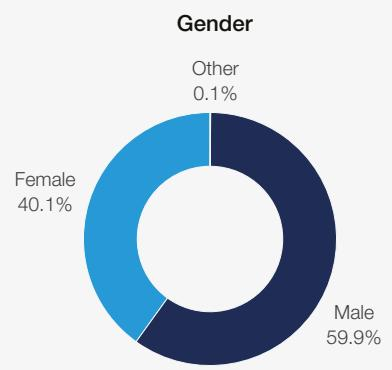  
Organization

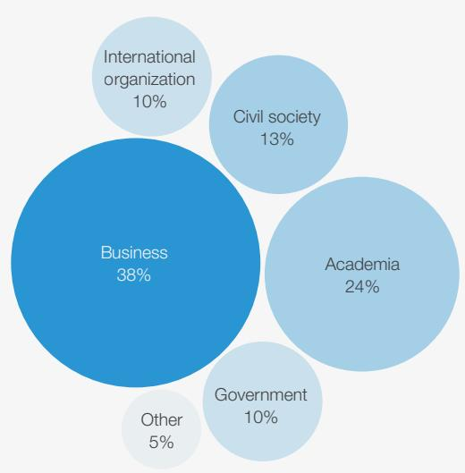  
Age group

Source
World Economic Forum Global Risks Perception Survey
2025-2026

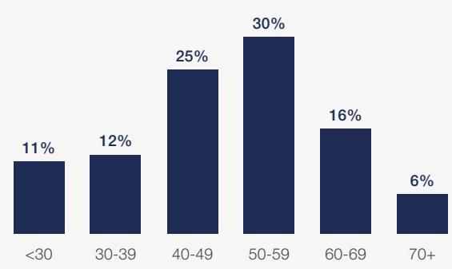

Region  
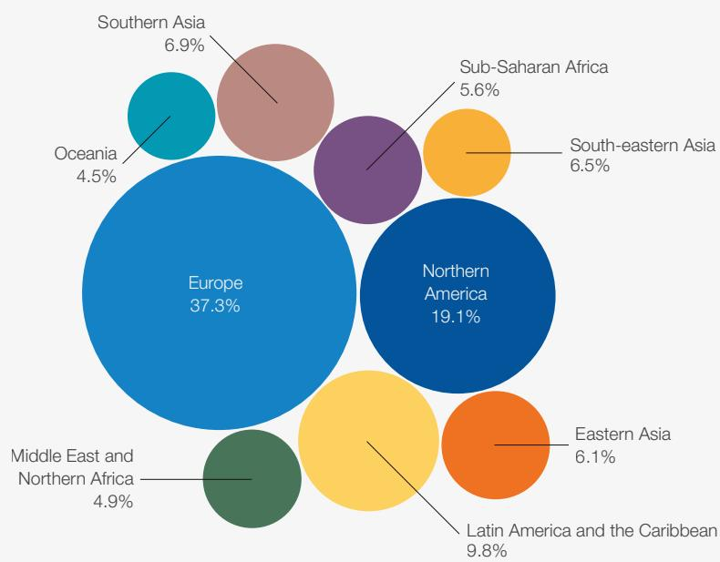

# Appendix C

## Executive Opinion Survey: National Risk Perceptions

Table C.1 presents the list of 34 risks that were incorporated into the World Economic Forum's 2025 Executive Opinion Survey (EOS), which was administered between March and June 2025. The risks are comparable to those in the Global Risks Perception Survey (GRPS) 2025-2026 but are applied at a more granular level to reflect the possible short-term and country-level manifestations of global risks.

To ensure legibility, the names of some of the global risks have been abbreviated in the figures throughout this report. The portion of the full name used in the abbreviation is in bold.

## TABLE C.1

## National risk list

Asset bubble burst

Concentration of strategic resources and technologies

Crime and illicit economic activity

Debt (public, corporate, household)

Disruptions to a systemically important supply chain

Disruptions to critical infrastructure

Economic downturn (e.g. recession, stagnation)

Inflation

Talent and/or labour shortages

Biodiversity loss and ecosystem collapse

Critical change to Earth systems

Extreme weather events (floods, heatwaves, etc.)

Natural resource shortages (food, water)

Non-weather related natural disasters (earthquakes, volcanoes, etc.)

Pollution
(air, water, soil)

Adverse outcomes of artificial intelligence technologies

Adverse outcomes of frontier technologies (quantum, biotech, geoengineering etc.)

## Biological, chemical or nuclear weapons or hazards

Geoeconomic confrontation
(sanctions, tariffs, investment screening etc.)

Intrastate violence (civil strikes, riots)

State-based armed conflict

(proxy, civil wars, coups, terrorism, etc.)

Decline in health and well-being

Erosion of human rights and/or civic freedoms

Inequality (wealth, income)

Infectious diseases

Insufficient public services and social protections (incl. education, infrastructure, pensions)

Involuntary migration or displacement

Lack of economic opportunity or unemployment

Societal polarization

Censorship and surveillance

Cyber insecurity

Cyber warfare

Misinformation and disinformation

Online harms

Table C.2 presents the top five risks for each of the 116 economies surveyed.

Over 11,000 respondents were presented with the following question: “Which five risks are the most likely to pose the biggest threat to your country in the next two years?” and were asked to select these from the list of 34 risks listed in Table C.1.

“Risk 1” indicates the most frequently selected risk in each economy. Tied risks are presented in alphabetical order, with the tie indicated by numbering.

For the purposes of more intuitive visual representation of results in the report, risks that were selected by zero respondents within a country tie last at #34. Further, to analyse the results of country or economy groups (such as the G20 or EU), country-level results are aggregated by taking a simple average of the ranking of the risk (from 1-34) for the countries or economies included in the group.

## TABLE C.2

## Top five risks identified by the Executive Opinion Survey (EOS) 2025

Algeria

<table><tr><td>01st</td><td>Inflation</td></tr><tr><td>02nd</td><td>Lack of economic opportunity or unemployment</td></tr><tr><td>03rd</td><td>Disruptions to a systematically important supply chain</td></tr><tr><td>04th</td><td>Disruptions to critical infrastructure</td></tr><tr><td>05th</td><td>Asset bubble burst</td></tr></table>

<table><tr><td colspan="2">Angola</td></tr><tr><td>01st</td><td>Lack of economic opportunity or unemployment</td></tr><tr><td>02nd</td><td>Insufficient public services and social protections (incl. education, infrastructure, pensions)</td></tr><tr><td>03rd</td><td>Inflation</td></tr><tr><td>04th</td><td>Decline in health and well-being</td></tr><tr><td>05th</td><td>Economic downturn (e.g. recession, stagnation)</td></tr></table>

Argentina

<table><tr><td>01st</td><td>Insufficient public services and social protections (incl. education, infrastructure, pensions)</td></tr><tr><td>02nd</td><td>Lack of economic opportunity or unemployment</td></tr><tr><td>03rd</td><td>Economic downturn (e.g. recession, stagnation)</td></tr><tr><td>04th</td><td>Inequality (wealth, income)</td></tr><tr><td>05th</td><td>Societal polarization</td></tr></table>

Armenia

<table><tr><td>01st</td><td>Insufficient public services and social protections (incl. education, infrastructure, pensions)</td></tr><tr><td>02nd</td><td>State-based armed conflict (proxy, civil wars, coups, terrorism, etc.)</td></tr><tr><td>03rd</td><td>Misinformation and disinformation</td></tr><tr><td>04th</td><td>Lack of economic opportunity or unemployment</td></tr><tr><td>05th</td><td>Economic downturn (e.g. recession, stagnation)</td></tr></table>

Australia

<table><tr><td>01st</td><td>Economic downturn (e.g. recession, stagnation)</td></tr><tr><td>02nd</td><td>Disruptions to a systematically important supply chain</td></tr><tr><td>03rd</td><td>Disruptions to critical infrastructure</td></tr><tr><td>04th</td><td>Adverse outcomes of frontier technologies (quantum, biotech, geoengineering etc.)</td></tr><tr><td>05th</td><td>Decline in health and well-being</td></tr></table>

Austria

<table><tr><td>01st</td><td>Economic downturn (e.g. recession, stagnation)</td></tr><tr><td>02nd</td><td>Extreme weather events (floods, heatwaves etc.)</td></tr><tr><td>03rd</td><td>Societal polarization</td></tr><tr><td>04th</td><td>Debt (public, corporate, household)</td></tr><tr><td>05th</td><td>Misinformation and disinformation</td></tr></table>

## Azerbaijan

<table><tr><td>01st</td><td>Cyber insecurity</td></tr><tr><td>02nd</td><td>Pollution (air, water, soil)</td></tr><tr><td>03rd</td><td>Misinformation and disinformation</td></tr><tr><td>04th</td><td>Inflation</td></tr><tr><td>05th</td><td>Non-weather-related natural disasters (earth-quakes, volcanoes, tsunamis, solar flares, etc.)</td></tr></table>

Bahrain

<table><tr><td>01st</td><td>Economic downturn (e.g. recession, stagnation)</td></tr><tr><td>02nd</td><td>Lack of economic opportunity or unemployment</td></tr><tr><td>03rd</td><td>Debt (public, corporate, household)</td></tr><tr><td>04th</td><td>Inflation</td></tr><tr><td>05th</td><td>Inequality (wealth, income)</td></tr></table>

Bangladesh

<table><tr><td>01st</td><td>Crime and illicit economic activity</td></tr><tr><td>02nd</td><td>Geoeconomic confrontation (sanctions, tariffs, investment screening etc.)</td></tr><tr><td>03rd</td><td>Inflation</td></tr><tr><td>04th</td><td>Economic downturn (e.g. recession, stagnation)</td></tr><tr><td>05th</td><td>Debt (public, corporate, household)</td></tr></table>

Belgium

<table><tr><td>01st</td><td>Economic downturn (e.g. recession, stagnation)</td></tr><tr><td>02nd</td><td>Lack of economic opportunity or unemployment</td></tr><tr><td>03rd</td><td>Decline in health and well-being</td></tr><tr><td>04th</td><td>Insufficient public services and social protections (incl. education, infrastructure, pensions)</td></tr><tr><td>05th</td><td>Adverse outcomes of artificial intelligence technologies</td></tr></table>

Bolivia (Plurinational State of)

<table><tr><td>01st</td><td>Inflation</td></tr><tr><td>02nd</td><td>Economic downturn (e.g. recession, stagnation)</td></tr><tr><td>03rd</td><td>Lack of economic opportunity or unemployment</td></tr><tr><td>04th</td><td>Societal polarization</td></tr><tr><td>05th</td><td>Debt (public, corporate, household)</td></tr></table>

Bosnia and Herzegovina

<table><tr><td>01st</td><td>Economic downturn (e.g. recession, stagnation)</td></tr><tr><td>02nd</td><td>Debt (public, corporate, household)</td></tr><tr><td>03rd</td><td>Inflation</td></tr><tr><td>04th</td><td>Lack of economic opportunity or unemployment</td></tr><tr><td>05th</td><td>Crime and illicit economic activity</td></tr></table>

Botswana

<table><tr><td colspan="2">01st Lack of economic opportunity or unemployment</td></tr><tr><td colspan="2">02nd Economic downturn (e.g. recession, stagnation)</td></tr><tr><td colspan="2">03rd Decline in health and well-being</td></tr><tr><td colspan="2">04th Inequality (wealth, income)</td></tr><tr><td colspan="2">05th Insufficient public services and social protections (incl. education, infrastructure, pensions)</td></tr></table>

Brazil

<table><tr><td>01st</td><td>Economic downturn (e.g. recession, stagnation)</td></tr><tr><td>02nd</td><td>Insufficient public services and social protections (incl. education, infrastructure, pensions)</td></tr><tr><td>03rd</td><td>Debt (public, corporate, household)</td></tr><tr><td>04th</td><td>Crime and illicit economic activity</td></tr><tr><td>05th</td><td>Inflation</td></tr></table>

Brunei Darussalam

<table><tr><td colspan="2">01st Lack of economic opportunity or unemployment</td></tr><tr><td colspan="2">02nd Economic downturn (e.g. recession, stagnation)</td></tr><tr><td colspan="2">03rd Talent and/or labour shortages</td></tr><tr><td colspan="2">04th Inflation</td></tr><tr><td colspan="2">05th Debt (public, corporate, household)</td></tr></table>

Bulgaria

<table><tr><td>01st</td><td>Economic downturn (e.g. recession, stagnation)</td></tr><tr><td>02nd</td><td>Inflation</td></tr><tr><td>03rd</td><td>Lack of economic opportunity or unemployment</td></tr><tr><td>04th</td><td>Decline in health and well-being</td></tr><tr><td>05th</td><td>Inequality (wealth, income)</td></tr></table>

Cameroon

<table><tr><td>01st</td><td>Inflation</td></tr><tr><td>02nd</td><td>Crime and illicit economic activity</td></tr><tr><td>03rd</td><td>Debt (public, corporate, household)</td></tr><tr><td>04th</td><td>Cyber insecurity</td></tr><tr><td>05th</td><td>Decline in health and well-being</td></tr></table>

Canada

<table><tr><td>01st</td><td>Economic downturn (e.g. recession, stagnation)</td></tr><tr><td>02nd</td><td>Inflation</td></tr><tr><td>03rd</td><td>Misinformation and disinformation</td></tr><tr><td>04th</td><td>Decline in health and well-being</td></tr><tr><td>05th</td><td>Lack of economic opportunity or unemployment</td></tr></table>

Cape Verde

<table><tr><td>01st</td><td>Inflation</td></tr><tr><td>02nd</td><td>Decline in health and well-being</td></tr><tr><td>03rd</td><td>Lack of economic opportunity or unemployment</td></tr><tr><td>04th</td><td>Inequality (wealth, income)</td></tr><tr><td>05th</td><td>Talent and/or labour shortages</td></tr></table>

Chad

<table><tr><td>01st</td><td>Inequality (wealth, income)</td></tr><tr><td>02nd</td><td>Involuntary migration or displacement</td></tr><tr><td>03rd</td><td>Economic downturn (e.g. recession, stagnation)</td></tr><tr><td>04th</td><td>Disruptions to a systematically important supply chain</td></tr><tr><td>05th</td><td>Extreme weather events (floods, heatwaves etc.)</td></tr></table>

Chile

<table><tr><td>01st</td><td>Crime and illicit economic activity</td></tr><tr><td>02nd</td><td>Insufficient public services and social protections (incl. education, infrastructure, pensions)</td></tr><tr><td>03rd</td><td>Societal polarization</td></tr><tr><td>04th</td><td>Lack of economic opportunity or unemployment</td></tr><tr><td>05th</td><td>Economic downturn (e.g. recession, stagnation)</td></tr></table>

Colombia

<table><tr><td>01st</td><td>Decline in health and well-being</td></tr><tr><td>02nd</td><td>Lack of economic opportunity or unemployment</td></tr><tr><td>03rd</td><td>Crime and illicit economic activity</td></tr><tr><td>04th</td><td>Societal polarization</td></tr><tr><td>05th</td><td>Economic downturn (e.g. recession, stagnation)</td></tr></table>

Costa Rica

<table><tr><td>01st</td><td>Crime and illicit economic activity</td></tr><tr><td>02nd</td><td>Insufficient public services and social protections (incl. education, infrastructure, pensions)</td></tr><tr><td>03rd</td><td>Societal polarization</td></tr><tr><td>04th</td><td>Lack of economic opportunity or unemployment</td></tr><tr><td>05th</td><td>Debt (public, corporate, household)</td></tr></table>

Côte D'Ivoire

<table><tr><td colspan="2">01st Lack of economic opportunity or unemployment</td></tr><tr><td colspan="2">02nd Insufficient public services and social protections (incl. education, infrastructure, pensions)</td></tr><tr><td colspan="2">03rd Decline in health and well-being</td></tr><tr><td colspan="2">04th Misinformation and disinformation</td></tr><tr><td colspan="2">05th Erosion of human rights and/or civic freedoms</td></tr></table>

Croatia

<table><tr><td>01st</td><td>Inflation</td></tr><tr><td>02nd</td><td>Talent and/or labour shortages</td></tr><tr><td>03rd</td><td>Economic downturn (e.g. recession, stagnation)</td></tr><tr><td>04th</td><td>Asset bubble burst</td></tr><tr><td>05th</td><td>Misinformation and disinformation</td></tr></table>

Czechia

<table><tr><td>01st</td><td>Misinformation and disinformation</td></tr><tr><td>02nd</td><td>Debt (public, corporate, household)</td></tr><tr><td>03rd</td><td>Economic downturn (e.g. recession, stagnation)</td></tr><tr><td>04th</td><td>Talent and/or labour shortages</td></tr><tr><td>05th</td><td>Societal polarization</td></tr></table>

Democratic Republic of the Congo

<table><tr><td colspan="2">01st Lack of economic opportunity or unemployment</td></tr><tr><td colspan="2">02nd Insufficient public services and social protections (incl. education, infrastructure, pensions)</td></tr><tr><td colspan="2">03rd State-based armed conflict (proxy, civil wars, coups, terrorism, etc.)</td></tr><tr><td colspan="2">04th Decline in health and well-being</td></tr><tr><td colspan="2">05th Biodiversity loss and ecosystem collapse</td></tr></table>

Denmark

<table><tr><td>01st</td><td>Geoeconomic confrontation (sanctions, tariffs, investment screening etc.)</td></tr><tr><td>02nd</td><td>Cyber insecurity</td></tr><tr><td>03rd</td><td>Economic downturn (e.g. recession, stagnation)</td></tr><tr><td>04th</td><td>Misinformation and disinformation</td></tr><tr><td>05th</td><td>Disruptions to critical infrastructure</td></tr></table>

Dominican Republic

<table><tr><td>01st</td><td>Insufficient public services and social protections (incl. education, infrastructure, pensions)</td></tr><tr><td>02nd</td><td>Extreme weather events (floods, heatwaves etc.)</td></tr><tr><td>03rd</td><td>Debt (public, corporate, household)</td></tr><tr><td>04th</td><td>Economic downturn (e.g. recession, stagnation)</td></tr><tr><td>05th</td><td>Lack of economic opportunity or unemployment</td></tr></table>

Ecuador

<table><tr><td>01st</td><td>Crime and illicit economic activity</td></tr><tr><td>02nd</td><td>Lack of economic opportunity or unemployment</td></tr><tr><td>03rd</td><td>Insufficient public services and social protections (incl. education, infrastructure, pensions)</td></tr><tr><td>04th</td><td>Economic downturn (e.g. recession, stagnation)</td></tr><tr><td>05th</td><td>Debt (public, corporate, household)</td></tr></table>

Egypt

<table><tr><td>01st</td><td>Inflation</td></tr><tr><td>02nd</td><td>Economic downturn (e.g. recession, stagnation)</td></tr><tr><td>03rd</td><td>Debt (public, corporate, household)</td></tr><tr><td>04th</td><td>Asset bubble burst</td></tr><tr><td>05th</td><td>Inequality (wealth, income)</td></tr></table>

El Salvador

<table><tr><td>01st</td><td>Insufficient public services and social protections (incl. education, infrastructure, pensions)</td></tr><tr><td>02nd</td><td>Lack of economic opportunity or unemployment</td></tr><tr><td>03rd</td><td>Erosion of human rights and/or civic freedoms</td></tr><tr><td>04th</td><td>Economic downturn (e.g. recession, stagnation)</td></tr><tr><td>05th</td><td>Debt (public, corporate, household)</td></tr></table>

Estonia

<table><tr><td>01st</td><td>Economic downturn (e.g. recession, stagnation)</td></tr><tr><td>02nd</td><td>State-based armed conflict (proxy, civil wars, coups, terrorism, etc.)</td></tr><tr><td>03rd</td><td>Geoeconomic confrontation (sanctions, tariffs, investment screening etc.)</td></tr><tr><td>04th</td><td>Inflation</td></tr><tr><td>05th</td><td>Talent and/or labour shortages</td></tr></table>

Finland

<table><tr><td>01st</td><td>Economic downturn (e.g. recession, stagnation)</td></tr><tr><td>02nd</td><td>Debt (public, corporate, household)</td></tr><tr><td>03rd</td><td>Geoeconomic confrontation (sanctions, tariffs, investment screening etc.)</td></tr><tr><td>04th</td><td>Lack of economic opportunity or unemployment</td></tr><tr><td>05th</td><td>Misinformation and disinformation</td></tr></table>

France

<table><tr><td>01st</td><td>Decline in health and well-being</td></tr><tr><td>02nd</td><td>Economic downturn (e.g. recession, stagnation)</td></tr><tr><td>03rd</td><td>Insufficient public services and social protections (incl. education, infrastructure, pensions)</td></tr><tr><td>04th</td><td>Lack of economic opportunity or unemployment</td></tr><tr><td>05th</td><td>Extreme weather events (floods, heatwaves etc.)</td></tr></table>

Gabon

<table><tr><td colspan="2">01st Lack of economic opportunity or unemployment</td></tr><tr><td colspan="2">02nd Inequality (wealth, income)</td></tr><tr><td colspan="2">03rd Insufficient public services and social protections (incl. education, infrastructure, pensions)</td></tr><tr><td colspan="2">04th Debt (public, corporate, household)</td></tr><tr><td colspan="2">05th Decline in health and well-being</td></tr></table>

Gambia (Republic of The)

<table><tr><td colspan="2">01st Lack of economic opportunity or unemployment</td></tr><tr><td colspan="2">02nd Crime and illicit economic activity</td></tr><tr><td colspan="2">03rd Insufficient public services and social protections (incl. education, infrastructure, pensions)</td></tr><tr><td colspan="2">04th Decline in health and well-being</td></tr><tr><td colspan="2">05th Inequality (wealth, income)</td></tr></table>

Georgia

<table><tr><td>01st</td><td>Cyber insecurity</td></tr><tr><td>02nd</td><td>Lack of economic opportunity or unemployment</td></tr><tr><td>03rd</td><td>Biodiversity loss and ecosystem collapse</td></tr><tr><td>04th</td><td>Adverse outcomes of artificial intelligence technologies</td></tr><tr><td>05th</td><td>Cyber warfare</td></tr></table>

Germany

<table><tr><td>01st</td><td>Adverse outcomes of artificial intelligence technologies</td></tr><tr><td>02nd</td><td>Economic downturn (e.g. recession, stagnation)</td></tr><tr><td>03rd</td><td>Disruptions to critical infrastructure</td></tr><tr><td>04th</td><td>Decline in health and well-being</td></tr><tr><td>05th</td><td>Insufficient public services and social protections (incl. education, infrastructure, pensions)</td></tr></table>

Ghana

<table><tr><td>01st Lack of economic opportunity or unemployment</td></tr><tr><td>02nd Adverse outcomes of artificial intelligence technologies</td></tr><tr><td>03rd Insufficient public services and social protections (incl. education, infrastructure, pensions)</td></tr><tr><td>04th Decline in health and well-being</td></tr><tr><td>05th Inflation</td></tr></table>

Greece

<table><tr><td>01st</td><td>Extreme weather events (floods, heatwaves etc.)</td></tr><tr><td>02nd</td><td>Talent and/or labour shortages</td></tr><tr><td>03rd</td><td>Economic downturn (e.g. recession, stagnation)</td></tr><tr><td>04th</td><td>Geoeconomic confrontation (sanctions, tariffs, investment screening etc.)</td></tr><tr><td>05th</td><td>Debt (public, corporate, household)</td></tr></table>

Guatemala

<table><tr><td>01st</td><td>Insufficient public services and social protections (incl. education, infrastructure, pensions)</td></tr><tr><td>02nd</td><td>Disruptions to critical infrastructure</td></tr><tr><td>03rd</td><td>Crime and illicit economic activity</td></tr><tr><td>04th</td><td>Societal polarization</td></tr><tr><td>05th</td><td>Lack of economic opportunity or unemployment</td></tr></table>

Honduras

<table><tr><td colspan="2">01st Lack of economic opportunity or unemployment</td></tr><tr><td colspan="2">02nd Insufficient public services and social protections (incl. education, infrastructure, pensions)</td></tr><tr><td colspan="2">03rd Crime and illicit economic activity</td></tr><tr><td colspan="2">04th Societal polarization</td></tr><tr><td colspan="2">05th Extreme weather events (floods, heatwaves etc.)</td></tr></table>

Hong Kong SAR, China

<table><tr><td>01st</td><td>Economic downturn (e.g. recession, stagnation)</td></tr><tr><td>02nd</td><td>Geoeconomic confrontation (sanctions, tariffs, investment screening etc.)</td></tr><tr><td>03rd</td><td>Talent and/or labour shortages</td></tr><tr><td>04th</td><td>Asset bubble burst</td></tr><tr><td>05th</td><td>Lack of economic opportunity or unemployment</td></tr></table>

Hungary

<table><tr><td>01st</td><td>Inflation</td></tr><tr><td>02nd</td><td>Decline in health and well-being</td></tr><tr><td>03rd</td><td>Economic downturn (e.g. recession, stagnation)</td></tr><tr><td>04th</td><td>Extreme weather events (floods, heatwaves etc.)</td></tr><tr><td>05th</td><td>Disruptions to critical infrastructure</td></tr></table>

India

<table><tr><td>01st</td><td>Cyber insecurity</td></tr><tr><td>02nd</td><td>Inequality (wealth, income)</td></tr><tr><td>03rd</td><td>Insufficient public services and social protections (incl. education, infrastructure, pensions)</td></tr><tr><td>04th</td><td>Economic downturn (e.g. recession, stagnation)</td></tr><tr><td>05th</td><td>State-based armed conflict (proxy, civil wars, coups, terrorism, etc.)</td></tr></table>

Indonesia

<table><tr><td colspan="2">01st Lack of economic opportunity or unemployment</td></tr><tr><td colspan="2">02nd Insufficient public services and social protections (incl. education, infrastructure, pensions)</td></tr><tr><td colspan="2">03rd Adverse outcomes of artificial intelligence technologies</td></tr><tr><td colspan="2">04th Economic downturn (e.g. recession, stagnation)</td></tr><tr><td colspan="2">05th Inflation</td></tr></table>

Iran (Islamic Republic of)

<table><tr><td>01st</td><td>Inflation</td></tr><tr><td>02nd</td><td>Economic downturn (e.g. recession, stagnation)</td></tr><tr><td>03rd</td><td>Asset bubble burst</td></tr><tr><td>04th</td><td>Debt (public, corporate, household)</td></tr><tr><td>05th</td><td>Crime and illicit economic activity</td></tr></table>

Iraq

<table><tr><td>01st</td><td>Asset bubble burst</td></tr><tr><td>02nd</td><td>Lack of economic opportunity or unemployment</td></tr><tr><td>03rd</td><td>Economic downturn (e.g. recession, stagnation)</td></tr><tr><td>04th</td><td>Insufficient public services and social protections (incl. education, infrastructure, pensions)</td></tr><tr><td>05th</td><td>Disruptions to critical infrastructure</td></tr></table>

Ireland

<table><tr><td>01st</td><td>Economic downturn (e.g. recession, stagnation)</td></tr><tr><td>02nd</td><td>Insufficient public services and social protections (incl. education, infrastructure, pensions)</td></tr><tr><td>03rd</td><td>Geoeconomic confrontation (sanctions, tariffs, investment screening etc.)</td></tr><tr><td>04th</td><td>Talent and/or labour shortages</td></tr><tr><td>05th</td><td>Inequality (wealth, income)</td></tr></table>

Italy

<table><tr><td>01st</td><td>Decline in health and well-being</td></tr><tr><td>02nd</td><td>Lack of economic opportunity or unemployment</td></tr><tr><td>03rd</td><td>Insufficient public services and social protections (incl. education, infrastructure, pensions)</td></tr><tr><td>04th</td><td>Economic downturn (e.g. recession, stagnation)</td></tr><tr><td>05th</td><td>Inequality (wealth, income)</td></tr></table>

Japan

<table><tr><td>01st</td><td>Talent and/or labour shortages</td></tr><tr><td>02nd</td><td>Extreme weather events (floods, heatwaves etc.)</td></tr><tr><td>03rd</td><td>Non-weather-related natural disasters (earth-quakes, volcanoes, tsunamis, solar flares, etc.)</td></tr><tr><td>04th</td><td>Geoeconomic confrontation (sanctions, tariffs, investment screening etc.)</td></tr><tr><td>05th</td><td>Economic downturn (e.g. recession, stagnation)</td></tr></table>

Jordan

<table><tr><td colspan="2">01st Lack of economic opportunity or unemployment</td></tr><tr><td colspan="2">02nd Debt (public, corporate, household)</td></tr><tr><td colspan="2">03rd Economic downturn (e.g. recession, stagnation)</td></tr><tr><td colspan="2">04th Inflation</td></tr><tr><td colspan="2">05th Talent and/or labour shortages</td></tr></table>

Kazakhstan

<table><tr><td>01st</td><td>Economic downturn (e.g. recession, stagnation)</td></tr><tr><td>02nd</td><td>Inflation</td></tr><tr><td>03rd</td><td>Lack of economic opportunity or unemployment</td></tr><tr><td>04th</td><td>Disruptions to critical infrastructure</td></tr><tr><td>05th</td><td>Geoeconomic confrontation (sanctions, tariffs, investment screening etc.)</td></tr></table>

Kenya

<table><tr><td>01st Lack of economic opportunity or unemployment</td></tr><tr><td>02nd Insufficient public services and social protections (incl. education, infrastructure, pensions)</td></tr><tr><td>03rd Debt (public, corporate, household)</td></tr><tr><td>04th Economic downturn (e.g. recession, stagnation)</td></tr><tr><td>05th Adverse outcomes of artificial intelligence technologies</td></tr></table>

Kosovo\*

<table><tr><td>01st</td><td>Inflation</td></tr><tr><td>02nd</td><td>Cyber insecurity</td></tr><tr><td>03rd</td><td>Extreme weather events (floods, heatwaves etc.)</td></tr><tr><td>04th</td><td>Cyber warfare</td></tr><tr><td>05th</td><td>Adverse outcomes of artificial intelligence technologies</td></tr></table>

Kuwait

<table><tr><td>01st</td><td>Adverse outcomes of artificial intelligence technologies</td></tr><tr><td>02nd</td><td>Asset bubble burst</td></tr><tr><td>03rd</td><td>Economic downturn (e.g. recession, stagnation)</td></tr><tr><td>04th</td><td>Decline in health and well-being</td></tr><tr><td>05th</td><td>Pollution (air, water, soil)</td></tr></table>

Kyrgyzstan

<table><tr><td>01st</td><td>Inflation</td></tr><tr><td>02nd</td><td>Infectious diseases</td></tr><tr><td>03rd</td><td>Talent and/or labour shortages</td></tr><tr><td>04th</td><td>Inequality (wealth, income)</td></tr><tr><td>05th</td><td>Pollution (air, water, soil)</td></tr></table>

Lao PDR

<table><tr><td>01st</td><td>Inflation</td></tr><tr><td>02nd</td><td>Economic downturn (e.g. recession, stagnation)</td></tr><tr><td>03rd</td><td>Talent and/or labour shortages</td></tr><tr><td>04th</td><td>Disruptions to a systematically important supply chain</td></tr><tr><td>05th</td><td>Lack of economic opportunity or unemployment</td></tr></table>

Latvia

<table><tr><td>01st</td><td>State-based armed conflict (proxy, civil wars, coups, terrorism, etc.)</td></tr><tr><td>02nd</td><td>Debt (public, corporate, household)</td></tr><tr><td>03rd</td><td>Economic downturn (e.g. recession, stagnation)</td></tr><tr><td>04th</td><td>Cyber warfare</td></tr><tr><td>05th</td><td>Inflation</td></tr></table>

Lesotho

<table><tr><td>01st</td><td>Lack of economic opportunity or unemployment</td></tr><tr><td>02nd</td><td>Economic downturn (e.g. recession, stagnation)</td></tr><tr><td>03rd</td><td>Extreme weather events (floods, heatwaves etc.)</td></tr><tr><td>04th</td><td>Disruptions to critical infrastructure</td></tr><tr><td>05th</td><td>Decline in health and well-being</td></tr></table>

Liberia

<table><tr><td colspan="2">01st Lack of economic opportunity or unemployment</td></tr><tr><td colspan="2">02nd Decline in health and well-being</td></tr><tr><td colspan="2">03rd Infectious diseases</td></tr><tr><td colspan="2">04th Pollution (air, water, soil)</td></tr></table>

Lithuania

<table><tr><td>01st</td><td>Misinformation and disinformation</td></tr><tr><td>02nd</td><td>State-based armed conflict (proxy, civil wars, coups, terrorism, etc.)</td></tr><tr><td>03rd</td><td>Inflation</td></tr><tr><td>04th</td><td>Decline in health and well-being</td></tr><tr><td>05th</td><td>Cyber warfare</td></tr></table>

Luxembourg

<table><tr><td>01st</td><td>Economic downturn (e.g. recession, stagnation)</td></tr><tr><td>02nd</td><td>Talent and/or labour shortages</td></tr><tr><td>03rd</td><td>Cyber insecurity</td></tr><tr><td>04th</td><td>Geoeconomic confrontation (sanctions, tariffs, investment screening etc.)</td></tr><tr><td>05th</td><td>Debt (public, corporate, household)</td></tr></table>

Malawi

<table><tr><td>01st</td><td>Economic downturn (e.g. recession, stagnation)</td></tr><tr><td>02nd</td><td>Debt (public, corporate, household)</td></tr><tr><td>03rd</td><td>Lack of economic opportunity or unemployment</td></tr><tr><td>04th</td><td>Inflation</td></tr><tr><td>05th</td><td>Extreme weather events (floods, heatwaves etc.)</td></tr></table>

Malaysia

<table><tr><td>01st</td><td>Geoeconomic confrontation (sanctions, tariffs, investment screening etc.)</td></tr><tr><td>02nd</td><td>Talent and/or labour shortages</td></tr><tr><td>03rd</td><td>Disruptions to a systematically important supply chain</td></tr><tr><td>04th</td><td>Adverse outcomes of artificial intelligence technologies</td></tr><tr><td>05th</td><td>Lack of economic opportunity or unemployment</td></tr></table>

Mali

<table><tr><td>01st</td><td>Cyber insecurity</td></tr><tr><td>02nd</td><td>Biodiversity loss and ecosystem collapse</td></tr><tr><td>03rd</td><td>Crime and illicit economic activity</td></tr><tr><td>04th</td><td>Economic downturn (e.g. recession, stagnation)</td></tr><tr><td>05th</td><td>Debt (public, corporate, household)</td></tr></table>

Malta

<table><tr><td>01st</td><td>Talent and/or labour shortages</td></tr><tr><td>02nd</td><td>Inflation</td></tr><tr><td>03rd</td><td>Pollution (air, water, soil)</td></tr><tr><td>04th</td><td>Disruptions to critical infrastructure</td></tr><tr><td>05th</td><td>Insufficient public services and social protections (incl. education, infrastructure, pensions)</td></tr></table>

Mauritius

<table><tr><td>01st</td><td>Debt (public, corporate, household)</td></tr><tr><td>02nd</td><td>Talent and/or labour shortages</td></tr><tr><td>03rd</td><td>Lack of economic opportunity or unemployment</td></tr><tr><td>04th</td><td>Natural resource shortages (food, water)</td></tr><tr><td>05th</td><td>Economic downturn (e.g. recession, stagnation)</td></tr></table>

## Top five risks identified by the Executive Opinion Survey (EOS) 2025

Mexico

<table><tr><td>01st</td><td>Crime and illicit economic activity</td></tr><tr><td>02nd</td><td>Insufficient public services and social protections (incl. education, infrastructure, pensions)</td></tr><tr><td>03rd</td><td>Economic downturn (e.g. recession, stagnation)</td></tr><tr><td>04th</td><td>Societal polarization</td></tr><tr><td>05th</td><td>Decline in health and well-being</td></tr></table>

Mongolia

<table><tr><td>01st</td><td>Inflation</td></tr><tr><td>02nd</td><td>Economic downturn (e.g. recession, stagnation)</td></tr><tr><td>03rd</td><td>Lack of economic opportunity or unemployment</td></tr><tr><td>04th</td><td>Pollution (air, water, soil)</td></tr><tr><td>05th</td><td>Insufficient public services and social protections (incl. education, infrastructure, pensions)</td></tr></table>

Morocco

<table><tr><td colspan="2">01st Lack of economic opportunity or unemployment</td></tr><tr><td colspan="2">02nd Insufficient public services and social protections (incl. education, infrastructure, pensions)</td></tr><tr><td colspan="2">03rd Inflation</td></tr><tr><td colspan="2">04th Natural resource shortages (food, water)</td></tr><tr><td colspan="2">05th Inequality (wealth, income)</td></tr></table>

Mozambique

<table><tr><td colspan="2">01st Lack of economic opportunity or unemployment</td></tr><tr><td colspan="2">02nd Insufficient public services and social protections (incl. education, infrastructure, pensions)</td></tr><tr><td colspan="2">03rd Decline in health and well-being</td></tr><tr><td colspan="2">04th Debt (public, corporate, household)</td></tr><tr><td colspan="2">05th Crime and illicit economic activity</td></tr><tr><td colspan="2">05th Misinformation and disinformation</td></tr></table>

Namibia

<table><tr><td colspan="2">01st Lack of economic opportunity or unemployment</td></tr><tr><td colspan="2">02nd Inequality (wealth, income)</td></tr><tr><td colspan="2">03rd Debt (public, corporate, household)</td></tr><tr><td colspan="2">04th Insufficient public services and social protections (incl. education, infrastructure, pensions)</td></tr><tr><td colspan="2">05th Crime and illicit economic activity</td></tr></table>

Nepal

<table><tr><td colspan="2">01st Lack of economic opportunity or unemployment</td></tr><tr><td colspan="2">02nd Economic downturn (e.g. recession, stagnation)</td></tr><tr><td colspan="2">03rd Inflation</td></tr><tr><td colspan="2">04th Talent and/or labour shortages</td></tr><tr><td colspan="2">05th Pollution (air, water, soil)</td></tr></table>

Nepal

<table><tr><td colspan="2">01st Lack of economic opportunity or unemployment</td></tr><tr><td colspan="2">02nd Economic downturn (e.g. recession, stagnation)</td></tr><tr><td colspan="2">03rd Inflation</td></tr><tr><td colspan="2">04th Talent and/or labour shortages</td></tr><tr><td colspan="2">05th Pollution (air, water, soil)</td></tr></table>

Netherlands

<table><tr><td>01st</td><td>Misinformation and disinformation</td></tr><tr><td>02nd</td><td>Geoeconomic confrontation (sanctions, tariffs, investment screening etc.)</td></tr><tr><td>03rd</td><td>Talent and/or labour shortages</td></tr><tr><td>04th</td><td>Societal polarization</td></tr><tr><td>05th</td><td>Cyber insecurity</td></tr></table>

New Zealand

<table><tr><td>01st</td><td>Economic downturn (e.g. recession, stagnation)</td></tr><tr><td>02nd</td><td>Lack of economic opportunity or unemployment</td></tr><tr><td>03rd</td><td>Decline in health and well-being</td></tr><tr><td>04th</td><td>Insufficient public services and social protections (incl. education, infrastructure, pensions)</td></tr><tr><td>05th</td><td>Disruptions to a systematically important supply chain</td></tr></table>

Nigeria

<table><tr><td>01st Lack of economic opportunity or unemployment</td></tr><tr><td>02nd Insufficient public services and social protections (incl. education, infrastructure, pensions)</td></tr><tr><td>03rd Economic downturn (e.g. recession, stagnation)</td></tr><tr><td>04th Inequality (wealth, income)</td></tr><tr><td>05th Crime and illicit economic activity</td></tr></table>

North Macedonia

<table><tr><td>01st</td><td>Inflation</td></tr><tr><td>02nd</td><td>Economic downturn (e.g. recession, stagnation)</td></tr><tr><td>03rd</td><td>Adverse outcomes of artificial intelligence technologies</td></tr><tr><td>04th</td><td>Lack of economic opportunity or unemployment</td></tr><tr><td>05th</td><td>Debt (public, corporate, household)</td></tr></table>

Norway

<table><tr><td>01st</td><td>Decline in health and well-being</td></tr><tr><td>02nd</td><td>Lack of economic opportunity or unemployment</td></tr><tr><td>03rd</td><td>Economic downturn (e.g. recession, stagnation)</td></tr><tr><td>04th</td><td>Misinformation and disinformation</td></tr><tr><td>05th</td><td>Extreme weather events (floods, heatwaves etc.)</td></tr></table>

Oman

<table><tr><td>01st</td><td>Inflation</td></tr><tr><td>02nd</td><td>Economic downturn (e.g. recession, stagnation)</td></tr><tr><td>03rd</td><td>Adverse outcomes of artificial intelligence technologies</td></tr><tr><td>04th</td><td>Asset bubble burst</td></tr><tr><td>05th</td><td>Cyber insecurity</td></tr></table>

Pakistan

<table><tr><td colspan="2">01st Lack of economic opportunity or unemployment</td></tr><tr><td colspan="2">02nd Insufficient public services and social protections (incl. education, infrastructure, pensions)</td></tr><tr><td colspan="2">03rd Misinformation and disinformation</td></tr><tr><td colspan="2">04th Natural resource shortages (food, water)</td></tr><tr><td colspan="2">05th Economic downturn (e.g. recession, stagnation)</td></tr></table>

Panama

<table><tr><td>01st</td><td>Insufficient public services and social protections (incl. education, infrastructure, pensions)</td></tr><tr><td>02nd</td><td>Lack of economic opportunity or unemployment</td></tr><tr><td>03rd</td><td>Debt (public, corporate, household)</td></tr><tr><td>04th</td><td>Inequality (wealth, income)</td></tr><tr><td>05th</td><td>Talent and/or labour shortages</td></tr></table>

Paraguay

<table><tr><td>01st</td><td>Insufficient public services and social protections (incl. education, infrastructure, pensions)</td></tr><tr><td>02nd</td><td>Crime and illicit economic activity</td></tr><tr><td>03rd</td><td>Lack of economic opportunity or unemployment</td></tr><tr><td>04th</td><td>Inequality (wealth, income)</td></tr><tr><td>05th</td><td>Extreme weather events (floods, heatwaves etc.)</td></tr></table>

Peru

<table><tr><td>01st</td><td>Crime and illicit economic activity</td></tr><tr><td>02nd</td><td>Insufficient public services and social protections (incl. education, infrastructure, pensions)</td></tr><tr><td>03rd</td><td>Societal polarization</td></tr><tr><td>04th</td><td>Intrastate violence (riots, mass shootings, gang violence, etc.)</td></tr><tr><td>05th</td><td>Lack of economic opportunity or unemployment</td></tr></table>

Philippines

<table><tr><td colspan="2">01st Lack of economic opportunity or unemployment</td></tr><tr><td colspan="2">02nd Insufficient public services and social protections (incl. education, infrastructure, pensions)</td></tr><tr><td colspan="2">03rd Misinformation and disinformation</td></tr><tr><td colspan="2">04th Adverse outcomes of artificial intelligence technologies</td></tr><tr><td colspan="2">05th Inflation</td></tr></table>

Poland

<table><tr><td>01st</td><td>State-based armed conflict (proxy, civil wars, coups, terrorism, etc.)</td></tr><tr><td>02nd</td><td>Economic downturn (e.g. recession, stagnation)</td></tr><tr><td>03rd</td><td>Extreme weather events (floods, heatwaves etc.)</td></tr><tr><td>04th</td><td>Disruptions to a systematically important supply chain</td></tr><tr><td>05th</td><td>Cyber insecurity</td></tr></table>

Portugal

<table><tr><td>01st</td><td>Economic downturn (e.g. recession, stagnation)</td></tr><tr><td>02nd</td><td>Insufficient public services and social protections (incl. education, infrastructure, pensions)</td></tr><tr><td>03rd</td><td>Talent and/or labour shortages</td></tr><tr><td>04th</td><td>Geoeconomic confrontation (sanctions, tariffs, investment screening etc.)</td></tr><tr><td>05th</td><td>Misinformation and disinformation</td></tr></table>

Qatar

<table><tr><td>01st</td><td>Inflation</td></tr><tr><td>02nd</td><td>Asset bubble burst</td></tr><tr><td>03rd</td><td>Economic downturn (e.g. recession, stagnation)</td></tr><tr><td>04th</td><td>State-based armed conflict (proxy, civil wars, coups, terrorism, etc.)</td></tr><tr><td>05th</td><td>Biological, chemical, or nuclear weapons or hazards</td></tr></table>

Romania

<table><tr><td>01st</td><td>Misinformation and disinformation</td></tr><tr><td>02nd</td><td>Economic downturn (e.g. recession, stagnation)</td></tr><tr><td>03rd</td><td>Debt (public, corporate, household)</td></tr><tr><td>04th</td><td>Decline in health and well-being</td></tr><tr><td>05th</td><td>Adverse outcomes of artificial intelligence technologies</td></tr></table>

Rwanda

<table><tr><td>01st</td><td>Inflation</td></tr><tr><td>02nd</td><td>Lack of economic opportunity or unemployment</td></tr><tr><td>03rd</td><td>Adverse outcomes of artificial intelligence technologies</td></tr><tr><td>04th</td><td>Inequality (wealth, income)</td></tr><tr><td>05th</td><td>Online harms</td></tr></table>

Saudi Arabia

<table><tr><td>01st</td><td>Asset bubble burst</td></tr><tr><td>02nd</td><td>Adverse outcomes of artificial intelligence technologies</td></tr><tr><td>03rd</td><td>Debt (public, corporate, household)</td></tr><tr><td>04th</td><td>Inflation</td></tr><tr><td>05th</td><td>Economic downturn (e.g. recession, stagnation)</td></tr></table>

Senegal

<table><tr><td colspan="2">01st Lack of economic opportunity or unemployment</td></tr><tr><td colspan="2">02nd Misinformation and disinformation</td></tr><tr><td colspan="2">03rd Debt (public, corporate, household)</td></tr><tr><td colspan="2">04th Decline in health and well-being</td></tr><tr><td colspan="2">05th Insufficient public services and social protections (incl. education, infrastructure, pensions)</td></tr></table>

Singapore

<table><tr><td>01st</td><td>Economic downturn (e.g. recession, stagnation)</td></tr><tr><td>02nd</td><td>Geoeconomic confrontation (sanctions, tariffs, investment screening etc.)</td></tr><tr><td>03rd</td><td>Talent and/or labour shortages</td></tr><tr><td>04th</td><td>Disruptions to a systematically important supply chain</td></tr><tr><td>05th</td><td>Inflation</td></tr></table>

Slovenia

<table><tr><td>01st</td><td>Economic downturn (e.g. recession, stagnation)</td></tr><tr><td>02nd</td><td>Talent and/or labour shortages</td></tr><tr><td>03rd</td><td>Insufficient public services and social protections (incl. education, infrastructure, pensions)</td></tr><tr><td>04th</td><td>Misinformation and disinformation</td></tr><tr><td>05th</td><td>Geoeconomic confrontation (sanctions, tariffs, investment screening etc.)</td></tr></table>

South Africa

<table><tr><td>01st Lack of economic opportunity or unemployment</td></tr><tr><td>02nd Insufficient public services and social protections (incl. education, infrastructure, pensions)</td></tr><tr><td>03rd Crime and illicit economic activity</td></tr><tr><td>04th Disruptions to critical infrastructure</td></tr><tr><td>05th Economic downturn (e.g. recession, stagnation)</td></tr></table>

South Korea

<table><tr><td>01st</td><td>Economic downturn (e.g. recession, stagnation)</td></tr><tr><td>02nd</td><td>Societal polarization</td></tr><tr><td>03rd</td><td>Inequality (wealth, income)</td></tr><tr><td>04th</td><td>Extreme weather events (floods, heatwaves etc.)</td></tr><tr><td>05th</td><td>Adverse outcomes of artificial intelligence technologies</td></tr></table>

Spain

<table><tr><td>01st</td><td>Societal polarization</td></tr><tr><td>02nd</td><td>Talent and/or labour shortages</td></tr><tr><td>03rd</td><td>Insufficient public services and social protections (incl. education, infrastructure, pensions)</td></tr><tr><td>04th</td><td>Debt (public, corporate, household)</td></tr><tr><td>05th</td><td>Lack of economic opportunity or unemployment</td></tr></table>

Sri Lanka

<table><tr><td>01st</td><td>Economic downturn (e.g. recession, stagnation)</td></tr><tr><td>02nd</td><td>Lack of economic opportunity or unemployment</td></tr><tr><td>03rd</td><td>Debt (public, corporate, household)</td></tr><tr><td>04th</td><td>Talent and/or labour shortages</td></tr><tr><td>05th</td><td>Inflation</td></tr></table>

Sweden

<table><tr><td>01st</td><td>Crime and illicit economic activity</td></tr><tr><td>02nd</td><td>Economic downturn (e.g. recession, stagnation)</td></tr><tr><td>03rd</td><td>Inflation</td></tr><tr><td>04th</td><td>Decline in health and well-being</td></tr><tr><td>05th</td><td>Lack of economic opportunity or unemployment</td></tr></table>

Switzerland

<table><tr><td>01st</td><td>Decline in health and well-being</td></tr><tr><td>02nd</td><td>Cyber insecurity</td></tr><tr><td>03rd</td><td>Disruptions to a systematically important supply chain</td></tr><tr><td>04th</td><td>Geoeconomic confrontation (sanctions, tariffs, investment screening etc.)</td></tr><tr><td>05th</td><td>Economic downturn (e.g. recession, stagnation)</td></tr></table>

Taiwan, China

<table><tr><td>01st</td><td>Decline in health and well-being</td></tr><tr><td>02nd</td><td>Misinformation and disinformation</td></tr><tr><td>03rd</td><td>Disruptions to a systematically important supply chain</td></tr><tr><td>04th</td><td>Erosion of human rights and/or civic freedoms</td></tr><tr><td>05th</td><td>Inflation</td></tr></table>

Thailand

<table><tr><td>01st</td><td>Debt (public, corporate, household)</td></tr><tr><td>02nd</td><td>Economic downturn (e.g. recession, stagnation)</td></tr><tr><td>03rd</td><td>Lack of economic opportunity or unemployment</td></tr><tr><td>04th</td><td>Adverse outcomes of artificial intelligence technologies</td></tr><tr><td>05th</td><td>Inequality (wealth, income)</td></tr></table>

Tunisia

<table><tr><td colspan="2">01st Lack of economic opportunity or unemployment</td></tr><tr><td colspan="2">02nd Insufficient public services and social protections (incl. education, infrastructure, pensions)</td></tr><tr><td colspan="2">03rd Economic downturn (e.g. recession, stagnation)</td></tr><tr><td colspan="2">04th Debt (public, corporate, household)</td></tr><tr><td colspan="2">05th Inflation</td></tr></table>

Türkiye

<table><tr><td colspan="2">01st Lack of economic opportunity or unemployment</td></tr><tr><td colspan="2">02nd Inflation</td></tr><tr><td colspan="2">03rd Erosion of human rights and/or civic freedoms</td></tr><tr><td colspan="2">04th Economic downturn (e.g. recession, stagnation)</td></tr><tr><td colspan="2">05th Societal polarization</td></tr></table>

Ukraine

<table><tr><td>01st</td><td>State-based armed conflict (proxy, civil wars, coups, terrorism, etc.)</td></tr><tr><td>02nd</td><td>Economic downturn (e.g. recession, stagnation)</td></tr><tr><td>03rd</td><td>Inflation</td></tr><tr><td>04th</td><td>Disruptions to critical infrastructure</td></tr><tr><td>05th</td><td>Biological, chemical, or nuclear weapons or hazards</td></tr></table>

United Arab Emirates

<table><tr><td>01st</td><td>Inflation</td></tr><tr><td>02nd</td><td>Asset bubble burst</td></tr><tr><td>03rd</td><td>Adverse outcomes of artificial intelligence technologies</td></tr><tr><td>04th</td><td>Economic downturn (e.g. recession, stagnation)</td></tr><tr><td>05th</td><td>Talent and/or labour shortages</td></tr></table>

United Kingdom

<table><tr><td>01st</td><td>Economic downturn (e.g. recession, stagnation)</td></tr><tr><td>02nd</td><td>Insufficient public services and social protections (incl. education, infrastructure, pensions)</td></tr><tr><td>03rd</td><td>Misinformation and disinformation</td></tr><tr><td>04th</td><td>Talent and/or labour shortages</td></tr><tr><td>05th</td><td>Lack of economic opportunity or unemployment</td></tr></table>

United Republic of Tanzania

<table><tr><td>01st</td><td>Erosion of human rights and/or civic freedoms</td></tr><tr><td>02nd</td><td>Debt (public, corporate, household)</td></tr><tr><td>03rd</td><td>Lack of economic opportunity or unemployment</td></tr><tr><td>04th</td><td>Misinformation and disinformation</td></tr><tr><td>05th</td><td>Biodiversity loss and ecosystem collapse</td></tr></table>

United States of America

<table><tr><td colspan="2">United States of America</td></tr><tr><td>01st</td><td>Economic downturn (e.g. recession, stagnation)</td></tr><tr><td>02nd</td><td>Decline in health and well-being</td></tr><tr><td>03rd</td><td>Misinformation and disinformation</td></tr><tr><td>04th</td><td>Adverse outcomes of artificial intelligence technologies</td></tr><tr><td>05th</td><td>Disruptions to a systematically important supply chain</td></tr></table>

## Top five risks identified by the Executive Opinion Survey (EOS) 2025

Uruguay

<table><tr><td>01st</td><td>Economic downturn (e.g. recession, stagnation)</td></tr><tr><td>02nd</td><td>Lack of economic opportunity or unemployment</td></tr><tr><td>03rd</td><td>Talent and/or labour shortages</td></tr><tr><td>04th</td><td>Insufficient public services and social protections (incl. education, infrastructure, pensions)</td></tr><tr><td>05th</td><td>Societal polarization</td></tr></table>

## Venezuela, Bolivarian Republic of

<table><tr><td>01st</td><td>Economic downturn (e.g. recession, stagnation)</td></tr><tr><td>02nd</td><td>Inflation</td></tr><tr><td>03rd</td><td>Insufficient public services and social protections (incl. education, infrastructure, pensions)</td></tr><tr><td>04th</td><td>Lack of economic opportunity or unemployment</td></tr><tr><td>05th</td><td>Involuntary migration or displacement</td></tr></table>

Viet Nam

<table><tr><td>01st</td><td>Adverse outcomes of artificial intelligence technologies</td></tr><tr><td>02nd</td><td>Disruptions to a systematically important supply chain</td></tr><tr><td>03rd</td><td>Decline in health and well-being</td></tr><tr><td>04th</td><td>Lack of economic opportunity or unemployment</td></tr><tr><td>05th</td><td>Economic downturn (e.g. recession, stagnation)</td></tr></table>

## Yemen

<table><tr><td>01st</td><td>Inflation</td></tr><tr><td>02nd</td><td>Economic downturn (e.g. recession, stagnation)</td></tr><tr><td>03rd</td><td>Insufficient public services and social protections (incl. education, infrastructure, pensions)</td></tr><tr><td>04th</td><td>State-based armed conflict (proxy, civil wars, coups, terrorism, etc.)</td></tr><tr><td>05th</td><td>Disruptions to critical infrastructure</td></tr></table>

## Zambia

<table><tr><td colspan="2">01st Lack of economic opportunity or unemployment</td></tr><tr><td colspan="2">02nd Insufficient public services and social protections (incl. education, infrastructure, pensions)</td></tr><tr><td colspan="2">03rd Inflation</td></tr><tr><td colspan="2">04th Natural resource shortages (food, water)</td></tr><tr><td colspan="2">05th Misinformation and disinformation</td></tr></table>

## Zimbabwe

<table><tr><td colspan="2">01st Lack of economic opportunity or unemployment</td></tr><tr><td colspan="2">02nd Insufficient public services and social protections (incl. education, infrastructure, pensions)</td></tr><tr><td colspan="2">03rd Decline in health and well-being</td></tr><tr><td colspan="2">04th Economic downturn (e.g. recession, stagnation)</td></tr><tr><td colspan="2">05th Inflation</td></tr></table>

## Appendix D

## Risk governance

Respondents were asked to identify approach(es) that they expect to have the most potential for driving action on risk reduction and preparedness over the next 10 years. The following figures present the set of 33 global risks in the GRPS 2025–2026

with corresponding risk reduction and preparedness approaches for addressing them, as well as the top 10 risks addressed by those approaches not already covered in Chapters 1 or 2.

## FIGURE D.1

## Risk governance

"Which approach(es) do you expect to have the most potential for driving action on risk reduction and preparedness over the next 10 years?"

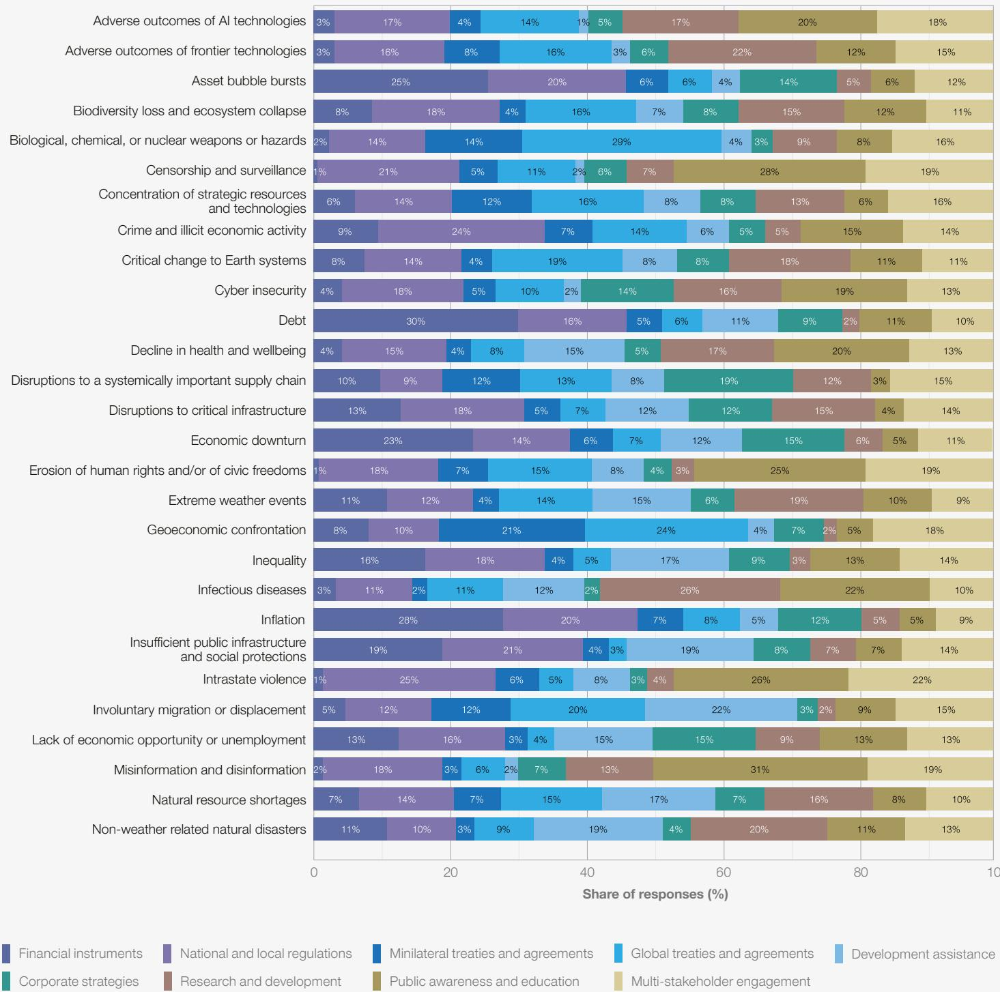

## FIGURE D.1

## Risk governance (continued)

"Which approach(es) do you expect to have the most potential for driving action on risk reduction and preparedness over the next 10 years?"

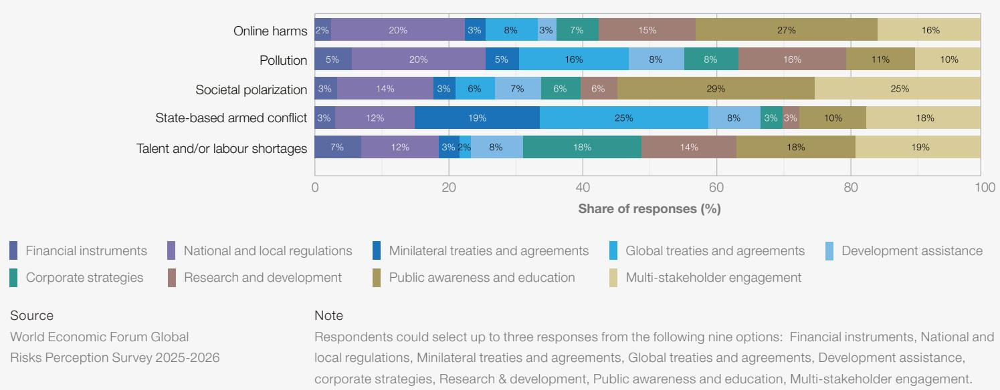

## FIGURE D.2

## Top risks addressed by Development Assistance

"Which approach(es) do you expect to have the most potential for driving action on risk reduction and preparedness over the next 10 years?"

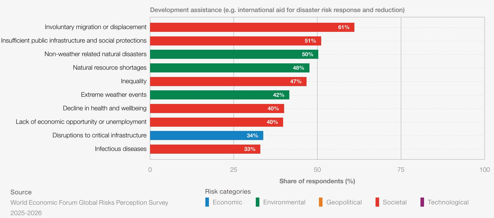

## Top risks addressed by National and Local Regulations

"Which approach(es) do you expect to have the most potential for driving action on risk reduction and preparedness over the next 10 years?"

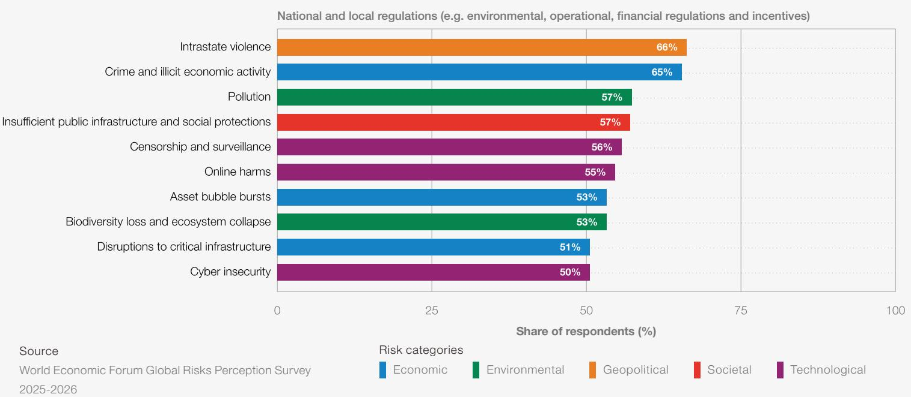

# Partner Institutes

The World Economic Forum's Centre for the New Economy and Society is pleased to acknowledge and thank the following organizations as its valued Partner Institutes:

## Algeria

Centre de Recherche En Economie Appliquée
Pour Le Développement - CREAD
Yacine Belarbi, Director
Khaled Menna, Director of Macroeconomics and,
Economic Integration

## Angola

Jobartis
João Freitas, Country Manager
Luis Verdeja, Director

## Argentina

IAE Business School, Universidad Austral
Eduardo Fracchia, Director of Academic
Department of Economics
Martin Calveira, Research Economist

## Armenia

CIVITTA Institution Research Center NGO
Sevak Hovhannisyan, Board Member and Senior Associate

Australia, Belgium, Canada, France, Germany, Indonesia, Italy, the Philippines, Sweden, United Kingdom, United States and Taiwan, China
Dynata
Thomas Huff, Senior Project Manager
Steffen Bott, Vice President, Sales
Valentyna Chuikina, Associate Account Director

## Austria

Austrian Institute of Economic Research - WIFO
Gabriel Felbermayr, Director
Michael Peneder, Project Lead
Alexandros Charos, Survey Expert

## Azerbaijan

Azerbaijan State University of Economics (UNEC)
Nasimi Ismayilov, Vice-Director for Economic Affairs
Sevinj Majid, Head of UNEC Career Center
Gultaj Tahirli, Specialist of Project Management Office
Ulkar Ibrahimli, Senior Specialist of UNEC Career Center
Ayten Aghayeva, Specialist of UNEC Career Center

## Bahamas, The

The Government and Public Policy Institute,
University of the Bahamas
Zhivargo Laing, Executive Director
Jeannie D. Gibson, Policy Assistant

## Bahrain

Bahrain Economic Development Board
H.E. Noor bint Ali AlKhulaif, Minister of Sustainable Development, Chief Executive of the Economic Development Board
Nada Al-Saeed, Chief of Strategy
Rima AlKilani: Executive Director, Projects
Redha AlAnsari, Executive Director, Research
Fatema AlAtbi, Head, Research
Sara Ishaq, Senior Executive, Research

## Bangladesh

Centre for Policy Dialogue - CPD
Dr Fahmida Khatun, Executive Director
Dr Khondaker Golam Moazzem, Research Director
Ms Jebunnesa, Programme Associate
Maleehah Sabah Ali, Programme Associate

## Barbados

University of West Indies
Jonathan G. Lashley, Senior Fellow
Don Marshall, Professor
Kenisha Chase, Research Assistant

## Benin

Institut de Recherche Empirique en Economie Politique - IREEP
Leonard Wantchekon, President
Stéphania Houngan, Research Associate

Bolivia (Plurinational State of), Costa Rica, Dominican Republic, El Salvador, Honduras, Panama
INCAE Business School
Ronald Arce, Director
Enrique Bolaños, President

Bosnia and Herzegovina
School of Economics and Business, University of Sarajevo
Jasmina Selimovic, Dean
Zlatko Lagumdzija, Professor
Amra Kapo, Associate Professor

## Botswana

Botswana National Productivity Centre
Sethunya Kegakgametse, Research Consultant
Letsogile Batsetswe, Research Consultant and,
Statistician
Zelda Okatch, Information and Research Services,
Manager
Matlho Kgosi, Executive Director (Acting)

## Brazil

Fundação Dom Cabral
Hugo Tadeu, Director and Professor at the FDC Innovation, AI, and Digital Center
Jersone Tasso, Professor at the FDC Innovation, AI, and Digital Center
Bruna Diniz, Research Assistant at the FDC Innovation, AI, and Digital Center
Kauã Kenner, Research Assistant at the FDC Innovation, AI, and Digital Center

## Brunei Darussalam

Universiti Teknologi Brunei (UTB)
Datin Paduka Professor Dr. Dayang Hajah Zohrah binti Haji Sulaiman, Vice-Chancellor
Dr. Mohamad Saiful bin Haji Omar, Assistant Vice-Chancellor (External and Industry Relations)
Dr. Hajah Siti Wardah binti Haji Abd Rahman, Project Coordinator

## Bulgaria

Center for Economic Development
Maria Prohaska, Director
Ivalina Simeonova, Project Manager

## Cameroon

Compétitivité Cameroon
Hermann Fotie Ii, Permanent Secretary
Tanankem Belmondo Voufo, Expert Investment Climate
Jean Baptiste Nsoe Nkouli, Competitiveness
Observatory Expert

## Cape Verde

INOVE Research
Frantz Tavares, Chief Executive Officer
Jerónimo Freire, Project Manager
Júlio Delgado, Director

## Chad

Monitoring Du Projet Pétrole-Tchad-Cameroun
Simael Mbairassem, Economist in charge of Research and Public Policies
Maoundonodji Gilbert, Managing Director

## Chile

University Adolfo Ibañez Business School
Rodrigo Wagner, Associate Professor of Finance

## Colombia

National Planning Department of Colombia
Natalia Irene Molina Posso, General Director,
Department, of National Planning
Tatiana Zambrano Sanchez, Technical Director,
Innovation and Private Sector Development
Sara Patricia Rivera, Adviser, Innovation and, Private

Sector Development
Congo, Democratic Republic of
Congo-Invest Consulting
Teza Bila Minlangu, Administrator
Faila Tabu Ngandi, Managing Director
Bertin Muderhwa, Head of Service in charge
of Studies and Statistics at the Federation of
Businesses of Congo

## Côte d'Ivoire

Centre de Promotion des Investissements en Côte D'ivoire - CEPICI
Solange Amichia, CEO, Ramatou Fall, Director of Business Climate
Simon Meledje, Head of Planning and Monitoring
Bernadine Yeble N'Guessan, Research officer

## Cyprus

Cyprus Employers and Industry Confederation - OEB
Antonis Frangoudis, Director Business Development and Economic Affairs Department

## Cyprus

Bank of Cyprus
Kyriacos Antoniou, Governance Officer
Andreas Alexandrou, Manager Strategy and
Customer Insights

## Czech Republic

CMC Graduate School of Business
Tomáš Janča, Executive Director

## Denmark

Danish Technological Institute
Stig Yding Sørensen, Senior Specialist
Andreas Bjerre Lunkeit, Consultant

## Ecuador

ESPAE Graduate School of Management - ESPOL
María Luisa Granda, Dean of ESPAE-ESPOL
Tania Tenesaca, Project Coordinator

## Egypt, Arab Rep.

Egyptian Center for Economic Studies - ECES
Abla Abdel Latif, Executive Director, and Director of Research
Salma Bahaa El Din, Senior Economist
Ahmed Maged, Research Assistant
Hossam Khater, Research Assistant
Mohamed Khater, Research Assistant

## Estonia

Estonian Institute of Economic Research -EKI
Peeter Raudsepp, Director

## Finland

ETLA Research Institute of the Finnish Economy
Aki Kangasharju, Managing Director
Päivi Puonti, Head of Forecasting
Ville Kaitila, Senior Researcher

## Georgia

Grigol Robakidze University
Vakhtang Charaia, Vice Rector
Tengiz Taktakishvili, Expert
Giga Tvauri, Expert

## Georgia

TSU Center for Analysis and Forecasting
Mariam Lashkhi, Project Manager
Otar Anguridze, Head of the Board

## Ghana

Association of Ghana Industries
Yaw Adu-Gyamfi, President
Seth Twum-Akwaboah, Chief Executive Officer
John Defor, Director, Policy and Research

## Greece

SEV Hellenic Federation of Enterprises
Michael Mitsopoulos, Director, Business Licensing,
Spatial Planning & Infrastructure
Athanasios Printsipas, Senior Advisor, Labour
Affairs and Social Dialogue

## Guatemala

Jose Miguel Torrebiarte, President of the Board of Directors
Juan Carlos Zapata, Chief Executive Officer
Fernando Spross, Associate Researcher
Paola Sosa, Corporate Affairs Coordinator

## Hong Kong SAR, China

Hong Kong General Chamber of Commerce
Simon Ngan, Director, Policy and Research
Wilson Chong, Senior Economist

## Hungary

KOPINT-TÁRKI Economic Research Ltd
Peter Vakhal, Senior Research Associate
Éva Palócz, CEO

## India

LeadCap Knowledge Solutions Pvt Ltd - LeadCap Ventures
Sangeeth Varghese, Managing Director and CEO
Vidyadhar Prabhudesai, Director and COO

Iran Chamber of Commerce, Industries, Mines and Agriculture - Deputy of Economic Affairs
Zahra Naseri, Director of Statistics & Economical information Centre
Hannie Ziadlou, Senior Research Analyst

## Iraq

Baghdad Economic Forum
Faris Raheem Aal-Salman, Chairman of the Board of Directors
Thabit Kadhim Khudhur, Vice Chairman of the Board of Directors

## Ireland

Irish Business and Employers Confederation - IBEC
Geraldine Anderson, Head of Research

## Israel

Manufacturers' Association of Israel - MAI
Ron Tomer, President
Ruby Ginel, CEO
Dan Catarivas, General Manager, Foreign Trade and International Relations Division
Itai Nakash, Deputy General Manager, Foreign Trade and International Relations Division

## Jamaica

Mona School of Business and Management - MSBM, The University of the West Indies, Mona
David McBean, Executive Director
Yvette Cameron-Harris, Project Administrator

## Jamaica

Jamaica Promotions Corporation - JAMPRO
Shulette Cox, Vice President, Research, Advocacy, and Project Implementation

## Jamaica

National Competitiveness Council Jamaica
Sharifa Powell, Consultant Project Manager

## Japan

Waseda University
Jusuke Ikegami, Professor
Mitsuyo Tsubayama, Coordinator
Shoko Miya, Coordinator
Aiko Hatano, Coordinator

## Jordan

Ministry of Planning and International Cooperation
Omar Fanek, Director
Mira Mango, Head of Competitiveness and International Indicators Division

## Kenya

University of Nairobi
Karuti Kanyinga, Research Professor and Director,
IDS
Vincent Mugo, Project Assistant IDS
Paul Kamau, Associate Research Professor, IDS

## Korea, Rep.

Korea Development Institute
Inho Song, Executive Director, Economic Information and Education Center
Eunhee Kim, Head, Public Opinion Analysis Unit
Boyoung Han, Senior Research Associate, Public Opinion Analysis Unit

## Kosovo\*, North Macedonia

Economic Chamber of North-West Macedonia
Durim Zekiri, Executive Director
Miranda Ajdini, Operations Manager
Besiana Mustafa, Business Liaison Officer
Genta Latifi, Associate for Research and Analysis

## Kuwait

Kuwait University
Fahad Al-Rashid, Committee Chair
Adel Al-Husainan, Committee Member
Majed Jamal Al-Deen, Committee Member

Kyrgyz Republic
Economic Policy Institute
Marat Tazabekov, Chairman

## Lao PDR

Enterprise and Development Consultants Co.
Ltd - EDC
Buakhai Phimmavong, Managing Partner
Thipphasone Inthachack, Office administrator

## Latvia

Stockholm School of Economics in Riga
Arnis Sauka, Head of the Centre for Sustainable Development

## Lesotho

Private Sector Foundation of Lesotho - PSFL
Thabo Qhesi, CEO
Bokang Tsoanamatsie, Public Relations Officer
Qothoase Khofane, Researcher

Liberia, Sierra Leone
GQRDOTCOM Limited - GQR
Omodele Jones, Chief Executive Officer

Lithuania
Innovation Agency Lithuania
Jone Kalendiene, Head of Research and Analysis Division
Irena Karelina, Analyst

## Luxembourg

Luxembourg Chamber of Commerce
Christel Chatelain, Head of Economic Affairs
Sidonie Paris, Economist
Anthony Villeneuve, Economist

## Malawi

Malawi Confederation of Chambers of Commerce and Industry
Daisy Kambalame, Chief Executive
Lucky Mfungwe, Director of Business Environment
Chancy Mkandawire, Economic Analyst
Blessings Kalulu, Economic Analyst

## Malaysia

Malaysia Productivity Corporation (MPC)
Datuk Zahid Ismail, Director General
Dr. Mazrina Mohamed Ibramsah, Deputy Director General
Dr. Mohamad Norjayadi Tamam, Deputy Director General
Wan Fazlin Nadia Wan Osman, Director Mohammed Alamin Rehan, Director

## Mali

Mali Applied and Theoretical Economics
Research Group - GREAT
Massa Coulibaly, Executive Director, Wélé
Fatoumata Binta Sow, Researcher, Badiégué Diallo,
Administrative and Financial Assistant

## Malta

Competitive Malta - Foundation for National Competitiveness
Adrian Said, Associate, Matthew Castillo, Associate

## Mauritius

Economic Development Board
Mr Mahen Abhimanu Kundasamy, CEO
Dr Yudeeshen Narayanan, Manager

## Mexico

Instituto Mexicano para la Competitividad - IMCO
Valeria Moy, General Director
vania Mazari, Program Manager

## Mexico

Ministry of the Economy
Jorge Eduardo Arreola Cavazos, General Director for Competitiveness and Competition
Carlos Rubén Altamirano Márquez, Director
Fernando Tonatiuh Parra Calvo, Underdirector for Competitiveness

## Mongolia

Open Society Forum - OSF
Erdenejargal Perenlei, Executive Director
Oyunbadam Davaakhuu, Program Manager

## Montenegro

The Institute for Strategic Studies and Prognoses - ISSP
Maja Drakic Grgur, Project Coordinator
Veselin Vukotic, President

## Morocco

The Policy Centre for the New South
Dr Karim El Aynaoui, Executive President
Asmaa Tahraoui, Senior Knowledge Manager
Abdelaaziz Ait Ali, Head Economics Research
Department

## Namibia

Institute for Public Policy Research - IPPR
Tia-Zia // Garoes - Office Manager
Suzie Shefeni - Research Associate

## Nepal

Competitiveness and Development Institute - CODE
Dr Ramesh C. Chitrakar, Project Director/ Country Coordinator
Abhinandan Baniya, Associate Team Member
Menaka Shrestha, Team Member

## Netherlands

Amsterdam Centre for Business Innovation,
University of Amsterdam
Henk Volberda, Director and Professor
Rick Hollen, Senior Research Associate
Raoul Breij, Research Assistant

## Nigeria

Nigerian Economic Summit Group - NESG
Dr Tayo Aduloju, Chief Executive Officer
Dr Olusegun Omisakin, Director of Research and, Development
Sodik Olofin, Economist

## Oman

National Competitiveness Office - NCO
Dr Salim Abdullah Al Shaikh, Acting Chief of NCO
Juhaina Saleh Al Balushi, Economic Researcher
Jawaher Sultan Al Habsi, Business Analyst

## Pakistan

Mishal Pakistan
Amir Jahangir, Chief Executive Officer
Puruesh Chaudhary, Director

## Paraguay

Paraguayan Foundation for Cooperation and Development
Martin Burt, CEO
Luis Fernando Sanabria, CEO
Sol Urbieta, Management Assistant

## Peru

Industrial Development Center of the National Society of Industries
Luis Tenorio, Executive Director
Maria Elena Baraybar, Project Assistant
Benoni Sanchez, Head of Systems

## Poland

National Bank of Poland
Piotr Boguszewski, Economic Advisor
Piotr Szpunar, Director

## Portugal

Business Administrators Forum - FAE
Paulo Carmona, President
Mariana Marques dos Santos, Member of the Board

## Portugal

Portugal
PROFORUM Association for the Development of Engineering
Ilidio De Ayala Serôdio, Vice-President
Helena Roquette, Secretary

## Qatar

Qatari Businessmen Association - QBA
H.E. Sheikh Faisal Bin Qassim Al Thani, Chairman
Mr. Issa Abdulsalam Abu Issa, Secretary General
Mrs. Sarah Abdallah, Deputy General Manager

## Rwanda

Rwanda Development Board
Delphine Uwase, Ag. Head of Strategy and Competitiveness Department
Kennedy Kalisa, Strategy Analyst
Richard Kayibanda, Ag. Chief Strategy and Compliance Officer

## Saudi Arabia

National Competitiveness Centre
Eiman Habbas Al-Mutairi, CEO of the National
Competitiveness Center
Waleed AIRudaian, Vice President
Salman M. AlTukhaifi, General Manager of Analytics
& Business Intelligence

## Serbia

Foundation for the Advancement of Economics
- FREN
Aleksandar Radivojević, Coordinator
Dejan Molnar, Director

## Netherlands

Amsterdam Centre for Business Innovation, University of Amsterdam
Henk Volberda, Director and Professor
Rick Hollen, Senior Research Associate
Raoul Breij, Research Assistant

## Oman

National Competitiveness Office - NCO
Dr Salim Abdullah Al Shaikh, Acting Chief of NCO
Juhaina Saleh Al Balushi, Economic Researcher
Jawaher Sultan Al Habsi, Business Analyst

## Paraguay

Paraguayan Foundation for Cooperation and Development
Martin Burt, CEO
Luis Fernando Sanabria, CEO
Sol Urbieta, Management Assistant

## Poland

National Bank of Poland
Piotr Boguszewski, Economic Advisor
Piotr Szpunar, Director

## Portugal

PROFORUM Association for the Development of Engineering
Ilidio De Ayala Serôdio, Vice-President
Helena Roquette, Secretary

## Romania

The Chamber of Commerce and Industry of Romania
Rotaru Cornelia, President
Rotaru Gela, Business Analyst
Savu Cristina, Communication Expert

## Saudi Arabia

Alfaisal University
Mohammed Kafaji, Director of Alfaisal
Competitiveness Center

## Singapore

Singapore Economic Development Board
Cheng Wai San, Director and Head
Teo Xinyu, Manager, Ripply Cheong, Executive Officer

## Slovak Republic

Business Alliance of Slovakia - PAS
Paeter Serina, Executive Director
Robert Kičina, Member of the Board

## Slovenia

University of Ljubljana, Faculty of Economics
Mateja Drnovšek, Full Professor

## Spain

IESE Business School
Pascual Berrone, Professor, Director of the International Center for Competitiveness
María Luisa Blázquez, Research Associate

## Switzerland

University of St.Gallen, Center for Financial Services Innovation
Tobias Trütsch, Managing Director

## Thailand

Chulalongkorn University
Wilert Puriwat, President
Kanyarat (Lek) Sanoran, Assistant to the President

## Tunisia

Institut Arabe des Chefs d'Entreprises
Majdi Hassen, Executive Directo
Hager KARAA, Head of Studies Department

## Ukraine

CASE Ukraine, Center for Social and Economic Research
Dmytro Boyarchuk, Executive Director
Vladimir Dubrovskiy, Leading Economist
Oksana Kuziakiv, Senior Adviser

## United Arab Emirates

Federal Competitiveness and Statistics Centre
H.E. Hanan Ahli, Managing Director of Federal
Competitiveness and Statistics Centre
Department of Economic Development, Abu
Dhabi

H.E. Hamad Sayah Al Mazrouei, Undersecretary of Department of Economic Development, Abu Dhabi

## Uruguay

Universidad ORT Uruguay
Isidoro Hodara, Professor
Bruno Gili, Professor
Federico Monetti, Professor

## Uzbekistan

Westminster International University in Tashkent (WIUT)
Bakhrom Mirkasimov, Deputy Rector Nargiza Kabilova, Research Assistant

## Slovenia

Institute for Economic Research
Damjan Kavaš, Director
Sonja Uršič, Senior Research Assistant

## South Africa

Business Unity South Africa
Tyson Thamsanqa Sibanda, Economic Policy Manager
Lunga Maloyi, Economic Policy Executive Director
Khulekani Mathe, Chief Executive Officer

## Sri Lanka

Institute of Policy Studies of Sri Lanka - IPS
Kithmina Hewage, Research Economist
Tharindu Udayanga, Research Assistant

## Tanzania

REPOA Ltd
Donald Mmari, Executive Director
Lucas Katera, Director of Collaborations and Capacity Building
Cornel Jahari, Researcher and Field Manager

## Trinidad and Tobago

Arthur Lok Jack Global School of Business
Raynardo Hassanally, Alumni Relations Coordinator
Balraj Kistow, Programme Director, Ron Sookram,
Academic Coordinator

## Türkiye

TÜSIAD, Sabanci University Competitivness Forum - REF
Esra Durceylan Kaygusuz, Director
Kübra Atik, doctoral student

## United Arab Emirates

Federal Competitiveness and Statistics Centre
H.E. Hanan Ahli, Managing Director of Federal
Competitiveness and Statistics Centre

## Uruguay

Universidad ORT Uruguay
Isidoro Hodara, Professor
Bruno Gili, Professor
Federico Monetti, Professor

## Venezuela

Venezuelan Council for Investment Promotion
Jennyn Osorio, Economics Affairs Manager
Jorge García, Business Intelligence Manager

## Viet Nam

Ho Chi Minh City Institute for Development Studies - HIDS
Tran Hoang Ngan, Director
Trieu Thanh Son, Head of Rereach Management
Nguyen Manh Quan, Researcher

## Zambia

University of Zambia
Joseph Simbaya, Director
Chitalu Chama Chilibia, Assistant Director and Senior Research Fellow
Patricia Funjika, Research Fellow

## Yemen, Rep.

Yemeni Business Club - YBC
Fathi Abdulwase Hayel Saeed, Chairman
Ghadeer Ahmed Almaqhafi, Executive Director
Safa Abdullah Alsayaghi, Projects Manager

## Zimbabwe

National Competitiveness Commission
Phillip Phiri, Executive Director
Brighton Shayanewako, Director, Competitiveness,
Douglas Muzimba, Chief Economist, International
Competitiveness, Elizabeth Magwaza, Economist

# Acknowledgements

Contributors

Mark Elsner
Head, Global Risks

Grace Atkinson
Insights Specialist, Global Risks

Saadia Zahidi

Managing Director, World Economic Forum

This report has relied heavily on the dedication and expertise of World Economic Forum colleagues: Mitali Chatterjee, Ricky Li, and Eoin Ó Cathasaigh.

The report has greatly benefited from the insight and expertise of the members of the Global Risks Report Advisory Board: Rolf Alter (Hertie School); Kannan Amaresh (Infosys); Azeem Azhar (Exponential View); Amitabh Behar (Oxfam International); Beatrice Weder di Mauro (Centre for Economic Policy Research); Nita Farahany (Duke University); Niall Ferguson (Hoover Institution, Stanford University); Peter Giger (Zurich Insurance Group); Charles Godfray (Oxford Martin School, University of Oxford); Erick Gustafson (Marsh); Jim Leape (Stanford University); Mary McCann (S&P Global); Robert Muggah (Igarapé Institute); Eleni Myrivili (The Atlantic Council); Jonathan D. Ostry (University of Toronto); Carol Ouko-Misiko (The Institute of Risk Management); Eduardo Pedrosa (Asia-Pacific Economic Cooperation Secretariat); Danny Quah (Lee Kuan Yew School of Public Policy, National University of Singapore); Daniel Ralph (University of Cambridge); Samir Saran (Observer Research Foundation); Pardis Sabeti (Harvard T. H. Chan School of Public Health); Charlotte Lindberg Warakulle (CERN); Amy Webb (NYU Stern School of Business); Ngaire Woods (Blavatnik School of Government, University of Oxford); and Alexandra Zapata Hojel (Future Tense Now).

We are also grateful to the following individuals from our Global Risks Community:

Chief Risk Officers Community: Magnus Agustsson (Danske Bank A/S); Nadir Ahmed (OMINVEST); Naif Alkhairallah (Saudi Industrial Development Fund); Eric Allen (Russell Reynolds Associates Inc.); Kannan Amaresh (Infosys Ltd); Fredrik Arnö (Vattenfall); Zeynep Ersahin Asik (United Nations Office for the Coordination of Humanitarian Affairs [OCHA]); Cherie Axelrod (The Western Union Company); Mohd Azmir bin Mohd Jani (Permodalan Nasional Berhad [PNB]); Barbara Badoino (Novartis International AG); Oliver Bartholet (Bank Julius Baer & Co. Ltd); Lisa Bechtold (Nestlé); Scott Berryman (PwC); Manab Kumar Biswas (GAIL (India) Limited); Fatoumata Bouaré (European Bank for Reconstruction and Development [EBRD]); Romy Bowers (International Monetary Fund [IMF]); Vanessa Candela (Celonis Deutschland GMBH); Vijay Chakravarthy (Louis Dreyfus Company); Manoj Chawla (Emirates NBD Bank PJSC); Laurie Cherpock (Chanel Limited); Christos Christou (LuLu Financial Holdings); Carol Collins (AXIS Capital Holdings Limited); Matteo Coppola (Boston Consulting Group); Mark Currie (Investec Bank Ltd); Isha Dalal

(Mahindra Group); Salvador Dahan (United Nations World Food Programme [WFP]); Diane Doering (Takeda Pharmaceutical Company Ltd); Mohamed Dukandar (e&); Andressa Duran (Vale SA); Edward Fishwick (BlackRock Inc.); Guillaume Eliet (Euroclear SA/NV); Rui Eustáquio (EDP S.A.); Natasha Fields (World Trade Organization [WTO]); Henrique Fragelli (Nu Holdings Ltd.); François-Marie Gardet (Holcim Ltd); Paul Gibson (Heidrick & Struggles); Peter Giger (Zurich Insurance Group); Francoise Gilles (AXA SA); Karen Griffin (Mastercard International Incorporated); Erin Harris (Accenture); Mats Holmström (Skandinaviska Enskilda Banken AB [SEB]); Deborah Hrvatin (CLS Bank International); Trina Huelsman (Deloitte); Giuliano Carrozza Iorio (Petroleo Brasileiro SA - PETROBRAS); Chris Jaques (First Abu Dhabi Bank P.J.S.C.); Huishu Ji (Green Climate Fund); Imed Khammari (Arab Bank (Switzerland) Ltd.); Gert Kruger (FirstRand Ltd); Thomas Kyhl (PensionDanmark); Scott Lester (BHP Group Limited); Renato Maia Lopes (Companhia Brasileira de Aluminio [CBA]); Mary McCann (S&P Global); Enrica Marra (Mundys SpA); Alex Markovski (Rio Tinto); David Maslo (African Risk Capacity "ARC" Ltd); Joseph Masri (General Retirement and Social Insurance Authority [GRSIA)); Pierre-Yves Mathonet (Mubadala Investment Company); Bhaskar Mehta (GFH Financial Group BSC); Pedro Cupertino de Miranda (SONAE SGPS SA); Qiniso Mthembu (JSE Limited); Heike Niebergall-Lackner (International Committee of the Red Cross [ICRC]); Torben Oeder (Volkswagen AG); Sebastian Pichler (Allianz SE); Enrico Piotto (EFG International AG); Ali Qahtani (Aramco); Hanne Raatikainen (UNHCR, the UN Refugee Agency); Raghuraman Ranganathan (Wipro Limited); Maria Thestrup (Gavi, the Vaccine Alliance); Mark Steele (OakNorth); Brian Stephens (Teneo Holdings); Richard Thomas (Mercuria Energy Group Holding SA); Iliyana Tsanova (European Commission); Gary Turner (Bain & Company); Yoshihiro Uotani (Sompo Holdings Inc.); Alex Vallejo (PG&E Corporation); Jacob van der Blij (United Nations Children's Fund [UNICEF]); and Damian Vogel (UBS AG).

This report has relied on the expertise of our colleagues who provided inputs: Tatiana Aguilar; Maria Alonso; Silja Baller; Filipe Beato, Kimmy Bettinger; Matthew Blake; Roberto Bocca; Vivian Brady-Phillips; Agustina Callegari; Aengus Collins, Nicole Cowell; Anu Devi; Ginelle Greene Dewasmes; Attilio Di Battista; Daniel Dobrygowski; Sean Doherty; Audrey Duet; Laura Dunkley; Gill Einhorn; Rabab Fayad; Samira Gazzane; Camille Georges; Alfredo Giron; Fernando Gomez; Sam Grayling; Philipp Grosskurth; Yanjun Guo; Cihan Giray Özdemir; Michael Higgins; Sheik Tanjeb Islam; Adele Jacquard; Ximena Jativa; Akshay Joshi; Kateryna Karunska; Ariel Kastner; Eleni Kemene; Amalya Khachatryan; Aoife Kirk; Connie Kuang; Benjamin Larsen; Ella Yutong Lin; Ostap Lutsyshyn; Espen Mehlum; Jeff Merritt; Sarah Moin; Giulia Moschetta; Katia Moskvitch; Kristen Panerali; Natasa Perucica; Jorgen Sandstrom; David Sangokoya; Arunima Sarkar; Niels Selling; Shuvasish Sharma; Stephanie Shi; Rob van Riet; Judith Vega; Aditi Sara Verghese; Roddy Weller; and Olivia Zeydler, as well as Kelly Richdale (SandboxAQ).

In addition to those mentioned above, we extend our thanks to the following colleagues: Charlotte Beale; Sakshi Bhatnagar; Anna Bruce-Lockhart; Harry Gray Calvo; Beatrice Di Caro; Kateryna Gordiychuk; Rasha Hasbini; Taeko Itabashi; Gayle Markovitz; Sybile Penhirin; Robin Pomeroy; Emily Poyser; Anais Rassat; and Marie Vilon.

We extend our thanks to the Institute of Risk Management, Hersh Shah (IRM India Affiliate) and AcademyGlobal for support with the GRPS.

Design and Production: Thank you to all those involved in the design and production of this year's report and related assets: Alessandra Facchin; Carla D'Antonio; Giovanni Marchi; Mike Fisher and Floris Landi.

We would also like to thank Salesforce and Lovelytics whose partnership supported the development of the interactive global risks data visualization: Joely Friedman; Katie Knoch; Justine Moscatello; Justin Rose and Giovanni Salvi.

Cover image: Albert Badia Costa

WORLD ECONOMIC FORUM

COMMITTED TO IMPROVING THE STATE OF THE WORLD

The World Economic Forum, committed to improving the state of the world, is the International Organization for Public-Private Cooperation.

The Forum engages the foremost political, business and other leaders of society to shape global, regional and industry agendas.

World Economic Forum
91–93 route de la Capite
CH-1223 Cologny/Geneva
Switzerland

Tel.: +41 (0) 22 869 1212
Fax: +41 (0) 22 786 2744
contact@weforum.org
www.weforum.org