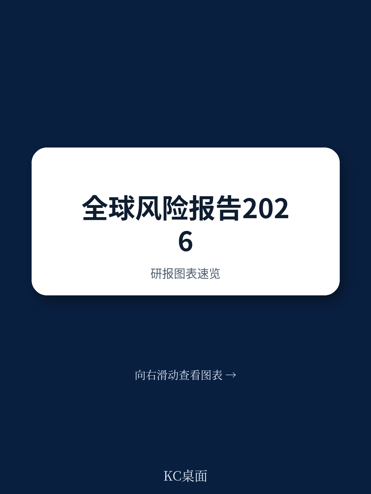
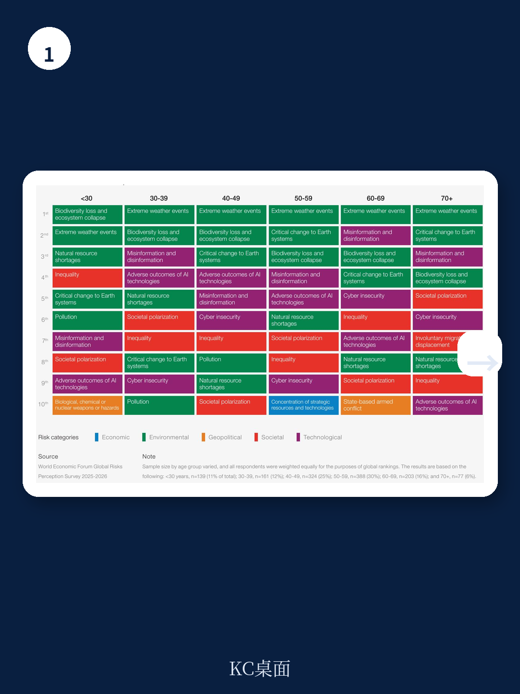
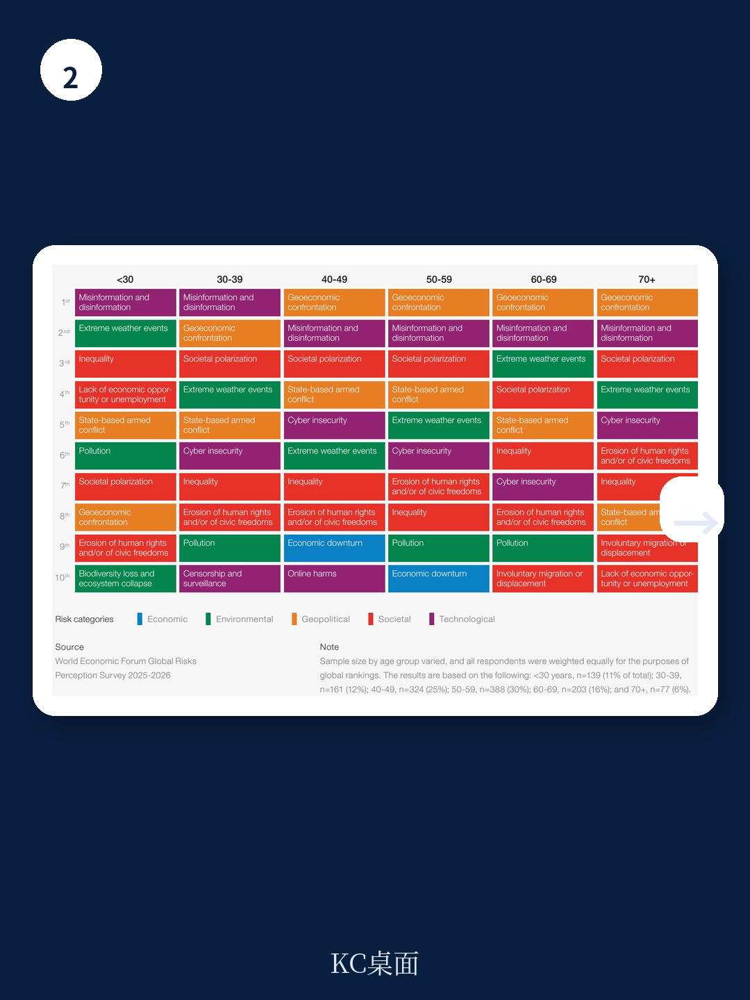

# 世界经济论坛：AI风险短期被低估长期被高估，治理框架缺失成隐患

2026年，全球决策者面对的不再是单一危机，而是一个系统性的竞争结构。世界经济论坛最新发布的《2026年全球风险报告》给出了一个清晰但令人不安的判断：我们正在进入一个“竞争时代”，而支撑过去数十年稳定的多边合作机制正在系统性瓦解。这不是一个关于未来的预测，而是对当前状态的诊断。

这份报告基于对全球超过1,300位领导人和专家的调查，以及来自116个经济体超过11,000名商业领袖的反馈。数据揭示了一个关键转折：50%的受访者认为未来两年全球前景将是“动荡”或“风暴”级别，这一比例在十年维度上进一步上升至57%。只有1%的受访者认为前景“平静”。

更值得关注的是，与去年相比，短期悲观情绪大幅上升14个百分点。这意味着，全球精英对未来的判断正在加速恶化，且这种恶化主要集中在可预见的近期。

---

## 1. 地缘经济对抗已成为最紧迫的全球风险，取代了去年的军事冲突

报告最核心的发现是：地缘经济对抗（Geoeconomic Confrontation）已经取代国家间武装冲突，成为2026年最可能触发全球性危机的风险。18%的受访者将其列为第一风险，较去年上升两位。这一变化的意义远超表面排名。

地缘经济对抗的核心特征是：国家之间不再通过军事手段，而是通过关税、出口管制、投资审查、技术封锁、金融制裁等经济工具进行战略竞争。这种对抗的隐蔽性和系统性更强，但破坏力不亚于传统冲突。

> **KC评论：** 这不是简单的“贸易战升级”，而是一种新的竞争范式。过去企业可以靠全球供应链优化效率，现在必须面对“供应链武器化”的现实。报告没有直接点名，但半导体、AI、新能源、关键矿产这些领域的设备、技术和原料，正在成为地缘经济对抗的核心战场。完整报告中的第2.2节“没有多边主义的多极化”对这一趋势有更细致的拆解。

在两年时间维度上，地缘经济对抗同样跃升至首位，较去年上升8个位次。这意味着决策者不能将其视为短期扰动，而应接受它将成为未来数年的常态。

---

## 2. 经济风险集体飙升，但最危险的可能是“债务+泡沫”组合

经济风险是今年报告中最显著的变化。经济衰退、通胀和资产泡沫破裂分别上升8位、8位和7位，虽然绝对排名仍在10位之后，但上升速度在所有风险类别中最快。经济衰退的严重性评分增幅仅次于地缘经济对抗。

报告特别指出，这些经济风险并非孤立存在。高债务负担、资产价格泡沫、通胀粘性和地缘对抗正在形成一种危险的“共振”。当多个经济体同时面临债务可持续性挑战，而央行政策空间有限时，一次局部冲击就可能引发系统性连锁反应。

> **KC评论：** 报告第2.4节“经济清算”是值得细读的部分。它没有给出简单的“衰退”或“复苏”判断，而是构建了一个债务、泡沫、通胀和地缘对抗四重叠加的分析框架。对于投资者和企业决策者来说，这个框架比任何单一宏观预测都更有价值。完整报告中的图表和假设路径，可以帮助读者判断自己所在行业暴露在哪种风险组合之下。

继续看原文，真正有价值的是图表、假设和验证路径；完整报告与KC评论在每日汇编。

---

## 3. 不平等是未来十年的“风险枢纽”，社会契约正在被重新定义

在十年时间维度上，不平等被受访者选为最具关联性的全球风险，连续第二年位居榜首。这并非一个泛泛的社会议题，而是理解其他风险如何传导和放大的关键枢纽。

报告指出，当财富持续集中在少数人手中，而生活成本压力居高不下时，“K型经济”正在成为一种结构性风险。社会契约——公民与政府之间关于公共服务、社会保障和代际公平的隐性协议——正在承受前所未有的压力。

这种压力通过两个渠道传导：一是政治极化加剧，民粹主义和极端主义抬头；二是社会信任崩塌，公民对政府、媒体和企业的信任度持续下降。报告第2.3节“价值观战争”对此有深入分析，它揭示了技术如何加速这种分化，以及为什么“街头与精英”的叙事会越来越有市场。

---

## 4. AI风险是“时间差”最大的风险，短期被低估、长期被高估

在所有33个风险中，AI的不良后果是短期与长期排名差异最大的风险：在两年维度上仅排第30位，但在十年维度上跃升至第5位。这种巨大的“时间差”本身就值得警惕。

报告没有陷入对AI的过度乐观或恐慌，而是冷静地指出：AI对劳动力市场、社会结构和全球安全的影响将是渐进的，但一旦形成趋势，逆转成本极高。第2.7节“AI失控”探讨了从信息完整性到自主武器系统的多个维度，但更值得关注的是第2.6节“量子飞跃”——当量子计算与AI叠加，技术风险的性质可能发生根本性变化。

> **KC评论：** 报告对AI风险的定位很有意思：它认为当前最大的风险不是AI本身，而是“缺乏治理框架下的加速发展”。换句话说，各国在AI领域的竞争正在重复核武器竞赛的老路——先发展、后治理。但AI的扩散速度和去中心化程度远超核技术。完整报告中关于AI治理的假设和情景分析，是理解这一风险的关键入口。

---

## 5. 环境风险正在被“挤出去”，但长期威胁并未消失

一个反直觉的发现是：环境风险在两年时间维度上普遍排名下降、严重性评分降低。这不是因为环境问题改善了，而是因为更紧迫的地缘经济和社会风险挤占了决策者的注意力带宽。

报告明确指出，环境风险在十年维度上仍然是核心关切。这种“短期被忽略、长期不可逆”的特征，恰恰是最危险的组合。当决策者忙于应对当下的地缘对抗和经济波动时，气候变化、生物多样性丧失和自然资源枯竭正在以更慢但更确定的方式侵蚀未来的安全边界。

---

## 6. 报告尚未完全回答的关键问题：合作机制如何重建？

报告的核心叙事是“竞争取代合作”，但它也承认，新的合作形式正在出现——尽管这些合作与过去的多边框架截然不同。这里存在一个关键的未解问题：如果传统多边机制已经失效，新的合作形态应该是什么样？

报告提到了“务实合作”的可能性，但没有给出清晰路径。在“没有多边主义的多极化”世界里，合作可能从全球层面降级为区域层面、从政府主导转向公私合作、从规则驱动转向利益驱动。这种碎片化的合作模式能否有效管理全球风险？这是一个需要持续观察和讨论的问题。

---

## 读者的观察框架：如何用这份报告指导决策

对于企业和投资者的决策者来说，这份报告的价值不在于预测，而在于提供了一个系统性的风险扫描框架。以下是一个实用的观察框架

第一，建立“风险组合”思维。不要单独关注地缘、经济、技术或环境中的任何一个维度，而是关注它们之间的相互作用。例如，地缘经济对抗如何影响供应链成本？AI发展如何改变劳动力结构和消费行为？不平等如何影响社会稳定和监管环境？

第二，关注“时间差”风险。短期风险（地缘对抗、通胀）和长期风险（AI、环境）之间存在时间错配。决策者需要同时管理两类风险，而不是被短期危机完全占据注意力。

第三，寻找“反脆弱”机会。报告描绘的图景对大部分参与者都不利，但危机往往也是结构性优势的放大器。那些在供应链多元化、技术自主、合规能力和社会责任方面提前布局的企业，可能在这一轮竞争中建立更持久的护城河。

---

这份报告的完整价值在于它的图表、假设路径和情景分析——这些是单篇摘要无法覆盖的。更多国际信源汇编和评论，每日更新，汇总国际主流叙事、数据和图表，观测边际变化。每日汇编会把单篇报告放回当天的主线，整理成中文摘要、KC评论和图表合集，便于喂给AI，也便于人工快速扫描市场dynamics。这里汇聚了头部券商、PE/VC、投行、并购、对冲基金、资管机构、战略咨询、智库等朋友，期待交流。

Personal reading notes and learning share only. Not investment advice.
