## The Regenerative Blue Economy: Pathways to Prosperity

INSIGHT REPORT

JUNE 2026

WORLD ECONOMIC FORUM

## Contents

Foreword 3  
Executive summary 4  
1 The evolving blue economy 5  
1.1 Three sectoral trajectories 7  
1.2 Economic and regenerative potential 9  
2 Defining and operationalizing the regenerative blue economy 12  
2.1 A new operational framework 14  
2.2 Classifying actor contributions 14  
3 Four levers to unlock a regenerative blue economy 17  
Lever 1: Governance 17  
Lever 2: Finance 23  
Lever 3: Human capacity 28  
Lever 4: Technology and artificial intelligence 30  
4 Tailwinds and headwinds 33  
Conclusion: towards a regenerative blue economy 35  
Glossary 37  
Contributors 38  
Endnotes 40

## Disclaimer

This document is published by the World Economic Forum as a contribution to a project, insight area or interaction. The findings, interpretations and conclusions expressed herein are a result of a collaborative process facilitated and endorsed by the World Economic Forum but whose results do not necessarily represent the views of the World Economic Forum, nor the entirety of its Members, Partners or other stakeholders.
© 2026 World Economic Forum. All rights reserved. No part of this publication may be reproduced or transmitted in any form or by any means, including photocopying and recording, or by any information storage and retrieval system.

# Foreword

  
Helle Herk-Hansen
Vice-President, Environment,
Vattenfall; Co-Chair, Global
Future Council on the
Regenerative Blue Economy,
World Economic Forum

The ocean is a source of food, income and cultural identity for billions of people, while also underpinning global trade, regulating the climate and sustaining an extraordinary diversity of life. Yet it is under mounting pressure from overexploitation, pollution, habitat destruction and climate change. These forces are degrading marine and coastal ecosystems, and undermining the long-term well-being of the communities and economies that depend on them. Just maintaining the blue economy on a business as usual basis will perpetuate this decline.

This report – written by an internationally diverse group of leading experts from the private and public sectors, civil society and academia – examines how to shift from the status quo towards a regenerative blue economy. Rather than a purely extractive focus on profits and short-term returns, this approach offers an ambitious vision in which ocean-based economic activity helps restore ecosystems, strengthen resilience and support equitable prosperity within planetary limits. The shift it describes asks us not merely to maintain what remains, but to rebuild what has been damaged; not simply to reduce harm, but to create systems that actively renew the ecological foundations on which lasting prosperity depends.

What makes this approach especially valuable is its ability to connect ecological integrity, economic

U. Rashid Sumaila
Professor and Director,
Fisheries Economics Research
Unit, The University of British
Columbia (UBC) Institute for
the Oceans and Fisheries and
the School of Public Policy
and Global Affairs; Co-Chair,
Global Future Council on the
Regenerative Blue Economy,
World Economic Forum

reasoning and social justice in a clear and practical way. Healthy marine ecosystems and thriving coastal communities are not competing objectives – they are deeply interconnected. A regenerative approach requires rethinking investment, governance, technology and innovation, capacity development and accountability. It challenges decision-makers to judge success not only by the wealth generated from the ocean, but by the extent to which that wealth supports restoration, fairness and intergenerational well-being.

This report arrives at an important moment. Across sectors and communities, there is growing demand for economic approaches that advance both human well-being and ecological recovery. The regenerative blue economy offers a compelling framework – shifting the focus from limiting harm to actively restoring ocean systems.

For this reason, this publication will be valuable to business leaders, policy-makers, practitioners, scholars, investors, community leaders and citizens alike.

As co-chairs of the Global Future Council for a Regenerative Blue Economy, we recommend this report to all who care about the shared future of the ocean and human prosperity.

# Executive summary

## Sustaining the ocean economy is no longer enough. Moving towards regeneration can reverse ecosystem decline while supporting resilient and equitable long-term prosperity.

This report makes the case for the ocean economy to move beyond sustainability towards regeneration and proposes an operational framework to enable this transformation. The ocean economy generates trillions in annual value and supports billions of livelihoods, yet the systems that sustain it are under increasing strain. Marine ecosystems continue to degrade under pressure from warming seas, pollution and overuse.

While the sustainable blue economy has helped reduce harm, it remains focused on maintaining current conditions, often within already degraded systems, and has not been sufficient to reverse ecosystem decline. A regenerative blue economy goes further. It requires economic activity that actively restores marine ecosystems, strengthens social systems and generates long-term, equitable prosperity and development. It shifts the goal from maintaining the status quo to rebuilding the natural and social capital on which ocean industries and a large part of the global economy depend.

Ocean industries are central to this transformation. The report frames them as a portfolio of traditional, growth and frontier sectors, each playing a distinct role:

\- Traditional sectors, such as fisheries, ports, shipping and energy, remain economically dominant but must undergo rapid, managed transitions, to reduce their environmental impacts, internalize costs and redirect investment towards restoration and decarbonization.

\- Growth sectors, including offshore renewables, coastal tourism, aquaculture, desalination and water treatment represent the near-term engine of change, with the potential to scale up in ways that reinforce ecosystem health if designed within planetary boundaries.

restoration, blue biotechnology and ocean data systems, are emerging as the foundation of a regeneration-driven economy, where value creation is directly linked to ecological recovery and knowledge generation.

Together, these sectors point to a future in which economic success is increasingly defined by the ability to replenish, rather than deplete, natural capital.

This report sets out four interdependent system levers and shows how their interactions can help deliver on the ambition of a regenerative blue economy:

1. Governance: Integrated ocean governance can help align policies across sectors, manage trade-offs, and address the combined impacts of different ocean use, leading to more coherent planning and better long-term outcomes.

2. Finance: Redirecting finance through public investment and innovative commercial instruments can shift incentives away from extractive activities towards regenerative outcomes, while ensuring coastal and Indigenous communities have equitable access to capital.

3. Human capacity: Strengthening human capacity can help ensure that local actors have the skills and resources to design and deliver solutions, turning policy into effective action on the ground.

4. Technology and AI: Advances in technology and artificial intelligence can improve ocean monitoring, risk management and coordination, making it easier and more affordable to track progress and support better decisions.

Crucially, regeneration does not come from isolated actions, but from how these levers work together to drive change across industries and places.

Social equity is central to the transition. Coastal communities, Indigenous Peoples and small-scale ocean users are key stewards of marine ecosystems, and their rights, knowledge and participation need to be reflected in decision-making and investment. Without this, efforts to regenerate the ocean risk reinforcing existing inequalities and weakening long-term results.

The report calls for coordinated action across stakeholders:

\- Governments can embed regeneration into national ocean strategies and align policy and fiscal systems to deliver on existing commitments – such as the Global Biodiversity Framework, Sustainable Development Goals

(particularly SDG 14) and sectoral targets like the International Maritime Organization's decarbonization agenda – while reducing fragmentation and accelerating progress.

\- Investors and financial institutions can protect their investments from ocean-related risks by integrating a regenerative approach into decision-making, redirecting capital flows and developing innovative financing mechanisms.

\- Ocean industries can preserve and enhance their long-term value by redesigning business models towards net-positive ecological and social outcomes.

\- Civil society, philanthropy and research institutions play a critical role in building capacity, advancing knowledge and enabling coordination across actors and scales.

For all groups, the priority is to move from fragmented, project-based approaches to integrated, place-based strategies operating at seascape scale.

A regenerative blue economy offers a pathway in which ocean industries, ecosystems and communities reinforce one another. The foundations for this transition already exist, but to expand and accelerate it requires urgency, coordination and systemic alignment. The future of the ocean economy will be defined not by how much it extracts, but by how effectively it regenerates and creates value from the systems that sustain it.

Note: the definitions of key terms used in this report are hyperlinked to the Glossary.

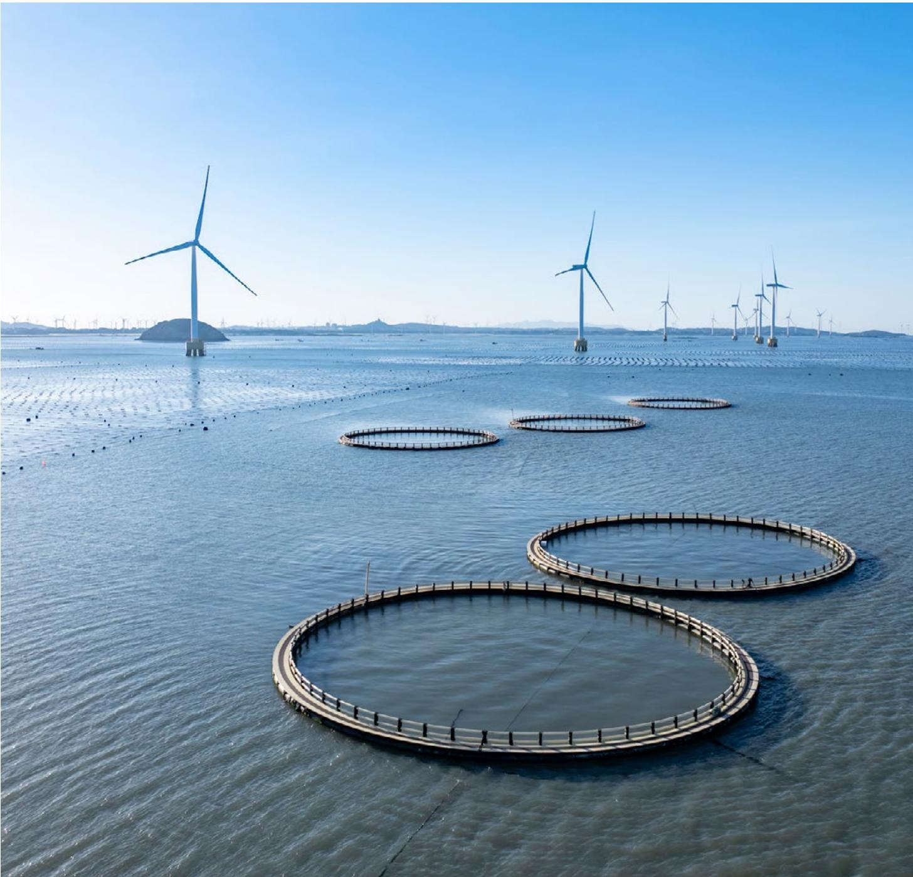

# ① The evolving blue economy

# The ocean economy generates trillions in value annually while systematically undermining the ecological foundations that make this possible.

A regenerative blue economy frames ocean industries according to whether their growth trajectories align with the maintenance or restoration of natural capital.

The ocean economy is expanding while the systems that sustain it deteriorate. Valued at between \$2.6 and \$5.1 trillion in annual gross value added, it supports billions of livelihoods, carries more than 80% of global trade by volume and underpins food security for coastal nations. $^{1}$ Yet this scale of activity is increasingly incompatible with ocean health. $^{2}$ The share of overfished stocks has nearly quadrupled since 1974, $^{3}$ undermining a vital food source for billions of people; 70-90% of the world's coral reefs are predicted to disappear within two decades; $^{4}$ and coastal flood exposure could double by 2100, threatening 10% of the global population living in coastal areas. $^{5}$ Much of the ocean economy is drawing down the natural capital on which it depends. $^{6}$

The concept of a sustainable blue economy emerged about a decade ago to address these challenges, with Sustainable Development Goal 14: Life Below Water aiming to “conserve and sustainably use the oceans, seas and marine resources for sustainable development” by 2030. The concept integrates environmental

protection, economic development and social equity under a single governance approach. $^{7}$ Its defining criteria – as expressed by the United Nations Environment Programme (UNEP) $^{8}$ and others – are focused largely on reducing harm, for example from illegal, unreported and unregulated (IUU) fishing and illicit trade in fish catch, $^{9}$ destructive gear, $^{10}$ deep-sea mining, $^{11}$ new offshore fossil fuel exploration $^{12}$ and other activities incompatible with the Paris Agreement's preferred limit of 1.5°C of planetary warming and the target of the Kunming-Montreal Global Biodiversity Framework (GBF) to halt biodiversity loss.

Despite the emergence of this approach, most metrics of ocean health have continued to decline, while progress towards many SDG 14 targets is stalled or regressing. Maintaining the status quo means accepting an already degraded ocean as well as an ongoing process of managed decline. $^{13}$ A more ambitious framing – the regenerative blue economy – demands net-positive ecological and social outcomes, not merely reduced harm. $^{14}$

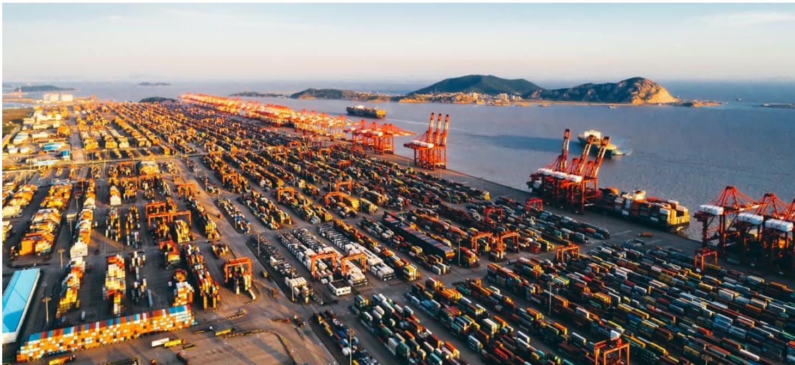

# 1.1 Three sectoral trajectories

A regenerative blue economy frames ocean industries according to whether their growth trajectories align with the maintenance or restoration of natural capital. $^{15}$ Activities that already fail to meet the requirements for the sustainable blue economy cannot credibly qualify.

The blue economy currently features three types of sectors – traditional, growth and frontier – each of which has different potential to contribute to regeneration (see Table 1).

Cumulative enterprise value across seed, early and late-growth ventures in frontier sectors rose from \$1.1 billion to \$24.7 billion between 2010 and 2025.

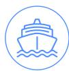

## Traditional sectors: managing the transition

The most established ocean industries – such as wild-capture fisheries, maritime shipping, ports, and offshore oil and gas – remain the largest by revenue and employment. Their environmental footprints are significant, but so are the transition opportunities. $^{16}$

For traditional sectors of the economy, the shift to regeneration requires a managed transition that starts by reducing harm and improving efficiency, then internalizes environmental costs, redirects subsidies towards restoration and channels capital into practices that rebuild natural systems. The Maritime and Port Authority of Singapore demonstrates how a traditional industry such as a major international port can start this transition towards aligning with regenerative principles (see Case Study 1).

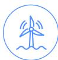

## Growth sectors: scaling-up within planetary boundaries

A second group of ocean industries – such as offshore wind, aquaculture, maritime digitalization, and coastal and marine tourism – is expanding rapidly. As long as that expansion is coupled with environmental safeguards, fair labour practices and nature-inclusive design, these sectors are the near-term engine of the regenerative blue economy. As they mature, the challenge is to ensure that growth reinforces rather than undermines ocean health.

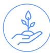

## Frontier sectors: building the regeneration industry

In the longer term, the most consequential development in the ocean economy is the emergence of sectors organized around restoration, knowledge building and biological innovation rather than extraction. Cumulative enterprise value across seed, early and late-growth in frontier sectors rose from \$1.1 billion to \$24.7 billion between 2010 and 2025. $^{17}$

These frontier sectors include the following:

\- Ecosystem restoration: restoring mangroves, seagrasses and coral reefs, for example; now moving from small pilots to nationally embedded investments in infrastructure-scale resilience.

\- Blue biotechnology: yielding novel pharmaceutical compounds, sustainable feed alternatives and marine-sourced biomaterials.

\- Ocean data and monitoring services: a rapidly growing sector, creating the systems of transparency and traceability that regenerative industries demand.

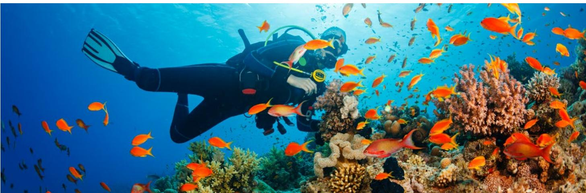

# CASE STUDY 1: Singapore – scaling-up decarbonization in a major maritime hub

Sector cluster:

Traditional

Regeneration tier:
Tier 1: Regenerative-aligned

Capital types improved: Human, social, economic

Human capacity, governance, technology and AI

The shipping industry is under increasing pressure to decarbonize, driven by tightening regulation, corporate net-zero commitments and rising climate and nature risks. Ports play a critical role linking sea- and land-based transport, yet their transformation is inherently complex. As multi-actor systems, they require coordinated change across vessels, fuel supply chains, infrastructure and regulation, while continuing to operate as essential global trade hubs. The Port of Singapore illustrates how a major maritime actor can begin shifting in this direction at scale.

As one of the world's busiest trans-shipment hubs, handling over 37 million TEUs\* annually and connecting more than 600 ports worldwide, Singapore is leveraging its position to catalyse system-wide change. The Maritime and Port Authority of Singapore (MPA) is advancing the decarbonization of domestic port activities, targeting net-zero emissions for around 1,600 harbour craft by 2050 through electrification, charging infrastructure and efficiency improvements. Renewable energy deployment is also expanding, alongside efforts to decarbonize selected port operations.

A central pillar of Singapore's strategy is the development of multi-fuel transition pathways. Recognising that no single fuel will dominate in the near term, MPA is investing with partners in infrastructure and technical standards to support alternatives such as ammonia and methanol. Early pilots and first-of-a-kind bunkering operations position Singapore, one of the world's largest bunkering hubs, to help scale up low-carbon fuels across global shipping routes.
In parallel, Singapore is developing green and digital shipping corridors with international partners, including ports in Asia, Europe and the United States. These corridors serve as testbeds for low-emission vessels, alternative fuels, harmonized standards and digital systems, helping to overcome adoption barriers and accelerate deployment across the maritime sector. Digitalization within the port further reinforces this development. Platforms such as digitalPORT@SG™ and the just-in-time planning and coordination system enable real-time coordination among port users, reducing congestion, vessel idling and fuel consumption.

## Takeaway

Taken together, these efforts demonstrate how a traditional ocean industry can start transitioning towards a regenerative model by addressing climate and nature impacts, improving efficiency and shifting investment towards lower-carbon systems while enabling broader sectoral transformation. Achieving higher tiers of regeneration would require embedding biodiversity restoration, habitat creation and water quality improvement into port infrastructure and operations, alongside existing efforts in decarbonization and operational optimization.

Note: \* TEU refers to the twenty-foot equivalent unit, a standard, non-physical unit of measurement in shipping based on the volume of a 20-foot-long intermodal shipping container.  
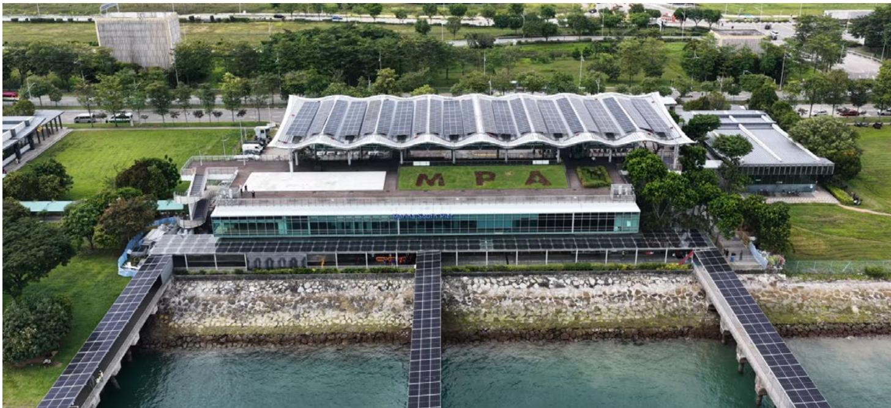  
Photo: Maritime Port Authority of Singapore

## 1.2 | Economic and regenerative potential

Together, these sectors outline a future in which industries succeed by replenishing the natural capital they depend on.

\- Traditional sectors can rebuild fish stocks, minimize or eliminate destructive practices, decarbonize fleets and repurpose ageing infrastructure.

\- Growth sectors can embed safeguards as they scale up, ensuring they strengthen rather than deplete marine systems.

\- Frontier sectors can build legitimacy through science, equitable benefit sharing and credible impact measurement.

Table 1 presents a summary of each sector's current economic scale, growth projections up to 2050 and potential to regenerate the blue economy.

Ocean sector clusters: economic scale, growth trajectory and regenerative potential

<table><tr><td colspan="5">TRADITIONAL SECTORS</td></tr><tr><td>Representative sectors</td><td>Current economic scale</td><td>Growth trajectory to 2050 (baseline)</td><td>Regenerative potential in a regenerative blue economy</td><td>Key implications</td></tr><tr><td>Offshore oil and gas</td><td>Global market valued at ~$1.7 trillion in 2024;18low employment; global oil &amp; gas production (of which 25% occurs offshore)19accounts for 15% of total energy-related greenhouse gas (GHG) emissions.20</td><td>Declining production and CapEx under net-zero scenarios; risk of stranded assets.</td><td>Low-moderate; mainly via emission reductions, decommissioning standards and repurposing infrastructure (e.g. CCS, offshore hydrogen); offshore engineering expertise transferring to offshore wind, marine carbon capture, ocean monitoring.</td><td>Manage just transition for workers; avoid locking in new fossil fuel assets; plan decommissioning and reuse of ocean space.</td></tr><tr><td>Shipping and ports</td><td>Account for 22% of ocean economy export value at $386 billion;21large employment;~80% of global trade by volume;22accounts for ~2% of GHG emissions.23</td><td>Moderate growth in trade volumes (3.3%);24strong policy-driven decarbonization and efficiency gains; venture capital funding for AI and digital tools in logistics and shipping grew by 360% between 2015 and 2020.25</td><td>Moderate; zero-emission fuels, optimized logistics, vessel retrofitting, reduced underwater noise and pollution.</td><td>Critical enabling sector; investment priority for green corridors, smart ports, digitalization and portside regeneration.</td></tr><tr><td>Wild capture fisheries</td><td>First sale value of global production in 2022 was ~$157 billion;26high employment and food security value.</td><td>Biophysical ceilings; stable or slightly declining catch under effective management.</td><td>High; in small-scale and well-managed fisheries: stock rebuilding, habitat restoration, livelihood security.</td><td>Reallocate subsidies; strengthen rights-based and community management; embed equity and food security objectives.</td></tr><tr><td colspan="5">GROWTH SECTORS</td></tr><tr><td>Representative sectors</td><td>Current economic scale (qualitative)</td><td>Growth trajectory to 2050 (baseline)</td><td>Regenerative potential in a regenerative blue economy</td><td>Key implications</td></tr><tr><td>Offshore wind and marine renewables</td><td>$39 billion in financing recorded in the first half of 2025 alone;27 83 GW global installed capacity.28</td><td>Strong growth projected; total installed capacity expected to reach 441 GW by the end of 2034.29</td><td>High; if sited and designed to be nature-inclusive and multi-use, for example, co-use with aquaculture and reef restoration.</td><td>Integrate marine spatial planning (MSP), biodiversity net gain and community benefit-sharing from the outset.</td></tr><tr><td>Coastal and marine tourism</td><td>Global GDP contribution valued at $1.5 trillion;30 large employment; major export earner; 6% growth annually between 2015 and 2019.31</td><td>Continued growth, but exposed to climate and ecosystem risk.</td><td>Moderate-high; if models shift from volume to regenerative tourism.</td><td>Align incentives so that visitor spending funds restoration and resilience; manage cruise and coastal development impacts.</td></tr><tr><td>Aquaculture and blue foods</td><td>First-sale value of global production in 2022 was ~$296 billion;32 medium-large employment; exceeds wild capture by volume.33</td><td>Strong growth in low-impact systems; consolidation in intensive finfish aquaculture.</td><td>High; very high for seaweed, bivalves and integrated systems delivering water filtration and carbon sequestration benefits, while having lowest carbon footprint among animal protein sectors; lower for high-impact models like fed finfish systems.34</td><td>Steer investment and regulation towards low-impact systems; protect and restore critical habitats (e.g. mangroves).</td></tr><tr><td>Wastewater treatment</td><td>Global market valued at ~$348 billion in 2024 (water and wastewater combined);35 only 11% of treated wastewater is currently reused.36</td><td>Strong and sustained growth; market projected to reach ~$652 billion by 2034 at 6.5% CAGR, driven by water stress and tightening discharge regulations.37</td><td>High; if designed around circular resource recovery rather than treatment-only models. Reducing coastal nutrient discharge could directly benefit ocean health, addressing the 400+ coastal dead zones globally caused by nutrient runoff.38</td><td>Shift investment and regulation towards circular wastewater systems; link performance standards to coastal and ocean health outcomes.</td></tr><tr><td>Desalination</td><td>Global market valued at ~$21.7 billion in 2024;39 global installed capacity at ~91.5 million m3/day in 2024.40</td><td>Strong growth driven by water scarcity; market projected to reach ~$58 billion by 2033 at 11.6% CAGR.41 Adoption accelerating in coastal cities, island states and arid regions.</td><td>Moderate; pressure on freshwater ecosystems reduced, but ocean impact can be significant: discharge of hypersaline brine threatens marine ecosystems near discharge points.42 Potential improves substantially with renewable-powered operations and brine valorization (recovery of sodium, magnesium, lithium etc.).</td><td>Pair all new capacity with renewable energy and robust brine management standards; assess cumulative marine impacts before approving coastal siting.</td></tr><tr><td colspan="5">FRONTIER SECTORS</td></tr><tr><td>Representative sectors</td><td>Current economic scale (qualitative)</td><td>Growth trajectory to 2050 (baseline)</td><td>Regenerative potential in a regenerative blue economy</td><td>Key implications</td></tr><tr><td>Blue biotechnology and biomaterials</td><td>Global market value at ~$4.2 billion in 2023;43 small but fast-growing employment.</td><td>High growth potential, especially for health and materials applications.</td><td>High; if focused on substitutes (e.g. sustainable feed alternatives, marine biomaterials) and conservation-linked products; contingent on fair benefit-sharing.</td><td>Prioritize access and benefit-sharing, IP governance and support for developing country R&amp;D capacity.</td></tr><tr><td>Restoration and nature-based solutions (NBS)</td><td>Private-sector finance of NBS represents 14% of total NBS financing, equal to $18 billion annually.44</td><td>Rapid growth expected as climate and biodiversity policies are implemented (e.g. EU Nature Restoration Law mandating restoration of at least 20% of degraded land and sea by 2030).45</td><td>Very high; ecological recovery is the core product.</td><td>Build robust standards, monitoring and finance (blue carbon, resilience bonds); ensure local custodianship; increase stable financing and credible monitoring to make marine natural capital (e.g. mangroves, seagrass) more investable.</td></tr><tr><td>Ocean data and digital services</td><td>Growing multi-billion-dollar market;46 ocean-data-focused companies compose a large share of the 3,000 blue economy start-ups catalogued globally.47</td><td>Strong growth; foundational for all other sectors; IoT, satellite monitoring, autonomous vehicles and advanced analytics among fastest-growing solution categories.48</td><td>High; data underpins transparency, enforcement and performance-based finance.</td><td>Invest in open architectures, data equity and capacity building; treat digital ocean infrastructure as global public good.</td></tr><tr><td>Marine carbon dioxide removal (mCDR)</td><td>Small but growing, multi-million-dollar market.49</td><td>Nascent; scientific frontier requiring rigorous trials and governance guidelines before scaling-up.</td><td>High; if developed responsibly, direct drawdown potential via ocean alkalinity enhancement and macroalgae cultivation, leveraging the ocean's central role in the carbon cycle.</td><td>Invest in rigorous trials and robust governance frameworks; safeguard the ocean's role in the carbon cycle before any large-scale deployment.</td></tr><tr><td>The next wave of the ocean economy will not be measured by economic output alone but by its contribution to recovery.</td><td colspan="2">National action gathers momentumCountries are already integrating regeneration into national ocean planning. Coastal states are adopting Sustainable Ocean Plans (SOPs) that align industries with ecosystem health.50 The United Kingdom's biodiversity net gain regulations, the EU's Nature</td><td colspan="2">Restoration Regulation and China's "Ecological Civilization" doctrine are embedding restoration into legal and economic instruments, signalling that regeneration is moving beyond voluntary practice.51 The next wave of the ocean economy will not be measured by economic output alone but by its contribution to recovery – how much biomass is rebuilt, how much biodiversity is restored and how many livelihoods are made more resilient.</td></tr></table>

# Defining and operationalizing the regenerative blue economy

# Regeneration demands more than reduced harm: it requires economic activity that actively invests in the natural and social systems on which it depends.

Regeneration builds on sustainable approaches. The sustainable blue economy ranges from incremental harm reduction to systemic change, $^{52}$ while also embracing high ambitions of equity, ecosystem restoration and long-term resilience. $^{53}$ A regenerative blue economy shifts the goal from sustaining current conditions to renewing the capacity of marine and coastal systems to generate value. Where sustainability asks how much can be used without depletion, regeneration asks how economic activity can restore and strengthen social-ecological systems.

## BOX 1

## Definition of regenerative blue economy

"A regenerative Blue Economy is an economic model that combines rigorous and effective regeneration and protection of the Ocean and marine and coastal ecosystems with sustainable, low, or no carbon economic activities, and fair prosperity for people and the planet, now and in the future."54

– International Union for Conservation of Nature (IUCN)

Where sustainability asks how much can be used without depletion, regeneration asks how economic activity can restore and strengthen social-ecological systems.

Scholarship linking regeneration to resilience and system transformation clarifies how these outcomes emerge through mutually reinforcing feedback across ecological, socio-economic and governance dimensions, $^{55}$ and how inequity constrains the human agency on which regenerative dynamics depend. $^{56}$

Regeneration also depends on how value is created and distributed. Ocean-based development transforms value across capital types, locations and time horizons. $^{57}$ Without deliberate governance,

benefits concentrate among a narrow set of actors, limiting the reach and durability of regenerative outcomes at larger scales.

Translating these principles into practice requires a framework that distinguishes how different actors contribute at different scales. Table 2 presents foundational elements and key requirements, while Section 2.1 proposes an operational framework that sets out how regeneration unfolds – from individual actors to system-wide transformation – and provides a tiered classification for assessing progress.

## Foundations for a regenerative blue economy (RBE)

## Foundational element\*

## Notes:

The six foundational elements draw on IUCN regenerative blue economy principles and complementary scholarship on regeneration and resilience, with IUCN principles referenced according to their order of appearance in le Gouvello and Simard. $^{64}$

Resilience thinking and maintaining regenerative momentum

Ocean-positive and people-positive ambition beyond harm reduction

Do no harm and precautionary protection as non-negotiable foundations

Place-based implementation that centres local and Indigenous agency and recognitional equity

Inclusive and adaptive governance that connects and distributes decision-making power across scales

Accounting for multiple forms of capital to ensure value is regenerated and can be redrawn upon across the system

## Key requirements

Systems must be future-oriented and reflexive, generating self-reinforcing improvement cycles. $^{58}$ Activities must account for cross-scale feedbacks and thresholds that maintain or recover desirable states. $^{59}$

Low- or zero-carbon activities with net-positive effects on marine ecosystems and community well-being (IUCN P4). The goal extends beyond harm reduction to active enhancement.

Ecosystem protection, restoration and climate action take priority (IUCN P1). The precautionary and ecosystem approaches apply where impacts are uncertain. Activities follow circular-economy principles, minimizing resource use and waste (IUCN P4).

RBE is a priority for island states, which have specific requirements (IUCN P5). Indigenous Peoples and coastal communities must define what regeneration means in their territories and their agency to act must be actively supported.

Governance must prioritize inclusion, fairness and resilience of affected populations (IUCN P2), supported by responsible funding. Participatory systems require transparency, scientific rigour (IUCN P3) and flexible legal instruments aligned with international climate and biodiversity commitments. Decision-making at each level must be informed by and responsive to others. $^{60}$

Value must be assessed across natural, social, cultural, human, economic and financial capital as a conversion process: gains in one form often draw down, externalize or transform another. The resulting benefits, costs and risks must be made transparent across people, places and generations. $^{61, 62, 63}$

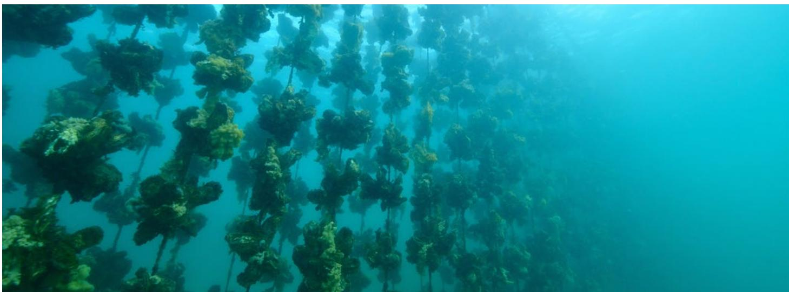

## 2.1

# A new operational framework

# Regeneration operates across three distinct but interdependent levels

## Individual actors

Transformation begins with individual actors. Entities from small-scale producers to large businesses, municipalities or organizations contribute by actively restoring one or more capital types (natural, human, social, cultural, economic, financial) within their sphere of influence. Some activities may never be fully regenerative in isolation but provide the conditions and capital that enable broader recovery. A shipping company, for instance, might not achieve complete regeneration within its own operations alone, but by transitioning to zero-emissions vessels, investing in port ecosystem restoration and supporting coastal community resilience programmes, it becomes an essential contributor to system-level regeneration. The baseline shifts from “do no harm” to “contribute to restoration”.

## Systems

At the systems level, governance intentionally rebalances capital types through enabling policies and regulation, marine spatial planning, incentives that shift both the status quo and strategic direction of financial flows. These conditions enable actor-level contributions to compound into regenerative outcomes.

## Interactions

Regeneration ultimately emerges through interactions among actors, sectors and governance systems. No single company, institution or government delivers it alone. A regenerative system develops when:

\- Sectoral activities reinforce one another, for example: tourism operators' investment in reef restoration benefits fisheries; sustainable aquaculture operations enhance water quality for seagrass beds; renewable energy installations provide artificial reef structures.

\- Actors collaborate to transform sectors as a whole. Regeneration is fundamentally relational: it depends on the quality and alignment of relationships among diverse actors across shared geographies and value chains.

## 2.2

## Classifying actor contributions

A three-tier system to classify contributions of individual economic actors to regenerative systems.

## Tier 1: Regenerative-aligned

Regenerative-aligned actors reduce harm, avoid creating new damaging assets, shift investments towards protection and restoration, and improve ecological or social outcomes in their operations. They are moving in a regenerative direction but have not yet achieved net-positive outcomes across their full value chain. Examples include:

\- Offshore wind installations integrating habitat features into turbine foundations.

\- Port facilities incorporating nature-inclusive infrastructure.

\- Fishing vessels adopting selective gear to reduce bycatch.

Tier 1 is the entry point for most actors: it delivers concrete improvements while acknowledging that comprehensive transformation remains underway.

Tier 2: Regenerative-operational

Regenerative-operational actors generate net improvements in natural capital (e.g. habitat extent, biodiversity, water quality, carbon sequestration) through their core activities – not their peripheral projects. They also deliver tangible community benefits (social and human capital) and financially viable products or services (economic and financial capital) without indefinite concessional finance. Examples include:

\- Restorative aquaculture that improves water quality while generating income.

\- Community-led mangrove or seagrass restoration enterprises combining restoration with livelihoods through ecotourism, sustainable harvesting and/or payments for ecosystem services.

\- Regenerative tourism operators whose business models directly support marine conservation and restoration.

Tier 2 is the core of regenerative transformation, comprising actors whose primary business activities generate positive outcomes across multiple capital types. These operations typically require some enabling conditions – such as supportive policies, technical assistance and initial subsidies – to achieve viability.

## Tier 3: Regenerative-native

Regenerative-native systems or organizations are self-sustaining or ecosystem-enhancing, financially viable with minimal external subsidy and generate long-term positive impacts across all capital types. They operate as embedded, self-reinforcing wholes rather than time-limited projects. Examples include:

\- Indigenous-managed marine ecosystems where traditional governance, practices and cultural protocols maintain ecological health, community well-being and economic sufficiency across generations, without external management interventions.

\- Self-perpetuating reef restoration systems that, once established, expand through natural recruitment with minimal ongoing intervention.

Tier 3 is an aspirational endpoint. Few real-world examples exist and those that do operate at relatively small scales. Most ocean economic activities currently function within Tier 1; Tier 2 remains a significant ambition for many actors. As ocean industries evolve, supported by the key levers discussed in Chapter 3, a greater range of actors may gain the capacity to move in a more regenerative direction, particularly through shifts from Tier 1 to Tier 2. For example, many leading offshore wind companies have committed to achieving net-positive biodiversity outcomes by 2030 and have begun to integrate these goals into business design and operations. $^{65}$

## BOX 2

## Enabling technologies span different tiers depending on their roles

Enabling technologies, such as ocean data infrastructure and marine biotechnology, do not fit neatly within a single tier, as their regenerative contribution depends on their role within a given system. Remote sensing, eDNA monitoring and bioprospecting tools typically operate at Tier 1, reducing harm and improving operational precision without themselves generating net-positive ecological outcomes. Where data infrastructure underpins coordinated, seascape-level management, its contribution approaches Tier 2. Marine biotechnology follows the same logic: assisted evolution programmes for coral resilience or ecologically restorative seaweed cultivation, which produce positive outcomes for nature while generating viable revenues, constitute Tier 2 activities, with self-sustaining assisted-evolution systems representing the aspirational Tier 3 frontier.

## CASE STUDY 2: Advancing regenerative design in offshore wind

Sector cluster:

Growth

Regeneration tier: Tier 2, Regenerative-operational

Offshore wind is a core growth sector in the ocean economy and must scale up rapidly to support decarbonization and energy security. $^{66}$ Yet this expansion within heavily used marine environments demands that deployment contribute to ecosystem recovery, rather than just minimize harm. Newer projects are already moving beyond impact avoidance towards net-positive ecological and social outcomes alongside energy production. $^{67}$

Hollandse Kust Zuid (HKZ), located 18-36 km off the Dutch coast in the North Sea, is one of the largest examples in practice. Jointly owned by Vattenfall, BASF and Allianz, it has 139 turbines and 1.5 gigawatts (GW) of installed capacity, producing approximately 1.5 terawatt-hours (TWh) of electricity annually – enough for more than 1.5 million households. Funded by Vattenfall and operational since 2024, HKZ is the first offshore wind farm in Europe developed without direct government subsidies. $^{68}$ The project contributes to industrial decarbonization while supplying fossil-free electricity to businesses and households. $^{69}$

The project was enabled by a stable regulatory environment, Dutch government-backed grid connections, visibility on future market volumes and a tender process that reduced risk for private investors while allowing power to be sold into wholesale markets.

HKZ also functions as a testbed for innovation and ecosystem restoration through its dedicated research and development platform, SeaLab, which convenes research institutes, universities and other stakeholders to support marine restoration, biodiversity conservation and circular

Capital types improved: Natural, human, social, economic

Levers activated: Technology and AI, governance, finance

supply chain design. Working with De Rijke Noordzee, Vattenfall added elliptical openings to turbine foundations to allow water exchange and create shelter for marine species, installed artificial rock reefs on scour protection to increase habitat complexity and deployed a double bubble curtain to reduce construction noise while monitoring the impacts on marine mammals. $^{70}$ This work embeds nature-inclusive design in the wind farm's infrastructure and operations. $^{71}$

Further pilots include using thermal cameras and AI to trigger temporary shutdowns during peak bird migration and working with North Sea farmers to test a floating seaweed farm between turbines to explore co-location and carbon sequestration. Vattenfall is also trialling recyclable blades, developed by Siemens Gamesa, to reduce the lifecycle impact of offshore infrastructure. $^{72}$

Results are still being assessed, with monitoring informing adaptive management. HKZ shows that site-level regenerative measures are achievable at scale. However, site measures alone will not deliver system-wide regeneration without supportive governance and cross-sector coordination.

## Takeaway

Nature-inclusive design is commercially viable at gigawatt scale when enabling policy and partnerships are in place. But site-level measures cannot substitute for seascape-level governance. Scaling-up from project to system requires marine spatial planning, cross-sector coordination and policy signals that reward net-positive contribution, not just harm minimization.

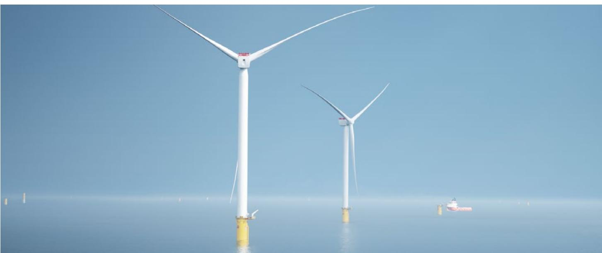  
Photo: Vattenfall

# Four levers to unlock a regenerative blue economy

Governance, finance, human capacity and technology are the four levers for accelerating progress towards a more regenerative blue economy.

LEVER 1

## Governance

Fragmented, sector-by-sector ocean management cannot deliver regeneration. Integrated governance across seascapes – from local communities to regional bodies – can enable it.

Ocean regeneration falters not for want of science or ambition, but because governance remains organized for short-term, sector-by-sector extraction.

Ocean regeneration falters not for want of science or ambition, but because governance remains organized for short-term, sector-by-sector extraction rather than long-term socio-ecological recovery. Governments cannot command regeneration into existence, but they can reshape the institutional conditions under which decisions are made: the scale at which authority is exercised, the evidence on which choices rest, the rules that bind competing interests, the accountability that sustains commitment over time and the signals that direct capital towards restoration rather than depletion.

This section sets out a pragmatic pathway towards polycentric governance, implemented through seascapes, understood as large, ecologically and socially coherent marine-coastal units.

## Four foundational governance reforms

Four governance reforms underpin the transition to a regenerative blue economy.

## 1. The unit of implementation must change

Projects are bounded in time and scope, yet seascapes persist as socio-ecological systems. Adopting the seascape as the primary frame forces decision-makers to address cumulative impacts, land-sea linkages and the interactions among multiple ocean sectors in a single decision space, correcting the scale mismatch that has long undermined coastal management. $^{73}$

## 2. Regeneration requires spatial clarity

Permit-by-permit administration must give way to frameworks that delineate where sustainable use is permitted, where development should not proceed at all and where ecological restoration is prioritized. Marine spatial planning (MSP) is the principal instrument for achieving this clarity. $^{74}$

## 3. Governance must become polycentric

Centralized, single-ministry governance of complex marine systems has repeatedly proved inadequate. A polycentric approach features multiple centres of decision-making that hold real authority at different scales, connected through shared rules, information exchange and mutual accountability (see Figure 1). This offers a more resilient and adaptive architecture able to outperform centralized alternatives when problems are complex and when institutional learning is essential. $^{75}$

## 4. Enforceability is a core requirement

Governance reforms must be manifested through legal instruments, dedicated budgets and accountability systems that outlast political cycles.

## The architecture of polycentric seascape governance

Authority is distributed across four nested scales, each with distinct mandates (see Figure 1), from

local community stewardship and customary tenure through subnational permitting to national standard-setting and regional coordination of transboundary systems. Effective polycentric governance requires explicit mandates, binding coordination and outcome-orientated accountability at each level.

Cutting across these levels is a bridging function – a dedicated coordinating unit such as an inter-agency body or seascape secretariat – that links agencies, communities and knowledge systems and reduces the transaction costs of collaboration. $^{76}$ Bridging capacity operates across all scales, connecting agencies, communities and knowledge systems. Without it, coordination defaults to external intermediaries with mixed consequences for legitimacy. The Bird's Head Seascape initiative (see Case Study 3) demonstrates this architecture over two decades.

## FIGURE 1

## The nested architecture of polycentric seascape governance

Regional and global
Transboundary coordination – Multilateral frameworks – Peer learning

Standard and targets – Fiscal policy – Sustainable ocean plans – International commitments

Subnational
Land-sea permitting – MPA operations – Local planning – Enforcement partnerships

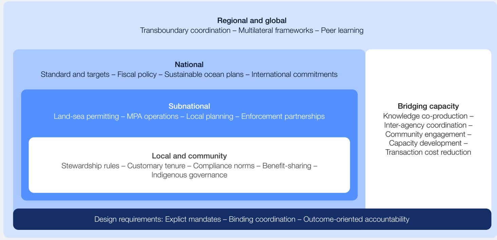

Local and community
Stewardship rules – Customary tenure – Compliance norms – Benefit-sharing – Indigenous governance

Bridging capacity
Knowledge co-production –
Inter-agency coordination –
Community engagement –
Capacity development –
Transaction cost reduction

Design requirements: Explicit mandates – Binding coordination – Outcome-oriented accountability

Sources: Ostrom (2010); Berdej & Armitage (2016). $^{77}$

## Empowering local solutions to local problems

Regeneration is delivered, ultimately, at the local and subnational levels where people live, manage ecosystems and conduct business. Coastal communities and Indigenous Peoples are the de facto stewards of nearshore waters, with customary tenure systems that long predate formal marine governance and that, when legally recognised, produce measurably better ecological and social outcomes than top-down designation alone. Subnational governments sit one tier above, holding the operational levers that matter most for regeneration, such as land-sea permitting, marine protected area management, fisheries co-management arrangements and enforcement.

Three conditions determine whether this subnational level succeeds:

\- Legal recognition of customary rights, so that local stewardship has standing rather than goodwill.

\- Devolved authority and fiscal autonomy, so that subnational governments can act without waiting for central permission.

\- Fit-for-purpose financing vehicles, such as off-treasury public corporations, that allow conservation revenues and blended capital to flow directly to seascape operations rather than disappearing into general budgets.

The Bird's Head Seascape in Indonesia shows what happens when all three of these conditions are in place (see Case Study 3).

## CASE STUDY 3: Seascape approach for regeneration

Sector cluster:

Frontier

Regeneration tier:
Tier 2, Regenerative-operational

The Bird's Head Seascape (BHS), a 225,000 km $^{2}$ expanse of land and sea in Papua and West Papua, Indonesia, within the Coral Triangle, is one of the most biodiverse marine regions on earth. $^{78}$ It supports hundreds of coastal communities whose livelihoods, food security and cultural identity depend on marine ecosystems, long guided by customary tenure. $^{79}$ By the early 2000s the region was under sustained pressure from destructive fishing, poorly managed coastal development and extractive industries, with the benefits from fishing, oil and gas and logging bypassing most communities. $^{80}$

Special autonomy laws in the early 2000s expanded local authority over natural resource management, creating space for the Bird's Head Seascape initiative in 2004. BHS is a seascape-wide platform aligning ecosystem protection, fisheries management and economic development across previously fragmented efforts. $^{81}$

The initiative operates through a polycentric governance model distributing authority across four levels. Local communities play a central role, with customary tenure systems formally recognised and embedded into conservation planning. Subnational and national governments provide regulatory frameworks and enforcement, while NGOs support coordination, technical expertise and long-term implementation. $^{82}$ Over 30 partners – including Conservation International (CI), The Nature Conservancy (TNC) with Indonesian partner Yayasan Konservasi Alam Nusantara (YKAN) and World Wildlife Fund (WWF) – have provided coordination, technical capacity and support for long-term implementation.

Capital types improved: Natural, human, social, cultural

Levers activated: Governance, finance, human capacity

The results, over 20 years, are substantial. A network of 26 marine protected areas – designed around ecological and community-defined boundaries and enforced through government and community patrols – now covers more than 52,000 km $^{2}$ , with measurable gains in biodiversity and ecosystem resilience. $^{83}$ Tourism entrance fees tie economic benefits directly to ecosystem health and finance conservation and local development. The recognition of community rights has increased ownership, improved compliance, reinforced cultural connection to stewardship and diversified incomes. $^{84}$

Concrete examples included the Raja Ampat Homestay Association's community-led tourism; coral reef restoration by SEA People (aka Orang Laut Papua) that includes training former bomb fishermen as coral gardeners; and Raja Ampat's 2025 UNESCO Biosphere Reserve designation, strengthening land-sea coordination. $^{85}$ Challenges remain, however, including pressures from tourism, coastal development, potential mining and cumulative climate impacts.

## Takeaway

The four-level polycentric governance model is not theoretical. Bird's Head shows it works across a whole seascape, over 20 years – when customary tenure is given legal recognition, when national autonomy laws have devolved authority to places that can hold it, and when NGO capacity stays long enough to bridge institutional layers rather than parachuting in and out. This case study illustrates how natural, social, cultural and financial capital can be improved together while coordinating across scales.

# National planning and marine spatial planning

A governance model that terminates at national borders is incomplete. Many of the most productive marine systems span multiple national jurisdictions.

## National planning

Sustainable Ocean Plans (SOPs), championed by the High Level Panel for a Sustainable Ocean Economy (the Ocean Panel) and endorsed by 19 heads of state, commit governments to sustainably manage 100% of ocean areas under national jurisdiction. $^{86}$ SOPs are integrative national frameworks encompassing marine spatial planning, regulatory reform, strategic investment, integrated coastal-watershed management and effective area-based conservation measures. $^{87}$ Over three-quarters of Ocean Panel country SOPs are now supported by legislative instruments and all 14 founding members have established cross-sectoral coordination mechanisms. $^{88}$

For a regenerative blue economy, the SOP should serve as a national operating charter with four principal governance functions:

\- Establish regenerative outcomes and guardrails – including biodiversity targets, sustainable fisheries reference points and equity commitments that limit permissible economic activity.

\- Enforce coherence across ministries, especially finance and planning portfolios, so that subnational seascapes do not receive contradictory policy signals.

\- Standardize the minimum requirements for seascape-level plans, including process safeguards, data standards, rights recognition and reporting obligations.

\- Link planning to budgets and investment conditions, ensuring that the SOP carries fiscal force rather than remaining a declaratory instrument confined to the environment ministry. $^{89}$

## Marine spatial planning

Marine spatial planning (MSP) translates these national priorities into spatially explicit governance at the subnational level. MSP is a process for

negotiating trade-offs and allocating human activities in space, supported by geospatial data and given legal effect through regulatory instruments. $^{90}$ It is also one of the most practical mechanisms for embedding adaptive governance – the capacity for periodic review and rule adjustment – into routine public administration. $^{91}$

MSP serves the regenerative agenda in several ways:

\- Renders trade-offs explicit, including the distribution of costs, benefits and compensation across affected communities.

\- Integrates cumulative impact assessment rather than evaluating each permit or concession in isolation.

\- Enables rights-based ocean governance by translating customary tenure and traditional use patterns into legally recognised zones.

\- Provides the spatial architecture for sector transition pathways: through zoning and conditional permitting, MSP can designate areas where fisheries shift from extractive harvest to restorative models, aquaculture operates under regenerative production standards, tourism concessions carry explicit restoration obligations and coastal infrastructure incorporates nature-based solutions as a condition of approval.

The framework provided by marine spatial planning constrains arbitrary decision-making and reduces the uncertainty that deters long-term investment. $^{92}$

## Regional cooperation and global coherence

A governance model that terminates at national borders is incomplete. Many of the most productive marine systems – such as coral reef complexes, large marine ecosystems (LMEs) and migratory corridors – span multiple national jurisdictions. Regional cooperation is therefore an essential governance layer for transboundary planning, regulatory alignment and multi-jurisdictional financing.

# CASE STUDY 4: Transboundary regenerative tuna management in the Pacific

Sector cluster:

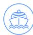

Traditional

Regeneration tier:
Tier 1, Regenerative-aligned

Capital types improved: Economic, cultural, social, human

Levers activated: Governance, finance, human capacity

The Parties to the Nauru Agreement (PNA) – a coalition of eight Pacific Island countries managing the world's largest tuna fishery – demonstrate how coordinated governance can protect natural capital, while delivering equitable economic and social outcomes for ocean-dependent communities.

Early efforts to establish minimum standards for vessel reporting, inspection and tracking failed to curb fishing pressure. However, the introduction of the Vessel Day Scheme (VDS) in 2007 was transformative. The scheme caps the total number of fishing days based on scientific advice, allocates those days among member countries and allows them to be traded, creating a controlled and flexible market.

Subsequent Marine Stewardship Council (MSC) certification of the skipjack purse seine fishery\* in 2011 reinforced the model, bringing with it monitoring, traceability and international credibility, embedding strong institutional norms across the coalition.

At the heart of PNA's model is the recognition that tuna stocks are a finite natural asset requiring active stewardship. By shifting its fisheries from maximizing catch volumes to managing scarcity and value, PNA has maintained healthy stocks and stable catches, preserving the ecological foundation upon which all other value depends. This alignment of economic incentives with ecological limits is central to the PNA's regenerative approach.

Collective governance has enabled PNA members to quadruple revenue from purse seine fishing, strengthen bargaining power against distant water fleets, and grow both exports and employment – demonstrating that regenerative management and financial returns are mutually reinforcing.

PNA members face a number of ongoing challenges, including climate-driven shifts in tuna distribution, stretched monitoring and enforcement capacity across vast ocean areas, and technological advances that risk increasing fishing pressure even within a fixed-day effort limit. Addressing these pressures will require continued adaptation, investment in science and monitoring, and sustained cooperation among member states.

However, the strength of the PNA lies in its collective governance model, which provides a foundation for responding to these challenges in a more coordinated and holistic way. As pressures on the ocean intensify, this model offers a compelling pathway to achieve more sustainable and regenerative outcomes across the blue economy.

## Takeaway

PNA's regenerative management of the world's largest tuna fishery demonstrates how collective governance of a transboundary resource can deliver ecological, economic and social returns that individual states, acting alone, could not secure.

Note: \* Purse seine fishing takes place in the open ocean, using a large net (the “purse seine”) to target dense schools of single-species pelagic (midwater) fish such as tuna and mackerel. Source: Marine Stewardship Council. $^{93}$  
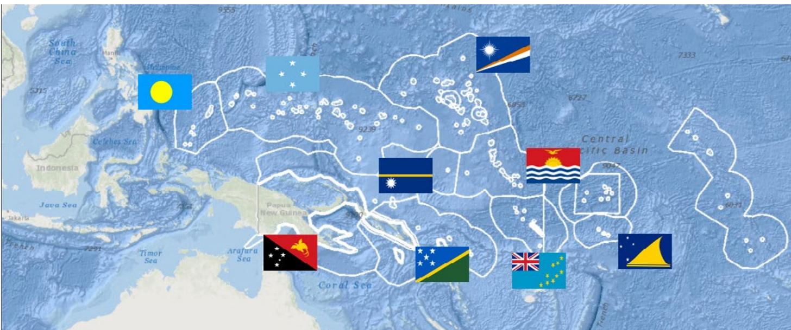  
Image: Parties to the Nauru Agreement

Two global instruments offer practical entry points for seascape governance. Other Effective Area-based Conservation Measures (OECMs) under the Kunming-Montreal Global Biodiversity Framework allow well-governed seascapes to count towards the GBF's 30×30 target to conserve 30% of land, waters and seas by 2030 – without formal protected area designation – creating a political incentive to invest in seascape governance. $^{94}$

Separately, blue carbon ecosystems – including mangroves, tidal marshes and seagrass meadows – can contribute quantifiable carbon sequestration to Nationally Determined Contributions (NDCs), linking seascape governance to international climate finance, while their role as cost-effective coastal defences makes seascape investment legible to finance ministries. $^{95}$

Seascape governance should therefore be designed from the outset with OEM eligibility and NDC integration in mind – building the monitoring, rights frameworks and cross-ministerial engagement that make a seascape investable. Without vertical integration – where subnational seascapes are embedded in national SOPs, coordinated through regional bodies and aligned with global frameworks – the regenerative blue economy risks remaining a collection of isolated experiments rather than a systemic transformation.

## An implementation pathway

A credible transition towards regenerative seascape governance should embed coordination mechanisms and spatial rules within existing

institutions rather than create new authorities on paper. The following is a proposed one to five year pathway:

## Years 1-2

\- Designate one to three priority seascapes and appoint a lead convenor for each.

\- Build the marine spatial planning baseline and draft initial zones.

\- Agree on a small number of high-confidence enforcement actions, such as prohibitions on destructive fishing and compliance with core no-take provisions.

\- Establish a multi-stakeholder platform with a formal link to government decision-making.

\- Publish a short investment pipeline aligned with at least one dedicated budget line.

## Years 3-5

\- Convert marine spatial plans into a legally binding plan with plan-conformity requirements for permitting.

\- Embed seascape priorities in national SOPs and sectoral policies, including co-developed industry transition pathways for fisheries, aquaculture, tourism and coastal infrastructure.

\- Establish a stable finance mechanism – either blended finance facilities or structured around fees, trust funds and fiscal transfers – with appropriate transparency safeguards.

\- Expand monitoring and revise zones as evidence warrants. Governments may consider designating subnational special economic zones for regenerative blue economy development – defined policy spaces with tailored regulatory, fiscal and investment incentives designed to accelerate the transition from extractive to regenerative value chains.

## Finance

## Less than $1\%$ of the ocean economy's annual value has been invested in its sustainability. The financial architecture to change this already exists.

Less than 1% of the ocean economy's estimated annual gross value added has been invested in sustainable ocean projects over the past decade, while vastly larger flows continue to support nature-negative activities, including harmful public subsidies. $^{96}$ The current financial system is not neutral in the face of ocean degradation – it is largely designed to maximize the accumulation of financial capital at the expense of other types of capital, with disastrous results for the ocean. However, with the right governance and incentives, financial capital can be redirected towards ocean positive activities.

Table 3 demonstrates the potential logic of a regenerative blue finance system across four linked functions: public finance, innovative financing mechanisms, blue natural capital and direct community access to finance. Public finance and fiscal reform establish enabling conditions and absorb early risk. Innovative instruments such as guarantees, bonds, debt swaps and blended finance attract and scale up private and blended capital. Meanwhile, dedicated mechanisms ensure direct, equitable access to finance for Indigenous Peoples and local communities (IPLCs), subnational governments, cooperatives and coastal enterprises. $^{97}$

TABLE 3 Blue finance instruments: functions, uses and caveats

<table><tr><td>Function</td><td>Instruments</td><td>Use case</td><td>Caveats</td></tr><tr><td>Public finance</td><td>Public budgets, subsidy reform, ocean user fees, procurement, guarantees.</td><td>Fund public goods, correct incentives, lower system risk.</td><td>Public finance often still backs harmful marine activities rather than regeneration. $^{98}$ </td></tr><tr><td rowspan="2">Innovative financing mechanisms</td><td>Blended finance, sovereign blue bonds, debt-for-nature swaps, pooled vehicles.</td><td>Improve bankability and attract larger-scale investment.</td><td>Can increase complexity, debt burdens or investor-first design if not structured carefully. $^{99}$ </td></tr><tr><td>Blue carbon and other ecosystem service mechanisms.</td><td>Create revenue streams for conservation and restoration.</td><td>Integrity depends on credible MRV*, additionality and equitable benefit-sharing. $^{100}$ </td></tr><tr><td>Direct community access to finance</td><td>IPLC finance windows, intermediaries, venture-building, revolving funds.</td><td>Reach local stewards, SMEs* and subnational actors.</td><td>Regeneration fails if finance bypasses rights-holders or ignores tenure and decision-making authority. $^{101}$ </td></tr></table>

Note: \*MRV = monitoring, reporting and verification; SMEs = small and medium enterprises.

\- Public finance is the foundation of regenerative blue finance because it can support the public goods that private capital will not reliably fund.

## Public finance to create enabling conditions

Public finance is the foundation of regenerative blue finance because it can support the public goods that private capital will not reliably fund, such as ecosystem monitoring, habitat restoration, standards development and local governance capacity building. Public finance also shapes incentives. Today, most public investment remains concentrated in activities incompatible with SDG 14. Harmful fisheries subsidies persist,

while natural capital accounting remains largely unimplemented. $^{102}$ Regenerative finance therefore begins with fiscal reform: redirecting subsidies, using levies and fees to discourage degradation, and treating ocean stewardship as productive public investment rather than expenditure. $^{103}$

Public intervention is also needed to reduce the risk premium attached to ocean projects. Guarantees, insurance instruments and targeted prudential reform can lower financing costs by addressing risk that private investors are unwilling to absorb alone, from siting delays to nature-related value at risk. $^{104}$

Central banks and financial regulators have a complementary role: integrating ocean-related risks into prudential frameworks – including through stress testing and enhanced disclosures – thereby helping to internalize ocean health considerations into the financial system. $^{105}$ The point is not simply to subsidize more deals, but to change the terms on which regenerative activity becomes financeable.

Blended finance remains one of the main ways to this. According to Convergence – a global network focused on this kind of financing – blended finance has to date mobilized \$277 billion for sustainable development in developing countries. $^{106}$ Blue economy applications are a small but growing component, especially in fisheries and aquaculture, sanitation and water treatment. $^{107}$ This only works if the concessional capital addresses real market failures or financial risks, thereby supporting investment viability and crowding-in private capital. $^{108}$

Private finance is also beginning to change through standards, disclosure and performance-linked lending. Frameworks such as the Sustainable Blue Economy Finance Principles, $^{109}$ the Poseidon Principles for shipping, $^{110}$ and sustainability-linked loan structures tied to environmental performance are helping to move ocean considerations from the margins of corporate sustainability closer to the core of capital allocation. $^{111}$ The importance of these frameworks is not that they solve the financing gap on their own, but that they begin to change how banks, investors and insurers price marine risk and reward better stewardship.

## Innovative financing mechanisms

Blue bonds and debt-for-nature swaps show that dedicated finance can now be structured at sovereign scale. Blue bonds have expanded significantly since the Seychelles' pioneering \$15 million issuance in 2018, reaching at least \$10.4 billion in total issuances by early 2025, with 58% of that volume issued in 2023-2024 alone. Corporate issuers are now entering the market, drawn by growing investor appetite for blue assets and, in some cases, favourable pricing. For example:

\- In 2023, ∅rsted issued the energy sector's first blue bond – a €100 million placement financing offshore biodiversity restoration and sustainable shipping – citing strong demand from institutional investors seeking to align portfolios with sustainability objectives.

\- In late 2024, DP World followed with the first corporate blue bond in the Middle East and North Africa – a \$100 million instrument that achieved the company's tightest-ever spread in the bond or sukuk market, suggesting that the blue label can materially lower borrowing costs for credible issuers.

Nevertheless, blue bonds still represent a very small share of the wider sustainable debt market. Structural barriers to the participation of small island developing states (SIDS) remain acute: borrowing costs on global markets for SIDS are three to six times higher than for wealthier Organisation for Economic Co-operation and Development (OECD) countries. Blue sovereign bond issuances add to existing debt burdens, making them inaccessible to many highly indebted SIDS. $^{112}$

Debt-for-nature swaps can create fiscal space for marine conservation without requiring new external transfers, as demonstrated by recent transactions such as Ecuador's \$1.1 billion debt conversion for the Galápagos Marine Reserve which is expected to unlock \$323 million for marine conservation. $^{113}$ Their effectiveness, however, depends on careful design and alignment with national priorities, as transactions can be complex, creditor-driven and resource-intensive to structure. $^{114}$

Market-based mechanisms for blue natural capital remain more fragile. Blue carbon environments have attracted growing attention for their ability to generate climate and restoration value, estimated at approximately \$190 billion annually, but methodological consensus and investable pipelines remain uneven beyond mangroves. $^{115}$

Where such mechanisms are used, their legitimacy depends on rigorous monitoring, reporting and verification (MRV) practices, alongside formal requirements for community partnership, equitable benefit-sharing and explicit policy linkages to emissions reductions at source. $^{116}$

## CASE STUDY 5: Mobilizing coordination and capital for regeneration in Mexico's Gulf of California

Sector cluster:

Growth

Regeneration tier: Tier 2, Regenerative-operational

La Paz, the capital of Baja California Sur (BCS) on Mexico's Gulf of California, illustrates how a regenerative blue economy can begin to emerge when diverse actors align across a shared seascape. The region is globally recognised for its marine biodiversity and its importance to fisheries, tourism and coastal livelihoods, but has faced sustained pressures from overexploitation, ecosystem degradation and climate change. $^{117}$ In response, locally led initiatives have emerged to restore marine ecosystems, strengthen community-based management and build resilient coastal livelihoods. $^{118}$

Once shaped by international NGOs, the seascape now hosts a diverse ecosystem of organizations: fisheries initiatives supporting stock recovery; aquaculture exploring lower-impact models; conservation and tourism programmes restoring habitats and strengthening biodiversity monitoring; and programmes building entrepreneurial capacity. $^{119}$ These efforts have largely developed in parallel, limiting system-wide impact and access to institutional investment.

The Gulf of California Platform now convenes investors, philanthropies, communities, civil society, industry, academia and government. $^{120}$ Supported by the Alumbra Innovations Foundation, research institutions and systems change partners, it aligns actors, objectives and resources across five domains: ocean conservation, coastal development and resilience, tourism and recreation, food systems and water. $^{121}$

Capital types improved:
Natural, cultural, social,
human

Levers activated:
Human capacity, finance,
governance

Developing funding pathways is a central focus of the platform. Many regenerative activities are individually too small or disconnected to attract institutional capital, but aligning them unlocks blended finance. Catalytic funding (e.g. grants) can support both the institutions and the social infrastructure that regeneration requires, such as policy development, technology adoption, community networks and local capacity. $^{122}$

Results are emerging. Growing demand for traceable, sustainably sourced seafood creates incentives for improved practices. Funding partnerships have introduced mechanisms such as partially forgivable loans to fishing cooperatives, linking repayment to environmental performance – finance that rewards regenerative behaviour directly.

## Takeaway

Regeneration in a busy and contested seascape depends less on launching new initiatives than on aligning existing ones and building the financial, social and institutional infrastructure that lets local actors retain agency while addressing needs to scale up. La Paz demonstrates that platform-based coordination, not project proliferation, is how fragmented local progress can move towards system-level transformation.

## Direct community access to finance

Small-scale fisheries support some 500 million people, providing at least $40\%$ of global marine catch and $90\%$ of capture fisheries' employment.

The deepest failure in ocean finance is not that too little money exists at the sovereign or institutional level. It is the near-total exclusion of the communities and local entrepreneurs most actively involved in the stewardship of blue natural capital from the systems nominally designed to support them. Small-scale fisheries support some 500 million people, providing at least 40% of global marine catch and 90% of capture fisheries' employment, yet subsidies and formal finance continue to favour industrial actors and power asymmetries routinely marginalize IPLC voices in decisions about how marine areas are managed and financed. $^{123}$

Finance that flows to coastal ecosystems while bypassing these communities cannot be considered regenerative: recognitional equity – acknowledging pre-existing rights and the authority of coastal peoples to define regeneration within their own territories – is foundational (see Chapter 2). $^{124}$

This is partly a design problem. A persistent financing gap prevails in the space between microfinance and institutional development finance – precisely where most regenerative blue economy enterprises, coastal cooperatives and community initiatives are located. $^{125}$ Dedicated IPLC and subnational financing windows, intermediaries and venture-building models are essential, because they combine patient capital with the technical support needed to move early-stage local initiatives towards viability.

The exclusion of local communities from finance is also a rights and governance problem. Regenerative finance requires more than benefit-sharing after the fact; it requires addressing both distributional justice – fair allocation of costs, benefits and risks – and the unresolved question of marine tenure. Ocean and intertidal ecosystems are typically government-owned, removing community incentives for stewardship and creating legal uncertainty that discourages both community investment and external capital. $^{126}$

The Great Bear Sea project finance for permanence (PFP) initiative, led by 17 First Nations, illustrates what is possible when this foundation of regenerative justice and sea tenure is in place. The partnership raised \$335 million to manage 10 million hectares of ocean off the coast of British Columbia, Canada for long-term conservation and community-led development. Importantly, the funding model was built on a foundation of Indigenous-led governance, rather than the other way around. $^{127}$ Philanthropic and public finance are uniquely positioned to provide the risk-tolerant, long-horizon capital these community-governed approaches require.

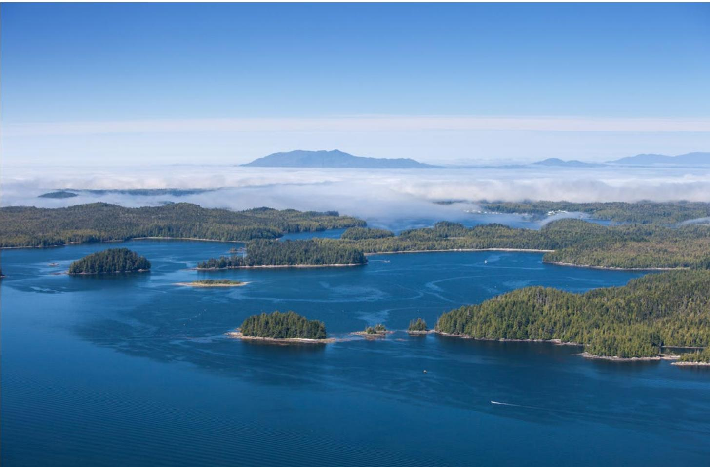

The basic tools for regenerative blue finance already exist. Public finance can establish enabling conditions and stop rewarding degradation. Innovative instruments can mobilize larger pools of capital. Dedicated access mechanisms can

connect finance to the coastal actors whose stewardship determines ecological outcomes. What is missing is the architecture to make regenerative blue finance the norm rather than the exception.

A regenerative blue economy redirects capital across four scales so that finance reaching the coast also rebuilds the ecosystems that sustain it.

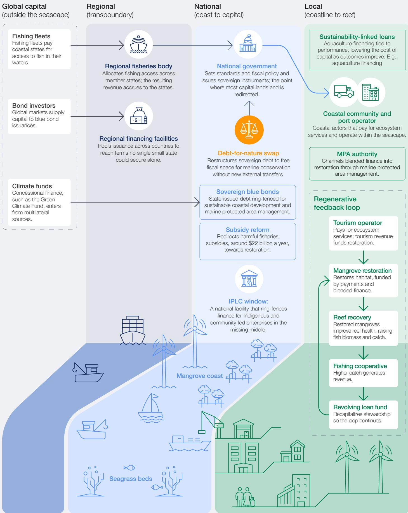  
Note: Arrows indicate direction of capital flows. Governance levels (regional, national, local) map onto finance types (public finance, innovative instruments, community access) and regeneration levels (actor, system, interaction) as defined in Chapter 2.
Source: World Economic Forum.

## Human capacity

## Transitioning to a regenerative blue economy is as much a human and institutional challenge as an ecological and technical one.

\- Without sufficient human and institutional capacity, investments underperform, inequalities widen and well-designed policies remain on paper. Capacity is foundational, not supplementary.

Regeneration will succeed only where local people are empowered to lead it.

Regeneration demands systems thinking, long-term planning and coordination across sectors that are typically governed separately. It asks more of institutions than sustainability does: not just reducing harm, but designing, managing and continuously adapting ocean solutions at seascape level. Without sufficient human and institutional capacity, investments underperform, inequalities widen and well-designed policies remain on paper. $^{128}$ Capacity is foundational, not supplementary.

Capacity development – also referred to as capacity building or capacity sharing – is the process of strengthening individual skills and institutional capability through education, training, knowledge exchange and trusted partnerships. $^{129}$ It is shaped by political and institutional dynamics that determine whose knowledge is prioritized, how resources are allocated and which actors can meaningfully participate in ocean decision-making. Those dynamics determine whether capacity development narrows inequity or reinforces it.

## Capacity across different levels of governance

The four-scale architecture set out in Lever 1: Governance – community, subnational, national and regional/global – requires different capabilities at each level. National agencies need capacity in policy design, regulatory enforcement, ecosystem valuation and natural capital accounting. Subnational governments need training in marine spatial planning, permitting

and management of marine protected areas. Industry needs the skills to build regenerative business models, manage environmental risk and navigate compliance.

Meanwhile, civil society and community institutions need skills upgrades for data interpretation, advocacy and participatory governance. Academic and research institutions contribute by translating science into practical solutions, while Indigenous and local knowledge systems provide place-based insights and stewardship practices that are essential to seascape governance. No single category of capacity can substitute for another.

## Ocean literacy as platform

Ocean literacy – understanding how the ocean affects us and how we affect the ocean $^{130}$ – is one of the most critical pathways for building a regeneration-ready society. It moves beyond awareness to embrace the values, judgements and relational understanding needed for decisions that are both ecologically sound and culturally grounded. In the context of the Pacific Island Forum’s Blue Pacific 2050 strategy, ocean literacy is increasingly recognized as an essential pillar of achieving its objectives for a resilient and prosperous Pacific region. $^{131}$ Alongside building academic ocean literacy, it develops the mental, physical and spiritual resilience needed to be an ocean custodian – an approach well matched to contexts such as the Pacific, where countries are 96% ocean and where regeneration will succeed only where local people are empowered to lead it.

## Capacity is built by doing

“Treating ocean literacy and institutional capacity as core transition infrastructure is the step that turns ambition into durable transformation.

Skills such as marine spatial planning, ecosystem assessment and financial literacy are best developed through hands-on participation in real planning and governance processes. Good decision-support tools can strengthen this by helping people share and understand information, weigh trade-offs and work through competing interests more effectively. $^{132}$ This allows stakeholders to build practical experience, strengthen collaboration and make more informed decisions over time.

## Investing in capacity

Every regenerative blue economy initiative should carry an explicit capacity development component alongside its ecological, financial and technological goals. Dedicated funding matters not only for training people but also for strengthening institutions, enabling peer learning and sustaining knowledge exchange across regions.

Investment must be mobilized equitably, so that developing countries and coastal communities can participate meaningfully – and so that Indigenous knowledge and stewardship traditions inform design rather than being invoked and then sidelined. Treating ocean literacy and institutional capacity as core transition infrastructure – on a par with physical infrastructure, technology and restoration – is the step that turns ambition into durable transformation.

## CASE STUDY 6: Training sea rangers for ocean regeneration

Sector cluster:

Frontier

Regeneration tier: Tier 3, Regenerative-native

Capital types improved:
Natural, human, social,
cultural, economic

Levers activated: Human capacity, finance

Ocean restoration and protection face a delivery gap: global commitments are accelerating, but operational capacity lags. Monitoring vast marine environments requires trained personnel, vessels and coordination that are often lacking, while many coastal communities and port cities face high youth unemployment and limited access to blue economy opportunities. $^{133}$

The Sea Ranger Service (SRS) is an Amsterdam-based social enterprise that links workforce development with ocean stewardship. $^{134}$ It recruits 18-29 year-olds in coastal communities and trains them in maritime and ecological fieldwork through the Sea Ranger Bootcamp and on-the-job practice. SRS launched in the United Kingdom in 2024 to help the organization towards its ambitious target of training 20,000 young people and restoring 1 million hectares of ocean biodiversity by 2040. $^{135}$

Operations run on low-emission sailing vessels, giving sea rangers practical offshore experience and recognised certifications, while demonstrating lower-emission maritime operations. $^{136}$ SRS's sea rangers have contributed to restoration projects across multiple European sites, including the transplantation of tens of thousands of seagrass cores and the collection and planting of over 200,000 seeds. $^{137}$

Partnerships with governments, industry and research institutions route trained sea rangers directly into paid contracts for work that includes hydrographic surveying, habitat mapping, seagrass planting, nature restoration services and marine plastics research. $^{138}$

In October 2025, the Port of Rotterdam Authority signed a three-year framework agreement with SRS to support a climate-neutral transition in the port, beginning with a project documenting marine plastics. $^{139}$ Other partners include the Royal Netherlands Navy, Tesco, Nestlé and the University of Groningen.

Financially, SRS combines earned revenue with an impact fund to finance its vessels and enable the organization to grow into new geographies while reducing its dependence on grants. A franchise approach enables expansion while keeping ownership, employment, skills and ocean stewardship rooted in coastal communities. Barriers include procurement structures which favour large operators and a dearth of long-term contracting.

## Takeaway

Ocean regeneration needs people in the water restoring marine ecosystems. The Sea Ranger Service is a demonstration of how to address the youth unemployment gap and the marine conservation delivery gap in one intervention.

# Technology and artificial intelligence

# Technology will not regenerate the ocean. But advances in technology and AI can make regeneration more feasible at lower cost.

Photo: Uncrewed surface vehicle, Open Ocean Robotics.

Acting regeneratively at ocean scale has long faced technical constraints: ocean ecosystems are difficult and costly to monitor, coordination across actors and jurisdictions is complex, and the data needed to assess risk or verify outcomes is scarce. Remote sensing, autonomous platforms, environmental DNA, digital twins and machine learning are changing those economics. AI increasingly integrates these technologies, turning fragmented observation into actionable evidence and lowering the cost of the verification, coordination and risk analysis on which regenerative action depends.

The tools that matter most change the regenerative cost curve, opening new possibilities rather than marginally improving existing practice. Three domains show this most clearly today: observation and monitoring; risk and resilience; and industry optimization and seascape coordination.

## Decoding the deep

The past decade saw an explosion in ocean observation. Satellites now image sea-surface temperature, colour and salinity daily. $^{140}$ Sensors ride ships, buoys, autonomous vehicles and even marine species. Acoustic arrays and environmental DNA (eDNA) sampling can detect marine species and

ecosystem activity that would otherwise be difficult or impossible to observe directly. $^{141}$ Yet remarkably, even with this expanding observational toolkit, the data collected still represents less than 1\% of the ocean's full spatiotemporal variability $^{142}$ and much of what is collected sits unused in siloed archives.

AI turns raw observation into decision-grade evidence. Global Fishing Watch, a non-profit knowledge-sharing platform, infers fishing activity from vessel movement alone, letting non-state actors flag suspected illegal fishing globally. $^{143}$ Drone and acoustic analysis detects endangered species, maps plastic accumulation and locates rare habitats. Data-reconstruction techniques fill gaps in the deep ocean, polar seas and parts of the global South $^{144}$ – where the need for cost-effective baseline data for climate and ecosystem assessment is most acute.

## Moving ahead towards a regenerative blue

economy means leveraging new technologies to fill in critical data gaps, using advanced techniques to compensate for the limitations of direct observation and utilizing AI to interpret the massive amounts of oceanic big data being generated.

The strategic point is that ocean management depends on observation: you cannot manage, price, or verify what you cannot see. Marine

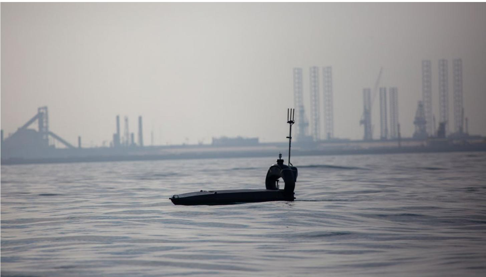

Roughly 40% of the world's population lives within 100 km of the coast. That narrow band – about 5% of inhabited land – generates an estimated 30-50% of global GDP.

spatial planning requires cumulative-impact data; outcome-based finance requires verifiable monitoring, reporting and verification; OEMC and NDC recognition requires credible measurement. Without affordable, widely available observation, each of these reverts to trust-based administration.

## Confronting ocean risk

Roughly 40% of the world's population lives within 100 km of the coast. $^{145}$ That narrow band – about 5% of inhabited land – generates an estimated 30-50% of global GDP $^{146}$ and concentrates ports, energy infrastructure, aquaculture, desalination and tourism. Storms and sea levels are rising and this is where most of the regenerative blue economy will be built. Risk management is not peripheral to the transition; it is a condition for it to succeed.

Technology and AI reshape coastal risk management in three ways:

\- Digital twins of wind turbines, subsea cables and port assets monitor structural integrity in real time, $^{147}$ enabling preventative maintenance.

\- Asset-level, climate-informed risk models replace coarse postcode data with forward-looking analytics that identify specific vulnerabilities $^{148}$ – keeping assets insurable where older models would withdraw cover.

\- Parametric insurance, triggered automatically by sensor or satellite thresholds, cuts claims-settlement costs and extends coverage to smaller actors previously priced out (see Case Study 7). $^{149}$

## CASE STUDY 7:

## Insurance innovation for a resilient and low-emissions ocean economy

Sector cluster:

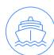

Traditional

Regeneration tier:

Tier 1, Regenerative-aligned

Capital types improved:

Financial, economic, human

Levers activated:

Finance, technology and AI

Marine insurance transfers and manages the risk that enables shipowners to invest, operate and recover losses. For example, hull and machinery insurance policies (H&M) cover damage to vessels and their essential systems and typically restore damaged assets to their original condition. $^{150}$ However, in a context of accelerating climate risks, $^{151}$ tightening environmental regulation $^{152}$ and an ageing fleet, this “like-for-like” approach perpetuates inefficiencies, delays the decarbonization transition and increases exposure to future losses. $^{153,154}$

Allianz Commercial's Marine Build Back Better Endorsement, released in May 2025 and expanded in April 2026, addresses this directly. This first-of-a-kind product for the marine insurance market provides additional financial support to H&M clients who repair or replace damaged assets using more energy-efficient or lower-emissions alternatives following a loss event. To qualify, the insured must demonstrate that the repair or replacement improves vessel efficiency or reduces emissions by at least 5%, through increased energy efficiency, reduced CO $_{2}$ -equivalent emissions per unit of energy or an overall reduction in carbon emissions. The endorsement covers up to the lesser of 50% of the original loss value or 50% of the incremental costs associated with decarbonization measures, capped at \$3 million based on fleet size.

A wide range of existing technologies can help shipowners meet these criteria, $^{155}$ such as more efficient propulsion systems, advanced hull coatings that reduce drag, hybrid or alternative fuel systems and digital optimization tools. Many of these solutions are already technically viable but face adoption barriers from upfront cost and fragmented incentives. $^{156}$ By embedding them into post-loss repair decisions, Allianz's endorsement accelerates their uptake and aligns routine asset renewal with the sector's broader decarbonization trajectory.

The wider significance is that insurance becomes a proactive tool, not a passive one. Post-loss reconstruction is a recurring investment moment across the global fleet; redirecting that towards better environmental performance and state of the art technology creates steady, compounding gains.

## Takeaway

Insured events, such as asset loss or renewal, are an underused policy and financial lever. Embedding efficiency, emissions or nature criteria into standard coverage converts routine replacement into transition finance for blue and green technology at scale without new capital or regulation.

## Making ocean industry smarter

At the sector level, AI and blue tech raise productivity while cutting environmental footprint. In aquaculture, machine learning optimizes feed delivery pen-by-pen, reducing both costs and nutrient pollution from overfeeding $^{157}$ – the ocean parallel to precision agriculture. In shipping, acoustic buoys and thermal cameras detect whales along migration corridors and trigger tactical speed reductions, $^{158}$ addressing a leading cause of endangered-whale mortality without disrupting trade.

The higher-value application is cross-sectoral. In congested marine regions such as the North Sea, Al-enabled modelling tools can now be used to combine daily movement maps of fishing vessels, transport ships, seals and seabirds with high-resolution satellite-derived maps of oil infrastructure, wind turbines and fish farms to identify and resolve frictions between these actors and promote integrated, cross-sectoral regenerative planning. $^{159}$

## Technology's own ocean footprint

Technology enables the regenerative blue economy, but it brings substantial environmental costs of its own. Data centres consume significant quantities of electricity and freshwater, and the hardware supply chain is resource- and emissions-intensive. Cooling of AI data centres can place growing pressure on freshwater resources and watersheds, including some that support downstream coastal and estuarine ecosystems.

A regenerative blue economy that leans on AI and technology without accounting for these footprints merely relocates environmental pressure rather than reducing it. For the ocean economy, the key implication is that digital and AI tools should be applied where they can materially improve verification, coordination, risk management and system optimization, while being accompanied by responsible practices on energy sourcing, water stewardship and hardware lifecycle management.

Without such safeguards and transparency, technology risks becoming another extractive pressure on ocean-linked systems rather than a contributor to regeneration. For a deeper assessment of the technology sector's nature-related impacts, see the World Economic Forum's report Nature Positive: The Role of the Technology Sector. $^{160}$

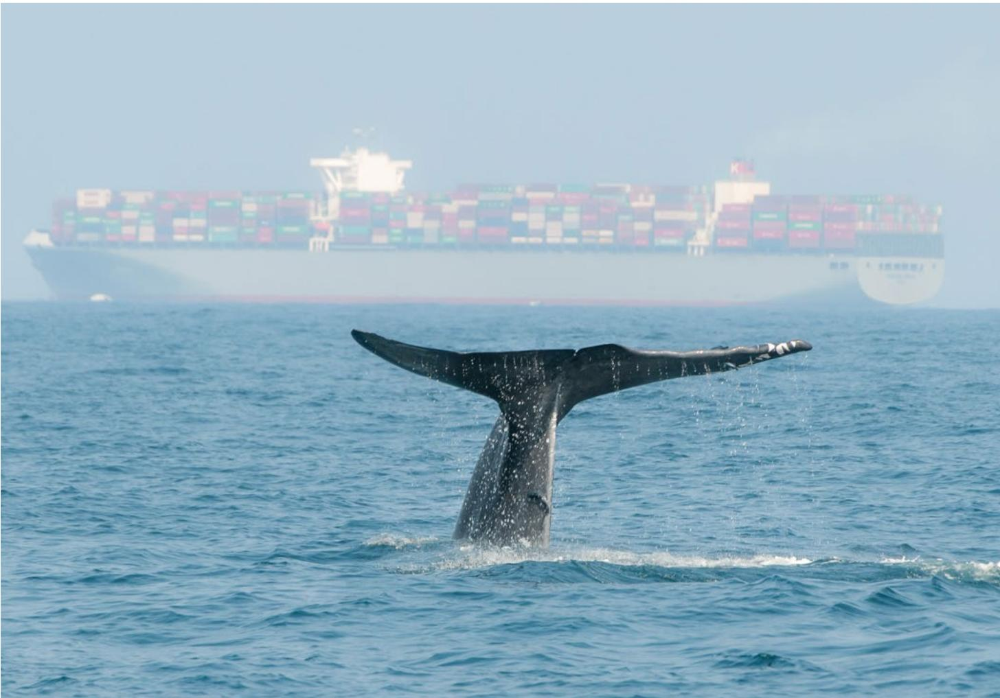

# Tailwinds and headwinds

# Ocean regeneration is caught between progressive and regressive forces – greater alignment on political, financial and ecological agendas is urgently needed.

The regenerative blue economy does not emerge in a vacuum. It is being propelled forwards by tailwinds but also buffeted by headwinds – competing forces that together determine both the pace and limits of this transition.

These dynamics highlight a central tension. On one hand, growing recognition of the ocean's role in climate, security and livelihoods is driving new political attention, technological innovation and financial models – while advances in monitoring, energy and digital infrastructure are expanding

opportunities for regenerative and community-led approaches. But on the other hand, geopolitical fragmentation, rising competition for ocean space, resistance from incumbent systems, persistent financing gaps and accelerating ecological tipping points threaten to slow progress, underscoring the need to align political will, financial systems and ecological realities at speed and scale.

Figures 3 and 4 outline some of these strategic tailwinds and headwinds, along with proposed actions by policy-makers and businesses in response.

## FIGURE 3 Strategic tailwinds propelling ocean regeneration forward

<table><tr><td>Theme</td><td>Description</td><td>Action for policy-makers and businesses</td></tr><tr><td>Growing geopolitical relevance</td><td>The ocean is increasingly framed as a climate solution, drawing in energy, defence and foreign affairs alongside environment. BBNJ $^{161}$  and the WTO fisheries subsidies agreement $^{162}$  signal progress, if incomplete.</td><td>Governments: embed ocean regeneration in national security, energy and trade agendas.Businesses: position ocean investments as resilience plays, not only corporate social responsibility (CSR).</td></tr><tr><td>Recognition of small-scale and Indigenous stewardship</td><td>Tenure rights, community representation and evidence of effective local stewardship are placing equity, rights and public health at the centre of ocean governance.</td><td>Governments: secure community tenure and co-governance rights in ocean plans.Businesses: embed benefit-sharing into supply chains and project design from day one.</td></tr><tr><td>Cheaper monitoring and enforcement</td><td>The cost of monitoring and enforcement has fallen sharply, with satellite tracking, drones, and AI making transparency more accessible even to remote communities.</td><td>Governments: fund satellite and AI monitoring as public enforcement infrastructure.Businesses: adopt transparent vessel tracking and supply-chain verification to stay ahead of regulation.</td></tr><tr><td>Falling cost of distributed technologies</td><td>Solar power, cold chains, electric vessels and digital platforms let small-scale actors participate in higher-value, regenerative supply chains previously out of reach.</td><td>Governments: remove regulatory barriers to small-scale adoption of clean ocean technology.Businesses: invest in distributed platforms that widen the supplier and producer base.</td></tr><tr><td>More catalytic capital</td><td>Philanthropy, maturing blue bonds, debt-for-nature swaps and blended finance are beginning to open space for restoration and community-led enterprise.</td><td>Governments:deploy concessional capital to de-risk first-mover regenerative projects.Businesses:use blended finance structures to enter markets where commercial returns alone do not yet justify investment.</td></tr></table>

Source: World Economic Forum.

FIGURE 4 | Strategic headwinds buffeting ocean regeneration's progress

<table><tr><td>Theme</td><td>Description</td><td>Action for policy-makers and businesses</td></tr><tr><td>Fracturing multilateralism</td><td>Progress depends on cooperation across fisheries, shipping, biodiversity and climate regimes, but alignment is under strain from Arctic competition to growing obstacles in advancing the IMO agreement on shipping decarbonization.</td><td>Governments: pursue bilateral and regional ocean agreements where multilateral processes stall.Businesses: diversify regulatory exposure across jurisdictions.</td></tr><tr><td>Rising demand on ocean space and resources</td><td>Seafood demand, ports, offshore energy and coastal development are intensifying pressure.Managed well through spatial planning, this pressure can be channelled; unmanaged, it compounds harm.</td><td>Governments: accelerate marine spatial planning to allocate ocean space before competing claims entrench.Businesses: secure early-mover licences in well-governed jurisdictions and plan for spatial constraints.</td></tr><tr><td>Incumbent resistance and contested narratives</td><td>Transitioning toward a regenerative model requires shifting long-established practices, economic structures and governance systems, which can generate friction among incumbent and affected stakeholders. Misinformation erodes trust in science and weakens public support for key transitions.</td><td>Governments: provide clear transition policies and just transition support for affected workers and communities; strengthen transparent, science-based communication and public engagement to counter misinformation.Businesses: get ahead of transition risk by shifting portfolios towards regenerative models; engage proactively with communities to strengthen public trust.</td></tr><tr><td>Climate and ecological thresholds</td><td>Coral reefs, Arctic sea ice and other systems are approaching limits beyond which management quality alone cannot secure recovery without rapid emissions cuts.</td><td>Governments: link ocean strategies to national climate targets – regeneration cannot succeed without rapid emissions cuts.Businesses: stress-test ocean assets against warming scenarios and disclose climate-dependent risks.</td></tr><tr><td>Misaligned mainstream finance</td><td>Capital still favours extractive activity.Regenerative projects face long horizons, diffuse returns and inconsistent standards, compounded by the retreat from net-zero commitments.</td><td>Governments: reform subsidies and prudential rules so capital flows reward regeneration.Businesses: adopt outcome-based metrics for ocean investments and demand the same from fund managers.</td></tr></table>

Source: World Economic Forum.

# Conclusion: towards a regenerative blue economy

A regenerative blue economy is one that treats healthy ocean ecosystems and thriving communities as the foundation of economic strength, not its by-product.

Delivering a regenerative blue economy requires a systemic shift in how ocean-based activities are financed, governed and valued, alongside coordinated action across sectors, institutions and communities.

The ocean economy is expanding even as the ecosystems that sustain it are degraded by cumulative human activity – a contradiction that supports billions of livelihoods, underpins global trade, sustains the food security of coastal nations and cannot hold. Without decisive action, the ecosystems that make this possible will continue to decline.

The pace and limits of the transition are being set by a mix of tailwinds and headwinds. Propelling ocean regeneration forwards are factors such as growing geopolitical relevance, recognition of small-scale and Indigenous stewardship, cheaper monitoring, falling costs of distributed technologies and more catalytic capital. Simultaneously, however, the transition is being buffeted by fracturing multilateralism, rising demand on ocean space, incumbent resistance, climate and ecological thresholds and misaligned mainstream finance.

These forces are not symmetrical: some headwinds – notably climate thresholds – impose hard limits that governance alone cannot resolve. The window for action is narrowing even as the tools mature.

Incremental improvements in behaviour and practice cannot halt or reverse this decline. The regenerative blue economy offers a different path: an ocean economy that restores ecosystems, expands opportunity and builds long-term resilience within planetary limits – one in which how ocean-based activity is designed, financed, governed and measured is itself what changes.

That shift will not come from isolated projects. It requires transformation across traditional, growth and frontier sectors – supported by clear goals, evidence, learning and honest management of trade-offs. Regeneration is not a fixed end state. It is a continuing process shaped by the interaction of people, institutions, incentives and feedback loops across time and seascapes.

This report has examined four critical levers: finance, governance, human capacity and technology. Each plays a distinct role and none is sufficient alone.

\- Financial systems must end incentives that still reward extraction over regeneration and shift from minimizing harm towards restoring natural, social, human and economic value.

\- Governance must move beyond fragmented, sector-by-sector decision-making towards coordinated systems that work across seascapes and share costs and benefits fairly across communities, places and generations.

\- Human capacity underpins the entire transition – ensuring that individuals, communities and institutions have the skills, knowledge and agency to design and sustain regenerative approaches grounded in local realities.

\- Technology and AI expand our ability to understand, monitor and manage ocean systems and to handle risk, provided their own environmental footprint is addressed rather than ignored.

This report's core insight is that regeneration does not emerge from optimizing these levers independently, but from their interaction. It is through their alignment and the careful examination of their influences on each type of capital (natural, human, social, cultural, economic and financial) that isolated actions begin to compound into fundamental change.

Regeneration does not emerge from optimizing finance, governance, human capacity and technology independently, but from their interaction.

Photo: Ocean Rainforest

Equity sits at the centre of this transition, not at its edge. Coastal communities, Indigenous Peoples and small-scale ocean users are the ocean's primary stewards – and the agents on whose knowledge, tenure and institutions regeneration depends. Recognitional equity (acknowledging pre-existing rights and authority), distributional equity (fair allocation of costs, benefits and risks) and procedural equity (meaningful participation in decisions) are foundational design conditions, not downstream safeguards. Without them, efforts to regenerate the ocean will deepen the inequalities that helped degrade it.

There are real reasons for optimism. The foundations of a regenerative blue economy already exist: new financial tools, evolving governance models, advancing technology and practical examples of regeneration in motion. The problem is not the absence of ideas; it is the lack of enabling conditions to scale them up. The next step is to move beyond stand-alone projects towards integrated, place-based approaches that align

incentives, work across seascapes and make regeneration part of the logic of the economy itself.

The pathway forward is practical and urgent. It means building on existing institutions, strengthening governance at the scale of seascapes, aligning public and private finance with regenerative outcomes, and investing in the data, technologies and human capabilities needed to sustain change. Progress will be iterative, but it must be intentional, coordinated and fast. A regenerative blue economy is ultimately a different model of long-term prosperity: one that treats healthy ocean ecosystems and thriving communities as the foundation of economic strength, not its by-product.

The choice now is whether to keep managing the ocean's decline and the incalculable costs for mankind that entails or to build a future where the ocean and people thrive. The tools exist. The evidence is growing. The case is clear. What is needed next is the political will to act at speed and at scale.

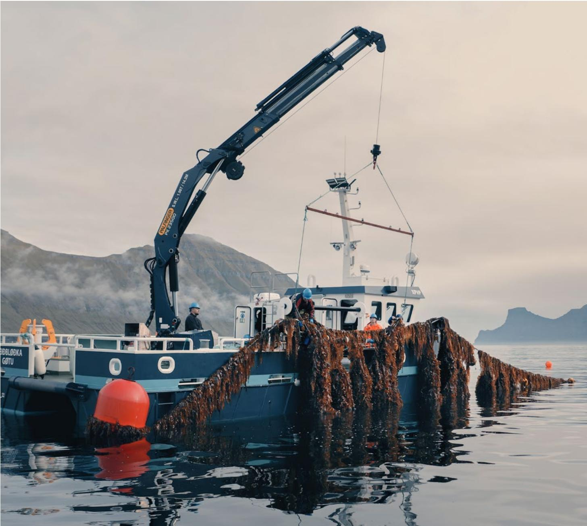

## Glossary

Acoustic arrays: networks of underwater hydrophones deployed across an area of ocean to detect, record and track sound; used to monitor marine life, detect illegal fishing and track vessel movements across large areas.

Biodiversity net gain: an approach to development and land/sea use management that requires the resulting state of biodiversity to be measurably better after a project or intervention than it was beforehand.

Blended finance: the strategic use of concessional public or philanthropic capital to mobilize additional private investment into projects with development or environmental objectives, by absorbing early-stage risk or lowering returns thresholds.

non-invasive sampling technique that collects genetic material left behind by organisms in their surroundings – such as water, soil or air. Sequencing this genetic material can reveal which species are present and their relative abundance, providing insights into the broader ecological health of an ecosystem.

distribution of financial and non-financial advantages generated by large-scale projects with the local communities hosting or impacted by them.

## Equity:

\- Distributional equity: the fair sharing of benefits and burdens across different groups and communities, asking who gains and who bears the costs.

\- Procedural equity: the fair inclusion of affected people in decision-making processes, asking whether all voices, especially marginalized ones, have genuine influence over outcomes.

\- Recognitional equity: the acknowledgement of pre-existing rights, identities and knowledge systems of Indigenous Peoples and local communities as a precondition for fair decision-making.

Gross value added: the economic value generated by the production of goods and services within a defined unit such as a firm, sector or region, calculated as the value of outputs produced minus the cost of intermediate inputs consumed in that production. GVA forms the basis for calculating gross domestic product (GDP) at the national level, differing from it primarily in the treatment of product taxes and subsidies.

Large marine ecosystems (LMEs): regions of the world's oceans, encompassing coastal areas from river basins and estuaries to the seaward boundaries of continental shelves and the outer margins of the major ocean current systems. They are relatively large regions in the order of 200,000 km $^{2}$ or greater, characterized by distinct bathymetry, hydrography, productivity and trophically dependent populations. $^{163}$

Marine spatial planning (MSP): a public process for analysing and allocating the spatial and temporal distribution of human activities in marine areas to achieve ecological, economic and social objectives.

measuring and valuing a country's or entity's stocks and flows of ecosystem assets (e.g. fish populations, coastal wetlands) alongside conventional financial accounts, so that ecological assets inform economic decision-making.

financial loss an asset, portfolio or institution faces from the degradation of nature (e.g. fisheries collapse, coastal habitat loss) over a defined time horizon and confidence level. Adapted from the “value at risk” concept in financial risk management.

Polycentric governance: a system in which multiple centres of decision-making hold real authority at different scales (local, subnational, national, regional), connected through shared rules, information exchange and mutual accountability.

Prudential reform: the set of rules and supervisory practices (capital requirements, risk disclosures, stress testing) that central banks and financial regulators use to ensure the safety and soundness of financial institutions.

Seascape: a large, ecologically and socially coherent marine-coastal unit (analogous to a “landscape” on land) used as the primary spatial frame for regenerative governance.

# Contributors

World Economic Forum

Lead authors

Ronald Tardiff
Lead, Ocean Innovation

Hanh Nguyen
Lead, Ocean Industries

Jaideep Salil

Project Specialist, Ocean Innovation

## Additional authors

Alfredo Giron
Head of Ocean

## Lily Zhao

Hoffman Fellow, Ocean Equity and Just Transition

## Acknowledgements

The World Economic Forum would like to thank all individuals named below who provided their contributions, guidance and insights throughout the development of this report. The paper does not necessarily reflect the views of these individuals and/or their organizations. Expert advice is purely consultative in nature and does not imply any association with the takeaways or conclusions presented within this paper.

The Forum would also like to extend its gratitude to Tsao Pao Chee, No.17 Foundation and Velux Fonden for their support in making this publication possible.

## Global Future Council on the Regenerative Blue Economy

Global Future Councils are independent foresight and advisory bodies that help the World Economic Forum and the public to anticipate and explore emerging issues. The Global Future Council on the Regenerative Blue Economy is mandated to examine how the ocean economy can chart a prosperous path forward while supporting healthier marine ecosystems, mitigating climate change impacts and ensuring equitable outcomes for local communities.

The council brings together experts from the public sector, finance, business, academia and civil society to develop strategic guidance that helps governments, investors and businesses undertake the bold thinking, cross-sector collaboration and real innovation needed to make regeneration the organizing principle of the blue economy.

## Global Future Council contributing authors

## Helle Herk-Hansen

Vice-President, Environment, Vattenfall; Co-Chair, Global Future Council on the Regenerative Blue Economy, World Economic Forum

## U. Rashid Sumaila

Professor and Director, Fisheries Economics Research Unit, The University of British Columbia (UBC) Institute for the Oceans and Fisheries and the School of Public Policy and Global Affairs; Co-Chair, Global Future Council on the Regenerative Blue Economy, World Economic Forum

## Marcia Moreno-Báez

Research Professor, The Fletcher School of Law and Diplomacy, Tufts University

## Alasdair Harris

Chief Executive Officer, Ocean Resilience and Climate Alliance

## Douglas McCauley

Director, Benioff Ocean Science Laboratory; Professor, University of California, Santa Barbara

## Thomas Sberna

Regional Head, Coastal and Ocean Resilience, International Union for Conservation of Nature (IUCN)

## Global Future Council reviewers

## Ayla Bajwa

Group Senior Vice-President, Sustainability, DP World

## Marisa Drew

Chief Sustainability Officer, Standard Chartered

Daniel Kleinman
Founder & CEO, Seaworthy Collective

## Lovin Kobusingye

President, African Women Fish Processors and Traders Network (AWFISHNET)

## Dai Minhan

Chair Professor of Marine Environmental Science, Xiamen University

François Mosnier
Head of Nature, Planet Tracker

## Jan Yves Remy

Senior Advisor to the Director-General, World Trade Organization

## Frances Camille Rivera

Co-Founder and Chief Executive Officer, Oceanus Conservation

## Manumatavai Tupou-Roosen

Head of School, Ecology and Resilience Development, Pasifika Communities University

## Lisa Sachs

Director, Columbia Center on Sustainable Investment, Columbia University

## Kavita Sinha

Special Advisor to the Executive Director, Green Climate Fund

## Ana Spalding

Director, Adrienne Arsht Community-Based Resilience Solutions Initiative, Smithsonian Tropical Research Institution, Smithsonian Institution

## Hoe Soon Tan

Assistant Chief Executive (Corporate & Strategy) and Chief Risk Officer, Maritime and Port Authority of Singapore

## Amalia Adininggar Widyasanti

Head, BPS Statistics Indonesia

## Barbara Karuth-Zelle

Group Chief Operating Officer and Member of the Board of Management, Allianz

## Case studies – compilation

Andrew Johnson
Chief Executive Officer, MarFishEco Fisheries Consultants

Catherine Brown
Marine Policy Expert, MarFishEco Fisheries Consultants

## Case study contributors and reviewers

## Case study 1

Luqman Hakim
Manager, Maritime and Port Authority of Singapore

## Rachel Tan

Manager, Sustainability Reporting & Promotion, Maritime and Port Authority of Singapore

## Case study 2

Sarah McGowan
Senior Environmental Adviser, Vattenfall

## Case study 3

Frank Momberg
Asia-Pacific Development Director, Fauna and Flora International

## Case study 4

Les Clark
Consultant, Office of the Parties to the Nauru Agreement

Sangaa Clark
Chief Executive Officer, Parties to the Nauru Agreement

Brian Kumasi
Policy Manager, Office of the Parties to the Nauru Agreement

## Case study 5

Alejandro Castillo López
Senior Program Officer,
Fundación Innovaciones Alumbra

## Octavio Aburto-Oropeza

Professor, Scripps Institution of Oceanography

## Case study 6

Dan Benham
Head of Communications, Sea Ranger Service

## Wietse van der Werf

Founder and Chief Executive Officer, Sea Ranger Service

## Case study 7

Funké Adeosun
Global Sustainability Practice Head, Allianz Commercial

## Production

Jean-Philippe Stanway
Designer

Gabriela Valcarcel
Formatting, Referencing & Communications

Jonathan Walter
Editor

## Endnotes

Srinivasan, U. T., Cheung, W. W. L., Watson, R., & Sumaila, U. R. (2010). Food security implications of global marine catch losses due to overfishing. Journal of Bioeconomics, 12(3), 183–200. https://doi.org/10.1007/s10818-010-9090-9

Laffoley, D., Baxter, J. M., Amon, D. J., Currie, D. E., Downs, C. A., Hall Spencer, J. M., Harden Davies, H., Page, R., Reid, C. P., Roberts, C. M., Rogers, A., Thiele, T., Sheppard, C. R., Sumaila, R. U., & Woodall, L. C. (2019). Eight urgent, fundamental and simultaneous steps needed to restore ocean health and the consequences for humanity and the planet of inaction or delay. Aquatic Conservation Marine and Freshwater Ecosystems, 30(1), 194–208. https://doi.org/10.1002/aqc.3182

Food and Agriculture Organization of the United Nations. (2024). The State of World Fisheries and Aquaculture 2024: Blue Transformation in action. https://doi.org/10.4060/cd0683en

Intergovernmental Panel on Climate Change. (2021). Climate change 2021: The physical science basis. Contribution of Working Group I to the Sixth Assessment Report of the Intergovernmental Panel on Climate Change. Cambridge University Press. https://doi.org/10.1017/9781009157896

United Nations Development Programme & Climate Impact Lab. (2023, November 28). Climate change's impact on coastal flooding to increase 5-times over this century [Press release]. https://www.undp.org/press-releases/climate-changes-impact-coastal-flooding-increase-5-times-over-century-putting-over-70-million-people-path-expanding-floodplains

Lange, G. M., Beck, M. W., Lam, V. W. Y., Menéndez, P. & Sumaila, U. R. (2021). Blue Natural Capital: Mangroves and Fisheries. In The Changing Wealth of Nations 2021: Managing Assets for the Future (pp. 121-141). World Bank. https://www.worldbank.org/en/publication/changing-wealth-of-nations

Voyer, M., Quirk, G., McIlgorm, A., & Azmi, K. (2018). Shades of blue: What do competing interpretations of the Blue Economy mean for oceans governance? Journal of Environmental Policy & Planning, 20(5), 595–616. https://doi.org/10.1080/1523908X.2018.1473153

United Nations Environment Programme Finance Initiative. (2021). Turning the Tide: How to Finance a Sustainable Ocean Recovery. https://www.unepfi.org/publications/turning-the-tide/

## Sources:

\- Agnew, D. J., Pearce, J., Pramod, G., Peatman, T., Watson, R., Beddington, J. R. & Pitcher, T. J. (2009). Estimating the Worldwide Extent of Illegal Fishing. PLOS One, vol. 4, no. 2. https://doi.org/10.1371/journal.pone.0004570

– Sumaila, U. R., Zeller, D., Hood, L., Palomares, M. L. D., et al. (2020). Illicit trade in marine fish catch and its effects on ecosystems and people worldwide. Science Advances, vol. 6, no. 9. https://doi.org/10.1126/sciadv.aaz3801

Tahiluddin, A. B. & Sarri, J. H. (2022). An Overview of Destructive Fishing in the Philippines. Acta Natura et Scientia, vol. 3, no. 2, pp. 116-125. https://doi.org/10.29329/actanatsci.2022.352.04

Cormier, R. & Lonsdale, J. A. (2019). Risk assessment for deep sea mining: An overview of risk. Marine Pollution Bulletin. https://doi.org/10.1016/j.marpol.2019.02.056

Harfoot, M. B. J., Tittensor, D. P., Knight, S., Arnell, A. P., Blyth, S., Brooks, S., Butchart, S. H. M., Hutton, J., Jones, M. I., Kapos, V., Scharlemann, J. P. W. & Burgess, N. D. (2018). Present and future biodiversity risks from fossil fuel exploitation. Conservation Letters, vol. 11, no. 4, e12448. https://doi.org/10.1111/conl.12448

Herk-Hansen, H. & Sumaila, U. R. (2025). Why sustainability is no longer enough for the blue economy. World Economic Forum. https://www.weforum.org/stories/2025/10/sustainability-blue-economy-no-longer-enough-wef/

– le Gouvello, R. & Simard, F. (2024, April). Towards a Regenerative Blue Economy. Mapping the Blue Economy. International Union for Conservation of Nature. https://portals.iucn.org/library/node/51442

– World Economic Forum. (2026). The Ocean Economy Imperative: Defining Value, Managing Risk and Mobilizing Investment. https://reports.weforum.org/docs/WEF\_Ocean\_Economy\_Imperative\_2026.pdf

le Gouvello, R. & Simard, F. (2024, April). Towards a Regenerative Blue Economy. Mapping the Blue Economy. International Union for Conservation of Nature. https://portals.iucn.org/library/node/51442

World Bank. (2021). The Changing Wealth of Nations 2021: Managing Assets for the Future. https://openknowledge.worldbank.org/entities/publication/249f0ccc-9683-561e-8aa3-4481af11d18a

World Economic Forum. (2026). The Ocean Economy Imperative: Defining Value, Managing Risk and Mobilizing Investment. https://reports.weforum.org/docs/WEF\_Ocean\_Economy\_Imperative\_2026.pdf

Market Research Future. (2026). Offshore oil & gas market: Global forecast to 2035. https://www.marketresearchfuture.com/reports/offshore-oil-gas-market-37653

International Energy Agency. (2018). Offshore Energy Outlook 2018 [World Energy Outlook Special Report]. https://iea.blob.core.windows.net/assets/f4694056-8223-4b14-b688-164d6407bf03/WEO\_2018\_Special\_Report\_Offshore\_Energy\_Outlook.pdf

International Energy Agency. (2023). Emissions from oil and gas operations in net zero transitions. https://www.iea.org/reports/emissions-from-oil-and-gas-operations-in-net-zero-transitions

UN Trade and Development (UNCTAD). (2025). Fast-growing trillion-dollar ocean economy goes beyond fishing and shipping. https://unctad.org/news/fast-growing-trillion-dollar-ocean-economy-goes-beyond-fishing-and-shipping

UN Trade and Development (UNCTAD). (2025). Global Trade Update (June 2025): Sustainable ocean economy. https://unctad.org/publication/global-trade-update-june-2025-sustainable-ocean-economy

Olmer, N., Comer, B., Roy, B., Mao, X. & Rutherford, D. (2017). Greenhouse Gas Emissions from Global Shipping, 2013–2015. International Council on Clean Transportation. https://theicct.org/publication/greenhouse-gas-emissions-from-global-shipping-2013-2015/

Sumaila, R. & Villasante, S. (2025). Surging blue economy, increasing conflict risks and mitigation strategies. Frontiers in Marine Science, vol. 12. https://doi.org/10.3389/fmars.2025.1499386

Organisation for Economic Co-operation and Development (OECD). (2025). The Ocean Economy to 2050. https://doi.org/10.1787/a9096fb1-en

Food and Agriculture Organization of the United Nations. (2024). The State of World Fisheries and Aquaculture 2024: Blue Transformation in action. https://doi.org/10.4060/cd0683en

BloombergNEF. (2025, August 26). Global Renewable Energy Investment Still Reaches New Record as Investors Reassess Risks [Press release]. https://about.bnef.com/insights/clean-energy/global-renewable-energy-investment-reaches-new-record-as-investors-reassess-risks/

Williams, R., Zhao, F., Melkonyan, N., Hutchinson, M., & Cheong, J. (2025). Global offshore wind report 2025. Global Wind Energy Council. https://www.gwec.net/reports/global-offshore-wind-report

Williams, R., Zhao, F., Melkonyan, N., Hutchinson, M., & Cheong, J. (2025). Global offshore wind report 2025. Global Wind Energy Council. https://www.gwec.net/reports/global-offshore-wind-report

World Travel & Tourism Council & Oxford Economics. (2024). Coastal and marine tourism: Quantifying its footprint and funding requirements for mitigation and adaptation. https://ocean-breakthroughs.org/wp-content/uploads/2025/06/Coastal-and-Marine-Tourism-Quantifying-its-footprint-and-funding-requirements-for-mitigation-and-adaptation.pdf

World Economic Forum. (2026). The Ocean Economy Imperative: Defining Value, Managing Risk and Mobilizing Investment. https://reports.weforum.org/docs/WEF\_Ocean\_Economy\_Imperative\_2026.pdf

Food and Agriculture Organization of the United Nations. (2024). The State of World Fisheries and Aquaculture 2024: Blue Transformation in action. https://doi.org/10.4060/cd0683en

Food and Agriculture Organization of the United Nations. (2024). The State of World Fisheries and Aquaculture 2024: Blue Transformation in action. https://doi.org/10.4060/cd0683en

MacLeod, M. J., Hasan, M. R., Robb, D. H. F. & Mamun-Ur-Rashid, M. (2020). Quantifying greenhouse gas emissions from global aquaculture. Scientific Reports, vol. 10, 11679. https://doi.org/10.1038/s41598-020-68231-8

Market valued at \~\$348 billion in 2024; projected to reach \~\$652 billion by 2034 at a CAGR of 6.5%. Source: Precedence Research. (2025). Water and Wastewater Treatment Market Size, Share and Trends 2024–2034. https://www.precedenceresearch.com/water-and-wastewater-treatment-market

United Nations Environment Programme & GRID-Arendal. (2023). Wastewater: Turning Problem to Solution. https://www.unep.org/resources/report/wastewater-turning-problem-solution

Market valued at \~\$348 billion in 2024; projected to reach \~\$652 billion by 2034 at a CAGR of 6.5%. Source: Precedence Research. (2025). Water and Wastewater Treatment Market Size, Share and Trends 2024–2034. https://www.precedenceresearch.com/water-and-wastewater-treatment-market

Diaz, R.J. & Rosenberg, R. (2008). Spreading Dead Zones and Consequences for Marine Ecosystems. Science, 321(5891), 926–929. https://www.science.org/doi/10.1126/science.1156401

Market valued at \~\$21.7 billion in 2024; projected to reach \~\$58 billion by 2033 at a CAGR of 11.6%. Source: Straits Research. (2025). Water Desalination Market Size, Share and Forecast to 2033. https://straitsresearch.com/report/water-desalination-market

International Desalination and Reuse Association. (2024). Road to Reykjavik Part 2: Mitigation Through Innovation – Decarbonizing Desalination and Reuse. https://idrawater.org/news/road-to-reykjavik-part-2-mitigation-through-innovation-decarbonizing-desalination-and-reuse/

International Desalination and Reuse Association. (2024). Road to Reykjavik Part 2: Mitigation Through Innovation – Decarbonizing Desalination and Reuse. https://idrawater.org/news/road-to-reykjavik-part-2-mitigation-through-innovation-decarbonizing-desalination-and-reuse/

Jones, E., Qadir, M., van Vliet, M. T. H., Smakhtin, V., & Kang, S. (2019). The state of desalination and brine production: A global outlook. Science of The Total Environment, 657, 1343–1356. https://doi.org/10.1016/j.scitotenv.2018.12.076

UN Trade and Development (UNCTAD). (2025). Fast-growing trillion-dollar ocean economy goes beyond fishing and shipping. https://unctad.org/news/fast-growing-trillion-dollar-ocean-economy-goes-beyond-fishing-and-shipping

United Nations Environment Programme. (2021). State of Finance for Nature: Tripling investments in nature-based solutions by 2030. https://www.eld-initiative.org/fileadmin/ELD\_Filter\_Tool/Publication\_State\_of\_Finance\_for\_Nature/SFN.pdf

European Commission. (2023, 9 November). Commission welcomes agreement between European Parliament and Council on Nature Restoration Law [Press release]. https://ec.europa.eu/commission/presscorner/detail/en/ip\_23\_5662

Organisation for Economic Co-operation and Development (OECD). (2025). The Ocean Economy to 2050. https://doi.org/10.1787/a9096fb1-en

The Ocean Returns. (n.d.). The Ocean Returns. https://oceanreturns.com/

The Ocean Returns. (n.d.). The Ocean Returns. https://oceanreturns.com/

International Energy Agency. (2025). Driving down the cost of carbon removal: Why innovation matters. https://www.iea.org/commentaries/driving-down-the-cost-of-carbon-removal-why-innovation-matters

Stuchtey, M. R., Vincent, A., Merkl, A. & Bucher, M. (2020). Ocean Solutions That Benefit People, Nature and the Economy: Executive Summary. High Level Panel for a Sustainable Ocean Economy. https://oceanpanel.org/wp-content/uploads/2022/06/executive-summary-ocean-solutions-report-eng.pdf

WWF, Global Fund for Coral Reefs & INSPIRE. (2025). Ocean Health: An Introductory Guide for Central Bankers, Financial Regulators and Supervisors. https://wwfint.awsassets.panda.org/downloads/wwf-gfri-ocean-guide-2025\_1.pdf

## Sources:

– Issifu, I., Dahmouni, I., Deffor, E. W. & Sumaila, U. R. (2023). Diversity, equity and inclusion in the Blue Economy: Why they matter and how do we achieve them? Frontiers in Political Science, vol. 4, 1067481. https://doi.org/10.3389/fpos.2022.1067481

– Narwal, S., Kaur, M., Yadav, D. S. & Bast, F. (2024). Sustainable blue economy: Opportunities and challenges. Journal of Biosciences, vol. 49, no. 1, 18. https://doi.org/10.1007/s12038-023-00375-x

Sumaila, U. R., Walsh, M., Hoareau, K., Cox, A., Teh, L., Abdallah, P., Akpalu, W., Anna, Z., Benzaken, D., Crona, B., Fitzgerald, T., Heaps, L., Issifu, I., Karousakis, K., Lange, G. M., Leland, A., Miller, D., Sack, K., Shahnaz, D., ... Zhang, J. (2021). Financing a sustainable ocean economy. Nature Communications, 12(1), 3259. https://doi.org/10.1038/s41467-021-23168-y

le Gouvello, R. & Simard, F. (2024). Towards a Regenerative Blue Economy. Mapping the Blue Economy. International Union for Conservation of Nature. https://portals.iucn.org/library/node/51442

Eurich, J. G., Friedman, W. R., Kleisner, K. M., Zhao, L. Z., Free, C. M., Fletcher, M., Mason, J. G., Tokunaga, K., Aguion, A., Dell'Apa, A., Dickey-Collas, M., Fujita, R., Golden, C. D., Hollowed, A. B., Ishimura, G., Karr, K. A., Kasperski, S., Kisara, Y., Lau, J. D., ... Mills, K. E. (2024). Diverse pathways for climate resilience in marine fishery systems. Fish and Fisheries, 25(1), Article 1. https://doi.org/10.1111/faf.12790

## Sources:

– Buckton, S. J., Fazey, I., Sharpe, B., Om, E. S., Doherty, B., Ball, P., Denby, K., Bryant, M., Lait, R., Bridle, S., et al. (2023). The Regenerative Lens: A conceptual framework for regenerative social-ecological systems. One Earth, vol. 6, no. 7, pp. 824-842. https://doi.org/10.1016/j.oneear.2023.06.006

- Fischer, J., Farny, S., Pacheco-Romero, M., & Folke, C. (2026). Resilience and regeneration for a world in crisis. Ambio, 55(1), 24–34. https://doi.org/10.1007/s13280-025-02287-6

## Sources:

– Fullerton, J. (2015). Regenerative Capitalism: How Universal Principles and Patterns Will Shape the New Economy. Capital Institute. https://capitalinstitute.org/wp-content/uploads/2015/04/2015-Regenerative-Capitalism-4-20-15-final.pdf

- Mazzucato, M. (2018). The Value of Everything: Making and Taking in the Global Economy. Penguin. https://marianamazzucato.com/books/the-value-of-everything/

Fischer, J., Farny, S., Abson, D. J., Zuin Zeidler, V., von Salisch, M., Schaltegger, S., Martín-López, B., Temperton, V. M., & Kümmerer, K. (2024). Mainstreaming regenerative dynamics for sustainability. Nature Sustainability, 7(8), 964–972. https://doi.org/10.1038/s41893-024-01368-w

## Sources:

- Buckton, S. J., Fazey, I., Sharpe, B., Om, E. S., Doherty, B., Ball, P., Denby, K., Bryant, M., Lait, R., Bridle, S., et al. (2023). The Regenerative Lens: A conceptual framework for regenerative social-ecological systems. One Earth, vol. 6, no. 7, pp. 824-842. https://doi.org/10.1016/j.oneear.2023.06.006

- Fischer, J., Farny, S., Pacheco-Romero, M., & Folke, C. (2026). Resilience and regeneration for a world in crisis. Ambio, 55(1), 24–34. https://doi.org/10.1007/s13280-025-02287-6

Mason, J. G., Eurich, J. G., Lau, J. D., Battista, W., Free, C. M., Mills, K. E., Tokunaga, K., Zhao, L. Z., Dickey-Collas, M., Valle, M., Pecl, G. T., Cinner, J. E., McClanahan, T. R., Allison, E. H., Friedman, W. R., Silva, C., Yáñez, E., Barbieri, M. Á. & Kleisner, K. M. (2022). Attributes of climate resilience in fisheries: From theory to practice. Fish and Fisheries, vol. 23, no. 3, pp. 522-544. https://doi.org/10.1111/faf.12630

## Sources:

– Blythe, J. L., Claudet, J., Gill, D., Ban, N. C., Epstein, G., Gurney, G. G., et al. (2026). The Ocean Equity Index. Nature, 650, 123–128. https://doi.org/10.1038/s41586-025-09976-y

- Mazzucato, M. (2018). The Value of Everything: Making and Taking in the Global Economy. Penguin. https://marianamazzucato.com/books/the-value-of-everything/

- Yohe, G. & Tol, R. S. J. (2002). Indicators for social and economic coping capacity—moving towards a working definition of adaptive capacity. Global Environmental Change, vol. 12, no. 1, pp. 25-40. https://doi.org/10.1016/S0959-3780(01)00026-7

- Mason, J. G., Eurich, J. G., Lau, J. D., Battista, W., Free, C. M., Mills, K. E., Tokunaga, K., Zhao, L. Z., Dickey-Collas, M., Valle, M., Pecl, G. T., Cinner, J. E., McClanahan, T. R., Allison, E. H., Friedman, W. R., Silva, C., Yáñez, E., Barbieri, M. Á. & Kleisner, K. M. (2022). Attributes of climate resilience in fisheries: From theory to practice. Fish and Fisheries, vol. 23, no. 3, pp. 522-544. https://doi.org/10.1111/faf.12630

- Fischer, J., Farny, S., Pacheco-Romero, M., & Folke, C. (2026). Resilience and regeneration for a world in crisis. Ambio, 55(1), 24–34. https://doi.org/10.1007/s13280-025-02287-6

Fath, B. D., Fiscus, D. A., Goerner, S. J., Berea, A., & Ulanowicz, R. E. (2019). Measuring regenerative economics: 10 principles and measures undergirding systemic economic health. Global Transitions, 1, 15–27. https://doi.org/10.1016/j.glt.2019.02.002

le Gouvello, R. & Simard, F. (2024). Towards a Regenerative Blue Economy. International Union for Conservation of Nature (IUCN). https://portals.iucn.org/library/sites/library/files/documents/2024-005-En.pdf

See for example:

– Iberdrola Biodiversity. (n.d.). 2030 Biodiversity Plan. https://www.iberdrola.com/documents/20125/40552/2030\_Biodiversity\_Plan.pdf

- ∅rsted. (2024). Biodiversity Measurement Framework. https://cdn.orsted.com/-/media/www/docs/corp/com/sustainability/orsted-biodiversity-measurement-framework-june-2024.pdf

– Vattenfall. (n.d.). Sustainability. https://group.vattenfall.com/sustainability/

European Environment Agency. (2024). Harnessing offshore wind while preserving the seas, Briefing No. 14/2024. https://doi.org/10.2800/3621684

Soininen, N., Huhta, K. & Vesa, S. (2025). Offshore Wind Power through the Lenses of EU Climate, Energy and Environmental Law—Between Climate Aspirations, Market Competition and Environmental Impact. Ocean Development & International Law, vol. 56, no. 4, pp. 505-525. https://doi.org/10.1080/00908320.2025.2587359

Vattenfall. (n.d.). Hollandse Kust Zuid. https://powerplants.vattenfall.com/hollandse-kust-zuid/

Vattenfall. (n.d.). Hollandse Kust Zuid. https://powerplants.vattenfall.com/hollandse-kust-zuid/

Krogh, M. (2023). Vattenfall goes the extra mile for dolphins in Denmark. Vattenfall. https://group.vattenfall.com/press-and-media/newsroom/2023/vattenfall-goes-the-extra-mile-for-dolphins-in-denmark/

Vattenfall. (2021). Annual and Sustainability Report 2021, pp. 50-51. https://group.vattenfall.com/investors/financial-calendar/annual-and-sustainability-report-2021/

Vattenfall. (2022). Vattenfall offshore wind farm will use recyclable wind turbine blades. https://group.vattenfall.com/press-and-media/newsroom/2022/vattenfall-offshore-wind-farm-will-use-recyclable-wind-turbine-blades/

Cumming, G. S., Cumming, D. H. M. & Redman, C. L. (2006). Scale up mismatches in social-ecological systems: Causes, consequences and solutions. Ecology and Society, vol. 11, no. 1, 14. https://www.ecologyandsociety.org/vol11/iss1/art14/

World Bank. (2022). Marine Spatial Planning for a Resilient and Inclusive Blue Economy: Key Considerations to Formulate and Implement Marine Spatial Planning. https://documents1.worldbank.org/curated/en/099813206062230702/pdf/IDU0afe34d600494f04ee009e8c0edf0292c1a96.pdf

Ostrom, E. (2010). Polycentric systems for coping with collective action and global environmental change. Global Environmental Change, vol. 20, no. 4, pp. 550-557. https://doi.org/10.1016/j.gloenvcha.2010.07.004

Berdej, S. & Armitage, D. (2016). Bridging for better conservation fit in Indonesia's coastal-marine systems. Frontiers in Marine Science, vol. 3, 101. https://doi.org/10.3389/fmars.2016.00101

– Ostrom, E. (2010). Polycentric systems for coping with collective action and global environmental change. Global Environmental Change, vol. 20, no. 4, pp. 550-557. https://doi.org/10.1016/j.gloenvcha.2010.07.004

- Berdej, S. & Armitage, D. (2016). Bridging for better conservation fit in Indonesia's coastal-marine systems. Frontiers in Marine Science, vol. 3, 101. https://doi.org/10.3389/fmars.2016.00101

Purwanto Andradi-Brown, D. A., Matualage, D., Rumengan, I., Awaludinnoer, Pada, D., Hidayat, N. I., Amkieltiela, Fox, H. E., Fox, M., Mangubhai, S., Hamid, L., Lazuardi, M. E., Mambrasar, R., Maulana, N., Mulyadi, Tuharea, S., Pakiding, F. & Ahmadia, G. N. (2021). The Bird's Head Seascape Marine Protected Area network—Preventing biodiversity and ecosystem service loss amidst rapid change in Papua, Indonesia. Conservation Science and Practice, vol. 3, no. 6, e393. https://doi.org/10.1111/csp2.393

Browne, K., Katz, L. & Agrawal, A. (2022). Futures of conservation funding: Can Indonesia sustain financing of the Bird's Head Seascape? World Development Perspectives, vol. 26, 100418. https://doi.org/10.1016/j.wdp.2022.100418

Purwanto Andradi-Brown, D. A., Matualage, D., Rumengan, I., Awaludinnoer, Pada, D., Hidayat, N. I., Amkieltiela, Fox, H. E., Fox, M., Mangubhai, S., Hamid, L., Lazuardi, M. E., Mambrasar, R., Maulana, N., Mulyadi, Tuharea, S., Pakiding, F. & Ahmadia, G. N. (2021). The Bird's Head Seascape Marine Protected Area network—Preventing biodiversity and ecosystem service loss amidst rapid change in Papua, Indonesia. Conservation Science and Practice, vol. 3, no. 6, e393. https://doi.org/10.1111/csp2.393

Bird's Head Seascape. (n.d.). Bird's Head Seascape Partners. https://birdsheadseascape.com/birds-head-seascape-partners/

Coral Triangle Initiative on Coral Reefs, Fisheries and Food Security. (2018). Seascapes General Model and Regional Framework for Priority Seascapes. https://www.coraltriangleinitiative.org/library/seascapes-general-model-and-regional-framework-priority-seascapes

Misool Foundation. (n.d.). Misool Marine Reserve. https://www.misoolfoundation.org/misool-marine-reserve

Elson, D., Latumahina, M. & Wells, A. (2016). Redefining Conservation: How communities in Raja Ampat are shaping their world and what their experience teaches us about empowerment. Seventy Three Field Notes. https://www.academia.edu/42096701/Redefining\_Conservation\_How\_communities\_in\_Raja\_Ampat\_are\_shaping\_their\_world\_and\_what\_their\_experience\_teaches\_us\_about\_empowerment

85 Ocean and Climate Platform. (2021). Ocean of Solutions to Tackle Climate Change and Biodiversity Loss. https://ocean-climate.org/wp-content/uploads/2021/06/Ocean-solutions-report.pdf

High Level Panel for a Sustainable Ocean Economy. (2020). Transformations for a Sustainable Ocean Economy: A Vision for Protection, Production and Prosperity. https://oceanpanel.org/wp-content/uploads/2022/06/transformations-sustainable-ocean-economy-eng.pdf

High Level Panel for a Sustainable Ocean Economy. (2021). 100% Sustainable Ocean Management: An Introduction to Sustainable Ocean Plans. https://oceanpanel.org/publication/100-sustainable-ocean-management-an-introduction-to-sustainable-ocean-plans/

High Level Panel for a Sustainable Ocean Economy. (2024). Progress Report 2024: Advancing Towards a Sustainable Ocean Economy. https://oceanpanel.org/wp-content/uploads/2024/09/OP\_Progress\_2024-Final.pdf

World Economic Forum. (2026). The Ocean Economy Imperative: Defining Value, Managing Risk and Mobilizing Investment. https://reports.weforum.org/docs/WEF\_Ocean\_Economy\_Imperative\_2026.pdf

World Bank. (2022). Marine Spatial Planning for a Resilient and Inclusive Blue Economy: Key Considerations to Formulate and Implement Marine Spatial Planning. https://documents1.worldbank.org/curated/en/099813206062230702/pdf/IDU0afe34d600494f04ee009e8c0edf0292c1a96.pdf

Folke, C., Hahn, T., Olsson, P. & Norberg, J. (2005). Adaptive governance of social-ecological systems. Annual Review of Environment and Resources, vol. 30, pp. 441-473. https://doi.org/10.1146/annurev.energy.30.050504.144511

World Bank. (2022). Marine Spatial Planning for a Resilient and Inclusive Blue Economy: Key Considerations to Formulate and Implement Marine Spatial Planning. https://documents1.worldbank.org/curated/en/099813206062230702/pdf/IDU0afe34d600494f04ee009e8c0edf0292c1a96.pdf

Marine Stewardship Council. (n.d.). What is Purse Seine Fishing? https://www.msc.org/what-we-are-doing/our-approach/fishing-methods-and-gear-types/purse-seine.

Convention on Biological Diversity. (n.d.). Kunming-Montreal Global Biodiversity Framework: 2030 Targets (with Guidance Notes). https://www.cbd.int/gbf/targets

World Economic Forum. (2026). The Ocean Economy Imperative: Defining Value, Managing Risk and Mobilizing Investment. https://reports.weforum.org/docs/WEF\_Ocean\_Economy\_Imperative\_2026.pdf

Sources:

– World Economic Forum. (2026). The Ocean Economy Imperative: Defining Value, Managing Risk and Mobilizing Investment. https://reports.weforum.org/docs/WEF\_Ocean\_Economy\_Imperative\_2026.pdf

– United Nations Environment Programme. (2026). State of Finance for Nature 2026: Nature in the Red: Powering the Trillion Dollar Nature Transition Economy. https://wedocs.unep.org/handle/20.500.11822/49119

- Thiele, T. & Pouponneau, A. (2025). Ocean Finance for the Sustainable Ocean Economy. High Level Panel for a Sustainable Ocean Economy. https://oceanpanel.org/wp-content/uploads/2025/06/25\_HLP\_Ocean-Finance\_v4.pdf

– Fischer, J., Farny, S., Pacheco-Romero, M., & Folke, C. (2026). Resilience and regeneration for a world in crisis. Ambio, 55(1), 24–34. https://doi.org/10.1007/s13280-025-02287-6

## Sources:

- Thiele, T. & Pouponneau, A. (2025). Ocean Finance for the Sustainable Ocean Economy. High Level Panel for a Sustainable Ocean Economy. https://oceanpanel.org/wp-content/uploads/2025/06/25\_HLP\_Ocean-Finance\_v4.pdf

– Sumaila, U. R., Walsh, M., Hoareau, K., Cox, A., Teh, L., Abdallah, P., Akpalu, W., Anna, Z., Benzaken, D., Crona, B., Fitzgerald, T., Heaps, L., Issifu, I., Karousakis, K., Lange, G. M., Leland, A., Miller, D., Sack, K., Shahnaz, D., Thiele, T., Vestergaard, N., Yagi, N. & Zhang, J. (2020). Ocean Finance: Financing the Transition to a Sustainable Ocean Economy. High Level Panel for a Sustainable Ocean Economy. https://oceanpanel.org/wp-content/uploads/2022/05/Ocean-Finance-Full-Paper.pdf

Poseidon Principles. (n.d.). Poseidon Principles. https://www.poseidonprinciples.org/finance/

WWF, Global Fund for Coral Reefs & INSPIRE. (2025). Ocean Health: An Introductory Guide for Central Bankers, Financial Regulators and Supervisors. https://wwfint.awsassets.panda.org/downloads/wwf-gfri-ocean-guide-2025\_1.pdf Convergence. (n.d.) Blended Finance. https://www.convergence.finance/blended-finance

## Sources:

- SYSTEMIQ. (2024). Scaling-up Ocean Finance: Blue Bonds and Innovative Debt Instruments for a Sustainable Ocean Economy in MENAT and APAC. https://www.systemiq.earth/wp-content/uploads/2024/06/Blue-Bonds-Report.pdf

- Benzaken, D., Adam, J. P., Virdin, J. & Voyer, M. (2024). From concept to practice: Financing sustainable blue economy in Small Island Developing States, lessons learnt from the Seychelles experience. Marine Policy, vol. 163, 106072. https://doi.org/10.1016/j.marpol.2024.106072

– High Level Panel for a Sustainable Ocean Economy. (2023). Accelerating Ocean Climate Action: The Role of the Ocean in a Net Zero Future. https://oceanpanel.org/wp-content/uploads/2023/12/Accelerating-Ocean-Climate-Action-NOV\_2023\_web.pdf

\- Standard Chartered. (2024). The Blue Economy: Financing Sustainable Ocean Growth.

le Gouvello, R. & Simard, F. (2024, April). Towards a Regenerative Blue Economy. Mapping the Blue Economy. International Union for Conservation of Nature. https://portals.iucn.org/library/node/51442

– Sumaila, U. R., Ebrahim, N., Schuhbauer, A., Skerritt, D., Li, Y., Kim, H. S., Mallory, T. G., Lam, V. W. L. & Pauly, D. (2019). Updated estimates and analysis of global fisheries subsidies. Marine Policy, vol. 109, 103695. https://doi.org/10.1016/j.marpol.2019.103695

- Fenichel, E. P., Milligan, B., Porras, I., et al. (2020). National Accounting for the Ocean and Ocean Economy. High Level Panel for a Sustainable Ocean Economy. https://oceanpanel.org/wp-content/uploads/2022/05/National-Accounting-for-the-Ocean-and-Ocean-Economy.pdf

- Thiele, T. & Pouponneau, A. (2025). Ocean Finance for the Sustainable Ocean Economy. High Level Panel for a Sustainable Ocean Economy. https://oceanpanel.org/wp-content/uploads/2025/06/25\_HLP\_Ocean-Finance\_v4.pdf

- Friends of Ocean Action. (2020). The Ocean Finance Handbook: Increasing finance for a healthy ocean. World Economic Forum. https://www3.weforum.org/docs/WEF\_FOA\_The\_Ocean\_Finance\_Handbook\_April\_2020.pdf

Thiele, T. & Pouponneau, A. (2025). Ocean Finance for the Sustainable Ocean Economy. High Level Panel for a Sustainable Ocean Economy. https://oceanpanel.org/wp-content/uploads/2025/06/25\_HLP\_Ocean-Finance\_v4.pdf

Sources:

- SYSTEMIQ. (2024). Scaling-up Ocean Finance: Blue Bonds and Innovative Debt Instruments for a Sustainable Ocean Economy in MENAT and APAC. https://www.systemiq.earth/wp-content/uploads/2024/06/Blue-Bonds-Report.pdf

\- Standard Chartered. (2024). The Blue Economy: Financing Sustainable Ocean Growth.

SYSTEMIQ. (2024). Scaling-up Ocean Finance: Blue Bonds and Innovative Debt Instruments for a Sustainable Ocean Economy in MENAT and APAC. https://www.systemiq.earth/wp-content/uploads/2024/06/Blue-Bonds-Report.pdf

United Nations Environment Programme Finance Initiative. (n.d.). The Sustainable Blue Economy Finance Principles. https://www.unepfi.org/blue-finance/the-principles/

Thiele, T. & Pouponneau, A. (2025). Ocean Finance for the Sustainable Ocean Economy. High Level Panel for a Sustainable Ocean Economy. https://oceanpanel.org/wp-content/uploads/2025/06/25\_HLP\_Ocean-Finance\_v4.pdf
Sources:

- Thiele, T. & Pouponneau, A. (2025). Ocean Finance for the Sustainable Ocean Economy. High Level Panel for a Sustainable Ocean Economy. https://oceanpanel.org/wp-content/uploads/2025/06/25\_HLP\_Ocean-Finance\_v4.pdf

- Benzaken, D., Adam, J. P., Virdin, J. & Voyer, M. (2024). From concept to practice: Financing sustainable blue economy in Small Island Developing States, lessons learnt from the Seychelles experience. Marine Policy, vol. 163, 106072. https://doi.org/10.1016/j.marpol.2024.106072

Standard Chartered. (2024). The Blue Economy: Financing Sustainable Ocean Growth.

- Benzaken, D., Adam, J. P., Virdin, J. & Voyer, M. (2024). From concept to practice: Financing sustainable blue economy in Small Island Developing States, lessons learnt from the Seychelles experience. Marine Policy, vol. 163, 106072. https://doi.org/10.1016/j.marpol.2024.106072

– World Economic Forum. (2025). Making Waves in the Regenerative & Sustainable Ocean Economy: Transformative Ocean Investment Opportunities. https://reports.weforum.org/docs/WEF\_Transformative\_Ocean\_Investment\_Opportunities\_2025.pdf

## Sources:

\- Friends of Ocean Action. (2020). The Business Case for Marine Protection and Conservation. World Economic Forum. https://www3.weforum.org/docs/WEF\_Business\_case\_for\_marine\_protection.pdf

\- Standard Chartered. (2024). The Blue Economy: Financing Sustainable Ocean Growth.

– High Level Panel for a Sustainable Ocean Economy. (2023). Accelerating Ocean Climate Action. https://oceanpanel.org/wp-content/uploads/2023/12/Accelerating-Ocean-Climate-Action-NOV\_2023\_web.pdf

\- Bertram, C., Quaas, M., Reusch, T.B.H. et al. The blue carbon wealth of nations. Nature Climate Change. 11, 704–709 (2021). https://www.nature.com/articles/s41558-021-01089-4

## Sources:

– High Level Panel for a Sustainable Ocean Economy. (2023). Accelerating Ocean Climate Action. https://oceanpanel.org/wp-content/uploads/2023/12/Accelerating-Ocean-Climate-Action-NOV\_2023\_web.pdf

– World Economic Forum & Boston Consulting Group. (2022). What ocean sustainability means for business. https://www.weforum.org/publications/what-ocean-sustainability-means-for-business/

Sources:

– United Nations Educational, Scientific and Cultural Organization (UNESCO), World Heritage Convention. (n.d.). Islands and Protected Areas of the Gulf of California. https://whc.unesco.org/en/list/1182/

– Cudney-Bueno, R. & Basurto, X. (2009). Lack of cross-scale up linkages reduces robustness of community-based fisheries management. PLOS ONE, vol. 4, no. 7, e6253. https://doi.org/10.1371/journal.pone.0006253

de León Robles, V. G. (2023). The struggle to revive the Sea of Cortez, ‘the world’s aquarium’. EL PAÍS. https://english.elpais.com/international/2023-12-23/the-struggle-to-revive-the-sea-of-cortez-the-worlds-aquarium.html

Sources:

– Estrada, A. M. (2023). The Mexican community who saved a mollusc from collapse. Dialogue Earth. https://dialogue.earth/en/nature/the-mexican-community-who-saved-a-mollusc-from-collapse/

\- AtlasAquatica (n.d.). "Cooperatives". https://atlasaquatica.org/cooperatives

\- Reyes, D. (2024). Shell Nurse reef in La Paz, a Japanese model for restoring the Gulf of California. Causa Natura Media. https://causanaturamedia.com/en/notas/shell-nurse-reef-in-la-paz-a-japanese-model-for-restoring-the-gulf-of-california

– Galeana, E. (2026). La Paz Becomes Hub for Regenerative Aquaculture Innovation. Mexico Business News. https://mexicobusiness.news/sustainability/news/la-paz-becomes-hub-regenerative-aquaculture-innovation

Avendaño, E. (2025). Gulf of California Platform, an initiative to unite science, communities and funding. Causa Natura Media. https://causanaturamedia.com/en/notas/gulf-of-california-platform-an-initiative-to-unite-science-communities-and-funding

CO\_Systemic. [Home page]. https://cosystemic.com/co\_systemic/.

Kak, T. (2026). Climate Adaptation Means Building Social Infrastructure. Stanford Social Innovation Review. https://ssir.org/articles/entry/climate-adaptation-social-infrastructure

## Sources:

– Food and Agriculture Organization of the United Nations. (2024). The State of World Fisheries and Aquaculture 2024: Blue Transformation in action. https://doi.org/10.4060/cd0683en

– Sumaila, U. R., Walsh, M., Hoareau, K., Cox, A., Teh, L., Abdallah, P., Akpalu, W., Anna, Z., Benzaken, D., Crona, B., Fitzgerald, T., Heaps, L., Issifu, I., Karousakis, K., Lange, G. M., Leland, A., Miller, D., Sack, K., Shahnaz, D., … Zhang, J. (2021). Financing a sustainable ocean economy. Nature Communications, 12(1), 3259. https://doi.org/10.1038/s41467-021-23168-y

- Thiele, T. & Pouponneau, A. (2025). Ocean Finance for the Sustainable Ocean Economy. High Level Panel for a Sustainable Ocean Economy. https://oceanpanel.org/wp-content/uploads/2025/06/25\_HLP\_Ocean-Finance\_v4.pdf

Fullerton, J. (2015). Regenerative Capitalism: How Universal Principles and Patterns Will Shape the New Economy. Capital Institute. https://capitalinstitute.org/wp-content/uploads/2015/04/2015-Regenerative-Capitalism-4-20-15-final.pdf

Alibhai, S., Bell, S., & Conner, G. (2017). What's Happening in the Missing Middle?: Lessons from Financing SMEs. World Bank. https://openknowledge.worldbank.org/entities/publication/a0d7bc31-df7e-566a-995f-5589fb29398e

Sources:

- Bennett, N. J., Blythe, J., White, C. S. & Campero, C. (2021). Blue growth and blue justice: Ten risks and solutions for the ocean economy. Marine Policy, vol. 125, 104387. https://doi.org/10.1016/j.marpol.2020.104387

– le Gouvello, R. & Simard, F. (2024). Towards a Regenerative Blue Economy. Mapping the Blue Economy. International Union for Conservation of Nature. https://portals.iucn.org/library/node/51442

– High Level Panel for a Sustainable Ocean Economy. (2023). Accelerating Ocean Climate Action. https://oceanpanel.org/wp-content/uploads/2023/12/Accelerating-Ocean-Climate-Action-NOV\_2023\_web.pdf

## Sources:

- Thiele, T. & Pouponneau, A. (2025). Ocean Finance for the Sustainable Ocean Economy. High Level Panel for a Sustainable Ocean Economy. https://oceanpanel.org/wp-content/uploads/2025/06/25\_HLP\_Ocean-Finance\_v4.pdf

- Our Great Bear Sea. [Home page]. https://ourgreatbearsea.ca/

Gill, I., Kose, M. A. et al. (2026). Global Economic Prospects, January 2026. World Bank. https://doi.org/10.1596/978-1-4648-2267-4

– United Nations. (1992). Agenda 21: Programme of Action for Sustainable Development. https://sustainabledevelopment.un.org/content/documents/Agenda21.pdf

- Spalding, A. K., Grorud-Colvert, K., Allison, E. H., Amon, D. J., Collin, R., de Vos, A., Friedlander, A. M., Johnson, S. M., Mayorga, J., Paris, C. B., Scott, C., Suman, D. O., Cisneros-Montemayor, A. M., Estradivari, Giron-Nava, A., Gurney, G. G., Harris, J. M., Hicks, C. C., Mangubhai, S., Thurber, R. V. et al. (2023). Engaging the tropical majority to make ocean governance and science more equitable and effective. npj Ocean Sustainability, vol. 2, 8. https://doi.org/10.1038/s44183-023-00015-9

Intergovernmental Oceanographic Commission of UNESCO (IOC-UNESCO). (n.d.). Ocean Literacy. https://www.ioc.unesco.org/en/ocean-literacy

The Blue Pacific Ocean Literacy initiative is a locally led approach across Pacific Island countries that integrates ocean learning into formal and non-formal education, linking schools, communities and cultural knowledge systems. Building on regional education cooperation frameworks adopted since 2018, it supports Pacific-led efforts to embed ocean stewardship and traditional knowledge into learning across multiple island states. Source: UNESCO. (2025). Regional collaboration strengthens education in Pacific Island countries. https://www.unesco.org/en/articles/regional-collaboration-strengthens-education-pacific-island-countries

Walker, D. H. (2002). Decision support, learning and rural resource management. Agricultural Systems, vol. 73, no. 1, pp. 113-127. https://doi.org/10.1016/S0308-521X(01)00103-2

## Sources:

- Moaddine, H. J. & Fosse, J. (2025). Shaping a Sustainable Blue Economy for Inclusive and Resilient Coastal Futures. In W. Leal Filho, A. L. Salvia, J. P. P. Eustachio & M. A. P. Dinis (eds), Handbook of Sustainable Blue Economy, pp. 1-38. https://doi.org/10.1007/978-3-031-32671-4\_125-1

- Ben Hassen, L., Colgan, C. S. & Spalding, M. J., Ashford, O. S., Castelletto, A., Ding, H., Grasso, M., James, P. A. S., Narula, K., Pouponneau, A., Slingsby, T. & Smanis, T. (2025). The Future of the Workforce in a Sustainable Ocean Economy. High Level Panel for a Sustainable Ocean Economy. https://oceanpanel.org/wp-content/uploads/2025/05/OP\_Blue\_Paper\_Future\_Ocean\_Workforce.pdf

Sea Ranger Service. (n.d.). Partners. https://searangers.org/partners/

Lee, O. (2024). Social enterprise offers young people paid opportunity to protect UK oceans. The Guardian. https://www.theguardian.com/environment/2024/jan/19/sea-ranger-service-young-people-paid-to-protect-uk-oceans

Buitendijk, M. (2025). Queen Máxima christens sailing Sea Ranger work vessel. SWZ Maritime. https://swzmaritime.nl/news/2025/04/03/queen-maxima-christens-sailing-sea-ranger-work-vessel/

Bidzinashvili, M. (2026). Sea Rangers accelerate seagrass restoration in Europe. Sea Ranger Service. https://searangers.org/news/seagrass-restoration-in-numbers-milestones-from-a-year-of-hands-on-work/

Sea Ranger Service. (n.d.). Marine surveying. https://searangers.org/surveying/

Port of Rotterdam. (2025). The Port of Rotterdam Authority and Sea Ranger Service sign a collaboration agreement. https://www.portofrotterdam.com/en/news-and-press-releases/port-rotterdam-authority-and-sea-ranger-service-sign-collaboration

Bracher, A., Dinter, T., Wolanin, A., Rozanov, V., Losa, S., & Soppa, M. A. (2023). Global ocean colour trends in biogeochemical provinces. Frontiers in Marine Science, 10, 1052166. https://doi.org/10.3389/fmars.2023.1052166

141 Stefanni, S., Mirimin, L., Stanković, D., Chatzievangelou, D., Bongiorni, L., Marini, S., Modica, M. V., Manea, E., Bonofiglio, F., del Rio Fernandez, J., Cukrov, N., Gavrilović, A., De Leo, F. C., & Aguzzi, J. (2022). Framing cutting-edge integrative deep-sea biodiversity monitoring via environmental DNA and optoacoustic augmented infrastructures. Frontiers in Marine Science, 8, 797140. https://doi.org/10.3389/fmars.2021.797140

142 Bell, K. L. C., Johannes, K. N., Kennedy, B. R. C., & Poulton, S. E. (2025). How little we've seen: A visual coverage estimate of the deep seafloor. Science Advances, 11(19), eadp8602. https://doi.org/10.1126/sciadv.adp8602

143 Kroodsma, D. A., Mayorga, J., Hochberg, T., Miller, N. A., Boerder, K., Ferretti, F., Wilson, A., Bergman, B., White, T. D., Block, B. A., Woods, P., Sullivan, B., Costello, C., & Worm, B. (2018). Tracking the global footprint of fisheries. Science, 359(6378), 904–908. https://doi.org/10.1126/science.aao5646

144 Sonnewald, M., Lguensat, R., Jones, D. C., Dueben, P. D., Brajard, J., & Balaji, V. (2021). Bridging observations, theory and numerical simulation of the ocean using machine learning. Environmental Research Letters, 16, 073008. https://doi.org/10.1088/1748-9326/ac0eb0

145 Small, C., & Cohen, J. E. (2004). Continental physiography, climate and the global distribution of human population. Current Anthropology, 45(2), 269–277. https://doi.org/10.1086/382255

Jin, X., Luan, W., Yang, J., Yue, W., Wan, S., Yang, D., Xiao, X., Xue, B., Dou, Y., Lyu, F., & Wang, S. (2023). From the coast to the interior: Global economic evolution patterns and mechanisms. Humanities and Social Sciences Communications, 10, Article 723. https://doi.org/10.1057/s41599-023-02234-4

Mehmanparast, A., Brennan, F., & Tavares, I. (2024). A digital twin for assessing the remaining useful life of offshore wind turbine structures. Journal of Marine Science and Engineering, 12(4), 573. https://doi.org/10.3390/jmse12040573

148 Bressan, G., Duranović, A., Monasterolo, I., & Battiston, S. (2024). Asset-level assessment of climate physical risk matters for adaptation finance. Nature Communications, 15, 5371. https://doi.org/10.1038/s41467-024-48820-1

149 Barnett, B. J., & Mahul, O. (2007). Weather index insurance for agriculture and rural areas in lower-income countries. American Journal of Agricultural Economics, 89(5), 1241–1247. https://doi.org/10.1111/j.1467-8276.2007.01091.x

150 Hanh, T. T. H. (2025). Marine insurance: The foundation of the global maritime transport industry. International Journal of Engineering and Science Invention, vol. 14, no. 9, pp. 1-4. https://doi.org/10.35629/6734-14090104

151 Allianz Commercial. (2026). Allianz Risk Barometer: Identifying the major business risks for 2026. https://commercial.allianz.com/news-and-insights/reports/allianz-risk-barometer.html

152 International Union of Marine Insurance. (2025). STATS: IUMI's 2025 analysis of the global marine insurance market. https://iumi.com/wp-content/uploads/2025/11/IUMI-Stats-Report-2025.pdf

153 United Nations Environment Programme Finance Initiative. (2021). PSI TCFD pilot project report: Insuring the climate transition. https://www.unepfi.org/psi/wp-content/uploads/2021/01/PSI-TCFD-final-report.pdf

154 Allianz Commercial. (2025). Safety and Shipping Review 2025. https://commercial.allianz.com/news-and-insights/reports/shipping-safety.html

155 Tadros, M., Ventura, M. & Guedes Soares, C. (2023). Review of current regulations, available technologies and future trends in the green shipping industry. Ocean Engineering, vol. 280, 114670. https://doi.org/10.1016/j.oceaneng.2023.114670

Karamperidis, S. (n.d.). Is there a ‘silver bullet’ solution to green shipping? University of Plymouth. https://www.plymouth.ac.uk/research/centre-for-decarbonization-and-offshore-renewable-energy/clean-maritime/is-there-a-silver-bullet-solution-to-green-shipping

Bao, J., Harrison, M. T., Zhang, T., Liu, K., Huang, J., & He, H. (2024). Artificial intelligence in aquaculture: Advancing sustainable fish farming through AI-driven monitoring, optimization and disease management. Aquaculture, 595, 741569. https://doi.org/10.1016/j.aquaculture.2024.741569

Zitterbart, D. P., Smith, H. R., Flau, M., Richter, K.-H., Burkhardt, E., Boebel, O., & Ferguson, E. (2020). Scaling-up the laws of thermal imaging-based whale detection. Journal of Atmospheric and Oceanic Technology, 37(5), 807–819. https://doi.org/10.1175/JTECH-D-19-0054.1

- Welch, H., Ames, R. T., Kolla, N., Kroodsma, D. A., Marsaglia, L., Russo, T., ... & Hazen, E. L. (2024). Harnessing AI to map global fishing vessel activity. One Earth, 7(10), 1685-1691. https://doi.org/10.1016/j.oneear.2024.09.009

– Paolo, F. S., Kroodsma, D., Raynor, J., Hochberg, T., Davis, P., Cleary, J., ... & Halpin, P. (2024). Satellite mapping reveals extensive industrial activity at sea. Nature, 625(7993), 85-91. https://doi.org/10.1038/s41586-023-06825-8

- Vattenfall. (2023). Vattenfall takes seabird tracking to the next level with AI technology. https://group.vattenfall.com/press-and-media/newsroom/2023/vattenfall-takes-seabird-tracking-to-the-next-level-with-ai-technology

World Economic Forum. (2026). Nature Positive: Role of the Technology Sector. https://www.weforum.org/publications/nature-positive-role-of-the-technology-sector/

BBNJ is the Agreement under the United Nations Convention on the Law of the Sea on the Conservation and Sustainable Use of Marine Biological Diversity of Areas beyond National Jurisdiction (BBNJ Agreement). It establishes provisions on the governance of marine genetic resources that could enable responsible commercialization with equitable benefit-sharing. Source: United Nations. (2023). Agreement on Marine Biological Diversity of Areas beyond National Jurisdiction, BBNJ Agreement. https://www.un.org/bbnjagreement/en

162 Adopted in 2022, the World Trade Organization's Agreement on Fisheries Subsidies establishes new global rules to curb harmful fisheries subsidies that contribute to illegal, unreported and unregulated (IUU) fishing, overfished stocks, and unsustainable fishing practices. It is the first multilateral trade agreement focused on environmental sustainability and aims to support the long-term health of global fish stocks. Source: World Trade Organization. (2022). The WTO Agreement on Fisheries Subsidies. https://www.wto.org/english/res\_e/publications\_e/fishagree\_e.htm

163 Intergovernmental Oceanographic Commission of UNESCO (IOC-UNESCO). LME: Learn. https://www.ioc.unesco.org/en/lme-learn

WORLD ECONOMIC FORUM

COMMITTED TO IMPROVING THE STATE OF THE WORLD

The World Economic Forum, committed to improving the state of the world, is the International Organization for Public-Private Cooperation.

The Forum engages the foremost political, business and other leaders of society to shape global, regional and industry agendas.

World Economic Forum
91–93 route de la Capite
CH-1223 Cologny/Geneva
Switzerland