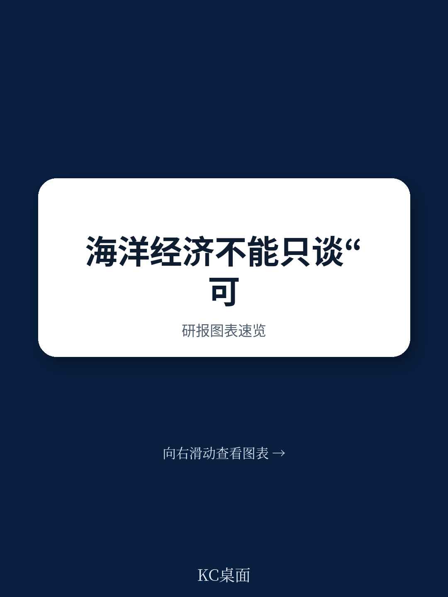
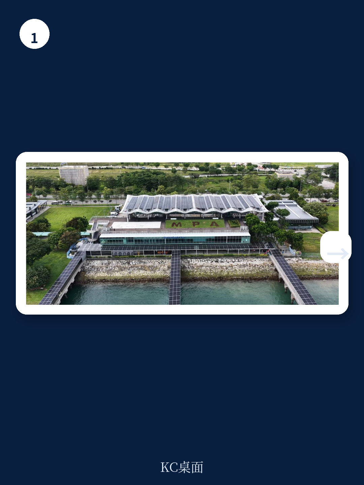
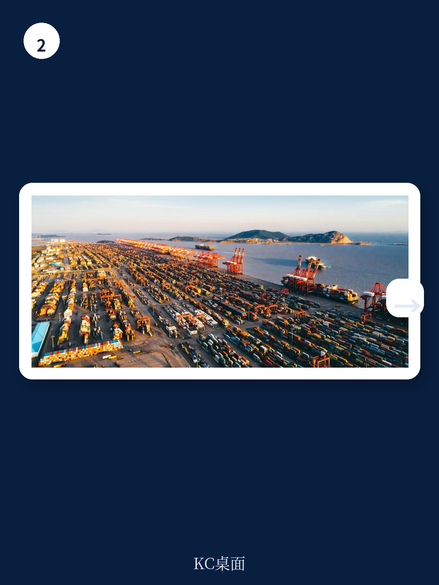

# 世界经济论坛：不是减少伤害而是主动修复，海洋经济转型路径重塑全球供应链

海洋经济每年产生数万亿美元价值，支撑数十亿人生计，但一个残酷的事实正在浮出水面：这些经济活动正在系统性消耗其赖以生存的生态基础。世界经济论坛最新发布的《再生蓝色经济》报告给出了一个清晰判断——维持现状已经不够，海洋经济必须从“减少伤害”转向“主动修复”。

这份报告并非又一份环保倡议书。它提供了一个可操作的转型框架，将海洋产业重新分类为传统、增长和前沿三种轨迹，并指出每个类别面临不同的转型路径和机遇。对于任何关注全球供应链、资源安全或气候风险的读者来说，这都是一份值得深入研读的路线图。

报告的核心洞察是：海洋经济的未来不再由“能提取多少”定义，而由“能再生多少”决定。这一转变将重塑从航运、渔业到生物技术和数据服务的整个产业格局。

> **KC评论：** 报告最有价值的部分不是呼吁“保护海洋”，而是提出了一个可操作的分类框架，帮助决策者判断不同海洋产业在再生经济中的位置和转型路径。传统行业需要管理转型，增长行业需要边界内扩张，前沿行业则直接以生态修复为价值核心。这种分类本身就是一种战略分析工具。

继续看原文，真正有价值的是报告中对每个产业类别给出的具体案例、数据支撑和转型路径拆解。完整报告与KC评论在每日汇编中持续更新。

## 1. 传统海洋产业面临的最大挑战不是衰退，而是如何管理转型

报告将传统海洋产业定义为那些在经济上仍占主导地位、但环境足迹巨大的行业，包括野生捕捞渔业、海运、港口和海上油气。这些行业贡献了海洋经济的大部分收入和就业，但其运营模式与生态健康之间存在根本性冲突。

问题的关键不在于是否要淘汰这些行业，而在于如何设计一条“管理转型”的路径。报告提出的三步走框架值得关注：先减少伤害、提高效率，然后内部化环境成本，最后将补贴和资本重新导向生态修复。

新加坡港的案例展示了这种转型的可行性。作为全球最繁忙的转运枢纽之一，新加坡海事及港务管理局正在推进港务活动脱碳，目标是在2050年实现约1600艘港务船的净零排放。更值得关注的是其多燃料过渡路径——认识到短期内没有单一燃料能主导市场，新加坡正与合作伙伴一起投资氨和甲醇等替代燃料的基础设施和技术标准。

> **KC评论：** 新加坡案例的关键启示不在于技术细节，而在于“系统性协调”。港口是多主体系统，需要船队、燃料供应链、基础设施和监管同时变革。报告后面会详细拆解这种协调机制如何运作，以及为什么这对其他传统行业同样适用。

## 2. 增长行业是近期的转型引擎，但扩张必须在生态边界内进行

第二类海洋产业正在快速扩张，包括海上风电、水产养殖、海洋数字化以及沿海和海洋旅游。这些行业被视为再生蓝色经济的近期引擎，但前提是扩张必须伴随环境保障、公平劳动实践和自然包容性设计。

报告特别强调了“行星边界”的概念。对于增长行业而言，挑战不在于是否增长，而在于增长是否强化了海洋健康。以水产养殖为例，如果设计得当，它可以减轻野生渔业压力并提供可持续蛋白质来源；但如果管理不善，它可能造成污染、疾病传播和栖息地破坏。

海上风电同样面临类似的权衡。风电场建设可能影响海洋生物栖息地，但也能创造人工礁石效应，并直接替代化石燃料发电。关键在于如何通过选址、设计和运营优化，使净生态效应为正。

> **KC评论：** 增长行业的转型逻辑与传统的ESG投资逻辑有本质区别。ESG关注的是“减少负面外部性”，而再生经济要求“创造正面生态产出”。这意味着评估标准需要根本性调整——不是问“这家公司污染了多少”，而是问“这家公司的运营让生态系统变得更好了吗”。

## 3. 前沿行业正在构建一个以修复为核心的新产业体系

报告最具前瞻性的部分是对前沿行业的分析。这些行业直接围绕生态修复、知识构建和生物创新组织，而非资源提取。数据显示，前沿行业的累计企业价值从2010年的11亿美元飙升至2025年的247亿美元，增长了超过20倍。

三个子领域值得特别关注

第一是生态系统修复。红树林、海草床和珊瑚礁的修复正从小规模试点转向国家级基础设施投资。这不是环保项目，而是具有明确经济回报的韧性投资——健康的珊瑚礁可以降低风暴对沿海基础设施的破坏，红树林可以吸收比陆地森林多4倍的碳。

第二是蓝色生物技术。海洋生物正在产出新型药物化合物、可持续饲料替代品和海洋源生物材料。这个领域与合成生物学和基因编辑技术的融合正在加速，但报告没有充分展开其商业化路径和监管挑战。

第三是海洋数据与监测服务。这是一个快速增长的领域，为再生产业提供所需的透明度和可追溯性。没有数据，就无法衡量“再生”是否真正发生。

> **KC评论：** 前沿行业的数据很亮眼，但报告没有完全回答一个关键问题：这些行业能否独立成为可持续的商业模式，还是长期依赖补贴和慈善资本？企业价值不等于收入流，247亿美元中多少是真实的商业化收入，多少是政策驱动的估值？这是读者在阅读完整报告时需要特别关注的部分。

## 4. 四个系统杠杆必须协同作用，单一行动无法实现转型

报告提出了四个相互依赖的系统杠杆：治理、金融、人力资本、技术与人工智能。这些杠杆必须协同作用，而非孤立推进。

治理层面，报告呼吁综合海洋治理，将政策在行业间对齐，管理权衡问题。当前的问题是碎片化——渔业由农业部管，航运由交通部管，能源由能源部管，缺乏统一的海洋空间规划。

金融层面，需要将资本从提取性活动转向再生性活动。报告提到了公共投资和创新商业工具，但没有深入讨论如何解决“再生项目通常回报周期长、风险高”这一根本矛盾。对于机构投资者而言，这可能是最需要拆解的部分。

人力资本层面，确保当地行动者拥有设计和交付解决方案的技能和资源。报告特别强调了沿海社区和原住民的知识与参与权。

技术与AI层面，先进的海洋监测、风险管理和协调系统正在使追踪进展和支持决策变得更便宜、更高效。但报告也暗示，技术本身不是答案——它必须嵌入适当的治理和金融框架中才能发挥作用。

> **KC评论：** 四个杠杆的框架很清晰，但报告没有充分回答一个实际问题：在当前的制度环境下，哪个杠杆最有可能率先突破？我的判断是金融和技术可能比治理和人力资本更容易在短期内取得进展，因为前者有明确的商业驱动力，后者需要更深层的制度变革。这个判断在完整报告中有更多数据和案例支撑。

## 5. 报告尚未完全回答的关键问题：转型的经济学逻辑在哪里？

尽管报告提供了一个有说服力的框架，但有几个关键问题没有得到充分回答。

第一，转型的净经济成本是多少？报告提到了万亿级别的海洋经济价值，但没有详细计算从“可持续”转向“再生”的增量成本，以及这些成本如何在行业、政府和消费者之间分配。

第二，前沿行业的规模化路径仍不清晰。企业价值从11亿到247亿的增长令人印象深刻，但这是否意味着这些行业已经具备了独立商业可行性？还是说，这个增长很大程度上由政策补贴和ESG资本驱动？

第三，社会公平如何具体落地？报告反复强调沿海社区和原住民的参与权，但没有给出具体的权力分配或利益分享机制。在现实中，“参与”往往意味着“被咨询”，而非“有否决权”。

这些未解问题恰恰构成了继续阅读完整报告的理由。报告中的图表、案例数据和假设验证路径，提供了回答这些问题的基础材料。

## 6. 对决策者的观察框架：如何评估一个海洋产业是否在走向再生

基于报告的框架，我们可以提炼出一个简单的观察框架，用于评估任何海洋产业或公司的转型方向

第一，看它是否明确区分了“减少伤害”和“创造正面产出”。前者是可持续，后者才是再生。如果一家公司只谈论减排和污染控制，它可能还停留在可持续阶段。

第二，看它的商业模式是否直接与生态健康挂钩。前沿行业的特征就是价值创造与生态修复直接相关——修复得越好，收入越高。传统行业需要证明它们正在向这个方向迁移。

第三，看它是否具备系统性思维。报告反复强调，再生不是单一行动的结果，而是治理、金融、人力资本和技术四个杠杆协同作用的产物。只在一个维度上改进，不足以实现真正的转型。

第四，看它是否将社会公平纳入核心战略，而非作为附加项。没有沿海社区和原住民的实质性参与，任何再生努力都可能强化现有不平等，最终削弱长期效果。

> **KC评论：** 这个观察框架的价值在于，它提供了一个超越ESG评级的判断工具。ESG评级往往只衡量“风险暴露”，而这个框架衡量的是“转型方向”。对于投资者而言，后者的信号价值可能更高——因为方向对了，即使当前表现一般，长期价值也会增长；方向错了，即使当前表现优秀，也可能面临结构性风险。

---

海洋经济的未来不会由单一报告决定，但世界经济论坛的这份报告提供了一个难得的共识基础：维持现状已不可行，再生是唯一可持续的前进方向。对于产业决策者和投资者而言，现在需要做的不只是理解这个判断，而是开始构建自己的转型路线图。

更多国际信源汇编与评论，每日更新，汇总全球主流叙事、数据和图表，帮助观测市场动态的边际变化。每日汇编将单篇报告放回当天主线，整理为中文摘要、KC评论和图表合集，既便于喂给AI进行深度分析，也便于人工快速扫描市场dynamics。目前已汇聚头部券商、PE/VC、投行、并购、对冲基金、资管机构、战略咨询和智库的朋友，期待交流。

Personal reading notes and learning share only. Not investment advice.
