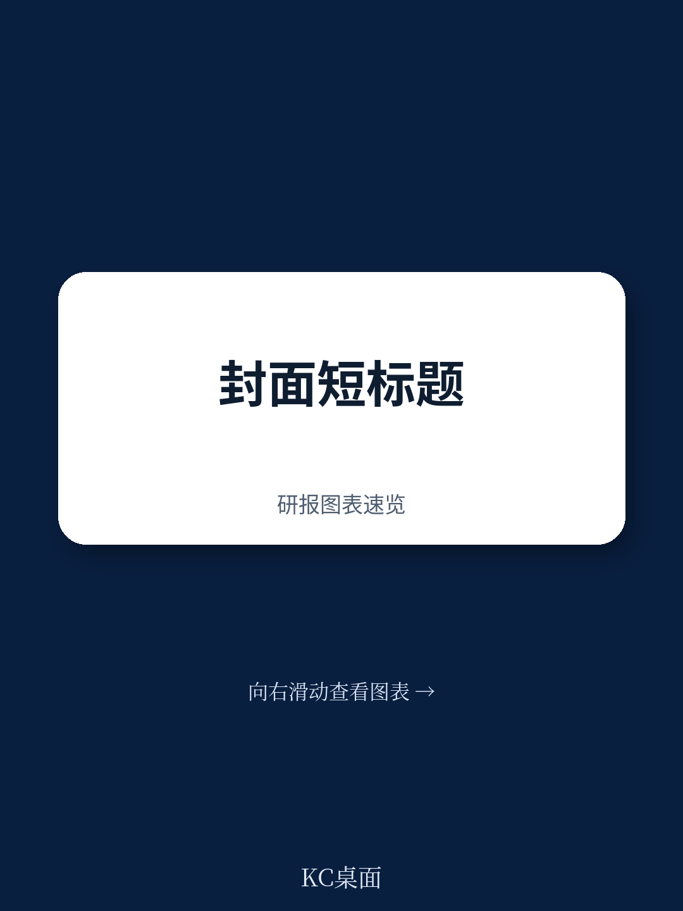
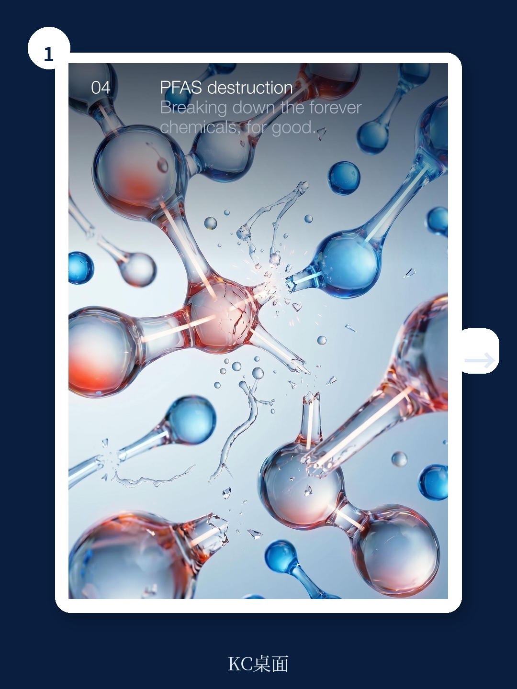
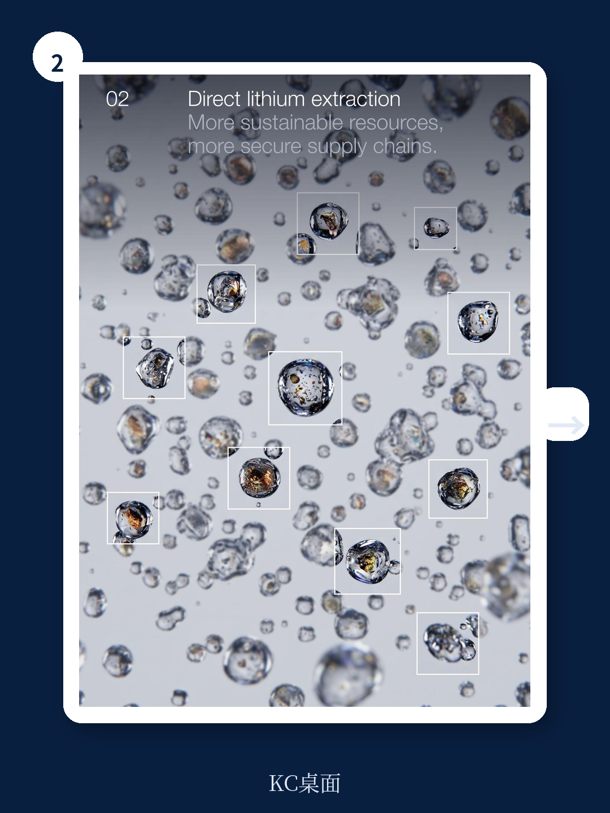

# 世界经济论坛：锂提取技术颠覆全球供应链，18个月缩至数小时

这份报告发布在技术叙事与地缘焦虑交织的时刻。它不是一份技术清单，而是一组产业信号。世界经济论坛（WEF）与迪拜未来基金会联合发布的《2026年十大新兴技术》报告，在第十四次年度筛选中，选出了十项正处于“可以改变世界但尚未完成”状态的技术。这些技术共同指向一个比单项突破更值得关注的趋势：产业系统正在从集中式、标准化、高浪费的模式，转向分布式、个性化、低能耗的新范式。

报告没有直接说“这是第四次工业革命的下半场”，但读完十项技术的战略展望，这个判断几乎是必然的推导。以下是我们从报告中提炼出的三条主线，以及它们对产业决策者的含义。

> **KC评论：** 这份报告的价值不在于预测哪项技术会先爆发，而在于它提供了一个观察框架：哪些技术同时满足“新颖性、发展进度、潜在影响”三个条件，并且正处于政府与产业决策能实质改变其走向的窗口期。继续看原文，真正有价值的是每项技术后面的“战略展望”部分——迪拜未来基金会对2031年的推演，以及每项技术规模化所需的政策、基础设施、资本条件。完整报告与KC评论在每日汇编。

## 1. 能源系统的神经末梢正在被激活：从“万物用电”到“万物发电”

报告开篇的技术是“Everything-to-grid energy”，直译是“万物入网能源”，但更准确的商业理解是：每一栋建筑、每一辆车、每一台设备，都在成为电网的智能节点。这不是概念，而是正在发生的资产属性转变。

报告引用的关键数据是：2025年下半年，澳大利亚家庭安装了超过18万台户用电池，政府通过软件网络付费，让这些分散的储能资产在需求尖峰时集体放电，稳定电网。这不是补贴，而是全新的电力市场交易单元——分布式储能作为资产类别正式入场。

背后的技术驱动来自电池化学的突破。报告指出，2025年，锂离子电池在全球电动汽车部署中首次超越传统镍基电池。新一代化学体系正在摆脱对钴和镍的依赖，转向锂-钠等更易获取的材料体系。同时，电力电子半导体的进步让双向能量转换损耗降至接近零，协调软件可以把数百万个分布式资产编织成一个可调度的资源池。

**所以这意味着什么：** 电力系统的竞争单元正在从“发电容量”转向“调节能力”。拥有分布式资产（车队、楼宇、数据中心）的企业，将获得一种新的资产负债表项——不是电力消费成本，而是电网服务收入。报告的战略展望部分明确写道：“竞争优势可能不再取决于能否获得电力，而取决于能否管理何时、何地生产、储存和使用电力。”

对传统公用事业公司而言，这意味着核心商业模式需要从“卖电”转向“管理分布式资产的网络”。这种转型的难度不亚于电信运营商从话音业务转向数据业务。

> **KC评论：** 报告在战略展望中提出了一个尚未被充分讨论的问题：当建筑、车辆、工厂都成为电网节点，谁拥有这些节点的“调度权”？是资产所有者、聚合平台、还是电网运营商？这个问题的答案将决定千亿美元级的价值分配。完整报告中的“Everything-to-grid transformation map”图表提供了更详细的路径拆解。

## 2. 供应链的地理逻辑正在被改写：直接提锂与精准发酵

报告中有两项技术直接挑战当前的全球供应链地理格局。

**直接提锂（Direct Lithium Extraction）** 不是渐进式改进，而是对锂生产范式的颠覆。传统蒸发池需要18-24个月，只能回收约50%的锂，且仅适用于特定气候条件。直接提锂技术可以在数小时内完成提取，回收率可达80-95%，并且可以处理地热卤水、油田废水甚至电池回收液。报告提到，阿根廷的Centenario-Ratones工厂是第一个无蒸发池的工业化锂生产设施，年产能24,000吨；加州Salton Sea的地热提锂项目获得了14亿美元联邦贷款。

战略展望部分的核心判断是：直接提锂可能将提取和精炼合并在同一地点。传统上，锂在智利或澳大利亚提取，在中国精炼。如果一体化生产成为现实，锂供应链的地理格局将根本性改变——控制矿床不再是全部，控制一体化生产能力才是关键。

**精准发酵（Precision Fermentation）** 则是对蛋白质供应链的重构。通过给微生物新的基因指令，使其生产与奶牛相同的蛋白质，而仅使用一小部分土地、水和碳排放。报告指出，2024年已有超过60家初创公司进入该领域，累计投资超过30亿美元。这不是“植物肉”的替代逻辑，而是蛋白质生产从农业向工业制造的迁移。

**所以这意味着什么：** 两项技术共同指向一个判断——关键资源（锂、蛋白质）的生产正在从“地理禀赋决定论”转向“工程技术决定论”。锂的产地不再局限于南美盐湖和澳洲矿山，蛋白质的产地不再局限于牧场。这将对资源国、加工国、消费国之间的权力结构产生深远影响。

> **KC评论：** 报告没有完全展开的一个关键问题是：直接提锂的一体化生产模式需要巨额资本支出，而锂价自2022年以来已下跌超过80%。在价格低迷期，谁会投资建设新产能？报告只是提到了“经济压力使一体化模式成为必需而非偏好”，但没有给出资本如何被动员的答案。这正是需要完整报告中的假设和验证路径来理解的地方。

## 3. 医疗健康正在进入“单患者设计”时代

报告中有三项技术共同指向医疗健康的一个新范式：治疗不再基于统计学上的“平均患者”，而是基于每一个患者的独特生物学特征。

**个性化mRNA癌症疫苗** 可以从患者自己的肿瘤中合成疫苗，教导免疫系统识别之前未能识别的癌细胞。2024年，mRNA癌症疫苗进入三期临床试验，针对黑色素瘤和胰腺癌。**外泌体药物递送** 利用细胞自然分泌的纳米囊泡作为药物载体，可以绕过血脑屏障，将药物精确递送到特定组织。**量子模拟用于药物发现** 则有望突破传统分子模拟的算力瓶颈，在量子计算机上模拟分子相互作用，大幅缩短药物筛选周期。

这三项技术的共同特征是：它们不是“更好的药”，而是“更精准的药”。个性化癌症疫苗需要为每位患者定制，外泌体递送系统可以根据目标组织调整表面蛋白，量子模拟可以处理传统计算无法完成的复杂分子模型。

**所以这意味着什么：** 医疗健康的价值链正在从“研发-生产-销售”的批量模型，转向“数据-设计-制造”的按需模型。制药公司的核心竞争力将从“临床试验规模”转向“生物信息处理能力和制造灵活性”。监管框架、支付体系、医院基础设施都需要相应调整。

## 4. 一个尚未被充分回答的关键问题：这些技术谁在买单？

报告对每项技术都做了战略展望，但有一个问题贯穿始终但没有被完全回答：**这些技术的商业化路径是否依赖政府补贴或政策强制？**

直接提锂需要联邦贷款支持，精准发酵需要监管批准，个性化疫苗需要医保支付体系重构，万物入网能源需要新的电力市场规则。报告在每项技术的“Building towards scale”部分列出了所需的政策、基础设施、标准，但并没有评估这些条件是否能在合理时间内到位。

这个问题的答案将决定这些技术是“未来十年改变世界”还是“永远停留在实验室和试点”。对于产业决策者而言，跟踪每项技术的政策成熟度，可能比跟踪技术进展本身更重要。

## 5. 给读者的观察框架：如何跟踪这十项技术

基于报告的分析框架，我们建议读者从以下三个维度持续跟踪每项技术

**第一，政策信号。** 关注各国政府是否为某项技术设立了专门的监管沙盒、采购计划或补贴机制。例如，美国对关键矿物供应链的政策窗口可能持续到2028年左右。

**第二，资本流向。** 跟踪风险投资、企业战略投资和项目融资在每项技术上的分布变化。报告提到精准发酵领域已有60多家初创公司和30亿美元投资，但其他技术的资本数据需要持续更新。

**第三，基础设施配套。** 每项技术的规模化都需要新的基础设施。万物入网能源需要通信标准和电力市场规则，直接提锂需要新的精炼产能和劳动力生态，量子模拟需要量子硬件和算法的协同演进。基础设施的成熟度往往比技术本身更难预测。

> **KC评论：** 报告中的“Building towards scale”图表是每项技术最浓缩的战略地图，展示了技术规模化需要的四个维度：标准与认证、基础设施与采购、政策与监管、开发者与制造商。完整报告中的这些图表，加上每项技术的“Strategic outlook”部分，构成了一个可以反复使用的技术评估框架。每日汇编会把单篇报告放回当天主线，整理成中文摘要、KC评论和图表合集，便于喂给AI，也便于人工快速扫市场dynamics。

## 站在2026年看2031年

报告在每项技术后都附有“Imagining 2031”的场景推演。这不是预测，而是“如果条件满足，世界会变成什么样”的思维实验。这些场景的共同特征是：技术不再是独立变量，而是与政策、资本、社会接受度共同演化的系统要素。

对于产业决策者而言，最大的风险不是选错技术方向，而是用旧框架理解新范式。当能源系统从集中走向分布式，当供应链从地理禀赋转向工程能力，当医疗从批量生产转向按需设计，竞争的底层逻辑正在改变。

这份报告的价值，恰恰在于提供了这些底层逻辑变化的早期信号。

---

更多国际信源汇编与评论，扫码交流，每日更新。每日汇编汇总国际主流叙事、数据和图表，观测边际变化。我们汇聚了头部券商、PE/VC、投行、并购、对冲基金、资管机构、战略咨询、智库等领域的从业者，期待与您交流。这些技术中哪些会先规模化，哪些会停留在实验室，我们将在每日汇编中持续跟踪政策、资本和基础设施的信号。

Personal reading notes and learning share only. Not investment advice.
