# Travel & Tourism Development Index 2024

INSIGHT REPORT

MAY 2024

## Contents

Foreword 3
Executive summary 4
1 About the Travel & Tourism Development Index 2024 6
1.1 Index overview 8
1.2 Data and methodology 10
1.3 Economy coverage 10
2 At a glance: Travel & Tourism Development Index 2024 overall rankings 11
3 Global context 12
4 Index results overview 14
5 Dimension results 18
5.1 Enabling Environment 19
5.2 T&T Policy and Enabling Conditions 21
5.3 Infrastructure and Services 24
5.4 T&T Resources 25
5.5 T&T Sustainability 28
6 Regional results 31
6.1 The Americas 33
6.2 Asia-Pacific 35
6.3 Europe and Eurasia 37
6.4 Middle East and North Africa 39
6.5 Sub-Saharan Africa 41
7 Special focus: Leveraging T&T to address future global challenges 43
7.1 The future global risk landscape 44
7.2 Leveraging T&T for environmental sustainability 45
7.3 Leveraging T&T for socioeconomic prosperity 47
7.4 Leveraging T&T for global connectivity, peace and cultural exchange 49
7.5 Leveraging T&T and technology for positive impact 50
Conclusion 52
Technical notes and methodology 53
Appendix A: Travel & Tourism Development Index methodology 53
Appendix B: Data definitions and sources 66
Appendix C: Income group and regional classifications 80
Appendix D: Partner Institutes 82
Contributors 91
Endnotes 94

## Disclaimer

This document is published by the World Economic Forum as a contribution to a project, insight area or interaction. The findings, interpretations and conclusions expressed herein are a result of a collaborative process facilitated and endorsed by the World Economic Forum but whose results do not necessarily represent the views of the World Economic Forum, nor the entirety of its Members, Partners or other stakeholders.

© 2024 World Economic Forum. All rights reserved. No part of this publication may be reproduced or transmitted in any form or by any means, including photocopying and recording, or by any information storage and retrieval system.

  
Francisco Betti
Head, Global Industries Team; Member of the Executive Committee, World Economic Forum

  
Iis Tussyadiah
Professor and Head of
School of Hospitality and
Tourism Management,
University of Surrey

# Foreword

Driven by the end of pandemic-related restrictions and robust pent-up demand, global international tourist arrivals are expected to reach pre-pandemic levels in 2024, highlighting the resiliency of the Travel and Tourism (T&T) sector and people's strong desire to travel. However, the recovery has not been without its challenges. Uneven regional and market-segment recoveries, labour shortages and supply and demand imbalances have all characterized the past few years of T&T development. Meanwhile, external macroeconomic, geopolitical and environmental factors such as high rates of global inflation and interest rates, conflicts in Europe and the Middle East and wildfires in destinations such as Greece have generated additional pressure on the sector. In the coming years, the impact of climate change, geopolitical tensions, macroeconomic uncertainty and the application of new digital technologies such as artificial intelligence (AI) represent just some of the challenges facing T&T and the broader global community. Within this context, it has become critical for T&T decision-makers and stakeholders not just to focus on improving sector readiness for future risks and opportunities, but also to ensure that the sector accounts for its economic, social and environmental impact and is a driver of global prosperity.

With this in mind, we have published the 2024 edition of the Travel & Tourism Development Index (TTDI). The index measures the set of factors and policies that enable the sustainable and resilient development of the T&T sector, which in turn contributes to the development of a country. The objective of the TTDI is to serve as a crucial benchmarking tool for stakeholders to gauge the progress of the T&T sector, informing policy and investment decisions. It offers insights into T&T economies' strengths and areas for improvement, and the interconnected nature of T&T development, as well as facilitating strategic planning and multistakeholder dialogue to encourage sustainable and resilient growth at various levels.

The latest edition of the index provides an overview of the current state of the T&T sector and the various interconnected challenges and opportunities it faces as it moves past the COVID-19 pandemic. Furthermore, the publication's special focus section uses index results and other research to provide a high-level overview of the likely future global risks and challenges landscape and looks at how the sector could help to address elements such as economic inequality, environmental threats linked to climate change and pollution, technological innovation and global connectivity. We emphasize that to achieve this potential, public- and private-sector leaders and other key stakeholders need to proactively shape T&T to become more resilient, inclusive and sustainable.

Following the World Economic Forum's multistakeholder approach, this report is based on a thought leadership and research collaboration between the Forum and the University of Surrey. Through this new knowledge partnership, we have been able to make several upgrades to the TTDI, including the addition of new index components and data that allow for better coverage of the T&T sector's environmental and socioeconomic impact, while making it more T&T-specific, concise and consistent in economy coverage. This work could not have been done without the valuable input of a network of distinguished thinkers and practitioners who provided their knowledge and insights. We are grateful to our advisory group, which comprises representatives from Bloom Consulting, the European Travel Commission (ETC), the Global Sustainable Tourism Council (GSTC), the Hong Kong Polytechnic University, the International Air Transport Association (IATA), JLL Hotels & Hospitality Group, Mastercard, New York University, the Pacific Asia Travel Association (PATA), Trip.com Group, the University of Surrey, Visa, the World Bank, the United Nations World Tourism Organization (UN Tourism) and the World Travel and Tourism Council (WTTC), and to our data partners AirDNA, Bloom Consulting, CoStar, Euromonitor International, GlobalPetrolPrices.com, IATA, the International Civil Aviation Organization (ICAO), the International Union for Conservation of Nature (IUCN), MMGY TCI Research, Tripadvisor, UN Tourism and the WTTC.

# Executive summary

The TTDI 2024 reflects the T&T sector's recovery from the COVID-19 pandemic and the ongoing and future challenges affecting the enabling conditions for its growth.

The TTDI is designed to provide context and facilitate multistakeholder dialogue, enabling stakeholders to grasp emerging trends and risks in global T&T, guiding policy formulation, operational practices and investment strategies.

The Travel & Tourism Development Index (TTDI) 2024 is the second edition of an index that evolved from the Travel & Tourism Competitiveness Index (TTCI) series, a flagship index of the World Economic Forum that has been in production since 2007. Created in collaboration with the University of Surrey and with input from leading Travel & Tourism (T&T) stakeholder organizations, thought leaders and data partners, the TTDI measures the set of factors and policies that enable the sustainable and resilient development of T&T.

While international tourist arrivals and T&T's contribution to global GDP are expected to reach pre-pandemic levels by the end of 2024, the recovery has varied by region and segment. Meanwhile, as the sector moves past the shock of COVID-19, it continues to deal with other external challenges, from growing macroeconomic, geopolitical and environmental risks to increased scrutiny of its sustainability and the application of new digital technologies such as big data and AI. Given that T&T has historically accounted for a tenth of global GDP and employment, decision-makers in the sector and beyond must recognize the need for strategic and holistic approaches if they are to properly navigate increasingly complicated conditions and unlock T&T's great potential to provide prosperity for communities around the world.

Within this context, the TTDI seeks to inform policy-makers, companies and related stakeholders by providing insights into T&T economies' strengths and areas for improvement, and by examining the interdependent nature of the internal and external factors driving this complex sector.

Furthermore, the TTDI is designed to provide context and facilitate multistakeholder dialogue, enabling stakeholders to grasp emerging trends and risks in global T&T, guiding policy formulation, operational practices and investment strategies. In an effort to keep the index relevant to the changing global landscape, the 2024 edition of the TTDI also includes several enhancements that use newly available data on aspects such as the environmental and social impact of T&T to make the index more T&T-specific, concise and consistent in its economy coverage.

## Main takeaways

The TTDI 2024 results are as follows:

The T&T sector's post-pandemic growth continues, but its recovery has been mixed and operating conditions have been challenging. While 71 of the 119 TTDI-ranked economies increased their scores between the 2019 and 2024 editions, the average index score is just $0.7\%$ above pre-pandemic levels. Pillar performance across a broad range of economies highlights a rebound in global T&T demand that has coincided with rising global air route capacity and connectivity, improved international openness, and increased demand and investment in tourism-generating natural and cultural resources. However, despite this growth, non-leisure demand is still behind that of leisure, labour shortages are ongoing, and air route capacity and connectivity, T&T capital investment, productivity and other sector supply factors have not kept up with demand. The resulting supply and demand imbalance, combined with broad inflationary pressure, has led to reduced price competitiveness and service disruptions.

In general, the Europe and Asia-Pacific regions and high-income economies in particular continue to have the most favourable conditions for T&T development. Out of the top 30 TTDI scorers in 2024, 26 are high-income, 19 are based in Europe, seven are in Asia-Pacific, three are in the Americas and one is in the Middle East and North Africa (MENA) region. The highest-ranked economies in the 2024 TTDI edition are those of the United States, Spain, Japan, France, Australia, Germany, the United Kingdom, China, Italy and Switzerland. Thanks to typical advantages ranging from favourable business environments and open travel policies to well-developed transport, tourism and ICT infrastructure and natural, cultural and non-leisure attractions, the top 30 TTDI scorers accounted for over 75% of T&T industry GDP in 2022 and 70% of GDP growth between 2020 and 2022.

T&T enabling conditions in developing economies continue to improve, but far more is needed to close the sector-enabling gap. Low to upper-middle-income economies accounted for 52 out of the 71 economies that have improved their TTDI scores since 2019. Saudi Arabia (+5.7%, 50th to 41st) and the United Arab Emirates (+4.4%, 25th to

18th) are the only high-income economies to rank among the top 10 most improved between 2019 and 2024, with the remainder being the developing countries of Uzbekistan (+7.8%, 94th to 78th), Côte d'Ivoire (+6.4%, 116th to 114th), Albania (+5.9%, 78th to 66th), Tanzania (+4.5%, 88th to 81st), Indonesia (+4.5%, 36th to 22nd), Egypt (+4.3%, 66th to 61st), Nigeria (+4.2%, 113th to 112th) and El Salvador (+4.0%, 101st to 97th). Moreover, the major emerging T&T economies of Indonesia, Brazil (+3.3%, 34th to 26th) and Türkiye (+3.1%, 37th to 29th) joined China (+1.0%, 9th to 8th) in the top quartile of the TTDI. Nonetheless, despite above-average growth, non-high-income economies account for nearly 90% of below-average index scorers, indicating a need for further investment to close gaps in enabling conditions if these economies wish to increase their share of the T&T market and improve their readiness for future risks and opportunities.

## Additional takeaways are as follows:

Increasing ICT readiness and pandemic-era business and labour policies benefit T&T, but more progress is needed on areas such as workforce resilience and equality. Driven by expanded online access, mobile network coverage and digital payment usage, the 7.2% surge in ICT Readiness pillar scores reflects the further digitalization of T&T services. Meanwhile, economy-wide policies implemented during the pandemic may have made it easier for T&T operators to do business. However, the T&T sector's growth momentum is under pressure from challenges such as tight labour markets (notably in mature T&T economies), declining credit ratings and growing fiscal constraints, as well as concerns about health and security conditions. Labour market resilience and inclusion are also increasingly important for T&T, yet nearly 70% of non-high-income economies' T&T labour force is based in countries scoring below average for the TTDI's new Labour Market Resilience and Equality subpillar, which measures aspects such as equality of job opportunities, workers' rights and social protection.

T&T resources, particularly natural and cultural assets, offer developing economies an opportunity for tourism-led economic development. The distribution of natural and cultural resources is less correlated with country income level than other T&T enablers, with many developing economies with a strong portfolio of natural and cultural resources able to create thriving tourism sectors. However, effectively harnessing these resources requires comprehensive management, promotion and protection strategies, alongside investment in robust infrastructure and ICT readiness. Therefore, despite their potential, many countries have not been able to effectively leverage their rich heritage for T&T growth, with just the top 20 T&T dimension performers – predominantly in the Americas, Asia-Pacific and Europe – surpassing the index average by approximately 90% in 2024.

Despite progress, balancing growth with sustainability remains a major problem for the T&T sector. Increasing average Environmental

Sustainability and T&T Socioeconomic Impact pillar scores between 2019 and 2024 reflect broad progress in areas such as energy sustainability and sector contribution to high-wage employment. However, some of this progress, such as reduced sector emissions during the pandemic, is likely to be temporary, while decreasing scores for T&T Demand Sustainability (since 2021) reflect the resurfacing of historical sustainability challenges such as high seasonality and overcrowding as travel demand continues to recover. Furthermore, the results reveal the nuanced economic and social effects of T&T, with the sector being a major source of relatively high-wage jobs in developing countries, while gender parity in T&T employment is a major issue for regions such as MENA and South Asia.

## Leveraging the T&T sector to address global challenges

Aside from improving readiness to handle future external global challenges including economic inequality, environmental threats linked to climate change and pollution, technological innovation and global connectivity, the T&T sector can also play a significant role in addressing them.

To fully realize T&T's potential in solving some of these global challenges, governments and key stakeholders need to proactively shape the sector to become more resilient, inclusive and sustainable for the future. Potential key focus areas, derived from the TTDI 2024 results as well as other research, are:

Leveraging T&T for environmental sustainability by:

\- Providing greater value for nature conservation efforts

\- Leading on the energy transition

\- Driving responsible consumption

Leveraging T&T for socioeconomic prosperity by:

\- Investing in skilled, inclusive and resilient workforces

\- Putting local communities at the centre of T&T development

– Strategically managing visitor behaviour and infrastructure development

Leveraging T&T for global connectivity and peace by:

\- Increasing travel openness

– Encouraging cultural exchange between visitors and the local community

Leveraging T&T and technology for positive impact by:

\- Adopting technology for sustainable and resilient T&T management

– Bridging the digital divide and creating opportunities

\- Ensuring responsible and safe use of technology

# About the Travel & Tourism Development Index 2024

$\downarrow$ Amagertorv town square, Copenhagen, Denmark. This country has the highest TTDI 2024 score in Northern Europe.

The index provides a strategic benchmarking tool for business, governments, international organizations and others to develop the Travel & Tourism sector.

$\downarrow$ Beijing, China. China has Asia's largest and the world's second-largest T&T economy.

First introduced in 2022, the Travel & Tourism Development Index (TTDI) benchmarks and measures the set of factors and policies that enable the sustainable and resilient development of the Travel & Tourism (T&T) sector, which in turn contributes to the development of a country. The index is a direct evolution of the Travel & Tourism Competitiveness Index (TTCI), which has been published biennially since 2007. By allowing cross-country comparison and by benchmarking countries' progress on the drivers of T&T development, the index informs policies and investment decisions related to the development of T&T businesses and the sector as a whole. It also offers unique insights into the strengths and areas for improvement of each country to support their efforts to enhance the long-term growth of their T&T sector in a sustainable and resilient manner. In particular, the TTDI provides a strategic and holistic overview of the tourism economy, including internal and external enablers of T&T development and their interdependent nature. Furthermore, it provides a valuable platform for multistakeholder dialogue, enabling stakeholders to formulate appropriate policies and actions at local, national, regional and global levels.

The 2024 edition of the TTDI was produced in collaboration with the University of Surrey. As the index knowledge partner, the university provided valuable technical and strategic support for the TTDI and related content. This edition of the index also includes several improvements that are designed to take advantage of newly available data such as the World Travel and Tourism Council (WTTC)'s recently developed indicators on the environmental and social impact of T&T, to make the index more T&T-specific, concise and consistent in its country coverage.

Please note that the changes made to the index limit its comparability to the previously published TTDI 2021. Therefore, this release of the index includes recalculated 2019 and 2021 results, using new adjustments. TTDI 2024 results reflect the latest available data at the time of collection (end of 2023).

Many of the improvements made to the index are based on stakeholder feedback and input from the TTDI Advisory Group, which includes representatives from Bloom Consulting, the European Travel Commission (ETC), the Global Sustainable Tourism Council (GSTC), the Hong Kong Polytechnic University, the International Air Transport Association (IATA), JLL Hotels & Hospitality Group, Mastercard, New York University, the Pacific Asia Travel Association (PATA), Trip.com Group, the United Nations World Tourism Organization (UN Tourism), the University of Surrey, Visa, the World Bank and WTTC.

In addition, the index relies on close collaboration with the following data partners: AirDNA, Bloom Consulting, CoStar, Euromonitor International, GlobalPetrolPrices.com, IATA, the International Civil Aviation Organization (ICAO), the International Union for Conservation of Nature (IUCN), MMGY TCI Research, Tripadvisor, UN Tourism and WTTC.

For more detailed information on the TTDI methodology and the new framework, country peer and income-group classification, indicator details and partner information, and to explore the index results through interactive data visualizations, please visit the index website or see the Technical notes and methodology section of the report.

## 1.1 | Index overview

The index is comprised of five dimensions, 17 pillars and 102 individual indicators, distributed among the different pillars. However, the five dimensions

are not factored into the calculation of the index and are used only for presentation and categorization purposes.

## FIGURE 1

Enabling Environment

Business Environment

Safety and Security

Health and Hygiene

Human Resources and Labour Market

Qualification of the Labour Force

Labour Market Dynamics

Labour Market
Resilience and Equality

ICT Readiness

## TTDI framework

T&T Policy and Enabling Conditions

## Travel & Tourism (T&T) Development Index framework

Prioritization of T&T

Openness to T&T

Price Competitiveness

Infrastructure and Services

Air Transport Infrastructure

Ground and Port Infrastructure

Tourist Services and Infrastructure

T&T Resources

T&T Sustainability

Natural Resources

Environmental Sustainability

Cultural Resources

T&T Energy Sustainability

Non-Leisure Resources

Pollution and Environmental Conditions

Preservation of Nature

T&T Socioeconomic Impact

T&T Demand Sustainability

The Enabling Environment dimension captures the general conditions necessary for operating and investing in a country and consists of five pillars:

\- Business Environment: This pillar captures the extent to which a country's policy environment is conducive to companies doing business and investing.

\- Safety and Security: This pillar measures the extent to which a country exposes locals, tourists and businesses to security risks.

\- Health and Hygiene: This pillar measures healthcare infrastructure and accessibility and health security.

## – Human Resources and Labour Market:

This pillar measures the availability of quality employees and the dynamism, resilience and equality of the labour market, as well as the level of protection for workers. It consists of the Qualification of the Labour Force, Labour Market Dynamics and Labour Market Resilience and Equality subpillars.

\- ICT Readiness: This pillar measures the availability and use of information and communication technology infrastructure and digital services.

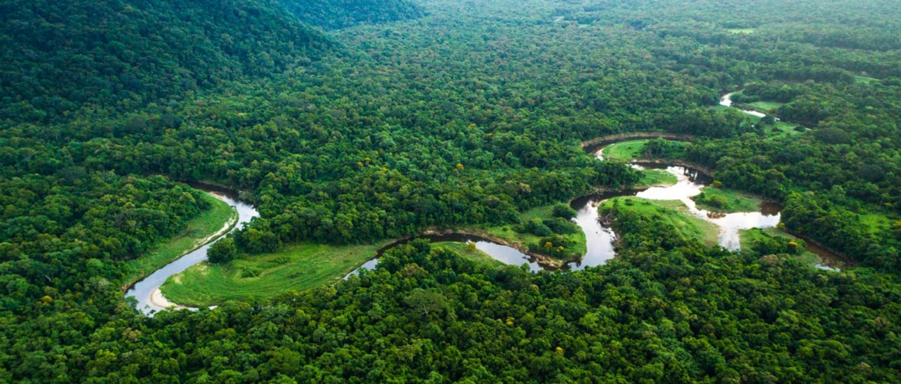

↑ Atlantic Forest, Brazil. The Americas scores highly on the Natural Resources pillar, with with it's diverse ecoregions and wildlife.

The T&T Policy and Enabling Conditions dimension captures specific policies or strategic aspects that affect the T&T sector more directly and consists of three pillars:

\- Prioritization of T&T: This pillar measures the extent to which the government actively promotes, tracks and invests in the development of the T&T sector.

\- Openness to T&T: This pillar measures how open a country is to visitors and facilitating cross-border travel.

\- Price Competitiveness: This pillar measures how costly it is to travel or operate in a country.

The Infrastructure and Services dimension captures the availability and quality of physical infrastructure and tourism services and consists of three pillars:

\- Air Transport Infrastructure: This pillar measures the extent to which a country's infrastructure offers sufficient air connectivity and access for travellers domestically and internationally.

\- Ground and Port Infrastructure: This pillar measures the availability of efficient and accessible ground and port transportation services and infrastructure.

\- Tourist Services and Infrastructure: This pillar measures investment in, and the availability and productivity of, tourist services and infrastructure.

The Travel & Tourism Resources dimension captures the principal “reasons to travel” to a destination and consists of three pillars:

\- Natural Resources: This pillar measures the available natural capital as well as the development of outdoor tourism activities.

Natural capital is defined in terms of landscape, natural parks and the richness of the fauna. To an extent, this pillar captures how natural resources are promoted rather than the actual existing natural heritage of a country.

\- Cultural Resources: This pillar measures the availability of cultural resources such as archaeological sites and entertainment facilities. To an extent, this pillar captures how cultural resources are promoted and developed rather than the actual existing cultural heritage of a country.

\- Non-Leisure Resources: This pillar measures the extent and attractiveness of factors that drive business and other non-leisure travel, including the presence of global cities, major corporations and leading universities.

The Travel & Tourism Sustainability dimension captures the current or potential sustainability challenges and risks facing T&T and consists of three pillars:

\- Environmental Sustainability: This pillar measures the travel and tourism sector's energy sustainability and the general sustainability of an economy's natural environment and the protection of natural resources. It consists of the T&T Energy Sustainability, Pollution and Environmental Conditions, and Preservation of Nature subpillars.

\- T&T Socioeconomic Impact: This pillar measures the economic and social impact of T&T, including induced economic contribution, the provision of high-wage jobs and workforce gender equality.

\- T&T Demand Sustainability: This pillar measures factors that may indicate the existence of, or risk related to, overcrowding, demand volatility and other potentially unsustainable demand trends.

## 1.2 | Data and methodology

Most of the dataset for the TTDI is statistical data from international organizations, with the remainder based on survey data from the World Economic Forum's annual Executive Opinion Survey, which is used to measure concepts that are qualitative in nature or for which internationally comparable statistics are not available for enough countries.

The sources of statistical data include, but are not limited to, AirDNA, Bloom Consulting, Euromonitor International, IATA, ICAO, the International Labour Organization (ILO), the International Telecommunications Union (ITU), the IUCN, CoStar, Tripadvisor, the United Nations Educational, Scientific and Cultural Organization (UNESCO), UN Statistics Division, UN Tourism, the World Health Organization (WHO), the World Bank, the CIA World Factbook, the World Trade Organization (WTO), WTTC and the World Database on Protected Areas (WDPA).

The overall TTDI score is computed through successive aggregations of scores, from the indicator level (e.g. the lowest, most disaggregated level) through the pillar levels, using a simple average (i.e. the arithmetic mean) to combine the components. Scores on each indicator are first normalized and rated on a common scale of 1 to 7, with 1 being the worst and 7 being the best outcome.

## 1.3 | Economy coverage

↓ Newly ranked Uzbekistan experienced the greatest growth in TTDI scores between 2019 and 2024.

The TTDI covers 119 economies. Economies that were covered in the TTDI 2021 but are not covered in the TTDI 2024 are Cape Verde, Chad, Hong

Kong SAR, Lesotho and Yemen. Economies added to the 2024 TTDI are Algeria, Barbados, Iran, Jamaica, Oman, Uzbekistan and Zimbabwe.

# At a glance: Travel & Tourism Development Index 2024 overall rankings

Covering 119 economies, the TTDI measures the set of factors and policies that enable the sustainable and resilient development of the T&T sector, which in turn contributes to the development of a country.

FIGURE 2

Travel & Tourism Development Index 2024 overall rankings $^{1}$

<table><tr><td rowspan="2">Rank</td><td rowspan="2">Economy</td><td rowspan="2"> $Score^2$ </td><td colspan="2"> $Change since 2019^3$ </td><td rowspan="2">Diff. from TTDI Avg. (%)</td></tr><tr><td>Rank</td><td>Score</td></tr><tr><td>1</td><td>United States</td><td>5.24</td><td>0</td><td>-0.5%</td><td>32.3%</td></tr><tr><td>2</td><td>Spain</td><td>5.18</td><td>0</td><td>0.9%</td><td>30.6%</td></tr><tr><td>3</td><td>Japan</td><td>5.09</td><td>0</td><td>-0.3%</td><td>28.5%</td></tr><tr><td>4</td><td>France</td><td>5.07</td><td>2</td><td>0.8%</td><td>28.0%</td></tr><tr><td>5</td><td>Australia</td><td>5.00</td><td>2</td><td>0.8%</td><td>26.0%</td></tr><tr><td>6</td><td>Germany</td><td>5.00</td><td>-1</td><td>-0.8%</td><td>26.0%</td></tr><tr><td>7</td><td>United Kingdom</td><td>4.96</td><td>-3</td><td>-2.4%</td><td>25.2%</td></tr><tr><td>8</td><td>China</td><td>4.94</td><td>1</td><td>1.0%</td><td>24.6%</td></tr><tr><td>9</td><td>Italy</td><td>4.90</td><td>3</td><td>2.1%</td><td>23.5%</td></tr><tr><td>10</td><td>Switzerland</td><td>4.81</td><td>-2</td><td>-2.3%</td><td>21.3%</td></tr><tr><td>11</td><td>Canada</td><td>4.81</td><td>-1</td><td>-1.1%</td><td>21.2%</td></tr><tr><td>12</td><td>Portugal</td><td>4.78</td><td>1</td><td>-0.1%</td><td>20.6%</td></tr><tr><td>13</td><td>Singapore</td><td>4.76</td><td>-2</td><td>-1.7%</td><td>19.9%</td></tr><tr><td>14</td><td>Korea, Rep.</td><td>4.74</td><td>0</td><td>1.1%</td><td>19.6%</td></tr><tr><td>15</td><td>Austria</td><td>4.65</td><td>0</td><td>-0.5%</td><td>17.4%</td></tr><tr><td>16</td><td>Netherlands</td><td>4.64</td><td>1</td><td>0.1%</td><td>17.0%</td></tr><tr><td>17</td><td>Denmark</td><td>4.63</td><td>-1</td><td>-0.9%</td><td>16.8%</td></tr><tr><td>18</td><td>United Arab Emirates</td><td>4.62</td><td>7</td><td>4.4%</td><td>16.5%</td></tr><tr><td>19</td><td>Sweden</td><td>4.57</td><td>0</td><td>0.7%</td><td>15.4%</td></tr><tr><td>20</td><td>Finland</td><td>4.52</td><td>-2</td><td>-1.7%</td><td>14.0%</td></tr><tr><td>21</td><td>Greece</td><td>4.52</td><td>5</td><td>2.6%</td><td>13.9%</td></tr><tr><td>22</td><td>Indonesia</td><td>4.46</td><td>14</td><td>4.5%</td><td>12.4%</td></tr><tr><td>23</td><td>Belgium</td><td>4.45</td><td>0</td><td>-0.5%</td><td>12.2%</td></tr><tr><td>24</td><td>Ireland</td><td>4.44</td><td>-3</td><td>-1.5%</td><td>12.0%</td></tr><tr><td>25</td><td>New Zealand</td><td>4.41</td><td>-5</td><td>-2.6%</td><td>11.3%</td></tr><tr><td>26</td><td>Brazil</td><td>4.41</td><td>8</td><td>3.3%</td><td>11.2%</td></tr><tr><td>27</td><td>Poland</td><td>4.40</td><td>3</td><td>2.0%</td><td>11.1%</td></tr><tr><td>28</td><td>Luxembourg</td><td>4.40</td><td>-4</td><td>-0.9%</td><td>10.9%</td></tr><tr><td>29</td><td>Türkiye</td><td>4.39</td><td>8</td><td>3.1%</td><td>10.6%</td></tr><tr><td>30</td><td>Cyprus</td><td>4.37</td><td>-3</td><td>-0.4%</td><td>10.4%</td></tr><tr><td>31</td><td>Chile</td><td>4.33</td><td>4</td><td>1.4%</td><td>9.2%</td></tr><tr><td>32</td><td>Iceland</td><td>4.32</td><td>-10</td><td>-3.4%</td><td>9.0%</td></tr><tr><td>33</td><td>Czech Republic</td><td>4.31</td><td>-2</td><td>0.3%</td><td>8.8%</td></tr><tr><td>34</td><td>Malta</td><td>4.30</td><td>4</td><td>1.1%</td><td>8.4%</td></tr><tr><td>35</td><td>Malaysia</td><td>4.28</td><td>-7</td><td>-2.2%</td><td>7.9%</td></tr><tr><td>36</td><td>Estonia</td><td>4.28</td><td>4</td><td>0.7%</td><td>7.8%</td></tr><tr><td>37</td><td>Hungary</td><td>4.27</td><td>5</td><td>1.7%</td><td>7.7%</td></tr><tr><td>38</td><td>Mexico</td><td>4.26</td><td>-6</td><td>-0.6%</td><td>7.4%</td></tr><tr><td>39</td><td>India</td><td>4.25</td><td>-10</td><td>-2.1%</td><td>7.1%</td></tr><tr><td>40</td><td>Bulgaria</td><td>4.25</td><td>-1</td><td>0.0%</td><td>7.1%</td></tr></table>

<table><tr><td rowspan="2">Rank</td><td rowspan="2">Economy</td><td rowspan="2"> $Score^2$ </td><td colspan="2"> $Change since 2019^3$ </td><td rowspan="2">Diff. from TTDI Avg. (%)</td></tr><tr><td>Rank</td><td>Score</td></tr><tr><td>41</td><td>Saudi Arabia</td><td>4.23</td><td>9</td><td>5.7%</td><td>6.7%</td></tr><tr><td>42</td><td>Slovenia</td><td>4.22</td><td>-9</td><td>-1.2%</td><td>6.4%</td></tr><tr><td>43</td><td>Romania</td><td>4.19</td><td>2</td><td>0.8%</td><td>5.7%</td></tr><tr><td>44</td><td>Lithuania</td><td>4.17</td><td>4</td><td>1.4%</td><td>5.2%</td></tr><tr><td>45</td><td>Georgia</td><td>4.14</td><td>4</td><td>1.0%</td><td>4.4%</td></tr><tr><td>46</td><td>Croatia</td><td>4.13</td><td>-2</td><td>-0.7%</td><td>4.3%</td></tr><tr><td>47</td><td>Thailand</td><td>4.12</td><td>-6</td><td>-2.5%</td><td>3.9%</td></tr><tr><td>48</td><td>Israel</td><td>4.10</td><td>-5</td><td>-1.6%</td><td>3.4%</td></tr><tr><td>49</td><td>Argentina</td><td>4.10</td><td>-2</td><td>-0.6%</td><td>3.4%</td></tr><tr><td>50</td><td>Colombia</td><td>4.08</td><td>6</td><td>2.3%</td><td>3.0%</td></tr><tr><td>51</td><td>Costa Rica</td><td>4.08</td><td>4</td><td>2.2%</td><td>2.9%</td></tr><tr><td>52</td><td>Kazakhstan</td><td>4.07</td><td>6</td><td>3.7%</td><td>2.6%</td></tr><tr><td>53</td><td>Qatar</td><td>4.02</td><td>-7</td><td>-3.3%</td><td>1.3%</td></tr><tr><td>54</td><td>Slovak Republic</td><td>4.00</td><td>-2</td><td>-0.2%</td><td>0.8%</td></tr><tr><td>55</td><td>South Africa</td><td>3.99</td><td>7</td><td>3.4%</td><td>0.7%</td></tr><tr><td>56</td><td>Azerbaijan</td><td>3.98</td><td>-5</td><td>-0.6%</td><td>0.3%</td></tr><tr><td>57</td><td>Mauritius</td><td>3.98</td><td>-4</td><td>-0.7%</td><td>0.3%</td></tr><tr><td>58</td><td>Bahrain</td><td>3.96</td><td>3</td><td>2.1%</td><td>-0.1%</td></tr><tr><td>59</td><td>Viet Nam</td><td>3.96</td><td>4</td><td>3.2%</td><td>-0.2%</td></tr><tr><td>60</td><td>Montenegro</td><td>3.96</td><td>-1</td><td>0.9%</td><td>-0.2%</td></tr><tr><td>61</td><td>Egypt</td><td>3.96</td><td>5</td><td>4.3%</td><td>-0.2%</td></tr><tr><td>62</td><td>Peru</td><td>3.90</td><td>7</td><td>3.5%</td><td>-1.5%</td></tr><tr><td>63</td><td>Panama</td><td>3.90</td><td>-6</td><td>-1.2%</td><td>-1.6%</td></tr><tr><td>64</td><td>Dominican Republic</td><td>3.88</td><td>1</td><td>1.8%</td><td>-2.0%</td></tr><tr><td>65</td><td>Latvia</td><td>3.88</td><td>-11</td><td>-3.0%</td><td>-2.1%</td></tr><tr><td>66</td><td>Albania</td><td>3.87</td><td>12</td><td>5.9%</td><td>-2.4%</td></tr><tr><td>67</td><td>Oman</td><td>3.87</td><td>-7</td><td>-1.2%</td><td>-2.5%</td></tr><tr><td>68</td><td>Serbia</td><td>3.86</td><td>3</td><td>2.7%</td><td>-2.8%</td></tr><tr><td>69</td><td>Philippines</td><td>3.84</td><td>-2</td><td>1.7%</td><td>-3.1%</td></tr><tr><td>70</td><td>Jordan</td><td>3.81</td><td>2</td><td>2.0%</td><td>-4.0%</td></tr><tr><td>71</td><td>Uruguay</td><td>3.79</td><td>-3</td><td>0.4%</td><td>-4.3%</td></tr><tr><td>72</td><td>Armenia</td><td>3.73</td><td>-8</td><td>-2.4%</td><td>-5.9%</td></tr><tr><td>73</td><td>Iran, Islamic Rep.</td><td>3.72</td><td>4</td><td>1.5%</td><td>-6.3%</td></tr><tr><td>74</td><td>Barbados</td><td>3.71</td><td>-1</td><td>-0.4%</td><td>-6.5%</td></tr><tr><td>75</td><td>Botswana</td><td>3.71</td><td>6</td><td>2.5%</td><td>-6.5%</td></tr><tr><td>76</td><td>Sri Lanka</td><td>3.69</td><td>-1</td><td>0.0%</td><td>-6.8%</td></tr><tr><td>77</td><td>Kenya</td><td>3.68</td><td>-1</td><td>0.1%</td><td>-7.1%</td></tr><tr><td>78</td><td>Uzbekistan</td><td>3.68</td><td>16</td><td>7.8%</td><td>-7.3%</td></tr><tr><td>79</td><td>Lebanon</td><td>3.66</td><td>1</td><td>0.8%</td><td>-7.6%</td></tr><tr><td>80</td><td>Ecuador</td><td>3.66</td><td>-6</td><td>-1.0%</td><td>-7.6%</td></tr></table>

<table><tr><td rowspan="2">Rank</td><td rowspan="2">Economy</td><td rowspan="2">Score $^{2}$ </td><td colspan="2">Change since 2019 $^{3}$ </td><td rowspan="2">Diff. from TTDI Avg. (%)</td></tr><tr><td>Rank</td><td>Score</td></tr><tr><td>81</td><td>Tanzania</td><td>3.65</td><td>7</td><td>4.5%</td><td>-7.9%</td></tr><tr><td>82</td><td>Morocco</td><td>3.64</td><td>-12</td><td>-3.2%</td><td>-8.2%</td></tr><tr><td>83</td><td>Tunisia</td><td>3.60</td><td>2</td><td>1.0%</td><td>-9.2%</td></tr><tr><td>84</td><td>Jamaica</td><td>3.59</td><td>-1</td><td>-0.1%</td><td>-9.5%</td></tr><tr><td>85</td><td>Mongolia</td><td>3.57</td><td>-6</td><td>-2.0%</td><td>-9.8%</td></tr><tr><td>86</td><td>Cambodia</td><td>3.57</td><td>4</td><td>2.5%</td><td>-10.0%</td></tr><tr><td>87</td><td>North Macedonia</td><td>3.53</td><td>-5</td><td>-1.9%</td><td>-10.9%</td></tr><tr><td>88</td><td>Moldova</td><td>3.53</td><td>1</td><td>1.0%</td><td>-11.1%</td></tr><tr><td>89</td><td>Trinidad and Tobago</td><td>3.52</td><td>-5</td><td>-2.1%</td><td>-11.3%</td></tr><tr><td>90</td><td>Bosnia and Herzegovina</td><td>3.51</td><td>1</td><td>1.1%</td><td>-11.5%</td></tr><tr><td>91</td><td>Lao PDR</td><td>3.48</td><td>2</td><td>1.7%</td><td>-12.1%</td></tr><tr><td>92</td><td>Paraguay</td><td>3.47</td><td>0</td><td>0.8%</td><td>-12.5%</td></tr><tr><td>93</td><td>Rwanda</td><td>3.45</td><td>6</td><td>2.6%</td><td>-12.9%</td></tr><tr><td>94</td><td>Bolivia</td><td>3.45</td><td>3</td><td>2.1%</td><td>-12.9%</td></tr><tr><td>95</td><td>Namibia</td><td>3.45</td><td>-8</td><td>-1.7%</td><td>-13.0%</td></tr><tr><td>96</td><td>Kuwait</td><td>3.44</td><td>-10</td><td>-2.9%</td><td>-13.2%</td></tr><tr><td>97</td><td>El Salvador</td><td>3.43</td><td>4</td><td>4.0%</td><td>-13.4%</td></tr><tr><td>98</td><td>Algeria</td><td>3.42</td><td>2</td><td>2.6%</td><td>-13.6%</td></tr><tr><td>99</td><td>Tajikistan</td><td>3.42</td><td>-3</td><td>0.7%</td><td>-13.7%</td></tr><tr><td>100</td><td>Guatemala</td><td>3.42</td><td>-5</td><td>0.5%</td><td>-13.8%</td></tr><tr><td>101</td><td>Pakistan</td><td>3.41</td><td>3</td><td>3.6%</td><td>-14.0%</td></tr><tr><td>102</td><td>Kyrgyz Republic</td><td>3.38</td><td>1</td><td>2.8%</td><td>-14.7%</td></tr><tr><td>103</td><td>Venezuela</td><td>3.34</td><td>-5</td><td>-0.9%</td><td>-15.7%</td></tr><tr><td>104</td><td>Zambia</td><td>3.34</td><td>-2</td><td>1.4%</td><td>-15.7%</td></tr><tr><td>105</td><td>Nepal</td><td>3.34</td><td>0</td><td>2.8%</td><td>-15.7%</td></tr><tr><td>106</td><td>Ghana</td><td>3.28</td><td>1</td><td>1.5%</td><td>-17.2%</td></tr><tr><td>107</td><td>Senegal</td><td>3.24</td><td>2</td><td>2.5%</td><td>-18.2%</td></tr><tr><td>108</td><td>Nicaragua</td><td>3.24</td><td>-2</td><td>0.0%</td><td>-18.3%</td></tr><tr><td>109</td><td>Bangladesh</td><td>3.19</td><td>2</td><td>3.0%</td><td>-19.5%</td></tr><tr><td>110</td><td>Zimbabwe</td><td>3.19</td><td>0</td><td>2.5%</td><td>-19.6%</td></tr><tr><td>111</td><td>Honduras</td><td>3.19</td><td>-3</td><td>-1.4%</td><td>-19.6%</td></tr><tr><td>112</td><td>Nigeria</td><td>3.18</td><td>1</td><td>4.2%</td><td>-19.8%</td></tr><tr><td>113</td><td>Benin</td><td>3.16</td><td>-1</td><td>3.3%</td><td>-20.4%</td></tr><tr><td>114</td><td>Côte d’Ivoire</td><td>3.13</td><td>2</td><td>6.4%</td><td>-21.0%</td></tr><tr><td>115</td><td>Malawi</td><td>3.06</td><td>0</td><td>2.8%</td><td>-22.8%</td></tr><tr><td>116</td><td>Angola</td><td>3.05</td><td>-2</td><td>1.3%</td><td>-22.9%</td></tr><tr><td>117</td><td>Cameroon</td><td>2.99</td><td>0</td><td>3.1%</td><td>-24.6%</td></tr><tr><td>118</td><td>Sierra Leone</td><td>2.89</td><td>0</td><td>2.7%</td><td>-27.1%</td></tr><tr><td>119</td><td>Mali</td><td>2.78</td><td>0</td><td>-0.4%</td><td>-30.0%</td></tr></table>

1. Index results represent the latest data available at the time of collection (end of 2023).  
2. Overall scores range from 1 to 7 where 1 = worst and 7 = best.  
3. Change since 2019 refers to 2019 results using new index framework and methodology.

## 3 Global context

↓ International tourist arrivals are expected to reach pre-pandemic levels in 2024.

With 2024 in full swing, the global T&T sector is on track to move past the COVID-19 pandemic lows and even exceed the pre-pandemic highs.

If T&T can be developed in an inclusive, sustainable and resilient manner, it can become a powerful tool to address many worldwide challenges.

↓ Tokyo, Japan. The Asia-Pacific region leads the way in the cultural resources pillar.

Driven by the lifting of pandemic-related travel and other restrictions and strong pent-up demand, international tourist arrivals are expected to reach pre-pandemic levels in 2024, reaching 88% of the 2019 level in 2023, $^{1}$ while at \$9.9 trillion, T&T's contribution to global GDP is nearly at pre-pandemic levels. The Middle East had the highest recovery rates in international tourist arrivals (20% above the 2019 level), $^{2}$ while Europe, a resilient destination with strong intraregional travel flows, Africa and the Americas all showed a strong recovery of around 90% in 2023. In 2024, global tourism growth is expected to be reinforced by the continued satisfaction of pent-up demand and growth in major Asian markets after travel restrictions have been lifted following a delay compared to other regions. $^{3}$

However, the uneven nature of the aforementioned recovery, labour shortages, and supply and demand imbalances leading to travel price increases and service disruptions have put pressure on destinations and businesses in the T&T sector. Moreover, while travel demand has proved resilient, the macroeconomic and geopolitical landscape, defined by economic uncertainty, high inflation and energy prices, increased interest rates and conflicts from Ukraine to the Middle East, has nevertheless exacerbated the sector's difficult operating conditions and may yet dampen sector growth. $^{4}$ Combined with the impact of climate events such as global heatwaves and wildfires in countries like Greece $^{5}$ and the return of overcrowding at destinations such as Venice, $^{6}$ the sector's exposure to and influence on economic, social and environmental issues has become even more apparent.

Against this dynamic backdrop, it has become imperative for T&T government and business decision-makers and other stakeholders to ensure that the sector not only addresses near-term issues such as supply and demand imbalances but also ensures sector readiness for the growing economic, environmental, societal, geopolitical and technological challenges and opportunities in the future. If T&T can be developed in an inclusive, sustainable and resilient manner, it can become a powerful tool to address many worldwide challenges, contributing to the collective well-being of the global community. To help guide this goal, this year's Travel & Tourism Development Index special focus section will outline the external future risks and opportunities the sector will likely face in the coming years, and what can be done to help the sector deal with these trends while simultaneously making it a source of global resilience and prosperity.

## 4 Index results overview

↓ Grinnell Lake in Glacier National Park, Montana, USA. The United States ranks first on the TTDI 2024.

The T&T sector is recovering from the COVID-19 pandemic, but many challenges remain and hard work is needed to bridge the gap between developing and high-income economies.

## Section takeaways:

\- Post-pandemic, the T&T sector shows growth, yet index results indicate that recovery is uneven, with challenges persisting in relation to operating conditions.

\- Developing economies see improving T&T enabling conditions, but substantial efforts are required to bridge the sector's development gap.

\- Europe and Asia-Pacific regions and high-income economies in particular generally offer more favourable environments for T&T development.

FIGURE 3 | 2024 TTDI performance  
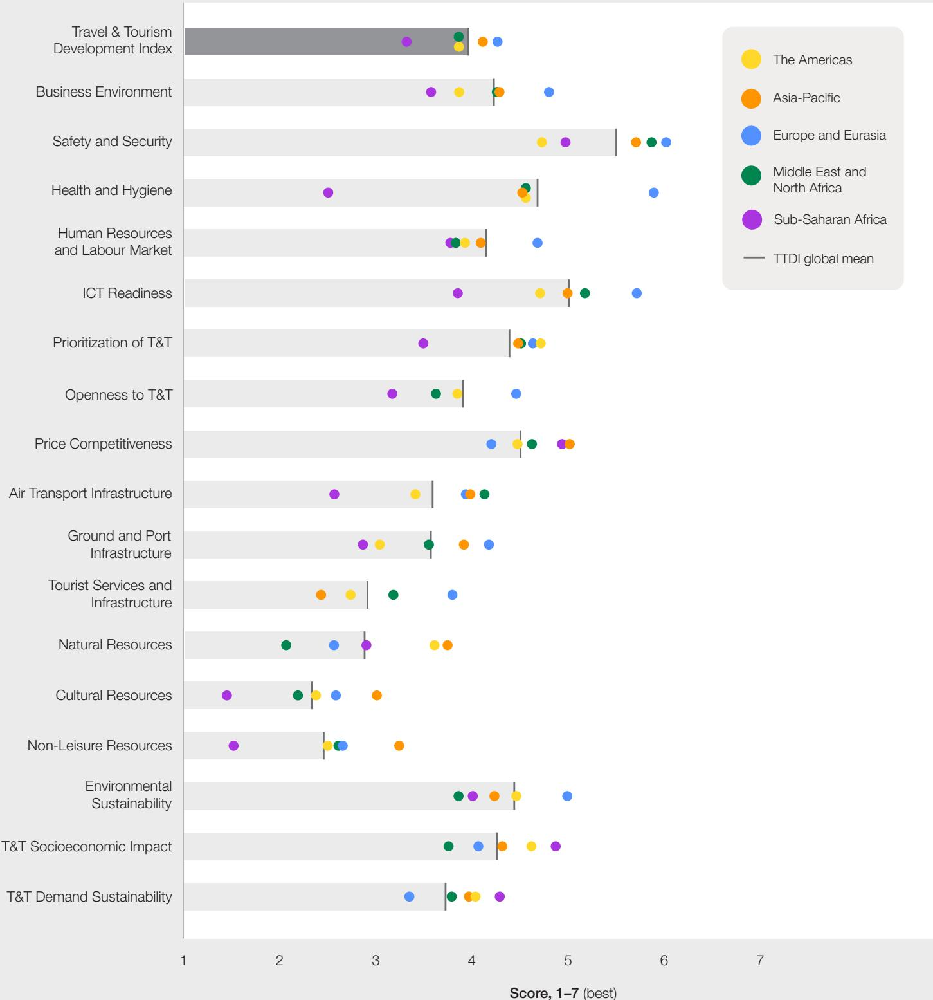  
Source: World Economic Forum.  
Note: Data represents peer group mean scores for the TTDI and its pillar components.

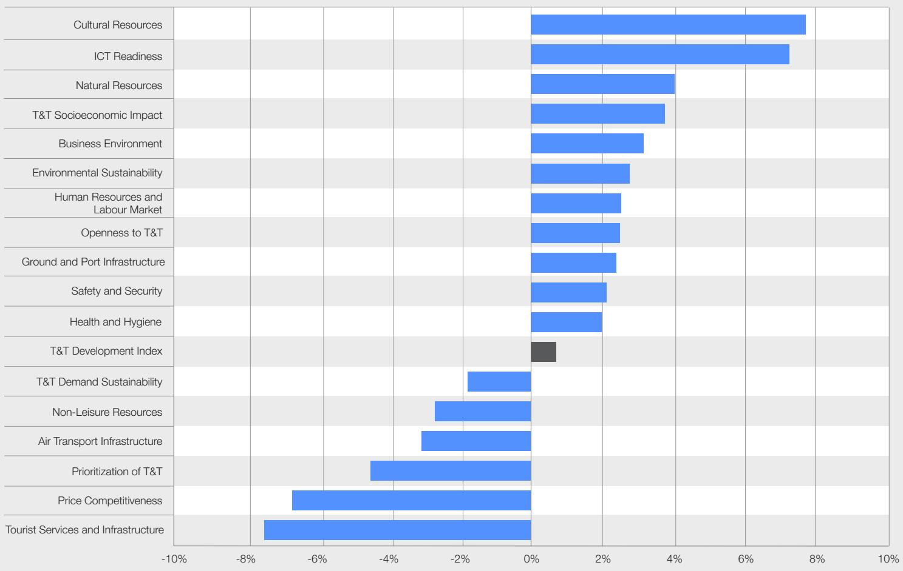  
Source: World Economic Forum.

TTDI results show that while the sector is recovering from the COVID-19 pandemic, operating conditions remain challenging. Between the 2019 and 2024 editions, 71 out of 119 TTDI-ranked economies progressed past their 2019 scores, but the average index score is just 0.7% above pre-pandemic levels and only 19 economies improved by 3.0% or more. Slow TTDI performance is partly due to diverging pillar trends (Figure 4). Increased pillar scores in Openness to T&T and Natural and Cultural Resources between 2019 and 2024, and Air Transport Infrastructure (+6.6%, 2021 to 2024) reflect a rebound in global T&T demand.

Nevertheless, scores for Air Transport Infrastructure and Tourist Services and Infrastructure are still below 2019 levels, indicating that, despite recent growth, supply factors such as air route capacity, T&T capital investment and productivity have not consistently kept up with climbing demand. The resulting imbalance between T&T demand and supply, combined with continued labour shortages in many countries and broad inflationary pressure, has led to a large average decrease in Price Competitiveness scores. In addition, average scores for Non-Leisure Resources also remain below 2019 levels, highlighting the delayed recovery in global business travel. While climbing average scores for the Environmental Sustainability and T&T Socioeconomic Impact pillars are encouraging for sector sustainability, gains in areas such as reduced emissions may be reversed as sector transport activity grows, while a decreasing 2021 to 2024 score for the T&T Demand Sustainability (-4.7%) pillar also reflects the resurfacing of historical tourism flow challenges associated with the growth in travel, including high seasonality and overcrowding.

Looking at ranking results, more mature, high-income T&T economies in Europe and Eurasia (Europe) and, to a lesser extent, Asia-Pacific make up most of the top rankings in the 2024 TTDI edition. Among the top 30 scorers, 19 are from Europe, seven from Asia-Pacific, three from the Americas, and one from the Middle East and North Africa (MENA) region (the United Arab Emirates). The top 10 ranked economies for the 2024 TTDI are the United States, Spain, Japan, France, Australia, Germany, the United Kingdom, China, Italy and Switzerland. T&T sector development in the top-scoring countries typically benefits from factors such as more conducive business environments, access to more dynamic, qualified and resilient labour markets, openness and good ICT readiness. In particular, these countries also tend to have excellent transport and tourism infrastructure and services and a very high concentration of natural, cultural and non-leisure resources and attractions. As a result of these advantages, the top 30 TTDI scorers accounted for over 75% of T&T industry GDP in 2022 and 70% of GDP growth between 2020 and 2022. $^{7}$

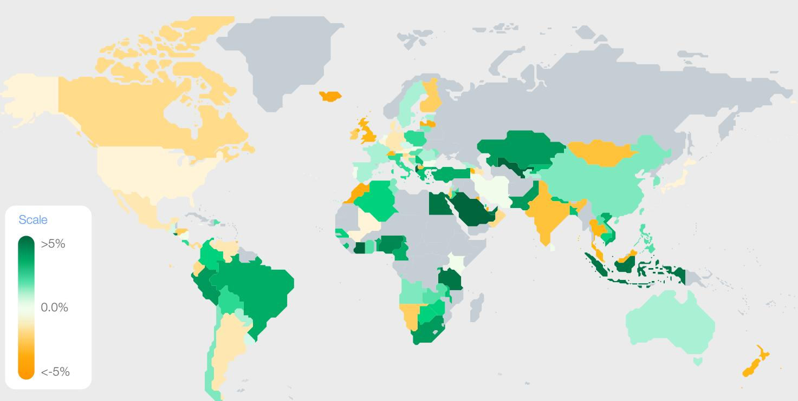  
Source: World Economic Forum.

However, in terms of momentum, it was less mature, low to middle-income economies that exhibited the most significant enhancement in performance since 2019, accounting for 52 out of 71 economies that improved their TTDI scores. Between 2019 and 2024, these economies accounted for much of the above-average improvements in scores in regions such as sub-Saharan (+2.1%) and North Africa (+1.1%), Eurasia (1.7%), South America (+1.2%), South Asia (+1.2%) and the Balkans and Eastern Europe (+1.0%). Saudi Arabia (+5.7%, 50th to 41st) and the United Arab Emirates (+4.4%, 25th to 18th) are the only high-income economies to rank among the top 10 most improved TTDI performers since 2019, with the remaining top 10 consisting of Uzbekistan (+7.8%, 94th to 78th), Côte d'Ivoire (+6.4%, 116th to 114th), Albania (+5.9%, 78th to 66th), Tanzania (+4.5%, 88th to 81st), Indonesia (+4.5%, 36th to 22nd), Egypt (+4.3%, 66th to 61st), Nigeria (+4.2%, 113th to 112th) and El Salvador (+4.0%, 101st to 97th). Moreover, the major emerging T&T economies of Indonesia, Brazil (+3.3%, 34th to 26th) and Türkiye (+3.1%, 37th to 29th) joined China (+1.0%, 9th to 8th) in the top quartile of the TTDI.

However, despite progress, developing economies account for nearly 90% of below-average index scorers. Far more investment will need to be

made in areas such as developing favourable business, health and labour conditions, international openness, ICT, transport and tourist infrastructure, and the promotion and development of natural and cultural resources if these economies wish to increase their share of the T&T market and improve their readiness for future risks and opportunities.

In the future, while many of the aforementioned challenges are likely to lessen, if global inflation pressure eases and sector employment, investment and overall capacity grow, uncertainty about the sustainability of travel demand amid unstable macroeconomic and geopolitical conditions may climb. Furthermore, the T&T sector will be under increasing pressure to prepare for and help mitigate growing risks and challenges ranging from the impact of climate change and global conflict to the responsible use of technological innovation. TTDI 2024 results highlight the difficulty policy-makers and business leaders face when it comes to delivering sustainable, inclusive and resilient T&T development.

The Dimension and Regional results sections of this report provide a more detailed picture of the aforementioned trends and index results, while the special focus section highlights some of the ways in which the T&T sector can be leveraged to address future global challenges.

## 5 Dimension results

While no economy ranks in the top 20 across the board, Australia comes close, making it into the top 20 on four TTDI dimensions.

The TTDI structure comprises five dimensions encompassing 17 pillars, which are used to capture a holistic picture of the factors that enable the T&T sector.

The following section provides a high-level analysis of each of the TTDI's five dimensions. Please note: analysis will often focus on average pillar and/or indicator performance and selected takeaways and may not always reflect the wide variety of economy and country grouping performance. For a more detailed look at TTDI data, including interactive dashboards, please visit the index website.

## 5.1 | Enabling Environment

## Section takeaways:

\- Since 2019, progress has been made across pillars such as ICT Readiness (notably in developing economies) and Business Environment, helping to drive digitalization and operational efficiency in the T&T sector.

\- Despite progress having been made, tight labour markets, unfavourable enabling environments in developing economies, declining credit ratings and fiscal constraints threaten the growth of the T&T sector.

Low scores in health and security aspects in certain regions may further hinder development amid global health and security concerns.

\- Labour market and resilience are increasingly important for T&T, but many economies, especially developing ones, struggle in this regard. A more active sector role in this area via investment in a skilled, inclusive, resilient workforce is crucial for sustaining growth.

## FIGURE 6

## TTDI Enabling Environment dimension pillar average score performance

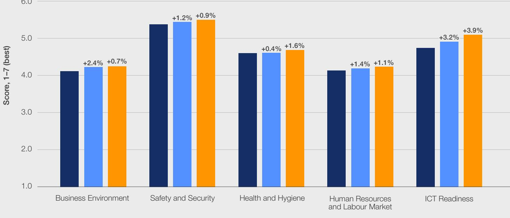  
Source: World Economic Forum.

Pillars under the Enabling Environment dimension capture the general conditions necessary for T&T operations in a country. Overall business (Business Environment pillar), health (Health and Hygiene pillar) and safety conditions (Safety and Security pillar), access to a qualified, dynamic and resilient workforce (Human Resource and Labour

Market pillar) and ICT (ICT Readiness pillar) have a substantial impact on T&T business operations, investment and visitor decision-making. Since 2019, there has been a notable improvement across all pillars within this dimension, indicating positive developments in various areas that affect T&T operations.

↓ Digital tools and online platforms are transforming travel and tourism with online bookings, sharing economy and mobile payments.

ICT Readiness scores have surged by 7.2% since 2019, with 97% of economies showing positive momentum, driven by expanded online access, mobile network coverage and digital payment usage, notably in developing nations. The advancement in ICT Readiness is pivotal as it encourages the further digitalization of T&T services. With online bookings, sharing economy platforms, digital payments and mobile access increasingly defining T&T services, digital technology and online platforms empower destinations and T&T businesses, including SMEs, to access new markets, optimize operations, enhance visitor engagement, and gather consumer insights and preferences. $^{8}$ Accordingly, past research has found positive relationships between ICT Readiness and international tourism receipts. $^{9}$

Moreover, there was notable progress in the Business Environment (+3.1%) and Human Resources and Labour Market (+2.5%) pillars between the 2019 and 2024 index editions. In part, these advances reflect economy-wide policies implemented during the pandemic, including reductions in burdensome government regulations, expanded access to financing for SMEs, and more favourable and flexible labour regulations and working arrangements, all of which should help make it easier for T&T operators to do business.

However, despite positive trends, results also point to several challenges threatening the T&T sector's growth momentum. Scores for labour force participation rates remain below 2019 levels in nearly half of the ranked economies, with decreased average scores for perceptions of the ease of finding skilled employees (since 2021) – especially in mature tourism economies such as advanced European countries, the United States and Japan – helping to explain T&T labour shortages. Moreover, many economies in the Global South continue to face challenges in building more favourable enabling environments. For example, business conditions in developing countries have faced setbacks since 2021, with issues such as property rights, judicial effectiveness and government corruption further deteriorating. $^{10}$

Meanwhile, declining credit ratings among many Latin American, African and South Asian economies reflect the high interest rates and increased debt pressure faced by governments and companies post-pandemic, $^{11}$ potentially discouraging investment in T&T. Despite improvements, low scores for Health and Hygiene in regions such as sub-Saharan Africa (-46.7% below 2024 mean) and Safety and Security in regions such as the Americas (-14.5% below 2024 mean) may further impede T&T development amid heightened global health and security concerns.

FIGURE 7 | T&T workforce distribution by peer group and by country labour market resilience and equality conditions  
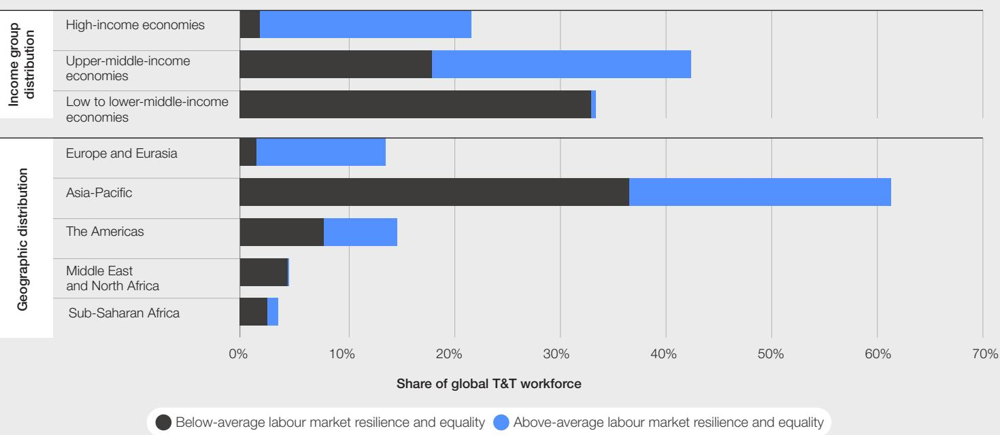  
Source: World Economic Forum and World Travel & Tourism Council.  
Note: Share of global T&T workforce refers to the 2022 share of directly employed people in T&T among TTDI-ranked economies. Below- and above-average labour market resilience and equality refers to the share of peer group T&T workforce based in economies that score above or below the mean for the 2024 Labour Market Resilience and Equality subpillar. Part of the TTDI Human Resources and Labour Market pillar, this subpillar measures indicators such as equal workforce opportunities, workers rights, female labour force participation and social protection basic coverage and spending.

Lastly, labour market resilience and equality have also become increasingly crucial considerations post-pandemic. Effective social protections and inclusive policies can enhance productivity, widen the labour pool and bolster resilience. $^{12}$ This is vital for the T&T sector, which relies heavily on employing youth, women, informal workers and small enterprises. $^{13}$ However, nearly 70% of non-high-income economies' T&T labour force is based in countries scoring below average for the TTDI's new Labour Market Resilience and Equality subpillar (Figure 7), with the majority of countries in Latin America, the Middle East, North and sub-Saharan Africa and South and South-East Asia scoring below the mean. This highlights potential resilience and human capital access issues for T&T employers. Consequently, T&T stakeholders in many countries will have to take a more active role in investing in more skilled, inclusive and resilient workforces and help address issues ranging from workers' rights and conditions to equal opportunities for women and disadvantaged groups.

## 5.2 | T&T Policy and Enabling Conditions

## Section takeaways:

\- Driven by rising fuel and operating costs, supply-demand imbalances and global inflation, T&T prices have substantially increased since 2021. However, this may lead to more opportunities for domestic travel, and lead people to choose more sustainable and less expensive modes of transport and destinations.

\- On the other hand, increasing Openness to T&T scores reflect that many nations have looked to boost international T&T, particularly through reduced visa requirements and especially in lower-ranked economies.

\- While travel facilitation policies advance, the average Prioritization of T&T score has declined, reflecting pandemic-era challenges and the evolving nature of government support and its role in T&T development. Encouragingly, some governments and destination organizations are shifting the focus from quantity to quality tourism, but this change requires additional resources and skills, which may be limited by fiscal constraints.

The T&T Policy and Enabling Conditions dimension tracks policies and conditions more directly tied to encouraging T&T sector growth. This includes the extent to which the government actively promotes, measures and invests in the development of the

T&T sector (Prioritization of T&T pillar), the degree to which a country is open to visitors and providing travel services (Openness to T&T pillar) and how costly it is to travel or operate in a country (Price Competitiveness pillar).

FIGURE 8 TTDI T&T Policy and Enabling Conditions dimension pillar average score performance  
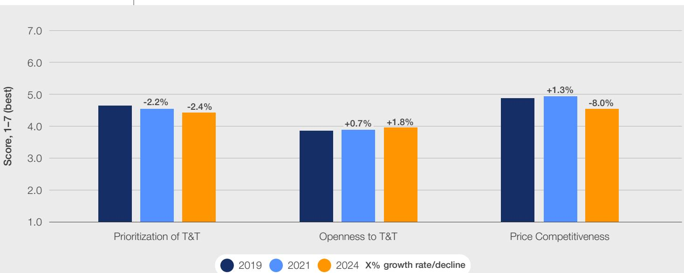  
Source: World Economic Forum.

## 20%

Increase in average petrol prices for ranked countries between 2019 and mid-2023.

Since 2021, the TTDI has witnessed a significant decline in Price Competitiveness (-8.0%), driven by increasing fuel and operating expenses and supply-demand imbalances in the sector, exacerbated by geopolitical and macroeconomic factors causing higher general inflation and rising energy costs. Average gasoline (petrol) prices for ranked economies surged by nearly 20% between 2019 and mid-2023. Meanwhile, as will be explained in the next dimension analysis, sectoral difficulties in regaining pre-pandemic labour and capacity levels amid surging demand have created supply constraints and increased prices for accommodation and services in various economies.

While T&T demand has remained resilient, there are already signs that consumers are adapting to high inflation by seeking better deals, opting for local or off-season trips and, when possible, using more price-competitive ground transport over flying. $^{14}$ Under such conditions, travel demand in T&T economies with larger domestic markets and less dependence on international visitors may prove more resilient, as may more price-competitive, lower-income economies, especially if travel to them is not expensive. Consumer responses to pricing pressure also present an opportunity for destinations to promote more sustainable travel by encouraging local experiences, diversifying demand to less expensive secondary destinations and off-peak travel, and facilitating the use of less emissions-intensive transport modes such as trains.

Moreover, besides the lifting of pandemic-related restrictions (not captured by the TTDI), index findings reveal that many nations have enacted additional policies to bolster their T&T sector by expanding international travel market access, resulting in an average enhancement in the Openness to T&T pillar (+2.5%, 2019 to 2024). Much of this advance stems from increased visa accessibility and passport mobility, particularly among developing and lower-ranked economies, with the bottom 30 pillar performers increasing their scores almost five times faster than the top 30. UN Tourism data illustrates that 42 predominantly low to middle-income, TTDI-ranked economies from regions such as sub-Saharan Africa, the Middle East and North Africa, South America, and South, South-East and Central Asia have relaxed source-market-weighted visa requirements. Many countries have also tailored their visa policies to target emerging travel segments and promote and benefit from their natural, cultural and non-leisure assets. For example, Estonia introduced a “digital nomad visa” catering to international remote workers, $^{15}$ while South Korea is tapping into K-pop’s popularity by offering visas for those seeking training at local performing arts academies. $^{16}$

Meanwhile, growth in above-average Openness to T&T pillar scores in Europe and South-East Asia has been reinforced by enhanced air service integration, with multilateral agreements such as the ASEAN-EU Comprehensive Air Transport Agreement (CATA) and the ASEAN Single Aviation Market expected to boost intraregional and international air travel and competition among European and South-East Asian tourism economies. Air liberalization policies such as these could help increase air route capacity and potentially reduce aviation prices over the long term, with previous TTDI findings showing a correlation between air liberalization and Air Transport Infrastructure scores. $^{17}$

  
↑ Many nations have bolstered their T&T sector by pursuing greater visa openness and passport mobility.

On the other hand, while travel facilitation policies are progressing, declining average scores for Prioritization of T&T (-4.6%, 2019 to 2024) reflect COVID-19 pandemic-era challenges and the evolving nature of government support and its role in T&T development. For instance, scores for Country Brand Strategy ratings (a measure of the accuracy of online National Tourism Organization [NTO] brand strategy) dropped nearly 19% since 2019 in part due to the shift in branding and promotional content featured by NTOs during the pandemic. In general, a greater number of entities such as NTOs and destination management/marketing organizations (DMOs) have changed their role in response to the pandemic and evolving travel trends. For example, pandemic-induced disruptions to travel demand and T&T operations and increased awareness of the need to address T&T's economic, social and environmental impact have led many destination organizations to move away from just increasing visitor numbers and promoting tourism to destination stewardship. $^{18}$

Even before the pandemic, DMOs were increasingly focusing on managing visitor flows, promoting lesser-known destinations and engaging stakeholders to ensure tourism benefits communities and respects the local culture and nature. $^{19}$ As will be further discussed in the special focus section of the report, this evolution in destination management will become increasingly crucial to ensure T&T remains a positive force for addressing future economic, environmental, societal, geopolitical and technological challenges. However, this shift in strategy will also require further investment in resources and relevant skills and competencies by responsible public entities. Moreover, novel approaches will be needed to fund these requirements. While T&T's share of government spending has increased in 115 economies since 2021, future spending may be constrained by high-interest rates and fiscal limitations, particularly in low to lower-middle-income economies.

## 5.3 | Infrastructure and Services

## Section takeaways:

\- While operations are recovering, a mismatch between growing travel demand and lagging supply variables such as air route capacity, investment and productivity (amplified by labour shortages) is leading to supply-demand imbalances, increased prices and potential service disruptions.

\- Policies such as adopting digital solutions, enhancing skills development and providing decent working conditions can help relieve

The TTDI's Infrastructure and Services dimension tracks the availability of quality transport and tourism infrastructure and services. This includes air connectivity and capacity (Air Transport Infrastructure pillar), road and railroad network

labour shortages, while improving access to credit and business-friendly regulations can help T&T operators, especially small and medium enterprises (SMEs).

\- Despite progress in Ground and Port Infrastructure, the TTDI highlights ongoing infrastructure gaps, especially in developing economies. Moreover, infrastructure investment needs to be calibrated towards inclusive and sustainable tourism.

extensiveness and efficient public transportation (Ground and Port Infrastructure) and the availability of quality accommodation and T&T sector capital investment and productivity (Tourist Services and Infrastructure pillar).

## FIGURE 9

## TTDI Infrastructure and Services dimension pillar average score performance

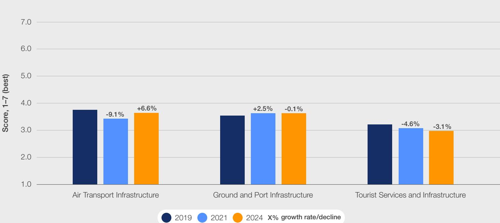  
Source: World Economic Forum.

The TTDI's Infrastructure and Services dimension reflects the T&T sector's supply and demand imbalance. With borders reopening and travel restrictions lifted, there has been a surge in pent-up demand and international travel. While T&T operations have restarted, as is particularly evident in the Air Transport Infrastructure pillar with increasing average scores (+6.6%) between 2021 and 2024, many economies are still below their 2019 performance levels, notably in Asia-Pacific due to prolonged travel restrictions. Moreover, the Tourism Services and Infrastructure pillar average score is 7.6% below its 2019 level, with minimal growth in the average score for accommodation capacity for hotels (+1.4%), and short-term rental listings yet to recover. Although T&T employment and capital investment have risen since 2021, they remain below pre-pandemic levels in most regions, with average capital investment per employee scores more than 13.7% lower than in 2019, contributing to reduced scores for labour productivity in hotels and restaurants (-13.1% since 2019). Labour shortages, particularly in high-income economies, have exacerbated supply constraints, with many workers opting for less seasonal and higher-paying jobs with better conditions. By the end of 2022, the WTTC estimated a labour shortfall of 11.0% and 7.0% in the T&T sectors of the European Union and the United States, respectively. $^{20}$

↓ Kallang Station, Singapore. This country scores highest for the Infrastructure and Services dimension.

In the near term, growth in travel demand combined with the lag in supply variables such as air route capacity, investment, labour and productivity are likely to continue to generate supply and demand imbalances that drive travel prices and disrupt services. These issues may be further amplified if global interest remains high and discourages sector-related investment. However, sector decision-makers can take several steps to address service capacity constraints in the longer term. The WTTC lists facilitating greater labour mobility, flexible working arrangements, decent work and competitive benefits, skills building and adaptation of digital solutions as some of the policy options that government and business can take to address labour shortages. $^{21}$ Moreover, policy responses to the pandemic have shown how access to credit and business-friendly regulations and tax environments can also support T&T operators, especially the more resource-limited SMEs that account for most T&T service providers. $^{22}$

In the longer term, the TTDI also highlights the continued need to bridge the infrastructure gaps between and within economies. Overall average scores for the pillars under the Infrastructure and Services dimension are among the lowest in the index, indicating that many countries may lack the transport and service capacity to properly develop their T&T sector. This is especially the case for developing economies. While scores for Ground and Port Infrastructure have slightly increased since 2019 (+2.4%), reflecting progress in ground infrastructure investment in developing economies, high-income economies still outscored non-high-income ones by 56.0% across the overall Infrastructure and Services dimension in the 2024 TTDI.

Moreover, as will be further explored in the special focus section, irrespective of the stage of economic development, the return of overcrowding, pricing pressures and environmental concerns highlight the need for sector infrastructure investment to be made with local communities in mind, geared towards better distribution of tourism flows and increasing access to secondary destinations.

## 5.4 | T&T Resources

## Section takeaways:

\- T&T Resources are important drivers for sector development, with natural and cultural assets providing many developing economies with an opportunity to enable tourism-led economic development.

\- However, tapping into innate natural and cultural heritage requires resources for site management, promotion and infrastructure development, as well as cultivation of expertise and capacity in nominating and maintaining natural and cultural heritage sites.

\- Encouragingly, since 2019, there has been substantial growth in Natural and Cultural Resources scores, indicating increased investment and protection of tourism-generating assets. However, Non-Leisure Resources scores remain below 2019 levels, reflecting a lag in business travel growth post-pandemic, while the growth of “bleisure” travel and digital nomads represent new market opportunities.

FIGURE 10 | TTDI T&T Resources dimension pillar average score performance  
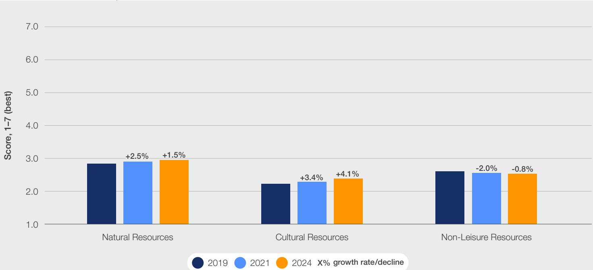  
Source: World Economic Forum.

The T&T Resources dimension assesses the attractions, activities and assets driving T&T demand. This includes the development, promotion and demand for natural capital (e.g. nature parks and fauna), cultural assets (e.g. archaeological sites and entertainment facilities) and draws for non-leisure travel (e.g. location of globalized cities,

major corporations and universities) through the Natural, Cultural and Non-Leisure Resources |pillars. It is important to reinforce the point that these pillars are as much about the promotion and development of resources for use as they are about the innate natural, cultural and other forms of heritage of a country.

FIGURE 11 T&T resources vs. tourist arrivals  
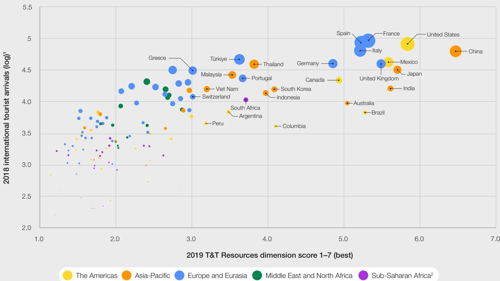  
Source: World Economic Forum and UN Tourism.  
Notes: 1. International tourist arrivals data is 2018 or latest available before 2018.
2. The size of circle represents the share of total arrivals to TTDI-ranked countries.

11.3%

Rise in total UNESCO World Heritage sites among ranked countries since 2019.

Despite their rich cultural and natural heritage, most African economies score below average in the relevant pillars.

Index results underscore the pivotal role the development of natural, cultural and non-leisure resources plays in driving T&T demand, with T&T Resource dimension scores correlating with tourist demand (Figure 11). Notably, the location of natural and cultural assets is less closely associated with economic development, creating opportunities for developing economies such as Brazil, Colombia, India, Mexico, Thailand and Türkiye, which have a strong portfolio of such assets to cultivate thriving tourism sectors. In particular, in 2024, non-high-income economies account for 21 out of the top 30 scorers for Natural Resources. Nevertheless, the distribution of T&T resource development remains highly concentrated, with the top 20 dimension performers – predominantly in the Americas, Asia-Pacific and Europe – surpassing the index average by approximately 90% in 2024, helping to explain their close to 60% share of international arrivals in 2022. While some of this lopsided dimension performance is related to the uneven distribution of attractions such as fauna and famous archaeological sites, it may also indicate an underuse or underdevelopment of T&T resources for tourism growth.

Effectively harnessing innate natural and cultural capital for tourism necessitates, among other factors, comprehensive management, promotion and protection strategies, along with robust infrastructure and ICT readiness to facilitate travel and digital promotion. Discrepancies in these areas may contribute to variations in visitor numbers among destinations with comparable dimension scores (as shown in Figure 11). For instance, out of the top 20 scores for the number of terrestrial and freshwater ecoregions, only six scored among the top 20 for natural tourism Digital Demand (a measure of online search volume for nature-related activities and topics), $^{23}$ reflecting potential gaps in areas such as the promotion or reputation of a destination. Moreover, many countries encounter challenges in translating their cultural and natural heritage into more easily promotable and sought-after attractions.

For example, despite their rich cultural and natural heritage, most African economies score below average in the relevant pillars and account for less than 10% of UNESCO sites. This can be attributed in part to political factors, alongside historical deficiencies in expertise, capacity and resources for site identification, nomination and maintenance. $^{24}$ Nevertheless, there exists a clear opportunity for developing economies to use their tourism resource potential as a catalyst for broader economic development, provided they address existing gaps and invest in sustainable tourism practices.

Encouragingly, since 2019, there has been broad and notable growth in Cultural (+7.7%) and Natural (+4.0%) Resource average scores in the TTDI, attributed to increased investment and protection of tourism-generating assets. This includes an 11.3% rise in total UNESCO World Heritage sites and a 41% increase in oral and intangible cultural expressions among ranked countries. Moreover, over 40% of countries expanded their protected territories by 5% or more since 2019 by establishing national parks and reserves.

The pandemic also saw sustained demand for nature-based travel, evidenced by a 20.3% increase in Digital Demand for nature activities compared to 2019. However, business travel recovery lags behind leisure travel post-pandemic, reflected in below-average scores for Non-Leisure Resources (-2.7%). Nonetheless, the growth in “bleisure” (i.e. business-leisure) travel and digital nomads has created new opportunities for businesses and destinations that can offer favourable conditions for business travel and leisure activities. $^{25}$ In particular, economies that combine strong ICT infrastructure and healthcare standards, relatively reasonable cost of living, favourable visa policies and rich tourism attractions rank among the most attractive for digital nomads, with Spain, Argentina, Romania, the UAE, Croatia and Portugal ranking among the top for attractiveness for this new market. $^{26}$

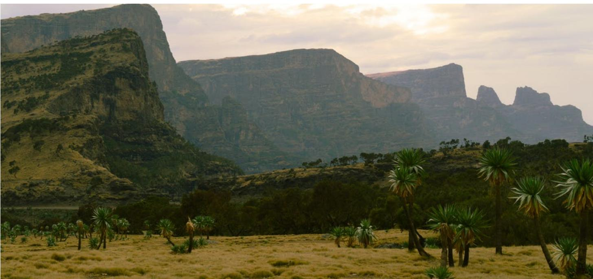

## 5.5 | T&T Sustainability

## Section takeaways:

\- Despite progress in areas such as T&T Energy Sustainability and improved T&T Demand Sustainability during the pandemic, sector emissions may rise due to increased transport activity, while historical sustainability challenges such as high seasonality and overcrowding have resurfaced.

\- The TTDI's new T&T Socioeconomic Impact pillar shows tourism's significant contribution to job creation and GDP growth, especially in developing countries. However, broader challenges including workers' rights and

Sustainability is an increasingly important element of sector development. The United Nations Environment Programme (UNEP) and UN Tourism define sustainable tourism as “tourism that takes full account of its current and future economic, social and environmental impacts, addressing the needs of visitors, the industry, the environment and host communities”. $^{27}$ A destination can maximize its long-term competitiveness and development

gender parity need addressing, while advanced economies may have to make the sector relatively more attractive for employees to prevent issues such as labour shortages.

\- Overall T&T Demand Sustainability dimension results reveal the difficulty of balancing sector growth and sustainability. Sector decision-makers must take a careful, long-term strategic perspective in development planning, weighing up what policies and trade-offs provide the best balance of growth and sustainability for their unique destinations.

potential by effectively managing these factors. The TTDI's T&T Sustainability dimension pillars measure the general environmental conditions and sector energy sustainability (Environmental Sustainability), the economic and social impact of T&T (T&T Socioeconomic Impact) and demand trends that may pressure destinations' carrying capacity and negatively affect local communities (T&T Demand Sustainability).

FIGURE 12 TTDI T&T Sustainability dimension pillar average score performance  
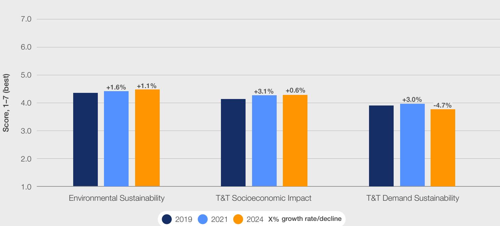  
Source: World Economic Forum.

Since the 2019 edition of the TTDI, average Environmental Sustainability pillar scores increased (+2.7%), notably in T&T Energy Sustainability (+4.6%), attributed to headway being made in general renewable energy and efficiency policies and related investments, which coincided with improvements in T&T sector greenhouse gas (GHG) emissions intensity and use of low-carbon energy (i.e. solar, wind and nuclear). However, some of these gains may be reversed as the continued recovery in fossil fuel-dependent activities such as aviation carries on and expands. $^{28}$ In addition, despite progress in the expansion of territory under protection and other policies that helped boost scores for the Preservation of Nature subpillar since 2019 (+3.3%), near-stagnant results for the

FIGURE 13

As global travel has resumed, historical demand sustainability challenges have started to resurface.

Pollution and Environmental Conditions subpillar (+0.5%) signal limited headway being made in addressing challenges such as air pollution reduction, deforestation mitigation and safeguarding endangered species. Tackling these issues will be especially important for T&T in regions such as Asia-Pacific, the Americas and sub-Saharan Africa, which are rich in natural resources but also underperform in areas such as the preservation of nature and have higher rates of deforestation and pollution.

Moreover, as global travel has resumed, historical demand sustainability challenges have started to resurface, reflecting the sector's difficulty in managing visitor flows in a way that spreads the benefits of T&T more evenly among communities and seasons and reduces capacity pressure at popular destinations. While average scores for the T&T Demand Sustainability pillar improved between 2019 and 2021, they dropped by $4.7\%$ between 2021 and 2024, as demand flows moved back

towards their pre-pandemic mean. Aspects of demand sustainability measured by the pillar, such as seasonality of arrivals, began to fluctuate, and Tripadvisor pageviews have, on average, become concentrated on a country's most popular natural and cultural attractions since 2021.

In particular, short lengths of stay, high seasonality and overcrowding have historically been challenging issues for Europe's leading destinations, with 36 of the region's 44 ranked economies scoring below average for this pillar in 2024. Nevertheless, demand sustainability challenges are not limited to any one type of economy or region and are typically local in nature, depending on factors such as destination infrastructure and overall carrying capacity. In recent years, various destinations have implemented polices to combat overcrowding such as tourist taxes, creating reservation systems for entering vulnerable sites and limiting access to destinations on certain days. $^{29}$

Snapshot of T&T's socioeconomic impact  
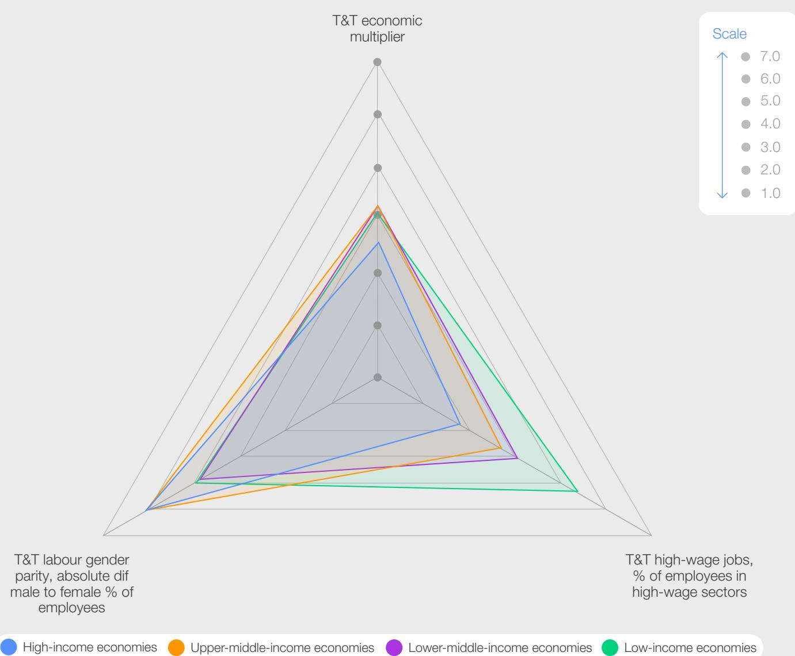

The travel and tourism sector plays a pivotal role in emerging market growth, with most economies witnessing an increase in high-wage T&T jobs.

## 33.2%

Average share of T&T jobs in index-ranked low to upper-middle-income economies that are in high-wage segments.

The TTDI's new T&T Socioeconomic Impact pillar also reveals the nuanced economic and social effects. Most economies witnessed growth in the share of high-wage T&T jobs $^{30}$ and notable increases in induced and indirect jobs and GDP, especially in low to lower-middle-income countries.

As Figure 13 shows, developing economies demonstrate above-average scores in many aspects of socioeconomic impact, indicating the sector's pivotal role in emerging market growth. This is particularly true in employment, where, on average, $33.2\%$ of T&T jobs in index-ranked low to upper-middle-income economies are in high-wage segments, compared to $19.5\%$ in high-income economies. However, this also indicates the lack of more value-added sectors that may command higher wages, while informal labour, workers' rights issues and limited social safety nets (as reflected in previously mentioned lower marks for the Labour Market Resilience and Equality pillar scores) are common economy-wide challenges that need to be addressed in many developing countries and, as a result, within the tourism industry itself. In part, this challenge is reflected in the lower T&T gender parity scores in regions such as the Middle East and North Africa $(-36.4\%$ below TTDI mean) and South Asia $(-41.3\%$ below TTDI mean), reducing T&T companies' access to human capital and the sector's ability to distribute socioeconomic benefits to more people.

Meanwhile, relatively lower wages in advanced economies often mean that policy-makers and T&T business leaders are typically under greater pressure to increase pay and develop strategies to make the sector relatively more attractive for employees to prevent issues such as the current labour shortages. While the recent increase in sector wages has helped contribute to climbing operation costs, it has also helped partially bridge the T&T sector's historically low wages in countries such as the United States. $^{31}$ Lastly, as the multiplier indicator data in Figure 13 shows, the number of indirect and induced employment and GDP generated by T&T is relatively close among the different types of country income levels. In general, factors such as capital investment, size of the domestic supply chain, economic leakages and linkages, and composition of T&T segments play important roles in determining T&T economic multiplier effect.

The aforementioned T&T Sustainability dimension results and trends highlight the difficulty T&T stakeholders face in growing the sector, while simultaneously ensuring it has a positive economic, social and environmental impact. Sector decision-makers have to take a careful, long-term strategic perspective in development planning, weighing up what policies and trade-offs provide the best balance of growth and sustainability for their unique destinations. As discussed in the previous sections of the report, the fact that some destination organizations are moving towards a quality-over-quantity approach is promising.

## 6 Regional results

Europe remains the highest-performing region in the TTDI, ranking above the global average on most pillars, with Asia-Pacific second, and sub-Saharan Africa the region showing the most improvement since 2019.

The Americas

## Europe and Eurasia

16.9%

3.86 TTDI average score

38.9%

15.1%

TTDI 2019–2024 % change: 0.5%

64.9%

32.6%

4.26 TTDI average score

13.9%

TTDI 2019–2024 % change: 0.4%

## Middle East and North Africa

9.5%

6.7%

3.86 TTDI average score

4.6%

TTDI 2019–2024 % change: 0.9%

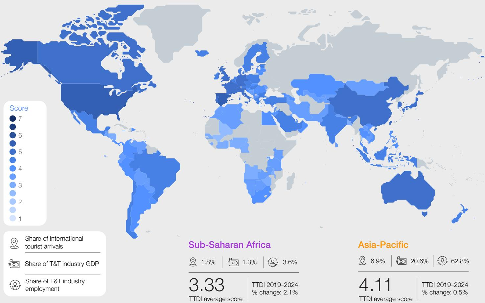

Share of international tourist arrivals

Share of T&T industry GDP

Share of T&T industry employment

1.3%

3.6%

Asia-Pacific

3.33 TTDI average score

TTDI 2019–2024 % change: 2.1%

6.9%

20.6%

62.8%

4.11 TTDI average score

TTDI 2019–2024 % change: 0.5%

Source: World Economic Forum; UN Tourism; World Travel & Tourism Council.

Note: Arrivals, industry GDP and employment data are 2022 figures (or the latest available) and represent TTDI-ranked economies only.

The section below provides additional analysis of each region and highlights the results for ranked economies. It is important to note that regions are often composed of a wide variety of economies at different levels of development. Therefore, the quantitative results may not reflect some of these more nuanced realities. For a more in-depth visualization of regional data, please click here.

## 6.1 | The Americas

TABLE 1 TTDI 2024 scores for the Americas

<table><tr><td rowspan="2">Economy</td><td rowspan="2">TTDI rank</td><td colspan="5">Enabling Environment</td><td colspan="3">T&amp;T Policy and Enabling Conditions</td><td colspan="3">Infrastructure and Services</td><td colspan="3">T&amp;T Resources</td><td colspan="3">T&amp;T Sustainability</td></tr><tr><td>Business Environment</td><td>Safety and Security</td><td>Health and Hygiene</td><td>Human Resources and Labour Market</td><td>ICT Readiness</td><td>Prioritization of T&amp;T</td><td>Openness to T&amp;T</td><td>Price Competitiveness</td><td>Air Transport Infrastructure</td><td>Ground and Port Infrastructure</td><td>Tourist Services and Infrastructure</td><td>Natural Resources</td><td>Cultural Resources</td><td>Non-Leisure Resources</td><td>Environmental Sustainability</td><td>T&amp;T Socioeconomic Impact</td><td>T&amp;T Demand Sustainability</td></tr><tr><td>United States</td><td>1</td><td>5.71</td><td>5.36</td><td>5.56</td><td>5.16</td><td>6.32</td><td>4.94</td><td>4.78</td><td>2.59</td><td>6.15</td><td>4.42</td><td>5.46</td><td>6.23</td><td>5.06</td><td>6.63</td><td>4.94</td><td>5.03</td><td>4.83</td></tr><tr><td>Canada</td><td>11</td><td>5.76</td><td>5.97</td><td>5.20</td><td>5.37</td><td>6.05</td><td>4.55</td><td>4.00</td><td>3.19</td><td>5.37</td><td>3.74</td><td>4.08</td><td>5.60</td><td>2.89</td><td>6.38</td><td>5.25</td><td>4.48</td><td>3.82</td></tr><tr><td>Mexico</td><td>38</td><td>3.98</td><td>2.77</td><td>4.43</td><td>3.81</td><td>4.87</td><td>4.41</td><td>3.96</td><td>4.53</td><td>4.38</td><td>3.13</td><td>2.22</td><td>6.43</td><td>6.35</td><td>4.61</td><td>4.51</td><td>3.42</td><td>4.56</td></tr><tr><td>Costa Rica</td><td>51</td><td>4.23</td><td>5.36</td><td>4.59</td><td>4.36</td><td>5.18</td><td>5.68</td><td>4.08</td><td>3.67</td><td>3.48</td><td>3.13</td><td>3.48</td><td>4.17</td><td>1.46</td><td>1.87</td><td>5.28</td><td>4.27</td><td>5.06</td></tr><tr><td>Panama</td><td>63</td><td>4.26</td><td>5.23</td><td>4.26</td><td>3.77</td><td>4.71</td><td>4.53</td><td>3.32</td><td>4.85</td><td>4.33</td><td>3.53</td><td>3.00</td><td>3.88</td><td>1.62</td><td>1.63</td><td>4.77</td><td>4.74</td><td>3.89</td></tr><tr><td>Dominican Republic</td><td>64</td><td>4.22</td><td>4.90</td><td>4.14</td><td>3.90</td><td>4.68</td><td>5.83</td><td>4.20</td><td>3.79</td><td>4.30</td><td>3.27</td><td>3.40</td><td>2.25</td><td>1.47</td><td>1.63</td><td>4.38</td><td>5.38</td><td>4.30</td></tr><tr><td>Barbados</td><td>74</td><td>3.64</td><td>5.29</td><td>5.49</td><td>4.02</td><td>4.88</td><td>5.52</td><td>4.61</td><td>1.32</td><td>4.07</td><td>3.85</td><td>4.70</td><td>1.26</td><td>1.10</td><td>1.07</td><td>3.94</td><td>3.81</td><td>4.47</td></tr><tr><td>Jamaica</td><td>84</td><td>3.86</td><td>4.35</td><td>3.86</td><td>4.13</td><td>4.21</td><td>6.17</td><td>3.86</td><td>2.83</td><td>3.58</td><td>3.76</td><td>2.64</td><td>1.83</td><td>1.48</td><td>1.18</td><td>3.98</td><td>5.09</td><td>4.23</td></tr><tr><td>Trinidad and Tobago</td><td>89</td><td>3.80</td><td>4.24</td><td>5.20</td><td>3.69</td><td>4.76</td><td>4.02</td><td>4.71</td><td>3.36</td><td>2.72</td><td>3.60</td><td>3.09</td><td>1.47</td><td>1.28</td><td>1.29</td><td>4.18</td><td>4.34</td><td>4.03</td></tr><tr><td>El Salvador</td><td>97</td><td>3.49</td><td>4.96</td><td>4.47</td><td>3.44</td><td>4.26</td><td>4.56</td><td>3.20</td><td>4.72</td><td>2.95</td><td>2.86</td><td>1.74</td><td>1.70</td><td>1.17</td><td>1.50</td><td>4.28</td><td>4.37</td><td>4.70</td></tr><tr><td>Guatemala</td><td>100</td><td>3.98</td><td>4.97</td><td>3.60</td><td>3.23</td><td>3.78</td><td>4.19</td><td>3.82</td><td>4.96</td><td>2.50</td><td>2.29</td><td>1.79</td><td>2.78</td><td>1.44</td><td>1.56</td><td>3.85</td><td>5.28</td><td>4.05</td></tr><tr><td>Nicaragua</td><td>108</td><td>3.13</td><td>5.31</td><td>3.40</td><td>3.26</td><td>3.37</td><td>4.36</td><td>3.03</td><td>5.17</td><td>2.23</td><td>2.55</td><td>1.41</td><td>2.68</td><td>1.24</td><td>1.37</td><td>4.30</td><td>4.18</td><td>4.04</td></tr><tr><td>Honduras</td><td>111</td><td>3.13</td><td>4.28</td><td>3.60</td><td>3.12</td><td>3.28</td><td>4.73</td><td>2.81</td><td>4.53</td><td>2.51</td><td>2.43</td><td>1.57</td><td>2.81</td><td>1.25</td><td>1.42</td><td>4.19</td><td>4.50</td><td>4.02</td></tr><tr><td>North and Central America</td><td></td><td>4.09</td><td>4.84</td><td>4.44</td><td>3.94</td><td>4.64</td><td>4.88</td><td>3.88</td><td>3.81</td><td>3.74</td><td>3.27</td><td>2.97</td><td>3.31</td><td>2.14</td><td>2.47</td><td>4.45</td><td>4.53</td><td>4.31</td></tr><tr><td>Brazil</td><td>26</td><td>3.39</td><td>4.32</td><td>4.43</td><td>3.95</td><td>5.03</td><td>4.16</td><td>4.69</td><td>5.32</td><td>3.88</td><td>2.73</td><td>2.45</td><td>6.19</td><td>5.44</td><td>4.37</td><td>4.98</td><td>5.42</td><td>4.21</td></tr><tr><td>Chile</td><td>31</td><td>4.74</td><td>4.52</td><td>5.20</td><td>4.32</td><td>5.77</td><td>5.33</td><td>4.71</td><td>4.69</td><td>3.54</td><td>3.46</td><td>3.75</td><td>3.20</td><td>2.19</td><td>3.27</td><td>5.12</td><td>5.43</td><td>4.36</td></tr><tr><td>Argentina</td><td>49</td><td>2.77</td><td>5.02</td><td>5.97</td><td>4.06</td><td>5.05</td><td>4.77</td><td>4.16</td><td>4.90</td><td>3.21</td><td>2.83</td><td>3.10</td><td>4.52</td><td>3.29</td><td>2.66</td><td>4.53</td><td>4.87</td><td>4.00</td></tr><tr><td>Colombia</td><td>50</td><td>3.97</td><td>3.49</td><td>4.57</td><td>4.00</td><td>5.00</td><td>4.05</td><td>4.44</td><td>6.02</td><td>3.70</td><td>2.80</td><td>2.46</td><td>5.20</td><td>3.79</td><td>3.40</td><td>4.40</td><td>4.08</td><td>4.05</td></tr><tr><td>Peru</td><td>62</td><td>4.22</td><td>4.73</td><td>4.08</td><td>3.91</td><td>4.54</td><td>4.82</td><td>3.87</td><td>5.22</td><td>3.28</td><td>2.70</td><td>2.43</td><td>4.73</td><td>3.01</td><td>2.34</td><td>4.28</td><td>4.84</td><td>3.34</td></tr><tr><td>Uruguay</td><td>71</td><td>5.02</td><td>5.36</td><td>5.86</td><td>4.39</td><td>5.67</td><td>4.56</td><td>3.20</td><td>3.91</td><td>2.66</td><td>3.31</td><td>3.97</td><td>1.67</td><td>1.71</td><td>2.11</td><td>4.85</td><td>3.70</td><td>2.51</td></tr><tr><td>Ecuador</td><td>80</td><td>3.04</td><td>4.52</td><td>4.45</td><td>3.55</td><td>4.39</td><td>4.45</td><td>3.65</td><td>5.66</td><td>3.01</td><td>2.84</td><td>2.07</td><td>4.19</td><td>2.11</td><td>2.18</td><td>4.54</td><td>3.39</td><td>4.22</td></tr><tr><td>Paraguay</td><td>92</td><td>3.89</td><td>5.05</td><td>4.63</td><td>3.60</td><td>4.21</td><td>5.12</td><td>3.09</td><td>5.63</td><td>2.11</td><td>2.04</td><td>1.43</td><td>2.17</td><td>1.44</td><td>1.40</td><td>3.98</td><td>6.07</td><td>3.11</td></tr><tr><td>Bolivia</td><td>94</td><td>2.87</td><td>5.07</td><td>3.77</td><td>3.77</td><td>4.50</td><td>3.77</td><td>3.48</td><td>6.09</td><td>2.31</td><td>2.38</td><td>1.47</td><td>3.65</td><td>2.24</td><td>1.55</td><td>3.89</td><td>4.64</td><td>3.25</td></tr><tr><td>Venezuela</td><td>103</td><td>1.98</td><td>3.71</td><td>3.94</td><td>3.70</td><td>3.73</td><td>4.08</td><td>2.85</td><td>5.87</td><td>2.26</td><td>2.08</td><td>1.46</td><td>4.52</td><td>1.97</td><td>2.05</td><td>3.94</td><td>4.90</td><td>3.80</td></tr><tr><td>South America</td><td></td><td>3.59</td><td>4.58</td><td>4.69</td><td>3.92</td><td>4.79</td><td>4.51</td><td>3.81</td><td>5.33</td><td>3.00</td><td>2.72</td><td>2.46</td><td>4.00</td><td>2.72</td><td>2.53</td><td>4.45</td><td>4.73</td><td>3.68</td></tr><tr><td>The Americas</td><td></td><td>3.87</td><td>4.73</td><td>4.55</td><td>3.93</td><td>4.71</td><td>4.72</td><td>3.85</td><td>4.47</td><td>3.42</td><td>3.03</td><td>2.75</td><td>3.61</td><td>2.39</td><td>2.50</td><td>4.45</td><td>4.62</td><td>4.04</td></tr></table>

Note: Colour-coded based on performance relative to pillar mean score.

On average, the Americas region underperforms the TTDI mean, with only eight economies scoring above the global mean in 2024. Moreover, fewer than half of its economies have shown an improvement in their scores since 2019, underscoring mixed progress in enabling conditions for T&T development in this highly diverse region.

Scoring above average for Natural Resources, countries in the region can attract visitors with some of the most diverse collections of species and ecoregions. Relatively high T&T Socioeconomic Impact scores also highlight that T&T tends to induce an above-average number of jobs in the broader economy, including an above-average share of relatively high-wage positions. To support this, many of the more T&T-dependent economies in Central America and the Caribbean tend to also score higher for Prioritization of T&T, reflecting stronger government support. Moreover, most of the economies in the region have lower T&T industry employment gender gaps compared to the rest of the TTDI-ranked countries, reinforcing T&T's role in gender equality. A large number of the region's states also tend to do well when it comes to T&T Demand Sustainability due to factors such as longer lengths of stay and lower seasonality of arrivals.

However, despite the region's potential for nature-driven tourism and the sector's positive socioeconomic impact, the Americas continues to face several challenges. Recent regional improvements in T&T Sustainability need to continue, with factors such as below-average protected area coverage of key biodiversity areas and the growing number of endangered species

↓ El Carmen Church in Santa Ana, El Salvador – the country is the fastest-growing TTDI performer in the Americas.

posing threats to rich natural resources. Moreover, the region requires greater improvement in broader enablers of T&T growth. Particularly noteworthy are subpar business and safety and security conditions. Only Canada scores above average for the Safety and Security pillar, while organized violence, crime and low confidence in the police are especially common issues in Latin America. In addition, the conditions of health and hygiene, human resources and labour market, and ICT readiness consistently lag global levels in terms of both average scores and growth rates, especially outside of the high-income economies. Most Latin American economies also require significant investment in infrastructure, including ground, port and air transport, as well as tourist service infrastructure.

The United States is the top scorer in the TTDI and the largest contributor to T&T GDP, both within the Americas region and globally. Beyond the United States, Canada (11th), Brazil (26th), Mexico (38th) and Argentina (49th) contribute substantially to the remaining T&T GDP in the region. Jamaica (84th) was the most T&T industry-dependent economy in the region in 2022, with Barbados (74th) and Mexico also ranking among the top 10 T&T-dependent economies globally. Brazil stands out as the top TTDI performer in South America. Although the region's TTDI showed a relatively low rate of improvement compared to 2019, El Salvador emerged as the fastest-growing TTDI performer in the Americas between the 2019 and 2024 index editions (+4.0%, 101st to 97th).

## 6.2 | Asia-Pacific

TABLE 2 TTDI 2024 scores for Asia-Pacific

<table><tr><td rowspan="2">Economy</td><td rowspan="2">TTDI rank</td><td colspan="5">Enabling Environment</td><td colspan="3">T&amp;T Policy and Enabling Conditions</td><td colspan="3">Infrastructure and Services</td><td colspan="3">T&amp;T Resources</td><td colspan="3">T&amp;T Sustainability</td></tr><tr><td>Business Environment</td><td>Safety and Security</td><td>Health and Hygiene</td><td>Human Resources and Labour Market</td><td>ICT Readiness</td><td>Prioritization of T&amp;T</td><td>Openness to T&amp;T</td><td>Price Competitiveness</td><td>Air Transport Infrastructure</td><td>Ground and Port Infrastructure</td><td>Tourist Services and Infrastructure</td><td>Natural Resources</td><td>Cultural Resources</td><td>Non-Leisure Resources</td><td>Environmental Sustainability</td><td>T&amp;T Socioeconomic Impact</td><td>T&amp;T Demand Sustainability</td></tr><tr><td>Japan</td><td>3</td><td>5.38</td><td>5.98</td><td>6.23</td><td>4.90</td><td>6.03</td><td>4.78</td><td>4.06</td><td>4.34</td><td>5.34</td><td>6.08</td><td>2.93</td><td>5.11</td><td>6.71</td><td>5.93</td><td>5.20</td><td>4.57</td><td>3.02</td></tr><tr><td>Australia</td><td>5</td><td>5.62</td><td>5.97</td><td>5.98</td><td>5.23</td><td>6.19</td><td>4.90</td><td>4.85</td><td>2.75</td><td>5.23</td><td>3.68</td><td>4.62</td><td>6.42</td><td>3.78</td><td>5.09</td><td>5.18</td><td>5.00</td><td>4.46</td></tr><tr><td>China</td><td>8</td><td>4.73</td><td>6.52</td><td>5.27</td><td>4.51</td><td>6.10</td><td>3.84</td><td>3.89</td><td>5.17</td><td>5.26</td><td>4.57</td><td>1.95</td><td>6.20</td><td>6.59</td><td>5.79</td><td>4.46</td><td>5.36</td><td>3.79</td></tr><tr><td>Korea, Rep.</td><td>14</td><td>4.84</td><td>6.29</td><td>6.21</td><td>4.58</td><td>6.55</td><td>4.56</td><td>3.87</td><td>4.55</td><td>4.69</td><td>5.40</td><td>2.82</td><td>2.36</td><td>5.59</td><td>4.72</td><td>4.70</td><td>5.25</td><td>3.67</td></tr><tr><td>New Zealand</td><td>25</td><td>5.55</td><td>5.62</td><td>5.47</td><td>5.29</td><td>5.95</td><td>4.25</td><td>5.07</td><td>3.02</td><td>3.99</td><td>3.73</td><td>4.93</td><td>3.64</td><td>2.02</td><td>2.58</td><td>5.35</td><td>4.36</td><td>4.17</td></tr><tr><td>Mongolia</td><td>85</td><td>3.37</td><td>5.25</td><td>5.70</td><td>4.12</td><td>5.14</td><td>4.65</td><td>2.82</td><td>5.47</td><td>2.14</td><td>2.09</td><td>2.55</td><td>3.25</td><td>1.93</td><td>1.31</td><td>3.74</td><td>4.40</td><td>2.84</td></tr><tr><td>Eastern Asia-Pacific</td><td></td><td>4.92</td><td>5.94</td><td>5.81</td><td>4.77</td><td>5.99</td><td>4.50</td><td>4.10</td><td>4.21</td><td>4.44</td><td>4.26</td><td>3.30</td><td>4.50</td><td>4.43</td><td>4.24</td><td>4.77</td><td>4.82</td><td>3.66</td></tr><tr><td>Singapore</td><td>13</td><td>6.15</td><td>6.82</td><td>5.14</td><td>5.36</td><td>6.41</td><td>5.71</td><td>5.70</td><td>2.67</td><td>5.94</td><td>6.54</td><td>4.41</td><td>1.57</td><td>1.75</td><td>3.80</td><td>4.37</td><td>4.38</td><td>4.14</td></tr><tr><td>Indonesia</td><td>22</td><td>4.67</td><td>5.77</td><td>3.78</td><td>4.13</td><td>4.81</td><td>6.03</td><td>3.83</td><td>5.44</td><td>4.34</td><td>3.97</td><td>1.90</td><td>5.43</td><td>3.98</td><td>3.06</td><td>4.34</td><td>5.41</td><td>4.84</td></tr><tr><td>Malaysia</td><td>35</td><td>4.91</td><td>5.88</td><td>4.51</td><td>3.88</td><td>5.64</td><td>4.22</td><td>4.99</td><td>6.20</td><td>4.18</td><td>4.05</td><td>2.79</td><td>3.96</td><td>2.45</td><td>3.88</td><td>4.31</td><td>2.80</td><td>4.09</td></tr><tr><td>Thailand</td><td>47</td><td>4.15</td><td>4.87</td><td>4.31</td><td>4.06</td><td>5.68</td><td>4.14</td><td>4.34</td><td>4.96</td><td>4.89</td><td>3.76</td><td>2.18</td><td>4.55</td><td>2.86</td><td>4.17</td><td>4.13</td><td>3.30</td><td>3.67</td></tr><tr><td>Viet Nam</td><td>59</td><td>4.06</td><td>6.19</td><td>4.30</td><td>4.35</td><td>5.18</td><td>3.63</td><td>3.61</td><td>5.68</td><td>4.04</td><td>3.65</td><td>2.20</td><td>3.78</td><td>2.80</td><td>3.09</td><td>3.89</td><td>2.85</td><td>3.96</td></tr><tr><td>Philippines</td><td>69</td><td>4.09</td><td>5.27</td><td>3.66</td><td>4.03</td><td>4.38</td><td>4.72</td><td>4.01</td><td>5.59</td><td>3.62</td><td>3.12</td><td>1.55</td><td>3.93</td><td>2.01</td><td>2.89</td><td>4.52</td><td>3.42</td><td>4.52</td></tr><tr><td>Cambodia</td><td>86</td><td>3.62</td><td>6.14</td><td>3.19</td><td>3.64</td><td>4.28</td><td>5.74</td><td>3.75</td><td>5.58</td><td>2.76</td><td>2.85</td><td>1.97</td><td>2.50</td><td>1.60</td><td>1.41</td><td>3.99</td><td>3.03</td><td>4.65</td></tr><tr><td>Lao PDR</td><td>91</td><td>3.54</td><td>5.90</td><td>3.50</td><td>3.68</td><td>3.51</td><td>4.31</td><td>3.78</td><td>5.62</td><td>2.36</td><td>2.94</td><td>1.77</td><td>2.36</td><td>1.27</td><td>1.11</td><td>3.77</td><td>5.42</td><td>4.37</td></tr><tr><td>South-East Asia</td><td></td><td>4.40</td><td>5.85</td><td>4.05</td><td>4.14</td><td>4.99</td><td>4.81</td><td>4.25</td><td>5.22</td><td>4.02</td><td>3.86</td><td>2.35</td><td>3.51</td><td>2.34</td><td>2.93</td><td>4.16</td><td>3.83</td><td>4.28</td></tr><tr><td>India</td><td>39</td><td>3.79</td><td>5.06</td><td>3.47</td><td>2.85</td><td>3.84</td><td>4.11</td><td>4.13</td><td>5.66</td><td>4.59</td><td>4.43</td><td>1.60</td><td>5.80</td><td>5.62</td><td>5.05</td><td>3.64</td><td>4.01</td><td>4.55</td></tr><tr><td>Sri Lanka</td><td>76</td><td>3.34</td><td>5.21</td><td>4.66</td><td>3.42</td><td>4.43</td><td>4.78</td><td>3.69</td><td>5.69</td><td>3.07</td><td>3.92</td><td>1.58</td><td>2.70</td><td>1.44</td><td>1.61</td><td>3.70</td><td>5.84</td><td>3.70</td></tr><tr><td>Pakistan</td><td>101</td><td>3.41</td><td>4.53</td><td>3.49</td><td>3.24</td><td>3.30</td><td>3.08</td><td>2.95</td><td>6.04</td><td>3.31</td><td>3.37</td><td>1.67</td><td>2.89</td><td>1.97</td><td>2.77</td><td>3.64</td><td>4.31</td><td>3.97</td></tr><tr><td>Nepal</td><td>105</td><td>2.91</td><td>5.39</td><td>3.52</td><td>3.27</td><td>3.24</td><td>4.57</td><td>3.74</td><td>5.77</td><td>2.70</td><td>2.24</td><td>1.35</td><td>2.61</td><td>1.18</td><td>1.28</td><td>3.82</td><td>4.83</td><td>4.35</td></tr><tr><td>Bangladesh</td><td>109</td><td>3.25</td><td>5.67</td><td>3.58</td><td>3.13</td><td>4.02</td><td>3.23</td><td>2.12</td><td>5.25</td><td>3.08</td><td>3.95</td><td>1.37</td><td>2.14</td><td>1.63</td><td>2.09</td><td>3.60</td><td>3.42</td><td>2.71</td></tr><tr><td>South Asia</td><td></td><td>3.34</td><td>5.17</td><td>3.75</td><td>3.18</td><td>3.77</td><td>3.95</td><td>3.33</td><td>5.68</td><td>3.35</td><td>3.58</td><td>1.51</td><td>3.23</td><td>2.37</td><td>2.56</td><td>3.68</td><td>4.48</td><td>3.86</td></tr><tr><td>Asia-Pacific</td><td></td><td>4.28</td><td>5.70</td><td>4.53</td><td>4.09</td><td>4.98</td><td>4.49</td><td>3.96</td><td>5.02</td><td>3.98</td><td>3.91</td><td>2.43</td><td>3.75</td><td>3.01</td><td>3.24</td><td>4.23</td><td>4.31</td><td>3.97</td></tr></table>

Note: Colour-coded based on performance relative to pillar mean score.

The Asia-Pacific region ranks as the second-highest performer among regions. Out of the 19 constituent economies covered by the TTDI, 10 surpass the index average, and 11 economies have seen an improvement in their scores since 2019. Nonetheless, between 2021 and 2024, the region experienced the largest average decline in TTDI scores (-0.7%) as it lagged in loosening travel restrictions and has struggled to recover air route capacity and sector investment. Consequently, the region experienced the only decline in average scores for Air Transport Infrastructure (-1.6%) since 2021 and the greatest decline in Tourist Services and Infrastructure (-4.4%).

Asia-Pacific is extensive and exhibits notable variations in the T&T development enablers. Broadly speaking, Asia-Pacific's strong economic and middle-class expansion in recent years, combined with exceptional blends of natural, cultural and non-leisure resources, have historically helped drive rapid growth in travel demand. Countries such as

China, Japan and India are home to some of the largest tourism economies in the world and all three rank near the top for natural, cultural and non-leisure assets. Generally, the more developed and high-income economies within the region such as Japan, Australia, South Korea and Singapore feature quality transportation and digital infrastructure, high levels of openness and supportive environments that guarantee high standards in business activities, safety and security, healthcare and workforce quality. In contrast, the region's emerging economies, mostly in South and South-East Asia, possess notable regional advantages in price competitiveness, but typically lag in factors such as transport, tourism and ICT infrastructure and enabling environments such as conducive business conditions.

Looking at the region's development since 2019 reveals that notable progress has been made throughout the region in areas such as Ground and Port Infrastructure (+5.1%), ICT Readiness (8.2%), Cultural Resources (5.5%) and T&T Socioeconomic

↓ Camel safari in Hunder desert, Nubra Valley, Leh, Ladakh. India has the top score in South Asia and among lower-middle-income economies.

Impact, especially in South Asia (+30.2%). Moreover, the signing and implementation of treaties such as the ASEAN-EU Comprehensive Air Transport Agreement (CATA) and the ASEAN Single Aviation Market are expected to help boost intraregional and international aviation in South-East Asia. Accordingly, the subregion had the highest improvements in indicator scores for air service agreements since 2019 (+6.0%).

In the coming years, the region's T&T market is expected to resume its historically high rate of growth. However, to develop T&T in a sustainable and resilient manner, far more attention needs to be focused on environmental sustainability, especially if developing economies in South and South-East Asia wish to preserve their tourism-generating nature assets. Moreover, many of these subregion destinations' capacity to absorb increasing tourism demand and ability to benefit from new technology will need to be improved via greater investment in transport, ICT and, in particular, tourist services infrastructure. Business and labour market reforms will also be needed to

create more favourable conditions for T&T operators. Lastly, more progress is needed to improve the T&T sector's ability to generate positive economic and social impact. Despite progress, many developing economies in Asia-Pacific score below average for T&T Socioeconomic Impact, with the T&T sector in South-East Asian states often generating fewer high-wage jobs, employment and GDP than the index mean, while South Asian economies score low for sector gender parity.

In 2024, Japan (3rd) is the top performer in the APAC region, with Australia (5th) and China (8th) ranking in the global top 10. China also has the region's largest and the world's second-largest T&T economy, while India (39th) has the largest T&T sector in South Asia and scores as the TTDI's top lower-middle-income economy. Meanwhile, the Philippines (69th) has relied the most on T&T for its GDP in 2022. While Singapore (13th) is the top performer in South-East Asia, neighbouring Indonesia experienced the greatest improvement in score in the region (+4.5%, 36th to 22nd).

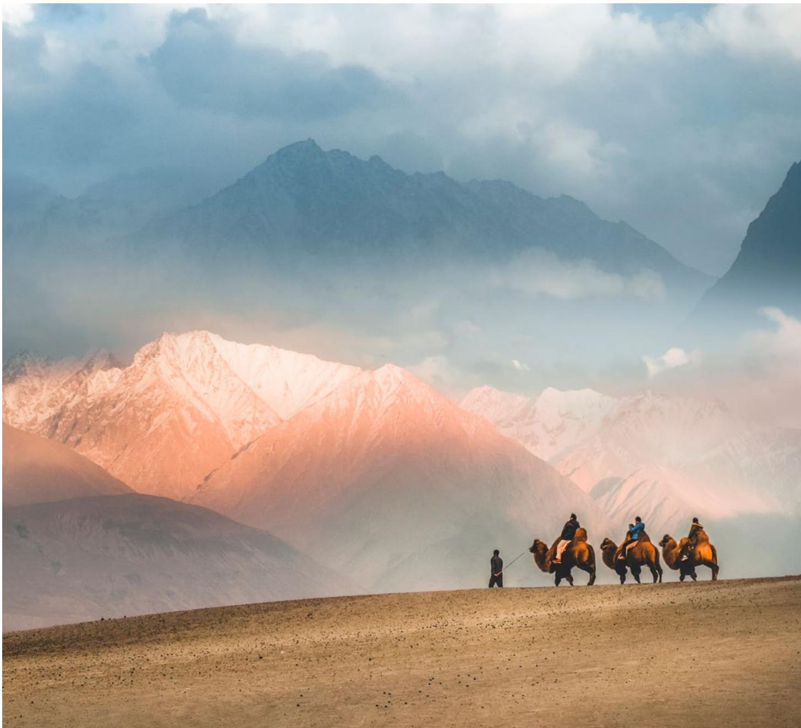

TABLE 3 TTDI 2024 scores for Europe and Eurasia  
6.3 | Europe and Eurasia

<table><tr><td rowspan="2">Economy</td><td rowspan="2">TTDI rank</td><td colspan="5">Enabling Environment</td><td colspan="3">T&amp;T Policy and Enabling Conditions</td><td colspan="3">Infrastructure and Services</td><td colspan="3">T&amp;T Resources</td><td colspan="3">T&amp;T Sustainability</td></tr><tr><td>Business Environment</td><td>Safety and Security</td><td>Health and Hygiene</td><td>Human Resources and Labour Market</td><td>ICT Readiness</td><td>Prioritization of T&amp;T</td><td>Openness to T&amp;T</td><td>Price Competitiveness</td><td>Air Transport Infrastructure</td><td>Ground and Port Infrastructure</td><td>Tourist Services and Infrastructure</td><td>Natural Resources</td><td>Cultural Resources</td><td>Non-Leisure Resources</td><td>Environmental Sustainability</td><td>T&amp;T Socioeconomic Impact</td><td>T&amp;T Demand Sustainability</td></tr><tr><td>Spain</td><td>2</td><td>4.92</td><td>6.14</td><td>5.99</td><td>4.75</td><td>6.05</td><td>5.73</td><td>5.01</td><td>3.60</td><td>6.06</td><td>4.92</td><td>5.46</td><td>4.95</td><td>6.64</td><td>4.81</td><td>5.39</td><td>4.25</td><td>3.34</td></tr><tr><td>Italy</td><td>9</td><td>4.89</td><td>5.79</td><td>5.88</td><td>4.68</td><td>5.85</td><td>5.23</td><td>4.80</td><td>3.15</td><td>5.24</td><td>4.79</td><td>4.60</td><td>5.00</td><td>6.74</td><td>4.23</td><td>5.37</td><td>3.46</td><td>3.53</td></tr><tr><td>Portugal</td><td>12</td><td>4.97</td><td>6.55</td><td>6.17</td><td>4.72</td><td>6.02</td><td>5.14</td><td>4.90</td><td>3.63</td><td>5.29</td><td>4.35</td><td>4.62</td><td>3.39</td><td>4.42</td><td>3.88</td><td>5.20</td><td>4.76</td><td>3.26</td></tr><tr><td>Greece</td><td>21</td><td>4.47</td><td>5.30</td><td>6.34</td><td>4.32</td><td>5.85</td><td>5.43</td><td>4.80</td><td>3.16</td><td>5.52</td><td>3.73</td><td>5.95</td><td>3.03</td><td>3.01</td><td>3.33</td><td>5.23</td><td>4.29</td><td>3.00</td></tr><tr><td>Türkiye</td><td>29</td><td>3.55</td><td>4.96</td><td>4.85</td><td>3.52</td><td>5.29</td><td>6.12</td><td>4.16</td><td>5.19</td><td>5.50</td><td>3.72</td><td>3.40</td><td>3.50</td><td>4.96</td><td>4.23</td><td>4.18</td><td>4.32</td><td>3.10</td></tr><tr><td>Cyprus</td><td>30</td><td>4.96</td><td>5.79</td><td>6.21</td><td>4.82</td><td>5.69</td><td>5.34</td><td>4.78</td><td>3.82</td><td>4.95</td><td>3.59</td><td>6.50</td><td>1.74</td><td>1.61</td><td>2.34</td><td>4.82</td><td>4.02</td><td>3.39</td></tr><tr><td>Malta</td><td>34</td><td>5.12</td><td>6.23</td><td>6.41</td><td>4.65</td><td>6.09</td><td>5.54</td><td>4.72</td><td>3.77</td><td>4.43</td><td>4.05</td><td>4.87</td><td>1.68</td><td>1.58</td><td>1.94</td><td>4.11</td><td>4.03</td><td>3.87</td></tr><tr><td>Croatia</td><td>46</td><td>4.27</td><td>6.25</td><td>6.01</td><td>4.17</td><td>5.67</td><td>4.84</td><td>4.70</td><td>2.96</td><td>3.68</td><td>3.85</td><td>5.17</td><td>3.54</td><td>2.25</td><td>1.67</td><td>5.22</td><td>3.44</td><td>2.61</td></tr><tr><td>Southern Europe</td><td></td><td>4.64</td><td>5.88</td><td>5.98</td><td>4.45</td><td>5.81</td><td>5.42</td><td>4.73</td><td>3.66</td><td>5.08</td><td>4.13</td><td>5.07</td><td>3.35</td><td>3.90</td><td>3.30</td><td>4.94</td><td>4.07</td><td>3.26</td></tr><tr><td>France</td><td>4</td><td>5.35</td><td>5.78</td><td>6.20</td><td>5.02</td><td>6.22</td><td>4.93</td><td>4.75</td><td>3.18</td><td>5.49</td><td>5.31</td><td>5.03</td><td>5.41</td><td>6.25</td><td>5.07</td><td>5.89</td><td>3.15</td><td>3.22</td></tr><tr><td>Germany</td><td>6</td><td>5.58</td><td>5.75</td><td>6.86</td><td>5.09</td><td>6.12</td><td>5.19</td><td>5.05</td><td>3.65</td><td>5.35</td><td>5.34</td><td>3.56</td><td>3.47</td><td>6.27</td><td>5.27</td><td>5.62</td><td>3.41</td><td>3.35</td></tr><tr><td>United Kingdom</td><td>7</td><td>5.62</td><td>5.57</td><td>5.43</td><td>4.97</td><td>6.16</td><td>4.17</td><td>4.96</td><td>2.74</td><td>5.85</td><td>5.13</td><td>4.07</td><td>3.96</td><td>5.83</td><td>6.22</td><td>5.74</td><td>4.15</td><td>3.78</td></tr><tr><td>Switzerland</td><td>10</td><td>6.06</td><td>6.43</td><td>6.30</td><td>5.59</td><td>6.36</td><td>5.44</td><td>4.67</td><td>1.68</td><td>5.54</td><td>6.24</td><td>4.55</td><td>3.12</td><td>2.17</td><td>4.39</td><td>5.84</td><td>4.22</td><td>3.18</td></tr><tr><td>Austria</td><td>15</td><td>5.61</td><td>6.02</td><td>7.00</td><td>5.07</td><td>6.09</td><td>5.44</td><td>4.80</td><td>3.41</td><td>4.49</td><td>5.02</td><td>5.32</td><td>3.01</td><td>2.65</td><td>3.33</td><td>5.70</td><td>2.91</td><td>3.22</td></tr><tr><td>Netherlands</td><td>16</td><td>5.76</td><td>6.18</td><td>5.79</td><td>5.23</td><td>6.51</td><td>4.70</td><td>5.21</td><td>2.87</td><td>5.43</td><td>6.33</td><td>3.30</td><td>2.55</td><td>2.84</td><td>4.08</td><td>5.55</td><td>3.37</td><td>3.12</td></tr><tr><td>Belgium</td><td>23</td><td>5.53</td><td>5.87</td><td>6.62</td><td>5.09</td><td>6.12</td><td>4.03</td><td>5.23</td><td>3.17</td><td>4.35</td><td>5.36</td><td>3.12</td><td>1.91</td><td>3.16</td><td>3.14</td><td>5.42</td><td>3.99</td><td>3.50</td></tr><tr><td>Ireland</td><td>24</td><td>5.59</td><td>6.11</td><td>5.68</td><td>5.32</td><td>5.91</td><td>3.78</td><td>4.67</td><td>2.78</td><td>4.98</td><td>4.33</td><td>4.55</td><td>1.98</td><td>2.48</td><td>4.18</td><td>4.94</td><td>3.86</td><td>4.34</td></tr><tr><td>Luxembourg</td><td>28</td><td>6.11</td><td>6.54</td><td>5.76</td><td>5.27</td><td>6.39</td><td>4.66</td><td>4.66</td><td>3.20</td><td>3.73</td><td>5.79</td><td>4.19</td><td>1.30</td><td>1.34</td><td>3.27</td><td>6.17</td><td>2.90</td><td>3.46</td></tr><tr><td>Czech Republic</td><td>33</td><td>5.16</td><td>6.35</td><td>6.70</td><td>4.64</td><td>6.01</td><td>5.13</td><td>5.06</td><td>4.40</td><td>3.68</td><td>5.01</td><td>3.66</td><td>2.01</td><td>2.26</td><td>2.25</td><td>5.26</td><td>3.01</td><td>2.74</td></tr><tr><td>Western Europe</td><td></td><td>5.64</td><td>6.06</td><td>6.23</td><td>5.13</td><td>6.19</td><td>4.75</td><td>4.91</td><td>3.11</td><td>4.89</td><td>5.39</td><td>4.14</td><td>2.87</td><td>3.52</td><td>4.12</td><td>5.61</td><td>3.50</td><td>3.39</td></tr><tr><td>Denmark</td><td>17</td><td>5.77</td><td>6.51</td><td>5.81</td><td>5.52</td><td>6.60</td><td>3.77</td><td>5.16</td><td>2.88</td><td>4.76</td><td>5.53</td><td>4.90</td><td>2.76</td><td>2.03</td><td>3.37</td><td>5.69</td><td>4.31</td><td>3.34</td></tr><tr><td>Sweden</td><td>19</td><td>5.85</td><td>6.14</td><td>5.90</td><td>5.44</td><td>6.27</td><td>4.54</td><td>4.88</td><td>3.38</td><td>4.21</td><td>4.63</td><td>4.18</td><td>2.87</td><td>2.34</td><td>4.20</td><td>5.89</td><td>3.92</td><td>3.10</td></tr><tr><td>Finland</td><td>20</td><td>6.00</td><td>6.56</td><td>6.05</td><td>5.54</td><td>6.38</td><td>4.48</td><td>4.71</td><td>3.29</td><td>4.26</td><td>4.41</td><td>3.44</td><td>2.41</td><td>1.81</td><td>3.56</td><td>5.84</td><td>5.19</td><td>2.92</td></tr><tr><td>Iceland</td><td>32</td><td>5.30</td><td>6.59</td><td>5.75</td><td>5.46</td><td>6.39</td><td>5.68</td><td>4.67</td><td>1.44</td><td>4.68</td><td>3.04</td><td>6.10</td><td>3.21</td><td>1.56</td><td>1.33</td><td>5.23</td><td>4.47</td><td>2.58</td></tr><tr><td>Estonia</td><td>36</td><td>5.55</td><td>6.29</td><td>5.86</td><td>5.32</td><td>6.42</td><td>5.70</td><td>4.15</td><td>4.29</td><td>2.83</td><td>4.63</td><td>3.90</td><td>1.60</td><td>1.85</td><td>1.43</td><td>5.31</td><td>4.45</td><td>3.10</td></tr><tr><td>Lithuania</td><td>44</td><td>5.08</td><td>5.94</td><td>6.45</td><td>5.25</td><td>6.06</td><td>4.35</td><td>4.09</td><td>4.94</td><td>2.94</td><td>4.47</td><td>3.56</td><td>1.60</td><td>1.66</td><td>1.58</td><td>5.26</td><td>4.50</td><td>3.16</td></tr><tr><td>Latvia</td><td>65</td><td>4.57</td><td>6.05</td><td>5.79</td><td>4.80</td><td>5.90</td><td>4.39</td><td>4.33</td><td>4.73</td><td>3.08</td><td>3.75</td><td>3.20</td><td>1.59</td><td>1.25</td><td>1.53</td><td>5.04</td><td>3.19</td><td>2.76</td></tr><tr><td>Northern Europe</td><td></td><td>5.45</td><td>6.30</td><td>5.94</td><td>5.33</td><td>6.29</td><td>4.70</td><td>4.57</td><td>3.57</td><td>3.82</td><td>4.35</td><td>4.18</td><td>2.29</td><td>1.78</td><td>2.43</td><td>5.47</td><td>4.29</td><td>2.99</td></tr><tr><td>Poland</td><td>27</td><td>4.46</td><td>5.98</td><td>6.14</td><td>4.59</td><td>5.89</td><td>4.73</td><td>4.90</td><td>5.03</td><td>3.66</td><td>4.71</td><td>2.95</td><td>2.84</td><td>3.30</td><td>3.60</td><td>4.97</td><td>3.75</td><td>3.38</td></tr><tr><td>Hungary</td><td>37</td><td>4.65</td><td>6.26</td><td>6.29</td><td>4.44</td><td>5.82</td><td>5.36</td><td>4.71</td><td>4.68</td><td>3.68</td><td>4.94</td><td>2.71</td><td>1.97</td><td>2.20</td><td>2.57</td><td>5.43</td><td>3.71</td><td>3.15</td></tr><tr><td>Bulgaria</td><td>40</td><td>4.53</td><td>5.73</td><td>6.43</td><td>4.59</td><td>5.70</td><td>4.52</td><td>4.73</td><td>5.22</td><td>3.53</td><td>3.54</td><td>3.38</td><td>2.82</td><td>2.10</td><td>1.84</td><td>5.44</td><td>4.80</td><td>3.27</td></tr><tr><td>Slovenia</td><td>42</td><td>4.79</td><td>6.50</td><td>5.74</td><td>4.80</td><td>5.84</td><td>5.67</td><td>4.94</td><td>4.23</td><td>2.26</td><td>4.72</td><td>4.87</td><td>2.53</td><td>1.62</td><td>1.53</td><td>6.00</td><td>3.65</td><td>2.05</td></tr><tr><td>Romania</td><td>43</td><td>4.49</td><td>5.70</td><td>6.01</td><td>4.15</td><td>5.41</td><td>3.70</td><td>4.81</td><td>5.13</td><td>3.43</td><td>3.50</td><td>4.37</td><td>2.58</td><td>2.17</td><td>2.16</td><td>5.18</td><td>5.32</td><td>3.11</td></tr><tr><td>Slovak Republic</td><td>54</td><td>4.68</td><td>5.85</td><td>6.34</td><td>4.60</td><td>5.78</td><td>4.77</td><td>4.19</td><td>4.57</td><td>2.25</td><td>4.26</td><td>2.84</td><td>2.20</td><td>1.88</td><td>1.77</td><td>5.80</td><td>3.56</td><td>2.61</td></tr><tr><td>Montenegro</td><td>60</td><td>3.86</td><td>6.12</td><td>5.42</td><td>3.80</td><td>5.22</td><td>4.28</td><td>4.14</td><td>4.73</td><td>3.01</td><td>3.35</td><td>6.07</td><td>1.77</td><td>1.22</td><td>1.14</td><td>4.51</td><td>5.35</td><td>3.28</td></tr><tr><td>Albania</td><td>66</td><td>4.55</td><td>5.98</td><td>4.90</td><td>4.54</td><td>4.90</td><td>5.19</td><td>4.56</td><td>5.00</td><td>3.23</td><td>3.33</td><td>3.01</td><td>2.17</td><td>1.29</td><td>1.52</td><td>4.91</td><td>3.27</td><td>3.43</td></tr><tr><td>Serbia</td><td>68</td><td>4.19</td><td>6.10</td><td>6.02</td><td>4.34</td><td>5.56</td><td>3.72</td><td>4.50</td><td>4.95</td><td>3.39</td><td>3.51</td><td>2.45</td><td>1.59</td><td>1.72</td><td>1.72</td><td>4.09</td><td>4.31</td><td>3.39</td></tr><tr><td>North Macedonia</td><td>87</td><td>3.93</td><td>5.98</td><td>5.51</td><td>3.67</td><td>4.88</td><td>3.43</td><td>3.68</td><td>5.41</td><td>2.56</td><td>2.72</td><td>2.56</td><td>1.84</td><td>1.53</td><td>1.26</td><td>4.00</td><td>4.04</td><td>3.03</td></tr><tr><td>Moldova</td><td>88</td><td>3.56</td><td>5.80</td><td>5.85</td><td>4.15</td><td>5.02</td><td>3.50</td><td>3.57</td><td>5.38</td><td>2.60</td><td>2.95</td><td>1.64</td><td>1.36</td><td>1.25</td><td>1.24</td><td>4.48</td><td>3.99</td><td>3.58</td></tr><tr><td>Bosnia and Herzegovina</td><td>90</td><td>3.31</td><td>6.00</td><td>5.10</td><td>3.62</td><td>4.88</td><td>2.82</td><td>4.63</td><td>5.10</td><td>2.52</td><td>2.57</td><td>2.85</td><td>1.74</td><td>1.59</td><td>1.33</td><td>4.07</td><td>4.50</td><td>2.98</td></tr><tr><td>Balkans and Eastern Europe</td><td></td><td>4.25</td><td>6.00</td><td>5.81</td><td>4.27</td><td>5.41</td><td>4.31</td><td>4.45</td><td>4.95</td><td>3.01</td><td>3.68</td><td>3.31</td><td>2.12</td><td>1.82</td><td>1.81</td><td>4.91</td><td>4.19</td><td>3.10</td></tr><tr><td>Georgia</td><td>45</td><td>4.94</td><td>6.17</td><td>5.49</td><td>4.85</td><td>5.51</td><td>4.68</td><td>4.50</td><td>5.47</td><td>3.35</td><td>3.92</td><td>3.53</td><td>2.05</td><td>1.81</td><td>1.56</td><td>4.50</td><td>4.03</td><td>3.99</td></tr><tr><td>Kazakhstan</td><td>52</td><td>3.93</td><td>5.69</td><td>5.98</td><td>4.46</td><td>5.42</td><td>4.31</td><td>3.15</td><td>6.14</td><td>3.19</td><td>2.82</td><td>3.14</td><td>3.64</td><td>2.07</td><td>2.22</td><td>3.95</td><td>5.50</td><td>3.55</td></tr><tr><td>Azerbaijan</td><td>56</td><td>4.56</td><td>5.26</td><td>5.45</td><td>4.47</td><td>5.07</td><td>4.50</td><td>3.70</td><td>5.83</td><td>3.15</td><td>4.29</td><td>2.83</td><td>1.84</td><td>2.48</td><td>1.53</td><td>3.97</td><td>4.41</td><td>4.28</td></tr><tr><td>Armenia</td><td>72</td><td>3.95</td><td>5.62</td><td>5.82</td><td>4.44</td><td>5.04</td><td>4.77</td><td>3.33</td><td>5.58</td><td>3.05</td><td>2.81</td><td>2.31</td><td>1.48</td><td>1.50</td><td>1.39</td><td>3.90</td><td>3.81</td><td>4.65</td></tr><tr><td>Uzbekistan</td><td>78</td><td>4.06</td><td>6.17</td><td>5.00</td><td>4.35</td><td>5.02</td><td>3.30</td><td>3.38</td><td>5.49</td><td>3.05</td><td>3.44</td><td>1.45</td><td>2.49</td><td>1.85</td><td>1.43</td><td>3.08</td><td>4.80</td><td>4.13</td></tr><tr><td>Tajikistan</td><td>99</td><td>3.60</td><td>6.08</td><td>4.71</td><td>3.69</td><td>3.39</td><td>3.21</td><td>2.65</td><td>5.90</td><td>2.38</td><td>2.94</td><td>1.63</td><td>2.37</td><td>1.46</td><td>1.14</td><td>3.93</td><td>4.66</td><td>4.46</td></tr><tr><td>Kyrgyz Republic</td><td>102</td><td>3.45</td><td>5.65</td><td>5.01</td><td>4.12</td><td>4.39</td><td>3.51</td><td>3.13</td><td>5.87</td><td>2.53</td><td>2.22</td><td>1.26</td><td>2.03</td><td>1.71</td><td>1.20</td><td>3.43</td><td>3.84</td><td>4.12</td></tr><tr><td>Eurasia</td><td></td><td>4.07</td><td>5.80</td><td>5.35</td><td>4.34</td><td>4.83</td><td>4.04</td><td>3.41</td><td>5.75</td><td>2.96</td><td>3.21</td><td>2.31</td><td>2.27</td><td>1.84</td><td>1.49</td><td>3.82</td><td>4.44</td><td>4.17</td></tr></table>

↓ Albarracín on the Guadalaviar River. Spain ranks highest in the region and 2nd globally.

Europe has consistently held its position as the top-performing region in the TTDI, outperforming the global average across most pillars, with 34 of its ranked economies scoring above the index average. As one of the most economically developed regions in the world, Europe provides the best enabling environments for the T&T sector, including conducive business, safety and hygiene conditions, quality human resources and labour markets, and well-developed ICT infrastructure. Travel to the region's leading non-leisure and cultural destinations is facilitated by top-tier transport and tourist infrastructure and a high degree of economic integration and T&T openness. These advantages hold particular significance in the more developed subregions of Western, Southern and Northern Europe, laying a solid foundation for enduring high-quality T&T.

These advantages helped Europe recover almost completely from the COVID-19 pandemic by the end of 2023. Nonetheless, the already mature nature of the region's T&T economy and the lingering effects of the pandemic have meant that the region's average TTDI score has improved by only $0.4\%$ since 2019. While travel recovery helped drive the largest average regional increase in Air Transport Infrastructure $(+10.4\%)$ between the 2021 and 2024 index editions, average scores for this pillar and Tourist Services and Infrastructure remain below 2019 levels. Air route capacity and connectivity, T&T capital investment and labour productivity are still depressed compared to peak pre-pandemic levels, while the number of hotel rooms has marginally increased since before the pandemic, although short-term rental listings have yet to recover. Combined with demand growth and broader inflation, the lag in T&T capacity has helped fuel a regional decline in price competitiveness $(-6.6\%, 2021$ to 2024). Nevertheless, despite ongoing challenges, since 2019 less mature T&T economies in the Balkans and Eastern Europe and Eurasia have become more competitive, improving in areas such as ICT and ground infrastructure, visa openness and the development of natural and cultural resources.

Going forward, several challenges pose risks to the development of Europe and Eurasia's T&T sector.

While the region is among the safest in the world, the spread of the ongoing conflict in Ukraine represents a significant risk, as does inflation. Low scores for T&T Demand Sustainability indicate that overcrowding, high levels of seasonality and short lengths of stay are also increasing pressure on many destinations, often leading to local backlashes against visitors. The region's far-from-ideal T&T Socioeconomic Impact average score also indicates that these issues may be further exacerbated if more is not done to improve sector wage competitiveness and distribution of economic benefits to communities.

Many European tourism companies continue to face labour shortages, which may be partially explained by relatively low sector wages compared to other segments of the economy just as broad competition for skilled labour rises. Combined with associated declines in labour productivity and T&T investment caused by the pandemic, the sector's ability to induce broader economic growth and employment has been more limited. On the other hand, many European countries lead the world in environmental sustainability and nature preservation efforts, which bodes well for the region's increasingly competitive natural offerings as reflected in climbing average scores for Natural Resources (+7.8%, 2019 to 2024).

Spain ranks highest in the region (2nd), yet France (4th), Germany (6th), the United Kingdom (7th), Italy (9th) and Switzerland (10th) all rank among the top 10 on the index. Spain is also the top performer in Southern Europe, with France, Denmark (17th), Poland (27th) and Georgia (45th) scoring the highest in Western Europe, Northern Europe, the Balkans and Eastern Europe, and Eurasia, respectively. While most high-income economies have experienced slight changes in their TTDI scores, the performance of Uzbekistan (+7.8%, 94th to 78th) has shown the most improvement in both score and rank compared to 2019. In 2022, Germany remained the region's largest and the world's third-largest T&T economy, and Croatia (46th) was the most T&T-dependent economy in the region.

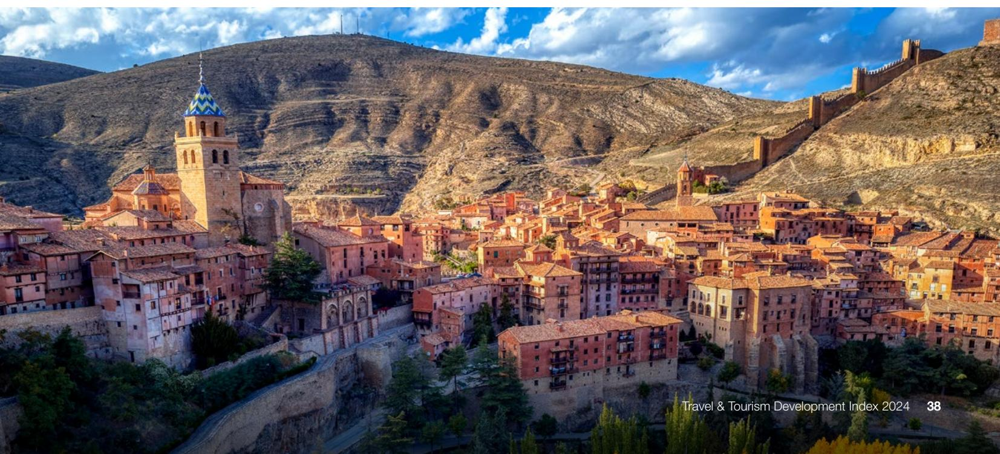

## 6.4 | Middle East and North Africa

TABLE 4 TTDI 2024 scores for Middle East and North Africa

<table><tr><td rowspan="2">Economy</td><td rowspan="2">TTDI rank</td><td colspan="5">Enabling Environment</td><td colspan="3">T&amp;T Policy and Enabling Conditions</td><td colspan="3">Infrastructure and Services</td><td colspan="3">T&amp;T Resources</td><td colspan="3">T&amp;T Sustainability</td></tr><tr><td>Business Environment</td><td>Safety and Security</td><td>Health and Hygiene</td><td>Human Resources and Labour Market</td><td>ICT Readiness</td><td>Prioritization of T&amp;T</td><td>Openness to T&amp;T</td><td>Price Competitiveness</td><td>Air Transport Infrastructure</td><td>Ground and Port Infrastructure</td><td>Tourist Services and Infrastructure</td><td>Natural Resources</td><td>Cultural Resources</td><td>Non-Leisure Resources</td><td>Environmental Sustainability</td><td>T&amp;T Socioeconomic Impact</td><td>T&amp;T Demand Sustainability</td></tr><tr><td>United Arab Emirates</td><td>18</td><td>5.57</td><td>6.40</td><td>4.83</td><td>4.67</td><td>6.23</td><td>5.39</td><td>5.67</td><td>4.28</td><td>6.52</td><td>4.67</td><td>5.48</td><td>1.85</td><td>2.48</td><td>3.84</td><td>4.06</td><td>2.67</td><td>3.92</td></tr><tr><td>Saudi Arabia</td><td>41</td><td>4.95</td><td>6.36</td><td>4.79</td><td>4.59</td><td>6.00</td><td>4.43</td><td>3.10</td><td>4.52</td><td>4.96</td><td>3.84</td><td>3.96</td><td>2.99</td><td>2.58</td><td>3.33</td><td>3.87</td><td>2.96</td><td>4.69</td></tr><tr><td>Israel</td><td>48</td><td>5.18</td><td>5.04</td><td>5.69</td><td>5.00</td><td>6.17</td><td>4.52</td><td>4.25</td><td>1.42</td><td>4.55</td><td>4.39</td><td>4.12</td><td>1.90</td><td>1.76</td><td>3.45</td><td>4.22</td><td>4.49</td><td>3.57</td></tr><tr><td>Qatar</td><td>53</td><td>5.11</td><td>6.78</td><td>4.67</td><td>4.47</td><td>5.83</td><td>3.32</td><td>3.97</td><td>3.34</td><td>5.46</td><td>4.22</td><td>3.66</td><td>1.31</td><td>1.86</td><td>3.15</td><td>3.77</td><td>4.11</td><td>3.22</td></tr><tr><td>Bahrain</td><td>58</td><td>4.80</td><td>5.99</td><td>4.31</td><td>3.98</td><td>5.74</td><td>4.86</td><td>3.57</td><td>4.74</td><td>4.46</td><td>4.51</td><td>3.34</td><td>1.22</td><td>1.55</td><td>2.42</td><td>3.51</td><td>3.98</td><td>4.40</td></tr><tr><td>Oman</td><td>67</td><td>4.84</td><td>6.35</td><td>4.39</td><td>3.90</td><td>5.50</td><td>3.39</td><td>4.12</td><td>5.11</td><td>3.91</td><td>3.72</td><td>2.64</td><td>2.10</td><td>1.99</td><td>2.00</td><td>3.59</td><td>3.50</td><td>4.65</td></tr><tr><td>Jordan</td><td>70</td><td>4.58</td><td>6.30</td><td>4.69</td><td>3.70</td><td>4.79</td><td>5.58</td><td>3.70</td><td>4.50</td><td>3.66</td><td>3.45</td><td>1.92</td><td>1.83</td><td>1.65</td><td>2.20</td><td>4.22</td><td>4.08</td><td>3.86</td></tr><tr><td>Iran, Islamic Rep.</td><td>73</td><td>2.46</td><td>5.39</td><td>4.29</td><td>3.04</td><td>4.90</td><td>3.87</td><td>3.08</td><td>6.03</td><td>2.88</td><td>2.85</td><td>3.01</td><td>3.47</td><td>3.76</td><td>2.16</td><td>3.96</td><td>4.61</td><td>3.41</td></tr><tr><td>Lebanon</td><td>79</td><td>3.04</td><td>5.02</td><td>4.88</td><td>3.66</td><td>4.35</td><td>5.98</td><td>3.29</td><td>4.09</td><td>3.43</td><td>2.47</td><td>4.36</td><td>1.35</td><td>1.77</td><td>1.86</td><td>3.72</td><td>5.28</td><td>3.76</td></tr><tr><td>Kuwait</td><td>96</td><td>4.44</td><td>6.53</td><td>4.78</td><td>3.72</td><td>5.32</td><td>2.28</td><td>2.88</td><td>3.74</td><td>4.15</td><td>3.00</td><td>1.72</td><td>1.35</td><td>1.33</td><td>2.45</td><td>3.73</td><td>3.99</td><td>3.09</td></tr><tr><td>Middle East</td><td></td><td>4.50</td><td>6.02</td><td>4.73</td><td>4.07</td><td>5.48</td><td>4.36</td><td>3.76</td><td>4.18</td><td>4.40</td><td>3.71</td><td>3.42</td><td>1.94</td><td>2.07</td><td>2.68</td><td>3.86</td><td>3.97</td><td>3.86</td></tr><tr><td>Egypt</td><td>61</td><td>3.88</td><td>5.37</td><td>3.95</td><td>3.43</td><td>4.45</td><td>5.87</td><td>3.09</td><td>6.11</td><td>4.58</td><td>3.85</td><td>2.76</td><td>3.11</td><td>3.18</td><td>2.39</td><td>4.07</td><td>2.27</td><td>4.90</td></tr><tr><td>Morocco</td><td>82</td><td>4.15</td><td>5.75</td><td>3.71</td><td>3.10</td><td>4.41</td><td>4.38</td><td>4.19</td><td>4.84</td><td>3.65</td><td>3.33</td><td>2.31</td><td>2.20</td><td>2.75</td><td>2.90</td><td>4.00</td><td>2.69</td><td>3.49</td></tr><tr><td>Tunisia</td><td>83</td><td>3.43</td><td>5.17</td><td>4.41</td><td>3.38</td><td>4.28</td><td>5.60</td><td>3.43</td><td>5.94</td><td>2.95</td><td>2.69</td><td>2.69</td><td>2.02</td><td>1.83</td><td>2.64</td><td>3.97</td><td>3.45</td><td>3.35</td></tr><tr><td>Algeria</td><td>98</td><td>3.24</td><td>5.58</td><td>4.35</td><td>3.03</td><td>4.41</td><td>3.69</td><td>2.49</td><td>6.03</td><td>2.66</td><td>2.80</td><td>2.61</td><td>2.47</td><td>2.20</td><td>1.94</td><td>3.42</td><td>4.47</td><td>2.82</td></tr><tr><td>North Africa</td><td></td><td>3.68</td><td>5.47</td><td>4.11</td><td>3.23</td><td>4.39</td><td>4.88</td><td>3.30</td><td>5.73</td><td>3.46</td><td>3.17</td><td>2.59</td><td>2.45</td><td>2.49</td><td>2.47</td><td>3.86</td><td>3.22</td><td>3.64</td></tr><tr><td>Middle East and North Africa</td><td></td><td>4.26</td><td>5.86</td><td>4.55</td><td>3.83</td><td>5.17</td><td>4.51</td><td>3.63</td><td>4.62</td><td>4.13</td><td>3.56</td><td>3.18</td><td>2.08</td><td>2.19</td><td>2.62</td><td>3.86</td><td>3.75</td><td>3.80</td></tr></table>

Note: Colour-coded based on performance relative to pillar mean score.

While the Middle East and North Africa (MENA) region underperforms the global TTDI average, with only four out of the 14 economies in the region covered by the index scoring above average, it has increased its relative TTDI performance since 2019. In general, MENA exhibits substantial variation in performance across its subregions and diverse levels of economic development.

The Middle East subregion is home to high-income economies, including all of the member states of the Gulf Cooperation Council (e.g. the United Arab Emirates and Saudi Arabia). T&T in these economies benefits from better tourist and transport infrastructure, including leading aviation hubs and airlines, the presence of large corporations and important business centres that drive business travel and more conducive business conditions and high levels of interpersonal safety and security, among other factors. On the other hand, MENA's middle-income economies tend to be more price-competitive, with economies such as Egypt, Iran and Morocco possessing some of the region's most attractive cultural resources. However, T&T operations in MENA's developing

economies are often challenged by issues ranging from less favourable business conditions to safety and security concerns and gaps in transport and tourism infrastructure.

Average air route capacity and airport connectivity have been among the greatest regional indicator improvements since the 2021 TTDI edition, resulting in the second-greatest increase in Air Transport Infrastructure scores (+8.4%). Moreover, many MENA countries have implemented policies and invested substantial resources into developing T&T, often as a way to diversify economies away from oil and gas production. In part, these efforts are reflected in broad increases in government T&T spending as a share of budgets, loosened visa requirements, improvements in the establishment and promotion of cultural resources and the highest regional average for T&T capital spending per employee in the index. The impact of these efforts may also have fed the greatest regional average increase in T&T Socioeconomic Impact scores (+13.8%, 2019 to 2024), as GDP and jobs induced by T&T and the share of sector jobs that are considered high wage also climbed.

A view of the Khobar Water Tower from the Corniche Boulevard, Al Khobar. Saudi Arabia has moved up nine places in the index ranking since 2019 – the most improved in the region.

Going forward, the degree to which T&T can help bring prosperity and diversification to the countries of the region will depend not only on investment in factors such as infrastructure and attractions but also on reducing the concentration of tourism at the most visited destinations and creating a competitive workforce. Currently, issues such as lower female labour force participation, the resulting large gender gap in T&T jobs and below-average workers' rights and social protections limit access to human capital, reduce workforce resilience and diminish T&T's potential to generate societal benefits. Unsurprisingly, despite improvement, the region scores the lowest for T&T Socioeconomic Impact. Regional T&T would also benefit from further reductions in travel and trade restrictions and substantial investment in environmental sustainability to assist any future

improvements in natural resources. Moreover, the recent rise in regional conflict, leading to increased safety and security concerns (including in economies not covered by the TTDI), represents a major external risk for future tourism development.

The United Arab Emirates (18th) is the top performer in the region overall and the Middle East subregion, while Egypt (61st) stands out as the top scorer in the North Africa subregion. Saudi Arabia has shown the most regional improvement in the index score and ranking since 2019 (+5.7%, 50th to 41st). In 2022, the region's largest T&T economy was Iran (73rd), with other major GDP contributors including Saudi Arabia, Egypt and the United Arab Emirates. Morocco (82nd) was the most dependent on T&T for GDP.

6.5 | Sub-Saharan Africa  
TABLE 5 TTDI 2024 scores for sub-Saharan Africa

<table><tr><td rowspan="2">Economy</td><td rowspan="2">TTDI rank</td><td colspan="5">Enabling Environment</td><td colspan="3">T&amp;T Policy and Enabling Conditions</td><td colspan="3">Infrastructure and Services</td><td colspan="3">T&amp;T Resources</td><td colspan="3">T&amp;T Sustainability</td></tr><tr><td>Business Environment</td><td>Safety and Security</td><td>Health and Hygiene</td><td>Human Resources and Labour Market</td><td>ICT Readiness</td><td>Prioritization of T&amp;T</td><td>Openness to T&amp;T</td><td>Price Competitiveness</td><td>Air Transport Infrastructure</td><td>Ground and Port Infrastructure</td><td>Tourist Services and Infrastructure</td><td>Natural Resources</td><td>Cultural Resources</td><td>Non-Leisure Resources</td><td>Environmental Sustainability</td><td>T&amp;T Socioeconomic Impact</td><td>T&amp;T Demand Sustainability</td></tr><tr><td>Mauritius</td><td>57</td><td>4.91</td><td>6.06</td><td>5.13</td><td>4.05</td><td>5.41</td><td>5.93</td><td>4.79</td><td>3.91</td><td>4.12</td><td>3.90</td><td>3.12</td><td>1.41</td><td>1.48</td><td>1.33</td><td>3.74</td><td>3.98</td><td>4.32</td></tr><tr><td>Kenya</td><td>77</td><td>3.66</td><td>4.61</td><td>2.31</td><td>4.03</td><td>4.00</td><td>4.85</td><td>3.46</td><td>5.08</td><td>3.21</td><td>3.23</td><td>1.25</td><td>3.76</td><td>1.66</td><td>1.99</td><td>4.53</td><td>6.05</td><td>4.89</td></tr><tr><td>Tanzania</td><td>81</td><td>3.64</td><td>5.55</td><td>1.90</td><td>3.81</td><td>3.66</td><td>5.30</td><td>4.22</td><td>4.80</td><td>2.94</td><td>3.29</td><td>1.41</td><td>4.77</td><td>1.61</td><td>1.56</td><td>4.17</td><td>5.40</td><td>4.02</td></tr><tr><td>Rwanda</td><td>93</td><td>4.33</td><td>6.35</td><td>2.91</td><td>3.74</td><td>3.84</td><td>4.12</td><td>4.24</td><td>4.63</td><td>2.40</td><td>3.22</td><td>1.41</td><td>1.68</td><td>1.09</td><td>1.12</td><td>4.10</td><td>4.73</td><td>4.83</td></tr><tr><td>Malawi</td><td>115</td><td>3.21</td><td>5.53</td><td>2.20</td><td>3.88</td><td>3.06</td><td>2.56</td><td>3.11</td><td>4.60</td><td>1.84</td><td>2.54</td><td>1.23</td><td>2.51</td><td>1.43</td><td>1.17</td><td>3.66</td><td>4.97</td><td>4.57</td></tr><tr><td>Eastern Africa</td><td></td><td>3.95</td><td>5.62</td><td>2.89</td><td>3.90</td><td>3.99</td><td>4.55</td><td>3.96</td><td>4.60</td><td>2.90</td><td>3.24</td><td>1.68</td><td>2.83</td><td>1.45</td><td>1.43</td><td>4.04</td><td>5.03</td><td>4.53</td></tr><tr><td>South Africa</td><td>55</td><td>3.88</td><td>3.97</td><td>3.55</td><td>3.98</td><td>5.16</td><td>4.38</td><td>4.35</td><td>5.17</td><td>3.69</td><td>3.33</td><td>2.41</td><td>4.86</td><td>2.67</td><td>4.19</td><td>3.91</td><td>4.69</td><td>3.71</td></tr><tr><td>Botswana</td><td>75</td><td>4.71</td><td>5.00</td><td>3.57</td><td>4.67</td><td>4.57</td><td>4.37</td><td>2.53</td><td>5.27</td><td>2.08</td><td>2.93</td><td>3.76</td><td>2.70</td><td>1.29</td><td>1.17</td><td>4.60</td><td>6.07</td><td>3.73</td></tr><tr><td>Namibia</td><td>95</td><td>3.86</td><td>5.14</td><td>2.96</td><td>3.96</td><td>4.41</td><td>3.80</td><td>2.48</td><td>5.55</td><td>2.37</td><td>3.25</td><td>2.26</td><td>3.21</td><td>1.19</td><td>1.14</td><td>4.70</td><td>4.46</td><td>3.91</td></tr><tr><td>Zambia</td><td>104</td><td>3.74</td><td>5.22</td><td>2.38</td><td>3.67</td><td>3.68</td><td>3.94</td><td>3.28</td><td>5.24</td><td>2.29</td><td>2.54</td><td>1.33</td><td>3.14</td><td>1.37</td><td>1.29</td><td>4.22</td><td>5.00</td><td>4.47</td></tr><tr><td>Zimbabwe</td><td>110</td><td>2.77</td><td>5.37</td><td>2.52</td><td>4.08</td><td>3.66</td><td>2.78</td><td>3.70</td><td>4.37</td><td>2.20</td><td>2.38</td><td>1.31</td><td>2.95</td><td>1.34</td><td>1.45</td><td>4.31</td><td>4.81</td><td>4.18</td></tr><tr><td>Angola</td><td>116</td><td>2.74</td><td>5.34</td><td>2.19</td><td>3.23</td><td>3.18</td><td>2.39</td><td>2.58</td><td>5.41</td><td>2.25</td><td>1.98</td><td>1.85</td><td>3.10</td><td>1.19</td><td>1.25</td><td>3.80</td><td>5.45</td><td>3.99</td></tr><tr><td>Southern Africa</td><td></td><td>3.62</td><td>5.01</td><td>2.86</td><td>3.93</td><td>4.11</td><td>3.61</td><td>3.15</td><td>5.17</td><td>2.48</td><td>2.73</td><td>2.15</td><td>3.33</td><td>1.51</td><td>1.75</td><td>4.26</td><td>5.08</td><td>4.00</td></tr><tr><td>Ghana</td><td>106</td><td>3.62</td><td>5.72</td><td>2.16</td><td>4.08</td><td>4.51</td><td>3.53</td><td>2.21</td><td>4.86</td><td>2.58</td><td>2.88</td><td>1.74</td><td>2.33</td><td>1.24</td><td>1.56</td><td>3.99</td><td>4.22</td><td>4.58</td></tr><tr><td>Senegal</td><td>107</td><td>3.54</td><td>5.51</td><td>2.95</td><td>3.23</td><td>4.41</td><td>2.47</td><td>3.33</td><td>4.25</td><td>2.73</td><td>2.92</td><td>1.37</td><td>2.59</td><td>1.58</td><td>1.39</td><td>3.80</td><td>4.68</td><td>4.42</td></tr><tr><td>Nigeria</td><td>112</td><td>3.19</td><td>3.28</td><td>2.09</td><td>3.63</td><td>3.61</td><td>2.24</td><td>3.24</td><td>4.96</td><td>2.94</td><td>2.35</td><td>2.49</td><td>2.99</td><td>1.84</td><td>2.49</td><td>3.78</td><td>5.34</td><td>3.60</td></tr><tr><td>Benin</td><td>113</td><td>3.59</td><td>5.01</td><td>1.46</td><td>3.84</td><td>3.56</td><td>2.66</td><td>3.32</td><td>5.37</td><td>2.40</td><td>3.31</td><td>1.34</td><td>2.32</td><td>1.44</td><td>1.06</td><td>3.83</td><td>5.09</td><td>4.03</td></tr><tr><td>Côte d&#x27;lvoire</td><td>114</td><td>3.58</td><td>4.79</td><td>1.67</td><td>3.72</td><td>4.17</td><td>2.31</td><td>2.89</td><td>4.93</td><td>2.54</td><td>3.26</td><td>1.26</td><td>3.14</td><td>1.36</td><td>1.26</td><td>4.15</td><td>3.81</td><td>4.39</td></tr><tr><td>Cameroon</td><td>117</td><td>3.20</td><td>3.50</td><td>2.05</td><td>3.70</td><td>2.90</td><td>2.51</td><td>1.73</td><td>5.13</td><td>2.22</td><td>2.75</td><td>1.28</td><td>3.37</td><td>1.37</td><td>1.43</td><td>3.83</td><td>4.77</td><td>5.10</td></tr><tr><td>Sierra Leone</td><td>118</td><td>2.66</td><td>5.56</td><td>1.46</td><td>2.99</td><td>2.34</td><td>3.75</td><td>3.07</td><td>5.29</td><td>1.69</td><td>2.21</td><td>1.31</td><td>1.93</td><td>1.01</td><td>1.04</td><td>3.24</td><td>4.98</td><td>4.58</td></tr><tr><td>Mali</td><td>119</td><td>3.09</td><td>2.95</td><td>2.27</td><td>3.43</td><td>3.21</td><td>2.41</td><td>1.98</td><td>4.93</td><td>2.37</td><td>2.41</td><td>1.26</td><td>2.39</td><td>1.61</td><td>1.03</td><td>3.76</td><td>3.89</td><td>4.21</td></tr><tr><td>Western Africa</td><td></td><td>3.31</td><td>4.54</td><td>2.01</td><td>3.58</td><td>3.59</td><td>2.74</td><td>2.72</td><td>4.96</td><td>2.43</td><td>2.76</td><td>1.51</td><td>2.63</td><td>1.43</td><td>1.41</td><td>3.80</td><td>4.60</td><td>4.36</td></tr><tr><td>Sub-Saharan Africa</td><td></td><td>3.58</td><td>4.97</td><td>2.51</td><td>3.77</td><td>3.86</td><td>3.49</td><td>3.19</td><td>4.93</td><td>2.57</td><td>2.88</td><td>1.76</td><td>2.90</td><td>1.46</td><td>1.52</td><td>4.01</td><td>4.86</td><td>4.29</td></tr></table>

Note: Colour-coded based on performance relative to pillar mean score.

Sub-Saharan Africa (Africa) has shown the most substantial enhancement in TTDI performance since 2019 (+2.1%), with 16 out of the 19 regional economies covered by the index increasing their TTDI scores. The sector's potential to drive socioeconomic prosperity makes it an essential tool for development. In 2024, the region had the highest score for T&T Socioeconomic Impact, with the T&T industry in Africa generating, on average, over 21% more jobs for each direct position than the TTDI mean, and with an average of over 43% of the sector workforce employed in segments that are considered relatively high wage.

Africa's potential for T&T development is influenced by several factors, including its notable price competitiveness and natural resources for tourism. However, considerable challenges still have to be overcome if the region is to produce favourable conditions for T&T growth. Regional policy-makers and T&T stakeholders need to continue the recent progress in creating more supportive business environments, improving health and hygiene conditions, fostering higher-quality human resources and labour markets and advancing ICT infrastructure. For instance, investment and policy directed at supporting inclusive working conditions, workers' rights and education can help make the region's large and growing labour force more competitive and resilient. Addressing widespread health, safety and security challenges will also help to encourage investment and make African destinations more attractive to foreign visitors.

While many African governments' ability to support the sector is limited due to resource constraints, with the region's already low scores for Prioritization of T&T (e.g. government T&T spending and data collection) falling even more since 2019 (-9.8%), non-spending policies can be pursued. Encouragingly, African states have made unilateral and multilateral strides in policies that should encourage cross-border travel and trade (e.g. the African Continental Free Trade Area (AfCFTA), the Free Movement of Persons Protocol and Single African Air Transport Market), and drive currently low levels of intraregional connectivity. For instance, on average, African countries covered by the TTDI have liberal visa requirements that can help facilitate cross-border travel. However, the implementation

↓ Blyde River Canyon, Mpumalanga, South Africa. Although 55th globally, South Africa ranks the highest on the index in the region.

of many policies aimed at greater international openness has lagged, with the region scoring low for the number and degree of liberalization of air service agreements. This can, in particular, make it more difficult for Africa's already underdeveloped aviation sector to grow. Innovative funding solutions for air, ground and port infrastructure also need to be found to make destinations easier to access. Encouraging environmental sustainability to protect valuable tourism-generating nature assets, developing tourist service infrastructure and greater promotion and protection of cultural resources also need to be prioritized in the years to come.

South Africa (55th) ranks the highest in the region and is home to its largest T&T economy. Meanwhile, Mauritius (57th) and Ghana (106th) rank the highest in Eastern and Western Africa, with the former also being the region's most T&T-dependent economy in 2022. Côte d'Ivoire has shown the greatest improvement in TTDI score (+6.4%, 116th to 114th).

↓ Dubai Marina, Jumeirah, United Arab Emirates.

## Special focus: Leveraging T&T to address future global challenges

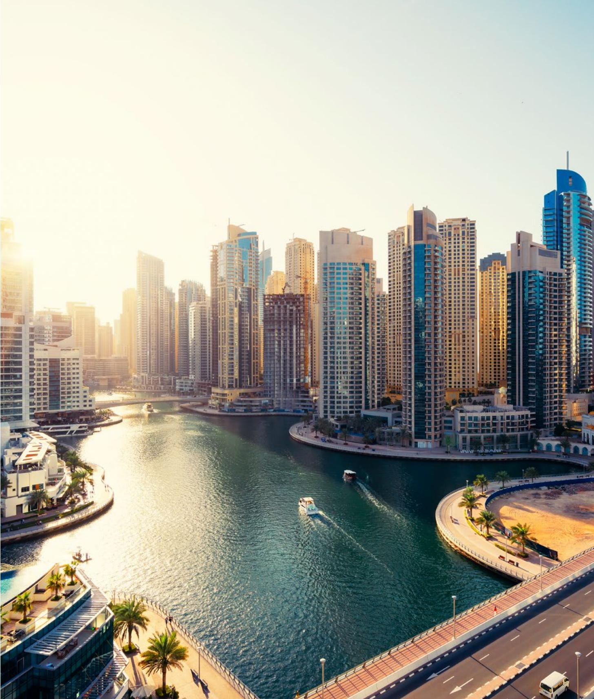

It is imperative that T&T decision-makers do more to comprehend how future risks affect the sector.

In recent years, the Travel and Tourism (T&T) sector has faced multifaceted challenges, including the COVID-19 pandemic, geopolitical and economic uncertainty, inflation and extreme weather events such as wildfires, that reflect broader global risks and trends encompassing economics, the environment, society, geopolitics and technology. Within this context, policy-makers, consumers and other stakeholders have looked not only at how the sector is affected by these trends but also at how, conversely, it contributes to such trends through its economic, social and environmental impacts. Therefore, it is imperative that T&T decision-makers do more to comprehend how future risks affect

the sector and take a more active role in developing it in a way that maximizes its potential to tackle global challenges. If managed thoughtfully, T&T can emerge as a potent driver of resilient and sustainable development, contributing to the collective well-being of communities around the world.

To help in this goal, the TTDI's special focus section uses qualitative research and index results to provide an overview of the potential external risks landscape and some of the areas on which decision-makers can focus to unlock the T&T sector's potential to address these challenges and maximize its positive economic, environmental and social impact.

## 7.1 The future global risk landscape

FIGURE 15

Relative severity of risks over a two and 10-year period

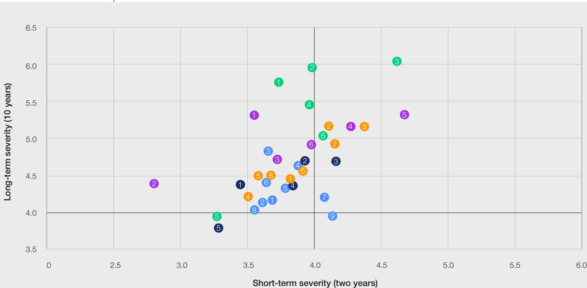

## Economic risk

Talent and/or labour shortages

Asset bubble bursts

## Environmental risk

Concentration of strategic resources

Biodiversity loss and ecosystem collapse

Critical change to Earth systems

Extreme weather events

## Geopolitical risk

Biological, chemical or nuclear hazards

Geo-economic confrontation

Debt

Insufficient public infrastructure and services

## Technological risk

  
Involuntary migration

## Societal risk

Natural resource shortages

Adverse outcomes of AI technologies

Interstate armed conflict

  
Societal polarization

Adverse outcomes of frontier technologies

Disruptions to a systemically important supply chain

Censorship and surveillance

Disruptions to critical infrastructure

Economic downturn

Illicit economic activity

Non-weather-related natural disasters

Pollution

Intrastate violence

  
Unemployment

Terrorist attacks

Chronic health conditions

Erosion of human rights and/or of civic freedoms

Inequality or lack of economic opportunity

Infectious diseases

Cyber insecurity

Misinformation and disinformation

Technological power concentration

  
Source: World Economic Forum Global Risks Perception Survey 2023–2024.
Note: Severity was assessed on a 1–7 Likert scale [1 – low severity, 7 – high severity].

Inflation

↓ Environmental and climate change risks pose a serious risk for nature-rich destinations.

To understand how T&T can contribute to future global prosperity, it is first important to better understand the risk landscape in which the sector will operate. The World Economic Forum's recently published Global Risk Report 2024 highlights numerous challenges with short- and long-term impacts for populations, the economy or environmental resources on a global scale. $^{32}$ As Figure 15 shows, over the next two years, pressing concerns encompass environmental, economic and societal challenges such as: extreme weather events and pollution; inequality and limited economic prospects for parts of society; inflation; social polarization; and involuntary migration. Safety and security concerns related to misinformation and disinformation, armed conflict and cybersecurity are also ranked among the 10 most severe risks facing the world in the next two years.

In contrast to short-term risks, those risks with a long-term impact on a global scale are predominantly environmental, ranging from biodiversity loss to a shortage of natural resources and extreme weather events. The adverse outcomes of AI technologies are also seen as a potential risk affecting the world in the next decade. Among the most severe risks with long-term global impact are challenges related to security such as cyber insecurity or misinformation and disinformation. Overall, perceptions for almost all tracked risks by the Global Risk Report are expected to accelerate in the next decade, with environmental, technological and societal risks accelerating the most, while economic risks such as inflation relatively decelerate.

# 7.2 | Leveraging T&T for environmental sustainability

In the next decade, environmental challenges are predicted to have the strongest impact globally, affecting populations, societies, economies and the world's ecosystems. Challenges such as biodiversity loss, the rise in climate-related extreme weather events and increasing pollution all pose clear dangers to tourism-generating natural resources, sector infrastructure and visitor experiences. The T&T sector is, however, not only directly influenced by growing environmental risks, but also contributes substantially to environmental challenges and could play an important role in addressing these global challenges by mitigating its contributions to climate change and transitioning towards being a more sustainable and environmentally conscious sector.

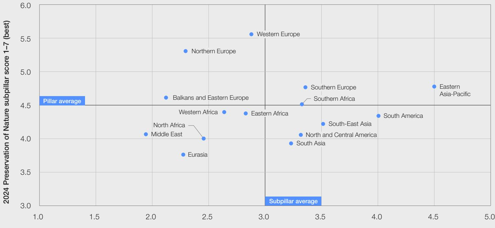  
Source: World Economic Forum.  
Note: Please see Table C2 for subregional country classification.

2024 Natural Resources pillar score 1–7 (best)

The sector relies on transportation, particularly air travel, which is a highly energy-and emissions-intensive mode of travel.

The T&T sector can be employed to address the risks and challenges by focusing on areas such as:

\- Providing greater value for nature conservation efforts: Many destinations' reliance on natural resources provides a strong incentive to protect the environment by creating economic value for preservation efforts. According to WTTC research, nature tourism generates more than \$600 billion in revenue globally, with wildlife tourism alone creating close to 22 million jobs. In Africa, wildlife tourism generated around \$142 million in entrance fees for protected areas alone. $^{33}$ However, TTDI analysis also reveals significant gaps in the preservation of natural resources in some of the most nature-rich regions of the world (Figure 16).

The Forum's Global Future Council (GFC) on Sustainable Tourism recommends that tourism destinations prioritize nature conservation, using a regenerative model involving stakeholders such as destination managers, tour operators, local businesses and visitors. Governance based on science and traditional environmental knowledge develops climate resilience. Conservation, restoration and regeneration principles, taking into account habitat carrying capacity, are crucial. Funding protected area management, promoting visitor education and reinforcing the link between wildlife, conservation and local livelihoods are priorities. Stakeholder engagement ensures fair benefit-sharing, with business plans tied to conservation outcomes. Governments should integrate nature into planning, develop financing and ecotourism business proposals, establish visitor management strategies and ensure tourism concessions align with protection policies. $^{34}$

Leading on the energy transition: In recent years, the T&T sector's substantial contributions to climate change in the form of GHG emissions have garnered increasing attention and raised concerns. The sector relies on transportation, particularly air travel, which is a highly energy- and emissions-intensive mode of travel that cannot be fully replaced, emitting substantial GHGs and contributing to 8% of global GHG emissions in 2019. Considering that T&T GHG emissions increased on average by 2.5% annually in the decade before the pandemic, it can be expected that similar growth rates may re-emerge in the post-pandemic stage of T&T.

On the other hand, the fact that the T&T sector's GDP grew at a faster rate than did its emissions is promising and can be continued if appropriate actions are taken. $^{35}$ Sustainable aviation fuels (SAF) may offer one potential solution, a means of reducing aviation emissions if the challenges and risks associated with SAF such as land use for producing biomaterial or emissions from crop-derived SAFs in aircraft are resolved. $^{36}$ Additionally, rather than focusing only on direct emissions from T&T activities, the sector needs to take into account Scope 2 and Scope 3 emissions $^{37}$ produced in the value chain (Scope 2 and 3 emission account for the majority of non-transport sector emissions) $^{38}$ to ensure that all emissions are measured, and appropriate actions taken to reduce overall emissions. One important pathway towards reducing emissions could be related to waste reduction, in particular food waste, considering the high emission rates of food production. $^{39}$ New regulations on greenwashing and climate claim reporting in

↓ Serengeti Savanna forest in Tanzania. T&T is a major source for protected area funding.

the European Union and other regions may aid in further driving the sector transition towards net zero by 2050 as it makes companies accountable for their emissions and could help better track and reduce indirect emissions within the supply chain. Improved environmental standards in building regulations and incorporating the latest technologies to minimize energy use will further spur this transition. $^{40}$

\- Driving responsible consumption: The rise in tourist numbers places strain on local resources, water supplies and waste management systems, exacerbating environmental degradation. For instance, the T&T sector accounted for 5.8% of global water use and 5–8% of global material extraction in 2019. $^{41}$ Despite the growing awareness of the environmental impacts of consumer behaviour among governments and tourists, responsible consumption of resources in the T&T sector still lags behind compared to daily-life contexts. Both tourists' consumption and the T&T industry's resource management need to change to tackle this issue. Encouraging alterations in tourists' behaviour towards more environmentally friendly forms of consumption can help address this challenge, including encouraging consumption of low-environmental-impact foods such as plant-based dishes, $^{42}$ or the reduction of plastic usage, which is a key environmental challenge in many destinations.

Closing the gap between people's positive attitudes about sustainable consumption and their often misaligned unsustainable behaviour is one of the major challenges for the T&T sector. $^{43}$ The Forum's report on How to Create the Sustainable Travel Products Customers Want identifies limited availability, a price premium or low credibility among other factors as reasons for this “say-do-gap”. To address this, cross-industry and stakeholder collaboration and alignment is required to invest in and refine sustainable products, provide a frictionless experience, improve value propositions, recognize and reward customers, increase awareness and improve product transparency. $^{44}$

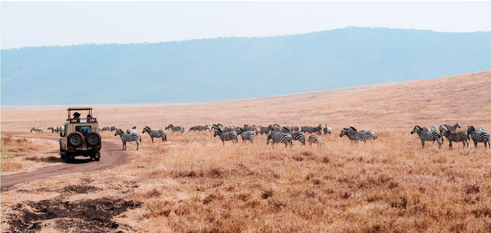

# 7.3 | Leveraging T&T for socioeconomic prosperity

Lack of economic opportunity, unemployment and economic downturns are some of the most pressing risks facing the world. T&T can be used to address this global challenge as it is forecasted to continue to be a major source of economic growth and employment. In the next decade, the T&T sector's contribution to global GDP is expected to increase from 9.1% in 2023 to 11.4% in 2034, helping to generate over 12% of jobs worldwide. $^{45}$ Considering that the T&T industry will remain relatively labour-intensive, despite increased automation, and given the large amount of low-entry and part-time employment within the sector, it provides ideal opportunities to tackle unemployment. It also plays a pivotal role in employing women, youth, migrants and informal workers. In particular, backed by emerging-market economic and middle-class growth, T&T will be an important driver of economic growth in developing countries and regions. Lastly, the sector's potential for socioeconomic prosperity is magnified by the fact that it empowers small- and medium-sized enterprises, with more than 80% of T&T businesses falling under this category. $^{46}$

↓ Cultivating a skilled, inclusive and resilient workforce can help make T&T a driver of socioeconomic progress.

T&T stakeholders can use the sector to combat socioeconomic challenges by focusing on areas such as:

\- Investing in skilled, inclusive and resilient workforces: As mentioned in the dimensional analysis, by cultivating a skilled, inclusive and resilient labour force, the T&T sector will be able to better use technology, improve service quality, boost productivity and expand its labour pool, especially in the light of recent labour shortages. Moreover, with the sector being a significant global employer, there is an opportunity to lead global efforts to enhance labour conditions, especially in the 63 mostly low- to middle-income TTDI-ranked economies that score below average for the Labour Market Resilience and Equality subpillar and account for $54\%$ of the T&T workforce. An ILO report on the Future of Work in the Tourism Sector presents an action plan for inclusive, safe, fair and sustainable tourism: it suggests focusing on women, youth and migrants for job creation, transitioning from job informality, and promoting green jobs linked to ecotourism and conservation. Social protection measures, including rolling out social security, improving occupational health and safety, and regulating working hours, are recommended.

Additionally, encouraging social dialogue, recognizing freedom of association and adhering to international labour standards regarding equality and non-discrimination are highlighted as essential for ensuring the sector's resilience and sustainability. $^{47}$ These suggestions align with the already-mentioned WTTC proposals for addressing the ongoing labour shortage, which include facilitating

labour mobility, flexible working arrangements, decent work and competitive benefits, skills-building and adaptation of digital solutions.

\- Putting local communities at the centre of T&T development: While the T&T sector is a major source of opportunity for communities, employers and SMEs around the world, its benefits do not always fully extend to local communities. UN Tourism recommends that the sector improve its social inclusion by supporting and involving vulnerable groups, focusing on the needs of SMEs and repurposing tourism as a supporter of the community. $^{48}$

Furthermore, the Forum's GFC on Sustainable Tourism outlines several steps that governments, communities and industry can take to improve the sector's community impact. Government leaders should prioritize creating an inclusive destination-planning framework that balances community well-being with the protection of natural and cultural resources and the financial health of travel service suppliers. Communities and the travel industry should engage in holistic destination management planning, investing in environmental, social and governance practices. They can also market sustainable experiences and educate travellers on responsible travel practices. Concrete steps include establishing tourism laws that create incentives for community well-being, endorsing global standards such as those of the GSTC, and creating resident satisfaction metrics. Building a network of leaders, developing community-driven planning and providing resources for capacity-building are crucial, along with establishing stakeholder consultation platforms and social safeguards for risk management and improved outcomes. $^{49}$

\- Strategically managing visitor behaviour and infrastructure development: As highlighted by TTDI results, historical demand sustainability challenges such as seasonality, short lengths of stay and overcrowding have worsened as the sector has recovered from the pandemic, increasing pressure on local infrastructure, housing and natural and cultural assets that attract visitors, negatively affecting the visitor experience and local liveability and fuelling uneven distribution of T&T benefits. However, various management policies and infrastructure investments can minimize these issues and help channel T&T flow and benefits more broadly. Investments and policies should focus on dispersing tourism to rural, nature and secondary destinations by improving infrastructure and access. This includes

developing transport, tourism, health and ICT infrastructure in these areas to make them more attractive and increase their capacity to accommodate visitors. $^{50}$ UN Tourism has devised strategies and measures to mitigate overcrowding, promote sustainable tourism development and enhance the overall visitor experience in urban destinations. These include the promotion of attractions and events that disperse visitors, implementing dynamic pricing mechanisms, establishing pedestrian-only zones, defining carrying capacities for city areas, targeting low-impact visitor segments, ensuring local communities benefit from tourism, engaging with stakeholders, and using big data to monitor impacts (as will be discussed in Section 7.5 below). $^{51}$

# 7.4 Leveraging T&T for global connectivity, peace and cultural exchange

As people visit different countries, they build personal connections, promote mutual understanding and create networks that transcend political divides, while also stimulating economic growth and encouraging investment.

As risk perception data reveals, geo-economic confrontation, interstate conflict, societal polarization, misinformation and disinformation are ongoing global challenges that are likely to become even more pressing in the next decade. In this context, T&T will become an increasingly vital player in fostering global connectivity by facilitating economic interdependence, person-to-person interactions and cultural exchange. As people visit different countries, they build personal connections, promote mutual understanding and create networks that transcend political divides, while also stimulating economic growth and encouraging investment. Moreover, travel can help mitigate misinformation and social polarization by enabling first-hand experiences that challenge stereotypes, promote empathy and contribute to the dissemination of accurate information through shared experiences and dialogue, ultimately strengthening global connections and bridging societal divides. The sector's ability to promote cultural exchange, tolerance and economic opportunity has also been shown to enhance resilience to violence and conflict. $^{52}$

T&T stakeholders can enhance the sector's potential to drive global connectivity and peace by focusing on areas such as:

\- Increasing travel openness: Continuing progress already made in travel openness as reflected in increasing Openness to T&T pillar scores will be critical to maintaining the T&T sector's ability to drive global connectivity. In particular, visa and airline liberalization have been shown

to increase cross-border travel flows, with the former even helping internationalize the labour market, $^{53}$ while the latter helps reduce travel prices, increase aviation capacity and service quality, improve resilience and boost consumer choice. $^{54}$ As a result, related policies are critical to the T&T sector's ability to create economic interdependence and person-to-person connections. The previously mentioned combination of visa policies and cultural heritage (e.g. South Korea's K-pop visas) can be an especially effective way of leveraging T&T for mutual understanding and tolerance building.

\- Encouraging cultural exchange between visitors and the local community: T&T's potential to promote peace, tolerance and connectivity can also be bolstered by destination management and other policies that encourage deeper local and cultural exchange. To employ tourism for cultural exchange and tolerance, destinations should focus on promoting authentic cultural experiences and interactions between visitors and local communities. This can be achieved through initiatives such as cultural heritage tours, homestays, community-based tourism projects and cultural festivals that celebrate diversity. As previously mentioned, to achieve this goal it is essential to involve local communities in tourism planning and development to ensure that their voices are heard and their cultural heritage is respected. More targeted marketing activities focused on authentic cultural experiences and protection are also recommended. $^{55}$

# 7.5 | Leveraging T&T and technology for positive impact

The introduction of new technologies often creates worries about the unintended and unknown consequences. The newest technology and the potential adverse outcomes of AI technology are together perceived to be one of the major risk factors to affect the world in the next decade. While these advances in technology need to be implemented with care to avoid negative consequences such as job displacement, privacy and data security issues or service quality, new technology is also poised to revolutionize the tourism industry, fundamentally altering how travellers explore destinations and interact with service providers. From personalized trip planning powered by AI algorithms to immersive virtual reality experiences, technology will increasingly offer travellers unprecedented convenience and customization, while digital technology and online platforms empower destinations and T&T

businesses, by facilitating online bookings, use of sharing-economy platforms, digital payments and mobile access, enabling access to new markets, operational optimization, enhanced visitor engagement, and gathering of consumer insights and preferences. Simultaneously, as a major part of global and local economic ecosystems, with a multitude of private and governmental stakeholders, T&T will also serve as an important initiator for the adoption of new technology and digitalization beyond the T&T sector. The way in which technology is applied in T&T will have broader implications for communities and will influence aspects such as socioeconomic development and sustainability. Finally, as technology becomes increasingly intertwined with the sector, T&T stakeholders will have the opportunity to harness its potential for positive impact by focusing on the areas outlined below.

FIGURE 17 Factors of the digital divide, by income group average  
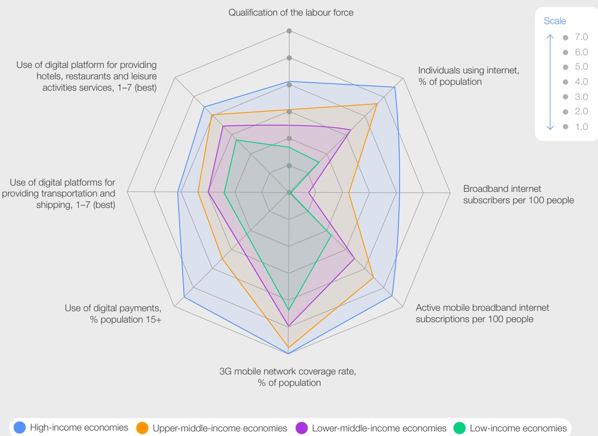  
Source: World Economic Forum, International Telecommunication Union and World Bank.  
Note: All indicators are on a 1–7 scale (1 – worst, 7 – best). Qualification of Labour Force is a subpillar that measures factors such as share of labour force with intermediate and advanced education and quality of secondary and tertiary education.

Collaboration among industry stakeholders is essential to ensure technology acts as a positive force in sustainable tourism development.

\- Adopting technology-enabled sustainable and resilient T&T management: Technology will be a major enabler of sustainable T&T development in the coming years when smart destinations become the norm rather than best practice examples. For instance, the increasing use of digital platforms in T&T has generated vast amounts of data, enabling better measurement and management of sustainability. This data, including online bookings, digital payments and use of mobile devices, offers insights into visitor behaviour and any impacts, facilitating smarter destination management. Big-data analytics allows the processing of diverse data sources for precise tracking of factors such as visitor behaviour and environmental impacts in real time. This enables destination managers to optimize resource allocation, manage visitor flows and develop strategic plans, enhancing T&T sustainability and creating more responsive destinations. $^{56}$ AI could also assist in managing tourism flows and analysing environmental impacts to support sustainable practices (including digital nudging for responsible tourist behaviour, as suggested in the AI4GoodTourism framework). $^{57}$ With improved interoperability, AI also makes travel more accessible, breaking language barriers and offering tailored, more affordable experiences to diverse groups.

A recent Forum report on using big data for sustainable tourism development in Türkiye emphasizes the importance of aligning T&T sustainability policy with big-data opportunities and ecosystem capacity, developing governance frameworks, funding and destination institutional capacity and encouraging ICT investment in infrastructure such as sensors and data centres among other recommendations for the proper use of big data for sustainable tourism. $^{58}$

\- Bridging the digital divide and creating opportunities: T&T can be an important conduit for bridging the digital divide by promoting digital inclusion and providing opportunities for various destinations, local businesses and workers. As alluded to earlier, digital technologies and platforms provide SMEs with effective and relatively low-cost avenues to market, sell and promote their products and services to a global audience, encouraging entrepreneurship in local communities. For instance, sharing-economy platforms such as those hosting short-term rentals, and digital labour platforms such as ride-hailing apps, provide greater access to new business opportunities and flexible employment for workers. $^{59}$ Between 2017 and 2023 the number of short-term rentals on Airbnb and similar platforms among TTDI-ranked countries increased by more than 80%. $^{60}$

Technology also provides opportunities to work remotely while travelling and offers the possibility of new travel experiences in the form of virtual travel, allowing individuals the chance to explore destinations and engage in tourism activities without physically travelling. This can be particularly beneficial for those who face constraints such as mobility issues, financial limitations, or health concerns. $^{61}$ Lastly, by leveraging social media as a way to showcase their cultural heritage, natural attractions and unique experiences, rural destinations can stimulate economic development and enhance their visibility on the global stage in a relatively cost-effective manner. $^{62}$ However, as Figure 17 highlights, T&T stakeholders in developing countries will need to prioritize investment in ICT infrastructure, access and skill building.

\- Ensuring the responsible and safe adoption of technology: While the use of technology in T&T offers immense opportunities for sector stakeholders and beyond, its ability to drive positive impact will depend on responsible and safe implementation. Privacy concerns arise as the use of personal data could lead to unauthorized surveillance. $^{63}$ Over-reliance on technology increases vulnerability to technical failures and cyberattacks, risking financial and reputational damage. AI's decision-making in T&T raises ethical concerns due to potential bias from flawed data or prejudices embedded in algorithms. $^{64}$ And while considered a potential solution to T&T's chronic staff shortage issues, automation may displace jobs. Moreover, digital labour platforms may exacerbate income and job insecurity due to issues such as poor working conditions, in particular for migrant workers, $^{65}$ inadequate social protection and limited access to rights of freedom of association and collective bargaining, $^{66}$ while the rise of short-term rental platforms raises concerns about housing accessibility in areas where housing capacity is absorbed by T&T. $^{67}$ Further, market concentration among leading T&T digital platforms could lead to imbalances in bargaining power among stakeholders. $^{68}$

Addressing these challenges necessitates a balanced approach that includes robust privacy protections, cybersecurity investments, equitable access to technology and the preservation of human elements in travel experiences, protecting employment and decent work in the T&T sector $^{69}$ and engaging with local communities to ensure potential externalities such as housing challenges related to sharing economy platforms are appropriately tracked and addressed. Collaboration among industry stakeholders is essential to ensure technology acts as a positive force in sustainable tourism development.

# Conclusion

Results from the Travel & Tourism Development Index (TTDI) 2024 reveal the need for stakeholder collaboration to harness the T&T sector's transformative power.

The results are characterized by a mix of strong travel demand growth and persistent challenges such as increasing prices, labour shortages, supply-demand imbalances and an uncertain macroeconomic and geopolitical landscape. High-income economies, particularly in Europe and Asia-Pacific, continue to display some of the most favourable conditions for T&T development, benefiting from conducive business environments, dynamic labour markets, open travel policies, advanced ICT adoption, excellent transport and tourism infrastructure and rich natural, cultural and non-leisure attractions. Nevertheless, enabling conditions in developing countries are improving and if gaps in areas such as transport and tourist infrastructure can be narrowed, they will be increasingly able to leverage their natural and cultural resource to develop robust tourism economies that will drive economic growth. The interconnected nature of the index results, including the connections among price competitiveness, infrastructure, labour capacity, sustainability and demand growth, highlights the difficult job T&T decision-makers have when it comes to sector development.

Looking beyond the immediate challenges, the T&T sector must confront a global landscape that is defined by growing economic, environmental, geopolitical, societal and technological risks. Given the sector's increasing economic contribution, concerted action must be taken to harness the sector's transformative power for environmental stewardship, socioeconomic progress, global connectivity and technological innovation. This will require the sector to become more sustainable, inclusive and resilient, focusing on areas such as the preservation of nature, putting local communities at the centre of development, increasing travel openness and ensuring the responsible and safe adoption of technology.

However, the execution of these principles to unlock the full potential of T&T as a source for positive change necessitates extensive collaboration among stakeholders, including both sector-specific and non-sector businesses, employees, governmental bodies such as tourism and environmental agencies at national and local levels, civil society groups and international organizations. Initiatives to better measure and consequently manage the impact of T&T on economic development, societal challenges such as equality and diversity, and the environmental consequences of T&T activity are promising but require stakeholder collaboration as well as employing technological innovations in AI to unlock the full potential of data.

# Technical notes and methodology

## Appendix A: Travel & Tourism Development Index methodology

This section provides details about the methodology of the 2024 edition of the Travel & Tourism Development Index (TTDI). It comprises the following parts:

\- Composition and calculation

– Indicator and country selection

\- Indicator list and details

– Index changes and comparability

## Composition and calculation

The TTDI structure (see Figure A1) is composed of 17 pillars organized into five dimensions:

A. Enabling Environment (five pillars): 1. Business Environment; 2. Safety and Security; 3. Health and Hygiene; 4. Human Resources and Labour Market; 5. ICT Readiness

B. T&T Policy and Enabling Conditions (three pillars): 6. Prioritization of T&T; 7. Openness to T&T; 8. Price Competitiveness

C. Infrastructure and Services (three pillars): 9. Air Transport Infrastructure; 10. Ground and Port Infrastructure; 11. Tourist Services and Infrastructure

D. T&T Resources (three pillars): 12. Natural Resources; 13. Cultural Resources; 14. Non-Leisure Resources

E. Travel & Tourism Sustainability (three pillars): 15. Environmental Sustainability; 16. T&T Socioeconomic Impact; 17. T&T Demand Sustainability

## Travel & Tourism (T&T) Development Index framework

Enabling Environment

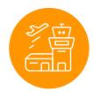

Business Environment

Human Resources and Labour Market

Infrastructure and Services

Safety and Security

Health and Hygiene

Labour Market Dynamics

Qualification of the Labour Force

Labour Market
Resilience and Equality

T&T Policy and Enabling Conditions

Prioritization of T&T

Air Transport Infrastructure

Openness to T&T

ICT Readiness

Ground and Port Infrastructure

Price Competitiveness

Tourist Services and Infrastructure

T&T Resources

T&T Sustainability

Natural Resources

Environmental Sustainability

Cultural Resources

T&T Energy Sustainability

Non-Leisure Resources

Pollution and Environmental Conditions

Preservation of Nature

T&T Socioeconomic Impact

T&T Demand Sustainability

These 17 pillars comprise 102 indicators that are calculated based on data derived from the Executive Opinion Survey (the Survey) as well as quantitative data from other sources. The survey data is derived from responses to the World Economic Forum's Executive Opinion Survey and ranges in value from 1 (worst) to 7 (best). TTDI 2024 results reflect the latest available data at the time of collection (end of 2023).

Hard data (non-survey data) was collected from various sources, which are described in Appendix B. Data used in the calculation of the TTDI can be found by visiting the online version of the Travel & Tourism Development Index 2024.

The TTDI is calculated as an average (arithmetic mean) of the 17 component pillar averages (arithmetic means). While figures for the five

dimensions are provided, they are used for categorization and presentation purposes only. Each of the pillars is calculated as an unweighted average of the individual component variables. Note that the Human Resources and Labour Market pillar is the unweighted average of its three subpillars: Qualification of the Labour Force, Labour Market Dynamics and Labour Market Resilience and Equality. Likewise, the Environmental Sustainability pillar is the unweighted average of its three subpillars: T&T Energy Sustainability, Pollution and Environmental Conditions and Preservation of Nature.

Hard data indicators used in the TTDI are normalized to a 1-to-7 scale in order to align them with the Executive Opinion Survey's results. The standard formula for converting each hard data indicator to the 1-to-7 scale is:

country score – sample minimum

sample maximum – sample minimum

The sample minimum and sample maximum are the lowest and highest scores of the overall sample, respectively. For those hard data indicators for which a higher value indicates a worse outcome

(e.g. fuel price levels), we rely on a normalization formula that, in addition to converting the series to a 1-to-7 scale, reverses it, so that 1 and 7 still correspond to the worst and best, respectively:

## country score – sample minimum

## sample maximum – sample minimum

However, in many cases, adjustments are made to figures used for sample minimum and sample maximum to account for issues such as outliers. See Table A1 for further details.

## Indicator and country selection

To be selected for the TTDI, indicators need to meet the following criteria:

\- Relevance: The indicator must be an acceptable metric for the concept that is being covered.

\- Country coverage: Timely indicator data must be available for the majority of economies covered by the TTDI. In most cases, this means coverage exceeds 100 economies.

\- Comparability: Indicator data must be comparable among the various economies covered and throughout its time series.

\- Update frequency: The indicator must be regularly updated for the foreseeable future.

## – Source quality and objectivity: The indicator

must come from a reputable and objective source. In this regard, common sources include international organizations such as the World Bank and United Nations World Tourism Organization (UN Tourism). To help with comparability, attempts are made to retrieve as much data as possible for a particular indicator from one source.

For data that is missing or is more than 10 years old, the following steps are taken:

\- First, research is conducted to find an alternative non-government source.

\- If no non-government source is found, publicly available government data is collected. However, the respective government is never informed of this action to avoid creating an unfair advantage or increase bias.

\- In the case that no data is found using the above two steps, the data is imputed. Please see a list of imputed data in Table A2.

For an economy to be included in the TTDI, it needs to:

\- Be included in at least one of the latest three Executive Opinion Surveys as this survey accounts for a large share of indicators

\- Not have missing data for 10% or more of total indicators or 20–33% of indicators within any particular pillar (share depends on the pillar)

\- Not be partaking in a conflict that generates enough material damage to make the indicators outdated

The indicators that make up each pillar – and subpillar, if available – are described below.

Italicized indicators are completely new to the 2024 edition of the TTDI.

<table><tr><td>Dimension A: Enabling Environment</td><td>4.11 Female labour force participation</td></tr><tr><td>Pillar 1: Business Environment</td><td>4.12 Social protection basic coverage $^{1}$ </td></tr><tr><td>1.01 Rule of law</td><td>4.13 Social protection spending $^{1}$ </td></tr><tr><td>1.02 Burden of government regulation</td><td>Pillar 5: ICT Readiness</td></tr><tr><td>1.03 Government ensuring policy stability</td><td>5.01 Individuals using internet</td></tr><tr><td>1.04 Country credit rating</td><td>5.02 Broadband internet subscribers</td></tr><tr><td>1.05 De-jure financial globalization</td><td>5.03 Mobile broadband subscribers</td></tr><tr><td>1.06 De-jure trade globalization</td><td>5.04 3G mobile network coverage</td></tr><tr><td>1.07 SME access to finance</td><td>5.05 Use of digital payments</td></tr><tr><td>Pillar 2: Safety and Security</td><td>5.06 Use of digital platforms for providing transportation and shipping</td></tr><tr><td>2.01 Confidence in local police</td><td rowspan="2">5.07 Use of digital platform for providing hotels, restaurants and leisure activity services</td></tr><tr><td>2.02 Safety walking alone at night</td></tr><tr><td>2.03 Homicide rate</td><td>5.08 Power losses</td></tr><tr><td>2.04 Global Terrorism Index</td><td>Dimension B: T&amp;T Policy and Enabling Conditions</td></tr><tr><td>2.05 Organized violence, deaths</td><td>Pillar 6: Prioritization of T&amp;T</td></tr><tr><td>Pillar 3: Health and Hygiene</td><td>6.01 T&amp;T government expenditure</td></tr><tr><td>3.01 Physician density</td><td>6.02 Comprehensiveness of T&amp;T data $^{1}$ </td></tr><tr><td>3.02 Use of basic sanitation $^{1}$ </td><td>6.03 Timeliness of T&amp;T data $^{1}$ </td></tr><tr><td>3.03 Use of basic drinking water $^{1}$ </td><td>6.04 Country Brand Strategy rating</td></tr><tr><td>3.04 Hospital beds density</td><td>Pillar 7: Openness to T&amp;T</td></tr><tr><td>3.05 Communicable disease incidence</td><td>7.01 Visa requirements</td></tr><tr><td>Pillar 4: Human Resources and Labour Market</td><td>7.02 Number of air service agreements</td></tr><tr><td>Qualification of the labour force</td><td>7.03 Travelsat Hospitality Reputation Index</td></tr><tr><td>4.01 Labour force with intermediate education</td><td>7.04 Passport mobility score</td></tr><tr><td>4.02 Labour force with advanced education</td><td>Pillar 8: Price Competitiveness</td></tr><tr><td>4.03 Quality of secondary education</td><td>8.01 Hotel price index</td></tr><tr><td>4.04 Quality of tertiary education</td><td>8.02 Purchasing power parity</td></tr><tr><td>Labour Market Dynamics</td><td>8.03 Fuel price levels</td></tr><tr><td>4.05 Hiring and firing practices</td><td>8.04 Short-term rental price</td></tr><tr><td>4.06 Ease of finding skilled employees in local labour market</td><td>Dimension C: Infrastructure and Services</td></tr><tr><td>4.07 Flexible working arrangements</td><td>Pillar 9: Air Transport Infrastructure</td></tr><tr><td>4.08 Labour force participation</td><td>9.01 Efficiency of air transport services</td></tr><tr><td>Labour Market Resilience and Equality</td><td>9.02 Available seat kilometres</td></tr><tr><td>4.09 Equal workforce opportunities</td><td>9.03 Number of operating airlines</td></tr><tr><td>4.10 Workers' rights</td><td>9.04 Airport connectivity</td></tr><tr><td>Pillar 10: Ground and Port Infrastructure</td><td>Dimension E: T&amp;T Sustainability</td></tr><tr><td>10.01 Quality of roads</td><td>Pillar 15: Environmental Sustainability</td></tr><tr><td>10.02 Road density</td><td>T&amp;T Energy Sustainability</td></tr><tr><td>10.03 Efficiency of train services</td><td>15.01 T&amp;T GHG intensity</td></tr><tr><td>10.04 Railroad density</td><td>15.02 T&amp;T energy intensity</td></tr><tr><td>10.05 Efficiency of public transport services</td><td>15.03 T&amp;T use of low-carbon energy</td></tr><tr><td> $10.06 \text{ Efficiency of seaport services}^{2}$ </td><td> $15.04 \text{ Renewable energy regulation}^{1}$ </td></tr><tr><td>Pillar 11: Tourist Services and Infrastructure</td><td> $15.05 \text{ Energy efficiency regulation}^{1}$ </td></tr><tr><td>11.01 Hotel rooms density</td><td>Pollution and Environmental Conditions</td></tr><tr><td>11.02 Short-term rental listing density</td><td>15.06 Particulate matter (2.5) concentration</td></tr><tr><td>11.03 Labour productivity in hotels and restaurants</td><td>15.07 Level of water stress</td></tr><tr><td>11.04 T&amp;T capital investment intensity</td><td>15.08 Red List Index</td></tr><tr><td>Dimension D: T&amp;T Resources</td><td> $15.09 \text{ Forest cover loss}^{2}$ </td></tr><tr><td>Pillar 12: Natural Resources</td><td>15.10 Proportion of safely treated domestic wastewater flows</td></tr><tr><td>12.01 Number of World Heritage natural sites</td><td> $15.11 \text{ Clean ocean water}^{2}$ </td></tr><tr><td>12.02 Total known species</td><td>Preservation of Nature</td></tr><tr><td>12.03 Total protected areas</td><td>15.12 Number of environmental treaty ratifications</td></tr><tr><td>12.04 Natural tourism Digital Demand</td><td>15.13 Adequate protection for nature</td></tr><tr><td>12.05 Number of terrestrial and freshwater ecoregions</td><td> $15.14 \text{ Total protected areas coverage}^{1}$ </td></tr><tr><td>Pillar 13: Cultural Resources</td><td>15.15 Average proportion of all key biodiversity areas covered by protected areas $^{1}$ </td></tr><tr><td>13.01 Number of World Heritage cultural sites $^{1}$ </td><td>Pillar 16: T&amp;T Socioeconomic Impact</td></tr><tr><td>13.02 Oral and intangible cultural heritage $^{1}$ </td><td>16.01 T&amp;T GDP multiplier</td></tr><tr><td>13.03 Number of large sports stadiums</td><td>16.02 T&amp;T employment multiplier</td></tr><tr><td>13.04 Cultural and entertainment tourism Digital Demand</td><td>16.03 T&amp;T high-wage jobs</td></tr><tr><td>13.05 Number of UNESCO Creative Cities</td><td>16.04 T&amp;T labour gender parity</td></tr><tr><td>Pillar 14: Non-Leisure Resources</td><td>Pillar 17: T&amp;T Demand Sustainability</td></tr><tr><td>14.01 Presence of Forbes Global 2000 HQ locations</td><td>17.01 Inbound length of stay</td></tr><tr><td>14.02 Presence of global cities</td><td>17.02 Seasonality of international tourist arrivals</td></tr><tr><td>14.03 Number of top universities</td><td> $17.03 \text{ Concentration of interest in cultural attractions}^{1}$ </td></tr><tr><td>14.04 Non-leisure tourism Digital Demand</td><td> $17.04 \text{ Concentration of interest in nature attractions}^{1}$ </td></tr></table>

Notes: 1. These indicators are combined by applying a simple average aggregation to form one single indicator. Consequently, they are implicitly weighted by a factor of 0.5. 2. These indicators are subject to exclusion filters. Landlocked economies will have an n/a value for indicator 10.06 Efficiency of seaport services and 15.11 Clean ocean water. Economies with minimal to no forest will have an n/a value for indicator 15.09 Forest cover loss.

<table><tr><td>Indicator index number</td><td>Indicator title and units</td><td>Min/max used for normalization</td><td>Guiding principle</td></tr><tr><td>1.01</td><td>Rule of law, 0–100 (best)</td><td>0/100</td><td>Range of possible values</td></tr><tr><td>1.04</td><td>Country credit rating, 0–100 best</td><td>0/100</td><td>Range of possible values</td></tr><tr><td>1.05</td><td>De-jure financial globalization, 0–100 (best)</td><td>0/100</td><td>Range of possible values</td></tr><tr><td>1.06</td><td>De-jure trade globalization, 0–100 (best)</td><td>0/100</td><td>Range of possible values</td></tr><tr><td>2.01</td><td>Confidence in local police, 0–1 (best)</td><td>0/1</td><td>Range of possible values</td></tr><tr><td>2.02</td><td>Safety walking alone at night, 0–1 (best)</td><td>0/1</td><td>Range of possible values</td></tr><tr><td>2.03</td><td>Homicide cases per 100,000 pop</td><td>0/30</td><td>Winsorization</td></tr><tr><td>2.04</td><td>Global Terrorism Index, 0–10 (worst)</td><td>0/10</td><td>Range of possible values</td></tr><tr><td>2.05</td><td>Organized violence, deaths per 100,000 pop</td><td>0/4</td><td>Arbitrary min max</td></tr><tr><td>3.01</td><td>Number of physician per 1,000 pop</td><td>0/5</td><td>Winsorization</td></tr><tr><td>3.02</td><td>Use of basic sanitation, % of pop</td><td>10/100</td><td>Winsorization</td></tr><tr><td>3.03</td><td>Use of basic drinking water, % of pop</td><td>50/100</td><td>Arbitrary min natural max</td></tr><tr><td>3.04</td><td>Hospital beds density per 10,000 pop</td><td>0/72</td><td>Winsorization</td></tr><tr><td>3.05</td><td>Communicable disease incidence per 100,000 pop</td><td>12,400/65,000</td><td>Winsorization</td></tr><tr><td>4.01</td><td>Labour force with intermediate education, % of total</td><td>0/100</td><td>Range of possible values</td></tr><tr><td>4.02</td><td>Labour force with advanced education, % of total</td><td>0/50</td><td>Winsorization</td></tr><tr><td>4.08</td><td>Labour force participation, % of adult pop</td><td>40/85</td><td>Winsorization</td></tr><tr><td>4.10</td><td>Workers' rights, 1–5+ (worst)</td><td>1/6 (value of 5+ is converted into 6)</td><td>Range of possible values</td></tr><tr><td>4.11</td><td>Female labour force participation, %</td><td>19/100</td><td>Winsorization</td></tr><tr><td>4.12</td><td>Social protection basic coverage, % of pop</td><td>0/100</td><td>Range of possible values</td></tr><tr><td>4.13</td><td>Social protection spending, % of GDP</td><td>0/24</td><td>Winsorization</td></tr><tr><td>5.01</td><td>Individuals using Internet, % of pop</td><td>0/100</td><td>Range of possible values</td></tr><tr><td>5.02</td><td>Broadband internet subscribers per 100 pop</td><td>0/50</td><td>Natural min Social Mobility Index 2020 max</td></tr><tr><td>5.03</td><td>Active mobile broadband Internet subscriptions per 100 pop</td><td>0/120</td><td>Natural min 120 is the value above which mobile broadband technology is considered sufficiently widespread not to constitute a constraint for the average user</td></tr><tr><td>5.04</td><td>3G mobile network coverage rate, % of pop.</td><td>40/100</td><td>Arbitrary min natural max</td></tr><tr><td>5.05</td><td>Use of digital payments, % pop 15+</td><td>0/100</td><td>Range of possible values</td></tr><tr><td>5.08</td><td>Power losses, % of domestic supply</td><td>0/30</td><td>Arbitrary min max</td></tr><tr><td>6.01</td><td>T&amp;T government expenditure, % gov't budget</td><td>0/10</td><td>Winsorization</td></tr><tr><td>6.02</td><td>Comprehensiveness of annual T&amp;T data, 0–120 (best)</td><td>0/120</td><td>Range of possible values</td></tr><tr><td>6.03</td><td>Timeliness of providing monthly/quarterly T&amp;T data, 0–22.5 (best)</td><td>0/100</td><td>Range of possible values</td></tr><tr><td>6.04</td><td>Country Brand Strategy rating, 0–100 (best)</td><td>0/100</td><td>Range of possible values</td></tr><tr><td>7.01</td><td>Visa requirements, 0–100 (best)</td><td>0/100</td><td>Range of possible values</td></tr><tr><td>7.02</td><td>Number of air service agreements</td><td>0/80</td><td>Arbitrary min max</td></tr><tr><td>7.03</td><td>Reputation for hospitality</td><td>0/88</td><td>Winsorization</td></tr><tr><td>7.04</td><td>Passport mobility score</td><td>0/227</td><td>Range of possible values</td></tr><tr><td>8.01</td><td>Hotel price index, US$</td><td>60/200</td><td>Winsorization</td></tr><tr><td>8.02</td><td>Purchasing power parity, PPP$</td><td>0.23/1.14</td><td>Winsorization</td></tr><tr><td>8.03</td><td>Fuel price levels, US$/litre</td><td>0.2/2.2</td><td>Winsorization</td></tr><tr><td>8.04</td><td>Short-term rental price, US$</td><td>32/280</td><td>Winsorization</td></tr><tr><td>9.02</td><td>Available seat kilometres per week, millions per pop</td><td>Unavailable due to data-sharing agreement</td><td>Winsorization</td></tr><tr><td>9.03</td><td>Number of operating airlines</td><td>Unavailable due to data-sharing agreement</td><td>Arbitrary min max</td></tr><tr><td>9.04</td><td>Airport connectivity score</td><td>0/200 (cubic power of logarithm)</td><td>The Global Competitiveness Index 4.0 Methodology</td></tr><tr><td>10.02</td><td>Road density, km/surface area</td><td>0/200</td><td>Arbitrary min max</td></tr><tr><td>10.04</td><td>Railroad density, km/100 square km surface area</td><td>0/9</td><td>Winsorization</td></tr><tr><td>11.01</td><td>Hotel rooms, per 100 pop</td><td>0/2.3</td><td>Winsorization</td></tr><tr><td>11.02</td><td>Number of short-term rental listing, per 10,000 pop</td><td>0/65</td><td>Winsorization</td></tr><tr><td>11.03</td><td>Labour productivity in hotels and restaurants, US$ per pop</td><td>0/80000</td><td>Winsorization</td></tr><tr><td>11.04</td><td>T&amp;T capital investment intensity, US$ per emp</td><td>0/14</td><td>Winsorization</td></tr><tr><td>12.01</td><td>Number of World Heritage natural sites</td><td>0/6</td><td>Winsorization</td></tr><tr><td>12.02</td><td>Total known species</td><td>900/10000</td><td>Winsorization</td></tr><tr><td>12.03</td><td>Total protected areas,  $km^2$ </td><td>3/6 (logarithmic)</td><td>Winsorization</td></tr><tr><td>12.04</td><td>Natural tourism Digital Demand, 0–100 (best)</td><td>0/68</td><td>Winsorization</td></tr><tr><td>12.05</td><td>Number of terrestrial and freshwater ecoregions</td><td>0/40</td><td>Arbitrary min max</td></tr><tr><td>13.01</td><td>Number of World Heritage cultural sites</td><td>0/30</td><td>Arbitrary min max</td></tr><tr><td>13.02</td><td>Number of oral and intangible cultural expressions</td><td>0/15</td><td>Winsorization</td></tr><tr><td>13.03</td><td>Number of large sports stadiums</td><td>0/30</td><td>Winsorization</td></tr><tr><td>13.04</td><td>Cultural and entertainment tourism Digital Demand, 0–100 (best)</td><td>0/54</td><td>Winsorization</td></tr><tr><td>13.05</td><td>Number of UNESCO Creative Cities</td><td>0/9</td><td>Winsorization</td></tr><tr><td>14.01</td><td>Presence of Forbes Global 2000 HQ locations</td><td>0/1.6</td><td>Winsorization</td></tr><tr><td>14.02</td><td>Presence of global cities</td><td>0/0.5 (Logarithmic  $\log[1+x]$ )</td><td>Arbitrary min max</td></tr><tr><td>14.03</td><td>Number of top universities</td><td>0/2 (Logarithmic  $\log[1+x]$ )</td><td>Winsorization</td></tr><tr><td>14.04</td><td>Non-leisure tourism Digital Demand, 0–100 (best)</td><td>0/42</td><td>Winsorization</td></tr><tr><td>15.01</td><td>T&amp;T GHG intensity, kg of CO $_{2}$ e per US$ of T&amp;T GDP</td><td>0/2.5</td><td>Natural min arbitrary max</td></tr><tr><td>15.02</td><td>T&amp;T energy intensity, MJ of energy, per real US$ of T&amp;T GDP</td><td>0/40</td><td>Winsorization</td></tr><tr><td>15.03</td><td>T&amp;T use of low-carbon energy, % of total</td><td>0/22</td><td>Winsorization</td></tr><tr><td>15.04</td><td>Renewable energy regulation, 0–100 (best)</td><td>0/100</td><td>Range of possible values</td></tr><tr><td>15.05</td><td>Energy efficiency regulation, 0–100 (best)</td><td>0/100</td><td>Range of possible values</td></tr><tr><td>15.06</td><td>Particulate matter (2.5) concentration ( $\mu g/m^3$ )</td><td>5/35</td><td>WHO guidelines</td></tr><tr><td>15.07</td><td>Level of water stress</td><td>0/100</td><td>Natural min arbitrary max</td></tr><tr><td>15.08</td><td>Red List Index, 0–1 (best)</td><td>0.5/1</td><td>Arbitrary min. natural max</td></tr><tr><td>15.09</td><td>Forest cover loss, average % of baseline</td><td>0/2</td><td>Arbitrary min max</td></tr><tr><td>15.10</td><td>Proportion of safely treated domestic wastewater flows, %</td><td>0/100</td><td>Range of possible values</td></tr><tr><td>15.11</td><td>Clean ocean water, 0–100 (best)</td><td>0/100</td><td>Range of possible values</td></tr><tr><td>15.12</td><td>Environmental treaty ratification, 0–29 (best)</td><td>0/29</td><td>Range of possible values</td></tr><tr><td>15.14</td><td>Total protected areas, % total area</td><td>0/50</td><td>Winsorization</td></tr><tr><td>15.15</td><td>Average proportion of all key biodiversity areas covered by protected areas, %</td><td>0/100</td><td>Range of possible values</td></tr><tr><td>16.01</td><td>T&amp;T GDP multiplier</td><td>0.5/2.9</td><td>Winsorization</td></tr><tr><td>16.02</td><td>T&amp;T employment multiplier</td><td>0.8/2.9</td><td>Winsorization</td></tr><tr><td>16.03</td><td>T&amp;T high-wage jobs, % of emp in high-wage sectors</td><td>0/65</td><td>Winsorization</td></tr><tr><td>16.04</td><td>T&amp;T labour gender parity, absolute dif male to female % of emp</td><td>0/100</td><td>Range of possible values</td></tr><tr><td>17.01</td><td>Inbound length of stay, days</td><td>0/13</td><td>Winsorization</td></tr><tr><td>17.02</td><td>Seasonality of international tourist arrivals, peak season % of total</td><td>25/67</td><td>Winsorization</td></tr><tr><td>17.03</td><td>Concentration of interest in cultural attractions, % of views</td><td>10/85</td><td>Winsorization</td></tr><tr><td>17.04</td><td>Concentration of interest in nature attractions, % of views</td><td>10/75</td><td>Winsorization</td></tr></table>

Note: This table presents the minimum and maximum used for the normalization of hard data into a 1–7 scale score. Indicators that come from the Forum's Executive Opinion Survey are not included as they are already using this scale.

TABLE A2 | Table of imputation

<table><tr><td>Indicator</td><td>Imputation method</td><td>Economy</td><td>Imputed value</td></tr><tr><td>1.06 De-jure trade globalization</td><td>Peer group mean. “Group” is defined as the combination of the World Bank income group and TTDI subregional groups.</td><td>Uzbekistan</td><td>57.341</td></tr><tr><td>2.04 Global Terrorism Index</td><td>Peer group mean. “Group” is defined as countries with a 0 value for indicator “organized violence deaths/100,000 pop”</td><td>Barbados</td><td>0.799</td></tr><tr><td></td><td></td><td>Luxembourg</td><td>0.799</td></tr><tr><td></td><td></td><td>Malta</td><td>0.799</td></tr><tr><td>3.04 Hospital beds density</td><td>Peer group mean. “Group” is defined as the combination of the World Bank income group and TTDI subregional groups.</td><td>Angola</td><td>19.33</td></tr><tr><td></td><td></td><td>Namibia</td><td>20.50</td></tr><tr><td></td><td></td><td>Senegal</td><td>9.80</td></tr><tr><td></td><td></td><td>Sierra Leone</td><td>4.83</td></tr><tr><td>4.01 Labour force with intermediate education</td><td>Peer group mean. “Group” is defined as the combination of the World Bank income group and GCC member states.</td><td>Kuwait</td><td>41.23</td></tr><tr><td></td><td>Peer group mean. “Group” is defined as the combination of the World Bank income group and TTDI regional groups.</td><td>Kyrgyz Republic</td><td>90.01</td></tr><tr><td></td><td></td><td>Tajikistan</td><td>90.01</td></tr><tr><td>4.02 Labour force with advanced education</td><td>Peer group mean. “Group” is defined as the combination of the World Bank income group and TTDI regional groups.</td><td>Kyrgyz Republic</td><td>32.210</td></tr><tr><td>4.10 Workers’ rights</td><td>Rounded peer group mean. “Group” is defined as the combination of the World Bank income group and TTDI regional groups.</td><td>Azerbaijan</td><td>4</td></tr><tr><td></td><td></td><td>Cyprus</td><td>2</td></tr><tr><td></td><td></td><td>Luxembourg</td><td>2</td></tr><tr><td></td><td></td><td>Malta</td><td>2</td></tr><tr><td></td><td></td><td>Mongolia</td><td>5</td></tr><tr><td></td><td></td><td>Nicaragua</td><td>4</td></tr><tr><td></td><td></td><td>Slovenia</td><td>2</td></tr><tr><td></td><td></td><td>Tajikistan</td><td>4</td></tr><tr><td></td><td></td><td>Uzbekistan</td><td>4</td></tr><tr><td>4.12 Social protection basic coverage</td><td>Linear regression estimation. Regressors: social protection spending, % of GDP (Euromonitor International and ILO), income group dummies</td><td>Algeria</td><td>27.18</td></tr><tr><td></td><td></td><td>Côte d’Ivoire</td><td>12.17</td></tr><tr><td></td><td></td><td>Malta</td><td>76.66</td></tr><tr><td></td><td></td><td>Mauritius</td><td>55.65</td></tr><tr><td></td><td></td><td>Morocco</td><td>21.97</td></tr><tr><td>4.13 Social protection spending</td><td>Linear regression estimation. Regressors: social protection basic coverage, % of pop (ILOSTAT), income and regional group dummies</td><td>Bosnia and Herzegovina</td><td>11.29</td></tr><tr><td></td><td></td><td>Montenegro</td><td>11.25</td></tr></table>

Note: This table presents the 2024 imputation method and the imputed values by indicator.

<table><tr><td>Indicator</td><td>Imputation method</td><td>Economy</td><td>Imputed value</td></tr><tr><td>5.05 Use of digital payments</td><td>Peer group mean. “Group” is defined as the combination of the World Bank income group and TTDI subregional groups.</td><td>Barbados</td><td>79.75</td></tr><tr><td></td><td></td><td>Oman</td><td>78.66</td></tr><tr><td></td><td></td><td>Qatar</td><td>78.66</td></tr><tr><td>5.08 Power losses</td><td>World Economic Forum, Appendix A: Global Competitiveness Index 4.0 Methodology and Technical Notes</td><td>Barbados</td><td>17.13</td></tr><tr><td></td><td></td><td>Malawi</td><td>24.7</td></tr><tr><td></td><td></td><td>Mali</td><td>19.31</td></tr><tr><td>8.01 Hotel price index</td><td>Peer group mean. “Group” is defined as the combination of the World Bank income group and TTDI regional groups.</td><td>Albania</td><td>101.39</td></tr><tr><td></td><td></td><td>Angola</td><td>133.59</td></tr><tr><td></td><td></td><td>Benin</td><td>133.59</td></tr><tr><td></td><td></td><td>Bolivia</td><td>97.56</td></tr><tr><td></td><td></td><td>Bosnia and Herzegovina</td><td>101.39</td></tr><tr><td></td><td></td><td>Cameroon</td><td>133.59</td></tr><tr><td></td><td></td><td>Cyprus</td><td>136.04</td></tr><tr><td></td><td></td><td>Kyrgyz Republic</td><td>109.07</td></tr><tr><td></td><td></td><td>Malawi</td><td>132.38</td></tr><tr><td></td><td></td><td>Mali</td><td>132.38</td></tr><tr><td></td><td></td><td>Moldova</td><td>101.39</td></tr><tr><td></td><td></td><td>Mongolia</td><td>83.80</td></tr><tr><td></td><td></td><td>Sierra Leone</td><td>132.38</td></tr><tr><td></td><td></td><td>Tajikistan</td><td>109.07</td></tr><tr><td></td><td></td><td>Venezuela</td><td>97.56</td></tr><tr><td></td><td></td><td>Zimbabwe</td><td>133.59</td></tr><tr><td>8.04 Short-term rental price</td><td>Peer group mean. “Group” is defined as the combination of the World Bank income group and TTDI regional groups.</td><td>Iran, Islamic Rep.</td><td>91.512</td></tr><tr><td>11.03 Labour productivity in hotels and restaurants</td><td>Peer group mean. “Group” is defined as the combination of the World Bank income group and TTDI regional groups.</td><td>Angola</td><td>9490.83</td></tr><tr><td></td><td></td><td>Benin</td><td>9490.83</td></tr><tr><td></td><td></td><td>Lebanon</td><td>777242.07</td></tr><tr><td></td><td></td><td>Malawi</td><td>10514.57</td></tr><tr><td></td><td></td><td>Saudi Arabia</td><td>36580.83</td></tr><tr><td></td><td></td><td>Sierra Leone</td><td>10514.57</td></tr><tr><td></td><td></td><td>Tajikistan</td><td>9024.47</td></tr><tr><td></td><td></td><td>Trinidad and Tobago</td><td>44707.84</td></tr><tr><td></td><td></td><td>Uzbekistan</td><td>9024.47</td></tr><tr><td></td><td></td><td>Zimbabwe</td><td>9490.83</td></tr><tr><td>15.07 Level of water stress</td><td>Peer group mean. “Group” is defined as the combination of the World Bank regional group and the World Resources Institute Aqueduct 4.0 category for baseline water stress.</td><td>Montenegro</td><td>5.89</td></tr><tr><td>15.10 Proportion of safely treated domestic wastewater flows</td><td>Peer group mean. “Group” is defined as the combination of the World Bank income group and TTDI regional groups.</td><td>Angola</td><td>18.94</td></tr><tr><td></td><td></td><td>Barbados</td><td>64.17</td></tr><tr><td></td><td></td><td>Botswana</td><td>30.17</td></tr><tr><td></td><td></td><td>Cameroon</td><td>18.94</td></tr><tr><td></td><td></td><td>Guatemala</td><td>33.61</td></tr><tr><td></td><td></td><td>Honduras</td><td>45.05</td></tr><tr><td></td><td></td><td>Indonesia</td><td>58.53</td></tr><tr><td></td><td></td><td>Jamaica</td><td>33.61</td></tr><tr><td></td><td></td><td>Lebanon</td><td>28.18</td></tr><tr><td></td><td></td><td>Namibia</td><td>30.17</td></tr><tr><td></td><td></td><td>Oman</td><td>95.12</td></tr><tr><td></td><td></td><td>Panama</td><td>33.61</td></tr><tr><td></td><td></td><td>Rwanda</td><td>7.65</td></tr><tr><td></td><td></td><td>Sri Lanka</td><td>32.67</td></tr><tr><td></td><td></td><td>Tajikistan</td><td>33.84</td></tr><tr><td></td><td></td><td>Trinidad and Tobago</td><td>64.17</td></tr><tr><td></td><td></td><td>Uruguay</td><td>64.17</td></tr><tr><td></td><td></td><td>Venezuela</td><td>45.05</td></tr><tr><td></td><td></td><td>Zambia</td><td>18.94</td></tr><tr><td>17.02 Seasonality of international tourist arrivals</td><td>Peer group mean. “Group” is defined as TTDI subregional groups.</td><td>Cameroon</td><td>35.75</td></tr><tr><td></td><td></td><td>Côte d’Ivoire</td><td>35.75</td></tr><tr><td></td><td></td><td>Kyrgyz Republic</td><td>37.54</td></tr><tr><td></td><td></td><td>Nigeria</td><td>35.75</td></tr><tr><td></td><td></td><td>Pakistan</td><td>62.09</td></tr><tr><td></td><td></td><td>Senegal</td><td>35.75</td></tr><tr><td>17.03 Concentration of interest in cultural attractions</td><td>Peer group mean. “Group” is defined as the combination of the World Bank income group and TTDI regional groups.</td><td>Sierra Leone</td><td>32.43</td></tr><tr><td></td><td></td><td>Zambia</td><td>41.58</td></tr></table>

## Index changes and comparability

The TTDI 2024 introduces several improvements and methodology changes designed to benefit from newly available data and to make the index more T&T-specific, concise and consistent in economy coverage. Also note that the number of indicators has declined from 112 to 102, with 76 remaining, 36 deleted and 26 added. These improvements have been evaluated based on statistical testing, stakeholder feedback and input from the TTDI Advisory Group, which includes representatives from Bloom Consulting, the European Travel Commission (ETC), the Global Sustainable Tourism Council (GSTC), the Hong Kong Polytechnic University, the International Air Transport Association (IATA), JLL Hotels & Hospitality Group,

Mastercard, New York University, the Pacific Asia Travel Association (PATA), Trip.com Group, the United Nations World Tourism Organization (UN Tourism), the University of Surrey, Visa, the World Bank and the World Travel and Tourism Council (WTTC).

Please note that the changes make this edition of the index incompatible with the previously released version. Therefore, this release of the index includes recalculated 2019 and 2021 figures based on adjustments to ensure comparability. Consequently, TTDI results from 2019, 2021 and 2024 provided in this report are based on the new TTDI framework.

The figure and table below highlight all of the major adjustments made to the index.

## FIGURE A2

Overview of TTDI adjustments  
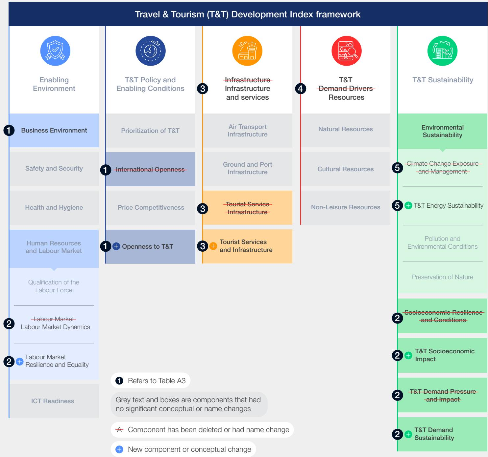

<table><tr><td>Adjustment 1</td><td>Reasoning:</td></tr><tr><td>The International Openness pillar was replaced by a new Openness to T&amp;T pillar. The financial and trade openness concepts that were covered under the previous International Openness pillar are now covered by the Business Environment pillar.</td><td>- Concepts such as financial and trade openness are important for T&amp;T development but are more related to the general business environment of an economy.- The new Openness to T&amp;T pillar is now able to measure policies that facilitate cross-border travel and connectivity (e.g. visa requirement and air service agreements), but also a destination&#x27;s reputation for hospitality.</td></tr><tr><td>Adjustment 2</td><td>Reasoning:</td></tr><tr><td>The Socioeconomic Resilience and Conditions pillar was replaced by the T&amp;T Socioeconomic Impact pillar, which includes, among other concepts, a measurement of how GDP from T&amp;T has secondary effects on the economy (e.g. GDP multiplier). Labour-related indicators formerly covered by the latter are now integrated into a new Labour Market Resilience and Equality subpillar, which is part of the Human Resources and Labour Market pillar.The more general socioeconomic concepts covered by the former Socioeconomic Resilience and Conditions pillar such as equal workforce opportunity, workers&#x27; rights and social safety nets have been moved to the new Labour Market Resilience and Equality subpillar.To better reflect measured concepts, the name of the T&amp;T Demand Pressure and Impact pillar has been changed to T&amp;T Demand Sustainability and the name of the Labour Market subpillar has been changed to Labour Market Dynamics.</td><td>- The new T&amp;T Socioeconomic Impact pillar takes advantage of newly available T&amp;T socioeconomic data that allows the socioeconomic impact of tourism to be measured more directly in areas such as gender parity and wages. This new pillar is also able to better differentiate between tourist flows and the impact of tourism on the economy and society.- Indicators from the former Socioeconomic Resilience and Conditions pillar have been moved to better distinguish concepts measuring factors directly linked to T&amp;T development from general concepts that influence T&amp;T development indirectly such as labour market characteristics.- The name change of the T&amp;T Demand Pressure and Impact pillar is designed to make it more representative of its underlying concepts, especially as the GDP multiplier indicators was moved into the new Socioeconomic Impact pillar.</td></tr><tr><td>Adjustment 3</td><td>Reasoning:</td></tr><tr><td>The name of the Infrastructure dimension was changed to Infrastructure and Services, while the Tourist Service Infrastructure pillar was changed to Tourist Services and Infrastructure.</td><td>- The new names reflects the combination of hard tourism infrastructure (e.g. number of hotel rooms) with factors such as industry productivity and investment, which are fundamental components of service quality and output.</td></tr><tr><td>Adjustment 4</td><td>Reasoning:</td></tr><tr><td>The name of the T&amp;T Demand Drivers dimension was changed to T&amp;T Resources.</td><td>- The new dimension name better reflects the underlying concepts, which focus on T&amp;T resources specifically rather than demand drivers, and which can refer to factors beyond the natural, cultural and non-leisure capital.</td></tr><tr><td>Adjustment 5</td><td>Reasoning:</td></tr><tr><td>The Environmental Sustainability&#x27;s Climate Change Exposure and Management subpillar has been replaced by a new T&amp;T Energy Sustainability subpillar, which includes newly available data.</td><td>- The new T&amp;T Energy Sustainability subpillar takes advantage of new data on direct T&amp;T emissions and energy efficiency.</td></tr></table>

# Appendix B: Data definitions and sources

This section complements the data tables by providing full descriptions and sources of all of the indicators used for the calculations in the Travel & Tourism Development Index (TTDI) 2024.

The data used in this publication includes data derived from the World Economic Forum's Executive Opinion Survey as well as statistical data from other organizations. In the case of indicators derived from the Executive Opinion Survey (the Survey), the full question and associated answers are provided. For more details on Survey indicators, please email partner.institutes@weforum.org.

Moreover, you can find information on Partner Institutes that carried out the survey in Appendix D.

For indicators sourced from other organizations or national sources, because of space limitations it is not possible to reproduce in this publication all of the additional information associated with specific data points. The data used in the computation of the TTDI 2024 represents the most recent and/or best data available at the time when it was collected. It is possible that data has subsequently been updated or revised.

## Pillar 1: Business Environment

## 1.01 Rule of Law

Score for index assessing rule of law conditions based on property rights, judicial effectiveness and government integrity | 2023

The rule of law dimension of the Index of Economic Freedom is a mean of the property rights, judicial effectiveness and government integrity components. The property rights component is derived by averaging scores for equally weighted subfactors: risk of expropriation, respect for intellectual property rights, and quality of contract enforcement, property rights and law enforcement. The score for the judicial effectiveness component is derived by averaging scores for equally weighted subfactors: judicial independence; quality of the judicial process; and perceptions of the quality of public services and the independence of the civil service. The score for the government integrity component is derived by averaging scores for equally weighted subfactors: perception of corruption, bribery risk, and control of corruption including “capture” of the state by elites and private interests. For information on the methodology of the Index of Economic Freedom, please visit: https://www.heritage.org/index.

Source: The Heritage Foundation, 2023 Index of Economic Freedom

## 1.02 Burden of government regulation

Response to the survey question: “In your country, how easy is it for companies to comply with government regulation and administrative requirements (e.g. permits, reporting, legislation)?” [1 = Extremely complex; 7 = Extremely easy] | 2022–2023 weighted average

Source: World Economic Forum, Executive Opinion Survey

## 1.03 Government ensuring political stability

Response to the survey question: “In your country, to what extent does the government ensure a stable policy environment for doing business?” [1 = Not at all; 7 = To a great extent] | 2022–2023 weighted average

Source: World Economic Forum, Executive Opinion Survey

## 1.04 Country credit rating

Average of scores across the rating of the four top rating agencies (S&P, Moody's, Fitch and DBRS) | 2023

Scoring the creditworthiness of a country between 100 (riskless) and 0 (likely to default), assigned according to Trading Economics' methodology and based on Standard & Poor, Moody's and DBRS sovereign debt credit rating. For information on the methodology, please visit: https://tradingeconomics.com/country-list/rating.

Source: Trading Economics

## 1.05 De-jure financial globalization

Composite index that measures “de jure” financial globalization by considering investment restriction, capital accounts openness and international investment agreements | 2021

The index is part of the KOF Globalisation Index and consists of: 1) investment restriction as measured by the prevalence of foreign ownership and regulations to international capital flow; 2) capital account openness as measured by the Chinn-Ito Index of capital account openness; and 3) international investment agreements as measured by the number of bilateral investment agreements (BITs) and treaties with investment provisions. For information on the methodology, please visit: https://kof.ethz.ch/en/forecasts-and-indicators/indicators/kof-globalisation-index.html.

Source: KOF Swiss Economic Institute, KOF Globalisation Index 2023

## 1.06 De-jure trade globalization

Composite index that measures “de jure” trade globalization by considering trade regulations, trade taxes, tariffs and trade agreements | 2021

The index is part of the KOF Globalisation Index and consists of: 1) trade regulations as measured by the average of two subcomponents: prevalence of non-tariff trade barriers and compliance costs of importing and exporting; 2) trade taxes as measured by income from taxes on international trade as percentage of revenue (inverted); 3) tariffs as measured by the unweighted mean of tariff rates; and 4) trade agreements as measured by the number of bilateral and multilateral free trade agreements. For information on the methodology, please visit: https://kof.ethz.ch/en/forecasts-and-indicators/indicators/kof-globalisation-index.html.

Source: KOF Swiss Economic Institute, KOF Globalisation Index 2023

## 1.07 SME access to finance

Response to the survey question: "In your country, to what extent can small and medium-sized enterprises (SMEs) access the finance they need for their business operations through the financial sector?" [1 = Not at all; 7 = To a great extent] | 2022–2023 weighted average

Source: World Economic Forum, Executive Opinion Survey

## Pillar 2: Safety and Security

## 2.01 Confidence in local police

Legatum Prosperity Index score based on percentage of people who responded “Yes” to the Gallup question: “Do you have confidence in the local police force?” | 2023

Source: 2023 Legatum Prosperity Index

## 2.02 Safety walking alone at night

Legatum Prosperity Index score based on percentage of people who responded “Yes” to the Gallup question: Do you feel safe walking alone at night in the city or area where you live? | 2023

Source: 2023 Legatum Prosperity Index

## 2.03 Homicide rate

Number of homicide cases per 100,000 population | 2021 or most recent

The United Nations Office on Drugs and Crime (UNODC) collects statistics on homicide occurrences worldwide, pooling information from national sources as well as other international institutions such as Interpol, Eurostat, the Organization of American States, the United Nations Children's Fund (UNICEF) and the World Health Organization (WHO).

Source: United Nations Office on Drugs and Crime (UNODC)

## 2.04 Global Terrorism Index

A composite measure of the impact of terrorism, on a scale of 0–10 | 2022

The Global Terrorism Index (GTI) scores each country on a scale of 0–10, where 0 represents no impact from terrorism and 10 represents the highest measurable impact of terrorism. The factors used are the total number of terrorist incidents in a given year, total number of fatalities caused by terrorists in a given year, total number of injuries caused by terrorists in a given year and the total number of hostages caused by terrorists in a given year. Each of the factors is weighted between 0 and 3, and a five-year weighted average is applied in a bid to reflect the latent psychological effect of terrorist acts over time. Coverage for the 2023 edition of the index spans 2018–2022. For more information, please visit: https://www.visionofhumanity.org/maps/global-terrorism-index/#/.

Source: Institute for Economics & Peace, Global Terrorism Index 2023: Measuring the Impact of Terrorism

## 2.05 Organized violence, deaths

Number of organized violent incidents, deaths per 100,000 population | 2018 through 2022 moving average

A measure of deaths from state-based armed conflict, non-state conflict and one-sided violence. The categories are mutually exclusive and can be aggregated as “organized violence”. They also share the same intensity cut-off for inclusion – 25 fatalities in a calendar year. For more information, please see https://ucdp.uu.se/encyclopedia. The final figure is a World Economic Forum calculation of non-state deaths divided by total population.

Source: Uppsala Conflict Data Program; The World Bank, World Development Indicators

## Pillar 3: Health and Hygiene

## 3.01 Physician density

Physician density per 1,000 population | 2021

This indicator measures the number of physicians in the country per 1,000 population. Physicians include generalist and specialist medical practitioners.

Source: World Health Organization, Global Health Observatory

## 3.02 Use of basic sanitation

People using at least basic sanitation services as a percentage of total population | 2022

The percentage of people using at least basic sanitation services – that is, improved sanitation facilities that are not shared with other households. This indicator encompasses both people using basic sanitation services and those using safely managed sanitation services. Improved sanitation facilities include flush/pour flush to piped sewer systems, septic tanks or pit latrines and ventilated improved pit latrines, composting toilets or pit latrines with slabs.

Source: WHO/UNICEF Joint Monitoring Programme

## 3.03 Use of basic drinking water

People using at least basic drinking water services as a percentage of total population | 2022

The percentage of people using at least basic water services. This indicator encompasses both people using basic water services and those using safely managed water services. Basic drinking water services are defined as drinking water from an improved source, provided collection time is not more than 30 minutes for a round trip. Improved water sources include piped water, boreholes or tubewells, protected dug wells, protected springs and packaged or delivered water.

Source: WHO/UNICEF Joint Monitoring Programme

## 3.04 Hospital beds density

Number of hospital beds per 10,000 population | 2019

Hospital beds includes inpatient beds available in public, private, general and specialized hospitals and rehabilitation centres. In most cases, beds for both acute and chronic care are included.

Source: World Bank, World Development Indicators

## 3.05 Communicable disease incidence

Select communicable disease incidence rate per 100,000 population | 2019

The incidence rate represents the number of people with a condition within a given period – the affected population – in relation to the total population within which these cases have arisen (in the same period) – the target population. Communicable diseases covered by this indicator include HIV/AIDS and other sexually transmitted infections, lower respiratory infections and tuberculosis, neglected tropical diseases, malaria and other infectious diseases. Enteric infections and upper respiratory infections are excluded.

Source: Institute for Health Metrics and Evaluation, Global Burden of Disease Results Tool

## Pillar 4: Human Resources and Labour Market

Qualification of the Labour Force subpillar

## 4.01 Labour force with intermediate education

Share of labour force that has at least an intermediate education | 2022

Intermediate education comprises upper secondary or post-secondary non-tertiary education according to the International Standard Classification of Education 2011 (ISCED 2011).

Source: International Labour Organization

## 4.02 Labour force with advanced education

Share of labour force that has an advanced education | 2022

Advanced education comprises short-cycle tertiary education, a bachelor's degree or equivalent education level, a master's degree or equivalent education level, or doctoral degree or equivalent education level according to the International Standard Classification of Education 2011 (ISCED 2011).

Source: International Labour Organization

## 4.03 Quality of secondary education

Response to the survey question: “In your country, how well does secondary non-vocational education meet the needs of a competitive economy?” [1 = Not at all; 7 = To a great extent] | 2022–2023 weighted average

Source: World Economic Forum, Executive Opinion Survey

## 4.04 Quality of tertiary education

Response to the survey question: “In your country, how well do parts of the education system meet the needs of a competitive economy: Tertiary education?” [1 = Not at all; 7 = To a great extent] | 2022–2023 weighted average

Source: World Economic Forum, Executive Opinion Survey

## Labour Market Dynamics subpillar

## 4.05 Hiring and firing practices

Response to the survey question: “In your country, to what extent do regulations allow flexible hiring and firing of workers?” [1 = Not at all; 7 = To a great extent] | 2022–2023 weighted average

Source: World Economic Forum, Executive Opinion Survey

## 4.06 Ease of finding skilled employees in local labour market

Response to the survey question: “In your country, to what extent can companies find people with the skills required to fill their vacancies: In the local labour market?” [1 = Not at all; 7 = To a great extent] | 2022–2023 weighted average

Source: World Economic Forum, Executive Opinion Survey

## 4.07 Flexible working arrangements

Response to the survey question: “In your country, to what extent do companies offer flexible working arrangements such as remote and part-time work?” [1 = Not at all; 7 = To a great extent] | 2022–2023 weighted average

Source: World Economic Forum, Executive Opinion Survey

## 4.08 Labour force participation

Proportion of the population aged 15 and older that is economically active | 2022

Labour force participation rate is the proportion of the population aged 15 and older that is economically active: that is, all people who supply labour for the production of goods and services during a specified period.

Source: World Bank, World Development Indicators

## Labour Market Resilience and Equality subpillar

## 4.09 Equal workforce opportunities

Average score across the four components of the following Executive Opinion Survey question: "In your country, to what extent do companies give equal workforce opportunities to: a. Women; b. All ethnic or racial backgrounds; c. Those with disabilities; d. Those who identify as LGBTQI+?" [1 = Not at all; 7 = To a great extent] | 2022–2023 weighted average

Source: World Economic Forum, Executive Opinion Survey

## 4.10 Workers' rights

The ITUC Global Rights Index measures countries on a scale from 1–5+ based on the degree of respect for workers' rights, with 1 being the best rating and 5+ the worst rating | 2023

Each country is analysed against a list of 97 indicators derived from ILO conventions and jurisprudence and represents violations of workers' rights in law and practice. Values correspond to the following conditions: 5+ means no guarantee of rights due to the breakdown of the rule of law, 5 means no guarantee of rights, 4 means systematic violations of rights, 3 means regular violations of rights, 2 means repeated violations of rights and 1 means sporadic violations of rights. For more information on the methodology, please visit: https://www.globalrightsindex.org/en/2023/methodology.

## 4.11 Female labour force participation

Ratio of female to male labour force participation rate | 2022

Labour force participation rate is the proportion of the population ages 15 and older that is economically active: it covers all people who supply labour for the production of goods and services during a specified period. The ratio of female to male labour force participation rate is calculated by dividing the female labour force participation rate by the male labour force participation rate and multiplying by 100.

Source: World Bank, World Development Indicators

## 4.12 Social protection basic coverage

Proportion of population covered by at least one social protection benefit | 2020

This indicator conveys the share of the population effectively covered by a social protection system, including social protection floors. It also provides the coverage rates of the main components of social protection: child and maternity benefits, support for people without a job, people with disabilities, victims of work injuries and older people.

Source: International Labour Organization, ILOSTAT database

## 4.13 Social protection spending

Government expenditure on social security and welfare as a percentage of GDP | 2022

This indicator refers to all non-repayable payments by general government, whether capital or current, requited or not. General government expenditure on social security and welfare includes: sickness and disability, old age, survivors, family and children, unemployment, housing, social exclusion, R&D on social protection, social protection n.e.c.

Source: Euromonitor International

## Pillar 5: ICT Readiness

## 5.01 Individuals using internet

Percentage of individuals using the internet | 2021

Internet users refers to people using the internet from any device (including mobile phones) in the past 12 months. Data is based on surveys generally carried out by national statistical offices or estimated based on the number of internet subscriptions.

Source: International Telecommunication Union, World Telecommunication Indicators

## 5.02 Broadband internet subscribers

Fixed broadband internet subscriptions per 100 population | 2022

This refers to total fixed (wired) broadband internet subscriptions (that is, subscriptions to high-speed access to the public internet – a TCP/IP connection – at downstream speeds equal to or greater than 256 kb/s).

Source: International Telecommunication Union, World Telecommunication Indicators

## 5.03 Mobile broadband subscribers

Mobile broadband subscriptions per 100 population | 2022

Active mobile-broadband subscriptions per 100 inhabitants.

Source: International Telecommunication Union, World Telecommunication Indicators

## 5.04 3G mobile network coverage

Percentage of total population covered by at least a 3G mobile network signal | 2022

Percentage of the population covered by at least a 3G mobile network refers to the percentage of inhabitants who are within range of at least a 3G mobile-cellular signal, irrespective of whether or not they are subscribers. This is calculated by dividing the number of inhabitants that are covered by at least a 3G mobile-cellular signal by the total population and multiplying by 100.

Source: International Telecommunication Union, World Telecommunication Indicators

## 5.05 Use of digital payments

Share of population 15 or older who made or received a digital payment | 2021

Digital payment includes the use of mobile money, a debit or credit card, or a mobile phone to make a payment from an account, or the use of the internet to pay bills or to buy something online or in a store, or to pay bills or sent or receive remittances directly from or into a financial institution account or through a mobile money account in the past year. It also includes receiving payments for agricultural products, government transfers, wages or a public-sector pension into a financial institution account or through a mobile money account in the past year.

Source: The World Bank, Findex

## 5.06 Use of digital platforms for providing transportation and shipping

Response to the survey question: “In your country, to what extent are digital platforms\* used to provide the following service: Transportation and shipping?”

[1 = Not at all; 7 = To a great extent] \*Digital platforms refer to services and labour markets available through a digital interface, often focused on short-term contracts and task-based work.| 2022–2023 weighted average

Source: World Economic Forum, Executive Opinion Survey

## 5.07 Use of digital platform for providing hotels, restaurants and leisure activities services

Response to the survey question: “In your country, to what extent are digital platforms\* used to provide the following service: Hotels, restaurants and leisure activities services?” [1 = Not at all; 7 = To a great extent] \*Digital platforms refer to services and labour markets available through a digital interface, often focused on short-term contracts and task-based work. | 2022–2023 weighted average

Source: World Economic Forum, Executive Opinion Survey

## 5.08 Power losses

Electric power transmission and distribution losses as a percentage of domestic supply | 2021

“Electric power transmission and distribution losses” are losses in transmission between sources of supply and points of distribution and in the distribution to consumers, including pilferage.

Source: International Energy Agency, Energy Data Center

## Pillar 6: Prioritization of T&T

## 6.01 T&T government expenditure

Travel and tourism government expenditure as a percentage of total government budget | 2022

This indicator includes expenditures (transfers or subsidies) made by government agencies to provide T&T services such as cultural (e.g. art museums), recreational (e.g. national parks), clearance (e.g. immigration/customs) and so on to visitors.

Source: World Travel & Tourism Council, Travel & Tourism Economic Impact Research 2023: https://researchhub.wttc.org/

## 6.02 Comprehensiveness of T&T data

Number of data available (0 = no data, 120 = all selected indicators are available) | 2018–2021

This indicator shows how much of the yearly data provided by national administrations on 30 different concepts from the UNWTO Compendium of Tourism Statistics is available. It covers 2018 through to 2021. The scores range from a minimum of 0 to a maximum of 120, where 120 can be obtained by a country providing data for all 30 concepts in all of the four years taken into consideration.

Source: United Nations World Tourism Organization (UN Tourism)

## 6.03 Timeliness of T&T data

Number of latest data available (0 = no data, 22.5 = data reported for all the periods considered) | 2021–2022

This indicator shows the availability of two key T&T indicators (international tourist arrivals and tourism receipts) on a monthly or quarterly basis, covering the period from October 2021 to December 2022. The UNWTO has calculated the score of each country based on the data included in the latest available UNWTO World Tourism Barometer by adding the number of months for which data on the international tourist arrivals is available to the number of months for which data on international tourism receipts is available. Half weight has been applied to the lower of the two scores, so the scores range from a minimum of 0 to a maximum of 22.5 (the maximum number of period counts a country can get is 14 for one measure and 7 for the other).

Source: United Nations World Tourism Organization (UN Tourism)

## 6.04 Country Brand Strategy rating

This indicator evaluates the accuracy of a National Tourism Organization's (NTO) Country Brand Strategy | 2020, 2023 moving average

The Country Brand Strategy (CBS ©) rating evaluates the accuracy of a National Tourism Organization (NTO)'s Country Brand strategy. It measures the Country Branding accuracy by means of a formula that compares the most popular brandtags (as measured by D2 Digital Demand © software) for a specific country to the brandtags most heavily promoted by that country's NTO. A country receives a higher rating if the respective NTO focuses its promotion in the most strategic tourism-related brandtags with the highest demand. A poor rating can suggest either the inappropriate promotion of the least popular brandtags (as measured by online search volume) by an NTO or the lack of focus on the brandtags in highest demand.

NOTE: Exceptions may apply in the case of a country that has recently begun a new Country Brand Strategy for tourism to highlight lesser-known brandtags in the hope of finding new markets. In this case, a lower rating simply implies that the result of this new strategic positioning has yet to make its impact.

Source: Bloom Consulting and D2 Digital Demand © data, market leader search engines across the world (mobile and desktop)

## Pillar 7: Openness to T&T

## 7.01 Visa requirements

Visa requirements for entry in the destination country for a tourism visit of a limited duration from worldwide source markets (100 = no visa required for visitors from all source markets, 0 = traditional visa required for visitors from every source market) | 2023

This indicator measures to what extent a destination country is facilitating inbound tourism through its visa policy, distinguishing whether the country can be visited without a visa, a visa can be obtained on arrival or an electronic visa is available. It is calculated as a percentage of the world population that is exempt from a visa or is eligible for a visa on arrival or an electronic visa when visiting the destination country, where: 1) the population of source markets that can visit the destination country without a visa is fully counted (i.e. weight 1); 2) the population of source markets that can obtain a visa on arrival when entering the destination country is weighted by 0.7; and 3) the population of source markets that can use an electronic visa is weighted by 0.5. The indicator is consistent with the UNWTO Visa Openness Report 2015, which can be downloaded from https://www.e-unwto.org/doi/book/10.18111/9789284417384.

Source: United Nations World Tourism Organization (UN Tourism)

## 7.02 Number of air service agreements

Number of air service agreements weighted by level of liberalization | 2023

This indicator measures the number of air service agreements (ASAs) to which an economy is party, weighted by level of liberalization. Traditional agreements receive a weight of 0.5, transitional agreements receive 0.75 and fully liberalized agreements receive 1.0. Please note that all European Union member states are treated as if they have a fully liberalized agreement with fellow members, with bilateral agreements between European Union member states not counted. The same methodology goes for economies covered by the European Common Aviation Area, the Euro-Mediterranean Aviation Agreement, the EU-US Open Skies Agreement, the EU-Canada Comprehensive Air Transport Agreement and the ASEAN Open Sky Agreement. Data and classification come from ICAO's WASA database, which can be accessed at: https://www.icao.int/sustainability/Pages/WASA.aspx.

Source: International Civil Aviation Organization (ICAO), WASA Database

## 7.03 Reputation for hospitality

Travelsat Hospitality Reputation Index | September 2022 to September 2023

The Travelsat Reputation Index for locals' hospitality quantifies the sentiment polarity in online discussions about the friendliness and hospitality of local residents towards visitors, across various platforms such as media, blogs and social networks. It generates a score reflecting the overall positivity or negativity in these conversations, influenced by a wide range of factors including sustainability, economic, environmental and sociopolitical issues that can affect the perceived hospitality of a destination's community.

Source: Travelsat, MMGY TCI Research

## 7.04 Passport mobility score

Score for visa-free access for a country's passport to travel destinations as measured by the Henley Passport Index | 2023

For each travel destination, if no visa is required for passport holders from a country or territory, then a score with value = 1 is created for that passport. A score with value = 1 is also applied if passport holders can obtain a visa on arrival, a visitor's permit or an electronic travel authority (ETA) when entering the destination. These types of visa require no pre-departure government approval because of the specific visa-waiver programmes in place.

Where a visa is required, or where a passport holder has to obtain a government-approved electronic visa (e-Visa) before departure, a score with value = 0 is assigned. A score with value = 0 is also assigned if passport holders need pre-departure government approval for a visa on arrival, a scenario that is not considered “visa-free”.

The total score for each passport is equal to the number of destinations for which no visa is required (value = 1), under the conditions defined above.

Source: Henley & Partners Holdings

## Pillar 8: Price Competitiveness

## 8.01 Hotel price index

Average room rates calculated for midscale to upper upscale hotels (US\$) | 12-month average through to July 2023

This index measures the average price, in US dollars, of midscale to upper-upscale hotel accommodation in each country. The index is calculated by using the average room rate achieved by midscale to upper-upscale hotels in each country over a 12-month period from July 2022 through July 2023, to mitigate the impact of any seasonality fluctuations.

Source: CoStar

## 8.02 Purchasing power parity

Ratio of purchasing power parity (PPP) conversion factor to the official exchange rate | 2021

The World Bank defines the purchasing power parity (PPP) conversion factor as the number of units of a country's currency required to buy the same amount of goods and services in the domestic market as a US dollar would buy in the United States. Official exchange rate refers to the exchange rate determined by national authorities or to the rate determined in the legally sanctioned exchange market. It is calculated as an annual average based on monthly averages (local currency units relative to the US dollar). The variable shown is the PPP conversion factor to market exchange rate ratio as reported by the World Bank's World Development Indicator database.

Source: The World Bank, World Development Indicators

## 8.03 Fuel price levels

Retail gasoline (petrol) prices expressed as US dollars per litre | 2021

This indicator refers to the annual average of pump prices of octane-95 gasoline (petrol).

Source: Globalpertrolprices.com

## 8.04 Short-term rental price

Average daily rate for active properties on Airbnb and similar platforms | 12-month average

Source: AirDNA

## Pillar 9: Air Transport Infrastructure

## 9.01 Efficiency of air transport services

Response to the survey question: “In your country, how efficient (in terms of frequency, punctuality, speed and price) are the following transport services: Air transport services?” [1 = Extremely inefficient – among the worst in the world; 7 = Extremely efficient – among the best in the world] | 2022–2023 weighted average

Source: World Economic Forum, Executive Opinion Survey

## 9.02 Available seat kilometres

Domestic and international seat kilometres originating in country per week (year average) per population | 2022

This indicator measures an airline's passenger-carrying capacity. It is composed of the number of seats available on each flight multiplied by the flight distance in kilometres. The final value represents the weekly average for the year (Jan–Dec), taking into account flights scheduled beforehand by airline companies divided by country population.

Source: International Air Transport Association (IATA), OAG data; World Bank, World Development Indicators

## 9.03 Number of operating airlines

Number of airlines with scheduled passenger flights originating in the country | 2022

Source: International Air Transport Association (IATA), OAG data

## 9.04 Airport connectivity

This represents the IATA airport connectivity indicator, which measures the degree of integration of a country within the global air transport network | 2022

Source: International Air Transport Association (IATA), OAG data

## Pillar 10 Ground and Port Infrastructure

## 10.01 Quality of roads

Response to the survey question: “In your country, how is the quality (extensiveness and condition) of road infrastructure?” [1 = Extremely poor – among the worst in the world; 7 = Extremely good – among the best in the world] | 2022–2023 weighted average

Source: World Economic Forum, Executive Opinion Survey

## 10.02 Road density

Kilometres of road per 100 square kilometres of land | 2022

Road density is the ratio of the length of the country's total road network to the country's land area. The road network includes all motorways, highways and main or national roads, secondary or regional roads, and all other roads.

Source: Euromonitor International

## 10.03 Efficiency of train services

Response to the survey question: “In your country, how efficient (in terms of frequency, punctuality, speed, price) are the following transport services: Train services (if applicable)?” [1 = Extremely inefficient – among the worst in the world; 7 = Extremely efficient – among the best in the world] | 2022–2023 weighted average

Source: World Economic Forum, Executive Opinion Survey

## 10.04 Railroad density

Kilometres of railroad per 100 square kilometres of land| 2022

Railroad density is the ratio of the length of the country's total railroad network to the country's land area. Rail lines are the length of railway route available for train service, irrespective of the number of parallel tracks.

Source: Euromonitor International

## 10.05 Efficiency of public transport services

Response to the survey question: “In your country, how efficient (in terms of frequency, punctuality, speed, price) are the following transport services: Public transport (e.g. buses, trains, subways, electric bikes and taxis)?” [1 = Extremely inefficient – among the worst in the world; 7 = Extremely efficient – among the best in the world] | 2022–2023 weighted average

Source: World Economic Forum, Executive Opinion Survey

## 10.06 Efficiency of seaport services

Response to the survey question: "In your country, how efficient (in terms of frequency, punctuality,

speed, price) are the following transport services: Seaport services (ferries, boats)?” [1 = Extremely inefficient – among the worst in the world; 7 = Extremely efficient – among the best in the world] | 2021–2022 weighted average

Source: World Economic Forum, Executive Opinion Survey

## Pillar 11: Tourist Services and Infrastructure

## 11.01 Hotel rooms density

Number of hotel rooms per 100 population | 2021

Source: United Nations World Tourism Organization (UN Tourism); The World Bank, World Development Indicators

## 11.02 Short-term rental listing density

Number of active properties on Airbnb and similar platforms per 10,000 people | 12-month average ending in June 2023

Source: AirDNA; The World Bank, World Development Indicators

## 11.03 Labour productivity in hotels and restaurants

Sector output (gross value added) divided by employed population in constant 2020 PPP \$ | 2020, 2021, 2022 moving average

This indicator category corresponds to division H of the International Standard Classification of all Economic Activities (ISIC Rev 3.1) and includes: hotels and restaurants.

Source: Euromonitor International

## 11.04 T&T capital investment intensity

Travel and tourism capital investment per sector employee | 2021, 2022 average

This indicator includes government sector investment expenditure (e.g. equipment, land, buildings, infrastructure) and private-sector investment expenditures (e.g. hotels, convention centres, airports, taxis).

Source: World Travel & Tourism Council, Travel & Tourism Economic Impact Research 2023: https://researchhub.wttc.org/

## Pillar 12: Natural Resources

## 12.01 Number of World Heritage natural sites

Number of World Heritage natural sites in the country | 2023

World Heritage natural sites are those properties that the World Heritage Committee considers to have outstanding universal value.

Source: UNESCO World Heritage Centre

## 12.02 Total known species

Number of animal, plant, fungus and chromista species in the country | 2022

This indicator measures the total number of animal, plant, fungus and chromista species assessed by the IUCN and listed on its Red List.

Source: International Union for Conservation of Nature and Natural Resources (IUCN), Red List

## 12.03 Total protected areas

Total square kilometres of terrestrial and marine areas under protection | 2023

Based on the IUCN's definition, a protected area is a clearly defined geographical space, recognized, dedicated and managed, through legal or other effective means, to achieve the long-term conservation of nature with associated ecosystem services and cultural values. Protected areas include nature reserves, wilderness areas, national parks, natural monuments, habitat/species management, protected landscape/seascape and managed resource protected area. The data undergoes a logarithmic transformation before being scaled from 1 to 7. For more information on protected areas and the associated methodology, please see: https://www.protectedplanet.net/en/thematic-areas/wdpa?tab=Methodology.

Source: UNEP-WCMC, World Database of Protected Areas

## 12.04 Natural tourism Digital Demand

This indicator measures the total online search volume related to the following nature-related brand tags: Beach Accommodation, Beaches, Gardens, Natural Wonders, Parks and Reserves, Camping, Golf Accommodation, Rural Accommodation, Ski Accommodation, Diving, Golf, Water Sports, Winter Sports, Adventure and Outdoor, Animal Watching, Boating, Fishing, Hunting and Hiking | 2020, 2021, 2022 moving average

The calculation is based on the proprietary D2 Digital Demand © tool, which assesses the attractiveness of each country by analysing online tourism-related search data across the relevant brandtags, each comprising destination-specific keywords correlated to tourist activities and attractions. A total of 15,721,000 keywords were analysed across 199 countries and territories, in twenty-one languages: Arabic, Chinese (Mandarin), German, Danish, Estonian, English, Spanish, Finnish, French, Italian, Japanese, Korean, Lithuanian, Dutch, Norwegian, Polish, Portuguese, Russian, Swedish, Turkish and Vietnamese.

Source: Bloom Consulting and D2 Digital Demand © data, market leader search engines across the world (mobile and desktop)

## 12.05 Number of terrestrial and freshwater ecoregions

Number of terrestrial and freshwater ecoregions | 2021

The World Wide Fund for Nature (WWF) defines an ecoregion as a “large unit of land or water containing a geographically distinct assemblage of species, natural communities, and environmental conditions”. This includes terrestrial, marine and freshwater ecoregions.

Source: One Earth; Freshwater Ecoregions of the World (FEOW)

## Pillar 13 : Cultural Resources

## 13.01 Number of World Heritage cultural sites

Number of World Heritage cultural sites in the country | 2023

World Heritage cultural sites are those properties that the World Heritage Committee considers as having outstanding universal value.

Source: UNESCO World Heritage Centre

## 13.02 Oral and intangible cultural heritage

Number of oral and intangible heritage practices and expressions | 2023

Intangible cultural heritage practices are those practices, representations, expressions, knowledge and skills – as well as the instruments, objects, artefacts and cultural spaces associated therewith – that communities, groups and, in some cases, individuals recognize as part of their cultural heritage. This intangible cultural heritage, transmitted from generation to generation, is constantly recreated by communities and groups in response to their environment and their interaction with nature and their history, and provides them with a sense of identity and continuity, thus promoting respect for cultural diversity and human creativity. The Intergovernmental Committee for the Safeguarding of the Intangible Cultural Heritage evaluates annually nominations proposed by States Parties to the Convention for the Safeguarding of the Intangible Cultural Heritage and decides whether or not to inscribe those cultural practices and expressions of intangible heritage on the Convention’s Lists.

Source: UNESCO Intangible Cultural Heritage

## 13.03 Number of large sports stadiums

Total number of sports stadiums in a country with a capacity greater than 20,000 seats | 2023

The count of stadiums with a capacity greater than 20,000 seats is a proxy for the ability of a country to host significant sports or entertainment events (e.g. concerts, shows).

Source: Worldofstadiums.com

## 13.04 Cultural and entertainment tourism Digital Demand

This indicator measures the total online search volume related to the following culture and entertainment-related brandtags: Gastro Activities, Restaurants, Local Gastronomy, Historical Sites, Museums, UNESCO, History, Local Dances, Local People and Tribes, Local Traditions, Traditional Markets, Religious Sites and Pilgrimage, Performing Arts, Urban Landmarks, Aquariums, Entertainment Parks, Gambling, Nightlife, Shopping, Special Events and Zoos | 2020, 2021, 2022 moving average

The calculation is based on the proprietary D2 Digital Demand © tool, which assesses the attractiveness of each country by analysing online tourism-related search data across the relevant brandtags, each comprising destination-specific keywords correlated to tourist activities and attractions. A total of 18,308,000 keywords were analysed across 199 countries and territories, in twenty-one languages: Arabic, Chinese (Mandarin), German, Danish, Estonian, English, Spanish, Finnish, French, Italian, Japanese, Korean, Lithuanian, Dutch, Norwegian, Polish, Portuguese, Russian, Swedish, Turkish and Vietnamese.

Source: Bloom Consulting and D2 Digital Demand © data, market leader search engines across the world (mobile and desktop)

## 13.05 Number of UNESCO Creative Cities

Number of cities that are members of UNESCO's Creative Cities Network | 2021

The UNESCO Creative Cities Network (UCCN) was created in 2004 to promote cooperation with and among cities that have identified creativity as a strategic factor for sustainable urban development. Cities that currently make up this network work together towards a common objective: placing creativity and cultural industries at the heart of their development plans at the local level and cooperating actively at the international level. The network covers seven creative fields: crafts and folk arts, media arts, film, design, gastronomy, literature and music.

Source: UNESCO Creative Cities Network

## Pillar 14: Non-Leisure Resources

14.01 Presence of Forbes Global 2000 HQ locations

Ratio of the share of Forbes Global 2000 companies based in an economy to the economy's share of global GDP $|_{2}020$ , 2021, 2022 moving average

Forbes Global 2000 is a list of the 2,000 largest public companies in the world based on sales, profits, assets and market value. A company needs to qualify for at least one of the category lists to be eligible for the final Global 2000 ranking. For more information on the Global 2000 methodology, please visit: https://www.forbes.com/lists/global2000/#7d1c2b415ac0.

Source: Forbes, Global 2000; The World Bank, World Development Indicators

## 14.02 Presence of global cities

The indicators measure the presence of cities ranked by Globalization and World Cities Research Network (GaWC) | 2020

GaWC ranking results are derived from the activities of 175 leading firms providing advanced producer services (accountancy, advertising, banking/finance and law) across 707 cities worldwide, creating a ranking of 394 cities. The results should be interpreted as indicating the importance of cities as nodes in the world city network (i.e. enabling corporate globalization). The connectivity measures are used to classify cities into levels of world city network integration. Alpha-level cities are linked to major economic states and regions and into the world economy and are classified into four sections, Alpha++, Alpha+, Alpha and Alpha – cities. Beta-level cities are cities that link moderate economic regions to the world economy and are classified into three sections, Beta+, Beta and Beta – cities. Gamma-level cities are cities that link smaller economic regions into the world economy and are classified into three sections, Gamma+, Gamma and Gamma – cities. Sufficiency-level cities are cities that have a sufficient degree of services so as not to be overly dependent on world cities. This is sorted into High-Sufficiency cities and Sufficiency cities. For the purpose of calculating this indicator, each country's score is the sum of points of all of the ranked cities based in the economy, with points determined by city classification. A logarithmic transformation is applied to final point values.

Source: Globalization and World Cities (GaWC) Research Network

## 14.03 Number of top universities

Number of top 10,000 universities as ranked by Webometrics Ranking of World Universities| 2023

This indicator is the weighted average of all universities based on ranking tier. A university's rank is based on a composite index that looks at its web content impact, top-cited researchers and top-cited papers. Universities ranked 1–100 receive full weight, 101–500 receive 1/2 weight, 501–1,000 receive 1/4 weight, 1,001–5,000 receive 1/6 weight and 5,001–10,000 receive 1/16 weight. Institutions ranked 10,001 and above are not counted. Data undergoes a log transformation before being normalized. For more information on the ranking, please see https://www.webometrics.info/en/Methodology.

Source: Cybermetrics Lab, Consejo Superior de Investigaciones Científicas (CSIC)

## 14.04 Non-leisure tourism Digital Demand

This indicator measures the total online search volume related to business tourism, study and health tourism brandtags: Business, Entrepreneurship, Exchange Programmes and Financial Aid, Degrees and Courses, Voluntary and Medical Tourism | 2020, 2021, 2022 moving average.

The calculation is based on the proprietary D2 Digital Demand © software, which assesses the attractiveness of each country by analysing online tourism-related search data across the relevant brandtags, each comprising destination-specific keywords correlated to tourist activities and attractions. A total of 3,721,000 keywords were analysed across 199 countries and territories, in twenty-one languages: Arabic, Chinese (Mandarin), German, Danish, Estonian, English, Spanish, Finnish, French, Italian, Japanese, Korean, Lithuanian, Dutch, Norwegian, Polish, Portuguese, Russian, Swedish, Turkish and Vietnamese.

Source: Bloom Consulting and D2 Digital Demand © data, market leader search engines across the world (mobile and desktop)

## Pillar 15: Environment Sustainability

## T&T Energy Sustainability subpillar

## 15.01 T&T GHG intensity

GHG emissions in CO $_{2}$ e kg per US\$ of T&T GDP | 2021

GHG emissions include Scope 1, 2 and 3 plus international transport. Transport activity includes all modes of transport.

Source: World Travel & Tourism Council, Sustainable Tourism Global Center initiated by the Ministry of Tourism of Saudi Arabia, 2023: https://researchhub.wttc.org/global-travel-footprint

## 15.02 T&T energy intensity

Megajoule of energy, per real USD of GDP | 2021

Energy sources include Scope 1, 2 and 3 plus international transport.

Source: World Travel & Tourism Council, Sustainable Tourism Global Center initiated by the Ministry of Tourism of Saudi Arabia, 2023: https://researchhub.wttc.org/global-travel-footprint

## 15.03 T&T use of low-carbon energy

Low carbon energy as a share of total energy usage in travel & tourism | 2021

Low-carbon energy is defined as renewable energy (wind, wave, solar and geothermal), plus hydro and nuclear.

Source: World Travel & Tourism Council, Sustainable Tourism Global Center initiated by the Ministry of Tourism of Saudi Arabia, 2023: https://researchhub.wttc.org/global-travel-footprint

## 15.04 Renewable energy regulation

The renewable energy pillar score of the RISE index, which gives a snapshot of a country's policies and regulations in the energy sector | 2021

The renewable energy pillar score is composed of indicators that assess: 1) legal frameworks for renewable energy; 2) planning for renewable energy; 3) incentives and regulatory support for renewable energy; 4) attributes of financial and regulatory incentives; 5) network connection and use; 6) country party risk; 7) carbon pricing and monitoring. For more information, please see https://rise.esmap.org/scoring-system.

Source: The World Bank/ESMAP, Regulatory Indicators for Sustainable Energy (RISE)

## 15.05 Energy efficiency regulation

The energy efficiency regulations pillar score of the RISE index, which gives a snapshot of a country's policies and regulations in the energy sector| 2021

The energy efficiency regulations pillar score is composed of indicators that assess: 1) national energy efficiency planning; 2) energy efficiency entities; 3) incentives and mandates for industrial and commercial end users; 4) incentives and mandates for the public sector; 5) incentives and mandates for energy utility programmes; 6) financial mechanisms for energy efficiency; 7) minimum energy efficiency performance standards; 8) energy labelling systems; 9) building energy codes; 10) transport sector; 11) carbon pricing and monitoring. For more information, please see https://rise.esmap.org/scoring-system.

Source: The World Bank/ESMAP, Regulatory Indicators for Sustainable Energy (RISE)

## Pollution and Environmental Conditions subpillar

## 15.06 Particulate matter (2.5) concentration

Population-weighted exposure to PM 2.5 (micrograms per cubic metre) | 2019

Fine-particle outdoor air pollution (PM 2.5) consists of airborne particles measuring less than 2.5 micrometres in aerodynamic diameter, most often produced as a result of combustion. PM 2.5 concentrations are measured in micrograms of particulate matter per cubic metre of air, or $\mu$ g/m $^{3}$ . To estimate PM 2.5 exposures for people living in a specific area, scientists combine the number of people living within that area and the PM 2.5 concentration to which they are exposed. This method produces a population-weighted annual average concentration for a given country or region. Population-weighted annual average concentrations are better estimates of population exposures, because they give proportionately greater weight to the air pollution experienced where most people live. For more information, please visit: https://www.stateofglobalair.org/data/estimate-exposure.

Source: Health Effects Institute, 2020, State of Global Air 2020, Boston MA

## 15.07 Level of water stress

Freshwater withdrawal as a proportion of available freshwater sources | 2020

Source: The World Bank, World Development Indicators

## 15.08 Red List Index

The Red List Index measures changes in aggregate extinction risk across groups of species | 2023

This indicator is based on genuine changes in the number of species in each category of extinction risk on the IUCN Red List of Threatened Species and is expressed as changes in an index ranging from 0 to 1, with 0 meaning all species have gone extinct and 1 meaning all species are classified as Least Concern (i.e. not expected to become extinct in the near future).

Source: United Nations Statistics Division (UNSD), Global SDG Indicators Database

## 15.09 Forest cover loss

Five-year moving average of annual tree cover loss to forest extent in 2000, in areas with greater or equal to 30% tree cover | 2018 through 2022 moving average

This indicator is calculated by taking the most recent five-year average of annual tree cover loss divided by forest extent in 2000. In this data set, “tree cover” is defined as all vegetation greater than 5 metres in height and may take the form of natural forests or plantations across a range of canopy densities. “Loss” indicates the removal or mortality of tree cover and can be due to a variety of factors, including mechanical harvesting, fire, disease or storm damage. For more information refer to: https://www.globalforestwatch.org/.

Source: Global Forest Watch

## 15.10 Proportion of safely treated domestic wastewater flows

Share of domestic wastewater that is safely treated | 2022

This indicator measures share of wastewater volumes (1,000 m $^{3}$ /day), generated through different activities, that are safely treated before being discharged into the environment. Domestic flows are those that are generated from private households.

Source: United Nations Department of Economic and Social Affairs, SDG Indicators Database

## 15.11 Clean ocean water

Ocean Health Index score for clean waters | 2023

This indicator measures the how free ocean regions are from contamination such as from chemicals, eutrophication, harmful algal blooms, disease

pathogens and trash. For more information, please see http://htmlpreview.github.io/?https://github.com/OHI-Science/ohi-global/published/documents/methods/Supplement.html#65\_clean\_waters.

Source: Global Ocean Health Index

## Preservation of Nature subpillar

## 15.12 Number of environmental treaty ratifications

Total number of ratified environmental treaties | 2023

This indicator measures the total number of international treaties from a set of 29 for which a state is a participant. A state is acknowledged as a participant whenever its status for each treaty appears as Ratified, Accession or In Force. The treaties included are: the International Convention for the Regulation of Whaling; the Convention on Wetlands of International Importance especially as Waterfowl Habitat, 1971 Ramsar; the Convention Concerning the Protection of the World Cultural and Natural Heritage, 1972 Paris; the Convention on the Prevention of Marine Pollution by Dumping of Wastes and Other Matter, 1972 London, Mexico City, Moscow, Washington; the Convention on International Trade in Endangered Species of Wild Fauna and Flora, 1973 Washington; the International Convention for the Prevention of Pollution from Ships (MARPOL) as modified by the Protocol of 1978, London; the Convention on the Conservation of Migratory Species of Wild Animals, 1979 Bonn; the United Nations Convention on the Law of the Sea, 1982 Montego Bay; the Convention on the Protection of the Ozone Layer, 1985 Vienna; the Protocol on Substances that Deplete the Ozone Layer, 1987 Montreal; the Convention on the Control of Transboundary Movements of Hazardous Wastes and their Disposal, 1989 Basel; the International Convention on Oil Pollution Preparedness, Response and Co-operation, 1990 London; the United Nations Framework Convention on Climate Change, 1992 New York; the Convention on Biological Diversity, 1992 Rio de Janeiro; the International Convention to Combat Desertification in Those Countries Experiencing Serious Drought and/or Desertification, particularly Africa, 1994 Paris; the Agreement relating to the Implementation of Part XI of the United Nations Convention on the Law of the Sea of 10 December 1982, 1994 New York; the Agreement relating to the Provisions of the United Nations Convention on the Law of the Sea relating to the Conservation and Management of Straddling Fish Stocks and Highly Migratory Fish Stocks, 1995 New York; the Kyoto Protocol to the United Nations Framework Convention on the Climate Change, Kyoto 1997; the Convention on the Law of the Non-navigational Uses of International Watercourses, 1997; the Rotterdam Convention on the Prior Informed Consent Procedure for Certain Hazardous Chemicals and Pesticides in International Trade, 1998 Rotterdam; the Cartagena Protocol of

Biosafety to the Convention on Biological Diversity, 2000 Montreal; the Protocol on Preparedness, Response and Co-operation to Pollution Incidents by Hazardous and Noxious Substances, 2000 London; the Stockholm Convention on Persistent Organic Pollutants, 2001 Stockholm; the International Treaty on Plant Genetic Resources for Food and Agriculture, 2001 Rome; the International Tropical Timber Agreement, 2006 Geneva; the Supplementary Protocol on Liability and Redress to the Cartagena Protocol on Biosafety, 2010 Nagoya – Kuala Lumpur; the Protocol on Access to Genetic Resources and their Fair and Equitable Sharing of Benefits Arising from Their Utilization to the Convention on Biological Diversity, Nagoya 2010; the Convention on Mercury, Minamata, 2013; and the Paris Agreement 2015.

Source: IUCN, Environmental Law Centre ELIS Treaty Database (received via direct communication)

## 15.13 Adequate protection for nature

Response to the survey question: “In your country to what extent are the following natural and social assets adequately protected: The environment and nature?” [1 = Not at all; 7 = To a great extent] | 2022–2023 weighted average

Source: World Economic Forum, Executive Opinion Survey

## 15.14 Total protected areas coverage

Total square kilometres of terrestrial and marine under protection as a share of the country's total area | 2023

Based on the IUCN, a protected area is a clearly defined geographical space, recognized, dedicated and managed, through legal or other effective means, to achieve the long-term conservation of nature with associated ecosystem services and cultural values. Protected areas include nature reserves, wilderness areas, national parks, natural monuments, habitat/species management, protected landscape/seascape and managed resource protected area.

Source: UNEP-WCMC, World Database of Protected Areas

## 15.15 Average proportion of all key biodiversity areas covered by protected areas

Mean percentage of each terrestrial/freshwater Key Biodiversity Area (KBA) covered by (i.e. overlapping with) protected areas and/or OECMs) | 2022

The indicator shows temporal trends in the mean percentage of each important site for terrestrial and freshwater biodiversity (i.e. those that contribute significantly to the global persistence of biodiversity) that is covered by designated protected areas and Other Effective area-based Conservation Measures (OECMs).

Source: BirdLife International, IUCN, and UNEP-WCMC

## Pillar 16 : T&T Socioeconomic Impact

## 16.01 T&T GDP multiplier

Ratio of indirect and induced tourism gross domestic product to direct travel and tourism gross domestic product contribution | 2020, 2021, 2022 moving average

Direct contribution reflects internal travel and tourism spending, which includes resident and non-resident spending on industry services. Total contribution reflects wider sector impact on an economy such as spending on supply-chain goods and consumer spending of sector and supplier employees.

Source: World Travel & Tourism Council, Travel & Tourism Economic Impact Research 2023: https://researchhub.wttc.org/

## 16.02 T&T employment multiplier

Ratio of indirect and induced tourism employment to direct travel and tourism employment contribution | 2020, 2021, 2022 moving average

Source: World Travel & Tourism Council, Travel & Tourism Economic Impact Research 2023: https://researchhub.wttc.org/

## 16.03 T&T high-wage jobs

Proportion of direct T&T jobs that are in high-wage sectors | 2021

High-wage sectors are defined as those in which average wages are roughly in the top third of earnings in a given country (above the 65th percentile).

Source: World Travel & Tourism Council, Sustainable Tourism Global Center initiated by the Ministry of Tourism of Saudi Arabia, 2023: https://researchhub.wttc.org/global-travel-footprint

## 16.04 T&T labour gender parity

Absolute difference between the male and female share of direct travel and tourism jobs | 2021

Source: World Travel & Tourism Council, Sustainable Tourism Global Center initiated by the Ministry of Tourism of Saudi Arabia, 2023: https://researchhub.wttc.org/global-travel-footprint

## Pillar 17: T&T Demand Sustainability

## 17.01 Inbound length of stay

Length of stay refers to the number of days spent in the destination country | 2020, 2021, 2022 moving average

Source: Euromonitor International

## 17.02 Seasonality of international tourist arrivals

Top three months' share of total yearly international tourist arrivals | 2021, 2022 moving average

International tourist arrivals are defined as tourists who travel to a country other than that in which they have their usual residence, but outside their usual environment, for a period not exceeding 12 months and whose main purpose in visiting is other than an activity remunerated from within the country visited.

Source: United Nations World Tourism Organization (UN Tourism)

## 17.03 Concentration of interest in cultural attractions

Share of an economy's total page views that its top $10\%$ of viewed cultural attractions received on Tripadvisor | 2021, 2022, 2023 year end August moving average

This indicator acts as a proxy for potential overcrowding at attractions. Cultural attractions include churches/ cathedrals, religious sites, historic walking areas, ancient ruins, educational sites, military bases/ facilities, missions, libraries, civic centres, mines, castles, government buildings, historic sites, cemeteries, battlefields, scenic/historic walking areas, neighbourhoods and ghost towns. Economies that have 10 or fewer attractions are excluded. Data is received by direct communication.

Source: Tripadvisor

## 17.04 Concentration of interest in nature attractions

Share of an economy's total page views that its top $10\%$ of viewed nature attractions received on Tripadvisor | 2021, 2022, 2023 year end August moving average

This indicator acts as a proxy for potential overcrowding at attractions. Nature and park attractions include nature/wildlife areas, islands, beaches, playgrounds, national parks, forests, dams, biking trails, waterfalls, off-road/all-terrain vehicle trails, hot springs/geysers, geologic formations, motorcycle trails, state parks, equestrian trails, volcanoes, bodies of water, parks, caverns/caves, gardens, valleys, mountains, zoos, ski/snowboarding areas, canyons, reefs, hiking trails, marinas, aquariums, deserts, other nature and parks. Economies that have 10 or fewer attractions are excluded. Data is received by direct communication.

Source: Tripadvisor

## 17.05 Geographically dispersed tourism

Response to the survey question: “In your country, to what extent are foreign visitors (tourists and business travellers) dispersed throughout the country?” [1 = Visitors are heavily concentrated in a few destinations; 7 = Visitors are equally distributed throughout the country] | 2022–2023 weighted average

Source: World Economic Forum; Executive Opinion Survey

# Appendix C: Income group and regional classifications

## Income group classifications, 2024

The following income group classifications were used for the index and report.

## TABLE C1

<table><tr><td>Low income(&lt; $1,135)</td></tr><tr><td>Malawi</td></tr><tr><td>Mali</td></tr><tr><td>Rwanda</td></tr><tr><td>Sierra Leone</td></tr></table>

## Per capita income classifications

<table><tr><td>Lower-middle income($1,136–$4,465)</td></tr><tr><td>Algeria</td></tr><tr><td>Angola</td></tr><tr><td>Bangladesh</td></tr><tr><td>Benin</td></tr><tr><td>Bolivia</td></tr><tr><td>Cambodia</td></tr><tr><td>Cameroon</td></tr><tr><td>Côte d’Ivoire</td></tr><tr><td>Egypt</td></tr><tr><td>Ghana</td></tr><tr><td>Honduras</td></tr><tr><td>India</td></tr><tr><td>Iran, Islamic Rep.</td></tr><tr><td>Jordan</td></tr><tr><td>Kenya</td></tr><tr><td>Kyrgyz Republic</td></tr><tr><td>Lao PDR</td></tr><tr><td>Mongolia</td></tr><tr><td>Morocco</td></tr><tr><td>Nepal</td></tr><tr><td>Nicaragua</td></tr><tr><td>Nigeria</td></tr><tr><td>Pakistan</td></tr><tr><td>Philippines</td></tr><tr><td>Senegal</td></tr><tr><td>Sri Lanka</td></tr><tr><td>Tajikistan</td></tr><tr><td>Tanzania</td></tr><tr><td>Tunisia</td></tr><tr><td>Uzbekistan</td></tr><tr><td>Venezuela*</td></tr><tr><td>Viet Nam</td></tr><tr><td>Zambia</td></tr><tr><td>Zimbabwe</td></tr></table>

<table><tr><td>Upper-middle income ($4,466–$13,845)</td></tr><tr><td>Albania</td></tr><tr><td>Argentina</td></tr><tr><td>Armenia</td></tr><tr><td>Azerbaijan</td></tr><tr><td>Bosnia and Herzegovina</td></tr><tr><td>Botswana</td></tr><tr><td>Brazil</td></tr><tr><td>Bulgaria</td></tr><tr><td>China</td></tr><tr><td>Colombia</td></tr><tr><td>Costa Rica</td></tr><tr><td>Dominican Republic</td></tr><tr><td>Ecuador</td></tr><tr><td>El Salvador</td></tr><tr><td>Georgia</td></tr><tr><td>Guatemala</td></tr><tr><td>Indonesia</td></tr><tr><td>Jamaica</td></tr><tr><td>Kazakhstan</td></tr><tr><td>Lebanon</td></tr><tr><td>Malaysia</td></tr><tr><td>Mauritius</td></tr><tr><td>Mexico</td></tr><tr><td>Moldova</td></tr><tr><td>Montenegro</td></tr><tr><td>Namibia</td></tr><tr><td>North Macedonia</td></tr><tr><td>Panama</td></tr><tr><td>Paraguay</td></tr><tr><td>Peru</td></tr><tr><td>Romania</td></tr><tr><td>Serbia</td></tr><tr><td>South Africa</td></tr><tr><td>Thailand</td></tr><tr><td>Türkiye</td></tr></table>

<table><tr><td>High income (&gt; $13,846)</td></tr><tr><td>Australia</td></tr><tr><td>Austria</td></tr><tr><td>Bahrain</td></tr><tr><td>Barbados</td></tr><tr><td>Belgium</td></tr><tr><td>Canada</td></tr><tr><td>Chile</td></tr><tr><td>Croatia</td></tr><tr><td>Cyprus</td></tr><tr><td>Czech Republic</td></tr><tr><td>Denmark</td></tr><tr><td>Estonia</td></tr><tr><td>Finland</td></tr><tr><td>France</td></tr><tr><td>Germany</td></tr><tr><td>Greece</td></tr><tr><td>Hungary</td></tr><tr><td>Iceland</td></tr><tr><td>Ireland</td></tr><tr><td>Israel</td></tr><tr><td>Italy</td></tr><tr><td>Japan</td></tr><tr><td>Korea, Rep.</td></tr><tr><td>Kuwait</td></tr><tr><td>Latvia</td></tr><tr><td>Lithuania</td></tr><tr><td>Luxembourg</td></tr><tr><td>Malta</td></tr><tr><td>Netherlands</td></tr><tr><td>New Zealand</td></tr><tr><td>Oman</td></tr><tr><td>Poland</td></tr><tr><td>Portugal</td></tr><tr><td>Qatar</td></tr><tr><td>Saudi Arabia</td></tr><tr><td>Singapore</td></tr><tr><td>Slovak Republic</td></tr><tr><td>Slovenia</td></tr><tr><td>Spain</td></tr><tr><td>Sweden</td></tr><tr><td>Switzerland</td></tr><tr><td>Trinidad and Tobago</td></tr><tr><td>United Arab Emirates</td></tr><tr><td>United Kingdom</td></tr><tr><td>United States</td></tr><tr><td>Uruguay</td></tr></table>

Note: Classification corresponds to the World Bank's income classification based on gross national income per capita, for fiscal year 2024.

\*According to the World Bank, Venezuela was temporarily unclassified in July 2021 pending release of revised national accounts statistics. However, for the purposes of the TTDI, the economy has been kept in the income group it has belonged to since 2019.

<table><tr><td>The Americas</td><td>Asia-Pacific (APAC)</td><td>Europe and Eurasia</td><td>Middle East and North Africa (MENA)</td><td>Sub-Saharan Africa</td></tr><tr><td>North and Central America</td><td>Eastern Asia-Pacific</td><td>Balkans and Eastern Europe</td><td>Middle East</td><td>Eastern Africa</td></tr><tr><td>Barbados</td><td>Australia</td><td>Albania</td><td>Bahrain</td><td>Kenya</td></tr><tr><td>Canada</td><td>China</td><td>Bosnia and Herzegovina</td><td>Iran, Islamic Rep.</td><td>Malawi</td></tr><tr><td>Costa Rica</td><td>Japan</td><td>Bulgaria</td><td>Israel</td><td>Mauritius</td></tr><tr><td>Dominican Republic</td><td>Korea, Rep.</td><td>Hungary</td><td>Jordan</td><td>Rwanda</td></tr><tr><td>El Salvador</td><td>Mongolia</td><td>Moldova</td><td>Kuwait</td><td>Tanzania</td></tr><tr><td>Guatemala</td><td>New Zealand</td><td>Montenegro</td><td>Lebanon</td><td>Southern Africa</td></tr><tr><td>Honduras</td><td>South Asia</td><td>North Macedonia</td><td>Oman</td><td>Angola</td></tr><tr><td>Jamaica</td><td>Bangladesh</td><td>Poland</td><td>Qatar</td><td>Botswana</td></tr><tr><td>Mexico</td><td>India</td><td>Romania</td><td>Saudi Arabia</td><td>Namibia</td></tr><tr><td>Nicaragua</td><td>Nepal</td><td>Serbia</td><td>United Arab Emirates</td><td>South Africa</td></tr><tr><td>Panama</td><td>Pakistan</td><td>Slovak Republic</td><td>North Africa</td><td>Zambia</td></tr><tr><td>Trinidad and Tobago</td><td>Sri Lanka</td><td>Slovenia</td><td>Algeria</td><td>Zimbabwe</td></tr><tr><td>United States</td><td>South-East Asia</td><td>Eurasia</td><td>Egypt</td><td>Western Africa</td></tr><tr><td>South America</td><td>Cambodia</td><td>Armenia</td><td>Morocco</td><td>Benin</td></tr><tr><td>Argentina</td><td>Indonesia</td><td>Azerbaijan</td><td>Tunisia</td><td>Cameroon</td></tr><tr><td>Bolivia</td><td>Lao PDR</td><td>Georgia</td><td></td><td>Côte d&#x27;Ivoire</td></tr><tr><td>Brazil</td><td>Malaysia</td><td>Kazakhstan</td><td></td><td>Ghana</td></tr><tr><td>Chile</td><td>Philippines</td><td>Kyrgyz Republic</td><td></td><td>Mali</td></tr><tr><td>Colombia</td><td>Singapore</td><td>Tajikistan</td><td></td><td>Nigeria</td></tr><tr><td>Ecuador</td><td>Thailand</td><td>Uzbekistan</td><td></td><td>Senegal</td></tr><tr><td>Paraguay</td><td>Viet Nam</td><td>Northern Europe</td><td></td><td>Sierra Leone</td></tr><tr><td>Peru</td><td></td><td>Denmark</td><td></td><td></td></tr><tr><td>Uruguay</td><td></td><td>Estonia</td><td></td><td></td></tr><tr><td>Venezuela</td><td></td><td>Finland</td><td></td><td></td></tr><tr><td></td><td></td><td>Iceland</td><td></td><td></td></tr><tr><td></td><td></td><td>Latvia</td><td></td><td></td></tr><tr><td></td><td></td><td>Lithuania</td><td></td><td></td></tr><tr><td></td><td></td><td>Sweden</td><td></td><td></td></tr><tr><td></td><td></td><td>Southern Europe</td><td></td><td></td></tr><tr><td></td><td></td><td>Croatia</td><td></td><td></td></tr><tr><td></td><td></td><td>Cyprus</td><td></td><td></td></tr><tr><td></td><td></td><td>Greece</td><td></td><td></td></tr><tr><td></td><td></td><td>Italy</td><td></td><td></td></tr><tr><td></td><td></td><td>Malta</td><td></td><td></td></tr><tr><td></td><td></td><td>Portugal</td><td></td><td></td></tr><tr><td></td><td></td><td>Spain</td><td></td><td></td></tr><tr><td></td><td></td><td>Türkiye</td><td></td><td></td></tr><tr><td></td><td></td><td>Western Europe</td><td></td><td></td></tr><tr><td></td><td></td><td>Austria</td><td></td><td></td></tr><tr><td></td><td></td><td>Belgium</td><td></td><td></td></tr><tr><td></td><td></td><td>Czech Republic</td><td></td><td></td></tr><tr><td></td><td></td><td>France</td><td></td><td></td></tr><tr><td></td><td></td><td>Germany</td><td></td><td></td></tr><tr><td></td><td></td><td>Ireland</td><td></td><td></td></tr><tr><td></td><td></td><td>Luxembourg</td><td></td><td></td></tr><tr><td></td><td></td><td>Netherlands</td><td></td><td></td></tr><tr><td></td><td></td><td>Switzerland</td><td></td><td></td></tr></table>

# Appendix D: Partner Institutes

The World Economic Forum is pleased to acknowledge and thank the following organizations as valued Partner Institutes, without which the Executive Opinion Survey and thus the publication of the Travel & Tourism Development Index 2024 would not have been feasible:

## Albania

Institute for Contemporary Studies, Tirana Business University and College

Helton Cevi, Project Coordinator

Artan Hoxha, President of ISB and Administrator of TBU

Oltjon Valisi, Assistant Project Coordinator

## Algeria

Centre de Recherche En Economie Appliquée
Pour Le Développement – CREAD

Yacine Belarbi, Director

Khaled Menna, Director of Macroeconomics and Economic Integration

## Angola

Jobartis

João Freitas, Country Manager

Luis Verdeja, Director

## Argentina

IAE Business School, Universidad Austral

Eduardo Fracchia, Director of Academic Department of Economics

Martin Calveira, Research Economist

## Armenia

Economy and Values Research Center

Sevak Hovhannisyan, Board Member and Senior Associate

Australia, Belgium, Canada,
Indonesia, Italy, Sweden,
United Kingdom, United States

Dynata

Thomas Huff, Senior Project Manager

Steffen Bott, Vice-President, Sales

Valentyna Chuikina, Associate Account Director

## Austria

Austrian Institute of Economic Research – WIFO

Gabriel Felbermayr, Director

Michael Peneder, Project Lead

Alexandros Charos, Survey Expert

## Bahamas, The

The Government and Public Policy Institute, University of the Bahamas

Zhivargo Laing, Executive Director

Jeannie D. Gibson, Policy Assistant

## Bahrain

Bahrain Economic Development Board

Khalid Humaidan, Chief Executive

Nada Al-Saeed, Executive Director

Rima AlKilani, Executive Director

Fatema Alatbi, Senior Executive

Sara Ishaq, Senior Executive

## Bangladesh

Centre for Policy Dialogue – CPD

Fahmida Khatun, Executive Director

Khondaker Golam Moazzem, Research Director

Jebunnesa, Programme Associate

Nishat Tasnim Anika, Programme Associate

## Barbados

University of West Indies

Jonathan G. Lashley, Senior Fellow

Don Marshall, Professor

Kenisha Chase, Research Assistant

## Benin

Institut de Recherche Empirique en Economie Politique – IREEP

Leonard Wantchekon, President

Stéphania Houngan, Research Associate

## Bolivia, Costa Rica, Dominican Republic, El Salvador, Honduras, Panama

INCAE Business School

Ronald Arce, Director

Enrique Bolaños, President

## Bosnia and Herzegovina

School of Economics and Business,
University of Sarajevo

Jasmina Selimovic, Dean

Zlatko Lagumdzija, Professor

Amra Kapo, Associate Professor

## Botswana

## Botswana National Productivity Centre

Letsogile Batsetswe, Research Consultant and Statistician

Zelda Okatch, Information and Research Services Manager

Jacob Mmola, Executive Director

## Brazil

Fundação Dom Cabral

Hugo Tadeu, Director and Professor of the Innovation and Entrepreneurship Center

Carlos Arruda, Professor of Innovation and Competitiveness

Bruna Silva, Research Assistant

Rodrigo Morado, Research Assistant

## Bulgaria

Center for Economic Development

Maria Prohaska, Director

Ivalina Simeonova, Project Manager

## Cameroon

## Compétitivité Cameroon

Hermann Fotie li, Permanent Secretary

Tanankem Belmondo Voufo, Expert Investment Climate

Jean Baptiste Nsoe Nkouli, Competitiveness Observatory Expert

## Cape Verde

## INOVE Research

Frantz Tavares, Chief Executive Officer

Jerónimo Freire, Project Manager

Júlio Delgado, Director

## Chad

Groupe de Recherches Alternatives et de Monitoring Du Projet Pétrole-Tchad-Cameroun

Simael Mbairassem, Economist in Charge of Research and Public Policies

Maoundonodji Gilbert, Managing Director

## Chile

University Adolfo Ibañez Business School

Rodrigo Wagner, Associate Professor of Finance

## China

## Dataway Horizon

Lingling Qiao, General Manager

Yuming Zhi, Research Director

Zhuyu Yao, Senior Project Manager

## Colombia

National Planning Department of Colombia

Jorge Ivan Gonzalez, General Director, Department of National Planning

Monica Lorena Ortiz Medina, Technical Director, Innovation and Private-Sector Development

Sara Patricia Rivera, Adviser,
Innovation and Private-Sector Development

## Congo, Democratic Republic of the

## Congo-Invest Consulting

Teza Bila Minlangu, Administrator

Faila Tabu Ngandi, Managing Director

Bertin Muderhwa, Head of Service in Charge of Studies and Statistics at the Federation of Businesses of Congo

## Côte d'Ivoire

## Centre de Promotion des Investissements en Côte D'Ivoire – CEPICI

Solange Amichia, Chief Executive Officer

Ramatou Fall, Director of Business Climate

Simon Meledje, Head of Planning and Monitoring

Bernadine Yeble N'Guessan, Research Officer

## Cyprus

## Cyprus Employers and Industry Confederation – OEB

Antonis Frangoudis, Director Business Development and Economic Affairs Department

## Bank of Cyprus

Kyriacos Antoniou, Governance Officer

Andreas Alexandrou, Manager Strategy and Customer Insights

## Czech Republic

## CMC Graduate School of Business

Tomáš Janča, Executive Director

## Denmark

Danish Technological Institute

Stig Yding Sørensen, Senior Specialist

Andreas Bjerre Lunkeit, Consultant

## Ecuador

ESPAE Graduate School of Management – ESPOL

Sara Wong, Professor

Tania Tenesaca, Project Coordinator

Xavier Ordeñana, Dean

## Egypt, Arab Rep.

## Egyptian Center for Economic Studies – ECES

Abla Abdel Latif, Executive Director, and Director of Research

Salma Bahaa El Din, Senior Economist

Ahmed Maged, Research Assistant

Hossam Khater, Research Assistant

Mohamed Khater, Research Assistant

## Estonia

## Estonian Institute of Economic Research – EKI

Marje Josing, Director

## Finland

## ETLA Research Institute of the Finnish Economy

Aki Kangasharju, Managing Director

Päivi Puonti, Head of Forecasting

Ville Kaitila, Researcher

## France

## Business France

Cassagnes Louise, Economist

Marcias Manuel, Head of Service,

Economic Studies

## Georgia

## Grigol Robakidze University

Vakhtang Charaia, Deputy Rector

Tengiz Taktakishvili, Expert

Giorgi Tsutskiridze, Expert

Mariam Lashkhi, Project Manager

## TSU Center for Analysis and Forecasting

Otar Anguridze, Head of the Board

## Germany

Institute for Innovation and Technology within the VDI/VDE Innovation + Technik

Michael Nerger, Project Leader

## Ghana

Association of Ghana Industries

Yaw Adu-Gyamfi, President

Seth Twum-Akwaboah, Chief Executive Officer

John Defor, Director, Policy and Research

## Greece

## SEV Hellenic Federation of Enterprises

Michael Mitsopoulos, Director – Business Environment and Regulatory Affairs

Athanasios Printsipas, Senior Advisor – SEV Business Council for Sustainable Development

## Guatemala

## FUNDESA

Juan Carlos Paiz, President of the Board of Directors

Juan Carlos Zapata, Chief Executive Officer

Fernando Spross, Associate Researcher

Priscilla González, Corporate Affairs Coordinator

## Hong Kong SAR, China

Hong Kong General Chamber of Commerce

Simon Ngan, Director, Policy and Research

Wilson Chong, Senior Economist

## Hungary

KOPINT-TÁRKI Economic Research

Peter Vakhal, Senior Research Associate

Éva Palócz, Chief Executive Officer

## Iceland

The Icelandic Centre for Future Studies

Karl Friðriksson, Manager Director

## India

LeadCap Knowledge Solutions – LeadCap Ventures

Sangeeth Varghese, Managing Director and Chief Executive Officer

Vidyadhar Prabhudesai, Director and Chief Operating Officer

## Iran

Iran Chamber of Commerce, Industries, Mines and Agriculture – Deputy of Economic Affairs

Zahra Naseri, Director of Statistics & Economical information Centre

Hanie Ziadlou, Senior Research Analyst

## Iraq

## Baghdad Economic Forum

Faris Raheem Aal-Salman, Chairman of the Board of Directors

Thabit Kadhim Khudhur, Vice-Chairman of the Board of Directors

## Ireland

Irish Business and Employers Confederation – IBEC

Geraldine Anderson, Head of Research

## Israel

Manufacturers' Association of Israel – MAI

Ron Tomer, President

Ruby Ginel, Chief Executive Officer

Dan Catarivas, General Manager, Foreign Trade and International Relations Division

Itai Nakash, Deputy General Manager, Foreign Trade and International Relations Division

## Jamaica

Mona School of Business and Management – MSBM, The University of the West Indies, Mona

David McBean, Executive Director

Yvette Cameron-Harris, Project Administrator

Jamaica Promotions Corporation – JAMPRO

Shulette Cox, Vice-President, Research, Advocacy, and Project Implementation

National Competitiveness Council Jamaica

Sharifa Powell, Consultant Project Manager

## Japan

## Waseda University

Jusuke Ikegami, Professor

Mitsuyo Tsubayama, Coordinator

Shoko Miya, Coordinator

## Jordan

## Ministry of Planning and International Cooperation

Hadram Al Fayez, Director

Mira Mango, Head of Competitiveness and Business Environment Division

## Kazakhstan

## Center for Strategic Initiatives

Olzhas Khudaibergenov, Senior Partner

Yerbol Tulegenov, Associate Partner

Symbat Aliaskarova, Consultant

## Kenya

## University of Nairobi

Karuti Kanyinga, Research Professor and Director, IDS

Vincent Mugo, Project Assistant, IDS

Paul Kamau, Associate Research Professor, IDS

## Korea, Rep.

## Korea Development Institute

Inho Song, Executive Director, Economic Information and Education Center

Joohee Cho, Head, Public Opinion Analysis Unit

Boyoung Han, Senior Research Associate, Public Opinion Analysis Unit

## Kosovo, $^{*}$ North Macedonia

## Economic Chamber of North-West Macedonia

Durim Zekiri, Executive Director

Miranda Ajdini, Operations Manager

## Kuwait

## Kuwait University

Fahad Al-Rashid, Committee Chair

Adel Al-Husainan, Committee Member

Majed Jamal Al-Deen, Committee Member

## Kyrgyz Republic

Economic Policy Institute

Marat Tazabekov, Chairman

## Lao PDR

## Enterprise and Development Consultants – EDC

Buakhai Phimmavong, Managing Partner

Thipphasone Inthachack, Office administrator

## Latvia

## Stockholm School of Economics in Riga

Arnis Sauka, Head of the Centre for Sustainable Development

## Lesotho

## Private Sector Foundation of Lesotho – PSFL

Thabo Qhesi, Chief Executive Officer

Bokang Tsoanamatsie, Public Relations Officer

Qothoase Khofane, Researcher

## Liberia, Sierra Leone

## GQRDOTCOM - GQR

Omodele Jones, Chief Executive Officer

## Lithuania

## Innovation Agency Lithuania

Jone Kalendiene, Head of Research and Analysis Division

Irena Karelina, Analyst

## Luxembourg

## Luxembourg Chamber of Commerce

Christel Chatelain, Head of Economic Affairs

Sidonie Paris, Economist

Anthony Villeneuve, Economist

## Malawi

## Malawi Confederation of Chambers of Commerce and Industry

Chancellor Kaferapanjira, Chief Executive

Madalitso Kazembe, Director, Business Environment and Policy Advocacy

Manfred Maguru, Economic Analyst

Chancy Mkandawire, Economic Analyst

## Malaysia

## Malaysia Productivity Corporation (MPC)

Zahid Ismail, Director General

Wan Fazlin Nadia Wan Osman, Director Productivity & Competitiveness Development Division

## Mali

## Mali Applied and Theoretical Economics Research Group – GREAT

Massa Coulibaly, Executive Director

Wélé Fatoumata Binta Sow, Researcher

Badiégué Diallo, Administrative and Financial Assistant

## Malta

Competitive Malta – Foundation for National Competitiveness

Adrian Said, Associate

Matthew Castillo, Associate

## Montenegro

The Institute for Strategic Studies and Prognoses – ISSP

Maja Drakic Grgur, Project Coordinator

Veselin Vukotic, President

## Morocco

## The Policy Centre for the New South

Karim El Aynaoui, Executive President

Asmaa Tahraoui, Senior Knowledge Manager

Abdelaaziz Ait Ali, Head Economics Research Department

## Namibia

## Institute for Public Policy Research – IPPR

Ndapunikwa Fikameni, Research Associate

Salmi Shigwedha, Research Associate

## Mauritius

## Economic Development Board

Sanroy Seechurn, Head of Department

Ken Poonoosamy, Chief Executive Officer

Dooshala Ramjutun-Ramlaul, Manager

## Mexico

## Instituto Mexicano para la Competitividad – IMCO

Valeria Moy, General Director

Ivania Mazari, Program Manager

## Ministry of the Economy

Graham Hopwood, Director

Jorge Eduardo Arreola Cavazos, General Director for Competitiveness and Competition

Carlos Rubén Altamirano Márquez, Director

Fernando Tonatiuh Parra Calvo, Underdirector for Competitiveness

## Mongolia

Open Society Forum – OSF

Erdenejargal Perenlei, Executive Director

Oyunbadam Davaakhuu, Program Manager

## Nepal

## Competitiveness and Development Institute – CODE

Ramesh C. Chitrakar, Project Director/Country Coordinator

Abhinandan Baniya, Associate Team Member

Menaka Shrestha, Team Member

## Netherlands

## Amsterdam Centre for Business Innovation, University of Amsterdam

Henk Volberda, Director and Professor

Rick Hollen, Senior Research Associate

Roos Exterkate, Research Assistant

## Nigeria

## Nigerian Economic Summit Group – NESG

Laoye Jaiyeola, Chief Executive Officer

Olusegun Omisakin, Director of Research and Development

Sodik Olofin, Economist

## Oman

## National Competitiveness Office – NCO

Salim Abdullah Al Shaikh, Acting Chief

Juhaina Saleh Al Balushi, Economic Researcher

Jawaher Sultan Al Habsi, Business Analyst

## Pakistan

## Mishal Pakistan

Amir Jahangir, Chief Executive Officer

Puruesh Chaudhary, Director

Amna Sabahat Bhutta, Director

## Paraguay

Paraguayan Foundation for Cooperation and Development

Martin Burt, Chief Executive Officer

Luis Fernando Sanabria, Chief Executive Officer

Sol Urbieta, Management Assistant

## Peru

Industrial Development Center of the National Society of Industries

Luis Tenorio, Executive Director

Maria Elena Baraybar, Project Assistant

Benoni Sanchez, Head of Systems

## Philippines

Makati Business Club – MBC

Roxanne Lu, Programs Director

Trisha Teope, Foreign Programs Officer

## Poland

National Bank of Poland

Piotr Boguszewski, Economic Advisor

Piotr Szpunar, Director

## Portugal

Business Administrators Forum – FAE

Paulo Carmona, President

Mariana Marques dos Santos, Member of the Board

PROFORUM Association for the Development of Engineering

Ilidio De Ayala Serôdio, Vice-President

Helena Roquette, Secretary

## Qatar

## Qatari Businessmen Association – QBA

Faisal Bin Qassim Al Thani, Chairman

Issa Abdull Salam Abu Issa, Secretary General

Sarah Abdallah, Deputy General Manager

Maria Jusay, Executive Secretary

## Romania

## Association for Women Entrepreneurship Development – ADAF

The Chamber of Commerce and Industry of Romania

Rotaru Cornelia, President

Rotaru Gela, Business Analyst

Savu Cristina, Communication Expert

## Rwanda

## Rwanda Development Board

Delphine Uwase, Ag. Head of Strategy and Competitiveness Department

Kennedy Kalisa, Strategy Analyst

Richard Kayibanda, Ag. Chief Strategy and Compliance Officer

## Saudi Arabia

## Alfaisal University

Mohammed Kafaji, Vice-Dean for Quality Assurance and Accreditation

## National Competitiveness Centre

Eiman Habbas Al-Mutairi, Chief Executive Officer of the National Competitiveness Centre

Waleed Al-Rudaian, Deputy Chief Executive Officer of the National Competitiveness Centre

Salman Al-Tukhaifi, General manager

Abdulrahman M. Al-Ghamdi, Project Manager

## Senegal

Université Cheikh Anta Diop of Dakar

Thierno Thioune, Directeur du Centre de Recherches Economiques Appliquées

## Serbia

Foundation for the Advancement of Economics – FREN

Aleksandar Radivojević, Coordinator

Dejan Molnar, Director

## Singapore

Singapore Economic Development Board

Cheng Wai San, Director and Head

Teo Xinyu, Executive Officer, Senior

## Slovak Republic

Business Alliance of Slovakia – PAS

Peter Serina, Executive Director

Robert Kičina, Member of the Board

## Slovenia

Institute for Economic Research

Peter Stanovnik, Professor

Sonja Uršič, Senior Research Assistant

University of Ljubljana, Faculty of Economics

Mateja Drnovšek, Full Professor

## South Africa

## Business Unity South Africa

Tyson Thamsanqa Sibanda, Economic Policy Manager

Olivier Serrao, Economic Policy Executive Director

Cas Coovadia, Chief Executive Officer

## Spain

## IESE Business School

Pascual Berrone, Professor, Director of the International Center for Competitiveness

María Luisa Blázquez, Research Associate

## Sri Lanka

Institute of Policy Studies of Sri Lanka – IPS

Kithmina Hewage, Research Economist

Tharindu Udayanga, Research Assistant

## Switzerland

University of St Gallen, Center for Financial Services Innovation

Tobias Trütsch, Managing Director

## Taiwan, China

Taiwan Institute of Economic Research

Chen, Yi-Man, Research Fellow

Tsuo, I-Chun, Assistant Research Fellow

## Tanzania

## REPOA

Donald Mmari, Executive Director

Lucas Katera, Director of Collaborations and Capacity Building

Cornel Jahari, Researcher and Field Manager

## Thailand

## Chulalongkorn Business School

Kanyarat (Lek) Sanoran, Associate Professor and Assistant Dean for Administration of Dean's Office

Wilert Puriwat, Professor and Dean

Nat Kulvanich, Assistant Professor and Assistant Dean for Planning & Development Affairs

## Trinidad and Tobago

## Arthur Lok Jack Global School of Business

Raynardo Hassanally, Alumni Relations Coordinator

Balraj Kistow, Programme Director

Ron Sookram, Academic Coordinator

## Tunisia

Institut Arabe des Chefs d'Entreprises

Majdi Hassen, Executive Director

Hager KARAA, Head of Studies Department

## Türkiye

TÜSIAD, Sabanci University Competitiveness Forum – REF

Esra Durceylan Kaygusuz, Director

Sezen Uğurlu Sum, Project Specialist

## Ukraine

CASE Ukraine, Center for Social and Economic Research

Dmytro Boyarchuk, Executive Director

Vladimir Dubrovskiy, Leading Economist

Oksana Kuziakiv, Senior Adviser

## United Arab Emirates

Federal Competitiveness and Statistics Centre

Hanan Ahli, Director General of Federal Competitiveness and Statistics Centre

Rashed Abdulkarim Al Blooshi, Undersecretary of Department of Economic Development, Abu Dhabi

## Uruguay

Universidad ORT Uruguay

Isidoro Hodara, Professor

Bruno Gili, Professor

Federico Monetti, Professor

## Uzbekistan

Westminster International University in Tashkent (WIUT)

Bakhrom Mirkasimov, Rector

Maksim Kim, Director of Center for Professional and Lifelong Education

## Venezuela

Venezuelan Council for Investment Promotion

Jennyn Osorio, Economics Affairs Manager

Jorge García, Business Intelligence Manager

## Viet Nam

Ho Chi Minh City Institute for Development Studies – HIDS

Tran Hoang Ngan, Director

Trieu Thanh Son, Head of Rereach Management

Nguyen Manh Quan, Researcher

## Yemen, Rep.

Yemeni Business Club – YBC

Fathi Abdulwase Hayel Saeed, Chairman

Ghadeer Ahmed Almaqhafi, Executive Director

Safa Abdullah Alsayaghi, Projects Manager

## Zambia

University of Zambia

Joseph Simbaya, Director

Chitalu Chama Chiliba, Assistant Director and Senior Research Fellow

Patricia Funjika, Research Fellow

## Zimbabwe

## National Competitiveness Commission

Phillip Phiri, Executive Director

Brighton Shayanewako, Director, Competitiveness

Douglas Muzimba, Chief Economist, International Competitiveness

Elizabeth Magwaza, Economist

## Contributors

The World Economic Forum would like to thank the wide range of organizations and colleagues that made this publication possible.

## World Economic Forum

Parvati Dhananjayan
Early Career Programme, Travel and Tourism,
Switzerland

Harsh Vijay Singh
Acting Head, Equitable Transition, Switzerland

Topaz Smith
Project Lead, Travel and Tourism, USA

## Maksim Soshkin (Author)

Aviation, Travel and Tourism Analysis Specialist, USA

## Production

Alison Moore
Editor, Astra Content, UK/USA

Charles Phillips
Editor, Astra Content, UK/USA

## Rose Chilvers

Designer, Studio Miko, UK

## Laurence Denmark

Creative Director, Studio Miko, UK

## Acknowledgements

## The University of Surrey

Marion Karl
Senior Lecturer, UK

Gabrielle Lin
Research Assistant, UK

Xinyang (Allen) Liu
Research Assistant, UK

## Gilang Maulana Majid

Research Assistant, UK

lis Tussyadiah
Professor and Head of School of Hospitality and Tourism Management, UK

## Index Advisory Group

## Martina Bednarikova

Economist Policy Analysis, International Air Transport Association (IATA), Switzerland

## Sandra Carvao

Chief of Market Intelligence and Competitiveness, World Tourism Organization (UN TOURISM), Spain

Boon Sian Chai
Managing Director and Vice-President,
Trip.com Group, Singapore

## Randy Durband

Chief Executive Officer, Travel Forever – Global Sustainable Tourism Council, South Korea

## Daniel Fenton

Managing Director and Practice Lead, Global Tourism Advisory and Destination Development, JLL Hotels & Hospitality Group, USA

## Iku Fujimatsu

Vice-President Cross Border Policy & Strategic Initiatives Global Government Engagement, VISA, USA

## Jennifer Iduh

Head of Research and Development, European Travel Commission, Belgium

Nejc Jus
Head of Research, World Travel and Tourism Council (WTTC), UK

## Richie Karaburun

Clinical Associate Professor, School of Professional Studies, Jonathan M. Tisch Center of Hospitality, New York University, USA

## Pavnesh Kumar

Sustainability & Social Responsibility Program Head, Pacific Asia Travel Association (PATA), Thailand

## Jessie F. McComb

Senior Private Sector Development Specialist, Tourism, The World Bank, USA

## Jennifer Ruiz Moreno

Director, Tourism Innovation Hub, Mastercard, USA

## Haiyan Song

Associate Dean and Chair Professor, The Hong Kong Polytechnic University, Hong Kong

## Jose Filipe Torres

Chief Executive Officer, Nation and Place Branding
Global Director, Bloom Consulting, Spain

## lis Tussyadiah

Professor and Head of School of Hospitality and Tourism Management, University of Surrey, UK

## Theodore Waddelow

Senior Director; Head, Sustainability Policy, Visa, USA

## Data partners

The World Economic Forum would like to thank the following data partners for their invaluable contributions, without which the realization of the Travel & Tourism Development Index 2024 would not have been feasible:

## AirDNA

AirDNA is a leading provider of global short-term rental data offering destinations a complete understanding of their local lodging and tourism industry. Through a combination of interactive dashboards, market trend reports and future-looking data, AirDNA helps destinations gauge supply and demand, understand travellers' changing priorities and accelerate the economic impact of tourism.

## Bloom Consulting

Bloom Consulting is a global consulting firm specializing in Nation and City Branding and Placemaking, working for countries, regions and cities across six continents. Headquartered in Madrid and with offices in Lisbon, London, Paris, Riyadh and Sao Paulo, Bloom Consulting has been in operation since 2003, completing over 190 projects. Every two years, the company publishes its own Bloom Consulting Country Brand Ranking ©, aiming to analyse the brand performance of 180 countries and territories worldwide. For more information, please visit www.bloom-consulting.com.

## CoStar

CoStar is a leading provider of online real estate marketplaces, information and analytics in the property market. CoStar's world-leading hotel performance sample comprises 81,000 properties and 10.5 million rooms around the globe. For more information, please visit costargroup.com.

## D2 Analytics

D2 Analytics is an intelligence company that offers advanced insights and intelligence on countries, regions and cities. Since 2015, more than 100 governments, DMOs, IPAs and city councils around the world have used D2 Analytics' tools, software and data. The company provides analysis through specialized research, big data tools and digital insights. For more information, please visit www.d2analytics.io.

## Euromonitor International

Euromonitor International is a leading provider of global business intelligence, market analysis and consumer insights. From local to global and tactical to strategic, its research solutions support decisions on how, where and when to grow businesses, helping customers to find the right report, database or custom solution to validate priorities, redirect assumptions and uncover new opportunities. With offices around the world and analysts in more than 100 countries, the company helps make sense of global markets. For more information, please visit https://www.euromonitor.com/.

## GlobalPetrolPrices.com

GlobalPetrolPrices collects and publishes fuel, electricity and natural gas price data for more than 150 countries. The data, which has been collected from original sources specific to each country since 2014, is used to track and forecast retail energy costs across countries. For more information, please visit www.globalpetrolprices.com.

## The International Air Transport Association (IATA)

The International Air Transport Association (IATA), founded in April 1945, is a trade association for the world's airlines, representing some 320 airlines in more than 120 countries carrying $83\%$ of the world's air traffic. It supports aviation with global standards for airline safety, security, efficiency and sustainability.

## International Civil Aviation Organization (ICAO)

The International Civil Aviation Organization (ICAO) is a specialized agency of the United Nations established in 1944, which serves as the global forum for States to develop standards and recommended practices for the safe, secure, sustainable and economically viable development of international civil aviation. ICAO also develops policies and guidance materials, undertakes compliance audits, performs studies and analyses, provides assistance and builds aviation capacity through many other activities and with the cooperation of its Member States and relevant stakeholders.

## International Union for the Conservation of Nature (IUCN)

IUCN is a membership union composed of both government and civil society organizations. It harnesses the experience, resources and reach of more than 1,400 member organizations and the input of more than 16,000 experts. IUCN is the global authority on the status of the natural world and the measures needed to safeguard it.

## MMGY TCI Research

MMGY TCI Research, UN Tourism-awarded and trusted by more than 150 destinations and travel organizations worldwide, stands at the forefront of travel intelligence. MMGY TCI propels the success of destinations with data-driven insights, offering global, proprietary analytical solutions tailored for DMOs of all sizes. Specializing in visitor experience, destination reputation and resident sentiment, MMGY TCI has pioneered in combining hybrid analytics from surveys and curated big data for guiding and evaluating destinations' management and marketing.

## Tripadvisor

Tripadvisor, the world's largest travel guidance platform, helps hundreds of millions of people each month with their travel plans, from planning to booking to taking a trip. Travellers across the globe use the Tripadvisor site and app to discover where to stay, what to do and where to eat based on guidance from those who have been there before.

With more than 1 billion reviews and the opinions of nearly 8 million businesses, travellers turn to Tripadvisor to find deals on accommodation, book experiences, reserve tables at restaurants and discover a host of places nearby. Available in 43 markets and 22 languages, Tripadvisor helps customers plan any type of trip.

## United Nations World Tourism Organization (UN Tourism)

UN Tourism – the new name of the World Tourism Organization (UNWTO) – is the United Nations specialized agency for fostering tourism as a vehicle for equal, inclusive and sustainable development. Working with its Member States, international organizations and the private sector, UN Tourism promotes safe and seamless travel for all. It also works to make tourism the foundation of trust and international cooperation and a central pillar of growth and opportunity. As part of the wider UN system, UN Tourism is at the forefront of global efforts to achieve the 2030 Agenda for Sustainable Development, including through its ability to create decent jobs, promote equality and preserve natural and cultural heritage.

## World Travel and Tourism Council (WTTC)

WTTC promotes sustainable growth for the Travel & Tourism sector, working with governments and international institutions. Council Members are the Chairs, Presidents and Chief Executives of the world's leading private sector Travel & Tourism businesses. For more information, please visit: https://wttc.org/.

## Endnotes

UN Tourism, “World Tourism Barometer”, Vol. 22, Issue 1, January 2024: https://www.e-unwto.org/doi/abs/10.18111/wtobarometereng.2024.22.1.1.

2. World Travel & Tourism Council, “Travel & Tourism Economic Impact 2024 Factsheet”, April 2024: https://researchhub.wttc.org/factsheets/world.

3. UN Tourism, “World Tourism Barometer”, Vol. 22, Issue 1, January 2024: https://www.e-unwto.org/doi/abs/10.18111/wtobarometereng.2024.22.1.1.

4. World Bank Group, Tourism Watch Quarterly Report: Q3 2023, January 2024: https://documents1.worldbank.org/curated/en/099209102092432293/pdf/IDU1b84b040e1461414a261ae681e446195fc9dc.pdf.

5. Chan, Kelvin and Varaklas, Michael, “Wildfires, Heat Waves Deliver Blow to Southern Europe’s Vital Tourism Industry”, PBS, 5 August 2023: https://www.pbs.org/newshour/world/wildfires-heat-waves-deliver-blow-to-southern-europes-vital-tourism-industry.

6. Shine, Ian and Thesing, Gabi, “Venice Is Charging Visitors to Tackle Overtourism. What Are Other Holiday Destinations Doing?”, World Economic Forum Agenda, 21 September 2023: https://www.weforum.org/agenda/2023/09/destinations-overtourism-amsterdam-almalfi-tax/.

7. World Travel & Tourism Council, Travel & Tourism Economic Impact Research 2022 (received via direct communication).

8. World Economic Forum, The Travel & Tourism Development Index 2021: Rebuilding for a Sustainable and Resilient Future, May 2022, p. 31: https://www3.weforum.org/docs/WEF\_Travel\_Tourism\_Development\_2021.pdf.

9. World Economic Forum, The Travel & Tourism Competitiveness Report 2017: Paving the Way for a More Sustainable and Inclusive Future, 5 April 2017, p. 6: https://www3.weforum.org/docs/WEF\_TTCR\_2017\_web\_0401.pdf.

10. Property rights, judicial effectiveness and government corruption are concepts measured in the rule of law indicator sourced from the Heritage Foundation's Index of Economic Freedom. Please see Appendix B for more details.

11. Swiss Re Institute, “The Global Debt Distress – Fallout from Rising Interest Rates”, 14 June 2023: https://www.swissre.com/institute/research/sonar/sonar2023/debt-distress-rising-interest-rates.html.

12. International Labour Organization, World Social Protection Report 2020–22: Social Protection at the Crossroads – in Pursuit of a Better Future, 1 September 2021: https://www.ilo.org/global/research/global-reports/world-social-security-report/2020-22/lang--en/index.htm.

13. World Economic Forum, The Travel & Tourism Development Index 2021: Rebuilding for a Sustainable and Resilient Future, May 2022, p. 17: https://www3.weforum.org/docs/WEF\_Travel\_Tourism\_Development\_2021.pdf.

14. Gillespie, Lane, “Survey: 80% of Summer Vacationers Are Changing Their Plans Due to Inflation”, Bankrate, 26 April 2023: https://www.bankrate.com/finance/credit-cards/survey-summer-vacation/.

15. Kelleher, Suzanne Rowan, “Estonia Woos Remote Workers with a Digital Nomad Visa”, Forbes, 8 June 2020: https://www.forbes.com/sites/suzannerowankelleher/2020/06/08/estonia-woos-remote-workers-with-a-digital-nomad-visa/?sh=39658c9740c7.

16. Kelleher, Suzanne Rowan, “South Korea Is Launching a Visa Just for K-Pop Fans”, Forbes, 2 January 2024: https://www.forbes.com/sites/suzannerowankelleher/2024/01/02/south-korea-is-launching-a-visa-just-for-k-popfans/?sh=44dedc3139d3.

17. World Economic Forum, The Travel & Tourism Development Index 2021: Rebuilding for a Sustainable and Resilient Future, May 2022, p. 24: https://www3.weforum.org/docs/WEF\_Travel\_Tourism\_Development\_2021.pdf.

18. Compagnone, Craig, “2021 Tourism Recovery and the Evolution of the Destination Organization”, MMGY Global, 11 December 2020: https://www.mmgyglobal.com/news/2021-tourism-recovery-and-the-evolution-of-the-destination-organization/.

19. Jainchill, Johanna, “From Marketing to Management”, Travel Weekly: https://www.travelweekly.com/Travel-News/Government/destination-marketing-organizations-From-marketing-to-managing#From-marketing-to-managing-1srydeNuTU.

20. World Travel & Tourism Council, Staff Shortages, August 2022, p. 6: https://wttc.org/Portals/0/Documents/Reports/2022/WTTC-Staff%20Shortages-August22.pdf.

21. Ibid., pp. 7–9.

22. World Economic Forum, The Travel & Tourism Development Index 2021: Rebuilding for a Sustainable and Resilient Future, May 2022, p. 26: https://www3.weforum.org/docs/WEF\_Travel\_Tourism\_Development\_2021.pdf.

23. Any reference in the report to Digital Demand describes D2 Digital Demand © (see: https://d2analytics.io/products/d2-digital-demand/), a brand and data product created by Bloom Consulting: https://www.bloom-consulting.com/.

24. Page, Tom, “Sub-Saharan Africa Just Hit 100 World Heritage Sites. UNESCO Says That’s Not Enough”, CNN, 16 November 2023: https://www.cnn.com/2023/11/16/travel/sub-saharan-africa-100-world-heritage-sites-unesco-not-enough-spc/index.html.

25. Vollmer, Bernelee, “Bleisure Travel and Digital Nomadism: A Dynamic Duo Transforming Work and Travel with Workplace Mental Health Benefits”, IOL, 17 October 2023: https://www.iol.co.za/sunday-tribune/travel/bleisure-travel-and-digital-nomadism-a-dynamic-duo-transforming-work-and-travel-with-workplace-mental-health-benefits-4d5b761c-1019-444a-a0e1-cf3e8443cec5.

26. Fernandez, Celia, “Spain Is the No. 1 Country for Digital Nomads in 2024—Portugal and Norway Also Land in the Top 10”, CNBC, 16 December 2023: https://www.cnbc.com/2023/12/16/best-countries-for-digital-nomads-visaguide world-study.html.

27. Global Sustainable Tourism Council, “What is Sustainable Tourism?”, 3 March 2008: https://www.gstcouncil.org/what-is-sustainable-tourism/.

28. World Travel & Tourism Council, The Environmental Impact of Global Tourism, October 2023: https://globaltravelfootprint.wttc.org/reports/TheEnvironmentallImpactofGlobalTourismOct2023.pdf.

29. Shine, Ian and Thesing, Gabi, “Venice Is Charging Visitors to Tackle Overtourism. What Are Other Holiday Destinations Doing?”, World Economic Forum Agenda, 21 September 2023: https://www.weforum.org/agenda/2023/09/destinations-overtourism-amsterdam-almalfi-tax/.

30. Proportion of direct T&T jobs that are in high-wage sectors. High-wage sectors are defined as those in which average wages are roughly in the top third of earnings in a given country (above the 65th percentile).

31. Henderson, Tim, “Hospitality Workers’ Wages Are Rising Faster Than High Earners’ in Most States”, Stateline, 9 January 2024: https://stateline.org/2024/01/09/hospitality-workers-wages-are-rising-faster-than-high-earners-in-most-states/.

32. World Economic Forum, Global Risks Report 2024, 10 January 2024: https://www.weforum.org/publications/global-risks-report-2024/.

33. World Travel & Tourism Council, Nature Positive Travel & Tourism: Travelling in Harmony with Nature, September 2022, p 17: https://wttc.org/Portals/0/Documents/Reports/2022/Nature-Positive-Travel-And-Tourism.pdf.

34. World Economic Forum, Ten Principles for Sustainable Destinations: Charting a New Path Forward for Travel and Tourism, September 2022 p 21: https://www3.weforum.org/docs/WEF\_Ten\_Principles\_for\_Sustainable\_Destinations\_2022.pdf.

35. World Travel & Tourism Council, The Environmental Impact of Global Tourism, October 2023: https://globaltravelfootprint.wttc.org/reports/TheEnvironmentallImpactofGlobalTourismOct2023.pdf.

36. Becken, Susanne, Lee, David S. and Mackey, Brendan, “Implications of Preferential Access to Land and Clean Energy for Sustainable Aviation Fuels?” Science of The Total Environment, Vol. 886, No. 163883, 15 August 2023: https://www.sciencedirect.com/science/article/pii/S0048969723025044#f0010.

37. Scope 2 emissions are indirect emissions resulting from the generation of purchased electricity, heating or cooling and steam by a business. Scope 3 emissions are indirect emissions that occur in a business's value chain such as purchased goods and services, business travel, employee commuting, waste disposal, transportation up- and downstream, investments, leased assets and franchise activities.

38. World Travel & Tourism Council, A Net Zero Roadmap for Travel & Tourism: Proposing a New Target Framework for the Travel & Tourism Sector, November 2021: https://wttc.org/Portals/0/Documents/Reports/2021/WTTC\_Net\_Zero\_Roadmap.pdf.
39. Ibid.

40. Ibid.

41. World Travel & Tourism Council, The Environmental Impact of Global Tourism, October 2023: https://globaltravelfootprint.wttc.org/reports/TheEnvironmentallImpactofGlobalTourismOct2023.pdf.

42. Dolnicar, Sara, Fechner, David, Grün, Bettina and Karl, Marion, “How Can Restaurants Entice Patrons to Order Environmentally Sustainable Dishes? Testing New Approaches Based on Hedonic Psychology and Affective Forecasting Theory?”, Journal of Sustainable Tourism, 25 October 2023: https://www.tandfonline.com/doi/full/10.1080/09669582.2023.2274283.

43. United Nations Environment Programme and World Travel & Tourism Council, Rethinking Single-Use Plastic Products in Travel & Tourism – Impacts, Management Practices and Recommendations, June 2021: https://wedocs.unep.org/bitstream/handle/20.500.11822/36324/RSUP.pdf.

44. World Economic Forum, How to Create the Sustainable Travel Products Customers Want, December 2022: https://www3.weforum.org/docs/WEF\_How\_to\_Create\_the\_Sustainable\_Travel\_Products\_Customers\_Want\_2022.pdf.

45. World Travel & Tourism Council, “Travel & Tourism Economic Impact 2024 Factsheet”, April 2024: https://researchhub.wttc.org/factsheets/world.

46. World Travel & Tourism Council, Travel & Tourism as a Catalyst for Social Impact, February 2021, pp. 3–4: https://www.anat.ro/wp-content/uploads/2021/02/Travel\_and\_Tourism\_as\_a\_Catalyst\_for\_Social\_Impact.pdf.

47. International Labour Organization, The Future of Work in the Tourism Sector: Sustainable and safe Recovery and Decent Work in the Context of the COVID-19 Pandemic, 2022: https://www.ilo.org/wcmsp5/groups/public/---ed\_dialogue/---sector/documents/meetingdocument/wcms\_840403.pdf.

48. UN Tourism, Recommendations for the Transition to a Green Travel and Tourism Economy, 2021: https://webunwto.s3.eu-west-1.amazonaws.com/s3fs-public/2021-05/210504-Recommendations-for-the-Transition-to-a-Green-Travel-and-Tourism-Economy.pdf.

49. World Economic Forum, Ten Principles for Sustainable Destinations: Charting a New Path Forward for Travel and Tourism, September 2022, p. 14: https://www3.weforum.org/docs/WEF\_Ten\_Principles\_for\_Sustainable\_Destinations\_2022.pdf.

50. World Economic Forum, The Travel & Tourism Development Index 2021: Rebuilding for a Sustainable and Resilient Future, May 2022, pp. 29–30: https://www3.weforum.org/docs/WEF\_Travel\_Tourism\_Development\_2021.pdf.

51. UN Tourism, “Overtourism”? Understanding and Managing Urban Tourism Growth Beyond Perceptions, Executive Summary, September 2018, pp. 8–9: https://www.e-unwto.org/doi/book/10.18111/9789284419999.

52. World Travel & Tourism Council, Tourism as a Driver of Peace: Report Summary, May 2016: https://www.hospitalitynet.org/file/152006316.pdf.

53. European Migration Network, Impact of Visa Liberalisation on Countries of Destination, March 2019: https://home-affairs.ec.europa.eu/system/files/2019-03/00\_eu\_visa\_liberalisation\_2019\_synthesis\_report\_en\_0\_0.pdf.

54. International Civil Aviation Organization, “Air Transport Liberalization and the Economic Development of the Countries”, August 2016: https://www.icao.int/Meetings/a39/Documents/WP/wp\_189\_en.pdf.

55. UN Tourism, Tourism and Culture Synergies, March 2018: https://www.e-unwto.org/doi/book/10.18111/9789284418978.

56. World Economic Forum, Driving Türkiye's Travel and Tourism Development: The Challenges and Opportunities of Using Big Data for Sustainable Growth, September 2023: https://www3.weforum.org/docs/WEF\_Driving\_Turkiyes\_Travel\_and\_Tourism\_Development\_2023.pdf.

57. Majid, Gilang Maulana, Pal, Anjan, Ri Kim, Yoo and Tussyadiah, lis, “Intelligent Automation for Sustainable Tourism: A Systematic Review”, Journal of Sustainable Tourism, 15 August 2023: https://www.tandfonline.com/doi/full/10.1080/09669582.2023.2246681.

58. World Economic Forum, Driving Türkiye's Travel and Tourism Development: The Challenges and Opportunities of Using Big Data for Sustainable Growth, September 2023: https://www3.weforum.org/docs/WEF\_Driving\_Turkiyes\_Travel\_and\_Tourism\_Development\_2023.pdf.

59. World Economic Forum, The Travel & Tourism Development Index 2021: Rebuilding for a Sustainable and Resilient Future, May 2022, p. 32: https://www3.weforum.org/docs/WEF\_Travel\_Tourism\_Development\_2021.pdf.

60. AirDNA, received via direct communication.

61. Guttentag, Daniel A., “Virtual Reality: Applications and Implications for Tourism”, Tourism Management, Vol. 31, No. 5, October 2010, pp. 637–651: https://doi.org/10.1016/j.tourman.2009.07.003; Tussyadiah, lis P., Wang, Dan, Jung, Timothy H. and Dieck. M. Claudia tom, “Virtual Reality, Presence, and Attitude Change: Empirical Evidence from Tourism”, Tourism Management, Vol. 66, June 2018, pp. 140–154: https://doi.org/10.1016/j.tourman.2017.12.003.

62. Minazzi, Roberta, Social Media Marketing in Tourism and Hospitality, Springer Cham, 2015: https://doi.org/10.1007/978-3-319-05182-6.

63. Ioannou, Athina, Miller, Graham and Tussyadiah, lis, “That’s Private! Understanding Travelers’ Privacy Concerns and Online Data Disclosure”, Journal of Travel Research, Vol. 60, No. 7, 11 September 2020: https://journals.sagepub.com/doi/full/10.1177/0047287520951642.

64. European Union Agency for Fundamental Rights, Bias in Algorithms: Artificial Intelligence and Discrimination, 2022: https://fra.europa.eu/sites/default/files/fra\_uploads/fra-2022-bias-in-algorithms\_en.pdf.

65. Hoffstaedter, Gerhard, Riordan, Tyler and Robinson, Richard N.S., “Seeking Justice beyond the Platform Economy: Migrant Workers Navigating Precarious Lives”, Journal of Sustainable Tourism, Vol. 31, No. 12, 26 October 2022: https://www.tandfonline.com/doi/full/10.1080/09669582.2022.2136189.

66. International Labour Organization, World Employment and Social Outlook, 2021: https://www.ilo.org/global/research/global-reports/weso/2021/WCMS\_795453/lang--en/index.htm.

67. Passy, Jacob, “Do Airbnbs Push Up Rents and House Prices?”, MarketWatch, 2 February 2021: https://www.marketwatch.com/story/does-airbnb-really-make-housing-more-expensive-these-researchers-say-they-found-an-answer-11612284049.

68. International Labour Organization, World Employment and Social Outlook, 2021: https://www.ilo.org/global/research/global-reports/weso/2021/WCMS\_795453/lang--en/index.htm.

69. Chao Ling, Erin, Lee, Geunhee, Millar, Graham, Tussyadiah, lis and Tuomi, Aarni, “x=(tourism\_work) y=(sdg8) while y=true: automate(x)” Annals of Tourism Research, Vol. 84, September 2020: https://www.sciencedirect.com/science/article/abs/pii/S0160738320301225.

WORLD ECONOMIC FORUM

COMMITTED TO IMPROVING THE STATE OF THE WORLD

The World Economic Forum, committed to improving the state of the world, is the International Organization for Public-Private Cooperation.

The Forum engages the foremost political, business and other leaders of society to shape global, regional and industry agendas.

World Economic Forum
91–93 route de la Capite
CH-1223 Cologny/Geneva
Switzerland