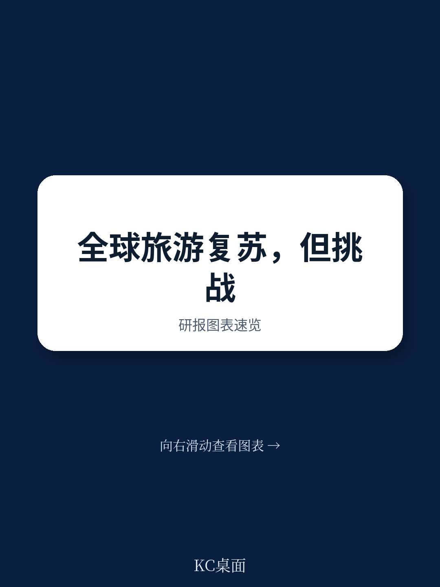
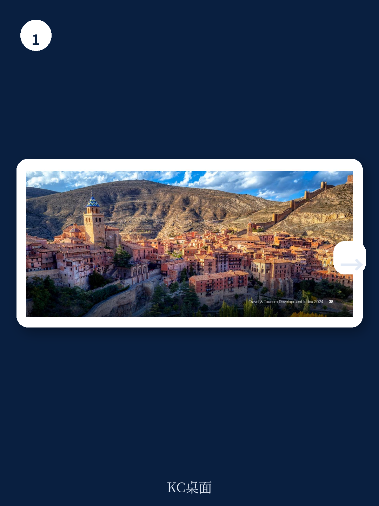
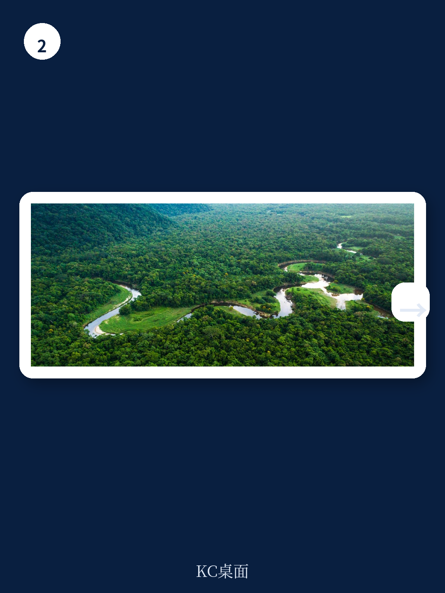

# 世界经济论坛：全球旅游业复苏不均衡，真正的竞争已转向“可持续韧性”

全球国际旅游人次预计在2024年恢复至疫情前水平。但世界经济论坛最新发布的《2024年旅行与旅游发展指数》报告揭示了一个更复杂的真相：表面上的复苏之下，71个经济体的得分有所提升，但平均指数得分仅比2019年高出0.7%。这并非一个简单的“V型反弹”故事。

这份覆盖119个经济体的报告，核心判断是：全球旅游业已走出疫情冲击的谷底，但供需失衡、劳动力短缺、价格竞争力下降以及可持续性压力，正在重塑行业竞争格局。过去那种“只要开放边境就能增长”的模式已经终结，未来的赢家将是那些能在增长与可持续之间找到平衡、并将旅游发展嵌入更广泛社会经济战略的经济体。

报告显示，美国、西班牙、日本、法国、澳大利亚、德国、英国、中国、意大利和瑞士位列前十。这十个经济体占据了2022年全球旅游行业GDP的绝大部分。但真正值得关注的信号，并不在排名本身，而在排名背后的结构性变化。

> **KC评论：** 这份报告的价值不在于告诉你哪个国家排名第几，而在于它构建了一个评估框架——什么才是“好的旅游业发展”。如果你只看排名，你会错过报告中最关键的洞见：得分提升最快的经济体，恰恰不是那些传统旅游强国，而是正在系统性地改善“赋能环境”的发展中经济体。继续看原文，真正有价值的是各个维度的拆解图表、假设条件和验证路径。完整报告与KC评论在每日汇编中。

## 1. 复苏的最大瓶颈不在需求端，而在供给端的结构性缺口

报告明确指出，全球旅游需求已基本恢复，但供给侧的恢复明显滞后。航空路线容量和连通性、旅游资本投资、劳动生产率等关键供给因素，并未跟上需求的反弹速度。这种供需失衡，叠加广泛的通胀压力，直接导致了价格竞争力的下降和服务中断频发。

这不是一个短期的“补库存”问题。劳动力短缺在成熟的旅游经济体中尤为突出，而这不是简单的招聘广告能解决的。报告特别指出，近70%的非高收入经济体的旅游劳动力，分布在劳动力市场韧性和平等指数得分低于平均水平的国家。这意味着，许多旅游目的地不仅面临“缺人”的问题，更面临“缺技能、缺保障、缺平等”的系统性挑战。

对于中国读者而言，这是一个值得警惕的信号。中国在此次排名中位列第八，是亚洲最大的旅游经济体，也是全球第二大旅游经济体。但中国的旅游发展模式，长期以来更依赖规模扩张而非效率提升。当全球旅游业的竞争焦点从“流量”转向“质量”时，中国能否在劳动力技能升级、服务品质提升和可持续发展方面实现突破，将决定其未来在全球旅游价值链中的位置。

> **KC评论：** 供给侧的瓶颈不是中国独有的问题，但对中国旅游从业者而言，这是一个重要的观察窗口。报告中的劳动力市场韧性子指标，以及ICT就绪度指标，都提供了具体的评估维度。完整报告中的时间序列数据和跨经济体的对比图表，能帮你判断哪些结构性问题是暂时的，哪些是长期的。

## 2. 发展中经济体正在加速追赶，但“赋能鸿沟”依然巨大

报告的一个积极信号是：发展中经济体的旅游赋能条件正在持续改善。2019年至2024年间，71个得分提升的经济体中，有52个是低收入至中高收入经济体。沙特阿拉伯、阿联酋、乌兹别克斯坦、科特迪瓦、阿尔巴尼亚、坦桑尼亚、印度尼西亚、埃及、尼日利亚和萨尔瓦多，是进步最快的十个经济体。

印度尼西亚、巴西和土耳其更是跻身了指数前四分之一的行列。这些经济体的共同特征是什么？它们并非仅仅依赖自然资源或文化遗产，而是在营商环境、旅行开放度、交通基础设施和ICT就绪度等多个维度实现了系统性提升。

但报告也毫不掩饰地指出，非高收入经济体仍占低于平均得分经济体的近90%。这意味着，“赋能鸿沟”依然巨大。对于许多发展中国家而言，拥有丰富的自然和文化资源只是第一步，如何将这些资源转化为可持续的旅游收入，需要配套的管理、推广和保护策略，以及基础设施和ICT能力的投资。

> **KC评论：** 这份报告最实用的部分之一，就是它提供了一个清晰的“追赶路线图”。对于任何一个希望发展旅游的经济体，都可以用它来诊断自己的短板在哪里。报告中的五个维度——赋能环境、旅游政策与条件、基础设施与服务、旅游资源、旅游可持续性——构成了一个完整的评估框架。完整报告中的各维度得分和子指标拆解，是制定政策或投资决策的基础。

## 3. 可持续性不是锦上添花，而是未来竞争力的核心

报告中最具前瞻性的部分，是对旅游可持续性的深入分析。平均环境可持续性和旅游社会经济影响维度的得分在2019年至2024年间有所提升，但这其中存在“水分”。例如，疫情期间排放减少带来的改善很可能是暂时的。而旅游需求可持续性得分自2021年以来的下降，反映了随着旅行需求恢复，历史性的可持续性挑战——如高季节性和过度拥挤——正在重新浮出水面。

报告还揭示了旅游对社会经济影响的复杂性。在发展中国家，旅游是相对高薪就业的主要来源，但在中东和北非及南亚等地区，旅游就业中的性别平等问题依然严峻。这意味着，单纯追求旅游收入增长，而不考虑其社会分配效应，可能会加剧不平等。

世界经济论坛在这份报告中明确提出了一个主张：旅游业不应仅仅是经济增长的引擎，更应成为解决全球性挑战的工具。报告专门用一章讨论了如何利用旅游推动环境可持续性、社会经济繁荣、全球连通与和平，以及技术的正向应用。

> **KC评论：** 这是报告中最具战略价值的部分。它把旅游业从一个“行业”提升到了“全球治理工具”的高度。对于政策制定者和企业领导者而言，这意味着未来的竞争不仅是市场份额的竞争，更是“谁能为可持续发展做出更大贡献”的竞争。报告中的具体建议——如为自然保护提供价值、引领能源转型、推动负责任的消费——都值得深入研读。

## 4. 报告尚未完全回答的关键问题：技术变革的颠覆性影响

报告提到了ICT就绪度的大幅提升（7.2%），以及数字支付、移动网络覆盖对旅游服务的推动。但报告对于人工智能、大数据等新兴技术可能带来的颠覆性影响，着墨相对有限。

报告承认，技术可以用于可持续和韧性管理，可以弥合数字鸿沟并创造机会，但也需要确保技术的负责任和安全使用。然而，它没有深入探讨一个关键问题：当AI能够自动规划行程、实时调整价格、甚至生成虚拟旅游体验时，传统旅游价值链中的哪些环节会被重塑？哪些角色会消失？哪些新机会会出现？

这不是报告的缺陷，而是它留给读者的思考题。技术对旅游业的真正影响，可能要到下一版指数发布时才能更清晰地显现。但在此之前，决策者需要保持警惕：技术的应用不应仅仅是为了提升效率，更应服务于可持续和包容性发展的目标。

## 5. 对读者的观察框架：从三个维度重新审视旅游业

基于这份报告，我们建议读者从以下三个维度重新审视任何旅游经济体的竞争力

第一，**韧性维度**：该经济体是否具备应对宏观风险（通胀、地缘政治、气候变化）的能力？劳动力市场是否具备足够的韧性和包容性？ICT基础设施是否能够支持数字化服务的弹性运行？

第二，**可持续维度**：该经济体的旅游增长是否以牺牲环境为代价？季节性波动和过度拥挤问题是否得到有效管理？旅游收入是否惠及当地社区，尤其是弱势群体？

第三，**赋能维度**：该经济体是否在商业环境、旅行政策、基础设施、人力资源等“软硬条件”上进行了系统性投入？这些投入是否形成了协同效应，而不是各自为政？

这三个维度，构成了评估一个旅游目的地“真实竞争力”的框架。排名只是结果，背后的结构性因素才是决定长期走向的关键。

---

这份报告的价值，不在于它告诉你美国排名第一、中国排名第八，而在于它提供了一个系统性的思考框架：在疫情后的世界里，什么才是“好的旅游发展”？如何让旅游成为推动可持续发展和全球合作的积极力量？

报告的完整版本包含了119个经济体的详细评分、各维度拆解、区域对比分析，以及关于如何利用旅游应对未来全球挑战的具体建议。这些图表、数据和假设验证路径，是无法在摘要中完全呈现的。

更多国际信源汇编与评论，扫码交流，每日更新，汇总国际主流叙事、数据和图表，观测边际变化。每日汇编会将单篇报告放回当天的主线，整理成中文摘要、KC评论和图表合集，便于喂给AI，也便于人工快速扫描市场动态。这里汇聚了头部券商、PE/VC、投行、并购、对冲基金、资管机构、战略咨询、智库等朋友，期待与你交流。

Personal reading notes and learning share only. Not investment advice.
