## Annual Report 2024-2025

COMMITTED TO IMPROVING THE STATE OF THE WORLD

## Disclaimer

This document is published by the World Economic Forum, which includes contributions to a project, insight area or interaction. The findings, interpretations and conclusions expressed herein are a result of a collaborative process facilitated and endorsed by the World Economic Forum but whose results do not necessarily represent the views of the World Economic Forum, nor the entirety of its Members, Partners or other stakeholders.

This Annual Report covers the period 2024-2025 and represents the status as of 30 June 2025.

© 2025 World Economic Forum. All rights reserved. No part of this publication may be reproduced or transmitted in any form or by any means, including photocopying and recording, or by any information storage and retrieval system.

## Contents

1 Co-Chairs' Statement 4
2 President and CEO's Statement 6
3 Our Institutional Framework 8
4 Our Impact 2024-2025 10
Select Initiatives 11
Selected Meetings 20
5 Our Organization 24
Our Centres 25
Our Initiatives, Communities and Key Insights 35
Our Core Functions 50
Our Talent and Workplace Culture 56
Our Offices 57
Our Sister Organizations 61
6 Leadership and Governance 64
7 Financial Statements 66
8 Stakeholder Metrics 73

# Co-Chairs' Statement

For 55 years, the World Economic Forum has helped convene and encourage conversation around important global challenges and opportunities. But today, incremental progress is no longer enough. The world is changing rapidly, and the need for transformation is urgent. The Forum is aiming higher: focusing on impact rather than words and demanding sharper attention to what truly matters, with a renewed commitment to rebuilding trust.

We find ourselves at an inflection point. Globalization is not ending; it is evolving – globalization 2.0. This new phase will look different from the past: more attuned to the needs of individual countries and to workers who did not benefit from globalization as much the first time around.

There is no false choice between national strength and global cooperation; both are essential. We can broaden the benefits of global growth to more people and shape growth towards sustainable prosperity – but only if we adapt to a new model that reflects today's realities and does not create more

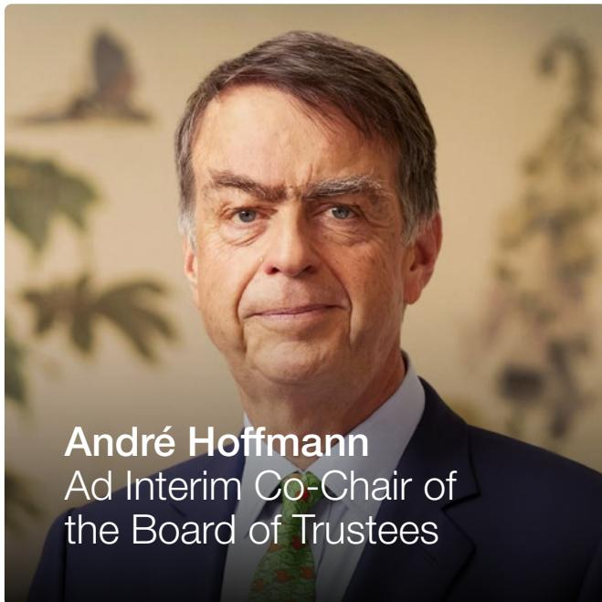

inequalities. Capital markets can be a powerful engine for this progress – channelling savings into investments that drive innovation – a vital ingredient for addressing the world's most critical challenges.

Sustaining prosperity will require pragmatism. Energy powers our economies, and a durable transition must be both pragmatic and ambitious. It requires keeping today's systems reliable and affordable, while advancing long-term decarbonization through continued innovation in renewables, storage and grid flexibility. Balancing these priorities is essential to secure, affordable and sustainable energy – the foundation for growth and opportunity in the decades ahead.

None of this is achievable without trust. Trust is today's most valuable – and most fragile – resource. Like capital, it compounds when invested wisely. The Forum must earn that trust every day through integrity, outcomes and clarity of purpose – focusing on what truly counts: greater prosperity for more people around the world.

So, how do we deliver? Three imperatives define our path: growth, resilience and innovation. These are not slogans; they determine whether communities thrive, economies endure and businesses lead. The Forum must now cut through the complexity that too often hinders progress.

At the same time, we will rethink our operations. The Forum must embrace innovation – harnessing artificial intelligence (AI), streamlining operations and empowering talent, not chasing novelty for its own sake, but serving better, moving faster and staying relevant in a world that won’t wait.

In these turbulent times, the Forum has an opportunity to act as a unique catalyst for cooperation – identifying shared goals and addressing them. We are uniquely positioned to bring

together business, government and civil society to ensure that our collective efforts foster growth and expand prosperity in people's daily lives.

As this Annual Report reflects, we have a significant opportunity to continue strengthening international collaboration. The Forum remains a platform for enabling cooperation, building trust, convening critical conversations and advancing common ground.

We are deeply grateful to our partners, stakeholders and exceptional staff for their continued trust in the Forum's mission. Through this enduring spirit of collaboration, we will navigate today's uncertainties and help build a more resilient and prosperous future.

WORLD
ECONOMIC
FORUM

## Annual Meeting Davos 2025

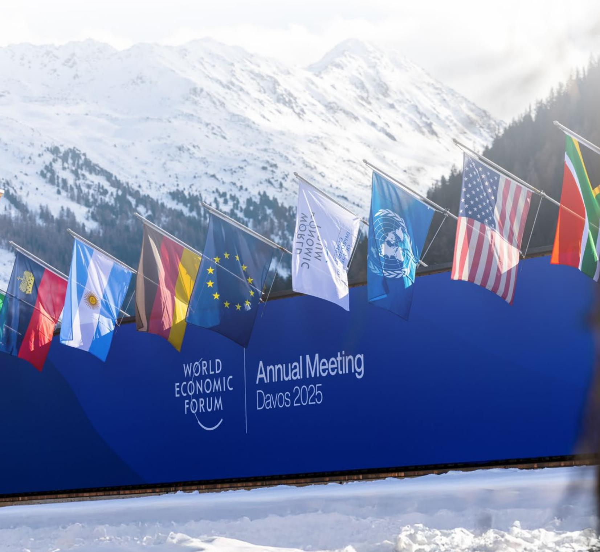

# President and CEO's Statement

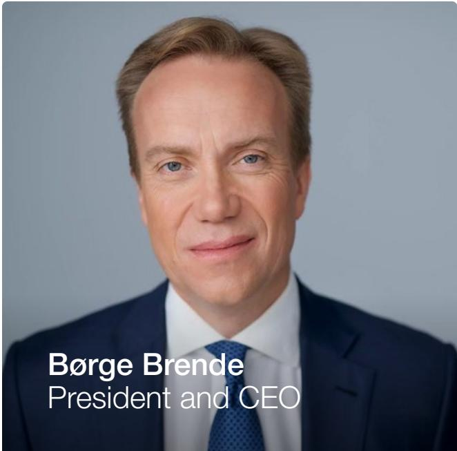

The work of the World Economic Forum comes during a moment of profound global change, as geopolitical and geoeconomic developments – alongside rapid advancements in frontier technologies – transform the nature of relations across and between the public and private sectors.

The past year has seen sovereignty politics ascendant around the world, even as the need for collaborative approaches has become more urgent. The growing tension between inward-looking postures and cooperative imperatives does not mean the two are incompatible. The interdependent nature of today's world means that, although long-standing global architectures, alliances and even attitudes are being reconsidered, there are still possibilities for aligning interests and acting accordingly.

The changes under way mean that tomorrow's global system will differ significantly from that of the past. Cooperation will need to meet the moment, principally by being adaptive and more productive. In this context, the private sector will increasingly need to take an activist role, championing or co-developing solutions alongside governments.

As this Annual Report shows, the Forum's role in promoting dialogue and partnership is a testament to the effectiveness of multistakeholder approaches.

The challenges facing the world are complex: conflict not only persists in Europe, the Middle East and Africa, but escalatory actions by major powers have reopened sobering possibilities many had long hoped would remain in the past. While global growth is thankfully more resilient than expected, debt levels have reached record highs, and the escalation of geoeconomic rivalry is testing resilience, particularly in vulnerable markets. At the same time, new technologies offer the promise of profound benefit, but the risks of employment displacement and unequal access are becoming evident. Our planetary condition is also dire, as the world has experienced the hottest year on record.

The Forum's role as a trusted platform for multistakeholder dialogue – a crucial building block of collaboration – has never felt as important. This is why we anchor our year-round work in three major meetings: in Davos at the start of the year, the People's Republic of China midway through and New York in the final quarter of the year.

Our 2025 Annual Meeting in Davos brought nearly 3,000 leaders from more than 130 countries together to identify pathways forward on economic, sustainability, technology and security priorities. During the meeting, heads of European intelligence agencies met with members of the private sector to discuss the complex threat landscape and ways to strengthen collective security. We convened diplomacy dialogues on the Western Balkans and Myanmar to identify pathways to peace and reconciliation, and the “CEOs for Ukraine” session brought together over 80 business leaders with the President of Ukraine Volodymyr Zelenskyy to discuss plans for reconstruction in Ukraine once hostilities end. We also laid the foundation for the Leaders for European Growth and Competitiveness community, which launched in late June in coordination with European Commission President Ursula von der Leyen. The community is working with chief executive officers and policy-makers to bolster competitiveness in Europe. We launched several initiatives focused on using innovation to drive economic and social benefit, including the Global Data Partnership for Forced Labour, a coalition of businesses and international institutions that is offering ways to use data to combat forced labour. We also launched the Future of Clean Fuels Initiative, which is promoting collaboration to accelerate the scale of the clean fuels transition.

In June, our Annual Meeting of the New Champions in Tianjin, People's Republic of China, included a dialogue with Chinese Premier Li Qiang. Bringing together over 1,700 public and private sector leaders, the meeting offered a timely platform for stakeholders to share perspectives and insights, coinciding with ongoing negotiations between the world's two largest powers.

Looking further back in the reporting period, during the UN General Assembly High-Level Week, we held our Sustainable Development Impact Meetings 2024 in New York. The meetings convened over 1,000 leaders, including 50 senior government leaders, along with key figures from the private sector, civil society and expert communities, to advance Forum initiatives that are supporting the Sustainable Development Goals.

Over the course of the year, our work has centred on delivering insight into and advancing critical technology, economic, societal and sustainability objectives – areas that are inextricably linked and mutually reinforcing.

As the global economy enters the Intelligent Age, where innovation will deliver new growth opportunities, the Forum's Centres for the Fourth Industrial Revolution expanded to 22 members, with new centres launched in Berlin, Kyiv, Medellín, Oman, South Africa and Riyadh.

Over the course of the year, our work has centred on delivering insight into and advancing critical technology, economic, societal and sustainability objectives – areas that are inextricably linked and mutually reinforcing.

These hubs for public-private cooperation serve as focal points for developing policies that advance innovations addressing our economic and environmental objectives in a responsible manner. The transition to an innovation economy will come with risks, and the Forum's Reskilling Revolution initiative is on track to empower one billion people with better education, skills and economic opportunities by 2030. The Forum also unveiled Growing Cyber Talent Through Public-Private Partnerships to help ensure the workforce of the future is cyber-skilled. The First Movers Coalition – a group of over 100 leading global companies – continues to grow as its members use their collective purchasing power to drive sustainability innovation.

The most crucial component of the Forum's success has been our talented and hard-working staff in our Geneva headquarters and at our offices in New York, San Francisco, Beijing and Tokyo. I am impressed each day by their commitment to upholding our values of inclusiveness and collaboration and to delivering meaningful results on some of the most complex and urgent issues facing the world today. This is why, during this last year, the Forum increased investment in its staff. Our People and Culture team introduced a 360-degree Leadership Culture assessment process, inviting all employees to contribute feedback on the organization's senior leaders. We also remain committed to rewarding talent, supporting well-being and offering access to mental wellness programmes.

Our work is made possible because of our partnerships with the world's leading enterprises. The Forum's $5\%$ growth in partnerships last year – reaching a record 925 companies – reflects the private sector's strong commitment to addressing critical global challenges.

In this time of global complexity, the Forum is grateful for its collaboration with leading global companies, the commitment of its staff and its partnerships with international organizations and civil society. This spirit of collaboration is proof of what cooperative approaches can achieve and why the Forum's mission – to promote dialogue and strengthen collaboration – is so vital.

3

# Our Institutional Framework

The World Economic Forum provides a global, impartial, not-for-profit platform and insights to support meaningful connections between political, business, academic, civil society and other leaders.

It creates a space where diversity of thought is respected and all voices can be heard, recognizing that progress can only be made in an environment where stakeholders genuinely seek common ground and the opportunity for positive change.

Founded in 1971, the Forum is independent and is headquartered in Geneva, Switzerland. It has offices in San Francisco and New York City, United States, Beijing, China and Tokyo, Japan.

It has a highly skilled workforce of more than 1,000 individuals of 100 nationalities who seek to facilitate progress in areas as diverse as climate adaptation, frontier technology and economic growth. They work together with partners to support sustainable, resilient, inclusive communities that can withstand the challenges of today and tomorrow.

The Forum's centres, regional teams and other groups drive its work, using a variety of approaches to drive systemic change. The centres and teams build communities of purpose, which guide the Forum's work to convert ambition into focused action through structured multi-year initiatives and insight generation aimed at addressing large-scale global challenges.

In addition to this ongoing work, the Forum hosts a range of meetings, from the multi-thematic Annual Meeting held in Davos to convenings focused on specific areas held across the world. These provide platforms for trust-based engagement, robust debate and public-facing dialogue.

This Annual Report for 2024-2025 offers a comprehensive overview of key developments, initiatives, insights, meetings and impact driven by the work across the organization. The report also covers updates from our affiliated organizations – the Forum of Young Global Leaders, the Global Shapers Community and the Schwab Foundation for Social Entrepreneurship – alongside the Forum's leadership, governance, financial performance and non-financial performance metrics.

Annual Report 2024-2025
Our Institutional Framework

Selected Meetings

Our Impact
2024-2025

The following sections provide examples of initiatives applying the World Economic Forum's unique impact methods to drive large-scale progress on critical public challenges and selected meetings held in 2024-2025 to provide a platform for progress, cooperation and trust-building.

Select Initiatives

Learn more here

## Select Initiatives

The World Economic Forum's centres develop initiatives that help further the Forum's mission to improve the state of the world. They typically bring together multiple parties from government to business, academia, civil society groups, experts and youth, all of whom, like the Forum, seek to make progress in tackling the world's most pressing challenges.

Currently, our multistakeholder initiatives and communities are pursuing work across the following topic areas: economy, geopolitics and trade, people, planet, and technology.

## Economy

The structure of economies is undergoing significant change. While growth continues in many regions, the multilateral system is under strain, and inflation remains a concern in several economies due to shifting trade policies and supply chain disruptions. Growth forecasts have been revised downward in some regions, and challenges such as widening income inequality, housing affordability and rising costs of living are becoming more acute. Amid this complex environment, the Forum is leveraging its unique stakeholder model to promote collaboration and the exchange of ideas and best practices to help strengthen the global economic and financial system.

## Future of Growth Initiative

The aim of the Future of Growth Initiative is to drive a new conversation around the policies needed to boost rates of growth while also avoiding the errors of previous growth-at-all-costs approaches. The world needs faster growth; it also needs growth that is more innovative, inclusive, sustainable and resilient.

Underpinning the initiative's output is the Future of Growth Framework, which brings together a wide range of data from 107 economies and shows how economies across the world are performing both on the pace of growth and its quality or character.

In 2025, the initiative launched a series on global economic futures with Global Economic Futures: Productivity in 2030. Developed in consultation with a broad range of business stakeholders, it explored economic scenarios with a 2030 time horizon, assessing how businesses in different sectors may be affected by major changes that are roiling the global economy.

The Future of Growth Champions help to translate the initiative's work from analysis to action. This group of senior leaders, including government ministers and CEOs, shares the initiative's vision of driving faster and higher-quality growth to support the vitality and resilience of society. As well as meeting regularly at Forum events, the champions also convene twice yearly on the sidelines of the IMF/World Bank meetings in Washington, DC.

The Future of Growth Accelerators Network – a series of public-private collaborative platforms – also represents an integral part of the initiative. At the Annual Meeting 2025, the first national-level Future of Growth Accelerator was launched in collaboration with the government of Egypt.

# Navigating Global Financial System Fragmentation

States are increasingly using the global financial system to advance geopolitical objectives. These types of geoeconomic statecraft policies, combined with industrial policies like subsidies and domestic capacity-building measures are influencing trade and capital flows, investment patterns, asset returns and the cost and availability of capital across borders.

In response, the Forum launched the Navigating Global Financial System Fragmentation initiative, estimating that unchecked fragmentation could cost up to \$5.7 trillion. The initiative seeks to promote understanding of the global financial system, raise awareness of the consequences of fragmentation and develop frameworks that protect the financial system during a period of rising geopolitical tensions. At the core of this effort is a commitment to eight foundational principles that underpin the global financial system, ranging from respect for the rule of law and property rights to the independence of fiscal and monetary policy, institutional integrity and interoperable financial infrastructures. Violating these principles could undermine the very integrity of the financial system and drive fragmentation, which would weaken trust, reduce efficiencies and jeopardize economic growth.

Over the reporting period, the initiative convened leaders from the public and private sectors to generate insights, encourage cooperation and advance shared priorities such as combatting illicit finance. The initiative also presented a positive vision for the financial system as a potential venue for renewed global collaboration on issues of geoeconomic consensus.

To broaden its impact, the initiative also engaged wider audiences through outreach focused on the costs of fragmentation, its upward pressure on inflation and the benefits of integration.

Drawing on its research and consultations, the initiative introduced two strategic frameworks in less than one year, which were validated by more than 25 global CEOs and chairpersons: the Principles to Safeguard the Global Financial System from Fragmentation and the Rules of Engagement for Responsible Economic Statecraft. The former defines the conditions needed to maintain essential financial system operations and confidence; the latter provides guidance for policy-makers to pursue geoeconomic policies without destabilizing global markets and economic prosperity.

## Geopolitics and trade

Trade, as it has been known since the post-World War II era, is changing. As policy-makers and business leaders grapple with changes ranging from a rapidly shifting geopolitical situation to the growth of frontier technologies, navigating new challenges and opportunities is vital to supporting trade, and with it, domestic and global growth. Amid this, the Forum is facilitating real-world change, supporting partnerships and accelerating solutions.

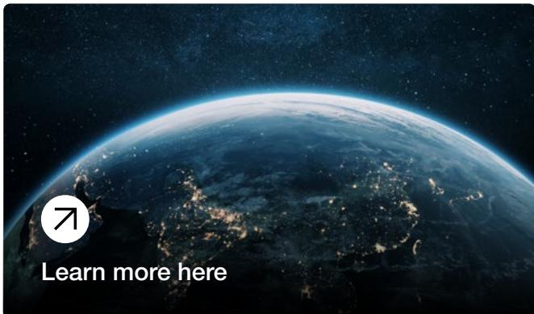

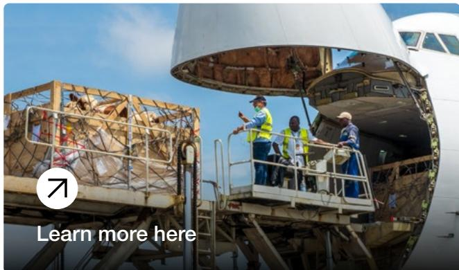

## Global Cooperation Barometer

The second edition of the Global Cooperation Barometer was released ahead of the Annual Meeting 2025 to measure the state of international cooperation.

Rooted in rigorous data and analysis, the barometer quantifies the level of cooperation broadly and across five pillars: trade and capital, peace and security, innovation and technology, climate and nature, and health and wellness. In offering leaders clear insight into where collaboration thrives – and where gaps exist – it serves as a vital guide for developing strategies for bolstering collaborative approaches in today's more competitive geostrategic context. The barometer's practical recommendations for identifying pathways towards cooperating on shared interests draw on lessons from the private sector, where businesses have developed approaches for simultaneously strengthening their own competitiveness while collaborating with market rivals on issues like climate action.

Development of the barometer during the reporting period included the launching of an advisory board, composed of experts from the Forum's Global Future Council Network, and consultation with stakeholders from across Forum communities.

As geopolitical pressures persist, the barometer is emerging as a crucial tool for leaders seeking to strengthen global partnerships and advance collective solutions in the year ahead.

## Global Alliance for Trade Facilitation

The Global Alliance for Trade Facilitation (GATF) marked its 10th anniversary in 2025. Over the past decade, it has supported 26 projects in 25 countries, engaging 2,000 local micro-, small- and medium-sized enterprises (MSMEs). These efforts have helped unlock over \$213 million in savings for traders.

The alliance's mission is to simplify trade procedures, particularly in developing countries, where significant barriers still hinder the movement of goods across borders.

At the heart of each alliance project is a public-private partnership model, enabling collaboration between governments and businesses to co-create tailored trade reforms. These initiatives often focus on streamlining processes around the movement of goods such as manufacturing inputs, foodstuffs, medical supplies and humanitarian aid, ensuring cross-border trade is safer, faster and more inclusive.

During the reporting period, the alliance advanced reforms to simplify customs and border procedures in over 25 countries, including Guatemala, Cambodia, Morocco, Senegal and Ukraine, aligned with World Trade Organization (WTO) Trade Facilitation Agreement (TFA) commitments. It convened local and international stakeholders to design impactful solutions, aiming to reduce clearance times and costs while expanding access to trade for MSMEs.

A consortium of global organizations leads the alliance, with support from the governments of Canada, Germany, Sweden and the European Union – all committed to promoting inclusive, sustainable economic development through improved trade facilitation.

## People

People face multiple challenges in today's world, ranging from the changing face of work, where technologies are carrying out more and more human tasks, to the effects of climate change. The Forum is addressing this range of challenges through initiatives that support and create opportunities designed to allow humans to thrive. Focus areas include inclusion, reskilling, upskilling and lifelong education and unlocking new investment concepts and streams.

## Reskilling Revolution

The Reskilling Revolution, a flagship initiative of the Centre for the New Economy and Society, aims to equip 1 billion people with better education, skills and economic opportunities by 2030. It responds to a global challenge: while emerging trends – like technology, demographics and geoeconomic shifts – may create twice as many jobs as they displace, nearly half of all job skills are expected to change by 2030.

To help people seize these opportunities and support resilient economies, the initiative focuses on scalable solutions, delivered through partnerships, national and corporate commitments, and a growing network of champions – CEOs, ministers and global leaders – who guide its vision and priorities.

It has three core goals: defining future-critical skills, promoting scalable learning models, and ensuring AI and digital integration lead to future-fit education. These are achieved through communities of learning, exchanging best practices and showcasing “what works” across sectors and regions.

The initiative is informed by the Future of Jobs Report, the Forum's most widely read publication, which maps skill trends and change management strategies across industries and countries.

Since its launch, the initiative is set to reach over 750 million people and most recently launched national Skills Accelerators in India, Qatar, Bahrain, Azerbaijan and an education-focused accelerator in Rwanda. It also developed a Global Skills Taxonomy Adoption Kit to support skills-first talent strategies.

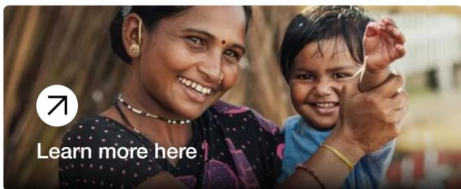

Perhaps its most transformative impact has been a mindset shift: lifelong learning has moved from the HR agenda to the boardroom – no longer a question of whether to invest, but how.

## Global Alliance for Women's Health

Women spend 25% more time in poor health than men. Yet every \$1 invested in women's health yields \$3 in economic growth, and closing the women's health gap could boost the global economy by \$1 trillion annually. These figures underline the urgency behind the Global Alliance for Women's Health, which is working to transform how women's health is researched, funded and prioritized.

To close the health gap, the initiative focuses on three core areas: advancing science and innovation, unlocking financing, and reshaping public and policy narratives. This includes promoting research that meets women's diverse needs, increasing investment through new financing models, driving country-level impact by mobilizing commitments and resources and promoting more data to highlight the benefits of improved health outcomes for women.

The initiative's strategy is delivered through five interconnected workstreams. For example, it launched the Global Activator Network on Cervical and Breast Cancer Coalition to improve awareness, diagnostics and treatment of cervical and breast cancer in Sub-Saharan Africa and launched its Global Activator Network on Maternal Health in Nigeria to cultivate a robust country-level ecosystem to advance maternal health outcomes. Through the Policy Transformation workstream, the initiative continued its efforts to place sex-based differences at the core of research and clinical trials to transform women's health research and advance science. Meanwhile, the Responsible Investing Consortium worked to align capital flows with sustainable and equitable health outcomes for women.

A key enabler of this work is the Women's Health Impact Tracking (WHIT) platform, a tool for measuring and monitoring women's health gaps to inform policy and investment decisions.

Supporting all efforts is a global community of Champions for Women's Health, who are elevating women's health in global discourse and contributing to the initiative's advocacy, policy and partnership efforts.

## Davos Baukultur Alliance

Communities around the world are under growing pressure – from climate change and economic uncertainty to conflict, migration and rapid population shifts. In many places, this has led to poorly built environments that fail to reflect local identity or withstand long-term pressures. The Davos Baukultur Alliance brings together government, business and civil society to address this challenge by championing better ways to shape the places where we live, work and connect.

The alliance is built on a shared commitment to creating high-quality, resilient and inclusive places that reflect the unique character of each community. It promotes practical action that integrates cultural, economic, environmental, social and technical considerations – ensuring that what gets built today can adapt and endure tomorrow.

The concept of Baukultur takes a holistic view of the built environment, from buildings and public spaces to infrastructure, planning and reuse. Its approach is guided by the eight criteria of the Davos Baukultur Quality System and emphasizes that shaping lasting, meaningful places is a shared responsibility.

During the reporting period, the alliance made progress across four focus areas. It helped drive more inclusive urban regeneration by embedding Baukultur principles into projects that increase affordability and social value. It strengthened climate resilience through adaptation strategies that reduce risks from extreme weather and other shocks. It promoted sustainable construction through circular design and reuse. It also placed special attention on rebuilding Ukraine, where a dedicated group is helping develop thoughtful, locally relevant approaches to reconstruction.

A major milestone was reached with more than 80 member organizations active in over 140 countries – extending the alliance's global reach and collective impact.

  
Learn more here

## Frontline Talent of the Future

Frontline Talent of the Future equips senior executives with tools and strategies to build human-centric, high-performing industrial operations. It aims to enable the emergence of “workforce for the future” factories and supply chains by addressing one of the sector’s most pressing challenges: talent.

With 40% of core manufacturing skills expected to shift in the next three to five years – and 71% of manufacturers citing talent attraction, skills gap and retention as their top challenge – the initiative focuses on identifying and promoting effective workforce strategies. It highlights real-world solutions through leading industrial sites, showcasing how businesses are adapting to rapid change through talent innovation, skills development and workforce transformation, while making a positive impact on business productivity and stability.

Over the reporting period, the initiative continued piloting talent strategies in key areas such as workforce development, talent upskilling and reskilling, and talent attraction. It engaged manufacturing leaders and frontline workers through quarterly community meetings and ongoing site visits, facilitated peer learning and shared best practices. A growing network of companies now contributes to this collective effort to transform talent management in the sector.

As part of its knowledge-sharing work, the initiative released a report on unlocking productivity through frontline talent, conducted over 80 interviews with industry leaders and compiled a database of more than 60 talent innovations. These insights have been distilled into a comprehensive playbook designed to guide manufacturers in building resilient, future-ready workforces.

  
Learn more here

## Planet: energy and the environment

Tackling climate change and nature loss is complex, but the Forum drives real-world impact through multiple initiatives. These include accelerating climate finance, reducing plastic waste, improving industrial emissions and sharing scalable best practices – all rooted in the Forum’s strengths: collaboration, open dialogue and shared learning.

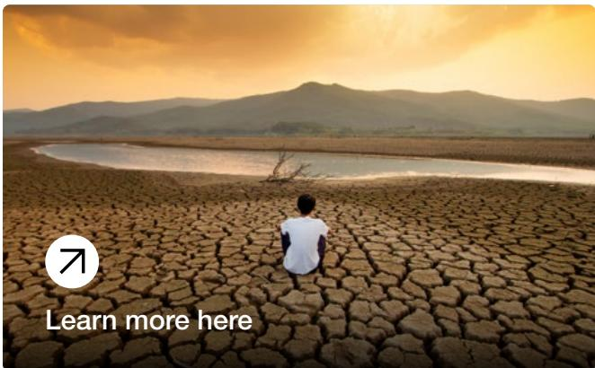

## Giving to Amplify Earth Action

Only 6% of the funding needed annually to limit global warming to 1.5°C by 2030 has been mobilized.
GAEA (Giving to Amplify Earth Action) addresses this gap by combining public and private capital, public leadership and philanthropy's catalytic capabilities.

GAEA uses philanthropic capacity to reduce risk, enable innovation and attract further investment, supported by an enabling public sector. Its approach is reinforced by thought leadership that redefines the role of philanthropy in scaling climate and nature solutions.

Launched in January 2024, GAEA aims to accelerate system transformation through public-private-philanthropic partnerships (4Ps). It has already convened 140 partners and helped secure \$4 billion in direct capital commitments, alongside \$200 billion in aggregated philanthropic capital.

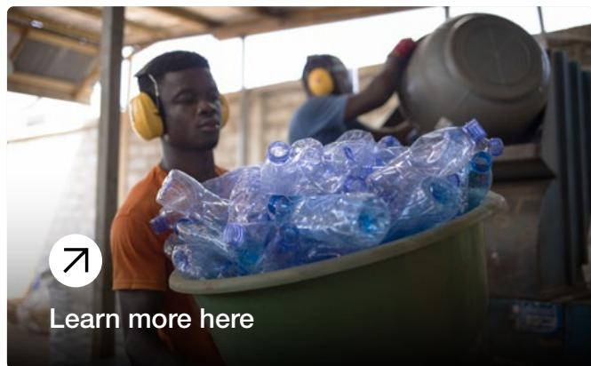

The initiative begins with an Intelligence Hub to amplify catalytic capital and improve risk-return ratios through tools like the Global Future Council on Innovative Financing for Nature and Climate. It then moves into an Impact Assembly Line, identifying, launching and scaling initiatives through the Big Bets Accelerator, community engagement and the GAEA Awards.

Big Bets Accelerator partnerships include the Green Steel Value Chain, Coal to Clean, New Textiles Economy, Wildfire Leadership and Ocean-Positive Pathways.

Learn more here

GAEA's co-chairs offer strategic direction, drawing on backgrounds in global development, philanthropy and public service. The GAEA Awards celebrate transformative collaborations and support awardees to scale impact.

## Global Plastic Action Partnership

Plastic pollution is an urgent global challenge, with 19 million tonnes entering the environment annually and production projected to triple by 2060.

Launched in 2018, the Global Plastic Action Partnership (GPAP) unites governments, businesses and civil society to turn commitments to reduce plastic pollution into action and advance a circular plastics economy worldwide.

In January 2025, GPAP reached a key milestone: establishing 25 National Plastic Action Partnerships (NPAPs), becoming the world's largest plastic pollution initiative. It now engages over 2,000 stakeholders to co-develop inclusive, locally owned solutions impacting 1.5 billion people.

GPAP informs global processes like the Global Plastics Treaty and Basel, Rotterdam and Stockholm Conventions, aligning ambition with national realities and advancing collaboration on finance, innovation and value chain transformation.

GPAP launched seven National Plastic Action Roadmaps using proprietary modelling tools. These roadmaps help countries measure their plastic footprint, align priorities and develop data-driven strategies tied to national goals.

Equity and inclusion remain central. GPAP's Inclusive Plastic Action Programme 2025 supports informal waste workers, with over 20,000 people benefitting from its gender and social inclusion efforts.

GPAP also launched a Biodiversity Small Funds Initiative, with recipients announced at the 2025 UN Ocean Conference.

GPAP's unique approach supports the collective global mission to end plastic pollution for good.

## Transitioning Industrial Clusters

The Transitioning Industrial Clusters initiative facilitates collaboration to promote economic growth, protect jobs and reduce $CO_{2}e$ emissions within industrial clusters. By aligning regulatory frameworks with financial support, the initiative supports clusters to implement effective sustainability strategies.

By the end of the reporting period, the initiative encompassed 35 clusters across 16 countries, representing 66% of global GDP. Throughout its work, it focuses on building strong partnerships between companies and public institutions, ensuring alignment across supply and demand networks to drive cohesive action.

To accelerate decarbonization, the initiative advances enabling policies that create a supportive regulatory environment for sustainable growth. Complementing this, it identifies innovative financing solutions to back large-scale emissions reduction efforts and promotes the adoption of advanced technologies that enhance efficiency and cut emissions.

During the period, the initiative published Unleashing the Full Potential of Industrial Clusters: Infrastructure Solutions for Clean Energies exploring challenges in clean energy infrastructure and highlighting how industrial clusters can accelerate its deployment.

Since its inception, these combined efforts have contributed to protecting and creating 4.3 million jobs and added \$498 billion to the global GDP through participating clusters, underscoring the initiative's role in driving a just and sustainable industrial transition.

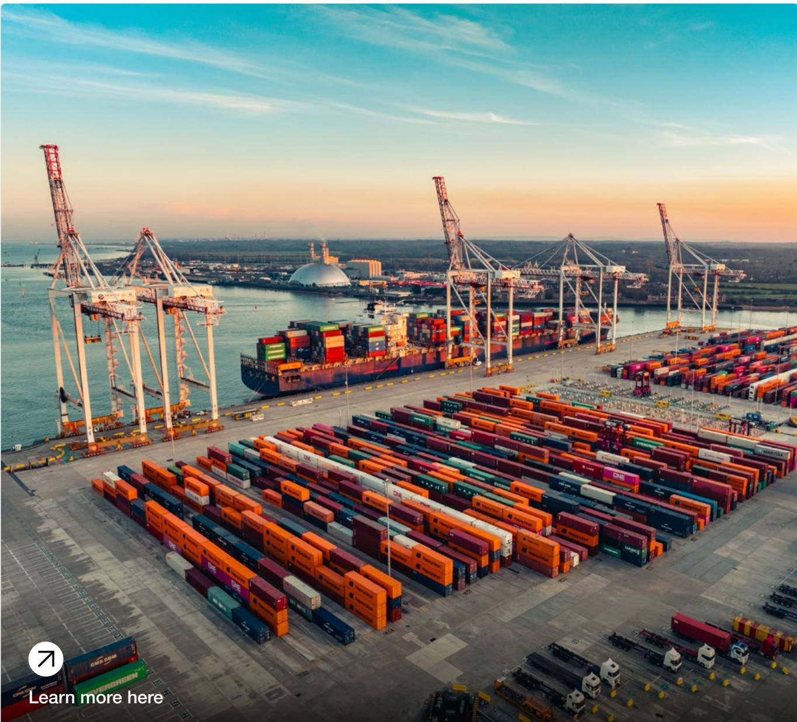

Learn more here

## Technology

The technologies of the Fourth Industrial Revolution pose huge challenges as well as opportunities. As a result, the Forum is working hard to ensure the secure adoption of AI; it is supporting the creation of astutely judged guardrails and regulation, while also helping raise awareness of the wider security implications of its use, particularly in terms of cyberthreats. Alongside this, the organization is also working to ensure equitable access to the digital sphere and its technologies, cognizant of the challenges faced by those left behind.

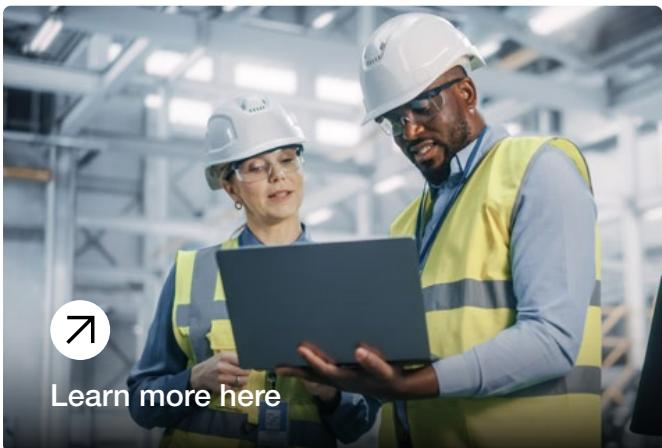

  
Learn more here

## Global Lighthouse Network

Technology-driven industrial transformation has the potential to greatly improve the financial, operational and sustainability performance of manufacturing and supply chain sites. In reality, however, most organizations in these industries struggle to unlock this potential.

The Forum runs the Global Lighthouse Network (GLN), which seeks to transform industrial operations through the large-scale adoption of advanced technology. The network's Lighthouses, which are some of the most advanced sites in the world, inspire manufacturers globally to adopt the latest Fourth Industrial Revolution technology. This, in turn, helps transform not just factories, but also value chains and business models.

This use of advanced technology supports double-digit improvements in productivity, supply chain resilience, customer centricity, sustainability and talent.

Currently, the GLN comprises 189 Lighthouses (36 of which joined during the reporting period), 25 of which are Sustainability Lighthouses. They operate in more than 30 countries and 35 subsectors. This diversity creates a wider range of knowledge and insights, which are shared, helping to accelerate transformation.

During the reporting period, the GLN reported on the lessons learned by the new Lighthouses joining the network. Among the issues addressed were tackling the slump in scaling up the use of digital technologies, the need to invest in frontline workforces and the progress made towards end-to-end sustainability.

## AI & Cyber

The Forum's AI & Cyber initiative unites senior leaders from the cybersecurity and AI sectors to develop guidance for the secure adoption of AI technologies. This initiative responds to the growing need to understand and mitigate the cyber risks that arise as AI becomes integral to organizational innovation and operations. While AI offers significant benefits, the associated cyberthreats are often underestimated, underscoring the importance of maintaining cybersecurity as a central focus in an evolving threat landscape.

During the reporting period, the initiative advanced its mission by first identifying critical cyber risk scenarios related to the misuse and adoption of AI across various industries. Building on this foundation, it worked to enhance knowledge and awareness among organizations, equipping them with insights necessary to recognize and address the unique challenges AI presents. In tandem, the initiative developed practical guidance to help business and cybersecurity leaders mitigate these emerging risks effectively.

A key output during this time was the release of a comprehensive report designed to support global leaders in shaping strategies and making informed decisions regarding AI adoption and cyber risk management.

Launched in 2023 in collaboration with the Global Cyber Security Capacity Centre at the University of Oxford, the AI & Cyber initiative also plays a pivotal role within the Forum's broader AI Governance Alliance.

Learn more here

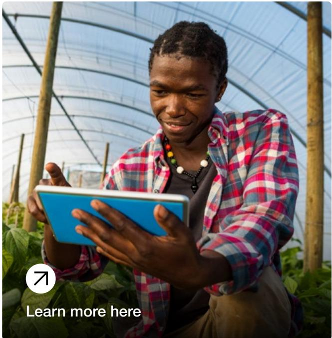

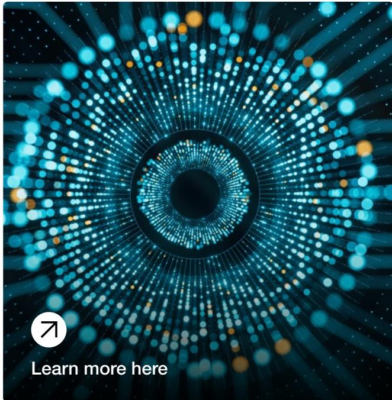

## EDISON Alliance

Learn more here

More than 2.6 billion people around the world remain without internet access, a gap the EDISON Alliance set out to close. Since its launch in 2021, the initiative has connected over one billion people in more than 100 countries to essential digital services such as healthcare, education and financial platforms.

Recognizing that the rapid evolution of technologies like AI offers both opportunities and risks, the EDISON Alliance is committed to ensuring marginalized communities are not shut out of this next wave of innovation, but instead can harness it to improve lives and livelihoods.

To support governments to deliver on their digital inclusion ambitions, the alliance established the Lighthouse Countries Network, which focuses on health, finance and education. By partnering with ministries of the digital economy and ICT, the initiative facilitates regional and national action through peer-to-peer exchanges that promote practical collaboration and shared learning. These partnerships help countries unlock resources, expertise and solutions to bridge digital gaps, while success stories are shared widely to inspire global action.

Behind this effort stands a coalition of champions and changemakers who work to mobilize resources, shape priorities and strengthen the case for investing in digital access.

During the reporting period, the alliance surpassed its 2025 target, making significant strides in Africa and South Asia, where 70% of its impact is focused. With more than 300 partner initiatives driving this momentum, the EDISON Alliance underscores that while universal internet access by 2030 may require an estimated \$446 billion in investment, it could generate up to \$8.7 trillion in benefits for developing countries.

## AI Governance Alliance

The AI Governance Alliance seeks to promote the responsible and effective adoption of AI to transform industries, enhance national competitiveness, improve governance and unlock innovation. With 644 members from 500 organizations worldwide, the alliance unites global experts to tackle AI's complex challenges and provide scalable, practical solutions across sectors.

Its work is organized around three key areas: accelerating impactful AI innovation and adoption, advancing trustworthy technology and effective governance, and preparing countries and society for the Intelligent Era.

During the reporting period, the alliance engaged all 22 of the Forum's industry communities to explore AI's strategic impact, opportunities and challenges. It convened public-sector officials and regulators to promote anticipatory governance and build durable institutions capable of overseeing AI's evolution. In collaboration with chief science officers and AI producers, it developed technical guardrails addressing advances in generative AI while examining how AI-first enterprises are reshaping roles, skills and operations.

The initiative also advanced AI competitiveness by bringing stakeholders together to expand global access, build sustainable infrastructure, improve data quality and empower diverse economies with AI-driven opportunities. Complementing these efforts, the MINDS (Meaningful, Intelligent, Novel and Deployable Solutions) recognition programme highlighted businesses successfully using AI to drive transformation and address societal challenges.

To support its goals, the alliance convened diverse AI stakeholders, produced influential reports and frameworks and promoted proactive, inclusive regulation through public-private partnerships.

# Selected Meetings

## Annual Meeting 2025

Under the theme “Collaboration for the Intelligent Age”, nearly 3,000 leaders from more than 130 countries – including around 60 heads of state and government – came together to generate insights and advance solutions on the economy, technological and geopolitical transformations and sustainability imperatives.

Notable participants included António Guterres, United Nations Secretary-General; Ursula von der Leyen, President of the European Commission; Ding Xuexiang, Vice-Premier of the People's Republic of China; Cyril Ramaphosa, President of South Africa and Chair of the G20; Pedro Sánchez, Prime Minister of Spain; Olaf Scholz, Chancellor of Germany; Javier Milei, President of Argentina; Volodymyr Zelenskyy, President of Ukraine; Anwar Ibrahim, Prime Minister of Malaysia and Chair of ASEAN; and Donald J. Trump, President of the United States, who joined virtually.

The state of the world's economy was a central theme. Leaders acknowledged geoeconomic uncertainties while also highlighting signs of resilience over the past three years. They stressed that international unity and cooperation are vital to greater resilience. Many leaders also emphasized the importance of multilateralism and urged the development of new models of trade to ensure widespread prosperity, while cautioning that isolationism would undermine stability.

The focus on Intelligent Age technologies underscored innovation's important role. Participants noted that advances in AI, quantum computing and biotech could boost productivity and improve public services and called for strong governance frameworks – including public-private collaboration – to harness these tools responsibly.

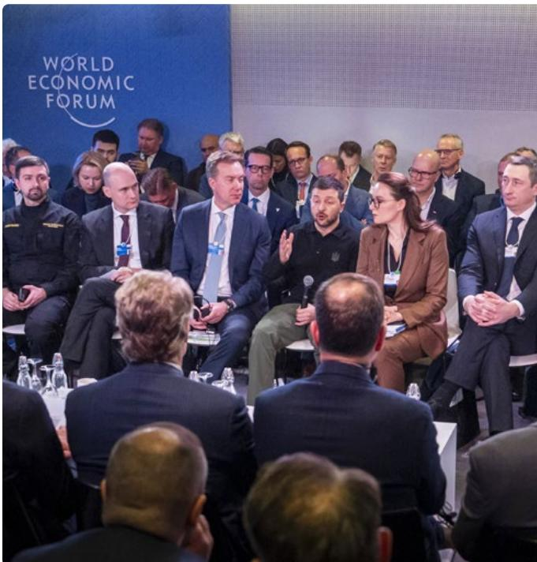

The Forum released key flagship reports, such as the Global Cooperation Barometer, the Global Risks Report, the Chief Economists Outlook, and the Global Cybersecurity Outlook 2024 in the run-up to the meeting, which informed the deliberations in Davos. Building on the Forum's ongoing work, close to 50 multistakeholder initiatives were launched or advanced. These included the Industries in the Intelligent Age series, which provides a comprehensive roadmap for businesses and governments to adopt and scale artificial intelligence (AI); the Global Data Partnership for Forced Labour, which accelerates data and accountability into action against forced labour; the Frontier MINDS, aimed at spotlighting and scaling high-impact AI solutions; the Women's Health Impact Tracking Platform; and the Future of Clean Fuels initiative.

Several regionally focused initiatives were also launched during the Annual Meeting, such as the Humanitarian Resilience Initiative Roadmap for Africa, the Mongolia Strategic Intelligence Hub, and the Saudi Arabia Markets of Tomorrow Accelerator's Action Plan, while progress continued through the work of established communities, such as the Forum Friends of the African Continental Free Trade Area coalition or Leaders for Sustainable Middle East and North Africa.

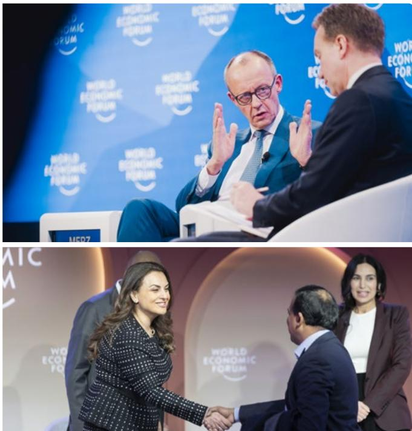

# Annual Meeting of the New Champions 2025

More than 1,700 leaders from business, government, civil society, international organizations and academia, as well as top innovators, gathered in June 2025 for the 16th Annual Meeting of the New Champions in Tianjin, China. Under the theme “Entrepreneurship for a New Era”, the meeting explored how to craft new pathways for growth through entrepreneurship and innovation.

Despite taking place against a complex geoeconomic backdrop, the meeting was marked by a renewed spirit of collaboration and partnership to drive positive and lasting change. As entrepreneurs play a key role in fully realizing the potential of emerging technologies for the benefit of economies and societies, the meeting gathered over 200 top innovators from across the world to help leaders navigate this transformation.

The meeting was attended by Premier Li Qiang, who provided insights on China's economic priorities. Also in attendance were Lawrence Wong, Prime Minister of Singapore; Pham Minh Chính, Prime Minister of Viet Nam; Ousmane Sonko, Prime Minister of Senegal; Adylbek Kasymaliev, President of the Council of Ministers of Kyrgyzstan; and Daniel Noboa Azín, President of Ecuador.

## Sustainable Development Impact Meetings 2024

In September 2024, the Forum convened its communities of purpose for the Sustainable Development Impact Meetings (SDIM24) in New York City. The meetings brought together more than 1,200 global leaders, including approximately 50 senior government leaders, to advance the Forum's multi-year initiatives to maintain momentum towards the Sustainable Development Goals (SDGs).

Highlighting the critical need for collaboration to address shared challenges, the deliberations focused on three areas: 1) the potential of AI and other frontier technologies, 2) the need to maintain momentum on climate action and accelerate the energy transition, and 3) the new tools necessary to sustain growth and build more resilient economies. During the meetings, the Forum also hosted a series of dialogues with senior religious leaders, underscoring the importance of interfaith cooperation. Additionally, the Forum and Association of Southeast Asian Nations (ASEAN) leaders organized a diplomacy dialogue on Myanmar to strengthen international awareness and humanitarian support towards the crisis in the country.

The meetings' outcomes included the launch of the Quantum Application Hub; the release of the Rise Ahead Pledge from the Global Alliance for Social Entrepreneurship, which focuses on mobilizing the private sector to support social innovation and create partnerships; and the introduction

Together, they all emphasized the importance of sustained and innovative collaboration to unlock prosperity for all. Discussions also revolved around China's economic outlook and its shift towards technology-driven growth, while underscoring optimism around the role of the wider Asia region as a key driver for the world's economy.

In addition to the many dialogues, the meeting also saw the release of the Top 10 Emerging Technologies Report and the announcement of the 2025 Technology Pioneers cohort, comprising 100 start-ups advancing solutions ranging from smart robotics to quantum. The inaugural cohort of MINDS came together to showcase how AI is transforming industries, and the second edition of The Future of Global Fintech report offered new insights to guide industry and policy leaders. In addition, the Global Lighthouse Network launched its first edition in China, and the First Movers Coalition was formally introduced to China's industrial ecosystem, further expanding the reach of sustainability and innovation efforts in the region. Finally, the meeting saw the launch of a three-year Youth and Social Innovation Initiative to help promote cross-regional collaboration, and the white paper Redefining Value: From Outcome-Based Funding to Tradeable Impact highlighted the overall concept of impact currency and impact exchange.

of the Inclusive AI Initiative for Growth and Development and the Equitable Transition Initiative.

The Global Alliance for Women's Health Community of Champions and the First Movers Coalition's report, High-Emitting Sectors: Challenges and Opportunities for Low-Carbon Suppliers, was also launched.

## Annual Meeting of the Global Future Councils 2024

The 15th Annual Meeting of the Global Future Councils (AMGFC) in 2024 set the scene for the Annual Meeting, bringing together members of this high-level interdisciplinary knowledge network to discuss overarching challenges such as the climate emergency, geopolitical tensions and economic inequality, as well as the more specific effects of disinformation, cyberthreats and rapidly advancing technologies like AI.

A total of 500 experts from 80 countries participated in the meeting, representing 30 future councils. In terms of sectoral spread, 25% came from business, 35% from academia and the remainder from public figures or civil society. For the first time, more than 50 business leaders – including chief economists, chief risk officers, chief health officers, chief people officers and chief learning officers – explored new ways to improve workers’ well-being and learning opportunities and to improve risk preparedness and economic forecasting.

## Industry Strategy Meeting 2025

The Industry Strategy Meeting brought together more than 300 strategy officers to develop the lessons and takeaways from the Annual Meeting. Participants had the opportunity to collaborate, engage in peer-to-peer exchanges, explore and anticipate the future of industries, and advance the Forum's action and impact agenda.

The meeting, an annual milestone for the strategy officers engaged in the Forum's 22 global industry communities, defined four priorities for the year: 1) powering new business models and industry transformation, 2) augmenting capabilities for people-centric, resilient organizations, 3) accelerating the energy transition and decarbonization, and 4) driving innovation for sustainable and inclusive growth.

The meeting's outcomes were designed to inform the scope and direction of the Forum's industry communities and to scale up and magnify the impact of the existing initiatives of the Forum's centres.

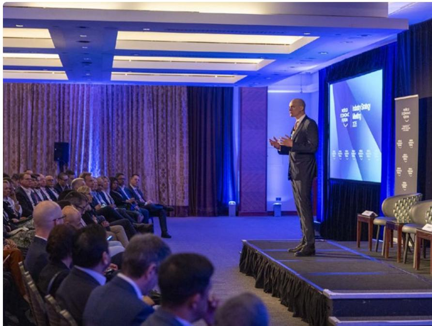

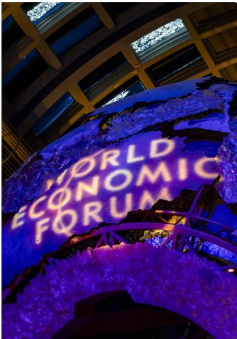

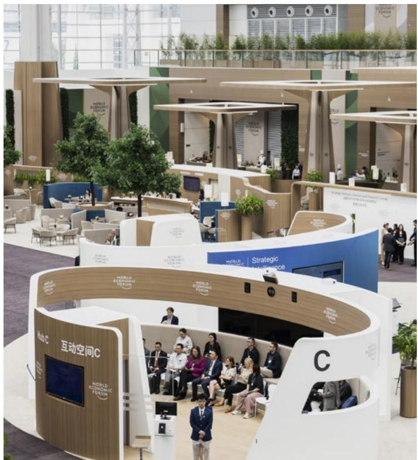

“

The gatherings hosted by the Forum play a critical role in promoting dialogue and collaboration among leaders from across geographies and disciplines. They provide an invaluable platform to address pressing challenges, share innovative ideas and build partnerships that drive positive, inclusive change worldwide.

Mirek Dušek, Managing Director, Chief Business Officer and Head of Global Programming, World Economic Forum

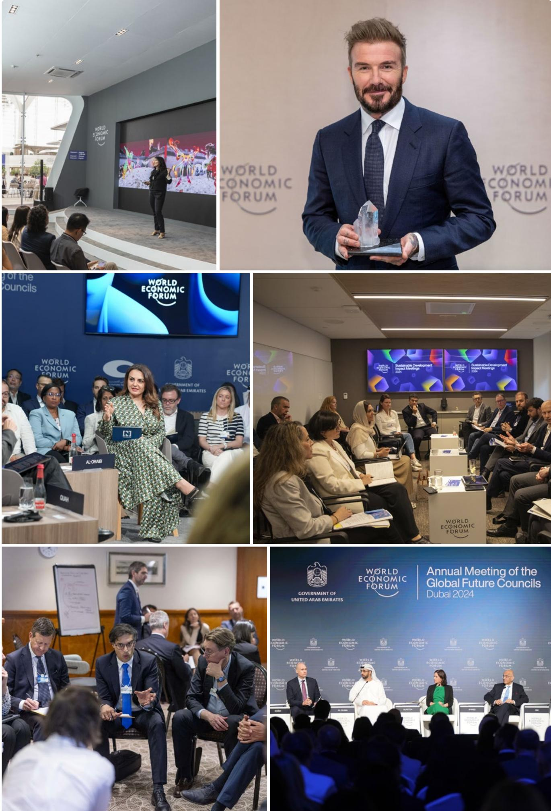

Annual Report 2024-2025
Our Impact

## Our Organization

The following sections provide an overview of key areas of the organization and significant highlights from 2024-2025.

Our Centres

Our Initiatives, Communities and Key Insights

Our Core Functions

Our Talent and Workplace Culture

Our Offices

Our Sister Organizations 61

# Our Centres

# Centre for Advanced Manufacturing and Supply Chains

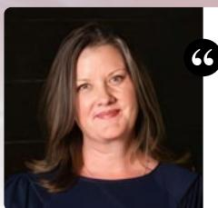

The centre drives actionable solutions, delving into the ‘how’, not just the ‘why’, to lead responsible industry transformation in a time of geopolitical uncertainty.

Kiva Allgood, Managing Director

The centre seeks to unite global manufacturing and supply chain ecosystem leaders to share best practices, ignite innovation and scale the impact of their efforts. In doing so, it plays an integral role in driving the responsible transformation of industry.

To achieve this, it brings together more than 250 partners from business, government, academia and civil society. Through flagship initiatives such as the Global Lighthouse Network and a growing portfolio of collaborative projects, it champions key issues including cutting-edge technology, environmental stewardship and workforce transformation.

It operates across four key areas: resilient value chains, technology and innovation, people-centric transformation, and sustainable systems. The centre works to future-proof global value chains by supporting the development of new industrial strategies that build resilience and promote growth in manufacturing and supply chains. It aims to accelerate the adoption of advanced manufacturing technologies at scale through initiatives such as the Global Lighthouse Network, The Next Frontier of Operations and the Lighthouse Operating System.

The centre continues to promote emerging practices and tools that enhance diversity, inclusion, workforce development and the attractiveness of industry careers. Key initiatives include Frontline Talent of the Future and the New Generation of Industry Leaders. It also identifies innovative solutions to enable circularity and accelerate the transition to net zero across industry. Major efforts in this area include the Industry Net Zero Accelerator, Circular Transformation of Industries and the SME Sustainability Accelerator.

With these programmes as the foundation of its work, the centre achieved success in three priority areas during the reporting period: strengthening its global presence, expanding its influential leader community and the Global Lighthouse Network into a globally impactful platform, and advancing sustainable, resilient, people-centric industrial transformation in a rapidly evolving global landscape.

Among the highlights was the continued growth of the Global Lighthouse Network, with 36 new lighthouses added, bringing the total number of best-in-class production sites and value chains to 189. The network's criteria expanded to include talent and customer centricity, creating a more comprehensive benchmark for excellence in advanced manufacturing.

To address barriers to industrial decarbonization, the centre unveiled a framework of eight opportunities for public-private cooperation. In response to industry leaders' shift towards regionalization, it also launched the Beyond Cost: Country Readiness for the Future of Manufacturing and Supply Chains report, including a Global Readiness Index that outlines seven readiness factors to guide manufacturers' value chain decisions on their production footprint and inform government industrial policy agendas.

The New Generation of Industry Leaders initiative entered its second year, with the latest cohort convening in Boston and Geneva. Following a policy roundtable in Washington, D.C., a new Industry 4.0 career path initiative was announced, aimed at making manufacturing careers more attractive and addressing a projected shortfall of two million workers in US manufacturing.

In a major development, the centre's community of chief operating, supply chain and procurement officers was restructured with a new, focused mandate to support the technological transformation of small- and medium-sized enterprises (SMEs). The community expanded strategically and now includes more than 90 chief experience officers (CXOs), along with a new deputies community to operationalize decisions.

The centre expanded its global footprint with new affiliates in Qatar, South Africa and Viet Nam. It convened key community meetings in China, India and the US, and hosted the first Advanced Manufacturing and Supply Chains Forum in Boston – bringing together leaders from industry, government, academia and start-ups to develop strategies for “Resilience and Innovation in the Intelligent Age”.

# Centre for Nature and Climate

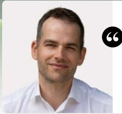

## The centre is at the cutting edge of work to ensure shared prosperity and equitable economic progress within the planet's limits.   Sebastian Buckup, Managing Director

The centre aims to ensure shared prosperity within the planet's limits, focusing on strengthening the foundations for a safe climate, resilient ecosystems and human systems that enable equitable economic progress and long-term social stability.

Strategic priorities include driving climate mitigation, adaptation and industry transformation to achieve a net-zero, resilient future that safeguards lives, livelihoods and ecosystems. It seeks to catalyse business leadership, investment and policy change to protect, restore and sustainably manage terrestrial, marine and freshwater ecosystems, and promote nature-positive economies. Finally, it advances the shift to regenerative, circular and inclusive systems of production and consumption within planetary boundaries.

Decarbonization requires technological innovation and unprecedented collaboration across value chains and regions. Over the reporting period, the centre mobilized business leaders and innovators to drive systemic change.

The Alliance of CEO Climate Leaders demonstrated impactful leadership, collectively reducing their absolute emissions by 10% – a reduction equivalent to France's annual emissions. Meanwhile, the First Movers Coalition harnessed the purchasing power of over 100 companies, generating \$16 billion in demand for low-carbon products and accelerating breakthrough clean technologies in hard-to-abate sectors. In aviation, the Airports of Tomorrow initiative united 70 partners, launching the Global Aviation Sustainability Outlook and developing new partnerships to scale sustainable aviation fuels, further supported by the launch of the Green Fuel Forward initiative in Asia-Pacific.

Nature loss, impacting 75% of the Earth's land, poses significant ecological and economic risks. Yet, transitioning to nature-positive business models could unlock \$10 trillion annually by 2030. The centre continues to work to unlock these opportunities while protecting and restoring precious terrestrial and marine ecosystems.

The centre launched the CEO Alliance on Nature, engaging business leaders to embed nature-positive practices into operations. It also published guidance for eight industrial sectors on how to reduce their impact and transition towards nature-positive models.

The Ocean Action Agenda continued to advance a regenerative blue economy, supporting over 550 innovation start-ups, catalysing more than \$5 billion in private investment for ocean health. It also unveiled a white paper, Investing in Mangroves: The Corporate Playbook, for mangrove restoration.

The 1t.org movement continued to inspire action, with 92 companies pledging to protect, restore and grow nearly 10 billion trees in 143 countries and contribute to the creation of the world's largest tropical forest reserve. In agriculture, the Tropical Forest Alliance continued to drive the shift towards deforestation-free supply chains, with a new task force in China securing 1.5 million tonnes of certified sustainable soy from Brazil.

The centre champions circularity, innovation and partnership to steward Earth's precious resources. The Global Plastic Action Partnership (GPAP) expanded national partnerships to 25. Initiatives such as Circularity in the Built Environment and the Circular Innovation Ecosystem accelerated the shift to circular supply chains, with the latter recognizing 13 start-ups for traceability innovations. The First Movers Coalition for Food is scaling demand for sustainable agriculture, while the Food Innovation Hubs network connected over 250 innovators across six countries. The centre launched the Water Futures community to address rising water stress across food systems, industry and urban resilience.

Transformational change requires bold initiatives and convening power. The centre's leadership communities help boost ambition and accelerate collaborative action. In this spirit, the GAEA (Giving to Amplify Earth Action) initiative, which has secured approximately \$200 billion in aggregated capital, stayed on track to become the largest market signal of philanthropic and impact capital.

# Centre for Cybersecurity

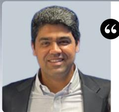

## Cybersecurity is entering an era of unprecedented complexity, making strong leadership essential as organizations navigate a world of cyber risks and challenges.

Akshay Joshi, Head, Centre for Cybersecurity

The centre seeks to support individuals and organizations to securely benefit from ongoing digital and technological progress. To achieve this, it provides an independent and impartial platform to reinforce the importance of cybersecurity as a strategic imperative and drive global public-private action to address systemic cybersecurity challenges.

Its three priority areas of work are building cyber resilience, strengthening global cooperation and navigating cyber frontiers. It seeks to achieve these by promoting best practices and developing solutions to enhance cyber resilience throughout industry ecosystems (building cyber resilience); facilitating public-private partnerships to address challenges collaboratively (strengthening global cooperation); and identifying and explaining the cybersecurity risks and opportunities of emerging technologies and an increasingly interconnected world (navigating cyber frontiers).

Among the centre's highlights from the reporting period was its Annual Meeting on Cybersecurity, which convened over 150 experts to collaborate towards advancing equity in cyberspace. The meeting was also instrumental in strengthening support for the centre's ongoing initiatives.

Its Global Cybersecurity Outlook 2025 examined the cybersecurity trends expected to affect economies and societies in the coming year. It underscored the growing complexity in cyberspace, which is characterized by geopolitics, emerging technologies, supply chain interdependencies and cybercrime sophistication.

During the reporting period, the centre brought together more than 50 public and private organizations to share knowledge and identify systemic solutions to counter cybercrime at scale, as part of its Partnership against Cybercrime initiative. In the same vein, its Cybercrime Atlas initiative developed a framework for operational collaboration and best practices to support the success of anti-cybercrime partnerships.

As part of this work on implementing the Disrupting Cybercrime Networks: A Collaboration Framework in different regions, training exercises were co-hosted with INTERPOL in Bangkok, Thailand and Panama City, Panama.

Alongside this, the centre focused on strengthening cyber resilience in industries undergoing a fundamental transformation, considerably heightening cyber risks. This involved working with more than 200 cybersecurity leaders to develop and scale up solutions and promote effective cybersecurity practices across industry ecosystems.

In January, the centre launched a Centre for Cyber Economics (CCE) in Riyadh, Saudi Arabia, in collaboration with the Global Cybersecurity Forum, as part of the Forum's Centre for the Fourth Industrial Revolution Network. CCE will develop robust, evidence-based frameworks to enhance global cybersecurity resilience and economic stability.

Cybersecurity skills shortages are a major and ongoing problem. As part of the centre's work to address the demand for a skilled cybersecurity workforce, it unveiled Growing Cyber Talent Through Public-Private Partnerships at the Global Conference on Cyber Capacity Building (GC3B) in Geneva, Switzerland, in May 2025.

The centre hosted a high-level ministerial meeting of the GC3B organized by the Swiss Federal Department of Foreign Affairs (FDFA). Under the leadership of the African Union Development Agency-New Partnership for Africa's Development (AUDA-NEPAD), this meeting brought together 54 ministers and senior executives to discuss the African Declaration on Cybersecurity Capacity Building.

To support this effort, the centre, in collaboration with the Western Balkans Cyber Capacity Center, held a capacity-building workshop dedicated to strengthening global operational collaboration to disrupt cybercrime and enhancing cybersecurity workforce development. Maraš Dukaj, Minister of Public Administration of Montenegro, opened the event, which brought together over 80 participants from across the Western Balkans.

Finally, the centre collaborated with the University of Oxford's Global Cyber Security Capacity Centre to develop knowledge that supports organizations in managing the cybersecurity risks associated with the adoption of AI technologies. This collaboration culminated in the publication of the report, Artificial Intelligence: Balancing Risks and Rewards.

# Centre for Energy and Materials

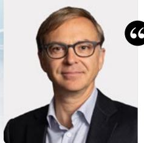

## Our mission is to accelerate a secure, equitable and sustainable energy transition by translating insights into collaborative action – across countries, industries and supply chains. Roberto Bocca, Head, Centre for Energy and Materials

The centre seeks to accelerate the transition to a secure, sustainable and equitable energy system that enables positive economic and social development. It achieves this by convening leaders from companies and countries to create insights, co-develop solutions and collaborate to advance energy and material transitions.

It has five priorities and advances them through initiatives, its communities, events and insights. It offers energy and industry transition intelligence about the evolution of energy and industrial systems to better inform energy transition efforts.

The centre helps accelerate power system transformation and the deployment of clean power to support electrification and the growing electricity demand. It similarly seeks to accelerate industrial ecosystem transformation, driving the transformation of industrial clusters to enable the reduction of energy and carbon intensity while also creating jobs and economic growth.

It generates insights into the resources needed for the energy transition, and it addresses critical enabling factors for the transition, such as financing clean energy in emerging markets, harnessing AI for the transition, deploying clean fuels and transitioning coal to clean energy.

These priorities formed the basis of several achievements during the reporting period. The Fostering Effective Energy Transition 2025 report, based on 15 years of benchmarking countries' energy systems, remains a vital tool for assessing progress, identifying gaps and guiding stakeholders towards more secure, sustainable and inclusive energy systems.

Its Transitioning Industrial Clusters initiative expanded, welcoming 12 new clusters from Australia, Brazil, Colombia, India, the Netherlands, Saudi Arabia, Sweden and the UK. The initiative works with 35 clusters in 16 countries to reduce emissions and drive economic growth. Research from the Unleashing the Full Potential of Industrial Clusters: Infrastructure Solutions for Clean Energies report highlighted the critical role clusters play in scaling clean energy infrastructure.

The centre's Scaling Financing for Coal Phase-out in Emerging Economies report revealed how to scale up financing solutions for coal retirement in emerging markets and developing economies. The Net-Zero Industry Tracker 2024 provided progress analysis for eight hard-to-abate industrial and transport sectors.

Five Principles for Responsible Deployment of Renewables Infrastructure were developed by public-private leaders. They are designed to guide stakeholders in ensuring that renewable energy projects benefit both people and the planet.

The Network to Mobilize Clean Energy Investment in EMDEs – a coalition of CEOs and governmental ministers – unveiled its Playbook of Solutions during the 2024 G20 and Clean Energy Ministerial Meetings, sharing best practices from 45 emerging and developing economies to increase clean energy investment.

The Clean Power, Grids and Electrification programme released A Collaborative Framework for Accelerating Advanced Nuclear and Small Modular Reactor Deployment, aligning nuclear sector stakeholders around actions to advance small modular reactor (SMR) deployment.

The centre also expanded its regional collaborations, working closely with five Centres for the Fourth Industrial Revolution in Azerbaijan, Malaysia, Oman, Saudi Arabia and South Africa. It convened two Energy Transition Meetings in May and June 2025 in the ASEAN region and Brazil, bringing together over 350 public- and private-sector leaders to advance regional transition efforts and strengthen global collaboration.

It also launched the Securing Minerals for the Energy Transition: Unlocking the Value Chain through Policy, Investment and Innovation report, which identified barriers to investment and innovation to unlock the critical materials supply.

# Centre for Financial and Monetary Systems

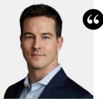

## The centre offers a platform to support focused, action-oriented dialogue among global decision-makers, helping to create a stronger, more resilient financial system.

Matthew Blake, Managing Director

The global financial system is confronting new realities as geopolitical and geoeconomic shifts upend existing norms. At the same time, volatile markets and rapid technological advancements are reshaping the global macroeconomic landscape. While these renewed uncertainties present fresh challenges to global financial resilience, they also create opportunities for innovation and collaboration that can support long-term economic growth and development.

Reflecting this dynamic backdrop, the centre aims to provide an independent and impartial platform to design a more sustainable, resilient, trusted and accessible financial system that reinforces long-term value creation and economic prosperity.

To achieve this ambition, the centre is structured around three thematic pillars: financial resilience for institutions and individuals, technology-enabled innovation in finance, and sustainable finance and investing. Guided by these pillars, the centre engages a diverse base of partners year-round through a variety of strategic content initiatives. These include mapping the implications of AI adoption across the financial system, analysing how demographic shifts will affect financial institutions and their clients, and examining the consequences of rising geoeconomic tensions on global finance and the broader economy, among many other areas of focus.

During the reporting period, the centre achieved several key milestones. Supported by more than 25 chief executives and chairpersons of global financial institutions, the Navigating Global Financial System Fragmentation initiative analysed and quantified the costs of fragmentation, as evidenced by the increasing use of sanctions, industrial policies, investment restrictions, divergent regulations, tariffs and other manifestations around the world. Through a series of multistakeholder convenings and interviews, the initiative proposed a set of principles, rules and policy recommendations aimed at protecting the integrity of the global financial system while acknowledging national security and sovereignty concerns.

The 2024 Global Retail Investor Outlook, covering 13 markets and representing a statistical sample of 50% of the global population, was conducted to better understand the evolving landscape of individual investors.

To address the need for more robust data and empirical evidence on fintech, the centre conducted a global survey of 240 fintech companies in The Future of Global Fintech: From Rapid Expansion to Sustainable Growth, in collaboration with the Cambridge Centre for Alternative Finance. The results will inform multistakeholder roundtables with industry leaders, regulators and policy-makers to inform future action.

The centre also supported hard-to-abate economic sectors in their pursuit of financing and policy solutions to drive net-zero transitions. This work included hosting a three-day First Movers Coalition workshop in partnership with the US Department of Energy and the State Department, authoring a corporate playbook for achieving net-zero goals, and a deep dive into key economies. These efforts aim to promote long-term value creation and economic growth while advancing environmental sustainability and energy independence.

Continuing its focus on demographic change and its implications for the financial system, the centre progressed its Longevity Economy initiative. This work promoted financial resilience by identifying and spotlighting impactful start-ups in the longevity space and by connecting them with key stakeholders, including investors and financiers. Over the past year, more than 50 organizations committed to taking tangible action aligned with the centre's Longevity Economy Principles, which emphasize the development of cutting-edge investment vehicles and products tailored to ageing populations, the expansion of financial education access and the mitigation of demographic disparities driven by socioeconomic factors. The centre was also part of the UpLink Prospering in Longevity Challenge, which aims to build a community for start-ups that promote financial resilience, equitable healthy ageing and lifelong fulfilment.

In March 2025, the centre convened over 170 global decision-makers from 17 industries and 22 countries in Hong Kong under the theme “Financial Services for the Intelligent Age”. Participants from business, academia, civil society, the public sector and innovation communities engaged in 14 sessions to address the most pressing issues facing financial systems today.

Finally, as part of its annual programming alongside the International Monetary Fund and World Bank Group Spring and Annual Meetings, the centre brought together financial services leaders, policy-makers, civil society representatives and other experts to discuss and strategize on critical financial and economic issues impacting sustainability and global growth.

# Centre for the Fourth Industrial Revolution

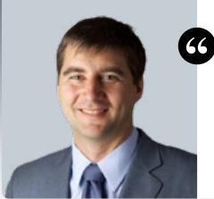

At the Centre for the Fourth Industrial Revolution, we empower leaders to unlock the potential and address the challenges of frontier technologies, helping accelerate the benefits and mitigating the risks of their adoption.
Jeremy Jurgens, Managing Director

The centre seeks to harness technology's potential for the equitable and human-centred transformation of industries, economies and societies. Its mission is to provide a strategic and future-oriented platform to help make sense of exponential technologies and drive their responsible adoption and application globally.

It focuses on four areas: driving breakthrough innovation, accelerating industry transformation, preparing nations for the Intelligent Age, and harnessing technology for the benefit of people and the planet.

To achieve progress in these areas, it holds events and pursues initiatives. For example, its annual Global Technology Retreat, held in San Francisco, brought together thought leaders to explore ideas, develop partnerships and peer exchanges, and challenge existing paradigms. The event offers a platform for policy-makers and regulators to engage with innovators, anticipating regulatory needs and helping to drive a shared vision.

It runs several initiatives aimed specifically at driving breakthrough innovation in areas such as AI, bioeconomy, energy transition, mobility transformation and the quantum economy. It seeks to accelerate industry transformation; its AI workstreams under the AI Governance Alliance promote solutions aimed at supporting sectors and enabling their innovation.

In terms of supporting nations to prepare for the Intelligent Age, the centre seeks to support the digitization of public administrations and runs programmes that use digital literacy and governance to tackle online harm. Its work in AI helps develop locally grounded innovation ecosystems and supports adaptive, global policy tools. It also helps define trust standards for emerging technologies, and is involved in helping build a secure, open and interoperable digital public infrastructure.

Through its work harnessing technology for people and the planet, the centre oversees initiatives that use the technology to support farmers in India, seeks to help drive a safe and sustainable space environment, and promotes technologies and practices to mitigate climate risks.

These initiatives form the foundation of the centre's work, and during the reporting period, it also achieved several additional successes. Among these was the connection of more than one billion people in more than 100 countries to essential digital services in healthcare, education and finance, thanks to the work of the EDISON Alliance, which surpassed its 2025 target.

A memorandum of understanding (MoU) was signed with the United Arab Emirates at the Annual Meeting 2025, resulting in the creation of an initiative focused on regulatory innovation, advancing collaborative efforts to ensure government and business are prepared for the Intelligent Age.

## A second new initiative, Technology Convergence,

was launched to identify and advance the most effective combinations of emerging technologies to enhance value chains, drive innovation and inform strategic decision-making in different sectors. It was launched through the inaugural Technology Convergence Report, which introduced a framework for anticipating cross-sector disruption.

The Technology Pioneers Innovator Communities marked the programme's 25th anniversary. Since its inception, it has recognized 100 forward-thinking start-ups annually, spotlighting emerging technologies and the entrepreneurs behind them.

The Tech for Climate Adaptation initiative demonstrated how frontier technologies can protect critical value chains like food, energy and manufacturing from climate impacts, helping prevent up to 4% in cumulative GDP (gross domestic product) losses by 2100.

The Forum's Centres for the Fourth Industrial Revolution grew to 22 members, with the launch of Global Government Technology Centre Berlin and Global Government Technology Centre Kyiv, as well as Centre for the Fourth Industrial Revolution Medellín, Centre for the Fourth Industrial Revolution Oman, the South Africa Centre for Industry and Technology, Riyadh's Centre for Cyber Economics, and the renewal of Centre for the Fourth Industrial Revolution United Arab Emirates. The focus of these centres is on advancing work on AI, the energy transition, industrial digitization, decarbonization and cybersecurity economics.

# Centre for Health and Healthcare

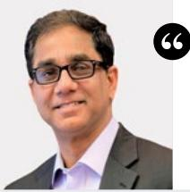

# The centre strives to make equitable, accessible healthcare a right, not a privilege – pioneering strategies to ensure the well-being of all.

Shyam Bishen, Head, Centre for Health and Healthcare

The mission of the centre is to support a future where every person, regardless of geography, socioeconomic status or background, can access high-quality healthcare. The centre identifies and scales transformative solutions that build resilient, inclusive and efficient systems, empowering individuals and communities to thrive in health and well-being.

Its work focuses on three foundational priorities. First, improving health and well-being by ensuring access to care at a time when disparities are increasing. Second, advancing intelligent health systems that optimize outcomes through innovation. Third, mitigating health risks by facilitating public-private collaborations to enhance global health security.

This past year marked significant progress across these areas. Notably, the centre launched the Global Activator Network: Breast and Cervical Cancer Coalition, an initiative within the Global Alliance for Women's Health, aimed at closing the women's health gap. This coalition unites health ministries and public-private partners to strengthen national efforts to combat cervical and breast cancer, particularly in Sub-Saharan Africa.

In January, the centre introduced the Unified Coalition for the Antimicrobial Resistance Response (UCARE Initiative) and the Davos Compact on AMR. These initiatives reflect the urgency of addressing antimicrobial resistance, which causes over one million deaths each year. The centre's approach spans accelerating research and development, expanding diagnostics and vaccine access, promoting awareness and supporting sustainable practices in agriculture, alongside mechanisms to boost private-sector investment.

The centre also launched the Global Future Council on Neurotechnology, which convened over 700 experts to explore the promise and ethical dimensions of neurotechnology, from cognitive enhancement to medical applications.

In May, the centre launched the Brain Health Action Forum to unlock the full potential of individuals and societies by investing in brain health as a foundation for a healthier, more inclusive and more resilient future.

In South-East Asia, the centre introduced the Healthcare Country Activator for Digital Transformation and Health for All in Singapore, alongside the launch of a Digital Health Activator in India. These efforts aim to strengthen national digital health strategies and promote access for all.

Reflecting on this year's achievements, the Centre for Health and Healthcare remains steadfast in its commitment to advancing access, innovation and system resilience. Through global partnerships, cross-sector collaboration and a shared sense of purpose, it continues to build momentum towards a world where every individual can access the care they need. The progress captured in this report is not an endpoint, but a catalyst, propelling the centre's work forward in advancing the future of health.

# Centre for the New Economy and Society

Never has innovation, in scaling ideas and policies that create economic opportunity for all, been so necessary to addressing fragmentation and capitalizing on new tools and technologies.
Saadia Zahidi, Managing Director

In a landscape of increasing uncertainty, slower economic growth and labour market disruption, adapting economic systems is critical for shared greater prosperity.

The Centre for the New Economy and Society partners with leaders in business, government and civil society to understand current challenges and future scenarios, develop new ideas and build collaborations that create economic opportunities for all.

It works in three areas: economic and risk foresight, human capital advancement and economic inclusion. During the reporting period, the centre worked with over 400 business partners, over 50 governments, 30 international organizations, and more than 100 academic, civil society and philanthropic organizations to ensure a future where economies and societies work for everyone.

In a year marked by volatility, the centre produced three editions of its Chief Economists Outlook, offering timely short-term analysis. This was complemented by longer-term perspectives, such as the Global Economic Futures: Productivity in 2030 and Global Economic Futures: Competitiveness in 2030. The Future of Growth Initiative convened over 65 champions for quarterly dialogues focused on innovation, inclusion, sustainability and resilience.

The Global Risks Initiative focused on identification and preparedness; the 20th edition of the Global Risks Report 2025 highlighted an increasingly fractured global landscape, while the Global Risks Consortium gathered 25 leaders to address risk interconnections and foresight.

The Future of Jobs Report 2025 provided insights into how technological change, geoeconomic fragmentation, economic uncertainty, demographic shifts and the green transition will transform jobs and skills by 2030. The Future of Jobs Initiative also explored AI-enabled job augmentation and transitions. Through the Good Work Toolkit, partners committed to supporting more than 15 million workers in 2024-25.

The Reskilling Revolution initiative, which aims to empower one billion people with better education, skills and economic opportunities by 2030, reached over 750 million people as of June 2025. The initiative secured new commitments and produced thought leadership on AI in education and a Global Skills Taxonomy Adoption Toolkit.

Efforts to close gender parity gaps by 2030 advanced through the Global Gender Parity Sprint, which gathered over 40 champions. The Global Gender Gap Report 2025 benchmarked gaps across 146 economies, while the Diversity, Equity and Inclusion Lighthouses 2025 report shared best practices in organizational inclusion.

The Equitable Transition Initiative championed strategies for building a “people first” focus into the economic transition towards greener net-zero economies. Over 30 champions have joined the initiative, working alongside the Global Future Council on Equitable Transition to co-design a set of country archetypes, data tools (Accelerating an Equitable Transition: A Data-Driven Approach) and policy guidelines (Accelerating an Equitable Transition: Policy Guidelines for Impact).

The centre's work combines global initiatives and frameworks with localized partnerships. Its national Accelerators Network helps advance policy innovations and initiatives that build new economic approaches for better growth, human capital development and economic inclusion. The accelerator programmes have directly supported 16 million people and mobilized more than \$80 million to date to support multiple projects. During the reporting period, new accelerators were launched in Australia, Azerbaijan, Bahrain, Colombia, Egypt, Guatemala, Indonesia, Malaysia and Rwanda. The centre also signed an agreement with the Africa Finance Corporation (AFC) to scale up the network on the African continent, with a focus on economic growth and development.

## Centre for Regions, Trade and Geopolitics

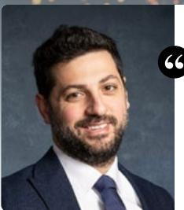

During a year when the global landscape experienced tectonic geopolitical and geoeconomic shifts, the centre's dedication to advancing collaborative solutions to shared challenges has never been more valuable. Maroun Kairouz, Managing Director

The centre advances cooperative solutions to global and regional challenges by bringing together governments, international organizations and civil society groups with the Forum's business partners.

It works in three primary areas: regional collaboration, strengthening trade and investment and facilitating global cooperation. Regionally, the centre convenes public- and private-sector stakeholders to address regional economic, environmental and technology priorities. In trade and investment, it promotes open and resilient markets, eases physical, digital and financial flows, and advances sustainable value chains. In geopolitics, the centre provides insight into trends and identifies mechanisms for strengthening global partnerships and effective development and humanitarian action.

Throughout the year, the centre organized dialogues and produced key analyses, including the Global Cooperation Barometer 2025, which measures international cooperation, and the report From Blind Spots to Insights: Enhancing Geopolitical Radar to Guide Global Business, offering guidance for businesses navigating geopolitical risks.

During the Annual Meeting, the centre convened its inaugural Resilience Consortium Leadership Group and released its fourth report surveying over 250 executives on managing volatility. The Humanitarian and Resilience Investing (HRI) initiative announced an Africa roadmap with the African Development Bank, and secured an additional \$300 million in impact investments in frontier markets, adding to existing commitments of \$5.6 billion.

Other highlights included organizing the Country Strategy Meeting – Argentina, engaging President Javier Milei and over 50 business leaders on national priorities and regional developments.

In partnership with the Council on Foreign Relations, the centre launched the Geopolitical Advisory Group, a community of chief geopolitical affairs officers that will meet quarterly.

A significant milestone was the launch of the Leaders for European Growth and Competitiveness community, coordinated with European Commission President Ursula von der Leyen, European Parliament President Roberta Metsola, and 35 European CEOs. The group focuses on bolstering the continent's competitiveness in key industries while strengthening external alliances.

Collaborations also included work with Brazil's G20 Presidency on energy, health, social economy and oceans, and with Colombia's Presidency of the Convention on Biological Diversity (CBD COP16) on topics such as plastics, food and water, and ocean innovation.

On trade, the TradeTech Forum convened more than 300 leaders in April 2025 to work on accelerating the deployment of frontier technologies for global trade and supply chain visibility.

The Global Alliance for Trade Facilitation, marking its 10th year, now operates in 25 project countries, engaging nearly 50 global business partners and 2,000 local micro, small and medium enterprises (MSMEs). The alliance has simplified trade, saving over \$213 million and delivering a 240% return on investment.

In Asia-Pacific, the centre continued to work on the ASEAN DEAL initiative to support the advancement of the world's first such Digital Economy Framework Agreement (DEFA). In South Asia, it partnered with the Ministry of Petroleum and Natural Gas for India Energy Week 2025, where India reaffirmed its commitment to the Global Biofuels Alliance.

In the Middle East, three regional meetings advanced public-private collaboration, including anti-desertification efforts at COP16 in Riyadh. Forum leadership also met with Egyptian President Abdel Fattah El-Sisi to discuss regional developments.

In Africa, the centre continued convening the Friends of the African Continental Free Trade Area (AfCFTA) community to accelerate implementation of the trade agreement.

In North America, its Dialogue Series convened US industry and union leaders to explore the future of work in technology and advanced manufacturing.

# Centre for Urban Transformation

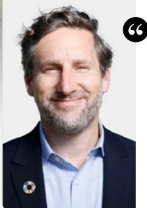

Throughout history, cities have been at the forefront of change. They are engines of progress, powerhouses of the global economy and proving grounds for bold, innovative ideas. As businesses and governments confront new challenges, the centre helps open doors to new opportunities – forging partnerships, unlocking markets and supporting a more resilient future.
Jeff Merritt, Head, Centre for Urban Transformation

The centre helps businesses and governments navigate an era of accelerating change and complexity by harnessing the power of cities as engines of innovation, talent and long-term competitiveness.

Its initiatives and communities unite leaders across 25 industries and more than 100 national and subnational governments to facilitate local testbeds that reimagine how people live and work, while seeding and scaling up the businesses of tomorrow.

The centre focuses on four key areas of economic opportunity and resilience, advancing public-private collaboration to unlock new growth through the innovation ecosystems, experience economies, place-based strategies and next-generation infrastructure.

The centre's work with innovation ecosystems accelerates ground-breaking solutions, unlocks new markets and builds engines of inclusive economic opportunity. Through cross-sector partnerships, the centre is reimagining tourism, events and consumer experiences to drive sustainable growth and enhance quality of life.

As part of its efforts on place-based strategies, it partners with global and local leaders to advance high-quality, resilient communities that honour local culture and history, attract investment and talent and promote well-being. Finally, the centre helps mobilize investment in innovative physical, digital and social infrastructure to support future-ready communities and economies.

During the reporting period, leading retail, e-commerce, mobility and logistics companies announced new commitments and a shared ambition for more sustainable and efficient urban deliveries, while also working with governments to embrace new solutions and models that benefit consumers, couriers, companies and cities. These outcomes were enabled by a Forum-led process to convene and align industry leaders around a common ambition and facilitate collaboration with city governments to drive implementation.

Progress was also recorded in the travel and tourism sector, which employs more than 330 million people worldwide. To help sustain rapid growth in the sector, leading companies and experts outlined a vision to reimagine it as a transformative force for good. The Forum convened a broad, global coalition of stakeholders to begin charting a new, more inclusive and sustainable path forward for the industry.

The Davos Baukultur Alliance reached a milestone, having secured the involvement of more than 80 member organizations with operations in over 140 countries, all committing to support a shared vision for advancing more inclusive, sustainable and vibrant communities.

Members of the Global Commission on Nature-Positive Cities released a new strategy blueprint, insight report and a collection of city profiles aimed at informing and accelerating the transition to a nature-positive economy.

The Global Innovation and Impact Council released Shaping Tomorrow: Responsible Innovation for a Brighter Future, promoting a responsible innovation framework, which the Innovation Impact Alliance will use to support a community of pioneer cities working to establish a new model for aligning economic development with urban transformation strategies.

# Our Initiatives, Communities and Key Insights

The centres convene diverse groups to share knowledge, accelerate action and spark innovation and ideas to tackle the world's most pressing challenges. The following list describes the multistakeholder initiatives and communities that are currently operating to effect change.

Centre for Advanced Manufacturing and Supply Chains

<table><tr><td>Name</td><td>Description</td></tr><tr><td>Chief Operating, Supply Chain and Procurement Officers Community</td><td>A network of over 90 C-suite executives across 15 industries, working to anticipate and navigate complexity in global manufacturing and supply chains.</td></tr><tr><td>Circular Transformation of Industries</td><td>Promotes a sustainable and resilient industrial economy through widespread adoption of circularity principles.</td></tr><tr><td>Frontline Talent of the Future</td><td>Drives societal and economic outcomes by deploying solutions to attract, skill and retain talent in manufacturing and supply chains.</td></tr><tr><td>Future-Proofing Global Value Chains: Country Preparedness and Beyond</td><td>Explores the latest trends affecting global value chains and identifies opportunities and best practices to inform next-generation manufacturing strategies, value chain configurations and industrial policies.</td></tr><tr><td>Global Lighthouse Network</td><td>Recognizes top performers in tech-enabled industrial transformation, creating a shared learning platform across 189 facilities and value chains that use digital technologies to boost productivity, resilience, sustainability, talent and customer focus.</td></tr><tr><td>Global Network of Advanced Manufacturing Hubs</td><td>Connects regional manufacturing ecosystems to share insights, scale innovation and promote global collaboration, ensuring locally tailored responses to global industry shifts and emerging technologies.</td></tr><tr><td>Industry Net Zero Accelerator</td><td>Supports industries to accelerate their decarbonization journey to achieve net-zero emissions by or before 2050 by addressing the “how-to” questions of operationalizing decarbonization commitments across the value chain.</td></tr><tr><td>Lighthouse Operating System</td><td>Aims to develop a responsible operating model for industry, co-designed by leaders and rooted in lean, digital and sustainable principles.</td></tr><tr><td>New Generation of Industry Leaders</td><td>Connects emerging leaders to build and accelerate responsible industry transformation while inspiring the next generation with the future frontiers of industry.</td></tr><tr><td>Next Frontier of Operations</td><td>Explores the transformative potential of frontier technologies and their role in reshaping industrial operations and redefining human-machine collaboration.</td></tr><tr><td>Small and Medium-Sized Enterprises Sustainability Accelerator</td><td>Supports manufacturing small and medium-sized enterprises and mid-sized firms in advancing their sustainability goals while staying competitive, offering actionable roadmaps and mapping available support from public and private sectors.</td></tr></table>

## Centre for Cybersecurity

<table><tr><td>Name</td><td>Description</td></tr><tr><td>AI &amp; Cyber Initiative</td><td>Advances knowledge that supports organizations in managing the cybersecurity risks associated with the adoption of AI technologies.</td></tr><tr><td>Chief Information Security Officer Community</td><td>Provides a platform for cybersecurity leaders to exchange insights and best practices on the most pressing cybersecurity challenges.</td></tr><tr><td>Cyber Resilience in Industries</td><td>Develops forward-looking solutions and promotes effective practices to enhance cyber resilience across industry ecosystems.</td></tr><tr><td>Global Cybersecurity Outlook</td><td>Examines the cybersecurity trends that will affect economies and societies in the year to come. Seeks to elevate cybersecurity from a technical issue to a strategic leadership imperative and promote priority actions to address growing cyber risks.</td></tr><tr><td>Partnership Against Cybercrime</td><td>Drives public-private collaboration and insight-sharing to develop and implement approaches to disrupt cybercrime.</td></tr></table>

## Centre for Energy and Materials

<table><tr><td>Name</td><td>Description</td></tr><tr><td>Accelerating New Nuclear</td><td>Facilitates alignment and a shared vision among global nuclear ecosystem stakeholders on the priorities and actions needed to accelerate new nuclear deployment.</td></tr><tr><td>AI Energy Impact: Challenges and Opportunities</td><td>Drives sustainable AI adoption by optimizing energy use and fostering innovations that accelerate the energy transition.</td></tr><tr><td>Association of Southeast Asian Nations Leaders for Just Energy Transitions</td><td>Strengthens the intra-regional and international cooperation required to accelerate South-East Asia's energy transition and decarbonization.</td></tr><tr><td>Centre for the Fourth Industrial Revolution Energy and Materials Centres</td><td>Drives energy transition and industrial transformation at country and regional levels by strengthening global-to-local collaboration and accelerating the deployment of Fourth Industrial Revolution technologies.</td></tr><tr><td>Coal to Clean</td><td>Accelerates the early retirement and repurposing of coal-fired power plants in emerging economies through scaling innovative financing and technological solutions.</td></tr><tr><td>Energy Transition Index</td><td>Benchmarks 118 countries on the performance of their energy systems, focusing on equity, environmental sustainability, energy security and their transition readiness.</td></tr><tr><td>Future of Clean Fuels</td><td>Accelerates the speed and scale of the clean fuels transition by working with corporate leaders, policy-makers and civil society to provide insights and facilitate dialogue and collaboration.</td></tr><tr><td>International Energy Community China</td><td>Accelerates the energy transition in China by sharing insights and promoting collaboration among state-owned enterprises, governments and multinational companies.</td></tr><tr><td>Mobilizing Investment for Clean Energy in Emerging Economies</td><td>Accelerates clean energy finance in the developing world by strengthening collaborative action around de-risking and enabling mechanisms that can help create a more conducive environment for clean energy investment.</td></tr><tr><td>Net-Zero Industry Tracker</td><td>Accelerates the speed and scale of industrial and company transitions by monitoring the pace of decarbonization of eight hard-to-abate sectors that account for 40% of global greenhouse gas emissions.</td></tr><tr><td>Power System Transformation</td><td>Accelerates power system transformation to meet growing energy demand, creating a power system that drives economic growth while advancing affordability, sustainability and energy security.</td></tr><tr><td>Responsible Renewables Infrastructure</td><td>Accelerates the deployment of renewable energy infrastructure by promoting approaches that can not only help mitigate risks but can also create business value and deliver broader benefits for society, economies and the environment.</td></tr><tr><td>Securing Minerals for the Energy Transition</td><td>Reduces the projected imbalance between critical minerals supply and demand for the energy transition by aligning incentives to ensure availability, affordability and sustainability of minerals.</td></tr><tr><td>Transitioning Industrial Clusters</td><td>Supports collaboration and the development of a shared vision among co-located companies and public institutions, with the goals of driving economic growth, employment and reducing carbon dioxide ( $CO_2$ ) emissions.</td></tr></table>

## Centre for Financial and Monetary Systems

<table><tr><td>Name</td><td>Description</td></tr><tr><td>Chief Financial Officer Community</td><td>Convenes chief financial officers across sectors to accelerate corporate action and address pressing strategic issues. This community offers opportunities to share insights and gain knowledge in key areas like technological innovation, sustainable finance and global economic strategies.</td></tr><tr><td>Financial and Monetary Systems Centre Advisory Council</td><td>Allows the centre to strengthen its relationships with potential champions and thought leaders, and provides the opportunity for members to discuss key topics with a diverse group of peers, ultimately supporting a centre agenda that is relevant for their organizations.</td></tr><tr><td>Financing the Food Systems Transformation</td><td>Seeks to identify the role that financial institutions can play to transform food systems and detail interventions across the food value chain.</td></tr><tr><td>Financing the Nature Positive Transition</td><td>Aims to address the challenges financial institutions face in taking nature-positive financing decisions.</td></tr><tr><td>Financing the Transition to a Net-Zero Future</td><td>Aims to scale the mobilization of capital towards critical decarbonization technologies and strategies required to transition the global economy to net-zero emissions.</td></tr><tr><td>First Movers Coalition – Finance Pillar</td><td>Engages financial institutions to define their enabling role to support carbon offtakers.</td></tr><tr><td>Future of Blockchain and Digital Assets</td><td>Aims to ensure equity, interoperability, transparency and trust in the governance of distributed ledger technologies, and to accelerate the necessary changes for this technology to reach its full potential.</td></tr><tr><td>Future of Financial Services in China and Beyond</td><td>Brings together large Chinese and international financial institutions to strategically address important issues such as capital market maturation and liberalization, the financial system's role in enabling domestic growth and emerging regulatory trends, among others.</td></tr><tr><td>Future of Financing: Private Credit</td><td>Promotes action in support of productive and resilient financial markets which provide solutions – whether public-, private- or bank-originated – to meet the needs of individuals, financial institutions and corporates, and governments.</td></tr><tr><td>Global Retail Investing</td><td>Aims to improve retail investor participation in capital markets, promote responsible investing across the ecosystem and ultimately strengthen individuals' financial resilience.</td></tr><tr><td>Longevity Economy: Financial Resilience for Every Generation</td><td>Addresses critical demographic issues by convening a community of diverse stakeholders to advance new thinking in the retirement ecosystem and promote financial innovations and policy recommendations for a more resilient, equitable and sustainable longer life.</td></tr><tr><td>Navigating Global Financial System Fragmentation</td><td>Convenes a diverse set of stakeholders to define a set of norms, rules, and principles required to safeguard the integrity of the global financial system during a period of rising geopolitical complexity.</td></tr><tr><td>Sustainable Finance Community</td><td>Enables the transformation of the global financial system and architecture to encourage climate and nature action and reinforce long-term value creation and economic growth.</td></tr><tr><td>Technology, Innovation and Systemic Risk</td><td>Brings together key stakeholders to explore evolving technology-driven risks to the financial system and identify collective approaches to mitigating these risks, such that the full benefits of innovations within the financial system may be realized.</td></tr><tr><td>The Future of Global Fintech</td><td>Responds to current public- and private-sector needs for more robust data and empirical evidence on fintech that can inform market development and facilitate evidence-based regulation.</td></tr><tr><td>The Future of Venture Capital</td><td>Aims to identify collaborative opportunities to strengthen the global venture capital ecosystem, creating an environment that fuels innovation worldwide.</td></tr><tr><td>Venture Capital Community</td><td>Supports healthy entrepreneurship ecosystems by addressing shared challenges and opportunities facing the global venture capital industry.</td></tr><tr><td>Women in Finance</td><td>Convenes senior women leaders across financial services, investing, real estate and government to explore shifting industry priorities and identify action-oriented solutions that can be amplified by the Forum.</td></tr><tr><td>AI Energy Impact: Challenges and Opportunities</td><td>Collaborates across industries to: 1) assess AI's energy consumption and management strategies, 2) showcase how AI can accelerate the energy transition, and 3) identify enablers for AI-driven energy opportunities.</td></tr><tr><td>AI for Agricultural Innovation</td><td>Advances inclusive transformation of agriculture through pilot-testing and scaling up digital technologies throughout the value chain.</td></tr><tr><td>AI for India 2030</td><td>Aims to co-design essential AI blueprints and governance mechanisms to contribute to a globally harmonized understanding of responsible AI.</td></tr><tr><td>AI Governance Alliance</td><td>Brings together over 500 organizations from industry, government, academia and civil society to build the global trajectory of AI.</td></tr><tr><td>AVIATE (Advanced Air Mobility)</td><td>Promotes the safe, sustainable and equitable adoption of advanced air mobility technologies throughout industries and sectors.</td></tr><tr><td>Centre for the Fourth Industrial Revolution Network</td><td>Collaborates closely with Forum initiatives to drive inclusive and sustainable technology pilots and strategic partnerships across regions.</td></tr><tr><td>Chief Digital and Technology Officers Community</td><td>Unites over 100 C-level leaders from various industries to champion inclusive, trustworthy and sustainable digital transformation in both business and society.</td></tr><tr><td>Connected Future Initiative</td><td>Advances open, secure and interoperable digital infrastructure to support inclusive and trusted AI-enabled societies and the future of the internet.</td></tr><tr><td>Digital Trust Initiative</td><td>Promotes shared principles and practices to strengthen accountability, transparency and user agency in the design and use of emerging technologies.</td></tr><tr><td>DRIVE-A: Vehicle Autonomy</td><td>Advances the responsible development and deployment of automated vehicles through collaboration, standards and policy engagement.</td></tr><tr><td>Earth Observation</td><td>Drives increased adoption of Earth observation data to generate value for businesses, people and planet.</td></tr><tr><td>EDISON Alliance</td><td>Mobilizes commitments and partnerships to improve access to digital solutions in education, health and finance.</td></tr><tr><td>Global Coalition for Digital Safety</td><td>Addresses online harms by developing policy frameworks, content standards and digital literacy solutions to create safer digital environments.</td></tr><tr><td>Global Commercial Bioeconomy Coalition</td><td>Generates strategic insights into the technology-driven bioeconomy and promotes responsible adoption and commercial transformation.</td></tr><tr><td>Global Government Technology Network</td><td>Engages business and government to identify opportunities and fast-track the digital transformation of public services.</td></tr><tr><td>Innovator Communities</td><td>Involves 400 leading start-ups and scale-ups who are at the forefront of technological and business model innovation.</td></tr><tr><td>Quantum Economy Network</td><td>Unlocks the potential of quantum technologies by promoting an inclusive and scalable quantum ecosystem.</td></tr><tr><td>Space Technology Network</td><td>Understands the potential of space sector technology applications, supports their development and addresses the associated challenges and emerging risks.</td></tr><tr><td>Technology for Climate Adaptation</td><td>Uses advanced technology to combat the impacts of climate change.</td></tr><tr><td>Technology Convergence Initiative</td><td>Identifies and advances high-impact combinations of emerging technologies to transform industries and inform strategic decision-making.</td></tr><tr><td>Technology Convergence Report</td><td>Offers leaders a strategic lens – the 3C Framework – to help navigate the combinatorial innovation era.</td></tr><tr><td>Top 10 Emerging Technologies</td><td>Highlights the technologies set to positively impact society within the next three to five years. The report provides a qualitative assessment of each technology's potential impact on people and the planet.</td></tr></table>

## Centre for Health and Healthcare

<table><tr><td>Name</td><td>Description</td></tr><tr><td>BRIDGE (Biosecurity Readiness through Intelligence, Data and Global Engagement)</td><td>Catalyses cross-sectoral networks that integrate diverse data to enhance predictive outbreak monitoring and public health interventions.</td></tr><tr><td>Chief Health Officers Community</td><td>Advances workforce well-being globally through cross-industry collaboration among senior executives overseeing workforce health in partner organizations.</td></tr><tr><td>Climate and Health</td><td>In collaboration with the Centre for Nature and Climate, facilitates engagement with and among partners to address the impact of climate patterns on human health by enhancing advocacy and visibility and developing adaptation and preparedness strategies.</td></tr><tr><td>Digital Healthcare Transformation</td><td>Promotes collaboration across regions, sectors and industries to develop holistic AI and data-enabled solutions that improve outcomes, expand access and increase efficiency in healthcare.</td></tr><tr><td>Global Alliance for Women's Health</td><td>Drives progress in women's health by advancing global efforts, unlocking investment and accelerating research and innovation.</td></tr><tr><td>Health and Healthcare China</td><td>Provides strategic guidance for the Centre for Health and Healthcare's regional engagement, highlighting key issues in China and identifying opportunities for regional contributions to the centre's global initiatives.</td></tr><tr><td>Health for All</td><td>Advances a healthier world by mobilizing executive leadership and commitment across sectors and regions to prioritize health access within organizational strategy and purpose.</td></tr><tr><td>Healthy Workforces</td><td>Empowers organizations and communities to prioritize and advance physical and mental health, encouraging a more productive, resilient and healthy global workforce.</td></tr><tr><td>New Frontiers of Nutrition</td><td>Convenes leading-edge disruptors and partners from the private and public sectors to develop transformative solutions to elevate nutrition as a key enabler of societal resilience.</td></tr><tr><td>UCARE (Unified Coalition for the AMR Response)</td><td>Supports innovation and access to antimicrobials, raises antimicrobial resistance awareness, promotes sustainable agriculture, and encourages cross-sector collaboration and funding to tackle antimicrobial resistance.</td></tr></table>

## Centre for Nature and Climate

<table><tr><td>Name</td><td>Description</td></tr><tr><td>1000 Ocean Startups</td><td>Unites the global ecosystem of incubators, accelerators, competitions, venture capital firms and family offices supporting ocean-positive start-ups.</td></tr><tr><td>1t.org – Trillion Trees Platform</td><td>Serves the global movement to conserve, restore and grow a trillion trees, in support of the UN Decade on Ecosystem Restoration.</td></tr><tr><td>2030 Water Resources Group</td><td>Provides water stewardship through a public-private partnership co-hosted with the World Bank, including accelerator programmes with more than 1,000 partners, catalysing $1 billion in financing.</td></tr><tr><td>Airports of Tomorrow</td><td>Convenes global leaders from the airport ecosystem to accelerate the transition to sustainable and resilient airports.</td></tr><tr><td>Alliance for Clean Air</td><td>Improves air quality in their value chains, embeds action on air pollution into climate change mitigation strategies and moves towards a tipping point where health is at the heart of climate action.</td></tr><tr><td>Alliance of CEO Climate Leaders</td><td>Drives data-driven corporate climate leadership and engagements with policy-makers to deliver the transition to a net-zero economy on a Paris-aligned pathway.</td></tr><tr><td>Blue Carbon Action Partnership</td><td>Aims to catalyse high-level conversations, unlock finance and drive meaningful change to conserve and restore blue carbon ecosystems, such as mangroves, seagrasses and salt marshes.</td></tr><tr><td>Carbon Capture and Utilization</td><td>Identifies and accelerates breakthroughs in industrial carbon capture and utilization technologies.</td></tr><tr><td>CEOs for Nature</td><td>Convenes over 70 companies focused on accelerating the business transition to nature-positive, with a strategic focus on soil health, water resilience and nature capital.</td></tr><tr><td>Champions for Nature</td><td>Leads the transition to a nature-positive global economy by 2030.</td></tr><tr><td>Chief Sustainability Officers Community</td><td>Brings together over 180 chief sustainability leaders from more than 24 industries and 38 countries to gain strategic foresight, exchange ideas with leaders and experts and nurture interaction with peers in different sectors and regions.</td></tr><tr><td>Circular Transformation of Industries</td><td>In collaboration with the Centre for Advanced Manufacturing and Supply Chains, seeks to accelerate the adoption of circular practices across industrial ecosystems to create a more resilient, efficient and sustainable global economy.</td></tr><tr><td>Circularity in the Built Environment</td><td>Spotlights leading solutions for a circular transformation of the built environment. By focusing on closing material loops, cutting emissions and facilitating cross-industry collaboration, the initiative seeks to drive innovation and sustainability across the built environment.</td></tr><tr><td>Circularity of Critical Minerals</td><td>Aims to build a coalition to increase the circularity of minerals for the energy transition.</td></tr><tr><td>Climate Adaptation</td><td>Works to close the global climate adaptation gap by driving action from businesses, financiers and governments. It seeks to accelerate investment in climate risk reduction and develop markets for adaptation goods and services to manage the growing challenges of a changing climate.</td></tr><tr><td>Climate and Health</td><td>In collaboration with the Centre for Health and Healthcare, facilitates engagement with and among partners to address the impact of climate change on human health by enhancing advocacy and visibility and developing adaptation and preparedness strategies.</td></tr><tr><td>Climate Finance Innovation</td><td>Aims to unlock climate funding through an integrated climate finance toolkit that connects pricing mechanisms, market development and private capital mobilization to accelerate net-zero transitions.</td></tr><tr><td>Climate Governance Initiative</td><td>Mobilizes and engages board members on climate action, reaching more than 200,000 non-executive directors. It also includes a Climate Governance community of experts to guide thought leadership and insights.</td></tr><tr><td>Consumers Beyond Waste initiative</td><td>Brings together a vibrant community of leading consumer companies and public sector actors who are collectively accelerating a systems transition towards reusable packaging models to achieve a world free of plastic pollution.</td></tr><tr><td>Earth Decides Community</td><td>Works with experts, convenors and storytellers to translate scientific knowledge, grassroots evidence and innovative convening approaches into credible and appropriate action at scale.</td></tr><tr><td>First Movers Coalition</td><td>Harnesses the collective purchasing power of companies to send a clear demand signal to promote the expansion of critical technologies essential for the net-zero transition, focusing on the heavy-emitting industrial sectors, as well as carbon removal technologies.</td></tr><tr><td>First Movers Coalition for Food</td><td>Brings together food system leaders to accelerate the transition to low-emission agri-food commodities.</td></tr><tr><td>Food Innovation Hubs</td><td>Supports Food Innovation Hubs and builds Food Action Alliances to make food systems more nutritious, resilient and environmentally sustainable.</td></tr><tr><td>Friends of Ocean Action</td><td>Fast-tracks ambitious, scalable and equitable solutions to support ocean health and the sustainable blue economy.</td></tr><tr><td>Giving to Amplify Earth Action</td><td>Seeks to convene, incubate, scale and mainstream 4Ps (public, private, philanthropic partnerships) for climate and nature. Through catalytic philanthropic capital, it unlocks the corporate and government funding needed for climate and nature innovations to scale at speed.</td></tr><tr><td>Global Plastic Action Partnership</td><td>Engages over 2,000 leaders from government, business and civil society to turn commitments into action and drive a circular, sustainable and inclusive plastics economy.</td></tr><tr><td>Investor Policy Dialogue on Deforestation</td><td>Aims to halt deforestation in some of the world's most biodiverse, carbon-absorbing biomes.</td></tr><tr><td>Nature Action Agenda</td><td>Engages businesses and policy-makers to accelerate industry transitions and unlock finance for a nature-positive economy by generating insights, catalysing leadership and identifying solutions for scale in priority sectors.</td></tr><tr><td>Nature Positive Transitions</td><td>Helps businesses and financial institutions understand their relationship with nature, and how to take action to reduce the impacts they have on nature within their operations and value chains, build resilience, and identify nature-related opportunities.</td></tr><tr><td>Net-zero Opportunities for Value-chain Action in China</td><td>Raises awareness and drives action for value chain net-zero transition in China by working with a multistakeholder group of public and private sectors to identify opportunities and levers, catalyse innovation and partnerships and promote the enabling environment.</td></tr><tr><td>Ocean 20</td><td>Promotes action by leading global companies, G20 countries and civil society voices to make and realize commitments to blue food, blue carbon and a sustainable blue economy.</td></tr><tr><td>Road Freight Zero</td><td>Accelerates the deployment of zero-emission fleets and supporting infrastructure through a pioneering coalition of over 70 first movers across the road freight value chain.</td></tr><tr><td>Steering Group on Natural Capital</td><td>Guides the Forum's work in this field in 2024, consisting of 10-12 trusted advisers and experts working on natural capital in various capacities.</td></tr><tr><td>The Adaptation and Resilience Network</td><td>Brings together senior leaders from the public and private sectors, providing them with knowledge, opportunities, and a collaborative community to advance and scale novel adaptation and resilience projects.</td></tr><tr><td>The Circular Innovation Ecosystem</td><td>Supports early-stage circular economy start-ups, helping them scale solutions that enable sustainable systems.</td></tr><tr><td>The Nature Markets &amp; Biodiversity Credits Initiative</td><td>Aims to support nature markets rooted in integrity, transparency and inclusion, benefitting people and planet through cross-sector collaboration and corporate engagement via the 15-member Frontrunners Coalition.</td></tr><tr><td>Tropical Forest Alliance</td><td>Catalyses the power of collective action to drive the world's transition to deforestation- and conversion-free agricultural commodities.</td></tr><tr><td>Water Futures</td><td>Addresses emerging systemic water challenges by encouraging public-private collaboration and advancing the global action on water through multistakeholder dialogue, thought leadership and partnerships.</td></tr><tr><td>Water Futures Community</td><td>Provides a space for Forum constituents active in water to connect, exchange ideas, and stay updated on related projects, webinars, meetings and news.</td></tr><tr><td colspan="2">Future of Growth Initiative:</td></tr><tr><td>Chief Economists Community</td><td>Explores the near-term economic landscape and provides inputs into the Chief Economists Outlook periodic reports.</td></tr><tr><td>Future of Growth Accelerators</td><td>Supports country-level action and drives tools and frameworks adoption around economic development.</td></tr><tr><td>Future of Growth Champions</td><td>Leaders supporting the recalibration of the global conversation on growth and a more dynamic and better-balanced pathway to economic prosperity.</td></tr><tr><td>Future of Growth Report</td><td>Provides a new framework to support economic policies, embedding innovation, inclusion, sustainability and resilience as key pillars.</td></tr><tr><td>Global Economic Futures</td><td>Insights-based consultation series supporting businesses in deciphering the economic landscape and navigating future economic scenarios.</td></tr><tr><td colspan="2">Global Risks Initiative:</td></tr><tr><td>Chief Risk Officers Community</td><td>Works to strengthen their collective capacity to respond to current and future shocks and adapt business strategies. Publishes an annual Chief Risks Officers Outlook consolidating the top-of-mind views.</td></tr><tr><td>Global Risks Consortium</td><td>Leaders committed to using foresight and finding solutions to build resilience around current and future geopolitical, economic, societal, environmental and technological trends.</td></tr><tr><td>Global Risks Report</td><td>Building on 20 years of data and insights, annually explores and ranks the most severe risks the world faces over the next decade, across short-, medium- and long-term horizons, with an approach informed by the Global Risks Advisory Board.</td></tr><tr><td colspan="2">Future of Jobs Initiative:</td></tr><tr><td>Chief People Officers Community</td><td>Provides a space for peer learning, exchange and coalition-building around common challenges and impact opportunities.</td></tr><tr><td>Future of Jobs Champions</td><td>Leaders across industries and geographies committed to building the jobs of tomorrow and promoting good jobs for all.</td></tr><tr><td>Future of Jobs Report</td><td>Explores how jobs and skills will evolve over the next five years, with a specific focus on the impact of AI on jobs and industrial policy and geopolitical divisions on labour markets.</td></tr><tr><td>Good Work Alliance</td><td>Champions good work practices among its members and collaborates to scale up individual efforts towards more resilient, equitable and human-centric workplaces, addressing emerging industry talent needs and labour market disruptions and catalysing commitments among its members.</td></tr><tr><td>Jobs Accelerators</td><td>Supports country-level action and drives the adoption of tools and frameworks around the future of jobs and good jobs creation.</td></tr><tr><td colspan="2">Reskilling Revolution:</td></tr><tr><td>Chief Learning Officers Community</td><td>Exchanges and drives action on skills and learning in the workplace through the participation of organization leaders responsible for learning content and delivery.</td></tr><tr><td>Education 4.0 Alliance</td><td>Underpinned by the Education 4.0 framework and learning taxonomy, the alliance advances the development and adoption of tools, frameworks and guidelines to better integrate AI and other frontier technologies into education systems worldwide.</td></tr><tr><td>Education Industry Community</td><td>Supports long-term, sustainable industry growth with a focus on industry impact and working together to solve common challenges.</td></tr><tr><td>Future Skills Alliance</td><td>Enables individuals, with the help of skills and learning providers, to enter and remain in the labour market, facilitating skills-first talent practices and promoting a culture of reskilling and continuous learning.</td></tr><tr><td>Reskilling Revolution Champions</td><td>Provides global guidance and ambassadorship for the initiative's goal of empowering one billion people with better education, skills and economic opportunity by 2030.</td></tr><tr><td>Skills and Education Accelerators</td><td>Supports country-level action and drives the adoption of tools and frameworks around reskilling and new education models.</td></tr><tr><td colspan="2">Global Gender Parity Sprint:</td></tr><tr><td>Chief Diversity and Inclusion Officers Community</td><td>Facilitates peer exchange to deepen understanding of how to tackle exclusion, bias and discrimination based on race, gender and other forms of human diversity.</td></tr><tr><td>Future of DEI Network</td><td>Brings together a growing and diverse network of experts, practitioners and the private sector. Through the publication of diversity, equity and inclusion (DEI) Lighthouses, it expands the availability of DEI data, solutions and analysis, and advances a vision of renewed economic growth and resilience grounded in equity and inclusion.</td></tr><tr><td>Gender Parity Accelerators</td><td>Supports country-level action and drives the adoption of tools and frameworks around gender parity.</td></tr><tr><td>Global Gender Parity Sprint Champions</td><td>Leaders sharing experiences and shaping a common vision to accelerate economic gender parity by 2030 as a basis for economic resilience, innovation and growth.</td></tr><tr><td>Global Gender Gap Report</td><td>Annually benchmarks countries on their progress towards gender parity, identifying areas of priority globally and nationally.</td></tr><tr><td colspan="2">Equitable Transition Initiative:</td></tr><tr><td>Accelerating an Equitable Transition insight series</td><td>Collects new data and designs frameworks, tools and guidelines for businesses and policy-makers to inform the work of the alliance.</td></tr><tr><td>Equitable Transition Accelerators</td><td>Supports country-level action and drives the adoption of tools and frameworks around advancing an equitable green transition.</td></tr><tr><td>Equitable Transition Alliance</td><td>Multistakeholder coalition of leaders championing a new socioeconomic agenda for the green transition and co-designing actionable solutions and insights. Aims to ensure that the policies, investments and business strategies driving the net-zero transformation are designed and implemented to address the economic needs of workers and consumers.</td></tr></table>

National Accelerators Network:

Focusing on selected geographies, uses unique insight and the centre's global platform to identify, scale and accelerate innovative solutions and public-private partnerships to tackle the world's biggest challenges. With accelerators in more than 30 countries, the network supports more prosperous and inclusive economies and societies, across six impact areas: future of growth, equitable transition, jobs, skills, education and gender parity.

## Centre for Regions, Trade and Geopolitics

<table><tr><td>Name</td><td>Description</td></tr><tr><td>Accelerators for Inclusive Growth and Economic Transformation</td><td>Advances inclusive growth and economic transformation across Bahrain, Egypt, Jordan, Morocco and Saudi Arabia through national accelerators focused on gender parity, workforce upskilling, small and medium-sized enterprises development, and future market creation, in collaboration with government ministries and leading private-sector partners.</td></tr><tr><td>Alliance of CEO Climate Leaders India</td><td>Convenes Indian business leaders throughout key industries to accelerate India's climate action and green transition efforts.</td></tr><tr><td>Association of Southeast Asian Nations DEAL</td><td>Supports the Association of Southeast Asian Nations' transformation towards an inclusive and sustainable digital economy.</td></tr><tr><td>CEO Action Group for the European Green Deal</td><td>Serves as a high-level platform for businesses to step up their work on climate-positive action and demonstrate their commitment to the objectives of the European Green Deal.</td></tr><tr><td>Champions for Association of Southeast Asian Nations' Economic Future</td><td>Works to deepen collaboration between leaders from the public and private sectors and help further regional integration.</td></tr><tr><td>Chief Legal Officers Community</td><td>Engages in discussions on regulatory coherence, risk mitigation and policy development.</td></tr><tr><td>Country Strategy Dialogues</td><td>Gathers heads of state/senior ministers and business executives to advance discussions on avenues for growth.</td></tr><tr><td>Dialogue Series: Labour and Business</td><td>Convenes industry executives, labour leaders and experts to promote strategic collaboration, identify shared priorities and drive innovative solutions that support economic transitions across regions and industries.</td></tr><tr><td>Digital Trade</td><td>Contributes to the growth of inclusive and interconnected digital economies, including through supporting digital economy agreements and AI governance principles.</td></tr><tr><td>Diplomacy Dialogues</td><td>Supports official diplomatic processes and encourages discussions about addressing regional and global fault lines in meetings of decision-makers and stakeholders.</td></tr><tr><td>Faith in Action Community</td><td>Hosts dialogues and convenings for leaders on the role of religion, spirituality and shared values in society, multi-faith dialogue and collaboration, and opportunities for integrating faith-based perspectives in addressing global challenges.</td></tr><tr><td>Forum Friends of the African Continental Free Trade Area</td><td>Brings together more than 60 leaders from the public and private sectors in a formal collaboration with the African Continental Free Trade Area (AfCFTA) secretariat to support the implementation of the AfCFTA agreement.</td></tr><tr><td>Geopolitical Advisory Group</td><td>Convenes chief geopolitical officers (or the equivalent corporate position) for discussions with public officials.</td></tr><tr><td>Global Alliance for Trade Facilitation</td><td>Helps deliver trade facilitation reforms in countries around the world to make trade easier, faster, cheaper and more reliable.</td></tr><tr><td>Global Cooperation Barometer</td><td>Provides an overview of the state of international collaboration, examining key trends and challenges across political, economic, environmental and social domains.</td></tr><tr><td>Global Data Partnership Against Forced Labour</td><td>Brings together business and global leaders to advance bold new approaches in harnessing data and accelerating accountability towards the eradication of forced labour in global supply chains.</td></tr><tr><td>Global Investment Policy and Practice</td><td>Supports digital foreign direct investment (FDI), climate FDI and investment facilitation for development.</td></tr><tr><td>Global Supply Resilience Initiative</td><td>Promotes resilience through increased visibility in supply chain operations. The initiative involves a pre-competitive consortium of shippers, carriers and technology partners aiming to build system-wide visibility by encouraging data sharing from public and private sources.</td></tr><tr><td>Green Trade</td><td>Develops strategies for climate competitiveness, explores emerging trade compliance challenges, guides climate foreign direct investment and facilitates circular trade.</td></tr><tr><td>High-Level Group on European Strategic Interdependence</td><td>Convenes a high-level, multistakeholder group in partnership with the European Council on Foreign Relations to find a middle way for Europe between strategic autonomy and open interdependence on trade, security, climate, migration and tech.</td></tr><tr><td>Humanitarian and Resilience Investing Initiative</td><td>Mobilizes capital to scale market-driven solutions that measurably benefit and increase the resilience of at-risk and crisis-hit communities.</td></tr><tr><td>Indigenous Peoples' Knowledge and Leadership Network</td><td>Integrates Indigenous knowledge and leadership into global discussions, promoting sustainable development, cultural preservation and inclusive growth.</td></tr><tr><td>Informal Gathering of World Economic Leaders</td><td>Advances progress on global challenges through private dialogues at the highest level.</td></tr><tr><td>Inclusive Trade</td><td>Works to ensure trade benefits all sections of society and seeks to mitigate trade harms to workers and underserved groups.</td></tr><tr><td>Leaders for a Sustainable Middle East and North Africa</td><td>Champions pathways for climate-resilient growth in the Middle East and North Africa region by accelerating corporate climate ambition and scaling up the roll-out of low-carbon technologies.</td></tr><tr><td>Leaders for European Growth and Competitiveness</td><td>Convenes a high-level, multistakeholder group to accelerate Europe's growth and competitiveness across clean industry and energy infrastructure, emerging technologies and capital markets, while supporting the strategic engagement of the region's trading partners.</td></tr><tr><td>Logistics Emergency Teams</td><td>Helps coordinate logistical preparedness and private sector logistical support contributions to humanitarian relief operations.</td></tr><tr><td>Partnering Against Corruption Initiative</td><td>Leverages a sector-specific approach, acknowledging that challenges and solutions differ across industries. This approach allows the Partnering Against Corruption Initiative Community to create solutions that address industry-specific corruption risks.</td></tr><tr><td>Payments to Advance Growth for All</td><td>Works to unlock the benefits of digital payments in an open, inclusive and safe manner.</td></tr><tr><td>Resilience Consortium</td><td>Brings together CEOs, C-suite executives, ministers and leaders of international organizations for high-level convenings aimed at advancing growth and innovation in emerging economies.</td></tr><tr><td>Streamlining Services Initiative</td><td>Strengthens service sector competitiveness and regulatory frameworks for trade in services.</td></tr><tr><td>Trade and Geopolitics</td><td>Explores scenarios for how geopolitics will affect trade and investment and how businesses and nations should position themselves for success.</td></tr><tr><td>Trade and Investment Leadership Group</td><td>Gathers a CEO community that shares insights on the evolving international commercial environment and sets priorities for collaborative action to enhance the trade and investment ecosystem.</td></tr><tr><td>Trade, Investment and Development Agency CEO Group</td><td>Shares best practices on harnessing trade and investment for local growth and development, and fosters inter-regional collaboration on outbound and inbound trade and investment initiatives.</td></tr><tr><td>TradeTech Global</td><td>Provides a global community and forum to share best practices, produces an annual TradeTech trends report, offers a regulatory testing sandbox and is an incubator for start-ups in the trade technology sector.</td></tr></table>

## Centre for Urban Transformation

<table><tr><td>Name</td><td>Description</td></tr><tr><td>Davos Baukultur Alliance</td><td>Enables vibrant and resilient communities through better planning, design and construction.</td></tr><tr><td>Global Experience Alliance</td><td>Promotes inclusive, sustainable growth that benefits businesses, local communities and visitors. It also produces the Travel &amp; Tourism Development Index, a strategic benchmarking tool to develop the travel and tourism sector.</td></tr><tr><td>G20 Global Smart Cities Alliance</td><td>Advances intelligent, practical solutions to tackle the most pressing challenges facing cities and local communities.</td></tr><tr><td>Global Innovation and Impact Council</td><td>Accelerates the development of groundbreaking solutions and innovations that deliver positive impact for people and planet.</td></tr><tr><td>Global New Mobility Coalition</td><td>Accelerates safe, clean and inclusive transport systems to empower communities and economies.</td></tr><tr><td>Innovation Impact Alliance</td><td>Connects innovators and entrepreneurs to new markets and opportunities to stimulate urban regeneration, drive innovation and bolster the resilience of local economies.</td></tr></table>

# Our Core Functions

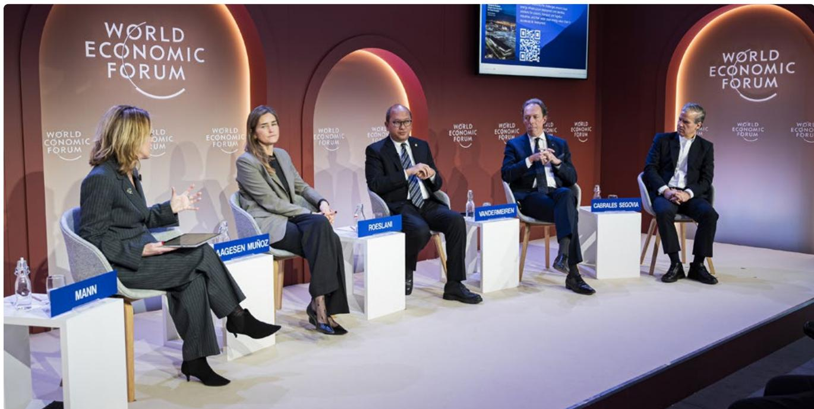

## Partner Engagement

During the reporting period, the World Economic Forum experienced strong partnership growth of close to 5%, amid ongoing geoeconomic and geopolitical change. The partnership base rose to a record high of 925, reflecting robust retention and the addition of more than 129 new partnerships.

Of these, more than 70 companies signed Associate Partnerships, several of which were Unicorns expanding their engagement, while the Strategic Partner community maintained its membership level of 123 partners, as of 30 June 2025.

Strong partnership levels were reflected in the degree of engagement with the Annual Meeting, in which more than 1,500 business leaders (including more than 1,000 CEOs and chairpersons) participated.

In addition to the Annual Meeting, the Forum convened stakeholders at several key gatherings, bringing together business leaders to advance initiatives and provide a platform for dialogue about critical trends affecting businesses. The Forum benefited from a significant increase in Associate Centre Partnerships, which focus exclusively on centre-specific engagement outside of the Annual Meeting, and which rose by almost 20%.

Throughout all partnership categories, there was double-digit growth in the following industries: information and communication technology and media, manufacturing, supply chain and transport, and energy industries. Regionally, the Forum enjoyed particularly strong growth in Europe, China and the Middle East and Africa.

Whereas the partnership base engages the world's largest companies, the Forum's Innovator Community continues to engage approximately 400 leading start-ups. Their CEOs engage in the Forum's thematic centres and initiatives, offering insights and potential solutions to global issues. The community includes 200 early-stage Technology Pioneers, approximately 100 growth-stage Global Innovators and approximately 100 late-stage Unicorns.

Generative AI's impact is evident in this community, with start-ups focused on AI applications in fields such as health, climate and energy joining those driving generative AI and the surrounding infrastructure. The community has also expanded to full ecosystems with the first Centre for the Fourth Industrial Revolution focused on innovation and start-ups in South Korea.

The Forum aims to deepen multistakeholder collaboration by further integrating innovation ecosystems into its thematic workstreams and industry communities, with a focus on frontier technologies, resilient supply chains and sustainable development. These efforts will be supported by expanding the regional footprint and cultivating public-private partnerships.

## Global Industry Communities

The Forum's 22 Global Industry Communities aim to advance industry transformation through peer-to-peer exchanges and collaboration. CEOs and chief strategy officers (CSOs) engaged in the Forum's communities throughout the reporting period, discussing and seeking to anticipate the opportunities and challenges for operating and business models created by cross-cutting topics such as geopolitics, generative AI and the energy transition.

During the reporting period, the Forum convened these communities to discuss five key areas: 1) geopolitical volatility and the reconfiguration of global markets, 2) technology as a catalyst for business model evolution, 3) the imperative for workforce transformation, 4) decarbonization and sustainability as a business imperative, and 5) the evolving role of regulation in developing industries. In turn, the outcome of these discussions was used to inform the Forum's centre-led initiatives and sparked new collaborations and partnerships.

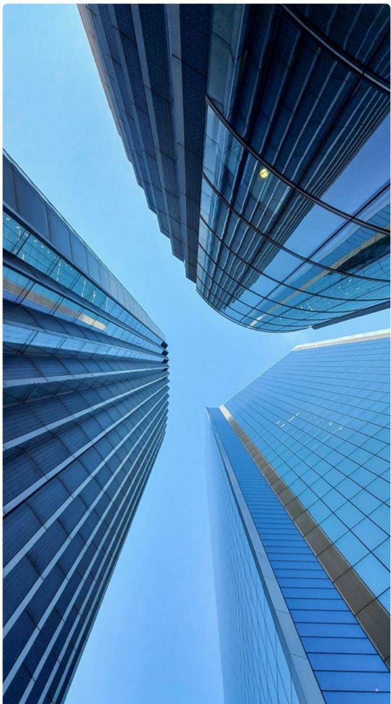

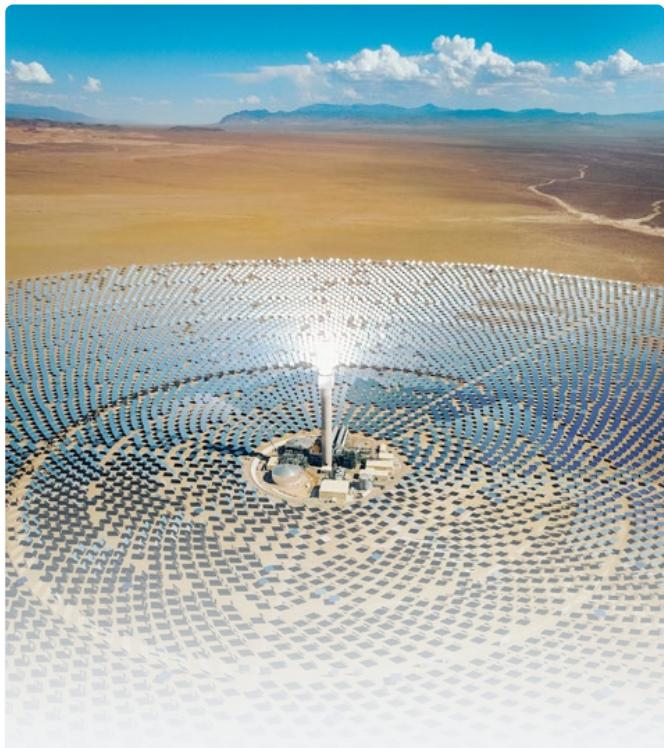

## International Business Council

The International Business Council (IBC) is a vanguard community comprising more than 120 CEOs from different industries and regions who engage in peer-to-peer exchanges and seek to drive collective action on shared challenges.

During the reporting period, the community discussed the implications of geopolitical and geoeconomic shifts on the economy. They also explored the role played by AI in improving productivity and the future of their industries while acknowledging the need for developing new skills and talent.

The need for innovative and technologically agnostic solutions to reduce global carbon emissions and a common and consistent methodology to disclose sustainability-related information remained a priority.

The IBC continues to bring together CEOs for peer exchanges on relevant topics to help them navigate change, catalyse new ways of working and formulate pragmatic solutions that contribute to growth.

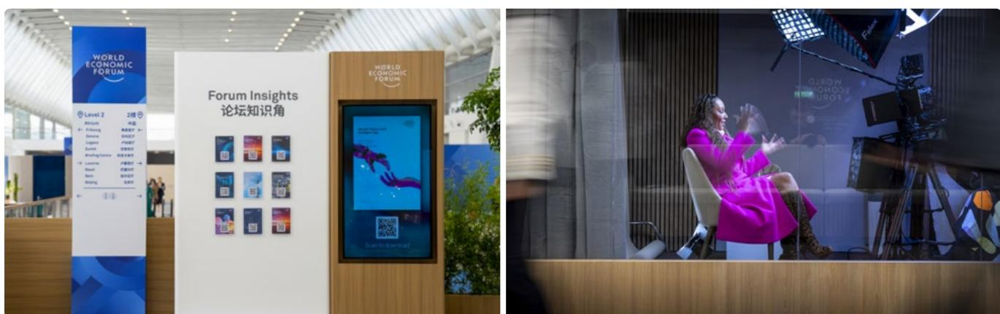

## Global Programming Group

The Global Programming Group (GPG) steers the strategy and delivery of the Forum's institutional gatherings. Integrating the richness of the Forum centres' work into its meetings, the team provides a platform for leaders to share insights, understand the connections in a complex geoeconomic landscape and design long-term solutions to the world's most pressing challenges.

During the reporting period, the team led several large-scale meetings, including the 55th Annual Meeting in Davos, the 16th Annual Meeting of the New Champions and the Sustainable Development Impact Meetings. The team also provided strategic support for the Industry Strategy Meeting, the Global Technology Retreat and the AI Governance Summit.

For more information, please refer to Selected Meetings on page 20.

## Global Communications Group

The Global Communications Group (GCG) is central to delivering the Forum's mission and is responsible for engagement with the public, media and stakeholders. The team collaborates with all parts of the organization to produce the Forum's reports and thought leadership and to engage constituents, mainstreaming business and policy solutions that emerge from its initiatives.

GCG engages with a wide range of global, local and sector-specific media outlets, representing diverse orientations and opinions. In 2024-25, the team reached a wide audience through 352,000 media mentions. The team manages media participation in Forum activities, recognizing journalists as crucial voices in an inclusive, multistakeholder approach. The group also co-designed sessions with international media outlets throughout the Forum's programme of events.

The team produces a broad range of content – including video, audio, live streams, written articles, reports, data visualizations and graphics – that articulates and explains the organization’s initiatives, insights and thought leadership to broad and diversified audiences, in multiple languages.

It also provides a platform for partners and stakeholders to share their ideas, alongside some of the world's most compelling thinkers. The content is distributed across

owned platforms, including social channels, on websites and via newsletters. For the Forum's major events during the reporting period, session content gathered 26.7 million views through its platforms and engagement activities.

During the reporting period, the Forum's two primary owned channels achieved robust figures. The Forum's 12 main social media accounts now have 33.4 million followers (with a $7\%$ increase from last year), and its refreshed website attracted 25.7 million visitors. Forum publications reached 5.4 million readers and articles drew 19.3 million readers on the public website. The popular podcast Radio Davos celebrated its fifth anniversary this year, as Forum podcasts overall drew nearly 170,000 downloads and an additional 219,000 plays on YouTube.

During this period, the team continued to strengthen its strategic communications function, deepening its connection to the organization's work, developing the Forum brand and embedding data use in its operations.

The GCG also convened a new group of chief communications, marketing and corporate affairs leaders from the world's leading businesses and international organizations, to explore how these functions can support efforts to mitigate some of the most pressing global challenges.

# Knowledge Communities: Academic Engagement and Global Future Councils (GFC)

The Knowledge Communities team's mission is to embed academic expertise and fact- and evidence-based frontier thinking into all Forum activities. This accelerates the exchange of ideas between experts and practitioners, helping to bridge theory and practice. Its core objective is to support the Forum's impartial, multistakeholder model with interdisciplinary academic engagement, particularly within the Global Future Councils, which serve as a catalyst for fresh ideas and thought leaders.

The team engages universities, research institutions and think tanks, and convenes the Network of Global Future Councils. It also runs the Global University Leaders Forum (GULF), a community for university leaders. At the Annual Meeting 2025, it convened more than 30 university presidents. It engages top-level academics and institutions to help enrich the Forum's events, initiatives and communities. This injection of expertise supports Forum partners, enabling them to

## Civil Society Communities

As part of the Forum's multistakeholder approach, it engages a diverse community of civil society leaders through its centres, events and communities of purpose. In doing so, civil society leaders contribute to finding solutions, driving impact and advancing cooperation with government and business leaders.

During the reporting period, the organization's Civil Society Communities – non-governmental organizations (NGOs), trade unions, social movements, religious leaders and Indigenous leaders – included the engagement of the most influential organizations representing the interests of citizens, consumers, marginalized populations, workers, grassroots movements and social causes.

These included more than 150 global and regional non-governmental organizations, non-profits and charities; more than 50 representatives from global and national trade unions; approximately 100 faith leaders and groups; over 70 Indigenous representatives and leaders; and several globally recognized activists and social movements, all of whom provided diverse and challenging perspectives.

better anticipate what's next, explore emerging frontiers and inform strategic decision-making.

Among the team's highlights during the reporting period was the conclusion of the 2023-24 GFC term, as 30 councils finalized their mandates and shared insights and reflections throughout and beyond the GFC network at the Annual Meeting of the Global Future Councils 2024 in Dubai. A new GFC term was launched for 2025-26, including 37 thematic councils with bold mandates to bring new insights into the rapidly changing context. The GFC network celebrated 15 years in 2024. Since 2008, it has convened 281 councils, bringing together more than 6,640 experts and thought leaders, representing 1,569 business organizations, 848 academic institutions, 591 civil society organizations, 50 international organizations and government leaders from more than 40 countries.

# Technology and Digital Innovation

The Forum's technology and digital innovation team focuses on delivering an integrated suite of best-in-class digital products that boost the organization's institutional goals and drive efficiency for all stakeholders. It seeks to provide cutting-edge intelligence, engagement and impact tools, while also exploring the technological frontiers of these areas. The team believes that using data-driven insights for business intelligence and creating personalized experiences are central to optimizing the engagement and effectiveness of the Forum's diverse global community.

Among the highlights during the reporting period was the expanded use of AI. Forum GPT enabled a range of new workflows, including interaction recordings and programme development based on established best practices. Also focused on AI, the Forum's Strategic Intelligence app was expanded with generative AI use cases added, providing tools like scenarios, trend analysis and collaborative map building.

As part of the Forum Live events app, a pilot programme assistant was rolled out to enhance real-time support for and engagement with event participants. Furthermore, the release of the Davos Accredited Programme offered a means for wider partner delegations to the event to host their own sessions and meetings, thereby broadening engagement.

Finally, Forum Spaces' digital operating system continued to grow, offering new features and support for almost 200 initiatives and communities. It is designed to further enable collaboration and engagement among the Forum's stakeholders.

The Forum continues to pursue AI transformation, with the launch of a task force on the intelligent workplace. This initiative will collate use cases and build a prototype that can deploy different agentic workflows throughout the organization. The aim is to accelerate the adoption of AI-driven solutions and further enhance operational efficiency and stakeholder impact.

## UpLink

UpLink is the Forum's initiative that builds ecosystems around purpose-driven, early-stage innovators. The community now includes more than 553 innovators, 73 investors, nine funding partners, 10 Forum initiatives and approximately 200 partner companies and organizations. This diverse group of stakeholders is united by a common goal: to accelerate the impact of early-stage entrepreneurs, encourage ecosystems of collaboration and drive perceptions of innovation as a catalyst for meaningful change with the aim of accelerating progress towards a sustainable, equitable and thriving future.

At the Annual Meeting, where UpLink celebrated its five-year milestone, the initiative launched Yes Cities. This global movement aims to reimagine urban life and support more than 1,000 entrepreneurs in 50 cities by 2030.

In the reporting period, Top Innovators raised \$633 million in investment capital in 2024, representing an increase of nearly \$200 million year-on-year. The UpLink Annual Impact Report revealed how these innovators are contributing to economic growth through job creation and income generation, recording 19,000 new jobs in 2024.

Their environmental impact was equally significant. Top Innovators selected through the Aquapreneur Innovation Initiative, for example, have treated 2.5 billion litres and reused 153 million litres of wastewater.

To drive collective action, UpLink published reports on water and nature, both critical sustainability areas where funding remains insufficient.

UpLink continues to focus on strengthening multi-year projects, deepening partner engagement, developing its investor network and – alongside the Forum centres and initiatives – expanding its impact in key areas such as climate action, water security, energy, urban transformation, longevity and quantum technology for good. Finally, to broaden its reach and drive support for early-stage innovation, UpLink is also partnering with the Centre for the Fourth Industrial Revolution Network to advance a self-service model, democratizing access to its technology and methodology to discover and publicize the work of more innovators from around the world.

## Finance and Operations

Under the leadership of the Chief Financial Officer (CFO), during the fiscal year 2024-25, the Forum significantly strengthened processes and governance across all its finance operations.

Partnership and membership revenue stood at CHF 287 million, representing a 5.7% year-on-year increase.

During the fiscal year 2024-25, the Forum enhanced end-to-end accounting processes with robust data-validation routines and expanded analytics capabilities, improving efficiency and accelerating the month-end close.

Direct funding processes have also been enhanced with reporting dashboards and forecasting models to add value. Planning and forecasting processes, workflows and automation tools were implemented to improve budget monitoring and analysis, as well as improve timeliness of management reporting to facilitate strategic decision-making.

These process and control improvements have been documented to ensure comprehensive compliance and operational clarity.

The Forum continued to build out the treasury and investment risk-management framework amid a persistently challenging macroeconomic environment, realigning policy limits and stress-testing protocols to safeguard assets and optimize portfolio resilience. In response to a volatile foreign exchange environment, the Forum reduced its US-dollar exposure by avoiding large US-dollar cash balances and better-matching holdings to current US-dollar-denominated expenditures, thereby mitigating foreign exchange risks and optimizing its treasury.

Fiscal year 2024-25 was a year of building strong financial foundations for the Forum, laying the groundwork for efficiency and operational excellence. These efforts mark the first phase of a multi-year transformation, and the Forum will continue to enhance processes, technology and governance.

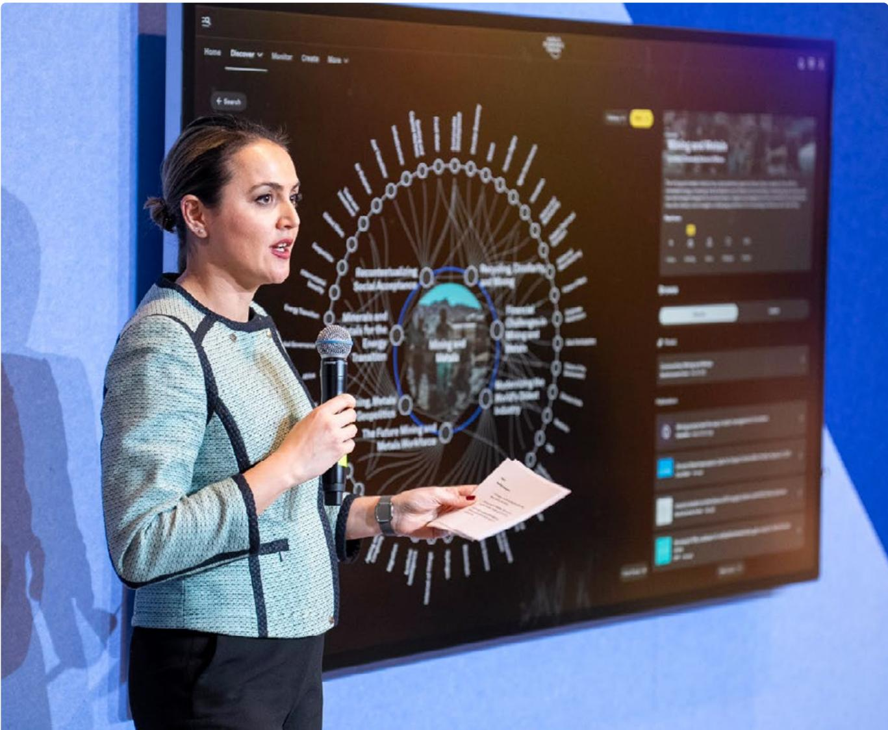

# Our Talent and Workplace Culture

Over the last two years, the Forum has redesigned its people and culture priorities, sharpening its focus on leadership, talent development, inclusivity and well-being, as well as alumni engagement. This commitment came to life through a series of multi-year initiatives, including the rollout of a new leadership model, expanded learning opportunities and enhanced well-being resources for staff.

Building a positive and inclusive culture, upgrading leadership capabilities and supporting employees with the skills, tools and confidence to lead through change has never been more essential. By strengthening self-awareness, encouraging honest dialogue with employees, and supporting continuous learning and listening, the Forum is investing in the individual and collective resilience and agility needed.

A milestone of the reporting period was the creation of the Inclusion, Well-being and Engagement team, which marked the latest phase in the evolution of the people and culture function. This four-person team brings together internal communications with an expanded focus on belonging and engagement, ensuring that inclusion remains a core value in every aspect of the employee experience. It also plays a central role in the Forum's employee listening strategy, organizing dialogues and focus groups and supporting employee resource groups through clearer governance, coordination and dedicated resources.

In the lead-up to the Annual Meeting 2025, the Forum introduced training on “Managing Difficult Conversations” for all 530 participating employees, providing practical tools to navigate conflict and promote respectful dialogue. This was followed by a workplace conduct training aimed at reinforcing a values-driven culture by clarifying expectations around behaviour and equipping staff to engage in essential conversations within a safe, inclusive environment.

Leadership culture assessments were also introduced, inviting all employees to contribute feedback on the organization's senior leaders. Coaching was provided to all participating leaders, and by the end of the reporting period, 140 had completed a review.

The Global Learning Award underpins the Forum's commitment to learning at all levels, empowering staff to pursue opportunities that support their professional advancement. Over the past year, 528 employees took part in the scheme. Overall, employees invested a total of 33,744 hours in the learning award and various Forum learning programmes.

The Forum also strengthened its connection with former employees through Forum Circle, its alumni network, which rapidly grew to more than 700 members, while internally, a more transparent and data-informed approach to people management took hold.

The launch of an employee demographics dashboard gave staff access to real-time, aggregated data on information like headcount and gender representation. This tool, accessed by $31\%$ of employees since its launch, demonstrates the Forum's ongoing commitment to openness, inclusivity and informed decision-making.

Well-being remained a priority. As part of the Forum's Employee Assistance Programme, all employees and their families gained access to a new digital platform, Headspace, with $43.3\%$ of employees signing up within the first four months.

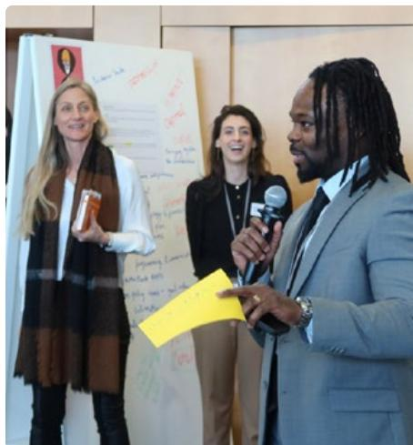

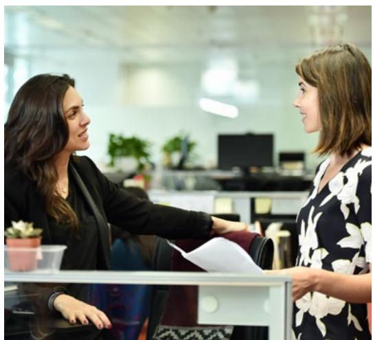

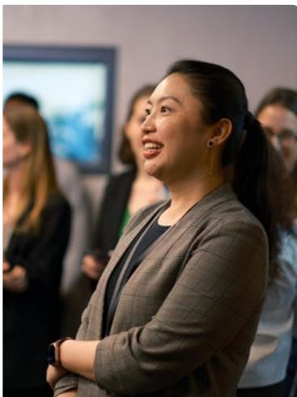

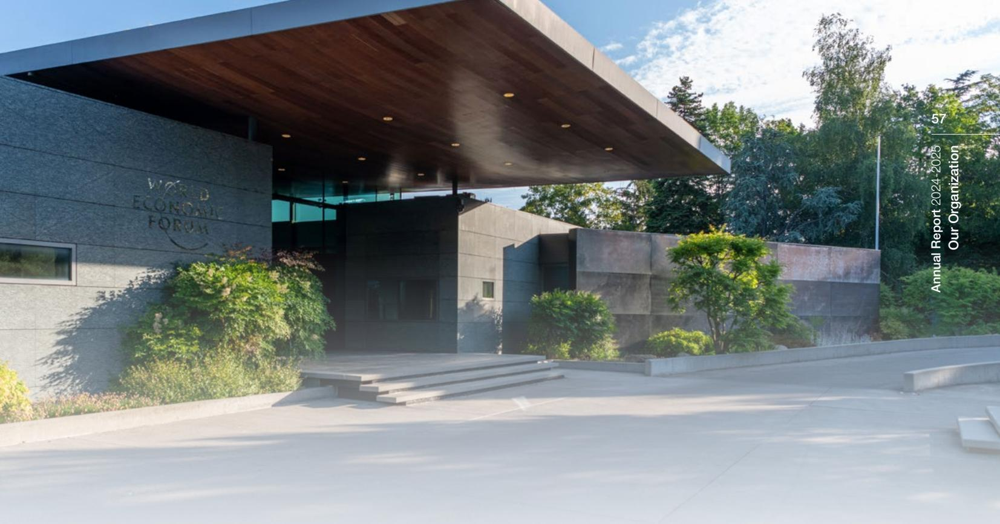

# Our Offices

# World Economic Forum Headquarters (Geneva)

The Forum is headquartered in Cologny, close to the Swiss city of Geneva. It is from here that $80\%$ of its staff operate, including the organization's president and most members of the managing board. Cologny is also home to core functions such as finance, sustainability, and people and culture, as well as many of its centres and initiatives.

The location serves multiple purposes – functioning as an office space and a venue for dialogues and events. Constructed and remodelled using green building techniques, the roof is equipped with solar panels covering 11% of the organization's energy use. It also employs a passive heating and cooling system, circulating water through copper pipes for improved energy efficiency. The space enables the Forum to experiment with office concepts aligned with its initiatives on the future of work, as well as implement sustainability initiatives aligned with its wider mission.

On-site staff canteens prioritize healthy, seasonal and locally sourced food, including a fully plant-based menu one day each week. Drinks are served in dispensers or glass bottles, removing all cans and PET (polyethylene terephthalate), and no single-use plastic is used in the catering offerings.

A comprehensive recycling programme is in place, and only non-toxic products are used for cleaning and gardening. To incentivize the use of public transport, each employee is offered a commuting benefit. Mobility options, such as e-bikes, are promoted and made available free of charge. Only a limited number of parking spots are available, which are assigned for a fee on an annual basis.

The location also complements the Forum's operations, offering its staff ample opportunity to collaborate with their counterparts in the many international institutions and organizations that are based in Geneva.

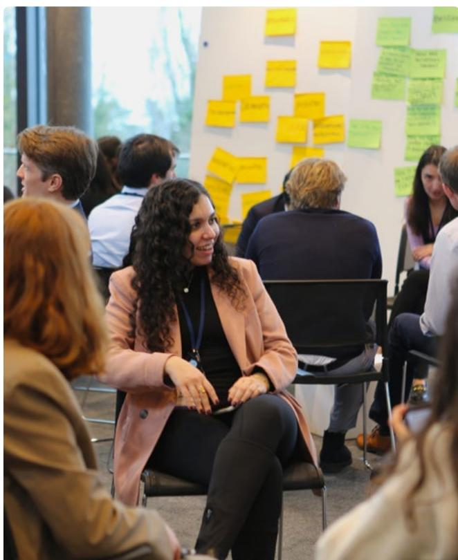

# World Economic Forum Beijing Representative Office

The China office serves as a trusted and impartial global platform to bridge conversations and public-private collaboration between China and the rest of the world. The 50 staff at the Forum's offices in Beijing bring together leaders from government, business and academia with the rest of the organization's community to help inculcate wider impact.

The office's work is twofold: on one hand, it helps key Chinese leaders engage with the Forum's events and wider activities, and on the other, it leads the Forum's work in China itself, helping to develop initiatives and communities in the Chinese context.

During the reporting period, the office registered strong partnership growth from Greater China; 17 industry and innovation leaders joined as partners, swiftly becoming involved with the work of the organization's centres and several global industry communities.

Alongside this, the China office engaged with more than 100 public figures and officers from 15 ministries and 20 municipal governments, supporting their engagement with Forum events like the Annual Meeting of the New Champions 2025.

In addition, the office engaged with more than 100 experts from universities, think tanks and research institutions, helping them contribute to various Forum events, communities and initiatives, at which they shared insights from China's perspective.

Seeking to help drive the industrial and environmental transitions in China, and more broadly, globally, staff in the China office supported the work of 22 of the Forum's communities and initiatives and published seven reports. In April 2025, the office hosted a Climate and Nature Action Day, which brought together more than 170 senior leaders from 12 countries and regions with the intent of fostering greater collaboration in this key area.

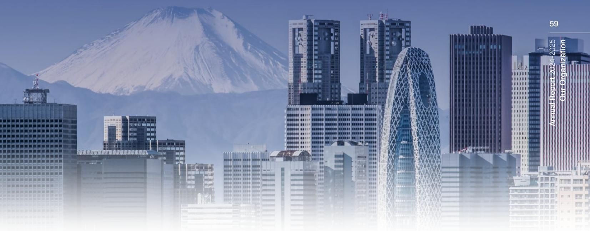

# World Economic Forum Japan

The Tokyo office supports the Forum's work in all areas and has substantially strengthened its strategic engagement with partners and constituencies in the past year, despite the broader backdrop of persistent geopolitical tensions and economic uncertainty.

In terms of working with political leaders, it balanced its engagement throughout Japan's political spectrum, engaging ruling and opposition leaders and parties alike.

During the reporting period, it successfully re-established relationships with government ministries and expanded connections with local governments.

The office strengthened its engagement with business leaders through several events, including the One Forum in Tokyo in October 2024 – its largest meeting in Japan to date – focused on accelerating industrial transformation and the decarbonization of energy and transport.

In February 2025, the office supported a two-day regional event in Tokyo, Japan: Climate and Nature Leadership in the Intelligent Age, which strengthened the connections between the country and the broader Asia-Pacific region.

Other meetings included an AI workshop emphasizing Japan's shift to “safe innovation”, practical deployment of AI agents and ethical integration; a meeting of leaders and experts involved in the Centre for the Fourth Industrial Revolution's space workstream to discuss issues like the competitiveness of Japan's space sector; and a meeting of the Japan arm of the Chief Legal Officers Community to discuss the role of legal leaders in Japanese business.

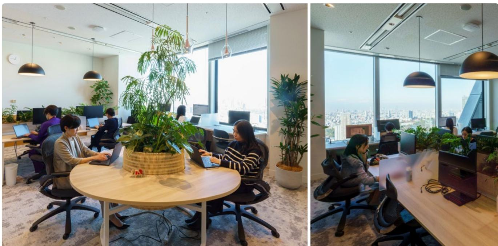

# World Economic Forum LLC

## New York

Established in 2006, the New York office plays a vital role in engaging US-based stakeholders in the Forum's mission to improve the state of the world. Serving as a strategic and operational hub, the office supports global, regional and industry initiatives.

During the reporting period, the office hosted and supported multiple activities, including more than 2,000 stakeholder engagements. Among these were SDIM24, the Innovators Community Meeting, New Champions Dialogues and Industry Media Chief Officer meetings. Alongside this, there were many thematic meetings covering areas like advanced manufacturing, cyber resilience and women in finance. In the first quarter of 2025 alone, 200 stakeholders engaged in thematic meetings.

The office also hosted several events, including team offsites, property and casualty (P&C) insurance training sessions and global leadership meetings. It also piloted tools, refined services and expanded its network to meet evolving business needs.

## San Francisco

Hosted out of the organization's San Francisco office, the Centre for Urban Transformation's Annual Summit connected 250 leaders from six continents, more than 30 countries and over 20 industries to support collaboration for sustainable and equitable urban development.

Another highlight was the 2025 Global Technology Retreat, which brought together 350 technology leaders for more than 60 sessions advancing the innovation objectives of eight Forum centres.

Aimed at deepening collaboration with local partners, the Annual Yes SF, Climate Week and Nature Positive City community meetings brought together global stakeholders and underscored San Francisco's continued role as a hub for innovation in energy, technology and sustainability.

# Our Sister Organizations

The Global Shapers Community, the Forum of Young Global Leaders and the Schwab Foundation for Social Entrepreneurship operate in partnership with the Forum. Collectively, they serve a community of more than 12,000 leaders and innovators, driving positive change in 150 countries.

## The Global Shapers Community

Young people are not waiting for permission to lead – they are stepping up with purpose, creativity and courage. Through the Global Shapers Community, we are unlocking their potential to chart a more inclusive, sustainable and hopeful future, one local impact at a time. Natalie Pierce, Head, Global Shapers Community

The Global Shapers Community uses a hub-based model to empower young people aged 18 to 30 to improve the state of the world, one community at a time. What began in a few capital cities has grown into a global network of more than 500 hubs and 30,000 members working in government, business and civil society in more than 150 countries and territories.

Global Shapers work with local stakeholders to enhance their communities, address pressing challenges and create a sense of belonging. In 2024, Global Shapers led 440 initiatives focused on protecting the planet, strengthening democracy, supporting vulnerable communities and amplifying critical stories.

Among the highlights of the reporting period was the awarding of its inaugural Innovation Prize, an initiative supported by partners and the Global Alliance for YOUth. A total of 15 outstanding projects were recognized, including a career accelerator in Accra, Ghana, a mobility-improving navigation app in Amsterdam, the Netherlands, and an AI-powered deforestation tracking tool in Morelia, Mexico. All will receive funding, mentorship and visibility, unlocking new possibilities in areas such as climate resilience, digital access and mental health.

The Global Shapers Community released the Global Shapers Impact Report: Engaging Young People in Decision-Making, the Forum's flagship publication on advancing the issues that matter most to young people. Capturing insights from nearly 4,000 young experts from 140 countries, it is one of the most diverse data sets available on the youth agenda.

To meet this energy and ambition, the Global Shapers Community created meaningful opportunities for young professionals to connect, engage and lead during the year. This saw 10,700 young people access new skills through online leadership programmes, while 1,000 Global Shapers gathered at SHAPE events to strengthen regional ties. Alongside them, 500 hub leaders aligned on strategic priorities at the Global Shapers Annual Summit, 200 Global Shapers took part in Forum meetings, including 70 who took on speaking roles, 110 received executive coaching, and a further 110 contributed to wider Forum initiatives.

By integrating Global Shapers into the Forum's work, the community strengthens its ability – and that of its partners – to anticipate emerging trends and priorities while driving intergenerational dialogue and action.

WORLD ECONOMIC FORUM

Annual Meeting
Davos 2025

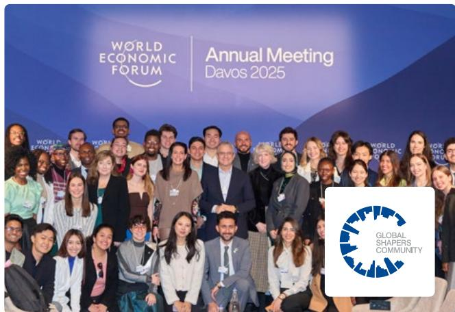

# Forum of Young Global Leaders

In an era defined by complexity and transformation, our community of Young Global Leaders continues to prove that bold, values-driven leadership can build a more inclusive and sustainable future. Through collaboration, learning and action, YGLs are redefining what it means to lead today – and tomorrow.
Ida Jeng Christensen, Head, Forum of Young Global Leaders

The Forum of Young Global Leaders (YGLs) and the YGL Foundation are a “think and do tank” for leadership development and impact. The YGL mission is to cultivate a community of bold, forward-looking leaders who are committed to improving the state of the world. In doing so, it provides transformative leadership development opportunities to help these individuals contribute meaningfully to the future.

Leaders span sectors and disciplines and include heads of state and Fortune 500 executives as well as scientists, social entrepreneurs and artists. With more than 1,400 members and alumni in 120 countries, the YGL Foundation's leadership programme helps fuel innovation and supports its leaders in forging alliances and developing solutions for a better world. Whether through AI, urban innovation, biomedicine or public health, YGLs are redefining what it means to lead in an age of rapid change.

The foundation's priorities are anchored in preparing leaders to navigate complexity and drive positive change. Each year, the YGL Foundation welcomes more than 100 new members into a three-year development journey. This includes academic modules, leadership programmes, strategic convenings and opportunities to contribute to initiatives aligned with the Forum's mission. The foundation's core belief is that complexity is not a barrier; instead, it is an opportunity for bold, collaborative leadership.

During the reporting period, highlights included the YGL's annual gathering – Future of Leadership Summit – at which nearly 500 YGLs convened in Singapore in 2024. The event focused on vision-setting, peer exchange and global foresight.

At the Annual Meeting 2025, 70 YGLs participated in sessions on future leadership, emphasizing people-first approaches to geopolitical, environmental and technological challenges.

Over the period, YGLs participated in learning journeys in India, Morocco, Nepal and the US, which offered first-hand insights into these countries' transformations in governance, entrepreneurship and innovation.

The YGL Fellowship continued to empower YGL women leaders from emerging markets, enabling their participation in the Annual Meeting. The YGL Fellowship continued its longstanding support to emerging African leaders, enabling their full participation in YGL and Forum activities.

Alongside this, the YGLs continued their long-standing partnerships with universities. Among these is the Harvard Kennedy School and its executive education programme, Public Policy in the 21st Century, which explores issues like negotiation, changemaking, inclusive decision-making and climate leadership. In addition, YGLs took university modules in Buenos Aires, Cape Town and Hong Kong.

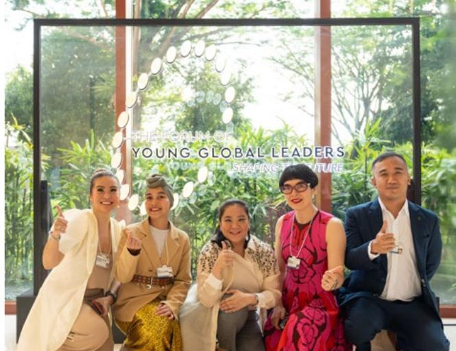

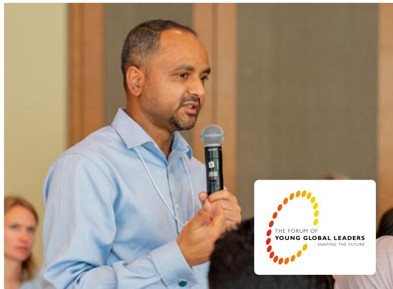

# Schwab Foundation for Social Entrepreneurship

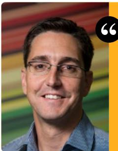

At the Schwab Foundation, we champion the individuals and organizations who are rewriting the rules of social impact. By scaling up proven innovations and fostering collaboration across sectors, we are accelerating the transition to a more inclusive, equitable and sustainable global economy. François Bonnici, Director, Schwab Foundation for Social Entrepreneurship

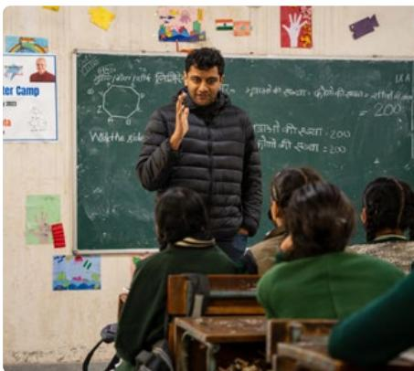

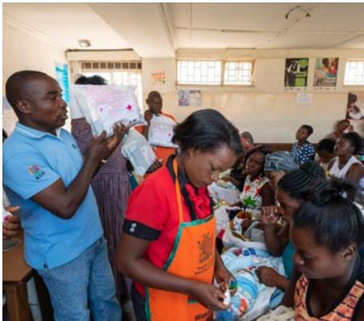

In partnership with the Forum, the Schwab Foundation for Social Entrepreneurship convenes a global community of 500 pioneering social entrepreneurs and innovators. It believes in the power of these people to create systemic change and drive the transition to a stakeholder economy, and seeks to accelerate social innovation for a more equitable, sustainable and inclusive world by providing a platform to recognize, promote and advance proven social innovation solutions.

The foundation's priorities focus on four key areas: community development through its annual awards, mobilizing private-sector support, developing policy insights and helping to reinforce the social innovation ecosystem.

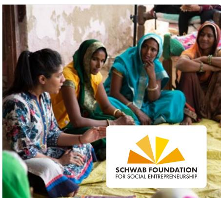

Every year, the foundation develops its community of social entrepreneurs and innovators through the Schwab Foundation Awards. These recognize outstanding individuals and organizations in four categories: social entrepreneurs, corporate social innovators, public social innovators and collective social innovators.

The Schwab Foundation mobilizes the private sector to support social innovation, create partnerships and encourage companies to adopt social innovation principles. This is achieved through initiatives like the Rise Ahead Pledge, the Corporate Leadership Council and the Corporate Social Innovation Compass.

The foundation offers policy insights, data and best practices to advance the social innovation agenda globally. It plays a vital role in supporting the development and adoption of social economy policies. Key initiatives in this area include the Policy Leadership Council on the Social Economy and The State of Social Enterprise report.

The Schwab Foundation is dedicated to reinforcing the social innovation ecosystem. It does so by elevating proven innovators, advocating for critical emerging issues that drive economies and societies, such as AI (AI for Impact: Strengthening AI Ecosystems for Social Innovation), innovative finance (Beyond Compliance: Embedding Impact through Innovative Finance) and climate adaptation (Unlocking the Social Economy: Towards Equity in the Green and Digital Transitions).

Among its highlights during the reporting period were the meetings it organized for its Collective Social Innovation awardees in Geneva, Switzerland and Bengaluru, India. These meetings aimed to maximize collective action on complicated global issues, bringing together more than 40 organizations from 20 countries to share strategies.

The foundation welcomed 42 social entrepreneurs and innovators to the Annual Meeting 2025 and announced the 2025 Social Entrepreneurs and Innovators of the Year. The 18 new awardees came from 15 organizations working to transform healthcare and education, create livelihoods for economically marginalized communities, protect nature and drive systemic change.

## 6

# Leadership and Governance

## Ad Interim Co-Chair

Peter Brabeck-Letmathe\*

## Board of Trustees

Peter Brabeck-Letmathe\*\*
Ad Interim Chair of the Board of Trustees, World Economic Forum $^{1}$

Mukesh D. Ambani
Chairman and Managing Director,
Reliance Industries

Ajay S. Banga
President, World Bank Group

Marc Benioff
Chair and Chief Executive Officer,
Salesforce

Thomas Buberl
Chief Executive Officer, AXA $^{1,2}$

Roberto Campos Neto
Vice-Chairman and Global Head of Public Policy, Nubank

Laurence D. Fink
Chairman and Chief Executive Officer,
BlackRock

Orit Gadiesh
Chair Emeritus and Partner,
Bain & Company $^{1}$

Kristalina Georgieva
Managing Director, International Monetary Fund (IMF)

Fabiola Gianotti
Director-General, European Organization for Nuclear Research (CERN)

## Al Gore

Vice-President of the United States (1993-2001); Chairman and Co-Founder, Generation Investment Management LLP

Philipp M. Hildebrand
Vice-Chairman, BlackRock

André Hoffmann
Vice-Chairman, Roche $^{1}$

Paula Ingabire
Minister of Information Communication Technology and Innovation of Rwanda

Joe Kaeser
Chairman of the Supervisory Board,
Siemens Energy

Christine Lagarde
President, European Central Bank

Yo-Yo Ma
Cellist

Patrice Motsepe
Founder and Executive Chairman,
African Rainbow Minerals

Ngozi Okonjo-Iweala
Director-General, World Trade Organization (WTO)

Lubna S. Olayan
Chair of the Executive Committee,
Olayan Financing Company

H.M. Queen Rania Al Abdullah of the Hashemite Kingdom of Jordan

David M. Rubenstein
Co-Founder and Co-Chairman, Carlyle $^{2}$

Tharman Shanmugaratnam
President of Singapore

Jim Hagemann Snabe,
Chairman, Siemens $^{1}$

Julie Sweet
Chair and Chief Executive Officer,
Accenture $^{2}$

Feike Sybesma
Chairman of the Supervisory Board,
Royal Philips $^{2}$

Heizo Takenaka
Professor Emeritus, Keio University

Zhu Min
Vice-Chairman, China Center for International Economic Exchanges $^{1}$

## President and CEO

Børge Brende

## Founder

Klaus Schwab

## Managing Board

Børge Brende
President and CEO

Mirek Dušek
Managing Director; Chief Business Officer; Global Programming

## Jeremy Jurgens

Managing Director, Centre for the Fourth Industrial Revolution and Centre for Cybersecurity

## Gim Huay Neo

Managing Director, Asia Strategy and Centre for Energy and Materials

## Saadia Zahidi

Managing Director, Centre for the New Economy and Society and Knowledge Communities

## Alois Zwinggi

Managing Director, Institutional Operations and Swiss Relations

## Managing Directors

## Kiva Allgood

Managing Director, San Francisco Office, Centre for Advanced Manufacturing and Supply Chain, and Centre for Urban Transformation

## Matthew Blake

Managing Director, World Economic Forum LLC, Centre for Financial and Monetary Systems, and Centre for Health and Healthcare

## Sebastian Buckup

Managing Director, Centre for Nature and Climate and Forum Foundations

## Sheba Crocker

Managing Director, Chief Communications Officer

## Rhiannon Evans

Managing Director, Chief Financial Officer

## Maroun Kairouz

Managing Director, Centre for Regions, Trade and Geopolitics

Uxio Malvido
Managing Director,
Chief People Officer

## Stephan Mergenthaler

Managing Director, Chief Technology Officer and Head of Artificial Intelligence

## Executive Committee

Nicki Allitt
Head of Strategic Communications and Coordination

Marisol Argueta de Barillas
Head of the Regional Agenda,
Latin America

Astrid Balsink
Head of Inclusion, Wellbeing and Engagement

Francisco Betti,
Head, Global Industries Team

Shyam Bishen
Head, Centre for Health and Healthcare

Roberto Bocca
Head, Centre for Energy and Materials

## François Bonnici

Director, Schwab Foundation for Social Entrepreneurship; Head of Foundations

Sean Doherty
Head of International Trade
and Investment

John Dutton
Head of UpLink

Pedro Gomez
Head, Climate

Fernando J. Gómez
Head, Resource Systems
and Resilience

Sriram Gutta
Head of Engagement and Operations

Chieh Huang
President, Global Collaboration Village

Jack Hurd
Executive Director, Tropical Forest Alliance

Zara Ingilizian
Head of Consumer Industries

Fujiyo Ishiguro
Chair of Japan and Chief
Representative Officer

Philippe Isler
Director, Global Alliance
for Trade Facilitation

## Ramya Krishnaswamy

Head of Institutional Communities and ESG Initiative

Joo-Ok Lee
Head of the Regional Agenda,
Asia-Pacific

Cathy Li
Head of AI, Data and Metaverse

Viraj Mehta
Head of the Regional Agenda,
India and South Asia

Jeff Merritt
Head, Centre for Urban Transformation

Kelly Ommundsen
Head of Digital Inclusion

Severin Podolak
Head of Event Production

Alexandre Raffoul
Head of Regional Business Strategy

Mel Rogers
Head of Strategic Affairs

Paul Smyke
Head of the Regional Agenda,
North America

Roberto Tinnirello
Head of Business Strategy
and Services

Yann Zopf
Head of Media

## Financial Statements

## Revenue and costs, balance sheet 2021-2025

Profit and loss  
Consolidated\*

<table><tr><td>Swiss francs (000s)</td><td>30/06/2021</td><td>30/06/2022</td><td>30/06/2023</td><td>30/06/2024</td><td>30/06/2025</td></tr><tr><td>Total revenue</td><td>315,455</td><td>383,382</td><td>411,147</td><td>439,869</td><td>468,508</td></tr><tr><td>Partnership and membership participation</td><td>240,742</td><td>250,863</td><td>264,416</td><td>271,416</td><td>286,749</td></tr><tr><td>Participation fees</td><td>-</td><td>28,921</td><td>37,913</td><td>39,017</td><td>39,593</td></tr><tr><td>Restricted funds</td><td>37,386</td><td>46,537</td><td>50,491</td><td>48,338</td><td>61,143</td></tr><tr><td>Other</td><td>37,327</td><td>57,061</td><td>58,328</td><td>81,099</td><td>81,023</td></tr><tr><td>Total expenses</td><td>314,924</td><td>383,382</td><td>411,147</td><td>439,869</td><td>468,508</td></tr><tr><td>Staff1</td><td>122,860</td><td>130,299</td><td>171,842</td><td>187,967</td><td>212,021</td></tr><tr><td>Office and activity</td><td>180,067</td><td>252,237</td><td>238,103</td><td>251,837</td><td>255,972</td></tr><tr><td>Restructuring costs</td><td>11,997</td><td>846</td><td>1,201</td><td>65</td><td>514</td></tr><tr><td>Carried to foundation capital</td><td>531</td><td>0</td><td>0</td><td>0</td><td>0</td></tr></table>

Balance sheet: Total assets

<table><tr><td>Swiss francs (000s)</td><td>30/06/2021</td><td>30/06/2022</td><td>30/06/2023</td><td>30/06/2024</td><td>30/06/2025</td></tr><tr><td>Total assets</td><td>681,626</td><td>742,000</td><td>751,664</td><td>774,005</td><td>770,061</td></tr><tr><td>Current assets</td><td>366,624</td><td>264,195</td><td>264,900</td><td>293,146</td><td>285,264</td></tr><tr><td>Cash and equivalents</td><td>327,659</td><td>202,876</td><td>200,166</td><td>215,168</td><td>222,114</td></tr><tr><td>Receivables</td><td>38,965</td><td>61,319</td><td>64,734</td><td>77,977</td><td>63,150</td></tr><tr><td>Non-current assets</td><td>315,002</td><td>477,805</td><td>486,764</td><td>480,859</td><td>484,798</td></tr><tr><td>Tangible and intangible assets $^{2}$ </td><td>122,428</td><td>122,087</td><td>126,680</td><td>105,786</td><td>95,120</td></tr><tr><td>Financial assets</td><td>192,574</td><td>355,718</td><td>360,084</td><td>375,073</td><td>389,678</td></tr></table>

Balance sheet: Total liabilities and funds

<table><tr><td>Swiss francs (000s)</td><td>30/06/2021</td><td>30/06/2022</td><td>30/06/2023</td><td>30/06/2024</td><td>30/06/2025</td></tr><tr><td>Total liabilities and funds</td><td>681,626</td><td>742,000</td><td>751,664</td><td>774,005</td><td>770,061</td></tr><tr><td>Current liabilities</td><td>166,689</td><td>202,470</td><td>204,419</td><td>211,541</td><td>214,943</td></tr><tr><td>Payables</td><td>8,139</td><td>23,918</td><td>19,707</td><td>17,998</td><td>18,486</td></tr><tr><td>Accrued expenses and deferred income $^{3}$ </td><td>158,550</td><td>178,552</td><td>184,713</td><td>193,543</td><td>196,456</td></tr><tr><td>Non-current liabilities</td><td>95,000</td><td>95,000</td><td>95,000</td><td>95,000</td><td>95,000</td></tr><tr><td>Long-term loan</td><td>95,000</td><td>95,000</td><td>95,000</td><td>95,000</td><td>95,000</td></tr><tr><td>Restricted funds</td><td>28,474</td><td>36,625</td><td>33,477</td><td>45,607</td><td>47,770</td></tr><tr><td>Restricted funds – direct funding</td><td>28,474</td><td>36,625</td><td>33,477</td><td>45,607</td><td>47,770</td></tr><tr><td>Funds</td><td>391,463</td><td>407,905</td><td>418,769</td><td>421,857</td><td>412,349</td></tr><tr><td>Initial capital</td><td>3,525</td><td>3,525</td><td>3,525</td><td>3,525</td><td>3,525</td></tr><tr><td>Tied capital</td><td>213,534</td><td>274,840</td><td>274,840</td><td>274,840</td><td>274,840</td></tr><tr><td>Free capital</td><td>173,872</td><td>129,540</td><td>140,404</td><td>143,493</td><td>133,984</td></tr><tr><td>Surplus</td><td>531</td><td>0</td><td>0</td><td>0</td><td>0</td></tr></table>

$^{1}$ Staff costs include salaries, social costs and other staff expenses.  
$^{2}$ Tangible assets: land, property, equipment, IT hardware and software. Intangible assets: IT development.  
$^{3}$ Accrued expenses: provision for activity costs, provision for staff. Deferred income: membership, partnership and registration income deferral.  
\*The consolidated figures above include figures from the World Economic Forum and the World Economic Forum LLC as of 1 January 2017.  
As of 1 July 2019, consolidation includes World Economic Forum Japan and other related foundations (Young Global Leaders, Schwab Foundation for Social Entrepreneurship, Global Shapers Community, World Arts Forum).

## Annex to the accounts as of 30 June 2025

## Presentation

The World Economic Forum is an international organization integrating leaders from business, governments, academia and society at large into a global community committed to improving the state of the world.

To achieve its mission, the World Economic Forum acts as a catalyst for thought leadership and action, mainly in the form of public-private partnerships.

For this purpose, the World Economic Forum identifies issues on the global, regional and industry agendas, seeks solutions and, wherever possible, creates partnerships for action.

The World Economic Forum always acts in the spirit of entrepreneurship in the global public interest, combining the forces of creative thinking, innovative initiatives and intellectual integrity with the will to advance peace and prosperity in the world.

In its activities, the World Economic Forum fully respects the essential role played by governments and international organizations as well as by their various affiliated institutions.

The World Economic Forum is a public-interest, not-for-profit organization. It is independent and does not pursue any political or ideological interests.

In its activities, the World Economic Forum proves in all circumstances its independence and impartiality.

The World Economic Forum is based in Cologny, canton of Geneva, Switzerland. It has representative offices in Beijing (China) and Mumbai (India). It also has offices in New York (USA), San Francisco (USA) and Tokyo (Japan).

The financial statements were approved by the Board of Trustees on 19 August 2025.

## Significant accounting policies

## Basis of preparation

The presentation of the consolidated financial statements of the World Economic Forum (hereafter “the Forum”, “the Foundation”, “the organization”) is based on the global model of recommendations made by Swiss GAAP FER (Swiss Generally Accepted Accounting Principles – in compliance with the conceptual framework, core FER and other Swiss GAAP FER). The presentation provides a true and fair view of the organization’s assets, financial position and results. The financial statements were prepared on a going concern basis.

The consolidated financial statements are presented according to the principles of historical cost and presented in Swiss francs (CHF). The consolidated financial statements also comply with article 83a of the Swiss Civil Code and the Foundation's statutes.

The presentation and evaluation principles are the same as in previous fiscal years. There have been no significant changes in the hypotheses or estimates used in the annual consolidated financial statements.

The main accounting rules used in the preparation of the Forum's consolidated financial statements are described below.

## Consolidation of Swiss Foundations

After reviewing the existing contractual relationships between the Forum and the Swiss Foundations, the organization concluded it has control over the Swiss Foundations. As a result, the Swiss Foundations have been part of the scope of consolidation since 2020.

## Method of consolidation

The consolidated financial statements include the accounts of the Forum and of the entities that are controlled by the Forum as listed in the scope of consolidation. Control exists when the Forum is exposed to, or has rights to, variable returns from its involvement with the entity and has the ability to affect those returns through its powers over the entity.

Entities included in the scope of consolidation

<table><tr><td>Name of the entity</td><td>Activity</td><td>Country</td><td>2025 Voting rights</td><td>2024 Voting rights</td></tr><tr><td>World Economic Forum LLC</td><td>Not-for-profit organization</td><td>United States of America</td><td>100</td><td>100</td></tr><tr><td>World Economic Forum Japan</td><td>Not-for-profit organization</td><td>Japan</td><td>100</td><td>100</td></tr><tr><td>Schwab Foundation for Social Entrepreneurship</td><td>Not-for-profit organization</td><td>Switzerland</td><td>0</td><td>0</td></tr><tr><td>Young Global Leaders Foundation</td><td>Not-for-profit organization</td><td>Switzerland</td><td>0</td><td>0</td></tr><tr><td>Global Shapers Community Foundation</td><td>Not-for-profit organization</td><td>Switzerland</td><td>0</td><td>0</td></tr><tr><td>World Arts Forum Foundation</td><td>Not-for-profit organization</td><td>Switzerland</td><td>0</td><td>0</td></tr></table>

The Forum fully consolidates entities in which it exercises exclusive control, either directly or indirectly.

The assets and liabilities of its controlled entities, together with the expenses and income, are included in full in the annual consolidated accounts.

Any minority interests in the net funds and the results appear separately in the consolidated balance sheet and the consolidated profit and loss. Under the unity principle, the minority interests are included in the funds.

Inter-company balances, expenses and income are eliminated upon consolidation.

The consolidated financial statements have been prepared for the first time for the 2017 year-end.

The World Economic Forum LLC has been consolidated for the period in which the Forum exercises its control, thus since 1 January 2017.

The World Economic Forum Japan was registered and affiliated in 2019 by the Forum and thus was consolidated for the first time for the 2019 year-end.

The financial statements for the year ended 30 June 2025 for the Schwab Foundation for Social Entrepreneurship, Young Global Leaders, Global Shapers Community, and World Arts Forum, as included in these consolidated statements, are based on information provided by each entity. They were not discussed with their respective chairs and had not yet been approved by their respective Boards of Foundation as of the date of approval of these consolidated financial statements.

## Change to the scope of consolidation

There is no change in the scope of the consolidated financial statements for the year 2025.

## Foreign currency

The elements included in the Forum's financial statements are measured in the currency that best reflects the economic reality of the transaction. The accounts are presented in CHF, which is the Forum's functional currency.

## Transactions in foreign currencies

Transactions in foreign currencies are converted to the functional currency at the opening rate of the current month and provided by the Swiss Administration for foreign currencies. At the closing date, balance sheet items (with the exception of the Funds) denominated in foreign currencies are revaluated to the functional currency at the average rate of the following month and provided by the Swiss Administration. The exchange losses and gains arising from the settlement of the transactions and from the re-evaluation in foreign currencies are posted to the profit and loss statement.

## Conversion into Swiss francs

The consolidated accounts are prepared and presented in CHF. The controlled entities express their financial statements in local currency. The individual items in the profit and loss statements, as well as the cash flow statements of the foreign entities, are converted into the functional currency at the average exchange rate for the year published by the Swiss Administration for foreign currencies. The balance sheet items (with the exception of the Funds) are converted into the functional currency at the spot rates published by the Swiss Administration for foreign currencies. The conversion differences resulting from the translation of the balance sheet items have no effect on the profit and loss statements and are recognized in the Funds along with the translation differences on the profit and loss statement arising from the difference between the average and the year-end exchange rate.

## Significant accounting judgements, estimates and assumptions

The preparation of the Forum's financial statements requires management to make judgements, estimates and assumptions that affect the reported amounts of revenue, expenses, assets and liabilities, and the accompanying disclosure of contingent liabilities. Uncertainty about these assumptions and estimates could result in outcomes that require a material adjustment to the carrying amount of assets or liabilities, which would be affected in future periods.

## Judgements

In the process of preparing those financial statements, management made the following judgements:

## Estimates and assumptions

The key assumptions concerning the future and other key sources of estimation uncertainty at the reporting date, that have a significant risk of causing a material adjustment to the carrying amounts of assets and liabilities within the next financial year, are described below. The organization based its assumptions and estimates on parameters available when the financial statements were prepared. Existing circumstances and assumptions about future developments, however, may change due to market changes or circumstances arising that are beyond the control of the organization. Such changes are reflected in the assumptions when they occur.

## Impairment of non-financial assets

Impairment exists when the carrying value of an asset or cash-generating unit exceeds its recoverable amount. The fair value of the category “buildings” is determined by an expert every five years based on available data from binding sales transactions, conducted at arm’s length, for similar assets or observable market prices less incremental costs of disposing of the asset.

## Allowance for doubtful accounts

The organization computes its provision for allowance on doubtful accounts based on the ageing of its trade receivables. All trade receivables at the balance sheet date older than 180 days are fully provisioned, including some invoices where the probability of collection is low and which pose a risk to debt. Systematic risks, in addition to external factors, can arise, which may change assumptions and future developments. These are beyond the control of the Forum.

## Cash and short-term cash deposits

This item represents assets in current accounts as well as short-term cash deposits. These transactions are recorded at the exchange rate prevailing at the time of the transaction. These items are revalued at the year-end at the closing rate.

## Receivables

Receivables are recorded at the amount originally invoiced. Bad debt allowance is established based on a review of the open items at the end of the period, as per the allowance for doubtful accounts. Amounts that are definitively unrecoverable are written off.

## Prepaid expenses/accrued revenues

This position includes the prepaid expenses relating to the following accounting period, as well as accrued revenue.

## Investment securities

Securities are valued at acquisition cost less impairment. Provisions for unrealized losses are booked, if required. Gains are recognized when securities are disposed of and are booked under financial income.

Realized gains and losses on disposals of investment securities are recognized in financial income and expenses, respectively, using the weighted average cost method.

## Property, plant and equipment

Property, plant and equipment are recorded at historical cost, less accumulated depreciation. The depreciation method is straight-line and based on the following useful lives, by category of assets:

<table><tr><td>Nature of the assets</td><td>Depreciation term (years)</td></tr><tr><td>Building, new construction</td><td>30</td></tr><tr><td>Real estate</td><td>10</td></tr><tr><td>Furniture and equipment</td><td>5</td></tr><tr><td>Leasehold improvements</td><td>The lowest between the useful life and the residual lease term</td></tr><tr><td>IT software</td><td>5</td></tr><tr><td>IT hardware</td><td>3</td></tr><tr><td>Furniture and equipment (events)</td><td>3</td></tr><tr><td>Vehicles</td><td>3</td></tr><tr><td>Art objects</td><td>No depreciation</td></tr><tr><td>Land</td><td>No depreciation</td></tr><tr><td>Assets under construction</td><td>No depreciation</td></tr></table>

Expenses for repairs and maintenance are booked to the profit and loss statement under “expenses for equipment”. Expenses for major renovation are capitalized and amortized over the life of the element replaced, but never beyond the remaining useful life of the underlying asset. Costs of research for ongoing projects are not capitalized, but expensed when incurred.

The Foundation tests each asset at the balance sheet date, and any impairment is recognized if necessary. The tests are performed in a cyclic manner on the basis of 10 years for art objects and five years for land and buildings.

## Intangible assets

Research costs are expensed as incurred. Development expenditures on an individual project are recognized as an intangible asset, also called “ICT” when the organization can demonstrate the following:

\- The intangible asset is identifiable and controlled by the organization

\- The ability to measure reliably the expenditure during development

\- How the asset will generate future economic benefits over several years

\- The availability of resources to complete the asset

The Forum capitalizes costs for product development projects. Initial capitalization of costs is based on management's judgement that technological and economic feasibility is confirmed, usually when a product development project has reached a defined milestone according to an established project management model. In determining the amounts to be capitalized, management makes assumptions such as determining the percentage of time certain employees and consultants spend on development activities eligible for capitalization, and assessing the expected future cash generation and benefits of the projects.

Intangible assets are included at their historical value, reduced by depreciation. Depreciation method is straight-line and based on a standard useful life of generally between two and three years. Amortization of the asset begins when development is complete and the asset is available for use. The carrying value of the intangible assets is tested for impairment annually.

## Accrued liabilities

This item includes expenses payable relating to the current period, for which the invoice was not received at year-end, and will only be paid in the following period.

## Provisions

A provision is booked when the Foundation has a probable obligation based on a past event, and its amount and/or due date are uncertain but can be estimated. This obligation gives rise to a liability.

## Loans and derivatives

Loans from credit institutions are recognized at their nominal value. Debt issuance costs are amortized over the term of the debt. They are classified as current liabilities unless the settlement of the liability is deferred for at least 12 months after the reporting date.

The risk surrounding the fluctuation of foreign exchange rates and interest rates is hedged by derivative financial instruments. Following the Swiss GAAP FER framework, the organization uses the off-balance sheet method whereby the hedging instruments are disclosed in the notes without being recognized in the balance sheet. Financial derivatives become favourable (assets) or unfavourable (liabilities) as a result of fluctuations in market interest rates or foreign exchange rates relative to their terms. The fair value of publicly traded derivatives, securities and investments is based on quoted market prices at the reporting date.

## Revenue

Revenue is recognized when there is persuasive evidence that an arrangement exists, and risks and rewards are transferred. The amounts are posted to the statement of income, net of taxes.

## Pension plan

The Foundation covers the costs relating to the professional pension of all its workers, as well as their assignees, under the legal prescription. The pension plan is covered by Swiss Law in accordance with the Forum's statutes.

The pension obligations and the plan assets are managed by a legally independent pension fund. The organization, management and financing of pension plans are governed by the law (LPP), together with the deed of foundation and the regulations applicable to pensions in force.

## Transactions with related parties

According to Swiss GAAP RPC 15, the following foundations are considered related parties:

– Schwab Foundation for Social Entrepreneurship

– Forum of Young Global Leaders Foundation

– World Arts Forum Foundation

\- Global Shapers Community Foundation

– World Economic Forum LLC

– World Economic Forum Japan

– Members of the Board of Trustees

– Members of the Managing Board

– Members of the Executive Committee

– Members of the Audit & Risk Committee

\- “Fonds de prévoyance en faveur du personnel du World Economic Forum”

Agreements were signed with some of these related parties, such as the Schwab Foundation, Forum of Young Global Leaders, World Arts Forum and Global Shapers Community, stating that the Forum will be covering their deficit, if there is any.

All other transactions between the parties are conducted at arm's length.

## Donations

Institutional donations:

\- These are funds that are committed by a written donation agreement to the Forum and are recorded in full in the profit and loss statements as donations in the year that the commitment is made. All donations received where use is limited by restrictions, donor-imposed purpose or time restrictions have been classified as restricted funds and are recognized as income up to the level of expenses incurred on the project during the year under the category “Restricted Funds”. The Forum can also voluntarily designate funds for specific purposes or for internal projects.

\- Foreign currency exchange gains and losses realized between the date of the written donation agreement and the date of the actual receipt of cash and those unrealized at the date of the statement of the financial position are recorded in the profit and loss statement.

Individual donations:

\- These are accounted for on a cash basis given their relative size and significance.

## Risk management policy

## Risk assessment

To satisfy the requirements of an internal control system the Forum operates a continuous review of risk and control through various independent institutional review and governance organs such as the Board of Trustees, Audit and Risk Committee and Statutory Audit under Swiss Law.

Internally, the Forum is governed by the Managing Board under the leadership of the President and CEO, Børge Brende.

Internal functions, such as the Engagement Leadership Team and Technology Steering Groups, safeguard the suitability and eligibility of partners and members and review project activities.

## Management of exchange risk exposure

The Swiss franc (CHF) is the functional currency of the Foundation. The Forum receives its revenue in CHF and US dollars. Most expenses are in CHF, and a minority are in euros and US dollars. Exchange risk exposure is very low on the organization's day-to-day activities, and generated gains and losses are posted in the profit and loss statement. Nevertheless, the exchange risk is high considering that the Forum borrowed the equivalent in US dollars of CHF 95 million. As a result, the organization entered into a cross-currency interest swap to hedge its exposure.

## Management of interest rate risk

The Foundation is highly exposed to interest rate fluctuation, as it has to pay a floating interest rate on its two separate debts. Nevertheless, the organization entered into a cross-currency interest rate swap to hedge its exposure, leading the Foundation to pay a fixed rate.

## Management of liquidity risk

The Foundation is exposed to this risk in the event of default of certain counterparts or refinancing problems.

The liquidity is proactively supervised to ensure that the Foundation can cover its obligation at all times.

## Market risks

The Foundation has a low exposure to market risks thanks to the diversity of its revenues.

## Change of accounting policies

There was no change of Swiss GAAP RPC, either effective or published during the year.

# Stakeholder Metrics

## Governance Pillar

During the 2024-25 reporting period, the World Economic Forum advanced its Governance Pillar through both internal enhancements and external collaborations.

Internally, the Forum strengthened its commitment to compliance and risk management by refining internal processes and enhancing third-party due diligence protocols. Staff training programmes were expanded to bolster capabilities in navigating complex regulatory landscapes.

Externally, the Chief Legal Officers (CLO) community, comprising senior legal executives from leading global companies, actively engaged in discussions on regulatory coherence, risk mitigation and policy development. In 2024, the CLO community collaborated with the AI Governance Alliance to address challenges associated with generative AI, focusing on risk mitigation, self-regulation and the development of enterprise-wide AI governance strategies.

The Partnering Against Corruption Initiative (PACI) expanded its efforts by launching the Gatekeepers Advancing Integrity and Transparency (GAIT) workstream. This initiative introduced sector-specific frameworks to combat illicit financial flows, starting with the real estate industry. By providing tailored knowledge and resources, GAIT aims to empower professionals to implement standards and develop risk-based approaches to integrity challenges.

These initiatives underscore the Forum's dedication to facilitating transparent, accountable and sustainable business practices globally.

## People Pillar

The Forum's global team continued to expand in 2024-25, reaching a total of 1,089 employees as of 30 June, a growth of $10\%$ compared to the previous year. Reflecting its international scope, the Forum now includes staff of 100 nationalities, up from 97 in the prior reporting cycle. Women currently represent $49.3\%$ of the Forum's middle management and $32.6\%$ of its senior leadership roles. Maintaining a safe and respectful workplace remained a priority.

To remain competitive and responsive to market trends, the Forum increased investment in staff development, raising the learning budget by 74% year-on-year to reach CHF 2.84 million. These funds enabled more employees to access a broader selection of training programmes.

Externally, the Forum continued to champion inclusive growth and workforce advancement through its platform, including its ongoing initiatives on gender equity, skills development, employment and the future of work, highlighted earlier in this report.

## Planet Pillar

The Forum maintained its commitment to reducing greenhouse gas emissions over the reporting period. Scope 3 emissions, primarily from the flights and travel of Forum constituents and stakeholders to events, continued to comprise the majority of its total carbon footprint. To address this, the Forum further encouraged travel to events by train and optimized transport and use of materials.

In its efforts to reduce waste, the Forum extended its partnership with local organization GreenUp for the fifth year, collaborating during its Annual Meeting on the GreenShare circular economy initiative. This project repurposes materials to minimize waste and promote sustainable practices.

The Forum also increased its procurement of carbon removal credits, aligning purchases with its emissions profile and reinforcing its commitment to the UN Global Compact. In addition, a comprehensive review of the current sustainability strategy was initiated to identify new opportunities for enhancing environmental performance.

Externally, the Forum continued to mobilize its platform and convening power to support high-impact initiatives in nature conservation, climate resilience, economic transformation and technology. This included championing sustainable aviation fuel initiatives and other projects aimed at accelerating the transition to a low-carbon economy.

## Prosperity Pillar

Value creation remains central to the Forum's mission. During the reporting period, the Forum continued to drive significant economic and societal impact through its centres, initiatives and global convenings, facilitating collaboration among experts, civil society, and political and business leaders to advance socioeconomic progress.

The Forum's commitment to public access to its events and session insights was evident through its Open Forum sessions and extensive access via digital platforms. In 2025, more than 220 sessions from the Annual Meeting were livestreamed to the public.

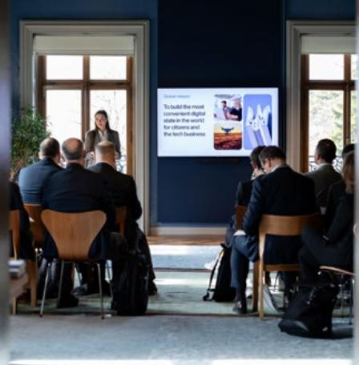

## BREAKING FREE WORLD ECONOMIC FORUM

WORLD ECONOMIC FORUM

Annual Health Roundtable
20-21M 25

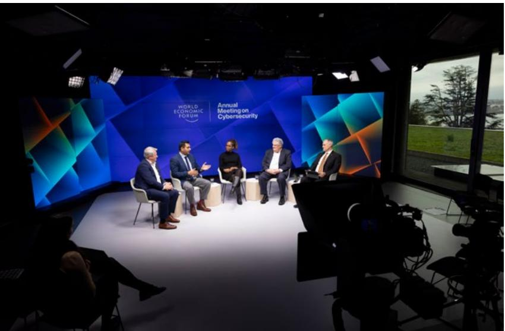

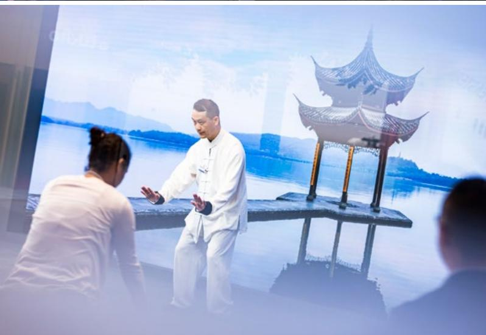

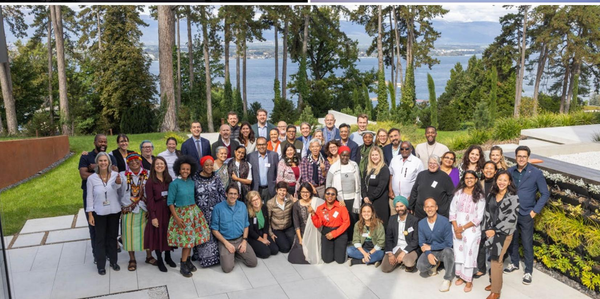

WORLD ECONOMIC FORUM

COMMITTED TO
MPROVING THE STATE
OF THE WORLD

The World Economic Forum, committed to improving the state of the world, is the International Organization for Public-Private Cooperation.

The Forum engages the foremost political, business and other leaders of society to shape global, regional and industry agendas.

World Economic Forum
91–93 route de la Capite
CH-1223 Cologny/Geneva
Switzerland

Tel.: +41 (0) 22 869 1212
Fax: +41 (0) 22 786 2744
contact@weforum.org
www.weforum.org