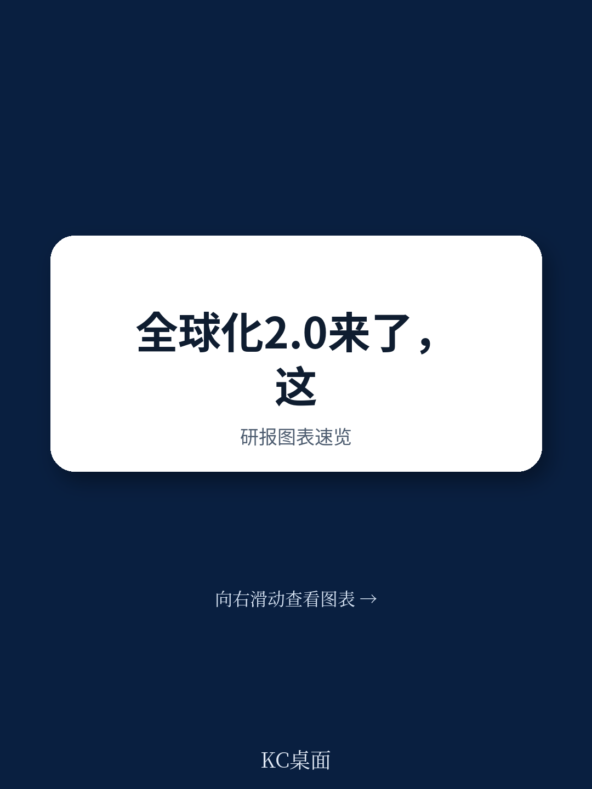
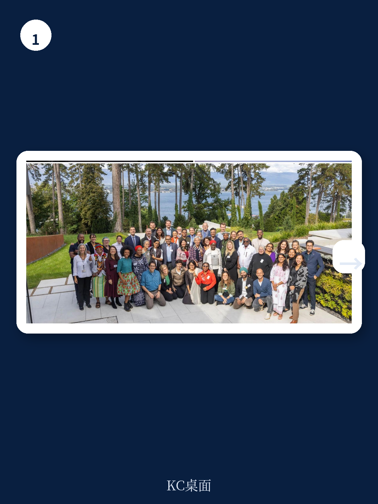
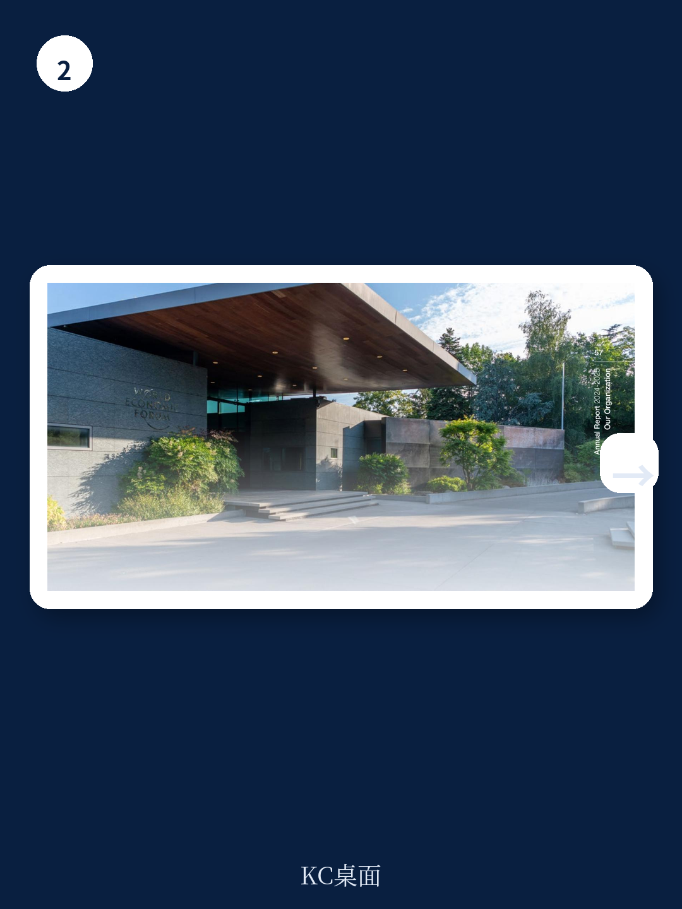

# 世界经济论坛：全球化2.0不是倒退，而是重新分配收益

当大多数人对全球化的未来感到悲观时，世界经济论坛2024-2025年度报告给出了一个明确的判断：全球化没有终结，它正在进化。这份长达70余页的报告，核心信号是“全球化2.0”的到来——一个更关注国家个体需求、更照顾全球化早期受损者、同时更依赖资本市场的版本。

这不是一份常规的机构年报。它更像是一份全球治理的体检报告，以及一份面向企业决策者的行动指南。报告的核心主张是：**在主权政治上升与跨国合作需求之间，不存在非此即彼的选择；真正的挑战在于如何在这两者之间找到可操作的平衡点。**

对于关注全球宏观趋势的读者来说，这份报告的价值不在于它说了什么新奇的论断，而在于它提供了一个观察全球治理变化的权威框架——哪些议题正在被重新定义，哪些力量正在重塑国际合作的边界。

---

## 1. 全球化2.0的核心特征：不是倒退，而是重新分配收益

报告最值得关注的判断，是联合主席在开篇提出的“全球化2.0”概念。这不是一个修辞上的创新，而是对过去十年全球化叙事的一次系统性修正。

传统全球化模式的根本问题在于：收益分配不均。报告明确指出，新的全球化版本必须“更关注那些在上一轮全球化中未能充分受益的工人和国家”。这意味着，未来的全球化将不再是单纯的贸易自由化或资本自由流动，而是一个更强调国内优先、同时保持国际协作的混合模式。

> **KC评论：** 全球化2.0的本质，是从“效率优先”转向“分配优先”。对企业而言，这意味着过去“全球布局、成本最低”的策略正在失效。未来需要同时考虑地缘政治合规、本地就业贡献和技术转让等非经济因素。报告没有展开的是：这种转变对不同行业的影响差异巨大——比如科技公司的数据本地化压力，与制造业的供应链重组逻辑完全不同。

这一判断对资产定价的含义是什么？如果全球化2.0意味着更高的交易成本和更碎片化的市场，那么全球供应链的“安全溢价”将持续上升。那些能够同时满足本地化要求和全球效率的企业，将在未来获得估值溢价。

## 2. 主权政治上升与跨国合作并不矛盾——但需要新的合作形式

报告没有回避主权政治上升的现实。相反，它明确指出“过去一年，主权政治在全球范围内上升”。但值得注意的是，报告紧接着提出：这种内向姿态与合作需求之间的张力，并不意味着两者不可调和。

这个判断的逻辑基础是：当今世界的相互依存程度使得任何国家都无法真正“脱钩”。因此，合作的形式需要改变——从传统的多边框架转向更灵活、更务实的“议题联盟”。

报告中提到的几个案例值得关注
- 在达沃斯2025年会上，欧洲情报机构负责人与私营部门共同讨论网络安全威胁
- “CEO for Ukraine”会议汇集了80多位企业领袖
- 欧洲增长与竞争力领袖社区的建立

这些都不是传统的政府间合作，而是“政府-企业-社会”三方共同参与的“多利益相关方”模式。这正是世界经济论坛过去55年积累的核心能力。

> **KC评论：** 对投资者来说，需要关注的不是主权政治本身，而是它如何改变企业的竞争环境。当政府越来越多地介入产业政策时，那些能够与政府建立有效对话渠道的企业，将获得非对称优势。报告没有明说但隐含的含义是：未来十年的赢家，可能是那些“既懂市场又懂政府”的企业。

## 3. 私营部门正在从“被监管者”变成“主动参与者”

报告中最具洞察力的判断之一，是总裁兼CEO Børge Brende提出的：私营部门将需要越来越多地扮演“积极行动者”的角色，与政府共同开发解决方案。

这不是一句空话。报告提供了具体数据支持：世界经济论坛的合作伙伴数量增长了5%，达到创纪录的925家企业。在复杂的地缘政治环境下，企业不仅没有退出多边平台，反而加大了参与力度。

原因是什么？报告没有直接说明，但可以从逻辑上推导：当政府间的正式合作变得困难时，企业成为连接不同经济体的“毛细血管”。它们需要在不同监管体系中运营，因此有强烈的动机推动规则协调。

报告提到的“First Movers Coalition”（先行者联盟）是一个典型案例。这个由100多家全球领先企业组成的团体，利用集体采购力量推动可持续发展创新。这不是政府强制的结果，而是企业主动选择的市场行为。

> **KC评论：** 这个趋势对资产定价有结构性影响。那些能够参与全球规则制定的企业，实际上获得了一种“制度套利”能力。比如在碳定价、AI治理等新兴领域，先发企业可以影响标准制定，从而为自己创造竞争壁垒。报告没有展开的是：这种能力需要什么样的组织架构和人才配置——这是很多企业尚未思考的问题。

## 4. 报告尚未完全回答的关键问题：信任机制如何重建

报告反复强调“信任”的重要性，甚至称其为“今天最有价值也最脆弱的资源”。联合主席的表述很精炼：“信任像资本一样，当被明智地投资时会复利增长。”

但报告没有回答一个关键问题：在主权政治上升、信息碎片化的环境下，信任机制如何重建？传统的信任建立方式——比如长期双边关系、多边条约——正在被侵蚀，而新的信任机制尚未成熟。

报告提出了“增长、韧性、创新”三个路径，但这些都是结果变量，而非过程变量。真正的问题在于：如何让不同利益主体愿意坐下来谈判？当各方都认为“不合作”的代价小于“合作”的成本时，如何打破僵局？

这个问题的答案，可能不在世界经济论坛的年度报告中，而需要在更广泛的信源和讨论中寻找。这也是为什么我们需要持续跟踪全球主流叙事的变化——每一个细微的信号，都可能预示着信任机制的重建路径。

## 5. 一个可供读者持续观察的框架：三个“追问”指标

基于报告的框架，我们可以建立一个简单的观察框架，用于跟踪全球化2.0的进展

**第一个追问：合作的形式是否在进化？** 如果全球化2.0需要新的合作形式，那么我们应该观察的是：是否出现了更多“议题联盟”而非传统多边框架？比如在AI治理、碳边境调节、数字税等领域，是否有新的公私合作模式出现？

**第二个追问：资本市场的角色是否在转变？** 报告认为资本市场可以成为推动进步的动力。我们需要观察的是：ESG投资是否从“标签化”转向“实质化”？绿色债券、转型金融等工具是否真正引导了资本流向？

**第三个追问：企业是否在主动参与规则制定？** 如果私营部门需要成为“积极行动者”，那么我们应该关注：企业是否在投入资源参与标准制定？是否在建立政府关系能力？是否在探索跨行业合作？

这三个追问，构成了一个动态的观察框架。它们不是静态的判断，而是需要持续跟踪的指标。每季度复盘一次，就能看到全球化2.0的真实进展。

---

这份报告的价值，不在于它给出了确定的答案，而在于它提供了一个权威的起点。全球化2.0的走向，取决于接下来两年各方的具体行动——而这些行动，往往体现在更细分的行业报告、政策文件和公司战略中。

继续看原文，真正有价值的是报告中关于具体倡议的运作机制、各中心的项目成果以及财务数据背后的投入方向。完整报告与我们的评论，在每日汇编中持续更新。

更多国际信源汇编与评论，欢迎扫码交流。每日更新，汇总国际主流叙事、数据与图表，帮助观测市场边际变化。每日汇编会把单篇报告放回当天主线，整理成中文摘要、评论和图表合集，便于喂给AI，也便于人工快速扫描市场dynamics。这里汇聚了头部券商、PE/VC、投行、并购、hedge fund、资管机构、战略咨询、智库等朋友，期待交流。

Personal reading notes and learning share only. Not investment advice.
