# Artificial Intelligence and the Future of Entry-Level Work: A Framework for Safeguarding and Reinventing Early Career Pathways

INSIGHT REPORT

JUNE 2026

## Contents

Foreword 3
Executive summary 4
Introduction: Context and framework 6
1 Job access 10
2 Job design 16
3 Talent pipelines 21
4 Education system alignment 28
Call to action 35
Contributors 37
Acknowledgments 38
Endnotes 40

## Disclaimer

This document is published by the World Economic Forum as a contribution to a project, insight area or interaction. The findings, interpretations and conclusions expressed herein are a result of a collaborative process facilitated and endorsed by the World Economic Forum but whose results do not necessarily represent the views of the World Economic Forum, nor the entirety of its Members, Partners or other stakeholders.
© 2026 World Economic Forum. All rights reserved. No part of this publication may be reproduced or transmitted in any form or by any means, including photocopying and recording, or by any information storage and retrieval system.

# Foreword

  
Saadia Zahidi
Managing Director
World Economic Forum

Skills mismatches have been among the top concerns of business executives in the ten years since the World Economic Forum's first Future of Jobs Report. Today, that risk is being compounded. Artificial intelligence (AI) is reshaping how organizations hire, develop and advance talent. For entry-level talent in particular, these trends are transforming the foundation of how organizations build the capabilities to compete and how the next generation of talent enters the world of work.

The impact of AI will not be determined by the technology alone. It will be determined by the choices of business leaders, policy-makers, workers and society. The right choices can help to ensure that AI is an enabler of human flourishing, organizational success and societal prosperity.

In this report, we seek to provide a clear lens on how AI is reshaping entry-level work and focus on the areas organizations need to proactively address now. The report draws on a unique combination of global data and practice-based insight. It brings together perspectives from the World Economic Forum's Global Dialogue on AI and Entry-Level Work, which convened over 200 leaders and experts, and data from PwC's AI Jobs Barometer and PwC's Global Workforce Hopes & Fears Survey 2025, capturing the views of more than 9,000 entry-level workers across 48 countries. These insights are complemented by interviews with business leaders deploying AI in practice and working sessions with organizations across industries, grounding the analysis in what is happening in practice.

  
Peter Brown
Global Workforce Leader
PwC

We find that business leaders need to consider:

\- Targeted focus on access to entry-level roles as Al reshapes demand

\- Redesigning entry-level work to bring out the best of people, AI agents and technology Reinventing talent pipelines and professional development as organizational structures evolve

\- Reinventing talent pipelines and professional development as organizational structures evolve

\- Collaborating with education and training systems to prepare entry-level workers to thrive in an AI era

To put into practice the findings and recommendations explored in this report, the World Economic Forum's Centre for the New Economy and Society is launching the First-Mile Sandbox, piloting new and innovative models of workplace readiness through educator and employer co-creation across industries and geographies. Whether you are leading your next generation workforce into the AI era, shaping the policies that will govern it, or seeking to prepare your students for a rapidly transforming workplace, we invite all interested stakeholders to learn more and join us in this global effort.

Managing the transitions that are currently taking place in workplaces is not a matter for human resources departments alone. It is a board-level strategic concern for every organization that relies on a healthy talent pipeline and a workforce ready to make the most of AI's potential. Strong entry-level pathways in particular matter for economic mobility, civic participation, and the broad-based prosperity that sustains stable, cohesive communities. Our choices will shape how quickly we reach the opportunities and overcome the challenges of this transition.

# Executive summary

Artificial intelligence (AI) is reshaping work, and this is most visible at the entry level. Globally, more than one in three (37%) young workers are employed in occupations with medium to high exposure to AI-driven task change, including three in four young workers in Eastern Asia (75%) and two in three young workers in Northern America (69%) and Europe (63%). Sectors with the highest exposure include Financial Services, Information and Communication, Professional Services, Science and Education, whereas entry-level roles in sectors such as Agriculture, Construction and Food Services are comparatively less affected. How these roles and pathways evolve will have significant implications for organizational performance, workforce participation and economic mobility. This report introduces a framework across four dimensions – job access, job design, talent pipelines and education system alignment – to help stakeholders identify where strain is emerging, where deliberate action is needed and what objectives leaders should prioritize in practice.

Executive summary: Framework for safeguarding and reinventing early career pathways

<table><tr><td>Dimension</td><td>Key findings</td><td>Priority objectives for action</td></tr><tr><td rowspan="2">Job accessSafeguarding continued creation of entry-level jobs</td><td>Finding 1: Current hiring slowdowns at entry-level are evident. AI's role remains contested.Recent research suggests current slowdowns are most pronounced in occupations with higher AI exposure, but future expectations among employers and entry-level workers reveal a more nuanced outlook.</td><td rowspan="2">Make entry-level hiring an explicit component of strategic workforce planning, with clear targets to maintain or grow intake alongside AI adoption, and avoid reinforcing unintended disparities in access to early career pathways.</td></tr><tr><td>Finding 2: Proactive support mechanisms may be needed to mitigate risks of AI reinforcing existing disparities in access to entry-level opportunities. More than 20% of entry-level workers are changing careers, re-entering the workforce or moving into new industries later in life.</td></tr><tr><td rowspan="2">Job designEnsuring design of entry-level jobs is fit for purpose</td><td>Finding 3. Organizations may need to manage trade-offs between short-term efficiency improvements, capability-building and work quality. 68% of entry-level workers report having seen an increase in productivity due to AI, but 45% also spend more time working in general as a result of AI.</td><td rowspan="2">Establish clear models for effective AI-enabled job redesign, leveraging entry-level roles to continue building critical skills and capabilities, rather than simply layering AI onto existing ways of working.</td></tr><tr><td>Finding 4: Job redesign is emerging as a strategic lever of organizational competitiveness, but clear models for entry-level roles design are often still lacking.Companies with the strongest AI-driven financial outcomes are twice as likely to redesign workflows, yet conceptualizing what effective AI-enabled job redesign looks like remains a challenge, particularly at the early career stage.</td></tr><tr><td rowspan="2">Talent pipelinesReinventing career pathways and capability development as work evolves</td><td>Finding 5: Efforts to reshape organizational structures are often focused on the base of the hierarchy. Twenty-three percent of CEOs believe present organizational structures are constraining performance, with attention falling on entry-level roles. Expectations of AI-related structural change at the entry-level are almost twice as high as those for mid- or senior-level roles, with three-quarters of leaders expecting significant realignments.</td><td rowspan="2">Move from fixed role-based workforce structures and job architectures towards more capability-based models of talent development, ensuring talent pipelines are intentionally designed and talent is matched proactively to evolving roles.</td></tr><tr><td>Finding 6: Organizational capability may be increasingly built through non-linear movement and exposure, not hierarchical sequence. While this creates new opportunities to build skills faster and more flexibly, entry-level workers continue to look for traditional signals of advancement, with 31% planning to ask for a promotion in the next year, underlining the importance of redesigning how to define and communicate progression in practice.</td></tr><tr><td rowspan="2">Education system alignmentEquipping education and training to keep pace with changing demands of the AI-enabled workplace</td><td>Finding 7: Entry-level skills requirements are evolving faster than current education systems can keep pace. Entry-level roles in the highest AI-exposure quartile exhibit nearly twice the rate of net skills change than non-entry-level roles, with 28% of entry-level workers believing that half or fewer of their current skills will still be relevant in three years.</td><td rowspan="2">Build more continuous and responsive alignment between employers, educators and policy-makers, ensuring curricula reflect and provide exposure to changing workplace technologies, and strengthen alternative pathways into employment alongside traditional degrees.</td></tr><tr><td>Finding 8: New signals of job readiness and alternative pathways are needed alongside traditional degrees. While traditional degrees remain important, leaders increasingly highlight the need for additional signals of workforce readiness, including applied experience, real-world problem-solving and exposure to workplace technologies. This is increasing interest in work-integrated learning and alternative pathways into employment.</td></tr></table>

# Introduction: Context and framework

Entry-level roles have long provided ordered pathways into paid work and onto the first step of traditional career ladders. Across economies, these roles play a critical part in workforce participation and skill formation, offering structured opportunities to build practical experience and develop professional capability.

Globally, it is estimated that over 500 million young people age 15–24 participate in the labour force today $^{1}$ and over 600 million additional jobs will need to be created, predominantly in emerging economies, to keep up with demand from young people entering the labour market by 2030 $^{2}$ .

Entry-level roles are typically defined by limited experience requirements and their position at the base of organizational hierarchies. Throughout this report, the term “early career” is sometimes used more broadly to describe workers in the earlier stages of their careers, reflecting the way labour-market datasets are often grouped by age or tenure rather than organizational role. In many industries, entry-level roles support day-to-day operations while providing a foundation for professional development and helping sustain future talent pipelines.

Analysis for this report estimates that, globally, more than one-third of young workers (37%) are employed in occupations with medium to high exposure to AI-driven task change, including three in four young workers in Eastern Asia and two in three in both Northern America and Europe (see Figure 1).

## FIGURE 1

Distribution of young workers (age 15–24) across high-, medium- and low-AI exposure occupations, by region  
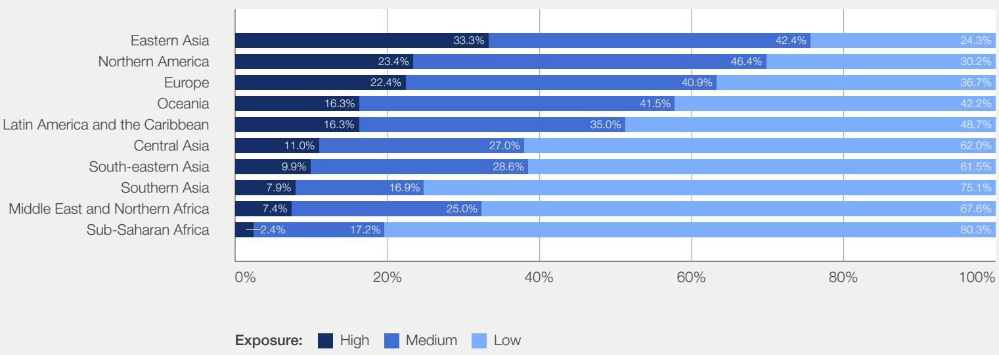  
Note: AI exposure is derived from the PwC AI Jobs Barometer at occupation level, averaged to ISCO-08 major groups and rescaled to 0–1. Exposure categories are defined using Jenks natural breaks to identify groupings in the distribution and mapped to ILOSTAT data to estimate the share of young workers (age 15–24) in each exposure group. ILOSTAT data series: Youth employment by sex, age and occupation (thousands) – Annual. Figures exclude ISCO-08 occupation “X: Not elsewhere classified”. Source: International Labour Organization, ILOSTAT & PwC 2026 AI Jobs Barometer.

These regional differences are partly driven by variations in employment composition. At the sector level, AI exposure is concentrated in knowledge intensive industries, where entry level roles often involve routine, information processing tasks that are more susceptible to automation (see Figure 2).

This is evident in the aforementioned regions, where larger shares of workers, including at entry level, are employed in these sectors $^{3}$ . By contrast, young workers in regions with high employment shares in sectors such as agriculture and construction remain comparatively less exposed.

<table><tr><td>AI exposure ranking</td><td>Sector</td><td>Estimated number of young workers (age 15-24)</td></tr><tr><td>1</td><td>Financial and Insurance Activities</td><td>4 million</td></tr><tr><td>2</td><td>Information and Communication</td><td>6 million</td></tr><tr><td>3</td><td>Professional, Scientific and Technical Activities</td><td>7 million</td></tr><tr><td>4</td><td>Real Estate Activities</td><td>1 million</td></tr><tr><td>5</td><td>Education</td><td>16 million</td></tr><tr><td>6</td><td>Public Administration and Defence</td><td>8 million</td></tr><tr><td>7</td><td>Mining and Quarrying</td><td>3 million</td></tr><tr><td>8</td><td>Human Health and Social Work Activities</td><td>17 million</td></tr><tr><td>9</td><td>Manufacturing</td><td>66 million</td></tr><tr><td>10</td><td>Wholesale and Retail Trade</td><td>82 million</td></tr><tr><td>11</td><td>Other Services and Household Activities</td><td>24 million</td></tr><tr><td>12</td><td>Arts, Entertainment and Recreation</td><td>5 million</td></tr><tr><td>13</td><td>Utilities and Infrastructure</td><td>13 million</td></tr><tr><td>14</td><td>Construction</td><td>37 million</td></tr><tr><td>15</td><td>Transportation and Storage</td><td>20 million</td></tr><tr><td>16</td><td>Agriculture, Forestry and Fishing</td><td>159 million</td></tr><tr><td>17</td><td>Accommodation and Food Service Activities</td><td>40 million</td></tr><tr><td>18</td><td>Other &amp; not elsewhere classified</td><td>29 million</td></tr></table>

Note: AI exposure is derived from the PwC AI Jobs Barometer and calculated as the employment-weighted average of occupation-level AI exposure scores within each sector, based on the extent to which job tasks align with current AI capabilities. ILOSTAT data series: Youth employment by sex, age and occupation (thousands) – Annual. Certain sectors have been grouped for presentation purposes. “Utilities & Infrastructure” includes electricity, gas, water supply, waste management and administrative support services. “Other Services and Household Activities” includes other service activities and household employer activities. “Other & not elsewhere classified” includes extraterritorial organizations and activities not elsewhere classified.
Source: International Labour Organization, ILOSTAT & PwC 2026 AI Jobs Barometer.

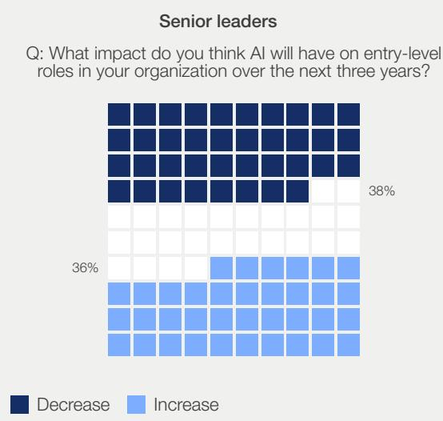  
Source: PwC Global Hopes and Fears Survey (2025).

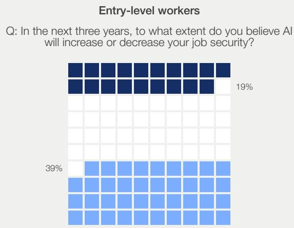

What this growing exposure means for entry-level roles remains uncertain, but current expectations vary significantly across groups (see Figure 3).

Alongside this uncertainty, broader shifts are emerging in how individuals enter the labour market. Recent figures from the United States suggest that 42% of Gen Z workers are working in, or pursuing, “blue-collar” or skilled trade roles, including 37% of those with a bachelor’s degree $^{4}$ . US payroll data also shows that the share of blue-collar employment among workers age 20–24 has increased by around 2.3 percentage points since 2019 $^{5}$ . At the same time, alternative entry routes are expanding. Some individuals are entering the workforce through gig or freelance work, with evidence from the United Kingdom suggesting that around one in five platform workers are first-time labour market entrants $^{6}$ . These data points hint at a shift away from traditional, structured entry routes towards a more fragmented set of pathways into work.

Importantly, strain on entry-level pathways predates the rise of AI. Employers have long cited skills gaps as a key barrier, while new workforce entrants often struggle to demonstrate relevant experience or translate educational learning into practical workplace application, reflecting gaps between education and workplace requirements $^{7}$ . AI is changing the nature of work and accelerating the pace of change, with tasks, skills and expectations evolving faster than the current systems designed to support them can adapt.

## A framework for safeguarding and reinventing early career pathways

To understand how AI is reshaping entry-level jobs and early career pathways, we examine four key dimensions across which current trends are widely expected to have the most significant impact. Together, these four dimensions provide a practical framework to help leaders from business, government and the education sector assess where strain is emerging and where more deliberate action is needed to safeguard labour-market access, support human-AI collaboration and workforce transformation, maintain organizational capability-building, and nurture talent pipelines for the future.

BOX 1: Framework for safeguarding and reinventing early career pathways

<table><tr><td></td><td>Dimension</td><td>Priority objectives for action</td></tr><tr><td>1</td><td>Job accessSafeguarding continued creation of entry-level jobs</td><td>Ensure that:- Organizations continue to hire into entry-level roles that have been intentionally redesigned for an AI-enabled workplace- Entry-level roles remain a deliberate part of workforce planning, contributing to both organizational productivity and long-term capability planning- Access to entry-level opportunities is supported through deliberate mechanisms (e.g. access to AI tools and agents; training and work experience; policy support), mitigating the risk that opportunities and capability-building are unevenly distributed across talent pools</td></tr><tr><td>2</td><td>Job designEnsuring design of entry-level jobs is fit for purpose</td><td>Ensure that:- Jobs and workflows are structured for most productive and meaningful human-AI agent collaboration- Organizations make deliberate choices on which tasks are automated versus retained to leverage entry-level roles to continue to build critical skills and capabilities</td></tr><tr><td>3</td><td>Talent pipelinesReinventing career pathways and capability development as work evolves</td><td>Ensure that:- Talent pipelines are intentionally designed, not left to emerge arbitrarily- Workforce capability is continuously developed through non-linear movement and exposure, not only hierarchical sequence- Talent is recognized and proactively matched to evolving roles</td></tr><tr><td>4</td><td>Education system alignmentEquipping education and training to keep pace with changing demands of the AI-enabled workplace</td><td>Ensure that:- Curricula reflect and provide exposure to changing workplace technologies- Education systems expand work-integrated learning and strengthen alternative pathways into employment alongside traditional degrees- Employers and educators work together to continuously align skill needs and training approaches, with an emphasis on real-time feedback and co-designed curricula rather than periodic or high-level engagement</td></tr></table>

# Job access

Access to entry-level roles is coming under strain as organizations adjust hiring intentions and entry-level role creation in response to expectations about future AI capabilities and broader economic factors. Declines in entry-level hiring risk weakening longer term capability-building that sustains future skills and workforce resilience. This section examines how the current state of access to early career opportunities is evolving, drawing on recent labour market research and practical employer insights.

## Finding 1: Current hiring slowdowns at entry-level are evident. AI's role remains contested.

A growing body of labour market research points to recent signs of contraction in early careers job opportunities. Notably, studies across the United Kingdom, the United States and Sweden document more pronounced declines among junior workers in AI-exposed occupations, with a widely-cited analysis by Brynjolfsson et al. finding a 16% decline in entry-level jobs in AI-exposed fields in the United States since late 2022 $^{8}$ . Within early career jobs,

declines have been generally found to be most pronounced in occupations with higher AI exposure, while lower-exposure occupations have remained comparatively more resilient. However, data also shows that declines in entry-level role postings began nearly a year before the release of ChatGPT, pointing to a more complex set of factors (see Figure 4).

FIGURE 4  
Number of early career job postings relative to 2012, by degree of AI exposure  
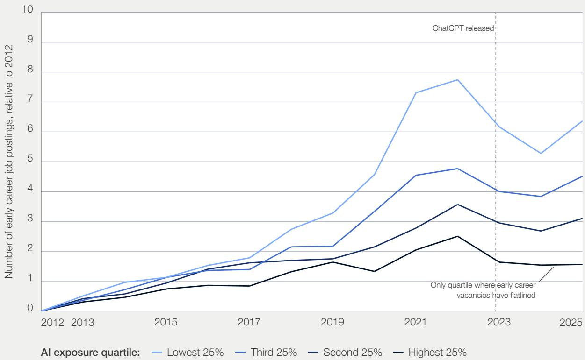  
Source: PwC AI Jobs Barometer 2026.

Sector-level analysis provides a complementary perspective, highlighting how occupation-level changes translate into hiring patterns across industries (see Figure 5). While the data shown in Figure 5 focuses on the United Kingdom, similar directional trends can be observed across other advanced economies.

In more AI-exposed, knowledge-intensive sectors, such as Professional, Scientific and Technical activities as well as Public Administration,

recent softening in job postings has been more pronounced for entry-level roles than for experienced hires. In lower AI-exposure sectors, such as Transport and Storage, entry-level hiring has also softened in recent periods but remains comparatively stronger relative to experienced roles. Once again, job posting declines in these sectors began prior to the release of ChatGPT in November 2022, pointing to a broader set of underlying causes than a simple AI-driven narrative.

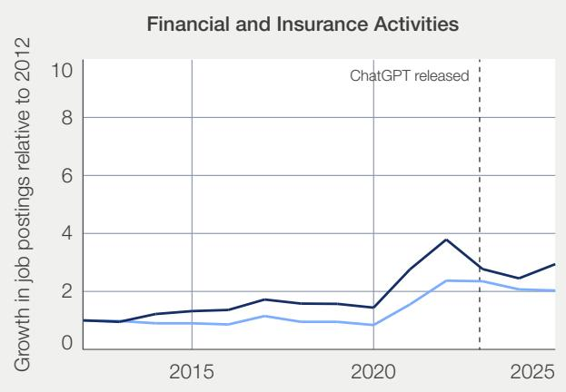

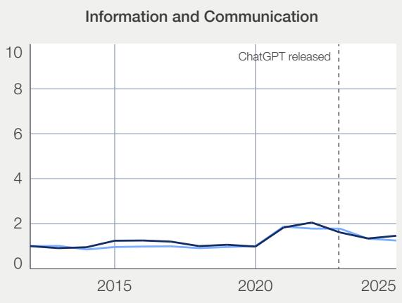

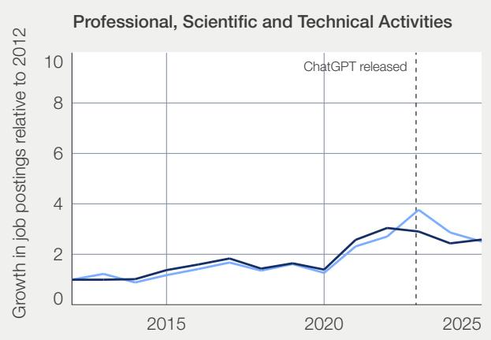

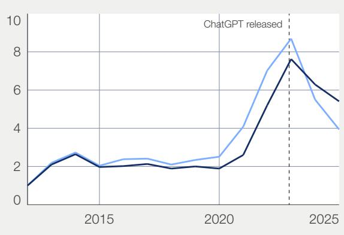

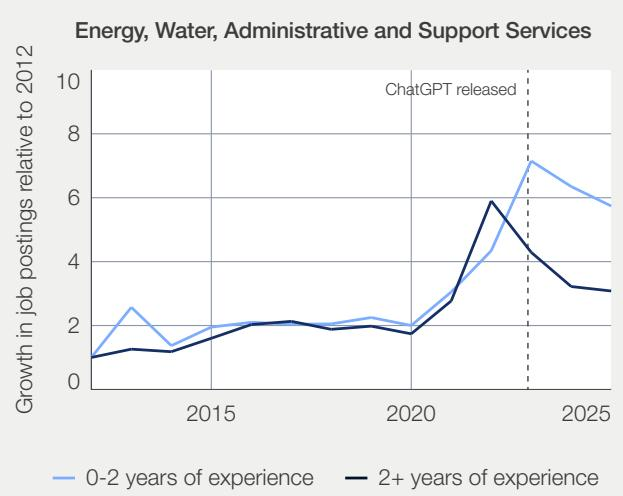

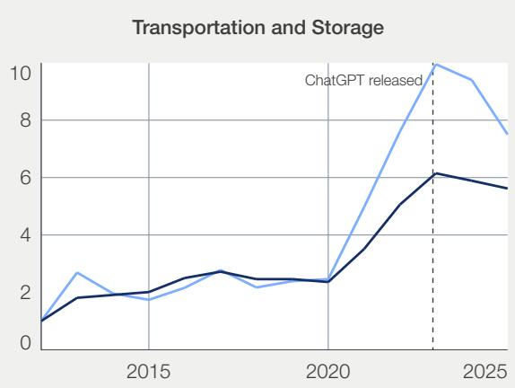  
Source: PwC AI Jobs Barometer 2026. Note: Sectors have been selected to reflect varying levels of AI exposure, enabling comparison of how entry-level hiring trends differ across labour-market contexts. The dotted line indicates the public release of ChatGPT in November 2022.

However, employer interviews conducted for this report highlight a consistent theme that organizations are exercising greater caution in expanding headcount, rather than undertaking widespread workforce reductions. Several leaders noted that while AI is frequently cited as a driver of these shifts, it often serves as a visible explanation for broader changes in hiring behaviour. As one senior people leader observed, “AI is often the headline, but the reality is more complex. When hiring slows, technology becomes an easy explanation, even when economic uncertainty or cost pressures are the bigger drivers.” Across interviews, leaders’ underlying sentiment suggested that changes in hiring behaviour are being driven as much by uncertainty and cost discipline as by realized gains from automation.

Conversely, a growing number of employers state that they expect adoption of AI tools to result in increased rather than reduced entry-level hiring – with AI shifting entry-level work away from routine and administrative tasks toward more complex responsibilities – resulting, for now, in an overall mixed near-term outlook $^{9}$ .

## Dropbox

# Using AI to strengthen entry-level hiring, talent pipelines and expand capability

Rather than using AI to drive headcount reduction, Dropbox focuses on reinvesting productivity gains into higher-value work (e.g. advancing strategic initiatives, resolving technical debt), while maintaining strong entry-level pathways. As AI reshapes the nature of work, Dropbox has taken a deliberate approach that positions AI as a tool for expanding human capability rather than reducing entry-level opportunities. Early career talent plays a central role in this strategy. Notably, the company has expanded its internship and new graduate

programmes by 25%, signalling a continued investment in early career talent in an AI-enabled environment.

Dropbox has found that interns and new graduates increasingly arrive with strong fluency in AI tools and naturally integrate them into tasks such as coding, research and early prototyping, raising the productivity baseline and accelerating ramp-up time. Dropbox has supported this shift through targeted interventions, including:

1 Embedding AI into roles: Expectations for responsible AI use are integrated into role design and performance frameworks

2 Evolving hiring criteria: Candidates are assessed on their ability to work effectively with AI systems and apply critical judgement

3 Building capability: Internal proficiency frameworks and training programmes are developed to strengthen AI proficiency alongside human skills

Internal analysis reinforces the outcomes and success of this approach. Dropbox reports that its own interns and new graduate hires outperform externally hired peers on retention, engagement, performance and promotion velocity. By year two, 65% had been promoted, rising to 87% by year

three, with particularly strong productivity outcomes observed in engineering roles. Through this approach, Dropbox illustrates how AI can be used to expand organizational capacity while maintaining, rather than reducing, entry-level pathways.

## Finding 2. Proactive support mechanisms may be needed to mitigate risks of AI reinforcing existing disparities in access to entry-level opportunities.

AI tools are not simply being introduced into a neutral labour market. Pre-existing differences in access to tools, skills and support mechanisms mean that individuals are often not equally positioned to benefit from AI-driven changes in work. AI and data-related skills are among the fastest-growing skills globally, with 86% of employers globally expecting AI and information processing technologies to transform their business $^{10}$ . Without deliberate support mechanisms, AI risks reinforcing existing inequalities in access to entry-level opportunities and capability-building. Across the employer interviews conducted for this report, leaders highlighted several factors that may shape who is best positioned to access and benefit from AI-enabled work in the future.

Age: Entry-level roles are typically held by younger workers, but they also include people who are changing careers, re-entering the workforce or moving into new industries later in life. According to PwC's Global Workforce Hopes and Fears survey, approximately one in five entry-level workers across industries actually hails from Gen X (ages 45–60). At the same time, these older cohorts are significantly less likely to have used AI tools at work; for example, 84% of Baby Boomers report not using AI agents in the past 12 months, compared to 57% of Gen Z workers $^{11}$ . If access to AI training and reskilling does not reach older cohorts, they may find it harder to transition into future roles in new sectors where digital fluency is expected. Organisation for Economic Co-operation and Development (OECD) research finds that many older adults remain excluded from the digital transition due to digital-skills gaps and limited access to age-sensitive training $^{12}$ .

Socioeconomic background: Some leaders interviewed for this report observed that candidates from more advantaged educational backgrounds are more encouraged to use AI tools and often arrive in early career roles better prepared, reflecting differences in both exposure and access, while others have had more limited opportunities to engage with such tools. This is reinforced by evidence that around a third of employees who use generative AI (GenAI) for work report paying for these tools themselves, $^{13}$ creating a dynamic where those with greater personal resources can build capability faster.

\- Gender: Exposure to AI tools is shaped by the types of roles individuals occupy. International Labour Organization (ILO) analysis finds that female-dominated occupations are nearly twice as likely to be exposed to generative AI, and that women's roles are more exposed than men's in nearly nine out of ten countries, partially due to the concentration of women in clerical, administrative and customer-facing roles $^{14}$ . At the same time, recent research by the World Economic Forum with LinkedIn suggests that the gender gap in AI tool use may be narrowing $^{15}$ .

In contexts where organizations are hesitant to create new roles, policy and system-level interventions can play a role in sustaining the flow of new entrants from different talent pools into the workforce. While policy cannot directly determine hiring decisions, it can influence the cost and feasibility of recruiting and developing entry-level talent.

## Government of Canada

## Reducing employment barriers to entry-level digital employment

Canada's Digital Skills for Youth (DS4Y) programme illustrates a government intervention focused on reducing barriers to early career digital employment. Delivered under the Youth Employment and Skills Strategy, the programme supports work placements that help young people gain work experience and build digital skills.

## DS4Y primarily targets unemployed or

underemployed post-secondary graduates ages 15–30. Funding is delivered through eligible placement organizations, which work with employer networks to create placements with small and medium-sized businesses and not-for-profit organizations. Employers receive financial support to help offset the cost of hiring and supporting interns through this programme, reducing the perceived risk of recruiting candidates with limited prior professional experience.

Canada continues to face digital-skills demand and broader skills-gap pressures linked to digital transformation and emerging technologies. While DS4Y does not eliminate structural labour-market gaps, it addresses a common constraint in early career transitions: the requirement for previous experience. By reducing hiring costs and facilitating structured placements, DS4Y expands access to first digital roles and supports workforce participation among young people seeking to enter the digital economy.

Taken together, the above findings highlight the risk of uneven AI adoption and preparedness reinforcing inequalities within the early career workforce,

limiting equal access to opportunity. Many of these risks may be addressed through pro-active consideration in entry-level job design.

# 2 | Job design

The design of entry-level work is being reshaped as AI becomes embedded in everyday tasks and workflows. This is changing what core responsibilities individuals require, and how work is structured. While AI can reduce the need for performing routine tasks, it also changes how

individuals learn, develop and exercise judgement, and engage with their work, potentially creating trade-offs between short-term efficiency and long-term capability-building. This section examines how AI can accelerate the redesign of entry-level roles to be fit for the future.

## Finding 3. Organizations may need to manage trade-offs between short-term efficiency improvements, capability-building and work quality.

Across interviews conducted for this report, perspectives were mixed: while most employers found AI is freeing up time for entry-level workers, there was no consistent view on how that time is being used.

Some reported a deliberate redirection of capacity into higher-value activities (e.g. more strategic analysis, stakeholder engagement or problem-solving), while others were less confident, describing a drift towards lower-value or poorly defined tasks (e.g. duplicative outputs, superficial analysis or increased reliance on AI-generated content without critical review). This lack of clarity on how productivity gains are being absorbed is also reflected in a range of emerging research, which points to a set of interconnected risks in situations where AI is simply layered onto existing workflows and not accompanied by deliberate job redesign, particularly for entry-level roles.

\- Cognitive atrophy: Short-term efficiency gains may come at the expense of long-term capability-building, as over-reliance on AI risks creating skills decay and reducing opportunities to develop judgement and problem-solving skills $^{16}$ .

Work intensification: AI use may lead to higher baseline expectations, with entry-level workers expected to deliver more, faster, within the same time constraints. If not managed deliberately, over time, this may contribute to cognitive fatigue, burnout and weakened decision-making $^{17}$ . While PwC analysis shows that 68% of entry-level workers report having seen an increase in productivity due to AI, 45% of entry-level workers also report spending more time working as a result of AI (see Figure 6).

\- Erosion of job quality and meaning: Without deliberate job design, there is a risk that AI may automate the more engaging, meaningful or creative aspects of work, leaving workers with narrower, less fulfilling sets of tasks if roles are not intentionally redesigned to preserve meaningful activities $^{18}$ .

These findings underline the importance of intentionally redesigning jobs and workflows for most productive and meaningful human–AI collaboration. As one leader shared, “Without intentional job design, we’re not creating value, we’re just producing faster, lower-quality work, effectively creating ‘work slop’.”

## FIGURE 6

Impact of AI on working hours over the last 12 months  
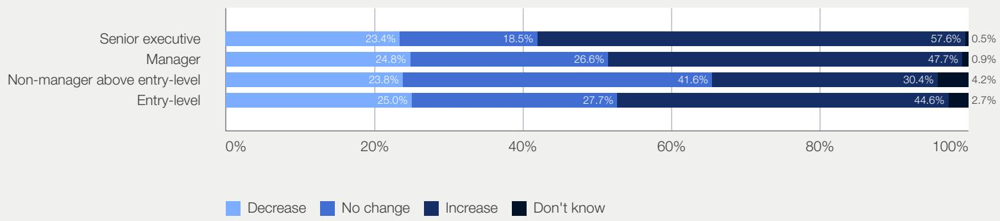  
Note: Respondents were asked: "In the last 12 months, to what extent did AI increase or decrease the time you spend working?" "Decrease" combines responses indicating a significant, moderate, or slight decrease in time spent working. "Increase" combines the equivalent levels of increase.  
Source: PwC Global Hopes and Fears Survey, 2025.

## Shoosmiths

# £1 million incentive to encourage AI upskilling and adoption

UK law firm Shoosmiths has taken a distinctive approach to AI adoption, using incentives to accelerate behavioural change across the organization. Anticipating the impact of generative AI on legal work, the firm moved early to make AI tools widely available and encourage hands-on experimentation.

Shoosmiths introduced a firm-wide incentive linking a £1 million bonus pool to a collective target of one million AI prompts over the financial year. The aim was not simply to increase usage, but to create momentum and normalise AI as part of day-to-day work.

This initial push had a lasting effect. Adoption was sustained beyond the point at which the bonus threshold was met, with continued growth in usage indicating that AI had become embedded in everyday workflows rather than remaining a one-off, incentive-driven behaviour.

However, adoption has not been uniform across the organization. Having now amassed almost 2 million data points on AI use, Shoosmiths observed that the strongest uptake is among early career employees, senior leadership and business support teams, while adoption among other roles has

proved more uneven. This highlighted a critical challenge: ensuring that no cohorts become a bottleneck to adoption, and that no groups are left behind in the transition.

In the next iteration of this initiative, the firm is introducing a firmwide AI capability framework designed to encourage and measure an improvement in the firm's performance driven by AI, rather than a simple increase in AI use. This framework will include four levels:

\- Al Aware: to ensure that people understand the risks involved and how to safeguard against them.

\- AI Practitioner: to help everyone embed the AI most relevant to their own roles.

\- AI Advanced: where people will demonstrate the value (both to the firm and to clients) from their use of AI.

\- AI Leader: for people in a position to move the dial strategically on both internal AI adoption and in relationships with clients.

## Finding 4: Job redesign is emerging as a strategic lever of organizational competitiveness, but clear models for entry-level roles are often still lacking.

Most leaders recognize that successful AI adoption requires a fundamental redesign of how work is structured. But while organizations are investing heavily in AI, progress in the restructuring of roles remains limited: only 16% of organizations report having fully redesigned roles, processes and operating models to integrate AI effectively $^{19}$ . In practice, AI is too often layered onto existing ways of working, limiting productivity gains and long-term performance potential. PwC research suggests that organizations achieving the strongest AI-driven financial outcomes are twice as likely to redesign workflows, rather than simply adding AI tools to existing ways of working $^{20}$ .

Employers highlighted a practice gap between AI deployment and work redesign, particularly for entry-level roles. As one leader noted, “if we don’t take a more strategic view of jobs and workflows, we’ll end up automating in silos rather than redesigning how work actually creates value.” Optimal role redesign is grounded in organizational context and unlikely to fit into a one-size-fits-all pattern. However, insights from the interviews conducted for this report converged around a set of practical questions for organizations to consider when redesigning entry-level roles (see Box 2).

## BOX 2: Checklist of guiding questions for entry-level role redesign

<table><tr><td>1</td><td>Are roles focused on where humans create the most value?There is increasing need to move beyond task execution toward judgement, decision-making and communication. Inappropriately designed roles risk underutilizing human capability, rather than focusing on areas where it can create the most value alongside AI.</td></tr><tr><td>2</td><td>Are we making deliberate trade-offs about what to automate and what to retain?Leaders emphasized that just because a task can be automated does not mean it should be. Some activities play a critical role in building capability or managing risk and removing them entirely may undermine long-term effectiveness.</td></tr><tr><td>3</td><td>Are roles designed to evolve as work requirements and career pathways change?Leaders highlighted that job design can no longer rely on fixed role definitions. Work is increasingly treated as a set of activities that can be reshaped over time, allowing tasks to evolve alongside AI while maintaining exposure to work that builds judgement and domain understanding. Some described the emergence of more fluid, hybrid roles, with individuals moving across projects or acting as “multi-players” across domains.</td></tr><tr><td>4</td><td>Do entry-level roles still build the capabilities the organization will depend on?As AI takes on routine tasks, the traditional “learning by doing” model is weakening. This creates a risk that critical judgement and domain expertise are not developed at scale, limiting future capability, unless roles are deliberately designed to build these skills in new ways. At the same time, AI is moving entry-level workers into more complex work earlier, and leaders highlight concerns about skipping critical learning steps and the potential impact on quality and decision-making.</td></tr><tr><td>5</td><td>Do performance and reward systems create the conditions for experimentation with AI?Several leaders highlighted that existing performance measures are often misaligned with AI-enabled ways of working. Systems that focus narrowly on efficiency or output can discourage experimentation, whereas those that create space to test, learn and refine how AI is used can accelerate both innovation and capability-building.</td></tr></table>

## Hitachi

## Redesigning entry-level roles and building AI-ready capability

\- Hitachi is focused on redesigning roles and building the capabilities needed to support business growth in an increasingly AI-enabled environment. Routine and transactional tasks are increasingly automated, while early career employees are spending more time interpreting AI outputs, supporting decision-making and collaborating across workflows.

\- This shift is changing how entry-level employees contribute from the outset. In parts of Hitachi's digital businesses, employees are expected to work directly with AI-enabled workflows early in their careers and contribute to more complex activities sooner than in traditional role structures. In industrial and operational environments, including the company's energy business, AI is increasingly used to support monitoring, quality assurance and predictive processes, while human oversight and judgement remain critical, particularly in safety-sensitive contexts.

\- Hitachi emphasizes deliberate choices around which tasks to automate and which to retain for development. Repetitive coordination tasks, such as meeting notes and action tracking, are increasingly automated, while experiences that build judgement, critical thinking and business understanding are intentionally preserved.

For example, early career engineers are still expected to develop coding fundamentals before relying heavily on AI-generated code, ensuring they can validate and appropriately challenge AI outputs. Similarly, in operational environments, employees remain responsible for interpreting signals, questioning system recommendations and applying human judgement in decision-making.

\- As progression becomes less tied to traditional hierarchy and more linked to demonstrated capability and impact, Hitachi is also increasing cross-functional exposure and structured early career experiences to ensure entry-level roles continue to build long-term organizational capability.

# Talent pipelines

As AI reshapes organizational structures and progression models, leaders are increasingly having to consider how talent pipelines are maintained and ensure capability continues to be built internally

over time. This section explores how these shifts are realigning the flow of talent and transforming the ways in which capability is developed and advanced in practice.

## Finding 5: Efforts to reshape organizational structures are often focused on the base of the hierarchy.

AI is not only changing what tasks workers complete; it is reshaping how organizations are structured around them. As one leader noted, "AI is accelerating the pressure to rethink how work is organized and how capability is built."

This is already reflected in how leaders view their organizations, with almost one in four CEOs saying their present structure is suboptimal and may be constraining performance (see Figure 7).

## Organizational structures are seen as constraining performance across industries

<table><tr><td>Industry</td><td>% who agree or strongly agree</td></tr><tr><td>Global (weighted)</td><td>23%</td></tr><tr><td>Industrials and Services</td><td>28%</td></tr><tr><td>Health Industries (including Pharma)</td><td>28%</td></tr><tr><td>Technology, Media and Telecommunications</td><td>27%</td></tr><tr><td>Consumer Markets</td><td>27%</td></tr><tr><td>Financial Services</td><td>25%</td></tr><tr><td>Energy, Utilities and Resources</td><td>23%</td></tr><tr><td>Private Equity, Real Assets and Sovereign Funds</td><td>17%</td></tr></table>

Note: Based on responses to the question “To what extent do you agree or disagree that the following are inhibiting your company’s operational performance? [My company’s organizational structure is suboptimal]”. Percentages represent the share of CEOs who agree or strongly agree.
Source: PwC Global CEO Survey, 2026.

What is less clear is the type of structure that organizations are moving towards. Leaders describe a range of potential scenarios, from flatter structures to more “diamond”- rather than “pyramid”-shaped workforces, but there is no broadly held consensus on the future shape of organizations and job architectures. As one leader noted, “there’s going to be more scrutiny on the number of layers… we’re trying to simplify.” There is, however, a growing view on where change is expected to be most pronounced: Early career roles are seen as the most impacted, reflecting both their position at the base of the organization hierarchy and their current share of overall headcount. Expectations of significant AI-related structural change at the entry-level – whether playing out as increases or decreases in employment levels – are almost twice as high than for mid- or senior-level roles across industries, with three quarters of leaders expecting significant realignment in, for example, Financial Services, Health, and Technology (see Figure 8).

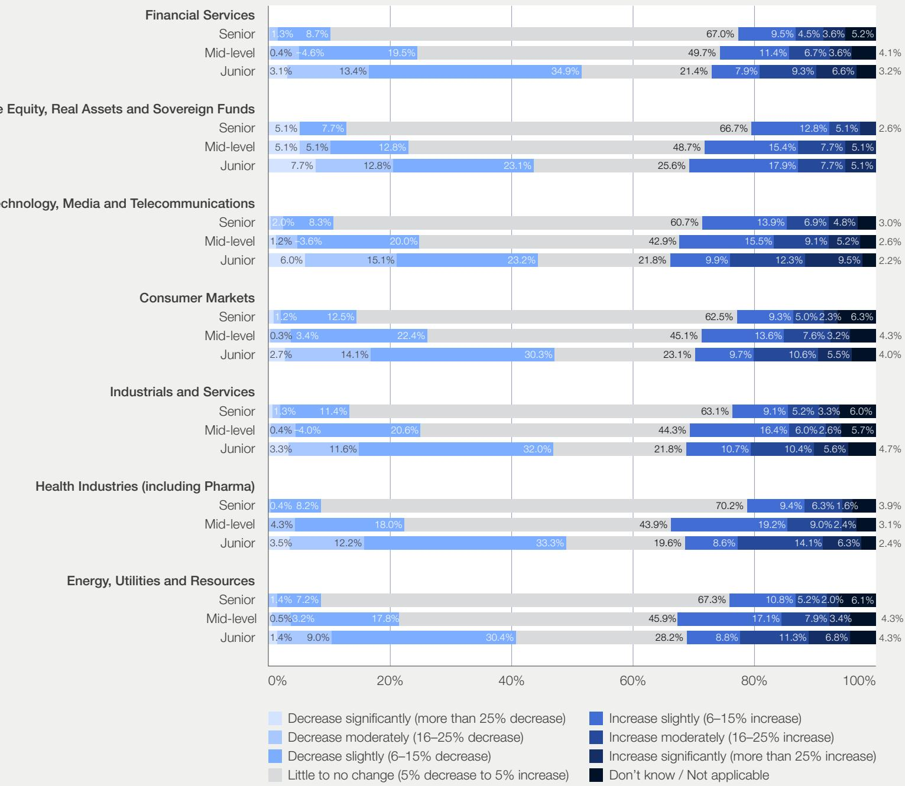  
Source: PwC 29th CEO Survey, 2026.  
Note: Answer to the question: For the following groups, how do you expect your company's AI adoption to change your employment levels in the next three years?

As organizations look to capture efficiency gains from AI, they face a growing tension between short-term results and long-term capability. As one leader said, “A lot of the efficiency gains are coming from the base of the organization. The risk is that if you remove too much of that layer, you weaken the pipeline that feeds the rest of the business.”

Notably, this is not simply a question of how many people are in the talent pipeline to begin with. Even where entry-level roles remain stable or expand,

the broader system that supports professional development is under strain. As another leader put it, “In some cases the pyramid structure itself acted as the development model.” As traditional organizational structures realign, capability can no longer be assumed to emerge organically through job hierarchy alone.

These patterns suggest that talent pipeline outcomes are shaped as much by organizational choices as by technology. This places greater

importance on adopting a conscious AI workforce strategy, where entry-level roles are treated as a strategic priority rather than a by-product of growth or automation decisions. Without this, organizations risk dismantling their future capability pipeline.

As one leader noted, “we have a build, buy, borrow approach to getting the right talent for our business. If we all stop building entry-level talent, we won’t be able to buy it elsewhere in the future.”

## Dentsu Japan

## Codifying AI capability and making progression visible

For Dentsu Japan, AI upskilling is a strategic priority across both its entry-level populations and its wider workforce. Between 2024 and 2026, the time dedicated to AI training for new graduates increased more than tenfold. Dentsu Japan describes the objective as developing “AI-native”

employees who can operate effectively in an AI-enabled environment from the outset.

To support this, Dentsu Japan introduced a four-tier internal AI certification framework across the workforce (figures as of May 2026):

\- AI Basic – foundational understanding of AI tools and governance (20,000 certified)

– AI Facilitator – application of AI tools within projects (1,619 certified)

\- AI Master – advanced problem-solving using generative AI (259 certified)

– Chief AI Master – enterprise-level AI strategy leadership (6 certified)

The framework establishes common capability standards and a structured pathway for building AI proficiency. It makes progression more visible without requiring a full redesign of formal career pathways. Importantly, these designations are not treated as fixed endpoints but as evolving markers of capability, reflecting the pace of technological change.

## Finding 6: Organizational capability may be increasingly built through non-linear movement and exposure, not hierarchical sequence.

Across industries, organizations have traditionally structured how people moved through work in a sequential way. Entry-level roles built foundational capability through repetition. Mid-level roles developed judgement and management skills. Senior roles focused on leadership. Progression was tied to moving through clearly defined steps. As AI changes how work is delivered, leaders interviewed for this report describe three ways in which the traditional progression model is being reshaped:

\- Reducing the emphasis on step-by-step progression: AI can enable individuals to contribute to more complex work earlier in their careers, reducing reliance on strictly sequential and hierarchical progression models. However, leaders also raised concerns about how foundational judgement and experience are developed when traditional stages are bypassed.

\- Weakening reliance on tightly sequenced roles: Progression becomes less tied to defined role transitions and more dependent on how individuals contribute across activities.

\- Enabling more flexible distribution of work: Tasks can be assigned based on organizational need, rather than role level, allowing for greater exposure.

Together, these shifts are changing how capability is identified and deployed. Across employer interviews, leaders described a move away from experience-based progression towards more skills- and potential-based models. Rather than relying on time in role or job history, organizations are increasingly looking to identify and deploy capability more directly. As one leader noted, this allows organizations to “tap people” based on what they can do, not what roles they have held. As entry-level roles evolve further in the coming years from direct task execution to “orchestration” of AI agents, career progression may become a non-linear “mosaic” based on project outcomes and continuous skills development rather than tenure $^{21}$ . Progression does not disappear, but it becomes harder to interpret.

At the same time, many early career workers continue to look for clear signals of advancement and upward movement. For example, 31% of entry-level workers report they are very or extremely likely to ask for a promotion in the next year, while 31% are likely to apply for a new role and 37% to ask for a pay rise (see Figure 9). This underlines the importance of organizations redesigning how they define and communicate progression in practice. As traditional signals weaken, organizations will need to ensure that capability is both built and recognized within a more fluid system of work and opportunity.

## FIGURE 9

Career expectations of entry-level workers for the year ahead  
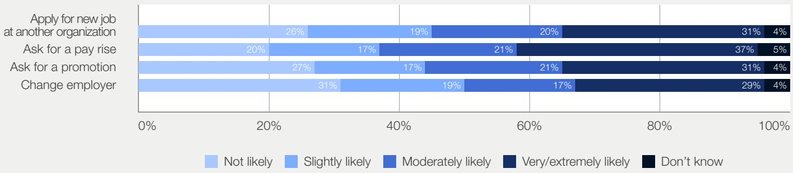  
Note: Entry-level workers were asked "How likely are you to take the following actions within the next 12 months?". Source: PwC Global Hopes and Fears Survey (2025).

# Redefining performance and progression in an AI-enabled workforce

Indeed has taken a structural approach to AI adoption, treating it as a redefinition of work. In response, it has evolved its people processes to operate effectively in an AI-enabled environment, reshaping how jobs are designed, how performance is assessed and how progression is determined. This has led to changes across three core areas:

1 Shifting to a skills-based architecture: Indeed is moving away from rigid job profiles towards a skills-first model. By breaking roles down into underlying skills, the organization can both better identify which tasks can be supported by AI and deploy talent more flexibly across teams and projects.

2 Redefining performance: Performance expectations, particularly in software engineering, have been updated to reflect the ability to work effectively with AI. Employees are assessed not simply on output, but on how they use AI to accelerate delivery while rigorously validating and refining results. The emphasis has shifted from producing work to directing and interrogating it.

3 Modernizing talent assessment: Hiring processes have been redesigned to reflect the same shift in expectations. Candidates are evaluated on their ability to use AI tools in practical scenarios, alongside “human” skills such as reasoning, collaboration and critical thinking. This ensures that entry-level readiness and progression are aligned around judgement, not just task execution.

While still at an early stage, this approach is helping Indeed avoid a “race to the bottom”, where AI-driven volume comes at the expense of accuracy, judgement and other critical skills. The shift to a skills-based architecture also enables faster adaptation as technology and skill demands evolve.

# Using multigenerational collaboration to strengthen early career capability

As AI reshapes how work is performed, Allianz emphasizes the importance of helping entry-level employees build business context and judgement early in their careers. With four generations working side by side across the organization, Allianz has adopted a multigenerational collaboration

approach to strengthen capability development and knowledge transfer. Rather than treating AI adoption as purely a technical challenge, Allianz uses cross-generational collaboration to combine digital fluency with institutional knowledge and practical business experience.

1 Accelerating capability development through new joiner mentoring tandems: Employees are invited to participate in new joiner mentoring or buddy tandems that pair early career employees with more experienced colleagues. These partnerships combine technical curiosity with business context and professional judgement, creating a fast track for building AI capability within the organizational context. This helps entry-level employees contribute meaningfully earlier in their careers while continuing to develop the broader skills and understanding needed for long-term progression.

2 Building AI capability across all generations: Allianz complements these mentoring relationships with enterprise-wide AI and data upskilling initiatives designed to support learning across all career stages. This helps reduce capability gaps between generations and creates a more balanced capability pipeline as ways of working evolve.
Allianz has found that this multigenerational approach increases confidence and engagement with AI across the workforce. Joint learning opportunities and cross-divisional working environments are accelerating a smooth capability transfer and workforce development across generations.

# Education system alignment

Alignment between education systems and labour-market needs has long been imperfect, but AI is accelerating the pace at which skills requirements are changing. This section examines how AI is reshaping workforce readiness and skills requirements and how educators and employers can collaborate to enhance alignment between education and future labour-market demand.

## Finding 7: Entry-level skills requirements are evolving faster than current education systems can keep pace

According to the World Economic Forum's latest Future of Jobs Report, 39% of skills requirements, on average, across job families, industries and geographies, are likely to change over the 2025–2030 period as a result of AI and other macrotrends $^{22}$ . At the same time, globally, entry-level roles in the highest AI-exposure quartile exhibit nearly twice the rate of net skills change compared to non-entry-level roles, and more than double the rate of net skill change compared to entry-level occupations in the lowest AI-exposure quartile (see Figure 10) $^{23}$ . These trends show notable

nuances across geographies, reflecting differences in national technology exposure, severity of pre-existing skills gaps, and local diversity in sectors with the highest entry-level hiring. For example, entry-level roles with the highest Al-exposure in the United Arab Emirates exhibit more than four times the rate of net skills change compared to those in the lowest-exposure quartile, whereas entry-level roles in Italy are less exposed to net skills change versus non-entry-level roles.

FIGURE 10

Higher AI exposure is associated with greater net skills change index, particularly in entry-level roles, selected economies

<table><tr><td rowspan="2">Economy</td><td rowspan="2">Position</td><td colspan="4">AI exposure quartile</td></tr><tr><td>Lowest 25%</td><td>Third 25%</td><td>Second 25%</td><td>Highest 25%</td></tr><tr><td rowspan="2">Globally</td><td>Entry-level</td><td>5.8</td><td>7.5</td><td>8.8</td><td>12.4</td></tr><tr><td>Non-entry-level</td><td>5.8</td><td>6.6</td><td>7.3</td><td>7.0</td></tr><tr><td rowspan="2">United Arab Emirates</td><td>Entry-level</td><td>5.3</td><td>7.1</td><td>8.4</td><td>21.3</td></tr><tr><td>Non-entry-level</td><td>5.6</td><td>8.1</td><td>8.7</td><td>11.3</td></tr><tr><td rowspan="2">Canada</td><td>Entry-level</td><td>3.2</td><td>3</td><td>4.5</td><td>4.7</td></tr><tr><td>Non-entry-level</td><td>2.5</td><td>3.4</td><td>4.3</td><td>4</td></tr><tr><td rowspan="2">France</td><td>Entry-level</td><td>2.8</td><td>4.5</td><td>5.8</td><td>4.5</td></tr><tr><td>Non-entry-level</td><td>1.5</td><td>1.8</td><td>1.9</td><td>2.1</td></tr><tr><td rowspan="2">United Kingdom</td><td>Entry-level</td><td>2.1</td><td>7</td><td>6.8</td><td>7.5</td></tr><tr><td>Non-entry-level</td><td>4.7</td><td>5.5</td><td>5.2</td><td>5.4</td></tr><tr><td rowspan="2">Hong Kong</td><td>Entry-level</td><td>9.4</td><td>13.7</td><td>9.7</td><td>12.4</td></tr><tr><td>Non-entry-level</td><td>7.4</td><td>7.4</td><td>10.1</td><td>9.7</td></tr><tr><td rowspan="2">Italy</td><td>Entry-level</td><td>0.7</td><td>1.4</td><td>1.7</td><td>2.3</td></tr><tr><td>Non-entry-level</td><td>1.8</td><td>2.4</td><td>2.6</td><td>3.4</td></tr><tr><td rowspan="2">Mexico</td><td>Entry-level</td><td>4.3</td><td>3.8</td><td>4.2</td><td>5.3</td></tr><tr><td>Non-entry-level</td><td>5.1</td><td>3.7</td><td>4</td><td>4.4</td></tr><tr><td rowspan="2">Malaysia</td><td>Entry-level</td><td>8.5</td><td>8.3</td><td>7.3</td><td>9</td></tr><tr><td>Non-entry-level</td><td>12.5</td><td>6.3</td><td>10.6</td><td>10.7</td></tr><tr><td rowspan="2">Singapore</td><td>Entry-level</td><td>3.8</td><td>3</td><td>3.8</td><td>5.9</td></tr><tr><td>Non-entry-level</td><td>7.7</td><td>4.9</td><td>6.4</td><td>7.3</td></tr><tr><td rowspan="2">United States</td><td>Entry-level</td><td>4.3</td><td>8.1</td><td>6.9</td><td>10</td></tr><tr><td>Non-entry-level</td><td>5.9</td><td>5.3</td><td>6.7</td><td>7.4</td></tr><tr><td rowspan="2">South Africa</td><td>Entry-level</td><td>10.8</td><td>13.2</td><td>13.6</td><td>21.3</td></tr><tr><td>Non-entry-level</td><td>8.1</td><td>12.4</td><td>11.1</td><td>12.3</td></tr></table>

Note: Net Skill Change (NSC) measures how much the mix of skills required for a role is changing over time. It is calculated by summing the absolute increases and decreases in the frequency of skills mentioned in job postings. Higher values indicate greater change in required skills, not necessarily more skills overall. Values are averaged across occupations within each AI exposure quartile. Some economies are omitted from the table due to sample size limitations. Global averages include all economies analysed, including those not displayed.
Source: PwC AI Jobs Barometer 2026.

This accelerated pace of change is increasing pressure on organizations to identify and develop the capabilities required to perform evolving roles. The Forum's latest Chief People Officers Outlook (May 2026) highlights talent matching and access to critical skills as being the most acute current challenge identified by people leaders. Similarly, $59\%$ of CEOs globally report availability of key

skills as a key near-term risk producing financial loss, with 22% reporting being highly or extremely exposed (see Figure 11) $^{24}$ . Research across OECD economies suggests that eliminating education and skills mismatch could raise economic output by as much as 3-4%, on average, highlighting the scale of the challenge $^{25}$ .

## FIGURE 11 CEOs see the availability of key skills as a key threat

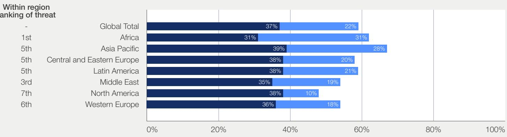  
- Highly / Extremely exposed (high probability of / certain significant financial loss)
- Moderately exposed (moderate probability of financial loss)  
Note: Participants were asked “How exposed do you believe your company will be to the following key threats in the next 12 months [availability of key skills, including attracting and retaining talent].”
Source: PwC 29th CEO Survey 2026.

While much of the debate on technology and workforce readiness centres on technical and AI-specific skills, the shift in skills demand is not limited to technical capability alone. Demand is increasingly moving toward applied and human-centric skills such as critical thinking, problem-solving and the ability to work effectively with AI agents. Leaders consistently highlight these capabilities as the key differentiator in entry-level talent, yet – as explored in-depth by the World Economic Forum’s New Economy Skills series $^{26}$ – they are harder to define, assess and embed within formal education and qualification systems.

At the same time, education systems face structural constraints that limit how quickly they can respond. Curriculum design and accreditation processes are often governed by regulatory cycles that prioritize stability and consistency, requiring course content and module structures to be defined several years in advance. While these structures serve important quality and accountability functions, they reduce the ability of institutions to adapt to rapidly changing

skill demands. As one education leader interviewed for this report observed, “we are often required to define course content several years in advance, which makes it difficult to keep pace with how quickly skills requirements are evolving.”

Misalignment is further compounded by limited clarity from employers. As organizations experiment with AI and reshape tasks in real time, expectations for entry-level roles are evolving faster than they are being codified. Education providers report uncertainty around what constitutes a baseline level of AI literacy, making it difficult to design curricula against stable and shared benchmarks. As another educational leader noted, “we don’t yet have a shared definition of what ‘AI-ready’ looks like, which makes alignment incredibly difficult.”

Together, these dynamics are widening the gap between how skills are developed and how they are evolving, creating a growing tension between traditional educational approaches and the adaptability demanded by the labour market.

Government of Singapore

# Aligning employers, educators and jobseekers through shared skills data

To improve alignment between education systems and employer demand, Singapore has developed a shared national skills ecosystem that integrates labour market data, structured skills frameworks and skills-based job matching tools.

This infrastructure connects employers, education providers and jobseekers through a shared understanding of skills and workforce needs. This is delivered through several key components:

1 Labour-market insights: Regularly updated data on in-demand roles and skills, including publications such as the Skills Demand for the Future Economy report, which provides system-level insight into emerging trends.

2 National Skills Frameworks: Sector-specific frameworks that define key skills, competencies and career pathways, creating a common language across employers, educators and training providers. These frameworks are developed by SkillsFuture Singapore (SSG) in partnership with industry and government as part of Singapore's national lifelong learning initiative.

3 Skills-based job matching: Through platforms such as MyCareersFuture, which recommend roles based on individuals' skills and experience, and highlight potential skills gaps to support more targeted career planning.

The government actively promotes the use of these tools by employers, training providers and individuals to inform hiring, workforce planning and course design. This is supported by national initiatives such as subsidized training (e.g. SkillsFuture Credit), employer incentives (e.g. SkillsFuture Enterprise Credit) and public outreach campaigns.

## Finding 8: New signals of job readiness and alternative pathways are needed alongside traditional degrees.

Degree programmes remain valued by employers across industries, but many leaders now say they are no longer sufficient indicators of workplace readiness on their own. Employers increasingly look for applied experience, exposure to real work contexts and evidence that individuals can adapt as technologies reshape tasks. As one leader noted, “the challenge is not whether people understand AI, but whether they can apply it in context and use it to get work done.” In the United States, for example, entry-level roles in the most AI-exposed occupations have seen around 40% more new skills emerge since 2019 than those in the least exposed occupations (see Figure 12).

## FIGURE 12

Average number of “new” skills per occupation, by AI exposure quartile, 2025 relative to 2019, early career job postings, United Kingdom and United States  
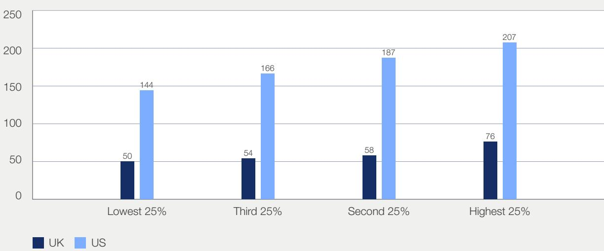  
Note: A skill is classified as “new” if it has greater than 10 mentions in 2025 but 5 or fewer mentions in that same occupation in 2019.
Source: PwC AI Jobs Barometer, 2026.

This shift reflects broader changes in how capability is assessed. Research by Indeed found that 68% of Gen Z workers believe they could do their job without a degree, highlighting changing perceptions of the role of formal credentials in preparing people for work $^{27}$ . At the same time, rapid technological change is reducing confidence that formal education alone can prepare individuals for evolving roles. As one executive noted, “The skills that people learn at university will not be enough. People need to keep learning as technology evolves.”

Worker survey data reinforces this point. Entry-level employees are the least confident group that the skills they are developing will support their

future careers. Only 57% strongly believe that the skills they learned in the past year are helping their career, compared with 63% of managers and 69% of senior executives $^{28}$ . Around 28% of entry-level workers believe that half or fewer of their current skills will still be relevant in three years (see Figure 13).

In practice, this is leading institutions to place greater emphasis on applied and work-integrated learning, including project-based work, employer partnerships and real-world problem-solving embedded directly within degree programmes.

## FIGURE 13

Perceived future relevance of current skills among entry-level workers, by sector  
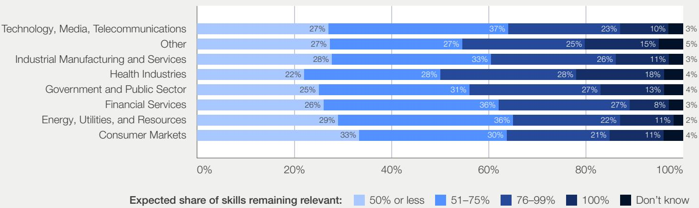  
Note: Entry-level worker response to the question: "What proportion of the skills you have today will be relevant to the way you expect to work in three years' time?".  
Source: PwC AI Jobs Barometer, 2026.

# Partnering with universities to foster talent

To address shifting skill demands in entry-level roles, Merck partners with universities to build AI capability early. The organization defines the skills required for key roles and universities adapt course content, accordingly, creating clearer pathways from study into employment. Merck reinforces these partnerships through internal programmes that support early career talent in applying these capabilities in practice and commits to hiring a set number of candidates from the programmes that deliver these skills, provided capability requirements are met. This approach shortens feedback loops and gives students greater clarity on how their learning connects to career opportunities.

These university partnerships are complemented by internal programmes that reinforce capability development and accelerate early career impact.

1 Upskilling All Early Talent: Merck embeds data and AI training across all early talent programmes, including apprentices, dual students and interns. Before and upon joining, participants gain access to AI tools and structured upskilling. This has enabled them to contribute to high-quality, meaningful work from day one while also building towards a consistent baseline of AI capability across all early career talent.

2 GOglobal programme: For high-potential graduates, Merck's GOglobal programme offers a dedicated Data & AI track. Drawing on expertise in computational biology, chemistry or human-AI interaction, trainees complete four six-month rotations across corporate and sectoral Data & AI offices, working on real projects from the outset. International rotations between Darmstadt and Bangalore build cross-cultural agility critical for global AI teams.

# Guanghua School of Management, Peking University

## Embedding AI and industry collaboration into business education

Guanghua School of Management has undertaken a structured redesign of its business education model in response to the growing gap between traditional curricula and the demands of an AI-enabled labour market.

The school has embedded AI tools directly into core courses, shifting assessment from traditional written outputs to project-based work supported by AI. This is complemented by a deliberate rebalancing of curricula towards applied experience, including internships, AI-focused projects and entrepreneurial practice.

To strengthen alignment with labour market demand, Guanghua has expanded partnerships with employers in AI and financial services, introducing industry mentorship and cross-sector innovation initiatives that connect students with real-world applications of AI in business contexts.

This approach is helping to address a key challenge highlighted by employers: the gap between academic learning and the ability to apply skills in practice. Early outcomes indicate improved student readiness for roles requiring both AI fluency and domain-specific expertise.

# Call to action

The impact of AI on entry-level work – in terms of both its risks and opportunities – is not predetermined. While the technology is reshaping how tasks are performed and how organizations are structured, outcomes for early career pathways will depend on the choices made by organizations and wider systems. This concluding section outlines key priorities for action for different stakeholder groups to help ensure gains from AI are realized in ways that safeguard access to entry-level opportunities and support long-term capability-building, career pathways reinvention and workforce transformation.

As AI changes how work is organized and how skills are used, safeguarding and reinventing early career pathways depends on coordinated action across stakeholders. Employers determine how roles are structured and how capability is built in practice. Educators prepare individuals before they enter the labour market. Policy-makers shape the conditions under which entry-level jobs are created and sustained. Their responsibilities differ and positive outcomes will depend on each stakeholder to act deliberately within its sphere of influence:

<table><tr><td></td><td>Employers should treat safeguarding and reinventing entry-level pathways as a core operational priority, maintaining structured entry-level hiring as an explicit part of workforce strategy. This requires actively protecting investment in early career talent pools to avoid weakening future talent pipelines and long-term workforce resilience. It may also include ringfencing a share of roles for early career talent to avoid unintended erosion of entry-level pathways.</td></tr><tr><td></td><td>Educators should focus on building continuous awareness of how work is changing and increased agility in how capability is developed. As AI reshapes task content, curriculum design needs to combine applied experience with the ability to learn and adapt over time. This includes developing more relevant assessment models while giving students opportunities to work with real tools and problems. Closer engagement with employers is important, but the goal is not to prepare people for a fixed role, rather to equip them to navigate roles that will continue to evolve.</td></tr><tr><td></td><td>Policy-makers should seek to actively shape the conditions that sustain entry-level hiring by aligning economic incentives, funding structures and regulatory standards to support the creation and maintenance of entry-level roles. Policy-makers should treat entry-level pathways as a matter of economic resilience and social stability, recognizing that weak entry-level systems can reduce workforce participation, slow skill formation and weaken long-term productivity growth.</td></tr><tr><td></td><td>Entry-level workers should take an active role in building their own capabilities by engaging directly with emerging forms of work, particularly AI. This includes experimenting with new tools such as AI agents in day-to-day tasks, applying AI in practical contexts, and prioritizing learning by doing rather than waiting for formal training. Individuals should focus on developing curiosity, adaptability and strong judgement, recognizing that continuously updating skills and asking better questions about how work is done are increasingly as important as prior experience.</td></tr></table>

Entry-level roles have traditionally operated on a model of delayed return, requiring individuals to invest time and effort upfront with the expectation of longer-term progression and stability. As these pathways evolve, maintaining confidence in this exchange becomes critical. When there is no longer a clear link between early investment and future opportunity, participation in structured entry routes may weaken. Entry-level work is not only a point of entry into the labour market, but also a core mechanism through which skills are built and economic opportunity is distributed. Ensuring these pathways remain accessible and effective in an AI-enabled economy will be critical to achieving both productivity gains and inclusive growth.

To put into practice the findings and recommendations explored in this report, the World Economic Forum's Centre for the New Economy and Society is launching a First-Mile Sandbox, piloting new and innovative models of industry and workplace readiness through educator and employer co-creation. We invite all interested stakeholders to learn more and join us in this upcoming work.

## Contributors

Artificial Intelligence and the Future of Entry-Level Work: A Framework for Safeguarding and Reinventing Early Career Pathways is an Insight Report published by the World Economic Forum's Centre for the New Economy and Society, in collaboration with PwC.

## Project team

## PwC

## Oliver Humphries

Manager, PwC UK; seconded to the World Economic Forum

## Peter Brown

Partner, Global Workforce Lead, PwC UK

## World Economic Forum

## Isabelle Leliaert

Manager, Work, Wages and Job Creation, Centre for the New Economy and Society

## Till Leopold

Head, Work, Wages and Job Creation, Centre for the New Economy and Society

We are grateful to our colleagues in the Centre for the New Economy and Society, especially to: Adèle Jacquard, Marta Golin, Sam Grayling, Shuvasish Sharma, Tarini Fernando, Eoin Ó Cathasaigh and Saadia Zahidi.

We are also grateful to colleagues at PwC for insights and support: Miral Mir, James Morris and Andrea Plasschaert. A special thank you to the PwC economics and data teams for their valuable contributions, including those behind the AI Jobs Barometer, CEO Survey and Hopes and Fears Survey.

Thank you to our report governance colleagues at the World Economic Forum as well as to Mike Fisher and the team at Accurat for their superb editing and layout of this report.

# Acknowledgements

We are grateful to the entire core community of the World Economic Forum's Future of Jobs Initiative, including members of the initiative's Champions Group, Steering Committee and Working Group, as well as members of the Community of Chief People Officers and Global Future Council, without whose constant insight, guidance and encouragement this work would not be possible.

This report draws on a wide range of perspectives gathered through stakeholder interviews and consultation dialogues. We would like to thank the individuals and organizations who contributed their time and expertise to this process. Their input has been instrumental in grounding the analysis in real-world experience and in shaping a more practical understanding of how entry-level pathways are evolving in response to AI. A special thank you to:

## ABN AMRO

Auke Ijsselstein - Head of HR Office

## Allianz

Angelika Inglsperger - Group Head People and Strategy Heidrun Wagner - Head of Change, Projects & Strategy

Banco Bradesco
Carlos Henrique Villa Pinto - Senior AI & Data Manager

## Cisco

Francine Katsoudas - Executive Vice President and Chief People, Policy & Purpose Officer

Dentsu
Takuya Kodama - Chief AI Master / Business Strategy Manager

Dropbox
Melanie Rosenwasser - Chief People Officer

Fujitsu
Yuki Doi - VP, Executive Director, AI Unit

GLOBIS University
Sonoko Igarashi - Managing Director, GLOBIS Corporate Administration

Hitachi
Lorena Dellagiovanna - SVP, Group Chief Sustainability Officer, Chief HR Officer

Indeed
Hannah Calhoon - VP of AI & Head of AI Innovation

King's College London
Rachel Tonner – Head of Careers & Employability at King's Business School
Crawford Spence – Co-chair of the King's Business School FinWork Future Centre

Merck Group
Khadija Ben Hammada - Chief People Officer

New York University
Angie Kamath – Dean, School of Professional Studies

PwC
Marc Borggreven – Global Human Capital Lead

Randstad
Myriam Beatove – Chief Human Resource Officer

SEB Group
Petra Ålund – Head of Group Human Resources

## Shoosmiths

Tony Randle - Director of Client Tech & Service Improvement

## Siemens

Bettina Weckesser - Head of People & Organization, Social & Industrial Relations and P&O Germany, Professional Education
Johannes Berndt - People & Organization, P&O Ecosystem, Strategy & Data

Smith + Nephew
Jillian Ciarletta - Director, Global Early Career Talent

Sony
Michael Spranger – Chief Operating Officer of Sony Research / President of Sony AI

UBS
James Utting – Head of Automation & AI, Global Banking

## Endnotes

International Labour Organization (ILO). (2025). Youth employment by sex, age and occupation (thousands) – Annual [Data set]. ILOSTAT. https://ilostat.ilo.org/topics/youth/

2. World Bank. (2018, February 13). Jobs at the core of development. World Bank. https://www.worldbank.org/en/results/2018/02/13/jobs-at-the-core-of-development

3. International Labour Organization (ILO). (2025). Youth employment by sex, age and occupation (thousands) – Annual [Data set]. ILOSTAT. https://ilostat.ilo.org/topics/youth/

4. ResumeBuilder.com. (2025, July 29). 4 in 10 Gen Z college grads are turning to blue-collar work for job security. https://www.resumebuilder.com/4-in-10-gen-z-college-grads-are-turning-to-blue-collar-work-for-job-security/

5. ADP Research Institute. (2024, August 27). Gen Z prefers blue-collar jobs. Or does it? https://www.adpresearch.com/gen-z-prefers-blue-collar-jobs-or-does-it/

6. Charlton, T., Hukal, P., Márton, A. (2025). Becoming a gig worker: An exploratory life course study of inbound career trajectories in the UK gig economy. Work Organization, Labour and Globalisation.

7. World Economic Forum. (2023). The Future of Jobs Report 2023. https://www.weforum.org/reports/the-future-of-jobs-report-2023; Institute of Student Employers. (2024, May 1). Is career readiness in decline? https://ise.org.uk/knowledge/insights/195/is\_career\_readiness\_in\_decline

8. Brynjolfsson, E., Chandar, B., & Chen, R. (2025). Canaries in the Coal Mine? Six Facts about the Recent Employment Effects of Artificial Intelligence. Stanford Digital Economy Lab. https://digitaleconomy.stanford.edu/app/uploads/2025/11/CanariesintheCoalMine\_Nov25.pdf; Klein Teeselink, B. (2025). Generative AI and labor market outcomes: Evidence from the United Kingdom (SSRN Working Paper No. 5516798). SSRN. https://doi.org/10.2139/ssrn.5516798; Lodefalk, M., Löthman, L., Koch, M., & Engberg, E. (2026). Same Storm, Different Boats: Generative AI and the Age Gradient in Hiring (Ratio Working Paper No. 388). Ratio Institute. https://cms.ratio.se/app/uploads/2026/03/lodefalk\_march16\_paper\_v2-kombinerades.pdf

9. Hanson, A., & Escobar, M.C. (2026, May 19). Entry-Level Hiring in the AI Era: What Employers Are Thinking (and Doing). Strada Institute for the Future of Work. https://www.strada.org/news-insights/entry-level-hiring-in-the-ai-era-what-employers-are-thinking-and-doing

10. World Economic Forum. (2025a). The Future of Jobs Report 2025. https://reports.weforum.org/docs/WEF\_Future\_of\_Jobs\_Report\_2025.pdf

11. PwC. (2025, November 12). PwC's Global Workforce Hopes and Fears Survey 2025: Rewiring the Future of Work. https://www.pwc.com/gx/en/issues/workforce/hopes-and-fears.html

12. Organization for Economic Co-operation and Development (OECD). (2025). Digital skills for seniors. OECD Publishing. https://doi.org/10.1787/9edfa7ef-en

13. Deloitte. (2025, October 27). One in three employees who use GenAI for work pay for it themselves. https://www.deloitte.com/uk/en/about/press-room/one-in-three-employees-who-use-genai-for-work-pay-for-it-themselves.html

14. International Labour Organization (ILO). (2026, March). Gen AI, occupational segregation and gender equality in the world of work (Research brief). https://www.ilo.org/sites/default/files/2026-03/Research%20Brief%20GenAI\_final0403\_0.pdf

15. World Economic Forum and LinkedIn. (2025). Gender Parity in the Intelligent Age. https://reports.weforum.org/docs/WEF\_Gender\_Parity\_in\_the\_Intelligent\_Age\_2025.pdf

16. Macnamara, B. N., Berber, I., Çavuşoğlu, M. C., Krupinski, E. A., Nallapareddy, N., Nelson, N. E., Smith, P. J., Wilson-Delfosse, A. L., & Ray, S. (2024). Does using artificial intelligence assistance accelerate skill decay and hinder skill development without performers' awareness? Cognitive Research: Principles and Implications, 9(46). https://doi.org/10.1186/s41235-024-00572-8

17. Ranganathan, A., & Ye, X. M. (2026, February 9). Al Doesn't Reduce Work—It Intensifies It. Harvard Business Review. https://hbr.org/2026/02/ai-doesnt-reduce-work-it-intensifies-it

18. Ranjit, J., Zhou, K., Swayamdipta, S., & Quercia, D. (2026). Are We Automating the Joy Out of Work? Designing AI to Augment Work, Not Meaning. arXiv. https://doi.org/10.48550/arXiv.2603.14963

19. Deloitte. (2025, October 27). Work Design Essential to Realize AI Return on Investment. https://www.deloitte.com/us/en/about/press-room/work-design-essential-to-ai-roi.html

20. PwC. (2026). PWC's AI Performance Study: Want ROI from AI? Go for Growth. https://www.pwc.com/gx/en/so-you-can/2026/content/roi-from-ai.pdf

21. Dishman, L. (2025, November 26). How Entry-Level Jobs Are Being Reimagined in the Agentic AI Era. https://www.salesforce.com/news/stories/agentic-ai-reshaping-entry-level-jobs/

22. World Economic Forum. (2025a). The Future of Jobs Report 2025. https://reports.weforum.org/docs/WEF\_Future\_of\_Jobs\_Report\_2025.pdf

23. PwC. (2026). AI Jobs Barometer 2026: Two futures for jobs in an AI era. https://www.pwc.com/gx/en/issues/artificial-intelligence/job-barometer/2026/2026-global-ai-jobs-barometer-full-report.pdf.

24. PwC. (2026, January 19). PwC's 29th Global CEO Survey: Leading through uncertainty in the age of AI. https://www.pwc.com/gx/en/issues/c-suite-insights/ceo-survey.html

25. Garibaldi, P., Gomes, P., & Sopraseuth, T. (2025). Output costs of education and skill mismatch in OECD countries. Economics Letters, 250, 112278. https://sites.carloalberto.org/garibaldi/doc/papers/mismatch\_oecd.pdf

26. World Economic Forum. (2025b). New Economy Skills: Unlocking the Human Advantage. https://reports.weforum.org/docs/WEF\_New\_Economy\_Skills\_Unlocking\_the\_Human\_Advantage\_2025.pdf.

27. Indeed. (2025, April 21). 51% of Gen Z Views Their College Degree as a Waste of Money. https://www.indeed.com/career-advice/news/college-degree-value-generational-divide

28. PwC. (2025, November 12). PwC's Global Workforce Hopes and Fears Survey 2025: Rewiring the Future of Work. https://www.pwc.com/gx/en/issues/workforce/hopes-and-fears.html

WORLD ECONOMIC FORUM

COMMITTED TO IMPROVING THE STATE OF THE WORLD

The World Economic Forum, committed to improving the state of the world, is the International Organization for Public-Private Cooperation.

The Forum engages the foremost political, business and other leaders of society to shape global, regional and industry agendas.