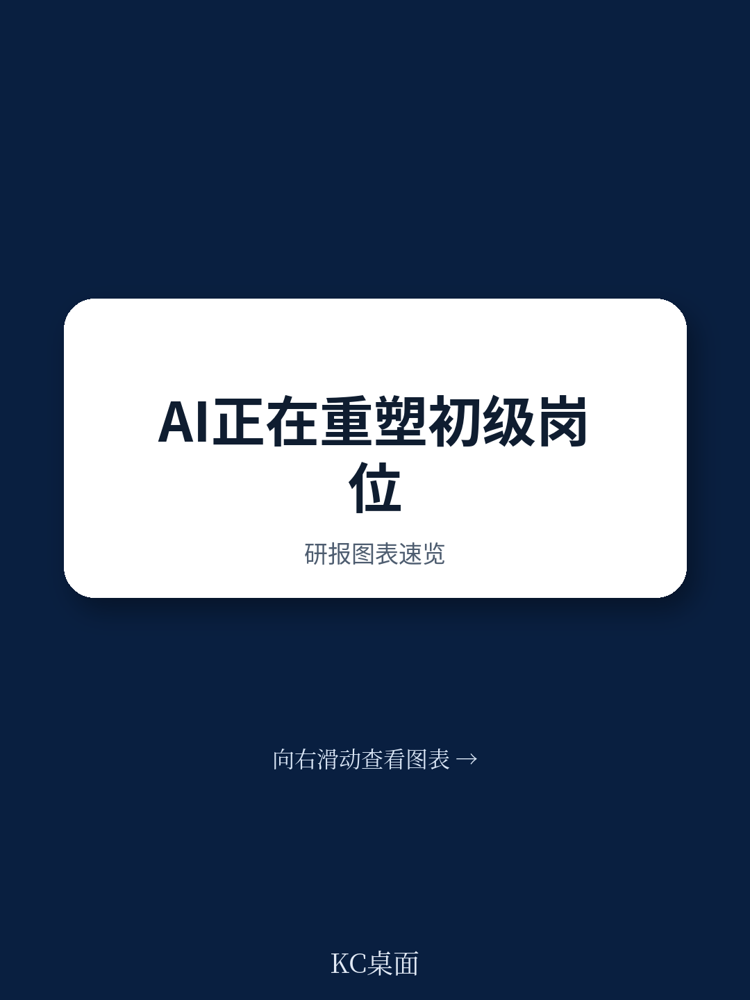
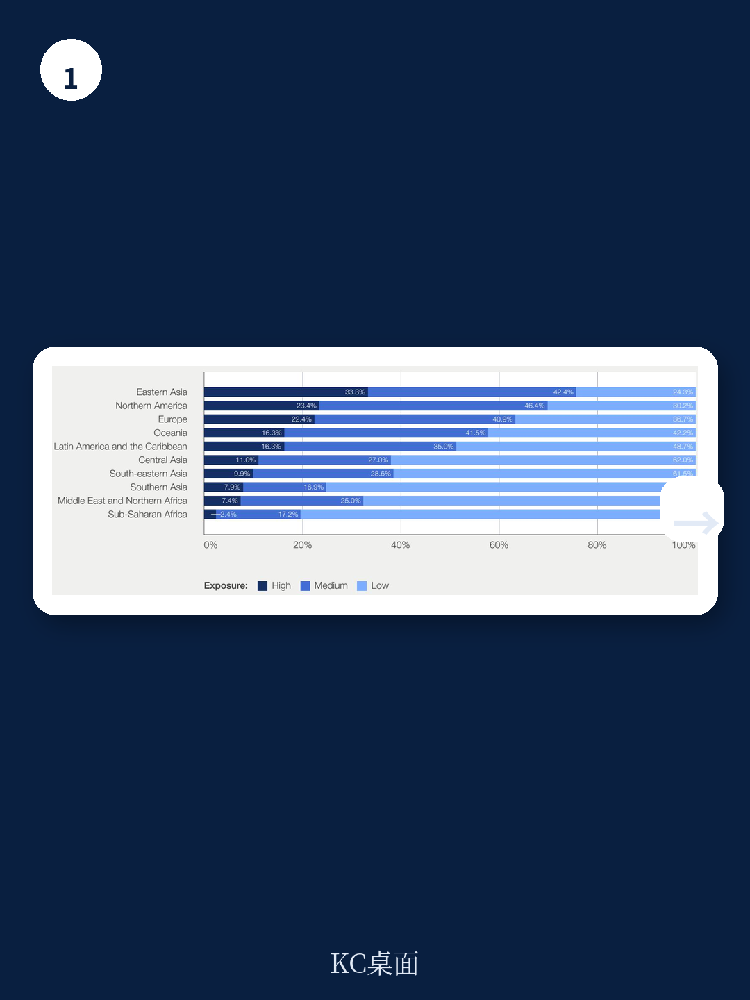
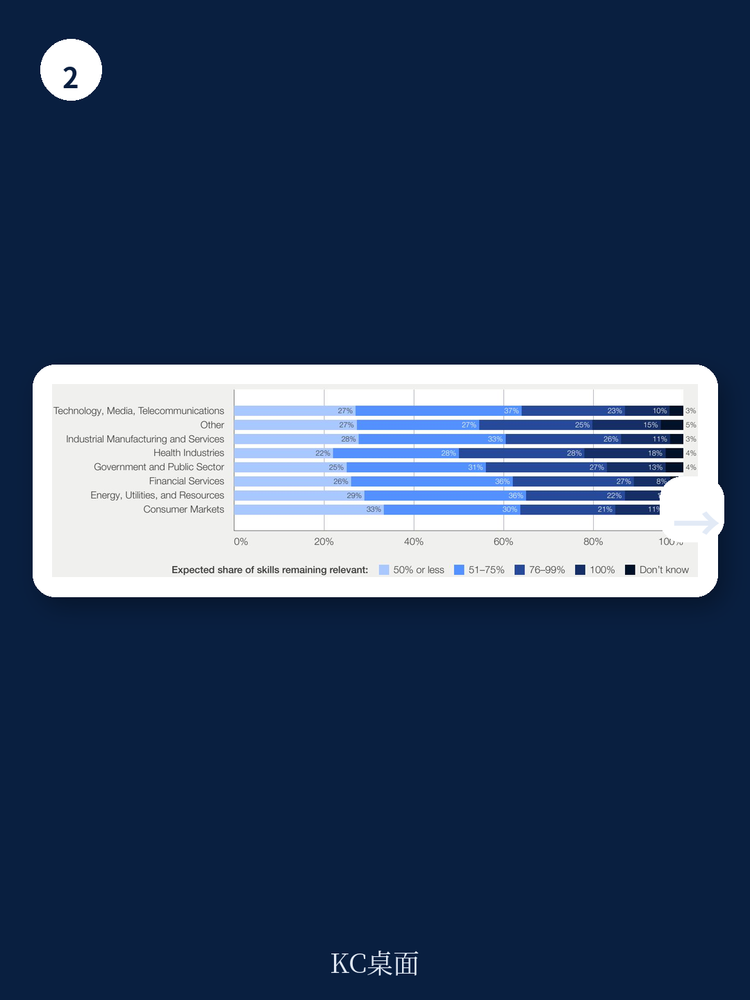

# 世界经济论坛：AI对劳动力市场真正挑战，不是消灭工作，而是拆解未来能力管道

AI对劳动力市场的影响，最剧烈的变化并不发生在工程师或高管层，而是发生在职场最底层——那些每年数以百万计年轻人踏入的入门级岗位。世界经济论坛与普华永道联合发布的最新报告，基于对9,000多名初级员工和200多位企业高管的调研，给出了一个反直觉的判断：真正的挑战不是AI消灭了多少入门级工作，而是企业在追求效率时，正在无意识地拆解自己未来的能力管道。

全球超过37%的年轻工人（15-24岁）正从事对AI任务变化具有中高暴露度的职业。在东亚，这一比例高达75%；在北美和欧洲，分别为69%和63%。金融、信息和通信、专业服务、科学教育是受影响最严重的行业，而农业、建筑和食品服务相对安全。但报告的核心主张并非“哪些工作会被替代”，而是“企业如何重新设计这些岗位，才能既不牺牲效率，又不丧失长期竞争力”。

这份报告的价值不在于给出耸动的数字，而在于提供了一个四维框架——岗位准入、岗位设计、人才管道、教育系统对齐——帮助决策者在AI加速渗透的时期，系统性地审视自己的人才战略。

> **KC评论：** 世界经济论坛的报告通常不会给出即时的交易信号，但它对产业趋势的判断往往影响全球头部企业的战略规划。对于关注长期竞争力的读者，这份报告的价值在于它把“入门级岗位”从一个HR议题提升到了董事会层级的战略议题。完整报告包含了详细的国别数据和行业拆解，以及企业实践案例，这些在摘要中无法完全呈现。

继续看原文，真正有价值的是图表、假设和验证路径。完整报告与KC评论在每日汇编。

## 1. 入门级岗位的招聘放缓已经出现，但AI的角色仍存在争议

报告的第一个核心发现是，入门级岗位的招聘确实在放缓，尤其是在AI暴露度高的职业中。斯坦福大学和英国的研究都证实了这一点。但有趣的是，雇主和初级员工对未来预期的分歧，揭示了一个更复杂的图景。

企业高管在引入AI时，往往首先考虑的是削减成本和提高效率，而入门级岗位恰好是成本中心。但报告同时指出，那些在AI应用上财务表现最强的公司，其重新设计工作流程的可能性是其他公司的两倍。换句话说，真正从AI中获益的企业，并没有简单地把AI当作裁员的工具，而是重新定义了工作本身。

这意味着什么？入门级岗位的收缩并非AI的必然结果，而是企业战略选择的结果。如果企业仅仅把AI当作替代人力成本的工具，那么入门级岗位的消失是不可避免的；但如果企业把AI作为重新设计工作流程的契机，那么入门级岗位的形态会改变，但数量未必下降。

## 2. AI正在制造一个悖论：效率提升的同时，工作质量和员工体验在恶化

报告中最令人不安的数据点之一：68%的入门级员工表示AI提升了他们的生产力，但同时45%的人表示他们因此花在一般工作上的时间更长了。AI没有减少工作，反而强化了工作——这是哈佛商业评论最近一篇论文的标题，也是这份报告试图解释的核心矛盾。

AI让每个员工可以做更多事，但企业往往没有重新设计工作流程，只是简单地把AI叠加到现有的工作方式上。结果是，员工的生产力提高了，但工作强度也在增加，技能积累反而可能下降。报告引用的研究表明，AI辅助可能导致技能退化，尤其是在没有意识的情况下。

对于企业来说，这意味着一个危险的陷阱：短期效率提升的代价是长期能力积累的削弱。如果入门级员工的工作被简化为“AI监督员”或“异常处理员”，他们可能永远无法建立起对业务全貌的理解，也无法发展出解决复杂问题的能力。

> **KC评论：** 这个悖论对于任何正在部署AI的企业都是核心挑战。报告没有给出简单的解决方案，但它提供了一个思考框架：企业需要在效率提升和能力建设之间做出有意识的选择，而不是让AI的渗透自动决定结果。完整报告中对不同行业企业如何重新设计岗位的案例，值得仔细阅读。

## 3. 组织架构的变革压力集中在底层，但企业尚未准备好

23%的CEO认为现有的组织架构正在制约绩效，而变革的压力首先落在入门级岗位。报告显示，对入门级岗位因AI而发生结构性变化的预期，几乎是中层和高层岗位的两倍。四分之三的领导者预计入门级岗位将发生重大调整。

这听起来像是一场自上而下的变革。但问题在于，企业尚未建立起清晰的模型来指导这种变革。报告指出，虽然AI驱动的财务表现最强的公司更倾向于重新设计工作流程，但“概念化有效的AI驱动岗位设计”仍然是一个挑战，尤其是在早期职业阶段。

这意味着企业正在“边飞边造飞机”。他们知道必须改变，但不知道改变成什么样子。这种不确定性本身就是风险——如果企业仓促调整，可能导致人才管道断裂；如果什么都不做，又可能被竞争对手甩在后面。

## 4. 技能变化的速度远超教育系统的反应能力

报告揭示了一个令人担忧的趋势：入门级岗位中AI暴露度最高的四分位，其技能净变化率几乎是非入门级岗位的两倍。28%的入门级员工认为，他们目前掌握的一半或更少技能在三年内仍将适用。

这是一个系统性的错配。教育系统培养人的周期是4年，而技能变化的周期可能缩短到1-2年。传统的学位信号正在贬值——Indeed的调查显示，51%的Z世代认为他们的大学学位是浪费钱。但企业仍然依赖学位作为筛选信号，因为找不到更好的替代品。

报告提出的方向是“工作整合学习”和“替代性职业路径”。但这需要雇主、教育机构和政策制定者之间的深度协同，不是单个企业能够解决的问题。

> **KC评论：** 教育系统的改革是一个长期议题，但企业等不起。对于决策者来说，更现实的路径是重新定义自己的“人才管道”——不再依赖外部教育系统提供完全准备好的员工，而是在企业内部建立持续学习和技能重塑的机制。完整报告中关于企业如何与教育机构合作的具体案例，以及不同地区的最佳实践，是这一部分最有价值的内容。

## 5. 报告尚未完全回答的关键问题：AI是否会加剧社会不平等？

报告提到了一个隐忧：超过20%的入门级员工正在转行、重新进入劳动力市场或在职业生涯后期转向新行业。这意味着AI的影响不仅仅局限在刚毕业的年轻人，而是波及所有在职业生涯早期阶段的人。

但报告没有深入探讨的是，这种变化是否会加剧社会不平等。如果入门级岗位的职能被AI替代，而新的岗位需要更高的技能门槛，那么那些没有机会接受再培训的人将面临永久性的就业困难。报告提到了“需要主动支持机制来缓解AI加剧现有差距的风险”，但没有给出具体的政策建议。

另一个未解的问题是：AI对入门级岗位的影响，在不同经济体之间是否存在结构性差异？报告的数据显示，东亚地区的暴露度最高，但这部分是因为该地区的产业结构偏向知识密集型行业。对于以农业和制造业为主的发展中经济体，AI的影响路径可能完全不同。

## 6. 给读者的观察框架：如何判断一家企业是否在正确应对AI对人才的影响

基于报告的框架，我们提出一个简单的评估维度，帮助读者判断一家企业或一个行业是否在正确应对AI对入门级岗位的影响

第一，看招聘策略：企业是否把入门级招聘作为战略规划的一部分，还是仅仅当作成本项？那些设定了明确的入门级招聘目标，并随AI部署同步调整的企业，更可能在长期保持竞争力。

第二，看岗位设计：企业是在简单地把AI叠加到现有工作流程上，还是重新设计了岗位以发挥人机协作的最大价值？后者通常意味着更少但更有深度的任务，以及更明确的学习和发展路径。

第三，看人才管道：企业是否从固定岗位制转向基于能力的人才发展模型？那些能够灵活匹配人才到不断变化的岗位的企业，将更容易适应AI的持续渗透。

第四，看教育协同：企业是否主动与教育机构合作，提供实习、学徒或工作整合学习的机会？那些被动等待外部系统提供合格人才的企业，将面临持续的技能缺口。

这四个维度不是理论框架，而是可以用于实际评估的观察指标。任何能够在这四个维度上给出清晰回答的企业，都更有可能在AI时代保持人才竞争优势。

---

入门级岗位的变化，本质上是企业未来竞争力的晴雨表。如果一个企业连自己的初级人才管道都无法维护，它凭什么在AI时代构建护城河？世界经济论坛的报告提供了一个起点，但真正的答案需要在实践中寻找——在企业与员工、教育系统与政策制定者的持续互动中逐步浮现。

关于入门级岗位的AI冲击，还有很多维度值得深入讨论：不同行业的差异化路径、企业实践的具体案例、政策制定的可能方向。这些内容在完整报告中都有详细的图表和数据支撑。每日汇编会把这份报告放回当天的主线，整理成中文摘要、KC评论和图表合集，便于喂给AI，也便于人工快速扫描市场动态。我们汇聚了头部券商、PE/VC、投行、并购、hedge fund、资管机构、战略咨询、智库等朋友，期待交流。

Personal reading notes and learning share only. Not investment advice.
