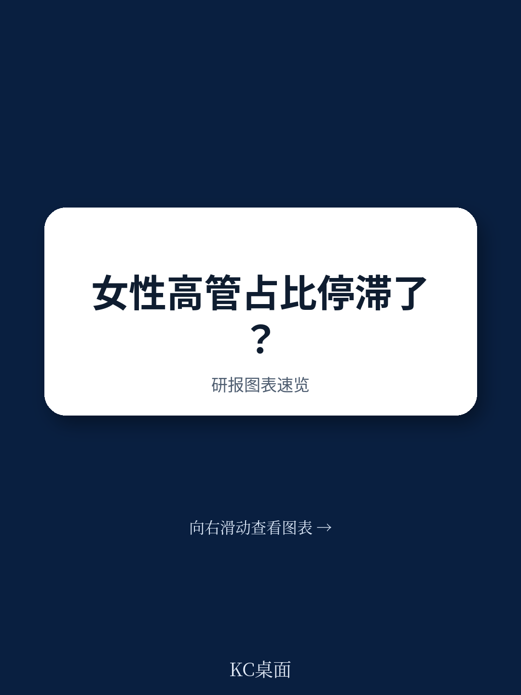
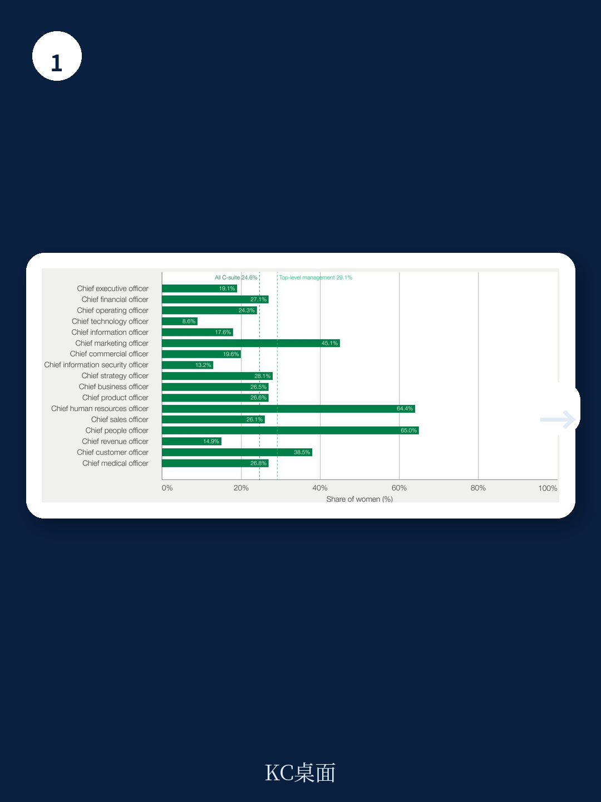
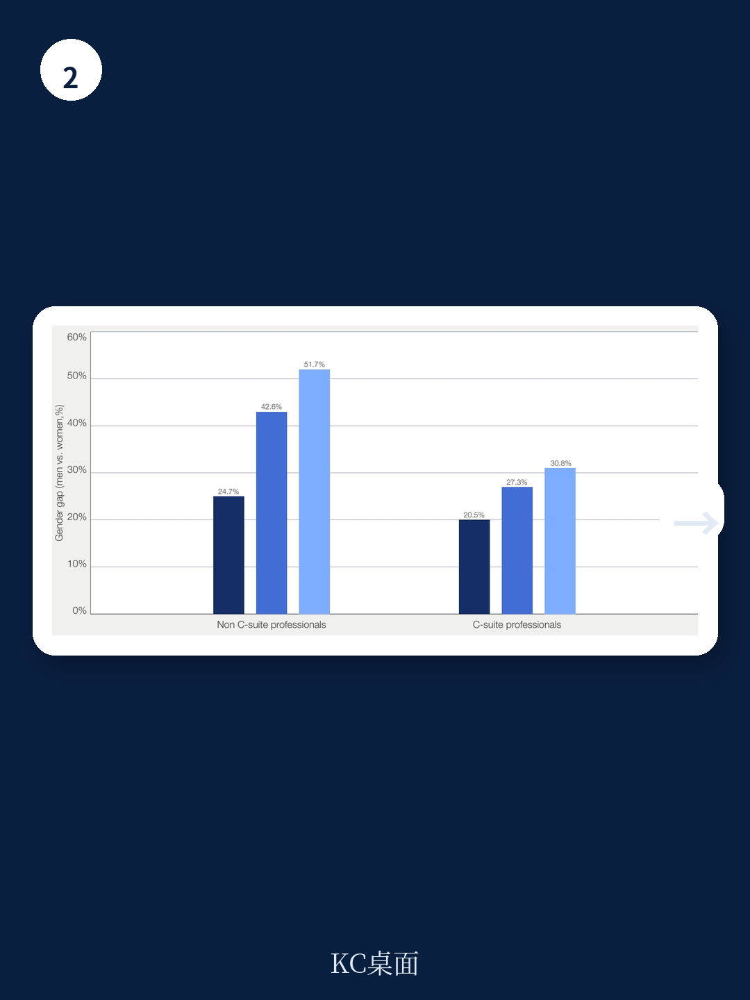

# 世界经济论坛：董事会席位占比翻倍，但女性仅占5.2%董事会主席

过去十年，女性在高级管理层的占比从26.8%提升至29.6%，董事会席位占比从15.2%翻倍至29.3%。这些数字听起来像是进步。但世界经济论坛2026年6月发布的这份报告揭示了一个更值得警惕的真相：自2022年起，女性进入高级领导岗位的招聘速度已经停滞，董事会任命甚至出现倒退。这不是人才供应的问题——女性占全球劳动力41.7%，在入门级岗位的男女比例几乎持平。真正的问题是，通往顶层的路径系统是为另一个时代设计的。

这份基于LinkedIn和Egon Zehnder全球数据的报告，提供了一个清晰但令人不安的诊断：过去十年的进步，很大程度上依赖了三个不可持续的条件——C-suite扩张带来的新增岗位、企业对社会议题的集中关注、以及有利的宏观经济环境。当这些潮水退去，结构性障碍便重新浮出水面。

对于正在经历AI变革、经济波动和人口结构转型的企业决策者来说，这不仅仅是一个公平议题。当领导力本身被重新定义，当传统的职业阶梯被打破，那些固守旧有权力分配系统的组织，将错过从更广泛人才池中选拔领导者的战略窗口。

> **KC评论：** 这份报告的核心判断不是“进步太慢”，而是“过去十年的进步可能是一次性的，而非结构性的”。它提醒读者：如果企业没有在系统层面改变谁被看见、谁被提拔的规则，那么当外部推力消失时，性别差距会自然回归。真正值得关注的是报告中对“权力路径”的分析——哪些岗位能通向CEO，以及谁在占据这些岗位。

继续看原文，真正有价值的是报告中对不同行业“漏斗最窄处”的拆解，以及那些成功打破模式的企业的具体做法。完整报告与KC评论在每日汇编中持续更新。

## 1. 女性在CEO岗位的占比仍然极低，而通往CEO的传统路径被男性主导

报告指出，虽然女性在C-suite整体占比从2015年的22.2%缓慢上升至2024年的24.6%，但这一进步高度集中在非CEO岗位。在首席人力资源官、首席营销官等职能岗位上，女性占比显著高于平均水平；而在首席财务官、首席运营官这些传统上通往CEO的“权力岗位”上，女性占比仍然偏低。

更关键的数据是：女性在CEO岗位上的任职年限比男性更短。这不仅仅是“无法进入”的问题，也是“无法持续”的问题。当女性CEO的任期系统性短于男性时，即使任命数量增加，其累积影响力也会被稀释。

这一现象背后是职业路径的性别分化。女性更倾向于拥有非线性的职业经历——跨行业、跨职能的转换更频繁。但报告指出，当前的选拔系统并不“奖励”这种多样性。面试和评估流程仍然偏爱那些沿着单一职能路径稳步上升的候选人，而这恰恰是男性更常见的职业模式。

> **KC评论：** 这里有一个容易被忽略的洞察：非线性职业路径本身不是弱点，但选拔系统把它变成了弱点。这意味着，如果企业不主动调整评估标准——比如在招聘高管时明确要求“跨职能经验”或“变革管理经验”——那么即使女性候选人的综合能力更强，她们也会因为“不够专注”而被系统性排除。报告中的具体行业数据拆解值得细读。

## 2. 董事会多元化取得实质进展，但权力核心仍然封闭

董事会层面的变化是这份报告中相对积极的部分。截至2024年，全球超过九成的董事会至少有一名女性成员，女性董事会席位占比从2015年的15.2%升至29.3%。女性在2024年新获任的董事会席位中占比达到31.3%，说明任命端的进步仍在持续。

然而，进入董事会并不等于进入决策核心。报告披露了一个惊人的数据：女性仅占董事会主席的5.2%。董事会主席是设定议程、控制讨论节奏、影响战略方向的关键角色。当这个位置高度性别化时，即便董事会成员性别比例改善，决策权的分配可能并未同步变化。

这里存在一个“玻璃天花板之上的天花板”现象。女性被允许进入董事会，但很少被允许主持董事会。这暗示着：外部压力（如ESG评级、投资者要求、监管配额）推动了女性进入董事会的数量，但并未改变谁在董事会内部拥有实际影响力的深层权力结构。

## 3. 行业差异显著：不同行业的“漏斗最窄处”完全不同

报告最有价值的分析之一，是揭示了女性高管流失的关键节点因行业而异。在所有行业中，女性的占比都随职级升高而下降，但“最大降幅发生在哪个阶段”却各不相同。

这意味着，笼统的“女性领导力发展计划”很难奏效。在科技行业，女性在从技术岗位向管理岗位转变时流失最为严重；在金融行业，流失集中在从副总裁向董事的晋升环节；在制造业，入门级到一线管理层的转换是最大瓶颈。

这一发现直接指向了企业行动的方向：与其投入资源在所有层级上推行统一的DEI项目，不如先诊断自己所在行业的“漏斗最窄处”，然后针对性地设计干预措施。报告中没有展开的是，不同行业的企业可能需要完全不同的工具——有些需要改变晋升标准，有些需要调整轮岗制度，有些则需要重新设计招聘渠道。

> **KC评论：** 这是报告中最具操作价值的部分。它提醒企业：不要照搬其他行业的“最佳实践”。如果你的行业女性在总监级流失最严重，那么效仿科技公司的早期职业发展项目可能毫无意义。完整报告中包含按行业拆解的漏斗分析图表，以及针对每个阶段的干预案例——这些内容在每日汇编中有更详细的解读。

## 4. 非正式网络和“赞助”机制是比制度更隐蔽的壁垒

报告用较大篇幅分析了非正式网络在晋升中的作用。数据显示，女性的职业网络规模普遍小于男性，且与高层领导者的连接更少。这不是社交能力的问题，而是结构性隔离的结果：男性高管更倾向于赞助其他男性，因为“同质性”效应使得人们更容易信任和提到与自己相似的人。

“赞助”不同于“导师”。导师提供建议和指导，而赞助者会利用自己的影响力为被赞助者争取实际机会——提到参加重要项目、提名晋升、引入核心圈子。报告指出，赞助是通往高级领导岗位的关键守门人，而女性获得赞助的可能性系统性低于男性。

这一发现解释了为什么许多企业的正式DEI政策效果有限。即使招聘流程完全公正，晋升标准完全透明，只要非正式网络仍然按照旧有模式运作，女性就会被排除在那些“看不见的机会”之外——比如被邀请参加一个与CEO共进晚餐的场合，或者被提到去负责一个高风险高回报的战略项目。

## 5. 报告尚未完全回答的关键问题：AI和远程工作如何改变这个局面？

报告提到了AI正在重塑组织结构和领导力要求，但没有深入分析这一趋势对性别平等的具体影响。这是一个值得追问的方向。

一方面，AI可能打破传统的线性职业路径。如果AI接管了部分中层管理工作，那么从初级岗位到高级岗位的“阶梯”可能缩短，这理论上有利于那些职业路径不连续的候选人——包括更多女性。另一方面，AI工具的偏见问题已经广为人知：如果选拔算法基于历史数据训练，它们可能会复制甚至放大现有的性别偏见。

同样，远程工作和混合办公模式的影响也尚未被充分研究。一些证据表明，远程办公减少了“非正式网络”的积累机会，而这恰恰是女性处于劣势的领域。但另一些研究则指出，远程办公降低了“出勤主义偏见”——即那些因为家庭责任无法长时间在办公室的人（主要是女性）受到的惩罚。

这些开放性问题恰恰是这份报告最有价值的地方：它没有给出简单的解决方案，而是提供了一个分析框架，让企业决策者可以根据自身情况设计干预措施。真正完整的答案，需要结合行业数据、企业实践和持续的追踪研究。

---

这份报告揭示了一个令人不安但必须面对的事实：过去十年的进步，很大程度上依赖于外部推力。当这些推力消退，结构性障碍重新显现。真正可持续的改变，需要从“增加数量”转向“重新设计系统”——改变谁被看见、谁被提拔、谁有权力定义领导力的规则。

更多国际信源汇编与评论，每日更新。我们会把这份报告放回当天的全球叙事主线中，整理成中文摘要、关键图表和深度解读，便于快速扫描市场动态，也便于喂给AI进行二次分析。每日汇编汇聚了来自头部券商、PE/VC、投行、并购、对冲基金、资管机构、战略咨询和智库的朋友，期待在交流中碰撞出更深的洞察。

Personal reading notes and learning share only. Not investment advice.
