# The Incidence of Tariffs: Rates and Reality

Gita Gopinath\*

Brent Neiman $^{\dagger}$

February 2026

## Abstract

In 2025, statutory tariff rates on U.S. imports rose to levels not seen in over one hundred years. What are the implications for prices? On the one hand, shipping lags, exemptions, and enforcement gaps have kept the actual implemented rates at only half of the statutory rates, moderating the tariffs' impact. On the other hand, tariff pass-through to U.S. import prices is almost 100 percent, so the United States is bearing a large share of the costs. We study the incidence of the 2018-2019 and 2025 U.S. tariffs and discuss implications for U.S. sourcing, domestic manufacturing costs, and the dollar.

## 1 Introduction

Statutory tariff rates on U.S. imports have risen dramatically to levels that have not been seen in more than a hundred years. At the end of September 2025, the trade-weighted average statutory rate sat at 27 percent. Imports from 176 exporters, on goods accounting for more than 70 percent of total U.S. imports, faced higher tariffs than they did at the end of 2024.

So far, retaliation has been limited, with China the important exception. U.S. announcements of large and broad tariffs on imports from China were met with Chinese announcements of comparably large and broad tariffs on imports from the United States. The back-and-forth led at one point to obviously prohibitive tariff rates that exceeded 100 percent and covered almost all trade between the countries. The United States and China subsequently reduced their bilateral tariff rates, but they remain historically high. The peak of the storm may have passed, but as Dorothy observed in The Wizard of Oz, “we’re not in Kansas anymore.”

What should we expect? First, standard theory predicts that the United States will pay higher prices for affected imports. The impact on U.S. import prices will depend on the size of the tariffs and on the degree of tariff pass-through, which could be low if foreign producers reduce export prices or high if they leave export prices unchanged. Second, there will be a shift in U.S. import spending away from goods with the largest price increases and toward other foreign or domestic suppliers. Third, most models predict that the tariffs should lead to an appreciation of the U.S. dollar, which would mute the rise in import prices but impair demand for U.S. exports. In this paper, we examine the effects of U.S. import tariffs enacted during 2018-2019 and 2025, with a focus on these three predictions.

We start by examining the size of the recent tariffs. As of the end of September 2025, the actual tariff rate was only about half as large as the statutory rate. $^{1}$ Shipment lags, product- and company-specific exemptions, utilization of the United States-Mexico-Canada Agreement (USMCA), and evasion and heterogeneous enforcement all contribute to the large gap between statutory and actual rates (“the statutory-actual gap”). A key reason why the price impact of the tariffs remains below many forecasts made in April is that the implemented policy remains much smaller than the announced policy. Shipment lags will dissipate over time, but the other contributors to the statutory-actual gap may persist or expand moving forward.

Next, we study the economic “incidence” of the tariffs, or the degree to which the tariffs’ costs are borne by the United States or by the exporter on whom the tariffs are imposed. $^{2}$ Theoretically, we show why exporters whose markups are sensitive to their market share, or whose marginal costs increase with scale, should reduce their prices in response to tariffs, resulting in a low rate of tariff pass-through into tariff-inclusive import prices. Absent those characteristics, export prices might remain unchanged, leaving tariff-inclusive import prices to rise in step with the tariffs, a case of high pass-through. In theory, exchange rate pass-through reflects these same forces, together with the extent to which foreign producers themselves rely on imported inputs in production.

Empirically, we show that tariff pass-through is pervasively high, during both the 2018-2019 and 2025 episodes. The 2025 tariff shock is not yet as large as the policy announcements suggest, but its costs are largely borne by the United States, as exporters have, on average, not dropped their prices. We consider a range of approaches and specifications. Our preferred methodology results in an estimated tariff pass-through rate of 80 percent during 2018-2019 and 94 percent during 2025, although the higher rate in the recent episode likely reflects the shorter horizon we can study. There is some variation across countries and sectors, but few indications of any meaningful set of imports exhibiting low pass-through. $^{3}$ By contrast, exchange rate pass-through into U.S. import prices is low across both periods. $^{4}$

The tariffs have led to striking changes in sourcing patterns. The share of Chinese exports in U.S. goods imports collapsed from 22 percent at the end of 2017 to about 12 percent at the end of 2024. By September 2025, China's share was only 8 percent. Countries and regions best able to supply substitutes for Chinese production experienced the largest gains in their exports to the United States. For example, India and Vietnam, prototypical “+1” countries in the so-called “China+1” strategy for supply chain robustness, gained significant shares in U.S. imports. Future analysis will be needed to determine the extent to which these increases reflect Indian and Vietnamese value added, as opposed to value added in China that is now simply routed through these exporters. $^{5}$

Given the high pass-through to import prices and the importance of imported inputs in U.S. manufacturing, much of the incidence of the tariffs falls on U.S. producers. We combine input-output data with our trade and pass-through analysis to calculate what we call a “production tariff” rate, a hypothetical tax rate on production costs that might have an equivalent impact on U.S. manufacturing as the import tariffs. For some sectors that rely heavily on imported inputs from affected exporters, the increase in production tariffs commonly exceeds 2 percentage points. For the manufacturing sector as a whole, we calculate that production tariffs have increased by more than 1 percentage point in 2025.

Finally, we conclude by empirically revisiting the typical theoretical prediction that the U.S. import tariffs should bring about a strengthening of the dollar. After the 2018-2019 tariffs, the dollar exchange rate moved in the predicted direction. However, this has not been the case in 2025, as the dollar has depreciated significantly. We elaborate on how large an appreciation might have been expected given the 2025 tariffs and speculate that the deviation from that prediction may reflect forces other than the direct effect of the tariffs.

## 2 Recent Evolution of Tariffs

How large were the recent trade policy shocks? U.S. tariffs implemented during 2018-2019 roughly doubled the trade-weighted average statutory rate from 2 to 4 percent, the highest rate since the North American Free Trade Agreement (NAFTA) entered into force in 1994. The increase in 2025 was far more dramatic.

## 2.1 Statutory and actual tariff rates

The thin solid red line in Figure 1 shows our baseline measure of the statutory trade-weighted tariff rate. To calculate this “Statutory” rate, we use data from the U.S. Census Bureau covering the value of imports and tariffs paid on 19,000 10-digit harmonized tariff schedule commodities (HTS10). For each month, exporter, and HTS10, there are observations corresponding to different districts of entry into the United States, locations of unlading, declared tariff rate provisions, and import programs. We find the maximum ratio of tariff revenues to import values across those observations and treat it as the statutory rate for that month, exporter, and HTS10. To get the aggregate plotted in the figure, we then weight these maximum rates using their share in aggregate imports in 2024.

Why do we calculate statutory rates in this way, rather than constructing a real-time index based on all announcements, entries in the Federal Register, and implementation guidance from Customs and Border Patrol (CBP)? Our methodology avoids much of the ambiguity and discretion that such a procedure would require. We assume that the highest tariff rate that is actually paid on imports of a given HTS10 commodity shipped by a given exporter reveals the statutory rate. $^{6}$

After peaking at 32.8 percent in April, the statutory rate in September sits at 27.4 percent. This is the highest level since at least the late 1930s, a time when import spending relative to GDP was less than half what it is today. $^{7,8}$

Figure 1: Statutory and Actual Tariff Rates, Overall, 2025  
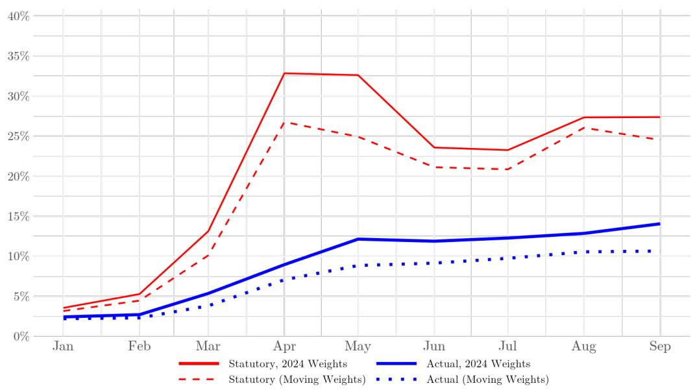

However, this increase in the statutory rate is misleading. It far exceeds the scale of the true trade policy shock. The thick solid blue line in Figure 1 shows our baseline measure of the actual trade-weighted tariff rate, which better captures the policy that was actually implemented. To calculate this “Actual” rate, we divide the tariff revenues that the U.S. government collects each month on imports from each exporter-HTS10 by the value of those imports. We aggregate using the same fixed trade weights from 2024 as we used for the statutory rate. The actual rate has risen far more slowly and modestly, did not experience a reversal or the volatility seen in the statutory rate, and remained at only 14.1 percent by the end of September.

When evaluating the effects of the 2025 tariffs, including their timing, pass-through, and incidence, it would be incorrect to use the statutory rate. The actual tariffs that were applied so far are much smaller. $^{9,10}$

## 2.2 Drivers of the statutory-actual gap

What accounts for the large gap between the statutory and actual tariff rates? Should we expect it to close over time? In principle, the statutory-actual gap reflects four factors:

1. Shipment lags. The tariff rate that applies to a shipment is set at the time the shipment begins its transit. This “on-the-water exemption” means that several months might pass before a newly announced statutory tariff rate applies to an import shipment that is actually received. Figure 2 shows the evolution of the statutory-actual rate gap for shipments with short, medium, and long transit times.

The left panel, Figure 2a, shows the statutory and actual tariffs on shipments from the United Kingdom of accessories for machines that balance mechanical parts (HTS 9031909130). All of these shipments were sent by air and so arrived in a few days. As a result, the statutory and actual tariffs were equal at 10 percent. The two lines are therefore visually indistinguishable.

The middle panel, Figure 2b, shows the tariff rates on shipments from the United Kingdom of centrifugal pumps for liquids (HTS 8413702025). The pumps are shipped entirely by sea, slowing the journey and implying delays in tariff implementation from the on-the-water exemption. In April, the actual tariff rate was less than half of the 10 percent statutory rate. By May, however, the gap fully closed.

The right panel, Figure 2c, shows tariff rates for imports of these same pumps, but shipped from Japan to the east coast of the United States, transiting through the Panama canal. In this case, the actual rate does not catch up with the statutory rate until June, and a new gap emerges in August when the statutory rate was raised to 15 percent (the gap shrinks, but remains non-zero, in September).

Figure 2: Examples of Lags from the “On-the-water” Exemption  
(a) By Air  
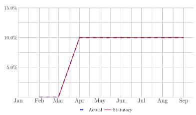

(b) By Sea, Short Trip  
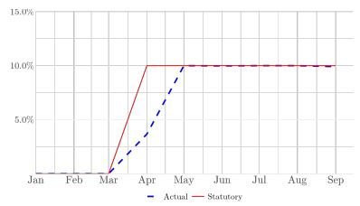

(c) By Sea, Long Trip  
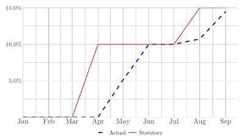

2. Product and company exemptions. Specific products or even specific companies (that commit to build manufacturing plants in the United States, say) have been offered exemptions from the tariffs. For example, various semiconductors were granted exemptions from the reciprocal tariffs announced by the United States in early April 2025. As a result, as shown in Figure 3a, semiconductors have an actual tariff rate of only 9 percent despite a much larger statutory tariff of 24 percent. This same exemption also drives the gap between Taiwan's 28 percent statutory rate and its 8 percent actual rate, as shown in Figure 3b.

Figure 3: Statutory and Actual Tariff Rates, September 2025  
(a) Sectors  
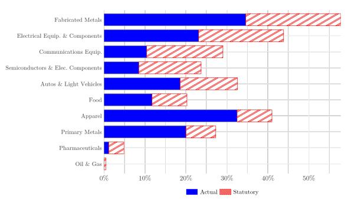

(b) Exporters  
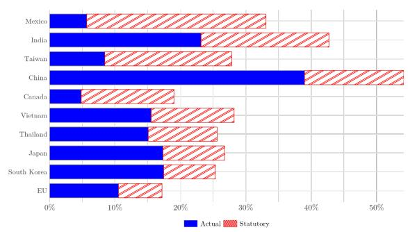

3. USMCA utilization. A third key driver of the gap is utilization of USMCA, the trade agreement between the United States, Mexico, and Canada that replaced the North American Free Trade Agreement in 2020. If a sufficient share of a shipment's value was added inside the three economies, rather than imported into the bloc, the importer can typically declare the goods USMCA compliant and largely avoid tariffs. However, doing so involves documentation and record-keeping costs, so importers may only choose to use the USMCA exemption when they would otherwise face a high tariff. $^{11}$

As shown in Figure 4, utilization rates jumped sharply for imports from both Canada and Mexico, from below 50 percent in 2024 to nearly 90 percent by September 2025. The USMCA exemption contributes to the large gaps for Mexico and Canada observed in Figure 3b, and the sharp increase in utilization contributes about 2 percentage points to the aggregate statutory-actual tariff rate gap.

Figure 4: USMCA Utilization  
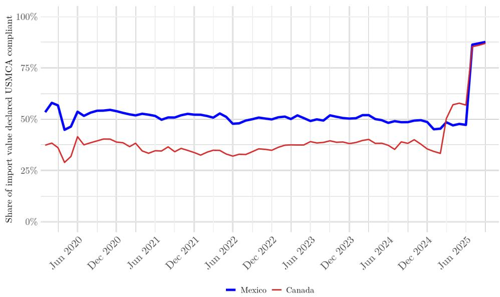

4. Enforcement and evasion. Finally, uneven enforcement or evasion of tariffs will drive a wedge between the statutory and actual rates.

$^{11}$ Hayakawa, Kim and Yoshimi (2017) considers the determinants of utilization of free trade agreements.

## 2.3 The statutory-actual gap in 2018-2019

How did the difference between statutory and actual tariff rates evolve when the United States hiked tariff rates in 2018-2019? Unlike the 2025 tariffs, which have increased statutory rates by 10 percentage points or more on 88 countries and 77 (2-digit harmonized code) products, the tariffs in 2018-2019 were more narrowly focused on a few industries and, particularly, on imports from China. There were fewer consequential product-level exemptions, no major rate reversals, and no change in the gap due to compliance with USMCA (or with NAFTA, its predecessor). $^{12}$ As a result, the aggregate statutory-actual gap was small and fairly stable, growing from 0.5 to 1.7 percentage points during 2018-2019 before stabilizing at 1 percentage point by 2021, about where the gap remained until 2025.

In upcoming months, what should we expect? Will the actual rate “catch up” with the statutory rate? Probably not. Of the four drivers of the statutory-actual gap discussed above, only the “on-the-water exemption” pushes toward convergence. Absent stronger enforcement, USMCA utilization will likely remain high, evasion efforts will become more sophisticated, and the announcement of new exemptions continues, such as recently with bananas and coffee.

Increases in statutory tariff rates are easy to announce and quick to disseminate to the public. However, the actual tariff rates paid by importers are often substantially lower due to exemptions and may only bind after a long delay. The rest of the paper, therefore, focuses only on the actual tariff rate, not the announced or statutory rate. We assess the incidence and pass-through of the tariff that has actually been implemented.

## 3 Determinants of Pass-through

In Section 4, we will characterize the realized rates of pass-through after the 2018-2019 and 2025 tariffs were imposed. Before doing so, in this section, we describe the theoretical determinants of tariff pass-through and compare them to determinants of exchange rate pass-through. Are the two the same? The analysis in this section follows closely Burstein and Gopinath (2014), extended to the case of tariffs. $^{13}$

Take the case of a foreign exporter choosing flexibly the (log) dollar price, $p_{F}$ , at which to sell to the U.S. market when facing a tariff rate of $\tau$ and an exchange rate (in logs) of e, where a higher value of e implies a weaker U.S. dollar. The direct effect of changes in tariffs and exchange rates on the tariff-inclusive dollar import price is given by: $^{14}$

$$
d p _ {F} + d \tau = \underbrace {\frac {1}{1 + \Gamma + \Phi}} _ {\text {Tariff pass - through}} d \tau + \underbrace {\frac {\phi}{1 + \Gamma + \Phi}} _ {\text {Exchange rate pass - through}} d e.\tag{1}
$$

Equation (1) includes three parameters $(\Phi, \Gamma, \text{and } \phi)$ that we describe in turn.

The first parameter, $\Phi$ , captures the sensitivity of the marginal cost of the exporter to a change in the price it sets. For example, if the exporter's production function displays constant returns to scale, then its marginal cost is insensitive to the price it sets and $\Phi = 0$ . If, however, the exporter's production function displays decreasing returns to scale, then its marginal cost falls if it sets higher prices (and sells lower quantities) and $\Phi > 0$ . Specifically, $\Phi$ is the product of the elasticity of the firm's marginal cost to quantity and the elasticity of demand to the price that the firm sets. If the marginal cost and demand are more elastic, then the pass-through of the tariff to export prices (and, therefore, to the tariff-inclusive import prices) will be lower.

The logic whereby a higher value of $\Phi$ leads to a lower pass-through rate is familiar. If an exporter with $\Phi > 0$ faces a new tariff but keeps its dollar price unchanged, then the increase in tariff-inclusive prices will drive down sales and reduce the firm's marginal cost. Profit-maximization would instead call for the firm to moderate both the decline in the quantity it sells and the increase in the markup it charges. The firm can achieve both by lowering its export price. This channel captures the familiar view on tariff incidence that the more inelastic the exporter's supply is relative to demand, the greater the burden borne by the exporter.

The second parameter, $\Gamma$ , captures the sensitivity of the exporter's markup to the price it sets. For example, if the elasticity of demand that the exporter faces is constant, then it will price at a constant markup over marginal cost and $\Gamma = 0$ . If, however, the elasticity of demand increases when the firm's price increases relative to its competitors, then the firm's optimal markup increases with its market share and $\Gamma > 0$ . If an exporter with $\Gamma > 0$ faces a new tariff but does not reduce its price, it will lose market share, leaving the existing markup too high. Profit-maximization would instead call for the firm to reduce its markup and, therefore, its export price. The magnitude of this channel depends on the elasticity of the elasticity of demand, referred to as the super-elasticity of demand. $^{15}$

Figure 5: Theoretical Pass-through to Tariff-inclusive Price  
(a) Marginal cost sensitivity ( $\Phi$ )  
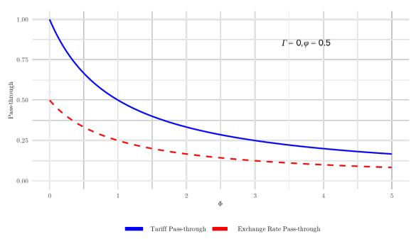

(b) Markup sensitivity ( $\Gamma$ )  
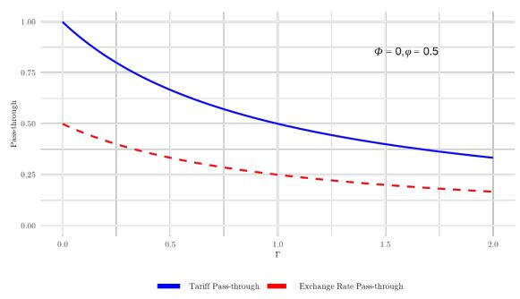

The impact of these forces on the pass-through of tariffs is represented in the solid blue lines in Figure 5. Figure 5a assumes a constant elasticity of demand ( $\Gamma = 0$ ) but considers variation in the sensitivity of marginal costs to changes in a firm's relative price. When the exporter's marginal cost is constant, $\Phi = 0$ and pass-through is 100 percent, the value where the solid line intersects the y-axis. Moving to the right of the plot, pass-through drops as the marginal cost sensitivity increases. Similarly, Figure 5b assumes a constant marginal cost but considers variation in the sensitivity of markups to changes in a firm's relative price. When the exporter's markup is constant, $\Gamma = 0$ and pass-through is 100 percent. Pass-through drops as the sensitivity of markups grows. Note that when the exporter's marginal cost and the elasticity of demand are both constant, $\Gamma = \Phi = 0$ , pass-through is 100 percent, and the full price incidence of the tariff is borne by the importer. $^{16}$

How does tariff pass-through compare to exchange rate pass-through? As shown in equation (1), the factors $\Gamma$ and $\Phi$ influence tariff and exchange rate pass-through in identical ways. An additional factor capturing the share of domestic inputs (such as labor) in production costs, $\phi \in [0,1]$ , influences exchange rate pass-through. Most exporters rely on imported inputs, often rigidly priced in dollars, for production. Spending on foreign inputs drives $\phi$ down, reducing the fraction of a firm's marginal cost that is sensitive to the exchange rate and, consequently, reducing exchange rate pass-through.

Both panels of Figure 5 depict the case when $\phi = 0.5$ . As a result, the values along the dashed red line that plots exchange rate pass-through are half the corresponding values on the solid blue line plotting tariff pass-through.

Equation (1) and Figure 5 consider a static environment, but in a richer dynamic framework, tariff pass-through can also exceed exchange rate pass-through if exchange rate changes are viewed as somewhat temporary or less than fully persistent. Although empirical studies suggest that nominal exchange rates may follow random walks, surveys reveal that firms expect some nominal exchange rate changes to reverse over time. Consider the case when $\Gamma = \Phi = 0$ and suppose that exchange rates are expected to follow an AR(1) process with persistence parameter $\rho_{e}$ . If firms set prices as in Calvo (1983), then their optimal reset price, $\bar{p}_{F,t}$ , will evolve according to:

$$
d \bar {p} _ {F, t} = \frac {(1 - \beta \kappa) \phi}{(1 - \beta \kappa \rho_ {e})} d e _ {t},\tag{2}
$$

The tariff-inclusive import price then evolves as follows:

$$
d \bar {p} _ {F, t} + d \tau_ {t} = d \tau_ {t} + \frac {(1 - \beta \kappa) \phi}{(1 - \beta \kappa \rho_ {e})} d e _ {t},\tag{3}
$$

where $\kappa$ is the Calvo probability that price does not change and $\beta$ is the inverse of the time discount rate. $^{17}$ When $0 \leq \rho_{e} < 1$ , then tariff pass-through exceeds exchange rate pass-through even when $\phi = 1$ .

To summarize, tariff pass-through can vary depending on the curvature of the production function and on the elasticity and superelasticity of demand. If the marginal cost of production and the elasticity of demand are constant, then exporting firms fully pass-through the tariff. Even when tariff pass-through is high, exchange rate pass-through can be lower when production relies on imported inputs or when the exchange rate changes are perceived as being more transitory than a random walk.

## 4 Pass-through to Import Prices

How have the theoretical forces discussed in Section 3 manifested themselves in actual pricing decisions by exporters in response to recent U.S. import tariffs? In this section, we measure pass-through of tariffs and exchange rates to prices paid by U.S. importers.

## 4.1 Tariff pass-through using BLS import price indices, 2025

To observe changes in the price of U.S. imports, we start by using indices constructed by the U.S. Bureau of Labor Statistics' (BLS) International Pricing Program. These import price indices measure monthly price changes for imported goods whose quality or characteristics are fixed over time. When needed, hedonic and other techniques are used to create quality-adjusted prices. Observing the behavior of import prices using the BLS' price indices, rather than unit values in the Census' trade data, ensures that price changes are isolated from shifts in the composition of purchases to different goods. Therefore, most of our analysis of pass-through focuses on the set of countries, economies, and sectors where the BLS provides indices.

Figure 6: Tariff Pass-through to Import Prices by Country, September 2025
(a) Raw Price Changes (b) Detrended Price Changes  
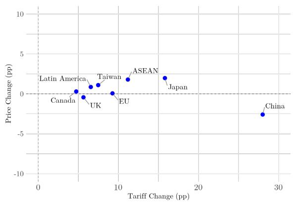

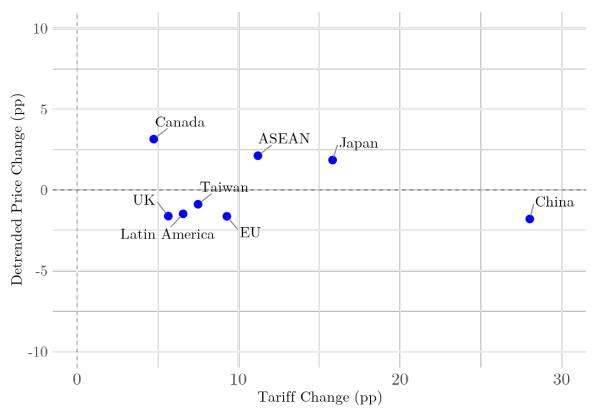

For exporters with BLS data, Figure 6a plots the 12-month change through September 2025 in the (exclusive of tariffs, or “ex-tariff”) price of U.S. imports against the increase in the tariff rate applied on that exporter over that same period. The exporters or exporting regions that experienced tariff increases of 5 percentage points or more include the United Kingdom, Taiwan, Latin America, the Association of Southeast Asian Nations (ASEAN), the European Union (EU), Japan, and China. $^{18}$ The ex-tariff price of U.S. imports from China declined by 2.5 percent and the price of imports from the others were essentially unchanged or rose by two percent or less. Using these observations, we can calculate the tariff-inclusive pass-through to import prices for these exporters as:

$$
\mathrm{Pass-throughtoImportPrices} = \frac {\mathrm{Ex-tariffPriceChange+TariffChange}}{\mathrm{TariffChange}}.\tag{4}
$$

The final column of Table 1 lists the results and shows that pass-through rates to import prices for these 7 exporters or exporting regions were high or in excess of 100 percent.

Table 1: Tariff Passthrough Summary, Countries

<table><tr><td>Country</td><td>Tariff Change (pp)</td><td>Detrended Price Passthrough</td><td>Price Acceleration Passthrough</td><td>Raw Price Passthrough</td></tr><tr><td>China</td><td>28.0</td><td>0.94</td><td>0.95</td><td>0.91</td></tr><tr><td>Japan</td><td>15.8</td><td>1.12</td><td>1.13</td><td>1.12</td></tr><tr><td>ASEAN</td><td>11.2</td><td>1.19</td><td>1.24</td><td>1.16</td></tr><tr><td>European Union</td><td>9.3</td><td>0.82</td><td>0.81</td><td>1.01</td></tr><tr><td>Taiwan</td><td>7.5</td><td>0.88</td><td>1.13</td><td>1.15</td></tr><tr><td>Latin America</td><td>6.6</td><td>0.77</td><td>0.89</td><td>1.13</td></tr><tr><td>United Kingdom</td><td>5.7</td><td>0.71</td><td>0.86</td><td>0.92</td></tr><tr><td>Mean</td><td>12.0</td><td>0.92</td><td>1.00</td><td>1.06</td></tr><tr><td>Median</td><td>9.3</td><td>0.88</td><td>0.95</td><td>1.12</td></tr></table>

One concern with this simple approach is that the price of imports from each exporter may have been experiencing different trends prior to the imposition of the 2025 tariffs. To try to address this concern, Figure 6b instead plots the detrended change in each of the ex-tariff import price indices, which we then use for our preferred pass-through measures in the BLS data. $^{19}$ Little changes. As shown in the second column of Table 1, the pass-through rate calculated using this detrended method drops meaningfully for the European Union, Latin America, Taiwan, and the United Kingdom, but the resulting mean and median pass-through rates remain high at roughly 90 percent. $^{20}$

(b) Detrended Price Changes

The measures of pass-through in Table 1 are crude. They look only at 12-month variation, pool goods and countries with heterogeneous tariff rates, and associate all price increases, or above-trend increases, with the tariffs. That said, they provide useful evidence against the possibility of low rates of pass-through. We find no evidence in the country- and region-level BLS import price indices of ex-tariff price declines that largely offset the imposed tariffs.

Figure 7: Tariff Pass-through to Import Prices by Sector, September 2025  
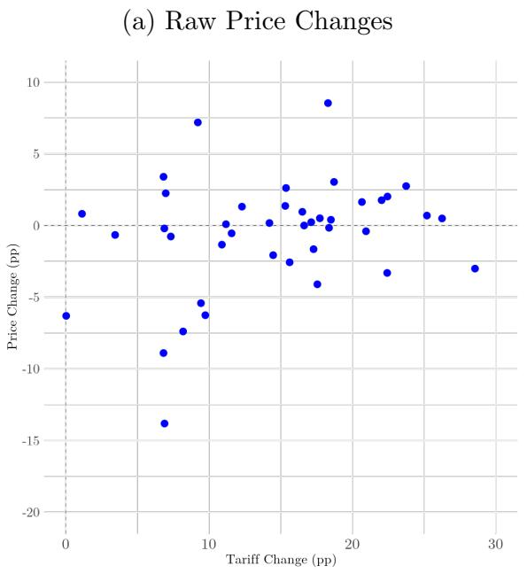

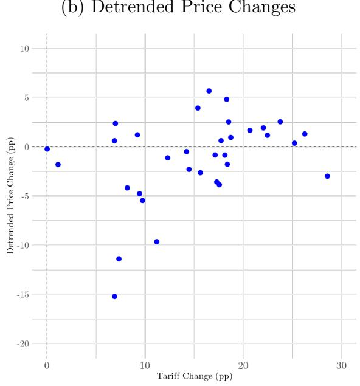

We can also use the BLS data to calculate pass-through at the sector level. To balance the desire to study disaggregated sectors while maximizing coverage of the U.S. import basket, we assemble a set of 44 non-overlapping NAICS codes ranging from the 3- to 5-digit levels where BLS price indices are available. $^{21}$ These sectors are listed in Appendix Table A1 and collectively represent 83 percent of the value of U.S. merchandise imports in 2024.

Figure 7a plots the 12-month change through September 2025 in the ex-tariff price of imports for each sector against the increase in tariff applied over that same period. Among the 38 sectors with at least a 5 percentage point increase in their tariff rates, 21 saw their ex-tariff dollar prices increase and 17 saw their prices decrease. After detrending, as shown in Figure 7b, the pattern is similar. $^{22}$ Both measures reveal high rates of pass-through to import prices. As shown in Table 2, detrended pass-through rates for the ten sectors with the largest increases in tariffs ranged from 90 percent to 114 percent. Across all sectors, detrended pass-through had a mean value of 83 percent and a median value of 97 percent.

Whether looking across exporters or sectors, pass-through rates are heterogeneous but typically high. Through September 2025, the price impact from recent U.S. import tariffs, in general, is borne by the U.S. importer.

What might explain the heterogeneity in these pass-through rates? As discussed in Section 3, differences in the properties of demand or of the production function will matter. The properties may reflect the extent to which U.S. imports in a sector come from a small and concentrated set of export partners and the extent to which U.S. producers are themselves active in the sector. However, such characteristics do not appear to be clearly related to pass-through in the data.

Figure 8a plots each sector's pass-through rate (using our baseline detrended method) against the Herfindahl-Hirschman concentration index (HHI) of supplier countries. For example, the rightmost point in the scatterplot is “Doll, Toy, and Game Manufacturing”, which has a high HHI of 0.6 because nearly 80 percent of imports in 2024 were from China. The second largest HHI belongs to “Motor Vehicle Seating and Interior Trim Manufacturing”, where nearly 70 percent of imports were from Mexico. Those two highly concentrated sectors, however, have pass-through rates of essentially 100 percent, no different from the large mass of sectors with low concentration index values.

Similarly, Figure 8b considers whether sectors in which the United States exports a lot – and therefore, presumably, has capacity to produce substitutes for the imported goods – are sectors where imports had a different tariff pass-through rate. The three sectors furthest to the right, where the U.S. exports more than it imports, include “Crop Production”, “Basic Chemical Manufacturing”, and “Engine, Turbine, and Power Transmission Equipment Manufacturing”. Two of these sectors have well below-average pass-through while the third is well above the average. Sectors where the United States barely exports, and therefore is likely more reliant on imports, include “Apparel

Table 2: Tariff Passthrough Summary, Sectors

<table><tr><td>Sector (NAICS)</td><td>Tariff Change (pp)</td><td>Detrended Price Passthrough</td><td>Price Acceleration Passthrough</td><td>Price Passthrough</td></tr><tr><td>332 - Fabricated Metals</td><td>28.6</td><td>0.90</td><td>0.92</td><td>0.89</td></tr><tr><td>33993 - Dolls, Toys &amp; Games</td><td>26.3</td><td>1.05</td><td>1.06</td><td>1.02</td></tr><tr><td>33992 - Sporting &amp; Athletic Goods</td><td>25.2</td><td>1.01</td><td>1.00</td><td>1.03</td></tr><tr><td>3331 - Ag, Constr. &amp; Mining Machinery</td><td>23.8</td><td>1.11</td><td>1.11</td><td>1.12</td></tr><tr><td>337 - Furniture &amp; Related</td><td>22.5</td><td>1.05</td><td>1.11</td><td>1.09</td></tr><tr><td>314 - Textile Products</td><td>22.4</td><td>-</td><td>-</td><td>0.85</td></tr><tr><td>3336 - Engines, Turbines &amp; Power Trans.</td><td>22.0</td><td>1.09</td><td>1.03</td><td>1.08</td></tr><tr><td>33699 - Other Transportation Equip.</td><td>21.0</td><td>-</td><td>-</td><td>0.98</td></tr><tr><td>3339 - Other General-Purpose Machinery</td><td>20.7</td><td>1.08</td><td>1.08</td><td>1.08</td></tr><tr><td>33631 - MV Gasoline Engines &amp; Parts</td><td>18.7</td><td>1.05</td><td>0.95</td><td>1.16</td></tr><tr><td>335 - Electrical Equip. &amp; Components</td><td>18.5</td><td>1.14</td><td>1.11</td><td>1.02</td></tr><tr><td>33639 - MV Other Parts</td><td>18.4</td><td>0.90</td><td>0.92</td><td>0.99</td></tr><tr><td>33991 - Jewelry &amp; Silverware</td><td>18.3</td><td>1.26</td><td>1.31</td><td>1.47</td></tr><tr><td>331 - Primary Metals</td><td>18.1</td><td>0.95</td><td>1.08</td><td>1.67</td></tr><tr><td>315 - Apparel</td><td>17.7</td><td>1.04</td><td>1.02</td><td>1.03</td></tr><tr><td>33634 - MV Brake Systems</td><td>17.6</td><td>0.78</td><td>0.86</td><td>0.77</td></tr><tr><td>33611 - Autos &amp; Light Vehicles</td><td>17.3</td><td>0.79</td><td>0.74</td><td>0.90</td></tr><tr><td>33635 - MV Transmission &amp; Power Train</td><td>17.1</td><td>0.95</td><td>1.00</td><td>1.01</td></tr><tr><td>33633 - MV Steering &amp; Suspension</td><td>16.6</td><td>-</td><td>-</td><td>1.00</td></tr><tr><td>3335 - Metalworking Machinery</td><td>16.5</td><td>1.34</td><td>0.90</td><td>1.06</td></tr><tr><td>326 - Plastics &amp; Rubber</td><td>15.6</td><td>0.83</td><td>0.88</td><td>0.84</td></tr><tr><td>3333 - Commercial &amp; Service Machinery</td><td>15.4</td><td>1.26</td><td>1.37</td><td>1.17</td></tr><tr><td>313 - Textiles</td><td>15.3</td><td>-</td><td>-</td><td>1.09</td></tr><tr><td>327 - Nonmetallic Minerals</td><td>14.5</td><td>0.84</td><td>0.87</td><td>0.86</td></tr><tr><td>3343 - Audio &amp; Video Equip.</td><td>14.2</td><td>0.97</td><td>1.25</td><td>1.01</td></tr><tr><td>3345 - Nav., Measuring &amp; Control Instr.</td><td>12.3</td><td>0.91</td><td>0.83</td><td>1.11</td></tr><tr><td>112 - Animal &amp; Aquaculture</td><td>11.6</td><td>-</td><td>0.05</td><td>0.95</td></tr><tr><td>33632 - MV Electrical &amp; Electronic Equip.</td><td>11.2</td><td>0.14</td><td>0.25</td><td>1.01</td></tr><tr><td>33911 - Medical Equip. &amp; Supplies</td><td>10.9</td><td>-</td><td>-</td><td>0.88</td></tr><tr><td>3342 - Communications Equip.</td><td>9.7</td><td>0.44</td><td>0.40</td><td>0.36</td></tr><tr><td>322 - Paper</td><td>9.4</td><td>0.50</td><td>0.31</td><td>0.43</td></tr><tr><td>311 - Food</td><td>9.2</td><td>1.13</td><td>1.17</td><td>1.78</td></tr><tr><td>3251 - Basic Chemicals</td><td>8.2</td><td>0.49</td><td>0.66</td><td>0.10</td></tr><tr><td>111 - Crop</td><td>7.3</td><td>-0.55</td><td>-0.53</td><td>0.90</td></tr><tr><td>3344 - Semiconductors &amp; Elec. Components</td><td>7.0</td><td>1.34</td><td>1.60</td><td>1.32</td></tr><tr><td>312 - Beverage &amp; Tobacco</td><td>6.9</td><td>-1.21</td><td>-1.21</td><td>-1.00</td></tr><tr><td>33636 - MV Seating &amp; Interior Trim</td><td>6.9</td><td>1.09</td><td>0.73</td><td>0.97</td></tr><tr><td>33641 - Aerospace Products &amp; Parts</td><td>6.8</td><td>-</td><td>-</td><td>1.50</td></tr><tr><td>3252 - Resins &amp; Syn. Rubber/Fibers</td><td>6.8</td><td>-</td><td>-0.85</td><td>-0.30</td></tr><tr><td>Mean</td><td>15.6</td><td>0.83</td><td>0.76</td><td>0.93</td></tr><tr><td>Median</td><td>16.5</td><td>0.97</td><td>0.92</td><td>1.01</td></tr></table>

Figure 8: Tariff Pass-through by Concentration and Substitutability  
(a) Pass-through and HHI  
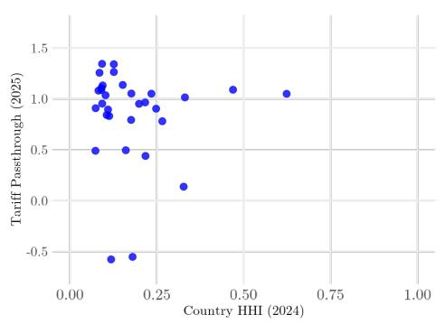

(b) Pass-through and Exports  
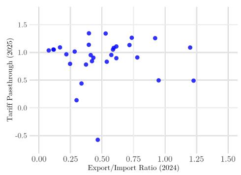  
Manufacturing” and “Furniture and Related Product Manufacturing.” These sectors have pass-through rates close to one, near the middle of the sectoral distribution.

## 4.2 Tariff pass-through using census unit values

The BLS's country and sector data show generally high pass-through rates to import prices, but offer limited variation to identify the drivers of higher or lower rates. In this subsection, we therefore follow Amiti, Redding and Weinstein (2019) in studying tariff pass-through using data on unit values from the Census trade data.

Unit values $(\tilde{p}_{ijt})$ can be computed by dividing the value of all shipments for a given HTS10 (i) from a given exporter (j) in a given month (t), $v_{ijt}$ , by the reported units $(\tilde{q}_{ijt})$ shipped:

$$
\tilde {p} _ {i j t} = \frac {v _ {i j t}}{\tilde {q} _ {i j t}}.\tag{5}
$$

We use tildes to acknowledge the well-known limitations that changes in unit values and quantities may be affected in trade data by changes in composition of goods and heterogeneity in the notion of units used, even within a given HTS10. If the impact of those limitations is minimal, the percent changes in import unit values and units should approximate the percent change in product prices and quantities, and we use this as the basis for our regression framework below.

Table 3 shows results from regressing the change in tariff-inclusive unit values, units, and ex-tariff import values on changes in the relevant actual tariff rate and bilateral exchange rate. Changes are measured from December 2017 to December 2019. $^{23}$ This window is long enough to capture multiple waves of tariffs during the 2018-2019 period and to allow for a lagged response.

Table 3: Tariff Impacts on US Import Values and Quantities, December 2019

<table><tr><td></td><td>log changetariff-inclusiveimport prices(1)</td><td>log changetariff-inclusiveimport prices(2)</td><td>log changeimport quantities(3)</td><td>log changeimport values(4)</td></tr><tr><td colspan="5">Panel A: OLS</td></tr><tr><td></td><td> $\Delta \ln(\tilde{p}_{ijt}(1 + \tau_{ijt}))$ </td><td> $\Delta \ln(\tilde{p}_{ijt}(1 + \tau_{ijt}))$ </td><td> $\Delta \ln(\tilde{q}_{ijt})$ </td><td> $\Delta \ln(v_{ijt})$ </td></tr><tr><td> $\Delta \ln(1 + \tau_{ijt})$ </td><td>0.800***(0.035)</td><td>0.807***(0.035)</td><td>-2.504***(0.110)</td><td>-1.814***(0.091)</td></tr><tr><td> $\Delta \ln(e_{jt})$ </td><td></td><td>0.065***(0.017)</td><td>-0.228***(0.056)</td><td>-0.213***(0.046)</td></tr><tr><td>N</td><td>64,193</td><td>63,791</td><td>63,791</td><td>101,796</td></tr><tr><td>R2</td><td>0.154</td><td>0.155</td><td>0.169</td><td>0.132</td></tr><tr><td colspan="5">Panel B: WLS</td></tr><tr><td></td><td> $\Delta \ln(\tilde{p}_{ijt}(1 + \tau_{ijt}))$ </td><td> $\Delta \ln(\tilde{p}_{ijt}(1 + \tau_{ijt}))$ </td><td> $\Delta \ln(\tilde{q}_{ijt})$ </td><td> $\Delta \ln(v_{ijt})$ </td></tr><tr><td> $\Delta \ln(1 +\tau_{ijt})$ </td><td>0.635***(0.092)</td><td>0.669***(0.093)</td><td>-2.789***(0.222)</td><td>-2.498***(0.242)</td></tr><tr><td> $\Delta \ln(e_{jt})$ </td><td></td><td>0.139(0.090)</td><td>0.006(0.228)</td><td>-0.084(0.298)</td></tr><tr><td>N</td><td>56,546</td><td>56,238</td><td>56,238</td><td>89,695</td></tr><tr><td>R2</td><td>0.353</td><td>0.355</td><td>0.388</td><td>0.317</td></tr></table>

are HTS10-country; variables are 24-month changes from December 2017 to December 2019. All columns include product fixed effects. Weights use annual 2024 trade values. SEs clustered at HS8.

Table 4: Tariff Impacts on US Import Values and Quantities, September 2025

<table><tr><td></td><td>log changetariff-inclusiveimport prices(1)</td><td>log changetariff-inclusiveimport prices(2)</td><td>log changeimport quantities(3)</td><td>log changeimport values(4)</td></tr><tr><td colspan="5">Panel A: OLS</td></tr><tr><td></td><td> $\Delta \ln(\tilde{p}_{ijt}(1 + \tau_{ijt}))$ </td><td> $\Delta \ln(\tilde{p}_{ijt}(1 + \tau_{ijt}))$ </td><td> $\Delta \ln(\tilde{q}_{ijt})$ </td><td> $\Delta \ln(v_{ijt})$ </td></tr><tr><td> $\Delta \ln(1 + \tau_{ijt})$ </td><td>0.942***(0.020)</td><td>0.948***(0.021)</td><td>-0.970***(0.058)</td><td>-0.142***(0.053)</td></tr><tr><td> $\Delta \ln(e_{jt})$ </td><td></td><td>0.082***(0.028)</td><td>-0.282***(0.084)</td><td>-0.313***(0.080)</td></tr><tr><td>N</td><td>87,088</td><td>78,900</td><td>78,900</td><td>106,253</td></tr><tr><td>R2</td><td>0.180</td><td>0.192</td><td>0.163</td><td>0.131</td></tr><tr><td colspan="5">Panel B: WLS</td></tr><tr><td></td><td> $\Delta \ln(\tilde{p}_{ijt}(1 + \tau_{ijt}))$ </td><td> $\Delta \ln(\tilde{p}_{ijt}(1 + \tau_{ijt}))$ </td><td> $\Delta \ln(\tilde{q}_{ijt})$ </td><td> $\Delta \ln(v_{ijt})$ </td></tr><tr><td> $\Delta \ln(1 +\tau_{ijt})$ </td><td>0.878***(0.132)</td><td>0.907***(0.099)</td><td>-1.978***(0.399)</td><td>-1.417***(0.338)</td></tr><tr><td> $\Delta \ln(e_{jt})$ </td><td></td><td>-0.182(0.190)</td><td>-0.401(0.497)</td><td>-0.457(0.426)</td></tr><tr><td>N</td><td>87,088</td><td>78,900</td><td>78,900</td><td>106,253</td></tr><tr><td>R2</td><td>0.461</td><td>0.480</td><td>0.471</td><td>0.451</td></tr></table>

are HTS10-country; variables are 12-month changes from September 2024 to September 2025. All columns include product fixed effects. Weights use annual 2024 trade values. SEs clustered at HS8.

The coefficient in the column (1) in Panel A of Table 3 equals 0.800 and is tightly estimated. This corresponds to a tariff-inclusive pass-through rate of 80 percent, somewhat lower than estimates of that same episode found in Cavallo et al. (2021), Fajgelbaum, Goldberg, Kennedy and Khandelwal (2020a), and Amiti et al. (2019), but still high. Column (2) reports results from a specification that adds the exchange rate, where an increase in $FX$ corresponds to a depreciation of the U.S. dollar. The tariff pass-through rate implied by this specification remains near 80 percent, and exchange rate pass-through is estimated to be low, at 6.5 percent. This estimate is qualitatively similar to, but below, the 20 percent rate estimated by Cavallo et al. (2021) from more disaggregated, transaction-level, data during that same period. The coefficient in column (4) suggests import values dropped by nearly 3 log points per log point increase in tariffs, consistent with a trade elasticity of about 4. $^{24}$

Table 4 shows results from equivalent regression specifications as shown in Table 3, but with changes measured from September 2024 to September 2025. Tariff pass-through in these regressions is somewhat higher, with the coefficient of 0.948 in the second column suggesting a tariff-inclusive pass-through rate of 95 percent. Exchange rate pass-through is slightly higher, at about 8 percent. These results are broadly similar with those from the 2018-2019 episode, though the much shorter horizon (particularly since most tariff changes occurred only in April) suggests we may only be capturing part of the price and quantity response.

## 5 How Have Imports Responded?

Figure 9a plots the evolution of U.S. imports and the trade deficit relative to GDP since 2015, together with the statutory and actual tariff rates. $^{25}$ During 2018-2020, when the statutory and actual tariff rates roughly doubled, imports exhibited a clear decline from roughly 12 percent to just above 10 percent of GDP. Imports subsequently recovered, though, and exceeded 11 percent of GDP on the eve of the much-larger tariffs of 2025. Imports and the trade deficit surged upward in December 2024 and in the first few months of 2025, presumably in anticipation of the large tariffs put in place in April. It is difficult to know the extent to which this “front-running”, as opposed to the subsequently imposed tariffs, drove imports downward in April, May, and June.

Figure 9b shows the share of U.S. imports that come from China as well as the actual and statutory tariff rates that apply to those imports. The dashed line (and smoothed version running through it) show that in the years prior to the 2018 tariffs, China's share of U.S. imports held steady at a bit above 20 percent. $^{26}$ The imposition of tariffs on China in 2018 kicked off a dramatic secular decline, nearly halving China's share in U.S. imports to 12.5 percent by the end of 2024. Interestingly, this decline continued through the 2021-2024 period, despite stable tariff rates during those years. Coinciding with the acute spike in both tariff rates during 2025, China's share of U.S.

imports has collapsed further, ranging from 7 to 10 percent in recent months. $^{27}$

Figure 9: Tariffs, Imports, and Deficits  
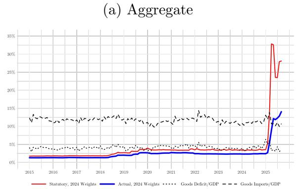

(b) China  
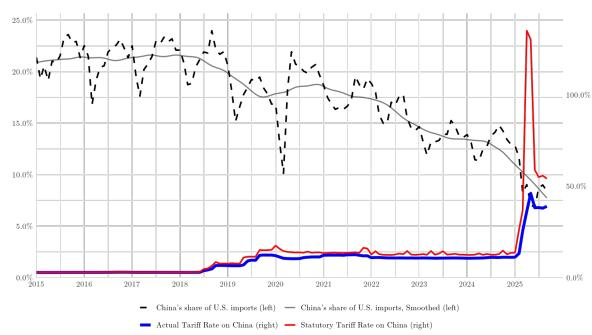

The scatterplot and the bar chart in Figure 10 compare the change in U.S. import spending on an exporter's goods with the 12-month increases through September 2025 in the size of tariffs that exporter faces. China's exports to the United States have experienced the largest increase in tariffs and have declined by the largest percent among large trade partners. The correlation between tariff increases and import spending among the other countries, however, is limited. India and Vietnam, for example, have substantially grown their exports to the United States, but this likely represents the fact that, compared to other trade partners, their production is more substitutable for goods that the United States historically sourced from China.

Focusing on specific sectors with relatively substitutable goods does reveal some suggestive patterns of expenditure switching away from higher tariff goods. Figure 11a, for example, shows how the European Union faces modest tariffs on washing machines and appears to have gained some of the market share lost by South Korea, Vietnam, and China. Figure 11b shows how laptops shipped from Vietnam and Taiwan, which do not face higher tariffs in 2025, have seen demand grow relative to other exporters that were subjected to higher tariffs.

(b) Laptops  
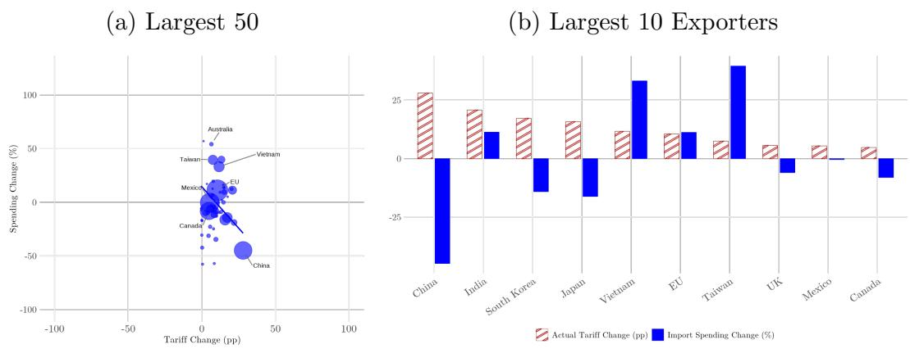  
Figure 10: Changes in Import Shares

Figure 11: Within-Sector Changes in Import Share  
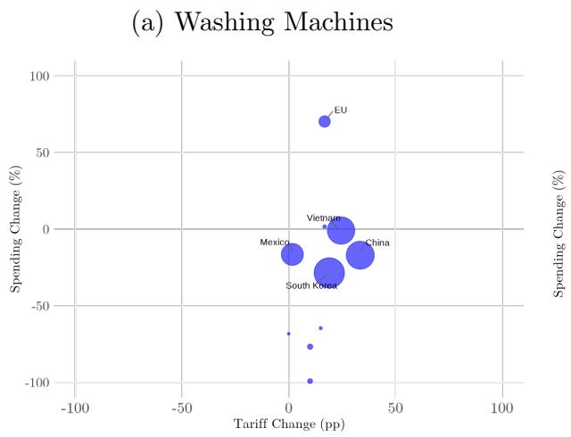

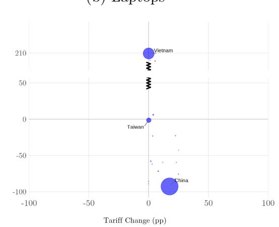

## 6 Pass-through to Producer Prices

Tariff-inclusive pass-through to U.S. import prices is high. When a 10 percent tariff is imposed on an imported good, U.S. importers appear to pay 8-10 percent more, including the tariff, for that good. Our analyses reveal this whether looking at aggregated countries and sectors or looking at shipments disaggregated to the exporter-HTS10 level. This was true both in 2018-2019 and in 2025, and is consistent with the large shift in U.S. import shares – particularly the shift away from Chinese exports – documented in Section 5.

What does this mean for U.S. producers? After all, unlike in the past, final goods today represent less than half of all trade. Most U.S. goods imports are intermediate inputs or capital goods used by U.S. firms to produce. In this section, we focus on the implications of the tariffs for the production costs of U.S. firms, particularly manufacturers.

## 6.1 Tariffs, intermediates, and the input-output structure

The U.S. Bureau of Economic Analysis (BEA) produces a “Trade in Value Added” (TIVA) dataset that links input-output tables with trade data to show the import content of U.S. production, by industry and source region. The most recent TIVA data are from 2023 and cover the entire U.S. economy, disaggregated into 45 agriculture, manufacturing, and mining sectors and 93 service sectors. We combine this information on the global sourcing structure of U.S. industry, corresponding measures of actual tariffs, and our findings in Section 4 of near-complete pass-through to U.S. import prices in 2025 to calculate the extent to which the tariffs may affect the cost of U.S. producers. $^{28}$

For example, the data suggests that imported inputs accounted for 23 percent of the value of production of U.S. heavy duty trucks. About one-quarter of that imported input spending was on vehicle parts from China, Japan, the “rest of Asia”, and Europe according to the BEA’s allocation of imports across origins. $^{29}$ Using the trade data, we estimate that tariffs on vehicle parts from China increased in 2025 by about 40 percentage points, and tariffs on parts from other regions increased by about 20 percentage points. Together with the other three-quarters of input spending, we multiply the increase in trade-weighted average tariff by region and imported input into the U.S. heavy duty truck sector by their share in total production costs, which we call the increase in “production tariff” of 3.9 percent. Given the pattern of global sourcing, our calculation suggests that increased tariffs impact the industry similarly to a hypothetical new tax on total production costs of 3.9 percent.

## 6.2 Production tariffs

Table 5 lists the 10 sectors with largest increases in production tariffs. In addition to “Heavy Duty Trucks”, “Oil and Gas Field Machinery” is significantly affected and has a 2.3 percent increase in its production tariff because imported steel accounts for a large share of its production costs. “Agricultural Implements” has a 2.5 percent production tariff increase because 13 percent of its production costs involve the use of other imported agricultural implements, many of which come from China. Aggregating across all subsectors, we calculate that the production tariff increased by 1.06, 0.48, and 0.14 percentage points, respectively, in U.S. manufacturing, agriculture, and services. $^{30}$

Table 5: Sectors with Largest Increases in Production Tariffs

<table><tr><td>NAICS</td><td>Sector</td><td>Δ Production Tariff (pp)</td></tr><tr><td>33612</td><td>Heavy Duty Trucks</td><td>3.9</td></tr><tr><td>33312</td><td>Construction Machinery</td><td>3.1</td></tr><tr><td>3362</td><td>Motor Vehicles</td><td>2.8</td></tr><tr><td>3363</td><td>Motor Vehicle Parts</td><td>2.8</td></tr><tr><td>33611</td><td>Automobiles</td><td>2.7</td></tr><tr><td>33311</td><td>Agricultural Implements</td><td>2.5</td></tr><tr><td>33313</td><td>Oil and Gas Field Machinery</td><td>2.3</td></tr><tr><td>331</td><td>Primary Metals</td><td>2.0</td></tr><tr><td>3332</td><td>Industrial Machinery</td><td>2.0</td></tr><tr><td>3333</td><td>Commercial Industry Machinery</td><td>2.0</td></tr></table>

Is there evidence that these increases in production tariffs on U.S. industries have led to increases in the price of U.S. production, or “producer price index” (PPI) inflation? Figure 12 compares 12-month changes in PPI inflation by industry with the increase in industry-specific production tariff. Service sectors, which rely far less on intermediate inputs – both domestically produced and imported – are marked with hollow red triangles and cluster tightly along the y-axis. With wholesale pharmaceutical distributors (NAICS sector 4242) as the only exception, service sector production tariffs increased by small amounts, always less than 0.5 percentage points and typically closer to zero. Manufacturing sectors are marked with solid blue circles and experienced changes in their production tariffs ranging from near-zero to almost 4 percentage points.

The evidence using detrended PPI price changes in Figure 12b are suggestive that tariffs have passed through into the prices charged by U.S. manufacturers. We divide with largest increases (greater than 2 percentage points). First, of the 26 manufacturing sectors with small increases in production tariffs, 16 (or 60 percent) exhibited above-trend price increases. Next, of the 16 manufacturing sectors with intermediate increases in production tariffs, 12 (or 75 percent) exhibited above-trend increases. Finally, of the 7 manufacturing sectors with large increases in production tariffs, 6 (or 86 percent) exhibited above-trend increases.

(a) Raw Price Changes  
Figure 12: Tariff pass-through to Producer Prices?  
(b) Detrended Price Changes  
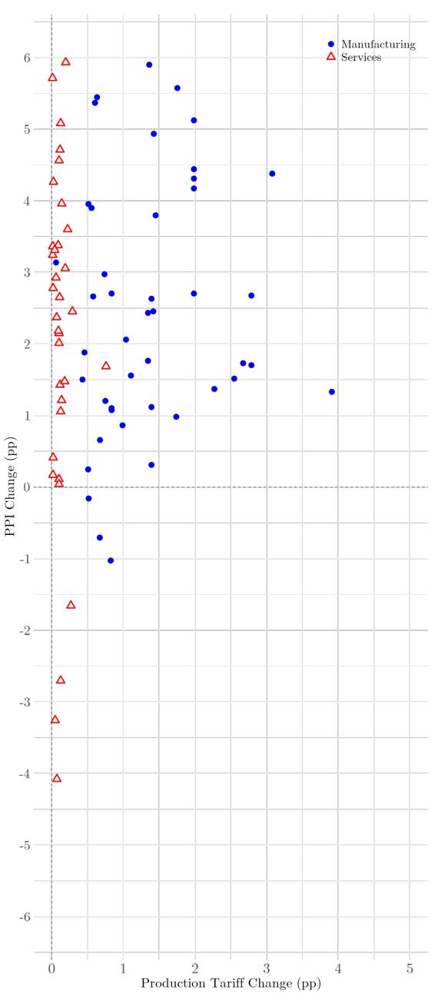

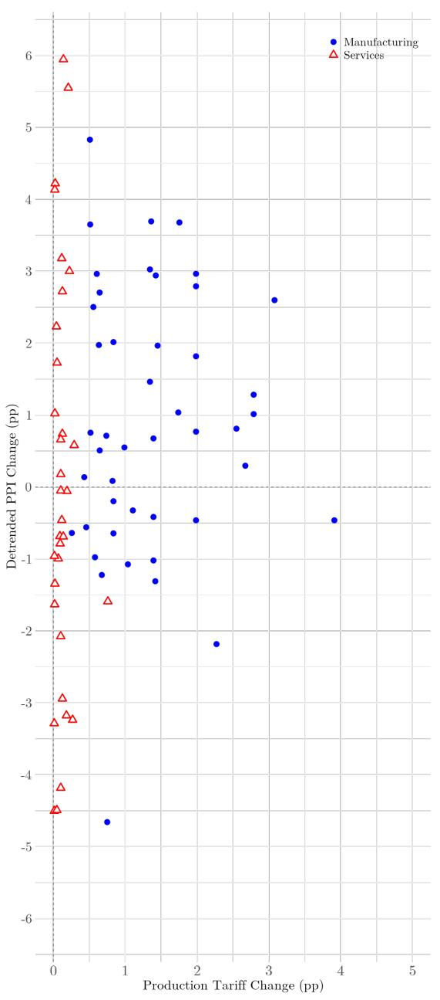  
the manufacturing sectors into 3 groupings based on the scale of increases in their production tariffs: (i) those with the smallest increases (less than 1 percentage point), (ii) those with intermediate increases (between 1 and 2 percentage points), and (iii) those

Future work using detailed firm-level data will be needed to most convincingly and more precisely trace the implications of import tariffs through to producer prices, but even these crude aggregate analyses are strongly suggestive. PPI inflation is more likely to be above trend in U.S. manufacturing industries whose production costs appear to be most impacted by the recent increase in import tariffs.

## 7 Pass-through to Consumer Prices

To what extent have the import tariffs passed through to consumer prices, or consumer price index (CPI) inflation? An approach similar to what we pursued in Section 6 might be used to try to answer the question, but it involves additional complexity given CPI indices are at the product, not industry, level. We leave that for future work. $^{31}$

The exercise is easier for products that are imported as final goods and for which there are few or no domestically produced substitutes. Figure 13, for example, shows the path since 2023 of the CPI and tariff rates on six sectors with those characteristics: (a) bananas, (b) children's footwear, (c) coffee, (d) shelf-stable fish and seafood, (e) televisions, and (f) toys. Some, such as bananas and coffee, appear to show price increases relative to trend that coincide with the imposition of tariffs (though coffee's price rise appears to start a bit earlier, in late 2024). In fact, presumably due to the salience of these goods and the uptick in their price growth, bananas and coffee were exempted from tariffs by an executive order issued in November 2025. Other sectors, like shelf-stable fish and seafood, do not exhibit any obvious deviations from their pre-tariff price trends.

Cavallo et al. (2021) used far more detailed data on prices at big-box chains to demonstrate low retail pass-through after the 2018 tariffs were imposed, at least in the first year after the tariffs. The paper offered evidence that substitution away from China as a supplier and large inventories accumulated ahead of the tariffs likely contributed to the ability to avoid or forestall price increases. Cavallo, Llamas and Vazquez (2025) uses related, but enriched, data to study the 2025 tariffs and finds evidence that pass-through appears to be swift. It estimates a pass-through rate of 20 percent to retail within a few months, and demonstrates how pricing implications from the tariffs also spill over to domestically produced goods that now face less-stiff competition. Through the end of September, the same period covered in this paper, Cavallo et al. (2025) finds that tariffs contributed about 0.7 percentage points to the all-items CPI.

Figure 13: Tariff pass-through to Consumer Prices, Selected Final Goods  
(a) Bananas  
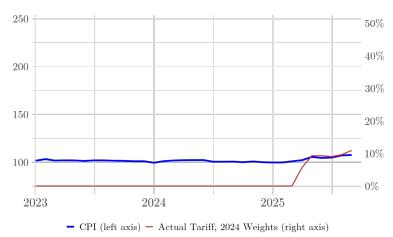

(b) Children's Footwear  
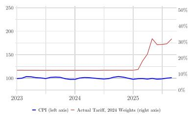

(c) Coffee  
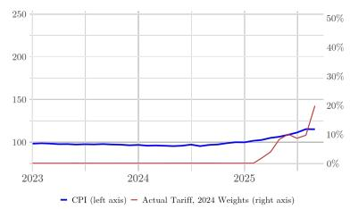  
(e) Television  
(f) Toys

(d) Shelf-Stable Fish/Seafood  
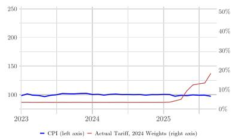

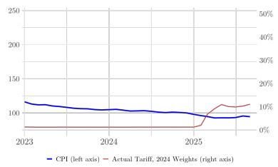

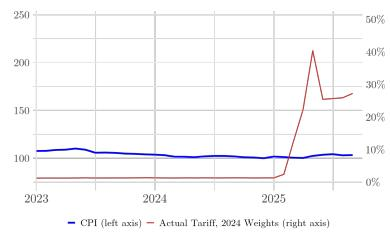

## 8 Tariffs and Exchange Rates

In the above sections, our theoretical and empirical results address the pricing implications of both tariff and exchange rate shocks, regardless of whether tariffs or exchange rates moved in the same or opposite directions. In this section, we focus on why tariff changes may lead directly to exchange rate changes. Further, the magnitude of the resulting exchange rate change is influenced by the extent of tariff pass-through. $^{32}$

## 8.1 Should the currency appreciate? What does theory say?

We assume that the U.S. import tariffs do not alter the trade deficit. $^{33}$ In this case, the decline in the ex-tariff dollar value of imports from the increase in tariffs must be matched with an equal decline in the dollar value of exports. This decline in exports is caused by an appreciation in the dollar. Since, for a given tariff, the decline in imports will be a function of pass-through, the scale of the required dollar appreciation will also relate to pass-through.

Specifically, in the case of flexible prices, it can be shown that:

$$
\frac {d e}{d \tau} = \frac {- (\sigma + \Gamma + \Phi)}{\phi (\sigma - 1) + (\sigma + \Gamma + \Phi)} <   0,\tag{6}
$$

where $\sigma > 1$ is the common elasticity of demand for both exports and imports. The dollar appreciation reduces the dollar price of imports partially offsetting the increase in the dollar price from the higher tariff rate, and consequently moderates the decline in imports and in exports alongside an unchanged trade balance. The scale of appreciation of the exchange rate (e) is therefore a function of the same parameters that impact pass-through ( $\Phi$ , $\Gamma$ , and $\phi$ ).

Figure 14 depicts the dollar appreciation that would follow a 1 percentage point increase in tariffs as a function of the share of the exporter's costs that are denominated in the exporter's currency, $\phi$ .^{34} When $\phi = 0$ all of the costs of the exporter are unchanged in dollars. Consequently exchange rate pass-through equals 0. In this case, the dollar appreciates on-to-one with the size of the tariff increase, shown by the -1 value at that left-most point in the figure. As $\phi$ increases and we move to the right of Figure 14, pass-through increases, and the extent of dollar appreciation declines.

## 8.2 Have recent exchange rate movements tracked tariffs?

When import tariffs were imposed on China in 2018-2019, actual exchange rate changes were larger but directionally consistent with these theoretical predictions. Exchange rate pass-through into U.S. import prices was close to 0, so we might expect the dollar to appreciate by an amount comparable to the actual tariff increase. As plotted in the solid thick red line in Figure 15a, from early 2018 to late 2020, the actual tariff on U.S. imports from China increased by about 8 percentage points. This was roughly the same magnitude as the dollar's appreciation relative to the renminbi during that same period, plotted with the dashed red line. (The scale of the trade-weighted dollar's appreciation far exceeded the average increase in the tariff rate.)

Figure 14: Theoretical Impact of 1 pp Tariff on Exchange Rate  
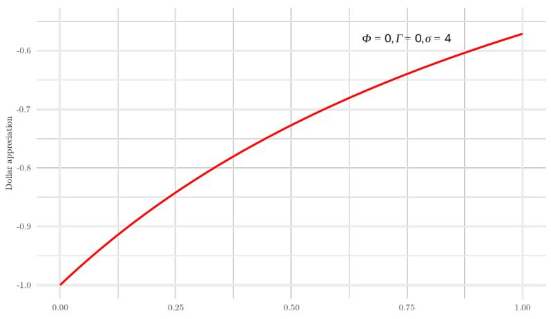

In 2025, however, the dollar has weakened, not strengthened. The solid thick red line in Figure 15b shows the tariff rate on Chinese imports surged, yet the dashed red line has increased, if anything, representing a depreciation of the dollar against the renminbi. Similarly, aggregate tariffs have risen sharply and the trade-weighted dollar has significantly depreciated.

Figure 15: Tariffs and Exchange Rate Changes, US and China  
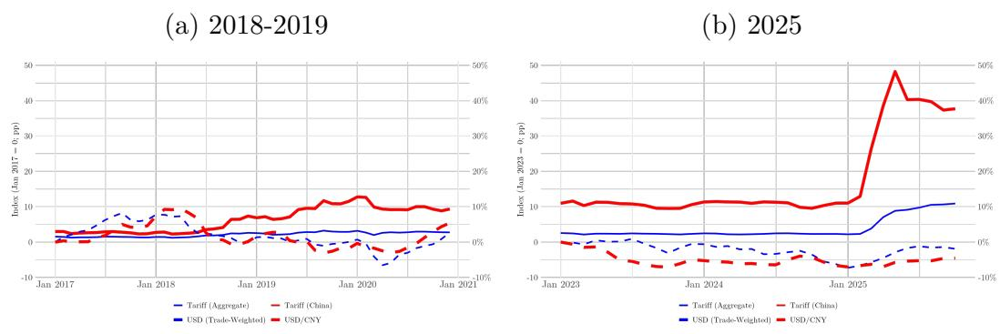

The scatterplot in Figure 16a shows, for each exporter to the United States, the 12-month change through September 2025 in the bilateral exchange rate and the change in actual tariff rate, with larger circles representing larger exporters. A large majority of the circles are located above the x-axis, indicating the dollar has broadly depreciated against the currencies of most U.S. trading partners. Fitting these data requires a slight downward slope, implying a smaller bilateral depreciation against exporters facing larger tariffs, though this is partly driven by China, the rightmost circle. Figure 16b ranks the largest exporters to the United States in descending order of the increase in tariff experienced in 2025. There is only a weak relationship between the cross-country distribution of bilateral tariffs and the cross-country pattern of bilateral exchange rate changes.

Figure 16: Tariffs and Exchange Rate Changes  
(a) Largest 50  
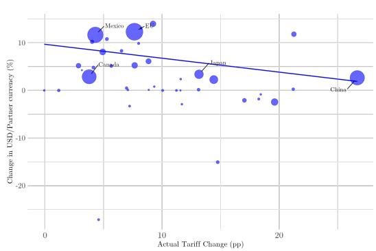

(b) Largest 10 Exporters  
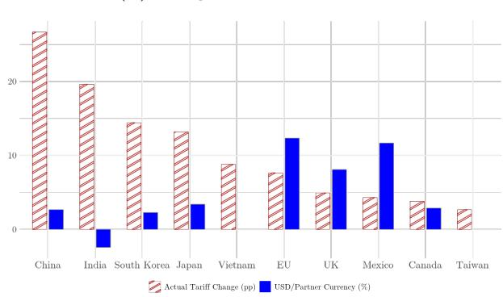

## 8.3 Dollar disconnect

Unlike 2018-19, the recent dollar movement has defied theory, even qualitatively, by depreciating instead of appreciating. One possibility is that our focus should shift to richer theories that allow for import tariffs to directly cause the importer's currency to weaken, such as the wave of recent work including Auclert, Rognlie and Straub (2025), Costinot and Werning (2025), Itskhoki and Mukhin (2025), and Werning, Lorenzoni and Guerrieri (2025).

More likely, we believe, is that other policies and macroeconomic forces have pushed the exchange rate in the other direction, and more forcefully. For example, when “Liberation Day” tariffs were announced in April 2025, it led to a large surge in uncertainty and to expectations that the U.S. economy would slow, prompting the Fed to cut interest rates faster and leading to a dollar depreciation. Consistent with – and potentially amplifying – this dynamic, reports suggest foreign investors started hedging their dollar exposure to a greater extent than in the past, as discussed in Shin, Wooldridge and Xia (2025).

## 9 Conclusion

Currently, the actual tariff rates on U.S. imports are not nearly as large as policy announcements suggest, but they are still historically large and reshaping U.S. trade patterns. Pass-through to import prices is high, China's share of U.S. imports has collapsed, and U.S. manufacturers face higher input costs. Important questions remain. Will the statutory-actual gap close, expand, or persist? How much of the shift in U.S. import patterns simply reflects transshipment of Chinese value-added? How will U.S. manufacturing respond to the production tariffs that we calculate? And what might be behind the dollar's depreciation, which is at odds with many standard models of the effects of tariffs? We hope our work offers helpful context in evaluating the initial implications of the 2025 U.S. import tariffs and hope future work makes progress on these essential issues.

## References

Alfaro, Laura and Davin Chor, “An Anatomy of the Great Reallocation in US Supply Chain Trade,” Technical Report, National Bureau of Economic Research 2025.

Amiti, Mary, Stephen J Redding, and David E Weinstein, “The impact of the 2018 tariffs on prices and welfare,” Journal of Economic perspectives, 2019, 33 (4), 187–210.

Auclert, Adrien, Matthew Rognlie, and Ludwig Straub, “The macroeconomics of tariff shocks,” Technical Report, National Bureau of Economic Research 2025.

Burstein, Ariel and Gita Gopinath, “International prices and exchange rates,” in “Handbook of international economics,” Vol. 4, Elsevier, 2014, pp. 391–451.

Calvo, Guillermo A, “Staggered prices in a utility-maximizing framework,” Journal of monetary Economics, 1983, 12 (3), 383–398.

Cavallo, Alberto, Gita Gopinath, Brent Neiman, and Jenny Tang, “Tariff pass-through at the border and at the store: Evidence from us trade policy,” American Economic Review: Insights, 2021, 3 (1), 19–34.

\_, Paola Llamas, and Franco M Vazquez, “Tracking the short-run price impact of US tariffs,” Technical Report, National Bureau of Economic Research 2025.

Chor, Davin, Matthew Grant, and Bingjing Li, “Exclusions for Sale? Tariff Exclusions in the US-China Trade War,” Working Paper, 2025.

Cleveland, R. B., W. S. Cleveland, J. E. McRae, and I. Terpenning, “STL: A Seasonal-Trend Decomposition Procedure Based on LOESS (with Discussion),” Journal of Official Statistics, 1990, 6 (1), 3–73.

Costinot, Arnaud and Iván Werning, “How tariffs affect trade deficits,” Technical Report, National Bureau of Economic Research 2025.

Fajgelbaum, Pablo D, Pinelopi K Goldberg, Patrick J Kennedy, and Amit K Khandelwal, “The return to protectionism,” The quarterly journal of economics, 2020, 135 (1), 1–55.

–, –, –, and –, “Updates to Fajgelbaum et al.(2020) with 2019 Tariff Waves,” chrome-extension://efaidnbmnnnibpcajpcglclefindmkaj/http://www.econ.ucla.edu/pfajgelbaum/rtp\_update.pdf, 2020.

Feenstra, Robert C and Chang Hong, “Estimating the Regional Welfare Impact of Tariff Changes: Application to the United States,” Technical Report, National Bureau of Economic Research 2024.

Gopinath, Gita and Oleg Itskhoki, “Dominant currency paradigm: A review,” Handbook of international economics, 2022, 6, 45–90.

\_, Emine Boz, Camila Casas, Federico J. Díez, Pierre-Olivier Gourinchas, and Mikkel Plagborg-Møller, “Dominant Currency Paradigm,” American Economic Review, March 2020, 110 (3), 677–719.

\_, Pierre-Olivier Gourinchas, Andrea F. Presbitero, and Petia Topalova, "Changing global linkages: A new Cold War?," Journal of International Economics, None 2025, 153 (C), None.

Hankins, Kristine W, Morteza Momeni, and David Sovich, “Consumer credit and the incidence of tariffs: Evidence from the auto industry,” American Economic Review, 2026, 116 (2), 627–673.

Hayakawa, Kazunobu, Han-Sung Kim, and Taiyo Yoshimi, “Exchange rate and utilization of free trade agreements: Focus on rules of origin,” Journal of International Money and Finance, 2017, 75, 93–108.

International Monetary Fund, “World Economic Outlook, October 2025,” World Economic and Financial Surveys, International Monetary Fund October 2025.

Itskhoki, Oleg and Dmitry Mukhin, “The optimal macro tariff,” Technical Report, National Bureau of Economic Research 2025.

Johnson, Robert C and Guillermo Noguera, “Accounting for intermediates: Production sharing and trade in value added,” Journal of international Economics, 2012, 86 (2), 224–236.

Kimball, Miles S, “The Quantitative Analytics of the Basic Neomonetarist Model,” Journal of Money, Credit and Banking, 1995, 27 (4), 1241–1277.

Klenow, Peter J and Jonathan L Willis, “Real rigidities and nominal price changes,” Economica, 2016, 83 (331), 443–472.

Minton, Robbie and Mariano Somale, “Detecting Tariff Effects on Consumer Prices in Real Time,” FEDS Notes: Board of Governors of the Federal Reserve System, 2025.

Shin, Hyun Song, Philip Wooldridge, and Dora Xia, “US dollar’s slide in April 2025: the role of FX hedging,” BIS Bulletins 105, Bank for International Settlements Jun 2025.

Werning, Iván, Guido Lorenzoni, and Veronica Guerrieri, “Tariffs as Cost-Push Shocks: Implications for Optimal Monetary Policy,” Technical Report, National Bureau of Economic Research 2025.

## Appendix

## Table A1: NAICS-based Sectoral Definitions

NAICS Definition Share of US Imports (2024) Actual Tariff (Sept 2025)
(1) 111 Crop Production 1.5% 8%
(2) 112 Animal Production and Aquaculture 0.4% 12%
(3) 211 Oil and Gas Extraction 5.1% 0%
(4) 212 Mining (except Oil and Gas) 0.2% 4%
(5) 311 Food Manufacturing 3.6% 12%
(6) 312 Beverage and Tobacco Product Manufacturing 1.0% 7%
(7) 313 Textile Mills 0.3% 22%
(8) 314 Textile Product Mills 0.7% 31%
(9) 315 Apparel Manufacturing 2.6% 32%
(10) 322 Paper Manufacturing 0.8% 12%
(11) 324 Petroleum and Coal Products Manufacturing 2.1% 0%
(12) 3251 Basic Chemical Manufacturing 1.8% 12%
(13) 3252 Resin, Synthetic Rubber, and Artificial & Synthetic Fibers 0.7% 11%
(14) 3253 Pesticide, Fertilizer, and Agricultural Chemicals 0.4% 6%
(15) 3254 Pharmaceutical and Medicine Manufacturing 7.6% 1%
(16) 326 Plastics and Rubber Products Manufacturing 2.2% 21%
(17) 327 Nonmetallic Mineral Product Manufacturing 0.9% 20%
(18) 331 Primary Metal Manufacturing 4.1% 20%
(19) 332 Fabricated Metal Product Manufacturing 3.0% 35%
(20) 3331 Agriculture, Construction, and Mining Machinery 1.5% 25%
(21) 3333 Commercial and Service Industry Machinery 0.5% 19%
(22) 3335 Metalworking Machinery Manufacturing 0.5% 21%
(23) 3336 Engine, Turbine, and Power Transmission Equipment 0.8% 25%
(24) 3339 Other General Purpose Machinery Manufacturing 2.4% 23%
(25) 3342 Communications Equipment Manufacturing 3.9% 10%
(26) 3343 Audio and Video Equipment Manufacturing 1.2% 16%
(27) 3344 Semiconductor and Electronic Component Manufacturing 3.6% 9%
(28) 3345 Navigational, Measuring, and Control Instruments 2.4% 13%
(29) 335 Electrical Equipment, Appliance, and Component Manufacturing 5.9% 23%
(30) 33611 Automobile and Light Duty Motor Vehicles 7.8% 19%
(31) 33631 Motor Vehicle Gasoline Engine and Engine Parts 0.6% 21%
(32) 33632 Motor Vehicle Electrical Equipment 0.8% 13%
(33) 33633 Motor Vehicle Steering and Suspension 0.6% 20%
(34) 33634 Motor Vehicle Brake Systems 0.2% 25%
(35) 33635 Motor Vehicle Transmission and Power Train Parts 0.3% 20%
(36) 33636 Motor Vehicle Seating and Interior Trim 0.3% 8%
(37) 33639 Other Motor Vehicle Parts 1.5% 22%
(38) 33641 Aerospace Product and Parts Manufacturing 1.8% 7%
(39) 33699 Other Transportation Equipment Manufacturing 0.3% 27%
(40) 337 Furniture and Related Product Manufacturing 1.2% 28%
(41) 33911 Medical Equipment and Supplies Manufacturing 1.7% 12%
(42) 33991 Jewelry and Silverware Manufacturing 1.2% 20%
(43) 33992 Sporting and Athletic Goods Manufacturing 0.3% 31%
(44) 33993 Doll, Toy, and Game Manufacturing 0.8% 26%