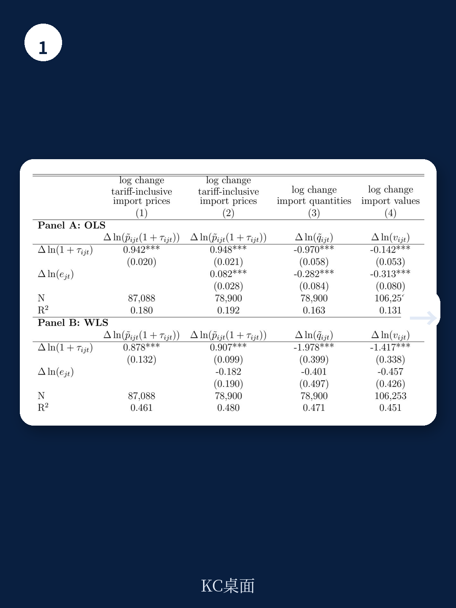
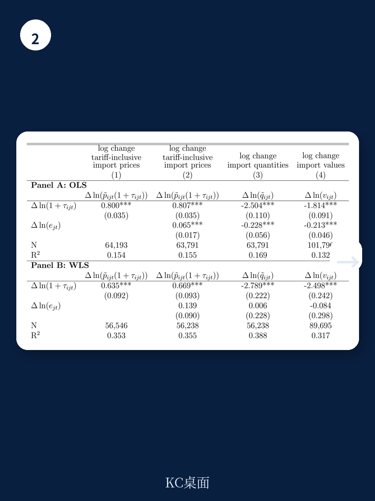

# 世界贸易组织：中国对美出口份额降至8%，世界贸易组织解析供应链重组真实性

2025年，美国对进口商品征收的法定关税税率已升至百年未见的水平。但一个被广泛忽视的事实是，实际落地税率仅为法定税率的一半左右。世界贸易组织首席经济学家Gita Gopinath与Brent Neiman在2026年2月发布的工作论文中，系统拆解了这一“法定-实际”缺口及其对价格、供应链和美元的深远影响。这份报告的核心判断是：关税的冲击远小于政策公告所暗示的程度，但美国自身承担了绝大部分成本。

这一结论之所以重要，是因为市场对关税影响的定价可能已经过度。2025年4月，当法定税率一度飙升至32.8%时，全球资产价格剧烈波动，供应链焦虑蔓延。然而，截至9月，实际税率仅升至14.1%，且此后并未出现市场预期的快速收敛。报告指出，推动缺口收窄的力量只有一项，而维持甚至扩大缺口的因素却有多个。这意味着，围绕关税的叙事需要从“总量冲击”转向“结构性穿透”。

本文基于这份报告的解析，提炼出四个关键层次：实际税率为何远低于法定税率、关税成本如何被转嫁、供应链重组是否真正发生、以及美元为何在关税加征期间反常走弱。每一层都指向一个共同的结论——理解关税的影响，不能只看公告，必须追踪落地。

> **KC评论：** 这份报告最有价值的部分不是结论本身，而是它提供了拆解“法定-实际”缺口的分析框架。对于跟踪宏观和产业影响的人来说，真正需要关注的是实际税率的边际变化，而不是政策新闻标题。继续看原文，你会发现报告对半导体、汽车、机械等关键行业的实际税率做了逐一拆解，这些图表和假设路径才是判断资产定价和供应链调整的核心依据。完整报告与KC评论在每日汇编。

## 1. 法定税率与实际税率之间存在结构性缺口，且短期内不会弥合

报告的起点是一个反直觉的数据：2025年9月，美国进口商品的贸易加权法定税率为27.4%，但实际税率仅为14.1%。两者之间13.3个百分点的缺口，并非统计误差，而是由四个结构性因素共同造成。

第一，航运时滞。货物在运输途中适用启运时的税率，这一“在途豁免”意味着新关税从宣布到实际执行存在1-3个月的延迟。报告用英国出口的泵类产品做了精准对比：空运货物几天内到港，法定与实际税率几乎同步；海运短途货物延迟约一个月；经巴拿马运河的长途海运则延迟两个月。这一因素会随时间自然消退，是唯一推动缺口收窄的力量。

第二，产品和公司豁免。半导体是一个典型例子。尽管半导体面临的法定税率为24%，但由于美国在2025年4月宣布的“对等关税”中明确豁免了多种半导体产品，其实际税率仅9%。这一豁免也解释了为何中国台湾的法定税率高达28%，实际税率却只有8%。报告显示，豁免清单仍在动态调整中，近期新增了香蕉和咖啡等品类。

第三，USMCA利用率飙升。美墨加协定的合规申报成本较高，但当关税足够高时，进口商愿意承担这些成本。2024年，加拿大和墨西哥输美商品的USMCA利用率不到50%；到2025年9月，这一比例已接近90%。这一变化为实际税率贡献了约2个百分点的下行压力。

第四，执法与逃税。报告谨慎地指出，不均衡的执法和日益复杂的逃税手段也在扩大缺口，且这一因素可能随时间强化。

综合来看，推动缺口收窄的因素只有一个（航运时滞），而维持甚至扩大缺口的因素有三个（豁免、USMCA利用、逃税）。报告因此判断，实际税率不太可能在未来数月内完全追赶法定税率。

## 2. 关税传导率接近100%，美国承担了绝大部分成本

关税的经济归宿取决于出口商是否降价。如果出口商降价，则部分成本由出口国承担，美国进口价格涨幅小于关税涨幅，即传导率低；反之，美国承担全部成本，传导率高。

报告的理论框架指出，传导率取决于两个参数：出口商边际成本对产量的敏感度，以及需求对价格的敏感度。如果出口商具有规模不经济（产量下降时边际成本下降），或需求弹性较高，则出口商有动机降价，传导率降低。但实证结果明确指向另一个方向。

报告采用多种方法估计，2018-2019年关税的传导率约为80%，2025年关税的传导率约为94%。尽管2025年的高传导率可能部分反映观测窗口较短（出口商的定价调整需要时间），但两个时期的共同结论是：美国进口价格几乎与关税同步上涨，出口商没有普遍降价。

这一结论的政策含义极为重要。它意味着，关税本质上是对美国消费者和制造企业的直接征税。报告进一步将这一逻辑延伸到生产端：通过投入产出表测算，部分高度依赖进口中间品的制造业部门，其“生产关税”税率（即对生产成本的等效税负）在2025年上升了超过2个百分点，制造业整体上升超过1个百分点。

> **KC评论：** 高传导率意味着，关税对通胀的推升作用比许多市场参与者预期的更直接。但报告也留下了一个值得追问的问题：如果出口商不降价，他们的利润率和市场份额如何变化？不同行业和国家的差异有多大？原文中按NAICS行业分类的详细图表，以及按出口国拆解的传导率估算，是理解这一问题的关键。完整报告与图表合集在每日汇编中，便于喂给AI做进一步分析。

## 3. 供应链重组正在发生，但“中国+1”的真实性需要进一步验证

关税的第三个可观测效应是进口来源地的转移。报告数据显示，中国在美国商品进口中的份额从2017年底的22%降至2024年底的约12%，到2025年9月进一步降至8%。印度和越南等“中国+1”策略中的典型国家，获得了最大的份额增长。

这一变化看似印证了供应链分散化的主流叙事。但报告提出了一个关键但尚未回答的问题：印度和越南对美出口的增长，有多少是真正的本地增加值，有多少只是中国增加值经由这些国家重新路由？如果后者占主导，那么供应链的“去中国化”可能只是统计幻觉，全球生产网络的实际地理分布并未发生根本改变。

这一问题的答案对多个层面至关重要。对企业而言，它决定了关税规避策略的可持续性；对政策制定者而言，它决定了关税能否真正实现“制造业回流”的目标；对投资者而言，它决定了哪些国家或地区将真正受益于供应链重构。

报告没有给出明确结论，但暗示了未来研究的方向：需要更细致的贸易增加值数据来拆解供应链的真实变化。

## 4. 美元在关税加征期间反常走弱，报告指出了但未完全解释这一矛盾

标准理论预测，美国加征进口关税应导致美元升值。逻辑是：关税减少进口需求，从而减少对外币的需求，同时关税带来的不确定性可能引发避险资金流入美元。2018-2019年的关税周期确实符合这一预测，美元在那一时期走强。

但2025年的情况截然相反。尽管美国大幅加征关税，美元却显著贬值。报告对此提出了一个推测性的解释：可能还有其他力量在发挥作用，抵消了关税对美元的升值压力。例如，市场对美国财政可持续性的担忧、其他经济体相对增长前景的变化、或全球储备货币体系的结构性演变。

报告没有深入展开这一分析，但指出2025年4月美元的大幅贬值与外汇对冲活动的变化有关（引用了BIS 2025年6月的简报）。这暗示，美元走势的反常可能部分反映了金融市场对关税冲击的定价方式，而非贸易流量的直接反应。

> **KC评论：** 美元走弱与关税加征并存的局面，是目前宏观定价中最令人困惑的矛盾之一。报告承认这一矛盾，但没有给出完整解释。这意味着，理解美元后续走势可能需要跳出关税本身，关注更广泛的资本流动、财政政策和地缘政治因素。完整报告中对汇率传导率的估算，以及与2018-2019年的对比分析，是建立自己判断框架的起点。

## 5. 报告尚未完全回答的关键问题：关税的长期结构性影响

这份报告在实证上极为扎实，但也留下了一些重要的未解问题。

第一，关税对消费者价格的传导存在时滞。报告聚焦于进口价格，但进口价格到零售价格的传导涉及批发、零售、库存等多个环节。这一传导的速度和幅度，决定了关税对通胀的实际影响，而报告对此着墨不多。

第二，USMCA利用率飙升的可持续性。当前近90%的利用率是在关税急剧上升的背景下实现的。如果关税水平回落，或企业发现合规成本高于关税节省，利用率可能下降。报告没有讨论这一逆向情景。

第三，逃税和执法漏洞的演化方向。报告指出逃税是扩大缺口的因素之一，但没有量化其规模，也没有讨论美国海关和边境保护局的执法能力是否足以应对日益复杂的规避手段。

第四，美元走势与关税之间的背离是否意味着理论框架需要修正。如果关税不再伴随美元升值，那么其对贸易逆差和国内制造业的长期影响可能与历史经验不同。

这些未解问题，恰恰是持续跟踪和深度讨论的价值所在。

---

更多国际信源汇编与评论，每日更新，汇总国际主流叙事、数据与图表，观测边际变化。每日汇编将单篇报告放回当天主线，整理成中文摘要、KC评论和图表合集，便于喂给AI做快速分析，也便于人工扫市场dynamics。汇聚了头部券商、PE/VC、投行、并购、hedge fund、资管机构、战略咨询、智库等朋友，期待交流。

Personal reading notes and learning share only. Not investment advice.
