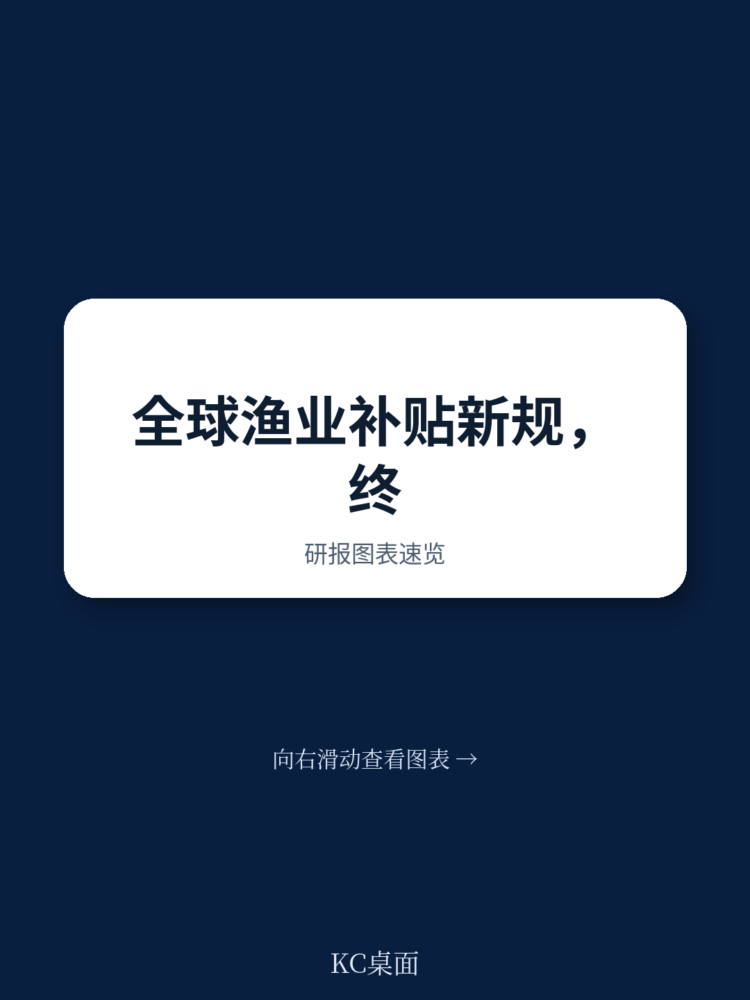

# 世界贸易组织：WTO渔业补贴协定生效，透明度革命如何改变供应链韧性

2025年9月15日，一个对全球海洋治理具有里程碑意义的时刻到来：世界贸易组织《渔业补贴协定》正式生效。这份历经二十余年谈判、在2022年通过的协定，终于跨过了需要三分之二成员批准的门槛。

这份协定回答了一个根本性问题：当全球35.5%的鱼群被过度捕捞，当政府每年花费220亿美元补贴扩大捕捞能力时，国际贸易规则能否成为扭转局面的关键力量？

答案是明确的。这份协定不仅禁止了三种最有害的补贴形式，更重要的是建立了一个前所未有的透明度框架。它意味着，那些让船队可以在海上航行更久、捕捞更远的补贴，那些助长非法捕捞、破坏已枯竭鱼群的公共资金，将被正式纳入多边贸易规则的约束范围。

但这不仅仅是一份环保文件。它同时是国际贸易治理的一次制度创新：通过补贴纪律来间接管理全球公共资源，通过透明度要求来建立同行压力，通过设立专门基金来帮助发展中国家完成转型。对于关注全球治理、供应链韧性、以及“蓝色经济”前景的读者来说，这份协定带来的影响远比表面看起来更深。

> **KC评论：** 理解这份协定的关键不在于记住那些补贴禁止条款，而在于它如何改变了游戏规则。以前，渔业补贴是各国政府可以自由使用的产业政策工具；现在，它变成了WTO的可诉行为。这意味着，任何参与全球渔业贸易的国家，其补贴政策都可能被拿到多边平台上审查。对于中国这样的渔业大国，这个转变值得高度关注。

继续看原文，真正有价值的是协定中关于透明度义务的具体条款、对发展中国家的特殊安排，以及“和平条款”的两年窗口期。完整报告与KC评论在每日汇编中，可以系统梳理这些制度设计的逻辑链条。

## 1. 三大禁令直指补贴“黑洞”：非法捕捞、枯竭鱼群与公海无管制区

这份协定最核心的突破，是明确禁止了三类最有害的渔业补贴。

第一类是针对非法、不报告、不管制（IUU）捕捞的补贴。当沿海国、船旗国或区域渔业管理组织认定某艘船或经营者从事IUU捕捞时，所有WTO成员都不得再向其提供补贴。这等于从资金源头上切断了非法捕捞的生存空间。

第二类是针对已过度捕捞鱼群的补贴。如果某个鱼群被认定为过度捕捞状态，成员不能再用公共资金补贴针对该鱼群的捕捞活动。唯一的例外是，如果补贴用于重建该鱼群至生物可持续水平，才被允许。

第三类是在无管制的公海区域进行捕捞的补贴。对于那些没有任何区域渔业管理组织覆盖的公海区域，补贴也被全面禁止。

这三类禁令形成了一个完整的逻辑闭环：从最恶劣的非法行为，到管理失效的枯竭资源，再到治理空白的公海地带。每一类都瞄准了补贴最容易被滥用、对海洋生态破坏最严重的环节。

> **KC评论：** 这三类禁令的巧妙之处在于，它们没有直接要求各国减少捕捞量，而是切断了补贴这个“燃料”。这符合WTO的职能边界——它不直接管理渔业资源，但可以管理扭曲贸易的补贴。对于投资者来说，这意味着那些依赖政府补贴维持运营的远洋捕捞企业，其商业模式面临根本性挑战。

## 2. 透明度革命：从“黑箱”到“公示”的范式转换

如果说三大禁令是“牙齿”，那么透明度条款就是协定的“神经系统”。这份协定要求成员提供大量此前从未被要求公开的渔业相关信息。

每个渔业补贴项目，成员都必须通知：补贴针对的捕捞活动类型、补贴渔场的鱼群状况、用于判断鱼群状况的参考点、该鱼群是否与其他成员共享或由区域组织管理、相关的保护和管理措施、受补贴船队的捕捞能力、受补贴船舶的名称和识别号、以及这些渔场的渔获数据。

这相当于要求各国政府把自己渔业补贴的“家底”全部摆到台面上。对于长期缺乏透明度的全球渔业补贴体系来说，这无疑是一次信息革命。

更值得关注的是，这些信息不仅会在WTO内部共享，还将向公众公开。这意味着，非政府组织、学术机构、媒体乃至普通公众，都将获得前所未有的监督工具。此前，全球渔业补贴的真实规模、流向和效果，很大程度上依赖于学者的估算；未来，这些数据将由各国政府自己提供，并通过WTO的委员会机制进行同行审查。

这种透明度机制的设计，借鉴了WTO在贸易政策审议方面的成功经验。它不依赖强制执行，而是通过信息披露和同行压力来推动行为改变。对于许多发展中国家来说，这也意味着它们将获得一个了解其他成员补贴政策的信息窗口，从而在谈判和竞争中处于更有利的位置。

## 3. 发展中国家的“两年窗口”与“鱼基金”：平衡术的微妙设计

任何多边协定都需要处理发达国家与发展中国家之间的利益平衡。这份协定的解决方案是：为发展中国家和最不发达国家设立“和平条款”，同时建立“WTO鱼基金”提供技术和资金支持。

“和平条款”意味着，在协定生效后的两年内，其他WTO成员不得就发展中国家和最不发达国家在其专属经济区内提供的补贴诉诸争端解决机制。这为这些国家提供了调整国内政策、完善法律框架的缓冲期。

“鱼基金”则由成员自愿捐款支持，目标是帮助发展中国家和最不发达国家：调整补贴措施以符合WTO规则、更新法律和监管框架、提交协定要求的通知、加强机构能力建设、以及完善渔业管理系统。基金已经启动第一轮项目征集。

这种设计的深层逻辑是：与其强制所有成员在同一时间点达标，不如提供一个“能力建设+过渡期”的组合方案。毕竟，许多发展中国家和最不发达国家的渔业管理能力薄弱，直接要求它们遵守复杂的补贴纪律，既不现实也不公平。

但“和平条款”只有两年。这意味着，从2025年9月到2027年9月，这些国家有一个明确的窗口期来完成国内改革。时间紧迫，但方向已定。

## 4. 报告尚未完全回答的关键问题：执行与监督的“最后一公里”

尽管这份协定在制度设计上堪称精巧，但有几个关键问题尚未得到充分解答。

第一个问题是争端解决机制的适用性。WTO的上诉机构目前仍处于瘫痪状态。如果成员之间就渔业补贴产生争议，能否通过有效的争端解决程序来裁决？如果裁决无法执行，协定的约束力将大打折扣。

第二个问题是“鱼基金”的资金规模与可持续性。基金依赖自愿捐款，而全球面临的经济下行压力可能影响捐款意愿。如果资金不足，发展中国家和最不发达国家的执行能力将受到制约。

第三个问题是区域渔业管理组织的能力差异。协定的许多条款依赖于这些组织的认定和判断。但不同区域组织的能力、透明度和治理水平参差不齐。一个薄弱的区域组织可能成为整个体系的短板。

第四个问题是协定的覆盖范围。目前谈判仍在进行“第二部分”，旨在处理更多类型的渔业补贴，特别是那些导致产能过剩和过度捕捞的补贴。第一阶段的成功执行，将为第二阶段谈判奠定基础，但也可能暴露更多深层次分歧。

这些未解问题，恰恰是读者需要阅读完整报告、关注后续谈判进展的原因。协定的成功不仅取决于文本本身，更取决于未来几年内各成员的实际行动。

## 5. 对读者的观察框架：三个维度判断协定落地效果

对于希望跟踪这份协定实际影响的读者，可以从三个维度建立观察框架。

**维度一：通知义务的完成度。** 协定生效后，成员需要定期提交通知。通知的数量、质量和及时性，是衡量透明度承诺兑现程度的最直接指标。如果主要渔业大国（中国、欧盟、日本、美国、韩国等）的通知迟迟不到位，或者信息严重不足，说明执行力存在问题。

**维度二：争端解决案例的出现频率与性质。** 在“和平条款”到期后，是否会出现针对渔业补贴的争端？这些争端涉及哪些类型的补贴、哪些国家？争端解决的结果如何？这些案例将形成判例，塑造协定的实际解释和适用范围。

**维度三：区域渔业管理组织的互动。** 协定要求与这些组织保持密切联系。观察这些组织如何调整其认定程序、如何与WTO委员会对接，将揭示多边贸易规则与区域资源管理规则之间的协同程度。

对于关注“蓝色经济”的投资者而言，这些维度将帮助判断哪些渔业企业的商业模式面临调整压力，哪些国家可能成为补贴纪律的受益者或受害者。更重要的是，它将揭示全球公共资源治理从“自愿承诺”向“有约束力的规则”转变的演进路径。

---

这份协定的生效，标志着全球海洋治理进入了一个新阶段。但它只是起点，而非终点。真正的挑战在于如何将纸面上的规则转化为水面下的行动。

更多国际信源汇编与评论，扫码交流，每日更新。我们汇总国际主流叙事、数据与图表，观测边际变化。每日汇编将单篇报告放回当天主线，整理成中文摘要、KC评论和图表合集，便于喂给AI，也便于人工快速扫描市场dynamics。这里汇聚了头部券商、PE/VC、投行、并购、hedge fund、资管机构、战略咨询、智库等朋友，期待交流。

Personal reading notes and learning share only. Not investment advice.
