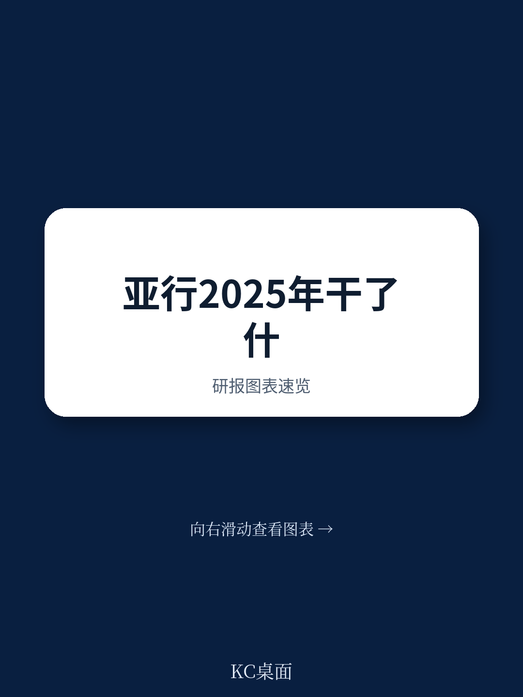
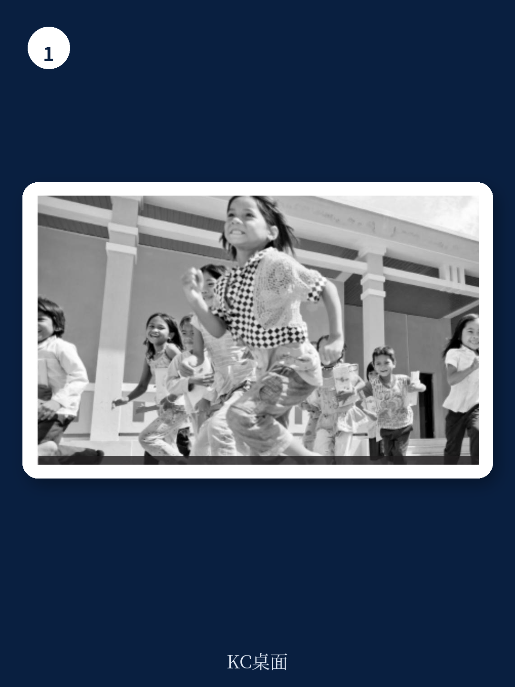

# 亚洲开发银行：亚洲开发银行撬动60亿美元私人资本，2025年操作答卷解读

2025年，亚洲开发银行（ADB）交出了一份总额293亿美元的操作答卷，其中联合融资贡献了147亿美元。但比这些数字更值得关注的，是这家多边开发银行正在发生的一系列制度性变化——这些变化正在重新定义它未来十年在亚太地区的发展角色。如果你仍然把亚行仅仅视为一个“基础设施贷款机构”，那么这份2025年成员概况报告可能会让你重新思考。

报告的核心判断是：亚行正在从传统的“项目贷款银行”转向一个更灵活、更强调私人资本撬动、甚至敢于触碰核能等敏感领域的“发展解决方案平台”。这并非一次简单的业务调整，而是在全球地缘政治不确定性、发展中国家债务压力上升、以及气候融资需求爆发的多重背景下，亚行对自身生存和发展逻辑的一次深刻重构。

## 1. 修宪级变革：解除贷款限制，为未来十年扩张铺路

2025年，亚行完成了一项看似技术性、实则影响深远的制度变革：修改了创始章程，移除了一项贷款限制条款。这项修改的核心意义在于，亚行可以在不要求股东进行普遍增资的情况下，扩大对发展中国家的支持规模。

这意味着什么？在过去，多边开发银行的贷款能力受到其资本基数的严格约束。要扩大贷款规模，通常需要成员国同意增资，这是一个漫长且充满政治博弈的过程。而此次修宪，相当于为亚行“松绑”，使其能够更灵活地利用现有资本，去应对气候变化、疫后复苏等紧迫议题。

> **KC评论：** 这可以理解为亚行给自己的资产负债表加了一个“杠杆”。它不要求成员国立刻多掏钱，但允许银行在风险可控的前提下，更高效地使用现有资本金。对于关注亚太基础设施和绿色转型的读者来说，这意味着未来几年亚行的项目审批速度和规模可能会超出市场预期。完整报告中对这一修宪的具体条款和风险控制机制有更详细的拆解，值得细读。

这一变化对亚行未来的运营模式、项目选择以及资产负债表管理都将产生深远影响。它不再是简单地“有多少钱办多少事”，而是转向“如何用同样的钱办更多的事”。继续看原文，真正有价值的是图表、假设和验证路径；完整报告与KC评论在每日汇编。

## 2. 私人资本：从配角到核心引擎的角色升级

报告明确提到，亚行在2025年推出了新的指导方针，旨在将私营部门解决方案整合到项目周期的每一个阶段。这不仅仅是口号上的转变。数据印证了这一点：2025年，亚行通过自有资金完成的私营部门贷款、股权投资和担保总额达到31亿美元，涉及49笔交易，覆盖经济和社会基础设施、金融和农业等领域。更值得关注的是，亚行直接撬动的私人资本达到60亿美元，另有37亿美元通过贸易和供应链金融及小额信贷项目撬动。

这套“政策改革+项目孵化+资本撬动”的组合拳，是亚行应对亚太地区巨大基础设施融资缺口的核心策略。它不再试图用公共资金去填满所有缺口，而是致力于创造一个让私人资本愿意进入的“可融资环境”。

> **KC评论：** 关键不在于亚行自己投了多少钱，而在于它每投入1美元，能带动多少私人资本跟进。2025年这个撬动比例相当可观，但报告没有完全展开的是，这些被撬动的私人资本最终流向了哪些具体行业和地区，以及它们的风险回报特征如何。这些细节决定了这一模式的可复制性和可持续性。建议在完整报告中仔细阅读“融资伙伴关系”章节的图表。

## 3. 能源政策转向：拥抱核能，一个务实但充满争议的决策

2025年亚行更新了能源政策，其中最引人注目的变化是：在严格的安全、安保、环境和社会保障以及全生命周期成本评估的前提下，亚行开始支持核能项目。

这是一个标志性的转向。长期以来，多边开发银行对核能的态度普遍谨慎甚至回避。亚行的这一决定，反映了其对亚太地区能源安全与脱碳目标之间矛盾的务实认知。对于许多缺乏化石燃料资源、同时又面临巨大减排压力的发展中国家而言，核电被视为一种稳定、低碳的基荷电源选项。

然而，这一政策转向也带来了新的问题：亚行内部和成员国之间对此的共识度如何？具体的评估标准和项目筛选流程是什么？报告提到了“严格评估”，但并未详细展开。这恰恰是理解亚行未来能源投资组合风险的关键。

## 4. 文莱视角：一个“小股东”的参与样本

这份成员概况报告以文莱达鲁萨兰国为具体案例。文莱2006年加入亚行，截至2025年底，其资本认购额为5.1245亿美元，占总股份的0.351%。它还向亚行的特别基金（亚洲发展基金和技术援助特别基金）累计承诺了2231万美元。

文莱的角色是典型的“小股东+出资方”。它不依赖亚行的大规模贷款，而是通过参与特别基金，间接支持亚行对低收入成员国的援助。这种模式揭示了亚行治理结构中的一个重要特点：即使是持股比例较小的成员国，也可以通过其出资和投票权，在区域发展议程中发挥影响力。

> **KC评论：** 文莱的案例提醒我们，亚行的成员结构非常多元。既有中国、印度这样的大借款国，也有像文莱这样的小出资国。理解不同成员国的利益诉求和参与模式，是判断亚行未来政策走向的重要维度。报告中对各成员国的持股、投票权和出资情况有详细表格，是理解亚行地缘政治格局的一手资料。

## 5. 报告尚未完全回答的关键问题：私人资本撬动的真实效率与风险

尽管报告展示了亚行在撬动私人资本方面的显著进展，但它并未深入回答一个核心问题：这些被撬动的资本，最终产生了多大的发展影响？其违约率和风险回报是否可持续？

亚行2025年直接撬动了60亿美元私人资本，但这60亿美元投向了哪些具体项目？这些项目在创造就业、减少贫困、改善环境方面的实际效果如何？报告给出了“预计创造超过330万个就业岗位”的宏观数字，但缺乏微观层面的追踪和评估。对于关注发展有效性的读者来说，这恰恰是最值得追问的部分。

## 6. 给你的观察框架：如何跟踪亚行的“新游戏规则”

基于以上分析，我们建议读者从以下三个维度持续跟踪亚行的变化

第一，关注其资产负债表杠杆率的实际变化。修宪之后，亚行的贷款能力上限究竟提高了多少？它是否会因此承担更高的风险敞口？第二，追踪私人资本撬动的“质量”而非仅仅是“数量”。关注亚行年度报告中关于私营部门项目的具体案例、风险分类和影响评估数据。第三，留意核能项目的落地情况。第一个获得亚行支持的核电项目是哪个国家、什么技术路线、以及其审批过程，将成为未来能源政策的风向标。

---

这份亚行成员概况报告，表面上是一份枯燥的制度文件，实则揭示了这家多边开发银行在2025年做出的关键战略抉择。它正在摆脱传统多边机构的刻板印象，试图成为一个更灵活、更市场化、也更敢于面对争议议题的发展伙伴。对于每一个关注亚太地区基础设施、能源转型和资本市场动向的决策者而言，理解这些变化，是把握未来区域发展脉搏的起点。

更多国际信源汇编与评论，每日更新，汇总国际主流叙事、数据与图表，帮助观测边际变化。我们汇聚了来自头部券商、PE/VC、投行、并购、对冲基金、资管机构、战略咨询和智库的朋友，期待与你交流。每日汇编会将单篇报告放回当天主线，整理成中文摘要、KC评论和图表合集，便于喂给AI，也便于人工快速扫描市场动态。

Personal reading notes and learning share only. Not investment advice.
