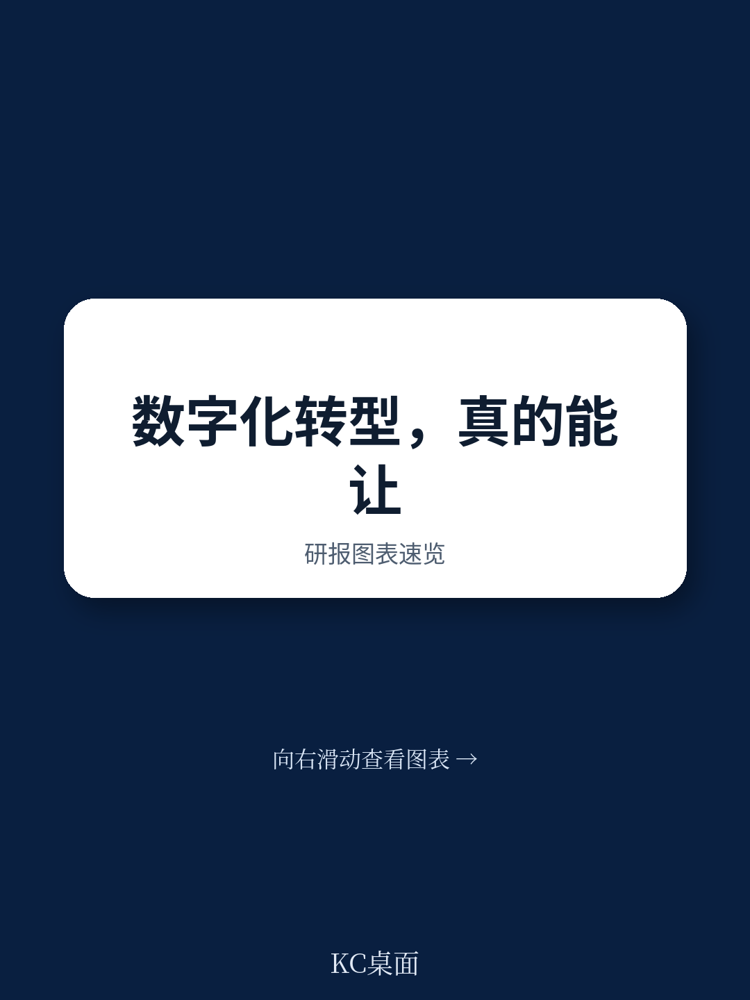
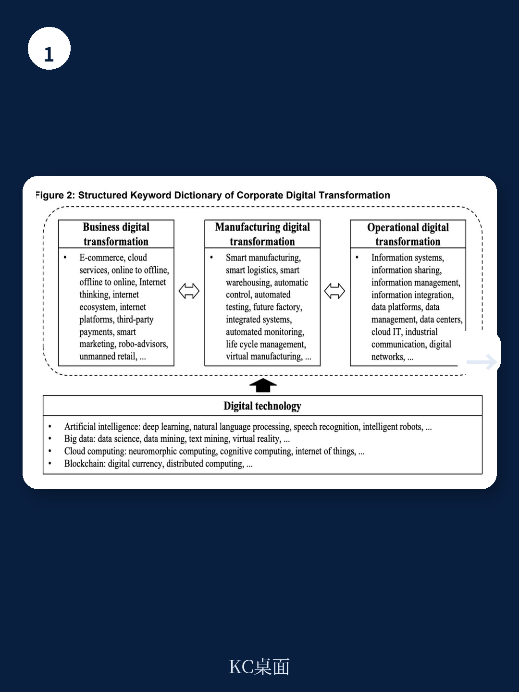
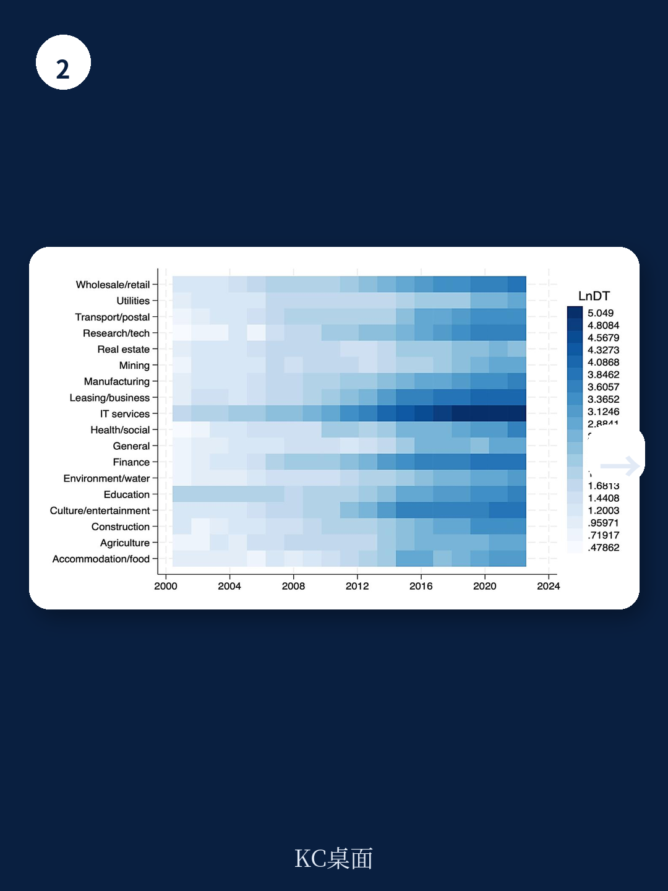

# 亚洲开发银行：中国A股数据揭示，制造端数字化对环保拉动效果最显著

企业数字化转型究竟能带来多少环境绩效的提升？当大多数讨论还停留在“数字化是否增加能耗”的争议时，一份来自亚洲开发银行的工作论文给出了一个值得产业决策者认真对待的量化结论：数字化转型每提升一个标准差，企业环境绩效改善1.34%。这个数字看似不大，但放在中国A股上市公司2009至2022年的长周期样本里，它意味着一个结构性的、可验证的因果关系正在形成。

这份报告最值得关注的判断不是“数字化有利于环保”这个常识性结论，而是它对作用机制的拆解：在绿色创新、环境监测、信息透明度和外部关注这四个传导路径中，环境信息透明度被证明是最强的作用因子，其影响力甚至超过了绿色创新本身。这个发现挑战了业界长期以来“先创新、后治理”的惯性思维——在数字化语境下，透明本身就是一种治理能力。

更关键的是，报告将数字化转型拆解为技术、业务、制造、运营四个维度，并发现制造端的数字化对环保的拉动效果最为显著，其次是运营和技术维度，而单纯改变商业模式（业务数字化）的效果反而最弱。这意味着：那些只在电商、营销、CRM层面做数字化的企业，可能错失了最核心的绿色红利；真正能带来环境绩效跃升的，是发生在工厂车间、供应链管理和生产流程里的数字化改造。

> **KC评论：** 这份报告最实用的价值在于，它给出了一个可操作的优先级排序。如果你是企业管理者，资源有限的情况下，应该优先把数字化投入放在制造环节和运营环节，而不是先去做数字营销或线上渠道。完整报告里还包含了对四个维度各自贡献度的具体数据对比，以及一个“赛马分析”的计量框架，这些细节对制定数字化预算和KPI很有参考意义。继续看原文，真正有价值的是图表、假设和验证路径；完整报告与KC评论在每日汇编。

## 1. 环境信息透明度：被低估的治理杠杆

报告识别了数字化转型改善环境绩效的四条路径：绿色创新、环境监测与沟通、环境信息透明度、外部关注。通过“赛马分析”比较各机制的相对重要性，结果出乎意料：环境信息透明度的作用力最强，其次才是绿色创新和外部关注。

这个发现值得深入解读。传统认知里，企业环保表现提升主要靠技术突破——比如研发更清洁的生产工艺、开发可降解材料。但报告揭示的机制是：数字化首先改变了信息的可及性和可见性。当企业的能耗数据、排放数据、供应链环境风险数据能够被实时采集、自动归集、系统披露时，外部治理力量（监管机构、投资者、媒体、公众）才能真正发挥作用。

这解释了为什么制造端数字化的效果最强。制造环节的数字化改造通常伴随着传感器部署、MES系统上线、工业互联网接入，这些基础设施天然产生了大量可量化的环境数据。一旦这些数据被纳入企业管理信息系统，企业自身的管理团队和外部利益相关者就获得了“看得见的管理工具”。

报告还指出，环境信息透明度的增强不仅依赖于公开披露的信息，也依赖于利益相关者通过非公开渠道获得的信息。数字化转型通过改善企业内部信息系统和外部沟通渠道，同时提升了这两类信息的可用性。这一点对投资者尤其重要——它意味着，一家企业的数字化水平越高，其环境绩效的信息不对称程度就越低，外部监督的有效性就越强。

> **KC评论：** 对投资人来说，这个发现意味着：ESG评级中“环境分”的改善，可能并不完全取决于企业是否安装了昂贵的减排设备，而更多地取决于它是否建立了能够产生可信环境数据的数字化系统。完整报告里有一个关于环境信息透明度的具体衡量方法——基于企业年报中环境信息披露的详细程度和可验证性——这个指标框架可以直接用于筛选标的。

## 2. 制造数字化：最直接的绿色改造路径

报告将数字化转型细分为四个维度：技术数字化（如AI、大数据）、业务数字化（如电子商务、数字营销）、制造数字化（如工业机器人、智能产线）、运营数字化（如ERP、数字化内控）。在控制其他因素后，制造数字化对环境绩效的拉动效果最强。

这个结论有坚实的现实基础。制造数字化直接作用于企业的物理生产流程，它带来的效率提升往往伴随着单位产出的能耗下降和废弃物减少。工业机器人的精准操作减少了材料浪费，数字孪生技术优化了生产工艺参数，智能排产系统降低了设备空转率——这些改进的环保效益是即时且可测量的。

相比之下，业务数字化的效果最弱。报告的解释是：单纯改变商业模式（比如从线下转向线上销售）对环境绩效的边际贡献有限，除非这种模式变革与生产端的数字化改造形成联动。这一点对零售、消费服务等行业的企业尤为重要——如果数字化转型只停留在渠道和营销层面，而没有深入到供应链管理和运营效率，那么它对环保的贡献可能被高估。

运营数字化的效果排在第二位。这包括企业资源规划系统、数字化内控流程、智能办公系统等。这些改造通过优化管理效率间接降低环境足迹，比如减少纸张消耗、优化差旅安排、提升能源管理精度。虽然效果不如制造端直接，但其覆盖范围更广，几乎所有行业的企业都可以从中受益。

> **KC评论：** 这个维度拆解为管理者提供了一个清晰的资源分配指南：如果你的行业是制造业，优先投资制造数字化；如果是服务业或轻资产行业，运营数字化可能是性价比更高的选择。完整报告里还包含了不同行业、不同规模企业的异质性分析，可以帮你判断自己的企业在哪个维度上投入产出比最高。

## 3. 绿色创新：数字化转型的“二阶效应”

报告确认了绿色创新是数字化转型改善环境绩效的重要机制，但这个机制的作用方式值得进一步拆解。数字化对绿色创新的促进不是简单的“技术叠加”，而是通过两个子路径实现的：一是提升企业自身的研发分析能力（AI和大数据帮助科学家更快地筛选材料配方、优化工艺参数），二是促进跨组织的研发协作（工业互联网和区块链让供应链上的创新合作更加高效）。

报告引用的文献指出，数字技术降低了知识的搜索、复制、传输、追踪和验证成本，打破了知识本地化的壁垒。这意味着，一家进行数字化转型的企业，不仅自己更容易产生绿色创新，也更容易吸收外部的绿色技术。这种“开放式创新”效应可能比内部研发效率提升更为重要——尤其是对那些研发能力有限的中小企业。

但报告也提醒，数字化转型本身需要大量的前期投入和维护成本，可能增加能源消耗和电子废弃物。技术选型不当可能导致投资失败。这个“两面性”意味着，数字化转型对绿色创新的促进作用并非自动发生，它取决于企业是否选择了与自身业务特征相匹配的技术路径。

> **KC评论：** 这里有一个尚未完全回答的关键问题：数字化转型对绿色创新的促进作用是否存在阈值效应？即数字化投入需要达到什么水平，才能跨越“成本大于收益”的阶段？报告使用的是连续变量分析，没有给出明确的拐点判断。完整报告中的“宽带中国”准自然实验设计提供了一个外生冲击的分析框架，可以帮助理解这个阈值问题。

## 4. 报告尚未完全回答的关键问题：数字化转型的“黑暗面”究竟有多重？

报告在理论上承认了数字化的潜在负面效应——高能耗、电子废弃物、技术错配风险——但在实证分析中，这些负面因素并没有被作为核心变量来检验。报告的基准回归显示数字化转型对环境绩效的整体影响为正，但这是否意味着负面效应可以被忽略？

一个值得追问的问题是：数字化转型带来的能耗增加和电子废弃物增长，是否在不同行业、不同技术路径下有显著差异？比如，部署大量服务器的云计算企业，其数字化带来的能耗增长可能远超传统制造业；而采用工业互联网平台的工厂，虽然初期有设备投入，但长期可能通过效率提升实现净减排。报告没有对这个问题进行细分检验。

另一个未充分讨论的问题是：数字化转型对中小企业的影响是否与大型企业不同？报告的异质性分析表明，数字化转型的环保效应在不同规模企业中都存在，但经济含义的差异没有充分展开。中小企业可能面临更高的数字化门槛，其环保改善幅度是否足以覆盖投入成本？这个问题的答案对政策制定者设计差异化激励措施至关重要。

> **KC评论：** 这些未解问题恰好是完整报告最有阅读价值的部分。报告里包含了详尽的稳健性检验、工具变量估计、双重差分分析，以及基于“宽带中国”政策的外生冲击验证。这些方法论细节不仅验证了因果关系的可靠性，也为读者自己判断数字化转型的“净效应”提供了分析框架。

## 5. 给决策者的观察框架：从“是否转型”到“如何转型”

这份报告最大的贡献不是证明了“数字化有利于环保”，而是提供了一个结构化的决策框架。对于企业管理者，关键问题已经从“要不要做数字化转型”转变为“如何将数字化投入精准地配置到最能产生环境绩效的环节”。

基于报告的发现，可以提炼出三个观察维度

第一，优先级的判断。如果你的企业有明确的环保目标（比如碳减排承诺、ESG评级提升），数字化投入应该优先投向制造环节和运营环节，而不是业务环节。制造数字化带来的环保改善最直接，运营数字化的覆盖面最广，业务数字化的环保效果最弱。

第二，透明度的价值。报告最强有力的发现是环境信息透明度作为治理杠杆的作用。这意味着，与其投入大量资金购买昂贵的减排设备，不如先投资于能够产生可信环境数据的数字化系统。一个能够实时监测、自动归集、系统披露环境数据的信息系统，本身就能产生显著的治理效应——因为它让管理层和外部利益相关者都“看得见”问题在哪里。

第三，外部关注的乘数效应。数字化提升了企业吸引外部关注的能力，而外部关注反过来又强化了企业的环保行为。这个正反馈机制意味着，数字化转型的环保效益不是线性的，而是可能随着数字化程度的加深而加速。早期投入可能效果不明显，但一旦跨越某个临界点，外部关注的乘数效应就会启动。

对于那些正在制定数字化战略的企业，这份报告提供了一个清晰的起点：不要问“数字化能否帮助环保”，而要问“我的数字化投入应该优先配置到哪个环节，才能最大化环保回报”。答案很可能是：先做制造数字化，再做运营数字化，最后才是业务数字化。同时，不要忽视信息披露系统的建设——它可能是成本最低、回报最高的绿色投资。

---

以上分析基于亚洲开发银行2026年6月发布的工作论文《Corporate Digital Transformation and Environmental Performance:Evidence from the People's Republic of China》。这份报告包含了更详尽的计量模型设定、稳健性检验结果、行业异质性分析，以及基于“宽带中国”政策的外生冲击验证。完整报告中的图表、数据表格和机制检验细节，可以为你自己的研究和决策提供更坚实的基础。

更多国际信源汇编与评论，欢迎扫码交流。每日更新，汇总国际主流叙事、数据与图表，观测市场边际变化。每日汇编会把单篇报告放回当天的主线中，整理成中文摘要、KC评论和图表合集，便于喂给AI进行深度分析，也便于人工快速扫描全球市场动态。目前社群已汇聚头部券商、PE/VC、投行、并购、hedge fund、资管机构、战略咨询、智库等领域的专业人士，期待与大家深入交流。

Personal reading notes and learning share only. Not investment advice.
