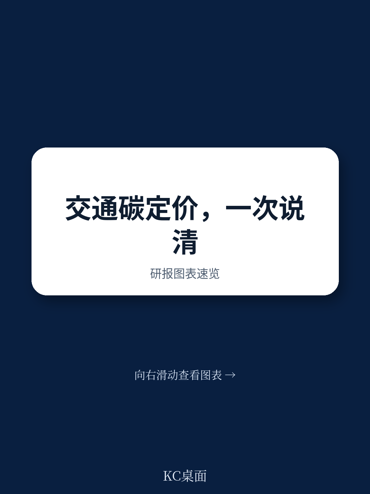
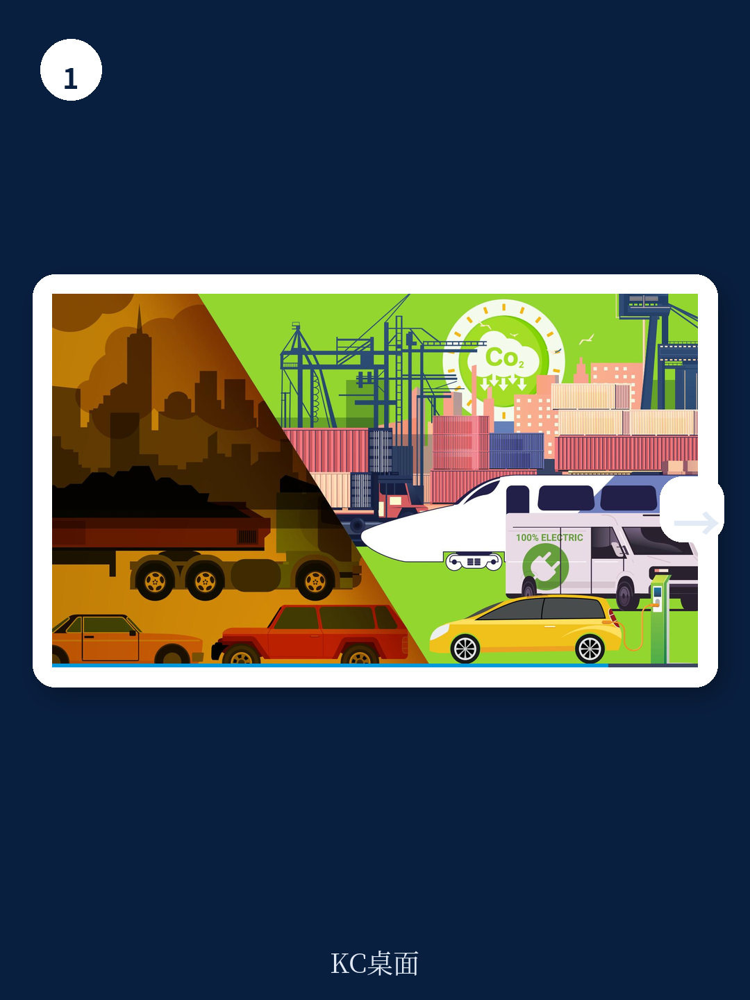
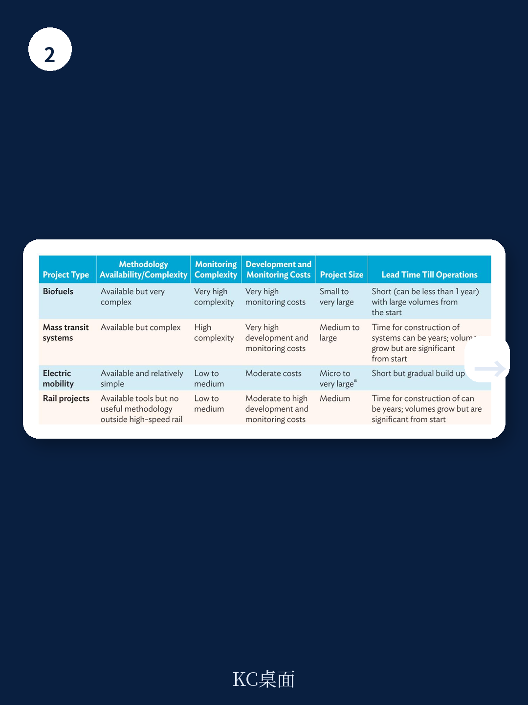

# 亚洲开发银行：碳定价在交通领域真正机会，不是征税，而是循环投资

交通领域是全球温室气体排放增长最快的板块之一。在亚洲开发银行覆盖的中亚区域经济合作（CAREC）11个成员国中，交通排放占各国总排放的比例从蒙古的5%到格鲁吉亚的23%不等，但一个更值得关注的信号是：所有CAREC国家的交通排放增速都明显快于整体排放增速。

亚洲开发银行这份2026年发布的报告，核心判断并非“碳税最重要”，而是揭示了一个反直觉的杠杆效应——碳税收入如果用于投资减排项目，间接减排效果是直接效果的50到100倍。这意味着，一个极低的碳税（每升燃料征收0.01美元），如果设计为“气候分币基金”并回流到交通减排项目，就能实现各国自主贡献目标中交通领域减排量的75%。

这不仅仅是政策设计问题。对于关注全球碳市场、交通电动化、以及新兴市场基础设施投资的读者而言，这份报告提供了一个可操作的观察框架：碳定价的真正价值，不在于惩罚排放，而在于创造可循环的财政工具，撬动那些原本缺乏商业可行性的低碳交通项目。

> **KC评论：** 报告的核心洞察是“碳税收入再投资”的乘数效应。如果你关心的是碳信用项目的开发时机、各国家庭的减排潜力排序，或者哪些交通项目类型还能在碳市场注册，完整报告里的图表和分国家测算才是真正的干货。继续看原文，真正有价值的是图表、假设和验证路径；完整报告与KC评论在每日汇编。

---

## 1. 碳税的直接效果被高估，但间接效果被严重低估

报告明确指出一个经济学常识：短期内，燃料需求的价格弹性极低。这意味着，即便大幅提高燃油税，消费者也不会立刻减少开车或改用公共交通。2024年，CAREC国家汽油的隐含碳税（即通过增值税、消费税等嵌入燃油价格的税收）从每吨二氧化碳4美元到145美元不等，柴油从4到100美元不等。但即便如此，这些税收对短期减排的贡献有限。

真正有想象力的部分在于碳税收入的再投资。报告构建了一个“气候分币基金”模型：每升汽油和柴油征收0.01美元，这笔钱汇集到一个基金，专门用于购买国内交通领域的碳减排量。以当前高质量交通碳项目每吨二氧化碳10到20美元的价格计算，这笔基金投资的间接减排效果，是碳税直接抑制燃料消费效果的50到100倍。

这意味着，政策制定者不需要为了减排而大幅提高燃料价格引发社会反弹，而是可以通过一个极低税率、高回流率的机制，实现可观的减排规模。对于CAREC国家中那些燃料价格远低于成本的产油国（阿塞拜疆、哈萨克斯坦、土库曼斯坦），这种机制尤其有吸引力——它既不会过度冲击消费，又能创造新的财政空间。

---

## 2. 排放交易体系在交通领域的落地路径：从加州到特斯拉的启示

报告梳理了排放交易体系与交通领域结合的三种方式：将大型交通公司纳入管控实体、将交通燃料纳入排放交易体系、以及建立车辆二氧化碳排放的配额交易系统。

加州的总量控制与交易体系选择了第二种路径——将燃料分销商纳入管控。这些分销商可以通过投资低碳燃料（如将生物燃料混入化石燃料）来减少所需购买的配额。而第三种路径，即车辆二氧化碳排放标准与可交易配额相结合，在全球范围内已有成熟实践：欧盟、中国、美国加州等都建立了类似机制。

报告特别提到了特斯拉的案例。由于特斯拉只生产零排放车辆，它可以通过出售监管积分获得收入。2016年，特斯拉每卖一辆电动车获得的监管积分收入接近4000美元；到2024年，这一数字降至约1500美元。这个变化本身就是一个信号：随着电动车渗透率提升，积分的稀缺性在下降。

对于CAREC国家而言，由于大多数国家没有或只有有限的汽车工业，报告建议将车辆二氧化碳排放标准与可交易配额挂钩于车辆进口商和经销商——瑞士正是采用这一模式。这为那些没有本土汽车品牌但进口车市场庞大的国家，提供了一个可复制的政策工具。

> **KC评论：** 特斯拉的监管积分收入变化，实际上是一个“窗口期”指标。当电动车渗透率超过某个阈值，碳市场方法学中的“额外性”就会消失。报告在后面章节明确警告：电动出行碳市场项目的注册窗口正在快速关闭。完整报告里分国家、分车型类别的渗透率数据和“额外性”判定标准，是判断项目时机最直接的工具。

---

## 3. 碳市场：电动出行的窗口正在关闭，公共交通和铁路项目仍有方法论空白

报告对碳市场在交通领域的应用做了详尽的方法学评估。目前，已注册的清洁发展机制交通项目、核证碳标准项目、黄金标准项目中，电动出行项目是主流。但报告提出了一个关键限制：碳市场方法学对“额外性”有明确门槛——过去3年内，电动车在对应车型类别中的销量占比需低于2.5%，保有量占比需低于一定阈值。

中国大多数车型类别已经突破这一阈值。而即便在其他国家，情况也在快速变化——尼泊尔和泰国的经验表明，电动车渗透率可以快速攀升。这意味着，电动出行碳市场项目的注册窗口正在关闭。

公共交通项目（如快速公交系统、地铁）虽然方法学成熟，但面临另一个问题：它们必须基于新基础设施而非仅仅新车采购，且需要吸引大量新增乘客才能覆盖高昂的项目开发和监测成本。更棘手的是，截至2025年，纯效率改善类公共交通项目尚没有可用的碳市场方法学。

铁路项目，尤其是货运铁路，是CAREC国家的优先方向。但报告坦承：除了高铁，目前没有经过批准的、可用于碳市场的方法学来量化铁路项目的减排效果。开发新的方法学耗时长、成本高，且方法学一旦开发即成为公共品，私人项目开发者缺乏激励。

> **KC评论：** 这里有一个关键判断：碳市场方法学的空白，既是限制，也是机会。如果你能开发出被广泛接受的铁路或公共交通效率改善方法学，就相当于在碳市场里“造了一个新品类”。但报告没有展开的是，这种开发需要什么样的资源、时间和监管支持。完整报告里关于方法学开发流程和成本的分析，以及分国家“匹配优先领域与碳市场项目”的表格，是判断哪些国家、哪些项目类型最有可能率先突破的依据。

---

## 4. 报告尚未完全回答的关键问题：碳市场的“额外性”阈值正在快速移动

报告在电动出行部分明确给出了“2.5%销量占比”的额外性阈值，并警告窗口正在关闭。但一个更深层的问题并未充分展开：当电动车渗透率超过阈值后，碳市场在交通领域的新增长点在哪里？

报告提到了铁路、公共交通效率改善、以及生物燃料等领域的方法学空白，但并未给出这些空白何时可能被填补的时间表或驱动力。对于政策制定者和项目开发者而言，这意味着一个战略选择：是赶在窗口关闭前加速注册电动出行项目，还是转而投入资源开发新方法学以开辟新赛道？

另一个未解问题是：碳市场的价格信号是否足够强，以激励方法学开发？报告提到哈萨克斯坦排放交易体系的碳价约为每吨二氧化碳1美元，这一价格显然不足以支撑高成本的交通碳项目开发。当碳价处于低位时，即便方法学存在，项目经济性也可能不成立。

这些问题的答案，可能取决于全球碳市场的制度演进、巴黎协定第六条的实施细则，以及各国自主贡献目标的更新节奏。对于关注这一领域的读者而言，持续追踪这些边际变化，比一次性读完一份报告更有价值。

---

## 5. 观察框架：用三个维度评估CAREC国家的交通碳定价机会

基于报告的框架，可以提炼出一个三棱镜式的观察工具，用于评估任何一个CAREC国家（或类似新兴市场）的交通碳定价机会

**第一个维度：碳税/燃油税现状。** 看该国是否有明确的碳税，或者燃油税水平如何。产油国（阿塞拜疆、哈萨克斯坦、土库曼斯坦）的燃油价格显著低于成本，这意味着它们有更大的财政空间引入“气候分币基金”式的小幅加税，而社会反弹较小。

**第二个维度：排放交易体系成熟度。** 中国已经建立了多层次的排放交易体系，部分地方试点已纳入交通领域。哈萨克斯坦有排放交易体系但碳价过低。其他国家大多处于“考虑建立”阶段。排放交易体系的成熟度决定了碳信用能否在国内市场变现。

**第三个维度：交通项目类型与碳市场方法学的匹配度。** 报告最后的分国家表格（第79页）直接给出了各国优先领域与碳市场项目的匹配情况。这是最实用的工具：如果一个国家优先发展电动公交车，而该国电动车渗透率仍低于2.5%阈值，那么碳市场项目仍有窗口；如果优先发展铁路货运，则需要先解决方法学空白问题。

---

## 写在最后：碳定价不是目的，而是撬动转型的财政工具

亚洲开发银行这份报告的价值，不在于给出一个放之四海而皆准的碳定价方案，而在于提供了一个清晰的逻辑链条：交通排放增长最快、燃油需求短期缺乏弹性、碳税直接效果有限、但碳税收入再投资的间接效果是直接的50到100倍、因此低税率+高回流率的“气候分币基金”可能是最优解。

这个逻辑链条的每一步，都基于报告中的数据和模型测算。但真正需要持续追踪的，是这些假设在各国落地时的实际效果——碳价是否足够高以激励项目开发？方法学空白能否被填补？电动车渗透率的“窗口”究竟还有多久？

这些问题的答案，不会出现在任何一份静态报告中。它们需要持续跟踪全球碳市场的制度演进、各国政策更新、以及项目层面的实际进展。每日汇编会把单篇报告放回当天主线，整理成中文摘要、KC评论和图表合集，便于喂给AI，也便于人工快速扫描市场dynamics。汇聚了头部券商、PE/VC、投行、并购、hedge fund、资管机构、战略咨询、智库等朋友，期待交流。

Personal reading notes and learning share only. Not investment advice.
